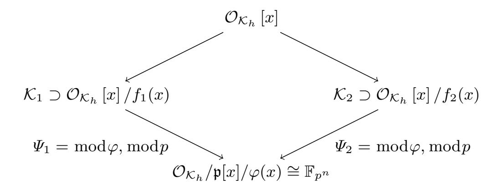
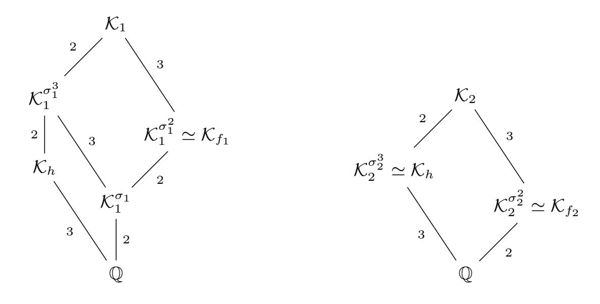
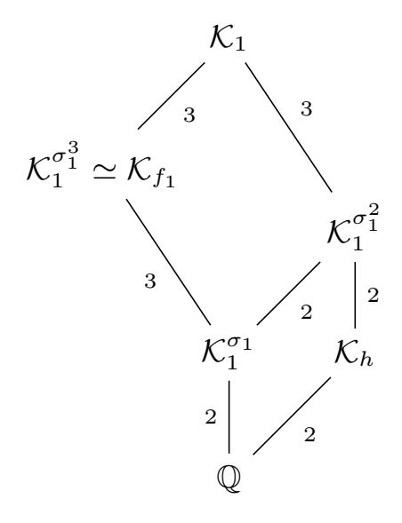
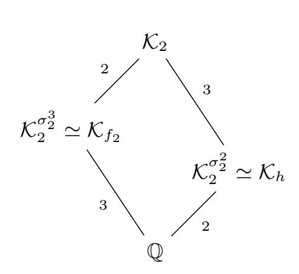
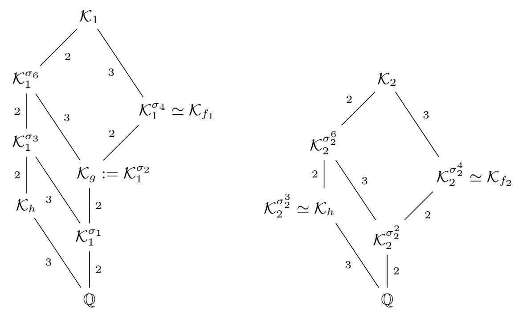
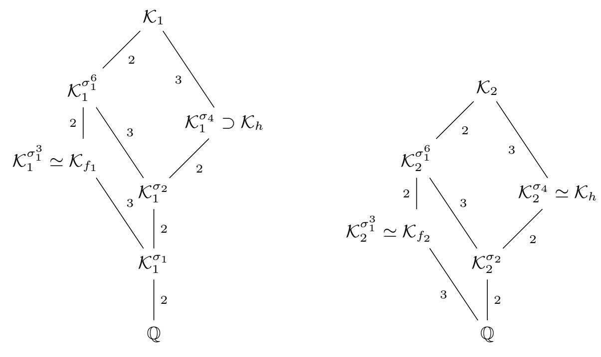

{0}------------------------------------------------

## High-Order Galois Automorphisms for TNFS Linear Algebra

Haetham Al Aswad<sup>1</sup>, Cécile Pierrot<sup>2</sup>, Emmanuel Thomé<sup>2</sup>

**Abstract.** The Number Field Sieve algorithm and its variants are the best known algorithms to solve the discrete logarithm problem in finite fields. When the extension degree is composite, the Tower variant TNFS is the most efficient. Looking at finite fields with composite extension degrees such as 6 and 12 is motivated by pairing-based cryptography that does not yet have a good quantum-resistant equivalent.

The two most costly steps in TNFS are the relation collection and linear algebra steps. Although the use of order k Galois automorphisms allows one to accelerate the relation collection step by a factor of k, their use to accelerate the linear algebra step remains an open problem. In previous work, this problem is solved for k = 2, leveraging a quadratic acceleration factor equal to 4.

In this article, we bring a solution both for k=6 and k=12. We propose a new construction that allows the use of an order 6 (resp. 12) Galois automorphism in any finite field  $\mathbb{F}_{p^6}$  (resp.  $\mathbb{F}_{p^{12}}$ ), thus accelerating the linear algebra step with approximately a factor of 36 (resp. 144). Moreover, we provide a SageMath implementation of TNFS and our construction, and validate our findings on small examples.

**Key words:** Cryptanalysis. Public Key Cryptography. Discrete Logarithm. Tower Number Field Sieve. Automorphisms. Schirokauer maps.

## 1 Introduction

Context. The discrete logarithm problem in a cyclic group  $\mathbb{G}$  with a generator  $g \in \mathbb{G}$  is the computational problem of finding an integer x modulo  $|\mathbb{G}|$  for a given target  $T \in \mathbb{G}$ , such that  $T = g^x$ . Despite the growing interest in post-quantum cryptography, the discrete logarithm problem is still at the basis of many currently-deployed public key protocols. This article deals with the discrete logarithm problem in the group of invertible elements of a finite field,  $\mathbb{G} = \mathbb{F}_{p^n}^*$ .

The Number Field Sieve. Excluding small characteristic finite fields for which computation is made easier by quasi-polynomial time algorithms [5, 16, 27], the most efficient algorithm to compute discrete logarithms in finite fields is (a variant of) the Number Field Sieve (NFS) algorithm [15, 24, 31]. All the variants of NFS have a subexponential complexity equal to  $\exp((c + o(1)))$ .

<sup>&</sup>lt;sup>1</sup> CNRS, Université de Montpellier, LIRMM, Montpellier, France <sup>2</sup> Université de Lorraine, CNRS, Inria, LORIA, Nancy, France

{1}------------------------------------------------

 $(\log Q)^{1/3}(\log\log Q)^{2/3})$  where o(1) tends to 0 as the finite field size Q tends to infinity and c>0 is a constant that depends on the features of the target field and thus on the variant used: Special, Tower, Multiple and eventually a combination of Special and Tower together.

The Tower variant, TNFS<sup>1</sup> [25,26,35] applies when the extension degree n is composite and its asymptotic complexity is lower than NFS. De Micheli, Gaudry and Pierrot [12] reported in 2021 the first implementation of TNFS and performed a record computation on a 521-bit finite field with extension degree n=6. One year later Robinson [33] reported a record computation using TNFS on a 512-bit finite field of extension degree n=4. These records confirm that TNFS is currently the best practical algorithm that computes discrete logarithms in composite extension degree finite fields. Table 1 compares the performance of NFS and TNFS. Note that the two TNFS-records are approximately 100 bits larger than those performed with NFS, and yet their costs are lower.

<span id="page-1-1"></span>

| Year | Finite field       | Bitsize of $p^n$ | Cost in core-years | Algorithm | Work |
|------|--------------------|------------------|--------------------|-----------|------|
| 2017 | $\mathbb{F}_{p^6}$ | 422              | 26.1               | NFS       | [17] |
| 2020 | $\mathbb{F}_{p^6}$ | 423              | 9.3                | NFS       | [28] |
| 2021 | $\mathbb{F}_{p^6}$ | 521              | 2.8                | TNFS      | [12] |
| 2022 | $\mathbb{F}_{p^4}$ | 512              | 6.3                | TNFS      | [33] |

Table 1: Cost in core-years of the last discrete logarithm records on finite fields with composite extension degrees.

NFS and all its variants are built around four main steps, polynomial selection, relation collection, linear algebra, and individual logarithm. Asymptotically speaking, the relation collection and the linear algebra steps are equally hard and are the two most costly steps in all NFS variants. Experimental data from discrete logarithm records shows that they are the two most costly steps in practice as well. Table 2 shows the cost of the relation collection step, the linear algebra step and the whole computation of recent records. Although relation collection has a higher cost than linear algebra in all these records except one, it is worth emphasizing that the former parallelizes much better than the latter. Additionally, adjusting some parameters can balance the costs of these steps to a certain extent, and this strategy was followed to make the linear algebra step feasible in the 795-bit record [10].

Composite extension degrees in cryptographic applications. Pairing-based cryptography, introduced in the early 2000s [8,9,23], now underpins a range of applications — for example, the Boneh–Lynn–Shacham (BLS) signature scheme [9]. Its security reduces to the hardness of the discrete logarithm problem in finite

<span id="page-1-0"></span><sup>&</sup>lt;sup>1</sup> Sometimes referred to as the extended Tower Number Field Sieve (exTNFS).

{2}------------------------------------------------

<span id="page-2-0"></span>

|          |                       | Cost in core days |          |           |      |  |
|----------|-----------------------|-------------------|----------|-----------|------|--|
| Bitsize  | Finite                | Relation          | Linear   | Total     | Work |  |
| of $p^n$ | Field                 | collection        | algebra  | Total     |      |  |
| 203      | $\mathbb{F}_{p^{12}}$ | 10.5              | 0.28     | 11        | [21] |  |
| 324      | $\mathbb{F}_{p^5}$    | 359               | 11.5     | 386       | [17] |  |
| 512      | $\mathbb{F}_{p^4}$    | 2195              | 50       | 2294      | [33] |  |
| 521      | $\mathbb{F}_{p^6}$    | 388               | 23       | 413       | [12] |  |
| 593      | $\mathbb{F}_{p^3}$    | 3,287             | 5,113    | 8,400     | [14] |  |
| 595      | $\mathbb{F}_{p^2}$    | 157               | 18       | 175       | [4]  |  |
| 795      | $\mathbb{F}_p$        | 876,000           | 228, 125 | 1,168,000 | [10] |  |

Table 2: Costs of relation collection, linear algebra and of the whole computation in the last discrete logarithm records with various extension degrees.

fields of extension degree n > 1 (the embedding-degree) [29]. For efficiency, only a few pairing-friendly curves are used, constraining the underlying fields; in practice, composite extension degrees are the most deployed, such as  $\mathbb{F}_{p^6}$  (MNT6 curves [30]) and  $\mathbb{F}_{p^{12}}$  (BLS12 curves [7]). Interestingly, there are no good post-quantum candidates to replace pairing-based protocols yet.

Using Galois automorphisms to accelerate the two hardest steps in NFS. For finite fields with extension degree n>1, Galois symmetries can speed up NFS and its variants. Three subproblems arise: (i) compute some adequate (NFS-compatible) automorphisms of order k dividing n; (ii) use them to accelerate the relation collection by about a factor k; and (iii) use them to shrink the linear system in the linear algebra step by a factor k. Since the complexity of linear algebra is nearly quadratic due to the sparsity of the underlying matrix, solving (iii) would yield an acceleration factor for the linear algebra step as large as  $k^2$ . In [4,39] the authors provide polynomial selection methods to construct NFS-compatible automorphisms for orders k=2,3,4 and 6, and problem (i) remains open for other orders. The solution to (ii) is straightforward [4,24]. However, problem (iii) is only solved for k=2 [4,13,39]. It was put into practice in the last discrete logarithm record with TNFS on  $\mathbb{F}_{p^6}$  [13] which allowed to accelerate the linear algebra step by approximately a factor 4.

Our work. We solve (i) for k=12 and (iii) for k=6, and 12. Specifically, our work focuses on accelerating the linear algebra step in the TNFS algorithm when applied to finite fields with extension degrees 6 and 12. Given any finite field of extension degree 6, resp. 12, we first show using the work in [4] a method to construct NFS-compatible automorphisms of order 6, resp. 12. Second, we present a new construction that allows the use of these automorphisms to accelerate the linear algebra step in TNFS with a factor roughly  $k^2$ . Third, we provide an implementation of TNFS in SageMath together with our construction to illustrate our findings on small size finite fields.

{3}------------------------------------------------

Outline of the article. We start with a description of TNFS in Section 2. Section 3 defines the Galois automorphisms that are useful in this work. Section 4 exposes the conditions and obstacles and reviews the literature on using automorphisms to accelerate the linear algebra step. In Section 5 we present a new construction of the diagram of NFS (thanks to new Schirokauer maps) and we show in Section 6 that this new construction allows to accelerate the linear algebra step with factors of 36 and 144 in finite fields of extension degrees 6 and 12 respectively. Finally, Section 7 presents our experiments that validate our findings.

## <span id="page-3-0"></span>2 Background

## 2.1 The Tower Number Field Sieve

We target a finite field  $\mathbb{F}_{p^n}$  where n is composite. Let  $\eta$  be a non-trivial divisor of n and denote  $\kappa = n/\eta$ . Since the computation of a discrete logarithm in a group can be reduced to its computation in its prime-order subgroups via Pohlig-Hellman's reduction, we will search for discrete logarithms modulo  $\ell$ , a non trivial prime divisor of  $\Phi_n(p)$ , with  $\Phi_n$  the n-th cyclotomic polynomial. The classical TNFS setup considers the intermediate number field  $\mathcal{K}_h = \mathbb{Q}(\iota)$  where  $\iota$  is a root of h, a polynomial of degree  $\eta$  over  $\mathbb{Z}$  that remains irreducible modulo p. For a number field  $\mathcal{K}$ , we let  $\mathcal{O}_{\mathcal{K}}$  be its ring of integers. For simplicity, we assume throughout this article that  $\mathcal{O}_{\mathcal{K}_h} = \mathbb{Z}[\iota]$ . This implies that h is monic.

Above  $\mathcal{K}_h$ , define two number fields  $\mathcal{K}_1 = \mathcal{K}_h[x]/f_1(x)$  and  $\mathcal{K}_2 = \mathcal{K}_h[x]/f_2(x)$  where  $f_1, f_2$  are irreducible polynomials over  $\mathcal{O}_{\mathcal{K}_h}$  that share an irreducible factor  $\varphi$  of degree  $\kappa$  modulo the unique ideal  $\mathfrak{p}$  over p in  $\mathcal{K}_h$ . In particular,  $f_1$  and  $f_2$  have degree at least  $\kappa$ . Let  $\alpha_i$  be a root of  $f_i$  in  $\mathcal{K}_i$  for i=1,2. Due to the conditions on the polynomials h,  $f_1$  and  $f_2$ , there exist two ring homomorphisms from  $\mathcal{O}_{\mathcal{K}_h}[x]$  to the target finite field  $\mathbb{F}_{p^n}$  through the number fields  $\mathcal{K}_1$  and  $\mathcal{K}_2$ . This allows us to build a commutative diagram as in Figure 3. When  $\eta$  and  $\kappa$  are coprime (which is always possible with n=6 or n=12), then  $f_1$  and  $f_2$  can be defined over  $\mathbb{Z}$ . We make this choice for the rest of the article. To simplify the presentation we suppose  $f_i$  monic for i=1,2 (otherwise replace  $\alpha_i$  by the leading coefficient times  $\alpha_i$ ).

The general framework of TNFS is common to all its variants. The polynomial selection step sets up the commutative diagram of Figure 3 by selecting the appropriate polynomials h,  $f_1$  and  $f_2$ . Thereafter, by finding many small to medium size smooth numbers and factoring them, the relation collection step establishes linear relations involving prime ideals of small norms in the number fields  $\mathcal{K}_1$  and  $\mathcal{K}_2$ . The unknowns of these equations are the values on the small prime ideals of a linear map called a virtual logarithm map. When enough equations are found, the linear algebra step solves the system. Given a target T in the finite field, the last step, called the individual logarithm step, establishes a linear equation between the logarithm of T and the virtual logarithms of the small ideals, which reveals the logarithm of the target.

{4}------------------------------------------------

<span id="page-4-0"></span>

Diagram 3: Commutative diagram of Tower NFS.

<span id="page-4-1"></span>Polynomial selection. Several methods are known to perform TNFS polynomial selection. For example, the Conjugation, JLSV or Sarkar-Singh's methods [4,24, 34] can be used. Each polynomial selection method yields different degrees and coefficient sizes for h,  $f_1$  and  $f_2$  which influence the performance of the algorithm. Based on the recent records [12,33], the Conjugation method seems to perform best in practice, and [4] shows how to construct adequate automorphisms using this method. Therefore, we consider this method only.

Conjugation method for polynomial selection [4]. First a polynomial h is chosen, such that  $\deg h = \eta$ , the coefficients of h are small integers, and h remains irreducible modulo p. Second, a quadratic irreducible polynomial  $\mu$  over  $\mathbb{Z}$  with small coefficients is selected, which possesses a root  $\rho$  modulo p. Third, two polynomials  $g_0$  and  $g_1$  with small integer coefficients are chosen under the condition that  $\deg(g_1) < \deg(g_0) = \kappa$  and  $\varphi := g_0 + \rho g_1$  is irreducible modulo p. The polynomial  $f_1$  is defined as  $f_1 := \operatorname{Res}_Y(\mu(Y), g_0 + Yg_1)$ , and  $f_2$  is defined as  $f_2 := vg_0 + ug_1$  where  $\frac{u}{v} \equiv \rho \mod p$  is a rational reconstruction of  $\rho$ . Given that  $f_1 \equiv 0 \mod p \mod \varphi$  and  $f_2 \equiv v\varphi \mod p$ , both share  $\varphi$  as an irreducible factor modulo p. Their respective degrees are  $2\kappa$  and  $\kappa$ .

Relation collection. The goal of the relation collection step is to select, among the set of polynomials  $\phi(x,\iota) \in \mathcal{O}_{\mathcal{K}_h}[x]$  at the top of Diagram 3, the candidates that yield a relation. A relation is found if the polynomial  $\phi(x,\iota)$  maps to principal ideals in  $\mathcal{O}_{\mathcal{K}_1}$  and  $\mathcal{O}_{\mathcal{K}_2}$  that are smooth (respectively  $B_1$ - and  $B_2$ -smooth for some bounds  $B_1$  and  $B_2$ ). Most often the search space for relation collection consists of linear polynomials  $\phi(x,\iota) = a(\iota) - b(\iota)x \in \mathcal{O}_{\mathcal{K}_h}[x]$ . The ideals that occur in the factorizations in  $\mathcal{O}_{\mathcal{K}_1}$  and  $\mathcal{O}_{\mathcal{K}_2}$  constitute the factor basis  $\mathcal{F}$ . More precisely, we define it as the disjoint union  $\mathcal{F} = \mathcal{F}_1 \sqcup \mathcal{F}_2$  with, for i = 1, 2:

 $\mathcal{F}_i(B_i) = \{ \text{prime ideals of } \mathcal{O}_{\mathcal{K}_i} \text{ of norm } \leq B_i \text{ and inertia degree 1 over } \mathcal{K}_h \}.$ 

An ideal  $(a(\iota) - b(\iota)\alpha_i)$  is  $B_i$ -smooth if and only if its norm  $\mathcal{N}_i(a(\iota) - b(\iota)\alpha_i)$  is  $B_i$ -smooth for i = 1, 2, where  $\mathcal{N}_i$  defines the absolute algebraic norm in  $\mathcal{K}_i$  (i.e, over  $\mathbb{Q}$ ). Working with absolute norms, which are integer values, enables efficient sieving algorithms. The relation collection stops when we have enough relations

{5}------------------------------------------------

to construct a system of linear equations that may be full rank. The unknowns are the *virtual logarithms* of the ideals of the factor basis. A virtual logarithm map is a linear map with values in  $\mathbb{Z}/\ell\mathbb{Z}$ , which we define in §2.2.

Linear algebra. A nice feature of the linear system created is that the number of non-zero coefficients per row is very small. This allows us to use sparse linear algebra algorithms in  $\mathbb{Z}/\ell\mathbb{Z}$  such as the Wiedemann algorithm [38] or Coppersmith's block Wiedemann algorithm [11], which allows partial parallelization. The output of this step is a kernel vector corresponding to virtual logarithms of the ideals in the factor basis.

Individual discrete logarithm. The final step consists in finding the discrete logarithm of one or several target elements. This step is subdivided into two substeps: a smoothing step and a descent step. The smoothing step is an iterative process where the target element is randomized until the randomized value lifted back to one of the number fields  $\mathcal{K}_i$  is  $B_i'$ -smooth for a smoothness bound  $B_i' > B_i$ , for i = 1 or 2. The second step consists in decomposing every factor of the lifted value, in our case prime ideals with norms less than a smoothness bound  $B_i'$ , into elements of the factor basis for which we now know the virtual logarithms. This eventually makes it possible to reconstruct the discrete logarithm of the target element. TNFS differs from NFS in this step as there exist improvements for the smoothing step when the target finite field has proper subfields [2, 19].

#### <span id="page-5-0"></span>2.2 Schirokauer and virtual logarithm maps

This section follows the presentation in [37]. We drop the subscript and consider  $\mathcal{K}$  one of the two number fields. Let  $\mathcal{O}^{\times}$  be the unit group of  $\mathcal{K}$ , and  $\mu_{\mathcal{K}} \subset \mathcal{O}^{\times}$  the group of roots of unity. The Dirichlet unit theorem states that

<span id="page-5-2"></span>
$$\mathcal{O}^{\times} \simeq \mu_{\mathcal{K}} \times \mathbb{Z}^r$$

where r is the unit rank of K. A  $\mathbb{Z}$ -basis of the non-torsion part (i.e,  $\mathbb{Z}^r$ ) is called a system of fundamental units.

Let  $\mathcal{F}$  be the factor basis in  $\mathcal{K}$ , and  $\Gamma$  be the group of  $\mathcal{F}$ -units<sup>2</sup> in  $\mathcal{K}$ , that is

$$\Gamma := \{ \phi \in \mathcal{K}^* \mid (\phi) \text{ factors in } \mathcal{F} \}.$$

Looking at  $\Gamma$  modulo  $\ell$ -th powers, we have the following statement.

**Proposition 1** (Structure of  $\Gamma/\Gamma^{\ell}$ ). Let K,  $\mathcal{O}$ ,  $\mathcal{F}$ ,  $\Gamma$  be as above. Let  $\mathcal{I}$  be the group of fractional ideals that completely factor in  $\mathcal{F}$ . Let h be the class number of K. For any integer  $\ell$  that is coprime to h and  $|\mu_K|$ , we have the isomorphism

$$\Gamma/\Gamma^{\ell} \simeq \mathcal{O}^{\times}/(\mathcal{O}^{\times})^{\ell} \times \mathcal{I}/\mathcal{I}^{\ell},$$

with basis  $\{u_1, \ldots, u_r\} \cup \mathcal{F}/\mathcal{F}^{\ell}$ , where,  $\{u_1, \ldots, u_r\}$  is a system of fundamental units of  $\mathcal{K}$  considered modulo  $(\mathcal{O}^{\times})^{\ell}$ . In particular,  $\dim(\Gamma/\Gamma^{\ell}) = r + |\mathcal{F}|$ .

<span id="page-5-1"></span>All references to S-units assume that the set of places that is considered is implicitly extended to contain infinite places as well.

{6}------------------------------------------------

*Proof.* See Appendix A.1.

For every number field  $\mathcal{K}$ , we always assume that  $\operatorname{disc}(\mathcal{K})$ , h, and  $\mu_{\mathcal{K}}$  are all coprime to  $\ell$ . This occurs with very large probability as  $\ell$  is large.

**Schirokauer maps.** By Proposition 1, fundamental units (with ideal factorization) would give explicit coordinates for  $\Gamma/\Gamma^{\ell}$ , but computing them is hard. Schirokauer maps [36] circumvent this, under an additional hypothesis.

<span id="page-6-2"></span>**Definition 2** (Usual definition of a Schirokauer map). Consider  $\Gamma$  from Proposition 1 and denote r the unit rank of K. A Schirokauer map on  $\Gamma/\Gamma^{\ell}$  is an  $\mathbb{F}_{\ell}$ -linear map  $\Gamma/\Gamma^{\ell} \longrightarrow (\mathbb{Z}/\ell\mathbb{Z})^{r}$ .

Construction of a Schirokauer map. Schirokauer [36] gives a construction of a non-trivial such map. Write  $\mathcal{K} = \mathbb{Q}[X]/(F)$  with  $F \in \mathbb{Q}[X]$  irreducible and monic, and  $\mathrm{disc}(F)$  coprime to  $\ell$ . Consider the decomposition of F modulo  $\ell$  into irreducible distinct factors:  $F = \prod_j F_j \mod \ell$ . By the Chinese remainder theorem we have the ring isomorphisms:

$$\mathcal{O}/\ell\mathcal{O} \simeq \mathbb{F}_{\ell}[X]/(F) \simeq \prod_{j} \mathbb{F}_{\ell}[X]/(F_{j}).$$

Define  $Q := \operatorname{lcm} \left( \ell^{\operatorname{deg}(F_j)} - 1 \right)$  and consider  $x \in \Gamma \cap \mathcal{O}$ . By the above isomorphisms we have  $x^Q \equiv 1 \mod \ell \mathcal{O}$ . Further, lifting the congruence modulo  $\ell^2 \mathcal{O}$  we get  $x^Q \equiv 1 + \ell \cdot P(x) \mod \ell^2 \mathcal{O}$  for some  $P \in \mathbb{Z}[X]$  with degree bounded by  $\operatorname{deg}(F) - 1$ . We define the maps

<span id="page-6-1"></span>
$$\mathbf{A}: \left\{ \begin{array}{c} \Gamma/\Gamma^{\ell} \longrightarrow \mathcal{O} \\ x \longmapsto \frac{x^{Q}-1}{\ell}, \end{array} \right. \quad \overline{\mathbf{A}}: \left\{ \begin{array}{c} \Gamma/\Gamma^{\ell} \longrightarrow \mathbb{F}_{\ell}[X]/(F) \simeq \mathbb{F}_{\ell}^{d} \\ x \longmapsto \mathbf{A}(x) \bmod \ell \mathcal{O}. \end{array} \right.$$
(1)

As far as we know, for large  $\ell$ , all practically computable Schirokauer map constructions (including ours presented in later sections) are based on the map  $\mathbf{A}$ .

The Schirokauer map used in the literature  $\Lambda: \Gamma/\Gamma^{\ell} \to (\mathbb{Z}/\ell\mathbb{Z})^r$  is defined over an element x as the first r (or any r independent integer linear combinations of the) coefficients of  $\overline{\mathbf{A}}(x)$ . This provides a linear map that is computable in polynomial time. While the map  $\Lambda$  is non-trivial, there is no efficient way to test whether it is non-trivial enough, in the sense of the assumption:

**Assumption 3.** A has maximal rank on  $\mathcal{O}^{\times}/(\mathcal{O}^{\times})^{\ell}$ .

Under Assumption 3, every  $\phi \in \Gamma/\Gamma^{\ell}$  can be uniquely represented as

<span id="page-6-0"></span>
$$\phi \leftrightarrow \left( \left( \Lambda(\phi)_i \right)_{i=1}^r, \left( \operatorname{val}_{\mathfrak{p}}(\phi) \right)_{\mathfrak{p} \in \mathcal{F}} \right).$$
 (2)

In other words,  $\mathcal{B}^{\dagger} = (\Lambda(\cdot)_i) \sqcup (\operatorname{val}_{\mathfrak{p}}(\cdot))_{\mathfrak{p} \in \mathcal{F}}$  is a basis of the dual  $(\Gamma/\Gamma^{\ell})^{\dagger}$ .

{7}------------------------------------------------

Virtual logarithm maps. Consider  $\mathcal{K}_1$  and  $\mathcal{K}_2$  from Figure 3 with  $\Gamma_i$  and a Schirokauer map  $\Lambda_i$  on each side, such that Assumption 3 holds.

**Definition 4 (Virtual logarithm).** A virtual logarithm map is a pair of  $\mathbb{F}_{\ell}$ -linear forms  $\operatorname{vlog}_i : \Gamma_i/\Gamma_i^{\ell} \longrightarrow \mathbb{Z}/\ell\mathbb{Z}$  for i = 1, 2, such that for all  $\phi \in \mathcal{O}_{\mathcal{K}_h}[x]$  that projects to  $\phi_1 \in \Gamma_1$  and  $\phi_2 \in \Gamma_2$  we have

<span id="page-7-1"></span><span id="page-7-0"></span>
$$v\log_1 \phi_1 = v\log_2 \phi_2. \tag{3}$$

The goal of relation collection and linear algebra is to compute a virtual logarithm map, which is essentially narrowed down by the collection of numerous constraints of the form given by Equation (3) (relation collection). We now see why these constraints lead to a linear system that we attempt to solve in order to reveal our virtual logarithm map.

Assumption 3 provides us with a basis  $\mathcal{B}_i^{\dagger}$  of  $(\Gamma_i/\Gamma_i^{\ell})^{\dagger}$ , for i=1,2. Determining a virtual logarithm map amounts to decomposing  $(\text{vlog}_1, \text{vlog}_2)$  along  $(\mathcal{B}_1^{\dagger}, \mathcal{B}_2^{\dagger})$ . Put differently, let us do the thought exercise of considering the bidual bases  $\mathcal{B}_i^{\dagger} = ((\lambda_{i,j})_{j=1}^{r_i}), (\mathfrak{p}^*)_{\mathfrak{p} \in \mathcal{F}_i})$  for i=1,2. Elements of these bases are elements of  $\Gamma_i/\Gamma_i^{\ell}$ . The  $\lambda_{i,j}$  form a system of generators of  $\mathcal{O}^{\times}/(\mathcal{O}^{\times})^{\ell}$ . The  $\mathfrak{p}^*$  are associated to ideals  $\mathfrak{p}$  but they are of different nature. The "virtual logarithms" are the unknowns  $\text{vlog}_i(\lambda_{i,j})$  and  $\text{vlog}_i(\mathfrak{p}^*)$  in the equation below.

$$\sum_{i=1}^{r_1} \Lambda_1(\phi_1)_i \cdot \operatorname{vlog}_1 \lambda_{1,i} + \sum_{\mathfrak{p} \in \mathcal{F}_1} \operatorname{val}_{\mathfrak{p}}(\phi_1) \cdot \operatorname{vlog}_1 \mathfrak{p}^*$$

$$= \sum_{i=1}^{r_2} \Lambda_2(\phi_2)_i \cdot \operatorname{vlog}_2 \lambda_{2,i} + \sum_{\mathfrak{p} \in \mathcal{F}_2} \operatorname{val}_{\mathfrak{p}}(\phi_2) \cdot \operatorname{vlog}_2 \mathfrak{p}^*.$$
(4)

For notational ease we will henceforth shorten the  $\mathfrak{p}^*$  notation to simply  $\mathfrak{p}$ , and let vlog  $\mathfrak{p}$  actually mean vlog  $\mathfrak{p}^*$ . The important caveat is that this depends on  $\Lambda$ . Furthermore, we will use the shorthand vlog  $\Lambda$  (resp. vlog  $\mathcal{F}$ ) to denote the r-(resp.  $|\mathcal{F}|$ -) dimensional vector (vlog  $\lambda_1, \ldots, \text{vlog } \lambda_r$ ) (resp. (vlog  $\mathfrak{p})_{\mathfrak{p} \in \mathcal{F}}$ ). Finally, for  $\phi \in \Gamma$ , we implicitly project modulo  $\Gamma^{\ell}$  and write vlog  $\phi$  and  $\Lambda(\phi)$ . Following these notations, vlog  $\phi$  is also  $\Lambda(\phi) \cdot \text{vlog } \Lambda + (\text{val}_{\mathfrak{p}} \phi)_{\mathfrak{p} \in \mathcal{F}} \cdot \text{vlog } \mathcal{F}$ .

Remark 5. A virtual logarithm map is not something we choose. It is merely the map that defines the unknowns in the linear system that we solve. In particular, since the connection from  $\mathfrak{p}$  to  $\mathfrak{p}^*$  that we discussed above depends on the Schirokauer map  $\Lambda$ , we like to say that the virtual logarithm map depends on  $\Lambda$ . In this article, we will constrain the solution of our linear system, and thus the virtual logarithm map, to have some special properties that enable the acceleration of the linear algebra step. In turn, these properties can only be met if the Schirokauer maps  $(\Lambda_1, \Lambda_2)$  fulfill certain conditions.

Remark 6. In practice, it is fairly common (albeit a bit wasteful) to use more than r coordinates for a Schirokauer map. This leads to a system that is under-determined, but it is not a problem since all resulting maps work just as well.

{8}------------------------------------------------

## <span id="page-8-0"></span>3 TNFS automorphisms

The following extends the definition of [13].

**Definition 7 (TNFS automorphism).** Consider  $\mathbb{F}_{p^n}$ ,  $\mathcal{K}_1$ ,  $\mathcal{K}_2$  as in Figure 3. A TNFS automorphism is a couple of  $\mathbb{Q}$ -automorphisms  $(\sigma_1, \sigma_2) \in \operatorname{Aut}_{\mathbb{Q}}(\mathcal{K}_1) \times \operatorname{Aut}_{\mathbb{Q}}(\mathcal{K}_2)$  fulfilling two conditions:

- Both are Frobenius automorphisms. Each fixes a degree n prime ideal  $\mathfrak{p}_i$  over p in  $\mathcal{O}_{\mathcal{K}_i}$ .
- Both project to the same Frobenius. There exists  $\overline{\sigma} \in \text{Gal}(\mathbb{F}_{p^n}/\mathbb{F}_p)$  such that for all  $(\phi_1, \phi_2) \in \mathcal{O}_h[x]/(f_1) \times \mathcal{O}_h[x]/(f_2)$ :

<span id="page-8-2"></span>
$$\Psi_1\left(\sigma_1(\phi_1)\right) = \overline{\sigma}\left(\Psi_1(\phi_1)\right) \quad and \quad \Psi_2\left(\sigma_2(\phi_2)\right) = \overline{\sigma}\left(\Psi_2(\phi_2)\right),$$

where  $(\Psi_1, \Psi_2)$  are the projection morphisms from Figure 3.

We emphasize that the most restrictive condition is the first one. The second one follows by raising  $\sigma_1$  and  $\sigma_2$  to appropriate powers. Often, we restrict the point of view to one of the fields, in which case we refer to "a TNFS automorphism on  $\mathcal{K}$ " as one of  $\sigma_1$  and  $\sigma_2$  in the above setup.

Remark 8. Throughout the paper, the symbol  $\sigma$  is used both for automorphisms of number fields and for elements of  $\operatorname{Gal}(\mathbb{F}_{p^n}/\mathbb{F}_p)$ . In all instances where  $\sigma$  acts on elements of  $\mathbb{F}_{p^n}$  or on their projections, it should be understood as the corresponding Frobenius automorphism.

Construction of Galois automorphisms with the Conjugation method. To construct order n automorphisms in both  $\mathcal{K}_1$  and  $\mathcal{K}_2$ , it is sufficient to choose the three polynomials h,  $f_1$ , and  $f_2$  such that  $\mathcal{K}_h$  has a degree  $\eta$  automorphism that we term as  $\sigma_h$  and each of  $\mathcal{K}_{f_i} := \mathbb{Q}[x]/(f_i)$  has a degree  $\kappa$  automorphism denoted as  $\sigma_{f_i}$  for i = 1, 2. Indeed, since  $\eta$  and  $\kappa$  are coprime, for i = 1, 2, the automorphism  $\sigma_i$  of  $\mathcal{K}_i$  defined by the joint action of  $\sigma_h$  and  $\sigma_{f_i}$  has order  $\eta \times \kappa = n$ . In [4], the authors provide choices of  $g_0$  and  $g_1$  for the Conjugation method presented in §2.1 that provide automorphisms of  $\mathcal{K}_{f_1}$  and  $\mathcal{K}_{f_2}$  of orders equal to 2, 3, 4 and 6. Table 4 presents these choices.

To minimize norms in the number fields, h is usually chosen with  $||h||_{\infty} \leq 1$  which, in addition to the constraint of having an explicit automorphism of order  $\eta$ , restricts the choice drastically. As observed in [20], there is a positive proportion of the primes p that are inert in none of the corresponding number fields: for such primes, we have to loosen the constraint on  $||h||_{\infty}$ . We did not encounter this unfortunate situation in our experiments (See §7 as well as Appendix B).

## <span id="page-8-1"></span>4 Speed-up with TNFS automorphisms

Notations. Throughout this section, let K be one of the middle fields on Figure 3. We keep notations and assumptions of §2.2 and §3. Let  $\sigma$  be a TNFS

{9}------------------------------------------------

<span id="page-9-0"></span>

| order of                                                        | Automorphism |                                  | $g_1$                        | Automorphism             |
|-----------------------------------------------------------------|--------------|----------------------------------|------------------------------|--------------------------|
| $\left \left(\mathcal{K}_{f_1},\mathcal{K}_{f_2}\right)\right $ | order        | $g_0$                            | $(a \in \mathbb{Z}^*)$       | $\alpha \mapsto$         |
|                                                                 |              | $x^2 + 1$                        | ax                           | $1/\alpha$               |
| (4,2)                                                           | 2            | $x^{2}-1$                        | ax                           | $-1/\alpha$              |
|                                                                 |              | $x^2$                            | a                            | $-\alpha$                |
| (6,3)                                                           | 3            | $x^3 - 3x - 1$                   | $-a(x^2+x)$                  | $-(\alpha+1)/\alpha$     |
| (8,4)                                                           | 4            | $x^4 - 6x^2 + 1$                 | $a(x^3-x)$                   | $(1+\alpha)/(1-\alpha)$  |
| (12,6)                                                          | 6            | $x^6 + 6x^5 - 20x^3 - 15x^2 + 1$ | $a(2x^5 + 5x^4 - 5x^2 - 2x)$ | $(1+2\alpha)/(1-\alpha)$ |

Table 4: Table from [4]. Automorphisms come from the Conjugation method (§2.1). The rational expression of the automorphism and its order are the same for both number fields. The automorphism is also an automorphism of  $g_0 + g_1$ .

automorphism of order k on  $\mathcal{K}$  (in particular,  $k \mid n$ ). Let  $\zeta$  be a power of p such that  $\overline{\sigma}(x) = x^{\zeta}$ . We observe that  $\zeta$  is a k-th primitive root of unity modulo  $\ell$ . The notations  $\mathcal{K}^{\sigma^s}$  and  $\mathbb{F}_{p^n}^{\overline{\sigma}^s}$  refer to the subfield fixed point-wise by  $\sigma^s$  and  $\overline{\sigma}^s$  respectively, with s an integer.

A TNFS automorphism of order k helps accelerate the relation collection step by approximately a factor of k. This is due to the fact that the factor basis is stable under the automorphisms action since the conjugate of a prime ideal is a prime ideal of equal norm. Consequently, conjugating an equation on both sides provides "for free" a new equation, and iterating with powers of the automorphisms yields the claimed speed-up. Even when we take into account the complications explained in [12, §3.4], the qualitative observation that automorphisms yield a speed-up that is commensurate with k still holds.

As for the linear algebra step, one hopes that the virtual logarithms of k conjugate ideals can be recovered from the virtual logarithm of one of these ideals. Since for all  $x \in \mathbb{F}_{p^n}^{\times}$ , we have the connection  $\log \left(x^{\overline{\sigma}}\right) \equiv \zeta \log(x) \mod \ell$ , we would like the following similar condition to hold.

<span id="page-9-1"></span>Condition 9. For each  $\mathfrak{p} \in \mathcal{F}$ ,  $\operatorname{vlog}(\mathfrak{p}^{\sigma}) \equiv \zeta \operatorname{vlog} \mathfrak{p} \mod \ell$ .

If Condition 9 holds, we can reduce the matrix size by a factor of k and hence accelerate the linear algebra step by approximately a factor of  $k^2$  since sparse linear algebra's complexity is nearly quadratic. Unfortunately, this is not true in general. The reason of failure lies in complications related to Schirokauer maps and the units, as we examine now.

#### <span id="page-9-2"></span>4.1 Obstacles to speeding up the linear algebra step

A virtual logarithm vanishes on the elements fixed by a TNFS automorphism.

**Lemma 10.** Let  $\phi \in \Gamma$  be such that  $\sigma(\phi) = \phi$ , then  $vlog \phi = 0$ .

{10}------------------------------------------------

*Proof.* There exists  $\tilde{g}$  a generator of  $\mathbb{F}_{p^n}^{\times}$  such that  $\operatorname{vlog} \phi = \log_{\tilde{g}}(\overline{\phi}) \mod \ell$ , where  $\overline{\phi}$  is the projection of  $\phi$  to  $\mathbb{F}_{p^n}$ . From Definition 7 we have  $\overline{\sigma}(\overline{\phi}) = \overline{\sigma(\phi)} = \overline{\phi}$ , hence,  $\overline{\phi} \in \mathbb{F}_{p^n}^{\overline{\sigma}}$ . [18, Lemma 2] states that the logarithm of a proper subfield element vanishes modulo  $\ell$ , which yields  $\log_{\tilde{g}}(\overline{\phi}) \equiv 0 \mod \ell$ .

Applying the lemma to powers of  $\sigma$ , we get the following corollary.

Corollary 11. Let  $\phi \in \Gamma$  such that there exists s a proper divisor of k with  $\sigma^s(\phi) = \phi$ . Then  $vlog \phi = 0$ .

<span id="page-10-0"></span>Condition 9 imposes several constraints. The following result exemplifies this.

**Proposition 12.** Let  $\mathfrak{p}$  be a prime ideal. There exists  $a \in \mathcal{K}^{\sigma}$  such that

<span id="page-10-1"></span>
$$\sum_{i=0}^{k-1} \operatorname{vlog}\left(\mathfrak{p}^{\sigma^i}\right) = -h^{-1} \Lambda(a) \cdot \operatorname{vlog} \Lambda.$$

*Proof.* By the class group theorem, there exists  $\gamma \in \mathcal{K}$  such that  $(\gamma) = \mathfrak{p}^h$ . Therefore, for  $i \in [0, k-1], (\gamma^{\sigma^i}) = (\mathfrak{p}^{\sigma^i})^h$ , and so  $\operatorname{val}_{\mathfrak{p}^{\sigma^i}}(\gamma^{\sigma^i}) = h$  is the only non-zero valuation. Applying the vlog map we get for all  $0 \le i \le k-1$ ,  $\operatorname{vlog}\left(\gamma^{\sigma^i}\right) = \Lambda\left(\gamma^{\sigma^i}\right) \cdot \operatorname{vlog} \Lambda + h \operatorname{vlog}\left(\mathfrak{p}^{\sigma^i}\right)$ . Summing the k equations we get

$$\operatorname{vlog}\left(\prod_{i=0}^{k-1} \gamma^{\sigma^i}\right) = \Lambda\left(\prod_{i=0}^{k-1} \gamma^{\sigma^i}\right) \cdot \operatorname{vlog} \boldsymbol{\Lambda} + h \sum_{i=0}^{k-1} \operatorname{vlog}\left(\mathfrak{p}^{\sigma^i}\right).$$

The left hand side is zero by Lemma 10 and the result follows with  $a = \prod_{i=0}^{k-1} \gamma^{\sigma^i}$ .

Since  $\sum_{i=0}^{k-1} \zeta^i = 0$ , Condition 9 forces the sum in Proposition 12 to be zero, so the right-hand side of the equality vanishes as well. Since computing h, a, or  $\Lambda$  is hard, we need careful virtual logarithm constructions to ensure this vanishing without the need to compute these quantities.

#### 4.2 Literature on speeding up the linear algebra step

In this section, we examine constructions from the literature in which Condition 9 is satisfied. All these constructions work only with order 2 TNFS automorphisms, in which case Condition 9 is just  $vlog \mathfrak{p}^{\sigma} = -vlog \mathfrak{p}$ .

<span id="page-10-2"></span>Vanishing virtual logarithm on units for order two automorphisms. A complex multiplication field (CM field) is a number field that is totally imaginary and that has a totally real subfield of index 2. Assume that  $\mathcal{K}$  is CM. We say that  $(\mathcal{K}, \sigma)$  is CM+TNFS if the subfield of index 2 of  $\mathcal{K}$  is  $\tilde{\mathcal{K}} := \mathcal{K}^{\sigma^{k/2}}$ .

**Proposition 13.** Let  $(K, \sigma)$  be CM+TNFS as above. Then, the index  $v = [\mathcal{O}_K^{\times} : \mathcal{O}_{\tilde{K}}^{\times}]$  is finite and if v is coprime to  $\ell$ , then vlog u = 0 for all  $u \in \mathcal{O}_K^{\times}/(\mathcal{O}_K^{\times})^{\ell}$ .

{11}------------------------------------------------

Proof. See Appendix [A.2.](#page-31-0)

Note that v is coprime to ℓ with very large probability. The above proposition implies vlog Λ = 0 and thus by Proposition [12,](#page-10-0) Condition [9](#page-9-1) holds. In fact, if both (K1, σ1) and (K2, σ2) are CM+TNFS, then the virtual logarithm vanishes on all the units and no Schirokauer map is needed. Nevertheless, requiring such constructions is very restrictive and the only known methods to do so are with order 2 automorphisms.

In [\[4\]](#page-28-4), Barbulescu et al. construct TNFS diagrams with double-sided CM fields for extension degrees 4 and 6, but only with TNFS automorphisms of order 2. Zhu et al. [\[39\]](#page-30-7) generalize this to arbitrary finite fields of even extension degree. However, to our knowledge, there are no known constructions for double sided CM fields with an automorphism of order larger than 2.

Partial vanishing over the units. In [\[6\]](#page-28-7), Barbulescu proposes alternative constructions where the virtual logarithm map vanishes on only a subset of the units. The examples use number fields K with automorphisms σ of orders 2, 3, 4, and 6, where K<sup>σ</sup> forces some units to have zero virtual logarithm. Our work is an extension of this idea. We explore the full Galois subfield lattice {K<sup>σ</sup> i } and introduce adequate Galois Schirokauer map.

Vanishing Schirokauer map for order two automorphisms. By Proposition [12,](#page-10-0) the other alternative to ensure Condition [9](#page-9-1) is to construct a Schirokauer map that vanishes on the field elements fixed by the automorphism. In the 521 bit record [\[13\]](#page-29-10) on Fp<sup>6</sup> , De Micheli et al. construct such a Schirokauer map with an order 2 TNFS-automorphism σ. We now examine their construction.

Let m = [K : Q]. Since K<sup>σ</sup> has index 2, let ω ∈ K such that K = K<sup>σ</sup> (ω). For γ ∈ Γ/Γ<sup>ℓ</sup> , compute A(γ) from Equation [\(1\)](#page-6-1) and decompose it as A(γ) mod ℓO = γ<sup>0</sup> + γ1ω mod ℓO where γ<sup>0</sup> and γ<sup>1</sup> are polynomials of degree at most m/2 − 1. A Schirokauer map Λ on γ is defined by taking r independent integer linear combinations of the coefficients of γ1, which is possible if and only if r ≤ m/2. This Schirokauer map vanishes on the elements fixed by σ. Indeed, if γ belongs to K<sup>σ</sup> , then so does any lift of A(γ), and hence γ<sup>1</sup> is zero and so is Λ(γ). The authors provide two such constructions on two finite field instances of degrees 6 and 12. However, the construction is specific to order 2 automorphisms. Generalizing the construction to order k automorphisms requires r ≤ m/k, which is too restrictive. Specifically, since r ≥ m/2−1 by Dirichlet's theorem, the above requirement fails whenever k > 4 or (k = 4 and m > 4) or (k = 3 and m > 6).

## <span id="page-11-0"></span>5 New Galois Schirokauer map for virtual logarithms

Why do we need a new Schirokauer map? For an order-k TNFS automorphism σ, one would like to identify the virtual logarithms of all prime ideals in a σ-orbit from a single representative, via the finite-field relation log(x σ ) ≡ ζ log(x) mod ℓ and its analogue that is Condition [9.](#page-9-1) For k > 2, this typically fails with 

{12}------------------------------------------------

standard Schirokauer maps: the unit contribution  $\Lambda(\gamma) \cdot \text{vlog } \Lambda$  in relations is not compatible with  $\sigma$ , and fixed subfield elements introduce additional constraints (cf. Proposition 12) that cannot be enforced without controlling units. Our goal is therefore to construct a computable linear map  $\Lambda$  such that

- (i) it vanishes on elements coming from proper fixed subfields  $\mathcal{K}^{\sigma^s}$  (so that the corresponding unit contributions disappear),
- (ii) it has a simple *compatible* rule under  $\sigma$ , namely  $\Lambda(\gamma^{\sigma}) = \zeta \mathbf{C} \Lambda(\gamma)$  for a fixed matrix  $\mathbf{C}$ .

## 5.1 Vanishing on some powers of the automorphism

Our construction of a new Schirokauer map comes at the cost of reducing the rank of the Schirokauer map. The following definition extends the one from [13].

**Definition 14 (Galois Schirokauer map (GSM)).** A Galois Schirokauer map on  $(K, \sigma)$  is a linear map  $\Lambda : \Gamma/\Gamma^{\ell} \longrightarrow (\mathbb{Z}/\ell\mathbb{Z})^{w}$  for some integer w, which is trivial on proper subfields of K fixed by powers of  $\sigma$ . The integer w is referred to as the rank of  $\Lambda$ .

The rank w of a GSM can be smaller than the unit rank r of the field, which departs from Definition 2. Nevertheless, we will prove that the vanishing property on  $\{\mathcal{K}^{\sigma^s}\}_{s|k,s\neq k}$  compensates in many cases, and that Assumption 3 can be adjusted accordingly.

<span id="page-12-1"></span>**Definition 15 (Construction of a GSM).** Let  $m = [\mathcal{K} : \mathbb{Q}]$ . Let d be a divisor of k. Recall that  $\mathbb{F}_{\ell} \ni \zeta \equiv p^a \mod \ell$  is such that  $\overline{\sigma}(x) = x^{\zeta}$  and  $\zeta^k \equiv 1 \mod \ell$ . Let  $\alpha_0, \ldots, \alpha_{m/k-1} \in \mathcal{K}^{\sigma}$  and  $y \in \mathcal{K}$  such that  $\{a_i y^{\sigma^j}\}_{0 \le i \le m/k-1, 0 \le j \le k-1}$  is a  $\mathbb{Q}$ -basis of  $\mathcal{K}$  (which exists by the normal basis theorem). We define a GSM of rank  $w = d \cdot m/k$ , denoted  $\Lambda^{(\mathcal{K}, \sigma, d)} : \Gamma/\Gamma^{\ell} \to (\mathbb{Z}/\ell\mathbb{Z})^{d \cdot m/k}$ , as follows:

- Compute  $\mathbf{A}(\gamma) \mod \ell \mathcal{O}$  as defined by Equation (1).
- Decompose  $\mathbf{A}(\gamma)$  in the above basis as

$$\mathbf{A}(\gamma) \equiv \sum_{i=0}^{m/k-1} \sum_{j=0}^{k-1} \gamma_{i,j} \cdot a_i y^{\sigma^j} \mod \ell \mathcal{O},$$

- Define  $\Lambda^{(\mathcal{K},\sigma,d)}$  in matrix form as follows, where indices j run over  $\mathbb{Z}/k\mathbb{Z}$ :

$$\Lambda^{(\mathcal{K},\sigma,d)} : \begin{cases}
\Gamma/\Gamma^{\ell} \longrightarrow & (\mathbb{Z}/\ell\mathbb{Z})^{d \cdot m/k} \\
\gamma \longmapsto \begin{pmatrix} \sum_{j \equiv 0[d]} \gamma_{0,j} \zeta^{j} & \cdots & \sum_{j \equiv 0[d]} \gamma_{m/k-1,j} \zeta^{j} \\
\vdots & & \vdots \\
\sum_{j \equiv d-1[d]} \gamma_{0,j} \zeta^{j} & \cdots & \sum_{j \equiv d-1[d]} \gamma_{m/k-1,j} \zeta^{j}
\end{pmatrix}.$$

<span id="page-12-0"></span>The application  $\Lambda^{(\mathcal{K},\sigma,d)}$  is a linear map. However, not any divisor d makes it a GSM, as we must ensure that this map vanishes on subfields. The following lemma and corollary address this.

{13}------------------------------------------------

**Lemma 16.**  $\Lambda^{(\mathcal{K},\sigma,d)}(\gamma^{\sigma}) = \zeta \mathbf{C}_d \Lambda^{(\mathcal{K},\sigma,d)}(\gamma)$ , where  $\mathbf{C}_d$  is the  $d \times d$  circulant matrix

$$\mathbf{C}_d = \begin{pmatrix} 0 & & 1 \\ 1 & 0 & & \\ & \ddots & \ddots & \\ & & 1 & 0 \end{pmatrix}.$$

*Proof.* Since  $\sigma$  fixes  $\ell \mathcal{O}$ , we have  $\mathbf{A}(\gamma^{\sigma}) \equiv \mathbf{A}(\gamma)^{\sigma} \mod \ell \mathcal{O}$ . The latter decomposes as follows, still with indices j running over  $\mathbb{Z}/k\mathbb{Z}$ :

$$\mathbf{A}(\gamma)^{\sigma} \equiv \sum_{i=0}^{m/k-1} \sum_{j} \gamma_{i,j} \ y^{\sigma^{j+1}} \equiv \sum_{i=0}^{m/k-1} \sum_{j} \gamma_{i,j-1} \ y^{\sigma^{j}} \mod \ell \mathcal{O}.$$

Finally, we have

$$\Lambda^{(\mathcal{K},\sigma,d)}(\gamma^{\sigma}) = \zeta \begin{pmatrix}
\sum_{j\equiv0[d]} \gamma_{0,j-1} \zeta^{j-1} & \dots & \sum_{j\equiv0[d]} \gamma_{m/k-1,j-1} \zeta^{j-1} \\
\vdots & & \vdots \\
\sum_{j\equiv d-1[d]} \gamma_{0,j-1} \zeta^{j-1} & \dots & \sum_{j\equiv d-1[d]} \gamma_{m/k-1,j-1} \zeta^{j-1}
\end{pmatrix}$$

$$= \zeta \mathbf{C}_{d} \Lambda^{(\mathcal{K},\sigma,d)}(\gamma).$$

<span id="page-13-0"></span>**Proposition 17.** If  $d \mid \prod_{p, \text{val}_k(p) > 0} p^{\text{val}_p(k) - 1}$ , then  $\Lambda^{(\mathcal{K}, \sigma, d)}$  is a GSM. In particular, if k is square-free, only d = 1 works.

Proof. Let here  $\Lambda = \Lambda^{(\mathcal{K}, \sigma, d)}$ . For e a proper divisor of k and  $\gamma \in \mathcal{K}^{\sigma^e}$  we have by Lemma 16  $\Lambda(\gamma) = \Lambda\left(\gamma^{\sigma^e}\right) = \zeta^e \mathbf{C}_d^e \Lambda(\gamma)$ . Thus,  $(\zeta^e \mathbf{C}_d^e - \mathbf{I}_d) \Lambda(\gamma) = 0$ . If the matrices  $\{\zeta^e \mathbf{C}_d^e - \mathbf{I}_d\}_{e|k,e\neq k}$  are all invertible, we have  $\Lambda(\gamma) = 0$  as desired. Given such an e, the matrix determinant is equal to  $(-1)^{\tilde{d}} \zeta^{ed} \chi_{\mathbf{C}_d^e}(\zeta^{-e})$ , where  $\chi_{\mathbf{C}_{\tilde{d}}^e}$  is the characteristic polynomial of  $\mathbf{C}_d^e$ . Since the eigenvalues of  $\mathbf{C}_d^e$  are  $\{\zeta^{i \cdot e \cdot k/d}\}_{i=0}^{d-1}$ , we have

$$\begin{split} \chi_{\mathbf{C}_d^e}(X) &= \prod_{i=0}^{d-1} \left( X - \zeta^{i \cdot e \cdot k/d} \right) \\ &= \left( \prod_{i=0}^{\frac{d}{\gcd(e,d)} - 1} \left( X - \zeta^{i \cdot e \cdot k/d} \right) \right)^{\gcd(e,d)} \\ &= \left( X^{\frac{d}{\gcd(e,d)}} - 1 \right)^{\gcd(e,d)}, \end{split}$$

where the second equality comes from  $\min\{i \in \mathbb{N} \mid \zeta^{i \cdot e \cdot k/d} = 1\} = \min\{i \in \mathbb{N} \mid ie/d \in \mathbb{N}\} = d/\gcd(e,d)$ . Consequently,  $\zeta^e \mathbf{C}_d^e - \mathbf{I}_d$  is invertible if and only if  $\zeta^{-ed/\gcd(ed)} \neq 1$ , which is equivalent to  $k \nmid \operatorname{lcm}(e,d)$ . We easily verify that this holds for all e only if d meets the announced condition.

Example 18. Consider a TNFS diagram as in Figure 3 constructed with the conjugation method for  $\mathbb{F}_{p^6}$  (i.e, n=6),  $(\mathcal{K}_1, \mathcal{K}_2)$  with  $m_1 = [\mathcal{K}_1 : \mathbb{Q}] = 12$  and  $m_2 = [\mathcal{K}_2 : \mathbb{Q}] = 6$ , and a TNFS automorphism  $(\sigma_1, \sigma_2)$  of order k=6, so that d=1. We now examine the GSM construction given by  $\Lambda_1 = \Lambda^{(\mathcal{K}_1, \sigma_1, d)}$  and  $\Lambda_2 = \Lambda^{(\mathcal{K}_2, \sigma_2, d)}$ .

{14}------------------------------------------------

- **GSM** on side  $\mathcal{K}_2$ . The rank of  $\Lambda_2$  is  $d \cdot m_2/k = 1$ . Let  $\{y, y^{\sigma_2}, \dots, y^{\sigma_2^5}\}$  be a  $\mathbb{Q}$ -basis of  $\mathcal{K}_2$  with  $y \in \mathcal{K}_2$ , then  $\Lambda_2(\gamma)$  is computed as follows. We have  $\mathbf{A}(\gamma) \equiv \sum_{j=0}^5 \gamma_j y^{\sigma_2^j} \mod \ell \mathcal{O}$ , and  $\Lambda_2(\gamma) = \sum_{j=0}^5 \gamma_j \zeta^j \in \mathbb{Z}/\ell \mathbb{Z}$ . Moreover, we check that  $\Lambda_2(\gamma^{\sigma_2}) = \zeta \Lambda_2(\gamma)$ .
- **GSM on side**  $\mathcal{K}_1$ . The rank of  $\Lambda_1$  is  $d \cdot m_1/k = 2$ . Let  $\{a^i y^{\sigma^j}\}_{0 \leq i \leq 1, 0 \leq j \leq 5}$  be a  $\mathbb{Q}$ -basis of  $\mathcal{K}_1$  with  $y \in \mathcal{K}_1$  and  $a \in \mathcal{K}_1^{\sigma_1}$ . We compute  $\Lambda_1(\gamma)$  as follows. We have  $\mathbf{A}(\gamma) \equiv \sum_{j=0}^5 \gamma_{0,j} y^{\sigma_1^j} + \sum_{j=0}^5 \gamma_{1,j} a y^{\sigma_1^j} \mod \ell \mathcal{O}$ . Then

$$\Lambda_1(\gamma) = \left(\sum_{j=0}^5 \gamma_{0,j} \, \zeta^j, \, \sum_{j=0}^5 \gamma_{1,j} \, \zeta^j\right) \in (\mathbb{Z}/\ell\mathbb{Z})^2.$$

Moreover, we check that  $\Lambda_1(\gamma^{\sigma_1}) = \zeta \Lambda_1(\gamma)$ .

## 5.2 Computing virtual logarithms with Galois Schirokauer maps

Let U be the subgroup of  $O^{\times}$  that consists in units in subfields, i.e. U is generated by  $\bigcup_{s|k,s\neq k} (\mathcal{O}^{\times} \cap \mathcal{K}^{\sigma^s})$ . Let V be the abelian group  $O^{\times}/(U \cdot (\mathcal{O}^{\times})^{\ell})$ , which we view as a  $\mathbb{F}_{\ell}$  vector space. We have  $\mathcal{O}^{\times}/(\mathcal{O}^{\times})^{\ell} = V \oplus (U/U^{\ell})$ .

Consider  $\Lambda^{(\mathcal{K},\sigma,d)}$  as in Definition 15 with d as large as Proposition 17 allows, so that  $\Lambda^{(\mathcal{K},\sigma,d)}$  is a GSM. We need the following adjustment of Assumption 3.

**Assumption 19.** The restriction of  $\Lambda^{(K,\sigma,d)}$  to V has full rank  $v := \dim V$ .

Assumption 19 requires that  $\Lambda^{(\mathcal{K},\sigma,d)}$  have enough coordinates. More precisely, given  $w = d \cdot m/k$  the rank of  $\Lambda^{(\mathcal{K},\sigma,d)}$ , it implies

<span id="page-14-2"></span><span id="page-14-1"></span><span id="page-14-0"></span>
$$w \ge v = \dim V. \tag{5}$$

Note that (5) is equivalent to the existence of a system of fundamental units of  $\mathcal{K}$  in which at most w units do not belong to U. Similarly to the usual Schirokauer map case where one guarantees that  $r = \dim(\mathcal{O}^{\times}/(\mathcal{O}^{\times})^{\ell})$  coordinates can be chosen from  $\overline{\mathbf{A}}$  in Equation (1), and then assumes that they are free, i.e, form a basis of the dual  $(\mathcal{O}^{\times}/((\mathcal{O}^{\times})^{\ell})^{\dagger})$  (Assumption 3), in our applications we have Inequality (5), and then we assume that v coordinates of the GSM are free, i.e, they form a basis of the dual  $V^{\dagger}$  (Assumption 19).

**Proposition 20.** Assume that Assumption 19 holds. After reordering, let the family  $((\Lambda^{(\mathcal{K},\sigma,d)})_j)_{j=1}^v$  be a basis of  $(\mathcal{O}^\times/(U\cdot(\mathcal{O}^\times)^\ell)^\dagger$ . Then,  $((\Lambda^{(\mathcal{K},\sigma,d)})_j)_{j=1}^v\sqcup\mathcal{F}$  can be extended to a basis of  $(\Gamma/\Gamma^\ell)^\dagger$  (so that in particular, Assumption 3 holds), but the added linear forms do not contribute to a vlog map that is written along this basis.

*Proof.* Let here  $\Lambda = ((\Lambda^{(\mathcal{K},\sigma,d)})_j)_{j=1}^v$  for brevity. Let  $\Lambda = (\lambda_j)_{j=1}^v$  be the dual basis of  $\Lambda$  within V. Extend it to a basis  $(\Lambda = (\lambda_j)_{j=1}^v, \Lambda' = (\lambda'_j)_{j=1}^{r-v})$  of  $\mathcal{O}^{\times}/(\mathcal{O}^{\times})^{\ell}$ , in such a way that all  $\lambda'_j$  belong to  $U/U^{\ell}$ . Since  $\Lambda(\lambda'_j) = 0$ , the dual basis of

{15}------------------------------------------------

 $(\Lambda, \Lambda')$  is of the form  $(\Lambda, \Lambda')$  for some (r - v)-dimensional linear map  $\Lambda'$ . Now following the discussion in §2.2, a vlog map writes as

$$\operatorname{vlog} \phi = \Lambda(\phi) \cdot \operatorname{vlog} \mathbf{\Lambda} + \Lambda'(\phi) \cdot \operatorname{vlog} \mathbf{\Lambda}' + (\operatorname{val}_{\mathfrak{p}} \phi)_{\mathfrak{p} \in \mathcal{F}} \cdot \operatorname{vlog} \mathbf{\mathcal{F}}.$$

By Corollary 11, vlog  $\Lambda' = 0$ , so the computation of  $\Lambda'$  is not needed.

The following proposition recapitulates the condition needed to use the new GSM to define a virtual logarithm map in a discrete logarithm computation.

<span id="page-15-2"></span>**Proposition 21 (Conditions to define a** vlog with a GSM). Let  $(K_1, K_2)$  be as in Figure 3, of degree over  $\mathbb{Q}$  equal to  $(m_1, m_2)$  with a TNFS automorphism  $(\sigma_1, \sigma_2)$  of order k. Let  $d = \prod_{p, \operatorname{val}_k(p) > 0} p^{\operatorname{val}_p(k) - 1}$  so that  $(\Lambda_1, \Lambda_2) = (\Lambda^{(K_1, \sigma_1, d)}, \Lambda^{(K_2, \sigma_2, d)})$ , given by Definition 15, are two GSM of rank  $w_1 = d \cdot m_1/k$  and  $w_2 = d \cdot m_2/k$ .

Suppose (5) holds, i.e, that for i = 1, 2, there exists a system of fundamental units in  $K_i$  in which at most  $w_i$  units do not belong to  $\bigcup_{s|k,s\neq k} K_i^{\sigma_i^s}$ . Then if Assumption 19 holds,  $(\Lambda_1, \Lambda_2)$  can be used as a replacement for a standard Schirokauer map in discrete logarithm computations.

## 5.3 Compatibility with the automorphisms

Proposition 20 shows that our GSM can be extended a good enough Schirokauer map for TNFS, in the sense that that Assumption 3 would hold for that extension. Therefore, if TNFS succeeds (which implies that we have sufficiently many relations), then the virtual logarithm map that is defined via that extension is, by construction, correct in the sense that it factors through the finite field via a non-trivial discrete logarithm map. We will now use this to prove that Condition 9 is met.

Consider  $\sigma$  a TNFS automorphism of order k on side  $\mathcal{K}$  and recall that  $\zeta \in \mathbb{F}_{\ell}$  is a k-th primitive root of unity (and also a power of p) such that  $\overline{\sigma} : x \mapsto x^{\zeta}$ . We need two intermediate lemmas.

<span id="page-15-0"></span>**Lemma 22.** Let vlog be a virtual logarithm map on side K. Then for all  $\gamma \in \Gamma/\Gamma^{\ell}$ , vlog $(\gamma^{\sigma}) = \zeta \operatorname{vlog}(\gamma)$ .

*Proof.* Denote by  $\Psi$  the projection to the finite field as in Figure 3. A virtual logarithm map vlog as in Definition 4 is proportional to a logarithm of the finite field. That is, there exists a generator  $g \in \mathbb{F}_{p^n}^{\times}$  such that for all  $\gamma \in \Gamma/\Gamma^{\ell}$ ,  $\operatorname{vlog}(\gamma) = \log_g(\Psi(\gamma))$ . Therefore,

$$\begin{split} \operatorname{vlog}(\gamma^{\sigma}) &= \log_g \left( \varPsi(\gamma^{\sigma}) \right) \\ &= \log_g \left( \varPsi(\gamma)^{\overline{\sigma}} \right) \text{ by Definition 7} \\ &= \log_g (\varPsi(\gamma)^{\zeta}) = \zeta \log_g (\varPsi(\gamma)) = \zeta \operatorname{vlog}(\gamma) \end{split}$$

<span id="page-15-1"></span>**Lemma 23.** Consider  $\Lambda^{(\mathcal{K},\sigma,d)}$  from Definition 15 and assume that Assumption 19 holds. Then  $\mathbf{C}_d^T \operatorname{vlog} \boldsymbol{\Lambda} = \operatorname{vlog} \boldsymbol{\Lambda}$ 

{16}------------------------------------------------

*Proof.* For ease of presentation denote  $\Lambda = \Lambda^{(\mathcal{K}, \sigma, d)}$ . Consider  $u \in V$ . On the one hand from Lemma 22 we have  $\operatorname{vlog}(u^{\sigma}) = \zeta \operatorname{vlog}(u) = \zeta \Lambda(u) \cdot \operatorname{vlog} \Lambda$ , where the last equality comes from the fact that u has zero valuation on prime ideals. On the other hand,

<span id="page-16-0"></span>
$$vlog(u^{\sigma}) = \Lambda(u^{\sigma}) \cdot vlog \Lambda$$
$$= \zeta \mathbf{C}_d \Lambda(u) \cdot vlog \Lambda$$
$$= \zeta \Lambda(u) \cdot \mathbf{C}_d^T vlog \Lambda.$$

In conclusion we have for all  $u \in V$ ,  $\Lambda(u) \cdot (\mathbf{C}_d^T \operatorname{vlog} \boldsymbol{\Lambda} - \operatorname{vlog} \boldsymbol{\Lambda}) = 0$ . By Assumption 19  $\Lambda$  has full rank on V, which implies  $\mathbf{C}_d^T \operatorname{vlog} \boldsymbol{\Lambda} - \operatorname{vlog} \boldsymbol{\Lambda} = 0$ .

Remark 24. Lemma 23 is trivial when d = 1 since  $C_1 = 1$ .

The following theorem states that a virtual logarithm defined with our GSM satisfies Condition 9, as claimed.

**Theorem 25.** Let  $(K_1, K_2)$  be as in Figure 3 with a TNFS automorphism  $(\sigma_1, \sigma_2)$  of order k. Let  $d = \prod_{p, \operatorname{val}_k(p) > 0} p^{\operatorname{val}_p(k) - 1}$ . Following Definition 15, define two GSMs by  $\Lambda_i = \Lambda^{(K_i, \sigma_i, d)}$  for i = 1, 2. Assume that Equation (5) as well as Assumption 19 hold. Let  $\operatorname{vlog} = (\operatorname{vlog}_1, \operatorname{vlog}_2)$  be a virtual logarithm map defined with  $(\Lambda_1, \Lambda_2)$ . Then Condition 9 holds. That is, for all  $i = 1, 2, \forall \mathfrak{p} \in \mathcal{F}_i$ ,  $\operatorname{vlog}_i(\mathfrak{p}^{\sigma_i}) = \zeta \operatorname{vlog}_i(\mathfrak{p})$ .

*Proof.* By Proposition 21,  $(\Lambda_1, \Lambda_2)$  can be used to define a virtual logarithm map. We drop the subscript i and consider one of the two sides. Consider  $\mathfrak{p} \in \mathcal{F}$ . By the class group theorem, there exists  $\gamma \in \Gamma$  such that  $(\gamma) = \mathfrak{p}^h$ , and  $(\gamma^{\sigma}) = (\mathfrak{p}^{\sigma})^h$ . Then  $\operatorname{vlog}(\gamma^{\sigma}) = h \operatorname{vlog}(\mathfrak{p}^{\sigma}) + \Lambda(\gamma^{\sigma}) \cdot \operatorname{vlog} \Lambda$ . That is

$$\operatorname{vlog}(\mathfrak{p}^{\sigma}) = h^{-1} \left( \operatorname{vlog}(\gamma^{\sigma}) - \Lambda(\gamma^{\sigma}) \cdot \operatorname{vlog} \boldsymbol{\Lambda} \right)$$

$$= h^{-1} \left( \zeta \operatorname{vlog}(\gamma) - \zeta \mathbf{C}_d \Lambda(\gamma) \cdot \operatorname{vlog} \boldsymbol{\Lambda} \right) \text{ By Lemmas 22 and 16}$$

$$= h^{-1} \left( \zeta \operatorname{vlog}(\gamma) - \zeta \Lambda(\gamma) \cdot \mathbf{C}_d^T \operatorname{vlog} \boldsymbol{\Lambda} \right)$$

$$= h^{-1} \left( \zeta \operatorname{vlog}(\gamma) - \zeta \Lambda(\gamma) \cdot \operatorname{vlog} \boldsymbol{\Lambda} \right) \text{ By Lemma 23.}$$

$$= \zeta \operatorname{vlog}(\mathfrak{p})$$

## <span id="page-16-1"></span>5.4 Shrinking the linear system

We have proven that under Assumption 19, our GSM is sufficient to obtain a successful TNFS computation. Let us know show that thanks to the results of Theorem 25 and Proposition 20, the linear system in this case can be equivalently solved with a much smaller matrix.

The linear system solved by the linear algebra step is represented in matrix form. Each row corresponds to an equation, and each column corresponds to an unknown, either coordinates of vlog  $\Lambda$  (a few columns) or of vlog  $\mathcal{F}$  (all others).

We first consider "special ideals". If  $\mathfrak{p} \in \mathcal{F}$  is fixed by  $\sigma^s$  for some s a proper divisor of k, then  $\mathfrak{p}^h$  is generated by an element  $\gamma_{\mathfrak{p}}$  that is also fixed by  $\sigma^s$ . We

{17}------------------------------------------------

have vlog  $\gamma_{\mathfrak{p}} = \Lambda(\gamma_{\mathfrak{p}}) \cdot \text{vlog } \Lambda + h \text{ vlog } \mathfrak{p}$ . Since  $\Lambda$  is a GSM, then  $\Lambda(\gamma_{\mathfrak{p}}) = 0$ , and Lemma 10 concludes that vlog  $\mathfrak{p} = 0$ . The columns corresponding to such ideals are removed from the matrix, which shrinks its size (albeit insignificantly).

Now consider the most common situation where  $\mathfrak{p}$  from the factor basis is not fixed by  $\sigma^s$  for any proper divisor  $s \mid k$ . Since  $\operatorname{vlog}(\mathfrak{p}^{\sigma}) = \zeta \operatorname{vlog}(\mathfrak{p})$ , we can express the k unknowns  $(\operatorname{vlog}(\mathfrak{p}), \ldots, \operatorname{vlog}(\mathfrak{p}^{\sigma^{k-1}}))$  in only  $\operatorname{vlog}(\mathfrak{p})$ . This is done as follows. Denote  $C_0, \ldots, C_{k-1}$  the columns corresponding to  $\mathfrak{p}, \ldots, \mathfrak{p}^{\sigma^{k-1}}$ . These k columns are replaced by one column equal to  $C = \sum_{i=0}^{k-1} \zeta^i C_i$ . Since this case is the most common, the linear system size is reduced by factor roughly k. Accordingly, the number of required relations can also be reduced by roughly k.

To estimate the performance gain in the linear algebra, it is crucial to examine the coefficient sizes of the new matrix and not only its dimension. Indeed, since the original matrix is sparse with coefficients mostly equal to -1, 0, or 1, the Block-Wiedemann algorithm [11] accomplishes the linear algebra step in approximately  $\lambda N^2$  arithmetic operations (mostly additions), where  $\lambda$  designates the average number of non-zero coefficients per row and N the matrix dimension. The aforementioned operation reduces the matrix dimension to  $\approx N/k$ , while maintaining the average number of non-zero coefficients per row roughly  $\lambda$ . In fact, in most relations, at most one ideal appears per orbit. Further, the non-zero coefficients in the matrix become polynomials in  $\zeta$ , most often  $\pm \zeta^i$ for  $0 \le i \le k-1$ . The trick is to decompose the matrix  $\mathcal{M}$  in basis  $\zeta$ . Write  $\mathcal{M} = \mathcal{M}_0 + \mathcal{M}_1 \zeta + \cdots + \mathcal{M}_{k-1} \zeta^{k-1}$ , where each matrix  $\mathcal{M}_i$ , of dimension approximately N/k, has coefficients in  $\{-1,0,1\}$ , and an average density around  $\lambda/k$  non-zero coefficients per row. Each matrix-vector multiplication  $\mathcal{M}v$  in the Wiedemann algorithm can be instead accomplished by k matrix-vector multiplications with the matrices  $\mathcal{M}_i$ , and  $k \cdot N/k$  multiplications by powers of  $\zeta$ :

$$\mathcal{M}v = \sum_{i=0}^{k-1} \zeta^i \left( \mathcal{M}_i v \right).$$

The number of arithmetic operations needed to perform a matrix-vector multiplication this way is  $k \cdot \lambda/k \cdot (N/k) = \lambda \cdot N/k$  additions in  $\mathbb{Z}/\ell\mathbb{Z}$  and  $k \cdot N/k$  multiplications with k-roots of unity in  $\mathbb{Z}/\ell\mathbb{Z}$ . Counted in number of arithmetic operations, the cost of a matrix-vector multiplication drops to approximately  $(\lambda + k) \cdot N/k$ . Overall, we get the cost of the linear algebra using step order k TNFS automorphisms, that is  $(\lambda + k)(N/k)^2$  operations<sup>3</sup>. This needs to be compared with the cost of the linear algebra if the automorphisms are not used, which is  $\lambda N^2$ . In conclusion, we expect that linear algebra is faster by a factor

$$\frac{\lambda}{\lambda + k} \cdot k^2. \tag{6}$$

<span id="page-17-0"></span><sup>&</sup>lt;sup>3</sup> The distinction between additions and multiplication and additions is barely relevant here. For most sparse operations (additions), memory access penalties easily dwarfs the difference in cost, while in contrast multiplications are done on dense vectors. Furthermore, k is typically significantly smaller than  $\lambda$ .

{18}------------------------------------------------

Since the order k (e.g., k = 6, 12) is small compared to  $\lambda$  ( $\lambda \approx 200$  in record-size computations such as [10]), we approximate the acceleration factor to  $k^2$ .

## <span id="page-18-0"></span>6 Application: acceleration of the linear algebra step with order 6 and 12 TNFS automorphisms

Let  $\mathbb{F}_{p^6}$  (resp.  $\mathbb{F}_{p^{12}}$ ) be any finite field of characteristic p and extension degree 6 (resp. 12). We show in this section how to construct a TNFS diagram on  $\mathbb{F}_{p^6}$  (resp.  $\mathbb{F}_{p^{12}}$ ) using the *Conjugation* polynomial selection method and ensuring two properties. On the one hand, the diagram enjoys an order 6 (resp. 12) TNFS automorphism, and on the other hand, the new GSM from Definition 15 fulfills (5). the TNFS automorphism can be used to accelerate the relation collection by an approximate factor of 6 (resp. 12), and as a consequence of Theorem 25, it can be used to accelerate the linear algebra step by an approximate factor of 36 (resp. 144).

## 6.1 Construction of order 6 and 12 TNFS automorphisms

The extension degree n is 6 or 12. It decomposes as  $n = \eta \kappa$  with  $\eta$  and  $\kappa$  coprime and non-trivial (hence two possible setups for n = 6, and two setups for n = 12). In all these setups, the Conjugation method presented in §2.1 with the choices of Table 4 provides a TNFS diagram with two automorphisms  $\sigma_1 \in \operatorname{Aut}(\mathcal{K}_1)$  and  $\sigma_2 \in \operatorname{Aut}(\mathcal{K}_2)$ , both of order n. The following proposition states that they constitute a TNFS automorphism as in Definition 7.

<span id="page-18-1"></span>**Proposition 26.** For each of the setups  $(\eta = 3, \kappa = 2)$  or  $(\eta = 2, \kappa = 3)$  for n = 6, or  $(\eta = 3, \kappa = 4)$  or  $(\eta = 4, \kappa = 3)$  for n = 12, let h,  $f_1$  and  $f_2$  be three polynomials selected by the Conjugation method, where h of degree  $\eta$  has cyclic Galois group and,  $f_1$  and  $f_2$  of respective degrees  $2\kappa$  and  $\kappa$  are selected with Table 4. Additionally, suppose that p does not divide their discriminant. Denote  $\sigma_1 \in \operatorname{Aut}(\mathcal{K}_1)$  and  $\sigma_2 \in \operatorname{Aut}(\mathcal{K}_2)$  the resulting order n automorphisms. Then they each fix a prime ideal of degree n above p, that is,  $(\sigma_1, \sigma_2)$  is a TNFS automorphism.

*Proof.* Denote  $\sigma_h$ ,  $\sigma_{f_1}$  and  $\sigma_{f_2}$  of respective orders  $\eta$ ,  $\kappa$ , and  $\kappa$ , the automorphisms corresponding to the polynomials. Recall that since  $\eta$  and  $\kappa$  are coprime, the automorphisms  $\sigma_1$  and  $\sigma_2$  are defined by the joint action of  $\sigma_h$  and  $\sigma_{f_1}$ , and  $\sigma_h$  and  $\sigma_{f_2}$ . It is sufficient to prove that  $\sigma_h$  fixes a prime ideal of degree  $\eta$  above p, and  $\sigma_{f_1}$  and  $\sigma_{f_2}$  each fixes a prime ideal of degree  $\kappa$  above p.

Denote  $\mathcal{O}_h$ ,  $\mathcal{O}_{f_1}$ , and  $\mathcal{O}_{f_2}$  the ring of integers of  $\mathcal{K}_h$ ,  $\mathcal{K}_{f_1}$  and  $\mathcal{K}_{f_2}$ . By construction, h is irreducible modulo p, which means that  $p\mathcal{O}_h$  is irreducible of degree  $\eta$ . Therefore,  $p\mathcal{O}_h$  is fixed by  $\sigma_h$  since the conjugate of a prime ideal above p is a prime ideal above p. The same scenario occurs in  $\mathcal{K}_{f_2}$ , the automorphism  $\sigma_{f_2}$  fixes  $p\mathcal{O}_{f_2}$  which is an irreducible prime ideal of degree  $\kappa$ .

It remains to prove that  $\sigma_{f_1}$  fixes a prime ideal of degree  $\kappa$  above p. We know that  $p\mathcal{O}_{f_1}$  is not prime. In fact, by construction  $f_1$  has an irreducible factor

{19}------------------------------------------------

of degree  $\kappa$  modulo p, hence,  $p\mathcal{O}_{f_1}$  splits into a degree  $\kappa$  prime ideal  $\mathfrak{p}$  times a remaining part of total degree  $\kappa$ . If the remaining part is not a prime ideal of degree  $\kappa$ , then  $\sigma(\mathfrak{p}) = \mathfrak{p}$  since the conjugate of a prime ideal above p is a prime ideal above p with the same residual degree. Hence, we restrict to the case  $p\mathcal{O}_{f_1} = \mathfrak{pq}$ , with  $\mathfrak{p}$  and  $\mathfrak{q}$  are both irreducible prime ideals of degree  $\kappa$ . A root of the polynomial  $\mu$  (from the Conjugation method in §2.1) in  $\mathcal{K}_{f_1} := \mathbb{Q}(\alpha_1)$ is  $-g_0(\alpha_1)/g_1(\alpha_1)$  which is stable under the action of  $\sigma_1$  for all the choices of  $(g_0,g_1)$  in Table 4. Therefore, the number field  $\mathcal{K}_{\mu}:=\mathbb{Q}[x]/(\mu)$  is isomorphic to  $\mathcal{K}_{f_1}^{\sigma_{f_1}}$ , and  $\sigma_{f_1}$  is a  $\mathcal{K}_{\mu}$ -automorphism of  $\mathcal{K}_{f_1}$ . We conclude the proof by looking at the decomposition pattern of the characteristic p along the tower  $\mathbb{Q} \subset \mathcal{K}_{\mu} \subset$  $\mathcal{K}_{f_1}$ . Denote  $\mathcal{O}_{\mu}$  the ring of integer of  $\mathcal{K}_{\mu}$ . By construction,  $\mu$  has two roots modulo p, which means that  $p\mathcal{O}_{\mu}$  decomposes as a product of two prime ideals  $\mathfrak{p}_a$ and  $\mathfrak{p}_b$ , each of residual degree 1. Further, recall that  $p\mathcal{O}_{f_1} = \mathfrak{p}\mathfrak{q}$ , therefore, after reordering the ideals, we have  $\mathfrak{p}_a\mathcal{O}_{f_1}=\mathfrak{p}$  and  $\mathfrak{p}_b\mathcal{O}_{f_1}=\mathfrak{q}$ . Since  $\sigma_{f_1}$  is a  $\mathcal{K}_{\mu}$ automorphism of  $\mathcal{K}_{f_1}$ , we must have  $\sigma_{f_1}(\mathfrak{p})$  a prime ideal above  $\mathfrak{p}_a$ , thus equal to  $\mathfrak{p}$ . Note that the reliance on the choice of  $(g_0, g_1)$  is not required if  $\kappa$  is odd. Indeed, we have  $\sigma_{f_1}(\mathfrak{p}) = \mathfrak{p}$  as the alternative  $\sigma_{f_1}(\mathfrak{p}) = \mathfrak{q}$  would imply that  $\sigma_{f_1}^{\kappa}(\mathfrak{p}) = \mathfrak{q}$ . This contradicts the fact that the order of  $\sigma_{f_1}$  is  $\kappa$ .

## 6.2 Large enough rank for the Galois Schirokauer map

Once the TNFS diagram is constructed with an order n TNFS automorphism  $(\sigma_1, \sigma_2)$  as described in Proposition 26 where n = 6 or n = 12, Construction 15 defines a GSM equal to

```
- (\Lambda_{1,1}, \Lambda_{1,2}) of rank (2,1) if n = 6,
- (\Lambda_{2,1}, \Lambda_{2,2}) of rank (4,2) if n = 12.
```

To satisfy (5), we need the number of fundamental units not belonging to sub-fields related to the automorphism to be bounded by the rank of the Schirokauer map. In Theorem 29, we provide restrictions on the number of real roots of the selected polynomials to ensure that such conditions are always met for n = 6 and n = 12. The following lemma provides a formula to compute the unit rank of a compositum.

<span id="page-19-0"></span>Lemma 27 (Unit rank of compositum of number fields). Let K and L be two linearly disjoint number fields over  $\mathbb{Q}$  with degrees n and m and signatures (u, v) and  $(\mu, \nu)$ . Then the unit rank of their compositum  $\mathcal{M}$  is  $1/2(nm+u\mu)-1$ .

*Proof.* The embeddings of  $\mathcal{M}$  are the pairs (g, l) tht consist of embeddings of  $\mathcal{K}_h$  and  $\mathcal{L}$  because  $\mathcal{K}$  and  $\mathcal{L}$  are lineary disjoint. Therefore, the number of real embeddings of  $\mathcal{M}$  is  $u \times \mu$ , and the lemma follows from Dirichlet's unit theorem.

In TNFS context, for i = 1, 2, the middle number field  $\mathcal{K}_i$  is the compositum of  $\mathcal{K}_h$  and  $\mathcal{K}_{f_i}$ , which are linearly disjoint over  $\mathbb{Q}$  since  $[\mathcal{K}_i : \mathbb{Q}] = [\mathcal{K}_h : \mathbb{Q}] \cdot [\mathcal{K}_{f_i} : \mathbb{Q}]$ . By Lemma 27 we have

<span id="page-19-1"></span>
$$r_{\mathcal{K}_i} = 1/2 \left( \eta \deg(f_i) + r_h r_{f_i} \right) - 1,$$
 (7)

{20}------------------------------------------------

where  $r_f$  denotes the number of real roots of a polynomial f. We also need the following assumption which is related to Leopoldt's conjecture [3] (in the sense that Leopoldt's conjecture is the p-adic version of the following assumption).

<span id="page-20-2"></span>Assumption 28 (Unit lift assumption). Let  $K \subset \mathcal{L}$  be an extension of number fields and  $\{u_1, \ldots, u_r\}$  a system of fundamental units of K. Denote  $\tilde{u}_i$  the lift of  $u_i$  to  $\mathcal{L}$  for  $1 \leq i \leq r$ . Then  $\{\tilde{u}_1, \ldots, \tilde{u}_r\}$  extends to a system of fundamental units of  $\mathcal{L}$ .

<span id="page-20-0"></span>Theorem 29 (Speed-up of the linear algebra step for n=6 and n=12). Let n=6 or n=12. Let  $(h,f_1,f_2)$  be constructed by the Conjugation method with an order n TNFS automorphism  $(\sigma_1, \sigma_2)$  as described in Proposition 26 (in particular, p does not divide their discriminant). Suppose further the following restrictions on their numbers of real roots.

- 1. If  $\eta$  is even, then h has no real roots.
- 2. If  $\eta$  is odd, then  $f_1$  and  $f_2$  have no real roots.

Table 5 recapitulates these restrictions. Then, under Assumption 28, the field  $K_1$ (resp.  $\mathcal{K}_2$ ) admits a system of fundamental units with:

- At most 2 (resp. 1) fundamental units that do not belong to  $\mathcal{K}_1^{\sigma_1^2} \cup \mathcal{K}_1^{\sigma_1^3}$  (resp.  $\mathcal{K}_2^{\sigma_2^2} \cup \mathcal{K}_2^{\sigma_2^3}$ ) if n = 6.
- At most 4 (resp. 2) fundamental units that do not belong to  $\mathcal{K}_1^{\sigma_1^6} \cup \mathcal{K}_1^{\sigma_1^4}$ (resp.  $\mathcal{K}_{2}^{\sigma_{2}^{6}} \cup \mathcal{K}_{2}^{\sigma_{2}^{4}}$ ) if n = 12.

Consequently, the GSM of Definition 15 satisfy (5), i.e., by Theorem 25, it allows to speed-up the linear algebra step by a factor approximately equal to 36 if n = 6, and 144 if n = 12.

<span id="page-20-1"></span>

| n                              | (                        | 3                        | 12                       |                          |  |
|--------------------------------|--------------------------|--------------------------|--------------------------|--------------------------|--|
| Setup                          | $(\eta = 2, \kappa = 3)$ | $(\eta = 3, \kappa = 2)$ | $(\eta = 3, \kappa = 4)$ | $(\eta = 4, \kappa = 3)$ |  |
| Requirement:                   |                          |                          |                          |                          |  |
| Polynomials with no real roots | h                        | $f_1$ and $f_2$          | $f_1$ and $f_2$          | h                        |  |
| no real roots                  |                          |                          |                          |                          |  |

Table 5: Requirements on the polynomials output by the Conjugation method.

*Proof.* Assumption 28 reduces the conditions on the distribution of fundamental units along subfields to requirements on unit ranks. Precisely, we shall prove

- If 
$$n = 6$$
, then  $r_{\mathcal{K}_i} - (r_{\kappa^{\sigma_i^3}} + r_{\kappa^{\sigma_i^2}} - r_{\mathcal{K}_i^{\sigma_i}}) \le w_i$ , where  $(w_1, w_2) = (2, 1)$ 

- If 
$$n = 6$$
, then  $r_{\mathcal{K}_i} - (r_{\mathcal{K}_i^{\sigma_i^3}} + r_{\mathcal{K}_i^{\sigma_i^2}} - r_{\mathcal{K}_i^{\sigma_i}}) \le w_i$ , where  $(w_1, w_2) = (2, 1)$ .  
- If  $n = 12$ , then  $r_{\mathcal{K}_i} - (r_{\mathcal{K}_i^{\sigma_i^6}} + r_{\mathcal{K}_i^{\sigma_i^4}} - r_{\mathcal{K}_i^{\sigma_i^2}}) \le w_i$  where  $(w_1, w_2) = (4, 2)$ .

The theorem depends on the subfields trellis of the number fields  $\mathcal{K}_1$  and  $\mathcal{K}_2$ . For this reason we consider each setup. In particular, we prove the theorem separately when n=6 and when n=12.

{21}------------------------------------------------

The extension degree n=6. Recall that the ranks of the Schirokauer maps on  $(\mathcal{K}_1, \mathcal{K}_2)$  are (1,2). We next consider the two setups  $\eta=3$  and  $\eta=2$ .

- 1. The case  $\eta = 3$  represented in Figure 6. Suppose  $\eta$  is taken equal to 3. The polynomial h is chosen such that  $\mathcal{K}_h$  is Galois. Therefore,  $\mathcal{K}_h$  is totally real (since its degree is odd), and its unit rank is equal to 2. The rest of the proof is divided into the examination of the units in  $\mathcal{K}_1$  and in  $\mathcal{K}_2$ .
  - Distribution of the units along the subfields of  $\mathcal{K}_2$ . Since h has three real roots, the unit rank of  $\mathcal{K}_2$  is  $r_{\mathcal{K}_2} = 2 + 3r_{f_2}/2$ . The field  $\mathcal{K}_2$  has two subfields related to  $\sigma_2$  that are  $\mathcal{K}_2^{\sigma_2^2} \simeq \mathcal{K}_{f_2}$  and  $\mathcal{K}_2^{\sigma_2^3} \simeq \mathcal{K}_h$  with respective absolute degrees 2 and 3. By Dirichlet's theorem, the sum of their unit ranks is  $2 + r_{f_2}/2$ . Further, the subfield  $\mathcal{K}_2^{\sigma_2^2} \cap \mathcal{K}_2^{\sigma_2^3} = \mathcal{K}^{\sigma}$  is isomorphic to  $\mathbb{Q}$ , hence its unit rank is 0. The required condition becomes  $2 + 3r_{f_2}/2 (2 + r_{f_2}/2) \leq 1$ , which is equivalent to  $r_{f_2} \leq 1$ . Since  $f_2$  has degree 2 and the number of real roots of  $f_2$  is necessarily even, this is equivalent to requiring  $f_2$  with no real roots.
  - Distribution of the units along the subfields of  $\mathcal{K}_1$ . The field  $\mathcal{K}_1$  has unit rank  $r_{\mathcal{K}_1} = 5 + 3r_{f_1}/2$ . Further, its subfield  $\mathcal{K}_1^{\sigma_1^2} \simeq \mathcal{K}_{f_1}$  has absolute degree 4 and unit rank  $r_{f_2}/2 + 1$ . The subfield  $\mathcal{K}_1^{\sigma_1^3}$  has two linearly independent subfields,  $\mathcal{K}_h$  and  $\mathcal{K}_1^{\sigma_1}$  (since there absolute degrees that are 3 and 2 are coprime). That is to say  $r_{\mathcal{K}_1^{\sigma_1^3}} \geq r_{\mathcal{K}_1^{\sigma_1}} + r_{\mathcal{K}_h}$ , where  $r_{\mathcal{K}_h} = 2$ . Therefore,  $r_{\mathcal{K}_1} (r_{\mathcal{K}_1^{\sigma_1^3}} + r_{\mathcal{K}_1^{\sigma_1^2}} r_{\mathcal{K}_1^{\sigma_1}}) \leq 2 + 2r_{f_1}$ . Hence requiring  $r_{f_1} = 0$  fulfills the announced condition.
- 2. The case  $\eta = 2$  represented in Figure 7 Here  $\eta$  is set to 2. The unit rank of  $\mathcal{K}_h$  is equal to 0 since h has no real roots. The rest of the proof is divided into the examination of the unit distribution in  $\mathcal{K}_1$  and in  $\mathcal{K}_2$ .
  - Distribution of the units along the subfields of  $\mathcal{K}_2$ . The polynomial  $f_2$  has 3 real roots since it has odd degree 3 and an automorphism of order 3. Thus, by (7), the unit rank of  $\mathcal{K}_2$  is  $3r_h/2 + 2 = 2$ . The sum of the unit ranks of  $\mathcal{K}_2^{\sigma_2^2} \simeq \mathcal{K}_h$  and  $\mathcal{K}_2^{\sigma_2^3} \simeq \mathcal{K}_{f_2}$  is  $r_h/2 + 2 = 2$ . Since  $\mathcal{K}_2^{\sigma_2} \simeq \mathbb{Q}$ , we get  $r_{\mathcal{K}_2} (r_{\mathcal{K}_2^{\sigma_2^3}} + r_{\mathcal{K}_2^{\sigma_2^2}} r_{\mathcal{K}_2^{\sigma_2}}) = 0 \leq 1$ .
  - Distribution of the units along the subfields of  $\mathcal{K}_1$ . Since h has no real roots, then by Equation (7), the unit rank of  $\mathcal{K}_1$  is 5. Let us distinguish two cases whether the extension field  $\mathcal{K}_1^{\sigma_1}$ , which is of absolute degree 2, is totally real or totally imaginary. Suppose first that  $\mathcal{K}_1^{\sigma_1}$  is totally real. The field  $\mathcal{K}_1^{\sigma_1^3} \simeq \mathcal{K}_{f_1}$  is a relative extension 3 field over  $\mathcal{K}_1^{\sigma_1}$ . Thus,  $\mathcal{K}_1^{\sigma_1^3}$  cannot be totally complex. Its units rank can only take values equal to 3, 4, or 5 (not 2). In all three cases, we have  $r_{\mathcal{K}_1} (r_{\mathcal{K}_1^{\sigma_1^3}} + r_{\mathcal{K}_1^{\sigma_1^3}}) \leq r_{\mathcal{K}_1} r_{\mathcal{K}_1^{\sigma_1^3}} \leq 5 3 = 2$ . Suppose now that  $\mathcal{K}_1^{\sigma_1}$  is totally imaginary. Then, the unit rank of  $\mathcal{K}_1^{\sigma_1}$  is 0. The fields  $\mathcal{K}_1^{\sigma_1^3}$  and  $\mathcal{K}_1^{\sigma_1^2}$  have respectively unit ranks at least 2 and 1 since their absolute degrees are

{22}------------------------------------------------

6 and 4. Hence we count at least 3 independent units in  $\mathcal{K}_1^{\sigma_1^2} \cup \mathcal{K}_1^{\sigma_1^3}$  out of the 5 units of  $\mathcal{K}_1$ .

The extension degree n=12. Recall that the ranks of the Schirokauer maps on  $(\mathcal{K}_1, \mathcal{K}_2)$  are (2,4). Consider the two setups  $\eta=3$  and  $\eta=4$ .

- The case  $\eta = 3$  represented in Figure 8. The polynomial h has three real roots and the unit rank of  $\mathcal{K}_h$  is 2. Let us examine the distribution of the units along the subfields of  $\mathcal{K}_2$  and  $\mathcal{K}_1$ .
  - Distribution of the units along the subfields of K<sub>2</sub>. The unit rank of K<sub>2</sub> is 5+3r<sub>f1</sub>/2. We require f<sub>2</sub> to have no real roots, hence, r<sub>K2</sub> = 5. Further, we count 2 for the unit rank of K<sub>h</sub> which is isomorphic to a subfield of K<sub>2</sub><sup>σ<sub>2</sub><sup>6</sup></sup>, and 1 for the unit rank of K<sub>f2</sub> ≃ K<sub>2</sub><sup>σ<sub>2</sub><sup>4</sup></sup>. Since the absolute degrees of K<sub>h</sub> and K<sub>2</sub><sup>σ<sub>2</sub><sup>2</sup></sup> (that are 3 and 2) are coprime, we necessarily have r<sub>K<sub>2</sub><sup>σ<sub>2</sub><sup>6</sup></sub>+r<sub>K<sub>2</sub><sup>σ<sub>2</sub><sup>4</sup></sub>-r<sub>K<sub>2</sub><sup>σ<sub>2</sub><sup>2</sup></sub>≥ r<sub>K<sub>h</sub></sub>+r<sub>K<sub>2</sub><sup>σ<sub>2</sub><sup>4</sup></sub>≥ 3. The required equation follows.
    Distribution of the units along the subfields of K<sub>1</sub>. We require
    </sub></sup></sub></sup></sub></sup></sub></sup>
  - Distribution of the units along the subfields of  $\mathcal{K}_1$ . We require  $f_1$  to have no real roots. Hence, the unit rank of  $\mathcal{K}_1$  is 11. On the one hand, the unit rank of  $\mathcal{K}_1^{\sigma_1^4} \simeq \mathcal{K}_{f_1}$  is 3. On the other hand, we shall count the unit ranks of  $\mathcal{K}_1^{\sigma_1^6}$  and the intersection  $\mathcal{K}_1^{\sigma_1^4} \cap \mathcal{K}_1^{\sigma_1^6} = \mathcal{K}_1^{\sigma_1^2}$ . Let  $(r_g, .)$  be the signature of  $\mathcal{K}_1^{\sigma_1^2}$ . Since its absolute degree is 4, its unit rank is equal to  $1 + r_g/2$ . Further,  $\mathcal{K}_1^{\sigma_1^6}$  is the compositum of  $\mathcal{K}_1^{\sigma_1^2}$  and  $\mathcal{K}_h$  which have coprime absolute degrees 4 and 3. Consequently by (7), the unit rank of  $\mathcal{K}_1^{\sigma_1^6}$  is  $5 + 3r_g/2$ . Therefore, we have  $r_{\mathcal{K}_1^{\sigma_1^6}} + r_{\mathcal{K}_1^{\sigma_1^4}} r_{\mathcal{K}_1^{\sigma_1^4}} = 7 + r_g$ . Since  $r_g \geq 0$ , and the unit rank of  $\mathcal{K}_1$  is 11, we have the required  $r_{\mathcal{K}_1} (r_{\mathcal{K}_1^{\sigma_1^6}} + r_{\mathcal{K}_1^{\sigma_1^4}} r_{\mathcal{K}_1^{\sigma_1^4}}) \leq 4$ .
- The case  $\eta = 4$  represented in Figure 9. We require the polynomial h to have no real roots. Therefore, the unit rank of  $\mathcal{K}_h$  is 1. We continue the proof by examining the units in both number fields  $\mathcal{K}_2$  and  $\mathcal{K}_1$ .
  - Distribution of the units along the subfields of  $\mathcal{K}_2$ . The unit rank of  $\mathcal{K}_2$  is 5. Since  $f_2$  has an automorphism of order 3, the unit rank of  $\mathcal{K}_{f_2} \simeq \mathcal{K}_2^{\sigma_2^3}$  is 2. Additionally, we count 1 for the unit rank of  $\mathcal{K}_h \simeq \mathcal{K}_2^{\sigma_2^4}$ . Since these two subfields have coprime absolute degrees equal respectively to 3 and 4, the required equation follows.
  - Distribution of the units along the subfields of  $\mathcal{K}_1$ . Since h has no real roots, the unit rank of  $\mathcal{K}_1$  is 11. We want to prove that the quantity  $\nu := r_{\mathcal{K}_1^{\sigma_1^6}} + r_{\mathcal{K}_1^{\sigma_1^4}} r_{\mathcal{K}_1^{\sigma_1^2}}$  is greater or equal to 11 4 = 7. The absolute degree of  $\mathcal{K}_1^{\sigma_1^4}$  is 8, hence unit rank is at least 3. Further, let (e, .) be the signature of  $\mathcal{K}_1^{\sigma_1^2}$ , then its unit rank is 1 + e/2. Moreover, consider a polynomial U that defines  $\mathcal{K}_1^{\sigma_1^6}$  over  $\mathcal{K}_1^{\sigma_1^2}$ , i.e,  $\mathcal{K}_1^{\sigma_1^6} = \mathcal{K}_1^{\sigma_1^2}[X]/(U)$ . The polynomial U can be taken with rational coefficients since its degree 3 is coprime with the absolute degree of  $\mathcal{K}_1^{\sigma_1^2}$  that is 4. Since the number of

{23}------------------------------------------------

real roots of U is at least 1, Equation (7) implies the unit rank of  $\mathcal{K}_1^{\sigma_1^6}$  is at least 5 + e/2. Overall, we get that  $\nu \geq 5 + e/2 + 3 - (1 + e/2) = 7$ .

In conclusion, it is sufficient to restrict the number of real roots of the selected polynomials as indicated in Table 5, which is practically easy, in order to ensure that the GSM construction from Definition 15 is sufficient to compute discrete logarithms while using order 6 or 12 TNFS automorphisms to accelerate the linear algebra step. These restrictions allow to construct the number fields  $\mathcal{K}_1$  and  $\mathcal{K}_2$  with enough fundamental units that belong to subfields related to the automorphisms, and therefore, the few remaining units that do not vanish by both the GSM and the virtual logarithm can be controlled by the GSM.

<span id="page-23-0"></span>

- (a) Lattice of  $\sigma_1$ -related subfields of  $\mathcal{K}_1$  of absolute degree 12.
- (b) Lattice of  $\sigma_2$ -related subfields of  $\mathcal{K}_2$  of absolute degree 6.

Fig. 6: Lattices of automorphism-related subfields with the setup n=6 and  $\eta=3$ . Each edge indicates a field extension and is labeled with the corresponding extension degree.

## 6.3 Application to other automorphism orders?

The natural continuation of this work is to extend the use of Galois Schirokauer maps to other composite orders than 6 and 12. The dimensions of the GSM are provided by Proposition 17 and their values are exhibited in Table 10 for various values of n. If some restrictions on the polynomials restrict enough fundamental units to belong to subfields related to the automorphism, then theses GSM allow to accelerate the linear algebra step with approximately a factor  $n^2$ . The problem of constructing a TNFS automorphism of order n for any extension degree n is an open problem. We were not able to solve it for integers n that are powers of primes (e.g. 4, 9, 16), where  $\kappa$  and  $\eta$  cannot be taken coprime. For other

{24}------------------------------------------------

<span id="page-24-0"></span>



- (a) Lattice of  $\sigma_1$ -related subfields of  $\mathcal{K}_1$  of absolute degree 12.
- (b) Lattice of  $\sigma_2$ -related subfields of  $\mathcal{K}_2$  of absolute degree 6.

Fig. 7: Lattices of automorphism-related subfields with the setup n=6 and  $\eta=2$ . Each edge indicates a field extension and is labeled with the corresponding extension degree.

<span id="page-24-1"></span>

- (a) Lattice of  $\sigma_1$ -related subfields of  $\mathcal{K}_1$  (absolute degree 24).
- (b) Lattice of  $\sigma_2$ -related subfields of  $\mathcal{K}_2$  (absolute degree 12).

Fig. 8: Lattices of automorphism-related subfields with the setup n=12 and  $\eta=3$ . Each edge indicates a field extension and is labeled with the corresponding extension degree.

{25}------------------------------------------------

<span id="page-25-1"></span>

- (a) Lattice of  $\sigma_1$ -related subfields of  $\mathcal{K}_1$  (absolute degree 24).
- (b) Lattice of  $\sigma_2$ -related subfields of  $\mathcal{K}_2$  (absolute degree 12).

Fig. 9: Lattices of automorphism-related subfields with the setup n=12 and  $\eta=4$ . Each edge indicates a field extension and is labeled with the corresponding extension degree.

degrees that are square-free such as 10, 14, 15, while the construction of TNFS automorphisms might be feasible, our GSM rank is too low. The investigation of other non square-free orders such as 18, 20 and the powers of prime ones is left for a future work. Another interesting continuation is to apply our GSM to other polynomial selection methods.

<span id="page-25-2"></span>

| n     | 4       | 6     | 8      | 9     | 10    | 12     | 14      | 15     |
|-------|---------|-------|--------|-------|-------|--------|---------|--------|
| Ranks | (4,2)   | (2,1) | (8,4)  | (6,3) | (2,1) | (4, 2) | (2,1)   | (2,1)  |
| n     | 16      | 18    | 20     | 21    | 22    | 24     | 25      | 26     |
| Ranks | (16, 8) | (6,3) | (4, 2) | (2,1) | / \   | (8,4)  | (10, 5) | /- · \ |

Table 10: Ranks of the GSM of Definition 15 on  $(\mathcal{K}_1, \mathcal{K}_2)$  of absolute degrees (2n, n), and constructed with an order n TNFS automorphism.

# <span id="page-25-0"></span>7 Experimental validation: acceleration of the linear algebra step

To validate our findings, we provide a SageMath implementation of the Tower Number Field Sieve in which the user can choose to use the usual Schirokauer

{26}------------------------------------------------

map, or our construction of Galois Schirokauer map together with TNFS automorphisms. We demonstrate our results by applying TNFS on degree 6 and 12 finite fields. Our SageMath implementation is available at

#### https://anonymous.4open.science/r/tnfs-6ED8

together with the complete data of our experiments (polynomials, TNFS parameters ...). We emphasize that our implementation is not optimized, in fact, all presented examples in this section can be solved with elementary algorithms. The goal of our implementation is twofold. First, it shows that our theoretical findings work and allow to compute discrete logarithms. Second, it demonstrates the factor 6 and 12 reduction of the size of the matrix in TNFS brought by our work. These results are presented in Table 11. Using automorphisms or not, no example worked with the setup  $(n = 12, \eta = 3, \kappa = 4)$ . Our explanation is that the sieve dimension that is  $2\eta = 6$  is too low given that the characteristic size is small. To make such examples work, it is necessary to consider sieve elements with degree larger than 1 over  $\mathcal{K}_h$ , which is not supported by our code, or to increase the characteristic size, thus reaching values that are out of the scope of what SageMath can handle. The implementation works in the following setups.

<span id="page-26-0"></span>

| Finite field           | bitsize  | Setup:   | (Matrix dimension), rank Without automorphism Our work |                               |  |  |  |
|------------------------|----------|----------|--------------------------------------------------------|-------------------------------|--|--|--|
| Time neid              | of $p^n$ | $\eta =$ | Without automorphism                                   | Our work                      |  |  |  |
| $\mathbb{F}_{296}$     | 30       | 2        | $(34686 \times 24006), 23334$                          | $(5849 \times 4001), 3878$    |  |  |  |
| $\mathbb{F}_{37^6}$    | 32       | 3        | $(1177 \times 510), 502$                               | $(202 \times 85), 81$         |  |  |  |
| $\mathbb{F}_{53}$ 6    | 35       | 2        | *                                                      | $(15580 \times 9874), 9666$   |  |  |  |
| $\mathbb{F}_{17^{12}}$ | 50       | 4        | $(86934 \times 23196), 22647$                          | $(7311 \times 1936), 1874$    |  |  |  |
| $\mathbb{F}_{53^{12}}$ | 69       | 4        | *                                                      | $(22674 \times 15469), 15291$ |  |  |  |

Table 11: Experimental results. Comparison of the matrix size depending on whether TNFS automorphisms (of orders 6 and 12) are used. A \* indicates that SageMath killed the computation because of the large matrix size. The complete data of these computations are provided in the git repository, and polynomials can be found in Appendix B.

Polynomial selection. For n=6,12, to perform a computation on a finite field  $\mathbb{F}_{p^n}$  of characteristic p, the polynomials must be selected following the Conjugation method presented §2.1 and Table 4. This ensures the presence of an order n TNFS automorphism as proved in Propositions 26 Moreover, the polynomials must be chosen with the constraints on the number of real roots of Theorem 29 which are recapitulated in Table 5. The choice of the polynomials is done by the method polyselect in tnfs.py. The user must set adequate polynomials  $(h, f_1, \mu...)$  in the method set\_from\_family.

{27}------------------------------------------------

Relation collection. We use the special-q technique to collect relations [\[32\]](#page-30-13). Only one special-q ideal is considered per orbit. Thereafter, if the automorphisms are not used in the code, we simulate their "non-use" by expanding each relation into n conjugate relations which is done with the method expand\_list\_phi. If the automorphisms are used, then we do not expand the relations and proceed to the next step. This is carried by the method relation\_collection in tnfs.py.

Linear algebra. We construct the GSM (Λdn,1, Λdn,2) from Definition [15,](#page-12-1) where d<sup>6</sup> = 1 and d<sup>12</sup> = 2. Then, via matrix multiplication in our code, we replace each n conjugate columns by one column, and remove the columns corresponding to prime ideals fixed by a power of the automorphism, as explained in [§5.4.](#page-16-1) Consequently, the number of columns is reduced by a factor slightly larger than n and the number of rows by a factor n (we need to find n less relations). We did not implement the Wiedemann algorithm in SageMath. We rather use SageMath functions to solve the linear system and check that our algorithm computes a virtual logarithm map as expected. Therefore, we only compare the sizes of the matrices depending on whether the order n TNFS automorphism is deployed or not. Table [11](#page-26-0) presents the matrices sizes on several finite fields of degree 6 and 12. In the tnfs.py file, the methods relation\_matrices constructs the matrix of relations, and the methods linear\_algebra and modified\_linear\_algebra find a kernel element of the matrix. The first applies when the automorphisms are not used, and the second when they are used. Integrating the GSM constructions in the cado-nfs software [\[1\]](#page-28-9) and modifying the linear algebra to deal with the matrix decomposition in basis ζ explained in [§5.4](#page-16-1) is left for a future work.

Final step : verification. While we did not implement the individual logarithm step—as our work does not improve it—we ensured the consistency of the virtual logarithm map computed by our linear algebra step. This was achieved by considering numerous sieve elements ϕ in one of the two middle number fields that correspond to relations from previous steps. Subsequently, we confirmed that their virtual logarithms correspond to the logarithms, in some basis g˜, of their projection to the finite field. This is done as follows.

We choose g a generator of the sub-group of order ℓ of the finite field's multiplicative group. For each considered ϕ, we compute on the one hand its virtual logarithm vlog ϕ using the output of our algorithm, and on the other hand its logarithm log<sup>g</sup> (ϕ) in basis g using the logarithm function implemented in Sage-Math. While the quotient (vlog ϕ)/ log<sup>g</sup> (ϕ) mod ℓ is constant over the picked ϕ's, say equal to c, we continue with different sieve elements. If a sieve element provides a quotient different from c, then the algorithm failed. If the quotient is constant over all the ϕ ′ s (in number of 40 in each of our experiments), then we assume that the algorithm succeeded. The function log\_consistency\_check within tnfs.py performs this check.

## 7.1 Performing a computation

In the following B, q0, and q<sup>1</sup> denote respectively the smoothness bound, the smallest special-q prime and the largest special-q prime used. In each special-q 

{28}------------------------------------------------

lattice, the search for relations was performed in a ball of dimension 2 × η and with a radius rad. The radius is set according to the input E so that the total search space is approximately of the size of the hypercube [−E, E] 2·η . See the document tnfs.py for the exact expression of rad. Moreover, in some of the computations a line-sieve is performed to factor all elements ϕ with coefficients sizes bounded by the new parameter El. This allows to find relations that do not exhibit prime ideals belonging to the special-q range.

The reader can perform a computation by running the play\_tnfs.sage. The variable attempt sets the parameters of the example that will be run, the boolean use\_auto indicates to use or ignore the TNFS automorphism and the integer d must be set according to Proposition [17.](#page-13-0) Hence, the variable d must be set to 1 when employing an order 6 automorphism and to 2 when the order of the automorphism is 12.

## References

- <span id="page-28-9"></span>1. The CADO-NFS Development Team. CADO-NFS, An Implementation of the Number Field Sieve Algorithm, <https://cado-nfs.inria.fr/>, development version of January 2026
- <span id="page-28-6"></span>2. Al Aswad, H., Pierrot, C.: Individual discrete logarithm with sublattice reduction. Des. Codes Cryptogr. pp. 1–33 (2023). [https://doi.org/10.1007/](https://doi.org/10.1007/s10623-023-01282-w) [s10623-023-01282-w](https://doi.org/10.1007/s10623-023-01282-w)
- <span id="page-28-8"></span>3. Ax, J.: On the units of an algebraic number field. Illinois J. Math. 9(4), 584–589 (1965)
- <span id="page-28-4"></span>4. Barbulescu, R., Gaudry, P., Guillevic, A., Morain, F.: Improving NFS for the discrete logarithm problem in non-prime finite fields. In: Oswald, E., Fischlin, M. (eds.) EUROCRYPT 2015, Part I. LNCS, vol. 9056, pp. 129–155. Springer, Berlin, Heidelberg (Apr 2015). [https://doi.org/10.1007/978-3-662-46800-5\\_6](https://doi.org/10.1007/978-3-662-46800-5_6)
- <span id="page-28-0"></span>5. Barbulescu, R., Gaudry, P., Joux, A., Thomé, E.: A heuristic quasi-polynomial algorithm for discrete logarithm in finite fields of small characteristic. In: Nguyen, P.Q., Oswald, E. (eds.) EUROCRYPT 2014. LNCS, vol. 8441, pp. 1–16. Springer, Berlin, Heidelberg (May 2014). [https://doi.org/10.1007/978-3-642-55220-5\\_1](https://doi.org/10.1007/978-3-642-55220-5_1)
- <span id="page-28-7"></span>6. Barbulescu, R.: How to get rid of units (2015), [https://www.lix.polytechnique.](https://www.lix.polytechnique.fr/~guillevic/catrel-workshop/Razvan_Barbulescu_CATRELworkshop.pdf) [fr/~guillevic/catrel-workshop/Razvan\\_Barbulescu\\_CATRELworkshop.pdf](https://www.lix.polytechnique.fr/~guillevic/catrel-workshop/Razvan_Barbulescu_CATRELworkshop.pdf), workshop slides
- <span id="page-28-5"></span>7. Barreto, P.S.L.M., Lynn, B., Scott, M.: Constructing elliptic curves with prescribed embedding degrees. In: Security in Communication Networks. vol. 2576, pp. 257– 267. Springer (2002). <https://doi.org/10.1007/3-540-36413-7\_19>
- <span id="page-28-2"></span>8. Boneh, D., Franklin, M.K.: Identity-based encryption from the Weil pairing. SIAM J. Comput. 32(3), 586–615 (2003). [https://doi.org/10.1137/](https://doi.org/10.1137/S0097539701398521) [S0097539701398521](https://doi.org/10.1137/S0097539701398521)
- <span id="page-28-3"></span>9. Boneh, D., Lynn, B., Shacham, H.: Short signatures from the Weil pairing. In: Boyd, C. (ed.) ASIACRYPT 2001. LNCS, vol. 2248, pp. 514–532. Springer, Berlin, Heidelberg (Dec 2001). [https://doi.org/10.1007/3-540-45682-1\\_30](https://doi.org/10.1007/3-540-45682-1_30)
- <span id="page-28-1"></span>10. Boudot, F., Gaudry, P., Guillevic, A., Heninger, N., Thomé, E., Zimmermann, P.: Comparing the difficulty of factorization and discrete logarithm: A 240-digit experiment. In: Micciancio, D., Ristenpart, T. (eds.) CRYPTO 2020, Part II. LNCS, vol. 12171, pp. 62–91. Springer, Cham (Aug 2020). [https://doi.org/10.1007/](https://doi.org/10.1007/978-3-030-56880-1_3) [978-3-030-56880-1\\_3](https://doi.org/10.1007/978-3-030-56880-1_3)

{29}------------------------------------------------

- <span id="page-29-11"></span>11. Coppersmith, D.: Solving homogeneous linear equations over GF(2) via block Wiedemann algorithm. Math. Comp. 62(205), 333–350 (1994). [https://doi.org/](https://doi.org/10.1090/S0025-5718-1994-1192970-7) [10.1090/S0025-5718-1994-1192970-7](https://doi.org/10.1090/S0025-5718-1994-1192970-7)
- <span id="page-29-5"></span>12. De Micheli, G., Gaudry, P., Pierrot, C.: Lattice enumeration for tower NFS: A 521-bit discrete logarithm computation. In: Tibouchi, M., Wang, H. (eds.) ASI-ACRYPT 2021, Part I. LNCS, vol. 13090, pp. 67–96. Springer, Cham (Dec 2021). [https://doi.org/10.1007/978-3-030-92062-3\\_3](https://doi.org/10.1007/978-3-030-92062-3_3)
- <span id="page-29-10"></span>13. De Micheli, G., Gaudry, P., Pierrot, C.: Lattice enumeration and automorphisms for tower NFS: A 521-bit discrete logarithm computation. Journal of Cryptology 37(1), 6 (Jan 2024). <https://doi.org/10.1007/s00145-023-09487-x>
- <span id="page-29-9"></span>14. Gaudry, P., Guillevic, A., Morain, F.: Discrete logarithm record in GF(p 3 ) of 592 bits (180 decimal digits) (2016), [https://listserv.nodak.edu/cgi-bin/wa.exe?](https://listserv.nodak.edu/cgi-bin/wa.exe?A2=NMBRTHRY;ae418648.1608) [A2=NMBRTHRY;ae418648.1608](https://listserv.nodak.edu/cgi-bin/wa.exe?A2=NMBRTHRY;ae418648.1608)
- <span id="page-29-1"></span>15. Gordon, D.M.: Discrete logarithms in GF(P) using the number field sieve. SIAM J. Discret. Math. 6(1), 124–138 (1993). <https://doi.org/10.1137/0406010>
- <span id="page-29-0"></span>16. Granger, R., Kleinjung, T., Zumbrägel, J.: On the discrete logarithm problem in finite fields of fixed characteristic. Transactions of the American Mathematical Society 370(5), 3129–3145 (2018). <https://doi.org/10.1090/tran/7027>
- <span id="page-29-6"></span>17. Grémy, L., Guillevic, A., Morain, F., Thomé, E.: Computing discrete logarithms in Fp<sup>6</sup> . In: Adams, C., Camenisch, J. (eds.) SAC 2017. LNCS, vol. 10719, pp. 85–105. Springer, Cham (Aug 2017). [https://doi.org/10.1007/978-3-319-72565-9\\_5](https://doi.org/10.1007/978-3-319-72565-9_5)
- <span id="page-29-14"></span>18. Guillevic, A.: Computing individual discrete logarithms faster in GF(p n ) with the NFS-DL algorithm. In: Iwata, T., Cheon, J.H. (eds.) ASIACRYPT 2015, Part I. LNCS, vol. 9452, pp. 149–173. Springer, Berlin, Heidelberg (Nov / Dec 2015). [https://doi.org/10.1007/978-3-662-48797-6\\_7](https://doi.org/10.1007/978-3-662-48797-6_7)
- <span id="page-29-12"></span>19. Guillevic, A.: Faster individual discrete logarithms in finite fields of composite extension degree. Math. Comp. 88(317), 1273–1301 (Jan 2019). [https://doi.org/](https://doi.org/10.1090/mcom/3376) [10.1090/mcom/3376](https://doi.org/10.1090/mcom/3376)
- <span id="page-29-13"></span>20. Guillevic, A.: Selection de polynomes pour tnfs (Nov 2025), [https://people.](https://people.rennes.inria.fr/Aurore.Guillevic//talks/25-10-09-Versailles.pdf) [rennes.inria.fr/Aurore.Guillevic//talks/25-10-09-Versailles.pdf](https://people.rennes.inria.fr/Aurore.Guillevic//talks/25-10-09-Versailles.pdf), seminar slides
- <span id="page-29-8"></span>21. Hayasaka, K., Aoki, K., Kobayashi, T., Takagi, T.: An experiment of number field sieve for discrete logarithm problem over GF(p n ). JSIAM Letters 6, 53–56 (2014). <https://doi.org/10.14495/jsiaml.6.53>
- <span id="page-29-15"></span>22. Janusz, G.J.: Algebraic number fields, Grad. Stud. Math., vol. 7. Amer. Math. Soc., 2nd edn. (1996)
- <span id="page-29-7"></span>23. Joux, A.: A one round protocol for tripartite Diffie–Hellman. Journal of Cryptology 17(4), 263–276 (Sep 2004). <https://doi.org/10.1007/s00145-004-0312-y>
- <span id="page-29-2"></span>24. Joux, A., Lercier, R., Smart, N., Vercauteren, F.: The number field sieve in the medium prime case. In: Dwork, C. (ed.) CRYPTO 2006. LNCS, vol. 4117, pp. 326–344. Springer, Berlin, Heidelberg (Aug 2006). [https://doi.org/10.1007/](https://doi.org/10.1007/11818175_19) [11818175\\_19](https://doi.org/10.1007/11818175_19)
- <span id="page-29-3"></span>25. Kim, T., Barbulescu, R.: Extended tower number field sieve: A new complexity for the medium prime case. In: Robshaw, M., Katz, J. (eds.) CRYPTO 2016, Part I. LNCS, vol. 9814, pp. 543–571. Springer, Berlin, Heidelberg (Aug 2016). [https://doi.org/10.1007/978-3-662-53018-4\\_20](https://doi.org/10.1007/978-3-662-53018-4_20)
- <span id="page-29-4"></span>26. Kim, T., Jeong, J.: Extended tower number field sieve with application to finite fields of arbitrary composite extension degree. In: Fehr, S. (ed.) PKC 2017, Part I. LNCS, vol. 10174, pp. 388–408. Springer, Berlin, Heidelberg (Mar 2017). [https:](https://doi.org/10.1007/978-3-662-54365-8_16) [//doi.org/10.1007/978-3-662-54365-8\\_16](https://doi.org/10.1007/978-3-662-54365-8_16)

{30}------------------------------------------------

- <span id="page-30-0"></span>27. Kleinjung, T., Wesolowski, B.: Discrete logarithms in quasi-polynomial time in finite fields of fixed characteristic. Journal of the American Mathematical Society 35, 581–624 (2022). <https://doi.org/10.1090/jams/985>, [https://hal.science/](https://hal.science/hal-03347994) [hal-03347994](https://hal.science/hal-03347994)
- <span id="page-30-4"></span>28. McGuire, G., Robinson, O.: Lattice Sieving in Three Dimensions for Discrete Log in Medium Characteristic. Journal of Mathematical Cryptology 15(1), 223 – 236 (2021). <https://doi.org/10.1515/jmc-2020-0008>
- <span id="page-30-5"></span>29. Menezes, A., Okamoto, T., Vanstone, S.A.: Reducing elliptic curve logarithms to logarithms in a finite field. IEEE Trans. Inf. Theory 39(5), 1639–1646 (1993). <https://doi.org/10.1109/18.259647>
- <span id="page-30-6"></span>30. Miyaji, A., Nakabayashi, M., Takano, S.: New explicit conditions of elliptic curve traces for fr-reduction. IEICE Transactions on Fundamentals of Electronics, Communications and Computer Sciences 84, 1234–1243 (2001), [https://api.](https://api.semanticscholar.org/CorpusID:18547493) [semanticscholar.org/CorpusID:18547493](https://api.semanticscholar.org/CorpusID:18547493)
- <span id="page-30-1"></span>31. Pierrot, C.: The multiple number field sieve with conjugation and generalized Joux-Lercier methods. In: Oswald, E., Fischlin, M. (eds.) EUROCRYPT 2015, Part I. LNCS, vol. 9056, pp. 156–170. Springer, Berlin, Heidelberg (Apr 2015). [https:](https://doi.org/10.1007/978-3-662-46800-5_7) [//doi.org/10.1007/978-3-662-46800-5\\_7](https://doi.org/10.1007/978-3-662-46800-5_7)
- <span id="page-30-13"></span>32. Pollard, J.M.: The lattice sieve. In: Lenstra, A.K., Lenstra, Jr., H.W. (eds.) The development of the number field sieve. Lecture Notes in Math., vol. 1554, pp. 43–49. Springer–Verlag (1993). <https://doi.org/doi.org/10.1007/BFb0091538>
- <span id="page-30-3"></span>33. Robinson, O.: An implementation of the extended tower number field sieve using 4d sieving in a box and a record computation in Fp<sup>4</sup> . arXiv preprint 2212.04999 (2022). <https://doi.org/10.48550/arXiv.2212.04999>
- <span id="page-30-8"></span>34. Sarkar, P., Singh, S.: New complexity trade-offs for the (multiple) number field sieve algorithm in non-prime fields. In: Fischlin, M., Coron, J.S. (eds.) EURO-CRYPT 2016, Part I. LNCS, vol. 9665, pp. 429–458. Springer, Berlin, Heidelberg (May 2016). [https://doi.org/10.1007/978-3-662-49890-3\\_17](https://doi.org/10.1007/978-3-662-49890-3_17)
- <span id="page-30-2"></span>35. Sarkar, P., Singh, S.: A unified polynomial selection method for the (tower) number field sieve algorithm. Adv. Math. Commun. 13(3), 435–455 (2019). [https://doi.](https://doi.org/10.3934/amc.2019028) [org/10.3934/amc.2019028](https://doi.org/10.3934/amc.2019028)
- <span id="page-30-12"></span>36. Schirokauer, O.: Discrete logarithms and local units. Philosophical Transactions of the Royal Society of London. Series A: Physical and Engineering Sciences 345(1676), 409–423 (1993)
- <span id="page-30-10"></span>37. Thomé, E.: Théorie algorithmique des nombres et applications à la cryptanalyse de primitives cryptographiques. Habilitation thesis, Université de Lorraine (Dec 2012), <https://members.loria.fr/EThome/files/hdr.pdf>
- <span id="page-30-9"></span>38. Wiedemann, D.: Solving sparse linear equations over finite fields. IEEE Trans. Inform. Theory 32(1), 54–62 (1986)
- <span id="page-30-7"></span>39. Zhu, Y., Liu, J.: Constructing CM fields for NFS to accelerate DL computation in non-prime finite fields. IEEE Trans. Inform. Theory (2023)

## A Proofs of Proposition [1](#page-5-2) and Proposition [13](#page-10-2)

## <span id="page-30-11"></span>A.1 Proof of Proposition [1](#page-5-2)

Let j : Γ → I be the map that takes an element to the principal ideal it generates. The Dirichlet-Chevalley-Hasse unit theorem [\[22,](#page-29-15) Theorem 8.2] states 

{31}------------------------------------------------

that  $\Gamma \simeq \mu_K \times \mathcal{O}^{\times} \times j(\Gamma)$  and that  $j(\Gamma) \subset \mathcal{I}$  is a free abelian group. Therefore  $\Gamma/\Gamma^{\ell}$ , as well as  $\mathcal{O}^{\times}/(\mathcal{O}^{\times})^{\ell}$  and  $\mathcal{I}/\mathcal{I}^{\ell}$ , are all finite dimensional  $\mathbb{F}_{\ell}$ -vector spaces. We prove that we have the following exact sequence and that it splits:

$$1 \longrightarrow \mathcal{O}^{\times}/(\mathcal{O}^{\times})^{\ell} \xrightarrow{i} \Gamma/\Gamma^{\ell} \xrightarrow{j} \mathcal{I}/\mathcal{I}^{\ell} \longrightarrow 1.$$

In the following, an element x is written  $\overline{x}$  when considered modulo  $\ell$ -th powers.

The morphism i is injective. The morphism i is derived from  $\mathcal{O}^{\times} \subset \Gamma$ . To prove that it is one-to-one, consider  $x \in \mathcal{O}^{\times}$  such that  $i(\overline{x}) = \overline{1}$ . That is, there exists  $\gamma \in \Gamma$  such that  $x\gamma^{\ell} = 1$ . Then,  $\gamma^{\ell}$  belongs to  $\mathcal{O}$ , and so does  $\gamma$ . In fact, if P(X) is a monic polynomial with integer coefficients vanishing on  $\gamma^{\ell}$ , then  $P(X^{\ell})$  is a monic polynomial with integer coefficients vanishing on  $\gamma$ . Furthermore,  $\gamma$  belongs to  $\mathcal{O}^{\times}$  since  $\gamma(x\gamma^{\ell-1}) = 1$ . In conclusion we have  $x \equiv 1 \mod (\mathcal{O}^{\times})^{\ell}$ .

The morphism j is surjective. The morphism j is defined by  $\gamma \mod \Gamma^{\ell} \mapsto (\gamma) \mod \mathcal{I}^{\ell}$ . It is clearly well defined, let us prove its surjectivity. Since the class number h is coprime to  $\ell$ , let  $a, b \in \mathbb{Z}$  be such that  $ah + b\ell = 1$ . Consider  $I \in \mathcal{I}$ . We have

$$I = I^{ah+b\ell} = (I^a)^h (I^b)^\ell,$$

which implies  $I \equiv (I^a)^h \mod \mathcal{I}^\ell$ . By definition of the class number, there exists  $\gamma \in \Gamma$  such that  $(I^a)^h = (\gamma)$ , and therefore,  $j(\overline{\gamma}) \equiv I \mod \mathcal{I}^\ell$ .

The sequence is exact. It remains to prove that  $\operatorname{Im}(i) = \operatorname{Ker}(j)$ . We clearly have the direct inclusion. For the other inclusion, let  $\overline{\gamma} \in \operatorname{Ker}(j)$ , and consider  $\gamma \in \Gamma$  any representative. There exists  $I \in \mathcal{I}$  such that  $(\gamma) = I^{\ell}$ , which means that  $I^{\ell}$  is the identity element in the class group. Since  $\ell$  is coprime to the class number, then I is the identity element in the class group as well, and so is  $I^{-1}$ . Therefore, there exists  $\gamma' \in \Gamma$  such that  $I^{-1} = (\gamma')$ . Consequently,  $(\gamma \gamma'^{\ell}) = I^{\ell} I^{-\ell} = \mathcal{O}$  which implies that  $\gamma \gamma'^{\ell}$  belongs to  $\mathcal{O}^{\times}$ , and thus,  $\overline{\gamma}$  belongs to  $\mathcal{O}^{\times}/(\mathcal{O}^{\times})^{\ell} = \operatorname{Im}(i)$ .

The sequence splits. For each ideal  $I \in \mathcal{F}$ , let  $\gamma_I \in \Gamma$  be a generator of  $I^h$ . Since  $\mathcal{F}$  generates  $\mathcal{I}$ , we can extend  $\gamma$  homomorphically to  $\mathcal{I}$ . Recall Bezout's identity  $ah + b\ell = 1$  with  $a, b \in \mathbb{Z}$  and define the section  $s : \mathcal{I}/\mathcal{I}^{\ell} \to \Gamma/\Gamma^{\ell}$  as  $s(\overline{I}) = \overline{\gamma_I^a}$ . The morphism s is clearly well defined. Further, for all  $\overline{I} \in \mathcal{I}/\mathcal{I}^{\ell}$ , we have  $j(s(\overline{I})) = j(\overline{\gamma_I^a}) = \overline{I^{ah}} = \overline{I}$ . Therefore  $j \circ s = \mathrm{Id}$ , and the sequence splits.

It remains to prove the basis statement. Since  $\ell$  is coprime to  $|\mu_K|$ , the quotient  $\mu_K/\mu_K^{\ell}$  is trivial. Furthermore, we have the following vector space isomorphism

$$\mathcal{O}^{\times}/(\mathcal{O}^{\times})^{\ell} \simeq (\mathbb{Z}/\ell\mathbb{Z})^{r}$$

thus proving the unique representation of units modulo  $(\mathcal{O}^{\times})^{\ell}$  in a system of fundamental units. The unique representation of ideals within  $\mathcal{I}/\mathcal{I}^{\ell}$  in the set  $\mathcal{F}/\mathcal{F}^{\ell}$  directly results from the unique factorization of ideals.

#### <span id="page-31-0"></span>A.2 Proof of Proposition 13

Let  $m = [\mathcal{K} : \mathbb{Q}]$ . By Dirichlet's theorem, the unit rank of  $\mathcal{K}$  is  $r_{\mathcal{K}} = m/2 - 1$  since its signature is (0, m/2), and the unit rank of the subfield  $\tilde{\mathcal{K}}$  is m/2 - 1

{32}------------------------------------------------

as well since its signature is (m/2,0). Therefore, the group of units  $\mathcal{O}_{\mathcal{K}}^{\times}$  and  $\mathcal{O}_{\tilde{\mathcal{K}}}^{\times}$  have the same rank, and hence their index v is finite. Suppose now that v is coprime to  $\ell$ . To not encumber the notations, we write r instead of  $r_{\mathcal{K}}$ .

Let  $\{u_1, \ldots, u_r\}$  be a system of fundamental units of  $\tilde{\mathcal{K}}$ . When considered modulo  $(\mathcal{O}_{\tilde{\mathcal{K}}}^{\times})^{\ell}$ , this family forms an  $\mathbb{F}_{\ell}$ -basis of the vector space  $\mathcal{O}_{\tilde{\mathcal{K}}}^{\times}/(\mathcal{O}_{\tilde{\mathcal{K}}}^{\times})^{\ell}$ . We shall prove that it is also a basis of  $\mathcal{O}_{\mathcal{K}}^{\times}/(\mathcal{O}_{\mathcal{K}}^{\times})^{\ell}$ . Since both spaces have the same dimension, it is sufficient to prove that the family is free.

Considered as elements of  $\mathcal{O}_{\mathcal{K}}^{\times}$ , let  $\lambda_{1}, \ldots \lambda_{r} \in \mathbb{F}_{\ell}$  such that  $u_{1}^{\lambda_{1}} \ldots u_{r}^{\lambda_{r}} \equiv 1 \mod (\mathcal{O}_{\mathcal{K}}^{\times})^{\ell}$ . Then, there exists  $\mu \in \mathcal{O}_{\mathcal{K}}^{\times}$  such that  $u_{1}^{\lambda_{1}} \ldots u_{r}^{\lambda_{r}} \times \mu^{\ell} = 1$  where the equality is in  $\mathcal{O}_{\mathcal{K}}^{\times}$ . Raising both sides of the equality to the power the index  $v = [\mathcal{O}_{\mathcal{K}}^{\times} : \mathcal{O}_{\tilde{\mathcal{K}}}^{\times}]$ , we get

$$u_1^{\lambda_1 \cdot v} \dots u_r^{\lambda_r \cdot v} \times (\mu^v)^{\ell} = 1.$$

Since  $\mu^v$  belongs to  $\mathcal{O}_{\tilde{\mathcal{K}}}^{\times}$ , the above equality holds in  $\mathcal{O}_{\tilde{\mathcal{K}}}^{\times}$ . Therefore we have  $u_1^{\lambda_1 \cdot v} \dots ur^{\lambda_r \cdot v} \equiv 1 \mod (\mathcal{O}_{\tilde{\mathcal{K}}}^{\times})^{\ell}$ , from which we deduce  $\lambda_1 \times v \equiv \dots \equiv \lambda_r \times v \equiv 0 \mod \ell$ . Since v is coprime to  $\ell$ , we have  $\lambda_i \equiv 0 \mod \ell$  for all  $1 \leq i \leq r$ , which proves that  $\{u_1, \dots, u_r\} \mod (\mathcal{O}_{\mathcal{K}})^{\ell}$  is a  $\mathbb{F}_{\ell}$  basis of  $\mathcal{O}_{\mathcal{K}}^{\times}/(\mathcal{O}_{\mathcal{K}}^{\times})^{\ell}$ .

proves that  $\{u_1, \ldots, u_r\}$  mod  $(\mathcal{O}_{\mathcal{K}})^{\ell}$  is a  $\mathbb{F}_{\ell}$  basis of  $\mathcal{O}_{\mathcal{K}}^{\times}/(\mathcal{O}_{\mathcal{K}}^{\times})^{\ell}$ . Let  $u \in \mathcal{O}_{\mathcal{K}}^{\times}/(\mathcal{O}_{\mathcal{K}}^{\times})^{\ell}$ . We just proved that u belongs to  $\mathcal{O}_{\tilde{\mathcal{K}}}^{\times}/(\mathcal{O}_{\tilde{\mathcal{K}}}^{\times})^{\ell}$ , which means that  $\sigma^{k/2}(u) = u$ . Applying Corollary 11 we get vlog u = 0.

## <span id="page-32-0"></span>B Polynomials used in experiments

Table 12 gives the polynomials that were used in the computations listed in Table 11.

<span id="page-32-1"></span>

| 777                    | 7                         |                                      |                          |
|------------------------|---------------------------|--------------------------------------|--------------------------|
| $\mathbb{F}_{p^n}$     | h                         | $f_1$                                | $f_2$                    |
| $\mathbb{F}_{296}$     | $x^2 + x + 1$             | $x^6 - 5x^4 + 10x^2 + 6x + 1$        | $12x^3 - x^2 - 37x - 12$ |
| $\mathbb{F}_{37^6}$    | $x^3 - x^2 - 2x + 1$      | $x^4 + 3x^2 + 1$                     | $6x^2 - x + 6$           |
| $\mathbb{F}_{53^6}$    | $x^2 + x + 1$             | $x^6 - 5x^4 + 10x^2 + 6x + 1$        | $9x^3 - 5x^2 - 32x - 9$  |
| $\mathbb{F}_{17^{12}}$ | $x^4 - x^3 + x^2 - x + 1$ | $x^6 - 2x^4 + 6x^3 + 13x^2 + 6x + 1$ | $2x^3 - x^2 - 7x - 2$    |
| $\mathbb{F}_{53^{12}}$ | $x^4 - x^3 + x^2 - x + 1$ | $x^6 - 5x^4 + 10x^2 + 6x + 1$        | $9x^3 - 5x^2 - 32x - 9$  |

Table 12: Additional data for Table 11.