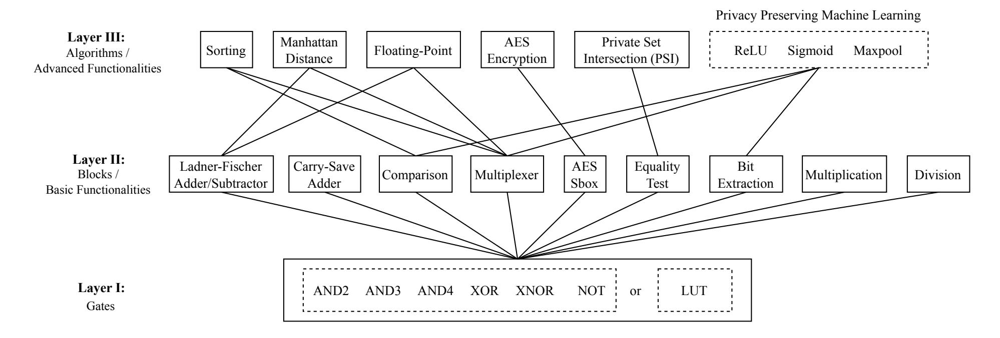
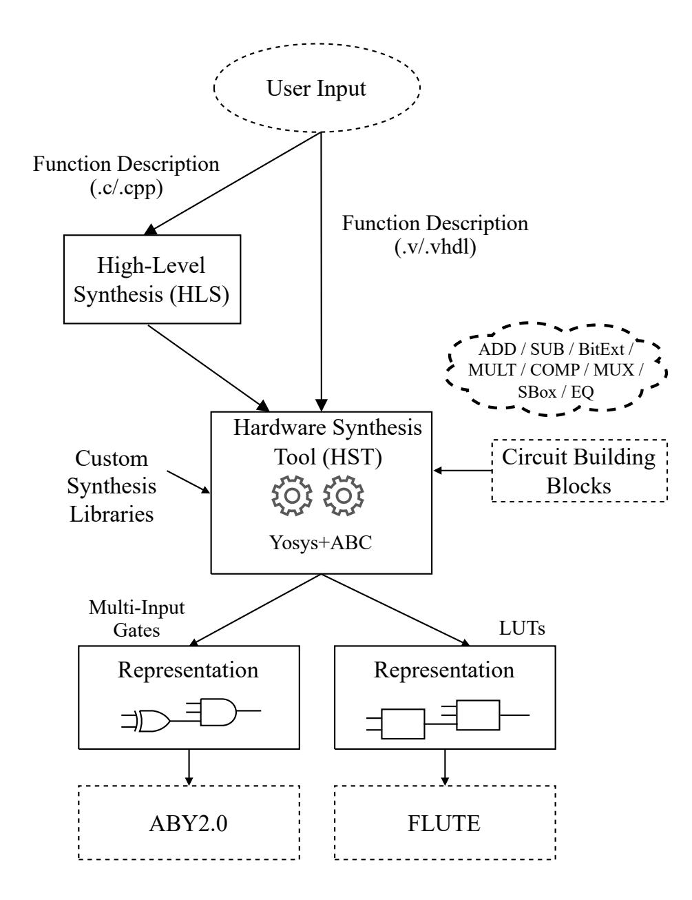
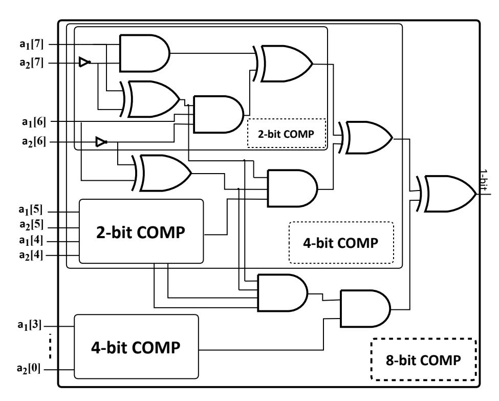
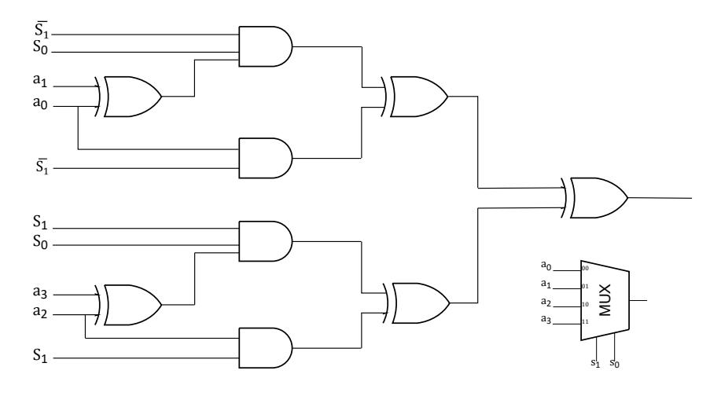

{0}------------------------------------------------

1

# SynCirc: Efficient Synthesis of Depth-Optimized Circuits from High-Level Languages (Extended Version)\*

Arpita Patr[a](https://orcid.org/0000-0002-8036-4407) <sup>1</sup> , Joachim Schmid[t](https://orcid.org/0009-0006-6175-7631) <sup>2</sup> , Thomas Schneide[r](https://orcid.org/0000-0001-8090-1316) <sup>2</sup> , Ajith Sures[h](https://orcid.org/0000-0002-5164-7758) <sup>3</sup> , Hossein Yalam[e](https://orcid.org/0000-0001-6438-534X) <sup>4</sup> 1 Indian Institute of Science, Bangalore, India | <sup>2</sup>TU Darmstadt, Germany <sup>3</sup>Technology Innovation Institute (TII), UAE | <sup>4</sup>Robert Bosch Gmbh, Germany 1 arpita@iisc.ac.in | 2 joachim.schmidt@encrypto.cs.tu-darmstadt.de | 2 schneider@encrypto.cs.tu-darmstadt.de 3 ajith.suresh@tii.ae | <sup>4</sup>hossein.yalame@de.bosch.com

*Abstract*—Secure Multi-Party Computation (MPC) enables secure computation on private data. Many of today's efficient MPC protocols need a representation of the evaluated function as circuit composed of Boolean or Lookup Tables (LUTs). To improve the practicality of MPC, we present SynCirc, a hardware synthesis framework optimized for MPC applications. Built on Verilog and the open-source tool Yosys-ABC, SynCirc introduces custom libraries and constraints for multi-input AND gates, achieving up to 3× reduction in multiplicative depth and online rounds compared to TinyGMW (Demmler et al., CCS'15).

SynCirc also offers an expanded library of efficient building blocks like comparison, multiplexers, equality checks and incorporates Boolean and LUT circuits. For these building blocks, we achieve improvements in multiplicative depth/online rounds between 22.3% and 66.7% over ShallowCC (Büscher et al., ESORICS'16). Our evaluation using the FLUTE framework (Brüggemann et al., IEEE S&P'23) shows that SynCirc has 116× less online communication than the multi-input AND gate protocol of Trifecta (Faraji and Kerschbaum, PETS'23).

SynCirc introduces novel capabilities, including enhanced support for High-Level Synthesis (HLS) with the XLS tool, enabling developers to create secure functions in C/C++ without the need for expertise in hardware definition languages like Verilog. SynCirc is an open-source toolchain that democratizes secure computation, simplifies circuit synthesis and makes advanced privacy-preserving technologies more accessible.

*Index Terms*—Hardware Synthesis, Multi-party Computation, Depth Optimization, Logic Design, Lookup Tables, C/C++

#### I. INTRODUCTION

Recent advances in cryptography engineering have made Secure Multi-party Computation (MPC) [\[3\]](#page-10-0), [\[4\]](#page-10-1) more practical and ready for real-world deployment [\[5\]](#page-10-2). MPC, a cornerstone of modern cryptography, allows a group of n mutually distrusting parties to jointly compute a public function on their private inputs. In addition to ensuring the correctness of the function's output, MPC guarantees privacy, meaning that no coalition of up to t corrupt parties can learn more than what the output reveals. The potential of MPC has been demonstrated in various realworld applications, including private advertising, decentralized finance, and private machine learning [\[6\]](#page-10-3).

\*This article extends the conference paper published at IEEE HOST'21 [\[1\]](#page-10-4), and is accepted for publication in IEEE TC'26. Please cite the IEEE TC version [\[2\]](#page-10-5).

Since the first MPC protocols, Yao's Garbled Circuits (GC) [\[3\]](#page-10-0) and linear secret sharing schemes (SS) proposed by Goldreich-Micali-Widgerson (GMW) [\[4\]](#page-10-1), computation over Boolean circuits has been central to MPC, with extensive literature dedicated to designing practically efficient circuitbased secure computation protocols. While manually designing circuits for specific use cases was feasible in the early days, it has become impractical for modern applications, where functions are large and complex. Moreover, hand-made circuits are susceptible to privacy breaches as they can accidentally leak private inputs.

To address these challenges, automated generation of circuits has emerged as a promising solution. This involves automatically compiling high-level function descriptions into efficient circuit representations using logic synthesis [\[7\]](#page-10-6)–[\[16\]](#page-10-7). The optimization criteria are tailored to the characteristics of the MPC protocol used. For example, the GC-based approach, which has a constant number of communication rounds, favors circuits with a minimal number of Boolean AND gates while XOR gates are free [\[17\]](#page-10-8). On the other hand, the SS-based approach, with round complexity linear in the circuit's multiplicative depth, favors circuits with low multiplicative depth [\[11\]](#page-10-9), [\[14\]](#page-10-10), [\[18\]](#page-10-11), [\[19\]](#page-10-12).

Additionally, MPC protocols incorporating lookup tables (LUTs) have been introduced alongside traditional Boolean circuits for the SS-based approach [\[15\]](#page-10-13), [\[20\]](#page-10-14). They offer a better trade-off between communication rounds and the amount of communication, providing more flexibility in optimizing secure computation protocols. Consequently, the use of logic synthesis tools to synthesize LUTs in addition to Boolean circuits has become necessary [\[15\]](#page-10-13).

## *A. Outline and Our Contributions*

In this work, we introduce SynCirc, an efficient framework that provides an open-source toolchain for circuit synthesis tailored for MPC circuit generation. SynCirc consists of several building blocks, including support for multi-input AND gates, Lookup Tables (LUTs), and floating-point operations. A major advancement in SynCirc over prior works is its integration with the Google XLS toolchain [\[21\]](#page-10-15), allowing developers to specify secure functions in C/C++ without

{1}------------------------------------------------

requiring knowledge of hardware description languages (HDLs) like Verilog. The SynCirc framework is available as open source under the MIT license [\[22\]](#page-10-16).

Our SynCirc framework minimizes the communication and rounds in the online phase, similar to the TinyGMW framework [\[14\]](#page-10-10). This is achieved by significantly reducing the multiplicative depth of the output circuits and some building blocks have up to 3× lower depth than those in [\[14\]](#page-10-10). By enhancing both multiplicative depth and communication efficiency, SynCirc, when combined with state-of-the-art 2PC protocols such as ABY2.0 [\[23\]](#page-10-17) and FLUTE [\[20\]](#page-10-14), makes MPC more efficient. Our contributions are as follows:

*a) Three-layer Architecture:* Our SynCirc framework, depicted in Fig. [1](#page-3-0) consists of three layers:

Layer I (Gates) includes fundamental Boolean gates like AND, XOR, and NOT, as well as multi-input AND gates (AND3 and AND4). We also introduce LUTs at this layer by modifying the synthesis tool with appropriate parameters. While LUT gates can handle an arbitrary number of inputs, input sizes larger than 8 are typically impractical, as the lookup table size and the complexity of the setup phase in the underlying MPC protocol increases exponentially with the number of inputs [\[20\]](#page-10-14). Users developing functions have the flexibility to choose between Boolean gates and LUTs, which can be controlled via a command-line parameter.

Layer II (Blocks) uses the building blocks from Layer I to build essential functionalities commonly found in secure computation applications. It includes operations such as ℓbit integer operations, multiplexers, and AES S-boxes. These operations are carefully designed to minimize the multiplicative depth. All of these designs are incorporated into SynCirc as a technology mapping library, allowing for the automatic selection of our depth-optimized implementations over the standard cells provided by Yosys [\[24\]](#page-10-18).

Layer III (Algorithms) comprises of a set of advanced functionalities that are obtained by assembling the essential functionalities from Layer II, which would otherwise be impractical to do by hand. This includes sorting, private set intersection, floating-point operations, and non-linear activation functions in private machine learning components such as the Rectified Linear Unit (ReLU) and Sigmoid functions.

Although this work focuses on a limited set of functionalities, our framework's modular design allows for future expansion to support more advanced features. For example, as demonstrated in MPCircuits [\[16\]](#page-10-7), a more advanced Layer IV (Applications) can be developed to handle applications such as auctions, voting, stable matching, and nearest neighbor search using the existing layers, and we leave this as future work.

*b) Comparison with Circuits Compiler Approach:* Table [I](#page-1-0) presents the multiplicative depth of SynCirc for basic operations such as addition and multiplication, considering multi-input gates with fan-ins of up to 4. SynCirc has a significant improvement in the multiplicative depth compared to the variants proposed in ShallowCC [\[18\]](#page-10-11), the state-of-the-art circuit compiler for depth optimized Boolean circuits. Concretely, for 64-bit inputs, SynCirc improve the multiplicative depth of ShallowCC by 1.25× to 2.0×. Even a reduction in depth

<span id="page-1-0"></span>TABLE I COMPARISON OF THE MULTIPLICATIVE DEPTH OF OUR CIRCUIT CONSTRUCTIONS USING MULTI-INPUT AND GATES WITH SHALLOWCC [\[18\]](#page-10-11).

| Operation            | ShallowCC [18]            | SynCirc (This Work) |
|----------------------|---------------------------|---------------------|
| ℓ-bit Addition       | log2(ℓ) + 1               | 0.5 log2(ℓ) + 1     |
| ℓ-bit Subtraction    | log2(ℓ) + 2               | 0.5 log2(ℓ) + 2     |
| ℓ-bit Multiplication | 2 log2(ℓ) + 3             | 1.5 log2(ℓ) + 2     |
| ℓ-bit Comparison     | log2(ℓ) + 1               | 0.5 log2(ℓ) + 1     |
| n : 1 Multiplexer    | log2<br>(log2<br>(n) + 1) | 0.25 log2<br>(n)    |

by one can greatly enhance overall performance in various applications. For example, the comparison operation accounts for more than 93% of the rounds in most MPC-based neural network training and inference tasks [\[23\]](#page-10-17), [\[25\]](#page-10-19).

- *c) Synthesis of Lookup Table (LUT) Circuits:* SynCirc provides support for the synthesis of LUT circuits, which yield significantly better performance during the online phase compared to Boolean circuits when evaluated in MPC [\[20\]](#page-10-14). For instance, consider the multi-input Boolean circuits generated by SynCirc, which were subsequently evaluated using the 2-party protocol in ABY2.0 [\[23\]](#page-10-17). However, since ABY2.0 relies solely on Boolean gates, the round complexity increases as the communication rounds scale linearly with the circuit's multiplicative depth. SynCirc addresses this issue by integrating LUT circuit generation, making it compatible with the newer and faster secure 2PC protocol in FLUTE [\[20\]](#page-10-14). LUT-based MPC reduces round complexity, thereby making it more efficient and preferable in practical applications [\[15\]](#page-10-13), [\[20\]](#page-10-14).
- *d) Support for Floating-point Operations:* SynCirc provides support for the synthesis of circuits for floating-point operations, which are essential for applications such as private machine learning [\[6\]](#page-10-3). SynCirc integrates these operations using both open-source and commercial tools. Specifically, emphasizing the importance of accessibility and transparency in academic research, SynCirc includes circuits for basic floating-point operations like addition (FPADD) and multiplication (FPMUL) using open-source software libraries from XLS [\[21\]](#page-10-15). Furthermore, within the SynCirc framework, we utilize proprietary libraries from DesignWare [\[26\]](#page-10-20) to handle complex floating-point operations such as division and square root, thus providing support to licensed customers.
- *e) Implementation and Benchmarking:* We introduce a comprehensive and user-friendly toolchain that automatically compiles C/C++ code or hardware description languages (HDL) like Verilog modules into circuits for secure computation, where the intermediate netlists are synthesized using the open-source Yosys-ABC framework [\[24\]](#page-10-18), [\[27\]](#page-10-21). The integrated compilation pipeline optimizes common operations by lowering them to our depth-optimized building blocks. Additionally, we support floating-point operations through open-source software (OSS) implementations included in XLS [\[21\]](#page-10-15). The open-source nature of these building blocks allows SynCirc to be widely adopted without concerns about licensing issues.

To benchmark Boolean circuits with multi-input AND gates, we measure the total number of AND gates and the multiplicative depth of the resulting circuit, as XOR and INV 

{2}------------------------------------------------

gates are free in most MPC schemes. For LUT circuits, we evaluate efficiency by analyzing the total number of LUTs and the circuit depth. We benchmark circuits for bit widths from 8 to 64. In addition to circuit characteristics, we assess real-world performance by measuring communication costs when executed using the secure protocols of ABY2.0 [\[23\]](#page-10-17) and FLUTE [\[20\]](#page-10-14). As shown in [§V,](#page-6-0) SynCirc achieves improvements in online communication of up to 117× over the recent multi-input AND gate-based three-party protocol in Trifecta [\[28\]](#page-10-22).

Our SynCirc framework is independent of the underlying MPC protocol and can be integrated into any MPC framework that supports multi-input AND gates [\[23\]](#page-10-17) or LUT gates [\[20\]](#page-10-14). To summarize, we make the following contributions:

- We introduce SynCirc, an efficient framework with an open-source toolchain for MPC circuit synthesis, supporting multi-input AND gates, Lookup Tables (LUTs), and floating-point operations.
- We integrate SynCirc with the Google XLS [\[21\]](#page-10-15) toolchain, allowing secure function specification in C/C++ without requiring knowledge of HDLs like Verilog.
- SynCirc significantly reduces multiplicative depth compared to state-of-the-art compilers, improving efficiency in high-latency environments and achieving up to 2× improvement over ShallowCC [\[18\]](#page-10-11).
- SynCirc incorporates support for LUT circuit synthesis, achieving up to 4× lower online communication and up to 3× better online round complexity over their Boolean circuit counterparts [\[23\]](#page-10-17).
- We benchmark SynCirc, showing up to a 117× improvement in online communication compared to the multi-input AND gate-based three-party protocol in Trifecta [\[28\]](#page-10-22).
- We provide an open-source release of SynCirc for the community to use and build upon [\[22\]](#page-10-16).

*Contributions beyond HOST'21 Paper [\[1\]](#page-10-4):* In this article, we present an extended version of the *SynCirc* toolchain, with new contributions beyond our paper published at the 2021 IEEE International Symposium on Hardware Oriented Security and Trust (HOST) [\[1\]](#page-10-4). We now have integrated the High-Level Synthesis (HLS) tool Google XLS [\[21\]](#page-10-15), enabling developers to specify secure functions as C/C++ code. This integration simplifies the design process and makes the toolchain more accessible to users without expertise in hardware description languages (HDLs). Additionally, we have added support for Lookup Tables (LUTs) and floating-point operations, expanding the toolchain's capabilities to handle complex numerical computations and privacy-preserving applications like private machine learning. By releasing the framework as open-source software [\[22\]](#page-10-16), we promote community engagement and facilitate broader adoption. Our new contributions significantly improve the versatility, accessibility, and efficiency of the SynCirc toolchain for MPC circuit synthesis suited for a wider range of applications.

## *B. Related Work*

The most widely accepted methods for logic synthesis include Circuit Compilers (CC) and Hardware Synthesis Tools (HST). In the Circuit Compilers approach, Fairplay [\[7\]](#page-10-6), [\[8\]](#page-10-23) and PAL [\[10\]](#page-10-24) compile a domain-specific language (DSL) into size-optimized Boolean circuits. The CBMC-GC compiler [\[9\]](#page-10-25) uses an SAT model checker to generate size-optimized Boolean circuits from ANSI C. The PCF compiler [\[12\]](#page-10-26) generates a compact assembler-like intermediate representation while the KSS compiler [\[29\]](#page-10-27) generates Boolean circuits from a DSL description. ShallowCC [\[18\]](#page-10-11), based on CBMC-GC, takes ANSI C as input and creates depth-optimized Boolean circuits by introducing new building blocks and proposing depth minimization techniques. Similarly, HyCC [\[19\]](#page-10-12), also based on CBMC-GC, compiles ANSI C code into mixedprotocol Boolean and arithmetic circuits.

Regarding Hardware Synthesis Tools, TinyGarble [\[13\]](#page-10-28) uses sequential circuits and powerful hardware logic synthesis tools to create size-optimized circuit descriptions. TinyGMW [\[14\]](#page-10-10), in contrast, focused on synthesizing combinational circuits with low multiplicative depth for SS-based protocols. Dessouky et al. [\[15\]](#page-10-13) replace 2-input Boolean gates with more compact lookup tables (LUTs) and use FPGA LUT-based synthesis tools for transforming HDL functions into LUT representations for cryptographic protocols. MPCircuits [\[16\]](#page-10-7) generates sizeoptimized Boolean circuits for any MPC function using hardware synthesis tools and new technology libraries. Heldmann et al. [\[30\]](#page-10-29) propose an automated circuit compilation suite based on the LLVM compiler toolchain, with the output further optimized using the ABC logic synthesis tool [\[31\]](#page-10-30).

In this work, we improve upon the approach of TinyGMW [\[14\]](#page-10-10), in which industry-grade hardware synthesis tools were modified for logic synthesis. TinyGMW focused on depth-optimized circuits for the GMW paradigm, primarily due to the following reasons: i) it allows pre-computation of communication-intensive, input-independent operations during a setup phase, enabling a high-speed online phase; and ii) GMW supports better parallelization of the same circuit using SIMD operations, leading to high throughput [\[11\]](#page-10-9), [\[32\]](#page-10-31). Additionally, the circuits generated by their toolchain were compatible with the ABY framework [\[32\]](#page-10-31), which, in 2015, was considered the best known MPC framework for two-party computation (2PC).

Later works such as ABY2.0 [\[23\]](#page-10-17) and FLUTE [\[20\]](#page-10-14) substantially improved 2PC Boolean computation by leveraging multiinput AND gates and Lookup Tables (LUTs) while operating in the function-dependent preprocessing paradigm, resulting in a highly efficient online phase. Specifically, ABY2.0 introduced 2PC protocols that efficiently evaluate multi-input AND gates, improving upon those in ABY [\[32\]](#page-10-31) by a factor of 6× in online communication for a 4-input AND gate. FLUTE [\[20\]](#page-10-14) extends the protocols from ABY2.0 to evaluate LUTs in a single online round and an improvement of two orders of magnitude in online communication, while retaining similar overall communication compared to previous LUT-based protocols [\[15\]](#page-10-13).

Our work uses hardware synthesis tools to support both multi-input AND gates and LUT gates, resulting in circuits with improved multiplicative depth. These circuits can then be evaluated using the ABY2.0 protocols [\[23\]](#page-10-17) or FLUTE [\[20\]](#page-10-14).

{3}------------------------------------------------



Fig. 1. SynCirc's three-layer architecture.

#### II. PRELIMINARIES AND BACKGROUND

#### A. Secure Multi-Party Computation

In this work, we focus on secure computation of Boolean Circuits using linear secret sharing (SS) schemes, as introduced by the GMW protocol [4]. SS-based approaches have better communication than constant-round Garbled Circuit (GC)-based solutions, often resulting in high throughput, and enable balanced workload distribution among parties. This allows for the parallel evaluation of the same circuit using SIMD operations [11], [32]. Additionally, all symmetric cryptographic operations can be precomputed during a preprocessing phase, leading to a highly efficient online phase [32].

Secure evaluation of Lookup Table (LUT) circuits [15], [20] serves as a middle ground between constant-round GCbased solutions and high-throughput SS-based approaches. It reduces the round complexity of GMW while achieving better communication efficiency than GCs. Although any secure computation protocol supporting multi-input AND gates can evaluate the Boolean circuits generated by SynCirc, we use ABY2.0 [23] to optimize for a fast online phase. ABY2.0 enhances evaluation performance over its predecessor ABY [32] by introducing function-dependent preprocessing and a new sharing semantic over the traditional GMW sharings. This enables the online communication cost for multi-input AND gates to match that of traditional 2-input AND gates. For secure LUT evaluation, we use the recent FLUTE [20] protocol, which improves over [15]. The key insight of FLUTE is that a lookup table in its disjunctive normal form (DNF) can be evaluated using the optimized inner product protocol of ABY2.0 [23].

#### B. Hardware Synthesis for Secure Computation

Generating and optimizing a Boolean circuit for secure computation is a tedious and, more importantly, error-prone task. The problem becomes more challenging when aiming to take advantage of the recent advancements where multi-input Boolean gates are taken into account in addition to the standard two-input gates [23], [33]. Instead of 'reinventing the wheel' and building a new compiler [7], [8], [10], [12], [18], works like [13]–[16] showcased the potential of re-purposing

<span id="page-3-0"></span>logic synthesis tools. A logic synthesis tool takes a function description, written in a hardware description language (HDL), as input and transforms this function into a suitable output for the standard target technologies. For instance, the target can be either Lookup Tables (LUTs) for Field Programmable Gate Arrays (FPGAs), or Boolean gates for Application-Specific Integrated Circuits (ASICs).

Even though HDLs such as Verilog or VHDL undoubtedly provide more convenience and are less error-prone than hand-crafting Boolean circuits, they conceptually differ a lot from traditional imperative programming languages like C/C++ that are known by most programmers. To address this issue, High-Level Synthesis (HLS) toolchains have been developed. These tools compile programs written in high-level languages such as C/C++ to HDL modules. One of the first HLS tools in the 1990s was Handel-C [34]. Since then, more powerful HLS solutions have been developed by the major FPGA vendors and other industry players [35], [36]. Recently, Google has provided an open-source XLS toolchain [21], which we chose for our framework.

However, not all HLS tools are equal in their functionality. For instance, they differ in the high-level language constructs they support. While goto, longjmp, and function pointers are highly unlikely to be supported, floating-point operations or loops with dynamic ranges are implemented by some while throwing errors in other HLS tools. For the purpose of generating circuits for secure computation, we require the HLS tool to generate combinational circuits instead of pipelined circuits. This requirement is fulfilled by Google XLS [21].

In SynCirc, we use the open-source Yosys-ABC tool [24], [27] for ASIC synthesis, following TinyGMW [14]. In addition, we use the built-in generic FPGA target functionalities for LUT synthesis. SynCirc integrates well with the regular ASIC design flow. We achieve this by instructing the proposed ASIC synthesis to use our customized circuit descriptions instead of the standard cells, and the rest of the workflow is untouched. Hence, it is possible to use tools like the commercial Design Compiler (DC) by Synopsis [26] and we leave the industry-grade realization of SynCirc using commercial synthesis tools as future work.

{4}------------------------------------------------



Fig. 2. Global Flow of our SynCirc framework.

## III. GLOBAL FLOW OF SYNCIRC

This section outlines the overall global flow of our Syn-Circ framework. It begins by highlighting the challenges of logic synthesis for MPC protocols, then provides a detailed explanation of the synthesis pipeline.

#### *A. Challenges of Logic Synthesis for MPC protocols*

The generation of circuits for secure computation through hardware synthesis has two main challenges.

First, hardware synthesis tools are designed for platforms like FPGAs and ASICs, which have technology constraints such as the amount and type of logic elements, registers, memory blocks, and propagation delay that differ from those required for Boolean circuits. These tools also rely on layout parameters for synthesis, whereas Boolean circuits for secure computation don't have such layout constraints. Instead, these circuits are evaluated "virtually" using an MPC protocol rather than physically on a chip.

Second, the cost of a gate differs greatly between hardware synthesis and secure computation. For example, XOR gates are nearly cost-free in MPC protocols since they can be evaluated locally. In contrast, traditional logic synthesis does not consider any gate as "free", as every gate has a non-zero physical cost (area). Therefore, logic synthesis tools need to be adapted to the cost metrics of MPC protocols, particularly in generating Boolean circuits optimized for multiplicative depth for protocols like ABY2.0 [\[23\]](#page-10-17).

#### *B. Synthesis Pipeline*

Fig. [2](#page-4-0) illustrates the synthesis pipeline of our SynCirc framework, which extends the high-level flow of TinyGMW [\[14\]](#page-10-10). The primary goal of our synthesis tool is to generate circuits for secure computation based on functions specified in C/C++ or in a hardware description language (HDL). In addition to generating Boolean circuits with multi-input AND gates, our framework SynCirc also supports the generation of circuits composed of lookup tables (LUTs).

The main entry point of our toolchain is a single crossplatform executable which takes a C/C++ or Verilog input file and produces the output circuit in the Bristol circuit format[1](#page-4-1) or a custom human-readable text format. All intermediate steps, detailed next, are performed automatically, requiring minimal user interaction.

If the input provided is C/C++ code, a High-Level Synthesis (HLS) pass is performed first. Otherwise, this step is skipped. The HLS pass consists of three separate stages using components from Google's XLS toolchain [\[21\]](#page-10-15). First, the input C/C++ code is parsed and converted into an intermediate representation (IR) using the xlscc tool. The structure of the IR facilitates optimization of the design, as performed by the opt executable. Finally, the IR is translated to Verilog code using the codegen tool, which unrolls a pipelined Verilog module into a combinational Verilog module.

<span id="page-4-0"></span>To proceed with a Verilog design, the next step involves translating high-level functionalities expressed in the design, such as arithmetic operations, into their gate-level representation. While Yosys [\[37\]](#page-10-36) provides built-in implementations for standard Verilog operators, these are not optimized for depth, and neither are the custom libraries of TinyGarble [\[13\]](#page-10-28) and MPCircuits [\[16\]](#page-10-7).

To address this, we developed a specialized synthesis technology library that includes circuits optimized for multiplicative depth in basic arithmetic and logic operations. We integrated these depth-optimized blocks into the library of the hardware synthesis tools Yosys [\[37\]](#page-10-36) and ABC [\[27\]](#page-10-21), and re-engineered the toolchain to automate the mapping of designs to our custom circuit descriptions, rather than the standard cells. Detailed descriptions of the building blocks implemented in our work, including floating-point operations, are provided in [§IV.](#page-5-0) We customize the Yosys workflow to prioritize multiplicative depthoptimized implementations, using the Yosys standard cell library as a fallback only when an operation is not covered by our blocks.

The next step in the synthesis pipeline involves mapping logic gates to the target architecture. In conventional electronic design, this target could be an ASIC or an FPGA. For an ASIC, logic gates are mapped to the gates available in the target technology (e.g., NAND and NOR in CMOS logic). For FPGAs, logic gates are mapped to LUTs that are then placed on the target FPGA chip. For secure computation, we define a custom ASIC target using a technology library that describes circuits with multi-input AND gates. For LUT circuits, we utilize the FPGA mapping capabilities built into Yosys.

<span id="page-4-1"></span><sup>1</sup><https://nigelsmart.github.io/MPC-Circuits/>

{5}------------------------------------------------

In the case of multi-input AND circuits, the technology library includes the Boolean functions they represent and parameters like the delay and area of the physical gate. For Boolean circuit synthesis with multi-input AND gates, we use our custom technology library, which specifies various ASIC cells using the Liberty format [\[37,](#page-10-36) Fig. 3]. This library defines the Boolean functions and physical properties of each cell. In our implementation, we define AND2, AND3, AND4, NOT, XOR, XNOR, and OR cell types. We only specify cell area, as other physical properties are not relevant for our purposes. We use the ABC tool [\[31\]](#page-10-30) to minimize the total area of the design. The areas for NOT, XOR, and XNOR cells are set to zero (as they are free in MPC), while AND2, AND3, and AND4 gates are assigned decreasing non-zero areas to incentivize ABC to prefer larger multi-input AND gates. The area of OR gates is set to an arbitrarily high value to encourage substitution by other gate types.

In our work, we use the Yosys-ABC toolchain [\[24\]](#page-10-18), [\[27\]](#page-10-21), an open-source framework that uses gates from a specified technology library to generate a gate-level implementation of the design. To optimize the combinational logic in these gatelevel netlists, we utilize the external Berkeley ABC tool [\[31\]](#page-10-30), which is integrated into Yosys [\[37\]](#page-10-36). The abc pass within Yosys extracts the combinational gate-level components of the design, processes them through ABC, and then reintegrates the optimized results.

For LUT circuit synthesis, which we evaluate using FLUTE [\[20\]](#page-10-14), the synthesis flow remains similar until the point where the target technology mapping occurs. Here, instead of mapping to our custom technology library, we instruct ABC [\[31\]](#page-10-30) to pack the logic gates into LUTs, with the maximum input size defined by the user.

There is a strong relation between reducing circuit depth and optimizing the delay of a circuit's critical path. The critical path is the longest path in the circuit where signal propagation delay cannot be further reduced. The maximum frequency at which a chip or FPGA design can operate is determined by the length of this critical path, making its reduction a key goal in hardware design, a process known as timing-driven synthesis. Currently, Yosys [\[37\]](#page-10-36) does not support timing-driven synthesis natively. Instead, we achieve low depth by automatically selecting building blocks optimized for small depth.

#### IV. BUILDING BLOCKS LIBRARY

<span id="page-5-0"></span>This section presents the depth-optimized circuits generated using our SynCirc framework, as illustrated in Fig. [1.](#page-3-0) We categorize the circuits into two types: i) Basic – that form the building blocks for most of the secure computation tasks, and ii) Advanced – that use the basic circuits to build circuits for complex functionalities. All of the below circuits outperform the state-of-the-art circuits in multiplicative-depth.

In this section, we focus on some of the basic circuits in Layer II of SynCirc (see Fig. [1\)](#page-3-0), which include circuits for the Adder/Subtractor, Comparator, Multiplexer, and Equality operations. Detailed descriptions and architecture diagrams of the building blocks are given in [\[1\]](#page-10-4). Following this, we provide details on the synthesis of floating-point functionalities, which we newly introduce.

All the circuits in Layer I of Fig. [1](#page-3-0) are synthesized using multi-input AND gates. However, each block can easily be replaced by a LUT. For instance, instead of using a 4-input AND gate for an equality check [\[1\]](#page-10-4), [\[23\]](#page-10-17), we can simply use a 4-input LUT. Furthermore, the Yosys+ABC [\[24\]](#page-10-18), [\[27\]](#page-10-21) toolchain in our compilation pipeline automatically assembles Boolean gates into appropriate LUTs. Finally, we validate our designs using test bench simulations.

We start by discussing the simplicity that SynCirc introduces to circuit synthesis by offering support for high-level languages.

## *A. Support for High-level Language Synthesis*

To showcase the advantages of high-level language synthesis, we use a 16-bit division operation as an example. In SynCirc, this can be written either in Verilog (cf. Listing [1\)](#page-5-1) or in C/C++ (cf. Listing [2\)](#page-5-2).

```
1 module Division16(x,y,o);
2 input [15:0] x,y;
3 output[15:0] o;
4 wire [31:0] temp1[16:0];
5 wire [31:0] temp2[15:0];
6 assign temp1[16] = {{16{1b0}}, x};
7 genvar i;
8 generate
9 for(i = 15; i >= 0; i = i - 1) begin:MyDIV
10 if (i > 0)
11 SUB_CLF _SUB(.x_1(temp1[i+1]),.x_2({{(16-i)
      {1b0}}, y, {g{1b0}}}),.out({o[i],temp2[i]}));
12 else
13 SUB_CLF _SUB(.x_1(temp1[i+1]),.x_2({{(16-i)
      {1b0}}, y}),.out({o[i],temp2[i]}));
14 MUX _MUX(.x_1(temp1[i+1]),.x_2(temp2[i]),.s
      (o[i]),.out(temp[i]));
15 end
16 endgenerate
17 endmodule
```

Listing 1. Verilog code for 16-bit Division circuit in SynCirc [\[1\]](#page-10-4).

```
1 short division(short x, short y) {
2 return x / y;
3 }
```

Listing 2. C/C++ code for 16-bit Division in SynCirc.

The key difference between both lies in the level of hardware control versus abstraction. The Verilog implementation (Listing [1\)](#page-5-1) involves a detailed, low-level description of the hardware circuit, specifying wires, multiplexers, and control logic to manage data flow. On the other hand, the C/C++ implementation (Listing [2\)](#page-5-2) abstracts away these hardware details, allowing the division to be written more compactly and handled by built-in machine instructions. This comparison highlights how the support for synthesis of high-level languages simplifies the process through abstraction in SynCirc, compared to the precise hardware control and optimization in the Verilogbased synthesis.

#### *B. Layer II - Basic Functionalities*

*1) Customized Ladner-Fischer Adder:* To add two ℓ-bit values, the traditional Ripple-Carry Adder (RCA) uses a structure where the carry-out of each stage is directly passed to the carry-in of the next stage, resulting in a multiplicative

{6}------------------------------------------------

<span id="page-6-1"></span>

| Work                | Depth                              | 8 | 16 | 32 | 64 |
|---------------------|------------------------------------|---|----|----|----|
| Ripple-Carry [38]   | $\ell-1$                           | 7 | 15 | 31 | 63 |
| Ladner-Fischer [11] | $2\lceil \log_2(\ell) \rceil + 1$  | 7 | 9  | 11 | 13 |
| Sklansky [18]       | $\lceil \log_2(\ell) \rceil + 1$   | 4 | 5  | 6  | 7  |
| ABY2.0 [23]         | $\left \log_4(\ell)\right  + 1$    | 2 | _  | _  | 4  |
| SynCirc (This Work) | $\lfloor \log_4(\ell) \rfloor + 1$ | 2 | 3  | 3  | 4  |

<span id="page-6-3"></span>TABLE III  $\mbox{Multiplicative depth of Comparison Circuits for bitwidth $\ell$}.$ 

| Work                | Depth                              | 16 | 32 | 64 |
|---------------------|------------------------------------|----|----|----|
| Sequential GT [38]  | $\ell$                             | 16 | 32 | 64 |
| Recursive GT [40]   | $\lceil \log_2(\ell) \rceil + 1$   | 5  | 6  | 7  |
| ABY2.0 [23]         | $\lceil \log_4(\ell) \rceil + 1$   | _  | _  | 4  |
| SynCirc (This Work) | $\lfloor \log_4(\ell) \rfloor + 1$ | 3  | 3  | 4  |

depth of  $\ell$  [38]. Carry-Lookahead Adders (CLAs) achieve lower depth by calculating carry bits in advance.

In SynCirc, we use the CLA by Ladner-Fischer [11], which has a multiplicative depth of  $2\lceil\log_2(\ell)\rceil+1$  when using standard 2-input Boolean AND gates. Our customized version ADD<sub>CLF</sub>, generated by our toolchain, achieves a multiplicative depth of  $\lfloor\log_4(\ell)\rfloor+1$ , applicable for any  $\ell$ . For 64-bit inputs, this reduces the depth by approximately 42% compared to the ShallowCC compiler [18]. A comparison of our adder with other circuits is presented in Table II.

2) Comparison (COMP): To compare two  $\ell$ -bit values x and y (where x>y), the standard approach [39] requires a depth of  $\ell$ , while the recursive approach [40] reduces this to a depth of  $\lceil \log_2(\ell) \rceil + 1$ . By using multi-input AND gates with a fan-in of up to 4, our COMP circuit further reduces the depth to  $\lfloor \log_4(\ell) \rfloor + 1$ . The circuit for comparing 8-bit values is illustrated in Fig. 3. Table III compares our construction with previous works.



Fig. 3. Multiplicative depth-optimized 8-bit comparison circuit [40].

3) Multiplexer (MUX): Multiplexers (MUX) are essential building blocks for both control and data flow in Boolean circuits. They handle tasks like evaluating conditionals and accessing arrays. The construction of [17] achieves an optimal multiplicative depth of 1 for a 2-to-1 MUX using just a single

<span id="page-6-5"></span>TABLE IV
MULTIPLICATIVE DEPTH OF MULTIPLEXER CIRCUITS FOR n CHOICES.

| Work                    | Depth                                               | 8     | 16    | 32 |
|-------------------------|-----------------------------------------------------|-------|-------|----|
| MUX-Tree [11]           | $\lceil \log_2(n) \rceil$                           | 3     | 4     | 5  |
| MUX-DNFs [18]           | $\lceil \log_2(\lceil \log_2(n) \rceil) \rceil + 1$ | 3     | 4     | 4  |
| MUX-DNFd [18]           | $\lceil \log_2(\lceil \log_2(n) + 1 \rceil) \rceil$ | 2     | 3     | 3  |
| SynCirc (This Work)     | $\lceil \log_8(n) \rceil$                           | 1     | 2     | 2  |
| % reduction in depth ov | 50.0%                                               | 33.0% | 33.0% |    |

AND2 gate per pair of input bits. For an 8-to-1 MUX, the tree architecture has a depth of 3 [14]. Figure 4 illustrates the structure of a 4-to-1 MUX.



<span id="page-6-4"></span>Fig. 4. Multiplicative depth-optimized 4-to-1 multiplexer (MUX).

By using multi-input AND gates, SynCirc improves the tree-based construction, resulting in multiplicative depth of 1 for 2-to-1, 4-to-1, and 8-to-1 multiplexers. Table IV compares the multiplicative depth of the multiplexer circuits generated by our toolchain for different numbers of inputs (n) and compares them against existing works. For an 8-to-1 MUX, the multiplexer generated by SynCirc has 50% lower multiplicative depth than those in ShallowCC [18].

## C. Floating-point Operations

Floating point operations have been widely studied in the context of MPC [20], [32], [41], including an implementation on the protocol level [41]. Although floating-point operations are more expensive than integer or fixed-point operations, they provide higher accuracy and range, hence are ideal for less frequent calculations that need to be very accurate [32], [41].

We synthesized basic floating-point operations like addition and multiplication using the open-source designs from the Google XLS standard library [21]. For synthesizing complex floating-point operations like division, we utilized the IP blocks from Synopsys Design Compiler [26], similar to FLUTE [20]. Since these IP blocks by Synopsys are proprietary, they are not included in our open-source release.

### V. EVALUATION

<span id="page-6-2"></span><span id="page-6-0"></span>We present the evaluation of the SynCirc framework next. We begin by describing the experimental setup (§V-A) and then compare the circuits generated by our framework with those from the literature, including floating-point functionalities (§V-B). Following this, we provide a detailed evaluation of the circuits generated by SynCirc using the ABY2.0 [23] and

{7}------------------------------------------------

FLUTE [\[20\]](#page-10-14) protocols, and compare their costs ([§V-C\)](#page-7-2). Finally, we compare our results with the multi-input AND protocols in Trifecta [\[28\]](#page-10-22) ([§V-D\)](#page-7-3), and Garbled LUTs in [\[42\]](#page-11-1) ([§V-E\)](#page-9-0).

#### <span id="page-7-0"></span>*A. Experimental Setup*

We implemented all functionalities in Verilog and synthesized the netlists using the open-source logic synthesis framework Yosys-ABC [\[24\]](#page-10-18), [\[27\]](#page-10-21) and the High-Level Synthesis (HLS) toolchain XLS [\[21\]](#page-10-15), both of which are included in our open-source release [\[22\]](#page-10-16). All experiments were conducted on a machine equipped with an Intel Core i9-7960X CPU @ 2.80 GHz and 128 GB of RAM. All the designs evaluated in this section are part of our open-source framework, including the basic floating-point operations addition and multiplication using the C++ library by Google XLS [\[21\]](#page-10-15)[2](#page-7-4) . Additionally, we have evaluated some of the complex floating-point functionalities like division using the proprietary Synopsys DC IP [\[26\]](#page-10-20).

We evaluate all the synthesized circuits generated by our SynCirc framework against state-of-the-art counterparts. Our primary benchmark for assessing the efficiency of the synthesis framework is multiplicative depth. This refers to the maximum number of AND2 gates (including multi-input gates) along any path from an input to an output in the circuit. For LUT circuits, the multiplicative depth indicates the maximum number of LUT gates along any path.

In addition to multiplicative depth, we report the circuit size based on the number of non-free gates. For multi-input AND circuits, these gates include AND2, AND3, and AND4 gates. XOR and INV gates are excluded from our benchmarking since linear secure computation protocols allow local evaluation of XOR gates. For LUT circuits, we count LUT gates grouped by their number of inputs δ.

When comparing the evaluation efficiency of our circuits using ABY2.0 [\[23\]](#page-10-17) and FLUTE [\[20\]](#page-10-14) with their respective counterparts, we use communication as the benchmark and report the improvements over existing solutions.

## <span id="page-7-1"></span>*B. Benchmark Evaluation*

Table [V](#page-8-0) summarizes the details of the improved building blocks obtained via our synthesis framework. As evident from the table, we achieve multiplicative depth improvements ranging up to 3× over existing methods. This improvement is amplified for applications where these circuits contribute to most of the online rounds. For instance, consider the ReLU circuit where we improve the depth by at least 1.5× over [\[46\]](#page-11-2). As shown in ABY2.0 [\[23\]](#page-10-17), the ReLU circuit contributes to more than 90% of the online rounds for a two-layer deep neural network, showcasing the significance of our improvement. Furthermore, SynCirc introduces support for floating-point operations, with multiplicative depth improvements of up to 2× over [\[14\]](#page-10-10).

For the analysis of the online communication, the number of AND gates can serve as a metric when using ABY2.0, as ABY2.0 incurs constant online communication costs for AND gates, regardless of the fan-in. The circuits generated

by SynCirc have the same complexity as the hand-optimized circuits in ABY2.0. When evaluated using the ABY2.0 protocol, our circuits reduce communication by a factor of 1.1× to 3× compared to the best previous work in most cases. As pointed out in ABY2.0, the number of online rounds is critical for protocol efficiency in high-latency networks like the Internet. Thus the evaluation of our circuits with ABY2.0 provides good online performance w.r.t. both communication and rounds.

#### <span id="page-7-2"></span>*C. Comparison with Lookup Table (LUT)-based MPC*

In this section, we analyze the efficiency of SynCirc for synthesizing LUT circuits. Table [VI](#page-9-1) shows how in SynCirc circuits the LUT sizes vary based on the number of inputs δ and outputs σ. Following previous works [\[15\]](#page-10-13), [\[20\]](#page-10-14), we limit LUT sizes to a maximum of 8 inputs and outputs (1 ≤ δ, σ ≤ 8) during synthesis.

In [\[1\]](#page-10-4), we compared with the then state-of-the-art LUTbased approach of Dessouky et al. [\[15\]](#page-10-13), which offered two variants: i) OP-LUT, optimized for online communication, and ii) SP-LUT, optimized for total communication. When evaluated using the more recent ABY2.0 [\[23\]](#page-10-17) protocol, our depth-optimized Boolean circuits have 210× lower setup communication compared to OP-LUT, and up to an 82× lower online communication compared to SP-LUT, albeit with increased setup communication.

In Table [VII,](#page-9-2) we compare the communication and round complexity of LUT circuits evaluated with FLUTE [\[20\]](#page-10-14) to Boolean circuits evaluated with ABY2.0 [\[23\]](#page-10-17) for 32-bit values. The results show that the LUT circuits using FLUTE consistently achieve up to 4× lower online communication compared to Boolean circuits using ABY2.0 across all circuits. Similarly, the online round complexity of the LUT circuits improves by up to 3×. This improvement is mainly due to SynCirc's ability to synthesize LUT circuits with up to 8 inputs, whereas Boolean circuits are limited to 4-input AND gates. However, Boolean circuits evaluated with ABY2.0 outperform the LUT circuits in total communication, achieving up to 9× lower communication. This is because offline communication in both ABY2.0 and FLUTE increases exponentially with the fan-in of multi-input AND gates or the input size δ of LUTs. Therefore, while LUT circuits are ideal for scenarios prioritizing online efficiency, Boolean circuits are better suited for minimizing overall communication costs.

In conclusion, SynCirc's circuit synthesis, combined with FLUTE [\[20\]](#page-10-14) and ABY2.0 [\[23\]](#page-10-17), offers a versatile framework that balances different requirements for online and total communication efficiency.

## <span id="page-7-3"></span>*D. Comparison with Multi-input ANDs in Trifecta [\[28\]](#page-10-22)*

In this section, we compare our work to the recent semihonest three-party protocol (3PC) presented in Trifecta [\[28\]](#page-10-22). Trifecta is optimized for high-latency WAN networks and aims to reduce multiplicative depth—and consequently the number of communication rounds—by using multi-input AND gates. In contrast to ABY2.0 [\[23\]](#page-10-17), their 3PC setting allows for *asymmetric communication*, where the amount of data

<span id="page-7-4"></span><sup>2</sup><https://github.com/google/xls/blob/main/xls/dslx/stdlib/apfloat.x>

{8}------------------------------------------------

<span id="page-8-0"></span>TABLE V Synthesis results of improved building blocks compared to best circuits in the literature for inputs of bitwidth  $\ell$ . #AND is the total number of multi-input AND gates.

| Circuit                    | Bitwidth    | Litera  | ature       |                  |          | SynCirc |        |       | Depth        |
|----------------------------|-------------|---------|-------------|------------------|----------|---------|--------|-------|--------------|
|                            | Ditwiatii   | AND2    | Depth       | AND2             | AND3     | AND4    | #AND   | Depth | Improvement  |
|                            |             | Lay     | yer II - Ba | asic Functionali | ities    |         |        |       |              |
|                            | $\ell = 16$ | 64      | 5           | 21               | 15       | 11      | 47     | 3     | 1.7×         |
| ADD <sub>CLF</sub> [18]    | $\ell = 32$ | 160     | 6           | 50               | 43       | 54      | 147    | 3     | $2.0 \times$ |
|                            | $\ell = 64$ | 384     | 7           | 109              | 133      | 342     | 584    | 4     | $1.8 \times$ |
|                            | $\ell = 16$ | 129     | 6           | 24               | 14       | 11      | 49     | 3     | 2.0×         |
| SUB <sub>CLF</sub> [18]    | $\ell = 32$ | 311     | 7           | 52               | 42       | 63      | 157    | 3     | $2.3 \times$ |
|                            | $\ell = 64$ | 705     | 8           | 106              | 135      | 344     | 585    | 4     | 2.0×         |
|                            | $\ell = 16$ | 46      | 6           | 6                | 6        | 9       | 21     | 3     | $2.0 \times$ |
| BitExt [25]                | $\ell = 32$ | 94      | 7           | 14               | 15       | 20      | 49     | 3     | $2.3 \times$ |
|                            | $\ell = 64$ | 190     | 8           | 26               | 27       | 54      | 107    | 4     | 2.0×         |
|                            | $\ell = 16$ | 576     | 11          | 466              | 43       | 54      | 563    | 8     | $1.4 \times$ |
| MUL <sub>CLF</sub> [18]    | $\ell = 32$ | 2 208   | 13          | 1 933            | 133      | 342     | 2 408  | 10    | 1.3×         |
|                            | $\ell = 16$ | 42      | 5           | 10               | 11       | 5       | 26     | 3     | 1.7×         |
| COMP [14]                  | $\ell = 32$ | 89      | 6           | 20               | 21       | 16      | 57     | 3     | $2.0 \times$ |
|                            | $\ell = 64$ | 184     | 7           | 30               | 32       | 32      | 94     | 4     | 1.8×         |
|                            | $\ell = 16$ | 48      | 2           | 32               | 32       | _       | 64     | 1     | $2.0 \times$ |
| 4-to-1 MUX [14]            | $\ell = 32$ | 96      | 2           | 64               | 64       | _       | 128    | 1     | $2.0 \times$ |
|                            | $\ell = 64$ | 192     | 2           | 128              | 128      | _       | 256    | 1     | $2.0 \times$ |
|                            | $\ell = 16$ | 112     | 3           | _                | 64       | 64      | 128    | 1     | 3.0×         |
| 8-to-1 MUX [14]            | $\ell = 32$ | 224     | 3           | _                | 128      | 128     | 256    | 1     | $3.0 \times$ |
|                            | $\ell = 64$ | 448     | 3           | _                | 256      | 256     | 512    | 1     | 3.0×         |
|                            | $\ell = 16$ | 15      | 4           | _                | _        | 5       | 5      | 2     | $2.0 \times$ |
| EQ [14]                    | $\ell = 32$ | 31      | 5           | 1                | _        | 10      | 11     | 3     | $1.7 \times$ |
|                            | $\ell = 64$ | 63      | 6           | _                | _        | 21      | 21     | 3     | 2.0×         |
| AES Sbox [43]              |             | 34      |             | 4 30             | 4        | _       | 34     | 3     | 1.3×         |
|                            |             | Layer   | · III - Adv | anced Function   | nalities |         |        |       |              |
| FP <sub>ADD</sub> [14]     | $\ell = 32$ | 1820    | 59          | 7                | 112      | 525     | 644    | 26    | $2.3 \times$ |
| OSS FP <sub>ADD</sub> [21] | $\ell = 32$ | -       | -           | 1 030            | 200      | 709     | 1 939  | 60    | $1.0 \times$ |
| FP <sub>MUL</sub> [14]     | $\ell = 32$ | 3 0 1 6 | 47          | 5                | 227      | 826     | 1 058  | 24    | $1.9 \times$ |
| OSS FP <sub>MUL</sub> [21] | $\ell = 32$ | -       | -           | 1 473            | 199      | 1 182   | 2854   | 49    | $1.0 \times$ |
| FP <sub>DIV</sub> [14]     | $\ell = 32$ | 5 3 9 5 | 296         | 23               | 268      | 1 667   | 1 958  | 133   | $2.2 \times$ |
| FP <sub>SQRT</sub> [14]    | $\ell = 32$ | 2 455   | 197         | 11               | 169      | 676     | 856    | 93    | $2.1 \times$ |
| DIV [14]                   | $\ell = 16$ | 1 542   | 93          | 697              | 672      | 1 563   | 2932   | 69    | $1.4 \times$ |
|                            | $\ell = 32$ | 7 079   | 207         | 2 662            | 3 669    | 13 133  | 19 464 | 189   | 1.1×         |
| SORT [44] $(n = 16)$       | $\ell = 16$ | 4 800   | 60          | 2 080            | 880      | 400     | 3 360  | 40    | $1.5 \times$ |
| DST <sub>M</sub> [44]      | $\ell = 16$ | 241     | 13          | 133              | 91       | 87      | 311    | 8     | 1.7×         |
| PSI [16], [45]             |             | 32 736  | 10          | _                | _        | 10912   | 10912  | 5     | 2.0×         |
|                            | $\ell = 16$ | 62      | 7           | 22               | 6        | 9       | 37     | 5     | 1.4×         |
| ReLU [46]                  | $\ell = 32$ | 126     | 8           | 46               | 15       | 20      | 81     | 5     | 1.6×         |
|                            | $\ell = 64$ | 254     | 9           | 90               | 27       | 54      | 171    | 6     | 1.5×         |
|                            | $\ell = 16$ | 140     | 8           | 44               | 44       | 18      | 106    | 5     | 1.6×         |
| Sigmoid [46]               | $\ell = 32$ | 284     | 9           | 92               | 94       | 40      | 226    | 5     | $1.8 \times$ |
|                            | $\ell = 64$ | 572     | 10          | 180              | 182      | 108     | 470    | 6     | 1.7×         |
| Maynest [14]               | $\ell = 16$ | 870     | 24          | 236              | 690      | 558     | 1 484  | 12    | 2.0×         |
| Maxpool [14]               | $\ell = 32$ | 1815    | 28          | 504              | 1422     | 1 248   | 3 174  | 12    | $1.8 \times$ |
| (n=16)                     | $\ell = 64$ | 3 720   | 32          | 724              | 1 600    | 2496    | 4820   | 15    | $2.1 \times$ |

transmitted between parties  $P_1$  and  $P_2$  is different from that transmitted between  $P_1$  and  $P_3$ .

In Table VIII, we compare the online communication required to evaluate circuits for three arithmetic operations. We use circuits generated by SynCirc and evaluate them with FLUTE [20], comparing the results to the online communication costs reported in Trifecta [28]. To ensure a fair comparison, we focus only on online communication since FLUTE is a

two-party protocol, whereas Trifecta is an honest majority three-party protocol. The evaluation is conducted on circuits with bitwidth  $\ell=32$ . As shown in the table, SynCirc + FLUTE has significantly better communication than Trifecta, ranging from  $18\times$  for multiplication to  $116\times$  for comparison.

{9}------------------------------------------------

<span id="page-9-1"></span>TABLE VI
THE RANGE OF LUT SIZES ACROSS DIFFERENT CIRCUITS IN SYNCIRC. HERE,  $\delta$ -LUT shows the count of  $\delta$ -to- $\sigma$  LUTs, where the number of outputs  $\sigma$  varies from 1 to 8.

| Circuit                                         | 2-LUT                                | 3-LUT | 4-LUT | 5-LUT | 6-LUT | 7-LUT | 8-LUT |  |  |
|-------------------------------------------------|--------------------------------------|-------|-------|-------|-------|-------|-------|--|--|
|                                                 | Layer II - Basic Functionalities     |       |       |       |       |       |       |  |  |
| $ADD_CLF$                                       | _                                    | _     | _     | 2     | 1     | 7     | 17    |  |  |
| SUB <sub>CLF</sub>                              | _                                    | _     | _     | 2     | 1     | 7     | 17    |  |  |
| BitExt                                          | _                                    | _     | _     | 1     | _     | 4     | 8     |  |  |
| $MUL_CLF$                                       | _                                    | _     | 2     | 15    | 51    | 111   | 324   |  |  |
| COMP                                            | _                                    | 1     | _     | _     | _     | 1     | 9     |  |  |
| 4-to-1 MUX                                      | _                                    | _     | _     | _     | 4     | _     | _     |  |  |
| 8-to-1 MUX                                      | _                                    | 4     | _     | _     | 8     | _     | _     |  |  |
| EQ                                              | _                                    | _     | 1     | _     | _     | _     | 12    |  |  |
| Sbox                                            | _                                    |       | _     | _     |       | _     | 1     |  |  |
|                                                 | Layer III - Advanced Functionalities |       |       |       |       |       |       |  |  |
| $FP_ADD$                                        | _                                    | _     | 5     | 10    | 16    | 97    | 213   |  |  |
| $FP_SUB$                                        | 1                                    | 2     | 5     | 8     | 19    | 88    | 205   |  |  |
| $FP_MUL$                                        | 1                                    | _     | 4     | 11    | 31    | 148   | 485   |  |  |
| $FP_DIV$                                        | _                                    | 6     | 14    | 26    | 86    | 267   | 564   |  |  |
| $FP_{SQR}$                                      | 1                                    | _     | _     | 5     | 18    | 53    | 210   |  |  |
| FP <sub>SQRT</sub>                              | 2                                    | 5     | 7     | 13    | 58    | 131   | 285   |  |  |
| FP <sub>SIN</sub>                               | _                                    | 2     | 8     | 17    | 66    | 195   | 551   |  |  |
| FP <sub>COS</sub>                               | 2                                    | 1     | 6     | 23    | 83    | 196   | 515   |  |  |
| DIV                                             | 159                                  | 305   | 354   | 260   | 251   | 359   | 548   |  |  |
| $\begin{array}{c} SORT \\ (n = 16) \end{array}$ | _                                    | 96    | 144   | 8     | 80    | 2544  | 416   |  |  |
| DST <sub>M</sub>                                | 47                                   | 20    | 38    | 22    | 41    | 8     | 74    |  |  |
| PSI                                             | 32                                   | _     | _     | _     | _     | _     | 4672  |  |  |
| ReLU                                            | _                                    | 4     | _     | 1     | _     | 4     | 8     |  |  |
| Sigmoid                                         | _                                    | _     | _     | 2     | 4     | 8     | 16    |  |  |
| $\frac{Maxpool}{(n=16)}$                        | _                                    | 28    | 22    | _     | 60    | _     | 264   |  |  |

<span id="page-9-2"></span>TABLE VII COMPARISON OF COMMUNICATION AND ONLINE ROUNDS R OF CIRCUITS GENERATED BY SYNCIRC WHEN EVALUATED USING ABY 2.0 [23] AND FLUTE [20]. BITWIDTH  $l=32\,\mathrm{Bit}$ .

| ~.                 | AF           | BY2.0 [23]     |            | FL           | UTE [20]       |    |
|--------------------|--------------|----------------|------------|--------------|----------------|----|
| Circuit            | Online (KiB) | Total<br>(KiB) | R          | Online (KiB) | Total<br>(KiB) | R  |
|                    | Laye         | r II - Basio   | c Function | onalities    |                |    |
| ADD <sub>CLF</sub> | 0.036        | 0.458          | 3          | 0.017        | 2.090          | 3  |
| SUB <sub>CLF</sub> | 0.038        | 0.510          | 3          | 0.017        | 2.090          | 3  |
| $MUL_CLF$          | 0.588        | 3.808          | 10         | 0.452        | 34.289         | 8  |
| COMP               | 0.014        | 0.159          | 3          | 0.005        | 1.217          | 3  |
| Sbox               | 0.008        | 0.032          | 3          | 0.002        | 0.130          | 1  |
|                    | Layer I      | II - Advan     | ced Fun    | ctionalities |                |    |
| FP <sub>ADD</sub>  | 0.517        | 6.007          | 26         | 0.186        | 23.279         | 15 |
| $FP_SUB$           | 0.511        | 5.952          | 26         | 0.179        | 21.918         | 15 |
| $FP_MUL$           | 0.554        | 8.118          | 24         | 0.340        | 48.741         | 13 |
| $FP_DIV$           | 2.058        | 21.558         | 133        | 0.534        | 69.513         | 78 |
| $FP_SQR$           | 0.309        | 4.208          | 17         | 0.194        | 21.391         | 9  |
| $FP_{SQRT}$        | 1.405        | 14.190         | 93         | 0.268        | 35.918         | 48 |
| FPSIN              | 0.774        | 10.541         | 39         | 0.461        | 57.594         | 24 |
| $FP_COS$           | 0.793        | 10.713         | 39         | 0.462        | 57.149         | 24 |

#### <span id="page-9-0"></span>E. Comparison with Garbled LUTs [42]

Heath et al. [42] recently proposed logrow, a method for garbling LUTs that integrates with state-of-the-art constant-round optimizations for Yao's Garbled Circuits [17], [47]. To our knowledge, no public implementation of logrow is available. Therefore, we rely on the formulas from the publication to estimate communication costs for our comparison.

<span id="page-9-3"></span>TABLE VIII Online communication in KiB for circuits generated by SynCirc evaluated using FLUTE [20] compared to Trifecta [28]. Bitwidth  $\ell=32$ .

|                                                  | Online                  | Communicatio            | n [KiB]                                |
|--------------------------------------------------|-------------------------|-------------------------|----------------------------------------|
| Circuit                                          | Trifecta [28]           | SynCirc +<br>FLUTE [20] | Improvement                            |
| ADD <sub>CLF</sub><br>MUL <sub>CLF</sub><br>COMP | 1.325<br>8.533<br>0.584 | 0.017<br>0.452<br>0.005 | $77.9 \times 18.9 \times 116.8 \times$ |

<span id="page-9-4"></span>TABLE IX

TOTAL COMMUNICATION IN KIB FOR SYNCIRC USING FLUTE [20]

COMPARED TO LOGROW GARBLING [42].

|                    | Total Communication [KiB] |                         |              |  |  |  |
|--------------------|---------------------------|-------------------------|--------------|--|--|--|
| Circuit            | SynCirc + logrow [42]     | SynCirc +<br>FLUTE [20] | Improvement  |  |  |  |
| FP <sub>ADD</sub>  | 144.348                   | 23.279                  | 6.2×         |  |  |  |
| FP <sub>SUB</sub>  | 138.155                   | 21.918                  | $6.3 \times$ |  |  |  |
| FP <sub>MUL</sub>  | 274.346                   | 48.741                  | $5.6 \times$ |  |  |  |
| FP <sub>DIV</sub>  | 405.762                   | 69.513                  | $5.8 \times$ |  |  |  |
| FP <sub>SQR</sub>  | 148.403                   | 21.391                  | $6.9 \times$ |  |  |  |
| FP <sub>SQRT</sub> | 203.620                   | 35.918                  | $5.7 \times$ |  |  |  |
| FPSIN              | 361.478                   | 57.594                  | $6.3 \times$ |  |  |  |
| FP <sub>COS</sub>  | 358.167                   | 57.149                  | $6.3 \times$ |  |  |  |

Table IX compares the total communication of SynCirc evaluated with FLUTE [20] with that using logrow [42], showing up to  $6.9\times$  improvement.

{10}------------------------------------------------

#### VI. CONCLUSION AND FUTURE DIRECTIONS

With rising complexity of applications, manually designing circuits for secure computation becomes impractical due to risks of data leakage and errors. This calls for user-friendly, open-source frameworks that can generate these circuits from high-level programming languages. With SynCirc, we address this gap by proposing the first hardware synthesis framework that accommodates both multi-input AND gates and LUTs to generate depth-optimized circuits for secure computation. Our improvements since the underlying HOST'21 paper [\[1\]](#page-10-4) include an integrated compilation pipeline, additional building blocks for floating point operations, and generation of LUT-based circuits.

Using built-in high-level synthesis, we offer an easy-touse interface for specifying functions in C/C++. SynCirc outperforms state-of-the-art compilers for secure computation in circuit depth by up to 2.3×. Additionally, our circuits achieve improvements in online communication of up to 117× over the recent 3PC protocol with multi-input ANDs in Trifecta [\[28\]](#page-10-22).

While SynCirc utilizes proprietary IPs from Synopsis DC [\[26\]](#page-10-20) and open-source IPs from Google XLS [\[21\]](#page-10-15), it is important to note that these IPs were not originally designed with MPC compatibility in mind. Therefore, a promising direction for future work is to develop these circuits from scratch, ensuring they are optimized for MPC applications. Other directions for future work are support for sequential circuits to reduce circuit storage size, and support for more high-level inputs such as complete neural networks for easy deployment of Privacy-Preserving Machine Learning.

## ACKNOWLEDGEMENTS

This project received funding from the ERC under the European Union's Horizon 2020 research and innovation program (grant agreement No. 850990 PSOTI). It was cofunded by the DFG within SFB 1119 CROSSING/236615297 and GRK 2050 Privacy & Trust/251805230.

#### REFERENCES

- <span id="page-10-4"></span>[1] A. Patra, T. Schneider, A. Suresh, and H. Yalame, "SynCirc: Efficient Synthesis of Depth-Optimized Circuits for Secure Computation," in *IEEE HOST*, 2021.
- <span id="page-10-5"></span>[2] ——, "SynCirc: Efficient Synthesis of Depth-Optimized Circuits for Secure Computation," in *IEEE TC*, 2026, [https://doi.org/10.1109/TC.](https://doi.org/10.1109/TC.2026.3673169) [2026.3673169.](https://doi.org/10.1109/TC.2026.3673169)
- <span id="page-10-0"></span>[3] A. C. Yao, "How to Generate and Exchange Secrets (Extended Abstract)," in *IEEE FOCS*, 1986.
- <span id="page-10-1"></span>[4] O. Goldreich, S. Micali, and A. Wigderson, "How to Play any Mental Game or A Completeness Theorem for Protocols with Honest Majority," in *ACM STOC*, 1987.
- <span id="page-10-2"></span>[5] UC Berkeley EECS Security Group, "MPC Deployments: A Hub for Real-World Secure Multiparty Computation Deployments," [https://mpc.](https://mpc.cs.berkeley.edu) [cs.berkeley.edu,](https://mpc.cs.berkeley.edu) 2025.
- <span id="page-10-3"></span>[6] L. K. Ng and S. S. Chow, "SoK: Cryptographic Neural-Network Computation," in *IEEE S&P*, 2023.
- <span id="page-10-6"></span>[7] D. Malkhi, N. Nisan, B. Pinkas, and Y. Sella, "Fairplay-Secure Two-Party Computation System." in *USENIX Security*, 2004.
- <span id="page-10-23"></span>[8] A. Ben-David, N. Nisan, and B. Pinkas, "FairplayMP: A System for Secure Multi-Party Computation," in *ACM CCS*, 2008.
- <span id="page-10-25"></span>[9] A. Holzer, M. Franz, S. Katzenbeisser, and H. Veith, "Secure Two-Party Computations in ANSI C," in *ACM CCS*, 2012.
- <span id="page-10-24"></span>[10] B. Mood, L. Letaw, and K. R. B. Butler, "Memory-Efficient Garbled Circuit Generation for Mobile Devices," in *FC*, 2012.

- <span id="page-10-9"></span>[11] T. Schneider and M. Zohner, "GMW vs. Yao? Efficient Secure Two-Party Computation with Low Depth Circuits," in *FC*, 2013.
- <span id="page-10-26"></span>[12] B. Kreuter, A. Shelat, B. Mood, and K. R. B. Butler, "PCF: A Portable Circuit Format for Scalable Two-Party Secure Computation," in *USENIX Security*, 2013.
- <span id="page-10-28"></span>[13] E. M. Songhori, S. U. Hussain, A. Sadeghi, T. Schneider, and F. Koushanfar, "TinyGarble: Highly Compressed and Scalable Sequential Garbled Circuits," in *IEEE S&P*, 2015.
- <span id="page-10-10"></span>[14] D. Demmler, G. Dessouky, F. Koushanfar, A. Sadeghi, T. Schneider, and S. Zeitouni, "Automated Synthesis of Optimized Circuits for Secure Computation," in *ACM CCS*, 2015.
- <span id="page-10-13"></span>[15] G. Dessouky, F. Koushanfar, A. Sadeghi, T. Schneider, S. Zeitouni, and M. Zohner, "Pushing the Communication Barrier in Secure Computation using Lookup Tables," in *NDSS*, 2017.
- <span id="page-10-7"></span>[16] M. S. Riazi, M. Javaheripi, S. U. Hussain, and F. Koushanfar, "MPCircuits: Optimized Circuit Generation for Secure Multi-Party Computation," in *IEEE HOST*, 2019.
- <span id="page-10-8"></span>[17] V. Kolesnikov and T. Schneider, "Improved Garbled Circuit: Free XOR Gates and Applications," in *ICALP*, 2008.
- <span id="page-10-11"></span>[18] N. Büscher, A. Holzer, A. Weber, and S. Katzenbeisser, "Compiling Low Depth Circuits for Practical Secure Computation," in *ESORICS*, 2016.
- <span id="page-10-12"></span>[19] N. Büscher, D. Demmler, S. Katzenbeisser, D. Kretzmer, and T. Schneider, "HyCC: Compilation of Hybrid Protocols for Practical Secure Computation," in *ACM CCS*, 2018.
- <span id="page-10-14"></span>[20] A. Brüggemann, R. Hundt, T. Schneider, A. Suresh, and H. Yalame, "FLUTE: Fast and Secure Lookup Table Evaluations," in *IEEE S&P*, 2023.
- <span id="page-10-15"></span>[21] "XLS: Accelerated HW Synthesis," [https://google.github.io/xls,](https://google.github.io/xls) 2020.
- <span id="page-10-16"></span>[22] "SynCirc Source Code," [https://encrypto.de/code/SynCirc,](https://encrypto.de/code/SynCirc) 2024.
- <span id="page-10-17"></span>[23] A. Patra, T. Schneider, A. Suresh, and H. Yalame, "ABY2.0: Improved Mixed-Protocol Secure Two-Party Computation," in *USENIX Security*, 2021.
- <span id="page-10-18"></span>[24] "Yosys Open SYnthesis Suite," [https://yosyshq.net/yosys/,](https://yosyshq.net/yosys/) 2013.
- <span id="page-10-19"></span>[25] P. Mohassel and P. Rindal, "ABY3: A Mixed Protocol Framework for Machine Learning," in *ACM CCS*, 2018.
- <span id="page-10-20"></span>[26] "Synopsys Inc. Design compiler," [http://www.synopsys.com/](http://www.synopsys.com/implementation-and-signoff/rtl-synthesis-test/) [implementation-and-signoff/rtl-synthesis-test/,](http://www.synopsys.com/implementation-and-signoff/rtl-synthesis-test/) 2010.
- <span id="page-10-21"></span>[27] Berkeley-ABC, "ABC: System for Sequential Logic Synthesis and Formal Verification," [https://github.com/berkeley-abc/abc,](https://github.com/berkeley-abc/abc) 2010.
- <span id="page-10-22"></span>[28] S. Faraji and F. Kerschbaum, "Trifecta: Faster High-Throughput Three-Party Computation over WAN Using Multi-Fan-In Logic Gates," *PETS*, 2023.
- <span id="page-10-27"></span>[29] B. Kreuter, A. Shelat, and C. Shen, "Billion-Gate Secure Computation with Malicious Adversaries," in *USENIX Security*, 2012.
- <span id="page-10-29"></span>[30] T. Heldmann, T. Schneider, O. Tkachenko, C. Weinert, and H. Yalame, "LLVM-Based Circuit Compilation for Practical Secure Computation," in *ACNS*, 2021.
- <span id="page-10-30"></span>[31] R. K. Brayton and A. Mishchenko, "ABC: An Academic Industrial-Strength Verification Tool," in *Computer Aided Verification*, 2010, [https:](https://github.com/berkeley-abc/abc) [//github.com/berkeley-abc/abc.](https://github.com/berkeley-abc/abc)
- <span id="page-10-31"></span>[32] D. Demmler, T. Schneider, and M. Zohner, "ABY - A Framework for Efficient Mixed-Protocol Secure Two-Party Computation," in *NDSS*, 2015.
- <span id="page-10-32"></span>[33] S. Ohata and K. Nuida, "Communication-Efficient (Client-Aided) Secure Two-Party Protocols and Its Application," in *FC*, 2020.
- <span id="page-10-33"></span>[34] I. Page, "Closing the Gap between Hardware and Software: Hardware-Software Cosynthesis at Oxford," in *IEEE Colloquium on Hardware-Software Cosynthesis for Reconfigurable Systems*, 1996.
- <span id="page-10-34"></span>[35] Intel Corporation, "Intel® High Level Synthesis Compiler," [https://www.intel.com/content/www/us/en/software/programmable/](https://www.intel.com/content/www/us/en/software/programmable/quartus-prime/hls-compiler.html) [quartus-prime/hls-compiler.html,](https://www.intel.com/content/www/us/en/software/programmable/quartus-prime/hls-compiler.html) 2018.
- <span id="page-10-35"></span>[36] Microchip Technology Inc., "SmartHLS Compiler," [https://www.microchip.com/en-us/products/fpgas-and-plds/](https://www.microchip.com/en-us/products/fpgas-and-plds/fpga-and-soc-design-tools/smarthls-compiler) [fpga-and-soc-design-tools/smarthls-compiler,](https://www.microchip.com/en-us/products/fpgas-and-plds/fpga-and-soc-design-tools/smarthls-compiler) 2021.
- <span id="page-10-36"></span>[37] C. Wolf, J. Glaser, and J. Kepler, "Yosys - A Free Verilog Synthesis Suite," in *Austrian Workshop on Microelectronics*, 2013, [https://yosyshq.](https://yosyshq.net/yosys/) [net/yosys/.](https://yosyshq.net/yosys/)
- <span id="page-10-37"></span>[38] V. Kolesnikov, A. Sadeghi, and T. Schneider, "A Systematic Approach to Practically Efficient General Two-party Secure Function Evaluation Protocols and Their Modular Design," *Journal of Computer Security*, 2013.
- <span id="page-10-39"></span>[39] ——, "Improved Garbled Circuit Building Blocks and Applications to Auctions and Computing Minima," in *CANS*, 2009.
- <span id="page-10-38"></span>[40] J. A. Garay, B. Schoenmakers, and J. Villegas, "Practical and Secure Solutions for Integer Comparison," in *PKC*, 2007.

{11}------------------------------------------------

- <span id="page-11-0"></span>[41] D. Rathee, A. Bhattacharya, R. Sharma, D. Gupta, N. Chandran, and A. Rastogi, "SecFloat: Accurate Floating-Point meets Secure 2-Party Computation," in *IEEE S&P*, 2022.
- <span id="page-11-1"></span>[42] D. Heath, V. Kolesnikov, and L. K. L. Ng, "Garbled Circuit Lookup Tables with Logarithmic Number of Ciphertexts," in *EUROCRYPT*, 2024.
- <span id="page-11-3"></span>[43] J. Boyar and R. Peralta, "A Small Depth-16 Circuit for the AES S-Box," in *Information Security and Privacy Conference*, 2012.
- <span id="page-11-4"></span>[44] K. Järvinen, H. Leppäkoski, E. S. Lohan, P. Richter, T. Schneider, O. Tkachenko, and Z. Yang, "PILOT: Practical Privacy-Preserving Indoor Localization Using OuTsourcing," in *IEEE EuroS&P*, 2019.
- <span id="page-11-5"></span>[45] Y. Huang, D. Evans, and J. Katz, "Private Set Intersection: Are Garbled Circuits Better than Custom Protocols?" in *NDSS*, 2012.
- <span id="page-11-2"></span>[46] P. Mohassel and Y. Zhang, "SecureML: A System for Scalable Privacy-Preserving Machine Learning," in *IEEE S&P*, 2017.
- <span id="page-11-6"></span>[47] M. Rosulek and L. Roy, "Three Halves Make a Whole? Beating the Half-Gates Lower Bound for Garbled Circuits," in *CRYPTO*, 2021.