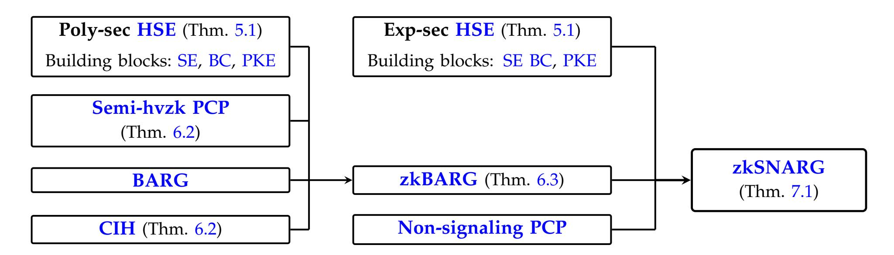

{0}------------------------------------------------

# New Approaches to Zero-Knowledge SNARG Constructions

Chaya Ganesh1 and Mor Weiss 2

1 Indian Institute of Science, India , <chaya@iisc.ac.in> 2Bar-Ilan University, Israel , <mor.weiss@biu.ac.il>

#### **Abstract**

Zero-Knowledge Succinct Non-Interactive Arguments (zkSNARGs) are SNARGs in which the proof reveals nothing except the validity of the claim. zkSNARGs for NP can be constructed generically from SNARGs for NP using a Non-interactive Zero-knowledge (NIZK) proof, but this transformation uses either the NIZK or the SNARG in a *non-black-box* way.

We design a new SNARGs-to-zkSNARGs transformation that is conceptually different from the NIZK+SNARG approach. Our transformation is inspired by the elegant construction of succinct interactive ZK arguments of Ishai, Mahmoody and Sahai (TCC'12) which combines a cryptographic hash function with an information theoretic ZK proof system (specifically, a Probabilistically-Checkable Proof). Our construction takes a first step towards *fully black-box (BB)* zkSNARG constructions: it uses the underlying SNARG as a black-box (though the other cryptographic components are used in a non-BB way). Our transformation is applicable to SNARGs for *sub-classes* of NP: batched NP computations (i.e., *BARGs*); and languages that have computational non-signaling PCPs, which contains NTISP (non-deterministic bounded space).

As a corollary, we get zkBARGs for NP, and zkSNARGs for NTISP, from the Learning With Errors (LWE) assumption. Thus, our results give a scaled-down version of the zkSNARGs-to-SNARGs reduction for NP, showing that by restricting to a sub-class of NP, the zkSNARG construction can be based on *standard* assumptions.

A main ingredient underlying our transformation is a new commitment primitive, called Hiding Somewhere-Extractable commitment (HSE), which we introduce and construct based on LWE. This commitment primitive enhances somewhere statistically-binding hash functions (Huba´cek and Wichs, ˇ ITCS 2015) to also guarantee *hiding*, and could be of independent interest.

{1}------------------------------------------------

# **Contents**

| 1 | Introduction 1.1 Our Results                                | 3 4   |
|---|----------------------------------------------------------------------|----------|
|   | 1.1.1 Hiding Somewhere-Extractable (HSE) Commitments           | 5        |
|   | 1.1.2 zkBARGs for NP                                           | 5        |
|   | 1.1.3 zkSNARGs for NTISP                                       | 6        |
| 2 | Technical Overview                                                   | 7        |
|   | 2.1 zkBARGs for NP                                             | 7        |
|   | 2.2 Hiding Somewhere-Extractable (HSE) Commitments             | 11       |
|   | 2.3 zkSNARGs for NTISP                                         | 12       |
| 3 | Related Works                                                        | 14       |
|   | 3.1 Alternative (Fully Non-Black-Box) Constructions               | 14       |
| 4 | Preliminaries                                                        | 15       |
|   | 4.1 Batch Arguments (BARGs)                                       | 16       |
|   | 4.2 Commitment Schemes                                         | 18       |
| 5 | Hiding Somewhere-Extractable (HSE) Commitments                       | 20       |
|   | 5.1 HSE Construction                                              | 22       |
| 6 | zkBARGs for NP from hvzkPCPs and BARGs                               | 28       |
|   | 6.1 Correlation-Intractable Hash (CIH)                            | 28       |
|   | 6.2 Probabilistically Checkable Proofs                         | 30       |
|   | 6.3 A "Bad" Relation for PCPs and a CIH for It                 | 31       |
|   | 6.3.1 A Bad Relation for a PCP                                 | 31       |
|   | 6.3.2 A Semi-hvzkPCP  6.3.3 The CIH for the IKOS-PCP  | 32 34 |
|   | 6.4 The zkBARG Construction                                       | 38       |
|   | 6.4.1 Security Analysis                                           | 43       |
| 7 | zkSNARGs from zkBARGs                                                | 52       |
|   | 7.1 zkSNARGs from zkBARGs and HSE                                 | 53       |
|   | 7.1.1 PCPs via tests and Non-signaling soundness                  | 53       |
| A | Additional Definitions                                               | 65       |
|   | A.1 Strong Binding Bit Commitment Scheme                       | 65       |
|   | A.2 Non-Signaling PCP                                          | 65       |

{2}------------------------------------------------

# **1 Introduction**

A *Succinct Non-Interactive Argument (SNARG)* allows an efficient prover P to convince an efficient verifier V that x ∈ L for some NP language L, by sending a single short proof π to V. The proof has the guarantee that if x /∈ L then any computationally-bounded malicious prover P ∗ successfully convinces V only with negligible probability. SNARGs have numerous applications, including practical implementations [\[BCR](#page-57-0)+19, [Set20,](#page-62-0) [GLS](#page-59-0)+23].

**SNARG Constructions.** The first SNARGs were constructed in the Random Oracle Model (ROM) [\[Kil92,](#page-61-0) [Mic94\]](#page-62-1). The core building block is an information-theoretic proof system — specifically, a *Probabilistically-Checkable Proof (PCP)* or its generalizations — which, to get succinctness, is then combined with a hash function (represented as a random oracle). Many SNARGs in the plain model follow a similar blueprint, but parties are assumed to have access to a Common Reference/Random String (CRS). Due to their usefulness, a large body of works has been dedicated to constructing such systems.

Existing SNARG constructions in the plain model can be roughly divided into two categories. The first set of works construct SNARGs for *all NP*, based on *strong* assumptions: either non-falsifiable cryptographic assumptions [\[Gro10b,](#page-60-0) [BCCT12,](#page-57-1) [DFH12,](#page-59-1) [Lip13,](#page-62-2) [GGPR13,](#page-59-2) [BCI](#page-57-2)+13, [BCPR14,](#page-57-3) [BISW17,](#page-58-0) [BCC](#page-57-4)+17, [BISW18,](#page-58-1) [ACL](#page-57-5)+22, [CLM23\]](#page-59-3); or the existence of sub-exponentially-hard indistinguishability obfuscation (together with some additional assumptions) [\[WW24,](#page-62-3) [RVV24,](#page-62-4) [WZ24,](#page-63-0) [WW25\]](#page-63-1); or based on indistinguishability obfuscation, but only achieving a weaker *non-adaptive* notion of soundness [\[SW14\]](#page-62-5). [1](#page-2-1)

The second line of works follows a different approach, which is also the one used in this work: they construct SNARGs for *sub-classes* of NP, based on *standard* assumptions [\[KR09,](#page-61-1) [KP16,](#page-61-2) [BHK17,](#page-58-2) [KPY19,](#page-61-3) [JKKZ21,](#page-61-4) [KVZ21a,](#page-61-5) [CJJ21a,](#page-58-3) [CJJ21b,](#page-58-4) [WW22,](#page-62-6) [JJ22,](#page-61-6) [KLV23,](#page-61-7) [BBK](#page-57-6)+23, [CGJ](#page-58-5)+23]. One sub-class which has been of particular interest in recent years is the class of *batched* NP computations, namely conjunctions of an NP relation. More specifically, these SNARGs — also known as *BARGs*, for "batched arguments" — are SNARGs for statements of the form "xi ∈ L for every 1 ≤ i ≤ T" for some NP language L. One motivation for considering sub-classes of NP is that there are known limitations on constructing adaptively-secure SNARGs for all NP via black-box reductions to falsifiable assumptions with standard polynomial hardness [\[GW11\]](#page-60-1).

Several works constructing SNARGs in the plain model for sub classes of NP (e.g., [\[KVZ21a,](#page-61-5) [CJJ21b,](#page-58-4) [CGJ](#page-58-5)+23]) follow a similar "PCP+hash" technique to the classical SNARG construction in the ROM [\[Kil92,](#page-61-0) [Mic94\]](#page-62-1). Specifically, they combine PCPs with *extractable hashes* [\[BCCT12\]](#page-57-1).[2](#page-2-2) However, unlike the construction of [\[Kil92,](#page-61-0) [Mic94\]](#page-62-1), these works additionally employ a *cryptographic* proof system, specifically, a BARG.

**SNARGs with Zero-Knowledge.** The focus of this work is on constructing SNARGs (and BARGs) *with a Zero Knowledge (ZK) guarantee*. ZK is a useful property of SNARGs, which is crucial for many applications [\[BCG](#page-57-7)+14, [RWGM23\]](#page-62-7). Roughly, a zero-knowledge SNARG (zkSNARG) is a SNARG in which the verifier learns nothing except the validity of the claim. This is formalized in the simulation-based paradigm by requiring the existence of a Probabilistic Polynomial Time (PPT) simulator that on input x generates a simulated CRS and proof, whose joint distribution is computationally indistinguishable from the joint distribution of the real-world CRS, and a proof generated by the honest prover P.

To date, the only method we have of endowing a SNARG system with a ZK guarantee is to combine the SNARG with a Non-Interactive ZK (NIZK) proof of knowledge via the paradigm of [\[BCCT12,](#page-57-1) [KMY20\]](#page-61-8). Roughly, the SNARG proof π for an instance x is replaced with a commitment c to π, together with a NIZK proof of knowledge for the claim *"*c *is a commitment to a SNARG proof* π *that*

1*Non-adaptive* soundness means the adversary A chooses the input statement before it is given the CRS. This should be contrasted with *adaptive* soundness (the soundness notion used in this work) where A first obtains the CRS, and only then chooses the input statement.

2Roughly, extractable hashes — also called "(multi) somewhere extractable hash functions" [\[KVZ21a\]](#page-61-5) and "somewhere extractable commitments" [\[CJJ21b\]](#page-58-4) — are (dual-mode) hash functions that additionally have extractability and local opening properties (these properties are explained in Section [1.1](#page-3-0) below).

{3}------------------------------------------------

*would have caused* V *to accept* x*"*. [3](#page-3-1) Notice that this is an NP claim (the witness for x is π, together with the randomness used to generate c). If the initial SNARG proof has sufficiently succinct proofs, then this transformation results in a zkSNARG. One drawback of this approach is that it uses the underlying SNARG in a *Non Black Box (NBB)* manner, whereas Black-Box (BB) constructions are usually preferable.

On the other hand, there is an alternative and elegant method for constructing either zkSNARGs in the ROM [\[BCS16\]](#page-58-6), or *interactive* succinct ZK arguments in the plain model under standard assumptions [\[IMS12\]](#page-60-2). The high-level idea is to endow the *underlying PCP* with a mild ZK guarantee against honest verifiers (with possibly skewed randomness). This approach was also successfully used to obtain *non-succinct* NIZKs [\[CCRR18,](#page-58-7) [CCH](#page-58-8)+19, [PS19,](#page-62-8) [HL18,](#page-60-3) [CLW18,](#page-59-4) [BKM20,](#page-58-9) [CKU20,](#page-58-10) [JJ21,](#page-61-9) [HLR21a,](#page-60-4) [CRT25\]](#page-59-5).

It is therefore natural to ask whether a similar approach of replacing the underlying informationtheoretic proof system with a ZK variant can also be used to construct *zkSNARGs* under standard assumptions in the *plain model*. Since we focus on constructions from *standard* assumptions, we restrict ourselves to constructing zkSNARGs for *sub-classes* of NP.

### **1.1 Our Results**

We devise new techniques for constructing zkSNARGs in the plain model. More specifically, we show that the "zero-knowledge PCP + hash" technique extends also the setting of *succinct* and *non-interactive* proofs in the *plain model*, and can be instantiated under standard assumptions for certain sub classes of NP. The sub classes we consider are batched NP computations (i.e., BARGs) and languages that have computational non-signaling PCPs (which includes all languages in P and NTISP — non-deterministic bounded space). In more detail, we show that recent BARGs and SNARGs constructed by combining BARGs with PCPs and extractable hash functions [\[KVZ21a,](#page-61-5) [CJJ21b\]](#page-58-4) can be made ZK by endowing the "right" underlying proof system (either the PCP or BARG) with a ZK property, and upgrading the extractable hash to also guarantee secrecy. We give a unified approach towards making these constructions ZK, by distilling the sources of information leakage in [\[KVZ21a,](#page-61-5) [CJJ21b\]](#page-58-4). This enables us to apply our techniques to the constructions of [\[KVZ21a\]](#page-61-5) and [\[CJJ21b\]](#page-58-4), which are quite different conceptually (despite using similar building blocks); see discussion at the end of this section.

We then obtain zkBARGs for NP, and zkSNARGs for NTISP, in the plain model by instantiate the underlying cryptographic building blocks (BARGs and extractable hashes) under the Learning With Errors (LWE) assumption. Our constructions achieve qualitative tradeoffs between the underlying assumption and the expressiveness of the class of relations. In more detail, we construct zkBARGs *for NP* assuming *polynomial* hardness of LWE, whereas our zkSNARGs are constructed *for NTISP* (more generally, for any language that has a computational non-signaling PCP) assuming *sub-exponential* hardness of LWE.

Our constructions make a first step towards BB zkSNARGs in the plain model from standard assumptions (for sub classes of NP). Indeed, by avoiding the use of NIZKs, our constructions are "less NBB" than the NIZK-based approach. Specifically, we use the underlying *cryptographic* proof system (the BARG/SNARG) as a black-box, though the other building blocks (the hash and PCP) are used in a NBB way. Our approach has the added feature of preserving the efficiency of the underlying BARG/SNARGs. We compare the efficiency of our approach to constructions that ignore the given BARG/SNARG altogether, or apply a NIZK on top of it, in Section [3.1](#page-13-1) and Remarks [6.19](#page-40-0) and [6.20](#page-41-0) (Section [6.4\)](#page-37-0).

The main technical building block underlying our technique is extractable hash functions with a secrecy guarantee, which we call Hiding Somewhere-Extractable (HSE) commitments. We believe that this notion can be of independent interest given that extractable hash functions are extremely useful in designing BARGs and SNARGs, and were used in several recent works (e.g., [\[HW15,](#page-60-5) [OPWW15,](#page-62-9) [CJJ21b,](#page-58-4) [KVZ21a,](#page-61-5) [DGKV22,](#page-59-6) [KLVW23\]](#page-61-10)). In the following, we first describe this new notion, then explain how we

3We note that NIZK and SNARGs are similar in that both are non-interactive proof systems, but they differ in three important respects: (1) a NIZK is not necessarily succinct, (2) a SNARG has no ZK guarantees, and (3) NIZK soundness holds against *computationally unbounded* provers, whereas SNARG soundness holds only against efficient provers. We discuss zkSNARG constructions via the combination of NIZK and SNARG further in Section [3.1.](#page-13-1)

{4}------------------------------------------------

#### **1.1.1 Hiding Somewhere-Extractable (HSE) Commitments**

We put forth and study the notion of Hiding Somewhere-Extractable (HSE) commitments, a generalization of extractable hash functions. Informally, a HSE commitment augments the notion of somewhere extractable hashes with a hiding property. A HSE is defined in the CRS model and allows P to commit a long message ⃗v to V by sending a single *short* commitment c to V, with the following guarantees. First, c has *local opening*, namely the prover can open any single bit of ⃗v by sending a short message to V. Second, the scheme is *extractable* in the sense that there is an extraction algorithm E such that for every commitment c, any index i, and any bit y, if the i'th entry in c can be opened to y, then E successfully extracts y from c (given an appropriate trapdoor, which is generated together with the CRS). Finally, the scheme is *hiding*: an efficient adversary cannot distinguish between the commitments to two (adversarially chosen) strings. HSEs are formally defined in Section [5.](#page-19-0) They extend extractable hashes — which only guarantee the extractability and local opening properties — to also satisfy hiding.

We construct HSE commitments based on extractable hash functions [\[HW15\]](#page-60-5), standard bit commitments, and a public-key encryption scheme (the latter two building blocks can be used to construct extractable bit commitments [\[BWW23\]](#page-58-11)). All building blocks can be instantiated based on the LWE assumption, and we obtain the following (see Corollary [5.16](#page-26-0) for the formal statement):

**Theorem 1.1** (Hiding Somewhere-Extractable Commitments — Informal)**.** *Assuming the polynomial hardness of LWE, there exists a Hiding Somewhere-Extractable (HSE) commitment scheme, with CRSs, commitments and openings of length* poly(λ, log T)*, where* λ *is a security parameter and* T *is the input length.*

We also consider HSEs with security against super-polynomial adversaries. (Jumping ahead, such HSEs will be useful when constructing zkSNARGs for NTISP below.) Specifically, we show that assuming subexponential security of LWE, there exist HSEs in which the extraction property holds against adversaries running in sub-exponential time Σ, with success probability negl(Σ) (see Corollary [5.16\)](#page-26-0):

**Theorem 1.2** (Hiding Somewhere-Extractable Commitments with Strong Extraction — Informal)**.** *Assuming the sub-exponential security of LWE, there exists a Hiding Somewhere-Extractable (HSE) commitment scheme with sub-exponential security. The HSE has CRSs, commitments and openings of length* poly(λ, log T)*, where* λ *is a security parameter and* T *is the input length.*

#### **1.1.2 zkBARGs for NP**

We construct zkBARGs for NP by combining BARGs, HSEs, and PCPs with a mild ZK guarantee. Instantiating the cryptographic building blocks (BARGs and HSEs) under the LWE assumption gives zkBARGs for NP based on the polynomial hardness of LWE. At a high level, our zkBARGs follow a similar structure to a single recursive step in the BARG construction of [\[CJJ21b\]](#page-58-4), and ZK is obtained by endowing the underlying PCP with a weak ZK guarantee, and replacing the extractable hashes with HSE commitments. Our construction is inspired by constructions of succinct interactive ZK arguments [\[IMS12\]](#page-60-2) and zkSNARGs in the ROM [\[BCS16\]](#page-58-6) which replace the underlying PCP with a zero-knowledge PCP.

Our construction, described informally in Theorem [1.3](#page-5-1) below (and formally in Theorem [6.3\)](#page-38-0), employs three main building blocks. The first is a *non-ZK* BARG for NP. The second is an HSE scheme. The final component is a PCP with semi Honest-Verifier Zero-Knowledge (semi-hvzkPCP; cf. Definition [6.7\)](#page-29-1). Recall that in a standard PCP, the (deterministic) prover P generates a single *oracle* proof π, and the PPT verifier V decides whether to accept or to reject after querying few locations in π. A *semi-HVZK* PCP is a PCP in which the prover is randomized, and there exists a PPT simulator Sim such that for every possible randomness string r for the honest V, Sim on input r, x perfectly simulates the joint distribution (r, π|Q), where Q are the queries which V makes to π when using randomness r. Moreover, similar to [\[CJJ21b\]](#page-58-4), the semi-hvzkPCP for a language L is associated with a "bad" relation BAD and a Correlation-Intractable 

{5}------------------------------------------------

Hash (CIH) for BAD. We elaborate on these notions in Section [2.1](#page-6-1) below. Informally, BAD consists of inputs x /∈ L, a purported proof π, and verifier randomness that would cause the PCP-verifier to accept x when given access to π. A CIH h for BAD is a hash function for which it is infeasible to find (x, π) such that ((x, π), h((x, π)) ∈ BAD.

**Theorem 1.3** (zkBARGs from BARGs, HSEs, and semi-hvzkPCPs — Informal)**.** *Assuming the existence of BARGs for NP, HSE commitments, and a semi-hvzkPCP for NP with a CIH for its bad relation, there exist zkBARGs for NP. Moreover, the zkBARG uses the underlying CIH and BARG for NP as a black box.*

Theorem [1.3](#page-5-1) does not give a fully-BB construction of zkBARGs, since it uses the HSE and semihvzkPCP in a NBB way. One motivation for designing zkBARGs that use the *underlying BARG* as a black-box is that it is expected to be the most computationally-heavy system out of the three building blocks. We note that our construction has the added feature that it only uses in a non-black-box manner the *verification procedures* of the PCP and HSE, which are expected to have smaller size (compared to, e.g., the BARG algorithms).

Instantiating Theorem [1.3](#page-5-1) with the BARGs of [\[CJJ21b\]](#page-58-4), the HSE commitments of Theorem [1.1,](#page-4-2) and a semi-hvzkPCP which we construct based on the "MPC in the Head" paradigm [\[IKOS07\]](#page-60-6) (see Sections [2.1](#page-6-1) and [6.3\)](#page-30-0), we obtain zkBARGs matching the assumptions and parameters of the BARGs of [\[CJJ21b\]](#page-58-4), but which also guarantee ZK (see Corollary [6.18](#page-40-1) for the formal statement):

**Corollary 1.1** (zkBARGs for NP from LWE — Informal)**.** *Assuming polynomial hardness of LWE, there exist zkBARGs for NP with proofs and CRSs of length* poly(λ, log T, s) *where* λ *is a security parameter,* T *is the number of instances, and* s *bounds the size of the verification circuit of the verified relation. Moreover, the prover and verifier run in time* poly(λ, T, s) *and* poly(λ, T, n) + poly(λ, log T, s) *respectively, where* n *is the input length.*

### **1.1.3 zkSNARGs for NTISP**

We construct zkSNARGs for the class of all languages that have a computational non-signaling PCP. This class contains P and NTISP[4](#page-5-2) as sub classes. Our scheme follows a similar blueprint to the SNARGs of [\[KVZ21a\]](#page-61-5), which are constructed by combining sub-exponentially secure extractable hash functions with BARGs for NP, and PCPs with a special soundness guarantee called *computational non-signaling*. ZK is obtained by replacing the underlying BARGs with zkBARGs and the extractable hash function with sub-exponentially secure HSE commitments. We show the following (see Theorem [7.1](#page-53-0) for the formal statement):

**Theorem 1.4** (zkSNARGs from zkBARGs, HSEs, and non-signaling PCPs)**.** *Let* L *be a language. If there exist sub-exponentially-secure zkBARGs for NP, sub-exponentially-secure HSE commitments, and a computational non-signaling PCP for* L*, then there exists a zkSNARG for* L*. Moreover, the zkSNARG uses the underlying zkBARG for NP as a black-box.*

We note that as in Theorem [1.3,](#page-5-1) our zkSNARG uses only the *verification procedures* of the PCP and HSE in a non-black-box way.

Theorem [1.4](#page-5-3) can be thought of as a scaling down of the "SNARGs for NP imply zkSNARGs for NP" reduction [\[KMY20\]](#page-61-8) discussed above. In particular, to obtain zkSNARGs for NP in this way, one must first construct SNARGs for NP for which, as noted above, there are inherent limitations. On the other hand, the combination of Theorem [1.3](#page-5-1) and Theorem [1.4](#page-5-3) shows that by scaling down the class of languages to languages with a computational non-signaling PCP, the construction can be based on *BARGs*, which can be constructed from standard assumptions.

Instantiating Theorem [1.4](#page-5-3) with our zkBARGs of Corollary [1.1](#page-5-4) (which, assuming sub-exponential security of LWE, are actually *sub-exponentially* secure), the HSE commitments of Theorem [1.2,](#page-4-3) and the

4The class NTISP(t, s) consists of all the languages that are decidable by a non-deterministic Turing machine running in time t and space s.

{6}------------------------------------------------

Figure 1: Overview of our zkBARG and zkSNARG construction. SE: Somewhere-extractable commitment, BC: Bit commitment, PKE: Public-key encryption, CIH: Correlation intractable hash function, HSE: Hiding somewhere extractable commitment scheme

computational non-signaling PCPs for NTISP of [\[BKK](#page-58-12)+18], we get the following (see Corollary [7.8](#page-56-0) for the formal statement):

**Corollary 1.2.** *Assuming sub-exponential hardness of LWE, there exist zkSNARGs for NTISP*(t, s) *for every* s, t ∈ N *such that* s · log t = poly(λ, n)*, where* λ *is a security parameter, and* n *is the input length.*

Our zkSNARGs of Corollary [1.2](#page-6-3) match the parameters of the SNARGs of [\[KVZ21a\]](#page-61-5), while also acheiving ZK. We note that Corollary [1.2](#page-6-3) gives a non-trivial ZK guarantee for every t = ω(log n).

**Comparison Between Our zkBARG and zkSNARG Constructions: Discussion.** Our zkBARGs (Theorem [1.3\)](#page-5-1) and zkSNARGs (Theorem [1.4\)](#page-5-3) follow similar blueprints to the BARGs of [\[CJJ21b\]](#page-58-4) and the SNARGs of [\[KVZ21a\]](#page-61-5) (respectively). The latter two constructions share some similarities, but are actually quite different conceptually. Indeed, the BARGs of [\[CJJ21b\]](#page-58-4) follow the lines of the Kilian [\[Kil92\]](#page-61-0)- Micali [\[Mic94\]](#page-62-1) construction, where the verifier checks that *a random test* of the PCP verifier would have passed. The SNARGs of [\[KVZ21a\]](#page-61-5), on the other hand, use a BARG to prove that *all* tests of the underlying PCP verifier would have passed. Nonetheless, our results give a unified approach towards adding ZK to these succinct arguments (while using the underlying BARG and CIH as a black box) by endowing the hash with a hiding property, and identifying the appropriate underlying proof system which should be made ZK. More specifically, to obtain a sublinear proof length, both constructions [\[CJJ21b,](#page-58-4) [KVZ21a\]](#page-61-5) reuse components of the underlying proof system ([\[CJJ21b\]](#page-58-4) reuse the queries of the PCP-verifier in all PCP executions; [\[KVZ21a\]](#page-61-5) reuse a single PCP proof string for all BARG witnesses). The "appropriate" proof system is the one exploiting this reuse (i.e., the PCP in [\[CJJ21b\]](#page-58-4) and the BARG in [\[KVZ21a\]](#page-61-5)).

# **2 Technical Overview**

# **2.1 zkBARGs for NP**

In this section we highlight the main steps in our zkBARG construction. Our zkBARGs are inspired by Kilian's succinct (ZK) arguments from PCPs [\[Kil92\]](#page-61-0), and build on the BARGs of [\[CJJ21b\]](#page-58-4), which in turn employ techniques from constructions of SNARGs in the ROM [\[Kil92,](#page-61-0) [Mic94\]](#page-62-1). We therefore first give some background on these constructions.

**Probabilistically Checkable Proofs (PCPs) for NP** are information-theoretic proof systems in which the prover PP , given as input a circuit C and (x, w) such that C(x, w) = 1, generates a proof string π. The verifier VP on input C, x, and given oracle access to π, tosses some coins, makes few queries to π, and either accepts or rejects. If C(x, w) = 1 then the verifier accepts the honestly-generated π with high 

{7}------------------------------------------------

probability (the *completeness* property). If C(x, w) = 0 then for *every* (even malformed)  $\pi^*$ ,  $\mathcal{V}_P$  with input C, x, and given oracle access to  $\pi^*$ , accepts only with small probability (the *soundness* property).

Kilian's Succinct Arguments. Kilian [Kil92] constructed succinct interactive arguments for NP — i.e., arguments whose size is poly-logarithmic in the size of the NP witness — by combining PCPs with hash functions that have *local opening*. Recall from Section 1.1 that the latter allow a prover to hash a long string  $\vec{v}$  into a short hash c, such that every index in  $\vec{v}$  can be efficiently opened with a succinct opening string  $\rho$ . Roughly, Kilian's argument is executed as follows. The argument prover  $\mathcal{P}_A$ , on input C, x, w, generates a PCP proof  $\pi$  that C(x, w) = 1, and sends a short hash c of  $\pi$  to the argument verifier  $\mathcal{V}_A$ . Now wishes to execute the PCP verification procedure. For this, she picks a random string r for the honest PCP verifier  $\mathcal{V}_P$ , which she sends to  $\mathcal{P}_A$ . The randomnes r determines the set of queries  $\mathcal{Q}$  which  $\mathcal{V}_P$  makes to the proof. For every  $q \in \mathcal{Q}$ , the prover  $\mathcal{P}_A$  sends  $\pi_q$  to  $\mathcal{V}_A$ , as well as the opening string  $\rho_q$ .  $\mathcal{V}_A$  then accepts if and only if all openings are correct, and  $\mathcal{V}_P$  accepts when using randomness r and given the oracle answers  $(\pi_q)_{q \in \mathcal{Q}}$ .

**SNARGs** in the ROM. The only message from  $\mathcal{V}_A$  to  $\mathcal{P}_A$  in Kilian's succinct arguments is a uniformly random string r for the PCP verifier  $\mathcal{V}_P$ . In the ROM, this message can be eliminated by having the prover derive r from c using the RO [Mic94]. This results in a non-interactive argument with a single message c,  $(\pi_q, \rho_q)_{q \in \mathcal{Q}}$ . The verifier locally computes r = RO(c) and  $\mathcal{Q}$ , and then uses  $(\pi_q, \rho_q)_{q \in \mathcal{Q}}$  to emulate the verification procedure of the argument verifier  $\mathcal{V}_A$ .

**Obstacles to Removing the RO.** Since our goal is to construct SNARGs (and BARGs) in the *plain* model, we need to find another method of deriving the randomness r (without a RO). Several recent works [KRR17, CCRR18, HL18, CCH+19, PS19, BKM20, CPV20, CKU20, JJ21, CJJ21a, CJJ21b, HJKS22, CGJ+23, DJJ24] have shown that in some cases the RO can be replaced with a *Correlation Intractable Hash* (CIH). Roughly, a CIH for a relation  $\mathcal{R}$  is a family  $\mathcal{H}$  of hash functions where for every PPT adversary  $\mathcal{A}$ ,

$$\Pr_{\mathbf{h} \leftarrow \mathcal{H}}[(x, \mathbf{h}(x)) \in \mathcal{R} \ : \ x \leftarrow \mathcal{A}(1^{\lambda}, \mathbf{h})] = \mathsf{negl}(\lambda).$$

To see why CIHs are useful in our context, we first take a closer look at the soundness reduction in the SNARG.

Soundness of the SNARG is proven via a reduction to the PCP soundness. However, the nature of soundness in SNARGs and PCPs is very different. Indeed, PCP soundness is "single shot" in the following sense: there might be "bad" choices r which cause the PCP-verifier  $\mathcal{V}_P$  to accept false claims, but since r is chosen independently of the proof oracle, a malicious PCP-prover  $\mathcal{P}_P^*$  has a single opportunity of "hitting" a "bad" r. On the other hand, SNARG soundness is "multi shot": a malicious SNARG prover  $\mathcal{P}_S^*$  can "try" multiple different proof strings  $\pi^*$  with hashes  $c^*$ , and check for each of them whether  $r = \mathrm{RO}(c^*)$  would cause  $\mathcal{V}_P$  (and consequently, also the SNARG verifier) to accept.

Therefore, the soundness reduction is related to a "bad" set of verifier choices:

$$\mathsf{BAD}_x := \{((C,\mathsf{c}),r) : \not\exists w \text{ s.t. } C(x,w) = 1 \land \mathcal{V}_P(x;r) \text{ accepts given } \widetilde{\pi}\}$$

where  $\widetilde{\pi}$  are the oracle answers — as defined by c — to  $\mathcal{V}_P$ 's oracle queries when using randomness  $r.^5$  If r is derived from  $(C, \mathsf{c})$  using a CIH for the relation  $\mathsf{BAD}_x$  then we are guaranteed that it would be infeasible for a computationally-bounded malicious  $\mathcal{P}_S^*$  to find  $(C, \mathsf{c})$  for which the corresponding  $r = \mathsf{h}(C, \mathsf{c})$  would cause  $\mathcal{V}_P$  to accept. Unfortunately, there are barriers to instantiating the CIH for the SNARG's  $\mathsf{BAD}_x$  relation. Consequently, several previous works have focused on designing SNARGs for sub-classes of NP, and in particular on designing BARGs for NP, i.e., SNARGs for batched NP relations. One construction which is of particular interest to us is the BARGs for NP of Choudhuri, Jain and Jin [C][21b]. We survey this construction next.

5Jumping ahead, we note that  $\tilde{\pi}$  is well defined when the hash function used to generate c is *extractable*. This is indeed the case for the hash functions we use in our work, see Section 2.2 below.

{8}------------------------------------------------

The BARGs of [CJJ21b]. Recall that a BARG allows a prover  $\mathcal{P}$  to convince a verifier  $\mathcal{V}$  of the validity of a batched statement by sending a single succinct message to  $\mathcal{V}$ , where a batched statement  $(C, x_1, \ldots, x_T)$  has the form "there exist  $w_1, \ldots, w_T$  such that  $C(x_i, w_i) = 1$  for every  $1 \le i \le T$ ". The BARGs of [CJJ21b] are constructed by adapting the "PCP+hash" technique to the BARG setting, and showing how to instantiate the CIH in this setting.

The high-level idea of [CJJ21b] is to apply the PCP on each of the T instances, but *jointly* hash and verify the PCPs. More precisely, the prover  $\mathcal{P}$  first generates PCP proofs  $\pi^1,\ldots,\pi^T$ , where  $\pi^i$  proves that  $C(x_i,w_i)=1$  for some  $w_i$ . Then,  $\mathcal{P}$  arranges the PCPs as rows in a matrix, and hashes *every column* of this matrix to obtain  $c^1,\ldots,c^\ell$  for some  $\ell=\operatorname{poly}(\lambda,|C|)$ . Notice that  $|c^j|$  is sublinear in T because the hashes are succinct (in fact, in [CJJ21b],  $|c^j|=\operatorname{poly}(\lambda,\log T)$ ). Next,  $\mathcal{P}$  uses  $c_1,\ldots,c_\ell$  to derive randomness for the PCP verifier. However, this cannot be done separately for each i (otherwise the proof length will scale with T since it will contain openings for each of the T instances). To prevent this blowup, [CJJ21b] use a PCP with a special *oblivious queries* property. Roughly, the verification procedure of such a PCP can be divided into two phases: a randomized Query phase and a deterministic Verify phase. The Query phase depends only on  $\lambda$  and C, and is *oblivious* of the input statement x; it outputs a set Q of oracle queries and a state st. The Verify phase takes as input st, x and the oracle answers  $\pi|_Q$ , and either accepts or rejects.

Given a PCP with oblivious queries, the BARG prover can use  $c^1, \ldots, c^\ell$  to derive randomness r for the PCP verifier, and *reuse it* over *all* instances. For every  $i \in [T]$  and every  $q \in \mathcal{Q}$ , the prover can then generate an opening  $\rho_q^i$  to  $\pi_q^i$  of the ith bit of  $c^q$ . However, sending all these openings would still incur communication  $\Omega(T)$ . To reduce the proof length, [CJJ21b] use a recursive construction in which verification of the openings is repeatedly delegated to the prover. We do not elaborate further on this point, since our zkBARG construction eliminates the recursive step altogether by using the BARGs of [CJJ21b] as a black-box building block.

The last component in [CJJ21b]'s construction is a CIH for the BAD relation of the PCP. This CIH is obtained by applying a result of [HLR21a], which construct a CIH for *efficiently product-verifiable* relations, under the LWE assumption. Roughly, a relation  $\mathcal{R}$  is efficiently product-verifiable if: (1) for every x, the set  $\mathcal{R}_x := \{w : (x, w) \in \mathcal{R}\}$  can be presented as a *product* set  $\mathcal{R}_x := \mathcal{R}_x^1 \times \cdots \times \mathcal{R}_x^t$  for some sets  $\mathcal{R}_x^1, \ldots, \mathcal{R}_x^t$  and some t; and (2) the  $\mathcal{R}_x^l$ 's are *efficiently verifiable* in the sense that there exists a circuit C that on input x, w, l outputs 1 if and only if  $w \in \mathcal{R}_x^l$ .

Before describing our zkBARG construction, we first highlight a subtle point regarding the hashes  $c^j$  and how they are used to prove soundness of the BARG via a reduction to the soundness of the PCP. If  $\mathcal{P}^*$  is a malicious prover that successfully convinces  $\mathcal{V}$  to accept a batched statement containing a false statement  $x_{i^*}$ , then  $\mathcal{P}^*$  is used in the reduction to construct a PCP prover  $\mathcal{P}_P$  that successfully convinces the PCP verifier to accept  $x_{i^*}$ . In the reduction, we would like to claim that  $c_1, \ldots, c_\ell$  correspond to some fixed proof string  $\widetilde{\pi}^{i^*}$ . However, this is not necessarily the case: due to succinctness, for every j there potentially exist many strings whose hash is consistent with  $c_j$ , so  $\widetilde{\pi}^{i^*}$  is not uniquely defined (and we cannot reduce to PCP soundness). This issue can be resolved by employing hash functions that are somewhere extractable in the following sense. The CRS of the hash function is generated together with a trapdoor  $\tau$ , with respect to an index  $i^*$ , and satisfies the following properties. First, hashes have local opening. Second, the CRSs generated for different indices  $i^*$ ,  $j^*$  are computationally indistinguishable. Third, there exists an efficient extractor E such that if a (possibly malformed) hash c can be successfully opened at location  $i^*$  to some value b then E, given the trapdoor  $\tau$ , extracts b from c with overwhelming probability.

**Our zkBARGs for NP.** We are now ready to describe our zkBARG construction. Going back to Kilian's succinct arguments, they can be made *zero knowledge* by enhancing the PCP to have *ZK against honest verifiers*, and replacing the hash with a succinct *commitment* (i.e., where the hash c is also *hiding* — it reveals no information about the committed string  $\vec{v}$ ) [IMS12]. Moreover, the construction is black box. Our construction follows a similar approach, and is conceptually simple.

{9}------------------------------------------------

Our starting point is the BARG construction of [\[CJJ21b\]](#page-58-4) described above, which combines a PCP (with a CIH for the BAD PCP relation), an extractable hash family used to hash the PCP, and an internal BARG system (used in the recursive construction). To achieve ZK, we enhance the PCP to have a mild ZK guarantee, and upgrade the extractable hash to have a secrecy property. Given this blueprint, the zkBARGs construction boils down to identifying the exact properties needed from these building blocks, and appropriately instantiating them, as described below. (We note that even given the "appropriate" building blocks, some technicalities arise in the construction and analysis; see the discussion in Section [6.4](#page-37-0) for further details.) We then show that both building blocks can be instantiated from the polynomial hardness of LWE, and so we obtain zkBARGs for NP assuming LWE, proving Corollary [1.1.](#page-5-4) We note that assuming sub-exponential hardness of LWE, our zkBARGs are in fact *sub-exponentially* secure. This will be used in Section [2.3](#page-11-0) below.

**Building Block I: PCPs with Semi Honest-Verifier Zero Knowledge.** Recall from above that to obtain ZK in the BARG construction, we intend to enhance the underlying PCP to have a ZK guarantee. However, unlike the classic Kilian construction, we use the PCP in a non-standard *batched* setting, which introduces new requirements from the PCP. In more detail, recall from above that in [\[CJJ21b\]](#page-58-4)'s construction, verification uses *the same PCP-verifier randomness* r to verify *all* instances. Therefore, to obtain ZK of the BARG, we need to be able to simulate the queried PCP bits in *correlated* executions that use the same verifier randomness r. This property doesn't follow from standard (even full-fledged) ZK for PCPs, which only requires simulation for *random* executions (without restricting the verifier randomness to a specific value r). Instead, we need a different property which, roughly, guarantees that when VP 's randomness r is given to the PCP-simulator Sim as part of its input, then Sim can simulate the oracle answers to VP 's queries *when she uses randomness* r. This property is a special case of the semi Honest-Verifier ZK (semi-HVZK) notion for Interactive Oracle Proofs (IOPs) [\[BCL20\]](#page-57-8), and was used even in standard compilation of a *(single)* PCP/IOP into a ZK succinct argument. However, while semi-HVZK is used in prior succinct argument constructions to obtain ZK against malicious verifiers in the succinct argument, we use it in an entirely different way, namely, to correlate multiple PCP executions. Thus, our construction employs the semi-HVZK notion from the setting of information-theoretic proofs, to obtain a different property in the computational setting.

Another issue that arises when designing the PCP is that, as discussed above, the CIH construction of [\[HLR21a\]](#page-60-4) requires the underlying relation to be a *product relation*. This issue was solved in [\[CJJ21b\]](#page-58-4) by using the *parallel repetition* of the PCP. This, however, does not preserve (semi-) HVZK. Indeed, repeating the verification process multiple times in effect deviates from the honest verifier strategy, and so might violate ZK. Instead, we consider a variant of parallel repetition with a modified proof generation algorithm that outputs many independent proof copies, and each parallel repetition of the verification procedure uses a different proof copy. (A similar approach was used to construct ZK-PCPs in [\[KPT97\]](#page-61-12).) We prove that this modified parallel repetition preserves semi-HVZK, as well as all the other properties we need from the PCP.

We instantiate the semi-HVZK PCPs (semi-hvzkPCPs) using the "MPC in the Head" paradigm [\[IKOS07\]](#page-60-6), which employs secure Multi-Party Computation (MPC) protocols to design hvzkPCPs. We show that their construction in fact achieves semi-HVZK. At a high-level, this is because the ZK property of the PCP follows from the *simulation-based privacy* of the underlying MPC protocol, which guarantees the existence of a single simulator that can simulate the views of *any* (not too large) subset of parties in the MPC protocol. More specifically, a PCP-query translates to a party corruption in the underlying MPC protocol. Since the simulator can simulate the view of *any* subset of MPC parties, the resultant PCP simulator can simulate *any* (not too large) subset of PCP symbols. We note that PCPs based on the MPC in the Head paradigm were recently used to construct non-interactive proofs using the CIH paradigm in [\[GLS22\]](#page-59-9), but their reults and techniques are very different from ours, see Remark [6.15.](#page-36-0)

The final step is to design a CIH for the BAD relation of the PCP. Following [\[CJJ21b\]](#page-58-4), we do so by

{10}------------------------------------------------

showing that BAD is efficient product-verifiable, and therefore has a CIH under the LWE assumption. The analysis of the CIH is more involved in our case compared to [\[CJJ21b\]](#page-58-4), due to the use of a different underlying PCP. Moreover, our semi-hvzkPCPs are obtained using an entirely different approach compared to the PCPs employed in [\[CJJ21b\]](#page-58-4). The reason is that the properties we need from the PCP are very different from those required in [\[CJJ21b\]](#page-58-4). In more detail, due to the recursive nature of the BARGs of [\[CJJ21b\]](#page-58-4), they have stringent efficiency requirements from the underlying PCP. Since we eliminate the recursion, our construction can make do with less efficient PCPs. This gives us flexibility in constructing the PCP, and in particular allows us to achieve the semi-HVZK property we need, by relying on the less efficient PCPs of [\[IKOS07\]](#page-60-6).

**Building Block II: Extractable Hashes with Secrecy.** Recall that to achieve ZK, the hashes/commitments c 1 , . . . , c ℓ to the PCP bits should hide the underlying messages (i.e., the PCP bits). This is needed even when the PCPs have HVZK, because if the hashes have no secrecy then they might reveal *global* information about the PCPs, and this might reveal information about the NP witnesses. (Indeed, the ZK property of a PCP only holds against verifiers reading *few proof bits*.) For this, we introduce the notion of a *Hiding* Somewhere-Extractable (HSE) hash function, and construct HSEs with different security flavors. We discuss this notion next.

# **2.2 Hiding Somewhere-Extractable (HSE) Commitments**

We put forth the notion of *Hiding* Somewhere-Extractable (HSE) commitments, which are extractable hashes (also known as somewhere-extractable commitments) that are also hiding. We then construct HSEs — with different levels of security — from the LWE assumption.

Recall that Somewhere-Extractable (SE) commitments have two properties: (1) commitments have local opening; and (2) the CRS is generated together with a trapdoor τ for some index i ∗ , and there exists an efficient extractor E that extracts b ∈ {0, 1} from every (possibly malformed) commitment c that can be successfully opened to b at i ∗ . Furthermore, CRSs generated for different indices i ∗ are indistinguishable. A HSE is a SE commitment that additionally has a third *hiding* property: indistinguishability of commitments generated for two (adversarially chosen) strings.[6](#page-10-1)

We construct HSEs by adding a bit-commitment layer on top of SE commitments [\[HW15\]](#page-60-5). Crucially, even though the SE has extraction, to exploit SE extraction we need the bit commitment to *also* be extractable. This requires some additional work, as we describe now. We start with a SE scheme (this gives succinctness, local opening and extraction), add a layer of bit commitment scheme (this gives hiding, but loses extraction), and then augment the bit commitment with a Public-Key Encryption (PKE) scheme (recovers extraction, retains hiding). More specifically, we first use the SE commitment to generate a short commitment c ′ to the message ⃗v, then commit to each bit of c ′ using the (PKE-augmented) bit commitment. The final commitment c consists of the concatenation of all these bit commitments. Importantly, since c ′ is already succinct, we can afford to use a *non-succinct* bit commitment with a poly(λ) overhead, where λ is the security parameter. We note that our use of PKE to enable extraction of a committed bit is reminiscent of the technique used to construct one-time dual mode bit commitment schemes in [\[BWW23\]](#page-58-11). Our construction can be thought of as a "divide and conquer" approach to designing HSEs: we use SE commitments to get succinctness and extraction; and extractable bit commitments to get hiding while retaining extraction.

This construction satisfies the HSE properties. Indeed, hiding and local opening follow from the corresponding properties of the underlying bit commitment and SE commitment, respectively. Extraction

6We note that although we require a local opening property, the commitment is *not* required to guarantee hiding when *some bits of the commitments have been opened*, but rather hiding is only needed when the commitment has not been opened in any location. This is because in our zkBARG/zkSNARG constructions, each commitment is either never opened (in which case we can use hiding), or fully opened (in which case we cannot rely on hiding anyway).

{11}------------------------------------------------

holds because we can use the secret key of the PKE to bit-wise extract c ′ from c, and then use the extractor of the SE commitment to extract the value at index i ∗ .

We note that designing HSEs satisfying *both* extraction and hiding requires some care. First, as noted above, the underlying bit commitment scheme must also be extractable. Second, the order in which the SE and bit commitments are combined is also important. Specifically, HSEs could potentially be constructed by applying a SE on top of an extractable bit commitment (first committing to each bit of the message ⃗v using the bit commitment scheme, then committing to the concatenation of these commitments using the SE). However, even if the HSE is only required to be extractable on a *single* index i ∗ , the underlying SE needs to be extractable on *multiple* indices (specifically, the indices corresponding to the commitment to the bit ⃗vi ∗ ). While multi-extractable SEs are equivalent to standard SEs, this results in a less efficient construction (e.g., with longer CRSs).

By instantiating our HSEs with the bit commitment of [\[Nao89\]](#page-62-10), and the SE commitments of [\[HW15\]](#page-60-5) — both based on the LWE assumption — we prove Theorems [1.1](#page-4-2) and [1.2.](#page-4-3)

Unfortunately, the hiding property of HSE is still insufficient to obtain ZK in our zkBARGs of Section [2.1,](#page-6-1) and necessitates an additional step. We explain this subtlety next.

**Using HSEs in our zkBARGs for NP.** Our HSEs satisfy the natural notion of commitment hiding, namely, that commitments to two different strings are indistinguishable. This, in itself, seems insufficient to obtaining ZK in our zkBARGs of Section [2.1.](#page-6-1) To see why, consider the following natural strategy for the BARG simulator: it samples randomness r, then uses T random emulations of the PCP simulator to simulate π 1 |Q, . . . , πT |Q, where Q are the queries the honest verifier makes to the PCP, when she uses randomness r. *But how should the BARG simulator sample* r*?* Recall that r is derived from c 1 , . . . , c ℓ using the CIH, but c 1 , . . . , c ℓ depend on the (simulated) PCPs, which cannot be simulated without first generating r. It is unclear how to break this circular dependency using only hiding of the HSE.

Luckily, this circularity can be solved by enhancing *the CIH* to be *programmable* [\[CLW18\]](#page-59-4).[7](#page-11-1) Roughly, a CIH is programmable if it is 1-universal and is associated with an efficient sampler Samp which, given any input-output pair (u, v) for the CIH, samples a hash function h conditioned on the requirement that h(u) = v. Canetti et al. [\[CLW18\]](#page-59-4) show that the existence of programmable CIHs for a relation R follows from the existence of standard (non-programmable) CIHs for a related relation R′ . Using this observation, we construct *programmable* CIHs for the bad relation BAD of the semi-hvzkPCP. We can then rely on programmability to complete the simulation of the BARG: the BARG-simulator can sample r uniformly at random (by 1-universality, this is r's distribution in the real world), then simulate the PCPs and honestly commit to them, and finally sample an appropriate CIH h using Samp.

As discussed above, SEs are an important building block in several constructions of succinct arguments. Equipped with our enhanced notion of *HSE*s, we now turn our attention to other constructions of (non-ZK) succinct arguments, with the goal of endowing them with ZK guarantees using similar techniques to our zkBARGs construction of Section [2.1.](#page-6-1) Specifically, as described in the next section, we consider the SNARGs of [\[KVZ21a\]](#page-61-5).

# **2.3 zkSNARGs for NTISP**

We now describe our zkSNARGs for NTISP, which are based on the SNARGs for NTISP of [\[KVZ21a\]](#page-61-5). Kalai et al [\[KVZ21a\]](#page-61-5) design SNARGs for NTISP by combining computational non-signaling PCPs with SE commitments[8](#page-11-2) and BARGs for NP. A natural idea for obtaining ZK is therefore to apply a similar approach to the one used in our zkBARG construction, namely replace the SE commitments with HSEs, and the PCP with a semi-hvzPCP. Unfortunately, this doesn't quite work due to the different role the PCPs and BARGs play in the BARGs of [\[CJJ21b\]](#page-58-4) and the SNARGs of [\[KVZ21a\]](#page-61-5).

7We thank the anonymous reviewers of a prior conference for suggesting the use of *programmable* CIHs here (instead of using standard CIHs and relying on HSEs with an enhanced hiding guarantee).

8 In fact, they use an enhanced variant of SE commitments which they call *multi-extractable somewhere statistical hash*, but since these can be constructed from standard SEs, for the sake of clarity we overlook this point in this overview.

{12}------------------------------------------------

In more detail, in the BARGs of [\[CJJ21b\]](#page-58-4) the BARG proof is used to prove that a *single* test of the PCP verifier would have passed for *each of the BARG instances* being proven. If the underlying PCP has semi-HVZK, then ZK is obtained even if the underlying BARG has *no ZK guarantees*. This is because the BARG witnesses consist of few PCP bits, and the semi-HVZK property guarantees that this can be simulated. On the other hand, in the SNARGs of [\[KVZ21a\]](#page-61-5) the BARG proof is used to prove that *all* the tests of the PCP verifier on a *single* instance would have passed. A ZK guarantee of the underlying PCP is therefore useless here, because the BARG witnesses "cover" the entire PCP proof. Instead, we need the *underlying BARG* to be ZK, since that would guarantee that the BARG witnesses (namely, the PCP bits) remain hidden. Luckily, our results of Section [2.1](#page-6-1) give us exactly that! The ZK property of the zkSNARGs then follows from a combination of the HSE hiding and the ZK guarantee of the internal BARG. Indeed, the SNARG simulator can generate dummy commitments to the PCP bits, and then use the zkBARG simulator to simulate the BARG proof with respect to these dummy commitments.

**A Unified Approach to "ZK-fying" Succinct Proofs.** While our zkBARG and zkSNARG constructions use the underlying PCP and BARG differently, they are constructed using the same high-level approach towards obtaining ZK: replacing the SEs with HSEs, and adding ZK to the underlying proof system which obtains succinctness via reuse of information. Indeed, in our zkBARGs of Section [2.1](#page-6-1) the underlying PCP system reuses the verifier randomness across all instances, and so the zkBARGs are obtained by combining *standard* BARGs with *semi-HVZK* PCPs. In our zkSNARGs, on the other hand, the underlying BARG reuses the same PCP proof in all witnesses, and therefore we obtain the zkSNARGs by combining *zk*BARGs with *standard* (non-signaling) PCPs.

**Putting Things Together.** One subtlety that arises in our zkSNARG construction is that the SNARG construction of [\[KVZ21a\]](#page-61-5) requires the BARG and SE to be secure against sub-exponential adversaries. Therefore, unlike the HSE used in our zkBARG, we need the HSE to satisfy a *strong* extraction property, namely, extraction against sub-exponential adversaries. We show that *sub-exponentially* secure HSEs can be constructed based only on the existence of *sub-exponentially* secure SEs and a pseudo-random generator (together with PKE and bit commitments with standard polynomial security); these building blocks can be instantiated from the sub-exponential security of LWE. The high-level idea of the subexponentially secure HSE construction is as follows: first, we need *multi-extraction* — extraction at a *set of indices* determined at setup, as opposed to extraction of a single index as in SE commitments. To obtain multi-extraction, similar to [\[KVZ21a\]](#page-61-5), we apply multiple instances of the SE: one for each index in the index set. To obtain hiding, we commit to the SE commitments bit-by-bit using an *extractable* bit commitment scheme like before. Importantly, for extraction against subexponential-time adversaries, we need SE extraction against sub-exponential-time adversaries, and a strong binding property of the bit commitment scheme (where the probability of breaking binding is negligible in the size of the adversary). The SE construction of [\[HW15\]](#page-60-5) satisfies the stronger extraction property under the subexponential LWE assumption. We show that the bit commitment scheme of Naor [\[Nao89\]](#page-62-10) satisfies the strong binding property and can be made extractable using the PKE augmentation technique. Finally, we show that when our zkBARGs of Section [2.1](#page-6-1) are instantiated with *sub-exponentially secure* HSEs, then they also guarantee sub-exponential security. This gives us the zkBARGs needed for our zkSNARG construction.

In summary, combining HSE with our (sub-exponentially secure) zkBARGs, we obtain zkSNARGs for NTISP (and any class of relations for which there exists a computational non-signaling PCP) from the exponential hardness of LWE, proving Corollary [1.2.](#page-6-3)

**Paper Organization.** Figure [1](#page-6-2) illustrates the roadmap towards our zkBARG and zkSNARG constructions, including the building blocks and how they are combined. We survey additional related works in Section [3.](#page-13-0) Relevant preliminaries are given in Section [4](#page-14-0) and Appendix [A.](#page-64-0) We define and construct our HSEs in Section [5.](#page-19-0) We describe our zkBARGs for NP in Section [6,](#page-27-0) where we also construct the semi

{13}------------------------------------------------

hvzkPCPs used in our zkBARGs, and prove the existence of programmable CIHs for their bad relation. Our zkSNARGs for NTISP are described in Section [7.](#page-51-0)

# **3 Related Works**

**BARGs.** BARGs for NP can be constructed from any SNARG for NP, and until recently, constructions of BARGs for NP were either in idealized models (like ROM [\[Mic94\]](#page-62-1) or Generic Group Model [\[Gro16\]](#page-60-8)) or based on non-standard/non-falsifiable assumptions [\[Gro10b,](#page-60-0) [BCCT12,](#page-57-1) [GGPR13\]](#page-59-2) due to limitations on SNARG constructions. We note that these constructions also achieve (or can be made to achieve) ZK using ad-hoc techniques. A direct BARG construction was given in [\[KPY19\]](#page-61-3) based on a falsifiable, but non-standard assumption. Recent works [\[CJJ21b,](#page-58-4) [CJJ21a,](#page-58-3) [WW22\]](#page-62-6) have changed this landscape. Choudhuri et al. [\[CJJ21a\]](#page-58-3) show how to construct a BARG under sub-exponential hardness of DDH in pairingfree groups, and polynomial hardness of QR. The work of [\[CJJ21b\]](#page-58-4) constructs a BARG from polynomial hardness of LWE. These works rely on PCPs and use correlation-intractable hash functions to instantiate the Fiat-Shamir heuristic. In [\[WW22\]](#page-62-6), a BARG for NP is constructed under standard assumptions over bilinear groups. These latter works [\[CJJ21b,](#page-58-4) [CJJ21a,](#page-58-3) [WW22\]](#page-62-6) do not consider ZK.

Another line of works on zero-knowledge proofs with batch verification [\[KRR](#page-61-13)+20, [KRV21,](#page-61-14) [MNRV24\]](#page-62-11) achieve both soundness and zero-knowledge information theoretically (and against unbounded adversaries) with communication scaling poly-logarithmically in the number of statements. However, these protocols do not have an efficient prover. The work of [\[KRV24\]](#page-61-15) shows that a class of problems has a zeroknowledge proof for batched statements with poly-logarithmic communication, however, this protocol is inherently interactive.

**SNARGs.** The result of Gentry and Wichs [\[GW11\]](#page-60-1) rules out adaptively sound SNARGs for NP whose soundness can be black-box reduced to a falsifiable cryptographic assumption. Therefore, SNARGs in the plain model rely on non-falsifiable assumptions or are restricted to sub-classes of NP. The work of [\[WW24\]](#page-62-3) construct zkSNARGs for NP based on sub-exponentially-hard indistinguishability obfuscation (iO) (and sub-exponentially secure OWFs).[9](#page-13-2) The recent work of [\[RVV24\]](#page-62-4) construct iO from the sub-exponential hardness of the decisional linear problem on bilinear groups and two variants of the learning parity with noise (LPN) yielding an alternate construction of zkSNARG. Another line of works [\[KPY19,](#page-61-3) [CJJ21a,](#page-58-3) [KVZ21a\]](#page-61-5) constructs SNARG for the class P using a batch argument for NP, showing the connection between BARGs and SNARGs for P. We note that the transformation of [\[KVZ21a\]](#page-61-5) from BARG to SNARG works for any language that has a computational non-signaling PCP, which includes NTISP.

### **3.1 Alternative (Fully Non-Black-Box) Constructions**

We compare our zkBARG and zkSNARG constructions to alternative approaches for constructing zk-SNARGs/zkBARGs for NP by combining BARGs/SNARGs with NIZKs.

A first approach to generically constructing zkSNARGs for NP is to apply a NIZK of knowledge on top of a SNARG (using the SNARG instead of the original NP witness). This approach gives zkSNARGs for *all NP*, whereas our zkSNARGs are restricted to batched relations (i.e., BARGs) or to sub-classes of NP such as NTISP. However, since this approach assumes the existence of SNARGs for NP, it fails to achieve our goal of relying on *standard assumptions*. Moreover, it uses the underlying SNARG in a fully-NBB manner.

To eliminate non-standard assumptions, a second approach is to apply a NIZK of knowledge on top of *a BARG*. Here, the NIZK instance will scale with the *combined* size of the T instances (because a NIZK has no succinctness guarantees), so the resultant argument will not be succinct.

9The GW impossibility assumes that the SNARG reduction cannot decide the associated NP language. However, reductions of iO to falsifiable assumptions run in time that is exponential in the input length, and therefore the impossibility of GW does not apply.

{14}------------------------------------------------

To reduce the dependence on T, a third approach (which was suggested in [\[CW23\]](#page-59-10)) is to apply a NIZK of knowledge on top of an *index BARG*, i.e., BARGs in which the instances are simply 1, . . . , T. This achieves succinctness because the proof length now scales with log T. Since BARGs for NP reduce to constructing index BARGs for NP [\[CJJ21b\]](#page-58-4), and (as noted in [\[CW23\]](#page-59-10)) the reduction preserves ZK, this would give zkBARGs for NP based on standard assumptions. However, this construction uses the underlying index-BARG in a *fully* NBB way, which might adversely affect efficiency. For example, if the third approach is applied to the BARGs of [\[CJJ21b\]](#page-58-4), then the construction will use, in a NBB way, the BARG's underlying building blocks, namely the CIH, PCP and extractable hash. Using our approach, the construction uses the CIH *as a black box* (and uses the verification algorithms of the PCP and HSE in a NBB way). Thus, the "NIZK on index-BARG" approach incurs a much larger number of NBB calls (e.g., log T NBB calls to the CIH compared to a single BB call in our construction). We elaborate on this point in Remark [6.19](#page-40-0) in Section [6.4.](#page-37-0) More generally, our approach has the advantage that it preserves the efficiency of the underlying BARG. Thus, it may be directly applied to BARGs with suboptimal succinctness (e.g., of length √ T · poly(λ)). In contrast, the third approach might not achieve any succinctness in this case (due to the blowup caused by the NIZK), and would therefore require boosting BARG efficiency [\[KLVW23\]](#page-61-10) before applying the NIZK.

Finally, a fourth approach is to apply a BARG on a NIZK (using the NIZKs as the new NP witnesses). This will give zkBARGs for NP based on standard assumptions, but similar to the third approach discussed above, it uses the NIZK verification algorithm in a fully-NBB manner; see Remark [6.20](#page-41-0) in Section [6.4.](#page-37-0)

# **4 Preliminaries**

**Notation and Terminology.** We use boldface letters to denote vectors, e.g. ⃗v. For a set S, x ← S denotes that x is sampled uniformly at random from S. We use ≈ to denote computational indistinguishability. By default, we allow adversaries and distinguishers to be *non-uniform*. For natural n, we use [n] to denote the set {1, . . . , n}. For natural n < m, we use [n, m] to denote the set {n, n + 1, . . . , m − 1, m}. Throughout this work, we assume that all honest algorithms in all schemes are Probabilistic Polynomial Time (PPT).

**The LWE Assumption.** Our constructions rely on the learning with errors problem [\[Reg03\]](#page-62-12):

**Definition 4.1** (LWE)**.** *Let* λ *be a security parameter. The* Learning With Errors (LWE) assumption *with parameters* n = n(λ), m = m(λ), q = q(λ) *and an error probability* χ *over* Zq*, states that* n (A,⃗b) o λ ≈ {(A, ⃗r)}λ *, where* A ← Z n×m q , ⃗r ← Z m q *, and* ⃗b T = ⃗sT A + ⃗eT (*mod* q) *for* ⃗s ← Z n q *and* ⃗e ← χ m*.*

*The* sub-exponential variant *of the LWE assumption states that for some* ϵ > 0*, every adversary of size* 2 n ϵ *obtains advantage* ≤ 2 −n ϵ *in distinguishing between these two distributions.*

**Definition 4.2** (Public-Key Encryption (PKE))**.** *A* Public-Key Encryption (PKE) *scheme for message space* M *is a tuple of algorithms* PKE = (PKE.Setup, PKE.Enc, PKE.Dec) *such that:*

- (pk,sk) ← PKE.Setup(1κ )*: On input a security parameter* κ ∈ N*, the setup outputs a public key* pk*, and secret key* sk*.*
- ct ← PKE.Enc(pk, m)*: On input the public key* pk *and message* m ∈ M*, the encryption algorithm outputs a ciphertext* ct*.*
- m ← PKE.Dec(sk, ct)*: On input the secret key* sk *and a ciphertext* ct*, the decryption algorithm outputs a message* m ∈ M*.*

PKE *satisfies the following semantic properties:*

{15}------------------------------------------------

• Correctness: For all  $\kappa \in \mathbb{N}$ , and all messages  $m \in \mathcal{M}$ ,

$$\Pr\left[\mathsf{PKE}.\mathsf{Dec}(\mathsf{sk},\mathsf{ct}) = m \ : \ \frac{(\mathsf{pk},\mathsf{sk}) \leftarrow \mathsf{PKE}.\mathsf{Setup}(1^\kappa)}{\mathsf{ct} \leftarrow \mathsf{PKE}.\mathsf{Enc}(\mathsf{pk},m)}\right] = 1$$

• **Semantic security:** For any PPT adversary  $(A_1, A_2)$ , there exists a negligible function negl such that,

$$\Pr \begin{bmatrix} (\mathsf{pk}, \mathsf{sk}) \leftarrow \mathsf{PKE}.\mathsf{Setup}(1^\kappa) \\ \mathcal{A}_2(\mathsf{st}, \mathsf{ct}) = b \ : \ \begin{array}{c} (m_0, m_1, \mathsf{st}) \in \mathcal{M}^2 \times \{0, 1\}^* \leftarrow \mathcal{A}_1(1^\kappa, \mathsf{pk}) \\ b \leftarrow \{0, 1\} \\ \mathsf{ct} \leftarrow \mathsf{PKE}.\mathsf{Enc}(\mathsf{pk}, m_b) \\ \end{array} \end{bmatrix} \leq 1/2 + \mathsf{negl}(\kappa)$$

We will use the bit encryption scheme from LWE of [Reg09]; correctness errors can be eliminated to get a perfectly-correct encryption scheme [AEKP19].

**Relations.** An NP relation  $\mathcal{R} = \mathcal{R}(x, w)$  is associated with a family of verification circuits  $C = \{C_n\}_{n \in \mathbb{N}}$ , where  $C_n$  is the verification circuit for instances x of length |x| = n. We sometimes abuse notation and use C to denote both the circuit family and the circuit  $C_n$  for length n (where n is clear from the context). When we deal with a batch of relations, we assume for simplicity that all input claims  $x_1, \ldots, x_T$  and all witnesses  $w_1, \ldots, w_T$  have the same length. This is without loss of generality since the  $x_i$ 's ( $w_i$ 's, respectively) can be padded to length  $\max_i |x_i|$  (length  $\max_i |w_i|$ , respectively).

**Notation 4.3.** For a relation  $\mathcal{R} = \mathcal{R}(x, w)$ , we denote

$$L_{\mathcal{R}} = \{x : \exists w \text{ s.t. } (x, w) \in \mathcal{R}\}.$$

Similarly, for a circuit C, we denote

$$L_C = \{x : \exists w \text{ s.t. } C(x, w) = 1\}.$$

### 4.1 Batch Arguments (BARGs)

We follow the BARG definition of [CJJ21b].

**Definition 4.4** (Batch Argument for NP). A non-interactive batch argument (BARG) for NP is a tuple of algorithms  $\Pi_{BARG} = (Setup, TDSetup, Prove, Verify)$  given by:

- $\operatorname{crs} \leftarrow \operatorname{Setup}(1^{\lambda}, 1^{T}, 1^{s}, 1^{n})$ . Setup takes as input the security parameter  $\lambda$ , the number of instance  $T \in \mathbb{N}$ , an upper bound s on the size of the verification circuit of the relation, and the input length n, and outputs a common reference string  $\operatorname{crs}$ .
- $\operatorname{crs}^* \leftarrow \operatorname{TDSetup}(1^{\lambda}, 1^T, 1^s, 1^n, i^*)$ . TDSetup takes as input the security parameter  $\lambda$ , the number of instance  $T \in \mathbb{N}$ , an upper bound s on the size of the verification circuit of the relation, the input length n, and an index  $i^*$ , and outputs a common reference string  $\operatorname{crs}^*$ .
- $\pi \leftarrow \text{Prove}(\text{crs}, C, (x_1, \dots, x_T), (w_1, \dots, w_T))$ . Prove takes as input the CRS, a verification circuit  $C: \{0,1\}^n \times \{0,1\}^m \rightarrow \{0,1\}$  for an NP relation  $\mathcal{R}$ , statements  $x_1, \dots, x_T \in \{0,1\}^n$ , and witnesses  $w_1, \dots, w_T \in \{0,1\}^m$ , and outputs a proof  $\pi$ .
- $b \leftarrow \text{Verify}(\text{crs}, C, (x_1, \dots, x_T), \pi)$ . Verify takes as input the CRS, a verification circuit  $C : \{0, 1\}^n \times \{0, 1\}^m \rightarrow \{0, 1\}$  for an NP relation  $\mathcal{R}$ , statements  $x_1, \dots, x_T \in \{0, 1\}^n$ , and a proof  $\pi$ , and outputs a bit  $b \in \{0, 1\}$ .

 $\Pi_{\mathsf{BARG}}$  satisfies the following properties.

{16}------------------------------------------------

- **Succinct CRS:** CRSs have length poly $(\lambda, \log T, s)$ . That is, there exists a polynomial p such that for every  $\lambda, T, s, n \in \mathbb{N}$  such that  $n \leq s$ , the output of  $\mathsf{Setup}(1^{\lambda}, 1^T, 1^s, 1^n)$  has length at most  $p(\lambda, \log T, s)$ .
- Succinct Proofs: Proofs have length  $\operatorname{poly}(\lambda, \log T, s)$ . That is, there exists a polynomial q such that for every  $\lambda, T, s, n, m \in \mathbb{N}$ , any  $\operatorname{crs} \in \operatorname{Supp}(\operatorname{Setup}(1^{\lambda}, 1^{T}, 1^{s}, 1^{n}))$ , any  $C : \{0, 1\}^{n} \times \{0, 1\}^{m} \to \{0, 1\}$  of size  $|C| \leq s$ , and any  $x_{1}, \ldots, x_{T} \in \{0, 1\}^{n}$ ,  $w_{1}, \ldots, w_{T} \in \{0, 1\}^{m}$ , the output of  $\operatorname{Prove}(\operatorname{crs}, C, (x_{1}, \ldots, x_{T}), (w_{1}, \ldots, w_{T}))$  has length at most  $q(\lambda, \log T, s)$ .
- Succinct Verification: The verification algorithm runs in time  $poly(\lambda, T, n) + poly(\lambda, \log T, s)$ .
- **CRS indistinguishability:** For any non-uniform PPT adversary  $A = (A_1, A_2)$ , and any polynomials  $T = T(\lambda)$ ,  $s = s(\lambda)$  and  $n = n(\lambda)$ , the following is negligible in  $\lambda$ :

$$\begin{aligned} \big| \Pr[\mathcal{A}_2(\mathsf{st},\mathsf{crs}) = 1 \ : \ (i^*,\mathsf{st}) \leftarrow \mathcal{A}_1(1^\lambda,1^T,1^s,1^n), \mathsf{crs} \leftarrow \mathsf{Setup}(1^\lambda,1^T,1^s,1^n)] \\ - \Pr[\mathcal{A}_2(\mathsf{st},\mathsf{tdcrs}) = 1 \ : \ (i^*,\mathsf{st}) \leftarrow \mathcal{A}_1(1^\lambda,1^T,1^s,1^n), \mathsf{tdcrs} \leftarrow \mathsf{TDSetup}(1^\lambda,1^T,1^s,1^n,i^*)] \big| \end{aligned}$$

• Completeness: For all  $T, s = s(\lambda), n = n(\lambda) \in \mathbb{N}$ , circuit  $C : \{0,1\}^n \times \{0,1\}^m \to \{0,1\}$  of size  $|C| \leq s$ , all statements  $x_i$  and witnesses  $w_i$  such that  $C(x_i, w_i) = 1$ ,

$$\Pr\left[\mathsf{Verify}(\mathsf{crs}, C, \mathbf{x}, \pi) = 1 \, : \, \frac{\mathsf{crs} \leftarrow \mathsf{Setup}(1^\lambda, 1^T, 1^s, 1^n)}{\pi \leftarrow \mathsf{Prove}(\mathsf{crs}, C, \mathbf{x}, \mathbf{w})}\right] = 1$$

where  $\mathbf{x} = (x_1, \dots, x_N), \mathbf{w} = (w_1, \dots, w_N).$ 

• Semi-adaptive Somewhere Soundness: For any non-uniform PPT adversary  $A = (A_1, A_2)$ , any  $s = s(\lambda), n = n(\lambda) \in \mathbb{N}$ , and any polynomial  $T = T(\lambda)$ , the following probability is negligible in  $\lambda$ :

$$\Pr[i^* \in [T] \land x_{i^*} \notin L_C \land \mathsf{Verify}(\mathsf{crs}^*, C, (x_1, \dots, x_T), \pi) = 1 :$$

$$(i^*, \mathsf{st}) \leftarrow \mathcal{A}_1(1^\lambda, 1^T, 1^s, 1^n), \mathsf{crs}^* \leftarrow \mathsf{TDSetup}(1^\lambda, 1^T, 1^s, 1^n, i^*), (C, x_1, \dots, x_T, \pi) \leftarrow \mathcal{A}_2(\mathsf{crs}^*, \mathsf{st})]$$

• **Somewhere Argument of Knowledge:** There exists a PPT extractor  $\mathsf{E} = (\mathsf{E}_1, \mathsf{E}_2)$  such that for every non-uniform PPT adversary  $\mathcal{A} = (\mathcal{A}_1, \mathcal{A}_2)$ , and any  $s = s(\lambda), n = n(\lambda), T = \mathsf{poly}(\lambda)$ , there exists a negligible function  $\epsilon(\lambda) = \mathsf{negl}(\lambda)$  such that the following holds:

$$\begin{split} \Pr\left[ C(x_{i^*}, w^*) &= 1 : \begin{pmatrix} (i^*, \mathsf{st}) \leftarrow \mathcal{A}_1(1^\lambda, 1^T, 1^s, 1^n) \\ (\mathsf{tdcrs}, \mathsf{st_E}) \leftarrow \mathsf{E}_1(1^\lambda, 1^T, 1^s, 1^n, i^*) \\ (C, x_1, \dots, x_T, \pi) \leftarrow \mathcal{A}_2(\mathsf{st}, \mathsf{tdcrs}) \\ w^* \leftarrow \mathsf{E}_2(\mathsf{st_E}, C, x_1, \dots, x_T, \pi) \end{pmatrix} \right] \\ &\geq \Pr\left[ \mathsf{Verify}(\mathsf{crs}, C, x_1, \dots, x_T, \pi) = 1 : \begin{array}{c} (i^*, \mathsf{st}) \leftarrow \mathcal{A}_1(1^\lambda, 1^T, 1^s, 1^n) \\ (C, x_1, \dots, x_T, \pi) \leftarrow \mathcal{A}_2(\mathsf{st}, \mathsf{crs}) \end{bmatrix} - \epsilon(\lambda). \\ (C, x_1, \dots, x_T, \pi) \leftarrow \mathcal{A}_2(\mathsf{st}, \mathsf{crs}) \end{bmatrix} \right] - \epsilon(\lambda). \end{split}$$

**Definition 4.5** (Offline-Online Verification [CJJ21b]). We say that a BARG (Setup, TDSetup, Prove, Verify) has offline-online verification if the verification algorithm Verify can be split into two parts as follows:

- **Preprocessing:** there exists a deterministic algorithm OffVerify that takes as input a CRS crs and T instances  $x_1, \ldots, x_T$ , and outputs a short digest d of length  $|d| = \text{poly}(\lambda, \log T, |x_1|)$ .
- Online Verification: there exists an online verification algorithm OnVerify that takes as input the digest d, a circuit C, and a BARG proof  $\Pi$ , and outputs accept or reject. Moreover, the running time of OnVerify is  $\operatorname{poly}(\lambda, \log T, |C|)$ .

{17}------------------------------------------------

**Definition 4.6** (zkBARGs). We say that a BARG for NP has Zero Knowledge (ZK) if there exists a PPT simulator Sim such that for any  $s = s(\lambda)$ ,  $n = n(\lambda)$ ,  $T = \text{poly}(\lambda)$ , any verification circuit C of size  $|C| \le s$ , and any  $(x_1, w_1), \ldots, (x_T, w_T)$  such that  $|x_i| = n$  and  $C(x_i, w_i) = 1$  for every  $1 \le i \le T$ , the following distributions are  $\text{negl}(\lambda)$ -computationally close:

- $(crs, \pi)$ , where  $crs \leftarrow Setup(1^{\lambda}, 1^{T}, 1^{s}, 1^{n})$ , and  $\pi \leftarrow Prove(crs, C, (x_1, \dots, x_T), (w_1, \dots, w_T))$ .
- The output  $Sim(1^{\lambda}, 1^{s}, C, x_1, \dots, x_T)$  of Sim.

#### 4.2 Commitment Schemes

**Bit Commitment.** A bit commitment scheme is a tuple of PPT algorithms BC = (BC.Setup, BC.Com, BC.Decom, BC.Ver) such that:

- crs  $\leftarrow$  BC.Setup(1 $^{\lambda}$ ): On input a security parameter  $\lambda$ , outputs a CRS crs.
- $(c, \sigma) \leftarrow BC.Com(crs, b)$ : On input crs and a bit b, outputs a commitment c and opening information  $\sigma$ .
- $b' \leftarrow \mathsf{BC.Decom}(\mathsf{crs}, \sigma)$ : On input crs, and opening information  $\sigma$ , BC.Decom outputs a bit b'.
- $t \leftarrow \mathsf{BC.Ver}(\mathsf{crs}, \mathsf{c}, \sigma, b)$ : On input crs, commitment c, bit b and opening information  $\sigma$ , BC.Ver outputs  $t \in \{0, 1\}$  indicating accept/reject.

A BC satisfies the following properties:

• Completeness: For all  $\lambda \in \mathbb{N}$ , and every  $b \in \{0, 1\}$ :

$$\Pr\left[ \begin{aligned} & \mathsf{Crs} \leftarrow \mathsf{BC}.\mathsf{Setup}(1^\lambda) \\ \mathsf{BC}.\mathsf{Ver}(\mathsf{crs},\mathsf{c},\sigma,b') = 1 \ : \ (\mathsf{c},\sigma) \leftarrow \mathsf{BC}.\mathsf{Com}(\mathsf{crs},b) \\ & b' \leftarrow \mathsf{BC}.\mathsf{Decom}(\mathsf{crs},\sigma) \end{aligned} \right] = 1$$

• **Binding:** For all  $\lambda \in \mathbb{N}$ , all  $\mathcal{A}$ , the following probability is  $negl(\kappa)$ :

$$\Pr\left[\mathsf{BC.Ver}(\mathsf{crs},\mathsf{c},0,\sigma_0) = \mathsf{BC.Ver}(\mathsf{crs},\mathsf{c},1,\sigma_1) = 1 \ : \ \frac{\mathsf{crs} \leftarrow \mathsf{BC.Setup}(1^\lambda)}{(\mathsf{c},\sigma_0,\sigma_1) \leftarrow \mathcal{A}(\mathsf{crs},1^\lambda)}\right]$$

• **Hiding:** For all  $\lambda \in \mathbb{N}$ , all PPT  $\mathcal{A}$ , the following probability is  $1/2 + \text{negl}(\kappa)$ :

$$\Pr \begin{bmatrix} \mathsf{crs} \leftarrow \mathsf{BC.Setup}(1^{\lambda}) \\ \mathcal{A}(\mathsf{crs},\mathsf{c}) = b \ : \quad b \leftarrow \{0,1\} \\ (\mathsf{c},\sigma) \leftarrow \mathsf{BC.Com}(\mathsf{crs},b) \end{bmatrix}$$

We will use Naor's bit commitment scheme [Nao89], that can be used to commit to a bitstring by committing in a bit-wise fashion. Hiding and binding follow from a hybrid argument. In our constructions, we will use hiding for bitstrings and hence define it below.

**Hiding for Bitstrings:** For all  $\lambda \in \mathbb{N}$ , all lengths  $k \leq \text{poly}(\lambda)$ , all PPT  $\mathcal{A} = (\mathcal{A}_1, \mathcal{A}_2)$ , the following probability is  $1/2 + \text{negl}(\kappa)$ , where  $m^0, m^1$  are in  $\{0, 1\}^k$ :

$$\Pr \begin{bmatrix} \mathsf{crs} \leftarrow \mathsf{BC.Setup}(1^\lambda) \\ (m^0, m^1, \mathsf{st}) \leftarrow \mathcal{A}_1(\mathsf{crs}) \\ \mathcal{A}_2(\mathsf{st}, \mathsf{c}) = b : & b \leftarrow \{0, 1\} \\ (\mathsf{c}_i, \sigma_i) \leftarrow \mathsf{BC.Com}(\mathsf{crs}, m_i^b) \, \forall i \in [k] \\ \mathsf{c} := \{\mathsf{c}_i\}_{i \in [k]}, \sigma := \{\sigma_i\}_{i \in [k]} \end{bmatrix}$$

{18}------------------------------------------------

**Somewhere-Extractable Commitments.** A somewhere-extractable commitment (which was called "extractable hash" in the introduction) for a message string has a key with two computationally indistinguishable modes: (i) normal mode, where the key is uniformly random; and (ii) trapdoor mode, where the key is generated as per an index i ∗ indicating the index of the message being committed to. More specifically, a Somewhere-Extractable Commitment is a tuple (SE.Setup, SE.TDsetup, SE.Com, SE.Open, SE.Ver, SE.Ext) such that:

- crs ← SE.Setup(1λ , 1 T ). On input a security parameter λ and the length of the message T, the setup algorithm outputs a uniformly random CRS crs.
- (crs∗ , τ ) ← SE.TDsetup(1λ , 1 T , i∗ ). On input a security parameter λ, length of the message T, and an extraction index i ∗ ∈ [T], SE.TDsetup outputs a trapdoor CRS crs∗ together with a trapdoor τ .
- c ← SE.Com(crs, ⃗v; r). On input a crs crs, a vector ⃗v ∈ {0, 1} T , and random coins r, SE.Com outputs a commitment c ∈ {0, 1} ℓSE .
- ρi ← SE.Open(crs, i, ⃗v, vi , r). On input a crs crs, an index i ∈ [T], vector ⃗v, and random coins r, SE.Open outputs a proof ρi to vi , the ith element of ⃗v.
- b ← SE.Ver(crs, c, i, vi , ρi). On input crs, the commitment c, an index i, vi ∈ {0, 1}, and a purported opening ρi , the verification algorithm outputs a bit b, 1 indicating accept and 0 indicating reject.
- ⃗vi = SE.Ext(τ, c) On input the trapdoor τ , and a commitment c, SE.Ext outputs a bit ⃗vi .

An SE commitment scheme must satisfy:

- **Succinctness.** The size of crs, c and the output ρi of SE.Open is bounded by poly(λ, log T). Additionally, SE.Ver runs in time poly(λ, log T).
- S**-CRS indistinguishability.** For all poly(S(λ))-size adversary A = (A1, A2) and all lengths T ∈ N, the following is negligible in S(λ):

$$\begin{split} \left| \Pr \left[ \mathcal{A}_2(\mathsf{st},\mathsf{crs}) = 1 \, : \, (\mathsf{st},i^*) \leftarrow \mathcal{A}_1(1^\lambda,1^T), \mathsf{crs} \leftarrow \mathsf{SE}.\mathsf{Setup}(1^\lambda,1^T) \right] \, - \\ & \quad \Pr \left[ \mathcal{A}_2(\mathsf{st},\mathsf{crs}^*) = 1 \, : \, (\mathsf{st},i^*) \leftarrow \mathcal{A}_1(1^\lambda,1^T), (\mathsf{crs}^*,\tau) \leftarrow \mathsf{SE}.\mathsf{TDsetup}(1^\lambda,1^T,i^*) \right] \right|. \end{split}$$

• **Opening correctness.** For any vector ⃗v ∈ {0, 1} T , any randomness r, and index i ∈ [T], we have

$$\Pr \begin{bmatrix} \mathsf{SE.Ver}(\mathsf{crs}, \mathsf{c}, i, v_i, \rho_i) = 1 \ : & \mathsf{c} \leftarrow \mathsf{SE.Setup}(1^\lambda, 1^T) \\ \mathsf{c} \leftarrow \mathsf{SE.Com}(\mathsf{crs}, \vec{v}; r) \\ \rho_i \leftarrow \mathsf{SE.Open}(\mathsf{crs}, i, \vec{v}, v_i, r) \end{bmatrix} = 1$$

We remark that Opening Correctness holds for trapdoor mode CRS as well. That is, for any vector ⃗v ∈ {0, 1} T , any randomness r, and index i, j ∈ [T], we have

$$\Pr\left[ \begin{aligned} & \mathsf{SE.Ver}(\mathsf{crs}^*, \mathsf{c}, i, v_i, \rho_i) = 1 \ : & \mathsf{c} \leftarrow \mathsf{SE.TDsetup}(1^\lambda, 1^T, j) \\ & \mathsf{c} \leftarrow \mathsf{SE.Com}(\mathsf{crs}^*, \vec{v}; r) \\ & \rho_i \leftarrow \mathsf{SE.Open}(\mathsf{crs}^*, i, \vec{v}, v_i, r) \end{aligned} \right] = 1$$

• **Extraction Correctness.** For any index i ∗ ∈ [T], any (crs∗ , τ ) ∈ Supp(SE.TDsetup(1λ , 1 T , i∗ )), any commitment c, any bit vi ∗ ∈ {0, 1}, and any proof ρi ∗ ,

$$\Pr\left[\mathsf{SE}.\mathsf{Ver}(\mathsf{crs},\mathsf{c},i^*,v_{i^*},\rho_{i^*})=1 \implies \mathsf{SE}.\mathsf{Ext}(\tau,\mathsf{c})=v_{i^*}\right]=1$$

{19}------------------------------------------------

The somewhere statistical binding hash construction from [HW15] based on LWE satisfies poly( $\lambda$ )-CRS indistinguishability, succinctness, opening and extraction correctness (shown in [CJJ21b, KLV23]). Furthermore, under sub-exponential hardness of LWE ( $2^{\lambda^{\epsilon}}$ -hardness), the [HW15] SE satisfies  $2^{\lambda^{\epsilon}}$ -CRS indistinguishability for some  $\epsilon > 0$ . [HW15] is the candidate SE we will use in our constructions.

# 5 Hiding Somewhere-Extractable (HSE) Commitments

In this section, we introduce a strengthening of Somewhere-Extractable (SE) commitment schemes to also guarantee a hiding property. We call this notion Hiding Somewhere-Extractable (HSE) commitments. Therefore, we first recall the notion of extractable commitments. A somewhere-extractable commitment scheme allows committing to a message such that any single coordinate of the message can be opened in a verifiable way. The size of these local opening proofs only grows poly-logarithmically with the length of the message. More specifically, the CRS of a somewhere-extractable commitment is generated together with a trapdoor, with respect to an index  $i^*$  (or set of indices I, in the case of multi-extractable SE) of the committed message. The associated trapdoor allows extraction of the message on the coordinate(s)  $i^*$  (in I). Compared to somewhere-extractable commitments [HW15] (and "multi-extractable somewhere statistically binding hash functions" of [KVZ21a]), HSE also guarantees hiding; compared to one-time dual-mode bit commitment with extraction [BWW23], HSE allows committing to longer messages, succinct local opening and hiding.

This new commitment notion will be used to construct our zkBARGs and zkSNARGs in Sections 6-7. In the zkBARG construction, we only need to support extraction of *size-1* subsets (i.e., a single index), and security against non-uniform PPT adversaries. For the zkSNARG construction, we need extraction of arbitrary subsets, and security against adversaries of size  $poly(S(\kappa))$ . We now give the formal definition for the general case of an extraction subset I.

**Definition 5.1** (Hiding Somewhere Extractable Commitment (HSE)). *A* Hiding Somewhere Extractable Commitment (HSE) scheme *for length* T *is a tuple* HSE = (HSE.Setup, HSE.Com, HSE.Open, HSE.Ver, HSE.Ext) *where:* 

- $(crs, \tau) \leftarrow \mathsf{HSE}.\mathsf{Setup}(1^\kappa, 1^T, l, I)^{10}$ . On input a security parameter  $\kappa$ , length T of the vector, size parameter l, and an extraction subset  $I = (i_1, \ldots, i_l) \in [T]^l$ ,  $\mathsf{HSE}.\mathsf{Setup}$  generates a CRS crs together with a trapdoor  $\tau = (\tau_1, \ldots, \tau_l)$ .
- (c, aux)  $\leftarrow$  HSE.Com(crs,  $\vec{v}$ ). On input the CRS crs, and a vector  $\vec{v} \in \{0,1\}^T$ , HSE.Com outputs a commitment c, and auxiliary information aux.
- $\rho_i \leftarrow \mathsf{HSE.Open}(\mathsf{crs}, i, \vec{v}, y, \mathsf{aux})$ . On input the CRS crs, an index  $i \in [T]$ ,  $\vec{v} \in \{0, 1\}^T$ ,  $y \in \{0, 1\}$ , and auxiliary information  $\mathsf{aux}$ ,  $\mathsf{HSE.Open}$  outputs a proof  $\rho_i$  that y is the ith bit of  $\vec{v}$ .
- $b \leftarrow \mathsf{HSE.Ver}(\mathsf{crs}, \mathsf{c}, i, y, \rho_i)$ . On input the CRS crs, the commitment  $\mathsf{c}$ , an index  $i \in [T]$ ,  $y \in \{0, 1\}$ , and a purported proof  $\rho_i$ , the verification algorithm outputs a bit b, 1 indicating accept and 0 indicating reject.
- $y = \mathsf{HSE}.\mathsf{Ext}(\tau,J,\mathsf{c})$ . On input the trapdoor  $\tau$ , a subset  $J \subseteq [l]$  of indices and a commitment  $\mathsf{c}$ ,  $\mathsf{HSE}.\mathsf{Ext}$  outputs  $y \in \{0,1,\bot\}^{|J|}$ .

A HSE scheme satisfies the following properties: succinctness (Definition 5.3), completeness (Definition 5.4), extraction (Definition 5.6) and hiding (Definition 5.7).

**Remark 5.2.** In general, the extraction algorithm HSE.Ext can be probabilistic. We require it to be deterministic in our application, and moreover, the instantiation of HSE that we will show will indeed satisfy this. Hence, we define extraction to be deterministic in the HSE syntax.

 $^{10}$ We denote the security parameter for HSE by  $\kappa$  instead of  $\lambda$  since in some applications of HSE, two different security parameters are needed.

{20}------------------------------------------------

Next, we define the semantic properties of an HSE scheme.

**Definition 5.3** (Succinctness). The size of the CRS crs, the commitment c, and the output  $\rho_i$  of HSE.Open, is bounded by  $\operatorname{poly}(\kappa, l, \log T)$ . Additionally, HSE.Ver runs in time  $\operatorname{poly}(\kappa, l, \log T)$ , where T is the length of the message and l is the size of the extraction set.

**Definition 5.4** (Completeness). A HSE scheme HSE is complete if the following property holds: For every security parameter  $\kappa \in \mathbb{N}$ , all lengths  $l \leq T \leq \mathsf{poly}(\kappa)$ ,  $T \in \mathbb{N}$ ,  $l \in \mathbb{N}$ , any  $I \in [T]^l$ , any index  $i \in T$  and any  $\vec{v} \in \{0,1\}^T$ :

$$\Pr\left[ \begin{aligned} & \text{HSE.Ver}(\mathsf{crs}, \mathsf{c}, i, \vec{v_i}, \rho) = 1 \ : & (\mathsf{crs}, \tau) \leftarrow \mathsf{HSE.Setup}(1^\kappa, 1^T, l, I) \\ & (\mathsf{c}, \mathsf{aux}) \leftarrow \mathsf{HSE.Com}(\mathsf{crs}, \vec{v}) \\ & \rho \leftarrow \mathsf{HSE.Open}(\mathsf{crs}, i, \vec{v}, \vec{v_i}, \mathsf{aux}) \end{aligned} \right] = 1$$

**Definition 5.5** (Strong Extraction). *A HSE scheme* HSE *is strongly extractable if the following two properties hold:* 

• Strong Extraction correctness. There exists a negligible function negl, such that for all  $\kappa \in \mathbb{N}$ , all lengths  $l \leq T \leq \mathsf{poly}(\kappa)$ , any index set  $I \subseteq [T]^l$ , any  $i \in I$ , and any adversary  $\mathcal{A}$  of size  $\mathsf{poly}(S(\kappa))$ ,

$$\Pr \left[ \begin{aligned} & (\mathsf{crs},\tau) \leftarrow \mathsf{HSE}.\mathsf{Setup}(1^\kappa,1^T,l,I) \\ \mathsf{HSE}.\mathsf{Ext}(\tau,\{i\},\mathsf{c}) = y \ : & (\mathsf{c},y,\rho_i) \leftarrow \mathcal{A}(1^\kappa,\mathsf{crs},i) \\ & \mathsf{HSE}.\mathsf{Ver}(\mathsf{crs},\mathsf{c},i,y,\rho_i) = 1 \end{aligned} \right] = 1 - \mathsf{negl}(S(\kappa))$$

• Strong Index Hiding. For all probabilistic  $A = (A_1, A_2)$  of size  $poly(S(\kappa))$  and all lengths  $l \leq T \leq poly(\kappa)$ , the following is  $1/2 + negl(S(\kappa))$ :

$$\Pr \begin{bmatrix} (\mathsf{st}, I^0 = (i_1^0, \dots, i_l^0), I^1 = (i_1^1, \dots, i_l^1)) \leftarrow \mathcal{A}_1(1^\kappa) \\ b \leftarrow \{0, 1\} \\ (\mathsf{crs}, \tau = \{\tau_j\}_{j \in [l]}) \leftarrow \mathsf{HSE}.\mathsf{Setup}(1^\kappa, 1^T, l, I^b) \\ b' \leftarrow \mathcal{A}_2(\mathsf{st}, \mathsf{crs}, \{\tau_j\}_{i_j^0 = i_j^1}) \end{bmatrix}$$

When considering PPT adversaries, the strong extraction property implies standard extraction. Since we use extraction against PPT adversaries in our zkBARG, we specify the definition of extraction against PPT adversaries below.

**Definition 5.6** (Extraction). A HSE scheme HSE is extractable if the following two properties hold:

• Extraction correctness. There exists a negligible function negl, such that for all  $\kappa \in \mathbb{N}$ , all lengths  $l \leq T \leq \mathsf{poly}(\kappa)$ , any index set  $I \subseteq [T]^l$ , any  $i \in I$ , and any non-uniform PPT adversary A,

$$\Pr \left[ \begin{aligned} & (\mathsf{crs},\tau) \leftarrow \mathsf{HSE}.\mathsf{Setup}(1^\kappa,1^T,l,I) \\ \mathsf{HSE}.\mathsf{Ext}(\tau,\{i\},\mathsf{c}) = y \ : & (\mathsf{c},y,\rho_i) \leftarrow \mathcal{A}(1^\kappa,\mathsf{crs},i) \\ & \mathsf{HSE}.\mathsf{Ver}(\mathsf{crs},\mathsf{c},i,y,\rho_i) = 1 \end{aligned} \right] = 1 - \mathsf{negl}(\kappa)$$

• *Index Hiding.* For all non-uniform PPT adversaries  $A = (A_1, A_2)$  and all lengths all lengths  $l \le T \le \text{poly}(\kappa)$ , the following is  $1/2 + \text{negl}(\kappa)$ :

$$\Pr \begin{bmatrix} (\mathsf{st}, I^0 = (i_1^0, \dots, i_l^0), I^1 = (i_1^1, \dots, i_l^1)) \leftarrow \mathcal{A}_1(1^\kappa) \\ b \leftarrow \{0, 1\} \\ (\mathsf{crs}, \tau = \{\tau_j\}_{j \in [l]}) \leftarrow \mathsf{HSE}.\mathsf{Setup}(1^\kappa, 1^T, l, I^b) \\ b' \leftarrow \mathcal{A}_2(\mathsf{st}, \mathsf{crs}, \{\tau_j\}_{i_j^0 = i_j^1}) \end{bmatrix}$$

{21}------------------------------------------------

**Definition 5.7** (Hiding). For all  $\kappa \in \mathbb{N}$ , all non-uniform PPT  $\mathcal{A} = (\mathcal{A}_1, \mathcal{A}_2)$ , all lengths  $l \leq T \leq 2^{\kappa}$ , and all  $I \in [T]^l$ , the following probability is  $1/2 + \mathsf{negl}(\kappa)$ :

$$\Pr \left[ \begin{aligned} \mathcal{A}_2(\mathsf{st},\mathsf{c}) &= b \ : & \begin{aligned} (\mathsf{crs},\tau) \leftarrow \mathsf{HSE}.\mathsf{Setup}(1^\kappa,1^T,l,I) \\ (\mathsf{st},\vec{v_0},\vec{v_1}) \leftarrow \mathcal{A}_1(1^\kappa,1^T,\mathsf{crs}) \\ b \leftarrow \{0,1\}, \\ (\mathsf{c},\mathsf{aux}) \leftarrow \mathsf{HSE}.\mathsf{Com}(\mathsf{crs},\vec{v_b}) \end{aligned} \right]$$

**Remark 5.8** (Comparison with [KVZ21a]). Our HSE enhances the "multi-extractable Somewhere Statistically Binding" (meSSB) hashes of [KVZ21a] by adding a hiding property (Definition 5.7). We note that our extraction correctness property of Definition 5.6 is called "somewhere statistically binding" in [KVZ21a], and that they have a "correctness of inversion" property which we do not explicitly define, but which follows from a combination of completeness (Definition 5.4) and Extraction (Definition 5.6).

### 5.1 HSE Construction

Our HSE construction uses as building blocks an SE commitment scheme, a Public-Key Encryption (PKE) Scheme, and a bit commitment scheme. The high-level idea is the following: multiple instances of the SE are applied on each index in an index set to obtain multi-extraction from SEs (as in [KVZ21a]). To get hiding, we commit to the SE commitments using a bit commitment. In order to preserve extraction, we combine the bit commitment with a PKE (in a way similar to the construction of extractable dual-mode bit commitment in [BWW23]). In order to achieve extraction against  $poly(S(\kappa))$  adversaries, we need the bit commitment scheme to satisfy the following stronger binding property:

**Definition 5.9** (Strong Binding). For all  $\kappa \in \mathbb{N}$ , and all poly(S)-size A, the following probability is negl(S( $\kappa$ )):

$$\Pr\left[\mathsf{BC.Ver}(\mathsf{crs},\mathsf{c},0,\sigma_0) = \mathsf{BC.Ver}(\mathsf{crs},\mathsf{c},1,\sigma_1) = 1 \ : \ \frac{\mathsf{crs} \leftarrow \mathsf{BC.Setup}(1^\kappa)}{(\mathsf{c},\sigma_0,\sigma_1) \leftarrow \mathcal{A}(\mathsf{crs},1^\kappa)}\right]$$

We note that the bit commitment scheme of Naor [Nao89] can be made to satisfy the strong binding property by suitably setting the parameters. We show this in Appendix A.1. Our HSE scheme is given in Figure 2, and its properties are summarized in Theorem 5.1.

**Theorem 5.1.** Assume that BC = (BC.Setup, BC.Com, BC.Decom, BC.Ver) is a bit commitment scheme with hiding against bitstrings, (SE.Setup, SE.TDsetup, SE.Com, SE.Open, SE.Ver, SE.Ext) is an SE commitment scheme, and PKE = (PKE.Setup, PKE.Enc, PKE.Dec) is a public key encryption scheme. Then  $\Pi_{HSE}$  is an HSE Commitment that satisfies Succinctness (Definition 5.3), Completeness (Definition 5.4), Extraction (Definition 5.6) and Hiding (Definition 5.7). Moreover, if BC satisfies the strong binding property of Definition 5.9, then  $\Pi_{HSE}$  satisfies strong extraction (Definition 5.5).

*Proof.* Completeness follows from the opening correctness of SE and completeness of BC. We now show succinctness. The CRS consists of the CRS for BC, the public key pk, and one SE-CRS for each index in the extraction set. Therefore the CRS size is  $l \cdot |\text{crs}_{\text{SE}}| + |\text{crs}_{\text{BC}}| + |\text{pk}|$ , where  $\text{crs}_{\text{SE}}$ ,  $\text{crs}_{\text{BC}}$  are the CRS lengths of SE and BC, respectively. By succinctness of SE,  $|\text{crs}_{\text{SE}}| = \text{poly}(\kappa, \log T)$ . Therefore, since PKE.Setup and the algorithms of BC run in  $\text{poly}(\kappa)$  time, then the CRS size is  $l \cdot \text{poly}(\kappa, \log T) + \text{poly}(\kappa) = \text{poly}(\kappa, l, \log T)$ . The HSE commitment to a value  $\vec{v}$  includes, for each index in the extraction set, the following values: for each of the s bits in an SE commitment to  $\vec{v}$ , two ciphertexts and one bit commitment. Therefore, the commitment length is  $|c| = l \cdot s \cdot \text{poly}(\kappa)$ . By succinctness of SE,  $s = \text{poly}(\kappa, \log T)$ . Therefore,  $|c| = l \cdot s \cdot \text{poly}(\kappa, \log T) = \text{poly}(\kappa, \log T)$ . The HSE opening  $\rho$  to a value  $\vec{v}$  includes, for each index in the extraction set, an SE-opening (which has size  $\text{poly}(\kappa, \log T)$  by SE-succinctness),  $l \cdot s$  bits which were output by  $l \cdot s$  executions of BC.Decom,  $l \cdot s$  opening information strings for the bit commitment scheme (each of size  $\text{poly}(\kappa)$  since BC.Decom is PPT), and  $l \cdot s$  random strings for PKE.Enc (each of size  $\text{poly}(\kappa)$  since PKE.Enc is PPT). Therefore, overall  $|\rho| = l \cdot s \cdot \text{poly}(\kappa) + l \cdot \text{poly}(\kappa, \log T) = \text{poly}(\kappa, l, \log T)$ .

{22}------------------------------------------------

The HSE verifier runs the PKE encryption (this takes  $\mathsf{poly}(\kappa)$  since the input has length  $\mathsf{poly}(\kappa)$ , because it was output by BC.Com), BC verification for  $l \cdot s$  commitments (which take time  $l \cdot s \cdot \mathsf{poly}(\kappa)$ ), and the SE verifier for every index in the extraction set (this takes  $l \cdot \mathsf{poly}(\kappa, \log T)$  time by SE succinctness). Thus, the verifier runs in time  $\mathsf{poly}(\kappa, l, \log T)$ . We show Extractability and Hiding in Lemmas 5.10 and 5.12, respectively.

**Lemma 5.10.** Assuming SE is a Somewhere-Extractable Commitment scheme satisfying extraction correctness and S-CRS indistinguishability, PKE is perfectly correct and BC has (strong) binding, then  $\Pi_{\mathsf{HSE}}$  satisfies (strong) extraction.

*Proof.* We show that  $\Pi_{HSE}$  satisfies strong extraction correctness and strong index hiding.

**Strong Extraction correctness.** Suppose for the sake of contradiction that there exists a  $\operatorname{poly}(S(\kappa))$ -size adversary  $\mathcal A$  that breaks strong extraction correctness for some  $I \in [T]^l$  for some l, and  $i \in I$ , with probability  $\epsilon$  that is non-negligible in  $S(\kappa)$ . We construct an adversary  $\mathcal B$  that breaks the strong binding of the commitment scheme BC (Definition 5.9).  $\mathcal B$  has I,i hared-wired into it, and works as follows:

- $\mathcal{B}$  receives crs' from the challenger. It samples  $(\mathsf{crs}_j^*, \tau_j) \leftarrow \mathsf{SE.TDsetup}(1^\kappa, 1^T, j) \ \forall j \in I$ . It samples  $(\mathsf{pk}, \mathsf{sk}) \leftarrow \mathsf{PKE.Setup}(1^\kappa)$ . It sets  $\mathsf{crs} = (\{\mathsf{crs}_j^*\}_{j \in [l]}, \mathsf{crs'}, \mathsf{pk})$  and  $\tau = (\{\tau_j\}_{j \in I}, \mathsf{sk})$ , and gives  $(1^\kappa, \mathsf{crs}, i)$  to  $\mathcal{A}$ .
- $\mathcal{A}$  outputs  $(\mathsf{c},y,\rho)$ . In the following, we only consider the ith component of each output, and ignore the rest. That is, let  $\mathsf{c} = \{(\mathsf{c}_j,\mathsf{ct}_j^0,\mathsf{ct}_j^1)\}_{j\in[s]}$  and  $\rho = (\rho',\vec{v}',\sigma)$  where  $\sigma = (\{\sigma_j\}_{j\in[s]},\{\mathsf{r}_j\}_{j\in[s]})$ ,  $\vec{v}' = b_1'||\cdots||b_s'|$  is the ith SE commitment, and  $\rho'$  is the opening proof for y with respect to the ith SE-commitment and SE-CRS.
- $\forall j \in [s]$ ,  $\mathcal{B}$  computes  $m_j \leftarrow \mathsf{PKE.Dec}(\mathsf{sk}, \mathsf{ct}_j^0)$ , and if  $m_j$  can be parsed as  $m_j = (0, \sigma_j')$  for some  $\sigma_j'$  and  $\mathsf{BC.Ver}(\mathsf{crs}', \mathsf{c}_j, \sigma_j', 0) = 1$ , sets  $b_j = 0$ . Otherwise, it sets  $b_j = 1$ . Let  $\vec{v} = b_1 || \cdots || b_s \in \{0, 1\}^s$ .
- If BC.Ver(crs',  $c_j$ ,  $\sigma_j$ , 1) = 1 for some j,  $\mathcal{B}$  outputs  $(c_j, \sigma'_j, \sigma_j)$ , otherwise  $\mathcal{B}$  aborts.

We now argue that  $\mathcal{B}$  breaks the strong binding of BC.  $\mathcal{B}$  perfectly simulates the extractability game for  $\mathcal{A}$ , and therefore it follows from the definition of HSE.Ver and the negation assumption that with probability  $\epsilon$ : (i) BC.Ver(crs', cj,  $\sigma_j$ , b'j) = 1 for every  $j \in [s]$  (ii) ctb'\_jj = PKE.Enc(pk, (b'\_j, \sigma\_j); r\_j) for every  $j \in [s]$  (iii) SE.Ver(crs\*,  $\vec{v}'$ , i, y,  $\rho'$ ) = 1 and (iv) HSE.Ext( $\tau$ ,  $\{i\}$ , c)  $\neq y$ . Since (iii) holds, by extraction correctness of SE, we have that SE.Ext( $\tau_i$ ,  $\vec{v}'$ ) = y. But since (iv) holds, then by the description of HSE.Ext, it must be the case that  $\vec{v} \neq \vec{v}'$  (where  $\vec{v}$  is defined in Step 5b in Fig. 2). Let k be the first position where they differ. We analyze the two possible cases:

Case (1):  $b_k' = 0$ . By (ii),  $\operatorname{ct}_k^{b_k'} = \operatorname{PKE.Enc}(\operatorname{pk}, (b_k', \sigma_k); r_k)$ , so by the perfect correctness of PKE, PKE.Dec(sk,  $\operatorname{ct}_k^0) = (0, \sigma_k)$ . Since BC.Ver(crs',  $\operatorname{c}_k, \sigma_k, 0) = 1$  by (i) and the case assumption, the extractor HSE.Ext (Step 5 in Fig. 2) sets  $\vec{v}_k = 0 = b_k'$ , a contradiction.

Case (2):  $b'_k = 1$ . If the HSE extractor sets  $b_k = 0$ , it must be the case that PKE.Dec(sk, ct $_k^0$ ) =  $(0, \sigma'_k)$  for some  $\sigma'_k$ , and BC.Ver(crs',  $c_k, \sigma'_k, 0$ ) = 1. Furthermore, since HSE.Ver(crs,  $c_k, c_k, c_k, o_k = 0$ ), we have that BC.Ver(crs',  $c_k, \sigma_k, b'_k = 0$ ). In this case,  $\mathcal{B}$  wins the binding game with probability  $\epsilon$  since it outputs  $(c_k, (0, \sigma'_k), (1, \sigma_k))$ .

We now analyze the runtime and advantage of  $\mathcal{B}$ .  $\mathcal{B}$  invokes  $\mathcal{A}$ , in addition to running l instances of SE setup, one instance of PKE.Setup, and s instances of PKE.Dec and BC.Ver. Thus  $\mathcal{B}$  runs in time  $S'(\kappa) = \operatorname{poly}(S(\kappa)) + l \cdot \operatorname{poly}(\kappa, T) + \operatorname{poly}(\kappa, T) + s \cdot \operatorname{poly}(\kappa) = \operatorname{poly}(S(\kappa)) + \operatorname{poly}(\kappa, T)$ .  $\mathcal{B}$  succeeds in breaking strong binding with probability  $\epsilon = \operatorname{negl}(S'(\kappa))$  since by assumption  $\epsilon = \operatorname{negl}(S(\kappa))$ , and  $S(\kappa) = \Omega(\operatorname{poly}(\kappa, T))$ . Strong Index Hiding. We first show that if SE satisfies CRS indistinguishability, it satisfies index hiding. Then, we show the index hiding property of HSE by relying on index hiding of SE. We define index

{23}------------------------------------------------

hiding for SE as follows: For all  $A = (A_1, A_2)$  of size  $poly(S(\kappa))$  and all lengths  $T \leq poly(\kappa)$ , we have:

$$\Pr\left[\begin{matrix} (\mathsf{st}, i_0, i_1) \leftarrow \mathcal{A}_1(1^\kappa) \\ b \leftarrow \{0, 1\} \\ (\mathsf{crs}, \tau) \leftarrow \mathsf{SE}.\mathsf{TDsetup}(1^\kappa, 1^T, i_b) \\ b' \leftarrow \mathcal{A}_2(\mathsf{st}, \mathsf{crs}) \end{matrix}\right] \leq 1/2 + \mathsf{negl}(S(\kappa)).$$

Suppose for the sake of contradiction that SE does not satisfy index hiding, and there exists an adversary  $(\mathcal{B}_1, \mathcal{B}_2)$  that breaks index hiding of SE. Then, we construct  $(\mathcal{A}_1, \mathcal{A}_2)$  that breaks S-CRS indistinguishability.  $(\mathcal{A}_1, \mathcal{A}_2)$  works as follows:

- $\mathcal{A}_1$  on input  $1^{\kappa}, 1^T$  invokes  $(\mathsf{st}, i_0, i_1) \leftarrow \mathcal{B}_1(1^{\kappa})$ .
- $A_1$  samples  $b \leftarrow \{0,1\}$  and outputs  $(\mathsf{st}' = (\mathsf{st},b),i_b)$ .
- $A_2$  receives  $((\mathsf{st}, b), \mathsf{crs})$  from the challenger, invokes  $b' \leftarrow \mathcal{B}_2(\mathsf{st}, \mathsf{crs})$ .
- If b = b',  $A_2$  outputs 1, and 0 otherwise.

If  $(\mathcal{B}_1, \mathcal{B}_2)$  succeeds with probability  $1/2 + \varepsilon$ , then  $(\mathcal{A}_1, \mathcal{A}_2)$  succeeds with probability  $\varepsilon$ .

$$\begin{split} \left| \Pr \left[ \mathcal{A}_2(\mathsf{st},\mathsf{crs}) = 1 \, : \, (\mathsf{st},i) \leftarrow \mathcal{A}_1(1^\kappa,1^T), \mathsf{crs} \leftarrow \mathsf{SE}.\mathsf{Setup}(1^\kappa,1^T) \right] - \\ & \quad \Pr \left[ \mathcal{A}_2(\mathsf{st},\mathsf{crs}^*) = 1 \, : \, (\mathsf{st},i) \leftarrow \mathcal{A}_1(1^\kappa,1^T), (\mathsf{crs}^*,\tau) \leftarrow \mathsf{SE}.\mathsf{TDsetup}(1^\kappa,1^T,i) \right] \right|. \end{split}$$

which is non-negligible and breaks S-CRS indistinguishability of SE (since  $\mathcal{A}$  has size  $\mathsf{poly}(S(\kappa))$  by construction).

Now, we use index hiding of SE to show index hiding of HSE. Consider an index hiding adversary  $(\mathcal{B}_1, \mathcal{B}_2)$  of size  $\mathsf{poly}(S)$  such that the following probability is  $1/2 + \varepsilon(S)$  where  $\varepsilon$  is a non-negligible function:

$$\Pr \begin{bmatrix} (\mathsf{st}, I^0 = (i_1^0, \dots, i_l^0), I^1 = (i_1^1, \dots, i_l^1)) \leftarrow \mathcal{B}_1(1^\kappa) \\ b \leftarrow \{0, 1\} \\ (\mathsf{crs}, \tau) \leftarrow \mathsf{HSE}.\mathsf{Setup}(1^\kappa, 1^T, l, I^b) \\ b' \leftarrow \mathcal{B}_2(\mathsf{st}, \mathsf{crs}, \{\tau_j\}_{i_j^0 = i_j^1}) \end{bmatrix}$$

Let  $I^0$ ,  $I^1$  be the index sets outputs by  $\mathcal{B}_1$  for which  $\mathcal{B}_2$  has the greatest advantage which (by an averaging argument) is at least  $\varepsilon(S)$ , and let st be the associated state. We now construct an adversary  $(\mathcal{A}_1, \mathcal{A}_2)$  against SE-index hiding as follows:

- $\mathcal{A}_1$  has  $I^0, I^1$ , st hard wired. On input  $1^\kappa$ , it generates an HSE-CRS for  $\mathcal{B}$  as follow: (1) Picks a random  $k \notin I^0 \cap I^1$ .  $\mathcal{A}_1$  runs  $(\mathsf{crs}_j, \tau_j) \leftarrow \mathsf{SE}.\mathsf{TDsetup}(1^\kappa, 1^T, i_j^{v(j)})$  for  $j \in [l] \setminus \{k\}$ , where v(j) = 0 for j < k, and v(j) = 1 for j > k. (2) Runs  $\mathsf{crs}' \leftarrow \mathsf{BC}.\mathsf{Setup}(1^\kappa)$ , and (3)  $(\mathsf{pk}, \mathsf{sk}) \leftarrow \mathsf{PKE}.\mathsf{Setup}(1^\kappa)$ .  $\mathcal{A}_1$  outputs  $((\mathsf{st}, (\mathsf{crs}_1, \dots, \mathsf{crs}_{k-1}, \mathsf{crs}_{k+1}, \dots, \mathsf{crs}_l, \mathsf{crs}', \mathsf{pk})), i_k^0, i_k^1)$
- $\mathcal{A}_2$ , on input  $(\mathsf{st}, (\mathsf{crs}_1, \dots, \mathsf{crs}_{k-1}, \mathsf{crs}_{k+1}, \dots, \mathsf{crs}_l, \mathsf{crs}', \mathsf{pk}))$  and an SE-CRS  $\mathsf{crs}^*$ , sets  $\mathsf{crs} = (\mathsf{crs}_1, \dots, \mathsf{crs}_{k-1}, \mathsf{crs}^*, \mathsf{crs}_{k+1}, \dots, \mathsf{crs}_l, \mathsf{crs}', \mathsf{pk})$ . Then,  $\mathcal{A}_2$  invokes  $b' \leftarrow \mathcal{B}_2(\mathsf{st}, \mathsf{crs}, \{\tau_j\}_{i_j^0 = i_j^1}, \mathsf{sk})$  and outputs b'.

We analyze the runtime and advantage of  $\mathcal{A}$ .  $\mathcal{A}$  runs BC.Setup, PKE.Setup, l instances of SE.TDsetup, and invokes  $\mathcal{B}$ .  $\mathcal{A}$  thus runs in time  $S' = \mathsf{poly}(S) + O(l) \cdot \mathsf{poly}(\kappa, T)$ . By a hybrid argument, there exists some index k for which  $\mathcal{B}_2(\mathsf{st},\cdot)$  has advantage  $\geq \varepsilon(S)/l$ . The advantage of  $(\mathcal{A}_1,\mathcal{A}_2)$  is  $\epsilon = \varepsilon(S)/l$ .  $\epsilon$  is non-negligible in S', since  $\varepsilon(S)$  is non-negligible in S,  $l \leq T \leq \mathsf{poly}(\kappa)$  and  $S = \Omega(\mathsf{poly}(\kappa))$ .

{24}------------------------------------------------

**Remark 5.11.** *When* BC *satisfies standard binding, the proof of extraction correctness above shows that* HSE *satisfies standard extraction correctness (Definition [5.6\)](#page-20-2). The only difference is that* A *is now PPT and its advantage* ϵ *in the extraction game is non-negligible in* κ*. In this case,* B *is also PPT (since it runs the PPT* A *and all the other algorithms it executes are efficient), and its advantage is* ϵ*. Similarly, in the case* SE *satisfies CRS indistinguishability for PPT adversaries, that is,* S = poly(κ)*, the proof of index hiding shows that* HSE *satisfies standard index hiding (Definition [5.6\)](#page-20-2). Indeed, in this case we can define a standard index hiding property for* SE *which is similar to the property defined above with* S = poly(κ)*. The proof that* poly(κ)*-CRS indistinguishability implies standard SE index hiding then follows identically by noting that when* B *is PPT, then so is* A*. The index hiding of* HSE *then follows from the index hiding of* SE *as described above, again noting that if* B *is PPT then so is* A*, since* SE.TDsetup*,* BC.Setup *and* PKE.Setup *are all efficient (and using the fact that* ϵ = negl(κ) *and* l = poly(κ) *in this case).*

**Lemma 5.12.** *Assuming* BC *is a bit commitment scheme with hiding against bitstrings, and* PKE *is semantically secure, then* ΠHSE *satisfies Hiding.*

*Proof.* Let (A1, A2) be an adversary in the Hiding game with extraction set I = {i1, . . . , il}. We construct a series of hybrids.

H0**:** This is the hiding game with bit b = 0. That is, the game proceeds as follows.

- The challenger samples an HSE-CRS by sampling ∀j ∈ [l] ,(crs∗ j , τj ) ← SE.TDsetup(1κ , 1 T , ij ), crs′ ← BC.Setup(1κ ), and a key pair (pk,sk) ← PKE.Setup(1κ ).
- A1 is given (crs = ({crs∗ j }j∈[l] , crs′ , pk) and outputs ⃗v0 , ⃗v1 and a state st.
- The challenger computes an HSE-commitment to ⃗v0 as follows.
  - **–** for every j ∈ [l] ⃗vj ← SE.Com(crs∗ j , ⃗v0 ; rj ). Let ⃗v′ = {⃗vj}j∈[l] .
  - **–** Parse ⃗v′ ∈ {0, 1} l·s as ⃗v′ = b1|| · · · ||bl·s.
  - **–** For every j ∈ [l · s], (cj , σj ) ← BC.Com(crs′ , bj ), and compute ctbj j ← PKE.Enc(pk,(bj , σj );rj ). Compute ct1−bj j ← PKE.Enc(pk, ⊥).
  - **–** The challenger sets the commitment to: c = {(cj , ct0 j , ct1 j )}j∈[l·s] , and let σ = ({σj}j∈[l·s] , {rj}j∈[l·s] ), and aux = ({rj}j∈[l] , σ).
- A2 is given st and c, and outputs a bit b ′ .

H1**:** Same as H0, except that ctbj is switched to an encryption of ⊥. That is:

- The challenger samples an HSE-CRS by sampling ∀j ∈ [l] ,(crs∗ j , τj ) ← SE.TDsetup(1κ , 1 T , ij ), crs′ ← BC.Setup(1κ ), and a key pair (pk,sk) ← PKE.Setup(1κ ).
- A1 is given (crs = ({crs∗ j }j∈[l] , crs′ , pk) and outputs ⃗v0 , ⃗v1 and a state st.
- The challenger computes an HSE-commitment to ⃗v0 as follows.
  - **–** for every j ∈ [l] ⃗vj ← SE.Com(crs∗ j , ⃗v0 ; rj ). Let ⃗v′ = {⃗vj}j∈[l] .
  - **–** Parse ⃗v′ ∈ {0, 1} l·s as ⃗v′ = b1|| · · · ||bl·s.
  - **–** For every j ∈ [l · s], (cj , σj ) ← BC.Com(crs′ , bj ), and compute ctbj j ← PKE.Enc(pk, ⊥;rj ). Compute ct1−bj j ← PKE.Enc(pk, ⊥).
  - **–** The challenger sets the commitment to: c = {(cj , ct0 j , ct1 j )}j∈[l·s] , and let σ = ({σj}j∈[l·s] , {rj}j∈[l·s] ), and aux = ({rj}j∈[l] , σ).
- A2 is given st and c, and outputs a bit b ′ .

H2**:** Same as H1, except that SE.Com is computed on ⃗v1 and BC.Com is applied to b ′ j (i.e., the bits in the SE-commitments to ⃗v1 ). That is:

{25}------------------------------------------------

- The challenger samples an HSE-CRS by sampling  $\forall j \in [l]$ ,  $(\operatorname{crs}_j^*, \tau_j) \leftarrow \mathsf{SE}.\mathsf{TDsetup}(1^\kappa, 1^T, i_j)$ ,  $\operatorname{crs}' \leftarrow \mathsf{BC}.\mathsf{Setup}(1^\kappa)$ , and a key pair  $(\mathsf{pk}, \mathsf{sk}) \leftarrow \mathsf{PKE}.\mathsf{Setup}(1^\kappa)$ .
- $\mathcal{A}_1$  is given (crs = ({crs}\_i^\*)\_{i \in [l]}, crs', pk) and outputs  $\vec{v}^0, \vec{v}^1$  and a state st.
- The challenger computes an HSE-commitment to  $\vec{v}^1$  as follows.
  - for every  $j \in [l] \widetilde{\vec{v}}_j \leftarrow \mathsf{SE}.\mathsf{Com}(\mathsf{crs}_i^*, \vec{v}^1; r_j)$ . Let  $\vec{v}'' = \{\widetilde{\vec{v}}_j\}_{j \in [l]}$ .
  - Parse  $\vec{v}'' \in \{0,1\}^{l \cdot s}$  as  $\vec{v}'' = b'_1 || \cdots || b'_{l \cdot s}$ .
  - For every  $j \in [l \cdot s]$ ,  $(c_j, \sigma_j) \leftarrow \mathsf{BC.Com}(\mathsf{crs}', b_j')$ , and compute  $\mathsf{ct}_j^{b_j} \leftarrow \mathsf{PKE.Enc}(\mathsf{pk}, \bot; \mathsf{r}_j)$ . Compute  $\mathsf{ct}_j^{1-b_j} \leftarrow \mathsf{PKE.Enc}(\mathsf{pk}, \bot)$ .
  - The challenger sets the commitment to:  $\mathsf{c} = \{(\mathsf{c}_j, \mathsf{ct}_j^0, \mathsf{ct}_j^1)\}_{j \in [l \cdot s]}$ , and let  $\sigma = (\{\sigma_j\}_{j \in [l \cdot s]}, \{\mathsf{r}_j\}_{j \in [l \cdot s]})$ , and  $\mathsf{aux} = (\{r_j\}_{j \in [l]}, \sigma)$ .
- $A_2$  is given st and c, and outputs a bit b'.

 $\mathcal{H}_3$ : Same as  $\mathcal{H}_2$ , except that  $\operatorname{ct}^{b'_j}$  is switched to an encryption of  $b'_j$ . That is:

- The challenger samples an HSE-CRS by sampling  $\forall j \in [l]$ ,  $(\operatorname{crs}_j^*, \tau_j) \leftarrow \mathsf{SE}.\mathsf{TDsetup}(1^\kappa, 1^T, i_j)$ ,  $\operatorname{crs}' \leftarrow \mathsf{BC}.\mathsf{Setup}(1^\kappa)$ , and a key pair  $(\mathsf{pk}, \mathsf{sk}) \leftarrow \mathsf{PKE}.\mathsf{Setup}(1^\kappa)$ .
- $\mathcal{A}_1$  is given (crs = ({crs}\_i^\*)\_{j \in [l]}, crs', pk) and outputs  $\vec{v}^0, \vec{v}^1$  and a state st.
- The challenger computes an HSE-commitment to  $\vec{v}^1$  as follows.
  - for every  $j \in [l] \ \widetilde{\vec{v}}_j \leftarrow \mathsf{SE}.\mathsf{Com}(\mathsf{crs}_j^*, \vec{v}^1; r_j)$ . Let  $\vec{v}'' = \{\widetilde{\vec{v}}_j\}_{j \in [l]}$ .
  - Parse  $\vec{v}'' \in \{0,1\}^{l \cdot s}$  as  $\vec{v}'' = b'_1 || \cdots || b'_{l \cdot s}$ .
  - For every  $j \in [l \cdot s]$ ,  $(c_j, \sigma_j) \leftarrow BC.Com(crs', b'_j)$ , and compute  $ct_j^{b'_j} \leftarrow PKE.Enc(pk, (b'_j, \sigma_j); r_j)$ . Compute  $ct_j^{1-b'_j} \leftarrow PKE.Enc(pk, \bot)$ .
  - The challenger sets the commitment to:  $\mathsf{c} = \{(\mathsf{c}_j, \mathsf{ct}_j^0, \mathsf{ct}_j^1)\}_{j \in [l \cdot s]}$ , and let  $\sigma = (\{\sigma_j\}_{j \in [l \cdot s]}, \{\mathsf{r}_j\}_{j \in [l \cdot s]})$ , and  $\mathsf{aux} = (\{r_j\}_{j \in [l]}, \sigma)$ .
- $A_2$  is given st and c, and outputs a bit b'.

We now analyze each of these hybrids.

**Claim 5.13.** *If* PKE *is semantically secure, then*  $|\Pr[\mathcal{H}_0 = 1] - \Pr[\mathcal{H}_1 = 1]|$  *is*  $negl(\kappa)$ .

*Proof.* Suppose the above probability is  $> \text{negl}(\kappa)$ , then we construct an adversary  $\mathcal{B}$  that breaks the semantic security of PKE.

- $\mathcal{B}$  has T hard-wired. It receives  $1^{\kappa}$  and pk from its challenger. It then generates a HSE-CRS for  $\mathcal{A}$  by sampling  $\forall j \in [l]$ ,  $(\operatorname{crs}_j^*, \tau_j) \leftarrow \operatorname{SE.TDsetup}(1^{\kappa}, 1^T, i_j)$ , and  $\operatorname{crs}' \leftarrow \operatorname{BC.Setup}(1^{\kappa})$ , and setting  $(\operatorname{crs} = (\{\operatorname{crs}_i^*\}_{j \in [l]}, \operatorname{crs}', \operatorname{pk})$ . It runs  $\mathcal{A}_1$  on  $(\operatorname{crs}, 1^{\kappa}, 1^T)$ .
- $\mathcal{A}_1$  outputs  $\vec{v}^0, \vec{v}^1$  and a state st.  $\mathcal{B}$  computes for every  $j \in [l]$   $\vec{v}_j \leftarrow \mathsf{SE.Com}(\mathsf{crs}_j^*, \vec{v}^0; r_j)$ . Let  $\vec{v}' = \{\vec{v}_j\}_{j \in [l]}$ , and parse  $\vec{v}' \in \{0,1\}^{l \cdot s}$  as  $\vec{v}' = b_1 || \cdots || b_{l \cdot s}$ . For every  $j \in [l \cdot s]$ ,  $\mathcal{B}$  computes  $(\mathsf{c}_j, \sigma_j) \leftarrow \mathsf{BC.Com}(\mathsf{crs}', b_j)$ , and  $\mathsf{ct}_j^{1-b_j} \leftarrow \mathsf{PKE.Enc}(\mathsf{pk}, \bot)$ .
- $\mathcal{B}$  outputs  $(\{(b_j, \sigma_j\}), \{\bot\})$  as a vector of message pairs, and receives a vector ct' of ciphertexts.  $\mathcal{B}$  sets  $\mathsf{ct}_j^{b_j} = \mathsf{ct}_j'$  and invokes  $\mathcal{A}_2$  on  $\mathsf{c} = \{(\mathsf{c}_j, \mathsf{ct}_j^0, \mathsf{ct}_j^1)\}_{j \in [l \cdot s]}$ .
- $A_2$  outputs a bit b', B outputs b'.

{26}------------------------------------------------

The distribution of crs is identical to  $\mathcal{H}_0$  and  $\mathcal{H}_1$ . Let  $\beta$  be the bit in the semantic security game of PKE. When  $\beta = 0$ ,  $\mathcal{B}$  simulates  $\mathcal{H}_0$ , and when  $\beta = 1$ ,  $\mathcal{B}$  simulates  $\mathcal{H}_1$ . Therefore,  $\mathcal{B}$  breaks semantic security of PKE with non-negligible probability.

**Claim 5.14.** *If* BC *satisfies hiding for bitstrings, then*  $|\Pr[\mathcal{H}_1 = 1] - \Pr[\mathcal{H}_2 = 1]|$  *is*  $negl(\kappa)$ .

*Proof.* Suppose the above probability is  $\epsilon$  that is non-negligible in  $\kappa$ . We now construct an adversary  $\mathcal{B}$  that breaks hiding for bitstrings of BC using  $\mathcal{A}$ .

- $\mathcal{B}$  has T, i hard-wired. It receives crs' from its challenger.  $\mathcal{B}$  computes  $\forall j \in [l], (\mathsf{crs}_j^*, \tau_j) \leftarrow \mathsf{SE.TDsetup}(1^\kappa, 1^T, i_j)$ , and a key pair  $(\mathsf{pk}, \mathsf{sk}) \leftarrow \mathsf{PKE.Setup}(1^\lambda)$ , and sets  $(\mathsf{crs} = (\{\mathsf{crs}_j^*\}_{j \in [l]}, \mathsf{crs'}, \mathsf{pk})$ . It runs  $\mathcal{A}_1$  on  $1^\kappa, 1^T, \mathsf{crs}$ .
- $\mathcal{A}_1$  outputs  $\vec{v}^0, \vec{v}^1$  and a state st.  $\mathcal{B}$  computes for every  $j \in [l]$   $\tilde{\vec{v}}_j \leftarrow \mathsf{SE}.\mathsf{Com}(\mathsf{crs}_j^*, \vec{v}^1; r_j)$ , sets  $\vec{v}'' = \{\tilde{\vec{v}}_j\}_{j \in [l]}$ , and for every  $j \in [l]$   $\vec{v}_j \leftarrow \mathsf{SE}.\mathsf{Com}(\mathsf{crs}_j^*, \vec{v}^0; r_j)$ , sets  $\vec{v}' = \{\vec{v}_j\}_{j \in [l]}$ .  $\mathcal{B}$  outputs  $(\vec{v}', \vec{v}'')$ .
- $\mathcal{B}$  receives  $\mathsf{c}^*$  from its challenger.  $\mathcal{B}$  parses  $\mathsf{c}^* = \{\mathsf{c}_j\}_{j \in [l \cdot s]}$ . It computes  $\mathsf{ct}_j^0 \leftarrow \mathsf{PKE}.\mathsf{Enc}(\mathsf{pk}, \bot)$  and  $\mathsf{ct}_j^1 \leftarrow \mathsf{PKE}.\mathsf{Enc}(\mathsf{pk}, \bot)$ , and invokes  $\mathcal{A}_2$  on  $\mathsf{c} = \{(\mathsf{c}_j, \mathsf{ct}_j^0, \mathsf{ct}_j^1)\}_{j \in [l \cdot s]}$  and  $\mathsf{st}$ .
- $A_2$  outputs a bit b', and B outputs b'.

The distribution of crs is identical to  $\mathcal{H}_1$  and  $\mathcal{H}_2$ . Let  $\beta$  be the bit in the hiding game of BC for bitstrings. When  $\beta = 0$ ,  $\mathcal{B}$  simulates  $\mathcal{H}_1$ , and when  $\beta = 1$ ,  $\mathcal{B}$  simulates  $\mathcal{H}_2$ . Therefore,  $\mathcal{B}$  breaks hiding of BC for bitstrings with probability  $\epsilon$ .

**Claim 5.15.** *If* PKE *is semantically secure, then*  $|\Pr[\mathcal{H}_2 = 1] - \Pr[\mathcal{H}_3 = 1]|$  *is*  $negl(\kappa)$ .

The proof of this claim is similar to the proof of indistinguishability between  $\mathcal{H}_0$  and  $\mathcal{H}_1$ . Combining the three claims, we conclude hiding of HSE.

**Corollary 5.16.** There exists a HSE commitment scheme assuming LWE with the following properties: HSE.Com and HSE.Open run in time  $poly(\kappa, l, T)$ ; HSE.Ext is deterministic and runs in time  $poly(\kappa, l, \log T)$ . Moreover, assuming sub-exponential LWE, there exists a HSE scheme with strong extraction with the same efficiency properties as above.

*Proof.* The HSE is the construction in Figure 2, instantiated with:

- The SE commitments of [HW15], see Section 4.2. We note the original description of HW15 does not include a standard-mode CRS, or the CRS indistinguishability property. The standard-mode CRS can, however, be instantiated by running the extraction mode setup for an arbitrary extraction index. Now, the CRS indistinguishability property follows from index hiding that is shown in [HW15]. Furthermore, under sub-exponential LWE, index hiding (and therefore, CRS indistinguishability) hold against  $poly(S(\kappa))$  adversaries with advantage  $poly(S(\kappa))$ .
- We instantiate the bit commitment scheme BC with Naor's scheme [Nao89]. With parameters as outlined in Appendix A.1 for Naor's bit commitment, we obtain binding against  $poly(S(\kappa))$  adversaries.

The hiding and extraction properties follow directly from Lemmas 5.12 and 5.10, respectively, and succinctness follows from Theorem 5.1.

HSE.Com invokes l instances of SE.Com and  $\mathsf{poly}(\kappa, \log T) \cdot l$  instances of bit commitment and the PKE encryption scheme. SE.Com runs in time  $\mathsf{poly}(\kappa, T)$ , and BC.Com and PKE.Enc run in time  $\mathsf{poly}(\kappa)$ .

 $^{11}$ WLOG,  $\kappa$  can be deduced from crs'.

{27}------------------------------------------------

Thus, HSE.Com runs in time poly(κ, l, T). HSE.Open invokes l instances of SE.Open and poly(κ, log T) · l instances of bit decommitment. SE.Open runs in poly(κ, T) and BC.Decom runs in time poly(κ). Thus, HSE.Open runs in time poly(κ, l, T). HSE.Ext runs l instances of SE.Ext, [12](#page-27-3) and l · poly(κ. log T) instances of PKE decryption and BC verification. SE.Ext runs in poly(κ, log T), and PKE decryption and BC.Ver run in time poly(κ). Thus, HSE.Ext runs in time poly(κ, l, log T). Furthermore, HSE.Ext is deterministic since SE.Ext is deterministic and PKE has perfect correctness. Notice that for an extraction set that is a singleton, l = 1, the run time of HSE.Com and HSE.Open is bounded by poly(κ, T), and the runtime of HSE.Ext, by poly(κ, log T).

# **6 zkBARGs for NP from hvzkPCPs and BARGs**

In this section we construct a zkBARG for NP from standard BARGs for NP, an HSE, a family of hash functions which are correlation-intractable, and a probabilistically checkable proof for NP with a certain ZK property. For simplicity, we assume throughout this section that all the instances x1, . . . , xT in the BARG proof have the same length |x1| = . . . = |xT | = n. We first define Correlation-Intractable Hash (CIH) functions in Section [6.1.](#page-27-1) Then, in Section [6.2](#page-29-0) we define the notion of PCPs which we use, and construct such a PCP system with a corresponding CIH. Finally, in Section [6.4](#page-37-0) we use these building blocks to construct zkBARGs for NP.

### **6.1 Correlation-Intractable Hash (CIH)**

Our zkBARGs for NP will use a correlation-intractable hash function:

**Definition 6.1** (Correlation-Intractable Hash (CIH) [\[CGH04\]](#page-58-13))**.** *Let* R = {Rλ}λ∈N*, where each* Rλ *is an ensemble of relations. A* Correlation Intractable Hash (CIH) for R = {Rλ}λ∈N *is a function family* Hash = (Gen, Eval) *with the following properties:*

- **Syntax.**
  - **–** K ← Gen(1λ )*:* Gen *is a PPT algorithm that takes as input a security parameter* 1 λ *, and outputs a function key* K*.*
  - **–** y = Eval(K, x)*:* Eval *is a polynomial-time algorithm that takes as input a key* K*, and an input* x ∈ {0, 1} n(λ) *, and outputs an output* y ∈ {0, 1} N(λ) *, where* N(λ) < n(λ)*.*
- **Correlation Intractability.** *For every non-uniform polynomial-size adversary* A = {Aλ} *there exists a negligible function* ϵ = ϵ(λ) *such that for every* R ∈ Rλ*:*

$$\Pr[(x, \mathsf{Hash}.\mathsf{Eval}(K, x)) \in R \ : \ K \leftarrow \mathsf{Hash}.\mathsf{Gen}(1^\lambda), x \leftarrow \mathcal{A}_\lambda(K)] \leq \epsilon(\lambda).$$

**Programmable CIH.** Our zkBARG construction will use a CIH with an additional *programmability* property, defined next:

**Definition 6.2** (Programmable Hash Function, [\[CLW18\]](#page-59-4), Def. 3.9)**.** *A CIH is* programmable *if it satisfies the following properties:*

• **1-Universality:** *For every* λ*, input* x ∈ {0, 1} n(λ) *, and every* y ∈ {0, 1} N(λ) *:*

$$\Pr[\mathsf{h}.\mathsf{Eval}(K,x) = y \mid K \leftarrow \mathsf{h}.\mathsf{Gen}(1^{\lambda})] = 2^{-N(\lambda)}.$$

12In the [\[HW15\]](#page-60-5) SE construction, the extraction works by decrypting the FHE ciphertext associated with every node along the path from the index to the root. The extraction algorithm SE.Ext takes time poly(κ, log T), and assuming perfectly correct FHE, it is deterministic.

{28}------------------------------------------------

• **Programmability:** There exists a PPT sampler Samp that on input  $1^{\lambda}, x \in \{0,1\}^{n(\lambda)}, y \in \{0,1\}^{N(\lambda)}$  samples from the conditional distributions  $K \leftarrow \mathsf{h.Gen}(1^{\lambda}) \mid \mathsf{h.Eval}(K,x) = y$ .

We will use the following observation from [CLW18, Remark 3.3]:

**Lemma 6.3** ([CLW18], Remark 3.3). Let  $\mathcal{R}$  be an ensemble of relations, and let

$$\mathcal{R}' := \{ R_{\alpha} := \{ (x, y) : (x, y \oplus \alpha) \in R \} \}_{\alpha \in \{0,1\}^N, R \in \mathcal{R}}.$$

If there exists a CIH Hash' = (Gen', Eval') for  $\mathcal{R}'$ , then the following Hash = (Gen, Eval) is a programmable CIH for  $\mathcal{R}$ :

- Gen on input  $1^{\lambda}$  samples  $K' \leftarrow \text{Gen}'(1^{\lambda})$  and  $\alpha \leftarrow \{0,1\}^{N(\lambda)}$ , and outputs  $K := (K', \alpha)$ .
- Eval on input  $K = (K', \alpha)$  and  $x \in \{0, 1\}^{n(\lambda)}$  outputs  $\text{Eval}'(K', x) \oplus \alpha$ .

*Proof.* The function Hash given in the lemma's statement is given in [CLW18, Construction 3.10]. Canetti et al. [CLW18] show that Hash is programmable, where the sampler Samp on input  $(1^{\lambda}, x, y)$  samples  $K' \leftarrow \text{Gen}'(1^{\lambda})$  and then outputs  $(K', \text{Eval}'(K, x) \oplus y)$ . Moreover, Hash is correlation intractable for  $\mathcal{R}$ , since an efficient adversary  $\mathcal{A} = \{\mathcal{A}_{\lambda}\}$  that violates correlation intractability of Hash can be used to build an efficient adversary  $\mathcal{A}' = \{\mathcal{A}'_{\lambda}\}$  violating correlation intractability of Hash'. Indeed, if  $\mathcal{A}$  violates correlation intractability of Hash then there exists a polynomial  $p(\lambda)$  such for infinitely many  $\lambda$ 's there exists an  $R_{\lambda} \in \mathcal{R}_{\lambda}$  such that

$$\Pr[(x, \mathsf{Eval}'(K', x) \oplus \alpha) \in R_{\lambda} : \alpha \leftarrow \{0, 1\}^{N(\lambda)}, K' \leftarrow \mathsf{Gen}'(1^{\lambda}), x \leftarrow \mathcal{A}_{\lambda}(K', \alpha)] > 1/p(\lambda). \tag{1}$$

(Here, we used the fact that  $(K',\alpha) \leftarrow \mathsf{Gen}(1^\lambda)$  samples  $\alpha \leftarrow \{0,1\}^{N(\lambda)}$  and  $K' \leftarrow \mathsf{Gen}'(1^\lambda)$ , and that  $\mathsf{Eval}((K',\alpha),x) = \mathsf{Eval}'(K',x) \oplus \alpha$ .) By an averaging argument, for every  $\lambda$  for which Eq. (1) holds, there exists an  $\alpha_\lambda \in \{0,1\}^{N(\lambda)}$  such that

$$\Pr[(x, \mathsf{Eval}'(K', x) \oplus \alpha_{\lambda}) \in R_{\lambda} : K' \leftarrow \mathsf{Gen}'(1^{\lambda}), x \leftarrow \mathcal{A}_{\lambda}(K', \alpha_{\lambda})] > 1/p(\lambda).$$

Then, for every  $\lambda$  for which Eq. (1) holds, we define  $\mathcal{A}'_{\lambda}$  that has  $\alpha_{\lambda}$  hard-wired, and on input K' it runs  $\mathcal{A}_{\lambda}$  on input  $(K', \alpha_{\lambda})$  to obtain x, which it outputs. Notice that  $(x, \operatorname{Eval}'(K', x) \oplus \alpha_{\lambda}) \in R_{\lambda}$  iff  $(x, \operatorname{Eval}'(K', x)) \in R_{\alpha_{\lambda}}$  and so  $\mathcal{A}'$  violates the CI of Hash'.

**CIH for sparse efficient-product verifiable relations.** We will specifically use CIHs for *sparse efficiently product verifiable* relations [HLR21a], defined next.

**Definition 6.4** (Product Relations [HLR21a]). A relation  $\mathcal{R} \subseteq X \times Y^T$  is a Product Relation if for any x, the set  $\mathcal{R}_x := \{y : (x,y) \in \mathcal{R}\}$  is the Cartesian product  $\mathcal{R}_x = \mathcal{R}_{1,x} \times \mathcal{R}_{2,x} \times \ldots \times \mathcal{R}_{T,x}$  for sets  $\mathcal{R}_{1,x}, \mathcal{R}_{2,x}, \ldots, \mathcal{R}_{T,x} \subseteq Y$ .

**Definition 6.5** (Efficient Product Verifiability [HLR21a]). A relation  $\mathcal{R}$  is efficient product verifiable if there exists a polynomial-size circuit C such that for any x, the sets  $\mathcal{R}_{1,x}, \mathcal{R}_{2,x}, \ldots, \mathcal{R}_{T,x}$  (as in Definition 6.4) satisfy that for any  $i \in [T]$ :  $y_i \in \mathcal{R}_{i,x}$  if and only if  $C(x, y_i, i) = 1$ .

 $\mathcal{R}$  is T-time product verifiable if the circuit C has size T.

**Definition 6.6** (Product Sparsity [HLR21a]). A relation  $\mathcal{R} \subseteq X \times Y^T$  has sparsity  $\rho$  if for any x, the sets  $\mathcal{R}_{1,x}, \ldots, \mathcal{R}_{T,x}$  (as in Definition 6.4) have size  $|\mathcal{R}_{i,x}| \leq \rho \cdot |Y|$ .

Finally, we recall the following theorem from [HLR21a], which shows that assuming the hardness of Learning With Errors (LWE), efficient product verifiable relations have a CIH.

**Theorem 6.1** (CIH for Efficient Product Verifiable Relations, [HLR21b] Thm. 5.1). Let  $\lambda$  be a security parameter, and let  $\mathcal{R} = \{\mathcal{R}_{\lambda} \subseteq X_{\lambda} \times Y_{\lambda}^{t_{\lambda}}\}_{\lambda}$  where each  $\mathcal{R}_{\lambda}$  is an ensemble of product relations that are time- $T(\lambda)$  product-verifiable with product sparsity at most  $\rho$ , where  $|Y_{\lambda}|$ ,  $\log |X_{\lambda}|$ ,  $T(\lambda)$  and  $t_{\lambda}$  are all  $poly(\lambda)$  and  $t_{\lambda} \geq \lambda/\log(1/\rho)$ . Then then there exists a hash family  $h = \{h_{\lambda} : X_{\lambda} \to Y_{\lambda}^{t_{\lambda}}\}_{\lambda}$  that is correlation intractable for  $\mathcal{R}$  under the LWE assumption. Moreover,  $h_{\lambda}$  depends only on  $X_{\lambda}, Y_{\lambda}, T_{\lambda}, t_{\lambda}$  and  $\rho$ , and can be evaluated in time  $poly(\log |X_{\lambda}|, |Y_{\lambda}|, t_{\lambda}, T_{\lambda})$ .

{29}------------------------------------------------

### 6.2 Probabilistically Checkable Proofs

In this section we recall the definition of Probabistically-Checkable Proofs (PCPs) with (semi)-Honest-Verifier Zero-Knowledge (HVZK). We then describe a construction of such semi-hvzkPCPs due to [IKOS07].

**Definition 6.7** (Semi Honest-Verifier Zero-Knowledge PCP (semi-hvzkPCP)). *A* Semi Honest-Verifier Zero-Knowledge PCP (semi-hvzkPCP) *for NP is a proof system* (Prove, Query, Verify) *with the following properties:* 

#### • Syntax.

- $\pi \leftarrow \text{Prove}(1^{\lambda}, C, x, w)$ : Prove is a PPT algorithm that on input a security parameter  $\lambda$ , a circuit C describing an NP relation  $\mathcal{R}$ , and an instance-witness pair (x, w) outputs a proof  $\pi$ .
- $(Q, st) \leftarrow Query(1^{\lambda}, 1^{n}, C)$ : Query is a PPT algorithm that given a security parameter  $\lambda$ , an instance length n, and a circuit C, outputs a set of queries Q to the proof, and a state st.
- $b = \text{Verify}(\text{st}, x, \pi')$ : Verify is a polynomial-time algorithm that on input a state st, an instance x, and a string  $\pi' \in \{0, 1\}^*$  outputs either 0 (meaning it rejects the claim) or 1 (i.e., it accepts the claim).
- Completeness. For any circuit C, and any (x, w) such that C(x, w) = 1:

$$\Pr\left[\mathsf{Verify}(\mathsf{st},x,\pi|_{\mathcal{Q}}) = 1 \ : \ \pi \leftarrow \mathsf{Prove}(1^{\lambda},C,x,w), (\mathcal{Q},\mathsf{st}) \leftarrow \mathsf{Query}(1^{\lambda},1^{|x|},C)\right] = 1.$$

•  $\epsilon$ -Soundness. For any  $m, n \in \mathbb{N}$ , any circuit  $C : \{0,1\}^n \times \{0,1\}^m \to \{0,1\}$ , any  $x \in \{0,1\}^n$  such that C(x,w) = 0 for every  $w \in \{0,1\}^m$ , and any  $\pi^* \in \{0,1\}^*$ :

$$\Pr\left[\mathsf{Verify}(\mathsf{st},x,\pi^*|_{\mathcal{Q}}) = 1 \ : \ (\mathcal{Q},\mathsf{st}) \leftarrow \mathsf{Query}(1^{\lambda},1^n,C)\right] \leq \epsilon(\lambda).$$

- Semi Honest-Verifier Zero-Knowledge (semi-HVZK). There exists a PPT simulator Sim such that for every circuit C, every (x, w) such that C(x, w) = 1, and every possible randomness string r for the Query algorithm, the following are identically distributed.
  - The view View =  $(r, \pi|_{\mathcal{Q}})$ , where  $\pi \leftarrow \text{Prove}(1^{\lambda}, C, x, w)$  and  $(\mathcal{Q}, \text{st}) = \text{Query}(1^{\lambda}, 1^{|x|}, C; r)$ . (Intuitively, this is the view of the honest verifier V in an honest execution for C, (x, w), when V uses randomness r.)
  - The output  $Sim(1^{\lambda}, C, x, r)$  of the simulator, given the circuit C and instance x, as well as the randomness r for V.

Similar to [CJJ21b], we will need the semi-hvzkPCP to have knowledge extraction:

**Definition 6.8** (Knowledge Extraction (PCPs)). We say that a semi-hvzkPCP (Prove, Query, Verify) has  $\delta$ -knowledge extraction if there exists a polynomial-time extractor algorithm E such that for any  $\lambda \in \mathbb{N}$ , any circuit C, any  $x \in \{0,1\}^*$  and any  $\pi^* \in \{0,1\}^*$ , the following holds: if

$$\Pr[\mathsf{Verify}(\mathsf{st}, x, \pi^*|_{\mathcal{Q}}) = 1 \ : \ (\mathcal{Q}, \mathsf{st}) \leftarrow \mathsf{Query}(1^{\lambda}, 1^{|x|}, C)] \geq \delta(\lambda)$$

then  $C(x, E(C, x, \pi^*)) = 1$ .

{30}------------------------------------------------

**Remarks on Definition 6.7.** Our definition of a PCP follows the (slightly non-standard) definition of [CJJ21b], adding the semi-HVZK property. A few remarks are in order. First, the syntax slightly differs from standard PCP systems, where the Query and Verify algorithms are united into a single verifier algorithm. However, since standard PCP constructions (including the semi-hvzkPCP construction we use in this work) have a non-adaptive honest verifier (i.e., a verifier that makes a single round of queries to the oracle proof) then the verification procedure can be divided into Query and Verify algorithms as described in Definition 6.7. Second, as in [CJJ21b] we assume the PCP system has an *oblivious* queries property which, roughly, means that the Query algorithm depends only on the size of the instance x, and is otherwise independent of the *identity* of the instance. This property is crucial for the zkBARGs construction we describe in Section 6.4. Moreover, as in [CJJ21b] we assume the PCP has a knowledge extraction property. Finally, in terms of the ZK property, the simulator in the semi-HVZK property is given the randomness r used by the honest verifier, and is required to simulate PCP answers to the queries which the verifier makes when using randomness r. This is a strengthening of standard HVZK in which the simulator is usually allowed to also sample randomness for the honest verifier. Therefore, semi-HVZK lies in between the standard definitions of (perfect) HVZK and full-fledged ZK. Semi-HVZK is similar to the notion of *special HVZK* for sigma protocols, and is the PCP-analog of the notion of semi-HVZK for interactive oracle proofs, a generalization of PCPs (see [BCL20, Def. 3.12]). The semi-HVZK property is needed for our zkBARG construction of Section 6.4, where we will use the PCP simulator to emulate PCP answers in *multiple executions* which all use *the same* verifier randomness. We note that the hvzkPCP we use satisfies all of these properties, namely has oblivious queries, a knowledge extractor, and semi-HVZK. We note that while we define semi-HVZK to be perfect, we could have relied on a weaker computational variant of semi-HVZK, see Remark 6.26.

#### 6.3 A "Bad" Relation for PCPs and a CIH for It

The zkBARGs of Section 6.4 (Figures 3-4) will employ as building blocks a semi-hvzkPCP, and a CIH for a "bad" relation associated with the PCP system. We now describe this "bad" relation and prove that there is a CIH for it.

#### 6.3.1 A Bad Relation for a PCP

In this section we define the bad relation which we will use.

**A "Bad" Relation for the semi-hvzkPCP.** The zkBARGs of Figures 3-4 will use a "bad" relation BAD which is associated with a PCP system (Prove, Query, Verify) with a knowledge extractor E, and is defined as follows.

**Definition 6.9** ("Bad" Relation For semi-hvzkPCP). Let (Prove, Query, Verify) be a PCP system with proofs of length  $\ell = \ell(s)$  (where s is a circuit-size parameter) and a knowledge extractor E, and let HSE = (HSE.Setup, HSE.Com, HSE.Open, HSE.Ver, HSE.Ext) be an HSE scheme. The "bad" relation BAD for (Prove, Query, Verify) and HSE is defined as follows. For any security parameter  $\lambda$ , any input length n, any size bound s, any  $T = \text{poly}(\lambda)$ , any  $i^* \in [T]$ , and any  $\text{crs}^* = (\text{crs}_1^*, \ldots, \text{crs}_{\ell(s)}^*, \text{crs}_1^*, \ldots, \text{crs}_n^*), \tau = (\tau_1, \ldots, \tau_{\ell(s)}, \tau_1', \ldots, \tau_n')$  s.t. for every  $1 \leq j \leq \ell(s)$  and  $1 \leq l \leq n$ ,  $(\text{crs}_j^*, \tau_j), (\text{crs}_l^*, \tau_l') \in$ 

{31}------------------------------------------------

 $\mathsf{Supp}(\mathsf{HSE}.\mathsf{Setup}(1^{\lambda},1^T,1,\{i^*\})),$ 

$$\mathsf{BAD}_{\lambda,T,n,s,\tau,i^*} := \left\{ ((C,\mathsf{c}' = (\mathsf{c}'_l)_{l \in [n]},\mathsf{c} = (\mathsf{c}_j)_{j \in [\ell(s)]}),r) : \begin{array}{l} \exists m \ s.t. \ C : \{0,1\}^n \times \{0,1\}^m \to \{0,1\} \,, \\ (\mathcal{Q},\mathsf{st}) := \mathsf{Query}(1^\lambda,1^n,C;r), \\ x_{i^*} := (\mathsf{HSE}.\mathsf{Ext}(\tau'_l,\{i^*\},\mathsf{c}'_l))_{l \in [n]}, \\ \pi := (\mathsf{HSE}.\mathsf{Ext}(\tau_j,\{i^*\},\mathsf{c}_j))_{j \in [\ell(s)]} \\ s.t. \ C(x_{i^*},\mathsf{E}(C,x_{i^*},\pi)) = 0 \\ \land \mathsf{PCP}.\mathsf{Verify}(\mathsf{st},x_{i^*},\pi|_{\mathcal{Q}}) = 1 \end{array} \right\}, 13$$

$$\mathsf{BAD}_{\lambda} = \{ \mathsf{BAD}_{\lambda,T,n,s,\tau,i^*} \}_{T,n,\tau,i^*}$$
, and  $\mathsf{BAD} = \{ \mathsf{BAD}_{\lambda} \}_{\lambda}$ .

**A CIH for** BAD. Next, we show that there exists a semi-hvzkPCP, and a programmable CIH h for the bad relation BAD =  $\{BAD_{\lambda}\}_{\lambda}$  of the PCP (Definition 6.9). We will prove this using Lemma 6.3, which states that it suffices to prove the existence of a CIH Hash' for the relation BAD' defined from BAD in Lemma 6.3. That is, it suffices to show a CIH Hash' for the following relation:

**Definition 6.10.** *Let* (Prove, Query, Verify), HSE = (HSE.Setup, HSE.Com, HSE.Open, HSE.Ver, HSE.Ext),  $\lambda$ ,  $n, s, T = \text{poly}(\lambda), i^* \in [T]$ , and  $\text{crs}^* = (\text{crs}_1^*, \dots, \text{crs}_{\ell(s)}^*, \text{crs}_1^{**}, \dots, \text{crs}_n^{**}), \tau = (\tau_1, \dots, \tau_{\ell(s)}, \tau_1', \dots, \tau_n')$  be as in Definition 6.9. For any digest size N and  $\alpha \in \{0,1\}^N$ , let

$$\mathsf{BAD}_{\lambda,\alpha,T,n,s,\tau,i^*}' := \left\{ (C,\mathsf{c}' = (\mathsf{c}'_l)_{l \in [n]},\mathsf{c} = (\mathsf{c}_j)_{j \in [\ell(s)]}), \tilde{r}) : \begin{array}{l} r := \tilde{r} \oplus \alpha \\ \exists m \ s.t. \ C : \{0,1\}^n \times \{0,1\}^m \to \{0,1\} \,, \\ (\mathcal{Q},\mathsf{st}) := \mathsf{Query}(1^\lambda,1^n,C;r), \\ x_{i^*} := (\mathsf{HSE}.\mathsf{Ext}(\tau_l',\{i^*\},\mathsf{c}'_l))_{l \in [n]}, \\ \pi := (\mathsf{HSE}.\mathsf{Ext}(\tau_j,\{i^*\},\mathsf{c}_j))_{j \in [\ell(s)]}, \\ s.t. \ C(x_{i^*},\mathsf{E}(C,x_{i^*},\pi)) = 0 \\ \land \mathsf{PCP}.\mathsf{Verify}(\mathsf{st},x_{i^*},\pi|_{\mathcal{Q}}) = 1 \end{array} \right\}, 14$$

$$\mathsf{BAD}_\lambda' = \{ \mathsf{BAD}_{\lambda,\alpha,T,n,s,\tau,i^*}' \}_{\alpha,T,n,\tau,i^*} \text{, and } \mathsf{BAD}' = \left\{ \mathsf{BAD}_\lambda' \right\}_\lambda.$$

To show that there exists a CIH for the bad relation BAD' of Definition 6.10, we use Theorem 6.1, which states that under the LWE assumption, any efficiently product-verifiable relation has a CIH. Therefore, it suffices to prove that there exists a semi-hvzkPCP whose corresponding relation BAD' is efficiently product verifiable. Next, we describe the specific PCP which we imploy.

#### 6.3.2 A Semi-hvzkPCP

We use the semi-hvzkPCPs of [IKOS07], who use secure Multi-Party Computation (MPC) protocols to design zero-knowledge proofs using the beautiful "MPC-in-the-Head" paradigm. Their ZK proofs can be interpreted as semi-hvzkPCPs, as we describe below.15 We first give some necessary preliminaries on secure computation.

A k-party MPC protocol  $\Pi_{\mathsf{MPC}}$  for a function  $f(x_1,\ldots,x_k)$  (for some k) allows k mutually-distrusting parties to jointly compute a function f on their inputs in the presence of possibly corrupted parties, while preserving the secrecy of the inputs of uncorrupted parties, and the correctness of the outputs. There are several different flavors of this security property of  $\Pi_{\mathsf{MPC}}$ , depending on the resources and strategy of the corrupted parties. For our purposes, it suffices for  $\Pi_{\mathsf{MPC}}$  to guarantee correctness when all parties are honest, and to guarantee privacy of the honest parties' inputs in the presence of passive corruptions. These properties are formalized next.

&lt;sup>13We note that  $x_{i^*}, \pi$  might have entries that are  $\bot$ , we set those entries to 0.

&lt;sup>14Similar to Definition 6.9 above, we set any  $\perp$  entries in  $x_{i^*}$ ,  $\pi$  to 0.

&lt;sup>15In fact, their construction also yields PCPs over a *large* alphabet with a stronger ZK guarantee against *malicious* verifiers that are restricted in the number of queries they can make to the proof. We do not discuss this stronger variant since it is not needed for our constructions.

{32}------------------------------------------------

**Definition 6.11** (Correctness.). A protocol  $\Pi_{\mathsf{MPC}}$  for a function  $f(x_1, \ldots, x_k)$  is perfectly correct if for all  $x_1, \ldots, x_k$  and every  $1 \leq i \leq k$  we have

$$\Pr[Party \ i \ outputs \ f(x) \ in \ \Pi_{MPC}] = 1$$

where the probability is over the random inputs of all parties.

The *view* Viewi of party  $P_i$  in  $\Pi_{\mathsf{MPC}}$  consists of  $P_i$ 's inputs, random inputs, and the messages which  $P_i$  received from all the other parties during the execution of  $\Pi_{\mathsf{MPC}}$ . We note that the outgoing messages from  $P_i$  to every other party  $P_j$ , and  $P_i$ 's output, can be computed from  $P_i$ 's view using the description of  $\Pi_{\mathsf{MPC}}$ .

**Definition 6.12** (Privacy.). Let  $1 \le t < k$ . A k-protocol  $\Pi_{\mathsf{MPC}}$  for  $f(x_1, \ldots, x_k)$  is perfectly t-private if there exists a PPT simulator Sim such that for every  $x_1, \ldots, x_k$  and every subset  $T \subset [k]$  of size  $|T| \le t$ , the joint view  $(\mathsf{View}_i)_{i \in T}$  of the parties in T is distributed identically to the output  $\mathsf{Sim}(T, (x_i)_{i \in T}, f(x_1, \ldots, x_k))$  of  $\mathsf{Sim}$ .

**Definition 6.13** (Consistent views). A pair Viewi, Viewj of views of parties  $P_i$ ,  $P_j$  in  $\Pi_{\mathsf{MPC}}$  are consistent (with respect to  $\Pi_{\mathsf{MPC}}$ ) if the outgoing messages from  $P_i$  to  $P_j$  which are implicit in Viewi are identical to the incoming messages from  $P_i$  to  $P_j$  reported in Viewj, and vice versa.

The IKOS-PCP. Roughly, the IKOS-PCP for a relation  $\mathcal{R}=\mathcal{R}(x,w)$  works as follows. It uses as a building block a k-party MPC protocol  $\Pi_{\mathsf{MPC}}$  for the function  $f_x(w_1,\ldots,w_k):=\mathcal{R}(x,w_1\oplus\ldots\oplus w_k)$  (for some  $k\in\mathbb{N}$ ). The ProveIKOS algorithm, on input (x,w), first additively secret shares w into  $w_1,\ldots,w_k$ , then emulates  $\Pi_{\mathsf{MPC}}$  on inputs  $w_1,\ldots,w_k$  to generate the views  $\mathsf{View}_1,\ldots,\mathsf{View}_k$  of the k parties. The proof consists of the concatenation of the views  $\pi=(\mathsf{View}_1,\ldots,\mathsf{View}_k)$ . The QueryIKOS algorithm picks at random two parties  $i\neq j\in [k]$  and outputs the bits of  $\pi$  that correspond to  $\mathsf{View}_i,\mathsf{View}_j$ . The  $\mathsf{Verify}_{\mathsf{IKOS}}$  algorithm, given  $\mathsf{View}_i,\mathsf{View}_j$ , accepts if and only if  $\mathsf{View}_i,\mathsf{View}_j$  are consistent (as in Definition 6.13), and the outputs (which can be computed from the views) are 1. Ishai et al. show [IKOS09, Thm. 3.1] that if  $\Pi_{\mathsf{MPC}}$  is perfectly correct and perfectly 2-private then this PCP has semi-HVZK with soundness error  $\leq 1-1/\binom{k}{2}.^{16}$  We note that while the IKOS-PCP is defined with respect to a *specific* relation  $\mathcal{R}$ , it actually gives a PCP for NP (as in Definition 6.7), if the underlying  $\Pi_{\mathsf{MPC}}$  has the following property. The protocol takes as input also a description of a verification circuit C of a relation  $\mathcal{R}$ , and the function which  $\Pi_{\mathsf{MPC}}$  computes is the function defined by  $\mathcal{R}(x,w_1\oplus\ldots\oplus w_k)$ . This is indeed the case for the MPC protocol used to instantiate the PCP in this work (and also for the MPC protocols used in [IKOS07]).

**Remark 6.14** (IKOS-PCP Has Knowledge Extraction). We also notice that the IKOS semi-hvzkPCP described above has  $\delta$ -knowledge extraction for every  $\delta > 1 - 1/\binom{k}{2}$ . The extractor  $\mathsf{E}_{\mathsf{IKOS}}$  operates as follows: it is given the entire (possibly ill-formed) proof  $\pi^*$ , which contains the views  $\mathsf{View}_1^*, \ldots, \mathsf{View}_k^*$  of the k parties, which in turn contain the k witness shares  $w_1^*, \ldots, w_k^*$  (these are the inputs of the parties in  $\Pi_{\mathsf{MPC}}$ ). The extractor outputs  $w_1^* \oplus \ldots \oplus w_k^*$ . We claim that if  $\mathsf{Pr}_r[\mathsf{Verify}_{\mathsf{IKOS}}(\mathsf{st}, x, \pi^*|_{\mathcal{Q}}) = 1 : (\mathcal{Q}, \mathsf{st}) \leftarrow \mathsf{Query}_{\mathsf{IKOS}}(1^\lambda, 1^n, C; r)] > 1 - 1/\binom{k}{2}$  then extraction succeeds (with probability 1). We claim first that the views in  $\pi^*$  correspond to an honest execution of  $\Pi$  on inputs  $w_1^*, \ldots, w_k^*$  (with some random inputs). Indeed, [IKOS09, Lemma 2.3] show that if this is not the case then there exists a pair of inconsistent views. These views are chosen by  $\mathsf{Query}_{\mathsf{IKOS}}$  with probability  $\geq 1/\binom{k}{2}$ , and conditioned on this event  $\mathsf{Verify}_{\mathsf{IKOS}}$  rejects (with probability 1), which contradicts the assumption

&lt;sup>16Their construction is actually described as a 3-round public-coin ZK proof with ideal commitments, where in the first round the prover commits to the views, in the second round the verifier chooses a random pair i, j of parties, and in the third round the prover opens the views View $_i$ , View $_j$ . In the PCP model, the prover can simply write the views in the PCP and there is no need to commit. The semi-HVZK property follows from the perfect privacy of the underlying MPC protocol, since the MPC simulator can simulate the views of any 2 parties (i.e., can provide the PCP bits for any randomness of the verifier). Here, we crucially use the fact that we only need ZK to hold against the *honest* verifier. Indeed, [IKOS07] only guarantee ZK against a verifier reading two full views. When the PCP is implemented over bits, each view is replaced with a (long) bit string, and the query complexity of the (honest) verifier increases accordingly. However, an honest verifier is still guaranteed to only make queries to bitstring that correspond to a pair of views.

{33}------------------------------------------------

that  $\Pr_r[\mathsf{Verify}_{\mathsf{IKOS}}(\mathsf{st},x,\pi^*|_{\mathcal{Q}})=1:(\mathcal{Q},\mathsf{st})\leftarrow \mathsf{Query}_{\mathsf{IKOS}}(1^\lambda,1^n,C;r)]>1-1/\binom{k}{2}$ . Therefore, we can assume that  $\pi^*$  describes an honest execution of  $\Pi_{\mathsf{MPC}}$ . The perfect correctness of  $\Pi_{\mathsf{MPC}}$  therefore guarantees that the output of all parties in  $\Pi_{\mathsf{MPC}}$  is  $f_x(w_1^*\oplus\ldots\oplus w_k^*)$  (for every choice of random inputs for the k parties). If this output is 0 then  $\mathsf{Verify}_{\mathsf{IKOS}}$  would reject (with probability 1). Therefore, it must be the case that  $f_x(w_1^*\oplus\ldots\oplus w_k^*)=1$ , which by the definition of  $f_x$  implies that  $w_1^*\oplus\ldots\oplus w_k^*$  is a valid witness for x.

#### 6.3.3 The CIH for the IKOS-PCP

In this section we use a parallel-repetition version of the IKOS-PCP, to prove the following theorem:

**Theorem 6.2** (CIH for semi-hvzkPCP). Let  $\lambda \in \mathbb{N}$  be a security parameter,  $n \in \mathbb{N}$  be an input length parameter, and  $T = \text{poly}(\lambda)$ . Then there exists a semi-hvzkPCP (Prove, Query, Verify) for NP with a knowledge extractor E, such that for every circuit C with length-n inputs:

- the proof has length  $\ell(|C|) := \text{poly}(\lambda, |C|)$ , and
- the query complexity is  $poly(\lambda, |C|)$ .

Moreover, under the LWE assumption (Definition 4.1) there exists a hash family h which is correlation intractable for the bad relation BAD' of Definition 6.10, and h can be evaluated in time  $\mathsf{poly}(\lambda, \log T, |C|)$ .

*Proof.* We begin by describing the semi-hvzkPCP system, which is a parallel-repetition version of the IKOS-PCP for NP described above. (We need to use a parallel-repetition so that the BAD' relation for the system will be a product relation.)

The semi-hvzkPCP uses a k-party MPC protocol  $\Pi_{\mathsf{MPC}}$  which given a circuit C and input x computes the function  $f_x(w_1,\ldots,w_k) = C(x,w_1\oplus\ldots\oplus w_k)$  for some  $k\in\mathbb{N}$  (whose value is set below).17 Let  $\rho:=1-1/\binom{k}{2}$  and  $t_\lambda=t_\lambda(\lambda,k):=\max\{\lambda,\lambda/(\log(1/\rho))\}$ . Denote s:=|C|.

- The Prove algorithm, on input  $1^{\lambda}, C, (x, w)$ , emulates  $t_{\lambda}$  random and independent copies of ProveIKOS with input  $1^{\lambda}, C, (x, w)$ , to obtain proofs  $\pi^1, \ldots, \pi^{t_{\lambda}}$ , and outputs  $\pi := (\pi^1, \ldots, \pi^{t_{\lambda}})$ .
- The Query algorithm, on input  $1^{\lambda}$ ,  $1^{n}$ , C, emulates  $t_{\lambda}$  random and independent copies of QueryIKOS with input  $1^{\lambda}$ ,  $1^{n}$ , C, to obtain  $(\mathcal{Q}_{1}, \mathsf{st}_{1}), \ldots, (\mathcal{Q}_{t_{\lambda}}, \mathsf{st}_{t_{\lambda}})$ , and outputs  $\mathcal{Q} = (\mathcal{Q}_{1}, \ldots, \mathcal{Q}_{t_{\lambda}})$  and  $\mathsf{st} = (\mathsf{st}_{1}, \ldots, \mathsf{st}_{t_{\lambda}})$ .
- The Verify algorithm, on input  $\operatorname{st}, x, \pi'$  interprets its input as  $\operatorname{st} = (\operatorname{st}_1, \dots, \operatorname{st}_{t_\lambda})$  and  $\pi' = (\pi'_1, \dots, \pi'_{t_\lambda})$ , and accepts if and only if for every  $1 \le i \le t_\lambda$ , VerifyIKOS accepts on input  $\operatorname{st}_i, x, \pi'_i$  (we stress that these  $t_\lambda$  emulations of VerifyIKOS are random and independent).
- The knowledge extractor E, on input C, x and a (possibly ill-formed) proof  $\pi^*$ , interprets  $\pi^* = (\pi_1^*, \dots, \pi_{t_\lambda}^*)$ . Then, for every  $1 \le i \le t_\lambda$  it emulates  $\mathsf{E}_{\mathsf{IKOS}}$  on  $x, \pi_i^*$  to obtain a witness  $w^i$ . It then checks whether  $C(x, w^i) = 1$ , and if so it outputs  $w^i$ . If all emulations of  $\mathsf{E}_{\mathsf{IKOS}}$  failed to produce a valid witness, it outputs  $w^1$ .

We now analyze the properties of the PCP system. We will show below that if the IKOS-PCP has semi-HVZK with soundness error  $1-1/\binom{k}{2}$  then the PCP system has soundness error  $\epsilon=\left(1-1/\binom{k}{2}\right)^{t_\lambda} \leq \left(1-1/\binom{k}{2}\right)^{\lambda}$  and knowledge extraction for every  $\delta>\epsilon$ . In particular, if  $1-1/\binom{k}{2}=O(1)$  then the system has soundness error  $\epsilon=2^{-\Omega(\lambda)}$  and knowledge extraction for every  $\delta>\epsilon$ . This is obtained when the IKOS-PCP is instantiated with, e.g., the 2-private 3-party GMW protocol in the OThybrid model [GMW87, Gol04] (see [IKOS09, page 14]).

&lt;sup>17We note that if  $\Pi_{MPC}$  can be used to evaluate any circuit C (which is the case for the MPC protocol of [GMW87, Gol04] that we use to instantiate the PCP scheme) then the Prove algorithm will be uniform even though  $f_x$  is not uniform (because it has x hard-wired into it).

{34}------------------------------------------------

**Perfect Completeness** follows directly from the perfect completeness of the IKOS-PCP.

**Soundness.** Since we emulate the verification algorithm  $t_{\lambda}$  independent times, the soundness error of the resultant scheme is  $(1-1/\binom{k}{2})^{t_{\lambda}}$ .

**Proof of Knowledge.** Assume that

$$\Pr_{r}[\mathsf{Verify}(\mathsf{st}, x, \pi^*|_{\mathcal{Q}}) = 1 : (\mathcal{Q}, \mathsf{st}) \leftarrow \mathsf{Query}(1^{\lambda}, 1^n, C; r)] > \left(1 - 1/\binom{k}{2}\right)^{t_{\lambda}} \tag{2}$$

By the definition of Verify, we can assume that st =  $(st_1, ..., st_{t_{\lambda}})$ ,  $Q = (Q_1, ..., Q_{t_{\lambda}})$  and  $\pi^* = (\pi_1^*, ..., \pi_{t_{\lambda}}^*)$ , and so we have:

$$\begin{split} \Pr_{r}[\mathsf{Verify}((\mathsf{st}_{1},\ldots,\mathsf{st}_{t_{\lambda}}),x,(\pi_{1}^{*}|_{\mathcal{Q}_{1}},\ldots,\pi_{t_{\lambda}}^{*}|_{\mathcal{Q}_{t_{\lambda}}}) &= 1 \,:\, ((\mathcal{Q}_{1},\ldots,\mathcal{Q}_{t_{\lambda}}),(\mathsf{st}_{1},\ldots,\mathsf{st}_{t_{\lambda}})) \leftarrow \mathsf{Query}(1^{\lambda},1^{n},C;r)] \\ &= \Pr_{r^{1},\ldots,r^{t_{\lambda}}}[\forall 1 \leq i \leq t_{\lambda},\mathsf{Verify}_{\mathsf{IKOS}}(\mathsf{st}_{i},x,\pi_{i}^{*}|_{\mathcal{Q}_{i}}) = 1 \,:\, \forall 1 \leq i \leq t_{\lambda},(\mathcal{Q}_{i},\mathsf{st}_{i}) \leftarrow \mathsf{Query}_{\mathsf{IKOS}}(1^{\lambda},1^{n},C;r^{i})] \\ &= \prod_{i=1}^{t_{\lambda}} \Pr_{r^{i}}[\mathsf{Verify}_{\mathsf{IKOS}}(\mathsf{st}_{i},x,\pi_{i}^{*}|_{\mathcal{Q}_{i}}) = 1 \,:\, (\mathcal{Q}_{i},\mathsf{st}_{i}) \leftarrow \mathsf{Query}_{\mathsf{IKOS}}(1^{\lambda},1^{n},C;r^{i})] \end{split}$$

where the first equality follows from the definition of Verify, Query, and the last equality holds because the emulations of VerifyIKOS in Verify, and QueryIKOS in Query, are independent. Therefore, Eq. (2) implies that there exists a  $1 \le i \le t_{\lambda}$  such that

$$\Pr_{r^i}[\mathsf{Verify}_{\mathsf{IKOS}}(\mathsf{st}_i, x, \pi_i^*|_{\mathcal{Q}_i}) = 1 \ : \ (\mathcal{Q}_i, \mathsf{st}_i) \leftarrow \mathsf{Query}_{\mathsf{IKOS}}(1^{\lambda}, 1^n, C; r^i)] > 1 - 1/\binom{k}{2}$$

which by the knowledge extraction of the IKOS-PCP (Remark 6.14) guarantees that  $E_{IKOS}$  succeeds in extracting a valid witness from  $\pi_i^*$  (with probability 1). We conclude that E succeeds in extracting a witness (with probability 1).

**Semi-HVZK.** The system has semi-HVZK whenever the underlying IKOS-PCP has semi-HVZK. As explained above, this is the case whenever the underlying MPC protocol has perfect 2-privacy (which is the case for, e.g., the 2-private 3-party GMW protocol in the OT-hybrid model which we use as the underlying MPC protocol). We proceed with the formal proof.

Let  $\mathsf{Sim}_{\mathsf{IKOS}}$  be the simulator whose existence is guaranteed by the semi-HVZK property of the IKOS-PCP. We describe a simulator  $\mathsf{Sim}$  for the semi-HVZK property of (Prove, Query, Verify).  $\mathsf{Sim}$ , on input  $1^{\lambda}, C, x$  and  $(r^1 = \{i^1, j^1\}, \dots, r^{t_{\lambda}} = \{i^{t_{\lambda}}, j^{t_{\lambda}}\})$ , operates as follows. It emulates  $t_{\lambda}$  random and independent executions of  $\mathsf{Sim}_{\mathsf{IKOS}}$ , using  $(1^{\lambda}, C, x, r^i)$  as the input in the ith execution, and obtains outputs  $(\tilde{r}^1, \tilde{\pi}^1), \dots, (\tilde{r}^{t_{\lambda}}, \tilde{\pi}^{t_{\lambda}})$ . It then outputs  $(\tilde{r} = (\tilde{r}^1, \dots, \tilde{r}^{t_{\lambda}}), \tilde{\pi} = (\tilde{\pi}^1, \dots, \tilde{\pi}^{t_{\lambda}}))$ .

We claim that for every circuit C, any (x,w) such that C(x,w)=1, and any randomness r, the output of Sim perfectly emulates the real-world view  $(r=(r^1,\ldots,r^{t_\lambda}),(\pi^1|_{\mathcal{Q}_1},\ldots,\pi^{t_\lambda}|_{\mathcal{Q}_{t_\lambda}}))$ , where  $(\pi^1,\ldots,\pi^{t_\lambda})\leftarrow \operatorname{Prove}(1^\lambda,C,x,w)$  and  $(\mathcal{Q}=(\mathcal{Q}_1,\ldots,\mathcal{Q}_{t_\lambda}),\operatorname{st})=\operatorname{Query}(1^\lambda,1^{|x|},C;(r^1,\ldots,r^{t_\lambda}))$ . To show this, we use a hybrid argument where we replace the views from real to simulated in a single execution of the IKOS-PCP at a time. Specifically, we define hybrids  $\mathcal{H}_0,\ldots,\mathcal{H}_{t_\lambda}$  where

$$\mathcal{H}_i = ((r^1, \dots, r^i, \tilde{r}^{i+1}, \dots, \tilde{r}^{t_\lambda}), (\pi^1|_{\mathcal{Q}_1}, \dots, \pi^i|_{\mathcal{Q}_i}, \tilde{\pi}^{i+1}, \dots, \tilde{\pi}^{t_\lambda})).$$

Then  $\mathcal{H}_{t_{\lambda}}$  is the real-world view,  $\mathcal{H}_0$  is the simulated view, and if  $\mathcal{H}_0 \not\equiv \mathcal{H}_{t_{\lambda}}$  (i.e., there exists a distinguisher  $\mathcal{D}$  between them) then there exists a  $1 \leq i^* \leq t_{\lambda}$  such that  $\mathcal{H}_{i^*-1} \not\equiv \mathcal{H}_{i^*}$ . This contradicts the semi-HVZK property of the IKOS-PCP: we can define a (non-uniform) distinguisher that has  $C, x, w, i^*$  hard-wired into it, on input  $(\hat{r}, \hat{\pi})$  (which is distributed as the real or simulated view in a single execution of the IKOS-PCP), the distinguisher honestly generates  $i^* - 1$  IKOS-PCP proofs  $\hat{\pi}^1, \dots, \hat{\pi}^{i^*-1}$  for (x, w), honestly generates  $t_{\lambda} - 1$  random strings  $\hat{r}_1, \dots, \hat{r}_{i^*-1}, \hat{r}_{i^*+1}, \dots, \hat{r}_{t_{\lambda}}$  and the  $t_{\lambda} - 1$  corresponding query sets  $\hat{\mathcal{Q}}_1, \dots, \hat{\mathcal{Q}}_{i^*-1}, \hat{\mathcal{Q}}_{i^*+1}, \dots, \hat{\mathcal{Q}}_{t_{\lambda}}$ . Then, it emulates  $t_{\lambda} - i^* - 1$  random and independent

{35}------------------------------------------------

copies of  $\mathsf{Sim}_{\mathsf{IKOS}}$  to generate simulated views  $((\hat{r}'^{i^*+1}, \hat{\pi}^{i^*+1}), \dots, (\hat{r}'^{t_\lambda}, \hat{\pi}^{t_\lambda}))$ , Finally, it emulates  $\mathcal{D}$  on  $((\hat{r}^1, \dots, \hat{r}^{i^*-1}, \hat{r}, \hat{r}'^{i^*+1}, \dots, \hat{r}'^{t_\lambda}), (\hat{\pi}^1|_{\hat{\mathcal{Q}}_1}, \dots, \hat{\pi}^{i^*-1}|_{\hat{\mathcal{Q}}_{i^*-1}}, \hat{\pi}, \hat{\pi}^{i^*+1}, \dots, \hat{\pi}^{t_\lambda}))$ , and outputs whatever  $\mathcal{D}$  outputs.

**CIH for** BAD'. To show that there exists a CIH for the bad relation BAD' of the semi-hvzkPCP, we show that BAD' is an efficient product-verifiable relation which is also sparse, and then apply Theorem 6.1.

In the following, fix some security parameter  $\lambda$ ,  $T = \operatorname{poly}(\lambda)$ , input length  $n \in \mathbb{N}$ , size bound  $s \in \mathbb{N}$ , digest size  $N \in \mathbb{N}$ ,  $\alpha \in \{0,1\}^N$ ,  $i^* \in [T]$ ,  $\operatorname{crs}^* = (\operatorname{crs}_1^*, \ldots, \operatorname{crs}_{\ell(s)}^*)$ ,  $\tau^* = (\tau_1^*, \ldots, \tau_{\ell(s)}^*)$  s.t. for every  $1 \leq j \leq \ell(s)$ ,  $(\operatorname{crs}_j^*, \tau_j^*) \in \operatorname{Supp}((\operatorname{HSE.Setup}(1^\lambda, 1^T, 1, \{i^*\})))$ , and  $\operatorname{crs}^{**} = (\operatorname{crs}_1^*, \ldots, \operatorname{crs}_n^*)$ ,  $\tau' = (\tau_1', \ldots, \tau_n')$  s.t. for every  $1 \leq l \leq n$ ,  $(\operatorname{crs}_l^{**}, \tau_l') \in \operatorname{Supp}((\operatorname{HSE.Setup}(1^\lambda, 1^T, 1, \{i^*\})))$ . This fixes a relation  $\operatorname{BAD}_{\lambda,\alpha,T,n,s,\tau,i^*} \in \operatorname{BAD}_{\lambda}$ .

BAD $_{\lambda,\alpha,T,n,s,\tau,i^*}$  IS A PRODUCT RELATION. We need to show that for any circuit  $C,x=(x_1,\ldots,x_n)\in (\{0,1\}^n)^T$  any  $\mathbf{c}'=(\mathbf{c}'_l)_{l\in[n]}$  and  $\mathbf{c}=(\mathbf{c}_j)_{j\in[\ell(s)]}$ , the set  $R_{C,\mathbf{c}',\mathbf{c}}:=\{r:((C,\mathbf{c}',\mathbf{c}),r)\in \mathsf{BAD}_{\lambda,\alpha,T,n,s,\tau,i^*}\}$  has the form  $R_{C,\mathbf{c}',\mathbf{c}}=R_{1,C,\mathbf{c}',\mathbf{c}}\times\ldots\times R_{t_\lambda,C,\mathbf{c}',\mathbf{c}}$  for some  $R_{1,C,\mathbf{c}',\mathbf{c}},\ldots,R_{t_\lambda,C,\mathbf{c}',\mathbf{c}}$ . Let  $x_{i^*}:=(\mathsf{HSE}.\mathsf{Ext}(\tau'_l,\{i^*\},\mathbf{c}'_l))_{l\in[n]}$  and  $\pi:=(\mathsf{HSE}.\mathsf{Ext}(\tau^*_j,\{i^*\},\mathbf{c}_j))_{j\in[\ell]}$ , and interpret  $\pi=(\pi^1,\ldots,\pi^{t_\lambda}).$  Notice that  $x_{i^*},\pi$  might have entries that are  $\bot$ , we set those entries to 0 and use  $x_{i^*},\pi$  to denote the strings obtained after this transformation. Let  $\alpha:=(\alpha^1,\ldots,\alpha^{t_\lambda}).$  We will show that  $R_{C,\mathbf{c}',\mathbf{c}}=R_{1,C,\mathbf{c}',\mathbf{c}}\times\ldots\times R_{t_\lambda,C,\mathbf{c}',\mathbf{c}}$  where

$$\forall 1 \leq l \leq t_{\lambda}, \quad R_{l,C,\mathbf{c}',\mathbf{c}} := \left\{ \begin{aligned} r^l &:= \tilde{r}^l \oplus \alpha^l \\ C(x_{i^*}, \mathsf{E}(C, x_{i^*}, \pi)) &= 0 \\ (\mathcal{Q}_l, \mathsf{st}_l) &:= \mathsf{Query}_{\mathsf{IKOS}}(1^{\lambda}, 1^n, C; r^l) \\ \mathsf{Verify}_{\mathsf{IKOS}}(\mathsf{st}_l, x_{i^*}, \pi^l |_{\mathcal{Q}_l}) &= 1 \end{aligned} \right\}.$$

Indeed, by the definition of  $\mathsf{BAD}_{\lambda,\alpha,T,n,s,\tau,i^*}$ , if  $\tilde{r} \in R_{C,\mathsf{c}',\mathsf{c}}$  then denoting  $r := \tilde{r} \oplus \alpha$  and  $(\mathcal{Q},\mathsf{st}) := \mathsf{Query}(1^\lambda,1^n,C;r)$  we have (1)  $C(x_{i^*},\mathsf{E}(C,x_{i^*},\pi)) = 0$  and (2)  $\mathsf{Verify}(\mathsf{st},x_{i^*},\pi|_{\mathcal{Q}}) = 1$ . By the definition of Query and  $\mathsf{Verify}$ , (2) implies that  $r = (r^1,\ldots,r^{t_\lambda})$ ,  $\mathcal{Q} = (\mathcal{Q}_1,\ldots,\mathcal{Q}_{t_\lambda})$ ,  $\mathsf{st} = (\mathsf{st}_1,\ldots\mathsf{st}_{t_\lambda})$  where  $(\mathcal{Q}_l,\mathsf{st}_l) = \mathsf{Query}_{\mathsf{IKOS}}(1^\lambda,1^n,C;r^l)$  for every  $1 \le l \le t_\lambda$ , and  $\mathsf{Verify}_{\mathsf{IKOS}}(\mathsf{st}_l,x_{i^*},\pi^l|_{\mathcal{Q}_l}) = 1$ , so  $\tilde{r}^l \in \mathcal{R}_{l,C,\mathsf{c}',\mathsf{c}}$  for every  $1 \le l \le t_\lambda$ , where  $\tilde{r}^l := r^l \oplus \alpha^l$ . In the other direction,  $\mathsf{Any}\ \tilde{r} \in R_{1,C,\mathsf{c}',\mathsf{c}} \times \ldots \times R_{t_\lambda,C,\mathsf{c}',\mathsf{c}}$  is in  $R_{C,\mathsf{c}',\mathsf{c}}$ , by the definition of Verify and Query and since  $C(x_{i^*},\mathsf{E}(C,x_{i^*},\pi)) = 0$  by the definition of the  $R_{l,C,\mathsf{c}',\mathsf{c}}$ 's.

BAD $_{\lambda,\alpha,T,n,s,\tau,i^*}$  IS SPARSE. We show that for any circuit C, and any commitments  $c'=(c'_l)_{l\in[n]}$ ,  $c=\overline{(c_j)_{j\in[\ell]}}$ , the corresponding sets  $\mathcal{R}_{1,C,c',c},\ldots,\mathcal{R}_{t_\lambda,C,c',c}\subseteq Y$  have size  $\leq \rho|Y|$ , where  $\rho=1-1/\binom{k}{2}$ , and Y is the randomness space for QueryIKOS. Let  $x_{i^*}:=(\mathsf{HSE}.\mathsf{Ext}(\tau'_l,\{i^*\},c'_l))_{l\in[n]}$ , let  $\pi:=(\mathsf{HSE}.\mathsf{Ext}(\tau^*_j,\{i^*\},c'_l))_{j\in[\ell]}$ , where any  $\bot$  in  $x_{i^*},\pi$  are replaced with 0, and interpret  $\pi$  as  $\pi=(\pi^1,\ldots,\pi^{t_\lambda})$  (as in the proof above that  $\mathsf{BAD}_{\lambda,\alpha,T,n,s,\tau,i^*}$  is a product relation). We consider two possible cases. First, if  $C(x_{i^*},\mathsf{E}(C,x_{i^*},\pi))=1$  then because this is a deterministic event (independent of the PCP verifier's randomness) in this case by definition  $R_{1,C,c',c}=\ldots=R_{t_\lambda,C,c',c}=\emptyset$  and so the sparsity claim holds. Second, consider the case that  $C(x_{i^*},\mathsf{E}(C,x_{i^*},\pi))=0$ . Assume towards negation that there exists an  $1\leq l\leq t_\lambda$  such that  $|\mathcal{R}_{l,C,c',c}|>\rho|Y|$ . Since by definition, in this case  $\mathcal{R}_{l,C,c',c}$  consists exactly of the subset of random strings  $\tilde{r}^l$  for the IKOS-PCP such that  $r^l:=\tilde{r}^l\oplus\alpha^l$  causes  $\mathsf{Verify}_{\mathsf{IKOS}}$  to accept  $\pi^l$ , we have:

$$\Pr_{\tilde{r}^l}[\mathsf{Verify}_{\mathsf{IKOS}}(\mathsf{st}_l, x_{i^*}, \pi^l|_{\mathcal{Q}_l}) = 1 \ : \ r^l := \tilde{r}^l \oplus \alpha^l, (\mathcal{Q}_l, \mathsf{st}_l) \leftarrow \mathsf{Query}_{\mathsf{IKOS}}(1^\lambda, 1^n, C; r^l)] > 1 - 1/\binom{k}{2}.$$

By the knowledge extraction property of the IKOS-PCP (Remark 6.14), this implies that  $C(x_{i^*}, \mathsf{E}_{\mathsf{IKOS}}(C, x_{i^*}, \pi^l)) = 1$  which, by the definition of E, implies that  $C(x_{i^*}, \mathsf{E}(C, x_{i^*}, \pi)) = 1$ , a contradiction.

&lt;sup>18We do so by parsing  $\pi$  from left to right, assigning the first  $\ell(s)$  bits to  $\pi^1$ , the next  $\ell(s)$  bits to  $\pi^2$  etc., where some of the  $\pi^z$ 's might be empty (if  $\pi$  is not well-formed and doesn't have the correct length).

{36}------------------------------------------------

BAD $_{\lambda,\alpha,T,n,s,\tau,i^*}$  IS EFFICIENT PRODUCT VERIFIABLE. To show this, we describe a circuit  $C_{\lambda,\alpha,T,n,\tau,i^*}$  that has  $\lambda,\alpha,T,n,\tau,i^*$  hard-wired into it, and on input  $C,c'=(c'_l)_{l\in[n]},c=(c_j)_{j\in[\ell]}$ , randomness  $\tilde{r}'$ , and  $l\in[t_\lambda]$ , output 1 if and only if  $\tilde{r}'\in\mathcal{R}_{l,C,c',c}$ .  $C_{\lambda,\alpha,T,n,\tau,i^*}$  operates as follows: first, it computes  $r':=\tilde{r}'\oplus\alpha^l$  (where  $\alpha=(\alpha^1,\ldots,\alpha^{t_\lambda})$ ), and  $(Q,st)=\operatorname{Query}_{\mathsf{IKOS}}(1^\lambda,1^n,C;r')$ . Then, it extracts  $x_{i^*}=(\mathsf{HSE}.\mathsf{Ext}(\tau'_l,\{i^*\},c'_l))_{l\in[n]}$  and  $\pi=(\mathsf{HSE}.\mathsf{Ext}(\tau^*_j,\{i^*\},c_j))_{j\in[\ell]}$ . It sets any entry in  $x_{i^*},\pi$  that has value  $\bot$  to 0, and interprets  $\pi=(\pi^1,\ldots,\pi^{t_\lambda})$ . Finally, it computes  $b_1:=C(x_{i^*},\mathsf{E}(C,x_{i^*},\pi))$  and  $b_2:=\operatorname{Verify}_{\mathsf{IKOS}}(\mathsf{st},x_{i^*},\pi^l|_Q)$ , and outputs  $\bar{b}_1\wedge b_2$ . Correctness of  $C_{\lambda,T,\tau,i^*}$  follows directly from its definition. As for its size, let  $\mathcal{T}_1(\lambda,|C|),\mathcal{T}_2(\lambda,|C|),\mathcal{T}_3(\lambda,T),\mathcal{T}_4(\lambda,t_\lambda,|C|)$  denote the sizes of  $\operatorname{Query}_{\mathsf{IKOS}},\operatorname{Verify}_{\mathsf{IKOS}},\operatorname{HSE}.\mathsf{Ext}$  and  $\mathsf{E}_i$  respectively. Recall that  $\mathcal{T}_1,\mathcal{T}_2$  are both  $\operatorname{poly}(\lambda,|C|)$ , and  $\mathcal{T}_4=\operatorname{poly}(\lambda,t_\lambda,|C|)=\operatorname{poly}(\lambda,|C|)$ . Then  $C_{\lambda,\alpha,T,n,s,\tau,i^*}$  has  $\operatorname{size}\mathcal{T}:=\mathcal{T}_1(\lambda,|C|)+\mathcal{T}_2(\lambda,|C|)+(n+\ell(s))\cdot\mathcal{T}_3(\lambda,T)+\mathcal{T}_4(\lambda,t_\lambda,|C|)+|C|+O(1)=\operatorname{poly}(\lambda,|C|)+(n+\ell(s))\cdot\mathcal{T}_3(\lambda,T)$ .

PUTTING THINGS TOGETHER. We instantiate the HSE scheme with the first HSE scheme of Corollary 5.16, taking  $\kappa:=\lambda$  and l=1. For this choice, we have  $\mathcal{T}_3=\operatorname{poly}(\lambda,\log T)$  and so  $\mathcal{T}=\operatorname{poly}(\lambda,\log T,|C|)$ . In summary, we have shown that for every  $\lambda,\alpha,T=\operatorname{poly}(\lambda),n,s,\tau$  and  $i^*\in[T]$ ,  $\operatorname{BAD}_{\lambda,\alpha,T,n,s,\tau,i^*}\subseteq X_\lambda\times Y_\lambda^{t_\lambda}$  is  $\mathcal{T}$ -time product verifiable with sparsity  $\leq 1-\rho=1-1/\binom{k}{2}$ , where  $t_\lambda=\max\{\lambda,\lambda/\log(1/\rho)\}\geq \lambda/\log(1/\rho)$ ,  $\mathcal{T}=\operatorname{poly}(\lambda,\log T,|C|)$ , and  $|Y_\lambda|,\log|X_\lambda|,\mathcal{T}(\lambda),t_\lambda$  are all  $\operatorname{poly}(\lambda,\log T,|C|)$ . (This is  $\operatorname{poly}(\lambda)$  because  $T,|C|=\operatorname{poly}(\lambda)$ .) So by Theorem 6.1 there exists a hash family h that is correlation-intractable for  $\operatorname{BAD}'$  under the LWE assumption. Moreover, h can be evaluated in time  $\operatorname{poly}(\log |X_\lambda|,|Y_\lambda|,t_\lambda,\mathcal{T})=\operatorname{poly}(\lambda,n,\log T,|C|)=\operatorname{poly}(\lambda,\log T,|C|)$ .

**Parameters.** When instantiating the PCP with the 2-private 3-party GMW protocol in the OT-hybrid model [GMW87, Gol04], each of the  $t_{\lambda}$  internal proofs consists of the 3 views generated in the GMW protocol, each of size  $poly(\lambda, n, |C|)$ , so the proof has length  $poly(\lambda, n, |C|) = poly(\lambda, |C|)$  (since  $n \leq |C|$ ). Since the PCP verifier reads  $2 \cdot t_{\lambda}$  views, the query complexity is also  $poly(\lambda, n, |C|) = poly(\lambda, |C|)$ .

Remark 6.15 (Comparison with [GLS22]). Ghosal, Lou and Sahai [GLS22] recently used the MPC-in-the-Head techniques to construct NIZKs. More specifically, they used MPC-in-the-Head to design a Sigma protocol with special properties, for which they then design a CIH for a bad relation that is a t-fold product relation for a smaller t compared to the CIH of [HLR21a]. This results in a more efficient LWE-based NIZK compared to prior works. However, their results and techniques differ significantly from ours, as we now explain. First of all, they construct NIZKs, i.e., non-succinct arguments in the non-batched setting, whereas we construct zkBARGs. Second, they require a different property from the PCP/Sigma-protocol. In more detail, while we need correlation over multiple executions with different inputs (i.e., simulation with a specific verifier randomness), [GLS22] require that the "bad" challenge set be the same in all components of the product relation. Consequently, we also use a different variant of the MPC-in-the-Head paradigm (we use the paradigm with a 2-private protocol, whereas they crucially need the variant for a t-private protocol for a larger t).

Combining Theorem 6.2 with Lemma 6.3, we obtain the following corollary:

**Corollary 6.16** (Programmable CIH for semi-hvzkPCP). Let  $\lambda \in \mathbb{N}$  be a security parameter,  $n \in \mathbb{N}$  be an input length parameter, and  $T = \text{poly}(\lambda)$ . Then there exists a semi-hvzkPCP (Prove, Query, Verify) for NP with a knowledge extractor E, such that for every circuit C with length-n inputs:

- the proof has length  $\ell(|C|) := \text{poly}(\lambda, |C|)$ , and
- the query complexity is  $poly(\lambda, |C|)$ .

Moreover, under the LWE assumption (Definition 4.1) there exists a hash family h which is programmable and correlation intractable for the bad relation BAD for (Prove, Query, Verify) of Definition 6.9, and h can be evaluated in time  $poly(\lambda, \log T, |C|)$ .

 $^{19}Y_{\lambda}$  consists of all pairs out of the k=O(1) parties, so it has constant size;  $|X_{\lambda}|=2^{\mathsf{poly}(\lambda,\log T,|C|)}$  because it consists of  $n+\ell(s)=\mathsf{poly}(\lambda,|C|)$  commitments, each of size  $\mathsf{poly}(\lambda,\log T)$ .

{37}------------------------------------------------

*Proof.* The semi-hvzkPCP is defined exactly as in the proof of Theorem 6.2, and therefore satisfies the semantic properties of a semi-hvzkPCP, as well as the efficiency properties stated in the corollary. As for the existence of a programmable CIH for BAD of Definition 6.9, Theorem 6.2 guarantes the existence of a CIH Hash' for BAD' of Definition 6.10 that can be evaluated in time poly( $\lambda$ , log T, |C|). By Lemma 6.3, the CIH Hash defined from Hash' in Lemma 6.3 is a programmable CIH for BAD. It therefore remains to show that Hash can be evaluated in time poly( $\lambda$ , log T, |C|). This holds because Hash simply evaluates Hash' and concatenates/XORs it with  $\alpha$ , where  $|\alpha|$  is the length of the randomness r, which is bounded by poly( $\lambda$ , log T, |C|).

#### 6.4 The zkBARG Construction

In this section we describe our zkBARGs for NP. We first dicuss the underlying building blocks and the relation for the internal BARG system. Then, we give our construction (in Figures 3-4), compare it to the (non-ZK) BARGs of [CJJ21b], and analyze its properties.

#### **Building Blocks.**

- A semi-hvzkPCP  $\Pi_{\mathsf{hvzkPCP}} = (\mathsf{PCP}.\mathsf{Prove}, \mathsf{PCP}.\mathsf{Query}, \mathsf{PCP}.\mathsf{Verify})$  for NP with a knowledge extractor E, with soundness error  $\epsilon$ , proof length  $\ell(s)$  and query complexity q(m).
- An HSE scheme HSE = (HSE.Setup, HSE.Com, HSE.Open, HSE.Ver, HSE.Ext) for length T.
- A BARG  $\Pi_{BARG} = (BARG.Setup, BARG.TDSetup, BARG.Prove, BARG.Verify)$  for NP.20
- A programmable CIH h = (h.Gen, h.Eval) for the bad relation BAD for  $\Pi_{hvzkPCP}$  (see Definition 6.9 in Section 6.2).

The Internal BARG Relation. Our zkBARG of Figures 3-4 will be constructed by reducing the batched claims " $(x_i, w_i) \in \mathcal{R}$  for every  $1 \le i \le T$ " of the zkBARG to another set of batched claims of the form " $(x_i', w_i') \in \mathcal{R}_{\mathsf{BARG}}$  for every  $1 \le i \le T$ " on which we apply the internal (non-ZK) BARG. The relation  $\mathcal{R}_{\mathsf{BARG}}$  is defined with respect to a PCP system and an HSE scheme. It is associated with a length bound  $\ell$  (intuitively, a bound on the length of the PCP proof), a list  $\mathsf{crs} = (\mathsf{crs}_1, \ldots, \mathsf{crs}_\ell)$  of CRSs for the HSE scheme, a set of queries  $\mathcal{Q}$  and state st generated by the PCP query algorithm, and a list of commitments. We now explicitly define the relation  $\mathcal{R}_{\mathsf{BARG}}$ .

**Definition 6.17.** Let PCP = (Prove, Query, Verify) be a PCP system with proofs of length  $\ell$ , and let HSE = (HSE.Setup, HSE.Com, HSE.Open, HSE.Ver, HSE.Ext) be an HSE scheme for length T. Let  $N = N(\lambda)$  be a bound on the lengths of CRSs output by HSE.Setup when executed with security parameter  $\lambda$ , length parameter T, and size parameter  $\ell = 1$ . For any  $\ell \in \mathbb{N}$ , any  $\ell \in \mathbb{N}$ , any  $\ell \in \mathbb{N}$ , any  $\ell \in \mathbb{N}$ , any  $\ell \in \mathbb{N}$ , we define:

$$\mathcal{R}_{\ell,n,T,\mathsf{crs},\mathcal{Q},\mathsf{st},(\mathsf{c}_q)_{q\in\mathcal{Q}}} := \left\{ \begin{aligned} &(i,x_i),((\rho_q)_{q\in\mathcal{Q}},(\pi_q)_{q\in\mathcal{Q}})) &: & \mathsf{HSE}.\mathsf{Ver}(\mathsf{crs}_q,\mathsf{c}_q,i,\pi_q,\rho_q) = 1 \ \forall q\in\mathcal{Q} \\ &\land \mathsf{PCP}.\mathsf{Verify}(\mathsf{st},x_i,(\pi_q)_{q\in\mathcal{Q}}) = 1 \end{aligned} \right\}.$$

and denote its verification circuit by  $C_{\ell,n,T,\operatorname{crs},\mathcal{Q},\operatorname{st},(\operatorname{c}_q)_{q\in\mathcal{Q}}}$ . Let  $\mathcal{R}_{\mathsf{BARG}}:=\{\mathcal{R}_{\ell,n,T,\operatorname{crs},\mathcal{Q},\operatorname{st},(c_q)_{q\in\mathcal{Q}}}\}_{\ell,n,T,\operatorname{crs},\mathcal{Q},\operatorname{st},(c_q)_{q\in\mathcal{Q}}}$ .

&lt;sup>20In fact, it suffices to have a BARG for the internal BARG relation given in Definition 6.17 below.

{38}------------------------------------------------

Overview of Our zkBARG Construction and Comparison with the BARGs of [CJJ21b]. Our zkBARG follows the high-level approach of [CJJ21b]. Specifically, the prover first generates PCPs for all instances, and commits to the PCPs in a column-wise fashion, namely the lth commitment is to the lth bit in all the PCPs. Then, the prover applies the CIH on the commitments to obtain randomness for the PCP verifier, and deduces from it the queries which the PCP verifier makes when using this randomness. For every  $i \in [T]$ , the prover then opens the corresponding locations in the ith PCP. Finally, the prover uses the internal BARG to generate a BARG proving that for every  $i \in [T]$ ,  $(i, x_i)$ , together with the symbols queried in the ith PCP, and their openings, belong to the internal BARG relation.

Despite sharing this high-level blueprint with the BARGs of [CJJ21b], there are some important differences between the two constructions, as we now describe.

- **Using ZK objects.** Since we aim to get ZK, we use PCPs and commitments with ZK/secrecy guarantees (which were not needed in [CJJ21b]). Moreover, we use a *programmable* CIH (this allows our ZK analysis to go through, as highlighted in Section 2.2), whereas [CJJ21b] rely on standard CIHs.
- Efficiency of building blocks. While we can rely on [CJJ21b] for the internal BARG, Choudhuri et al. did not have a non-trivial BARG system they could use. They construct their scheme recursively, and therefore have very stringent requirement on the underlying PCP. They give an adhoc PCP construction which meets their efficiency requirements. Our starting point is the highly-efficient BARGs of [CJJ21b] and thus we were able to avoid a recursive construction. Consequently, we could make do with less efficient PCPs, but instead require the semi-HVZK property. Consequently, we are able to rely on the PCPs of [IKOS07] which have a large query complexity, but guarantee ZK. Thus, we give a generic construction of such PCPs (in Section 6.2 above), where a main technical challenge is proving the existence of a CIH for the bad PCP relation.

We note that both [CJJ21b] and our construction require that the PCP has "oblivious queries" (i.e., Query does not depend on the instance). This is used in Step 3d in Figure 4, where we derive a *single* set of queries to be used for *all* PCPs. This could not be done had Query depended on the instance.

- **Deriving PCP** randomness. Choudhuri et al.'s BARGs are for indexed relations, which simplifies both their method of deriving PCP randomness, and the description of the BAD relation for their PCP. Specifically, randomness is derived by applying the CIH to the circuit C and the commitment c to the PCPs. We construct zkBARGs directly for all NP relations, and so randomness derivation in our construction must also depend on the inputs  $x_1, \ldots, x_T$ . Specifically, we derive PCP randomness by applying the CIH to C, c and a commitment c' to  $x_1, \ldots, x_T$ , where c' is computed *with fixed randomness*. This combines aspects of [CJJ21b]'s index BARGs (which use C, c) and their BARGs-to-index-BARGs reduction (which uses a commitment, with fixed randomness, to  $x_1, \ldots, x_T$ ).
- Multiple HSE-CRSs. Our construction uses a different HSE-CRS for the commitments to the different "columns" of the PCP bits, whereas [CJJ21b] used a single HSE-CRS for all commitments. This is needed to make our ZK proof go through.

**Our zkBARG Construction** is given in Figures 3-4. The following theorem summarizes the properties of the construction.

**Theorem 6.3.** For any  $T = poly(\lambda)$ , if:

- $\Pi_{BARG}$  is a BARG scheme with semi-adaptive somewhere soundness (Definition 4.4),
- HSE is an HSE scheme for length T, and

{39}------------------------------------------------

- ΠhvzkPCP *is a semi-hvzkPCP with* δ*-knowledge extraction (Definition [6.8\)](#page-29-2), and*
- h *is a programmable correlation-intractable hash for the relation* BAD *of the semi-hvzkPCP* ΠhvzkPCP *(Definition [6.9\)](#page-30-2),*

*then the construction of Figures [3-](#page-66-0)[4](#page-67-0) is a zkBARG. Furthermore, the zkBARG uses* ΠBARG *as a black-box.*

*Moreover, if* ΠhvzkPCP *has proofs of length* ℓ(s) *(where* s *bounds the size of the input circuit* C*),* ΠBARG *has CRSs of length* cBARG*,* HSE *has CRSs of length* cHSE *(when using size parameter* l = 1*), and* h *has keys of length* k*, then the zkBARG has CRSs of length* cBARG +k+ (n+ℓ(s))· cHSE*. Furthermore, if* q *bounds the query complexity of the honest verifier in* ΠhvzkPCP*,* ΠBARG *has proofs of length* ℓBARG(λ, T, S) *(where* S *bounds the size of the input circuit for the internal BARG relation), and* HSE *has commitments of length* nin*, then the zkBARG has proofs of length* ℓ(s) · nin + ℓBARG(λ, T, poly(λ, log T, s))*. Finally, if:*

- ΠhvzkPCP.Prove, ΠhvzkPCP.Query, ΠhvzkPCP.Verify *run in* poly(λ, s) *time,*
- h.Gen *runs in* poly(λ) *time,*
- h.Eval *runs in time* poly(λ, log T, s)*,*
- nin, nout = poly(λ, log T)*,*
- HSE.Com, HSE.Open *(*HSE.Ver*, respectively) run in time* poly(λ, T) *(*poly(λ, log T)*, respectively) on length-*T *strings,*
- ΠBARG.Verify *runs in time* poly(λ, T, n) + poly(λ, log T, s) *(where* n *is the length of a single instance), and*
- ΠBARG.Prove *runs in time* poly(λ, T, S) *(where* S *bounds the size of the input circuit for the internal BARG relation),*

*then the verifier and prover in Figures [3-](#page-66-0)[4](#page-67-0) run in time* poly(λ, T, n) + poly(λ, log T, s) *and* poly(λ, T, s)*, respectively. Finally, if the internal BARG has offline-online verification (Definition [4.5\)](#page-16-0) then the zkBARG has offline-online verification.*

*Proof.* The properties of the zkBARG are proven in Lemmas [6.21](#page-42-1)[-6.25](#page-48-0) below. We proceed to analyze the parameters of the construction. The CRS length follows from the fact that the zkBARG CRS consists of a single CIH key, a single key for the internal BARG, and an HSE-CRS for each of the n bits (ℓ(s) bits, respectively) of the inputs (of the PCP, respectively). The proof length follows from the fact that the zkBARG proof consists of ℓ(s) commitments (each of size nin), and a single (internal) BARG of length ℓBARG(λ, T, S). We now show that S = poly(λ, log T, s). Indeed, recall from Definition [6.17](#page-37-2) that the circuit Cℓ,n,T,crs,Q,st,(cq)q∈Q verifies, for every query q ∈ Q, the opening of the i'th bit in the q'th HSE commitment, and then runs the hvzkPCP verifier on the opened bits. Overall, Cℓ,n,T,crs,Q,st,(cq)q∈Q has size q · poly(λ, log T) + poly(λ, s) = poly(λ, log T, s) where the equality holds because q is bounded by the running time of ΠhvzkPCP.Query (which is poly(λ, s)).

As for the running times, the verifier generates n commitments to length-T strings, which takes n · poly(λ, T) = poly(λ, T, n) time. Then, she executes h.Eval which takes poly(λ, log T, s) time. Then, she executes the PCP.Query algorithm, which takes time poly(λ, s). Finally, she runs the internal BARG verifier on inputs of length n + log T, which takes time poly(λ, T, n) + poly(λ, log T, |C ′ |), where C ′ := Cℓ,n,T,crs,Q,st,(cq)q∈Q is the verification circuit of the internal BARG relation. As explained above, |C ′ | ≤ S = poly(λ, log T, s). Therefore, overall the zkBARG verifier runs in time poly(λ, T, n) + poly(λ, log T, s). Moreover, if the internal BARG has offline-online verification with algorithms OffVerify, OnVerify, then the zkBARG also has offline-online verification, as follows. The preprocessing algorithm executes Step [4a](#page-67-2) of Figure [4](#page-67-0) to obtain a commitment c ′ , and executes OffVerify(BARG.crs,(1, x1), . . . ,(T, xT )) (where BARG.crs is the CRS for the internal BARG, which is part of the CRS the preprocessing algorithm received as input) to obtain a digest d, and outputs d ′ := (c ′ , d). Notice that |d ′ | = |c ′ | + |d| = 

{40}------------------------------------------------

n · poly(λ, log T) + poly(λ, log T, n) = poly(λ, log T, n) as required. (We note that during preprocessing, the relation for the internal BARG has not yet been determined, but OffVerify can still be executed as it does not depend on the relation being verified.) The online verification algorithm executes Steps [4b-](#page-67-3)[4d](#page-67-4) of Figure [4,](#page-67-0) using c ′ , where OnVerify is used in the last step (and takes d as input). Overall, the running time of this step is poly(λ, log T, s).

The zkBARG prover emulates T executions of the semi-hvzkPCP prover, which takes time poly(λ, T, s), then it generates n + ℓ(s) commitments to length-T strings, which takes (n + ℓ(s)) · poly(λ, T) = poly(λ, T, s) time (here, we use the fact that n ≤ s). Next, he executes h.Eval and PCP.Query, which overall takes time poly(λ, log T, s). Then, for q ≤ ℓ(s) PCP queries, he opens each and every bit of the corresponding commitment, which takes time ℓ(s) · T · poly(λ, T) = poly(λ, T, s). Finally, he runs the internal BARG prover, which takes time poly(λ, T, S) = poly(λ, T, s). Overall, the running time is poly(λ, T, s).

The following corollary follows by instantiating Theorem [6.3](#page-38-0) with the HSE of the first part of Corollary [5.16,](#page-26-0) the hvzkPCP of Corollary [6.16,](#page-36-2) and the BARGs of [\[CJJ21b,](#page-58-4) Thm. 8].

**Corollary 6.18** (zkBARGs for NP)**.** *Assume the LWE assumption holds (Definition [4.1\)](#page-14-2). Then there is a zkBARG for NP in which the verifier and prover run in time* poly(λ, T, n)+poly(λ, log T, s) *and* poly(λ, T, s)*, respectively, where* λ *is a security parameter,* T *is the number of instances,* n *is the length of a single instance, and* s *bounds the size of the input circuit. Moreover, the zkBARG has offline-online verification, and CRSs and proofs of length* poly(λ, log T, s)*.*

*Proof.* We instantiate the zkBARGs of Theorem [6.3](#page-38-0) with the HSE of the first part of Corollary [5.16,](#page-26-0) the hvzkPCP of Corollary [6.16,](#page-36-2) and the BARGs of [\[CJJ21b,](#page-58-4) Thm. 8].

**CRS size.** Substituting |k| = poly(λ, log T, s) (since the key length is bounded by the runtime of h.Eval), ℓ(s) = poly(λ, s), cHSE = poly(λ, log T) and cBARG = poly(λ, log T, S), where S bounds the size of the input circuit for the internal BARG relation (and satisfies S = poly(λ, log T, s), cf. the proof of Theorem [6.3\)](#page-38-0) in Theorem [6.3,](#page-38-0) the CRS has size poly(λ, log T, s) (where we used the fact that n ≤ s).

**Proof length.** We substitute ℓ(s) = poly(λ, s), nin = poly(λ, log T), and ℓBARG(λ, T, S) = poly(λ, log T, S) in Theorem [6.3.](#page-38-0) As noted above, S = poly(λ, log T, s), so the proof has length poly(λ, log T, s).

**Verification and Proving time** as well as the offline-online verification property, follow directly from Theorem [6.3,](#page-38-0) by noting that the HSE of Corollary [5.16,](#page-26-0) the hvzkPCP of Theorem [6.2,](#page-33-1) and the BARGs of [\[CJJ21b,](#page-58-4) Thm. 8], have the efficiency properties stated in Theorem [6.3.](#page-38-0)

**Remark 6.19** (Efficiency Comparison with a NIZK on Index-BARG Approach)**.** *Our zkBARGs for NP are obtained by applying our generic construction of Figures [3-](#page-66-0)[4](#page-67-0) to the BARGs of [\[CJJ21b\]](#page-58-4). As discussed in Section [1.1,](#page-3-0) an alternative construction would be to apply a NIZK of knowledge directly on the BARGs of [\[CJJ21b\]](#page-58-4). This construction could be trivially made to use the underlying BARG as a BB by simply ignoring the BARG, and using the CIH, PCP and extractable hash directly to construct a BARG (a-la [\[CJJ21b\]](#page-58-4)). However, this alternative construction results in a larger number of NBB calls. We now elaborate on this point. In what follows, we try to give the fairest comparison between the two approaches, noting that some inaccuracies are still present because the two approaches use slightly different building blocks. For example, the NIZK-based approach uses a standard PCP and an extractable hash, whereas we need a PCP with* semi-HVZK *and an* HSE*. However, given the complexity of existing CIHs, we expect the blowup caused by multiple NBB calls to the CIH to subsume these differences.*

*In our construction, the prover generates* T *PCPs, computes* ℓ + n *HSE commitments (where* n *is the length of a single instance and* ℓ *is the PCP proof length), makes a single call to the CIH, a single call to the PCP Query algorithm, computes* q · T *HSE openings (where* q *is the query complexity of the PCP verifier), and computes a single BARG proof, for a relation that performs* q *HSE-verifications and a single PCP-verification. We note that the latter* q + 1 *calls are NBB (because they are part of the relation on which the BARG is applied). Recall that we* 

{41}------------------------------------------------

*internally use the BARG of [\[CJJ21b\]](#page-58-4), which in turn uses a recursive construction with a PCP, SE and a BARG. Therefore, when the internal BARG is rolled-out, our construction likewise has a recursive structure. However, we stress that since we use the underlying BARG* as a black box*, all these recursive calls are* black-box *executions.*

*Alternatively, one could use a CIH, extractable hash (a special case of an HSE) and a PCP to directly construct a BARG via the compiler of [\[CJJ21b\]](#page-58-4) (hereinafter called the "CJJ-BARG"), then apply a NIZK to the resultant BARG. In this construction, the prover performs a single computation, namely generates a NIZK, and this is a NBB computation (proving the BARG verification would have succeeded). When rolling-out this computation, it results in multiple NBB calls to the underlying building blocks. More specifically, the CJJ-BARG is obtained via a recursive construction with* log T *levels. In each level* i *(starting from level* log T*), the verifier makes a single call to the CIH, generates the PCP-verifier queries, and then calls a BARG verifier on a relation that verifiers* 2q *extractable hash openings and 2 PCPs. Overall, this requires* log T *CIH calls,* (2q) log T = T · q log T *calls to the extractable hash verification procedure, and* 2 log T = T *calls to the PCP verifier. All of these calls are NBB (they are part of the description of the BARG verifier and therefore hard-wired into the NIZK proof generation algorithm).*

*In summary, in terms of NBB calls, the prover in our construction makes a* single call *to the CIH, and this call is* BB*,* q *NBB calls to the HSE verification procedure, and a single NBB call to the PCP verification procedure. In comparison, the alternative fully-NBB approach makes* log T NBB calls *to the CIH,* q log T · T *NBB calls to the extractable hash verification procedure, and* T *NBB calls to the PCP verification procedure.*

*Finally, we note that our approach can be applied directly to BARGs with* suboptimal *succinctness, whereas the "NIZK on BARGs" approach will yield a succinct argument only if the BARG is sufficiently succinct (the exact meaning of "sufficient" here depends on the blowup of the specific NIZK being used). Therefore, the latter approach might require first boosting BARG efficiency, e.g., using [\[KLVW23\]](#page-61-10).*

**Remark 6.20** (Efficiency Comparison with BARG on NIZK Approach)**.** *We now discuss the approach of constructing zkBARGs by applying a BARG on a NIZK (fourth approach in Section [3.1\)](#page-13-1). More specifically, the zkBARG uses a standard BARGs, and a NIZK system* (NIZK.Setup, NIZK.Prove, NIZK.Verify)*,* [21](#page-41-1) *as building blocks. The zkBARG setup runs the NIZK and BARG setup algorithms to obtain* crsNIZK ← NIZK.Setup(1λ )*,* crsBARG ← Setup(1λ ) *and outputs* crs = (crsNIZK, crsBARG)*. The zkBARG prover first invokes the NIZK proving algorithm to obtain* πi *for each instance* xi *:* πi ← Prove(crsNIZK, xi , wi)*, and then invokes the BARG prover for the circuit that checks* Verify(crsNIZK, xi , πi) = 1 *using as input the batch of instances* (x1, . . . , xT ) *and witnesses* (π1, . . . , πT )*.*

*This construction uses the BARG in a black-box way, but the BARG uses the NIZK verification algorithm in a fully-NBB manner. Since we want a zkBARG from standard assumptions, the candidates for this NIZK should be in the standard model, that is without a Random Oracle and without making non-falsifiable assumptions. Therefore, one class of potential candidate NIZKs are ones in the hidden-bit paradigm [\[Gro10a,](#page-60-13) [DDO](#page-59-11)*+*01] (compiled from the hidden-bit model into a NIZK via FLS using trapdoor permutations [\[FLS90\]](#page-59-12)). This, however requires an NP reduction that can incur an additional overhead which, moreover, is a* fixed *polynomial in the input length (and not tunable in terms of the security parameter). This should be contrasted with our zkBARGs construction which operates natively on a circuit* C ′ *obtained from the original verification circuit* C *of the relation being verified, by adding HSE and PCP verifications. The overhead caused by these additional computations can be tuned by appropriately setting the security parameter, allowing a more flexible tradeoff between security and efficiency.*

*Another alternative is using NIZKs in pairing-friendly groups [\[GOS06,](#page-60-14) [Gro10b\]](#page-60-0) for circuit-satisfiability without needing an NP reduction. However, typically these NIZKs involve commitments/homomorphic operations, and the NIZK verifier performs group operations* per gate *in the circuit. The number of NBB operations for the zk-BARG prover therefore grows with the size of the circuit. This is in contrast to our zkBARG construction where the NBB calls (to the HSE verification) is independent of the size of the circuit and only depends on the query complexity of the PCP verifier and the number of statements in the batch. To summarize, in terms of NBB calls, the prover in our construction makes* q *NBB calls to the HSE verification procedure, and a single NBB call to the PCP verification procedure. In comparison, this alternative fully-NBB approach makes* |NIZK.Verify| *NBB (group) operations, where* NIZK.Verify *is the verification circuit of the NIZK, which is asymptotically as large as* O(|C|)

21The NIZK should have reusable CRS so that the NIZK is secure when multiple statements are proven using the same CRS.

{42}------------------------------------------------

(where C is the verification circuit for the batch language), and additionally incurs concrete overhead in expressing group operations inside the circuit.

#### 6.4.1 Security Analysis.

In this section we prove that the construction of Figure 3 satisfies the properties of a zkBARG.

**Lemma 6.21** (Completeness). *For any*  $T = poly(\lambda)$ , *if*:

- $\Pi_{\mathsf{BARG}}$  has completeness (Definition 4.4),
- HSE has completeness (Definition 5.4), and
- $\Pi_{\text{hvzkPCP}}$  has PCP-completeness (Definition 6.7),

then the zkBARG of figures 3-4 has completeness.

*Proof.* Let C be a circuit of size  $|C| \le s$ , and let  $(x_i, w_i)_{i \in [T]}$  such that  $C(x_i, w_i) = 1$  for every  $i \in [T]$ . We prove that the verifier accepts  $C, x_1, \ldots, x_T$  with probability 1, when given an honestly-generated BARG proof.

Since the zkBARG verifier in figure 4 outputs the decision of the internal BARG verifier, it suffices to prove that the internal BARG claim (defined in Step 3f) is in the internal BARG relation of Definition 6.17. Indeed, in this case verification passes (with probability 1) due to the completeness of the internal BARG.

Let  $\operatorname{crs} = (1^\lambda, \operatorname{BARG.crs}, (\operatorname{crs}_1, \dots, \operatorname{crs}_{\ell(s)}), (\operatorname{crs}_1', \dots, \operatorname{crs}_n'), K))$  denote the (standard-mode) CRS given as input to the verification procedure. Let  $\mathcal{Q}$ , st denote the output of PCP.Query in Step 4c of the verification procedure. Fix an  $i \in [T]$ , and let  $(i, x_i), (\rho^i, \pi^i|_{\mathcal{Q}})$  denote the ith claim of the internal BARG (as defined in Step 3f of the zkBARG prove procedure). We need to prove that PCP.Verify(st,  $x_i, \pi^i|_{\mathcal{Q}}) = 1$  and for every  $q \in \mathcal{Q}$ , HSE.Ver( $\operatorname{crs}_q, \operatorname{c}_q, i, \pi_q^i, \rho_q^i = 1$ , where  $\operatorname{c}_q$  is the commitment given to the verification procedure as part of the BARG proof ( $\operatorname{c}_q$  was generated in Step 3b of the prove procedure). Since  $\pi^i|_{\mathcal{Q}}$  was generated via PCP.Prove, the perfect completeness of  $\Pi_{\operatorname{hvzkPCP}}$  guarantees that PCP.Verify(st,  $x_i, \pi^i|_{\mathcal{Q}}) = 1$ . Moreover, the perfect completeness of HSE guarantees that for every  $q \in \mathcal{Q}$ , HSE.Ver( $\operatorname{crs}_q, \operatorname{c}_q, i, \pi_q^i, \rho_q^i = 1$ . In summary, we have shown that for every  $i \in [T]$ , the claim  $(i, x_i), (\rho^i, \pi^i|_{\mathcal{Q}})$  belongs to the internal BARG relation  $\mathcal{R}_{\ell(s), n, T, (\operatorname{crs}_1, \dots, \operatorname{crs}_{\ell(s)}), \mathcal{Q}, \operatorname{st}, (\operatorname{c}_q)_{q \in \mathcal{Q}}}$  and so the perfect completeness of  $\Pi_{\operatorname{BARG}}$  implies that the zkBARG verifier accepts (with probability 1).

#### **Lemma 6.22** (CRS Indistinguishability). *If*:

- $\Pi_{BARG}$  has CRS indistinguishability (Definition 4.4), and
- HSE has index hiding (Definition 5.6),

then the zkBARG of figures 3-4 has CRS indistinguishability.

*Proof.* Let  $A = (A_1, A_2)$  be a (non uniform) PPT adversary that obtains advantage  $\epsilon = \epsilon(\lambda)$  in the CRS indistinguishability game of Definition 4.4. We show that  $\epsilon = \text{negl}(\lambda)$ .

We assume that  $\mathcal{A}_1$  is deterministic; this is without loss of generality since by an averaging argument, we can hard-wire into  $\mathcal{A}_1$  a choice of randomness that maximizes  $\mathcal{A}'$ s distinguishing advantage. Since  $\mathcal{A}_1$  is deterministic, for fixed  $\lambda, T = T(\lambda), s = s(\lambda), n = n(\lambda)$  its output  $i^*$ , st is also fixed, and can therefore be hard-wired into  $\mathcal{A}_2$ . Thus,  $\mathcal{A}_2$  gives a (non uniform) PPT distinguisher (with  $i^*$ , st hard-wired into it) that obtains advantage  $\epsilon$  in distinguishing between crs  $\leftarrow$  Setup $(1^{\lambda}, 1^T, 1^s, 1^n)$  and tdcrs  $\leftarrow$  TDSetup $(1^{\lambda}, 1^T, 1^s, 1^n, i^*)$ . Thus, to prove that  $\epsilon = \text{negl}(\lambda)$ , it suffices to prove that the distributions induced by Setup $(1^{\lambda}, 1^T, 1^s, 1^n)$  and TDSetup $(1^{\lambda}, 1^T, 1^s, 1^n, i^*)$  are computationally indistinguishable. We prove this using a hybrid argument.

{43}------------------------------------------------

- $\mathcal{H}_0$ : This is the distribution induced by  $\mathsf{Setup}(1^\lambda, 1^T, 1^s, 1^n)$ , i.e., the distribution over standard-mode CRSs:  $\mathsf{crs} = (1^\lambda, \mathsf{BARG}.\mathsf{crs}, (\mathsf{HSE}.\mathsf{crs}_1, \dots, \mathsf{HSE}.\mathsf{crs}_{\ell(s)}), (\mathsf{HSE}.\mathsf{crs}_1', \dots, \mathsf{HSE}.\mathsf{crs}_n'), K).$
- $\mathcal{H}_1$ : In  $\mathcal{H}_1$ , we replace BARG.crs from standard-mode to extraction-mode CRS. That is, BARG.crs is sampled as BARG.crs  $\leftarrow$  BARG.TDSetup( $1^{\lambda}, 1^T, 1^S, 1^{n+\log T}, i^*$ ) (where S was defined in Step 3f of Figure 4). The other components of the CRS are sampled as in  $\mathcal{H}_0$ .

**Claim:**  $\mathcal{H}_0 \approx \mathcal{H}_1$  by the CRS indistinguishability of  $\Pi_{\mathsf{BARG}}$ .

Indeed, we can use a distinguisher D obtaining advantage  $\epsilon'$  in distinguishing between  $\mathcal{H}_0,\mathcal{H}_1$ , to design a distinguisher D' obtaining advantage  $\epsilon'$  in distinguishing between the outputs of BARG.Setup and BARG.TDSetup, so  $\epsilon'$  must be negligible. D' obtains as input a sample crs (sampled either according to BARG.Setup $(1^{\lambda},1^T,1^S,1^{n+\log T})$  or according to BARG.TDSetup $(1^{\lambda},1^T,1^S,1^{n+\log T},i^*)$ ). It then honestly samples  $\ell+n$  HSE-CRSs HSE.crs $_1,\ldots$ , HSE.crs $_{\ell(s)}$ , HSE.crs $_1,\ldots$ , HSE.crs $_n$  and a CIH key K as in Steps 1b-1d of Figure 3 (respectively), and emulates D on input  $(1^{\lambda},\operatorname{crs},(\operatorname{HSE.crs}_1,\ldots,\operatorname{HSE.crs}_{\ell(s)}),(\operatorname{HSE.crs}_1,\ldots,\operatorname{HSE.crs}_n'),K)$ , outputting whatever D outputs.

 $\mathcal{H}_1^i, i \in [\ell(s) + n]$ : In  $\mathcal{H}_1^i$ , we replace the first i HSE-CRSs from honestly generated as in Steps 1b-1d of Figure 3 to being generated with respect to index set  $\{i^*\}$ . That is, for every  $1 \le j \le i$ , we generate HSE.crs $_j$  by sampling (HSE.crs $_j, \tau_j$ )  $\leftarrow$  HSE.Setup $(1^\lambda, 1^T, 1, \{i^*\})$ . The other components of the CRS are sampled as in  $\mathcal{H}_1$ . Denote  $\mathcal{H}_1^0 := \mathcal{H}_1$ .

**Claim:** For every  $1 \le i \le \ell(s) + n$ ,  $\mathcal{H}_1^i \approx \mathcal{H}_1^{i-1}$  by the index hiding property of HSE.

Indeed, fix  $i \in [\ell(s) + n]$ . We can use a distinguisher D obtaining advantage  $\epsilon'$  in distinguishing between  $\mathcal{H}_1^i, \mathcal{H}_1^{i-1}$ , to design an adversary  $(\mathcal{A}_1', \mathcal{A}_2')$  obtaining advantage  $\epsilon'$  in the index-hiding game of Definition 5.6, so  $\epsilon'$  must be negligible.  $\mathcal{A}_1'$  on input  $1^\lambda, 1^T$  outputs st :=  $(i^*, 1^\lambda), \{1\}, \{i^*\}$ .  $\mathcal{A}_2'$  has S hard-wired into it. Given st :=  $(i^*, 1^\lambda)$ , crs (where crs  $\leftarrow$  HSE.Setup $(1^\lambda, 1^T, 1, \{1\})$ ) or crs  $\leftarrow$  HSE.Setup $(1^\lambda, 1^T, 1, \{i^*\})$ ), it operates as follows. First, it samples a trapdoor-CRS for the BARG by computing BARG.crs  $\leftarrow$  BARG.tdcrs $(1^\lambda, 1^T, 1^S, 1^{n+\log T}, i^*)$ . Next, for every  $1 \leq j < i$  it samples an HSE-CRS for index set  $\{i^*\}$  by computing (HSE.crs $_j, \tau_j$ )  $\leftarrow$  HSE.Setup $(1^\lambda, 1^T, 1, \{i^*\})$ . Then, for every  $i < j \leq \ell(s) + n$  it honestly samples an HSE-CRS as in Step 1b of Figure 3 by computing (HSE.crs $_j, \tau_j$ )  $\leftarrow$  HSE.Setup $(1^\lambda, 1^T, 1, \{1\})$ . Finally, it samples a CIH key K, emulates D on input  $(1^\lambda, \mathsf{BARG.crs}, (\mathsf{HSE.crs}_1, \dots, \mathsf{HSE.crs}_{i-1}, \mathsf{crs}, \mathsf{HSE.crs}_{i+1}, \dots, \mathsf{HSE.crs}_{\ell(s)+n}, K)$ , and outputs whatever D outputs. Let b denote the bit chosen in the index-hiding game of Definition 5.6. Then:

$$\begin{split} \Pr[\mathcal{A}_2((i^*,1^{\lambda}),\mathsf{crs}) &= b] = \frac{1}{2} \cdot \Pr[\mathcal{A}_2((i^*,1^{\lambda}),\mathsf{crs}) = 0 | b = 0] + \frac{1}{2} \cdot \Pr[\mathcal{A}_2((i^*,1^{\lambda}),\mathsf{crs}) = 1 | b = 1] \\ &= \frac{1}{2} \cdot \Pr[\mathsf{D}(\mathcal{H}_1^{i-1}) = 0] + \frac{1}{2} \cdot \Pr[\mathsf{D}(\mathcal{H}_1^i) = 1] = \frac{1}{2} + \epsilon' \end{split}$$

We conclude the proof by noting that  $\mathcal{H}_1^{\ell(s)+n}$  is exactly the distribution induced by  $\mathsf{TDSetup}(1^\lambda, 1^T, 1^S, 1^n, i^*)$ .

**Lemma 6.23** (Soundness). *For any*  $T = poly(\lambda)$ , *if*:

- $\Pi_{\mathsf{BARG}}$  has semi-adaptive somewhere soundness (Definition 4.4),
- HSE has HSE-completeness (Definition 5.4) and extraction correctness (Definition 5.6), and
- h is correlation-intractable for the relation BAD of the semi-hvzkPCP  $\Pi_{hvzkPCP}$ ,

 $\overline{^{22}\text{If }j>\ell(s)\text{ then for every }\ell(s)+1\leq j\leq i\text{ we sample }(\mathsf{HSE.crs}_j',\tau_j')\leftarrow\mathsf{HSE.Setup}(1^\lambda,1^T,1,\{i^*\}).$ 

{44}------------------------------------------------

then the zkBARG of figures 3-4 has semi-adaptive somewhere soundness.

*Proof.* Let  $\mathcal{A}=(\mathcal{A}_1,\mathcal{A}_2)$  be a non-uniform PPT adversary that achieves advantage  $\epsilon(\lambda)$  in the semi-adaptive somewhere soundness game for the zkBARG of Figures 3-4. We construct a non-uniform PPT adversary  $\mathcal{A}'=(\mathcal{A}_1',\mathcal{A}_2')$  that obtains advantage  $\epsilon(\lambda)-\operatorname{negl}(\lambda)$  in the semi-adaptive somewhere soundness game for the internal BARG  $\Pi_{\mathsf{BARG}}$ . Therefore, the semi-adaptive somewhere soundness of  $\Pi_{\mathsf{BARG}}$  implies that  $\epsilon(\lambda)=\operatorname{negl}(\lambda)$ .

We construct the adversary  $A' = (A'_1, A'_2)$  as follows:

- 1.  $\mathcal{A}'_1$ , on input  $1^{\lambda}, 1^T, 1^S, 1^{n+\log T}$ , emulates  $\mathcal{A}_1$  with input  $1^{\lambda}, 1^T, 1^s, 1^n$  to obtain an index  $i^*$  and a state st, and outputs  $(i^*, \mathsf{st}' = (\mathsf{st}, 1^T, 1^s, 1^n))$ . (s is derived from S by reverse-engineering the calculations performed to compute S from s in Step 3f of Figure 4.)
- 2.  $\mathcal{A}'_2$ , on input crs' and st' = (st,  $1^T$ ,  $1^s$ ,  $1^n$ ), operates as follow:
  - (a) Generating the CRS for  $\mathcal{A}_2$ : For every  $1 \leq j \leq \ell(s)$ ,  $\mathcal{A}'_2$  honestly generates an HSE-CRS by computing  $(\mathsf{HSE}.\mathsf{tdcrs}_j, \tau_j) \leftarrow \mathsf{HSE}.\mathsf{Setup}(1^\lambda, 1^T, 1, \{i^*\})$ . Next, for every  $1 \leq l \leq n$ ,  $\mathcal{A}'_2$  samples  $(\mathsf{HSE}.\mathsf{tdcrs}'_l, \tau'_l) \leftarrow \mathsf{HSE}.\mathsf{Setup}(1^\lambda, 1^T, 1, \{i^*\})$ . Then,  $\mathcal{A}'_2$  honestly generate a CIH key by executing  $K \leftarrow \mathsf{h.Gen}(1^\lambda)$ . Let  $\mathsf{tdcrs} := (\mathsf{HSE}.\mathsf{tdcrs}_1, \ldots, \mathsf{HSE}.\mathsf{tdcrs}'_{\ell(s)})$ ,  $\mathsf{tdcrs}' := (\mathsf{HSE}.\mathsf{tdcrs}'_1, \ldots, \mathsf{HSE}.\mathsf{tdcrs}'_n)$ ,  $\tau := (\tau_1, \ldots, \tau_{\ell(s)})$ ,  $\tau' := (\tau'_1, \ldots, \tau'_n)$ , and  $\mathsf{crs}^* := (1^\lambda, \mathsf{crs}', \mathsf{tdcrs}, \mathsf{tdcrs}', K)$ .
  - (b) **Emulating**  $A_2$ : Emulates  $A_2$  with input crs\*, st to obtain a circuit C, T instances  $x_1, \ldots, x_T$ , and a proof  $\Pi = (c, \Pi_{in})$ . (We assume without loss of generality that  $\Pi$  has this structure, otherwise it will fail verification.)
  - (c) For every  $1 \leq l \leq n$ , let  $(\mathsf{c}'_l, \mathsf{aux}'_l) := \mathsf{HSE.Com}(\mathsf{HSE.tdcrs}'_l, ((x_1)_l, \dots, (x_T)_l); \vec{0})$ , where  $(x_i)_l$  denotes the l'th bit of  $x_i$ . Let  $\mathsf{c}' := (\mathsf{c}'_1, \dots, \mathsf{c}'_n)$ . Let  $r := \mathsf{h.Eval}(K, (C, \mathsf{c}', \mathsf{c}))$ , and  $(\mathcal{Q}, \mathsf{st}_{\mathsf{PCP}}) := \mathsf{PCP.Query}(1^\lambda, 1^n, C; r)$ . Notice that this determines a relation  $\mathcal{R}_{\ell, n, T, \mathsf{tdcrs}, \mathcal{Q}, \mathsf{st}_{\mathsf{PCP}}, (\mathsf{c}_q)_{q \in \mathcal{Q}}}$  with a corresponding verification circuit  $C' := C_{\ell, n, T, \mathsf{tdcrs}, \mathcal{Q}, \mathsf{st}_{\mathsf{PCP}}, (\mathsf{c}_q)_{q \in \mathcal{Q}}}$  of size at most S.
  - (d) **Output:** Outputs C',  $((1, x_1), \ldots, (T, x_T))$  and  $\Pi_{in}$ .

Let  $x := (x_1, \dots, x_T)$ . We now analyze the advantage  $\operatorname{adv}'$  which  $\mathcal{A}'$  achieves in the semi-adaptive somewhere soundness property of  $\Pi_{\mathsf{BARG}}$ , in terms of the advantage  $\operatorname{adv}$  which  $\mathcal{A}$  obtains in the semi-adaptive somewhere soundness property of the  $\mathsf{zkBARG}$ . At a high level, there are two possible cases to consider: either (1) the PCP proof for  $i^*$  passes PCP verification (in which case success in  $\mathcal{A}'$ s game does not contradict soundness of the internal BARG system); or (2) the PCP proof does not pass PCP verification (i.e., the internal BARG relation is not satisfied). The advantage due to case (2) is negligible (by the soundness of the internal BARG), so it suffices to bound the probability of case (1), which we will do using the collision intractability of the CIH (with relation to the PCP's bad relation). We now proceed to formalize this.

By the law of total probability:

$$\begin{split} \epsilon(\lambda) &= \mathsf{adv} = \Pr[i^* \in [T] \land x_{i^*} \notin L_C \land \mathsf{Verify}(\mathsf{crs}^*, C, x_1, \dots, x_T, \Pi) = 1] \\ &= \Pr[i^* \in [T] \land x_{i^*} \notin L_C \land \mathsf{Verify}(\mathsf{crs}^*, C, x, \Pi) = 1 \land (i^*, x_{i^*}) \notin L_{\mathcal{R}_{\ell, n, T, \mathsf{tdcrs}, \mathcal{Q}, \mathsf{st}_{\mathsf{PCP}}, (\mathsf{c}_q)_{q \in \mathcal{Q}}}] \\ &+ \Pr[i^* \in [T] \land x_{i^*} \notin L_C \land \mathsf{Verify}(\mathsf{crs}^*, C, x, \Pi) = 1 \land (i^*, x_{i^*}) \in L_{\mathcal{R}_{\ell, n, T, \mathsf{tdcrs}, \mathcal{Q}, \mathsf{st}_{\mathsf{PCP}}, (\mathsf{c}_q)_{q \in \mathcal{Q}}}] \\ &\leq \mathsf{adv}' + \Pr[i^* \in [T] \land x_{i^*} \notin L_C \land \mathsf{Verify}(\mathsf{crs}^*, C, x, \Pi) = 1 \land (i^*, x_{i^*}) \in L_{\mathcal{R}_{\ell, n, T, \mathsf{tdcrs}, \mathcal{Q}, \mathsf{st}_{\mathsf{PCP}}, (\mathsf{c}_q)_{q \in \mathcal{Q}}}] \end{split}$$
(3)

where the probability is over the randomness of  $\mathcal{A}, \mathcal{A}'$  (the latter determines the randomness of HSE.Setup, h.Gen) and Verify, and in the last inequality we use the fact that

$$\Pr[\mathsf{Verify}(\mathsf{crs}^*, C, x, \Pi) = 1] \le \Pr[\mathsf{BARG.Verify}(\mathsf{crs}', C', \{(i, x_i)\}_{i \in [T]}, \Pi_{\mathsf{in}}) = 1].$$

{45}------------------------------------------------

Therefore, to complete the proof, it suffices to prove that

$$\Pr[i^* \in [T] \land x_{i^*} \notin L_C \land \mathsf{Verify}(\mathsf{crs}^*, C, x, \Pi) = 1 \land (i^*, x_{i^*}) \in L_{\mathcal{R}_{\ell, n, T, \mathsf{tdcrs}, \mathcal{Q}, \mathsf{st}_{\mathsf{PCP}}, (\mathsf{c}_q)_{q \in \mathcal{Q}}}] = \mathsf{negl}(\lambda) \quad (4)$$

We show that this follows from the CI of h. For this, we describe a non-uniform PPT adversary  $\mathcal{A}_h = \{\mathcal{A}_{h,\lambda}\}$  whose advantage in the correlation intractability game of Definition 6.1 for a relation  $\mathsf{BAD}_{\lambda,T,n,s,\tau,i^*} \in \mathsf{BAD}_{\lambda}$  is at least the lhs of Eq. (4), and therefore Eq. (4) follows from the CI of h.

 $\mathcal{A}_{\mathsf{h},\lambda}$  has  $\lambda, T, n, s, S$  hard-wired into it. On input  $K \leftarrow \mathsf{h.Gen}(1^{\lambda})$ , it operates as follows:

- 1. Emulates  $\mathcal{A}'_1$  on input  $(1^{\lambda}, 1^T, 1^S, 1^{n+\log T})$  to obtain  $i^*$  and  $\mathsf{st}' = (\mathsf{st}, 1^T, 1^s, 1^n)$ .
- 2. Samples tdcrs,  $(\tau_1, \ldots, \tau_{\ell(s)})$ , tdcrs',  $(\tau'_1, \ldots, \tau'_n)$  as in Step 2a of  $\mathcal{A}'$ . Let  $\tau'' := (\tau_1, \ldots, \tau_{\ell(s)}, \tau'_1, \ldots, \tau'_n)$ . This determines a bad PCP relation  $\mathsf{BAD}_{\lambda, T, n, s, \tau'', i^*}$ .
- 3. Samples  $\operatorname{crs}' \leftarrow \Pi_{\mathsf{BARG}}.\mathsf{TDSetup}(1^{\lambda}, 1^T, 1^S, 1^{n + \log T}, i^*)$ , and  $\operatorname{sets} \operatorname{crs}^* = (1^{\lambda}, \operatorname{crs}', \operatorname{tdcrs}, \operatorname{tdcrs}', K)$ .
- 4. Emulates  $A_2$  with input (crs\*, st) to obtain C,  $x = (x_1, ..., x_T)$  and a proof  $\Pi$ . Parses  $\Pi = (c, \Pi_{in})$ . (We can assume that  $\Pi$  can be interpreted as  $(c, \Pi_{in})$ , otherwise Verify would fail and so the probability in Eq. (4) would be 0.)23
- 5. For every  $1 \le l \le n$ , computes  $(\mathsf{c}'_l, \mathsf{aux}'_l) := \mathsf{HSE}.\mathsf{Com}(\mathsf{HSE}.\mathsf{tdcrs}'_l, ((x_1)_l, \dots, (x_T)_l); \vec{0})$ , where  $(x_i)_l$  denotes the l'th bit of  $x_i$ . Let  $\mathsf{c}' := (\mathsf{c}'_1, \dots, \mathsf{c}'_n)$ .
- 6. Outputs (C, c', c).

By the correlation intractability of h, we know that the following is negligible in  $\lambda$ :

$$\Pr[((C, \mathsf{c}', \mathsf{c}), \mathsf{h}.\mathsf{Eval}(K, (C, \mathsf{c}', \mathsf{c}))) \in \mathsf{BAD}_{\lambda, T, n, s, \tau'', i^*} : K \leftarrow \mathsf{h}.\mathsf{Gen}(1^{\lambda}), (C, \mathsf{c}', \mathsf{c}) \leftarrow \mathcal{A}_{\mathsf{h}, \lambda}(K)] \tag{5}$$

On the other hand, if  $(i^*, x_{i^*}) \in L_{\mathcal{R}_{\ell,n,T,\mathsf{tdcrs},\mathcal{Q},\mathsf{st}_{\mathsf{PCP}},(\mathsf{c}_q)_{q \in \mathcal{Q}}}$  then there exist  $\rho^* = (\rho_q^*)_{q \in \mathcal{Q}}$  and  $\pi^* = (\pi_q^*)_{q \in \mathcal{Q}}$  such that (1) HSE.Ver( $\mathsf{tdcrs}_q, \mathsf{c}_q, i^*, \pi_q^*, \rho_q^*$ ) = 1 for every  $q \in \mathcal{Q}$ , and (2) PCP.Verify( $\mathsf{st}_{\mathsf{PCP}}, x_{i^*}, (\pi_q^*)_{q \in \mathcal{Q}}$ ) = 1, where  $\mathsf{tdcrs} = (\mathsf{tdcrs}_1, \ldots, \mathsf{tdcrs}_{\ell(s)})$ . The extraction-correctness property of the HSE (Definition 5.6) together with (1) guarantees that except with negligible probability,  $\pi_q^* = \mathsf{HSE}.\mathsf{Ext}(\tau_q, \{i^*\}, \mathsf{c}_q)$  for every  $q \in \mathcal{Q}$ . (For every individual  $q \in \mathcal{Q}$ , extraction fails only with probability  $\mathsf{negl}(\lambda)$ . Using the union bound, the probability that extraction fails for *some* query  $q \in \mathcal{Q}$  is also negligible, because  $|\mathcal{Q}| \leq \ell(s) = \mathsf{poly}(\lambda)$ .)

Conditioning on the event that  $\pi_q^* = \mathsf{HSE}.\mathsf{Ext}(\tau_q, \{i^*\}, \mathsf{c}_q)$  for every  $q \in \mathcal{Q}$ , and because the probability in Eq. (4) is for the case that  $(i^*, x_{i^*}) \in L_{\mathcal{R}_{\ell,n,T,\mathsf{tdcrs}},\mathcal{Q},\mathsf{st}_{\mathsf{PCP}},(\mathsf{c}_q)_{q \in \mathcal{Q}}}$ , it follows from the definition of  $\mathcal{R}_{\ell,T,\mathsf{tdcrs},\mathcal{Q},\mathsf{st}_{\mathsf{PCP}},(\mathsf{c}_q)_{q \in \mathcal{Q}}}$  (cf. Definition 6.17) and from (2) that

$$\mathsf{PCP.Verify}(\mathsf{st}_\mathsf{PCP}, x_{i^*}, (\mathsf{HSE.Ext}(\tau_q, \{i^*\}, \mathsf{c}_q))_{q \in \mathcal{Q}}) = \mathsf{PCP.Verify}(\mathsf{st}_\mathsf{PCP}, x_{i^*}, \{\pi_q^*\}_{q \in \mathcal{Q}}) = 1.$$

However, because  $x_{i^*} \notin L_C$  then  $C(x_{i^*}, \mathsf{E}(x_{i^*}, \tilde{\pi})) = 0$  for every  $\tilde{\pi}$ , and in particular for  $\tilde{\pi} = (\mathsf{HSE}.\mathsf{Ext}(\tau_j, \{i^*\}, \mathsf{c}_j))_{j \in \ell[s]}.^{24}$  In particular, if  $x_{i^*} = (\mathsf{HSE}.\mathsf{Ext}(\tau_l', \{i^*\}, \mathsf{c}_l'))_{l \in [n]}$ , then this would imply that  $((C, \mathsf{c}', \mathsf{c}), \mathsf{h}.\mathsf{Eval}(K, (C, \mathsf{c}', \mathsf{c}))) \in \mathsf{BAD}_{\lambda, T, n, s, \tau'', i^*}$ , and consequently that the lhs of Eq. (4) is negligible by Eq. (5).

Therefore, to complete the proof, we show that  $x_{i^*} = (\mathsf{HSE}.\mathsf{Ext}(\tau_l', \{i^*\}, \mathsf{c}_l'))_{l \in [n]}$  with overwhelming probability. This will follow from a combination of the HSE's completeness (Definition 5.4) and extraction correctness (Definition 5.6). Specifically, it suffices to prove that for every  $l \in [n]$ ,  $\Pr[\mathsf{HSE}.\mathsf{Ver}(\mathsf{tdcrs}_l', \mathsf{c}_l', i^*, (x_{i^*})_l, \rho_l^{*'}) = 1] \geq 1 - \mathsf{negl}(\lambda)$  where  $\rho_l^{*'} = \mathsf{HSE}.\mathsf{Open}(\mathsf{tdcrs}_l', i^*, ((x_1)_l, \dots, (x_T)_l), (x_{i^*})_l, \mathsf{aux}_l')$  (aux'l was defined in Step 5 of  $\mathcal{A}_{\mathsf{h},\lambda}$ ). Indeed, in this

&lt;sup>23More accurately, we can condition on the event E that Π has this structure. Notice that conditioned on  $\bar{E}$ , Verify outputs 0, so it suffices to bound  $A_h$ 's success probability conditioned on E.

&lt;sup>24Here, we set to 0 any entry on which HSE.Ext returns  $\perp$ .

{46}------------------------------------------------

case for every individual  $l \in [n]$ ,  $(x_{i^*})_l = \mathsf{HSE}.\mathsf{Ext}(\tau'_l, \{i^*\}, \mathsf{c}'_l)$  except with negligible probability (by extraction correctness), and using the union bound, this will imply that  $x_{i^*} = (\mathsf{HSE}.\mathsf{Ext}(\tau'_l, \{i^*\}, \mathsf{c}'_l))_{l \in [n]}$  except with negligible probability.

Therefore, to complete the proof, fix some  $l \in [n]$ , and we show that  $\Pr[\mathsf{HSE.Ver}(\mathsf{tdcrs}'_l, \mathsf{c}'_l, i^*, (x_{i^*})_l, \rho_l^{*\prime}) = 1] \geq 1 - \mathsf{negl}(\lambda)$ . This follows from the completeness property, which guarantees that for  $\vec{v} := ((x_1)_l, \dots, (x_T)_l)$ , and  $I = \{i^*\}$  (setting the extraction set length to be 1):

$$\Pr \left[ \begin{aligned} \mathsf{HSE.Ver}(\mathsf{tdcrs}_l', \tilde{\mathsf{c}}_l', i^*, \vec{v}_{i^*}, \tilde{\rho}_l^{*\prime}) &= 1 \\ \vdots \end{aligned} \begin{array}{c} (\mathsf{tdcrs}_l', \tau_l') \leftarrow \mathsf{HSE.Setup}(1^{\lambda}, 1^T, 1, \{i^*\}) \\ (\tilde{\mathsf{c}}_l', \mathsf{a\tilde{\mathsf{u}}}\mathsf{x}_l') \leftarrow \mathsf{HSE.Com}(\mathsf{tdcrs}_l', \vec{v}) \end{aligned} \right] = 1 \\ \tilde{\rho}_l^{*\prime} \leftarrow \mathsf{HSE.Open}(\mathsf{tdcrs}_l', i^*, \vec{v}, \vec{v}_{i^*}, \mathsf{a\tilde{\mathsf{u}}}\mathsf{x}_l') \end{aligned}$$

Since the completeness property is *perfect*, this holds even if we fix the commitment randomness to  $\vec{0}$ , namely:

$$\Pr\left[ \begin{aligned} & \text{HSE.Ver}(\mathsf{tdcrs}'_l, \mathsf{c}'_l, i^*, \vec{v}_{i^*}, \rho_l^{*\prime}) = 1 \ : \ \begin{aligned} & (\mathsf{tdcrs}'_l, \tau'_l) \leftarrow \mathsf{HSE.Setup}(1^\lambda, 1^T, 1, \{i^*\}) \\ & (\mathsf{c}'_l, \mathsf{aux}'_l) \leftarrow \mathsf{HSE.Com}(\mathsf{tdcrs}'_l, \vec{v}; \vec{0}) \\ & \rho_l^{*\prime} \leftarrow \mathsf{HSE.Open}(\mathsf{tdcrs}'_l, i^*, \vec{v}, \vec{v}_{i^*}, \mathsf{aux}'_l) \end{aligned} \right] = 1.$$

**Lemma 6.24** (Argument of Knowledge). *For any*  $T = poly(\lambda)$ , *if*:

- $\Pi_{\mathsf{BARG}}$  has semi-adaptive somewhere soundness (Definition 4.4),
- HSE has HSE-completeness (Definition 5.4) and extraction correctness (Definition 5.6), and
- $\Pi_{\text{hvzkPCP}}$  has  $\delta$ -knowledge extraction (Definition 6.8), and
- h is correlation-intractable for the relation BAD of the semi-hvzkPCP  $\Pi_{hvzkPCP}$ ,

then the zkBARG of figures 3-4 has somewhere argument of knowledge (Definition 4.4) for any  $T = \text{poly}(\lambda)$ .

*Proof.* Let E be the knowledge extractor of the semi-hvzkPCP. We prove the claim by describing an extractor  $(E_1, E_2)$ , which operates as follows:

- E1, on input  $1^{\lambda}, 1^{T}, 1^{s}, 1^{n}, i^{*}$ , executes the TDSetup algorithm of Figure 3. That is, it generates a BARG trapdoor-CRS by computing  $\operatorname{crs}' \leftarrow \operatorname{BARG.TDSetup}(1^{\lambda}, 1^{T}, 1^{S}, 1^{n+\log T}, i^{*})$ . (S can be computed from  $\lambda, T, s, n$ , and the descriptions of the internal PCP and HSE systems.) Then, for every  $1 \leq j \leq \ell(s)$ , E1 honestly generates an HSE-CRS for extraction set  $\{i^{*}\}$  by computing (HSE.tdcrs $_{j}, \tau_{j}$ )  $\leftarrow$  HSE.Setup $(1^{\lambda}, 1^{T}, 1, \{i^{*}\})$ . Next, for every  $1 \leq l \leq n$ , it samples (HSE.tdcrs $_{l}', \tau_{l}'$ )  $\leftarrow$  HSE.Setup $(1^{\lambda}, 1^{T}, 1, \{i^{*}\})$ . Then, it honestly generate a CIH key by executing  $K \leftarrow \operatorname{h.Gen}(1^{\lambda})$ . Let tdcrs := (HSE.tdcrs $_{l}, \ldots$ , HSE.tdcrs $_{l}, \ldots$ ), tdcrs $_{l}' := (\operatorname{HSE.tdcrs}_{l}', \ldots, \operatorname{HSE.tdcrs}_{l}')$  st :=  $(\tau_{1}, \ldots, \tau_{\ell(s)}, \tau_{1}', \ldots, \tau_{n}', i^{*})$ ,  $\operatorname{crs}^{*} := (1^{\lambda}, \operatorname{crs}', \operatorname{tdcrs}, \operatorname{tdcrs}', K)$ . Then E1 outputs ( $\operatorname{crs}^{*}, \operatorname{st}$ ).
- E2, on input st =  $(\tau_1, \ldots, \tau_{\ell(s)}, \tau'_1, \ldots, \tau'_n), C, x_1, \ldots, x_T$ , and a proof  $\Pi$ , interprets  $\Pi = (c = (c_j)_{j \in \ell(s)}, \Pi_{\text{in}})$ . (If  $\Pi$  does not have this structure then verification would fail.) For every  $1 \leq j \leq \ell(s)$ , it computes  $\pi_j \leftarrow \mathsf{HSE}.\mathsf{Ext}(\tau_j, \{i^*\}, c_j)$ , and let  $\pi = (\pi_j)_{j \in \ell(s)}$  (where we set to 0 any entries equal to  $\bot$ ). Then, E2 computes  $w^* := \mathsf{E}(C, x_{i^*}, \pi)$  and outputs  $w^*$ .

We now analyze the success probability of  $(\mathsf{E}_1,\mathsf{E}_2)$ . Let  $\mathcal{A}=(\mathcal{A}_1,\mathcal{A}_2)$  be a non-uniform PPT adversary that causes verification to pass with probability p in the real execution (i.e., with a standard-mode BARG-CRS). We show that  $(\mathsf{E}_1,\mathsf{E}_2)$  succeeds in extracting a valid witness with probability  $p-\mathsf{negl}(\lambda)$ . Let  $\mathcal{REAL}$  denote the distribution of  $(\mathsf{crs},C,x_1,\ldots,x_T,\Pi)$  in a real execution with  $\mathcal{A}$  in

{47}------------------------------------------------

the somewhere argument of knowledge game of Definition 4.4. That is, crs is generated using the standard Setup algorithm, and  $\mathcal{A}_2$  generates  $C, x_1, \ldots, x_T, \Pi$ . Notice that by the definition of p, we have  $\Pr_{(\mathsf{crs}, x_1, \ldots, x_T, \Pi) \leftarrow \mathcal{REAL}}[\mathsf{Verify}(\mathsf{crs}, C, x_1, \ldots, x_T, \Pi) = 1] = p$ . Next, define a hybrid distribution  $\mathcal{H}$  in which the CRS is generated using the trapdoor-setup algorithm TDSetup of the zkBARG with input  $i^*$  (which was generated by  $\mathcal{A}_1$  in the first phase of the experiment), instead of using the standard Setup algorithm. Notice that the CRS in  $\mathcal{H}$  is distributed identically to the CRS output by  $\mathsf{E}_1$ .

Claim:  $\mathcal{REAL} \approx \mathcal{H}$ .

**Proof:** This follows from the CRS indistinguishability of the zkBARG (Lemma 6.22). Indeed, a PPT distinguisher  $\mathcal{D}$  that obtains a non-negligible distinguishing advantage between  $\mathcal{REAL}$ ,  $\mathcal{H}$  can be used to construct an adversary  $\mathcal{A}' = (\mathcal{A}'_1, \mathcal{A}'_2)$  for the CRS indistinguishability game as follows.  $\mathcal{A}'_1$  on input  $1^{\lambda}, 1^{T}, 1^{s}, 1^{n}$  emulates  $\mathcal{A}_1$  with input  $1^{\lambda}, 1^{T}, 1^{s}, 1^{n}$  to obtain  $(i^*, st)$ , which it outputs.  $\mathcal{A}'_2$ , on input st, crs emulates  $\mathcal{A}_2$  with input st, crs to obtain  $(C, x_1, \dots, x_T, \Pi)$ . Then,  $\mathcal{A}'_2$  emulates  $\mathcal{D}$  on input (crs,  $C, x_1, \dots, x_T, \Pi$ ) and outputs whatever  $\mathcal{D}$  outputs. Notice that  $\mathcal{A}'$  is polynomial time (because  $\mathcal{A}$  and  $\mathcal{D}$  are), and its distinguishing advantage in the CRS indistinguishability game is exactly the nonnegligible distinguishing advantage of  $\mathcal{D}$  in distinguishing between  $\mathcal{REAL}, \mathcal{H}$ , a contradiction. We conclude that  $\mathcal{REAL} \approx \mathcal{H}$ .

Now, Verify is a PPT algorithm, so it cannot distinguish between  $\mathcal{REAL}$  and  $\mathcal{H}$ . Therefore, the claim implies that:

$$\Pr\left[ \begin{aligned} &(i^*,\mathsf{st}) \leftarrow \mathcal{A}_1(1^\lambda,1^T,1^s,1^n) \\ &\operatorname{Verify}(\mathsf{tdcrs},C,x_1,\ldots,x_T,\Pi) = 1 : (\mathsf{tdcrs},\mathsf{st_E}) \leftarrow \mathsf{E}_1(1^\lambda,1^T,1^s,1^n,i^*) \\ & (C,x_1,\ldots,x_T,\Pi) \leftarrow \mathcal{A}_2(\mathsf{st},\mathsf{tdcrs}) \end{aligned} \right] \\ & \geq \Pr\left[ \begin{aligned} &(i^*,\mathsf{st}) \leftarrow \mathcal{A}_1(1^\lambda,1^T,1^s,1^n) \\ &(C,x_1,\ldots,x_T,\Pi) \leftarrow \mathcal{A}_2(\mathsf{st},\mathsf{tdcrs}) \end{aligned} \right] - \mathsf{negl}(\lambda) \\ & (C,x_1,\ldots,x_T,\Pi) \leftarrow \mathcal{A}_2(\mathsf{st},\mathsf{crs}) \end{aligned} \right] \\ & \geq p - \mathsf{negl}(\lambda). \quad (6)$$

The remainder of the proof follows along the lines of the soundness proof (Lemma 6.23). For every  $1 \le l \le n$ , let  $(c'_l, \mathsf{aux}'_l) := \mathsf{HSE}.\mathsf{Com}(\mathsf{HSE}.\mathsf{tdcrs}'_l, ((x_1)_l, \dots, (x_T)_l); \vec{0})$ , where  $(x_i)_l$  denotes the l'th bit of  $x_i$ . Letting  $c' := (c'_1, \dots, c'_n)$ ,  $r := \mathsf{h.Eval}(K, (C, c', c))$  and  $(\mathcal{Q}, \mathsf{st}_{\mathsf{PCP}}) := \mathsf{PCP}.\mathsf{Query}(1^\lambda, 1^n, C; r)$ , where  $n = |x_1|$ , and using the law of total probability, Eq. (6) implies that

$$\begin{aligned} p - \mathsf{negl}(\lambda) &\leq \Pr \begin{bmatrix} \mathsf{Verify}(\mathsf{tdcrs}, C, x_1, \dots, x_T, \Pi) = 1 \\ \wedge (i^*, x_{i^*}) &\in L_{\mathcal{R}_{\ell, n, T, \mathsf{tdcrs}, \mathcal{Q}, \mathsf{stp}\mathsf{CP}}, (c_q)_{q \in \mathcal{Q}} \\ &: (\mathsf{tdcrs}, \mathsf{st}_{\mathsf{E}}) \leftarrow \mathsf{E}_1(1^\lambda, 1^T, 1^s, 1^n, i^*) \\ &: (\mathsf{C}, x_1, \dots, x_T, \Pi) \leftarrow \mathcal{A}_2(\mathsf{st}, \mathsf{tdcrs}) \end{bmatrix} \\ &+ \Pr \begin{bmatrix} \mathsf{Verify}(\mathsf{tdcrs}, C, x_1, \dots, x_T, \Pi) = 1 \\ \wedge (i^*, x_{i^*}) \notin L_{\mathcal{R}_{\ell, n, T, \mathsf{tdcrs}, \mathcal{Q}, \mathsf{stp}\mathsf{CP}}, (c_q)_{q \in \mathcal{Q}} \\ &: (\mathsf{tdcrs}, \mathsf{st}_{\mathsf{E}}) \leftarrow \mathsf{E}_1(1^\lambda, 1^T, 1^s, 1^n) \\ &: (\mathsf{tdcrs}, \mathsf{st}_{\mathsf{E}}) \leftarrow \mathsf{E}_1(1^\lambda, 1^T, 1^s, 1^n, i^*) \\ &: (C, x_1, \dots, x_T, \Pi) \leftarrow \mathcal{A}_2(\mathsf{st}, \mathsf{tdcrs}) \end{bmatrix} \\ &\leq \Pr \begin{bmatrix} \mathsf{Verify}(\mathsf{tdcrs}, C, x_1, \dots, x_T, \Pi) = 1 \\ \wedge (i^*, x_{i^*}) \in L_{\mathcal{R}_{\ell, n, T, \mathsf{tdcrs}, \mathcal{Q}, \mathsf{stp}\mathsf{CP}}, (c_q)_{q \in \mathcal{Q}} \\ &: (\mathsf{tdcrs}, \mathsf{st}_{\mathsf{E}}) \leftarrow \mathsf{E}_1(1^\lambda, 1^T, 1^s, 1^n) \\ &: (\mathsf{tdcrs}, \mathsf{st}_{\mathsf{E}}) \leftarrow \mathsf{E}_1(1^\lambda, 1^T, 1^s, 1^n) \\ &: (\mathsf{tdcrs}, \mathsf{st}_{\mathsf{E}}) \leftarrow \mathsf{E}_1(1^\lambda, 1^T, 1^s, 1^n) \\ &: (\mathsf{tdcrs}, \mathsf{st}_{\mathsf{E}}) \leftarrow \mathsf{E}_1(1^\lambda, 1^T, 1^s, 1^n) \\ &: (\mathsf{tdcrs}, \mathsf{st}_{\mathsf{E}}) \leftarrow \mathsf{E}_1(1^\lambda, 1^T, 1^s, 1^n) \\ &: (\mathsf{tdcrs}, \mathsf{st}_{\mathsf{E}}) \leftarrow \mathsf{E}_1(1^\lambda, 1^T, 1^s, 1^n) \\ &: (\mathsf{tdcrs}, \mathsf{st}_{\mathsf{E}}) \leftarrow \mathsf{E}_1(1^\lambda, 1^T, 1^s, 1^n) \\ &: (\mathsf{tdcrs}, \mathsf{st}_{\mathsf{E}}) \leftarrow \mathsf{E}_1(1^\lambda, 1^T, 1^s, 1^n) \\ &: (\mathsf{tdcrs}, \mathsf{st}_{\mathsf{E}}) \leftarrow \mathsf{E}_1(1^\lambda, 1^T, 1^s, 1^n) \\ &: (\mathsf{tdcrs}, \mathsf{st}_{\mathsf{E}}) \leftarrow \mathsf{E}_1(1^\lambda, 1^T, 1^s, 1^n) \\ &: (\mathsf{tdcrs}, \mathsf{st}_{\mathsf{E}}) \leftarrow \mathsf{E}_1(1^\lambda, 1^T, 1^s, 1^n) \\ &: (\mathsf{tdcrs}, \mathsf{st}_{\mathsf{E}}) \leftarrow \mathsf{E}_1(1^\lambda, 1^T, 1^s, 1^n) \\ &: (\mathsf{tdcrs}, \mathsf{st}_{\mathsf{E}}) \leftarrow \mathsf{E}_1(1^\lambda, 1^T, 1^s, 1^n) \\ &: (\mathsf{tdcrs}, \mathsf{st}_{\mathsf{E}}) \leftarrow \mathsf{E}_1(1^\lambda, 1^T, 1^s, 1^n) \\ &: (\mathsf{tdcrs}, \mathsf{st}_{\mathsf{E}}) \leftarrow \mathsf{E}_1(1^\lambda, 1^T, 1^s, 1^n) \\ &: (\mathsf{tdcrs}, \mathsf{st}_{\mathsf{E}}) \leftarrow \mathsf{E}_1(1^\lambda, 1^T, 1^s, 1^n) \\ &: (\mathsf{tdcrs}, \mathsf{st}_{\mathsf{E}}) \leftarrow \mathsf{E}_1(1^\lambda, 1^T, 1^s, 1^n) \\ &: (\mathsf{tdcrs}, \mathsf{st}_{\mathsf{E}}) \leftarrow \mathsf{E}_1(1^\lambda, 1^T, 1^s, 1^n) \\ &: (\mathsf{tdcrs}, \mathsf{st}_{\mathsf{E}}) \leftarrow \mathsf{E}_1(1^\lambda, 1^T, 1^s, 1^n) \\ &: (\mathsf{tdcrs}, \mathsf{st}_{\mathsf{E}}) \leftarrow \mathsf{E}_1(1^\lambda, 1^T, 1^s, 1^n) \\ &: (\mathsf{tdcrs}, \mathsf{st}_{\mathsf{E}}) \leftarrow \mathsf{E}_1(1^\lambda, 1^T, 1^s, 1^n) \\ &: (\mathsf{tdcrs}, \mathsf{st}_{\mathsf{E}}) \leftarrow \mathsf{E}_1(1^\lambda, 1^T, 1^s, 1^n) \\ &: (\mathsf{tdcrs}, \mathsf{st$$

where in the last inequality we used the fact that

$$\Pr\begin{bmatrix} \mathsf{Verify}(\mathsf{tdcrs}, C, x_1, \dots, x_T, \Pi) = 1 \\ \land (i^*, x_{i^*}) \notin L_{\mathcal{R}_{\ell, n, T, \mathsf{tdcrs}, \mathcal{Q}, \mathsf{stp}\mathsf{CP}}, (\mathsf{c}_q)_{q \in \mathcal{Q}}} & (i^*, \mathsf{st}) \leftarrow \mathcal{A}_1(1^\lambda, 1^T, 1^s, 1^n) \\ : (\mathsf{tdcrs}, \mathsf{st}_\mathsf{E}) \leftarrow \mathsf{E}_1(1^\lambda, 1^T, 1^s, 1^n, i^*) \\ : (\mathsf{C}, x_1, \dots, x_T, \Pi) \leftarrow \mathcal{A}_2(\mathsf{st}, \mathsf{tdcrs}) \end{bmatrix} = \mathsf{negl}(\lambda)$$

{48}------------------------------------------------

which follows from the semi-adaptive somewhere soundness of the internal BARG system (because E1 simply runs the TDSetup algorithm, and Verify accepts only if BARG. Verify accepts). Using the law of total probability, Eq. (7) implies that

$$p - \mathsf{negl}(\lambda) \leq \Pr \begin{bmatrix} \mathsf{Verify}(\mathsf{tdcrs}, C, x_1, \dots, x_T, \Pi) = 1 \\ \wedge (i^*, x_{i^*}) \in L_{\mathcal{R}_{\ell, n, T, \mathsf{tdcrs}, \mathcal{Q}, \mathsf{stp}\mathsf{PCP}}, (c_q)_{q \in \mathcal{Q}} \\ \wedge C(x_{i^*}, w^*) = 1 \end{bmatrix} : \begin{matrix} (i^*, \mathsf{st}) \leftarrow \mathcal{A}_1(1^\lambda, 1^T, 1^s, 1^n) \\ (\mathsf{tdcrs}, \mathsf{st}_\mathsf{E}) \leftarrow \mathsf{E}_1(1^\lambda, 1^T, 1^s, 1^n, i^*) \\ (C, x_1, \dots, x_T, \Pi) \leftarrow \mathcal{A}_2(\mathsf{st}, \mathsf{tdcrs}) \\ w^* \leftarrow \mathsf{E}_2(\mathsf{st}_\mathsf{E}, C, x_1, \dots, x_T, \Pi) \end{bmatrix}$$

$$+ \Pr \begin{bmatrix} \mathsf{Verify}(\mathsf{tdcrs}, C, x_1, \dots, x_T, \Pi) = 1 \\ \wedge (i^*, x_{i^*}) \in L_{\mathcal{R}_{\ell, n, T, \mathsf{tdcrs}, \mathcal{Q}, \mathsf{st}\mathsf{PCP}}, (c_q)_{q \in \mathcal{Q}} \\ \wedge C(x_{i^*}, w^*) = 0 \end{bmatrix} : \begin{matrix} (i^*, \mathsf{st}) \leftarrow \mathcal{A}_1(1^\lambda, 1^T, 1^s, 1^n) \\ (\mathsf{tdcrs}, \mathsf{st}_\mathsf{E}) \leftarrow \mathsf{E}_1(1^\lambda, 1^T, 1^s, 1^n, i^*) \\ (\mathsf{tdcrs}, \mathsf{st}_\mathsf{E}) \leftarrow \mathsf{E}_1(1^\lambda, 1^T, 1^s, 1^n, i^*) \\ (C, x_1, \dots, x_T, \Pi) \leftarrow \mathcal{A}_2(\mathsf{st}, \mathsf{tdcrs}) \\ (C, x_1, \dots, x_T, \Pi) \leftarrow \mathcal{A}_2(\mathsf{st}, \mathsf{tdcrs}) \\ w^* \leftarrow \mathsf{E}_2(\mathsf{st}_\mathsf{E}, C, x_1, \dots, x_T, \Pi) \end{bmatrix}$$

$$(8)$$

Therefore, to complete the proof, it suffices to prove that

$$\Pr\begin{bmatrix} \mathsf{Verify}(\mathsf{tdcrs}, C, x_1, \dots, x_T, \Pi) = 1 \\ \wedge (i^*, x_{i^*}) \in L_{\mathcal{R}_{\ell, n, T, \mathsf{tdcrs}, \mathcal{Q}, \mathsf{st}_{\mathsf{PCP}}, (\mathsf{c}_q)_q \in \mathcal{Q}} \\ \wedge C(x_{i^*}, w^*) = 0 \end{bmatrix} : \begin{cases} (i^*, \mathsf{st}) \leftarrow \mathcal{A}_1(1^{\lambda}, 1^T, 1^s, 1^n) \\ (\mathsf{tdcrs}, \mathsf{st}_{\mathsf{E}}) \leftarrow \mathsf{E}_1(1^{\lambda}, 1^T, 1^s, 1^n, i^*) \\ (C, x_1, \dots, x_T, \Pi) \leftarrow \mathcal{A}_2(\mathsf{st}, \mathsf{tdcrs}) \\ w^* \leftarrow \mathsf{E}_2(\mathsf{st}_{\mathsf{E}}, C, x_1, \dots, x_T, \Pi) \end{bmatrix} = \mathsf{negl}(\lambda)$$
(9)

Eq. (9) follows from the CI of h, similarly to the proof of Lemma 6.23. Indeed, since  $(i^*, x_{i^*}) \in L_{\mathcal{R}_{\ell,n},T,\mathsf{tdcrs},\mathcal{Q},\mathsf{stp}_{\mathsf{CP}},(\mathsf{c}_q)_{q\in\mathcal{Q}}}$  then there exist  $\rho^* = (\rho_q^*)_{q\in\mathcal{Q}}$  and  $\pi^* = (\pi_q^*)_{q\in\mathcal{Q}}$  such that (1) HSE.Ver( $\mathsf{tdcrs}_q, \mathsf{c}_q, i^*, \pi_q^*, \rho_q^*$ ) = 1 for every  $q \in \mathcal{Q}$ , and (2) PCP.Verify( $\mathsf{stp}_{\mathsf{CP}}, x_{i^*}, (\pi_q^*)_{q\in\mathcal{Q}}$ ) = 1. Using the union bound, the extraction correctness property of the HSE (Definition 5.6) together with (1) guarantees that except with negligible probability,  $\pi_q^* = \mathsf{HSE}.\mathsf{Ext}(\tau_q, \{i^*\}, \mathsf{c}_q)$  for every  $q \in \mathcal{Q}$ . Conditioned on this event, it follows from  $(i^*, x_{i^*}) \in L_{\mathcal{R}_{\ell,n,T,\mathsf{tdcrs}},\mathcal{Q},\mathsf{stp}_{\mathsf{CP}},(\mathsf{c}_q)_{q\in\mathcal{Q}}}$  and from (2) that

$$\mathsf{PCP.Verify}(\mathsf{st}_{\mathsf{PCP}}, x_{i^*}, (\mathsf{HSE.Ext}(\tau_q, \{i^*\}, \mathsf{c}_q)_{q \in \mathcal{Q}}) = \mathsf{PCP.Verify}(\mathsf{st}_{\mathsf{PCP}}, x_{i^*}, \pi^*) = 1.$$

Notice that by the definition of E2, we have  $w^* = \mathsf{E}(C, x_{i^*}, (\mathsf{HSE}.\mathsf{Ext}(\tau_j, \{i^*\}, \mathsf{c}_j))_{j \in \ell[s]})$ . Therefore, in the case that  $C(x_{i^*}, w^*) = 0$  (this is indeed the case in Eq. (9)), if  $x_{i^*} = (\mathsf{HSE}.\mathsf{Ext}(\tau_l', \{i^*\}, \mathsf{c}_l'))_{l \in [n]}$ , then this would imply that  $((C, \mathsf{c}', \mathsf{c}), \mathsf{h}.\mathsf{Eval}(K, (C, \mathsf{c}', \mathsf{c}))) \in \mathsf{BAD}_{\lambda, T, n, s, \tau, i^*}$  and so Eq. (9) holds by the CI of h (since we can design a CI-breaking adversary similar to the proof of Lemma 6.23). Therefore, to complete the proof, it suffices to show that  $x_{i^*} = (\mathsf{HSE}.\mathsf{Ext}(\tau_l', \{i^*\}, \mathsf{c}_l'))_{l \in [n]}$  except with negligible probability. This follows similarly to the proof of Lemma 6.23.

**Lemma 6.25** (ZK). *For any*  $T = poly(\lambda)$ , *if*:

- HSE is an HSE scheme,
- h is a programmable CIH with a conditional sampler Samp, and
- $\Pi_{hvzkPCP}$  is a semi-hvzkPCP for NP,

then the zkBARG of figures 3-4 satisfies the ZK property of a zkBARG (Definition 4.6).

*Proof.* We define a PPT simulator Sim that simulates the joint distribution of the BARG and CRS. Sim uses a simulator  $Sim_{in}$  for the semi-HVZK property of  $\Pi_{hvzkPCP}$ .

On input  $1^{\lambda}$ , C, and T instances  $x_1, \ldots, x_T$ , Sim operates as follows:

#### 1. CRS Generation, Part I.

(a) Honestly generates a BARG-CRS by computing BARG.crs  $\leftarrow$  BARG.Setup $(1^{\lambda}, 1^{T}, 1^{S}, 1^{n + \log T})$  (where S was defined in Step 3f of Figure 4, and  $n = |x_1|$ ).

{49}------------------------------------------------

- (b) Honestly generates  $\ell(s) + n$  CRSs for the HSE (where s = |C|) by executing (HSE.crs $_j, \tau_j$ )  $\leftarrow$  HSE.Setup $(1^{\lambda}, 1^T, 1, \{1\})$  and (HSE.crs $_l', \tau_l'$ )  $\leftarrow$  HSE.Setup $(1^{\lambda}, 1^T, 1, \{1\})$  for every  $1 \le j \le \ell(s), 1 \le l \le n$ , and sets HSE.crs = (HSE.crs $_1, \ldots,$ HSE.crs $_{\ell(s)}$ ) and HSE.crs $_1', \ldots,$ HSE.crs $_n'$ ).
- 2. **Simulating PCP answers.** Samples a uniformly random r as the output of h' (which will be used as the randomness string for the PCP-verifier). Then, it computes  $(\mathcal{Q}, \mathsf{st}) := \mathsf{PCP}.\mathsf{Query}(1^\lambda, 1^n, C; r)$ . Next, for every  $1 \le i \le T$ , Sim emulates  $\mathsf{Sim}_{\mathsf{in}}$  with input  $(1^\lambda, C, x_i, r)$  to obtain simulated PCP symbols  $\hat{\pi}^i|_{\mathcal{Q}}$ .
- 3. **Simulating commitments.** Sim generates simulated PCP proofs  $\widetilde{\pi}^1,\ldots,\widetilde{\pi}^T$  as follows: for every  $j\in\mathcal{Q}$  and  $i\in[T]$ ,  $\widetilde{\pi}^i_{q_j}=\widehat{\pi}^i_{q_j}$ . For all  $j\notin\mathcal{Q}$ ,  $\widetilde{\pi}^i_j=0$ . Then, Sim honestly commits to  $\widetilde{\pi}^1,\ldots,\widetilde{\pi}^T$  by computing, for every  $j\in[\ell(s)]$ ,  $(\widetilde{\mathsf{c}}_j,\widetilde{\mathsf{aux}}_j)\leftarrow\mathsf{HSE}.\mathsf{Com}(\mathsf{crs}_j,(\widetilde{\pi}^i_j)_{i\in[T]})$ . Additionally, Sim honestly commits to the input bits by computing, for every  $l\in[n]$ ,  $(\widetilde{\mathsf{c}}'_l,\widetilde{\mathsf{aux}}'_l)\leftarrow\mathsf{HSE}.\mathsf{Com}(\mathsf{crs}'_l,(((x_1)_l,\ldots,(x_T)_l);\vec{0})$ . Let  $\widetilde{\mathsf{c}}:=(\widetilde{\mathsf{c}}_j)_{j\in[\ell(n)]}$  and  $\widetilde{\mathsf{c}}':=(\widetilde{\mathsf{c}}'_j)_{j\in[n]}$
- 4. **CRS Generation, Part II.** Let  $K' \leftarrow \mathsf{Samp}(1^{\lambda}, (C, \widetilde{\mathsf{c}}, \widetilde{\mathsf{c}}'), r)$ . Then,  $\mathsf{Sim}$  sets the CRS to be  $\mathsf{crs}^* = (1^{\lambda}, \mathsf{BARG}.\mathsf{crs}, \mathsf{HSE}.\mathsf{crs}', K')$ .
- 5. **Simulating commitment openings.** Let  $\mathcal{Q} = \{q_1, \dots, q_t\}$  for some  $t \in \mathbb{N}$ . For every  $i \in [T]$  and  $j \in [t]$ , Sim honestly opens of the i'th bit of  $\widetilde{\mathsf{c}}_{q_j}$  to the  $q_j$ 'th bit  $\widetilde{\pi}_j^i$  of  $\widetilde{\pi}^i|_{\mathcal{Q}}$  by computing  $\widetilde{\rho}_{q_j}^i \leftarrow \mathsf{HSE.Open}(\mathsf{HSE.crs}_j, i, \widetilde{\pi}_{q_j}, \widetilde{\pi}_{q_i}^i, \widetilde{\mathsf{aux}}_{q_j})$ . For every  $1 \leq i \leq T$ , let  $\widetilde{\rho}^i := (\widetilde{\rho}_q^i)_{q \in \mathcal{Q}}$ .
- 6. Generating the BARG for internal relation. Honestly generates the internal BARG proof by computing  $\Pi^*_{\mathsf{BARG}} \leftarrow \mathsf{Prove}(\mathsf{BARG.crs}, C_{\ell(s),n,T,\mathsf{HSE.crs},\mathcal{Q},\mathsf{st},(\widetilde{\mathsf{c}}_q)_{q\in\mathcal{Q}}}, (i,x_i)_{i\in[T]}, \{\widetilde{\rho}^i\}_{i\in T}, \{\widetilde{\pi}^i|_{\mathcal{Q}}\}_{i\in T})$ . (Recall that  $C_{\ell(s),n,T,\mathsf{HSE.crs},\mathcal{Q},\mathsf{st},(\widetilde{\mathsf{c}}_q)_{q\in\mathcal{Q}}}$  is the verification circuit of the relation  $\mathcal{R}_{\ell(s),n,T,\mathsf{HSE.crs},\mathcal{Q},\mathsf{st},(\widetilde{\mathsf{c}}_q)_{q\in\mathcal{Q}}}$  of Definition 6.17.)
- 7. **Output.** Outputs  $(crs^*, (\tilde{c}, \Pi_{BARG}^*))$ .

Notice first that Sim is a PPT algorithm, since the BARG, HSE, and PCP algorithms are all PPT, and the sampler Samp is also PPT.

We now prove that for every  $T = \text{poly}(\lambda)$ , any circuit C of size  $|C| \leq s$ , and every  $(x_1, w_1), \ldots, (x_T, w_T)$  such that  $C(x_i, w_i) = 1$  for all  $1 \leq i \leq T$ , the output of the simulator Sim is computationally close to the real-world distribution of (crs,  $\Pi$ ) (generated for  $(x_1, w_1), \ldots, (x_T, w_T)$ ). We will actually prove the stronger claim that the real and simulated views are computationally indistinguishable even when they include the *actual BARG claims* (i.e., instances and witnesses) instead of the BARG *proof.* Formally, we will show that the following distributions are computationally indistinguishable:

- $\mathcal{D}_{\mathcal{REAL}} := (\text{crs}, \mathbf{c}, (i, x_i)_{i \in [T]}, \{\rho^i\}_{i \in [T]}, \{\pi^i|_{\mathcal{Q}}\}_{i \in [T]})$ , where  $\rho^i, \pi^i$  were defined in Steps 3e and 3a of Figure 4, respectively. (Intuitively, this is the real-world distribution, when the internal BARG proof  $\Pi_{\mathsf{BARG}}$  is replaced with the BARG instance-witness pairs, namely the PCP symbols queried by the PCP verifier, and the openings of the commitments to these symbols.)
- $\mathcal{D}_{\mathcal{IDEAL}} := (\text{crs}^*, \widetilde{c}, (i, x_i)_{i \in [T]}, \{\widetilde{\rho}^i\}_{i \in [T]}, \{\widetilde{\pi}^i|_{\mathcal{Q}}\}_{i \in [T]})$ , where  $\widetilde{\rho}^i, \widetilde{\pi}^i|_{\mathcal{Q}}$  were defined in Steps 5 and 3 of the simulation, respectively. (Intuitively, this is the simulated distribution, when the BARG proof is replaced with the simulated PCP symbols, and openings to them.)

We prove that  $\mathcal{D}_{\mathcal{REAL}} \approx \mathcal{D}_{\mathcal{IDEAL}}$  through a sequence of hybrids.

 $\mathcal{H}_0$ : this is the simulated distribution  $\mathcal{D}_{\mathcal{IDEAL}}$ .

{50}------------------------------------------------

 $\mathcal{H}_1$ : In  $\mathcal{H}_1$ , we replace the simulated PCP symbols (generated in Step 2 of the simulation) with the actual PCP bits generated by the PCP prover. That is, for every  $i \in [T]$ , we replace  $\widetilde{\pi}^i|_{\mathcal{Q}}$  with  $\pi^i|_{\mathcal{Q}}$ , where  $\pi^i \leftarrow \mathsf{PCP}.\mathsf{Prove}(1^{\lambda}, C, x_i, w_i)$ .

Claim:  $\mathcal{H}_0 \approx \mathcal{H}_1$ .

**Proof:** This follows from the semi-HVZK property of  $\Pi_{\mathsf{hvzkPCP}}$ . Indeed, assume towards contradiction that there exists a PPT distinguisher D obtaining a non-negligible distinguishing advantage between  $\mathcal{H}_0, \mathcal{H}_1$ . We defined a sequence of hybrids  $\mathcal{H}^0, \dots, \mathcal{H}^T$  where for every  $0 \leq j \leq T$ ,  $\mathcal{H}^j$  is obtained from  $\mathcal{H}_0$  by replacing the simulated PCP bits for the first j instances from simulated to real. That is, in  $\mathcal{H}_j$  the CRS, commitments and PCP queries are generated as in the simulation, but then instead of simulating the PCP answers for all instances (as in Step 2 of the simulation), for every  $1 \leq i \leq j$  we honestly generate a PCP proof  $\pi^i \leftarrow \mathsf{PCP.Prove}(1^\lambda, C, x_i, w_i)$  for the i'th instance, and simulate the PCP answers for every j < i. The rest of the simulation remains unchanged. Then  $\mathcal{H}_0 = \mathcal{H}^0$  and  $\mathcal{H}_1 = \mathcal{H}^T$ , and by the negation assumption there exists a  $j^* \in [T]$  such that D obtains a positive advantage in distinguishing between  $\mathcal{H}^{j^*-1}$  and  $\mathcal{H}^{j^*}$ . (In fact, this advantage is non-negligible in  $\lambda$  because  $T = \mathsf{poly}(\lambda)$ .) We use this to define a non-uniform distinguisher  $\mathsf{D}_\mathsf{PCP}$  between real and simulated PCP symbols for the  $j^*$ 'th instance  $(x_{j^*}, w_{j^*})$ , as follows.

DPCP has  $\{(x_j,w_j)\}_{j^*\neq j\in [T]}$  and  $C,x_{j^*},j^*$  hard-wired into it. It executes Step 1 of the simulation, samples r and computes Q as in Step 2 then asks for the (real or simulated) PCP symbols for the  $j^*$ 'th instance, which the PCP verifier reads when using randomness r. Next, for every  $1\leq j< j^*$ , DPCP generates a PCP proof for  $x_j$  by computing  $\widetilde{\pi}^j\leftarrow \operatorname{Prove}(1^\lambda,C,x_j,w_j)$ . Then, for every  $j>j^*$ , DPCP emulates  $\operatorname{Sim}_{\operatorname{in}}$  with input  $1^\lambda,C,x_j,r$  to simulate the PCP answers  $\widetilde{\pi}^j|_Q$  for the j'th instance. DPCP then uses these values to complete the simulation, and generate the commitments, the openings and the remaining parts of the CRS. Finally, it runs D on the simulated CRS, the commitments which  $\operatorname{D_{PCP}}$  generated,  $\{(i,x_i)\}_{i\in[T]},\{\widetilde{\pi}^i|_Q\}_{i\in[T]}$ , and the openings of the commitments. Notice that if  $\operatorname{D_{PCP}}$  is executed with simulated PCP bits then it emulates D on  $\mathcal{H}^{j^*-1}$ , otherwise it emulates D on  $\mathcal{H}^{j^*}$ . In summary, we have shown that for  $(x_{j^*},w_{j^*})$  and some choice of randomness r for the Query algorithm, there exists a (non uniform, PPT) distinguisher  $\operatorname{D_{PCP}}$  obtaining a positive (in fact, non-negligible) advantage in distinguishing between real and simulated PCP bits queried with randomness r. This contradicts the perefct semi-HVZK property of the PCP.

 $\mathcal{H}_2$ : In  $\mathcal{H}_2$ , we replace  $(\widetilde{\pi}^i_j)_{i \in [T]}$  with the honestly-generated PCP proofs  $(\pi^i_j)_{i \in [T]}$ . (That is, the only different between  $\mathcal{H}_2$  and  $\mathcal{H}_1$  are the values committed to that are never opened.)

Claim:  $\mathcal{H}_1 \approx \mathcal{H}_2$ .

**Proof:** This follows from HSE-hiding (Definition 5.7). Indeed, assume towards contradiction that there exists a PPT distinguisher D obtaining a non-negligible distinguishing advantage between  $\mathcal{H}_1, \mathcal{H}_2$ . We defined a sequence of hybrids  $\mathcal{H}^0, \ldots, \mathcal{H}^T$  where for every  $0 \leq j \leq \ell(s)$ ,  $\mathcal{H}^j$  is obtained from  $\mathcal{H}_1$  by replacing the non-opened PCP bits for the first j commitments from 0 to the actual PCP bits. That is, in  $\mathcal{H}_j$  the CRS, commitments, and PCP queries are generated as in  $\mathcal{H}_1$  (i.e., exactly as in the simulation), and for every  $i \in [T]$  we honestly generate a PCP proof  $\pi^i \leftarrow \text{PCP.Prove}(1^\lambda, C, x_i, w_i)$  for the i'th instance. However, the commitments are generated as follows: for every  $1 \leq l \leq j$ , we set  $\tilde{\pi}_l := (\pi_l^i)_{i \in [T]}$ , whereas for every j < l we set the bits of  $\tilde{\pi}_l$  that are not queried in  $\mathcal{Q}$  to zeros. The rest of the simulation remains unchanged. Then  $\mathcal{H}_1 = \mathcal{H}^0$  and  $\mathcal{H}_2 = \mathcal{H}^{\ell(s)}$ , and by the negation assumption there exists a  $j^* \in [\ell(s)]$  such that D obtains a positive (in fact, nonnegligible) advantage  $\epsilon$  in distinguishing between  $\mathcal{H}^{j^*-1}$  and  $\mathcal{H}^{j^*}$ . (Notice that necessarily  $j^* \notin \mathcal{Q}$ , otherwise  $\mathcal{H}^{j^*-1} \equiv \mathcal{H}^{j^*}$ .) We use this to define a non-uniform PPT adversary  $\mathcal{A} = (\mathcal{A}_1, \mathcal{A})$  obtaining advantage  $\epsilon$  in the hiding game of Definition 5.7.

 $A_1$  has all the instance-witness pairs  $(x_i, w_i)_{i \in [T]}$  hard-wired into it, as well as the PCP-verifier randomness r, and the CRSs (generated in Step 1) and commitments (generated in Step 3), except

{51}------------------------------------------------

for the HSE-CRS  $\widetilde{\operatorname{crs}}_{j^*}$  and the commitment  $\widetilde{\operatorname{c}}_{j^*}$ . It also has  $j^*$  and the commitment openings  $\widetilde{\rho}_j, j \in \mathcal{Q}$  for all queries in  $\mathcal{Q}$ . (Notice that these openings can be hard-wired because  $j^* \notin \mathcal{Q}$  and so the CRSs and commitments for all these values have already been fixed and hard-wired.) On input the HSE-CRS  $\widetilde{\operatorname{crs}}_{j^*}$  for the  $j^*$ 'th instance,  $\mathcal{A}_1$  honestly generates the PCPs  $\pi^1,\ldots,\pi^T$ , and sets  $\vec{v}_0:=(\pi^i_{j^*})_{i\in[T]}, \vec{v}_1:=\vec{0}$ . If then outputs  $\vec{v}_0,\vec{v}_1$ , and the state st  $:=\widetilde{\operatorname{crs}}_{j^*}$ .  $\mathcal{A}_2$  has the same values hard-wired as  $\mathcal{A}_1$ . It additionally obtains  $\widetilde{\operatorname{crs}}_{j^*}$  as the state, and the commitment  $\widetilde{\operatorname{c}}_{j^*}$ .  $\mathcal{A}_2$  then uses its input, together with the hard-wired values, to emulate D.  $\mathcal{A}_2$  outputs the same output as D (here, we assume without loss of generality that D outputs 1 with higher probability on  $\mathcal{H}^{j^*}$ , otherwise  $\mathcal{A}_2$  flips D's output). Notice that if  $\widetilde{\operatorname{c}}_{j^*}$  is a commitment to  $\vec{v}_0$  then D is emulated on  $\mathcal{H}^{j^*-1}$ , otherwise D is emulated on  $\mathcal{H}^{j^*}$ , so  $\mathcal{A}$  wins the hiding game with probability  $1/2 + \epsilon/2$ .

 $\mathcal{H}_3$ : In  $\mathcal{H}_3$ , we modify the way in which r and the CIH key K' is sampled. Specifically, we sample  $K' \leftarrow \mathsf{h.Setup}(1^\lambda)$  (instead of sampling it as in Step 4 in the simulation), and set  $r := \mathsf{h.Eval}(K', (C, \tilde{\mathsf{c}}', \tilde{\mathsf{c}}))$ . Claim:  $\mathcal{H}_2 \approx \mathcal{H}_3$ .

**Proof:** This follows from the programmability property of the CIH (Definition 6.2). Indeed, programmability guarantees that for every x, y, the output of  $\mathsf{Samp}(1^\lambda, x, y)$  is distributed identically to the conditional distribution of  $K' \leftarrow \mathsf{h.Gen}(1^\lambda)$  s.t.  $\mathsf{h}(K', x) = y$ . Notice that in both hybrid distributions  $\mathcal{H}_2, \mathcal{H}_3, (C, \widetilde{\mathsf{c}}, \widetilde{\mathsf{c}}')$  are generated independently of K', so we can condition both hybrids on these values (they are also identically distributed in both hybrids, since they are generated in the same way). Moreover, r is distributed identically in both hybrids. Indeed, in  $\mathcal{H}_2$  it is uniformly random by definition, whereas in  $\mathcal{H}_3$  it is uniformly random by the 1-universality of  $\mathsf{h}$ . Therefore, it suffices to prove that the hybrids are indistinguishable when conditioned on every possible outcome  $r \in \mathsf{Supp}(\mathsf{h.Eval}(\cdot, (C, \widetilde{\mathsf{c}}, \widetilde{\mathsf{c}}')))$ . However, for every such fixed r, the distribution of K' in  $\mathcal{H}_3$  is exactly the conditional distribution of  $K' \leftarrow \mathsf{h.Gen}(1^\lambda)$  s.t.  $\mathsf{h}(K', (C, \widetilde{\mathsf{c}}, \widetilde{\mathsf{c}}')) = r$ , whereas in  $\mathcal{H}_2$  the distribution of K' is according to  $\mathsf{Samp}(1^\lambda, (C, \widetilde{\mathsf{c}}, \widetilde{\mathsf{c}}'), r)$ . Therefore, indistinguishability for every fixed r follows directly from programmability.

We conclude the proof by noting that  $\mathcal{H}_3$  is exactly  $\mathcal{D}_{\mathcal{REAL}}$ .

**Remark 6.26** (On Using PCPs with Computational semi-HVZK). Following the literature on the topic, we chose to define an information theoretic version of the semi-HVZK property for PCPs. However, we could have relied on a weaker computational property, which differs from Definition 6.7 in requiring that for every randomness r, circuit C and input-witness pair (x, w), the real and simulated views in the semi-HVZK property only be  $negl(\lambda)$  computationally close. Notice that this property is used in the proof of Lemma 6.25 only to prove that  $\mathcal{H}_0 \approx \mathcal{H}_1$ , and it is clear from the proof that computational semi-HVZK would have sufficed. We chose to use a perfect version of the semi-HVZK property since it is achieved by the PCP system we use, and simplifies the description.

### 7 zkSNARGs from zkBARGs

In this section, we construct zkSNARGs for languages  $\mathcal{L}$  in NTISP, where NTISP(t,s) is the class consisting of all the languages that are decidable by a non-deterministic Turing machine running in time t and space s. We use as building blocks a zkBARG, and an extractable variant HSE of commitment schemes which we introduce and construct. Our zkSNARGs for NTISP are constructed in Section 7.1. We first formally define zkSNARGs.

**Definition 7.1** (zkSNARG). A zero-knowledge SNARG (zkSNARG) for a language  $\mathcal{L} \in NP$  is a tuple of algorithms  $\Pi_{\mathsf{zkSNARG}} = (\mathsf{Setup}, \mathsf{Prove}, \mathsf{Verify})$  given by:

• crs  $\leftarrow$  Setup $(1^{\lambda}, 1^n)$ . Setup takes as input the security parameter  $\lambda$ , an input length n, and outputs a common reference string crs.

{52}------------------------------------------------

- π ← Prove(crs, x, w)*.* Prove *takes as input the CRS, an instance* x *and witness* w*, and outputs a proof* π*.*
- b ← Verify(crs, x, π)*.* Verify *takes as input the CRS, an instance* x*, and a proof* π*, and outputs a bit* b ∈ {0, 1}*.*

ΠzkSNARG *satisfies the following properties.*

• **Completeness:** *For every* (x, w) ∈ RL*,* [25](#page-52-2)

$$\Pr\left[\mathsf{Verify}(\mathsf{crs}, x, \pi) = 1 \, : \, \frac{\mathsf{crs} \leftarrow \mathsf{Setup}(1^\lambda, 1^n)}{\pi \leftarrow \mathsf{Prove}(\mathsf{crs}, x, w)}\right] = 1$$

• **Soundness:** *For every PPT* Prove∗

$$\Pr\left[\mathsf{Verify}(\mathsf{crs}, x, \pi) = 1 \land x \notin \mathcal{L} \ : \ \frac{\mathsf{crs} \leftarrow \mathsf{Setup}(1^\lambda, 1^n)}{(x, \pi) \leftarrow \mathsf{Prove}^*(\mathsf{crs})}\right] = \mathsf{negl}(\lambda)$$

- **Zero-knowledge:** *There exists a PPT simulator* Sim *such that for every* (x, w) ∈ RL*, the following distributions are* negl(λ)*-computationally close:*
  - **–** (crs, π)*, where* crs ← Setup(1λ , 1 n )*, and* π ← Prove(crs, x, w)*.*

*,*

- **–** (crs∗ , π∗ ) *which is the output of* Sim(1λ , x)*.*
- **Succinctness:** |π| *is bounded by* poly(λ)· polylog(|x| + |w|)*, and* Verify *runs in time* poly(|x|) + poly(λ)· polylog(|x| + |w|)*.*

We construct zkSNARGs for a subclass of NP – NTISP. (More generally, we construct zkSNARGs for all languages that have computational non-signaling PCPs.) The notion of succinctness we achieve for L ∈ NTISP(t, s) is that the proof has length s · polylog(t). This gives a non-trivial ZK guarantee whenever t = ω(log |x|).

### **7.1 zkSNARGs from zkBARGs and HSE**

In this section, we use zkBARGs and HSEs to construct zkSNARGs for sub-classes of NP. More specifically, we construct a zkSNARG for every NP langauge for which there exists a computational nonsignaling PCP. In the following, we first define more explicitly the PCP primitive that we use, then describe our zkSNARG construction (Figure [5\)](#page-68-0) and analyze its properties.

#### **7.1.1 PCPs via tests and Non-signaling soundness.**

We will use PCPs with two additional properties. The first property is that each query set Q output by Query can be partitioned into several tests such that the verification checks are a conjunction of checking each test. Formally:

**Definition 7.2** (PCP Verification via Tests [\[KVZ21b\]](#page-62-14), Def. 2.5)**.** *A PCP* (Prove, Query, Verify) *is* verified via tests *if there exist* θ, ν ∈ N*, and an efficient algorithm* UPCP *such that:*

- *Each query set* Q *output by* Query *can be partitioned into* θ tests ζ1 ∪ · · · ∪ ζθ*.*
- *For every* j ∈ [θ] *there exists a set of indices* Ij ⊆ [ℓ] *(where* ℓ = |Q|*) of size* |Ij | = ν *such that* ζj = Q|Ij *.*
- Verify *accepts PCP answers* π ∗ |Q *if and only if* UPCP(x, Q|Ij , π∗ |Ij ) = 1 *for every* j ∈ θ*.*

The second property is a stronger notion of PCP soundness known as computational non-signaling soundness (we provide the formal definition in Definition [A.3,](#page-64-3) Appendix [A\)](#page-64-0).

Our construction will require zkBARGs with a stronger soundness guarantee, defined next:

25RL is the NP relation corresponding to L, namely, it consists of all x ∈ L with their corresponding witnesses.

{53}------------------------------------------------

(zk)BARGs with  $\Sigma$ -Soundness. Our zkSNARGs will require a stronger soundness notion from the underlying zkBARG, specifically,  $\Sigma$ -soundness:

**Definition 7.3** ( $\Sigma$ -soundness for BARGs [KVZ21b], Def. 6.3). A BARG  $\Pi_{\mathsf{BARG}} = (\mathsf{Setup}, \mathsf{TDSetup}, \mathsf{Prove}, \mathsf{Verify})$  is said to be  $\Sigma$ -sound for  $\mathcal L$  if for every adversarial  $\mathsf{Prove}^*$  running in time  $\mathsf{poly}(\Sigma(\lambda, s, T))$ , the following probability is  $\mathsf{negl}(\Sigma(\lambda, s, T))$  where T is the number of instances, C is the verification circuit for the NP relation associated with  $\mathcal L$ , and s is the size of each input  $x_i$ :

$$\Pr\left[\begin{matrix} i^* \in [T] \land x_{i^*} \notin \mathcal{L} \land \\ \mathsf{Verify}(\mathsf{crs}^*, C, (x_1, \dots, x_T), \pi) = 1 \end{matrix}\right] : \begin{matrix} \mathsf{crs}^* \leftarrow \mathsf{TDSetup}(1^\lambda, 1^T, 1^s, 1^n, i^*), \\ (x_1, \dots, x_T, \pi) \leftarrow \mathsf{Prove}^*(\mathsf{crs}^*) \end{matrix}\right]$$

**zkSNARG** for  $\mathcal{L}$ . We now construct a zkSNARG from a zkBARG, an HSE scheme, and a computational non-signaling PCP that is verifiable via tests.

The high-level idea of our construction is along the same lines as the construction of [KVZ21a]. In more detail, the prover produces a PCP proof and commits to it using an HSE commitment scheme. It then provides a zkBARG proof that all possible tests have accepting answers, together with valid HSE openings. The difference from the (non-ZK) SNARGs of [KVZ21a] is that they use SE commitments instead of HSEs, and employ a standard BARG instead of a zkBARG.

Our zkSNARG is given in Figure 5, and its properties are summarized in the following theorem:

#### **Theorem 7.1.** *Assuming that:*

- $\Pi_{\mathsf{zkBARG}}$  is a  $\mathsf{zkBARG}$  scheme with  $\Sigma$ -soundness (Definition 7.3),
- the PCP is adaptive  $\Omega(n)$  computational non-signaling, verifiable via tests with  $N \leq \mathsf{poly}(\Omega)$  tests for  $\mathcal{L} \in NP$  (see Definitions A.3 and 7.2), and
- HSE is an HSE scheme that is  $2^{\kappa^{\epsilon}}$ -index hiding

then the construction of Figure 5 is a zkSNARG for  $\mathcal{L}$  that uses  $\Pi_{\mathsf{zkBARG}}$  as a black-box. Moreover, if the HSE has CRS size  $|\mathsf{crs}_1|$ , commitment size  $\ell_{\mathsf{HSE}}$ , and  $\Pi_{\mathsf{zkBARG}}$  has CRS size  $|\mathsf{crs}_2|$ , proof size  $\ell_{\mathsf{BARG}}$ , then the zkSNARG has proofs of length  $\ell_{\mathsf{HSE}} + \ell_{\mathsf{BARG}}$  and CRS length  $|\mathsf{crs}_1| + |\mathsf{crs}_2|$ . If the PCP via tests has total N tests, PCP length  $\ell$  and query complexity  $\ell$ , HSE.Com and HSE.Open run in time  $\mathsf{poly}(\kappa,\ell)$ , HSE.Ver runs in  $\mathsf{poly}(\kappa,\ell,\ell)$ ,  $\mathsf{Impoly}(\kappa,\ell,\ell)$ ,  $\mathsf{Impoly}(\kappa,\ell,\ell)$ , respectively, then  $\mathsf{Prove}_{\mathcal{L}}$  runs in time  $\mathsf{poly}(\lambda,N,|\mathsf{C}|,\mathsf{C}|)$  and  $\mathsf{Verify}_{\mathcal{L}}$  in time  $\mathsf{poly}(\lambda,N,n') + \mathsf{poly}(\lambda,\log N,|\mathsf{C}|)$ .

*Proof.* We prove the semantic properties of the construction is Lemmas 7.5-7.7. We now analyze the parameters of the system.

The CRS of  $\Pi_{\mathsf{zksnarg}}$  is the CRS of the HSE and the CRS of the  $\Pi_{\mathsf{BARG}}$  and therefore of length  $|\mathsf{crs}_1| + |\mathsf{crs}_2|$ . The proof length is  $\ell_{\mathsf{HSE}} + \ell_{\mathsf{BARG}}$  which follows from the zkSNARG proof being the HSE commitment and the BARG proof The prover computes the PCP proof that takes time  $\mathsf{poly}(\lambda, N, |C|)$ , computes an HSE commitment on the PCP, which takes time  $\mathsf{poly}(\kappa, \ell)$  and generates a zkBARG proof that takes  $\mathsf{poly}(\lambda, N, |C|)$ . The total prover time is  $\mathsf{poly}(\lambda, N, |C|, |C|)$ . The verifier runs the zkBARG verifier which takes time  $\mathsf{poly}(\lambda, N, n') + \mathsf{poly}(\lambda, \log N, |C|)$ .

**Remark 7.4.** We note that in an index BARG, then there is no offline verifier complexity and verification of an index BARG takes time  $poly(\lambda, \log N, |C|)$ . Our zkBARG construction can be proven secure for index relations, and using the index zkBARG in the zkSNARG construction yields a zkSNARG with verifier that runs in  $poly(\lambda, \log N, |C|)$ .

We analyze the security properties of our zkSNARG below.

**Lemma 7.5** (Completeness). *If* HSE *is HSE commitment for length* poly(|x|), (Prove, Query, Verify) *is a PCP verified via tests for*  $\mathcal{L}$ , and  $\Pi_{zkBARG}$  *is a zkBARG for NP*, then the construction in Figure 5 satisfies the completeness property of *zkSNARG* (Definition 7.1).

{54}------------------------------------------------

Proof. Let  $x \in \mathcal{L}$  with witness w. From completeness of HSE, for every  $\ell, L, \mathcal{Q}$ , and every  $\pi_{\mathsf{PCP}} \in \mathsf{Supp}(\mathsf{Prove}(1^\kappa, C, x, w))$  (where C is the verification circuit for  $\mathcal{L}$ ) the following holds: if  $(\mathsf{crs}_1, \tau_1) \leftarrow \mathsf{HSE}.\mathsf{Setup}(1^\kappa, 1^\ell, L, \mathcal{Q})$  and  $(\mathsf{c}, \mathsf{aux}) \leftarrow \mathsf{HSE}.\mathsf{Com}(\mathsf{crs}_1, \pi_{\mathsf{PCP}})$ , then for every  $i \in [\ell]$ , if  $\rho_i = \mathsf{HSE}.\mathsf{Open}(\mathsf{crs}_1, i, \pi_{\mathsf{PCP}}, \pi_{\mathsf{PCP},i}, \mathsf{aux})$  then  $\mathsf{HSE}.\mathsf{Ver}(\mathsf{crs}_1, \mathsf{c}, i, \pi_{\mathsf{PCP},i}, \rho_i) = 1$ . Moreover, from the perfect completeness of the PCP property (which is exactly as defined in Definition 6.7), for  $(\mathcal{Q}, \mathsf{st}) \leftarrow \mathsf{Query}(1^\kappa, 1^n, C)$  and  $\pi_{\mathsf{PCP}} \leftarrow \mathsf{Prove}(1^\kappa, C, x, w)$  the PCP verification procedure Verify accepts (with probability 1 over the randomness of Prove, Query). Consequently, from the verification via tests property of the PCP (Definition 7.2), for every test  $\zeta_l = (j_{l,1}, \ldots, j_{l,\nu})$ , we have  $\mathcal{U}_{\mathsf{PCP}}(x, \zeta_l, (u_{j_{l,1}}, \ldots, u_{j_{l,\nu}})) = 1$ . Therefore, for every  $1 \leq l \leq N$ , we have  $(y_l, \mathsf{w}_l) \in \mathcal{R}$  for  $y_l = (\zeta_l, x, \mathsf{crs}_1, \mathsf{c})$ , and  $\mathsf{w} = (u_{j_{l,1}}, \ldots, u_{j_{l,\nu}}, \rho_{j_{l,1}}, \ldots, \rho_{j_{l,\nu}})$ . That is, for every  $l \in [N]$ ,  $y_l$  is in the BARG relation. By completeness of  $\Pi_{\mathsf{zkBARG}}$ , the verifier accepts (with probability 1).

**Lemma 7.6** (Zero-knowledge). For any  $x \in \mathcal{L}$ , if HSE satisfies hiding, and  $\Pi_{\mathsf{zkBARG}}$  is a  $\mathsf{zkBARG}$  for NP, then the construction in Figure 5 satisfies the zero-knowledge property of  $\mathsf{zkSNARG}$  (Definition 7.1).

*Proof.* We define a PPT simulator26 Sim $(1^{\lambda}, x)$  that works as follows:

- Samples a PCP query set:  $(Q, st) \leftarrow Query(1^{\kappa}, 1^{n}, C)$ . ( $\kappa$  can be computed from  $\lambda$  and n as described in Figure 5.)
- Samples an HSE-CRS:  $(\operatorname{crs}_1^*, \tau^*) \leftarrow \mathsf{HSE}.\mathsf{Setup}(1^\kappa, 1^\ell, L, \mathcal{Q}).$
- Generates "dummy" HSE commitments:  $(c^*, \tau^*) \leftarrow HSE.Com(crs_1^*, \mathbf{0})$ .
- Sets the zkBARG instance to be  $(y_1, \ldots, y_N)$  where  $y_i = (\zeta_i, x, \operatorname{crs}_1^*, \operatorname{c}^*)$ .
- Invokes the zkBARG simulator  $\Pi_{zkBARG}$ . Sim:

$$(\operatorname{crs}_2^*, \pi_{\mathsf{barg}}^*) \leftarrow \Pi_{\mathsf{zkBARG}}.\mathsf{Sim}(1^{\lambda}, 1^{|\mathsf{C}|}, \mathsf{C}, y_1, \dots, y_N).$$

• Outputs  $((\operatorname{crs}_1^*, \operatorname{crs}_2^*), (\operatorname{c}^*, \pi_{\operatorname{barg}}^*))$ .

We now argue that the simulator's output is indistinguishable from the real zkSNARG proof via a sequence of hybrids.

 $\mathcal{H}_0$ : This is the simulated distribution  $((\mathsf{crs}_1^*, \mathsf{crs}_2^*), (\mathsf{c}^*, \pi_\mathsf{barg}^*))$  output by the simulator

 $\mathcal{H}_1$ : In  $\mathcal{H}_1$ , we replace the HSE commitment from commitment to the all-zero string to commitment to the PCP proof. That is,  $\pi_{\mathsf{PCP}} \leftarrow \mathsf{Prove}(1^\kappa, C, x, w)$ ,  $(\mathsf{c}, \mathsf{aux}) \leftarrow \mathsf{HSE}.\mathsf{Com}(\mathsf{crs}_1, \pi_{\mathsf{PCP}})$ , and  $\mathcal{H}_1 = ((\mathsf{crs}_1^*, \mathsf{crs}_2^*), \mathsf{c}, \pi_{\mathsf{barg}}^*)$ .

Claim:  $\mathcal{H}_0 \approx \mathcal{H}_1$ .

**Proof:** This follows from the hiding property of HSE. Suppose there exists a PPT distinguisher D distinguishing between  $\mathcal{H}_0, \mathcal{H}_1$  with a non-negligible advantage. We use this to construct an adversary  $\mathcal{A}$  that distinguishes between two HSE commitments and breaks HSE hiding.  $\mathcal{A}$  has (C, x, w) hardwired and works as follows: it receives  $\operatorname{crs}_1$  from its challenger. It computes  $\pi_{\mathsf{PCP}} \leftarrow \operatorname{Prove}(1^\kappa, C, x, w)$ , and outputs  $\vec{v}_0 = \mathbf{0}$  and  $\vec{v}_1 = \pi_{\mathsf{PCP}}$ .  $\mathcal{A}$  receives c from its challenger. It then computes  $\operatorname{crs}_2^*, \pi_{\mathsf{barg}}^*$  by running the zkBARG simulator just like in  $\mathcal{H}_1$ . (We note that the zkBARG instances are defined with respect to the commitment c obtained from  $\mathcal{A}$ 's challenger.)  $\mathcal{A}$  then

 $^{26}$ We note that a PPT simulator yields a non-trivial ZK guarantee for NTISP(t,s) for t that is super-logarithmic. Alternatively, one could consider a fine-grained simulation notion which would give non-trivial ZK for other values of t. We do not consider such a fine-grained notion in this work.

{55}------------------------------------------------

invokes D on  $(crs_1, crs_2^*, c, \pi_{barg}^*)$  and outputs whatever D outputs. When the commitment c that  $\mathcal{A}$  receives is a commitment to  $\vec{v}_0$ , the input to D is as in  $\mathcal{H}_0$  and when it is a commitment to  $\vec{v}_1$ , then D's is distributed according to  $\mathcal{H}_1$ . Therefore, if D obtains advantage  $\epsilon$  in distinguishing between  $\mathcal{H}_0, \mathcal{H}_1$  then  $\mathcal{A}$  wins the hiding game with probability  $1/2 + \epsilon/2$ . When  $\epsilon$  is non-negligible, this violates the HSE hiding property.

 $\mathcal{H}_2$ :  $\mathcal{H}_2$  is just like  $\mathcal{H}_1$ , but we replace the zkBARG CRS crs $_2$  and proof  $\pi_{\mathsf{barg}}^*$  with a real CRS crs $_2$  and proof  $\pi_{\mathsf{barg}}$ . That is,  $\mathsf{crs}_2 \leftarrow \Pi_{\mathsf{zkBARG}}.\mathsf{Setup}(1^\lambda, 1^N, 1^{|\mathsf{C}|}, 1^{n'})$ , and  $\pi_{\mathsf{barg}} \leftarrow \Pi_{\mathsf{zkBARG}}.\mathsf{Prove}(\mathsf{crs}_2, \mathsf{C}, (y_1, \dots, y_N), (\mathsf{w}_1, \dots, \mathsf{w}_N))$ , where: (1)  $(y_1, \dots, y_N) = \{(\zeta_l, x, \mathsf{crs}_1, \mathsf{c})\}_{l \in [N]}$ , (2)  $(\mathsf{w}_1, \dots, \mathsf{w}_N) = \{(\pi_{\mathsf{PCP}, j_{l,1}}, \dots, \pi_{\mathsf{PCP}, j_{l,\nu}}, \rho_{j_{l,1}}, \dots, \rho_{j_{l,\nu}})\}_{l \in [N]}$  where for every  $l \in [N]$ , and  $\zeta_l = (j_{l,1}, \dots, j_{l,\nu})$ , and (3) for every  $i \in [\ell]$ ,  $\rho_i = \mathsf{HSE}.\mathsf{Open}(\mathsf{crs}_1, i, \pi_{\mathsf{PCP}}, \pi_{\mathsf{PCP}, i}, \mathsf{aux})$ . The distribution hybrid distribution is  $\mathcal{H}_2 = ((\mathsf{crs}_1, \mathsf{crs}_2), \mathsf{c}, \pi_{\mathsf{barg}})$ .

Claim:  $\mathcal{H}_1 \approx \mathcal{H}_2$ .

**Proof:** This follows from the ZK property of the  $\Pi_{\mathsf{ZkBARG}}$ . Suppose there exists a PPT distinguisher D distinguishing between  $\mathcal{H}_1, \mathcal{H}_2$  with a non-negligible advantage. We use this to construct an adversary  $\mathcal{A}$  that distinguishes between a real BARG proof and a simulated proof.  $\mathcal{A}$  has (C, x, w) hardcoded and sets  $(\mathcal{Q}, \mathsf{st}) \leftarrow \mathsf{Query}(1^\kappa, 1^n, C)$ ,  $(\mathsf{crs}_1, \tau_1) \leftarrow \mathsf{HSE}.\mathsf{Setup}(1^\kappa, 1^\ell, L, \mathcal{Q})$ ,  $\pi_{\mathsf{PCP}} \leftarrow \mathsf{Prove}(1^\kappa, C, x, w)$  and  $(\mathsf{c}, \mathsf{aux}) \leftarrow \mathsf{HSE}.\mathsf{Com}(\mathsf{crs}_1, \pi_{\mathsf{PCP}})$ .  $\mathcal{A}$  sets the BARG instances to be  $(y_1, \ldots, y_N) = \{(\zeta_l = (j_{l,1}, \ldots, j_{l,\nu}), x, \mathsf{crs}_1, \mathsf{c})\}_{l \in [N]}$ , and  $(\mathsf{w}_1, \ldots, \mathsf{w}_N) = \{(\pi_{\mathsf{PCP}}, j_{l,1}, \ldots, \pi_{\mathsf{PCP}}, j_{l,\nu}, \rho_{j_{l,1}}, \ldots, \rho_{j_{l,\nu}})\}_{l \in [N]}$  where for every  $i \in [\ell]$ ,  $\rho_i = \mathsf{HSE}.\mathsf{Open}(\mathsf{crs}_1, i, \pi_{\mathsf{PCP}}, \pi_{\mathsf{PCP},i}, \mathsf{aux})$ . It receives  $\mathsf{crs}_2, \pi_{\mathsf{barg}}$  from its challenger.  $\mathcal{A}$  then invokes D on  $(\mathsf{crs}_1, \mathsf{crs}_2, \mathsf{c}, \pi_{\mathsf{barg}})$  and outputs whatever D outputs. When the input  $\mathsf{crs}_2, \pi_{\mathsf{barg}}$  of  $\mathcal{A}$  is a real  $\Pi_{\mathsf{BARG}}$  CRS and proof, D is emulated with a sample from  $\mathcal{H}_1$ , whereas when  $\mathcal{A}$ 's input is a simulated CRS and proof, D's input is a sample from  $\mathcal{H}_2$ . Therefore,  $\mathcal{A}$  breaks ZK of  $\Pi_{\mathsf{BARG}}$  with the same advantage as D. We note that  $\mathcal{H}_2$  is the real distribution  $(\mathsf{crs}, \mathsf{c}, \pi_{\mathsf{barg}})$  as defined in Figure 5.

**Lemma 7.7** ( $\Sigma$ -soundness). *Assuming that:* 

- 1. HSE is  $2^{\kappa^{\epsilon}}$ -index hiding,
- 2. the PCP is adaptive  $\Omega(n)$  computational non-signaling, verifiable via tests with  $N \leq \mathsf{poly}(\Omega)$  tests, and
- 3. the zkBARG  $\Pi_{zkBARG}$  is  $\Sigma$ -sound and  $\lambda \leq \Omega$ ,

then, for every  $poly(\Omega)$ -size  $Prove^*$ ,

$$\Pr\left[\mathsf{Verify}(\mathsf{crs}, x, \pi) = 1 \land x \notin \mathcal{L} \, : \, \frac{\mathsf{crs} \leftarrow \mathsf{Setup}(1^\lambda, 1^n)}{(x, \pi) \leftarrow \mathsf{Prove}^*(\mathsf{crs})}\right] = \mathsf{negl}(\Omega)$$

where n denotes the input length.

sketch. Our zkSNARG construction follows exactly the construction of [KVZ21a], the only difference is that we replace their building blocks from a multi-extractable somewhere-statistically binding hash function and a BARG, to an HSE and zkBARG, respectively. Therefore, soundness follows directly from [KVZ21a, Thm. 6.5] so long as the HSE and zkBARG satisfy preconditions (1) and (3) in the theorem statement. We proceed to show this is indeed the case.

• Assuming the sub-exponential hardness of LWE, the construction of Hubáček and Wichs [HW15] is  $2^{\kappa^{\epsilon}}$ -hiding. HSE is  $2^{\kappa^{\epsilon}}$ -index hiding when SE is  $2^{\kappa^{\epsilon}}$ -hiding by Lemma 5.10.

{56}------------------------------------------------

•  $\Pi_{\mathsf{zkBARG}}$  is shown to be sound in Lemma 6.23. We now outline how our zkBARG of Figures 3-4 can be instantiated to satisfy  $\Sigma$ -soundness. First, we instantiate the HSE construction with a bit commitment scheme that has strong binding (Definition 5.9) against  $\Sigma$ -adversaries by setting parameters as described in Appendix A.1. Under sub-exponential LWE (for CRS indistinguishability of the SE scheme against  $\Sigma$ -adversaries) and strong binding of the bit commitment, we can invoke strong extraction of HSE (Lemma 5.10). Second, we use a scaled-up version of Theorem 6.1 that gives correlation intractability for  $t_{\lambda} \geq \lambda^c/\log(1/\rho)$ , under sub-exponential LWE (cf. [HLR21b, page 28]). We take  $\lambda = (\ell_{\mathsf{HSE}})^{1/\epsilon}$  so that  $\Sigma(\lambda, n', N) \leq 2^{\ell_{\mathsf{HSE}}} = 2^{\lambda^{\epsilon}}$ , and [HLR21b] guarantee security against adversaries of that size. Finally, for the BARG underlying  $\Pi_{\mathsf{zkBARG}}$ , we use the construction of [CJJ21b] which is  $2^{\lambda^{\epsilon}}$  sound, assuming sub-exponential hardness of LWE. Putting these together, we get a zkBARG with  $2^{\lambda^{\epsilon}}$  soundness for  $\epsilon > 0$ , assuming the sub-exponential hardness of LWE.

**Corollary 7.8** (zkSNARGs for NTISP). Assuming sub-exponential LWE, there is a zkSNARG for  $\mathcal{L} \in \text{NTISP}(t,s)$  (for  $\text{poly}(n) \leq t \leq \exp(n)$ ,  $\log(t(n)) \leq s \leq \text{poly}\log n$ . The prover runs in time poly(t), verifier in time poly(n,s), and the proof size is poly(n,s).

sketch. The zkSNARG is given in Figure 5. This is instantiated with: (1) the computational non-signaling PCP for NTISP(t,s) of [BKK+18], which has  $N=\operatorname{poly}(t)$  tests (see [KVZ21a, Thm. 2.8]), (2) a  $2^{\kappa^{\epsilon}}$ -index-hiding HSE for some constant  $\epsilon>0$  (obtained from Corollary 5.16 for  $S(\kappa)=2^{\kappa^{\epsilon}}$  and input length  $\operatorname{poly}(t)$ ), and (3)  $2^{\kappa^{\epsilon}}$ -sound zkBARGs. We note that (2) and (3) exist under sub-exponential LWE. Completeness, soundness and ZK of the SNARG follow from Theorem 7.1. We now prove succinctness.

The prover runs in time poly(t) since: (1) the PCP proof can be generated in time poly(t); (2) the HSE is used to commit to the length-poly(t) PCP proof, which takes poly(t) time; and (3) the zkBARG is generated in time poly(t).

As for the running time of the SNARG verifier, the PCP verifier in [KVZ21b, Thm. 2.8] runs time is  $(|M|+n) \cdot \operatorname{poly}(L)$  where |M| is the description of the Turing machine, n is its input length, and  $L = \kappa \cdot \operatorname{poly}(s)$ . This is at most  $\operatorname{poly}(n,s)$  by [KVZ21b, Thm. 2.8]. The verification circuit C for the internal BARG relation  $\mathcal{R}_{\mathsf{ZkBARGs}}$  of Figure 5 runs  $\mathcal{U}_{\mathsf{PCP}}$  (whose running time is bounded by that of the PCP verifier, namely  $|M| \cdot \operatorname{poly}(\kappa,s,n)$ ), and the HSE verifier on  $\nu \leq L$  openings (the latter takes time  $L \cdot \operatorname{poly}(\kappa,s,\log t) = \operatorname{poly}(\kappa,s)$  since  $L = \kappa \cdot \operatorname{poly}(s)$ ). Therefore  $|\mathsf{C}| = \operatorname{poly}(\kappa,n,s,\log t) + \operatorname{poly}(\kappa,s) = \operatorname{poly}(n,s)$ . The size of the input of the zkBARG is  $n' = |y| = \nu \log \ell + n + |\mathsf{HSE.crs}| + \ell_{\mathsf{HSE}} = \operatorname{poly}(\kappa,n,s,\log \ell) = \operatorname{poly}(\kappa,n,s,\log t) = \operatorname{poly}(n,s)$ . Therefore, the proof size is  $|\pi| = \ell_{\mathsf{HSE}} + |\pi_{\mathsf{BARG}}| = \operatorname{poly}(\kappa,L,\log t) + \operatorname{poly}(\lambda,\log N,|\mathsf{C}|) = \operatorname{poly}(n,s,\log t) = \operatorname{poly}(n,s)$ . The verifier's runtime is the same as the zkBARG verifier, which is  $\operatorname{poly}(\lambda,n',N) + \operatorname{poly}(\lambda,\log N,|\mathsf{C}|)$ . However, the offline cost of  $\operatorname{poly}(\lambda,n',N)$  can be removed if the underlying zkBARG is an index BARG (i.e., a BARG in which the instances are simply  $1,\ldots,N$ ). Thus, we get a running time of  $\operatorname{poly}(\lambda,\log N,|\mathsf{C}|)$  which is  $\operatorname{poly}(n,s)$ .

To see why the offline cost can be removed, notice that for fixed x, HSE.crs, and c, the internal BARG relation  $\mathcal{R}_{zkBARGs}$  becomes an index BARG (the instances are the indices of the tests  $\zeta_i$ ). We note that our zkBARGs of Theorem 6.3 can be scaled-down to give index zkBARGs (i.e., zkBARGs for index relations), and this construction eliminates the offline cost of verification. Indeed, the offline cost is due to the computation of the commitment c' to the input in Step 4a of Figure 4. In a zkBARG for an *index* relation  $\mathcal{R}$ , this step is obsolete and can be eliminated. This affects the following components of the construction:

- We remove Steps 3c and 4a from the zkBARGs construction of Figures 3-4.
- The BAD PCP relation will now consist of instances of the form ((C, c), r) where C is a circuit, c is a commitment to a PCP proof, and r is randomness for the PCP Query algorithm. (That is, we remove the input commitment c' from the definition of BAD, and get a similar BAD relation to [CJJ21b].)

&lt;sup>27We note that [KVZ21b] work in the model of Turing machines, whereas we work in the circuit model.

{57}------------------------------------------------

There still exists a semi-hvzkPCP for this modified BAD relation: the only difference in the proof is that we need to prove that the modified BAD relation is still efficiently-product verifiable. This follows similarly to (and more easily than) the proof of Theorem 6.2.

- The inputs to the internal BARG relation of Definition 6.17 will now be the indices i instead of  $(i, x_i)$ .
- In the analysis of the zkBARG construction, only the analysis of soundness (Lemma 6.23) and PoK (Lemma 6.24) are affected. The only change is that now once we conclude that  $C(x_{i^*}, \mathsf{E}(x_{i^*}, (\mathsf{HSE}.\mathsf{Ext}(\tau_j, \{i^*\}, \mathsf{c}_j))_{j \in \ell[s]})) = 0$  then we can conclude the proof, and there is no need to show that  $x_{i^*} = (\mathsf{HSE}.\mathsf{Ext}(\tau_l', \{i^*\}, \mathsf{c}_l'))_{l \in [n]}$ .

#### 

### References

- [ACL+22] Martin R. Albrecht, Valerio Cini, Russell W. F. Lai, Giulio Malavolta, and Sri Aravinda Krishnan Thyagarajan. Lattice-based SNARKs: Publicly verifiable, preprocessing, and recursively composable - (extended abstract). In *CRYPTO*, *Proceedings*, *Part II*, volume 13508 of *Lecture Notes in Computer Science*, pages 102–132. Springer, 2022.
- [AEKP19] Gilad Asharov, Naomi Ephraim, Ilan Komargodski, and Rafael Pass. On perfect correctness without derandomization. Cryptology ePrint Archive, Paper 2019/1025, 2019.
- [BBK+23] Zvika Brakerski, Maya Farber Brodsky, Yael Tauman Kalai, Alex Lombardi, and Omer Paneth. SNARGs for monotone policy batch NP. In *CRYPTO*, *Proceedings*, *Part II*, volume 14082 of *Lecture Notes in Computer Science*, pages 252–283. Springer, 2023.
- [BCC+17] Nir Bitansky, Ran Canetti, Alessandro Chiesa, Shafi Goldwasser, Huijia Lin, Aviad Rubinstein, and Eran Tromer. The hunting of the SNARK. *J. Cryptol.*, 30(4):989–1066, 2017.
- [BCCT12] Nir Bitansky, Ran Canetti, Alessandro Chiesa, and Eran Tromer. From extractable collision resistance to succinct non-interactive arguments of knowledge, and back again. In *ITCS*, pages 326–349. ACM, 2012.
- [BCG+14] Eli Ben-Sasson, Alessandro Chiesa, Christina Garman, Matthew Green, Ian Miers, Eran Tromer, and Madars Virza. Zerocash: Decentralized anonymous payments from bitcoin. In *IEEE Symposium on Security and Privacy, SP*, pages 459–474. IEEE Computer Society, 2014.
- [BCI+13] Nir Bitansky, Alessandro Chiesa, Yuval Ishai, Rafail Ostrovsky, and Omer Paneth. Succinct non-interactive arguments via linear interactive proofs. In *TCC*, volume 7785 of *Lecture Notes in Computer Science*, pages 315–333. Springer, 2013.
- [BCL20] Jonathan Bootle, Alessandro Chiesa, and Siqi Liu. Zero-knowledge IOPs with linear-time prover and polylogarithmic-time verifier. Cryptology ePrint Archive, Report 2020/1527, 2020. https://eprint.iacr.org/2020/1527.
- [BCPR14] Nir Bitansky, Ran Canetti, Omer Paneth, and Alon Rosen. On the existence of extractable one-way functions. In *STOC*, pages 505–514. ACM, 2014.
- [BCR+19] Eli Ben-Sasson, Alessandro Chiesa, Michael Riabzev, Nicholas Spooner, Madars Virza, and Nicholas P. Ward. Aurora: Transparent succinct arguments for R1CS. In *EUROCRYPT*, pages 103–128, 2019.

{58}------------------------------------------------

- [BCS16] Eli Ben-Sasson, Alessandro Chiesa, and Nicholas Spooner. Interactive oracle proofs. In *TCC 2016-B, Proceedings, Part II*, volume 9986 of *Lecture Notes in Computer Science*, pages 31–60, 2016.
- [BHK17] Zvika Brakerski, Justin Holmgren, and Yael Tauman Kalai. Non-interactive delegation and batch NP verification from standard computational assumptions. In *STOC*, pages 474–482. ACM, 2017.
- [BISW17] Dan Boneh, Yuval Ishai, Amit Sahai, and David J. Wu. Lattice-based SNARGs and their application to more efficient obfuscation. In *EUROCRYPT, Proceedings, Part III*, volume 10212 of *Lecture Notes in Computer Science*, pages 247–277, 2017.
- [BISW18] Dan Boneh, Yuval Ishai, Amit Sahai, and David J. Wu. Quasi-optimal SNARGs via linear multi-prover interactive proofs. In Jesper Buus Nielsen and Vincent Rijmen, editors, *EU-ROCRYPT, Proceedings, Part III*, volume 10822 of *Lecture Notes in Computer Science*, pages 222–255. Springer, 2018.
- [BKK+18] Saikrishna Badrinarayanan, Yael Tauman Kalai, Dakshita Khurana, Amit Sahai, and Daniel Wichs. Succinct delegation for low-space non-deterministic computation. In *STOC*, pages 709–721. ACM, 2018.
- [BKM20] Zvika Brakerski, Venkata Koppula, and Tamer Mour. NIZK from LPN and trapdoor hash via correlation intractability for approximable relations. In *CRYPTO, Proceedings, Part III*, volume 12172 of *Lecture Notes in Computer Science*, pages 738–767. Springer, 2020.
- [BWW23] Eli Bradley, Brent Waters, and David J. Wu. Batch arguments to NIZKs from one-way functions. Cryptology ePrint Archive, Report 2023/1938, 2023. [https://eprint.iacr.org/](https://eprint.iacr.org/2023/1938) [2023/1938](https://eprint.iacr.org/2023/1938).
- [CCH+19] Ran Canetti, Yilei Chen, Justin Holmgren, Alex Lombardi, Guy N. Rothblum, Ron D. Rothblum, and Daniel Wichs. Fiat-Shamir: from practice to theory. In *STOC*, pages 1082–1090. ACM, 2019.
- [CCRR18] Ran Canetti, Yilei Chen, Leonid Reyzin, and Ron D. Rothblum. Fiat-Shamir and correlation intractability from strong KDM-secure encryption. In *EUROCRYPT, Proceedings, Part I*, volume 10820 of *Lecture Notes in Computer Science*, pages 91–122. Springer, 2018.
- [CGH04] Ran Canetti, Oded Goldreich, and Shai Halevi. The random oracle methodology, revisited. *J. ACM*, 51(4):557–594, 2004.
- [CGJ+23] Arka Rai Choudhuri, Sanjam Garg, Abhishek Jain, Zhengzhong Jin, and Jiaheng Zhang. Correlation intractability and SNARGs from sub-exponential DDH. In *CRYPTO, Proceedings, Part IV*, volume 14084 of *Lecture Notes in Computer Science*, pages 635–668. Springer, 2023.
- [CJJ21a] Arka Rai Choudhuri, Abhishek Jain, and Zhengzhong Jin. Non-interactive batch arguments for NP from standard assumptions. In *CRYPTO, Proceedings, Part IV*, volume 12828 of *Lecture Notes in Computer Science*, pages 394–423. Springer, 2021.
- [CJJ21b] Arka Rai Choudhuri, Abhishek Jain, and Zhengzhong Jin. SNARGs for P from LWE. In *FOCS*, pages 68–79. IEEE, 2021.
- [CKU20] Geoffroy Couteau, Shuichi Katsumata, and Bogdan Ursu. Non-interactive zero-knowledge in pairing-free groups from weaker assumptions. In *EUROCRYPT, Proceedings, Part III*, volume 12107 of *Lecture Notes in Computer Science*, pages 442–471. Springer, 2020.

{59}------------------------------------------------

- [CLM23] Valerio Cini, Russell W. F. Lai, and Giulio Malavolta. Lattice-based succinct arguments from vanishing polynomials - (extended abstract). In *CRYPTO, Proceedings, Part II*, volume 14082 of *Lecture Notes in Computer Science*, pages 72–105. Springer, 2023.
- [CLW18] Ran Canetti, Alex Lombardi, and Daniel Wichs. Fiat-Shamir: From practice to theory, part II NIZK and correlation intractability from circular-secure FHE. Cryptology ePrint Archive, Report 2018/1248, 2018. <https://eprint.iacr.org/2018/1248>.
- [CPV20] Michele Ciampi, Roberto Parisella, and Daniele Venturi. On adaptive security of delayedinput sigma protocols and Fiat-Shamir NIZKs. In *SCN*, volume 12238 of *Lecture Notes in Computer Science*, pages 670–690. Springer, 2020.
- [CRT25] Lijie Chen, Ron D. Rothblum, and Roei Tell. Fiat-Shamir in the plain model from derandomization (or: Do efficient algorithms believe that NP = PSPACE?). In *STOC*, pages 977–985. ACM, 2025.
- [CW23] Jeffrey Champion and David J. Wu. Non-interactive zero-knowledge from non-interactive batch arguments. In *CRYPTO, Proceedings, Part II*, volume 14082 of *Lecture Notes in Computer Science*, pages 38–71. Springer, 2023.
- [DDO+01] Alfredo De Santis, Giovanni Di Crescenzo, Rafail Ostrovsky, Giuseppe Persiano, and Amit Sahai. Robust non-interactive zero knowledge. In Joe Kilian, editor, *CRYPTO 2001*, volume 2139 of *LNCS*, pages 566–598. Springer, Berlin, Heidelberg, August 2001.
- [DFH12] Ivan Damgard, Sebastian Faust, and Carmit Hazay. Secure two-party computation with ˚ low communication. In *TCC*, volume 7194 of *Lecture Notes in Computer Science*, pages 54–74. Springer, 2012.
- [DGKV22] Lalita Devadas, Rishab Goyal, Yael Kalai, and Vinod Vaikuntanathan. Rate-1 noninteractive arguments for batch-NP and applications. In *FOCS*, pages 1057–1068. IEEE, 2022.
- [DJJ24] Quang Dao, Aayush Jain, and Zhengzhong Jin. Non-interactive zero-knowledge from LPN and MQ. In Leonid Reyzin and Douglas Stebila, editors, *Advances in Cryptology - CRYPTO 2024 - 44th Annual International Cryptology Conference, Santa Barbara, CA, USA, August 18-22, 2024, Proceedings, Part IX*, volume 14928 of *Lecture Notes in Computer Science*, pages 321–360. Springer, 2024.
- [FLS90] Uriel Feige, Dror Lapidot, and Adi Shamir. Multiple non-interactive zero knowledge proofs based on a single random string (extended abstract). In *31st FOCS*, pages 308–317. IEEE Computer Society Press, October 1990.
- [GGPR13] Rosario Gennaro, Craig Gentry, Bryan Parno, and Mariana Raykova. Quadratic span programs and succinct NIZKs without PCPs. In *EUROCRYPT*, volume 7881 of *Lecture Notes in Computer Science*, pages 626–645. Springer, 2013.
- [GLS22] Riddhi Ghosal, Paul Lou, and Amit Sahai. Efficient NIZKs from LWE via polynomial reconstruction and "MPC in the Head"'. In *ASIACRYPT, Proceedings, Part II*, volume 13792 of *Lecture Notes in Computer Science*, pages 496–521. Springer, 2022.
- [GLS+23] Alexander Golovnev, Jonathan Lee, Srinath T. V. Setty, Justin Thaler, and Riad S. Wahby. Brakedown: Linear-time and field-agnostic SNARKs for R1CS. In *CRYPTO, Proceedings, Part II*, pages 193–226, 2023.

{60}------------------------------------------------

- [GMW87] Oded Goldreich, Silvio Micali, and Avi Wigderson. How to play any mental game or A completeness theorem for protocols with honest majority. In *STOC*, pages 218–229. ACM, 1987.
- [Gol04] Oded Goldreich. *The Foundations of Cryptography - Volume 2: Basic Applications*. Cambridge University Press, 2004.
- [GOS06] Jens Groth, Rafail Ostrovsky, and Amit Sahai. Perfect non-interactive zero knowledge for NP. In Serge Vaudenay, editor, *EUROCRYPT 2006*, volume 4004 of *LNCS*, pages 339–358. Springer, Berlin, Heidelberg, May / June 2006.
- [Gro10a] Jens Groth. Short non-interactive zero-knowledge proofs. In Masayuki Abe, editor, *ASI-ACRYPT 2010*, volume 6477 of *LNCS*, pages 341–358. Springer, Berlin, Heidelberg, December 2010.
- [Gro10b] Jens Groth. Short pairing-based non-interactive zero-knowledge arguments. In *ASI-ACRYPT*, volume 6477 of *Lecture Notes in Computer Science*, pages 321–340. Springer, 2010.
- [Gro16] Jens Groth. On the size of pairing-based non-interactive arguments. In *EURO-CRYPT,Proceedings, Part II*, volume 9666 of *Lecture Notes in Computer Science*, pages 305–326. Springer, 2016.
- [GW11] Craig Gentry and Daniel Wichs. Separating succinct non-interactive arguments from all falsifiable assumptions. In *STOC*, pages 99–108. ACM, 2011.
- [HJKS22] James Hulett, Ruta Jawale, Dakshita Khurana, and Akshayaram Srinivasan. Snargs for P from sub-exponential DDH and QR. In *EUROCRYPT 2022, Proceedings, Part II*, volume 13276 of *Lecture Notes in Computer Science*, pages 520–549. Springer, 2022.
- [HL18] Justin Holmgren and Alex Lombardi. Cryptographic hashing from strong one-way functions (or: One-way product functions and their applications). In *FOCS*, pages 850–858. IEEE Computer Society, 2018.
- [HLR21a] Justin Holmgren, Alex Lombardi, and Ron D. Rothblum. Fiat-Shamir via list-recoverable codes (or: parallel repetition of GMW is not zero-knowledge). In *STOC*, pages 750–760. ACM, 2021.
- [HLR21b] Justin Holmgren, Alex Lombardi, and Ron D. Rothblum. Fiat-Shamir via list-recoverable codes (or: Parallel repetition of GMW is not zero-knowledge). Cryptology ePrint Archive, Report 2021/286, 2021. <https://eprint.iacr.org/2021/286>.
- [HW15] Pavel Huba´cek and Daniel Wichs. On the communication complexity of secure function ˇ evaluation with long output. In Tim Roughgarden, editor, *ITCS*, pages 163–172. ACM, 2015.
- [IKOS07] Yuval Ishai, Eyal Kushilevitz, Rafail Ostrovsky, and Amit Sahai. Zero-knowledge from secure multiparty computation. In *STOC*, pages 21–30. ACM, 2007.
- [IKOS09] Yuval Ishai, Eyal Kushilevitz, Rafail Ostrovsky, and Amit Sahai. Zero-knowledge proofs from secure multiparty computation. *SIAM J. Comput.*, 39(3):1121–1152, 2009.
- [IMS12] Yuval Ishai, Mohammad Mahmoody, and Amit Sahai. On efficient zero-knowledge PCPs. In Ronald Cramer, editor, *TCC*, volume 7194 of *Lecture Notes in Computer Science*, pages 151– 168. Springer, 2012.

{61}------------------------------------------------

- [JJ21] Abhishek Jain and Zhengzhong Jin. Non-interactive zero knowledge from sub-exponential DDH. In *EUROCRYPT, Proceedings, Part I*, volume 12696 of *Lecture Notes in Computer Science*, pages 3–32. Springer, 2021.
- [JJ22] Abhishek Jain and Zhengzhong Jin. Indistinguishability obfuscation via mathematical proofs of equivalence. In *FOCS*, pages 1023–1034. IEEE, 2022.
- [JKKZ21] Ruta Jawale, Yael Tauman Kalai, Dakshita Khurana, and Rachel Yun Zhang. SNARGs for bounded depth computations and PPAD hardness from sub-exponential LWE. In *STOC*, pages 708–721. ACM, 2021.
- [Kil92] Joe Kilian. A note on efficient zero-knowledge proofs and arguments (extended abstract). In *STOC*, pages 723–732. ACM, 1992.
- [KLV23] Yael Tauman Kalai, Alex Lombardi, and Vinod Vaikuntanathan. SNARGs and PPAD hardness from the decisional Diffie-Hellman assumption. In *EUROCRYPT, Proceedings, Part II*, volume 14005 of *Lecture Notes in Computer Science*, pages 470–498. Springer, 2023.
- [KLVW23] Yael Kalai, Alex Lombardi, Vinod Vaikuntanathan, and Daniel Wichs. Boosting batch arguments and RAM delegation. In *STOC*, pages 1545–1552. ACM, 2023.
- [KMY20] Fuyuki Kitagawa, Takahiro Matsuda, and Takashi Yamakawa. NIZK from SNARG. In *TCC, Part I*, volume 12550 of *Lecture Notes in Computer Science*, pages 567–595. Springer, 2020.
- [KP16] Yael Tauman Kalai and Omer Paneth. Delegating RAM computations. In Martin Hirt and Adam D. Smith, editors, *TCC, Proceedings, Part II*, volume 9986 of *Lecture Notes in Computer Science*, pages 91–118, 2016.
- [KPT97] Joe Kilian, Erez Petrank, and Gabor Tardos. Probabilistically checkable proofs with zero ´ knowledge. In *STOC*, pages 496–505. ACM, 1997.
- [KPY19] Yael Tauman Kalai, Omer Paneth, and Lisa Yang. How to delegate computations publicly. In *STOC*, pages 1115–1124. ACM, 2019.
- [KR09] Yael Tauman Kalai and Ran Raz. Probabilistically checkable arguments. In Shai Halevi, editor, *CRYPTO*, volume 5677 of *Lecture Notes in Computer Science*, pages 143–159. Springer, 2009.
- [KRR17] Yael Tauman Kalai, Guy N. Rothblum, and Ron D. Rothblum. From obfuscation to the security of Fiat-Shamir for proofs. In *CRYPTO, Proceedings, Part II*, volume 10402 of *Lecture Notes in Computer Science*, pages 224–251. Springer, 2017.
- [KRR+20] Inbar Kaslasi, Guy N. Rothblum, Ron D. Rothblum, Adam Sealfon, and Prashant Nalini Vasudevan. Batch verification for statistical zero knowledge proofs. In *TCC, Proceedings, Part II*, volume 12551 of *Lecture Notes in Computer Science*, pages 139–167. Springer, 2020.
- [KRV21] Inbar Kaslasi, Ron D. Rothblum, and Prashant Nalini Vasudevan. Public-coin statistical zero-knowledge batch verification against malicious verifiers. In *EUROCRYPT, Proceedings, Part III*, volume 12698 of *Lecture Notes in Computer Science*, pages 219–246. Springer, 2021.
- [KRV24] Or Keret, Ron D. Rothblum, and Prashant Nalini Vasudevan. Doubly-efficient batch verification in statistical zero-knowledge. Cryptology ePrint Archive, Paper 2024/781, 2024.
- [KVZ21a] Yael Tauman Kalai, Vinod Vaikuntanathan, and Rachel Yun Zhang. Somewhere statistical soundness, post-quantum security, and SNARGs. In *TCC, Proceedings, Part I*, pages 330–368. Springer, 2021.

{62}------------------------------------------------

- [KVZ21b] Yael Tauman Kalai, Vinod Vaikuntanathan, and Rachel Yun Zhang. Somewhere statistical soundness, post-quantum security, and SNARGs for P. Cryptology ePrint Archive, Report 2021/788, 2021. <https://eprint.iacr.org/2021/788>.
- [Lip13] Helger Lipmaa. Succinct non-interactive zero knowledge arguments from span programs and linear error-correcting codes. In Kazue Sako and Palash Sarkar, editors, *ASIACRYPT, Proceedings, Part I*, volume 8269 of *Lecture Notes in Computer Science*, pages 41–60. Springer, 2013.
- [Mic94] Silvio Micali. A secure and efficient digital signature algorithm. Technical Memo MIT/LCS/TM-501b, Massachusetts Institute of Technology, Laboratory for Computer Science, April 1994.
- [MNRV24] Changrui Mu, Shafik Nassar, Ron D. Rothblum, and Prashant Nalini Vasudevan. Strong batching for non-interactive statistical zero-knowledge. In *EUROCRYPT, Proceedings, Part VI*, volume 14656 of *Lecture Notes in Computer Science*, pages 241–270. Springer, 2024.
- [Nao89] Moni Naor. Bit commitment using pseudo-randomness. In *CRYPTO*, volume 435, pages 128–136. Springer, 1989.
- [OPWW15] Tatsuaki Okamoto, Krzysztof Pietrzak, Brent Waters, and Daniel Wichs. New realizations of somewhere statistically binding hashing and positional accumulators. In *ASIACRYPT, Proceedings, Part I*, volume 9452 of *Lecture Notes in Computer Science*, pages 121–145. Springer, 2015.
- [PS19] Chris Peikert and Sina Shiehian. Noninteractive zero knowledge for NP from (plain) learning with errors. In *CRYPTO, Proceedings, Part I*, volume 11692 of *Lecture Notes in Computer Science*, pages 89–114. Springer, 2019.
- [Reg03] Oded Regev. New lattice based cryptographic constructions. In *STOC*, pages 407–416. ACM, 2003.
- [Reg09] Oded Regev. On lattices, learning with errors, random linear codes, and cryptography. *Journal of the ACM (JACM)*, 56(6):1–40, 2009.
- [RVV24] Seyoon Ragavan, Neekon Vafa, and Vinod Vaikuntanathan. Indistinguishability obfuscation from bilinear maps and LPN variants. Cryptology ePrint Archive, Report 2024/856, 2024. <https://eprint.iacr.org/2024/856>.
- [RWGM23] Michael Rosenberg, Jacob D. White, Christina Garman, and Ian Miers. zk-creds: Flexible anonymous credentials from zksnarks and existing identity infrastructure. In *44th IEEE Symposium on Security and Privacy, SP*, pages 790–808. IEEE, 2023.
- [Set20] Srinath T. V. Setty. Spartan: Efficient and general-purpose zkSNARKs without trusted setup. In *CRYPTO, Proceedings, Part III*, pages 704–737, 2020.
- [SW14] Amit Sahai and Brent Waters. How to use indistinguishability obfuscation: deniable encryption, and more. In *STOC*, pages 475–484. ACM, 2014.
- [WW22] Brent Waters and David J. Wu. Batch arguments for NP and more from standard bilinear group assumptions. In *CRYPTO, Proceedings, Part II*, volume 13508 of *Lecture Notes in Computer Science*, pages 433–463. Springer, 2022.
- [WW24] Brent Waters and David J. Wu. Adaptively-sound succinct arguments for NP from indistinguishability obfuscation. In *STOC*, pages 387–398. ACM, 2024.

{63}------------------------------------------------

- [WW25] Brent Waters and David J. Wu. A pure indistinguishability obfuscation approach to adaptively-sound snargs for sfnp. In Yael Tauman Kalai and Seny F. Kamara, editors, *Advances in Cryptology - CRYPTO 2025 - 45th Annual International Cryptology Conference, Santa Barbara, CA, USA, August 17-21, 2025, Proceedings, Part VII*, volume 16006 of *Lecture Notes in Computer Science*, pages 292–326. Springer, 2025.
- [WZ24] Brent Waters and Mark Zhandry. Adaptive security in snargs via io and lossy functions. In Leonid Reyzin and Douglas Stebila, editors, *Advances in Cryptology - CRYPTO 2024 - 44th Annual International Cryptology Conference, Santa Barbara, CA, USA, August 18-22, 2024, Proceedings, Part X*, volume 14929 of *Lecture Notes in Computer Science*, pages 72–104. Springer, 2024.

{64}------------------------------------------------

### **A** Additional Definitions

### A.1 Strong Binding Bit Commitment Scheme

We now describe how Naor's bit commitment scheme [Nao89] can be made to satisfy the strong binding property required by our HSE construction in Lemma 5.10. Let  $G:\{0,1\}^n \to \{0,1\}^m$  be a PRG. Recall that in Naor's construction, the CRS is a uniform string of length m,  $\operatorname{crs} \leftarrow \{0,1\}^m$ . The committer samples an n-bit seed s and computes t=G(s). To commit to bit b, the committer computes,  $\forall i \in [m]$ ,  $c_i=t_i$  if  $\operatorname{crs}_i=0$ , and  $c_i=t_i\oplus b$  if  $\operatorname{crs}_i=1$ . The commitment is  $c=c_1||\dots||c_m$ , and the decommitment is  $\sigma=s$ . In the opening phase, the committer reveals b,s. The receiver performs the following test: If c=G(s), the receiver outputs 0; if  $c=G(s)\oplus \operatorname{crs}_s$ , the receiver outputs 1; otherwise, output  $\bot$ . The probability that an adversary breaks binding is the probability that there exist a pair of seeds  $s_1,s_2$  such that  $G(s_1)$  and  $G(s_2)$  agree in all positions i for which  $r_i=0$ , and disagree in all positions i for which  $r_i=1$ . The probability that such a pair exists is at most  $\frac{2^{2n}}{2^m}$ . When  $n=\lambda$  and  $m=\lambda^3$ , this probability is  $\frac{2^{2\lambda}}{2\lambda^3}=\frac{1}{2\lambda^3-2\lambda}\leq 2^{-\lambda^2}=\operatorname{negl}(2^\lambda)$ .

## A.2 Non-Signaling PCP

In this model, a cheating prover is more powerful than in the stadanrd soundness guarantee of PCPs. Specifically, in contrast to the standard PCP model (where each query is answered locally, without knowing the other queries), in the non-signaling model, each answer can depend on all the queries, as long as for any subset of queries  $\{q_1, \ldots, q_L\}$ , the distribution of the answers  $\{a_1, \ldots, a_L\}$  conditioned on  $\{q_1, \ldots, q_L\}$ , is independent of all the other queries. We begin by defining the notion of  $\Omega$ -indistinguishability.

**Definition A.1** ( $\Omega$  Indistinguishability). Two distribution ensembles  $\{X_k\}_{k\in\mathbb{N}}$  and  $\{Y_k\}_{k\in\mathbb{N}}$  are  $\Omega$ -indistinguishable if for all  $\Omega$ -size distinguishers D, there exists a negligible function negl, such that, for every  $k \in \mathbb{N}$ :

$$|\Pr\left[D(x) = 1: x \leftarrow X_k\right] - \Pr\left[D(y) = 1: y \leftarrow Y_k\right]| \le \mathsf{negl}(\Omega(k))$$

Let  $U = (u_1, \dots, u_L)$  be a set. For  $J \subseteq [L]$ , let  $U_J = (u_j)_{j \in J}$ . Next, we define the notion of computational non-signaling distributions:

**Definition A.2** (Computational Non-Signaling Distributions [KVZ21a]). Let  $L \leq \ell \in \mathbb{N}$ . A family of distributions  $\{\mathcal{D}_Q\}_{Q \subset [\ell], |Q| = L}$  is  $\Omega$ -computational non-signaling with locality L, if, for any  $q_1, \ldots, q_L \in [\ell]$  and  $q'_1, \ldots, q'_L \in [\ell]$ , the following two distributions are  $\Omega$ -indistinguishable for  $J = \{j \in [L] : q_j = q'_j\}$ :

- $D_J$  where  $D = (d_1, \ldots, d_L) \leftarrow \mathcal{D}_{q_1, \ldots, q_L}$ .
- $D'_J$  where  $D' = (d'_1, \ldots, d'_L) \leftarrow \mathcal{D}_{q'_1, \ldots, q'_L}$ .

We now define adaptive computational non-signaling PCP:

**Definition A.3** (Computational Non-Signaling PCP.). *An* adaptive  $\Omega$ -computational non-signaling PCP for  $\mathcal{L}$  with query complexity L is a PCP (Prove, Query, Verify) such that, for every  $\Omega$ -computational non-signaling distribution with locality L,  $\{A_S\}_{S\subset [\ell], |S|\leq L}$ , the following holds:28

$$\Pr\left[\mathsf{Verify}(\mathsf{st},x,A) = 1 \ \land x \not\in \mathcal{L} \ : \ \frac{(\mathcal{Q},\mathsf{st}) \leftarrow \mathsf{Query}(1^{\lambda},1^n)}{(x,A) \leftarrow A_{\mathcal{Q}'}}\right] \leq 2^{-\lambda}$$

where Q' denotes Q prepended with a dummy 0 query. (This captures adaptivity — i.e., that the instance is chosen based on the queries — by letting the instance x be the answer to this dummy query.)

&lt;sup>28We use a different syntax for Query here, where it does not take a circuit as input. This is because in Definition 6.7 we considered PCPs *for NP*, whereas here the PCP is defined for a *specific* language, and therefore the verification circuit is fixed.

{65}------------------------------------------------

#### An HSE scheme

Let SE = (SE.Setup, SE.TDsetup, SE.Com, SE.Open, SE.Ver, SE.Ext) be an SE commitment scheme where the commitment length is  $s = \mathsf{poly}(\kappa, \log T)$  for message length T. Let BC = (BC.Setup, BC.Com, BC.Decom, BC.Ver) be a bit commitment scheme and let PKE = (PKE.Setup, PKE.Enc, PKE.Dec) be a public key encryption scheme.

The HSE scheme  $\Pi_{HSE} = (HSE.Setup, HSE.Com, HSE.Open, HSE.Ver, HSE.Ext)$  is defined as follows.

- 1. HSE.Setup $(1^{\kappa}, 1^T, l, I)$ : On input a security parameter  $\kappa$ , a message length T, a size parameter l, and an extraction subset  $I = (i_1, \dots, i_l)$ :
  - (a)  $\forall j \in [l], (\mathsf{crs}_j^*, \tau_j) \leftarrow \mathsf{SE}.\mathsf{TDsetup}(1^\kappa, 1^T, i_j).$
  - (b)  $\operatorname{crs}' \leftarrow \operatorname{BC.Setup}(1^{\kappa}).$
  - (c)  $(pk, sk) \leftarrow PKE.Setup(1^{\kappa}).$
  - (d) Output (crs,  $\tau$ ), where crs = ({crs}\_i^\*)\_{j \in [l]}, crs', pk),  $\tau = ({\{\tau_j\}}_{j \in [l]}, \text{sk})$ .
- 2. HSE.Com(crs,  $\vec{v}$ ): On input a CRS crs =  $(\{crs_j^*\}_{j\in[l]}, crs', pk)$ , and a length-T message  $\vec{v}$ :
  - (a) For every  $j \in [l]$ ,  $\vec{v}_j \leftarrow \mathsf{SE.Com}(\mathsf{crs}_j^*, \vec{v}; r_j)$ . Denote  $\vec{v}' = \{\vec{v}_j\}_{j \in [l]}$ .
  - (b) Parse  $\vec{v}' \in \{0,1\}^{l \cdot s}$  as  $\vec{v}' = b_1 || \cdots || b_{l \cdot s}$ .
  - (c) For every  $j \in [l \cdot s]$ ,  $(c_j, \sigma_j) \leftarrow BC.Com(crs', b_j)$ , and compute  $ct_j^{b_j} \leftarrow PKE.Enc(pk, (b_j, \sigma_j); r_j)$ . Compute a dummy ciphertext  $ct_j^{1-b_j} \leftarrow PKE.Enc(pk, \bot)$ . Let  $c = \{(c_j, ct_j^0, ct_j^1)\}_{j \in [l \cdot s]}$ ,  $\sigma = (\{\sigma_j\}_{j \in [l \cdot s]}, \{r_j\}_{j \in [l \cdot s]})$ , and  $aux = (\{r_j\}_{j \in [l]}, \sigma)$
  - (d) Output (c, aux).
- 3. HSE.Open(crs, i,  $\vec{v}$ , y, aux): On input a CRS crs = ({crs}\_j^\*)\_{j \in [l]}, crs', pk), an index  $i \in [T]$ , a length-T message  $\vec{v}$ , a bit y, and aux = ({ $r_j$ } $_{j \in [l]}$ ,  $\sigma$ ) where  $\sigma = ({\{\sigma_j\}}_{j \in [l \cdot s]}, {\{r_j\}}_{j \in [l \cdot s]})$ :
  - (a)  $\forall j \in [l], \rho'_i \leftarrow \mathsf{SE.Open}(\mathsf{crs}^*_i, i, \vec{v}, y, r_j)$
  - (b)  $\forall j \in [l \cdot s], b_j \leftarrow \mathsf{BC.Decom}(\mathsf{crs}', \sigma_j)$ . Let  $\vec{v}' = b_1 || \cdots || b_{l \cdot s}$ . (Intuitively,  $\vec{v}'$  is the concatenation of the l SE commitments.)
  - (c) Output  $\rho = (\{\rho'_j\}_{j \in [l]}, \vec{v}', \sigma)$ .
- 4.
  - (a) Let  $\vec{v}' = b_1 || \cdots || b_{l \cdot s} \in \{0, 1\}^{l \cdot s}$ ,  $\sigma = (\{\sigma_j\}_{j \in [l \cdot s]}, \{\mathsf{r}_j\}_{j \in [l \cdot s]})$ . and  $\mathsf{c} = \{(\mathsf{c}_j, \mathsf{ct}_j^0, \mathsf{ct}_j^1)\}_{j \in [l \cdot s]}$ .
  - (b)  $\forall j \in [l \cdot s], s_j \leftarrow (\mathsf{BC.Ver}(\mathsf{crs}', \mathsf{c}_j, \sigma_j, b_j) \land \mathsf{ct}_j^{b_j} \stackrel{?}{=} \mathsf{PKE.Enc}(\mathsf{pk}, (b_j, \sigma_j); \mathsf{r}_j)).$
  - (c)  $\forall j \in [l], t_j \leftarrow \mathsf{SE.Ver}(\mathsf{crs}_i^*, \vec{v}_j, i, y, \rho_j') \text{ where } \vec{v}_j = b_{(j-1)s+1} || \cdots || b_{j \cdot s}.$
  - (d) Output 1 if  $t_j = 1$  for every  $j \in [l]$  and  $s_j = 1$  for every  $j \in [l \cdot s]$ . Output 0 otherwise.
- 5.  $\frac{\mathsf{HSE}.\mathsf{Ext}(\tau,J,\mathsf{c}):}{\mathsf{c}=\{(\mathsf{c}_j,\mathsf{ct}_j^0,\mathsf{ct}_j^1)\}_{j\in[l\cdot s]}:}$ 
  - (a)  $\forall j \in [l \cdot s], m_j \leftarrow \mathsf{PKE.Dec}(\mathsf{sk}, \mathsf{ct}_j^0).$  If  $m_j = (0, \sigma_j)$  for some  $\sigma_j$ , and  $\mathsf{BC.Ver}(\mathsf{crs}', \mathsf{c}_j, \sigma_j, 0) = 1$ , then set  $b_j = 0$ ; otherwise,  $b_j = 1$ . Let  $\vec{v} = b_1 || \cdots || b_{l \cdot s} \in \{0, 1\}^{l \cdot s}.$
  - (b)  $\forall j \in J$ , compute  $v_j = \mathsf{SE}.\mathsf{Ext}(\tau_j, \vec{v}_j)$ , where  $\vec{v}_j = b_{(j-1)s+1}||\cdots||b_{j\cdot s}.$
  - (c) Output  $\{v_i\}_{i\in J}$ .

Figure 2: HSE from Somewhere-Extractable Commitments, Bit Commitments and Public-Key Encryption

{66}------------------------------------------------

#### zkBARGs from BARGs and hvzkPCPs - Part 1

Let  $\Pi_{\mathsf{BARG}} = (\mathsf{BARG}.\mathsf{Setup}, \mathsf{BARG}.\mathsf{TDSetup}, \mathsf{BARG}.\mathsf{Prove}, \mathsf{BARG}.\mathsf{Verify})$  be a BARG for NP, let  $\Pi_{\mathsf{hvzkPCP}} = (\mathsf{PCP}.\mathsf{Prove}, \mathsf{PCP}.\mathsf{Query}, \mathsf{PCP}.\mathsf{Verify})$  be a semi-hvzkPCP for NP with knowledge extractor E and proofs of length  $\ell$ , let  $\mathsf{h} = (\mathsf{h}.\mathsf{Gen}, \mathsf{h}.\mathsf{Eval})$  be a programmable CIH for the relation BAD of Definition 6.9, and let HSE = (HSE.Setup, HSE.Com, HSE.Open, HSE.Ver, HSE.Ext) be an HSE scheme for length T. Let  $n_{\mathsf{in}}, n_{\mathsf{out}}$  denote the lengths of commitments (to length-T strings) and openings output by HSE. We construct a zkBARG  $\Pi_{\mathsf{zkBARG}} = (\mathsf{Setup}, \mathsf{TDSetup}, \mathsf{Prove}, \mathsf{Verify})$  for NP as follows.

- 1.  $\operatorname{crs} \leftarrow \operatorname{\mathsf{Setup}}(1^\lambda, 1^T, 1^s, 1^n)$ . On input a security parameter  $\lambda$ , the number T of instances, the size s of the verification circuit, and the length n of the input, the setup algorithm performs the following:
  - (a) BARG.crs  $\leftarrow$  BARG.Setup $(1^{\lambda}, 1^T, 1^S, 1^{n + \log T})$ : executes the setup algorithm BARG.Setup of the BARG to generate a BARG-CRS BARG.crs, where S is a parameter whose value is set in Step 3f in Figure 4 below.
  - (b)  $\forall 1 \leq j \leq \ell(s)$ , (HSE.crsj, HSE. $\tau_j$ )  $\leftarrow$  HSE.Setup( $1^{\lambda}, 1^T, 1, \{1\}$ ): for every  $1 \leq j \leq \ell(s)$ , executes the HSE setup algorithm HSE.Setup with a dummy index set, to generate a uniformly-random HSE-CRS HSE.crsj and a trapdoor  $\tau_j$ . Set HSE.crs := (HSE.crs1, ..., HSE.crs $\ell(s)$ ).
  - (c)  $\forall 1 \leq l \leq n$ , (HSE.crs'l, HSE. $\tau'_l$ )  $\leftarrow$  HSE.Setup( $1^{\lambda}, 1^T, 1, \{1\}$ ): for every  $1 \leq l \leq n$ , executes the HSE setup algorithm HSE.Setup to generate a uniformly-random HSE-CRS HSE.crs'l and a trapdoor  $\tau'_l$ . Set HSE.crs' := (HSE.crs'1, . . . , HSE.crs'n).
  - (d)  $K \leftarrow h.Gen(1^{\lambda})$ : executes the CIH generation algorithm h.Gen to generate a hash key K.
  - (e) Outputs  $crs = (1^{\lambda}, BARG.crs, HSE.crs, HSE.crs', K)$ .
- 2.  $tdcrs \leftarrow TDSetup(1^{\lambda}, 1^{T}, 1^{s}, 1^{n}, i^{*})$ . On input a security parameter  $\lambda$ , the number T of instances, the size s of the verification circuit, the length n of the input, and an index  $i^{*} \in [T]$ , the trapdoor setup algorithm performs the following:
  - (a) BARG.tdcrs  $\leftarrow$  BARG.TDSetup $(1^{\lambda}, 1^{T}, 1^{S}, 1^{n + \log T}, i^{*})$ , where S is set in Step 3f of Figure 4 below.
  - (b)  $\forall 1 \leq j \leq \ell(s), (\mathsf{HSE}.\mathsf{tdcrs}_j, \tau_j) \leftarrow \mathsf{HSE}.\mathsf{Setup}(1^\lambda, 1^T, 1, \{i^*\}).$  Set  $\mathsf{HSE}.\mathsf{tdcrs}_1 := (\mathsf{HSE}.\mathsf{tdcrs}_1, \dots, \mathsf{HSE}.\mathsf{tdcrs}_{\ell(s)}).$
  - (c)  $\forall 1 \leq l \leq n, (\mathsf{HSE}.\mathsf{tdcrs}'_l, \tau'_l) \leftarrow \mathsf{HSE}.\mathsf{Setup}(1^\lambda, 1^T, 1, \{i^*\}).$  Set  $\mathsf{HSE}.\mathsf{tdcrs}'_l := (\mathsf{HSE}.\mathsf{tdcrs}'_1, \dots, \mathsf{HSE}.\mathsf{tdcrs}'_n).$
  - (d)  $K \leftarrow \mathsf{h.Gen}(1^{\lambda})$ .
  - (e) Outputs  $\operatorname{crs} = (1^{\lambda}, \operatorname{BARG.tdcrs}, \operatorname{HSE.tdcrs}, \operatorname{HSE.tdcrs}', K)$ .

Figure 3: A zkBARG Construction from BARGs, semi-hvzkPCPs, and Hiding Somewhere-Extractable Commitments (Part 1)

{67}------------------------------------------------

#### zkBARGs from BARGs and hvzkPCPs - Part 2

- 3.  $\underline{\pi} \leftarrow \mathsf{Prove}(\mathsf{crs}, C, x = (x_1, \dots, x_T), (w_1, \dots, w_T))$ . On input the CRS  $\mathsf{crs} = (1^\lambda, \mathsf{BARG}.\mathsf{crs}, \mathsf{HSE}.\mathsf{crs} = (\mathsf{HSE}.\mathsf{crs}_1, \dots, \mathsf{HSE}.\mathsf{crs}_{\ell(s)}), \mathsf{HSE}.\mathsf{crs}' = (\mathsf{HSE}.\mathsf{crs}'_1, \dots, \mathsf{HSE}.\mathsf{crs}'_n), K)$ , and T instance-witness pairs  $(x_1, w_1), \dots (x_T, w_T)$ , the prove algorithm operates as follows.
  - (a) Generating semi-hvzkPCPs for the claims. For every  $1 \le i \le T$ , executes  $\pi^i \leftarrow \text{PCP.Prove}(1^{\lambda}, C, x_i, w_i)$  to generate a semi-hvzkPCP  $\pi^i$  for the claim " $C(x_i, w_i) = 1$ ". Let  $\pi^i_1, \ldots \pi^i_{\ell(s)}$  denote the bits of  $\pi^i$ .
  - (b) "Column-wise' committing to the PCP bits. For every  $1 \le j \le \ell(s)$ , let  $(c_j, aux_j) \leftarrow HSE.Com(HSE.crs_j, (\pi_j^1, \dots, \pi_j^T))$ . Let  $c := (c_1, \dots, c_{\ell(s)})$ .
  - (c) "Column-wise' committing to inputs. For every  $1 \le l \le n$ , let  $(c'_l, aux'_l) \leftarrow HSE.Com(HSE.crs'_l, ((x_1)_l, \dots, (x_T)_l); \vec{0})$ , where  $(x_i)_l$  denotes the l'th bit of  $x_i$ . Let  $c' := (c'_1, \dots, c'_n)$ .
  - (d) Generating the PCP queries. Computes  $r:=\mathsf{h.Eval}(K,(C,\mathsf{c}',\mathsf{c})))$  and  $(\mathcal{Q},\mathsf{st}):=\mathsf{PCP.Query}(1^\lambda,1^n,C;r)$ , where  $n=|x_1|$ .
  - (e) **Decommitting the queried locations.** For every  $i \in [T]$  and  $q \in \mathcal{Q}$ , compute  $\rho_q^i \leftarrow \mathsf{HSE.Open}(\mathsf{HSE.crs}_q, i, (\pi_q^1, \dots, \pi_q^T), \pi_q^i, \mathsf{aux}_q)$ , and let  $\rho^i = (\rho_q^i)_{q \in \mathcal{Q}}$ .
  - (f) Generating a BARG for the decommitments. Compute  $\Pi_{\text{in}} \leftarrow \text{BARG.Prove}(\text{BARG.crs}, C_{\ell(s),n,T,\text{HSE.crs},\mathcal{Q},\text{st},(\mathsf{c}_q)_{q\in\mathcal{Q}}}, (i,x_i)_{i\in[T]}, \{\rho^i\}_{i\in T}, \{\pi^i|_{\mathcal{Q}}\}_{i\in T})$  (cf. Definition 6.17). Let  $S := |C_{\ell(s),n,T,\text{HSE.crs},\mathcal{Q},\text{st},(\mathsf{c}_q)_{q\in\mathcal{Q}}}|$ , and notice that  $S = \text{poly}(n,n_{\text{in}},n_{\text{out}},|\mathcal{Q}|,\log T)$ .
  - (g) **Output.** Output the proof  $\Pi := (c, \Pi_{in})$ .
- 4.  $b = \text{Verify}(\text{crs}, C, x = (x_1, \dots, x_T), \Pi)$ . On input a CRS crs  $= (1^{\lambda}, \text{BARG.crs}, \text{HSE.crs}', \text{HSE.crs}')$   $= (\text{HSE.crs}'_1, \dots, \text{HSE.crs}'_n), K)$ , the verification circuit C, T instances  $x_1, \dots, x_T$ , and a proof  $\Pi = (c, \Pi_{\text{in}})$ , the verification procedure performs the following.
  - (a) For every  $1 \le l \le n$ , let  $(c'_l, \mathsf{aux}'_l) \leftarrow \mathsf{HSE}.\mathsf{Com}(\mathsf{HSE}.\mathsf{crs}'_l, ((x_1)_l, \dots, (x_T)_l); \vec{0})$ , where  $(x_i)_l$  denotes the l'th bit of  $x_i$ . Let  $c' := (c'_1, \dots, c'_n)$ .
  - (b) Compute r = h.Eval(K, (C, c', c)).
  - (c) Compute  $(Q, st) = PCP.Query(1^{\lambda}, 1^{n}, C; r)$ .
  - (d) Output BARG.Verify(BARG.crs,  $C_{\ell(s),n,T,\mathsf{HSE.crs},\mathcal{Q},\mathsf{st},(\mathsf{c}_q)_q\in\mathcal{Q}}, \{(i,x_i)\}_{i\in[T]},\Pi_{\mathsf{in}}).$

Figure 4: A zkBARG Construction from BARGs, semi-hvzkPCPs, and Hiding Somewhere-Extractable Commitments (Part 2)

&lt;sup>aMore specifically, to make S independent of the identity of C, the former is computed as the *upper bound* on the size of  $C_{\ell(s),n,T,\mathsf{HSE.crs},\mathcal{Q},\mathsf{st},(\mathsf{c}_q)_{q\in\mathcal{Q}}}$ , determined by the upper bound s on the size of C.

{68}------------------------------------------------

#### zkSNARGs for L

Let  $\mathcal{R}$  be the relation corresponding to language  $\mathcal{L}$ , C be the verification circuit for  $\mathcal{R}$ , and n be the length of instances  $x \in \mathcal{L}$ . Let (Prove, Query, Verify) be a computational non-signaling PCP for  $\mathcal{L}$  that is verifiable via tests and let  $\zeta_1, \ldots, \zeta_N$  denote all possible tests. Let  $\ell$  be the length of the PCP proof, L be the query complexity of the PCP verifier, and recall that each  $\mathcal{Q}$  output by Query can be written as  $(\zeta_1, \ldots, \zeta_N)$  for  $\zeta_i \subseteq [\ell]$  of size  $|\zeta_i| = \nu$ .

 $Let\ HSE = (HSE.Setup, HSE.Com, HSE.Open, HSE.Ver, HSE.Ext)\ be\ an\ HSE\ scheme.$ 

Let  $\Pi_{zkBARG} = (\Pi_{zkBARG}.Setup, \Pi_{zkBARG}.TDSetup, \Pi_{zkBARG}.Prove, \Pi_{zkBARG}.Verify)$  be a zkBARG for the following NP relation:

$$\mathcal{R}_{\mathsf{zkBARGs}} := \left\{ \begin{aligned} & y = (\zeta = (j_1, \dots, j_{\nu}), x, \mathsf{HSE.crs}, \mathsf{c}) \\ & \mathsf{w} = (u_1, \dots, u_{\nu}, \rho_1, \dots, \rho_{\nu}) \\ & \mathcal{U}_{\mathsf{PCP}}(x, \zeta, (u_1, \dots, u_{\nu})) = 1 \\ & \mathsf{HSE.Ver}(\mathsf{crs}, \mathsf{c}, j_i, u_i, \rho_i) = 1, \forall i \in [\nu] \end{aligned} \right\}$$

with verification circuit C.

Let  $\epsilon > 0$ , let  $n \in \mathbb{N}$  be an input length parameter, and  $\Omega = \Omega(n) : \mathbb{N} \to \mathbb{N}$ . Define  $\kappa = \kappa(n) := (\log \Omega(n))^{1/\epsilon}$ . Let  $\lambda$  be such that  $\Sigma(\lambda, n', N) = 2^{\ell_{\mathsf{HSE}}}$ , where  $\ell_{\mathsf{HSE}}$  denotes the length of commitments output by HSE, and n' = |y|.

- 1. Setup $\mathcal{L}$  $(1^{\lambda}, 1^n)$ :
  - $(Q, st) \leftarrow Query(1^{\kappa}, 1^{n}, C)$ .
  - $(\operatorname{crs}_1, \tau_1) \leftarrow \mathsf{HSE}.\mathsf{Setup}(1^\kappa, 1^\ell, L, \mathcal{Q}).$
  - $\operatorname{crs}_2 \leftarrow \Pi_{\mathsf{zkBARG}}.\mathsf{Setup}(1^{\lambda}, 1^N, 1^{|\mathsf{C}|}, 1^{n'}).$
  - Output  $crs = (crs_1, crs_2)$ .
- 2. Prove $\mathcal{L}$ (crs, x, w): Let crs = (crs1, crs2).
  - Compute  $\pi_{\mathsf{PCP}} \leftarrow \mathsf{Prove}(1^{\kappa}, C, x, w)$ .
  - $(c, aux) \leftarrow HSE.Com(crs_1, \pi_{PCP}).$
  - $\pi_{\mathsf{barg}} \leftarrow \Pi_{\mathsf{zkBARG}}.\mathsf{Prove}(\mathsf{crs}_2,\mathsf{C},(y_1,\ldots,y_N),(\mathsf{w}_1,\ldots,\mathsf{w}_N)), \text{ where } \\ \mathsf{and}\ (y_1,\ldots,y_N) = \{(\zeta_l = (j_{l,1},\ldots,j_{l,\nu}),x,\mathsf{crs}_1,\mathsf{c})\}_{l\in[N]}, \text{ and } \\ (\mathsf{w}_1,\ldots,\mathsf{w}_N) = \{(\pi_{\mathsf{PCP},j_{l,1}},\ldots,\pi_{\mathsf{PCP},j_{l,\nu}}),(\rho_{l,1},\ldots,\rho_{l,\nu})\}_{l\in[N]} \quad \text{where } \quad \rho_{l,k} = \mathsf{HSE}.\mathsf{Open}(\mathsf{crs}_1,j_{l,k},\pi_{\mathsf{PCP}},\pi_{\mathsf{PCP},j_{l,k}},\mathsf{aux}) \text{ for every } l\in[N]\,,k\in[\nu].$
  - Output  $\pi = (c, \pi_{\mathsf{barg}})$ .
- 3.  $\underbrace{\mathsf{Verify}_{\mathcal{L}}(\mathsf{crs},x,\pi)}_{\mathsf{Output}\ b=\Pi_{\mathsf{zkBARG}}.\mathsf{Verify}(\mathsf{crs}_2,\mathsf{C},(y_1,\ldots,y_N),\pi_{\mathsf{barg}})$ , and let  $y_i=(x,\mathsf{crs}_1,\mathsf{c})$  for every  $i\in[N]$ .

Figure 5:  $\Pi_{zksnarg}$ : zkSNARG for  $\mathcal{L}$  from zkBARG and HSE