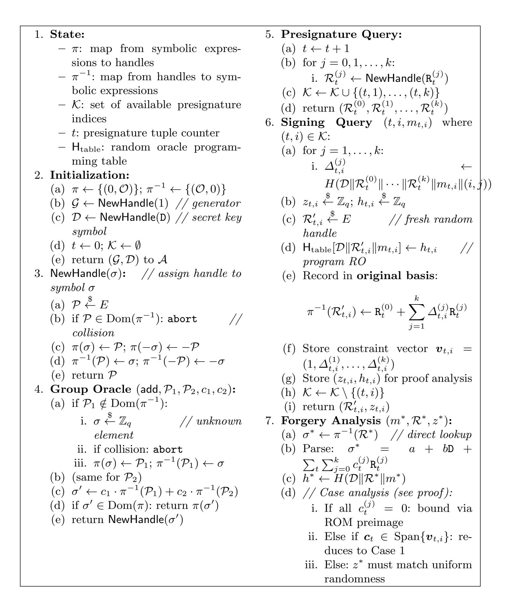

{0}------------------------------------------------

# Optimizing FROST for Message Capacity

Philipp Jovanovic<sup>1,2</sup>, Ben Riva<sup>1</sup>, and Arnab Roy<sup>1</sup>

1 Mysten Labs
{benriva,arnab}@mystenlabs.com
2 University College London
p.jovanovic@ucl.ac.uk

Abstract. The FROST threshold signature scheme achieves round optimal Schnorr signing through a double-nonce construction, but requires two presignatures per signature. Since each presignature demands an expensive distributed key generation (DKG) protocol, this overhead is significant for high-throughput applications. FROST builds on a core presignature protocol (that we call FROST-core) that uses hash-based re-randomization of presignatures. We investigate whether fewer presignatures can be used to sign multiple messages, improving FROST-core's message capacity.

We first show that the natural generalization of using k presignatures for k messages is insecure: an extended ROS attack enables forgery even for k=2. However, we prove that using k+1 presignatures for k messages achieves security in the Generic Group Model combined with the Random Oracle Model. This improves message capacity from 50% (standard FROST-core) to  $\frac{k}{k+1}$ , approaching 100% as k grows.

We further extend our analysis to a modified FROST-core protocol in which a set of presignatures is generated by different parties and used for signing k messages. Security holds as long as at least k+1 presignatures were created by honest parties.

#### <span id="page-0-0"></span>1 Introduction

Schnorr signatures. The Schnorr signature scheme [Sch90] is a digital signature scheme based on the discrete logarithm problem. In the scheme, a signer with secret key  $\mathsf{sk} \in \mathbb{Z}_q$  publishes the public key  $\mathsf{vk} = g^{\mathsf{sk}}$  where g is a generator of a group of prime order q. To sign a message m, the signer samples a random nonce  $r \in \mathbb{Z}_q$ , computes  $R = g^r$ , derives the challenge  $h = H(\mathsf{vk} || R || m)$ , and outputs the signature (R, z) where  $z = r + \mathsf{sk} \cdot h$ . Verification checks that  $g^z = R \cdot \mathsf{vk}^h$ .

Schnorr signatures are widely deployed in practice, most notably in Bitcoin's Taproot upgrade [Wui21], and offer advantages such as linearity and batch verification. The techniques and security analyses presented in this work apply similarly to EdDSA [JL17], which uses a Schnorr-like construction over elliptic curves with a different key derivation mechanism.

Threshold Schnorr signatures. Threshold signature schemes enable a group of n parties to jointly produce signatures such that any subset of t+1 parties can

{1}------------------------------------------------

sign, but fewer than t+1 parties cannot. This provides both security (no single point of failure) and availability (signatures can be produced even if some parties are offline). Threshold Schnorr signatures (e.g., [KG20,CKM21,BHK<sup>+</sup>24,GS24]) extend the Schnorr scheme to this distributed setting. A fundamental challenge in threshold signing is nonce generation: the nonce r must be uniformly random and unknown to any individual party, yet the parties must jointly compute  $R = g^r$  without revealing r. Generating a fresh nonce for each signature requires an expensive distributed key generation (DKG) protocol [GJKR99], making persignature nonce generation impractical for high-throughput applications. To address this, protocols like FROST KG20 employ presignatures—pre-generated nonce pairs that can be used to sign messages efficiently. This yields a natural offline/online structure: in the offline phase, the parties run a DKG protocol (possibly in batches) to build a pool of presignatures; in the *online* phase, a signing request is served by consuming one presignature from the pool, with minimal communication and latency. The offline work can be amortized over many signatures and performed during low load, while the online phase remains fast. However, naively reusing presignatures is insecure, as it enables forgery attacks.

FROST-core: The core presignature protocol. The FROST threshold signature protocol [KG20] builds on a core presignature protocol (which Shoup [Sho23] calls "re-randomizing presignatures via hashing") that can be analyzed independently of the threshold setting. We refer to this core protocol as FROST-core. FROST-core uses presignatures with hash-based re-randomization to prevent forgery attacks while maintaining efficiency. The full FROST protocol then instantiates FROST-core in a distributed threshold setting, where presignatures are generated via DKG and signatures are produced through threshold signing. In this work, we focus on improving FROST-core's message capacity, which directly benefits any threshold protocol (including FROST) that uses it.

Presignature attacks. The security of standard Schnorr signatures relies crucially on the fact that the nonce R is not revealed before the message m is specified. With presignatures, this property is violated, leading to concrete attacks. Wagner [Wag02] showed that the generalized birthday problem can be solved in subexponential time: given K presignatures  $R_1, \ldots, R_K$ , an adversary can find messages  $m, m_1, \ldots, m_K$  such that  $H(\mathsf{vk} || \prod_k R_k || m) = \sum_k H(\mathsf{vk} || R_k || m_k)$ , enabling forgery. More devastatingly, Benhamouda et al. [BLL+22] showed that the ROS (Random inhomogeneities in an Overdetermined Solvable system of linear equations) attack achieves forgery in polynomial time when  $K > \log_2 q$  presignatures are available. These attacks were originally developed in the context of blind signatures [DEF+19] but apply directly to Schnorr with presignatures.

Mitigation strategies. Several approaches have been proposed to mitigate presignature attacks while preserving the efficiency benefits of precomputation:

1. Re-randomized presignatures: The presignature R is shifted to  $R \cdot g^{\delta}$  where  $\delta$  is obtained from a random beacon *after* the message is known

{2}------------------------------------------------

[\[Sho23](#page-19-2)[,GS22\]](#page-18-8). This restores the property that the effective nonce is unpredictable, enabling a direct reduction to discrete logarithm. However, it requires the existence of a random beacon, and an additional round of interaction to obtain the beacon value, potentially increasing latency.

- 2. FROST-core double-nonce construction: FROST-core (the core presignature protocol used by FROST [\[KG20,](#page-18-1)[CKM21\]](#page-18-2)) uses two presignatures (R, S) and computes the effective nonce as R · S <sup>δ</sup> where δ = H(vk∥R∥S∥m). This eliminates the need for a random beacon but requires two presignatures per signature. The construction prevents ROS attacks because the adversary cannot independently control both the effective nonce and the message–the binding of δ to (R, S, m) via the hash function creates a circular dependency.
- 3. Batch randomness extraction: The SPRINT protocol [\[BHK](#page-18-3)+24] improves the efficiency of presignature generation by producing many presignatures from a single DKG execution using linear combinations. Unlike the previous approaches, SPRINT does not use a double-nonce construction or random beacon to prevent ROS attacks. Instead, it relies on a sequential consumption requirement: presignature batches must be consumed in order, which prevents certain adaptive attacks by limiting the adversary's ability to choose which presignatures to use adaptively. However, this sequential requirement limits SPRINT's applicability to scenarios requiring many outstanding presignatures. Note that batch randomness extraction can be combined with either re-randomized presignatures or FROST-corestyle double-nonce mitigation [\[GS24\]](#page-18-4) for stronger security guarantees. In the context of adversarial presignatures, batch randomness extraction techniques [\[BHK](#page-18-3)+24[,GS24\]](#page-18-4) show how to create a batch of k secure presignatures from a set of n presignatures if up to n − k of the presignatures were created by the adversary. Shoup [\[Sho23\]](#page-19-2) shows that those techniques can be combined with FROST-core to sign on <sup>k</sup> <sup>2</sup> messages.

Security models. The security of threshold Schnorr signatures has been analyzed under various assumptions. The original FROST paper [\[KG20\]](#page-18-1) provided heuristic security arguments. Crites, Komlo, and Maller [\[CKM21\]](#page-18-2) gave a formal proof under the One-More Discrete Logarithm (OMDL) assumption in the Random Oracle Model, though the reduction is quite loose due to reliance on the forking lemma [\[PS00\]](#page-19-4). Shoup [\[Sho23\]](#page-19-2) developed a comprehensive framework for analyzing Schnorr in the Generic Group Model (GGM) [\[Sho97\]](#page-19-5), obtaining much tighter bounds. Earlier GGM analyses include Neven, Smart, and Warinschi [\[NSW09\]](#page-18-9) for basic Schnorr and Blocki and Lee [\[BL22\]](#page-18-10) for multi-user security. The GGM approach, while idealized, provides concrete security bounds that more accurately reflect the difficulty of generic attacks.

Other related protocols. Beyond FROST and SPRINT, several other protocols address threshold Schnorr signing. ROAST [\[RRJ](#page-19-6)<sup>+</sup>22] achieves robustness without synchrony assumptions by running FROST concurrently O(n) times, at significant performance cost. Groth and Shoup [\[GS24\]](#page-18-4) recently proposed highly optimized protocols combining batch randomness extraction with either 

{3}------------------------------------------------

re-randomized presignatures or FROST-core-style mitigation, achieving both robustness and high throughput. These works focus primarily on how presignatures are generated and protected, rather than on how many signatures can be extracted from a given set of presignatures.

Message capacity: A different optimization axis. Given that each nonce requires an expensive protocol, FROST-core's requirement of two nonces per signature incurs a significant cost: each presignature pair (R, S) requires two secure nonce generation executions but produces only one signature. We define the message capacity of a presignature scheme as the ratio of signatures produced to presignatures consumed. Standard FROST-core has message capacity 1/2 = 50%. While batch nonce generation [\[BHK](#page-18-3)+24[,GS24\]](#page-18-4) can amortize DKG overhead across multiple presignatures, the fundamental 2 : 1 ratio remains.

This observation motivates a question orthogonal to prior work: Can we increase message capacity while maintaining security? Rather than optimizing presignature generation, we investigate whether fewer presignatures can be used to sign multiple messages. This is particularly relevant for systems where presignature storage is limited or where the ratio of DKG cost to signing cost is high.

## 1.1 Our Contributions

Improving Message Capacity. We investigate whether FROST-core's message capacity can be improved by reducing the number of presignatures required per signature.

Question 1: Can k presignatures be used to sign k messages using a FROST-core-like construction?

We show that the answer to Question 1 is no–the 2-for-2 construction is insecure, falling to an extended ROS attack. For two messages using two presignatures, the system generates two equations:

$$R \cdot S^{\delta_1}, \quad z_1 = r + \delta_1 s + h_1 \cdot \mathsf{sk} \tag{1}$$

$$R \cdot S^{\delta_2}, \quad z_2 = r + \delta_2 s + h_2 \cdot \mathsf{sk} \tag{2}$$

where δ<sup>i</sup> = H(vk∥R∥S∥mi) and h<sup>i</sup> = H(vk∥R · S <sup>δ</sup><sup>i</sup> ∥mi). With knowledge of δ1, δ2, h1, h2, z1, z2, the system maintains a full degree of freedom for the secret key sk, preventing direct extraction. However, we show that this construction is insecure: an extended ROS attack exploits the fact that the adversary can choose coefficients in a k-dimensional space (where k equals the number of presignatures), which is exactly the number of constraints from k signatures.

Question 2: Can k + 1 presignatures be used to sign k messages?

{4}------------------------------------------------

We prove that the answer to Question 2 is **yes**— the (k+1)-for-k construction is secure in the Generic Group Model combined with the Random Oracle Model (GGM+ROM), improving message capacity from 50% (standard FROST-core) to  $\frac{k}{k+1}$ , which approaches 100% as k grows.

Our security proofs follow the modular framework of Shoup [Sho23], reducing attacks on the distributed protocol to attacks in an enhanced non-distributed setting, and then analyzing these attacks directly in the GGM+ROM. This yields concrete security bounds of the form  $O(N^2/q + N/M)$  where N is the number of oracle queries and M is the hash output size.

With three presignatures, the system generates two equations:

$$R \cdot S^{\delta_1} \cdot T^{\delta'_1}, \quad z_1 = r + \delta_1 s + \delta'_1 t + h_1 \cdot \mathsf{sk} \tag{3}$$

$$R \cdot S^{\delta_2} \cdot T^{\delta_2'}, \quad z_2 = r + \delta_2 s + \delta_2' t + h_2 \cdot \mathsf{sk} \tag{4}$$

where  $\delta_i = H(\mathsf{vk} || R || S || T || m_i || (i, 0))$ ,  $\delta_i' = H(\mathsf{vk} || R || S || T || m_i || (i, 1))$  and  $h_i = H(\mathsf{vk} || R \cdot S^{\delta_i} \cdot T^{\delta_i'} || m_i)$ . We show that this construction is secure in the GGM and ROM. The key insight is that with k+1 presignatures and k signatures, the adversary faces a (k+1)-dimensional symbolic space but can only impose k linear constraints through signing queries. The remaining dimension prevents the ROS-style span collapse that enables forgery.

Adversarial presignatures. We further extend our analysis to a setting where some presignatures are provided by an adversary (who knows the corresponding discrete logarithms). This models scenarios such as distributed presignature generation where some parties may be corrupted. As described above, batch randomness extraction techniques [BHK+24,GS24] show how to create a batch of k secure presignatures from a set of n presignatures if up to n-k of the presignatures were created by the adversary. Shoup [Sho23] shows that those techniques can be combined with FROST-core to sign on  $\frac{k}{2}$  messages. We show a modified FROST-core protocol that given a set of n presignatures can be used for signing k-1 messages if up to n-k of the presignatures were created by the adversary. Specifically, we show that security is maintained as long as the challenger contributes at least k presignatures per tuple, regardless of how many additional presignatures an adversary provides.

## <span id="page-4-0"></span>2 Security Definitions

We define a general security notion for FROST-core-like schemes that use presignatures with hash-based re-randomization. The definition parameterizes the number of presignature nonces and the number of signatures that can be produced from each presignature tuple. Throughout the paper,  $\ell$  denotes the number of presignature nonces per tuple and k denotes the number of signatures that can be produced from each tuple.

{5}------------------------------------------------

#### 1. Initialization.

- (a) The challenger generates a secret key  $\mathsf{sk} \leftarrow \mathbb{Z}_q$  and a public key  $\mathsf{vk} = g^{\mathsf{sk}}$ .
- (b) Initializes a set K of available signing slot indices to the empty set.
- (c) Gives  $\forall k \text{ to } A$ .
- 2. Query Phase. A makes a sequence of presignature and signing queries:
  - (a) **Presignature Query** (t-th query): The challenger:
    - i. samples  $r_t^{(j)} \leftarrow \mathbb{Z}_q$  for  $j \in \{0, 1, \dots, \ell 1\}$
    - ii. computes  $R_t^{(j)} \leftarrow g^{r_t^{(j)}}$  for each j
    - iii. adds the indices  $(t,1),(t,2),\ldots,(t,k)$  to  $\mathcal{K}$
    - iv. sends the presignature tuple  $(R_t^{(0)}, R_t^{(1)}, \dots, R_t^{(\ell-1)})$  to  $\mathcal{A}$
  - (b) **Signing Query:** The adversary specifies (t, i) where  $i \in \{1, ..., k\}$  and a message  $m_{t,i}$ . If  $(t, i) \in \mathcal{K}$ , the challenger:
    - i. computes hash-derived coefficients  $\Delta_{t,i}^{(j)}$  for  $j \in \{1, \dots, \ell 1\}$  (the exact hash inputs depend on the specific construction)
    - ii. computes the effective nonce  $R'_{t,i}$  as a function of the presignatures and coefficients
    - iii. computes the signature  $(R'_{t,i}, z_{t,i})$  on  $m_{t,i}$
    - iv. removes (t, i) from K
    - v. sends  $(R'_{t,i}, z_{t,i})$  to  $\mathcal{A}$
- 3. End of Game. A outputs  $(m^*, R^*, z^*)$ . A wins if  $(R^*, z^*)$  is a valid signature on  $m^*$  and  $m^*$  was not submitted as a signing query.

<span id="page-5-0"></span>**Fig. 1.** CMA-HRBP attack game for  $(\ell, k)$ -FROST-core.

 $(\ell,k)$ -CMA-HRBP Security. For integers  $\ell \geq 1$  and  $k \geq 1$ , an  $(\ell,k)$ -CMA-HRBP (Chosen Message Attack with Hash-based Re-randomization of Batch Presignatures) secure scheme uses  $\ell$  presignature nonces to produce k signatures. The security game models an adversary that receives presignature tuples and can request signatures, with the goal of forging a signature on a fresh message. We only consider the regime  $\ell \geq k$ : the case  $\ell < k$  admits a trivial linear algebraic attack, and the case  $\ell = k$  is shown in this paper to be vulnerable to extended ROS attacks.

Attack Game (CMA-HRBP security for  $(\ell, k)$ -FROST-core). The CMA-HRBP attack game for  $(\ell, k)$ -FROST-core is given in Figure 1.

Definition  $((\ell, k)\text{-}CMA\text{-}HRBP\ security)$ . An  $(\ell, k)\text{-}FROST$ -core signature scheme is  $(\ell, k)\text{-}CMA\text{-}HRBP\ secure}$  if CMA-HRBP- $(\ell, k)$ -adv[ $\mathcal{A}$ ] is negligible for every efficient adversary  $\mathcal{A}$ , where CMA-HRBP- $(\ell, k)$ -adv[ $\mathcal{A}$ ] denotes the probability that  $\mathcal{A}$  wins the game in Figure 1.

Concrete Instantiations. Specific FROST-core constructions correspond to particular parameter choices:

- Standard FROST-core: (2,1)-CMA-HRBP – uses 2 presignature nonces (R,S) and produces 1 signature.

{6}------------------------------------------------

- 2-for-2 FROST-core: (2, 2)-CMA-HRBP uses 2 presignature nonces (R, S) and produces 2 signatures. This construction is insecure (see Section [4\)](#page-7-0).
- k-for-k FROST-core: (k, k)-CMA-HRBP uses k presignature nonces and produces k signatures. This construction is insecure for any k ≥ 2 (see Appendix [B\)](#page-4-0).
- 3-for-2 FROST-core: (3, 2)-CMA-HRBP uses 3 presignature nonces (R, S, T) and produces 2 signatures. This construction is secure (see Section [5\)](#page-10-0).
- (k+1)-for-k FROST-core: (k+1, k)-CMA-HRBP uses k+1 presignature nonces and produces k signatures. This is the generalized secure construction (see Appendix [D\)](#page-7-0).

Note: The notation (ℓ, k)-CMA-HRBP counts the number of presignature nonces (group elements) in each tuple and the number of signatures that can be produced from that tuple. Standard FROST-core uses 2 presignature nonces (R, S) to produce 1 signature, giving it a message capacity of 1/2 = 50%.

We recall the theorem for the standard FROST-core signature scheme [\[Sho23\]](#page-19-2):

Theorem 1. The standard FROST-core signature scheme (as a (2, 1)-CMA-HRBP construction) is secure in the Generic Group Model with random oracle H. Specifically, for any adversary A making at most Q group oracle queries and Q<sup>H</sup> random oracle queries,

$$CMA$$
- $HRBP$ - $(2,1)$ - $adv[A] \le \frac{O(Q^2)}{q} + \frac{Q_H}{q}$ .

which is negligible since q is exponential in the security parameter.

# <span id="page-6-0"></span>3 Preliminaries: ROS Attacks

The ROS (Random inhomogeneities in an Overdetermined Solvable system of linear equations) attack [\[BLL](#page-18-6)+22] is a clever forgery technique that exploits the linear structure inherent in threshold signature schemes. The attack shows how an adversary can forge signatures by manipulating the relationship between presignatures, messages, and hash values through linear algebra.

Given a vector of presignatures R = (R1, . . . , Rk), the attacker's objective is to construct a forgery by finding:

- A vector of scalars v = (v1, . . . , vk)
- A vector of messages m = (m1, . . . , mk)
- A target nonce R<sup>∗</sup>
- A target message m<sup>∗</sup>

{7}------------------------------------------------

such that the following constraints are satisfied:

$$R^* = \prod_{i=1}^k R_i^{v_i} \tag{5}$$

$$H(vk, R^*, m^*) = \sum_{i=1}^{k} v_i H(vk, R_i, m_i)$$
(6)

where  $\mathbf{H} = (H(\mathsf{vk}, R_1, m_1), \dots, H(\mathsf{vk}, R_k, m_k))$  represents the vector of hash values. If an adversary can satisfy these constraints, they can forge a Schnorr signature as follows. Suppose the adversary obtains valid signatures  $(R_i, z_i)$  for messages  $m_i$ , where each signature satisfies  $g^{z_i} = R_i \cdot \mathsf{vk}^{H(\mathsf{vk}, R_i, m_i)}$ . If the adversary finds coefficients  $v_i$  such that  $R^* = \prod_{i=1}^k R_i^{v_i}$  and  $H(\mathsf{vk}, R^*, m^*) = \sum_{i=1}^k v_i H(\mathsf{vk}, R_i, m_i)$ , then setting  $z^* = \sum_{i=1}^k v_i z_i$  yields a valid signature  $(R^*, z^*)$  for message  $m^*$ :

$$g^{z^*} = g^{\sum_{i=1}^k v_i z_i} = \prod_{i=1}^k (R_i \cdot \mathsf{vk}^{H(\mathsf{vk}, R_i, m_i)})^{v_i} = R^* \cdot \mathsf{vk}^{H(\mathsf{vk}, R^*, m^*)}$$

This breaks Schnorr's unforgeability since the adversary never needed to know the secret key sk to produce  $(R^*, z^*)$ .

The key idea behind the attack is as follows. The attacker picks two candidate messages  $m_0, m_1$  and precomputes all hash values  $h_{ij} = H(\mathsf{vk}, R_i, m_j)$  for each presignature  $R_i$  and each message  $m_j$ . Using these hash values, the attacker solves a simple  $2 \times 2$  linear system per presignature to obtain coefficients  $\rho_0, \rho_1, \ldots, \rho_k$  with the property that, for any scalar A, there is a binary choice vector  $(b_1, \ldots, b_k) \in \{0, 1\}^k$  such that  $\rho_0 + \sum_{i=1}^k \rho_i h_{i,b_i} = A$ . The attacker then constructs  $R^* = \prod_{i=1}^k R_i^{\rho_i}$ , queries the forgery hash  $h^* = H(\mathsf{vk}, R^*, m^*)$ , reads off the bits of  $\rho_0 + h^*$  to determine which message to sign with each presignature, and combines the resulting signatures linearly to obtain a valid forgery. The full step-by-step construction is given in Appendix A.

### <span id="page-7-0"></span>4 Insecurity of k-for-k FROST-core

This section shows that using k presignatures to sign k messages is insecure for any  $k \geq 2$ . We prove this by demonstrating an extended ROS attack that exploits the fact that k signing constraints fully span the k-dimensional presignature space, allowing the adversary to express arbitrary linear combinations of presignature components.

We first present the minimal case k=2 (the "2-for-2" construction) and show why it is insecure. We then state the general k-for-k insecurity result and refer to Appendix B for the detailed attack construction. This motivates adding one extra presignature component in later sections, leading to the secure (k+1)-for-k construction.

{8}------------------------------------------------

#### 1. Key Generation.

- (a) The signer samples a secret key  $sk \in \mathbb{Z}_q$  and computes the public key  $vk = g^{sk}$ .
- 2. Presignature Generation.
  - (a) The signer samples two independent random nonces  $r_k, s_k \in \mathbb{Z}_q$ .
  - (b) Compute  $R_k = g^{r_k}, S_k = g^{s_k}$ .
  - (c) The presignature tuple  $(R_k, S_k)$  is output.
- 3. **Schnorr Signing.** To sign a message  $m_i$  using an unused presignature index  $(k,i), i \in \{1,2\}$ :
  - (a) The signer selects  $(R_k, S_k)$ .
  - (b) Compute  $\Delta_{k,i} = H(\mathsf{vk}, R_k, S_k, m_i, i)$ .
  - (c) Compute  $r'_k = r_k + \Delta_{k,i} s_k$ .
  - (d) Compute  $R'_k = g^{r'_k}$ .
  - (e) Compute the challenge  $h_k = H(vk, R'_k, m_i)$ .
  - (f) Compute the signature  $z_k = r'_k + \operatorname{sk} \cdot h_k$ .
  - (g) Output the signature  $(R'_k, z_k)$  on message  $m_i$ .
- 4. Verification.
  - (a) To verify a signature (R, z) on message m, compute h = H(vk, R, m).
  - (b) Accept if  $g^z = R \cdot \mathsf{vk}^h$ .

<span id="page-8-0"></span>Fig. 2. The 2-for-2 FROST-core construction.

#### 4.1 The 2-for-2 Construction

We begin with the minimal case where k = 2: using 2 presignatures to sign 2 messages. The construction is given in Figure 2.

## 4.2 Extended ROS Attack on 2-for-2 FROST-core

We now sketch the extended ROS forgery that breaks the 2-for-2 construction. The attack leverages the fact that the two signing constraints from a single presignature tuple span the entire two-dimensional nonce space, letting the adversary express any linear combination of the presignature components and program a target nonce/hash pair for a forgery.

- 1. The attacker chooses four target messages  $m_0, m_1, m_2, m_3$  that will be used to construct the attack vectors.
- 2. For each presignature pair  $(R_i, S_i)$  and each target message  $m_j$ , the attacker computes the hash values:

$$\chi_{ij} = H(\mathsf{vk}, R_i S_i^{\delta_{ij}}, m_j) \quad \text{for } i \in [1, k], j \in \{0, 1, 2, 3\} ,$$

where  $\delta_{ij} = H(\mathsf{vk}, R_i, S_i, m_j, j \mod 2 + 1)$ . This creates a  $k \times 4$  matrix of hash values:

$$\mathbf{H} = \begin{pmatrix} \chi_{10} & \chi_{11} & \chi_{12} & \chi_{13} \\ \chi_{20} & \chi_{21} & \chi_{22} & \chi_{23} \\ \vdots & \vdots & \vdots & \vdots \\ \chi_{k0} & \chi_{k1} & \chi_{k2} & \chi_{k3} \end{pmatrix}$$

{9}------------------------------------------------

3. Define for each  $i \in [1, k]$ :

$$h_{i,0} = (\delta_{i1}\chi_{i0} - \delta_{i0}\chi_{i1})/(\delta_{i1} - \delta_{i0}) \tag{7}$$

$$h_{i,1} = (\delta_{i3}\chi_{i2} - \delta_{i2}\chi_{i3})/(\delta_{i3} - \delta_{i2}) \tag{8}$$

4. The attacker seeks to find coefficients  $\rho_0, \ldots, \rho_k$  such that for any scalar A with bit representation  $A = \langle a_1, \ldots, a_k \rangle$ , the following linear relationship holds:

$$\rho_0 + \sum_{i=1}^k \rho_i h_{i,a_i} = A \tag{9}$$

5. The coefficients  $\rho_0, \rho_1, \ldots, \rho_k$  can be efficiently computed as follows: Compute  $u_i, v_i$ , such that for each i:

$$u_i + v_i h_{i,0} = 0 (10)$$

$$u_i + v_i h_{i,1} = 2^{i-1} (11)$$

Now set  $\rho_0 = \sum_{i=1}^k u_i$  and  $\rho_i = v_i$  for  $i \in [1, k]$ . Summing up all the equations, we get:

$$\rho_0 + \sum_{i=1}^k \rho_i h_{i,a_i} = \sum_{i=1}^k (u_i + v_i h_{i,a_i}) = \sum_{i=1}^k a_i 2^{i-1} = A$$

6. Once the coefficients  $\rho_i$  are determined, the attacker uses the required vector of scalars  $\mathbf{v} = (\rho_1, \dots, \rho_k)$  to construct the forged signature components:

$$R^* = \prod_{i=0}^k R_i^{\rho_i} \tag{12}$$

$$h^* = H(\mathsf{vk}, R^*, m^*) \tag{13}$$

7. Let  $(b_k, ..., b_1)$  be the bit representation of  $\rho_0 + h^*$ . Then obtain signatures  $(R_i S_i^{\delta_{i,2b_i}}, s_{i0})$  on message pair  $(R_i, S_i, m_{2b_i})$  and  $(R_i S_i^{\delta_{i,2b_i+1}}, s_{i1})$  on  $(R_i, S_i, m_{2b_i+1})$  for  $i \in [1, k]$ . Observe that:

$$\rho_0 + h^* = \rho_0 + \sum_{i=1}^k \rho_i h_{i,b_i} \implies$$

$$h^* = \sum_{i=1}^k \rho_i h_{i,b_i} = \sum_{i=1}^k \rho_i (\delta_{i,2b_i+1} \chi_{i,0} - \delta_{i,2b_i} \chi_{i,1}) / (\delta_{i,2b_i+1} - \delta_{i,2b_i})$$

8. Compute  $s^* = \sum_{i=1}^k \rho_i(\delta_{i,2b_i+1}s_{i0} - \delta_{i,2b_i}s_{i1})/(\delta_{i,2b_i+1} - \delta_{i,2b_i})$  where  $(R_i S_i^{\delta_{i,2b_i}}, s_{i0})$  and  $(R_i S_i^{\delta_{i,2b_i+1}}, s_{i1})$  are the signatures on  $m_{2b_i}$  and  $m_{2b_i+1}$  respectively.

{10}------------------------------------------------

9. The forged signature (R<sup>∗</sup> , s<sup>∗</sup> ) satisfies the standard Schnorr verification equation:

$$g^{s^*} = R^* \cdot \mathsf{vk}^{h^*} \tag{14}$$

This follows from the linearity of the signature scheme and the fact that each individual signatures (RiS δi,2bi i , si0) and (RiS δi,2bi+1 i , si1) satisfies g <sup>s</sup>i<sup>0</sup> = RiS δi,2bi i · vkχi,<sup>0</sup> and g <sup>s</sup>i<sup>1</sup> = RiS δi,2bi+1 i · vkχi,<sup>1</sup> .

### 4.3 General k-for-k Insecurity

The 2-for-2 attack generalizes to show that any k-for-k FROST-core construction is insecure. The fundamental issue is that with k presignature components and k signing slots, the k signing constraints span the full k-dimensional nonce space. This allows the adversary to express arbitrary linear combinations of presignature components and mount an extended ROS forgery attack.

Theorem 2. For any k ≥ 2, the k-for-k FROST-core construction is insecure. Specifically, there exists an efficient adversary that can forge a signature after making O(k · log q) presignature queries and O(k 2 log q) signing queries.

The detailed attack construction for general k follows the same pattern as the 2-for-2 case: the adversary uses n = ⌈log<sup>2</sup> q⌉ presignature tuples and constructs a linear system that allows forging signatures on arbitrary messages. The full details of the extended ROS attack for general k-for-k are given in Appendix [B.](#page-4-0)

This inherent lack of a "free" dimension is what the (k+1)-for-k construction fixes in Section [D,](#page-7-0) where the extra presignature component prevents the span collapse that enables forgery.

## <span id="page-10-0"></span>5 Security of (k + 1)-for-k FROST-core

This section shows that using k+ 1 presignatures to sign k messages is secure for any k ≥ 2. We prove this by demonstrating that the extra presignature component prevents the span collapse that enables forgery in the k-for-k construction.

We first present the minimal case k = 2 (the "3-for-2" construction) and prove its security. We then state the general (k + 1)-for-k security result and refer to Appendix [D](#page-7-0) for the detailed proof. This achieves a message capacity of k <sup>k</sup>+1 , which approaches 100% as k grows.

# 5.1 The 3-for-2 Construction

We begin with the minimal case where k = 2: using 3 presignatures to sign 2 messages.

{11}------------------------------------------------

#### 1. Key Generation.

- (a) The signer samples a secret key  $sk \in \mathbb{Z}_q$  and computes the public key  $vk = g^{sk}$ .
- 2. Presignature Generation.
  - (a) The signer samples random nonces  $r_t, s_t, t_t \in \mathbb{Z}_q$  for each tuple t.
  - (b) Compute  $R_t = g^{r_t}$ ,  $S_t = g^{s_t}$ , and  $T_t = g^{t_t}$ .
  - (c) The presignature tuple  $(R_t, S_t, T_t)$  is output.
- 3. Schnorr Signing. To sign a message m with presignature index  $(t, i), i \in \{1, 2\}$ :
  - (a) The signer picks the corresponding presignature tuple  $(R_t, S_t, T_t)$ .
  - (b) Compute  $\Delta_{t,i} = H(\mathsf{vk}, R_t, S_t, T_t, m, (i, 0))$  and  $\Delta'_{t,i} = H(\mathsf{vk}, R_t, S_t, T_t, m, (i, 1))$ .
  - (c) Compute  $r'_t = r_t + \Delta_{t,i} s_t + \Delta'_{t,i} t_t$ .
  - (d) Compute  $R'_t = g^{r'_t}$ .
  - (e) Compute the challenge  $h = H(vk, R'_t, m)$
  - (f) Compute the signature  $z = r'_t + \operatorname{sk} \cdot h$ .
  - (g) Output the signature  $(R'_t, z)$ .

#### 4. Verification.

- (a) To verify a signature (R, z) on message m, compute h = H(vk, R, m).
- (b) Accept if  $g^z = R \cdot \mathsf{vk}^h$ .

<span id="page-11-0"></span>Fig. 3. The 3-for-2 FROST-core construction.

#### 5.2 Protocol Description

The 3-for-2 construction builds on the 2-for-2 template by adding a third presignature component. Each presignature tuple contains three nonce components, and each signing slot binds all three components through two hash-derived coefficients. The effective nonce for a message is a linear combination of these components, and the signature follows standard Schnorr verification. The protocol is given in Figure 3.

### 5.3 Security Definition

The 3-for-2 construction is an instance of (3,2)-CMA-HRBP construction (see Section 2), using 3 presignature nonces (R, S, T) to produce 2 signatures. The security game follows the general (3,2)-CMA-HRBP definition, with the following concrete instantiation:

Concrete Instantiation. For the 3-for-2 construction, the hash-derived coefficients in the general definition are computed as:

$$\Delta_{t,i} \leftarrow H(\mathsf{vk} || R_t || S_t || T_t || m_{t,i} || (i,0)) \tag{15}$$

$$\Delta'_{t,i} \leftarrow H(\mathsf{vk} || R_t || S_t || T_t || m_{t,i} || (i,1)) \tag{16}$$

for signing slot  $i \in \{1, 2\}$ , and the effective nonce is computed as:

$$R'_{t,i} \leftarrow R_t + \Delta_{t,i} S_t + \Delta'_{t,i} T_t$$

Security of the 3-for-2 FROST-core is captured by the (3,2)-CMA-HRBP definition (see Section 2). We prove that the scheme is secure in Theorem 3.

{12}------------------------------------------------

```
1. Initialization:
                                                                                      4. To process a presignature request:
                                                                                            (a) k \leftarrow k+1; \mathcal{K} \leftarrow \mathcal{K} \cup \{(k,1),(k,2)\}
      (a) \pi \leftarrow \{(0, \mathcal{O})\}\
                                                                                            (b) invoke (map, R_k) to get \mathcal{R}_k
      (b) invoke (map, 1) to obtain \mathcal{G}
      (c) invoke (map, D) to obtain \mathcal{D}
                                                                                             (c) invoke (map, S_k) to get S_k
      (d) k \leftarrow 0: \mathcal{K} \leftarrow \emptyset: Initialize counter k and
                                                                                            (d) invoke (map, T_k) to get \mathcal{T}_k
                                                                                             (e) return (\mathcal{R}_k, \mathcal{S}_k, \mathcal{T}_k)
             empty set K
      (e) return (\mathcal{G}, \mathcal{D})
                                                                                      5. To process a request to sign m_{k,i} using
2. To process a group oracle query
                                                                                           presignature number (k, i) \in \mathcal{K}:
                                                                                            (a) \Delta_{k,i} \leftarrow \mathsf{H}(\mathcal{D} \| \mathcal{R}_k \| \mathcal{S}_k \| \mathcal{T}_k \| m_{k,i} \| (i,0))
      (\mathsf{map},i):
      (a) if i \notin Domain(\pi):
                                                                                            (b) \Delta'_{k,i} \leftarrow \mathsf{H}(\mathcal{D} \| \mathcal{R}_k \| \mathcal{S}_k \| \mathcal{T}_k \| m_{k,i} \| (i,1))
                 i. \mathcal{P} \leftarrow E; if \mathcal{P} \in \text{Range}(\pi) then
                                                                                             (c) \mathcal{R}'_{k,i} \leftarrow \mathsf{add}(\mathcal{R}_k, \mathcal{S}_k, \mathcal{T}_k, 1, \Delta_{k,i}, \Delta'_{k,i})
                      abort
                                                                                            (d) h_{k,i} \leftarrow \mathsf{H}(\mathcal{D} \| \mathcal{R}'_{k,i} \| m_{k,i}) \in \mathbb{Z}_q
                ii. add (-i, -P) and (i, P) to \pi
                                                                                             (e) z_{k,i} \leftarrow \mathbb{Z}_q
      (b) return \pi(i)
                                                                                             (f) incorporate R_k \mapsto z_{k,i} - \Delta_{k,i} S_k
3. To process a group oracle query
                                                                                                    \Delta'_{k,i} \mathsf{T}_k - h_{k,i} \mathsf{D} throughout Domain(\pi)
      (add, \mathcal{P}_1, \mathcal{P}_2, c_1, c_2):
      (a) for j = 1, 2: if \mathcal{P}_j \notin \text{Range}(\pi):
                                                                                                    and abort if Domain(\pi) has a conflict
                 i. i \leftarrow \mathbb{Z}_q; if i \in \text{Domain}(\pi) then
                                                                                            (g) \mathcal{K} \leftarrow \mathcal{K} \setminus \{(k,i)\}; return (\mathcal{R}'_{k,i}, z_{k,i})
                      abort
                ii. add (-i, -\mathcal{P}_i) and (i, \mathcal{P}_i) to \pi
      (b) invoke (\text{map}, c_1 \pi^{-1}(\mathcal{P}_1) + c_2 \pi^{-1}(\mathcal{P}_2))
             and return the result
```

<span id="page-12-1"></span>Fig. 4. Symbolic simulation for 3-for-2 FROST-core.

Generic Group Model. We prove security in the Generic Group Model (GGM) combined with the Random Oracle Model (ROM). In the GGM, the group is accessed only through an oracle: the adversary receives encodings (handles) of group elements and may query the oracle to compute scalar multiples  $(map, i) \mapsto$ iG and linear combinations (add,  $P_1, P_2, c_1, c_2$ )  $\mapsto c_1 P_1 + c_2 P_2$ . The encoding function is chosen at random, so generic adversaries cannot exploit the structure of the curve beyond these operations. We follow Shoup Shoup, who analyzes the attack game in two steps: first replace the real GGM game by a lazy simulation (we defer the reader to Sho23 for this step while skipping it here as it is pretty standard), then replace that by a symbolic simulation, in which the domain of  $\pi$ consists of formal polynomials in indeterminates such as D (secret key),  $R_t$ ,  $S_t$ ,  $T_t$ (presignature nonces), etc. The lazy and symbolic games are indistinguishable except when a "collision" occurs (two distinct symbolic expressions mapping to the same group element), which happens with probability  $O(Q^2/q)$  for Q group queries. Thus it suffices to bound the adversary's success in the symbolic game, where the simulator maintains  $\pi$  and  $\pi^{-1}$  and can reason about forgeries in terms of linear constraints on the coefficients of the forgery. We refer to [Sho23] for the full (EC-)GGM definition, and the lazy/symbolic framework.

<span id="page-12-0"></span>**Theorem 3.** The 3-for-2 FROST-core signature scheme is (3,2)-CMA-HRBP secure in the Generic Group Model with random oracle H.

*Proof.* We prove security directly in the GGM+ROM by analyzing the symbolic simulation.

Simulation. The simulator runs  $\mathcal{A}$  while maintaining the symbolic map  $\pi$  as in Figure 4.

{13}------------------------------------------------

**Presignature Queries.** For the t-th query, introduce symbols  $R_t$ ,  $S_t$ ,  $T_t$  and assign fresh random handles  $\mathcal{R}_t, \mathcal{S}_t, \mathcal{T}_t \leftarrow E$ . Return  $(\mathcal{R}_t, \mathcal{S}_t, \mathcal{T}_t)$ .

**Signing Queries.** For query (t, j) with message  $m_{t,j}$ :

- 1. Compute  $\Delta_{t,j}, \Delta'_{t,j}$  from the random oracle.
- 2. Sample  $h_{t,j} \leftarrow \mathbb{Z}_q$  and  $\mathcal{R}'_{t,j} \leftarrow E$  uniformly at random. 3. Program the random oracle:  $H(\mathsf{vk} || \mathcal{R}'_{t,j} || m_{t,j}) := h_{t,j}$ .
- 4. Sample  $z_{t,j} \leftarrow \mathbb{Z}_q$ . Incorporate constraint  $R_t \mapsto z_{t,j} \Delta_{t,j} S_t \Delta'_{t,j} T_t h_{t,j} D$ .
- 5. Return  $(\mathcal{R}'_{t,j}, z_{t,j})$ .

Forgery Analysis. When  $\mathcal{A}$  outputs a forgery  $(\mathcal{R}^*, z^*, m^*)$ , the simulator extracts its symbolic representation. The verification equation forces a span constraint: each tuple's forgery coefficients must lie in the 2-dimensional span of its two signing constraints inside  $\mathbb{Z}_q^3$ . This determines a target value that  $h^* =$  $H(vk||\mathcal{R}^*||m^*)$  must equal, expressed as a linear combination of the simulatorchosen signing hashes  $h_{t,i}$ . Since  $m^*$  is fresh (not equal to any signing-query message  $m_{t,j}$ ), the point  $(\mathsf{vk} || \mathcal{R}^* || m^*)$  is distinct from every point programmed by the simulator during signing—so  $h^*$  is a uniform random value, independent of the  $h_{t,j}$  that determine the target. The probability of a match is 1/q per hash query, giving

CMA-HRBP-
$$(3, 2)$$
-adv $[A] \le \frac{O(Q^2)}{q} + \frac{Q_H}{q}$ .

The full algebraic derivation and case analysis are given in Appendix C.

Sequential signing variants. An interesting variant worth considering is one where presignatures are generated in batches, but signatures are produced sequentially rather than concurrently. In such a scheme,  $\Delta_{k,2}$  and  $\Delta'_{k,2}$  would depend on  $m_{k,1}$  or even on  $\Delta_{k,1}$  itself (for example, by including the first signature in the hash input for the second). This creates dependencies among hash outputs within each presignature tuple.

Intuitively, the ROS attack should not apply to such sequential variants. The attack fundamentally relies on the adversary's ability to precompute all relevant hash values  $\Delta_{k,j}, \Delta'_{k,j}$  before committing to any signatures, then adaptively selecting which signatures to request based on the forgery hash  $h^*$ . In a sequential scheme, the adversary cannot know  $\Delta_{k,2}, \Delta'_{k,2}$  until after requesting the first signature on  $m_{k,1}$ , breaking this adaptive strategy.

However, a rigorous security analysis of sequential signing variants, including whether a 2-for-2 sequential scheme might be secure, remains an open question. Such an analysis would need to carefully model the dependencies introduced by sequential signing and verify that no alternative attack strategies emerge. We leave this investigation as future work.

#### General (k+1)-for-k Security 5.4

The 3-for-2 security proof generalizes to show that any (k+1)-for-k FROSTcore construction is secure. The fundamental insight is that with k+1 presignature components and k signing slots, the k signing constraints span only a 

{14}------------------------------------------------

k-dimensional subspace of the (k+1)-dimensional space. The remaining dimension prevents the span collapse that enables forgery in the k-for-k construction.

**Theorem 4.** For any  $k \geq 2$ , the (k+1)-for-k FROST-core construction is (k+1,k)-CMA-HRBP secure in the Generic Group Model combined with the Random Oracle Model. Specifically, for any adversary A making at most Q group oracle queries and  $Q_H$  random oracle queries,

$$CMA$$
- $HRBP$ - $(k+1,k)$ - $adv[\mathcal{A}] \le \frac{O(Q^2)}{q} + \frac{Q_H}{q}$ 

which is negligible since q is exponential in the security parameter.

The detailed security proof for general (k+1)-for-k follows the same pattern as the 3-for-2 case: the simulator answers presignature and signing queries symbolically, derives a span constraint on the forgery coefficients, and shows that any nontrivial combination forces the forged nonce to be uniform from the adversary's view. The full details of the security proof for general (k+1)-for-k are given in Appendix D.

This construction achieves a message capacity of  $\frac{k}{k+1}$ , which improves upon standard FROST-core's 50% capacity and approaches 100% as k grows.

## 6 Modified FROST-core with Adversarial Presignatures

In this section, we consider a modification of the generalized (k+1)-for-k FROST-core protocol where each presignature tuple contains  $\ell$  presignatures (where  $\ell \geq k+1$ ) and can be used to generate k signatures. This models scenarios where presignatures may be generated in a distributed or untrusted environment.

## 6.1 Protocol Description

Given parameters  $(\ell, k)$  where  $\ell \geq k + 1$ , each presignature tuple contains  $\ell$  presignatures and can be used for k signatures. The protocol is given in Figure 5.

## 6.2 Security Definition

This section defines a variant of  $(\ell, k)$ -CMA-HRBP security (see Section 2) where some presignatures are provided by the adversary. For each presignature tuple, the challenger generates k+1 presignatures and the adversary generates  $\ell-(k+1)$  presignatures (along with their discrete logarithms), with the goal of generating k signatures per tuple.

{15}------------------------------------------------

#### 1. Key Generation.

- (a) The signer samples a secret key  $\mathsf{sk} \in \mathbb{Z}_q$  and computes the public key  $\mathsf{vk} = g^{\mathsf{sk}}$
- 2. **Presignature Generation.** For each presignature tuple indexed by t:
  - (a) For each  $j \in \{0, 1, \dots, \ell 1\}$ , the signer samples a random nonce  $r_t^{(j)} \in \mathbb{Z}_q$ . (b) Compute  $R_t^{(j)} = g^{r_t^{(j)}}$  for each j.

  - (c) Output the presignature tuple  $(R_t^{(0)}, R_t^{(1)}, \dots, R_t^{(\ell-1)})$ .
- 3. Schnorr Signing. To sign a message m using presignature tuple t and signing slot  $i \in \{1, ..., k\}$ :
  - (a) Retrieve the presignature tuple  $(R_t^{(0)}, R_t^{(1)}, \dots, R_t^{(\ell-1)})$ .
  - (b) For each  $j \in \{1, \dots, \ell 1\}$ , compute:

$$\Delta_{t,i}^{(j)} = H(\mathsf{vk} \| R_t^{(0)} \| R_t^{(1)} \| \cdots \| R_t^{(\ell-1)} \| m \| (i,j))$$

(c) Compute the effective nonce:

$$r'_{t,i} = r_t^{(0)} + \sum_{j=1}^{\ell-1} \Delta_{t,i}^{(j)} \cdot r_t^{(j)}$$

where  $r_t^{(j)} = \log_g(R_t^{(j)})$  for each presignature  $j \in \{0, 1, \dots, \ell - 1\}$ .

- (d) Compute  $R'_{t,i} = g^{r'_{t,i}} = R_t^{(0)} \cdot \prod_{j=1}^{\ell-1} (R_t^{(j)})^{\Delta_{t,i}^{(j)}}$ .
- (e) Compute the challenge  $h = H(vk||R'_{t,i}||m)$ .
- (f) Compute the signature  $z = r'_{t,i} + \operatorname{sk} \cdot h$ .
- (g) Output the signature  $(R'_{t,i}, z)$ .

#### 4. Verification.

- (a) To verify a signature (R, z) on message m, compute  $h = H(\mathsf{vk} || R || m)$ .
- (b) Accept if  $g^z = R \cdot \mathsf{vk}^h$ .

<span id="page-15-0"></span>**Fig. 5.** Modified FROST-core with adversarial presignatures  $(\ell \geq k+1)$ .

{16}------------------------------------------------

Variant: Adversarial Presignatures. The security game follows the general  $(\ell, k)$ -CMA-HRBP definition, with the following key modification in the presignature query phase:

**Presignature Query** (t-th query): The challenger and adversary together provide a presignature tuple:

- 1. The challenger samples  $r_t^{(j)} \leftarrow \mathbb{Z}_q$  for  $j \in \{0, 1, \dots, k\}$  and computes  $R_t^{(j)} \leftarrow g^{r_t^{(j)}}$  for each j.
- 2. The adversary provides presignatures  $(R_t^{(k+1)}, R_t^{(k+2)}, \dots, R_t^{(\ell-1)})$  along with their discrete logarithms  $(r_t^{(k+1)}, r_t^{(k+2)}, \dots, r_t^{(\ell-1)})$  to the challenger, where  $R_t^{(j)} = g^{r_t^{(j)}}$  for each  $j \in \{k+1, k+2, \dots, \ell-1\}$ .
- 3. Adds the indices  $(t, 1), (t, 2), \ldots, (t, k)$  to  $\mathcal{K}$ .
- 4. The challenger sends all presignatures  $(R_t^{(0)}, R_t^{(1)}, \dots, R_t^{(\ell-1)})$  to  $\mathcal{A}$ .

The signing queries follow the general definition, with hash-derived coefficients computed as:

$$\Delta_{t,i}^{(j)} \leftarrow H(\mathsf{vk} \| R_t^{(0)} \| R_t^{(1)} \| \cdots \| R_t^{(\ell-1)} \| m_{t,i} \| (i,j)) \quad \text{for } j \in \{1, \dots, \ell-1\}$$

and the effective nonce computed as:

$$R'_{t,i} = R_t^{(0)} \cdot \prod_{j=1}^{\ell-1} (R_t^{(j)})^{\Delta_{t,i}^{(j)}}$$

Definition  $((\ell, k)\text{-}CMA\text{-}HRBP\ security\ with\ adversarial\ presignatures})$ . The  $(\ell, k)$ -FROST-core scheme is  $(\ell, k)$ -CMA-HRBP secure with adversarial presignatures if CMA-HRBP- $(\ell, k)$ -adv[ $\mathcal{A}$ ] is negligible for every efficient adversary  $\mathcal{A}$ .

Discussion. This modified protocol models scenarios where presignatures may be generated in a distributed or partially untrusted environment. The key difference from the standard (k+1)-for-k FROST-core is that each presignature tuple uses  $\ell$  presignatures (where  $\ell \geq k+1$ ) to generate k signatures, allowing for more flexible presignature generation.

In the security game, for each presignature tuple, the challenger generates k+1 presignatures while the adversary generates  $\ell-(k+1)$  presignatures along with their discrete logarithms. This models the scenario where some presignatures may be chosen maliciously by an adversary.

The parameter choice of k signatures per tuple (with k+1 challenger presignatures rather than k) is motivated by security considerations when presignatures may be chosen maliciously. The security analysis below shows that security holds for any  $\ell \geq k+1$ .

### 6.3 Security Proof

We prove security in the GGM+ROM. The key insight is that the adversary-provided presignatures do not contribute any "unknown randomness" since the

{17}------------------------------------------------

adversary knows their discrete logarithms. Security relies entirely on the k+1 challenger-generated presignatures per tuple, of which the adversary learns k linear combinations through signing queries, leaving one dimension of uncertainty per tuple.

<span id="page-17-0"></span>**Theorem 5.** The  $(\ell, k)$ -FROST-core signature scheme with adversarial presignatures is  $(\ell, k)$ -CMA-HRBP secure in the Generic Group Model with random oracle H, for any  $\ell \geq k+1$ .

Intuition. The proof follows the same symbolic simulation and span-constraint structure as the (k+1)-for-k security proof (Section D): the simulator maintains a symbolic map over group elements, and a valid forgery requires the forgery's coefficient vector to lie in the span of the constraint vectors revealed by signing queries. The main difference is that adversary-provided presignatures are not modeled as symbolic unknowns—their discrete logarithms are given to the challenger, so they contribute only known scalars  $\gamma_{t,i}$  to each signing equation. Thus, the "unknown" space remains (k+1)-dimensional per tuple (the k+1 challenger presignatures), and the adversary still obtains at most k linear constraints from signing queries. The extra dimension of uncertainty is preserved, so the same span-constraint argument applies. The full proof is deferred to Appendix E.

#### 6.4 Comparison with super-invertible matrix batch extraction

In the batch randomness extraction framework of Shoup [Sho23] (and as used in SPRINT [BHK<sup>+</sup>24] and Groth–Shoup [GS24]), presignatures are combined via a fixed public super-invertible (SI) matrix W. A super-invertible matrix of dimension  $P \times Q$  has the property that every subset of P columns is linearly independent; concretely, SPRINT and related protocols use specific SI matrices such as a Vandermonde matrix or (as in [GS24]) a Pascal matrix for efficient computation. For a batch of Q initial presignatures  $R_{k,1}, \ldots, R_{k,Q}$ , the P biased presignatures are obtained as  $(\bar{R}_{k,1}, \ldots, \bar{R}_{k,P})^{\top} = W(R_{k,1}, \ldots, R_{k,Q})^{\top}$ —i.e., a matrix-vector product with no additive vector. The matrix W is the same fixed public matrix for the protocol and defines a structured way to derive P presignatures from Q; security then relies on re-randomization (e.g., a random beacon or FROST-style hash) when signing. See [Sho23], Appendix C.6, for the SI matrix definition and the Vandermonde/Pascal choices.

In the construction of this section, the effective nonce is again a linear combination of the  $\ell$  presignatures in a tuple, but the coefficients are hash-derived:  $\Delta_{t,i}^{(j)} = H(\mathsf{vk} || R_t^{(0)} || \cdots || R_t^{(\ell-1)} || m || (i,j))$  for message m, slot  $i \in \{1,\ldots,k\}$ , and  $j \in \{1,\ldots,\ell-1\}$ . In the random oracle model, these coefficients are (effectively) random and are determined at signing time, not by a fixed matrix. There is no predetermined  $P \times Q$  structure; instead, each signing query consumes the tuple via a fresh linear combination whose coefficients are bound to the message and slot by the hash. Security relies on the fact that the adversary cannot control these coefficients and that k such combinations reveal only k linear constraints in

{18}------------------------------------------------

the (k + 1)-dimensional space of challenger presignatures. Thus, the same spanconstraint argument applies whether the adversary contributes presignatures or not. We refer to [\[Sho23\]](#page-19-2) for the full treatment of batch randomness extraction and the super-invertible matrix formulation (including the general attack game with adversary-specified bias).

## Acknowledgment

We are grateful to Chelsea Komlo for her valuable feedback on an early version of this paper.

## References

- <span id="page-18-3"></span>BHK<sup>+</sup>24. Fabrice Benhamouda, Shai Halevi, Hugo Krawczyk, Yiping Ma, and Tal Rabin. SPRINT: High-throughput robust distributed Schnorr signatures. In Advances in Cryptology—EUROCRYPT 2024, pages 62–91. Springer, 2024.
- <span id="page-18-10"></span>BL22. Jeremiah Blocki and Seunghoon Lee. On the multi-user security of short Schnorr signatures with preprocessing. In Advances in Cryptology— EUROCRYPT 2022, pages 614–643. Springer, 2022.
- <span id="page-18-6"></span>BLL<sup>+</sup>22. Fabrice Benhamouda, Tancr`ede Lepoint, Julian Loss, Michele Orr`u, and Mariana Raykova. On the (in) security of ROS. Journal of Cryptology, 35(4):25, 2022.
- <span id="page-18-2"></span>CKM21. Elizabeth Crites, Chelsea Komlo, and Mary Maller. How to prove Schnorr assuming Schnorr: Security of multi- and threshold signatures. Cryptology ePrint Archive, Paper 2021/1375, 2021. Available at [https://eprint.iacr.](https://eprint.iacr.org/2021/1375) [org/2021/1375](https://eprint.iacr.org/2021/1375).
- <span id="page-18-7"></span>DEF<sup>+</sup>19. Manu Drijvers, Kasra Edalatnejad, Bryan Ford, Eike Kiltz, Julian Loss, Gregory Neven, and Igors Stepanovs. On the security of two-round multisignatures. In 2019 IEEE Symposium on Security and Privacy (SP), pages 1084–1101. IEEE, 2019.
- <span id="page-18-5"></span>GJKR99. Rosario Gennaro, Stanis law Jarecki, Hugo Krawczyk, and Tal Rabin. Secure distributed key generation for discrete-log based cryptosystems. In Advances in Cryptology—EUROCRYPT'99, pages 295–310. Springer, 1999.
- <span id="page-18-8"></span>GS22. Jens Groth and Victor Shoup. On the security of ECDSA with additive key derivation and presignatures. In Advances in Cryptology—EUROCRYPT 2022, pages 365–396. Springer, 2022.
- <span id="page-18-4"></span>GS24. Jens Groth and Victor Shoup. Fast batched asynchronous distributed key generation. In Advances in Cryptology—EUROCRYPT 2024, pages 370– 400. Springer, 2024.
- <span id="page-18-0"></span>JL17. Simon Josefsson and Ilari Liusvaara. Edwards-curve digital signature algorithm (EdDSA). RFC 8032, 2017. Available at [https://tools.ietf.org/](https://tools.ietf.org/html/rfc8032) [html/rfc8032](https://tools.ietf.org/html/rfc8032).
- <span id="page-18-1"></span>KG20. Chelsea Komlo and Ian Goldberg. FROST: Flexible round-optimized Schnorr threshold signatures. In International Conference on Selected Areas in Cryptography, pages 34–65. Springer, 2020.
- <span id="page-18-9"></span>NSW09. Gregory Neven, Nigel P Smart, and Bogdan Warinschi. Hash function requirements for Schnorr signatures. Journal of Mathematical Cryptology, 3(1):69–87, 2009.

{19}------------------------------------------------

- <span id="page-19-4"></span>PS00. David Pointcheval and Jacques Stern. Security arguments for digital signatures and blind signatures. Journal of Cryptology, 13(3):361–396, 2000.
- <span id="page-19-6"></span>RRJ<sup>+</sup>22. Tim Ruffing, Viktoria Ronge, Elliott Jin, Jonas Schneider-Bensch, and Dominique Schr¨oder. ROAST: Robust asynchronous Schnorr threshold signatures. Cryptology ePrint Archive, Paper 2022/550, 2022. Available at <https://eprint.iacr.org/2022/550>.
- <span id="page-19-0"></span>Sch90. Claus-Peter Schnorr. Efficient identification and signatures for smart cards. In Advances in Cryptology—CRYPTO'89 Proceedings, pages 239– 252. Springer, 1990.
- <span id="page-19-5"></span>Sho97. Victor Shoup. Lower bounds for discrete logarithms and related problems. In Advances in Cryptology — EUROCRYPT '97, pages 256–266. Springer, 1997.
- <span id="page-19-2"></span>Sho23. Victor Shoup. The many faces of Schnorr. Cryptology ePrint Archive, Paper 2023/1019, 2023. Available at <https://eprint.iacr.org/2023/1019>.
- <span id="page-19-3"></span>Wag02. David Wagner. A generalized birthday problem. In Advances in Cryptology—CRYPTO 2002, pages 288–303. Springer, 2002.
- <span id="page-19-1"></span>Wui21. Pieter Wuille. Taproot: Segregated witness version 1 spending rules. Bitcoin Improvement Proposal 341, 2021. Available at [https://github.com/](https://github.com/bitcoin/bips/blob/master/bip-0341.mediawiki) [bitcoin/bips/blob/master/bip-0341.mediawiki](https://github.com/bitcoin/bips/blob/master/bip-0341.mediawiki).

{20}------------------------------------------------

## A Detailed ROS Attack Construction

Here we describe the full step-by-step construction of the ROS forgery attack described in Section 3.

Given k presignatures  $R_1, \ldots, R_k$ , the attacker proceeds as follows:

- 1. The attacker chooses two target messages  $m_0$  and  $m_1$  that will be used to construct the attack vectors.
- 2. For each presignature  $R_i$  and each target message  $m_j$ , the attacker computes the hash values:

$$h_{ij} = H(\mathsf{vk}, R_i, m_j) \quad \text{for } i \in [1, k], j \in \{0, 1\}$$
 (17)

This creates a  $k \times 2$  matrix of hash values:

$$\mathbf{H} = \begin{pmatrix} h_{10} & h_{11} \\ h_{20} & h_{21} \\ \vdots & \vdots \\ h_{k0} & h_{k1} \end{pmatrix} \tag{18}$$

3. The attacker seeks to find coefficients  $\rho_0, \ldots, \rho_k$  such that for any scalar A with bit representation  $A = \langle a_1, \ldots, a_k \rangle$ , the following linear relationship holds:

$$\rho_0 + \sum_{i=1}^k \rho_i h_{i,a_i} = A \tag{19}$$

4. The coefficients  $\rho_0, \rho_1, \ldots, \rho_k$  can be efficiently computed as follows: Compute  $u_i, v_i$ , such that for each i:

$$u_i + v_i h_{i,0} = 0 (20)$$

$$u_i + v_i h_{i,1} = 2^{i-1} (21)$$

Now set  $\rho_0 = \sum_{i=1}^k u_i$  and  $\rho_i = v_i$  for  $i \in [1, k]$ . Summing up all the equations, we get:

$$\rho_0 + \sum_{i=1}^k \rho_i h_{i,a_i} = \sum_{i=1}^k (u_i + v_i h_{i,a_i}) = \sum_{i=1}^k a_i 2^{i-1} = A$$

5. Once the coefficients  $\rho_i$  are determined, the attacker uses the required vector of scalars  $\mathbf{v} = (\rho_1, \dots, \rho_k)$  to construct the forged signature components:

$$R^* = \prod_{i=1}^k R_i^{\rho_i} \tag{22}$$

$$h^* = H(\mathsf{vk}, R^*, m^*) \tag{23}$$

{21}------------------------------------------------

6. Let  $(b_k, ..., b_1)$  be the bit representation of  $\rho_0 + h^*$ . Then obtain signatures  $(R_i, s_i)$  on presignature, message pairs  $(R_i, m_{b_i})$  for  $i \in [1, k]$ . Observe that:

$$\rho_0 + h^* = \rho_0 + \sum_{i=1}^k \rho_i h_{i,b_i} \implies h^* = \sum_{i=1}^k \rho_i h_{i,b_i}$$

- 7. Compute  $s^* = \sum_{i=1}^k \rho_i s_i$  where  $(R_i, s_i)$  is the signature on  $(R_i, m_{b_i})$ .
- 8. The forged signature  $(R^*, s^*)$  satisfies the standard Schnorr verification equation:

$$g^{s^*} = R^* \cdot \mathsf{vk}^{h^*} \tag{24}$$

This follows from the linearity of the signature scheme and the fact that each individual presignature  $(R_i, s_i)$  satisfies  $g^{s_i} = R_i \cdot \mathsf{vk}^{h_{i,b_i}}$ .

#### B Extended ROS Attack on k-for-k FROST-core

This section generalizes the minimal two-for-two construction to k presignatures for k messages and shows why the design remains insecure. With only k presignature components and k signing slots, the resulting constraints fill the entire nonce space, leaving no slack dimension to hide. We outline the protocol and then present an extended ROS-style forgery that leverages this full-span property.

#### **B.1** Protocol Description

The k-for-k protocol mirrors the two-for-two template: a presignature tuple contains k nonce components, and each signing slot binds all k components through k-1 hash-derived coefficients. The effective nonce for a message is a linear combination of these components, and the signature follows standard Schnorr verification. This tight coupling of all k components across k signing slots is exactly what leads to a full-span constraint system—and ultimately to the extended ROS forgery shown next.

- 1. Key Generation.
- 1. The signer samples a secret key  $sk \in \mathbb{Z}_q$  and computes the public key  $vk = g^{sk}$ .
- 2. Presignature Generation. For each presignature tuple indexed by t:
- 1. The signer samples k random nonces  $r_t^{(0)}, r_t^{(1)}, \dots, r_t^{(k-1)} \in \mathbb{Z}_q$ .
- 2. Compute  $R_t^{(j)} = g^{r_t^{(j)}}$  for  $j \in \{0, 1, \dots, k-1\}$ .
- 3. Output the presignature tuple  $(R_t^{(0)}, R_t^{(1)}, \dots, R_t^{(k-1)})$ .

{22}------------------------------------------------

- 3. Schnorr Signing. To sign a message m using presignature index (t,i) where  $i \in \{1, \ldots, k\}$ :
- 1. Retrieve the presignature tuple  $(R_t^{(0)}, R_t^{(1)}, \dots, R_t^{(k-1)})$ .
- 2. For each  $j \in \{1, \ldots, k-1\}$ , compute:

$$\Delta_{t,i}^{(j)} = H(\mathsf{vk} || R_t^{(0)} || \cdots || R_t^{(k-1)} || m || (i,j))$$

3. Compute the effective nonce:

$$r'_{t,i} = r_t^{(0)} + \sum_{j=1}^{k-1} \Delta_{t,i}^{(j)} \cdot r_t^{(j)}$$

- 4. Compute  $R'_{t,i} = g^{r'_{t,i}}$ .
- 5. Compute the challenge  $h = H(\mathsf{vk} || R'_{t,i} || m)$ .
- 6. Compute the signature  $z = r'_{t,i} + \operatorname{sk} \cdot h$ .
- 7. Output the signature  $(R'_{t,i}, z)$ .
- 4. Verification.
- 1. To verify a signature (R, z) on message m, compute  $h = H(\mathsf{vk} || R || m)$ .
- 2. Accept if  $g^z = R \cdot \mathsf{vk}^h$ .

#### B.2Extended ROS Attack on k-for-k FROST-core

We show that k-for-k FROST-core is insecure by constructing a forgery attack. The attack requires  $n = \lceil \log_2 q \rceil$  presignature tuples and 2k signing queries per tuple (using all k slots twice with different messages).

Attack Overview. The key observation is that each presignature tuple  $(R_t^{(0)}, \dots, R_t^{(k-1)})$ lies in a k-dimensional space, and signing k messages with the same tuple produces k constraints. These k constraints span the entire k-dimensional space, allowing the adversary to express any linear combination of the presignature components. This is the fundamental vulnerability that the (k+1)-for-k construction avoids.

Step 1: Setup. The attacker chooses 2k target messages  $m_0, m_1, \ldots, m_{2k-1}$ .

Step 2: Hash Collection. For each presignature tuple  $t \in \{1, \ldots, n\}$  and each message  $m_j$  for  $j \in \{0, \dots, 2k-1\}$ :

- 1. Compute the binding hashes:  $\Delta_{t,j}^{(\tau)} = H(\mathsf{vk} \| R_t^{(0)} \| \cdots \| R_t^{(k-1)} \| m_j \| (j \mod k + 1, \tau))$  for  $\tau \in \{1, \dots, k-1\}$ .
- 2. Compute the effective nonce:  $R'_{t,j} = R^{(0)}_t \cdot \prod_{\tau=1}^{k-1} (R^{(\tau)}_t)^{\Delta^{(\tau)}_{t,j}}$ . 3. Compute the challenge hash:  $\chi_{t,j} = H(\mathsf{vk} || R'_{t,j} || m_j)$ .

{23}------------------------------------------------

Step 3: Linear System Construction. For each presignature tuple t, consider the  $k \times k$  matrix of binding coefficients. Using the 2k messages (grouped into pairs), we can construct two sets of k linearly independent constraint vectors.

For messages  $m_0, \ldots, m_{k-1}$  (using slot indices  $1, \ldots, k$ ), define:

$$\mathbf{v}_{t,i}^{(0)} = (1, \Delta_{t,i-1}^{(1)}, \dots, \Delta_{t,i-1}^{(k-1)}) \quad \text{for } i \in \{1, \dots, k\}$$

with corresponding challenge hashes  $\chi_{t,0}, \ldots, \chi_{t,k-1}$ .

For messages  $m_k, \ldots, m_{2k-1}$ , define:

$$\mathbf{v}_{t,i}^{(1)} = (1, \Delta_{t,k+i-1}^{(1)}, \dots, \Delta_{t,k+i-1}^{(k-1)}) \text{ for } i \in \{1, \dots, k\}$$

with corresponding challenge hashes  $\chi_{t,k}, \ldots, \chi_{t,2k-1}$ .

Since the random oracle produces independent outputs, both sets  $\{v_{t,i}^{(0)}\}$  and  $\{v_{t,i}^{(1)}\}$  span  $\mathbb{Z}_q^k$  with overwhelming probability.

Step 4: Coefficient Extraction. For each tuple t, we can express the standard basis vector  $\mathbf{e}_0 = (1, 0, \dots, 0)$  as a linear combination of either set:

$$e_0 = \sum_{i=1}^k \alpha_{t,i}^{(0)} v_{t,i}^{(0)} = \sum_{i=1}^k \alpha_{t,i}^{(1)} v_{t,i}^{(1)}$$

Define the "effective hash values" for each tuple:

$$h_{t,0} = \sum_{i=1}^{k} \alpha_{t,i}^{(0)} \chi_{t,i-1}$$
 (25)

$$h_{t,1} = \sum_{i=1}^{k} \alpha_{t,i}^{(1)} \chi_{t,k+i-1}$$
(26)

These represent the challenge hash that results from combining signatures to isolate the  $R_t^{(0)}$  component.

Step 5: ROS Attack. With the effective hash values  $h_{t,0}$  and  $h_{t,1}$  for each tuple  $t \in \{1, ..., n\}$ , we apply the standard ROS attack:

Compute coefficients  $\rho_0, \rho_1, \ldots, \rho_n$  such that for any target  $A \in \mathbb{Z}_q$  with bit representation  $(a_1, \ldots, a_n)$ :

$$\rho_0 + \sum_{t=1}^n \rho_t h_{t,a_t} = A$$

This is achieved by solving: for each t,

$$u_t + v_t h_{t,0} = 0 (27)$$

$$u_t + v_t h_{t,1} = 2^{t-1} (28)$$

yielding  $v_t = 2^{t-1}/(h_{t,1} - h_{t,0})$  and  $u_t = -v_t h_{t,0}$ . Set  $\rho_0 = \sum_t u_t$  and  $\rho_t = v_t$ . 

{24}------------------------------------------------

Step 6: Forgery Construction.

- 1. Compute the forged nonce:  $R^* = \sum_{t=1}^n \rho_t R_t^{(0)}$ . 2. Choose a fresh message  $m^*$  and compute  $h^* = H(\mathsf{vk} || R^* || m^*)$ .
- 3. Let  $(b_n, \ldots, b_1)$  be the bit representation of  $\rho_0 + h^*$ .
- 4. For each t, request all k signatures on message set  $\{m_{b_t \cdot k}, \dots, m_{b_t \cdot k + k 1}\}$ :

$$(R'_{t,j}, z_{t,j})$$
 for  $j \in \{b_t \cdot k, \dots, b_t \cdot k + k - 1\}$ 

5. Compute the combined signature for each tuple:

$$z_t^{(b_t)} = \sum_{i=1}^k \alpha_{t,i}^{(b_t)} z_{t,b_t \cdot k+i-1}$$

6. Compute the forged signature:  $z^* = \sum_{t=1}^n \rho_t z_t^{(b_t)}$ .

Step 7: Verification. The forgery  $(R^*, z^*)$  satisfies:

$$g^{z^*} = R^* \cdot \mathsf{vk}^{h^*}$$

**Proof:** By construction:

$$g^{z^*} = g^{\sum_t \rho_t z_t^{(b_t)}} \tag{29}$$

$$= \prod_{t} \left( g^{z_t^{(b_t)}} \right)^{\rho_t} \tag{30}$$

$$= \prod_{t} \left( R_t^{(0)} \cdot \mathsf{vk}^{h_{t,b_t}} \right)^{\rho_t} \tag{31}$$

$$= \left(\prod_{t} (R_t^{(0)})^{\rho_t}\right) \cdot \mathsf{vk}^{\sum_{t} \rho_t h_{t,b_t}} \tag{32}$$

$$= R^* \cdot \mathsf{vk}^{h^*} \tag{33}$$

where the last equality uses  $h^* = \sum_t \rho_t h_{t,b_t}$  from the ROS construction.

Attack Complexity.

- Presignature queries:  $n = \lceil \log_2 q \rceil \approx 256$  tuples.
- Signing queries:  $k \cdot n$  signatures (one set of k per tuple, chosen adaptively based on  $h^*$ ).
- Computational cost:  $O(k^3n)$  field operations for solving the linear systems.

Why the Attack Fails for (k+1)-for-k. In the (k+1)-for-k construction, each presignature tuple has k+1 components, but only k signing slots. The k constraints span only a k-dimensional subspace of the (k+1)-dimensional space. Crucially, the adversary cannot express arbitrary linear combinations of the presignature components—there is always one "free" direction that remains unconstrained.

This prevents the ROS attack: the adversary cannot isolate individual components  $R_t^{(0)}$  to construct the forgery nonce  $R^*$  as a predetermined linear combination.

{25}------------------------------------------------

## C Forgery Analysis for 3-for-2 FROST-core

Here we give the full algebraic derivation of the forgery analysis and probability bound for the 3-for-2 security proof (Theorem 3).

Forgery Analysis. When  $\mathcal{A}$  outputs  $(\mathcal{R}^*, z^*, m^*)$ , extract the symbolic representation:

$$\pi^{-1}(\mathcal{R}^*) = a + b\mathbf{D} + \sum_{t} (c_t \mathbf{R}_t + d_t \mathbf{S}_t + e_t \mathbf{T}_t)$$

The verification equation  $g^{z^*} = \mathcal{R}^* \cdot \mathsf{vk}^{h^*}$  requires  $\pi^{-1}(\mathcal{R}^*) = z^* - h^*D$ . After applying signing constraints, all  $R_t, S_t, T_t$  terms must vanish. This forces the **span constraint**:

$$(c_t, d_t, e_t) \in \text{Span}\{(1, \Delta_{t,1}, \Delta'_{t,1}), (1, \Delta_{t,2}, \Delta'_{t,2})\}$$

Write  $(c_t, d_t, e_t) = \alpha_t(1, \Delta_{t,1}, \Delta'_{t,1}) + \beta_t(1, \Delta_{t,2}, \Delta'_{t,2})$  for unique  $\alpha_t, \beta_t$ . This means:

$$c_t = \alpha_t + \beta_t$$

$$d_t = \alpha_t \Delta_{t,1} + \beta_t \Delta_{t,2}$$

$$e_t = \alpha_t \Delta'_{t,1} + \beta_t \Delta'_{t,2}$$

From the verification equation, we have  $z^* - h^* D = a + b D + \sum_t (c_t R_t + d_t S_t + e_t T_t)$ . The signing constraints give us  $R_t = z_{t,j} - \Delta_{t,j} S_t - \Delta'_{t,j} T_t - h_{t,j} D$  for  $j \in \{1,2\}$ . Substituting the span constraint and applying the signing constraints:

$$\begin{split} z^* - h^* \mathbf{D} &= a + b \mathbf{D} + \sum_t \left[ c_t \mathbf{R}_t + d_t \mathbf{S}_t + e_t \mathbf{T}_t \right] \\ &= a + b \mathbf{D} + \sum_t \left[ (\alpha_t + \beta_t) \mathbf{R}_t + (\alpha_t \Delta_{t,1} + \beta_t \Delta_{t,2}) \mathbf{S}_t + (\alpha_t \Delta_{t,1}' + \beta_t \Delta_{t,2}') \mathbf{T}_t \right] \\ &= a + b \mathbf{D} + \sum_t \left[ \alpha_t (\mathbf{R}_t + \Delta_{t,1} \mathbf{S}_t + \Delta_{t,1}' \mathbf{T}_t) + \beta_t (\mathbf{R}_t + \Delta_{t,2} \mathbf{S}_t + \Delta_{t,2}' \mathbf{T}_t) \right] \\ &= a + b \mathbf{D} + \sum_t \left[ \alpha_t (z_{t,1} - h_{t,1} \mathbf{D}) + \beta_t (z_{t,2} - h_{t,2} \mathbf{D}) \right] \\ &= a + b \mathbf{D} + \sum_t \left[ \alpha_t z_{t,1} + \beta_t z_{t,2} \right] - \sum_t \left[ \alpha_t h_{t,1} + \beta_t h_{t,2} \right] \mathbf{D} \end{split}$$

Matching coefficients of D on both sides, we obtain:

$$h^* = -b + \sum_{t} (\alpha_t h_{t,1} + \beta_t h_{t,2})$$

where the sum is over all presignature indices t appearing in the symbolic representation of  $\mathcal{R}^*$  (i.e., where  $(\alpha_t, \beta_t) \neq (0, 0)$ , which is equivalent to  $(c_t, d_t, e_t) \neq (0, 0, 0)$ ).

{26}------------------------------------------------

Probability Bound. The simulation is perfect unless a GGM collision occurs (probability  $O(Q^2/q)$ ). We bound the forgery probability in two cases.

Case 1:  $(\alpha_t, \beta_t) = (0,0)$  for all t. This means no presignature tuple contributes to  $\mathcal{R}^*$ , so  $\mathcal{R}^* = g^a \mathsf{vk}^b$  is determined entirely by the adversary's group operations on g and  $\mathsf{vk}$ . Verification requires  $H(\mathsf{vk}||\mathcal{R}^*||m^*) = -b$ . The adversary commits to  $\mathcal{R}^*$  before querying this hash. In the ROM, the hash output is uniform, so success probability is  $\leq Q_H/q$ .

Case 2:  $(\alpha_t, \beta_t) \neq (0, 0)$  for some t. At least one presignature tuple contributes to  $\mathcal{R}^*$ . Expressing this in terms of signature handles:

$$\mathcal{R}^* = g^a \cdot \mathsf{vk}^b \cdot \prod_{t: (\alpha_t, \beta_t) \neq (0, 0)} (\mathcal{R}'_{t, 1})^{\alpha_t} \cdot (\mathcal{R}'_{t, 2})^{\beta_t}$$

From the analysis above, verification requires:

$$h^* = H(\mathsf{vk} \| \mathcal{R}^* \| m^*) = -b + \sum_{t: (\alpha_t, \beta_t) \neq (0, 0)} (\alpha_t h_{t, 1} + \beta_t h_{t, 2})$$

This is a specific target value determined by the adversary's construction of  $\mathcal{R}^*$ .

**Key observation:** The query  $(\mathsf{vk} \| \mathcal{R}^* \| m^*)$  to the random oracle is *fresh* (not previously programmed by the simulator). The simulator only programs the oracle at points  $(\mathsf{vk} \| \mathcal{R}'_{t,j} \| m_{t,j})$  during signing queries. For the forgery query to hit a programmed point, we would need  $\mathcal{R}^* = \mathcal{R}'_{t,j}$  and  $m^* = m_{t,j}$  for some (t,j). But  $m^*$  must be a fresh message (not used in any signing query), so this cannot happen.

The adversary may indeed query the random oracle at  $(\mathsf{vk} \| \mathcal{R}^* \| m^*)$  using its internally computed  $\mathcal{R}^*$  and a fresh message  $m^*$ . Since this point was not programmed by the simulator, the random oracle returns a uniformly random value. The probability that this value equals the specific target  $-b + \sum_{t:(\alpha_t,\beta_t)\neq(0,0)} (\alpha_t h_{t,1} + \beta_t h_{t,2})$  is exactly 1/q.

The adversary can try multiple combinations of  $\mathcal{R}^*$  and  $m^*$ , but each attempt independently succeeds with probability 1/q. By union bound over all  $Q_H$  hash queries the adversary makes, success probability is  $\leq Q_H/q$ . Thus,

CMA-HRBP-
$$(3, 2)$$
-adv $[A] \le \frac{O(Q^2)}{q} + \frac{Q_H}{q}$ 

which is negligible since q is exponential in the security parameter.

Why this proof fails for 2-for-2. The above argument crucially relies on the span constraint being non-trivial. In the 3-for-2 construction, the two signing constraints give vectors  $(1, \Delta_{t,1}, \Delta'_{t,1})$  and  $(1, \Delta_{t,2}, \Delta'_{t,2})$  that span only a 2-dimensional subspace of  $\mathbb{Z}_q^3$ . Not every coefficient vector  $(c_t, d_t, e_t)$  lies in this subspace.

In contrast, for the 2-for-2 construction with presignature symbols  $R_t$ ,  $S_t$ , the two signing constraints give vectors  $(1, \Delta_{t,1})$  and  $(1, \Delta_{t,2})$  that span all of  $\mathbb{Z}_q^2$  (assuming  $\Delta_{t,1} \neq \Delta_{t,2}$ ). The span constraint is trivially satisfied for any  $(c_t, d_t)$ .

{27}------------------------------------------------

Note that Case 2 of the proof *does* apply to 2-for-2: for any fixed  $\mathcal{R}^*$ , the hash must hit a specific target value, which occurs with probability 1/q. However, the ROS attack circumvents this by exploiting the *order of operations*:

- 1. The adversary constructs  $\mathcal{R}^*$  using original presignatures before making signing queries.
- 2. The adversary queries  $h^* = H(\mathsf{vk} || \mathcal{R}^* || m^*)$ .
- 3. Based on  $h^*$ , the adversary adaptively chooses which signatures to request.
- 4. The trivial span constraint guarantees that valid  $(\alpha_t, \beta_t)$  exist for any choice.

The adversary isn't hoping for the hash to hit a fixed target—they construct an algebraic system where, for any hash value  $h^*$ , there exist signature combinations satisfying the verification equation. With K presignature pairs, the adversary has 2K degrees of freedom  $(\alpha_t, \beta_t)$  for each tuple t) to match one linear constraint, ensuring success.

In 3-for-2, this adaptive strategy fails due to a dimension collapse. The ROS attack requires the adversary to prepare multiple signing options per tuple and choose between them based on  $h^*$ . Suppose the adversary prepares two message-pair options for tuple k: option 0 with messages  $(m_0, m_1)$  giving span  $V_0$ , and option 1 with messages  $(m_2, m_3)$  giving span  $V_1$ . The adversary can compute both spans by querying the hash oracle before constructing  $\mathcal{R}^*$ .

However, when constructing  $\mathcal{R}^*$ , the adversary must commit to coefficients  $(c_t, d_t, e_t)$  before knowing  $h^*$  (and hence before knowing which option to use). For the attack to work,  $(c_t, d_t, e_t)$  must lie in both  $V_0$  and  $V_1$ . Each 2-dimensional subspace  $V_i \subset \mathbb{Z}_q^3$  is the kernel of a linear functional, equivalently the orthogonal complement of a normal vector  $n_i$ .

For  $V_0 = \text{Span}\{(1, \Delta_{0,1}, \Delta'_{0,1}), (1, \Delta_{0,2}, \Delta'_{0,2})\}$ , the normal is:

$$n_0 = (\Delta_{0,1} \Delta'_{0,2} - \Delta_{0,2} \Delta'_{0,1}, \ \Delta'_{0,1} - \Delta'_{0,2}, \ \Delta_{0,2} - \Delta_{0,1})$$

and similarly  $n_1$  for  $V_1$ . The intersection  $V_0 \cap V_1$  consists of vectors orthogonal to both  $n_0$  and  $n_1$ , which is  $\text{Span}\{n_0 \times n_1\}$ —a 1-dimensional subspace, unless  $n_0 \parallel n_1$ . In the random oracle model,  $n_0 \parallel n_1$  requires specific algebraic relations among independent hash outputs, occurring with probability O(1/q).

Thus, with overwhelming probability, the adversary's freedom drops from 2 parameters per tuple to exactly 1. With K presignature tuples, the adversary has only K degrees of freedom instead of 2K, which is insufficient to set up the ROS algebraic system that requires  $\Omega(K)$  excess degrees of freedom. The non-trivial span constraint causes this dimension collapse, breaking the attack.

# D Security Proof for (k+1)-for-k FROST-core

In this section, we generalize the 3-for-2 construction to use k+1 presignatures for k messages. This achieves a message capacity of  $\frac{k}{k+1}$ , which approaches 100% as k grows.

{28}------------------------------------------------

#### Protocol Description $\mathbf{D.1}$

This protocol extends the 3-for-2 template: each tuple has k+1 nonce components, and each of the k signing slots binds all components via independent hash coefficients. The extra (k+1)-st component leaves one unused dimension after imposing k constraints—exactly the slack that prevents the span collapse exploited in the k-for-k attack.

- 1. Key Generation.
- 1. The signer samples a secret key  $sk \in \mathbb{Z}_q$  and computes the public key vk = $g^{\mathsf{sk}}$ .
- 2. Presignature Generation. For each presignature tuple indexed by t:
- 1. The signer samples k+1 random nonces  $r_t^{(0)}, r_t^{(1)}, \dots, r_t^{(k)} \in \mathbb{Z}_q$ .
- 2. Compute  $R_t^{(j)} = g^{r_t^{(j)}}$  for  $j \in \{0, 1, ..., k\}$ . 3. Output the presignature tuple  $(R_t^{(0)}, R_t^{(1)}, ..., R_t^{(k)})$ .
- 3. Schnorr Signing. To sign a message m using presignature index (t,i) where  $i \in \{1, \dots, k\}$ :
- 1. Retrieve the presignature tuple  $(R_t^{(0)}, R_t^{(1)}, \dots, R_t^{(k)})$ .
- 2. For each  $j \in \{1, ..., k\}$ , compute:

$$\Delta_{t,i}^{(j)} = H(\mathsf{vk} || R_t^{(0)} || \cdots || R_t^{(k)} || m || (i,j))$$

3. Compute the effective nonce:

$$r'_{t,i} = r_t^{(0)} + \sum_{i=1}^k \Delta_{t,i}^{(j)} \cdot r_t^{(j)}$$

- 4. Compute  $R'_{t,i} = g^{r'_{t,i}} = R_t^{(0)} \cdot \prod_{j=1}^k (R_t^{(j)})^{\Delta_{t,i}^{(j)}}$ . 5. Compute the challenge  $h = H(\mathsf{vk} || R'_{t,i} || m)$ .
- 6. Compute the signature  $z = r'_{t,i} + \operatorname{sk} \cdot h$ .
- 7. Output the signature  $(R'_{t,i}, z)$ .
- 4. Verification.
- 1. To verify a signature (R, z) on message m, compute  $h = H(\mathsf{vk} || R || m)$ .
- 2. Accept if  $g^z = R \cdot \mathsf{vk}^h$ .

#### **Security Definition** D.2

The (k+1)-for-k construction is an instance of (k+1,k)-CMA-HRBP construction (see Section 2), using k+1 presignature nonces to produce k signatures. The security game follows the general (k+1,k)-CMA-HRBP definition, with the following concrete instantiation:

{29}------------------------------------------------

Concrete Instantiation. For the (k+1)-for-k construction, the hash-derived coefficients in the general definition are computed as:

$$\Delta_{t,i}^{(j)} \leftarrow H(\mathsf{vk} || R_t^{(0)} || \cdots || R_t^{(k)} || m_{t,i} || (i,j)) \quad \text{for } j \in \{1, \dots, k\}$$

and the effective nonce is computed as:

$$R'_{t,i} \leftarrow R_t^{(0)} + \sum_{j=1}^k \Delta_{t,i}^{(j)} R_t^{(j)}$$

Definition ((k+1,k)-CMA-HRBP security for (k+1)-for-k FROST-core). The scheme is  $(k+1,k)\text{-}CMA\text{-}HRBP \text{ secure if }CMA\text{-}HRBP\text{-}(k+1,k)\text{-}adv[\mathcal{A}]$  is negligible for every efficient adversary  $\mathcal{A}$ .

#### D.3 Security Proof

We prove security directly in the GGM+ROM: the simulator answers presignature and signing queries symbolically, derives a span constraint on the forgery coefficients, and shows that any nontrivial combination forces the forged nonce to be uniform from the adversary's view. This yields the familiar bound  $O(Q^2/q) + Q_H/q$ .

**Theorem 6.** The (k+1)-for-k FROST-core signature scheme is (k+1,k)-CMA-HRBP secure in the Generic Group Model with random oracle H.

*Proof.* We prove security in the GGM+ROM by analyzing a symbolic simulation. The full pseudocode appears in Figure 6.

Simulation Overview. The simulator maintains:

- A map  $\pi$  from symbolic expressions to handles, and its inverse  $\pi^{-1}$ .
- Critically: All expressions are maintained in the original basis  $\{R_t^{(0)}, R_t^{(1)}, \dots, R_t^{(k)}, D, 1\}$ .
- A set  $\mathcal{K}$  of available presignature indices.
- A random oracle programming table H<sub>table</sub>.

Every group operation the adversary requests—scalar multiplication, addition, or element access—goes through the group oracle. The simulator intercepts each call, computes the symbolic expression of the result in the original basis, and logs the mapping in  $\pi$  and  $\pi^{-1}$ . This ensures the simulator always knows the complete decomposition of every handle in terms of the original presignature symbols.

**Presignature Queries.** For the t-th query, introduce fresh symbols  $R_t^{(0)}, R_t^{(1)}, \dots, R_t^{(k)}$  and assign random handles  $\mathcal{R}_t^{(j)} \stackrel{\$}{\leftarrow} E$  for each j. Return  $(\mathcal{R}_t^{(0)}, \dots, \mathcal{R}_t^{(k)})$ . **Signing Queries.** For query (t, i) with message  $m_{t,i}$ :

1. Compute  $\Delta_{t,i}^{(1)}, \ldots, \Delta_{t,i}^{(k)}$  from the random oracle.

{30}------------------------------------------------



<span id="page-30-0"></span>**Fig. 6.** Symbolic simulation and forgery analysis for (k + 1)-for-k FROST-core in the GGM+ROM. Steps 1–6 describe the simulation; Step 7 outlines the proof's case analysis.

{31}------------------------------------------------

- 2. Sample  $h_{t,i} \stackrel{\$}{\leftarrow} \mathbb{Z}_q$  and  $\mathcal{R}'_{t,i} \stackrel{\$}{\leftarrow} E$  uniformly at random.
- 3. Program the random oracle:  $H(\mathsf{vk} || \mathcal{R}'_{t,i} || m_{t,i}) := h_{t,i}$ .
- 4. Sample  $z_{t,i} \stackrel{\$}{\leftarrow} \mathbb{Z}_q$ . Record the effective nonce handle in the **original basis**:

$$\pi^{-1}(\mathcal{R}'_{t,i}) := \mathbf{R}_t^{(0)} + \sum_{j=1}^k \Delta_{t,i}^{(j)} \mathbf{R}_t^{(j)}$$

(The constraint linking this to  $z_{t,i}, h_{t,i}$  is used in the analysis, not in the simulation itself.)

5. Return  $(\mathcal{R}'_{t,i}, z_{t,i})$ .

Forgery Analysis. When  $\mathcal{A}$  outputs  $(\mathcal{R}^*, z^*, m^*)$ , the simulator reads:

$$\pi^{-1}(\mathcal{R}^*) = a + b\mathbf{D} + \sum_{t} \sum_{j=0}^{k} c_t^{(j)} \mathbf{R}_t^{(j)}$$

The Span Constraint. For a valid forgery, the verification equation  $g^{z^*} = \mathcal{R}^* \cdot \mathsf{vk}^{h^*}$  must hold. In the symbolic representation, this requires:

$$z^* = a + b \cdot \mathsf{sk} + \sum_t \sum_{j=0}^k c_t^{(j)} \cdot r_t^{(j)} + h^* \cdot \mathsf{sk}$$

Since the adversary doesn't know sk or the discrete logs  $r_t^{(j)}$ , the only way to produce a valid  $z^*$  is if the presignature terms can be expressed using known quantities.

Each signing query (t, i) reveals the relation:

$$z_{t,i} = r_t^{(0)} + \sum_{i=1}^k \Delta_{t,i}^{(j)} r_t^{(j)} + h_{t,i} \cdot \mathsf{sk}$$

Define the constraint vector  $\mathbf{v}_{t,i} = (1, \Delta_{t,i}^{(1)}, \dots, \Delta_{t,i}^{(k)}) \in \mathbb{Z}_q^{k+1}$ . After k signing queries on tuple t, the adversary knows k such vectors, spanning an k-dimensional subspace of  $\mathbb{Z}_q^{k+1}$ .

For the adversary to "use" presignature tuple t, the coefficient vector  $\mathbf{c}_t = (c_t^{(0)}, \dots, c_t^{(k)})$  must satisfy the **span constraint**:

$$c_t \in \operatorname{Span}\{v_{t,1}, \dots, v_{t,k}\}$$

Only then can  $\sum_{j} c_{t}^{(j)} r_{t}^{(j)}$  be expressed in terms of known  $z_{t,i}$  values.

The Collapsing Strategy. If  $c_t$  lies in the span, write  $c_t = \sum_i \alpha_{t,i} v_{t,i}$ . Then:

$$\sum_{j} c_{t}^{(j)} r_{t}^{(j)} = \sum_{i} \alpha_{t,i} \left( r_{t}^{(0)} + \sum_{j} \Delta_{t,i}^{(j)} r_{t}^{(j)} \right) = \sum_{i} \alpha_{t,i} (z_{t,i} - h_{t,i} \cdot \mathsf{sk})$$

{32}------------------------------------------------

The adversary can compute  $\sum_{i} \alpha_{t,i} z_{t,i}$  (known scalars) and express the contribution as:

$$\sum_{i} \alpha_{t,i} \mathcal{R}'_{t,i} = \left(\sum_{i} \alpha_{t,i} z_{t,i}\right) \mathcal{G} - \left(\sum_{i} \alpha_{t,i} h_{t,i}\right) \mathcal{D}$$

**Crucially:** if the adversary uses this strategy, the simulator records  $c_t^{(j)} = 0$  for all j, because the adversary computed using only  $\mathcal{G}$  and  $\mathcal{D}$  handles.

Probability Bound. The simulation is perfect unless a GGM collision occurs (probability  $O(Q^2/q)$ ). For verification to pass, the adversary needs:

$$z^* = a + \sum_{t} \sum_{j} c_t^{(j)} r_t^{(j)} + \operatorname{sk} \cdot (b + h^*)$$

where  $r_t^{(j)}$  are the (hidden) discrete logs of the presignatures. We analyze based on what the simulator observes:

Case 1:  $c_t^{(j)} = 0$  for all t, j (includes adversaries who use the collapsing strategy).

Then  $z^* = a + \mathsf{sk} \cdot (b + h^*)$ . The adversary knows a, b but not  $\mathsf{sk}$ . The adversary commits to  $z^*$  before  $h^* = H(\mathsf{vk} || \mathcal{R}^* || m^*)$  is determined. For any fixed  $z^*$ , verification requires  $h^* = (z^* - a)/\mathsf{sk} - b$ —a single value. In the ROM, success probability is  $\leq Q_H/q$ .

Case 2:  $c_t^{(j)} \neq 0$  for some t, j (adversary explicitly uses presignature handles).

The adversary learns about  $r_t^{(j)}$  only through signing queries, which reveal k linear combinations (the constraint vectors). Two sub-cases:

**2a:**  $c_t \in \text{Span}\{v_{t,1}, \dots, v_{t,k}\}.$ 

By the span constraint,  $\sum_{j} c_{t}^{(j)} r_{t}^{(j)} = \sum_{i} \alpha_{i} (z_{t,i} - h_{t,i} \mathsf{sk})$  for computable  $\alpha_{i}$ . Substituting:

$$z^* = \underbrace{\left(a + \sum_i \alpha_i z_{t,i}\right)}_{A} + \operatorname{sk} \cdot \underbrace{\left(b - \sum_i \alpha_i h_{t,i} + h^*\right)}_{B + h^*}$$

The adversary knows A, B but not sk. This reduces to Case 1: success probability  $\leq Q_H/q$ .

**2b:**  $c_t \notin \text{Span}\{v_{t,1}, \dots, v_{t,k}\}.$ 

The term  $\sum_{j} c_t^{(j)} r_t^{(j)}$  has a component in the orthogonal complement of the span—this component is uniformly random and independent of everything the adversary has seen. For any  $z^*$  the adversary outputs, verification requires matching this random component. Success probability  $\leq 1/q$ .

Conclusion.

$$\text{CMA-HRBP-}(k+1,k)\text{-adv}[\mathcal{A}] \leq \frac{O(Q^2)}{q} + \frac{Q_H}{q}$$

which is negligible since q is exponential in the security parameter.

{33}------------------------------------------------

Simulator Efficiency. The simulator runs in polynomial time. Key observations:

- 1. The simulator maintains  $\pi^{-1}$  as a dictionary mapping handles to coefficient vectors. Each group oracle call updates this in  $O(k \cdot Q_P)$  time (vector addition).
- 2. At forgery time, the simulator reads  $\pi^{-1}(\mathcal{R}^*)$  directly—the coefficients  $c_t^{(j)}$  are explicitly stored, not recovered by search.
- 3. The case analysis (checking whether  $c_t^{(j)} = 0$  for all t, j) is a simple scan:  $O(k \cdot Q_P)$ .

Total cost:  $O(Q \cdot k \cdot Q_P)$  field operations, where Q is the total number of oracle queries. No guessing, rewinding, or exponential search is needed.

#### D.4 Discussion

The (k+1)-for-k construction achieves message capacity  $\frac{k}{k+1}$ , which approaches 100% as k grows. Table 1 provides a detailed comparison of the computational costs for different (k+1)-for-k configurations: Here, "Hashes/Sig" counts

| Type $(\ell, k)$            | Presigs | Sigs | Rate  | Hashes/Sig | Mults/Sig |
|-----------------------------|---------|------|-------|------------|-----------|
| (2,1) (standard FROST-core) | 2       | 1    | 50.0% | 2          | 1         |
| (3,2)                       | 3       | 2    | 66.7% | 3          | 2         |
| (4,3)                       | 4       | 3    | 75.0% | 4          | 3         |
| (5,4)                       | 5       | 4    | 80.0% | 5          | 4         |
| (6, 5)                      | 6       | 5    | 83.3% | 6          | 5         |
| (7, 6)                      | 7       | 6    | 85.7% | 7          | 6         |
| (8,7)                       | 8       | 7    | 87.5% | 8          | 7         |
| (9, 8)                      | 9       | 8    | 88.9% | 9          | 8         |
| (10, 9)                     | 10      | 9    | 90.0% | 10         | 9         |

<span id="page-33-0"></span>**Table 1.** Computational costs for (k+1)-for-k FROST-core schemes

the k hash evaluations for computing  $\Delta$  values plus one challenge hash, and "Mults/Sig" counts the k group exponentiations required to compute the effective nonce  $R'_{t,i}$ .

Trade-offs. Increasing k improves message capacity but introduces (arguably minor) costs:

- 1. **Presignature size:** Each tuple contains k + 1 group elements.
- 2. **Signing cost:** Computing the effective nonce requires k scalar multiplications and k hash evaluations.

# E Proof of Security for Modified FROST-core with External Presignatures

We give the full proof of Theorem 5.

*Proof.* We analyze security via a symbolic simulation in the GGM+ROM.

{34}------------------------------------------------

Simulation Overview. The simulator maintains:

- A map  $\pi$  from symbolic expressions to handles, and its inverse  $\pi^{-1}$ .
- Expressions are maintained in the basis  $\{R_t^{(0)}, R_t^{(1)}, \dots, R_t^{(k)}, D, 1\}$  for each tuple t, where  $R_t^{(j)}$  represents the j-th challenger presignature in tuple t and D represents the secret key.
- A set  $\mathcal{K}$  of available (tuple, slot) indices.
- A random oracle programming table  $H_{table}$ .

**Crucially:** The adversary-provided presignatures  $R_t^{(k+1)}, \ldots, R_t^{(\ell-1)}$  are not included as symbolic variables. Since the adversary provides the discrete logarithms  $r_t^{(k+1)}, \ldots, r_t^{(\ell-1)}$ , these are treated as known constants. From the simulator's perspective,  $R_t^{(j)} = g^{r_t^{(j)}}$  for  $j \geq k+1$  can be expressed as  $r_t^{(j)} \cdot G$  (a scalar multiple of the generator).

Presignature Query. For the t-th presignature query, the simulator:

- 1. Introduces fresh symbols  $R_t^{(0)}, \ldots, R_t^{(k)}$  for challenger presignatures.
- 2. Assigns random handles  $\mathcal{R}_t^{(j)} \stackrel{\$}{\leftarrow} E$  for  $j \in \{0, \dots, k\}$ .
- 3. Receives adversary presignatures  $(\mathcal{R}_t^{(k+1)}, \dots, \mathcal{R}_t^{(\ell-1)})$  and their discrete logs  $(r_t^{(k+1)}, \dots, r_t^{(\ell-1)})$ .
- 4. Records  $\pi^{-1}(\mathcal{R}_t^{(j)}) = r_t^{(j)}$  for  $j \ge k+1$  (scalar, no symbolic variables).
- 5. Adds indices  $(t, 1), \ldots, (t, k)$  to  $\mathcal{K}$ .

Signing Queries. For query (t,i) with message  $m_{t,i}$ :

- 1. Compute  $\Delta_{t,i}^{(j)}$  from the random oracle for  $j \in \{1, \dots, \ell 1\}$ .
- 2. Sample  $h_{t,i} \stackrel{\$}{\leftarrow} \mathbb{Z}_q$  and  $\mathcal{R}'_{t,i} \stackrel{\$}{\leftarrow} E$  uniformly.
- 3. Program the random oracle:  $H(\mathsf{vk} || \mathcal{R}'_{t,i} || m_{t,i}) := h_{t,i}$ .
- 4. Record the effective nonce in the symbolic basis. The key observation is that:

$$r'_{t,i} = r_t^{(0)} + \sum_{j=1}^k \Delta_{t,i}^{(j)} r_t^{(j)} + \sum_{j=k+1}^{\ell-1} \Delta_{t,i}^{(j)} r_t^{(j)}$$
known constant  $\gamma_t$ 

where  $\gamma_{t,i} = \sum_{j=k+1}^{\ell-1} \Delta_{t,i}^{(j)} r_t^{(j)}$  is known to the adversary.

5. Sample  $z_{t,i} \stackrel{\$}{\leftarrow} \mathbb{Z}_q$ , remove (t,i) from  $\mathcal{K}$ , and return  $(\mathcal{R}'_{t,i}, z_{t,i})$ .

The Constraint Vectors. Each signing query (t, i) reveals the relation:

$$z_{t,i} = r_t^{(0)} + \sum_{i=1}^k \Delta_{t,i}^{(j)} r_t^{(j)} + \gamma_{t,i} + h_{t,i} \cdot \mathsf{sk}$$

{35}------------------------------------------------

Define the constraint vector  $\boldsymbol{v}_{t,i} = (1, \Delta_{t,i}^{(1)}, \dots, \Delta_{t,i}^{(k)}) \in \mathbb{Z}_q^{k+1}$ , which captures the coefficients of the *unknown* discrete logarithms  $(r_t^{(0)}, r_t^{(1)}, \dots, r_t^{(k)})$  for tuple t.

For each tuple t, after at most k signing queries, the adversary knows at most k such vectors, spanning a k-dimensional subspace of  $\mathbb{Z}_q^{k+1}$ .

Forgery Analysis. When  $\mathcal{A}$  outputs  $(\mathcal{R}^*, z^*, m^*)$ , the simulator reads:

$$\pi^{-1}(\mathcal{R}^*) = a + b\mathbf{D} + \sum_{t} \sum_{j=0}^{k} c_t^{(j)} \mathbf{R}_t^{(j)}$$

where a includes any contributions from the adversary's presignatures (which are known scalars).

The Span Constraint. For a valid forgery, the verification equation requires:

$$z^* = a + \sum_{t} \sum_{j=0}^{k} c_t^{(j)} r_t^{(j)} + \operatorname{sk} \cdot (b + h^*)$$

For the adversary to compute a valid  $z^*$ , the coefficient vector  $\mathbf{c}_t = (c_t^{(0)}, c_t^{(1)}, \dots, c_t^{(k)})$  for each tuple t must satisfy the **span constraint**:

$$\boldsymbol{c}_t \in \operatorname{Span}\{\boldsymbol{v}_{t,1},\ldots,\boldsymbol{v}_{t,k}\}$$

Only then can  $\sum_{j=0}^{k} c_t^{(j)} r_t^{(j)}$  be expressed in terms of the known  $z_{t,i}$  values.

Probability Bound. The simulation is perfect unless a GGM collision occurs (probability  $O(Q^2/q)$ ). We analyze two cases:

Case 1:  $c_t^{(j)} = 0$  for all t and all  $j \in \{0, ..., k\}$ .

Then  $z^* = a + \mathsf{sk} \cdot (b + h^*)$ . The adversary knows a, b but not  $\mathsf{sk}$ . The adversary commits to  $z^*$  before  $h^* = H(\mathsf{vk} || \mathcal{R}^* || m^*)$  is determined. For verification to pass,  $h^*$  must equal a specific value depending on  $\mathsf{sk}$ . In the ROM, success probability is  $\leq Q_H/q$ .

Case 2:  $c_t^{(j)} \neq 0$  for some t and some j.

**2a:** For all tuples t with non-zero coefficients,  $c_t \in \text{Span}\{v_{t,1}, \dots, v_{t,k}\}$ . For each such tuple, write  $c_t = \sum_i \alpha_{t,i} v_{t,i}$ . Then:

$$\sum_{j=0}^{k} c_t^{(j)} r_t^{(j)} = \sum_{i} \alpha_{t,i} (z_{t,i} - \gamma_{t,i} - h_{t,i} \cdot \mathsf{sk})$$

Substituting into the verification equation:

$$z^* = \underbrace{a + \sum_t \sum_i \alpha_{t,i} (z_{t,i} - \gamma_{t,i})}_{A} + \operatorname{sk} \cdot \underbrace{(b - \sum_t \sum_i \alpha_{t,i} h_{t,i} + h^*)}_{B + h^*}$$

{36}------------------------------------------------

The adversary knows A, B but not sk. This reduces to Case 1: success probability  $\leq Q_H/q$ .

**2b:** For some tuple  $t, c_t \notin \text{Span}\{v_{t,1}, \dots, v_{t,k}\}.$ 

Since the span has dimension at most k in a (k+1)-dimensional space,  $c_t$  has a non-zero component in the orthogonal complement. The term  $\sum_{j=0}^k c_t^{(j)} r_t^{(j)}$  contains a component that is uniformly random and independent of everything the adversary has seen. For any  $z^*$  the adversary outputs, verification requires matching this random component. Success probability  $\leq 1/q$ . Thus,

CMA-HRBP-
$$(\ell, k)$$
-adv $[\mathcal{A}] \le \frac{O(Q^2)}{q} + \frac{Q_H}{q}$ 

which is negligible since q is exponential in the security parameter.

Remark on the Parameter  $\ell$ . The security bound is independent of  $\ell$ . This is because the adversary-provided presignatures contribute only known scalars  $\gamma_{t,i}$  to each signing equation. These scalars do not affect the dimension of the unknown space (spanned by challenger presignatures) or the span constraint analysis. Thus, security holds for any  $\ell \geq k+1$ .