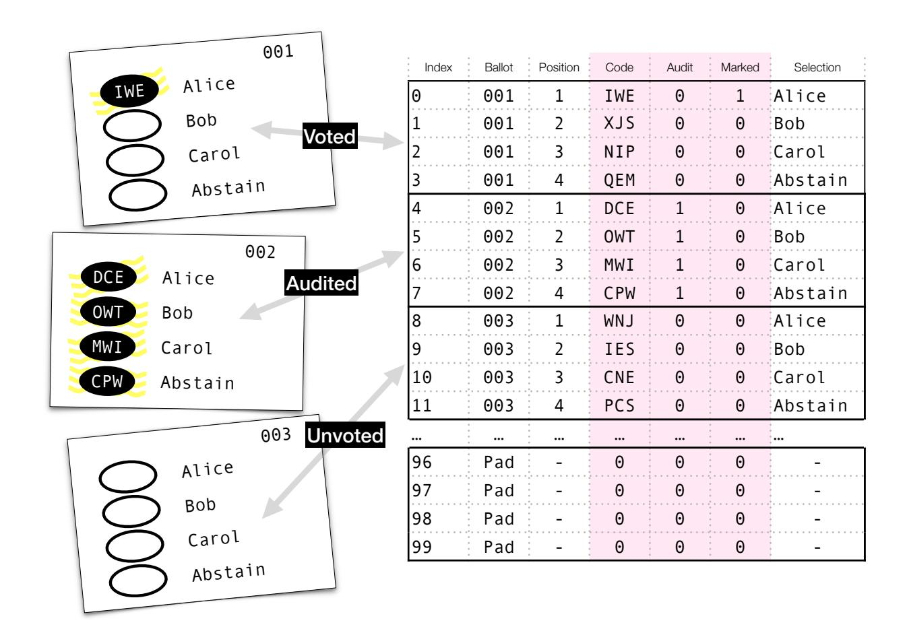
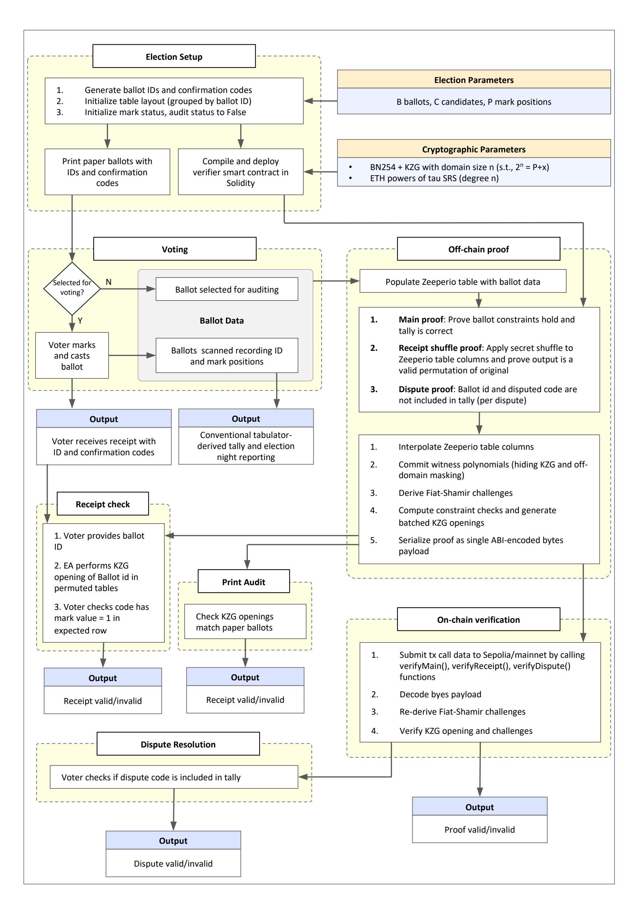

{0}------------------------------------------------

# Zeeperio: Verifying Governmental Elections with Ethereum (Full Paper<sup>⋆</sup> )

Aikamdeep Malhotra1[0009−0001−1682−9281], Aleksander Essex1[0000−0002−0228−0371], and Jeremy Clark2[0000−0002−3533−5965]

> <sup>1</sup> Western University, Canada {amalho26,aessex}@uwo.ca <sup>2</sup> Concordia University, Canada j.clark@concordia.ca

Abstract. Scantegrity II became the first governmental election run with a cryptographic end-toend election verification (E2E-V) protocol. E2E-V protocols allow the public to verify proofs that the election was executed correctly, but participation in this important process is largely left as an opt-in, ad hoc exercise. We present Zeeperio, a special purpose zk-SNARK argument (built with custom arithmetization) that can issue proofs for Scantegrity elections that can be verified automatically via smart contracts for inexpensive on-chain verification. A Zeeperio verification contract running on Ethereum costs under \$30 USD (at time of writing) per election (and the cost is constant in the number of ballots). By not relying on general purpose zk-SNARK toolkits, like circuit or zkVM compilers, Zeeperio's tailor-made argument offers multiple order-of-magnitude improvements to prover efficiency over implementations from the research literature. For example, Zeeperio requires under 5 hours on a commodity laptop for an election with 100,000 ballots to produce a proof in the kilobyte range.

Keywords: E2E-V voting, zk-SNARKs, polynomial interactive oracle proofs (PIOP), smart contracts

# 1 Introduction

Decades of research on end-to-end verifiable (E2E-V) elections have shown that strong cryptographic guarantees can protect the integrity of governmental elections and the secrecy of voter ballots, even when conducted with paper ballots [\[17\]](#page-13-0). In recent years, pilot projects and deployments of E2E-V platforms have also demonstrated that these systems are usable and scalable to an appropriate degree [\[1,](#page-13-1)[7,](#page-13-2)[3,](#page-13-3)[11\]](#page-13-4). Despite these efforts, some governments continue to conduct elections without meaningful verification or openness to scrutiny.

Within this context, a common refrain is that blockchain technology can solve the governmental voting problem. However, after many years of vapourware and defunct projects [\[21,](#page-14-0)[12\]](#page-13-5), actual deployments have been small-scale and littered with security issues [\[28,](#page-14-1)[15\]](#page-13-6). We argue these projects tried to maximize the role of smart contracts in the voting system. Unlike DAO voting, which is a sensible application of on-chain voting for a system that is already on-chain, governmental elections have a large real-world component that could include anything from paper ballots to polling stations to physical identities. Moving everything online, let alone on-chain, is controversial and introduces new security challenges like over-the-shoulder coercion, vote selling, denial of service, and the threat of malware on voters' personal devices.

In this paper, we consider a pragmatic approach to blockchain voting. The core idea is to introduce or expand the role of blockchain for specific, narrowly-scoped security goals. We start with a well-known cryptographically secure E2E-V voting system called Scantegrity II [\[8\]](#page-13-7), which was the first of its kind deployed in a real-world election [\[7\]](#page-13-2). Blockchains already play a small role in Scantegrity II: for the 2011 municipal election in Takoma Park, USA, commitments to election data were put into Bitcoin's blockchain to unequivocally demonstrate they were made before the election began [\[10\]](#page-13-8).

<sup>⋆</sup> This version expands and provides full appendices for the conference paper appearing at the 10th Workshop on Trusted Smart Contracts (WTSC) at Financial Cryptography and Data Security: FC 2026 International Workshops.

{1}------------------------------------------------

Scantegrity II produces a set of cryptographic proofs that the election result is correct, while preserving ballot secrecy for every voter [\[23,](#page-14-2)[2\]](#page-13-9). Voters consult these proofs to ensure their ballots (cast and/or audited) are recorded correctly, and anyone can use the proofs to verify that the tally was computed correctly. Verifying a proof requires downloading the proof data (MBs) and the technical knowledge of cryptography to check it.

Eperio [\[13\]](#page-13-10) is a follow-up proposal to simplify the cryptography of Scantegrity II by making larger, aggregated commitments that could be implemented with file-based encryption, enabling more practical implementations of the proof verification using pre-existing and commonplace software. For example, the paper demonstrated an implementation of the verifier using only the built-in features of Microsoft Excel. The security of both Eperio and Scantegrity was studied in detail using formal methods in a CCS 2021 paper, and both were found to satisfy equivalent integrity and ballot secrecy properties [\[2\]](#page-13-9). Like Scantegrity (and related schemes of the era), Eperio still required election authorities (EAs) to organize an independent and explicit proof-checking effort to ensure someone checked the proof at all. This paper explores whether the proof could be automatically checked by a smart contract, giving EAs automatic assurance that at least someone checked it. Here, that someone is the Ethereum network, which ties the validity of the election proof to the network's \$100+B USD market capitalization.

The design challenge of this work is to fit the proof within the highly restricted computational limits of the smart contract setting. While compact relative to other cryptographic voting systems, Scantegrity and Eperio proofs are still far too big to store on-chain, and tally verification is linear in the number of ballots. The contribution of this paper is Zeeperio, which provides Eperio-equivalent proofs using succinct (zk-SNARK) arguments. Both the proof size and verification time are constant in the number of ballots, and the overall efficiency now permits on-chain verification.

## 1.1 Contribution

Zeeperio is a modernization of the Eperio election-verification approach, replacing cut-and-choose full-open commitments with modern, succinct knowledge arguments for automated verification in a smart-contract setting:

- 1. Succinct universal verification: Election constraints are encoded in a single polynomial interactive proof (PIOP) using a zk-SNARK approach from Plonk [\[14\]](#page-13-11) with a proof size and verification runtime constant in the number of ballots (for fixed template parameters, with only small O(C) subchecks arising from per-ballot block constraints).
- 2. Automatic verification: The succinctness of Zeeperio arguments enables automatic verification in a smart contract setting, reducing the need for EAs to coordinate explicit independent verification efforts (as in Eperio).
- 3. Implementation: We implement the Zeeperio knowledge arguments and demonstrate their performance in an Ethereum smart contract, showing that an election with B = 100,000 ballots and C = 5 candidates can be verified on-chain for under \$30 USD.
- 4. Enhanced dispute resolution: As a result of confirmation code commitments made within a single polynomial, Zeeperio improves the dispute-resolution process by enabling a succinct proof that a disputed code is incorrect without revealing any other codes or the voter's selections.

Additionally, we clean up a few issues that were not fully resolved in Scantegrity II and Eperio. As pointed out by Basin et al. [\[2\]](#page-13-9), Eperio does not prove ballots were not overvoted; Zeeperio does ([§3.8\)](#page-8-0). As acknowledged by Essex et al. [\[13\]](#page-13-10), Eperio does not support Scantegrity II ballots; Zeeperio does ([§4.2\)](#page-8-1). Scantegrity II [\[8\]](#page-13-7) supports dispute resolution, but requires all confirmation codes on the ballot to be revealed. Zeeperio offers a simple proof of an incorrect code without revealing information about all codes ([§4.3\)](#page-9-0).

# 2 Background and Related Work

### 2.1 Scantegrity II and Eperio

An end-to-end verifiable (E2E-V) voting protocol allows for: (i) an election authority to prove that an election tally is computed correctly without learning individual voter choices, and (ii) voters to check that

{2}------------------------------------------------



<span id="page-2-0"></span>Fig. 1. (Left) Scantegrity II paper ballots. When marked, invisible ink reveals a hidden confirmation code for each selection. (Right) State information (ballot, confirmation code, whether marked or audited, etc.) is encoded into a table. Properties of this table are proven in zero-knowledge as part of a public post-election audit of the election's correctness. Eperio used a basic cut-and-choose approach involving openings of commitments to numerous independently row-wise shuffled table copies. Zeeperio replaces this method with a modern zk-SNARK, demonstrating that certain constraints hold for each column, enabling efficient verification in a smart contract setting.

their ballots are included unmodified in the tally without revealing how they voted to anyone else. Briefly, Scantegrity II is a voting system that uses paper ballots that can be counted by hand or counted with an optical scanner. Beside every candidate on every ballot is a short alphanumeric code printed in invisible ink. Voting for a candidate will reveal the code, which the voter can write down and take home as a receipt of their ballot (see Figure [1\)](#page-2-0). The receipt does not prove how they voted, as no individuals know the correspondence between codes and candidates. However, this correspondence has been specified and cryptographically committed to before the election began, and after the election, commitments will be partially revealed to provide a soundness guarantee without revealing which voter voted for which candidate. The commitments have a specific structure, and Eperio's table-based commitments (a drop-in replacement for Scantegrity's switchboard structure) are shown in Figure [1.](#page-2-0)

### 2.2 Succinct Proofs

While zero-knowledge proofs/arguments (ZKPs) date back to the 1980s [\[16,](#page-13-12)[5\]](#page-13-13), classic ZKPs produce proofs that are at least linear in the size of the proof statement. By contrast, succinct zero-knowledge arguments (SNARKs) are sublinear, with sizes typically logarithmic or constant. A Polynomial Interactive Oracle Proof (PIOP) is a framework shared by several SNARKs [\[25,](#page-14-3)[9,](#page-13-14)[6\]](#page-13-15) where the prover specifies polynomials and is challenged to open them at random points. PIOP does not say how to make a SNARK; it is merely a generic framework.

To realize a PIOP, the prover must send a succinct representation of each polynomial to the verifier, which commits the prover to those polynomials. When opening a polynomial, the verifier must be certain it is the opening of the same polynomial that was committed to. PIOPs rely on a cryptographic primitive called a polynomial commitment scheme (PCS) to handle this. The rest of the PIOP protocol does not use any cryptography. A number of PCSs have been proposed; the most prominent are KZG (very short, based 

{3}------------------------------------------------

on bilinear pairings, requires a trusted setup) and (DEEP-)FRI (longer, based on hash functions, conjectured to be post-quantum secure, no trusted setup). In Zeeperio, we use KZG [20] because it integrates well with Ethereum.

KZG uses a universal trusted setup: a secret value  $\tau$  is chosen at random, used to compute a structured reference string (SRS)  $(g^{\tau}, g^{\tau^2}, g^{\tau^3}, \ldots)$  in a pairing-friendly group and then erased. Knowledge of  $\tau$  after the setup is sufficient to fake KZG openings and forge false ZKP transcripts. However, the setup can be run as an open participation multiparty computation, in which participants prove that their contributions are correct, and only one honest participant must forget  $\tau$  for the SRS to be secure. Ethereum ran an open trusted setup in 2023, which concluded with 140k+ contributions (security holds if at least one contributor was honest and deleted their secret). A single SRS, such as this one, can be shared by anyone who wishes to make a KZG commitment.

In practice, zk-SNARKs for a specific computation can be deployed in different ways: (a) written in a high-level language and compiled to VM instructions, (b) written in special markup languages and compiled into arithmetic circuits, or (c) written as a custom arithmetic circuit. In each case, these representations are fed into a general-purpose (GPZKP) proof system for circuits or zkVMs. Each level of abstraction adds overhead and costs for the prover. Our approach is closer to the metal. Rather than using circuits or Plonk directly, we use the same building blocks to design a custom PIOP argument. For online voting, where voters prove ballot validity, GPZKPs are studied, and we note a customized ZKP (which Zeeperio uses) is expected to be faster [19]. Closer to Zeeperio, another design for succinct proofs uses zk-STARKs, which do not have a trusted setup and are expected to have post-quantum security [18]. However, because this work uses GPZKPs, Zeeperio's custom PIOP approach can prove counted-as-cast for an election with 5 candidates/100,000 ballots in under 5 hours (single core), compared with around 150 (single core) to 5000 (multicore) ballots.

#### 2.3 Smart Contracts

Smart contracts are programs deployed on a blockchain, such as Ethereum. The blockchain's consensus mechanism ensures functions execute correctly and updates the state accordingly. In Zeeperio, a smart contract will accept an election proof and verify it, reporting whether it is correct or not. Since smart contracts can implement arbitrary code, they can support cryptographic operations, though this approach is usually prohibitively expensive. Ethereum offers cheaper *precompiles* for pairing-based operations on the elliptic curve alt-bn128, which were introduced in EIPs 196 and 197. On Ethereum's testnet, support for curve bls12-381 has been staged for future deployment, as have KZG-specific operations over bls12-381, using the aforementioned SRS.

# <span id="page-3-0"></span>3 Zeeperio

In this paper, we pose Zeeperio in the context of optically-scanned paper ballots, which is a widely used voting method in the US and elsewhere. This distinguishes it from outright "blockchain voting" in that the various election activities (marking ballots, casting, counting, reporting, etc.) are largely preserved in the underlying method, with Zeeperio acting as an E2E-V add-on.

A Zeeperio election consists of several phases: (1) an initial election setup, defining the table structure, generating confirmation codes, printing the paper ballots and initializing the proof, (2) printing of ballots, (3) voting, (4) constructing the off-chain proof component, (5) generating and publishing the on-chain smart contract, and (6) the election verification activities, which consist of voter-led receipt checks, auditing the confirmation codes on the printed ballots, resolving disputes between voters and the election authority. A description of these phases is given in Figure 2.

### 3.1 Zeeperio constraints

Zeeperio's approach involves proving multiple concurrent constraints about the election in zero-knowledge, with the combined validity of the individual constraints representing the overarching proof of the correctness

{4}------------------------------------------------

of the election result. As an intuition about these constraints, consider a single contest in a conventional k-candidate plurality (i.e., vote for one) setting. There are k constraints to prove: each of the k ballot positions are marked or unmarked, and the total number of marked candidates is either zero or one. Additional constraints are required to demonstrate the ballot was cast-as-intended and counted-as-cast. Furthermore, these constraints are proven in zero-knowledge toward enforcing ballot secrecy properties like receipt-freeness and coercion resistance.

Election Parameters. Let  $\mathcal{B}$  be the number of printed ballots and  $\mathcal{C}$  the number of candidates per ballot. Let  $\mathcal{P} = \mathcal{BC}$  be the number of ballot positions. Let n be the padded column length (a power of two) with  $n \geq \mathcal{P}$  (the need is explained below). Let  $\mathbb{F}_q$  be a finite field of size q. A ballot has ID  $b \in \{0, \ldots, \mathcal{B} - 1\}$  and occupies a block:  $I_b = \{b\mathcal{C}, b\mathcal{C} + 1, \ldots, b\mathcal{C} + (\mathcal{C} - 1)\} \subseteq \{0, \ldots, n - 1\}$ .

Walkthrough of a Zeeperio Constraint. As shown in Figure 1, the mark column entries are all required to be either 0 or 1. With ZKPs, we call this a constraint. Zeeperio consists of 16 similar constraints that must all hold in any valid election table. Here, we present a complete argument for a single constraint (denoted c2.2) to demonstrate how a PIOP works. This constraint is adapted from [4].

The mark column can be viewed as a one-dimensional array  $A_{\mathsf{mark}}[i]$  of length  $\mathcal{P}$ . The elements of the array are encoded as elements of  $\mathbb{F}_q$ , the exponent field of a pairing-friendly elliptic curve such as  $\mathsf{alt-bn128}$  or  $\mathsf{bls12-381}$ . Cryptographically, the array  $A_{\mathsf{mark}}[i]$  could hold any integer in [0, q-1], but the constraint requires it to be further restricted to [0,1] for a valid election table.

To prove the constraint, the prover (election authority) sends to the verifier (smart contract) a succinct (one group element) commitment (hiding and binding) to the entire mark column  $A_{\mathsf{mark}}[i]$ . Although vector commitments exist, in a PIOP the prover commits to  $A_{\mathsf{mark}}[i]$  indirectly by first encoding the data from  $A_{\mathsf{mark}}[i]$  into a univariate polynomial over  $\mathbb{F}_q$  and then committing to this polynomial representation of  $A_{\mathsf{mark}}[i]$  using a polynomial commitment scheme.

There are several ways to encode vectors as polynomials, and we will focus on the method we use. The prover chooses a set of x-coordinates, such as  $\{0, 1, 2, 3, ...\}$ , called the evaluation domain  $\mathcal{H}$ . It then takes the data from  $A_{\mathsf{mark}}[i]$  and forms a set of points  $\{(0, A_{\mathsf{mark}}[0]), (1, A_{\mathsf{mark}}[1]), ...\}$ . The prover interpolates a univariate polynomial through these points:  $\mathsf{Mark}(X)$ . It commits to  $\mathsf{Mark}(X)$  using the polynomial commitment scheme and sends the commitment to the verifier.

Interpolation is computationally expensive for provers, so they use an optimization. The evaluation domain is arbitrary and can be any set as long as the prover and verifier agree. Let  $\omega \in \mathbb{F}_q$  generate a multiplicative subgroup of size n. Then set  $H = \{\omega^0, \omega^1, \dots, \omega^{n-1}\} \subseteq \mathbb{F}_q$ . Doing so offers three advantages and one drawback. Interpolating a polynomial over this domain can be accomplished in  $\mathcal{O}(n \log n)$  instead of  $\mathcal{O}(n^2)$ . Traversing the domain is easy: the next index is the current index multiplied by  $\omega$ , and because it is closed under multiplication, the *next* element after the last element  $\omega^{n-1}$  wraps back to the first element  $\omega^{n-1} \cdot \omega = \omega^n = \omega^0$ . Finally, a polynomial that is 0 at each  $X \in H$  has a simple closed form:  $Z_H(X) = X^n - 1$ . The drawback is that the prover cannot use arrays of arbitrary length  $\mathcal{P}$  and expect that an order n subgroup will just exist. The subgroups are based on the parameters of the elliptic curve, and curves like alt-bn128 and bls12-381 are designed to offer subgroups of sizes  $\{2, 2^2, 2^3, 2^4, \ldots\}$  up to  $2^{28}$  for alt-bn128 and  $2^{32}$  for bls12-381.

In Zeeperio, if we have a column of length  $\mathcal{P}$ , we will zero-pad it to the nearest power of 2. Thus, n is the padded column length (a power of two) with  $n \geq \mathcal{P}$ . For this example constraint (the mark column is binary), the presence of zero padding does not affect the constraint. However, for other constraints, we will have to explicitly handle the padding separately from the election table data.

At this point, the verifier holds a polynomial commitment to  $\mathsf{Mark}(X)$ , which we call  $K_{\mathsf{Mark}}$ . How does the prover demonstrate that  $\mathsf{Mark}(X)$  is binary? The prover constructs another polynomial as follows:  $V(X) := \mathsf{Mark}(X)(\mathsf{Mark}(X)-1)$ . The prover commits to V(X) and sends  $K_V$  to the verifier. If  $\mathsf{Mark}(X)$  is binary for all  $X \in H$ , then V(X) is zero for all  $X \in H$ . If  $\mathsf{Mark}(X)$  is not binary for at least one  $X \in H$ , then V(X) is non-zero at that X. We have converted the binary constraint on  $\mathsf{Mark}(X)$  into the following two checks: (1) V(X) is correctly constructed from  $\mathsf{Mark}(X)$ , and (2) V(X) is zero for all  $X \in H$ . A polynomial that is zero for all  $X \in H$  is called a  $vanishing\ polynomial\ (on\ H)$ . To prove that V(X) is correctly constructed

{5}------------------------------------------------

from  $\mathsf{Mark}(X)$ , the verifier has  $K_{\mathsf{Mark}}$  and  $K_V$ . The verifier will (or the prover, using the strong Fiat-Shamir heuristic) choose a random evaluation point  $\zeta \notin H$ . Using the polynomial commitment scheme, the prover will open the polynomials at  $\zeta$ , sending  $V(\zeta)$ ,  $\mathsf{Mark}(\zeta)$ , and the opening proofs for each to the verifier. The verifier will check the opening proofs and check that  $V(\zeta) := \mathsf{Mark}(\zeta)(\mathsf{Mark}(\zeta) - 1)$ . Just because the relation holds at  $\zeta$ , what does that say about it holding for each  $X \in H$ ? The answer is that it holds with overwhelming probability due to the Schwartz-Zippel lemma, which we do not review here.

Next, the prover will demonstrate that V(X) vanishes on H. Recall that  $\mathsf{Z}_H(X) = X^n - 1$  is a vanishing polynomial on H. The prover constructs another polynomial  $Q(X) := V(X)/\mathsf{Z}_H(X)$ , commits to Q(X), and sends the commitment  $K_Q$  to the verifier. If and only if V(X) is zero at every point of H,  $\mathsf{Z}_H(X)$  divides V(X) exactly, yielding a proper polynomial Q(X); otherwise, Q(X) is a rational function not reducible to a polynomial.  $Q(X) := V(X)/\mathsf{Z}_H(X)$  can be rearranged as  $V(X)-Q(X)\cdot(X^n-1)=0$ . Using  $\zeta$  from above, the prover sends  $Q(\zeta)$  and its opening proof. The verifier checks  $V(\zeta)-Q(\zeta)\cdot(\zeta^n-1)=0$ . By Schwartz-Zippel, if this equality holds at a uniformly random  $\zeta \notin H$ , then, except with negligible probability, it holds as a polynomial identity, which implies that V(X) vanishes on H.

### 3.2 Zeeperio Constraints

Zeeperio consists of 16 constraints. Each constraint follows a similar pattern to the example constraint: a set of polynomials is committed to such that a relationship between them will be a vanishing polynomial if and only if the constraint is true. Once the constraint is converted into a vanishing polynomial, proving the vanishing polynomial is constructed correctly and that it actually vanishes is identical to the process used above.

In fact, given a set of vanishing polynomials  $\{V_1(X), V_2(X), \dots, V_m(X)\}$  and their corresponding quotient polynomials, the checks can be batched into a single check. The prover will form a *super-polynomial* Batch(X) whose coefficients are the vanishing polynomials:

$$\mathsf{Batch}(Y) = \sum_{i=1}^m Y^i \Big( V_i(X) - Q_i(X) \, \mathsf{Z}_H(X) \Big).$$

A polynomial with all coefficients 0 is a zero polynomial. Therefore, the verifier (or prover via strong Fiat-Shamir) will choose a random  $\zeta \in \mathbb{F}_q \notin H$  as before and set  $X = \zeta$ , which makes every coefficient 0 with overwhelming probability. To check whether every coefficient is 0, it will also choose a random  $\alpha \in \mathbb{F}_q$  and set  $Y = \alpha$ . If every  $V_i(X)$  vanishes, then  $\mathsf{Batch}(Y)$  is a zero polynomial and:

$$\mathsf{Batch}(\alpha) = \sum_{i=1}^m \alpha^i \Big( V_i(\zeta) - Q_i(\zeta) \, \mathsf{Z}_H(\zeta) \Big) = 0.$$

### 3.3 Public Polynomials

Zeeperio uses several public helper polynomials that depend only on the election shape (e.g., n,  $\mathcal{B}$ ,  $\mathcal{C}$ , and hence  $\mathcal{P} = \mathcal{BC}$ ), not on any voter choices or the contents of the committed columns. They are enumerated in Table 1. Some of these helpers are linear or superlinear in n to construct (for example, explicit products or explicit sums of Lagrange basis polynomials). This does not undermine Zeeperio's claims of succinctness: the pre-computation is offline, public, and independent of the witness. In systems like Plonk, these polynomials are considered part of the verifying key. In practice, election administrators can standardize on a small set of template sizes, and these polynomials can be pre-computed once for each election template. If an election uses fewer ballots or candidates than the template's maximum, the remaining rows are constrained to be empty: extra ballots are unused, and extra candidates receive zero votes, which is reflected directly in the published tally.

{6}------------------------------------------------

<span id="page-6-0"></span>**Table 1.** A set of polynomials that can be computed before the beginning of the election.  $Sel_b(X)$  is the one exception, it will not be precomputed but rather computed during a receipt check just for the one ballot b that the voter wants to check.

| Description                                                                                                              | Polynomial                                                                                                                                   |
|--------------------------------------------------------------------------------------------------------------------------|----------------------------------------------------------------------------------------------------------------------------------------------|
| Polynomial that is zero on $H$                                                                                           |                                                                                                                                              |
| Mask that is 0 on all of $H$ except possibly at $X = \omega^0$                                                           | $Mask_0(X) = \frac{Z_H(X)}{X - \omega^0}$                                                                                                    |
| Mask that is 0 on all of $H$ except possibly at $X = \omega^{n-1}$                                                       | $Mask_0(X) = \frac{Z_H(X)}{X - \omega^0}$ $Mask_{n-1}(X) = \frac{Z_H(X)}{X - \omega^{n-1}}$                                                  |
| Polynomial that is 0 up to padding $[0, \mathcal{P} - 1]$                                                                | $Z_{head}(X) = \prod_{i=0}^{\mathcal{P}-1} \left( X - \omega^i \right)$                                                                      |
| Polynomial that is 0 for the last $C$ rows (zeros at $\omega^{n-1}, \ldots, \omega^{n-C}$ )                              | $Mask_{tail}(X) = \prod_{t=0}^{\mathcal{C}-1} \left( X - \omega^{n-1-t} \right)$                                                             |
| Lagrange basis over $H$ used below                                                                                       | $L_{i}(X) = \prod_{\substack{0 \leq j < n \\ j \neq i \\ \lfloor n/\mathcal{C} \rfloor - 1}} \frac{X - \omega^{j}}{\omega^{i} - \omega^{j}}$ |
| Polynomial with a 1 at the start of every ballot (indices $i \equiv 0 \pmod{\mathcal{C}}$ up to padding) and 0 elsewhere |                                                                                                                                              |
| Polynomial that is 1 for all rows belonging to ballot- $b$ ( $I_b = \{bC, \ldots, bC + C - 1\}$ ) and 0 elsewhere        | $\operatorname{Sel}_b(X) = \sum_{k=0}^{C-1} L_{bC+k}(X)$                                                                                     |

### 3.4 Election Specific Polynomials

The Eperio tables for an election consist of three (padded) columns, which are encoded as polynomials evaluated over H. We denote these polynomials  $\mathsf{Code}(X)$ ,  $\mathsf{Audit}(X)$ , and  $\mathsf{Mark}(X)$ . Each index maps to a unique ballot ID and candidate, and the public template provides this mapping. The columns are sorted by ballot ID, then by candidate (see Figure 1). The final tally is a vector  $\mathsf{Tally}[0..\mathcal{C}-1] \in \mathbb{F}_q^{\mathcal{C}}$ .

Across all constraints, we will use 5 additional helper polynomials. We will introduce them as needed. They consist of two (additive, suffix) accumulator polynomials:  $\mathsf{Acc}_{\mathsf{Audit}}(X)$  and  $\mathsf{Acc}_{\mathsf{Mark}}(X)$ , where  $\mathsf{Acc}_{\mathsf{Audit}}(\omega^i) = \sum_{t=i}^{n-1} \mathsf{Audit}(\omega^t)$ ; likewise for  $\mathsf{Mark}(X)$ . We also define a strided accumulator  $\mathsf{Acc}_{\mathsf{Vote}}(X)$ , which we will describe in constraint 4. Finally, we define two block sum helper polynomials:  $\mathsf{BlkSum}_{\mathsf{Audit}}(X) = \sum_{k=0}^{\mathcal{C}-1} \mathsf{Audit}(\omega^k X)$  and  $\mathsf{BlkSum}_{\mathsf{Mark}}(X) = \sum_{k=0}^{\mathcal{C}-1} \mathsf{Mark}(\omega^k X)$ .

#### 3.5 Audit Constraints

Due to limited space in the paper, we cannot fully explain each of the 16 constraints. Instead, we provide some intuition for them. The audit constraints are:

```
\begin{array}{lll} V_{c1.1}(X) &:= \operatorname{\mathsf{Audit}}(X)\operatorname{\mathsf{Z}_{\mathsf{head}}}(X) \\ V_{c1.2}(X) &:= \operatorname{\mathsf{Audit}}(X)\big(\operatorname{\mathsf{Audit}}(X)-1\big) \\ V_{c1.3}(X) &:= \big(\operatorname{\mathsf{Sel}_{\mathsf{blk}}}(X)\operatorname{\mathsf{BlkSum}_{\mathsf{Audit}}}(X)\big)\big(\operatorname{\mathsf{Sel}_{\mathsf{blk}}}(X)\operatorname{\mathsf{BlkSum}_{\mathsf{Audit}}}(X)-\mathcal{C}\big) \\ V_{c1.4}(X) &:= \big(\operatorname{\mathsf{Acc}_{\mathsf{Audit}}}(X)-\operatorname{\mathsf{Audit}}(X)+\operatorname{\mathsf{Acc}_{\mathsf{Audit}}}(\omega X)\big)\cdot (X-\omega^{n-1}) \\ V_{c1.5}(X) &:= \big(\operatorname{\mathsf{Acc}_{\mathsf{Audit}}}(X)-\operatorname{\mathsf{Audit}}(X)\big)\cdot\operatorname{\mathsf{Mask}}_{n-1}(X) \\ V_{c1.6}(X) &:= \big(\operatorname{\mathsf{Acc}_{\mathsf{Audit}}}(X)-\operatorname{\mathsf{Sum}_{\mathsf{Audit}}}_{\mathcal{C}}\big)\cdot\operatorname{\mathsf{Mask}}_0(X) \end{array}
```

The audit column is well-defined for an election if all padding bits are 0 (c1.1) and the column is otherwise binary (c1.2). Each ballot spans  $\mathcal{C}$  positions, so the audit column should contain a contiguous block of  $\mathcal{C}$ 

{7}------------------------------------------------

ones for an audited ballot and a block of  $\mathcal{C}$  zeros for unaudited ballots. The mechanism computes a blocksum over each ballot,  $\mathsf{BlkSum}_{\mathsf{Audit}}(X) = \sum_{k=0}^{\mathcal{C}-1} \mathsf{Audit}(\omega^k X)$ , then restricts attention to ballot-start indices using  $\mathsf{Sel}_{\mathsf{blk}}(X)$ . For a well-formed audit column, the filtered block-sum is always either 0 (not audited) or  $\mathcal{C}$ (audited), and never an intermediate value. After choosing  $\zeta$ , in order to check  $\mathsf{BlkSum}_{\mathsf{Audit}}(X)$  is well-formed, the verifier requires  $\mathcal{C}$  opened points from  $\mathsf{Audit}(\omega^0\zeta)$  to  $\mathsf{Audit}(\omega^{\mathcal{C}-1}\zeta)$ , so this check is linear in  $\mathcal{C}$  (but more importantly, constant in  $\mathcal{P}$  and n).

The EA will assert the number of print audits in the election as the integer  $\mathsf{Sum}_{\mathsf{A}}$ . Since each print audit ballot contains a block of  $\mathcal{C}$  1's, the number of 1's in A(X) must be  $\mathsf{Sum}_{\mathsf{A}\times\mathcal{C}} = \mathsf{Sum}_{\mathsf{A}}\cdot\mathcal{C}$ . To reason about the sum across a polynomial on H, many protocols use accumulator polynomials [14,4].  $\mathsf{Acc}_{\mathsf{Audit}}(X)$  is intended to hold a running suffix-sum of the audit column down the domain order (including padding, which is forced to be 0 by c1.1):

$$\begin{split} \operatorname{Acc}_{\operatorname{Audit}}(\omega^i) &:= \operatorname{Audit}(\omega^i) + \operatorname{Acc}_{\operatorname{Audit}}(\omega^{i+1}) \ \text{ for } i = 0, 1, \dots, n-2, \\ \operatorname{Acc}_{\operatorname{Audit}}(\omega^{n-1}) &:= \operatorname{Audit}(\omega^{n-1}). \end{split}$$

Constraint c1.4 and c1.5 check each line of this recurrence, respectively, guaranteeing that  $\mathsf{Acc}_{\mathsf{Audit}}(X)$  is formed correctly. The first value in  $\mathsf{Acc}_{\mathsf{Audit}}(X)$  holds the sum, so c1.6 ensures this value is equal to  $\mathsf{Sum}_{\mathsf{A}\times\mathcal{C}}$ .

#### 3.6 Mark Constraints

The constraints on the mark column parallel the constraints on the audit column:

```
\begin{split} V_{c2.1}(X) &:= \operatorname{Mark}(X)\operatorname{Z}_{\mathsf{head}}(X) \\ V_{c2.2}(X) &:= \operatorname{Mark}(X)\big(\operatorname{Mark}(X) - 1\big) \\ V_{c2.3}(X) &:= \big(\operatorname{Sel}_{\mathsf{blk}}(X)\operatorname{BlkSum}_{\mathsf{Mark}}(X)\big)\big(\operatorname{Sel}_{\mathsf{blk}}(X)\operatorname{BlkSum}_{\mathsf{Mark}}(X) - 1\big) \\ V_{c2.4}(X) &:= \big(\operatorname{Acc}_{\mathsf{Mark}}(X) - \operatorname{Mark}(X) + \operatorname{Acc}_{\mathsf{Mark}}(\omega X)\big) \cdot (X - \omega^{n-1}) \\ V_{c2.5}(X) &:= \big(\operatorname{Acc}_{\mathsf{Mark}}(X) - \operatorname{Mark}(X)\big) \cdot \operatorname{Mask}_{n-1}(X) \\ V_{c2.6}(X) &:= \big(\operatorname{Acc}_{\mathsf{Mark}}(X) - \operatorname{Sum}_{\mathsf{Mark}}\big) \cdot \operatorname{Mask}_0(X) \end{split}
```

The constraints are as follows: padding elements are zero (c2.1), column elements are binary (c2.2), and the total number of votes matches the sum announced by the EA  $Sum_{Mark}$  (c2.4–c2.5). The main difference is constraint c2.3. For each ballot in the audit column (previous section), the ballot's block is either all 0 or all 1, summing to either 0 or C. For the vote column (this section), each ballot block is either all 0 (not voted) or contains a single 1 (voted). As elements are binary (c2.2), the EA can demonstrate that the sum of each ballot block is either 0 or 1, by c2.3. We assume that over-voted ballots are rejected by the scanner or automatically converted into print-audit ballots.

# 3.7 Cross-Column Constraints

A final constraint demonstrates that no ballot is both voted and audited:

$$V_{c3.1}(X) \; := \; \operatorname{\mathsf{Audit}}(X)\operatorname{\mathsf{Mark}}(X)$$

This constraint is straightforward: an unvoted ballot will have all 0's in its ballot block, while an unaudited ballot will have the same. Therefore, the Hadamard product (element-wise multiplication) of the audit column with the mark column will be 0 in every element if it is properly formed. In the malicious case, if a ballot is both voted and audited, at least one element of the ballot block will have 1 in both columns, and the product of the columns will not be 0 at that element; thus,  $V_{c3.1}(X)$  will not vanish.

{8}------------------------------------------------

## <span id="page-8-0"></span>3.8 Tally Constraints

The tally constraints are as follows:

$$\begin{split} V_{c4.1}(X) \; &:= \; \left( \mathsf{Acc}_{\mathsf{Vote}}(X) - \mathsf{Mark}(X) + \mathsf{Acc}_{\mathsf{Vote}}(\omega^{\mathcal{C}}X) \right) \cdot \mathsf{Mask}_{\mathsf{tail}}(X) \\ V_{c4.2}(X) \; &:= \; \left( \mathsf{Acc}_{\mathsf{Vote}}(X) - \mathsf{Mark}(X) \right) \cdot \frac{\mathsf{Z}_H(X)}{\mathsf{Mask}_{\mathsf{tail}}(X)} \\ V_{c4.3,j}(X) \; &:= \; \left( \mathsf{Acc}_{\mathsf{Vote}}(X) - \mathsf{Tally}[j] \right) \cdot \frac{\mathsf{Z}_H(X)}{X - \omega^j} \end{split}$$

The EA will announce the tally as a list of vote totals for each of the  $\mathcal{C}$  candidates: Tally[j] for  $j \in \{0, \ldots, \mathcal{C}-1\}$ . The marks for candidate i will be in every i-th element of  $\mathsf{Mark}(X)$  over H. The EA will build an additive, suffix accumulator  $\mathsf{Acc}_{\mathsf{Vote}}(X)$  however it will be  $\mathit{strided}$ :

$$\mathsf{Acc}_{\mathsf{Vote}}(\omega^i) \; := \; \sum_{t=0}^{\left \lfloor \frac{n-1-i}{\mathcal{C}} \right \rfloor} \mathsf{Mark}\big(\omega^{\,i+t\mathcal{C}}\big) \,, \qquad i \in \{0,\dots,n-1\}.$$

The result is that  $\mathsf{AccVote}(\omega^c)$  is equal the total number of marks appearing at indices congruent to  $c \mod \mathcal{C}$  across all ballots (and padding). Note that there is no assumption that c|n; the sums for some candidates may be one element longer than those for others. Constraint c4.1 demonstrates that the accumulator is built correctly, assuming it starts with the right values. Constraint c4.2 demonstrates that the starting values are correct. Constraint c4.3 shows that the published tally equals the sum of each candidate's votes. Constraint c4.3 is run  $\mathcal{C}$  times, once for each candidate's total votes, which will be contained in the first  $\mathcal{C}$  elements of  $\mathsf{AccVote}(X)$  on H.

# <span id="page-8-2"></span>4 Voter Checks

Zeeperio splits E2E-V into (i) universal evidence that the published tally is correct, and (ii) voter-verifiable evidence that an individual voter's receipt and audited ballot are consistent with the committed election data. All constraints from Section 3 correspond to the former proof and this is what is verified on-chain with an Ethereum contract This section describes the voter-verifiable checks.

#### 4.1 Print Audit

The voter provides ballot ID b, which determines the public index set  $I_b = b\mathcal{C}, \ldots, b\mathcal{C} + \mathcal{C} - 1$ . The EA opens the committed polynomials  $\mathsf{Audit}(X)$ ,  $\mathsf{Mark}(X)$ , and  $\mathsf{Code}(X)$  at the  $\mathcal{C}$  points  $\omega^i{}_{i \in I_b}$  and returns those evaluations with opening proofs (for KZG, these can be batched in a single multipoint opening proof).

## <span id="page-8-1"></span>4.2 Receipt Check

At a first glance, it might seem the EA can simply open Mark(X) and Code(X) for the voter's ballot ID b. However, since these polynomials are ordered by candidate, the index of the mark indicates the candidate the voter voted for. We analyzed three PIOP-friendly approaches to this, but for space considerations, we present only the best: using a permutation (briefly, the excluded alternatives are lookup arguments and a secret selector vector with summation).

First, the EA defines a public ballot-ID column BallotID(X) that encodes the ballot identifier on every ballot position: for each ballot  $b \in \{0, ..., \mathcal{B} - 1\}$  and each within-ballot offset  $k \in \{0, ..., \mathcal{C} - 1\}$ , we set BallotID( $\omega^{bC+k}$ ) = b, and we set BallotID( $\omega^i$ ) = 0 on all padding indices  $i \geq \mathcal{P}$ . Next, the EA samples a secret permutation  $\pi$  over  $\{0, ..., n-1\}$  and uses it to define permuted columns by  $\mathsf{F}^{\pi}(\omega^i) = \mathsf{F}(\omega^{\pi(i)})$ . The EA then commits once (pre-election or once-per-election) to the shuffled columns  $\mathsf{BallotID}^{\pi}(X)$ ,  $\mathsf{Code}^{\pi}(X)$ , and

{9}------------------------------------------------

 $\mathsf{Mark}^{\pi}(X)$ , and proves once that each shuffled column is a permutation of its corresponding source column under the *same* secret permutation  $\pi$ . The permutation argument comes straight from the literature [14].<sup>3</sup>

For a per-receipt query, the voter provides ballot ID b. The EA finds, privately, an index t such that  $\mathsf{BallotID}^\pi(\omega^t) = b$  and  $\mathsf{Mark}^\pi(\omega^t) = 1$ , and it returns the receipt code  $c := \mathsf{Code}^\pi(\omega^t)$  together with a batched opening proof at the single point  $\omega^t$  for the three committed polynomials  $\mathsf{BallotID}^\pi(X)$ ,  $\mathsf{Mark}^\pi(X)$ , and  $\mathsf{Code}^\pi(X)$ . Revealing index t is safe because  $\pi$  is secret, so t does not reveal the candidate-order position of the mark in the original (unshuffled) ballot block.

## <span id="page-9-0"></span>4.3 Dispute Resolution

If a receipt check returns a wrong confirmation code, it is possible that the EA switched the voter's vote to another candidate. However, the voter has proof of this: they know a different confirmation code that appears on the ballot. By contrast, a voter who wants to discredit an election result might claim spuriously that their confirmation code is incorrect (even though it is); however, they will not know a different valid confirmation on their ballot (beyond guessing) [8].

In a dispute, the voter provides a ballot ID b and a disputed confirmation code  $c \in \mathbb{F}_q$ . The EA's goal is to prove non-membership: that c does not appear anywhere among the  $\mathcal{C}$  confirmation codes printed on ballot b, without revealing any of those codes. Let  $I_b = \{b\mathcal{C}, \dots, b\mathcal{C} + (\mathcal{C} - 1)\}$  denote the (public) index set of ballot b, and let  $\mathsf{Mask}^{(b)}_{\mathsf{ballot}}(X)$  be the public 0/1 mask that is 1 on  $I_b$  and 0 elsewhere on H. If c is a non-member, then  $(\mathsf{Code}(\omega^i) - c)$  will be non-zero on each element in  $I_b$ . If and only if it is non-zero, an inverse element will exist such that  $(\mathsf{Code}(\omega^i) - c) \cdot \mathsf{Inv}_b(\omega^i) = 1$ . The EA introduces an auxiliary polynomial of asserted inverses  $\mathsf{Inv}_b(X)$  on  $I_b$  and the constraint reduces the vanishing polynomial:

$$V_{\mathsf{dispute}}(X) \; := \; \left( (\mathsf{Code}(X) - c) \cdot \mathsf{Inv}_b(X) - 1 \right) \cdot \mathsf{Mask}_{\mathsf{ballot}}^{(b)}(X)$$

If c does appear on the ballot, say at position  $\kappa \in I_b$ , the EA will not be able to put a value in  $Inv_b(\kappa)$  that makes  $V_{dispute}(X)$  vanish.

# 5 Implementation and Performance

Zeeperio is implemented as an off-chain prover and an on-chain verifier.<sup>4</sup> Benchmarks were obtained on an Apple MacBook Pro with an M3 Pro CPU and 18 GB RAM, and gas costs were measured by deploying the verifier to the Sepolia testnet. Table 2 reports proof sizes, proving time, and verification gas for the three proof kinds.<sup>5</sup>

Prototype. The prover is written in Rust using the arkworks toolkit and the BN254 curve, and produces the three proofs from Sections 3 and 4 bycommitting to witness polynomials with the hiding KZG variant. The on-chain verifier is implemented in Solidity using Foundry and relies on the BN254 precompiles from EIP-196 and EIP-197 to verify KZG opening equations directly, all without a SNARK verifying key. Proofs are submitted as a single ABI-encoded bytes blob containing commitments, openings, public inputs, and transcript scalars. Verification decodes the blob, recomputes Fiat-Shamir challenges, and performs one pairing check per opening point while batching multiple evaluations at the same point.

<span id="page-9-1"></span><sup>&</sup>lt;sup>3</sup> The only minor difference is that we are shuffling the random linear combination of three polynomials instead of two polynomials under the same permutation.

<span id="page-9-2"></span><sup>&</sup>lt;sup>4</sup> GitHub: https://github.com/MadibaGroup/2025-Zeeperio

<span id="page-9-3"></span><sup>&</sup>lt;sup>5</sup> At an ETH price of \$3,000 USD, gas price of 1 Gwei, and using 1 Gwei =  $10^{-9}$  ETH, the transaction fees for the proofs are  $\sim $15$ ,  $\sim $6$ , and  $\sim $4$  respectively. The verifier contract is deployed on Sepolia at address 0xA2cE1411815b395B70dC019095673C7B0fdF3199; the verified source code is available on Etherscan.

{10}------------------------------------------------



<span id="page-10-0"></span>Fig. 2. Zeeperio protocol showing setup, voting, proof and verification steps.

{11}------------------------------------------------

<span id="page-11-0"></span>Table 2. Zeeperio benchmark with B = 100,000 ballots, C = 5 candidates, P = BC = 500, 000 positions, padding to 2 <sup>20</sup>, and 10% of ballots print audited. All measurements are from a single-core execution on standard hardware (M3 Pro).

| Metric                | Main  | Receipt Dispute             |       |
|-----------------------|-------|-----------------------------|-------|
| Proof generation (s)  | 8,786 | 3,071                       | 5,934 |
| Commitments (#)       | 18    | 13                          | 3     |
| Opening points (#)    | 6     | 2                           | 1     |
| Calldata size (bytes) | 7,264 | 4,128                       | 1,664 |
| Gas used              |       | 2,215,786 1,035,471 532,475 |       |

### 5.1 Further Implementation Details

Off-chain Prover. The prover is implemented in Rust and uses the arkworks toolkit for BN254 pairings. The instance is launched with a CLI that generates all three proof kinds (main, receipt, and dispute) described in Sections [3](#page-3-0) and [4.](#page-8-2) It commits to all polynomials using the hiding variant of KZG, where each commitment includes a blinding term in the γ-scaled SRS basis. The blinding polynomials are derived from the prover transcript/challenges, while the hiding structure is enabled by the SRS elements. Additionally, the prover applies off-domain masking by adding random multiples of the domain vanishing polynomial to selected witness polynomials. This preserves on-domain evaluations while randomizing coefficients off-domain. To reduce proof size and verification cost, each opening batches multiple polynomial evaluations at the same point using a random scalar γ into a single KZG witness. On-chain, this yields one pairing check per opening point, while still validating many evaluations within each opening.

Calldata encoding. Proofs are serialized into a single bytes blob using Ethereum ABI encoding of fields: kind, commitments array, openings array, public-input tuple, and the transcript scalars (α, β, ζ, r). The CLI computes the 4-byte function selector as keccak256(methodSignature)[0..4] via tiny-keccak when forming transaction calldata for verification.

On-chain verifier. The verifier is implemented in Solidity and built with the Foundry toolchain. It uses the BN254 precompiles (EIP-196/197) for elliptic-curve operations and pairing checks. There is no SNARK circuit/verifying key; instead, the contract stores KZG verifier parameters derived from the SRS (g, γg, h, and βh) in ZeeperioKzgVk.sol. The contract exposes three entrypoints, verifyMain, verifyReceipt, and verifyDispute. Each calls a shared internal routine \_verify(expectedKind, proofCalldata) which decodes the proof and runs verification.

Custom ABI decoding via calldataload. Proofs are passed as a single bytes calldata argument and decoded manually with calldataload. The helper \_readWord(data, offset) reads 32-byte words from calldata at data.offset + offset. The proof blob begins with a fixed-size header:

```
0x00: kind 0x20: commitmentsOffset
0x40: openingsOffset 0x60: publicOffset
0x80: α 0xA0: β
0xC0: ζ 0xE0: r
```

where offsets point into the same bytes blob.

Commitments section. At commitmentsOffset, the contract decodes a commitment array of length ℓ, where each element occupies 0x60 bytes. This includes a 32-byte word whose low 16 bits store uint16 label, followed by two field elements encoding a BN254 G<sup>1</sup> point (x, y).

{12}------------------------------------------------

| Security Property                         | Zeeperio                                                                                                                                                                                       |
|-------------------------------------------|------------------------------------------------------------------------------------------------------------------------------------------------------------------------------------------------|
| Receipt-freeness &<br>coercion resistance | The coercion resistance of Scantegrity II and Eperio is re<br>counted in Appendix A.2 and A.3. Appendix A.4 proves<br>Zeeperio is as coercion resistant as Eperio.                             |
| Individual<br>verifiability               | Voters use their receipts to confirm their ballots were recorded<br>as-cast. This property is proven in Appendix A.5.                                                                          |
| Universal<br>verifiability                | The public can confirm ballots were cast-as-intended via the<br>print audit, and counted-as-cast via the succinct proof in the<br>smart contract. These properties are proven in Appendix A.5. |

Table 3. Summary of security properties for Zeeperio.

Openings section. At openingsOffset, the contract decodes the openings array using the ABI array-ofoffsets layout:

<span id="page-12-0"></span>
$$len \parallel ptr_0 \parallel \cdots \parallel ptr_{len-1}$$
.

Each pointer is a relative offset to an opening tuple. For each opening, the contract reads a fixed prefix:

```
(witness.x, witness.y, point, γ, labelsOff, valuesOff, blindingsOff),
```

followed by three arrays at the given offsets: (i) labels encoded as 32-byte words and decoded by truncation to uint16[], (ii) uint256[] values, and (iii) uint256[] blindings. The labels selects which commitments are needed, values contains the claimed evaluations, and blindings contains the hiding terms needed for the hiding-KZG verifier equation.

Public inputs section. At publicOffset, the contract decodes:

```
(n, C, sumA, sumM, tallyOffset, disputedCode, ballotIndex),
```

where tallyOffset points to the uint256[] tally array. For the main election proof, tally.length must equal C. For the Dispute proof, the disputedCode and ballotIndex fields are used to bind the proof statement to the specific dispute instance.

Transcript checks and KZG verification. After decoding, the verifier recomputes Fiat–Shamir challenges using sha256-based hashing into Fr. It checks α and ζ for all proof kinds, and additionally checks β for the receipt proof. It also recomputes r deterministically from the decoded openings (hashing each opening's point, γ, witness, and all values/blindings), rejecting if r does not match the prover-supplied field. Finally, for each opening point, it verifies a KZG pairing equation (one pairing check per opening), where the referenced commitments are combined using the opening's γ and the claimed values/blindings.

Evaluation on Sepolia. We deploy to Sepolia because it is free (test ETH can be obtained from public faucets), which makes it practical to repeatedly measure gas. Deploying on the Ethereum mainnet requires no protocol changes, as the BN254 precompiles specified in EIP-196/197 are available on both networks.

# 6 Security Proof

At a high level, Zeeperio preserves Eperio's privacy guarantees and provides succinct, universally verifiable evidence that the published tally is consistent with a committed election table satisfying the protocol constraints from Section [3.](#page-3-0) Table [3](#page-12-0) summarizes Zeeperio's security properties in the voting context. Due to space, we defer the security proofs to Appendix [A.](#page-15-1)

The security proof has two components. First, we show non-expansivity over Eperio: given an Eperio transcript, an adversary learns nothing additional from the Zeeperio transcript beyond what can be simulated, up to negligible probability. Second, we show integrity by relating the acceptance of the main proof and the voter-check verification conditions to the integrity predicates of Basin et al.'s model [\[2\]](#page-13-9).

{13}------------------------------------------------

# 7 Conclusion

Zeeperio modernizes Eperio-style post-election audits by replacing conventional cut-and-choose commitments with succinct polynomial arguments verified on-chain. Our design introduces automated verification and constant-size proofs. Zeeperio considered the optically scanned paper ballot setting as an initial starting point. Future work could extend this approach to online voting, especially addressing the design challenge of maintaining coercion resistance in an unsupervised setting.

Acknowledgements. We thank the reviewers who helped to improve our paper. A. Essex acknowledges support for this research through an NSERC Discovery grant. J. Clark acknowledges support for this research project from (i) the National Sciences and Engineering Research Council (NSERC), Raymond Chabot Grant Thornton, and Catallaxy Industrial Research Chair in Blockchain Technologies, (ii) the AMF (Autorité des Marchés Financiers), and (iii) NSERC through a Discovery Grant.

# References

- <span id="page-13-1"></span>1. Adida, B., Marneffe, O.d., Pereira, O., Quisquater, J.J.: Electing a university president using open-audit voting: Analysis of real-world use of Helios. In: EVT/WOTE (2009)
- <span id="page-13-9"></span>2. Basin, D., Dreier, J., Giampietro, S., Radomirović, S.: Verifying table-based elections. In: ACM CCS (2021)
- <span id="page-13-3"></span>3. Bell, S., Benaloh, J., Byrne, M.D., DeBeauvoir, D., Eakin, B., Kortum, P., McBurnett, N., Pereira, O., Stark, P.B., Wallach, D.S., Winn, M.: {STAR-Vote}: A secure, transparent, auditable, and reliable voting system. In: EVT/WOTE (2013)
- <span id="page-13-19"></span>4. Boneh, D., Fisch, B., Gabizon, A., Williamson, Z.: A simple range proof from polynomial commitments (2019), <https://hackmd.io/@dabo/B1U4kx8XI>
- <span id="page-13-13"></span>5. Brassard, G., Chaum, D., Crépeau, C.: Minimum disclosure proofs of knowledge. J. Comput. Syst. Sci. 37(2), 156–189 (1988)
- <span id="page-13-15"></span>6. Bünz, B., Fisch, B., Szepieniec, A.: Transparent snarks from dark compilers. In: EUROCRYPT (2020)
- <span id="page-13-2"></span>7. Carback, R.T., Chaum, D., Clark, J., Conway, J., Essex, A., Hernson, P.S., Mayberry, T., Popoveniuc, S., Rivest, R.L., Shen, E., Sherman, A.T., Vora, P.L.: Scantegrity II municipal election at Takoma Park: the first E2E binding governmental election with ballot privacy. In: USENIX Security Symposium (2010)
- <span id="page-13-7"></span>8. Chaum, D., Carback, R., Clark, J., Essex, A., Popoveniuc, S., Rivest, R.L., Ryan, P.Y.A., Shen, E., Sherman, A.T.: Scantegrity II: end-to-end verifiability for optical scan election systems using invisible ink confirmation codes. In: EVT (2008)
- <span id="page-13-14"></span>9. Chiesa, A., Hu, Y., Maller, M., Mishra, P., Vesely, N., Ward, N.: Marlin: Preprocessing zksnarks with universal and updatable srs. In: EUROCRYPT (2020)
- <span id="page-13-8"></span>10. Clark, J., Essex, A.: Commitcoin: Carbon dating commitments with bitcoin. In: Financial Cryptography (2012)
- <span id="page-13-4"></span>11. Culnane, C., Ryan, P.Y., Schneider, S., Teague, V.: vvote: a verifiable voting system. ACM Transactions on Information and System Security (TISSEC) 18(1), 1–30 (2015)
- <span id="page-13-5"></span>12. Ernest, A.: Unblocking blockchain voting (2025), <https://followmyvote.com/unblocking-blockchain-voting/>
- <span id="page-13-10"></span>13. Essex, A., Clark, J., Hengartner, U., Adams, C.: Eperio: Mitigating technical complexity in cryptographic election verification. In: EVT/WOTE (2010)
- <span id="page-13-11"></span>14. Gabizon, A., Williamson, Z.J., Ciobotaru, O.: Plonk: Permutations over lagrange-bases for oecumenical noninteractive arguments of knowledge. Cryptology ePrint Archive (2019)
- <span id="page-13-6"></span>15. Gaudry, P., Golovnev, A.: Breaking the encryption scheme of the moscow internet voting system. In: International Conference on Financial Cryptography and Data Security. pp. 32–49. Springer (2020)
- <span id="page-13-12"></span>16. Goldreich, O., Micali, S., Wigderson, A.: How to prove all np statements in zero-knowledge and a methodology of cryptographic protocol design. In: CRYPTO (1986)
- <span id="page-13-0"></span>17. Hao, F., Ryan, P.Y.: Real-world electronic voting: Design, analysis and deployment. CRC Press (2016)
- <span id="page-13-18"></span>18. Harrison, M., Haines, T.: On the applicability of starks to counted-as-collected verification in existing homomorphic e-voting systems. In: VOTING (2025)
- <span id="page-13-17"></span>19. Huber, N., Kuesters, R., Liedtke, J., Rausch, D.: ZK-SNARKs for ballot validity: A feasibility study. In: E-VOTE-ID (2024)
- <span id="page-13-16"></span>20. Kate, A., Zaverucha, G.M., Goldberg, I.: Constant-size commitments to polynomials and their applications. In: ASIACRYPT. pp. 177–194. Springer (2010)

{14}------------------------------------------------

- <span id="page-14-0"></span>21. Korunov, A., Sazonov, A., Murzin, P.: Polys online voting system: Lessons learned from utilizing blockchain technology. E-Vote-ID 2021 p. 393 (2021)
- <span id="page-14-4"></span>22. Kusters, R., Truderung, T., Vogt, A.: A game-based definition of coercion- resistance and its application. In: CSF (2010)
- <span id="page-14-2"></span>23. Kusters, R., Truderung, T., Vogt, A.: Proving coercion-resistance of Scantegrity II. In: ICICS (2010)
- <span id="page-14-6"></span>24. Lipmaa, H.: Plonk is simulation extractable in rom under falsifiable assumptions. In: Theory of Cryptography Conference. pp. 3–36. Springer (2025)
- <span id="page-14-3"></span>25. Maller, M., Bowe, S., Kohlweiss, M., Meiklejohn, S.: Sonic: Zero-knowledge SNARKs from linear-size universal and updatable structured reference strings. In: CCS (2019)
- <span id="page-14-7"></span>26. Ryan, P.Y.A., Bismark, D., Heather, J., Schneider, S., Xia, Z.: Pret a voter: a voter-verifiable voting system. IEEE TIFS 4(4) (2009)
- <span id="page-14-5"></span>27. Sefranek, M.: How (not) to simulate plonk. In: International Conference on Security and Cryptography for Networks. pp. 96–117. Springer (2024)
- <span id="page-14-1"></span>28. Specter, M.A., Koppel, J., Weitzner, D.: The ballot is busted before the blockchain: A security analysis of voatz, the first internet voting application used in {US}. federal elections. In: 29th USENIX Security Symposium (USENIX Security 20). pp. 1535–1553 (2020)

{15}------------------------------------------------

# <span id="page-15-1"></span>A Security Proof

#### A.1 Overview

Zeeperio is a component of a voting system, not a full-fledged voting system. We will keep our proof very narrow to the changes Zeeperio introduces, since security arguments for most other components already exist. Eperio [13] is a 'back-end' tabulator that proves the correctness of the election, while leaking no information about how any voter voted from all its transcripts. The 'front-end' of the system consists of the paper ballots, how they encode votes, how voters interact with their voted ballots, the audited ballots, and the election transcript. The front-end also needs to be receipt-free. Eperio, and by extension Zeeperio, is compatible with multiple front ends, but we use Scantegrity II [8] as an example.

Scantegrity II is an end-to-end verifiable voting system with paper ballots that are optically scanned. A ballot contains a unique serial number and a unique (per-ballot) confirmation code printed beside each candidate in invisible ink. When the voter marks a candidate on the ballot, the voter is also able to read the code. The ballot serial number and the revealed code constitute the voter's receipt, which they can copy to a piece of paper and bring home. The scanned ballots are provided to a backend system called 'the switchboard.' The switchboard prepares a proof that the tally is correct and provides an interface for voters to see if their receipts are recorded correctly and if their print-audited ballots contain consistent confirmation codes with what is recorded.

# <span id="page-15-0"></span>A.2 Scantegrity II is Coercion Resistant

For the purposes of this paper, we will assume that Scantegrity II is a secure voting system. Its security is argued in the Scantegrity papers, while Küsters, Truerung, and Vogt [23] provide a very thorough proof of its *coercion resistance* property. The definition of coercion resistance is from their earlier paper at CSF 2010 [22]. We provide a summary of their main theorem, while omitting many of the details and exact models (see their paper).

Let  $P_{\mathsf{Sct}}$  denote the Scantegrity II protocol, and let

$$S = P_{\mathsf{Sct}}(k, m, n, \tilde{p})$$

be an election system with the following parameters. k is the number of candidates (excluding abstention), indexed by  $i \in \{1, \ldots, k\}$ . m is the number of dishonest voters whose votes are assumed known to the coercer (static adversary). n is the number of honest voters (excluding one coerced voter).  $\tilde{p} = (p_0, \ldots, p_k)$  is the distribution of an honest voter's choice  $(p_0$  for abstention,  $p_i$  for candidate i), with  $\sum_{j=0}^k p_j = 1$ .

Küsters et al. define coercion-resistance roughly as: for any strategy v the coercer forces on the voter, there exists a counter-strategy  $\tilde{v}$  such that (i) the resulting run satisfies the voter's goal  $\gamma_i$  with overwhelming probability, while (ii) the coercer cannot distinguish whether the voter obeyed the coercer or used its counter-strategy by more than a security parameter  $\delta$ . The quantity  $\delta = \delta_{\min}^i(n, k, \tilde{p})$  is the paper's expression for the best-possible distinguishability advantage available to a coercer in this setting (we refer the interested reader to the paper for its exact details).

Theorem 1 (Main Result from [23]). Fix  $i \in \{1, ..., k\}$  and let  $\delta = \delta_{\min}^i(n, k, \tilde{p})$ . Then the Scantegrity II election system  $S = P_{\mathsf{Sct}}(k, m, n, \tilde{p})$  is  $\delta$ -coercion-resistant with respect to the goal  $\gamma_i$ .

Under this definition, it does not say "Scantegrity II is coercion resistant" writ large. Rather it says, "Scantegrity II is coercion-resistant for specific family of voter goals  $\gamma_i$ ." In general, a system may be proven coercion resistant for certain kinds of goals and not for other goals. For the authors' proof of Scantegrity II, they need a specific goal for the proof. The goal they use,  $\gamma_i$ , can be informally stated as: if the coercer's demand is abstention, the voter abstaining is acceptable; otherwise, if the voter casts a vote, it should be for candidate i, regardless of which candidate the coercer instructs them to vote for.

{16}------------------------------------------------

#### <span id="page-16-0"></span>A.3 Replacing the Switchboard with Eperio

As mentioned, the verification back end in Scantegrity II is called the *Switchboard*. Eperio was introduced by its authors explicitly as a replacement for the Switchboard. Eperio tables play the same architectural role as the switchboard, while providing proofs that are asserted to be more human-understandable. The paper shows that an Eperio proof is simpler to implement (smaller data, fewer lines of code) than Switchboard proofs and can even be manually checked by a human verifier using a spreadsheet (such as Microsoft Excel) and simple operations.

A blackbox equivalence of Eperio and the Switchboard has not been formally proven. Basin et al. do not seek to prove this, but they do model both Eperio and the Scantegrity switchboard. They show that they operate over the same underlying table structures, and for every verification property they prove, they just state that the proof would be analogous to Eperio's proof without developing it further. They also show that the same privacy argument applies to both systems. The privacy result they obtain for Eperio, however, comes with two important caveats relative to the Küsters et al. result. First, the notion of privacy is weaker than coercion resistance: it shows that the published verification data does not allow votes to be linked to voters within a table-based model, a property sometimes referred to as receipt freeness, rather than a full game-based coercion-resistance guarantee. Second, their analysis is framed using a simplified Scantegrity-style ballot abstraction rather than the full Scantegrity II ballot format, so the result applies at the level of the switchboard and verification logic, not to the complete human-facing voting protocol.

We state as a conjecture, and without proof, that if the Switchboard is replaced with Eperio, the result from Küsters *et al.* will continue to hold. We think this is reasonable given the evidence above.

#### <span id="page-16-1"></span>A.4 Zeeperio is as Coercion Resistant as Eperio

We now turn to Zeeperio and begin with coercion resistance. The key observation we call *non-expansivity*: Zeeperio does not reveal any information beyond what is already revealed by Eperio. More precisely, any information available to a coercer from a Zeeperio transcript can be derived from an Eperio transcript, possibly with weaker assurance. Consequently, Zeeperio cannot be less coercion resistant than Eperio: any ballot secrecy property that holds for Eperio continues to hold when augmented with Zeeperio's additional verification artifacts.

In particular, if non-expansivity holds, Zeeperio inherits at least the level of ballot secrecy established for Eperio by Basin et al. [2], namely receipt-freeness under their table-based definition. Moreover, Zeeperio may also inherit coercion resistance in the stronger sense of Küsters et al. [23], provided one accepts the conjecture that replacing Scantegrity II's switchboard with Eperio does not reduce ballot secrecy in any meaningful way. We formalize this in the following lemma:

Lemma 1 (Non-Expansive Ballot Secrecy under Transcript Augmentation). Let  $\Pi$  be a protocol and let  $\Pi^+$  be an augmentation that, on the same underlying execution, produces a coercer view  $T^+ := (T, Z)$ , where T is the coercer view in  $\Pi$  and Z is an additional transcript component. Assume that for every probabilistic polynomial-time distinguisher  $\mathcal{D}$  and every security parameter  $\lambda$ , there exists a probabilistic polynomial-time algorithm Sim such that

$$\left|\Pr[\mathcal{D}(T,Z)=1] - \Pr[\mathcal{D}(T,\mathsf{Sim}(T))=1]\right|$$

is negligible as a function of  $\lambda$ .

Under this lemma,  $\Pi^+$  is not less private than  $\Pi$  for any ballot secrecy notion whose experiment depends on the protocol only through the coercer view. In particular, for any such ballot secrecy experiment and any probabilistic polynomial-time adversary  $\mathcal{A}$  interacting with  $\Pi^+$ , there exists a probabilistic polynomial-time adversary  $\mathcal{B}$  interacting with  $\Pi$  such that the difference between the success probabilities of  $\mathcal{A}$  and  $\mathcal{B}$  in their respective experiments is negligible in  $\lambda$ .

{17}------------------------------------------------

In the special case where Z is efficiently computable from T (and public parameters), the simulator Sim may be chosen to simply compute Z from T. In other words, Sim is pure post-processing. This will be the dominant case for Zeeperio.

To reason about the non-expansive ballot secrecy of Zeeperio, we separate two concerns: (i) the cryptographic claim that the proof a polynomial vanishes is zero-knowledge and proves nothing beyond the statement that the polynomial vanishes; and (ii) the semantic claim that the constraints implied by Zeeperio are non-expansive over an Eperio transcript.

Starting with the cryptographic claim, we directly assume the PIOP used by Zeeperio satisfies the standard zero-knowledge property: its proof transcript reveals no information beyond the fact that the asserted algebraic relations are true. Concretely, as formalized for PLONK-style polynomial IOPs, there exists a simulator that, given only the statement that the constraints are satisfied, produces a transcript that is indistinguishable from an honestly generated one. This simulator construction is explicit in the PIOP literature [\[27](#page-14-5)[,24\]](#page-14-6) and does not depend on the particular semantics of the underlying constraints, so we do not reprove anything regarding this.

We do, however, add two important implementation details that allow the simulation to go through. The first is that the polynomial commitment scheme needs to be hiding. When using KZG commitments [\[20\]](#page-13-16), it is sufficient to use their second construction informally referred to as the Pedersen-variant of KZG. The second is that the PIOP proof will open committed polynomials at random challenge points. If the adversary has a guess as to the specific polynomial under commitment, it can use this random challenge to confirm its guess. To prevent this, polynomials should incorporate extra random points (off-domain) at interpolation time, where the number of points exceeds the number of points that will eventually be opened on the given polynomial. This lacks a standard name in the literature, and we propose calling it the MBKM heuristic [\[25\]](#page-14-3) after it was popularized in the zk-SNARK system Sonic.

We spend the rest of the proof dealing with the semantic claim: the algebraic relations asserted by Zeeperio's constraint system encode no more information than what is already revealed by Eperio's verification logic.

Following the original paper [\[13\]](#page-13-10) and the Basin et al. paper [\[2\]](#page-13-9), we model Eperio's data structure as an election table for B ballots (ranging over b ∈ {1, . . . , B}) and C candidates ranging over j ∈ {1, . . . , C}. The table has the following columns:

Following the original Eperio paper [\[13\]](#page-13-10) and the formulation of Basin et al. [\[2\]](#page-13-9), we model Eperio's data structure as a canonical election table with a single row index r ∈ {1, . . . , B · C} where each row corresponds to a unique ballot–position pair. Intuitively, rows are ordered first by ballot and then by candidate position: for ballot b, its C candidate slots occupy C consecutive rows, and advancing the row index past these C positions corresponds to moving to the next ballot. We write the table as having the following columns:

- U[r] contains a unique identifier for the jth candidate slot on ballot b.
- C[r] contains a confirmation code associated with position r, used for receipt checking when that position is revealed.
- M[r] ∈ {−1, 0, 1} contains the mark value, equal to 1 if and only if ballot b marks position j, −1 if it is part of a print audit, and 0 if unmarked or unused.
- S[r] contains the candidate name printed on position r.

Both the original paper [\[13\]](#page-13-10) and the Basin et al. paper [\[2\]](#page-13-9) model Eperio with a ballot where the order of the candidates in random on each ballot (so knowing a voter voted for the second candidate in the list does not reveal which candidate was voted for). Such a ballot is associated with the Pret a Voter system and are called Pret a Voter ballots [\[26\]](#page-14-7). For Eperio to work with confirmation codes instead (ballots based on Scantegrity and Scantegrity II), a code column can be added as above.

Eperio works out of the box with Scantegrity ballots, but does not work with Scantegrity II ballots. The reason is not in the semantics of the table, it is because Eperio commits to data at the granularity of an entire column. Scantegrity II is the same as Scantegrity I with two differences: (1) only the marked codes are revealed, and the unmarked codes are secret, and (2) as a consequence, the codes need to be harder to guess and thus longer than Scantegrity. Columnwise commitments are central to Eperio's efficiency and 

{18}------------------------------------------------

verifiability claims, and are the key cryptographic distinguisher from Scantegrity's Switchboard, which it is replacing. In Zeeperio, polynomial commitments provide the best of both worlds: a single commitment can bind an entire column of data, and at reveal time, selective elements can be opened while leaving others hidden.

The Eperio election table is never revealed in its entirety or all notions of ballot secrecy would be defeated. Instead,  $\ell$  copies of the table are permuted randomly by row and committed to before the election (with a blank  $\widetilde{\mathsf{M}}[r]$  column). After the election, the election authority fills in  $\widetilde{\mathsf{M}}[r]$  for each permuted table and commits to it. After committing, a cut-and-choose mechanism reveals either  $(\widetilde{\mathsf{U}}[r],\widetilde{\mathsf{C}}[r],\widetilde{\mathsf{M}}[r])$  or it reveals  $(\widetilde{\mathsf{M}}[r],\widetilde{\mathsf{S}}[r])$ . The former is used by voters to check their receipt. The latter is used to compute the final tally. Every table should be consistent with the same receipt information and election result, and analysis shows that inconsistencies will be caught with probability  $2^{-\ell}$ . Since the protocol never reveals both the unique identifier or confirmation code and the selected candidate for the same table, it preserves a secret ballot.

Eperio supports different ballot styles. For Pret a Voter ballots, there is no C[r] column and the protocol works the same otherwise. For Scantegrity ballots,  $\widetilde{C}[r]$  is revealed in its entirety as specified above. For Scantegrity II ballots, only marked codes are revealed:  $\widetilde{C}[r] \leftarrow \widetilde{C}[r] \circ \widetilde{M}[r]$ . Zeeperio provides the same support, but since the main body of the paper describes Scantegrity II ballots, we will align Zeeperio's constraints with a description of Eperio for Scantegrity II ballots.

Eperio handles print audit ballots differently (but equivalently, as we will prove below) from Zeeperio. Eperio introduces an auxiliary linkage list. For each print audit position r, the EA specifies the row index  $\rho$  such that  $\widetilde{\mathsf{U}}[\rho]$  corresponds to that audited position in every table copy. It does this after updating the mark column and before the cut-and-choose. This effectively allows the entire ballot to be opened up for just these specified ballots, which enables the auditor to check that the confirmation codes are printed beside the correct candidate names (where correct means consistent with the Eperio table).

We are now ready to walk through each Zeeperio constraint and argue that the constraint is non-expansive over what Eperio provides.

$$V_{c1.1}(X) := \operatorname{\mathsf{Audit}}(X)\operatorname{\mathsf{Z}_{\mathsf{head}}}(X)$$

This constraint enforces that the audit indicator is zero on all padding rows. Unlike other constraints, this statement is not an Eperio verification condition: Eperio has no padding rows and therefore makes no claim about them. Instead, this constraint is an artifact of embedding the Eperio table into a fixed-size polynomial domain. From a privacy perspective, the constraint is a benign transcript augmentation.

To deterministically construct a Zeeperio witness from an Eperio execution, the simulator first derives the Zeeperio indicator columns from the Eperio mark column by defining  $\operatorname{Audit}(r) := \mathbf{1}[M(r) = -1]$  and  $\operatorname{Mark}(r) := \mathbf{1}[M(r) = 1]$ . The simulator then embeds these values into a fixed evaluation domain of size N by placing the  $B \cdot C$  real ballot-position rows into the non-padding region of the domain and appending  $N - (B \cdot C)$  padding rows on which it sets  $\operatorname{Audit} = 0$  (and likewise  $\operatorname{Mark} = 0$ ). This construction depends only on the public parameters N, B, and C, and not on any voting data; consequently, the padding rows are fully simulatable and the constraint cannot expand the information available to a coercer.

$$V_{c1.2}(X) := \operatorname{\mathsf{Audit}}(X) \big(\operatorname{\mathsf{Audit}}(X) - 1\big)$$

This constraint enforces that the audit indicator is Boolean. Given the construction above, this is immediate: the simulator defines  $\operatorname{Audit}(r) := \mathbf{1}[M(r) = -1]$  on real ballot-position rows and sets  $\operatorname{Audit}(r) = 0$  on padding rows. Since the Eperio mark column M(r) takes values in  $\{-1,0,1\}$ , the indicator map ensures  $\operatorname{Audit}(r) \in \{0,1\}$  for all rows, and therefore  $\operatorname{Audit}(r)(\operatorname{Audit}(r)-1)=0$  holds identically. As with the previous constraint, this property is enforced by the deterministic embedding and padding procedure and does not correspond to any additional Eperio verification condition. Consequently, it constitutes a benign transcript augmentation and does not expand the information available to a coercer.

$$V_{c1.3}(X) := (\mathsf{Sel}_{\mathsf{blk}}(X)\mathsf{BlkSum}_{\mathsf{Audit}}(X))(\mathsf{Sel}_{\mathsf{blk}}(X)\mathsf{BlkSum}_{\mathsf{Audit}}(X) - \mathcal{C})$$

{19}------------------------------------------------

This constraint enforces whole-ballot audit consistency: for each ballot block, either none of its positions are designated for audit or all  $\mathcal{C}$  positions are.

In Eperio, audit status is encoded in the mark column by a distinguished value  $(\widetilde{\mathsf{M}} = -1)$  and the cutand-choose opens, for each permuted table copy, either the receipt-facing view  $(\widetilde{\mathsf{U}},\widetilde{\mathsf{C}},\widetilde{\mathsf{M}})$  or the tally-facing view  $(\widetilde{\mathsf{M}},\widetilde{\mathsf{S}})$ . From any copy in which  $(\widetilde{\mathsf{U}},\widetilde{\mathsf{C}},\widetilde{\mathsf{M}})$  is opened, the simulator reads the values  $\widetilde{\mathsf{U}}$  and  $\widetilde{\mathsf{M}}$  and deterministically reconstructs the audit indicator  $\mathsf{Audit}(r) := \mathbf{1}[M(r) = -1]$  indexed by the underlying row identifiers. Using  $\mathsf{U}$ , the simulator then places these rows into a fixed canonical order in which the  $\mathcal C$  positions of each ballot occupy a contiguous block.

Because the Eperio transcript fixes print audits at the ballot level, the reconstructed audit indicator has the property that, within each such block, either all  $\mathcal{C}$  rows have Audit = 1 or none do. The simulator therefore, computes, for each block, a block sum that is always either 0 or  $\mathcal{C}$ , and the polynomial  $\mathsf{Sel}_{\mathsf{blk}}(X)\mathsf{BlkSum}_{\mathsf{Audit}}(X)$  takes only these two values. Consequently, the constraint polynomial vanishes identically. This reasoning relies only on information already present in the Eperio transcript and the simulator's deterministic reindexing, and does not introduce any additional information beyond the Eperio view.

$$V_{c1.4}(X) \; := \; \left(\mathsf{Acc}_{\mathsf{Audit}}(X) - \mathsf{Audit}(X) + \mathsf{Acc}_{\mathsf{Audit}}(\omega X)\right) \cdot (X - \omega^{n-1})$$

This constraint enforces the contiguity of audit blocks: within the canonical row ordering used by Zeeperio, the audit indicator is constant across consecutive rows in the same ballot block. Informally, it states that  $\mathsf{Audit}(r)$  can change value only at block boundaries and nowhere else.

Starting from an Eperio execution, the simulator reconstructs the audit indicator  $\operatorname{Audit}(r) := \mathbf{1}[M(r) = -1]$  as before and then reindexes rows using the identifier column U so that the  $\mathcal C$  positions of each ballot occupy  $\mathcal C$  consecutive rows. By construction of this canonical ordering,  $\operatorname{Audit}(r)$  is constant on each block and may change only between the last row of one block and the first row of the next. The accumulator polynomial  $\operatorname{Acc}_{\operatorname{Audit}}$  is then defined by the simulator so that it increments exactly when  $\operatorname{Audit}$  transitions between blocks. The factor  $(X - \omega^{n-1})$  excludes the wraparound case at the end of the domain, ensuring the relation is enforced only for valid adjacent rows.

Because this accumulator is computed deterministically from the reconstructed Audit column and the fixed block layout, the relation holds identically in the simulator's construction. As in the previous constraints, it follows directly from the Eperio semantics together with the simulator's reindexing and does not reveal any additional information beyond what is already present in the Eperio transcript.

$$V_{c1.5}(X) \; := \; \left(\mathsf{Acc}_{\mathsf{Audit}}(X) - \mathsf{Audit}(X)\right) \cdot \mathsf{Mask}_{n-1}(X)$$

This constraint pins the accumulator to the audit indicator at the start of the domain: it enforces that  $Acc_{Audit}$  is initialized consistently with Audit on the first row (and only the first row, as selected by  $Mask_{n-1}$ ). Given the simulator's construction from the Eperio transcript, this is immediate. After reconstructing the canonical audit indicator Audit(r) (from the opened  $(\widetilde{U}, \widetilde{M})$  data) and fixing the canonical row order, the simulator defines the accumulator column  $Acc_{Audit}$  so that it satisfies the intended recurrence across adjacent rows; it then sets the initial value  $Acc_{Audit}$  on the masked start row to equal Audit on that row. With this explicit initialization, the masked product is identically zero, and the constraint holds by construction. As with the previous accumulator constraints, this is an embedding/consistency check internal to Zeeperio's witness representation and does not assert any new election-specific fact beyond what the Eperio transcript already fixes.

$$V_{c1.6}(X) \; := \; \left(\mathsf{Acc}_{\mathsf{Audit}}(X) - \mathsf{Sum}_{\mathsf{Audit} \times \mathcal{C}} \right) \cdot \mathsf{Mask}_0(X)$$

This constraint fixes the accumulator's final value: it enforces that on the last row of the domain (selected by  $\mathsf{Mask}_0$ ), the audit accumulator equals the total number of audited positions, expressed as the precomputed sum  $\mathsf{Sum}_{\mathsf{Audit}\times\mathcal{C}}$ . In the simulator's construction, once  $\mathsf{Audit}(r)$  has been reconstructed from the Eperio transcript and placed into canonical ballot blocks of size  $\mathcal{C}$ , the simulator can compute the total number of

{20}------------------------------------------------

audited positions deterministically as P <sup>r</sup> Audit(r); by whole-ballot audit consistency (c1.3), this is equal to C times the number of audited ballots. The simulator then sets the public value SumAudit×C to this same quantity and defines AccAudit so that its last entry equals the computed total. With these choices, the masked difference is zero, and the constraint holds by construction, relying only on information already present in the Eperio transcript.

$$V_{c2.1}(X) \; := \; \operatorname{Mark}(X)\operatorname{Z}_{\operatorname{head}}(X)$$

This constraint enforces that the mark indicator is zero on all padding rows. As in constraint c1.1, Eperio has no notion of padding rows; they are introduced only to embed the Eperio table into a fixedsize polynomial domain. In the simulator's construction, the mark indicator is derived from the Eperio mark column as Mark(r) := 1[M(r) = 1] on real ballot-position rows and is set to 0 on padding rows. Consequently, Mark(X) Zhead(X) vanishes identically. This constraint is therefore handled in exactly the same way as c1.1: it is a benign transcript augmentation enforced by deterministic padding and does not expand the information available to a coercer.

$$V_{c2.2}(X) := \mathsf{Mark}(X) \big( \mathsf{Mark}(X) - 1 \big)$$

This constraint enforces that the mark indicator is Boolean. Given the simulator's construction, this is immediate. In Eperio, the mark column M(r) takes values in {−1, 0, 1}, where 1 denotes a marked position. The simulator defines Mark(r) := 1[M(r) = 1] on real ballot-position rows and sets Mark(r) = 0 on padding rows. Hence Mark(r) ∈ {0, 1} for all rows, and Mark(r) Mark(r) − 1 = 0 holds identically. As with c1.2, this property follows directly from the deterministic embedding and padding procedure and constitutes a benign transcript augmentation that does not expand the information available to a coercer.

$$V_{c2.3}(X) := \left(\mathsf{Sel}_{\mathsf{blk}}(X)\mathsf{BlkSum}_{\mathsf{Mark}}(X)\right)\left(\mathsf{Sel}_{\mathsf{blk}}(X)\mathsf{BlkSum}_{\mathsf{Mark}}(X)-1\right)$$

This constraint enforces single-mark per ballot: within each ballot block, the total number of marked positions is either 0 or 1. In Eperio, each ballot may record at most one vote, and this fact is reflected in the mark column M(r) ∈ {−1, 0, 1}, where at most one position per ballot has value 1. From the Eperio transcript, the simulator reconstructs the canonical mark indicator Mark(r) := 1[M(r) = 1] and reindexes rows so that each ballot occupies a contiguous block of C rows. Under this canonical ordering, the block sum BlkSumMark is therefore always either 0 or 1 on each block, and the constraint polynomial vanishes identically. As with the previous block-level constraints, this follows directly from the Eperio semantics and the simulator's deterministic reindexing, and does not introduce any additional information beyond the Eperio view.

$$V_{c2.4}(X) \; := \; \left(\mathsf{Acc}_{\mathsf{Mark}}(X) - \mathsf{Mark}(X) + \mathsf{Acc}_{\mathsf{Mark}}(\omega X) \right) \cdot (X - \omega^{n-1})$$

This constraint enforces contiguity of marked positions within each ballot block: in the canonical row ordering, Mark(r) may change only at block boundaries and not within a block. From the Eperio transcript, the simulator reconstructs the canonical mark indicator Mark(r) := 1[M(r) = 1] and reindexes rows using U so that the C positions of each ballot form a contiguous block. Because Eperio allows at most one marked position per ballot, Mark(r) is constant on each block except possibly for a single transition. The simulator defines the accumulator AccMark to track these transitions across adjacent rows, and the factor (X − ω n−1 ) excludes the wraparound case at the end of the domain. With this deterministic construction, the relation holds identically. As in the corresponding audit constraint c1.4, this accumulator condition follows directly from the Eperio semantics together with the simulator's reindexing and does not reveal any additional information beyond the Eperio transcript.

$$V_{c2.5}(X) := \left(\mathsf{Acc}_{\mathsf{Mark}}(X) - \mathsf{Mark}(X)\right) \cdot \mathsf{Mask}_{n-1}(X)$$

{21}------------------------------------------------

This constraint fixes the initialization of the mark accumulator: it enforces that on the first row of the domain (selected by Maskn−1), the accumulator AccMark equals the mark indicator Mark. In the simulator's construction, once Mark(r) := 1[M(r) = 1] has been reconstructed from the Eperio transcript, and rows have been placed into the canonical block ordering, the simulator defines the accumulator AccMark to satisfy the intended recurrence across adjacent rows and explicitly sets its initial value to match Mark on the first row. With this deterministic initialization, the masked difference is zero and the constraint holds identically. As with the corresponding audit constraint c1.5, this is an internal consistency condition of the accumulator and does not introduce any additional information beyond what is already present in the Eperio transcript.

$$V_{c2.6}(X) := \left(\mathsf{Acc}_{\mathsf{Mark}}(X) - \mathsf{Sum}_{\mathsf{Mark}}\right) \cdot \mathsf{Mask}_0(X)$$

This constraint fixes the final value of the mark accumulator: it enforces that on the last row of the domain (selected by Mask0), the accumulator AccMark equals the total number of marked positions, denoted SumMark. In the simulator's construction, once the canonical mark indicator Mark(r) := 1[M(r) = 1] has been P reconstructed, and rows have been placed into contiguous ballot blocks, the simulator computes SumMark = <sup>r</sup> Mark(r) deterministically from the Eperio transcript. Because Eperio allows at most one marked position per ballot, this sum equals the total number of cast ballots. The simulator then defines AccMark so that its final entry equals this value, and the masked difference vanishes identically. As with the preceding accumulator constraints, this is a bookkeeping condition enforced by the simulator's construction and does not expand the information available to a coercer.

$$V_{c3.1}(X) := \mathsf{Audit}(X) \mathsf{Mark}(X)$$

This constraint enforces mutual exclusion between auditing and voting: no ballot position may be both marked as a vote and designated for audit. In the Eperio model, this property is built into the semantics of the mark column M(r), which takes values in {−1, 0, 1}, where −1 denotes a print-audited position and 1 denotes a marked (voted) position. These cases are disjoint by definition. Under the simulator's construction, Audit(r) := 1[M(r) = −1] and Mark(r) := 1[M(r) = 1], so for every row, at most one of these indicators can be 1. Consequently, Audit(r) Mark(r) = 0 holds identically on all real ballot-position rows, and also on padding rows where both indicators are set to 0. As with the previous constraints, this condition follows directly from the Eperio mark semantics and the simulator's deterministic embedding, and does not introduce any additional information beyond what is already present in the Eperio transcript.

$$V_{c4.1}(X) \; := \; \left(\mathsf{Acc}_{\mathsf{Vote}}(X) - \mathsf{Mark}(X) + \mathsf{Acc}_{\mathsf{Vote}}(\omega^{\mathcal{C}}X)\right) \cdot \mathsf{Mask}_{\mathsf{tail}}(X)$$

This constraint enforces per-ballot vote accumulation: it ensures that the vote accumulator AccVote advances by exactly the mark value once per ballot block, rather than once per row. In the canonical ordering constructed by the simulator, the C rows corresponding to a single ballot form a contiguous block, and ω <sup>C</sup>X points to the next block. Starting from the Eperio transcript, the simulator reconstructs the canonical mark indicator Mark(r) := 1[M(r) = 1] and places rows into these ballot-sized blocks. It then defines the vote accumulator AccVote so that it carries forward the accumulated count from one ballot block to the next and increments by 1 exactly when a ballot contains a marked position. The mask Masktail restricts the relation to block boundaries, ensuring that accumulation occurs only once per ballot. With this deterministic construction, the relation holds identically. As in the previous accumulator constraints, this condition reflects standard Eperio tally semantics under the simulator's canonical reindexing and does not reveal any additional information beyond what is already present in the Eperio transcript.

$$V_{c4.2}(X) \ := \ \left(\mathsf{Acc}_{\mathsf{Vote}}(X) - \mathsf{Mark}(X) \right) \cdot \frac{\mathsf{Z}_H(X)}{\mathsf{Mask}_{\mathsf{tail}}(X)}$$

This constraint enforces that within each ballot block, the vote accumulator mirrors the mark indicator on all non-tail rows. In the simulator's canonical ordering, each ballot occupies a contiguous block of C rows, 

{22}------------------------------------------------

and exactly one row in each block (the tail) is designated by  $\mathsf{Mask_{tail}}$ . On all other rows of the block, the accumulator  $\mathsf{Acc_{Vote}}$  is intended to reflect whether a mark has occurred within that ballot. Starting from the Eperio transcript, the simulator reconstructs the canonical mark indicator  $\mathsf{Mark}(r) := \mathbf{1}[M(r) = 1]$  and defines  $\mathsf{Acc_{Vote}}$  consistently with this convention across each block. The factor  $\mathsf{Z}_H(X)/\mathsf{Mask_{tail}}(X)$  restricts the constraint to non-tail rows, so the relation is enforced exactly where required. With this deterministic construction, the constraint holds identically and, as with the other vote-accumulator constraints, does not introduce any additional information beyond what is already present in the Eperio transcript.

$$V_{c4.3,j}(X) \; := \; \left(\mathsf{Acc}_{\mathsf{Vote}}(X) - \mathsf{Tally}[j] \right) \cdot \frac{\mathsf{Z}_H(X)}{X - \omega^j}$$

This constraint enforces the correctness of the published tally for candidate j. It states that, at the designated row corresponding to candidate j, the vote accumulator equals the publicly reported tally value Tally[j].

Starting from the Eperio transcript, the simulator reconstructs the canonical mark indicator  $\mathsf{Mark}(r) := \mathbf{1}[M(r) = 1]$  and places rows into contiguous ballot blocks of size  $\mathcal{C}$  using the identifier column  $\mathsf{U}$ . As described above, the simulator then defines the vote accumulator  $\mathsf{Acc}_{\mathsf{Vote}}$  so that it increments by one for each ballot whose marked position corresponds to candidate j. Independently, Eperio publishes the final election result, which fixes the tally values  $\mathsf{Tally}[j]$ .

The factor  $Z_H(X)/(X-\omega^j)$  restricts the equality to the unique row associated with candidate j. Because the simulator computes  $Acc_{Vote}$  directly from the Eperio mark data and the canonical candidate ordering, its value at that row is exactly the number of ballots marked for candidate j, which matches the published tally. Hence, the constraint polynomial vanishes identically. As with the previous tally constraints, this condition relies only on information already present in the Eperio transcript and the simulator's deterministic construction, and does not expand the information available to a coercer.

$$V_{\mathsf{dispute}}(X) \; := \; \left( (\mathsf{Code}(X) - c) \cdot \mathsf{Inv}_b(X) - 1 \right) \cdot \mathsf{Mask}_{\mathsf{ballot}}^{(b)}(X)$$

This constraint enforces the correctness of a voter dispute for ballot b: given a confirmation code c presented by the voter, it checks that c equals the code recorded at the unique marked position on ballot b. Note that this minimal-disclosure dispute check is not supported by Eperio in its original Prêt-à-Voter instantiation, since that setting has no code column at all. However, Eperio can be instantiated with Scantegrity-style ballots, in which case it does reveal confirmation-code information via the receipt-facing openings. In the Scantegrity I variant, Eperio effectively over-provides: whenever a permuted copy is opened on the receipt-facing side, the transcript exposes the entire  $(\widetilde{\mathsf{U}},\widetilde{\mathsf{C}},\widetilde{\mathsf{M}})$  view for that copy, and thus reveals many codes beyond the single code a disputing voter needs. By contrast, the dispute constraint above captures exactly the least information necessary for dispute resolution: it only enforces equality of  $\mathsf{Code}(X)$  with the claimed code c at the marked position of ballot b, and is vacuous everywhere else.

Concretely,  $\mathsf{Mask}_{\mathsf{ballot}}^{(b)}$  restricts the check to the  $\mathcal C$  rows corresponding to ballot b, and  $\mathsf{Inv}_b$  is chosen so that it is nonzero exactly at the marked row of ballot b, thereby isolating that single table entry. On that row, the constraint reduces to  $\mathsf{Code}(X) = c$ ; on all other rows, it imposes no condition. Thus, in a Scantegrity I-style Eperio transcript where the code column is available on the receipt-facing openings, a simulator can reconstruct the relevant  $\mathsf{Code}$  value and satisfy the constraint directly. In the Scantegrity II-style view (where unmarked codes are masked), the constraint still expresses precisely what is checkable: it refers only to the marked code that the voter actually learns. In either case, the constraint formalizes dispute resolution as a minimal disclosure statement, extracting from the Eperio-style code revelations only the single code value needed to validate the voter's claim.

Theorem 2 (Non-expansive ballot secrecy of Zeeperio relative to Eperio). Let  $\Pi$  denote an Eperio election protocol (for the ballot style under consideration) and let  $\Pi^+$  denote the augmented protocol that runs the same Eperio execution and additionally publishes a Zeeperio transcript component Z consisting of (i) the Zeeperio commitments and openings corresponding to the embedded election table, and (ii) a zero-knowledge PIOP/SNARK transcript attesting that the Zeeperio constraints hold for that embedded table.

{23}------------------------------------------------

Then  $\Pi^+$  is a transcript augmentation of  $\Pi$  that is non-expansive for ballot secrecy: for every probabilistic polynomial-time distinguisher  $\mathcal{D}$  and security parameter  $\lambda$ , there exists a probabilistic polynomial-time simulator Sim such that, if T is the coercer view of  $\Pi$  and  $T^+ = (T, Z)$  is the coercer view of  $\Pi^+$ , the quantity

$$\Big| \Pr[\mathcal{D}(T, Z) = 1] - \Pr[\mathcal{D}(T, \mathsf{Sim}(T)) = 1] \Big|$$

is negligible in  $\lambda$ .

*Proof.* Fix any Eperio execution and let T denote the resulting coercer view. We define a simulator  $\mathsf{Sim}(T)$  that produces a Zeeperio transcript component Z distributed indistinguishably from a real Zeeperio augmentation of that same execution.

First, using only the information already present in T (in particular, the published Eperio verification data, opened views from cut-and-choose, and any public election parameters), the simulator deterministically constructs the Zeeperio witness representation: it reconstructs the relevant table columns (e.g., the mark and audit indicators derived from the Eperio mark column), reindexes rows into the canonical ballot-block ordering using the identifier information, and pads to the fixed evaluation domain. Just above, we proved, constraint by constraint, that this constructed witness satisfies each Zeeperio vanishing relation (including the dispute constraint when applicable to the ballot style). Therefore, the simulator obtains a valid Zeeperio statement—namely, that there exists a witness for which all constraint polynomials vanish on the evaluation domain.

Second, the simulator produces the remaining cryptographic artifacts in Z by simulation: it outputs commitments and openings consistent with the constructed witness, and it invokes the zero-knowledge simulator of the underlying PIOP/SNARK to generate a proof transcript accepting the corresponding public statement. By the hiding and zero-knowledge properties of these primitives, the resulting Z is computationally indistinguishable from the transcript generated by an honest Zeeperio prover on the same underlying Eperio execution.

Thus, for every PPT distinguisher  $\mathcal{D}$ , the views (T, Z) and  $(T, \mathsf{Sim}(T))$  are indistinguishable up to negligible error, establishing the non-expansive transcript augmentation property claimed.

#### <span id="page-23-0"></span>A.5 Zeeperio is as Verifiable as Eperio

Basin et al. model Eperio using tables and SP-algebra (selection—projection table algebra) to state verification conditions and prove that these conditions imply integrity (and related) properties through pen-and-paper formal-methods proofs (as opposed to machine-checked verification). In this section, we show the equivalence of Zeeperio's constraints and their model, which we will call the BDGR model or just BDGR.

The notation we use in the main body of our paper and the notation used by BDGR is largely distinct but sometimes a few symbols overlap. Rather than rewriting the BDGR model in our notation, we keep their notation for easier cross-referencing with their paper but we make it easier for the reader to know we are discussing BDGR by placing the main equations in blue boxes, while using pink boxes for Zeeperio.

In BDGR, the election authority reveals a set of Eperio tables but shows only parts of the tables, never the entire table. The entires in the partial table that are unknown are marked with symbol  $\bot$ . Each artefact  $P \in \mathcal{P}_{\text{auth}}$  is in the set of everything published  $(\mathcal{P}_{\text{auth}})$ . Iterating over each P, the model then iterates over every possible  $T \in \mathcal{T}_\bot$  from the set of all tables (full or partial). If a table T is consistent with the revealed P, which is to say it is the same in possibly permuted order as P with  $\bot$  symbols, it is collected. The intersection of all collected tables over each P is denoted  $\bigcap_{P \in \mathcal{P}_{\text{auth}}} \{T \in \mathcal{T}_\bot | P \stackrel{\bot}{=} \pi_{\text{sort}(P)} T\}$ .

In their notation, the set of tables that are consistent with the published tally t is denoted  $\operatorname{Ind}_t^{qu}(\pi_S \sigma_{M=1})$  which we will not unpack further here, referring the interested reader to their paper. Together,  $\mathcal{P}_{\text{con}}$  is a set of full Eperio tables that are consistent with both the tally and the data published in the audit trail.

$$\mathcal{P}_{\text{con}} := \operatorname{Ind}_t^{qu}(\pi_S \sigma_{M=1}) \cap \bigcap_{P \in \mathcal{P}_{\text{auth}}} \{ T \in \mathcal{T}_{\perp} | P \stackrel{\perp}{=} \pi_{\operatorname{sort}(P)} T \}$$

{24}------------------------------------------------

Everything a voter v sees across an election is specified as their view of the election Rv. The collection of all voters' views is defined as Views.

The BDGR model defines an operation ? that works like a key-based merge over a set of tables, allowing the input tables to have unknown entries ⊥. The key Key specifies when two rows should be treated as the same row. The output ?Key(·) is the set of possible tables that are consistent merges of the input tables. If the input tables contradict each other, the output set will be empty. Because merges may leave some information underdetermined, ?Key(·) will likely contain many tables. The operator min is then used to extract the least-informative consistent merged tables. Eventually the model will argue that the min , to talk about a single election outcome, BDGR does not require a single merged table; instead it requires that all candidate tables consistent with the evidence yield the same tally.

In an Eperio table, each row has a unique identifier under the key U (and each row corresponds to a specific markable region on a ballot). Using the unique identifier U as a key, the minimum tables of the combined voter views are as follows.

$$Views := \{R_v | v \in V\}$$

$$\bar{V} := \min(\bigcirc^U(Views))$$

The BDGR model identifies six predicates ψ<sup>i</sup> that should evaluate to true if Eperio is verifiable, sound, and complete, which is the security property ϕ they attempt to prove.

<span id="page-24-0"></span>Definition 1 (BDGR Definition of ϕ [\[2\]](#page-13-9)). Given a non-empty sort Key of unique keys, Pauth, Views, and Pcon as in Section 3, let

$$C = \bigotimes^{Key}(P_{\text{auth}} \cup \text{Views}) \cap P_{\text{con}}.$$

We say that an election's outcome tal corresponds to the voters' intent, and denote this property by φKey,tal(Pauth, Pcon, Views), if the following two conditions are satisfied:

(1) 
$$C \neq \emptyset$$
 and (2)  $\forall T \in C, \ \forall T' \in \min(\bigcirc^{Key} \text{Views}) : tal(T) = tal(T'),$ 

where tal denotes the tally function.

To relate the BDGR model to Zeeperio's PIOP constraints, we introduce notation that separates two concerns: (i) the cryptographic claim that a verifier acceptance implies the asserted polynomials really vanish (up to negligible error), and (ii) the semantic claim that these vanishing relations faithfully encode Eperio which we will prove via the 6 BDGR predicates.

Let pub denote the public input to Zeeperio and let w denote the witness. Let π denote the PIOP proof transcript (or its non-interactive form), and let Acc(pub, π) ∈ {true, false} be the verifier's acceptance predicate.

Zeeperio enforces 16 algebraic constraints. We write each constraint c ∈ 16 as a polynomial identity over a fixed evaluation domain: for every constraint c, there is a corresponding constraint polynomial: Vc(X; pub, w). Intuitively, V<sup>c</sup> is constructed so that the constraint c holds exactly when V<sup>c</sup> evaluates to 0 on every point of the domain (or vanishes). If w let H be the evaluation domain, we can define the vanishing predicate as: Vanish(f) :⇔ ∀x ∈ H : f(x) = 0. Acc(pub, π) is the event that the verifier accepts the proof, while Vanish is the underlying mathematical statement that the claimed polynomials vanish on H.

We now state the standard soundness guarantee for polynomial IOPs. There exists a soundness error bound ϵ such that:

$$Acc(pub, \pi) \Rightarrow_{\epsilon} \exists w : \bigwedge_{j} Vanish(V_{c_{j}}(X; pub, w)).$$

In words, except with probability at most ϵ, an accepted proof implies the existence of a witness w for which all constraint polynomials vanish on H. Proof of this can be found in the Plonk paper [\[14\]](#page-13-11), which also uses vanishing polynomials to prove knowledge of values that satisfy any arithmetic circuit (and this can be transformed into a general-purpose SNARK). While Zeeperio could be defined as a circuit and turned into 

{25}------------------------------------------------

a SNARK through Plonk, it is more efficient to define custom vanishing polynomials for Eperio directly, creating a special-purpose SNARK.

Next we turn our attention to showing that satisfying the Zeeperio constraints is strong enough to imply the BDGR verification predicates:

$$\exists w : \bigwedge_{j} \mathsf{Vanish}\big(V_{c_{j}}(X; \mathrm{pub}, w)\big) \Rightarrow \bigwedge_{i} \psi_{i}(\mathcal{P}_{\mathrm{auth}}, P_{\mathrm{con}}, \mathrm{Views}).$$

This implication is not cryptographic; it is a semantic correspondence argument. Concretely, we interpret each witness polynomial as a column of an underlying table (via evaluation on H), and prove that each vanishing constraint enforces the corresponding BDGR table property (e.g., inclusion, uniqueness, tally consistency, and no-stuffing), thereby establishing each  $\psi_i$ .

$$\psi_0 := \bigcirc^{\{U\}}(\mathcal{P}_{\mathrm{auth}}) \cap \bigcap_{P \in \mathcal{P}_{\mathrm{auth}}} \mathrm{shape}_P \neq \emptyset$$

This predicate asserts that the tables in  $\mathcal{P}_{\text{auth}}$  can be merged consistently on the key U, that each published table satisfies its prescribed shape constraints, and all publications agree on any overlapping revealed column pairs

In Zeeperio, the acceptance of  $\Pi_{\text{main}}$  implies the committed columns are consistent with a single induced table  $E^Z$ .  $\mathcal{P}^Z_{\text{auth}}$  is obtained by projecting  $E^Z$  onto the published columns, so any pair of publications that expose a common column-pair (either (U, M) or (M, S)) must agree on that overlap, since both are projections of the same  $E^Z$ . Additionally, the Section 3 constraints enforce the required well-formedness conditions, which supply the corresponding shape<sub>P</sub> predicates. Therefore,  $\psi_0$  holds for Zeeperio.

$$\psi_1 := \bigwedge_{v \in V} \bigwedge_{P \in \mathcal{P}_{\mathrm{auth}}} \left( \pi_{U,M} P \in \mathcal{T} \Rightarrow \pi_{U,M} R_v \subseteq^{\#} \pi_{U,M} P \right)$$

This predicate models votes recorded as cast by requiring every (U, M) tuple appearing in a voter-facing view to be contained as a multiset in the authenticated (U, M) publication.

In Zeeperio, a voter-facing view is accepted only together with a verifying opening proof against the public commitments to the relevant committed columns. In a print-audit check, the EA opens the committed columns at the ballot's indices. In a receipt-check, it opens the shuffled committed columns at the voter's index. By the binding property of the PCS, any accepted opening fixes the revealed values to the unique committed witness polynomials at those points. Since acceptance of  $\Pi_{\text{main}}$  yields a consistent induced table  $E^Z$  matching those commitments, every (U, M) tuple revealed in an accepted voter view  $R_v$  must belong to  $\pi_{U,M}(E^Z)$ . Thus,  $P^{UM} = \pi_{U,M}(E^Z)$ , and therefore  $\pi_{U,M}R_v \subseteq^\# \pi_{U,M}P^{UM}$  for all voters v.

$$\psi_{\text{print-audit}} := \emptyset^{\{U\}} (\{\pi_{U,S}(R) \mid R \in \text{Views}_{audit}\}) \cap \emptyset^{\{U\}} (\mathcal{P}_{\text{auth}}) \cap \bigcap_{P \in \mathcal{P}_{\text{auth}}} \text{shape}_P \neq \emptyset$$

The print-audit predicate requires that all print-audit disclosures (projected to (U, S)) are mutually consistent under key U, and consistent with  $\mathcal{P}_{\text{auth}}$  and its shapes. For Zeeperio's print-audit check, the EA opens the committed polynomials at the C indices of ballot b and returns those evaluations with valid opening proofs. The binding property of the PCS implies the opened values are exactly those of the committed witness table  $E^Z$  at those U-positions. Since the candidate labelling S is determined by the public ballot structure, the tuples disclosed by the print-audit view determine a (U, S)-projection that must match  $\pi_{U,S}(E^Z)$  on the opened rows. Thus all such  $\pi_{U,S}(R)$  are consistent with each other under key U, and consistent with  $P_{\text{auth}}^Z$ . Finally, the constraints from (Section 3) give the required shape conditions.

$$\psi_{\text{tally}} := t \in \bigcap_{P \in \mathcal{P}_{\text{auth}}} \operatorname{Ind}_{P}^{qu} (\{\pi_{S} \sigma_{M=1}\})$$

{26}------------------------------------------------

The tally predicate requires the announced tally table t to be consistent with what we get by selecting marked rows (M=1), projecting to S, and applying the indistinguishability operator. The constraints introduced in (Section 3.4, 3.5) enforce that the mark column is well-formed for each ballot, and no ballot is both audited and voted. Then the tally constraints build an accumulator that sums over the marks per candidate, and enforce equality to the published per-candidate totals Tally[j]. On the induced table  $E^Z$ , the multiset of S-labels in rows with M=1 has exactly Tally[j] occurrences of each candidate j. This is exactly the BDGR requirement that the announced tally t agrees with  $\pi_S \sigma_{M=1}$  under the constraints.

$$\psi_{\mathrm{unique}} := \bigotimes^{\{U\}} (\{\pi_{V,U} R \mid R \in \mathrm{Views}\}) \neq \emptyset$$

The unique predicate defines if we take every voter-facing view R and keep only the columns (V, U), then all of these partial tables can be merged consistently on the key U.

Zeeperio binds voter-facing queries to the publicly defined ballot ID column. For ballot b and the k positions within a ballot, ballot  $-\operatorname{ID}(\omega^{bC+k}) = b$ , with padding set to 0. Additionally, any accepted voter check from (Section 4) is accepted only if the disclosed values open correctly against the committed columns. Therefore, any accepted view is cryptographically consistent with a single committed election instance. Since the election uses distinct ballot identifiers per voter, these bindings ensure that different voters' (V, U) disclosures do not conflict under key U, so the merge is non-empty.

$$\psi_{\text{no-stuffing}} := \forall P \in \mathcal{P}_{\text{auth}} : \#\sigma_{M=1}\pi_M P = \#\sigma_{M=1}\pi_M V$$

where  $V = \min(\bigotimes^{\{U\}}(Views))$ . This predicate is asserting an equality of counts. It states that  $P_{\text{auth}}^Z$  contains no more marked rows than are accounted for by the merged voter views. Therefore, the EA cannot stuff extra votes into the authenticated data without it being reflected in voter-facing evidence.

$$\left(\bigwedge_{j} \mathsf{Acc}(\mathsf{pub}, \pi) \Rightarrow \left(\bigwedge_{i} \psi_{i}\right)\right.$$

$$\psi_{0} \wedge \psi_{1} \wedge \psi_{\mathsf{tally}} \wedge \psi_{\mathsf{print-audit}} \wedge \psi_{\mathsf{unique}} \wedge \psi_{\mathsf{no-stuffing}} \Rightarrow \varphi$$

We prove Zeeperio's constraints imply Basin's predicates. Basin *et al.* prove that if these predicates hold, then the security definition  $\phi$  provided in Definition 1 above is satisfied.