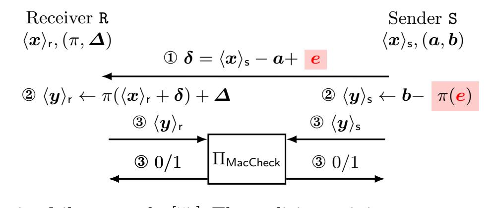
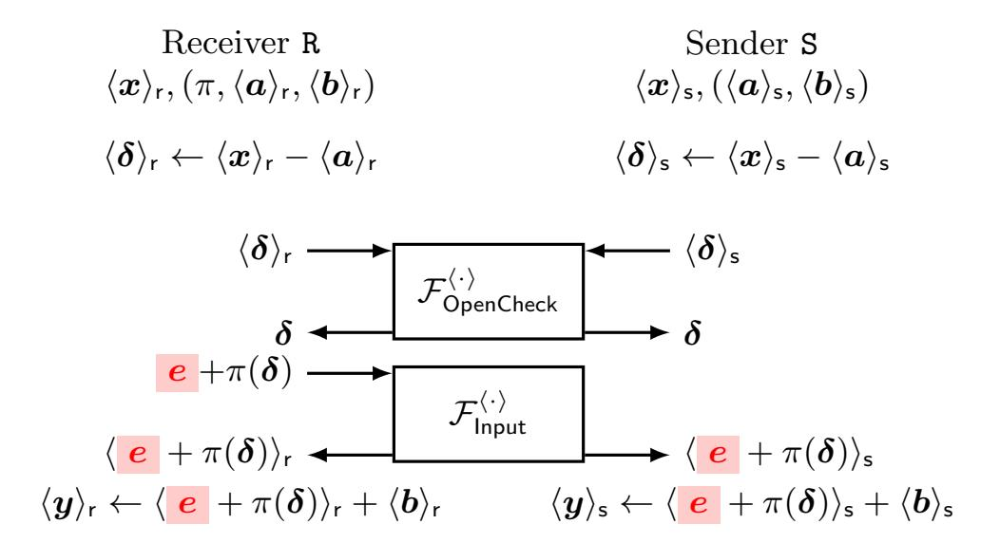
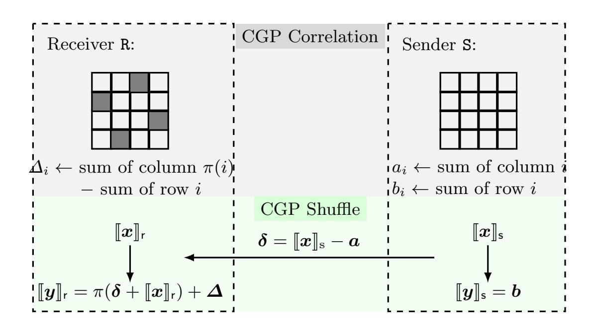
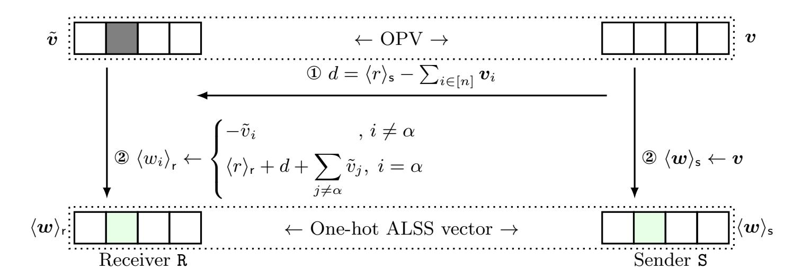

{0}------------------------------------------------

# Secret-Shared Shuffle from Authenticated Correlations

Xiangfu Song1<sup>⋆</sup> , Xiaojian Liang<sup>2</sup> <sup>⋆</sup> , Ye Dong3,B, Jianli Bai<sup>4</sup> , Pu Duan<sup>2</sup> Changyu Dong<sup>5</sup> , Tianwei Zhang<sup>1</sup> , and Ee-Chien Chang<sup>3</sup>

,

<sup>1</sup> Nanyang Technological University, {xiangfu.song,tianwei.zhang}@ntu.edu.sg <sup>2</sup> Ant International, Ant Group, im.liangxj@gmail.com, p.duan@antgroup.com

Abstract. Shuffle is a basic primitive for secure computation. Secretshared shuffle refers to oblivious permutation over secret-shared data, which has broad applications in secret-sharing-based secure computation. Since shuffle is typically used in highly sensitive applications, malicious security is often necessary to provide realistic security guarantees. This paper proposes a new family of two-party maliciously secure secret-shared shuffle protocols with linear communication/computation cost and constant-round communication. Achieving this goal has been proven non-trivial by several recent attempts. We answer this question by proposing a new and simple shuffle paradigm based on authenticated correlations. We start by proposing a simple and efficient protocol template based on authenticated correlations with linear cost and constant-round communication. The protocol can be enhanced to be fully authenticated against a malicious sender, which avoids selective-failure attacks that incur the main overhead in existing solutions. However, our roadmap introduces a consistency issue from a malicious receiver, and the challenge is how to resolve the issue while preserving the expected efficiency property. To this end, we propose new efficiency-preserving consistency checks, enabled by a set of new techniques, optimizations, and analyses. Combining the consistency checks with our framework based on authenticated correlations, we propose two maliciously secure secret-shared shuffle protocols with linear cost and constant-round communication. We have implemented our protocols. Performance evaluation shows that our protocols are faster with lower communication than the state-of-the-art.

Keywords: Secret-sharing · Shuffle · Correlation · Malicious security

# <span id="page-0-0"></span>1 Introduction

Secret-shared shuffle (SSS) [\[15,](#page-31-0) [6,](#page-30-0) [42,](#page-33-0) [26,](#page-32-0) [57\]](#page-34-0) permutes secret shared secrets using a random secret permutation, without revealing the shared secrets or the permutation. SSS is a basic primitive for secret-sharing-based secure computation, where shuffle is necessary to hide access patterns and linkability.

<sup>3</sup> National University of Singapore, dongye@nus.edu.sg, changec@comp.nus.edu.sg

<sup>4</sup> Singapore Management University, baijianli0812@gmail.com <sup>5</sup> Guangzhou University, changyu.dong@gzhu.edu.cn

<sup>⋆</sup> Co-first authors. <sup>B</sup>Corresponding author.

{1}------------------------------------------------

Shuffle is useful in secure data analytics applications. For example, shuffle is used to improve the efficiency of private database join via a "shufflethen-filter" paradigm [\[48,](#page-33-1) [28,](#page-32-1) [2,](#page-30-1) [36,](#page-32-2) [61,](#page-34-1) [43\]](#page-33-2): the computing parties obliviously shuffle secret-shared data items before revealing all shared records that match some criterion for the subsequent secure computation. Similarly, many protocols [\[11,](#page-30-2) [3,](#page-30-3) [4,](#page-30-4) [5,](#page-30-5) [43,](#page-33-2) [33,](#page-32-3) [32\]](#page-32-4) leverage SSS to improve the efficiency of oblivious sorting: the parties shuffle data items first, followed by a more efficient nonoblivious secure comparison process. SSS is also a core primitive in anonymous communication systems with distributed trust. Mixnet-based anonymous communication [\[16\]](#page-31-1) shuffles encrypted messages to break the linkability between messages and their owners. These systems employ public-key encryption and zeroknowledge proof of correct shuffling [\[52,](#page-33-3) [8\]](#page-30-6), leading to substantial computational overhead. Eskandarian and Boneh [\[26\]](#page-32-0) proposed a system Clarion using SSS in the distributed-trust model, where non-colluded servers collaboratively shuffle messages shared between the servers and conduct integrity checks, achieving better efficiency than the mixnet-based approach. Other SSS-based anonymous communication systems [\[1,](#page-30-7) [46,](#page-33-4) [40\]](#page-33-5) follow a similar paradigm. More applications using SSS includes private graph analysis [\[3,](#page-30-3) [51,](#page-33-6) [63\]](#page-34-2), leakage suppression for encrypted search [\[44\]](#page-33-7), and shuffle model of differential privacy [\[25,](#page-31-2) [17,](#page-31-3) [7,](#page-30-8) [18,](#page-31-4) [59,](#page-34-3) [29\]](#page-32-5).

Efficient SSS protocols benefit related protocols and applications. This paper focuses on efficient SSS protocols in the offline-online paradigm. Typically, protocols in the offline-online paradigm consist of an offline phase and an online phase. In the offline phase, the parties generate input-independent correlations that can be used to perform efficient secure computation in the online phase when the inputs are ready. The CGP shuffle protocol [\[15\]](#page-31-0) proposed by Chase, Ghosh, and Poburinnay is an efficient candidate. CGP shuffle consists of two phases. The parties first generate pseudorandom correlations in the offline phase and then use the correlations to conduct a highly efficient shuffle phase, requiring only constant-round and linear online communication. Considering its promising efficiency properties, many recent works [\[41,](#page-33-8) [6,](#page-30-0) [42,](#page-33-0) [54,](#page-33-9) [36,](#page-32-2) [61,](#page-34-1) [2,](#page-30-1) [46,](#page-33-4) [26,](#page-32-0) [44,](#page-33-7) [34\]](#page-32-6) leverage or adapt CGP shuffle to various data-oblivious protocols and applications. For example, TikTok implements CGP shuffle in its PETAce library.[6](#page-1-0)

The original CGP shuffle is only semi-honest secure, which assumes the parties follow the protocol faithfully. Semi-honest security could be trivially broken under malicious deviations, which may not be sufficient for highly sensitive applications [\[61,](#page-34-1) [26,](#page-32-0) [59\]](#page-34-3), where malicious security is desirable to provide realistic security guarantees. How to enhance CGP shuffle with malicious security while maintaining acceptable efficiency is non-trivial. Existing protocols [\[42,](#page-33-0) [26,](#page-32-0) [57\]](#page-34-0) attempted to achieve this challenging goal. Among them, the protocols from [\[26\]](#page-32-0) and [\[42\]](#page-33-0) are subject to privacy attacks as analysed by [\[57\]](#page-34-0). Song et al. [\[57\]](#page-34-0) further proposed an SSS protocol, which is the only existing maliciously secure CGP-like shuffle protocol over authenticated linear secret sharing (ALSS).

The protocol from [\[57\]](#page-34-0) relies on two core components to achieve malicious security. First, it proposes lightweight correlation checks to ensure all gener-

<span id="page-1-0"></span><sup>6</sup> <https://github.com/tiktok-privacy-innovation/PETAce>

{2}------------------------------------------------

ated correlations are well-formed, defeating attacks to previous works [\[42,](#page-33-0) [26\]](#page-32-0) that exploit non-well-formed correlations. Second, it directly applies the semihonest CGP shuffle over ALSS to conduct a maliciously secure shuffle, followed by a folklore integrity check method [\[42,](#page-33-0) [26\]](#page-32-0) based on message authentication code (MAC), which is commonly used in SPDZ-family protocols [\[22,](#page-31-5) [39\]](#page-32-7) to check the correctness of secure computation over ALSS.

While these well-formedness checks ensure integrity and correctness in the presence of malicious deviations, the shuffle phase of all previous works [\[42,](#page-33-0) [26,](#page-32-0) [57\]](#page-34-0) is not fully authenticated, which can be exploited to break privacy. We provide a sketched description and refer to the main body for details. In particular, the previous "CGP shuffle over ALSS" solutions cannot check the well-formedness of the protocol messages immediately, and they can only resort to a post-execution MAC check over the resulting ALSS secrets that are computed from the possibly non-well-formed messages. Song et al. [\[57\]](#page-34-0) observed that such a paradigm allows a malicious sender to breach privacy via selective failure attacks, where a malicious sender can inject errors into its protocol messages and the protocol still completes normally if he/she correctly guessed some information about the secret permutation; in this case, the sender learns the secret information about the receiver's permutation without being detected. To obtain full privacy, Song et al. [\[57\]](#page-34-0) proposed a cut-and-choose leakage reduction mechanism via repeated shuffling to remove possible leakage. However, repeated shuffling destroys the linear-cost and constant-round-communication property of the original semihonest CGP shuffle.

Previous roadmaps failed to achieve linear cost and constant-round communication for maliciously secure secret-shared shuffle over ALSS. To our best knowledge, this holds beyond the CGP shuffle: no existing SPDZ-family maliciously secure secret-shared shuffle protocol achieves this property.

Solving this problem is not as trivial as one may expect, and we are not the only attempt. A more recent work [\[27\]](#page-32-8) proposes an SSS protocol with claimed malicious security and linear online communication, aiming to avoid the efficiency limitation from [\[57\]](#page-34-0). Our security analysis shows that [\[27\]](#page-32-8) still suffers from the same type of selective failure attacks, and we demonstrate with a concrete example. It is unclear how to upgrade [\[27\]](#page-32-8) to be truly maliciously secure while maintaining its claimed efficiency. We provide more details in §[6.](#page-22-0)

Existing attempts and failures demonstrate that the technical roadmap applying unauthenticated CGP shuffle over ALSS has inherent limitations in security and efficiency. Hence, we tend to believe that solving this problem with our expected efficiency properties would require a new roadmap.

Roadmap & Contribution. We propose MOSAC, a new suite of maliciously secure two-party SPDZ-family SSS protocols with linear cost and constantround communication in the offline-online preprocessing paradigm. We implement MOSAC and report concrete performance. MOSAC is around 6× faster in the shuffle phase than [\[57\]](#page-34-0) when shuffling an ALSS vector of dimension n = 2<sup>20</sup> . We achieve the goal with the following new roadmap and techniques.

{3}------------------------------------------------

New shuffle paradigm. We propose a new framework for designing maliciously secure shuffle protocols based on authenticated correlations. We first propose an authenticated correlation called authenticated shuffle tuple (AST). Based on that, we design MOSAC in the arithmetic black box (ABB) fashion, making the protocol easier for modular security abstraction.

Our protocol differs from previous solutions [\[26,](#page-32-0) [57,](#page-34-0) [42\]](#page-33-0). Our solution permits no shuffle-phase selective failure attacks from a malicious sender. This property avoids repeated online execution in the previous roadmap [\[57\]](#page-34-0). In particular, it is much easier for MOSAC to maintain full privacy, and most of the correctness issues can be efficiently addressed by existing authentication mechanisms from ALSS in a conceptually simple black-box fashion.

Efficiency-preserving consistency checks. While all sounds good, our roadmap introduces a new consistency issue from a malicious receiver. In particular, our protocol will temporarily "leave" the authenticated world in a critical protocol step. Looking ahead, this step requires the parties to open a masked vector to the receiver who holds the permutation, and requires the receiver to faithfully permute the masked vector and reshare the permuted masked vector back to the authenticated world. Since the operation is locally conducted by the receiver, the receiver may not abide by the protocol, and he/she may provide arbitrary values to break correctness (and privacy, as we will show).

Maliciously secure protocols typically rely on consistency checks to enforce honest behaviors, which check whether the parties provide consistent and expected values according to the protocol specification. Depending on scenarios, consistency checks can be instantiated via zero-knowledge proof, cut-and-choose mechanisms [\[45\]](#page-33-10), homomorphic commitments/MACs [\[22,](#page-31-5) [23,](#page-31-6) [21,](#page-31-7) [38\]](#page-32-9), etc. The challenge lies in minimizing the introduced overhead. We aim to preserve the desired efficiency properties even after applying these checks.

We propose new efficiency-preserving consistency checks without breaking the expected efficiency. Our first consistency check applies a classic polynomialbased permutation check [\[52,](#page-33-3) [42\]](#page-33-0) to check whether two authenticated vectors satisfy a permutation relation. We formally prove that conducting two permutation checks is sufficient to enforce honest receiver-side behaviors.

However, trivially evaluating the permutation check requires at least O(log n) rounds of communication, which destroys our expected efficiency goal. To resolve the issue, we propose a new evaluation protocol with linear cost and constantround online communication. At the core of the protocol is an efficient n-input multiplication protocol with constant rounds and linear cost. Security of this optimization requires some care, and we provide a formal security proof and analysis. The proposed protocols and analysis may be of independent interest.

We further propose a simpler double-authentication consistency check protocol that leverages another layer of authentication to enforce honest behaviors, which we call layer-two authentication. As an interesting property, it ensures that the corrupted receiver must follow the protocol specification even when the (layer-one) SPDZ MAC is taken off, and inconsistency can still be detected via the remaining layer-two authentication. Compared to the consistency check from 

{4}------------------------------------------------

the permutation check, our layer-two authentication is much simpler and avoids evaluating the relatively expensive permutation-check polynomials. Overall, it still requires linear cost and constant-round communication. The idea of double authentication may be helpful in the design of other oblivious protocols.

Combining AST, authentication mechanisms for ALSS, consistency checks, and customized optimizations, we propose two SSS protocols parameterized from two consistency check strategies, both achieving linear cost and constant-round communication.

Authenticated correlation preprocessing. ASTs can be preprocessed independently of the input in the preprocessing phase, which is a common paradigm for SPDZ-family protocols. While there could be several approaches for AST preprocessing, we provide an approach by adapting [57]. Our tailored preprocessing builds ASTs from unauthenticated CGP correlations and random authenticated secret sharing. Similar to previous works [42, 26, 57], the preprocessing protocol is leaky in the sense that a malicious sender could perform selective failure attacks, allowing him/her to learn sensitive information about the secret permutation with a small but non-negligible probability. So we employ the cut-and-choose leakage reduction mechanism from [57] to generate non-leaky and well-formed AST correlations. We additionally propose new optimizations to the correlation preprocessing to improve concrete efficiency.

Implementation and performance. We have implemented necessary primitives and protocols for maliciously secure secret-shared shuffle, including SPDZ preprocessing, correlation generation, and associated malicious security mechanisms. We hope our open-source implementation<sup>7</sup> will facilitate future research in related fields. We implement MOSAC and [57] based on the codebase. The concrete performance evaluation shows that MOSAC is around  $6 \times$  faster than [57] when shuffling  $n = 2^{20}$  ALSS secrets.

### Summary of contribution.

- A new and conceptually simple framework for maliciously secure two-party secret-shared shuffle protocols based on authenticated correlations.
- New efficiency-preserving consistency checks to enforce honest behaviors. Efficiency-preserving is achieved by a set of new observations, protocols, and analyses, which may be of independent interest.
- Modularly combining the proposed techniques results in the first two-party maliciously secure SPDZ-family secret-shared shuffle with linear cost and constant-round communication in the preprocessing model.
- We implement our protocol and open-source the code. Concrete performance evaluation shows our protocol is  $6 \times$  faster than the state-of-the-art.

**Organization.** We present preliminary in §2. §3 overviews our roadmap, and we propose two maliciously secure MOSAC shuffle protocols in §4 and §5, respectively. §6 presents our attack to [27]. We present implementation and performance evaluation in §7. §8 shows related works and we conclude in §9.

<span id="page-4-0"></span><sup>&</sup>lt;sup>7</sup> https://github.com/liang-xiaojian/MOSAC

{5}------------------------------------------------

## <span id="page-5-0"></span>2 Preliminary

### 2.1 Notations

We use  $\lambda$  and  $\kappa$  to denote the statistical and computational security parameters, respectively, and  $\operatorname{negl}(\cdot)$  denotes a negligible function. We use [n] to denote the set  $\{0,1,\ldots,n-1\}$  and [a,b] to denote  $\{a,a+1,\ldots,b-1,b\}$ . We use the bold lower-case letter a to denote a vector and  $a_i$  as its i-th element, and the bold uppercase letter a to represent a matrix and  $a_i$  denotes its element at row i and column j. We use  $x \leftarrow y$  to denote value assignment from y to x, and  $x \stackrel{\$}{\leftarrow} \mathcal{D}$  denotes that x is uniformly sampled from a set  $\mathcal{D}$ . We use  $\mathcal{F}$  to denote a finite field, and  $\mathcal{D}$  to denote some domain such as  $\mathcal{D} = \mathbb{F}^2$ . We use Uniform( $\mathcal{D}$ ) to denote the uniform distribution over  $\mathcal{D}$ . Let  $D_1$  and  $D_2$  be two distributions, we use  $\mathsf{SD}(D_1, D_2)$  to denote the statistical distance between  $D_1$  and  $D_2$ . Given two random variables  $X \sim D_1$  and  $Y \sim D_2$  following distributions  $D_1$  and  $D_2$ , respectively, we may abuse the notation  $\mathsf{SD}(X,Y)$  to denote the statistical distance between the distributions that X and Y follow.

**Permutation.** An n-swap permutation  $\pi$  is a bijective function  $\pi : [n] \mapsto [n]$ . We use  $\mathbf{S}_n$  to denote the symmetric group containing all n-swap permutations. Applying  $\pi$  over a vector  $\boldsymbol{x}$ , we define

$$y = \pi(x) = (x_{\pi(0)}, \dots, x_{\pi(n-1)}),$$
 (1)

where  $y_i = x_{\pi(i)}$  for  $i \in [n]$ . Namely,  $x_{\pi(i)}$  is moved to position i after applying the permutation. We denote  $\pi^{-1}$  as the inverse of a permutation  $\pi$ , and  $\pi_1 \circ \pi_0$  as the composition of permutations  $\pi_1$  and  $\pi_0$ . When applying  $\pi_1 \circ \pi_0$  over  $\boldsymbol{x}$ , we define  $\pi_1 \circ \pi_0(\boldsymbol{x}) = \pi_1(\pi_0(\boldsymbol{x}))$ , which we call a *composed* permutation. In general, we define  $\pi_{B-1} \circ \cdots \circ \pi_1 \circ \pi_0(\boldsymbol{x}) = \pi_{B-1}(\cdots \pi_1(\pi_0(\boldsymbol{x})))$  for  $B \geq 2$ .

#### 2.2 Secret Sharing

**Linear secret sharing.** Let  $\llbracket x \rrbracket$  denote an additive linear secret sharing (LSS) of  $x \in \mathbb{F}$  shared between k parties, where  $P_i$  holds a share  $\llbracket x \rrbracket_i \in \mathbb{F}$  such that  $\sum_{i \in [k]} \llbracket x \rrbracket_i = x$ . The parties can reveal x by publishing all shares. LSS supports affine transformation using public  $a, b, c \in \mathbb{F}$  via local computation over shares:

• 
$$\llbracket z \rrbracket \leftarrow a \cdot \llbracket x \rrbracket + b \cdot \llbracket y \rrbracket + c$$
:  $P_0$  computes  $\llbracket z \rrbracket_0 \leftarrow a \cdot \llbracket x \rrbracket_0 + b \cdot \llbracket y \rrbracket_0 + c$ .  $P_i$  computes  $\llbracket z \rrbracket_i \leftarrow a \cdot \llbracket x \rrbracket_i + b \cdot \llbracket y \rrbracket_i$  for  $i \in [k] \setminus \{0\}$ .

Authenticated linear secret sharing. Authenticated linear secret sharing (ALSS) additionally ensures the integrity of shared secrets, which is usually used for secure computation in the presence of malicious adversaries. A SPDZ-style ALSS binds an LSS secret [x] with an information-theoretic MAC sharing  $[\gamma(x)]$ , where  $\gamma(x) = \alpha \cdot x$  and  $\alpha \in \mathbb{F}$  is a secret global MAC key shared between the parties. Let  $\langle x \rangle = ([x], [\gamma(x)])$  denote an ALSS of x where  $P_i$  holds an authenticated share  $\langle x \rangle_i = ([x]_i, [\gamma(x)]_i) \in \mathbb{D}$ ; here  $\mathbb{D} = \mathbb{F}^2$ . Similar to LSS, ALSS supports the following affine computation:

{6}------------------------------------------------

# Functionality $\mathcal{F}^{\langle \cdot \rangle}[39, 22, 21]$

<span id="page-6-0"></span>Parameters: Dictionary Val storing all secrets.

- Rand: on input (rand, id) from all parties, sample  $r \stackrel{\$}{\leftarrow} \mathbb{F}$  and store  $\mathsf{Val}[\mathsf{id}] \leftarrow r$ .
- Input: on input (input, i, id, x) from  $P_i$  and (input, i, id) from all other parties, store  $Val[id] \leftarrow x$ .
- **Triple**: on input (triple,  $\mathsf{id}_a$ ,  $\mathsf{id}_b$ ,  $\mathsf{id}_c$ ) from all parties, sample  $a, b \xleftarrow{\$} \mathbb{F}$ . Store ( $\mathsf{Val}[\mathsf{id}_a]$ ,  $\mathsf{Val}[\mathsf{id}_b]$ ,  $\mathsf{Val}[\mathsf{id}_c]$ )  $\leftarrow (a, b, a \cdot b)$ .
- **LinCom**: on input (lincom, id<sub>x</sub>, id<sub>y</sub>, id<sub>z</sub>, a, b, c) from all parties, compute  $z = a \cdot \text{Val}[\text{id}_x] + b \cdot \text{Val}[\text{id}_y] + c$ . Store  $\text{Val}[\text{id}_z] \leftarrow z$ .
- Mul: on input  $(\mathsf{mul}, \mathsf{id}_x, \mathsf{id}_y, \mathsf{id}_z)$  from all parties, compute  $z = \mathsf{Val}[\mathsf{id}_x] \cdot \mathsf{Val}[\mathsf{id}_y]$ . Store  $\mathsf{Val}[\mathsf{id}_z] \leftarrow z$ .
- OpenCheck: on input (opencheck, id) from all parties, send Val[id] to  $\mathcal{A}$  and wait x from  $\mathcal{A}$ . Output x to all parties. Wait for further instructions from  $\mathcal{A}$ . If  $\mathcal{A}$  inputs OK and x = Val[id], return OK to all parties. Otherwise, abort.

Fig. 1: Ideal functionality for ALSS.

•  $\langle z \rangle \leftarrow a \cdot \langle x \rangle + b \cdot \langle y \rangle + c$ : the parties compute  $\langle z \rangle \leftarrow (a \cdot [x] + b \cdot [y] + c, a \cdot [\gamma(x)] + b \cdot [\gamma(y)] + c \cdot [\alpha]$ ).

ALSS uses MACs to detect errors, with soundness error proportional to  $1/|\mathbb{F}|$ . We require  $\mathbb{F}$  is sufficiently large  $(i.e., |\mathbb{F}| > 2^{\lambda})$  to obtain overwhelming detection probability. In this paper, we use  $[\![\boldsymbol{x}]\!]$ ,  $[\![\gamma(\boldsymbol{x})]\!]$ , and  $\langle \boldsymbol{x} \rangle = ([\![\boldsymbol{x}]\!], [\![\gamma(\boldsymbol{x})]\!])$  to denote an LSS vector sharing of  $\boldsymbol{x}$ , LSS vector sharing of  $\gamma(\boldsymbol{x})$ , and ALSS vector sharing of  $\boldsymbol{x}$ , respectively, where  $\gamma(x_i) = \alpha \cdot x_i$ .

**ALSS Functionalities.** Fig. 1 presents an ALSS functionality  $\mathcal{F}^{\langle \cdot \rangle}$ .  $\mathcal{F}^{\langle \cdot \rangle}$  supports several available ideal commands (i.e., sub-functionalities) for ALSS in the Arithmetic Black-Box (ABB) model, which stores secrets in a dictionary Val and conducts operations over them. This functionality allows evaluating basic operations on values such as addition and multiplication in a black-box storage while preserving their context. The ABB model is commonly used in secret-sharing-based MPC, enabling a clean and modular protocol description. These commands can be securely realized from existing well-established SPDZfamily protocols [23, 21, 38]. For convenience, we use functionality  $\mathcal{F}_{\mathsf{cmd}}^{\langle \cdot \rangle}$  for a concrete command cmd supported by  $\mathcal{F}^{\langle \cdot \rangle}$ . For example,  $\mathcal{F}^{\langle \cdot \rangle}_{Mul}$  denotes the sub multiplication functionality. In existing formal functionality definitions for ALSS [22, 23, 21, 39], an ALSS secret x should be opened using a command Open when necessary (e.g., opening the final computation result). To defeat additive errors [30] from the adversary during the opening, the command Check [39] is used to detect incorrect opening. Since Open is usually followed by command Check to enforce correct opening in the malicious setting, we instead use a new command OpenCheck to combine them for simplicity.

ALSS sharing  $(\langle a \rangle, \langle b \rangle, \langle a \cdot b \rangle)$  generated by command Triple is known as a Beaver's multiplication triple (MT) [9]. An MT can be used for efficiently im-

{7}------------------------------------------------

### Functionality $\mathcal{F}_{sss}$

<span id="page-7-1"></span>**Parameters**:  $n \in \mathbb{N}$ ; a dictionary Val storing all ALSS secrets. **Functionality**: upon receiving (sss,  $\{id_i\}_{i\in[n]}$ ,  $\{id'_i\}_{i\in[n]}$ ) from R and S:

- Sample  $\pi \stackrel{\$}{\leftarrow} \mathbf{S}_n$ .
- Fetch the vector  $\boldsymbol{x}$  such that  $\boldsymbol{x}_i = \mathsf{Val}[\mathsf{id}_i]$  for  $i \in [n]$ .
- Compute  $y = \pi(x)$ . Store  $Val[id'_i] \leftarrow y_i$  for  $i \in [n]$ .

Fig. 2: Functionality for secret-shared shuffle.

plementing  $\mathcal{F}_{\mathsf{Mul}}^{\langle \cdot \rangle}$ . Suppose the parties pre-share an MT  $(\langle a \rangle, \langle b \rangle, \langle c \rangle)$ , they can compute  $\langle x \cdot y \rangle$  from  $\langle x \rangle$  and  $\langle y \rangle$  as follows:

- The parties compute  $\langle e \rangle \leftarrow \langle x \rangle \langle a \rangle$  and  $\langle f \rangle = \langle y \rangle \langle b \rangle$ .
- The parties open \( \langle e \rangle \) and \( \langle f \rangle \) via \( \mathcal{F}\_{OpenCheck}^{\langle \cdot \rangle} \). Abort if the open or check fails.
  The parties compute \( \langle z \rangle \lefta f \cdot \langle a \rangle + e \cdot \langle b \rangle + e \cdot f \rangle \).

We use  $\langle z \rangle \leftarrow \langle x \rangle \cdot \langle y \rangle$  to denote secret-shared multiplication.

#### <span id="page-7-0"></span>3 Problem Statement

#### Design Goals 3.1

**Ideal functionality.** MOSAC focuses on the two-party secret-shared shuffle. MOSAC performs SSS over an input ALSS vector  $\langle \boldsymbol{x} \rangle$  shared between S and R and outputs an ALSS vector  $\langle y \rangle$  such that  $y = \pi(x)$  for a random secret permutation  $\pi$ . In the presence of malicious adversaries with static corruption, MOSAC maintains privacy in any case and correctness if the protocol completes without abort (i.e., malicious security with abort). Informally, privacy requires that the resulting SSS protocol ensures the privacy of x, y, and  $\pi$ . Correctness requires the integrity of ALSS secrets  $\langle \boldsymbol{x} \rangle, \langle \boldsymbol{y} \rangle$  and correct shuffling. The security holds if the adversary statically corrupts any one party. Security goals are formally captured by an ideal SSS functionality  $\mathcal{F}_{sss}$  in Fig. 2.

In this paper, we instead securely realize an One-sided Shuffle (OSS) functionality  $\mathcal{F}_{oss}^{[R]}$  [57]: the sender S and receiver R jointly share an ALSS vector  $\langle x \rangle$ and R additionally provides a permutation  $\pi \in \mathbf{S}_n$ .  $\mathcal{F}_{\mathsf{oss}}^{[\mathtt{R}]}$  computes  $\boldsymbol{y} = \pi(\boldsymbol{x})$  and stores y. Here we omit the formal description of  $\mathcal{F}_{oss}^{[R]}$ , as the only difference between  $\mathcal{F}_{oss}^{[R]}$  and  $\mathcal{F}_{sss}^{[R]}$  is that the receiver R in  $\mathcal{F}_{oss}^{[R]}$  learns the permutation  $\pi$ , while  $\pi$  in  $\mathcal{F}_{sss}^{[R]}$  is hidden from both parties. We note that OSS is sufficient for designing SSS via a reversed execution strategy [15, 57, 42] – by simply sequentially invoking OSS twice with the roles of sender and receiver reversed, where the second OSS is applied over the shuffled ALSS vector from the first OSS output. Therefore, we focus on how to realize  $\mathcal{F}_{oss}^{[R]}$  in this paper.

{8}------------------------------------------------

Efficiency goal. As mentioned, our goal is to design maliciously secure twoparty SSS protocols with O(n) communication in O(1) rounds, and O(n) computation complexity in the shuffle phase.

#### Previous Roadmaps 3.2

**Semi-honest CGP** shuffle. The original semi-honest CGP shuffle achieves linear cost and constant-round communication. In the preprocessing phase, the parties generate shuffle correlation such that the sender S obtains two vectors (a,b) and the receiver R obtains a permutation  $\pi$  and a vector  $\Delta = \pi(a) - b$ . In the shuffle phase, the parties run as follows.

- 1. S simply sends  $\delta = x a$  to R.
- 2. S sets  $[\![\boldsymbol{y}]\!]_s = \boldsymbol{b}$  and R sets  $[\![\boldsymbol{y}]\!]_r = \pi(\boldsymbol{\delta}) + \boldsymbol{\Delta} = \pi(\boldsymbol{x}) \boldsymbol{b}$ .

One can check that  $[\![\boldsymbol{y}]\!]_s + [\![\boldsymbol{y}]\!]_r = \pi(\boldsymbol{x})$  as required. We use  $[\![\boldsymbol{\pi}]\!] = ((\pi, \boldsymbol{\Delta}), (\boldsymbol{a}, \boldsymbol{b}))$ to denote a shuffle tuple correlation used in the CGP shuffle, where  $a, b, \Delta \in$  $\mathbb{D}^n$  for some domain  $\mathbb{D}$ . Here we have  $\mathbb{D} = \mathbb{F}$  for LSS defined over  $\mathbb{F}$ ; we can define shuffle tuple over other domains if necessary, e.g.,  $\mathbb{D} = \mathbb{F}^2$ . The CGP shuffle enjoys a highly efficient shuffle phase, incurring linear communication in a constant round, and the parties conduct cheap local computation.

Maliciously secure CGP shuffle. Aiming to enhance CGP shuffle with malicious security while minimizing the introduced overhead, three existing works [42, 26, 57 attempted to design maliciously secure CGP shuffle protocols. Among them, the protocols from Eskandarian and Boneh [26] and Laud [42] are subject to privacy flaws as analyzed by Song et al. [57]. Song et al. further proposed a maliciously secure CGP shuffle, but it achieves malicious security by increasing online overhead. Now we revisit this line of work with more details.

Selective failure attacks. Existing works [42, 26, 57] apply OSS protocol over ALSS vector  $\langle \boldsymbol{x} \rangle$  to perform shuffle, with the help of a pre-computed shuffle tuple  $[\![\pi]\!] = ((\pi, \Delta), (a, b)) \in (\mathbf{S}_n \times \mathbb{D}^n) \times (\mathbb{D}^n \times \mathbb{D}^n), \text{ where } \mathbb{D} = \mathbb{F}^2 \text{ to be compatible}$ with authenticated shares (recall that each ALSS share can be interpreted as an element over  $\mathbb{F}^2$ ). We sketch this protocol as follows:

- 1. S sends  $\delta = \langle \boldsymbol{x} \rangle_{\mathsf{s}} \boldsymbol{a}$  to R. S sets  $\langle \boldsymbol{y} \rangle_{\mathsf{s}} \leftarrow \boldsymbol{b}$ .
- 2. R receives  $\boldsymbol{\delta}$  and sets  $\langle \boldsymbol{y} \rangle_{\mathsf{r}} \leftarrow \pi(\langle \boldsymbol{x} \rangle_{\mathsf{r}} + \boldsymbol{\delta}) + \boldsymbol{\Delta}$ .
- 3. Run a post-execution batch MAC check protocol  $\Pi_{\mathsf{MacCheck}}$  over  $\langle \boldsymbol{y} \rangle$  to detect errors:
  - a) Call  $\{c_i\}_{i \in [n]} \leftarrow \mathcal{F}_{\mathsf{Coin}}(\mathbb{F}^n) \text{ and } \langle r \rangle \leftarrow \mathcal{F}_{\mathsf{Rand}}^{\langle \cdot \rangle}(\mathbb{F})$ b)  $\langle t \rangle \leftarrow \sum_{i \in [n]} c_i \cdot \langle x_i \rangle + \langle r \rangle.$

  - c)  $t \leftarrow \mathcal{F}_{\mathsf{OpenCheck}}^{\langle \cdot \rangle}(\langle t \rangle)$ . If  $\mathcal{F}_{\mathsf{OpenCheck}}^{\langle \cdot \rangle}$  aborts, abort.
- 4. Return  $\langle \boldsymbol{y} \rangle$  if the protool does not abrot.

The above protocol essentially applies CGP shuffle over an ALSS vector. Assuming the parties behave faithfully, we have  $\langle \boldsymbol{y} \rangle_{\mathsf{r}} + \langle \boldsymbol{y} \rangle_{\mathsf{s}} = (\boldsymbol{y}, \gamma(\boldsymbol{y}))$ , which means the parties share an authenticated vector  $\langle y \rangle$ . To enforce integrity, the parties run a standard post-execution MAC check without revealing y. Roughly, this 

{9}------------------------------------------------

is done by opening a random linear combination of  $\{\langle y \rangle_i\}_{i \in [n]}$ , added with a mask  $\langle r \rangle$ , and conduct a standard MAC check, where  $\{c_i\}_{i \in [n]}$  are random coins sampled via coin-tossing functionality  $\mathcal{F}_{\mathsf{Coin}}$ ,  $\langle r \rangle$  is generated by  $\mathcal{F}_{\mathsf{Rand}}^{\langle \cdot \rangle}$  serving as a mask, thus the check reveals nothing about  $\boldsymbol{y}$  except its integrity status.

Though the post-execution check enforces correctness, Song et al. [57] show that a malicious sender can exploit the check to breach privacy via selective failure attacks, revealing secret information about  $\pi$  with non-negligible probability. We sketch the attack in Fig. 3. In this attack, the malicious sender S samples a one-hot error vector  $\mathbf{e} \in \mathbb{D}^n$  with the non-zero element appearing at position q. Following the protocol specification, this non-zero error will be permuted by  $\pi$  to position  $\pi^{-1}(q)$ . If S still sets  $\langle \mathbf{y} \rangle_{s} = \mathbf{b}$ , certainly the introduced error will break the MAC relation, which will be detected by the following MAC check.

<span id="page-9-0"></span>

Fig. 3: Selective failure attacks [57]. The malicious S injects error e to the protocol message in step ① and removes  $\pi(e)$  from its own share before MAC check.

However, since e is a one-hot vector, there are only n possible  $\pi(e)$  after shuffling, thus S can guess  $\pi(e)$  and remove the permuted error from its local share  $\langle y \rangle_S$  before running the check. Note that the MAC check requires the parties to commit to their checking messages first, thus there will be two outcomes depending on whether the adversary guessed correctly. If S guessed correctly with probability 1/n, the parties would still share a well-formed ALSS vector so that the check would complete normally. Otherwise, S would be caught due to the introduced errors, with probability 1-1/n. The above attack is rooted in the unauthenticated nature of the protocol message  $\delta$ , so S can freely inject and remove errors, and the post-execution check serves as an oracle to tell whether this attack is successful or not; this is essentially a selective-failure attack. Note that S may add errors to more positions in the selective failure attack, but he will be caught with higher probability. Song et al. [57] also demonstrates that the offline phase of previous works [26] also suffers from selective failure attacks.

Leakage reduction and its overhead. Both the offline and online phases of [57] are subject to selective failure attacks. Song et al. further propose a shuffle-phase cut-and-choose-based leakage reduction mechanism to remove two-phase leakages. The intuitive idea is to conduct repeated shuffles, such that an input ALSS vector is permuted by sufficient permutations, and the parties run

{10}------------------------------------------------

integrity checks for each sub-shuffle. If the malicious S dares to learn any information about the composed permutation  $\pi_{B-1} \circ \pi_{B-2} \circ \cdots \circ \pi_0$ , he/she must attack each involved permutation. Since the adversary can only win each attack with a small probability, the adversary who dares to attack all permutations will be detected with an overwhelming probability for a sufficiently large B. Hence, if B is large enough and the protocol does not abort, R has overwhelming confidence that there exists at least one non-leaky permutation such that  $\pi_{B-1} \circ \pi_{B-2} \circ \cdots \circ \pi_0$  is still a uniformly random permutation in the view of S. However, repeated execution increases shuffle-phase overhead, which destroys the original efficiency property from the semi-honest CGP shuffle. The overhead seems inherent following the roadmap from [57] – the unauthenticated and leaky online phase necessitates repeated execution to remove possible leakage.

#### 3.3 Our Roadmap

Authenticated shuffle tuple. The online phase of previous works [42, 26, 57] simply applies the (semi-honest) CGP shuffle over an ALSS vector in a non-ABB fashion, followed by a lightweight batched MAC check. We acknowledge that such a non-ABB design is mainly for reducing the overhead by bootstrapping the efficiency property from the CGP shuffle. However, the price is that an honest receiver cannot directly check the well-formedness of the shuffle-phase protocol messages from the sender. A malicious sender can manipulate the protocol messages by injecting selective-failure errors, leaving attacks that reveal sensitive information about the receiver's permutation.

MOSAC takes a different strategy by applying authenticated correlation directly over ALSS, so that we can design consistency checks by bootstrapping SPDZ mechanisms in an ABB fashion. Looking ahead, our new design eliminates shuffle-phase selective failure attacks from a malicious sender easily.

Specifically, MOSAC relies on a new authenticated correlation called authenticated shuffle tuple (AST). In an AST correlation

$$\langle\!\langle \pi \rangle\!\rangle = (\pi, \langle \boldsymbol{a} \rangle, \langle \boldsymbol{b} \rangle),$$

the receiver specifies a permutation  $\pi \in \mathbf{S}_n$  and two ALSS vectors  $\langle \boldsymbol{a} \rangle, \langle \boldsymbol{b} \rangle$  are shared between the parties, where  $\boldsymbol{b} = \pi(\boldsymbol{a})$  and  $\boldsymbol{a}, \boldsymbol{b} \in \mathbb{D}^n$ ; we can define  $\mathbb{D} = \mathbb{F}^k$  for some  $k \in \mathbb{N}$  to allow a k-column shuffle. Informally, we say an AST is well-formed if it is correctly correlated as desired, and it is non-leaky if (1) the parties learn no more information about  $\boldsymbol{a}$  and  $\boldsymbol{b}$ , and (2) the sender learns no more information about  $\pi$ . AST is authenticated as we incorporate SPDZ MACs within AST, which will be used to enforce honest execution when the correlation is used in our AST-based shuffle protocols.

Shuffle from AST. AST supports a conceptually simple, efficient, and, more importantly, authenticated shuffle protocol. Suppose the parties want to shuffle  $\langle \boldsymbol{x} \rangle$  with the help of a non-leaky and well-formed AST  $\langle \langle \boldsymbol{\pi} \rangle \rangle$ , then we have an AST-based OSS protocol sketched in Fig. 4.

The parties compute  $\langle \boldsymbol{\delta} \rangle = \langle \boldsymbol{x} \rangle - \langle \boldsymbol{a} \rangle$  and open  $\langle \boldsymbol{\delta} \rangle$  using  $\mathcal{F}_{\mathsf{OpenCheck}}^{\langle \cdot \rangle}$ . Next, R locally computes  $\pi(\boldsymbol{\delta})$  and reshares  $\langle \pi(\boldsymbol{\delta}) \rangle$  between the parties, and we call

{11}------------------------------------------------

<span id="page-11-0"></span>

Fig. 4: The sketched AST-based OSS protocol.

this step the local-permute-and-share step. The parties then computes ⟨y⟩ = ⟨π(δ)⟩ + ⟨b⟩. If all parties behave honestly, then we can check

$$\langle \boldsymbol{y} \rangle = \langle \pi(\boldsymbol{\delta}) \rangle + \langle \boldsymbol{b} \rangle = \langle \pi(\boldsymbol{x}) \rangle - \langle \pi(\boldsymbol{a}) \rangle + \langle \boldsymbol{b} \rangle = \langle \pi(\boldsymbol{x}) \rangle.$$

The last equality holds since b = π(a) following the well-formedness of AST. Note that opening δ reveals no more information about x, as a is uniformly sampled from F <sup>n</sup> and hidden from both parties. It is not hard to see that the protocol is secure against semi-honest adversaries.

Unlike semi-honest adversaries who faithfully follow the protocol specification, a malicious adversary may take arbitrary strategies to undermine correctness and/or privacy. In particular, it may inject errors during the protocol to create inconsistencies, which could be further exploited to break privacy (e.g., via selective-failure attacks). We must enforce honest behaviors on both sides, so that the parties can be sure that the protocol proceeds as expected.

TODO: enforce sender-side honest behaviors. It is worth noticing that the sender-side operations are fully designed in an ABB fashion. The sender's malicious activities are limited, and it is relatively straightforward to enforce sender-side honest behavior by bootstrapping SPDZ authentication mechanisms in a black-box fashion. With that, a corrupted sender cannot conduct shufflephase selective failure attacks as in previous works [\[57,](#page-34-0) [42,](#page-33-0) [26\]](#page-32-0). The key difference lies in the fact that prior strategies lacked authentication of the sender's shufflephase messages, thereby enabling selective-failure attacks. Our design methodology behind MOSAC follows a different strategy, allowing easier handling of malicious sender-side behaviors, which is the first key feature of our roadmap.

TODO: enforce receiver-side honest behaviors. Enforcing receiver-side behavior is more challenging for our roadmap. While most receiver-side steps can be authenticated via existing authentication mechanisms from ALSS, the localpermute-and-share step requires the receiver to faithfully permute the opened vector δ using the exact permutation π from the used AST, and reshare the expected permuted vector π(δ) back to the authenticated world. However, a 

{12}------------------------------------------------

malicious receiver may provide any vector following arbitrary strategies. Equivalently, this corresponds to adding an arbitrary error as depicted in Fig. 4. How to enforce receiver-side faithful behavior without destroying the expected efficiency properties remains a challenge. To this end, we propose two efficiency-preserving consistency checks to enforce receiver-side honest behaviors, serving as the second key feature.

**Preprocessing AST.** This paper focuses on designing authenticated shuffle protocols based on authenticated correlations. Though any secure OSS protocol can be used to preprocess AST over random ALSS sharing  $\langle a \rangle$ , we provide an AST preprocessing protocol by adapting the cut-and-choose strategy from [57], and propose new optimizations to improve efficiency concretely, some of which can be applied back to [57]. The main body of this paper focuses on designing authenticated SSS from *non-leaky* and *well-formed* ASTs. Preprocessing ASTs is not the focus of this paper, so we move the AST preprocessing to Appendix §A. In this paper, we will resort to an ideal AST generation functionality  $\mathcal{F}_{\mathsf{GenAST}}$  for AST preprocessing.

We stress that the security of our online protocol is not inherently tied to [57], since other malicious-secure pre-processing protocols [37] can be used to realize the AST preprocessing functionality, and any future improvement can benefit the AST preprocessing. As a promising direction, recent work [54] proposes more concretely efficient CGP correlation preprocessing in the semi-honest setting. It remains to design malicious-secure correlation preprocessing for [54], and to see whether it achieves better efficiency than our malicious-secure preprocessing following [57], which we leave as an interesting direction for future work.

# <span id="page-12-0"></span>4 MOSAC via Permutation Check

#### 4.1 High-level Idea

It is not hard to see that all ABB operations in Fig. 4 can be fully authenticated via existing malicious-security SPDZ mechanisms. The remaining challenge lies in ensuring that the receiver correctly inputs  $\pi(\delta)$  back to the authenticated world. Before presenting our solution, we observe that the following two conditions fully defines an honest receiver in the local-permute-and-share step.

- ① The secret input from the receiver sent to  $\mathcal{F}_{\mathsf{Input}}$  is of the form  $\pi^*(\boldsymbol{x})$  for some  $\pi^* \in \mathbf{S}_n$ ,
- ②  $\pi^* = \pi$ , where  $\pi$  is exact the permutation in the used AST  $\langle \pi \rangle$ .

To ensure condition ①, it is sufficient to check that the shared ALSS vector from  $\mathcal{F}_{\mathsf{Input}}$  is indeed a valid permutation of  $\boldsymbol{\delta}$ . We resort to an ideal functionality  $\mathcal{F}_{\mathsf{PermCheck}}$  in Fig. 5 for the permutation check. Our first challenge is how to realize the permutation check in an efficiency-preserving way. Moreover, solely ensuring condition ① is not sufficient to restrict the receiver's behaviors. The receiver may provide a different permutation  $\pi^* \neq \pi$  in its local permutation. This corresponds to that R reshares a vector  $\pi^*(\boldsymbol{x}) = \pi(\boldsymbol{x}) + \boldsymbol{e}$  with error  $\boldsymbol{e} = \pi^*(\boldsymbol{x}) - \pi(\boldsymbol{x})$ , which

{13}------------------------------------------------

breaks correctness trivially. So our second challenge is to ensure condition 2 in an efficiency-preserving way. We show how to solve these challenges with new techniques and optimizations, followed by formal security analysis and proof.

## Functionality $\mathcal{F}_{\mathsf{PermCheck}}$

<span id="page-13-0"></span>**Parameters**:  $n \in \mathbb{N}$ ; a dictionary Val storing all ALSS secrets. **Functionality**: upon receiving (PermCheck,  $\{id_i\}_{i\in[n]}$ ,  $\{id'_i\}_{i\in[n]}$ ) from R and S:

- Fetch the vector  $\boldsymbol{x}$  and  $\boldsymbol{y}$  such that  $\boldsymbol{x}_i = \mathsf{Val}[\mathsf{id}_i]$  and  $\boldsymbol{y}_i = \mathsf{Val}[\mathsf{id}_i']$  for  $i \in [n]$ .
- $\bullet$  Check if y and x form a permutation relation. If yes, return True; otherwise, return False.

Fig. 5: The ideal permutation check functionality.

#### <span id="page-13-2"></span>Ensuring ①: Round-efficient PermCheck 4.2

To securely realize the ideal permutation-check functionality, we start from a classic polynomial-based method [42, 52]. Specifically, let

$$f_{\mathbf{u}}(X) = \prod_{i \in [n]} (X - u_i)$$

be a polynomial defined for a vector  $\boldsymbol{u} \in \mathbb{F}^n$ . For any  $\boldsymbol{a}, \boldsymbol{b} \in \mathbb{F}^n$ , we have  $f_{\boldsymbol{a}}(X) = f_{\boldsymbol{b}}(X)$  if and only if  $\boldsymbol{a}$  and  $\boldsymbol{b}$  satisfy a permutation relation. To check  $f_{\mathbf{a}}(X) = f_{\mathbf{b}}(X)$ , it is sufficient to check  $f_{\mathbf{a}}(r) = f_{\mathbf{b}}(r)$  over a randomly picked  $r \in \mathbb{F}$ . This holds except with soundness error  $n/|\mathbb{F}|$  following the Schwartz-Zippel Lemma [56, 62]. We have  $n/|\mathbb{F}|$  negligible in  $\lambda$  for a sufficiently large  $\mathbb{F}$ .

## $\textbf{Protocol} \ \Pi_{\mathsf{PermCheck}}$

<span id="page-13-1"></span>**Parameter:** Polynomial  $f_{\boldsymbol{u}}(X) = \prod_{i \in [n]} (X - u_i)$  for  $\boldsymbol{u} \in \mathbb{F}^n$ .

**Protocol**: On receiving  $\langle \boldsymbol{x} \rangle$  and  $\langle \boldsymbol{y} \rangle$  for  $\boldsymbol{x}, \boldsymbol{y} \in \mathbb{F}^n$ :

- 1.  $\langle r \rangle \leftarrow \mathcal{F}_{\mathsf{Rand}}^{\langle \cdot \rangle}(\mathbb{F}), \langle s \rangle \leftarrow \mathcal{F}_{\mathsf{Rand}}^{\langle \cdot \rangle}(\mathbb{F}).$ 2.  $\langle p \rangle \leftarrow (\langle x_0 \rangle \langle r \rangle) \cdot (\langle x_1 \rangle \langle r \rangle) \cdots (\langle x_{n-1} \rangle \langle r \rangle).$ 3.  $\langle q \rangle \leftarrow (\langle y_0 \rangle \langle r \rangle) \cdot (\langle y_1 \rangle \langle r \rangle) \cdots (\langle y_{n-1} \rangle \langle r \rangle).$ 4.  $\langle d \rangle \leftarrow \langle s \rangle \cdot (\langle p \rangle \langle q \rangle).$
- $\triangleright$  via  $\Pi_{n\text{-mul}}$
- $\triangleright$  via  $\Pi_{n\text{-mul}}$

- $\triangleright$  via  $\mathcal{F}_{\mathsf{Mul}}^{\langle\cdot\rangle}$
- 5.  $d \leftarrow \mathcal{F}_{\mathsf{OpenCheck}}^{\langle \cdot \rangle}(\langle d \rangle)$ . If the call aborts or  $d \neq 0$ , return False. Otherwise, return True.

Fig. 6: The permutation check protocol.

{14}------------------------------------------------

Fig. 6 presents the permutation check protocol. It requires the parties to generate  $\langle r \rangle$  for a uniformly random secret r via  $\mathcal{F}_{\mathsf{Rand}}^{\langle \cdot \rangle}$ , evaluate  $f_{\boldsymbol{x}}(r)$  and  $f_{\boldsymbol{y}}(r)$ , and check whether  $f_{\boldsymbol{x}}(r) - f_{\boldsymbol{y}}(r) = 0$ . To protect against possible leakage when  $f_{\boldsymbol{x}}(r) \neq f_{\boldsymbol{y}}(r)$ , the parties compute  $\langle d \rangle \leftarrow \langle s \rangle \cdot (\langle p \rangle - \langle q \rangle)$ , where s is the secret to mask  $f_{\boldsymbol{x}}(r) - f_{\boldsymbol{y}}(r)$ . The parties then open and check d = 0.

The permutation check protocol is designed in the ABB fashion, where honest behaviors can be enforced via existing SPDZ malicious-security functionalities. However, it requires n-input secret-shared multiplication to perform polynomial evaluation  $\langle f_{\boldsymbol{x}}(r) \rangle$  and  $\langle f_{\boldsymbol{y}}(r) \rangle$ . While polynomial evaluation can be realized using O(n) MTs with linear online communication, it still requires  $O(\log n)$  rounds following a tree-structure multiplication evaluation process. If we directly evaluate this permutation check protocol, we cannot reach our efficiency goal.

Round-efficient n-input multiplication. To obtain the expected efficiency property, we propose an n-input multiplication protocol with linear and constant round online communication. Our method is inspired by the "mask-then-inverse" trick [20, 61], but it requires additional cares on security, which we will analyze formally. To start with, suppose the parties pre-generate n+1 random secrets

$$\langle s \rangle, \langle \boldsymbol{r} \rangle = (\langle r_0 \rangle, \langle r_1 \rangle, \cdots, \langle r_{n-2} \rangle, \langle r_{n-1} \rangle)$$

in the offline phase satisfying  $s = \prod_{i \in [n]} r_i^{-1}$ . The parties can securely compute n-input multiplication  $\langle y \rangle = \prod_{i \in [n]} \langle x_i \rangle$ . Specifically, the parties compute

$$\langle m_i \rangle \leftarrow \langle x_i \rangle \cdot \langle r_i \rangle,$$

and securely open  $m_i$  for all  $i \in [n]$  in parallel with linear and one-round communication. Then the parties compute

$$\langle y \rangle \leftarrow (\prod_{i \in [n]} m_i) \cdot \langle s \rangle,$$

which only requires local computation. Correctness holds since  $\{r_i\}_{i\in[n]}$  all cancel out during the computation:

$$\langle y \rangle = (\prod_{i \in [n]} m_i) \cdot \langle s \rangle = (\prod_{i \in [n]} (x_i \cdot r_i)) \cdot \langle \prod_{i \in [n]} r_i^{-1} \rangle = \langle \prod_{i \in [n]} x_i \rangle.$$

To generate  $\langle s \rangle = \langle \prod_{i \in [n]} r_i^{-1} \rangle$  from  $(\langle r_0 \rangle, \langle r_1 \rangle, \dots, \langle r_{n-1} \rangle)$  in the preprocessing phase, the parties generate a random ALSS secret  $\langle \omega \rangle$  and compute

$$\langle \beta \rangle \leftarrow \langle \omega \rangle \cdot \langle r_0 \rangle \cdot \langle r_1 \rangle \cdots \langle r_{n-1} \rangle$$

The parties then open  $\beta$  and compute

$$\langle s \rangle \leftarrow \beta^{-1} \cdot \langle \omega \rangle = \omega^{-1} \cdot \prod_{i \in [n]} r_i^{-1} \cdot \langle \omega \rangle = \langle \prod_{i \in [n]} r_i^{-1} \rangle,$$

{15}------------------------------------------------

where  $\omega$  serves as a mask to hide  $\prod_{i \in [n]} r_i^{-1}$  when opening  $\beta$ . Here we require none of  $\omega, r_0, r_1, \ldots, r_{n-1}$  be zero to compute the inverse  $\beta^{-1}$ ; this holds except with probability at most  $(n+1)/|\mathbb{F}|$ , which is negligible for sufficiently large  $\mathbb{F}$ .

Fig. 7 presents the n-input multiplication protocol. The online phase requires n multiplications and n open operations with linear cost and constant-round complexity. Plugging  $\Pi_{n\text{-mul}}$  protocol for n-input multiplication,  $\Pi_{\mathsf{PermCheck}}$  achieves linear cost and constant-round online communication, preserving the desired efficiency property.

```
 \begin{array}{|c|c|c|} \hline \textbf{Protocol } \Pi_{n\text{-mul}} \\ \hline \textbf{[Offline] On input } n: \\ \hline 1. & (\langle r_0 \rangle, \langle r_1 \rangle, \cdots, \langle r_{n-1} \rangle, \langle \omega \rangle) \leftarrow \mathcal{F}_{\mathsf{Rand}}^{\langle \cdot \rangle}(\mathbb{F}^{n+1}). \\ \hline 2. & \langle \beta \rangle \leftarrow \langle \omega \rangle \cdot \langle r_0 \rangle \cdot \langle r_1 \rangle \cdots \langle r_{n-1} \rangle. & \triangleright \text{ via } \mathcal{F}_{\mathsf{Mul}}^{\langle \cdot \rangle} \\ \hline 3. & \beta \leftarrow \mathcal{F}_{\mathsf{OpenCheck}}^{\langle \cdot \rangle}(\langle \beta \rangle). \text{ Abort if open or check fails.} \\ \hline 4. & \langle s \rangle \leftarrow \beta^{-1} \cdot \langle \omega \rangle. & \triangleright \text{ via } \mathcal{F}_{\mathsf{Mul}}^{\langle \cdot \rangle} \\ \hline 5. & \text{Return } \langle \boldsymbol{r} \rangle, \langle s \rangle. & \triangleright \text{ via } \mathcal{F}_{\mathsf{Mul}}^{\langle \cdot \rangle} \\ \hline \hline 1. & \langle m_i \rangle \leftarrow \langle x_i \rangle \cdot \langle r_i \rangle \text{ for } i \in [n]. & \triangleright \text{ via } \mathcal{F}_{\mathsf{Mul}}^{\langle \cdot \rangle} \\ \hline 2. & m_i \leftarrow \mathcal{F}_{\mathsf{OpenCheck}}(\langle m_i \rangle) \text{ for } i \in [n], m \leftarrow \prod_{i \in [n]} m_i. \\ \hline 3. & \langle y \rangle \leftarrow m \cdot \langle s \rangle. & \hline \end{array}
```

Fig. 7: The *n*-input multiplication protocol  $\Pi_{n-\text{mul}}$ .

Remark 1. One might expect that  $\Pi_{n\text{-mul}}$  securely realizes some ideal n-input multiplication functionality. We find that this is impossible for arbitrary input distributions of x as messages  $m_i$  may leak information about  $x_i$  under certain distributions. To understand this intuitively:  $m_i = 0$  if and only if  $x_i = 0$  or  $r_i = 0$ . As  $r_i$  is sampled uniformly from  $\mathbb{F}$ , the probability that  $r_i = 0$  is only  $1/|\mathbb{F}|$ . Thus, the event  $m_i = 0$  is overwhelmingly determined by  $x_i = 0$ . When  $x_i = 0$  occurs with non-negligible probability, observing  $m_i = 0$  inevitably reveals information about  $x_i = 0$ , except with probability  $1/|\mathbb{F}|$  when  $r_i = 0$ . Nevertheless, we will show that such a bad event only happens with negligible probability when using  $\Pi_{n\text{-mul}}$  in our case.

#### <span id="page-15-2"></span>4.3 Security Proof

We prove that  $\Pi_{\mathsf{PermCheck}}$  that relies on the *n*-input multiplication protocol  $\Pi_{n\text{-mul}}$  securely realizes  $\mathcal{F}_{\mathsf{PermCheck}}$ , as shown by Theorem 1.

<span id="page-15-1"></span>**Theorem 1.**  $\Pi_{\mathsf{PermCheck}}$  protocol using  $\Pi_{n\text{-mul}}$  securely realizes  $\mathcal{F}_{\mathsf{PermCheck}}$  in the  $\mathcal{F}^{\langle \cdot \rangle}$ -hybrid model with statistical error  $(4n+1)/|\mathbb{F}|$ .

{16}------------------------------------------------

*Proof.* Let  $\mathcal{A}$  be any PPT adversary who statically corrupts one party. We construct a PPT simulator  $\mathcal{S}$  that simulates the adversary's view. When  $\mathcal{A}$  aborts or  $\mathcal{S}$  terminates the simulation,  $\mathcal{S}$  outputs whatever  $\mathcal{A}$  outputs. Note that in  $\Pi_{\mathsf{PermCheck}}$ , the only revealed information is from  $\beta$  and  $\{m_i\}_{i\in[n]}$  in  $\Pi_{n\text{-mul}}$ , and all other operations are ABB calls to the ideal commands in  $\mathcal{F}^{\langle \cdot \rangle}$ . In the hybrid model, the simulator  $\mathcal{S}$  works as follows:

- 1. To simulate the opened value  $\beta$  in the offline phase of  $\Pi_{n\text{-mul}}$ ,  $\mathcal{S}$  simply samples  $\beta \stackrel{\$}{\leftarrow} \mathbb{F} \setminus \{0\}$  and sends  $\beta$  to  $\mathcal{A}$ .
- 2. To simulate the opened values  $\{m_i\}_{i\in[n]}$  in the online phase of  $\Pi_{n\text{-mul}}$ ,  $\mathcal{S}$  simply sampels  $m_i \stackrel{\$}{\leftarrow} \mathbb{F}$  for  $i \in [n]$  and sends  $\{m_i\}_{i\in[n]}$  to  $\mathcal{A}$ .
- 3. Note that all other operations in  $\Pi_{n\text{-mul}}$  and  $\Pi_{\mathsf{PermCheck}}$  are calls to  $\mathcal{F}^{\langle \cdot \rangle}$ . For any ideal command call from  $\mathcal{A}$  to  $\mathcal{F}^{\langle \cdot \rangle}_{\mathsf{Mul}}$ ,  $\mathcal{F}^{\langle \cdot \rangle}_{\mathsf{OpenCheck}}$ ,  $\mathcal{F}^{\langle \cdot \rangle}_{\mathsf{Rand}}$ ,  $\mathcal{S}$  aborts if  $\mathcal{A}$  adds any error to any command call.
- 4. If  $\mathcal{A}$  does not abort in any step,  $\mathcal{S}$  sends (PermCheck,  $\{id_i\}_{i\in[n]}, \{id'_i\}_{i\in[n]}\}$  to the ideal  $\mathcal{F}_{\mathsf{PermCheck}}$  functionality, where  $\{id_i\}_{i\in[n]}, \{id'_i\}_{i\in[n]}$  are the indexes of two ALSS vectors being checked.  $\mathcal{S}$  aborts if  $\mathcal{F}_{\mathsf{PermCheck}}$  return False.
- 5. S outputs what A outputs.

We prove that the ideal-world execution is indistinguishable from real-protocol execution via a sequence of hybrid games.

 $G_0$ :  $G_0$  is exactly the real-protocol execution.

 $\mathsf{G}_1$ :  $\mathsf{G}_1$  differs from  $\mathsf{G}_0$  in that  $\mathsf{G}_0$  cannot proceed if  $\beta = \omega \cdot r_0 \cdot r_1 \cdots r_{n-1}$  happens to be 0.  $\mathsf{G}_1$  never aborts at the same step since  $\beta \stackrel{\$}{\leftarrow} \mathbb{F} \setminus \{0\}$ . The abort probability between two games is statistically indistinguishable for sufficiently large  $\mathbb{F}$ . To see this, each of  $\omega$ ,  $r_0, r_1 \cdots r_{n-1}$  is uniformaly sampled over  $\mathbb{F}$  (in the  $\mathcal{F}_{\mathsf{Rand}}^{\langle \cdot \rangle}$ -hybrid model), the probability that  $\beta = 0$  is bounded by  $(n+1)/|\mathbb{F}|$  following the union bound.

 $\mathsf{G}_2$ :  $\mathsf{G}_2$  differes from  $\mathsf{G}_1$  in that when computing  $\langle p \rangle$  using  $\Pi_{n\text{-mul}}$ ,  $\mathsf{G}_2$  samples  $m_i \stackrel{\$}{\leftarrow} \mathbb{F}$  for all  $i \in [n]$ , while in  $\mathsf{G}_1$  we have  $m_i = x_i \cdot r_i$  where  $r_i \stackrel{\$}{\leftarrow} \mathbb{F}$  and  $x_i$  is from the input of  $\Pi_{n\text{-mul}}$ . We need to prove that the distribution of  $m_i = x_i \cdot r_i$  in  $\mathsf{G}_1$  is indistinguishable from the distribution of  $m_i$  in  $\mathsf{G}_2$  for all  $i \in [n]$ .

To this end, we define a sequence of hybrid games  $G_{1,i}$  for  $i \in [n+1]$ , where  $G_{1,i}$  is a game such that for j < i,  $m_i$  is generated exactly as in  $G_2$ , while  $m_j$  for  $j \ge i$  is generated as in  $G_1$ . Clearly,  $G_{1,0} = G_1$  and  $G_{1,n} = G_2$ . Now we show that  $G_{1,i}$  is indistinguishable from  $G_{1,i+1}$  for  $i \in [n]$ . To prove this, we introduce Lemma 1. Lemma 1 shows that for any random variable X following any distribution and any  $R \sim \mathsf{Uniform}(\mathbb{F})$ , the statistical distance between the distributions of  $X \cdot R$  and the uniform distribution is bounded by  $\mathsf{Pr}[X = 0]$ .

<span id="page-16-0"></span>**Lemma 1.** Let X be a random variable following some (unknown) distribution over  $\mathbb{F}$  with  $\Pr[X=0]=p$  for  $0\leq p\leq 1$ ,  $R\sim \mathsf{Uniform}(\mathbb{F})$  and  $U\sim \mathsf{Uniform}(\mathbb{F})$  follow uniform distribution over  $\mathbb{F}$ , and the random variable  $M=X\cdot R$ , then  $\mathsf{SD}(M,U)\leq p$ .

{17}------------------------------------------------

*Proof.* We discuss  $\Pr[M=m]$  depending on two cases: m=0 or  $m\neq 0$ . For m=0,  $\Pr[M=0]=\Pr[X=0]+\Pr[X\neq 0\land R=0]=\Pr[X=0]+\Pr[X\neq 0]\cdot \Pr[R=0]=p+(1-p)/|\mathbb{F}|$ . For  $m\neq 0$ ,  $\Pr[M=m]=\Pr[X\cdot R=m]=\Pr[X\neq 0\land R=m\cdot X^{-1}]=\sum_{x\in\mathbb{F}\backslash\{0\}}\Pr[X=x\land R=m\cdot x^{-1}]=\sum_{x\in\mathbb{F}\backslash\{0\}}\Pr[X=x]\cdot \Pr[R=m\cdot x^{-1}]=(1-p)/|\mathbb{F}|$ . Overall, we have:

<span id="page-17-0"></span>
$$\Pr[M=m] = \begin{cases} p + \frac{1-p}{|\mathbb{F}|}, & m=0, \\ \frac{1-p}{|\mathbb{F}|}, & m \neq 0. \end{cases}$$
 (2)

Since U follows the uniform distribution over  $\mathbb{F}$ , we have  $\Pr[U=m]=1/|\mathbb{F}|$  for  $m \in \mathbb{F}$ . By Eq. (2) and the defintion of statistical distance, we have

$$\begin{split} \mathsf{SD}(M,U) = &\frac{1}{2} \sum_{m \in \mathbb{F}} | \mathrm{Pr}[M=m] - \mathrm{Pr}[U=m] | \\ = &\frac{1}{2} ( \left| \mathrm{Pr}[M=0] - \frac{1}{|\mathbb{F}|} \right| + \sum_{m \in \mathbb{F} \backslash \{0\}} \left| \mathrm{Pr}[M=m] - \frac{1}{|\mathbb{F}|} \right| ) \\ = &\frac{1}{2} (p + \frac{1-p}{|\mathbb{F}|} - \frac{1}{|\mathbb{F}|}) + \frac{1}{2} (\mathbb{F} - 1) \cdot \left| \frac{1-p}{|\mathbb{F}|} - \frac{1}{|\mathbb{F}|} \right| \\ = &p \cdot (1 - \frac{1}{|\mathbb{F}|}) \leq p, \end{split}$$

where  $p \cdot (1 - \frac{1}{|\mathbb{F}|}) = p$  holds if p = 0.

When computing  $p = f_{\boldsymbol{x}}(r) = \prod_{i \in [n]} (x_i - r)$ , each term  $x_i - r$  corresponds to the input of  $\Pi_{n\text{-mul}}$ . Following Lemma 1, we expect the probability that  $x_i - r = 0$  to be negligible in  $\lambda$ . If this holds, the distribution of  $(x_i - r) \cdot r_i$  is still statistically indistinguishable from the uniform distribution over  $\mathbb{F}$ . This actually holds: since r is uniformly distributed over  $\mathbb{F}$ , the probability that  $x_i - r = 0$  is negligible in  $\lambda$  for large enough  $\mathbb{F}$ . Hence, we have  $\mathsf{G}_{1,i}$  is statistically indistinguishable from  $\mathsf{G}_{1,i+1}$ , with statistical error  $1/|\mathbb{F}|$  for  $i \in [n]$ . Combining all intemidiate game  $\mathsf{G}_{1,i}$  for  $i \in [n]$ , the statistical distinguishability between  $\mathsf{G}_1$  and  $\mathsf{G}_2$  is bounded by  $n/|\mathbb{F}|$ .

 $\mathsf{G}_3$ :  $\mathsf{G}_3$  differes from  $\mathsf{G}_2$  in that when computing  $\langle q \rangle$  using  $\Pi_{n\text{-mul}}$ ,  $\mathsf{G}_3$  samples  $m_i \stackrel{\$}{\leftarrow} \mathbb{F}$  for all  $i \in [n]$ , while in  $\mathsf{G}_2$  we have  $m_i = x_i \cdot r_i$  where  $r_i \stackrel{\$}{\leftarrow} \mathbb{F}$  and  $x_i$  is from the input of  $\Pi_{n\text{-mul}}$ . Following the same analysis as above, the statistical distinguishability between  $\mathsf{G}_2$  and  $\mathsf{G}_3$  is bounded by  $n/|\mathbb{F}|$ .

 $G_4$ :  $G_4$  directly sends (PermCheck,  $\{id_i\}_{i\in[n]}$ ,  $\{id_i'\}_{i\in[n]}$ ) to the ideal  $\mathcal{F}_{\mathsf{PermCheck}}$  functionality, where  $\{id_i\}_{i\in[n]}$ ,  $\{id_i'\}_{i\in[n]}$  are the indexes of two ALSS vectors to be checked.  $G_4$  aborts if  $\mathcal{F}_{\mathsf{PermCheck}}$  returns False. We note that  $\mathcal{F}_{\mathsf{PermCheck}}$  always aborts if the two ALSS vectors do not satisfy a permutation relation, while in  $G_3$ , the permutation check is performed by evaluating permutation-check polynomials, with soundness error  $n/|\mathbb{F}|$  following the Schwartz-Zippel Lemma as we analysed in §4.2. Thus,  $G_4$  is indistinguishable from  $G_3$  with statistical error  $n/|\mathbb{F}|$ . Note that  $G_4$  is exactly the ideal-world execution.

Combining all the above games,  $G_0$  is statistically indistinguishable from  $G_4$ , with statistical error  $(4n+1)/|\mathbb{F}|$ .

{18}------------------------------------------------

#### Ensuring 2: Two PermChecks Suffice 4.4

Permutation check over  $\langle \boldsymbol{\delta} \rangle$  and  $\langle \boldsymbol{c} \rangle$  ensures condition ①, but not condition ②. The receiver may provide  $\pi^*$  with  $\pi^* \neq \pi$  that is not the expected permutation from the used AST  $\langle \pi \rangle$ . In this case, the receiver can still pass the permutation check  $\Pi_{\mathsf{PermCheck}}(\langle \boldsymbol{\delta} \rangle, \langle \boldsymbol{c} \rangle)$ , but correctness cannot hold. Lemma 2 shows that it is sufficient to further check whether  $\langle x \rangle$  and  $\langle y \rangle$  satisfy a permutation relation.

<span id="page-18-0"></span>**Lemma 2.** Let  $\langle \langle \pi \rangle \rangle$  be a non-leaky and well-formed AST. If  $\mathcal{F}_{\mathsf{PermCheck}}(\langle \delta \rangle, \langle c \rangle)$ and  $\mathcal{F}_{\mathsf{PermCheck}}(\langle \boldsymbol{x} \rangle, \langle \boldsymbol{y} \rangle)$  pass without abort, then we have both conditions ① and 2 holds.

*Proof.*  $\mathcal{F}_{\mathsf{PermCheck}}(\langle \boldsymbol{\delta} \rangle, \langle \boldsymbol{c} \rangle)$  ensure condition ①. We prove that  $\mathcal{F}_{\mathsf{PermCheck}}(\langle \boldsymbol{x} \rangle, \langle \boldsymbol{y} \rangle)$ further ensures condition ②. To see this, suppose R share  $\pi^*(c)$  for some  $\pi^* \neq \pi$ . We have

$$\langle \boldsymbol{y} \rangle = \langle \boldsymbol{c} \rangle + \langle \boldsymbol{b} \rangle = \langle \pi^*(\boldsymbol{x} - \boldsymbol{a}) \rangle + \langle \pi(\boldsymbol{a}) \rangle = \langle \pi^*(\boldsymbol{x}) \rangle + \langle \pi(\boldsymbol{a}) - \pi^*(\boldsymbol{a}) \rangle.$$

Let  $e = \pi(a) - \pi^*(a)$ , we prove that  $e \neq 0$  for any  $\pi^* \neq \pi$ . To see this, when  $\pi^* \neq \pi$ , there must exist at least  $i \in [n]$  such that  $\pi(i) \neq \pi^*(i)$ . Since

$$\bm{e}_i = \pi(\bm{a})_i - \pi^*(\bm{a})_i = \bm{a}_{\pi^*(i)} - \bm{a}_{\pi(i)},$$

it follows  $e_i \neq 0$  holds except with probability  $1/|\mathbb{F}|$  since  $\boldsymbol{a}$  is uniformally randomly sampled from  $\mathbb{F}^n$ . If  $e \neq 0$ ,  $\mathcal{F}_{\mathsf{PermCheck}}(\langle \boldsymbol{x} \rangle, \langle \boldsymbol{y} \rangle)$  will detect the error.

#### The Proposed OSS Protocol 4.5

Fig. 8 shows the final OSS protocol  $\Pi_{oss}^{[R]}$  in the  $(\mathcal{F}^{\langle \cdot \rangle}, \mathcal{F}_{GenAST}, \mathcal{F}_{PermCheck})$ -hybrid model. Security of  $\Pi_{oss}^{[R]}$  follows from the above analysis naturally.

# $\underline{\mathbf{Protoco}}\mathbf{l}\ \Pi_{\mathsf{oss}}^{[\mathtt{R}]}$

<span id="page-18-1"></span>[Shuffle] On receiving an ALSS vector  $\langle \boldsymbol{x} \rangle$  and an AST correlation  $\langle \langle \boldsymbol{\pi} \rangle \rangle$  =  $(\pi, \langle \boldsymbol{a} \rangle, \langle \boldsymbol{b} \rangle)$ :

- 1.  $\langle \boldsymbol{\delta} \rangle \leftarrow \langle \boldsymbol{x} \rangle \langle \boldsymbol{a} \rangle$ . 2.  $\boldsymbol{\delta} \leftarrow \mathcal{F}_{\mathsf{OpenCheck}}^{\langle \cdot \rangle}(\langle \boldsymbol{\delta} \rangle)$ . Abort if open or check fails.
- 3. R computes  $\boldsymbol{c} \leftarrow \pi(\boldsymbol{\delta})$  and shares  $\langle \boldsymbol{c} \rangle$  between the parties via  $\mathcal{F}_{\mathsf{Input}}^{\langle \cdot \rangle}$ .
- 4.  $\langle \boldsymbol{y} \rangle \leftarrow \langle \boldsymbol{c} \rangle + \langle \boldsymbol{b} \rangle$ .
- 5. Run  $\mathcal{F}_{\mathsf{PermCheck}}(\langle \boldsymbol{\delta} \rangle, \langle \boldsymbol{c} \rangle)$  and  $\mathcal{F}_{\mathsf{PermCheck}}(\langle \boldsymbol{x} \rangle, \langle \boldsymbol{y} \rangle)$ . If the checks fail, abort.
- 6. Return  $\langle \boldsymbol{y} \rangle$

Fig. 8: The AST-based OSS protocol.

One may wonder whether we can omit the check  $\mathcal{F}_{\mathsf{PermCheck}}(\langle \boldsymbol{\delta} \rangle, \langle \boldsymbol{c} \rangle)$  and solely conduct  $\mathcal{F}_{\mathsf{PermCheck}}(\langle \boldsymbol{x} \rangle, \langle \boldsymbol{y} \rangle)$ . We stress that  $\mathcal{F}_{\mathsf{PermCheck}}(\langle \boldsymbol{x} \rangle, \langle \boldsymbol{y} \rangle)$  alone is insufficient for security: it merely guarantees that  $\langle \boldsymbol{x} \rangle$  and  $\langle \boldsymbol{y} \rangle$  satisfy a permutation 

{19}------------------------------------------------

relation under *some* permutation, which enforces neither condition ① nor ②. Furthermore, we show a concrete selective-failure attack from R if  $\mathcal{F}_{\mathsf{PermCheck}}(\langle \boldsymbol{\delta} \rangle, \langle \boldsymbol{c} \rangle)$  is omitted. This attack allows R to guess the difference between  $x_i$  and  $x_j$  for any  $i, j \in [n]$ . We sketch the attack as follows:

• After obtaining the correct opened vector  $\boldsymbol{\delta}$ , R guesses  $d=x_i-x_j$ , R injects an error vector  $\boldsymbol{e}$  such that

$$e_i = -d, e_j = d, \text{ and } e_k = 0 \text{ for any } k \in [n] \setminus \{i, j\}$$

• Insteaf of sharing  $\pi(\delta)$  via  $\mathcal{F}_{\mathsf{Input}}$ , R shares  $c = \pi(\delta + e)$  between the parties.

By definition, the parties share  $\langle \boldsymbol{y} \rangle = \langle \pi(\boldsymbol{x} + \boldsymbol{e}) \rangle$ . If R guessed  $d = x_i - x_j$  correctly, then  $\boldsymbol{x} + \boldsymbol{e}$  is still a permutation of  $\boldsymbol{x}$ . In this case,  $x_i$  and  $x_j$  are swapped due to the injected errors; hence,  $\boldsymbol{y}$  is still a permutation of  $\boldsymbol{x}$ , but the permutation is not  $\pi$ . As a result,  $\mathcal{F}_{\mathsf{PermCheck}}(\langle \boldsymbol{x} \rangle, \langle \boldsymbol{y} \rangle)$  still passes, yet R learns  $d = x_i - x_j$  without being caught. This concrete attack highlights why we cannot skip the permutation check  $\mathcal{F}_{\mathsf{PermCheck}}(\langle \boldsymbol{\delta} \rangle, \langle \boldsymbol{c} \rangle)$ .

**Security.** Theorem 2 shows that  $\Pi_{\text{oss}}^{[R]}$  securely computes functionality  $\mathcal{F}_{\text{oss}}^{[R]}$  in the  $(\mathcal{F}^{\langle \cdot \rangle}, \mathcal{F}_{\text{GenAST}}, \mathcal{F}_{\text{PermCheck}})$ -hybrid model. Security of  $\Pi_{\text{oss}}^{[R]}$  follows from security of each ideal command/functionality, since  $\Pi_{\text{oss}}^{[R]}$  only calls avaiable ideal commands that we have provided sufficient proof and analysis in §4.3 and Lemma 2.

<span id="page-19-1"></span>**Theorem 2.**  $\Pi_{\text{oss}}^{[R]}$  securely realizes  $\mathcal{F}_{\text{oss}}^{[R]}$  in the  $(\mathcal{F}^{\langle \cdot \rangle}, \mathcal{F}_{\text{GenAST}}, \mathcal{F}_{\text{PermCheck}})$ -hybrid model.

## <span id="page-19-0"></span>5 MOSAC via Layer-Two Authentication

#### 5.1 High-level Idea

The prior MOSAC construction leverages permutation checks to enforce that the receiver provides  $\pi(\delta)$  back to the ALSS world, requiring relatively expensive n-input multiplication evaluation. In this section, we propose a simpler consistency check to avoid evaluating permutation-check polynomials.

Our new consistency check leverages an additional layer of authentication to detect possible errors from R in the resharing phase, which we call *layer-two* authentication. Our idea is that we authenticate  $\langle \boldsymbol{x} \rangle$  before shuffling via another layer of SPDZ-like MAC. When opening  $\boldsymbol{\delta}$ , the original layer of SPDZ MAC ensures the correct opening of  $\delta$ , while the new layer of authentication remains to enforce consistency when combined with AST, which is how the name *layer-two* authentication comes from.

#### 5.2 The Proposed OSS Protocol

Fig. 9 shows the formal protocol specification. Specifically, the parites additionally samples a secret-shared layer-two MAC key  $\psi$  and compute layer-two MAC

{20}------------------------------------------------

# Protocol $\Pi_{L2\text{-oss}}^{[R]}$

<span id="page-20-0"></span>[Shuffle] On receiving  $\langle \boldsymbol{x} \rangle$  and AST  $\langle \langle \boldsymbol{\pi} \rangle \rangle = (\pi, \langle \boldsymbol{a}^{(0)} \rangle, \langle \boldsymbol{a}^{(1)} \rangle, \langle \boldsymbol{b}^{(0)} \rangle, \langle \boldsymbol{b}^{(1)} \rangle)$ :

- 1. Generate a random secret layer-two MAC key sharing  $\langle \psi \rangle \leftarrow \mathcal{F}_{\mathsf{Rand}}^{\langle \cdot \rangle}(\mathbb{F})$ .

- Compute layer-two MAC ⟨ψ·x⟩ ← ⟨ψ⟩·⟨x⟩ via F<sub>Mul</sub><sup>⟨·⟩</sup>.
   Compute ⟨δ<sup>(0)</sup>⟩ ← ⟨x⟩ − ⟨a<sup>(0)</sup>⟩,⟨δ<sup>(1)</sup>⟩ ← ⟨ψ·x⟩ − ⟨a<sup>(1)</sup>⟩.
   Securely open δ<sup>(0)</sup> ← F<sub>OpenCheck</sub>(⟨δ<sup>(0)</sup>⟩) and δ<sup>(1)</sup> ← F<sub>OpenCheck</sub>(⟨δ<sup>(1)</sup>⟩). Abort if open or check fails.
- 5. R computes  $\boldsymbol{c}^{(0)} \leftarrow \pi(\boldsymbol{\delta^{(0)}}), \ \boldsymbol{c}^{(1)} \leftarrow \pi(\boldsymbol{\delta^{(1)}}), \ \text{and shares} \ \langle \boldsymbol{c}^{(0)} \rangle \ \text{and} \ \langle \boldsymbol{c}^{(1)} \rangle \ \text{via}$
- 6. The parties compute  $\langle \boldsymbol{y}^{(0)} \rangle \leftarrow \langle \boldsymbol{c}^{(0)} \rangle + \langle \boldsymbol{b}^{(0)} \rangle$  and  $\langle \boldsymbol{y}^{(1)} \rangle \leftarrow \langle \boldsymbol{c}^{(1)} \rangle + \langle \boldsymbol{b}^{(1)} \rangle$ . 7.  $b \leftarrow \Pi_{\mathsf{L2MacCheck}}(\langle \psi \rangle, \langle \boldsymbol{y}^{(0)} \rangle, \langle \boldsymbol{y}^{(1)} \rangle)$ . If  $b = \mathsf{False}$ , abort.
- <span id="page-20-1"></span>
- 8. Return  $\langle \boldsymbol{y}^{(0)} \rangle$ .

Fig. 9: MOSAC shuffle from layer-two authentication.

 $\langle \psi \cdot \boldsymbol{x} \rangle$ . To shuffle two columns of ALSS vectors, we use an AST with  $\mathbb{D} = \mathbb{F}^2$ that supports a two-column shuffle. Such a two-column AST is defined as

$$\langle\!\langle \pi \rangle\!\rangle = (\pi, \langle \boldsymbol{a}^{(0)} \rangle, \langle \boldsymbol{a}^{(1)} \rangle, \langle \boldsymbol{b}^{(0)} \rangle, \langle \boldsymbol{b}^{(1)} \rangle),$$

where  $\boldsymbol{b}^{(i)} = \pi(\boldsymbol{a}^{(i)})$  for  $i \in \{0,1\}$ . To shuffle two column of ALSS vectors  $(\langle \boldsymbol{x} \rangle, \langle \psi \cdot \boldsymbol{x} \rangle)$ , the parties comptue

$$\langle \boldsymbol{\delta}^{(0)} \rangle \leftarrow \langle \boldsymbol{x} \rangle - \langle \boldsymbol{a}^{(0)} \rangle, \langle \boldsymbol{\delta}^{(1)} \rangle \leftarrow \langle \psi \cdot \boldsymbol{x} \rangle - \langle \boldsymbol{a}^{(1)} \rangle,$$

and *correctly* open  $\langle \boldsymbol{\delta}^{(0)} \rangle$  and  $\langle \boldsymbol{\delta}^{(1)} \rangle$  to obtain  $\boldsymbol{\delta}^{(0)}$  and  $\boldsymbol{\delta}^{(1)}$ . Note that  $\boldsymbol{\delta}^{(0)}$  and  $\boldsymbol{\delta}^{(1)}$  perfectly hide  $\boldsymbol{x}$  and  $\psi \cdot \boldsymbol{x}$  since  $\boldsymbol{a}^{(0)}$  and  $\boldsymbol{a}^{(1)}$  are uniformally sampled from  $\mathbb{F}^n$ . Then the receiver R computes

$$\boldsymbol{c}^{(0)} \leftarrow \pi(\boldsymbol{\delta}^{(0)}), \boldsymbol{c}^{(1)} \leftarrow \pi(\boldsymbol{\delta}^{(1)}),$$

and share  $(\boldsymbol{c}^{(0)}, \boldsymbol{c}^{(1)})$  back to the ALSS world via  $\mathcal{F}_{\mathsf{Input}}^{\langle \cdot \rangle}$ . The parties comptutes

$$\langle \boldsymbol{y}^{(0)} \rangle \leftarrow \langle \boldsymbol{c}^{(0)} \rangle + \langle \boldsymbol{b}^{(0)} \rangle, \langle \boldsymbol{y}^{(1)} \rangle \leftarrow \langle \boldsymbol{c}^{(1)} \rangle + \langle \boldsymbol{b}^{(1)} \rangle.$$

We can check  $\langle \boldsymbol{y}^{(0)} \rangle = \langle \pi(\boldsymbol{x}) \rangle$  and  $\langle \boldsymbol{y}^{(1)} \rangle = \langle \psi \cdot \pi(\boldsymbol{x}) \rangle$  hold if the parties follow the protocol faithfully. To detect errors from the permutate-and-share step, the parties run a layer-two MAC check protocol from Fig. 10, which is adapted from the well-known batch MAC check protocols from existing SPDZ-family protocols [23, 21, 39].

The OSS protocol from layer-two authentication avoids permutation checks. Instead, it requires the parties to generate a layer-two MAC via secure multiplication between a single layer-two MAC key and an ALSS vector, and then the

{21}------------------------------------------------

#### Protocol $\Pi_{\mathsf{L2MacCheck}}$

<span id="page-21-0"></span>**Protocol**: On receiving the layer-two MAC key  $\psi$ ,  $\langle \boldsymbol{y}^{(0)} \rangle$ , and  $\langle \boldsymbol{y}^{(1)} \rangle$ , check whether  $\mathbf{y}^{(0)} = \psi \cdot \mathbf{y}^{(1)}$ :

- Generate ⟨r⟩ ← F<sub>Rand</sub>(F). Compute ⟨ψ·r⟩ ← ⟨ψ⟩·⟨r⟩
   (χ<sub>1</sub>, χ<sub>2</sub>, ···, χ<sub>n</sub>) ← F<sub>Coin</sub>(F<sup>n</sup>). Compute ⟨m<sup>(0)</sup>⟩ ← ⟨r⟩ + ∑<sub>i∈[n]</sub> χ<sub>i</sub>·⟨y<sub>i</sub><sup>(0)</sup>⟩ and ⟨m<sup>(1)</sup>⟩ ← ⟨ψ·r⟩ + ∑<sub>i∈[n]</sub> χ<sub>i</sub>·⟨y<sub>i</sub><sup>(1)</sup>⟩.
   Open m<sup>(0)</sup> ← F<sub>OpenCheck</sub>(⟨m<sup>(0)</sup>⟩).
   Compute ⟨o⟩ ← m<sup>(0)</sup>·⟨ψ⟩ ⟨m<sup>(1)</sup>⟩. Open o ← F<sub>OpenCheck</sub>(⟨o⟩).
   If o ≠ 0 or the protocol aborts, return False; Otherwise, return True.

Fig. 10: The layer-2 MAC check protocol.

ALSS vector, together with its layer-two MAC vector, is permuted by a twodimensional AST. Overall, the computation and communication complexities are still linear, and the round complexity remains constant.

**Security.** Here we sketch its security intuition. Recall that the malicious R may inject arbratray errors into  $\pi(\boldsymbol{\delta}^{(0)})$  and/or  $\pi(\boldsymbol{\delta}^{(1)})$ . We rely on the layer-two MAC check and the well-formedness of the AST to detect errors (step 7, Fig. 9). We show that if R introduces any error in the sharing phase, the layer-two MAC can always detect the error, except with negligible probability. Let  $\tilde{c}^{(0)}$  and  $\tilde{c}^{(1)}$ be the acutal input from R, and let  $e^{(0)} \leftarrow \tilde{c}^{(0)} - c^{(0)}$  and  $e^{(1)} \leftarrow \tilde{c}^{(1)} - c^{(1)}$  be the introduced error vectors. Then we have

$$\langle \boldsymbol{y}^{(0)} \rangle = \langle \tilde{\boldsymbol{c}}^{(0)} \rangle + \langle \boldsymbol{b}^{(0)} \rangle = \langle \boldsymbol{c}^{(0)} \rangle + \langle \boldsymbol{b}^{(0)} \rangle + \langle \boldsymbol{e}^{(0)} \rangle = \langle \pi(\boldsymbol{x}) \rangle + \langle \boldsymbol{e}^{(0)} \rangle,$$

$$\langle \boldsymbol{y}^{(1)} \rangle = \langle \tilde{\boldsymbol{c}}^{(1)} \rangle + \langle \boldsymbol{b}^{(1)} \rangle = \langle \boldsymbol{c}^{(1)} \rangle + \langle \boldsymbol{b}^{(1)} \rangle + \langle \boldsymbol{e}^{(1)} \rangle = \langle \psi \cdot \pi(\boldsymbol{x}) \rangle + \langle \boldsymbol{e}^{(1)} \rangle.$$

To pass the layer-two MAC check, it requires that

$$\psi \cdot (\pi(x) + e^{(0)} + r) = \psi \cdot (\pi(x) + r) + e^{(1)} \Rightarrow \psi \cdot e^{(0)} = e^{(1)}.$$

If R introduces an error and passes the layer-two MAC check, it equaliently means that R can recover the layer-two MAC key  $\psi$  from  $e^{(1)}$  and  $e^{(0)}$ . But this only happens with negligible probability. Thus, we conclude that layer-two MAC is sufficient to detect the errors from R.

Theorem 3 formalizes the security of  $\Pi_{\mathsf{L2-oss}}^{[\mathsf{R}]}$  using the layer-two authentication. We will provide a formal proof in the full version.

<span id="page-21-1"></span>**Theorem 3.**  $\Pi_{\mathsf{L2-oss}}^{[\mathsf{R}]}$  securely realizes  $\mathcal{F}_{\mathsf{oss}}^{[\mathsf{R}]}$  in the  $(\mathcal{F}_{\mathsf{Coin}}, \, \mathcal{F}^{\langle \cdot \rangle}, \, \mathcal{F}_{\mathsf{GenAST}})$ -hybrid model.

#### Summary & Discussion 5.3

We stress the fundemental distinction between our technique and prior works [26, 57, 42. Previous works apply unauthenticated correlations over authenticated 

{22}------------------------------------------------

secret sharings in a non-ABB manner, leaving them vulnerable to "inject-thenremove" selective-failure attacks by a malicious sender. In contrast, our design applies authenticated correlations over authenticated secret sharings, leveraging ALSS mechanisms in a black-box ABB fashion to enforce honest behavior for all sender-side operations and prevent online-phase selective-failure attacks. Our design only leaves a security hole on the receiver side. The only exception arises when a malicious receiver provides an inconsistent input to  $\mathcal{F}_{\mathsf{Input}}^{\langle \cdot \rangle}$  when resharing back to the authenticated world. Following the observation, we propose two efficiency-preserving consistency checks. Looking back, these consistency checks cannot be obtained without our modular ABB-style design. We believe both the concept and check techniques introduce fresh air in the design space of SPDZfamily oblivious protocols, which may be of independent interest.

#### <span id="page-22-0"></span>Security Analysis for the Protocol from Gao et al. [27] 6

Gao et al. |27| recently proposed a new CGP-like shuffle protocol with claimed malicious security and linear cost. We summarize [27] in the two-party setting, which relies on the following correlation:

$$\begin{bmatrix} \langle \beta \rangle \ \langle \boldsymbol{r_0} \rangle \ \langle \beta \boldsymbol{r_0} \rangle \ \langle \pi_1(\boldsymbol{r_1}) \rangle \\ \pi_0 & \pi_1 \\ \langle \boldsymbol{r_0'} \rangle \ \langle \boldsymbol{r_1'} \rangle \ \langle \pi_0(\boldsymbol{r_0'}) \rangle \ \langle \pi_1(\boldsymbol{r_1'}) \rangle \\ \boldsymbol{z_1} \end{bmatrix}$$

In this correlation,  $\pi_i$  is a random sampled *n*-swap permutation held by  $P_i$   $(i \in \{0,1\})$ .  $\mathbf{z}_1 = (\mathbf{z}_1^1, \mathbf{z}_1^2)$  is held by  $P_1$ , where  $\mathbf{z}_i^j$   $(j \in \{0,1\})$  is a vector of length n, under the following constraints:

$$z_1^1 = \pi_0(r_0) - r_1, z_1^2 = \pi_0(\beta r_0) - \beta r_1 + \pi_0(r'_0) - r'_1.$$

Gao et al. proposes an offline protocol to generate the above correlation, which is not our focus because our attack applies to [27] even if the correlations are securely generated (e.g., distributed by a trusted dealer). Therefore, we assume the above correlations are correctly correlated in our attack. Suppose the parties want to shuffle a vector  $\langle \boldsymbol{x} \rangle$ . Thee parties run the following protocol:

- 1.  $\langle \beta \boldsymbol{x} \rangle \leftarrow \langle \beta \rangle \cdot \langle \boldsymbol{x} \rangle$ .
- 2.  $\langle \boldsymbol{z}_0^1 \rangle \leftarrow \langle \boldsymbol{x} \rangle \langle \boldsymbol{r_0} \rangle$ ,  $\langle \boldsymbol{z}_0^2 \rangle \leftarrow \langle \beta \boldsymbol{x} \rangle \langle \beta \boldsymbol{r_0} \rangle \langle \boldsymbol{r'_0} \rangle$ . 3. Open  $\boldsymbol{z}_0 = (\boldsymbol{z}_0^1, \boldsymbol{z}_0^2)$  to  $P_0$ .  $\triangleright \boldsymbol{z}_0$  is kept secret from  $P_1$
- 4.  $P_0$  computes and broadcasts  $\mathbf{y}_0 = \pi_0(\mathbf{z}_0)$ .
- 5.  $P_1$  computes and broadcasts  $\boldsymbol{y}_1 = \pi_1(\boldsymbol{z}_1 + \boldsymbol{y}_0)$
- 6. Run Verify $(\boldsymbol{y}_i^1, \boldsymbol{y}_i^2, \langle \beta \rangle, \langle \pi_i(\boldsymbol{r}_i') \rangle)$  for  $i \in \{0, 1\}$ .
- 7. The parties share  $\langle \boldsymbol{y}_1^1 \rangle$  from  $\boldsymbol{y}_1^1$ .

▷ local computation

8.  $\langle \boldsymbol{x}' \rangle \leftarrow \langle \boldsymbol{y}_1^1 \rangle + \langle \pi_1(\boldsymbol{r}_1) \rangle$ .

The verification protocol is defined as follows. Verify $(\boldsymbol{y}_i^1, \boldsymbol{y}_i^2, \langle \beta \rangle, \langle \pi_i(\boldsymbol{r}_i') \rangle)$ :

{23}------------------------------------------------

- 1.  $\langle d \rangle \leftarrow \boldsymbol{y}_i^1 \cdot \langle \beta \rangle \boldsymbol{y}_i^2 \langle \pi_i(\boldsymbol{r}_i') \rangle$
- 2. Open  $\langle d \rangle$  for all parties.
- 3. Return normally if d = 0; abort otherwise.

If all parties behave honestly, each party  $P_i$  holds  $z_i$  such that:

$$(\boldsymbol{z}_0^1, \boldsymbol{z}_0^2) = (\boldsymbol{x} - \boldsymbol{r}_0, \beta \boldsymbol{x} - \beta \boldsymbol{r}_0 - \boldsymbol{r}_0'),$$
  
 $(\boldsymbol{z}_1^1, \boldsymbol{z}_1^2) = (\pi_0(\boldsymbol{r}_0) - \boldsymbol{r}_1, \pi_0(\beta \boldsymbol{r}_0) - \beta \boldsymbol{r}_1 + \pi_0(\boldsymbol{r}_0') - \boldsymbol{r}_1').$ 

And the message  $y_i$  broadcasted by party  $P_0$  and  $P_1$  are

$$(\boldsymbol{y}_0^1, \boldsymbol{y}_0^2) = (\pi_0(\boldsymbol{x}) - \pi_0(\boldsymbol{r}_0), \pi_0(\beta \boldsymbol{x}) - \pi_0(\beta \boldsymbol{r}_0) - \pi_0(\boldsymbol{r}_0')),$$
  
 $(\boldsymbol{y}_1^1, \boldsymbol{y}_1^2) = (\pi_1(\pi_0(\boldsymbol{x})) - \pi_1(\boldsymbol{r}_1), \pi_1(\pi_0(\beta \boldsymbol{x})) - \pi_1(\beta \boldsymbol{r}_1) - \pi_1(\boldsymbol{r}_1')).$ 

One can check the correctness  $y_1^1 + \langle \pi_1(r_1) \rangle = \pi_1(\pi_0(x))$ .

As for privacy of the shared secrets, the intuition behind the design is that the opened values  $\mathbf{z_0^1} = \mathbf{x} - \mathbf{r_0}$  and  $\mathbf{z_0^2} = \beta \mathbf{x} - \beta \mathbf{r_0} - \mathbf{r_1'}$  reveals no information about  $\mathbf{x}$  and  $\beta \mathbf{x} - \beta \mathbf{r_0}$ , as  $\mathbf{r_0}$  and  $\mathbf{r_1'}$  are shared between and they are hidden from any party.

The proposed attack. Intuitively, the protocol in [27] aims to ensure the integrity of  $y_i^1$  via  $y_i^2$ , which encodes an SPDZ-like MAC that is masked by  $\pi_i(r_i')$ . The intuition follows that even if the adversary injects errors before revealing  $y_i^1$ , the error will be multiplied and randomized by the MAC key  $\beta$  such that the adversary cannot feasiably remove the introduced error to pass the following verification protocol (unless it can guess the MAC key  $\beta$ , which only happens with negligible probability).

However, a malicious adversary may inject an error into  $\mathbf{y}_i^2$ , and we show this can be exploited to perform selective failure attacks from the corrupted  $P_0$ , allowing  $P_0$  to learn sensitive information about  $\pi_1$  with non-negligible probability. The attack is sketched as follows:

- Instead of broadcasting  $(\boldsymbol{y}_0^1, \boldsymbol{y}_0^2) = (\pi_0(\boldsymbol{x}) \pi_0(\boldsymbol{r}_0), \pi_0(\beta \boldsymbol{x}) \pi_0(\beta \boldsymbol{r}_0) \pi_0(\boldsymbol{r}_0'))$ ,  $P_0$  broadcasts  $(\boldsymbol{y}_0^1, \boldsymbol{y}_0^2) = (\pi_0(\boldsymbol{x}) \pi_0(\boldsymbol{r}_0), \pi_0(\beta \boldsymbol{x}) \pi_0(\beta \boldsymbol{r}_0) \pi_0(\boldsymbol{r}_0') + \boldsymbol{e})$ , where  $\boldsymbol{e}$  is an one-hot error vector with non-zero element appearing at position p.
- The honest  $P_1$ , after receiving the errored  $(\boldsymbol{y}_0^1, \boldsymbol{y}_0^2) = (\pi_0(\boldsymbol{x}) \pi_0(\boldsymbol{r}_0), \pi_0(\beta \boldsymbol{x}) \pi_0(\beta \boldsymbol{r}_0) \pi_0(\boldsymbol{r}_0') + \boldsymbol{e}$ , computes  $\boldsymbol{y}_1 = \pi_1(\boldsymbol{z}_1 + \boldsymbol{y}_0) = (\pi_0(\boldsymbol{r}_0) \boldsymbol{r}_1, \pi_0(\beta \boldsymbol{r}_0) \beta \boldsymbol{r}_1 + \pi_0(\boldsymbol{r}_0') \boldsymbol{r}_1') + \boldsymbol{\pi}_1(\boldsymbol{e})$ .
- Before checking  $y_1$ ,  $P_0$  guesses  $\pi_1(e)$  by simply guessing the permuted position of the non-zero element, and remove the guessed  $\pi_1(e)$  from  $P_0$ 's local share of  $\langle \boldsymbol{d} \rangle$ . If guessed correctly,  $P_0$  would exactly remove the error and pass the check, which happens with probability 1/n as  $\boldsymbol{e}$  is a one-hot vector.

This attack demonstrates [27] cannot achieve full privacy. In particular, [27] attempted to authenticate online protocol messages using a tailored SPDZ-like MAC. It seems that the new tailored MAC protects the integrity of the protocol message  $y_i^1$ . However, a maliciously corrupted  $P_0$ , when playing the role of a sender, may inject selective failure errors into the MAC message  $y_0^2$ , and remove its permuted version from its local share before the final integrity check.

{24}------------------------------------------------

## <span id="page-24-0"></span>7 Performance Evaluation

### 7.1 Implementation

We implement MOSAC and [57] in C++.<sup>8</sup> Our implementation relies on malicious security mechanisms for SPDZ ALSS. We implement protocols for ALSS with a MASCOT-style [39] preprocessing, with SPDZ sacrifice to generate Beaver multiplication triples. Based on that, we implement necessary protocols for maliciously secure computation over ALSS, including protocols to securely realize  $\mathcal{F}_{\text{Input}}^{\langle \cdot \rangle}$ ,  $\mathcal{F}_{\text{Rand}}^{\langle \cdot \rangle}$ ,  $\mathcal{F}_{\text{Triple}}^{\langle \cdot \rangle}$ ,  $\mathcal{F}_{\text{Mul}}^{\langle \cdot \rangle}$ ,  $\mathcal{F}_{\text{OpenCheck}}^{\langle \cdot \rangle}$ . We implement both [57] and MOSAC under the same codebase in order to fairly compare two schemes. For MOSAC, we additionally employ the half-tree optimization [31] to optimize its correlation generation. We implement [57] and MOSAC with GBN configuration. Our implementation employs GBN decomposition [15] to make a trade-off between computation and communication for the correlation preprocessing.

## 7.2 Complexity Analysis

Computation and communication. We summarize CGP-family shuffle protocols [15, 42, 26, 57] and MOSAC in Table 1. We compare MOSAC with previous works [15, 42, 26, 57] with GBN decomposition [15], where T is the dimension of the small permutations when decomposing an n-swap permutation. MOSAC enjoys improved efficiency than [57] for online communication and computation as MOSAC does not require repeated online execution.

<span id="page-24-2"></span>Table 1: Comparison of CGP-like shuffle protocols. n denotes the dimension of vectors; T denotes the dimension of small permutations in the GBN decomposition; B denotes the cut-and-choose bucket size. Half check  $\swarrow$  indicates that [26, 42] achieve correctness but do not guarantee full privacy.

|       |           | L / J                                     |              | 0                     | 1 0                  |             |        |
|-------|-----------|-------------------------------------------|--------------|-----------------------|----------------------|-------------|--------|
|       | Malicious | Communication                             |              | Compu                 | tation               | Round       |        |
|       | Security  | Offline                                   | Online       | Offline               | Online               | Offline     | Online |
| [15]  | ×         | $O(\kappa n \log n / \log T)$             | $O(\ell n)$  | $O(Tn\log n/\log T)$  | O(n)                 | $O(\log n)$ | O(1)   |
| [42]  | ×         | -                                         | $O(\ell n)$  | -                     | O(n)                 | $O(\log n)$ | O(1)   |
| [26]  | × ×       | $O(\ell n \log n)$                        | $O(\ell n)$  | $O(n^2)$              | O(n)                 | $O(\log n)$ | O(1)   |
| [57]  | √         | $O(B\kappa n\log n/\log T)$               | $O(B\ell n)$ | $O(BTn\log n/\log T)$ | $O(Bn\log n/\log T)$ | $O(\log n)$ | O(1)   |
| MOSAC |           | $O(B\kappa n\log n/\log T + n\kappa\ell)$ | $O(\ell n)$  | $O(BTn\log n/\log T)$ | O(n)                 | $O(\log n)$ | O(1)   |

**Storage and memory cost analysis.** We note that MOSAC requires much less storage to store shuffle-enabled correlations than [57]. In particular, [57] can only conduct leakage-reduction in the shuffle phase to remove possible leakage. For each shuffle, the parties must generate and maintain B shuffle tuples before

<span id="page-24-1"></span><sup>8</sup> https://github.com/liang-xiaojian/MOSAC

{25}------------------------------------------------

using them for the online phase. In the cut-and-choose-based correlation generation protocol with batch size N, this requires the parties to store BN shuffle tuples on disk storage (if correlations are stored on dish) or in RAM memory (if correlations are stored in memory), while MOSAC only requires the parties to maintain N AST correlations after the offline AST generation (plus other correlations including Beaver triples, which is much cheaper than storing ASTs). Indeed, [57] requires more storage or memory to maintain shuffle tuples if the GBN optimization is used. In the GBN decomposition, an n-swap permutation  $\pi$  into  $d = 2\lceil \frac{\log n}{\log T} \rceil - 1$  layers of n-swap permutation, and each layer consists of n/T T-swap permutations. Therefore, each n-swap permutation is decomposed into  $(2\lceil \frac{\log n}{\log T} \rceil - 1) \cdot \frac{n}{T}$  permutations. When GBN is applied to [57], each T-swap permutations requires B T-swap permutations. This means that the parties must maintain  $(2\lceil \frac{\log n}{\log T} \rceil - 1) \cdot \frac{nB}{T}$  shuffle tuples for shuffle-phase leakage reduction. In contrast, the parties only maintain N ASTs of n dimensions in MOSAC. Even for the peak memory consumption, our performance evaluation shows that the peak memory consumption for MOSAC and [57] in the expensive offline phase is about 1.6 GB and 4.4 GB, respectively, for  $n = 2^{20}$  and T = 64.

### 7.3 Concrete Efficiency

**Experiment setting.** We experiment on a PC equipped with Intel(R) Core(TM) i7-9750H CPU @ 2.60GHz × 14 running Ubuntu 20.04 with 64GB memory. We simulate a local-area network (LAN, RTT: 0.2ms, 10Gbps) and a wide-area network (WAN, RTT: 20ms, 500Mbps) by Linux tc command. The experiment is conducted in a two-party setting with  $\kappa = 128$ ,  $\lambda = 40$ , and  $\ell = 64$  (we use  $\mathbb{F}_p$  for Mersenne prime  $p = 2^{61} - 1$ ) and  $\ell = 128$  (we use  $\mathbb{F}_p$  for Mersenne prime  $p = 2^{127} - 1$ ). We compare the efficiency of MOSAC to [57] with GBN configurations of (n, T). We take  $n \in \{2^{12}, 2^{14}, 2^{16}, 2^{18}, 2^{20}\}$ . We use MOSAC-1 to denote the MOSAC shuffle via permutation check and MOSAC-2 to denote the MOSAC shuffle via layer-two MAC check.

Table 2: Shuffle communication (MB) and running time (s).

<span id="page-25-0"></span>

|       |         |          | $\ell =$   | 64       |          | $\ell = 128$ |          |          |          |          |          |
|-------|---------|----------|------------|----------|----------|--------------|----------|----------|----------|----------|----------|
|       |         | $2^{12}$ | $ 2^{14} $ | $2^{16}$ | $2^{18}$ | $2^{20}$     | $2^{12}$ | $2^{14}$ | $2^{16}$ | $2^{18}$ | $2^{20}$ |
| Time  | [57]    | 0.03     | 0.07       | 0.24     | 1.96     | 5.93         | 0.06     | 0.22     | 0.57     | 4.62     | 26.76    |
| (LAN) | MOSAC-1 | 0.02     | 0.06       | 0.22     | 0.68     | 2.52         | 0.04     | 0.15     | 0.45     | 1.66     | 8.06     |
| (LAN) | MOSAC-2 | 0.01     | 0.03       | 0.12     | 0.35     | 1.26         | 0.02     | 0.06     | 0.24     | 0.73     | 3.59     |
| Time  | [57]    | 0.34     | 0.60       | 1.28     | 8.52     | 23.02        | 0.53     | 0.94     | 2.52     | 17.24    | 47.85    |
| (WAN) | MOSAC-1 | 0.39     | 0.61       | 1.04     | 2.24     | 6.94         | 0.52     | 0.79     | 1.47     | 4.09     | 16.24    |
| (WAN) | MOSAC-2 | 0.27     | 0.44       | 0.70     | 1.44     | 4.23         | 0.34     | 0.54     | 1.01     | 2.40     | 8.73     |
|       | [57]    | 2.06     | 6.75       | 24.00    | 200.00   | 560.00       | 4.13     | 13.50    | 48.00    | 400.00   | 2016.00  |
|       | MOSAC-1 | 0.47     | 1.88       | 7.50     | 30.00    | 120.00       | 0.94     | 3.75     | 15.00    | 60.00    | 240.00   |
|       | MOSAC-2 | 0.31     | 1.25       | 5.00     | 20.00    | 80.00        | 0.63     | 2.50     | 10.00    | 40.00    | 160.00   |

{26}------------------------------------------------

Shuffle performance. We report the shuffle efficiency between MOSAC and [57] in Table 2. Due to online repeated shuffle, [57] requires more communication than MOSAC. In particular, [57] requires about  $8\times$  communication than MOSAC for  $n=2^{20}$ . As for running time, MOSAC is around  $6\times$  faster than [57]. We note that for small dimensions  $n=2^{12}$ , MOSAC is sometimes slower than [57] in the WAN setting. The reason is that [57] entitles a one-round shuffling optimization [15, 57] even it requires repeated shuffling, whereas MOSAC-1 still requires at least 17 rounds even after using communication optimization including batch processing and delay-check optimizations in our implementation; though both MOSAC and [57] enjoy asymptotic O(1) round complexity. Therefore, MOSAC is much faster over large-dimension vectors. This shows that MOSAC scales better than [57] when shuffling large ALSS vectors.

When comparing MOSAC-1 with MOSAC-2, MOSAC-2 is more efficient than MOSAC-1 as the online phase of MOSAC-2 does not require n-input multiplication evaluation. This shows that even MOSAC-2 requires layer-two MAC, the overall running time and communication is still less than MOSAC-1. Overall, MOSAC-2 is around  $2\times$  faster than MOSAC-1 in running time.

<span id="page-26-0"></span>Table 3: Preprocessing communication (MB) and running time (s).

| _     |         |          |          | 1        | 0          |          | \        | /            |          | 0        | ( )      |          |
|-------|---------|----------|----------|----------|------------|----------|----------|--------------|----------|----------|----------|----------|
|       |         |          |          |          | $\ell = 6$ | 64       |          | $\ell = 128$ |          |          |          |          |
|       |         | $2^{12}$ | $2^{14}$ | $2^{16}$ | $2^{18}$   | $2^{20}$ | $2^{12}$ | $2^{14}$     | $2^{16}$ | $2^{18}$ | $2^{20}$ |          |
| TD:   | Time    | [57]     | 5.76     | 25.72    | 162.38     | 635.51   | 2683.86  | 5.76         | 25.72    | 162.38   | 635.51   | 2683.86  |
|       |         | MOSAC-1  | 8.18     | 19.68    | 84.95      | 347.6    | 1780.28  | 12.96        | 29.34    | 114.60   | 476.82   | 2384.21  |
| (LAN) | (LAN)   | MOSAC-2  | 7.03     | 22.30    | 99.24      | 301.56   | 1672.07  | 9.05         | 26.18    | 103.99   | 340.17   | 1879.01  |
|       | Time    | [57]     | 6.08     | 26.80    | 120.23     | 680.04   | 2794.41  | 6.27         | 28.01    | 124.64   | 661.13   | 2756.38  |
|       |         | MOSAC-1  | 78.16    | 73.01    | 200.85     | 869.56   | 3867.06  | 87.94        | 130.12   | 314.61   | 1312.69  | 5696.83  |
| (WAN) | MOSAC-2 | 60.23    | 120.09   | 265.81   | 828.81     | 3772.68  | 62.60    | 132.80       | 270.20   | 875.65   | 3832.65  |          |
|       |         | [57]     | 33.00    | 125.54   | 504.03     | 2256.12  | 11760.60 | 33.00        | 125.54   | 504.03   | 2256.12  | 11760.60 |
| Comm. | MOSAC-1 | 99.72    | 399.17   | 1593.57  | 7451.45    | 34207.96 | 250.31   | 999.58       | 3987.61  | 17307.72 | 74513.18 |          |
|       |         | MOSAC-2  | 31.16    | 123.83   | 748.54     | 2993.09  | 11482.81 | 41.30        | 160.60   | 616.27   | 3981.52  | 14635.07 |

Preprocessing performance. We also report the preprocessing performance. Both MOSAC-1 and MOSAC-2 require less running time than [57] in the LAN setting. The speedup is mainly due to that MOSAC employs computational optimizations, e.g., using half-tree [31] for correlation generation, which requires less computational overhead than [57]. However, both MOSAC-1 and MOSAC-2 are slower than [57] in the WAN setting. In particular, MOSAC-1 requires around  $2\times$  running time than [57], while MOSAC-2 requires around  $1.5\times$  running time than [57]. The reason is that MOSAC requires more communication volume and rounds in the preprocessing. In particular, generating random ALSS shairings, Beaver's MTs, and n-input multiplication is concretely expensive in the WAN setting with higher latency. This is also reflected between MOSAC-2 and MOSAC-1: MOSAC-2 runs faster and requires less communication than MOSAC-1.

{27}------------------------------------------------

Breakdown preprocessing efficiency. To understand the preprocessing bottlenecks and provide insights for future optimizations, Fig. 4 reports the breakdown efficiency of main components in MOSAC-1 and MOSAC-2. We report efficiency of AST preprocessing, n-MUL preprocessing, and MT processing for MOSAC-1. For MOSAC-2, we report AST and MT preprocessing.

<span id="page-27-0"></span>Table 4: Breakdown preprocessing communication (MB) and running time (s).

|        | $\ell = 64$ |        |          |          |          | $\ell = 128$ |          |          |          |          |          |              |
|--------|-------------|--------|----------|----------|----------|--------------|----------|----------|----------|----------|----------|--------------|
|        |             |        | $2^{12}$ | $2^{14}$ | $2^{16}$ | $2^{18}$     | $2^{20}$ | $2^{12}$ | $2^{14}$ | $2^{16}$ | $2^{18}$ | $  2^{20}  $ |
|        |             | AST    | 6.36     | 14.57    | 66.28    | 271.25       | 1770.97  | 8.38     | 16.02    | 65.36    | 283.63   | 1624.54      |
| Time   | MOSAC-1     | n-MUL  | 1.41     | 3.53     | 12.39    | 47.60        | 193.29   | 3.31     | 9.27     | 33.38    | 124.70   | 504.77       |
| (LAN)  |             | MT     | 0.39     | 1.59     | 6.25     | 28.72        | 97.35    | 1.22     | 4.03     | 15.83    | 68.49    | 254.85       |
| (LAN)  | MOSAC-2     | AST    | 7.01     | 18.06    | 94.92    | 301.56       | 1667.77  | 9.03     | 20.38    | 98.49    | 341.14   | 1873.26      |
|        |             | L2-MAC | 4.30     | 4.24     | 4.32     | 4.27         | 4.30     | 5.70     | 5.80     | 5.50     | 5.60     | 5.72         |
|        | MOSAC-1     | AST    | 59.55    | 68.53    | 124.95   | 619.12       | 2752.89  | 62.05    | 70.84    | 126.08   | 615.76   | 2803.39      |
| Time   |             | n-MUL  | 17.10    | 26.29    | 56.59    | 174.24       | 752.90   | 21.99    | 44.92    | 132.26   | 473.24   | 1942.33      |
| (WAN)  |             | MT     | 1.48     | 4.93     | 19.28    | 76.17        | 361.24   | 3.90     | 14.32    | 56.23    | 223.64   | 951.11       |
| (VAIV) | MOSAC-2     | AST    | 60.22    | 72.98    | 209.20   | 772.71       | 3716.70  | 62.56    | 75.26    | 204.15   | 818.28   | 3774.82      |
|        |             | L2-MAC | 56.30    | 56.50    | 56.30    | 56.20        | 56.98    | 57.40    | 57.54    | 57.51    | 57.37    | 57.80        |
|        | MOSAC-1     | AST    | 26.10    | 105.04   | 417.42   | 2746.84      | 11142.28 | 31.17    | 123.42   | 483.43   | 3290.99  | 18447.14     |
| Comm.  |             | n-MUL  | 49.11    | 196.13   | 784.14   | 3136.18      | 12545.12 | 146.11   | 594.13   | 2336.16  | 9344.23  | 37377.39     |
|        |             | MT     | 24.51    | 98.01    | 392.01   | 1568.44      | 6272.5   | 73.02    | 292.02   | 1168.03  | 4672.49  | 18688.64     |
|        | MOSAC2      | AST    | 31.16    | 123.41   | 484.24   | 2992.68      | 11482.40 | 41.30    | 160.17   | 615.85   | 3981.10  | 14634.65     |
|        | MOSAC-2     | L2-MAC | 0.41     | 0.41     | 0.41     | 0.41         | 0.41     | 0.42     | 0.42     | 0.42     | 0.42     | 0.42         |

We can see that n-MUL and MT preprocessing contribute substantially more overhead in MOSAC-1 than in MOSAC-2, especially over WAN. For example, at  $n=2^{20}$  and  $\ell=128$ , n-MUL and MT together take 2893.44s (about 50% of the total 5696.83s) and communicate 37377.39 + 18688.64  $\approx 5.61 \times 10^4 \mathrm{MB}$  (Table 4), which explains the larger WAN running time of MOSAC-1 in Table 3. By contrast, the preprocessing for layer-two MAC in MOSAC-2 is essentially latency-bound and size-independent: it communicates only 0.41–0.42 MB with a fixed 2704 rounds across all n and  $\ell$ , resulting in a nearly flat WAN time of  $\approx 57–58\,\mathrm{s}$  (and  $\approx 5–6\,\mathrm{s}$  on LAN). The reason is that the layer-two MAC only requires the multiplication between a single layer-two MAC key and an ALSS vector, which is much cheaper to realize via vector OLE. In our implementation, each batch of random OLE generation already produces sufficient numbers of random OLEs for computing the layer-two MAC. This is not the case for MOSAC-1. MOSAC-1 requires  $O(n\log n)$  MTs rather than random OLEs for n-MUL proprocessing, which is more expensive.

The breakdown suggests two directions for future optimizations on preprocessing: (1) reduce the concrete round complexity for AST generation, and (2) keep WAN-facing subroutines constant-round (as in the OLE-based MT), which empirically stabilizes the WAN running time.

{28}------------------------------------------------

Summary & Discussion. We can conclude that MOSAC and [\[57\]](#page-34-0) entail different trade-offs on various aspects. MOSAC aims to improve the shuffle efficiency while requiring more overhead for the offline correlation generation, which seems to be an inherent price to trade for an authenticated and efficient online shuffle protocol. Achieving an efficient online phase is a common practice for secretsharing-based MPC [\[22,](#page-31-5) [39,](#page-32-7) [23,](#page-31-6) [21\]](#page-31-7), by moving relatively expensive correlation preprocessing to the offline phase before performing actual computation, which is also a design principle from CGP shuffle. Such a trade-off is particularly appealing for SSS-based applications. For instance, Camel [\[59\]](#page-34-3) relies on SSS for secure aggregation to enhance privacy in federated learning (FL). In FL, users perform local model training before aggregating local models into a global model in a round-by-round fashion. Faster online shuffle-based aggregation is critical for minimizing costs and delays. In contrast, the time interval between rounds is typically long to accommodate time-consuming local training, between which the shuffling servers can preprocess input-independent correlations. Another example is anonymous communication systems. In Clarion [\[26\]](#page-32-0), shuffling servers execute shuffling after gathering enough messages to create a large anonymous set. The servers can precompute offline correlations while waiting for messages, and a faster online shuffle means faster message delivery. Last but not least, MOSAC's online-efficient design may benefit applications designed under the two-server model with distributed trust [\[55,](#page-34-6) [19,](#page-31-9) [12,](#page-31-10) [59\]](#page-34-3), where (not necessarily trusted) dealers can distribute correlations cheaply, without needing correlation preprocessing between servers.

# <span id="page-28-0"></span>8 Related Work

Shuffle is perhaps mostly related to the seminal work on mix-net from Chaum [\[16\]](#page-31-1) in the early age of modern cryptography. In such systems, the senders encrypt messages using the public keys of shuffling servers sequentially, and the shuffling servers decrypt and shuffle the messages in sequence. Correct shuffling can be maintained by zero-knowledge proof (ZKP).

Secret-shared shuffle focuses on shuffling secret-shared data. SSS can be realized by securely evaluating a permutation network [\[10,](#page-30-10) [58\]](#page-34-7) from existing works [\[49,](#page-33-11) [50,](#page-33-12) [48\]](#page-33-1). This approach incurs communication complexity O(ℓn log n) and round complexity O(log n) for secret-sharing-based MPC. It's possible to design SSS from additive homomorphic encryption (AHE) [\[35,](#page-32-13) [47\]](#page-33-13). The parties convert the secret-shared vector to AHE ciphertexts, permute the ciphertexts, and convert the permuted ciphertexts back to the secret-sharing form. This approach achieves asymptotically linear communication. However, public-key operations incur higher computational overhead. In the context of malicious security [\[47\]](#page-33-13), each party proves correct shuffling via ZKP, which is computationally expensive.

CGP shuffle [\[15\]](#page-31-0) presents a nice balance between communication and computation. CGP shuffle mostly relies on symmetric primitives (e.g., PRG) and OT to generate shuffle correlations, which is much computationally cheap than the AHE-based computation. For communication, it only incurs linear and one

{29}------------------------------------------------

round online communication. Besides, CGP shuffle can be configured with GBN decomposition to achieve flexible trade-offs between communication and computation. Many recent works [41, 6, 42, 54, 36, 61, 46, 26, 44, 57] follow the CGP paradigm to design new protocols and/or applications. Among them, two works [26, 42] enhanced CGP shuffle with malicious security, but they suffer from similar attacks as studied by Song *et al.* [57]. Song *et al.* [57] relies on online leakage reduction to obtain full privacy, breaking CGP's linear communication complexity with increased online overhead.

## <span id="page-29-0"></span>9 Conclusion

This paper proposes a new framework for designing maliciously secure two-party secret-shared shuffle protocols with linear cost and constant-round communication in the online-offline paradigm. Our protocol achieves the claimed property by relying on a new authenticated correlation. Based on that, we propose a new shuffle paradigm and new efficiency-preserving consistency checks that eliminate online-phase selective failure attacks in existing solutions, avoiding repeated online execution. We implement our protocol and compare it with state-of-the-art work. The performance evaluation shows that our protocol is more efficient while introducing more but acceptable offline overhead.

Future work. Our work initiates maliciously secure SSS protocols based on authenticated correlation and leaves possible directions for future research. MOSAC enjoys nice online efficiency and security properties, but with more offline overhead for correlation pre-processing. It remains to be designed more efficient pre-processing protocols. In particular, using HE-based SPDZ preprocessing may result in more efficient offline preprocessing in the WAN setting from its concretely reduced rounds. Another direction is to apply MOSAC in the dealer-available model [55, 19, 12] or honest majority settings, which may enable MOSAC variants with better efficiency.

## Acknowledgment

We thank the anonymous reviewers for insightful suggestions and comments. This work is supported by the National Natural Science Foundation of China (Grant 62302118), the National Research Foundation, Singapore, Cyber Security Agency of Singapore under its National Cybersecurity R&D Programme, and CyberSG R&D Cyber Research Programme Office. Any opinions, findings and conclusions or recommendations expressed in these materials are those of the author(s) and do not reflect the views of National Research Foundation, Singapore, Cyber Security Agency of Singapore as well as CyberSG R&D Programme Office, Singapore.

{30}------------------------------------------------

# Bibliography

- <span id="page-30-7"></span>[1] Nikolaos Alexopoulos, Aggelos Kiayias, Riivo Talviste, and Thomas Zacharias. Mcmix: Anonymous messaging via secure multiparty computation. In USENIX security symposium, pages 1217–1234, 2017.
- <span id="page-30-1"></span>[2] Erik Anderson, Melissa Chase, F Bet¨ul Durak, Kim Laine, and Chenkai Weng. Precio: Private aggregate measurement via oblivious shuffling. In Proceedings of the 2024 on ACM SIGSAC Conference on Computer and Communications Security, pages 1819–1833, 2024.
- <span id="page-30-3"></span>[3] Toshinori Araki, Jun Furukawa, Kazuma Ohara, Benny Pinkas, Hanan Rosemarin, and Hikaru Tsuchida. Secure graph analysis at scale. In Proceedings of the 2021 ACM SIGSAC Conference on Computer and Communications Security, pages 610–629, 2021.
- <span id="page-30-4"></span>[4] Gilad Asharov, Koki Hamada, Dai Ikarashi, Ryo Kikuchi, Ariel Nof, Benny Pinkas, Katsumi Takahashi, and Junichi Tomida. Efficient secure threeparty sorting with applications to data analysis and heavy hitters. In Proceedings of the 2022 ACM SIGSAC Conference on Computer and Communications Security, pages 125–138, 2022.
- <span id="page-30-5"></span>[5] Gilad Asharov, Koki Hamada, Ryo Kikuchi, Ariel Nof, Benny Pinkas, and Junichi Tomida. Secure statistical analysis on multiple datasets: Join and group-by. In Proceedings of the 2023 ACM SIGSAC Conference on Computer and Communications Security, pages 3298–3312, 2023.
- <span id="page-30-0"></span>[6] Nuttapong Attrapadung, Goichiro Hanaoaka, Takahiro Matsuda, Hiraku Morita, Kazuma Ohara, Jacob CN Schuldt, Tadanori Teruya, and Kazunari Tozawa. Oblivious linear group actions and applications. In Proceedings of the 2021 ACM SIGSAC Conference on Computer and Communications Security, pages 630–650, 2021.
- <span id="page-30-8"></span>[7] Borja Balle, James Bell, Adri`a Gasc´on, and Kobbi Nissim. Private summation in the multi-message shuffle model. In Jay Ligatti, Xinming Ou, Jonathan Katz, and Giovanni Vigna, editors, ACM CCS '20, pages 657– 676, 2020.
- <span id="page-30-6"></span>[8] Stephanie Bayer and Jens Groth. Efficient zero-knowledge argument for correctness of a shuffle. In Advances in Cryptology–EUROCRYPT 2012: 31st Annual International Conference on the Theory and Applications of Cryptographic Techniques, Cambridge, UK, April 15-19, 2012. Proceedings 31, pages 263–280. Springer, 2012.
- <span id="page-30-9"></span>[9] Donald Beaver. Efficient multiparty protocols using circuit randomization. In Annual International Cryptology Conference, pages 420–432. Springer, 1991.
- <span id="page-30-10"></span>[10] V´aclad E Beneˇs. Optimal rearrangeable multistage connecting networks. Bell system technical journal, 43(4):1641–1656, 1964.
- <span id="page-30-2"></span>[11] Dan Bogdanov, Sven Laur, and Riivo Talviste. A practical analysis of oblivious sorting algorithms for secure multi-party computation. In Nordic Conference on Secure IT Systems, pages 59–74. Springer, 2014.

{31}------------------------------------------------

- <span id="page-31-10"></span>[12] Dan Boneh, Elette Boyle, Henry Corrigan-Gibbs, Niv Gilboa, and Yuval Ishai. Lightweight techniques for private heavy hitters. In 2021 IEEE Symposium on Security and Privacy (SP), pages 762–776. IEEE, 2021.
- <span id="page-31-11"></span>[13] Elette Boyle, Geoffroy Couteau, Niv Gilboa, Yuval Ishai, Lisa Kohl, Peter Rindal, and Peter Scholl. Efficient two-round ot extension and silent noninteractive secure computation. In Proceedings of the 2019 ACM SIGSAC Conference on Computer and Communications Security, pages 291–308, 2019.
- <span id="page-31-12"></span>[14] Elette Boyle, Geoffroy Couteau, Niv Gilboa, Yuval Ishai, Lisa Kohl, and Peter Scholl. Efficient pseudorandom correlation generators: Silent ot extension and more. In Annual International Cryptology Conference, pages 489–518. Springer, 2019.
- <span id="page-31-0"></span>[15] Melissa Chase, Esha Ghosh, and Oxana Poburinnaya. Secret-shared shuffle. In International Conference on the Theory and Application of Cryptology and Information Security, pages 342–372. Springer, 2020.
- <span id="page-31-1"></span>[16] David Chaum. Untraceable electronic mail, return addresses, and digital pseudonyms. Commun. ACM, 24(2):84–88, 1981.
- <span id="page-31-3"></span>[17] Albert Cheu, Adam D. Smith, Jonathan R. Ullman, David Zeber, and Maxim Zhilyaev. Distributed differential privacy via shuffling. In EURO-CRYPT, pages 375–403, 2019.
- <span id="page-31-4"></span>[18] Albert Cheu and Maxim Zhilyaev. Differentially private histograms in the shuffle model from fake users. In IEEE SP, pages 440–457, 2022.
- <span id="page-31-9"></span>[19] Henry Corrigan-Gibbs and Dan Boneh. Prio: Private, robust, and scalable computation of aggregate statistics. In NSDI, pages 259–282, 2017.
- <span id="page-31-8"></span>[20] Anders Dalskov, Claudio Orlandi, Marcel Keller, Kris Shrishak, and Haya Shulman. Securing dnssec keys via threshold ecdsa from generic mpc. In Computer Security–ESORICS 2020: 25th European Symposium on Research in Computer Security, ESORICS 2020, Guildford, UK, September 14–18, 2020, Proceedings, Part II 25, pages 654–673. Springer, 2020.
- <span id="page-31-7"></span>[21] Ivan Damg˚ard, Marcel Keller, Enrique Larraia, Valerio Pastro, Peter Scholl, and Nigel P Smart. Practical covertly secure mpc for dishonest majority–or: breaking the spdz limits. In European Symposium on Research in Computer Security, pages 1–18. Springer, 2013.
- <span id="page-31-5"></span>[22] Ivan Damg˚ard and Claudio Orlandi. Multiparty computation for dishonest majority: From passive to active security at low cost. In Annual cryptology conference, pages 558–576. Springer, 2010.
- <span id="page-31-6"></span>[23] Ivan Damg˚ard, Valerio Pastro, Nigel Smart, and Sarah Zakarias. Multiparty computation from somewhat homomorphic encryption. In Annual Cryptology Conference, pages 643–662. Springer, 2012.
- <span id="page-31-13"></span>[24] Leo de Castro and Anitgoni Polychroniadou. Lightweight, maliciously secure verifiable function secret sharing. In Annual International Conference on the Theory and Applications of Cryptographic Techniques, pages 150– 179. Springer, 2022.
- <span id="page-31-2"></span>[25] Ulfar Erlingsson, Vitaly Feldman, Ilya Mironov, Ananth Raghunathan, Ku- ´ nal Talwar, and Abhradeep Thakurta. Amplification by shuffling: From local to central differential privacy via anonymity. In Timothy M. Chan, editor, SODA, pages 2468–2479, 2019.

{32}------------------------------------------------

- <span id="page-32-0"></span>[26] Saba Eskandarian and Dan Boneh. Clarion: Anonymous communication from multiparty shuffling protocols. In Network and Distributed System Security (NDSS) Symposium, 2022.
- <span id="page-32-8"></span>[27] Jiacheng Gao, Yuan Zhang, and Sheng Zhong. Multiparty shuffle: Linear online phase is almost for free. Cryptology ePrint Archive, 2024.
- <span id="page-32-1"></span>[28] Gayathri Garimella, Payman Mohassel, Mike Rosulek, Saeed Sadeghian, and Jaspal Singh. Private set operations from oblivious switching. In IACR International Conference on Public-Key Cryptography, pages 591– 617. Springer, 2021.
- <span id="page-32-5"></span>[29] Adria Gasc´on, Yuval Ishai, Mahimna Kelkar, Baiyu Li, Yiping Ma, and Mariana Raykova. Computationally secure aggregation and private information retrieval in the shuffle model. Cryptology ePrint Archive, 2024.
- <span id="page-32-10"></span>[30] Daniel Genkin, Yuval Ishai, Manoj M Prabhakaran, Amit Sahai, and Eran Tromer. Circuits resilient to additive attacks with applications to secure computation. In Proceedings of the forty-sixth annual ACM symposium on Theory of computing, pages 495–504, 2014.
- <span id="page-32-12"></span>[31] Xiaojie Guo, Kang Yang, Xiao Wang, Wenhao Zhang, Xiang Xie, Jiang Zhang, and Zheli Liu. Half-tree: Halving the cost of tree expansion in cot and dpf. In Annual International Conference on the Theory and Applications of Cryptographic Techniques, pages 330–362. Springer, 2023.
- <span id="page-32-4"></span>[32] Koki Hamada, Dai Ikarashi, Koji Chida, and Katsumi Takahashi. Oblivious radix sort: An efficient sorting algorithm for practical secure multi-party computation. Cryptology ePrint Archive, 2014.
- <span id="page-32-3"></span>[33] Koki Hamada, Ryo Kikuchi, Dai Ikarashi, Koji Chida, and Katsumi Takahashi. Practically efficient multi-party sorting protocols from comparison sort algorithms. In International Conference on Information Security and Cryptology, pages 202–216. Springer, 2012.
- <span id="page-32-6"></span>[34] Feng Han, Xiao Lan, Weiran Liu, Lei Zhang, Hao Ren, Lin Qu, and Yuan Hong. Concretely efficient correlated oblivious permutation. Cryptology ePrint Archive, 2025.
- <span id="page-32-13"></span>[35] Yan Huang, David Evans, and Jonathan Katz. Private set intersection: Are garbled circuits better than custom protocols? In NDSS, 2012.
- <span id="page-32-2"></span>[36] Yanxue Jia, Shifeng Sun, Hong-Sheng Zhou, Jiajun Du, and Dawu Gu. Shuffle-based private set union: Faster and more secure. In USENIX Security 2022, pages 2947–2964, 2022.
- <span id="page-32-11"></span>[37] Marcel Keller. Mp-spdz: A versatile framework for multi-party computation. In Proceedings of the 2020 ACM SIGSAC conference on computer and communications security, pages 1575–1590, 2020.
- <span id="page-32-9"></span>[38] Marcel Keller, Emmanuela Orsini, and Peter Scholl. Actively secure ot extension with optimal overhead. In Annual Cryptology Conference, pages 724–741. Springer, 2015.
- <span id="page-32-7"></span>[39] Marcel Keller, Emmanuela Orsini, and Peter Scholl. Mascot: faster malicious arithmetic secure computation with oblivious transfer. In Proceedings of the 2016 ACM SIGSAC Conference on Computer and Communications Security, pages 830–842, 2016.

{33}------------------------------------------------

- <span id="page-33-5"></span>[40] Nishat Koti, Varsha Bhat Kukkala, Arpita Patra, Bhavish Raj Gopal, Somya Sangal, et al. Ruffle: Rapid 3-party shuffle protocols. Proceedings on Privacy Enhancing Technologies, 2023.
- <span id="page-33-8"></span>[41] Peeter Laud. Efficient permutation protocol for mpc in the head. In International Workshop on Security and Trust Management, pages 62–80. Springer, 2021.
- <span id="page-33-0"></span>[42] Peeter Laud. Linear-time oblivious permutations for spdz. In International Conference on Cryptology and Network Security, pages 245–252. Springer, 2021.
- <span id="page-33-2"></span>[43] Sven Laur, Jan Willemson, and Bingsheng Zhang. Round-efficient oblivious database manipulation. In International Conference on Information Security, pages 262–277. Springer, 2011.
- <span id="page-33-7"></span>[44] Tung Le and Thang Hoang. Maple: A metadata-hiding policy-controllable encrypted search platform with minimal trust. Cryptology ePrint Archive, 2023.
- <span id="page-33-10"></span>[45] Yehuda Lindell. Fast cut-and-choose-based protocols for malicious and covert adversaries. Journal of Cryptology, 29(2):456–490, 2016.
- <span id="page-33-4"></span>[46] Donghang Lu and Aniket Kate. Rpm: Robust anonymity at scale. Proceedings on Privacy Enhancing Technologies, 2023.
- <span id="page-33-13"></span>[47] Peihan Miao, Sarvar Patel, Mariana Raykova, Karn Seth, and Moti Yung. Two-sided malicious security for private intersection-sum with cardinality. In Annual International Cryptology Conference, pages 3–33. Springer, 2020.
- <span id="page-33-1"></span>[48] Payman Mohassel, Peter Rindal, and Mike Rosulek. Fast database joins and psi for secret shared data. In Proceedings of the 2020 ACM SIGSAC Conference on Computer and Communications Security, pages 1271–1287, 2020.
- <span id="page-33-11"></span>[49] Payman Mohassel and Saeed Sadeghian. How to hide circuits in mpc an efficient framework for private function evaluation. In Annual International Conference on the Theory and Applications of Cryptographic Techniques, pages 557–574. Springer, 2013.
- <span id="page-33-12"></span>[50] Payman Mohassel, Saeed Sadeghian, and Nigel P Smart. Actively secure private function evaluation. In International Conference on the Theory and Application of Cryptology and Information Security, pages 486–505. Springer, 2014.
- <span id="page-33-6"></span>[51] Kartik Nayak, Xiao Shaun Wang, Stratis Ioannidis, Udi Weinsberg, Nina Taft, and Elaine Shi. Graphsc: Parallel secure computation made easy. In 2015 IEEE symposium on security and privacy, pages 377–394. IEEE, 2015.
- <span id="page-33-3"></span>[52] C Andrew Neff. A verifiable secret shuffle and its application to e-voting. In Proceedings of the 8th ACM conference on Computer and Communications Security, pages 116–125, 2001.
- <span id="page-33-14"></span>[53] Jesper Buus Nielsen, Peter Sebastian Nordholt, Claudio Orlandi, and Sai Sheshank Burra. A new approach to practical active-secure two-party computation. In Annual Cryptology Conference, pages 681–700. Springer, 2012.
- <span id="page-33-9"></span>[54] Stanislav Peceny, Srinivasan Raghuraman, Peter Rindal, and Harshal Shah. Efficient permutation correlations and batched random access for two-party computation. Cryptology ePrint Archive, 2024.

{34}------------------------------------------------

- <span id="page-34-6"></span>[55] Mayank Rathee, Conghao Shen, Sameer Wagh, and Raluca Ada Popa. Elsa: Secure aggregation for federated learning with malicious actors. In 2023 IEEE Symposium on Security and Privacy (SP), pages 1961–1979. IEEE, 2023.
- <span id="page-34-4"></span>[56] Jacob T Schwartz. Fast probabilistic algorithms for verification of polynomial identities. *Journal of the ACM (JACM)*, 27(4):701–717, 1980.
- <span id="page-34-0"></span>[57] Xiangfu Song, Dong Yin, Jianli Bai, Changyu Dong, and Ee-Chien Chang. Secret-shared shuffle with malicious security. In *Network and Distributed System Security (NDSS) Symposium*, 2024.
- <span id="page-34-7"></span>[58] Abraham Waksman. A permutation network. Journal of the ACM (JACM), 15(1):159–163, 1968.
- <span id="page-34-3"></span>[59] Shuangqing Xu, Yifeng Zheng, and Zhongyun Hua. Camel: Communication-efficient and maliciously secure federated learning in the shuffle model of differential privacy. arXiv preprint arXiv:2410.03407, 2024.
- <span id="page-34-8"></span>[60] Kang Yang, Chenkai Weng, Xiao Lan, Jiang Zhang, and Xiao Wang. Ferret: Fast extension for correlated ot with small communication. In *Proceedings* of the 2020 ACM SIGSAC Conference on Computer and Communications Security, pages 1607–1626, 2020.
- <span id="page-34-1"></span>[61] Yaxi Yang, Xiaojian Liang, Xiangfu Song, Linting Huang, Hongyu Ren, Changyu Dong, and Jianying Zhou. Maliciously secure circuit-psi via spdz-compatible oblivious prf. *Cryptology ePrint Archive*, 2024.
- <span id="page-34-5"></span>[62] Richard Zippel. Probabilistic algorithms for sparse polynomials. In *International symposium on symbolic and algebraic manipulation*, pages 216–226. Springer, 1979.
- <span id="page-34-2"></span>[63] Zhenhua Zou, Zhuotao Liu, Jinyong Shan, Qi Li, Ke Xu, and Mingwei Xu. Cognn: Towards secure and efficient collaborative graph learning. In Proceedings of the 2024 on ACM SIGSAC Conference on Computer and Communications Security, pages 4032–4046, 2024.

## A The Correlation Pre-processing Protocols

This section shows how to generate a well-formed AST with full privacy. Although one can directly use any OSS protocol over a randomly generated ALSS vector  $\langle \boldsymbol{a} \rangle$  to generate  $\langle \boldsymbol{b} \rangle = \langle \pi(\boldsymbol{a}) \rangle$  for some permutation  $\pi$  (e.g., by directly invoke the OSS protocol from [57]), we want to minimize the overhead as much as possible. As such, we propose an optimized AST preprocessing with tailored optimizations in this section.

Background: CGP correlation generation. In the CGP shuffle, the parties preprocess a shuffle tuple from a matrix-shape correlation called *Oblivious Punctured Matrix* (OPM). In an OPM correlation, the sender S has a full  $n \times n$  matrix  $\mathbf{M} \in \mathbb{D}^{n \times n}$  while the receiver R holds a permutation  $\pi$  and a punctured matrix  $\widetilde{\mathbf{M}} \in \mathbb{D}^{n \times n}$ .  $\widetilde{\mathbf{M}}$  is almost identical to  $\mathbf{M}$  except that R does not learn  $\widetilde{\mathbf{M}}_{i,\pi(i)}$  for each row  $i \in [n]$ . All punctured elements are specified by R according to its permutation  $\pi$ . We use  $\langle \pi \rangle = ((\pi, \mathbf{M}), \widetilde{\mathbf{M}})$  to denote an OPM correlation.

{35}------------------------------------------------

#### Functionality F [R] GenAST

<span id="page-35-2"></span>Parameters: n ∈ N; a dictionary Val storing all authentiated secrets; a set of k parties P = {Pi}i∈[k] ; a receiver R ∈ P.

Functionality: on receiving (GenAST, {idi}i∈[n] , {id′ <sup>i</sup>}i∈[n]}) from all parties:

- Sample π \$ ←− S<sup>n</sup> and return π to R. If R is corrupted, receive π from the adversary and abort if π /∈ Sn.
- Sample a \$ ←− F n . Compute b ← π(a). Store Val[idi] ← ai, Val[id′ i ] ← b<sup>i</sup> for i ∈ [n].

Fig. 11: The AST generation functionality.

In an OPM correlation, each row/column forms an oblivious punctured vector (OPV) correlation: S learns all n elements but R only learns n−1 elements of them. The parties can convert an OPM into a shuffle tuple without interaction: S computes (a, b) and R computes ∆, respectively, according to Eq. [\(3\)](#page-35-0). One can check that ((π, ∆),(a, b)) is a shuffle tuple as required.

<span id="page-35-0"></span>
$$a_i \leftarrow \sum_{j} \mathbf{M}_{j,i}, \ b_i \leftarrow \sum_{j} \mathbf{M}_{i,j}, \ \Delta_i \leftarrow \sum_{j \neq i} \widetilde{\mathbf{M}}_{j,\pi(i)} - \sum_{j \neq \pi(i)} \widetilde{\mathbf{M}}_{i,j}$$
 (3)

Fig. [12](#page-35-1) depicts the OPM correlation together with the CGP shuffle.

<span id="page-35-1"></span>

Fig. 12: CGP shuffle in a nutshell. The parties generate CGP correlations in the correlation generation phase and use them for shuffling ALSS vectors <sup>J</sup>x<sup>K</sup> in the shuffle phase .

AST generation from OPM and random ALSS. We observe that an AST correlation ⟨⟨π⟩⟩ = (π,⟨a⟩,⟨b⟩) can be converted from an authenticated matrix 

{36}------------------------------------------------

correlation called authenticated random permutation matrix (ARPM) as shown in Fig. 13. In an ARPM correlation, the receiver holds a permutation  $\pi$ , and the parties jointly share an  $n \times n$  ALSS matrix  $\langle \mathbf{P} \rangle$ . For each row  $i \in [n]$ ,  $\mathbf{P}_{i,\pi(i)} = r_i$  for a random secret  $r_i \in \mathbb{F}$  and  $\mathbf{P}_{i,j} = 0$  for  $j \in [n] \setminus \{\pi(i)\}$ .

The parties *locally* convert an ARPM into an AST. Specifically, the parties define two ALSS vector sharings  $\langle \boldsymbol{a} \rangle = (\langle a_0 \rangle, \langle a_1 \rangle, \cdots, \langle a_{n-1} \rangle)$  and  $\langle \boldsymbol{b} \rangle = (\langle b_0 \rangle, \langle b_1 \rangle, \cdots, \langle b_{n-1} \rangle)$ :

$$\langle a_i \rangle = \sum_{j \in [n]} \langle \mathbf{P}_{j,i} \rangle, \langle b_i \rangle = \sum_{j \in [n]} \langle \mathbf{P}_{i,j} \rangle.$$
 (4)

<span id="page-36-0"></span>One can verify that  $b = \pi(a)$ . Refer to Fig. 13 for a concrete example.

| $\langle 0 \rangle$   | $\langle 0 \rangle$   | $\langle 0 \rangle$   | $\langle r_0 \rangle$ |
|-----------------------|-----------------------|-----------------------|-----------------------|
| $\langle r_1 \rangle$ | $\langle 0 \rangle$   | $\langle 0 \rangle$   | $\langle 0 \rangle$   |
| $\langle 0 \rangle$   | $\langle 0 \rangle$   | $\langle r_2 \rangle$ | $\langle 0 \rangle$   |
| $\langle 0 \rangle$   | $\langle r_3 \rangle$ | $\langle 0 \rangle$   | $\langle 0 \rangle$   |

Fig. 13: An  $4 \times 4$  ARPM correlation. Each row *i* forms a one-hot ALSS vector with the non-zero element colored green, appearing at the  $\pi(i)$ -th column. All white-color ALSS secrets are sharings of 0.

Now the question is how to generate ARPM with low overhead. Our goal is to minimize the generation of ALSS secrets, which is expensive in SPDZ protocols. An ARPM correlation consists of  $n^2$  ALSS sharings. Hence, trivially invoking generic SPDZ MPC to generate ARPM would require complexity proportionally to  $n^2$ , which is too expensive for large ns. Exploiting the sparseness nature of ARPM, we propose an efficient "conversion" protocol to build an ARPM from an OPM with only n random ALSS secrets and additionally introduce only linear and one-round communication.

We first construct a one-hot ALSS vector from an OPV correlation and a random ALSS sharing. Fig. 14 sketches the procedure. In the beginning, the parties hold an OPV correlation; the receiver has  $(\alpha, \tilde{\boldsymbol{v}}) \in [n] \times \mathbb{D}^n$  whereas the sender has  $\boldsymbol{v} \in \mathbb{D}^n$  where  $\mathbb{D} = \mathbb{F}^2$ . A key observation is that for any  $i \neq \alpha$ , we have  $\tilde{\boldsymbol{v}}_i = \boldsymbol{v}_i$  by the OPV definition. If the parties define  $\langle w_i \rangle_s \leftarrow v_i$  and  $\langle w_i \rangle_r \leftarrow -v_i$  for  $i \in [n] \setminus \{\alpha\}$ , then the parties essentially obtain an ALSS sharing of 0 for these positions for free.

It remains to compute an ALSS sharing  $\langle w_{\alpha} \rangle$ . Give a random ALSS sharing  $\langle r \rangle = (\langle r \rangle_{\mathsf{r}}, \langle r \rangle_{\mathsf{s}})$  where S has  $\langle r \rangle_{\mathsf{s}}$  and R has  $\langle r \rangle_{\mathsf{r}}$  such that  $\langle r \rangle_{\mathsf{s}} + \langle r \rangle_{\mathsf{r}} = (r, \gamma(r)) \in \mathbb{F}^2$ , we want to share  $\langle w_{\alpha} \rangle$  satisfying  $w_{\alpha} = r$ , without revealing  $\alpha$  to the sender meanwhile hiding r from both parties. Inspired by recent OT extension works [13, 14, 60], we propose a simple and efficient conversion protocol.

{37}------------------------------------------------

<span id="page-37-0"></span>

Fig. 14: One-hot ALSS sharing generation.

Specifically, the sender computes  $d = \langle r \rangle_s - \sum_{i \in [n]} \boldsymbol{v}_i$  and sends d to the receiver. Since the receiver only learns n-1 out of n elements held by the sender, d is a (pseudo)random value to R, which hides  $\langle r \rangle_s$  from R. Nonetheless, R can still compute  $\langle w_{\alpha} \rangle_r \leftarrow \langle r \rangle_r + d + \sum_{j \in [n] \setminus \{\alpha\}} \tilde{v}_j$ . It is not hard to check that  $\langle w_{\alpha} \rangle_r + \langle w_{\alpha} \rangle_s = (r, \gamma(r)) \in \mathbb{F}^2$ ;  $\langle w_{\alpha} \rangle$  is an ALSS sharing of r.

The above procedure shows that, with an available OPV correlation and an available random ALSS sharing, by only sending two field elements, the parties share a one-hot ALSS vector  $\langle \boldsymbol{w} \rangle$  satisfying  $w_{\alpha} = r$  and  $w_i = 0$  for all  $i \in [n] \setminus \{\alpha\}$ . We can easily extend the idea to generate an ARPM correlation row-by-row. Specifically, for row i of an OPM correlation  $\langle \pi \rangle = ((\pi, \widetilde{\mathbf{M}}), \mathbf{M})$ , the parties invoke as above with the punctured position  $\pi(i)$  and a random ALSS sharings  $\langle r_i \rangle$ , and the sender only sends  $d_i = \langle r_i \rangle_s - \sum_{j \in [n]} \mathbf{M}_{i,j}$  to the receiver. Then they compute  $\langle \mathbf{P} \rangle$  and convert it to an AST.

Ensuring well-formedness. The above AST generation protocol requires OPM and random ALSS sharing. Looking ahead, the parties must check the well-formedness of the used OPM correlation to ensure that R provides a valid permutation rather than some arbitrary transformation. Note that generating well-formed OPMs can be done by the ideal functionality  $\mathcal{F}_{opm}$  from [57] Notably, we provide optimizations in the AST generation, and the optimizations related to OPM can be used to optimize [57].

Ensuring full privacy. Similar to previous works [57, 42, 26], our AST generation protocol suffers from selective failure attacks, allowing a malicious sender to learn sensitive information about the receiver's permutation with non-negligible probability. To remove selective failure leakages, we adapt the leakage reduction mechanism from [57] over AST generation, producing non-leaky ASTs. Notably, MOSAC only requires leakage reduction to the offline phase, while [57] must conduct leakage reduction in the online phase. Such difference roots in MOSAC's authenticated online design, resulting in a more efficient online shuffle protocol.

{38}------------------------------------------------

Protocol 
$$\Pi_{\mathsf{LeakyAST}}^{[\mathtt{R}]}$$

<span id="page-38-0"></span>**Protocol**: on receiving OPM  $\langle \pi \rangle$  and an size-*n* vector  $\langle r \rangle$ .

- 1. Parse  $\{\pi\} = ((\pi, \widetilde{\mathbf{M}}), \mathbf{M}) \in (\mathbf{S}_n \times \mathbb{D}^{n \times n}) \times \mathbb{D}^{n \times n} \text{ for } \mathbb{D} = \mathbb{F}^2.$
- 2. For row  $i \in [n]$ :
  - a) S sends  $d_i \leftarrow \langle r_i \rangle_s \sum_{j \in [n]} \mathbf{M}_{i,j}$  to R.
  - b) For  $j \in [n]$ , S defines  $\langle \mathbf{P}_{i,j} \rangle_{s} \leftarrow \mathbf{M}_{i,j}$ .
  - c) For  $j \in [n]$ , R defines  $\langle \mathbf{P}_{i,j} \rangle_{\mathbf{r}}$  as follows:

$$\langle \mathbf{P}_{i,j} \rangle_{\mathbf{r}} \leftarrow \begin{cases} -\widetilde{\mathbf{M}}_{i,j} &, j \neq \pi(i) \\ \langle r_i \rangle_{\mathbf{r}} + d_i + \sum_{t \neq \pi(i)} \widetilde{\mathbf{M}}_{i,t}, j = \pi(i) \end{cases}$$

3. The parties convert  $\langle \mathbf{P} \rangle$  into  $(\langle \boldsymbol{a} \rangle, \langle \boldsymbol{b} \rangle)$ . For  $i \in [n]$ , define

$$\langle a_i \rangle = \sum_{j \in [n]} \langle \mathbf{P}_{j,i} \rangle, \langle b_i \rangle = \sum_{j \in [n]} \langle \mathbf{P}_{i,j} \rangle.$$

4. Output  $\langle \langle \pi \rangle \rangle = ((\pi, \langle \boldsymbol{a} \rangle), \langle \boldsymbol{b} \rangle).$ 

Fig. 15: The leaky AST generation protocol  $\Pi_{\mathsf{LeakyAST}}^{[\mathtt{R}]}$ .

## A.1 Leaky AST Generation

Following the overview of leaky AST generation, Fig. 15 presents the formal protocol description  $\Pi_{\mathsf{LeakyAST}}^{[\mathsf{R}]}$ . Before running the protocol, the parties call a maliciously secure OPM generation functionality  $\mathcal{F}_{\mathsf{GenM}}$  to generate a well-formed OPM correlation  $\{\pi\} = ((\pi, \widetilde{\mathbf{M}}), \mathbf{M}) \in (\mathbf{S}_n \times \mathbb{D}^{n \times n}) \times \mathbb{D}^{n \times n}; \mathbb{D} = \mathbb{F}^2$ . Additionally, the parties obtain ASS sharings  $\langle r_0 \rangle, \langle r_1 \rangle, \cdots, \langle r_{n-1} \rangle$  via  $\mathcal{F}_{\mathsf{Rand}}^{\langle \cdot \rangle}$ . The parties then use the OPM and random ALSS to build an AST, with only one-round and linear communication in the  $(\mathcal{F}_{\mathsf{LeakyAST}}^{\langle \cdot \rangle}, \mathcal{F}_{\mathsf{Rand}}^{\langle \cdot \rangle})$ -hybrid model. Correctness of Protocol  $\Pi_{\mathsf{LeakyAST}}$ . For row  $i \in [n]$  and column  $j \neq \pi(i)$ , we

Correctness of Protocol  $\Pi_{\mathsf{LeakyAST}}$ . For row  $i \in [n]$  and column  $j \neq \pi(i)$ , we have:  $\langle \mathbf{P}_{i,j} \rangle_{\mathsf{r}} + \langle \mathbf{P}_{i,j} \rangle_{\mathsf{s}} = -\widetilde{\mathbf{M}}_{i,j} + \mathbf{M}_{i,j} = \mathbf{0} \in \mathbb{F}^2$ , which is valid ALSS sharing of 0. For row  $i \in [n]$  and column  $j = \pi(i)$ , we have:

$$\begin{split} \langle \mathbf{P}_{i,j} \rangle_{\mathsf{r}} + \langle \mathbf{P}_{i,j} \rangle_{\mathsf{s}} &= \langle r_i \rangle_{\mathsf{r}} + d_i + \sum_{t \in [n] \setminus \{\pi(i)\}} \widetilde{\mathbf{M}}_{i,t} + \mathbf{M}_{i,\pi(i)} \\ &= \langle r_i \rangle_{\mathsf{r}} + \langle r_i \rangle_{\mathsf{s}} - \sum_{t \in [n]} \mathbf{M}_{i,t} + \sum_{t \in [n] \setminus \{\pi(i)\}} \widetilde{\mathbf{M}}_{i,t} + \mathbf{M}_{i,\pi(i)} = \langle r_i \rangle_{\mathsf{r}} + \langle r_i \rangle_{\mathsf{s}} = (r_i, \gamma(r_i)), \end{split}$$

which means  $\langle \mathbf{P}_{i,\pi(i)} \rangle$  is an ALSS sharing of  $r_i$ . Hence, we have

$$\langle b_i \rangle = \sum_{j \in [n]} \langle \mathbf{P}_{i,j} \rangle = \langle \mathbf{P}_{i,\pi(i)} \rangle + \sum_{j \in [n] \setminus \{\pi(i)\}} \langle \mathbf{P}_{i,j} \rangle = \langle r_i \rangle,$$

$$\langle a_i \rangle = \sum_{j \in [n]} \langle \mathbf{P}_{j,i} \rangle = \langle \mathbf{P}_{\pi^{-1}(i),i} \rangle + \sum_{j \in [n] \setminus \{\pi^{-1}(i)\}} \langle \mathbf{P}_{\pi^{-1}(i),i} \rangle = \langle r_{\pi^{-1}(i)} \rangle.$$

{39}------------------------------------------------

It follows that  $b_i = r_i = r_{\pi^{-1}(\pi(i))} = a_{\pi(i)}$  for  $i \in [n]$ . Thus, we have  $\boldsymbol{b} = \pi(\boldsymbol{a})$  as required for an AST correlation.

On using well-formed OPM. The parties must use well-formed OPM correlations in the AST generation. Otherwise, a malicious R can learn underlying secrets via malicious deviations, breaching privacy. The reason is that if a malicious receiver can freely organize all punctured elements in the same column j, then all  $\{\langle a_i \rangle\}_{i \in [n] \setminus \{j\}}$  are sharings of 0 by definition. Recall that when an AST is used for shuffling  $\langle \boldsymbol{x} \rangle$  in the online phase, the parties open  $\boldsymbol{\delta} = \boldsymbol{a} - \boldsymbol{x}$ , where  $\boldsymbol{a}$  is used to mask  $\boldsymbol{x}$ . This means that R learns secrets  $\langle x_i \rangle_{i \in [n] \setminus \{j\}}$  completely, which is not allowed from our privacy requirement. This attack highlights that using well-formed OPMs in the AST generation is a must.

We design the AST generation in the  $\mathcal{F}_{\mathsf{GenM}}$ -hybrid model where  $\mathcal{F}_{\mathsf{GenM}}$  ensures well-formedness of OPMs. Besides that, we also propose additional optimizations for OPM generation. The optimization can be applied to [57] for generating well-formed OPMs with improved efficiency. Please refer to Appendix §A.3 for details.

### A.2 Leakage Reduction for AST

A cautious reader may ask what if the sender S misbehaves in the AST generation protocol. While the well-formedness check can handle integrity attacks from both parties, the protocol, as indicated by its name, is subject to selective failure attacks from a malicious S.

Selective-failure attacks. The selective-failure attacks stem from two sources. First, though the OPM generation functionality  $\mathcal{F}_{\mathsf{GenM}}$  ensures the well-formedness of OPM, it allows a malicious S to launch selective-failure attacks, revealing as little as 1 bit of information about the honest receiver's permutation with a detection probability of 1/2. Second, S may inject selective-failure errors during AST generation and exploit these errors when the AST is used in the online shuffle, enabling further selective-failure attacks.

The second attack, which is essentially the same attack as discussed in §??, reveals as minimal as one mapping information of  $\pi$ , with probability 1/n. It works as follows: instead of computing  $\{d_i\}_{i\in[n]}$  faithfully, S may add an error e into  $d_i$ . By definition, e will be moved to  $\langle \mathbf{P}_{i,\pi^{-1}(i)}\rangle_0$  by R. The problem comes when using the polluted AST for actual computation – S can guess  $\pi^{-1}(i)$  and remove the error correspondingly from its local share before performing computation. If S guesses correctly, the parties still use an AST of the correct form. In this case, no check can detect this malicious deviation, and S will know that its guess is correct because the protocol completes normally; this happens with probability 1/n.

We aim to realize an ideal AST generation functionality  $\mathcal{F}_{\mathsf{GenAST}}^{[R]}$  in Fig. 11. Note  $\Pi_{\mathsf{LeakyAST}}$  cannot realize  $\mathcal{F}_{\mathsf{GenAST}}^{[R]}$  due to selective failure attacks.

**AST generation via leakage reduction.** We apply the leakage reduction mechanism from [57] over possibly leaky ASTs to remove leakage and achieve full privacy. A notable difference is that MOSAC performs leakage reduction in the offline phase.

{40}------------------------------------------------

The protocol takes as input B OPMs  $\{\pi_0\}$ ,  $\cdots$ ,  $\{\pi_{B-1}\}$  and n random ALSS secrets  $\langle \boldsymbol{r} \rangle = (\langle r_0 \rangle, \cdots, \langle r_{B-1} \rangle)$ , output an AST  $\langle \langle \boldsymbol{\pi} \rangle \rangle$  where  $\boldsymbol{\pi} = \pi_{B-1} \circ \cdots \pi_1 \circ \pi_0$ . Specifically, recall that after the first leaky AST generation using an OPM  $\{\pi_0\}$  and random ALSS  $\langle \boldsymbol{r} \rangle$ , the parties hold  $\langle \boldsymbol{a}^{(0)} \rangle = \langle \pi_0^{-1}(\boldsymbol{r}) \rangle$ . When generating the second AST, the parties applies OPM  $\{\pi_1\}$  over  $\langle \boldsymbol{a}^{(0)} \rangle$  to generate a new AST. By the definition, now the parties will share

$$\langle \boldsymbol{a}^{(1)} \rangle = \langle \pi_1^{-1}(\boldsymbol{a}^{(0)}) \rangle = \langle \pi_1^{-1}(\pi_0^{-1}(\boldsymbol{r})) \rangle.$$

Repeated the above process until  $\langle \pi_{B-1} \rangle$ , the parties would share

$$\langle \boldsymbol{a}^{(B-1)} \rangle = \langle \pi_{B-1}^{-1} (\cdots (\pi_1^{-1} (\pi_0^{-1} (\boldsymbol{r})))) \rangle.$$

Equivalently, the parties share

$$\langle \boldsymbol{r} \rangle = \langle \pi_{B-1} \circ \cdots \circ \pi_1 \circ \pi_0 (\boldsymbol{a}^{(B-1)}) \rangle.$$

Clearly, the parties generate an AST  $\langle \langle \pi \rangle \rangle = (\pi, \langle \boldsymbol{a}^{(B-1)} \rangle, \langle \boldsymbol{r} \rangle)$  for  $\pi = \pi_{B-1} \circ \cdots \circ \pi_1 \circ \pi_0$ .

Recall that a malicious sender can craft a selective failure attack in the process by injecting errors in  $\Pi_{\mathsf{LeakyAST}}$ . We let the parties conduct MAC checks over  $\{\langle \boldsymbol{a}^{(i)} \rangle\}_{i \in [B]}$  via  $\Pi_{\mathsf{MacCheck}}$  (without revealing secrets being checked) after each AST generation to detect selective failure errors. Following the leakage reduction analysis from [57], if the protocol does not abort after B invocations, the final AST  $\langle \langle \pi \rangle \rangle$  would leak no information about  $\pi$  if B is large enough such that at least one non-leaky permutation exits among B permutations. Recall that the malicious S can learn as minimal as 1 bit of information for each selective failure attack with detection probability 1/2. By running B cascaded invocations, if the adversary wants to learn any information about  $\pi$ , it must attack all involved permutations, but in this case, he can only avoid being detected with probability  $2^{-B}$ . Setting  $B = \lambda$  results in negligible probability  $2^{-\lambda}$ .

To reduce B further, we apply the cut-and-choose batch correlation generation from [57] to generate non-leaky AST. Fig. 17 presents the formal protocol. The idea is that the parties generate NB OPMs first via  $\mathcal{F}_{\mathsf{GenM}}^{[\mathsf{R}]}$ . The parties then permute NB OPMs randomly, divide them into N buckets, each containing B OPMs, and conduct  $\Pi_{\mathsf{Com}}^{[\mathsf{R}]}$  over each bucket to generate an AST. The reduction of B follows from [57]: the adversary can only inject errors into a small number of OPMs; otherwise, the adversary will be detected with high probability. By randomly permuting all NB OPMs, these "leaky" correlations will be randomly assigned among N buckets. Intuitively, a smaller B would be sufficient to ensure at least one non-leaky permutation for each bucket after the leakage reduction. [57] shows how to set B so that the condition hold in the cut-and-choose game except with probability  $2^{-\lambda}$ .

<span id="page-40-0"></span>**Security.** We obtain a batch of N non-leaky AST correlations by applying the offline cut-and-choose leakage reduction in the combined AST generation. Well-formness is ensured by well-formed OPM and the MAC in the AST correlation. Each AST now can be used for online shuffling. Theorem 4 formalizes the security of  $\Pi_{\mathsf{RGenAST}}^{[\mathsf{R}]}$ .

{41}------------------------------------------------

```
Protocol: On inputting OPMs \langle \pi_0 \rangle, \langle \pi_1 \rangle, \cdots, \langle \pi_{B-1} \rangle:

1. \langle r \rangle \leftarrow \mathcal{F}_{\mathsf{Rand}}^{\langle r \rangle}(\mathbb{F}^n).

2. \langle \pi^{(0)} \rangle \leftarrow \Pi_{\mathsf{LeakyAST}}(\langle \pi_0 \rangle, \langle r \rangle).

3. Parese \langle \pi^{(0)} \rangle = (\pi_0, \langle \boldsymbol{a}^{(0)} \rangle, \langle r \rangle).

4. pass \leftarrow \Pi_{\mathsf{MacCheck}}(\langle \boldsymbol{a}^{(0)} \rangle), abort if pass = \mathsf{False}.

5. For i \in [1, B-1]:

a) Parse \langle \pi^{(i-1)} \rangle = (\pi_{i-1} \circ \cdots \circ \pi_1 \circ \pi_0, \langle \boldsymbol{a}^{(i-1)} \rangle, \langle \boldsymbol{r} \rangle).

b) \langle \pi_i \rangle \leftarrow \Pi_{\mathsf{LeakyAST}}(\langle \pi_i \rangle, \langle \boldsymbol{a}^{(i-1)} \rangle).

c) Parse \langle \pi_i \rangle = (\pi_i, \langle \boldsymbol{a}^{(i)} \rangle, \langle \boldsymbol{a}^{(i-1)} \rangle).

d) Set \langle \pi^{(i)} \rangle \leftarrow (\pi^{(i)}, \langle \boldsymbol{a}^{(i)} \rangle, \langle \boldsymbol{r} \rangle).
\ne) pass \leftarrow \Pi_{\mathsf{MacCheck}}(\langle \boldsymbol{a}^{(i)} \rangle), abort if pass = \mathsf{False}.

6. Return \langle \pi^{(B-1)} \rangle = (\pi_{B-1} \circ \cdots \circ \pi_1 \circ \pi_0, \langle \boldsymbol{a}^{(B-1)} \rangle, \langle \boldsymbol{r} \rangle).
```

Fig. 16: The combined AST generation protocol.

# ${\bf Protocol} \,\, \Pi^{[R]}_{\sf BGenAST}$

<span id="page-41-0"></span>**Protocol**: On inputting  $\langle \langle \pi_0 \rangle \rangle$ ,  $\langle \langle \pi_1 \rangle \rangle$ ,  $\cdots$ ,  $\langle \langle \pi_{NB-1} \rangle \rangle$ :

- 1. The parties call  $\mathcal{F}_{\mathsf{GenM}}$  to generate NB OPMs  $\{\pi_0\}$ ,  $\{\pi_1\}$ ,  $\cdots$ ,  $\{\pi_{NB-1}\}$ .
- 2. R samples a random seed  $s \stackrel{\$}{\leftarrow} \{0,1\}^{\kappa}$ . R sends s to S. They use s to determine a permutation  $\rho \in \mathbf{S}_{NB}$ .
- 3. The parties use  $\rho$  to randomly permute NB OPMs, and divide the permuted OPMs into N buckets of B OPMs.
- 4. For  $i \in [N]$ , the parties run  $\Pi_{\mathsf{Com}}^{[\mathsf{R}]}$  with B input OPMs for each bucket. The parties generate N ASTs. The parties locally store them for online use.

Fig. 17: The AST batch generation protocol  $\Pi_{\mathsf{BGenAST}}^{[\mathtt{R}]}$ .

{42}------------------------------------------------

**Theorem 4.**  $\Pi_{\mathsf{BGenAST}}^{[\mathtt{R}]}$  batchly computes functionality  $\mathcal{F}_{\mathsf{GenAST}}^{[\mathtt{R}]}$  in the  $(\mathcal{F}_{\mathsf{Coin}}, \mathcal{F}^{\langle \cdot \rangle}, \mathcal{F}_{\mathsf{GenM}})$ -hybrid model with statistical error  $2^{-\lambda}$ .

*Proof.* Let  $\mathcal{A}$  be any PPT adversary who corrupts either the sender or the receiver. We construct a PPT simulator  $\mathcal{S}$  that simulates the adversary's view. When  $\mathcal{S}$  aborts or terminates the simulation,  $\mathcal{S}$  outputs whatever  $\mathcal{A}$  outputs. In the following simulation, we assume all the ALSS shares held by  $\mathcal{A}$  are available to  $\mathcal{S}^9$ , which is vital to extract errors added by  $\mathcal{A}$ .

Corrupted receiver. S emulates  $\mathcal{F}_{\mathsf{Coin}}$ ,  $\mathcal{F}^{\langle \cdot \rangle}$ , and  $\mathcal{F}_{\mathsf{GenM}}$ . Since S works in the hybrid model, we will assume the existing simulators  $S_{\mathsf{coin}}$  for simulating view associated with  $\mathcal{F}_{\mathsf{Coin}}$ ,  $S_{\langle \cdot \rangle}$  to simulate the view related to  $\mathcal{F}^{\langle \cdot \rangle}$ , and  $S_{\mathsf{GenM}}$  for  $\mathcal{F}_{\mathsf{GenM}}$ ; all these simulators are available from existing works [22, 21, 39, 57]. S interacts with the adversary  $\mathcal{A}$  as follows:

- S emulates  $\mathcal{F}_{\mathsf{GenM}}$ : whenever S receives  $\pi$  from A. If  $\pi \notin \mathbf{S}_n$ , S aborts. S samples  $K_i \leftarrow \{0,1\}^{\kappa}$  and computes  $K_i^* \leftarrow F$ .Puncture $(K_i, \pi(i))$  for  $i \in [n]$ . S sends  $(\pi, \{K_i^*\}_{i \in [n]})$  to A. Note that in the batch AST generation setting, the above process is run for NB times.
- Upon receiving (rand, id) from  $\mathcal{A}$  in the generation of n random ALSS sharing,  $\mathcal{S}$  invokes  $\mathcal{S}_{\langle \cdot \rangle}$  to simulate the view for  $\mathcal{A}$ . One example simulator can be found from [39].
- S simulates the cut-and-choose permutation: S receives a seed s from A and recovers a permutation  $\rho$  from s. S uses  $\rho$  to permute all NB ASTs, which is trivial since it only involves local computation.
- To simulate the AST combination phase for generating an AST correlation for each bucket, S samples  $d_i \stackrel{\$}{\leftarrow} \mathbb{F}^2$  and sends  $d_i$  to A for  $i \in [n]$ .
- S simulates the MAC check protocol: S emulates  $\mathcal{F}_{Coin}$  by sampling  $c = (c_0, c_1, \dots, c_{n-1}) \stackrel{\$}{\leftarrow} \mathbb{F}^n$  and sending c to A. S also emulated  $\mathcal{F}_{Rand}^{\langle \cdot \rangle}$  to generate a random secret r; note that S can extract R's share of r in the  $\mathcal{F}^{\langle \cdot \rangle}$ -hybrid model. When S receives checking shares from A in the MAC check phase, S recompute the share and abort if there is mismatching.
- $\mathcal{S}$  computes N composed permutations locally and forwards them to  $\mathcal{F}_{\mathsf{GenAST}}$ .
- $\mathcal{S}$  outputs whatever  $\mathcal{A}$  outputs.

Below we prove that the above simulation is indistinguishable from real-world execution via a sequence of hybrid games.

- $H_0$ :  $H_0$  is the same as the real protocol.
- $H_1$ :  $H_1$  is the same as  $H_0$ , except it uses existing simulation strategy for command Rand and Mul.  $H_1$  is indistinguishable from  $H_0$  in the  $\mathcal{F}^{\langle \cdot \rangle}$ -hybrid model.

<span id="page-42-0"></span><sup>&</sup>lt;sup>9</sup> The simulator can learn the shares of corrupted parties from emulating the SPDZ preprocessing functionality. For example, the simulator in [39] maintains a directory CS to store all ALSS shares of corrupted parties extracted by the simulator. We will assume this in our proof.

{43}------------------------------------------------

- $H_2$ :  $H_2$  is the same as  $H_1$ , except that for each message  $d_i$  in the leaky AST generation protocol,  $H_2$  samples  $d_i \stackrel{\$}{\leftarrow} \mathbb{F}$ , whereas  $H_1$  comptues  $d_i$  using PPRF. We show that  $H_2$  is computationally indistinguishable from  $H_1$  from the security of PPRF.
  - Suppose  $\mathcal{A}$  can distinguish  $\mathsf{H}_1$  and  $\mathsf{H}_2$  with a non-negligible probability  $\epsilon$ , then we can construct an adversary  $\mathcal{B}$  to break PPRF security with probability at least  $\epsilon/nNB$ . To this end, let  $\mathsf{H}_{1,i,j}$  for  $i \in [n]$  and  $j \in [NB]$  be a hybrid game such that for any i' < i and j' < j, the protocol message  $d_{i'}$  of the j'-th leaky AST generation is generated using PPRF whereas  $d_{i'}$  for any  $i' \geq i$  and  $j' \geq j$  is generated by  $d_{i'} \overset{\$}{\leftarrow} \mathbb{F}$ . Clearly,  $\mathsf{H}_{1,0,0}$  corresponds to game  $\mathsf{H}_1$  while  $\mathsf{H}_{1,n,NB}$  corresponds to  $\mathsf{H}_2$ . If  $\mathcal{A}$  can distinguish  $\mathsf{H}_1$  and  $\mathsf{H}_2$  with probability  $\epsilon$ , then there must exist i,j such that  $\mathcal{B}$  can distinguish  $\mathsf{H}_{1,i,j}$  and  $\mathsf{H}_{1,i+1,j}$  with probability at least  $\epsilon/nNB$ , which means  $\mathcal{B}$  breaks PPRF security with probability at least  $\epsilon/nNB$ .
- $\mathsf{H}_3$ :  $\mathsf{H}_3$  is the same as  $\mathsf{H}_2$ , except that it extracts whether  $\mathcal{A}$  sends incorrect messages in the MAC check phase by emulating  $\mathcal{F}^{\langle \cdot \rangle}$  and  $\mathcal{F}_{\mathsf{Coin}}$ . The reason is that  $\mathcal{S}$  has all available information held by  $\mathsf{R}$ : its NB permutations, the cut-and-choose permutation  $\rho$ ,  $\mathsf{R}$ 's shares in the MAC checks. So  $\mathcal{S}$  can recompute by itself and abort if the checking share from  $\mathcal{A}$  mismatches its own computation. This simulation is perfectly indistinguishable from  $\mathsf{H}_2$  in the  $(\mathcal{F}^{\langle \cdot \rangle}, \mathcal{F}_{\mathsf{Coin}})$ -hybrid model.

Summing up, the ideal simulation is computationally indistinguishable from the real execution.

Corrupted sender. S emulates  $\mathcal{F}^{\langle \cdot \rangle}$  and  $\mathcal{F}_{\mathsf{GenM}}$ . Since S works in the hybrid model, we will use existing simulators  $S_{\mathsf{Coin}}$  for simulating view associated with  $\mathcal{F}_{\mathsf{Coin}}$ ,  $S_{\langle \cdot \rangle}$  to simulate the view related to  $\mathcal{F}_{\mathsf{Rand}}^{\langle \cdot \rangle}$ ,  $\mathcal{F}_{\mathsf{Input}}^{\langle \cdot \rangle}$ ,  $\mathcal{F}_{\mathsf{Mul}}^{\langle \cdot \rangle}$ , and  $\mathcal{F}_{\mathsf{Open}}^{\langle \cdot \rangle}$ , respectively, and  $S_{\mathsf{GenM}}$  for  $\mathcal{F}_{\mathsf{GenM}}$ ; all these simulators are available from existing works [22, 21, 39, 57].

The simulation is similar as in the proof against a corrupted receiver. The main challenge is to decide whether to abort or not depending on  $\mathcal{A}$ 's selective failure errors, following previous strategy from [57]. We sketch the proof below: (1) For each call to  $\mathcal{F}_{\mathsf{GenM}}$ :  $\mathcal{S}$  samples a random permutation  $\pi \in \mathbf{S}_n$ .  $\mathcal{S}$  receives  $I_0, \dots, I_{n-1} \subseteq [n]$  and a set of keys  $\widetilde{K}_0, \dots, \widetilde{K}_{n-1} \in \widetilde{\mathcal{K}}$ . Check  $\pi(i) \in I_i$  and  $Ver(K_i, I_i) = 1$  for  $i \in [n]$ . If the check fails for any  $i \in [n]$ ,  $\mathcal{S}$  aborts. (2) Upon receiving (rand, id) from  $\mathcal{A}$  in the generation of n random ALSS sharings,  $\mathcal{S}$  invokes  $\mathcal{S}_{\langle . \rangle}$  to simulate the view for  $\mathcal{A}$ . Note that  $\mathcal{S}$  can fully extract n ALSS shares held by  $\mathcal{A}$ . One example simulator can be found from [39]. (3)  $\mathcal{S}$  simulates the cut-and-choose game: S samples  $s \stackrel{\$}{\leftarrow} \{0,1\}^{\kappa}$  and sends s to A. For local computation,  $\mathcal{S}$  trivially simulates the view as the real protocol execution. For each leaky AST conversion protocol,  $\mathcal{S}$  receives  $d_i^*$  from  $\mathcal{A}$  for  $i \in [n]$ .  $\mathcal{S}$ extracts the additive errors added by  $\mathcal{A}$  as follows:  $\mathcal{S}$  recomputes the truly  $d_i$ that  $\mathcal{A}$  should have sent in the conversion protocol;  $\mathcal{S}$  can do this since  $\mathcal{S}$  has all the necessary information (i.e., n PPRF keys and simulated shares of n random ALSS sharings). Therefore, S can extract an error vector e where  $e_i = d_i^* - d_i$  

{44}------------------------------------------------

corresponds to the error added for row i. S plays the role of the receiver and computes all the receiver's share  $\langle \mathbf{P} \rangle_{\rm r}$  using available information (i.e., the simulated permutation, the punctured PPRF keys, simulated shares for random ALSS sharings) at hand. At the end of the cut-and-choose simulation, S permutates all error vectors injected by A correspondingly using NB permutation. When performing the MAC check at the end of cut-and-choose, S substrates the permuted errors from R's checking share. If the resulting share does not match the shares from A sent to  $\mathcal{F}_{\mathsf{OpenCheck}}$ , S aborts. (4) If the simulation does not abort, S sends request to  $\mathcal{F}_{\mathsf{GenAST}}$  to invoke it for N times. Following the cut-and-choose strategy, the above simulation is distinguishable from real-world execution if the cut-and-choose game fails, which happens with  $2^{-\lambda}$  probability under the proper setting of B.

### A.3 Extension & Optimizations

<span id="page-44-0"></span>Optimized OPM well-formedness check. We propose a new optimized OPM well-formedness check to realize  $\mathcal{F}_{\mathsf{GenM}}$ . To ensure the well-formedness of OPMs, Song *et al.* relies on two check protocols called OPV check and OPM check. The OPV check ensures that each row of the generated OPM correlation is of correct form, while the OPM check ensures that the punctured elements are organized according to a valid permutation rather than some invalid non-permutation transformations. Our observation follows that these checks can be merged to reduce the overhead computationally and communicationally.

Concretely, to generate the row-wise OPV correlations, [57] leverages the consistency check from [14, 13, 24]. The idea is to extend each element in OPV correlation  $((\alpha, \tilde{\boldsymbol{v}}), \boldsymbol{v}) \in ([n] \times \mathbb{D}^n) \times \mathbb{D}^n$  to two elements using a length-doubling PRG  $G: \mathbb{D} \to \{0,1\}^\kappa \times \mathbb{D}$  and to map the punctured element from  $\alpha \in [n]$  to  $2\alpha \in [2n]$ . The parties then run a secure equality protocol to check right-half elements  $\{\boldsymbol{v}_{2i+1}\}_{i\in[n]}$  via a classical commit-and-reveal approach [53]. If the check passes, the parties keep the left-half elements as the well-formed OPV correlation. To check the well-formedness of the permutation, Song *et al.* proposes an *OPM sacrifice strategy*. The idea is to extend an OPM into two OPM correlations using PRG. The parties sacrifice one OPM by the sender revealing the columnwise sum, which allows the receiver to recover the punctured elements if and only if the receiver punctured the OPM faithfully. Then the parties conduct another commit-and-reveal equality test. If the check passes, the parties keep the remaining OPM for future use.

The column-wise check is sufficient to check the OPM's well-formedness, saving roughly 50% Moreover, our implementation leverages half-tree optimization [31], additionally reducing computation and communication by 50%

GBN decomposition with cut-and-choose AST generation. GBN decomposition decomposes a permutation  $\pi \in \mathbf{S}_n$  into  $d = 2\lceil \log n/\log T \rceil - 1$  permutations  $\pi_{d-1} \circ \pi_{d-2} \circ \cdots \circ \pi_0$ , and each  $\pi_i \in \mathbf{S}_n$  is composed by n/T disjoint smaller permutations from  $\mathbf{S}_T$ . Since each  $T \times T$  OPM requires only  $O(T^2)$  computational cost, the offline computational cost will be  $O(nT \log n/\log T)$ , and the offline communication cost will be  $O(\kappa n \log n/\log T)$ . Overall, the smaller T

{45}------------------------------------------------

is, the less computational overhead is required. When T approaches n, then the computational overhead approaches O(n 2 ). On the other hand, the smaller T is, the more communication is required. When T approaches N, the communication overhead approaches O(κn). By configuring T, one can achieve a configurable trade-off between computation and communication. The parties generate many T-dimension AST following a GBN decomposition of a n-swap permutation π, and compose these T-dimension ASTs as a bigger n-dimension AST corresponding to π. The parties use this single n-dimenion AST to perform shuffle in the online phase, nicely preserving optimal linear and constant-round online communication. Our offline GBN optimization is another example of improving efficiency from authenticated correlations.

Now we detail how to combine GBN decomposition with the offline cut-andchoose AST generation. The idea was previously proposed by [\[57\]](#page-34-0) for shuffle tuples, and we adapt it to the AST setting. Concretely, the receiver samples a random n-swap permutation and decomposes it into dn/T sub T-swap permutations following the GBN decomposition. To be compatible with our offline leakage reduction mechanism, for each decomposed T-swap permutation π, the receiver will sample B random T-swap permutations πB−1, . . . , π1, π<sup>0</sup> under the constraint that π = πB−<sup>1</sup> ◦ · · · ◦ π<sup>1</sup> ◦ π0. Now the receiver has Bdn/T permutations of T-swap and each group of B permutations is composed as one T-swap permutation. After that, the receiver samples a random permutation ρ ∈ SBdn/T determined by a (pseudo)random seed s ∈ {0, 1} λ . Before running the cut-and-choose AST generation, the receiver uses ρ −1 to permute its Bdn/T permutations. Then, the receiver uses the permuted Bdn/T permutations of Tswap in the cut-and-choose AST generation protocol to generate Bdn/T ASTs of T-dimension. After that, the receiver reveals the seed s to the sender, and the parties permuted all Bdn/T ASTs using ρ, and compose all of them following the GBN structure. This will enable each group of B permutations to be grouped together in the correct sequence so that when they are composed together after the cut-and-choose, the parties will produce the exact n-dimension AST corresponding to the n-swap permutation initially sampled by the receiver. The resulting n-dimension AST can be used for online shuffling with linear and constant-round online communication. It is not hard to extend the idea to the multi-party setting. We omit its description here.