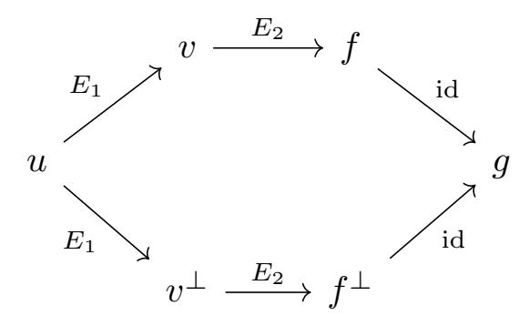
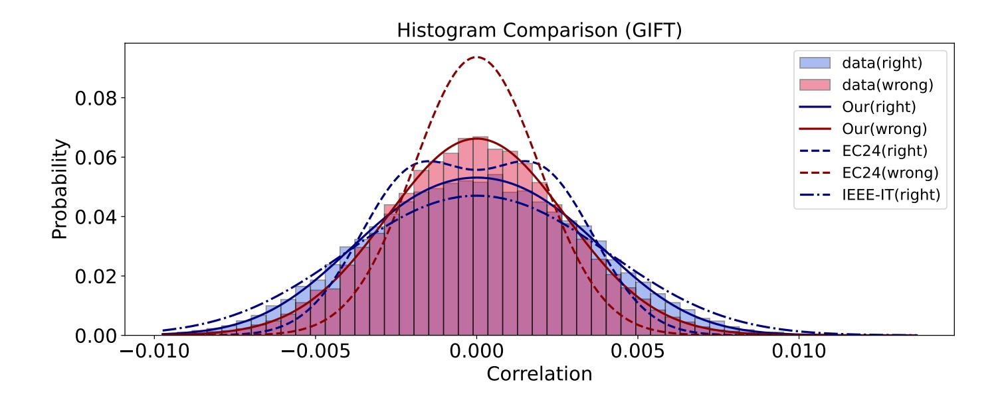
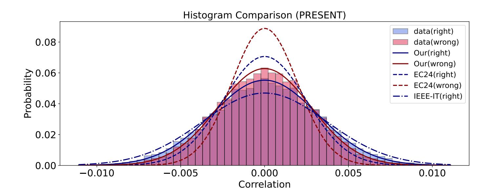

{0}------------------------------------------------

# **Accurate Parameter Estimates for Punctured Key Recovery Linear Attacks**

Tim Beyne1 , Antonio Flórez-Gutiérrez2 and Yosuke Todo2

> 1 COSIC, KU Leuven, Leuven, Belgium 2 NTT Social Informatics Laboratories, Tokyo, Japan

**Abstract.** At EUROCRYPT 2024, Flórez-Gutiérrez and Todo introduced the puncturing technique for linear key recovery attacks. Puncturing works by modifying the map which evaluates the linear approximation as a function of the plaintext, ciphertext and key by setting carefully chosen coordinates of its Fourier transform to zero. These modifications are intended to reduce the time complexity of the attack at the cost of an increase in data complexity. In this note, we revisit the model which is used to estimate the data complexity, clarify some of its underlying assumptions, and improve its accuracy. This leads to a revision of the cost estimates for several applications of puncturing in the literature, most notably for attacks whose data complexity is close to the full codebook.

# **1 Introduction**

Linear cryptanalysis [\[Mat94\]](#page-9-0) is one of the most prominent families of cryptanalytic attacks on symmetric cryptographic primitives. Linear attacks leverage the statistical bias of linear approximations, which are linear combinations of plaintext and ciphertext bits. These linear approximations are often extended to key recovery attacks by evaluating the linear approximation as a function of the plaintext, ciphertext and a guess for part of the key: for the correct key guess, the imbalance of the linear approximation will be observed, whereas this bias will not appear for incorrect guesses.

Recently, Flórez-Gutiérrez and Todo [\[FT24,](#page-9-1)[FT25c\]](#page-9-2) introduced *Walsh spectrum puncturing*. Puncturing modifies the key-recovery map f, which evaluates the linear approximation for a given key guess, by setting some coordinates of its Fourier transform equal to zero. The positions which are set to zero are chosen to simplify or accelerate the attack process, while the cost of the modification is an increase in data complexity which is determined by the 2-norm weight η of the zeroed Fourier coefficients.

Applications of puncturing rely on a statistical model to predict the impact of puncturing on the attack's data complexity, false-positive probability, and success probability. It was argued that it suffices to increase the sample size by a factor of 1/η. This model follows the framework of [\[BN17\]](#page-9-3) and relies on a series of assumptions about the behavior of the key recovery map f and its punctured version g.

A series of example attacks on a wide variety of ciphers including Serpent, GIFT, DES, and Noekeon are also discussed in [\[FT25c\]](#page-9-2). Puncturing was also used as an alternative to PNBs in differential-linear attacks on ChaCha and Salsa in [\[FT25b,](#page-9-4)[FT25a\]](#page-9-5).

**Our contribution.** We focus on the statistical model for puncturing, and more generally arbitrary approximations of the key recovery map. After revisiting the proof of the core

{1}------------------------------------------------

result of [\[FT25c\]](#page-9-2), we discuss some limitations of the model and propose an improved version which is more accurate, especially when applied to attacks with high data complexities relative to the block length. This is achieved through a more careful analysis of the assumptions of the proof, some of which turn out to be inaccurate. Both models are then compared against experimental results for some toy examples. Finally, we show that under this improved formula, the cost estimates of the attacks described in [\[FT25c\]](#page-9-2) change slightly. Most notably, the attack on Serpent-192 requires sampling without replacement to retain the same success probability.

# **2 Preliminaries**

This section summarizes previous work on the modification of key recovery maps in linear cryptanalysis, including the general framework of [\[FT25c\]](#page-9-2). We consider a linear attack on a block cipher where the linear approximation can be evaluated as a function of the plaintext, ciphertext, and key as f(x, k) ∈ {−1, +1}, where x is the concatenation of the plaintext and ciphertext, and k is the key guess.

In a key recovery attack, the adversary obtains a sample D of N plaintext-ciphertext pairs and computes (for each key guess k) the empirical correlations

$$\widetilde{\operatorname{cor}}^f(k) = \frac{1}{N} \sum_{x \in \mathcal{D}} f(x, k),$$

where B = 1 for sampling with replacement and B = (2n − N)/(2n − 1) for sampling without replacement. Assuming that the exact correlation for key guess k is corf (k), which may be key-dependent, the empirical correlation approximately follows the distribution

$$\widetilde{\operatorname{cor}}^f(k) \sim \mathcal{N}\left(\operatorname{cor}^f(k), \frac{B}{N}\right).$$

The general idea of [\[FT25c\]](#page-9-2) is to replace the key recovery map f by an arbitrary real-valued function g that enables easier evaluation of the empirical correlations within the context of the attack (usually by reducing the number of key bits that must be guessed). This generalizes a series of earlier approaches where the function g is selected from a specific family of functions. The authors of [\[FT25b\]](#page-9-4) also propose puncturing, which is a specific class of approximations that covers many possible use cases. If the key recovery attack is interpreted as a key-dependent 'distinguisher', which is always possible, then using a real-valued approximation g is an example of a one-dimensional *cryptanalytic property* in the sense of the geometric approach [\[Bey21,](#page-9-6) §3.1].

### **2.1 Early Examples and Motivation**

The approximation and puncturing framework of [\[FT25b\]](#page-9-4) is a generalization of several scenarios which appear in earlier literature on linear cryptanalysis. Throughout this section, f denotes the key recovery map x 7→ f(x, k) for the correct key k, and g is a real-valued approximation of f. In [\[FT25a\]](#page-9-5), this approximation is denoted by fe instead.

**Probabilistic neutral bits (PNBs).** First introduced in [\[AFK](#page-8-0)+08], PNBs are bits of the input space of f which are considered to have a small influence on the output and can thus be set to a fixed value (usually zero) to obtain a function g which effectively has a smaller input space. The choice of the PNBs as well as the correlation hf, gi/kfk2kgk2 between f and g is usually determined experimentally. The cost of this simplification of the key recovery map is a factor kfk 2 2kgk 2 2/hf, gi 2 increase in the data complexity[1](#page-1-0) .

1PNBs were introduced and are usually applied in the context of differential-linear attacks, which means that the actual data complexity increase is kfk 4 2 kgk 4 2 kfk 4 2 kgk 4 2 /hf, gi 4 , as the key recovery map

{2}------------------------------------------------

**Boolean function replacement.** Generalizing the case of PNBs, the key recovery map f can be substituted for another function g corresponding to a Boolean function which is expected to coincide with f on most input values. The quality of the approximation can be measured through the correlation  $\langle f, g \rangle / ||f||_2 ||g||_2$ . Similarly to the case of PNBs, attacks using this technique [BP18, BBC+22] increase the data complexity by a factor of  $||f||_2^2 ||g||_2^2 / \langle f, g \rangle^2$ . This complexity compensation aligns with the updated correlation determined through the piling-up-lemma.

**Plaintext rejection.** Another approach to approximate f is also used in the literature [MY93,BBC+22,BCD+22,FG22]. In these attacks, g is a variant of f which rejects certain values of the input. This means that g no longer corresponds to a Boolean function and is instead a pseudoboolean function taking values in  $\{-1,0,1\}$ . For example, g can be restricted to inputs for which the linear approximation can be evaluated using a reduced key guess. In the aforementioned works, if a fraction g of the inputs remain, then the data complexity of the attack increases by a factor g are uniformly distributed when applied to the data sample for all values of the (right) key, and that the correlation of the linear approximation will be the same when the data is restricted to the remaining input values.

The plaintext rejection scenario was studied in more detail in [WLW24], where the following result for certain key recovery attacks was developed using the statistical framework of [BN17] as a basis:

**Model 1** (Plaintext rejection, Theorems 3 and 6 in [WLW24]). If g is an approximation of the key recovery map f which rejects a fraction  $1-q_k$  of its possible input values for a given key k, and assuming that the correlation of the underlying linear approximation follows the distribution  $\mathcal{N}(\mu, \text{ELP} - \mu^2)$ , then the posterior right- and wrong-key key recovery statistic distributions using g can be approximated by the normal distributions

$$\widetilde{\operatorname{cor}}_{R}^{g} \sim \mathcal{N}\left(q_{k}\mu, \ q_{k}^{2} \left(\operatorname{ELP} - \mu^{2}\right) + q_{k} \ 2^{-n} + q_{K} B/N\right),$$

$$\widetilde{\operatorname{cor}}_{W}^{g} \sim \mathcal{N}\left(0, \ q_{k} 2^{-n} + q_{K} B/N\right).$$

#### 2.2 The General Approximation Case

In [FT25c], the following model for the distribution of the key-recovery test statistic under randomized key and data was proposed. The proof of Model 2 depends on several assumptions, the details of which can be found in [FT25c].

**Model 2** (Arbitrary approximation, Theorem 2 in [FT25c]). Let f be the key-recovery map of a linear key-recovery attack, let g be a real-valued approximation of this map, and let  $\rho = \langle g, f \rangle / \|f\|_2 \|g\|_2$  be the correlation coefficient of f and g. If f and g are balanced, and assuming that the correlation of the underlying linear approximation follows the normal distribution  $\mathcal{N}(\mu, \text{ELP} - \mu^2)$ , the right and wrong-key key recovery statistic distributions can be approximated by

$$\widetilde{\operatorname{cor}}_{R}^{g} \sim \|g\|_{2} \mathcal{N}\left(\rho\mu, \, \rho^{2}(\operatorname{ELP} - \mu^{2}) + B/N\right),$$
  
 $\widetilde{\operatorname{cor}}_{W}^{g} \sim \|g\|_{2} \mathcal{N}\left(0, \rho^{2} \, 2^{-n} + B/N\right).$ 

Model 2 implies the following simple rule, stated below as Corollary 3.

Corollary 3 (Data complexity compensation, Corollary 3 in [FT25c]). Under the same assumptions as Model 2, the success probability and false-positive rate of a linear key-recovery attack with an approximated key-recovery map are the same as without approximation if the corrected sample size N/B is increased by a factor of  $1/\rho^2$ .

consists of two parallel evaluations of the same function, one for each ciphertext in a pair.

{3}------------------------------------------------

This result matches the data-complexity compensations commonly used for specific examples like PNBs and plaintext rejection, but does not agree with Model 1.

### 2.3 The Puncturing Case

The authors of [FT25c] note that many desirable properties of the key recovery map can be described in terms of the zeroes of its Fourier transform. This suggests a form of constructing approximations by setting specific coordinates of the Fourier transform to zero. This is similar to plaintext rejection, but applied in the frequency domain instead of the time domain.

**Definition 4** (Walsh spectrum puncturing, Definition 4 in [FT25c]). Let  $f: \mathbb{F}_2^l \to \{-1, +1\}$  be a balanced function and let  $\widehat{f}$  be its Fourier transform. Given a subset  $\mathscr{P} \subseteq \mathbb{F}_2^l$ , called a puncture set, the punctured function of f according to  $\mathscr{P}$  is the function  $g = f - \sum_{u \in \mathscr{P}} \widehat{f}(u) \chi^u$  with  $\chi^u(x) = (-1)^{u^t x}$ , whose Fourier transform is

$$\widehat{g}(u) = \begin{cases} \widehat{f}(u) & \text{if } u \notin \mathscr{P} \\ 0 & \text{if } u \in \mathscr{P} \end{cases}.$$

The squared norm of  $\hat{g}$  is called the puncturing correlation and denoted by  $\eta$ :

$$\eta = 1 - \sum_{u \in \mathscr{P}} \widehat{f}(u)^2 = \sum_{u \notin \mathscr{P}} \widehat{f}(u)^2 = \langle f, g \rangle.$$

The authors of [FT25c] introduce the magnitude  $\varepsilon$ , called *puncturing coefficient*, as a measurement of how much of the original key recovery map is removed. Since in most cases it is more practical to use  $1 - \varepsilon$  (the weight that remains), here we introduce the notation  $\eta = 1 - \varepsilon$  and the name *puncturing correlation*, which is equal to the square of  $\rho = \langle g, f \rangle / ||f||_2 ||g||_2$ . Applying Corollary 3 to this scenario yields the following result.

Corollary 5 (Corollary 5 in [FT25c]). The false-positive and success probabilities of a linear key recovery attack remain unchanged when puncturing its key recovery map, provided that the corrected data complexity N/B is increased by a factor of  $1/\eta = 1/\rho^2$ .

In [FT25c], it is also shown that puncturing is optimal, in the sense that the punctured version of f according to a set  $\mathscr{P} \subseteq \mathbb{F}_2^l$  has the highest possible correlation coefficient  $\rho$  among the functions satisfying the condition that  $\widehat{g}(u) = 0$  for all  $u \in \mathscr{P}$ .

# 3 Improved Model

When using the model for key-recovery map approximation that was proposed in [FT25c], we noticed some limitations suggesting that its accuracy can be improved:

- The behaviour for very high (close or equal to the full codebook) data complexities is counterintuitive. Indeed, in the full codebook case (distinct known plaintexts,  $N=2^n$ , B=0), the model predicts that it is possible to puncture f with arbitrarily small correlation while maintaining the same false-positive probability and success probability.
- The wrong-key distribution of the experimental correlation under g in model 2 depends on f, when (under traditional wrong key randomization assumptions), f should be completely irrelevant and only g should matter.
- When applied to the case of plaintext rejection, the model is inconsistent with [WLW24].

{4}------------------------------------------------

### 3.1 Revisiting the Model of [FT25c]

For the reasons mentioned above, we revisit Model 2. As a first step, we express the exact value of the correlation  $\cos^g$  in terms of the correlation of the linear approximation and an additional term that is related to the correlation of all other linear approximations with the same input mask. This is possible not only for linear approximations, but for all cryptanalytic properties (u, v) in the sense of [Bey21], with u and v complex-valued functions on  $\mathbb{F}_2^n$ .

In the following theorem and its proof, we use some standard notation from the geometric approach. In particular,  $T^F$  denotes the pushforward of a function F.

**Theorem 1.** Let  $E = E_2 \circ E_1$  be a permutation, and let (u, v) be a cryptanalytic property of  $E_1$  with correlation c. Let  $v^{\perp}$  be the unique vector orthogonal to v such that  $T^{E_1}u = c \|u\|_2 v + v^{\perp}$ . If  $f = T^{E_2}v$  and  $f^{\perp} = T^{E_2}v^{\perp}$ , then for all g,

$$\operatorname{cor}^{g} = c \times \frac{\langle g, f \rangle}{\|f\|_{2}} + \sqrt{1 - |c|^{2}} \times \frac{\langle g, f^{\perp} \rangle}{\|f\|_{2}}.$$

*Proof.* The correlation of the property (u, g) over E can be computed in terms of the correlation of the following two one-dimensional trails2:

The correlation of the first trail is equal to

$$\frac{\langle v, T^{E_1} u \rangle}{\|v\|_2 \|u\|_2} \times \frac{\langle f, T^{E_2} v \rangle}{\|v\|_2 \|f\|_2} \times \frac{\langle g, f \rangle}{\|g\|_2 \|f\|_2} = c \times \frac{\langle g, f \rangle}{\|g\|_2 \|f\|_2}.$$

The correlation of the second trail is equal to

$$\frac{\langle v^{\perp}, T^{E_1} u \rangle}{\|v^{\perp}\|_2 \|u\|_2} \times \frac{\langle f^{\perp}, T^{E_2} v^{\perp} \rangle}{\|v^{\perp}\|_2 \|f^{\perp}\|_2} \times \frac{\langle g, f^{\perp} \rangle}{\|g\|_2 \|f^{\perp}\|_2} = \frac{\langle v^{\perp}, T^{E_1} u \rangle}{\|v^{\perp}\|_2 \|u\|_2} \times \frac{\langle g, f^{\perp} \rangle}{\|g\|_2 \|f^{\perp}\|_2}.$$

It remains to compute  $\langle v^{\perp}, T^{E_1}u \rangle = \|v^{\perp}\|_2^2$ . The norm of  $T^{E_1}u$  is equal to the norm of u. Hence, by the orthogonality of v and  $v^{\perp}$ , we have  $\|u\|_2^2 = |c|^2 \|u\|_2^2 \|v\|_2^2 + \|v^{\perp}\|_2^2$ . In particular,  $\|v^{\perp}\|_2^2 = (1-|c|^2)\|u\|_2^2$ . The result follows by scaling the correlation by a factor  $\|g\|_2$ , which is necessary because  $\cos^g$  is defined without normalization.

Theorem 1 now leads to the following model for the distributions of  $\operatorname{cor}_R^g$  and  $\operatorname{cor}_W^g$  when the key and key guess are uniform random. The assumptions made by this model can be interpreted as follows:

- (i) For wrong keys, the approximation to the key-recovery map is effectively randomized. This corresponds to the heuristic that, for wrong keys, g is uniformly distributed on a sphere of constant radius  $||g||_2$ .
- (ii) The property (u, v) is the only 'non-random' property of the subcipher  $E_1$ , starting from u. This corresponds to the heuristic that  $v^{\perp}$  is uniform random on the sphere of radius  $||v^{\perp}||_2$  in the subspace orthogonal to v.

&lt;sup>2Here, we use the term 'trail' in the sense of the geometric approach [Bey21].

{5}------------------------------------------------

**Model 6.** Suppose that, for a random key, the correlation c is distributed as  $\mathcal{N}(\mu, \sigma^2)$ , with  $\mu^2$  negligible relative to one. For large n and if  $\rho = \langle g, f \rangle / \|g\|_2 \|f\|_2$  is constant under the right key guess, we model the right- and wrong-key correlations as random variables

$$\operatorname{cor}_{R}^{g} \sim \|g\|_{2} \mathcal{N}(\rho\mu, \ \rho^{2}\sigma^{2} + (1 - \rho^{2}) 2^{-n}),$$
  
 $\operatorname{cor}_{W}^{g} \sim \|g\|_{2} \mathcal{N}(0, 2^{-n}).$ 

Here, both the key and the guessed key are considered to be uniform random. This model assumes that, for wrong keys, g is uniform random on the sphere of radius  $||g||_2$ . Furthermore, it assumes that  $f^{\perp}$  is independent of c and uniformly distributed on the sphere of radius  $||f^{\perp}||_2$  in the subspace orthogonal to f.

Derivation. Assuming that  $\mu^2$  is negligible compared to one, Theorem 1 yields the estimate

$$cor^g \approx ||g||_2 \left( c \times \frac{\langle g, f \rangle}{||g||_2 ||f||_2} + \frac{\langle g, f^{\perp} \rangle}{||g||_2 ||f||_2} \right),$$

with high probability. First consider the case that g is based on a wrong key guess. Since the vector g is uniform random on the sphere of radius  $||g||_2$ , we have

$$\langle g, f^{\perp} \rangle \sim \mathcal{N}(0, \|g\|_2^2 \|f^{\perp}\|_2^2 / 2^n).$$

This approximation holds for any fixed choice of  $f^{\perp}$ . For  $\langle g, f \rangle$ , the same approximation can be used, but c is assumed small, so the second term dominates the correlation. This yields the overall estimate  $\mathcal{N}(0, \|g\|_2^2/2^n)$ .

Next, assume that g is based on the right key. In this case, the value  $\langle g, f \rangle / (\|g\|_2 \|f\|_2)$  is equal to  $\rho$ . Hence, the distribution of the first term is given by

$$c \times \frac{\langle g, f \rangle}{\|g\|_2 \|f\|_2} \sim \mathcal{N}(\rho \mu, \rho^2 \sigma^2).$$

The vector  $f^{\perp}$  is assumed to be uniformly distributed on the sphere of radius  $||f^{\perp}||_2$  in the subspace of dimension  $2^n - 1$  orthogonal to f. The projection of g on this subspace has squared norm smaller than  $||g||_2^2$  by a factor of

$$1 - \left(\frac{\langle g, f \rangle}{\|g\|_2 \|f\|_2}\right)^2 = 1 - \rho^2.$$

It follows that, for arbitrary g,

$$\langle g, f^{\perp} \rangle \sim \mathcal{N}(0, \|g\|_2^2 \|f^{\perp}\|_2^2 (1 - \rho^2)/(2^n - 1)).$$

For large n, we have  $1/(2^n - 1) \approx 1/2^n$ . Since  $f^{\perp}$  and c are assumed to be independent, the distribution of the sum of the two terms has variance  $\rho^2 \sigma^2 + (1 - \rho^2)/2^n$ .

For the empirical correlations under random data, Model 6 in turn leads to the following model for the posterior distribution.

**Model 7** (Compound model). Let N be the number of samples, and let B be the sampling correction factor. Under the same assumptions as in Model 6, we model the posterior distribution of the empirical correlation as follows:

$$\widetilde{\text{cor}}_{R}^{g} \sim \|g\|_{2} \mathcal{N}(\rho\mu, \ \rho^{2}\sigma^{2} + (1-\rho^{2}) 2^{-n} + B/N),$$
  
 $\widetilde{\text{cor}}_{W}^{g} \sim \|g\|_{2} \mathcal{N}(0, \ 2^{-n} + B/N).$ 

In particular, if  $\sigma^2 = \text{ELP} - \mu^2$ , then

$$\widetilde{\text{cor}}_{R}^{g} \sim \|g\|_{2} \mathcal{N}(\rho\mu, \ \rho^{2} (\text{ELP} - \mu^{2} - 2^{-n}) + 2^{-n} + B/N),$$
  
 $\widetilde{\text{cor}}_{W}^{g} \sim \|g\|_{2} \mathcal{N}(0, \ 2^{-n} + B/N).$ 

{6}------------------------------------------------

Figure 1: Experimental results on SmallGIFT.

Figure 2: Experimental results on SmallPRESENT.

Derivation. Let  $c = \cos^g$  be the correlation for a particular fixed key and key guess. As  $N \to \infty$  with  $N/2^n$  constant, the empirical correlation is normally distributed:

$$\widetilde{\operatorname{cor}}^g \sim \mathcal{N}(c, (1-c^2)B/N)$$
.

If c is negligible compared to one, then the variance is approximately B/N. The posterior distribution of the correlation is then approximately a compound normal distribution with a normally distributed mean. Such a distribution is again normal, with mean equal to the mean of c and variance equal to the sum of the variance of c and B/N.

Based on Model 7, we note that the result for data complexity compensation (Corollary 5) no longer holds. However, since Corollary 5 is accurate enough in most cases, we recommend using it as a heuristic when designing puncturing-based attacks. To determine the final data complexity, false-positive rate, and success probability, Model 7 should be used.

### 3.2 Experimental Verification

We compare the right- and wrong-key distributions predicted by the old Model 2 and the new Model 6, as well as the plaintext rejection Model 1, with experimental data generated using the full codebook of two 16-bit toy ciphers.

{7}------------------------------------------------

| Target             | Rounds | $\log_2 \rho^2$ | $\log_2 N$ | Adv.  | Avg. SP | $\mathbf{Model}$ |
|--------------------|--------|-----------------|------------|-------|---------|------------------|
| Serpent-192        | 12     | -11             | 127.5      | -3    | 0.8006  | old              |
|                    |        |                 |            |       | 0.6127  | new              |
| Serpent-256        | 12     | -2.83           | 125.2      | -210  | 0.8113  | old              |
|                    |        |                 |            |       | 0.4686  | new              |
| Serpent-256        | 12     | -4              | 126.3      | -210  | 0.8113  | old              |
|                    |        |                 |            |       | 0.1085  | new              |
| GIFT-128 (general) | 25     | -8.3            | 123        | -4.98 | 0.7998  | old              |
|                    |        |                 |            |       | 0.7942  | new              |
| GIFT-128 (COFB)    | 17     | -23.62          | 62.1       | -2.96 | 0.8001  | old              |
|                    |        |                 |            |       | 0.8001  | new              |
| GIFT-128 (HyENA)   | 17     | -23.62          | 62.1       | -2.96 | 0.8001  | old              |
|                    |        |                 |            |       | 0.8001  | new              |
| DES                | Full   | -0.117          | 41.62      | -8    | 0.6263  | old              |
|                    |        |                 |            |       | 0.6263  | new              |
| Noekeon            | 12     | -15.68          | 119.5      | -8.45 | 0.7962  | old              |
|                    |        |                 |            |       | 0.7947  | new              |

Table 1: Comparison between the existing and new models under the KP sampling.

**Experiment using 7-round SmallGIFT.** This experiment uses a 5-round linear approximation from 0x8000 to 0x4208 with bimodal correlation at  $\pm 2^{-8}$  and ELP =  $2^{-15.1802}$ . Two key-recovery rounds with puncturing correlation  $2^{-1}$  are appended to this distinguisher. The experiment computes the right  $\cos_R^g$  and wrong-key  $\cos_W^g$  correlations of the punctured key-recovery map over the full codebook for a total of 30000 random keys. The histogram of these correlations is shown in Figure 1.

**Experiment using 8-round SmallPRESENT.** This experiment uses a 6-round linear approximation from 0x8000 to 0x8888 whose average correlation is 0 and ELP is  $2^{-15.3388}$ . Two key-recovery rounds with puncturing correlation  $2^{-1}$  are appended to this distinguisher. The experiment computes the right  $cor_R^g$  and wrong-key  $cor_W^g$  correlations of the punctured key-recovery map over the full codebook for a total of 30000 random keys. The histogram of these correlations is shown in Figure 2.

In both experiments, the new Model 6 provides the closest match to the observed right- and wrong-key correlation distributions. We note that these experiments have been designed to highlight the scenario where the predicted variances are the most different, which is that of using the full codebook.

# 4 Updated Parameter Estimates for Previous Attacks

We next revise the success probability estimations of the attacks described in [FT24], as shown in Table 1 (sampling with replacement) and Table 2 (sampling without replacement). For most of the attacks, we observed very small shifts in the expected success probability. Perhaps the most interesting changes appear in the applications to Serpent, because these attacks are the closest to using the full codebook. For example, for 12-round Serpent-192 the authors of [FT25c] show 80% success probability using  $2^{127.5}$  known plaintexts, but under the updated model and the same  $2^{127.5}$  data complexity, the success probability drops to 61%, and it is necessary to consider distinct known plaintexts to achieve a similar success probability.

{8}------------------------------------------------

| Target             | Rounds | 2 log2 ρ | log2 N | Adv.  | Avg. SP | Model |
|--------------------|--------|----------------|-----------|-------|---------|-------|
| Serpent-192        | 12     | -11            | 127.5     | -3    | 0.9979  | old   |
|                    |        |                |           |       | 0.8007  | new   |
| Serpent-256        | 12     | -2.83          | 125.2     | -210  | 0.9875  | old   |
|                    |        |                |           |       | 0.8546  | new   |
| Serpent-256        | 12     | -4             | 126.3     | -210  | 1       | old   |
|                    |        |                |           |       | 0.8546  | new   |
| GIFT-128 (general) | 25     | -8.3           | 123       | -4.98 | 0.8055  | old   |
|                    |        |                |           |       | 0.7998  | new   |
| GIFT-128 (COFB)    | 17     | -23.62         | 62.1      | -2.96 | 0.8001  | old   |
|                    |        |                |           |       | 0.8001  | new   |
| GIFT-128 (HyENA)   | 17     | -23.62         | 62.1      | -2.96 | 0.8001  | old   |
|                    |        |                |           |       | 0.8001  | new   |
| DES                | Full   | -0.117         | 41.62     | -8    | 0.6263  | old   |
|                    |        |                |           |       | 0.6263  | new   |
| Noekeon            | 12     | -15.68         | 119.5     | -8.45 | 0.7977  | old   |
|                    |        |                |           |       | 0.7962  | new   |

Table 2: Comparison between the existing and new models under the DKP sampling.

## **5 Conclusion**

By examining the underlying assumptions of [\[FT25c\]](#page-9-2) more carefully, we have obtained a version of its core result which increases its accuracy for large data complexities. Since the previous version is easier to use and is quite accurate for most parameters, we suggest using it as an estimate of the data complexity penalty while designing the attack and comparing different puncturing strategies, and the new version when computing the overall attack parameters. We have compared both versions of the theorem experimentally and confirmed that the new one is indeed more precise, and we have revised the attacks of [\[FT25c\]](#page-9-2) on Serpent from a known plaintext scenario to a distinct known plaintext scenario.

**Acknowledgement.** Tim Beyne is supported by a junior postdoctoral fellowship from the Research Foundation – Flanders (FWO) with reference number 1274724N.

## **References**

- [AFK+08] Jean-Philippe Aumasson, Simon Fischer, Shahram Khazaei, Willi Meier, and Christian Rechberger. New features of latin dances: Analysis of Salsa, ChaCha, and Rumba. In Kaisa Nyberg, editor, *FSE 2008*, volume 5086 of *LNCS*, pages 470–488. Springer, Berlin, Heidelberg, February 2008. [doi:10.1007/978-3-5](https://doi.org/10.1007/978-3-540-71039-4_30) [40-71039-4\\_30](https://doi.org/10.1007/978-3-540-71039-4_30).
- [BBC+22] Christof Beierle, Marek Broll, Federico Canale, Nicolas David, Antonio Flórez-Gutiérrez, Gregor Leander, María Naya-Plasencia, and Yosuke Todo. Improved differential-linear attacks with applications to ARX ciphers. *Journal of Cryptology*, 35(4):29, October 2022. [doi:10.1007/s00145-022-09437-z](https://doi.org/10.1007/s00145-022-09437-z).
- [BCD+22] Marek Broll, Federico Canale, Nicolas David, Antonio Flórez-Gutiérrez, Gregor Leander, María Naya-Plasencia, and Yosuke Todo. New attacks from old distinguishers improved attacks on Serpent. In Steven D. Galbraith, editor, *CT-RSA 2022*, volume 13161 of *LNCS*, pages 484–510. Springer, Cham, March 2022. [doi:10.1007/978-3-030-95312-6\\_20](https://doi.org/10.1007/978-3-030-95312-6_20).

{9}------------------------------------------------

- [Bey21] Tim Beyne. A geometric approach to linear cryptanalysis. In Mehdi Tibouchi and Huaxiong Wang, editors, *ASIACRYPT 2021, Part I*, volume 13090 of *LNCS*, pages 36–66. Springer, Cham, December 2021. [doi:10.1007/978-3-0](https://doi.org/10.1007/978-3-030-92062-3_2) [30-92062-3\\_2](https://doi.org/10.1007/978-3-030-92062-3_2).
- [BN17] Céline Blondeau and Kaisa Nyberg. Joint data and key distribution of simple, multiple, and multidimensional linear cryptanalysis test statistic and its impact to data complexity. *DCC*, 82(1-2):319–349, 2017. [doi:10.1007/s10623-016](https://doi.org/10.1007/s10623-016-0268-6) [-0268-6](https://doi.org/10.1007/s10623-016-0268-6).
- [BP18] Eli Biham and Stav Perle. Conditional linear cryptanalysis – cryptanalysis of DES with less than 2 42 complexity. *IACR Trans. Symm. Cryptol.*, 2018(3):215–264, 2018. [doi:10.13154/tosc.v2018.i3.215-264](https://doi.org/10.13154/tosc.v2018.i3.215-264).
- [FG22] Antonio Flórez-Gutiérrez. Optimising linear key recovery attacks with affine Walsh transform pruning. In Shweta Agrawal and Dongdai Lin, editors, *ASI-ACRYPT 2022, Part IV*, volume 13794 of *LNCS*, pages 447–476. Springer, Cham, December 2022. [doi:10.1007/978-3-031-22972-5\\_16](https://doi.org/10.1007/978-3-031-22972-5_16).
- [FT24] Antonio Flórez-Gutiérrez and Yosuke Todo. Improving linear key recovery attacks using Walsh spectrum puncturing. In Marc Joye and Gregor Leander, editors, *EUROCRYPT 2024, Part I*, volume 14651 of *LNCS*, pages 187–216. Springer, Cham, May 2024. [doi:10.1007/978-3-031-58716-0\\_7](https://doi.org/10.1007/978-3-031-58716-0_7).
- [FT25a] Antonio Flórez-Gutiérrez and Yosuke Todo. Divide-and-conquer trail enumeration puncturing: Application to salsa and ChaCha. In Goichiro Hanaoka and Bo-Yin Yang, editors, *ASIACRYPT 2025, Part I*, volume 16245 of *LNCS*, pages 35–65. Springer, Singapore, December 2025. [doi:10.1007/978-981-9](https://doi.org/10.1007/978-981-95-5018-0_2) [5-5018-0\\_2](https://doi.org/10.1007/978-981-95-5018-0_2).
- [FT25b] Antonio Flórez-Gutiérrez and Yosuke Todo. Improved cryptanalysis of ChaCha: Beating PNBs with bit puncturing. In Serge Fehr and Pierre-Alain Fouque, editors, *EUROCRYPT 2025, Part I*, volume 15601 of *LNCS*, pages 427–457. Springer, Cham, May 2025. [doi:10.1007/978-3-031-91107-1\\_15](https://doi.org/10.1007/978-3-031-91107-1_15).
- [FT25c] Antonio Flórez-Gutiérrez and Yosuke Todo. Improving linear key recovery attacks using walsh spectrum puncturing. *Journal of Cryptology*, 38(4):34, October 2025. [doi:10.1007/s00145-025-09554-5](https://doi.org/10.1007/s00145-025-09554-5).
- [Mat94] Mitsuru Matsui. Linear cryptanalysis method for DES cipher. In Tor Helleseth, editor, *EUROCRYPT'93*, volume 765 of *LNCS*, pages 386–397. Springer, Berlin, Heidelberg, May 1994. [doi:10.1007/3-540-48285-7\\_33](https://doi.org/10.1007/3-540-48285-7_33).
- [MY93] Mitsuru Matsui and Atsuhiro Yamagishi. A new method for known plaintext attack of FEAL cipher. In Rainer A. Rueppel, editor, *EUROCRYPT'92*, volume 658 of *LNCS*, pages 81–91. Springer, Berlin, Heidelberg, May 1993. [doi:10.1007/3-540-47555-9\\_7](https://doi.org/10.1007/3-540-47555-9_7).
- [WLW24] Wenhui Wu, Muzhou Li, and Meiqin Wang. Improved linear key recovery attacks on present. *IEEE Transactions on Information Theory*, 70(12):9195–9213, 2024. [doi:10.1109/TIT.2024.3474701](https://doi.org/10.1109/TIT.2024.3474701).