{0}------------------------------------------------

# Low-Depth Construction of Grover Oracles from Fully Functional Quantum Circuits

Behzad Abdolmaleki, Jiaqi Gu

School of Computer Science, University of Sheffield, UK {behzad.abdolmaleki, jgu35}@sheffield.ac.uk

Abstract. The Grover oracle is the core component of the Grover search algorithm. Instead of constructing a Grover oracle from scratch, we consider the common practice of constructing a Grover oracle from an existing fully functional quantum circuit (FFQC). An FFQC typically performs computations for a primary target and includes ancilla restoration for qubits used as intermediate storage. Although such circuits can be directly integrated into an oracle, we find that this inevitably introduces circuit redundancy. To address this, we propose a low-depth transformation method that converts an existing FFQC into a low-depth Grover oracle. Additionally, our method can further reduce the width while retaining the previously achieved low depth. We analyze an implementation of the AES quantum circuit and further reduce the circuit width from 7280 to 7104.

Keywords: Grover search, quantum circuit optimization, cryptography

# 1 Introduction

Grover search is a quantum exhaustive search algorithm [\[Gro96\]](#page-12-0). For a task with a search space of size N, it can find the target in O( √ N) iterations, whereas a classical algorithm would require O(N) steps. Although some works [\[JNRV20,](#page-13-0) [Cre25\]](#page-12-1) have shown that, with suitable parallelization, one can reduce the number of iterations, the exact performance of Grover search has been proven optimal [\[Zal99\]](#page-13-1). That is, its theoretical lower bound Ω( √ N) cannot be surpassed. No matter how it is parallelized, one must perform Ω( √ N) Grover iterations sequentially. A Grover iteration comprises a Grover oracle, which marks the targets, and a Grover diffusion operator, which amplifies the measurement probability of the targets. Since the diffusion operator is universal, constructing the Grover oracle has been extensively studied across many areas.

Grover search is sensitive to depth growth in a Grover oracle. Any increase in the depth of the oracle is magnified by a factor of Ω( √ N). The depth of a circuit is directly related to its execution time. Therefore, reducing the depth of the Grover oracle is critical. Although one can in principle rebuild the Grover oracle from scratch in an optimal way, in some cases it is unavoidable to construct the oracle from existing quantum circuits. Such circuits are often designed for other tasks, and directly using them to construct the Grover oracle can result 

{1}------------------------------------------------

in significant redundancy. This becomes particularly severe when the original circuit is very large.

#### 1.1 Our Results

Overall, our method for constructing a Grover oracle from existing fully functional quantum circuits (FFQCs) proceeds in two steps:

- 1. Remove (all) ancilla uncomputation circuits (in basis {|0⟩, |1⟩}) in FFQCs, trading off increased width to achieve a lower depth.
- 2. Reintroduce parallelizable ancilla uncomputation circuits to reduce the width while preserving the overall depth unchanged.

Here, ancilla uncomputation refers to the process of restoring the ancillas to the zero state. To justify the reasonableness of our method, we first discuss why ancilla uncomputation components become redundant in the Grover oracle in Section [3.](#page-3-0) Moreover, we discuss the outcomes of all possible scenarios in Section [4.](#page-5-0) The secondary results of this section are as follows:

- 1. In the superposition basis, computation and ancilla uncomputation can occur simultaneously and be inseparable. Hence, we restrict the scope of our method to the computational basis {|0⟩, |1⟩}.
- 2. Depth reduction can be gained only by removing those uncomputation components that cannot be parallelized with the computation components. Hence, we include the second step in our method.

Based on these observations, we give definitions of the computation component (CC), (ancilla) uncomputation component (UC), and computation-only component (COC) (see Section [4.2\)](#page-11-0). In Appendix [B,](#page-14-0) we show how to apply the method to the quantum circuits of AES.

### 1.2 Technical Overview

We briefly summarize how uncomputation (on both main qubits and ancillas) is introduced and why it becomes redundant.

How to Locate Targets. Grover search was introduced as an algorithm for database search [\[Gro96\]](#page-12-0). It follows an oracle-query pattern. The Grover oracle applies phase inversion to all target states that satisfy the condition, where we say it "marks" the targets. We typically formalize the condition as a Boolean function f : {0, 1} ∗ → {0, 1}. Given a query string y and a function F : {0, 1} |x| → {0, 1} |y| , we wish to find any x such that F(x) = y. We then define f(x) = 1 if and only if F(x) = y.

There are two common ways to perform the marking. One is to use CNOT gates with an ancilla prepared in the |−⟩ state: one computes |f(x)⟩ and then performs a phase kick-back via CNOT on |f(x), −⟩, thereby inverting the phase of the target states. The other is to apply a (|y|−1)-controlled CZ gate directly on |F(x)⟩ (or a (|y|)-controlled CX gate on |F(x), −⟩). Regardless of which method 

{2}------------------------------------------------

we use, it is necessary to compute F(x). In Section [3.2,](#page-4-0) we use the first method for illustration to explicitly demonstrate that the condition is satisfied.

The Necessity of Uncomputation in Grover Oracle. As noted above, computing F(x) is unavoidable. One can either store |F(x)⟩ in-place (i.e., overwrite the original |x⟩) or out-of-place (in independent qubits). In a single iteration, the Grover oracle's goal is to mark the target |x⟩ and then hand it to the diffusion operator for phase amplification. Such an iteration is repeated O( √ N) times. If F(x) is computed and stored in-place, we must uncompute F(x) to restore the original x before the next iteration (or the final measurement). If F(x) is stored out-of-place in other qubits, ideally, we are not required to uncompute it. However, if we never uncompute F(x) or restore ancillas, we would need to allocate fresh qubits in each of the O( √ N) iterations. For a search space of size N, this leads to an O( √ N) growth in the ancilla count (whereas for |x⟩ we require only O(log N) qubits). For a large N, e.g., N = 2128, this is impractical. Therefore, the Grover oracle usually adopts the "computation-mark-uncomputation" pattern, as shown in Section [3.2,](#page-4-0) where the uncomputation also refers to ancilla restoration.

The Way to Implement Uncomputation. A straightforward way to implement uncomputation is to perform the inverse of every gate in the computation circuit in reverse order. When all gates in the computation circuit are Hermitian (and thus self-inverse), this produces a perfectly symmetric oracle structure. Alternatively, one can measure a qubit to obtain a classical bit c and use it to decide the next process. For example, we can apply an Xc operation to an ancilla to reset it to |0⟩. However, the measurement-based method comes with several limitations. Most critically, if the measured ancilla is entangled with the main qubits, the measurement induces unwanted collapse. There is also a hybrid method, which we call the measurement-and-reset hybrid method. Additionally, there is a controversy that, although it can reduce circuit depth, the efficiency drawbacks of the semiclassical operations on which it relies may be even more severe. In Appendix [A,](#page-13-2) we provide a runtime estimate for the measurementand-reset hybrid method. As a result, we focus on implementing uncomputation using only quantum gates.

Consider the "computation-mark-uncomputation" oracle pattern. The righthand-side uncomputation of a Grover oracle functionally overlaps with the local uncomputation in the left-hand-side computation, because the computation part (literally, F(x)) is usually built directly from some F(x) circuit for general use. In Section [3,](#page-3-0) we discuss in detail why such redundancy can be introduced accidentally and lead to a depth increase.

{3}------------------------------------------------

# 2 Preliminary

### 2.1 Grover search

Below, we summarize the Grover search algorithm at a high level. First, one prepares an n-qubit register in the uniform superposition

$$|\mathbf{\Psi}\rangle = \frac{1}{\sqrt{2^n}} \sum_{x=0}^{2^n - 1} |x\rangle$$

x ranges over the binary numbers from 0 to 2 n − 1. Second, one constructs the Grover oracle Of for a specific function f, and any x that satisfies f(x) = 1 is a target state. Of marks all target states |x⟩ by inverting the phase, i.e., Of |x⟩ = − |x⟩, while leaving all other phases unchanged. Next, one applies the Grover diffusion operator Dn to Of |Ψ⟩ to amplify the phases of the marked states. To make the target states stand out in the final measurement, we should execute Grover iterations on the initial state |Ψ⟩ no more than π 4 √ 2 n times. Each Grover iteration consists of two successive steps:

- 1. Mark the target states by Of .
- 2. Amplify the phases of the marked states by Dn.

Textbook Grover search consists of sequentially executed iterations. Regarding exact performance, [\[Zal99\]](#page-13-1) indicates that it is already optimal. Regarding expected performance, however, [\[JNRV20,](#page-13-0)[Cre25\]](#page-12-1) discuss two parallelization strategies that run multiple Grover searches simultaneously, thereby reducing the expected number of iterations needed to find the target state.

# 3 When Should and Should Not We Restore Ancillas

Ancillas (or ancillary qubits) are additional qubits used as temporary storage. By allowing out-of-place computation, ancilla qubits help reduce the circuit depth (the depth-width trade-off). Although ancillas are always initialized to |0⟩, they ultimately face two possible outcomes: after participating in the computation, they are either reset to |0⟩ for the next task or discarded as garbage. This introduces another trade-off: whether to incur the extra circuit cost required to uncompute (restore) the ancillas or to discard these expensive resources. Section [3.1](#page-3-1) discusses how people deal with ancillas in general computing tasks, and Section [3.2](#page-4-0) discusses the case in Grover search. We not only highlight the different optimization directions in the two settings but also explain why typical Grover oracles contain redundant circuits that perform the same uncomputation.

### 3.1 Ancillas in General Computation

In general quantum computing tasks, we usually implement a fully functional quantum circuit (FFQC) while taking resource management into account. A fundamental operation is to restore ancillas for qubit reuse. Accordingly, our goal is 

{4}------------------------------------------------

to find a balance between circuit width and depth so that we can make rational use of existing resources and complete the computation efficiently. Consider the structure shown in Fig. 1: the ancillas restored after  $F_1$  are reused in the subsequent task  $F_2$ . One can imagine that without ancilla restoration, there would be a catastrophic accumulation of garbage qubits.

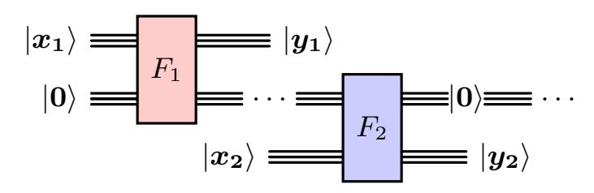

Fig. 1: Reuse ancillas in independent FFQC  $F_1$  and  $F_2$ 

#### 3.2 Ancillas in Grover Search

The Grover oracle  $O_f$  occupies the vast majority of an iteration. Thus, intuitively, reducing the depth of  $O_f$  is our ultimate goal. For a general computational task represented by a mapping  $F: \{0,1\}^{|x|} \to \{0,1\}^{|y|}$ , suppose  $y^*$  is the target output. We aim to find the corresponding  $x^*$  such that  $F(x^*) = y^*$ . In Grover search, we typically model a function  $f: \{0,1\}^{|x|} \to \{0,1\}$  such that  $f(x^*) = 1$  if and only if  $F(x^*) = y^*$ . In practice, f can be constructed from F together with a comparison circuit (to check whether  $F(x^*) = y^*$ ), which is usually an n-controlled Toffoli gate together with n CNOT and X gates.

However, ancillas in Grover search are in a delicate situation. To see why, one can look at the construction of the Grover oracle. Given a specific f, one typically implements the Grover iteration as shown in Fig. 2. The diffusion operator depends only on the size of the search space, whereas the Grover oracle  $O_f$  is specific to f and follows the "computation-mark-uncomputation" pattern. This reflects the fact that, no matter what state  $f(|\Psi^*\rangle, |\mathbf{0}\rangle) = |\text{main}, \text{ancs}\rangle$  produces, by the end of the Grover oracle we always restore all ancillas to  $|\mathbf{0}\rangle$  and turn  $|\Psi^*\rangle$  into  $O_f|\Psi^*\rangle$ .

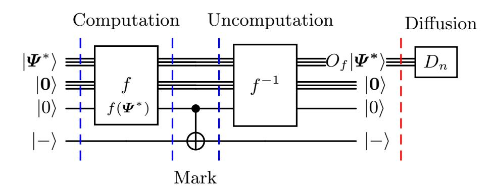

Fig. 2: The structure of a Grover iteration

{5}------------------------------------------------

There are two methods for implementing the uncomputation phase f −1 . The first, which we call the unitary method, produces a structure symmetric around the central CNOT gate by taking the inverse of each gate in f (which, for Hermitian gates, is the gate itself) and placing them in reverse order. This reverses all qubits except the phase information. The alternative, which we call the measurement-and-reset hybrid method, uncomputes the main qubits by the unitary method but restores the ancillas by measuring them and then using the resulting classical bits to reset them to |0⟩. Indeed, it saves quantum gates and reduces circuit depth. However, it introduces runtime overhead caused by the semiclassical operations involving measurement readout and reset through a classical controller, which can reach the microsecond to millisecond level. In contrast, quantum gate operations are typically at the nanosecond to microsecond level [\[DWH](#page-12-2)+20]. We provide a runtime estimate for the measurement-and-reset hybrid method adopted by [\[OJS25,](#page-13-3) [JNRV20,](#page-13-0) [JBK](#page-12-3)+25] in Appendix [A.](#page-13-2) Thus, we consider only the first method for implementing f −1 , namely executing the inverse of each gate in the reverse order of f.

The depth increase introduced by any uncomputation subcircuit in f (and also in f −1 by symmetry) will be magnified by a factor of 2 · π 4 √ 2 n. In contrast, the benefit (width reduction) of ancilla restoration before the mark phase becomes insignificant. At a higher level, the computation of Of can also be viewed as a general computation task, inherently involving ancilla restoration. However, since the function f is built from some FFQC F, which is usually designed with the width-depth balance in mind, the circuit depth of f can be far from minimal. Moreover, the ancilla restoration in F (as discussed in Section [3.2\)](#page-4-0) functionally overlaps with the "uncomputation" part of Of .

# 4 Removal of Ancillas Restoration

This section does not explore the circuit construction of specific algorithms, but discusses only the effects of removing the ancilla restoration functionality from the circuit of f. Here, f can refer to the computation part of Of as shown in Fig. [2,](#page-4-2) or to a general computation task. For convenience, in this section, our use of "uncomputation" no longer refers to the general f −1 of f, but specifically denotes the "restoration" of the ancillas.

### 4.1 Removal Theorem

Let f be the target function that takes as input the main qubits |x⟩. In a typical implementation of f, we construct a unitary Uf that also takes as input the ancillas |0...0⟩ for temporary storage, computing Uf |x⟩ |0...0⟩ = |f(x)⟩ |·⟩. Leaving aside extreme cases, the qubits |·⟩ consist of |0⟩ and |garbage⟩, where the garbage qubits cannot be used for later computation. Such a circuit usually takes the form computation-uncomputation.

The goal of this section is to prove the following theorem:

{6}------------------------------------------------

Theorem 1. (Removal Theorem, informal statement) For a circuit that includes computation parts and uncomputation parts, the removal of any uncomputation part yields a somewhat simpler circuit, provided that computation parts remain unaffected.

The complexity of a circuit can be measured by metrics such as the number of gates, the depth (parallelism), and the width (number of inputs). Thus, one may think that removing some parts should naturally yield a simpler circuit. However, can one say for sure that if a circuit A performs the composite function of circuits B and C, then A must be more complex than B or C? One can consider the three-bit function A(x1, x2, x3) = B(C(x1, x2, x3)), where B(x1, x2, x3) = (x1 + 1, x2 + 1, x3) and C(x1, x2, x3) = (x1 − 1, x2 − 1, x3 − 1). Obviously, A(x1, x2, x3) = (x1, x2, x3 −1) should have a simpler implementation than both B and C. Therefore, regardless of whether it is quantum or classical, one cannot assume that removing some functionality will always yield a simpler circuit.

To justify the reasonableness of removing ancilla restoration, we first informally define the computation component and uncomputation component (see Definition [1](#page-6-0) and Definition [2\)](#page-6-1). A component can refer to a gate, a set of gates, or a subcircuit.

Definition 1. (Computation component, informally). A component that contributes only to the forward computation of f is a computation component, abbreviated as CC.

Remark 1. By definition, a circuit Uf itself is a computation component if and only if Uf |x⟩ |0...0⟩ = |f(x), garbage⟩, which means no restoration at all.

Definition 2. ((Ancilla) Uncomputation component, informally). A component for the restoration of any ancilla qubit is a uncomputation component, abbreviated as UC.

Remark 2. By "restoration", we mean that some uncomputation components ultimately reset some ancilla qubits to |0⟩.

Let UCy denote some UC for an ancilla qubit |y⟩ and CC denote some CC. We say that UCy and CC are related components when CC uses |y⟩ as temporary storage or uses the value stored in |y⟩ for computation. This notion naturally applies to multi-qubit cases. In a properly designed circuit, a UC is always related to some CCs; otherwise, we can remove the corresponding ancilla qubits without concern.

We use the depth of a circuit, denoted by T , as a measure of the total execution time. The depth of a circuit is the number of time steps (also known as layers) from the first input to the last output. If two components are performed simultaneously, it means that they are initiated and completed at the same step. For components initiated at different steps but completed at the same step or vice versa, we can always find their subcomponents that are performed simultaneously. For the same reason, we only consider the strictly non-overlapping case in the before and after cases.

{7}------------------------------------------------

### 4.2 Proof of Removal Theorem

In order to prove Theorem [1,](#page-5-1) we start by giving Lemma [1,](#page-7-0) Lemma [2,](#page-8-0) and Lemma [3.](#page-8-1)

Case: Before In this scenario[1](#page-7-1) , the restored ancillas will be used in subsequent CCs. We can regard these ancillas as shared or public.

Lemma 1. Immediately before a related CC, if a UC is performed on ancillas whose states are |ancs1⟩, we can always remove this UC, at the cost of an increase in ancillas by at most the number of |ancs1⟩.

Proof. Consider the following structure:

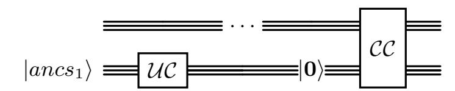

We can replace it with:

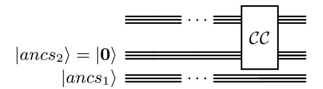

The number of qubits in |ancs2⟩ is equal to that in |ancs1⟩. The replacement severs the relatedness between UC and CC.

We cannot assert that removing the UC shown in Lemma [1](#page-7-0) is necessarily a better choice, but at least we reduce the number of gates at the expense of qubit growth. The circuit depth may not necessarily be reduced, since it depends on whether there is a CC∗ before CC whose execution period overlaps at least partly with that of UC. Namely, if the following relationship holds between UC, CC∗ , and CC, we cannot obtain a reduction in depth by removing UC.

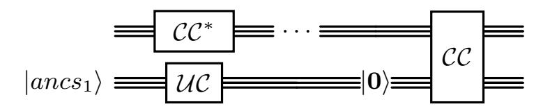

Fig. 3: The scenario in which we can keep UC for qubit reuse, since removing UC does not reduce the depth

1 [\[JNRV20\]](#page-13-0) also considers a similar situation, but they choose to use a low-width estimator.

{8}------------------------------------------------

Case: After

**Lemma 2.** If some UC is performed after all related CCs, then the removal of UC yields a simpler circuit.

*Proof.* The proof is trivial. If the latest  $\mathcal{CC}$  ends at time step  $t_1$  and  $\mathcal{UC}$  starts at time step  $t_2$ , where  $0 \le t_1 \le t_2 \le \mathcal{T}$ , there must be at least one gate of  $\mathcal{UC}$  at step  $t_2$ . By removing  $\mathcal{UC}$ , we obtain a simpler circuit.

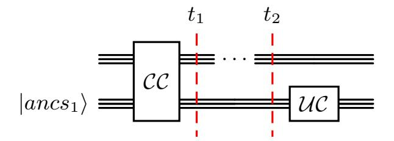

Eliminating all UCs in this case reduces the number of gates and may also reduce the circuit depth (because a scenario similar to the one in Fig. 3 could happen). However, is it possible for the related computation and uncomputation to be performed simultaneously?

Case: Simultaneously Now we consider the scenario where, while a CC completes its task, the related UC also happens to restore the relevant ancillas at the same time. One may assume that all circuits are composed of gates from a universal quantum gate set  $\{H, T, CNOT\}$  [BMP+99]. We construct a proof of Lemma 3 based on this universal gate set. It is worth noting that proofs based on other universal gate sets will also lead to the same conclusion; otherwise, we would obtain contradictory results with the Solovay-Kitaev theorem [DN06] 2.

In the following, we use superscripts to indicate the time span of a component. For example,  $\mathcal{UC}^{[t_s,t_c]}$  is a UC from step  $t_s$  to  $t_c$ . For example,  $\mathcal{CC}^{t_s}$  is a CC that starts and ends at step  $t_s$ . The subscript of a component denotes the qubits on which the component acts. For example,  $\mathcal{CC}_{x}^{t_{s}}$  is a CC that starts and ends at step  $t_s$ , working on qubits  $|x\rangle$ . The subscript of qubits  $|x\rangle$  denotes the time to which the state corresponds. For example,  $|x_t\rangle$  is the quantum state of  $|x\rangle$  at step t.

**Lemma 3.** For some related  $\mathcal{UC}^{[t_s,t_c]}$  and  $\mathcal{CC}^{[t_s,t_c]}$  performed simultaneously, we can find subcomponents  $\mathcal{CC}_x^{t_c}$  and  $\mathcal{UC}_y^{t_c}$ , where  $|x\rangle$  and  $|y\rangle$  are two single qubits, such that:

- (i)  $\mathcal{CC}_x^{t_c}$  and  $\mathcal{UC}_y^{t_c}$  are not related, or (ii)  $(\mathcal{CC}_x^{t_c}, \mathcal{UC}_y^{t_c})$  is an indivisible component, and (1)  $|x_{t_c-1}\rangle$  and  $|x_{t_c}\rangle$  are different but statistically equivalent according to measurements in basis  $\{|0\rangle, |1\rangle\}$ , or

 $^2$  The Solovay-Kitaev theorem [Kit97] asserts that any single-qubit unitary operation can be efficiently approximated to arbitrary accuracy using a sequence of gates from a fixed and finite gate set, with the number of gates scaling polylogarithmically with the inverse of the accuracy error. This work [DN06] generalizes the theorem to the case of multi-qubit unitary operations.

{9}------------------------------------------------

(2) 
$$(\mathcal{CC}_x^{t_c}, \mathcal{UC}_y^{t_c})$$
 is redundant.

Remark 3. We can remove  $\mathcal{UC}_y^{t_c}$  in case (i) and (ii. 2), but we have to resolve an disputation in (ii. 1) before we remove any component.

*Proof.* For a certain main qubit  $|x\rangle$  and a certain ancilla qubit  $|y\rangle$ ,  $\mathcal{UC}_y^{t_c}$  and  $\mathcal{CC}_x^{t_c}$  can appear only in one of three distinct configurations:

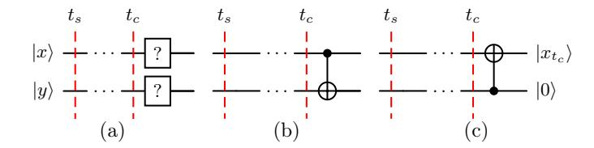

For configuration (a), the question-mark-gate ? can refer to H, T or I. Apparently,  $\mathcal{UC}_y^{t_c}$  and  $\mathcal{CC}_x^{t_c}$  are not related.

For the remaining two cases, we need to specify the corresponding linear algebra representation. We naturally take  $\{|0\rangle, |1\rangle\}$  as the basis. First, let  $|x_{t_{c-1}}\rangle$  and  $|y_{t_{c-1}}\rangle$  represent the states of qubits  $|x\rangle$  and  $|y\rangle$  at step  $t_{c-1}$ , respectively. Thus, we have  $|x_{t_{c-1}}y_{t_{c-1}}\rangle = p_{00}|00\rangle + p_{01}|01\rangle + p_{10}|10\rangle + p_{11}|11\rangle = (p_{00}, p_{01}, p_{10}, p_{11})$ . The same applies to quantum states at other time steps.

In configuration (b), although  $\mathcal{UC}_y^{t_c}$  and  $\mathcal{CC}_x^{t_c}$  are inseparable, we use  $|\mathcal{CC}_x^{t_c}(x_{t_c-1})\rangle$  to emphasize that the state  $|x_{t_c-1}\rangle$  is evolving via  $\mathcal{CC}_x^{t_c}$ . We have

$$CNOT | x_{t_{c}-1}y_{t_{c}-1} \rangle$$

$$= \begin{pmatrix} 1 & 0 & 0 & 0 \\ 0 & 1 & 0 & 0 \\ 0 & 0 & 0 & 1 \\ 0 & 0 & 1 & 0 \end{pmatrix} \begin{pmatrix} p_{00} \\ p_{01} \\ p_{10} \\ p_{11} \end{pmatrix}$$

$$= \begin{pmatrix} p_{00} \\ p_{01} \\ p_{11} \\ p_{10} \end{pmatrix}$$

$$= | \mathcal{CC}_{x}^{t_{c}}(x_{t_{c}-1}), 0 \rangle$$

which indicates  $p_{01}=0$  and  $p_{10}=0$ . Thus,  $|x_{t_c-1}y_{t_c-1}\rangle=(p_{00},0,0,p_{11})$ . Provided perfect measurements, any local measurement in the basis  $\{|0\rangle,|1\rangle\}$  on  $|CC_x^{t_c}(x_{t_c-1})\rangle=|x_{t_c}\rangle$  and  $|x_{t_c-1}\rangle$  is statistically indistinguishable. Namely, one can think of  $|x_{t_c}\rangle=|x_{t_c-1}\rangle$  as holding classically. However, the CNOT gate certainly changes the measurement results of the control qubit in some other bases (such as  $\{|+\rangle,|-\rangle\}$ ), and such bases are all superposition bases, which means they are quantum-specific. For example, consider  $\{|+\rangle,|-\rangle\}$  on states  $|x_{t_{c-1}}y_{t_{c-1}}\rangle=p_{00}|00\rangle+p_{11}|11\rangle=(p_{00},0,0,p_{11})$  and  $|x_{t_c}y_{t_c}\rangle=p_{00}|00\rangle+p_{11}|10\rangle=(p_{00},0,p_{11},0)$ . We show that they are different under the measurement in basis  $\{|-\rangle,|+\rangle\}$ , where  $|-\rangle=\frac{1}{\sqrt{2}}|0\rangle-\frac{1}{\sqrt{2}}|1\rangle,|+\rangle=\frac{1}{\sqrt{2}}|0\rangle+\frac{1}{\sqrt{2}}|1\rangle$ .

{10}------------------------------------------------

First, we have:

$$\begin{aligned} & \left| x_{t_{c-1}} y_{t_{c-1}} \right\rangle \\ &= p_{00} \left| 00 \right\rangle + p_{11} \left| 11 \right\rangle \\ &= p_{00} \left| 00 \right\rangle + p_{11} \left| 11 \right\rangle \\ &+ \frac{1}{2} (p_{11} \left| 01 \right\rangle + p_{00} \left| 10 \right\rangle) + \frac{1}{2} (-p_{11} \left| 01 \right\rangle - p_{00} \left| 10 \right\rangle) \end{aligned}$$

$$= \frac{1}{2} (p_{00} |00\rangle + p_{11} |01\rangle + p_{00} |10\rangle + p_{11} |11\rangle) + \frac{1}{2} (p_{00} |00\rangle - p_{11} |01\rangle - p_{00} |10\rangle + p_{11} |11\rangle) = \frac{1}{\sqrt{2}} |+\rangle (p_{00} |0\rangle + p_{11} |1\rangle) + \frac{1}{\sqrt{2}} |-\rangle (p_{00} |0\rangle - p_{11} |1\rangle).$$

By a similar trick, we have:

$$|x_{t_c}y_{t_c}\rangle = p_{00} |00\rangle + p_{11} |10\rangle = \frac{1}{\sqrt{2}} |+\rangle (p_{00} + p_{11}) |0\rangle + \frac{1}{\sqrt{2}} |-\rangle (p_{00} - p_{11}) |0\rangle.$$

The probabilities of measuring  $|x_{t_{c-1}}y_{t_{c-1}}\rangle$  and  $|x_{t_c}y_{t_c}\rangle$  to  $|+\rangle$  are  $\frac{1}{2}(|p_{00}|^2+|p_{11}|^2)$  and  $\frac{1}{2}(|p_{00}+p_{11}|^2)$  respectively. Therefore, we have the following assertions:

- (b. i) If we always use the basis  $\{|0\rangle, |1\rangle\}$ , then  $\mathcal{CC}_x^{[t_s, t_c-1]}$  is equivalent to  $\mathcal{CC}_x^{[t_s, t_c]}$ . Formally, the following equation holds:  $\left|\mathcal{CC}_x^{[t_s, t_c-1]}(x_{t_s})\right\rangle = |x_{t_c-1}\rangle \stackrel{statistically}{=} |x_{t_c}\rangle = \left|\mathcal{CC}_x^{[t_s, t_c]}(x_{t_s})\right\rangle$ . It means that the CNOT gate in (b) is only a UC in a literal sense, or we can think of it as redundant. This corresponds to case (ii. 1) in the Lemma, and we can remove  $(\mathcal{CC}_x^{t_c}, \mathcal{UC}_y^{t_c})$ .
- (b. ii) If the phase change of  $|x\rangle$  is what we want, then in configuration (b) we indeed complete both the computation task and the restoration of the ancilla  $|y\rangle$ . It means that we will use a phase-sensitive basis in the subsequent evaluation. This corresponds to case (ii. 1) in the Lemma, but we cannot remove  $(\mathcal{CC}_x^{t_c}, \mathcal{UC}_y^{t_c})$ .

{11}------------------------------------------------

In configuration (c), we have:

$$CNOT_{reverse} | x_{t_{c}-1} y_{t_{c}-1} \rangle$$

$$= \begin{pmatrix} 1 & 0 & 0 & 0 \\ 0 & 0 & 0 & 1 \\ 0 & 0 & 1 & 0 \\ 0 & 1 & 0 & 0 \end{pmatrix} \begin{pmatrix} p_{00} \\ p_{01} \\ p_{10} \\ p_{11} \end{pmatrix}$$

$$= \begin{pmatrix} p_{00} \\ p_{11} \\ p_{10} \\ p_{01} \end{pmatrix}$$

$$= | \mathcal{CC}_{x}^{t_{c}}(x_{t_{c}-1}), 0 \rangle$$

which indicates  $p_{11} = 0$  and  $p_{01} = 0$ . Thus,  $|x_{t_c-1}y_{t_c-1}\rangle = (p_{00}, 0, p_{10}, 0)$ . However,  $|\mathcal{CC}_x^{t_c}(x_{t_c-1}), 0\rangle = (p_{00}, 0, p_{10}, 0) = |x_{t_c-1}y_{t_c-1}\rangle$ . This means that the CNOT gate in (c) is physically meaningless for both computation and uncomputation. This corresponds to case (ii. 2) in the lemma.

In fact, the subcomponents described in Lemma 3 are just the gates from  $\{H, T, CNOT\}$ . We can easily build an automation program, starting from layer  $t_c$  and moving backwards to  $t_s$ , to remove each UC gate that is (i) not related to any CC gate or (ii) related to a redundant CC gate.

Formal Definitions and Proof While proving Lemma 3, we find that the informal definition of CC cannot capture some rare situations. Here we give the formal definitions of both CC and UC, given some of the main qubits  $|\boldsymbol{x}\rangle$ , ancilla qubits  $|\boldsymbol{y}\rangle \stackrel{init.}{\leftarrow} |\mathbf{0}\rangle$ , and some  $0 < t_s < t_c < \mathcal{T}$ :

**Definition 3.** (Computation component). A component  $C^{[t_s,t_c]}$ , such that  $C(|x_{t_s}y_{t_s}\rangle) = |x_{t_c}y_{t_c}\rangle$ , is a computation component, abbreviated as CC.

**Definition 4.** ((Ancilla) Uncomputation component). A component  $C^{[t_s,t_c]}$ , for any intermediate state  $|\mathbf{x_{t_s}y_{t_s}}\rangle$ , such that  $C(|\mathbf{x_{t_s}y_{t_s}}\rangle) = |\mathbf{x_{t_c}}\rangle |\mathbf{0}\rangle$ , is an uncomputation component, abbreviated as UC.

The extreme case, namely when some  $(\mathcal{CC}, \mathcal{UC})$  is an inseparable gate that performs computation and uncomputation, can be captured by the definitions above. Also, definitions imply that UCs are a special kind of CCs. We naturally give the definition of computation-only component:

**Definition 5.** (Computation-only component). A component C is a computation-only component if it is a CC but not a UC, abbreviated as COC.

**Theorem 2.** (Removal Theorem in Computational Basis) For a target function f and a circuit  $U_f$ , where  $U_f | \mathbf{x} \rangle | \mathbf{0} \rangle^{\otimes |\mathbf{y}|}$ =  $|f(\mathbf{x}), garbage \rangle | \mathbf{0} \rangle^{\otimes |\mathbf{y} - garbage|}$ , if  $\{|0\rangle, |1\rangle\}$  is the only basis adopted in the computation task of f, then we can remove all individual UCs and inseparable (UC, CC)s from  $U_f$ , i.e. we get a new  $U'_f$  such that  $U'_f | \mathbf{x} \rangle | \mathbf{0} \rangle = |f(\mathbf{x}), garbage \rangle$ . 

{12}------------------------------------------------

Proof. This theorem follows by a case analysis combining Lemma [1,](#page-7-0) [2,](#page-8-0) and [3.](#page-8-1)

Thus, we have demonstrated the feasibility of removing the ancilla uncomputation circuits. However, the estimated performance improvement depends on the specific FFQC implementation. In Appendix [B,](#page-14-0) we show how to apply our method to the FFQCs of AES (an encryption algorithm).

# 5 Conclusion

We propose a method to transform an arbitrary FFQC into a low-depth Grover oracle. We justify the rationality and necessity of this transformation and present the procedure for applying this method to quantum circuits of AES. This further demonstrates that quantum circuits constructed for Grover search have different optimization objectives from those constructed for general computation.

# References

- BMP+99. P.O. Boykin, T. Mor, M. Pulver, V. Roychowdhury, and F. Vatan. On universal and fault-tolerant quantum computing: a novel basis and a new constructive proof of universality for shor's basis. In 40th Annual Symposium on Foundations of Computer Science, pages 486–494, 1999.
- Cre25. Stefan Creemers. Speeding up grover's algorithm. European Journal of Operational Research, 326(1):13–27, 2025.
- CTM+22. Y. Chew, T. Tomita, T. P. Mahesh, S. Sugawa, S. de Léséleuc, and K. Ohmori. Ultrafast energy exchange between two single rydberg atoms on a nanosecond timescale. Nature Photonics, 16(10):724–729, August 2022.
- DN06. Christopher M. Dawson and Michael A. Nielsen. The solovay-kitaev algorithm. Quantum Info. Comput., 6(1):81–95, January 2006.
- DWH+20. Yongshan Ding, Xin-Chuan Wu, Adam Holmes, Ash Wiseth, Diana Franklin, Margaret Martonosi, and Frederic T. Chong. Square: Strategic quantum ancilla reuse for modular quantum programs via cost-effective uncomputation. In 2020 ACM/IEEE 47th Annual International Symposium on Computer Architecture (ISCA), page 570–583. IEEE, May 2020.
- GLRS16. Markus Grassl, Brandon Langenberg, Martin Roetteler, and Rainer Steinwandt. Applying Grover's algorithm to AES: Quantum resource estimates. In Tsuyoshi Takagi, editor, Post-Quantum Cryptography - 7th International Workshop, PQCrypto 2016, pages 29–43. Springer, Cham, 2016.
- Gro96. Lov K. Grover. A fast quantum mechanical algorithm for database search, 1996.
- HVP+24. Eric Hyyppä, Antti Vepsäläinen, Miha Papič, Chun Fai Chan, Sinan Inel, Alessandro Landra, Wei Liu, Jürgen Luus, Fabian Marxer, Caspar Ockeloen-Korppi, Sebastian Orbell, Brian Tarasinski, and Johannes Heinsoo. Reducing leakage of single-qubit gates for superconducting quantum processors using analytical control pulse envelopes. PRX Quantum, 5(3), September 2024.
- JBK+25. Kyungbae Jang, Anubhab Baksi, Hyunji Kim, Gyeongju Song, Hwajeong Seo, and Anupam Chattopadhyay. Quantum analysis of AES. CiC, 2(1):25, 2025.

{13}------------------------------------------------

JNRV20. Samuel Jaques, Michael Naehrig, Martin Roetteler, and Fernando Virdia. Implementing Grover oracles for quantum key search on AES and LowMC. In Anne Canteaut and Yuval Ishai, editors, EUROCRYPT 2020, Part II, volume 12106 of LNCS, pages 280–310. Springer, Cham, May 2020.

Kit97. A Yu Kitaev. Quantum computations: algorithms and error correction. Russian Mathematical Surveys, 52(6):1191, dec 1997.

OJS25. Yujin Oh, Kyungbae Jang, and Hwajeong Seo. Quantum security evaluation of ASCON. Cryptology ePrint Archive, Report 2025/260, 2025.

SKI+22. Y. Sunada, S. Kono, J. Ilves, S. Tamate, T. Sugiyama, Y. Tabuchi, and Y. Nakamura. Fast readout and reset of a superconducting qubit coupled to a resonator with an intrinsic purcell filter. Physical Review Applied, 17(4), April 2022.

Zal99. Christof Zalka. Grover's quantum searching algorithm is optimal. Phys. Rev. A, 60:2746–2751, Oct 1999.

ZWS+20. Jian Zou, Zihao Wei, Siwei Sun, Ximeng Liu, and Wenling Wu. Quantum circuit implementations of AES with fewer qubits. In Shiho Moriai and Huaxiong Wang, editors, ASIACRYPT 2020, Part II, volume 12492 of LNCS, pages 697–726. Springer, Cham, December 2020.

# A Runtime estimation of measurement-and-reset hybrid method

In Fig. [4,](#page-13-5) the AND gate and AND† gate from [\[JNRV20\]](#page-13-0) are used as substitutes for the Toffoli (CCX) gate and its inverse to reduce circuit depth. We present a rough runtime estimate for AND† based on the latest results. On a superconducting platform, a CZ gate can reach 6.5ns [\[CTM](#page-12-6)+22], a single-qubit gate can reach 6.25ns [\[HVP](#page-12-7)+24], and a readout-and-reset operation can reach 140ns [\[SKI](#page-13-6)+22]. The proposed measurement-based AND† (140ns) can replace four layers of CNOT gates (4 × (6.25 + 6.25 + 6.5) = 76ns), where each CNOT is decomposed into two Hadamard gates and one CZ gate, as well as two layers of single-qubit gates (12.5ns). This leaves a 51.5ns time penalty compared with a purely quantum AND† gate.

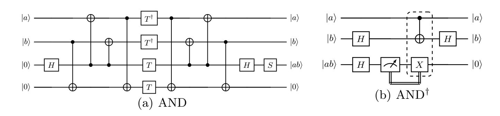

Fig. 4: AND gate and measurement-based AND† from [\[JNRV20\]](#page-13-0)

{14}------------------------------------------------

### B Apply our method to quantum circuits of AES

For the quantum circuits of AES, we discuss how to apply our method to representative architectures and analyze where it is applicable. We confine our discussion to a high-level examination of two AES encryption architectures: 1) zig-zag and 2) pipeline. In the first step, we demonstrate how the zig-zag architecture can be transformed into the pipeline architecture to reduce circuit depth by applying the techniques described in our lemmas. Finally, we apply the second step to the current lowest-depth AES-128 quantum circuit to further reduce the width.

Initial FFQC: Zig-zag Architecture The zig-zag architecture for AES was first used in [GLRS16]. We use AES-128 as a representative example. It has 10 rounds of round functions, which must be executed in sequence. The zig-zag architecture employs a compute-and-restore approach to reuse qubits, for example, by restoring the previous round while computing the current one. However, the basic zig-zag version is a compromise that favors neither width reduction nor depth reduction. Thus, we consider the version improved by [ZWS+20].

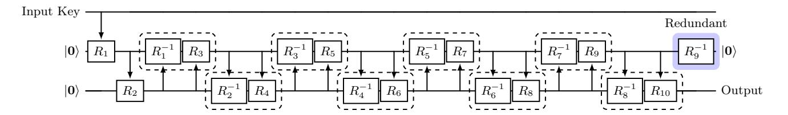

Fig. 5: Zig-zag architecture for AES-128 [ZWS+20]

One can see that the circuits shown in Fig. 5 correspond to the computation part f of the Grover oracle. According to our discussion, we do not need to uncompute the ancillas at the final stage. For the zig-zag architecture, although there is mutual interaction between  $R_9^{-1}$  and  $R_{10}$ , Lemma 2 implies that we can at least remove part of  $R_9^{-1}$  to reduce the overall oracle depth by  $2 \times 62 = 114$  (see Fig. 5 and Algorithm 7 in [ZWS+20]). In fact, they do not provide the circuit depth of their Grover oracle, nor do they emphasize that their circuit is designed for Grover search. Instead, we believe that their implementation is better suited to general encryption tasks.

Step 1: Removing All Uncomputation Yields a Pipeline We show how to apply the first step of our method to transform the zig-zag architecture into a pipeline architecture. As shown in Fig. 6, we can apply Lemma 1 to the zig-zag architecture in Fig. 5 iteratively to obtain a pipeline architecture.

The current lowest-depth quantum circuit for AES-128, reported in [JBK+25], has depth 647 in terms of Toffoli gates. They not only adopted a pipeline architecture to construct the Grover oracle for AES, but also applied the same

{15}------------------------------------------------

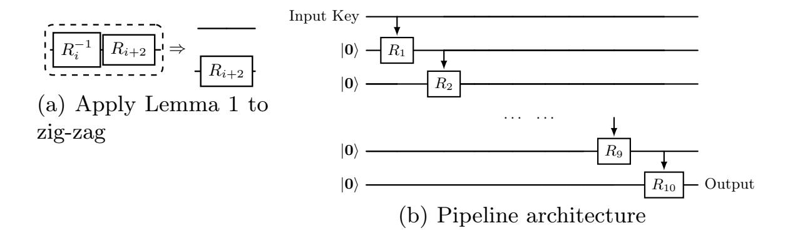

Fig. 6: How the zig-zag architecture becomes a pipeline by Lemma 1

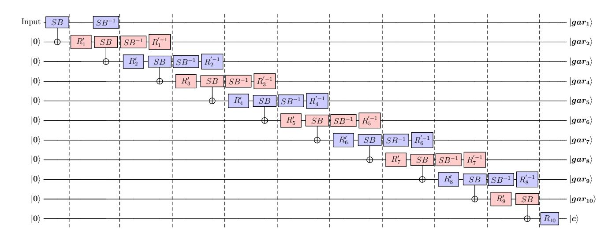

Fig. 7: A pipeline with less width than the one in [JBK+25]. Here  $SB \cdot R'_i = R_i$  and  $R'_i^{-1} \cdot SB^{-1} = R_i^{-1}$ 

approach of trading width for depth to both the linear and nonlinear components of AES. Once the depth could no longer be reduced, they further adopted a strategy of parallelizing UCs and CCs to reduce the width while maintaining the same depth.

Width We show how to apply the second step to reduce width while staying at the same depth. As the name suggests, this step is a trade-off between fewer gates and lower width. [JBK+25] tried to parallelize the UCs and CCs in a way that preserves depth (their shallow and low-depth implementations). One can recall this scenario by referring to Fig. 3. In fact, to achieve the lowest depth, there is no need to remove all UCs; on the contrary, UCs help us maintain a relatively low width. Here, we propose a slightly different strategy that reduces their circuit width from 7280 to 7104 while preserving its depth. We recommend that the reader consult Fig. 7(b) of [JBK+25] for comparison.

We use the pipeline architecture adopted in [JBK+25] with a depth-preserving modification; thus, the circuit depth is the same as theirs. To see why, all the subcircuits between the slices can be executed simultaneously, i.e.,  $dep(R_i^{'-1}$ .

{16}------------------------------------------------

 $SB^{-1}$ ) =  $dep(SB \cdot R'_{i+1})^3$ . We also use the same implementation of their low-depth SB (SubBytes) and  $R'_i$  (the linear component consisting of ShiftRows and MixColumns), as well as the Key Schedule. However, our modification changes how restored ancillas are redistributed.

Starting from i = 1,  $SB \cdot R'_{i+2}$  uses the ancillas restored by  $R'_{i}^{-1} \cdot SB^{-1}$ . The number of qubits can be computed in three parts:

- Two independent sets of ancillas are shared, each consisting of  $144 \times 16$  (SubBytes) plus  $64 \times 4$  (MixColumns), for a total of  $2560 \times 2 = 5120$  ancillas.
- From the input stage through  $R'_1$  to  $R'_9$ , each stage requires its own 128 ancillas, adding up to 1280.  $R_{10}$  can reuse the ancillas restored by  $R_8^{'-1} \cdot SB^{-1}$  (where 144+64 = 208 are restored), and therefore does not require additional qubits.
- Their KeySchedule uses 128 main qubits plus  $144 \times 4$  ancillas for SubWords, totaling 704 qubits.

To sum up, 5120 + 1280 + 704 = 7104, which is the width of the AES-128 quantum circuit. It is worth mentioning that the circuit we just estimated actually corresponds to the target function F rather than the f in the Grover oracle. A true implementation of f would also require two more qubits. One is for the comparison circuit, which typically incurs just one extra qubit (in the ancilla-free implementation) and substantially increases the circuit depth. However, by convention (see the investigation in Section 7 of [JBK+25]), these costs are omitted when evaluating AES-128 implementations. The second is used to mark the target states.

&lt;sup>3 This is because the Identity, X, CNOT, Toffoli, and Swap gates used to build AES-128 are all Hermitian.