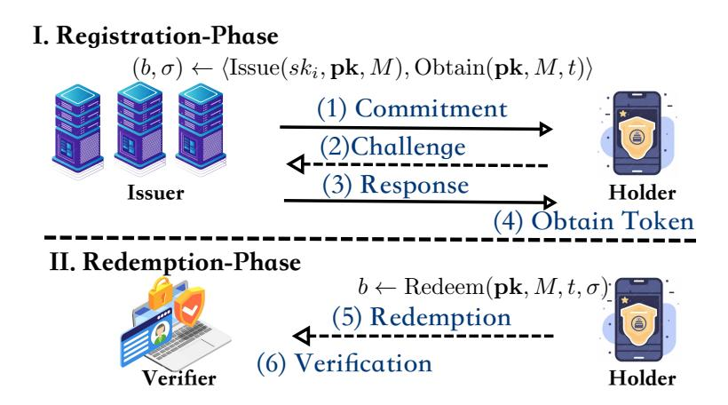
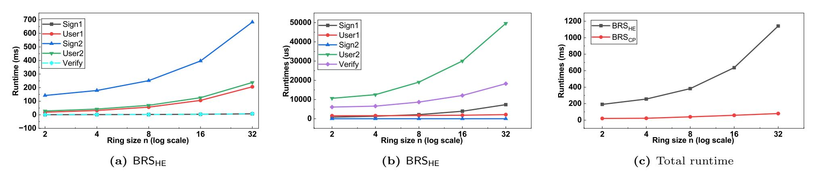

{0}------------------------------------------------

# <span id="page-0-1"></span>iToken: One-Time-Use Anonymous Token with Issuance Hiding

Zengpeng Li<sup>1</sup> , Xiangyu Su<sup>2</sup> , Dongfang Wei<sup>1</sup> , Guangyu Liao<sup>3</sup> , and Mei Wang<sup>1</sup>

> <sup>1</sup> School of Cyber Science and Technology, Shandong University 2 Institute of Science Tokyo <sup>3</sup> Harbin Engineering University

Abstract. Privacy-Enhancing Know Your Customer (KYC) integrates one-time-use anonymous tokens (OTATs) into self-sovereign identity frameworks, such as the EU Digital Identity (EUDI) Wallet, Apple's Private Access Tokens, and W3C's Privacy-Preserving Advertising proposals (e.g., Private State Tokens), to enable regulatory compliance while preserving user anonymity. To mitigate targeted denial-of-service (DoS) attacks and prevent token misuse (e.g., farming and replay), this paper designs a new OTAT, iToken, that first achieves issuer hiding not only at verification but also throughout issuance, thereby strengthening both OTAT's resilience and user privacy.

We introduce a new primitive, a canonical blind ring signature (BRS), that adopts a blind-and-ring pattern, ensuring the ring structure is present from the outset and is initiated by the signer within the interactive blind signing protocol. We also provide two generic constructions, one from a linear function (LF) and homomorphic encryption, and another from an LF and a commit-and-prove sum argument. We finally prototype BRS and iToken, achieving efficient signing bandwidth and competitive computational performance.

Keywords: Anonymous Token, Blind Ring Signature, Authorization

# 1 Introduction

A one-time-use anonymous token (OTAT) can indeed be viewed as a specialized, lightweight instance of anonymous credentials, since only one attribute is signed, as depicted in [Figure 1.](#page-0-0) Real-world OTAT applications are deployed incrementally, such as Privacy Pass [\[20\]](#page-19-0) for anonymous authentication (used by Cloudflare, Google, and Apple) and Payment tokens (e.g., Apple Pay's DPAN). While anonymous tokens and credentials (e.g., in EUDI Wallet and mDLs) offer strong privacy in theory, real-world deployments have exposed practical vulnerabilities, side-channel risks, and design trade-offs. There are issuer centralization risks and token-specific attacks examples: (i) single– point correlation, i.e., even if tokens/credentials are anonymous, the issuer knows who got which token/credential; (ii) weak issuance protocols, i.e., some pilots use non-blind issuance (e.g., plain JWTs signed by issuer), breaking unlinkability from the start; (iii) token reuse (double-spending), i.e., if token redemption isn't atomically tied to consumption (e.g., no trusted ledger or server-side dedup), tokens can be reused in Privacy-Pass, fixed in IETF RFC9494; (iv) and token farming, i.e., attackers create many fake identities (e.g., burner phones and temporary eIDs) and collect many tokens, then use these tokens to bypass rate limits or gatekeeping (e.g., "verified user" forum access).



Fig. 1: Illustration of OTAT Protocol

<span id="page-0-0"></span>Privacy Pass (the most iconic OTAT) can be deployed alongside authorization systems such as OAuth 2.0 [\[20\]](#page-19-0), and it can significantly improve token unlinkability and attribute blindness, helping to mitigate risks such as token farming and cross-context tracking [\[36,](#page-20-0)[51,](#page-20-1)[17,](#page-19-1)[2,](#page-18-0)[28\]](#page-19-2). To our knowledge, there is only one concrete OTAT 

{1}------------------------------------------------

instantiation with issuer hiding using Structure-Preserving Signatures of Equivalence Classes (SPS-EQ) [\[53\]](#page-21-0), and no further OTAT solutions for hiding issuers. Additionally, Bosk et al. [\[9\]](#page-19-3), Sanders-Trao´r [\[47\]](#page-20-2), Rosenberg et al. [\[46\]](#page-20-3), and Katz-Sefranek [\[34\]](#page-20-4) provided the concrete issuer-hiding anonymous credential instantiations. However, existing issuer-hiding solutions hide the issuer only during verification, not during issuance. As a result, adversaries may still conduct surveillance and covert data collection by leveraging issuer-based profiling (e.g., analyzing ZK proof transcripts, timestamps, and IP addresses), thereby enabling long-term reconstruction of users' activity patterns.

To mitigate token misuse, a natural approach is to ensure issuer anonymity while maintaining user privacy. This motivates the following question:

Is it possible to achieve issuer anonymity during the token issuance (not just at redemption)?

The answer is affirmative: we design an OTAT scheme that hides the issuer during both issuance and redemption while preserving blind token issuance. Below, we summarize our main contributions and provide overviews of the techniques.

## <span id="page-1-0"></span>1.1 Contributions

- Canonical Blind Ring Signature. To render the signer unobservable (even indistinguishable) while preserving blindness, we revisit a legacy yet comparatively underexplored cryptographic primitive: the blind ring signature (BRS). We develop a modern formalization that explicitly addresses concurrent security. We then present two generic constructions and provide a rigorous analysis of their correctness, unforgeability, signer-anonymity, and blindness.
- OTAT with Issuance Hiding. We present a new OTAT scheme (named iToken) to mitigate token misuse. iToken is built upon our designed BRS, in which multiple issuers form a resilient, collective ring. iToken achieves issuer anonymity during token issuance, not merely at verification, and effectively prevents single-point correlation and collusion among issuers. The security properties of one-more unforgeability, issuance hiding, and unlinkability are all rigorously guaranteed by the corresponding properties of the underlying BRS.
- Proof of Concept Performance Evaluation. We implement a prototype of BRS [1](#page-0-1) and conduct a comprehensive evaluation at two levels: microbenchmarks of the cryptographic BRS primitive within distributed environments with up to 32 ring members; and macrobenchmarks of the iToken protocol compared with existing OTATs. The performance of BRS demonstrates that our proposed iToken scheme achieves better computational and communication efficiency than state-of-the-art issuer-hiding alternatives.

## <span id="page-1-1"></span>1.2 Technical Overview

Most existing OTAT work focuses on user privacy, which requires that no malicious verifiers or issuers, even when colluding, can learn a user's private attribute (attribute blindness) or link the user/token to a specific issuance session (token unlinkability). The token misuse and targeted DoS attacks described above highlight the need for issuer-side privacy. Hence, we introduce the notion of issuance hiding, which requires that no malicious users or verifiers can determine which authority issued a given token, even if the adversary participates in the issuance session. A related issuer-hiding notion, concerning only the redemption (verification) phase, appears in the broader anonymous credentials literature. When user privacy is also considered, such solutions typically follow a blind-thenring pattern: the user first obtains a token (potentially in the form of a blind signature) from a single issuer and then wraps it into a ring defined over a designated set of public keys, usually accompanied by a set membership proof to certify the issuer's eligibility. That is, issuer privacy is achieved solely through user-side post-processing, leaving issuers exposed to malicious users during issuance, thereby enabling low-cost, targeted resource exhaustion, as well as issuer-based request correlation and user profiling. In contrast, aiming at an issuance hiding OTAT, we adopt the blind-and-ring pattern, where the ring structure is incorporated from the outset of the blind issuance protocol, thereby enforcing ring-based issuer privacy and user privacy jointly. This naturally leads us to use BRS schemes as the core building block. Building atop the solid foundation of canonical blind signatures [\[29\]](#page-19-4), we modernize the BRS formalization by introducing an explicit three-move structure that accounts for concurrent security. This modification carries over to OTAT: we adopt a three-move, issuer-initiated issuance protocol rather than the twomove, user-initiated protocol found in the literature. The resulting iToken scheme is constructed directly from a BRS scheme, with its security guarantees derived accordingly.

<sup>1</sup> We will open-source iToken upon publication.

{2}------------------------------------------------

We now provide a high-level overview of our BRS construction. Our starting points are the linear function (LF) family-based canonical blind signature scheme [29] and the Type-T\* DualRing framework [57]. Although both primitives share a three-move commitment-challenge-response structure, a naïve composition fails to simultaneously ensure unforgeability and blindness while preserving signer-anonymity. Indeed, in [29], the challenge is formed as  $c' = c + \beta$ , where the pseudo challenge c is derivable from the published signature components and  $\beta$  is the blinding factor. Adapting this mechanism to the ring setting with n members requires the signer to sample n-1 "dummy" challenges and compute its own challenge s.t. their sum equals c'. Consequently, ensuring blindness by hiding either  $\beta$  or c' without a sufficient binding relation between the two enables forgery, due to the linearity of the summation.

To address this tension, we develop two generic constructions:  $\mathsf{BRS}_{\mathsf{HE}}$  from an LF family and a homomorphic encryption (HE) scheme (Section 3.2), and  $\mathsf{BRS}_{\mathsf{CP}}$  from an LF and a commit-and-prove (CP) sum argument protocol (Section 3.3). We then provide concrete instantiations of these primitives (in Section 3.4).

In BRS<sub>HE</sub>, the user samples a set of per-member blinding factors  $\{\beta_j\}_{j\in[n]}$  and binds their sum  $\beta=\sum_{j\in[n]}\beta_j$ into the hash that derives c (and hence  $c' = c + \beta$ , since  $\beta$  is eventually revealed in the signature). It then encrypts, using HE, all elements of  $(\{\beta_j\}_{j\in[n]},c')$  and sends only the resulting ciphertexts to the signer. The signer leverages the homomorphic property of HE to combine ciphertexts and derive the encrypted challenge corresponding to its own index, and subsequently computes the response without decrypting any intermediate values. Notably, the HE-based construction preserves the exact ring signature structure throughout the signing process. This structural transparency facilitates further exploration and refinement of the ring component itself. Leveraging linear identities among artifacts in BRS<sub>HE</sub>, our BRS<sub>CP</sub> construction collapses the per-member blinding factors into a single aggregate  $\beta$ . Fixing an index l deterministically derived from the ring, the blinding is encoded by assigning  $\beta_l = \beta$ , and  $\beta_i = 0$ for all  $j \neq l$ . Since we allow the signer to receive c' in the clear during the signing process,  $\beta$  must not be revealed in the final signature. To prevent message-substitution forgeries that arise when the blinding is left unbound, BRS<sub>CP</sub> commits  $\beta$  to  $R_{\beta}$  and binds  $R_{\beta}$  into the hash that derives c. The deterministic placement of the blinding factor breaks the direct per-index alignment between  $c'_j$  and  $pk_j$  required for verification in DualRing [57] and preserved by  $\mathsf{BRS}_{\mathsf{HE}}.$  Nevertheless, we observe that the sum argument relation underpinning the efficient, logarithmic-size DualRing variant [57] remains intact. Therefore, we follow the CP paradigm and augment this relation with  $R_{\beta}$ . The resulting BRS<sub>CP</sub> inherits the same asymptotic efficiency benefits.

Finally, we note that the three-move structure underlying BRS inherits a concurrency-related reduction limitation stemming from the ROS problem [29,23,7,32]. Concretely, the unforgeability guarantee is most meaningful when the number of concurrently opened signing sessions is polylogarithmic in the security parameter. In practice, the ring setting supports higher effective concurrency by obscuring the actual signer within each session, and this can be further secured by requiring signers to manage concurrent signing sessions in a stateful manner. In the literature, there are generic concurrency-boosting transforms [33,15] and blind Schnorr variants designed to avoid the ROS-incurred limitation [52,19]. Building on the latter, we observe that both our HE-based and CP sum argument-based techniques are compatible with such a foundation, which motivates our construction BRS<sub>1</sub> (Section 3.5).

## <span id="page-2-0"></span>1.3 Related Works

As shown in Table 1, a broad range of OTAT schemes have been proposed following Privacy Pass, including blind signatures [36], equivalence-class signatures [53], and algebraic MACs [17]. These schemes can be categorized based on whether token verification is public or private, depending on whether the issuer and the verifier are distinct parties (public verification [8]) or the same entity (private verification [36]). Another line of work allows metadata to be included in tokens, which may be either public (e.g., revocation information or usage policies [50]) or private (e.g., hidden flags used for abuse detection or access control [36]).

Issuer-Hiding OTATs. To mitigate targeted DoS attacks and improve token unlinkability, a range of OTAT solutions was proposed incrementally, from Privacy-Pass with a private metadata bit (PMB) to an issuer-hiding approach. The PMB-approach embeds a PMB into tokens and enables the issuer to support its fraud-detection mechanisms [36,4]. PMB-hiding enables the verifier to reject marked tokens at verification time, thereby discouraging persistent malicious requests [17]. However, the issuer (authority server) remains exposed during token issuance; as a result, the PMB-hiding approach provides limited protection against targeted DoS attacks on the authorization server during issuance. Issuer-hiding OTATs aim to eliminate linkability to a single root of trust, mitigating risks such as DoS attacks targeting that root. Although practical anonymous credential systems with issuer-hiding capabilities have been deployed [9,46,47,34], only one concrete OTAT construction has so far achieved issuer hiding

{3}------------------------------------------------

<span id="page-3-0"></span>

| Schemes            | Moves PM PV IH |   |   | Tools |                             |  |  |
|--------------------|----------------|---|---|-------|-----------------------------|--|--|
| Privacy-Pass [20]  | 2              | ✗ | ✗ | ✗     | Oblivious PRF               |  |  |
| PMBT [36]          | 2              | ✗ | ✗ | ✗     | Okamoto–Schnorr             |  |  |
| PMBTB [36]         | 2              | ✗ | ✗ | ✗     | Blind Signature             |  |  |
| ATPM<br>[51]       | 2              | ✓ | ✗ | ✗     | Blind Signature             |  |  |
| ATP&PM [51]        | 2              | ✓ | ✗ | ✗     | Blind Signature             |  |  |
| ATPM&PV [51]       | 2              | ✓ | ✓ | ✗     | bilinear pairings           |  |  |
| ATHM [17]          | 2              | ✗ | ✗ | ✗     | Algebraic MAC               |  |  |
| HinToken-I<br>[53] | 2              | ✗ | ✗ | ✗     | Equivalence-Class Signature |  |  |
| iToken via BRSHE   | 3              | ✓ | ✓ | ✓     | LF and HE (modules p)       |  |  |
| iToken via BRSCP   | 3              | ✓ | ✓ | ✓     | LF and CP Sum Argument      |  |  |

Table 1: Comparison with Other Related OTAT Protocols.

at the verification phase [\[53\]](#page-21-0). To date, no OTAT solution provides issuer hiding during issuance, leaving the authorization infrastructure vulnerable to targeted resource exhaustion attacks.

Blind Signatures and Oblivious PRFs. Most existing OTAT constructions are built on (V)OPRFs or blind signatures, and only Karantaidou et al. [\[31\]](#page-20-9) equipped OTAT with a blind multisignature to support decentralized issuance. However, schemes based on blind Schnorr or Okamoto-Schnorr signatures do not naturally support concurrent token issuance. Blind signatures were introduced by Chaum [\[18\]](#page-19-10) to enable untraceable and unlinkable e-coins. Early schemes relied on factoring, until Camenisch et al. [\[11\]](#page-19-11) proposed the first discrete-log-based blind signature supporting message recovery. Mohammed et al. [\[39\]](#page-20-10) extended this line with a generalized ElGamal-based scheme producing distinct signatures for repeated signings. In contrast, Pointcheval et al. [\[44\]](#page-20-11) provided a provably secure Okamoto-Schnorr-based construction, which inspired our work. Moreover, existing public, verifiable anonymous token schemes primarily focus on protecting user privacy, while the privacy of issuers remains largely unaddressed.

Ring Signatures and Blind Ring Signatures. Ring signatures provide anonymity by enabling a signer to produce a signature on behalf of an arbitrary set of public keys without requiring any group setup or coordination among the members of the set [\[45\]](#page-20-12). A wide range of constructions has been proposed to: (i) improve efficiency [\[57\]](#page-21-1), e.g., by reducing signature size and verification cost; (ii) enhance security [\[38,](#page-20-13)[24\]](#page-19-12), e.g., through support for linkability, traceability, collusion resistance, and post quantum security [\[21,](#page-19-13)[56\]](#page-21-2); and (iii) extend functionality, e.g., via threshold, aggregate, and blind variants. Notably, the DualRing framework [\[57\]](#page-21-1) constructs two interlocking rings of commitments and challenges, enabling logarithmic-size signatures through an improved Bulletproofs-style argument system. However, blind signatures protect only the signer's privacy, while ring signatures provide anonymity only within a set of public keys; neither alone suffices when both anonymity and untraceability are required. To achieve both simultaneously, a blind ring signature (BRS) is introduced [\[16\]](#page-19-14) based on blind Schnorr (resp. Okamoto–Schnorr) signatures. Wu et al. [\[55\]](#page-21-3) later proposed a static blind ring signature with constant-size parameters under the extended ROS assumption.

These related works inspire us to design an OTAT scheme that provides strong privacy guarantees for both issuers and users. To this end, we design a new BRS building upon [\[29,](#page-19-4)[57\]](#page-21-1), which simultaneously achieves signeranonymity via the ring structure and blindness via blind signing. This combination is essential for constructing OTAT systems that support issuance hiding together with strong user privacy.

## <span id="page-3-1"></span>1.4 Potential Applications

In addition to mitigating token reuse and targeted DDoS attacks, we investigate expanding iToken to provide a single-use token to indicate authorization. We provide two useful applications and guide our subsequent work in the future:

– Authorization for AI Agent. AI agents typically authenticate via Long-lived API keys, OAuth 2.0 client credentials (machine-to-machine), or User-delegated tokens (e.g., access token with scopes like agent:write). In

<sup>\*</sup> We represent "public metadata" as "PM", "public verifiability" as "PV", "Issuance Hiding" as "IH". "Tools" mean "Building Blocks" for constructions.

<sup>\*</sup> We use a checkmark (i.e., ✓ ) to indicate that the scheme possesses a particular property, and a cross (i.e., ✗ ) to denote its absence.

{4}------------------------------------------------

particular, an AI agent needs to call backend APIs (e.g., data retrieval and tool use), and OAuth Client Credentials can be replaced with iToken. (i) User consents in the browser, and the frontend requests OTAT from the issuer ring. (ii) Issuer issues OTAT tied to scope, and sends the OTAT to the agent, who then uses it to call APIs. (iii) Verifier accepts OTAT if it is from the issuer ring, scope matches the request, and it has not been previously used.

- Authorization for Atomic Swaps. In standard HTLC-based atomic swaps, participants prove ownership of funds via cryptographic signatures (e.g., ECDSA), and there is no explicit "authorization" layer for who is allowed to initiate or participate in a swap. In an institutional DeFi setting, we need to ensure only eligible parties (e.g., KYC'd users, licensed agents) can swap, prevent Sybil attacks or spam swaps that congest chains, and hide participant identity to avoid front-running or profiling. Thus, iToken enables adding a layer of privacy-preserving, verifiable authorization without sacrificing decentralization or efficiency.

# <span id="page-4-1"></span>2 Preliminary

Notations. Let  $\lambda \in \mathbb{N}$  denote the security parameter.  $\mathsf{poly}(\cdot)$  and  $\mathsf{negl}(\cdot)$  denote a polynomial and a negligible function, respectively. PPT is short for probabilistic polynomial time. We use ":=" for deterministic assignment, "\( \infty\)" for assignment to an algorithm's output, and "\( \infty\)" for uniform random sampling. The integer range  $[a \ldots b]$  represents  $\{a, a+1, \ldots, b\}$ , [n] denotes  $[1 \ldots n]$ , and  $[n]_0$  denotes  $[0 \ldots n]$ . For a pair of algorithms  $\mathsf{Alg}_1$  and  $\mathsf{Alg}_2$ ,  $\langle \mathsf{Alg}_1, \mathsf{Alg}_2 \rangle$  denotes a potentially two-party interactive protocol.

(Pseudo) modules. Following the convention of [29], we say that a set R forms a module over a set M if R is a ring with multiplicative identity element  $1_R$ , M is an additive Abelian group, and there exists a mapping  $^2$ :  $R \times M \to M$  s.t. the following equations hold for all  $r, s \in R$  and  $x, y \in M$ : (1)  $r \cdot (x + y) = r \cdot x + r \cdot y$ ; (2)  $(r + s) \cdot x = r \cdot x + s \cdot x$ ; (3)  $(rs) \cdot x = r \cdot (s \cdot x)$ ; and (4)  $1_R \cdot x = x$ . Analogously, a set R forms a pseudo module over a set M if R and M are additive Abelian groups and there exists a mapping  $: R \times M \to M$  s.t.: for all  $r \in R$  and  $x, y \in M$ ,  $r \cdot (x + y) = r \cdot x + r \cdot y$ . Moreover, we write  $x - r \cdot y$  to denote  $x + (-r) \cdot y$  and  $x + r \cdot (-y)$  for the mapping applied to  $r \in R$  and  $-y \in M$ .

The following introduces the formal definitions of cryptographic primitives, including a linear function (LF) family, a homomorphic encryption (HE) scheme, a commitment scheme, and a non-interactive argument protocol. Assumptions underlying concrete instantiations are deferred to Section A.1.

## <span id="page-4-0"></span>2.1 Linear Function Family

Introduced in [3] and later refined by [29], an LF family consists of a tuple of algorithms  $\mathsf{LF} = (\mathsf{PGen}, \mathsf{F}, \Psi)$ .

- pp  $\leftarrow$  PGen(1 $^{\lambda}$ ): On input the security parameter  $\lambda$ , the parameter generation algorithm outputs public parameters pp, which implicitly define a scalar set  $\mathcal{S}$ , a domain  $\mathcal{D}$ , and a range  $\mathcal{R}$ . Moreover,  $\mathcal{D}$  and  $\mathcal{R}$  form pseudo modules over  $\mathcal{S}$  and  $|\mathcal{R}| \geq |\mathcal{S}| \geq 2^{2\lambda}$ . Since pp is taken by all following algorithms in LF, we omit it when the context is clear.
- $-z \leftarrow F(x)$ : On input a point  $x \in \mathcal{D}$ , the deterministic evaluation function returns  $z \in \mathcal{R}$ . For any pp  $\leftarrow PGen(1^{\lambda})$ , the following properties hold for  $F(\cdot)$ .
  - Pseudo module homomorphism: For all  $x, y \in \mathcal{D}$  and  $s \in \mathcal{S}$ ,  $F(s \cdot x + y) = s \cdot F(x) + F(y)$ .
  - Pseudo torsion-free element from the kernel: There exists  $x^* \in \mathcal{D} \setminus \{0\}$  such that (1)  $F(x^*) = 0$ , and (2) for all distinct  $s, s' \in \mathcal{S}$ ,  $s \cdot x^* \neq s' \cdot x^*$ , implying that  $F(\cdot)$  is a many-to-one mapping.
  - Smoothness: For any  $x \leftarrow_{\$} \mathcal{D}$ , F(x) is uniform over  $\mathcal{R}$ .
- $-x \leftarrow \Psi(y, s, s')$ : On input a point  $y \in \mathcal{R}$  and scalars  $s, s' \in \mathcal{S}$ , the deterministic distributor function outputs a point  $x \in \mathcal{D}$ . For all pp  $\leftarrow \operatorname{PGen}(1^{\lambda}), x \in \mathcal{D}$ , and  $s, s' \in \mathcal{S}$ , the following holds:

$$(s+s') \cdot F(x) = s \cdot F(x) + s' \cdot F(x) + F(\Psi(F(x), s, s')).$$

As noted in [29],  $\Psi$  acts as a *correction term* to treat pseudo modules as if the operation + over S distributes over R. Specifically, this work restricts to the case where  $\Psi$  is identically zero <sup>3</sup>, which implies that D and R form full-fledged modules with S. For security <sup>4</sup>, we recall the definition of collision resistance from [29].

<sup>&</sup>lt;sup>2</sup> We adopt the same inline fashion as [29], i.e.,  $r \cdot x$  instead of  $\cdot (r, x)$ .

<sup>&</sup>lt;sup>3</sup> The rationale behind this restriction is provided in Remark 2.

<sup>&</sup>lt;sup>4</sup> Another property considered in *loc. cit.* is ROS (Random inhomogeneities in an Overdetermined, Solvable system of linear equations) hardness, a direct generalization of the ROS problem [49] to LF families, which we use implicitly.

{5}------------------------------------------------

**Definition 1 (Collision Resistance).** An LF family satisfies collision resistance if, for any PPT adversary  $\mathcal{A}$ , the following probability is  $\operatorname{negl}(\lambda)$  for any  $\lambda$  and  $\operatorname{pp} \leftarrow \operatorname{PGen}(1^{\lambda})$ .

$$\Pr\left[\mathbf{F}(x_1) = \mathbf{F}(x_2) \land x_1 \neq x_2 | (x_1, x_2) \leftarrow \mathcal{A}^{\mathbf{H}}(\mathbf{pp})\right]$$

## <span id="page-5-0"></span>2.2 Homomorphic Encryption Scheme

An HE scheme consists of a tuple of algorithms  $\mathsf{HE} = (\mathsf{KeyGen}, \mathsf{Enc}, \mathsf{Dec}, \mathsf{Eval}).$  We recall the formal syntax from [14].

- $-(ek, dk) \leftarrow \text{KeyGen}(1^{\lambda})$ : On input the security parameter  $\lambda$ , the key generation algorithm outputs an encryption-decryption key pair (ek, dk), which implicitly defines a message space  $\mathcal{M}$ .
- ct  $\leftarrow$  Enc(ek, m): On input an encryption key ek and a message  $m \in \mathcal{M}$ , the encryption algorithm outputs a ciphertext ct. When ek is clear from the context, we may simply write  $\operatorname{ct}(m)$  as shorthand for Enc(ek, m).
- $-\operatorname{ct} \leftarrow \operatorname{Eval}(ek, f, \operatorname{ct}_1, \dots, \operatorname{ct}_t)$ : On input ek, an arithmetic circuit  $f : \mathcal{M}^t \to \mathcal{M}$  (in a class of "permitted" circuits  $\mathcal{F}$ ), and t ciphertexts, the evaluation algorithm outputs a ciphertext ct.
- $-m \leftarrow \text{Dec}(dk, \text{ct})$ : On input a decryption key dk and a ciphertext ct, the deterministic decryption algorithm outputs a message m.

This work considers arithmetic circuits for Eval built only from plaintext addition (+), subtraction (-), and scalar multiplication  $(\cdot)$ , as these operations suffice for our purposes. For simplicity, we lift them to ciphertexts and denote the corresponding homomorphic forms by  $(\oplus, \ominus, \odot)$ . For example, we write  $\operatorname{ct}(m_1) \oplus \operatorname{ct}(m_2)$  as shorthand for  $\operatorname{Eval}(ek, +(\cdot, \cdot), \operatorname{ct}(m_1), \operatorname{ct}(m_2))$  and, for a known scalar  $s, s \odot \operatorname{ct}(m)$  as shorthand for  $\operatorname{Eval}(ek, \cdot(s, \cdot), \operatorname{ct}(m))$ .

An HE scheme should satisfy correctness and semantic security. The formal definitions are presented as follows.

**Definition 2 (Correctness).** An HE scheme correctly evaluates a family of circuits  $\mathcal{F}$  if the following probability is  $1 - \text{negl}(\lambda)$  for any  $\lambda$ ,  $f \in \mathcal{F}$ , and  $\{m_i\}_{i \in [t]} \in \mathcal{M}^t$ .

$$\Pr \begin{bmatrix} \operatorname{Dec}(dk, \operatorname{Eval}(ek, f, \operatorname{ct}_1, \dots, | (ek, dk) \leftarrow \operatorname{KeyGen}(1^{\lambda}) \\ \operatorname{ct}_t)) = f(m_1, \dots, m_t) \end{bmatrix}$$

**Definition 3 (Semantic Security).** An HE scheme satisfies semantic security if, for any PPT adversary A, the following probability is  $negl(\lambda)$  for any  $\lambda$ .

$$\left| \Pr \left[ b' = b \middle| \begin{array}{c} (ek, dk) \leftarrow \text{KeyGen}(1^{\lambda}) \\ (m_0, m_1) \leftarrow \mathcal{A}(ek); b \leftarrow \$\{0, 1\} \\ \text{ct}_b \leftarrow \text{Enc}(ek, m_b); b' \leftarrow \mathcal{A}(\text{ct}_b) \end{array} \right] - \frac{1}{2} \right|$$

## 2.3 Commitment Scheme

We recall the syntax of a (non-interactive) commitment scheme <sup>5</sup> COM = (Setup, Commit, Verify) and its properties of correctness, binding, and hiding.

- $-ck \leftarrow \operatorname{Setup}(1^{\lambda})$ : On input the security parameter  $\lambda$ , the setup algorithm outputs a public commitment key ck, which includes the descriptions of an input space  $\mathcal{M}$ , a commitment space  $\mathcal{C}$ , and an opening space  $\mathcal{O}$ .
- $-(R,O) \leftarrow \operatorname{Commit}(ck,m)$ : On input a commitment key ck and a value  $m \in \mathcal{M}$ , the commitment algorithm outputs a commitment  $R \in \mathcal{C}$  and an opening  $O \in \mathcal{O}$ .
- $-b \leftarrow \text{Verify}(ck, R, m, O)$ : The deterministic verification algorithm outputs a bit: b = 1 if the input tuple is valid, or b = 0 otherwise.

**Definition 4 (Correctness).** A commitment scheme satisfies correctness if the following probability holds for any  $\lambda$  and  $m \in \mathcal{M}$ .

$$\Pr\left[\operatorname{Verify}(ck, R, m, O) = 1 \middle| \begin{matrix} ck \leftarrow \operatorname{Setup}(1^{\lambda}) \\ R \leftarrow \operatorname{Commit}(ck, m) \end{matrix}\right] = 1$$

There exists more than one syntax for commitment schemes in the literature. We adopt the one from the commit-and-prove paradigm proposal [5], which aligns with our intended usage.

{6}------------------------------------------------

**Definition 5 (Binding).** A commitment scheme is (computational) binding if, for any PPT adversary A, the following probability is  $negl(\lambda)$  for any  $\lambda$ .

$$\Pr\left[\begin{array}{c} \operatorname{Verify}(ck, R, m, O) = 1 \land \\ \operatorname{Verify}(ck, R, m', O') = 1 \land \\ m \neq m' \end{array} \middle| \begin{array}{c} ck \leftarrow \operatorname{Setup}(1^{\lambda}) \\ (R, m, O, m', O') \leftarrow \mathcal{A}(ck) \end{array} \right]$$

**Definition 6 (Hiding).** A commitment scheme is (perfect) hiding if the following distribution ensembles are identical, i.e., statistical distance is 0, for any  $\lambda$ ,  $ck \leftarrow \text{Setup}(1^{\lambda})$ , and any  $m_0, m_1 \in \mathcal{M}$ .

$$\mathcal{D}_0 := \{ \operatorname{Commit}(ck, m_0) \} \text{ and } \mathcal{D}_1 := \{ \operatorname{Commit}(ck, m_1) \}$$

## <span id="page-6-0"></span>2.4 Non-interactive Argument of Knowledge

Let  $\mathcal{R} \subseteq \{0,1\}^* \times \{0,1\}^*$  be an NP relation and H be a random oracle, both parameterized by  $\lambda$ . Denote the language defined by  $\mathcal{R}$  as  $L_{\mathcal{R}} := \{x \in \{0,1\}^* | \exists w \in \{0,1\}^{\mathsf{poly}(|x|)} \text{ s.t. } (x,w) \in \mathcal{R}\}$ . A non-interactive argument protocol for  $\mathcal{R}$  consists of a tuple of algorithms  $\Pi_{\mathcal{R}} = (\mathsf{Setup}, \mathsf{Prove}^{\mathsf{H}}, \mathsf{Verify}^{\mathsf{H}})$ .

- $-(\operatorname{crs},\tau)\leftarrow\operatorname{Setup}(1^{\lambda},\mathcal{R})$ : On input the security parameter  $\lambda$ , Setup outputs a common reference string crs and a trapdoor  $\tau$ .
- $-\pi \leftarrow \text{Prove}^{\text{H}}(\text{crs}, x, w)$ : On input a crs, an instance x, and a witness w, the prove algorithm outputs an argument  $\pi$ .
- $-b \leftarrow \text{Verify}^{\text{H}}(\text{crs}, x, \pi)$ : The deterministic verification algorithm outputs a bit  $b \in \{0, 1\}$ : b = 1 if  $\pi$  is valid proof for the instance x, or b = 0 otherwise.

We recall the notions of completeness, zero-knowledge, and knowledge soundness [22], which yield a non-interactive zero-knowledge argument of knowledge (NIZKAoK).

**Definition 7 (Completeness).** A non-interactive argument protocol for a relation  $\mathcal{R}$  satisfies completeness if the following probability holds for any  $\lambda$ ,  $x \in L_{\mathcal{R}}$ , and w s.t.  $(x, w) \in \mathcal{R}$ .

$$\Pr\left[\operatorname{Verify}^{\mathrm{H}}(\operatorname{crs}, x, \pi) = 1 \middle| \begin{array}{c} (\operatorname{crs}, \tau) \leftarrow \operatorname{Setup}(1^{\lambda}, \mathcal{R}) \\ \pi \leftarrow \operatorname{Prove}^{\mathrm{H}}(\operatorname{crs}, x, w) \end{array} \right] = 1$$

**Definition 8 (Zero-Knowledge).** A non-interactive argument for  $\mathcal{R}$  is (statistical) zero-knowledge if, for any PPT adversary  $\mathcal{A}$ , there exists a PPT simulator  $Sim^H$  s.t. the following distribution ensembles are statistically close for any  $\lambda$ ,  $(x, w) \in \mathcal{R}$ , and  $(crs, \tau) \leftarrow Setup(1^{\lambda}, \mathcal{R})$ .

$$\mathcal{D}_0 := \{ \operatorname{Prove}^{\mathbf{H}}(\operatorname{crs}, x, w) \} \text{ and } \mathcal{D}_1 := \{ \operatorname{Sim}^{\mathbf{H}}(\operatorname{crs}, \tau, x) \}$$

<span id="page-6-2"></span>**Definition 9 (Knowledge Soundness).** A non-interactive argument for  $\mathcal{R}$  is an argument of knowledge if, for any PPT adversary  $\mathcal{A}$ , there exists a PPT extractor  $\mathcal{E}^{\mathcal{A}}$  (with black-box access to  $\mathcal{A}$ ) s.t. the following probability is  $\mathsf{negl}(\lambda)$  for any  $\lambda$ .

$$\Pr\left[\begin{array}{c} \operatorname{Verify^{H}}(\operatorname{crs}, x, \pi) = 1 \land \begin{bmatrix} (\operatorname{crs}, \tau) \leftarrow \operatorname{Setup}(1^{\lambda}, \mathcal{R}) \\ (x, \pi) \leftarrow \mathcal{A}^{\operatorname{H}}(\operatorname{crs}) \\ w \leftarrow \operatorname{E}^{\mathcal{A}}(\operatorname{crs}) \end{array}\right]$$

# <span id="page-6-1"></span>3 The Core Building Block: Canonical Blind Ring Signatures

This section presents the core building block of our iToken: a blind ring signature (BRS) scheme. We provide an up-to-date BRS formalization that departs from the convention [26] by modeling the signing process explicitly as a three-move protocol, which we refer to as a *canonical three-move BRS*. This modification aligns with the recent advances in blind and ring signature literature [29,23,57] and offers greater flexibility in formulating security notions under concurrent executions. We then present two generic, provably secure constructions, together with concrete, efficient instantiations. Finally, we note that our constructions inherit a well-known caveat of three-move blind signatures, namely susceptibility to ROS-style attacks [29,7,32]; we discuss its impact in the ring setting, outline mitigation strategies, and give a concrete BRS construction based on a ROS-resistant blind Schnorr variant [52] in Section 3.5.

{7}------------------------------------------------

#### 3.1 BRS Formalization Revisited

A canonical three-move BRS scheme consists of a tuple of algorithms  $\mathsf{BRS} = (\mathsf{Setup}, \mathsf{KeyGen}, \langle \mathsf{Sign}, \mathsf{User} \rangle, \mathsf{Verify}),$  where the interactive signing protocol is further represented by  $\langle \mathsf{Sign}, \mathsf{User} \rangle = (\mathsf{Sign}_1, \mathsf{User}_1, \mathsf{Sign}_2, \mathsf{User}_2).$ 

- pp  $\leftarrow$  Setup(1 $^{\lambda}$ ): On input the security parameter  $\lambda$ , the setup algorithm outputs the public parameter pp, which defines a message space  $\mathcal{M}$ . Since pp is taken by all following algorithms in BRS, we omit it when the context is clear.
- $-(sk_i, pk_i) \leftarrow \text{KeyGen}(i)$ : On input a signer index  $i \in \mathbb{N}$ , the key generation algorithm outputs a secret-public key pair  $(sk_i, pk_i)$ .
- $\langle \operatorname{Sign}(sk_i, \mathbf{pk}), \operatorname{User}(\mathbf{pk}, m) \rangle$  is an interactive protocol between a signer i in a ring  $\mathbf{pk}$  with a secret key  $sk_i$  (s.t. the corresponding  $pk_i \in \mathbf{pk}$ ) and a user holding a message  $m \in \mathcal{M}$ . The three concrete moves are detailed as follows.
  - $(R, \mathsf{state}_S) \leftarrow \mathrm{Sign}_1(sk_i, \mathbf{pk})$ : Run by the signer, the algorithm outputs a commitment R and the signer's state  $\mathsf{state}_S$ .
  - $(c, \mathsf{state}_{\mathsf{U}}) \leftarrow \mathsf{User}_1(\mathbf{pk}, R, m)$ : Run by the user, the algorithm outputs a challenge c and the user's state  $\mathsf{state}_{\mathsf{U}}$ .
  - $z \leftarrow \operatorname{Sign}_2(\mathsf{state}_S, c)$ : On input the signer's  $\mathsf{state}_S$  and a challenge c, the algorithm outputs a response z deterministically.
  - $\sigma \leftarrow \text{User}_2(\mathsf{state}_{\mathsf{U}}, z)$ : On input the user's  $\mathsf{state}_{\mathsf{U}}$  and a response z, the algorithm outputs a signature  $\sigma$  deterministically, where, possibly,  $\sigma = \perp$ .

For simplicity, we denote the output of the protocol as  $(b, \sigma)$ , where b = 0 if any algorithm aborts or  $\sigma = \perp$ ; otherwise, b = 1.

 $-b \leftarrow \text{Verify}(\mathbf{pk}, m, \sigma)$ : The deterministic verification algorithm outputs a bit  $b \in \{0, 1\}$ : b = 1 if  $\sigma$  is a valid signature on the message m w.r.t. the ring  $\mathbf{pk}$ , or b = 0 otherwise.

A BRS scheme should satisfy correctness, unforgeability, signer-anonymity, and blindness. These notions are inherited from the blind and ring signature literature and carry the same high-level intuition. *Unforgeability* ensures that no adversary can produce more valid signatures (*w.r.t.* an uncorrupted ring) than the number of signing sessions it successfully completes. *Signer-anonymity* guarantees that no adversary can determine which ring member it is interacting with in a given signing session. Finally, *blindness* requires that no adversary can learn the message being signed nor link a valid signature tuple to a specific signing session. Formally:

<span id="page-7-0"></span>**Definition 10 (Correctness).** A BRS scheme is correct if the following probability equals 1 for any  $\lambda$  and pp  $\leftarrow$  Setup(1 $^{\lambda}$ ), any signer index  $i \in [n]$ , and message  $m \in \mathcal{M}$ .

Setup(1<sup>\lambda</sup>), any signer index 
$$i \in [n]$$
, and message  $m \in \mathcal{M}$ .

Pr \[
\begin{bmatrix} b = 1 \\ \ \ \ \ \ \ \ \ \ \ \ \ \ \ \ \

where  $\mathbf{pk} = \{pk_i\}_{i \in [n]}$ .

To capture the security properties, we begin by defining the oracles, adapting those from recent blind signatures [29,23] to the ring setting. Unlike legacy formulations that model signing and obtaining via a single monolithic oracle [41,25,27], our three-move structure allows us to split the oracles and explicitly track sessions.

- $-\mathcal{O}_{\text{Corrupt}}^{C}(i)$  is a corruption oracle that maintains a set of corrupted public keys C, initialized as  $C := \emptyset$ . On queried a signer index i, the oracle returns  $sk_i$  and records the corresponding  $pk_i$  in C, i.e.,  $C = C \cup \{pk_i\}$ .
- $-(\mathcal{O}_{\operatorname{Sign}_1}, \mathcal{O}_{\operatorname{Sign}_2})$  are oracles that imitates the behavior of a signer.
  - $\mathcal{O}^{sid,S}_{\operatorname{Sign}_1}(i,\mathbf{pk})$  maintains a session identifier  $sid \in \mathbb{N}_0$  and a set of opened sessions S, which are initialized as sid := 0 and  $S := \emptyset$ , respectively. On queried a signer index i and a ring  $\mathbf{pk}$ , the oracle aborts with  $\bot$  if  $pk_i \notin \mathbf{pk}$ . Otherwise, it performs sid := sid + 1,  $(R, \mathsf{state}_{sid}) \leftarrow \operatorname{Sign}_1(sk_i, \mathbf{pk})$ ,  $S := S \cup \{sid\}$ , and returns (sid, R). Moreover,  $\mathsf{state}_{sid}$  is retained for  $\mathcal{O}_{\operatorname{Sign}_2}$ .
  - $\mathcal{O}_{\operatorname{Sign}_2}^{S,q}(sid,c)$  inherits the set of opened sessions S and the corresponding states from  $\mathcal{O}_{\operatorname{Sign}_1}$ . It also maintains a counter  $q \in \mathbb{N}_0$  for the number of finished sessions, initialized as q := 0. On queried a session identifier sid and a challenge c, the oracle aborts with  $\bot$  if  $sid \notin S$ . Otherwise, it performs  $z \leftarrow \operatorname{Sign}_2(\operatorname{state}_{sid}, c)$ ,  $S := S \setminus \{sid\}$ , q := q + 1, and returns z.
- $-(\mathcal{O}_{\text{SignLoR}_1}, \mathcal{O}_{\text{SignLoR}_2})$  is a pair of oracles that facilitates the challenge signing session w.r.t. a challenge bit  $b \in \{0, 1\}$  for defining signer-anonymity.

{8}------------------------------------------------

- $\mathcal{O}_{\operatorname{SignLoR}_1}^{sess,b}(i_0, i_1, \mathbf{pk})$ . On queried two signer indices  $i_0, i_1$  and a ring  $\mathbf{pk}$ , the oracle aborts with  $\bot$  if  $pk_{i_0} \notin \mathbf{pk} \lor pk_{i_1} \notin \mathbf{pk}$ . Otherwise, it opens a session with  $sess := \mathsf{open}$ , performs  $(R_b, \mathsf{state}_{sid}) \leftarrow \operatorname{Sign}_1(sk_{i_b}, \mathbf{pk})$ , and returns  $R_b$ . Moreover,  $\mathsf{state}_{sid}$  is retained for  $\mathcal{O}_{\operatorname{SignLoR}_2}$ .
- $\mathcal{O}_{\operatorname{SignLoR}_2}^{sess,b}(c)$  inherits the  $\operatorname{state}_{sid}$  from  $\mathcal{O}_{\operatorname{SignLoR}_1}$ . On queried a challenge c, the oracle aborts with  $\bot$  if  $sess \neq$  open. Otherwise, it performs  $z \leftarrow \operatorname{Sign}_2(\operatorname{state}_{sid}, c)$  and returns z.
- $-(\mathcal{O}_{\text{Init}}, \mathcal{O}_{\text{User}_1}, \mathcal{O}_{\text{User}_2})$  is a triple of oracles that simulates a user performing two signing sessions, denoted by  $(sess_0, sess_1)$ , with the adversary impersonating a malicious signer. It serves as the challenge oracle for defining blindness w.r.t. a challenge bit  $b \in \{0,1\}$ . Moreover,  $b_0 := b$  and  $b_1 := 1 b$ .
  - $\mathcal{O}_{\text{Init}}^{sess_0, sess_1, b}(\mathbf{pk}, m_0, m_1)$ . On queried a ring  $\mathbf{pk}$  and two messages  $m_0, m_1 \in \mathcal{M}$  chosen by the adversary, the oracle initializes both session states as:  $sess_0 := \mathsf{init}, sess_1 := \mathsf{init}$ .
  - $\mathcal{O}_{\mathrm{User}_1}^{sess_0, sess_1, b}(sid, R_{sid})$ . On queried a session identifier sid and a commitment  $R_{sid}$ , the oracle aborts with  $\bot$  if  $sid \notin \{0,1\} \lor sess_{sid} \neq \mathsf{init}$ . Otherwise, it sets the session state to open  $sess_{sid} := \mathsf{open}$ , performs  $(c_{sid}, \mathsf{state}_{sid}) \leftarrow \mathrm{User}_1(\mathbf{pk}, R_{sid}, m_{b_{sid}})$ , and returns  $c_{sid}$ .
  - $\mathcal{O}_{\mathrm{User}_2}^{sess_0, sess_1, b}(sid, z_{sid})$ . On queried a session identifier sid and a response  $z_{sid}$ , the oracle aborts with  $\bot$  if  $sess_{sid} \neq \mathsf{open}$ . Otherwise, it closes the session  $sess_{sid} := \mathsf{closed}$  and performs  $\sigma_{b_{sid}} \leftarrow \mathrm{User}_2(\mathsf{state}_{sid}, z_{sid})$ . Until both sessions closed, i.e.,  $sess_0 = sess_1 = \mathsf{closed}$ , the oracle returns  $(\bot, \bot)$  if  $\sigma_0 = \bot \lor \sigma_1 = \bot$ ; otherwise, it returns  $(\sigma_0, \sigma_1)$ .

It suffices to maintain a *single* session, w.r.t. the challenge bit b in  $(\mathcal{O}_{SignLoR_1}, \mathcal{O}_{SignLoR_2})$ , for the signer-anonymity experiment, as the adversary's goal is to distinguish the actual signer from the ring within a specific session. This contrasts with blindness, which necessitates two parallel sessions, maintained via  $(\mathcal{O}_{Init}, \mathcal{O}_{User_1}, \mathcal{O}_{User_2})$ , to define the swap scenario.

In the following definitions, we assume w.l.o.g. that the size of the adversary's output ring  $\mathbf{pk}^*$  is n. For unforgeability, we adopt the standard (k, k+1)-notion [30] and incorporate the insider corruption model [6].

<span id="page-8-0"></span>**Definition 11 (Unforgeability w.r.t. Insider Corruption).** A BRS scheme satisfies (k, k+1)-unforgeability w.r.t. insider corruption if, for any PPT adversary  $\mathcal{A}$  that has access to  $\mathcal{O} := (\mathcal{O}_{\operatorname{Corrupt}}^C, \mathcal{O}_{\operatorname{Sign}_1}^{sid,S}, \mathcal{O}_{\operatorname{Sign}_2}^{S,q})$ , the following probability is  $\operatorname{negl}(\lambda)$  for any  $\lambda$ ,  $\operatorname{pp} \leftarrow \operatorname{Setup}(1^{\lambda})$ , and any  $N = \operatorname{poly}(\lambda)$ .

$$\Pr \begin{bmatrix} \operatorname{Verify}(\mathbf{pk}^*, m_j^*, \sigma_j^*) = 1 \land \\ m_j^* \neq m_{j'}^*, \forall j, j' \in [k+1] \\ \land \mathbf{pk}^* \subseteq \mathbf{pk} \setminus C \land q \leq k \end{bmatrix} (sk_i, pk_i) \leftarrow \operatorname{KeyGen}(i), \forall i \in [N] \\ (\mathbf{pk}^*, \{(m_j^*, \sigma_j^*)\}_{j \in [k+1]}) \\ \leftarrow \mathcal{A}^{\mathcal{O}}(\mathbf{pk}) \end{bmatrix},$$

where  $\mathbf{pk} = \{pk_i\}_{i \in [N]}$ . The strong variant requires all  $(m_i^*, \sigma_i^*)$  to be distinct (instead of  $m_i^*$ ).

As for signer-anonymity, we adopt the strong model (i.e., full key exposure) of [6], where the adversary is given the randomness used in key generation.

<span id="page-8-1"></span>**Definition 12 (Signer-Anonymity against Full Key Exposure).** A BRS scheme satisfies signer-anonymity against full key exposure if, for any PPT adversary  $\mathcal{A} = (\mathcal{A}_1, \mathcal{A}_2)$  that has access to  $\mathcal{O}_{Sign} := (\mathcal{O}_{Sign_1}^{sid,S}, \mathcal{O}_{Sign_2}^{S,q})$  and  $\mathcal{O}_{SignLoR} := (\mathcal{O}_{SignLoR_1}^{sess,b}, \mathcal{O}_{SignLoR_2}^{sess,b})$ , respectively, the following probability is  $negl(\lambda)$  for any  $\lambda$ ,  $pp \leftarrow Setup(1^{\lambda})$ , and any  $N = poly(\lambda)$ .

$$\left| \Pr \begin{bmatrix} b' = b \land \\ pk_{i_0}, pk_{i_1} \in \\ \mathbf{pk} \cap \mathbf{pk}^* \end{bmatrix} \right| (sk_i, pk_i) := \operatorname{KeyGen}(i; r_i), \forall i \in [N] \\ (i_0, i_1, \mathbf{pk}^*, \mathsf{state}) \leftarrow \mathcal{A}_1^{\mathcal{O}_{\operatorname{Sign}}}(\mathbf{pk}) \\ b \leftarrow_{\$} \{0, 1\} \\ b' \leftarrow \mathcal{A}_2^{\mathcal{O}_{\operatorname{SignLoR}}}(\mathsf{state}, \{r_i\}_{i \in [N]}) \end{bmatrix} - \frac{1}{2} \right|,$$

where  $\mathbf{pk} = \{pk_i\}_{i \in [N]}$ , and  $\mathcal{A}_2$  interacts with the challenge oracles sequentially: it first queries  $\mathcal{O}_{\mathrm{SignLoR}_1}^{sess,b}(i_0, i_1, \mathbf{pk}^*, m)$  to obtain  $R_b$ , and then adaptively chooses c to query  $\mathcal{O}_{\mathrm{SignLoR}_2}^{sess,b}(c)$ .

<span id="page-8-2"></span>Finally, our blindness follows the honest signer model [30] (see Remark 1), adapted to the ring setting: the adversary is given the ring and corresponding secret keys from the experiment. Moreover, as noted by [55,26], the two challenge signatures must be generated w.r.t. the same ring; otherwise, blindness is trivially compromised since the ring is public. This constraint is only imposed for the formal treatment and does not preclude practical deployments from using different rings across services.

{9}------------------------------------------------

**Definition 13 (Blindness).** A BRS scheme satisfies (statistical) blindness if, for any PPT adversary  $\mathcal{A} = (\mathcal{A}_1, \mathcal{A}_2)$  that has access to  $\mathcal{O} := (\mathcal{O}_{\text{Init}}^{sess_0, sess_1, b}, \mathcal{O}_{\text{User}_1}^{sess_0, sess_1, b}, \mathcal{O}_{\text{User}_2}^{sess_0, sess_1, b})$ , the following probability is  $\text{negl}(\lambda)$  for any  $\lambda$  and  $\text{pp} \leftarrow \text{Setup}(1^{\lambda})$ .

$$\left| \Pr \left[ b' = b \middle| \begin{array}{c} \{(sk_i, pk_i) \leftarrow \operatorname{KeyGen}(i)\}_{i \in [n]} \\ (m_0, m_1, \operatorname{state}) \leftarrow \mathcal{A}_1(\{(sk_i, pk_i)\}_{i \in [n]}) \\ b \leftarrow_{\$} \{0, 1\}; b' \leftarrow \mathcal{A}_2^{\mathcal{O}}(\operatorname{state}) \end{array} \right] - \frac{1}{2} \right|,$$

where the input to  $\mathcal{O}^{sess_0, sess_1, b}_{\text{Init}}$  is  $(\mathbf{pk} := \{pk_i\}_{i \in [n]}, m_0, m_1)$ .

Note that the ring effectively serves as mutually agreed-upon public information, resembling that in a partially blind signature [1]. Leveraging this analogy, we can extend the input ring argument to bind arbitrary data, hence realizing the public metadata functionality of OTAT schemes; we reflect this extension in Section 4.

<span id="page-9-1"></span>Remark 1 (On the honest signer model). We stress that "honest signer" refers only to how key pairs are generated, namely via KeyGen, and not to the signer's behavior, which is controlled by the malicious adversary in the blindness game. Along the same axis, one can define semi-honest and malicious signer models [54, Definition 3.6] (adapted to BRS in Definitions 16 and 17, respectively): the former lets the adversary choose the randomness used in KeyGen, while the latter lets it fully control key generation (i.e. the keys can be malformed). Our statistical blindness proof (and that of [29]) relies only on key well-formedness, and hence extends to the semi-honest signer model. Moreover, per [54, Section 3.6], an NIZKAoK-based black-box transformation upgrades semi-honest signer blindness to malicious signer blindness. Thus, although we present the definition in the honest signer model, our BRS constructions (and hence iToken) can achieve stronger blindness guarantees via known techniques.

#### <span id="page-9-0"></span>3.2 Generic Construction from LF and HE

At a high level, both our generic constructions are built atop the LF-based blind signature framework [29] and the Type-T\* (i.e., Fiat-Shamir over a three-move identification scheme) DualRing framework [57]. Note that the Type-T\* structure is also compatible with an LF representation<sup>6</sup>. We thereby combine the two using an LF-based backbone. The remaining task is to blind the signer's commitment and the user's challenges w.r.t. the ring, while ensuring that the signer can recover the challenge for its own index without compromising blindness. Let  $\mathsf{LF} = (\mathsf{PGen}, \mathsf{F}, \Psi)$  be an LF family that satisfies  $\Psi \equiv 0$  (detailed in Remark 2), and let  $\mathsf{H} : \{0,1\}^* \to \mathcal{S}$  be a hash function, where  $\mathcal{S}$  denotes the scalar set associated with LF. The first construction  $\mathsf{BRS}_{\mathsf{HE}}$ , detailed in Figure 2, achieves the aforementioned requirement by additionally employing an HE scheme  $\mathsf{HE} = (\mathsf{KeyGen}, \mathsf{Enc}, \mathsf{Dec}, \mathsf{Eval})$ .

We now explain the rationale behind the signing process. The signer with index  $i \in [n]$  first prepares its commitment as  $R := \mathsf{LF}.\mathsf{F}(r) + \sum_{j \in [n] \land j \neq i} c_j \cdot pk_j$  (Line 7) for randomly sampled  $r \leftarrow_{\$} \mathcal{D}$ , and  $c_j \leftarrow_{\$} \mathcal{S}$  for all  $j \in [n] \land j \neq i$ . This computation is identical to that of DualRing [57].

Recall that, in canonical blind signatures [29], the commitment is blinded by adding a linear combination of the LF evaluation at a random blinding point  $\alpha \leftarrow_{\mathbb{S}} \mathcal{D}$  and the single blinded public key under  $\beta \leftarrow_{\mathbb{S}} \mathcal{S}$ . We extend this step to the ring setting by sampling a blinding factor  $\beta_j \leftarrow_{\mathbb{S}} \mathcal{S}$  independently for each public keys  $pk_j \in \mathbf{pk}, j \in [n]$ . Thereby, the user computes the blinded commitment R' as  $R' := R + \mathsf{LF}.\mathsf{F}(\alpha) + \sum_{j \in [n]} \beta_j \cdot pk_j$  (Line 11). Next, R' and, departing from existing literature, the sum  $\beta := \sum_{j \in [n]} \beta_j$  are bound into a "pseudo" challenge c via the hash function H, i.e.,  $c := H(\mathbf{pk}, R', m, \beta)$  (Line 13). Finally, the user sets the (blinded) challenge to  $c' := c + \beta$ . Since  $\beta$  is taken as input to H when computing c, it must be revealed in the final signature for verification. Accordingly, passing c' directly to the signer in the signing process, as in [29], would break blindness: after learning the signature, the signer can reconstruct  $\hat{R}'$  from  $\{c_j\}_{j \in [n]}$ , and hence  $\hat{c}$ , and then check whether  $c' = \hat{c} + \beta$ . We circumvent this issue by instead having the user send encryptions of  $\{\beta_j\}_{j \in [n]}$  and c' under HE, i.e.,  $\{(\mathsf{ct}(\beta_j)\}_{j \in [n]}, \mathsf{ct}(c'))$  (Line 15, 16). The homomorphism allows the signer to derive  $\mathsf{ct}(c'_j) := \mathsf{ct}(c_j) \oplus \mathsf{ct}(\beta_j)$  for each  $j \in [n] \land j \neq i$ , where  $\mathsf{ct}(c_j)$  is computed locally from  $c_j$ . The signer then computes the blinded challenge for index i (as in [29], but in encrypted form) as  $\mathsf{ct}(c'_i) := \mathsf{ct}(c') \oplus \bigoplus_{j \in [n] \land j \neq i} \mathsf{ct}(c'_j)$  (Line 22), and finally cancels the encrypted blinding factor  $\mathsf{ct}(\beta_i)$  by computing  $\mathsf{ct}(c'_i) \oplus \mathsf{ct}(\beta_i)$ . Its response is set to  $\mathsf{ct}(z) := \mathsf{ct}(r) \oplus (\mathsf{ct}(c'_i) \oplus \mathsf{ct}(\beta_i)) \odot sk_i$  (Line 23, via a scalar multiplication of  $\mathsf{HE}$ ).  $\{ct(c'_i)\}_{j \in [n]}$  is additionally sent to the user for final signature production. Note that, by

<sup>&</sup>lt;sup>6</sup> For completeness, we recall the blind signature construction of [29] and provide an LF-based representation for the DualRing framework of [57] (Section A.2 and Section A.3).

{10}------------------------------------------------

interpreting  $c_i := c'_i - \beta_i$ , we obtain the following identity:

<span id="page-10-9"></span>
$$c' = c'_{i} + \sum_{j \in [n] \land j \neq i} c'_{j} = (c_{i} + \beta_{i}) + \sum_{j \in [n] \land j \neq i} (c_{j} + \beta_{j})$$

$$= \sum_{j \in [n]} c_{j} + \sum_{j \in [n]} \beta_{j} = c + \beta.$$
(3.1)

 $c_i = c - \sum_{j \in [n] \land j \neq i} c_j$  resembles the (unblinded) challenge in [57].

The remaining computation on the user side is rather simple: it decrypts the ciphertexts to obtain  $(\{c_j'\}_{j\in[n]}, z)$ , checks the sum relation  $c' = \sum_{j\in[n]} c_j'$ , blinds the signer's response with  $z' := z + \alpha$ , and outputs the final signature as  $\sigma := (\{c_j'\}_{j\in[n]}, z', \beta)$ .

<span id="page-10-0"></span>Remark 2 (On the restriction of  $\Psi \equiv 0$ ). Consider the signer's response in plaintext  $z = r - (c'_i - \beta_i) \cdot sk_i$ . Per the LF definition, the evaluation LF.F is not strictly linear w.r.t. scalar multiplication if its domain  $\mathcal{D}$  and range  $\mathcal{R}$  form only pseudo modules with the scalar set  $\mathcal{S}$ . In particular, applying LF.F to  $(c'_i - \beta_i) \cdot sk_i$  introduces a correction term via the distributor function LF. $\Psi$ . Given LF. $F(sk_i) = pk_i$ , LF. $F((c'_i - \beta_i) \cdot sk_i) = (c'_i - \beta_i) \cdot pk_i + \text{LF.}\Psi(pk_i, c'_i, \beta_i)$ . However, the user should not learn the signer index i; hence, it cannot identify the public key  $pk_i$  to derive the appropriate correction term. One mitigation is to include a correction term for each  $pk_j$  (for all  $j \in [n]$ ), which nearly doubles both the computation cost of User<sub>2</sub> and the size of the final signature. For efficiency, we restrict the LF family to  $\Psi \equiv 0$ , i.e.,  $\mathcal{D}$  and  $\mathcal{R}$  form full-fledged modules with  $\mathcal{S}$ . This restriction still permits concrete instantiations presented in Section 3.4.

```
\mathsf{BRS}_{\mathsf{HE}}.\mathsf{Sign}_2(\mathsf{state}_{\mathsf{S}},(ek,\{\mathsf{ct}(\beta_j)\}_{j\in[n]},\mathsf{ct}(c'))):
BRS<sub>HE</sub>.Setup(1^{\lambda}):
                                                                                                                                 \overline{18} \ \overline{\text{Parse } (sk_i, r, \{c_j\}_{j \in [n] \land j \neq i}) \text{ from state}_S}
\overline{00} LF.pp \leftarrow LF.PGen(1^{\lambda})
01 Let H: \{0,1\}^* \to \mathcal{S} be a hash function
                                                                                                                                 19 For all j \in [n] \land j \neq i:
of \mathbf{return} \ pp := (\mathsf{LF.pp}, \mathsf{H})
                                                                                                                                               \operatorname{ct}(c_i) \leftarrow \operatorname{\mathsf{HE}.Enc}(ek, c_i)
                                                                                                                                 20
// Parse (\lambda, \mathcal{S}, \mathcal{D}, \mathcal{R}, \mathcal{H}) \in pp
                                                                                                                                               \operatorname{ct}(c_j') := \operatorname{ct}(c_j) \oplus \operatorname{ct}(\beta_j)
                                                                                                                                 21
                                                                                                                                 22 \operatorname{ct}(c_i') := \operatorname{ct}(c') \ominus \bigoplus_{j \in [n] \land j \neq i} \operatorname{ct}(c_j')
\frac{\mathsf{BRS}_{\mathsf{HE}}.\mathsf{KeyGen}(\mathsf{pp})}{\mathsf{03} \ \ sk \leftarrow_{\$} \mathcal{D}; pk \leftarrow \mathsf{LF}.\mathsf{F}(sk)}
                                                                                                                                 23 \operatorname{ct}(z) := \operatorname{ct}(r) \ominus (\operatorname{ct}(c_i)) \ominus \operatorname{ct}(\beta_i) \odot sk_i
                                                                                                                                 24 return (\{\operatorname{ct}(c_j')\}_{j\in[n]},\operatorname{ct}(z))
04 return (sk, pk)
                                                                                                                                 \mathsf{BRS}_{\mathsf{HE}}.\mathrm{User}_2(\mathsf{state}_{\mathsf{U}},(\{\mathrm{ct}(c_j')\}_{j\in[n]},\mathrm{ct}(z))):
\frac{\mathsf{BRS}_{\mathsf{HE}}.\mathsf{Sign}_1(sk_i,\mathbf{pk})}{\mathsf{D5} \ \mathsf{Parse} \ \mathbf{pk} = \{pk_j\}_{j \in [n]}}
                                                                                                                                 25 Parse (\alpha, \beta, c', dk) from state<sub>U</sub>
06 r \leftarrow \mathcal{D}; c_j \leftarrow \mathcal{S}, \forall j \in [n] \land j \neq i
                                                                                                                                 26 c'_j := \mathsf{HE.Dec}(dk, \mathsf{ct}(c'_j), \forall j \in [n]
27 \mathbf{return} \perp \text{if } c' \neq \sum_{j \in [n]} c'_j
of R := \mathsf{LF.F}(r) + \sum_{j \in [n] \land j \neq i} c_j \cdot pk_j
                                                                                                                                 28 z := \mathsf{HE.Dec}(dk, \mathsf{ct}(z)); z' := z + \alpha
08 return (R, state_S)
                                                                                                                                 29 return \sigma := (\{c_i'\}_{i \in [n]}, z', \beta)
\mathsf{BRS}_{\mathsf{HE}}.\mathrm{User}_1(\mathbf{pk},R,m):
O9 Parse \mathbf{pk} = \{pk_j\}_{j \in [n]}
                                                                                                                                 BRS_{HE}.Verify(\mathbf{pk}, m, \sigma):
                                                                                                                                 30 Parse \sigma = (\{c_j'\}_{j \in [n]}, z', \beta)
31 R' := \mathsf{LF}.\mathsf{F}(z') + \sum_{j \in [n]} c_j' \cdot pk_j
10 \alpha \leftarrow \mathcal{S}, \beta_j \leftarrow \mathcal{S}, \forall j \in [n]
11 R' := R + \mathsf{LF.F}(\alpha) + \sum_{j \in [n]} \beta_j \cdot pk_j
12 \beta := \sum_{j \in [n]} \beta_j
13 c := H(\mathbf{pk}, R', m, \beta); c' := c + \beta
                                                                                                                                 32 c := H(\mathbf{pk}, R', m, \beta); c' := c + \beta
                                                                                                                                 33 return 0 if c' \neq \sum_{j \in [n]} c'_j
14 (ek, dk) \leftarrow \mathsf{HE}.\mathsf{KeyGen}(1^{\lambda})
                                                                                                                                 34 return 1
15 \operatorname{ct}(\beta_j) \leftarrow \operatorname{HE.Enc}(ek, \beta_j), \forall j \in [n]
16 \operatorname{ct}(c') \leftarrow \operatorname{HE.Enc}(ek, c')
17 return ((ek, \{\operatorname{ct}(\beta_j)\}_{j \in [n]}, \operatorname{ct}(c')), \operatorname{state}_{U})
```

<span id="page-10-8"></span>Fig. 2: BRS<sub>HE</sub>: A Generic BRS from LF and HE

<span id="page-10-12"></span><span id="page-10-6"></span><span id="page-10-5"></span><span id="page-10-4"></span><span id="page-10-3"></span>**Security analysis.** We formally state the security guarantee, and the proof is deferred to Section B.1.

<span id="page-10-11"></span>**Theorem 1 (Security of** BRS<sub>HE</sub>). Let LF be an LF family, H be a hash function modeled as a random oracle, and HE be an HE scheme. The construction BRS<sub>HE</sub> in Figure 2 satisfies the following properties in the random oracle model: correctness; (k, k+1)-unforgeability w.r.t. insider corruption if LF is collision resistant; signer-anonymity against full key exposure; and blindness if HE satisfies semantic security.

{11}------------------------------------------------

#### <span id="page-11-0"></span>3.3 Generic Construction from LF and Commit-and-Prove Sum Argument

Blinding all public keys in the ring constitutes a natural extension of [29], wherein the user prepares blinded challenges for all ring members, including the signer at index i and the "dummy" ones. Under this structure, an HE layer enforces signer-anonymity and blindness by encrypting both the blinding factors and the blinded challenge. While functionally sound, this approach incurs a scalability bottleneck: communication and computation overheads grow linearly with the ring size n. To circumvent this limitation, we observe linear identities among artifacts produced in the BRS<sub>HE</sub> signing process, which resemble the sum argument relation that underpins the NIZKAoK-based  $^7$  succinct DualRing construction [57, Algorithm 5]. Thereby, our second generic construction BRS<sub>CP</sub> follows a similar approach and is presented in Figure 3. The rationale behind its signing process is detailed as follows.

Upon closer inspection of Equation 3.1, the linearity in  $c' = \sum_{j \in [n]} c_j + \sum_{j \in [n]} \beta_j$  enables a more efficient blinding strategy: rather than blinding each  $c_j$  with its own  $\beta_j$ , we can pick an arbitrary  $l \in [n]$  (potentially l = i) and fold all blinding factors into a single term  $\beta = \sum_{j \in [n]} \beta_j$  attached only to  $c_l$ . That is, we may regard  $\beta_l = \beta$ , and  $\beta_j = 0$  for any  $j \in [n] \land j \neq l$ . Then, for the signer to derive the challenge for index i, the relation can be expressed as:

<span id="page-11-2"></span>
$$c_{i} := c' - \sum_{j \in [n] \land j \neq i} c_{j} = c + \beta - c_{l} - \sum_{j \in [n] \land j \neq i \land j \neq l} c_{j}$$

$$= c - (c_{l} - \beta) - \sum_{j \in [n] \land j \neq i \land j \neq l} c_{j}.$$

$$(3.2)$$

This derivation suggests having the user blind  $pk_l$  with  $-\beta$ , and hence  $R' := R + \mathsf{LF}.\mathsf{F}(\alpha) - \beta \cdot pk_l$ . To prevent forgeries, the index l must be chosen deterministically as a function of the ring  $\mathbf{pk}$ , e.g., via a hash-based lexicographical ordering of the public keys.

Let the signer compute its response as before, i.e.,  $z := r - c_i \cdot sk_i$ . By comparing R' with the LF evaluation at the point  $z' = z + \alpha$ , we obtain the following identity <sup>8</sup>:

<span id="page-11-1"></span>
$$R' - \mathsf{LF.F}(z') = (c_l - \beta) \cdot pk_l + \sum_{j \in [n] \land j \neq l} c_j \cdot pk_j. \tag{3.3}$$

Note that the LF evaluation at  $c_i \cdot sk_i$  incurs an analogous correction term when LF. $\Psi \not\equiv 0$  (cf. Remark 2); thus, we also restrict it to be identically zero for BRS<sub>CP</sub>.

The last piece of our discussion concerns how to compute the pseudo challenge c. A naïve choice of  $H(\mathbf{pk}, R', m)$  fails to bind  $\beta$  due to the linearity in  $c' = c + \beta$  (and  $c_l + \beta$ ). Indeed, the user may pick some  $m^* \neq m$ , compute  $c^* = H(\mathbf{pk}, R', m^*)$ , and then set  $\beta^* = c' - c^*$ . This effectively produces a forgery on message  $m^*$  under the same c'. On the other hand, to preserve blindness, the signer must not learn  $\beta$  and c' simultaneously, which rules out hashing  $\beta$  in the clear, e.g.,  $H(\mathbf{pk}, R', m, \beta)$  as in BRS<sub>HE</sub>. These requirements, together with the involvement of NIZKAoK (*i.e.* NISA), suggests adopting the commit-and-prove (CP) paradigm [12] over the commitment of  $\beta$  and the sum argument relation.

Concretely, let  $\mathsf{COM} = (\mathsf{Setup}, \mathsf{Commit}, \mathsf{Verify})$  be a commitment scheme, and denote the pair of commitment and opening for  $\beta$  by  $(R_\beta, O_\beta) \leftarrow \mathsf{COM}.\mathsf{Commit}(ck, \beta)$ , where  $ck \leftarrow \mathsf{COM}.\mathsf{Setup}(1^\lambda)$ . The pseudo challenge is set to  $c := \mathsf{H}(\mathbf{pk}, R', m, R_\beta)$ , and the CP-enhanced sum argument relation, denoted by  $\mathcal{R}_{\mathsf{CPSA}}$ , is defined as follows. For any instance  $x := (\mathbf{pk}, R', R_\beta, z')$  and witness  $w := (\{c_j\}_{j \in [n]}, \beta, O_\beta)$ ,  $\mathcal{R}_{\mathsf{CPSA}}(x, w) = 1$  if and only if:

<span id="page-11-3"></span>Equation 
$$3.3 \wedge H(\mathbf{pk}, R', m, R_{\beta}) = (c_l - \beta) + \sum_{j \in [n] \wedge j \neq l} c_j \wedge \mathsf{COM.Verify}(ck, R_{\beta}, \beta, O_{\beta}) = 1.$$
 (3.4)

We further denote the NIZKAoK protocol tailored to  $\mathcal{R}_{\mathsf{CPSA}}$  as  $\Pi_{\mathsf{CPSA}} = (\mathsf{Setup}, \mathsf{Prove}, \mathsf{Verify})$  (cf. Section 2.4). Putting these pieces together, our second construction  $\mathsf{BRS}_{\mathsf{CP}}$  meets the BRS requirements by combining the LF-based backbone with  $\mathsf{COM}$  and  $\Pi_{\mathsf{CPSA}}$ .

**Security analysis.** We formally state the security guarantee, and the proof is deferred to Section B.2.

<span id="page-11-4"></span>**Theorem 2 (Security of** BRS<sub>CP</sub>). Let LF be an LF family, H be a hash function modeled as a random oracle, COM be a commitment scheme, and  $\Pi_{CPSA}$  be a NIZKAoK. The construction BRS<sub>CP</sub> in Figure 3 satisfies the

<sup>&</sup>lt;sup>7</sup> It is referred to as a non-interactive sum argument (NISA) protocol in *loc. cit.*.

<sup>&</sup>lt;sup>8</sup> Combining Equation 3.3 with a slightly rephrased Equation 3.2, i.e.,  $c = (c_l - \beta) + \sum_{j \in [n] \land j \neq l} c_j$ , yields a form of the sum argument relation of [57] (recalled in Equation 3.5). However, this alone is not sufficient for our purposes; the full relation is deferred to Equation 3.4.

{12}------------------------------------------------

```
Algorithm BRS_{CP}.Setup(1^{\lambda}):
                                                                                                    BRS_{CP}.Sign_2(state_S, c'):
                                                                                                    18 Parse (sk_i, r, \{c_j\}_{j \in [n] \land j \neq i}) from states
00 LF.pp \leftarrow LF.PGen(1^{\lambda})
                                                                                                   19 c_i := c' - \sum_{j \in [n] \land j \neq i} c_j
20 z := r - c_i \cdot sk_i
01 Let H: \{0,1\}^* \to \mathcal{S} be a hash function
02 ck \leftarrow \mathsf{COM}.\mathsf{Setup}(1^{\lambda})
                                                                                                   21 return (\{c_j\}_{j\in[n]}, z)
03 (crs, \tau) \leftarrow \Pi_{\mathsf{CPSA}}.\mathsf{Setup}(1^{\lambda}, \mathcal{R}_{\mathsf{CPSA}})
04 pp := (\mathsf{LF.pp}, \mathsf{H}, ck, \mathsf{crs})
                                                                                                    \mathsf{BRS}_{\mathsf{CP}}.\mathrm{User}_2(\mathsf{state}_{\mathsf{U}},(\{c_j\}_{j\in[n]},z)) \colon
05 return (pp, \tau)
                                                                                                    22 Parse (\mathbf{pk}, \alpha, \beta, R', R_{\beta}, O_{\beta}, c') from state<sub>U</sub>
// Parse (\lambda, \mathcal{S}, \mathcal{D}, \mathcal{R}, H, ck, crs) \in pp
                                                                                                    23 return \perp if c' \neq \sum_{i \in [n]} c_i
BRS_{CP}.KeyGen(pp):
                                                                                                    24 z' := z + \alpha
                                                                                                    25 \pi \leftarrow \Pi_{\mathsf{CPSA}}.\mathsf{Prove}((\mathbf{pk}, R', R_{\beta}, z'), (\{c_j\}_{j \in [n]}, \beta, O_{\beta}))
06 sk \leftarrow \mathfrak{D}; pk \leftarrow \mathsf{LF}.\mathsf{F}(sk)
or return (sk, pk)
                                                                                                    26 return \sigma := (R', R_{\beta}, z', \pi)
\mathsf{BRS}_{\mathsf{CP}}.\mathsf{Sign}_1(sk_i,\mathbf{pk}):
                                                                                                    BRS<sub>CP</sub>. Verify(\mathbf{pk}, m, \sigma):
O8 Parse \mathbf{pk} = \{pk_j\}_{j \in [n]}
                                                                                                    27 Parse \sigma = (R', R_{\beta}, z', \pi)
09 r \leftarrow_{\$} \mathcal{D}; c_j \leftarrow_{\$} \mathcal{S}, \forall j \in [n] \land j \neq i
                                                                                                    28 return 0 if \Pi_{CPSA}. Verify((\mathbf{pk}, R', R_{\beta}, z'), \pi) = 0
10 R := \mathsf{LF.F}(r) + \sum_{j \in [n] \land j \neq i} c_j \cdot pk_j
                                                                                                    29 return 1
11 return (R, state_S)
\mathsf{BRS}_{\mathsf{CP}}.\mathrm{User}_1(\mathbf{pk},R,m):
12 Parse \mathbf{pk} = \{pk_j\}_{j \in [n]}
13 \alpha \leftarrow \mathcal{S}; \beta \leftarrow \mathcal{S}
14 R' := R + \mathsf{LF.F}(\alpha) - \beta \cdot pk_l
15 (R_{\beta}, O_{\beta}) \leftarrow \mathsf{COM.Commit}(ck, \beta)
16 c := H(\mathbf{pk}, R', m, R_{\beta}); c' := c + \beta
17 return (c', state_U)
```

Fig. 3: BRS<sub>CP</sub>: A Generic BRS from LF and CP-NIZKAoK

following properties in the random oracle model: correctness; (k, k+1)-unforgeability w.r.t. insider corruption if LF is collision resistant, COM is binding, and  $\Pi_{\mathsf{CPSA}}$  is knowledge sound; signer-anonymity against full key exposure; and statistical blindness if COM is perfect hiding and  $\Pi_{\mathsf{CPSA}}$  is statistical zero-knowledge.

#### <span id="page-12-0"></span>3.4 Concrete Instantiations

Now, we provide concrete instantiations of our generic constructions in the discrete logarithm (DL)-based setting (Definition 15). The resulting fully specified BRS schemes serve as the basis for the construction (Section 4) and implementation (Section 5) of iToken.

Let  $(\mathbb{G}, \cdot)$  be a cyclic group of prime order p. For convenience, we write the group law multiplicatively throughout this section, with identity denoted by  $1_{\mathbb{G}}$ .

The LF-based backbone: Okamoto-Schnorr [40]. An LF family LF = (PGen, F,  $\Psi$ ) with  $\Psi \equiv 0$  underpins both generic construction. Under the DL assumption, the instantiation based on Okamoto-Schnorr [40] satisfies the required properties, as shown in [29]. For completeness, we recall the construction below.

```
- LF.PGen(1<sup>\(\lambda\)</sup>) outputs pp := (\(\mathbb{G}, p, g_1, g_2\)), where g_1, g_2 \in \mathbb{G} are generators. The sets defined by pp are \mathcal{S} := \mathbb{Z}_p, \mathcal{D} := \mathbb{Z}_p^2, and \mathcal{R} := \mathbb{G}. For s \in \mathbb{Z}_p, (x_1, x_2) \in \mathbb{Z}_p^2, and z \in \mathbb{G}, s \cdot (x_1, x_2) := (sx_1, sx_2) \in \mathbb{Z}_p^2 and s \cdot z := z^s \in \mathbb{G}.

- LF.F((x_1, x_2)) outputs g_1^{x_1} g_2^{x_2} for (x_1, x_2) \in \mathbb{Z}_p^2.
```

Beyond Okamoto–Schnorr, LF can be instantiated from the module short integer solution problem [37], yielding a post-quantum BRS candidate. However, as noted in [29, Section 1.3], the unforgeability reduction relies on LF possessing perfect correctness, which may not be strictly satisfied by lattice-based instantiations. We therefore defer a detailed exploration to future work.

<span id="page-12-2"></span>Remark 3 (On the applicability to Schnorr-type signatures). It should be noted that the plain Schnorr [48] does not qualify as an LF family due to the absence of a torsion-free element from the kernel. Nevertheless, our methodologies

{13}------------------------------------------------

introduced for lifting a blind signature to the ring setting, namely the integration of an HE scheme or a CP-NIZKAoK protocol, remain applicable <sup>9</sup> to Schnorr-type blind signatures with additive blinding (i.e.  $c' = c + \beta$ ). However, as observed by [23], the security reductions for such concrete constructions are qualitatively distinct from the LF-based modular treatments of [29], a distinction that similarly applies to our BRS case.

**HE** in BRS<sub>HE</sub>: Castagnos-Laguillaumie (CL) encryption [13]. As the algebraic setting of BRS<sub>HE</sub> is fixed by the Okamoto-Schnorr-based LF, it suffices to instantiate an HE scheme HE=(KeyGen, Enc, Dec, Eval) that supports homomorphic addition and scalar multiplication over  $\mathcal{M}=\mathbb{Z}_p$ . We use CL encryption [13], which leverages a decisional Diffie-Hellman (DDH) group equipped with a subgroup where the DL problem is efficiently solvable.

**Definition 14.** A DDH group with an easy DL subgroup is defined by a pair of algorithms (Gen, Solve). The group generation algorithm Gen takes as input two parameters  $\lambda$  and  $\mu$ , and outputs a tuple  $(B, n, p, s, g, f, \mathbb{G}, \mathbb{F})$ . Here, p is a  $\mu$ -bit integer, s is a  $\lambda$ -bit integer,  $\gcd(p,s)=1$ ,  $n=p\cdot s$ , and B is an upper bound for s. The set  $(G,\cdot)$  is a cyclic group of order n generated by g, and  $\mathbb{F} \subset \mathbb{G}$  is the subgroup of  $\mathbb{G}$  of order p with generator f. B is chosen s.t. the distribution induced by  $\{g^r, r \leftarrow_s \{0, \ldots, Bp-1\}\}$  is statistically indistinguishable from the uniform distribution in  $\mathbb{G}$ . We assume that: (1) letting  $\mathbb{H} := \mathbb{G}/\mathbb{F}$ , the canonical surjection  $\pi : \mathbb{G} \to \mathbb{H}$  is efficiently computable from the description of  $(\mathbb{G}, \mathbb{H}, p)$ , and (2) any  $h \in \mathbb{H}$  can be efficiently lifted in  $\mathbb{G}$ , i.e., one can compute  $h_{\ell} \in \pi^{-1}(h)$ . We suppose moreover that:

- The DL problem is easy in  $\mathbb{F}$ : Solve is a deterministic polynomial time algorithm that solves the DL problem in  $\mathbb{F}$ .

$$\Pr\left[x' = x \land \left| \begin{array}{c} (B, n, p, s, g, f, \mathbb{G}, \mathbb{F}) \leftarrow \operatorname{Gen}(1^{\lambda}, 1^{\mu}); \\ x \leftarrow_{\$} \mathbb{Z}_{p}; X = f^{x}; \\ x' := \operatorname{Solve}(B, p, g, f, \mathbb{G}, \mathbb{F}, X) \end{array} \right] = 1$$

- The DDH problem is hard in  $\mathbb{G}$ : for any PPT adversary  $\mathcal{A}$  with access to  $\overline{\text{Solve}}$ , the following probability is  $\mathsf{negl}(\lambda)$ .

$$\Pr\left[b' = b \land \begin{vmatrix} (B, n, p, s, g, f, \mathbb{G}, \mathbb{F}) \leftarrow \operatorname{Gen}(1^{\lambda}, 1^{\mu}); \\ x, y, z \leftarrow \mathbb{Z}_{n}; X = g^{x}; Y = g^{y}; \\ b \leftarrow \mathbb{F}\{0, 1\}; Z_{0} = g^{z}; Z_{1} = g^{xy}; \\ b' \leftarrow \mathcal{A}(B, p, g, f, \mathbb{G}, \mathbb{F}, X, Y, Z_{b}, \operatorname{Solve}(\cdot)) \end{vmatrix} - \frac{1}{2}\right]$$

The construction is recalled below, with minor adjustments to align with the syntax in Section 2.2.

- HE.KeyGen(1<sup>\lambda</sup>) runs  $(B, n, p, s, g, f, \mathbb{G}, \mathbb{F}) \leftarrow \text{Gen}(1^{\lambda}, 1^{\mu})$ , samples  $x \leftarrow \{0, \dots, Bp-1\}$  (since n is unknown in the sequel), sets  $h = g^x$ , and outputs (ek, dk) := ((B, p, g, h, f), x).
- $\mathsf{HE.Enc}(ek, m)$  samples  $r \leftarrow_{\$} \{0, \dots, Bp-1\}$ , computes  $\mathsf{ct}_1 = g^r, \mathsf{ct}_2 = f^m h^r$ , and outputs  $\mathsf{ct} := (\mathsf{ct}_1, \mathsf{ct}_2)$ .
- HE.Eval $(ek, f, \operatorname{ct}_1, \operatorname{ct}_2)$  is only defined for addition  $+(\cdot, \cdot)$  and scalar multiplication  $\cdot(s, \cdot)$  (w.r.t. a scalar s):
  - HE.Eval $(ek, +(\cdot, \cdot), \operatorname{ct}_1, \operatorname{ct}_2)$  parses  $\operatorname{ct}_1 = (\operatorname{ct}_{11}, \operatorname{ct}_{12})$  and  $\operatorname{ct}_2 = (\operatorname{ct}_{21}, \operatorname{ct}_{22})$ . It computes  $\operatorname{ct}_1' = \operatorname{ct}_{11}\operatorname{ct}_{21}$  and  $\operatorname{ct}_2' = \operatorname{ct}_{12}\operatorname{ct}_{22}$ , samples  $r \leftarrow \{0, \ldots, Bp-1\}$ , and outputs  $\operatorname{ct} := (\operatorname{ct}_1'g^r, \operatorname{ct}_2'h^r)$ .
  - HE.Eval $(ek, \cdot (s, \cdot), \text{ct})$  parses  $\text{ct} = (\text{ct}_1, \text{ct}_2)$ , computes  $\text{ct}_1' = \text{ct}_1^s$  and  $\text{ct}_2' = \text{ct}_2^s$ , samples  $r \leftarrow \{0, \dots, Bp-1\}$ , and outputs  $\text{ct} := (\text{ct}_1'g^r, \text{ct}_2'h^r)$ .
- Dec $(dk, \operatorname{ct})$  parses  $dk = x, \operatorname{ct} = (\operatorname{ct}_1, \operatorname{ct}_2)$ , computes  $M = \operatorname{ct}_2/\operatorname{ct}_1^x$ , and outputs  $m := \operatorname{Solve}(B, p, g, f, \mathbb{G}, \mathbb{F}, M)$ .

**COM** and  $\Pi_{CPSA}$  in BRS<sub>1</sub>: Pedersen commitment [42] and NISA [57]. By hashing  $R_{\beta}$  into the pseudo challenge c, the blinding factor  $\beta$  is fixed for the challenge computation while remaining hidden. Since our BRS serves as a building block for anonymous tokens, perfectly hiding is preferable [43]. We therefore instantiate COM with the Pedersen commitment, which satisfies computational binding and perfect hiding under the DL assumption [42].

- COM.Setup( $1^{\lambda}$ ) samples  $h \leftarrow_{\$} \mathbb{G} \setminus \{1_{\mathbb{G}}\}$  and outputs  $ck := (\mathbb{G}, p, g, h)$ , where  $g \in \mathbb{G}$  is a generator.
- COM.Commit(ck, m) samples  $t \leftarrow_{\$} \mathbb{Z}_p$  and outputs a commitment and opening pair  $(R, O) := (g^m h^t, t)$ .
- COM. Verify (ck, R, m, O) outputs 1 if  $R = g^m h^O$ , or 0 otherwise.

<sup>&</sup>lt;sup>9</sup> We demonstrate this applicability with a concrete BRS construction derived from an ROS-resilient Schnorr-type blind signature in Figure 4.

{14}------------------------------------------------

To present our (Pedersen-based)  $\Pi_{CPSA}$ , we first recall the sum argument relation of [57], for which an efficient protocol is proposed via an adaptation of the inner product argument of [10]. For an instance  $(\mathbf{g} = (g_1, \dots, g_n) \in$  $\mathbb{G}^n, P \in \mathbb{G}, c \in \mathbb{Z}_p$ ) and a witness  $\mathbf{a} = (a_1, \dots, a_n) \in \mathbb{Z}_p^n$ , the relation is defined by:

$$P = \prod_{i \in [n]} g_i^{a_i} \wedge c = \sum_{i \in [n]} a_i. \tag{3.5}$$
 For comparison, we restate  $\mathcal{R}_{\mathsf{CPSA}}$  (Equation 3.4) in multiplicative form and replace COM. Verify with its condition:

<span id="page-14-2"></span><span id="page-14-1"></span>
$$R' \cdot (\mathsf{LF}.\mathsf{F}(z'))^{-1} = \prod_{i \in [n]} p k_i^{c_i} \cdot p k_l^{-\beta}$$
  
 
$$\wedge \mathsf{H}(\mathbf{pk}, R', m, R_\beta) = \sum_{i \in [n]} c_i - \beta \wedge R_\beta = g^\beta h^{O_\beta}.$$
 (3.6)

Observe that the production  $\prod_{i \in [n]} pk_i^{c_i} \cdot pk_l^{-\beta}$  and the commitment  $g^{\beta}h^{O_{\beta}}$  can be padded with identity elements:

$$R' \cdot (\mathsf{LF}.\mathsf{F}(z'))^{-1} = \prod_{i \in [n]} pk_i^{c_i} \cdot pk_l^{-\beta} \cdot 1_{\mathbb{G}}^{O_{\beta}/2} \cdot 1_{\mathbb{G}}^{-O_{\beta}/2} \text{ and }$$

$$R_{\beta} = g^{\beta} \cdot h^{t} = \prod_{i \in [n]}^{n} 1_{\mathbb{G}}^{c_{i}} \cdot (g^{-1})^{-\beta} \cdot h^{O_{\beta}/2} \cdot (h^{-1})^{-O_{\beta}/2},$$

where  $O_{\beta}/2$  is shorthand for  $O_{\beta} \cdot 2^{-1} \in \mathbb{Z}_p$  (since p is odd). Accordingly, the relation in Equation 3.6 can be viewed as holding with  $H(\mathbf{pk}, R', m, R_{\beta}) = \sum_{i \in [n]} c_i + (-\beta) + O_{\beta}/2 + (-O_{\beta}/2)$ . This allows  $\mathcal{R}_{\mathsf{CPSA}}$  to be expressed as a standard sum argument over the product group  $\widehat{\mathbb{G}} = \mathbb{G} \times \mathbb{G}$ , to which the NISA protocol [57, Algorithm 4] applies directly (recalled in Section A.4). Concretely, the instance is given by  $(\widehat{\mathbf{g}}, P, c)$ , where:

$$\widehat{\mathbf{g}} = ((pk_1, 1), \dots, (pk_n, 1), (pk_l, g^{-1}), (1, h), (1, h^{-1})) \in \widehat{\mathbb{G}}^{n+3},$$

$$P = (R' \cdot (\mathsf{LF}.\mathsf{F}(z'))^{-1}, R_{\beta}) \in \widehat{\mathbb{G}}, \text{ and } c = \mathsf{H}(m, \mathbf{pk}, R', R_{\beta}) \in \mathbb{Z}_p;$$

and the witness is  $\mathbf{a} = (c_1, \dots, c_n, -\beta, O_{\beta}/2, -O_{\beta}/2) \in \mathbb{Z}_p^{n+3}$ .

#### <span id="page-14-0"></span>3.5 Discussion: The Reduction Limitation, Practical Implications, and Alternative Constructions

The LF-based canonical three-move construction inherits the same exponential loss in the unforgeability reduction (as a function of the number of concurrently invoked signing sessions) as in [29]. As further highlighted by [7,52,32], this loss is not merely a limitation of the proof technique, but reflects a fundamental vulnerability to ROS attacks that exploit the linearity of the signer's response. We refer to these works for a detailed discussion.

In practice, the reduction loss implies that the security guarantee of our LF-based BRS constructions is meaningful only when each ring member participates in at most polylogarithmically many concurrently opened signing sessions. While a larger ring can increase aggregate throughput by spreading sessions across n members, it does not remove the underlying per-signer concurrency bound. System-level mitigations include: (1) stateful admission control, where each signer tracks and restricts the number of concurrently opened sessions, and (2) key evolution with forward security, where each signer periodically rotates its key pairs and the verification is performed w.r.t.the ring for the corresponding epoch.

At the same time, the blind signature literature provides generic approaches for improving concurrency tolerance, most notably the cut-and-choose paradigm [33] and its parallel-instance refinements [15]. These techniques amplify security by embedding the base scheme into parallel sessions and randomly opening (most of) them for consistency checks, at the cost of additional communication and computation overhead.

A different direction is to build BRS from a three-move blind signature scheme that is designed to resist ROSbased forgeries, e.g., the ones proposed in [52]. These constructions admit a security reduction to a ROS variant called weighted fractional ROS, which is proved to have an exponential, unconditional lower bound. In comparison, the plain ROS problem can be solved in polynomial time for certain parameter regimes [7].

In particular, as noted in Remark 3, we apply our CP-NIZKAoK-based approach to the ROS-resilient Schnorrtype blind signature construction of [52, Figure 4], the BS<sub>1</sub> scheme (recalled in Section A.2). Accordingly, the resulting concrete BRS construction, denoted by BRS<sub>1</sub>, is given in Figure 4. While we fully specify BRS<sub>1</sub>, we defer an end-to-end security analysis to future work to maintain focus on the LF-based framework <sup>10</sup>.

In BRS<sub>1</sub>, COM is instantiated by the Pedersen commitment and the CP-NIZKAoK protocol  $\Pi_{CPSA_1}$  is tailored to the following CP-enhanced relation  $\mathcal{R}_{\mathsf{CPSA}_1}$ . For any instance  $x := (\mathbf{pk}, R_1', R_\beta, y', z')$  and witness w :=

 $<sup>\</sup>overline{^{10}}$  As mentioned in Remark 3, a security proof for BRS<sub>1</sub> may require the generic group model inherited from BS<sub>1</sub>, and is therefore be qualitatively different from our LF-based analysis.

{15}------------------------------------------------

$$(\{c_j\}_{j\in[n]},\beta,\gamma,O_\beta,y),\ \mathcal{R}_{\mathsf{CPSA}_1}(x,w) = 1\ \text{if and only if:}$$
 
$$R_1'\cdot g^{-z'} = \left(\prod_{j\in[n]\land j\neq i} pk_j^{c_j}\cdot pk_i^{c_i\cdot y}\right)^{\gamma}\cdot \left(pk_l^{y'}\right)^{-\beta}$$
 
$$\land \mathsf{H}(\mathbf{pk},R_1',pk_l^{y'},m,R_\beta) = y'^{-1}\cdot \gamma\cdot \left(\sum_{j\in[n]\land j\neq i} c_j + c_i\cdot y\right) - \beta$$
 
$$\land R_\beta = g^\beta h^{O_\beta}.$$

The sum argument (and hence correctness) is preserved by Line 20:

$$\gamma \cdot \left( \sum_{j \in [n] \land j \neq i} c_j + c_i \cdot y \right) = \gamma \cdot y \cdot c' = y' \cdot c'$$
$$= y' \cdot \left( H(\mathbf{pk}, R'_1, pk_l^{y'}, m, R_\beta) + \beta \right).$$

```
BRS_1.Setup(1^{\lambda}):
                                                                                                                           \mathsf{BRS}_1.\mathsf{Sign}_2(\mathsf{state}_{\mathsf{S}},c'):
                                                                                                                          19 Parse (sk_i, y, \{c_j\}_{j \in [n] \land j \neq i}) from states

20 c_i := c' - y^{-1} \cdot \sum_{j \in [n] \land j \neq i} c_j

21 z := r - c_i \cdot y \cdot sk_i
 \overline{00} Let (\mathbb{G}, p, g) be a group
 01 Let H: \{0,1\}^* \to \mathbb{Z}_p be a hash function
 02 h \leftarrow \mathsf{COM}.\mathsf{Setup}(1^{\lambda}; (\mathbb{G}, p, g))
 // COM.Setup is overload to reuse ©
                                                                                                                           22 return (\{c_i\}_{i \in [n]}, y, z)
 03 (\operatorname{crs}, \tau) \leftarrow \Pi_{\mathsf{CPSA}_1}.\operatorname{Setup}(1^{\lambda}, \mathcal{R}_{\mathsf{CPSA}})
                                                                                                                           \mathsf{BRS}_1.\mathsf{User}_2(\mathsf{state}_\mathsf{U},(\{c_j\}_{j\in[n]},y,z)):
 04 pp := (\mathbb{G}, p, g, \mathbb{Z}_p, H, h, \operatorname{crs})
                                                                                                                           23 Parse (\mathbf{pk}, R_2, \alpha, \beta, \gamma, R'_1, R_\beta, O_\beta, c') from state<sub>U</sub>
 05 return (pp, \tau)
                                                                                                                           24 return \perp if y = 0 \lor R_2 \neq pk_l^y \lor c' \neq \sum_{j \in [n]} c_j
 BRS_1.KeyGen(pp):
                                                                                                                           25 y' := \gamma \cdot y; z' := \gamma \cdot z + \alpha
 06 \quad sk \leftarrow_{\$} \mathbb{Z}_{n}^{*}; pk \leftarrow g^{s}k
                                                                                                                           26 \pi \leftarrow \Pi_{\mathsf{CPSA}_1}.\mathsf{Prove}((\mathbf{pk}, R_1', pk_l^{y'}, R_\beta, y', z'),
 or return (sk, pk)
                                                                                                                                                                             (\{c_j\}_{j\in[n]}, \beta, \gamma, O_\beta, y))
 BRS_1.Sign_1(sk_i, \mathbf{pk}):
                                                                                                                           // Note that pk_l^{y'} = pk_l^{y\gamma} = R_2'
O8 Parse \mathbf{pk} = \{pk_j\}_{j \in [n]}
O9 r \leftarrow_{\$} \mathbb{Z}_p; y \leftarrow_{\$} \mathbb{Z}_p^*
10 c_j \leftarrow_{\$} \mathbb{Z}_p, \forall j \in [n] \land j \neq i
11 R_1 := g^r \cdot \prod_{j \in [n] \land j \neq i} pk_j^{c_j}; R_2 := pk_l^y
                                                                                                                           27 return \sigma := (R'_1, R_{\beta}, y', z', \pi)
                                                                                                                           \mathsf{BRS}_1.\mathsf{Verify}(\mathbf{pk},m,\sigma):
                                                                                                                           Parse \sigma = (R'_1, R_\beta, y', z', \pi)
                                                                                                                           29 return 0 if y' = 0 \lor
 //l is chosen deterministically
                                                                                                                                                 \Pi_{\mathsf{CPSA}_1}. Verify ((\mathbf{pk}, R_1', pk_l^{y'}, R_\beta, y', z'), \pi) = 0
 12 return ((R_1, R_2)), state<sub>S</sub>)
                                                                                                                           30 return 1
 \mathsf{BRS}_1.\mathsf{User}_1(\mathbf{pk},R,m):
13 Parse \mathbf{pk} = \{pk_j\}_{j \in [n]} and R = (R_1, R_2)

14 \alpha, \beta \leftarrow_{\$} \mathbb{Z}_p; \gamma \leftarrow_{\$} \mathbb{Z}_p^*; R_2' := R_2^{\gamma}

15 R_1' := g^{\alpha} \cdot R_1^{\gamma} \cdot R_2'^{-\beta}

16 t \leftarrow_{\$} \mathbb{Z}_p; (R_{\beta}, O_{\beta}) := (g^{\beta}h^t, t)
 17 c := H(\mathbf{pk}, R'_1, R'_2, m, R_\beta); c' := c + \beta
 18 return (c', state_U)
```

Fig. 4: BRS<sub>1</sub>: A BRS Construction with (potentially) Exponential Security based on [52, Figure 4] and CP-NIZKAoK  $\Pi_{\mathsf{CPSA}_1}$ 

# <span id="page-15-0"></span>4 One-Time-Use Anonymous Token with Issuance Hiding

A one-time-use anonymous token (OTAT) scheme enables a user to obtain a token from an issuer; the user can, in turn, redeem this token with a verifier as a trust signal for one-time authentication. The fundamental security notions are (one-more) unforgeability and unlinkability. Unforgeability guarantees that no adversary can redeem more tokens than were validly issued; whereas, unlinkability protects the user's privacy by ensuring that no adversary (including malicious issuers and verifiers, even if they collude) can link a token redemption to a particular issuance session. While issuer-hiding appears in the broader anonymous credentials literature, it remains understudied in the context of OTAT. Existing definitions typically prevent malicious verifiers from identifying the issuer only in the redemption phase, leaving the issuer unprotected during issuance. To bridge this gap, we propose the stronger notion of issuance hiding, which guarantees issuer anonymity against any adversary (including malicious users) throughout the entire token lifecycle, i.e., from the initial issuance session to final redemption.

{16}------------------------------------------------

## 4.1 Syntax and Security Notions

To simultaneously support issuance hiding and unlinkability, we adapt the three-move structure from our revisited BRS formalization to establish a compatible OTAT syntax, departing from the traditional two-move, user-initiated model [36,17].

Formally, an OTAT scheme consists of a tuple of algorithms  $AT = (Setup, KeyGen, \langle Issue, Obtain \rangle, Redeem)$ . While the syntax mostly mirrors that of our BRS scheme, we extend the issuance protocol to explicitly capture public metadata and adopt the standard terminology found in the OTAT literature.

- $pp \leftarrow Setup(1^{\lambda})$ : On input the security parameter  $\lambda$ , the setup algorithm outputs the public parameter pp.
- $-(sk_i, pk_i) \leftarrow \text{KeyGen}(i)$ : On input a issuer index  $i \in \mathbb{N}$ , the key generation algorithm outputs a secret-public key pair  $(sk_i, pk_i)$ .
- $-(b,\sigma) \leftarrow \langle \text{Issue}(sk_i, \mathbf{pk}, M), \text{Obtain}(\mathbf{pk}, M, t) \rangle$  is an interactive protocol between an issuer holding a secret key  $sk_i$  (s.t. the corresponding  $pk_i \in \mathbf{pk}$ ) and a user possessing an attribute string  $t \in \{0,1\}^{\lambda}$ . Both parties mutually agree on a pair  $(\mathbf{pk}, M)$ , where  $\mathbf{pk} = \{pk_j\}_{j \in [n]}$  denotes the "ring" of eligible issuers and M denotes the public metadata. The three-move, issuer-initiated protocol is specified as follows.
  - $(R, \mathsf{state}_I) \leftarrow \mathsf{Issue}_1(sk_i, \mathbf{pk}, M)$ : Run by the issuer, the algorithm outputs a commitment R and the issuer's state  $\mathsf{state}_I$ .
  - $(c, \mathsf{state}_{\mathcal{O}}) \leftarrow \mathsf{Obtain}_1(\mathbf{pk}, M, R, t)$ : Run by the user, the algorithm outputs a challenge c and the user's state  $\mathsf{state}_{\mathcal{O}}$ .
  - $z \leftarrow \text{Issue}_2(\mathsf{state}_{\mathrm{I}}, c)$ : On input the issuer's  $\mathsf{state}_{\mathrm{I}}$  and a challenge c, the algorithm outputs a response z deterministically.
  - $\sigma \leftarrow \text{Obtain}_2(\text{state}_O, z)$ : On input the user's  $\text{state}_O$  and the response z, this algorithm outputs a token  $\sigma$  deterministically.

The protocol additionally outputs a bit b: b = 0 if any algorithm aborts or  $\sigma = \bot$ ; or b = 1 otherwise. Moreover,  $-b \leftarrow \text{Redeem}(\mathbf{pk}, M, t, \sigma)$ : The deterministic redemption algorithm outputs a bit  $b \in \{0, 1\}$ : b = 1 if  $\sigma$  is a valid token on the attribute pair (M, t) w.r.t. the ring  $\mathbf{pk}$ , or b = 0 otherwise.

An OTAT scheme is required to satisfy correctness, one-more unforgeability, issuance hiding, and unlinkability. By interpreting  $\mathbf{pk}$ , M as a single concatenated input  $\mathbf{pk}||M$  and renaming Sign, User, Verify to Issue, Obtain, Redeem, respectively (with the same renaming applied to oracles, e.g., SignLoR to IssueLoR), the formal definitions of OTAT properties follow directly from the BRS notions of correctness (Definition 10), unforgeability (Definition 11), signer-anonymity (Definition 12), and blindness (Definition 13). We provide the rationale for this adaptation by comparing the resulting security notions with the established OTAT formalizations [36,17], highlighting both commonalities and differences.

- Unforgeability. The three-move issuance protocol (as opposed to the two-move one in loc. cit.) requires unforgeability to account for concurrency. The notion inherited from BRS preserves the one-more structure and provides concurrency guarantees. Additionally, it tolerates insider corruption, which is inherent to the issuer-side ring structure introduced for issuance hiding.
- Issuance hiding. The notion inherits the signer-anonymity of BRS, which allows explicit modeling of malicious user participation during issuance, and is formulated under a full key-exposure model. Together, these features provide strictly stronger guarantees than the traditional issuer-hiding property.
- *Unlinkability*. The notion inherits the blindness of BRS. As is standard, our "1-out-of-2" formulation is equivalent, via a hybrid argument, to the "1-out-of-many" definition considered in *loc. cit.*.

## 4.2 Our iToken from BRS

Our iToken is constructed by implementing its algorithms using the corresponding components of a BRS scheme, instantiated via  $\mathsf{BRS}_{\mathsf{HE}}$  (Figure 2),  $\mathsf{BRS}_{\mathsf{CP}}$  (Figure 3), or  $\mathsf{BRS}_1$  (Figure 4). For completeness, we provide the construction as follows. Parse  $\mathsf{BRS}_{\mathsf{ERS}_{\mathsf{HE}}}$ ,  $\mathsf{BRS}_{\mathsf{CP}}$ ,  $\mathsf{BRS}_1$ :

- iToken.Setup( $1^{\lambda}$ ): It invokes pp  $\leftarrow$  BRS.Setup( $1^{\lambda}$ ) and returns the public parameter pp.
- iToken.KeyGen(pp): It invokes  $(sk, pk) \leftarrow \mathsf{BRS}.\mathsf{KeyGen(pp)}$  and returns the key pair (sk, pk).
- $\langle iToken.Issue(sk_i, \mathbf{pk}, M), iToken.Obtain(\mathbf{pk}, M, t) \rangle$ : The interactive issuance protocol is depicted in Figure 5.
- iToken.Redeem( $\mathbf{pk}, M, t, \sigma$ ): It invokes  $b \leftarrow \mathsf{BRS.Verifv}(\mathbf{pk}||M, t, \sigma)$  and returns b.

{17}------------------------------------------------

<span id="page-17-1"></span>

Fig. 5: The Issuance Protocol of iToken.

Its security guarantee is stated in Theorem 3 and follows directly from the security of the underlying BRS scheme, proven in Theorem 1 and 2. We therefore omit the proof of Theorem 3.

<span id="page-17-2"></span>**Theorem 3 (Security of iToken).** Let BRS be a BRS scheme. The construction of iToken satisfies the following properties: correctness if BRS is correct; one-more unforgeability if BRS satisfies (k, k + 1)-unforgeability w.r.t. insider corruption; issuance hiding if BRS satisfies signer-anonymity against full key exposure; and unlinkability if BRS satisfies signer blindness.

# <span id="page-17-3"></span><span id="page-17-0"></span>5 Implementation and Evaluation

**Table 2:** Communication Complexity Performance Comparison: PMBT [36] vs. ATHM [17] vs. HinToken-I [53] vs. Our iToken.

| Scheme                               | $\operatorname{Sign}_0$ | $User_0$             | $\operatorname{Sign}_1$ | $User_1$              | Verify              | Token Size (Byte) |
|--------------------------------------|-------------------------|----------------------|-------------------------|-----------------------|---------------------|-------------------|
| PMBT [36]                            | _                       | $38.9\mathrm{\mu s}$ | $235.7\mathrm{\mu s}$   | $292.5\mathrm{\mu s}$ | 77.1                | 448 B             |
| ATHM [17]                            | _                       | $37.0\mu s$          | $311.4\mu s$            | $346.8\mu s$          | 56.1                | $384\mathrm{B}$   |
| HinToken-I [53]                      | _                       | $158.1\mu s$         | $1683.1\mu s$           | $3318.2\mu s$         | $4440.6\mu s$       | $1008\mathrm{B}$  |
| iToken via BRS <sub>HE</sub> $(n=4)$ | 1290 μs                 | 31606 µs             | 178837 μs               | 42046 μs              | $1559\mu\mathrm{s}$ | 192 B             |
| iToken via BRS <sub>HE</sub> $(n=8)$ | $2170\mu s$             | $56567\mu s$         | $251625\mu s$           | $69962\mu s$          | $2466\mu s$         | $320\mathrm{B}$   |
| iToken via $BRS_{CP}$ $(n=4)$        | $1292\mu s$             | $1594\mu s$          | $3.7\mathrm{\mu s}$     | $12515\mu s$          | $6572\mu s$         | $359\mathrm{B}$   |
| iToken via $BRS_CP\ (n=8)$           | 2160 μs                 | $1680\mu\mathrm{s}$  | $4.8\mu s$              | $19509\mu s$          | $8683\mu\mathrm{s}$ | $425\mathrm{B}$   |

- <sup>-</sup> Benchmarks for HinToken (on BLS12-381), and related schemes (on curve25519-dalek).
- <sup>-</sup> Benchmarks for iToken (on secp256r1, ring size equals to 4 and 8).

<span id="page-17-4"></span>

Fig. 6: Runtime comparison as a function of the ring size.

We implemented our BRS<sub>HE</sub> and BRS<sub>CP</sub> constructions as described in Section 3.4 in C++ using the Botan cryptographic library. Our implementation is instantiated over the secp256r1 elliptic curve with SHA-256 as the underlying hash function. All group elements are represented in compressed form, and public keys follow an Okamoto–Schnorr style with two secret scalars per signer. All benchmarks were conducted on a machine equipped with an Intel<sup>®</sup> Core<sup>™</sup>i7-13700K CPU (up to 5.4 GHz). We exclude key generation from the reported results, as it is performed only once and does not affect the amortized performance of token issuance and verification.

As shown in Table 2, we compare our iToken instantiated with different ring sizes  $(n \in \{4, 8\})$  against the PMBT scheme [36] and the ATHM scheme [17], as well as the issuer-hiding OTAT scheme HinToken [53]. The

{18}------------------------------------------------

results confirm that issuer-hiding OTAT schemes generally incur higher computational costs than non-issuer-hiding constructions. In particular, both PMBT and ATHM outperform issuer-hiding OTAT schemes across all phases. Among issuer-hiding constructions, HinToken-I exhibits a faster issuance phase than our schemes. We emphasize that this performance gap arises primarily from differences in the underlying building blocks. In particular, HinToken relies on SPS-EQ, which are computationally lighter than BRS-based constructions. Specifically, BRSHE relies on CL encryption, which incurs substantial computational overhead. In contrast, BRSCP requires the generation of a ring signature together with a CPSA proof, resulting in an inherent O(n) computational complexity with respect to the ring size. The results further show that the computation cost of both BRSHE and BRSCP increases as the ring size grows from n = 4 to n = 8, which is consistent with their expected complexity trend. Regarding token size, BRSHE produces the shortest tokens, BRSCP achieves a moderate token size, and HinToken yields the largest tokens among the evaluated schemes. For our constructions, the token size grows with the ring size, reflecting the inclusion of additional group elements. This behavior is consistent with the token structure: when the ring size is small, BRSHE minimizes auxiliary proof material, whereas BRSCP incurs additional group elements to support its proof components. Consequently, our schemes offer a favorable trade-off between computation cost and token size, particularly for small ring sizes.

[Figure 6a](#page-17-4) and [Figure 6b](#page-17-4) illustrate the runtime of BRSHE and BRSCP, respectively, as the ring size increases. We intentionally present the two constructions in separate plots due to the substantially different computational costs of their underlying cryptographic primitives. While both schemes scale approximately linearly with ring size, BRSHE incurs significantly larger constant factors due to encryption-based components, whereas BRSCP achieves lower latency by avoiding CL encryption and relying on CPSA proofs. [Figure 6c](#page-17-4) further summarizes the total runtime comparison between BRSHE and BRSCP.

## 6 Conclusion

This paper explores the possibility of designing an issuance hiding OTAT to mitigate token reuse and targeted DoS attacks, e.g., the Kuaishou incident. Therefore, the crux of achieving this goal lies in embedding the issuer into a resilient and collective anonymity group (i.e., multiple issuers) at issuance time. This ensures that no attackers, including malicious users and verifiers, can identify which specific authority issued a given token, even if the attacker participates in the issuance session. However, achieving issuance hiding while simultaneously offering strong user privacy renders the existing blind-then-ring pattern insufficient. We therefore turn to BRS, which inherently follows a blind-and-ring pattern: the ring structure already present in the blind signing interaction. While BRS has appeared in prior work, its formalization is upgraded here to meet modern requirements. We then provide two generic BRS constructions, each accompanied by a rigorous security analysis establishing its security. Furthermore, we instantiate these constructions and present our iToken from BRS. Finally, we successfully executed a proof-of-concept demonstration of the BRS and iToken, and our experiments indicate that BRS and iToken are deployable and are currently being used effectively.

## References

- <span id="page-18-5"></span>1. Abe, M., Okamoto, T.: Provably secure partially blind signatures. In: Bellare, M. (ed.) CRYPTO 2000. LNCS, vol. 1880, pp. 271–286. Springer, Berlin, Heidelberg (Aug 2000). [https://doi.org/10.1007/3-540-44598-6](https://doi.org/10.1007/3-540-44598-6_17) 17
- <span id="page-18-0"></span>2. Amjad, G., Yeo, K., Yung, M.: RSA blind signatures with public metadata. Proc. Priv. Enhancing Technol. 2025(1), 37–57 (2025)
- <span id="page-18-2"></span>3. Backendal, M., Bellare, M., Sorrell, J., Sun, J.: The fiat-shamir zoo: Relating the security of different signature variants. In: Gruschka, N. (ed.) Secure IT Systems - 23rd Nordic Conference, NordSec 2018, Oslo, Norway, November 28-30, 2018, Proceedings. Lecture Notes in Computer Science, vol. 11252, pp. 154–170. Springer (2018). [https://doi.org/10.1007/](https://doi.org/10.1007/978-3-030-03638-6\_10) [978-3-030-03638-6](https://doi.org/10.1007/978-3-030-03638-6\_10) 10, [https://doi.org/10.1007/978-3-030-03638-6](https://doi.org/10.1007/978-3-030-03638-6_10) 10
- <span id="page-18-1"></span>4. Baldimtsi, F., Hanzlik, L., Nguyen, Q., Yadav, A.: Non-interactive anonymous tokens with private metadata bit. Cryptology ePrint Archive, Report 2025/430 (2025), <https://eprint.iacr.org/2025/430>
- <span id="page-18-3"></span>5. Benarroch, D., Campanelli, M., Fiore, D., Kim, J., Lee, J., Oh, H., Querol, A.: Proposal: Commit-and-prove zero-knowledge proof systems and extensions (2024), [https://docs.zkproof.org/pages/standards/accepted-workshop4/](https://docs.zkproof.org/pages/standards/accepted-workshop4/proposal-commit.pdf) [proposal-commit.pdf](https://docs.zkproof.org/pages/standards/accepted-workshop4/proposal-commit.pdf)
- <span id="page-18-4"></span>6. Bender, A., Katz, J., Morselli, R.: Ring signatures: Stronger definitions, and constructions without random oracles. In: Halevi, S., Rabin, T. (eds.) TCC 2006. LNCS, vol. 3876, pp. 60–79. Springer, Berlin, Heidelberg (Mar 2006). [https:](https://doi.org/10.1007/11681878_4) [//doi.org/10.1007/11681878](https://doi.org/10.1007/11681878_4) 4

{19}------------------------------------------------

- <span id="page-19-6"></span>7. Benhamouda, F., Lepoint, T., Loss, J., Orr`u, M., Raykova, M.: On the (in)security of ROS. Journal of Cryptology 35(4), 25 (Oct 2022). <https://doi.org/10.1007/s00145-022-09436-0>
- <span id="page-19-9"></span>8. Benhamouda, F., Lepoint, T., Orr`u, M., Raykova, M.: Publicly verifiable anonymous tokens with private metadata bit. Cryptology ePrint Archive, Report 2022/004 (2022), <https://eprint.iacr.org/2022/004>
- <span id="page-19-3"></span>9. Bosk, D., Frey, D., Gestin, M., Piolle, G.: Hidden issuer anonymous credential. PoPETs 2022(4), 571–607 (Oct 2022). <https://doi.org/10.56553/popets-2022-0123>
- <span id="page-19-22"></span>10. B¨unz, B., Bootle, J., Boneh, D., Poelstra, A., Wuille, P., Maxwell, G.: Bulletproofs: Short proofs for confidential transactions and more. In: 2018 IEEE Symposium on Security and Privacy. pp. 315–334. IEEE Computer Society Press (May 2018). <https://doi.org/10.1109/SP.2018.00020>
- <span id="page-19-11"></span>11. Camenisch, J., Piveteau, J.M., Stadler, M.: Blind signatures based on the discrete logarithm problem (rump session). In: De Santis, A. (ed.) EUROCRYPT'94. LNCS, vol. 950, pp. 428–432. Springer, Berlin, Heidelberg (May 1995). [https:](https://doi.org/10.1007/BFb0053458) [//doi.org/10.1007/BFb0053458](https://doi.org/10.1007/BFb0053458)
- <span id="page-19-20"></span>12. Canetti, R., Lindell, Y., Ostrovsky, R., Sahai, A.: Universally composable two-party and multi-party secure computation. In: 34th ACM STOC. pp. 494–503. ACM Press (May 2002). <https://doi.org/10.1145/509907.509980>
- <span id="page-19-21"></span>13. Castagnos, G., Laguillaumie, F.: Linearly homomorphic encryption from DDH. In: Nyberg, K. (ed.) CT-RSA 2015. LNCS, vol. 9048, pp. 487–505. Springer, Cham (Apr 2015). [https://doi.org/10.1007/978-3-319-16715-2](https://doi.org/10.1007/978-3-319-16715-2_26) 26
- <span id="page-19-15"></span>14. Catalano, D., Fiore, D.: Using linearly-homomorphic encryption to evaluate degree-2 functions on encrypted data. In: Ray, I., Li, N., Kruegel, C. (eds.) ACM CCS 2015. pp. 1518–1529. ACM Press (Oct 2015). [https://doi.org/10.1145/](https://doi.org/10.1145/2810103.2813624) [2810103.2813624](https://doi.org/10.1145/2810103.2813624)
- <span id="page-19-7"></span>15. Chairattana-Apirom, R., Hanzlik, L., Loss, J., Lysyanskaya, A., Wagner, B.: PI-cut-choo and friends: Compact blind signatures via parallel instance cut-and-choose and more. In: Dodis, Y., Shrimpton, T. (eds.) CRYPTO 2022, Part III. LNCS, vol. 13509, pp. 3–31. Springer, Cham (Aug 2022). [https://doi.org/10.1007/978-3-031-15982-4](https://doi.org/10.1007/978-3-031-15982-4_1) 1
- <span id="page-19-14"></span>16. Chan, T.K., Fung, K., Liu, J.K., Wei, V.K.: Blind spontaneous anonymous group signatures for ad hoc groups. In: Castelluccia, C., Hartenstein, H., Paar, C., Westhoff, D. (eds.) Security in Ad-hoc and Sensor Networks, First European Workshop, ESAS 2004, Heidelberg, Germany, August 6, 2004, Revised Selected Papers. Lecture Notes in Computer Science, vol. 3313, pp. 82–94. Springer (2004). [https://doi.org/10.1007/978-3-540-30496-8](https://doi.org/10.1007/978-3-540-30496-8\_8) 8, [https://doi.org/10.1007/](https://doi.org/10.1007/978-3-540-30496-8_8) [978-3-540-30496-8](https://doi.org/10.1007/978-3-540-30496-8_8) 8
- <span id="page-19-1"></span>17. Chase, M., Durak, F.B., Vaudenay, S.: Anonymous tokens with stronger metadata bit hiding from algebraic MACs. In: Handschuh, H., Lysyanskaya, A. (eds.) CRYPTO 2023, Part II. LNCS, vol. 14082, pp. 418–449. Springer, Cham (Aug 2023). [https://doi.org/10.1007/978-3-031-38545-2](https://doi.org/10.1007/978-3-031-38545-2_14) 14
- <span id="page-19-10"></span>18. Chaum, D.: Blind signatures for untraceable payments. In: Chaum, D., Rivest, R.L., Sherman, A.T. (eds.) CRYPTO'82. pp. 199–203. Plenum Press, New York, USA (1982). [https://doi.org/10.1007/978-1-4757-0602-4](https://doi.org/10.1007/978-1-4757-0602-4_18) 18
- <span id="page-19-8"></span>19. Crites, E.C., Komlo, C., Maller, M., Tessaro, S., Zhu, C.: Snowblind: A threshold blind signature in pairing-free groups. In: Handschuh, H., Lysyanskaya, A. (eds.) CRYPTO 2023, Part I. LNCS, vol. 14081, pp. 710–742. Springer, Cham (Aug 2023). [https://doi.org/10.1007/978-3-031-38557-5](https://doi.org/10.1007/978-3-031-38557-5_23) 23
- <span id="page-19-0"></span>20. Davidson, A., Goldberg, I., Sullivan, N., Tankersley, G., Valsorda, F.: Privacy pass: Bypassing internet challenges anonymously. PoPETs 2018(3), 164–180 (Jul 2018). <https://doi.org/10.1515/popets-2018-0026>
- <span id="page-19-13"></span>21. Duong, D.H., Susilo, W., Tran, H.T.N.: A multivariate blind ring signature scheme. Comput. J. 63(8), 1194–1202 (2020). [https://doi.org/10.1093/COMJNL/BXZ128,](https://doi.org/10.1093/COMJNL/BXZ128) <https://doi.org/10.1093/comjnl/bxz128>
- <span id="page-19-16"></span>22. Feige, U., Shamir, A.: Zero knowledge proofs of knowledge in two rounds. In: Brassard, G. (ed.) CRYPTO'89. LNCS, vol. 435, pp. 526–544. Springer, New York (Aug 1990). [https://doi.org/10.1007/0-387-34805-0](https://doi.org/10.1007/0-387-34805-0_46) 46
- <span id="page-19-5"></span>23. Fuchsbauer, G., Plouviez, A., Seurin, Y.: Blind Schnorr signatures and signed ElGamal encryption in the algebraic group model. In: Canteaut, A., Ishai, Y. (eds.) EUROCRYPT 2020, Part II. LNCS, vol. 12106, pp. 63–95. Springer, Cham (May 2020). [https://doi.org/10.1007/978-3-030-45724-2](https://doi.org/10.1007/978-3-030-45724-2_3) 3
- <span id="page-19-12"></span>24. Gajland, P., Janneck, J., Kiltz, E.: Ring signatures for deniable AKEM: Gandalf's fellowship. In: Reyzin, L., Stebila, D. (eds.) CRYPTO 2024, Part I. LNCS, vol. 14920, pp. 305–338. Springer, Cham (Aug 2024). [https://doi.org/10.1007/](https://doi.org/10.1007/978-3-031-68376-3_10) [978-3-031-68376-3](https://doi.org/10.1007/978-3-031-68376-3_10) 10
- <span id="page-19-18"></span>25. Garg, S., Gupta, D.: Efficient round optimal blind signatures. In: Nguyen, P.Q., Oswald, E. (eds.) EUROCRYPT 2014. LNCS, vol. 8441, pp. 477–495. Springer, Berlin, Heidelberg (May 2014). [https://doi.org/10.1007/978-3-642-55220-5](https://doi.org/10.1007/978-3-642-55220-5_27) 27
- <span id="page-19-17"></span>26. Ghadafi, E.: Sub-linear blind ring signatures without random oracles. In: Stam, M. (ed.) 14th IMA International Conference on Cryptography and Coding. LNCS, vol. 8308, pp. 304–323. Springer, Berlin, Heidelberg (Dec 2013). [https://doi.org/10.1007/978-3-642-45239-0](https://doi.org/10.1007/978-3-642-45239-0_18) 18
- <span id="page-19-19"></span>27. Ghadafi, E.: Efficient round-optimal blind signatures in the standard model. In: Kiayias, A. (ed.) FC 2017. LNCS, vol. 10322, pp. 455–473. Springer, Cham (Apr 2017). [https://doi.org/10.1007/978-3-319-70972-7](https://doi.org/10.1007/978-3-319-70972-7_26) 26
- <span id="page-19-2"></span>28. Hanff, K., Lehmann, A., Ozbay, C.: Security analysis of privately verifiable privacy pass. In: Proceedings of the 2025 ¨ ACM SIGSAC Conference on Computer and Communications Security, CCS 2025, Taipei, Taiwan, October 13-17, 2025. pp. 2922–2936. ACM (2025)
- <span id="page-19-4"></span>29. Hauck, E., Kiltz, E., Loss, J.: A modular treatment of blind signatures from identification schemes. In: Ishai, Y., Rijmen, V. (eds.) EUROCRYPT 2019, Part III. LNCS, vol. 11478, pp. 345–375. Springer, Cham (May 2019). [https:](https://doi.org/10.1007/978-3-030-17659-4_12) [//doi.org/10.1007/978-3-030-17659-4](https://doi.org/10.1007/978-3-030-17659-4_12) 12

{20}------------------------------------------------

- <span id="page-20-16"></span>30. Juels, A., Luby, M., Ostrovsky, R.: Security of blind digital signatures (extended abstract). In: Kaliski, Jr., B.S. (ed.) CRYPTO'97. LNCS, vol. 1294, pp. 150–164. Springer, Berlin, Heidelberg (Aug 1997). [https://doi.org/10.1007/](https://doi.org/10.1007/BFb0052233) [BFb0052233](https://doi.org/10.1007/BFb0052233)
- <span id="page-20-9"></span>31. Karantaidou, I., Renawi, O., Baldimtsi, F., Kamarinakis, N., Katz, J., Loss, J.: Blind multisignatures for anonymous tokens with decentralized issuance. In: Luo, B., Liao, X., Xu, J., Kirda, E., Lie, D. (eds.) ACM CCS 2024. pp. 1508–1522. ACM Press (Oct 2024). <https://doi.org/10.1145/3658644.3690364>
- <span id="page-20-5"></span>32. Katsumata, S., Lai, Y.F., Reichle, M.: Breaking parallel ROS: Implication for isogeny and lattice-based blind signatures. In: Tang, Q., Teague, V. (eds.) PKC 2024, Part I. LNCS, vol. 14601, pp. 319–351. Springer, Cham (Apr 2024). [https:](https://doi.org/10.1007/978-3-031-57718-5_11) [//doi.org/10.1007/978-3-031-57718-5](https://doi.org/10.1007/978-3-031-57718-5_11) 11
- <span id="page-20-6"></span>33. Katz, J., Loss, J., Rosenberg, M.: Boosting the security of blind signature schemes. In: Tibouchi, M., Wang, H. (eds.) ASIACRYPT 2021, Part IV. LNCS, vol. 13093, pp. 468–492. Springer, Cham (Dec 2021). [https://doi.org/10.1007/](https://doi.org/10.1007/978-3-030-92068-5_16) [978-3-030-92068-5](https://doi.org/10.1007/978-3-030-92068-5_16) 16
- <span id="page-20-4"></span>34. Katz, J., Sefranek, M.: Issuer hiding for bbs-based anonymous credentials. IACR Cryptol. ePrint Arch. p. 1080 (2025), <https://eprint.iacr.org/2025/2080>
- <span id="page-20-22"></span>35. Kiltz, E., Masny, D., Pan, J.: Optimal security proofs for signatures from identification schemes. In: Robshaw, M., Katz, J. (eds.) CRYPTO 2016, Part II. LNCS, vol. 9815, pp. 33–61. Springer, Berlin, Heidelberg (Aug 2016). [https:](https://doi.org/10.1007/978-3-662-53008-5_2) [//doi.org/10.1007/978-3-662-53008-5](https://doi.org/10.1007/978-3-662-53008-5_2) 2
- <span id="page-20-0"></span>36. Kreuter, B., Lepoint, T., Orr`u, M., Raykova, M.: Anonymous tokens with private metadata bit. In: Micciancio, D., Ristenpart, T. (eds.) CRYPTO 2020, Part I. LNCS, vol. 12170, pp. 308–336. Springer, Cham (Aug 2020). [https://doi.](https://doi.org/10.1007/978-3-030-56784-2_11) [org/10.1007/978-3-030-56784-2](https://doi.org/10.1007/978-3-030-56784-2_11) 11
- <span id="page-20-18"></span>37. Langlois, A., Stehl´e, D.: Worst-case to average-case reductions for module lattices. DCC 75(3), 565–599 (2015). [https:](https://doi.org/10.1007/s10623-014-9938-4) [//doi.org/10.1007/s10623-014-9938-4](https://doi.org/10.1007/s10623-014-9938-4)
- <span id="page-20-13"></span>38. Lu, X., Au, M.H., Zhang, Z.: Raptor: A practical lattice-based (linkable) ring signature. In: Deng, R.H., Gauthier-Uma˜na, V., Ochoa, M., Yung, M. (eds.) ACNS 2019. LNCS, vol. 11464, pp. 110–130. Springer, Cham (Jun 2019). [https://doi.org/10.1007/978-3-030-21568-2](https://doi.org/10.1007/978-3-030-21568-2_6) 6
- <span id="page-20-10"></span>39. Mohammed, E., Emarah, A.E., El-Shennaway, K.: A blind signature scheme based on elgamal signature. In: Proceedings of the Seventeenth National Radio Science Conference. 17th NRSC'2000 (IEEE Cat. No.00EX396). pp. C25/1–C25/6 (2000). <https://doi.org/10.1109/NRSC.2000.838954>
- <span id="page-20-17"></span>40. Okamoto, T.: Provably secure and practical identification schemes and corresponding signature schemes. In: Brickell, E.F. (ed.) CRYPTO'92. LNCS, vol. 740, pp. 31–53. Springer, Berlin, Heidelberg (Aug 1993). [https://doi.org/10.1007/](https://doi.org/10.1007/3-540-48071-4_3) [3-540-48071-4](https://doi.org/10.1007/3-540-48071-4_3) 3
- <span id="page-20-15"></span>41. Okamoto, T.: Efficient blind and partially blind signatures without random oracles. In: Halevi, S., Rabin, T. (eds.) TCC 2006. LNCS, vol. 3876, pp. 80–99. Springer, Berlin, Heidelberg (Mar 2006). [https://doi.org/10.1007/11681878](https://doi.org/10.1007/11681878_5) 5
- <span id="page-20-20"></span>42. Pedersen, T.P.: Non-interactive and information-theoretic secure verifiable secret sharing. In: Feigenbaum, J. (ed.) CRYPTO'91. LNCS, vol. 576, pp. 129–140. Springer, Berlin, Heidelberg (Aug 1992). [https://doi.org/10.1007/](https://doi.org/10.1007/3-540-46766-1_9) [3-540-46766-1](https://doi.org/10.1007/3-540-46766-1_9) 9
- <span id="page-20-21"></span>43. Pointcheval, D., Sanders, O.: Short randomizable signatures. In: Sako, K. (ed.) CT-RSA 2016. LNCS, vol. 9610, pp. 111–126. Springer, Cham (Feb / Mar 2016). [https://doi.org/10.1007/978-3-319-29485-8](https://doi.org/10.1007/978-3-319-29485-8_7) 7
- <span id="page-20-11"></span>44. Pointcheval, D., Stern, J.: Provably secure blind signature schemes. In: Kim, K., Matsumoto, T. (eds.) ASIACRYPT'96. LNCS, vol. 1163, pp. 252–265. Springer, Berlin, Heidelberg (Nov 1996). <https://doi.org/10.1007/BFb0034852>
- <span id="page-20-12"></span>45. Rivest, R.L., Shamir, A., Tauman, Y.: How to leak a secret. In: Boyd, C. (ed.) ASIACRYPT 2001. LNCS, vol. 2248, pp. 552–565. Springer, Berlin, Heidelberg (Dec 2001). [https://doi.org/10.1007/3-540-45682-1](https://doi.org/10.1007/3-540-45682-1_32) 32
- <span id="page-20-3"></span>46. Rosenberg, M., White, J.D., Garman, C., Miers, I.: zk-creds: Flexible anonymous credentials from zkSNARKs and existing identity infrastructure. In: 2023 IEEE Symposium on Security and Privacy. pp. 790–808. IEEE Computer Society Press (May 2023). <https://doi.org/10.1109/SP46215.2023.10179430>
- <span id="page-20-2"></span>47. Sanders, O., Traor´e, J.: Compact issuer-hiding authentication, application to anonymous credential. PoPETs 2024(3), 645–658 (Jul 2024). <https://doi.org/10.56553/popets-2024-0097>
- <span id="page-20-19"></span>48. Schnorr, C.P.: Efficient identification and signatures for smart cards. In: Brassard, G. (ed.) CRYPTO'89. LNCS, vol. 435, pp. 239–252. Springer, New York (Aug 1990). [https://doi.org/10.1007/0-387-34805-0](https://doi.org/10.1007/0-387-34805-0_22) 22
- <span id="page-20-14"></span>49. Schnorr, C.P.: Security of blind discrete log signatures against interactive attacks. In: Qing, S., Okamoto, T., Zhou, J. (eds.) ICICS 01. LNCS, vol. 2229, pp. 1–12. Springer, Berlin, Heidelberg (Nov 2001). [https://doi.org/10.1007/](https://doi.org/10.1007/3-540-45600-7_1) [3-540-45600-7](https://doi.org/10.1007/3-540-45600-7_1) 1
- <span id="page-20-8"></span>50. Silde, T., Strand, M.: Anonymous tokens with public metadata and applications to private contact tracing. In: Proc. FC 2022. vol. 13411, pp. 179–199
- <span id="page-20-1"></span>51. Silde, T., Strand, M.: Anonymous tokens with public metadata and applications to private contact tracing. In: Eyal, I., Garay, J.A. (eds.) FC 2022. LNCS, vol. 13411, pp. 179–199. Springer, Cham (May 2022). [https://doi.org/10.1007/](https://doi.org/10.1007/978-3-031-18283-9_9) [978-3-031-18283-9](https://doi.org/10.1007/978-3-031-18283-9_9) 9
- <span id="page-20-7"></span>52. Tessaro, S., Zhu, C.: Short pairing-free blind signatures with exponential security. In: Dunkelman, O., Dziembowski, S. (eds.) EUROCRYPT 2022, Part II. LNCS, vol. 13276, pp. 782–811. Springer, Cham (May / Jun 2022). [https:](https://doi.org/10.1007/978-3-031-07085-3_27) [//doi.org/10.1007/978-3-031-07085-3](https://doi.org/10.1007/978-3-031-07085-3_27) 27

{21}------------------------------------------------

- <span id="page-21-0"></span>53. Tu, A., Jia, M., He, K., Chen, J., Du, R.: Anonymous tokens with designated-reader metadata bit. In: 35th USENIX Security Symposium, USENIX Security 2026. USENIX Association (2026)
- <span id="page-21-4"></span>54. Wagner, B.L.U.: Techniques for highly efficient and secure interactive signatures (2024). https://doi.org/http://dx.doi. org/10.22028/D291-42072
- <span id="page-21-3"></span>55. Wu, Q., Zhang, F., Susilo, W., Mu, Y.: An efficient static blind ring signature scheme. In: Won, D., Kim, S. (eds.) Information Security and Cryptology - ICISC 2005, 8th International Conference, Seoul, Korea, December 1-2, 2005, Revised Selected Papers. Lecture Notes in Computer Science, vol. 3935, pp. 410–423. Springer (2005). https://doi.org/ 10.1007/11734727\_32, https://doi.org/10.1007/11734727\_32
- <span id="page-21-2"></span>56. Xie, Y.Y., Chen, X.B., Yang, Y.X.: A new lattice-based blind ring signature for completely anonymous blockchain transaction systems. Security and Communication Networks **2022**(1), 4052029 (2022)
- <span id="page-21-1"></span>57. Yuen, T.H., Esgin, M.F., Liu, J.K., Au, M.H., Ding, Z.: DualRing: Generic construction of ring signatures with efficient instantiations. In: Malkin, T., Peikert, C. (eds.) CRYPTO 2021, Part I. LNCS, vol. 12825, pp. 251–281. Springer, Cham, Virtual Event (Aug 2021). https://doi.org/10.1007/978-3-030-84242-0\_10

#### Supplementary Materials $\mathbf{A}$

This section supplements Section 2 and Section 3 with additional details. We also present a linear function (LF) family-based representation for the DualRing construction [57].

Additional notations. For vectors (of size n):  $\mathbf{a}_{[:l]}$  and  $\mathbf{a}_{[l:]}$  denote  $(a_1, \ldots, a_l)$  and  $(a_{l+1}, \ldots, a_n)$ , respectively;  $\mathbf{a} \circ \mathbf{b}$ is the Hadamard product  $(a_1b_1, a_2b_2, \dots a_nb_n)$ , and  $\langle \mathbf{a}, \mathbf{b} \rangle$  is the inner product  $\sum_{i \in [n]} a_ib_i$ ; and  $\mathbf{a}^b$ ,  $\mathbf{a} + b$ , and  $\mathbf{a}^b$ represent  $(a_1^b, a_2^b, \dots, a_n^b)$ ,  $(a_1 + b, a_2 + b, \dots, a_n + b)$ , and  $\prod_{i \in [n]} a_i^{b_i}$ , respectively.

#### **Auxiliary Definitions** $\mathbf{A.1}$

We recall the discrete logarithm (DL) assumption, which underpins the Okamoto-Schnorr-based LF family instantiation, the Pedersen commitment, and our CP-enhanced NIZKAoK construction.

<span id="page-21-7"></span>**Definition 15 (DL Assumption).** Let  $\mathbb{G}$  be a cyclic group of prime order p with bit length  $\lambda$ , and let  $q \in \mathbb{G}$  be a generator. The DL assumption holds if, for any PPT adversary A, the following probability is  $negl(\lambda)$  for any  $\lambda$ .  $\Pr\left[h = g^x | h \leftarrow_{\$} \mathbb{G}; x \leftarrow \mathcal{A}(\mathbb{G}, p, q, h)\right]$ 

Moreover, we formalize the semi-honest signer and malicious signer blindness of BRS.

<span id="page-21-5"></span>**Definition 16 (Semi-Honest Signer Blindness).** A BRS scheme satisfies semi-honest signer blindness if, for any PPT adversary  $\mathcal{A}(\mathcal{A}_1, \mathcal{A}_2)$  can access  $\mathcal{O} := (\mathcal{O}_{\mathrm{Init}}^{sess_0, sess_1, b}, \mathcal{O}_{\mathrm{User}_1}^{sess_0, sess_1, b}, \mathcal{O}_{\mathrm{User}_2}^{sess_0, sess_1, b})$ , the following probability is  $\operatorname{negl}(\lambda)$  for any  $\lambda$  and  $\operatorname{pp} \leftarrow \operatorname{Setup}(1^{\lambda})$ .

$$\Pr\left[b' = b \middle| \begin{cases} \{r_i\}_{i \in [n]} \leftarrow \mathcal{A}_1(\operatorname{pp}) \\ \{(sk_i, pk_i) := \operatorname{KeyGen}(\operatorname{pp}; r_i)\}_{i \in [n]} \\ (m_0, m_1, \operatorname{state}) \leftarrow \mathcal{A}_1(\{(sk_i, pk_i)\}_{i \in [n]}) \\ b \leftarrow_{\$} \{0, 1\}; b' \leftarrow \mathcal{A}_2^{\mathcal{O}}(\operatorname{state}) \end{cases} \right] - \frac{1}{2} \middle|,$$

where the input to  $\mathcal{O}_{\text{Init}}^{sess_0, sess_1, b}$  is  $(\mathbf{pk} := \{pk_i\}_{i \in [n]}, m_0, m_1)$ .

<span id="page-21-6"></span>**Definition 17 (Malicious Signer Blindness).** A BRS scheme satisfies malicious signer blindness if, for any  $PPT \ adversary \ \mathcal{A} = (\mathcal{A}_1, \mathcal{A}_2) \ can \ access \ \mathcal{O} := (\mathcal{O}_{\text{Init}}^{sess_0, sess_1, b}, \mathcal{O}_{\text{User}_1}^{sess_0, sess_1, b}, \mathcal{O}_{\text{User}_2}^{sess_0, sess_1, b}), \ the \ following \ probability$ is  $negl(\lambda)$  for any  $\lambda$  and  $pp \leftarrow Setup(1^{\lambda})$ .

$$\left| \Pr \left[ b' = b \,\middle| \, \begin{array}{c} (\{(sk_i, pk_i)\}_{i \in [n]} \, m_0, m_1, \mathsf{state}) \leftarrow \mathcal{A}_1(\mathsf{pp}) \\ b \leftarrow_{\$} \{0, 1\}; b' \leftarrow \mathcal{A}_2^{\mathcal{O}}(\mathsf{state}) \end{array} \right] - \frac{1}{2} \right|,$$
where the input to  $\mathcal{O}_{\mathrm{Init}}^{sess_0, sess_1, b}$  is  $(\mathbf{pk} := \{pk_i\}_{i \in [n]}, m_0, m_1).$ 

#### Canonical Three-Move Blind Signatures $\mathbf{A.2}$

A canonical three-move blind signature consists of a tuple of algorithms (Setup, KeyGen, (Sign, User), Verify), where the interactive signing protocol is further specified by (Sign<sub>1</sub>, User<sub>1</sub>, Sign<sub>2</sub>, User<sub>2</sub>). We refer to [29] for detailed syntax and security definitions. This section recalls the constructions that inspire our BRS design.

{22}------------------------------------------------

```
Algorithm BS.Setup(1^{\lambda}):
                                                                              Algorithm BS.Sign_2(state_S, c'):
00 LF.pp \leftarrow LF.PGen(1^{\lambda})
                                                                              11 Parse (sk, r) from states
                                                                              12 \quad z := r + c' \cdot sk
01 Let H: \{0,1\}^* \to \mathcal{S} be a hash function
                                                                              13 return z
of \mathbf{return} \ pp := (\mathsf{LF.pp}, \mathsf{H})
// Parse (\lambda, \mathcal{S}, \mathcal{D}, \mathcal{R}, \mathcal{H}) \in pp
                                                                              Algorithm BS.User_2(state_U, z):
                                                                              14 Parse (pk, R, m, \alpha, \beta, R', c') from state<sub>II</sub>
Algorithm BS.KeyGen(pp):
                                                                              15 return \perp if LF.F(z) \neq R + c' \cdot pk
03 sk \leftarrow_{\$} \mathcal{D}; pk \leftarrow \mathsf{LF}.\mathsf{F}(sk)
                                                                              16 c := H(R', m); z' := z + \alpha + \mathsf{LF}.\Psi(pk, -c, c')
04 return (sk, pk)
                                                                              17 return \sigma := (c, z')
Algorithm BS.Sign_1(sk):
                                                                              Algorithm BS. Verify (pk, m, \sigma):
05 r \leftarrow \mathfrak{D}; R := \mathsf{LF}.\mathsf{F}(r)
                                                                              18 Parse \sigma = (c, z')
06 return (R, state_S)
                                                                              19 R' := \mathsf{LF}.\mathsf{F}(z') - c \cdot pk
Algorithm BS.User_1(pk, R, m):
                                                                              20 return 0 if c \neq H(R', m)
07 \alpha \leftarrow \mathfrak{D}; \beta \leftarrow \mathfrak{S}
                                                                              21 return 1
08 R' := R + \mathsf{LF}.\mathsf{F}(\alpha) + \beta \cdot pk
09 c := H(R', m); c' := c + \beta
10 return (c', state_{II})
```

Fig. 7: BS: The LF-Based Construction of [29]

The LF-based canonical three-move construction. Let LF = (PGen, F,  $\Psi$ ) be an LF family as given in Section 2.1. The LF-based canonical three-move construction of [29], denoted by BS, is provided in Figure 7.

The Schnorr-style construction with exponential security. Let  $(\mathbb{G}, p, g)$  represent a cyclic group of prime order p with generator g. The Schnorr-style blind signature construction of [52], denoted by  $\mathsf{BS}_1$ , that reduces to the weighted fractional ROS problem and thus achieves exponential security, is given in Figure 8.

```
Algorithm BS_1.Setup(1^{\lambda}):
                                                                                Algorithm BS_1.Sign_2(state_S, c'):
                                                                                13 Parse (sk, r, y) from states
00 Given (\mathbb{G}, p, q):
01 Let H: \{0,1\}^* \to \mathbb{Z}_p be a hash function
                                                                                14 \quad z := r + c' \cdot y \cdot sk
of return pp := (\mathbb{G}, p, q, H)
                                                                                15 return (y,z)
Algorithm BS_1.KeyGen(pp):
                                                                                Algorithm BS_1.User_2(state_U, (y, z)):
03 \quad sk \leftarrow_{\$} \mathbb{Z}_p^*; pk \leftarrow g^s k
                                                                                16 Parse (pk, R_1, R_2, \alpha, \beta, \gamma, c, c') from state<sub>U</sub>
04 return (sk, pk)
                                                                                17 return \perp if y = 0 \lor R_2 \neq pk^y \lor g^z \neq R_1 \cdot R_2^{c'}
                                                                                 18 y' := \gamma \cdot y; z' := \gamma \cdot z + \alpha
Algorithm BS_1.Sign_1(sk):
                                                                                 19 return \sigma := (c, y', z')
05 \quad r \leftarrow_{\$} \mathbb{Z}_p; y \leftarrow_{\$} \mathbb{Z}_p^*
06 R_1 := g^r; R_2 := pk^y
                                                                                Algorithm BS_1. Verify (\mathbf{pk}, m, \sigma):
or return ((R_1, R_2)), state<sub>S</sub>)
                                                                                20 Parse \sigma = (c, y', z')
                                                                                21 return 0 if y' = 0 \lor c \neq H(g^{z'} \cdot pk^{-c \cdot y'}, pk^{y'}, m)
Algorithm BS_1.User_1(pk, R, m):
                                                                                 22 return 1
08 Parse R = (R_1, R_2)
09 \alpha, \beta \leftarrow_{\$} \mathbb{Z}_p; \gamma \leftarrow_{\$} \mathbb{Z}_p^*; R_2' := R_2^{\gamma}
10 R_1' := g^{\alpha} \cdot R_1^{\gamma} \cdot R_2'^{\beta}
11 c := H(R'_1, R'_2, m); c' := c + \beta
12 return (c', state_{U})
```

Fig. 8: BS<sub>1</sub>: The BS Construction with Exponential Security of [52, Figure 4]

## A.3 An LF-Based Representation for DualRing

A ring signature scheme consists of a tuple of algorithms RS = (Setup, KeyGen, Sign, Verify). We refer to [57] for detailed syntax and security definitions. The DualRing framework [57] gives a generic transform from a Type-T\* canonical identification to an efficient ring signature. We observe that this transform admits an equivalent representation in terms of LF families, which is provided in Figure 9.

{23}------------------------------------------------

```
Algorithm RS.Setup(1^{\lambda}):
                                                                                                Algorithm RS.Sign(sk_i, \mathbf{pk}, m):
                                                                                               05 \quad r \leftarrow_{\$} \mathcal{D}; c_j \leftarrow_{\$} \mathcal{S}, \forall j \in [n] \land j \neq i
00 LF.pp \leftarrow LF.PGen(1^{\lambda})
                                                                                               06 R := \mathsf{LF.F}(r) + \sum_{j \in [n] \land j \neq i} c_j \cdot pk_j
01 Let H: \{0,1\}^* \to \mathcal{S} be a hash function
                                                                                               of c := H(\mathbf{pk}, R, m); c_i := c - \sum_{i \in [n] \land i \neq i} c_i
of \mathbf{return} \ pp := (\mathsf{LF.pp}, \mathsf{H})
                                                                                                08 z := r - c_i \cdot sk_i
// Parse (\lambda, \mathcal{S}, \mathcal{D}, \mathcal{R}, \mathcal{H}) \in pp
                                                                                               of return \sigma := (\{c_i\}_{i \in [n]}, z)
Algorithm RS.KeyGen(pp):
                                                                                                Algorithm RS. Verify(\mathbf{pk}, m, \sigma):
03 sk \leftarrow_{\$} \mathcal{D}; pk \leftarrow \mathsf{LF}.\mathsf{F}(sk)
                                                                                               10 Parse \sigma = (\{c_j\}_{j \in [n]}, z)
11 R := \mathsf{LF.F}(z) + \sum_{j \in [n]} c_j \cdot pk_j; c = \sum_{j \in [n]} c_j
04 return (sk, pk)
                                                                                                12 return 0 if c \neq H(\mathbf{pk}, R', m)
                                                                                                13 return 1
```

Fig. 9: RS: An LF-Based Representation for DualRing [57]

## A.4 Non-Interactive Sum Argument Protocol

As explained in Section 3.4, our relation  $\mathcal{R}_{\mathsf{CPSA}}$  in construction  $\mathsf{BRS}_{\mathsf{CP}}$  can be expressed as a standard sum argument over the product group  $\widehat{\mathbb{G}} = \mathbb{G} \times \mathbb{G}$ . This formulation allows the non-interactive sum argument (NISA) protocol [57, Algorithm 4] to be directly applied to our  $\Pi_{\mathsf{CPSA}}$ .

Let  $H_Z, H_Z': \{0,1\}^* \to \mathbb{Z}_p$  denote two hash functions; we describe the NISA protocol in Algorithm 1.

```
Algorithm 1: \Pi_{CPSA} from NISA [57, Algorithm 4]
  1 Procedure \Pi_{CPSA}.Prove(crs, x = (\mathbf{g}, P, c), w = \mathbf{a})
            Run protocol PF on input (\mathbf{g}, u^{\mathrm{H}'_{Z}(P,u,c)}, \mathbf{a}, \mathbf{1}^{n})
  \mathbf{2}
  3 Procedure PF.(\mathbf{g}, \hat{u}, \mathbf{a}, \mathbf{b})
             // L,R are initially empty, but maintained throughout recursion.
             // n is the length of vectors a and b.
             if n = 1 then
  4
               return \pi = (\mathbf{L}, \mathbf{R}, a, b)
  5
             else
  6
                   Compute n' = n/2, c_L = \langle \mathbf{a}_{[:n']}, \mathbf{b}_{[n':]} \rangle \in \mathbb{Z}_p, and c_R = \langle \mathbf{a}_{[n':]}, \mathbf{b}_{[:n']} \rangle \in \mathbb{Z}_p
  7
                   L = \mathbf{g}_{[n':]}^{\mathbf{a}_{[:n']}} \cdot \hat{u}^{c_L} \in \mathbb{G} \text{ and } R = \mathbf{g}_{[:n']}^{\mathbf{a}_{[n':]}} \cdot \hat{u}^{c_R} \in \mathbb{G}
  8
                   \mathbf{L} = \mathbf{L} \cup \{L\} \text{ and } \mathbf{R} = \mathbf{R} \cup \{R\}
  9
                   Compute x = H_Z(L, R), \mathbf{g}' = \mathbf{g}_{[:n']}^{x^{-1}} \circ \mathbf{g}_{[n':]}^x \in \mathbb{G}^{n'}, \mathbf{a}' = x \cdot \mathbf{a}_{[:n']} + x^{-1} \cdot \mathbf{a}_{[n':]} \in \mathbb{Z}_q^{n'}, and
10
                    \mathbf{b}' = x^{-1} \cdot \mathbf{b}_{[:n']} + x \cdot \mathbf{b}_{[n':]} \in \mathbb{Z}_q^{n'}
                  Run protocol PF on input (\mathbf{g}', \hat{u}, \mathbf{a}', \mathbf{b}')
11
12 Procedure \Pi_{CPSA}. Verify (crs, x = (\mathbf{g}, P, c), \pi = (\mathbf{L}, \mathbf{R}, a, b))
             P' = P \cdot u^{c \cdot H_Z'(P, u, c)}
13
             Compute x_i = H_Z(L_i, R_i), \forall j \in [\log_2 n]
14
            Compute y_i = \prod_{j \in [\log_2 n]} x_j^{f(i,j)}, \forall i \in [n], where f(i,j) = \begin{cases} 1 & \text{if the } (i-1)\text{'s } j\text{-th bit is } 1 \\ -1 & \text{otherwise} \end{cases}
15
             Set \mathbf{y} = (y_1, \dots, y_n) and \mathbf{x} = (x_1, \dots, x_{\log_2 n})
16
             if \mathbf{L}^{\mathbf{x}^2} P' \mathbf{R}^{\mathbf{x}^{-2}} = \mathbf{g}^{a \cdot \mathbf{y}} u^{ab \cdot \mathbf{H}'_Z(P, u, c)} then
17
                   return 1
18
             return 0
19
```

## <span id="page-23-1"></span>**B** Formal Proofs

The proofs omitted from the main body are provided below.

{24}------------------------------------------------

At a high level, our unforgeability proof extends that of [29] to the ring setting. The reduction in *loc. cit.* proceeds via an intermediate identification scheme, first reducing to one-more man-in-the-middle (OMMIM) security and then to the collision resistance of the underlying LF family. Similarly, the DualRing reduction of [57] (adapted to our LF-based representation in Section A.3) relies on an identification-based intermediate satisfying security against special impersonation under key-only attack (SIMP-KOA). Observe that SIMP-KOA is implied by OMMIM <sup>11</sup>; rather than introducing these intermediate identification notions explicitly, we fold the arguments together and provide a direct reduction for both generic constructions to LF collision resistance.

## B.1 Proof of Theorem 1

*Proof.* We recall the statement as follows. Let LF be an LF family, H be a hash function modeled as a random oracle, and HE be an HE scheme. The construction  $\mathsf{BRS}_{\mathsf{HE}}$  in Figure 2 satisfies the following properties in the random oracle model: correctness (Definition 10); (k, k+1)-unforgeability w.r.t. insider corruption (Definition 11) if LF is collision resistant; signer-anonymity against full key exposure (Definition 12); and blindness (Definition 13) if HE satisfies semantic security.

Correctness. Consider a signature  $\sigma = (\{c_j'\}_{j \in [n]}, z', \beta)$  output from the an honestly executed signing session with honestly generated pp  $\leftarrow$  Setup(1 $^{\lambda}$ ) and key pairs  $(sk_j, pk_j) \leftarrow$  KeyGen(j),  $\forall j \in [n]$ , where the signer holds  $(sk_i, pk_i)$  and the ring is denoted by  $\mathbf{pk} = \{pk_j\}_{j \in [n]}$ . We must show that the reconstructed blinded commitment in Verify,  $R'^* := \mathsf{LF}.\mathsf{F}(z') + \sum_{j \in [n]} c_j' \cdot pk_j$ , matches the value  $R' = R + \mathsf{LF}.\mathsf{F}(\alpha) + \sum_{j \in [n]} \beta_j \cdot pk_j$  computed in User<sub>1</sub>. This equality further ensures a properly derived pseudo challenge  $c^* = \mathsf{H}(\mathbf{pk}, R'', m, \beta)$ , which leads to  $c'^* = c^* + \beta = \sum_{j \in [n]} c_j'$  and hence,  $\mathsf{Verify}(\mathbf{pk}, m, \sigma) = 1$ .

Concretely, leveraging  $R = \mathsf{LF.F}(r) + \sum_{j \in [n] \land j \neq i} c_j \cdot pk_j$  in  $\mathsf{Sign}_1$  and the expansions in  $\mathsf{Sign}_2$ :  $c'_j = c_j + \beta_j, \forall j \in [n] \land j \neq i; c'_i = c' - \sum_{j \in [n] \land j \neq i} c'_j;$  and  $z' = z + \alpha = r - (c'_i - \beta_i) \cdot sk_i$ , we have:

$$\begin{split} R'^* &= \mathsf{LF.F}(z') + \sum_{j \in [n]} c'_j \cdot pk_j \\ &= \mathsf{LF.F}(r - (c'_i - \beta_i) \cdot sk_i + \alpha) + \sum_{j \in [n]} c'_j \cdot pk_j \\ &= \mathsf{LF.F}(r) + \mathsf{LF.F}(\alpha) - (c'_i - \beta_i) \cdot \mathsf{LF.F}(sk_i) + \sum_{j \in [n]} c'_j \cdot pk_j \\ &= \mathsf{LF.F}(r) + \mathsf{LF.F}(\alpha) + \sum_{j \in [n] \land j \neq i} (c_j + \beta_j) \cdot pk_j + \beta_i \cdot pk_i \\ &= \mathsf{LF.F}(r) + \sum_{j \in [n] \land j \neq i} c_j \cdot pk_j + \mathsf{LF.F}(\alpha) + \sum_{j \in [n]} \beta_j \cdot pk_j \\ &= R + \mathsf{LF.F}(\alpha) + \sum_{j \in [n]} \beta_j \cdot pk_j = R' \end{split}$$

**Unforgeability.** Since the unforgeability adversary impersonates a user in the experiment, it naturally generates and holds the key pair (ek, dk) of HE. Therefore, we simplify the reduction by implicitly providing (ek, dk) to all adversaries and working directly with the underlying plaintexts, thereby abstracting away the encryption-decryption operations without loss of generality.

Let  $\mathcal{A}$  be an adversary that breaks the unforgeability of BRS<sub>HE</sub>. We construct an adversary  $\mathcal{B}$  that breaks the collision resistance of LF. Recall that q denotes the number of completed signing sessions; we also denote the number of random oracle queries by  $q_{\rm H}$ .

Following the reduction technique of [29], we first define a sequence of auxiliary algorithms  $\mathcal{A}'_{\ell}$  for  $\ell \in [q+1]$ , where each  $\mathcal{A}'_{\ell}$  wraps the unforgeability adversary  $\mathcal{A}$  and is subsequently utilized by the collision resistance adversary

More precisely, as established in [29], OMMIM security [29, Definition 4.2] implies security against impersonation under passive/active attack (IMP-PA/AA) [35, Definition 2.2], which in turn implies security against impersonation under key only attack (IMP-KOA) [35, Definition 2.2]. The SIMP-KOA notion [57, Definition 5] is a stronger variant of IMP-KOA: whereas IMP-KOA requires a single valid transcript, SIMP-KOA mandates the production of two valid transcripts with distinct challenges (yet remains weaker than special soundness [35, Definition 2.4] as it does not require full key extraction). Thereby, SIMP-KOA imposes a "one-more" constraint akin to finding a collision, which is subsumed by the strictly stronger OMMIM security.

{25}------------------------------------------------

 $\mathcal{B}$ . More concretely, each  $\mathcal{A}'_{\ell}$  receives as input  $I := (\operatorname{pp}, \{sk_j\}_{j \in [N]})$ , where  $\operatorname{pp} \leftarrow \operatorname{Setup}(1^{\lambda})$  and  $sk_j \in \mathcal{D}, \forall j \in [N]$ . It then invokes  $\mathcal{A}$  with a random tape  $\omega \in \Omega$  and uses a vector  $\mathbf{h} \in \mathcal{S}^{q_H}$  to program the random oracle. Here,  $\Omega$  denotes the space of random tapes and hence, rendering  $\mathcal{A}'_{\ell}$  deterministic for fixed  $\omega$ .

The description of  $\mathcal{A}'_{\ell}$  is provided in Figure 10. Under this definition, each wrapper  $\mathcal{A}'_{\ell}$ ,  $\forall \ell \in [q+1]$  perfectly simulates the oracle environment for  $\mathcal{A}$ : (1) the inputs  $\{sk_j\}_{j\in[N]}$  and  $\mathbf{h}$  are uniformly distributed; and (2) the wrapper executes the signing algorithms exactly as protocol specification.

The analysis of  $\mathcal{A}'_{\ell}$  is mostly analogous to that of [29]. We introduce variables to reference the values associated with the valid forgeries produced by  $\mathcal{A}$  (from Line 12 to 16). Specifically, consider the output tuple  $(\hat{\mathbf{J}}_{\ell}, \hat{\boldsymbol{\chi}}_{\ell})$ . The variable  $\hat{\boldsymbol{\chi}}_{\ell}$  represents the extracted pre-image of  $R'_{\ell}$  corresponding to the  $\ell$ -th valid forgery (tracked by the counter ctr) and is set to:

$$\hat{\chi}_{\ell} = (\hat{\chi}_{\ell}[0], \hat{\chi}_{\ell}[1]) := \left( \{c'_j\}_{j \in [n]}, \hat{\mathbf{z}}'_{ctr} + \sum_{j \in [n]} c'_j \cdot sk_j \right).$$

Note that we additionally outputs  $\{c'_j\}_{j\in[n]}$  as  $\hat{\chi}_{\ell}[0]$ . This is used to handle a special case tailored to the ring setting (detailed in the analysis of  $\mathcal{B}$ ), which does not exist in the standard treatment of [29]. Moreover, the index  $\hat{\mathbf{J}}_{\ell}$  denotes the random oracle query index vid that corresponds to the  $\ell$ -th forgery.

We fix an execution of  $\mathcal{A}'_{\ell}$  via the input tuple, denoted by  $I = (\text{pp}, \{sk_j\}_{j \in [N]})$ , the vector  $\mathbf{h}$ , and the randomness  $\omega$ . We define the set  $\mathcal{W}$  of successful inputs for  $\mathcal{A}'_{\ell}$  as the set of all tuples  $(I, \omega, \mathbf{h})$  that lead to a successful run of  $\mathcal{A}'_{\ell}$ , i.e.,

$$\mathcal{W} := \left\{ (I, \omega, \mathbf{h}) \mid \hat{\mathbf{J}}_{\ell} \neq 0; (\hat{\mathbf{J}}_{\ell}, \hat{\boldsymbol{\chi}}_{\ell}) := \mathcal{A}'_{\ell}(I, \mathbf{h}; \omega) \right\}.$$

Note that W is independent of the index  $\ell$ , as  $\mathcal{A}'_{\ell}$  wraps the same underlying adversary  $\mathcal{A}$ : if  $\mathcal{A}$  succeeds in the unforgeability game (producing k+1 valid forgeries), then  $\mathcal{A}'_{\ell}$  will successfully extract values for all  $\ell \in [k+1]$ . Consequently, the probability of a tuple belonging to W, i.e.  $(I, \omega, \mathbf{h}) \in W$  for  $pp \leftarrow \operatorname{Setup}(1^{\lambda})$  and  $(\{sk_j\}_{j\in[N]}, \omega, \mathbf{h}) \leftarrow_{\$} \mathcal{D}^N \times \Omega \times \mathcal{S}^{q_{\mathrm{H}}}$ :

$$\Pr_{\substack{pp \leftarrow \text{Setup}(1^{\lambda}), \\ (\{sk_j\}_{j \in [N]}, \omega, \mathbf{h}) \iff \mathcal{D}^N \times \Omega \times \mathcal{S}^{q_{\mathbf{H}}}}} [(I, \omega, \mathbf{h}) \in \mathcal{W}]$$

is exactly the advantage of  $\mathcal{A}$  against the unforgeability of BRS<sub>HE</sub> (*i.e.*, the probability formula in Definition 11). The remaining probability analysis follows the identical steps established in [29].

Now, we describe the adversary  $\mathcal{B}$ ; its specification is provided in Figure 11.  $\mathcal{B}$  begins by sampling a random index  $i^* \leftarrow_{\$} [q+1]$  and executing the wrapper  $\mathcal{A}'_{i^*}$  with uniformly sampled secret keys  $\{sk_j\}_{j\in[N]}$ , a fix random tap  $\omega$ , and a random vector  $\mathbf{h}$ . The core of the reduction relies on the forking step (Line 6):  $\mathcal{B}$  resample the elements in  $\mathbf{h}$  starting from the index  $\hat{\mathbf{J}}_{i^*}$  (*i.e.*, retaining the prefix  $\mathbf{h}_{[:\hat{\mathbf{J}}_{i^*}-1]}$  while replacing the remainder with fresh values). It then executes  $\mathcal{A}'_{i^*}$  again, preserving the original random tape  $\omega$  but using the modified vector  $\mathbf{h}'$ .

If  $\mathcal{B}$  does not abort in the first run, by the definition of  $\mathcal{A}'_{i^*}$ , we have  $\mathsf{LF.F}(\hat{\chi}_{i^*}[1]) = \mathbf{R}'_{\hat{\mathbf{J}}_{i^*}}$ . Since  $\mathcal{A}'_{i^*}$  takes as input the identical elements (from  $\mathbf{h}$  and  $\mathbf{h}'$ ) for answering the first  $\hat{\mathbf{J}}_{i^*} - 1$  random oracle queries in both executions, its internal state remains identical up to receiving the  $\hat{\mathbf{J}}_{i^*}$ -th random oracle query (with  $\mathbf{R}'_{\hat{\mathbf{J}}_{i^*}}$  and  $\beta$ ). That is, the fork changes the programmed oracle answer  $c' = \mathbf{H}(\mathbf{pk}^*, R', m, \beta) + \beta$  except with negligible probability. If the second run also yields a valid extraction at index  $\hat{\mathbf{J}}_{i^*}$ , we obtain  $\mathsf{LF.F}(\hat{\chi}'_{i^*}[1]) = \mathbf{R}'_{\hat{\mathbf{J}}_{i^*}} = \mathsf{LF.F}(\hat{\chi}_{i^*}[1])$ . That is:

$$\Pr_{\substack{pp \leftarrow \operatorname{Setup}(1^{\lambda}), \\ (\hat{\boldsymbol{\chi}}_{i^*}[1], \hat{\boldsymbol{\chi}}'_{i^*}[1]) \leftarrow \mathcal{B}(\operatorname{pp})}} \begin{bmatrix} \hat{\boldsymbol{\chi}}_{i^*}[1] \neq \hat{\boldsymbol{\chi}}'_{i^*}[1] \wedge \\ \operatorname{\mathsf{LF}.F}(\hat{\boldsymbol{\chi}}_{i^*}[1]) = \operatorname{\mathsf{LF}.F}(\hat{\boldsymbol{\chi}}'_{i^*}[1]) \end{bmatrix}$$

is the advantage of  $\mathcal{B}$  against the collision resistance of LF. We refer all the concrete possibility analysis, including the analysis for output indices to [29, Section 7.1, Lemma 7.1, and Lemma 7.2].

A distinction from [29] arises here: since  $\beta$  is not required to equal  $\sum_{j \in [n]} \beta_j$  in Sign<sub>2</sub>, the output of  $\mathcal{A}$  (hence  $\mathcal{A}'_{i^*}$ ) may redistribute the coefficients, from  $\{c'_j\}$  to  $\{c''_j\}$ , while preserving the sum constraint  $c' = \sum_{j \in [n]} c'_j = \sum_{j \in [n]} c''_j$ . We note that any such redistribution either changes the corresponding R' due to the change of  $\langle \{c'_j\}_{j \in [n]}, \mathbf{pk} \rangle$ . This corresponds to a different random oracle query input, which is covered by the analysis of [29]. Whereas, the inverse event leads to an instant collision for LF:

$$\mathsf{LF.F}(\sum_{j\in[n]}c_j'\cdot sk_j) = \mathsf{LF.F}(\sum_{j\in[n]}c_j''\cdot sk_j).$$

{26}------------------------------------------------

```
Procedure \mathcal{O}^{sid,S}_{\operatorname{Sign}_1}(i,\mathbf{pk}):
Adversary \mathcal{A}'_{\ell}(I = (pp, \{sk_j\}_{j \in [N]}), \mathbf{h}; \omega):
00 Parse (\mathbf{r}, \mathbf{c}) from \omega
                                                                                                              22 return \perp if pk_i \neq \mathbf{pk}
01 \mathbf{pk} := \{ \mathsf{LF}. F(sk_j) \}_{j \in [N]}
                                                                                                              23 sid := sid + 1; S := S \cup \{sid\}
of sid, vid, q, ctr := 0; S, V := \emptyset
                                                                                                              24 \mathbf{c}'_{sid}, \mathbf{z}_{sid} := \perp
03 (\mathbf{pk}^*, \mathbf{m}^*, \boldsymbol{\sigma}^*) \leftarrow \mathcal{A}^{\mathcal{O}_{\operatorname{Corrupt}}, \mathcal{O}_{\operatorname{Sign}_1}, \mathcal{O}_{\operatorname{Sign}_2}, \operatorname{H}}(\mathbf{pk})
                                                                                                              25 ^{a} \mathbf{R}_{sid} := \mathsf{LF.F}(\mathbf{r}_{sid}) + \langle \mathbf{c}_{sid|\mathbf{pk}}, \mathbf{pk} \rangle
04 return \perp if \mathbf{pk}^* \not\subseteq \mathbf{pk} \setminus C
                                                                                                              26 return (sid, \mathbf{R}_{sid})
05 \mathbf{R}, \mathbf{R}', \mathbf{c}', \mathbf{z} := \emptyset
                                                                                                              Procedure \mathcal{O}^{S,q}_{\mathrm{Sign}_2}(sid, ch):
06 For l \in [k+1] do:
                                                                                                              27 return \perp if sid \notin S
            Parse \sigma_l^* = (\{c_j'\}_{j \in [n]}, z', \beta)
07
                                                                                                              28 Parse (i, \mathbf{pk}) from \mathsf{state}_{sid} inherited from \mathcal{O}_{\mathrm{Sign}_1}
            \mathbf{R}'_l := \mathsf{LF.F}(z') + \langle \{c'_i\}_{j \in [n]}, \mathbf{pk}^* \rangle
08
                                                                                                              29 Parse \mathbf{c}_{sid|\mathbf{pk}} = \{c_j\}_{j \in [n]} \text{ and } ch = (\{\beta_j\}_{j \in [n]}, c')
            (vid, c') := \mathbf{H}(\mathbf{pk}^*, \mathbf{R}'_l, \mathbf{m}_l^*, \beta); c := \mathbf{h}_{vid}
09
                                                                                                               // All elements in ch are under encryption
            return \perp if vid \notin V
10
                                                                                                              30 \mathbf{c}'_{sid} := (\{\beta_j\}_{j \in [n]}, c')

31 c'_j := c_j + \beta_j, \forall j \in [n] \land j \neq i

32 c'_i := c' - \sum_{j \in [n] \land j \neq i} c'_j
           If \sum_{j \in [n]} c'_j = c' = c + \beta: ctr := ctr + 1
11
12
                \hat{\mathbf{z}}'_{ctr} := z'
13
                                                                                                              33 z := \mathbf{r}_{sid} - (c_i' - \beta_i) \cdot sk_i
                \hat{\mathbf{h}}_{ctr} := \mathbf{h}_{vid}
14
                \hat{\boldsymbol{\chi}}_{ctr} := \left( \{c_j'\}_{j \in [n]}, \hat{\mathbf{z}}_{ctr}' + \sum_{j \in [n]} c_j' \cdot sk_j \right)
                                                                                                              34 S := S \setminus \{sid\}; q := q + 1
15
                                                                                                              35 return \mathbf{z}_{sid} := (\{c'_i\}_{i \in [n]}, z)
                \hat{\mathbf{J}}_{ctr} := vid
16
                                                                                                              Procedure H(\mathbf{pk}, R', m, \beta):
                 V := V \setminus \{vid\}
17
                                                                                                              // Denote the random oracle table by H
18 q_{\rm H} := vid
                                                                                                              36 return H[\mathbf{pk}, R', m, \beta] if H[\mathbf{pk}, R', m, \beta] \neq \perp
19 return (\hat{\mathbf{J}}_{\ell}, \hat{\boldsymbol{\chi}}_{\ell}) if ctr \geq q+1
                                                                                                              37 vid := vid + 1; V := V \cup \{vid\}
20 return (\hat{\mathbf{J}}_{\ell}, \hat{\boldsymbol{\chi}}_{\ell}) := (0, 0)
                                                                                                              38 c := \mathbf{h}_{vid}; c' := c + \beta; H[\mathbf{pk}, R', m, \beta] := c'
Procedure \mathcal{O}_{\text{Corrupt}}^{C}(i):
                                                                                                              39 return (vid, H[\mathbf{pk}, R', m, \beta])
21 return sk_i
                                                                                                                <sup>a</sup> \mathbf{c}_{sid|\mathbf{pk}} denotes the sub-vector of \mathbf{c}_{sid} consisting of the com-
                                                                                                                   ponents indexed by the queried ring pk.
```

**Fig. 10:** The Wrapping Adversaries  $\mathcal{A}'_{\ell}$  for  $\ell \in [q+1]$  in BRS<sub>HE</sub>

```
Adversary \mathcal{B}(pp):

\begin{array}{l}
\hline
00 \quad i^* \leftarrow_{\$} [q+1] \\
\hline
01 \quad \mathbf{h} \leftarrow_{\$} \mathcal{S}^{q_{\mathrm{H}}} \\
\hline
02 \quad \omega \leftarrow_{\$} \Omega \\
\hline
03 \quad \{sk_j\}_{j \in [N]} \leftarrow_{\$} \mathcal{D}^{N} \\
\hline
04 \quad (\hat{\mathbf{J}}_{i^*}, \hat{\chi}_{i^*}) := \mathcal{A}'_{i^*} (I = (pp, \{sk_j\}_{j \in [N]}), \mathbf{h}; \omega) \\
\hline
05 \quad \mathbf{return} \perp \text{ if } \hat{\mathbf{J}}_{i^*} = 0 \\
\hline
06 \quad \mathbf{h}'_{[\hat{\mathbf{J}}_{i^*}:]} \leftarrow_{\$} \mathcal{S}^{q_{\mathrm{H}} - \hat{\mathbf{J}}_{i^*} + 1}; \mathbf{h}' := \mathbf{h}_{[:\hat{\mathbf{J}}_{i^*} - 1]} || \mathbf{h}'_{[\hat{\mathbf{J}}_{i^*}:]} \\
\hline
07 \quad (\hat{\mathbf{J}}'_{i^*}, \hat{\chi}'_{i^*}) := \mathcal{A}'_{i^*} (I = (pp, \{sk_j\}_{j \in [N]}), \mathbf{h}'; \omega) \\
\hline
08 \quad \mathbf{return} \quad (\hat{\chi}_{i^*}, \hat{\chi}'_{i^*}) \text{ if } \hat{\chi}_{i^*} \neq \hat{\chi}'_{i^*} \\
\hline
09 \quad \mathbf{return} \perp
\end{array}
```

**Fig. 11:** Adversary  ${\mathcal B}$  against the Collision Resistance of  ${\sf LF}$ 

Signer-anonymity. Let  $\mathcal{A} = (\mathcal{A}_1, \mathcal{A}_2)$  be an adversary in the signer-anonymity experiment.  $\mathcal{A}_1$  takes as input pp  $\leftarrow$  Setup(1 $^{\lambda}$ ) and  $\mathbf{pk} := \{pk_j\}_{j \in [N]}$ , where  $(sk_j, pk_j) := \text{KeyGen}(pp; r_j)$  for all  $j \in [N]$ . Unless otherwise stated, the random oracle is simulated honestly via lazy sampling.  $\mathcal{A}_1$  queries the signing oracle pair  $(\mathcal{O}_{\text{Sign}_1}, \mathcal{O}_{\text{Sign}_2})$  (simulated honestly), outputs  $(i_0, i_1, \mathbf{pk}^* = \{pk_j\}_{j \in [n]})$ , and passes the internal state state to  $\mathcal{A}_2$ .  $\mathcal{A}_2$  in turn executes with the challenge oracles  $(\mathcal{O}_{\text{SignLoR}_1}^{sess,b}, \mathcal{O}_{\text{SignLoR}_2}^{sess,b})$ , obtaining a transcript  $T_b := (R_b, ch, \{c'_j\}_{j \in [n]}, z_b)$ , where  $ch := (ek, \{\text{ct}(\beta_j)\}_{j \in [n]}, \text{ct}(c'))$  is adaptively chosen by  $\mathcal{A}$  based on  $R_b$ . Since  $\mathcal{A}$  holds the key pair (ek, dk) for the HE scheme, we simplify rewrite the adversary submitted challenge to its plaintext form, *i.e.*,  $ch = (\{\beta_j\}_{j \in [n]}, c')$ . Note that we do not require  $\mathcal{O}_{\text{SignLoR}_2}$  to verify that the sum  $\sum_{j \in [n]} \beta_j$  matches the  $\beta$  used in the random oracle query to generate c' (*i.e.*,  $c' = H(\mathbf{pk}^*, R', m, \beta) + \beta$ ). That is,  $\mathcal{A}$  is allowed to submit malformed challenge to  $\mathcal{O}_{\text{SignLoR}_2}$ .

{27}------------------------------------------------

Now, we examine the transcript elements.

$$R_b = \mathsf{LF.F}(r) + \sum_{j \in [n] \land j \neq i_b} c_j \cdot pk_j,$$

$$c'_j = c_j + \beta_j \ (\forall j \in [n] \land j \neq i_b), \ c'_{i_b} = c' - \sum_{j \in [n] \land j \neq i_b} c'_j,$$

$$z_b = r - (c'_{i_b} - \beta_{i_b}) \cdot sk_{i_b}$$

where  $r \leftarrow_{\$} \mathcal{D}$  and  $c_j \leftarrow_{\$} \mathcal{S}, \forall j \in [n] \land j \neq i_b$ . Denote two implicit values  $c_{i_b} = c'_{i_b} - \beta_{i_b}$  and  $c = c' - \sum_{j \in [n]} \beta_j$ . In either experiment (b = 0 or b = 1), the set  $\{c_j\}_{j \in [n]}$  consists of n - 1 uniformly sampled elements from  $\mathcal{S}$ , with the remaining  $c_{i_b}$  determined by  $c_{i_b} = c - \sum_{j \in [n] \land j \neq i_b} c_j$ . Since the sum constraint is symmetric, the joint distribution of the set  $\{c_j\}_{j \in [n]}$  is identical in both experiments.

Moreover, as r is sampled uniformly from  $\mathcal{D}$ , the response  $z_b$  is uniformly distributed in  $\mathcal{D}$ . A similar argument applies to  $R_b$ . Even if  $\mathcal{A}$  possesses the secret keys  $(sk_{i_0}, sk_{i_1})$ , it cannot distinguish b because the transcript is consistent with either key. Specifically, for either index  $k \in \{i_0, i_1\}$ , there exists a valid randomness  $r_k$  s.t. the transcript (particularly  $(R_b, z_b)$ ) can be explained as a valid pair generated by k using  $r_k$ :

$$r_k := z_b + c_k \cdot sk_k, \text{ and}$$
(B.1)

$$R_b = \mathsf{LF.F}(r_k) + \sum_{j \in [n] \land j \neq k} c_j \cdot pk_j$$

<span id="page-27-0"></span>
$$= \mathsf{LF.F}(z_b) + c_k \cdot pk_k + \sum_{j \in [n] \land j \neq k} c_j \cdot pk_j \tag{B.2}$$

$$= \mathsf{LF.F}(z_b) + \sum_{j \in [n]} c_j \cdot pk_j. \tag{B.3}$$

Therefore, the distribution of the full transcript is identical for b = 0 and b = 1, providing anonymity even under full key exposure.

**Blindness.** Let  $\mathcal{A} = (\mathcal{A}_1, \mathcal{A}_2)$  be an adversary in the blindness experiment.  $\mathcal{A}_1$  takes as input pp  $\leftarrow$  Setup $(1^{\lambda})$  and  $(sk_j, pk_j) \leftarrow$  KeyGen(pp) for all  $j \in [n]$ , where the (semi-)honest signer model ensures  $pk_j = \mathsf{LF.F}(sk_j)$ . After the execution of  $\mathcal{A}_2$  with the challenge oracles  $(\mathcal{O}_{\mathrm{Init}}, \mathcal{O}_{\mathrm{User_1}}, \mathcal{O}_{\mathrm{User_2}})$  (suppose, w.l.o.g., it invokes the challenge oracles on behalf of signer index i),  $\mathcal{A}$  holds two valid outputs  $(\mathbf{pk}, m_0, \sigma_0)$  and  $(\mathbf{pk}, m_1, \sigma_1)$  (otherwise,  $\mathcal{A}$  obtains  $\sigma_0 = \sigma_1 = \bot$ , and the advantage is defined as 0).  $\mathcal{A}$  also learns two transcripts from the interaction, denoted by  $T^{(k)} = (R^{(k)}, ch^{(k)}, z^{(k)})$  for  $k \in \{0, 1\}$ . The goal of  $\mathcal{A}$  is to match the ring-message-signature tuple to the corresponding transcript.

We expand  $ch^{(k)} = (ek^{(k)}, \{\operatorname{ct}(\beta_j^{(k)})\}_{j \in [n]}, \operatorname{ct}(c'^{(k)}))$  and  $\sigma_b = (\{c'_{j,b}\}_{j \in [n]}, z'_b, \beta_b)$ , where  $\beta_b = \sum_{j \in [n]} \beta_j^{(k)}$ . The adversary can extract  $\alpha_b^{(k)} = z'_b - z^{(k)}$  and, from the reconstruction of  $R'_b = \operatorname{LF.F}(z'_b) + \sum_{j \in [n]} c'_{j,b} \cdot pk_j$ , learn  $c_b := \operatorname{H}(\mathbf{pk}, R'_b, m_b, \beta_b)$ . Additionally, since the adversary knows  $\{c_j^{(k)}\}_{j \in [n] \land j \neq i}$  and  $\operatorname{ct}(c_i^{(k)}) = \operatorname{ct}(c^{(k)}) \ominus \operatorname{ct}(\beta_i^{(k)})$  (cf. Equation 3.1), we must show that the encrypted blinding factors and the challenge grant  $\mathcal{A}$  no advantage in linking:

$$\bigoplus_{j\in[n]} \operatorname{ct}(\beta_j^{(k)}) \text{ to } \beta_b, \text{ or}$$

$$\{\operatorname{ct}(c_j'^{(k)}) = \operatorname{ct}(c_j^{(k)}) \oplus \operatorname{ct}(\beta_j^{(k)})\}_{j\in[n]} \text{ to } \{c_{j,b}'\}_{j\in[n]}$$

Here, we define a sequence of games that differ only in the way  $(\{\operatorname{ct}(\beta_j^{(k)})\}_{j\in[n]},\operatorname{ct}(c'^{(k)}))$  of each transcript  $T^{(k)}$  is generated.

- Game<sub>0</sub>. This is the real blindness experiment for BRS<sub>HE</sub>.
- Game<sub>1</sub>. For each  $b \in \{0,1\}$  and the corresponding session, we modify Game<sub>0</sub> by having the challenge oracles sample  $\hat{\beta}_{j,b} \leftarrow_{\$} \mathcal{S}, \forall j \in [n] \land j \neq i$ , set  $\hat{\beta}_{i,b} := \beta_b \sum_{j \in [n] \land j \neq i} \hat{\beta}_{j,b}$  and set  $\hat{c}_b' := \sum_{j \in [n]} c'_{j,b}$ . The other parts of the experiment are unchanged, as the blinding factor and the challenge remain identical across the games. By HE's semantic security, the ciphertexts  $(\{\operatorname{ct}(\beta_j)^{(k)}\}_{j \in [n]}, \operatorname{ct}(c'^{(k)}))$  (for both  $k \in \{0,1\}$ ) and  $(\{\operatorname{ct}(\hat{\beta}_{j,b})\}_{j \in [n]}, \operatorname{ct}(\hat{c}_b'))$  (for both  $b \in \{0,1\}$ ) are computationally indistinguishable to  $\mathcal{A}$ . Therefore, it suffices to prove blindness in Game<sub>1</sub>, where the simulated  $(\{\hat{\beta}_{j,b}\}_{j \in [n]}, \hat{c}_b')$  (for  $b \in \{0,1\}$ ) are uniformly distributed and derived solely from  $\sigma_b$ , and are hence independent of session index k. Moreover, they remains independent from  $c_b$  as long as  $\mathcal{A}$  has not made the random oracle query at  $(\mathbf{pk}, R_b', m_b, \beta_b)$ .

{28}------------------------------------------------

Similarly, the uniformity of  $\alpha_b^{(k)}$  is implied by the uniformity of  $z_b' = z_b + \alpha_b$ , which comes from the experiment. Note that  $\alpha_b$  also remains independent from  $c_b$  as long as  $\mathcal{A}$  has not made the random oracle query at  $(\mathbf{pk}, R_b', m_b, \beta_b)$ .

Now, let BE be the event that  $\mathcal{A}$  queries the random oracle at  $(\mathbf{pk}, R'_b, m_b, \beta_b)$  during some session k. Since  $\beta_b$  is uniformly distributed, it is unpredictable to  $\mathcal{A}$  at query time (before  $\sigma_b$  is revealed). The probability  $\Pr[BE] \leq q_H/|\mathcal{S}|$  is bounded by a negligible function in  $\lambda$ . The remaining randomness, the key pair  $(ek^{(k)}, dk^{(k)})$ , is also sampled independently and identically across the two sessions for both messages. It follows that the joint distribution of the two transcripts together with the two output signatures is *exchangeable* under swapping the session labels k=0 and k=1. Therefore, accounting for  $\Pr[BE]$  and the computational indistinguishability implied by the semantic security of  $\mathsf{HE}$ ,  $\mathcal{A}$  has only negligible advantage in the blindness experiment of  $\mathsf{BRS}_{\mathsf{HE}}$ .

## B.2 Proof of Theorem 2

*Proof.* We recall the statement as follows. Let LF be an LF family, H be a hash function modeled as a random oracle, COM be a commitment scheme, and  $\Pi_{\mathsf{CPSA}}$  be a NIZKAoK. The construction  $\mathsf{BRS}_{\mathsf{CP}}$  in Figure 3 satisfies the following properties in the random oracle model: correctness (Definition 10); (k, k+1)-unforgeability w.r.t. insider corruption (Definition 11) if LF is collision resistant, COM is binding, and  $\Pi_{\mathsf{CPSA}}$  is knowledge sound; signer-anonymity against full key exposure (Definition 12); and statistical blindness if COM is perfect hiding and  $\Pi_{\mathsf{CPSA}}$  is statistical zero-knowledge.

Correctness. The correctness of BRS<sub>CP</sub> follows straightforwardly from the completeness of  $\Pi_{CPSA}$  for the relation in Equation 3.4.

**Unforgeability.** The proof proceeds analogously to the unforgeability of BRS<sub>HE</sub>, employing a sequence of wrapping adversaries  $\mathcal{A}'_{\ell}$ ,  $\forall \ell \in [q+1]$  invoked by the reduction adversary  $\mathcal{B}$  to break the collision resistance of LF. We define  $\mathcal{A}'_{\ell}$  in Figure 12; whereas,  $\mathcal{B}$  is identical to the one used in BRS<sub>HE</sub> and is referenced in 11.

Again, an execution of  $\mathcal{A}'_{\ell}$  is fixed by  $I = (\text{pp}, \{sk_j\}_{j \in [N]})$ , the vector  $\mathbf{h}$ , and the randomness  $\omega$ . The set of successful inputs  $\mathcal{W}$  for  $\mathcal{A}'_{\ell}$  is defined as  $\mathcal{W} := \{(I, \omega, \mathbf{h}) \mid \hat{\mathbf{J}}_{\ell} \neq 0; (\hat{\mathbf{J}}_{\ell}, \hat{\boldsymbol{\chi}}_{\ell}) := \mathcal{A}'_{\ell}(I, \mathbf{h}; \omega)\}$ .

Unlike the BRS<sub>HE</sub> case, here we must close the gap incurred by the extraction failure of  $\Pi_{\mathsf{CPSA}}$ 's extractor E (Line 12), which is of negligible probability by the knowledge soundness of  $\Pi_{\mathsf{CPSA}}$  (Definition 9). Consequently, the probability of a tuple belonging to  $\mathcal{W}$ , i.e.  $(I, \omega, \mathbf{h}) \in \mathcal{W}$  for  $pp \leftarrow \mathsf{Setup}(1^{\lambda})$  and  $(\{sk_j\}_{j \in [N]}, \omega, \mathbf{h}) \leftarrow_{\$} \mathcal{D}^N \times \Omega \times \mathcal{S}^{q_H}$ , is at least the advantage of  $\mathcal{A}$  against the unforgeability of  $\mathsf{BRS}_{\mathsf{CP}}$  (i.e., the probability formula in Definition 11) minus a negligible term corresponding to the soundness error.

Regarding  $\mathcal{B}$ , the linearity of the summation  $c' = \sum_{j \in [n} c_j$  is addressed identically to the BRS<sub>HE</sub> analysis, specifically via the inclusion of  $\chi_{i^*}[0]$ . A distinct issue arises in BRS<sub>CP</sub>: if the difference between the values  $\chi_{i^*}$  extracted from two runs of  $\mathcal{A}'_{i^*}$  manifests solely in the opening of  $R_{\beta}$ , *i.e.* yielding two valid but distinct pairs  $(\beta, O_{\beta})$  and  $(\beta', O'_{\beta})$ . In this scenario,  $\mathcal{B}$  fails to extract a meaningful collision for LF. However, such an event implies breaking the binding property of the commitment scheme COM; thus, it occurs with negligible probability and incurs a negligible loss in  $\mathcal{B}$ 's advantage.

**Signer-anonymity.** The signer-anonymity of BRS<sub>CP</sub> follows identically to that of BRS<sub>HE</sub>. The key observation is that, regardless of whether the deterministically chosen  $pk_l$  coincides with  $i_0$  or  $i_1$ , the linear relation governing the challenges  $\{c_j\}_{j\in[n]}$  ensures that the signer commitment-response pair (R, z) can always be consistently explained by both  $sk_{i_0}$  and  $sk_{i_1}$  (cf. Equation B.1). This consistency leads to an identical result from the random oracle query in either case, rendering the transcripts indistinguishable.

**Blindness.** We consider the same setting as the proof of blindness for BRS<sub>HE</sub>. Concretely, for the signature on message  $m_b$ , we recall in BRS<sub>CP</sub> that  $\sigma_b = (R'_b, R_{\beta,b}, z'_b, \pi_b)$ , and for the transcript of session  $k \in \{0, 1\}$ ,  $T^{(k)} = (R^{(k)}, c'^{(k)}, z^{(k)})$ .

We define the following sequence of games.

- Game<sub>0</sub>. This is the real blindness experiment for BRS<sub>CP</sub>.
- Game<sub>1</sub>. For each  $b \in \{0, 1\}$  and the corresponding session, we modify Game<sub>0</sub> by having the challenge oracles output the simulated  $\hat{\pi}_b \leftarrow \Pi_{\mathsf{CPSA}}.\mathsf{Sim}(\mathsf{crs}, \tau, x_b = (\mathbf{pk}, R_b', R_{\beta,b}, z_b'))$  instead of  $\pi_b$ . By the zero-knowledge property of  $\Pi_{\mathsf{CPSA}}$ ,  $\hat{\pi}_b$  distributes (statistically) close to  $\pi_b$  and is independent of session index k.

Note that the adversary can extract  $\alpha_b^{(k)} = z_b' - z^{(k)}$  and compute  $c_b = \mathrm{H}(\mathbf{pk}, R_b', m_b, R_{\beta,b})$ , hence learning  $\beta_b^{(k)} = c'^{(k)} - c_b$ . Since the commitment scheme satisfies perfect hiding,  $R_{\beta,b}$  distributes identically across the two sessions w.r.t.  $\beta_b^{(0)}$  and  $\beta_b^{(1)}$ .

{29}------------------------------------------------

```
\frac{\text{Procedure } \mathcal{O}_{\text{Corrupt}}^{C}(i)}{\text{24 } \mathbf{return } sk_{i}}:
Adversary \mathcal{A}'_{\ell}(I = (pp, \{sk_j\}_{j \in [N]}), \mathbf{h}; \omega):
OO Parse (\mathbf{r}, \mathbf{c}) from \omega
01 \mathbf{pk} := \{\mathsf{LF}.\mathsf{F}(sk_j)\}_{j \in [N]}
                                                                                                                       Procedure \mathcal{O}^{sid,S}_{\operatorname{Sign}_1}(i,\mathbf{pk}):
of sid, vid, q, ctr := 0; S, V := \emptyset
                                                                                                                       25 return \perp if pk_i \neq \mathbf{pk}
        (\mathbf{pk}^*, \mathbf{m}^*, \boldsymbol{\sigma}^*) \leftarrow \mathcal{A}^{\mathcal{O}_{\operatorname{Corrupt}}, \mathcal{O}_{\operatorname{Sign}_1}, \mathcal{O}_{\operatorname{Sign}_2}, \operatorname{H}}(\mathbf{pk})
03
                                                                                                                       26 sid := sid + 1; S := S \cup \{sid\}
04 return \perp if \mathbf{pk}^* \not\subseteq \mathbf{pk} \setminus C
                                                                                                                       27 \mathbf{c}'_{sid}, \mathbf{z}_{sid} := \perp
05 \mathbf{R}, \mathbf{R}', \mathbf{c}', \mathbf{z} := \emptyset
                                                                                                                       28 ^{a}\mathbf{\hat{R}}_{sid}:=\mathsf{LF.F}(\mathbf{r}_{sid})+\langle\mathbf{c}_{sid|\mathbf{pk}},\mathbf{pk}\rangle
06 For l \in [k+1] do:
                                                                                                                       29 return (sid, \mathbf{R}_{sid})
             Parse \sigma_l^* = (R', R_\beta, z', \pi)
07
             \mathbf{R}'_l = (\mathbf{R}'_l[0], \mathbf{R}'_l[1]) := (R', R_\beta)
                                                                                                                       Procedure \mathcal{O}^{S,q}_{\mathrm{Sign}_2}(sid, ch):
08
             (vid, c') := \mathrm{H}(\mathbf{pk}^*, \mathbf{R}'_l[0], \mathbf{m}_l^*, \mathbf{R}'_l[1])
09
                                                                                                                       \overline{30 return \perp if sid \notin S
             return \perp if vid \notin V
10
                                                                                                                       31 Parse (i, \mathbf{pk}) from \mathsf{state}_{sid} inherited from \mathcal{O}_{\mathrm{Sign}_1}
             If \Pi_{\mathsf{CPSA}}.\mathsf{Verify}((\mathbf{pk}^*,\mathbf{R}'_l,z'),\pi)=1:
11
                                                                                                                      32 Parse \mathbf{c}_{sid|\mathbf{pk}} = \{c_j\}_{j \in [n]} and ch = c'; \mathbf{c}'_{sid} := c'

33 c_i := c' - \sum_{j \in [n] \land j \neq i} c_j

34 z := \mathbf{r}_{sid} - c_i \cdot sk_i
                  (\{c_j\}_{j\in[n]},\beta,O_\beta)\leftarrow \Pi_{\mathsf{CPSA}}.\mathsf{E}^{\mathcal{A}}(\mathsf{pp})
12
                  ctr := ctr + 1
13
                  \hat{\mathbf{z}}'_{ctr} := z'
14
                                                                                                                       35 S := S \setminus \{sid\}; q := q + 1
                  \hat{\mathbf{h}}_{ctr} := \mathbf{h}_{vid}
15
                                                                                                                       36 return \mathbf{z}_{sid} := (\{c_j\}_{j \in [n]}, z)
                 \hat{\boldsymbol{\chi}}_{ctr} = (\hat{\boldsymbol{\chi}}_{ctr}[0], \hat{\boldsymbol{\chi}}_{ctr}[1]), \text{ where:}
16
                                                                                                                       Procedure H(\mathbf{pk}, R', m, R_{\beta}):

\hat{\boldsymbol{\chi}}_{ctr}[0] := (\{c_j\}_{j \in [n]}, \beta, O_{\beta}) 

\hat{\boldsymbol{\chi}}_{ctr}[1] := \hat{\mathbf{z}}'_{ctr} + \sum_{j \in [n]} c_j \cdot sk_j

17
                                                                                                                       // Denote the random oracle table by H
18
                                                                                                                       37 return H[\mathbf{pk}, R', m, R_{\beta}] if H[\mathbf{pk}, R', m, R_{\beta}] \neq \perp
                  \hat{\mathbf{J}}_{ctr} := vid
19
                                                                                                                       38 vid := vid + 1; V := V \cup \{vid\}
                  V := V \setminus \{vid\}
20
                                                                                                                       39 c' := \mathbf{h}_{vid}; H[\mathbf{pk}, R', m, R_{\beta}] := c'
        q_{\rm H} := vid
21
                                                                                                                       40 return (vid, H[\mathbf{pk}, R', m, R_{\beta}])
22 return (\hat{\mathbf{J}}_{\ell}, \hat{\boldsymbol{\chi}}_{\ell}) if ctr \geq q+1
23 return (\hat{\mathbf{J}}_{\ell}, \hat{\boldsymbol{\chi}}_{\ell}) := (0, 0)
                                                                                                                        <sup>a</sup> \mathbf{c}_{sid|\mathbf{pk}} denotes the sub-vector of \mathbf{c}_{sid} consisting of the com-
                                                                                                                            ponents indexed by the queried ring pk.
```

Fig. 12: The Wrapping Adversaries  $\mathcal{A}'_{\ell}$  for  $\ell \in [q+1]$  in BRS<sub>CP</sub>

The remainder of the blindness analysis proceeds identically to that of [29, Theorem 5.8] and BRS<sub>HE</sub>. Specifically, the blinding factors  $\alpha_b^{(k)}$  and  $\beta_b^{(k)}$  are uniformly distributed and independent of  $c_b = H(\mathbf{pk}, R'_b, m_b, R_{\beta'})$ , provided the adversary has not queried the random oracle on the corresponding input (a condition analogous to the "bad event" in the blindness analysis of BRS<sub>HE</sub>). Combining all pieces above yields the blindness of BRS<sub>CP</sub>.