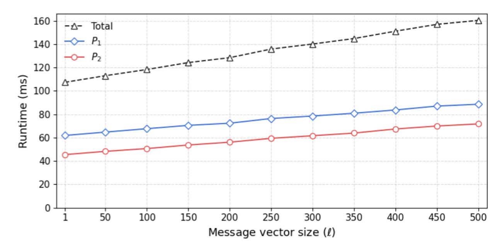

{0}------------------------------------------------

# Two-Party BBS+ Signature in Two Passes

Xiaofei Wu<sup>1</sup> , Tian Qiu<sup>2</sup> , Guofeng Tang<sup>3</sup> , Yuqing Niu<sup>3</sup> , Bowen Jiang<sup>3</sup> , Jun Zhou1() , Haiyang Xue<sup>3</sup> , and Guomin Yang<sup>3</sup>

<sup>1</sup> Shanghai Key Laboratory of Trustworthy Computing, East China Normal University, Shanghai, China

wuxiaofei@stu.ecnu.edu.cn, jzhou@sei.ecnu.edu.cn <sup>2</sup> Digital Trust Centre, Nanyang Technological University, Singapore qtautumn6@gmail.com

<sup>3</sup> School of Computing and Information Systems, Singapore Management University, Singapore

> tang.guofeng789@gmail.com,{yuqingniu, haiyangxue, gmyang}@smu.edu.sg,bowen.jiang.2024@phdcs.smu.edu.sg

Abstract. The BBS+/BBS signature scheme is a key building block for anonymous credentials and privacy-preserving authentication and is currently being standardized and increasingly deployed in practice. To avoid the problem of single-point-of-failure, many threshold BBS+ protocols have been recently proposed for general t-out-of-n settings. In practice, however, a 2-out-of-2 policy between a server and a mobile device is sufficient to distribute trust while keeping the system lightweight. Yet, existing threshold designs still require at least three rounds/passes and multi-kilobyte communication in the two-party setting.

In this work, we focus on the two-party setting and show that one can achieve reduced interaction while maintaining low computational and communication overhead. Specifically, we present a two-pass two-party BBS+ signing protocol that requires only 0.85 KB of communication per signature, about 27% of the currently most bandwidth-efficient work (S&P'25) in the 2-out-of-2 setting. It achieves competitive signing times (roughly 62 ms for one party and 46 ms for the other) and remains efficient even for large message vectors (e.g., ℓ = 500), making it attractive for practical deployments. Overall, our protocol is only slower than the fastest OT-based design (S&P'23) but uses nearly two orders of magnitude less bandwidth. We provide a full simulation-based security proof in the standard real-ideal paradigm. As an extension, our protocol can be generalized to a 2-out-of-n threshold setting naturally.

Keywords: BBS+ signature · threshold signature · two-party signing · two passes.

# 1 Introduction

The BBS+ signature scheme [\[2\]](#page-15-0), derived from the Boneh–Boyen–Shacham group signature called BBS [\[5\]](#page-15-1), forms the basis of many modern privacy-preserving protocols and anonymous credential (AC) systems. BBS+ supports signing multiple 

{1}------------------------------------------------

attributes in a single constant-size signature and enables succinct zero-knowledge proofs for selective disclosure. These capabilities have led to its wide adoption in privacy-preserving authentication mechanisms such as k-times anonymous authentication (k-TAA) [\[1](#page-15-2)[,2\]](#page-15-0), direct anonymous attestation (DAA) [\[10,](#page-16-0)[11\]](#page-16-1), as well as in broader works addressing misuse control in ACs through blacklistable [\[47\]](#page-17-0), scored [\[39\]](#page-17-1), or reputation-oriented [\[18\]](#page-16-2) credentials, and more recent extensions incorporating revocation and device-binding [\[29\]](#page-16-3) or human-binding functionalities [\[31\]](#page-17-2). BBS+ has also gained significant traction in practice. The Self-Sovereign Identity (SSI) community has adopted BBS+ as a practical tool, as evidenced by its integration into the Hyperledger Ursa [\[30\]](#page-16-4). The IRTF is also advancing its standardization [\[38\]](#page-17-3).

Despite the maturity of BBS+ based credential ecosystems, most existing credential systems still rely on a single trusted issuer, rendering the signing key a single point of trust and failure. If this key is compromised or abused, an adversary can mint arbitrarily many valid credentials, and the inherent anonymity of AC makes such misuse extremely difficult to detect or revoke without sacrificing privacy. This centralized trust contradicts the decentralized governance principles that modern identity frameworks strive for, motivating the need for multi-party issuance. Threshold BBS+ signatures offer a promising approach to mitigate these risks. In a t-out-of-n threshold setting, the signing key is distributed among n parties so that at least t parties must cooperate to generate a valid signature. That is, the credential issuance authority is securely shared among multiple parties.

As noted in NIST's project on Multi-party Threshold Cryptography [\[8\]](#page-15-3), the two-party setting is one of the most fundamental cases in threshold cryptography. Meanwhile, as noted in [\[46\]](#page-17-4), two-party or 2-out-of-n settings are most common in practice. In many practical signing workflows, such as distributed key custody and distributed credential issuance, two-party signing between a server and a mobile device provides a lightweight and practical trust distribution that is already sufficient to eliminate the single-point trust bottleneck. As a concrete example, two-party ECDSA has garnered attention from academia in recent years [\[36,](#page-17-5)[50](#page-17-6)[,35,](#page-17-7)[20\]](#page-16-5). However, the two-party BBS+ signature has not been thoroughly studied. Existing threshold BBS+ constructions are designed for general t-out-of-n settings and require at least three rounds of interaction. We summarize these constructions as follows.

Prior Threshold BBS+. Gennaro et al. [\[26\]](#page-16-6) provided the first four-round threshold BBS+ design using the Paillier encryption together with expensive zero-knowledge (ZK) range proofs under the strong RSA assumption, incurring substantial computational and proof overhead. Doerner et al. [\[21\]](#page-16-7) (DKL+23) subsequently proposed a three-round protocol utilizing OT-based multiplicativeto-additive (MtA) techniques, which achieves fast computation while requiring substantial communication. Wong et al. [\[48\]](#page-17-8) (WMC24) employed threshold Castagnos–Laguillaumie (CL) encryption to design a four-round threshold BBS+, which achieves robustness. Recently, Tang and Xue [\[46\]](#page-17-4) (TX25) introduced a three-round, robust, and online-friendly construction that improves effi

{2}------------------------------------------------

ciency and offers a favorable trade-off for small committee sizes. As an exception, Faust et al. [\[22\]](#page-16-8) proposed a non-interactive threshold BBS+, but it requires a trusted setup, which contradicts the decentralized principle we described above.

The literature on threshold signatures mostly reports round complexity. In a two-party setting, a round consists of a bidirectional exchange of messages. For a finer-grained analysis, particularly in two-party or other small-scale deployments, it is useful to distinguish a round from a pass, where the latter means a single unidirectional message flow. The pass-based perspective provides a more accurate measure of protocol interactive complexity.

When an r-round threshold BBS+ protocol is specialized for two parties, each round contributes at least one pass; thus, an r-round design inevitably incurs at least r passes, and often more. The prior most round-efficient protocols [\[21,](#page-16-7)[46\]](#page-17-4) both require three rounds and can be adjusted to three passes in two-party cases. More passes directly result in higher latency, which often dominates the overall execution time of the protocol. This motivates us to ask a natural question: Can we design a two-party BBS+ signing protocol with less pass complexity while preserving low computational and communication overhead?

### 1.1 Our Contributions

We answer the above question affirmatively by constructing a two-pass two-party BBS+ scheme with a total communication cost of 0.85 KB per signature. The bandwidth is only 27% of TX25 [\[46\]](#page-17-4), which is currently the most bandwidthefficient construction for the two-party setting. Our construction also achieves the second-best runtime performance, trailing only the OT-based construction DKL+23 [\[21\]](#page-16-7), but requires nearly 178× less bandwidth. Table [1](#page-2-0) presents a comprehensive comparison, where party P<sup>1</sup> outputs the final signature.

| Scheme      | Tools | Passes | Comm. (KB) | Comp. Time (ms) |          |
|-------------|-------|--------|------------|-----------------|----------|
|             |       |        |            | Party P1        | Party P2 |
| DKL+23 [21] | OT    | 3      | 151.8      | 4               | 4        |
| WMC24 [48]  | CL    | 4      | 6.46       | 468             | 468      |
| TX25 [46]   | CL    | 3      | 3.12       | 201             | 201      |
| Ours        | CL    | 2      | 0.85       | 62              | 46       |

<span id="page-2-0"></span>Table 1: Performance comparison of two-party BBS+ signing protocols.

We realize this lightweight interaction design through two key ideas: (i) a Verifiable Random Function (VRF)-based two-party unbiased generation of BBS+ nonces; and (ii) a maliciously secure distributed inversion operation based on CL homomorphic encryption. Our scheme naturally simplifies to BBS by omitting s, while supporting 2-out-of-n settings via Shamir secret sharing. Moreover, it 

{3}------------------------------------------------

directly supports blind signing and selective-disclosure, ensuring seamless integration into any BBS+/BBS based AC system.

### 1.2 Technical Overview

We first recall the standard BBS+ construction, analyze the challenges in realizing a two-party BBS+ signing in two passes, and then present our solutions. The standard BBS scheme is a special case of our protocol where s is omitted, thus our solutions are immediately applicable to current standardization efforts.

Recall that the standard BBS+ signature works on a pairing group  $(\mathbb{G}_1 = \langle G_1 \rangle, \mathbb{G}_2 = \langle G_2 \rangle, \mathbb{G}_T)$  of order q. For the message vector  $\mathbf{m} = \{m_i\}_i \in \mathbb{Z}_q^\ell$  and the public key  $X = xG_2$ , the signature is  $\sigma = (A, e, s)$ , where  $A = (x + e)^{-1}B \in \mathbb{G}_1$  with  $B = G_1 + sH_0 + \sum_{i=1}^{\ell} m_i H_i$  and (e, s) is the randomness sampled from  $\mathbb{Z}_q$ . In our two-party setting, the secret key is additively shared as  $x = x_1 + x_2 \mod q$  between  $P_1$  and  $P_2$ .  $P_1$  knows  $P_2$ 's public key  $X_2 = x_2G_2$ , and vice versa. Neither party may learn (x + e), its inverse  $(x + e)^{-1}$ , or any unmasked representation of the secret key. Yet, they must jointly compute  $A = (x + e)^{-1}B$ .

Challenges of the two-pass goal. According to the design of BBS+, the technical core is to (i) jointly derive (e, s) in an unbiased way within two passes, and (ii) realize the non-linear computation of A without additional interaction.

- (i) The first obstacle lies in the joint generation of e and s, since both B and A depend on (e, s). A trivial method is letting each  $P_i$  send its shares  $(e_i, s_i)$  to the other party directly. However, if the adversary is acting as  $P_2$ , after receiving  $P_1$ 's  $(e_1, s_1)$ , it can bias its own share and thereby bias the resulting (e, s). As in [37,21], the most direct way to prevent such bias is the classical commit—then-reveal approach:  $P_1$  first commits its  $(e_1, s_1)$ , then opens it after receiving  $(e_2, s_2)$ . However, this already requires at least three passes. Another line of work addresses this problem using threshold homomorphic encryption [48,46], which also requires three passes and comparatively expensive communication and computation costs.
- (ii) After getting (e, s), the second and more delicate obstacle is to compute  $(x_1 + x_2+e)^{-1}B$  in a distributed manner, where B is currently computable for both parties. A classical approach, dating back to Bar-Ilan and Beaver [4], introduces a random secret mask r and reduces the computation of  $A = (x+e)^{-1}B$  to handling rB and r(x+e) separately. Most threshold BBS+ [26,21,46] employ Multiplicative-to-Additive (MtA) conversion to handle the masked term r(x+e). However, these MtA-based constructions incur three or more passes, making such techniques fundamentally incompatible with our goal.

Our solutions. Firstly, we leverage the verifiable random function (VRF) to enable the two parties to jointly generate (e, s). Since the VRF output comes with a zero-knowledge proof (ZKP), it ensures that the output has not been maliciously tampered with by the party computing it. An intuitive idea is to involve both parties in generating their randomness via VRF and exchanging the outputs and proofs. However, we observe that it is unnecessary, since only

{4}------------------------------------------------

the second-moving party,  $P_2$ , can use the other's randomness to bias the joint output. The first-moving party,  $P_1$ , simply samples from the fixed distribution and needs no VRF proof, as it has nothing to react to and cannot influence the outcome. Thus, in this work, only  $P_2$  generates the VRF output together with a proof.

Note that this asymmetric use of the VRF makes the signing stateful: it requires a fresh and unique session identifier sid for each VRF's invocation. Otherwise, an adversarial  $P_1$  can vary  $\beta_1$  to bias (e, s) when  $P_2$  repeatedly uses the same VRF output for multiple signing executions on the same message vector  $\mathbf{m}$ . If one instead wishes for fully stateless signing, both parties can obtain  $\beta_i$  via invoking VRF and compute (e, s) deterministically. This yields a deterministic BBS+, which enjoys the same security guarantees as the randomized BBS+ [16].

For the non-linear operations involved in generating A, we require more technical ingenuity. In particular, since the last task is already a two-pass process, completing this task should not incur extra interaction. Therefore, generating (e, s) and computing A must be performed simultaneously. Inspired by Lindell's two-party ECDSA [36,37], we can use homomorphic encryption (e.g., Paillier [42]) to handle it. If we directly adapt Lindell's method to the BBS+ setting, the parties jointly sample a mask r (multiplicatively  $r = r_1 r_2$  or additively  $r = r_1 + r_2$ ), use the homomorphism to derive r(x + e), and in parallel compute rB. However, rB cannot be jointly computed until (e, s) are fixed; thus, it incurs additional interaction.

Our key insight is that, in the two-party BBS+ setting, the mask r appears only as a temporary mask that will be eliminated when computing A. It can be chosen unilaterally by  $P_2$ , and  $P_1$  obtains the results rB and r(x+e). This allows a simple two-pass workflow. The first-pass message is  $P_1$ 's randomness  $\beta_1$ . On receiving it,  $P_2$  can derive e, s from  $\beta_1$  and its own randomness  $\beta_2$ , and thus compute B. From the second-pass message,  $P_1$  needs to learn  $P_2$ 's VRF output  $\beta_2$  with its proof, the group element  $rB \in \mathbb{G}_1$  for a freshly sampled r chosen by  $P_2$ , and  $r(x+e) = r(x_1+x_2+e)$ . However,  $P_2$  cannot compute r(x+e) directly since it does not know  $x_1$ . Thus, this process requires a homomorphic encryption. Concretely,  $P_1$  publishes  $x_1$ 's ciphertext in the key generation phase, denoted by  $C_{\text{key}_1}$ , which was encrypted under its own public key. Due to the homomorphism,  $P_2$  can derive the ciphertext of  $r(x_1+x_2+e)$ . After getting the ciphertext,  $P_1$  can decrypt it to get r(x+e) and compute r(x+e) and compute r(x+e). During this process, due to the presence of the masking r, r is kept secret from r.

For the above two-pass workflow, we still have a security concern:  $P_2$  can submit a malformed ciphertext, and then extract one-bit information of  $P_1$ 's  $x_1$  by observing whether  $P_1$  ultimately outputs a valid signature. Such one-bit leakage, when accumulated, is devastating. For example, for the two-party ECDSA [36]'s implementation, Makriyannis et al. [40] showed that the corrupted  $P_2$  can recover  $P_1$ 's  $x_1$  through 256 separate signing sessions.

To address the above security issue, our protocol additionally requires  $P_2$  to provide a ZKP proving that the ciphertext was correctly generated.  $P_2$  proves that it is a ciphertext of  $r(x_1+x_2+e)$  according to  $C_{\text{key}_1}$  and  $X_2=x_2G_2$ , and the

{5}------------------------------------------------

randomness r is the same as that in rB. Only when the proof is valid, P<sup>1</sup> outputs the signature. More concretely, we replace Paillier with Castagnos–Laguillaumie (CL) homomorphic encryption [\[14\]](#page-16-10), as it eliminates the need for range proofs and is more compact. To make it compatible with the BBS+, we define a specific CL linear combination consistency relation for the ciphertext correctness and design an efficient Σ-protocol instantiation. As a result, our two-pass two-party BBS+ scheme only requires a total communication cost of 0.85 KB per signature.

### 1.3 Related Work

While general t-out-of-n threshold ECDSA remains a more popular research focus [\[25,](#page-16-11)[49,](#page-17-12)[44](#page-17-13)[,32\]](#page-17-14), two-party ECDSA, as a common deployment model, has also been extensively studied. Lindell [\[36\]](#page-17-5) presented a seminal and efficient two-party ECDSA protocol that requires four passes of interaction. Subsequent work by Koziel et al. [\[35\]](#page-17-7) further extends the line of work by providing proactive security. Doerner et al. [\[20\]](#page-16-5) proposed a two-pass two-party ECDSA protocol, but their security proof relies on the Generic Group Model (GGM). Xue et al. [\[50\]](#page-17-6) introduced an online-friendly two-party ECDSA scheme that reduces online computation overhead, though it still requires three passes. More recently, Boneh et al. [\[6\]](#page-15-5) presented a two-pass two-party ECDSA construction based on exponent-VRFs and Paillier encryption, resulting in comparatively high overhead. These works demonstrate the significance of the two-party setting and motivate the design of a lightweight, low-interaction two-party construction tailored for BBS+.

Concurrent Work. Parallel to our work, Tang et al. [\[45\]](#page-17-15) proposed a robust two-round threshold BBS+ for general t-out-of-n settings, leveraging threshold CL and threshold VRF primitives. In contrast, we specifically optimize the twoparty setting, resulting in a more lightweight protocol with significantly reduced communication and computational overhead.

### 2 Preliminaries

Notations. We use lower-case letters to represent scalars and upper-case letters to denote group elements. Greek letters are used for randomness within ciphertexts. We use xG to denote scalar multiplication on the elliptic-curve group and g x for exponentiation in the CL group. Operator ∥ denotes string concatenation. For a prime q, let Z<sup>q</sup> denote the finite field of size q. The notation \$ ←− denotes uniform sampling at random. We use λ to denote the security parameter.

### 2.1 The BBS+ signature

Let (G1, G2, G<sup>T</sup> ) be a pairing group of prime order q with a bilinear map e : G<sup>1</sup> ×G<sup>2</sup> → G<sup>T</sup> and the generators G<sup>1</sup> ∈ G<sup>1</sup> and G<sup>2</sup> ∈ G2. Let public parameters params = (G1, G2, G<sup>T</sup> , q, e, G1, G2, H), where H = {Hi}i∈[ℓ+1] \$ ←− G ℓ+1 1 . The BBS+ signing for a message vector m ∈ Z ℓ <sup>q</sup> works as follows:

{6}------------------------------------------------

- KeyGen(params)  $\to (x, X)$ : Output  $x \stackrel{\$}{\leftarrow} \mathbb{Z}_q^*$  and  $X = xG_2$ .
- $-\operatorname{\mathsf{Sign}}(x,\mathbf{m}=\{m_i\}_{i\in[\ell]}) \to \sigma$ : Output  $\sigma=(A,e,s)$  with  $e,s \xleftarrow{\$} \mathbb{Z}_q$  and  $A = (x+e)^{-1} \Big( G_1 + sH_0 + \sum_{i=1}^{\ell} m_i H_i \Big).$
- Verify $(X, \mathbf{m}, \sigma) \to 0/1$ : Output 1 if  $e(A, X + eG_2)$  equals to  $e(G_1 + sH_0 + eG_2)$  $\sum_{i=1}^{\ell} m_i H_i, G_2$ , and 0 otherwise.

The ideal two-party BBS+ functionality. We define the ideal functionality  $\mathcal{F}_{\mathsf{BBS+}}$  for two-party BBS+, consisting of a one-time key generation function and a signing function that can be invoked arbitrarily many times thereafter.

### Ideal Functionality $\mathcal{F}_{\mathsf{BBS}+}$

 $\mathcal{F}_{\mathsf{BBS+}}$  interacts with two parties  $P_1, P_2$  as follows.

Key generation. Upon receiving (KeyGen, params) from party  $P_i$  (for  $i \in$  $\{1,2\}$ ). The functionality first verifies that both parties provided identical inputs and that no prior key has been generated, then proceeds as follows:

- (i) Generate a BBS+ key pair (x, X) by sampling a random signing key  $x \stackrel{\$}{\leftarrow} \mathbb{Z}_q^*$ , and setting the verification key  $X \leftarrow xG_2$ . (ii) Store (params, x) internally and send (params, X) to both parties.

Signing. Upon receiving (Sign, sid,  $\mathbf{m}, X$ ) from party  $P_i$  (for  $i \in \{1, 2\}$ ), where  $\overline{\mathbf{m}} = \{m_i\}_{i \in [\ell]} \in \mathbb{Z}_q^{\ell}$ , the functionality checks whether KeyGen has already been completed, sid has not been used before, and both parties provided identical  $(\mathbf{m}, X)$ . If yes, it proceeds as follows:

- (i) Sample  $e, s \stackrel{\$}{\leftarrow} \mathbb{Z}_q$ , and compute  $A = (x+e)^{-1} \Big( G_1 + sH_0 + \sum_{i=1}^{\ell} m_i H_i \Big)$ .
- (ii) Send the BBS+ signature  $\sigma = (A, e, s)$  on **m** to both  $P_1$  and  $P_2$ .

#### 2.2 Castagnos-Laguillaumie Encryption

The Castagnos-Laguillaumie (CL) encryption scheme [14,15], more recently instantiated by BICYCL [7], is an additively homomorphic encryption scheme over an unknown-order class group. Its plaintext space is naturally  $\mathbb{Z}_q$ , effectively eliminating the costly range proofs required by Paillier [42] or Joye-Libert [33].

Let  $\mathcal{G}$  be a class group of unknown order  $n = q\tilde{s}$  (q is a large prime,  $\tilde{s}$  is an unknown cofactor). We define  $\mathcal{G}_q = \langle g_q \rangle$  as the subgroup of q-th powers, and  $\mathcal{G} = \langle f \rangle$  as a subgroup of order q equipped with a deterministic discrete logarithm algorithm  $\mathsf{Dlog}(\cdot)$  (i.e.,  $\mathsf{Dlog}(f^x) = x$ ). Note that the secret key and randomness are sampled uniformly over the range  $\mathcal{D}_q = [0, 2^{\lambda_s} qs]$  where  $\lambda_s$  is the statistical parameter and s is a known upper bound of  $\tilde{s}$ . Let  $pp = (\mathcal{G}, \mathcal{G}_q, \tilde{\mathcal{G}}, f, g_q, q, \tilde{s}, \mathcal{D}_q)$ be as defined above. The scheme is shown below.

- CL-KeyGen(pp) 
$$\to$$
  $(ek, dk)$ : Output  $dk \stackrel{\$}{\leftarrow} \mathcal{D}_q$  and  $ek = g_q^{dk}$ .

{7}------------------------------------------------

- CL-Enc $(ek, m; \rho) \to C_m$ : Sample  $\rho \stackrel{\$}{\leftarrow} \mathcal{D}_q$ . Output  $C_m = (c_1, c_2) = (g_q^{\rho}, f^m e k^{\rho})$ .
- CL-Dec $(dk, (c_1, c_2)) \rightarrow m$ : Output  $m = \text{Dlog}(c_2/c_1^{dk})$ .
- Addition: Given  $C_m = (c_1, c_2)$  and  $C_{m'} = (c'_1, c'_2)$ ,

$$C_{m+m'} := (c_1 \cdot c_1', \ c_2 \cdot c_2') \equiv \mathsf{CL}\text{-}\mathsf{Enc}(ek, m+m'; \rho+\rho').$$

- Scalar multiplication: Given  $C_m = (c_1, c_2)$  and  $a \in \mathbb{Z}_q$ ,

$$C_{am} := (c_1^a, c_2^a) \equiv \mathsf{CL}\text{-}\mathsf{Enc}(ek, am; a\rho).$$

### <span id="page-7-0"></span>2.3 Zero-Knowledge Functionality and Relations

We employ Non-Interactive Zero-Knowledge (NIZK) proofs for various NP relations  $\mathcal{R} \subseteq \mathcal{X} \times \mathcal{W}$ . A proof system allows a prover  $\mathcal{P}$  to convince a verifier  $\mathcal{V}$  that a statement x is valid (i.e.,  $(x, w) \in \mathcal{R}$  for some witness w) without revealing any information about the witness.

We instantiate these proofs by  $\Sigma$ -protocols (Prove<sub> $\mathcal{R}$ </sub>, Verify<sub> $\mathcal{R}$ </sub>) compiled via the Fiat-Shamir [23] or Fischlin transform [24,17] in the random-oracle model.

- $\mathsf{Prove}_{\mathcal{R}}(x,w) \to \pi$ : A probabilistic algorithm that outputs a zero-knowledge proof  $\pi$  for the statement x and witness w.
- $\mathsf{Verify}_{\mathcal{R}}(x,\pi) \to \{0,1\}$ : A deterministic algorithm that checks the validity of  $\pi$  with respect to the statement x.

The ideal zero-knowledge functionality. We define a zero-knowledge proof of knowledge ideal functionality  $\mathcal{F}_{\mathsf{ZK}}^{\mathcal{R}}$  for any relation  $\mathcal{R}$ .

# Ideal Functionality $\overline{\mathcal{F}_{\mathsf{ZK}}^{\mathcal{R}}}$

 $\mathcal{F}_{\mathsf{ZK}}^{\mathcal{R}}$  interacts with two parties  $P_1$  and  $P_2$  as follows.

<u>Prove.</u> Upon receiving (prove, id, x, w) from  $P_i$  (for  $i \in \{1, 2\}$ ): if id is fresh and  $(x, w) \in \mathcal{R}$ , record (id, i, x) and send (proved, id, x) to  $P_{3-i}$ ; otherwise, ignore the message.

**Relations.** We employ the following relations, each of which admits an efficient  $\Sigma$ -protocol. Formal  $\Sigma$ -protocol constructions are deferred to Appendix A.

- **Discrete Logarithm.** Ensures possession of the discrete logarithm  $y \in \mathbb{Z}_q^*$  for a public group element Y:

$$\mathcal{R}_{\mathsf{DL}} = \{ (Y, y) : y \in \mathbb{Z}_q^*, \ Y = yG \}.$$

- CL Encryption of Discrete Logarithm. Ensures that the discrete logarithm x of X is also the plaintext of the CL ciphertext  $C_x$ .

$$\mathcal{R}_{\mathsf{CL-DL}} = \left\{ (ek, X, C_x), x) : C_x = (c_1, c_2), \ \exists \ \rho \in \mathcal{D}_q, \\ c_1 = g_q^{\rho}, \ c_2 = f^x e k^{\rho} \right\}.$$

{8}------------------------------------------------

– CL Linear Combination Consistency. Ensures the ciphertext CT<sup>b</sup> is computed via a linear combination CT<sup>b</sup> = r⊙CTa⊕Encek(r(x+e); ρ), where r and x correspond to the discrete logarithm of R = rG<sup>1</sup> ∈ G<sup>1</sup> and X = xG<sup>2</sup> ∈ G2, respectively, and CT<sup>a</sup> is a valid CL ciphertext of an unknown message m.

$$\mathcal{R}_{\mathsf{CL-Lin}} = \left\{ \begin{array}{l} r \in \mathbb{Z}_q, \ x \in \mathbb{Z}_q^*, \ \exists \ \rho \in \mathcal{D}_q, \\ \left((ek, G_1, G_2, R, X, \mathsf{CT}_a, R = rG_1, X = xG_2, \\ \mathsf{CT}_b, e), (r, x)\right) : & \mathsf{CT}_a = (c_1, c_2), \mathsf{CT}_b = (d_1, d_2), \\ d_1 = c_1^r g_q^\rho, \ d_2 = c_2^r f^{r(x+e)} e k^\rho \end{array} \right\}.$$

### <span id="page-8-1"></span>2.4 Verifiable Random Functions (VRFs).

A Verifiable Random Function (VRF) [\[41\]](#page-17-18) serves as a verifiable, public-key analogue of a keyed hash function. VRFs are now a standard building block in systems that require publicly verifiable but unpredictable choices (e.g., lottery/leader selection in PoS ledgers such as Algorand and Ouroboros) [\[27,](#page-16-16)[19,](#page-16-17)[3\]](#page-15-7). We employ the ECVRF standard [\[28\]](#page-16-18), which guarantees full uniqueness, pseudorandomness, and collision resistance. It is defined over the elliptic group G with generator E with input space X and output space Y, as follows.

- VRF-KeyGen(1<sup>λ</sup> ) → (vk,sk). Output sk \$ ←− Z ∗ <sup>q</sup> and vk = skE ∈ G.
- VRF-Eval(sk, α) → (β, π). Given α ∈ X , output β ∈ Y and a proof π.
- VRF-Verify(vk, α, π) → β or INVALID. If the proof π is valid, output β ∈ Y derived from π.

Instantiation. In the ECVRF construction, evaluation proceeds by hashing α to a curve point H ∈ G and computing Γ = skH ∈ G. The output is deterministically derived as β = Hash(vk, Γ) ∈ Y. To ensure verifiability, a non-interactive proof π of the decisional Diffie-Hellman (DDH) relation attests that the public key vk and Γ share the same discrete logarithm sk. Verification checks the proof π; if valid, β is recovered from Γ (see [\[28\]](#page-16-18) for full details).

### <span id="page-8-0"></span>3 Two-Party BBS+ Signature Scheme

We present our two-party BBS+ signature scheme, consisting of (i) a distributed key generation (DKG) protocol that establishes long-term secrets and auxiliary information required for signing, and (ii) a two-pass BBS+ signing protocol.

Distributed Key Generation Protocol. Given the public parameters params = (G1, G2, G<sup>T</sup> , q, e, G1, G2, H) and the hash function H<sup>0</sup> : G<sup>2</sup> → {0, 1} <sup>λ</sup> modeled as a random oracle, the DKG protocol establishes the distributed signing key and initializes the full cryptographic context, including CL parameters, VRF key pair, and auxiliary ciphertext. The protocol is described below.

- Pass 1. P<sup>1</sup> generates its key share:
  - (1) samples x<sup>1</sup> \$ ←− Z<sup>q</sup> and computes X<sup>1</sup> = x1G2.

{9}------------------------------------------------

- (2) sends  $h \leftarrow \mathcal{H}_0(X_1)$  to  $P_2$ .
- **Pass 2.** After receiving h,  $P_2$  does:
  - (1) samples  $x_2 \stackrel{\$}{\leftarrow} \mathbb{Z}_q$  and computes  $X_2 = x_2 G_2$ .
  - (2) generates VRF keys  $(vk_2, sk_2) \leftarrow VRF-KeyGen(1^{\lambda})$ .
  - (3) sends  $X_2$  to  $P_1$  and (prove,  $id_2$ ,  $vk_2$ ,  $sk_2$ ) to  $\mathcal{F}_{ZK}^{\mathcal{R}_{DL}}$ .
- **Pass 3.** After receiving  $X_2$ ,  $P_1$  waits for (proved,  $id_2$ ,  $vk_2$ ) from  $\mathcal{F}_{ZK}^{\mathcal{R}_{DL}}$  (otherwise aborts), then:
  - (1) generates CL keys  $(ek_1, dk_1) \leftarrow \mathsf{CL}\text{-}\mathsf{KeyGen}(\mathsf{pp})$ , samples  $\rho_1 \stackrel{\$}{\leftarrow} \mathcal{D}_q$ , and encrypts its key share  $C_{\mathrm{key}_1} = \mathsf{CL}\text{-}\mathsf{Enc}(ek_1, x_1; \rho_1)$ .
  - (2) sends (prove,  $id_1$ ,  $(ek_1, X_1, C_{\text{key}_1}), x_1$ ) to  $\mathcal{F}_{7K}^{\mathcal{R}_{\text{CL-DL}}}$ .
- **Output.**  $P_2$  waits for  $(\mathsf{proved}, id_1, (ek_1, X_1, C_{\mathsf{key}_1}))$  from  $\mathcal{F}_{\mathsf{ZK}}^{\mathcal{R}_{\mathsf{CL-DL}}}$  and checks  $h \stackrel{?}{=} \mathcal{H}_0(X_1)$  (otherwise aborts). Then, parties establish the joint public key  $X := X_1 + X_2$  and store their local states  $\mathsf{State}_i = (\mathsf{pub}_i; \mathsf{priv}_i)$  as follows:
  - $P_1$  stores  $\mathsf{State}_1$  where  $\mathsf{pub}_1 \coloneqq (X, ek_1, C_{\ker_1})$  and  $\mathsf{priv}_1 \coloneqq (x_1, dk_1)$ . (Note:  $P_1$  also stores  $\mathsf{vk}_2$  received from  $P_2$  for verification).
  - $P_2$  stores  $\mathsf{State}_2$  where  $\mathsf{pub}_2 \coloneqq (X, \mathsf{vk}_2)$  and  $\mathsf{priv}_2 \coloneqq (x_2, \mathsf{sk}_2)$ . (Note:  $P_2$  also stores  $(ek_1, C_{\mathsf{key}_1})$  received from  $P_1$  for encryption).

**Two-Pass BBS+ Signing Protocol.** We now present the core signing protocol in Figure 1. Given a unique session identifier sid, a message vector  $\mathbf{m}$  and two hash functions  $\mathcal{H}_1: \{0,1\}^* \to \mathcal{X}$  and  $\mathcal{H}_2: \{0,1\}^* \to \mathbb{Z}_q^2$  modeled as random oracles, the two parties can collaboratively compute a BBS+ signature on  $\mathbf{m}$  in exactly two passes of interaction. The concrete construction is detailed below.

- Pass 1.  $P_1$  samples a randomness  $\beta_1 \stackrel{\$}{\leftarrow} \mathcal{Y}$  and sends to  $P_2$ .
- Pass 2. After receiving  $\beta_1$ ,  $P_2$  checks if  $\beta_1 \in \mathcal{Y}$  (otherwise aborts), then:
  - (1) generates  $(\beta_2, \pi_{\mathsf{Vrf}}) \leftarrow \mathsf{VRF}\text{-}\mathsf{Eval}(\mathsf{sk}_2, \mathcal{H}_1(\mathbf{m} \parallel \mathsf{sid})).$
  - (2) computes  $e, s \leftarrow \mathcal{H}_2(\beta_1 \parallel \beta_2)$  and the base  $B = G_1 + sH_0 + \sum_{i=1}^{\ell} m_i H_i$ .
  - (3) samples  $r \stackrel{\$}{\leftarrow} \mathbb{Z}_q$  and computes  $C = rB \in \mathbb{G}_1$ .
  - (4) samples  $\rho_2 \stackrel{\$}{\leftarrow} \mathcal{D}_q$  and computes  $D = C^r_{\text{key}_1} \cdot \text{CL-Enc}(ek_1, r(x_2 + e); \rho_2)$ .
  - (5) generates a zero-knowledge proof  $\pi_{\mathsf{Lin}}^{4}$  to prove the correctness of D:

$$\pi_{\mathsf{Lin}} \leftarrow \mathsf{Prove}_{\mathcal{R}_{\mathsf{CL-Lin}}} \big( (ek_1, B, G_2, C, X_2, C_{\mathsf{key}_1}, D, e), (r, x_2) \big).$$

- (6)  $P_2$  sends  $(\pi_{\mathsf{Vrf}}, C, D, \pi_{\mathsf{Lin}})$  to  $P_1$ .
- Output.  $P_1$  generates the signature after receiving messages from  $P_2$ :
  - (1) gets  $\beta_2 \leftarrow \mathsf{VRF}\text{-}\mathsf{Verify}(\mathsf{vk}_2, \mathcal{H}_1(\mathbf{m} \parallel \mathsf{sid}), \pi_{\mathrm{Vrf}})$ , otherwise aborts.
  - (2) computes  $e, s \leftarrow \mathcal{H}_2(\beta_1 \parallel \beta_2)$  and the base  $B = G_1 + sH_0 + \sum_{i=1}^{\ell} m_i H_i$ .
  - (3) checks if  $1 \leftarrow \mathsf{Verify}_{\mathcal{R}_{\mathsf{CL-Lin}}} \big( (ek_1, B, G_2, C, X_2, C_{\mathsf{key}_1}, D, e), \pi_{\mathsf{Lin}} \big) \big)$  (otherwise aborts).
  - (4) decrypts  $d = \mathsf{CL}\text{-}\mathsf{Dec}(dk_1, D)$  and computes  $A = d^{-1}C$ .
  - (5) outputs the BBS+ signature  $\sigma = (A, e, s)$  on **m**.

{10}------------------------------------------------

```
P1

             (sid, m, pub1
                               , vk2); priv1

                                                                                       P2

                                                                                            (sid, m, pub2
                                                                                                              , ek1, Ckey1
                                                                                                                              ); priv2

. . . . . . . . . . . . . . . . . . . . . . . . . . . . . . . . . . . . . . . . . . . . . . . . . . . . .Pass 1 . . . . . . . . . . . . . . . . . . . . . . . . . . . . . . . . . . . . . . . . . . . . . . . . . . . . .
                      β1
                          $←− Y
                                                         β1 −−−−−−−−−−−−→ Check β1 ∈ Y
. . . . . . . . . . . . . . . . . . . . . . . . . . . . . . . . . . . . . . . . . . . . . . . . . . . . .Pass 2 . . . . . . . . . . . . . . . . . . . . . . . . . . . . . . . . . . . . . . . . . . . . . . . . . . . . .
                                                                                    (β2, πVrf ) ← VRF-Eval(sk2, H1(m ∥ sid))
                                                                                                  e, s ← H2(β1 ∥ β2)
                                                                                          B = G1 + sH0 +
                                                                                                                    Pℓ
                                                                                                                       i=1 miHi
                                                                                         r
                                                                                            $←− Zq, C = rB, ρ2
                                                                                                                             $←− Dq
                                                                                    D = C
                                                                                              r
                                                                                              key1
                                                                                                     · CL-Enc(ek1, r(x2 + e); ρ2)
                                                                                      st = {ek1, B, G2, C, X2, Ckey1
                                                                                                                                 , D, e}
                                                         ←−−−−−−−−−−−−
                                                           πVrf, C, D, πLin
                                                                                          πLin ← ProveRCL-Lin

                                                                                                                       st, (r, x2)

. . . . . . . . . . . . . . . . . . . . . . . . . . . . . . . . . . . . . . . . . . . . . . . . . . . . Output . . . . . . . . . . . . . . . . . . . . . . . . . . . . . . . . . . . . . . . . . . . . . . . . . . . .
β2 ← VRF-Verify(vk2, H1(m ∥ sid), πVrf )
              e, s ← H2(β1 ∥ β2)
      B = G1 + sH0 +
                                Pℓ
                                   i=1 miHi
 st = {ek1, B, G2, C, X2, Ckey1
                                             , D, e}
             VerifyRCL-Lin
                               (st, πLin)
         A = (CL-Dec(dk1, D))−1C
             Output σ = (A, e, s)
```

Fig. 1: Two-Pass BBS+ Signing Protocol

Extend to 2-out-of-n threshold structures. Our construction can naturally extend to a (2, n) threshold structure, where x is shared among n parties and any two of them can jointly sign.

Similarly to [\[25\]](#page-16-11), each P<sup>i</sup> acts as a dealer in a (2, n) Feldman's verifiable secret sharing (VSS) with a linear polynomial fi(z) = ai,<sup>0</sup> + ai,1z, distributing shares xi,j = fi(j) and broadcasting commitments (Ai,<sup>0</sup> = ai,0G2, Ai,<sup>1</sup> = ai,1G2). Given each party's share k<sup>i</sup> = P j xj,i, the public key is computed as X = (Λik<sup>i</sup> + Λjk<sup>j</sup> )G<sup>2</sup> for any distinct pair (i, j) where Λ<sup>i</sup> , Λ<sup>j</sup> are the corresponding Lagrange coefficients. Unlike the (2, 2) case, each party is required to generate a VRF key pair and a CL key pair, as well as k<sup>i</sup> 's ciphertexts and the associated proofs. These materials generated in the key generation phase ensure that for any authorized signing pair (i, j), the two parties can freely take the roles of P<sup>1</sup> and P2. In particular, the only modification to the signing protocol is that the Lagrange coefficients are required when generating the ciphertext D, since the secret key is currently x = Λik<sup>i</sup> + Λjk<sup>j</sup> .

Toward proactive refresh. To protect long-lived systems against mobile adversaries, the (2, n) structure can be augmented with a proactive refresh mechanism. Following the offline-refresh paradigm of Bhat et al. [\[34\]](#page-17-19), each signing session between two online parties enables them to refresh their key shares without changing the public key. In our setting, the VRF-derived nonce e can serve as a session-specific binding value for refresh. A refresh is activated once the signature carrying the same e is confirmed, after which all parties update their

<span id="page-10-1"></span><sup>4</sup> We do not invoke FZK here, since it is not required to be a proof of knowledge.

{11}------------------------------------------------

long-term state and increment the epoch. This lightweight mechanism requires no interaction from offline parties and provides forward secrecy across epochs.

# 4 Security Analysis

In this section, we establish the security of our two-party BBS+ signature scheme in the standard real vs. ideal simulation paradigm and the Universal Composability (UC) framework [12]. We show that the protocols securely realize the ideal two-party BBS+ functionality with abort in the stated hybrid model.

**Theorem 1.** Based on the semantic security of CL encryption, the two-party BBS+ signature scheme in Section 3 securely realizes the two-party BBS+ functionality  $\mathcal{F}_{BBS+}$  with abort in the random oracle and  $(\mathcal{F}_{ZK}^{\mathcal{R}_{DL}}, \mathcal{F}_{ZK}^{\mathcal{R}_{CL-DL}})$ -hybrid model against a malicious static adversary.

*Proof.* We construct a simulator  $\mathcal{S}$  with interaction with  $\mathcal{A}$  on behalf of the honest party, the ideal oracles  $\mathcal{F}_{\mathsf{ZK}}^{\mathcal{R}_{\mathsf{DL}}}$ ,  $\mathcal{F}_{\mathsf{ZK}}^{\mathcal{R}_{\mathsf{CL-DL}}}$  and random oracles. Meanwhile,  $\mathcal{S}$  interacts with the ideal functionality  $\mathcal{F}_{\mathsf{BBS}+}$  on behalf of the corrupted party. We need to demonstrate that any probabilistic polynomial-time (PPT) adversary  $\mathcal{A}$  corrupting either  $P_1$  or  $P_2$  can distinguish a real execution of the protocol from a simulated execution of  $\mathcal{S}$  only with negligible probability.

Corrupted  $P_1$ . The simulator S plays the role of the honest party  $P_2$  and first simulates the execution of the key generation protocol.

- (1) Upon input (KeyGen, params), S sends it to  $\mathcal{F}_{\mathsf{BBS}+}$  and receives back X.
- (2) S obtains the first-message h from  $P_1$  and retrieves  $X_1$  from the record  $\mathcal{H}_0(X_1) = h$  in the random oracle model. Then, S sets  $X_2 = X X_1$  and sends it to A.
- (3) S samples a random VRF public key  $\mathsf{vk}_2 \stackrel{\$}{\leftarrow} \mathbb{G}$  and simulates  $\mathcal{F}_{\mathsf{ZK}}^{\mathcal{R}_{\mathsf{DL}}}$  to send (proved,  $id_2, \mathsf{vk}_2$ ) to  $\mathcal{A}$ .
- (4) S obtains the messages that  $P_1$  would send to  $\mathcal{F}_{\mathsf{ZK}}^{\mathcal{R}_{\mathsf{CL-DL}}}$ , namely (prove,  $id_1$ ,  $(ek_1, X_1, C_{\mathsf{key}_1}), x_1$ ).
- (5) S simulates  $P_2$  aborting if  $h \neq \mathcal{H}_1(X_1)$  or  $X_1 \neq x_1G_2$ . Otherwise, S sends continue to  $\mathcal{F}_{\mathsf{BBS}+}$  for  $P_2$  to receive output and records  $(x_1, X, ek_1, C_{\mathsf{key}_1})$ .

Now, we prove that the joint distribution of  $\mathcal{A}$ 's view and  $P_2$ 's output is identical to that in a real protocol execution. The main difference between the ideal simulation by  $\mathcal{S}$  and a real execution with an honest  $P_2$  is how  $X_2$  is generated: in the real world,  $P_2$  samples a random  $x_2 \stackrel{\$}{\leftarrow} \mathbb{Z}_q$  and computes  $X_2 = x_2 G_2$ , while  $\mathcal{S}$  sets  $X_2 = X - X_1$ . Since X is uniform in  $\langle G_2 \rangle$ , the distributions of  $x_2 G_2$  and  $X - X_1$  are identical. In all other messages and checks,  $\mathcal{S}$  behaves in the same way as  $P_2$ . For example,  $\mathcal{S}$  directly simulates  $\mathcal{F}_{\mathsf{ZK}}^{\mathcal{R}_{\mathsf{DL}}}$  to output (proved,  $id_2$ ,  $\mathsf{vk}_2$ ), so that the message schedule matches the real execution. We remark that  $C_{\mathsf{key}_1}$  is guaranteed to be a valid CL encryption of  $x_1$  where  $X_1 = x_1 G_2$ , except with negligible probability. This is guaranteed by  $\mathcal{F}_{\mathsf{ZK}}^{\mathcal{R}_{\mathsf{CL}-\mathsf{DL}}}$ . Finally, if  $P_2$  does not abort, then the public key defined in both the ideal and real executions equals

{12}------------------------------------------------

 $X_1 + X_2 = X$ . Hence, the joint distribution of  $\mathcal{A}$ 's view and  $P_2$ 's output is identical to that in a real execution.

Next, S simulates the signing protocol.

- (1) Obtaining the target signature. Upon input (Sign, sid,  $\mathbf{m}, X$ ),  $\mathcal{S}$  sends it to  $\mathcal{F}_{\mathsf{BBS}+}$  and receives back  $\sigma = (A, e, s)$ .
- (2) S waits to receive  $\beta_1$  from  $P_1$ , verify  $\beta_1 \in \mathcal{Y}$ , otherwise simulates  $P_2$  aborting.
- (3) Programming the random oracle  $\mathcal{H}_2$ . On behalf of  $P_2$ ,  $\mathcal{S}$  samples  $\beta_2 \stackrel{\$}{\leftarrow} \mathcal{Y}$ , and programs the random oracle  $\mathcal{H}_2$  so that  $\mathcal{H}_2(\beta_1 \parallel \beta_2) = (e, s)$ , where (e, s) is from  $\mathcal{F}_{\mathsf{BBS}+}$ .
- (4) S samples  $r' \stackrel{\$}{\leftarrow} \mathbb{Z}_q$  and computes C = r'A, where A is from  $\mathcal{F}_{\mathsf{BBS+}}$ . Then, S samples  $\rho_2 \stackrel{\$}{\leftarrow} \mathcal{D}_q$  and computes  $D = \mathsf{CL-Enc}((ek_1, r'); \rho_2)$ .
- (5)  $\mathcal{S}$  simulates the proofs  $(\pi_{\text{Vrf}}, \pi_{\text{Lin}})$  and sends  $(\pi_{\text{Vrf}}, (C, D), \pi_{\text{Lin}})$  to  $P_1$ .

In real execution,  $\beta_2$  is the output of the random oracle  $\mathsf{Hash}(\cdot)$  (c.f. Section 2.4), which is distributed identically to the simulated  $\beta_2 \stackrel{\$}{\leftarrow} \mathcal{Y}$ . Since the random oracle  $\mathcal{H}_2$  is programmed before any query on  $(\beta_1 \parallel \beta_2)$ , it derives the same (e, s)as in the ideal signature from  $\mathcal{F}_{\mathsf{BBS}+}$ .  $\mathcal{S}$  simulates the proofs  $(\pi_{\mathsf{Vrf}}, \pi_{\mathsf{Lin}})$ , which is guaranteed by the zero-knowledge property of the underlying  $\Sigma$ -protocols. By this property, the simulated proof  $(\pi_{Vrf}, \pi_{Lin})$  are statistically indistinguishable from real proofs. Note that in  $\pi_{\mathrm{Vrf}}$ ,  $\mathcal{S}$  sets  $H = kE \in \mathbb{G}$ ,  $\Gamma = k \text{ vk } \in \mathbb{G}$ with  $k \stackrel{\$}{\leftarrow} \mathbb{Z}_q$ , and programs  $\mathsf{Hash}(\mathsf{vk}, \Gamma) = \beta_2$ . From the adversary's view, the transcript produced by  $\mathcal{S}$  is indistinguishable from that of a real protocol execution. Then, the only difference between the view of  $\mathcal{A}$  in a real execution and in the ideal simulation is the way that (C, D) was generated. In the real world,  $P_2$  computes C = rB where  $B = \left(G_1 + sH_0 + \sum_{i=1}^{\ell} m_i H_i\right)$  and D = $C_{\text{key}_1}^r \cdot \text{CL-Enc}(ek_1, r(x_2+e); \rho_2)$ . However, S sets C = r'A and D is an encryption of a random r' in the simulation. Obviously, the distributions of C and D between the two worlds are identical. Moreover, when the corrupted  $P_1$  decrypts D, the calculated A is consistent in both the ideal and real executions, which equals  $(\mathsf{CL}\mathsf{-}\mathsf{Dec}(dk_1,D))^{-1}C=(r')^{-1}r'A=A$ . Therefore, the transcript observed by  $\mathcal{A}$  is statistically indistinguishable from real protocol execution.

This completes the proof for the case where A corrupts  $P_1$ .

Corrupted  $P_2$ . The simulator S plays the role of the honest party  $P_1$  and first simulates the execution of the key generation protocol.

- (1) Upon input (KeyGen, params), S sends it to  $\mathcal{F}_{\mathsf{BBS}+}$  and receives back X.
- (2) S picks a random  $h \stackrel{\$}{\leftarrow} \{0,1\}^{\lambda}$  and sends it to A. Then, S picks a random CL public key  $ek_1 \stackrel{\$}{\leftarrow} \mathcal{G}_q$ , samples  $\rho_1 \stackrel{\$}{\leftarrow} \mathcal{D}_q$  and then computes  $C_{\text{key}_1} = \text{CL-Enc}(ek_1, \hat{x}_1; \rho_1)$  for a random  $\hat{x}_1 \stackrel{\$}{\leftarrow} \mathbb{Z}_q$ .
- (3) S obtains  $X_2$  directly from A, and the message (prove,  $id_2$ ,  $vk_2$ ,  $sk_2$ ) that  $P_2$  would send to  $\mathcal{F}_{ZK}^{\mathcal{R}_{DL}}$ .
- (4) Programming the random oracle  $\mathcal{H}_0$ .  $\mathcal{S}$  sets  $X_1 = X X_2$  and programs  $\mathcal{H}_0(X_1) = h$ .

{13}------------------------------------------------

- (5) S simulates  $\mathcal{F}_{\mathsf{ZK}}^{\mathcal{R}_{\mathsf{CL}-\mathsf{DL}}}$  to send (proved,  $id_1$ ,  $(ek_1, X_1, C_{\mathsf{key}_1})$ ) to  $\mathcal{A}$ .
- (6)  $\mathcal{S}$  sends continue to  $\mathcal{F}_{BBS+}$  for  $P_1$  to receive output and records  $(X, sk_2)$ .

It is obvious that the distributions of  $\mathcal{A}$ 's view in a real and ideal execution are identical, except for  $C_{\text{key}_1}$  which equals  $\text{CL-Enc}(ek_1, x_1)$  where  $X_1 = x_1G_2$  in a real execution but equals  $\text{CL-Enc}(ek_1, \hat{x}_1)$  for a random  $\hat{x}_1 \overset{\$}{\leftarrow} \mathbb{Z}_q$  in the ideal simulation.  $\mathcal{S}$  behaves in the same way as  $P_2$  by simulating  $\mathcal{F}_{\mathsf{ZK}}^{\mathcal{R}_{\mathsf{CL-DL}}}$  sending (proved,  $id_1$ ,  $(ek_1, X_1, C_{\text{key}_1})$ ). When  $\mathcal{S}$ , as the challenger of IND-CPA (indistinguishability under chosen-plaintext attacks) security (or called semantic security) of CL encryption, sets  $ek_1$  as the received public key, if  $\mathcal{A}$  can notice the difference, then  $\mathcal{S}$  can break the IND-CPA security.

Next, S simulates the signing protocol.

- (1) Obtaining the target signature. Upon input (Sign, sid,  $\mathbf{m}, X$ ),  $\mathcal{S}$  sends it to  $\mathcal{F}_{\mathsf{BBS}+}$  and receives back  $\sigma = (A, e, s)$ .
- (2) Programming the random oracle  $\mathcal{H}_2$ .  $\mathcal{S}$  samples  $\beta_1 \stackrel{\$}{\leftarrow} \mathcal{Y}$  and generates  $(\beta_2, \pi_{\mathrm{Vrf}}) \leftarrow \mathsf{VRF}\text{-}\mathsf{Eval}(\mathsf{sk}_2, \mathcal{H}_1(\mathbf{m} \parallel \mathsf{sid}))$ . Then it programs the random oracle  $\mathcal{H}_2$  so that  $\mathcal{H}_2(\beta_1 \parallel \beta_2) = (e, s)$ , where (e, s) is from  $\mathcal{F}_{\mathsf{BBS}+}$ .
- (3) S on behalf of  $P_1$  sends  $\beta_1$  to A.
- (4) When  $\mathcal{A}$  sends  $(\pi'_{\mathrm{Vrf}}, (C, D), \pi_{\mathrm{Lin}})$  to  $\mathcal{S}$ ,  $\mathcal{S}$  verifies  $\beta_2 \stackrel{?}{\leftarrow} \mathsf{VRF-Verify}(\mathsf{vk}_2, \mathcal{H}_1)$  ( $\mathbf{m} \parallel \mathsf{sid}$ ),  $\pi'_{\mathrm{Vrf}}$ ) and  $1 \stackrel{?}{\leftarrow} \mathsf{Verify}_{\mathcal{R}_{\mathsf{CL-Lin}}}((ek_1, B, G_2, C, X_2, C_{\mathsf{key}_1}, D, e), \pi_{\mathsf{Lin}})$ . If the message is missing or invalid,  $\mathcal{S}$  instructs  $\mathcal{F}_{\mathsf{BBS}+}$  to abort (by sending abort). Otherwise,  $\mathcal{S}$  instructs  $\mathcal{F}_{\mathsf{BBS}+}$  to provide the output (A, e, s) to the honest party (by sending continue).

Firstly,  $\beta_1 \stackrel{\$}{\leftarrow} \mathcal{Y}$  is identical to the value sampled in the real execution.  $\mathcal{S}$  generates  $\beta_2$  by itself and then immediately programs the random oracle  $\mathcal{H}_2$  so that  $\mathcal{H}_2(\beta_1 \parallel \beta_2) = (e, s)$ , where (e, s) is received from  $\mathcal{F}_{BBS+}$ . As long as  $\mathcal{H}_2(\beta_1 \parallel \beta_2)$  has not been queried before, it is indistinguishable from the real interaction in the random model. Thus, the simulation succeeds with overwhelming probability. If  $P_1$  receives the expected and valid messages from  $P_2$ , it outputs the valid signature received from  $\mathcal{F}_{BBS+}$ ; otherwise, it outputs abort. Consequently, the transcript observed by  $\mathcal{A}$  is statistically close to that of a real protocol execution. This completes the proof for the case where  $\mathcal{A}$  corrupts  $P_2$ .

# 5 Implementation and Comparison

We implement our scheme<sup>5</sup> using the BICYCL library<sup>6</sup> [7] for class-group arithmetic, together with the mcl library<sup>7</sup> for pairing-based bilinear groups. We target a 128-bit computational security level and set the statistical parameter to  $\lambda_s = 40$ . Hash functions are instantiated using SHA-256. Bilinear groups are

<span id="page-13-0"></span><sup>&</sup>lt;sup>5</sup> https://github.com/Xiaofei-Wu-20/Two-Party\_Two-Passes\_BBS\_plus

<span id="page-13-1"></span><sup>6</sup> https://gite.lirmm.fr/crypto/bicycl

<span id="page-13-2"></span><sup>7</sup> https://github.com/herumi/mcl

{14}------------------------------------------------

instantiated over the standard pairing-friendly curve BLS12\_381, whose G1/G<sup>2</sup> subgroup order is a 256-bit prime. For CL encryption, we use the class group CL−HSM<sup>q</sup> with a 256-bit plaintext space Z<sup>q</sup> and a 1827-bit discriminant ∆K.

For fairness, we benchmark all schemes on the same machine and report only the computation time. We note that including network latency would further amplify the advantage of our protocol since it uses strictly fewer passes than prior constructions. All reported results are the median over 100 runs on a MacBook Air with macOS Monterey version 15.3, 16 GB RAM, and an Apple M2 chip.

Key Generation Evaluation. Our key generation protocol is more expensive than the signing protocol because it performs CL parameter generation, VRF key-pair initialization, and two lightweight zero-knowledge proofs, along with their corresponding verifications. The key generation protocol takes approximately 339 ms, whereas a complete execution of the signing protocol takes only about 108 ms. Since key generation is performed only once, this one-time cost has a negligible impact on the overall scheme performance.

Signing Evaluation. We further evaluate the performance of our signing protocol under varying message vector sizes. Figure [2](#page-14-0) reports the average runtime of the signing protocol for different ℓ, where ℓ denotes the size of the signed message vector. The results demonstrate nearly linear growth in runtime as ℓ increases, consistent with the expected linear cost of computing the vector commitment component B. In contrast, the cost of other subroutines—including VRF generation, CL encryption operations, and zero-knowledge proofs—remains nearly constant. Notably, both P<sup>1</sup> and P<sup>2</sup> exhibit similar scaling behavior, and the total signing time grows moderately even for ℓ = 500, highlighting the protocol's practicality for large message vectors.

<span id="page-14-0"></span>

Fig. 2: Signing protocol performance for different message vector sizes (ℓ). The runtime of the total signing protocol and each party is shown.

{15}------------------------------------------------

Comparison with Prior Works. Table [1](#page-2-0) summarizes the comparison in the 2-out-of-2 setting between our BBS+ signing protocol and three state-of-theart threshold BBS+ signing protocols. We report the total communication cost exchanged during the execution of a complete signing protocol. Our protocol has the lowest communication cost by a substantial margin, at only 0.85 KB, whereas prior constructions require at least 3.12 KB.

Notably, the concurrent work [\[45\]](#page-17-15) can also achieve two-pass two-party BBS+ signing. However, their protocol requires 4.04 KB of communication per signature and 260 ms of computation per party. In comparison, our construction provides a more lightweight two-pass realization, being approximately 4.8× more bandwidth-efficient and 5× faster. This superior efficiency stems from our asymmetric protocol design, which leverages standard CL encryption and asymmetric VRFs to avoid the heavier overhead of the threshold primitives they use.

Acknowledgments. This work was supported in part by the National Natural Science Foundation of China (Grant No. 62572197) and the East China Normal University Graduate Student Overseas Visiting Scholar Funding Program. Additionally, this work was supported in part by the Singapore Ministry of Education (MOE) Academic Research Fund (AcRF) Tier 1 grants (Proposal ID: 23-SIS-SMU-035, 24-SIS-SMU-052) and the National Research Foundation, Singapore and Infocomm Media Development Authority under its Trust Tech Funding Initiative. Any opinions, findings and conclusions or recommendations expressed in this material are those of the author(s) and do not reflect the views of National Research Foundation, Singapore and Infocomm Media Development Authority.

### References

- <span id="page-15-2"></span>1. Au, M.H., Susilo, W., Mu, Y.: Constant-size dynamic k-taa. In: SCN. vol. 4116, pp. 111–125. Springer (2006)
- <span id="page-15-0"></span>2. Au, M.H., Susilo, W., Mu, Y., Chow, S.S.M.: Constant-size dynamic \$k\$ -times anonymous authentication. IEEE Syst. J. 7(2), 249–261 (2013)
- <span id="page-15-7"></span>3. Badertscher, C., Gaži, P., Kiayias, A., Russell, A., Zikas, V.: Ouroboros genesis: Composable proof-of-stake blockchains with dynamic availability. In: CCS. pp. 913–930 (2018)
- <span id="page-15-4"></span>4. Bar-Ilan, J., Beaver, D.: Non-cryptographic fault-tolerant computing in constant number of rounds of interaction. In: PODC. pp. 201–209 (1989)
- <span id="page-15-1"></span>5. Boneh, D., Boyen, X., Shacham, H.: Short group signatures. In: Franklin, M.K. (ed.) CRYPTO. vol. 3152, pp. 41–55. Springer (2004)
- <span id="page-15-5"></span>6. Boneh, D., Haitner, I., Lindell, Y., Segev, G.: Exponent-vrfs and their applications. In: EUROCRYPT. vol. 15607, pp. 195–224. Springer (2025)
- <span id="page-15-6"></span>7. Bouvier, C., Castagnos, G., Imbert, L., Laguillaumie, F.: I want to ride my BI-CYCL : BICYCL implements cryptography in class groups. Journal of Cryptology 36(3), 17 (2023)
- <span id="page-15-3"></span>8. Brandão, L., Peralta, R.: Nist first call for multi-party threshold schemes. doi 10, 6028 (2023)

{16}------------------------------------------------

- <span id="page-16-21"></span>9. Braun, L., Damgård, I., Orlandi, C.: Secure multiparty computation from threshold encryption based on class groups. In: CRYPTO. vol. 14081, pp. 613–645. Springer (2023)
- <span id="page-16-0"></span>10. Brickell, E., Li, J.: Enhanced privacy ID: A direct anonymous attestation scheme with enhanced revocation capabilities. IEEE Trans. Dependable Secur. Comput. 9(3), 345–360 (2012)
- <span id="page-16-1"></span>11. Camenisch, J., Drijvers, M., Lehmann, A.: Anonymous attestation using the strong diffie hellman assumption revisited. In: TRUST. vol. 9824, pp. 1–20. Springer (2016)
- <span id="page-16-19"></span>12. Canetti, R.: Universally composable security: A new paradigm for cryptographic protocols. In: FOCS. pp. 136–145. IEEE Computer Society (2001)
- <span id="page-16-20"></span>13. Castagnos, G., Catalano, D., Laguillaumie, F., Savasta, F., Tucker, I.: Bandwidthefficient threshold EC-DSA. In: PKC. vol. 12111, pp. 266–296. Springer (2020)
- <span id="page-16-10"></span>14. Castagnos, G., Laguillaumie, F.: Linearly homomorphic encryption from DDH. In: CT-RSA. vol. 9048, pp. 487–505. Springer (2015)
- <span id="page-16-12"></span>15. Castagnos, G., Laguillaumie, F., Tucker, I.: Practical fully secure unrestricted inner product functional encryption modulo p. In: ASIACRYPT. pp. 733–764. Springer, Cham (2018)
- <span id="page-16-9"></span>16. Chairattana-Apirom, R., Tessaro, S.: On the concrete security of BBS/BBS+ signatures. In: ASIACRYPT (2025)
- <span id="page-16-15"></span>17. Chen, Y., Lindell, Y.: Optimizing and implementing fischlin's transform for ucsecure zero knowledge. IACR Commun. Cryptol. 1(2), 11 (2024)
- <span id="page-16-2"></span>18. Chow, S.S., Ma, J.P., Yuen, T.H.: Scored anonymous credentials. In: ACNS. pp. 484–515. Springer (2023)
- <span id="page-16-17"></span>19. David, B., Gaži, P., Kiayias, A., Russell, A.: Ouroboros praos: An adaptivelysecure, semi-synchronous proof-of-stake blockchain. In: EUROCRYPT. pp. 66–98. Springer (2018)
- <span id="page-16-5"></span>20. Doerner, J., Kondi, Y., Lee, E., Shelat, A.: Secure two-party threshold ECDSA from ECDSA assumptions. In: S&P. pp. 980–997. IEEE (2018)
- <span id="page-16-7"></span>21. Doerner, J., Kondi, Y., Lee, E., Shelat, A., Tyner, L.: Threshold BBS+ signatures for distributed anonymous credential issuance. In: S&P. pp. 773–789. IEEE (2023)
- <span id="page-16-8"></span>22. Faust, S., Hazay, C., Kretzler, D., Rometsch, L., Schlosser, B.: Non-interactive threshold BBS+ from pseudorandom correlations. In: CT-RSA. vol. 15598, pp. 198–222. Springer (2025)
- <span id="page-16-13"></span>23. Fiat, A., Shamir, A.: How to prove yourself: Practical solutions to identification and signature problems. In: CRYPTO. vol. 263, pp. 186–194. Springer (1986)
- <span id="page-16-14"></span>24. Fischlin, M.: Communication-efficient non-interactive proofs of knowledge with online extractors. In: CRYPTO. vol. 3621, pp. 152–168. Springer (2005)
- <span id="page-16-11"></span>25. Gennaro, R., Goldfeder, S.: Fast multiparty threshold ECDSA with fast trustless setup. In: CCS. pp. 1179–1194. ACM (2018)
- <span id="page-16-6"></span>26. Gennaro, R., Goldfeder, S., Ithurburn, B.: Fully distributed group signatures. See orbs. com/white-papers/fully-distributed-group-signatures/website (2019)
- <span id="page-16-16"></span>27. Gilad, Y., Hemo, R., Micali, S., Vlachos, G., Zeldovich, N.: Algorand: Scaling byzantine agreements for cryptocurrencies. In: SOSP. pp. 51–68. ACM (2017)
- <span id="page-16-18"></span>28. Goldberg, S., Reyzin, L., Papadopoulos, D., Vcelák, J.: Verifiable random functions (VRFs). RFC 9381, 1–47 (2023)
- <span id="page-16-3"></span>29. Graebnitz, C., Buchmann, N., Seiffert, M., Margraf, M.: A specification of an anonymous credential system using BBS+ signatures with privacy-preserving revocation and device binding. Cryptology ePrint Archive (2025)
- <span id="page-16-4"></span>30. H. Foundation: Hyperledger ursa. <https://github.com/hyperledger/ursa> (2023)

{17}------------------------------------------------

- <span id="page-17-2"></span>31. Hesse, J., Singh, N., Sorniotti, A.: How to bind anonymous credentials to humans. In: USENIX Security. pp. 3047–3064 (2023)
- <span id="page-17-14"></span>32. Jiang, B., Tang, G., Xue, H.: Three-round (robust) threshold ECDSA from threshold CL encryption. In: ACISP. vol. 15658, pp. 224–244. Springer (2025)
- <span id="page-17-16"></span>33. Joye, M., Libert, B.: Efficient cryptosystems from 2 k-th power residue symbols. In: EUROCRYPT. pp. 76–92. Springer (2013)
- <span id="page-17-19"></span>34. Kondi, Y., Magri, B., Orlandi, C., Shlomovits, O.: Refresh when you wake up: Proactive threshold wallets with offline devices. In: S&P. pp. 608–625. IEEE (2021)
- <span id="page-17-7"></span>35. Koziel, B., Gordon, S.D., Gentry, C.: Fast two-party threshold ECDSA with proactive security. In: CCS. pp. 1567–1580. ACM (2024)
- <span id="page-17-5"></span>36. Lindell, Y.: Fast secure two-party ECDSA signing. In: CRYPTO. vol. 10402, pp. 613–644. Springer (2017)
- <span id="page-17-9"></span>37. Lindell, Y.: Fast secure two-party ECDSA signing. J. Cryptol. 34(4), 44 (2021)
- <span id="page-17-3"></span>38. Looker, T., Kalos, V., Whitehead, A., Lodder, M.: The BBS Signature Scheme. Internet-Draft draft-irtf-cfrg-bbs-signatures-09, Internet Engineering Task Force (Jul 2025), [https://datatracker.ietf.org/doc/](https://datatracker.ietf.org/doc/draft-irtf-cfrg-bbs-signatures/09/) [draft-irtf-cfrg-bbs-signatures/09/](https://datatracker.ietf.org/doc/draft-irtf-cfrg-bbs-signatures/09/)
- <span id="page-17-1"></span>39. Ma, J.P., Chow, S.S.: Smart credentials in the multi-queue of slackness (or secure management of anonymous reputation traits without global halting). In: EuroS&P. pp. 896–912. IEEE (2023)
- <span id="page-17-11"></span>40. Makriyannis, N., Yomtov, O., Galansky, A.: Practical key-extraction attacks in leading mpc wallets. In: CCS. pp. 3053–3064 (2024)
- <span id="page-17-18"></span>41. Micali, S., Rabin, M.O., Vadhan, S.P.: Verifiable random functions. In: FOCS. pp. 120–130. IEEE (1999)
- <span id="page-17-10"></span>42. Paillier, P.: Public-key cryptosystems based on composite degree residuosity classes. In: EUROCRYPT. vol. 1592, pp. 223–238. Springer (1999)
- <span id="page-17-20"></span>43. Schnorr, C.: Efficient identification and signatures for smart cards. In: CRYPTO. vol. 435, pp. 239–252. Springer (1989)
- <span id="page-17-13"></span>44. Tang, G., Han, S., Lin, L., Wei, C., Yan, Y.: Batch range proof: How to make threshold ECDSA more efficient. In: CCS. pp. 4256–4270. ACM (2024)
- <span id="page-17-15"></span>45. Tang, G., Qiu, T., Jiang, B., Xue, H., Yang, G., Au, M.H., Deng, R.H., Lam, K.Y.: Robot: Robust Threshold BBS+ in Two Rounds. In: S&P. IEEE (2026)
- <span id="page-17-4"></span>46. Tang, G., Xue, H.: Robust threshold ECDSA with online-friendly design in three rounds. In: S&P. pp. 203–221. IEEE (2025)
- <span id="page-17-0"></span>47. Tsang, P.P., Au, M.H., Kapadia, A., Smith, S.W.: Blacklistable anonymous credentials: blocking misbehaving users without ttps. In: CCS. pp. 72–81 (2007)
- <span id="page-17-8"></span>48. Wong, H.W.H., Ma, J.P.K., Chow, S.S.M.: Secure multiparty computation of threshold signatures made more efficient. In: NDSS. The Internet Society (2024)
- <span id="page-17-12"></span>49. Xue, H., Au, M.H., Liu, M., Chan, K.Y., Cui, H., Xie, X., Yuen, T.H., Zhang, C.: Efficient multiplicative-to-additive function from joye-libert cryptosystem and its application to threshold ECDSA. In: CCS. pp. 2974–2988. ACM (2023)
- <span id="page-17-6"></span>50. Xue, H., Au, M.H., Xie, X., Yuen, T.H., Cui, H.: Efficient online-friendly two-party ECDSA signature. In: CCS. pp. 558–573 (2021)

### <span id="page-17-17"></span>A Σ-Protocols for Relations

We detail the Σ-protocols for relations defined in Section [2.3.](#page-7-0) All protocols follow the classical three-move commit–challenge–response pattern. The Σ-protocols used in this work satisfy the following standard properties:

{18}------------------------------------------------

- Completeness: If  $\mathcal{P}$  and  $\mathcal{V}$  follow the protocol on input x and private input w to  $\mathcal{P}$ , where  $(x, w) \in \mathcal{R}$  and  $\mathcal{V}$  will always accept.
- Standard Soundness: For an invalid statement x, any PPT prover  $\mathcal{P}^*$  can generate an accepting transcript only with negligible probability.
- **Proof of Knowledge:** It is stronger than standard soundness and is also referred to as *special soundness*. From two or more accepting transcripts, there exists a PPT extractor that can recover a valid witness w with  $(x, w) \in \mathcal{R}$ .
- Honest-Verifier Zero-Knowledge (HVZK): There exists a PPT simulator that, on input a statement x, outputs accepting transcripts indistinguishable from an honest execution in which the verifier samples the random challenge c honestly.

It can be compiled into non-interactive proofs via the Fiat–Shamir or Fischlin transform. Although the Fiat–Shamir transform is considerably more efficient, establishing its proof-of-knowledge property requires rewinding, which is disallowed in the UC framework. Fortunately, the proofs  $\pi_{\mathsf{Vrf}}$ ,  $\pi_{\mathsf{Lin}}$  used in our signing protocol do not require the proof-of-knowledge property, allowing us to employ the Fiat–Shamir transform.

### A.1 DL-type $\Sigma$ -protocols

(a)  $\Sigma$ -protocol for  $\mathcal{R}_{\mathsf{DL}}$  [43]

The relations  $\mathcal{R}_{DL}$  and  $\mathcal{R}_{CL-DL}$  used in the DKG protocol both involve a discrete-log type witness, either in an elliptic curve group or within a CL ciphertext. The concrete protocol instantiations are detailed in Fig. 3.

<span id="page-18-0"></span>
$$\begin{array}{c|ccccccccccccccccccccccccccccccccccc$$

Fig. 3: DL-type  $\Sigma$ -protocols, where  $C_x = (c_1, c_2)$ .

(b)  $\Sigma$ -protocol for  $\mathcal{R}_{\mathsf{CL-DL}}$  [13].

{19}------------------------------------------------

### A.2 $\Sigma$ -protocol for $\mathcal{R}_{\mathsf{CL-Lin}}$

With the public parameter  $H_1 \in \mathbb{G}_1$ , we provide a construction of  $\Sigma$ -protocol for  $\mathcal{R}_{\mathsf{CL-Lin}}$  in Figure 4.

<span id="page-19-0"></span>
$$\begin{array}{lll} \mathcal{P}(r,x,\rho) & \mathcal{V}(\mathsf{CT}_a,\mathsf{CT}_b,G_\mathsf{T},G_\mathsf{H}) \\ \hline \alpha_r,\alpha_{rx} \overset{\$}{\leftarrow} [0,2^{\lambda+\lambda_s}q] \\ t,\alpha_t \overset{\$}{\leftarrow} \mathbb{Z}_q, & \alpha_\rho \overset{\$}{\leftarrow} [0,2^{\lambda+\lambda_s}\mathcal{D}_q] \\ M = r(x+e)G_1 + tH_1, \\ T_M = \alpha_{rx}G_1 + \alpha_t H_1, \\ T_{\alpha_t} = \alpha_t G_\mathsf{H}, & T_{\alpha_r} = \alpha_r G_1, \\ T_1 = c_1^{\alpha_r} g_q^{\alpha_\rho}, & T_2 = c_2^{\alpha_r} f^{\alpha_{rx}} e k^{\alpha_\rho} \\ \mathsf{com} = (M,T_M,T_{\alpha_t},T_{\alpha_r},T_1,T_2) & \xrightarrow{\mathsf{com}} & \mathsf{ch} \overset{\$}{\leftarrow} [0,2^{\lambda}] \\ \beta_t = \alpha_t + \mathsf{ch} \cdot t \in \mathbb{Z}_q \\ \beta_r = \alpha_r + \mathsf{ch} \cdot r \in \mathbb{Z} \\ \beta_{rx} = \alpha_{rx} + \mathsf{ch} \cdot r(x+e) \in \mathbb{Z} \\ \beta_\rho = \alpha_\rho + \mathsf{ch} \cdot \rho \in \mathbb{Z} \\ \mathsf{resp} = (\beta_t,\beta_r,\beta_{rx},\beta_\rho) & \xrightarrow{\mathsf{resp}} & \mathsf{Verify} \ \beta_r,\beta_{rx} \in [0,2^{\lambda+\lambda_s}q], \ \beta_\rho \in [0,2^{\lambda+\lambda_s}\mathcal{D}_q] \\ \beta_{rx}G_1 + \beta_t H_1 \overset{?}{=} T_M + \mathsf{ch} M \\ \beta_t G_{\mathsf{H}} \overset{?}{=} T_{\alpha_t} + \mathsf{ch} (e(M,G_2) - \mathsf{e}(R,X+eG_2)) \\ \beta_r G_1 \overset{?}{=} T_{\alpha_r} + \mathsf{ch} R \\ c_1^{\beta_r} g_q^{\beta_\rho} \overset{?}{=} T_1 d_1^{\mathsf{ch}}, & c_2^{\beta_r} f^{\beta_{rx}} e k^{\beta_\rho} \overset{?}{=} T_2 d_2^{\mathsf{ch}} \end{array}$$

Fig. 4:  $\Sigma$ -protocol for  $\mathcal{R}_{\mathsf{CL-Lin}}$ , where  $G_{\mathsf{T}} = \mathsf{e}(G_1, G_2), G_{\mathsf{H}} = \mathsf{e}(H_1, G_2)$ .

The proof size of the  $\Sigma$ -protocol for  $\mathcal{R}_{\mathsf{CL-Lin}}$  is determined by  $(M, \mathsf{ch}, \mathsf{resp})$ . We adopt a non-interactive implementation via the Fiat-Shamir transform, where the challenge  $\mathsf{ch}$  is derived by hashing the commitment message. Given a proof  $(M, \mathsf{ch}, \mathsf{resp})$ , the verifier recomputes all commitment values in  $\mathsf{com}$  except M from  $\mathsf{resp}$  and the public inputs, and then locally derives the challenge  $\mathsf{ch}'$  from the reconstructed commitment. The proof is accepted if and only if  $\mathsf{ch}' = \mathsf{ch}$ .

Its completeness property is naturally satisfied. Next, we demonstrate its HVZK and proof-of-knowledge properties.

**Lemma 1 (HVZK).** The  $\Sigma$ -protocol for the relation  $\mathcal{R}_{\mathsf{CL-Lin}}$  enjoys honest-verifier zero-knowledge. There exists a PPT simulator that, given only the public statement  $\mathsf{st} = (ek, G_1, G_2, G_\mathsf{T}, G_\mathsf{H}, R, X, \mathsf{CT}_a, \mathsf{CT}_b, e)$  with a challenge  $\mathsf{ch}$ , produces a distribution of ( $\mathsf{com}$ ,  $\mathsf{ch}$ ,  $\mathsf{resp}$ ) that is indistinguishable from the view of an honest verifier interacting with an honest prover holding a valid witness.

*Proof.* Given a statement  $(ek, G_1, G_2, G_T, G_H, R, X, \mathsf{CT}_a, \mathsf{CT}_b, e)$  with the challenge  $\mathsf{ch} \in [0, 2^\lambda]$ , the simulator can simply choose at random  $M \in \mathbb{G}_1, \, \beta_t \in \mathbb{Z}_q, \, \beta_r, \beta_{rx} \in [0, 2^{\lambda + \lambda_s}q], \, \beta_\rho \in [0, 2^{\lambda + \lambda_s}\mathcal{D}_q]$  and compute:

$$T_M = \beta_{rx}G_1 + \beta_t H_1 - \mathsf{ch} M, \quad T_{\alpha_t} = \beta_t G_\mathsf{H} - \mathsf{ch} \big( \mathsf{e}(M, G_2) - \mathsf{e}(R, X) \big),$$

{20}------------------------------------------------

 $T_{\alpha_r} = \beta_r G_1 - \mathrm{ch} R, \qquad T_1 = c_1^{\beta_r} g_q^{\beta_\rho} / d_1^{\mathrm{ch}}, \qquad T_2 = c_2^{\beta_r} f^{\beta_{rx}} e k^{\beta_\rho} / d_2^{\mathrm{ch}}.$ 

It is immediate that the simulated transcript  $(M, T_M, T_{\alpha_t}, T_{\alpha_r}, T_1, T_2, \operatorname{ch}, \beta_t, \beta_r, \beta_{rx}, \beta_{\rho})$  is independent of the prover's witness. Moreover, the distribution of  $(M, T_M, T_{\alpha_t}, T_{\alpha_r}, T_1, T_2, \operatorname{ch}, \beta_t)$  is identical to that in a real execution. The distribution of remaining  $(\beta_r, \beta_{rx}, \beta_{\rho})$  is  $2^{-\lambda_s}$  close to that of a real execution. Since  $(\beta_r, \beta_{rx}, \beta_{\rho})$  are independent of the other transcript components, the joint distribution of the entire simulated transcript is statistically  $2^{-\lambda_s}$  close to that of a real execution. Therefore, the protocol satisfies honest-verifier zero-knowledge.

**Lemma 2 (Proof of Knowledge).** Based on the rough order  $RO_C$  assumption [9], there exists a PPT extractor  $\mathcal{E}$  that can extract the witness (r, x) from two accepting transcripts with  $ch \neq ch' : \mathcal{E}(st, (com, ch, resp), (com, ch', resp')) \rightarrow (r, x)$ .

*Proof.* Recall that  $\mathsf{st} = (ek, G_1, G_2, G_\mathsf{T}, G_\mathsf{H}, R, X, \mathsf{CT}_a, \mathsf{CT}_b, e)$ ,  $\mathsf{com} = (M, T_M, T_{\alpha_t}, T_{\alpha_r}, T_1, T_2)$ ,  $\mathsf{resp} = (\beta_t, \beta_r, \beta_{rx}, \beta_\rho)$ , and  $\mathsf{resp}' = (\beta_t', \beta_r', \beta_{rx}', \beta_\rho')$ . Since they are accepting transcripts, the following equations hold. We have

<span id="page-20-1"></span>
$$\frac{\beta_{rx} - \beta'_{rx}}{\operatorname{ch} - \operatorname{ch}'} G_1 + \frac{\beta_t - \beta'_t}{\operatorname{ch} - \operatorname{ch}'} H_1 = M, \quad \frac{\beta_r - \beta'_r}{\operatorname{ch} - \operatorname{ch}'} G_1 = R$$
 (1)

<span id="page-20-2"></span>
$$\frac{\beta_t - \beta_t'}{\mathsf{ch} - \mathsf{ch}'} G_{\mathsf{H}} = \mathsf{e}(M, G_2) - \mathsf{e}(R, X + eG_2), \tag{2}$$

where the inversion of  $(\mathsf{ch} - \mathsf{ch}')$  is taken modulo q. In the class group, we also have  $c_1^{\beta_r - \beta_r'} g_q^{\beta_\rho - \beta_\rho'} = d_1^{\mathsf{ch} - \mathsf{ch}'}, \quad c_2^{\beta_r - \beta_r'} f^{\beta_{rx} - \beta_{rx}'} e k^{\beta_\rho - \beta_\rho'} = d_2^{\mathsf{ch} - \mathsf{ch}'}$ . Suppose  $qs = \mathsf{ord}(\mathcal{G})$  is C-rough. Since  $|\mathsf{ch} - \mathsf{ch}'| < C$ , it must be invertible modulo qs. Then we can write:

<span id="page-20-0"></span>
$$c_1^{\frac{\beta_r - \beta_r'}{\operatorname{ch-ch'}}} g_q^{\frac{\beta_\rho - \beta_\rho'}{\operatorname{ch-ch'}}} = d_1, \quad c_2^{\frac{\beta_r - \beta_r'}{\operatorname{ch-ch'}}} f^{\frac{\beta_{rx} - \beta_{rx}'}{\operatorname{ch-ch'}}} ek^{\frac{\beta_\rho - \beta_\rho'}{\operatorname{ch-ch'}}} = d_2$$
(3)

Since  $\mathsf{CT}_a = (c_1, c_2) = (g_q^u, f^m e k^u)$  is a valid CL ciphertext with unknown u, m, eq. (3) can be rewritten as

<span id="page-20-3"></span>
$$g_q^{u \cdot \frac{\beta_r - \beta_r'}{\operatorname{ch} - \operatorname{ch}'} + \frac{\beta_\rho - \beta_\rho'}{\operatorname{ch} - \operatorname{ch}'}} = d_1, \quad f^{m \cdot \frac{\beta_r - \beta_r'}{\operatorname{ch} - \operatorname{ch}'} + \frac{\beta_{rx} - \beta_{rx}'}{\operatorname{ch} - \operatorname{ch}'}} ek^{u \cdot \frac{\beta_r - \beta_r'}{\operatorname{ch} - \operatorname{ch}'} + \frac{\beta_\rho - \beta_\rho'}{\operatorname{ch} - \operatorname{ch}'}} = d_2. \tag{4}$$

Denote  $r = \frac{\beta_r - \beta'_r}{\mathsf{ch} - \mathsf{ch'}} \mod q$ , then we have  $r(x + e) = \frac{\beta_{rx} - \beta'_{rx}}{\mathsf{ch} - \mathsf{ch'}} \mod q$  from eq. (1) and (2). So  $x = \frac{\beta_{rx} - \beta'_{rx}}{\beta_r - \beta'_r} - e \mod q$ .  $\mathsf{CT}_b = (d_1, d_2)$  is the ciphertext on r(m + x + e) from eq. (4), and r is the multiplicative factor of it.