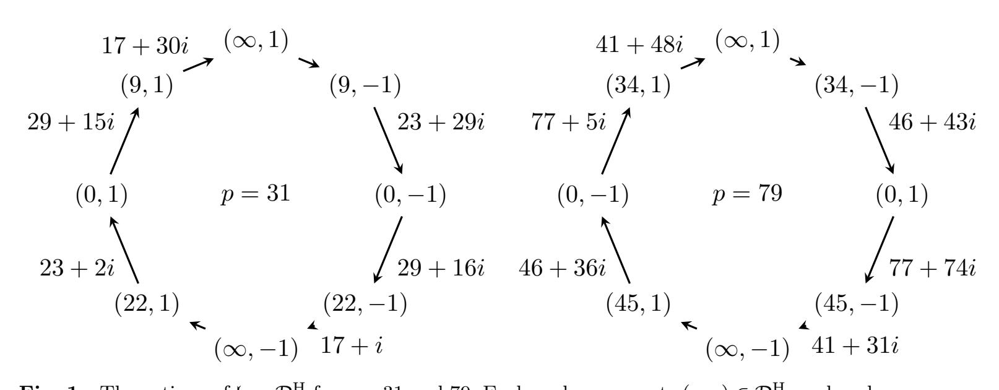

{0}------------------------------------------------

## Radical 3-isogenies for the ideal class group actions on (2, ε)-structures

Masaomi Shibata<sup>1</sup> , Hiroshi Onuki1\*, Tsuyoshi Takagi<sup>1</sup>

<sup>1</sup> Graduate School of Information Science and Technology, The University of Tokyo, 7-3-1 Hongo, Bunkyo-ku, Tokyo, 113-8656, Japan .

\*Corresponding author(s). E-mail(s): hiroshi-onuki@g.ecc.u-tokyo.ac.jp; Contributing authors: shibata.omi@gmail.com; takagi@g.ecc.u-tokyo.ac.jp;

#### Abstract

Chenu and Smith introduced the notion of (d, ε)-structures, pairs consisting of an elliptic curve over Fp<sup>2</sup> and an isogeny of degree d from the curve to its Galois conjugate. They also defined an ideal class group action on a set of supersingular (d, ε)-structures, inherited from the action on oriented supersingular elliptic curves. As cryptographic applications of this action, they outlined extensions of the CSIDH key exchange and of the Delfs-Galbraith algorithm for the supersingular isogeny problem. In particular, their extension of the Delfs-Galbraith algorithm, called the generalized Delfs-Galbraith algorithm, is expected to be more efficient than the original one by a constant factor. Therefore, it is important to find efficient methods for evaluating the ideal class group action on (d, ε)-structures.

In this paper, we focus on the case d = 2 and present explicit radical 3-isogenies for evaluating the action of the class of a prime ideal above 3. Our approach relies on two representations of (2, ε)-structures: (i) reductions of degree-2 Q-curves and (ii) Montgomery curves. In particular, we show that any (2, ε)-structure can be represented as a pair of a curve coefficient (of a degree-2 Q-curve or a Montgomery curve) and a single sign. From these representations, we derive radical 3-isogenies that efficiently implement the action of the class of a prime ideal above 3. As an application of our radical 3-isogenies, we give an explicit algorithm of the meet-in-the-middle method for finding an ideal class connecting two given (2, ε)-structures, which is a part of the generalized Delfs-Galbraith algorithm.

Keywords: Isogeny-based cryptography, Supersingular elliptic curves, Radical 3-isogenies, Ideal class group

{1}------------------------------------------------

### 1 Introduction

Isogeny-based cryptography is a promising candidate for post-quantum cryptography since it offers relatively small keys and ciphertexts compared to other post-quantum cryptographic schemes. Currently, there are roughly four types of isogeny-based cryptographic schemes: (i) hash functions using random walks in isogeny graphs such as [11, 14], (ii) a signature scheme using the Deuring correspondence called the SQIsign family [1, 24], (iii) public-key encryption schemes using a trapdoor function based on attacks in [9, 32, 37] such as [4, 5, 33], (iv) cryptographic primitives using the action of an ideal class group on a set of elliptic curves, which we focus on in this paper.

The first cryptographic primitive using the action of an ideal class group on a set of elliptic curves was proposed by Couveignes [21], and independently by Rostovtsev and Stolbunov [38]. This primitive uses ordinary elliptic curves and is not practical due to the high computational cost of evaluating the action. Later, Castryck, Lange, Martindale, Panny, and Renes [10] proposed CSIDH, a practical key exchange protocol using supersingular elliptic curves over  $\mathbb{F}_p$  for a prime p. CSIDH uses the ideal class group of the order  $\mathbb{Z}[\sqrt{-p}]$  acting on a set of supersingular elliptic curves over  $\mathbb{F}_p$ . After that, several variants of CSIDH have been proposed; for example, CSURF [8], OSIDH [17], and SCALLOP [25]. The primitives based on the ideal class group action are important because they provide many cryptographic applications, not only key exchange protocols. For example, a signature scheme [22], threshold schemes [23], and a password-authenticated key exchange protocol [2] have been proposed using the ideal class group action.

Chenu and Smith [15] introduced an ideal class group action associated with an order in  $\mathbb{Q}(\sqrt{-dp})$ , where d is a square-free positive integer. This action is defined on supersingular elliptic curves over  $\mathbb{F}_{p^2}$  equipped with a d-isogeny to their Galois conjugates under the p-th power Frobenius map. They called such a pair of an elliptic curve and a d-isogeny a  $(d, \varepsilon)$ -structure, where  $\varepsilon \in \{\pm 1\}$  is determined by the relation between the isogeny and the Frobenius map. They also proposed a variant of the CSIDH key exchange protocol based on  $(d, \varepsilon)$ -structures. This variant is less efficient than CSIDH because it requires arithmetic over  $\mathbb{F}_{p^2}$  rather than  $\mathbb{F}_p$ , so it is not expected to be practical as a cryptographic protocol. Nevertheless,  $(d, \varepsilon)$ -structures remain important as a theoretical tool for studying isogenies between supersingular elliptic curves. Chenu and Smith also extended the Delfs-Galbraith algorithm [27] to this setting; they called the resulting method the generalized Delfs-Galbraith algorithm. Although this extension does not improve the asymptotic complexity of the original algorithm, it is expected to yield a constant-factor speedup.

In the generalized Delfs-Galbraith algorithm based on  $(d, \varepsilon)$ -structures, one needs to find an ideal class in an order of  $\mathbb{Q}(\sqrt{-dp})$  whose action maps one given  $(d, \varepsilon)$ structure to another. The best known method for this task is the meet-in-the-middle technique for ideal class group actions described in [10, §7.1]. This method requires evaluating the action of many ideal classes on  $(d, \varepsilon)$ -structures. One promising way to accelerate these evaluations is to use *radical isogenies*, introduced by Castryck, Decru, and Vercauteren [12]. A radical isogeny formula computes a chain of *n*-isogenies by computing an *n*-th root at each step, and the choice of root determines the next isogeny in the chain. In CSIDH and CSURF, this choice can be made deterministically. In 

{2}------------------------------------------------

particular, when n is coprime with p-1, there is a unique n-th root in  $\mathbb{F}_p$ . However, no comparably efficient method is known for determining the root corresponding to the ideal class action in the setting of  $(d, \varepsilon)$ -structures.

#### Contribution.

In this paper, we address this problem in the case d=2 and n=3. In particular, we derive explicit radical 3-isogenies together with an efficient rule for selecting the cube root corresponding to the ideal class action on  $(2,\varepsilon)$ -structures. Our approach uses two representations of  $(2,\varepsilon)$ -structures: reductions of degree-2  $\mathbb{Q}$ -curves by Hasegawa [29], which we call  $Hasegawa\ parameters$ , and Montgomery curves. More precisely, we prove the following two facts:

- Any supersingular  $(2, \varepsilon)$ -structure can be uniquely represented as a pair consisting of a Hasegawa parameter and a sign (Corollary 11).
- Any supersingular  $(2, \varepsilon)$ -structure can be represented as a pair consisting of a Montgomery coefficient and a sign, and two such pairs represent isomorphic  $(2, \varepsilon)$ -structures if and only if their coefficients are equal up to sign (Theorem 14).

Using these representations, we derive radical 3-isogenies that efficiently compute the action of the class of a prime ideal  $\mathfrak{l}$  above 3 in  $\mathbb{Q}(\sqrt{-2p})$  on  $(2,\varepsilon)$ -structures. In particular, we give a deterministic rule for choosing the cube root corresponding to the action of the class of  $\mathfrak{l}$ .

To the best of our knowledge, this is the first work that gives radical 3-isogenies for an algebraically specified family of isogenies beyond the ideal class actions arising in CSIDH and CSURF. Here, "algebraically specified" means that the isogenies are characterized by explicit algebraic conditions, rather than by random walks in an isogeny graph as in hash functions [31]. We therefore expect that our formulas will be useful in algorithmic number theory beyond the specific application considered here.

As an application of these radical 3-isogenies, we give an explicit meet-in-the-middle algorithm for finding an ideal class connecting two given  $(2, \varepsilon)$ -structures, which forms a subroutine of the generalized Delfs–Galbraith algorithm.

We use SageMath [42] for deriving some formulas in this paper and for verifying their correctness. Furthermore, we implemented our radical 3-isogenies in SageMath to give concrete examples of the ideal class action on  $(2, \varepsilon)$ -structures. Our implementation is available at the GitHub repository:

https://github.com/hiroshi-onuki/2epsilon\_structure\_sagemath

#### Organization.

The rest of this paper is organized as follows. In Section 2, we review basic facts required for this paper. In Section 3, we present two representations of  $(2, \varepsilon)$ -structures. In Section 4, we derive radical 3-isogenies for the ideal class action on  $(2, \varepsilon)$ -structures. The meet-in-the-middle method for finding an ideal class connecting two given  $(2, \varepsilon)$ -structures is described in Section 5. Finally, we conclude this paper and discuss future work in Section 6.

{3}------------------------------------------------

#### <span id="page-3-0"></span>2 Preliminaries

In this section, we review the concepts and basic facts required for this paper. In particular, we review basic facts about elliptic curves, orientations,  $(d, \varepsilon)$ -structures, and radical isogenies.

#### 2.1 Basic facts about elliptic curves

We provide basic descriptions of elliptic curves. For more details, we refer the reader to textbooks such as [39, 43].

#### Elliptic curves and isogenies.

An elliptic curve over a field k is a pair (E,O), where E is a nonsingular algebraic curve of genus 1 defined over k and O is a base point on E defined over k. For an extension field k' of k, the set of k'-rational points on E is denoted by E(k'). It is known that E(k') forms an abelian group with identity O. Hereafter, we omit O and call E an elliptic curve for simplicity. We denote the multiplication-by-n map on E by [n] for an integer n. The n-torsion subgroup of E is the kernel of [n], and denoted by E[n]. The isomorphism class of an elliptic curve E is characterized by its E-invariant, which can be represented as a rational function of the coefficients of E. In particular, two elliptic curves over E are isomorphic over E if and only if they have the same E-invariant.

Let  $E_0$  and  $E_1$  be elliptic curves over k. An  $isogeny \varphi : E_0 \to E_1$  is a non-constant morphism that maps the base point of  $E_0$  to that of  $E_1$ . An  $isogeny \varphi : E_0 \to E_1$  induces an inclusion  $\varphi^* : \bar{k}(E_1) \to \bar{k}(E_0)$  of the function fields. The degree of  $\varphi$  is the degree of the field extension  $\bar{k}(E_0)/\varphi^*(\bar{k}(E_1))$ , denoted by  $\deg \varphi$ . The  $isogeny \varphi$  is separable (resp. inseparable) if the field extension  $\bar{k}(E_0)/\varphi^*(\bar{k}(E_1))$  is separable (resp. inseparable). We call  $\varphi$  a d-isogeny if  $\deg \varphi = d$ . We have  $\# \ker \varphi \leq \deg \varphi$ , and the equality holds if and only if  $\varphi$  is separable.

Two elliptic curves  $E_0$  and  $E_1$  are *d-isogenous* if there is a *d*-isogeny  $\varphi: E_0 \to E_1$ . For an isogeny  $\varphi: E_0 \to E_1$ , there exists a unique isogeny  $\psi: E_1 \to E_0$  such that  $\psi \circ \varphi = [\deg \varphi]$ . We call  $\psi$  the *dual isogeny* of  $\varphi$  and denote it by  $\hat{\varphi}$ .

Let G be a finite subgroup of  $E_0(\bar{k})$ . Then there exists a separable isogeny  $\varphi$ :  $E_0 \to E_1$  with kernel G. This isogeny  $\varphi$  is unique up to isomorphism of the codomain  $E_1$ . If G is stable under the action of  $\operatorname{Gal}(\bar{k}/k')$  for some extension field k' of k, then there exists such an isogeny  $\varphi$  defined over k' and  $\varphi$  is unique up to isomorphism of the codomain  $E_1$  over k'. We denote by  $E_0/G$  the codomain of  $\varphi$ .

An endomorphism of an elliptic curve E over k is an isogeny from E to itself or the zero map. The set of endomorphisms of E over  $\bar{k}$  forms a ring with addition defined as pointwise addition and multiplication defined as composition. We call it the endomorphism ring of E and denote it by  $\operatorname{End}(E)$ .

Let E be an elliptic curve over a field k of characteristic not equal to 2. Then E is isomorphic over k to an elliptic curve defined by  $y^2 = x^3 + ax^2 + bx + c$  for some  $a, b, c \in k$ . In this paper, we always assume that elliptic curves are given in this form. For  $\mu \in \bar{k}^{\times}$ , the curve E' defined by  $y^2 = x^3 + a\mu^2x^2 + b\mu^4x + c\mu^6$  is isomorphic to E over  $\bar{k}$  by an isomorphism defined by  $(x, y) \mapsto (\mu^2 x, \mu^3 y)$ . We denote

{4}------------------------------------------------

this isomorphism by  $\tau_{\mu}$ . For a positive integer n, the n-division polynomial of E is a polynomial  $\Psi_n \in k[x]$  such that the x-coordinate of a point  $P \in E(\bar{k}) \setminus \{O\}$  is a root of  $\Psi_n$  if and only if [n]P = O.

#### Elliptic curves over finite fields.

Let p be a prime number and k be a finite field of characteristic p. We say an elliptic curve E over k is ordinary if E[p] is isomorphic to  $\mathbb{Z}/p\mathbb{Z}$ , and supersingular if E[p] is the trivial group. If two elliptic curves over k are isogenous over  $\bar{k}$ , then they are both ordinary or both supersingular. Any supersingular elliptic curve over k is isomorphic over  $\bar{k}$  to an elliptic curve defined over  $\mathbb{F}_{p^2}$ .

Let E be an elliptic curve over k. We denote by  $E^{(p)}$  the elliptic curve obtained by applying the p-th power to all coefficients of E. Then there exists the p-th power Frobenius map  $\pi_p: E \to E^{(p)}$ , defined by  $(x,y) \mapsto (x^p,y^p)$ . Let  $\varphi: E \to E'$  be an isogeny over k. We denote by  $\varphi^{(p)}: E^{(p)} \to E'^{(p)}$  the isogeny obtained by applying the p-th power to all coefficients of  $\varphi$ . Note that it holds that  $\varphi^{(p)} \circ \pi_p = \pi_p \circ \varphi$ .

#### Tate pairing.

Let q be a power of a prime, n be a positive integer such that  $n \mid q-1$ , and E be an elliptic curve over  $\mathbb{F}_q$ . The n-Tate pairing is a nondegenerate bilinear map

$$\langle \cdot, \cdot \rangle_n : E(\mathbb{F}_q)[n] \times E(\mathbb{F}_q)/nE(\mathbb{F}_q) \to \mathbb{F}_q^{\times}/(\mathbb{F}_q^{\times})^n.$$

For the definition of the Tate pairing, see [43, Chapter 11.3]. In this paper, we use the following property of the Tate pairing.

<span id="page-4-0"></span>**Lemma 1** Let q be a power of an odd prime such that  $3 \mid q-1$ , and E be an elliptic curve defined by  $y^2 = x^3 + ax^2 + bx + c$  for  $a, b, c \in \mathbb{F}_q$ . Assume that  $E(\mathbb{F}_q)[3]$  contains a nonzero point  $P = (x_P, y_P)$ . Then  $\langle P, -P \rangle_3 = 2y_P \mod (\mathbb{F}_q^{\times})^3$ .

Proof Let  $f(x,y) = y - \lambda(x - x_P) - y_P$  be the tangent line at P on E, i.e.,  $\lambda = (3x_P^2 + 2ax_P + b)/(2y_P)$ . Since the order of P is 3, the divisor of f is 3(P) - 3(O). From Proposition XI.9.2 in [39], if  $f \circ [3]$  in  $(\mathbb{F}_q(E)^{\times})^3$ , then we have  $\langle P, Q \rangle_3 \equiv f(Q) \mod (\mathbb{F}_q^{\times})^3$  for  $Q \in E(\mathbb{F}_q) \setminus \{O, P\}$ . Since  $f(-P) = -2y_P \equiv 2y_P \pmod {(\mathbb{F}_q^{\times})^3}$ , it suffices to show that  $f \circ [3]$  is in  $(\mathbb{F}_q(E)^{\times})^3$ .

By a similar discussion to Section 3.2 in [43] (or an explicit computation), we can show that  $f \circ [3]$  is of the form  $yf_1(x)/\Psi_3(x)^3$ , where  $f_1(x) \in \mathbb{F}_q[x]$  is a monic polynomial of degree 12 and  $\Psi_3(x)$  is the 3-division polynomial of E.

Let D be a divisor on E defined by

$$D = \sum_{[3]R=P} (R) - \sum_{[3]R=O} (R).$$

Since the degree of D is zero,  $\sum(D) = O$ , there exists a function  $g \in \overline{\mathbb{F}_q}(E)^{\times}$  such that  $\operatorname{div}(g) = D$ . In addition, since the q-power Frobenius map acts on D trivially, we can take g in  $\mathbb{F}_q(E)^{\times}$ .

{5}------------------------------------------------

Let  $h_1, h_2$  be two polynomials in  $\mathbb{F}_q[x, y]$  such that  $g = h_1/h_2$ . Since the divisors of  $f \circ [3]$  and  $g^3$  are the same, There exists a constant  $c \in \mathbb{F}_q^{\times}$  such that

$$(h_1 \cdot \Psi_3)^3 = c \cdot y f_1 \cdot h_2^3.$$

By comparing the highest degree terms of both sides, we have  $c \in (\mathbb{F}_q^{\times})^3$ . This shows that  $f \circ [3]$  is in  $(\mathbb{F}_q(E)^{\times})^3$ .

#### Complex multiplication.

Let E be an elliptic curve over  $\mathbb{C}$ , and  $\mathcal{O}$  be an order of an imaginary quadratic field K. We say E has complex multiplication (CM) by  $\mathcal{O}$  if  $\operatorname{End}(E)$  is isomorphic to  $\mathcal{O}$ . We say E has CM by K if  $\operatorname{End}(E)$  is isomorphic to the ring of integers  $\mathcal{O}_K$  of K. The j-invariant of an elliptic curve with CM is an algebraic integer. In particular, if  $\mathcal{O}$  has class number 1, then the j-invariant is in  $\mathbb{Z}$ . Especially, we are interested in elliptic curves with CM by  $\mathbb{Q}(\sqrt{-1})$ ,  $\mathbb{Q}(\sqrt{-2})$ ,  $\mathbb{Q}(\sqrt{-3})$ , and  $\mathbb{Q}(\sqrt{-7})$ , whose j-invariants are 1728, 8000, 0, and -3375, respectively. Note that the imaginary quadratic orders having elements of norm 2 are  $\mathbb{Z}[\sqrt{-1}]$ ,  $\mathbb{Z}[\sqrt{-2}]$ , and  $\mathbb{Z}\left[\frac{1+\sqrt{-7}}{2}\right]$  whose corresponding j-invariants are 1728, 8000, and -3375, respectively.

Let  $\bar{E}$  be an elliptic curve over a number field L with CM by an order  $\mathcal{O}$  of an imaginary quadratic field K, and E be the reduction of  $\bar{E}$  modulo a prime ideal above p in L. Then E is ordinary if p splits in  $\mathcal{O}$ , and supersingular otherwise. In addition,  $\operatorname{End}(E)$  contains a subring isomorphic to  $\mathcal{O}$ .

#### Montgomery curves.

Let k be a field of characteristic not equal to 2 and  $A \in k \setminus \{\pm 2\}$ . A Montgomery curve is an elliptic curve defined by the equation

$$y^2 = x^3 + Ax^2 + x.$$

We denote this Montgomery curve by  $E_A^{\mathrm{M}}$  and call A the Montgomery coefficient of  $E_A^{\mathrm{M}}$ .

For any Montgomery curve, the point (0,0) has order 2, and the x-coordinate of a point P such that [2]P = (0,0) is 1 or -1. Let i be a square root of -1 in  $\bar{k}$ . Then there exists an isomorphism  $E_A^{\mathrm{M}} \to E_{-A}^{\mathrm{M}}$ ;  $(x,y) \mapsto (-x,iy)$ .

The following facts about Montgomery curves are well-known. We provide proofs for the sake of completeness.

<span id="page-5-0"></span>**Lemma 2** Let E be a supersingular elliptic curve over a finite field  $\mathbb{F}_{p^2}$ . Assume that there exists a point  $T \in E(\mathbb{F}_{p^2})$  of order 4. Then there exists a Montgomery curve  $E_A^M$  defined over  $\mathbb{F}_{p^2}$  and an isomorphism  $\iota: E \to E_A^M$  defined over  $\mathbb{F}_{p^2}$  such that  $\iota([2]T) = (0,0)$ .

Proof Since  $p \neq 2$ , we can assume that E is defined by  $y^2 = x^3 + a_2x^2 + a_4x + a_6$  for some  $a_2, a_4, a_6 \in \mathbb{F}_{p^2}$ . Shifting x-coordinate by the x-coordinate of [2]T, we can assume that E is

{6}------------------------------------------------

defined by  $y^2 = x^3 + \alpha x^2 + \beta x$  for some  $\alpha, \beta \in \mathbb{F}_{p^2}$  and that [2]T = (0,0). Then it is easy to

see that the x-coordinate of T is a square root of  $\beta$ . Let t be the x-coordinate of T. Let  $v \in \overline{\mathbb{F}}_p$  be a square root of  $t^{-1}$ . Since there exists an isomorphism  $\tau_v : E \to E^{\mathrm{M}}_{\alpha/t}$ , it suffices to show that t is in  $(\mathbb{F}_{n^2}^{\times})^2$  to prove the lemma. This is shown as a similar way to Theorem 2 in |19|.

A similar discussion to the proof of Lemma 1 shows that

$$t^{\frac{p^2-1}{2}} = (\langle [2]T, T \rangle_2)^{\frac{p^2-1}{2}}.$$

Let  $\pi$  be the  $p^2$ -th power Frobenius endomorphism on E, let  $e_2$  be the 2-Weil pairing on E, and  $T' \in E(\overline{\mathbb{F}}_p)$  be a point satisfying [2]T' = T. Then we have  $\langle [2]T, T \rangle_2 = e_2([2]T, T' - \pi(T'))$ . Since the order of  $E(\mathbb{F}_{p^2})$  is divisible by 4, we have the characteristic polynomial of  $\pi$  is given by  $X^2 \pm 2X + p^2$ . This means that  $\pi$  is equal to [p] or [-p]. This and  $T' - \pi(T') \in E[2]$  imply that  $T' - \pi(T') = 2T$  or O. Therefore, we have  $e_2([2]T, T' - \pi(T')) = 1$ . This shows that t is in  $(\mathbb{F}_{p^2}^{\times})^2$ . 

<span id="page-6-1"></span>**Lemma 3** Let  $E_A^{\mathrm{M}}$  be a supersingular Montgomery curve over  $\mathbb{F}_{p^2}$ . Then we have the following:

- 1. A + 2 and A 2 are in  $(\mathbb{F}_{p^2}^{\times})^4$ ,
- 2.  $E_A^{\mathrm{M}}[4] \subset E_A^{\mathrm{M}}(\mathbb{F}_{p^2})$ .

Especially, the  $p^2$ -th power Frobenius endomorphism on  $E_A^M$  is equal to the multiplication by  $(-1)^{\frac{p-1}{2}}p.$ 

Proof By the isogeny in Example III.4.5 in [39],  $E_A^{\rm M}$  is 2-isogenous to the curve defined by  $y^2 = x^3 - 2Ax^2 + (A^2 - 4)x$ . This curve is isomorphic (over  $\overline{\mathbb{F}}_p$ ) to the Legendre curve  $y^2 = x(x-1)(x-\frac{A+2}{A-2})$ . Since this Legendre curve is also supersingular, Proposition 3.1 in [3] implies that  $\frac{A+2}{A-2}$  is in  $(\mathbb{F}_{p^2}^{\times})^8$ . The Legendre curve with parameter  $1 - \frac{A+2}{A-2} = -\frac{4}{A-2}$  is isomorphic to the previous Legendre curve. Therefore,  $-\frac{4}{A-2}$  is also in  $(\mathbb{F}_{n^2}^{\times})^8$ . From these,  $\frac{A+2}{A-2} \cdot \left(-\frac{4}{A-2}\right)^{-1} = (A+2)/(-4)$  is in  $(\mathbb{F}_{p^2}^{\times})^8$ . Since -4 is in  $(\mathbb{F}_{p^2}^{\times})^4$ , we have A+2 is in  $(\mathbb{F}_{p^2}^{\times})^4$ . A similar argument shows that A-2 is also in  $(\mathbb{F}_{p^2}^{\times})^4$ .

Let P be a point on  $E_A^{\mathrm{M}}$  with x-coordinate 1. Since the y-coordinate of P is a square root of A+2, the above result implies that P is rational over  $\mathbb{F}_{p^2}$ . Therefore, the order of  $E_A^{\mathrm{M}}(\mathbb{F}_{p^2})$  is divisible by 4 and the characteristic polynomial of the  $p^2$ -th power Frobenius endomorphism  $\pi$  on  $E_A^{\mathrm{M}}$  is given by  $X^2 \pm 2X + p^2$ . Since  $\pi$  acts on P trivially, we have  $\pi = [(-1)^{\frac{p-1}{2}}p]$ . Therefore,  $\pi$  acts on  $E_A^{\mathrm{M}}[4]$  trivially. 

<span id="page-6-0"></span>**Lemma 4** Let k be a field of characteristic not equal to 2 and  $A \in k \setminus \{\pm 2\}$ . Let  $v \in \bar{k}$  be a fourth root of  $A^2-4$  and  $A'=-2A/v^2$ . Then there exists an isogeny  $\varphi: E_A^{\mathrm{M}} \to E_{A'}^{\mathrm{M}}$  of degree 2 with kernel  $\langle (0,0) \rangle$  defined by

$$(x,y) \mapsto \left(\frac{x^2 + Ax + 1}{v^2 x}, \frac{y(1-x^2)}{v^3 x^2}\right).$$

{7}------------------------------------------------

The dual isogeny  $\hat{\varphi}: E_{A'}^{\mathrm{M}} \to E_{A}^{\mathrm{M}}$  has kernel  $\langle (0,0) \rangle$  and is given by

$$(x,y) \mapsto \left(\frac{v^2(x^2 + A'x + 1)}{4x}, \frac{v^3y(1-x^2)}{8x^2}\right).$$

In addition, if  $E_A^{\mathrm{M}}$  is a supersingular elliptic curve over  $\mathbb{F}_{p^2}$ , then  $\varphi$  is defined over  $\mathbb{F}_{p^2}$ .

Proof of Lemma 4 The isogeny  $\varphi$  is obtained by composing the 2-isogeny in Example III.4.5 in [39] and the isomorphism  $\tau_{v^{-1}}$  from the codomain of this 2-isogeny to  $E_{A'}^{\mathrm{M}}$ . The dual isogeny is obtained similarly.

If  $E_A^{\mathrm{M}}$  is a supersingular elliptic curve over  $\mathbb{F}_{p^2}$ , then Lemma 3 implies that  $v \in \mathbb{F}_{p^2}$ . Therefore, the isogeny  $\varphi$  is defined over  $\mathbb{F}_{p^2}$ .

We denote the isogeny  $E_A^{\mathrm{M}} \to E_{A'}^{\mathrm{M}}$  in Lemma 4 by  $\psi_{A,(v)}^{\mathrm{M}}$ .

#### 2.2 Orientations

Let E be an elliptic curve over  $\mathbb{F}_{p^2}$  and K be an imaginary quadratic field. A Korientation on E is a ring homomorphism  $K \hookrightarrow \operatorname{End}(E) \otimes_{\mathbb{Z}} \mathbb{Q}$ . We call the pair  $(E, \iota)$ a K-oriented elliptic curve. For an order  $\mathcal{O}$  of K, we say  $\iota$  is an  $\mathcal{O}$ -orientation if  $\iota(\mathcal{O}) \subset \operatorname{End}(E)$ . In addition, if  $\iota(\mathcal{O}) = \operatorname{End}(E) \cap \iota(K)$ , then  $\iota$  is called a primitive  $\mathcal{O}$ -orientation.

Let  $(E, \iota)$  be a K-oriented elliptic curve over  $\mathbb{F}_{p^2}$  and  $\varphi : E \to E'$  be an isogeny. Then we can define an orientation  $\varphi_*\iota$  on E' by

$$\varphi_*\iota:\alpha\mapsto \frac{1}{\deg\varphi}\varphi\circ\iota(\alpha)\circ\hat{\varphi}.$$

Let  $\iota'$  be a K-orientation on E'. Then  $\varphi$  is said to be a K-oriented isogeny if  $\varphi_*\iota = \iota'$ . We denote this by  $\varphi: (E,\iota) \to (E',\iota')$ . Two K-oriented elliptic curves  $(E,\iota)$  and  $(E',\iota')$  are said to be isomorphic if there exists a K-oriented isogeny  $\varphi: E \to E'$  that is an isomorphism as an isogeny of elliptic curves.

Let  $\mathcal{O}$  be an order of an imaginary quadratic field K. We denote the set of the isomorphism classes of primitive  $\mathcal{O}$ -oriented supersingular elliptic curves over  $\mathbb{F}_{p^2}$  by  $SS^{pr}_{\mathcal{O}}(p)$ . This set is not empty if p does not split in  $\mathcal{O}$  and the conductor of  $\mathcal{O}$  is coprime to p. Let  $(E, \iota)$  be a primitive  $\mathcal{O}$ -oriented elliptic curve. For an invertible ideal  $\mathfrak{a}$  of  $\mathcal{O}$ , we define a subgroup  $E[\mathfrak{a}]$  of E as

$$E[\iota(\mathfrak{a})] = \bigcap_{\alpha \in \mathfrak{a}} \ker(\iota(\alpha)).$$

Let  $\varphi$  be an isogeny with kernel  $E[\mathfrak{a}]$  and E' be the codomain of  $\varphi$ . Then the induced oriented elliptic curve  $(E', \varphi_* \iota)$  is a primitive  $\mathcal{O}$ -oriented elliptic curve. This defines an action of the ideal class group  $\operatorname{cl}(\mathcal{O})$  on  $\operatorname{SS}^{\operatorname{pr}}_{\mathcal{O}}(p)$ . The action is given by

$$\operatorname{cl}(\mathcal{O}) \times \operatorname{SS}^{\operatorname{pr}}_{\mathcal{O}}(p) \to \operatorname{SS}^{\operatorname{pr}}_{\mathcal{O}}(p),$$
$$([\mathfrak{a}], (E, \iota)) \mapsto ([\mathfrak{a}] * (E, \iota) \coloneqq (E/E[\iota(\mathfrak{a})], \varphi_*\iota)),$$

{8}------------------------------------------------

where  $[\mathfrak{a}]$  is the class of an invertible ideal  $\mathfrak{a}$  in  $cl(\mathcal{O})$ . For the details of the action, see  $[17, \S 3]$  and  $[34, \S 3.3]$ .

Let  $\mathcal{O}$  be an order of an imaginary quadratic field such that  $SS_{\mathcal{O}}^{pr}(p)$  is not empty, and  $\mathcal{E}\ell\ell(\mathcal{O})$  be the set of elliptic curves over a number field with complex multiplication by  $\mathcal{O}$ . Let  $\mathcal{E} \in \mathcal{E}\ell\ell(\mathcal{O})$ , and  $[\cdot]_{\mathcal{E}}$  be the normalized isomorphism  $\mathcal{O} \to End(\mathcal{E})$ . We assume that  $\mathcal{E}$  has a good reduction at a prime ideal  $\mathfrak{p}$  above p. Then the reduction  $\tilde{\mathcal{E}}$  of  $\mathcal{E}$  modulo  $\mathfrak{p}$  is a supersingular elliptic curve over  $\mathbb{F}_{p^2}$ . In addition,  $(\tilde{\mathcal{E}}, [\cdot]_{\tilde{\mathcal{E}}})$  is a primitive  $\mathcal{O}$ -oriented elliptic curve over  $\mathbb{F}_{p^2}$ . We denote the map  $\mathcal{E}\ell\ell(\mathcal{O}) \to SS_{\mathcal{O}}^{pr}(p)$  induced by this reduction by  $\rho$ . Then  $cl(\mathcal{O})$  acts freely and transitively on  $\rho(\mathcal{E}\ell\ell(\mathcal{O}))$  [34, Theorem 3.4].

#### 2.3 $(d, \varepsilon)$ -structures

Let d be a positive square-free integer. A  $\mathbb{Q}$ -curve of degree d is an elliptic curve E over  $\mathbb{Q}$  such that E is d-isogenous over  $\mathbb{Q}$  to its Galois conjugate  $E^{\sigma}$ , where  $\sigma \in \operatorname{Gal}(\mathbb{Q}/\mathbb{Q})$ . Chenu and Smith [15] introduced an analogous concept for elliptic curves over  $\mathbb{F}_{p^2}$ , which we call a  $(d, \varepsilon)$ -structure.

Let d be a square-free positive integer that is coprime to p, and  $\varepsilon$  be 1 or -1. A pair  $(E, \psi)$  of an elliptic curve E over  $\mathbb{F}_{p^2}$  and a d-isogeny  $\psi : E \to E^{(p)}$  is called a  $(d, \varepsilon)$ -structure if  $\widehat{\psi} = \varepsilon \psi^{(p)}$ . An isogeny  $\varphi : (E_0, \psi_0) \to (E_1, \psi_1)$  between two  $(d, \varepsilon)$ -structures  $(E_0, \psi_0)$  and  $(E_1, \psi_1)$  is defined as an isogeny  $\varphi : E_0 \to E_1$  of elliptic curves over  $\mathbb{F}_{p^2}$  satisfying

$$\psi_1 \circ \varphi = \varphi^{(p)} \circ \psi_0.$$

Let  $(E_0, \psi_0)$  be a  $(d, \varepsilon_0)$ -structure and  $(E_1, \psi_1)$  be a  $(d, \varepsilon_1)$ -structure. If there exists an isogeny  $\varphi : E_0 \to E_1$  defined over  $\mathbb{F}_{p^2}$  such that  $\psi_1 \circ \varphi = \varphi^{(p)} \circ \psi_0$ , then we have  $\varepsilon_0 = \varepsilon_1$ . Two  $(d, \varepsilon)$ -structures  $(E_0, \psi_0)$  and  $(E_1, \psi_1)$  are said to be isomorphic if there exists an isogeny  $(E_0, \psi_0) \to (E_1, \psi_1)$  that is an isomorphism as an isogeny of elliptic curves  $E_0 \to E_1$ . This is denoted by  $(E_0, \psi_0) \simeq (E_1, \psi_1)$ . Note that  $(E, \psi)$  is not isomorphic to  $(E, -\psi)$  if j(E) is not equal to 0 or 1728.

Let  $(E, \psi)$  be a  $(d, \varepsilon)$ -structure and  $\pi_p$  be the p-th power Frobenius map  $E^{(p)} \to E$ . Then  $\mu := \pi_p \circ \psi$  is an endomorphism of E defined over  $\mathbb{F}_{p^2}$ . We call  $\mu$  the associated endomorphism of  $(E, \psi)$ .

Our main focus is the case that E is a supersingular elliptic curve over  $\mathbb{F}_{p^2}$ . In this case, we have the following properties of  $(E, \psi)$ .

<span id="page-8-0"></span>**Proposition 5** ([15, Proposition 2]) Let d be a square-free positive integer coprime to p, and  $\varepsilon$  be 1 or -1. Let  $(E, \psi)$  be a  $(d, \varepsilon)$ -structure over  $\mathbb{F}_{p^2}$  such that E is supersingular. Then the following hold:

<span id="page-8-1"></span>1. 
$$\mu^2 = [-dp]$$
.  
2.  $E(\mathbb{F}_{p^2}) \cong (\mathbb{Z}/(p+\varepsilon)\mathbb{Z})^2$ .

From this proposition, if  $(E, \psi)$  is a supersingular  $(d, \varepsilon)$ -structure, then the associated endomorphism  $\mu$  induces a  $\mathbb{Z}(\sqrt{-dp})$ -orientation on E defined by  $\sqrt{-dp} \mapsto \mu$ . We call this orientation the *natural orientation* of  $(E, \psi)$  and denote it by  $\iota_{\psi}$ .

{9}------------------------------------------------

The converse of Proposition 5 is also true.

**Lemma 6** ([15, Lemma 1]) Let E be a supersingular elliptic curve over  $\mathbb{F}_{p^2}$  such that  $E(\mathbb{F}_{p^2}) \cong (\mathbb{Z}/(p+\varepsilon)\mathbb{Z})^2$ , and  $\iota$  be a  $\mathbb{Z}(\sqrt{-dp})$ -orientation on E. Then there exists an isogeny  $\psi: E \to E^{(p)}$  such that  $(E, \psi)$  is a  $(d, \varepsilon)$ -structure and  $\iota$  is the natural orientation of  $(E, \psi)$ .

In addition, isogenies between  $(d, \varepsilon)$ -structures are also  $\mathbb{Z}(\sqrt{-dp})$ -oriented isogenies. More precisely, we have the following lemma.

**Lemma 7** ([15, Lemma 2]) Let  $(E_0, \psi_0)$  and  $(E_1, \psi_1)$  be  $(d, \varepsilon)$ -structures over  $\mathbb{F}_{p^2}$  such that  $E_0$  and  $E_1$  are supersingular. Let  $\varphi: E_0 \to E_1$  be an isogeny. Then  $\varphi$  is an isogeny (resp. isomorphism) of  $(d, \varepsilon)$ -structures  $(E_0, \psi_0) \to (E_1, \psi_1)$  if and only if  $\varphi$  is a  $\mathbb{Z}(\sqrt{-dp})$ -oriented isogeny (resp. isomorphism)  $(E_0, \iota_{\psi_0}) \to (E_1, \iota_{\psi_1})$ .

Let  $\mathcal{O}$  be an order of  $\mathbb{Q}(\sqrt{-dp})$  such that  $\iota_{\psi}$  is a primitive  $\mathcal{O}$ -orientation. Then  $\mathcal{O}$  contains  $\sqrt{-dp}$ . This means that  $\mathcal{O}$  is the ring of integers of  $\mathbb{Q}(\sqrt{-dp})$  or the order of conductor 2 in  $\mathbb{Q}(\sqrt{-dp})$ . From this fact, we define a set  $\mathcal{D}_{d,\varepsilon}(p)$  and its subsets as follows.

**Definition 1** Let d be a square-free positive integer coprime with p, and  $\varepsilon$  be 1 or -1. Let  $\mathcal{O}_1$  be the ring of integers of  $\mathbb{Q}(\sqrt{-dp})$  and  $\mathcal{O}_2$  be the order of conductor 2 in  $\mathbb{Q}(\sqrt{-dp})$ . We define the set  $\mathcal{D}_{d,\varepsilon}(p)$  as the set of the isomorphism classes of  $(d,\varepsilon)$ -structures over  $\mathbb{F}_{p^2}$ .

- $\mathcal{D}_{d,\varepsilon}^{\max}(p)$  is the subset of  $\mathcal{D}_{d,\varepsilon}(p)$  consisting of the classes of  $(d,\varepsilon)$ -structures such that the natural orientation is a primitive  $\mathcal{O}_1$ -orientation.
- $\mathcal{D}_{d,\varepsilon}^{\text{sub}}(p)$  is the subset of  $\mathcal{D}_{d,\varepsilon}(p)$  consisting of the classes of  $(d,\varepsilon)$ -structures such that the natural orientation is a primitive  $\mathcal{O}_2$ -orientation.

We define an action of the ideal class group  $\operatorname{cl}(\mathcal{O}_1)$  (resp.  $\operatorname{cl}(\mathcal{O}_2)$ ) on  $\mathcal{D}_{d,\varepsilon}^{\max}(p)$  (resp.  $\mathcal{D}_{d,\varepsilon}^{\operatorname{sub}}(p)$ ) as the action induced by the natural orientation. We denote this action in the same manner as the action of the ideal class group on  $\operatorname{SS}_{\mathcal{O}}^{\operatorname{pr}}(p)$ . Then we have the following proposition.

**Proposition 8** ([15, Theorem 2]) Let d be a square-free positive integer coprime with p, and  $\varepsilon$  be 1 or -1. Let  $\mathcal{O}_1$  be the ring of integers of  $\mathbb{Q}(\sqrt{-dp})$  and  $\mathcal{O}_2$  be the order of conductor 2 in  $\mathbb{Q}(\sqrt{-dp})$ .

- The class group  $\operatorname{cl}(\mathcal{O}_1)$  acts freely and transitively on  $\mathcal{D}_{d,\varepsilon}^{\max}(p)$ .
- If  $\mathcal{D}_{d,\varepsilon}^{\mathrm{sub}}(p) \neq \emptyset$ , then  $\mathrm{cl}(\mathcal{O}_2)$  acts freely and transitively on  $\mathcal{D}_{d,\varepsilon}^{\mathrm{sub}}(p)$ .

#### 2.4 Radical isogenies

Let n be a positive integer, let k be a field with  $char(k) \nmid n$ , let E be an elliptic curve over k, and let P be a point in E(k) of order n. Then there exists an isogeny

{10}------------------------------------------------

 $\varphi: E \to E/\langle P \rangle$  over k with kernel  $\langle P \rangle$ . We denote the codomain  $E/\langle P \rangle$  of  $\varphi$  by E'. Let P' be a point on E' such that  $\hat{\varphi}(P') = P$ . Castryck, Decru, and Vercauteren [12] showed that P' is defined over  $K(\sqrt[n]{\rho})$ , where  $\rho$  is a representative of the n-Tate pairing  $\langle P, -P \rangle_n$ . The n choices of an n-th root of  $\rho$  correspond to the n-isogenies  $\psi$  such that the kernel of  $\psi \circ \varphi$  is cyclic.

By taking models of E and  $E/\langle P \rangle$  such that P and P' are (0,0), they gave explicit formulas to compute  $E/\langle P \rangle$  from E, and called these radical isogenies. For curve models, they used Tate normal forms [41] for N > 4.

As an application of radical isogenies, they proposed an efficient method to compute the ideal class group action in an isogeny-based key-exchange protocol CSURF [8], which is a variant of CSIDH [10].

We briefly recall CSIDH and CSURF. Let p be a prime number such that  $p \equiv 3 \mod 4$ , and E be a supersingular elliptic curve over  $\mathbb{F}_p$ . Then the subring  $\operatorname{End}_p(E)$  of  $\operatorname{End}(E)$  consisting of endomorphisms defined over  $\mathbb{F}_p$  is isomorphic to an order in  $\mathbb{Q}(\sqrt{-p})$  by mapping the p-th power Frobenius endomorphism to  $\sqrt{-p}$ . We denote this orientation by  $\iota_{E,p}$ . Then two oriented elliptic curves  $(E,\iota_{E,p})$  and  $(E',\iota_{E',p})$  over  $\mathbb{F}_p$  are isomorphic if and only if E and E' are isomorphic as elliptic curves over  $\mathbb{F}_p$ . Let  $\mathcal{O}$  be  $\mathbb{Z}[\sqrt{-p}]$  or  $\mathbb{Z}\left[\frac{1+\sqrt{-p}}{2}\right]$ . Then the ideal class group  $\operatorname{cl}(\mathcal{O})$  acts freely and transitively on the set of isomorphism classes of supersingular elliptic curves over  $\mathbb{F}_p$  whose endomorphism rings are isomorphic to  $\mathcal{O}$  [10, Theorem 7]. CSIDH uses  $\mathbb{Z}[\sqrt{-p}]$  as  $\mathcal{O}$ , and CSURF uses  $\mathbb{Z}\left[\frac{1+\sqrt{-p}}{2}\right]$  as  $\mathcal{O}$ . In addition, CSURF uses the prime p such that  $p \equiv 7 \mod 8$ , so that the prime 2 in  $\mathbb{Z}$  splits in  $\mathbb{Z}\left[\frac{1+\sqrt{-p}}{2}\right]$ .

Radical isogenies can be used to efficiently compute the actions of  $cl(\mathcal{O})$  in CSIDH and CSURF. Let  $\ell$  be a prime number that splits in  $\mathcal{O}$ , and  $\mathfrak{l}$  be a prime ideal of  $\mathcal{O}$  above  $\ell$ . Given a primitively  $\mathcal{O}$ -oriented elliptic curve  $(E, \iota_{E,p})$  over  $\mathbb{F}_p$ , a positive integer n, the action of  $\mathfrak{l}^n$  on  $(E, \iota_{E,p})$  can be computed by iteratively applying radical

1. Find a point  $P \in E(\mathbb{F}_p)$  generating  $E[\iota_{E,p}(\mathfrak{l})]$ .

isogenies as follows:

- 2. Transform E into a model such that P = (0,0).
- 3. Compute the codomain E' of the isogeny with kernel  $\langle P \rangle$  using a radical isogeny. Iterate this n times to obtain the curve E''.
- 4. Transform E'' back to the original model if necessary.

In step 3 above, each radical isogeny requires the computation of an  $\ell$ -th root in  $\mathbb{F}_p$ . In CSURF setups, there exists a unique  $\ell$ -th root in  $\mathbb{F}_p$  for odd primes  $\ell$ , and this unique root induces the isogeny corresponding to the ideal  $\mathfrak{l}$ . For  $\ell=2$ , they use 4-radical isogenies instead of 2-radical isogenies, and give a method to choose the correct 4-th root<sup>1</sup>.

The initial paper [12] on radical isogenies gave radical isogenies for  $n \leq 13$ . Later, radical isogenies for all n up to the point where  $\sqrt{\text{élu's}}$  formulas [6] outperform them were given in [13, 26].

<span id="page-10-0"></span><sup>&</sup>lt;sup>1</sup>The method to choose the correct 4-th root was given as a conjecture in [8], and later proved in [35].

{11}------------------------------------------------

## <span id="page-11-0"></span>3 Representing $(2, \varepsilon)$ -structures

In the rest of this paper, we use the following notation. Let p be a prime number greater than 7. We fix square roots of -1 and -2 in  $\mathbb{F}_{p^2}$ , and denote them by i and  $\sqrt{-2}$ , respectively. We choose a non-square  $\Delta \in \mathbb{F}_p^{\times}$  and fix a square root  $\sqrt{\Delta}$  of  $\Delta$  in  $\mathbb{F}_{p^2}$ . Furthermore, we denote by  $N_{p^2}$  the norm on  $\mathbb{F}_{p^2}$  over  $\mathbb{F}_p$ , i.e.,  $N_{p^2}(\alpha) = \alpha^{p+1}$  for  $\alpha \in \mathbb{F}_{p^2}$ .

The assumption p > 7 is for ensuring that the CM j-invariants 8000 and -3375 are not equal to 0 or 1728 modulo p. In particular, an elliptic curve over  $\mathbb{F}_{p^2}$  with j-invariant 0 never has  $(2, \varepsilon)$ -structure since the ring of integer of  $\mathbb{Q}(\sqrt{-3})$  does not contain elements of norm 2.

#### 3.1 Hasegawa parameter

The idea by Chenu and Smith [15] to represent  $(2, \varepsilon)$ -structures is to use the parametrization of  $\mathbb{Q}$ -curves of degree 2 by Hasegawa [29]. The reductions of these  $\mathbb{Q}$ -curves of degree 2 to  $\mathbb{F}_{p^2}$  were considered by Smith [40, §5].

For  $u \in \mathbb{F}_p$ , we define an elliptic curve  $E_u^{\mathrm{H}}$  by

$$E_u^{\mathrm{H}}: y^2 = x^3 - 6(5 - 3u\sqrt{\Delta})x + 8(7 - 9u\sqrt{\Delta}).$$

Then there exists an isogeny of degree 2 from  $E_u^H$  with kernel  $\langle (4,0) \rangle$  to  $E_u^{H(p)} = E_{-u}^H$  defined by

<span id="page-11-1"></span>
$$\psi_u^{\mathrm{H}}: (x,y) \mapsto \left(-\frac{x}{2} - \frac{9(1 + u\sqrt{\Delta})}{x - 4}, \frac{y}{\sqrt{-2}} \left(-\frac{1}{2} + \frac{9(1 + u\sqrt{\Delta})}{(x - 4)^2}\right)\right). \tag{1}$$

Then  $(E_u^{\rm H}, \psi_u^{\rm H})$  and  $(E_u^{\rm H}, -\psi_u^{\rm H})$  are  $(2, \varepsilon)$ -structures, where  $\varepsilon = -\left(\frac{-2}{p}\right)$  [40, Theorem 2]. We denote this  $\varepsilon$  by  $\varepsilon_p^{\rm H}$ .

We have  $j(E_u^{\rm H})=2^6\frac{(3u\sqrt{\Delta}-5)^3}{(u\sqrt{\Delta}-1)(u\sqrt{\Delta}+1)^2}$  [29, Theorem 2.2]. As pointed out in [40, §9], curves of the form  $E_u^{\rm H}$  lack the j-invariant 1728 and it is obtained as the limit as  $u\to\infty$ . Based on this observation, we also define an elliptic curve  $E_\infty^{\rm H}$  by

<span id="page-11-2"></span>
$$E_{\infty}^{\mathrm{H}}: y^2 = x^3 + \sqrt{\Delta}x.$$

Then  $j(E_{\infty}^{\mathrm{H}}) = 1728$ . We define  $\psi_{\infty}^{\mathrm{H}}$  by

$$\psi_{\infty}^{\mathrm{H}}: (x,y) \mapsto \left(-\frac{x^2 + \sqrt{\Delta}}{2x}, -\frac{y(\sqrt{\Delta} - x^2)}{2\sqrt{-2}x^2}\right). \tag{2}$$

Then  $\psi_{\infty}^{\rm H}$  is an isogeny of degree 2 from  $E_{\infty}^{\rm H}$  to  $E_{\infty}^{\rm H}^{(p)}$  with kernel  $\langle (0,0) \rangle$ . By computing the dual isogeny of  $\psi_{\infty}^{\rm H}$ , we can show that  $(E_{\infty}^{\rm H}, \psi_{\infty}^{\rm H})$  is a  $(2, \varepsilon_p^{\rm H})$ -structure.

{12}------------------------------------------------

For  $u \in \mathbb{F}_p \cup \{\infty\}$ , we call  $E_u^H$  the *Hasegawa curve* <sup>2</sup> with parameter u and u the *Hasegawa parameter* of  $E_u^H$ .

Thanks to the assumption that p > 7, if  $u \in \mathbb{F}_p$ , then the automorphism group of  $E_u^H$  is trivial, i.e.,  $j(E_u^H) \neq 0$ , 1728. This can be shown as follows. An easy calculation shows that  $j(E_u^H) \in \mathbb{F}_p$  if and only if u = 0 or  $u^2 \Delta = -7 \left(\frac{5}{3^2}\right)^2$ . In the former case, we have  $j(E_0^H) = 8000$ , which corresponds to the elliptic curve with CM by  $\mathbb{Q}(\sqrt{-2})$ . In the latter case (if a solution u exists in  $\mathbb{F}_p$ ), we have  $j(E_u^H) = -3375$ , which corresponds to the elliptic curve with CM by  $\mathbb{Q}(\sqrt{-7})$ . Since we assume p > 7, these j-invariants are not equal to 0 or 1728.

Therefore, if  $u \in \mathbb{F}_p$ , then  $E_u^H$  has exactly two isogenies of degree 2 to its Galois conjugate  $E_{-u}^H$ , one of which is  $\psi_u^H$  and the other is  $-\psi_u^H$ . These give  $(2, \varepsilon_p^H)$ -structures. On the other hand, if  $u = \infty$ , then  $E_\infty^H$  has exactly four isogenies of degree 2 to its Galois conjugate  $E_\infty^{H}(p)$ ,  $\pm \psi_\infty^H$  and  $\pm \tau_i \circ \psi_\infty^H$ . The isogenies  $\pm \psi_\infty^H$  give  $(2, \varepsilon_p^H)$ -structures, and the isogenies  $\pm \tau_i \circ \psi_\infty^H$  give  $(2, \varepsilon)$ -structures for some  $\varepsilon \in \{\pm 1\}$ . Here,  $\varepsilon$  is not necessarily  $\varepsilon_p^H$ . Indeed, we have the following lemma.

<span id="page-12-1"></span>**Lemma 9**  $(E_{\infty}^{\mathrm{H}}, \tau_i \circ \psi_{\infty}^{\mathrm{H}})$  and  $(E_{\infty}^{\mathrm{H}}, -\tau_i \circ \psi_{\infty}^{\mathrm{H}})$  are  $(2, -\varepsilon_p^{\mathrm{H}})$ -structures if  $p \equiv 1 \pmod{4}$  and  $(2, \varepsilon_p^{\mathrm{H}})$ -structures if  $p \equiv 3 \pmod{4}$ .

*Proof* The lemma follows by a direct computation using  $\widehat{\psi_{\infty}^{\mathrm{H}}}$ .

For  $(u,s) \in \mathbb{F}_p \cup \{\infty\} \times \{\pm 1\}$ , we define  $\psi_{u,s}^{\mathrm{H}}$  by

$$\psi_{u,s}^{\mathrm{H}} = \begin{cases} s\psi_{u}^{\mathrm{H}} & \text{if } u \in \mathbb{F}_{p} \text{ or } p \equiv 1 \pmod{4}, \\ \psi_{\infty}^{\mathrm{H}} & \text{if } s = 1, \ u = \infty, \text{ and } p \equiv 3 \pmod{4}, \\ \tau_{i} \circ \psi_{\infty}^{\mathrm{H}} & \text{if } s = -1, \ u = \infty, \text{ and } p \equiv 3 \pmod{4}. \end{cases}$$

Based on this definition, we can represent all the  $(2, \varepsilon_p^{\mathrm{H}})$ -structures over  $\mathbb{F}_{p^2}$  by the Hasegawa parameter u and a sign  $s \in \{\pm 1\}$ .

<span id="page-12-2"></span>**Theorem 10** Let  $(E, \psi)$  be a  $(2, \varepsilon_p^H)$ -structure over  $\mathbb{F}_{p^2}$ . If  $j(E) \neq 1728$  or  $p \equiv 3 \pmod 4$ , then there exists a unique  $(u, s) \in \mathbb{F}_p \cup \{\infty\} \times \{\pm 1\}$  such that  $(E, \psi) \simeq (E_u^H, \psi_{u,s}^H)$ . If j(E) = 1728 and  $p \equiv 1 \pmod 4$ , then there exists a unique  $s \in \{\pm 1\}$  such that  $(E, \psi) \simeq (E_{\infty}^H, \psi_{\infty,s}^H)$  or  $(E^t, (\iota_E^t)^{(p)} \circ \psi \circ (\iota_E^t)^{-1}) \simeq (E_{\infty}^H, \tau_i \circ \psi_{\infty,s}^H)$ , where  $E^t$  is the quadratic twist of E and  $\iota_E^t$  is an isomorphism from E to  $E^t$  defined over  $\mathbb{F}_{p^4}$ . In the latter case, s does not depend on the choice of  $E^t$  and  $\iota$ .

<span id="page-12-0"></span><sup>&</sup>lt;sup>2</sup>Since Hasegawa [29] gave the parameterization of  $\mathbb{Q}$ -curves of other degrees, we should call u the Hasegawa parameter of degree 2. However, we do not use the parameterization of other degrees in this paper. Therefore, we call u the Hasegawa parameter to ease the notation.

{13}------------------------------------------------

*Proof* We first note that if  $u \in \mathbb{F}_p$ , by shifting the x-coordinate by -4,  $E_u^H$  is isomorphic to the elliptic curve defined by

$$y^2 = x^3 + 12x^2 + 18(1 + u\sqrt{\Delta})x.$$

We denote this elliptic curve by  $E_u^{\text{H0}}$ . We let  $E_{\infty}^{\text{H0}}$  be  $E_{\infty}^{\text{H}}$ .

We can assume that E is defined by

$$y^2 = x^3 + ax^2 + bx$$
,  $(a, b \in \mathbb{F}_{n^2})$ 

and the generator of ker  $\psi$  is (0,0).

Assume  $j(E) \neq 1728$ , then we have  $a \neq 0$ . Let  $\nu$  be a square root of 12/a in  $\mathbb{F}_{p^4}$ . Then E is isomorphic to the elliptic curve E' defined by

$$y^2 = x^3 + 12x^2 + \frac{12^2b}{a^2}x$$

via the isomorphism  $\tau_{\nu}: E \to E'$ . To ease the notation, we denote  $\frac{12^2b}{a^2}$  by b' and  $(E', \tau_{\nu} \circ \psi \circ \tau_{\nu}^{-1})$  by  $(E', \psi')$ . If  $\nu \in \mathbb{F}_{p^2}$ , then  $(E', \psi')$  is a  $(2, \varepsilon_p^{\mathrm{H}})$ -structure isomorphic to  $(E, \psi)$ . Otherwise,  $(E', \psi')$  is a  $(2, -\varepsilon_p^{\mathrm{H}})$ -structure isomorphic to the quadratic twist of  $(E, \psi)$ . Since  $\tau_{\nu}$  sends (0, 0) to (0, 0), the kernel of  $\psi'$  is  $\langle (0, 0) \rangle$ . In addition, the kernel of  $\widehat{\psi}'$  is generated by (0, 0) on  $E'^{(p)}$  since  $\widehat{\psi}' = \pm \psi'^{(p)}$ .

By composing the isogeny in Example III.4.5 in [39] with the isomorphism  $\tau_{1/\sqrt{-2}}$ , we obtain the isogeny  $\varphi$  from E' to the elliptic curve E'' defined by

$$y^2 = x^3 + 12x^2 + (36 - b')x$$

with kernel  $\langle (0,0) \rangle$ . By construction, the kernel of  $\widehat{\varphi}$  is generated by (0,0) on E''. Therefore, there exists an isomorphism  $\iota: E'^{(p)} \to E''$  such that  $\iota((0,0)) = (0,0)$ . This means that  $\iota$  is  $\tau_1$  or  $\tau_{-1}$ . In particular,  $b'^p = 36 - b'$ . Therefore, we have  $b' = 18(1 + u\sqrt{\Delta})$  for some  $u \in \mathbb{F}_p$ . This means that E' is isomorphic to  $E_u^H$  by shifting the x-coordinate by 4. Let  $\iota$  be the isomorphism from E' to  $E_u^H$  and  $\psi'' = \iota \circ \psi' \circ \iota^{-1}$ . Then the kernel of  $\psi''$  is  $\langle (4,0) \rangle$  on  $E_u^H$ . Therefore, there exists an automorphism  $\kappa$  of  $E_{-u}^H$  such that  $\psi'' = \kappa \circ \psi_u^H$ . Since j(E) is neither 0 nor 1728,  $\kappa$  is either [1] or [-1]. Therefore, we have  $(E', \psi') \simeq (E_u^H, s\psi_u^H)$  for some  $s \in \{\pm 1\}$ . This means  $(E', \psi')$  is a  $(2, \varepsilon_p^H)$ -structure, thus is isomorphic to  $(E, \psi)$ .

Assume j(E) = 1728. Then we have a = 0 and  $b \neq 0$ . In addition, the kernel of  $\psi$  is  $\langle (0,0) \rangle$  because the codomain of the isogenies of degree 2 from E with other kernel has j-invariant  $66^3$ , which is not equal to 1728 since p > 7. From example III.4.5 in [39], we have an isogeny

$$\psi': E \to E': y^2 = x^3 - 4bx; \quad (x, y) \mapsto \left(\frac{x^2 + b}{x}, \frac{y(b - x^2)}{x^2}\right)$$

with kernel  $\langle (0,0) \rangle$ . Since  $\psi'$  and  $\psi$  are isogenies defined over  $\mathbb{F}_{p^2}$  with the same kernel, there exists an isomorphism  $\iota: E' \to E^{(p)}$  defined over  $\mathbb{F}_{p^2}$  such that  $\psi = \iota \circ \psi'$ . In other words, there exists  $v \in \mathbb{F}_{p^2}^{\times}$  such that  $v^4 = -\frac{b^{p-1}}{4}$  and

$$\psi = \tau_v \circ \psi' : (x, y) \mapsto \left( v^2 \frac{x^2 + b}{x}, v^3 \frac{y(b - x^2)}{x^2} \right).$$

The dual isogeny  $\widehat{\psi}$  is given by

$$\widehat{\psi}: (x,y) \mapsto \left(-\frac{v^2}{b^{p-1}} \frac{x^2 + b^p}{x}, \frac{1}{8v^3} \frac{y(b^p - x^2)}{x^2}\right).$$

Since  $\widehat{\psi} = \varepsilon_p^{\mathrm{H}} \psi^{(p)}$ , we have

<span id="page-13-0"></span>
$$v^{2(p-1)}b^{p-1} = -1 \text{ and } 8v^{3(p+1)} = \varepsilon_p^{\mathrm{H}}.$$
 (3)

{14}------------------------------------------------

<span id="page-14-1"></span>Let  $\varepsilon \in \{\pm 1\}$  be the sign such that  $v^2 = \varepsilon \frac{b^{(p-1)/2}}{2i}$ . Then the equations in (3) are equivalent to

$$b^{\frac{p^2-1}{2}} = -(-1)^{\frac{p-1}{2}} \text{ and } b^{\frac{p^2-1}{4}} = -\varepsilon^{\frac{p+1}{2}}(-i)^{\frac{p+1}{2}}.$$
 (4)

Especially, the latter implies the former.

Assume that  $p \equiv 3 \pmod 4$ . Then we have  $\sqrt{\Delta}^{(p^2-1)/4} = (-1)^{(p+1)/4}$ . This and (4) implies that b and  $\sqrt{\Delta}$  are in the same class in  $\mathbb{F}_{p^2}^{\times}/(\mathbb{F}_{p^2}^{\times})^4$ . Therefore, E is isomorphic to  $E_{\infty}^{\mathrm{H}}$  over  $\mathbb{F}_{p^2}$ . Let  $\iota$  be an isomorphism from E to  $E_{\infty}^{\mathrm{H}}$  defined over  $\mathbb{F}_{p^2}$ . Then  $(E,\psi) \cong (E_{\infty}^{\mathrm{H}}, \iota^{(p)} \circ \psi \circ \iota^{-1})$ . Since  $\iota^{(p)} \circ \psi \circ \iota^{-1}$  is an isogeny of degree 2 with kernel  $\langle (0,0) \rangle$  from  $E_{\infty}^{\mathrm{H}}$  to  $E_{\infty}^{\mathrm{H}}$ , this isogeny is  $\pm \psi_{\infty}^{\mathrm{H}}$  or  $\pm \tau_i \circ \psi_{\infty}^{\mathrm{H}}$ . It is easy to show that the automorphism  $\tau_i$  of  $E_{\infty}^{\mathrm{H}}$  induces  $(E_{\infty}^{\mathrm{H}}, \psi_{\infty}^{\mathrm{H}}) \cong (E_{\gamma}^{\mathrm{H}} - \psi_{\infty}^{\mathrm{H}})$  and  $(E_{\infty}^{\mathrm{H}}, \tau_i \circ \psi_{\infty}^{\mathrm{H}}) \cong (E_{\gamma}^{\mathrm{H}} - \tau_i \circ \psi_{\infty}^{\mathrm{H}})$ . Therefore, we have  $(E, \psi) \cong (E_{\infty}^{\mathrm{H}}, \psi_{\infty,s}^{\mathrm{H}})$  for some  $s \in \{\pm 1\}$ .

Assume that  $p \equiv 1 \pmod 4$ . Then we have  $\sqrt{\Delta}^{(p^2-1)/2} = (-1)^{(p+1)/2}$ . This and (4) implies that b and  $\sqrt{\Delta}$  are in the same class in  $\mathbb{F}_{p^2}^{\times}/(\mathbb{F}_{p^2}^{\times})^2$ . Therefore, E or  $E^t$  is isomorphic to  $E_{\infty}^H$  over  $\mathbb{F}_{p^2}$ . The same discussion in the previous paragraph shows that  $(E, \psi)$  or  $(E^t, (\iota_E^t)^{(p)} \circ \psi \circ (\iota_E^t)^{-1})$  is isomorphic to  $(E_i^H \psi_{\infty,s}^H)$  or  $(E_i^H \tau_i \circ \psi_{\infty,s}^H)$  for some  $s \in \{\pm 1\}$ . From Lemma 9 and the fact that  $(E^t, (\iota_E^t)^{(p)} \circ \psi \circ (\iota_E^t)^{-1})$  is a  $(d, -\varepsilon_p^H)$ -structure, we have  $(E, \psi) \cong (E_{\infty}^H, \psi_{\infty,s}^H)$  or  $(E^t, (\iota_E^t)^{(p)} \circ \psi \circ (\iota_E^t)^{-1}) \cong (E_{\infty}^H, \tau_i \circ \psi_{\infty,s}^H)$ .

 $(E,\psi)\cong (E_{\infty}^{\mathrm{H}},\psi_{\infty,s}^{\mathrm{H}}) \text{ or } (E^{t},(\iota_{E}^{t})^{(p)}\circ\psi\circ(\iota_{E}^{t})^{-1})\cong (E_{\infty}^{\mathrm{H}},\tau_{i}\circ\psi_{\infty,s}^{\mathrm{H}}).$  Next, we show the uniqueness of (u,s). Let  $(u,s),(u',s')\in\mathbb{F}_{p}\times\{\pm 1\}$  be pairs such that  $(E_{u}^{\mathrm{H}},s\psi_{u}^{\mathrm{H}})\simeq (E_{u'}^{\mathrm{H}},s'\psi_{u'}^{\mathrm{H}})$ , and  $\iota$  be an isomorphism between these two  $(2,\varepsilon_{p}^{\mathrm{H}})$ -structures. Then  $\iota$  induces an isomorphism from  $E_{u}^{\mathrm{H0}}$  to  $E_{u'}^{\mathrm{H0}}$ . We denote this isomorphism by  $\iota_{0}$ . Since  $\iota_{0}$  sends (0,0) to (0,0), we have  $\iota_{0}=\tau_{v}$  for some square (resp. fourth) root of unity in  $\mathbb{F}_{p^{2}}$  if  $u\in\mathbb{F}_{p}$  (resp.  $u=\infty$ ). By computing  $\tau_{v}^{(p)}\circ\psi_{u}^{\mathrm{H}}\circ\tau_{v}^{-1}$  for all possible v, we can show that u=u' and s=s'.

The final assertion follows from the uniqueness of (u, s) and the fact that the isomorphism class of  $(E^t, (\iota_E^t)^{(p)} \circ \psi \circ (\iota_E^t)^{-1})$  does not depend on the choice of  $E^t$  and  $\iota_E^t$ .

We define a set

$$\mathcal{D}_{p}^{\mathrm{H}} := \{(u, s) \in \mathbb{F}_{p} \cup \{\infty\} \times \{\pm 1\} \mid E_{u}^{\mathrm{H}} \text{ is supersingular}\}.$$

Since  $\mathbb{Z}[\sqrt{-2p}]$  is the maximal order of  $\mathbb{Q}(\sqrt{-2p})$ , we have  $\mathcal{D}_{d,\varepsilon}(p) = \mathcal{D}_{d,\varepsilon}^{\max}(p)$ . Therefore, we have the following corollary.

#### <span id="page-14-0"></span>Corollary 11 The map

$$\mathcal{D}_p^{\mathrm{H}} \to \mathcal{D}_{2,\varepsilon_n^{\mathrm{H}}}^{\mathrm{max}}(p); \ (u,s) \mapsto (E_u^{\mathrm{H}}, \psi_{u,s}^{\mathrm{H}})$$

is bijective.

*Proof* This follows from Theorem 10 and the fact that  $E_{\infty}^{H}$  is supersingular if and only if  $p \equiv 3 \pmod{4}$ .

Under the bijection in Corollary 11, we define an action of  $\operatorname{cl}(\mathbb{Z}[\sqrt{-2p}])$  on  $\mathcal{D}_p^H$  as follows: For  $(u,s) \in \mathcal{D}_p^H$  and an invertible ideal  $\mathfrak{a}$  of  $\mathbb{Z}[\sqrt{-2}]$ , we define  $[\mathfrak{a}] * (u,s)$  as (u',s') such that  $(E_{u',s'}^H,\psi_{u',s'}^H) \cong [\mathfrak{a}] * (E_{u,s}^H,\psi_{u,s}^H)$ .

{15}------------------------------------------------

#### 3.2 Montgomery coefficient

Let  $E_A^{\mathrm{M}}$  be a Montgomery curve over  $\mathbb{F}_{p^2}$  such that  $A^2 - 4 \in (\mathbb{F}_{p^2}^{\times})^4$ , and v be a fourth root of  $A^2 - 4$ . Then  $\psi_{A,(v)}^{\mathrm{M}}$  is an isogeny of degree 2 from  $E_A^{\mathrm{M}}$  over  $\mathbb{F}_{p^2}$ . The following proposition shows that  $(E_A^{\mathrm{M}}, \psi_{A,(v)}^{\mathrm{M}})$  is a  $(2, \varepsilon)$ -structure if and only if the norm of  $A^2 - 4$  is 16.

<span id="page-15-0"></span>**Proposition 12** Let A be an element in  $\mathbb{F}_{p^2}^{\times}$  such that  $A^2 - 4 \in (\mathbb{F}_{p^2}^{\times})^4$ . Then there exist an isogeny  $\varphi$  with kernel  $\langle (0,0) \rangle$  and  $\varepsilon \in \{\pm 1\}$  such that  $(E_A^M, \varphi)$  is a  $(2, \varepsilon)$ -structure if and only if  $N_{p^2}(A^2 - 4) = 16$ .

Proof Assume  $(E_A^{\mathrm{M}}, \varphi)$  is a  $(2, \varepsilon)$ -structure such that  $\varphi$  is an isogeny with kernel  $\langle (0,0) \rangle$ . Let v be a fourth root of  $A^2-4$ . Then the kernels of  $\varphi$  and  $\psi_{A,(v)}^{\mathrm{M}}$  are the same. Therefore, there exists an isomorphism  $\iota: E_{A^p}^{\mathrm{M}} \to E_{-2Av^{-2}}^{\mathrm{M}}$  such that  $\iota \circ \varphi = \psi_{A,(v)}^{\mathrm{M}}$ . Since  $\widehat{\varphi} = \varepsilon \varphi^{(p)}$ , the kernel of  $\widehat{\varphi}$  is generated by (0,0) on  $E_{A^p}^{\mathrm{M}}$ . The kernel of  $\psi_{A,(v)}^{\mathrm{M}}$  is generated by (0,0) on  $E_{-2Av^{-2}}^{\mathrm{M}}$ . This implies that  $\iota$  sends (0,0) on  $E_{A^p}^{\mathrm{M}}$  to (0,0) on  $E_{-2Av^{-2}}^{\mathrm{M}}$ . From Proposition 1 in [35], we have  $A^{2p} = (-2Av^{-2})^2$ . Thus, we have  $N_{p^2}(A^2-4)=16$ .

Conversely, assume  $N_{p^2}(A^2-4)=16$ . Then we have  $A^{2p}=4A^2/(A^2-4)$ . Therefore, there exists a fourth root v of  $A^2-4$  such that  $A^p=-2Av^{-2}$ . From Lemma 4,  $(E_A^M,\psi_{A,(v)}^M)$  is a  $(2,\epsilon)$ -structure if and only if  $v^{2p+2}=4$  and  $v^{3p+3}=8\epsilon$ . We have

$$v^{2p+2} = (-2)^{p+1} A^{p+1} / A^{p(p+1)} = (-2)^{p-1+2} / A^{p^2-1} = 4,$$

$$v^{3p+3} = (-8)^{(p+1)/2} / A^{3(p-1)(p+1)/2} = -8(-8)^{(p-1)/2} / A^{3(p^2-1)/2}.$$

Let  $\epsilon = -(-8)^{(p-1)/2}/A^{3(p^2-1)/2}$ . Then  $\epsilon \in \{\pm 1\}$ . Therefore,  $(E_A^{\mathrm{M}}, \psi_{A,(v)}^{\mathrm{M}})$  is a  $(2, \epsilon)$ -structure.

<span id="page-15-1"></span>**Proposition 13** Let  $E_0^{\mathrm{M}}$  be the Montgomery curve with coefficient 0 over  $\mathbb{F}_{p^2}$ . Then there exist an isogeny  $\varphi$  with kernel  $\langle (0,0) \rangle$  and  $\varepsilon \in \{\pm 1\}$  such that  $(E_0^{\mathrm{M}}, \varphi)$  is a  $(2, \varepsilon)$ -structure if and only if  $p \equiv 3 \pmod{4}$ .

Proof Note that the codomain of any isogeny of degree 2 with kernel  $\langle (0,0) \rangle$  from  $E_0^{\mathrm{M}}$  is isomorphic to  $E_0^{\mathrm{M}}$  itself. Let v=1+i. Then we have  $v^4=-4$ . We denote the endomorphism  $\tau_i$  on  $E_0^{\mathrm{M}}$  by  $\iota$ . Then any isogeny  $\varphi$  of degree 2 with kernel  $\langle (0,0) \rangle$  from  $E_0^{\mathrm{M}}$  to itself is of the form  $\varphi=\iota^k\circ\psi_{0,(v)}^{\mathrm{M}}$  for  $k\in\{0,1,2,3\}$ . From the explicit formula of  $\psi_{0,(v)}^{\mathrm{M}}$  and  $\widehat{\psi_{0,(v)}^{\mathrm{M}}}$  in Lemma 4, It is easy to see that  $(E_0^{\mathrm{M}},\varphi)$  is a  $(2,\varepsilon)$ -structure if and only if  $p\equiv 3\pmod 4$ .

Unlike the case of Hasegawa curves, there are  $(2,\varepsilon)$ -structures over  $\mathbb{F}_{p^2}$  which are not isomorphic over  $\overline{\mathbb{F}}_p$  to Montgomery curves over  $\mathbb{F}_{p^2}$ . For example, if p=11 then there is no Montgomery curve over  $\mathbb{F}_{11^2}$  with j-invariant 3+2i, where i is a square root of -1 in  $\mathbb{F}_{11^2}$ . This can be confirmed by listing all the Montgomery curves over  $\mathbb{F}_{11^2}$ . On the other hand,  $E_7^{\mathrm{H}}$  has the j-invariant 3+2i and  $(E_7^{\mathrm{H}}, \psi_7^{\mathrm{H}})$  is a  $(2, \varepsilon_p^{\mathrm{H}})$ -structure.

{16}------------------------------------------------

However, in the case of supersingular curves, a similar result as Corollary 11 holds. To describe this result, we define notations for the Montgomery curves.

For  $A \in \mathbb{F}_{p^2}$  such that  $N_{p^2}(A^2 - 4) = 16$ , we define  $v_A$  as

<span id="page-16-1"></span>
$$v_A = \begin{cases} \sqrt{-2}A^{-\frac{p-1}{2}} & \text{if } A \neq 0, \\ 1+i & \text{if } A = 0. \end{cases}$$
 (5)

Then we have  $v_A^4 = A^2 - 4$ . For  $s \in \{\pm 1\}$ , we define an isogeny  $\psi_{A,s}^{\mathrm{M}}$  of degree 2 from  $E_A^{\mathrm{M}}$  over  $\mathbb{F}_{p^2}$  by

$$\psi_{A,s}^{\mathbf{M}} \coloneqq \begin{cases} s\psi_{A,(v_A)}^{\mathbf{M}} & \text{if } A \neq 0, \\ \psi_{0,(v_0)}^{\mathbf{M}} & \text{if } A = 0 \text{ and } s = 1, \\ \tau_i \circ \psi_{0,(v_0)}^{\mathbf{M}} & \text{if } A = 0 \text{ and } s = -1. \end{cases}$$

As explained in the proof of Proposition 12 and 13, we have  $(E_A^{\mathrm{M}}, \psi_{A,s}^{\mathrm{M}})$  is a  $(2, \varepsilon)$ -structure for some  $\varepsilon \in \{\pm 1\}$ . From Lemma 3 and Proposition 5 (2), we have  $\varepsilon = -(-1)^{(p-1)/2}$ . We denote this  $\varepsilon$  by  $\varepsilon_p^{\mathrm{M}}$ .

We define a set

$$\mathcal{D}_p^{\mathrm{M}} \coloneqq \{(A,s) \in \mathbb{F}_{p^2} \times \{\pm 1\} \mid E_A^{\mathrm{M}} \text{ is supersingular and } \mathrm{N}_{p^2}(A^2 - 4) = 16\}.$$

Then we have the following theorem.

<span id="page-16-0"></span>Theorem 14 The map

$$\mathcal{D}_p^{\mathrm{M}} \to \mathcal{D}_{2,\varepsilon_p^{\mathrm{M}}}^{\mathrm{max}}(p); \ (A,s) \mapsto (E_A^{\mathrm{M}}, \psi_{A,s}^{\mathrm{M}})$$

is surjective. In addition, (A, s) and (A', s') have the same image if and only if  $A = \pm A'$  and s = s'.

Proof Let  $(E, \psi)$  be a supersingular  $(2, \varepsilon_p^{\mathrm{M}})$ -structure over  $\mathbb{F}_{p^2}$ , and T be the generator of  $\ker \psi$ . From Proposition 5 (2), we have  $E(\mathbb{F}_{p^2}) \cong (\mathbb{Z}/(p+\varepsilon_p^{\mathrm{M}})\mathbb{Z})^2$ , thus,  $E[4] \subset E(\mathbb{F}_{p^2})$ . From this and Lemma 2, there exist  $A \in \mathbb{F}_{p^2}$  and an isomorphism  $\iota : E \to E_A^{\mathrm{M}}$  defined over  $\mathbb{F}_{p^2}$  such that  $\iota(T) = (0,0)$ . This induces a  $(2,\varepsilon_p^{\mathrm{M}})$ -structure  $(E_A^{\mathrm{M}},\tau^{(p)} \circ \psi \circ \tau^{-1})$ . Since  $\ker \tau^{(p)} \circ \psi \circ \tau^{-1} = \langle (0,0) \rangle$ , we have  $N_{p^2}(A^2-4)=16$  by Proposition 12. In addition, we have  $\tau^{(p)} \circ \psi \circ \tau^{-1} = \kappa \circ \psi_{A,1}^{\mathrm{M}}$  for some automorphism  $\kappa$  of  $E_{A^p}^{\mathrm{M}}$ .

have  $\tau^{(p)} \circ \psi \circ \tau^{-1} = \kappa \circ \psi_{A,1}^{\mathrm{M}}$  for some automorphism  $\kappa$  of  $E_{A^p}^{\mathrm{M}}$ . If  $j(E) \neq 1728$ , then  $A \neq 0$  and  $\kappa$  is either [1] or [-1]. Therefore,  $(E, \psi)$  is isomorphic to  $(E_A^{\mathrm{M}}, \psi_{A,s}^{\mathrm{M}})$  for some  $s \in \{\pm 1\}$ .

If j(E)=1728, then there are three Montgomery coefficients A such that  $j(E_A^{\rm M})=1728$ . It is easy to see that A=0 is the only one such that  $N_{p^2}(A^2-4)=16$ . As we mentioned in the proof of Theorem 10, the automorphism  $\tau_i$  of  $E_0^{\rm M}$  induces  $(E_0^{\rm M}, \psi_{0,1}^{\rm M}) \cong (E_0^{\rm M}, -\psi_{0,1}^{\rm M})$  and  $(E_0^{\rm M}, \psi_{0,-1}^{\rm M}) \cong (E_0^{\rm M}, -\psi_{0,-1}^{\rm M})$ . Therefore,  $(E, \psi)$  is isomorphic to  $(E_0^{\rm M}, \psi_{0,1}^{\rm M})$  or  $(E_0^{\rm M}, \psi_{0,-1}^{\rm M})$ . This shows the surjectivity of the map.

Assume that (A, s) and (A', s') have the same image. Then there exists an isomorphism  $\iota: E_A^{\mathrm{M}} \to E_{A'}^{\mathrm{M}}$  such that  $\iota((0,0)) = (0,0)$ . This implies that  $A = \pm A'$ . Therefore, we have the following cases.

{17}------------------------------------------------

- $\iota = [1] \text{ or } [-1] \text{ and } A = A',$
- $\iota = \tau_i$  or  $\tau_{-i}$  and A = -A'.

In both cases, it is easy to see that s = s'.

It is also easy to see that  $\tau_i: E_A^{\mathrm{M}} \to E_{-A}^{\mathrm{M}}$  induces  $(E_A^{\mathrm{M}}, \psi_{A,s}^{\mathrm{M}}) \cong (E_{-A}^{\mathrm{M}}, \psi_{-A,s}^{\mathrm{M}})$  for  $A \neq 0$ . This completes the proof.  $\Box$ 

## <span id="page-17-0"></span>4 Radical 3-isogenies on $(2, \varepsilon)$ -structures

In this section, we propose new 3-radical isogenies which correspond to the ideal class group action on the set of isomorphism classes of supersingular  $(2,\varepsilon)$ -structures. Since  $\mathcal{D}_{2,\varepsilon}^{\mathrm{sub}} = \emptyset$ , we consider the action on  $\mathcal{D}_{2,\varepsilon}^{\mathrm{max}}(p)$ , which is represented by Hasegawa curves in Section 4.1 and Montgomery curves in Section 4.2. To ease the notation, we denote  $\mathcal{D}_{2,\varepsilon}^{\max}(p)$  by  $\mathcal{D}_{2,\varepsilon}(p)$ . We assume  $p \equiv 1 \mod 3$  so that 3 splits into two distinct prime ideals in  $\mathbb{Q}(\sqrt{-2p})$ .

We denote the ideal generated by 3 and  $1+\sqrt{-2p}$  in  $\mathbb{Z}[\sqrt{-2p}]$  by  $\mathfrak{l}$ . Then  $\mathfrak{l}$  and its conjugate  $\mathfrak{l}$  are distinct prime ideals in  $\mathbb{Z}[\sqrt{-2p}]$  above 3.

#### <span id="page-17-1"></span>4.1 Hasegawa parameter

Here, we present 3-radical isogenies on supersingular  $(2, \varepsilon_p^H)$ -structures represented by the Hasegawa parameter. From Corollary 11, we can regard  $\mathcal{D}_{2,\varepsilon_p^H}(p)$  as  $\mathcal{D}_p^H$ . For  $(u,s) \in \mathcal{D}_p^{\mathrm{H}}$ , we denote its associated endomorphism by  $\mu_{u,s}^{\mathrm{H}}$  and its natural orientation by  $\iota_{u,s}^{H}$ . To simplify the discussion, we mainly focus on the case  $u \in \mathbb{F}_p$  in this subsection. The case  $u = \infty$  is discussed in Appendix A.

First, we give a condition on the x-coordinate t of a generator of  $E_u^{\rm H}[\iota_{u,s}^{\rm H}(\mathfrak{l})]$  or  $E_u^{\mathrm{H}}[\iota_{u,s}^{\mathrm{H}}(\bar{\mathfrak{l}})].$ 

<span id="page-17-2"></span>**Lemma 15** Let  $(u,s) \in \mathcal{D}_p^H$  with  $u \in \mathbb{F}_p$ , let  $T \in E_u^H[3]$ , and let t be the x-coordinate of T. Then,  $T \in E_u^H[\iota_{u,s}^H[\iota_{u,s}^H[\iota_{u,s}^H[\bar{\iota}_{u,s}^H[\bar{\iota}_{u,s}^H[\bar{\iota}_{u,s}^H[\bar{\iota}_{u,s}^H[\bar{\iota}_{u,s}^H[\bar{\iota}_{u,s}^H[\bar{\iota}_{u,s}^H[\bar{\iota}_{u,s}^H[\bar{\iota}_{u,s}^H[\bar{\iota}_{u,s}^H[\bar{\iota}_{u,s}^H[\bar{\iota}_{u,s}^H[\bar{\iota}_{u,s}^H[\bar{\iota}_{u,s}^H[\bar{\iota}_{u,s}^H[\bar{\iota}_{u,s}^H[\bar{\iota}_{u,s}^H[\bar{\iota}_{u,s}^H[\bar{\iota}_{u,s}^H[\bar{\iota}_{u,s}^H[\bar{\iota}_{u,s}^H[\bar{\iota}_{u,s}^H[\bar{\iota}_{u,s}^H[\bar{\iota}_{u,s}^H[\bar{\iota}_{u,s}^H[\bar{\iota}_{u,s}^H[\bar{\iota}_{u,s}^H[\bar{\iota}_{u,s}^H[\bar{\iota}_{u,s}^H[\bar{\iota}_{u,s}^H[\bar{\iota}_{u,s}^H[\bar{\iota}_{u,s}^H[\bar{\iota}_{u,s}^H[\bar{\iota}_{u,s}^H[\bar{\iota}_{u,s}^H[\bar{\iota}_{u,s}^H[\bar{\iota}_{u,s}^H[\bar{\iota}_{u,s}^H[\bar{\iota}_{u,s}^H[\bar{\iota}_{u,s}^H[\bar{\iota}_{u,s}^H[\bar{\iota}_{u,s}^H[\bar{\iota}_{u,s}^H[\bar{\iota}_{u,s}^H[\bar{\iota}_{u,s}^H[\bar{\iota}_{u,s}^H[\bar{\iota}_{u,s}^H[\bar{\iota}_{u,s}^H[\bar{\iota}_{u,s}^H[\bar{\iota}_{u,s}^H[\bar{\iota}_{u,s}^H[\bar{\iota}_{u,s}^H[\bar{\iota}_{u,s}^H[\bar{\iota}_{u,s}^H[\bar{\iota}_{u,s}^H[\bar{\iota}_{u,s}^H[\bar{\iota}_{u,s}^H[\bar{\iota}_{u,s}^H[\bar{\iota}_{u,s}^H[\bar{\iota}_{u,s}^H[\bar{\iota}_{u,s}^H[\bar{\iota}_{u,s}^H[\bar{\iota}_{u,s}^H[\bar{\iota}_{u,s}^H[\bar{\iota}_{u,s}^H[\bar{\iota}_{u,s}^H[\bar{\iota}_{u,s}^H[\bar{\iota}_{u,s}^H[\bar{\iota}_{u,s}^H[\bar{\iota}_{u,s}^H[\bar{\iota}_{u,s}^H[\bar{\iota}_{u,s}^H[\bar{\iota}_{u,s}^H[\bar{\iota}_{u,s}^H[\bar{\iota}_{u,s}^H[\bar{\iota}_{u,s}^H[\bar{\iota}_{u,s}^H[\bar{\iota}_{u,s}^H[\bar{\iota}_{u,s}^H[\bar{\iota}_{u,s}^H[\bar{\iota}_{u,s}^H[\bar{\iota}_{u,s}^H[\bar{\iota}_{u,s}^H[\bar{\iota}_{u,s}^H[\bar{\iota}_{u,s}^H[\bar{\iota}_{u,s}^H[\bar{\iota}_{u,s}^H[\bar{\iota}_{u,s}^H[\bar{\iota}_{u,s}^H[\bar{\iota}_{u,s}^H[\bar{\iota}_{u,s}^H[\bar{\iota}_{u,s}^H[\bar{\iota}_{u,s}^H[\bar{\iota}_{u,s}^H[\bar{\iota}_{u,s}^H[\bar{\iota}_{u,s}^H[\bar{\iota}_{u,s}^H[\bar{\iota}_{u,s}^H[\bar{\iota}_{u,s}^H[\bar{\iota}_{u,s}^H[\bar{\iota}_{u,s}^H[\bar{\iota}_{u,s}^H[\bar{\iota}_{u,s}^H[\bar{\iota}_{u,s}^H[\bar{\iota}_{u,s}^H[\bar{\iota}_{u,s}^H[\bar{\iota}_{u,s}^H[\bar{\iota}_{u,s}^H[\bar{\iota}_{u,s}^H[\bar{\iota}_{u,s}^H[\bar{\iota}_{u,s}^H[\bar{\iota}_{u,s}^H[\bar{\iota}_{u,s}^H[\bar{\iota}_{u,s}^H[\bar{\iota}_{u,s}^H[\bar{\iota}_{u,s}^H[\bar{\iota}_{u,s}^H[\bar{\iota}_{u,s}^H[\bar{\iota}_{u,s}^H[\bar{\iota}_{u,s}^H[\bar{\iota}_{u,s}^H[\bar{\iota}_{u,s}^H[\bar{\iota}_{u,s}^H[\bar{\iota}_{u,s}^H[\bar{\iota}_{u,s}^H[\bar{\iota}_{u,s}^H[\bar{\iota}_{u,s}^H[\bar{\iota}_{u,s}^H[\bar{\iota}_{u,s}^H[\bar{\iota}_{u,s}^H[\bar{\iota}_{u,s}^H[\bar{\iota}_{u,s}^H[\bar{\iota}_{u,s}^H[\bar{\iota}_{u,s}^H[\bar{\iota}_{u,s}^H[\bar{\iota}_{u,s}^H[\bar{\iota}_{u,s}^H[\bar{\iota}_{u,s}^H[\bar{\iota}_{u,s}^H[\bar{\iota}_{u,s}^H[\bar{\iota}_{u,s}^H[\bar{\iota}_{u,s}^H[\bar{\iota}_{u,s}^H[\bar{\iota}_{u,s}^H[\bar{\iota}_{u,s}$ 

<span id="page-17-3"></span>
$$-18(1 - u\sqrt{\Delta}) = (t^p - 4)(t^p + 2t) \tag{6}$$

*Proof* Let  $\mu_{u,s}^{H}$  be the associated endomorphism of  $(E_u^{H}, s\psi_u^{H})$ . Then we have

- $T \in E_u^{\mathrm{H}}[\iota_{u,s}^{\mathrm{H}}(\mathfrak{l})]$  if and only if  $T = -\mu_{u,s}^{\mathrm{H}}(T)$ ,  $T \in E_u^{\mathrm{H}}[\iota_{u,s}^{\mathrm{H}}(\bar{\mathfrak{l}})]$  if and only if  $T = \mu_{u,s}^{\mathrm{H}}(T)$ .

Therefore,  $T \in E_u^{\mathrm{H}}[\iota_{u,s}^{\mathrm{H}}(\mathfrak{l})]$  or  $E_u^{\mathrm{H}}[\iota_{u,s}^{\mathrm{H}}(\overline{\mathfrak{l}})]$  if and only if t is equal to the x-coordinate of  $\mu_{u,s}^{\mathrm{H}}(T)$ . From the definition (1) of  $\psi_u^{\mathrm{H}}$ , the x-coordinate of  $\pm \mu_{u,s}^{\mathrm{H}}(T)$  is given by

$$-\frac{t^p}{2} - \frac{9(1 - u\sqrt{\Delta})}{t^p - 4}.$$

The condition in the lemma is equivalent to this x-coordinate being equal to t. 

Note that t in Lemma 15 is in  $\mathbb{F}_{p^2}$  since the  $p^2$ -th power Frobenius endomorphism on  $E_u^{\rm H}$  acts as [1] or [-1] on  $E_u^{\rm H}[3]$ . The next lemma gives a condition on such t.

{18}------------------------------------------------

<span id="page-18-2"></span>**Lemma 16** Let t be an element in  $\mathbb{F}_{p^2}$  satisfying Equation (6). Then the following equation holds:

$$N_{p^2}\left(\frac{t^p+t-2}{t-4}\right) = -2.$$

*Proof* By taking the trace on  $\mathbb{F}_{p^2}$  over  $\mathbb{F}_p$  of Equation (6), we have

$$t^{2p} + t^2 + 4t^{1+p} - 12t^p - 12t + 36 = 0.$$

This leads to

$$(t+t^p-2)^2 + 2(t-4)(t^p-4) = 0.$$

The equation in the lemma follows from this equation.

From the above lemma and  $\sqrt{-2}^{p-1} \in \{\pm 1\}$ , we have

$$\frac{t^p + t - 2}{\sqrt{-2}^p (t - 4)^{\frac{p+1}{2}}} \in \{\pm 1\}. \tag{7}$$

<span id="page-18-3"></span>

We denote this element by  $s_t$ . By using this, we can determine  $T \in E_u^{\mathrm{H}}[\iota_{u,s}^{\mathrm{H}}(\mathfrak{l})]$  or  $E_u^{\mathrm{H}}[\iota_{u,s}^{\mathrm{H}}(\bar{\mathfrak{l}})]$ 

<span id="page-18-4"></span>**Lemma 17** Let  $(u,s) \in \mathcal{D}_p^H$  with  $u \in \mathbb{F}_p$ , let  $T \in E_u^H[\iota_{u,s}^H(\mathfrak{l})]$  or  $E_u^H[\iota_{u,s}^H(\bar{\mathfrak{l}})]$ , and let t be the x-coordinate of T. Then, we have

- $T \in E_u^{\mathrm{H}}[\iota_{u,s}^{\mathrm{H}}(\mathfrak{l})]$  if and only if  $s_t = s$ ,  $T \in E_u^{\mathrm{H}}[\iota_{u,s}^{\mathrm{H}}(\overline{\mathfrak{l}})]$  if and only if  $s_t = -s$ .

*Proof* Let  $y_t$  be the y-coordinate of T. From the definition (1) of  $\psi_u^H$ , the y-coordinate of  $\mu_{u,s}^{\mathrm{H}}(T)$  is given by

$$s\left(\frac{y_t}{\sqrt{-2}}\right)^p\left(-\frac{1}{2}+\frac{9(1-u\sqrt{\Delta})}{(t^p-4)^2}\right).$$

 $T \in E_u^H[\mathfrak{l}]$  if and only if  $y_t$  is the negative of the y-coordinate of  $\mu_{u,s}^H(T)$ . Therefore,  $T \in E_u^H[\mathfrak{l}]$ if and only if

<span id="page-18-1"></span><span id="page-18-0"></span>
$$s\frac{y_t^{p-1}}{\sqrt{-2}^p}\left(-\frac{1}{2} + \frac{9(1 - u\sqrt{\Delta})}{(t^p - 4)^2}\right) = -1.$$
 (8)

If  $T \in E_u^H[\bar{\mathfrak{l}}]$ , then the right-hand side of (8) is 1. Therefore, it suffices to show that the left-hand side of (8) is equal to  $-s \cdot s_t$ 

From the defining equation of  $E_u^{\rm H}$ ,

$$y_t^2 = t^3 - 6(5 - 3u\sqrt{\Delta})t + 8(7 - 9u\sqrt{\Delta})$$
  
=  $t^3 - 18(1 - u\sqrt{\Delta})t^2 + 4 \cdot 18(1 - u\sqrt{\Delta}) - 12t - 16$ .

By substituting Equation (6) into the above equation, we have

$$y_t^2 = t^3 + t(t^p - 4)(t^p + 2t) - 4(t^p - 4)(t^p + 2t) - 12t - 16$$
  
=  $(t - 4)(t^p + t - 2)^2$ . (9)

{19}------------------------------------------------

Therefore, we have  $y_t^{p-1} = (t-4)^{\frac{p-1}{2}} (t^p + t - 2)^{p-1} = (t-4)^{\frac{p-1}{2}}$ . On the other hand, we have

$$-\frac{1}{2} + \frac{9(1 - u\sqrt{\Delta})}{(t^p - 4)^2} = \frac{-(t^p - 4)^2 + 18(1 - u\sqrt{\Delta})}{2(t^p - 4)^2}$$
$$= \frac{-(t^p - 4)^2 - (t^p - 4)(t^p + 2t)}{2(t^p - 4)^2}$$
$$= -\frac{t^p + t - 2}{(t - 4)^p}$$

Therefore, the left-hand side of (8) is

$$s\frac{(t-4)^{\frac{p-1}{2}}}{\sqrt{-2}^p}\left(-\frac{t^p+t-2}{(t-4)^p}\right) = -s \cdot s_t.$$

This completes the proof.

Before presenting the radical isogenies for the case where  $u \in \mathbb{F}_p$ , we give the formula for the case where  $u = \infty$ . Note that  $E_{\infty}^{H}$  is supersingular if and only if  $p \equiv 3 \pmod{4}$ . Therefore, we can suppose  $p \equiv 7 \mod 12$  in the following theorem.

<span id="page-19-0"></span>**Theorem 18** Suppose that  $p \equiv 7 \mod 12$  and let  $\sqrt{3}$  be a square root of 3 in  $\mathbb{F}_{p^2}$  such that  $\sqrt{3}/\sqrt{\Delta}$  is in  $(\mathbb{F}_{p^2}^{\times})^4$ . Then, if  $p \equiv 3 \pmod 8$ ,

$$\mathfrak{l}*(\infty,s) = \left(-s\frac{7\sqrt{3}}{12\sqrt{\Delta}}, -s_p\right) \ and \ \overline{\mathfrak{l}}*(\infty,s) = \left(-s\frac{7\sqrt{3}}{12\sqrt{\Delta}}, s_p\right),$$

and if  $p \equiv 7 \pmod{8}$ 

$$\mathfrak{l}*(\infty,s) = \left(s\frac{7\sqrt{3}}{12\sqrt{\Delta}}, -s\cdot s_p\right) \ \ and \ \ \bar{\mathfrak{l}}*(\infty,s) = \left(s\frac{7\sqrt{3}}{12\sqrt{\Delta}}, s\cdot s_p\right),$$

where  $s_p$  is defined in (A1) in Appendix A. In addition, let  $(E_u^H, \psi_{u,s'}^H)$  be  $\mathfrak{l} * (\infty, s)$  and  $\varepsilon$  be the sign such that  $u = \varepsilon \frac{7\sqrt{3}}{12\sqrt{\Delta}}$ . Then the x-coordinate of a generator of  $E_u^H[\iota_{u,s'}^H(\mathfrak{l})]$  is given by

$$\alpha = \left(2\varepsilon - \sqrt{3}\right)^{\frac{p+2}{3}}$$
 and  $(3+3\sqrt{3}\varepsilon)\alpha^2 + 2\sqrt{3}\alpha - \frac{1-\sqrt{3}\varepsilon}{2}$ .

The same holds for the action of  $\bar{\mathfrak{l}}$ .

The proof of this theorem is given in Appendix A.

From Theorem 18, we can see that the neighbors of  $(\infty, s)$  in terms of the actions by  $\mathfrak{l}$  and  $\overline{\mathfrak{l}}$  are  $\left(\pm\frac{7\sqrt{3}}{12\sqrt{\Delta}}, \pm 1\right)$ . The next lemma shows that the denominator of the radical isogenies which we will present later vanishes only at these points.

<span id="page-19-1"></span>**Lemma 19** Let  $(u,s) \in \mathcal{D}_p^H$  and  $\mathfrak{a}$  be  $\mathfrak{l}$  or  $\overline{\mathfrak{l}}$ . Let t be the x-coordinate of a generator of  $E_u^H[\iota_{u,s}^H(\mathfrak{a})]$ . Then,  $t^p + t - 3 = 0$  if and only if  $\mathfrak{a} * (u,s) = (\infty,s')$  for some  $s' \in \{\pm 1\}$ . In this case,  $u = \varepsilon \frac{7\sqrt{3}}{12\sqrt{\Delta}}$ , where  $\varepsilon = -s'$  if  $p \equiv 3 \pmod{8}$  and  $\varepsilon = s'$  if  $p \equiv 7 \pmod{8}$ .

{20}------------------------------------------------

The proof of this lemma is also given in Appendix A.

To derive 3-radical isogenies for the case where  $u \in \mathbb{F}_p$ , we need to compute the Tate pairing  $\langle T, -T \rangle_3$  for  $T \in E_u^H[\iota_{u,s}^H[\iota_{u,s}^H[\iota_{u,s}^H[\iota_{u,s}^H[\iota_{u,s}^H[\iota_{u,s}^H[\iota_{u,s}^H[\iota_{u,s}^H[\iota_{u,s}^H[\iota_{u,s}^H[\iota_{u,s}^H[\iota_{u,s}^H[\iota_{u,s}^H[\iota_{u,s}^H[\iota_{u,s}^H[\iota_{u,s}^H[\iota_{u,s}^H[\iota_{u,s}^H[\iota_{u,s}^H[\iota_{u,s}^H[\iota_{u,s}^H[\iota_{u,s}^H[\iota_{u,s}^H[\iota_{u,s}^H[\iota_{u,s}^H[\iota_{u,s}^H[\iota_{u,s}^H[\iota_{u,s}^H[\iota_{u,s}^H[\iota_{u,s}^H[\iota_{u,s}^H[\iota_{u,s}^H[\iota_{u,s}^H[\iota_{u,s}^H[\iota_{u,s}^H[\iota_{u,s}^H[\iota_{u,s}^H[\iota_{u,s}^H[\iota_{u,s}^H[\iota_{u,s}^H[\iota_{u,s}^H[\iota_{u,s}^H[\iota_{u,s}^H[\iota_{u,s}^H[\iota_{u,s}^H[\iota_{u,s}^H[\iota_{u,s}^H[\iota_{u,s}^H[\iota_{u,s}^H[\iota_{u,s}^H[\iota_{u,s}^H[\iota_{u,s}^H[\iota_{u,s}^H[\iota_{u,s}^H[\iota_{u,s}^H[\iota_{u,s}^H[\iota_{u,s}^H[\iota_{u,s}^H[\iota_{u,s}^H[\iota_{u,s}^H[\iota_{u,s}^H[\iota_{u,s}^H[\iota_{u,s}^H[\iota_{u,s}^H[\iota_{u,s}^H[\iota_{u,s}^H[\iota_{u,s}^H[\iota_{u,s}^H[\iota_{u,s}^H[\iota_{u,s}^H[\iota_{u,s}^H[\iota_{u,s}^H[\iota_{u,s}^H[\iota_{u,s}^H[\iota_{u,s}^H[\iota_{u,s}^H[\iota_{u,s}^H[\iota_{u,s}^H[\iota_{u,s}^H[\iota_{u,s}^H[\iota_{u,s}^H[\iota_{u,s}^H[\iota_{u,s}^H[\iota_{u,s}^H[\iota_{u,s}^H[\iota_{u,s}^H[\iota_{u,s}^H[\iota_{u,s}^H[\iota_{u,s}^H[\iota_{u,s}^H[\iota_{u,s}^H[\iota_{u,s}^H[\iota_{u,s}^H[\iota_{u,s}^H[\iota_{u,s}^H[\iota_{u,s}^H[\iota_{u,s}^H[\iota_{u,s}^H[\iota_{u,s}^H[\iota_{u,s}^H[\iota_{u,s}^H[\iota_{u,s}^H[\iota_{u,s}^H[\iota_{u,s}^H[\iota_{u,s}^H[\iota_{u,s}^H[\iota_{u,s}^H[\iota_{u,s}^H[\iota_{u,s}^H[\iota_{u,s}^H[\iota_{u,s}^H[\iota_{u,s}^H[\iota_{u,s}^H[\iota_{u,s}^H[\iota_{u,s}^H[\iota_{u,s}^H[\iota_{u,s}^H[\iota_{u,s}^H[\iota_{u,s}^H[\iota_{u,s}^H[\iota_{u,s}^H[\iota_{u,s}^H[\iota_{u,s}^H[\iota_{u,s}^H[\iota_{u,s}^H[\iota_{u,s}^H[\iota_{u,s}^H[\iota_{u,s}^H[\iota_{u,s}^H[\iota_{u,s}^H[\iota_{u,s}^H[\iota_{u,s}^H[\iota_{u,s}^H[\iota_{u,s}^H[\iota_{u,s}^H[\iota_{u,s}^H[\iota_{u,s}^H[\iota_{u,s}^H[\iota_{u,s}^H[\iota_{u,s}^H[\iota_{u,s}^H[\iota_{u,s}^H[\iota_{u,s}^H[\iota_{u,s}^H[\iota_{u,s}^H[\iota_{u,s}^H[\iota_{u,s}^H[\iota_{u,s}^H[\iota_{u,s}^H[\iota_{u,s}^H[\iota_{u,s}^H[\iota_{u,s}^H[\iota_{u,s}^H[\iota_{u,s}^H[\iota_{u,s}^H[\iota_{u,s}^H[\iota_{u,s}^H[\iota_{u,s}^H[\iota_{u,s}^H[\iota_{u,s}^H[\iota_{u,s}^H[\iota_{u,s}^H[\iota_{u,s}^H[\iota_{u,s}^H[\iota_{u,s}^H[\iota_{u,s}^H[\iota_{u,s}^H[\iota_{u,s}^H[\iota_{u,s}^H[\iota_{u,s}^H[\iota_{u,s}^H[\iota_{u,s}^H[\iota_{u,s}^H[\iota_{u,s}^H[\iota_{u,s}^H[\iota_{u,s}^H[\iota_{u,s}^H[\iota_{u,s}^H[\iota_{u,s}^H[\iota_{u,s}^H[\iota_{u,s}^H[\iota_{u,s}^H[\iota_{u,s}^H[\iota_{u,s}^H[\iota_{u,s}^H[\iota_{u,s}^H[\iota_{u,s}^H[\iota_{u,s}^H[\iota_{u,s}^H[\iota_{u,s}^H[\iota_{u,s}^H[\iota_{u,s}$ 

$$\langle T, -T \rangle_3 \equiv 2y_T \equiv 2y_T^{-2} \equiv \frac{2(t^p + t - 2)}{t - 4} \pmod{(\mathbb{F}_{p^2}^{\times})^3}.$$

Using this, we can derive the radical isogenies as follows.

<span id="page-20-1"></span>**Theorem 20** Let  $(u,s) \in \mathcal{D}_p^H$  with  $u \neq \infty$ , and  $\mathfrak{a}$  be  $\mathfrak{l}$  or  $\overline{\mathfrak{l}}$ . Let t be the x-coordinate of a generator of  $E_u^H[\iota_{u,s}^H(\mathfrak{a})]$  and  $(u',s')=[\mathfrak{a}]*(u,s)$ . Assume that  $t^p+t-3\neq 0$ . Then, the x-coordinate t' of a generator of  $E_{u'}^H[\iota_{u',s'}^H(\mathfrak{a})]$  is given by

$$t' = \frac{-3(t-4)\alpha^2 - 2(t^p + 2t - 6)\alpha - t}{t + t^p - 3},$$
(10)

where

<span id="page-20-0"></span>
$$\alpha = -\frac{1}{2} \left( \frac{2(t+t^p-2)}{t-4} \right)^{\frac{p+2}{3}}.$$

*Proof* We use SageMath to aid the computation. Here, we use the file named supporting\_proofs/proof\_theorem\_Hasegawa\_radical.sage in our GitHub repository.

From Vélu's formulas (of the form in [43, Theorem 12.16]), we obtain an isogeny  $\varphi: E_u^{\mathrm{H}} \to E'$  for some elliptic curve E' with kernel  $\langle T \rangle$ . This isogeny sends (4,0) to  $(-4(t+t^p-3),0)$ . By evaluating a point in  $E_u^{\mathrm{H}}[3] \setminus \ker \varphi$ , we can see that the x-coordinate of a generator of the kernel of the dual isogeny  $\hat{\varphi}$  is -3t. Since  $t+t^p-3 \in \mathbb{F}_p^{\times}$ , this elements in  $(\mathbb{F}_{p^2}^{\times})^2$ . Let v be a square root of  $-1/(t+t^p-3)$  in  $\mathbb{F}_{p^2}$ . Then, the composition  $\tau_v \circ \varphi$  gives an isogeny from  $E_u^{\mathrm{H}}$  to another Hasegawa curve  $E_{u'}^{\mathrm{H}}$  with kernel  $\langle T \rangle$ .

Let  $\Psi_3(x)$  be the 3-division polynomial of  $E_{u'}^{H}$ , and  $t_d = -3t/(t+t^p-3)$ . Then,  $t_d$  is the x-coordinate of a generator of  $\ker \widehat{\tau_v \circ \varphi}$ . Therefore,  $\Psi_3(x)$  is divisible by  $x-t_d$ . An explicit computation shows that  $\Psi_3(x)/(3(x-t_d))$  is equal to

$$F(x) := x^{3} + \frac{3t}{t + t^{p} - 3}x^{2} + \frac{3(12(t - 4)t^{p} - 11t^{3} - 24t + 288)}{(t + t^{p} - 3)^{2}}x$$
$$- \frac{12(t - 4)(19t - 72)t^{p} + (13t - 48)(t^{2} + 72t - 288)}{(t + t^{p} - 3)^{3}}.$$

From Lemma 16,  $\alpha$  is a cube root of  $\langle T, -T \rangle_3$ , where T is a point on  $E_u^H$  with x-coordinate t. Therefore, the theory of radical isogenies (see Section 3 in [12]) shows that F(x) has a root represented by a rational function in t and  $\alpha$ . Indeed, we can verify that F(t') = 0 for t' defined in Equation (10) (we found such an expression by using supporting\_proofs/guess\_Hasegawa\_radical.sage in our GitHub repository).

From Lemma 16, we have  $N_{p^2}(\alpha) = -2$ . Since a primitive cube root of unity is in  $\mathbb{F}_p$ , another cube root of  $\langle T, -T \rangle_3$  has norm  $-2\omega$  for a primitive cube root of unity  $\omega$ . By using this, we can verify that t' in Equation (10) derived from  $\alpha$  satisfies the same condition as in Lemma 16, and that the x-coordinate defined from the other cube root of  $\langle T, -T \rangle_3$  does not satisfy the condition. This means that t' is the x-coordinate of a generator of  $E_{u'}^H[\iota_{u',s'}^H(\mathfrak{a})]$ .  $\square$ 

{21}------------------------------------------------

#### <span id="page-21-0"></span>4.2 Montgomery coefficients

Here, we present 3-radical isogenies on supersingular  $(2, \varepsilon_p^{\mathrm{M}})$ -structures represented by Montgomery coefficients. From Theorem 14, we can regard  $\mathcal{D}_{2,\varepsilon_p^{\mathrm{M}}}(p)$  as  $\mathcal{D}_p^{\mathrm{M}}$  up to sign of the first component. For  $(A,s) \in \mathcal{D}_p^{\mathrm{M}}$ , we denote its associated endomorphism by  $\mu_{A,s}^{\mathrm{M}}$  and its natural orientation by  $\iota_{A,s}^{\mathrm{M}}$ . We let  $v_A$  be as defined in Equation (5).

The 3-division polynomial of  $E_A^{\mathrm{M}}$  is given by

$$\Psi_3(x) = 3x^4 + 4Ax^3 + 6x^2 - 1.$$

Let t be the x-coordinate of a point of order 3 in  $E_A^{\mathrm{M}}$ . Then, t satisfies  $\Psi_3(t)=0$ , which is equivalent to

<span id="page-21-1"></span>
$$t^{2} + At + 1 = \frac{t^{2}}{4} \left( 1 - \frac{1}{t^{2}} \right)^{2}. \tag{11}$$

First, we give a condition on the x-coordinate t of a generator of  $E_A^{\mathrm{M}}[\iota_{A,s}^{\mathrm{M}}(\mathfrak{l})]$  or  $E_A^{\mathrm{M}}[\iota_{A,s}^{\mathrm{M}}(\bar{\mathfrak{l}})]$ . To state the condition, we define

$$\sigma_{A,s} \coloneqq \begin{cases} i & \text{if } A = 0 \text{ and } s = -1, \\ 1 & \text{otherwise.} \end{cases}$$

By using this, we obtain a condition on the x-coordinate of a generator of  $E_A^{\mathrm{M}}[\iota_{A,s}^{\mathrm{M}}(\mathfrak{l})]$  or  $E_A^{\mathrm{M}}[\iota_{A,s}^{\mathrm{M}}(\bar{\mathfrak{l}})]$ .

<span id="page-21-2"></span>**Lemma 21** Let  $(A, s) \in \mathcal{D}_p^{\mathrm{M}}$ , let T be a point of order 3 in  $E_A^{\mathrm{M}}$ , and let t be the x-coordinate of T. Then, T generates  $E_A^{\mathrm{M}}[\iota_{A,s}^{\mathrm{M}}[\mathfrak{l}]]$  or  $E_A^{\mathrm{M}}[\iota_{A,s}^{\mathrm{M}}(\bar{\mathfrak{l}})]$  if and only if

$$v_A^2 = \frac{\sigma_{A,s}^2}{4t^{p-1}} \left(1 - \frac{1}{t^2}\right)^2.$$

*Proof* As in the proof of Lemma 15, T generates  $E_A^{\mathrm{M}}[\iota_{A,s}^{\mathrm{M}}(\mathfrak{l})]$  or  $E_A^{\mathrm{M}}[\iota_{A,s}^{\mathrm{M}}(\bar{\mathfrak{l}})]$  if and only if  $T = \pm \mu_{A,s}^{\mathrm{M}}(T)$ . This is equivalent to

$$t = \sigma_{A,s}^2 \left( \frac{t^2 + At + 1}{v_A^2 t} \right)^p.$$

From Equation (11), this equation is equivalent to the equation in the lemma.

Let t be the same as in Lemma 21. We define

<span id="page-21-3"></span>
$$s_t := \frac{\sigma_{A,s}}{2v_A t^{\frac{p-1}{2}}} \left( 1 - \frac{1}{t^2} \right). \tag{12}$$

From Lemma 21, we have  $s_t \in \{\pm 1\}$ . We show that  $s_t$  determines whether T generates  $E_A^{\mathrm{M}}[\iota_{A,s}^{\mathrm{M}}(\mathfrak{l})]$  or  $E_A^{\mathrm{M}}[\iota_{A,s}^{\mathrm{M}}(\bar{\mathfrak{l}})]$ .

{22}------------------------------------------------

**Lemma 22** Let  $(A, s) \in \mathcal{D}_p^{\mathrm{M}}$ , let T be a generator of  $E_A^{\mathrm{M}}[\iota_{A,s}^{\mathrm{M}}(\mathfrak{l})]$  or  $E_A^{\mathrm{M}}[\iota_{A,s}^{\mathrm{M}}(\bar{\mathfrak{l}})]$ , and let t be the x-coordinate of T. Then, we have

- T generates  $E_A^{\mathrm{M}}[\iota_{A.s}^{\mathrm{M}}(\mathfrak{l})]$  if and only if  $s_t = -s \cdot t^{\frac{p^2-1}{2}}$ ,
- T generates  $E_A^{\mathrm{M}}[\iota_{A.s}^{\mathrm{M}}(\bar{\mathfrak{l}})]$  if and only if  $s_t = s \cdot t^{\frac{p^2-1}{2}}$ .

Proof Let  $y_T$  be the y-coordinate of T, and  $y_\mu$  be the y-coordinate of  $\mu_{A,s}^{\mathrm{M}}(T)$ . Note that  $T \in E_A^{\mathrm{M}}[\iota_{A,s}^{\mathrm{M}}(\bar{\mathfrak{l}})]$  if and only if  $y_\mu/y_T = -1$ , and  $T \in E_A^{\mathrm{M}}[\iota_{A,s}^{\mathrm{M}}(\bar{\mathfrak{l}})]$  if and only if  $y_\mu/y_T = 1$ . By the definition of  $\psi_{A,S}^{\mathrm{M}}$ , we have

$$y_{\mu}/y_{T} = \sigma^{p} \cdot y_{T}^{p-1} \left(\frac{1-t^{2}}{v_{A}^{3}t^{2}}\right)^{p},$$

where  $\sigma$  is s if  $A \neq 0$  or s = 1, and  $\sigma$  is  $i = \sigma_{A,s}$  if A = 0 and s = -1. From Lemma 21 and Equation (12), we have

$$v_A^{-3p} = \frac{8s_t t^{\frac{3(p^2 - p)}{2}}}{\sigma_{A_s}^{3p}} \left(1 - \frac{1}{t^2}\right)^{-3p}.$$

From Equation (11), we have

$$y_T^{p-1} = t^{\frac{3(p-1)}{2}} \left(1 - \frac{1}{t^2}\right)^{p-1}.$$

Therefore, we have

$$\frac{y_{\mu}}{y_{T}} = -8 \left( \frac{\sigma}{\sigma_{A,s}^{3}} \right)^{p} s_{T} t^{\frac{p^{2}-1}{2}} N_{p^{2}} \left( 1 - \frac{1}{t^{2}} \right)^{-1}.$$

From Lemma 23 and  $\sigma/\sigma_{A,s}^3 = s$ , we have  $y_{\mu}/y_T = s \cdot s_T \cdot t^{\frac{p^2-1}{2}}$ . This completes the proof.  $\Box$ 

Next, we show that t in Lemma 21 satisfies a condition on its norm, which will be used to compute a cube root in the 3-radical isogenies.

<span id="page-22-0"></span>**Lemma 23** Let  $(A, s) \in \mathcal{D}_p^{\mathrm{M}}$ , let T be a point generating  $E_A^{\mathrm{M}}[\iota_{A,s}^{\mathrm{M}}(\mathfrak{l})]$  or  $E_A^{\mathrm{M}}[\iota_{A,s}^{\mathrm{M}}(\overline{\mathfrak{l}})]$ , and let t be the x-coordinate of T. Then, we have

$$N_{p^2}\left(1 - \frac{1}{t^2}\right) = -8.$$

*Proof* By taking the norm of (12), we have

$$N_{p^2}\left(1 - \frac{1}{t^2}\right) = 4\sigma_{A,s}^2 N_{p^2}(v_A) t^{\frac{p^2 - 1}{2}}.$$

Note that  $\sigma_{A,s}^2 \neq 1$  means  $p \equiv 3 \mod 4$ . From the explicit forms of  $\psi_A^{\mathrm{M}}$  and  $\widehat{\psi_A^{\mathrm{M}}}$  in Lemma 4, we have  $\mathrm{N}_{p^2}(v_A)^2 = 4$  and  $\mathrm{N}_{p^2}(v_A)^3 = 8\sigma\varepsilon_p^{\mathrm{M}}$ , Therefore, we have  $\mathrm{N}_{p^2}(v_A) = 2\sigma\varepsilon_p^{\mathrm{M}}$ . To show the lemma, we need to show that  $\varepsilon_p^{\mathrm{M}} t^{\frac{p^2-1}{2}} = -1$ . In other words, we need to show that  $t \in (\mathbb{F}_{p^2}^{\times})^2$  if and only if  $E_A^{\mathrm{M}}(\mathbb{F}_{p^2}) \cong (\mathbb{Z}/(p-1)\mathbb{Z})^2$ .

{23}------------------------------------------------

Assume that  $E_A^{\mathrm{M}} \cong (\mathbb{Z}/(p-1)\mathbb{Z})^2$ . Then,  $T \in E_A^{\mathrm{M}}(\mathbb{F}_{p^2})$ . In particular,  $T \in 2E_A^{\mathrm{M}}(\mathbb{F}_{p^2})$  since T = [2](-T). From Theorem 4.1 in [30, Chapter 1], we have  $t \in (\mathbb{F}_{p^2}^{\times})^2$ .

Assume that  $E_A^{\mathrm{M}} \cong (\mathbb{Z}/(p+1)\mathbb{Z})^2$ . Let  $\delta$  be a non-square element in  $\mathbb{F}_{p^2}$ , and take a square root  $\sqrt{\delta}$  of  $\delta$  in  $\mathbb{F}_{p^4}$ . Let E be a quadratic twist of  $E_A^{\mathrm{M}}$  obtained by  $\tau_{\sqrt{\delta}}: E_A^{\mathrm{M}} \to E$ . Then,  $E(\mathbb{F}_{p^2}) \cong (\mathbb{Z}/(p-1)\mathbb{Z})^2$ . Therefore, the same discussion in the previous paragraph implies  $\delta t$ , which is the x-coordinate of  $\tau_{\sqrt{\delta}}(T)$ , is in  $(\mathbb{F}_{p^2}^{\times})^2$ . This means that t is not in  $(\mathbb{F}_{p^2}^{\times})^2$ .  $\square$ 

To derive 3-radical isogenies, we need to compute the Tate pairing  $\langle T, -T \rangle_3$  for  $T \in E_A^{\mathrm{M}}[\bar{\mathfrak{l}}]$  or  $E_A^{\mathrm{M}}[\bar{\mathfrak{l}}]$ . Let t be the x-coordinate of T. From Lemma 1 and Equation (11), we have

$$\langle T, -T \rangle_3 \equiv 2y_T \equiv 2y_T^{-2} \equiv \left(1 - \frac{1}{t^2}\right) \pmod{(\mathbb{F}_{p^2}^{\times})^3}.$$

Using this, we can derive the radical isogenies as follows.

<span id="page-23-1"></span>**Theorem 24** Let  $(A, s) \in \mathcal{D}_p^{\mathrm{M}}$ , and  $\mathfrak{a}$  be  $\mathfrak{l}$  or  $\overline{\mathfrak{l}}$ . Let t be the x-coordinate of a generator of  $E_A^{\mathrm{M}}[\iota_{A,s}^{\mathrm{M}}(\mathfrak{a})]$ . Then, the x-coordinate t' of a generator of  $E_{A'}^{\mathrm{M}}[\iota_{A',s'}^{\mathrm{M}}(\mathfrak{a})]$ , where  $(A',s') = [\mathfrak{a}] * (A,s)$ , is given by

<span id="page-23-0"></span>
$$t' = 3t^3\alpha^2 + (3t^2 - 1)t\alpha + 3t^3 - 2t, (13)$$

where

$$\alpha = -\frac{1}{2} \left( 1 - \frac{1}{t^2} \right)^{\frac{p+2}{3}}.$$

*Proof* We note that the proof is similar to that of Theorem 20.

We use SageMath to aid the computation. Here, we use the file named supporting\_proofs/proof\_theorem\_Montgomery\_radical.sage in our GitHub repository.

From the isogeny formula between Montgomery curves in [20, Theorem 1], we obtain an isogeny  $\varphi: E_A^M \to E_{A'}^M$  for some elliptic curve  $E_{A'}^M$  with kernel  $\langle T \rangle$ . By evaluating a point in  $E_A^M[3] \setminus \ker \varphi$ , we can see that the x-coordinate of a generator of the kernel of the dual isogeny  $\hat{\varphi}$  is -1/(3t).

Let  $\Psi_3(x)$  be the 3-division polynomial of  $E_{A'}^{\mathrm{M}}$ . By dividing  $\Psi_3(x)$  by 3(x+1/(3t)), we obtain the following polynomial:

$$F(x) := x^3 + (-9t^3 + 6t)x^2 + 3t^2x - t.$$

From Lemma 23,  $\alpha$  is a cube root of  $\langle T, -T \rangle_3$ , where T is a point on  $E_A^{\mathrm{M}}$  with x-coordinate t. Therefore, the theory of radical isogenies shows that F(x) has a root represented by a rational function in t and  $\alpha$ . Indeed, we can verify that F(t') = 0 for t' defined in Equation (13) (we found such an expression by using supporting\_proofs/guess\_Montgomery\_radical.sage in our GitHub repository).

From Lemma 23, we have  $N_{p^2}(\alpha) = -2$ . Another cube root of  $\langle T, -T \rangle_3$  has norm  $-2\omega$  for a primitive cube root of unity  $\omega$ . By using this, we can verify that t' in Equation (13) derived from  $\alpha$  satisfies the same condition as in Lemma 23, and that the x-coordinate defined from the other cube root of  $\langle T, -T \rangle_3$  does not satisfy the condition. This means that t' is the x-coordinate of a generator of  $E_{A'}^M[\iota_{A',s'}^M(\mathfrak{a})]$ .

{24}------------------------------------------------

#### 4.3 Computing a chain of 3-isogenies

We summarize the procedure to compute a chain of 3-isogenies on supersingular  $(2, \varepsilon)$ structures using the radical isogenies in previous subsections.

Given a starting  $(2, \varepsilon_p^{\mathrm{H}})$ -structure  $(u, s) \in \mathcal{D}_p^{\mathrm{H}}$ , an ideal  $\mathfrak{a}$  in  $\{\mathfrak{l}, \overline{\mathfrak{l}}\}$ , and a positive integer n, the  $(2, \varepsilon_p^{\mathrm{H}})$ -structure  $[\mathfrak{a}^n] * (u, s)$  can be computed as follows:

- 1. Generate the x-coordinate t of a point T of order 3 in  $E_u^H$ . Note that T is not  $\mathbb{F}_{p^2}$ rational in general, but its x-coordinate t is in  $\mathbb{F}_{p^2}$ . Therefore, we do not need to\nextend the field to generate t.
- 2. Check t satisfies Equation (6) in Lemma 15. If not, go back to Step 1 and generate another t.
- 3. Compute  $s_t$  defined in Equation (7) and check whether T generates  $E_u^{\rm H}[\iota_{u,s}^{\rm H}(\mathfrak{a})]$  using Lemma 17. If not, go back to Step 1 and generate another t.
- 4. Compute the new x-coordinate t' using the radical isogenies in Theorem 20 and set  $t \leftarrow t'$ . Repeat this step n times.
- 5. Finally, compute  $(u', s') = [\mathfrak{a}^n] * (u, s)$  using Lemma 15 and Lemma 17.

A similar procedure can be applied to compute  $[\mathfrak{a}^n] * (A, s)$  for a starting  $(2, \varepsilon_p^{\mathrm{M}})$ structure  $(A, s) \in \mathcal{D}_p^{\mathrm{M}}$ , using the theorem and the lemmas in Subsection 4.2.

#### 4.4 Examples

We present examples of the actions of  $\mathfrak{l}$  on  $\mathcal{D}_{d,\varepsilon}^{\max}(p)$  for p=31 and 79 by using the method described in the previous subsection. In these cases, the class number of  $\mathbb{Q}(\sqrt{-2p})$  is 8, and the order of the ideal class  $[\mathfrak{l}]$  is also 8. Thus, we can obtain a cycle of length 8 by applying the action of  $\mathfrak{l}$  repeatedly, and the cycle contains all the elements in  $\mathcal{D}_{d,\varepsilon}^{\max}(p)$ .

The results for  $(2, \varepsilon_p^{\mathrm{H}})$ -structures represented by Hasegawa parameters are shown in Figure 1, and the results for  $(2, \varepsilon_p^{\mathrm{M}})$ -structures represented by Montgomery coefficients are shown in Figure 2. In these figures we use the field  $\mathbb{F}_{p^2}$  defined by  $\mathbb{F}_p[i]/(i^2+1)$ .

The computation for these examples is done by using SageMath, and the code is available at experiment/examples\_for\_actions.sage in our GitHub repository.

## <span id="page-24-0"></span>5 Application to the generalized Delfs–Galbraith algorithm

Delfs and Galbraith [27] proposed an algorithm to compute an isogeny between two given supersingular elliptic curves over  $\mathbb{F}_p$ . Later, Chenu and Smith [15] extended the Delfs–Galbraith algorithm to use  $(d, \varepsilon)$ -structures, which they called the generalized Delfs–Galbraith algorithm. This section gives an application of our results to the generalized Delfs–Galbraith algorithm.

{25}------------------------------------------------



<span id="page-25-0"></span>**Fig. 1** The actions of  $\mathfrak{l}$  on  $\mathcal{D}_p^{\mathrm{H}}$  for p=31 and 79. Each node represents  $(u,s)\in\mathcal{D}_p^{\mathrm{H}}$ , and each arrow corresponds to the action of  $\mathfrak{l}$  and is labeled by t the x-coordinate of a generator of  $E_u^{\mathrm{H}}[\iota_{u,s}^{\mathrm{H}}(\mathfrak{l})]$ .

$$24 + 11i \quad (0,1) \quad 15 + 28i \qquad 28 + 39i \quad (0,1) \quad 27 + 16i$$

$$(29 + 27i,1) \quad (2 + 4i, -1) \quad (77 + 25i, 1) \quad (2 + 54i, -1)$$

$$8 + 20i \qquad 18 + 17i \quad 70 + 32i \qquad 3 + 37i$$

$$(15,1) \quad p = 31 \quad (16, -1) \quad (18, -1) \quad p = 79 \quad (61, 1)$$

$$13 + 17i \qquad 23 + 20i \quad 76 + 37i \qquad 9 + 32i$$

$$(29 + 4i, 1) \quad (2 + 27i, -1) \quad (77 + 54i, 1) \quad (2 + 25i, -1)$$

$$16 + 28i \quad (0, -1) \quad 7 + 11i \qquad 52 + 16i \quad (0, -1) \quad 51 + 39i$$

<span id="page-25-1"></span>Fig. 2 The actions of  $\mathfrak{l}$  on  $\mathcal{D}_p^{\mathrm{M}}$  for p=31 and 79. Each node represents  $(A,s)\in\mathcal{D}_p^{\mathrm{M}}$ , and each arrow corresponds to the action of  $\mathfrak{l}$  and is labeled by t the x-coordinate of a generator of  $E_A^{\mathrm{M}}[\iota_{A,s}^{\mathrm{M}}(\mathfrak{l})]$ .

#### 5.1 Delfs-Galbraith algorithm

First, we briefly recall the Delfs-Galbraith algorithm and the generalized Delfs-Galbraith algorithm. Given two supersingular elliptic curves  $E_1$  and  $E_2$  over  $\mathbb{F}_{p^2}$ , the Delfs-Galbraith algorithm computes an isogeny from  $E_1$  to  $E_2$  by the following steps:

- 1. Compute a chain of  $\ell$ -isogenies from  $E_1$  to a supersingular elliptic curve  $E'_1$  defined over  $\mathbb{F}_p$  by a ramdom walk on the  $\ell$ -isogeny graph for some small prime  $\ell$ . Let  $\varphi_1$  be the isogeny composed of the  $\ell$ -isogenies in the chain.
- 2. Similarly, compute a chain of  $\ell$ -isogenies from  $E_2$  to a supersingular elliptic curve  $E'_2$  defined over  $\mathbb{F}_p$ . Let  $\varphi_2$  be the isogeny composed of the  $\ell$ -isogenies in the chain.
- 3. Find an ideal class  $[\mathfrak{a}]$  in  $\operatorname{cl}(\mathbb{Q}(\sqrt{-p}))$  such that  $[\mathfrak{a}] * E'_1 = E'_2$ . Let  $\varphi_{\mathfrak{a}}$  be an isogeny corresponding to the action of  $[\mathfrak{a}]$ .
- 4. Output the isogeny  $\hat{\varphi}_2 \circ \varphi_{\mathfrak{a}} \circ \varphi_1$  from  $E_1$  to  $E_2$ .

{26}------------------------------------------------

Note that we can assume that the  $\mathbb{F}_p$ -endomorphism rings of  $E'_1$  and  $E'_2$  are isomorphic to the ring of integers of  $\mathbb{Q}(\sqrt{-p})$  since there is a 2-isogeny from any supersingular elliptic curve over  $\mathbb{F}_p$  to a supersingular elliptic curve with  $\mathbb{F}_p$ -endomorphism ring isomorphic to the ring of integers of  $\mathbb{Q}(\sqrt{-p})$ .

The dominating cost of the above algorithm is Steps 1 and 2, which require  $O(\sqrt{p})$   $\ell$ -isogeny computations. This is because there are approximately p/12 supersingular elliptic curves defined over  $\mathbb{F}_{p^2}$  while there are approximately  $\sqrt{p}$  supersingular elliptic curves defined over  $\mathbb{F}_p$ . Step 3 can be performed in  $\tilde{O}(p^{1/4})$  bit operations using the meet-in-the-middle method on the class group  $\operatorname{cl}(\mathbb{Q}(\sqrt{-p}))$  [10, §7.1].

The generalized Delfs–Galbraith algorithm extends this framework by allowing the intermediate curves  $E'_1$  and  $E'_2$  to carry  $(d, \varepsilon)$ -structures for small values of d. The two curves may carry different such structures. Suppose that  $E'_1$  carries a  $(d_1, \varepsilon_1)$ -structure,  $E'_2$  carries a  $(d_2, \varepsilon_2)$ -structure, and there exists a supersingular elliptic curve  $E_0$  carrying both a  $(d_1, \varepsilon_1)$ -structure and a  $(d_2, \varepsilon_2)$ -structure. Then, by finding an ideal class  $[\mathfrak{a}]$  such that  $[\mathfrak{a}] * E'_1 = E_0$  and an ideal class  $[\mathfrak{b}]$  such that  $[\mathfrak{b}] * E'_2 = E_0$ , we can compute an isogeny from  $E'_1$  to  $E'_2$ . For such a curve  $E_0$ , we can use an elliptic curve with CM by an order with small discriminant. For example, if  $p \equiv 3 \mod 4$ , then a supersingular elliptic curve with j-invariant 1728 has  $(d, \varepsilon)$ -structures for d = 1, 2 and primes  $d \equiv 1 \mod 4$ .

This extension increases the number of supersingular elliptic curves that can serve as  $E'_1$  and  $E'_2$ . Since the number of supersingular elliptic curves admitting a  $(d, \varepsilon)$ -structure is also approximately  $\sqrt{p}$ , the generalized Delfs–Galbraith algorithm has the same asymptotic complexity as the original Delfs–Galbraith algorithm. However, it is expected to improve the constant factors by allowing more choices for  $E'_1$  and  $E'_2$ .

We note that there is another direction to improve Steps 1 and 2 by using a fast root detection method on the modular polynomials [18]. This method can be combined with the generalized Delfs–Galbraith algorithm to further improve the constant factors in the complexity.

#### 5.2 Application of our results

Let  $E_1$  and  $E_2$  be supersingular elliptic curves over  $\mathbb{F}_{p^2}$  admitting  $(2, \varepsilon)$ -structures. We explain how our radical isogenies can be used to find an ideal class connecting such structures. This applies to Step 3 of the generalized Delfs-Galbraith algorithm whenever at least one of  $E'_1$  and  $E'_2$  carries a  $(2, \varepsilon)$ -structure. Although this step is not the dominant cost of the overall algorithm, improving it is still worthwhile because its cost is exponential in  $\log p$ .

As in Section 4, we assume that  $p \equiv 1 \mod 3$  and let  $\mathfrak{l}$  be the prime ideal generated by 3 and  $1 + \sqrt{-2p}$  in  $\mathbb{Q}(\sqrt{-2p})$ . Let N be the class number of  $\mathbb{Q}(\sqrt{-2p})$ , let  $\mathfrak{t}$  be the prime ideal above 2, let q > 3 be the smallest prime that splits in  $\mathbb{Q}(\sqrt{-2p})$ , and let  $\mathfrak{q}$  be a prime ideal above q. We can assume that the structure of the class group  $\mathrm{cl}(\mathbb{Q}(\sqrt{-2p}))$  has already been computed, since it can be obtained in subexponential time in  $\log p$  using McCurley's algorithm [16, Chap. 5.5].

Let  $\varphi_1$  and  $\varphi_2$  be 2-isogenies giving  $(2,\varepsilon)$ -structures  $(E_1,\varphi_1)$  and  $(E_2,\varphi_2)$ , respectively. Our goal is to find integers a,b,c with  $0 \le a,b \le \lceil \sqrt{N} \rceil$  and  $c \in \{0,1\}$  such

{27}------------------------------------------------

that either

$$[\mathfrak{l}^a\mathfrak{q}^b\mathfrak{t}^c]*(E_1,\varphi_1)=(E_2,\varphi_2)$$
 or  $[\mathfrak{l}^a\mathfrak{q}^{-b}\mathfrak{t}^c]*(E_1,\varphi_1)=(E_2,\varphi_2).$ 

Heuristically, such integers exist as discussed in [10, §7.1]. Although the ideal  $l^a \mathfrak{q}^b \mathfrak{t}^c$  does not have a compact representation in general, it can be replaced by a compactly represented ideal using the method of CSI-FiSh [7]. The ambiguity in the sign of b is harmless: once (a, b, c) has been found, we can evaluate both candidate classes by replacing with compact representations, and test which codomain is  $E_2$ . This can be done in polynomial time in  $\log p$ .

To explain our approach to find such integers a, b, c, we use the following lemmas.

<span id="page-27-1"></span>**Lemma 25** Let  $(E,\varphi)$  and  $(E',\varphi')$  be supersingular  $(2,\varepsilon)$ -structures, and  $\mathfrak{a}$  be an ideal in  $\mathbb{Q}(\sqrt{-2p})$ . Then,  $[\mathfrak{a}]*(E,\varphi)=(E',\varphi')$  if and only if  $[\mathfrak{a}^{-1}]*(E,-\varphi)=(E',-\varphi')$ .

*Proof* This follows from the fact that an isogeny corresponding to the ideal  $\mathfrak{a}$  on  $(E,\varphi)$  has the same kernel as an isogeny corresponding to the ideal  $\bar{\mathfrak{a}}$  on  $(E,-\varphi)$ , where  $\bar{\mathfrak{a}}$  is the complex conjugate of  $\mathfrak{a}$ .

<span id="page-27-0"></span>**Lemma 26** Let  $(E, \varphi)$  be a supersingular  $(2, \varepsilon)$ -structure. If E has a  $(2, \varepsilon)$ -structure other than  $(E, \varphi)$  and  $(E, -\varphi)$ , then E has CM by  $\mathbb{Q}(\sqrt{-1})$ ,  $\mathbb{Q}(\sqrt{-7})$  or  $\mathbb{Q}(\sqrt{-15})$ . In particular, the number of j-invariants of such supersingular elliptic curves is at most 4.

Proof As we already showed in Section 3, if E has CM by  $\mathbb{Q}(\sqrt{-1})$ , then E has  $(2,\varepsilon)$ -structures other than  $(E,\varphi)$  and  $(E,-\varphi)$ . Since a curve with j-invariant 0 does not have a  $(2,\varepsilon)$ -structure, we can assume that the automorphism group of E is  $\{\pm 1\}$ . Let  $\psi$  be a 2-isogeny from E such that  $(E,\psi)$  is a  $(2,\varepsilon)$ -structure different from  $(E,\varphi)$  and  $(E,-\varphi)$ . Then, the kernel of  $\psi$  is different from the kernels of  $\varphi$ , thus, the composition  $\hat{\psi} \circ \varphi$  is a non-integer endomorphism of E of degree 4. This means that E has CM by an order having a non-integer element of norm 4. Such an order is one of  $\mathbb{Z}[\sqrt{-1}]$ ,  $\mathbb{Z}[4\sqrt{-1}]$ ,  $\mathbb{Z}\left[\frac{1+\sqrt{-3}}{2}\right]$ ,  $\mathbb{Z}\left[\frac{1+\sqrt{-7}}{2}\right]$ , and  $\mathbb{Z}\left[\frac{1+\sqrt{-15}}{2}\right]$ . Since in the second and the third cases, E does not have a  $(2,\varepsilon)$ -structure, we obtain the first statement of the lemma. The second statement follows from the class numbers of  $\mathbb{Q}(\sqrt{-1})$ ,  $\mathbb{Q}(\sqrt{-7})$  and  $\mathbb{Q}(\sqrt{-15})$ .

To find the desired integers a, b, c, we use a meet-in-the-middle search based on the following two observations.

1. Suppose that the j-invariants of  $[\mathfrak{l}^a] * (E_1, \varphi_1)$  and  $[\mathfrak{q}^b] * (E_2, \varphi_2)$  are equal. By Lemma 26, we may assume that there exists a  $(2, \varepsilon)$ -structure  $(E_m, \varphi_m)$  such that

$$[\mathfrak{l}^a] * (E_1, \varphi_1) = (E_m, \varphi_m) \text{ and } [\mathfrak{q}^b] * (E_2, \varphi_2) = (E_m, \varphi_m) \text{ or } (E_m, -\varphi_m).$$

{28}------------------------------------------------

This means

$$[\mathfrak{l}^a\mathfrak{q}^{-b}]*(E_1,\varphi_1)=(E_2,\varphi_2), \text{ or } [\mathfrak{l}^a\mathfrak{q}^b]*(E_1,\varphi_1)=(E_2,-\varphi_2)$$

by Lemma 25.

2. Suppose instead that the j-invariant of  $[\mathfrak{l}^a]*(E_1,\varphi_1)$  is the Frobenius conjugate of the j-invariant of  $[\mathfrak{q}^b]*(E_2,\varphi_2)$ . Then the same argument shows that either

$$[\mathfrak{l}^a\mathfrak{q}^{-b}\mathfrak{t}]*(E_1,\varphi_1)=(E_2,\varphi_2) \text{ or } [\mathfrak{l}^a\mathfrak{q}^b\mathfrak{t}]*(E_1,\varphi_1)=(E_2,-\varphi_2).$$

For the computation of  $[\mathfrak{q}^a]*(E_1,\varphi_1)$ , we use our radical 3-isogenies in Theorem 20 or Theorem 24. For the computation of  $[\mathfrak{q}^b]*(E_2,\varphi_2)$ , we use the approach using modular polynomials in [15, §4.4]. We briefly recall the approach using modular polynomials. For a prime  $\ell$ , we denote by  $\Phi_{\ell}(X,Y)$  the modular polynomial of level  $\ell$ . Let  $(E,\varphi)$  and  $(E',\varphi')$  be supersingular  $(2,\varepsilon)$ -structures such that there is a q-isogeny between these two structures. Then, we have  $\Phi_q(j(E),j(E'))=0$  and  $\Phi_2(j(E'),j(E'))^p)=0$ . Therefore, j(E') is a root of  $g(X):=\gcd(\Phi_q(X,j(E)),\Phi_2(X,X^p))$ . Since there are two q-isogenies from the  $(2,\varepsilon)$ -structure  $(E,\varphi)$  up to isomorphism, the degree of g(X) is at least 2. Moreover, the degree of g(X) is 2 in most cases since the probability that a random supersingular elliptic curve has  $(2,\varepsilon)$ -structures is approximately  $1/\sqrt{p}$ .

The above discussion leads to the algorithm described in Algorithm 1. We describe the case for Hasegawa parameters, but the case for Montgomery coefficients can be described similarly. Our proof-of-concept implementation of Algorithm 1 is available at experiment/exec\_mitm.sage in our GitHub repository, which includes both the Hasegawa parameter case and the Montgomery coefficient case.

Remark 1 If the polynomial g(X) defined above has degree greater than 2, then the problem may in fact become easier. Let  $\varphi$  be a q-isogeny from E such that the codomain has a  $(2, \varepsilon)$ -structure, and  $\varphi$  is not an isogeny corresponding to the action of  $\mathfrak{q}$ . Then, the orientation of the codomain of  $\varphi$  induces an orientation on E different from that given by the  $(2, \varepsilon)$ -structure. This means that we obtain a rank-4 subgroup of  $\operatorname{End}(E)$ , which could lead to obtain the full endomorphism ring of E. Then, we can compute an isogeny from E to a curve  $E_0$  with CM by an order with small discriminant by using the computational Deuring correspondence (see, e.g., [28, §4.3]).

Remark 2 We can compute the action of  $\mathfrak{l}$  by using the approach using modular polynomials as well. However, our radical 3-isogenies are more efficient than the approach using modular polynomials. The reason is as follows. The approach using modular polynomials requires computing the p-th power of the variable X in  $\mathbb{F}_{p^2}[X]/(\Phi_3(X,j(E)))$  while our radical 3-isogenies require computing a powering with exponent about p in  $\mathbb{F}_{p^2}$ . The computation in  $\mathbb{F}_{p^2}$  is more efficient than the computation in  $\mathbb{F}_{p^2}[X]/(\Phi_3(X,j(E)))$ , thus our radical 3-isogenies are more efficient than the approach using modular polynomials.

Remark 3 It is known that the modular polynomials for the Montgomery coefficients exist if the level is odd [36, §5.1]. By using the modular polynomial for the Montgomery coefficients,

{29}------------------------------------------------

#### Algorithm 1: Meet-in-the-middle using Hasegawa parameters

```
Input: Two supersingular elliptic curves E_1 and E_2 over \mathbb{F}_{p^2} admitting
                 (2,\varepsilon)-structures, and a 2-isogeny \varphi_1 defining a (2,\varepsilon)-structure (E_1,\varphi_1)
    Output: A tuple (a, b, c) of integers such that [\mathfrak{l}^a \mathfrak{q}^b \mathfrak{t}^c] * (E_1, \varphi_1) or
                    [\mathfrak{t}^a\mathfrak{q}^{-b}\mathfrak{t}^c]*(E_1,\varphi_1) is a (2,\varepsilon)-structure on E_2, or Failure if there is
                    no such tuple.
 1 (u,s) \leftarrow the Hasegawa representation of (E_1,\varphi_1);
 2 \mathcal{H} \leftarrow \{j(E_u^{\mathrm{H}}): 0\};
                                                               // hash table with key j-invariant
 3 t \leftarrow \text{the } x\text{-coordinate of a generator of } E_u^{\mathrm{H}}[\iota_{u,s}^{\mathrm{H}}(\mathfrak{l})];
 4 for a \leftarrow 1 to \lceil \sqrt{N} \rceil do
         t \leftarrow t' in Theorem 20 for t;
                                                                                          // radical 3-isogeny
  5
        u \leftarrow u in Equation (6) for t;
 6
 7 \mathcal{H} \leftarrow \mathcal{H} \cup \{j(E_u^{\mathrm{H}}) : a\};
 \mathbf{s} \ j_0 \leftarrow j(E_2);
 9 if j_0 \in \mathcal{H} then
       a \leftarrow \mathcal{H}(j_0);
10
11 | return (a, 0, 0);
12 if j_0^p \in \mathcal{H} then
     a \leftarrow \mathcal{H}(j_0^p);
13
        return (a,0,1);
14
15 j_1 \leftarrow a root of gcd(\Phi_q(X, j_0), \Phi_2(X, X^p));
16 for b \leftarrow 1 to \lceil \sqrt{N} \rceil do
          if j_1 \in \mathcal{H} then
17
         a \leftarrow \mathcal{H}(j_1);
return (a, b, 0);
18
19
         if j_1^p \in \mathcal{H} then
a \leftarrow \mathcal{H}(j_1^p);
return (a, b, 1);
20
\mathbf{21}
22
          j_0, j_1 \leftarrow j_1, the root of \gcd(\Phi_q(X, j_1), \Phi_2(X, X^p))/(X - j_0);
23
                                         // there is no (a,b,c) satisfying the condition
24 return Failure;
```

we can use Montgomery coefficients instead of j-invariants in Algorithm 1 for the Montgomery coefficient case.

Let  $\Phi_q^{\mathsf{Mont}}(X,Y)$  be the modular polynomial for the Montgomery coefficients of level q. Then we can replace  $\gcd(\Phi_q(X,j(E)),\Phi_2(X,X^p))$  in Algorithm 1 with  $\gcd(\Phi_q^{\mathsf{Mont}}(X,A(E)),X^{2p+2}-4(X^{2p}+X^2))$ , where A(E) is the Montgomery coefficient of E. The second polynomial  $X^{2p+2}-4(X^{2p}+X^2)$  is derived from Proposition 12, which states that a Montgomery coefficient in the root of this polynomial corresponds to a supersingular  $(2,\varepsilon)$ -structure. In this case, the key of the hash table  $\mathcal H$  is the square of the Montgomery coefficient instead of the j-invariant since  $(A,s)\cong (-A,s)$  for any  $(A,s)\in \mathcal D_p^{\mathrm M}$  by Theorem 14. Our proof-of-concept implementation for the Montgomery coefficient case uses this approach.

{30}------------------------------------------------

## <span id="page-30-4"></span>6 Conclusion and future work

In this work, we provided explicit representations of supersingular  $(2, \varepsilon)$ -structures through Hasegawa parameters and Montgomery coefficients, and we derived radical 3-isogenies that correspond to the action of the classes of the prime ideals above 3 in  $\mathbb{Q}(\sqrt{-2p})$ . We also presented an algorithm to compute a chain of 3-isogenies on supersingular  $(2, \varepsilon)$ -structures. Finally, we showed an application of our results to the generalized Delfs-Galbraith algorithm.

We see two natural directions for future work. First, it would be valuable to generalize our approach to  $\ell$ -radical isogenies on supersingular  $(d,\varepsilon)$ -structures for other pairs of d and  $\ell$ . In particular, if we can derive  $\ell$ -radical isogenies for  $(2,\varepsilon)$ -structures for some  $\ell \neq 3$ , then the efficiency of our meet-in-the-middle algorithm in the generalized Delfs–Galbraith algorithm could be further improved since we can use  $\ell$ -isogenies instead of the method using modular polynomials. Second, the heuristic rule used in Theorems 20 and 24 for selecting the cube root  $\alpha$  with  $N_{p^2}(\alpha) = -2$  deserves a conceptual explanation. Clarifying why this condition singles out the correct root would potentially point to further algebraic structure behind radical isogenies on  $(d,\varepsilon)$ -structures.

**Acknowledgements.** This work is based on a part of the master's thesis of the first author supervised by the third author at the University of Tokyo. This work was supported by JST K Program Grant Number JPMJKP24U2 and JSPS KAKENHI Grant Number 24K20770.

### References

- <span id="page-30-0"></span>[1] Aardal MA, Adj G, Aranha DF, et al (2024) SQIsign. Tech. rep., National Institute of Standards and Technology, available at https://csrc.nist.gov/Projects/pqc-dig-sig/round-2-additional-signatures
- <span id="page-30-3"></span>[2] Abdalla M, Eisenhofer T, Kiltz E, et al (2022) Password-authenticated key exchange from group actions. In: Dodis Y, Shrimpton T (eds) CRYPTO 2022, Part II, LNCS, vol 13508. Springer, Cham, pp 699–728, https://doi.org/10.1007/978-3-031-15979-4\_24
- <span id="page-30-5"></span>[3] Auer R, Top J (2002) Legendre elliptic curves over finite fields. Journal of Number Theory 95(2):303–312. https://doi.org/https://doi.org/10.1006/jnth.2001.2760
- <span id="page-30-1"></span>[4] Basso A, Maino L (2025) POKÉ: A compact and efficient PKE from higher-dimensional isogenies. In: Fehr S, Fouque PA (eds) EUROCRYPT 2025, Part II, LNCS, vol 15602. Springer, Cham, pp 94–123, https://doi.org/10.1007/978-3-031-91124-8\_4
- <span id="page-30-2"></span>[5] Basso A, Maino L, Pope G (2023) FESTA: Fast encryption from supersingular torsion attacks. In: Guo J, Steinfeld R (eds) ASIACRYPT 2023, Part VII, LNCS, vol 14444. Springer, Singapore, pp 98–126, https://doi.org/10.1007/978-981-99-8739-9\_4

{31}------------------------------------------------

- <span id="page-31-7"></span>[6] Bernstein DJ, De Feo L, Leroux A, et al (2020) Faster computation of isogenies of large prime degree. In: Galbraith S (ed) ANTS-XIV - 14th Algorithmic Number Theory Symposium, Proceedings of the Fourteenth Algorithmic Number Theory Symposium (ANTS-XIV), vol 4. Mathematical Sciences Publishers, Auckland, New Zealand, pp 39–55, [https://doi.org/10.2140/obs.2020.4.39,](https://doi.org/10.2140/obs.2020.4.39) URL [https://hal.](https://hal.inria.fr/hal-02514201) [inria.fr/hal-02514201](https://hal.inria.fr/hal-02514201)
- <span id="page-31-10"></span>[7] Beullens W, Kleinjung T, Vercauteren F (2019) CSI-FiSh: Efficient isogeny based signatures through class group computations. In: Galbraith SD, Moriai S (eds) ASIACRYPT 2019, Part I, LNCS, vol 11921. Springer, Cham, pp 227–247, [https:](https://doi.org/10.1007/978-3-030-34578-5_9) [//doi.org/10.1007/978-3-030-34578-5](https://doi.org/10.1007/978-3-030-34578-5_9) 9
- <span id="page-31-4"></span>[8] Castryck W, Decru T (2020) CSIDH on the surface. In: Ding J, Tillich JP (eds) Post-Quantum Cryptography - 11th International Conference, PQCrypto 2020. Springer, Cham, pp 111–129, [https://doi.org/10.1007/978-3-030-44223-1](https://doi.org/10.1007/978-3-030-44223-1_7) 7
- <span id="page-31-2"></span>[9] Castryck W, Decru T (2023) An efficient key recovery attack on SIDH. In: Hazay C, Stam M (eds) EUROCRYPT 2023, Part V, LNCS, vol 14008. Springer, Cham, pp 423–447, [https://doi.org/10.1007/978-3-031-30589-4](https://doi.org/10.1007/978-3-031-30589-4_15) 15
- <span id="page-31-3"></span>[10] Castryck W, Lange T, Martindale C, et al (2018) CSIDH: An efficient postquantum commutative group action. In: Peyrin T, Galbraith S (eds) ASI-ACRYPT 2018, Part III, LNCS, vol 11274. Springer, Cham, pp 395–427, [https:](https://doi.org/10.1007/978-3-030-03332-3_15) [//doi.org/10.1007/978-3-030-03332-3](https://doi.org/10.1007/978-3-030-03332-3_15) 15
- <span id="page-31-0"></span>[11] Castryck W, Decru T, Smith B (2020) Hash functions from superspecial genus-2 curves using Richelot isogenies. J Math Cryptol 14(1):268–292. [https://doi.org/](https://doi.org/10.1515/jmc-2019-0021) [10.1515/jmc-2019-0021](https://doi.org/10.1515/jmc-2019-0021)
- <span id="page-31-6"></span>[12] Castryck W, Decru T, Vercauteren F (2020) Radical isogenies. In: Moriai S, Wang H (eds) ASIACRYPT 2020, Part II, LNCS, vol 12492. Springer, Cham, pp 493–519, [https://doi.org/10.1007/978-3-030-64834-3](https://doi.org/10.1007/978-3-030-64834-3_17) 17
- <span id="page-31-8"></span>[13] Castryck W, Decru T, Houben M, et al (2022) Horizontal racewalking using radical isogenies. In: Agrawal S, Lin D (eds) ASIACRYPT 2022, Part II, LNCS, vol 13792. Springer, Cham, pp 67–96, [https://doi.org/10.1007/978-3-031-22966-4](https://doi.org/10.1007/978-3-031-22966-4_3) 3
- <span id="page-31-1"></span>[14] Charles DX, Lauter KE, Goren EZ (2009) Cryptographic hash functions from expander graphs. Journal of Cryptology 22(1):93–113. [https://doi.org/10.1007/](https://doi.org/10.1007/s00145-007-9002-x) [s00145-007-9002-x](https://doi.org/10.1007/s00145-007-9002-x)
- <span id="page-31-5"></span>[15] Chenu M, Smith B (2022) Higher-degree supersingular group actions. Mathematical Cryptology 1(2):85–101
- <span id="page-31-9"></span>[16] Cohen H (2010) A Course in Computational Algebraic Number Theory, Graduate Texts in Mathematics, vol 138. Springer Berlin, Heidelberg

{32}------------------------------------------------

- <span id="page-32-2"></span>[17] Col`o L, Kohel D (2019) Orienting supersingular isogeny graphs. In: Number-Theoretic Methods in Cryptology 2019
- <span id="page-32-10"></span>[18] Corte-Real Santos M, Costello C, Shi J (2022) Accelerating the delfs-galbraith algorithm with fast subfield root detection. In: Dodis Y, Shrimpton T (eds) CRYPTO 2022, Part III, LNCS, vol 13509. Springer, Cham, pp 285–314, [https:](https://doi.org/10.1007/978-3-031-15982-4_10) [//doi.org/10.1007/978-3-031-15982-4](https://doi.org/10.1007/978-3-031-15982-4_10) 10
- <span id="page-32-7"></span>[19] Corte-Real Santos M, Eriksen JK, Meyer M, et al (2024) Apr`esSQI: Extra fast verification for SQIsign using extension-field signing. In: Joye M, Leander G (eds) EUROCRYPT 2024, Part I, LNCS, vol 14651. Springer, Cham, pp 63–93, [https:](https://doi.org/10.1007/978-3-031-58716-0_3) [//doi.org/10.1007/978-3-031-58716-0](https://doi.org/10.1007/978-3-031-58716-0_3) 3
- <span id="page-32-9"></span>[20] Costello C, Hisil H (2017) A simple and compact algorithm for SIDH with arbitrary degree isogenies. In: Takagi T, Peyrin T (eds) ASIACRYPT 2017, Part II, LNCS, vol 10625. Springer, Cham, pp 303–329, [https://doi.org/10.1007/](https://doi.org/10.1007/978-3-319-70697-9_11) [978-3-319-70697-9](https://doi.org/10.1007/978-3-319-70697-9_11) 11
- <span id="page-32-1"></span>[21] Couveignes JM (2006) Hard homogeneous spaces. Cryptology ePrint Archive, Report 2006/291, URL <https://eprint.iacr.org/2006/291>
- <span id="page-32-4"></span>[22] De Feo L, Galbraith SD (2019) SeaSign: Compact isogeny signatures from class group actions. In: Ishai Y, Rijmen V (eds) EUROCRYPT 2019, Part III, LNCS, vol 11478. Springer, Cham, pp 759–789, [https://doi.org/10.1007/](https://doi.org/10.1007/978-3-030-17659-4_26) [978-3-030-17659-4](https://doi.org/10.1007/978-3-030-17659-4_26) 26
- <span id="page-32-5"></span>[23] De Feo L, Meyer M (2020) Threshold schemes from isogeny assumptions. In: Kiayias A, Kohlweiss M, Wallden P, et al (eds) PKC 2020, Part II, LNCS, vol 12111. Springer, Cham, pp 187–212, [https://doi.org/10.1007/978-3-030-45388-6](https://doi.org/10.1007/978-3-030-45388-6_7) [7](https://doi.org/10.1007/978-3-030-45388-6_7)
- <span id="page-32-0"></span>[24] De Feo L, Kohel D, Leroux A, et al (2020) SQISign: Compact post-quantum signatures from quaternions and isogenies. In: Moriai S, Wang H (eds) ASI-ACRYPT 2020, Part I, LNCS, vol 12491. Springer, Cham, pp 64–93, [https:](https://doi.org/10.1007/978-3-030-64837-4_3) [//doi.org/10.1007/978-3-030-64837-4](https://doi.org/10.1007/978-3-030-64837-4_3) 3
- <span id="page-32-3"></span>[25] De Feo L, Fouotsa TB, Kutas P, et al (2023) SCALLOP: Scaling the CSI-FiSh. In: Boldyreva A, Kolesnikov V (eds) PKC 2023, Part I, LNCS, vol 13940. Springer, Cham, pp 345–375, [https://doi.org/10.1007/978-3-031-31368-4](https://doi.org/10.1007/978-3-031-31368-4_13) 13
- <span id="page-32-8"></span>[26] Decru T (2024) Radical <sup>N</sup><sup>√</sup> ´elu isogeny formulae. In: Reyzin L, Stebila D (eds) CRYPTO 2024, Part V, LNCS, vol 14924. Springer, Cham, pp 107–128, [https:](https://doi.org/10.1007/978-3-031-68388-6_5) [//doi.org/10.1007/978-3-031-68388-6](https://doi.org/10.1007/978-3-031-68388-6_5) 5
- <span id="page-32-6"></span>[27] Delfs C, Galbraith SD (2016) Computing isogenies between supersingular elliptic curves over Fp. Designs, Codes and Cryptography 78(2):425–440. [https://doi.org/](https://doi.org/10.1007/s10623-014-0010-1) [10.1007/s10623-014-0010-1,](https://doi.org/10.1007/s10623-014-0010-1) URL <https://doi.org/10.1007/s10623-014-0010-1>

{33}------------------------------------------------

- <span id="page-33-9"></span>[28] Galbraith SD, Petit C, Silva J (2017) Identification protocols and signature schemes based on supersingular isogeny problems. In: Takagi T, Peyrin T (eds) ASIACRYPT 2017, Part I, LNCS, vol 10624. Springer, Cham, pp 3–33, [https:](https://doi.org/10.1007/978-3-319-70694-8_1) [//doi.org/10.1007/978-3-319-70694-8](https://doi.org/10.1007/978-3-319-70694-8_1) 1
- <span id="page-33-4"></span>[29] Hasegawa Y (1997) Q-curves over quadratic fields. Manuscripta Math 94:347–364. <https://doi.org/10.1007/bf02677859>
- <span id="page-33-8"></span>[30] Husem¨oller D (2004) Elliptic Curves, Graduate Texts in Mathematics, vol 111. Springer, New York, NY, USA, [https://doi.org/10.1007/b97292,](https://doi.org/10.1007/b97292) URL [https://](https://link.springer.com/book/10.1007/b97292) [link.springer.com/book/10.1007/b97292](https://link.springer.com/book/10.1007/b97292)
- <span id="page-33-5"></span>[31] Kunzweiler S, Maino L, Moriya T, et al (2025) Radical 2-isogenies and cryptographic hash functions in dimensions 1, 2 and 3. In: Jager T, Pan J (eds) PKC 2025, Part III, LNCS, vol 15676. Springer, Cham, pp 265–299, [https:](https://doi.org/10.1007/978-3-031-91826-1_9) [//doi.org/10.1007/978-3-031-91826-1](https://doi.org/10.1007/978-3-031-91826-1_9) 9
- <span id="page-33-0"></span>[32] Maino L, Martindale C, Panny L, et al (2023) A direct key recovery attack on SIDH. In: Hazay C, Stam M (eds) EUROCRYPT 2023, Part V, LNCS, vol 14008. Springer, Cham, pp 448–471, [https://doi.org/10.1007/978-3-031-30589-4](https://doi.org/10.1007/978-3-031-30589-4_16) 16
- <span id="page-33-2"></span>[33] Nakagawa K, Onuki H (2024) QFESTA: Efficient algorithms and parameters for FESTA using quaternion algebras. In: Reyzin L, Stebila D (eds) CRYPTO 2024, Part V, LNCS, vol 14924. Springer, Cham, pp 75–106, [https://doi.org/10.1007/](https://doi.org/10.1007/978-3-031-68388-6_4) [978-3-031-68388-6](https://doi.org/10.1007/978-3-031-68388-6_4) 4
- <span id="page-33-6"></span>[34] Onuki H (2021) On oriented supersingular elliptic curves. Finite Fields and Their Applications 69:101777. [https://doi.org/https://doi.org/10.1016/](https://doi.org/https://doi.org/10.1016/j.ffa.2020.101777) [j.ffa.2020.101777,](https://doi.org/https://doi.org/10.1016/j.ffa.2020.101777) URL [https://www.sciencedirect.com/science/article/pii/](https://www.sciencedirect.com/science/article/pii/S1071579720301465) [S1071579720301465](https://www.sciencedirect.com/science/article/pii/S1071579720301465)
- <span id="page-33-7"></span>[35] Onuki H, Moriya T (2022) Radical isogenies on montgomery curves. In: Hanaoka G, Shikata J, Watanabe Y (eds) PKC 2022, Part I, LNCS, vol 13177. Springer, Cham, pp 473–497, [https://doi.org/10.1007/978-3-030-97121-2](https://doi.org/10.1007/978-3-030-97121-2_17) 17
- <span id="page-33-10"></span>[36] Onuki H, Uchida Y, Yoshizumi R (2026) Geometric construction of modular polynomials with level structures. URL [https://arxiv.org/abs/2601.17338,](https://arxiv.org/abs/2601.17338) [arXiv:2601.17338](https://arxiv.org/abs/2601.17338)
- <span id="page-33-1"></span>[37] Robert D (2023) Breaking SIDH in polynomial time. In: Hazay C, Stam M (eds) EUROCRYPT 2023, Part V, LNCS, vol 14008. Springer, Cham, pp 472–503, [https://doi.org/10.1007/978-3-031-30589-4](https://doi.org/10.1007/978-3-031-30589-4_17) 17
- <span id="page-33-3"></span>[38] Rostovtsev A, Stolbunov A (2006) Public-Key Cryptosystem Based On Isogenies. Cryptology ePrint Archive, Report 2006/145, URL [https://eprint.iacr.org/2006/](https://eprint.iacr.org/2006/145) [145](https://eprint.iacr.org/2006/145)

{34}------------------------------------------------

- <span id="page-34-1"></span>[39] Silverman JH (2009) The Arithmetic of Elliptic Curves, 2nd edn. Graduate Texts in Mathematics, Springer New York
- <span id="page-34-4"></span>[40] Smith B (2016) The Q-curve construction for endomorphism-accelerated elliptic curves. Journal of Cryptology 29(4):806–832. https://doi.org/10.1007/s00145-015-9210-8
- <span id="page-34-3"></span>[41] Streng M (2019) Generators of the group of modular units for  $\Gamma^1(N)$  over the rationals. arXiv:1503.08127v2, https://arxiv.org/abs/1503.08127v2, arXiv:1503.08127
- <span id="page-34-0"></span>[42] The Sage Developers (2025) SageMath, the Sage Mathematics Software System (Version 10.7). https://www.sagemath.org
- <span id="page-34-2"></span>[43] Washington LC (2008) Elliptic Curves: Number Theory and Cryptography, Second Edition. Chapman and Hall/CRC, https://doi.org/10.1201/9781420071474

# <span id="page-34-5"></span> $\begin{array}{ccc} \text{Appendix A} & \text{3-radical isogenies for} \\ & (2, \varepsilon_p^{\text{H}})\text{-structures on } E_{\infty}^{\text{H}} \end{array}$

The purpose of this section is to prove Theorem 18 and Lemma 19.

Throughout this section, we assume that  $p \equiv 7 \mod 12$  so that  $E_{\infty}^{\mathrm{H}}$  is supersingular and 3 splits in  $\mathbb{Q}(\sqrt{-2p})$ . Then, 3 is not a square in  $\mathbb{F}_p$ , and we can choose its square root  $\sqrt{3}$  in  $\mathbb{F}_{p^2}$  such that  $\sqrt{3}/\sqrt{\Delta}$  is in  $(\mathbb{F}_p^{\times})^2$ . This implies that  $\sqrt{3}/\sqrt{\Delta}$  is in  $(\mathbb{F}_{p^2}^{\times})^4$ .

To simplify the calculation, we first assume that  $\sqrt{\Delta} = \sqrt{3}$ . We denote a Hasegawa curve of parameter u with respect to  $\sqrt{\Delta} = \sqrt{3}$  by  $E_{u,3}^{\rm H}$ .

<span id="page-34-6"></span>**Lemma 27** Let  $s \in \{\pm 1\}$  and  $t \in \mathbb{F}_{p^2}$ . Then t is the x-coordinate of a generator of  $E_{\infty,3}^{\mathrm{H}}[\iota_{\infty,s}^{\mathrm{H}}(\mathfrak{l})]$  or  $E_{\infty,3}^{\mathrm{H}}[\iota_{\infty,s}^{\mathrm{H}}(\bar{\mathfrak{l}})]$  if and only if  $t^2 = 2s \cdot \varepsilon_p^{\mathrm{H}} - \sqrt{3}$ .

Proof Let T be a point of order 3 in  $E_{\infty,3}^{\rm H}$  and t be the x-coordinate of T. The 3-division polynomial of  $E_{\infty,3}^{\rm H}$  is given by  $3x^4 + 6\sqrt{3}x^2 - 3$ . The roots of this polynomial are

$$\pm \frac{1+\sqrt{3}}{\sqrt{-2}}, \pm \frac{i(1-\sqrt{3})}{\sqrt{-2}}.$$

In particular, we have  $t^{p+1} = -\varepsilon_p^{H}$ .

From the definition of  $\iota_{\infty,s}^{\mathrm{H}}$  and  $\psi_{\infty}^{\mathrm{H}}$  in Equation (2), it holds that  $T \in E_{\infty,3}^{\mathrm{H}}[\iota_{\infty,s}^{\mathrm{H}}(\mathfrak{l})]$  or  $E_{\infty,3}^{\mathrm{H}}[\iota_{\infty,s}^{\mathrm{H}}(\bar{\mathfrak{l}})]$  if and only if

$$2t^{p+1} + s(t^{2p} - \sqrt{3}) = 0.$$

This is equivalent to  $t^2 = 2s \cdot \varepsilon_p^{\mathrm{H}} - \sqrt{3}$ .

{35}------------------------------------------------

Since  $\left(\frac{1+\sqrt{3}}{\sqrt{-2}}\right)^{p+1} = -\varepsilon_p^H$ , we have  $\left(\frac{1+\sqrt{3}}{\sqrt{-2}}\right)^{(p+1)/2}$  is  $\pm 1$  if  $p \equiv 3 \pmod 8$  and  $\pm i$  if  $p \equiv 7 \pmod 8$ . We denote the sign by  $s_p$ , i.e.,

<span id="page-35-0"></span>
$$\left(\frac{1+\sqrt{3}}{\sqrt{-2}}\right)^{\frac{p+1}{2}} = \begin{cases} s_p & \text{if } p \equiv 3 \pmod{8}, \\ s_p \cdot i & \text{if } p \equiv 7 \pmod{8}. \end{cases}$$
(A1)

To compute the action of the classes of  $\bar{l}$  and  $\bar{l}$ , we need to determine the sign of t, whose square is given by Lemma 27. The following lemma gives the sign of t.

**Lemma 28** Let T be a point on  $E_{\infty,3}^{\mathrm{H}}$  with x-coordinate t. Then, the following holds:

- If  $p \equiv 3 \pmod{8}$ ,
  - $-T \in E_{\infty,3}^{\mathrm{H}}[\iota_{\infty,1}^{\mathrm{H}}(\mathfrak{l})] \text{ if and only if } t = s_p \frac{1+\sqrt{3}}{\sqrt{-2}},$
  - $-T \in E_{\infty,3}^{\mathrm{H}}[\iota_{\infty,-1}^{\mathrm{H}}(\mathfrak{l})] \text{ if and only if } t = -s_p \cdot i \frac{1-\sqrt{3}}{\sqrt{-2}},$
- If  $p \equiv 7 \pmod{8}$ ,
  - $-T \in E_{\infty,3}^{\mathrm{H}}[\iota_{\infty,1}^{\mathrm{H}}(\mathfrak{l})] \text{ if and only if } t = s_p \cdot i \frac{1-\sqrt{3}}{\sqrt{-2}},$
  - $-T \in E_{\infty,3}^{\mathrm{H}}[\iota_{\infty,-1}^{\mathrm{H}}(\mathfrak{l})] \text{ if and only if } t = s_p \frac{1+\sqrt{3}}{\sqrt{-2}}.$

Proof Let  $y_T$  be the y-coordinate of T. By the definition of  $\iota_{\infty,s}^H$  and  $\psi_{\infty}^H$  in Equation (2), we have  $T \in E_{\infty,3}^H[\iota_{\infty,1}^H(\mathfrak{l})]$  if and only if

<span id="page-35-1"></span>
$$-\frac{y_T^p(-\sqrt{3}-t^{2p})}{2\sqrt{-2}^p t^{2p}} = -y_T. \tag{A2}$$

From Lemma 27, we have  $t^{2p} = 2\varepsilon_p^{\rm H} + \sqrt{3}$ . From this and  $\sqrt{-2}^p = -\varepsilon_p^{\rm H} \sqrt{-2}$  imply that (A2) is equivalent to

$$y_T^{p-1}(\varepsilon_p^{H} + \sqrt{3}) = \sqrt{-2}(2 + \varepsilon_p^{H}\sqrt{3}).$$

By multiplying both sides by  $(2 - \varepsilon_p^H \sqrt{3})/\sqrt{-2}$ , we obtain

$$y_T^{p-1} \frac{-\varepsilon_p^{\mathrm{H}} + \sqrt{3}}{\sqrt{-2}} = 1.$$

A similar calculation shows that  $T \in E_{\infty,3}^{\mathrm{H}}[\iota_{\infty,-1}^{\mathrm{H}}(\mathfrak{l})]$  if and only if

$$iy_T^{p-1} \frac{\varepsilon_p^{\mathrm{H}} + \sqrt{3}}{\sqrt{-2}} = 1.$$

Since  $y_T^2 = t(t^2 + \sqrt{3})$ , we have  $y_T^2 = 2s \cdot \varepsilon_p^H \cdot t$  if T is a generator of  $E_{\infty,3}^H[\iota_{\infty,s}^H(\mathfrak{l})]$ .

{36}------------------------------------------------

Consider the case  $p \equiv 3 \pmod 8$  and s = 1. Then, we have  $t = \varepsilon \frac{1+\sqrt{3}}{\sqrt{-2}}$  for some  $\varepsilon \in \{\pm 1\}$ . Therefore, T is a generator of  $E_{\infty,3}^{\mathrm{H}}[\iota_{\infty,1}^{\mathrm{H}}(\mathfrak{l})]$  if and only if

$$\varepsilon(-2)^{\frac{p-1}{2}} \left(\frac{1+\sqrt{3}}{\sqrt{-2}}\right)^{\frac{p+1}{2}} = 1.$$

This is equivalent to  $\varepsilon = s_p$ .

The other cases can be shown in the same way.

The above lemmas determine the isogenies from  $E_{\infty,3}^{\rm H}$  corresponding to the action of the classes of  $\mathfrak{l}$  and  $\bar{\mathfrak{l}}$ . The codomains of these isogenies are given by the following lemma.

<span id="page-36-0"></span>**Lemma 29** Let  $\varepsilon \in \{\pm 1\}$  and t be a square root of  $2\varepsilon - \sqrt{3}$ . Let  $u = (7/12)\varepsilon$  and T be a point on  $E_{\infty,3}^H$  with x-coordinate t. Then, there exists a 3-isogeny  $\varphi : E_{\infty,3}^H \to E_{u,3}^H$  over  $\mathbb{F}_{p^2}$  with kernel generated by T such that  $\varphi((0,0)) = (4,0)$ . In addition, the x-coordinate of a generator of  $\ker \hat{\varphi}$  is  $(3-3\sqrt{3}\varepsilon)/2$ .

*Proof* We verified this lemma by Sagemath [42]. Here, we used the file named supporting\_proofs/proof\_lemma\_3isogeny\_from\_j1728.sage in our GitHub repository. Here, we give a sketch of the proof for the case where  $\varepsilon = 1$  and  $t = i\frac{1-\sqrt{3}}{\sqrt{-2}}$ . The other cases can be shown in the same way.

From Vélu's formula (of the form in [43, Theorem 12.16]), we obtain an isogeny  $\psi$ :  $E_{\infty,3}^{\rm H} \to E$  of degree 3 whose kernel is generated by T, where E is defined by

$$y^{2} = x^{3} - (60 - 21\sqrt{3})x - 4i\sqrt{-2}(28 - 21\sqrt{3}).$$

Then, we have  $\psi((0,0)) = (-4i\sqrt{-2},0)$ . Let v be a square root of  $-i\sqrt{-2}$ . Note that  $v \in \mathbb{F}_{p^2}$  since  $p \equiv 3 \pmod 4$ . Then we can take  $\varphi$  as  $\tau_{v^{-1}} \circ \psi$ , which sends (0,0) to (4,0). The last statement can be shown by computing the image of a point with x-coordinate -t under  $\varphi$ .  $\square$ 

For determining the signs of the  $(2, \varepsilon_p^H)$ -structure on  $E_{u,3}^H$  for  $u = \frac{7}{2}\varepsilon$ , we use Lemma 17. To do this, we need to compute  $s_t$  defined in Equation (7). The following lemma gives the value of  $s_t$ .

**Lemma 30** Let  $\varepsilon \in \{\pm 1\}$  and  $t = (3 - 3\sqrt{3}\varepsilon)/2$ . Then, we have

$$s_t = \begin{cases} s_p & \text{if } p \equiv 3 \pmod{8}, \\ \varepsilon \cdot s_p & \text{if } p \equiv 7 \pmod{8}. \end{cases}$$

Proof Since  $t^p + t - 2 = 1$ , we have  $s_t = \sqrt{-2}^p (t-4)^{(p+1)/2}$ . An easy calculation shows that  $(1+\sqrt{3}\varepsilon)^3 = 2(5+3\sqrt{3}\varepsilon)$ . Therefore, we have

$$s_t = \sqrt{-2}^p \left(\frac{-5 - 3\sqrt{3}\varepsilon}{2}\right)^{\frac{p+1}{2}} = \sqrt{-2}^p \left(\frac{-(1 + \sqrt{3}\varepsilon)^3}{2}\right)^{\frac{p+1}{4}}$$

{37}------------------------------------------------

<span id="page-37-0"></span>**Table A1** The actions of  $\mathfrak{l}$  and  $\overline{\mathfrak{l}}$  on  $E_{\infty,3}^{\mathrm{H}}$ . Here, t is the x-coordinate of a generator of the kernel of the isogeny, and  $s_p$  is defined in (A1).

| $p \bmod 8$ | domain        | action of I                                   |                                    | action of $\bar{\mathfrak{l}}$                |                                    |
|-------------|---------------|-----------------------------------------------|------------------------------------|-----------------------------------------------|------------------------------------|
|             |               | t                                             | codomain                           | $\big  t$                                     | codomain                           |
| 3           | $(\infty,1)$  | $s_p \frac{1 + \sqrt{3}}{\sqrt{-2}}$          | $\left(-\frac{7}{12}, -s_p\right)$ | $-s_p \frac{1+\sqrt{3}}{\sqrt{-2}}$           | $\left(-\frac{7}{12},s_p\right)$   |
| 3           | $(\infty,-1)$ | $-s_p \cdot i \frac{1 - \sqrt{3}}{\sqrt{-2}}$ | $\left(\frac{7}{12}, -s_p\right)$  | $s_p \cdot i \frac{1 - \sqrt{3}}{\sqrt{-2}}$  | $\left(\frac{7}{12},s_p\right)$    |
| 7           | $(\infty,1)$  | $s_p \cdot i \frac{1 - \sqrt{3}}{\sqrt{-2}}$  | $\left(\frac{7}{12}, -s_p\right)$  | $-s_p \cdot i \frac{1 - \sqrt{3}}{\sqrt{-2}}$ | $\left(\frac{7}{12}, s_p\right)$   |
| 7           | $(\infty,-1)$ | $s_p \frac{1 + \sqrt{3}}{\sqrt{-2}}$          | $\left(-\frac{7}{12},s_p\right)$   | $s_p \frac{1 + \sqrt{3}}{\sqrt{-2}}$          | $\left(-\frac{7}{12}, -s_p\right)$ |

$$=\sqrt{-2^{\frac{p-1}{2}}}\left(\frac{1+\sqrt{3}\varepsilon}{\sqrt{-2}}\right)^{3\frac{p+1}{2}}.$$

If  $p \equiv 3 \pmod 8$ , this is equal to  $s_p$  since  $\sqrt{-2}$  is a square in  $\mathbb{F}_p$ . If  $p \equiv 7 \pmod 8$ , then  $\sqrt{-2} = 2^{(p+1)/4}/i$  and

$$\left(\frac{1+\sqrt{3}\varepsilon}{\sqrt{-2}}\right)^{3\frac{p+1}{2}} = \varepsilon \cdot s_p \cdot i^3.$$

The lemma directly follows from these.

Using the above lemmas, we can determine the actions of  $\mathfrak{l}$  and  $\overline{\mathfrak{l}}$  on  $(E_{\infty,3}^{\mathrm{H}},\pm 1)$ . The results are summarized in Table A1.

To derive 3-radical isogenies on  $E_{\infty,3}^{\rm H}$ , we need to compute the Tate pairing  $\langle T, -T \rangle_3$  for a point T on  $E_{\infty,3}^{\rm H}$  generating the kernel of the isogeny. Let t be the x-coordinate of T and  $y_T$  be the y-coordinate of T. From lemma 1, we have

$$\langle T, -T \rangle_3 \equiv 2y_T \equiv 2y_T^{-2} \equiv 2(t^3 + \sqrt{3}t)^{-1} \equiv 2t^2(t^2 + \sqrt{3})^{-1} \mod (\mathbb{F}_{p^4}^{\times})^3.$$

From Lemma 27, we have  $t^2=2\varepsilon-\sqrt{3}$  for some  $\varepsilon\in\{\pm 1\}$ . Therefore, we have  $\langle T,-T\rangle_3\equiv 2\varepsilon-\sqrt{3} \bmod (\mathbb{F}_{p^4}^\times)^3$ . Note that Lemma 29 shows that the Hasegawa parameter of the codomain of the isogeny is given by  $u=(7/12)\varepsilon$ . These observations give 3-radical isogenies on  $E_{\infty,3}^{\rm H}$  as follows.

<span id="page-37-1"></span>**Theorem 31** Let  $\varepsilon \in \{\pm 1\}$  and  $u = \frac{7}{12}\varepsilon \in \mathbb{F}_{p^2}$ . We define

$$\alpha = \left(2\varepsilon - \sqrt{3}\right)^{\frac{p+2}{3}}$$
 and  $t = (3 + 3\sqrt{3}\varepsilon)\alpha^2 + 2\sqrt{3}\alpha - \frac{1 - \sqrt{3}\varepsilon}{2}$ .

Then, a point on  $E_{u,3}^{H}$  with x-coordinate t has order 3 and t satisfies the equation (6) with  $\sqrt{\Delta} = \sqrt{3}$ .

{38}------------------------------------------------

*Proof* The following computation can be verified by Sagemath [42]. Here, we use the file named supporting\_proofs/proof\_theorem\_radical\_from\_j1728.sage in our GitHub repository.

We first note that  $\alpha$  is a unique cube root of  $2\varepsilon - \sqrt{3}$  such that  $N_{p^2}(\alpha) = 1$ .

Let L be a number field containing  $\sqrt{3}$ , a primitive cube  $\omega$  root of unity, and a cube root  $\bar{\alpha}$  of  $2\varepsilon - \sqrt{3}$ . Let E be a Hasegawa curve defined over L with parameter  $\frac{7}{12}\varepsilon$ . Then the theory of radical isogenies shows that the 3-division polynomial of E has all roots in L. In particular, the roots are given by

$$(3-3\sqrt{3}\varepsilon)/2$$
 and  $(3+3\sqrt{3}\varepsilon)(\omega^i\bar{\alpha})^2+2\sqrt{3}(\omega^i\bar{\alpha})-\frac{1-\sqrt{3}\varepsilon}{2}$ 

for i = 0, 1, 2. This shows the first statement.

To show the second statement, we use Lemma 15. Let  $\bar{t}$  be the second root of the above with i=0, and  $\bar{t}_p$  be an element obtained by replacing  $\bar{\alpha}$  with  $\bar{\alpha}^{-1}$  and  $\sqrt{3}$  with  $-\sqrt{3}$  in the expression of  $\bar{t}$ . Then, a direct calculation shows that

$$-18\left(1 - \frac{7}{12}\varepsilon\sqrt{3}\right) = (\bar{t}_p - 4)(\bar{t}_p + 2\bar{t}).$$

Since the reductions of  $\bar{t}$  and  $\bar{t}_p$  modulo a prime ideal above p in L are equal to t and  $t^p$  respectively, we obtain the desired equation.

Finally, we remove the assumption  $\sqrt{\Delta} = \sqrt{3}$  to prove Theorem 18 and Lemma 19.

Proof of Theorem 18 Let  $v \in \mathbb{F}_{p^2}$  be a fourth root of  $\sqrt{3}/\sqrt{\Delta}$ . Then, it is easy to see that the isomorphism  $\tau_v : E_{\infty}^H \to E_{\infty,3}^H$  induces an isomorphism  $(E_{\infty}^H, \psi_{\infty,s}^H) \to (E_{\infty,3}^H, \psi_{\infty,s,3}^H)$  for  $s \in \{\pm 1\}$ , where  $\psi_{\infty,s,3}^H$  is defined as in Equation (2) with replacing  $\sqrt{3}$  by  $\sqrt{\Delta}$ . We can also see that  $(E_{u\sqrt{3}/\sqrt{\Delta}}^H, \psi_{u\sqrt{3}/\sqrt{\Delta},s}^H) = (E_{u,3}^H, \psi_{u,s,3}^H)$ .

By combining these observations, the theorem directly follows from Theorem 31 and Table A1.

Proof of Lemma 19 Assume that  $[\mathfrak{a}] * (u,s) = (\infty,s')$  for some  $s' \in \{\pm 1\}$ . Then, Lemma 29 shows that  $t = (3 - 3\sqrt{3}\varepsilon)/2$  for some  $\varepsilon \in \{\pm 1\}$ . This means that  $t^p + t - 3 = 0$ .

Conversely, assume that  $t^p + t - 3 = 0$ . From this assumption and Lemma 15, we have  $t^2 + 4t^2 - 15 + 18u\sqrt{\Delta} = 0$ .

By regarding t as a variable and taking the resultant of the left-hand side of the above equation and the 3-division polynomial of  $E_{u\sqrt{3}/\sqrt{\Delta}}^{\rm H}$ , we have

$$u^2\Delta = \frac{49}{48} \text{ or } \frac{425}{432}.$$

For each  $u\Delta$  satisfying the above, we can obtain t by taking the gcd of the two polynomials. In the former case, we have  $u=\varepsilon\frac{7}{12}$  and  $t=(3-3\sqrt{3}\varepsilon)/2$  for some  $\varepsilon\in\{\pm 1\}$ . Then, Lemma 29 shows that  $[\mathfrak{a}]*(u,s)=(\infty,s')$  for some  $s'\in\{\pm 1\}$ .

The computation of the resultants and gcds can be verified by the SageMath code named supporting\_proofs/proof\_lemma\_Hasegawa\_denominator.sage in our GitHub repository.

In the latter case, we have  $u = \varepsilon \frac{5\sqrt{17}}{12\sqrt{3}}$  and  $t = (1 - \varepsilon\sqrt{3}\sqrt{17})/2$  for some  $\varepsilon \in \{\pm 1\}$ , where  $\sqrt{17}$  is a square root of 17 in  $\mathbb{F}_p$ . Note that  $u\sqrt{\Delta} \notin \mathbb{F}_p$ , hence  $\sqrt{17}$  must be in  $\mathbb{F}_p$  in this case. However,  $t + t^p - 3 = -2$  in this case, which is a contradiction. Therefore, the former case only occurs.

The later part follows from the fact that  $E_{u\sqrt{3}/\sqrt{\Delta}}^{\rm H}=E_{u,3}^{\rm H}$  and Table A1.