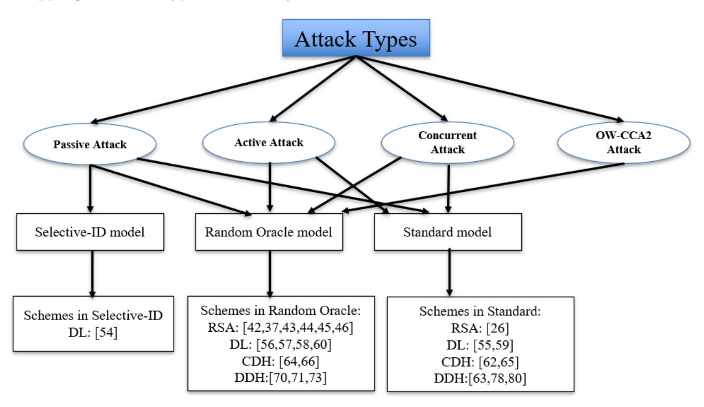
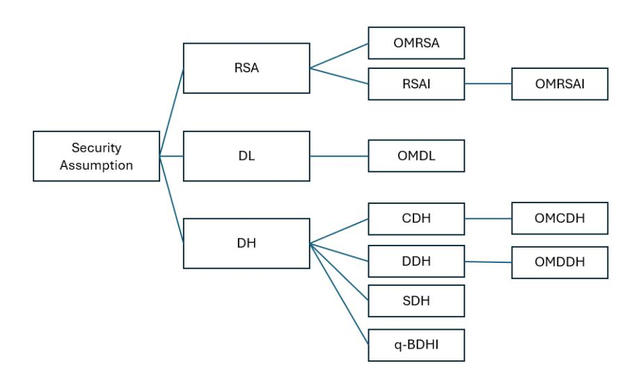

{0}------------------------------------------------

# Two Decades of Identity-Based Identification Schemes- A Survey on Challenges and Advances

Apurva K Vangujar1\*, Paolo Palmieri1*†* , Ji-Jian Chin2*†* , Swee-Huay Heng3*†*

1\*School of Computer Science & IT, University College Cork, College Road, Cork, T12 RXA9, Cork, Ireland.

2School of Engineering, Computing and Mathematics, University of Plymouth, Plymouth, PL4 8AA, Devon, United Kingdom.

3Faculty of Information Science and Technology, Multimedia University, Jalan Ayer Keroh Lama Bukit Beruang, 75450, Melaka, Malaysia.

\*Corresponding author(s). E-mail(s): a.vangujar@cs.ucc.com; Contributing authors: p.palmieri@cs.ucc.ie; ji-jian.chin@plymouth.ac.uk; shheng@mmu.edu.my;

*†*These authors contributed equally to this work.

#### **Abstract**

Identity-based Identification (IBI) schemes have gained significant popularity in the field of cryptography due to their superior efficiency and scalability. However, the increasing number of proposed IBI schemes in recent years has made it challenging to compare and evaluate them effectively. To address this issue, this survey presents a comprehensive literature review and analysis of IBI schemes that offer security under various hardness assumptions. Employing a rigorous survey methodology, we introduce the first general taxonomy of IBI schemes, allowing for a systematic classification and evaluation of these schemes based on their security assumptions. Furthermore, we assess the computational and communication costs associated with the deployment of IBI schemes, considering the various challenges and limitations involved. For each class of schemes, we calculate and compare their security, efficiency, benefits, and drawbacks. Researchers and developers are actively involved in implementing and analysing the runtime of IBI, particularly in diverse applications such as mobile and IoT devices. We present implementations and provide essential insights for guiding future advancements in this dynamic field. The survey concludes by identifying current research gaps and proposing future directions for IBI schemes, 

{1}------------------------------------------------

providing researchers and practitioners with an in-depth understanding of the state-of-the-art in this rapidly evolving field.

**Keywords:** Identity-based Identification, Zero-knowledge proof, Identity-based cryptography, Security proof.

## **1 Introduction**

In today's security landscape, the identification of user identities holds paramount importance. Traditional methods rely on certificates and Digital Signatures (DS) linked to identities, which are certified by Certificate Authorities (CAs). However, this conventional method can be cumbersome and inefficient, adding an extra layer of complexity to the process. Furthermore, DS schemes used for data signing and protection are vulnerable to Existential Unforgeability under Adaptive Chosen Message Attacks (*euf-cma*) [[1\]](#page-32-0). To overcome the limitations of these traditional approaches, Identity-based Cryptography (IBC) emerged as a groundbreaking solution. Within the realm of IBC, Identity-based Identification (IBI) schemes have garnered considerable attention in recent years. IBI schemes offer secure identity (ID) verification while minimising the communication and computational overhead. IBI schemes are an efficient and secure solution for authenticating user identities. Their efficacy has led to an increasing adoption of IBI schemes across diverse applications, including the Internet of Things (IoT) [\[2](#page-32-1), [3\]](#page-32-2), electronic voting (e-voting) [[4](#page-32-3)], payment systems [[5,](#page-32-4) [6\]](#page-32-5), vehicular ad-hoc network [\[7](#page-32-6)], e-auction [\[8](#page-33-0)], and mobile applications [\[2](#page-32-1), [9](#page-33-1), [10\]](#page-33-2). Despite their growing adoption, several key questions remain unresolved:

- 1. How do different IBI schemes compare in terms of security assumptions and efficiency?
- 2. Which schemes are most suitable for real-world implementation across diverse applications?
- 3. What gaps exist in current research that future work can address?

This survey aims to systematically answer these questions by reviewing, classifying, and critically analysing existing IBI schemes under various security assumptions. By doing so, we provide clarity amidst the diversity of schemes and offer insights for both researchers and practitioners.

At the core of IBI lies a fundamental concept: each user's ID serves as their public key. Consequently, instead of extracting public keys from certificates issued by a CA, IBI directly calculates the public key from the user's ID. This eliminates the need for a separate public key infrastructure and simplifies key distribution. Such an innovative approach provides a more efficient and convenient means of authenticating user identities in a wide range of security contexts. In this survey, we adopt the naming technique introduced by Bellare, Namprempre, and Neven from 2004 to categorize the reviewed papers. This approach provides clarity and consistency between multiple schemes, making it easier for the reader to follow the classification. Accordingly, we use the same technique throughout the paper for uniformity.

{2}------------------------------------------------

The history of IBI schemes began in 1984 when Shamir84 [[11\]](#page-33-3) introduced the IBC concept without certificates. Previously, CA issued certificates for conventional encryption and signature techniques that involved certification. However, as the number of certificates increased, challenges related to certificate management, revocation, and master key protection emerged. In his research, Shamir84 [[11](#page-33-3)] showed how to eliminate the requirements for certificates by substituting the public key with an IDstring. FiatShamir86 published their work in FiatShamir86 [[12\]](#page-33-4), further laying the groundwork for IBC. Nevertheless, these early schemes were limited to Identity-based Signature (IBS) schemes, and practical Identity-based Encryption (IBE) schemes were not developed until several years later.

There were IBE schemes proposed earlier but not practical [[13](#page-33-5), [14\]](#page-33-6). In 2001, the concept of IBE schemes finally became a reality with the introduction of two pioneering schemes. The first practical IBE scheme was the pairing-based BonehFranklin01 scheme [\[15](#page-33-7)], and the second was Cocks01 encryption scheme based on quadratic residues [\[16](#page-33-8)]. These schemes marked a significant milestone in the field of IBC. Researchers proposed several secure and efficient IBS schemes [[17–](#page-33-9)[19\]](#page-34-0) within the framework of IBC. In 2004, BonehBoyen04 [[20\]](#page-34-1) proposed an IBE scheme without relying on the Random Oracle (RO) model and also faced practical limitations.

In 2004, BNN04 [[21\]](#page-34-2) proposed transformation from SI to IBI along with some other approaches whereas KurosawaHeng04 [[22\]](#page-34-3) by converting from DS to IBI scheme without considering SI. IBE schemes use the ID of each user as their public key string, while IBI schemes enable a prover (P) holding a secret key to identify themselves to a verifier (V) holding the corresponding public key. Waters05 [\[23](#page-34-4)] introduced secure IBE and Hierarchical IBE (HIBE) schemes without relying on the RO model. ChatterjeeSarkar06 [\[24](#page-34-5)] enhanced [[23\]](#page-34-4)'s Waters05 HIBE scheme by reducing public parameters, improving efficiency.

The primary distinctions between IBI schemes and SI schemes include: (1) In IBI schemes, the adversary has the ability to select a specific target ID to mimic, unlike in SI schemes where the impersonation involves a random public key; (2) In IBI schemes, an adversary may possess private keys belonging to specific users of their choice. Generally, IBI schemes facilitate communication between a P and a V. IBI schemes are proven secure against impersonator under passive attack *imp-pa*, active attack *imp-aa* and concurrent attack *imp-ca*. While the Private Key Generator (PKG) generates keys for all identities, conventional IBI schemes typically employ a singletier design. Any peer node is capable of revealing information to another peer node. Therefore, it creates a key escrow issue for each ID. Multiparty IBI schemes have been a major milestone in mitigating this challenge. IBI schemes are distinguished by their certificateless nature and the incorporation of an Identification Protocol (IP), which is a conversation between a P and a V in which a P demonstrates their ID to a V using the Zero-Knowledge (ZK) proof. The benefits of the IBI scheme, particularly its potential for increased efficiency and security, have sparked significant research interest in recent years. This has led to the proposal of numerous new solutions, including multiparty IBI schemes such as CHG09 hierarchical [[25\]](#page-34-6), variants of hierarchical FSX14 IBI [[26](#page-34-7)], and Anonymous IBI schemes such as BarapatrePandu13 [[27\]](#page-34-8), each introducing an array of innovative approaches. This continual evolution and the growing potential of 

{3}------------------------------------------------

IBI schemes are thus worthy of comprehensive examination, as we will present in this survey.

The security of any IBI scheme is the most crucial aspect of its construction, and several security assumptions have been used in the construction of new schemes. To date, no single assumption has proven to be substantially superior to others, resulting in a fragmented research landscape where different schemes are often difficult to compare. This paper addresses this by providing a systematisation of knowledge for IBI schemes and presents the first taxonomy of IBI schemes based on their respective security assumptions. The taxonomy provides a comparison of the security and efficiency of schemes that fall under the same assumption, therefore giving insights into what IBI schemes may be more suitable for future implementation or expansion. This survey serves as a vital tool for evaluating, comparing, and selecting the most secure, efficient, and suitable IBI schemes for various applications. By identifying research gaps and future directions, this survey foster innovation and advances the development of robust and reliable IBI schemes in an ever-evolving security landscape.

## **2 Related Work**

Numerous literature surveys have been devoted to IBC, particularly, IBE schemes, however, to date, no survey has been dedicated specifically to IBI schemes. Therefore, this paper presents, to the best of our knowledge, the first systematic classification of existing IBI schemes operating under various security assumptions.

Table [2](#page-3-0) presents a comprehensive comparison of exisiting surveys that explore IDbased cryptographic schemes. Each survey's unique contributions are highlighted in the 'Comments' column, while the 'Security concerns' column identifies the specific security objectives addressed by the schemes reviewed in each study. Table [2](#page-3-0) also indicates whether the surveys incorporate security assumptions, provide comparative analyses of the examined schemes, and discuss the relevant security challenges. The year of publication for each survey is included for chronological context. Although numerous surveys have focused on IBE schemes, IBI schemes have received comparatively limited attention. No existing survey provides a systematic overview dedicated specifically to IBI schemes, underscoring the distinctiveness and relevance of the present work.

In particular, IBI schemehave gained notable relevance in the implementation of regulations on electronic identification and trust services for electronic transactions, such as the European eIDAS [https://digital-strategy.ec.europa.eu/en/policies/](https://digital-strategy.ec.europa.eu/en/policies/eidas-regulation) [eidas-regulation](https://digital-strategy.ec.europa.eu/en/policies/eidas-regulation). eIDAS is based on electronic identities (eID) and requires continuous authentication when users access multimodal transport services, with with potential expansion to broader travel applications within Europe.

### **2.1 Motivation and Contribution**

Achieving real-world deployment requires the development of secure identity-based schemes that efficiently utilise cryptographic primitives while maintaining low storage and communication costs. Among the most efficient solutions emerging in this domain are IBI schemes. These have inspired a wide range of diverse and innovative

{4}------------------------------------------------

| Ref.                 | Comments                                                                                                                                                                                                                                                                     | Security concerns                                                                             | Security assumption | Comparison | Security Challenges | Year |
|----------------------|------------------------------------------------------------------------------------------------------------------------------------------------------------------------------------------------------------------------------------------------------------------------------|--------------------------------------------------------------------------------------------------|---------------------|------------|------------------------|------|
| GGS05 [28]           | <ol> <li>Survey on DS scheme, encryption, and key agreement.</li> <li>Comparison based on mathematical concepts.</li> <li>Literature from 1984 to 2004.</li> <li>Efficiency is provided for schemes.</li> </ol>                                              | Not discussed                                                                                    | Yes                 | No         | Yes                    | 2005 |
| ZAFB12 [29]          | <ol> <li>Provided state-of-the-art</li> <li>IBE, security problem, and</li> <li>their popular solutions.</li> <li>Discussed interesting</li> <li>future directions.</li> </ol>                                                                                               | - Identity disclosure - Bilinear pairing - Key escrow - Key revocation                           | Yes                 | Yes        | Yes                    | 2011 |
| TripathiBurse14 [30] | 1. Survey on ID-based signcryption schemes and analysis of their performance parameter.                                                                                                                                                                                      | - Unforgeability - Integrity - Non-repudiation                                                   | Yes                 | Yes        | No                     | 2014 |
| KalyaniSridevi16[31] | Summary of IBE, IBS, and HIBE scheme.     Discussed security model of Revocable IBE.                                                                                                                                                                                         | - Confidentiality - Integrity - Availability - Authentication - Non-repudiation                  | Yes                 | No         | No                     | 2016 |
| FMJJS17 [32]         | <ol> <li>Described detailed existing literature survey on authentication protocol.</li> <li>Classification of attacks.</li> </ol>                                                                                                                                            | - Pattern reconigsa- -tion - IDS                                                           | Yes                 | Yes        | Yes                    | 2017 |
| SNB18 [33]           | <ol> <li>Discussed light weight cryptography algorithm.</li> <li>Compared cipher on embedded and windows platforms.</li> </ol>                                                                                                                                   | - DESL - KATAN and KTANTAN                                                                 | No                  | Yes        | No                     | 2018 |
| EFCS19 [34]          | <ol> <li>Summary of vast range of authentication protocol.</li> <li>Described generic architecture.</li> </ol>                                                                                                                                                       | <ul><li>Authentication</li><li>Integrity</li><li>Confidentiality</li><li>Authorisation</li></ul> | Yes                 | Yes        | Yes                    | 2019 |
| SSSA20[35]           | <ol> <li>Summary of ID and non-ID-based authentication scheme and gives pros and cons.</li> <li>Provides research issues, challenges, and directions for future.</li> </ol>                                                                                                  | - Hashing - Bilinear pairing - Mobility - Scalability                                   | No                  | Yes        | Yes                    | 2020 |
| Our Survey        | <ol> <li>Defined security assumptions and analysed all parameters.</li> <li>Proper discussion on the previously proposed work.</li> <li>Efficiency and security comparison.</li> <li>Concluded security issues and challenges.</li> <li>Proper future directions.</li> </ol> | - Bilinear pairing - Integrity - Authentication - Data ownership - Over-privileged access        | Yes                 | Yes        | Yes                    | 2025 |

 ${\bf Table~1}~{\rm A~comparison~between~ID\text{-}based~related~surveys}$ 

proposals in recent years, each designed under distinct security assumptions and proof techniques. Furthermore, these schemes often aim to balance minimising complexity overhead with reducing computational and communication costs. While IBI schemes can potentially provide secure identification using ZK proof with low computational requirements, their extensive variety and diverse application scenarios make direct comparisons challenging. The objective of this survey is to provide a comprehensive and systematic review of IBI schemes, focusing on their underlying security assumptions. By presenting a structured and critical analysis, this work aims to bring clarity amidst diversity, thereby enhancing understanding and promoting innovation in this pivotal area of cryptographic research.

Our study makes several noteworthy contributions to the existing literature:

{5}------------------------------------------------

- 1. *Security Assumptions Classification:* We systematically categorise the range of security assumptions used in the construction of IBI schemes. This classification offers a comprehensive overview of the security foundations of these schemes.
- 2. *IBI Taxonomy and Analysis:* We present the first taxonomy of IBI schemes based on their respective security assumptions. By critically analysing and comparing these schemes, we are able to identify their comparative advantages, potential security limitations, and security models, particularly those related to the asymmetric properties of the schemes.
- 3. *Implementation and Application of IBI Schemes:* We conduct a thorough examination of various IBI schemes that have been implemented previously and have demonstrated effective applicability. This analysis is presented not only to showcase the real-world feasibility of such schemes but also to guide and inspire future implementations of IBI schemes.
- 4. *Survey Findings and Future Directions:* We provide a detailed discussion of the findings from our survey, offering insight into potential future research directions in the field of IBI schemes. This analysis will serve as a valuable guide for future investigations and developments in this domain.

## **2.2 Outline**

The remainder of this survey is organised as follows. Section [3](#page-5-0) introduces the preliminary concepts required for understanding the subsequent sections, including a definition of IBI schemes. Section [4](#page-9-0) summarises the classification of IBI schemes based on different security assumptions and presents quantitative analyses for each family of schemes, followed by concluding observations. Section [5](#page-27-0) discusses the implementation of existing IBI schemes, and Section [6](#page-30-0) concludes the survey by highlighting potential directions for future research. Finally, Appendix [A](#page-40-0) briefly outlines the methodology used to conduct this study.

## **3 Preliminaries**

This section summarises essential concepts directly relevant to this survey. We follow the reference definitions provided in [[36\]](#page-35-5).

## **3.1 Notations**

Table [2](#page-6-0) provides a standardised list of notations used throughout the paper, accompanied by explanations. The purpose of this table is to enhance understanding and facilitate the comparison of various IBI schemes by offering a consistent set of terms. The selected notations align with commonly used conventions in the literature, although it is worth noting that different schemes may utilise different notations for similar concepts. This table serves as a valuable resource for readers seeking to delve into the study of different schemes and gain a comprehensive understanding of their fundamental concepts.

{6}------------------------------------------------

| Notations      | Explanation            | Notations             | Explanation                       |
|----------------|------------------------|-----------------------|-----------------------------------|
| $\overline{Z}$ | Multiplicative group   | p, q                  | Prime numbers                     |
| $G, G_1, G_2$  | Cyclic groups          | $g,g_1,g_2$           | Generators of $G, G_1, G_2$       |
| H              | Hash function          | k                     | Security parameter                |
| mpk            | Master public key      | param                 | Public parameters                 |
| msk            | Master secret key      | usk                   | User secret key                   |
| $\mathcal{A}$  | Adversary              | $\epsilon, \epsilon'$ | Advantage                         |
| $\hat{q}$      | Tuple in q-SDH         | Pr                    | Probability                       |
| t, t'          | Time                   | Н                     | Collision resistant hash function |
| $q_I, q_I'$    | Key extraction queries | I, I'                 | Impersonator                      |
| S              | Simulator algorithm    | ê                     | Natural algorithm                 |
| $\mathcal{C}$  | Challenger             | E                     | Exponential function              |
| K              | Key generator          | gcd                   | Greatest Common Divisor           |
| Р              | Prover                 | V                     | Verifier                          |
| e              | Bilinear pairing       | A                     | Algorithm                         |
| A              | Addition operation     | l                     | Challenge length                  |

Table 2 Notations and Descriptions

## 3.2 Bilinear Pairing

Bilinear Pairing (BP) is widely used in many IBI schemes for constructing and verifying cryptographic protocol. BP invovles a multiplicative group  $Z_q^*$ , a pairing function e, and cyclic groups  $G_1$  and  $G_2$  mapping  $e: G_1 \times G_1 \to G_2$ . The function e satisfies:

- 1. **Bilinearity:** For all generators  $g \in G_1, G_2$  and  $a, b \in Z_q^*$ , the equation  $e(g^a, g^b) = e(g, g)^{ab}$  holds. This property allows the pairing to factor out exponents linearly.
- 2. Non-degeneracy: The pairing of the generator is not equal to the identity in  $G_2$ , i.e.,

$$e(g,g) \neq 1$$
.

This ensures that the pairing is meaningful and does not map all pairs to the identity.

3. **Efficient computability:** There exists a deterministic polynomial-time algorithm that can compute e(a,b) for any  $(a,b) \in G_1$ . This guarantees that the pairing operation is practical for cryptographic use.

#### 3.3 Identity-based Identification Schemes

**Definition 1** IBI scheme has four probabilistic polynomial-time (PPT) algorithms which are shown in Equation 1:

$$IBI = (KeyGen, Extract, P, V)$$
 (1)

- 1. Key Gen takes the security parameter  $1^k$  and generates output that returns a pair (mpk, msk).
- 2. Extract takes ID and msk and generates corresponding user secret key usk.
- 3. P and V communicate with each other using ZK proof (CMT, CHA, RES). P begins by taking input as (mpk, ID, usk) whereas V takes (mpk, ID).

{7}------------------------------------------------

- CMT. P generates commitment CMT and sends to V.
- CHA. V generates a random challenge CHA and passes to P.
- RES. Upon receiving a CHA, P generates corresponding response RES and sends to V.
- Finally, V accepts or rejects.

### 3.4 Security Model for IBI Schemes

Impersonation is the main adversarial goal of an adversary  $\mathcal{A}$ . Success for an  $\mathcal{A}$  is defined as their ability to pose as a fraudulent P with a public ID and deceive the V with a non-negligible probability. There are two phases of the security model to prove the security of the IBI scheme under the RO model. The first phase is the training phase. It consists of key setup, a hashing query, extract, and IP. The second phase is the breaking phase where an impersonator tries to break the security of the BellarePalacio02 scheme [37]. The security framework for IBI schemes differs from SI schemes in two ways. First,  $\mathcal{A}$  can choose a specific public ID for impersonation rather than a random public key. Second, it is assumed that  $\mathcal{A}$  has access to some users' secret keys.

Adversarial models from [36] for IBI schemes are categorised as *imp-pa*, *imp-aa* and *imp-ca*. A passive attacker, also known as an eavesdropper, secretly intercepts the communication between the P and V with the intention of collecting sensitive information without disrupting the communication channel. On the other hand, an active attacker possesses the ability to actively manipulate the transmitted data, altering, dropping, or inserting messages to undermine the integrity and confidentiality of the communication. Concurrent attackers communicate with multiple instances of the protocol that are running at the same time.

Impersonation attacks involve a game between an impersonator (I) and a challenger  $(\mathcal{C})$ :

- 1. KeyGen. C receives input  $1^k$ , runs simulator algorithm S, and provides the system parameters mpk to I, while keeping mpk to itself.
- 2. Training Phase: I issues extract queries to C, who responds with the corresponding usk. I may also pose transcript queries for passive attacks or act as a cheating V for active and concurrent attacks.
- 3. Breaking Phase: I announces an impersonator identity ID\* and attempts to persuade the V, using information from training phase. I wins if it convinces the V.

An IBI scheme is considered  $(t_{\rm IBI}, q_I, \epsilon_{\rm IBI})$ -secure against imp-pa/aa/ca if any impersonator I, operating within time  $t_{\rm IBI}$ , has a probability of less than  $\epsilon_{\rm IBI}$  to impersonate successfully, assuming that I can issue a maximum of  $q_I$  extract queries  $\Pr[I \text{ can impersonate}] \leq \epsilon_{\rm IBI}$ .

Figure 1 explains mapping of attack types to security models and the IBI schemes covered in this survey. Attack types such as imp-pa, imp-aa, imp-ca, and OW-CCA2 are linked to the proof settings (RO, Standard, Selective-ID models), under which specific IBI schemes are formally proven secure.

{8}------------------------------------------------

**Fig. 1** Mapping of attack types to security models and the IBI schemes

A significant number of the reviewed IBI schemes are proven secure in the RO model. While the RO model is an idealized abstraction rather than a concrete implementation, it remains widely adopted in cryptographic research due to its simplicity and efficiency advantages. Proofs in the RO model enable designers to demonstrate security properties under well-understood assumptions before transitioning to more practical, standard-model constructions. In particular, for identification schemes, the RO model provides a manageable framework for analyzing ZK and challengeresponse protocols without incurring the heavy efficiency loss often associated with standard-model reductions. Therefore, the prevalence of RO-based proofs in existing IBI literature reflects a trade-off between provable security under ideal conditions and practical efficiency in real-world deployments.

In this survey, several IBI schemes are described as secure under particular hardness assumptions or as being proven in the RO model or Standard model. Each such proof typically follows a reduction-based approach that is, the security of the IBI scheme is reduced to the hardness of the underlying mathematical problem. For instance, if an adversary could successfully impersonate a user, that success could be translated into solving the Discrete Logarithm (DL) assumption with some nonnegligible probability. The reduction loss factor, often denoted by *ϵ* or *ϵ*(*k*), represents how tightly the schemes security relates to the assumed problems difficulty.

For illustration, in the case of the VCTN19 HIBI [\[38](#page-35-7)]scheme, the reduction shows that if an impersonator breaks the scheme with advantage *ϵ*, then one can solve the DL assumption with advantage approximately √*l ϵ*(*k*) + 1*/*2 *k*. This quantifies the degradation of security between the proof and the assumption.

{9}------------------------------------------------

## **4 Taxonomy of IBI Schemes based on Security Assumptions**

This survey aims to provide a comprehensive overview of the existing IBI schemes in the literature, with a focus on their security assumptions, computational and communication costs, and security bound. The taxonomy as shown in Figure [2](#page-9-1) presented in this survey classifies the 25 IBI schemes based on the underlying six security assumptions following a rigorous systematic literature review methodology presented in Appendix [A](#page-40-0), making it easier to compare schemes within each class and understand their properties. We did not compare all IBI schemes with different security assumptions in aggregate, and rather than aggregating all IBI schemes for comparison, we examine each assumption individually, acknowledging their unique, incomparable properties.

The security assumptions are divided into three main categories: Rivest-Shamir-Adleman (RSA), DL, and Diffie-Hellman (DH), and further classified based on specific properties within each assumption as shown in Figure [2](#page-9-1). The calculated computational and communication costs, as well as the security bound, provide a clear picture of the performance and security of each scheme. This information is useful for researchers in the field of cryptography to understand the strengths and weaknesses of different IBI schemes and make informed decisions when choosing a scheme for a specific application. The systematic literature review methodology used in this survey provides a thorough and objective analysis of the existing IBI schemes, making it a valuable contribution in constructing new schemes considering any security assumptions.

**Fig. 2** Taxonomy of the security assumptions used in categorising IBI schemes.

Several of the original IBI papers did not provide explicit computational or communication efficiency analyses, or they reported them in incomparable forms (e.g., symbolic operations without measured timings). Consequently, where quantitative data were unavailable, this survey reports only the parameters described by the authors or marks the entries as "not mentioned." This limitation constrains the 

{10}------------------------------------------------

ability to present a fully uniform efficiency comparison across all schemes. Nevertheless, the normalized assumptions introduced in Appendix [A.5](#page-42-0) allow approximate cross-reference among the reported values.

### **4.1 RSA-based IBI Schemes**

RSA is a widely used public key encryption system that is based on the mathematical properties of large prime numbers and was used for the first cryptographic scheme by RSA78 [[39\]](#page-35-8), which was widely used for data transmission. Numerous IBI schemes based on the RSA assumption have been implemented over time. How safe a scheme is against active or concurrent attacks depends on how hard the associated RSA or the One-More RSA (OMRSA) assumption is.

In RSA, a public key is created by generating two large prime numbers, *p* and *q*, and computing their product *N* = *p × q*. A public exponent *e* and a private exponent *d* are then chosen. Here, *e* and *d* are multiplicative inverses modulo *ϕ*(*N*), where *ϕ*(*N*) is the totient function, given by (*p −* 1)(*q −* 1). The public key consists of (*N, e*), and the private key is *d*. Thus, the equation that ties *e* and *d* together is:

$$e \cdot d = 1 \mod \phi(N) \tag{2}$$

Equation [2](#page-10-0) is the product of *e* and *d* is equal to 1 in the ring of integers modulo *ϕ*(*N*). The RSA assumption is then that given the public key (*N, e*), it is computationally difficult to compute the private key *d*. This is equivalent to saying that given *N* and *e*, it is hard to compute *ϕ*(*N*) (which requires factoring *N*), and thus hard to compute *d*.

BellarePalacio02 [[37\]](#page-35-6) proposed the RSA Inversion (RSAI) and its variant OMRSA Inversion (OMRSAI) assumption in order to prove security against active and concurrent attack. Chaum82 [[40\]](#page-35-9) proposed a blind Signature Scheme (SS) based on the multiplicative homomorphism of the RSA function. This approach was motivated by the desire to establish and prove the security of the stronger OMRSA assumption, which was used for untraceable payments. Shamir84 [[11\]](#page-33-3) created the first ID-based scheme based on the RSA assumption, called IBC, although he did not prove its security. Another RSA-based IBI scheme was presented by MOV93 [[41\]](#page-35-10). The OMRSA assumption has also been incorporated into the applicability of smartcards, as demonstrated by its use in the DVQ96 Guillou-Quisquater (GQ) IBI scheme [[42\]](#page-35-11). We will now introduce the RSA-based IBI schemes in the following subsections of this survey.

#### **4.1.1 GuillouQuisquater90 GQ ID-ZK Scheme [\[43\]](#page-35-12) (1990)**

GuillouQuisquater90 [\[43](#page-35-12)] introduced an interactive ZK proof. In this scheme, the size of the required memory and the volume of transmitted data are reduced to a minimum. GuillouQuisquater90 GQ IS has been demonstrated to be secure against *imp-pa* when considering the one-way nature of RSA and secure against *imp-aa/ca* when considering the hardness of OMRSA by [[43\]](#page-35-12). *Pros:* The problem of multiple signatures is solved here in a very smart way due to the possibilities of cooperation between users. *Cons:* The scheme includes its reliance on the RSA assumption and its difficulty in proving its security rigorously. The scheme may be vulnerable to certain types of attacks if 

{11}------------------------------------------------

the underlying ZK proof system is not properly implemented. Security Bound: The authors provided evidence to support the security of the scheme but acknowledged that more research is needed to fully understand its security properties. The security theorem is: Consider that v is an odd integer and RSA-like exponent, so that gcd(p-1,v)=gcd(q-1,v)=1. The case where v is an even integer will be examined; the exponent v may even be a power of two.

### 4.1.2 BellarePalacio02 SI Scheme [37] (2002)

The GuillouQuisquater90 GQ SI scheme is known to be an efficient one and follows FiatShamir86 [12]'s scheme. They claimed their results are novel and reduce the security of the GuillouQuisquater90 GQ SI. *Pros:* It helps to clarify and unify the global picture of protocol security by showing that the RSA features underlying the security of the GuillouQuisquater90 GQ SI and Chaum82 [40] SS scheme are equivalent. The result reduces the security of numerous cryptographic problems to a single number-theoretic problem, which is the benefit generally associated with a proof of security. *Cons:* There is no analysis of efficiency, and no comparisons have been made. *Security Bound:* The proposed scheme has proven security against imp-ca. The security theorem states that  $ID = (\epsilon, P, V)$  represents the GuillouQuisquater90 GQ IS associated with the prime-exponent RSA key generator  $K_{rsa}$  and the challenge length l. Consider adversary  $\mathbb{A} = (\epsilon', P, V)$  to be a imp-ca adversary with time complexity t attempting to attack ID. Then there exists an impersonator I that attacks t in such a way that, for each t with cheating V and cheating P.

$$\epsilon(k) \leqslant \sqrt{\epsilon'_{K_{rsa,I}}} + 2^{-l(k)}$$

### 4.1.3 DingTsudik03 IB-mRSA Scheme [44] (2003)

Mediated RSA (mRSA) is a straightforward and practical method for separating a user's RSA private key from that of a security mediator. The DingTsudik03 ID-based (IB)-mRSA provides tight security in the RO model comparable to other schemes. The author left open the issue of investigating alternative mapping functions that could produce an efficient RSA component. Pros: mRSA permits quick and fine-grained control of users' security privileges. The implementation of mRSA is publicly available and straightforward. It is simple and practical, and it is compatible with plain RSA for current public key infrastructures. Cons: The efficiency of the mRSA scheme and the DingTsudik03 IB-mRSA scheme requires further investigation, as the author has not provided specific details. DingTsudik03 IB-mRSA still stores and communicates public keys using conventional public key certificates, which can make multiple users vulnerable to security threats. The encryption process in mRSA is expensive due to the randomness of the public exponent. Security Bound: It is unclear whether IBmRSA can be secure under the standard model. The DingTsudik03 IB-mRSA scheme is proven secure in the RO model if all n users are honest. Each user has an independent trapdoor.

{12}------------------------------------------------

#### 4.1.4 BNN09 SH\*-SI Scheme [45] (2009)

The BNN09 SH\*-SI scheme is as secure as the GQ SI scheme. Using a trick involving gcd, it is proven that SH\*-SI is statistically (but not perfectly) a ZK honest verifier. The minor weakness in BNN09 SH\*-SI is easily fixed in this scheme by removing the zero challenge. Pros: Because the two schemes use the same key generation algorithm, SH\*-SI convertibility follows from GuillouQuisquater90 GQ SI convertibility. Cons: Under imp-ca, the BNN09 SH\*-SI scheme is trivially insecure because a cheating V can learn the secret key by sending a random challenge. Security Bound: The BNN09 SH\*-SI is connected with the prime-exponent RSA key generator  $k_{rsa}$  and the superlogarithmic challenge length l(.) is such that  $2^{l(k)} \leq e$  for every  $(N, e, d) \in k_{rsa}(1^k)$ . The RSA function associated with  $k_{rsa}$  is one-way, is imp-pa/ca/aa secure:

$$\epsilon_{k_{rsa,\mathbb{A}}}^{omrsa}(k) = \Pr\left[Exp_{k_{rsa,\mathbb{A}}}^{omrsa}(k) = 1\right]$$

#### 4.1.5 FSX14 HIBI Scheme [26] (2012)

The FSX14 [26] proposed a generic framework of the Hierarchical IBI (HIBI) scheme that is euf-cma secure DS scheme that has a ZK proving knowledge of signature generation key and is secure against imp-aa/ca. The FSX14 HIBI scheme is a certificateless extension of IBI that uses several PKGs and an OR-proof technique variant. Pros: Since the V has the P's ID, the P does not need to transmit a chain of certificates. Instead, a chain of signature verification keys and signatures is used, which reduces the communication cost and eliminates the need for additional cryptographic primitives in the scheme's construction. Cons: The communication cost of the FSX14 HIBI scheme is not compared with any other existing schemes, as the authors only offer a conclusion regarding its efficiency. Security Bound: The security of the FSX14 HIBI scheme is based on the special challenge property and the special ZK property using the RSA assumption. Although the complete proof is not shown due to page limitations.

#### 4.1.6 CTHP14 GQ-SM IBI Scheme [46] (2014)

Security-Mediated (SM) IBI schemes improved efficiency by constructing two pairing-free schemes, one of which is based on the RSA assumption and is known as the CTHP14 GQ-SM IBI [46] scheme based on the BellarePalacio02 GQ SI [37]. Pros: The CTHP14's scheme is more efficient and has a revocation feature. Efficiency is theoretically and experimentally demonstrated, as it has the fastest IP running time. Cons: No analysis is provided to compare the CTHP14 GQ-SM IBI scheme with previously proposed SM IBI schemes. Security Bound: The CTHP14 GQ-SM IBI scheme is proven secure with the proper proof and is given as  $(t, q, \epsilon)$  against impersonation in the RO model under imp-pa/aa/ca attacks if the RSAI/OMRSAI assumption is  $(t, \epsilon)$  where:

$$\epsilon \leqslant \sqrt{\epsilon_{(OM)RSAI}e(q+1)} + 1/2^{l(k)}$$

{13}------------------------------------------------

### 4.1.7 KCGY23 Blind GQ IBI Scheme [47] (2023)

This paper proposes a blind IBI based on the GQ scheme using Trusted Authority (TA), user, and identifier. This scheme is unique primarily in its Extract phase, involving two parties. Here, the issuer generates a signature  $\sigma$  using RSA, and the user subsequently creates their own signature  $\bar{\sigma}$  based on the  $\sigma$ , resulting in a pair  $(\sigma, \bar{\sigma})$ . Pros: The most notable advantage of this scheme is its innovative use of a blind signature, adding an extra security layer. This approach allows multiple users to obtain their private keys anonymously, without the issuers knowing their IDs. Furthermore, IDs can verify themselves using their public ID while maintaining anonymity. Cons: A significant limitation noted in the paper is the absence of an efficiency analysis. This omission makes it challenging to determine the scheme's practical efficiency. Security Bound: Security of the KCGY23 blind GQ IBI adheres to the [21]'s security proof framework and prove that it is secure against imp-pa using RSA, and imp-aa/ca using OMRSAI in the RO model.

The relative comparison of efficiency and security analysis for existing RSA-based IBI schemes is shown in Table 3, which is estimated. No scheme makes use of pairing. All communication costs are normalised to bits assuming 256-bit group elements (128-bit security). Data are cited directly from the respective scheme publications; reduction-loss factors are included when available.

| Scheme [Ref.]                       | Computational Cost | Communication Cost (bits) | Passive Attack | Active/Concurrent Attack | Model    |
|-------------------------------------|-----------------------|------------------------------|-------------------|-----------------------------|----------|
| GuillouQuisquater90 (GQ ID-ZK) [43] | 1G, 1E, 2U            | $2 M  \approx 512$           | RSAI              | OMRSAI                      | RO       |
| BellarePalacio02 (GQ-SI IBI) [37]   | 2G, 2M, 2E, 1A        | $3 G  + 5 M  \approx 2048$   | RSA               | OMRSA                       | RO       |
| DingTsudik03 (IB-mRSA) [44]         | 4G, 1M, 3E, 2A        | $2\log_2 M  \approx 512$     | RSA               | RSA                         | RO       |
| BNN09 (SH*-SI) [45]                 | 1G, 3M, 7E            | $4 M  \approx 1024$          | RSA               | OMRSA                       | RO       |
| FSX14 (HIBI) [26]                   | 1G, 1M, 3E, 1A        | $2 G  +  M  \approx 768$     | RSA               | OMRSA                       | Standard |
| CTHP14 (GQ-SM IBI) [46]             | 5M, 9E, 1A            | $4 G  + 6 M  \approx 2560$   | RSAI              | OMRSAI                      | RO       |
| KCGY23 (Blind GQ IBI) [47]          | 3M, 7E, 2U            | Not reported                 | RSA               | OMRSAI                      | RO       |

**Legend:** G group operation; E exponentiation; M multiplication; U user secret-key component; A

Table 3 Efficiency and security comparison of RSA-based IBI schemes under a uniform 128-bit security assumption.

#### 4.1.8 Conclusive Remark on RSA-based IBI Schemes

In terms of efficiency and security analysis, the schemes proposed in [43, 46] remain secure under the RSAI assumption. Among them, the CTHP14 construction derived from the BellarePalacio02 GQ and CTHP14 SM models offers one of the fastest pairing-free alternatives, though it incurs a relatively higher computational cost for the IP.

When compared to other RSA-based IBI schemes listed in Table 3, the DingT-sudik03 IB-mRSA scheme [44] demonstrates a heavier RSA component, which contributes to its higher overall computational expense. Nevertheless, it has been practically implemented in Outlook mailer plug-ins, showcasing its applicability in real-world settings. The method described in KCGY23 [47] presents strong potential for secure access-control systems, enabling personnel to authenticate and access restricted areas using mobile devices.

{14}------------------------------------------------

For practical deployments, the CTHP14 [[46\]](#page-36-2) scheme is well-suited for singleidentity authentication scenarios such as online payment systems or smartcards. Conversely, for organisations requiring hierarchical or multi-identity authentication frameworks, the FSX14 HIBI scheme [[26\]](#page-34-7) may be a more appropriate choice despite its increased design complexity.

### **4.2 DL-based IBI Schemes**

Numerous standard identification and DS schemes, such as those found in [[48](#page-36-4)[–50](#page-36-5)], lay their foundations on the DL assumption. Schnorr89 [[51\]](#page-36-6) proposed the first IBI scheme based on the DL assumption; this assumption is harder than any factorisation problem. They can be performed in pre-processing mode during the processor's idle time. This scheme was efficient, requiring less than half the communication bits of any other scheme, and owing to these advantages, its adoption in smart cards was widespread. The DL assumption was later used in the e-voting CFSY96 scheme [[52\]](#page-36-7) and the payment systems [\[5](#page-32-4), [6,](#page-32-5) [53](#page-36-8)], among other places. For our exploration, we have relied on the definitions of DL and the One More Discrete Logarithmic (OMDL) assumption from BellarePalacio02 [[37\]](#page-35-6) and BNN09 [\[45](#page-36-1)], respectively.

**Definition 2** According to the DL assumption, Non-Polynomial Time (NPT) exists when the cyclic group is *G* of prime order *q* and *g* is the generator. The DL assumption, defined as *B* = *g m*, results in the value *m*. A is a probabilistic algorithm that solves the (*t, ϵ*) DL assumption when:

$$\Pr[\mathbb{A}(G, q, g, B) = m] \geqslant \epsilon \tag{3}$$

**Definition 3** The OMDL assumption states that there is NPT algorithm. *K* is capable to (*t, q, ϵ*) solve OMDL assumption over success event *E* and non-negligible probability as follows:

$$\Pr[E(K(1^k, G, q, g, \text{CHALL}_{DL}, \text{sol}_{DL})) = 1] \geqslant \epsilon$$
(4)

The following schemes are DL-based IBI schemes. We will analyze these schemes considering multiple factors, including security assumptions, computational efficiency, and practical applicability:

#### **4.2.1 Girault90 Gir IBI Scheme [[54](#page-36-9)] (1990)**

The Girault90 Gir IBI scheme is inspired by Shamir84 Schnorr SI [\[11](#page-33-3)] and has a very strong key generation property. It describes the modification of Shamir84 Schnorr SI, where modulus is composite instead of prime. It is one of the first IBI schemes based on DL assumption and is harder than a factorization problem. *Pros:* The user can choose his own secret key, the centre being unable to retrieve it from the public key. *Cons:* The ZK proof is not addressed in the security proof. It is unclear how secure the scheme is. *Security Bound:* Security bound and efficiency calculations are not described in the paper.

{15}------------------------------------------------

## **4.2.2 TJTGH12 Fuzzy IBI Scheme [\[55\]](#page-36-10) (2009)**

Fuzzy IBI (FIBI) is a version of the traditional IBI scheme in which the ID is considered a collection of values, and security against *imp-ca* is proven using the OMDL assumption. It is comprised of both fuzzy cryptography and SI. *Pros:* It is the first FIBI scheme that has been proven to be secure and beneficial in many fuzzy-based systems. *Cons:* To be able to create a TJTGH12 FIBI scheme that is provably secure in the entire security model is an open problem. No efficiency analysis is provided; hence, there are no remarks on the scheme's computational costs. *Security Bound:* If the DL assumption is challenging, then the TJTGH12 FIBI scheme described is secure against *imp-pa* in the RO model. This paper addresses security issues and implements them in public biometric ID by transforming fingerprint minutiae set into fixed-length binary-strings.

### **4.2.3 BNN09 Okamoto IBI Scheme [[45\]](#page-36-1) (2009)**

It is normal practice to validate the security of Schnorr89 DS scheme [[51\]](#page-36-6) against *imp-aa/ca*. The BNN09 Okamoto IBI scheme includes two random integers for setting up the secret key. *Pros:* A framework of transformations is a good way to secure the scheme by adding two components to the secret key. *Cons:* Security degrades by percent due to the requirement of semicolon string unforgeability which ensures an adversary cannot forge any valid ID even after observing multiple valid IDs. *Security Bound:* The BNN09 Okamoto IBI scheme related to the prime-order cyclic group generator *k* and the super-logarithmic challenge length *l* is as follows: *N* such that 2 *l*(*k*) *≤ q* for all (*G, q, g*) *∈* [*K*(1*k* )]. If the DL assumption associated with the underlying generator *K* is challenging, then *imp-ca* is secure under the RO model. *ϵ*(*k*) represents probability of an advantage of the algorithm in solving the given problem as security parameter *k*.

$$\epsilon(k) = \Pr\left[E_{K,\mathbb{A}}^{OMDL} \ = 1 \ \right]$$

## **4.2.4 BNN09 IBI Scheme [[45](#page-36-1)] (2009)**

BNN09 IBI has a single-generated variant and is based on the BNN09 Okamoto IBI framework but uses Schnorr SS instead of Okamoto SS. *Pros:* It is slightly more efficient than the BNN09 Okamoto IBI scheme. *Cons:* With the requirement of strong unforgeability, the overall security may be slightly compromised. *Security Bound:* The security theorem is similar to the BNN09 Okamoto IBI scheme security bound.

#### **4.2.5 ChinHeng13 k-resilient IBI Scheme [[56](#page-37-0)] (2012)**

The security of a ChinHeng13 *k*-resilient IBI scheme is an upgrade of security demonstrated using DL and OMDL assumptions in a standard model. Using the OMDL assumption, the Schnorr DS scheme is converted to the Schnorr IBI scheme and shown to be secure against *imp-pa*. *Pros:* Enhanced security has been validated against *imp-aa/ca* without pairing operation compared to other IBI schemes. *Cons:* The security ChinHeng13 *k*-resilient IBI mentioned in [[56\]](#page-37-0) against an *euf-cma* attack, but it 

{16}------------------------------------------------

is unproven and reserved for future research. *Security Bound:* The ChinHeng13 *k*resilient IBI scheme is (*t, qI , ϵ*) secure against *imp-pa/aa/ca* if the DL assumption is (*t ′ , ϵ′* ) hard and the following conditions are met:

$$\epsilon \leqslant \sqrt{\epsilon' n/n - k} + 1/q_I$$

## **4.2.6 CTHP14 BNN-SM IBI Scheme [[46](#page-36-2)] (2014)**

The CTHP14 BNN-SM IBI scheme is an extension of the BNN09 IBI [[45](#page-36-1)] scheme, and SM allows immediate revocation of a user's secret key. *Pros:* Low computational costs and increased security. Since it is difficult to compare all IBI together, a simulator that generates running-time results on a standard platform is built into this paper. *Cons:* The GQ-SM IBI scheme has a faster IP running time compared to the CTHP14 BNN-SM IBI scheme. *Security Bound:* The CTHP14 BNN-SM IBI scheme is (*tSM IBI , qSM IBI , ϵ*) secure against impersonation under *imp-pa/aa/ca* in the RO model if the DL assumption is (*tDL/OMDL, qDL/OMDL, ϵDL/OMDL*) hard under the following conditions:

$$\epsilon \leqslant \sqrt{\epsilon_{DL/OMDL}e(q_{SMIBI} + 1)} + 1/q$$

### **4.2.7 CTHP15 Twin Schnorr IBI Scheme [\[57\]](#page-37-1) (2015)**

The CTHP15 Twin Schnorr (TS) IBI by [\[57](#page-37-1)] and BNN09 Okamoto IBI by [\[45](#page-36-1)] both employ the same key configuration, which contains two secret keys and supports the DL assumption. The CTHP15 TS IBI is an improvement of the original Schnorr IBI scheme and is slightly more efficient than the Okamoto IBI scheme. The CTHP15 TS IBI scheme can also be used for peer-to-peer validation before allowing users into a hosted e-meeting such as one conducted using the shared presentation board. *Pros:* The CTHP15 TS IBI scheme matches the description of lightweight cryptography with rapid access control for ID authentication. With no pairing operation, the IP requires less computing power, making it suitable for deployment in resourceconstrained environments such as IoT devices. *Cons:* The CTHP15 TS IBI contains one more exponentiation and multiplication in *G*, leading to a slight increase in computational cost. *Security Bound:* The security theorem and proof is given in order to prove high security guarantee that the CTHP15 TS IBI scheme is secure against *imp-aa/ca* if the DL assumption is hard in group *G* for algorithm A; the advantage *ϵ*:

$$\epsilon \leqslant \sqrt{\epsilon_{G,\mathbb{A}}^{DL}(k) + 1/2^k} + 1/2^k$$

#### **4.2.8 CTHP16 Twin Beth IBI Scheme [\[58\]](#page-37-2) (2016)**

The CTHP16 Twin Beth IBI scheme is a modified version of the original Beth IBI scheme, with the addition of two secret key components. This scheme is solely based on the DL assumption and secures against *imp-pa/aa/ca*. *Pros:* The scheme is more secure and efficient IP than the BNN09 Okamoto IBI scheme. There is no use of BP, which offers strong security guarantees. *Cons:* Slightly increase in cost to the initial 

{17}------------------------------------------------

Beth IBI scheme. Security Bound: The security of the CTHP16 Twin Beth IBI scheme is  $(t, q, \epsilon)$  secure against impersonation if the DL assumption is  $(t', \epsilon')$ -hard, and the Twin-ElGamal scheme consists of  $(t'', q_s, \epsilon'')$ -semi-strong unforgeable, where  $\epsilon \leq \sqrt{\epsilon'} + \sqrt{\epsilon''} + \frac{3}{2^{k/2}}$ . This means that the security of the scheme is dependent on the hardness of the DL assumption and the semi-strong unforgeability of the Twin-ElGamal scheme.

## 4.2.9 VCTN18 TS HIBI Scheme [59] (2018)

This paper introduces the construction of a hierarchical identity-based identification (HIBI) scheme, referred to as the VCTN18 TS IBI scheme.

*Pros:* The scheme eliminates the need for a database of entities, thereby improving operational efficiency and scalability.

Cons: The scheme exhibits a flaw in the derivation of the childs user secret key (usk) for level i during key generation. This inconsistency can affect the correctness of key delegation across hierarchical levels. In addition, the security proof for the training phase is not rigorous, leaving several steps insufficiently formalised.

Security Bound: The hierarchical structure adopted for the proof lacks clarity, particularly in how the training phase interacts with the underlying assumptions. Further refinement is needed to strengthen the proof framework and ensure the correctness of key generation in hierarchical settings.

### 4.2.10 VCTN19 HIBI Scheme [38] (2019)

The VCTN19 HIBI scheme extends the earlier VCTN18 construction by adapting the Schnorr IBI framework into a hierarchy-based, pairing-free design. It employs a root private key generator (PKG) and n lower-level PKGs, where n is user-defined. Each node communicates using zero-knowledge proofs, enabling simultaneous verification of multiple identities.

*Pros:* The scheme achieves reduced computational costs by removing the need for pairing operations and centralised databases. It enhances scalability and partially mitigates the key escrow issue.

Cons: Despite these advantages, the scheme retains a flaw in the extract phase that may lead to incorrect private key derivation under certain configurations. Furthermore, similar to its predecessor, the training phase of the security proof remains incomplete, and the assumptions used are not fully formalised.

Security Bound: The VCTN19 HIBI scheme without pairing is proven secure against impersonation under active and concurrent attacks (imp-aa/ca), assuming the Discrete Logarithm (DL) problem is hard in group G. For an impersonator I that  $(t, q_I, \epsilon)$ -breaks the security of the scheme, the advantage is bounded as:

$$\epsilon = \sqrt[l]{\epsilon(k) + \frac{1}{2^k} + \frac{1}{2^k}}.$$

However, due to the incomplete extract and training-phase analysis, the proof requires further strengthening to establish full security guarantees.

{18}------------------------------------------------

| Scheme Cit.                     | Computational Cost | Communication Cost | Passive Attack | Active/ Concurrent Attack | Model        |
|------------------------------------|-----------------------|-----------------------|-------------------|---------------------------------|--------------|
| TJTGH12 FIBI [55]                  | (k+2)G, (2k+3)E       | k G                   | DL                | OMDL                            | Selective-ID |
| BNN09 Okamoto IBI [45]             | 5G, 2M, 8E, 3U        | 3 G , 3 M             | DL                | DL                              | RO           |
| BNN09 IBI [45]                     | 2G, 1M, 5E, 2U        | 3 G , 3 M             | DL                | OMDL                            | RO           |
| ChinHeng13 $k$ -resilient IBI [56] | (k+2)G,(2k+3)E        | k G                   | DL                | OMDL                            | Standard     |
| BNN-SM IBI [46]                    | 5G, 1M, 6A, 11E       | 4 ID , 8 G , 6 M      | DL                | OMDL                            | RO           |
| CTHP15 Twin Schnorr IBI [57]       | 3G, 5M, 6E, 4U        | 6 G , 2 M             | DL                | DL                              | RO           |
| CTHP16 Twin Beth IBI [58]          | 3G, 1M, 6E, 4U        | G , 2 M               | DL                | DL                              | RO           |
| VCTN18 TS HIBI [59]                | 6G, 9E, 2M, 1A        | 2 M , 6 G             | DL                | OMDL                            | RO           |
| VCTN19 HIBI [38]                   | 2G, 6M, 9E, 2A        | 3 M                   | DL                | OMDL                            | Standard     |
| BCT21 ECQV IBI [60]                | 1G, 6M, 4E            | 2 G , 2 M             | DL                | DL                              | RO           |

Legends: G: Group operation, E: Exponentiation, M: Multiplicative group, U: usk component, A: Addition operation, and P: Pairing, and k: Group generator.

Table 4 Efficiency and Security Analysis of DL-based IBI schemes

### 4.2.11 BCT21 ECQV IBI Scheme [60] (2021)

The Elliptic Curve Qu Vanstone (ECQV) implicit certification scheme by BCT21 [60] is a non-trivial IBI scheme with implicit certification that offers a higher level of trust compared to certificateless SI schemes. We compared the proposed scheme to Schnorr and Schnorr variants defined over the elliptic curve EdCurve25519 based on three factors: security, communication cost, and computational cost. *Pros:* By moving the public/private key pair generation to the user side, the trust level of the IBI scheme can be increased to level 3. The BCT21 ECQV IBI scheme outperforms Schnorr IBI by 1.8 times and other schemes by more than 2 or even 3 times in terms of communication cost and computational cost. *Cons:* The BCT21 ECQV IBI and VCTN18 TS schemes have the same computational cost, so there is not much change in efficiency in that aspect. *Security Bound:* The BCT21 ECQV-IBI scheme is  $(t, \epsilon)$  secure against imp-pa as well as imp-aa/ca if the DL assumption is  $(t, \epsilon)$  difficult to solve and the Schnorr SS is cma secure. The benefit of an impersonator I attacking the BCT21 ECQV-IBI scheme is described as beginning with the fact that the scheme is vulnerable to attack.

Table 4 compares the efficiency and security of IBI schemes. The estimated cost of communication is derived from the studies listed in the table. It is concluded from Table 4 that BCT21 ECQV IBI [60] is the more efficient one among all RO models, and VCTN19 HIBI [38] is faster and can be implemented at the university and organisational level to secure communication. Efficiency and Security Analysis of DL-based IBI Schemes. All communication costs are normalized assuming |G| = 1515 bits and |M| = 256 bits, unless stated otherwise. Reduction losses are calculated following the OMDL assumption RO model as defined in [45, 46]. Each cost value is directly extracted or derived from the cited reference.

#### 4.2.12 Conclusive Remark on DL-based IBI schemes:

Considering the efficiency analysis in Table 4, the computational and communication costs of TJTGH12 FIBI [55] and ChinHeng13 [56] IBI depend on k, and neither uses RO for security proof. All variants of Schnorr IBI have lower computational costs. VCTN19 HIBI [38] scheme is considered superior to other HIBI RSA-based schemes

{19}------------------------------------------------

due to the absence of pairing. BCT21 ECQV IBI [\[60](#page-37-4)] appears to be 1.8 times more efficient than Schnorr-based IBI [\[57](#page-37-1), [58](#page-37-2)] schemes and 2 or 3 times more efficient than other IBI schemes and applicable for smart cards, mobile devices, and online systems to give ID authentication before having access to available resources. In terms of deployment of CTHP16 Twin-Beth IBI [[58\]](#page-37-2), it can be used in IoT devices due to its Elliptic Curve operations, which are defined over the EdCurve25519 Elliptic Curve, which offers the highest level of security performance. As DL continues to evolve, there is scope for constructing more efficient and secure IBI schemes based on the latest advancements in DL cryptography. Overall, while both VCTN18 [[59](#page-37-3)] and VCTN19 [\[38](#page-35-7)] make meaningful contributions toward hierarchical IBI construction, the identified flaws in key derivation and proof completeness suggest that the hierarchy-based design space for IBI remains an open area for optimisation and rigorous formalisation. Moreover, the implementation of these schemes in various practical applications such as e-voting, e-document verification, biometrics, and IoT devices will be an important area of future research. Furthermore, exploring the trade-off between security and efficiency in IBI schemes will be an important area of study in the future.

## **4.3 CDH-based IBI Schemes**

Boldyreva02 [\[61](#page-37-5)] is discuss the CDH assumption, which posits that NPT algorithm can solve the CDH assumption with non-negligible probability. CDH assumptions have played a crucial role in the development of IBC.

**Definition 4** The CDH assumption has an NPT algorithm A that exists that is able to (*t, ϵ*) solve the CDH assumption where *m, n* is random number and *g* is generator for *G*, where it gives non-negligible probability *ϵ* stated as follows:

$$\Pr[(\mathbb{A}(1^k, G, q, g, g^m, g^n) = g^{mn}) = 1] \geqslant \epsilon$$
(5)

In their ground-breaking paper on IBC from 2001, BonehFranklin01 introduced the One More CDH (OMCDH) assumption for the first time [[15](#page-33-7)]. In OMCDH, if an attacker knows the value of *g m*, they cannot compute *g n* without knowing the value of *m*, which is used to prove the security of a pairing-based scheme against active and concurrent attacks in BNN09 [[45\]](#page-36-1).

Both CDH and OMCDH assumptions are used to provide security in a variety of cryptographic protocols and are considered hard assumptions, meaning it is currently not possible to solve them efficiently. However, OMCDH is stronger assumption than CDH since an attacker must solve the CDH assumption for each new value of *g m*.

#### **4.3.1 CHG08 IBI scheme [\[62\]](#page-37-6) (2008)**

The IBI scheme by KurosawaHeng04 [\[63](#page-37-7)] is established on the hardness of strong existential unforgeability. Later, CHG08 [[62](#page-37-6)] developed an IBI scheme based on the Waters05 [[23\]](#page-34-4) SS. *Pros:* The scheme provides direct security proof for a hard problem, resulting in a more concrete security bound compared to other schemes. Also, it has a concise explanation of the correctness proof for the ZK. *Cons:* Despite efforts 

{20}------------------------------------------------

to reduce the number of operations, the author [[62\]](#page-37-6) was unable to eliminate the need for pairing completely, making the scheme computationally intensive because of its large parameter size, which may limit its usage in resource-constrained devices. *Security Bound:* The proposed scheme has been shown to be secure against *imp-pa* using the CDH assumption and also secure against *imp-aa/ca* based on the OMCDH assumption. This scheme is unique in that it has a direct security proof, reducing it to a hard problem, making it the first scheme proven secure in the standard model using this method. Proof also shows time complexity reduction. The CHG08 IBI scheme is denoted by (*t, qI , ϵ*), which is secure against *imp-pa/aa/ca* in the standard model if it is (*t ′ , ϵ′* ) hard under the CDH/OMCDH assumption:

$$t' = t + O(\rho(2n(q_I) + \tau(q_i)), \epsilon \leqslant \sqrt{4q_e(n+1)\epsilon'} + 1/p$$

where *ρ* is the time taken to do multiplication in *G*, *τ* is the time taken to do exponentiation in *G*, *qe* is the number of extract queries made, *qi* is the number of transcripts made, and *qI* = *qe* + *qi* . The proof has flaws in the identification queries, making it difficult to fix while maintaining its current level of complexity.

#### **4.3.2 YCWDW08 IBI scheme [\[64\]](#page-37-8) (2008)**

The YCWDW08 [[64\]](#page-37-8) introduced a new IBI framework that uses a hard relation and an interactive proof in both the RO and without RO models. *Pros:* The approach is designed in an engineering way that considers the security of the scheme. This paper uses a novel approach that combines a Trapdoor Weak-one-more Relation (TWR) with an honest verifier ZK proof or a Trapdoor Strong-one-more Relation (TSR) with a Witness Dualism proof with Special Soundness (WD-SS) to construct IBI schemes that are secure against *imp-pa* or *imp-aa/ca*. *Cons:* The focus of this paper is on the security of the scheme rather than its efficiency, as no efficiency analysis is presented. *Security Bound:* This research provides various theorems and proofs for TWR and TSR and gives security bound for the Hess02 HS-IBI by [[18\]](#page-33-10) and ChoonCheon03 ChCh-IBI [[17\]](#page-33-9) under the CDH assumption of the RO model, proving that they are secure against *imp-pa*.

#### **4.3.3 Improved CHG08 [[62\]](#page-37-6)'s IBI scheme [[65](#page-37-9)] (2013)**

The TCHG13 [[65\]](#page-37-9) identified the flaws in the security proof of the scheme in CHG08 [[62\]](#page-37-6) and provided a solution to fix these flaws. *Pros:* One advantage of the improved scheme proposed in [\[65](#page-37-9)] is that it fixes the security proof and makes the scheme secure against passive, *imp-aa/ca*. *Cons:* The scheme's efficiency is only affected by one extra pairing operation, which can be precomputed at the extraction stage for each user and also in the commitment phase. Comparison with other schemes is not provided in the paper. *Security Bound:* The security theorem of the improved scheme proposed in [[65\]](#page-37-9) is identical to the original scheme in CHG08 IBI [[62\]](#page-37-6) and is proven secure using the standard model.

{21}------------------------------------------------

| Scheme Cit.                 | Computational Cost | Communication Cost | Passive Attack | Active/ Concurrent Attack | Model    |
|--------------------------------|-----------------------|-----------------------|-------------------|---------------------------------|----------|
| CHG08 IBI [62]                 | (n+4)G, 5E, 5P        | n G , 2 M             | CDH               | OMCDH                           | Standard |
| YCWDW08 IBI Framework [64]     | 2G, 3E, 4P            | 2 G                   | CDH               | OMCDH                           | RO       |
| Improved CHG08 [62]'s IBI [65] | 1A, 2G, 1E, 3P        | 2 G                   | CDH               | OMCDH                           | Standard |
| ChiaChin20 Tight BLS-IBI [66]  | 1G, 1M, 2P, 1 bit     | 2 G ,  M , 1 bit      | Co-CDH            | Co-CDH                          | RO       |

Legends: G: Group operation, E: Exponentiation, M: Multiplicative group, A: Addition operation, n: Number of users and, P: Pairing.

**Table 5** Efficiency and security analysis of CDH-based IBI schemes

#### 4.3.4 ChiaChin20 Tight BLS-IBI scheme [66] (2020)

The ChiaChin20 improved the BLS IBI scheme introduced by [22] by using a tight security reduction approach of OR-proof against active and concurrent attackers. The new scheme utilises Type-3 pairing and is based on the stronger Co-Computational DiffieHellman (Co-CDH) assumption. *Pros:* In comparison to previous IBI schemes, the ChiaChin20 Tight BLS-IBI scheme uses shorter key sizes of at least 255 bits and lower bandwidth requirements of 6143 bits per session. The ChiaChin20 Tight BLS-IBI scheme outperforms the original BLS IBI in terms of security bound and is the first to apply the multi-instance reset lemma to enhance security against concurrent attacks. *Cons:* The OR-proof technique requires more exchanges, resulting in a 0.3% increase in runtime compared to the original BLS IBI scheme. Additionally, the size of the user's secret keys with dual-ID or master ID is almost doubled. *Security Bound:* The ChiaChin20 Tight BLS-IBI scheme is  $(t, q, \epsilon)$  secure against impersonation under imp-aa/ca in the RO model, given that the CDH assumption is  $(t, \epsilon)$  hard and N is the number of parallel reset instances, with  $N \geq 1$ .

$$\epsilon(k) \leqslant 1 - (1 - \sqrt{2.\epsilon'})^{(1/N)} + 1/q$$

Table 5 compares the communication costs of IBI schemes that are based on CDH assumptions. The cost of communication is calculated using the studies referenced in Table 5. All schemes use BP. *Note:* Symbolic communication costs expressed as |G|, |M| etc. have been converted to bits using the normalization assumptions in Appendix A.5.

#### 4.3.5 Conclusive Remark on CDH-based IBI schemes:

The effectiveness of each scheme is shown in Table 5. From this, we can say that the ChiaChin20 Tight BLS-IBI scheme suggested in [66] is a good choice for remote authentication in systems with limited memory and bandwidth, like Wireless Sensor Networks (WSN) node authentication, satellite management access control, and naval submarine identification. This is due to its secure nature and shorter key size. As future work, it would be beneficial to implement a tight BLS-IBI scheme with security reductions on pairing-free IBI schemes, such as Schnorr-based schemes, to further optimise the IP runtime. Additionally, by implementing the IBI scheme suggested in TanCHG13 [65] using the Charm framework [67], it might still be a good choice for

{22}------------------------------------------------

cloud-based ID authentication systems. The goal of this future work would be to make the scheme pairing-free and determine its efficiency and security in a cloud-based environment.

#### 4.4 DDH-based IBI Schemes

There are numerous DS schemes that are based on DDH assumptions [68], but very few IBI schemes. We are considering only 3 IBI schemes based on DDH and variants of the DDH assumption. The DDH assumption is defined in detail by Boneh98 [69] and given as follows:

**Definition 5** Let G be a cyclic group of order q, and let g be a generator of G. The DDH problem is to decide, given a tuple  $(g, g^a, g^b, g^c)$  where a, b, c are chosen uniformly at random from  $\mathbb{Z}_q$ , whether  $c \equiv ab \mod q$  (i.e., whether  $g^c = (g^a)^b = g^{ab}$ ). The goal is to distinguish the distribution  $(g, g^a, g^b, g^c)$  from the distribution  $(g, g^a, g^b, g^{ab})$  when  $c \in \mathbb{Z}_q$  is random.

### 4.4.1 THPG11 Variant of Schnorr IBI Scheme [70] (2011)

A study by THPG11 [70] created a new version of the Schnorr IBI scheme and proved it directly using a tight security reduction based on the DDH assumption. This paper is an improvement of the Schnorr IBI scheme, as security reduction is not tight. Key Setup has three additional elements in mpk and msk, respectively. Pros: The scheme has been proven to be secure against imp-pa and imp-aa/ca and proved tight security reduction by eliminating the use of forking lemma. Cons: Security evidence of the reset attack is not provided briefly, and additional complexity is due to the number of parameters in the pair (mpk, msk) construction. Security Bound: The scheme is secure against imp-pa  $(t, q_I, \epsilon)$  in the RO model if the DDH assumption holds such that:

$$\epsilon \geqslant \epsilon_{DDH} + 2(q_I + 1)q_I^{-1}, t \geqslant t_{DDH} + 2.4(q_I + 1)t_E$$

where  $q_I$  is the total extract queries by I and assuming two-exponent multi-exponentiation ( $\mathbb{E}$ ) takes time  $1.2t_E$  which leads to the additional complexity of  $2.4(q_I+1)t_E$  per usk of ID's extraction.

#### 4.4.2 VNCCY21 Group IBI Scheme [71] (2020)

This VNCCY21 scheme [71] is effective in situations where many parties must agree on a common authentication procedure before proceeding. It also provided the application of group IBI with THPG11 Schnorr IBI [70] and KatzWang03 Schnorr DS [68]. It also enables easy members' registration and retrieval within a group with the role of group manager, making it useful in an e-voting system. The authors proved the uniqueness of the scheme by proving that there is no consensus protocol yet that provides authentication using ZK proof. *Pros:* The main advantages of the VNCCY21 Group IBI scheme are that it is the first multiparty scheme that has been implemented using C/C++ and the Libsodium library, built on the Ristretto255 curve [71]. Also, the scheme applies the DDH assumption, which allows for the reduction of the

{23}------------------------------------------------

length of the VNCCY21 group-IBI public keys and eliminates the need for pairing operations, making the scheme more efficient. Cons: The efficiency analysis for this scheme is not provided, despite the fact that we estimated it for this survey in Table 6. Security Bound: The proof is well described by considering different security model scenarios. The theorem is clear and states that the group IBI scheme is  $(t, q_I, \epsilon)$  secure against impersonation in the RO model if the DDH assumption is true. The security proof is similar to the proof given in the theorem from subsec. 4.4.1's security bound.

Two variants of the DDH assumption are the Bilinear Diffie-Hellman (BDH) assumption adopted from Yacobi02 [72] whereas the q-Bilinear Diffie-Hellman Inversion (q-BDHI) assumption is taken from [73] for this survey out of many variants.

**Definition 6** According to the BDH assumption, the NPT algorithm  $\mathbb{A}$  exists for defining multiplicative groups  $(G_1, G_2)$  and generators  $(g_1, g_2)$ .  $(g_1, g_2, g_2^m, g_2^n, g_2^o)$  with  $m, n, o \in \mathbb{Z}_q^*$ , computes  $e(g_1, g_2)^{mno}$ . Whereas, according to the q-BDHI assumption, the NPT algorithm  $\mathcal{A}$  is given  $(g_1, g_2, g_2^m, g_2^{m^2}, g_2^{m^3}, \dots, g_2^{m^q})$  with  $m \in \mathbb{Z}_q^*$  which is arbitrarily chosen and e being the pairing function. Then it calculates  $e(g_1, g_2)^{1/m}$ .

### 4.4.3 BarapatrePandur13 ID-KEM IBI Scheme [73] (2013)

The BarapatrePandur13 proposed an IBI scheme based on Identity-based Key Encapsulation Mechanism (ID-KEM) [74] after significant modifications and demonstrated its security by the q-BDHI assumption in the RO model. This scheme is secure against an Adaptively Chosen Ciphertext Attack on One-Wayness (OW-CCA2). Pros. Very efficient in terms of communication complexity and hence can be used in mobile devices and smart cards where memory and efficient computations are of great importance. The first key exchange protocol to show KEM with ZK proof seamlessly. Cons: The pairing operation is involved in the construction of the scheme, which results in higher computational cost compared to other schemes. Specifically, the scheme requires 2 pairings in addition to 2 multiplications and 3 exponentiations, making it computationally heavier than DDH-based alternatives such as THPG11 [70] and VNCCY21 [71], which avoid pairings and therefore achieve lower overhead. They did not show the security of the scheme against active and concurrent attacks. Security Bound: The BarapatrePandur13 ID-KEM IBI scheme is proven secure against OW-CCA2 in the RO model under the hardness of the q-BDHI assumption. Formally, if there exists an adversary A that can break the scheme with advantage  $\epsilon_{\mathcal{A},ID-KEM}^{ID-OW-CCA2}(k')$ , then there exists a polynomial-time algorithm  $\mathcal{B}$  that can solve the q-BDHI problem with probability  $\epsilon(k)$  such that:

$$\epsilon(k) \leqslant \epsilon_{\mathcal{A},ID-KEM}^{ID-OW-CCA2}(k') \cdot \Pr[k=k'].$$

This relation captures the reduction loss between the IBI scheme and the underlying hardness assumption. Intuitively, it demonstrates that any efficient adversary capable of breaking the schemes one-wayness under an OW-CCA2 attack would also be capable of solving the q-BDHI problem, which is assumed to be computationally infeasible. Therefore, the scheme achieves provable security in the RO model against OW-CCA2.

{24}------------------------------------------------

| Scheme Cit.                    | Computational Cost | Communication Cost | OW-CCA2 Attack | Passive,Active Concurrent Attack |
|-----------------------------------|-----------------------|-----------------------|-------------------|----------------------------------------|
| THPG11 Tight Schnorr IBI [70]     | 2U, 6E, 3G, 1M        | 3 G , 2 M             | unknown           | DDH                                    |
| VNCCY21 Group IBI [71, 75]        | 15E, 10G, 7M, 3A      | (n+2) G , M           | unknown           | DDH                                    |
| BarapatrePandur13 ID-KEM IBI [73] | 2M, 3E, 2P            | 3 G                   | q-BDHI            | BDH                                    |

Legends: G: Group operation, E: Exponentiation, M: multiplicative group, U: usk component, A: addition operation, and n: Number of users.

**Table 6** Comparative efficiency analysis of DDH-based IBI schemes.

Table 6 compares the communication and computational costs of existing DDH-based schemes and security analysis as well. The computational cost is derived using the studies cited in the table. RO, which is used by all the schemes mentioned, whereas communication costs are estimated. For bandwidth, [71] takes 440000 bits for 120 groups, according to the implementation done in the paper.

#### 4.4.4 Conclusive Remark on DDH-based IBI schemes:

In conclusion, each of the IBI schemes discussed in Table 6 has its own strengths and weaknesses in terms of efficiency and security. The scheme BarapatrePandur13 [73] has a pairing operation, making it computationally expensive compared to the other two IBI schemes. On the other hand, the scheme in [71] has low communication costs and can be easily extended to a multiparty cluster setting, making it practical for use in e-voting. The THPG11 scheme [70] provides tight security but with higher communication costs. Future work for these IBI schemes could include further improving the communication cost for [70] and exploring practical applications for the VNCCY21 group IBI scheme in [71]. Finally, security analysis can be further extended to evaluate the resistance of these schemes against various types of attacks.

#### 4.5 SDH-based IBI Schemes

The q-SDH assumption, proposed by BonehBoyenx04 [76], is the foundation for a number of short SS. These schemes, such as the one presented by BBS04 [77], offer the benefit of limited message recovery for increased compactness. The q-SDH assumption can be viewed as a DL analogue of the strong-RSA assumption and is used to construct a variety of ID-based cryptographic schemes, as the ZK proof for SDH is given in [77]. However, it should be noted that the q-SDH assumption has some severe security limitations.

**Definition 7** Consider the assumption that  $(G_1, G_2)$  are cyclic groups of prime order q, where it is possible that  $G_1$  and  $G_2$  are equal. Also, let  $g_1$  be a generator of  $G_1$  and  $g_2$  be a generator of  $G_2$ . The q-SDH assumption states that there is NPT algorithm: Given (q+2)-tuple  $(g_1, g_2, g_2^x, g_2^{x^2}, \ldots, g_2^{x^q})$  as input, returns output  $(c, g_1^{1/x+c})$  where  $c \in \mathbb{Z}_q^*$ . An algorithm  $\mathbb{A}$  has an advantage  $\epsilon$  in solving q-SDH assumption solves a group pair  $(G_1, G_2)$  if:

$$\Pr[\mathbb{A}(g_1, g_2, g_2^x, g_2^{x^2}, \dots, g_2^{x^q}) = (c, g_1^{1/x+c})] \geqslant \epsilon$$
(6)

where the probability is over random  $x \in \mathbb{Z}_q^*$  and random bits consumed by  $\mathbb{A}$ .

{25}------------------------------------------------

At times, we simplify the notation by referring to the (*q, t, ϵ*) SDH assumption as the *q*-SDH assumption, omitting the variables *t* and *ϵ*.

### **4.5.1 KurosawaHeng05 IBI Scheme [\[63\]](#page-37-7) (2005)**

The first IBI scheme that is secure in the standard model using the SDH assumption was developed by KurosawaHeng05 [\[63](#page-37-7)]. This BBS04 scheme, derived from the Boneh-Boyen (BB) SS [\[77](#page-38-9)], has the "witness indistinguishable" property. *Pros:* The construction of the scheme is simple yet secure, considering more randomness. One of the benefits of this scheme is that it includes two extra components in the param and msk that provide security against impersonation under concurrent and active attacks, assuming the BBS04 BB SS [[77\]](#page-38-9) is secure under *euf-cma* attacks. *Cons:* The scheme uses BP and makes it expensive, as shown in Table [7](#page-26-0). However, the efficiency of the proposed scheme is not provided in the paper. The scheme uses a collision hash function, which requires a long digest to maintain collision resistance. *Security Bound:* Based on the Reset Lemma proposed by Bellare and Palacio [\[37](#page-35-6)], the security of the KurosawaHeng05 scheme can be reduced to that of the BBS04 BB SS [[77\]](#page-38-9). Specifically, one can extract a usk from two valid conversation transcripts with a probability greater than (*ϵ −* 1*/q*) 2 . The reduction shows that if there exists an adversary that breaks the IBI scheme with probability *ϵ* and time *t*, then an algorithm can be constructed to break the underlying BB signature scheme under the SDH assumption with parameters (*q ′ I , t′ , ϵ′* ) such that:

$$t \geqslant \frac{t'}{2} - poly(k), \quad q_I = q'_I, \quad \epsilon \leqslant \sqrt{2\epsilon'} + \frac{1}{q}.$$

This relation demonstrates the reduction loss and the dependence of the IBI schemes security on the hardness of the SDH assumption. Intuitively, this means that any efficient attack on the KurosawaHeng05 IBI scheme would also imply an attack on the BB [\[77](#page-38-9)] signature scheme in the standard model, thereby confirming its provable security.

#### **4.5.2 KurosawaHeng06 IBI Scheme [\[78\]](#page-38-10) (2006)**

This work proposes a new IBI scheme that is secure against Man-in-the-Middle (MITM) attacks in the standard model. The scheme is based on a variant of the BBS04 BB SS [[77\]](#page-38-9) and uses SDH multi-trapdoor commitments and one-time signatures. *Pros:* The KurosawaHeng06 IBI scheme utilises three collision-resistant hash functions and relies on a common reference string for its construction, requiring additional randomness to make it more secure. One of the main advantages of this scheme is its smaller public key size, which results in fewer memory requirements during the off-line phase. In addition, it improves upon the security provided by the IBI scheme presented in KurosawaHeng05 [[63\]](#page-37-7), which is secure in the standard model but not against concurrent MITM attacks. *Cons:* The computational cost of this scheme is not provided, and the security proof is not clearly defined. The authors suggest readers review the proof from [\[79](#page-39-0)]. The scheme's advanced cryptographic features, including trapdoor techniques and BP in ZK proofs, result in higher computational costs. *Security Bound:*

{26}------------------------------------------------

| Scheme Cit.          | Computational Cost | Bandwidth (Bits) | Active/ Concurrent attack | Security Proven | Security Model |
|-------------------------|-----------------------|---------------------|---------------------------------|--------------------|-------------------|
| KurosawaHeng05 IBI [63] | 6M, 6E, 4P            | 1515                | unknown                         | euf-cma            | RO                |
| KurosawaHeng05 IBI [63] | 12M, 12E, 6P          | 3190                | q-SDH                           | MITM               | Standard          |
| KurosawaHeng06 IBI [81] | 9M, 11E, 3P, 1SOTSS   | not mentioned       | q-SDH                           | Active             | RO                |
| TSM09 IBI-CRA [80]      | 8M, 10E, P            | 2019                | 2-SDH                           | Passive            | Standard          |
| TSM09 IBI-CRA [80]      | 16M, 20E, 2P          | 2337                | 2-SDH                           | CR +    | Standard          |
| ZYAKNH21 IDRSS [82]     | 7M, 6E, 2P            | not mentioned       | k-SDH                           | euf-cma            | RO                |

Legends: M: Multiplicative group, E: Exponentiation, P: Pairings, and SOTSS: Strong One-Time SS.

Table 7 Comparative efficiency analysis of SDH-based schemes

The security bound of this scheme is comparable to the IBI scheme presented in [63] and is secure against concurrent MITM attacks under the SDH assumption, as proven using [79] along with ID-based settings.

#### 4.5.3 TSM09 IBI-CRA Scheme [80] (2009)

The TSM09 IBI-CRA scheme improves the definition of concurrent-reset (CR1) attacks to Enhanced Concurrent-Reset (CR1+) and constructs an IBI scheme provably secure against CR1 attacks based on the 2-SDH assumption (q=2).

*Pros:* The scheme achieves strong security against passive, concurrent, CR1, and  $CR1^+$  attacks.

Cons: The original scheme exhibits correctness issues in the verification equation, which we assume hold under properly sampled keys and commitments. The 2-SDH assumption is not well studied, so security claims should be interpreted with caution. User secret keys and commitment messages are large, increasing storage and communication overhead. Security Bound: Let an impersonator  $\mathsf{CR1}^+$  adversary  $\mathcal{A} = (\hat{U}, \hat{V}, \hat{P})$  consist of a cheating user, verifier, and prover. Then there exists a 2-SDH adversary of time complexity t such that the success probability of an impersonator  $\epsilon$  is related to solving 2-SDH as:

$$\epsilon \geqslant \hat{e}^2 \frac{(q-1)^2}{q^2 - 2q} \epsilon',$$

where  $\epsilon'$  is the success probability of solving the 2-SDH problem. This reduction indicates that breaking the TSM09 [80] IBI-CRA scheme with advantage  $\epsilon$  would imply an algorithm capable of solving the 2-SDH problem with probability  $\epsilon'$ . Hence, the schemes security is tightly bound to the hardness of the 2-SDH assumption, although the latter is less studied in comparison to more standard assumptions such as CDH or DDH.

Table 7 compares  $^1$  the efficiency analysis of existing SDH, q-SDH, and k-SDH IBI schemes based on communication costs, and the bandwidth is derived from the cited studies. We considered Identity Redactable SS (IDRSS) by ZYAKNH21 [82] to the

&lt;sup>1Bandwidth values shown in Table 7 are computed with |G| = 256 bits and |M| = 2048 bits (compressed ECC points). "Not mentioned" indicates the original paper did not specify element encoding or sizes.

{27}------------------------------------------------

table for comparison because it uses the same *k*-SDH assumption as the other schemes in the table and has been tested to see how well it works. The paper gives the average time it takes for each operation, which makes it easier to judge how well the scheme works.

#### **4.5.4 Conclusive Remark on SDH-based schemes:**

In conclusion, the SDH assumption is a crucial hard problem that underpins various SS schemes and has the potential to construct IBI schemes using variants of the SDH assumption. As shown in Table [7,](#page-26-0) schemes under the SDH assumption can be proven secure against a variety of attacks, and this is the main benefit where an IBI scheme can be proven secure against multiple attacks. However, the IBI scheme proposed by [\[63](#page-37-7)] includes extra pairing operations, which increases the cost of using the scheme in a practical manner. In terms of practicality, the IDRSS scheme proposed by [\[82](#page-39-3)] is the most recent and is used for ID authentication and healthcare data sharing via IoT devices. Future work in this area could include converting IDRSS into a new IBI scheme without pairing operations and proving its security in the RO model. This would potentially make the scheme more efficient and practical for use in real-world applications.

## **5 Implementation and Experimental Progress of IBI Schemes**

As the field of IBI is rapidly expanding, many researchers and developers are working on implementing and analysing its runtime. Some are even advancing further by developing use cases for IBI applications in mobile and IoT devices, among others. This section delves into the practical implementation of IBI, examining the necessary libraries and platforms. The primary objective of IBI is to provide robust access control and authentication mechanisms. Investigating the current implementations of IBI will offer valuable insights and direction for future developments in this area.

TJTGH12 [[83\]](#page-39-4) developed first FIBI for considering biometrics as a public key. The main challenge was to convert biometric for the fixed-length for the extraction method. This paper shows the experiment using random 10 sample fingers and extracted time taken by each phase of FIBI from FVC 2002 DB1 and FVC 2002 DB2. It also shows that scheme is secure under RO model and computational efficient. It also provide the false rejection rate and false acceptance rate for the finger print samples. The main contribution shows identification protocol takes less than 1 second to verify to optimise the overall cost. CLTC15 [[9\]](#page-33-1) to extend its application the Pairing Java library, discussed by [[84](#page-39-5)], for iOS in an effort to extend its application to a client-server architecture within a mobile application. They encountered challenges in integrating Xcode with J2ObjC for authentication simulation purposes. The resolution of these challenges is crucial, as it forms the basis for potentially expanding this system to support a hierarchical authentication framework and client-server architecture for mobile application. Schnorr IBI and its variant are implemented using Java BigInteger by KCT15 [\[85](#page-39-6)]. ChiaChin20 [\[66](#page-37-10)] proposed an alternative method to implement Schnorr IBI schemes using finite field arithmetic on Curve25519 to achieve

{28}------------------------------------------------

high speed and robust security using the libsodium library. In this paper, they have re-implemented 20 algorithms from 5 Schnorr IBI schemes with a significantly more efficient implementation and show superior improvements in storage and bandwidth.

MDHM18 [\[86](#page-39-7)] used ZK proof for authentication to provide access control based on smart cards. They implemented the ZK proof authentication on both basic and multiOS cards, using elliptic curve to decrease computational and communication costs. Security measures of proposed authentication ZK based technique were validated against various attacks, including man-in-the-middle, impersonation, side channel, offline private key guessing, and safeguarding against ephemeral secret value leakage. Future endeavors aim to transition it into an IBI scheme, integrating the existing ZK proof. TLCC17 [\[2](#page-32-1), [87\]](#page-39-8) developed a prototype leveraging the IBI scheme for enhancing access control in a client-server architecture. The primary aim of this development was to streamline authentication processes, thereby reducing the need for physical tags for staff and visitors and achieving cost efficiencies. The prototype is founded on the use of pairing cryptography, specifically utilising the BLS signature scheme. To support the client-server architecture, a WAMP server was employed, along with a pairing-based Java library referenced from [[84\]](#page-39-5). The team conducted tests to measure the average identification time across three levels of security on various mobile devices. The findings clearly indicate that IBI schemes significantly enhance authentication capabilities on mobile platforms, with potential for further application in smart devices or the IoT sector.

The use case for WNS proposed by ChiaChin20 [\[88](#page-39-9)] employs the IBI scheme, having low bandwidth for identification. In comparison to other IBI schemes, this one is ideally adapted for WSNs with thousands to millions of sensors. Additionally, the modest size of the fuzzy set conserves nonvolatile memory on the sensor nodes. KGC is the company that manufactures the sensors. Although the novel approach exhibits a marginally extended execution time, it demonstrates superior performance in terms of bandwidth utilisation and user key sizes when compared to more recent and advanced schemes. This makes it a valuable tool in situations where storage and bandwidth efficiency are critical considerations. In the evaluation of re-implementation by CCY21 [[3\]](#page-32-2), a total of 40 algorithms are executed 100 times (20 on Java BigInteger and 20 on Ristretto255). This implementation significantly outperforms the Java BigInteger implementation due to the elimination of the need for do-while blocks during key generation. Achieving a reduction in user secret-key and master public key sizes of approximately 83% and 81%, respectively, in addition to a decrease in bandwidth measured per identification session of 84%. Our implementation attains a 1.48-times increase in performance, which is equivalent to a 32.79% reduction in overall runtimes. In 2021, CCY21 [[89\]](#page-39-10) IBI "Authentication Module Meets Identity-Based Identification" discusses integrating IBI with Pluggable Authentication Modules (PAM) for Linux systems. It introduces a simpler and potentially more secure method by using cryptographic user keys instead of passwords. The implementation within the Linux-PAM framework is evaluated for its simplicity, security, and performance benefits. Challenges such as the key escrow problem are also discussed, highlighting the need for careful key management to prevent centralized failures. For this paper, author considered linux-PAM C programming and tested VCTN19 HIBI [\[38](#page-35-7)] using Libsodium and 

{29}------------------------------------------------

Curve25519. VAP24 [7] introduced the authentication scheme ID-CAKE, combining IBI with key exchange, aimed at ensuring secure message broadcasting and batch verification within Vehicle Ad Hoc Networks (VANETs). Presently, the scheme has been implemented in Python solely to assess computational costs, yet its capabilities could be expanded by integrating cryptographic libraries available in Python. Very recent work by VBAP24 Group IBI explored the application of an IBI scheme combined with homomorphic encryption and ZK protocols for e-voting [4]. They proposed a group IBI for group e-voting, though the implementation remains a topic for future research as noted in their paper. The CCY21 scheme [90] builds its Identity-Based Identification (IBI) mechanism on top of the NTC21 [91] construction, which relies on the D-square Diffie-Hellman assumption. This work presents a performance evaluation of the scheme implemented in C/C++ using the NaCl Libsodium cryptographic library. Due to its compact key size and low computational overhead, the CCY21 IBI scheme is well-suited for IoT security and WSN.

More recently, JJLS25 [92] presents the first practical integration of IBI within Federated Learning environments to mitigate Reconnecting Malicious Clients (RMCs), a class of adaptive adversaries. The authors implement the NTC21 [91] scheme over elliptic curves (NIST256p), embedding it into secure aggregation frameworks like Krum and Trimmed Mean. Their results show that IBI authentication prevents RMCs from rejoining after disconnection, improving global model accuracy (up to 0.74) without significant computational overhead. The implementation, coded in C/C++ and simulated with 20 FL clients, demonstrates IBIs feasibility for cloud and IoT-based federated systems. This work further highlights the potential of ibc in distributed machine learning and encourages future exploration of quantum-safe IBI adaptations for FL security.

| Citation              | Year | Innovation           | Algorithm Used                 | Technology Used                 | Implementation Status              |
|-----------------------|------|----------------------|--------------------------------|---------------------------------|------------------------------------|
| TJTGH12 FIBI [83]     | 2012 | Biometric Identity   | FIBI scheme                    | J2SE and NetBeans               | Implemented                        |
| CLTC15 IBI [9]        | 2015 | Mobile App           | BLS scheme                     | Java pairing-based library      | Implemented                        |
| KCT15 IBI [85]        | 2015 | Schnorr-suite        | Schnorr IBI                    | Java BigInteger                 | Implemented                        |
| TLCC17 IBI [2]        | 2017 | Access Control       | BLS scheme                     | Java pairing-based library      | Implemented                        |
| MDHM18 [86]           | 2018 | Smart Cards          | ZK Protocol                    | Basic Card 2C 7.6 rev D         | Implemented                        |
| ChiaChin20 IBI [88]   | 2020 | WSN                  | Variant of BLS                 | Pairing-based Cryptography      | Implemented                        |
| CCY21 IBI [3]         | 2021 | IoT                  | Variants of Schnorr            | Ristretto and Curve25519        | Implemented                        |
| CCY21 IBI [89]        | 2021 | Authentication       | HIBI scheme                    | Libsodium and Curve25519        | Implemented                        |
| VAP24 ID-CAKE IBI [7] | 2023 | VANETs               | IBI, Key Exchange              | Crypto library Python           | Prototype / Partial Implementation |
| VBAP24 Group IBI [4]  | 2024 | E-voting             | IBI + Homomorphic Encryption   | Python (proposed)               | Future Work                        |
| VUCP24 IBI [8]        | 2024 | Blockchain Consensus | IBI + Smart Contracts          | Blockchain Framework (proposed) | Future Work                        |
| JJLS25 IBI [92]       | 2025 | Federated Learning   | NTC21 IBI [91] + Ellptic Curve | C/C++, FL Simulation            | Implemented                        |

**Table 8** Implementation and Experimental Evaluation of IBI Schemes (including proposed implementations).

Table 8 presents a comparative overview of IBI schemes that have either been implemented or proposed for implementation, highlighting the year of publication, key innovation, algorithm, technology used, and current implementation status. While several schemes such as TJTGH12, CLTC15, and CCY21 have been practically realised and evaluated using cryptographic libraries, others such as VBAP24, VUCP24, and SZAY25 remain in the conceptual or prototype stage. This distinction provides a clearer picture of the current experimental landscape and helps researchers identify which implementations are mature and which represent promising directions for future

{30}------------------------------------------------

work. If we consider implementation and application history of IBI scheme in literature then it is evident that there is a big scope to provide advancement in the existing implemented IBI schemes. It is possible to perform some attacks on existing implementation to check the robustness of their scheme. We can enhance cryptographic IBI theoretic schemes by implementing and using existing libraries. Also, next step is to compare all implementations and check which library is simple, easier to code, and follows security coding practises. We can combine IBI with other cryptographic primitives and give applicability in the smart cities such as e-voting, VANETs, e-auction, and IoT communication. [2](#page-30-1)

## **6 Conclusion**

This study presents the first thorough survey of IBI schemes and a new taxonomy based on three security assumptions (RSA, DL, and DH) and their variants. Each assumption is unique, so comparisons between schemes based on different assumptions are not meaningful. Thus, we directly compared only systems based on the same assumption. We examined 25 IBI schemes in 5 categories, depending on security assumptions. To compare the schemes, we calculated computational and communication costs individually for each and reported the security bounds from the original articles. While this survey normalizes reported efficiency data, the lack of standardized benchmarks and detailed performance results in several primary IBI publications remains a limitation. Most existing IBI schemes remain proven in the RO model; however, transitioning towards standard-model constructions with comparable efficiency remains an open research direction. Where available, the reported reduction bounds (e.g., *ϵ*, 1*/*2 *k* factors) are included to provide an intuition of the proof tightness, offering insight into which constructions offer stronger theoretical guarantees. Future work should include experimental benchmarking under common parameter settings to enable complete efficiency comparison. We also reviewed IBI scheme security models for various attacks, benefits, and drawbacks. The survey results reveal:

- 1. The RSA assumption is widely used and is frequently used to accomplish authentication goals.
- 2. There is a high potential for applying DL, CDH, and DDH assumptions in constructing multiparty IBI schemes, including ring, cluster, and so on. Schemes based on these assumptions are secure and meet many security goals for multiparty computation. A multiparty IBI scheme based on these security assumptions will help the verifier authenticate multiple identities at the same time.
- 3. We found that some IBI schemes [\[46](#page-36-2), [58](#page-37-2), [63,](#page-37-7) [66,](#page-37-10) [73,](#page-38-5) [82](#page-39-3)] were generally stronger than other IBI schemes. This is shown in Tables [3](#page-13-0) to [7](#page-26-0) and is talked about in the concluding remarks of each IBI category.
- 4. Additionally, we calculated the IBI scheme efficiency in terms of computational cost, and we find that schemes often prioritise either computation or communication costs, making scheme selection dependent on the specific application setting.

2Note: Schemes marked as "Future Work" have been proposed but not yet implemented at the time of this survey.

{31}------------------------------------------------

5. In conclusion, the implementation of IBI schemes across various platforms and applications showcases their adaptability and effectiveness in enhancing security measures. Technologies like Java BigInteger, Libsodium, and Curve25519, along with cryptographic libraries in Python, play crucial roles in advancing these implementations, offering robust authentication and access control mechanisms and also there is substantial scope for further research and development. This convergence of IBI with advanced cryptographic techniques continues to push the boundaries of secure communications in environments ranging from mobile devices to complex network systems.

Our objective was to compare and contrast various IBI schemes based on different assumptions. However, this survey also shows that there is significant scope for further improvement and extension of IBI schemes. The results of this survey will inform future work aimed at realising the significant benefits of IBI schemes in a variety of settings, from real-time applications to complex ID authorisation schemes. **Linking Open Problems to Emerging Domains.** The open research challenges identified in this survey such as achieving provable security in the standard model, mitigating key escrow, and improving scalability are closely connected to several emerging cryptographic domains. For instance, integrating IBI schemes with post-quantum cryptography can enhance long-term resilience against quantum adversaries by exploring lattice- or code-based constructions. Blockchain-based authentication frameworks can provide decentralized trust management for IBI, removing the need for a central PKG and enabling verifiable on-chain identities. Moreover, the growing emphasis on privacy-preserving identity systems aligns naturally with IBI designs that employ ZK proofs or anonymous credential mechanisms to protect user privacy while ensuring strong authentication. Linking these research frontiers can pave the way for more robust, scalable, and privacy-aware IBI architectures suitable for the next generation of secure digital ecosystems.

## **Competing Interests**

On behalf of all authors, the corresponding author states that there is no conflict of interest.

## **Funding Information**

This publication has emanated from research supported in part by a Grant from Science Foundation Ireland under Grant numbers 18/CRT/6222.

## **Author Contribution**

Apurva conducted the literature survey, categorized the schemes, and drafted the manuscript. Paolo provided critical guidance, reviewed the content, and contributed to refining the structure and clarity of the paper. Ji-Jian assisted with compiling recent literature and helped with formatting. Heng contributed to proofreading and enhancing the depth of the survey.

{32}------------------------------------------------

## **Data Availability Statement**

Not Applicable.

## **Research Involving Human and/or Animals**

Not Applicable.

## **Informed Consent**

Not Applicable.

## **References**

- [1] Goldwasser, S., Micali, S., Rivest, R.L.: A digital signature scheme secure against adaptive chosen-message attacks. SIAM J. Comput. **17**(2), 281–308 (1988) [https:](https://doi.org/10.1137/0217017) [//doi.org/10.1137/0217017](https://doi.org/10.1137/0217017)
- [2] Teh, T., Lee, Y., Cheah, Z., Chin, J.: Ibi-mobile authentication: A prototype to facilitate access control using identity-based identification on mobile smart devices. Wirel. Pers. Commun. **94**(1), 127–144 (2017) [https://doi.org/10.1007/](https://doi.org/10.1007/s11277-016-3320-y) [s11277-016-3320-y](https://doi.org/10.1007/s11277-016-3320-y)
- [3] Chia, J., Chin, J.-J., Yip, S.-C.: Evaluating pairing-free identity-based identification using curve25519. In: Advances in Cyber Security: Second International Conference, ACeS 2020, Penang, Malaysia, December 8-9, 2020, Revised Selected Papers 2, pp. 179–193 (2021). Springer
- [4] Vangujar, A.K., Ganesh, B., Umrani, A., Palmieri, P.: A novel approach to e-voting with group identity-based identification and homomorphic encryption scheme. IEEE Access **12**, 162825–162843 (2024) [https://doi.org/10.1109/](https://doi.org/10.1109/ACCESS.2024.3408670) [ACCESS.2024.3408670](https://doi.org/10.1109/ACCESS.2024.3408670)
- [5] Camenisch, J., Maurer, U., Stadler, M.: Digital payment systems with passive anonymity-revoking trustees\*. Journal of Computer Security **5**(1), 69–89 (1997) <https://doi.org/10.3233/JCS-1997-5104> [https://journals.sagepub.com/doi/pdf/10.3233/JCS-1997-5104](https://arxiv.org/abs/https://journals.sagepub.com/doi/pdf/10.3233/JCS-1997-5104)
- [6] Brands, S.: Untraceable off-line cash in wallet with observers. In: Stinson, D.R. (ed.) Advances in Cryptology — CRYPTO' 93, pp. 302–318. Springer, Berlin, Heidelberg (1994)
- [7] Vangujar, A.K., Umrani, A., Palmieri, P.: Identity-based cluster authentication and key exchange (id-cake) message broadcasting and batch verification in vanets. In: Andreoni, M. (ed.) Applied Cryptography and Network Security Workshops, pp. 162–179. Springer, Cham (2024)

{33}------------------------------------------------

- [8] Vangujar, A.K., Umrani, A., Chin, J.-J., Palmieri, P.: Secure e-auctions: A blockchain-based cluster consensus identity-based identification scheme. In: 2024 6th International Conference on Blockchain Computing and Applications (BCCA), pp. 189–197 (2024). [https://doi.org/10.1109/BCCA62388.2024.](https://doi.org/10.1109/BCCA62388.2024.10844472) [10844472](https://doi.org/10.1109/BCCA62388.2024.10844472)
- [9] Cheah, Z.-Y., Lee, Y.-S., The, T.-Y., Chin, J.-J.: Simulation of a pairing-based identity-based identification scheme in ios. In: 2015 IEEE International Conference on Signal and Image Processing Applications (ICSIPA), pp. 298–303 (2015). <https://doi.org/10.1109/ICSIPA.2015.7412208>
- [10] Tan, J.R., Chin, W.K., Chin, J.J., Goh, V.T.: Seamless personnel authentication using facial recognition and identity-based identification on mobile devices. International Journal of Recent Technology and Engineering **8**(3S), 41–46 (2019)
- [11] Shamir, A.: Identity-based cryptosystems and signature schemes. In: Blakley, G.R., Chaum, D. (eds.) Advances in Cryptology, pp. 47–53. Springer, Berlin, Heidelberg (1985)
- [12] Fiat, A., Shamir, A.: How to prove yourself: Practical solutions to identification and signature problems. In: Odlyzko, A.M. (ed.) Advances in Cryptology — CRYPTO' 86, pp. 186–194. Springer, Berlin, Heidelberg (1987)
- [13] Heng, S.-H., Kurosawa, K.: k-resilient identity-based encryption in the standard model. In: Topics in Cryptology–CT-RSA 2004: The Cryptographers Track at the RSA Conference 2004, San Francisco, CA, USA, February 23-27, 2004, Proceedings, pp. 67–80 (2004). Springer
- [14] Zhao, Z., Guo, F.: In: Jajodia, S., Samarati, P., Yung, M. (eds.) Identity-Based Encryption, pp. 1179–1181. Springer, Cham (2025). [https://doi.org/10.1007/](https://doi.org/10.1007/978-3-030-71522-9_1451) [978-3-030-71522-9\\_1451](https://doi.org/10.1007/978-3-030-71522-9_1451) . https://doi.org/10.1007/978-3-030-71522-9\_1451
- [15] Boneh, D., Franklin, M.: Identity-based encryption from the weil pairing. In: Kilian, J. (ed.) Advances in Cryptology — CRYPTO 2001, pp. 213–229. Springer, Berlin, Heidelberg (2001)
- [16] Cocks, C.: An identity based encryption scheme based on quadratic residues. In: Honary, B. (ed.) Cryptography and Coding, pp. 360–363. Springer, Berlin, Heidelberg (2001)
- [17] Choon, J.C., Hee Cheon, J.: An identity-based signature from gap diffie-hellman groups. In: Desmedt, Y.G. (ed.) Public Key Cryptography — PKC 2003, pp. 18–30. Springer, Berlin, Heidelberg (2002)
- [18] Hess, F.: Efficient identity based signature schemes based on pairings. In: Nyberg, K., Heys, H. (eds.) Selected Areas in Cryptography, pp. 310–324. Springer, Berlin, Heidelberg (2003)

{34}------------------------------------------------

- [19] Yi, X.: An identity-based signature scheme from the weil pairing. IEEE Commun. Lett. **7**(2), 76–78 (2003) <https://doi.org/10.1109/LCOMM.2002.808397>
- [20] Boneh, D., Boyen, X.: Secure identity based encryption without random oracles. In: Franklin, M. (ed.) Advances in Cryptology – CRYPTO 2004, pp. 443–459. Springer, Berlin, Heidelberg (2004)
- [21] Bellare, M., Namprempre, C., Neven, G.: Security proofs for identity-based identification and signature schemes. IACR Cryptol. ePrint Arch., 252 (2004)
- [22] Kurosawa, K., Heng, S.-H.: From digital signature to id-based identification/signature. In: Bao, F., Deng, R., Zhou, J. (eds.) Public Key Cryptography – PKC 2004, pp. 248–261. Springer, Berlin, Heidelberg (2004)
- [23] Waters, B.: Efficient identity-based encryption without random oracles. In: Cramer, R. (ed.) Advances in Cryptology – EUROCRYPT 2005, pp. 114–127. Springer, Berlin, Heidelberg (2005)
- [24] Chatterjee, S., Sarkar, P.: Hibe with short public parameters without random oracle. In: Lai, X., Chen, K. (eds.) Advances in Cryptology – ASIACRYPT 2006, pp. 145–160. Springer, Berlin, Heidelberg (2006)
- [25] Chin, J.-J., Heng, S.-H., Goi, B.-M.: Hierarchical identity-based identification schemes. In: Ślęzak, D., Kim, T.-h., Fang, W.-C., Arnett, K.P. (eds.) Security Technology, pp. 93–99. Springer, Berlin, Heidelberg (2009)
- [26] Atsushi FUJIOKA, K.X. Taiichi SAITO: Secure hierarchical identity-based identification without random oracles. IEICE TRANSACTIONS on Fundamentals **E97-A**(6), 1307–1317 (2014) <https://doi.org/10.1587/transfun.E97.A.1307>
- [27] Barapatre, P., Pandu Rangan, C.: Anonymous identity-based identification scheme in ad-hoc groups without pairings. In: Gierlichs, B., Guilley, S., Mukhopadhyay, D. (eds.) Security, Privacy, and Applied Cryptography Engineering, pp. 130–146. Springer, Berlin, Heidelberg (2013)
- [28] Gorantla, M.C., Gangishetti, R., Saxena, A.: A survey on id-based cryptographic primitives. IACR Cryptol. ePrint Arch., 94 (2005)
- [29] Zhao, S., Aggarwal, A.K., Frost, R.A., Bai, X.: A survey of applications of identity-based cryptography in mobile ad-hoc networks. IEEE Commun. Surv. Tutorials **14**(2), 380–400 (2012) [https://doi.org/10.1109/SURV.2011.020211.](https://doi.org/10.1109/SURV.2011.020211.00045) [00045](https://doi.org/10.1109/SURV.2011.020211.00045)
- [30] Tripathi, A., Burse, K.: Identity based signcryption and security attacks and prevention-a survey. Intl. J. of Engineering and Technical Research **2**(11), 167– 169 (2014)

{35}------------------------------------------------

- [31] Kalyani, D., Sridevi, R.: Survey on identity based and hierarchical identity based encryption schemes. Intl. J. of Computer Applications **134**(14), 0975–8887 (2016)
- [32] Ferrag, M.A., Maglaras, L.A., Janicke, H., Jiang, J., Shu, L.: Authentication protocols for internet of things: A comprehensive survey. Secur. Commun. Networks **2017**, 6562953–1656295341 (2017) <https://doi.org/10.1155/2017/6562953>
- [33] Surendran, S., Nassef, A., Beheshti, B.D.: A survey of cryptographic algorithms for iot devices. In: 2018 IEEE Long Island Systems, Applications and Technology Conf. (LISAT), pp. 1–8 (2018). IEEE
- [34] El-hajj, M., Fadlallah, A., Chamoun, M., Serhrouchni, A.: A survey of internet of things (iot) authentication schemes. Sensors **19**(5), 1141 (2019) [https://doi.](https://doi.org/10.3390/s19051141) [org/10.3390/s19051141](https://doi.org/10.3390/s19051141)
- [35] Saadeh, M., Sleit, A., Sabri, K.E., Almobaideen, W.: Object authentication in the context of the internet of things: A survey. J. Cyber Secur. Mobil. **9**(3), 385–448 (2020) <https://doi.org/10.13052/jcsm2245-1439.932>
- [36] Alfred, M., Scott, V., et al.: Handbook of applied cryptography. CRC press (1997)
- [37] Bellare, M., Palacio, A.: Gq and schnorr identification schemes: Proofs of security against impersonation under active and concurrent attacks. In: Yung, M. (ed.) Advances in Cryptology — CRYPTO 2002, pp. 162–177. Springer, Berlin, Heidelberg (2002)
- [38] Vangujar, A., Chin, J.J., Tan, S.Y., Ng, T.: A hierarchical identity-based identification scheme without pairing. Malaysian Journal of Mathematical Sciences **13**, 93–109 (2019)
- [39] Rivest, R.L., Shamir, A., Adleman, L.M.: A method for obtaining digital signatures and public-key cryptosystems. Commun. ACM **21**(2), 120–126 (1978) <https://doi.org/10.1145/359340.359342>
- [40] Chaum, D.: Blind signatures for untraceable payments. In: Chaum, D., Rivest, R.L., Sherman, A.T. (eds.) Advances in Cryptology, pp. 199–203. Springer, Boston, MA (1983)
- [41] Menezes, A., Okamoto, T., Vanstone, S.A.: Reducing elliptic curve logarithms to logarithms in a finite field. IEEE Trans. Inf. Theory **39**(5), 1639–1646 (1993) <https://doi.org/10.1109/18.259647>
- [42] Dhem, J., Veithen, D., Quisquater, J.: SCALPS: smart card for limited payment systems. IEEE Micro **16**(3), 42–51 (1996) <https://doi.org/10.1109/40.502405>
- [43] Guillou, L.C., Quisquater, J.-J.: A "paradoxical" indentity-based signature scheme resulting from zero-knowledge. In: Goldwasser, S. (ed.) Advances in

{36}------------------------------------------------

- Cryptology CRYPTO' 88, pp. 216–231. Springer, New York, NY (1990)
- [44] Ding, X., Tsudik, G.: Simple identity-based cryptography with mediated rsa. In: Joye, M. (ed.) Topics in Cryptology — CT-RSA 2003, pp. 193–210. Springer, Berlin, Heidelberg (2003)
- [45] Bellare, M., Namprempre, C., Neven, G.: Security proofs for identity-based identification and signature schemes. J. Cryptol. **22**(1), 1–61 (2009) [https://doi.org/](https://doi.org/10.1007/s00145-008-9028-8) [10.1007/s00145-008-9028-8](https://doi.org/10.1007/s00145-008-9028-8)
- [46] Chin, J.-J., Tan, S.-Y., Heng, S.-H., Phan, R.C.-W.: Efficient and provable secure pairing-free security-mediated identity-based identification schemes. The Scientific World Journal **2014** (2014)
- [47] Goh, V., Chin, J.J., Kannan, R., Yip, S.C.: A pairing-free provable secure and efficient identity-based identification scheme with anonymity. Malaysian Journal of Mathematical Sciences **17**(4), 19 (2023)
- [48] Gamal, T.E.: A public key cryptosystem and a signature scheme based on discrete logarithms. IEEE Trans. Inf. Theory **31**(4), 469–472 (1985) [https://doi.org/10.](https://doi.org/10.1109/TIT.1985.1057074) [1109/TIT.1985.1057074](https://doi.org/10.1109/TIT.1985.1057074)
- [49] Beth, T.: A fiat-shamir-like authentication protocol for the el-gamal-scheme. In: Advances in Cryptology-proceedings of EUROCRYPT, vol. 88, pp. 77–86 (1988)
- [50] Günther, C.: Diffie-hellman and el-gamal protocols with one single authentication key. In: Advances in Cryptology-Eurocrypt, vol. 89, p. 434 (1989)
- [51] Schnorr, C.P.: Efficient identification and signatures for smart cards. In: Brassard, G. (ed.) Advances in Cryptology — CRYPTO' 89 Proceedings, pp. 239–252. Springer, New York, NY (1990)
- [52] Cramer, R., Franklin, M., Schoenmakers, B., Yung, M.: Multi-authority secretballot elections with linear work. In: Intl. Conf. on the Theory and Appl. of Cryptographic Tech., pp. 72–83 (1996). Springer
- [53] Brands, S.A.: An efficient off-line electronic cash system based on the representation problem (1993)
- [54] Girault, M.: An identity-based identification scheme based on discrete logarithms modulo a composite number. In: Damgård, I.B. (ed.) Advances in Cryptology — EUROCRYPT '90, pp. 481–486. Springer, Berlin, Heidelberg (1991)
- [55] Tan, S., Jin, Z., Teoh, A.B.J., Goi, B., Heng, S.: On the realization of fuzzy identity-based identification scheme using fingerprint biometrics. Secur. Commun. Networks **5**(12), 1312–1324 (2012) <https://doi.org/10.1002/sec.408>

{37}------------------------------------------------

- [56] Chin, J.-J., Heng, S.H.: Security upgrade for a k-resilient identity-based identification scheme in the standard model. Malaysian J. of Mathematical Sciences **7**(S), 73–85 (2013)
- [57] Chin, J.-J., Tan, S.-Y., Heng, S.-H., Phan, R.C.-W.: Twin-schnorr: A security upgrade for the schnorr identity-based identification scheme. The Scientific World Journal **2015**(1), 237514 (2015)
- [58] Chin, J., Tan, S., Heng, S., Phan, R.C.-: Twin-beth: Security under active and concurrent attacks for the beth identity-based identification scheme. Cryptogr. Commun. **8**(4), 579–591 (2016) <https://doi.org/10.1007/s12095-015-0162-5>
- [59] Vangujar, A.K., Chin, J.-J., Tan, S.-Y., Ng, T.-S.: Hierarchical twin-schnorr identity-based identification scheme. In: Cryptology and Information Security Conference 2018, p. 64 (2018)
- [60] Braeken, A., Chin, J., Tan, S.: ECQV-IBI: identity-based identification with implicit certification. J. Inf. Secur. Appl. **63**, 103027 (2021) [https://doi.org/10.](https://doi.org/10.1016/j.jisa.2021.103027) [1016/j.jisa.2021.103027](https://doi.org/10.1016/j.jisa.2021.103027)
- [61] Boldyreva, A.: Threshold signatures, multisignatures and blind signatures based on the gap-diffie-hellman-group signature scheme. In: Desmedt, Y.G. (ed.) Public Key Cryptography — PKC 2003, pp. 31–46. Springer, Berlin, Heidelberg (2002)
- [62] Chin, J.-J., Heng, S.-H., Goi, B.-M.: An efficient and provable secure identitybased identification scheme in the standard model. In: Mjølsnes, S.F., Mauw, S., Katsikas, S.K. (eds.) Public Key Infrastructure, pp. 60–73. Springer, Berlin, Heidelberg (2008)
- [63] Kurosawa, K., Heng, S.-H.: Identity-based identification without random oracles. In: Gervasi, O., Gavrilova, M.L., Kumar, V., Laganà, A., Lee, H.P., Mun, Y., Taniar, D., Tan, C.J.K. (eds.) Computational Science and Its Applications – ICCSA 2005, pp. 603–613. Springer, Berlin, Heidelberg (2005)
- [64] Yang, G., Chen, J., Wong, D.S., Deng, X., Wang, D.: A new framework for the design and analysis of identity-based identification schemes. Theor. Comput. Sci. **407**(1-3), 370–388 (2008) <https://doi.org/10.1016/j.tcs.2008.07.001>
- [65] Tan, S., Chin, J., Heng, S., Goi, B.: An improved efficient provable secure identitybased identification scheme in the standard model. KSII Trans. Internet Inf. Syst. **7**(4), 910–922 (2013) <https://doi.org/10.3837/tiis.2013.04.018>
- [66] Chia, J., Chin, J.: An identity based-identification scheme with tight security against active and concurrent adversaries. IEEE Access **8**, 61711–61725 (2020) <https://doi.org/10.1109/ACCESS.2020.2983750>
- [67] Akinyele, J.A., Garman, C., Miers, I., Pagano, M.W., Rushanan, M., Green,

{38}------------------------------------------------

- M., Rubin, A.D.: Charm: a framework for rapidly prototyping cryptosystems. J. Cryptogr. Eng. **3**(2), 111–128 (2013) <https://doi.org/10.1007/s13389-013-0057-3>
- [68] Katz, J., Wang, N.: Efficiency improvements for signature schemes with tight security reductions. In: Proceedings of the 10th ACM Conference on Computer and Communications Security. CCS '03, pp. 155–164. Association for Computing Machinery, New York, NY, USA (2003). <https://doi.org/10.1145/948109.948132> . https://doi.org/10.1145/948109.948132
- [69] Boneh, D.: The decision diffie-hellman problem. In: Buhler, J.P. (ed.) Algorithmic Number Theory, pp. 48–63. Springer, Berlin, Heidelberg (1998)
- [70] Tan, S.-Y., Heng, S.-H., Phan, R.C.-W., Goi, B.-M.: A variant of schnorr identitybased identification scheme with tight reduction. In: Kim, T.-h., Adeli, H., Slezak, D., Sandnes, F.E., Song, X., Chung, K.-i., Arnett, K.P. (eds.) Future Generation Information Technology, pp. 361–370. Springer, Berlin, Heidelberg (2011)
- [71] Vangujar, A.K., Ng, T., Chia, J., Chin, J., Yip, S.: Group identity-based identification: Definitions, construction and implementation. Malaysian Journal of Mathematical Sciences **15** (2021)
- [72] Yacobi, Y.: A note on the bilinear diffie-hellman assumption. IACR Cryptol. ePrint Arch., 113 (2002)
- [73] Barapatre, P., Pandu Rangan, C.: Identity-based identification schemes from id-kems. In: Gierlichs, B., Guilley, S., Mukhopadhyay, D. (eds.) Security, Privacy, and Applied Cryptography Engineering, pp. 111–129. Springer, Berlin, Heidelberg (2013)
- [74] Chen, L., Cheng, Z., Malone-Lee, J., Smart, N.P.: An efficient ID-KEM based on the sakai-kasahara key construction. IACR Cryptol. ePrint Arch., 224 (2005)
- [75] Vangujar, A.K., Ng, T.-S., Chin, J.-J., Yip, S.-C.: Group identity-based identification: Definitions and construction. In: Cryptology and Information Security Conference 2020, p. 51
- [76] Boneh, D., Boyen, X.: Short signatures without random oracles. In: Cachin, C., Camenisch, J.L. (eds.) Advances in Cryptology - EUROCRYPT 2004, pp. 56–73. Springer, Berlin, Heidelberg (2004)
- [77] Boneh, D., Boyen, X., Shacham, H.: Short group signatures. In: Franklin, M. (ed.) Advances in Cryptology – CRYPTO 2004, pp. 41–55. Springer, Berlin, Heidelberg (2004)
- [78] Kurosawa, K., Heng, S.-H.: The power of identification schemes. In: Yung, M., Dodis, Y., Kiayias, A., Malkin, T. (eds.) Public Key Cryptography - PKC 2006, pp. 364–377. Springer, Berlin, Heidelberg (2006)

{39}------------------------------------------------

- [79] Gennaro, R.: Multi-trapdoor commitments and their applications to proofs of knowledge secure under concurrent man-in-the-middle attacks. In: Franklin, M. (ed.) Advances in Cryptology – CRYPTO 2004, pp. 220–236. Springer, Berlin, Heidelberg (2004)
- [80] Thorncharoensri, P., Susilo, W., Mu, Y.: Identity-based identification scheme secure against concurrent-reset attacks without random oracles. In: Youm, H.Y., Yung, M. (eds.) Information Security Applications, pp. 94–108. Springer, Berlin, Heidelberg (2009)
- [81] Kurosawa, K., Heng, S.-H.: The power of identification schemes. In: PKC 2006: 9th Intl. Conf. on Theory and Practice in Public-Key Cryptography, New York, NY, USA, April 24-26, 2006. Proc. 9, pp. 364–377 (2006). Springer
- [82] Zhu, F., Yi, X., Abuadbba, A., Khalil, I., Nepal, S., Huang, X.: Cost-effective authenticated data redaction with privacy protection in iot. IEEE Internet Things J. **8**(14), 11678–11689 (2021)
- [83] Tan, S.-Y., Jin, Z., Teoh, A.B.J., Goi, B.-M., Heng, S.-H.: On the realization of fuzzy identity-based identification scheme using fingerprint biometrics. Security and Communication Networks **5**(12), 1312–1324 (2012)
- [84] Tan, S.-Y., Heng, S.-H., Goi, B.-M.: Java implementation for pairing-based cryptosystems. In: International Conference on Computational Science and Its Applications, pp. 188–198 (2010). Springer
- [85] Kam, Y., Chin, J., Tan, S.: The schnorr-suite: Simulation of pairing-free identitybased identification schemes using java. In: 2015 3rd International Conference on Software Engineering, Knowledge Engineering and Information Engineering, pp. 13–18 (2015)
- [86] Malina, L., Dzurenda, P., Hajny, J., Martinasek, Z.: Secure and efficient two-factor zero-knowledge authentication solution for access control systems. Computers & Security **77**, 500–513 (2018)
- [87] Teh, T.-Y., Lee, Y.-S., Cheah, Z.-Y., Chin, J.-J.: A prototype to facilitate access control using identity-based identification on mobile smart devices. In: 2015 5th International Conference on IT Convergence and Security (ICITCS), pp. 1–5 (2015). IEEE
- [88] Chia, J., Chin, J.-J.: An identity based-identification scheme with tight security against active and concurrent adversaries. IEEE Access **8**, 61711–61725 (2020)
- [89] Chia, J., Chin, J.-J., Yip, S.-C.: Pluggable authentication module meets identitybased identification. In: Advances in Cyber Security: Third International Conference, ACeS 2021, Penang, Malaysia, August 24–25, 2021, Revised Selected Papers 3, pp. 155–175 (2021). Springer

{40}------------------------------------------------

- [90] Chia, J., Chin, J.-J., Yip, S.-C.: A pairing-free identity-based identification scheme with tight security using modified-schnorr signatures. Symmetry **13**(8) (2021) <https://doi.org/10.3390/sym13081330>
- [91] Ng, T.-S., Tan, S.-Y., Chin, J.-J.: A variant of schnorr signature scheme with tight security reduction. In: 2017 International Conference on Information and Communication Technology Convergence (ICTC), pp. 411–415 (2017). [https://](https://doi.org/10.1109/ICTC.2017.8191014) [doi.org/10.1109/ICTC.2017.8191014](https://doi.org/10.1109/ICTC.2017.8191014)
- [92] Szeląg, J.K., Chin, J.-J., Ansell, L., Yip, S.-C.: Integrating identity-based identification against adaptive adversaries in federated learning. IEEE Access (2025)
- [93] Fortino, G., Guerrieri, A., Russo, W., Savaglio, C.: Towards a development methodology for smart object-oriented iot systems: A metamodel approach. In: 2015 IEEE International Conference on Systems, Man, and Cybernetics, pp. 1297–1302 (2015). <https://doi.org/10.1109/SMC.2015.231>
- [94] Keele, S., et al.: Guidelines for performing systematic literature reviews in software engineering. Technical report, ver. 2.3 ebse technical report. ebse (2007)
- [95] Kitchenham, B., Brereton, O.P., Budgen, D., Turner, M., Bailey, J., Linkman, S.: Systematic literature reviews in software engineering–a systematic literature review. Information and software technology **51**(1), 7–15 (2009)

## **Appendix A Survey Methodology**

Several measures were used to combine recent and high-quality research studies in the proposed survey. A survey can be conducted in a variety of ways, as noted in [[93\]](#page-40-4) and [[94\]](#page-40-5). The proposed survey is based on systematic recommendations from [[95](#page-40-6)], and we will identify research questions (RQ), keywords, inclusion and exclusion criteria, and quality evaluation. All data collected is screened for quality, and only the most relevant data is considered for the proposed survey.

## **A.1 Search Criteria and Data Resources**

In search criteria, we defined the set of keywords: "ID-based", "security assumption", "IBI scheme", "IBI security", and others, as shown in Table [A1](#page-4-0). To identify the papers by keywords, we followed the manual searching process with the keyword in the search engine according to some rules of the particular database.

Digital libraries like ACM, IEEE Explore, Wiley, Springer, and Science Direct have been explored. In addition, technical books, reports, and online literature related to surveys are included.

{41}------------------------------------------------

**Search String** = Security issue + IBI scheme + Keyword\* **Keyword\*** = {security, security assumption, security attack, IBI efficiency}

**Table A1** Search String.

## **A.2 Research Questions**

Each survey or systematic review must begin with the formulation of Research Questions (RQ)s that relate to the specific research topic. There is a need to understand the benefits of IBI schemes and the security and efficiency issues that they can resolve. The reference Table [A2](#page-6-0) summarises the RQs used in this work and their objectives.

| Q.No | Research Question                | Explanation                                        |
|------|----------------------------------|----------------------------------------------------|
| RQ 1 | What are the security and effi   | It is expected to investigate all potential issues |
|      | ciency concerns associated with  | and resolve them through the use of various        |
|      | IBI schemes?                     | security algorithms in order to ensure security    |
|      |                                  | and efficiency.                                    |
| RQ 2 | What are the proposed solutions  | The classification and comparison of existing      |
|      | for the security problems encoun | literature surveys on security issues and chal     |
|      | tered in IBI schemes?            | lenges are expected to be conducted, and the       |
|      |                                  | better solution to those issues in IBI schemes     |
|      |                                  | is concluded through our survey.                   |
| RQ 3 | Discuss various taxonomies and   | Various taxonomies and comparative analyses        |
|      | comparative analyses of security | based on an existing security assumption and       |
|      | assumptions.                     | IBI schemes are used to understand the rela        |
|      |                                  | tive advantages and disadvantages of the IBI       |
|      |                                  | scheme.                                            |
| RQ 4 | What are the IBI schemes that    | It aims to provide information on all IBI          |
|      | support IoT devices? Are they    | schemes and check whether they support IoT         |
|      | secure and efficient?            | devices or not. Supported IBI schemes provide      |
|      |                                  | security and efficiency analysis for IoT devices.  |

**Table A2** Research Questions

### **A.3 Inclusion and Exclusion**

Journal articles are sorted according to the SJR ranking [https://www.scimagojr.com/](https://www.scimagojr.com/index.php) [index.php,](https://www.scimagojr.com/index.php) and the inclusion criterion was set to quartile Q1 or Q2 articles. In addition, we did not use a date filter for assumptions. Papers that address ID-based schemes but are not related to IBI schemes or any related assumptions were viewed as out of scope for the survey. Recent relevant survey articles, tutorial papers, books, reports, and other resources are included for more comprehensive coverage.

{42}------------------------------------------------

## **A.4 Quality Evaluation**

We categorised these schemes according to the different assumptions for IBI schemes. A primary search of Google Scholar using the terms "IBI schemes" gave a total of 2402 papers. Using the methodology, we shortlisted 159 papers related to IBI schemes, out of which 12 were surveys, 18 of them were related to specific IBI schemes, 23 were used to cover the concept of IBI schemes for applications, and the rest of the papers cover other concepts. The papers that were published before 2016 were included based on the quality of their contents. Table [A3](#page-13-0) shows quality hiding questions. According to the investigation, 67 papers were issued in Q1 or Q2 journals, 37 in A or A conferences, 42 online resources, and the rest in other avenues.

| Q. | Description of Questions                                | A.  |
|----|---------------------------------------------------------|-----|
| Q1 | Does the research paper refer to the security and effi  | Yes |
|    | ciency issues in the IBI scheme?                        |     |
| Q2 | The papers add an overview of security and efficiency   | No  |
|    | issues in IBI schemes; where the word "security and     |     |
|    | efficiency issues" is not being used, such papers are   |     |
|    | excluded from the literature survey.                    |     |
| Q3 | Do the abstract, title, and full text of the research   | No  |
|    | paper describe the "security of the IBI scheme"?        |     |
| Q4 | Have the abstract, title, and full text of the research | Yes |
|    | paper described the security and efficiency of the IBI  |     |
|    | scheme?                                                 |     |

**Table A3** Quality hiding questions, with answers.

### **A.5 Normalization Assumptions**

To enable direct comparison of communication costs across schemes we convert symbolic notations such as *|G|* and *|M|* into concrete bit-lengths. Unless the original paper explicitly specifies otherwise, the following baseline is used throughout the evaluation tables:

- *|G|* = 256 bits an elliptic-curve group element in *compressed* representation (e.g., 1 coordinate + sign bit).
- *|M|* = 2048 bits multiplicative group / RSA modulus (RSA-2048).
- *|Gt|* = 256 bits pairing target group element (when applicable).

All conversions in Tables [5](#page-21-0), [6](#page-24-0) , [7](#page-26-0) apply these assumptions. If an original paper reports concrete bandwidth (bits), we list the original value and mark whether it was used unchanged or recomputed under our baseline. Entries marked "not mentioned" denote that the cited work did not report group or encoding sizes.