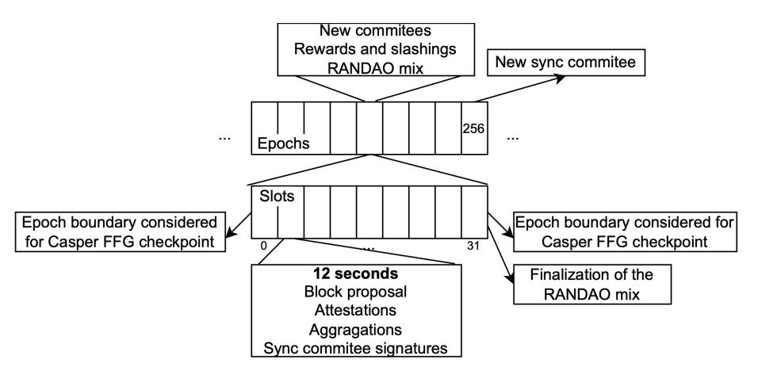
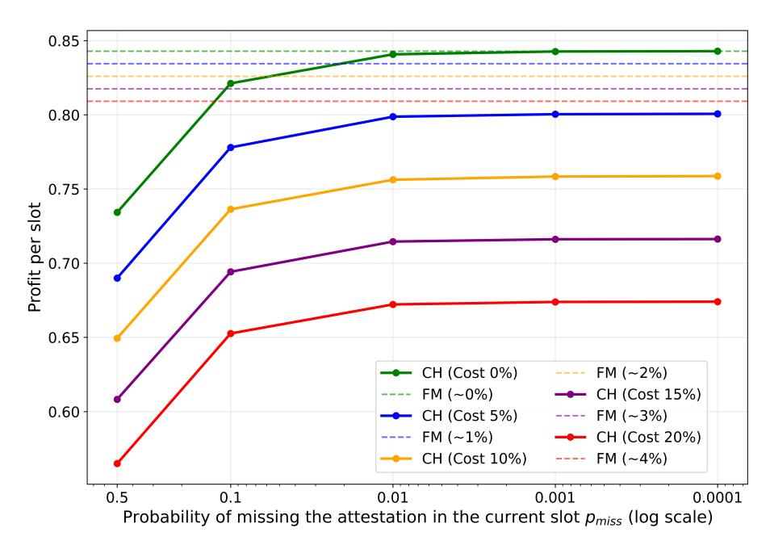
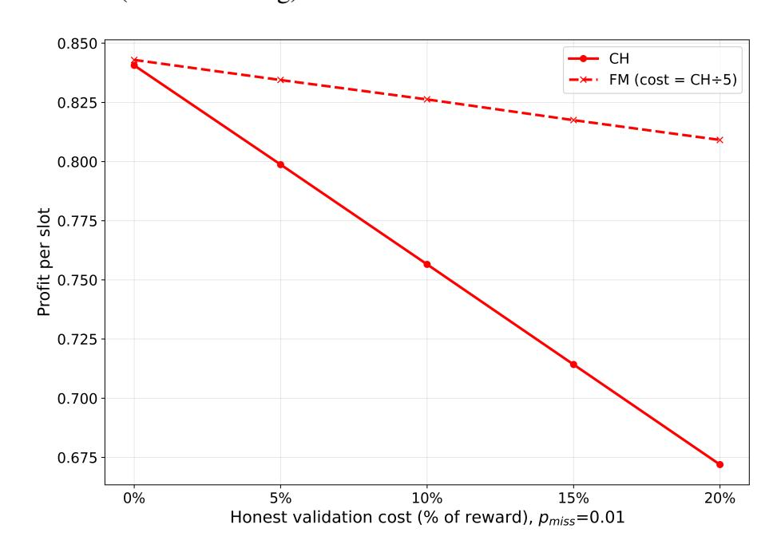
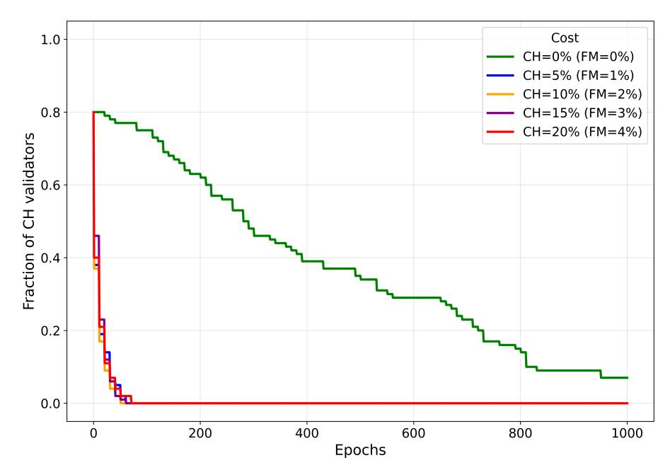
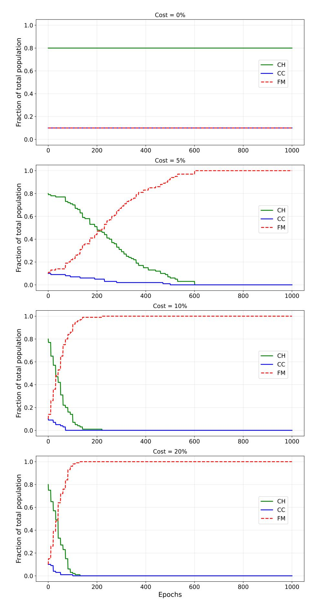
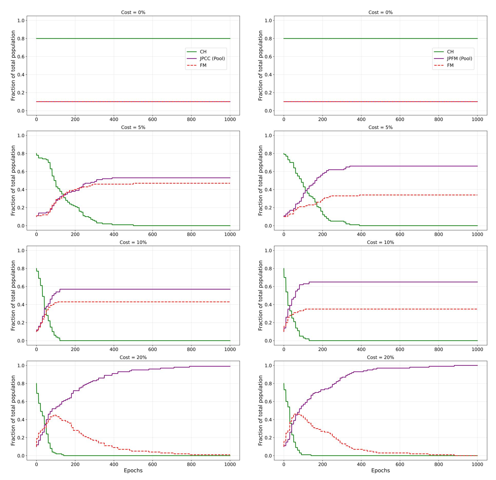

{0}------------------------------------------------

# How Much Verifier's Dilemma and Staking Pools Adversely Affect Decentralization of Ethereum PoS under Realistic Operational Costs? (Extended Version)

Ivan Homoliak\*†, Martin Hruby\*, Martin Peresini\*, Kristian Kostal†, Daria Smuseva‡

\* Brno University of Technology (BUT), Brno, Czech Republic

† Slovak University of Technology (STU), Bratislava, Slovakia

‡ Ca' Foscari University of Venice, Venice, Italy

Abstract—Some consensus protocols, including Proof-of-Work (PoW) and Proof-of-Stake (PoS) designs of Ethereum, contain incentive misalignment because the protocol cannot technically verify whether a block producer or validator has executed (or omitted) validation of transaction correctness before producing a block or issuing an attestation. The incentive to omit validation stems from the risk of losing a fraction of the reward due to a late attestation in PoS, or the risk of missing timely block production (and thus its inclusion) in PoW.

This problem is referred to as the Verifier's Dilemma (VD), and it has been investigated in prior work in the context of PoW, as well as in hybrid PoW and PoS settings of Ethereum.

In this work, we focus on Ethereum PoS, and we investigate how rational, minimally compliant validators affect long-term network decentralization due to VD and operational costs. Using evolutionary game theory and the replicator equation, we model competition among three validator phenotypes: the honest strategy, the lazy strategy, and the join pool strategy. While the honest strategy, which performs validation, requires the operational cost of expensive hardware to run a full validator node, which is currently about 20% of rewards earned, the lazy strategy, which omits validation (based on VD), enables operation of a reduced validator node at five times lower expense, which is currently about 4% of rewards earned. Moreover, the join pool strategy enables amortization of operational costs among pool members and can incorporate the lazy strategy to further reduce costs.

We analyze the profits of these strategies co-occurring under varying late attestation rates and operational cost levels using our slot-level simulator. Our findings demonstrate that the *lazy strategy* consistently outperforms the *honest strategy* in earned profits. Our next experiments reveal that the *join pool strategy*, combined with a variant of the *lazy strategy*, forms an evolutionarily stable equilibrium that rapidly collapses the validator population into a single shared pool. These results suggest that Ethereum decentralization can erode through rational economic drift even in the absence of late attestations.

#### I. INTRODUCTION

The Verifier's Dilemma (VD) was articulated in the context of Ethereum's Proof-of-Work (PoW) consensus [1]. In this setting, miners may be incentivized to do not fully validate a computationally expensive transactions included in a candidate block, because executing verification can delay block propagation and thereby increase the probability of losing the block production race. In PoW, however, this strategy is risky, since accepting an invalid transaction can render the entire block invalid, which causes the miner to lose the associated block reward.

Ethereum's Proof-of-Stake (PoS) transition [2], [3] can make VD more attractive, because block acceptance is mediated by attestations issued by validators. Relative to PoW, a validator

that attests without independently re-executing and validating the block typically risks losing only a small portion of its expected reward, rather than losing an entire block reward. Moreover, strategic validators can reduce this risk by observing already published attestations and then aligning their own vote with the majority vote. Under such incentives, rational validators may free-ride on the validation effort of others while still collecting most (or all) of the attestation-related rewards.

This misalignment of VD was originally analyzed for Ethereum PoW [1], [4], [5], [6], [7] and later has been shown to persist in Ethereum PoS [8], under simplistic assumptions of time delays only. In sum, the Ethereum incentive system rewards timely attestations and does not demonstrate true verification. This creates room for rationally "lazy" behavior, where the block attestation is done based on the observed majority vote. As a consequence, network security might no longer be preserved if the majority of validators convert to this lazy strategy.

Existing research on Ethereum decentralization analysis focuses on individual incentives and block-level safety, formal verification of rewards and penalties mechanism (RPM) [9], maximum attestation attack [10], attestation reorganization attack [11] and game theoretic analysis of validator strategies [12]. What remains unclear is how rational laziness interacts with long-term decentralization: if validators can free-ride on VD or outsource their validation to pools, can the validator set converge to a small number of pool operators (contrary to Ethereum's decentralization goals [13])?

Our Work. In this work, we ask how the Verifier's Dilemma in Ethereum's PoS protocol affects the long-term decentralization of the validator set. We study the behavior and diversity of the validators over time. We analyze the honest strategy that verifies blocks, the lazy strategy that omits the block validation, and a staking pool-based strategy that prioritizes savings for operational costs. Using evolutionary game theory with Replicator's equation [14] and a slot-level simulator, we examine which strategies dominate with different probabilities of late attestation deliveries and operational costs.

We frame our analysis around the following *Fundamental* principle that we postulate:

If a validator's behavior is rational under the protocol's incentives and operational costs, we expect any fraction of the validator population to adopt it.

{1}------------------------------------------------

Figure 1: An overview of the Ethereum consensus timeline [\[15\]](#page-8-4).

The work is guided by two research questions: (1) When is it rational to skip verification before attestation? (2) When do lazy and pooled behaviors become evolutionarily stable?

#### Contributions. Our contributions are as follows:

- 1) Game-Theoretic Formalization and Modeling. We formalize evolutionary game-theory and population dynamics using Replicator's equation [\[14\]](#page-8-3). We model Ethereum PoS validators as players in an evolutionary game with three phenotypes: the honest strategy, the lazy strategy, and the join pool strategy. The model incorporates protocol parameters and operational parameters (rewards/penalties, operational costs, probability of late attestations).
- 2) Simulation of Population Dynamics. We implement a slot-level discrete-event simulator coupled with periodic population re-balancing to approximate the replicator dynamics.
- 3) Identification of Stable Equilibria. Across realistic late attestation probabilities and operational costs, the lazy strategy strictly outperforms the honest strategy. When pooling is available, a pool-based lazy strategy forms an evolutionarily stable equilibrium in which all validators join a pool.
- 4) Decentralization Implications. We interpret the found equilibria in the distribution of validator population from our empirical simulations, arguing that VD can drive the system from many nominal validators toward a few (or a single) dominant operators, undermining decentralization.

# II. BACKGROUND

## *A. Ethereum PoS*

Time in Ethereum PoS is divided into slots of 12 seconds and epochs of 32 slots, as illustrated in [Figure 1.](#page-1-0) At the start of each epoch, active validators are randomly assigned to committees, each responsible for attesting to a specific slot. A single validator is chosen to propose the block for that slot. The assigned committee attests to its validity with an aggregated BLS signature. A validator with 32 ETH[1](#page-1-1) staked is expected to propose only occasionally, but it participates in several attestations per epoch.

1For simplicity, we assume that each validator has 32 ETH staked, even though after PECTRA, it is possible to stake even more. However, staking more than 32 ETH makes the problem we address even more significant, while our intention is to demonstrate it under the most challenging conditions.

Validators therefore perform two tasks: (i) run the statetransition function on the proposed block to ensure all transactions are valid and (ii) publish an attestation indicating whether the block should be included. Attestations that arrive within the slot collect the full reward of 84.4%; late but correct attestations receive a reduced reward of 62.5% (if delivered within 2- 5 slot window), and incorrect attestations are penalized [\[16\]](#page-8-5). Prolonged inactivity causes missing rewards for attestations or even for block proposals. These rules aim to incentivize liveness and correctness, yet the protocol cannot observe whether the underlying validation actually occurred, which opens the door to the verifier's dilemma studied in the remainder of the paper.

PoS also faces other known incentive issues, including nothing-at-stake behavior, stake-bleeding or grinding attacks, and proposer incentives affected by MEV and proposer-builder separation (PBS) [\[17\]](#page-8-6), [\[18\]](#page-8-7), [\[19\]](#page-8-8), [\[20\]](#page-8-9), [\[21\]](#page-8-10), [\[22\]](#page-8-11), [\[23\]](#page-8-12). We focus on verifier dishonesty in skipping the validation process while issuing attestations (that we also refer to as laziness) as a complementary vector that can interact with these economic frictions and affect decentralization.

#### *B. Evolutionary Game Theory*

The simulation model presented in this paper is based on the concept of *evolutionary game theory*. Evolutionary game theory was firstly introduced by Smith and Price [\[24\]](#page-8-13). The authors were motivated to explain why the living species evolves in a certain way. They proposed a model based on a population of individuals where each individual represents its behavioral phenotype (a strategy in the general game theoretical terminology). The population evolves through a sequence of duels of two randomly chosen individuals so they can confront their strategies. Every duel is factually a two-person non-cooperative game where the first player represents some strategy I and the second player some J.

Evolutionary Stable Strategy. Smith and Price [\[24\]](#page-8-13) designed the concept of *Evolutionary Stable Strategy (ESS)*. A strategy I is said to be evolutionary stable if the population of players representing this phenotype is immune against a mutant playing another J. Such I simply dominates J.

*Definition 1:* The strategy I is said to be evolutionary stable if either [Equation 1](#page-1-2) or [Equation 2](#page-1-3) holds:

$$U(I|I) > U(J|I), \tag{1}$$

$$U(I|I) = U(J|I) \wedge U(I|J) > U(J|J), \tag{2}$$

where U(X, Y ) represents the utility function of the player playing strategy X when another player plays strategy Y .

# III. RELATED WORK

Several studies have investigated Ethereum's Proof-of-Stake consensus with respect to centralization and the Verifier's Dilemma, using approaches ranging from empirical on-chain analysis to game-theoretic modeling.

A prominent example is the "staircase attack" proposed by Zhang et al. [\[10\]](#page-7-9), which exposes a fundamental weakness in Ethereum's PoS incentive mechanism. The authors show that an adversary controlling 29.6% of the total stake can 

{2}------------------------------------------------

sustain an attack with an 80.25% success probability. The attack exploits penalties designed to discourage validator inactivity, causing honest validators (despite protocol-compliant behavior) to incur losses, while adversarial validators continue to receive full rewards. Consequently, only 28.9% of the fair incentives are obtained by honest validators. The adversary's stake can increase over time due to this asymmetric reward distribution, eventually exceeding the 1/3 threshold, violating Ethereum's security guarantees. Nevertheless, protocol parameters are crucial to the attack's viability under which the success probability reaches declared 80.25% – in particular, maximum attestations equal to 128 and a validator set of roughly 850k.

## *A. The Verifier's Dilemma in PoW*

One of the earliest works that studied this phenomenon was [\[1\]](#page-7-0). The paper first introduced the Verifier's Dilemma in PoW settings and proposed a security model to analyze attacks that focus on calculation correctness. As a main contribution, the authors discuss the implementation of the ϵ-consensus machine in Ethereum, where ϵ measures the advantage of skipping the verification step.

Fiz Pontiveros et al. [\[5\]](#page-7-4) study the effect of intentionally slow smart contract implementations across different Ethereum PoW clients to analyze the relative advantage of being a nonverifier. However, they assume that attackers must call such smart contracts to appear in subsequent blocks, which differs from our assumptions.

Alharby et al. [\[4\]](#page-7-3) utilize a data-driven approach to calculate the advantage of deviating from the protocol. They estimate the time to execute each of 300k smart contracts and analyze how this affects the overall reward non-verifier would reach [\[6\]](#page-7-5)

Further, Smuseva et al. [\[6\]](#page-7-5) proposed a model-driven solution utilizing the process algebra tool first introduced in [\[25\]](#page-8-14). The analytical model shows the conditions under which deviating miners outperform honest miners. Furthermore, the authors propose a mitigation approach that involves injecting invalid blocks, making it unlikely for a non-verifying validator to remain profitable in such a network. The introduced model helps to find the optimal rate at which invalid block injection rate has the minimal impact on network performance.

# *B. The Verifier's Dilemma in PoS*

Smuseva et al. [\[8\]](#page-7-7) modeled VD in Ethereum PoS by Performance Evaluation Process Algebra (PEPA), and the authors focused on modeling of only time delays, affecting late attestation, and thus reduced rewards. Their findings suggest that the current reward/penalty system keeps validators under constant time pressure. They have to attest quickly, otherwise they risk losing a part of the reward (i.e., vote for the "head" of the chain). However, if they rush and make a mistake by attesting a conflicting block, they might be punished. So, validators are being pushed to react faster and faster – even if that means they have less time for doing their duties. Consequently, over the long run, rational validators might start caring more about their rewards than honesty in validation.

Mighan et al. [\[26\]](#page-8-15) built a probabilistic model to understand how consensus forms. Their takeaway is that the single most important factor in reaching an agreement quickly is the number of validators voting honestly. When more people vote honestly, forks are resolved much faster. On the other hand, the model also shows that voluntary exits and people being slow to rejoin committees can seriously drag everything down and delay convergence. The whole protocol works best when validators consistently choose honesty even when they could probably gain an advantage by playing games.

## *C. PBS & Validator Trade-offs*

The introduction of Proposer–Builder Separation (PBS) has brought a set of new dilemmas to validators. Although PBS allows validators to rely on externally built blocks that are often more competitive in terms of extracted value, it also introduced new incentives that complicate validator decisionmaking. Empirical evidence suggests that PBS did not reduce censorship pressure as originally hoped. In fact, transactions originating from sanctioned addresses were included more frequently in blocks proposed without PBS than in those sourced through PBS relays. This outcome is contrary to the original motivation behind the separation. From the validator's perspective, PBS involves a series of trade-offs. While it can reduce computational requirements and increase expected rewards, it also introduces dependence on relays that do not always behave reliably and fairly. In practice, validators do not always receive the reward values agreed by relays, and there is no effective incentive mechanism to ensure relay honesty. As a result, independent validators are often placed at a disadvantage relative to large, institutional actors with better access to optimized block-building infrastructure. These uncertainties weaken trust in Ethereum PoS and make participation choices more complex for smaller validators, which negatively impacts decentralization.

Concerns about concentration are further supported by the game-theoretic analysis of Zhang et al. [\[27\]](#page-8-16). Their model shows that users, acting rationally, choose PBS delegates based on delegation costs, perceived reputation, and the expected behavior of others. While this behavior leads to a stable Nash equilibrium, it favors delegation toward a small number of wellknown validators. Combined with the minimal requirement of 32 ETH to run a validator, this dynamic significantly limits direct participation and concentrates stake among existing large entities, with only a small fraction of Ethereum addresses able to validate independently.

Related observations are made by Grandjean et al. [\[13\]](#page-8-2), who focus on the effects of activation queue congestion and the availability of immediate rewards through staking services. Their findings indicate that solo stakers tend to disappear, while large pools scale more quickly and benefit from opportunities such as multi-block MEV extraction that are unavailable to smaller participants. This imbalance is further supported by incentive structures that reward scaling (e.g. by optimizing costs) rather than independence. According to Beccuti et al. [\[28\]](#page-8-17), users of centralized exchanges or liquid staking protocols are less sensitive to changes in staking rewards than solo stakers. This sensitivity is increased by centralized entities' superior MEV access and DeFi yields. Further, it is driven by market dynamics rather than operational costs. Large validators have a greater relative advantage over time. However, Yan et al.'s short-term stability [\[29\]](#page-8-18) indicates that decentralization metrics 

{3}------------------------------------------------

might hold steady in the near future despite ongoing structural pressures.

Finally, Tapolcai et al. [30] demonstrate that Ethereum's randomness beacon, RANDAO, is vulnerable to coordinated manipulation. Their analysis shows that staking pools can temporarily control roughly 1/3 of active validators and exploit this position to influence random outcomes with very high success rates. These attacks rely on selectively withholding blocks or excluding blocks proposed by others from the canonical chain. The underlying issue is incentive-driven: validators have a clear financial motivation to cooperate in such strategies. Those who refuse to participate are placed at a competitive disadvantage, encouraging coordination over independent behavior and directly running counter to the goal of decentralization.

#### IV. PROBLEM DEFINITION

Assuming an evolutionary stable strategy (see Section II-B) in the context of Ethereum PoS, the goal is to study whether some honest validator's strategy might be immune to any kind of dishonest (i.e., lazy) behavior. If not, then lazy validators will prosper better in the population of Ethereum's validators and dominate the honest ones. Obviously, honest and lazy validators are not entering any face-to-face conflicts. Such conflicts remain at a hypothetical level, meaning that an honest validator discovers such a lazy strategy (via external means, e.g., some statistics about late attestations, etc.) and reconsiders its behavior eventually.

#### A. Population Dynamics

We adapt the original concept of an evolutionary game into a model based on a large population of players (validators) where each player represents one of our predefined behavior  $s_1, s_2, ..., s_k$  (strategy, phenotype). Let the vector  $(x_1, x_2, ..., x_k)$  denote the distribution of phenotypes within the population, i. e.  $\sum_i x_i = 1$ . The size of the population is not essential here, as it represents the entire community of Ethereum's validators.

Then, we model the technical aspects of each phenotype  $s_i$  during the validating job and its resulting profits  $w_i$  (rewards minus penalties).

Playing the particular strategy  $s_i$  is each validator's individual choice, and as such, it might be reconsider at any time if the (rational) validator finds another  $s_j$  to be more profitable, i. e. if  $w_j > w_i$ . The incentive of switching the strategy grows with the overall level of  $\frac{w_j}{\overline{w}(x)}$ , where  $\overline{w}(x)$  denotes the average fitness of the population. Finally, we apply so called *Replicator's equation* (Equation 3).

$$x' = x_i \frac{w_i(x)}{\overline{w}(x)}; \forall i = 1, ..., k$$
(3)

In our simulation model, we iterate E number of epochs, accumulate profits for each strategy, and then allow the validators to reconsider their strategy (i.e., Rebalance).

**Example:** Assume the distribution of the population  $x = (0.3, 0.3, 0.2, 0.2, 0), w = (10, 20, 40, 50, 0) and <math>\overline{w}(x) = 24$ . Then, the next distribution of strategies within the population x' will be (0.1, 0.2, 0.3, 0.4, 0). In detail, the rebalance causes all phenotypes with profits lower than  $\overline{w}(x)$  (i.e.,  $x_1, x_2, x_5$ ) will decrease their representation in the population in favor of phenotypes with profits higher than  $\overline{w}(x)$ . After a large

number of evolutionary steps, some of the strategies should get stabilized, and then we call them **evolutionary stable**.

#### V. THE SIMULATION MODEL

We model the behavior of the validators and their economics, while we assume two distinct operational costs for running: (1) a **full Ethereum validator** node (i.e., executing block validations before issuing attestations), and (2) a **reduced Ethereum validator** node (i.e., issuing attestations without validating blocks). Moreover, both types execute block proposals.

## A. The Behavioral Phenotypes

We model the validators' behavior (phenotype) using three kind of strategies: lazy (malicious) strategy (i.e., FM), join pool (malcious) strategy (i.e., JPCC, JPFM), and honest strategy (i.e., CH, CC). The honest strategy represents the expected role of the validator, who proposes blocks and issues attestations of other blocks upon successful validation of their correctness – this imposes certain costs and time (i.e., running a full Ethereum validator). Such a time overhead might occasionally lead to the delayed attestation issuance of the current block, and thus the reduction of the reward.

On the other hand, the lazy strategy saves time and costs for attestations by exploiting the verifier's dilemma, and thus always issuing on-time attestations without executing (expensive) validation of the proposed block. We assume that this always enables the on-time issuance of the attestation and thus no reduction of the reward, while at the same time optimizing the costs for running the reduced validator node on cheaper hardware with the cheaper operational costs.2

Finally, the join pool strategy enables to amortize cost of running a validator node across all but one pool members who do not execute the validation; validation is executed only by the pool operator, which can be further optimized by the lazy variant of this strategy. This strategy is considered malicious because it undermines decentralization.

**Rewarding.** We consider rational, permanently-online validators who do not perform other "malicious" strategies than the lazy and join pool strategies. They can vote only *for* the proposed block,3 which can be met either within the same slot or missed and included in the next 2-5 slots interval of rewarding function [31]. The first case assigns a validator with the full reward of 84.4%, while the second case assigns the validator with the reduced reward of 62.5% [31]. In detail, the difference 84.4% - 62.5% = 21.9% is the reward for the head vote. Since older head vote than 1 slot has no value, Ethereum does not reward it [32].

We also assume that the costs for running an honest validator node are higher than the cost for running a lazy validator (i.e., full vs. reduced validator) – we will provide examples of the concrete numbers in our experiments.

2Note that once in a while – when becoming a block producer – the more powerful hardware is required by the lazy validator; however, this event occurs roughly twice a year and is scheduled beforehand; therefore the validator might adaptively increase the performance of her machine in the cloud for this event with almost negligible costs.

3It means voting for a correct block (i.e., head) as well as correct justified & finalized checkpoints (i.e., target and source).

{4}------------------------------------------------

#### *B. Lazy Strategy*

Let us describe the principle of considered lazy validator strategy in detail:

• FM (Follow Majority): the validator observes the flow of attestations coming from other validators and votes along the majority of the votes by "copying" the attestation – this means signing and gossiping the attestation. This strategy never misses attestation nor delivers it late.

# *C. Join Pool Sub-Strategies*

Let us describe the considered join pool sub-strategies of validators:

- JPCC (Join Pool w. Compute Conditionally): this strategy is similar to JP, but the validator executes the validation only until the moment it can meet the time constraint of the issuance in the current slot; otherwise, it follows FM. Therefore, it never misses the attestation nor delivers it late.
- JPFM (Join Pool w. Follow Majority): this strategy is similar to JPCC, but the validator does not perform validation at all and instead executes FM always. The consequence is that the amortized costs for running a reduced validator are even lower.

## *D. Honest Sub-Strategies*

Let us describe the considered honest sub-strategies of validators in detail:

- CH (Computing Honestly): the validator always does the validation of all generated blocks. However, since it works honestly, the validator may be late in some slots with the delivery of the attestation, while it never misses the attestation. Thus, it might lose the partial portion of the reward (i.e., 21.9%).
- CC (Computing Conditionaly): validator is primarily playing CH. It switches to FM behavior within each slot if unable to validate a block on time. Such a validator works most of the time honestly, except for the (rare) computationally expensive slots.

# VI. EXPERIMENTS

In this section, we conduct several simulation experiments representing different scenarios of late attestation probabilities (denoted as pmiss) and operational costs. For each experiment, the simulation starts with an initial population parametrized by different distributions. If the experiment assumes population re-balancing, it is executed every 10 epochs.

## *A. Experiment I: CH vs. FM w/o Rebalancing*

In this experiment, we assume only two phenotypes CH (i.e., honest) and FM (i.e., lazy) with the size of population N = 100 and not allowed population re-balancing. We experimented with different probabilities of missing attestations pmiss in the case of CH (i.e., 0.5, 0.1, 0.01, 0.001, and 0.0001), while we modeled FM to never miss an attestation. Also, we experimented with different operational costs for CH and FM phenotypes:

Figure 2: Experiment I: Honest CH and lazy FM strategies with various operational costs and probabilities of missing attestation for CH (no rebalancing).

Figure 3: Experiment I: Operational costs and their impact on the overall profits (assuming pmiss = 0.01 for CH and cost(CH) = 5 ∗ cost(F P)).

- In the case of honest strategy CH, the operational costs were set as a percentage of the reward earned (i.e., 0%, 5%, 10%, 15%, and 20%.).[4](#page-4-0)
- In the case of FM strategy, we assumed roughly 5x lower operational cost for running a reduced validator node[5](#page-4-1)

The results are depicted in [Figure 2.](#page-4-2) We can see that CH can catch up with FM strategy only under the the unrealistic assumption of no operational costs and pmiss ≤ 0.01. In the case of realistic operational costs (i.e., 15% – 20%), the honest validators earn by 12.2% – 17.3% lower reward than lazy ones even in the case of negligible pmiss, which is much higher loss than expected profit for Ethereum validators (i.e., 3-7%), which provides a rationale to switch into lazy strategies. Since this experiments is mostly impacted by difference in operational costs, we depict these in [Figure 3.](#page-4-3) The outcome of this very basic experiment indicates that validator's dilemma

4Note that with the current price of ETH = 3170\$ as of 13th January 2026, the most realistic values are 15% and 20%, representing 60 – 100\$ monthly [\[33\]](#page-8-22) – the cost of running the Ethereum validator as an IasS cloud instance.

5This strategy could be executed with a cloud machine that costs 10\$ – 20\$ per month [\[34\]](#page-8-23).

{5}------------------------------------------------

Figure 4: Experiment II: Fraction of honest validators CH (to complementary lazy validators FM) with various operational costs (in % of reward) and allowed rebalancing (pmiss = 0.01 for CH).

is critical even in the pure PoS version of Ethereum, and rational validators might tend to skip validation to maximize their profits.

## *B. Experiment II: CH vs. FM w. Rebalancing*

The setting of this experiment is the same as in Experiment I, but in addition, we allow population rebalancing – in particular, we model various CH validators who convert to FM upon the comparison of their actual profits in contrast to average profit of the population every 10 epochs – i.e., if the actual profit of a validator is lower than average profit, it converts to FM. Next, we assume pmiss = 0.01 for CH, which has a negligible impact on the overall profits, and therefore, this experiment is dominantly impacted by operational costs. The results of this experiment are depicted in [Figure 4,](#page-5-0) where we depict the fraction of honest validators CH, starting with 80% of the population; therefore, the complementary values (i.e., 1 - CH) represent the fraction of lazy FM validators.

We observe that any non-zero operational costs and their 5x difference for CH vs. FM cause fast conversion of all CH validators to the FM strategy, rendering it evolutionary stable. Even zero operational costs causes the same conversion, but at a slower pace.

# *C. Experiment III: CH vs. FM vs. CC w. Rebalancing*

The setting of this experiment is the same as in Experiment II, but in addition, we add the honest CC strategy that eliminates the loss of honest validators due to missed attestations (i.e., pmiss = 0 for CC) but preserves the operational costs. Therefore, the only difference between CC and FM is purely due to 5x higher operational costs. We set pmiss = 0.01 for CH. Rebalancing occurs every 10 epochs in the same way as in the previous experiment based on the average profit of the population.

The results of this experiment are depicted in [Figure 5,](#page-5-1) where we depict different operational costs in percentage of the rewards. We can see that the initial distribution of the population is preserved only in the case of zero costs. However, in the case of non-zero costs, the population of validators convert from CH and CC to FM, eventually, rendering FM evolutionary stable,

Figure 5: Experiment III: Rebalancing of CH, CC, and FM strategies with various costs (pmiss = 0.01 for CH).

which is in line with the previous experiment. One can realize that setting worse miss rates than 0.01 can only cause faster conversion of CH to other strategies and eventually to FM, preserving the conclusion.

# *D. Experiment IV: CH vs. FM vs. JPCC w. Rebalancing*

The setting of this experiment is the same as the previous one, but in contrast to it, we changed CC strategy to the join pool strategy JPCC. JPCC never misses the attestation and imposes costs of a full validator amortized over the number of pool members. The population rebalancing works in the same way as in the previous experiment. We experimented with different costs in percentage of the rewards, and the results of this experiment are depicted in [Figure 6.](#page-6-0) We can see that the

{6}------------------------------------------------

Figure 6: Experiment IV: Rebalancing of CH, JPCC, and FM strategies with various costs (pmiss = 0.01 for CH).

initial distribution of the population is preserved only in the case of zero costs. Nevertheless, the JPCC strategy dominates the population when assuming non-zero costs – all validators playing CH convert to JPCC and FM. The ratio of JPCC and FM is dependent on the costs, which are amortized by the factor of 5 (against cost of CH) in the case of FM or the number of pool members in the case of JPCC. Hence, with rising costs, the amortization effect of JPCC strategy became more significant. Therefore, JPCC became evolutionarily stable at costs of 20% (that represents a realistic cost estimate). In sum, this experiment indicates joining a pool that optimizes attestation miss rate by playing CC is even more serious issue

than playing FM alone. This has a negative impact on the

decentralization of Ethereum.

Figure 7: Experiment V: Rebalancing of CH, JPFM, and FM strategies with various costs (pmiss = 0.01 for CH).

### *E. Experiment V: CH vs. FM vs. JPFM w. Rebalancing*

For completeness, we executed the same experiment as the previous one, but replacing JPCC for JPFM, which further optimizes the cost. As can be seen in [Figure 7,](#page-6-1) this strategy causes a slightly faster population conversion to the join pool strategy. Otherwise, it implies the same conclusions as Experiment IV.

# VII. DISCUSSION

In this section, we discuss implications of our findings to decentraliazation of Ethereum, their practicality, and discuss some mitigation techniques.

Implications for decentralization. Our results show that Ethereum's PoS incentives allow validators to pretend to be 

{7}------------------------------------------------

compliant while outsourcing or skipping verification. Even without considering reduced rewards for late attestation delivery, lazy behaviors accumulate more profits because they minimize operational costs for running the validator. The join pool strategies in particular collapse the effective number of independent full validator nodes, weakening the public oversight that decentralization aims to provide.

VD in Practice. Even though we demonstrated that the lazy strategy of VD dominates the honest strategy, there is no evidence of VD occurring in Ethereum itself – there are no technical means to figure it out. Nevertheless, the other external factors might disincentivize VD, such as social norms, the influence of Ethereum's reputation on its price, which translates to the value of staked tokens, etc.

Mitigations. We provide a few protocol-based techniques that can disincentivize malicious behaviors:

- Modifying the Rewarding. Since 21.9% of the reward for the attestation comes from a fresh head vote [\[32\]](#page-8-21), the validator with a late attestation loses this portion of the reward. The head portion of the attestation reward could be decreased and/or adjusted by the network based on the price of Ethereum to minimize the loss for the head vote and to reflect the operational costs.
- Non-Outsourceable Staking. Another potential direction to mitigate the negative consequences of the join pool strategy (on top of VD's follow majority strategy) is to redesign the staking process and avoid outsourced staking through pools. The original design choice of Ethereum PoS was to enable pooled staking since the required staked amount of 32ETH was considered a high entry barrier to many potential stakers. On the other hand, if this amount were to be lower, staking would not be profitable anymore due to high operational costs of running a full validator node.

# VIII. LIMITATIONS AND FUTURE WORK

While our results demonstrate that verifier laziness and pooling can constitute evolutionarily stable behaviors in Ethereum's PoS protocol under the assumption of different operational costs and late attestation probabilities, several modeling choices were abstracted away and might also partially influence the rewarding of validators, but not the conclusion we made.

Protocol Simplifications. We abstract parts of the reward and penalty scheme (e.g., exact reward scaling for late target and source attestations, down times, sync committee rewards). Future work can investigate the penalties and downtimes of validators.

Simplified Network and Execution Environment. Network propagation delays are omitted, and the probability of delivering late attestations is modeled using a simple uniform distribution. In future work, we can experiment can add more realistic network aspects to our simulations.

Restricted Strategy Space. We study three variants of strategies and their sub-strategies always in their pure form. Future work can involve experiments with validators mixing behaviors (verify only some blocks, combine laziness with timing games, etc.).

#### IX. CONCLUSION

We conclude that Ethereum's PoS incentives can make it economically rational for validators to skip full verification and instead follow the majority (as per Validator's dilemma), because the savings from omitted validation can lower operating costs enough to outweigh the benefits of honest validation even when late attestations are rare. In our simulations, this lazy behavior consistently earns higher profits than honest strategies. When staking pools are available, pooling with lazy verification becomes an evolutionarily stable strategy that can rapidly concentrate validators into one dominant staking pool, reducing the number of independent full validator nodes. We argue that decentralization can erode through rational behavior optimizing profits, and we suggest a few mitigation directions, such as adjusting reward components and exploring non-outsourceable staking designs.

Future work can integrate mixed and adaptive strategies, empirically derived latency distributions to realistically model late deliveries of attestations, and consider certain downtimes.

## REFERENCES

- [1] L. Luu, J. Teutsch, R. Kulkarni, and P. Saxena, "Demystifying incentives in the consensus computer," in *Proceedings of the 22nd ACM SIGSAC Conference on Computer and Communications Security*, ser. CCS '15. New York, NY, USA: Association for Computing Machinery, 2015, p. 706–719. [Online]. Available: <https://doi.org/10.1145/2810103.2813659>
- [2] "Ethereum Foundation Blog: Mainnet Merge Announcement," Available at: [https://blog.ethereum.org/2022/08/24/mainnet](https://blog.ethereum.org/2022/08/24/mainnet-merge-announcement)[merge-announcement,](https://blog.ethereum.org/2022/08/24/mainnet-merge-announcement) accessed: 2025-09-15.
- [3] "Ethereum Foundation: The Merge," Available at: [https:](https://ethereum.org/en/roadmap/merge/#what-is-the-merge) [//ethereum.org/en/roadmap/merge/#what-is-the-merge,](https://ethereum.org/en/roadmap/merge/#what-is-the-merge) accessed: 2025-10-11.
- [4] M. Alharby, R. C. Lunardi, A. Aldweesh, and A. van Moorsel, "Data-driven model-based analysis of the Ethereum verifier's dilemma," in *2020 50th Annual IEEE/IFIP International Conference on Dependable Systems and Networks (DSN)*. IEEE, 2020, pp. 209–220.
- [5] B. B. Fiz Pontiveros, C. Ferreira Torres *et al.*, "Sluggish mining: Profiting from the verifier's dilemma," in *International Conference on Financial Cryptography and Data Security*. Springer, 2019, pp. 67–81.
- [6] D. Smuseva, I. Malakhov, A. Marin, A. van Moorsel, and S. Rossi, "Verifier's dilemma in ethereum blockchain: A quantitative analysis," in *International Conference on Quantitative Evaluation of Systems*. Springer, 2022, pp. 317–336.
- [7] D. Smuseva, A. Marin, S. Rossi, and A. Van Moorsel, "Verifier's dilemma in proof-of-work public blockchains: A quantitative analysis," *ACM Transactions on Modeling and Computer Simulation*, vol. 35, no. 2, pp. 1–24, 2025.
- [8] D. Smuseva, I. Malakhov, A. Marin, and S. Rossi, "Crisis of trust: Analyzing the verifier's dilemma in ethereum's proof-ofstake blockchain," in *2023 IEEE International Conference on Blockchain (Blockchain)*. IEEE, 2023, pp. 332–339.
- [9] M. Rashid, I. Rasool, N. Ahmad Zafar, and H. Afzaal, "Formal verification of rewards and penalties mechanism of ffg attestations: Ethereum 2.0 beacon chain case study," *IEEE Access*, vol. 13, pp. 112 132–112 161, 2025.
- [10] M. Zhang, R. Li, and S. Duan, "Max attestation matters: Making honest parties lose their incentives in ethereum {PoS}," in *33rd USENIX Security Symposium (USENIX Security 24)*. Philadelphia, PA: USENIX Association, Aug. 2024, pp. 6255– 6272. [Online]. Available: [https://www.usenix.org/conference/](https://www.usenix.org/conference/usenixsecurity24/presentation/zhang-mingfei) [usenixsecurity24/presentation/zhang-mingfei](https://www.usenix.org/conference/usenixsecurity24/presentation/zhang-mingfei)

{8}------------------------------------------------

- [11] M. Zhang, R. Li, X. Lu, and S. Duan, "Available attestation: towards a reorg-resilient solution for ethereum proof-of-stake," in *Proceedings of the 34th USENIX Conference on Security Symposium*, ser. SEC '25. USA: USENIX Association, 2025.
- [12] C.-C. Chen and W. Golab, "A game theoretic analysis of validator strategies in ethereum 2.0," in *Proceedings of the 6th ACM International Symposium on Blockchain and Secure Critical Infrastructure*, ser. BSCI '24. New York, NY, USA: Association for Computing Machinery, 2025, p. 1–14. [Online]. Available:<https://doi.org/10.1145/3659463.3660021>
- [13] D. Grandjean, L. Heimbach, and R. Wattenhofer, "Ethereum proof-of-stake consensus layer: Participation and decentralization," in *Financial Cryptography and Data Security. FC 2024 International Workshops*, J. Budurushi, O. Kulyk, S. Allen, T. Diamandis, A. Klages-Mundt, A. Bracciali, G. Goodell, and S. Matsuo, Eds. Cham: Springer Nature Switzerland, 2024, pp. 253–280.
- [14] J. W. Weibull, *Evolutionary Game Theory*. Cambridge, MA: MIT Press, 1995.
- [15] T. Burianová, M. Perešíni, and I. Homoliak, "Secret leader election in ethereum pos: An empirical security analysis of whisk and homomorphic sortition under dos on the leader and censorship attacks," 2025. [Online]. Available: <https://arxiv.org/abs/2509.24955>
- [16] B. Edgington. (2023) Upgrading ethereum | 2.8.4 rewards. Accessed: January 07, 2026. [Online]. Available: [https://](https://eth2book.info/latest/part2/incentives/rewards/) [eth2book.info/latest/part2/incentives/rewards/](https://eth2book.info/latest/part2/incentives/rewards/)
- [17] V. Buterin, "Slasher: A punitive proof-of-stake algorithm," Available at: [https://blog.ethereum.org/2014/01/15/slasher-a-punitive](https://blog.ethereum.org/2014/01/15/slasher-a-punitive-proof-of-stake-algorithm)[proof-of-stake-algorithm,](https://blog.ethereum.org/2014/01/15/slasher-a-punitive-proof-of-stake-algorithm) 2014, accessed: 2024-12-01.
- [18] L. Lys, S. Forestier, D. Vodenicarevic, and A. Laversanne-Finot, "Defending against the nothing-at-stake problem in multi-threaded blockchains," 2023. [Online]. Available: [https:](https://arxiv.org/abs/2302.10009) [//arxiv.org/abs/2302.10009](https://arxiv.org/abs/2302.10009)
- [19] S. Motepalli and H.-A. Jacobsen, "Reward mechanism for blockchains using evolutionary game theory," in *2021 3rd Conference on Blockchain Research & Applications for Innovative Networks and Services (BRAINS)*, 2021, pp. 217–224.
- [20] I. Homoliak, S. Venugopalan, Q. Hum, and P. Szalachowski, "A security reference architecture for blockchains," in *2019 IEEE International Conference on Blockchain (Blockchain)*, 2019, pp. 390–397.
- [21] Q. Nguyen, A. Cronje, M. Kong, A. Kampa, and G. Samman, "Stakedag: Stake-based consensus for scalable trustless systems," 2019. [Online]. Available:<https://arxiv.org/abs/1907.03655>
- [22] M. Koegler, "Sok: Current state of ethereum's enshrined proposer builder separation," 2025. [Online]. Available: [https:](https://arxiv.org/abs/2506.18189) [//arxiv.org/abs/2506.18189](https://arxiv.org/abs/2506.18189)
- [23] L. Heimbach, L. Kiffer, C. F. Torres, and R. Wattenhofer, "Ethereum's proposer-builder separation: Promises and realities," 2023. [Online]. Available:<https://arxiv.org/abs/2305.19037>
- [24] J. M. Smith and G. R. Price, "The logic of animal conflict," *Nature*, vol. 246, no. 5427, pp. 15–18, 1973. [Online]. Available: <https://doi.org/10.1038/246015a0>
- [25] J. Hillston, "A compositional approach to performance modelling," 1996.
- [26] S. Naderi Mighan, J. Mišic, and V. B. Miši ´ c, "Probabilistic ´ analysis of validator lifecycle and fork resolution in ethereum 2.0-like pos system," *IEEE Transactions on Network and Service Management*, vol. 22, no. 4, pp. 3732–3742, 2025.
- [27] Y. Zhang, Q. Wang, S. Chen, and C. Wang, "How to rationally select your delegatee in PoS," Cryptology ePrint Archive, Paper 2023/1585, 2023. [Online]. Available: [https:](https://eprint.iacr.org/2023/1585) [//eprint.iacr.org/2023/1585](https://eprint.iacr.org/2023/1585)
- [28] J. Beccuti, T. Chantramonklasri, M. Hafner, and N. Oderbolz, "Towards a formal framework of the ethereum staking market," 2025. [Online]. Available:<https://arxiv.org/abs/2503.14385>
- [29] T. Yan, S. Li, B. Kraner, L. Zhang, and C. J. Tessone, "A data engineering framework for ethereum beacon chain rewards: From data collection to decentralization metrics," *Scientific Data*, vol. 12, no. 1, Mar. 2025. [Online]. Available: <http://dx.doi.org/10.1038/s41597-025-04623-7>

- [30] J. Tapolcai, B. Ladóczki, and Ábel Nagy, "Slot a la carte: Centralization issues in ethereum's proof-of-stake protocol," Cryptology ePrint Archive, Paper 2025/219, 2025. [Online]. Available:<https://eprint.iacr.org/2025/219>
- [31] Eth2 Book Contributors, "Penalties," [https://eth2book.info/](https://eth2book.info/capella/part2/incentives/penalties/) [capella/part2/incentives/penalties/,](https://eth2book.info/capella/part2/incentives/penalties/) 2023, capella upgrade, Part 2: Incentives.
- [32] B. Edgington, "2.8.4 rewards," 2026, accessed: 2026- 01-14. [Online]. Available: [https://eth2book.info/capella/part2/](https://eth2book.info/capella/part2/incentives/rewards/) [incentives/rewards/](https://eth2book.info/capella/part2/incentives/rewards/)
- [33] D. Juneja, "Can You Earn Money Running an Ethereum Node in 2025? Costs, APY, MEV, & Real ROI," November 2025. [Online]. Available: [https://coinbureau.com/guides/is-ethereum](https://coinbureau.com/guides/is-ethereum-node-profitable)[node-profitable](https://coinbureau.com/guides/is-ethereum-node-profitable)
- [34] bacloud, "The Ultimate Guide to Crypto Staking and Server Requirements (2025)," April 2025. [Online]. Available: [https://www.bacloud.com/en/blog/160/the-ultimate-guide](https://www.bacloud.com/en/blog/160/the-ultimate-guide-to-crypto-staking-and-server-requirements-2025.html)[to-crypto-staking-and-server-requirements-2025.html](https://www.bacloud.com/en/blog/160/the-ultimate-guide-to-crypto-staking-and-server-requirements-2025.html)