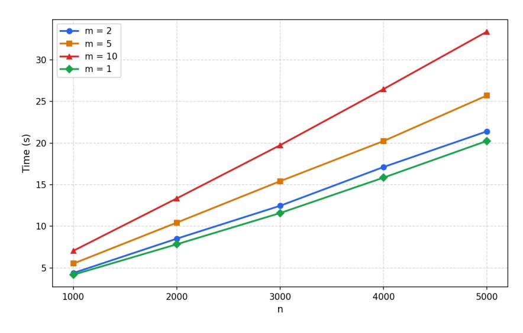
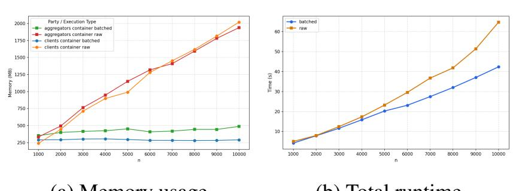

{0}------------------------------------------------

# PRIVADA: Private user-centric Data Aggregation

Betül A¸skın Özdemir\*, Beyza Bozdemir, Ionut Groza\*\*, and Melek Önen\*\* *\*COSIC, KU Leuven, Leuven, Belgium*

*\*\*Digital Security, EURECOM, Sophia Antipolis, France betul.askinozdemir@kuleuven.be, bzdmrbeyza@gmail.com, {ionut.groza,melek.onen}@eurecom.fr*

Keywords: Data Aggregation, User Privacy, Multiple Data Customers, Secure Two-party Computation, SPDZ.

Abstract: Privacy-preserving data aggregation has become a fundamental tool for large-scale analytics in AI-driven and cloud-based systems. While existing solutions provide the default privacy guarantee, i.e., input confidentiality, most assure a semi-honest adversary model and fail to simultaneously ensure user anonymity, selective disclosure, and result privacy in the multiple data customers environment. In this work, we introduce PRI-VADA, a maliciously secure data aggregation solution that uses MPC in the SPDZ framework. Unlike prior data aggregation schemes using MPC with/without SPDZ, PRIVADA supports multiple data customers while preventing inference of user participation and resisting collusions in real-world data aggregation applications. Moreover, our work guarantees *user privacy* and *result privacy*, in addition to *input privacy*. PRIVADA outperforms the state-of-the-art solutions by providing security against participating parties, including malicious data owners, aggregators, and data customers. Our proof-of-concept implementation also supports the new privacy-preserving data aggregation by combining malicious security, being available for multiple data customers, and ensuring strong privacy guarantees in large-scale deployments. The aggregation operation on the aggregator side becomes simpler with PRIVADA, and experimental results show a 12–15 times speedup compared to the state-of-the-art. This confirms that malicious security and strong privacy guarantees can be achievable without sacrificing practicality.

## 1 INTRODUCTION

With the rapid spread of AI applications, new opportunities have opened up for technology, business, and society, and accordingly, data aggregation has become a fundamental component for companies and decision makers. Applications such as telemetry collection, behavioral analytics, smart-meter readings, population-level statistics, or smart city projects rely on the ability to compute aggregate functions over data contributed by a massive number of users. Such analytics are essential for functionality, safety, and decision-making in real-world use cases but they also introduce potential risks for individuals' privacy. Yet, another problem emerges due to the data aggregation performed by cloud servers and/or multiple stakeholders that may disclose or attempt to exploit data during the data aggregation process. Moreover, with data protection regulations, the need for user and data privacy protection has become essential, and calls for the essential use of privacy enhancing technologies (PETs) to enable aggregation over individuals' data, without disclosing the underlying data. Therefore, protecting user privacy and data privacy conducted by one or more cloud servers in adversarial settings has become an immediate challenge.

To address this challenge, state-of-the-art (SoTA) solutions have traditionally deployed PETs such as homomorphic encryption, secure multi-party computation, and differential privacy. While these solutions successfully guarantee *input privacy*, the confidentiality of users' data, we call *data owners*, they typically accomplish the desired aggregation only under a semi-honest adversary model. However, relying on a semi-honest security assumption is not realistic for real-world deployments. In practice, *aggregators* (the cloud servers processing the data) and other stakeholders, namely *data customers* interested in the aggregate output, may arbitrarily deviate from the protocol, tamper with exchanged data, or attempt to determine *which users contribute to which aggregation for which stakeholders*. Because real-world deployments often rely on cloud platforms involving multiple data customers, they can be vulnerable to active attackers who would like to deviate from the protocol, forge messages, manipulate submitted contribu

{1}------------------------------------------------

tions, or tamper with the final results. Under such threats, security guarantees against semi-honest adversaries are insufficient, and this insufficiency can compromise both user privacy and/or data privacy due to any attempts of participating parties, including data owners, aggregators, and data customers.

A large scale corpus of privacy-preserving data aggregation solutions exists, leveraging various PET approaches, such as solutions based on multiparty computation (MPC) [\(Jiang et al., 2025;](#page-11-0) [Gehlhar et al.,](#page-11-1) [2023;](#page-11-1) [Damgård et al., 2016;](#page-11-2) [Li et al., 2023\)](#page-11-3) or solutions based on Federated Learning (FL) [\(Bonawitz](#page-11-4) [et al., 2017;](#page-11-4) [Rathee et al., 2023;](#page-11-5) [Ma et al., 2023;](#page-11-6) [Guo](#page-11-7) [et al., 2024;](#page-11-7) [Jiang et al., 2025\)](#page-11-0). However, most of these works focus on simplified settings where the aggregation operation is not outsourced to an aggregator or where *only one single data customer* is interested in the aggregation result [\(Shi, 2022;](#page-11-8) [Zhang et al., 2022;](#page-11-9) [Davidson et al., 2022;](#page-11-10) [Mansouri et al., 2023\)](#page-11-11). The SOTA solutions that do consider multiple data customers, either involve a single aggregator or do not allow data owners to control which data customers can access the aggregation result, or they do not support user anonymity, or they do not address potential collusions among parties [\(Bonawitz et al., 2017;](#page-11-4) [Corrigan-Gibbs and Boneh, 2017;](#page-11-12) [Güler et al., 2020;](#page-11-13) [Sav et al., 2021\)](#page-11-14). Furthermore, some solutions based on differential privacy [\(Bell et al., 2020;](#page-11-15) [Bonawitz](#page-11-4) [et al., 2017\)](#page-11-4) require direct interaction among data owners, which is often undesirable in practice.

To address the previously mentioned limitations: (i) non-existent or only one data customer; (ii) data control for data owners; (iii) potential collusion between parties. A recent solution, PRIDA [\(Bozdemir](#page-11-16) [et al., 2024\)](#page-11-16), introduces a privacy-preserving data aggregation framework. However, *PRIDA is designed under the honest-but-curious security model*. In contrast, as we previously discussed, the real-world deployment applications often require security against malicious adversaries. This limitation motivates our work. Hence, PRIVADA is designed in the malicious security model with the use of SPDZ [\(Cramer et al.,](#page-11-17) [2018\)](#page-11-17), guaranteeing all privacy properties covered by PRIDA.

Table [1](#page-2-0) summarizes and categorizes the most relevant prior work according to the proposed model (single-server vs. multi-server), adversarial assumptions, and the use of MPC (including SPDZ-based constructions). We now focus on comparing our proposal, PRIVADA, to existing SPDZ-based solutions and recent solutions after PRIDA. For example, the secretly shared secure solution designed by Damgård et al. [\(Damgård et al., 2016\)](#page-11-2) proposes the use of dishonest-majority MPC techniques for a confidential benchmarking framework without exposing individual inputs to cloud servers. However, this work exhibits a crucial shortcoming. Data owners are represented by a single entity that also acts as the data customer interested in the benchmarking output. In other words, the data privacy is compromised since this central entity directly accesses the plaintext data. It has the same downside that inherently does not support multiple data customers. Recent solutions such as LERNA [\(Li et al., 2023\)](#page-11-3) introduce a single-server secure aggregation based on secret sharing. LERNA optimizes repeated rounds and client dropouts, reduces communication rounds, and lowers server computation through a reusable secret-sharing setup, while LERNA does not support user privacy and result privacy. Another solution, ELSA [\(Rathee](#page-11-5) [et al., 2023\)](#page-11-5), proposes an efficient secure aggregation with two non-colluding servers. Although it attains performance charcteristics comparable to prior MPC based approches, ELSA still leaves out user privacy and result privacy. Similarly, AlphaFL [\(Jiang](#page-11-0) [et al., 2025\)](#page-11-0) proposes a two-server SPDZ-based secure aggregation protocol improving efficiency over prior MPC-based solutions while strengthening security guarantees. Although the existing secure aggregation and SPDZ-based protocols, such as Damgård et al. (2016), LERNA, ELSA, and AlphaFL, successfully ensure input privacy and sometimes offer security against malicious adversaries, they fail to provide user and result privacy. In contrast, PRIVADA guarantees all three privacy guarantees: input privacy, user privacy, and result privacy.

Our Contribution. In this work, we introduce PRI-VADA, a novel secure aggregation designed to overcome the limitations of existing PET solutions, which do not preserve strong privacy guarantees in realistic data aggregation scenarios. Our main contributions are summarized as follows:

- Malicious Security with Strong Privacy Guarantees. Our solution, namely PRIVADA, is a maliciously secure data aggregation protocol employing FHE and 2PC. PRIVADA leverages a SPDZ-based 2PC architecture that shifts heavy cryptographic operations to an offline preprocessing phase, and guarantees *input privacy*, *user privacy* (anonymity and selective disclosure), and *result privacy*, even when data owners (DOs), one aggregator, or data customers (DCs) behave maliciously, with the assumption that the two aggregators do not collude. PRIVADA is designed for realistic cloud deployments involving multiple data customers and so potential collusion. The protocol prevents aggregators and DCs from inferring DOs' participation or accessing unauthorized re-

{2}------------------------------------------------

Table 1: Classification of related works.

| Category        | References                                                                                                                                                        |
|-----------------|-------------------------------------------------------------------------------------------------------------------------------------------------------------------|
| Single-server   | (Guo et al., 2024; Ma et al., 2023; Li et al., 2023; Bell et al., 2020)                                                                                           |
| Multi-server    | (Jiang et al., 2025; Rathee et al., 2023; Addanki et al., 2021; Corrigan-Gibbs and Boneh, 2017)                                                                   |
| Malicious Model | (Jiang et al., 2025; Guo et al., 2024; Rathee et al., 2023; Li et al., 2023; Gehlhar et al., 2023; Addanki et al., 2021; Bell et al., 2020; Damgård et al., 2016) |
| MPC             | (Jiang et al., 2025)∗ ,(Gehlhar et al., 2023),(Damgård et al., 2016)∗                                                                                          |

∗MPC with SPDZ.

sults.

- Support for Multiple Data Customers with Selective Disclosure. Unlike prior MPC-based (and SPDZ-based) data aggregation protocols, PRI-VADA supports multiple DCs while enabling DOs to explicitly control their data use by deciding which DCs are authorized to access the aggregation result, thereby ensuring both user and result privacy.
- Improved Aggregator Efficiency. Our experimental evaluation demonstrates a 12–15× speedup in aggregation runtime compared to PRIDA, while providing malicious security and strong privacy guarantees.

Overall, PRIVADA demonstrates a proof-ofconcept experimental benchmark for privacypreserving data aggregation by achieving strong privacy guarantees in the malicious model without sacrificing practicality.

## 2 PROBLEM STATEMENT

In this section, we present challenges we have tackled in PRIVADA to propose a maliciously secure and private data aggregation using SPDZ.

Notation. Let DO = {DO1,...,DO*n*} be a set of *n data owners DOi* holding their private input data dv and their choice cv and DC = {DC1,...,DC*m*} be a set of *m data customers* interested in the aggregate output. The goal is to compute the aggregated result *sj* = ∑dv*i j*, which is intended for authorized DC*j* that the majority of data owners have chosen. The secure and private computation is realized using MPC within the SPDZ framework, involving two aggregators, namely Agg1 and Agg2, that jointly carry out the computation and provide aggregate outputs to the authorized data customers. Lastly, MAC values are computed in modulo 2ℓ , and the shared values are represented with ⟨⟩.

In SPDZ, each party is supposed to play both roles, the server and the client, which provides the input and obtains the output, and further, all parties join the preprocessing phase. However, in our scenario, the roles such as DOs, DCs, and the two aggregators need to be separated. We would like DOs to join the aggregation with their inputs and nothing else, DCs to obtain the aggregation output, and two non-colluding aggregators to be responsible for the aggregation process and the delivery of the desired output. Given the underlying separation of roles, the potential vulnerabilities and trust requirements diverge from the standard leverage of SPDZ. To be accountable for the specific capabilities and potential malicious behaviors of DOs, DCs, and the two aggregators, we first define our privacy requirements and then the threat model in the next section.

## 2.1 Privacy goals

The user privacy-centric privacy-preserving data aggregation based on MPC must satisfy these privacy properties:

Input Privacy. Input privacy ensures that the individual input data (dv,cv) contributed by each DO remains confidential throughout the aggregation process. No party other than the data owner, including Agg, DCs, or other DOs, should be able to learn any information about a DO's plaintext input.

Anonymity. The solution should preserve the anonymity of data owners with respect to data customers and indirectly Aggregator 2. Their participation in the aggregation should remain confidential from data customers. Even if the intended aggregate result is revealed, DCs should not be able to identify which DOs have contributed their data to that particular aggregation process.

Selective Disclosure. Data control should be the inherent right of DOs to retain control over how and for whom their data is used in aggregation. We call it *Selective Disclosure* where a DO*i* should be able to control which data customer DC*j* would be authorized to receive the aggregated outputs involving their data without jeopardizing the protocol's correctness or privacy. This property is especially important in data aggregation use cases with multiple 

{3}------------------------------------------------

DCs, where DOs may wish to authorize their data usage by contributing the aggregation output for that particular DC.

Output Privacy. Output privacy guarantees that the aggregated output is disclosed only to authorized data customers. In particular, this prevents unauthorized parties or colluding parties from learning aggregate results intended for other DCs. This property is essential in this setting, where the presence of multiple DCs increases the risk of information leakage through collusion.

Remark that whenever user privacy is mentioned, it means that the solution supports the privacy properties of anonymity and selective disclosure that PRI-VADA accomplishes for its data owners.

### 2.2 Threat model

In this section, we outline the threat model of a privacy-preserving data aggregation protocol serving multiple data customers under a malicious security model. Unlike the honest-but-curious security model, parties are not assumed to be honest to correctly follow the protocol. Any party can arbitrarily deviate from the protocol steps, modify messages, collude with others, and/or exploit the data correctness and privacy. The existence of multiple data customers can create opportunities for compromised misbehavior among parties that result in the endangerment of data and user privacy guarantees.

In PRIVADA, we have a scenario involving a set of data owners (DO*i*), holding their privacy-sensitive choice vector cv and input data vector dv, who send them to the servers, namely aggregators Agg1 and Agg2, carrying out the aggregation and obtaining the output data for the authorized data customers (DC*j*), who are interested in the aggregated output. We consider a malicious security setting where the protocol remains secure and private against an active adversary, provided that no more than one of the two aggregators is corrupted.

We highlight that the submitted input should not be accessible in plaintext to either any aggregators or DCs; similarly, neither the aggregators nor the DOs should have plaintext access to the aggregated result. Also, we assume that PRIVADA steps execute through secure channels, which are secure against any external adversary who wants to compromise the transmission. When considering the potential attempts of existing parties in PRIVADA, such as colluding to gain unauthorized advantages, we can list potential adversarial parties as follows:

- *Data Owner*: A malicious DO may try to learn

- the inputs of other DOs or the aggregated output of DCs, or collude with Agg1;
- *Data Customer*: A malicious DC may attempt to learn private inputs of DOs, access aggregation outputs intended for other DCs, or collude with Agg2 or selected DOs. A DC may also attempt to discover which DOs contributed to a particular aggregation; and
- *Aggregators*: A malicious aggregator may attempt to recover individual DO inputs, alter intermediate computations, provide incorrect aggregation results, or collude with certain DCs or DOs.

Additionally, we provide an authorization requirement in a malicious setting. A data customer (*DCj*) is authorized to receive an aggregated output only if at least *t* DOs have selected *DCj* . A malicious *DCj* may attempt to obtain the result even when the number of contributing DOs is below the threshold *t*, for example, by colluding with other parties or manipulating protocol messages.

## 3 PRELIMINARIES

Secure Multi-party Computation. MPC enables a set of parties to collaboratively compute a function over their private inputs without revealing any information beyond the output. A particularly important special case of MPC is secure two-party computation (2PC), in which exactly two parties jointly compute a function over their private inputs. In PRIVADA, we interchangeably use 2PC and MPC since MPC operations are carried out by two parties, namely two non-colluding aggregators. As we leverage SPDZ, we provide its brief presentation.

SPDZ. SPDZ [\(Damgård et al., 2012\)](#page-11-19) is an actively secure MPC protocol that supports general secure computation and remains secure even if all but one of the participating parties are corrupted. The protocol relies on information-theoretic message authentication codes (MACs), enabling efficient verification of computations performed on secret-shared values. In other words, a value *x* is split into *n* secret shares *xi* and assigned to each party *Pi* where *i* ≤ *n*. Once shared, the value *x* becomes *x* = ∑*xi* with a MAC value α*x*, where α is a MAC key. SPDZ provides protocols performing operations directly on these shared values. In particular, when *n* = 2, given ⟨*a*⟩1, ⟨*a*⟩2 and ⟨*b*⟩1, ⟨*b*⟩2, the two parties can securely compute ⟨*a*+*b*⟩ and ⟨*ab*⟩ without revealing information about *a* or *b*. Addition is performed locally, while multiplication relies on preprocessing material that provides shared randomness. The preprocessing phase generates corre

{4}------------------------------------------------

lated randomness (e.g., multiplication triples) that enables efficient secure multiplications during the online phase. The computation proceeds by first obtaining secret-shared representations of the input values, then evaluating the desired arithmetic over these shared values, and finally opening the resulting shares to the designated output parties. The operation called an *affine combination* allows the parties to compute authenticated shares using secret-shared values. This operation uses only additions and multiplications by constants and can therefore be performed locally on the shares without revealing the secret data. Note that SPDZ allows for up to n-1 parties to act maliciously and actively tamper with the shares while still preserving the integrity of the final result.

To check the integrity of the computation, the parties have to reconstruct both the value x and the MAC key  $\alpha$  from the individual shares and check if  $m_x = \alpha * x$ . The MACs are checked in the output phase for all previously opened values, preventing parties from using  $\alpha$  after it has been revealed. The probability of a cheater successfully guessing a valid MAC for a corrupted value is  $1/|\mathbb{F}|$ , which can be very small (e.g.,  $2^{-128}$ ).

We used particularly SPDZ2k, which introduces a new additively homomorphic authentication scheme operating over  $\mathbb{Z}_{2k}$ , which achieves efficiency comparable to standard approaches defined over fields. The main idea is to sample the MAC key  $\alpha$  uniformly from  $\mathbb{Z}_{2^s}$ , where s is the security parameter, and compute the MAC value  $\alpha x$  in  $\mathbb{Z}_{2^{k+s}}$ .

In the standard SPDZ setting, each participant acts as both a server that performs the computation and a client that provides inputs and receives outputs. However, this assumption does not hold in PRIVADA, where we have data owners, aggregation servers, and data customers in different roles. To support this setting, we adopt the approach of Damgård et al. (Damgård et al., 2016), which introduces dedicated input and output delivery protocols based on SPDZ. These protocols allow external users to securely provide inputs and receive outputs without participating directly in the MPC computation among the servers. Note that MAC values are computed in modulo  $2^{\ell}$  in PRIVADA.

**PRIDA.** PRIDA (Bozdemir et al., 2024) is a privacy-preserving data aggregation framework that combines threshold homomorphic encryption (Th-FHE) (Asharov et al., 2012; Lopez-Alt et al., 2011) and secure two-party computation (2PC) (Beaver, 1991), while accounting for scenarios with multiple data customers, ensuring data control for data owners, and evaluating potential collusion between parties. PRIDA is assumed to design realistic deployment sce-

narios, and provides strong privacy guarantees for data owners (DOs), who can participate anonymously and maintain full control over their data, a property that we name **user privacy**. The protocol inherently supports multiple data customers (DCs) in a setting that has not been simultaneously addressed with user anonymity by existing state-of-the-art solutions. In addition to the by-default **input privacy** guarantee, PRIDA enforces output privacy, ensuring that aggregation results are revealed only to DCs, explicitly authorized by the DOs, and remain inaccessible to the aggregators and unauthorized data customers. The authors demonstrate that PRIDA achieves favorable computational and communication costs and provide a comprehensive complexity comparison with the SoTA (Bonawitz et al., 2017; Bell et al., 2020; Addanki et al., 2021; Corrigan-Gibbs and Boneh, 2017). This evaluation shows that PRIDA achieves up to a 17-fold improvement in execution time compared to (Bonawitz et al., 2017; Bell et al., 2020). The framework is designed under the honest-but-curious security model, where all parties are assumed to follow the protocol correctly while potentially attempting to derive additional information from exchanged messages. However, as discussed earlier, real-world deployment scenarios often require security guarantees against malicious adversaries. Our objective is to design a private data aggregation protocol that guarantees user privacy against active adversaries without exploiting the protocol's practicality in the deployment. Our proposed framework, PRIVADA, achieves both robust malicious security and significantly better practical efficiency, while also allowing data owners to be anonymous and control their data.

# 4 PRIVADA: PRIVACY-PRESERVING DATA AGGREGATION

We now present **PRIVADA**, achieving the privacy guarantees for data owners and data customers, namely: (i) user privacy, (ii) input privacy, and (iii) output privacy in the malicious model, while employing solely 2PC in the SPDZ framework.

PRIVADA can be considered an improved version of PRIDA, ensuring the presented privacy properties that have not been studied in detail. In contrast to PRIDA, PRIVADA eliminates the use of heavy PET (i.e., threshold fully homomorphic encryption) and employs secure arithmetic sharing to ensure a private user-centric data aggregation solution, which enables data owners to anonymously participate and

{5}------------------------------------------------

fully control their data. Data owners' choices (providing the authorization to data customers) and individual input data remain private thanks to secret sharing, and only authorized data customers can construct aggregate results. Privacy and correctness of PRIVADA in the presence of malicious adversaries is guaranteed by SPDZ and the non-collusion of the two aggregators.

### Protocol 1 PRIVADA

Inputs. DO*i* , *i* ∈ {1,...,*n*}, inputs a choice vector cv*i* and a data vector dv*i* . Also, a pre-defined threshold *t* is public.

Output. If cv*total j* ≥ *t*, DC*j* obtains the aggregate result s*j* , *j* ∈ {1,...,*m*}. Otherwise, DC*j* obtains nothing.

### Protocol steps.

- 1. *Setup executed by Agg*1*, Agg*2*, and DOi .*
  - a. Agg1, Agg2: Retrieve authenticated triples for cv*i* and dv*i* from the pool: (⟨*b*⟩,⟨*c*⟩,⟨*a*⟩) s.t. *a* = *b*.*c*.
  - b. Agg1, Agg2: Send (⟨*a*⟩,⟨*b*⟩,⟨*c*⟩) to DO*i* .
  - c. DO*i* : Reconstruct *a*,*b*, *c* and verify *a* = *b*.*c*.
  - d. DO*i* : Compute masked vectors α*i* = *cvi* + *b*cv and β*i* = *dvi* +*b*dv.
  - e. DO*i* : Broadcast the plain values α*i* ,β*i* to Agg1, Agg2.
  - f. Agg1, Agg2: Recompute the shares as presented in affine combination [\(Cramer et al., 2018\)](#page-11-17):
    - Agg1: ⟨cv*i*⟩1 = α*i* − ⟨*b*cv⟩1 and ⟨dv*i*⟩1 = β*i* − ⟨*b*dv⟩1.
    - Agg2: computes: ⟨cv*i*⟩2 = ⟨*b*cv⟩2 and ⟨dv*i*⟩2 = ⟨*b*dv⟩2.
- 2. *Preliminary counting and Aggregation executed by Agg*1*, Agg*2*.*
  - a. Agg1, Agg2: Compute ⟨cv*j*⟩ = ∑ *n i*=1 ⟨cv*i j*⟩ for *j* ∈ {1,...,*m*}.
  - b. Agg1, Agg2: Exchange ⟨cv*j*⟩ to reconstruct cv*totalj* .
  - c. Agg1, Agg2: Compute ⟨s*j*⟩ = ∑ *n i*=1 ⟨dv*i j*⟩ if cv*total j* ≥ *t*.
- 3. *Construction executed by DCj*
  - a. Agg1, Agg2: Retrieve *r*,*v* and compute ⟨*w*⟩ = ⟨s*j* .*r*⟩ and ⟨*u*⟩ = ⟨*v*.*r*⟩.

*.*

- b. Agg1, Agg2: Send all shares to DC*j* .
- c. DC*j* : Reconstruct *sj* ,*r*, *v*,*w*,*u* and verify s*j* .

PRIVADA assumes that the two aggregators, denoted by Agg1 and Agg2, do not collude. All other parties, including DOs and DCs, are assumed to be malicious. Security against the malicious behavior of the aggregators is ensured by SPDZ via authenticated shares and verification of multiplication triples.

Each data owner DO*i* provides (i) a choice vector cv*i* = (cv*i*1,...,cv*im*), where cv*i j* = 1 indicates that DC*j* is selected to receive the aggregate result involving DO*i*'s input. Otherwise, cv*i j* = 0; and (ii) a data vector dv*i* = (dv*i*1,...,dv*im*), where dv*i j* equals the private input of DO*i* if cv*i j* = 1 and 0, otherwise.

For a DC*j* , if ∑*i* cv*i j* ≥ *t* where a threshold *t* is public, then aggregators calculate the aggregate output shares ⟨s*j*⟩ where each operation is performed and verified using SPDZ2 *k* . Throughout these steps, neither Agg1 nor Agg2 learns individual values of cv*i j* or dv*i j*. Otherwise, unauthorized DC*j* obtains no output. Finally, authorized DC*j* obtains the aggregate output shares and constructs the result by taking the sum of shares.

PRIVADA depicted in Protocol [1](#page-5-0) proceeds in three phases: (i) Setup, (ii) preliminary counting and aggregation, and (iii) output construction.

- 1. *Setup:* The aggregators retrieve authenticated random triples and random values from the SPDZ preprocessing. In particular, for each DO*i* , authenticated triples (⟨*a*⟩,⟨*b*⟩,⟨*c*⟩) with *a* = *b* · *c* are used to verify the input. Here, *b*cv and *b*dv are random masking values from the triple used to hide the choice vector and data vector, respectively. Hence, each DO's input requires an authenticated triple of the choice vector and data vector. Once obtaining and verifying the triples, DO*i* computes masked values by adding these random masks to its private inputs and broadcasting them. The aggregators then use affine reconstruction to obtain authenticated secret shares without learning the underlying data. In order to verify the output for each authorized DC, authenticated random values *r* and *v* are used during the construction phase.
- 2. *Preliminary counting and aggregation:* For each DC*j* , *j* ∈ {1,...,*m*}, Agg1 and Agg2 sum the shares of all choice vectors to compute the total count cv*j* :

$$cv_{j} = \sum_{i} cv_{ij},$$

using secure addition on authenticated shares. They obtain the preliminary count and check whether it satisfies the threshold *t*. If cv*j* ≥ *t*, they aggregate the corresponding data values by summing the shares of dv*i j* to compute ⟨s*j*⟩

$$\langle \mathbf{s}_j \rangle = \sum_i \langle \mathbf{d} \mathbf{v}_{ij} \rangle$$
.

{6}------------------------------------------------

If  $cv_j < t$ , the corresponding  $DC_j$  obtains no output.

3. Output construction: For each authorized  $DC_j$ , the aggregators retrieve an authenticated random value r and v, and locally adjust the output shares to unmask  $\langle s_j \rangle$ . Each aggregator sends its share of  $\langle s_j \rangle$  to  $DC_j$ , who verifies correctness using the random numbers (r, v, w, and u) and constructs  $s_j$  by taking the sum of shares

$$\mathbf{s}_{j} = \langle \mathbf{s}_{j} \rangle_{1} + \langle \mathbf{s}_{j} \rangle_{2},$$

if the verification is approved. Note that unauthorized data customers receive no shares and hence learn nothing.

### 5 SECURITY ANALYSIS

Our user-centric privacy-preserving data aggregation protocol should ensure the following properties: (i) *privacy*, i.e., DOs' data should remain private to DOs, and only the output of the function is learned by the authorized DCs; (ii) *correctness*, i.e., even if some parties maliciously act, the output should be accurate according to the intended inputs; (iii) *security against malicious attacks*, i.e., even if players make malicious attempts, our protocol should remain secure.

In SPDZ, each party is supposed to be both the server and client, which provides the input and obtains the output, and further, all parties join the preprocessing phase. However, in our scenario, the roles such as data owners (DOs), data customers (DCs), and two aggregators are separated: We would like DOs to join the aggregation only with their inputs, DCs to obtain the aggregation output, and two noncolluding aggregators to be responsible for the aggregation process. Further, our protocol should guarantee that the inputs of DOs and the outputs of authorized DCs remain private to their owners.

Output privacy and correctness. The output  $s_j$  is assumed to be received by the authorized  $DC_j$ , and its shares, namely  $\langle s_j \rangle_1$  and  $\langle s_j \rangle_2$ , are computed by two non-colluding aggregators. Each  $\langle s_j \rangle$  is privately sent to  $DC_j$  who can compute  $s_j$ , where  $s_j = \langle s_j \rangle_1 + \langle s_j \rangle_2$ . Yet, if one of two aggregators maliciously acts,  $DC_j$  cannot obtain the correct  $s_j$ . All the participating parties collaboratively authenticate the sum in SPDZ, and we leverage the idea in (Damgård et al., 2016); therefore,  $DC_j$  will detect whether any of the aggregators modifies the output, thanks to the use of random numbers r and v presented in the preprocessing phase. In the underlying phase, two aggregators retrieve the shares  $\langle r \rangle$  and  $\langle v \rangle$ . Then, they securely calculate  $\langle w \rangle = \langle s_j, r \rangle$  and  $\langle u \rangle = \langle v, r \rangle$ , and send  $\langle s_j \rangle$ ,  $\langle r \rangle$ ,

 $\langle w \rangle$ ,  $\langle v \rangle$ ,  $\langle u \rangle$  to the authorized DCj. Lastly, DCj can verify whether  $w = s_j.r$  and  $\langle u \rangle = \langle v.r \rangle$  are correct, and so decide to accept them or abort the protocol. Note that if there is an attempt to change  $s_j$ , it will be verified with negligible probability, at most  $1/2^{\ell}$ .

**Lemma 1.** The aggregate output  $\langle s_j \rangle$  is revealed only to the corresponding authorized  $DC_j$ . **Privacy**: If  $DC_j$  is honest, the protocol view of the adversary can be simulated with a statistically close distribution without knowing the result  $s_j$ . **Correctness**: An honest  $DC_j$  will accept a value different from  $s_j$  with probability at most  $1/2^{\ell}$ .

*Proof.* For **correctness**, assume that DCj accepts  $s'_j \neq s_j$  and obtains  $\langle r' \rangle$ ,  $\langle w' \rangle$ ,  $\langle v' \rangle$ ,  $\langle u' \rangle$ . So, DCj will accept  $\langle w' \rangle = \langle s'_j.r' \rangle$ . Thanks to SPDZ, it is known that  $\langle w \rangle = \langle s_j.r \rangle$  is correct. Moreover, if we write  $s'_j = s_j + \mu$ ,  $w' = w + \tau$ ,  $r' = r + \sigma$ , where  $\mu, \tau, \sigma$  are errors defined by the adversary, and rewrite  $w' = s'_j.r'$  which is equal to  $w + \tau = (s_j + \mu).(r + \sigma)$ . We can get  $\tau = s_j \sigma + \mu r + \mu \sigma$ . But as we know that  $s'_j \neq s_j$ , we can get  $\mu \neq 0$ . Since  $r \in \mathbb{Z}_{2^\ell}$  is uniformly random and unknown to the adversary before output opening, for fixed adversarial choices  $(\mu, \sigma, \tau)$ , the equation determines exactly one valid value of r with probability  $1/2^\ell$ , which is negligible.

For **privacy**, each value delivered to  $DC_j$  is additively shared between the two aggregators. If at most one aggregator is corrupted, the adversary observes only one uniformly random shares of  $s_j, r, v, w, u$ . The adversary can simulate its view without knowing the correct output. As we mimic the correctness,  $u' = u + \mu'$  and  $v' = v + \tau'$ , where  $\mu', \tau'$  are errors.  $DC_i j$  can obtain u' = v'r' if and only if  $\mu' = (v\sigma + \tau'r + \tau'\sigma)$ , where  $r' = r + \sigma$ . Since we know that all errors can be calculated with the probability  $1/2^{\ell}$ , and they are not all zero,  $DC_j$  cannot accept the output.

Input privacy and correctness. The input should be sent by  $DO_i$ , and further  $DO_i$  should not join any further protocol steps. When the intended inputs are sent to aggregators, they can verify whether the inputs are correct to proceed to the protocol. Remark that a data owner  $DO_i$  acting maliciously causes the abortion of the protocol, or both aggregators being malicious ends the protocol (since at least one must be honest for the protocol execution). We would like  $DO_i$  to contribute to this joining with the inputs  $\mathbf{dv}_i$  and  $\mathbf{cv}_i$ , and hence we use preprocessed random data  $\langle \mathbf{b}_{dv_i} \rangle$  and  $\langle \mathbf{b}_{cv_i} \rangle$ . Similar to the output privacy and correctness, we use the same protocol to disclose  $\mathbf{b}_{dv_i}$  and  $\mathbf{b}_{cv_i}$  only to  $DO_i$ , and thanks to SPDZ, the two

{7}------------------------------------------------

aggregators can calculate  $\langle \mathbf{dv}_i \rangle$  and  $\langle \mathbf{cv}_i \rangle$  upon the reception of  $\mathbf{dv}_i - \mathbf{b}_{dv_i}$  and  $\mathbf{cv}_i - \mathbf{b}_{cv_i}$  sent by DO as presented in (Damgård et al., 2016).

**Lemma 2.** The input vectors  $\mathbf{dv}_i$  and  $\mathbf{cv}_i$  remain confidential and are known only to the corresponding  $DO_i$ . **Privacy**: If  $DO_i$  is honest, the protocol view of the adversary can be simulated with a statistically close distribution without knowing the inputs. **Correctness**: An honest  $DO_i$  will send values different from inputs with probability at most  $1/2^{\ell}$ .

*Proof.* **Privacy**: If  $DO_i$  is honest, the adversary can learn nothing about  $\mathbf{dv}_i$  and  $\mathbf{cv}_i$  since  $\mathbf{b}_{dv_i}$  and  $\mathbf{b}_{cv_i}$  are uniformly generated in the preprocessing, and therefore  $\mathbf{dv}_i - \mathbf{b}_{dv_i}$  and  $\mathbf{cv}_i - \mathbf{b}_{cv_i}$  will be uniformly random and and statistically independent of  $dv_i$  and  $cv_i$ . As indicated in SPDZ, we assume that  $DO_i$  intends to send  $dv_i$  and  $cv_i$  as they are supposed to be. **Correctness**: A corrupted  $DO_i$  can send a value different from  $\mathbf{b}_{dv_i}$  and  $\mathbf{b}_{cv_i}$  with probability at most  $1/2^{\ell}$ , which is negligible.

We now formally state the security guarantees of PRIVADA.

**Theorem 1** (Security of PRIVADA). Assume that the two aggregators  $Agg_1$  and  $Agg_2$  do not collude. Then Protocol 1 securely realizes the ideal functionality  $\mathcal{F}_{Agg}$  for privacy-preserving data aggregation in the presence of malicious adversaries, in the  $\mathcal{F}_{SPDZ}$ -hybrid model.

*Proof of Theorem.* The functionality  $\mathcal{F}_{Agg}$  computes

$$\langle s_j \rangle = \sum_i \langle \mathrm{d} \mathbf{v}_{ij} \rangle$$

and delivers  $\langle s_j \rangle_1$  and  $\langle s_j \rangle_2$  to DCj only if  $\sum_i cv_{ij} \geq t$ , otherwise  $\perp$ .

All protocol computations are additions, multiplications, and openings of authenticated shares via SPDZ. By the security of SPDZ, these operations securely realize the corresponding arithmetic functionalities in the  $\mathcal{F}_{SPDZ}$ -hybrid model, leaking no information beyond what is revealed by the output to the authorized DCj.

**Privacy:** By Lemma 2, masked inputs  $dv - b_{dv}$  and  $cv - b_{cv}$  are uniformly random. Thus, no information about raw inputs is leaked beyond the aggregate output. By Lemma 1, the adversary's view can be simulated without knowledge of  $s_j$ ; only the prescribed output is revealed. A compromised DO can submit arbitrary inputs, matching the ideal functionality. A compromised DC receives only  $s_j$  or  $\bot$ , and reconstruction can be simulated given that value. Therefore, the adversary's view is simulatable and indistinguishable from the ideal execution.

**Correctness:** Suppose an honest DCj accepts  $s'_j \neq s_j$ . Let  $s'_j = s_j + \mu$ ,  $r' = r + \sigma$ , and  $w' = w + \tau$  with  $w = s_j r$ . The acceptance implies  $w' = s'_j r'$ , yielding  $\tau = s_j \sigma + \mu r + \mu \sigma$ . Since  $\mu \neq 0$ , the adversary must guess the uniformly random mask r to forge a valid authentication. Over a ring of size  $2^{\ell}$ , this succeeds with probability at most  $2^{-\ell}$  (Lemma 1).

Hence, Protocol 1 securely realizes  $\mathcal{F}_{Agg}$  in the  $\mathcal{F}_{SPDZ}$ -hybrid model against malicious adversaries, except with negligible probability  $2^{-\ell}$ .

### **6 PERFORMANCE EVALUATION**

In this section, we present a proof-of-concept performance evaluation for our *user-centric* solution, PRI-VADA, using a practical use case scenario. We consider a marketing-oriented setting in which multiple companies, acting as DCs, seek aggregate statistics from a large population of users, acting as DOs. For example, DCs may represent a book retailer or a shoe brand interested in collecting statistical indicators such as counts, averages, satisfaction scores, purchase preferences, or willingness to purchase again, derived from user feedback.

A key feature of the system is that each DO retains control over participation: Users decide whether to contribute their private data and select which DCs are authorized to access aggregated outputs derived from their inputs. To guarantee privacy, security, and anonymity against malicious adversaries, DOs employ secure multi-party computation in SPDZ (Cramer et al., 2018) before sending their data to two non-colluding aggregators. These aggregators are two separate (collaborate but do not collude) cloud servers, or auditing firms, or two organizations. Upon receiving DOs' encrypted data, two aggregators jointly perform the desired aggregate computation under the SPDZ protocol without accessing the plaintext DOs' data. Further, aggregators obtain the shared result and reveal it to these companies that are authorized by a sufficient number of participating DOs. This enables DCs to extract valuable market insights, and an individual DO to remain anonymous throughout the aggregation process.

To evaluate the practicality of our approach, we carry out a series of experiments with various numbers of DOs and DCs, and we analyze the computational and communication costs incurred by each participating party.

{8}------------------------------------------------

### **6.1** Asymptotic Analysis

We have worked on the asymptotic computational and communication costs of PRIVADA. Remark that the complexities of basic operations and representation are assumed to be negligible, i.e., O(1). Note that n is the number of DOs and m is the number of DCs.

Computational cost for Agg: O(nm). The computations performed by the aggregators take place during the preliminary counting and aggregation and output construction phases. In total, nm operations are done for DOs and DCs.

Communication cost for  $Agg_1$ : O(nm). Communications are performed with DOs during the Setup phase. Basically, Agg1 communicates only with each DO having a vector of values for each DC. This results in the communication complexity of O(nm).

Communication cost for  $Agg_2$ : O(nm). Similarly, communication with the DCs occurs during the construction phase. In particular, Agg2 communicates with DCs, and this results in a communication complexity of O(nm).

Computational cost for DO: O(m). The computation carried out by a data owner in the Setup phase for each DC, resulting in the complexity of O(m).

Communication cost for DO: O(m). A data owner constructs only one communication with Agg1. Note that Agg2 receives the data coming from DOs through Agg1.

The computation and communication, executed by a data customer, involve simple operations with a complexity of O(1).

Table 2: Computational and communication complexity of PRIVADA and SoTA.

|               | SoTA     | DO                             | DC           | $Agg_1$                              | $Agg_2$             |
|---------------|----------|--------------------------------|--------------|--------------------------------------|---------------------|
| Computation   | SegAggML | $O(n^2 + n\lambda)$            | NA           | $O(n^2\lambda)$                      | NA                  |
|               | SegAgg   | $O(\log^2 n + \lambda \log n)$ | NA           | $O(n(\log^2 n + \lambda \log n))$    | NA                  |
|               | Prio     | $O(M \log M)$                  | NA           | $O(n(M\log M))$                      | NA                  |
|               | Prio+    | $\mathcal{O}(\ell)$            | NA           | $\mathcal{O}(\ell)$                  | $\mathcal{O}(\ell)$ |
|               | PRIDA    | $\mathcal{O}(m)$               | <i>O</i> (1) | O(nm)                                | O(nm)               |
|               | PRIVADA  | O(m)                           | O(1)         | O(nm)                                | O(nm)               |
| Communication | SegAggML | $O(n + \lambda)$               | NA           | $O(n^2 + \lambda n)$                 | NA                  |
|               | SegAgg   | $O(\log^2 n + \lambda)$        | NA           | $\mathcal{O}(n(\log^2 n + \lambda))$ | NA                  |
|               | Prio     | NA                             | NA           | O(n)                                 | NA                  |
|               | Prio+    | $\mathcal{O}(\ell)$            | NA           | $O(n+\ell^2)$                        | $O(n+\ell^2)$       |
|               | PRIDA    | $\mathcal{O}(m)$               | <i>O</i> (1) | O(nm)                                | O(nm)               |
|               | PRIVADA  | O(m)                           | O(1)         | O(nm)                                | O(nm)               |

NA: Not Applicable, n: #DOs,  $\ell$ : bit size,  $\lambda$ : size of the vector, M: #Multiplications

As presented in Table 2, we compare the computational and communication complexity of SoTA based on DP-based and MPC-based solutions, PRIDA, and PRIVADA because some previously mentioned prior works (See Section 1) lack asymptotic analysis. DPbased schemes such as SecAggML (Bonawitz et al., 2017) and SecAgg (Bell et al., 2020) typically incur quadratic or quasi-logarithmic overhead in the number of DOs n, particularly at the aggregator side, whereas MPC-based approaches Prio (Corrigan-Gibbs and Boneh, 2017) and Prio+ (Addanki et al., 2021) shift the cost to secure arithmetic, with complexity depending on the bit size  $\ell$  or the number of multiplications M. Unlike (Bonawitz et al., 2017; Bell et al., 2020; Corrigan-Gibbs and Boneh, 2017; Addanki et al., 2021; Bozdemir et al., 2024), PRIVADA guarantees anonymity, selective disclosure, and collusion resistance, while preserving efficiency in realistic large-scale deployments where  $n > \ell$  and  $M > \ell$ .

While PRIVADA and PRIDA are designed to preserve user-centric privacy, their underlying PET approaches and threat models are different. PRIDA combines Th-FHE and 2PC in a semi-honest security model. On the other hand, PRIVADA uses 2PC in the SPDZ framework to achieve security against a much stronger security model, i.e., malicious adversary. Overall, PRIVADA preserves the same asymptotic computational and communication costs as PRIDA. Indeed, as the runtime evaluation in Table 3, PRI-VADA is 12–15 fold more efficient than PRIDA, which supports the same privacy properties.

Compared with prior approaches such as SegAgg, SegAggML, Prio, and Prio+, the proposed scheme offers a more balanced complexity, particularly by avoiding logarithmic or quadratic growth with respect to the number of data owners in the data-owner computation phase. The results indicate that PRIVADA, operating under the malicious adversarial model, preserves computational and communication complexities comparable to those of existing schemes and, in several cases, achieves improved complexity bounds.

## **6.2** Experimental Setup

We implemented PRIVADA as a proof-of-concept using the SPDZ2k framework via the MP-SPDZ library (Keller, 2020) in a desktop environment with an Intel i7-12700H 2.30 GHz processor, 20 logical cores and 8 GB RAM. The arithmetic is performed in modulo  $2^{64}$  and a 64-bit security parameter, where the 2PC values are  $\ell=128$ -bit. For the experimental evaluation, both parties were hosted within a single Docker container. Although this localized setup does not perfectly replicate the network latency of a

{9}------------------------------------------------

production environment, previous research indicates that the protocol's performance is relatively resilient to such factors; specifically, [\(Damgård et al., 2016\)](#page-11-2) demonstrates that a ten-fold increase in latency only results in a three-fold increase in total execution time for linear programming functions run over SPDZ. In our case, since the core computation is even less demanding in terms of communication cost, the impact should be much lower.

#### Comparison with the SoTA.

PRIVADA preserves the privacy objectives presented in PRIDA while extending the security model to the malicious adversary model. Unlike PRIDA, which relies on threshold homomorphic encryption and 2PC, PRIVADA adopts the output delivery protocol [\(Damgård et al., 2016\)](#page-11-2). This change is motivated primarily by performance considerations: In the original PRIDA implementation, the aggregate data from 2500 DOs requires approximately 60 seconds, whereas PRIVADA reduces the end-to-end latency by more than 80%, completing the same task in roughly 10 seconds. The privacy-preserving data metrics proposed in [\(Damgård et al., 2016\)](#page-11-2), utilizing a similar setup of 2500 users, present an execution time of around 25 seconds. Although their evaluation function is substantially more complex than the aggregation computation, PRIVADA achieves stronger guarantees of user privacy and data privacy. In contrast, the prior approach necessitates that one sole party possesses all the users' data in plaintext. That is not desirable for the input privacy of users. Moreover, [\(Damgård et al., 2016\)](#page-11-2) also involves broadcasting to both aggregators and does not inherently serve multiple data customers.

Table 3: Runtime comparison with PRIDA.

| Protocols          | Data Owner | Data Customer | Aggregation |
|--------------------|------------|---------------|-------------|
| PRIDA with Th-BFV  | 0.009      | 0.22          | 1.48+1.51   |
| PRIDA with Th-CKKS | 0.009      | 0.34          | 1.17+1.22   |
| PRIVADA            | 5e−5       | 3e−5          | 0.102+0.102 |

Table [3](#page-9-0) presents a comprehensive runtime evaluation comparing PRIVADA with PRIDA in a scenario involving 100 DOs and 1 DC. While both proposals are designed to preserve user-centric privacy, their underlying PET and threat models are different: PRIDA is a hybrid design that combines Threshold Fully Homomorphic Encryption (Th-FHE) in both BFV and CKKS schemes and Two-Party Computation (2PC) and assumes a semi-honest adversary. PRIVADA, on the other hand, uses 2PC based on SPDZ to achieve security against a much stronger malicious adversary.

Normally, moving from semi-honest to malicious

security introduces a performance penalty. Yet, PRI-VADA does not have this overhead thanks to discarding the expensive ciphertext operations required by FHE. Th-FHE schemes used in PRIDA require heavy polynomial arithmetics, which slow down both aggregators. On the contrary, SPDZ-based PRIVADA shifts the heavy public-key cryptography to an offline, data-independent preprocessing phase. Therefore, we obtain an easy-to-compute online phase (i.e., preliminary counting and aggregation), relying only on simple modular arithmetic and information-theoretic MACs over secret shares.

PRIVADA drastically reduces computational overhead for all participating parties. For a DO, the runtime drops to 5e−5 seconds—a 180-fold improvement over PRIDA (0.009 seconds). Efficiency gains are even better for an authorized DC, who obtains and verifies the aggregation result in 3e−5 seconds, which is approximately 7K to 11K times faster than PRIDA's Th-BFV and Th-CKKS versions. Moreover, the actual aggregation takes only 0.204 seconds, which is roughly 12-fold and 15-fold more efficient than PRIDA's Th-CKKS and Th-BFV versions, respectively.

We carry out further PRIVADA experiments, and briefly, our experiments with different numbers of data owners and data customers confirm that PRI-VADA scales linearly. We have tested three different DCs' authorization scenarios as in PRIDA [\(Bozdemir](#page-11-16) [et al., 2024\)](#page-11-16), i.e., randomly selecting one DC out of *m* = 2, 3 out of *m* = 5, and 9 out of *m* = 10 with up to *n* = 5000 DOs. As mentioned, the runtime increases linearly with the number of authorized DCs and participating DOs (See Figure [1\)](#page-9-1).

Figure 1: Total time (seconds) vs. the number of DOs (*n*)

Nonetheless, PRIVADA demonstrates better performance results than PRIDA. In the most demanding scenario (*m* = 10), PRIDA obtains aggregation results for 200 DOs in 25 seconds, while PRIVADA completes the same task for a significantly larger number of DOs, *n* = 1000, in only 7 seconds.

{10}------------------------------------------------

## 6.3 Discussion and Future Work

In this section, we discuss some implementationspecific optimizations, the limitation(s) of SPDZ, and list potential improvements.

### Batching.

When implementing PRIVADA in the SPDZ framework, we observed the memory consumption grows unexpectedly fast with the number of clients. As shown in Figure [2a](#page-10-0) we required 2 GB of RAM to support 10000 DOs. This is due to the fact that the aggregators must open a new connection for each DO and can only close it when the DO has finished sending its input.

(a) Memory usage (b) Total runtime Figure 2: Memory usage and Runtime in batch and raw execution.

To mitigate this overhead, we enable the PRI-VADA protocol to accept DO connections in batches, receive the private input, and close the connection before accepting another batch. This stabilizes the memory usage and improves the total runtime. We compare raw and batched execution times as the number of DOs increases in Figure [2.](#page-10-0) In more detail, for 10000 batched DO connections, we obtain a 4 times reduction in memory usage and a 1.5 times speedup compared to the raw execution. Note that the aggregators' runtime includes all phases of the protocol: receiving DO inputs, performing and revealing the preliminary counting, aggregating values for whitelisted DCs, and returning the results to authorized DCs.

### Limitations.

Despite the optimization above, the DO connection time remains the primary bottleneck. As illustrated in Table [4,](#page-10-1) there is a significant gap between the total execution time and the actual computation. As a detailed breakdown, DO communication accounts for more than 99% of the overall runtime. In contrast, the aggregation, threshold verification, and output construction operations together represent a negligible fraction of (< 1%) of the workload, as reflected in Table [4.](#page-10-1) Therefore, we can summarize that PRIVADA in the SPDZ framework is fundamentally communication-bound rather than computationbound.

However, the SPDZ benchmarking results re-

ported in [\(Keller, 2020\)](#page-11-23) indicate that an inner product over 105 128-bit elements can be computed in 67 seconds. On the contrary, our implementation processes an array of 105 entries in approximately 60 seconds for the preliminary counting and aggregation phases, even when including the previously discussed DO communication overhead.

Table 4: Aggregation time vs. total runtime (*m* = 10).

| n    | Total Time (s) | Priv. Count + Agg. + Reveal (s) | Workload (%) |
|------|----------------|---------------------------------|--------------|
| 1000 | 7.06           | 0.0830                          | 1.18%        |
| 2000 | 13.35          | 0.0877                          | 0.66%        |
| 3000 | 19.74          | 0.0880                          | 0.45%        |
| 4000 | 26.47          | 0.0942                          | 0.36%        |
| 5000 | 33.37          | 0.0967                          | 0.29%        |

#### Scalability.

To scale the protocol to support millions of data owners, one potential strategy is to deploy 1000 parallel instances of the protocol, where each pair of SPDZ aggregators handles 1000 DOs. In this scenario, the two final instances would collect the intermediate result from all initial instances, compute the final shared output, and send it privately to the authorized DCs.

However, this approach introduces a trade-off between security and utility. By partitioning data owners, the anonymity is reduced to subgroups of 1000 DOs. This can cause (i) weaker user privacy guarantees, particularly concerning user anonymity, since for each subgroup, we need to define a new threshold, and further (ii) with this newly prescribed threshold per subgroup, a data customer might fail to meet the authorization threshold in some subgroups, even if it would have been authorized when considering all DOs collectively. Therefore, the scalability with this underlying use of SPDZ does not seem ideal.

## 7 CONCLUSION

We propose PRIVADA, a private user-centric data aggregation solution in a malicious model, employing MPC in SPDZ, enabling scenarios with a set of DCs and guaranteeing that DOs can control their data by choosing which DC can access the aggregated information that is outsourced to be performed by two non-colluding aggregators; in other words, we ensure user privacy, data privacy, and output privacy as well as inherently support multiple data customers. The experimental results present that our solution is 12–15 fold more efficient than PRIDA, which supports the same privacy properties, yet depends on two PETs, 

{11}------------------------------------------------

and the SOTA solutions, and further, this new proposal is secure against malicious adversaries.

## REFERENCES

- Addanki, R., Corrigan-Gibbs, H., Meiklejohn, S., and Weaver, N. (2021). Prio+: Privacy preserving aggregate statistics via boolean shares. In *IEEE Symposium on Security and Privacy (S&P)*.
- Asharov, G., Jain, A., López-Alt, A., Tromer, E., Vaikuntanathan, V., and Wichs, D. (2012). Multiparty computation with low communication, computation and interaction via threshold fhe. In *EUROCRYPT*.
- Beaver, D. (1991). Efficient multiparty protocols using circuit randomization. *CRYPTO*.
- Bell, J., Bonawitz, K. A., Gascón, A., Lepoint, T., and Raykova, M. (2020). Secure single-server aggregation with (poly)logarithmic overhead. *CCS*.
- Bonawitz, K., Ivanov, V., Kreuter, B., Marcedone, A., McMahan, H. B., Patel, S., Ramage, D., Segal, A., and Seth, K. (2017). Practical secure aggregation for privacy-preserving machine learning. CCS.
- Bozdemir, B., Askin Özdemir, B., and Önen, M. (2024). PRIDA: PRIvacy-preserving Data Aggregation with multiple data customers. In *IFIP SEC*.
- Corrigan-Gibbs, H. and Boneh, D. (2017). Prio: Private, robust, and scalable computation of aggregate statistics. In *USENIX Symposium on Networked Systems Design and Implementation (NSDI)*.
- Cramer, R., Damgård, I., Escudero, D. E., Scholl, P., and Xing, C. (2018). SPDZ2k: Efficient MPC mod 2k for Dishonest Majority. In *IACR Cryptology ePrint Archive*.
- Damgård, I., Damgård, K., Nielsen, K., Nordholt, P. S., and Toft, T. (2016). Confidential benchmarking based on multiparty computation. In *International Conference on Financial Cryptography and Data Security*.
- Damgård, I., Pastro, V., Smart, N. P., and Zakarias, S. (2012). Multiparty computation from somewhat homomorphic encryption. In *CRYPTO*.
- Davidson, S., Agrawal, N., and Karri, R. (2022). Efficient secure aggregation for federated learning. In *ACM Conference on Computer and Communications Security (CCS)*.
- Gehlhar, T., Marx, F., Schneider, T., Suresh, A., Wehrle, T., and Yalame, H. (2023). SAFEFL:

- MPC-friendly framework for private and robust federated learning. IEEE Security and Privacy Workshops (SPW).
- Güler, B., Liu, L., and Pu, C. (2020). Hybrid alphasecure aggregation. In *IEEE International Conference on Big Data*.
- Guo, Y., Polychroniadou, A., Shi, E., Byrd, D., and Balch, T. (2024). MicroSecAgg: Streamlined single-server secure aggregation. *Proceedings on Privacy Enhancing Technologies*.
- Jiang, Y., Zarezadeh, M., Dai, T., and Köpsell, S. (2025). Alphafl: Secure aggregation with malicious2 security for federated learning against dishonest majority. *Proceedings on Privacy Enhancing Technologies*, 2025.
- Keller, M. (2020). MP-SPDZ: A versatile framework for multi-party computation. In *CCS*.
- Li, H., Lin, H., Polychroniadou, A., and Tessaro, S. (2023). Lerna: Secure single-server aggregation and key-homomorphic masking. In *ASIACRYPT*.
- Lopez-Alt, A., Tromer, E., and Vaikuntanathan, V. (2011). Cloud-assisted multiparty computation from fully homomorphic encryption. Cryptology ePrint Archive, Report 2011/663.
- Ma, Y., Woods, J., Angel, S., Polychroniadou, A., and Rabin, T. (2023). Flamingo: Multi-Round Single-Server Secure Aggregation with Applications to Private Federated Learning . In *IEEE Symposium on Security and Privacy (SP)*.
- Mansouri, N., Gorbunov, S., and Kolesnikov, V. (2023). Toward practical secure aggregation. In *NDSS*.
- Rathee, M., Shen, C., Wagh, S., and Popa, R. A. (2023). Elsa: Secure aggregation for federated learning with malicious actors. In *IEEE Symposium on Security and Privacy (SP)*.
- Sav, S., Scherf, G., and Schneider, T. (2021). Lightweight and scalable secure aggregation for federated learning. In *AsiaCCS*.
- Shi, E. (2022). Foundations of differentially private machine learning. In *STOC*.
- Zhang, R., Gaboardi, M., and Smith, A. (2022). Improved secure aggregation for federated learning. In *USENIX*.