{0}------------------------------------------------

# **Exploiting noisy single-bit leakage in ML-DSA**

Kaveh Bashiri, Jan Geuenich and Johannes Mittmann

Bundesamt für Sicherheit in der Informationstechnik (BSI), Germany

**Abstract.** ML-DSA implementations face a serious risk from partial leakage of the mask vector *y*. Recent research has shown that this threat is practical. Even highly noisy, single-bit leakage accumulated over many signatures can suffice to recover the secret key. We carefully analyze the number of signatures with bit leakage required for successful key recovery using a stochastic model, rather than relying on a concrete attack method. On the practical side, we develop new attack methods capable of recovering the key using almost the minimal number of signatures required in theory. Our attacks work for bit-error probabilities as high as 0*.*49 and for leakage at every bit position of index at least four or five (depending on the ML-DSA parameter set), making them more widely applicable than prior attacks, which were not reported to succeed for bit positions below six. In the most favorable scenario, leakage at bit index four keeps our attack practical for leaked bits with an error probability of 0*.*499, and in the absence of noise reduces the signature requirement to below 1000.

**Keywords:** ML-DSA · Dilithium · key recovery · integer linear programming · nonlinear programming

## **1 Introduction**

A major challenge in the transition to post-quantum cryptography is understanding and addressing side-channel vulnerabilities in the newly standardized algorithms. Research on the signature scheme ML-DSA has highlighted the importance of preventing leakage from the mask vector, even of single noisy bits; see, e.g., [\[Liu+21;](#page-41-0) [Dam+25a;](#page-40-0) [Dam+25b\]](#page-40-1). In this work, we contribute to this line of research by further investigating a leakage attack, introduced in [\[Liu+21\]](#page-41-0) and subsequently improved in [\[Dam+25a;](#page-40-0) [Dam+26\]](#page-40-2). In parallel to our work, [\[Sch+26\]](#page-42-0) enhanced the attack via a nonlinear approach. Despite methodological similarities, their results indicate that our methods require fewer signatures and cover more bit positions, though refinements on their side may narrow the gap.

The investigation we carry out in this paper is entirely theoretical; specifically, we do not address the practical mechanisms by which leakage from the mask vector might be extracted in real-world implementations. In this direction, [\[Qia+23\]](#page-41-1), motivated by [\[Liu+21\]](#page-41-0), conducted experiments on both unprotected and masked ML-DSA implementations on a microprocessor, targeting the mask vector through power analysis. Further experiments to obtain leakage from the mask vector via power analysis were reported in [\[Qia+24\]](#page-41-2).

#### **Mask-vector leakage in ML-DSA**

ML-DSA signatures consist, aside from auxiliary data not relevant here, of tuples (*c, z*), where *c* is a polynomial and *z* = *c s*<sup>1</sup> + *y* a vector with *ℓ* components, each of which is a polynomial with 256 integer coefficients. It is crucial that the mask vector *y* is not revealed with the signature, since otherwise the vector *s*1, which is the core part of the secret key, could be recovered. Furthermore, leakage of coefficients of components *y<sup>i</sup>* of the mask vectors across different signatures must be prevented, as this would yield a system of linear

{1}------------------------------------------------

equations that may be solvable for the components *s*1*,i* of the secret key. The works of [\[Liu+21;](#page-41-0) [Dam+25a\]](#page-40-0) go further, demonstrating that even repeated leakage of a single noisy bit of one of the coefficients of *y<sup>i</sup>* across different signatures can be used to recover *s*1*,i*.

#### **Characteristics of the leakage model**

The model considered in these works, and further investigated in this paper, assumes access to a sequence of ML-DSA signatures, generated with a single key, together with, for each signature, a leaked bit from the bit representation of one coefficient of the mask vector. We assume that the index *λ* of the bit within the coefficient's binary representation is fixed. This assumption simplifies the theoretical analysis, although the attacks themselves can be readily adapted to handle varying bit positions. The model allows for noise, i.e., the leaked bit may be incorrect with some error probability *p*err.

For the rest of the paper, we consider a simplified notion of a signature as a tuple (*c, z*), where *z* denotes the integer value of the coefficient of *z<sup>i</sup>* from which the leakage originates (and where *c* is transformed by a "signed rotation"). This will be made precise and justified later. It was observed in [\[Dam+25a\]](#page-40-0) that bit leakage at index *λ* from the corresponding coefficient of the mask vector can reveal information about the secret key only for certain values of *z*. This observation naturally leads to the notion of informative signatures.

The bit indices split into two regimes, which we refer to as the low-*λ* and high-*λ* regimes. For ML-DSA-44 and ML-DSA-87 the low-*λ* regime consists of indices below 8, and for ML-DSA-65 of indices below 9. For informative signatures, the leakage models are uniform in the high-*λ* regime, meaning that, on average, the attacker faces a problem of equal hardness for every index in this regime. Consequently, for the analysis it suffices to restrict attention to a single representative bit index from the high-*λ* regime, while in the low-*λ* regime every index requires separate examination.

#### **Contributions**

We introduce a stochastic model that formalizes the leakage exhibited by the signatures and characterize the set of keys that maximize the attacker's success probability, enabling the development of tailored attacks. We then analyze how much information they reveal on average about the key. Finally, we establish lower and upper bounds on the expected number of signatures with bit leakage that are required to ensure that only a single key could have generated them. These bounds are proven rigorously in the high-*λ* regime and provide good heuristics in the low-*λ* regime. The tools used in our theoretical results rely on classical inequalities and approaches from probability theory. As such, our theoretical findings contribute valuable insights, even from a purely probabilistic standpoint.

With this foundation, we propose new practical methods for key recovery. We begin by formulating the problem as an integer linear program (ILP). In the case of exact leakage, we solve it using the optimizers Gurobi and CP-SAT: Gurobi turns out to be more efficient for high bit indices, whereas CP-SAT performs better for low bit indices. We then develop a nonlinear-programming (NLP) attack that combines a continuous gradient-descent stage with a subsequent combinatorial search. In the experiments, NLP outperforms ILP both in runtime and the number of signatures required. This yields an improvement of a factor of 25–100 over the attacks reported in [\[Dam+26\]](#page-40-2). [Figure 1](#page-2-0) displays our theoretical bounds and experimental results in the case of exact leakage, contrasted with results previously reported in the literature. As the experiments may differ in methodology, hardware, and implementation, the comparison should be interpreted cautiously. The figure reveals that our attack methods are nearly optimal in the sense that the number of signatures they require is close to the theoretical lower bound. It is worth noting that our attacks succeed for bit positions down to *λ* = 4 for ML-DSA-44 and ML-DSA-87, and down to *λ* = 5 for ML-DSA-65, while previous work did not achieve key recovery for bit positions below 6.

{2}------------------------------------------------

Our NLP attack is still highly effective even under substantial noise: bit-error probabilities as high as 0*.*49 are manageable for all bit indices *λ* that allow key recovery under exact leakage. [Figure 2](#page-2-1) presents our theoretical upper-bound estimate and experimental results for ML-DSA-44 in the high-*λ* regime, alongside previous results reported in the literature. It shows that the NLP attack remains near-optimal for noisy leakage, with the number of signatures required close to the upper-bound estimate (for the highest error probabilities we did not minimize the number of signatures but only verified for each data point that key recovery was possible in all experiments with the proven upper bound).

In the most favorable situation for the attacker (ML-DSA-44 with *λ* = 4), our best attack requires on average fewer than 1000 signatures with noiseless bit leakage, and our implementation tolerates bit-error probabilities as high as 0*.*499 in the noisy setting.

<span id="page-2-0"></span>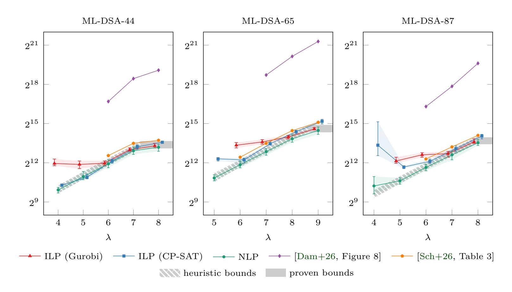

**Figure 1:** Summary of results for exact leakage; number of informative signatures needed.

<span id="page-2-1"></span>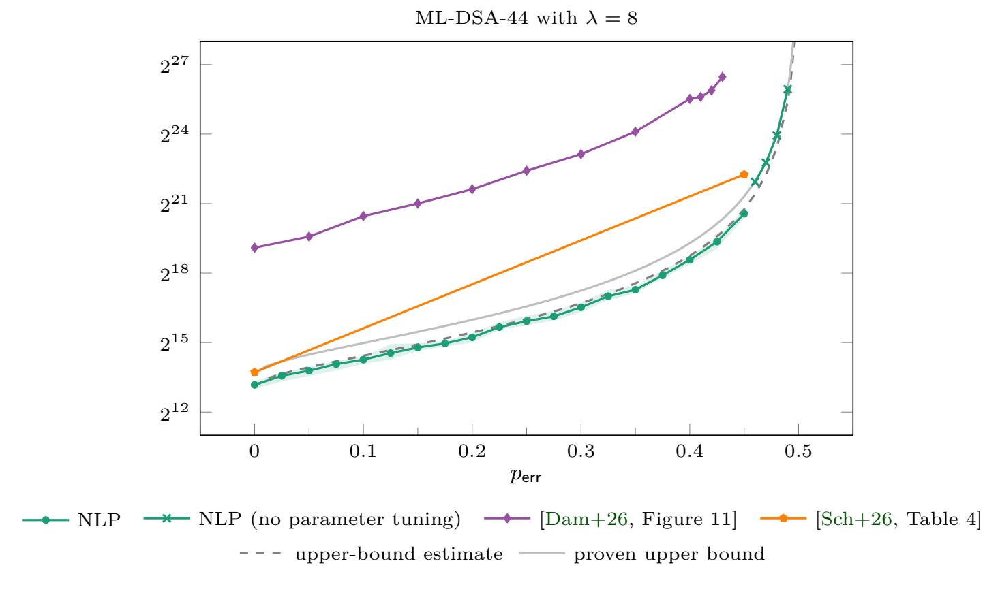

**Figure 2:** Summary of results for noisy leakage; number of informative signatures needed.

{3}------------------------------------------------

#### **Outline**

Section 2 sets out the notation, a simplified version of ML-DSA, and the bit representation assumed throughout this paper. The problem investigated in this work will be formally defined and justified in Section 3. In Section 4, we introduce a stochastic model and characterize optimal solutions to the problem under consideration. We furthermore provide theoretical complexity estimates (expressed in terms of the number of required signatures) for solving this problem, both in the presence and absence of noise. Section 5 and Section 6 contain our attacks based on integer linear programming and nonlinear programming, respectively. Section 7 concludes this paper with some open problems.

## <span id="page-3-0"></span>2 Preliminaries

#### 2.1 Notation

For  $n \geq 0$ , we define  $[n] := \{1, \ldots, n\}$ . The power set of a set  $\mathcal{A}$  is written  $2^{\mathcal{A}}$ . For  $\tau \geq 0$ , the set of all  $\tau$ -subsets of a finite set  $\mathcal{A}$  is denoted by  $\binom{\mathcal{A}}{\tau}$ .

Let  $m \geq 1$  be a modulus and let  $a \in \mathbb{Z}$ . We write  $a \mod m$  for the unique element of  $[0,m) \cap \mathbb{Z}$  that is congruent to  $a \mod m$ . Moreover, we write  $a \mod^{\pm} m$  and  $a \mod^{\mp} m$  for the unique elements of  $(-m/2,m/2] \cap \mathbb{Z}$  and  $[-m/2,m/2) \cap \mathbb{Z}$ , respectively, that are congruent to  $a \mod m$ . We extend these definitions to any  $a \in \mathbb{R}$  by setting  $a \mod m \coloneqq a - \lfloor a/m \rfloor \cdot m$ ,  $a \mod^{\pm} m \coloneqq a - \lfloor (a-m/2)/m \rfloor \cdot m$ , and  $a \mod^{\mp} m \coloneqq a - \lfloor (a+m/2)/m \rfloor \cdot m$ . Remark 1. The operator  $\mod^{\pm}$  is used in the specification of ML-DSA (see Section 2.2), while  $\mod^{\mp}$  will be used in conjunction with the bit representation we assume in this paper (see Section 2.3).

For  $x, y \in \mathbb{R}^n$ , we denote by  $\langle x, y \rangle := \sum_{i=1}^n x_i y_i$  the standard scalar product and by  $\|\cdot\|_p$  the  $\ell^p$ -norms.

#### <span id="page-3-1"></span>2.2 ML-DSA

The lattice-based digital signature scheme ML-DSA is standardized in FIPS 204 [FIPS204]. It is based on the latest specification [Dilithium] of CRYSTALS-Dilithium [Duc+18]. In this paper, we focus on an abbreviated and simplified version of ML-DSA, omitting technical details irrelevant to our attacks. We now briefly recall the setting and this simplified version of the signature scheme; see also [Dilithium, Section 1.1]. We also refer to [Lyu09; Lyu24] for further background on ML-DSA.

<span id="page-3-2"></span>For all parameter sets (see Table 1), ML-DSA works over the ring  $R := \mathbb{Z}[X]/(X^{256}+1)$  and its modular reduction  $R_q := \mathbb{Z}_q[X]/(X^{256}+1)$ , where  $q = 2^{23} - 2^{13} + 1 = 8380417$ .

| Parameters                | Values    |           |           |  |
|---------------------------|-----------|-----------|-----------|--|
|                           | ML-DSA-44 | ML-DSA-65 | ML-DSA-87 |  |
| $\overline{(k,\ell)}$     | (4,4)     | (6,5)     | (8,7)     |  |
| $\eta$                    | 2         | 4         | 2         |  |
| $\gamma=\gamma_1$         | $2^{17}$  | $2^{19}$  | $2^{19}$  |  |
| $\gamma_2$                | (q-1)/88  | (q-1)/32  | (q-1)/32  |  |
| $\tau$                    | 39        | 49        | 60        |  |
| $\beta = \tau \cdot \eta$ | 78        | 196       | 120       |  |

**Table 1:** ML-DSA parameter sets (excerpt) [FIPS204].

Key generation (see Algorithm 1) samples two secret vectors  $s_1$  and  $s_2$ , whose entries are polynomials with small coefficients drawn from  $S_{\eta} := \{w \in R \mid ||w||_{\infty} \leq \eta\}$ , and a

{4}------------------------------------------------

public matrix A over  $R_q$ . Signature generation (see Algorithm 2) and verification (see Algorithm 3) are constructed via a Fiat–Shamir transform applied to a  $\Sigma$ -protocol that proves knowledge of secret vectors equivalent to  $s_1$  and  $s_2$ . During signature generation, the commitment phase samples a mask vector y consisting of polynomials with small coefficients from the set  $\widetilde{S}_{\gamma_1} := \{w \in R \mid w = w \bmod^{\pm} 2\gamma_1\}$ . After this, the commitment HighBits $(Ay, 2\gamma_2)$ , combined with the message hash, is mapped via a hash function  $H: \{0,1\}^* \to B_{\tau}$  to a challenge polynomial c in  $B_{\tau} := \{w \in R \mid ||w||_{\infty} = 1 \text{ and } ||w||_1 = \tau\}$ . Using rejection sampling, this process is repeated until the signature  $(c, z = c s_1 + y)$  reveals no information about the secret vectors  $s_1$  and  $s_2$ , and the publicly computable value HighBits $(Az - ct, 2\gamma_2)$ , calculated with the public vector  $t = As_1 + s_2$ , agrees with the commitment. To verify the signature, one checks that the entries of z have small coefficients and that the message hash, combined with the publicly computable commitment, maps under the hash function H to the challenge polynomial c.

#### <span id="page-4-1"></span>Algorithm 1 ML-DSA key generation (simplified version)

```
Output: Public key pk and private key sk.
```

```
1: \mathbf{A} \leftarrow_{\$} R_q^{k \times \ell}

2: (\mathbf{s}_1, \mathbf{s}_2) \leftarrow_{\$} S_{\eta}^{\ell} \times S_{\eta}^{k}

3: \mathbf{t} \leftarrow \mathbf{A}\mathbf{s}_1 + \mathbf{s}_2

4: \mathbf{return} \ \mathsf{pk} \leftarrow (\mathbf{A}, \mathbf{t}), \ \mathsf{sk} \leftarrow (\mathbf{A}, \mathbf{s}_1, \mathbf{s}_2)
```

#### <span id="page-4-2"></span>Algorithm 2 ML-DSA signature generation (simplified version)

```
Input: Private key \mathsf{sk} = (\boldsymbol{A}, \boldsymbol{s}_1, \boldsymbol{s}_2) and message hash \mu \in \{0, 1\}^{512}.

Output: Signature \sigma = (c, \boldsymbol{z}).

1: repeat

2: \boldsymbol{y} \leftarrow_{\$} \widetilde{S}^{\ell}_{\gamma_1}

3: c \leftarrow \mathsf{H}(\mu \parallel \mathsf{HighBits}(\boldsymbol{A}\boldsymbol{y}, 2\gamma_2))

4: \boldsymbol{z} \leftarrow c\,\boldsymbol{s}_1 + \boldsymbol{y}

5: until \|\boldsymbol{z}\|_{\infty} < \gamma_1 - \beta and \|\mathsf{LowBits}(\boldsymbol{A}\boldsymbol{y} - c\,\boldsymbol{s}_2, 2\gamma_2)\|_{\infty} < \gamma_2 - \beta

6: return \sigma \leftarrow (c, \boldsymbol{z})
```

#### <span id="page-4-3"></span>Algorithm 3 ML-DSA signature verification (simplified version)

```
Input: Public key pk = (\boldsymbol{A}, \boldsymbol{t}), message hash \mu \in \{0, 1\}^{512}, and signature \sigma = (c, \boldsymbol{z}).

Output: True or false.

1: c' \leftarrow \mathsf{H}(\mu \parallel \mathsf{HighBits}(\boldsymbol{A}\boldsymbol{z} - c\,\boldsymbol{t}, 2\gamma_2))

2: \mathbf{return} \parallel \boldsymbol{z} \parallel_{\infty} < \gamma_1 - \beta \ \mathbf{and} \ c = c'
```

The security of ML-DSA relies on the assumed hardness of MLWE (module learning with errors) and a variant of MSIS (module short integer solution) over  $R_q$  to guarantee that signatures constitute proofs of knowledge and that secret vectors equivalent to those of the private key  $(A, s_1, s_2)$  cannot be feasibly recovered from the public key (A, t).

Since the parameter  $\gamma_2$  will not be used in the remainder of this paper, we denote  $\gamma_1$  simply by  $\gamma$ .

### <span id="page-4-0"></span>2.3 Bit representation

The following function assigns bits to an arbitrary (signed, arbitrary precision) integer.

{5}------------------------------------------------

<span id="page-5-2"></span>**Definition 2.** For  $j \geq 0$ , we define the function

$$\operatorname{bit}_j \colon \mathbb{Z} \to \{0,1\}, \quad y \mapsto \lfloor y/2^j \rfloor \mod 2.$$

We also set  $\operatorname{bit}_{-1}(y) := 0$  for all  $y \in \mathbb{Z}$ .

Remark 3. Let  $y \in \mathbb{Z}$  and let  $y_j = \operatorname{bit}_j(y)$  for  $j \geq 0$ . The representation of y as a 2-adic integer is  $y = (\dots y_2 y_1 y_0)_2$ . For instance, we have  $-1 = (1^{\infty})_2$ ,  $0 = (0^{\infty})_2$ ,  $1 = (0^{\infty}1)_2$ . Since  $y + \overline{y} = (1^{\infty})_2 = -1$ , where  $\overline{y}$  is the bitwise complement of y, we have  $-y = \overline{y} + 1$ . Remark 4. Let  $y \in [-2^{w-1}, 2^{w-1}) \cap \mathbb{Z}$  for some  $w \geq 1$  and let  $y_j = \operatorname{bit}_j(y)$  for  $j \geq 0$ . Then the w-bit two's complement representation of y is  $(y_{w-1}y_{w-2}\dots y_0)$ , which is the w-bit

<span id="page-5-1"></span>the w-bit two's complement representation of y is  $(y_{w-1}y_{w-2}...y_0)$ , which is the w-bit truncation of the 2-adic integer  $(y_{w-1}^{\infty}y_{w-2}...y_0)_2$ , and  $y = \sum_{j=0}^{w-2} y_j 2^j - y_{w-1} 2^{w-1}$ . In particular, for any  $y \in \mathbb{Z}$ , we have  $y \mod^{\mp} 2^w = \sum_{j=0}^{w-2} y_j 2^j - y_{w-1} 2^{w-1}$ .

The following lemma collects a number of fundamental properties of the function  $\mathrm{bit}_j$  that will be used throughout this paper.

<span id="page-5-4"></span>**Lemma 5.** Let  $j \geq 0$  and let  $y \in \mathbb{Z}$ .

- (a) We have  $\operatorname{bit}_{j}(y) = \operatorname{bit}_{j}(y + u \cdot 2^{j+1})$  for all  $u \in \mathbb{Z}$ .
- (b) We have  $\operatorname{bit}_j(y) = 1 \operatorname{bit}_j(y \pm 2^j)$ .
- (c) We have  $bit_j(y) = 1 bit_j(-y 1)$ .
- (d) We have  $\operatorname{bit}_{j}(y) = 0$  if and only if  $y \operatorname{mod}^{\mp} 2^{j+1} \ge 0$ .
- (e) We have  $y \mod^{\mp} 2^{j+1} = y \mod^{\mp} 2^j$  if and only if  $\operatorname{bit}_j(y) = \operatorname{bit}_{j-1}(y)$ .

*Proof.* We omit the proof, as it is a straightforward consequence of the definitions and preceding remarks.  $\hfill\Box$ 

<span id="page-5-3"></span>Remark 6. As noted in Remark 4, working with the function bit<sub>j</sub> corresponds to using the two's complement representation, which is also the convention adopted in [Dam+25a]. In contrast, [Liu+21] uses the sign-magnitude representation. For the leakage models studied, the different representations are not especially consequential, since the signs of the integers whose bits are leaked can be deduced with high probability, and, given the sign, the j-th bit in the sign-magnitude representation is highly correlated with the j-th bit in the two's complement representation. More precisely, let  $w \ge 1$  and, for  $y \in (-2^{w-1}, 2^{w-1}) \cap \mathbb{Z}$ , let  $(\widehat{y}_{w-1}\widehat{y}_{w-2}\dots\widehat{y}_0)$  be its w-bit sign-magnitude representation, i.e.  $y = (-1)^{\widehat{y}_{w-1}}\sum_{j=0}^{w-2}\widehat{y}_j2^j$ , and let  $y_j = \text{bit}_j(y)$ . Then, for every  $j \in \{0, \dots, w-1\}$ , we have  $y_j = \widehat{y}_j$  for all positive y. For negative y, we have  $y_{w-1} = \widehat{y}_{w-1}$  and  $y_0 = 1 - \widehat{y}_0$ , and, among all  $y \in (-2^{w-1}, 0) \cap \mathbb{Z}$ , the proportion for which  $y_j = 1 - \widehat{y}_j$  holds is  $(1 - 2^{-j}) \cdot 2^{w-1}/(2^{w-1} - 1)$  for  $j \in \{1, \dots, w-2\}$ .

# <span id="page-5-0"></span>3 Single-bit mask-vector leakage in ML-DSA

For the remainder of this paper, we shall work with a fixed choice of ML-DSA parameters  $\eta$ ,  $\gamma = \gamma_1$ ,  $\tau$ , and  $\beta = \tau \cdot \eta$  (see Table 1). Moreover, we fix  $\lambda \geq 0$ , which will play the role of the index of a leaked bit, and  $p_{\sf err} \in [0, \frac{1}{2})$ , which will determine an error probability.

<span id="page-5-5"></span>Remark 7. We note that most results of this paper hold for other sensible choices of parameters as well. For some results of our theoretical analysis, however, we take advantage of the fact that  $\gamma$  is a power of 2 and  $\gamma > 2\beta$ . We note that both conditions are satisfied for the official ML-DSA parameter sets [FIPS204] as well as for the Dilithium challenge and extended security parameters [Dilithium, Section 4].

In this section we first introduce the abstract model and the specific goals of our attacks. We then discuss how our attack model applies to ML-DSA.

{6}------------------------------------------------

#### 3.1 Problem statement

In this subsection, we introduce a reduced version of the ML-DSA signature generation algorithm with noisy single-bit mask leak.

Let  $\mathcal{X} \coloneqq ([-\eta, \eta] \cap \mathbb{Z})^{256}$  be the set of possible keys. Given a key  $x^* \in \mathcal{X}$ , Algorithm 4 computes a reduced signature  $(c, z = \langle c, x^* \rangle + y) \in \mathcal{C} \times \mathcal{Z}$  using rejection sampling, where  $\mathcal{C} \coloneqq \left\{c \in \mathbb{Z}^{256} \mid \|c\|_{\infty} = 1 \text{ and } \|c\|_{1} = \tau\right\}$  and  $\mathcal{Z} \coloneqq (-\gamma + \beta, \gamma - \beta) \cap \mathbb{Z}$ . Moreover, Algorithm 4 outputs a noisy bit leak  $\widetilde{y}_{\lambda} = y_{\lambda} \oplus e \in \{0, 1\}$ , where  $y_{\lambda} \coloneqq \text{bit}_{\lambda}(y)$  is the mask bit of index  $\lambda \geq 0$  according to Definition 2 and  $e \in \{0, 1\}$  is an error bit that is 1 with probability  $p_{\text{err}} \in [0, \frac{1}{2})$ , i.e. e is drawn from a Bernoulli distribution with parameter  $p_{\text{err}}$ . We refer to the combined output  $(c, z, \widetilde{y}_{\lambda})$  as leaky signature.

We say that we have exact leakage if  $p_{\sf err} = 0$  (in this case, we have e = 0 and  $\widetilde{y}_{\lambda} = y_{\lambda}$ ) and that we have noisy leakage if  $p_{\sf err} > 0$ . We may assume that  $p_{\sf err}$  is known. However, we do not require this knowledge for our attacks.

```
Algorithm 4 Reduced ML-DSA signature generation with noisy single-bit leak
```

```
Input: A key x^* \in \mathcal{X}.
```

**Output:** A leaky signature  $(c, z, \widetilde{y}_{\lambda}) \in \mathcal{C} \times \mathcal{Z} \times \{0, 1\}$  such that  $\widetilde{y}_{\lambda} = \text{bit}_{\lambda}(z - \langle c, x^* \rangle)$  holds with probability  $1 - p_{\text{err}}$ .

```
1: repeat
2: y \leftarrow_{\$} (-\gamma, \gamma] \cap \mathbb{Z}
3: c \leftarrow_{\$} \mathcal{C}
4: z \leftarrow \langle c, x^* \rangle + y
5: until |z| < \gamma - \beta
6: y_{\lambda} \leftarrow \operatorname{bit}_{\lambda}(y)
7: e \leftarrow_{\$} \operatorname{Ber}(p_{\operatorname{err}})
8: \widetilde{y}_{\lambda} \leftarrow y_{\lambda} \oplus e
9: return (c, z, \widetilde{y}_{\lambda})
```

The main object of investigation in this paper is to study the following attack model; see [Dam+25a, Definition 1].

<span id="page-6-1"></span>**Problem 1.** Let  $x^*$  denote a key, drawn uniformly at random from  $\mathcal{X}$  and unknown to the attacker. The attacker is permitted to repeatedly request leaky signatures generated by independent executions of Algorithm 4 with input  $x^*$ . Eventually, the attacker has to present a key guess  $\widehat{x} \in \mathcal{X}$  and the attack is successful if  $\widehat{x} = x^*$ .

The number of requested leaky signatures is denoted by  $n_{\text{sig}}$  and the transcript of leaky signatures is denoted by  $(c^{(i)}, z^{(i)}, \widetilde{y}_{\lambda}{}^{(i)})_{i=1}^{n_{\text{sig}}}$ .

Remark 8. The leakage model in [Liu+21] is obtained by replacing, in line 6 of Algorithm 4, bit  $\lambda(y)$  with the  $\lambda$ -th bit  $\widehat{y}_{\lambda}$  of the sign-magnitude representation of y. For the discussion here, let us assume  $0 < \lambda < \log_2(\gamma)$ , since otherwise bit  $\lambda(y)$  and  $\widehat{y}_{\lambda}$  are deterministically related to each other anyway (see Remark 6). Given an output  $(c, z, \overline{y}_{\lambda})$  of this modified algorithm, define  $\widetilde{y}_{\lambda} = \overline{y}_{\lambda}$  when  $z \geq 0$ , and  $\widetilde{y}_{\lambda} = 1 - \overline{y}_{\lambda}$  when z < 0. Since z and y have the same sign with high probability, the discussion in Remark 6 shows that the distribution of samples  $(c, z, \widetilde{y}_{\lambda})$  produced in this way is close to the output distribution of the unmodified Algorithm 4, but with an increased error probability of roughly  $2^{-\lambda-1} + p_{\text{err}}(1-2^{-\lambda})$ .

## 3.2 Connection to ML-DSA

Let  $\mathsf{sk} = (A, s_1, s_2)$  be a private key and  $\mathsf{pk} = (A, t)$  the corresponding public key output by Algorithm 1. In this simplified version of ML-DSA key generation, finding the secret component  $s_1$  is sufficient to fully reconstruct  $\mathsf{sk}$ . Indeed, the remaining secret component satisfies  $s_2 = t - As_1$  and can be computed from  $s_1$  and the public key  $\mathsf{pk}$ .

{7}------------------------------------------------

Remark 9. For ML-DSA as specified in [FIPS204], i.e., without our simplifications, knowledge of  $s_1$  still suffices to derive signing data  $(A, s_1, s'_2)$ , which can be used to forge signatures that verify under the public data  $(A, t_1)$ , where  $t_1$  are the high-order bits of t; see, e.g., [BP18, Section 4] or [Rav+18]. Even though such an  $s'_2$  is straightforward to obtain, it is not feasible to determine the true secret component  $s_2$  from  $s_1$  and  $(A, t_1)$  alone. However, with the additional knowledge of a sufficiently large number of signatures, the low-order bits  $t_0$  of t can be reconstructed from  $(A, t_1)$ ; see [Oli+25]. In this situation,  $s_2$  can be computed from  $(A, t = 2^{13} t_1 + t_0)$  exactly as in our simplified version.

Thus, in practice, recovering the private key sk, reduces to determining the  $\ell$  components of the vector  $s_1$  one by one. In theory, knowing even a single component of  $s_1$ , already substantially reduces the computation required to recover the entire vector; see [Dam+25a, Section 4.3]. From now on, we therefore focus on the problem of recovering a single fixed coordinate  $s_{1,i}$ . To this end, applying the *i*-th coordinate projection  $R^{\ell} \to R$  to the vector equation  $z = c s_1 + y$  corresponding to line 4 of Algorithm 2 yields the polynomial identity

$$\boldsymbol{z}_i = c\,\boldsymbol{s}_{1.i} + \boldsymbol{y}_i\,.$$

With the  $\mathbb{Z}$ -module isomorphism coeff:  $R \to \mathbb{Z}^{256}$  that sends polynomials  $v = \sum_{j=1}^{256} v_j X^{j-1}$  to their coefficient vectors  $(v_1, \ldots, v_{256})$ , we can rewrite this as the matrix equation

$$\operatorname{coeff}(\boldsymbol{z}_i) = \operatorname{mul}(c)\operatorname{coeff}(\boldsymbol{s}_{1,i}) + \operatorname{coeff}(\boldsymbol{y}_i),$$

where  $\operatorname{mul}(c)$  is the  $\mathbb{Z}$ -module endomorphism of  $\mathbb{Z}^{256}$  satisfying  $\operatorname{coeff}(cv) = \operatorname{mul}(c) \operatorname{coeff}(v)$  for all  $v \in R$ . Due to the identity  $X^{256} = -1$  in R, the coefficients of the product cv are  $(cv)_j = \sum_{j'=1}^j c_{j-j'+1} v_{j'} + \sum_{j'=j+1}^{256} (-c_{256+j-j'+1}) v_{j'}$ , and therefore the matrix  $\operatorname{mul}(c)$ , expressed in the standard basis, has as its j-th row the vector

$$\operatorname{mul}(c)_j = (c_j, c_{j-1}, \dots, c_1, -c_{256}, -c_{255}, \dots, -c_{j+1}).$$

Applying the j-th coordinate projection  $\mathbb{Z}^{256} \to \mathbb{Z}$  to the matrix equation above gives

$$\operatorname{coeff}(\boldsymbol{z}_i)_j = \langle \operatorname{mul}(c)_j, \operatorname{coeff}(\boldsymbol{s}_{1,i}) \rangle + \operatorname{coeff}(\boldsymbol{y}_i)_j$$
.

After redefining c as  $\operatorname{mul}(c)_j$  and setting  $x^* = \operatorname{coeff}(\boldsymbol{s}_{1,i}), y = \operatorname{coeff}(\boldsymbol{y}_i)_j$ , and  $z = \operatorname{coeff}(\boldsymbol{z}_i)_j$ , this equation takes the form  $z = \langle c, x^* \rangle + y$ , which matches line 4 of Algorithm 4.

Remark 10. We adopt the convention that c,  $s_1$ , y,  $cs_1$ , and  $cs_1 + y$  have coefficients in  $\mathbb{Z}$ . Since these coefficients all lie in the interval  $\left(-\frac{q}{2}, \frac{q}{2}\right)$ , viewing the identity  $z = cs_1 + y$  over  $\mathbb{Z}_q$  is equivalent to interpreting it as an identity over  $\mathbb{Z}$ . Consequently, in addressing Problem 1, all arithmetic operations may be carried out over  $\mathbb{Z}$  rather than  $\mathbb{Z}_q$ . Computations over  $\mathbb{Z}_q$  are required only in those parts of Algorithm 1, Algorithm 2, and Algorithm 3 where the matrix A appears. In Algorithm 4 all operations are performed over  $\mathbb{Z}$ .

Remark 11. The map coeff restricts to a bijection  $\widetilde{S}_{\gamma} \to ((-\gamma, \gamma] \cap \mathbb{Z})^{256}$ . Consequently, deriving y from y as described above, where y is sampled according to line 2 of Algorithm 2, yields a uniform distribution, just as sampling y directly in line 2 of Algorithm 4.

Remark 12. For every  $j \in [256]$ , the rule  $c \mapsto \operatorname{mul}(c)_j$  defines a bijection  $B_\tau \to \mathcal{C}$ . Therefore, if c is sampled uniformly from  $B_\tau$ , the induced distribution of  $\operatorname{mul}(c)_j$  is uniform on  $\mathcal{C}$ , matching the distribution of the variable sampled in line 3 of Algorithm 4. In fact, ML-DSA assumes that the distribution of the challenge polynomial c in line 3 of Algorithm 2 is close to uniform on  $B_\tau$ . When H is treated as an idealized hash function (e.g., a random oracle), this assumption is reasonable because collisions in the mapping  $\mathbf{y} \mapsto \operatorname{HighBits}(\mathbf{A}\mathbf{y}, 2\gamma_2)$ , for uniformly sampled  $\mathbf{y}$ , are extremely unlikely and the mapping's range is vastly larger than the range  $B_\tau$  of H.

{8}------------------------------------------------

Remark 13. Algorithm 4 assumes that y and c are sampled independently in lines 2 and 3. In contrast, in lines 2 and 3 of Algorithm 2, the challenge polynomial c is fully determined by the mask vector  $\mathbf{y}$ . Nevertheless, for fixed indices i and j and for each  $y \in (-\gamma, \gamma] \cap \mathbb{Z}$ , the mapping  $\mathbf{y} \mapsto \mathsf{HighBits}(A\mathbf{y}, 2\gamma_2)$ , when restricted to vectors  $\mathbf{y}$  satisfying  $\mathsf{coeff}(\mathbf{y}_i)_j = y$ , still produces collisions only with negligible probability, and its range remains vastly larger than the range of  $\mathsf{H}$ . Modeling  $\mathsf{H}$  as an idealized hash function therefore justifies treating c as nearly independent of  $\mathsf{coeff}(\mathbf{y}_i)_j$ .

Remark 14. In line 5 of Algorithm 4, (c, z) is accepted whenever  $|z| < \gamma - \beta$ . In contrast, in line 5 of Algorithm 2,  $(c, \operatorname{coeff}(z_i)_j)$  is accepted only if additional conditions are satisfied. However, conditioning on the event  $|\operatorname{coeff}(z_{i'})_{j'}| < \gamma - \beta$  for all  $(i', j') \neq (i, j)$  should not significantly affect the distribution of  $(c, \operatorname{coeff}(z_i)_j)$  conditioned on  $|\operatorname{coeff}(z_i)_j| < \gamma - \beta$ . It also is plausible that further conditioning on  $\|\operatorname{LowBits}(Ay - cs_2, 2\gamma_2)\|_{\infty} < \gamma_2 - \beta$  has little effect on this distribution, owing to the unstructured nature of A and the uniform sampling of y. Note that ML-DSA, without our simplifications, includes a third acceptance condition; see line 28 of [FIPS204, Algorithm 7], which also appears unlikely to substantially alter the distribution. In particular, its first part,  $||ct_0||_{\infty} < \gamma_2$ , is non-vacuous only for ML-DSA-44, where the expected probability of violation is small (below 7.38 × 10<sup>-9</sup>).

While these assumptions appear justified, the exact distribution of z given  $|z| < \gamma - \beta$  is not essential to our attacks, as long as the probability of z being informative (see Section 4.3) is sufficiently high. Nonetheless, for our analysis, particularly for determining the expected number of signatures required for the attacks to succeed, we rely on (c, z) being sampled according to Algorithm 4.

To summarize, for  $i \in [\ell]$  and  $j \in [256]$ , the tuples  $(\operatorname{mul}(c)_j, \operatorname{coeff}(\boldsymbol{z}_i)_j, \operatorname{bit}_{\lambda}(\operatorname{coeff}(\boldsymbol{y}_i)_j))$ , where  $(c, \boldsymbol{z})$  denote the outputs and  $\boldsymbol{y}$  the values in the final loop iteration of Algorithm 2 under input  $\operatorname{sk} = (\boldsymbol{A}, \boldsymbol{s}_1, \boldsymbol{s}_2)$ , follow essentially the same distribution as the outputs of Algorithm 4 under input  $x^* = \boldsymbol{s}_{1,i}$  in the situation of exact leakage (i.e., when  $p_{\operatorname{err}} = 0$ ). The discussion extends to the situation of noisy leakage with obvious modifications.

## <span id="page-8-0"></span>4 Probabilistic and information-theoretic considerations

In Section 4.1, we introduce the stochastic model used for our theoretical analysis. Section 4.2 defines the sets of candidate keys and most likely keys and Section 4.3 examines information-theoretic properties. We then provide estimates for the expected number of candidate keys and most likely keys in Section 4.4 and Section 4.5, respectively, which yields estimates for the number of signatures required for key recovery.

### <span id="page-8-1"></span>4.1 Stochastic model

We define a stochastic model for the random elements sampled in Problem 1, particularly during executions of Algorithm 4. To this end, we introduce the following notation.

We fix a bit index  $\lambda \geq 0$  and an error probability  $p_{\mathsf{err}} \in [0, \frac{1}{2})$ . Let  $x^* \in \mathcal{X}$  be a key. For  $i \geq 1$ , we denote by  $(c^{(i)}, z^{(i)}, \widetilde{y}_{\lambda}^{(i)})$  the output of the *i*-th run of Algorithm 4 with input  $x^*$ . We also set  $y^{(i)} := z^{(i)} - \langle c^{(i)}, x^* \rangle$ ,  $y_{\lambda}^{(i)} := \mathrm{bit}_{\lambda}(y^{(i)})$ , and  $e^{(i)} := y_{\lambda}^{(i)} \oplus \widetilde{y}_{\lambda}^{(i)}$  for all  $i \geq 1$ . The variables sampled in the *j*-th loop iteration of the *i*-th run of Algorithm 4 with input  $x^*$  are denoted by  $y^{(i)[j]}$  and  $c^{(i)[j]}$ , and we set  $z^{(i)[j]} := \langle c^{(i)[j]}, x^* \rangle + y^{(i)[j]}$  for all  $i, j \geq 1$ . We view these as realizations of the random variables defined below.

<span id="page-8-2"></span>**Definition 15** (Stochastic model). Let  $\lambda \geq 0$  and  $p_{\sf err} \in [0, \frac{1}{2})$ .

- (a) Let  $\{X^*\} \cup \{Y^{(i)[j]}, C^{(i)[j]}\}_{i,j\geq 1} \cup \{E^{(i)}\}_{i\geq 1}$  be an independent family of random variables such that
  - $X^*$  is uniformly distributed on  $\mathcal{X} := ([-\eta, \eta] \cap \mathbb{Z})^{256}$ ,

{9}------------------------------------------------

- *Y* (*i*)[*j*] is uniformly distributed on Y ′ := (−*γ, γ*] ∩ Z for all *i, j* ≥ 1,
- *C* (*i*)[*j*] is uniformly distributed on C := *c* ∈ Z <sup>256</sup> | ∥*c*∥<sup>∞</sup> = 1 and ∥*c*∥<sup>1</sup> = *τ* for all *i, j* ≥ 1,
- *E*(*i*) is Bernoulli-distributed with P(*E*(*i*) = 1) = *p*err for all *i* ≥ 1.

For *i, j* ≥ 1, define the random variables *Z* (*i*)[*j*] := ⟨*C* (*i*)[*j*] *, X*<sup>∗</sup> ⟩ + *Y* (*i*)[*j*] taking values in Z ′ := (−*γ* − *β, γ* + *β*] ∩ Z.

(b) Let *α*(*z*) := 1(−*γ*+*β,γ*−*β*)(*z*) for *z* ∈ R and define the random variables

$$J(i) := \inf \left\{ j \ge 1 \mid \alpha(Z^{(i)[j]}) = 1 \right\}, \qquad i \ge 1,$$

i.e. *J*(*i*) is the random index of the final loop iteration in the *i*-th run of [Algorithm 4.](#page-6-0)

- (c) For *i* ≥ 1, define the random variables
  - *C* (*i*) := *C* (*i*)[*J*(*i*)] taking values in C,
  - *Z* (*i*) := *Z* (*i*)[*J*(*i*)] taking values in Z := (−*γ* + *β, γ* − *β*) ∩ Z,
  - *Y* (*i*) := *Y* (*i*)[*J*(*i*)] taking values in Y := (−*γ, γ*) ∩ Z,
  - *Y<sup>λ</sup>* (*i*) := bit*λ*(*Y* (*i*) ) taking values in {0*,* 1},
  - *<sup>Y</sup>*e*<sup>λ</sup>* (*i*) := *Y<sup>λ</sup>* (*i*) ⊕ *E*(*i*) taking values in {0*,* 1}.

If just a single run of [Algorithm 4](#page-6-0) is under consideration, we omit the index "(*i*)" indicating the *i*-th run. We also write *Y* ′ and *C* ′ for independent copies of the random variables *Y* (*i*)[*j*] and *C* (*i*)[*j*] (independent of *X*<sup>∗</sup> ) and we define *Z* ′ := ⟨*C* ′ *, X*<sup>∗</sup> ⟩ + *Y* ′ .

We start with some immediate consequences of these definitions in the following lemma. Assertion (a) is [\[Dam+25a,](#page-40-0) Lemma 2 and Eq. (1)] adapted to the support Y ′ of *Y* ′ .

<span id="page-9-0"></span>**Lemma 16.** *The random variables in [Definition 15](#page-8-2) satisfy the following properties.*

*(a) The random variables* {*Z* (*i*)[*j*]}*i,j*≥<sup>1</sup> *have the probability mass function*

$$\mathbb{P}(Z'=z) = \frac{1}{2\gamma} \cdot \mathbb{P}(z-\gamma \le \langle C', X^* \rangle \le z + \gamma - 1) 
= \frac{1}{2\gamma} \cdot \begin{cases}
\mathbb{P}(\langle C', X^* \rangle \le z + \gamma - 1) & \text{if } -\gamma - \beta < z \le -\gamma + \beta, \\
1 & \text{if } -\gamma + \beta < z \le \gamma - \beta, \\
\mathbb{P}(\langle C', X^* \rangle \ge z - \gamma) & \text{if } \gamma - \beta < z \le \gamma + \beta.
\end{cases}$$

- *(b) The family* {*X*<sup>∗</sup>} ∪ {*C* (*i*)[*j*] *, α*(*Z* (*i*)[*j*] )}*i,j*≥<sup>1</sup> *of random variables is independent.*
- *(c) The random variables* {*J*(*i*)}*i*≥<sup>1</sup> *are geometrically distributed with support* N<sup>≥</sup><sup>1</sup> *and success probability* P *α*(*Z* ′ ) = 1 = 2(*γ*−*β*)−1 2*γ .*
- *(d) The family* {*X*<sup>∗</sup>} ∪ {*C* (*i*) *, Z*(*i*) *, E*(*i*) *, J*(*i*)}*i*≥<sup>1</sup> *of random variables is independent.*
- *(e) The random variables* {*C* (*i*)}*i*≥<sup>1</sup> *are uniformly distributed on* C*.*
- *(f) The random variables* {*Z* (*i*)}*i*≥<sup>1</sup> *are uniformly distributed on* Z*.*
- *(g) The random variables* {*Y* (*i*)}*i*≥<sup>1</sup> *have the probability mass function*

$$\mathbb{P}(Y = y) = \frac{1}{2(\gamma - \beta) - 1} \cdot \mathbb{P}(y - \gamma + \beta + 1 \le \langle C, X^* \rangle \le y + \gamma - \beta - 1) 
= \frac{1}{2(\gamma - \beta) - 1} \cdot \begin{cases}
\mathbb{P}(\langle C, X^* \rangle \le y + \gamma - \beta - 1) & \text{if } -\gamma < y \le -\gamma + 2\beta, \\
1 & \text{if } -\gamma + 2\beta < y < \gamma - 2\beta, \\
\mathbb{P}(\langle C, X^* \rangle \ge y - \gamma + \beta + 1) & \text{if } \gamma - 2\beta \le y < \gamma.
\end{cases}$$

{10}------------------------------------------------

*Proof.* Since  $X^*$ , C', and Y' are independent and  $Z' = \langle C', X^* \rangle + Y'$ , we obtain

$$\mathbb{P}(X^* = x, C' = c, Z' = z) = \sum_{y \in \mathcal{Y}'} \mathbb{P}(X^* = x, C' = c, \langle C', X^* \rangle = z - y) \cdot \mathbb{P}(Y' = y)$$
$$= \frac{1}{2\gamma} \cdot \mathbb{P}(X^* = x, C' = c, z - \gamma \le \langle C', X^* \rangle \le z + \gamma - 1).$$

Summing this equation over all  $x \in \mathcal{X}$  and  $c \in \mathcal{C}$  gives the first identity in (a). The fact that  $\langle C', X^* \rangle$  takes values in  $[-\beta, \beta]$  yields the second identity in (a) and, together with the independence of  $X^*$  and C', also shows that

$$\mathbb{P}(X^* = x, C' = c, Z' = z, \alpha(Z') = 1) = \mathbb{P}(X^* = x) \cdot \mathbb{P}(C' = c) \cdot \frac{\alpha(z)}{2\gamma}.$$

Summing over all  $z \in \mathcal{Z}$  yields

$$\mathbb{P}(X^* = x, C' = c, \alpha(Z') = 1) = \mathbb{P}(X^* = x) \cdot \mathbb{P}(C' = c) \cdot \frac{2(\gamma - \beta) - 1}{2\gamma},$$

which implies the independence of  $\{X^*, C', \alpha(Z')\}$ . The independence of any finite subset of  $\{X^*\} \cup \{C^{(i)[j]}, \alpha(Z^{(i)[j]})\}_{i,j\geq 1}$  can be shown analogously, thereby proving (b). Summing the probabilities  $\mathbb{P}(X^* = x, C' = c, \alpha(Z') = 1)$  over all  $x \in \mathcal{X}$  and  $c \in \mathcal{C}$ , we obtain  $\mathbb{P}(\alpha(Z') = 1) = \frac{2(\gamma - \beta) - 1}{2\gamma}$ , establishing (c). The calculation of the joint distribution

$$\begin{split} & \mathbb{P}\big(X^* = x, C = c, Z = z, E = e, J = j\big) \\ & = \mathbb{P}\big(X^* = x, C^{[j]} = c, Z^{[j]} = z, E = e, J = j\big) \\ & = \mathbb{P}\big(X^* = x, C^{[j]} = c, Z^{[j]} = z, E = e, \alpha(Z^{[1]}) = \dots = \alpha(Z^{[j-1]}) = 0, \alpha(Z^{[j]}) = 1\big) \\ & = \mathbb{P}\big(X^* = x, C' = c, Z' = z, \alpha(Z') = 1\big) \cdot \mathbb{P}\big(E = e\big) \cdot \mathbb{P}\big(\alpha(Z') = 0\big)^{j-1} \\ & = \mathbb{P}\big(X^* = x\big) \cdot \mathbb{P}\big(C' = c\big) \cdot \frac{\alpha(z)}{2\gamma} \cdot \mathbb{P}\big(E = e\big) \cdot \mathbb{P}\big(\alpha(Z') = 0\big)^{j-1} \\ & = \mathbb{P}\big(X^* = x\big) \cdot \mathbb{P}\big(C' = c\big) \cdot \frac{\alpha(z)}{2(\gamma - \beta) - 1} \cdot \mathbb{P}\big(E = e\big) \cdot \mathbb{P}\big(\alpha(Z') = 0\big)^{j-1} \cdot \mathbb{P}\big(\alpha(Z') = 1\big) \\ & = \mathbb{P}\big(X^* = x\big) \cdot \mathbb{P}\big(C' = c\big) \cdot \frac{\alpha(z)}{2(\gamma - \beta) - 1} \cdot \mathbb{P}\big(E = e\big) \cdot \mathbb{P}\big(J = j\big) \end{split}$$

implies the independence of  $\{X^*,C,Z,E,J\}$  and claims (e) – (f). The independence of any finite subset of  $\{X^*\} \cup \{C^{(i)},Z^{(i)},E^{(i)},J(i)\}_{i\geq 1}$  can be shown analogously, finishing the proof of (d). Since  $X^*$ , C, and Z are independent and  $\pm X^*$  are identically distributed, the random variables  $Y = Z - \langle C, X^* \rangle$  and  $Z + \langle C, X^* \rangle$  have the same distribution and we obtain the first identity in (g) from the computation

$$\mathbb{P}(Y = y) = \sum_{z \in \mathcal{Z}} \mathbb{P}(Z = z) \cdot \mathbb{P}(\langle C, X^* \rangle = y - z)$$
$$= \frac{1}{2(\gamma - \beta) - 1} \cdot \mathbb{P}(y - \gamma + \beta + 1 \le \langle C, X^* \rangle \le y + \gamma - \beta - 1).$$

The second identity in (g) again relies on the fact that  $\langle C, X^* \rangle$  takes values in  $[-\beta, \beta]$ .  $\square$ 

The set  $\mathcal{C}$  consists of all vectors in  $\{-1,0,1\}^{256}$  with exactly  $\tau$  non-zero components, hence  $\#\mathcal{C}=2^{\tau}\cdot\binom{256}{\tau}$ . The following simple lemma shows that the non-zero components and the positions of those components are independent.

<span id="page-10-0"></span>**Lemma 17.** Let  $J_1 < \cdots < J_{\tau}$  be the elements of  $\mathfrak{J} := \{j \in [256] \mid C_j \neq 0\}$ , the random  $\tau$ -subset of indices where C does not vanish. Then  $\mathfrak{J}$  is uniformly distributed on  $\binom{[256]}{\tau}$ ,  $C_{J_1}, \ldots, C_{J_{\tau}}$  are uniformly distributed on  $\{-1, 1\}$ , and  $\mathfrak{J}, C_{J_1}, \ldots, C_{J_{\tau}}$  are independent.

*Proof.* This is due to the bijection 
$$C \to {[256] \choose \tau} \times \{-1,1\}^{\tau}, c \mapsto (\{j_1,\ldots,j_{\tau}\},(c_{j_1},\ldots,c_{j_{\tau}})),$$
 where  $\{j_1,\ldots,j_{\tau}\} = \{j \in [256] \mid c_j \neq 0\}$  and  $j_1 < \cdots < j_{\tau}.$ 

In the next lemma, we state some properties of the random variable  $S := \langle C, X^* \rangle$ . Assertions (d) and (e) show how to efficiently compute its probability mass function.

{11}------------------------------------------------

<span id="page-11-0"></span>**Lemma 18.** Define the random variable  $S := \langle C, X^* \rangle$  taking values in  $S := [-\beta, \beta] \cap \mathbb{Z}$ . Define  $\xi(s) := \#\{(u_1, \ldots, u_\tau) \in ([-\eta, \eta] \cap \mathbb{Z})^\tau \mid \sum_{i=1}^\tau u_i = s\}$  for  $s \in S$ .

- (a) The random variable S can be written as  $S = U_1 + \cdots + U_{\tau}$ , where  $U_1, \ldots, U_{\tau}$  are uniformly distributed random variables on  $[-\eta, \eta] \cap \mathbb{Z}$  such that  $C, U_1, \ldots, U_{\tau}$  are independent. In particular, C and S are independent.
- (b) We have  $\mathbb{E}(S) = 0$  and  $Var(S) = \tau \cdot \frac{(2\eta+1)^2-1}{12} = \frac{\beta(\eta+1)}{3}$ .
- (c) We have  $\mathbb{P}(S=s) = \frac{\xi(s)}{(2\eta+1)^{\tau}}$  for all  $s \in \mathcal{S}$ .
- (d) For all  $s \in \mathcal{S}$ , the number  $\xi(s)$  is the coefficient of the monomial  $t^s$  in the Laurent polynomial  $\left(\sum_{u=-n}^{\eta} t^u\right)^{\tau} \in \mathbb{Z}[t,t^{-1}]$ .
- (e) We have

$$\xi(s) = \sum_{i=0}^{\lfloor (s+\beta)/(2\eta+1)\rfloor} (-1)^i {\tau \choose i} {s+\beta-(2\eta+1)i+\tau-1 \choose \tau-1}, \qquad s \in \mathcal{S}.$$

*Proof.* By Lemma 17, we have  $S = C_{J_1}X_{J_1}^* + \cdots + C_{J_\tau}X_{J_\tau}^*$ . Define  $U_k := C_{J_k}X_{J_k}^*$  for  $k \in [\tau]$ . The random variables  $\pm X_1^*, \ldots, \pm X_{256}^*$  are uniformly distributed on  $[-\eta, \eta] \cap \mathbb{Z}$ . Moreover, as  $C, \mathfrak{J}$ , and  $X^*$  are independent,  $U_1, \ldots, U_\tau$  are also uniformly distributed on  $[-\eta, \eta] \cap \mathbb{Z}$ , and C and  $X_{J_1}^*, \ldots, X_{J_\tau}^*$  are independent. Hence, we obtain

$$\mathbb{P}(C = c, U_1 = u_1, \dots, U_{\tau} = u_{\tau}) = \mathbb{P}(C = c, c_{J_1} X_{J_1}^* = u_1, \dots, c_{J_{\tau}} X_{J_{\tau}}^* = u_{\tau}) 
= \mathbb{P}(C = c) \cdot \prod_{k=1}^{\tau} \mathbb{P}(c_{J_k} X_{J_k}^* = u_k) 
= \mathbb{P}(C = c) \cdot \prod_{k=1}^{\tau} \mathbb{P}(U_k = u_k)$$

for all  $c \in \mathcal{C}$  and  $u_1, \ldots, u_k \in [-\eta, \eta] \cap \mathbb{Z}$ , showing that  $C, U_1, \ldots, U_\tau$  are independent. This concludes the proof of assertion (a). Assertions (b) – (d) are straightforward consequences of (a). Finally, according to (d),  $\xi(s)$  is the coefficient of  $t^{s+\beta}$  in the polynomial  $\left(\sum_{u=0}^{2\eta} t^u\right)^{\tau}$ , i.e. the number of weak compositions of  $s + \beta$  into  $\tau$  parts with each part at most  $2\eta$ . This number can be calculated by the formula in (e); see, e.g., [Sta12, Exercise 1.28].

The following lemma collects several results concerning the joint distributions of key and leaky signatures.

<span id="page-11-1"></span>Lemma 19. Let  $n_{\text{sig}} \geq 0$ .

(a) Denoting  $T = (C^{(i)}, Z^{(i)}, \widetilde{Y}_{\lambda}{}^{(i)})_{i=1}^{n_{\text{sig}}}$  and  $t = (c^{(i)}, z^{(i)}, \widetilde{y}_{\lambda}{}^{(i)})_{i=1}^{n_{\text{sig}}}$ , we have

$$\mathbb{P}(X^* = x, T = t) = \frac{\prod_{i=1}^{n_{\mathsf{sig}}} \mathbb{P}(E = \widetilde{y}_{\lambda}^{(i)} \oplus \mathrm{bit}_{\lambda}(z^{(i)} - \langle c^{(i)}, x \rangle))}{\# \mathcal{X} \cdot (\# \mathcal{C} \cdot \# \mathcal{Z})^{n_{\mathsf{sig}}}}$$

- (b) The family  $\{(C^{(i)}, Z^{(i)}, \widetilde{Y}_{\lambda}{}^{(i)})\}_{i\geq 1}$  of random tuples is conditionally independent given the random key  $X^*$ .
- (c) We have  $\mathbb{P}(\widetilde{Y}_{\lambda} = b \mid C = c, Z = z) = \mathbb{P}(\widetilde{Y}_{\lambda} = b \mid Z = z)$ , where

$$\mathbb{P}\big(\widetilde{Y}_{\lambda} = b \mid Z = z\big) = (1 - p_{\mathsf{err}})\,\mathbb{P}(b = \mathrm{bit}_{\lambda}(z - S)) + p_{\mathsf{err}}\,\mathbb{P}(b \neq \mathrm{bit}_{\lambda}(z - S))\,.$$

In particular, the random variable C and the random tuple  $(Z,\widetilde{Y}_{\lambda})$  are independent.

{12}------------------------------------------------

*Proof.* As  $\widetilde{Y}_{\lambda}^{(i)} = E^{(i)} \oplus \operatorname{bit}_{\lambda}(Z^{(i)} - \langle C^{(i)}, X^* \rangle)$  for all  $i \in [n_{\operatorname{sig}}]$ , we have

$$\mathbb{P}(X^* = x, (C^{(i)}, Z^{(i)}, \widetilde{Y}_{\lambda}^{(i)})_{i=1}^{n_{\text{sig}}} = (c^{(i)}, z^{(i)}, \widetilde{y}_{\lambda}^{(i)})_{i=1}^{n_{\text{sig}}}) 
= \mathbb{P}(X^* = x, \bigcap_{i=1}^{n_{\text{sig}}} \{C^{(i)} = c^{(i)}, Z^{(i)} = z^{(i)}, E^{(i)} = \widetilde{y}_{\lambda}^{(i)} \oplus \text{bit}_{\lambda}(z^{(i)} - \langle c^{(i)}, x \rangle) \}),$$

such that Lemma 16 yields (a). Assertion (b) can be shown similarly. For (c) we observe that  $\mathbb{P}(C=c,Z=z,\widetilde{Y}_{\lambda}=b)=\mathbb{P}(C=c)\cdot\mathbb{P}(Z=z)\cdot\mathbb{P}(\widetilde{Y}_{\lambda}=b\mid C=c,Z=z)$  and

$$\begin{split} \mathbb{P}\big(\widetilde{Y}_{\lambda} &= b \mid C = c, Z = z\big) \\ &= (1 - p_{\mathsf{err}}) \, \mathbb{P}\big(b = \mathrm{bit}_{\lambda}(z - S) \mid C = c\big) + p_{\mathsf{err}} \, \mathbb{P}\big(b \neq \mathrm{bit}_{\lambda}(z - S) \mid C = c\big) \\ &= (1 - p_{\mathsf{err}}) \, \mathbb{P}\big(b = \mathrm{bit}_{\lambda}(z - S)\big) + p_{\mathsf{err}} \, \mathbb{P}\big(b \neq \mathrm{bit}_{\lambda}(z - S)\big) \,, \end{split}$$

where we used in the last step that C and S are independent according to Lemma 18 (a).  $\square$ 

We conclude this subsection by identifying dependencies between the random variables under consideration, while pointing out that some of them are pairwise uncorrelated.

**Lemma 20.** Define  $S^{(i)[j]} := \langle C^{(i)[j]}, X^* \rangle$  for  $i, j \geq 1$  and  $S^{(i)} := \langle C^{(i)}, X^* \rangle$  for  $i \geq 1$ . Fix indices  $i, i_1, i_2, j, j_1, j_2 \geq 1$ .

(a) The following pairs of random variables are dependent:

$$S^{(i_1)[j_1]}, S^{(i_2)[j_2]}; \qquad Z^{(i_1)[j_1]}, Z^{(i_2)[j_2]}; \qquad X^*, S^{(i)[j]}; \qquad X^*, Z^{(i)[j]};$$
  
 $S^{(i_1)}, S^{(i_2)}; \qquad Y^{(i_1)}, Y^{(i_2)}; \qquad X^*, S^{(i)}; \qquad X^*, Y^{(i)}.$ 

(b) We have 
$$Cov(S^{(i_1)[j_1]}, S^{(i_2)[j_2]}) = Cov(Z^{(i_1)[j_1]}, Z^{(i_2)[j_2]}) = 0$$
 if  $(i_1, j_1) \neq (i_2, j_2)$  and we have  $Cov(S^{(i_1)}, S^{(i_2)}) = Cov(Y^{(i_1)}, Y^{(i_2)}) = 0$  if  $i_1 \neq i_2$ .

*Proof.* Since none of the random variables is almost surely constant, it suffices to treat the cases  $(i_1, j_1) \neq (i_2, j_2)$  and  $i_1 \neq i_2$ , respectively. We begin by showing that  $S^{(i_1)}$  and  $S^{(i_2)}$  are dependent for  $i_1 \neq i_2$ . To this end, we consider the random variable  $P := f(X^*)$ , where

$$f(x) = \mathbb{P}(\langle C, X^* \rangle = \beta \mid X^* = x) = \mathbb{P}(\langle C, x \rangle = \beta).$$

Since the random variables  $S^{(i_1)}$  and  $S^{(i_2)}$  are independent conditioned on  $X^*$  and both have the same distribution as  $\langle C, X^* \rangle$ , we have

$$\mathbb{E}(P^2) = \mathbb{E}(\mathbb{P}(S^{(i_1)} = \beta \mid X^*) \cdot \mathbb{P}(S^{(i_2)} = \beta \mid X^*)) = \mathbb{P}(S^{(i_1)} = \beta, S^{(i_2)} = \beta),$$
  

$$\mathbb{E}(P)^2 = \mathbb{P}(S^{(i_1)} = \beta) \cdot \mathbb{P}(S^{(i_2)} = \beta).$$

To conclude that  $S^{(i_1)}$  and  $S^{(i_2)}$  are dependent, it then merely remains to observe that

$$\mathbb{E}(P^2) - \mathbb{E}(P)^2 = \operatorname{Var}(P) > 0,$$

since the events  $X^* = (0, ..., 0)$  and  $X^* = (\eta, ..., \eta)$  have positive probability, with P vanishing at the former but not at the latter. The dependence of the pair  $Y^{(i_1)}$ ,  $Y^{(i_2)}$ , of the pair  $S^{(i_1)[j_1]}$ ,  $S^{(i_2)[j_2]}$ , and of the pair  $Z^{(i_1)[j_1]}$ ,  $Z^{(i_2)[j_2]}$  follows analogously by taking for P the random variable defined instead via the functions  $f(x) = \mathbb{P}(Y = \gamma - 1 \mid X^* = x)$ ,  $f(x) = \mathbb{P}(\langle C', X^* \rangle = \beta \mid X^* = x)$ , and  $f(x) = \mathbb{P}(Z' = \gamma + \beta \mid X^* = x)$ , respectively.

Observing that  $\mathbb{P}(X^* = 0, S^{(i)} = \beta) = 0 < \mathbb{P}(X^* = 0) \cdot \mathbb{P}(S^{(i)} = \beta)$ , one sees that  $X^*$  and  $S^{(i)}$  are dependent. Similarly, considering the probabilities  $\mathbb{P}(X^* = 0, S^{(i)[j]} = \beta)$ ,  $\mathbb{P}(X^* = 0, Y^{(i)} = \gamma - 1)$ , and  $\mathbb{P}(X^* = 0, Z^{(i)[j]} = \gamma + \beta)$ , respectively, the pair  $X^*$ ,  $S^{(i)[j]}$ , the pair  $X^*$ ,  $Y^{(i)}$ , and the pair  $X^*$ ,  $Z^{(i)[j]}$  are all seen to be dependent.

{13}------------------------------------------------

Since 
$$\mathbb{E}(C_j^{(i)}) = 0$$
, we get  $\mathbb{E}(S^{(i)}) = \sum_{j=1}^{256} \mathbb{E}(C_j^{(i)}) \cdot \mathbb{E}(X_j^*) = 0$  and thus, for  $i_1 \neq i_2$ ,  $\operatorname{Cov}(S^{(i_1)}, S^{(i_2)}) = \mathbb{E}(S^{(i_1)}S^{(i_2)}) = \sum_{j_1=1}^{256} \sum_{j_2=1}^{256} \mathbb{E}(C_{j_1}^{(i_1)}) \cdot \mathbb{E}(C_{j_2}^{(i_2)}) \cdot \mathbb{E}(X_{j_1}^* X_{j_2}^*) = 0$ .

Finally, by Lemma 16 (d), the random variables  $Z^{(i_1)}$ ,  $Z^{(i_2)}$ ,  $S^{(i_1)}$ ,  $S^{(i_2)}$  are pairwise independent, except for the pair  $S^{(i_1)}$ ,  $S^{(i_2)}$ . This readily implies that  $\text{Cov}(Y^{(i_1)}, Y^{(i_2)}) = \text{Cov}(S^{(i_1)}, S^{(i_2)}) = 0$ . An analogous computation yields that also  $\text{Cov}(Z^{(i_1)[j_1]}, Z^{(i_2)[j_2]}) = \text{Cov}(S^{(i_1)[j_1]}, S^{(i_2)[j_2]}) = 0$  for  $(i_1, j_1) \neq (i_2, j_2)$ .

## <span id="page-13-0"></span>4.2 Candidate keys and most likely keys

An element  $x \in \mathcal{X}$  is said to satisfy the *bit constraint* imposed by a leaky signature  $(c, z, \tilde{y}_{\lambda})$  if  $\tilde{y}_{\lambda} = \text{bit}_{\lambda}(z - \langle c, x \rangle)$  (regardless of whether  $\tilde{y}_{\lambda}$  is the correct bit). We define the set of candidate keys and most likely keys as the sets of keys that satisfy all or a maximal set of bit constraints in a collection of leaky signatures, respectively. Then we show that these sets represent optimal solutions to Problem 1 in the sense that they contain the solutions maximizing the attacker's success probability. Finally, we provide equivalent descriptions of these sets.

## <span id="page-13-1"></span>**Definition 21.** Let $n_{\text{sig}} \geq 0$ .

(a) We define the set-valued function  $\Xi_{\mathsf{cand}} : (\mathcal{C} \times \mathbb{Z} \times \{0,1\})^{n_{\mathsf{sig}}} \to 2^{\mathcal{X}}$  by

$$\Xi_{\mathsf{cand}}\big((c^{(i)}, z^{(i)}, b^{(i)})_{i=1}^{n_{\mathsf{sig}}}\big) \coloneqq \left\{x \in \mathcal{X} \mid b^{(i)} = \mathrm{bit}_{\lambda}(z^{(i)} - \langle c^{(i)}, x \rangle) \text{ for all } i \in [n_{\mathsf{sig}}]\right\}.$$

We refer to  $\Xi_{\mathsf{cand}}((c^{(i)}, z^{(i)}, b^{(i)})_{i=1}^{n_{\mathsf{sig}}})$  as the set of candidate keys given  $(c^{(i)}, z^{(i)}, b^{(i)})_{i=1}^{n_{\mathsf{sig}}}$ .

(b) We define the set-valued function  $\Xi_{\mathsf{ml}} : (\mathcal{C} \times \mathbb{Z} \times \{0,1\})^{n_{\mathsf{sig}}} \to 2^{\mathcal{X}}$  by

$$\Xi_{\mathsf{ml}}\big((c^{(i)}, z^{(i)}, b^{(i)})_{i=1}^{n_{\mathsf{sig}}}\big) \coloneqq \operatorname*{arg\,min}_{x \in \mathcal{X}} \#\big\{i \in [n_{\mathsf{sig}}] \mid b^{(i)} \neq \mathrm{bit}_{\lambda}(z^{(i)} - \langle c^{(i)}, x \rangle)\big\}.$$

We refer to  $\Xi_{\mathsf{ml}}\left((c^{(i)}, z^{(i)}, b^{(i)})_{i=1}^{n_{\mathsf{sig}}}\right)$  as the set of most likely keys given  $(c^{(i)}, z^{(i)}, b^{(i)})_{i=1}^{n_{\mathsf{sig}}}$ 

Remark 22. For all  $(c^{(i)}, z^{(i)}, b^{(i)})_{i=1}^{n_{\text{sig}}} \in (\mathcal{C} \times \mathbb{Z} \times \{0, 1\})^{n_{\text{sig}}} \text{ with } \Xi_{\text{cand}} ((c^{(i)}, z^{(i)}, b^{(i)})_{i=1}^{n_{\text{sig}}}) \neq \varnothing,$  we have  $\Xi_{\text{cand}} ((c^{(i)}, z^{(i)}, b^{(i)})_{i=1}^{n_{\text{sig}}}) = \Xi_{\text{ml}} ((c^{(i)}, z^{(i)}, b^{(i)})_{i=1}^{n_{\text{sig}}}).$ 

#### Optimality with respect to the stochastic model

The following lemma shows that most likely keys according to Definition 21 are true to their name.

<span id="page-13-5"></span>**Lemma 23.** Let  $\mathcal{X}_{\mathsf{ml}} = \Xi_{\mathsf{ml}} \left( (c^{(i)}, z^{(i)}, \widetilde{y}_{\lambda}{}^{(i)})_{i=1}^{n_{\mathsf{sig}}} \right)$  be the set of most likely keys given leaky signatures  $(c^{(i)}, z^{(i)}, \widetilde{y}_{\lambda}{}^{(i)})_{i=1}^{n_{\mathsf{sig}}} \in \mathrm{supp} \left( (C^{(i)}, Z^{(i)}, \widetilde{Y}_{\lambda}{}^{(i)})_{i=1}^{n_{\mathsf{sig}}} \right)$ . Then

$$\mathcal{X}_{\mathsf{ml}} = \underset{x \in \mathcal{X}}{\arg \max} \, \mathbb{P} \big( X^* = x \mid (C^{(i)}, Z^{(i)}, \widetilde{Y}_{\lambda}{}^{(i)})_{i=1}^{n_{\mathsf{sig}}} = (c^{(i)}, z^{(i)}, \widetilde{y}_{\lambda}{}^{(i)})_{i=1}^{n_{\mathsf{sig}}} \big) \tag{1}$$

<span id="page-13-2"></span>
$$= \underset{x \in \mathcal{X}}{\arg \max} \prod_{i=1}^{n_{\inf}} \mathbb{P}(\widetilde{Y}_{\lambda}^{(i)} = \widetilde{y}_{\lambda}^{(i)} \mid X^* = x, C^{(i)} = c^{(i)}, Z^{(i)} = z^{(i)})$$
 (2)

<span id="page-13-4"></span><span id="page-13-3"></span>
$$= \underset{x \in \mathcal{X}}{\operatorname{arg\,max}} \prod_{i=1}^{n_{\inf}} \mathbb{P} \left( E = \widetilde{y}_{\lambda}^{(i)} \oplus \operatorname{bit}_{\lambda} (z^{(i)} - \langle c^{(i)}, x \rangle) \right). \tag{3}$$

*Proof.* Using Lemma 19, the right-hand sides of (1) - (3) are seen to be equal. We have

$$\prod_{i=1}^{n_{\text{sig}}} \mathbb{P}\left(E = \widetilde{y}_{\lambda}^{(i)} \oplus \text{bit}_{\lambda}(z^{(i)} - \langle c^{(i)}, x \rangle)\right) = (1 - p_{\text{err}})^{n_{\text{sig}} - w(x)} \cdot p_{\text{err}}^{w(x)}, \tag{4}$$

where  $w(x) := \#\{i \in [n_{\text{sig}}] \mid \widetilde{y}_{\lambda}^{(i)} \neq \text{bit}_{\lambda}(z^{(i)} - \langle c^{(i)}, x \rangle)\}$  for all  $x \in \mathcal{X}$  and where the convention  $0^0 = 1$  is used in the case  $p_{\text{err}} = 0$ . Since  $p_{\text{err}} \in [0, \frac{1}{2})$  by assumption, we have  $1 - p_{\text{err}} > p_{\text{err}}$ . Therefore, the keys  $x \in \mathcal{X}$  that maximize (4) are exactly those that minimize w(x), which is exactly the definition of the set  $\mathcal{X}_{\text{ml}}$ .

{14}------------------------------------------------

Let  $\mathcal{D} = \{\delta \colon (\mathcal{C} \times \mathcal{Z} \times \{0,1\})^{n_{\text{sig}}} \to \mathcal{X}\}$  be the set of (deterministic) decision rules. A decision rule  $\delta \in \mathcal{D}$  assigns a key guess  $\widehat{x} \coloneqq \delta \left( (c^{(i)}, z^{(i)}, \widetilde{y}_{\lambda}{}^{(i)})_{i=1}^{n_{\text{sig}}} \right)$  to given leaky signatures  $(c^{(i)}, z^{(i)}, \widetilde{y}_{\lambda}{}^{(i)})_{i=1}^{n_{\text{sig}}}$  and the key guess solves Problem 1 if  $\widehat{x} = x^*$ . The set of optimal decision rules is defined as

<span id="page-14-0"></span>
$$\mathcal{D}^* := \underset{\delta \in \mathcal{D}}{\operatorname{arg\,max}} \, \mathbb{P}\left(X^* = \delta\left((C^{(i)}, Z^{(i)}, \widetilde{Y}_{\lambda}^{(i)})_{i=1}^{n_{\operatorname{sig}}}\right)\right) \tag{5}$$

and contains all decision rules that maximize the success probability of solving Problem 1 (see [HRG14], where the term distinguishing rule is used). The following corollary shows that decision rules picking key guesses from the set of most likely keys are optimal.

Corollary 24. The set of optimal decision rules defined in (5) is given by

$$\mathcal{D}^* = \left\{ \delta \in \mathcal{D} \mid \delta(t) \in \Xi_{\mathsf{ml}}(t) \text{ for all } t \in \operatorname{supp}\left((C^{(i)}, Z^{(i)}, \widetilde{Y}_{\lambda}{}^{(i)})_{i=1}^{n_{\mathsf{sig}}}\right) \right\}.$$

*Proof.* Denote  $T := (C^{(i)}, Z^{(i)}, \widetilde{Y}_{\lambda}{}^{(i)})_{i=1}^{n_{\text{sig}}}$ . The statement then follows from equation (1) in Lemma 23, since we have  $\mathbb{P}(X^* = \delta(T)) = \sum_{t \in \text{supp}(T)} \mathbb{P}(X^* = \delta(t) \mid T = t) \cdot \mathbb{P}(T = t)$ .  $\square$ 

#### **Characterizations**

The following lemma provides convenient equivalent characterizations of the elements in the sets of candidate keys and most likely keys.

<span id="page-14-2"></span>**Lemma 25.** Let  $(c^{(i)}, z^{(i)}, b^{(i)})_{i=1}^{n_{\text{sig}}} \in (\mathcal{C} \times \mathbb{Z} \times \{0, 1\})^{n_{\text{sig}}}$ .

(a) Let 
$$\mathcal{X}_{cand} = \Xi_{cand}((c^{(i)}, z^{(i)}, b^{(i)})_{i=1}^{n_{sig}})$$
. Then

$$\begin{split} \mathcal{X}_{\mathsf{cand}} &= \left\{ x \in \mathcal{X} \mid \prod_{i=1}^{n_{\mathsf{sig}}} 1_{b^{(i)} = \mathrm{bit}_{\lambda}(z^{(i)} - \langle c^{(i)}, x \rangle)} = 1 \right\} \\ &= \left\{ x \in \mathcal{X} \mid \prod_{i=1}^{n_{\mathsf{sig}}} 1_{[0, 2^{\lambda})} ((z^{(i)} - b^{(i)} 2^{\lambda} - \langle c^{(i)}, x \rangle) \bmod^{\mp} 2^{\lambda + 1}) = 1 \right\}. \end{split}$$

(b) Let 
$$\mathcal{X}_{ml} = \Xi_{ml}((c^{(i)}, z^{(i)}, b^{(i)})_{i=1}^{n_{sig}})$$
. Then

$$\begin{split} \mathcal{X}_{\mathsf{ml}} &= \mathop{\arg\min}_{x \in \mathcal{X}} \sum_{i=1}^{n_{\mathsf{sig}}} 1_{b^{(i)} \neq \mathrm{bit}_{\lambda}(z^{(i)} - \langle c^{(i)}, x \rangle)} \\ &= \mathop{\arg\min}_{x \in \mathcal{X}} \sum_{i=1}^{n_{\mathsf{sig}}} 1_{[-2^{\lambda}, 0)} \big( (z^{(i)} - b^{(i)} 2^{\lambda} - \langle c^{(i)}, x \rangle) \; \mathrm{mod}^{\mp} \; 2^{\lambda+1} \big) \,. \end{split}$$

*Proof.* The first equalities in (a) and (b) follow directly from Definition 21 and the second equalities follow in each case by Lemma 5 (b) and (d).  $\Box$ 

The next lemma characterizes the constraints that a leaky signature  $(c, z, y_{\lambda})$  with exact leakage imposes on the scalar product  $s = \langle c, x \rangle$ . This provides a way to describe  $\mathcal{X}_{\mathsf{cand}}$  as a set defined by linear constraints, which in Section 5 will allow us to tackle Problem 1 via integer linear programming. Note that our notation is not compatible with [Dam+25a, Section 4]; in particular,  $\bar{z}$  is defined differently.

<span id="page-14-1"></span>**Lemma 26.** Let  $s \in \mathcal{S}$ , let  $z \in \mathbb{Z}$ , and let  $b \in \{0,1\}$  be such that  $b = \text{bit}_{\lambda}(z-s)$ . Define  $\overline{z} \coloneqq z \mod^{\mp} 2^{\lambda} \in [-2^{\lambda-1}, 2^{\lambda-1}) \cap \mathbb{Z}$ .

(a) There exists a unique  $u \in \mathbb{Z}$  such that

$$\begin{cases} \overline{z} + 1 - 2^{\lambda} \le s + u \cdot 2^{\lambda + 1} \le \overline{z} & \text{if } b \oplus \text{bit}_{\lambda}(z) \oplus \text{bit}_{\lambda - 1}(z) = 0, \\ \overline{z} + 1 & \le s + u \cdot 2^{\lambda + 1} \le \overline{z} + 2^{\lambda} & \text{otherwise}. \end{cases}$$

We have 
$$u = \lfloor (\overline{z} - s + 2^{\lambda})/2^{\lambda+1} \rfloor \in [-\nu, \nu] \cap \mathbb{Z}$$
, where  $\nu := \lceil (\beta - 2^{\lambda-1})/2^{\lambda+1} \rceil$ .

{15}------------------------------------------------

(b) If  $\lambda \ge \log_2(\beta) + 1$ , we have

$$\begin{cases} -\beta \leq s \leq \overline{z} & \text{if } b \oplus \text{bit}_{\lambda}(z) \oplus \text{bit}_{\lambda-1}(z) = 0, \\ \overline{z} + 1 \leq s \leq \beta & \text{otherwise}. \end{cases}$$

*Proof.* Replacing z with  $z + 2^{\lambda}$ , if necessary, we may assume  $z \mod^{\mp} 2^{\lambda+1} = \overline{z}$  and, equivalently by Lemma 5 (e),  $\operatorname{bit}_{\lambda}(z) \oplus \operatorname{bit}_{\lambda-1}(z) = 0$ . By Lemma 5 (a) and (b), this replacement does not change  $\overline{z}$  and  $\operatorname{bit}_{\lambda-1}(z)$ , and inverts both b and  $\operatorname{bit}_{\lambda}(z)$ , hence the assertions of the lemma are not affected by this change.

There exists a unique  $u \in \mathbb{Z}$  such that  $\overline{z} - s - u \cdot 2^{\lambda + 1} = (\overline{z} - s) \mod^{\mp} 2^{\lambda + 1} \in [-2^{\lambda}, 2^{\lambda})$ , which is given by  $u = \lfloor (\overline{z} - s + 2^{\lambda})/2^{\lambda + 1} \rfloor \in [-\nu, \nu]$ .

Since we arranged  $\overline{z} \mod^{\mp} 2^{\lambda+1} = \overline{z}$ , Lemma 5 (a) implies  $\operatorname{bit}_{\lambda}(\overline{z} - s - u \cdot 2^{\lambda+1}) = \operatorname{bit}_{\lambda}(\overline{z} - s) = \operatorname{bit}_{\lambda}(z - s) = b$ . By Lemma 5 (d), we obtain  $\overline{z} - s - u \cdot 2^{\lambda+1} \in [0, 2^{\lambda})$  if b = 0 and  $\overline{z} - s - u \cdot 2^{\lambda+1} \in [-2^{\lambda}, 0)$  if b = 1. This implies claim (a).

Now assume 
$$\lambda \ge \log_2(\beta) + 1$$
. Then we have  $\nu = u = 0$  and  $\overline{z} + 1 - 2^{\lambda} \le -2^{\lambda - 1} \le -\beta \le s \le \beta \le 2^{\lambda - 1} \le \overline{z} + 2^{\lambda}$ . Therefore, claim (b) follows from (a).

Remark 27. In the situation of Lemma 26, we have u=0 if and only if  $\overline{z}-s\in[-2^{\lambda},2^{\lambda})$ . These equivalent conditions are implied if  $s\in[-2^{\lambda-1},2^{\lambda-1})$ , which in turn is implied if  $\lambda\geq\log_2(\beta)+1$ .

We will refer to parameters with  $\lambda < \log_2(\beta) + 1$  as the  $low-\lambda$  regime and to parameters with  $\lambda > \log_2(\beta) + 1$  as the  $high-\lambda$  regime.

Remark 28. In the definition of the high- $\lambda$  regime, we require  $\lambda$  to be strictly larger than  $\log_2(\beta) + 1$ , because this condition implies further convenient properties such as the assertion of Lemma 36. The case  $\lambda = \log_2(\beta) + 1$  is of no practical relevance, because  $\beta$  is not a power of 2 for all ML-DSA parameter sets.

The following characterization, a direct consequence of the previous lemma, will be used repeatedly for proofs in the high- $\lambda$  regime.

<span id="page-15-1"></span>Corollary 29. Let  $s, s^* \in \mathcal{S}$  and let  $z \in \mathbb{Z}$  be such that  $z \mod^{\mp} 2^{\lambda} - s \in [-2^{\lambda}, 2^{\lambda})$  and  $z \mod^{\mp} 2^{\lambda} - s^* \in [-2^{\lambda}, 2^{\lambda})$  (which is always fulfilled if  $\lambda \geq \log_2(\beta) + 1$ ). Then we have  $\operatorname{bit}_{\lambda}(z - s) \neq \operatorname{bit}_{\lambda}(z - s^*)$  if and only if  $s \leq z \mod^{\mp} 2^{\lambda} < s^*$  or  $s^* \leq z \mod^{\mp} 2^{\lambda} < s$ .

*Proof.* This follows from Lemma 26. 
$$\Box$$

#### <span id="page-15-0"></span>4.3 Mutual information of key and leakage

In this subsection, we investigate the amount of information leaky signatures contain about the key. We begin by quantifying the information that a fixed leaky signature, viewed as a realization of  $(C, Z, \widetilde{Y}_{\lambda})$ , contains about the random key  $X^*$ . The notion of informative leaky signatures introduced in [Dam+25a] emerges as a special case. We adapt the stochastic model introduced in Section 4.1 to the subfamily of informative leaky signatures and study properties of this restricted family. We then analyze the mutual information between  $X^*$  and both a single random leaky signature  $(C, Z, \widetilde{Y}_{\lambda})$  and a family  $(C^{(i)}, Z^{(i)}, \widetilde{Y}_{\lambda}^{(i)})_{i=1}^{n_{\text{sig}}}$  of such signatures. Finally, we establish a relation between this mutual information and the expected number of candidate keys.

#### Mutual information of key and leaky signature realizations

To quantify the amount of information a fixed leaky signature  $(c, z, b) \in \text{supp}(C, Z, \widetilde{Y}_{\lambda})$  contains about the unknown key  $x^*$  on average, we consider the quantity

$$I(X^*; C = c, Z = z, \widetilde{Y}_{\lambda} = b) := H(X^*) - H(X^* \mid C = c, Z = z, \widetilde{Y}_{\lambda} = b),$$

{16}------------------------------------------------

where  $H(X^*)$  and  $H(X^* \mid C = c, Z = z, \widetilde{Y}_{\lambda} = b)$  denote the Shannon entropies of the random variables  $X^*$  and  $(X^* \mid C = c, Z = z, \widetilde{Y}_{\lambda} = b)$ , respectively.

<span id="page-16-1"></span>**Lemma 30.** Let  $(c, z, b) \in \operatorname{supp}(C, Z, \widetilde{Y}_{\lambda})$ , and let us abbreviate  $p_{z,b} := \mathbb{P}(b = \operatorname{bit}_{\lambda}(z - S))$  and  $q_{z,b} := (1 - p_{\operatorname{err}})p_{z,b} + p_{\operatorname{err}}p_{z,1-b}$ , where  $S = \langle C, X^* \rangle$ .

(a) We have  $I(X^*; C = c, Z = z, \widetilde{Y}_{\lambda} = b) = I(z, b)$ , where

$$I(z,b) \coloneqq -\log_2 \left(q_{z,b}\right) + \frac{(1-p_{\mathsf{err}})\log_2 (1-p_{\mathsf{err}}) p_{z,b} + p_{\mathsf{err}} \log_2 (p_{\mathsf{err}}) p_{z,1-b}}{q_{z,b}} \,,$$

and we use the convention  $0 \cdot \log_2(0) = 0$  when  $p_{err} = 0$ .

In particular, if  $p_{\text{err}} = 0$ , then  $I(z, b) = -\log_2(p_{z, b}) = \log_2(\#\mathcal{X}) - \log_2(\#\Xi_{\text{cand}}(c, z, b))$ .

- (b) We have  $I(z,b) \geq 0$ , with equality if and only if  $p_{z,0} \in \{0,1\}$ .
- (c) We have I(z,b) > 0 if and only if  $z \mod^{\mp} 2^{\lambda} \in [-\beta, \beta)$ . If  $\lambda \leq \log_2(\beta) + 1$ , then both equivalent conditions are always fulfilled.

*Proof.* By Lemma 19 (a) and (c), we have

<span id="page-16-0"></span>
$$\mathbb{P}(X^* = x \mid C = c, Z = z, \widetilde{Y}_{\lambda} = b) = \frac{\mathbb{P}(E = b \oplus \text{bit}_{\lambda}(z - \langle c, x \rangle))}{(1 - p_{\text{err}})p_{z,b} + p_{\text{err}}p_{z,1-b}} \cdot \mathbb{P}(X^* = x).$$
 (6)

This identity combined with the observation that

$$\sum_{x \in \mathcal{X}} \mathbb{P}\left(E = b \oplus \operatorname{bit}_{\lambda}(z - \langle c, x \rangle)\right) \cdot \mathbb{P}(X^* = x) \cdot \log_2(\mathbb{P}(E = b \oplus \operatorname{bit}_{\lambda}(z - \langle c, x \rangle)))$$

$$= \sum_{x \in \mathcal{X}} \sum_{e \in \{0,1\}} 1_{e = b \oplus \operatorname{bit}_{\lambda}(z - \langle c, x \rangle)} \cdot \mathbb{P}(E = e) \cdot \log_2(\mathbb{P}(E = e)) \cdot \mathbb{P}(X^* = x)$$

$$= \sum_{e \in \{0,1\}} \mathbb{E}\left(1_{e = b \oplus \operatorname{bit}_{\lambda}(z - \langle c, X^* \rangle)} \cdot \mathbb{P}(E = e) \cdot \log_2(\mathbb{P}(E = e))\right)$$

yields part (a).

Because the random variable  $(X^* \mid C = c, Z = z, \widetilde{Y}_{\lambda} = b)$  takes values in  $\mathcal{X}$ , we have that  $H(X^* \mid C = c, Z = z, \widetilde{Y}_{\lambda} = b) \leq \log_2(\#\mathcal{X}) = H(X^*)$ , with equality if and only if  $(X^* \mid C = c, Z = z, \widetilde{Y}_{\lambda} = b)$  is uniformly distributed on  $\mathcal{X}$  (see [CT06, Theorem 2.4.6]). This implies  $I(z,b) \geq 0$ . If I(z,b) = 0, then (6) implies that  $\mathbb{P}(E = b \oplus \operatorname{bit}_{\lambda}(z - \langle c, x \rangle)) = (1 - p_{\mathsf{err}})p_{z,b} + p_{\mathsf{err}}p_{z,1-b}$  for all  $x \in \mathcal{X}$ . However, since  $\mathbb{P}(E = b \oplus \operatorname{bit}_{\lambda}(z - \langle c, x \rangle)) \in \{1 - p_{\mathsf{err}}, p_{\mathsf{err}}\}$ , we obtain  $p_{z,b}, p_{z,1-b} \in \{0,1\}$ . Conversely, if  $p_{z,0} \in \{0,1\}$  (if  $p_{\mathsf{err}} = 0$ , this implies  $p_{z,b} = 1$  by assumption), we obtain I(z,b) = 0 by substitution. This concludes the proof of (b).

As a consequence of (b), we know that I(z,b) > 0 if and only if  $p_{z,0} \in (0,1)$ . The latter holds if and only if there exist  $s_1, s_2 \in \mathcal{S}$  such that  $\operatorname{bit}_{\lambda}(z - s_1) \neq \operatorname{bit}_{\lambda}(z - s_2)$ . If  $\lambda \leq \log_2(\beta) + 1$ , then the latter is always fulfilled with  $s_1 = -\beta$  and  $s_2 = -\beta + 2^{\lambda}$ , and so is the condition  $z \mod^{\mp} 2^{\lambda} \in [-\beta, \beta)$ . Now let  $\lambda > \log_2(\beta) + 1$ . If there exist  $s_1, s_2 \in \mathcal{S}$  with  $s_1 < s_2$  (say) such that  $\operatorname{bit}_{\lambda}(z - s_1) \neq \operatorname{bit}_{\lambda}(z - s_2)$ , then Corollary 29 implies  $z \mod^{\mp} 2^{\lambda} \in [s_1, s_2) \subseteq [-\beta, \beta)$ . Conversely, if  $z \mod^{\mp} 2^{\lambda} \in [-\beta, \beta)$ , then Corollary 29 applied with  $s_1 = -\beta$  and  $s_2 = \beta$  implies  $\operatorname{bit}_{\lambda}(z - s_1) \neq \operatorname{bit}_{\lambda}(z - s_2)$ . This finishes the proof of (c).

#### Informative leaky signatures

We say that a leaky signature  $(c, z, b) \in \text{supp}(C, Z, \widetilde{Y}_{\lambda})$  is informative if I(z, b) > 0. This definition basically coincides with the notion of the same name introduced in [Dam+25a]. By Lemma 30 (c), (c, z, b) is informative if and only if  $z \in [-\beta, \beta) + 2^{\lambda}$ , hence the informativeness of (c, z, b) only depends on z.

{17}------------------------------------------------

<span id="page-17-1"></span>**Lemma 31.** Define  $\mathcal{Z}_{\mathsf{inf}} := \mathcal{Z} \cap \left( [-\beta, \beta) + 2^{\lambda} \mathbb{Z} \right)$  and  $p_{\mathsf{inf}} := \mathbb{P}(Z \in \mathcal{Z}_{\mathsf{inf}})$ .

(a) We have

$$\mathcal{Z}_{\mathsf{inf}} = \begin{cases} \mathcal{Z} & \text{if } 0 \leq \lambda \leq \log_2(\beta) + 1\,, \\ \bigcup_{j = -\gamma/2^{\lambda} + 1}^{\gamma/2^{\lambda} - 1} [j2^{\lambda} - \beta, j2^{\lambda} + \beta) \cap \mathbb{Z} & \text{if } \log_2(\beta) + 1 < \lambda \leq \log_2(\gamma)\,, \\ [-\beta, \beta) \cap \mathbb{Z} & \text{if } \lambda \geq \log_2(\gamma)\,, \end{cases}$$

where the union in the middle case is disjoint.

(b) We have

$$p_{\inf} = \begin{cases} 1 & \text{if } 0 \leq \lambda \leq \log_2(\beta) + 1\,, \\ \frac{2\beta(\gamma/2^{\lambda-1}-1)}{2(\gamma-\beta)-1} & \text{if } \log_2(\beta) + 1 < \lambda \leq \log_2(\gamma)\,, \\ \frac{2\beta}{2(\gamma-\beta)-1} & \text{if } \lambda \geq \log_2(\gamma)\,. \end{cases}$$

*Proof.* If  $0 \le \lambda \le \log_2(\beta) + 1$ , then  $[-\beta, \beta) + 2^{\lambda}\mathbb{Z} = \mathbb{R}$ , hence  $\mathcal{Z}_{inf} = \mathcal{Z}$ . If  $\lambda > \log_2(\beta) + 1$ , then the intervals  $\{[j2^{\lambda} - \beta, j2^{\lambda} + \beta)\}_{j \in \mathbb{Z}}$  are disjoint and, using that  $\gamma$  is a power of 2 and  $\gamma > 2\beta$  (see Remark 7), we obtain  $[j2^{\lambda} - \beta, j2^{\lambda} + \beta) \subseteq (-\gamma + \beta, \gamma - \beta)$  for all  $[-\gamma/2^{\lambda}] + 1 \le j \le [\gamma/2^{\lambda}] - 1$  and  $[j2^{\lambda} - \beta, j2^{\lambda} + \beta) \cap (-\gamma + \beta, \gamma - \beta) = \emptyset$  for all  $j \le [-\gamma/2^{\lambda}]$  and  $j \ge [\gamma/2^{\lambda}]$ . We get

$$\begin{aligned} \mathcal{Z}_{\text{inf}} &= (-\gamma + \beta, \gamma - \beta) \cap \mathbb{Z} \cap \bigcup_{j \in \mathbb{Z}} [j2^{\lambda} - \beta, j2^{\lambda} + \beta) \\ &= \bigcup_{j = |-\gamma/2^{\lambda}| + 1}^{\lfloor \gamma/2^{\lambda} \rfloor - 1} [j2^{\lambda} - \beta, j2^{\lambda} + \beta) \cap \mathbb{Z} \,. \end{aligned}$$

This finishes the proof of claim (a), which readily implies (b) as  $p_{\mathsf{inf}} = \#\mathcal{Z}_{\mathsf{inf}}/\#\mathcal{Z}$ .

Remark 32. For  $\log_2(\beta) + 1 < \lambda \ll \log_2(\gamma)$ , we have the approximation  $p_{\mathsf{inf}} \approx \frac{\beta}{2^{\lambda-1}}$ , and for  $\lambda = \log_2(\gamma)$ , we have the approximation  $p_{\mathsf{inf}} \approx \frac{\beta}{2^{\lambda}} = \frac{\beta}{\gamma}$ . This is in accordance with the empirical observations in [Dam+25a, Section 6].

#### Restriction to informative leaky signatures

<span id="page-17-0"></span>**Definition 33.** Define  $\iota(z) := 1_{[-\beta,\beta)+2^{\lambda}\mathbb{Z}}(z)$  for  $z \in \mathbb{R}$ . Define the random variables

$$I(h) \coloneqq \inf\left\{i \ge h \mid \iota(Z^{(1)}) + \dots + \iota(Z^{(i)}) = h\right\}, \qquad h \ge 0.$$

Denoting by W any of C, Z, Y,  $Y_{\lambda}$ , E,  $\widetilde{Y}_{\lambda}$ , we introduce the notation  $W_{\mathsf{inf}}^{(h)} := W^{(I(h))}$  for all  $h \ge 1$ . If just a single index  $h \ge 1$  is under consideration, we omit the index "(h)".

<span id="page-17-2"></span>Lemma 34. The random variables in Definition 33 satisfy the following properties.

- (a) The family  $\{X^*\} \cup \{C_{\mathsf{inf}}^{(h)}, Z_{\mathsf{inf}}^{(h)}, E_{\mathsf{inf}}^{(h)}, I(h) I(h-1)\}_{h \geq 1}$  of random variables is independent.
- (b) The random variables  $\{C_{\mathsf{inf}}^{(h)}\}_{h\geq 1}$  are uniformly distributed on  $\mathcal{C}$ .
- (c) The random variables  $\{Z_{\mathsf{inf}}^{(h)}\}_{h\geq 1}$  are uniformly distributed on  $\mathcal{Z}_{\mathsf{inf}}$ .
- (d) The random variables  $\{E_{\mathsf{inf}}^{(h)}\}_{h\geq 1}$  are Bernoulli-distributed with  $\mathbb{P}(E_{\mathsf{inf}}=1)=p_{\mathsf{err}}$ .
- (e) The random variables  $\{I(h)-I(h-1)\}_{h\geq 1}$  are geometrically distributed with support  $\mathbb{N}_{\geq 1}$  and success probability  $\mathbb{P}(\iota(Z)=1)=p_{\mathsf{inf}}$ .

{18}------------------------------------------------

*Proof.* Set D(h) := I(h) - I(h-1) for  $h \ge 1$ . Let  $n \ge 1$  and let  $d_1, \ldots, d_n \in \mathbb{N}_{\ge 1}$ . Set  $i_0 := 0$  and set  $i_h := d_1 + \cdots + d_h$  for  $h \in [n]$ . We have

$$\bigcap_{h=1}^{n} \{ D(h) = d_h \} = \bigcap_{h=1}^{n} \{ I(h) = i_h \} 
= \bigcap_{h=1}^{n} \{ \iota(Z^{(i_{h-1}+1)}) = \dots = \iota(Z^{(i_h-1)}) = 0, \iota(Z^{(i_h)}) = 1 \}.$$

Observing that  $\mathbb{P}(Z=z,\iota(Z)=1)=\frac{\iota(z)}{\#\mathcal{Z}}=\frac{\iota(z)}{\#\mathcal{Z}_{inf}}\cdot p_{\mathsf{inf}}$  and using the independence of the family  $\{X^*\}\cup\{C^{(i)},Z^{(i)},E^{(i)}\}_{i\geq 1}$ , we obtain

$$\begin{split} & \mathbb{P} \big( \{ X^* = x \} \cap \bigcap_{h=1}^n \big\{ C_{\mathsf{inf}}{}^{(h)} = c^{(h)}, Z_{\mathsf{inf}}{}^{(h)} = z^{(h)}, E_{\mathsf{inf}}{}^{(h)} = e^{(h)}, D(h) = d_h \} \big) \\ & = \mathbb{P} \big( X^* = x \big) \cdot \mathbb{P} \big( \bigcap_{h=1}^n \big\{ C^{(i_h)} = c^{(h)}, Z^{(i_h)} = z^{(h)}, E^{(i_h)} = e^{(h)}, I(h) = i_h \} \big) \\ & = \mathbb{P} \big( X^* = x \big) \cdot \prod_{h=1}^n \big( \mathbb{P} (C = c^{(h)}) \cdot \mathbb{P} (Z = z^{(h)}, \iota(Z) = 1) \cdot \mathbb{P} (E = e^{(h)}) \cdot (1 - p_{\mathsf{inf}})^{d_h - 1} \big) \\ & = \mathbb{P} \big( X^* = x \big) \cdot \prod_{h=1}^n \big( \mathbb{P} (C = c^{(h)}) \cdot \frac{\iota(z^{(h)})}{\# \mathcal{Z}_{\mathsf{inf}}} \cdot \mathbb{P} (E = e^{(h)}) \cdot (1 - p_{\mathsf{inf}})^{d_h - 1} p_{\mathsf{inf}} \big) \,, \end{split}$$

which implies (a) - (e).

#### Number of informative leaky signatures

The following lemma shows (a) how many informative signatures are contained in a given set of leaky signatures on average and (b) how many leaky signatures have to be generated on average to obtain a target number of informative signatures.

<span id="page-18-1"></span>**Lemma 35.** Let  $p_{\mathsf{inf}} = \mathbb{P}(Z \in \mathcal{Z}_{\mathsf{inf}})$  be as defined in Lemma 31.

- (a) For  $n_{\text{sig}} \geq 0$  let  $N_{\text{inf}} := \iota(Z^{(1)}) + \cdots + \iota(Z^{(n_{\text{sig}})})$  be the random number of informative leaky signatures in  $(C^{(i)}, Z^{(i)}, \widetilde{Y}_{\lambda}^{(i)})_{i=1}^{n_{\text{sig}}}$ . Then,  $\mathbb{E}(N_{\text{inf}}) = n_{\text{sig}} \cdot p_{\text{inf}}$ .
- (b) For  $n_{\text{inf}} \geq 0$  let  $N_{\text{sig}} := I(n_{\text{inf}})$  be the smallest random number with  $(C^{(i)}, Z^{(i)}, \widetilde{Y}_{\lambda}^{(i)})_{i=1}^{N_{\text{sig}}}$  containing  $n_{\text{inf}}$  informative leaky signatures. Then,  $\mathbb{E}(N_{\text{sig}}) = n_{\text{inf}}/p_{\text{inf}}$ .

*Proof.* The random variable  $N_{\mathsf{inf}}$  is the sum of  $n_{\mathsf{sig}}$  Bernoulli random variables with success probability  $p_{\mathsf{inf}}$  and the random variable  $N_{\mathsf{sig}}$  is the sum of  $n_{\mathsf{inf}}$  geometrically distributed random variables with support  $\mathbb{N}_{\geq 1}$  and success probability  $p_{\mathsf{inf}}$ . Therefore, both claims follow by linearity of expectation.

#### Uniform hardness in the high- $\lambda$ regime

We next show that, with the same number of informative signatures available, random instances of Problem 1 are equally hard to solve for all choices of  $\lambda$  in the high- $\lambda$  regime. This justifies to focus henceforth on  $\lambda=8$  for ML-DSA-44 and ML-DSA-87, and on  $\lambda=9$  for ML-DSA-65, as the representative choices for  $\lambda$  in the high- $\lambda$  regime.

<span id="page-18-0"></span>**Lemma 36.** If  $\lambda > \log_2(\beta) + 1$ , the random variables  $\{Z_{\mathsf{inf}}^{(i)} \bmod^{\mp} 2^{\lambda}\}_{i \geq 1}$  are uniformly distributed on  $[-\beta, \beta) \cap \mathbb{Z}$ . In particular, their distributions are independent of  $\lambda$ .

*Proof.* By Lemma 31 (a),  $\mathcal{Z}_{inf}$  can be written as a disjoint union  $\bigcup_{j \in \mathcal{J}} [j2^{\lambda} - \beta, j2^{\lambda} + \beta) \cap \mathbb{Z}$  indexed by some set  $\mathcal{J}$ . In combination with Lemma 34 (c) this implies that, for every  $z \in [-\beta, \beta) \cap \mathbb{Z}$ , we have  $\mathbb{P}(Z_{inf} \mod^{\mp} 2^{\lambda} = z) = \sum_{j \in \mathcal{J}} \mathbb{P}(Z_{inf} = z - j2^{\lambda}) = \frac{\#\mathcal{J}}{\#\mathcal{Z}_{inf}} = \frac{1}{2\beta}$ .  $\square$ 

**Lemma 37.** Let  $B^{(i)}(x)$  be the event  $\{\widetilde{Y}_{\lambda,\inf}^{(i)} \neq \operatorname{bit}_{\lambda}(Z_{\inf}^{(i)} - \langle C_{\inf}^{(i)}, x \rangle)\}$  for  $i \geq 1$ . If  $\lambda > \log_2(\beta) + 1$ , then, for each  $x \in \mathcal{X}$ , the distribution of  $(1_{B^{(i)}(x)})_{i \geq 1}$  is independent of  $\lambda$ , and, in particular, so is the distribution of the random set of most likely  $\ker \Xi_{\operatorname{ml}}(C_{\inf}^{(i)}, Z_{\inf}^{(i)}, \widetilde{Y}_{\lambda,\inf}^{(i)})_{i=1}^{n_{\inf}})$ .

{19}------------------------------------------------

*Proof.* For simplicity, we only prove that  $\mathbb{P}(\widetilde{Y}_{\lambda,\inf} \neq \operatorname{bit}_{\lambda}(Z_{\inf} - \langle C_{\inf}, x \rangle))$  is independent of  $\lambda$ . The more general claim about the distribution of  $(1_{B^{(i)}(x)})_{i\geq 1}$  follows similarly.

Defining  $f(x, x^*) = \mathbb{P}(\langle C_{\mathsf{inf}}, x^* \rangle \leq Z_{\mathsf{inf}} \; \mathsf{mod}^{\mp} \; 2^{\lambda} < \langle C_{\mathsf{inf}}, x \rangle)$ , we have by Corollary 29

$$\mathbb{P}(Y_{\lambda,\inf} \neq \operatorname{bit}_{\lambda}(Z_{\inf} - \langle C_{\inf}, x \rangle)) = f(x, X^*) + f(X^*, x).$$

Lemma 36 shows that this probability is independent of  $\lambda$ . Then, the same is true for the probability  $\mathbb{P}(\widetilde{Y}_{\lambda,\inf} \neq \text{bit}_{\lambda}(Z_{\inf} - \langle C_{\inf}, x \rangle))$ , since E is independent of  $X^*$ ,  $C_{\inf}$ ,  $Z_{\inf}$ .  $\square$ 

#### Mutual information of key and leaky signatures

We consider now the mutual information of the key and a single (informative) leaky signature on average. The following lemma shows how to efficiently compute this quantity. Figure 3 contains an illustration in the informative case.

<span id="page-19-0"></span>**Lemma 38.** Abbreviate  $q_{z,b} := (1 - p_{\text{err}})p_{z,b} + p_{\text{err}}p_{z,1-b}$ , where  $p_{z,b} := \mathbb{P}(b = \text{bit}_{\lambda}(z - S))$ , and let h(t) = f(1-t) + f(t) be the binary entropy function, where  $f(t) = -t \log_2(t)$ .

(a) We have 
$$I(X^*; C, Z, \widetilde{Y}_{\lambda}) = H(\widetilde{Y}_{\lambda} \mid Z) - H(E) = \frac{1}{\# Z} \sum_{z \in Z} (f(q_{z,0}) + f(q_{z,1})) - h(p_{\mathsf{err}})$$
.

- (b) For informative signatures, we have  $I(X^*; C_{\mathsf{inf}}, Z_{\mathsf{inf}}, \widetilde{Y}_{\lambda, \mathsf{inf}}) = H(\widetilde{Y}_{\lambda, \mathsf{inf}} \mid Z_{\mathsf{inf}}) H(E_{\mathsf{inf}}) = \frac{1}{\#\mathcal{Z}_{\mathsf{inf}}} \sum_{z \in \mathcal{Z}_{\mathsf{inf}}} (f(q_{z,0}) + f(q_{z,1})) h(p_{\mathsf{err}}).$
- (c) We have  $I(X^*; C, Z, \widetilde{Y}_{\lambda}) = p_{\inf} \cdot I(X^*; C_{\inf}, Z_{\inf}, \widetilde{Y}_{\lambda, \inf})$

Proof. We have  $I(X^*;C,Z,\widetilde{Y}_{\lambda}) = H(X^*) + H(C,Z,\widetilde{Y}_{\lambda}) - H(X^*,C,Z,\widetilde{Y}_{\lambda})$ . Since E is a function of  $(X^*,C,Z,\widetilde{Y}_{\lambda})$  and  $\widetilde{Y}_{\lambda}$  is a function of  $(X^*,C,Z,E)$ , we get  $H(X^*,C,Z,\widetilde{Y}_{\lambda}) = H(X^*,C,Z,E,\widetilde{Y}_{\lambda}) = H(X^*,C,Z,E,\widetilde{Y}_{\lambda}) = H(X^*,C,Z,E) = H(X^*) + H(C) + H(Z) + H(E)$ . By Lemma 19 (c), C and  $(Z,\widetilde{Y}_{\lambda})$  are independent, which implies  $H(C,Z,\widetilde{Y}_{\lambda}) = H(C) + H(Z,\widetilde{Y}_{\lambda})$ . Altogether, we obtain  $I(X^*;C,Z,\widetilde{Y}_{\lambda}) = H(Z,\widetilde{Y}_{\lambda}) - H(Z) - H(E) = H(\widetilde{Y}_{\lambda}|Z) - H(E)$ , yielding the first identity in (a). The second identity in (a) follows by a straightforward computation.

The first identity in (b) follows analogously to the first identity in (a), while the second identity in (b) once more results from direct computations.

Using that  $p_{z,b} = 1_{\text{bit}_{\lambda}(z)=b}$  for  $z \in \mathbb{Z} \setminus \mathcal{Z}_{\text{inf}}$  by Lemma 30 (b), we obtain the factorization in assertion (c).

Remark 39. In the high- $\lambda$  regime, Lemma 38 (b) simplifies to

$$\begin{split} &\mathrm{I}\big(X^*; C_{\mathsf{inf}}, Z_{\mathsf{inf}}, \widetilde{Y}_{\lambda, \mathsf{inf}}\big) = \tfrac{1}{\beta} \sum_{z=-\beta}^{\beta-1} f(p_{\mathsf{err}} + (1-2p_{\mathsf{err}})p_{z,0}) - h(p_{\mathsf{err}}) \,, \end{split}$$

using the characterization of  $\mathcal{Z}_{\mathsf{inf}}$  from Lemma 31 (a), and we have  $p_{z,0} = \mathbb{P}(S \leq z)$ .

The mutual information of the key and several (informative) leaky signatures seems to be difficult to compute precisely in practice. The following lemma provides a crude upper bound.

<span id="page-19-1"></span>Lemma 40. Let  $n_{\text{sig}}, n_{\text{inf}} \geq 0$ .

- (a) We have  $I(X^*; (C^{(i)}, Z^{(i)}, \widetilde{Y}_{\lambda}^{(i)})_{i=1}^{n_{\text{sig}}}) \leq n_{\text{sig}} \cdot I(X^*; C, Z, \widetilde{Y}_{\lambda}).$
- $(b) \ We \ have \ \mathrm{I}\big(X^*; (C_{\mathsf{inf}}{}^{(i)}, Z_{\mathsf{inf}}{}^{(i)}, \widetilde{Y}_{\lambda, \mathsf{inf}}{}^{(i)})_{i=1}^{n_{\mathsf{inf}}}\big) \leq n_{\mathsf{inf}} \cdot \mathrm{I}\big(X^*; C_{\mathsf{inf}}, Z_{\mathsf{inf}}, \widetilde{Y}_{\lambda, \mathsf{inf}}\big).$

*Proof.* We write  $T^{(i)} := (C^{(i)}, Z^{(i)}, \widetilde{Y}_{\lambda}^{(i)})$  for  $i \in [n_{\text{sig}}]$ . By the chain rule for mutual information [CT06, Theorem 2.5.2], we have

$$I(X^*; T^{(1)}, \dots, T^{(n_{\text{sig}})}) = \sum_{i=1}^{n_{\text{sig}}} I(X^*; T^{(i)} \mid T^{(1)}, \dots, T^{(i-1)}).$$

{20}------------------------------------------------

<span id="page-20-0"></span>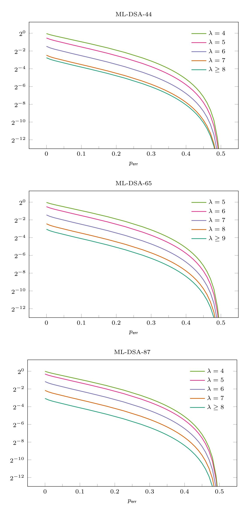

**Figure 3:** Bits of information I(*X*<sup>∗</sup> ; *<sup>C</sup>*inf*, Z*inf*, <sup>Y</sup>*e*λ,*inf) contained on average in an informative leaky signature about the key.

{21}------------------------------------------------

Since, for all  $i \in [n_{\text{sig}}]$ ,  $(T^{(1)}, \ldots, T^{(i-1)})$  and  $T^{(i)}$  are conditionally independent given  $X^*$ , we get  $I(X^*; T^{(i)} \mid T^{(1)}, \ldots, T^{(i-1)}) \leq I(X^*; T^{(i)}) = I(X^*; C, Z, \widetilde{Y}_{\lambda})$  by a corollary of the data-processing inequality [CT06, Theorem 2.8.1]. This proves (a), and (b) can be shown analogously.

Remark 41. By Lemma 40 (b),  $I(X^*; (C_{\mathsf{inf}}^{(i)}, Z_{\mathsf{inf}}^{(i)}, \widetilde{Y}_{\lambda, \mathsf{inf}}^{(i)})_{i=1}^{n_{\mathsf{inf}}}) > H(X^*) - 1$  can only hold when  $n_{\mathsf{inf}} \geq n_{\mathsf{inf}, \mathsf{lower}, \mathsf{mi}}$  for the lower bound

$$n_{\mathsf{inf},\mathsf{lower},\mathsf{mi}} \coloneqq \left\lfloor \left( \mathsf{H}(X^*) - 1 \right) / \, \mathsf{I} \big( X^*; C_{\mathsf{inf}}, Z_{\mathsf{inf}}, \widetilde{Y}_{\lambda,\mathsf{inf}} \big) \right\rfloor + 1 \, .$$

#### Relation between mutual information and the expected number of candidate keys

As the number  $n_{\text{sig}}$  of signatures increases, the expected cardinality  $\#\mathfrak{X}_{\text{cand}}$  of the random set  $\mathfrak{X}_{\text{cand}} = \Xi_{\text{cand}} \left( (C^{(i)}, Z^{(i)}, Y_{\lambda}^{(i)})_{i=1}^{n_{\text{sig}}} \right)$  and the conditional entropy of  $X^*$  given the signatures  $(C^{(i)}, Z^{(i)}, Y_{\lambda}^{(i)})_{i=1}^{n_{\text{sig}}}$  both decrease, with the former approaching 1 and the latter approaching 0. This raises the question of how these two quantities are related. The next lemma establishes a result concerning their relationship.

<span id="page-21-1"></span> $\begin{array}{l} \textbf{Lemma 42.} \ \textit{Assume $p_{\rm err} = 0$ (exact leakage) and let $\mathfrak{X}_{\rm cand} = \Xi_{\rm cand} \big( (C^{(i)}, Z^{(i)}, Y_{\lambda}{}^{(i)})_{i=1}^{n_{\rm sig}} \big)$} \\ \textit{and $\mathfrak{X}_{\rm cand,inf} = \Xi_{\rm cand} \big( (C_{\rm inf}{}^{(i)}, Z_{\rm inf}{}^{(i)}, Y_{\lambda, \rm inf}{}^{(i)})_{i=1}^{n_{\rm inf}} \big)$}. \end{array}$ 

(a) We have 
$$I(X^*; (C^{(i)}, Z^{(i)}, Y_{\lambda}^{(i)})_{i=1}^{n_{\text{sig}}}) = H(X^*) - \mathbb{E}(\log_2(\#\mathfrak{X}_{\text{cand}})).$$

(b) We have 
$$I(X^*; (C_{\inf}^{(i)}, Z_{\inf}^{(i)}, Y_{\lambda, \inf}^{(i)})_{i=1}^{n_{\inf}}) = H(X^*) - \mathbb{E}(\log_2(\#\mathfrak{X}_{cand, \inf})).$$

Proof. Denote  $T = (C^{(i)}, Z^{(i)}, Y_{\lambda}^{(i)})_{i=1}^{n_{\text{sig}}}$ . We have  $\mathbb{P}(X^* = x \mid T = t) = 1_{\mathcal{X}_{\text{cand}}}(x^*) / \# \mathcal{X}_{\text{cand}}$  for all  $t \in \text{supp}(T)$  by Lemma 19, where  $\mathcal{X}_{\text{cand}} = \Xi_{\text{cand}}(t)$ . This implies

$$\mathrm{H}\big(X^* \mid T\big) = \mathbb{E}\big(-\log_2 \mathbb{P}\big(X^* \mid T\big)\big) = \mathbb{E}\big(\log_2 \big(\#\mathfrak{X}_{\mathsf{cand}}\big)\big)\,,$$

proving claim (a). Assertion (b) can be shown analogously.

Remark 43. Combining Lemma 40 (b) and Lemma 42 (b) yields

$$\begin{split} n_{\mathsf{inf}} \cdot \mathrm{I}\big(X^*; C_{\mathsf{inf}}, Z_{\mathsf{inf}}, \widetilde{Y}_{\lambda, \mathsf{inf}}\big) &\geq \mathrm{H}(X^*) - \mathbb{E}(\log_2(\# \mathfrak{X}_{\mathsf{cand}, \mathsf{inf}})) \\ &\geq \log_2(\# \mathcal{X}) - \log_2\big(\mathbb{E}\big(\# \mathfrak{X}_{\mathsf{cand}, \mathsf{inf}}\big)\big) \,, \end{split}$$

where we used  $H(X^*) = \log_2(\#\mathcal{X})$  and Jensen's inequality for the last step. In this way, we obtain for the expected number of candidate keys the lower bound

$$\mathbb{E}(\#\mathfrak{X}_{\mathsf{cand},\mathsf{inf}}) \geq \Theta_{\mathsf{lower},\mathsf{mi}}(n_{\mathsf{inf}})$$

where  $\Theta_{\mathsf{lower},\mathsf{mi}}(n_{\mathsf{inf}}) = \max(1, \#\mathcal{X}/2^{n_{\mathsf{inf}}\cdot \mathrm{I}(X^*; C_{\mathsf{inf}}, Z_{\mathsf{inf}}, Y_{\lambda,\mathsf{inf}})})$ . In particular, we have for exact leakage the alternative characterization  $n_{\mathsf{inf},\mathsf{lower},\mathsf{mi}} = \min\{n_{\mathsf{inf}} \in \mathbb{N} \mid \Theta_{\mathsf{lower},\mathsf{mi}}(n_{\mathsf{inf}}) < 2\}$ .

### <span id="page-21-0"></span>4.4 Expected number of candidate keys

In this subsection, we derive lower and upper bounds for the expected number of elements in the random set

$$\mathfrak{X}_{\mathsf{cand},\mathsf{inf}} \coloneqq \Xi_{\mathsf{cand}} \big( (C_{\mathsf{inf}}{}^{(i)}, Z_{\mathsf{inf}}{}^{(i)}, Y_{\lambda,\mathsf{inf}}{}^{(i)})_{i=1}^{n_{\mathsf{inf}}} \big)$$

of candidate keys compatible with  $n_{\mathsf{inf}}$  randomly sampled informative signatures with exact leakage. The primary goal is to estimate how many leaky signatures are typically required before we can reasonably expect that only one key could have generated them.

Remark 44. The results in this section will be formulated for informative signatures, i.e., in terms of  $n_{\rm inf}$  and the random variables  $C_{\rm inf}$ ,  $Z_{\rm inf}$ ,  $Y_{\lambda,\rm inf}$  etc. Analogous results hold without the restriction to the informativeness of the signatures, i.e., when considering  $n_{\rm sig}$  and the random variables  $C, Z, Y_{\lambda}$  etc., instead. Namely, Lemma 45 can be adapted in the obvious way to this situation, whereas in Lemma 47, Lemma 48, and Lemma 49, the factor  $\frac{1}{2\beta}$  must be replaced with  $\frac{p_{\rm inf}}{2\beta}$ .

{22}------------------------------------------------

#### Probability that two keys generate the same leaky signatures

Let X be an independent random key, i.e. a random variable uniformly distributed on  $\mathcal{X}$  such that the family  $\{X, X^*\} \cup \{C_{\mathsf{inf}}^{(i)}, Z_{\mathsf{inf}}^{(i)}\}_{i \geq 1}$  is independent. We denote by  $A(n_{\mathsf{inf}})$  the event in which the first  $n_{\mathsf{inf}}$  leaky signatures, derived from  $(C_{\mathsf{inf}}^{(i)}, Z_{\mathsf{inf}}^{(i)})_{i \geq 1}$ , coincide for the key X and the true key  $X^*$ . More precisely, we define the event

$$A(n_{\mathsf{inf}}) \coloneqq \bigcap_{i=1}^{n_{\mathsf{inf}}} \left\{ \mathrm{bit}_{\lambda}(Z_{\mathsf{inf}}{}^{(i)} - \langle C_{\mathsf{inf}}{}^{(i)}, X^* \rangle) = \mathrm{bit}_{\lambda}(Z_{\mathsf{inf}}{}^{(i)} - \langle C_{\mathsf{inf}}{}^{(i)}, X \rangle) \right\}.$$

Not unexpectedly, the probability of this event is directly linked to the expected number of candidate keys, as stated in the next lemma.

<span id="page-22-0"></span>**Lemma 45.** Assuming  $p_{\sf err} = 0$ , we have  $\mathbb{E}(\#\mathfrak{X}_{\sf cand,inf}) = \#\mathcal{X} \cdot \mathbb{P}(A(n_{\sf inf}))$ .

*Proof.* The identity follows from the computation

 $\mathbb{E}(\#\mathfrak{X}_{\mathsf{cand},\mathsf{inf}})$ 

$$= \sum_{x \in \mathcal{X}} \mathbb{P}(Y_{\lambda, \mathsf{inf}}^{(i)} = \mathsf{bit}_{\lambda}(Z_{\mathsf{inf}}^{(i)} - \langle C_{\mathsf{inf}}^{(i)}, x \rangle) \text{ for all } i \in [n_{\mathsf{inf}}])$$

$$= \sum_{x \in \mathcal{X}} \mathbb{P}(A(n_{\mathsf{inf}}) \mid X = x) = \sum_{x \in \mathcal{X}} \mathbb{P}(A(n_{\mathsf{inf}}), X = x) \cdot \# \mathcal{X} = \mathbb{P}(A(n_{\mathsf{inf}})) \cdot \# \mathcal{X},$$

where we used in the penultimate step that X is uniformly distributed on  $\mathcal{X}$ .

Remark 46. In general,  $\mathbb{E}(\#\mathfrak{X}_{\mathsf{cand},\mathsf{inf}}) > 1$ . Indeed, if  $\eta > 0$ , we have

$$\mathbb{P}(A(n_{\mathsf{inf}}), X^* = X) = \mathbb{P}(X^* = X) = 1/\#\mathcal{X} \text{ and}$$
$$\mathbb{P}(A(n_{\mathsf{inf}}), B) = \mathbb{P}(B) > 0,$$

where 
$$B = \{X_1^* = X_2 \neq X_1 = X_2^*\} \cap \bigcap_{j=3}^{256} \{X_j^* = X_j\} \cap \bigcap_{i=1}^{n_{\mathsf{inf}}} \{(C_{\mathsf{inf}}^{(i)})_1 = (C_{\mathsf{inf}}^{(i)})_2\}.$$

The formula in the next lemma will facilitate the estimation (or explicit computation) of the number  $\mathbb{E}(\#\mathfrak{X}_{\mathsf{cand},\mathsf{inf}})$ .

<span id="page-22-1"></span>**Lemma 47.** Assuming  $\lambda > \log_2(\beta) + 1$ , we have

$$\mathbb{E}(\#\mathfrak{X}_{\mathsf{cand},\mathsf{inf}}) = \Theta(n_{\mathsf{inf}}),$$

where  $\Theta(n_{\mathsf{inf}}) = \# \mathcal{X} \cdot \mathbb{E}(\theta(n_{\mathsf{inf}}, X - X^*))$  with  $\theta(n_{\mathsf{inf}}, t) = \left(1 - \frac{1}{2\beta} \mathbb{E}(|\langle C_{\mathsf{inf}}, t \rangle|)\right)^{n_{\mathsf{inf}}}$ . Indeed, for all  $t \in \{x - x^* \mid x, x^* \in \mathcal{X}\}$ , we have  $\mathbb{P}(A(n_{\mathsf{inf}}) \mid X - X^* = t) = \theta(n_{\mathsf{inf}}, t)$ .

*Proof.* Proving the last statement is sufficient, because the first follows from it by Lemma 45. Let  $x, x^* \in \mathcal{X}$ . We consider the event  $B = \{X = x, X^* = x^*\}$ . Clearly,

$$\mathbb{P}(A(n_{\mathsf{inf}}) \mid X - X^* = t) = \mathbb{P}(A(n_{\mathsf{inf}}) \mid B) = \mathbb{P}(Y_{\lambda,\mathsf{inf}} = \mathsf{bit}_{\lambda}(Z_{\mathsf{inf}} - \langle C_{\mathsf{inf}}, X \rangle) \mid B)^{n_{\mathsf{inf}}}$$

due to the independence of the members of  $\{X, X^*, C_{\mathsf{inf}}^{(i)}, Z_{\mathsf{inf}}^{(i)}\}_{i \geq 1}$ . In the high- $\lambda$  regime, defining  $f(x, x^*) = \mathbb{P}(\langle C_{\mathsf{inf}}, x^* \rangle \leq Z_{\mathsf{inf}} \bmod^{\mp} 2^{\lambda} < \langle C_{\mathsf{inf}}, x \rangle)$ , we have by Corollary 29

$$\mathbb{P}(Y_{\lambda,\inf} \neq \operatorname{bit}_{\lambda}(Z_{\inf} - \langle C_{\inf}, X \rangle) \mid B) = f(x, x^*) + f(x^*, x).$$

Using that  $Z_{\mathsf{inf}} \bmod^{\mp} 2^{\lambda}$  is uniformly distributed on  $[-\beta, \beta) \cap \mathbb{Z}$  according to Lemma 36 and that  $\langle C_{\mathsf{inf}}, x \rangle, \langle C_{\mathsf{inf}}, x^* \rangle$  take values in  $[-\beta, \beta]$ , we get

$$\begin{split} f(x,x^*) &= \tfrac{1}{2\beta} \sum_{z \in \mathbb{Z}} \mathbb{P} \big( \langle C_{\mathsf{inf}}, x^* \rangle \leq z < \langle C_{\mathsf{inf}}, x \rangle \big) \\ &= \tfrac{1}{2\beta} \, \mathbb{E} \left( \sum_{z \in \mathbb{Z}} \mathbf{1}_{\langle C_{\mathsf{inf}}, x^* \rangle \leq z < \langle C_{\mathsf{inf}}, x \rangle} \right) = \tfrac{1}{2\beta} \, \mathbb{E} (\max(0, \langle C_{\mathsf{inf}}, t \rangle)) = \tfrac{1}{4\beta} \, \mathbb{E} (|\langle C_{\mathsf{inf}}, t \rangle|) \,, \end{split}$$

where  $t = x - x^*$ . Similarly, it follows that  $f(x^*, x) = \frac{1}{4\beta} \mathbb{E}(|\langle C_{\mathsf{inf}}, -t \rangle|) = \frac{1}{4\beta} \mathbb{E}(|\langle C_{\mathsf{inf}}, t \rangle|)$ . Consequently,

$$\mathbb{P}(Y_{\lambda,\inf} \neq \operatorname{bit}_{\lambda}(Z_{\inf} - \langle C_{\inf}, X \rangle) \mid B) = \frac{1}{2\beta} \mathbb{E}(|\langle C_{\inf}, t \rangle|),$$

by which we obtain the desired identity  $\mathbb{P}(A(n_{\mathsf{inf}}) \mid X - X^* = t) = \theta(n_{\mathsf{inf}}, t)$ .

{23}------------------------------------------------

#### Lower bound

<span id="page-23-0"></span>**Lemma 48.** Assuming  $p_{\sf err} = 0$  and  $\lambda > \log_2(\beta) + 1$ , we have

$$\mathbb{E}(\#\mathfrak{X}_{\mathsf{cand},\mathsf{inf}}) \geq \Theta_{\mathsf{lower}}(n_{\mathsf{inf}}),$$

where  $\Theta_{\mathsf{lower}}(n_{\mathsf{inf}}) = \# \mathcal{X} \cdot \mathbb{E}(\theta_{\mathsf{lower}}(n_{\mathsf{inf}}, X - X^*))$  with  $\theta_{\mathsf{lower}}(n_{\mathsf{inf}}, t) = \left(1 - \frac{1}{2\beta}\sqrt{\frac{\tau}{256}}\|t\|_2\right)^{n_{\mathsf{inf}}}$ . For the ML-DSA parameter sets, the lower bound  $\Theta_{\mathsf{lower}}$  is shown in Figure 4.

*Proof.* By Lemma 17,  $\mathbb{E}(\langle C_{\mathsf{inf}}, t \rangle^2 \mid \mathfrak{J}) = \sum_{j \in \mathfrak{J}} t_j^2$  and  $\mathbb{P}(j \in \mathfrak{J}) = \frac{\tau}{256}$  for all  $j \in [256]$ , so

$$\mathbb{E}(\langle C_{\mathsf{inf}}, t \rangle^2) = \mathbb{E}\left(\sum_{j \in \mathfrak{J}} t_j^2\right) = \frac{\tau}{256} \|t\|_2^2.$$

Hence,  $\frac{\tau}{256} ||t||_2^2 - \mathbb{E}(|\langle C_{\mathsf{inf}}, t \rangle|)^2 = \operatorname{Var}(|\langle C_{\mathsf{inf}}, t \rangle|) \ge 0$ , i.e.  $\frac{1}{2\beta} \mathbb{E}(|\langle C_{\mathsf{inf}}, t \rangle|) \le \frac{1}{2\beta} \sqrt{\frac{\tau}{256}} ||t||$ , so

$$\left(1-\tfrac{1}{2\beta}\sqrt{\tfrac{\tau}{256}}\|X-X^*\|_2\right)^{n_{\inf}} \leq \left(1-\tfrac{1}{2\beta}\operatorname{\mathbb{E}}(|\langle C_{\inf},X-X^*\rangle|)\right)^{n_{\inf}} = \theta(n_{\inf},X-X^*)\,.$$

Taking expectations, and applying Lemma 47, completes the proof.

#### **Upper bound**

<span id="page-23-1"></span>**Lemma 49.** Assuming  $p_{\sf err} = 0$  and  $\lambda > \log_2(\beta) + 1$ , we have

$$\mathbb{E}(\#\mathfrak{X}_{\mathsf{cand.inf}}) \leq \Theta_{\mathsf{upper}}(n_{\mathsf{inf}})$$
.

 $where \ \Theta_{\rm upper}(n_{\rm inf}) = \#\mathcal{X} \cdot \mathbb{E}(\theta_{\rm upper}(n_{\rm inf}, X - X^*)) \ with \ \theta_{\rm upper}(n_{\rm inf}, 0) = 1 \ and, \ for \ t \neq 0,$ 

$$\theta_{\mathsf{upper}}(n_{\mathsf{inf}},t) = \left(1 - \frac{1}{2\beta} \frac{1}{\sqrt{2}} \sqrt{\frac{\tau}{256}} \|t\|_2 \cdot \left(1 + \frac{256 - \tau}{255\tau} (256(\|t\|_4 / \|t\|_2)^4 - 1))^{-1/2}\right)^{n_{\mathsf{inf}}}.$$

For the ML-DSA parameter sets, the upper bound  $\Theta_{upper}$  is shown in Figure 4.

*Proof.* We consider the random variable  $T := \mathbb{E}(\langle C_{\mathsf{inf}}, t \rangle^2 \mid \mathfrak{J}) = \sum_{j \in \mathfrak{J}} t_j^2$ , for which, in the proof of Lemma 48, it was shown that  $\mathbb{E}(T) = \frac{\tau}{256} ||t||_2^2$ . We will also need the identity

$$\mathbb{E}(T^2) = \mathbb{E}\left(\sum_{j,k\in\mathfrak{J}} t_j^2 t_k^2\right) = \sum_{j,k\in[256]} \mathbb{P}(j,k\in\mathfrak{J}) \, t_j^2 t_k^2 = \frac{\tau}{256} \|t\|_4^4 + \frac{\tau(\tau-1)}{256\cdot255} (\|t\|_2^4 - \|t\|_4^4) \,,$$

where in the last step we used the relation  $\sum_{j\neq k\in[256]}t_j^2t_k^2=\|t\|_2^4-\|t\|_4^4$  and the fact that the indices in  $\mathfrak{J}$  are chosen uniformly according to Lemma 17. It follows that

$$\mathbb{E}(T^2)/\mathbb{E}(T)^2 = 1 + \frac{256 - \tau}{255\tau} (256(||t||_4/||t||_2)^4 - 1).$$

Next, the Khintchine inequality  $\mathbb{E}(|\langle C_{\mathsf{inf}}, t \rangle| \mid \mathfrak{J}) \geq \frac{1}{\sqrt{2}} T^{1/2}$  yields, by taking expectations,

$$\mathbb{E}(|\langle C_{\mathsf{inf}}, t \rangle|) \ge \frac{1}{\sqrt{2}} \, \mathbb{E}(T^{1/2}) \,.$$

Applying the Cauchy–Schwarz inequality first to  $T^{1/4}$  and  $T^{3/4}$ , and then to  $T^{1/2}$  and T, we obtain  $\mathbb{E}(T)^2 \leq \mathbb{E}(T^{1/2}) \cdot \mathbb{E}(T^{3/2}) \leq \mathbb{E}(T^{1/2}) \cdot \mathbb{E}(T)^{1/2} \cdot \mathbb{E}(T^2)^{1/2}$ , and thus

$$\mathbb{E}(|\langle C_{\mathsf{inf}}, t \rangle|) \ge \frac{1}{\sqrt{2}} \, \mathbb{E}(T)^{1/2} \cdot (\mathbb{E}(T^2) / \, \mathbb{E}(T)^2)^{-1/2} \,.$$

As in the proof of Lemma 48, applying Lemma 47 now completes the argument.

{24}------------------------------------------------

<span id="page-24-0"></span>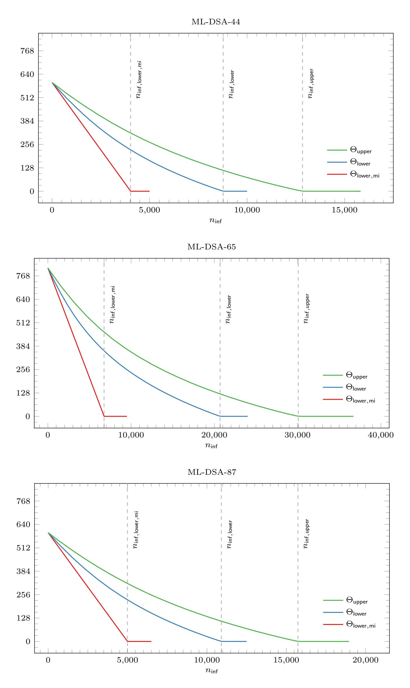

**Figure 4:** Binary logarithm of the lower and upper bounds for E(#Xcand*,*inf).

{25}------------------------------------------------

#### Number of signatures required to recover a unique key

Note that the bounds  $\Theta_{lower}(n_{inf})$  and  $\Theta_{upper}(n_{inf})$  are monotonically decreasing and converge to 1 as  $n_{inf}$  approaches  $\infty$ , although they remain strictly greater than 1 for every finite  $n_{inf}$ . We define, in the high- $\lambda$  regime,

$$\begin{aligned} n_{\mathsf{inf},\mathsf{lower}} &\coloneqq \min\{n_{\mathsf{inf}} \in \mathbb{N} \mid \Theta_{\mathsf{lower}}(n_{\mathsf{inf}}) < 2\} \,, \\ n_{\mathsf{inf},\mathsf{upper}} &\coloneqq \min\{n_{\mathsf{inf}} \in \mathbb{N} \mid \Theta_{\mathsf{upper}}(n_{\mathsf{inf}}) < 2\} \,. \end{aligned}$$

The values of these numbers, which can be extracted from Figure 4, are as follows:

|                                            | ML-DSA-44      | ML-DSA-65    | ML-DSA-87       |
|--------------------------------------------|----------------|--------------|-----------------|
| $n_{\rm inf,lower,mi}$ $n_{\rm inf,lower}$ | $4026 \\ 8774$ | 6748 $20692$ | 4 992<br>10 909 |
| $n_{inf,upper}$                            | 12841          | 30076        | 15734           |

Note that, for  $\Theta$  any of  $\Theta_{\mathsf{lower},\mathsf{mi}}$ ,  $\Theta_{\mathsf{lower}}$ , or  $\Theta_{\mathsf{upper}}$ , the plots show that even when replacing the condition  $\Theta(n_{\mathsf{inf}}) < 2$  with  $\Theta(n_{\mathsf{inf}}) < 1 + \varepsilon$  for some  $\varepsilon$  moderately above 0, the resulting values for the bound on  $n_{\mathsf{inf}}$  would increase only modestly.

<span id="page-25-2"></span>Remark 50. According to Lemma 48, in the high- $\lambda$  regime and assuming exact leakage, recovering a unique key that could have produced the observed signatures should typically require at least  $n_{\sf inf,lower}$  and not more than  $n_{\sf inf,upper}$  informative leaky signatures. This is consistent with the experimental findings reported in Section 5 and Section 6. Notably, on average, the number of informative signatures required for key recovery exceeded  $n_{\sf inf,lower}$  by only a modest margin, with successful recovery occurring only occasionally with fewer signatures. By contrast, the experiments indicate that the upper bound  $n_{\sf inf,upper}$  is not tight, leaving room for potential improvement.

To obtain such an improvement, we would need to tighten Lemma 49. Recall that the key ingredient in Lemma 49 is to show

$$\mathbb{E}(|\langle C_{\mathsf{inf}}, t \rangle|) \ge \frac{1}{\sqrt{2}} \sqrt{\frac{\tau}{256}} ||t||_2 \cdot (1 + \frac{256 - \tau}{255\tau} (256(||t||_4 / ||t||_2)^4 - 1))^{-1/2}$$
 (7)

Hence, in order to tighten Lemma 49, we need to find a stronger inequality than (7). For instance, a very mild improvement of this inequality would be

<span id="page-25-1"></span><span id="page-25-0"></span>
$$\mathbb{E}(|\langle C_{\mathsf{inf}}, t \rangle|) \ge \frac{1}{\sqrt{2}} \sqrt{\frac{\tau}{256}} ||t||_2 \tag{8}$$

Computing  $n_{\text{inf,upper}}$  for this inequality yields results very similar to those given in Figure 4 for (7). This highlights that (8), even if correct, would amount to only a mild improvement over (7). However, it turns out that even this mild improvement (8) is impossible. Indeed, if t is the i-th standard basis vector,

$$\frac{\tau}{256} = \mathbb{E}(|C_i|) = \mathbb{E}(|\langle C_{\mathsf{inf}}, t \rangle|) \ge \frac{1}{\sqrt{2}} \sqrt{\frac{\tau}{256}} ||t||_2 = \frac{1}{\sqrt{2}} \sqrt{\frac{\tau}{256}}$$

would give rise to the contradiction  $\frac{\tau}{256} \ge \frac{1}{2}$ . Therefore, it appears that our upper bound cannot be significantly improved using a universal inequality such as (7). In particular, tightening the upper bound seems to require an entirely different approach.

Remark 51. The function  $\theta(n_{\mathsf{inf}},t)$  appears to depend at least on the weak integer partition  $\mathfrak{p}(t)$  with parts  $|t_1|,\ldots,|t_{256}|$ , while the functions  $\theta_{\mathsf{lower}}(n_{\mathsf{inf}},t)$  and  $\theta_{\mathsf{upper}}(n_{\mathsf{inf}},t)$  depend only on the norms  $||t||_2$  and  $||t||_4$ . A naive evaluation of  $\Theta(n_{\mathsf{inf}}) = \#\mathcal{X} \cdot \mathbb{E}(\theta(n_{\mathsf{inf}},X-X^*))$  therefore entails computing the distribution of the random variable  $\mathfrak{p}(X-X^*)$ , which is computationally demanding. To evaluate  $\Theta_{\mathsf{lower}}(n_{\mathsf{inf}}) = \#\mathcal{X} \cdot \mathbb{E}(\theta_{\mathsf{lower}}(n_{\mathsf{inf}},X-X^*))$  and  $\Theta_{\mathsf{upper}}(n_{\mathsf{inf}}) = \#\mathcal{X} \cdot \mathbb{E}(\theta_{\mathsf{upper}}(n_{\mathsf{inf}},X-X^*))$ , on the other hand, it suffices to determine the joint distribution of  $||X-X^*||_2$  and  $||X-X^*||_4$ , which is considerably more tractable.

As a consequence, it is easy to compute  $n_{\mathsf{inf},\mathsf{lower}}$  and  $n_{\mathsf{inf},\mathsf{upper}}$ , but determining the exact value of the smallest  $n_{\mathsf{inf}}$  for which  $\mathbb{E}(\#\mathfrak{X}_{\mathsf{cand},\mathsf{inf}}) < 2$  is more challenging.

{26}------------------------------------------------

#### Heuristic extension to the low- $\lambda$ regime

<span id="page-26-2"></span>Remark 52. To obtain the bounds in Lemma 48 and Lemma 49, we had to restrict to the high- $\lambda$  regime. This restriction was necessary as our analysis relies on the identity

$$\mathbb{P}(\mathrm{bit}_{\lambda}(Z_{\mathsf{inf}} - \langle C_{\mathsf{inf}}, x^* \rangle) \neq \mathrm{bit}_{\lambda}(Z_{\mathsf{inf}} - \langle C_{\mathsf{inf}}, x \rangle)) = \frac{1}{2\beta} \, \mathbb{E}(|\langle C_{\mathsf{inf}}, x - x^* \rangle|) \,,$$

derived in the proof of Lemma 47. Note that the constant  $2\beta$  arises as the cardinality of the set  $\mathcal{Z}_{inf} \mod^{\mp} 2^{\lambda}$  in the high- $\lambda$  regime. By Lemma 31, this set has cardinality  $2^{\lambda}$  in the low- $\lambda$  regime. Therefore, for  $\lambda$  not much below  $\log_2(\beta)$  in the low- $\lambda$  regime, we expect Lemma 48 and Lemma 49, with  $2\beta$  replaced by  $2^{\lambda}$ , to provide good heuristic bounds, in terms of which we can extend the definitions of  $n_{inf,lower}$  and  $n_{inf,upper}$  to this regime. Simulations indicate that these heuristics are accurate when  $\lambda \geq 5$  for ML-DSA-44 and ML-DSA-87, and when  $\lambda \geq 6$  for ML-DSA-65. Our experimental results also align closely with these heuristics, as evidenced in Figure 1. Establishing rigorous bounds in the low- $\lambda$  regime remains an open problem.

## <span id="page-26-0"></span>4.5 Expected number of most likely keys

In the last subsection, we have focused on exact leakage, i.e. the case  $p_{\sf err} = 0$ . We now aim to extend our results to the noisy setting. The goal is therefore to estimate the expected number of elements in the random set

$$\mathfrak{X}_{\mathsf{ml},\mathsf{inf}} \coloneqq \Xi_{\mathsf{ml}} \big( (C_{\mathsf{inf}}{}^{(i)}, Z_{\mathsf{inf}}{}^{(i)}, \widetilde{Y}_{\lambda,\mathsf{inf}}{}^{(i)})_{i=1}^{n_{\mathsf{inf}}} \big) \,.$$

The following lemma generalizes Lemma 49 and holds in both the exact and noisy setting. As in Section 4.4, we denote by X an independent random key.

**Lemma 53.** Assuming  $\lambda > \log_2(\beta) + 1$ , we have

<span id="page-26-1"></span>
$$\mathbb{E}\left(\#\mathfrak{X}_{\mathsf{ml},\mathsf{inf}}\right) \le \Theta_{\mathsf{upper},\mathsf{noisy}}(n_{\mathsf{inf}},p_{\mathsf{err}})\,,\tag{9}$$

where  $\Theta_{\text{upper,noisy}}(n_{\text{inf}}, p_{\text{err}}) = \# \mathcal{X} \cdot \mathbb{E} \left( \theta_{\text{upper}}(n_{\text{inf}}, (X - X^*) \cdot (1 - 2\sqrt{p_{\text{err}}(1 - p_{\text{err}})}) \right)$  with  $\theta_{\text{upper}}$  the function defined in Lemma 49.

*Proof.* If  $p_{\sf err} = 0$ , then (9) is exactly the assertion of Lemma 49. We may therefore assume that  $p_{\sf err} > 0$ . Let

$$W(x) = \sum_{i=1}^{n_{\inf}} 1_{\widetilde{Y}_{\lambda,\inf}(i) \neq \operatorname{bit}_{\lambda}(Z_{\inf}(i) - \langle C_{\inf}(i), x \rangle)}.$$

Note that  $\mathfrak{X}_{\mathsf{ml},\mathsf{inf}}$  is the set of all  $x \in \mathcal{X}$  for which W(x) is minimal. Then, by similar arguments as we used in Lemma 45,

$$\mathbb{E}(\#\mathfrak{X}_{\mathsf{ml},\mathsf{inf}}) = \sum_{x \in \mathcal{X}} \mathbb{P}\left(\bigcap_{x' \in \mathcal{X}} \left\{ W(x) \leq W(x') \right\} \right) = \#\mathcal{X} \cdot \mathbb{P}\left(\bigcap_{x' \in \mathcal{X}} \left\{ W(X) \leq W(x') \right\} \right).$$

Moreover, by conditioning on  $X^*$ , the probability on the right-hand side is equal to

$$\sum_{x^* \in \mathcal{X}} \mathbb{P}\left(\bigcap_{x' \in \mathcal{X}} \left\{ W(X) \le W(x') \right\}, X^* = x^* \right) \le \sum_{x^* \in \mathcal{X}} \mathbb{P}\left(W(X) \le W(x^*), X^* = x^* \right)$$
$$= \mathbb{P}\left(W(X) \le W(X^*) \right).$$

Defining  $\Delta^{(i)} = 1_{\widetilde{Y}_{\lambda,\inf}(i) \neq \operatorname{bit}_{\lambda}(Z_{\inf}(i) - \langle C_{\inf}(i), X \rangle)} - 1_{\widetilde{Y}_{\lambda,\inf}(i) \neq \operatorname{bit}_{\lambda}(Z_{\inf}(i) - \langle C_{\inf}(i), X^* \rangle)}$ , we have for this last probability  $\mathbb{P}(W(X) \leq W(X^*)) = \mathbb{P}(\sum_{i=1}^{n_{\inf}} \Delta^{(i)} \leq 0)$  and it remains to show that

$$\mathbb{P}\big(\textstyle\sum_{i=1}^{n_{\mathsf{inf}}} \Delta^{(i)} \leq 0\big) \leq \mathbb{E}\big(\theta_{\mathsf{upper}}(n_{\mathsf{inf}}, (X - X^*) \cdot (1 - 2\sqrt{p_{\mathsf{err}}(1 - p_{\mathsf{err}})})\big) \,.$$

{27}------------------------------------------------

We proceed similarly as in the case of exact leakage and rely on the fact that, conditioned on  $(X, X^*)$ , the family  $\{\Delta^{(i)}\}_{i=1}^{n_{\text{inf}}}$  is independent. However, here our estimates are based on the following application of the *exponential Markov inequality* for s > 0:

$$\mathbb{P}\left(\sum_{i=1}^{n_{\inf}} \Delta^{(i)} \leq 0\right) = \mathbb{E}\left(\mathbb{P}\left(\sum_{i=1}^{n_{\inf}} \Delta^{(i)} \leq 0 \mid (X, X^*)\right)\right) \\
\leq \mathbb{E}\left(\mathbb{E}\left(e^{-s\sum_{i=1}^{n_{\inf}} \Delta^{(i)}} \mid (X, X^*)\right)\right) = \mathbb{E}\left(\mathbb{E}\left(e^{-s\Delta} \mid (X, X^*)\right)^{n_{\inf}}\right),$$

where we have used the conditional independence and identical distribution of the members of  $\{\Delta^{(i)}\}_{i=1}^{n_{\text{inf}}}$  in the last step and, for simplicity, wrote  $\Delta$  for  $\Delta^{(1)}$ . Similarly, we will omit the superscript "(1)" for the other variables. We compute the inner expectation as

$$\mathbb{E}\left(e^{-s\Delta} \mid (X, X^*)\right) = \rho_{X, X^*} + (1 - \rho_{X, X^*})(1 - p_{\mathsf{err}})e^{-s} + (1 - \rho_{X, X^*})p_{\mathsf{err}}e^{s}$$

where  $\rho_{X,X^*} = \mathbb{P}(\text{bit}_{\lambda}(Z_{\text{inf}} - \langle C_{\text{inf}}, X^* \rangle) = \text{bit}_{\lambda}(Z_{\text{inf}} - \langle C_{\text{inf}}, X \rangle) \mid (X, X^*))$ . The optimal value for s is  $\frac{1}{2}\log((1-p_{\text{err}})/p_{\text{err}})$ , which lies in  $(0,\infty)$  since  $p_{\text{err}} \in (0,1/2)$ . Thus,

$$\begin{split} \mathbb{P}\big(\textstyle\sum_{i=1}^{n_{\inf}} \Delta^{(i)} \leq 0\big) &\leq \mathbb{E}\big(\big(\rho_{X,X^*} + (1-\rho_{X,X^*}) \cdot 2\sqrt{p_{\mathsf{err}}(1-p_{\mathsf{err}})}\big)^{n_{\inf}}\big) \\ &= \mathbb{E}\big(\big(1-\frac{1}{2\beta} \,\mathbb{E}(|\langle C_{\mathsf{inf}}, X-X^*\rangle|) \cdot \big(1-2\sqrt{p_{\mathsf{err}}(1-p_{\mathsf{err}})}\big)\big)^{n_{\mathsf{inf}}}\big)\,, \end{split}$$

where we have used in the last step that  $\rho_{X,X^*} = 1 - \frac{1}{2\beta} \mathbb{E}(|\langle C_{\mathsf{inf}}, X - X^* \rangle|)$  with the same arguments as in Section 4.4. Applying (7) concludes the proof.

#### Number of signatures required to recover a unique key

<span id="page-27-1"></span>Remark 54. We are also interested here in the number of signatures required for our attacks. However, in this setting we are only given the upper bound (9), which relies on the estimate (7) and which, as seen in Section 4.4, substantially overestimates the values observed experimentally; compare also Figure 5 for a plot of

$$n_{\mathsf{inf},\mathsf{upper},\mathsf{noisy}}(p_{\mathsf{err}}) \coloneqq \min\{n_{\mathsf{inf}} \in \mathbb{N} \mid \Theta_{\mathsf{upper},\mathsf{noisy}}(n_{\mathsf{inf}},p_{\mathsf{err}}) < 2\}$$
.

Therefore, in the following we instead rely on the heuristic

$$\rho_{X,X^*} = 1 - \frac{1}{2\beta} \mathbb{E}(|\langle C_{\mathsf{inf}}, X - X^* \rangle|) \approx 1 - \frac{1}{2\beta} \sqrt{\frac{\tau}{256}} \|X - X^*\|_2$$
.

In this way, we obtain, in place of (9), the estimate

$$\mathbb{E}(\#\mathfrak{X}_{\mathsf{ml.inf}}) \lesssim \Theta_{\mathsf{noisv}}(n_{\mathsf{inf}}, p_{\mathsf{err}}),$$

where  $\Theta_{\text{noisy}}(n_{\text{inf}}, p_{\text{err}}) = \# \mathcal{X} \cdot \mathbb{E}\left(\left(1 - \frac{1}{2\beta}\sqrt{\frac{\tau}{256}} \|X - X^*\|_2 \cdot \left(1 - 2\sqrt{p_{\text{err}}(1 - p_{\text{err}})}\right)\right)^{n_{\text{inf}}}\right)$ . Based on this, we define

$$n_{\mathsf{inf},\mathsf{noisy}}(p_{\mathsf{err}}) \coloneqq \min\{n_{\mathsf{inf}} \in \mathbb{N} \mid \Theta_{\mathsf{noisy}}(n_{\mathsf{inf}},p_{\mathsf{err}}) < 2\}$$

as an estimate for the expected number of signatures required for successful key recovery in the noisy setting. This function is shown in Figure 5 for the different ML-DSA parameter sets. To a reasonable approximation, we have  $n_{\sf inf,noisy}(p_{\sf err}) \approx n_{\sf inf,lower}/\left(1-2\sqrt{p_{\sf err}(1-p_{\sf err})}\right)$  and  $n_{\sf inf,noisy,upper}(p_{\sf err}) \approx n_{\sf inf,upper}/\left(1-2\sqrt{p_{\sf err}(1-p_{\sf err})}\right)$ .

# <span id="page-27-0"></span>5 Integer linear programming

In this section we establish integer linear program (ILP) formulations to compute candidate keys and most likely keys in the cases of exact and noisy leakage, respectively. We then report on experiments using several ILP solvers in practice.

{28}------------------------------------------------

<span id="page-28-0"></span>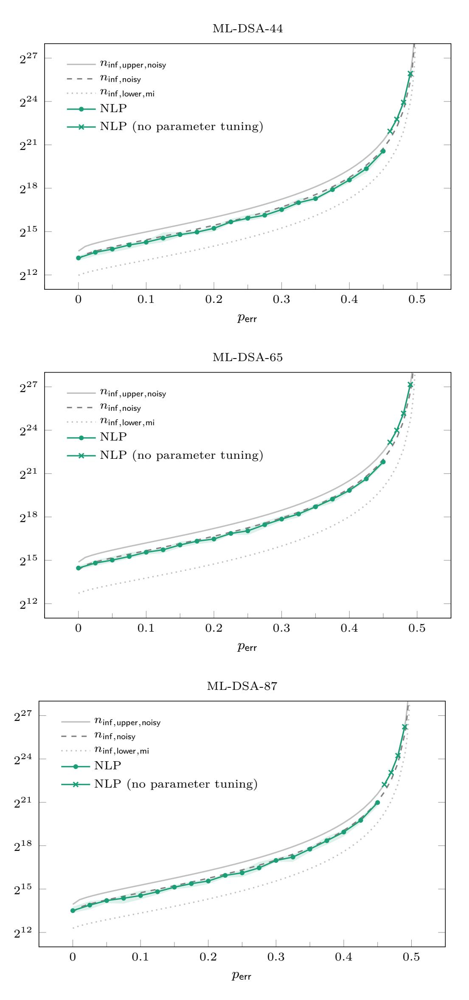

**Figure 5:** Estimates in the high-*λ* regime for the expected number of signatures required for key recovery, together with experimental results from [Figure 11](#page-38-0) for comparison.

{29}------------------------------------------------

## 5.1 ILP formulations

Fix a key  $x^* \in \mathcal{X}$  and let  $(c^{(i)}, z^{(i)}, \widetilde{y}_{\lambda}{}^{(i)})_{i=1}^{n_{\text{sig}}}$  be leaky signatures generated by independent runs of Algorithm 4.

#### **Exact leakage**

First we assume  $p_{\sf err} = 0$ . Let  $\mathcal{X}_{\sf cand} = \Xi_{\sf cand} \left( (c^{(i)}, z^{(i)}, \widetilde{y}_{\lambda}^{(i)})_{i=1}^{n_{\sf sig}} \right)$  be the set of candidate keys according to Definition 21 (a).

<span id="page-29-0"></span>Corollary 55. Let  $x \in \mathcal{X}$  and let  $(c, z, b) \in \mathcal{C} \times \mathbb{Z} \times \{0, 1\}$  be such that  $b = \text{bit}_{\lambda}(z - \langle c, x \rangle)$ . Set  $\overline{z} \coloneqq z \mod^{\mp} 2^{\lambda} \in [-2^{\lambda-1}, 2^{\lambda-1}) \cap \mathbb{Z}$  and  $\kappa(z, b) \coloneqq b \oplus \text{bit}_{\lambda}(z) \oplus \text{bit}_{\lambda-1}(z) \oplus 1 \in \{0, 1\}$ .

(a) There exists a unique  $u \in \mathbb{Z}$  such that

$$\overline{z} - \kappa(z, b) \cdot 2^{\lambda} + 1 \le \langle c, x \rangle + u \cdot 2^{\lambda + 1} \le \overline{z} - \kappa(z, b) \cdot 2^{\lambda} + 2^{\lambda}$$
.

We have 
$$u = \lfloor (\overline{z} - \langle c, x \rangle + 2^{\lambda})/2^{\lambda+1} \rfloor \in [-\nu, \nu] \cap \mathbb{Z}$$
, where  $\nu := \lceil (\beta - 2^{\lambda-1})/2^{\lambda+1} \rceil$ .

(b) If  $\lambda \ge \log_2(\beta) + 1$ , we have

$$\overline{z} + 1 - \kappa(z, b) \cdot (\overline{z} + 1 + \beta) \le \langle c, x \rangle \le \beta - \kappa(z, b) \cdot (\beta - \overline{z}).$$

*Proof.* This follows directly from Lemma 26 with  $s = \langle c, x \rangle$ .

We obtain the following integer linear program (feasibility problem) with  $256+n_{\rm sig}$  integer variables and  $n_{\rm sig}$  interval constraints.

<span id="page-29-1"></span>**ILP 1.** Find (x, u) subject to

$$\langle c^{(i)}, x \rangle + 2^{\lambda+1} u_i \ge \overline{z}^{(i)} - \kappa(z^{(i)}, \widetilde{y}_{\lambda}^{(i)}) 2^{\lambda} + 1$$
 for all  $i \in [n_{\text{sig}}]$ , 
$$\langle c^{(i)}, x \rangle + 2^{\lambda+1} u_i \le \overline{z}^{(i)} - \kappa(z^{(i)}, \widetilde{y}_{\lambda}^{(i)}) 2^{\lambda} + 2^{\lambda}$$
 for all  $i \in [n_{\text{sig}}]$ ,

where  $x \in ([-\eta, \eta] \cap \mathbb{Z})^{256}$  and  $u \in ([-\nu, \nu] \cap \mathbb{Z})^{n_{\text{sig}}}$ .

By Corollary 55, candidate keys  $x \in \mathcal{X}_{\mathsf{cand}}$  are in one-to-one correspondence with feasible solutions (x, u) of ILP 1, where  $u_i = \lfloor (\overline{z}^{(i)} - \langle c^{(i)}, x \rangle + 2^{\lambda})/2^{\lambda+1} \rfloor$  for  $i \in [n_{\mathsf{sig}}]$ .

Remark 56. In the high- $\lambda$  regime, we have  $\nu = \lceil (\beta - 2^{\lambda - 1})/2^{\lambda + 1} \rceil = 0$  and the *u*-variables can be eliminated from ILP 1, leading to a program with a constant number of variables. In this case, we have  $\mathcal{X}_{\mathsf{cand}} = \mathcal{P} \cap \mathbb{Z}^{256}$ , where  $\mathcal{P} \subset \mathbb{R}^{256}$  denotes the convex polytope given by the feasible region of the LP relaxation of ILP 1 (obtained by dropping the integrality constraints on x).

<span id="page-29-2"></span>Remark 57. In the low- $\lambda$  regime, where  $\nu = \lceil (\beta - 2^{\lambda - 1})/2^{\lambda + 1} \rceil > 1$ , it is possible to choose a smaller bound  $0 \le \widetilde{\nu} < \nu$  for the *u*-variables in ILP 1, effectively pruning the feasible region of ILP 1 and eliminating the *u*-variables altogether if  $\widetilde{\nu} = 0$ , as long as the true key  $x^*$  remains in the feasible region with high probability. For ML-DSA-44,  $\widetilde{\nu} = 1$  may be used for  $\lambda = 4, 5$ , and  $\widetilde{\nu} = 0$  for  $\lambda \ge 6$ . For ML-DSA-65,  $\widetilde{\nu} = 1$  may be used for  $\lambda = 5, 6, 7$ , and  $\widetilde{\nu} = 0$  for  $\lambda \ge 8$ . For ML-DSA-87,  $\widetilde{\nu} = 2$  may be used for  $\lambda = 4$ ,  $\widetilde{\nu} = 1$  for  $\lambda = 5, 6$ , and  $\widetilde{\nu} = 0$  for  $\lambda > 7$ .

#### **Noisy leakage**

Now we assume  $p_{\sf err} \geq 0$ . Let  $\mathcal{X}_{\sf ml} = \Xi_{\sf ml} \big( (c^{(i)}, z^{(i)}, \widetilde{y}_{\lambda}{}^{(i)})_{i=1}^{n_{\sf sig}} \big)$  be the set of most likely keys according to Definition 21 (b).

{30}------------------------------------------------

<span id="page-30-0"></span>Corollary 58. Let  $(c, z, b) \in \mathcal{C} \times \mathbb{Z} \times \{0, 1\}$ . Set  $\overline{z} := z \mod^{\mp} 2^{\lambda} \in [-2^{\lambda - 1}, 2^{\lambda - 1}) \cap \mathbb{Z}$  and  $\kappa(z, b) := b \oplus \operatorname{bit}_{\lambda}(z) \oplus \operatorname{bit}_{\lambda - 1}(z) \oplus 1 \in \{0, 1\}$ . Then, for every  $x \in \mathcal{X}$ , the inequalities

$$\overline{z} - \kappa(z, b) \cdot 2^{\lambda} + 1 \le \langle c, x \rangle + 2^{\lambda + 1} \cdot u + (-1)^{\kappa(z, b)} 2^{\lambda} \cdot v \le \overline{z} - \kappa(z, b) \cdot 2^{\lambda} + 2^{\lambda}$$

have a unique solution  $(u, v) \in \mathbb{Z} \times \{0, 1\}$  given by

$$u = \lfloor (\overline{z} - \langle c, x \rangle + 2^{\lambda})/2^{\lambda+1} \rfloor \in [-\nu, \nu] \cap \mathbb{Z} \quad and \quad v = 1_{b \neq \mathrm{bit}_{\lambda}(z - \langle c, x \rangle)},$$

where  $\nu := \lceil (\beta - 2^{\lambda - 1})/2^{\lambda + 1} \rceil$ .

*Proof.* Let  $x \in \mathcal{X}$  and  $y_{\lambda} := \operatorname{bit}_{\lambda}(z - \langle c, x \rangle)$ . We have  $y_{\lambda} = b \oplus v$  with  $v = 1_{b \neq \operatorname{bit}_{\lambda}(z - \langle c, x \rangle)}$ . We obtain  $\kappa(z, y_{\lambda}) = y_{\lambda} \oplus \operatorname{bit}_{\lambda}(z) \oplus \operatorname{bit}_{\lambda-1}(z) \oplus 1 = b \oplus v \oplus \operatorname{bit}_{\lambda}(z) \oplus \operatorname{bit}_{\lambda-1}(z) \oplus 1 = \kappa(z, b) + (-1)^{\kappa(z, b)}v$ . Now the corollary follows from Corollary 55 applied to  $(c, z, y_{\lambda})$ .  $\square$ 

We obtain the following integer linear program (minimization problem) with  $256 + n_{\text{sig}}$  integer variables,  $n_{\text{sig}}$  boolean variables, and  $n_{\text{sig}}$  interval constraints.

<span id="page-30-1"></span>**ILP 2.** Minimize  $\sum_{i=1}^{n_{\text{sig}}} v_i$  subject to

$$\begin{split} & \langle c^{(i)}, x \rangle + 2^{\lambda+1} u_i + (-1)^{\kappa(z^{(i)}, \widetilde{y}_{\lambda}{}^{(i)})} 2^{\lambda} v_i \geq \overline{z}^{(i)} - \kappa(z^{(i)}, \widetilde{y}_{\lambda}{}^{(i)}) 2^{\lambda} + 1 \quad \text{ for all } i \in [n_{\mathsf{sig}}] \,, \\ & \langle c^{(i)}, x \rangle + 2^{\lambda+1} u_i + (-1)^{\kappa(z^{(i)}, \widetilde{y}_{\lambda}{}^{(i)})} 2^{\lambda} v_i \leq \overline{z}^{(i)} - \kappa(z^{(i)}, \widetilde{y}_{\lambda}{}^{(i)}) 2^{\lambda} + 2^{\lambda} \quad \text{ for all } i \in [n_{\mathsf{sig}}] \,, \end{split}$$

where  $x \in ([-\eta, \eta] \cap \mathbb{Z})^{256}$ ,  $u \in ([-\nu, \nu] \cap \mathbb{Z})^{n_{\text{sig}}}$ , and  $v \in \{0, 1\}^{n_{\text{sig}}}$ .

By Corollary 58, most likely keys  $x \in \mathcal{X}_{\mathsf{ml}}$  are in one-to-one correspondence with optimal solutions (x, u, v) of ILP 2, where  $u_i = \lfloor (\overline{z}^{(i)} - \langle c^{(i)}, x \rangle + 2^{\lambda})/2^{\lambda+1} \rfloor$  and  $v_i = 1_{\widetilde{y}_{\lambda}^{(i)} \neq \mathrm{bit}_{\lambda}(z^{(i)} - \langle c^{(i)}, x \rangle)}$  for  $i \in [n_{\mathsf{sig}}]$ .

Remark 59. The boolean variables  $v_i$  capture bit-constraint violations. If  $p_{\text{err}} = 0$ , the minimum objective value is 0, obtained for v = 0, and ILP 2 becomes equivalent to ILP 1.

<span id="page-30-2"></span>Remark 60. By Corollary 58, any  $x \in \mathcal{X}$  can be easily lifted to a feasible solution (x, u, v) of ILP 2. This enables the development of tailored primal heuristics. For instance, given an optimal solution  $(\widehat{x}, \widehat{u}, \widehat{v}) \in \mathbb{R}^{256}$  of an LP relaxation of ILP 2, we may obtain  $x = \lfloor \widehat{x} \rfloor$  by rounding and lift it to a feasible solution, whereas the feasibility of  $(\lfloor \widehat{x} \rfloor, \lfloor \widehat{u} \rceil, \lfloor \widehat{v} \rceil)$  would not be guaranteed.

#### 5.2 Experiments

In each experiment, we assume that the bit index  $\lambda$  and the error probability  $p_{\text{err}}$  are fixed, and informative leaky signatures  $(c^{(i)}, z^{(i)}, \widetilde{y}_{\lambda}{}^{(i)})_{i=1}^{n_{\text{inf}}}$  are given that have been generated by Algorithm 4 with input  $x^*$ . To emphasize that only informative signatures are considered, we denote their count by  $n_{\text{inf}}$  rather than  $n_{\text{sig}}$ . By Lemma 35 (b), the expected number of leaky signatures required to obtain  $n_{\text{inf}}$  informative signatures is  $\mathbb{E}(N_{\text{sig}}) = n_{\text{inf}}/p_{\text{inf}}$ , where  $p_{\text{inf}}$  is given by Lemma 31 (b).

We implemented the ILP attacks using the Julia programming language [Julia] and the JuMP modeling language [JuMP]. We conducted our experiments with the open-source ILP solvers HiGHS [HiGHS] and SCIP [SCIP], the commercial ILP solver Gurobi [Gurobi], as well as the open-source constraint programming solver CP-SAT [CP-SAT].

State-of-the-art ILP optimizers typically rely on presolving, a branch-and-cut implementation combining the branch-and-bound algorithm with cutting planes, as well as various heuristics. In our experiments, we observed that ILP 1 with  $\nu=0$  (or  $\widetilde{\nu}=0$  as indicated in Remark 57) can be solved by all solvers using a moderate number of informative signatures, but ILP 1 with  $\nu>0$  and ILP 2 appear challenging for branch-and-cut implementations due to the additional variables u and v.

{31}------------------------------------------------

However, for ILP 1 we obtained good results by using Gurobi's feasibility pump heuristic (which is disabled by default) without the branch-and-cut procedure, which outperforms branch-and-cut implementations in terms of required signatures and also works for several parameters with  $\nu > 0$ . We obtained similar results with the constraint programming solver CP-SAT that seems to employ related heuristics. Therefore, we will only present results for Gurobi and CP-SAT below.

Figure 6 contains our experimental results for solving ILP 1 across various parameter sets and bit positions  $\lambda$ . In each parameter setting, we ran 10 experiments, gradually increasing the amount of informative signatures (in steps of 500) until the instance could be solved within a 10-minute time limit. Gurobi was running on a laptop with 4 logical cores and was configured in such a way that the feasibility pump heuristic was used exclusively. CP-SAT was executed on a server using 64 logical cores. For all instances, we used the heuristic bounds  $\widetilde{\nu}$  for the u-variables as indicated in Remark 57, although the effect seems to be limited. The results suggest that Gurobi is more efficient at higher bit indices, whereas CP-SAT performs better for low bit indices. However, the comparison should be interpreted cautiously, because different hardware was used.

Remark 61. In our experiments, we were unable to solve ILP 2 except for very small error probabilities  $p_{\sf err}$ . We also implemented some custom primal heuristics based on the observation in Remark 60. However, even with the correct solution provided as a hint, the solvers were not capable of proving optimality of the solution in a reasonable amount of time. Therefore, we suspect that ILP attacks are not adequate for solving Problem 1 with noisy leakage, unless major improvements can be found. In Section 6, we develop a tailored attack based on nonlinear programming that performs very well even in the presence of substantial noise.

## <span id="page-31-0"></span>6 Nonlinear programming

Fix a key  $x^* \in \mathcal{X}$  and let  $(c^{(i)}, z^{(i)}, \widetilde{y}_{\lambda}{}^{(i)})_{i=1}^{n_{\text{sig}}}$  be leaky signatures generated by independent runs of Algorithm 4. According to Lemma 25, the most likely keys are the solutions to the optimization problem

<span id="page-31-2"></span>
$$\mathcal{X}_{\mathsf{ml}} = \underset{x \in \mathcal{X}}{\arg\min} \sum_{i=1}^{n_{\mathsf{sig}}} \psi(t^{(i)}(x)), \qquad (NLP)$$

where  $\psi(t) = 1_{[-2^{\lambda},0)}(t \bmod^{\mp} 2^{\lambda+1})$  and  $t^{(i)}(x) = z^{(i)} - \widetilde{y}_{\lambda}{}^{(i)}2^{\lambda} - \langle c^{(i)}, x \rangle + \varepsilon$  with  $\varepsilon \in [0,1)$ . Lemma 25 only addresses the case  $\varepsilon = 0$ . Nevertheless, because all variables are integral, the result remains true for all  $\varepsilon \in [0,1)$ . We set  $\varepsilon \coloneqq \frac{1}{2}$  to achieve symmetry and maximize the distance between the images  $t^{(i)}(\mathcal{X}) \subset \frac{1}{2}\mathbb{Z}$  and the points of discontinuity of  $\psi$ , all of which are integral. In this way, when we approximate  $\psi$  by a continuous function  $\psi_{\mathsf{approx}}$  in Section 6.1, the approximation of the composed functions  $\psi_{\mathsf{approx}}(t^{(i)}(x)) \approx \psi(t^{(i)}(x))$  at points  $x \in \mathcal{X}$  is improved.

#### <span id="page-31-1"></span>6.1 Continuous optimization

Instead of solving (NLP) directly, we may consider the unconstrained continuous problem

<span id="page-31-3"></span>
$$\underset{x \in \mathbb{R}^{256}}{\arg\min} \sum_{i=1}^{n_{\text{sig}}} \psi_{\text{approx}} (t^{(i)}(x)) + \psi_{\text{penalty}}(x), \qquad (\text{NLP}_{\text{approx}})$$

where  $\psi_{\mathsf{approx}} \colon \mathbb{R} \to \mathbb{R}$  is an approximation of the step function  $\psi$  and  $\psi_{\mathsf{penalty}} \colon \mathbb{R}^{256} \to \mathbb{R}$  is a function designed to attain minimal values near  $\mathcal{X}$ . We then hope that solutions x to the transformed problem are close to  $\mathcal{X}_{\mathsf{ml}}$ , and ideally, that the rounded values |x| lie in  $\mathcal{X}_{\mathsf{ml}}$ .

{32}------------------------------------------------

<span id="page-32-0"></span>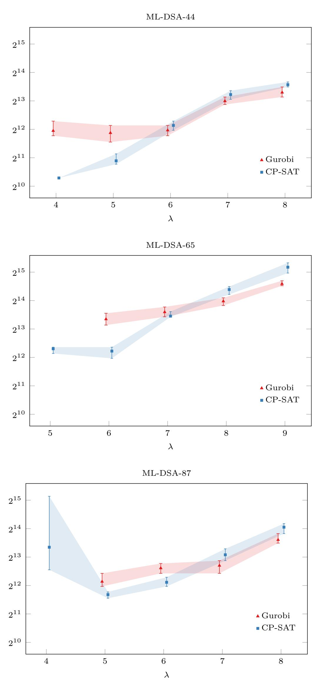

**Figure 6:** Number of informative signatures with exact leakage required for key recovery via solving [ILP 1](#page-29-1) using Gurobi's feasibility pump (4 cores) and CP-SAT (64 cores), each with a 10-minute time limit per experiment: minimum, maximum, and average value across 10 experiments per data point.

{33}------------------------------------------------

#### Differentiable approximation

Since the function  $\psi(t) = 1_{[-2^{\lambda},0)}(t \bmod^{\mp} 2^{\lambda+1})$  is  $2^{\lambda+1}$ -periodic and, except at its points of discontinuity, symmetric about the axis  $t = 2^{\lambda-1}$ , it is essentially determined by its restriction to  $[-2^{\lambda-1}, 2^{\lambda-1}]$ , where it coincides with the indicator function  $1_{[-2^{\lambda-1},0)}$ .

It is therefore natural to select for  $\psi_{\mathsf{approx}} \colon [-2^{\lambda-1}, 2^{\lambda-1}] \to \mathbb{R}$  a suitable continuous approximation of  $1_{[-2^{\lambda-1},0)}$ , and to extend it to a  $2^{\lambda+1}$ -periodic function  $\psi_{\mathsf{approx}} \colon \mathbb{R} \to \mathbb{R}$  that is symmetric about the axis  $t = 2^{\lambda-1}$ . To apply gradient-based algorithms, we require the function  $\psi_{\mathsf{approx}}$  to be not only continuous but also differentiable almost everywhere.

Concretely, once a function  $\psi_{\mathsf{approx}} \colon [-2^{\lambda-1}, 2^{\lambda-1}] \to \mathbb{R}$  has been chosen satisfying these properties, its extension  $\psi_{\mathsf{approx}} \colon \mathbb{R} \to \mathbb{R}$  is computed as

$$\psi_{\mathsf{approx}}(t) = \begin{cases} \psi_{\mathsf{approx}}(t \bmod^{\mp} 2^{\lambda+1}) & \text{if } t \bmod^{\mp} 2^{\lambda+1} \in [-2^{\lambda-1}, 2^{\lambda-1}) \,, \\ \psi_{\mathsf{approx}}((2^{\lambda} - t) \bmod^{\mp} 2^{\lambda+1}) & \text{otherwise} \,. \end{cases}$$

Remark 62. In practice, many choices for  $f = \psi_{\mathsf{approx}}|_{[-2^{\lambda-1},2^{\lambda-1}]}$  with a moderate slope near t=0 lead to satisfactory results; for example, the following functions with slope  $\approx -\frac{1}{2}$  at t=0 work well:

(a) 
$$f(t) = \Phi(-kt)^2$$
 with  $k \approx \sqrt{\pi/2}$ 

(b) 
$$f(t) = \Phi(-kt)$$
 with  $k \approx \sqrt{\pi/2}$ 

(c) 
$$f(t) = 1/(1 + \exp(kt))$$
 with  $k \approx 2$ 

(d) 
$$f(t) = \frac{1}{2} + \frac{1}{\pi} \arctan(-kt)$$
 with  $k \approx \pi/2$ 

The approximations (b) – (d) are the complementary cumulative distribution functions of the normal distribution with variance  $1/k^2$ , of the logistic distribution with parameter 1/k, and of the Cauchy distribution with parameter 1/k, respectively, all centered around 0; see [Wik25] for further details on approximations of the Heaviside step function. For a visualization of the approximations (a) – (d), see Figure 7.

<span id="page-33-0"></span>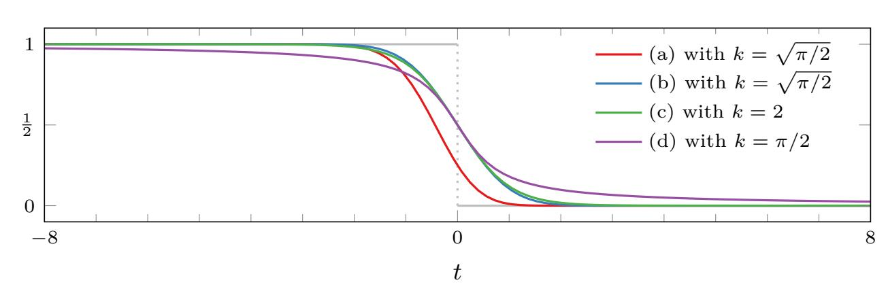

Figure 7: Examples for continuous approximations  $\psi_{\mathsf{approx}}$  of  $\psi$  on  $[-2^{\lambda-1}, 2^{\lambda-1}]$ .

In our experiments, we primarily used approximation (a), the squared version of (b), as it yielded slightly better results than using (b) directly. This choice also enabled us to test nonlinear least squares methods, such as the Levenberg–Marquardt algorithm.

Remark 63. Figure 8 presents exemplary coordinate slices of the objective function for the optimization problem (NLP), contrasting the formulation in terms of the exact  $\psi$  with the corresponding version based on the approximation  $\psi_{\text{approx}}$ . We observe that, when all but one coordinate are fixed to the true key (plots on the left), even a relatively small number  $n_{\text{sig}}$  of signatures yields a pronounced minimum at the value of the true key. Interestingly, when  $\lambda \geq 4$  for ML-DSA-44 and ML-DSA-87, or when  $\lambda \geq 5$  for ML-DSA-65, once  $n_{\text{sig}}$  becomes sufficiently large, a clear minimum still emerges at the true key even when the remaining coordinates are chosen at random (plots on the right).

{34}------------------------------------------------

<span id="page-34-0"></span>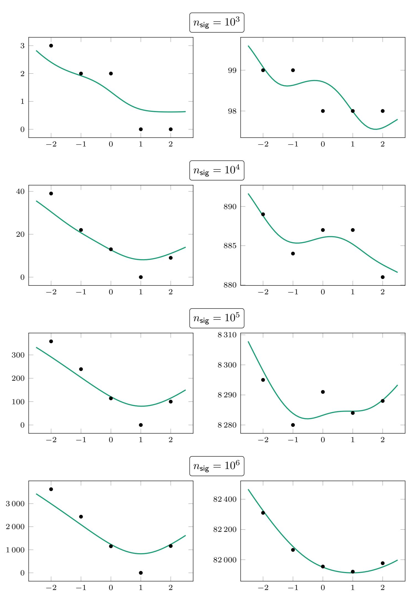

**Figure 8:** Coordinate slices  $x_j \mapsto \sum_{i=1}^{n_{\text{sig}}} \psi \left( t^{(i)}(x) \right)$  (dots) and  $x_j \mapsto \sum_{i=1}^{n_{\text{sig}}} \psi_{\text{approx}} \left( t^{(i)}(x) \right)$  (curves, scaled) with the other coordinates fixed either to the coordinates  $(x_{j'}^*)_{j' \neq j}$  of the true key (plots on the left) or to a random vector with entries in  $[-\eta, \eta] \cap \mathbb{Z}$  (plots on the right); example for the parameter set ML-DSA-44 with  $\lambda = 6$ ,  $p_{\text{err}} = 0$ , and  $x_j^* = 1$ .

{35}------------------------------------------------

#### **Soft constraints**

As the variable x varies continuously over all of  $\mathbb{R}^{256}$  in (NLP<sub>approx</sub>), the term  $\psi_{\text{penalty}}(x)$  in the objective function is intended to increase the likelihood that solutions are close to  $\mathcal{X}$ , and thereby, hopefully, also closer to  $\mathcal{X}_{\text{ml}}$  than they would be without this term.

Remark 64. In practice, when  $n_{\text{sig}}$  is sufficiently large, even setting  $\psi_{\text{penalty}} = 0$  turns out to be a reasonable choice. For smaller values of  $n_{\text{sig}}$ , using an appropriate  $\psi_{\text{penalty}}$  can significantly improve the chance of successful key recovery. In our experiments, we took

$$\psi_{\text{penalty}}(x) = w_{\text{int}} \, \psi_{\text{int}}(x) + w_{\text{box}} \, \psi_{\text{box}}(x) \,,$$

where  $\psi_{\text{int}}(x) = \sum_{j=1}^{256} \sin(\pi x_j)^2$  and  $\psi_{\text{box}}(x) = \sum_{j=1}^{256} (\Phi(k(-\eta_+ - x_j)) + \Phi(-k(\eta_+ - x_j)))$ . The functions  $\psi_{\text{int}}$  and  $\psi_{\text{box}}$  serve to penalize violations of integrality and box constraints, respectively. Typical parameter settings included  $w_{\text{int}} \approx \frac{1}{5}$ ,  $w_{\text{box}} \approx 5$ ,  $\eta_+ \approx \eta + \frac{1}{4}$ ,  $k \approx 40$ ; see Figure 9 for an illustration.

<span id="page-35-0"></span>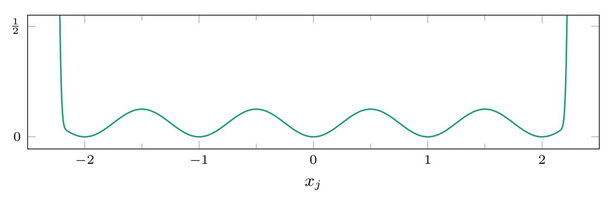

**Figure 9:** Coordinate slices  $\psi_{\text{penalty}}(0,\ldots,x_j,\ldots,0)$  in the situation  $\eta=2$  with parameter values  $w_{\text{int}}=\frac{1}{5},\ w_{\text{box}}=5,\ \eta_+=\eta+\frac{1}{4},\ k=40.$ 

## <span id="page-35-1"></span>6.2 Combinatorial optimization

Next, we try to solve (NLP) directly. Let G be a directed graph with vertex set  $\mathcal X$  and vertex weights

$$w(x) = \#\{i \in [n_{\mathsf{sig}}] \mid \widetilde{Y}_{\lambda}^{(i)} \neq \mathrm{bit}_{\lambda}(z^{(i)} - \langle c^{(i)}, x \rangle)\}$$

such that the minimal-weight vertices form the set  $\mathcal{X}_{ml}$  of most likely keys; see Definition 21. We can start a graph search at some vertex in  $\mathcal{X}$  with the goal of reaching a vertex in  $\mathcal{X}_{ml}$ . For simplicity, we define the set of edges in G as

$$\{(x, x') \in \mathcal{X}^2 \mid ||x - x'||_1 = 1, w(x') \le w(x)\},$$

and traverse the graph using a greedy best-first strategy: at each step, we process the lowest-weight reached vertex that remains unprocessed, expanding the search to its neighbors.

Remark 65. In practice, when  $n_{\text{sig}}$  is sufficiently large such that, in particular,  $\mathcal{X}_{\text{ml}} = \{x^*\}$  with high probability, the graph search typically reaches  $x^*$ . The search can be significantly accelerated by starting at a vertex near a solution to the continuous problem (NLP<sub>approx</sub>).

Remark 66. For all  $x, x' \in \mathcal{X}$  satisfying  $||x'-x^*||_1 < ||x-x^*||_1$  and, moreover,  $||x-x'||_1 = 1$ , so that  $x_j \neq x_j'$  for a unique index j, we have in the high- $\lambda$  regime

$$\mathbb{P}\big(\mathrm{bit}_{\lambda}(Z - \langle C, x \rangle) \neq \mathrm{bit}_{\lambda}(Z - \langle C, x^* \rangle) = \mathrm{bit}_{\lambda}(Z - \langle C, x' \rangle)\big) = \frac{p_{\inf}}{2\beta} \frac{\tau}{256} \cdot \mathbb{P}(T < t),$$

$$\mathbb{P}\big(\mathrm{bit}_{\lambda}(Z - \langle C, x \rangle) = \mathrm{bit}_{\lambda}(Z - \langle C, x^* \rangle) \neq \mathrm{bit}_{\lambda}(Z - \langle C, x' \rangle)\big) = \frac{p_{\inf}}{2\beta} \frac{\tau}{256} \cdot \mathbb{P}(T \ge t),$$

where T denotes the random variable  $\left(\sum_{i\neq j} C_i(x_i^*-x_i) \mid C_j\neq 0\right)$  and  $t=|x_j^*-x_j|>0$ . Note that the first probability is always at least as large as the second and, for most pairs x and x', it should in fact be strictly larger. This observation makes it plausible that, for sufficiently large  $n_{\text{sig}}$ , the graph search described above should indeed terminate at the true key  $x^*$  after not much more than  $||x_0 - x^*||_1$  steps, when started at the vertex  $x_0$ .

{36}------------------------------------------------

## 6.3 Experiments

In each experiment, we assume that the bit index  $\lambda$  and the error probability  $p_{\text{err}}$  are fixed, and informative leaky signatures  $(c^{(i)}, z^{(i)}, \widetilde{y}_{\lambda}^{(i)})_{i=1}^{n_{\text{inf}}}$  are given, having been generated by Algorithm 4 with input  $x^*$ . To emphasize that only informative signatures are considered, we denote their count by  $n_{\text{inf}}$  rather than  $n_{\text{sig}}$ . By Lemma 35 (b), the expected number of leaky signatures required to obtain  $n_{\text{inf}}$  informative signatures is  $\mathbb{E}(N_{\text{sig}}) = n_{\text{inf}}/p_{\text{inf}}$ , where  $p_{\text{inf}}$  is given by Lemma 31 (b). The goal is to recover the key  $x^*$  using only the signatures and the known values of  $\lambda$ . We approached each experiment as follows:

- (i) Solve the optimization problem (NLP<sub>approx</sub>) repeatedly, varying the functions  $\psi_{approx}$  and  $\psi_{penalty}$ , and the initial value of x in each repetition.
- (ii) Project the solutions found in (i) onto  $\mathcal{X}$  by rounding, and let  $\mathcal{X}_0$  denote the resulting set of key approximations. Select  $x_0 \in \arg\min_{x \in \mathcal{X}_0} w(x)$ .
- (iii) Start the graph search, as described in Section 6.2, from  $x_0$ . After running the search for a limited time, return the vertex  $\hat{x}$  with the lowest weight encountered. An experiment is regarded as successful if  $\hat{x}$  matches the true key  $x^*$ .

We implemented this NLP attack using the Julia programming language [Julia]. To solve the continuous optimization problem, we employed the first-order method LBFGS from the Optim.jl package [Optim.jl], to which we passed all gradient evaluations explicitly within our implementation. We additionally tested the first-order methods AdaMax, BFGS, ConjugateGradient, and GradientDescent, as well as the second-order method Newton provided by the same package. While these alternative methods usually yielded similarly reliable approximations, LBFGS tended to run more efficiently.

Figure 10 and Figure 11 present our experimental results across the various parameter sets, for exact and noisy leakage respectively. Reliable key recovery using this attack was achieved only when  $\lambda \geq 4$  for ML-DSA-44 and ML-DSA-87, and when  $\lambda \geq 5$  for ML-DSA-65. We performed this intricate procedure, consisting of steps (i) – (iii), solely to minimize the number of required signatures. With enough signatures available, a single run of either the continuous or combinatorial method typically suffices to recover the key. For noisy leakage with high error probabilities  $p_{\rm err} > 0.45$ , to accelerate the computations, we did not minimize the number of signatures but instead tested whether all experiments succeeded using the heuristic upper bound  $n_{\rm inf,upper}/(1-2\sqrt{p_{\rm err}(1-p_{\rm err})})$ ; see Remark 52, Remark 54, and Figure 1 for the values of  $n_{\rm inf,upper}$ . This test was successful except for ML-DSA-87 with  $\lambda = 4$  (where we adjusted the number of signatures by factors of 1.8 and 2, respectively, for  $0.45 < p_{\rm err} < 0.49$  and  $p_{\rm err} = 0.49$ ), and for a single outlier at  $p_{\rm err} = 0.48$  for ML-DSA-65 with  $\lambda = 8$  (where we applied an adjustment factor of 1.05).

Remark 67. In the case of exact leakage, a single run of the continuous or combinatorial method typically finishes in just a few seconds for sensible values of  $n_{\text{inf}}$ . For example, key recovery for ML-DSA-44 with  $(\lambda, n_{\text{inf}}) \in \{(4, 1500), (5, 3000), (6, 6000), (7, 9000), (8, 12000)\}$  typically took a few seconds and never exceeded one minute on a laptop (single-threaded execution). When  $n_{\text{inf}}$  is taken closer to the minimum value that still permits key recovery, the runtime of the combinatorial method increases significantly, while the continuous method may require more careful parameter tuning to succeed at all.

In the case of noisy leakage, by Remark 54, the number of informative signatures required for key recovery increases roughly proportional to  $1/(1-2\sqrt{p_{\sf err}(1-p_{\sf err})})$ , and we expect the runtime to grow accordingly. In experiments running the continuous method followed by the combinatorial method, for ML-DSA-44 with error probability  $p_{\sf err}=0.45$  and parameters  $(\lambda, n_{\sf inf}) \in \{(4, 200\,000), (5, 400\,000), (6, 800\,000), (7, 1\,600\,000), (8, 3\,200\,000)\}$ , recovering the key usually completed in a few minutes, not exceeding ten minutes.

{37}------------------------------------------------

<span id="page-37-0"></span>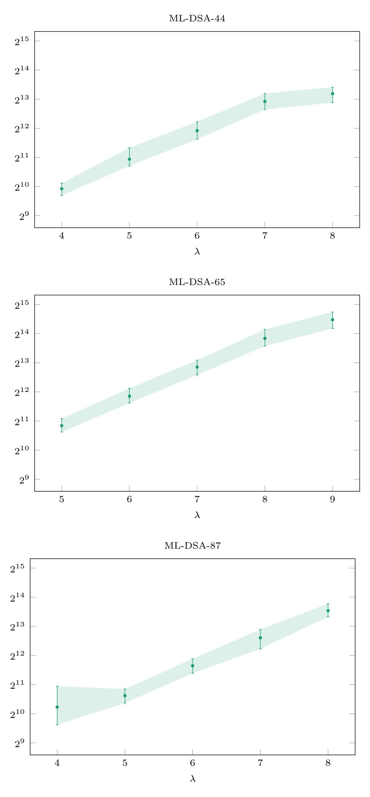

**Figure 10:** Number of informative signatures with exact leakage required for key recovery using the NLP attack: minimum, maximum, and average value across 100 experiments.

{38}------------------------------------------------

<span id="page-38-0"></span>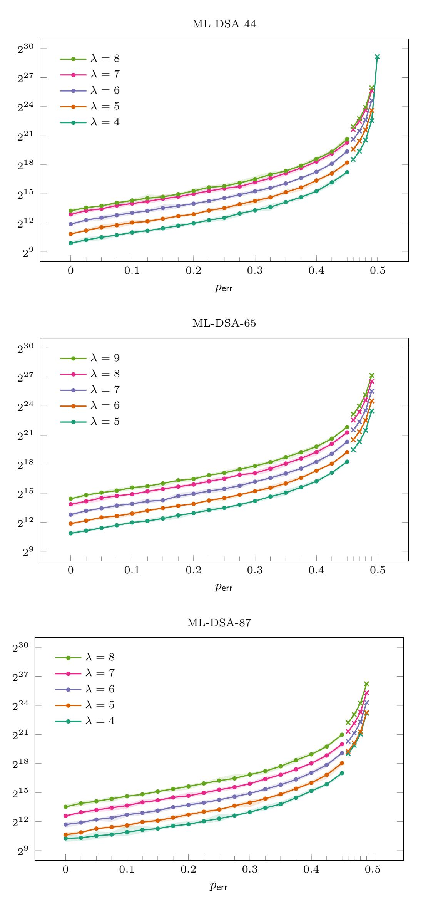

**Figure 11:** Number of informative signatures with noisy leakage required for key recovery using the NLP attack: minimum, maximum, and average value across 10 experiments per data point (dots), and value for which all out of 10 experiments succeeded (crosses).

{39}------------------------------------------------

Remark 68. With sufficient time and memory available, key recovery remains feasible even for relatively high values of  $p_{\sf err}$ . For example,  $p_{\sf err} = 0.49$  is still achievable for ML-DSA-44 with  $\lambda = 4$  and  $n_{\sf inf} = 6\,000\,000$ , taking less than ten minutes on a laptop (32 GB RAM).

Switching to compensated summation in the continuous method to reduce numerical errors and running the computation on a server (single-threaded, 512 GB RAM),  $p_{\sf err} = 0.49$  is achievable also for ML-DSA-44 and ML-DSA-87 with  $\lambda = 8$  and  $n_{\sf inf} = 100\,000\,000$ , as well as for ML-DSA-65 with  $\lambda = 9$  and  $n_{\sf inf} = 150\,000\,000$ , each taking less than an hour. The most favorable case is ML-DSA-44 with  $\lambda = 4$ . Here, the number of required signatures is especially small, and storage is more efficient as well, since for leaky signatures  $(c, z, \widetilde{y}_{\lambda})$  the value  $z \bmod^{\mp} 2^{\lambda+1}$  fits into one byte. In this setting, even for  $p_{\sf err} = 0.499$ , key recovery was still practicable with  $n_{\sf inf} = 600\,000\,000$ , taking less than half a day.

Note that these values are significantly better than the maximum value  $p_{\sf err}=0.43$  reported in [Dam+26, Section 8] and  $p_{\sf err}=0.45$  reported in [Sch+26, Table 4].

<span id="page-39-1"></span>Remark 69. Occasionally, but highly unreliably, both the continuous and combinatorial methods recovered the key for ML-DSA-44 with  $\lambda=3$ , given a relatively large number of signatures (50–100 thousand). This suggests that key recovery may still be feasible with  $\lambda$  somewhat below 4 for ML-DSA-44 and ML-DSA-87, and with  $\lambda$  somewhat below 5 for ML-DSA-65, although the methods presented here are no longer adequate.

The source code of our NLP implementation will be released at https://github.com/heurekos/LeakyMLDSA.jl.

## <span id="page-39-0"></span>7 Conclusion and open problems

We analyzed a leakage attack introduced in [Liu+21] and improved in [Dam+25a; Dam+26]. Through new attack methods based on integer linear programming and nonlinear programming, we substantially reduced the number of leaky signatures necessary for key recovery in practice. We supported these results with a thorough theoretical analysis, indicating that the number of signatures required for our attacks is nearly optimal.

The following aspects and open questions remain as objects of investigation for future research:

- 1. Can the results of Section 4.4 and Section 4.5 be rigorously extended to the low-  $\lambda$  regime? See Remark 52.
- 2. For noisy leakage with  $p_{\sf err} \gg 0$ , the estimate  $n_{\sf inf,upper,noisy}(p_{\sf err})$  exceeds the number of informative signatures required in the experiments by a substantially larger factor than  $n_{\sf inf,upper}$  does in the case of exact leakage. Can the estimate be improved?
- 3. As outlined in Remark 50, we do not believe that the bounds derived in Section 4.4 can be improved significantly using universal inequalities. However, there remains room for improvement in  $\Theta_{\text{upper}}$ . For example, might partitioning  $\sup(X X^*)$  and deriving separate lower and upper bounds on each part yield tighter bounds?
- 4. Can  $\min\{n_{\mathsf{inf}} \in \mathbb{N} \mid \mathbb{E}(\#\mathfrak{X}_{\mathsf{cand},\mathsf{inf}}) < 2\}$  be computed exactly rather than merely be bounded? For ML-DSA-44 and ML-DSA-87 in particular, this may be feasible.
- 5. For which  $\lambda$  are there practical attacks in the low- $\lambda$  regime? See Remark 69. But note that there are theoretical limits, e.g., the key cannot be fully recovered for  $\lambda = 0$ , where its entries can only be determined modulo 2.
- 6. Which other leakage models for the mask vector are relevant in practice and deserve investigation? For instance, initial experiments indicate that Hamming-weight leakage enables key recovery using on the order of a thousand signatures.

{40}------------------------------------------------

# **References**

- <span id="page-40-6"></span>[BP18] Leon Groot Bruinderink and Peter Pessl. "Differential Fault Attacks on Deterministic Lattice Signatures". In: *IACR Trans. Cryptogr. Hardw. Embed. Syst.* 2018.3 (2018), pp. 21–43. doi: [10.13154/TCHES.V2018.I3.21-43](https://doi.org/10.13154/TCHES.V2018.I3.21-43).
- <span id="page-40-10"></span>[CP-SAT] Laurent Perron and Frédéric Didier. *CP-SAT*. Version v9.12. Google, Feb. 17, 2025. url: [https : / / developers . google . com / optimization / cp / cp \\_](https://developers.google.com/optimization/cp/cp_solver/) [solver/](https://developers.google.com/optimization/cp/cp_solver/).
- <span id="page-40-7"></span>[CT06] Thomas M. Cover and Joy A. Thomas. *Elements of Information Theory*. 2nd. John Wiley & Sons, 2006. isbn: 978-0-471-24195-9.
- <span id="page-40-0"></span>[Dam+25a] Simon Damm, Nicolai Kraus, Alexander May, Julian Nowakowski, and Jonas Thietke. "One Bit to Rule Them All - Imperfect Randomness Harms Lattice Signatures". In: *Public-Key Cryptography - PKC 2025 - 28th IACR International Conference on Practice and Theory of Public-Key Cryptography, Røros, Norway, May 12-15, 2025, Proceedings, Part I*. Ed. by Tibor Jager and Jiaxin Pan. Vol. 15674. Lecture Notes in Computer Science. Springer, 2025, pp. 284–316. doi: [10.1007/978-3-031-91820-9\\_10](https://doi.org/10.1007/978-3-031-91820-9_10).
- <span id="page-40-1"></span>[Dam+25b] Simon Damm, Asja Fischer, Alexander May, Soundes Marzougui, Leander Schwarz, Henning Seidler, Jean-Pierre Seifert, Jonas Thietke, and Vincent Quentin Ulitzsch. "Solving Concealed ILWE and its Application for Breaking Masked Dilithium". In: *IACR Cryptol. ePrint Arch.* (2025), p. 1629. url: <https://eprint.iacr.org/archive/2025/1629/20250915:092747>.
- <span id="page-40-2"></span>[Dam+26] Simon Damm, Nicolai Kraus, Alexander May, Julian Nowakowski, and Jonas Thietke. "Less Than a Bit to Rule Them All – Key Recovery from Randomness Leakage in ML-DSA". In: *IACR Cryptol. ePrint Arch.* (2026). Version 20260218:095207. url: [https://eprint.iacr.org/archive/2025/](https://eprint.iacr.org/archive/2025/820/20260218:095207) [820/20260218:095207](https://eprint.iacr.org/archive/2025/820/20260218:095207).
- <span id="page-40-4"></span>[Dilithium] Shi Bai, Léo Ducas, Eike Kiltz, Tancrède Lepoint, Vadim Lyubashevsky, Peter Schwabe, Gregor Seiler, and Damien Stehlé. *CRYSTALS-Dilithium: Algorithm Specification and Supporting Documentation (Version 3.1)*. Round 3 Submission to the NIST Post-Quantum Cryptography Standardization Project. See [https://pq- crystals.org/dilithium/data/dilithium](https://pq-crystals.org/dilithium/data/dilithium-specification-round3-20210208.pdf)[specification-round3-20210208.pdf](https://pq-crystals.org/dilithium/data/dilithium-specification-round3-20210208.pdf). 2021.
- <span id="page-40-5"></span>[Duc+18] Léo Ducas, Eike Kiltz, Tancrède Lepoint, Vadim Lyubashevsky, Peter Schwabe, Gregor Seiler, and Damien Stehlé. "CRYSTALS-Dilithium: A Lattice-Based Digital Signature Scheme". In: *IACR Trans. Cryptogr. Hardw. Embed. Syst.* 2018.1 (2018), pp. 238–268. doi: [10.13154/TCHES.V2018.I1.238-268](https://doi.org/10.13154/TCHES.V2018.I1.238-268).
- <span id="page-40-3"></span>[FIPS204] National Institute of Standards and Technology. *Module-Lattice-Based Digital Signature Standard*. Federal Information Processing Standards Publication (FIPS) NIST FIPS 204. Washington, D.C.: U.S. Department of Commerce, 2024. doi: [10.6028/NIST.FIPS.204](https://doi.org/10.6028/NIST.FIPS.204).
- <span id="page-40-9"></span>[Gurobi] Gurobi Optimization, LLC. *Gurobi Optimizer Reference Manual*. 2025. url: <https://www.gurobi.com>.
- <span id="page-40-8"></span>[HiGHS] Qi Huangfu and J. A. J. Hall. "Parallelizing the dual revised simplex method". In: *Math. Program. Comput.* 10.1 (2018), pp. 119–142. doi: [10.1007/S12532-](https://doi.org/10.1007/S12532-017-0130-5) [017-0130-5](https://doi.org/10.1007/S12532-017-0130-5).

{41}------------------------------------------------

- <span id="page-41-6"></span>[HRG14] Annelie Heuser, Olivier Rioul, and Sylvain Guilley. "Good Is Not Good Enough - Deriving Optimal Distinguishers from Communication Theory". In: *Cryptographic Hardware and Embedded Systems - CHES 2014 - 16th International Workshop, Busan, South Korea, September 23-26, 2014. Proceedings*. Ed. by Lejla Batina and Matthew Robshaw. Vol. 8731. Lecture Notes in Computer Science. Springer, 2014, pp. 55–74. doi: [10.1007/978-3-662-](https://doi.org/10.1007/978-3-662-44709-3_4) [44709-3\\_4](https://doi.org/10.1007/978-3-662-44709-3_4).
- <span id="page-41-7"></span>[Julia] Jeff Bezanson, Alan Edelman, Stefan Karpinski, and Viral B Shah. "Julia: A fresh approach to numerical computing". In: *SIAM Review* 59.1 (2017), pp. 65–98. doi: [10.1137/141000671](https://doi.org/10.1137/141000671).
- <span id="page-41-8"></span>[JuMP] Miles Lubin, Oscar Dowson, Joaquim Dias Garcia, Joey Huchette, Benoît Legat, and Juan Pablo Vielma. "JuMP 1.0: Recent improvements to a modeling language for mathematical optimization". In: *Mathematical Programming Computation* (2023). doi: [10.1007/s12532-023-00239-3](https://doi.org/10.1007/s12532-023-00239-3).
- <span id="page-41-0"></span>[Liu+21] Yuejun Liu, Yongbin Zhou, Shuo Sun, Tianyu Wang, Rui Zhang, and Jingdian Ming. "On the Security of Lattice-Based Fiat-Shamir Signatures in the Presence of Randomness Leakage". In: *IEEE Trans. Inf. Forensics Secur.* 16 (2021), pp. 1868–1879. doi: [10.1109/TIFS.2020.3045904](https://doi.org/10.1109/TIFS.2020.3045904).
- <span id="page-41-3"></span>[Lyu09] Vadim Lyubashevsky. "Fiat-Shamir with Aborts: Applications to Lattice and Factoring-Based Signatures". In: *Advances in Cryptology - ASIACRYPT 2009, 15th International Conference on the Theory and Application of Cryptology and Information Security, Tokyo, Japan, December 6-10, 2009. Proceedings*. Ed. by Mitsuru Matsui. Vol. 5912. Lecture Notes in Computer Science. Springer, 2009, pp. 598–616. doi: [10.1007/978-3-642-10366-7\\_35](https://doi.org/10.1007/978-3-642-10366-7_35).
- <span id="page-41-4"></span>[Lyu24] Vadim Lyubashevsky. "Basic Lattice Cryptography: The concepts behind Kyber (ML-KEM) and Dilithium (ML-DSA)". In: *IACR Cryptol. ePrint Arch.* (2024), p. 1287. url: [https://eprint.iacr.org/archive/2024/](https://eprint.iacr.org/archive/2024/1287/20250618:125932) [1287/20250618:125932](https://eprint.iacr.org/archive/2024/1287/20250618:125932).
- <span id="page-41-5"></span>[Oli+25] Paco Azevedo Oliveira, Andersson Calle Viera, Benoît Cogliati, and Louis Goubin. "Uncompressing Dilithium's Public Key". In: *Advances in Cryptology - CRYPTO 2025 - 45th Annual International Cryptology Conference, Santa Barbara, CA, USA, August 17-21, 2025, Proceedings, Part I*. Ed. by Yael Tauman Kalai and Seny F. Kamara. Vol. 16000. Lecture Notes in Computer Science. Springer, 2025, pp. 417–443. doi: [10.1007/978- 3- 032- 01855-](https://doi.org/10.1007/978-3-032-01855-7_14) [7\\_14](https://doi.org/10.1007/978-3-032-01855-7_14).
- <span id="page-41-9"></span>[Optim.jl] Patrick Kofod Mogensen and Asbjørn Nilsen Riseth. "Optim: A mathematical optimization package for Julia". In: *Journal of Open Source Software* 3.24 (2018), p. 615. doi: [10.21105/joss.00615](https://doi.org/10.21105/joss.00615).
- <span id="page-41-1"></span>[Qia+23] Zehua Qiao, Yuejun Liu, Yongbin Zhou, Jingdian Ming, Chengbin Jin, and Huizhong Li. "Practical Public Template Attack Attacks on CRYSTALS-Dilithium With Randomness Leakages". In: *IEEE Trans. Inf. Forensics Secur.* 18 (2023), pp. 1–14. doi: [10.1109/TIFS.2022.3215913](https://doi.org/10.1109/TIFS.2022.3215913).
- <span id="page-41-2"></span>[Qia+24] Zehua Qiao, Yuejun Liu, Yongbin Zhou, Yuhan Zhao, and Shuyi Chen. "Single Trace is All It Takes: Efficient Side-channel Attack on Dilithium". In: *IACR Cryptol. ePrint Arch.* (2024), p. 512. url: [https://eprint.iacr.](https://eprint.iacr.org/archive/2024/512/20240414:015419) [org/archive/2024/512/20240414:015419](https://eprint.iacr.org/archive/2024/512/20240414:015419).

{42}------------------------------------------------

- <span id="page-42-1"></span>[Rav+18] Prasanna Ravi, Mahabir Prasad Jhanwar, James Howe, Anupam Chattopadhyay, and Shivam Bhasin. "Side-channel Assisted Existential Forgery Attack on Dilithium - A NIST PQC candidate". In: *IACR Cryptol. ePrint Arch.* (2018), p. 821. url: [https : / / eprint . iacr . org / archive / 2018 / 821 /](https://eprint.iacr.org/archive/2018/821/20180916:023812) [20180916:023812](https://eprint.iacr.org/archive/2018/821/20180916:023812).
- <span id="page-42-0"></span>[Sch+26] Carsten Schubert, Niklas Julius Müller, Jean-Pierre Seifert, and Marian Margraf. "Descent into Broken Trust: Uncovering ML-DSA Subkeys with Scarce Leakage and Local Optimization". In: *IACR Cryptol. ePrint Arch.* (2026), p. 472. url: [https : / / eprint . iacr . org / archive / 2026 / 472 /](https://eprint.iacr.org/archive/2026/472/20260306:220315) [20260306:220315](https://eprint.iacr.org/archive/2026/472/20260306:220315).
- <span id="page-42-3"></span>[SCIP] Suresh Bolusani, Mathieu Besançon, Ksenia Bestuzheva, Antonia Chmiela, João Dionísio, Tim Donkiewicz, Jasper van Doornmalen, Leon Eifler, Mohammed Ghannam, Ambros Gleixner, Christoph Graczyk, Katrin Halbig, Ivo Hedtke, Alexander Hoen, Christopher Hojny, Rolf van der Hulst, Dominik Kamp, Thorsten Koch, Kevin Kofler, Jurgen Lentz, Julian Manns, Gioni Mexi, Erik Mühmer, Marc E. Pfetsch, Franziska Schlösser, Felipe Serrano, Yuji Shinano, Mark Turner, Stefan Vigerske, Dieter Weninger, and Lixing Xu. *The SCIP Optimization Suite 9.0*. Technical Report. Optimization Online, Feb. 2024. url: [https://optimization-online.org/2024/02/the-scip](https://optimization-online.org/2024/02/the-scip-optimization-suite-9-0/)[optimization-suite-9-0/](https://optimization-online.org/2024/02/the-scip-optimization-suite-9-0/).
- <span id="page-42-2"></span>[Sta12] Richard P. Stanley. *Enumerative combinatorics. Volume 1*. Second. Cambridge Studies in Advanced Mathematics. Cambridge University Press, Cambridge, 2012, pp. xiv+626. isbn: 978-1-107-60262-5.
- <span id="page-42-4"></span>[Wik25] Wikipedia contributors. *Heaviside step function — Wikipedia, The Free Encyclopedia*. 2025. url: [https : / / en . wikipedia . org / w / index . php ?](https://en.wikipedia.org/w/index.php?title=Heaviside_step_function&oldid=1321323296) [title=Heaviside\\_step\\_function&oldid=1321323296](https://en.wikipedia.org/w/index.php?title=Heaviside_step_function&oldid=1321323296).