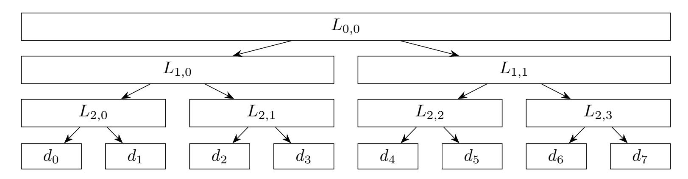
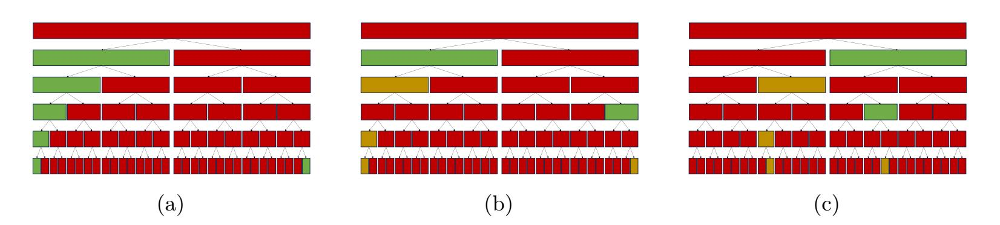
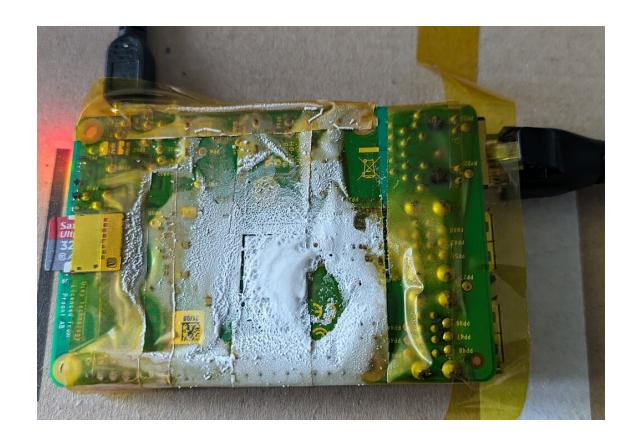
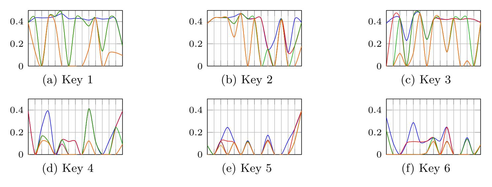
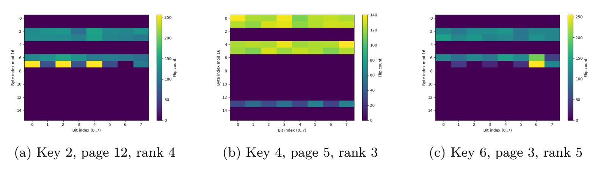

{0}------------------------------------------------

# FrozenTRU: Cold Boot Attacks on NTRU-Based Hash-and-Sign Signatures

Hiroto Kaihara<sup>1</sup>, Mehdi Tibouchi<sup>1,2</sup> and Masayuki Abe<sup>1,2</sup>

Kyoto University, Kyoto, Japan
 kaihara.hiroto.58s@st.kyoto-u.ac.jp
 NTT Social Informatics Laboratories, Tokyo, Japan
 {mehdi.tibouchi,msyk.abe}@ntt.com

**Abstract.** Cold boot attacks, first introduced by Halderman et al. (USENIX'08), are a class of attacks that aim at recovering cryptographic secrets stored in volatile memory after a computer is powered off, using the fact that DRAM modules retain their contents to a large extent for some time, especially at low temperatures. Cold boot attackers can recover the original contents of memory with some flipped bits, with bit flip probabilities of < 10% for one-to-zero and much lower (< 0.1%) for zero-to-one shown to be easily achievable. The cryptanalytic goal is then to recover full secret keys based on this noisy data. Successful key recoveries from cold boot attacks have been shown to be feasible for various symmetric and public-key schemes, including AES, RSA, and more recently some lattice-based encryption schemes with secret keys stored in the number-theoretic transform (NTT) domain.

In this paper, we investigate cold boot attacks against NTRU-based signature scheme FALCON and its ancestor, the signature scheme of Ducas-Lyubashevsky-Prest (DLP). Those schemes significantly differ from other schemes previously considered for cold boot attacks, since, in particular, the memory representation of secret signing keys mostly consists of floating point values. As a result, the various relations existing between key coefficients only hold up to floating point errors, which makes key recovery more complex. Nevertheless, at the typical bit flip probabilities achievable with cold boot attacks, we manage to fully recover FALCON and DLP keys with good probability across all parameters in simulations carried out in a simple bit flip model. Furthermore, we validate our techniques using concrete cold boot experiments againt FALCON on a Raspberry Pi single board computer.

Finally, we propose countermeasures with negligible computational cost that significantly reduce the memory footprint of signing keys for FALCON and DLP, and at the same time make cold boot attacks considerably harder.

**Keywords:** Cold boot attack · Post-quantum cryptography · NTRU lattice · Symplecticity · Floating-point numbers

#### <span id="page-0-0"></span>1 Introduction

After a multi-year selection process, NIST has recently selected several postquantum cryptographic schemes for standardization: the key encapsulation mechanisms Kyber (now standardized as ML-DSA) and HQC, and the signature schemes Sphincs+ (now standardized as SLH-DSA), Dilithium (now standardized as ML-DSA) and FALCON (to be standardized as FN-DSA). Following these recent and upcoming standardizations, it is likely to see those schemes widely deployed in the near future. Therefore, it is crucial to investigate their security with respect to real-world attacks, including side-channels, fault injection and other classes of physical threats.

{1}------------------------------------------------

A number of works have already been devoted to the security of these schemes with respect to classical side-channels (power and EM analysis) [PP19, RRCB20, HHP<sup>+</sup>21, BDH<sup>+</sup>21, UMTS24, RRD<sup>+</sup>23, UMB<sup>+</sup>23, TUX<sup>+</sup>23, SLKG23], micro-architectural side-channels [CWS<sup>+</sup>24, BBB<sup>+</sup>25, WCW<sup>+</sup>25, CSGHA25] and some classes of fault injection attacks [EFGT16, BP18, RJH<sup>+</sup>19, RRB<sup>+</sup>19, XIU<sup>+</sup>21, IMS<sup>+</sup>22, RYB<sup>+</sup>23]. Other classes of physical attacks like *cold boot attacks* have also been considered against some schemes, but have received less attention overall.

Cold boot attacks, introduced by Halderman et al. at USENIX'08 [HSH+08], are based on the phenomenon of DRAM data remanence, whereby the contents of DRAM memory modules in a computer (which in normal operation require regular refresh in order not to lose their state) actually persists for some time after power is cut off, and does so for longer periods of time at lower temperatures. This enables an attacker to recover a close copy of memory by forcing power down, rapidly cooling down the memory modules (e.g., with canned air duster spray), and reading them back after restart into a dedicated operating system, thus bypassing security measures like disk encryption (which are much more widespread than the encryption of volatile memory itself). However, the information retrieved from memory during a cold boot attack is inherently noisy, since the data in DRAM cells gradually decays towards a "ground state" (either 0 or 1) determined by the physical characteristics of the memory (at a rate that heavily depends on the temperature). The attacker's cryptanalytic challenge is thus to recover entire keys from this noisy data.

#### 1.1 Our Contributions

In this paper, we tackle this challenge for Falcon [PFH<sup>+</sup>22], the hash-and-sign signature based on NTRU lattices selected by NIST for upcoming standardization, as well as for the signature scheme of Ducas–Lyubashevsky–Prest (DLP) [DLP14] which is regarded as Falcon's ancestor. Compared to other NIST lattice-based KEMs and signatures, the schemes feature a particularly rich and complex memory representation for secret keys, most of which actually consists of floating point values. As such, they present interesting and unique difficulties from the perspective of cold boot attacks. To the best of our knowledge, this works is the first to consider cold boot attacks involving floating point values. Our primary contributions are outlined below.

Theoretical analysis of element relationships. Our contribution includes a theoretical analysis of the relationships among various elements within the secret keys of both DLP and Falcon. We identify pairs of elements with simple relationships within the DLP secret key's two  $2N \times 2N$  matrices as well as in the so-called Falcon tree. Specifically, in the case of Falcon, we find that, up to floating point errors, certain pairs of elements have identical values, others have their products equal to a constant, and other still have a known ratio. Similarly, again up to floating point errors, one of the DLP secret matrices contains pairs of elements with constant ratio, and the other secret matrix contains many repeated values.

**Error correction algorithm for floating-point numbers.** We devise a novel ad hoc algorithm to efficiently remove noise from secret keys stored as floating point numbers. A core component of this algorithm is a pruned search algorithm that leverages the mathematical relationships between two floating-point numbers to facilitate noise elimination. This method is used multiple times throughout the secret key recovery process.

**Experimental validation.** We demonstrate that our proposed methodology can recover the secret keys with good probability even under bit-flip rates that are considered easily achievable in actual cold boot attack scenarios. This finding highlights a significant

{2}------------------------------------------------

potential threat to physical security of lattice-based cryptography that relies on floatingpoint number representations.

#### **1.2 Related Work**

**Cold boot attacks on lattice-based schemes.** While cold boot attacks have historically been explored against pre-quantum schemes like RSA [\[HS09,](#page-22-3) [HMM10,](#page-22-4) [PPS12\]](#page-23-6) and discrete logarithm-based cryptosystems [\[PS15\]](#page-23-7), their applications to the lattice-based cryptography began with Paterson and Villanueva–Polanco's investigation into NTRU [\[PV17\]](#page-23-8). Subsequently, Albrecht, Deo, and Paterson proposed a cold boot attack methodology against Kyber [\[ADP18\]](#page-21-7). Their research highlighted a unique characteristic of Kyber (namely, that keys are stored in the NTT domain) which reduced the complexity of the attack at the cost of some success rate. Building upon this line of work, Esser et al. [\[EMVW22\]](#page-21-8) advanced the state of the art by proposing a new practical key recovery attack that remains effective even under significantly higher levels of information loss. Their method constructs a reduced-dimensional LWE instance from the public key and the extracted noisy secrets, and solves it using lattice-reduction techniques or a meet-in-the-middle strategy. Notably, under an asymmetric error model motivated by cold boot attacks, they demonstrated that full key recovery is still feasible when around 27% of the secret key bits are flipped, assuming the attacker can carry out a lattice reduction with complexity 2 <sup>80</sup>. These attacks typically target secret keys composed of integers; in particular, secret keys for the NTRU KEM have coefficients restricted to 0, +1, or −1. In contrast, our work focuses on secret keys involving floating-point numbers, necessitating a novel approach.

**Side-channel attacks on Falcon.** Recently, various side-channel attacks have been attempted against Falcon, and several vulnerabilities have been reported. In the context of physical attacks, a known-plaintext attack exploiting electromagnetic measurements was demonstrated by Karabulut and Aysu [\[KA21\]](#page-22-5). Later, a power analysis attack capable of recovering the secret key was proposed by Zhang et al. [\[ZLYW23\]](#page-24-7). Shao et al. [\[SLSZ25\]](#page-24-8) investigated key recovery from partial information, showing that it is possible to reconstruct the secret key of Falcon–512 from 400 coefficients of *f*, and of Falcon–1024 from 910 coefficients. While their approach shares similarities with ours in the sense that it aims to reconstruct the full key from incomplete information, our work assumes a different setting in which random *bit* flips may occur at arbitrary, unknown positions in the memory representation of the key. In terms of key recovery using bit flips, a fault attack leveraging the Rowhammer technique has been proposed [\[HPT25\]](#page-22-6): by flipping certain bits in Falcon's hardcoded reverse cumulative distribution table (RCDT) to zero, the attacker induces a bias in the distribution of generated signatures and exploits this bias to recover the secret key. Remarkably, this attack can succeed with just a single bit flip, though it requires millions of signatures.

#### **1.3 Technical Overview**

Our method to recover secret keys represented as floating-point numbers primarily involves two steps. First, we identify related elements within the key structure, and second, we leverage these relationships to revert bit flips introduced during a cold boot attack. We provide an overview of each step here.

**Identifying relationships among elements.** Certain mathematical relations exist between the elements of the matrices that make up the secret keys in both the DLP signature scheme and Falcon. The most important ones can be briefly described as follows, with full details are provided in [§3.](#page-8-0) We stress that in all cases, relations between floating point values only hold up to floating point errors.

{3}------------------------------------------------

- The Z-basis matrix **B** in the DLP signature scheme is anticirculant, which implies the equality up to sign of elements in the same shifted diagonal.
- The basis of an NTRU lattice is known to possess a so-called *q*-symplectic symmetry, as does its Gram–Schmidt orthogonalization (GSO) [\[GHN06\]](#page-21-9). A consequence of that symmetry is that the last row of the GSO basis **B**˜ in DLP is collinear to a suitable permutation of the first row (and similarly between the second-to-last row and the second row, and so on).
- The Falcon basis matrix **B**ˆ consists of 4 ring elements *f, g, F, G* (all expressed in FFT form) such that *fG*−*gF* = *q* (where *q* is a known rational integer). This relation over the ring translates to the same relation between each 4-tuple of corresponding FFT coefficients. Since the FFT coefficients are themselves complex numbers represented by two floating-point values, the equation effectively relates 8 floating-point numbers, making it a weaker constraint.
- The Falcon tree, a binary tree with ring elements at each internal node and realvalued standard deviations at leaf nodes, exhibits symmetrical values, differing only by a sign flip. Furthermore, the absolute values of the FFT coefficients of the polynomials, as well as the ratio between their real and imaginary parts, can be predetermined.

**Correcting bit flips using element relationships.** If the product of two positive elements *x* and *y* is known to be *p*, and their cold-booted counterparts *x* ′ and *y* ′ do not satisfy this relationship, it indicates bit flips. To correct these, we propose a pruning-based search algorithm. Starting from the most significant bit, we recursively explore four patterns for the *d*-th bit of *x* and *y*: (0,0),(0,1),(1,0),(1,1), shifting focus to the next lower bit.

Since a simple brute-force search for *n*-bit numbers would incur an *O*(4*<sup>n</sup>*) cost, we employ two pruning strategies:

- *Impossibility of Target Value*: if it becomes clear that even setting all lower-order bits to 1 will not exceed the target product (or ratio), the branch is pruned.
- *Bit Flip Likelihood Threshold*: given that the number of bit flips in two elements is typically limited, we calculate and accumulate the log-likelihood of bit-flips at each digit. If this accumulated log-likelihood falls below a predefined threshold (which we set to −15*.*0 for DLP and to −30*.*0 for Falcon), the branch is pruned to avoid exploring highly improbable scenarios.

*Remark* 1*.* At a high-level, the key recovery process from any cold boot attack can be seen as a decoding (or error correction) problem with respect to a more or less structured code (namely, the code that associates to the original secret key the corresponding public key together with the "decayed" secret key with bit flips). Side-channel analysis has been considered through that lens in works such as [\[HRG14\]](#page-22-7), and cold boot attacks are in some sense similar. However, computing or even approximating information-theorically optimal distinguishers in our setting is likely hopeless, because carrying out key enumeration is computationally way too expensive. This is why we have to rely on ad hoc recovery algorithms as opposed to generic methods. We do note, however, that part of our attack (namely, the decoding of floating point values) does rely on maximum-likelihood estimates similar in spirit to those ideas.

{4}------------------------------------------------

#### 2 Preliminaries

#### 2.1 Notation

We denote by  $\mathcal{R}$  the polynomial ring  $\mathbb{Z}[x]/(x^N+1)$ , which serves as the primary setting for computations in the context of NTRU lattices. In this paper, most polynomial operations are performed in  $\mathbb{Z}[x]/(x^N+1)$ , so we omit writing 'mod  $(x^N+1)$ ' explicitly. We also denote the ring of integers modulo q by  $\mathbb{Z}_q$ , as well as the corresponding quotient polynomial ring  $\mathbb{Z}_q[x]/(x^N+1)$  by  $\mathcal{R}_q$ .

We denote by  $f^*$  the adjoint polynomial of f, defined as follows:

$$f^* = f_0 - \sum_{i=1}^{N-1} f_{N-i} x^i.$$

The (nega-cyclic) FFT representation of  $f \in \mathcal{R}$  is given by:

$$\mathsf{FFT}(f) = \big( f(\zeta_i) \big)_{0 \le i \le N},$$

where each  $\zeta_i$  satisfies  $\zeta_i^N = -1$ . Throughout this paper, we use this type of FFT. Note that under this representation, the FFT coefficients of  $f^*$  are the complex conjugates of those of f.

To concretely represent lattices defined by polynomials, we use matrix representations. We introduce two ways to represent polynomials by matrices here. One is what we denote by  $\mathcal{A}_N$ , in which polynomials are represented by anti-circulant matrix. The other is what we denote by  $\mathcal{B}_N$ , in which the coefficients of the polynomial are sorted in bit-reversal order. Note that we may simply denote them by  $\mathcal{A}(f)$  and  $\mathcal{B}(f)$  when the value of N is clear from context.

In this paper, we deal with many values represented in floating-point format. For  $x \in \mathbb{R}$ , we denote by  $\mathsf{bit}(x,d) \in \{0,1\}$  the d-th least significant bit (0-indexed) of the floating-point representation of x. We also denote by  $\mathsf{flipbit}(x,d,0)$  the value obtained by replacing the d-th least significant bit of x with 0.

#### <span id="page-4-0"></span>2.2 Overview of NTRU Lattice-Based Signature Schemes

A secure lattice-based hash-and-sign signature scheme was first constructed by Gentry, Peikert, and Vaikuntanathan (so-called GPV framework) [GPV08]. They proposed a method to get a lattice vector close to a specific target (usually a vector not included in the lattice) without revealing any information of secret trapdoor. This enables the signature system to generate sufficiently short vectors which pass the verification process. Although similar methods were invented prior to this seminal work [GGH97, HHP+03], they had security flaws that information of trapdoor can be revealed by analyzing the distribution of signatures. GPV framework was groundbreaking in that they eliminated such vulnerabilities by introducing randomized lattice Gaussian sampling.

#### 2.2.1 The DLP Signature Scheme

Ducas, Lyubashevsky and Prest instantiated GPV framework and constructed a practical signature scheme as a byproduct of an IBE scheme, to which we refer as the DLP signature scheme, by means of NTRU lattices [DLP14]. This kind of lattices are convenient since they reduce both the size of public keys and the computation cost dramatically. We can construct an NTRU lattice by using two polynomials  $f, g \in \mathcal{R}$  (f needs to be invertible modulo g) and other two polynomials  $f, g \in \mathcal{R}$  that is determined by f, g to satisfy the following equation: fG - gF = g. We define another polynomial  $h = gf^{-1} \pmod{g} \in \mathcal{R}_g$ 

{5}------------------------------------------------

to obtain two identical lattices  $\mathbf{A} = \begin{pmatrix} \mathcal{A}(h) & I_N \\ qI_N & O \end{pmatrix}$  and  $\mathbf{B} = \begin{pmatrix} \mathcal{A}(g) & -\mathcal{A}(f) \\ \mathcal{A}(G) & -\mathcal{A}(F) \end{pmatrix}$ . The basis

A has so large an orthogonal defect that it is hard to get a "good" lattice basis like B from it. The security of the signature scheme stems from this asymmetric relationship between two bases.

Let us briefly explain how the DLP signature scheme works. The signer retains the basis matrix  $\mathbf{B} \in \mathbb{Z}^{2N \times 2N}$  as a secret key, as well as its *Gram-Schmidt orthogonalization*  $\tilde{\mathbf{B}} \in \mathbb{R}^{2N \times 2N}$  to make the sampling processes more efficient. The polynomial h is opened as a public key. The signature of the message m is computed as follows:

- 1. Hash the message m to a lattice point modulo q:  $t \leftarrow H(m) \in \mathbb{Z}_q^N$ .
- 2. Sample a point which belongs to the lattice defined by **B** which is close to  $(t,0) \in \mathbb{Z}_q^{2N}$ .
- 3. Calculate the gap between (t,0) and the sampled lattice point. The resulted vector  $(s_1, s_2)$  is the signature.

The verifier can verify the signature vector  $(s_1, s_2)$  by checking that it is sufficiently short and that it satisfies  $s_1 + s_2 \cdot h = H(m)$ .

#### **2.2.2** Falcon

FALCON was constructed by combining the ideas of the DLP signature scheme with Fast Fourier sampling, which was subsequently proposed by Ducas and Prest [DP16]. This novel sampling algorithm eliminates the bottleneck in the DLP signature scheme, reducing the whole time complexity from  $O(N^2)$  to  $O(N \log N)$ . A distinguishing feature of FALCON is that most of operations are performed in the FFT domain. This is why all the polynomials appearing in the secret key are represented in FFT form.

Let us take a closer look at the secret key used in FALCON. Just like in the DLP signature scheme, a basis  $\bf B$  is included in the secret key, but it is represented in FFT form of four polynomials rather than as a matrix. We denote this form of the basis by  $\bf \hat{\bf B}$ :

$$\hat{\mathbf{B}} = \begin{pmatrix} \mathsf{FFT}(g) & -\mathsf{FFT}(f) \\ \mathsf{FFT}(G) & -\mathsf{FFT}(F) \end{pmatrix}.$$

Moreover, we have a counterpart to the GSO matrix  $\tilde{\mathbf{B}}$  from the DLP signature scheme to make the sampling procedure more efficient, although it looks quite different. The structure, known as the FALCON tree, places an N-degree polynomial at the root, and as the levels descend, the degree of each polynomial is halved while the number of nodes doubles. To explain the construction of the FALCON tree, we need to introduce the concept of LDL decomposition tree. If we are given a self-adjoint polynomial D, its LDL decomposition tree can be constructed in the following way:

- 1.  $D^{(e)}, D^{(o)} := \text{splitfft}(D)$
- 2. Apply the LDL decomposition to get 3 polynomials  $L, D_0, D_1$  such that:

$$\begin{pmatrix} D^{(e)} & D^{(o)} \\ D^{(o)*} & D^{(e)} \end{pmatrix} = \begin{pmatrix} 1 & 0 \\ L & 1 \end{pmatrix} \begin{pmatrix} D_0 & 0 \\ 0 & D_1 \end{pmatrix} \begin{pmatrix} 1 & L^* \\ 0 & 1 \end{pmatrix}.$$

3. Place L at the root, and let the left and right children be the LDL decomposition trees of  $D_0$  and  $D_1$ , respectively.

A visual representation of the LDL decomposition tree is provided in Fig. 1. Each layer contains the same total number of coefficients. The polynomials that appear in the nodes of this tree are closely related to the LDL decomposition of the bit-reversal matrix

{6}------------------------------------------------

representation  $\mathcal{B}(D)$ . Let **L** be the lower-triangular matrix that appears in the LDL decomposition of  $\mathcal{B}(D)$ ; it can be further decomposed as follows:

$$\mathbf{L} = \mathscr{B}_8(L_{0,0}) \begin{pmatrix} \mathscr{B}_4(L_{1,0}) & 0 & 0 & 0 & 0 \\ 0 & \mathscr{B}_4(L_{1,1}) \end{pmatrix} \begin{pmatrix} \mathscr{B}_2(L_{2,0}) & 0 & 0 & 0 \\ 0 & \mathscr{B}_2(L_{2,1}) & 0 & 0 \\ 0 & 0 & \mathscr{B}_2(L_{2,2}) & 0 \\ 0 & 0 & 0 & \mathscr{B}_2(L_{2,3}) \end{pmatrix}$$

where 
$$\mathscr{B}_n(M) = \begin{pmatrix} I_n & O_n \\ \mathcal{B}_n(M) & I_n \end{pmatrix}$$
.

The FALCON tree is the LDL decomposition tree of the Gram matrix  $\mathbf{G} = \mathbf{B}\mathbf{B}^*$ . We should note that, since  $\mathbf{G}$  is originally a self-adjoint  $2 \times 2$  matrix, splitfft is not performed at the first layer. With this definition, the lower-triangular matrix that appears in the LDL decomposition of  $\mathbf{G}$  is identical to the  $\mu$ -matrix in the Gram-Schmidt orthogonalization of  $\mathbf{B}$ . Therefore, the nodes of the FALCON tree are the components resulting from the decomposition of the  $\mu$ -matrix. In this sense, the FALCON tree corresponds to  $\hat{\mathbf{B}}$  in the DLP signature scheme.

Finally, we must note that a distinct definition is applied to the leaf elements. It originally corresponds to the diagonal values of the LDL decomposition, but it is replaced with  $\sigma/\sqrt{d}$  when we denote the original value by d and the standard deviation of Gaussian sampling by  $\sigma$ .

#### <span id="page-6-1"></span>2.3 Cold Boot Attack Model

As we mentioned in §1, we will work on simulating cold boot attacks on the secret keys of NTRU lattice-based signature schemes. We establish the attack simulation settings as follows, based on several previous works.

First, we assume the adversary can obtain a noisy version of the secret key, putting aside the important problem of its location. We also assume that the corresponding public key is known to the adversary without noise. The attacker is, of course, expected to know the structure of the secret key and the public key because details on the implementation are openly accessible.

In the cold boot setting, there is a difference in the bit-flip rates moving to the ground state and moving away from the ground state. The bit-flip to the ground state is more frequent than that in the opposite direction. According to [HSH<sup>+</sup>08], the ground state depends on whether the conductor of the capacitor is physically connected to the ground or the power pin. To fix ideas, we consider the ground state to be 0.

We let  $\rho_{0\to 1}$  denote the probability that a 0 bit of the original secret key flips to a 1 bit, and  $\rho_{1\to 0}$  be the probability of flipping in the opposite direction. The analysis of [HSH<sup>+</sup>08], which focused on DDR1 and DDR2 memory, found that  $\rho_{0\to 1}$  remains relatively stable and small (less than 0.1%), when the DRAM device is cooled to -50°C. The value of  $\rho_{1\to 0}$ 

<span id="page-6-0"></span>

Figure 1: A visual representation of the LDL decomposition tree.

{7}------------------------------------------------

increases over time and eventually approaches 100%, but is still less than 1% even ten minutes after power-off.

More recent memory modules tend to exhibit faster decay. For example, when cooled at -25°C, Yitbarek et al. [YADA17] observed decay rates  $\rho_{1\to 0}$  ranging from 1 to 10% after a few seconds on DDR3 and DDR4 modules. This is somewhat dependent on specific memory chips, however: a recent study [Heb25] found DDR4 modules (e.g., Kingston KF432C16BB/4) with 20-second decay rates below 5% at room temperature, which is slower than even DDR1.

Therefore, in a modern context, we aim at successful key recovery for decay rates  $\rho_{1\to 0}$  of 1 to 10% or so (and we fix  $\rho_{0\to 1}$  at 0.1%).

It should be noted that modern memory modules have also introduced security features like *memory scrambling* that may seem to present difficulties for cold boot attacker. As observed in [YADA17, §3.A], many of them (as of 2017) can be circumvented fairly easily using techniques like the "reverse cold boot attack", which effectively recovers scrambling keys by reading off zeroed out memory on an auxiliary machine with the scrambler disabled. Nevertheless, it cannot be ruled out that other, newly introduced scrambling techniques may be more effective, and at any rate, full-fledged memory encryption certainly defeats cold-boot attacks. For the purposes of this paper, however, we ignore the issue of scrambling (which is not present on the victim device considered in our practical experiments).

For simplicity, in our simple model and simulations, we also assume that bit-flip locations are roughly uniformly distributed. This isn't quite true in practice: for example, decay rates can vary significantly between memory pages that are located far from each other on the memory chip, and the decay can also be somewhat structured, with certain bit positions more likely to flip than others in a memory bank [Heb25]; this means that bit flips tend to cluster together somwhat, resulting, conversely, in long strings of bits with very few flips. We do not try to model this behavior very accurately, but do introduce tweaks in our Falcon recovery algorithm to take advantage of that behavior.

#### <span id="page-7-0"></span>2.4 IEEE 754 Floating Point Representation

The IEEE 754 standard [iee08] defines formats for representing floating-point numbers, crucial for performing operations on real numbers. This paper primarily utilizes the double-precision format because it is mainly used in implementations of the signature schemes we handle here. A double-precision number is represented by 64 bits, allocated as 1 sign bit, 11 exponent bits, and 52 mantissa bits. The value of a normalized number is given by  $(-1)^{\text{sign}} \times (1 + \text{mantissa} \cdot 2^{-52}) \times 2^{\text{exponent}-1023}$ . For example,  $26.0 = 1.101_{(2)} \times 2^4$  can be represented in double-precision format as follows:

$$\begin{array}{c} 010000000011101000...000 \\ \text{sign exponent} \end{array}$$

The 11-bit exponent allows for a wide dynamic range, representing numbers approximately from  $2.2 \times 10^{-308}$  to  $1.8 \times 10^{308}$ . Special values such as positive/negative infinity and Not-a-Number (NaN) are also encoded within this standard, enabling consistent handling of exceptional arithmetic operations.

Floating-point representation is essential for expressing components such as the GSO matrix in DLP scheme, the FFT representation of polynomials, and the elements of the FALCON tree. Throughout this paper, we assume that real numbers are represented in this format.

#### <span id="page-7-1"></span>2.5 The Gentry-Szydlo Algorithm

Gentry and Szydlo, in their paper proposing an attack on NTRU lattice-based signature schemes, introduced a polynomial-time algorithm to find (up to a root of unity) the

{8}------------------------------------------------

generator f of an ideal of a cyclotomic ring, given the relative norm  $ff^*$  of the generator and a basis of the ideal [GS02]. This means in particular that we can recover f (up to multiplication by a root of unity) from  $ff^*$  and another product fw, provided that  $f^*$  and w are relatively prime.

Using this algorithm, in our settings, an attacker can reconstruct f and g from the exact value of  $ff^* \mod q$ . Indeed, since the attacker knows the public key  $h = gf^{-1} \mod q$ , they can obtain  $fg^* \mod q$  by multiplying  $ff^*$  with  $h^*$ . The coefficients of f and g are small in the signature schemes we consider, so the coefficients of  $ff^*$  and  $fg^*$  are all much smaller than q/2 in absolute value, with the exception of the constant coefficient  $||f||^2$  of  $ff^*$ , which is positive and less than g. By lifting, the attacker can therefore recover  $ff^*$  and  $fg^*$  over the ring. Moreover,  $f^*$  and  $g^*$  must be relatively prime: indeed, since  $f^*G^* - g^*F^* = q$ , the ideal they generate contains g and g, which are coprime since g is invertible modulo g. Thus, the Gentry–Szydlo algorithm recovers g, and one can then deduce the value of g using g. Strictly speaking, the recovery is only up to a root of unity g, but g but g but g but g but g but g but g but g but g but g but g but g but g but g but g but g but g but g but g but g but g but g but g but g but g but g but g but g but g but g but g but g but g but g but g but g but g but g but g but g but g but g but g but g but g but g but g but g but g but g but g but g but g but g but g but g but g but g but g but g but g but g but g but g but g but g but g but g but g but g but g but g but g but g but g but g but g but g but g but g but g but g but g but g but g but g but g but g but g but g but g but g but g but g but g but g but g but g but g but g but g but g but g but g but g but g but g but g but g but g but g but g but g but g but g but g but g but g but g but g but g but g but g but g but g but g but g but g but g but g but g but g but g but g but g but g b

## <span id="page-8-0"></span>3 Structural Relations in Secret Keys

As mentioned in §2.2, the secret key of the DLP signature scheme consists of two matrices of size  $2N \times 2N$ . One of them is **B**, the anti-circulant matrix of four polynomials, and the other is its Gram-Schmidt orthogonalization  $\tilde{\mathbf{B}}$ . According to the complete implementation provided in [Pre14], **B** and  $\tilde{\mathbf{B}}$  are held as  $2N \times 2N$  arrays in C. The elements of the matrices are all represented as double-precision floating-point numbers (shown in §2.4), and each is stored in contiguous memory locations. Since each element is represented using 8 bytes, the matrices occupy a total of  $64N^2$  bytes of memory. If N=1024, the size is 64 MB. Although the secret key includes other additional pieces of information, we ignore them here, since they are relatively small in size and have a limited effect on the success rate of the attack.

On the other hand, the secret key of FALCON consists of the basis of the NTRU lattice and the FALCON tree. The official implementation [Por20] lays them out consecutively in memory. The first part represents the basis of the NTRU lattice and consists of the FFT representations of four polynomials f, g, F, G. The real parts of the FFT coefficients are grouped in the first half and the imaginary parts in the second half. Due to the conjugate symmetry of the FFT of real-coefficient polynomials (i.e.,  $f(\bar{\zeta}) = \overline{f(\zeta)}$ ), half of the coefficients (those corresponding to  $\Im(\zeta) < 0$ ) can be omitted. It is also notable that the FFT coefficients are arranged in bit-reversal order, with  $\zeta_i = \exp\left(\frac{2\pi\sqrt{-1}}{N}(\text{bitrev}_{N/2}(i) + \frac{1}{2})\right)$ . This representation is useful for performing in-place FFT during the signing algorithm.

The same format of polynomial representations is also used in the FALCON tree. It contains  $2^{n-1}$  polynomials of degree  $N/2^{n-1}$  in the n-th layer (for  $1 \le n \le \log_2 N$ ). These polynomials are represented in the FFT domain as described above, and are ordered according to the sequence visited by the Euler tour. In addition, the leaf values of the tree are stored as reciprocals to avoid divisions in the sampling algorithm. In other words, although we stated in the previous section that the leaf elements of the FALCON tree contain  $\sigma/\sqrt{d}$ , the values actually stored are  $\sqrt{d}/\sigma$ .

#### 3.1 Symplecticity

NTRU lattices, as employed in the DLP signature scheme and FALCON, exhibit several mathematical properties, among which is the notion of *symplecticity*. In this section, we will introduce and clarify some fundamental aspects of this concept.

{9}------------------------------------------------

**Definition 1.** Fix a non-singular skew-symmetric matrix  $J_{2N} \in \mathbb{R}^{2N \times 2N}$ . A matrix  $M \in \mathbb{R}^{2N \times 2N}$  is called *symplectic* if it satisfies the relation  $M^t J_{2N} M = J_{2N}$ .

Several matrices can serve as  $J_{2N}$ , but we assume the following form, where  $R_N$  is the reversed identity matrix, i.e.,  $R_N = (\delta_{i,N-j-1})_{0 \le i < N, 0 \le j < N}$ .

$$J_{2N} = \begin{pmatrix} 0 & R_N \\ -R_N & 0 \end{pmatrix}$$

Gama et al. [GHN06] extend the concept of symplecticity and introduce q-symplecticity as follows, revealing that NTRU lattices inherently exhibit this structure.

**Definition 2.** When a matrix  $M \in \mathbb{R}^{2N \times 2N}$  satisfies the following equation, we call it a q-symplectic matrix:  $M^t J_{2N} M = q J_{2N}$ .

**Lemma 1** ([GHN06]). Let  $f, g, F, G \in \mathcal{R}$  satisfy fG - gF = q. Generalizing the matrix expressions with  $\mathcal{M} \in \{\mathcal{A}, \mathcal{B}\}$ , the matrix  $\mathbf{B} = \begin{pmatrix} \mathcal{M}(g) & -\mathcal{M}(f) \\ \mathcal{M}(G) & -\mathcal{M}(F) \end{pmatrix}$  is q-symplectic.

Such properties of the basis matrices of NTRU lattices give us the ability to find relationships between specific elements of private keys used in signature schemes.

#### 3.2 Relationships Among Specific Components of Secret Keys

#### 3.2.1 GSO Matrix in the DLP Signature Secret Key

To illustrate the relationships between elements of the GSO matrix in the secret key of the DLP signature scheme, we introduce one lemma and some corollaries below.

**Lemma 2** ([GHN06]). If the matrix M is symplectic, then the two matrices L (which is unit lower-triangular) and Q (which has row-wise orthogonal properties) obtained from its LQ decomposition are both symplectic as well.

Corollary 1 ([GHN06]). Let  $(\mathbf{b}_0, ..., \mathbf{b}_{2N-1})$  be a symplectic basis of a 2N-dimensional lattice, then the GSO  $(\tilde{\mathbf{b}}_0, ..., \tilde{\mathbf{b}}_{2N-1})$  satisfy the following equation for all  $0 \le i < N$ .

$$\tilde{\mathbf{b}}_{2N-i-1} = \frac{1}{\|\tilde{\mathbf{b}}_i\|^2} \tilde{\mathbf{b}}_i J_{2N}$$

<span id="page-9-3"></span>Corollary 2. Let  $\mathbf{B} = (\mathbf{b}_0 \ ... \ \mathbf{b}_{2N-1})^t$  be a basis for the NTRU lattice defined by secret polynomials f and g, then the GSO matrix  $\tilde{\mathbf{B}} = (\tilde{\mathbf{b}}_0 \ ... \ \tilde{\mathbf{b}}_{2N-1})^t$  satisfies:

$$\tilde{\mathbf{b}}_{2N-i-1} = \frac{q}{\|\tilde{\mathbf{b}}_i\|^2} \tilde{\mathbf{b}}_i J_{2N}.$$

<span id="page-9-1"></span>**Corollary 3.** For each row, the ratio between the values of centrosymmetric elements is constant:

<span id="page-9-0"></span>
$$\frac{[\tilde{\mathbf{b}}_0]_0}{[\tilde{\mathbf{b}}_{2N-1}]_{2N-1}} = \dots = \frac{[\tilde{\mathbf{b}}_0]_{N-1}}{[\tilde{\mathbf{b}}_{2N-1}]_N} = -\frac{[\tilde{\mathbf{b}}_0]_N}{[\tilde{\mathbf{b}}_{2N-1}]_{N-1}} = \dots = -\frac{[\tilde{\mathbf{b}}_0]_{2N-1}}{[\tilde{\mathbf{b}}_{2N-1}]_0}.$$
 (1)

Eq. (1) is highly effective in identifying bit flips within the elements, as the presence of any element that violates the equation clearly indicates the occurrence of a bit flip.

#### 3.2.2 Component-wise NTRU Equation

We have noted that the secret basis of the NTRU lattice, as used in Falcon, consists of the FFT forms of the four polynomials f, g, F, G. These polynomials satisfy the NTRU equation fG-gF=q. Considering polynomial multiplication is performed component-wise when they are represented in FFT form, the following relationship holds:

<span id="page-9-2"></span>
$$\mathsf{FFT}(f)_i \cdot \mathsf{FFT}(G)_i - \mathsf{FFT}(g)_i \cdot \mathsf{FFT}(F)_i = q \quad (0 \le i < N). \tag{2}$$

{10}------------------------------------------------

#### <span id="page-10-0"></span>3.2.3 Symplectic Properties of the Falcon Tree

By utilizing the symplectic structure of the NTRU lattice, we can identify relationships among the components of the FALCON tree. Since **B** is *q-symplectic*,  $\mathbf{G} = \mathbf{B}\mathbf{B}^*$  is  $q^2$ -symplectic. LDL decomposition on **G** is described as:

$$\mathbf{G} = \begin{pmatrix} 1 & 0 \\ L_{0,0} & 1 \end{pmatrix} \begin{pmatrix} D_{1,0} & 0 \\ 0 & D_{1,1} \end{pmatrix} \begin{pmatrix} 1 & L_{0,0}^* \\ 0 & 1 \end{pmatrix}$$

where  $L_{0,0}, D_{1,0}, D_{1,1} \in \mathcal{R}$ . Here, we can easily confirm the fact that  $\begin{pmatrix} \mathcal{B}(1) & \mathcal{B}(0) \\ \mathcal{B}(L_{1,0}) & \mathcal{B}(1) \end{pmatrix}$  is (1-)symplectic. This leads to the fact that  $\begin{pmatrix} \mathcal{B}(D_{1,0}) & \mathcal{B}(0) \\ \mathcal{B}(0) & \mathcal{B}(D_{1,1}) \end{pmatrix}$  is also  $q^2$ -symplectic and therefore  $\mathcal{B}(D_{1,0}) = q^2 \mathcal{B}(D_{1,1})^{-s}$ , where  $M^s := R_N M^t R_N$  for any matrix  $M \in \mathbb{R}^{N \times N}$ . Since  $\mathcal{B}(f) = \mathcal{B}(f)^s$  for  $f \in \mathcal{R}$ , we have  $D_{1,0} = q^2 D_{1,1}^{-1}$ .

Next, we confirm the  $q^2$ -symplecticity of the diagonal matrix of polynomials is preserved throughout the sequential LDL decomposition. We proceed to decompose the matrices of  $D_{1,0}$  and  $D_{1,1}$ .

$$D_{1,0} \to \begin{pmatrix} D_{1,0}^{(e)} & D_{1,0}^{(o)} \\ D_{1,0}^{(o)*} & D_{1,0}^{(e)} \end{pmatrix} = \begin{pmatrix} 1 & 0 \\ L_{1,0} & 1 \end{pmatrix} \begin{pmatrix} D_{2,0} & 0 \\ 0 & D_{2,1} \end{pmatrix} \begin{pmatrix} 1 & L_{1,0}^* \\ 0 & 1 \end{pmatrix}$$
(3)

$$D_{1,1} \to \begin{pmatrix} D_{1,1}^{(e)} & D_{1,1}^{(o)} \\ D_{1,1}^{(o)*} & D_{1,1}^{(e)} \end{pmatrix} = \begin{pmatrix} 1 & 0 \\ L_{1,1} & 1 \end{pmatrix} \begin{pmatrix} D_{2,2} & 0 \\ 0 & D_{2,3} \end{pmatrix} \begin{pmatrix} 1 & L_{1,1}^* \\ 0 & 1 \end{pmatrix}$$
(4)

We can obtain the LDL decomposition of  $q^2D_{1,1}^{-1}$  from this.

$$q^{2}D_{1,1}^{-1} = q^{2} \begin{pmatrix} 1 & 0 \\ L_{1,1} & 1 \end{pmatrix}^{-s} \begin{pmatrix} D_{2,2} & 0 \\ 0 & D_{2,3} \end{pmatrix}^{-s} \begin{pmatrix} 1 & L_{1,1}^{*} \\ 0 & 1 \end{pmatrix}^{-s}$$

$$= \begin{pmatrix} 1 & 0 \\ -L_{1,1} & 1 \end{pmatrix} \begin{pmatrix} q^{2}D_{2,3}^{-1} & 0 \\ 0 & q^{2}D_{2,2}^{-1} \end{pmatrix} \begin{pmatrix} 1 & -L_{1,1}^{*} \\ 0 & 1 \end{pmatrix}$$
(5)

Due to the uniqueness of LDL decomposition, it follows that  $L_{1,0} = -L_{1,1}$  and  $D_{2,0} = q^2 D_{2,3}^{-1}$ ,  $D_{2,1} = q^2 D_{2,2}^{-1}$ . By recursively applying this procedure, it can be shown that the polynomials at the left-right symmetric positions are always negatives of each other. Moreover, since the  $q^2$ -symplecticity of the diagonal matrix is preserved down to the bottom layer, we can also conclude that the product of each pair of opposing leaf elements is necessarily equal to  $q^2$ . After performing the post-processing of replacing each leaf value d with  $\sqrt{d}/\sigma$ , the product becomes uniformly  $q/\sigma^2$ .

As discussed so far, every element in the FALCON tree from the second layer downward has a corresponding counterpart with a specific relationship. This fact will be of great help in the simulations of cold boot attacks we intend to carry out.

# 4 How to Recover Secret Keys

We confirmed that there are many instances where pairs of two elements included in a key have a product or a ratio that is known in advance. This property allows us to restore bits that were inverted during a cold boot attack with high probability.

{11}------------------------------------------------

### <span id="page-11-0"></span>**4.1 Search Algorithm to Recover a Pair of Values**

Here, we introduce a pruning search algorithm that utilizes negative log-likelihood. Given a number in its bit-flipped form, we can conceptualize the likelihood function of its original counterpart. A simple illustrative example is provided herein. Let us assume that a certain bit of the number with noise was 0. If the bit is originally 1, the probability of changing into 0 is 0*.*01 (remember we are assuming *ρ*0→<sup>1</sup> as 0.1%, and *ρ*1→<sup>0</sup> as 1%). We can illustrate this by the notation *l*(0|1) = 0*.*01, where *l* is the bit-wise likelihood function. The whole behavior of the function *l* is shown below.

$$l(0|0) = 1 - \rho_{0\to 1} = 0.999$$
  

$$l(1|0) = \rho_{0\to 1} = 0.001$$
  

$$l(0|1) = \rho_{1\to 0} = 0.01$$
  

$$l(1|1) = 1 - \rho_{1\to 0} = 0.99$$

Then, we can define the negative log-likelihood function *L* for floating-point numbers composed of multiple bits. If *x* ′ is the bit-flipped version of the original number *x*, it is represented as follows:

$$L(x'|x) = -\sum_{d=0}^{63} \log l(\text{bit}(x',d)|\text{bit}(x,d)).$$

The overview of an algorithm to recover *x* and *y* from two bit-flipped values *x* ′ and *y* ′ is presented in Algorithm [1.](#page-12-0) It proceeds downwards, bit by bit, starting from the 3rd least significant bit of exponents (55th of the whole representation). At each digit, it branches out to try all possible bit-flip patterns. Since we are handling two numbers simultaneously, there are four possible bit-flip patterns. The algorithm prunes a branch if any of the following conditions is satisfied. One of them is the constraint of its negative log-likelihood. If the accumulated negative log-likelihood exceeds a certain threshold, the probability of such bit-flips is already tiny. Therefore we do not need to go further from such a branch. The other condition of pruning is that it is determined that no further bit-flips in the remaining digit can possibly achieve the objective (e.g., the product of two original values equals a given value). To explain this condition in detail, let us define a function flipmax(*x, d*), which sets all bits from the *d*-th bit downwards in a floating-point number *x* to 1. Similarly, let us define flipmin(*x, d*) as the function that sets all bits from the *d*-th bit downwards in *x* to 0. When focusing on the *d*-th bit, if the value of flipmax(*x, d*) · flipmax(*y, d*) is less than the given value, there is no point in exploring that branch further. Likewise, if flipmin(*x, d*) · flipmin(*y, d*) is greater than the given value, the search should also be terminated. These pruning processes prevent computational explosion, allowing the algorithm to complete within a reasonable time.

#### <span id="page-11-1"></span>**4.2 Key Recovery on the DLP Signature Scheme**

The secret key of the DLP signature scheme includes two large matrices **B** and **B˜**. If the attacker succeeds in obtaining the noisy version of both matrices, the recovery method is quite simple. In fact, the amount of information obtained from the basis matrix **B** is significantly greater than that from **B˜**, so it is possible to recover the key with high probability using only **B**.

The representation of **B** ensures that the identical elements exist in *N* locations, save for their sign.

$$[\mathbf{b}_0]_i = \dots = [\mathbf{b}_{N-i-1}]_{N-1} = -[\mathbf{b}_{N-i}]_0 = \dots = -[\mathbf{b}_{N-1}]_{i-1}$$

{12}------------------------------------------------

#### <span id="page-12-0"></span>Algorithm 1 RecoverFromProduct

**Require:** candidate values x, y, bit-flipped values x', y' the location of focused bit d, accumulated negative log-likelihood nll

```
Ensure: a pair of the original values x, y and its negative log-likelihood nll
```

```
1: if nll > 15.0 \lor flipmax(x,d) \cdot flipmax(y,d)  p then
        2:
                                                   return {}
        3: end if
        4: if d = 12 then
                                                   return \{(x, y, \text{nll})\}
        5:
        6: end if
        7: R \leftarrow \{\}
       8: for (c_x, c_y) \in \{(0,0), (0,1), (1,0), (1,1)\} do
                                                   x_{\text{next}} \leftarrow \mathsf{flipbit}(x, d, c_x)
        9:
                                                  y_{\text{next}} \leftarrow \mathsf{flipbit}(y, d, c_y)
10:
                                                  R \leftarrow R \cup \mathsf{RecoverFromProduct}(x_{\mathrm{next}}, y_{\mathrm{next}}, x', y', d-1, \mathtt{nll} + l(\mathsf{bit}(x', d)|c_x) + l(\mathsf{nll}) + l(\mathsf{nll}) + l(\mathsf{nll}) + l(\mathsf{nll}) + l(\mathsf{nll}) + l(\mathsf{nll}) + l(\mathsf{nll}) + l(\mathsf{nll}) + l(\mathsf{nll}) + l(\mathsf{nll}) + l(\mathsf{nll}) + l(\mathsf{nll}) + l(\mathsf{nll}) + l(\mathsf{nll}) + l(\mathsf{nll}) + l(\mathsf{nll}) + l(\mathsf{nll}) + l(\mathsf{nll}) + l(\mathsf{nll}) + l(\mathsf{nll}) + l(\mathsf{nll}) + l(\mathsf{nll}) + l(\mathsf{nll}) + l(\mathsf{nll}) + l(\mathsf{nll}) + l(\mathsf{nll}) + l(\mathsf{nll}) + l(\mathsf{nll}) + l(\mathsf{nll}) + l(\mathsf{nll}) + l(\mathsf{nll}) + l(\mathsf{nll}) + l(\mathsf{nll}) + l(\mathsf{nll}) + l(\mathsf{nll}) + l(\mathsf{nll}) + l(\mathsf{nll}) + l(\mathsf{nll}) + l(\mathsf{nll}) + l(\mathsf{nll}) + l(\mathsf{nll}) + l(\mathsf{nll}) + l(\mathsf{nll}) + l(\mathsf{nll}) + l(\mathsf{nll}) + l(\mathsf{nll}) + l(\mathsf{nll}) + l(\mathsf{nll}) + l(\mathsf{nll}) + l(\mathsf{nll}) + l(\mathsf{nll}) + l(\mathsf{nll}) + l(\mathsf{nll}) + l(\mathsf{nll}) + l(\mathsf{nll}) + l(\mathsf{nll}) + l(\mathsf{nll}) + l(\mathsf{nll}) + l(\mathsf{nll}) + l(\mathsf{nll}) + l(\mathsf{nll}) + l(\mathsf{nll}) + l(\mathsf{nll}) + l(\mathsf{nll}) + l(\mathsf{nll}) + l(\mathsf{nll}) + l(\mathsf{nll}) + l(\mathsf{nll}) + l(\mathsf{nll}) + l(\mathsf{nll}) + l(\mathsf{nll}) + l(\mathsf{nll}) + l(\mathsf{nll}) + l(\mathsf{nll}) + l(\mathsf{nll}) + l(\mathsf{nll}) + l(\mathsf{nll}) + l(\mathsf{nll}) + l(\mathsf{nll}) + l(\mathsf{nll}) + l(\mathsf{nll}) + l(\mathsf{nll}) + l(\mathsf{nll}) + l(\mathsf{nll}) + l(\mathsf{nll}) + l(\mathsf{nll}) + l(\mathsf{nll}) + l(\mathsf{nll}) + l(\mathsf{nll}) + l(\mathsf{nll}) + l(\mathsf{nll}) + l(\mathsf{nll}) + l(\mathsf{nll}) + l(\mathsf{nll}) + l(\mathsf{nll}) + l(\mathsf{nll}) + l(\mathsf{nll}) + l(\mathsf{nll}) + l(\mathsf{nll}) + l(\mathsf{nll}) + l(\mathsf{nll}) + l(\mathsf{nll}) + l(\mathsf{nll}) + l(\mathsf{nll}) + l(\mathsf{nll}) + l(\mathsf{nll}) + l(\mathsf{nll}) + l(\mathsf{nll}) + l(\mathsf{nll}) + l(\mathsf{nll}) + l(\mathsf{nll}) + l(\mathsf{nll}) + l(\mathsf{nll}) + l(\mathsf{nll}) + l(\mathsf{nll}) + l(\mathsf{nll}) + l(\mathsf{nll}) + l(\mathsf{nll}) + l(\mathsf{nll}) + l(\mathsf{nll}) + l(\mathsf{nll}) + l(\mathsf{nll}) + l(\mathsf{nll}) + l(\mathsf{nll}) + l(\mathsf{nll}) + l(\mathsf{nll}) + l(\mathsf{nll}) + l(\mathsf{nll}) + l(\mathsf{nll}) + l(\mathsf{nll}) + l(\mathsf{nll}) + l(\mathsf{nll}) + l(\mathsf{nll}) + l(\mathsf{nll}) + l(\mathsf{nll}) + l(\mathsf{nll}) + l(\mathsf{nll}) + l(\mathsf{nll}) + l(\mathsf{nll}) + l(\mathsf{nll}) + l(\mathsf{nll}) + l(\mathsf{nll}) + l(\mathsf{nll}) + l(\mathsf{nll}) + l(\mathsf{nll}) + l(\mathsf{nll}) + l(\mathsf{nll}) + l(\mathsf{nll}) + l(\mathsf{nll}) + l(\mathsf{nll}) + l(\mathsf{nll}) + l(\mathsf{nll}) + l(\mathsf{nll}) + l(\mathsf{nll}) + l(\mathsf{nll}) + l(\mathsf{nll}) + l(\mathsf{nll}) + l(\mathsf{nll}) + l(\mathsf{nll}) + l(\mathsf{nll}) + l(\mathsf{nll}) + l(\mathsf{nll}) +
11:
                                                   l(\mathsf{bit}(y',d)|c_u)
12: end for
13: return R
```

This allows us to perform bit-wise recovery. For example, if among N bits corresponding to  $\mathsf{bit}([\mathbf{b}_0]_i, d)$ ,  $n_0$  are observed as 0 and  $n_1$  as 1  $(n_0 + n_1 = N)$ , the likelihood function l' for the original bit at that position can be expressed as follows:

$$l'(0) = l(0|0)^{n_0} l(1|0)^{n_1} = (1 - \rho_{0 \to 1})^{n_0} \rho_{0 \to 1}^{n_1}$$
  

$$l'(1) = l(0|1)^{n_0} l(1|1)^{n_1} = \rho_{1 \to 0}^{n_0} (1 - \rho_{1 \to 0})^{n_1}$$
(6)

The condition l'(1) > l'(0) is met when:

$$n_1 \log \frac{1 - \rho_{1 \to 0}}{\rho_{0 \to 1}} > n_0 \log \frac{1 - \rho_{0 \to 1}}{\rho_{1 \to 0}}$$

If this is satisfied,  $bit([b_0]_i, d)$  should be estimated as 1; otherwise, it is estimated as 0. Although the sign-bits are inverted partway through and require further adjustments, it is still possible to compute the likelihood using a similar approach and restore the value with the greater likelihood.

The attack is straightforward, as stated above, if all elements of the basis matrix  $\mathbf{B}$  are stored in memory. However, such an attack is easy to counteract. As we shall discuss later in §6, generating only the necessary rows on demand does not incur significant computational cost. We demonstrate a key recovery attack remains feasible even after such countermeasures are implemented. That is, we show that we can recover the two polynomials f, g, which are required to construct the secret key, from a noisy version of  $\hat{\mathbf{B}}$  alone. Our attack consists of the following three steps.

**Step 1: Symplectic ratio alignment.** By q-symplecticity, the absolute ratios between opposing rows of  $\tilde{\mathbf{B}}$  are constant, which allows recovery of the first row (hence the coefficients of g and -f). We compute all candidate ratios from 2N elements and estimate the true one by minimizing the sum of logarithmic differences to emphasize highly consistent values.

Step 2: Exponent-bit error correction via norm consistency. The first correction step relies only on element-wise ratios, which fails to detect errors when corresponding elements are equally scaled, as in exponent bit flips. Using the q-symplectic property of the GSO

{13}------------------------------------------------

|      | N = 128      |         | N = 256      |         | N = 512      |         |  |  |
|------|--------------|---------|--------------|---------|--------------|---------|--|--|
| ρ1→0 | Success Rate | Time(s) | Success Rate | Time(s) | Success Rate | Time(s) |  |  |
| 0.01 | 86%          | 5.7     | 81%          | 26.3    | 51%          | 62      |  |  |
| 0.02 | 80%          | 6.9     | 45%          | 28.2    | 16%          | 93      |  |  |
| 0.03 | 45%          | 7.9     | 21%          | 26.8    | 3%           | 168     |  |  |
| 0.04 | 30%          | 8.6     | 9%           | 26.7    | 0%           | —       |  |  |
| 0.05 | 12%          | 6.7     | 1%           | 28.2    | 0%           | —       |  |  |

<span id="page-13-0"></span>Table 1: Key recovery success rates and running times from GSO Matrix **B˜** for key sizes *N* = 128*,* 256*,* 512 and varying bit-flip rates.

basis, the product of the norms of opposing rows must equal *q*, allowing |**b**˜ 0| 2 to be estimated as ⌊*qr*⌉ from the recovered ratio *r*. A deviation from this value indicates exponent bit errors, and the difference *δ* can be expressed as a sum of bit-position-dependent multiples. These multiples form structured candidate sets, and a knapsack dynamic programming algorithm is used to decompose *δ* and localize the faulty exponent bits.

**Step 3: Sign-bit recovery.** A sign-consistency relation between **b**˜ <sup>0</sup> and its opposite row in **b**˜ <sup>2</sup>*N*−<sup>1</sup> is derived from Corollary [3,](#page-9-1) fixing the expected sign pattern of each half. By enumerating inconsistent indices, constructing candidate *f<sup>T</sup>* , and verifying via the public key relation *g<sup>T</sup>* = *h* · *f<sup>T</sup>* mod *q*, the correct sign bits are recovered with high probability.

#### **4.2.1 Simulation Results**

We implemented the algorithm described above in C++, based on the original, publicly available implementation of Prest [\[Pre14\]](#page-23-9). For the simulations, the parameter *N*, which decides the size of the key, is set to 128*,* 256*,* 512. All simulations were carried out on a MacBook Air (M1, 2020) equipped with 16 GB of unified memory and a 512 GB SSD. The cold boot attack model we use here is the uniform bit flip rate model of [§2.3.](#page-6-1) We conducted simulations for the case where only the noisy version of **B˜** is available. We have conducted 100 simulations for each combination of the parameters *N* and *ρ*1→0, and obtained the success rate and the average recovery timings upon success listed in Tab. [1.](#page-13-0)

#### <span id="page-13-1"></span>**4.3 Key Recovery on Falcon**

Our goal here is to recover the original private key polynomials *f* and *g* from the expanded key used in Falcon. Despite the secret key being more compact than in the DLP signature scheme, the element-wise operations in FFT representation and the symmetric structure of the Falcon tree provide avenues for attack.

#### **4.3.1 Element-wise Recovery From FFT Representation**

In FFT form, elements at the same position in the four polynomials satisfy Eq. [\(2\)](#page-9-2). Considering that each element is a complex number, with its real and imaginary parts expressed as floating-point numbers, it can be said that a specific relationship exists among a total of eight numbers.

The scheme here is a brute-force approach. Each number has 57 potentially flippable bits (excluding the top 7 bits of the exponent handled in preprocessing), which means we have to handle 57 × 8 = 456 bits simultaneously. We select *m* bits among them to flip, and sequentially check if Eq. [\(2\)](#page-9-2) holds. While we increment *m* starting from 0, practical computation time limits us to increasing *m* to about 4 or 5 at most.

{14}------------------------------------------------

The constraints on the values are a bit weak, so we cannot expect to restore all elements based solely on this. Nonetheless, we can recover elements that happened to have fewer bit-flips. Since the FFT representation allows for element-wise handling, we can recover only the successful parts and rely on information from the FALCON tree for the remainder.

#### 4.3.2 Recovery From a Decayed Falcon Tree

We have confirmed in §3.2.3 that the elements in the right and left halves of the FALCON tree are strongly correlated. We can use this to recover the original tree by traversing it from the bottom up, starting from the leaf elements. As for the leaf nodes, we can use the fact shown in §3.2.3. That is, the product of elements located in symmetrical positions of the FALCON tree will be the constant value  $q/\sigma^2$ . Then, we can operate the algorithm RecoverFromProduct we have shown in §4.1.

Uniform bit-flip model. To restore a secret key that has uniformly decayed according to a predefined bit-flip rate, we describe the recursive algorithm RecoverOutermostTrees. In Algorithm 2, we simultaneously process two trees  $\mathsf{T}^\ell$  and  $\mathsf{T}^r$  to exploit their left-right symmetry. If the two trees are symmetric, their corresponding children are also symmetric, which allows the problem to be recursively decomposed while preserving the symmetric structure.

We introduce two subroutines: RecoverFromRatio and DecideQuartetSign. RecoverFromRatio, a variant of RecoverFromProduct, prunes candidates based on the ratio of a complex number formed by the real and imaginary parts, instead of their product. The following proposition allow us to determine these quantities for each node.

<span id="page-14-1"></span>**Proposition 1.** The product of  $FFT(L_{10})_i = L_{10}(\zeta_i)$  and the corresponding root of unity  $\zeta_i$  is real. As a result, the ratio between the real and imaginary parts will be constant.

*Proof.* Eq. (10) gives the following expression of  $D^{(o)}$ :

<span id="page-14-0"></span>
$$D^{(o)} = D_{00} L_{10}^*$$

By the definition of mergefft, the following relationship holds between the FFT coefficients of D and  $D_{00}, L_{10}, D_{11}$  for every  $\zeta$  satisfying  $\zeta^N = -1$ :

$$D(\zeta) = D^{(e)}(\zeta) + \zeta D^{(o)}(\zeta) = D_{00}(\zeta) + \zeta D_{00}(\zeta) \overline{L_{10}(\zeta)}.$$
 (7)

Since both  $D_{00}$  and  $D = \mathsf{mergefft}(D^{(e)}, D^{(o)})$  are self-adjoint, all of the FFT coefficients of these polynomials are real numbers. Then, Eq. (7) implies that  $\zeta \overline{L_{10}(\zeta)}$  is a real number. This leads to the following relationship between the real and imaginary part of  $L_{10}(\zeta)$ :

<span id="page-14-2"></span>
$$\Im(\zeta \overline{L_{10}(\zeta)}) = \Im(\zeta)\Re(L_{10}(\zeta)) - \Re(\zeta)\Im(L_{10}(\zeta)) = 0,$$

$$\frac{\Re(L_{10}(\zeta))}{\Im(L_{10}(\zeta))} = \frac{\Re(\zeta)}{\Im(\zeta)}.$$
(8)

Finally, we use DecideQuartetSign to correct sign-bit flips. This subroutine takes the real and imaginary parts of an FFT coefficient of  $L_{10}^{\ell}$  and its symmetric counterpart  $L_{10}^{r}$  at  $\zeta_{i}$  as input. The sign pattern of  $(\Re(L_{10}^{\ell}(\zeta_{i})), \Im(L_{10}^{\ell}(\zeta_{i})), \Re(L_{10}^{r}(\zeta_{i})), \Im(L_{10}^{r}(\zeta_{i})))$  is either (+, -, -, +) or (-, +, +, -) when i is odd, and either (+, +, -, -) or (-, -, +, +) when i is even. If exactly one sign is flipped, it can be detected and corrected.

{15}------------------------------------------------

#### <span id="page-15-0"></span>Algorithm 2 RecoverOutermostTrees

```
 \begin{array}{l} \textbf{Require:} \ \ \text{Two LDL trees } \mathsf{T}^\ell \ \ \text{and } \mathsf{T}^r \ \ \text{are symmetric.} \\ \textbf{Require:} \ \ \text{The polynomial degree of the root of } \mathsf{T}^\ell \ \ \text{and } \mathsf{T}^r \ \ \text{is } n. \\ \textbf{Ensure:} \ \ D^\ell \in \mathcal{R} \ \ \text{such that } \mathsf{T}^\ell \ \ \text{is the LDL tree of } D^\ell. \\ \textbf{if } n=2 \ \ \textbf{then} \\ D^\ell_{00} := \mathsf{T}^\ell. \text{leftchild.value} \\ \textbf{else} \\ D^\ell_{00} := \mathsf{RecoverOutermostTrees}(\mathsf{T}^\ell. \mathsf{leftchild}, \mathsf{T}^r. \mathsf{rightchild}, n/2) \\ \textbf{end if} \\ L^\ell_{10} := \mathsf{T}^\ell. \mathsf{value}; \ L^r_{10} := \mathsf{T}^r. \mathsf{value} \\ \textbf{for } i=0 \ \ \text{to } n/2-1 \ \ \textbf{do} \\ L^\ell_{10}(\zeta_i) \leftarrow \mathsf{RecoverFromRatio}(\Re(L^\ell(\zeta_i)), \Im(L^\ell(\zeta_i)), \Im(L^r_{10}(\zeta_i)), \Im(L^r_{10}(\zeta_i))) \\ \textbf{DecideQuartetSign}(\Re(L^\ell_{10}(\zeta_i)), \Im(L^\ell_{10}(\zeta_i)), \Re(L^r_{10}(\zeta_i)), \Im(L^r_{10}(\zeta_i))) \\ \textbf{end for} \\ D^\ell \leftarrow \mathsf{mergefft}(D^\ell_{00}, D^\ell_{00}L^{\ell*}_{10}) \\ \textbf{return } D^\ell \end{array}
```

Practical bit-flip instances. In our practical experiments against a concrete device, described in §5, memory faults are not uniformly distributed but occur page-wise and in bursts. Assuming the default and almost universally used page size of 4 KB, each page contains 512 Falcon tree elements, which corresponds to one layer of the Falcon-512 tree (though if, as is typical, the key does not strictly start on a page boundary, a given page will contain the end of a layer and the beginning of the next one). Once faults occur within a page, multiple consecutive bits are often corrupted regardless of their original values (e.g., being forced to 0), and if even a single element within a page is heavily corrupted, recovery of that element becomes impossible. Consequently, direct reconstruction of the global polynomial also fails, even when the page-wise fault rate is low. Therefore, it is crucial to restrict the propagation of corrupted nodes during recovery.

<span id="page-15-3"></span>**Proposition 2.** Let  $L_{10} \in \mathcal{R}$  be the polynomial stored in the root of an LDL tree. When two child trees represent  $D_{00}$ ,  $D_{11}$  each, the following relationship holds:

<span id="page-15-2"></span>
$$L_{10}L_{10}^* = 1 - D_{11}/D_{00}. (9)$$

*Proof.* Let D be the polynomial represented by the whole LDL tree. Then the LDL decomposition can be expressed as follows, using  $D^{(e)}, D^{(o)} := \mathsf{splitfft}(D)$ .

<span id="page-15-1"></span>
$$\begin{pmatrix} D^{(e)} & D^{(o)} \\ D^{(o)*} & D^{(e)} \end{pmatrix} = \begin{pmatrix} 1 & 0 \\ L_{10} & 1 \end{pmatrix} \begin{pmatrix} D_{00} & 0 \\ 0 & D_{11} \end{pmatrix} \begin{pmatrix} 1 & L_{10}^* \\ 0 & 1 \end{pmatrix}$$
(10)

From this, we can express  $D^{(e)}$  in two different ways:

$$D^{(e)} = D_{00} = D_{11} + L_{10}L_{10}^*D_{00}.$$

We can obtain Eq. (9) from the right-hand sides of this.

Using the symmetry of the Falcon tree and Proposition 1, fixed relations exist among the real and imaginary parts of FFT coefficients and their symmetric counterparts. Furthermore, Proposition 2 induces relations with  $D_{00}$  and  $D_{11}$  recovered from child nodes. These algebraic constraints allow us to prune corrupted candidates; however, the applicability of branch-and-bound style search must be kept narrow, since taking highly corrupted elements into consideration rapidly causes recovery failure.

For the recovery of  $L_{10}$ , we exploit only the internal real-imaginary relations within each node (Proposition 1) and apply the RecoverFromRatio algorithm. For each coefficient,

{16}------------------------------------------------

|                  | N = 51       | 12      | N = 1024     |         |  |  |  |  |
|------------------|--------------|---------|--------------|---------|--|--|--|--|
| $\rho_{1 \to 0}$ | Success Rate | Time(s) | Success Rate | Time(s) |  |  |  |  |
| 0.03             | 76%          | 166     | 62%          | 389     |  |  |  |  |
| 0.05             | 55%          | 211     | 49%          | 526     |  |  |  |  |
| 0.07             | 36%          | 246     | 45%          | 591     |  |  |  |  |
| 0.10             | 8%           | 314     | 2%           | 780     |  |  |  |  |

<span id="page-16-4"></span>Table 2: Key recovery success rates and average running times on FALCON for key sizes N=512,1024 and varying bit-flip rates.

a small set of highly likely candidates is maintained, and an exhaustive but constrained search is performed to recover the entire polynomial. Since symmetric nodes represent the same polynomial up to the sign, both left and right symmetric nodes are utilized as independent reconstruction sources.

For restoring D, if the left child node has been successfully reconstructed and  $D_{00}$  is available, we compute  $D = \mathsf{mergefft}(D_{00}, D_{00}L_{10}^*)$ . If only the right child is available and  $D_{11}$  is obtained, we first derive  $D_{00} = D_{11}(1 - L_{10}L_{10}^*)^{-1}$ , and then compute  $D = \mathsf{mergefft}(D_{00}, D_{00}L_{10}^*)$ . The resulting polynomial D is verified to satisfy the self-adjoint property, and if the node is the leftmost one, its integrality is also verified.

Provided that all nodes on at least one path from a leaf node to a second-layer internal node can be correctly reconstructed, then the entire polynomial  $ff^* + gg^*$  can be recovered. Fig. 2 illustrate feasible recovery patterns: red nodes denote irrecoverable nodes due to heavy faults, yellow nodes denote nodes that contain faults but remain recoverable using our strategies to recover  $L_{10}$ 's, and green nodes denote fault-free nodes. Fig. 2a corresponds to the case where all nodes on the leftmost path remain intact, which is realistic since these nodes are placed contiguously in memory. Fig. 2b shows that symmetric counterparts can substitute corrupted nodes on the path, and Fig. 2c demonstrates that reconstruction is also possible starting from non-leftmost leaf nodes.

Once we have the exact representation of  $ff^* + gg^*$ , we can perform the following calculation to obtain  $ff^* \mod q$ :

$$(ff^* + gg^*)(1 + hh^*)^{-1} = ff^* \pmod{q}.$$

Using that value, we can finally recover the polynomials f and g that were used to generate the secret key using the Gentry-Szydlo algorithm, as described in §2.5.

#### 4.3.3 Simulation Results

Here, we present the simulation conducted to evaluate the effectiveness of our proposed key recovery algorithm. Our implementation for those simulations is based on the official C implementation of Falcon [Por20], with our algorithm's core components developed in C++. All computations were performed on the same MacBook Air device as described in the

<span id="page-16-0"></span>

<span id="page-16-3"></span><span id="page-16-2"></span><span id="page-16-1"></span>Figure 2: Illustrations of decayed FALCON trees which can be recovered.

{17}------------------------------------------------

previous section. For these simulations, the key size *N* was set to 512*,* 1024. Furthermore, specific NLL thresholds for pruning were applied: 30*.*0 for both RecoverFromProduct and RecoverFromRatio. As previously mentioned, it is considered that Gentry–Szydlo algorithm can be utilized. Therefore, in this simulation, we define success as the accurate recovery of *ff* <sup>∗</sup> . The key recovery success rates are shown in Tab. [2.](#page-16-4)

# <span id="page-17-0"></span>**5 Cold-Boot Experiments**

#### **5.1 Experimental Setup**

In order to validate the practicality of our attack, we conducted concrete cold-boot experiments against a widely deployed embedded target: the Raspberry Pi 3B+ single board computer (SBC). It is still in production (and will remain so until at least 2030), and is equipped with a single module of LPDDR2 memory (Elpida B8132B in our case) which is conveniently located on the backside of the board while all other ICs are on the front. This makes it easy in principle to cool down the memory module with a compressed air canister sprayed upside down without causing lasting damage to the SBC; in practice, however, we did manage to brick our first target due to droplet projections, and therefore switched to refrigerent spray and protected the rest of the second board with polyimide film adhesive. The SBC with its cooled down memory module is pictured in Fig. [3.](#page-17-1)

The SBC victim runs a lightweight Linux distribution (Debian-based distribution DietPi for Aarch64) with custom systemd services that sign messages with Falcon-512 keys. We ran six services in parallel, each with its own private signing key, that each received one message to sign per minute (for a total of one message every 10 seconds). Each of the keys continuously remains in memory in expanded form after the corresponding service is started, as is expected to happen in a real-world deployment.

After this setup runs for a few minutes, we cool down the backside of the board with refrigerent spray until the CPU itself reports a temperature below 0°C (at which point the CPU temperature sensor returns N/A instead of an actual measurement; the memory chip itself should accordingly be significantly below zero, as it is under direct effect of the spray, but there is no on-board temperature sensor, and we did not have an accurate external measurement equipment for subzero temperatures). The power is then forcefully cut off, the DietPi SD card removed and replaced with another SDCard with a basic Linux installation that simply dumps all user space memory to a file. The memory chip is thus without power for the duration necessary to pull out the original SD card and replace it with the malicious one (around 5 seconds or so).

#### **5.2 Experimental Results**

The experiment above was repeated several times, and each decayed key was located in the dumped memory file. An expanded Falcon-512 key is 57352 bytes long, and thus spans

<span id="page-17-1"></span>

Figure 3: Cold boot attack against Raspberry Pi 3B+ using refrigerent spray.

{18}------------------------------------------------

15 memory pages of 4 KB each (only taking up part of the first and last pages); we thus retrieve those 15 pages for each round of the experiment and each key.[1](#page-18-0) Since contiguous logical memory pages can be mapped to very distant physical locations, decay rates tend to vary significantly across pages, and also from one experiment to the next (probably due to physical factors like differences in temperature, time it took to replace the SD card, etc.).

Fig. [4](#page-18-1) presents the bit flip rates for the 15 pages of each key across 5 experiments, from best to worst. As can be seen on the charts, some pages have very low bit flip rates (corresponding to only a few bit flips or none at all over the whole 4 KB page) whereas others in some keys have bit flip rates above 0.4, close to irrecoverable random noise.

Some of these bit flip rates may seem higher than expected based on the literature, considering the 5 second or so decay time in our experiments. This may be due to insufficient or non-uniform cooling in our experimental setup. For example, Won et al. [\[WPHB20,](#page-24-10) [WB21\]](#page-24-11), who conducted cold boot attack experiments on the earlier first generation Raspberry Pi B+ SBC (with a different, Samsung-branded LPDDR2 memory module), reported decay rates below 0.3% after 1 second at −35°C, and consistently below 1% for much longer if the temperature is kept below −30°C, but at −20°C, the flip rate jumps to around 15%, and to 40% above −10°C. Due to limitations of our experimental setup, we have likely been unable to maintain temperatures of −30°C consistently over the chip.

Further notable takeaways from our experiments include the fact that 0 to 1 bit flips are, as expected, far less common than 1 to 0 flips, at least for pages with bit flip rates below 20–30% (many pages have no 0 to 1 flips at all, and pages that do have some typically have, e.g., 200 bit flipts from 0 to 1 vs. 4200 bit flips from 1 to 0, among the 32768 bits in the 4 KB page: this is a flip rate of 0*.*006 in the 0 to 1 direction vs. 0*.*128 from 1 to 0). In addition, consistent with the observations in [\[Heb25\]](#page-22-10), the bit flips tend to

<span id="page-18-0"></span><sup>1</sup>We cheat a bit to locate the decayed pages (by looking for pages with low Hamming distance to the corresponding expanded signing key fragments), but this is mostly because we are targeting multiple keys at once. In our victim program, the first key page is easy to find, because the beginning of the expanded key is present alongside the Falcon public verification key (as is likely to happen in most code based on the reference Falcon implementation), which is easy to detect even after decay. And the other pages consist entirely of double precision floats of known magnitude, which are distinguishable from other data present in memory even after decay if the decay rate is not extreme (at least if the device is not concurrently used for, e.g., scientific computing). In fact, as probably typical for embedded devices, there simply wasn't much data in userspace memory at all other than those related to the victim programs, as well as the handful of other processes running on the DietPi Linux distribution, none of which stored large arrays of floats. Therefore, locating decayed pages when attacking a single key should be reasonably easy in a real-world scenario.

<span id="page-18-1"></span>

Figure 4: Bit flip rate per page for each key across 5 experiments. The y-axis indicates the flip rate, and the x-axis the page number (from 0 to 14). Different experiments are in different colors.

{19}------------------------------------------------

|        | Key 1        | Key 2        | Key 3 | Key 4        | Key 5 | Key 6        |
|--------|--------------|--------------|-------|--------------|-------|--------------|
| Rank 1 | <b>√</b>     | ✓            | Х     | <b>√</b>     | Х     | <b>✓</b>     |
| Rank 2 | $\checkmark$ | $\checkmark$ | X     | $\checkmark$ | X     | $\checkmark$ |
| Rank 3 | X            | X            | X     | X            | X     | $\checkmark$ |
| Rank 4 | X            | X            | X     | X            | X     | X            |
| Rank 5 | X            | X            | X     | X            | X     | X            |

<span id="page-19-2"></span>Table 3: Key recovery results from noisy keys recovered in the Raspberry Pi cold boot experiments (N = 512).

be somewhat structured, with bit flips much more likely to occur at certain positions in each sequence of 128 bits, as depicted in Fig. 5 on a few examples. It should be noted however that our data is itself structured as a sequence of 128-bit values (namely, complex numbers represented as two 64-bit double precision floats, all roughly of the same order of magnitude), so some structure would be expected even for randomly distributed flip positions due to the imbalance between 0 to 1 and 0 to 1 flips.

Finally, we applied the attack of §4.3 to each of the 5 recovered versions of our 6 keys, with successes and failures as shown in Tab. 3. Despite our higher than anticipated bit flip rates and the discrepancies between our experimental results and the simple fault model under which the attack was analyzed, we can see that 4 out of the 6 keys could be successfully recovered at least once using our algorithm. In some sense, the non-uniformity of bit flips is often a boon for us, since the presence of long sequences of bits practically devoid of bit flips boosts our success rate substantially. And we can reasonably expect that a better equipped cold boot attacker (reaching more consistent sub  $-30^{\circ}$ C temperatures) would fare much better still against the same device.

#### <span id="page-19-0"></span>6 Countermeasures

Our attacks crucially rely on the fact that the memory representation of secret keys in both DLP and FALCON contain a lot of redundancy: many elements satisfy mathematical relations that make it possible to correct errors in the noisy memory image obtained from the cold boot attack. Therefore, a simple way to improve the security of the schemes against cold boot attacks while at the same time reducing their memory footprint is to leverage these relations to reduce redundancy in the memory representation of secret keys.

In the case of the DLP signature scheme, one can significantly shrink the memory representations of both of the matrices  $\mathbf{B}$  and  $\tilde{\mathbf{B}}$  straightforwardly. For the basis matrix  $\mathbf{B} = (\mathbf{b}_0, \dots, \mathbf{b}_{2N-1})^t$ , it suffices to store only the coefficients of the four polynomials f, g, F, G, which are stored as  $\mathbf{b}_0, \mathbf{b}_N$ . The remaining rows can be generated on the fly using the anticirculant property of  $\mathbf{B}$ . As for the GSO matrix  $\tilde{\mathbf{B}} = (\tilde{\mathbf{b}}_0, \dots, \tilde{\mathbf{b}}_{2N-1})^t$ , only

<span id="page-19-1"></span>

Figure 5: Structure of the bit flips in sequences of 16 bytes in example recovered pages.

{20}------------------------------------------------

its upper half  $(\tilde{\mathbf{b}}_0, \dots, \tilde{\mathbf{b}}_{N-1})$  needs to be stored; the lower half can be efficiently computed on the fly during signing using Corollary 2 (with a single division that can be fused with the divisions already carried out in signature generation). This reduces the total number of elements from  $4N^2$  to approximately  $4N + 2N^2$ , cutting storage requirements by around 50%, and eliminating all the relations that the attack of §4.2 relies on.

Similarly, the components of Falcon's secret key (i.e., the basis  $\hat{\mathbf{B}}$  and the Falcon tree) can also be made more compact. First, there is no need to store  $\mathsf{FFT}(G)$  in  $\hat{\mathbf{B}}$ , as each element can be computed using Eq. (2). This reduces the number of elements from 4N to 3N. Furthermore, the Falcon tree exhibits a left-right symmetry below the top level layer; thus, storing only one side is sufficient. The other side can be reconstructed by simply flipping the sign-bit of each element's counterpart. Additionally, due to the relationship in Eq. (8), the imaginary parts of the FFT coefficients stored at each node can be calculated from the real parts. This allows us to reduce the number of elements by half at the root node and by a quarter in the layers below. As for the leaf nodes, the left-side elements are computed from the counterparts in the right side (shown in §3.2.3). This means the number of stored leaf nodes can also be halved. Overall, We can retain  $\hat{\mathbf{B}}$  with 3N elements and the Falcon tree by  $N + \frac{N}{4}(\log_2 N - 1)$ , for a total of  $4N + \frac{N}{4}(\log_2 N - 1)$ . Since the original secret key consists of  $5N + N \log_2 N$  elements, this results in a roughly 58% reduction at the largest key size N = 1024, while again eliminating the relations needed to perform the recovery of §4.3.

By using the compact secret key described above, it is possible to eliminate from the secret key all pairs whose product or ratio takes a fixed value. As a result, even a small number of bit flips makes it difficult to identify and correct their locations, thereby preventing full key recovery using the attack techniques described in this paper.

Note that one can also thwart cold boot attacks using generic countermeasures like memory encryption; however, its practical deployment is limited. It requires cryptographic engines in the memory controller, secure key storage, and operating system support for transparent encryption and decryption of memory lines, which significantly increases hardware complexity, power consumption, and cost. Consequently, most commodity and embedded platforms only adopt lightweight memory scrambling schemes, which are not primarily designed as cryptographic countermeasures. As discussed in §2.3, based on prior work [YADA17], it appears that such lightweight scrambling mechanisms provide insufficient protection against cold boot attacks, at least for memory modules up to DDR4. It is possible that newer generation offer stronger security, but unless this can be experimentally verified, it seems safer not to rely on scrambling techniques to thwart cold boot attacks.

Another important note is that our attack against FALCON targets the expanded FALCON key, containing the FALCON tree. This data must be precomputed in order to call the faster sign\_tree signing procedure, and is therefore typically present in memory in settings where a substantial number of signatures is generated with the same key. However, the FALCON implementation also supports an alternate, slower signing procedure sign\_dyn that recomputes the FALCON tree on the fly as part of the signing process and throws it away after the signature is computed. This variant is less efficient, but it isn't vulnerable to our attack, so eliminating the sign\_tree code path may be regarded as a cold boot attack countermeasure (in addition to protecting against other vulnerabilities such as the ones discovered in [ZLYW23]). Unfortunately, NIST's current plans for the final FN-DSA standard are to allow the caching of expanded keys [Per25, p. 7], so this simple countermeasure is unlikely to be universally adopted.

{21}------------------------------------------------

# **References**

- <span id="page-21-7"></span>[ADP18] Martin R. Albrecht, Amit Deo, and Kenneth G. Paterson. Cold boot attacks on ring and module LWE keys under the NTT. *IACR TCHES*, 2018(3):173– 213, 2018.
- <span id="page-21-2"></span>[BBB<sup>+</sup>25] Daniel J. Bernstein, Karthikeyan Bhargavan, Shivam Bhasin, Anupam Chattopadhyay, Tee Kiah Chia, Matthias J. Kannwischer, Franziskus Kiefer, Thales B. Paiva, Prasanna Ravi, and Goutam Tamvada. KyberSlash: Exploiting secret-dependent division timings in kyber implementations. *IACR TCHES*, 2025(2):209–234, 2025.
- <span id="page-21-0"></span>[BDH<sup>+</sup>21] Shivam Bhasin, Jan-Pieter D'Anvers, Daniel Heinz, Thomas Pöppelmann, and Michiel Van Beirendonck. Attacking and defending masked polynomial comparison. *IACR TCHES*, 2021(3):334–359, 2021.
- <span id="page-21-5"></span>[BP18] Leon Groot Bruinderink and Peter Pessl. Differential fault attacks on deterministic lattice signatures. *IACR TCHES*, 2018(3):21–43, 2018.
- <span id="page-21-3"></span>[CSGHA25] Luccas Ruben J. Constantin-Sukul, Rasmus Ø. Gammelgaard, Alexander N. Henriksen, and Diego F. Aranha. Key recovery on static Kyber based on transient execution attacks. In *uASC'25*, pages 1–16. Ruhr-Universität Bochum, 2025.
- <span id="page-21-1"></span>[CWS<sup>+</sup>24] Boru Chen, Yingchen Wang, Pradyumna Shome, Christopher W. Fletcher, David Kohlbrenner, Riccardo Paccagnella, and Daniel Genkin. GoFetch: Breaking constant-time cryptographic implementations using data memorydependent prefetchers. In Davide Balzarotti and Wenyuan Xu, editors, *USENIX Security 2024*. USENIX Association, August 2024.
- <span id="page-21-6"></span>[DLP14] Léo Ducas, Vadim Lyubashevsky, and Thomas Prest. Efficient identity-based encryption over NTRU lattices. In Palash Sarkar and Tetsu Iwata, editors, *ASIACRYPT 2014, Part II*, volume 8874 of *LNCS*, pages 22–41. Springer, Berlin, Heidelberg, December 2014.
- <span id="page-21-11"></span>[DP16] Léo Ducas and Thomas Prest. Fast fourier orthogonalization. In Sergei A. Abramov, Eugene V. Zima, and Xiao-Shan Gao, editors, *ISSAC 2016*, pages 191–198. ACM, 2016.
- <span id="page-21-4"></span>[EFGT16] Thomas Espitau, Pierre-Alain Fouque, Benoît Gérard, and Mehdi Tibouchi. Loop-abort faults on lattice-based Fiat-Shamir and hash-and-sign signatures. In Roberto Avanzi and Howard M. Heys, editors, *SAC 2016*, volume 10532 of *LNCS*, pages 140–158. Springer, Cham, August 2016.
- <span id="page-21-8"></span>[EMVW22] Andre Esser, Alexander May, Javier A. Verbel, and Weiqiang Wen. Partial key exposure attacks on BIKE, rainbow and NTRU. In Yevgeniy Dodis and Thomas Shrimpton, editors, *CRYPTO 2022, Part III*, volume 13509 of *LNCS*, pages 346–375. Springer, Cham, August 2022.
- <span id="page-21-10"></span>[GGH97] Oded Goldreich, Shafi Goldwasser, and Shai Halevi. Public-key cryptosystems from lattice reduction problems. In Burton S. Kaliski, Jr., editor, *CRYPTO'97*, volume 1294 of *LNCS*, pages 112–131. Springer, Berlin, Heidelberg, August 1997.
- <span id="page-21-9"></span>[GHN06] Nicolas Gama, Nick Howgrave-Graham, and Phong Q. Nguyen. Symplectic lattice reduction and NTRU. In Serge Vaudenay, editor, *EUROCRYPT 2006*, volume 4004 of *LNCS*, pages 233–253. Springer, Berlin, Heidelberg, May / June 2006.

{22}------------------------------------------------

- <span id="page-22-8"></span>[GPV08] Craig Gentry, Chris Peikert, and Vinod Vaikuntanathan. Trapdoors for hard lattices and new cryptographic constructions. In Richard E. Ladner and Cynthia Dwork, editors, *40th ACM STOC*, pages 197–206. ACM Press, May 2008.
- <span id="page-22-12"></span>[GS02] Craig Gentry and Michael Szydlo. Cryptanalysis of the revised NTRU signature scheme. In Lars R. Knudsen, editor, *EUROCRYPT 2002*, volume 2332 of *LNCS*, pages 299–320. Springer, Berlin, Heidelberg, April / May 2002.
- <span id="page-22-10"></span>[Heb25] Krystian Hebel. Research of RAM data remanence times, part 2. Technical report, 3mdeb, January 2025.
- <span id="page-22-9"></span>[HHP<sup>+</sup>03] Jeffrey Hoffstein, Nick Howgrave-Graham, Jill Pipher, Joseph H. Silverman, and William Whyte. NTRUSIGN: Digital signatures using the NTRU lattice. In Marc Joye, editor, *CT-RSA 2003*, volume 2612 of *LNCS*, pages 122–140. Springer, Berlin, Heidelberg, April 2003.
- <span id="page-22-0"></span>[HHP<sup>+</sup>21] Mike Hamburg, Julius Hermelink, Robert Primas, Simona Samardjiska, Thomas Schamberger, Silvan Streit, Emanuele Strieder, and Christine van Vredendaal. Chosen ciphertext k-trace attacks on masked CCA2 secure Kyber. *IACR TCHES*, 2021(4):88–113, 2021.
- <span id="page-22-4"></span>[HMM10] Wilko Henecka, Alexander May, and Alexander Meurer. Correcting errors in RSA private keys. In Tal Rabin, editor, *CRYPTO 2010*, volume 6223 of *LNCS*, pages 351–369. Springer, Berlin, Heidelberg, August 2010.
- <span id="page-22-6"></span>[HPT25] Calvin Abou Haidar, Quentin Payet, and Mehdi Tibouchi. Crowhammer: Full key recovery attack on falcon with a single rowhammer bit flip. Cryptology ePrint Archive, Report 2025/1042, 2025.
- <span id="page-22-7"></span>[HRG14] Annelie Heuser, Olivier Rioul, and Sylvain Guilley. Good is not good enough - deriving optimal distinguishers from communication theory. In Lejla Batina and Matthew Robshaw, editors, *CHES 2014*, volume 8731 of *LNCS*, pages 55–74. Springer, Berlin, Heidelberg, September 2014.
- <span id="page-22-3"></span>[HS09] Nadia Heninger and Hovav Shacham. Reconstructing RSA private keys from random key bits. In Shai Halevi, editor, *CRYPTO 2009*, volume 5677 of *LNCS*, pages 1–17. Springer, Berlin, Heidelberg, August 2009.
- <span id="page-22-2"></span>[HSH<sup>+</sup>08] J. Alex Halderman, Seth D. Schoen, Nadia Heninger, William Clarkson, William Paul, Joseph A. Calandrino, Ariel J. Feldman, Jacob Appelbaum, and Edward W. Felten. Lest we remember: Cold boot attacks on encryption keys. In Paul C. van Oorschot, editor, *USENIX Security 2008*, pages 45–60. USENIX Association, July / August 2008.
- <span id="page-22-11"></span>[iee08] *IEEE Standard for Floating-Point Arithmetic*, 2008. IEEE Std 754-2008.
- <span id="page-22-1"></span>[IMS<sup>+</sup>22] Saad Islam, Koksal Mus, Richa Singh, Patrick Schaumont, and Berk Sunar. Signature correction attack on Dilithium signature scheme. In *2022 IEEE European Symposium on Security and Privacy*, pages 647–663. IEEE Computer Society Press, June 2022.
- <span id="page-22-5"></span>[KA21] Emre Karabulut and Aydin Aysu. FALCON down: Breaking FALCON postquantum signature scheme through side-channel attacks. In *DAC 2021*, pages 691–696, 2021.

{23}------------------------------------------------

- <span id="page-23-11"></span>[Per25] Ray Perlner. FIPS 206: FN-DSA (Falcon) status update. Technical report, National Institute of Standards and Technology, September 2025. Presented at the 6th PQC Standardization Conference. Available at [https://csrc.](https://csrc.nist.gov/Presentations/2025/fips-206-fn-dsa-falcon) [nist.gov/Presentations/2025/fips-206-fn-dsa-falcon](https://csrc.nist.gov/Presentations/2025/fips-206-fn-dsa-falcon).
- <span id="page-23-5"></span>[PFH<sup>+</sup>22] Thomas Prest, Pierre-Alain Fouque, Jeffrey Hoffstein, Paul Kirchner, Vadim Lyubashevsky, Thomas Pornin, Thomas Ricosset, Gregor Seiler, William Whyte, and Zhenfei Zhang. FALCON. Technical report, National Institute of Standards and Technology, 2022. available at [https://csrc.nist.gov/](https://csrc.nist.gov/Projects/post-quantum-cryptography/selected-algorithms-2022) [Projects/post-quantum-cryptography/selected-algorithms-2022](https://csrc.nist.gov/Projects/post-quantum-cryptography/selected-algorithms-2022).
- <span id="page-23-10"></span>[Por20] Thomas Pornin. Falcon source files (reference implementation), 2020. Available at <https://falcon-sign.info/impl/README.txt.html>.
- <span id="page-23-0"></span>[PP19] Peter Pessl and Robert Primas. More practical single-trace attacks on the number theoretic transform. In Peter Schwabe and Nicolas Thériault, editors, *LATINCRYPT 2019*, volume 11774 of *LNCS*, pages 130–149. Springer, Cham, October 2019.
- <span id="page-23-6"></span>[PPS12] Kenneth G. Paterson, Antigoni Polychroniadou, and Dale L. Sibborn. A coding-theoretic approach to recovering noisy RSA keys. In Xiaoyun Wang and Kazue Sako, editors, *ASIACRYPT 2012*, volume 7658 of *LNCS*, pages 386–403. Springer, Berlin, Heidelberg, December 2012.
- <span id="page-23-9"></span>[Pre14] Thomas Prest. "lattice-ibe", 2014. Available at [https://github.com/tprest/](https://github.com/tprest/Lattice-IBE) [Lattice-IBE](https://github.com/tprest/Lattice-IBE).
- <span id="page-23-7"></span>[PS15] Bertram Poettering and Dale L. Sibborn. Cold boot attacks in the discrete logarithm setting. In Kaisa Nyberg, editor, *CT-RSA 2015*, volume 9048 of *LNCS*, pages 449–465. Springer, Cham, April 2015.
- <span id="page-23-8"></span>[PV17] Kenneth G. Paterson and Ricardo Villanueva-Polanco. Cold boot attacks on NTRU. In Arpita Patra and Nigel P. Smart, editors, *INDOCRYPT 2017*, volume 10698 of *LNCS*, pages 107–125. Springer, Cham, December 2017.
- <span id="page-23-3"></span>[RJH<sup>+</sup>19] Prasanna Ravi, Mahabir Prasad Jhanwar, James Howe, Anupam Chattopadhyay, and Shivam Bhasin. Exploiting determinism in lattice-based signatures: Practical fault attacks on pqm4 implementations of NIST candidates. In Steven D. Galbraith, Giovanni Russello, Willy Susilo, Dieter Gollmann, Engin Kirda, and Zhenkai Liang, editors, *ASIACCS 19*, pages 427–440. ACM Press, July 2019.
- <span id="page-23-4"></span>[RRB+19] Prasanna Ravi, Debapriya Basu Roy, Shivam Bhasin, Anupam Chattopadhyay, and Debdeep Mukhopadhyay. Number "not used" once - practical fault attack on pqm4 implementations of NIST candidates. In Ilia Polian and Marc Stöttinger, editors, *COSADE 2019*, volume 11421 of *LNCS*, pages 232–250. Springer, Cham, April 2019.
- <span id="page-23-1"></span>[RRCB20] Prasanna Ravi, Sujoy Sinha Roy, Anupam Chattopadhyay, and Shivam Bhasin. Generic side-channel attacks on CCA-secure lattice-based PKE and KEMs. *IACR TCHES*, 2020(3):307–335, 2020.
- <span id="page-23-2"></span>[RRD<sup>+</sup>23] Gokulnath Rajendran, Prasanna Ravi, Jan-Pieter D'Anvers, Shivam Bhasin, and Anupam Chattopadhyay. Pushing the limits of generic side-channel attacks on LWE-based KEMs - parallel PC oracle attacks on Kyber KEM and beyond. *IACR TCHES*, 2023(2):418–446, 2023.

{24}------------------------------------------------

- <span id="page-24-6"></span>[RYB<sup>+</sup>23] Prasanna Ravi, Bolin Yang, Shivam Bhasin, Fan Zhang, and Anupam Chattopadhyay. Fiddling the twiddle constants - fault injection analysis of the number theoretic transform. *IACR TCHES*, 2023(2):447–481, 2023.
- <span id="page-24-3"></span>[SLKG23] Hauke Malte Steffen, Georg Land, Lucie Johanna Kogelheide, and Tim Güneysu. Breaking and protecting the crystal: Side-channel analysis of Dilithium in hardware. In Thomas Johansson and Daniel Smith-Tone, editors, *PQCrypto 2023*, pages 688–711. Springer, Cham, August 2023.
- <span id="page-24-8"></span>[SLSZ25] Honglin Shao, Yuejun Liu, Mingyao Shao, and Yongbin Zhou. NTRU with hints: Recovering NTRU secret keys from partial leakage. Cryptology ePrint Archive, Report 2025/1229, 2025.
- <span id="page-24-2"></span>[TUX<sup>+</sup>23] Yutaro Tanaka, Rei Ueno, Keita Xagawa, Akira Ito, Junko Takahashi, and Naofumi Homma. Multiple-valued plaintext-checking side-channel attacks on post-quantum KEMs. *IACR TCHES*, 2023(3):473–503, 2023.
- <span id="page-24-1"></span>[UMB<sup>+</sup>23] Vincent Quentin Ulitzsch, Soundes Marzougui, Alexis Bagia, Mehdi Tibouchi, and Jean-Pierre Seifert. Loop aborts strike back: Defeating fault countermeasures in lattice signatures with ILP. *IACR TCHES*, 2023(4):367–392, 2023.
- <span id="page-24-0"></span>[UMTS24] Vincent Quentin Ulitzsch, Soundes Marzougui, Mehdi Tibouchi, and Jean-Pierre Seifert. Profiling side-channel attacks on Dilithium - A small bit-fiddling leak breaks it all. In Benjamin Smith and Huapeng Wu, editors, *SAC 2022*, volume 13742 of *LNCS*, pages 3–32. Springer, Cham, August 2024.
- <span id="page-24-11"></span>[WB21] Yoo-Seung Won and Shivam Bhasin. Are cold boot attacks still feasible: A case study on Raspberry Pi with stacked memory. In *FDTC'21*, pages 56–60. IEEE, 2021.
- <span id="page-24-4"></span>[WCW<sup>+</sup>25] Alan Wang, Boru Chen, Yingchen Wang, Christopher W. Fletcher, Daniel Genkin, David Kohlbrenner, and Riccardo Paccagnella. Peek-a-walk: Leaking secrets via page walk side channels. In *2025 IEEE Symposium on Security and Privacy*, pages 3534–3548. IEEE Computer Society Press, May 2025.
- <span id="page-24-10"></span>[WPHB20] Yoo-Seung Won, Jong-Yeon Park, Dong-Guk Han, and Shivam Bhasin. Practical cold boot attack on IoT device: case study on Raspberry Pi. In *IPFA'20*, pages 1–4, 2020.
- <span id="page-24-5"></span>[XIU<sup>+</sup>21] Keita Xagawa, Akira Ito, Rei Ueno, Junko Takahashi, and Naofumi Homma. Fault-injection attacks against NIST's post-quantum cryptography round 3 KEM candidates. In Mehdi Tibouchi and Huaxiong Wang, editors, *ASI-ACRYPT 2021, Part II*, volume 13091 of *LNCS*, pages 33–61. Springer, Cham, December 2021.
- <span id="page-24-9"></span>[YADA17] Salessawi Ferede Yitbarek, Misiker Tadesse Aga, Reetuparna Das, and Todd M. Austin. Cold boot attacks are still hot: Security analysis of memory scramblers in modern processors. In *HPCA'17*, pages 313–324. IEEE Computer Society, 2017.
- <span id="page-24-7"></span>[ZLYW23] Shiduo Zhang, Xiuhan Lin, Yang Yu, and Weijia Wang. Improved power analysis attacks on falcon. In Carmit Hazay and Martijn Stam, editors, *EUROCRYPT 2023, Part IV*, volume 14007 of *LNCS*, pages 565–595. Springer, Cham, April 2023.