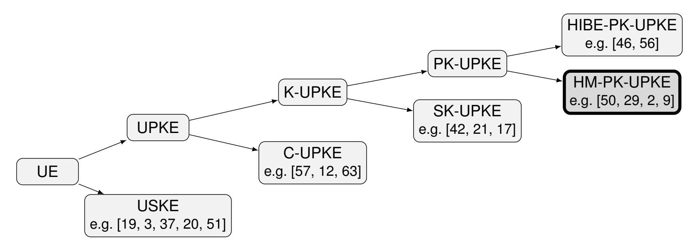
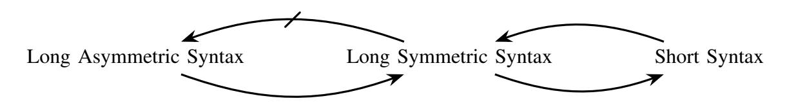
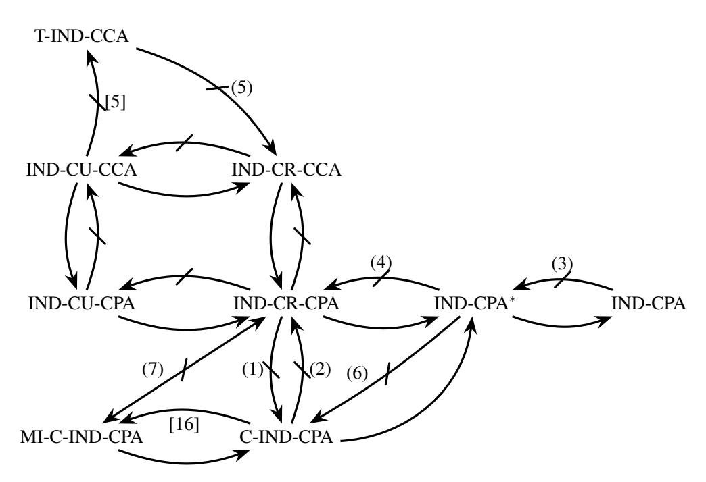

{0}------------------------------------------------

# SoK: Updatable Public-Key Encryption

Mark Manulis<sup>1</sup> , Daniel Slamanig<sup>1</sup> , Federico Valbusa2‡

*<sup>1</sup>RI CODE, Universitat der Bundeswehr M ¨ unchen, Munich, Germany ¨* {*mark.manulis, daniel.slamanig*}*@unibw.de <sup>2</sup>TU Wien, Vienna, Austria federico.valbusa@tuwien.ac.at*

*Abstract*—Updatable (public-key) encryption is a broad concept covering (public-key) encryption schemes whose keys can evolve over time to support secure key rotation and limit the impact of key compromise. The essential feature is that the encryption keys (and possibly also ciphertexts) can be updated from one epoch to the next via so called update tokens. This concept is useful in various applications, among them secure outsourced storage, secure messaging or low-latency forward-secret key-exchange protocols.

The term, however, is used with varying meanings across the literature. Some works define key-updatable schemes, where only the public and secret keys evolve. Others extend this idea by also allowing ciphertexts to be updated during key evolution. Variants further differ in how evolution is triggered: in some schemes, the receiver performs key updates locally, while in others, the sender initiates the evolution by embedding update information in ciphertexts. Beyond achieving forward secrecy, many formulations also aim for post-compromise security, ensuring that once a compromised key is updated, future ciphertexts regain confidentiality under the new key.

In this paper, we systematize this field with a focus on updatable public-key encryption schemes. Our aim is to first provide a taxonomy that sheds light into the currently fragmented terminology. It then compares their formal definition, syntaxes and formal security models found in the literature, clarifies their interrelations, and identifies common design patterns underlying current schemes. Beyond mapping the definitional landscape we provide a comparative analysis of existing instantiations, focusing on their properties and efficiency, and highlighting their main trade-offs. The paper concludes with open challenges outlining directions for advancing the field.

# 1. Introduction

Updatable encryption (UE) refers to a variety of symmetric and public-key encryption schemes that in addition to standard algorithms for key generation, encryption, and decryption, provide special (nontrivial) means of updating keys and/or ciphertexts, to

‡*This work was done while the author was with RI CODE, Universitat der Bundeswehr M ¨ unchen. ¨*

achieve extended security properties, such as forward secrecy (FS) and/or post-compromise security (PCS).

UE was originally introduced in [\[19](#page-14-0)] as a symmetric primitive designed to support efficient ciphertext evolution over epochs under successively updated (or rotated) encryption keys, a functionality particularly suited to cloud-based storage scenarios. *Symmetric* UE [\[19,](#page-14-0) [3](#page-13-0), [37](#page-15-0), [20](#page-14-1), [51,](#page-16-0) [49,](#page-16-1) [54\]](#page-16-2) allows a ciphertext encrypted under one key to be transformed into a ciphertext of the same plaintext under a fresh key, without requiring decryption. They achieve key rotation with minimal bandwidth and computational overhead, thereby ensuring long-term confidentiality in the presence of periodic key exposure or compromise.

In more recent years, the term UE also found its way to the public-key domain, giving rise to what can be collectively referred to as *asymmetric* UE [\[50,](#page-16-3) [29,](#page-15-1) [1,](#page-13-1) [2,](#page-13-2) [5,](#page-14-2) [9](#page-14-3), [4](#page-13-3)]. However, in contrast to their symmetric counterpart, the vast majority of asymmetric UE schemes focus solely on key evolution, where private/public keys are updated across epochs to achieve FS and PCS. These properties are particularly relevant in group messaging and key-evolving communication systems [\[6,](#page-14-4) [8,](#page-14-5) [10\]](#page-14-6), where users periodically refresh their cryptographic material to limit the temporal impact of a key compromise. Notably, there also exist a few asymmetric UE schemes, supporting combined update of keys and ciphertexts [\[57\]](#page-16-4), and possibly additional functionalities [\[12,](#page-14-7) [63](#page-16-5)], thus extending the symmetric UE notion from cloud storage to more complex data sharing scenarios with multiple users.

We stress that current terminology across the field of UE remains fragmented, as the same term is often used to describe distinct cryptographic functionalities—ranging from periodic evolution of keys to the refresh of ciphertexts—whose goals, syntax, and security guarantees differ substantially. This conceptual ambiguity complicates a systematic comparison of the functionality of UE schemes, their security notions, and relationships. Our goal is therefore to bring structure to this landscape by systematically organizing existing notions, clarifying their relationships, and identifying the trade-offs they capture. We also hope that this work provides insights that inform and guide practical implementations.

{1}------------------------------------------------

## 1.1. Contributions and Organization

In this work, we make several structural and analytical contributions to the ongoing UE research.

First, in Section [2,](#page-1-0) we introduce a new classification of UE schemes, with a particular focus on the asymmetric setting. Our goal is to provide a coherent framework for organizing existing constructions, emphasizing their common principles and main differences, and laying the groundwork for a systematic study of UE primitives.

Then, focusing on the public-key UE setting, we target a subclass of key-evolving schemes, which have recently gained substantial attention due to their appealing practical relevance. In Section [3,](#page-3-0) we formally define their functionality and discuss different syntaxes proposed in the literature, comparing them and highlighting their distinct properties and applications.

Section [4](#page-4-0) reviews the corresponding security models found in the literature. We analyze and compare these models, establishing explicit relationships and showing how the security notions relate to each other.

Sections [5](#page-8-0) and [6](#page-10-0) describe the main design principles and techniques used to construct such schemes and provide a comparative analysis of existing instantiations, focusing on their properties and efficiency, and highlighting their main trade-offs.

# <span id="page-1-0"></span>2. Our Classification for UE

In our classification, summarized in Figure [1,](#page-2-0) UE is first divided into two main categories: Updatable Symmetric-Key Encryption (USKE) and Updatable Public-Key Encryption (UPKE).

### Updatable Symmetric-Key Encryption (USKE).

The main functionality of USKE schemes is to enable evolution of (symmetric) keys along with associated ciphertexts, i.e., an existing ciphertext encrypted under one key can be changed to a fresh ciphertext encrypted under a fresh key without de- and reencrypting the original ciphertext. The UE schemes in [\[19,](#page-14-0) [52](#page-16-6), [20,](#page-14-1) [18,](#page-14-8) [48](#page-16-7), [60](#page-16-8), [23,](#page-14-9) [41](#page-15-2)] are representative of the USKE class. Their core application is to enable encrypted data outsourcing to some not fully trusted cloud storage. The update of ciphertexts can be carried out directly by the cloud using an update token generated by the user, thereby eliminating the need for the client to download, locally update, and re-upload the ciphertexts. Since the update token can be a short string, i.e., in ciphertext-independent USKE schemes [\[52](#page-16-6)], the above approach can help top greatly reduce the communication overhead and relieve the client from heavy computations. We note that although those schemes are symmetric, it has been shown that when targeting a reasonable security model they require public-key cryptography [\[3](#page-13-0), [38](#page-15-3)].

Updatable Public-Key Encryption (UPKE). Under UPKE, we consider a broad class of public-key encryption (PKE) schemes supporting evolution of private/public key pairs, possibly along with associated ciphertexts. In contrast to USKE, the asymmetric nature of UPKE implies that schemes within this class are suitable for applications requiring interaction between third parties (typically performing encryption) and the owner of a private/public key pair (typically, performing decryption). Considering the broad range of envisioned applications and the current state of the art, it is useful to distinguish two sub-classes within UPKE: (i) key-only UPKE (K-UPKE) schemes (such as [\[50](#page-16-3), [36,](#page-15-4) [29](#page-15-1), [5\]](#page-14-2)) supporting evolution of private/public keys only, and (ii) ciphertext UPKE (C-UPKE) schemes (such as [\[57](#page-16-4), [12,](#page-14-7) [63,](#page-16-5) [62](#page-16-9)]) that in addition to the evolving keys perform an update on the associated ciphertexts without their intermediate decryption. These schemes were designed primarily for secure key rotation in cloud environments and encrypted data sharing over an untrusted cloud server. This is in contrast to pure outsourcing, for which USKE is sufficient. The data is thus encrypted by third parties for the owner of the key pair and then uploaded to the cloud server, where the underlying keys and ciphertexts evolve over time. In particular, C-UPKE is an asymmetric version of the previously discussed USKE class, and it can be seen as a K-UPKE with ciphertext updates. The distinction between key-only and ciphertext UPKE schemes was introduced in [\[36\]](#page-15-4), but it has not been adopted in many subsequent works [\[50,](#page-16-3) [29](#page-15-1), [1](#page-13-1), [2](#page-13-2), [5](#page-14-2), [9](#page-14-3)]. We stress that C-UPKE schemes are not trivially derived from K-UPKE constructions. In addition to supporting ciphertext updates, C-UPKE security definitions introduce distinct challenges. For example, under an IND-CCA definition, an adversary could receive a challenge ciphertext, request its update, and then submit the updated ciphertext to the decryption oracle. This issue arises specifically in settings where ciphertext updates are permitted.

K-UPKE. Key-only UPKE schemes were introduced in the context of FS for public-key-encrypted data [\[21](#page-14-10)] and more recently gained popularity in the context of secure messaging [\[50](#page-16-3), [10](#page-14-6)]. This family of schemes can be further divided into two flavours: a K-UPKE is a secret-key UPKE (SK-UPKE) scheme if the public key is fixed across epochs and only the secret key is updated. If the public key is also updated, we call it a public-key UPKE (PK-UPKE).

SK-UPKE. The first construction of SK-UPKE can be found in Canetti et al. [\[21](#page-14-10)] under the concept of forward-secure public-key encryption (FS-PKE). Since then, it has become a central primitive for bringing FS into the public-key setting, where confidentiality of past communications must be preserved even if long-term keys are compromised. Recently this concept has found applications in efficient forward-secure key-exchange protocols [\[44,](#page-15-5) [27](#page-15-6), [28](#page-15-7)]. The true strength of SK-UPKE lies in its ability to provide a non-interactive approach: starting from an initial key pair (pk<sup>0</sup> ,sk<sup>0</sup> ), the scheme defines two

{2}------------------------------------------------

<span id="page-2-0"></span>

Figure 1: Classification for Updatable Encryption (with zoom-in on UPKE) with cited examples of representative schemes in each class. Our analysis in Sections 3–6 focuses on the highlighted HM-PK-UPKE subclass.

synchronised key chains

$$\mathsf{pk}_0 \to \mathsf{pk}_1 \to \cdots$$
 and  $\mathsf{sk}_0 \to \mathsf{sk}_1 \to \cdots$ .

Public keys can be updated in a publicly computable way, while only the receiver can evolve the secret key. Note that, in the literature, two equivalent viewpoints are often considered: public keys evolve in a deterministic chain or they remain constant. This stems from the fact that the encryption algorithm uses both a constant public key and the index associated with the current epoch. Crucially, the evolution of secret keys is one-way: compromising  $\mathsf{sk}_i$  allows decryption only of ciphertexts encrypted under the corresponding public key  $\mathsf{pk}_i$  and any  $\mathsf{pk}_k$  for k > i, but it remains infeasible to recover any prior  $\mathsf{sk}_j$  for j < i, thereby protecting past communications.

This property can be achieved with a simplified version of Hierarchical Identity-Based Encryption (HIBE) [42, 17], and indeed the first SK-UPKE construction was built from HIBE [21]. As more efficient and diverse HIBE schemes were developed—based on bilinear pairings [17], lattice assumptions [22], or even pairing-free groups [33]—corresponding SK-UPKE constructions followed. Some theoretical work has also shown instantiations from weaker assumptions, such as DDH [33], or low-noise LPN [34]. Despite this broad landscape of possible instantiations, all known SK-UPKE schemes inherit the drawbacks of their HIBE roots: they are more complicated to implement and significantly less efficient than standard PKE.

Another important limitation is that SK-UPKE only provides FS, not PCS [25], where PCS means that a system can heal after a key exposure. Consequently, once a secret key is exposed, all future secret keys in the chain can be derived by the adversary, meaning that the system cannot recover security going forward.

Taken together, these limitations have so far prevented SK-UPKE from being deployed in real-world messaging or key-exchange protocols [26, 43]. Nonetheless, the primitive remains an important conceptual bridge: it shows how FS can be formalised and achieved in non-interactive public-key settings, and it continues to inspire new approaches.

**PK-UPKE.** PK-UPKE can be seen as a slightly weaker notion than SK-UPKE for two reasons. First, PK-UPKE is interactive. Second, in an interactive setting, SK-UPKE can be turned into a PK-UPKE [32, 31, 30] supporting PCS.

Here, any user can decide to update the public key of any other user and provide a token that is used by the owner of the secret key to update it. This requires coordination between parties: since the public key is updated, all the parties need to be up to date regarding the current public key. Indeed, to guarantee FS, the previous secret key must be deleted after the update. This implies, if the scheme is secure, that the user is not able to decrypt messages encrypted with an old public key.

Updating the public key usually results in a randomisation of the secret key. This is the main difference with SK-UPKE, where public and private keys evolve in a deterministic chain, as explained before.

Although PK-UPKE requires coordination, it usually provides PCS: if an adversary compromises a secret key at epoch e, then after an update performed by an honest party (e.g., the key owner), security is restored, as the new secret key becomes unknown to the attacker. In this sense, PCS can be viewed as the analogue of FS for future instead of past epochs. Some works in the literature (e.g., [7]) jointly refer to these properties as post-compromise forward security (PCFS). PK-UPKE comes in two different families: a family of schemes based on key-homomorphic techniques, which we call HM-PK-UPKE, and a family of schemes exploiting HIBE as a building block, which we call HIBE-PK-UPKE. The security distinction between the two families arises from how FS is defined: in both the models, the adversary is given the secret key for the current epoch, but in HM-PK-UPKE, the previous update was generated by a trusted party, while in HIBE-PK-UPKE, the adversary may have produced that update as well.

**HIBE-PK-UPKE.** Despite offering a strong FS notion, as mentioned above, all HIBE-PK-UPKE instantiations are currently built on HIBE (as SK-UPKE). For example, [46] constructs its K-UPKE scheme from HIBE, where the secret key, at each epoch, is

{3}------------------------------------------------

derived also by the concatenation of all the ciphertexts received by the key owner. Another HIBE-based construction, this time for K-UKEM (the KEM analogue of K-UPKE; see Appendix [B](#page-17-0) for a formal definition), is presented in [\[56\]](#page-16-11). Here, they exploit the scheme by Gentry and Silverberg [\[42\]](#page-15-8): to update a public key, one can just concatenate a string consisting of additional data to a global string. The updated private key is then extracted from this updated string. In [\[58](#page-16-12)] it is observed that for secure messaging and instantiating K-UKEM, a weaker version of HIBE, called Unique-Path Identity Based Encryption (UPIBE), is sufficient.

HM-PK-UPKE. The class of HM-PK-UPKE was first introduced by [\[50\]](#page-16-3) (under the name UPKE), to address mainly the aforementioned efficiency limitations of SK-UPKE and HIBE-PK-UPKE. Our name for this class comes from the fact that all these schemes rely on a homomorphism between the secret and public key spaces of an encryption scheme. HM-PK-UPKE schemes gained popularity due to their efficiency, comparable to standard PKE/KEM schemes (c.f. Table [6](#page-13-4) for the comparison). They are mainly used in continuous group key agreement (CGKA) [\[6](#page-14-4), [8](#page-14-5)], which serves as a foundation of secure messaging protocols [\[10\]](#page-14-6), allowing a large group of users to maintain a shared secret key that is frequently rotated by group members to achieve FS and PCS [\[8,](#page-14-5) [14\]](#page-14-14).

Limitations in Applications. As shown in [\[8](#page-14-5), Section 7], however, HM-PK-UPKE cannot reach optimal security mainly due to cross-group attacks. Intuitively, this means that the adversary could be able to compute some keys that are intended to be secure.

The current standard for messaging protocols (MLS) [\[15\]](#page-14-15) uses CGKA, but does not exploit HM-PK-UPKE. Although this was making CGKA more efficient, at that time, the authors of the protocol had a lot of uncertainties and practical problems with dealing with HM-PK-UPKE, like library incompatibilities, bandwidth overhead, and security concerns [\[45\]](#page-16-13).

Nowadays, CGKA schemes based on HM-PK-UPKE can achieve a higher level of security than the current MLS protocol; however, HM-PK-UPKE still does not provide optimal security. This improvement is achieved using HIBE-based constructions [\[8\]](#page-14-5). Moreover, obtaining optimal security with HM-PK-UPKE alone appears unlikely. We refer the interested reader to [\[5,](#page-14-2) Section 7] for a more detailed explanation of possible attacks against MLS employing HM-PK-UPKE, the comparison between the current MLS version and some variations with HM-PK-UPKE schemes, and a discussion on MLS optimal security.

# <span id="page-3-0"></span>3. Syntax and Semantics of PK-UPKE

First, we present the syntax of PK-UPKE, even though our main focus is on the HM-PK-UPKE subclass. This is because all PK-UPKE schemes share the same syntax. The distinction between HM-PK-UPKE and HIBE-PK-UPKE lies in their instantiation methods, and they provide different levels of security.

Although the PK-UPKE notion provides a general understanding of the core functionalities and security models involved, different works in the literature diverge in significant syntactic and conceptual details (as was earlier observed in [\[5\]](#page-14-2)). This is often because the proposed syntax in each work may be tailored to specific application scenarios.

Note that, as in the context of conventional publickey encryption, it is useful to distinguish between PK-UKEM—the analogue of a KEM in the publickey updatable setting—and PK-UPKE schemes. Earlier works focused primarily on PK-UPKE constructions [\[50,](#page-16-3) [36,](#page-15-4) [29\]](#page-15-1). More recent research [\[5,](#page-14-2) [4\]](#page-13-3), however, has shifted attention to UKEMs, a formulation that better aligns with modern cryptographic protocols and composes more naturally with the established KEM/DEM paradigm. In addition, UKEMs provide improved compatibility with emerging standards such as the NIST post-quantum KEM specifications, i.e., ML-KEM [\[61\]](#page-16-14), making them a natural candidate for practical deployment. Throughout the paper, unless stated otherwise, we use PK-UPKE as the default notion. We note that the transformation between the two notions is straightforward: a PK-UKEM can be obtained directly from a PK-UPKE, and, as in the standard setting (i.e., between PKE and KEM), hybrid-encryption techniques, i.e., KEM/DEM, also allow constructing a PK-UPKE from a PK-UKEM.

#### 3.1. Defining PK-UPKE and Its Correctness

In the following, we define the syntax of PK-UPKE, as an extension of PKE (Appendix [A\)](#page-17-1), and the reader can find the same for PK-UKEM in Appendix [B.](#page-17-0)

<span id="page-3-1"></span>Definition 1 (PK-UPKE). A Public-Key Updatable PKE scheme consists of a PKE scheme (KeyGen, Enc, Dec) and three associated update algorithms (Update,UpdateSk,UpdatePk):

- Update(1 κ ): the probabilistic update generation algorithm that takes as input a security parameter κ and outputs two update values (upk, usk) for public and secret key update. This couple is also called *update token*;
- UpdatePk(pk, upk): the update public key algorithm takes as input a public key pk and a public key update string upk and outputs a new public key pk′ ;
- UpdateSk(sk, usk): the update secret key algorithm takes as input a secret key sk and a secret key update string usk and outputs a new secret key sk′ .

Correctness property. We require the following correctness property: Let (pk,sk) ← KeyGen(1<sup>κ</sup> ) be the initial key pair. Let (upk, usk) be an update token generated as

$$(upk, usk) \leftarrow \mathsf{Update}(1^{\kappa}).$$

Let (pk′ ,sk′ ) be the keys obtained after applying the update algorithms:

$$pk' \leftarrow UpdatePk(pk, upk), sk' \leftarrow UpdateSk(sk, usk).$$

{4}------------------------------------------------

TABLE 1: Syntax variants and their relationships.

<span id="page-4-1"></span>

|       | Asymmetric                                                                                                                          | Symmetric                                                                                    |
|-------|-------------------------------------------------------------------------------------------------------------------------------------|----------------------------------------------------------------------------------------------|
| Long  | The update algorithm outputs a string to update the<br>public key and a string to update the private key                            | The update algorithm updates the public key and outputs<br>a string to update the secret key |
| Short | No update algorithm: the public key is updated implicitly in encryption, and the secret key is updated<br>implicitly in decryption. |                                                                                              |

Then for any message m, the scheme satisfies correctness if:

$$\mathsf{Dec}(\mathsf{sk}', \mathsf{Enc}(\mathsf{pk}', m)) = m,$$

where this definition can be trivially relaxed to the case of δ-correctness, i.e., decryption is allowed to fail with probability δ.

# 3.2. Syntax Variations and Relationships

One of the main distinctions in PK-UPKE frameworks concerns the presence (or absence) of an explicit update algorithm. In the so-called *short syntax* (e.g., [\[11](#page-14-16), [5](#page-14-2)]), key updates occur implicitly: the public key is automatically refreshed during encryption, and no separate update token is produced. The update of the secret key is then implicitly tied to the derived new public key. In contrast, the *long syntax* includes a dedicated update algorithm and explicitly outputs an update token. As noted in [\[36\]](#page-15-4), this can be further refined into:

- Asymmetric long syntax (e.g. [\[36](#page-15-4), [50](#page-16-3), [35](#page-15-17)]): The update token consists of a public component for updating the public key and a private component for updating the secret key. Our Definition [1](#page-3-1) adopts exactly this syntax.
- Symmetric long syntax (e.g. [\[29,](#page-15-1) [4\]](#page-13-3)): The update token consists of one value only and is used by the key owner to update the secret key, with no separate public component required.

From now on, we say that one syntax is *longer* than another if it generates a larger set of strings or values. In particular, the asymmetric long syntax is longer than the symmetric long syntax, and the symmetric long syntax is longer than the short syntax. Table [1](#page-4-1) provides a concise overview of the differences between various syntaxes.

It is straightforward to see that longer syntaxes imply shorter ones, since any shorter syntax can be realized by embedding algorithms or variables of the longer syntax into algorithms of the shorter syntax.

The opposite does not necessarily hold, i.e., it is not always possible to use shorter syntaxes to implement longer ones. Starting from the short syntax, one can realize the long symmetric one: the algorithm UpdatePk is implemented by calling Enc on a random message m. This generates the new public key, while the update token is the ciphertext c corresponding to the encryption of m under the previous public key. Then, UpdateSk can be realized by giving c and the current secret key as input, and the result is a new secret key and the message m, which can be discarded. Similarly, to implement the encryption and decryption algorithms without updating, one can just run the encryption and decryption that generate new keys, and then discard the keys.

It is not possible, instead, to have a black-box reduction from long asymmetric syntax to the other ones. Indeed, long asymmetric syntax produces update tokens starting from a security parameter only, while, in long symmetric and short syntaxes, the public key is always necessary to generate any update string. Figure [1](#page-4-1) highlights the relationships between the syntax variants.

Before discussing security, we introduce a property that will be used in the comparison of schemes in Section [6.](#page-10-0) Some PK-UPKE constructions allow for agnostic updates, meaning that the update token can be generated independently of the specific public key to be updated (e.g., [\[50](#page-16-3), [36](#page-15-4)]). This offers a more modular approach, potentially improving scalability and usability in distributed environments. Other schemes (e.g., [\[29,](#page-15-1) [13](#page-14-17), [1\]](#page-13-1)), instead, require update tokens to be tightly bound to the public key being updated, which may simplify security proofs but reduce flexibility.

# <span id="page-4-0"></span>4. Security Notions and Relationships

Different security models have been proposed for HM-PK-UPKE. Since all PK-UPKE schemes share the same syntax, these models can also be applied to HIBE-PK-UPKE schemes. However, the models discussed here are more appropriate for HM-PK-UPKE, as HIBE-PK-UPKE provides stronger guarantees. Jumping ahead, the security games for HM-PK-UPKE always require an update to be executed by a trusted party before the adversary learns the secret key. This is not the case for HIBE-PK-UPKE schemes, as the key transformation is one-way.

Usually, the underlying security definitions at a certain time give a secret key to the adversary, and it should not be able to distinguish between the encryption of two adversary-provided messages with a public key generated in a past epoch, capturing the concept of FS. The models vary mainly in how they handle updates, adversarial control over randomness, and key exposure.

Some models also take into account PCS by allowing corruption in some epochs before the challenge is generated [\[50,](#page-16-3) [36\]](#page-15-4).

Another security property, which has been discussed in [\[5\]](#page-14-2), is *forking security*: in group messaging scenarios, where multiple users share access to the same secret group key, not all parties may be synchronized in their views on the latest group key. The

{5}------------------------------------------------



Figure 2: Implications and separations between syntax variants.

adversary may cause the protocol participants to have different views of the same session. In particular, if updates to a user's public key are made while the user is offline, and these updates are performed simultaneously by different entities, then forks may arise, i.e., divergent update histories from a common starting public key. Handling such forks and decryption with outdated keys requires careful consideration in the security model.

In this section, we present and compare the security models for HM-PK-UPKE used in the literature, emphasizing their differences and establishing relations or separations among them. We begin with the weakest being one-wayness (OW) models, continue with indistinguishability under chosen-plaintext attack (IND-CPA) models, and conclude with indistinguishability under chosen-ciphertext attack (IND-CCA) models, which are generally considered the strongest and are widely accepted as providing a sufficient level of security.

#### 4.1. Variants of One-Wayness

The first notion we describe models one-wayness under chosen plaintext with chosen randomness attacks (OW-CR-CPA), which extends the standard OW-CPA notion for PKE by allowing secret and public keys to be updated. Concretely, starting from an initial key pair  $(pk_0, sk_0)$ , the adversary may invoke an update oracle, supplying its own randomness to update the keys. At some point, it is allowed to submit a single challenge query. The challenger then selects a random message, encrypts it under the current public key, and returns the resulting ciphertext to the adversary. After receiving the challenge ciphertext, the adversary may continue to update the keys using its chosen randomness. Finally, the challenger performs one additional update using fresh randomness unknown to the adversary (we call this way of updating the key trusted update, as it models an update performed by a trusted party), and reveals the resulting public key, secret key, and update token. The adversary succeeds if it correctly recovers the plaintext message.

A closely related notion is one-wayness under plaintext checking attacks (OW-CR-PCA), which similarly extends the standard OW-PCA notion for PKE to the updatable-key setting. Its security experiment proceeds exactly as the previous one until the adversary receives the challenge. In addition to the encrypted message, the adversary has access to the plaintext-checking oracle: on input (m,c), the oracle reveals whether c is an encryption of m under the current public key. Then, the game proceeds exactly as the previous one.

As one would expect, given the standard (non-updatable) definitions of OW-CPA and OW-PCA for PKE, and given the definitions of games in the updatable setting, if one scheme is secure in the updatable OW-PCA model, it is also secure in the updatable OW-CPA one, and the reduction follows trivially from that of non-updatable PKE schemes. Note that both notions only rule out full recovery of the plaintext, but allow for partial information leakage. In particular, they do not guarantee indistinguishability and are therefore insufficient for applications requiring strong confidentiality guarantees.

Although the security guaranteed by these models is insufficient on its own, there exists a general transformation [13] that can lift them to stronger notions, which are believed to provide adequate security. This transformation is discussed later in Section 5, and it justifies the fact that some basic constructions only achieve one of these weak security levels (e.g., OW-PCA security of [35]).

#### 4.2. Variants of IND-CPA Security

**IND-CPA.** The weakest CPA model, introduced in [11], defines an indistinguishability game where the adversary selects messages that are encrypted to produce ciphertexts and new keys (assuming short syntax). The adversary cannot influence the randomness used for key updates. After receiving two challenge messages, one is chosen at random and encrypted. Knowing the secret key generated in the last encryption, the adversary must guess which message was encrypted. This model, as discussed above, captures the idea of FS: after a trusted update, the current secret key should reveal nothing about encryptions from previous epochs, and in particular about past keys. This notion does not account for adversaries that can influence the randomness used in encryptions or key updates, nor does it capture robustness against maliciously generated updates. In particular, it only provides security against passive attacks assuming honestly generated randomness. The explicit game can be found in Figure 3.

**IND-CPA\*.** A stronger variant, also from [11], is IND-CPA\*, where the adversary may choose the randomness for message encryption (and update, as we are considering short syntax). So, the game is essentially the same as the previous, with the difference that the adversary can also choose the randomness  $r_i$  to generate the ciphertext  $c_i$  and key  $pk_i$  in the epoch evolution. However, the last encryption/update, which corresponds to the challenge, works in the same way as in the previous game (i.e., the randomness is not adversarially controlled). Although the adversary can

{6}------------------------------------------------

```
IND-CPA-Game_{\mathcal{A}}^{\mathsf{PK-UPKE}}(q) :
 1: (\mathsf{sk}_0, \mathsf{pk}_0) \leftarrow \mathsf{KeyGen}(\kappa)
  2: b \stackrel{\$}{\leftarrow} \{0, 1\}
  3: for i = 1, ..., q:
           m_i \leftarrow \mathcal{A}(\mathsf{pk}_0, \dots, \mathsf{pk}_{i-1})
  4:
           r_i \stackrel{\$}{\leftarrow} \{0,1\}^*
  5:
  6: (c_i, \mathsf{pk}_i) \leftarrow \mathsf{Enc}(\mathsf{pk}_{i-1}, m_i; r_i)
                \mathcal{A} \leftarrow (c_i, \mathsf{pk}_i, r_i)
  7:
          (m_i, \mathsf{sk}_i) \leftarrow \mathsf{Dec}(\mathsf{sk}_{i-1}, c_i)
  8:
  9: (m_0^*, m_1^*) \leftarrow \mathcal{A}
10: \quad (c^*, \mathsf{pk}^*) \leftarrow \mathsf{Enc}(\mathsf{pk}_q, m_b^*)
\mathbf{11}: \quad (\cdot, \mathsf{sk}^*) \leftarrow \mathsf{Dec}(\mathsf{sk}_q, c^*)
12: b' \leftarrow \mathcal{A}(\mathsf{pk}^*, \mathsf{sk}^*, c^*)
13: return [b'=b]
```

Figure 3: IND-CPA notion for HM-PK-UPKE.

control the randomness governing the key evolution prior to the challenge, it cannot trigger further updates after receiving the challenge ciphertext. As a result, this notion does not capture attacks that exploit information revealed in future epochs. Moreover, the adversary is not given access to the update token after the challenge, even though such information is typically transmitted over public channels in practical deployments.

**IND-CR/CU-CPA.** The most widely adopted CPA notion for HM-PK-UPKE is IND-CR-CPA, introduced in [29] and used in [1, 2, 13, 4, 47]. Here, the adversary begins with an honestly generated key pair and then provides update values to derive new keys, that is, the adversary has access to an update oracle. At some point, an indistinguishability challenge is issued, i.e., the adversary provides two messages to the challenger and one of them is encrypted and given back to the adversary, after which updates are still possible. To prevent trivial attacks, a trusted update (with randomness not provided by the adversary) is enforced before the adversary is given the current secret key, public key, and update token. So, the game is essentially the same as the one described in IND-CPA\*, with the difference that now, the adversary does not have to create the challenge necessarily at the last epoch before the trusted update. In particular, updates are also possible after the challenge is issued.

A stronger version, IND-CU-CPA, also from [29] and used in [1, 2, 13, 4], allows the adversary to directly specify the new update string, rather than just choosing the randomness to feed the update oracle with. For example, the adversary could compute a new key pair and derive, from the old key and the new public keys, the update string needed to reach the new maliciously generated key. Usually, schemes resistant to this type of attack have an algorithm that checks if the update procedure has been performed honestly, i.e., by generating the offset value before, and then deriving the new public key, rather than creating the new key (for which the related secret key is known)

and then deriving the update.

While IND-CU-CPA captures a stronger form of adversarial control over the update process, it still does not model key exposure or decryption capabilities, and therefore does not capture active attacks or compromise scenarios.

<span id="page-6-1"></span>C-IND-CPA. Another notion, which we refer to as C-IND-CPA, is introduced in [36]. Here, the adversary can choose to update the values and corrupt some secret keys. Namely, it can query a reveal oracle to learn the secret key related to an epoch. To avoid trivial wins, the challenge epoch must follow a trusted update and occur before any malicious updates combined with a key compromise.

This relates to the model of [50], which instead allows multiple challenges under different keys corresponding to adversarially chosen left/right messages. Moreover, [50] defines a multi-instance confidentiality, which we refer to as MI-C-IND-CPA: instead of starting from one key pair, the adversary begins with many, and the same update randomness can be applied across them. Updates and exposures thus affect all keys in a given epoch. While C-IND-CPA and MI-C-IND-CPA capture forms of post-compromise security by allowing key exposures across epochs, they do not account for adversaries that can maliciously craft update values, as in stronger models such as IND-CR-CPA.

In order to clarify the upcoming proof of separation between C-IND-CPA and IND-CR-CPA, we recall that in the C-IND-CPA model of [50], the challenge ciphertext consists of an encryption of a message  $m_b$  together with a secret-key update value  $\delta$ ; that is,  $c = \mathsf{Enc}_{pk_i}(m_b \parallel \delta)$ . Thus, the adversary receives an encryption of the key-offset of the challenge epoch, but not of the key-offset that produces the final secret key revealed to the adversary. This design reflects the fact that they use an HM-PK-UPKE to construct a double-ratchet protocol. The core intuition is that, in order to ensure FS, the key evolves after every message transmission. In particular, whenever a message is sent, the sender includes (under encryption) an update value that allows the receiver to advance their key as well.

Also, we observe that the experiment modeling security in [36] does not match the property they mention. Here, it is required that there is no sequence of updates provided by the adversary connecting the index related to the epoch in which the challenge is issued and an index related to an epoch where the key is corrupted. However, the game does not guarantee this property correctly. Let us think of an epoch key pair as a node. In [36]'s game, a node is marked as corrupted whenever the adversary can trivially win the game by issuing the challenge during that epoch, that is, when the secret key is revealed or it is derived from corrupted keys and adversarially chosen randomness. The problem is that the status of nodes is not checked at the finalization time, and the procedure that marks nodes as corrupted is performed only inside the corruption oracle. This means that we

{7}------------------------------------------------

can construct an adversary A that can trivially win as follows:

- The game starts with the generation of initial key pair  $(pk_0, sk_0)$  for epoch 0.
- $\mathcal{A}$  corrupts the node at epoch 0 and obtains  $\mathsf{sk}_0$ . The epoch 0 is thus marked as corrupted.
- $\mathcal{A}$  updates node 0 by providing randomness.
- $\mathcal{A}$  makes the challenge at epoch 1.
- $\mathcal{A}$  replies to the challenge.

One can easily verify that, although this strategy does not meet the requirement described earlier, the key in the first epoch is not marked as corrupted, and therefore the adversary can issue the challenge during that epoch.

#### 4.3. Variants of IND-CCA Security

**IND-CR/CU-CCA.** The first IND-CCA notion for HM-PK-UPKE was proposed in [29] as a direct extension of the CPA models (CR or CU), augmented with a decryption oracle. As in the standard PKE setting, the decryption oracle may be used to decrypt any ciphertext generated in any epoch, except for the challenge ciphertext created during the challenge epoch. This model has since been adopted in [1, 2, 13, 4, 47].

Also, in the IND-CR/CU-CPA/CCA models, the adversary is given the update token used to generate the latest key pair. This captures scenarios in which an external party performs the key update on behalf of a user. Since the update token is transmitted over a public channel, the adversary can observe it as well. However, only the legitimate key owner should be able to derive the new secret key from the update token using their current secret key. Because not all security models account for this setting, when one does, we say that it satisfies the *external updates* property. Observe that this violates the agnostic updates property, as the update token is generated through encryption under the current public key and thus necessarily depends on it.

Tree-Based IND-CCA (T-IND-CCA). A more complete model is proposed in [5] and a slightly weaker version of it in [9]. The evolution of keys considered in previous models is strictly linear: once the adversary updates pk to pk', it loses the ability to update pk further and may only apply the subsequent update to pk'. T-IND-CCA models are the first to cover FS, where key evolution is represented as a tree rather than a linear chain. A certain key may be updated multiple times along different branches, reflecting scenarios where, for example, one participant is offline and others update independently their public key, thus generating forks, as already discussed at the beginning of this section.

For group messaging, the model in [5] also incorporates *member* and *joiner* tags. The first allows to check that keys in the group follow a consistent evolution, while the other is required to ensure fakegroup security, that is, it allows a user to verify that

the group they are joining is legitimate (we omit the details as not relevant for this work).

The syntax adopted in [5] is short, and the primitive constructed is a PK-UKEM. The adversary starts from an initial node with tags and a secret key, and can derive child nodes by updating the public key or by submitting valid ciphertexts to the decryption oracle. Reveal oracles are also available to expose secret keys, with restrictions to prevent trivial wins.

As discussed earlier, forking security requires careful analysis: schemes that are secure in the IND-CU-CCA model may become trivially insecure once forking is permitted. In the construction from [5, Appendix A], the secret key output by the key generation algorithm consists of two values: the first is the secret key of an IND-CU-CCA secure scheme, and the second is a random string. To update the secret key, the first value is updated following the update procedure of the underlying IND-CU-CCA secure scheme, while the second update depends on the result of a fair coin toss. In one case, it is obtained by applying a random oracle to the second component of the current key; in the other, it is the one-time encryption of the current IND-CU-CCA secret key using this output as the encryption key. In the IND-CU-CCA model, the adversary can only see one encryption per epoch and gain nothing from the second value of the secret key. In the forking model, however, the adversary can learn multiple encryptions by corrupting different keys in one epoch, recovering the first value of the secret key of the previous epoch.

#### <span id="page-7-0"></span>4.4. Relations between Security Notions

In Figure 4 we demonstrate implications and separations between the aforementioned security notions and highlight the following non-obvious ones:

- (1) IND-CR-CPA does not imply C-IND-CPA: Indeed, by giving the adversary the possibility to corrupt keys before *and* after the challenge (with trusted updates in-between), C-IND-CPA captures the goals of FS and PCS. IND-CR-CPA, on the other hand, only captures FS. So, an easy counterexample to this implication can be given by observing that an SK-UPKE scheme is also a PK-UPKE scheme without interaction (so, the update string is simply the empty string). SK-UPKE is FS but does not have the PCS. In particular, SK-UPKE satisfies the IND-CR-CPA security notion, but not the C-IND-CPA one.
- (2) As noted above, in the IND-CR-CPA game, the adversary is also given the update token at the end, whereas this is not the case in the C-IND-CPA model. For instance, [50, 36] present schemes that are secure under C-IND-CPA. However, if the adversary is additionally given the update string and the current secret key, it can immediately reconstruct the secret key of the previous epoch, thereby trivially breaking IND-CR-CPA security. We note that while C-IND-CPA secure constructions can intuitively be adapted to achieve IND-CR-CPA security—by encrypting each update value under the current public key to produce an update token, which is exactly how the first

{8}------------------------------------------------

<span id="page-8-1"></span>

Figure 4: Relations between security notions for HM-PK-UPKE. The OW notions are omitted, as the relations among the given notions and IND-CR-CPA follow directly from the relations in the standard PKE environment. Moreover, the separation between them and IND-CPA<sup>∗</sup> can be proven with the same strategy as in (2).

general costruction of Section [5](#page-8-0) works—establishing this formally is non-trivial. Although this approach appears plausible, a rigorous proof would be required to confirm that repeated encryptions do not leak sufficient information for an adversary to mount an attack. Providing such proof lies beyond the scope of this work, and further investigation is needed to validate this intuition.

- (3) Let us consider a scheme which is secure in the IND-CPA model, but whenever the key is updated with a specific value as randomness (say, 0), then a fixed secret key is set, and the related public key is computed. This scheme is still secure in the IND-CPA model, as the adversary is not allowed to provide the randomness to update the key, so the target key (the 0 key) is chosen with a negligible probability, as the update string is computed randomly by the challenger. However, in the IND-CPA<sup>∗</sup> case, the adversary could choose to update the key with the target value exactly before the challenge. In this way, the adversary knows the secret key that decrypts the challenge ciphertext and can win trivially.
- (4) The same strategy to design the counterexample in (2) applies here.
- (5) In the T-IND-CCA game, the adversary can't control the randomness used to update. It is, therefore, possible to construct a scheme that is secure in the T-IND-CCA model but not in the IND-CR-CCA (and not even in IND-CR-CPA) model with the same strategy as in the counterexample in (3).
- (6) The same strategy to design the counterexample in (1) applies here. In particular, in the IND-CPA<sup>∗</sup> game the adversary is not allowed to keep updating keys after the challenge is issued, which is the case for the C-IND-CPA security notion.
- (7) The same strategy to design counterexamples in (1) and (2) applies here since MI-C-IND-CPA is just a multi-instance version of C-IND-CPA.

## 4.5. Further Comparison of Security Notions

In Table [2](#page-9-0) we provide a comparative overview of the aforementioned security notions for HM-PK-UPKE schemes. This comparison focuses on the associated adversarial capabilities and structural features. Specifically, the columns indicate whether the model allows adversarial control over the encryption randomness (CR) or update values (CU), whether secret-key corruption or multi-instance (MI) settings are supported, and whether updates can be externally specified or key forking is permitted.

We note that the Corrupt column is equivalent to the notion of PCS, as it captures the adversary's ability to compromise the secret key and thereby learn information about past ciphertexts. If the adversary can not distinguish between two encryptions in successive epochs, then security has been restored.

# <span id="page-8-0"></span>5. Core Design Techniques

This section presents techniques for constructing HM-PK-UPKE schemes. Notably, the ultimate challenge is to construct a HM-PK-UPKE encryption scheme which is at least forward and postcompromise secure, but efficiency-wise close to a (standard) PKE scheme.

We begin with a generic transformation that converts a PKE scheme with certain additional properties into an HM-PK-UPKE scheme [\[29\]](#page-15-1). We keep it high-level, as this is sufficient for our purposes, and the technical details heavily depend on the concrete encryption scheme. We then present a more rigorous construction that provably achieves T-IND-CCA security in the random oracle model [\[9](#page-14-3)].

Before proceeding with the design techniques, we note that the scheme's instantiation determines whether it satisfies a property that is fundamental for some use cases: in multi-party or distributed settings, it is essential to prevent adversaries from substituting a public key with one for which they know the corresponding secret key. To counter this, some HM-PK-

{9}------------------------------------------------

<span id="page-9-0"></span>

| Property     | Reference         |   |   |   |   | CR CU Corrupt MI External Updates Forks? Notes |                                                                          |                                                                                                                                                           |
|--------------|-------------------|---|---|---|---|------------------------------------------------|--------------------------------------------------------------------------|-----------------------------------------------------------------------------------------------------------------------------------------------------------|
| IND-CPA      | [11]              | ✘ | ✘ | ✘ | ✘ | ✘                                              | ✘                                                                        | Adversary chooses messages; cannot control update random<br>ness; challenge after trusted update; FS.                                                     |
| IND-CPA*     | [11]              | X | ✘ | ✘ | ✘ | ✘<br>✘<br>domness.                             |                                                                          | As IND-CPA, but adversary controls encryption/update ran                                                                                                  |
| IND-CR-CPA   | [29, 1, 2, 13, 4] | X | ✘ | ✘ | ✘ | X<br>✘<br>lenge answer.                        |                                                                          | As CR-CPA but the adversary chooses update values; updates<br>allowed after challenge; requires trusted update before chal                                |
| IND-CU-CPA   | [29, 1, 2, 13, 4] | X | X | ✘ | ✘ | X                                              | ✘<br>Adversary can directly choose update strings (stronger than<br>CR). |                                                                                                                                                           |
| C-IND-CPA    | [36, 50, 35]      | X | ✘ | X | ✘ | ✘                                              | ✘                                                                        | Adversary can choose update values and corrupt keys; chal<br>lenge must follow a trusted update and precede adversary<br>controlled updates + compromise. |
| MI-C-IND-CPA | [50]              | X | ✘ | X | X | ✘                                              | ✘                                                                        | Multiple key pairs from start; same update randomness can<br>be applied to several keys; updates/exposures affect all keys<br>in the same epoch.          |
| IND-CR-CCA   | [29, 1, 2, 13, 4] | X | ✘ | ✘ | ✘ | X                                              | ✘                                                                        | CR-CPA variant with decryption oracle; cannot decrypt chal<br>lenge ciphertext in challenge epoch.                                                        |
| IND-CU-CCA   | [29, 1, 2, 13, 4] | X | X | ✘ | ✘ | X                                              | ✘                                                                        | CU-CPA variant with decryption oracle; cannot decrypt chal<br>lenge ciphertext in challenge epoch.                                                        |
| T-IND-CCA    | [5, 9]            | ✘ | ✘ | X | ✘ | X                                              | X                                                                        | Keys evolve in a tree (forking security); reveal oracle allowed;<br>challenge restrictions prevent trivial wins; tailored for group<br>messaging.         |

TABLE 2: Extended comparison of PK-UPKE security properties.

UPKE schemes support *publicly verifiable updates*, enabling *any* external party to verify that a new public key was honestly derived from a valid previous key and update token, without trusting the updating party.

#### 5.1. HM-PK-UPKE from CS+LR PKE

Approach for IND-CR-CPA Security. The first general idea for designing HM-PK-UPKE schemes is given in [\[29](#page-15-1)], based on a homomorphism between the secret key and public key spaces. The core idea is to design the key spaces such that updating the public key is functionally aligned with updating the secret key, allowing for efficient, synchronized updates without requiring access to the original key material.

Formally, this is captured via a grouphomomorphism Φ : SK → PK between the secret key space SK and the public key space PK. The mapping satisfies the property that for any update offset δ ∈ SK, the update operation on the secret key, say sk′ = sk + δ, translates under Φ into the corresponding update of the public key:

$$\mathsf{pk}' = \Phi(\mathsf{sk}') = \Phi(\mathsf{sk} + \delta) = \Phi(\mathsf{sk}) \cdot \Phi(\delta) = \mathsf{pk} \cdot \Delta,$$
 where  $\Delta := \Phi(\delta)$ .

This enables the derivation of update tokens that can be applied independently to both keys, maintaining consistency between the updated key pairs.

In particular, to update a public key pk to a new key pk′ , one generates a random element δ from the secret key space and applies the update as

$$\mathsf{pk}' = \mathsf{pk} \cdot \Delta,$$

where pk = Φ(sk). Note that ∆ can be derived from pk and pk′ by anyone. Therefore, since FS from the IND-CR-CPA model is required, it must be computationally infeasible to recover δ from ∆. When an external party wants to update a user's key, the offset δ is encrypted under the current public key, forming the *update token*. The secret-key owner, then, can decrypt it and correctly update the public key. Note, however, that the encryption of the update value is not generally required, as already discussed in Section [4.](#page-4-0)

This structure enables efficient key updates while preserving the secrecy of the private key and ensuring that the public key can be updated publicly and asynchronously.

To prove security, the underlying PKE scheme should satisfy two properties called *circular security* and *leakage-resilience*, formally stated in Definition [5.](#page-17-2) These, intuitively, guarantee the semantic security of the scheme even if an encryption of the secret key (or, in practice, the update token) and a bounded-entropy leakage on it are exposed.

This technique can be described only informally since the obtained HM-PK-UPKE scheme depends in a non-trivial way on the underlying PKE scheme.

Moving from CPA to CCA. Using the method described previously, one can turn a PKE scheme satisfying the circular-secure, leakage-resilient, and key-homomorphic properties into an IND-CR-CPA secure HM-PK-UPKE scheme. From this point, there exist general transformations for upgrading the security from CPA to CCA [\[29,](#page-15-1) [13\]](#page-14-17).

The first is discussed in [\[29\]](#page-15-1) and follows the Naor–Yung paradigm [\[55](#page-16-16)]. This technique proves that a ciphertext validly encrypts a message (with randomness) by encrypting the same message twice, using two independent public keys and fresh randomness for each encryption. Along with these two ciphertexts, the encryptor generates a non-interactive zero-knowledge (NIZK) proof showing that both ciphertexts contain the same underlying message. This allows the decryption oracle to verify that a ciphertext has been generated consistently, preventing an adversary from producing valid proofs without access to the challenge ciphertext's decryption.

Building on this, [\[1\]](#page-13-1) also uses the Naor–Yung approach to obtain CCA security.

{10}------------------------------------------------

As shown in [\[13\]](#page-14-17), the earlier transformation in [\[29](#page-15-1)] is insecure whenever the underlying IND-CR-CPA scheme exhibits *non-influential randomness*. This property holds if there exists a random value r ∗ such that the updated keys remain unchanged from the previous ones. In that case, the adversary can simply update the keys in the challenge epoch and query the oracle to decrypt the challenge ciphertext.

In the general construction above, the problematic random value corresponds to the neutral element of the updating operation in the secret-key space. To address this, [\[13](#page-14-17)] embeds the epoch into both the public key and the ciphertext, and modifies the NIZK relation by adding constraints on the ciphertext–publickey pair. Concretely, the message is encrypted together with the time epoch. This prevents the adversary from generating new key pairs identical to previously generated ones and successfully obtaining the decryption of a ciphertext generated in previous epochs, thereby blocking the attack.

Moreover, [\[13](#page-14-17)] introduces a more efficient CPAto-CCA upgrade in the ROM using the Fujisaki-Okamoto (FO) transform [\[39](#page-15-18), [40](#page-15-19)], yielding significantly more efficient protocols. In their variant, the FO tag—derived from a random oracle and used as encryption randomness—is also tied to the current epoch, thereby reinforcing security against epochrelated attacks.

Note that their technique constructs an IND-CR-CCA scheme from assumptions strictly weaker than IND-CR-CPA. Specifically, it only requires an OW-CR-CPA secure PK-UPKE together with an OT-CPA secure secret-key encryption scheme. Since our focus is on the asymmetric component, we omit the OT-CPA definition and refer the reader to [\[13\]](#page-14-17) for more details.

<span id="page-10-1"></span>Moving from CR to CU. In the CU setting, the adversary is allowed to provide any string as the update, and not necessarily to generate it honestly with the update algorithm, as already discussed in Section [4.](#page-4-0)

To mitigate such attacks, [\[29](#page-15-1)] introduces a NIZK proof ensuring that the update string has been correctly generated, thereby extending the syntax with a verification algorithm.

A number of works [\[1,](#page-13-1) [2\]](#page-13-2) here again employ the Naor–Yung paradigm. In particular, the two public key components are used as follows: one is used for encryption/encapsulation and gets updated, while the second serves solely to verify update consistency. Updates are represented as pairs of ciphertexts (under the two public keys) plus a NIZK proof that both ciphertexts encrypt the same value.

CU security is also obtained in [\[13\]](#page-14-17) by applying an FO transformation (distinct from the one employed to obtain CCA security). In their approach, the publickey update is performed in such a way that the subsequent secret-key update succeeds only if the public-key update has been generated honestly. This mechanism is sufficient to guarantee CU security. However, when CU security is achieved via a NIZK- based construction, the update process becomes publicly verifiable with the verify algorithm of the NIZK. In contrast, in the FO-based approach of [\[13\]](#page-14-17), only the secret-key holder can verify the correctness of a new public key by executing the secret-key update algorithm. This restriction limits the practicality of the scheme, as other parties must wait for the corresponding secret-key owner to be online to "approve" that a new public key has been generated correctly.

# 5.2. Obtaining HM-PK-UPKE from Shifty-IND-CPA PKE

A different generic construction of HM-PK-UKEM schemes is given in [\[9\]](#page-14-3), which achieves T-IND-CCA security from a Shifty-IND-CPA PKE.

Intuitively, Shifty-IND-CPA security guarantees that, given the encryption of an offset value used to generate the new secret key in a key-homomorphic scheme, no information about the original secret key is revealed. This is a special case of the technique described above, with the difference that an explicit construction is provided.

The encapsulation scheme uses three random oracles and roughly works as follows: First, a random string is sampled. Together with the current public key, it is fed into the first RO to derive the KEM key, the second RO to derive the randomness for encrypting the string (producing the KEM ciphertext), and the third RO to derive material for generating a fresh key pair.

The new public key is then obtained by adding homomorphically this freshly generated key to the current one.

Decapsulation proceeds by decrypting the ciphertext to recover the random string. With this string, all other derived values can be recomputed via the random oracles, enabling consistency checks. As in the FO transform, the scheme re-encrypts the string and verifies that the resulting ciphertext matches, while also checking that the new public key is honestly derived.

However, this construction does not yet provide public verifiability, which is essential for their application. To achieve this, the authors extend encapsulation with a NIZK proof showing that the difference between the new and old public keys corresponds exactly to the homomorphism applied to the secretkey offset.

# <span id="page-10-0"></span>6. Comparison of Existing Schemes

In this section, we provide detailed comparison tables for all known HM-PK-UPKE/UKEM constructions. We include concrete instances—grouped according to the underlying mathematical frameworks (i.e., groups and residuosity-based, lattices, and isogenies)—as well as general constructions.

In Table [3](#page-11-0) we compare the complexity of all constructions. Specifically, we report the sizes of secret key, public key, ciphertext, update token, and

{11}------------------------------------------------

<span id="page-11-0"></span>

|                       | Sizes                                          |                                          |                                                                         |                                                            |                                        |                              |                              |  |  |  |  |  |
|-----------------------|------------------------------------------------|------------------------------------------|-------------------------------------------------------------------------|------------------------------------------------------------|----------------------------------------|------------------------------|------------------------------|--|--|--|--|--|
| Construction          | Sk                                             | Pk                                       | Ct                                                                      | Upd                                                        | Pt                                     | Enc                          | Upd PK                       |  |  |  |  |  |
|                       | Constructions based on Pre-Quantum Assumptions |                                          |                                                                         |                                                            |                                        |                              |                              |  |  |  |  |  |
| JMM18 [50]            | $2\kappa$                                      | $2\kappa$                                | $2\kappa$                                                               | _                                                          | $2\kappa$ *                            | $\mathcal{O}(\kappa)$        | $\mathcal{O}(\kappa)$        |  |  |  |  |  |
| DKW22 [29] (Sec. 5.3) | $20\kappa^2$                                   | $20\kappa^2 + \kappa$                    | $20\kappa^2 + \kappa$                                                   | $200\kappa^3 + 10\kappa^2$                                 | $2\kappa$                              | $\mathcal{O}(\kappa^2)$      | $\mathcal{O}(\kappa^3)$      |  |  |  |  |  |
| HLP22 [1] (Sec. 3.2)  | $2\kappa^2-2$                                  | $2\kappa(\zeta+1)$                       | $2\kappa(\zeta+1)$                                                      | $2\kappa(\zeta+1)$                                         | *                                      | $\mathcal{O}(\zeta\kappa)^*$ | $\mathcal{O}(\zeta\kappa)^*$ |  |  |  |  |  |
| AFM24 [5]             | $2\kappa$                                      | $4\kappa$                                | $2\kappa$                                                               | _                                                          | $2\kappa$                              | $\mathcal{O}(\kappa) + \pi$  | -                            |  |  |  |  |  |
|                       |                                                |                                          | Constructions based                                                     | on Lattices                                                |                                        |                              |                              |  |  |  |  |  |
| DKW22 [29] (Sec. 6.3) | $\mathcal{O}(m)\cdot\mathbb{Z}_2$              | $\mathcal{O}(mn)\cdot\mathbb{Z}_p$       | $\mathcal{O}(m)\cdot \mathbb{Z}_p$                                      | $\mathcal{O}(m^2)\cdot \mathbb{Z}_p$                       | {0,1}                                  | $\mathcal{O}(mn)$            | $\mathcal{O}(m^2n)$          |  |  |  |  |  |
| HPS23 [2] (Sec. 4)    | $\mathcal{O}(n)\cdot\mathbb{Z}_p$              | $\mathcal{O}(n^2)\cdot \mathbb{Z}_p$     | $\mathcal{O}(n^2)\cdot \mathbb{Z}_p$                                    | $\mathcal{O}(n^2)\cdot \mathbb{Z}_p$                       | $\mathcal{O}(n)\cdot\mathbb{Z}_p$      | $\mathcal{O}(n^3)$           | $\mathcal{O}(n^3)$           |  |  |  |  |  |
| AFMR25 [9]            | $\mathcal{O}(n)\cdot \mathbb{Z}_p$             | $\mathcal{O}(n)\cdot\mathbb{Z}_p$        | $\mathcal{O}(n^2)\cdot \mathbb{Z}_p$                                    | _                                                          | $\mathcal{O}(n)\cdot\mathbb{Z}_p$      | $\mathcal{O}(n^3) + \pi$     | _                            |  |  |  |  |  |
| ABL25 [4]             | $\mathcal{O}(n')\cdot \mathbb{Z}_2$            | $\mathcal{O}(n'k')\cdot \mathbb{Z}_{p'}$ | $\mathcal{O}(n')\cdot \mathbb{Z}_{p'}$                                  | $\mathcal{O}(n')\cdot \mathbb{Z}_{p'}$                     | $\mathcal{O}(n')\cdot \mathbb{Z}_{p'}$ | $\mathcal{O}(n'^2)$          | $\mathcal{O}(n'^3)$          |  |  |  |  |  |
|                       |                                                |                                          |                                                                         |                                                            |                                        |                              |                              |  |  |  |  |  |
| EJKM20* [36] (Sec. 6) | $1 \cdot [-\mu, \mu]^{\hat{n}}$                | $1 \cdot \mathbb{F}_{\hat{p}}$           | $1\cdot \mathbb{F}_{\hat{p}}$                                           | _                                                          | $1 \cdot \mathbb{F}_{\hat{p}}^*$       | 2 GA                         | 1 GA                         |  |  |  |  |  |
| DFV24 [35]            | $10 \cdot \mathbb{F}_{\hat{p}'}$               | $2\cdot \mathbb{F}_{\hat{p}'}$           | $2 \cdot (\mathbb{F}_{\hat{p}'}) + E(\overline{\mathbb{F}}_{\hat{p}'})$ | _                                                          | $\{0,1\}^{\hat{n}'*}$                  | *                            | *                            |  |  |  |  |  |
| JD25* [47] (Sec. 5.1) | $1 \cdot [-\mu, \mu]^{\hat{n}}$                | $1\cdot \mathbb{F}_{\hat{p}}$            | $1\cdot \mathbb{F}_{\hat{p}}$                                           | $1\cdot \mathbb{F}_{\hat{p}}$                              | $1\cdot \mathbb{F}_{\hat{p}}^*$        | 2 GA                         | 3 GA                         |  |  |  |  |  |
| JD25 [47] (Sec. 5.2)  | $1 \cdot [-\mu, \mu]^{\hat{n}}$                | $1\cdot \mathbb{F}_{\hat{p}}$            | $1 \cdot (\mathbb{F}_{\hat{p}} + E(\mathbb{F}_{\hat{p}}))$              | $1 \cdot (\mathbb{F}_{\hat{p}} + E(\mathbb{F}_{\hat{p}}))$ | $\mathbb{Z}_{2\hat{q}-2}$              | 2 GA                         | 3 GA                         |  |  |  |  |  |
|                       |                                                | General Cons                             | tructions with CCA Se                                                   | ecurity from a PKE                                         | Scheme                                 |                              |                              |  |  |  |  |  |
| AFMR25 [9] (Sec. 5)   | PKE.sk                                         | PKE.pk                                   | PKE.ct                                                                  | _                                                          | PKE.pt                                 | PKE.Enc + PKE.KG             | _                            |  |  |  |  |  |
|                       | General C                                      | onstructions witl                        | h CCA Security from                                                     | an IND-CR-CPA H                                            | M-PK-UPKE S                            | cheme                        |                              |  |  |  |  |  |
| DKW22 [29] (Sec. 7.4) |                                                |                                          | $+ \pi $                                                                |                                                            |                                        | $+\pi$                       |                              |  |  |  |  |  |
| DKW22 [29] (Sec. 7.5) |                                                |                                          | $+ \pi $                                                                | $+ \pi' $                                                  |                                        | $+\pi$                       | $+\pi'$                      |  |  |  |  |  |
| HLP22 [1] (Sec. 4.2)  |                                                |                                          | $+ \pi $                                                                | $\times 2$                                                 |                                        | $+\pi$                       | $\times 2$                   |  |  |  |  |  |
| HLP22 [1] (Sec. 4.4)  |                                                |                                          | $+ \pi $                                                                | $+ \pi + \pi' $                                            |                                        | $+\pi$                       | $+\pi+\pi'$                  |  |  |  |  |  |
| HPS23 [2] (Sec. 5)    |                                                | $\times 2$                               |                                                                         |                                                            |                                        |                              |                              |  |  |  |  |  |
| HPS23 [2] (Sec. 6)    |                                                | $\times 2$                               |                                                                         | $+ \pi $                                                   |                                        |                              |                              |  |  |  |  |  |
|                       | General C                                      | onstructions wit                         | h CCA Security from                                                     | an OW-CR-CPA H                                             | M-PK-UPKE S                            | cheme                        |                              |  |  |  |  |  |
| AW23 [13]             |                                                |                                          |                                                                         | $\times 2$                                                 |                                        |                              | +Enc                         |  |  |  |  |  |

TABLE 3: Sizes and computational costs of HM-PK-UPKE schemes. In [1], the parameter  $\zeta$  takes values in  $\{1,2\}$ . The quantity  $\hat{n}'$  denotes the number of distinct prime factors of  $\hat{N}$ , and  $\hat{p}' = \mathcal{O}(\hat{N})$ . The operations in [35] are not directly comparable to those of the other schemes, as the construction is based on a fundamentally different paradigm. Finally, the parameters  $\mu$  and  $\hat{n}$  are chosen so that  $(2\mu+1)^{\hat{n}} \geq \#\text{Cl}(O)$ , where Cl(O) denotes the ideal class group of an order O.  $\pi$  and  $\pi'$  are the sizes of required proofs of knowledge. The reader can find even more detailed explanations and further remarks about the entries marked with \* in Appendix D.1.

plaintext, and give the computational costs of encryption/encapsulation and public-key update. We focus on the cost of encryption/encapsulation because, in all considered schemes, decryption is no more expensive than encryption; similarly, the public-key update is at least as costly as the secret-key update, so we report only the former. Here, the notation  $t \cdot S$  denotes the size of t elements in the set S. For group-based schemes, each group element has size  $2\kappa$ , where  $\kappa$ is the security parameter. For lattice-based schemes, m, n and n' denote matrix dimensions over the base ring  $\mathbb{Z}_p$  (or  $\mathbb{Z}_{p'}$ ). In the short-syntax setting (see Section 3), the encryption cost already includes the public-key update procedure, and update sizes are omitted since no explicit update string is produced. Finally, the last three groups correspond to general constructions with CCA security, starting from an appropriate base scheme, that is, a PKE, an IND-CR-CPA, or a OW-CR-CPA HM-PK-UPKE (depending on the group). For these groups, only the dominant extra costs (overheads), such as the proof of knowledge, on top of the corresponding base schemes, are given. Regarding [29]'s CPA-to-CCA transformation, we report the sizes from the original paper even though the proof has been shown to be flawed, as the corrected version [13] maintains essentially the same asymptotic sizes and complexities.

In Table 4 we compare the security guarantees provided by existing HM-PK-UPKE/UKEM schemes (based on the security notions from Section 4) along with some other properties. First, we indicate whether a scheme is a UPKE or a UKEM. For security, we list the model in which the security of the scheme is proved and the underlying assumptions. The other properties are as follows: A stands for agnostic updates,  $\infty$  **Upd** means that the scheme supports an unbounded number of updates, PUV denotes public update validation and the last column, and Syntax follows what we discussed in Section 3, where L.A. denotes long asymmetric syntax, L.S. long symmetric one, and S is short syntax. For general constructions, the Assumptions column lists the basic primitives or schemes from which the final construction is derived. Finally, in the table, the notation  $X/\sqrt{\text{denotes}}$ that the corresponding property is inherited from the chosen instantiation of the underlying base scheme, and therefore may or may not be satisfied.

In Table 5, we additionally emphasize the differences between the parameters used in [4] and in other lattice-based schemes. This comparison highlights that, although the asymptotic complexities suggest that [4] is the most efficient scheme, its concrete parameters are substantially larger in practice. This increase in parameter sizes, along with the need

{12}------------------------------------------------

<span id="page-12-0"></span>

|                       |                                     | Other Properties |                                                                              |       |     |        |      |
|-----------------------|-------------------------------------|------------------|------------------------------------------------------------------------------|-------|-----|--------|------|
| Construction          | Type                                | Model            | A                                                                            | ∞ Upd | PUV | Syntax |      |
|                       |                                     |                  |                                                                              |       |     |        |      |
| JMM18 [50]            | UPKE                                | C-IND-CPA        | CDH, ROM                                                                     | X     | X   | ✘      | L.A. |
| DKW22 [29] (Sec. 5.3) | UPKE                                | IND-CR-CPA       | DDH                                                                          | ✘     | X   | ✘      | L.S. |
| HLP22 [1] (Sec. 3.2)  | UPKE                                | IND-CR-CPA       | ζ-DCR                                                                        | ✘     | X   | ✘      | L.S. |
| AFM24 [5]             | UKEM                                | T-IND-CCA        | AGM, co-CDH, ROM, SSEPOL∗                                                    | ✘     | X   | X      | S    |
|                       |                                     |                  | Constructions based on Lattices                                              |       |     |        |      |
| DKW22 [29] (Sec. 6.3) | UPKE                                | IND-CR-CPA       | LWE                                                                          | ✘     | ✘   | ✘      | L.A. |
| HPS23 [2] (Sec. 4)    | UKEM                                | IND-CR-CPA       | HNF-Aext LWE                                                                 | ✘     | ✘   | ✘      | L.S. |
| AFMR25 [9]            | UKEM                                | T-IND-CCA        | LWE, ROM, SEPOK∗                                                             | ✘     | ✘   | X      | S    |
| ABL25 [4]             | UPKE<br>IND-CR-CPA<br>LWE, PCE, ROM |                  | ✘                                                                            | X     | ✘   | L.S.   |      |
|                       |                                     |                  | Constructions based on Isogenies                                             |       |     |        |      |
| EJKM20 [36]∗ (Sec. 6) | UPKE                                | C-IND-CPA        | CSSIDDH                                                                      | X     | X   | ✘      | L.A. |
| DFV24 [35]∗           | UPKE                                | OW-PCA-U         | SI-MPI                                                                       | X     | X   | ✘      | L.A. |
| JD25 [47]∗ (Sec. 5.1) | UPKE                                | IND-CR-CPA       | CSSIDDH                                                                      | ✘     | X   | ✘      | L.S. |
| JD25 [47]∗ (Sec. 5.2) | UPKE                                | IND-CR-CCA       | CSSIDDH + RE + CSSIKoE                                                       | ✘     | X   | ✘      | L.S. |
|                       |                                     |                  | General Constructions with CCA Security from a PKE Scheme                    |       |     |        |      |
| AFMR25 [9] (Sec. 5)   | UKEM                                | T-IND-CCA        | (ℓ, δ) corr., γ sp., Shifty-IND-CPA PKE, SE-POK                              | ✘     | ✘/X | X      | S    |
|                       |                                     |                  | General Constructions with CCA Security from an IND-CR-CPA HM-PK-UPKE Scheme |       |     |        |      |
| DKW22 [29] (Sec. 7.4) | UPKE                                | IND-CR-CCA       | ot-f-tSSE-NIZK                                                               | ✘     | ✘/X | ✘      | L.S. |
| DKW22 [29] (Sec. 7.5) | UPKE                                | IND-CU-CCA       | ot-f-tSSE-NIZK                                                               | ✘     | ✘/X | X      | L.S. |
| HLP22 [1] (Sec. 4.2)  | UPKE                                | IND-CR-CCA       | ζ-DCR, ROM, SS-NIZK                                                          | ✘     | ✘/X | ✘      | L.S. |
| HLP22 [1] (Sec. 4.4)  | UPKE                                | IND-CU-CCA       | ζ-DCR, ROM, Strong RSA, SS-NIZK                                              |       | ✘/X | ✘      | L.S. |
| HPS23 [2] (Sec. 5)    | UKEM                                | IND-CR-CCA       | ✘                                                                            | ✘/X   | ✘   | L.S.   |      |
| HPS23 [2] (Sec. 6)    | UKEM                                | IND-CU-CCA       | ROM, NIZK in ROM∗                                                            | ✘     | ✘/X | X      | L.S. |
|                       |                                     |                  | General Constructions with CCA Security from an OW-CR-CPA HM-PK-UPKE Scheme  |       |     |        |      |
| AW23 [13]             | UPKE                                | IND-CU-CCA       | ROM                                                                          | ✘     | ✘/X | ✘      | L.S. |

TABLE 4: Security and other properties of HM-PK-UPKE schemes. Here, SEPOK stands for straightlineextractable proof of knowledge, ot-f-tSSE-NIZK is one-time strong true-simulation f-extractable NIZK for the function f (see Section 7.3 of [\[29](#page-15-1)] for details), SSEPOL is a strong simulation extractable proof of knowledge for DLog, and SS-NIZK is simulation sound NIZK. With RE, we mean that there exists a function satisfying the properties of Definition [6.](#page-18-1) Additional notes for entries marked with <sup>∗</sup> can be found in Appendix [D.2.](#page-18-2)

<span id="page-12-1"></span>

| Scheme     | κ   | p  | log q | n     | k   | d   | B    | h  | ℓ       | ct size  | pt size (in bits) | ctxt bits per ptxt bit |
|------------|-----|----|-------|-------|-----|-----|------|----|---------|----------|-------------------|------------------------|
| HPS23 [2]  | 115 | 5  | 21    | 3     | –   | 256 | 1536 | –  | 5<br>2  | 61.1 KB  | ≈ 594             | ≈ 823                  |
| AFMR25 [9] | 115 | 5  | 21    | 3     | –   | 256 | 1536 | –  | 5<br>2  | 44.9 KB  | ≈ 594             | ≈ 605                  |
| HPS23 [2]  | 125 | 5  | 26    | 4     | –   | 256 | 2048 | –  | 10<br>2 | 88.7 KB  | ≈ 594             | ≈ 1194                 |
| AFMR25 [9] | 125 | 5  | 26    | 4     | –   | 256 | 2048 | –  | 10<br>2 | 60.1 KB  | ≈ 594             | ≈ 810                  |
| HPS23 [2]  | 137 | 5  | 36    | 3     | –   | 512 | 3072 | –  | 20<br>2 | 130.7 KB | ≈ 1190            | ≈ 878                  |
| AFMR25 [9] | 137 | 5  | 36    | 3     | –   | 512 | 3072 | –  | 20<br>2 | 86.9 KB  | ≈ 1190            | ≈ 584                  |
| ABL25 [4]  | 128 | 2  | 13    | 7313  | 450 | –   | –    | 27 | ∞       | 11.6 KB  | 1                 | ≈ 92800                |
| ABL25 [4]  | 128 | 16 | 16    | 11000 | 550 | –   | –    | 26 | ∞       | 21.5 KB  | 4                 | ≈ 43000                |

TABLE 5: Comparison of concrete lengths and parameters for lattice-based UPKE/UKEM schemes, highlighting the trade-offs between the security level, ciphertext size, and the number of supported updates, including constructions allowing an unbounded number of updates.

for additional assumptions, is the cost of supporting an unbounded number of updates. For performance reasons, [\[9](#page-14-3)] and [\[2](#page-13-2)] adopt the ring-LWE variant of the scheme. In contrast, [\[4\]](#page-13-3) cannot do so due to the nature of its construction. As a result, the parameters used in these works and provided in Table [5](#page-12-1) differ, as explained in the following. The parameter p is related to the size of the message space: in [\[2](#page-13-2), [9\]](#page-14-3) the message space consists of d elements, each in Zp, whereas in [\[4\]](#page-13-3) it contains p elements. The parameter q represents the size of the base ring, that is R<sup>q</sup> in [\[2](#page-13-2), [9\]](#page-14-3) and Z<sup>q</sup> in [\[4](#page-13-3)]. The value n denotes the vector length: in [\[4\]](#page-13-3) it refers to the lattice/code vector length, while in [\[2,](#page-13-2) [9\]](#page-14-3) it is the message dimension when encrypting a vector. The parameter k gives the dimension of the code in [\[4](#page-13-3)], and d is the degree of the polynomial defining the base ring in [\[2](#page-13-2), [9](#page-14-3)]. The quantity B bounds the error in [\[2,](#page-13-2) [9](#page-14-3)], and h denotes the hull dimension of the code in [\[4](#page-13-3)]. Finally, ℓ specifies the number of supported updates. The final column clarifies that although the ciphertext size in [\[2,](#page-13-2) [9](#page-14-3)] appears larger, this is due to their much larger message space; consequently, the ciphertext-toplaintext bit ratio is significantly smaller. Moreover,

{13}------------------------------------------------

<span id="page-13-4"></span>

| Protocol                | Secret Key | Public Key | Ciphertext | Type | PQ | Security Level (bits) |
|-------------------------|------------|------------|------------|------|----|-----------------------|
| AFM24 [5]               | 32B        | 144B       | 48B        | UKEM | ✘  | 128                   |
| AFMR25 [9]              | 640B       | 3.4KB      | 4.2KB      | UKEM | X  | 125                   |
| ECDHE (P256 curve) [53] | 32B        | 32B        | 32B        | KEM  | ✘  | 128                   |
| ML-KEM-512 [61]         | 1632B      | 800B       | 768B       | KEM  | X  | 128                   |

TABLE 6: Comparison of concrete lengths between standard KEMs and state-of-the-art UKEMs. Here, for elliptic curve group elements, we use point compression (i.e., storing one coordinate plus one bit). A careful reader may notice that sizes for AFM24 do not match those in Table [3.](#page-11-0) As they heavily depend on the implementation factors, we defer for a more detailed explanation to Appendix [D.3.](#page-19-0)

the ciphertext in [\[9](#page-14-3)] includes a member tag, making it secure in a model that supports forks, i.e., T-IND-CCA security, where [\[4](#page-13-3)] is IND-CR-CPA secure.

Finally, in Table [6](#page-13-4) we provide a comparison of *concrete* sizes focusing on the most efficient HM-PK-UKEMs, and compare them with standard KEMs. Notice that, from a size perspective, the most efficient HM-PK-UKEMs in the pre-quantum setting are close to KEMs in current use. However, in the postquantum setting where sizes are generally larger, a 5 times expansion for ciphertexts is rather significant.

# 7. Conclusion and Open Problems

In this paper we have systematized the field of updatable public-key encryption. We introduce a taxonomy that clarifies the currently fragmented terminology and distinguishes the main conceptual dimensions between existing approaches. Our analysis compares formal definitions, syntaxes, and security models, investigates their relationships, and identifies recurring design patterns that underlie current schemes. Beyond this conceptual mapping, we present a comparative study of concrete constructions, examining their properties, efficiency, and inherent trade-offs.

Open problems. Several promising directions remain open for further exploration.

First, a major open challenge concerns the development of efficient post-quantum updatable publickey encryption schemes. Current research has produced only a handful of constructions based on lattices and isogenies, yet these remain far from achieving the performance of standardized primitives such as ML-KEM. Moreover, no code-based realizations are known, despite the growing practical relevance of code-based cryptography following the standardization of HQC. Extending updatable encryption frameworks to diverse post-quantum assumptions and doing so without sacrificing efficiency remains an important step toward making these schemes well-positioned for the future and viable in real-world settings.

As a specific technical direction, it would be interesting to formally prove our suggested approach from Section [4.4](#page-7-0) (2) for lifting C-IND-CPA secure schemes to IND-CR-CPA security. And, since many existing schemes are proven IND-CR/CU-CPA or - CCA secure but do not account for forking, another valuable direction is to explore feasibility of a compiler that would enhance these schemes with forking security (borrowing the latter property from T-IND-CCA) to obtain strictly stronger security guarantees and extend the hierarchy from Figure [4.](#page-8-1)

Finally, we hope that this work serves as a valuable reference and makes it easier to understand and identify limitations of the state-of-the-art in updatable public-key encryption to deepen the research in this timely field.

#### Acknowledgments

This work was supported in part by the EU Digital Europe Programme under Grant Agreement No. 101190366 (PiQASO).

# References

- <span id="page-13-1"></span>[1] Calvin Abou Haidar, Benoˆıt Libert, and Alain Passelegue. "Updatable Public Key Encryp- ` tion from DCR: Efficient Constructions With Stronger Security". In: *Proceedings of the ACM Conference on Computer and Communications Security (CCS)*. Los Angeles, United States: ACM, Nov. 2022. URL: [https://hal.](https://hal.science/hal-03738749) [science/hal-03738749.](https://hal.science/hal-03738749)
- <span id="page-13-2"></span>[2] Calvin Abou Haidar, Alain Passelegue, and ` Damien Stehle. "Efficient Updatable Public- ´ Key Encryption from Lattices". In: *Advances in Cryptology – ASIACRYPT 2023*. Ed. by Jian Guo and Ron Steinfeld. Singapore: Springer Nature Singapore, 2023, pp. 342–373. ISBN: 978-981-99-8733-7.
- <span id="page-13-0"></span>[3] Navid Alamati, Hart Montgomery, and Sikhar Patranabis. "Symmetric Primitives with Structured Secrets". In: *Advances in Cryptology – CRYPTO 2019*. Ed. by Alexandra Boldyreva and Daniele Micciancio. Cham: Springer International Publishing, 2019, pp. 650–679. ISBN: 978-3-030-26948-7.
- <span id="page-13-3"></span>[4] Martin R. Albrecht, Benjamin Bencina, and ˇ Russell W. F. Lai. "Hollow LWE: A New Spin". In: *Advances in Cryptology – EURO-CRYPT 2025*. Ed. by Serge Fehr and Pierre-Alain Fouque. Cham: Springer Nature Switzerland, 2025, pp. 363–392. ISBN: 978-3-031- 91101-9.

{14}------------------------------------------------

- <span id="page-14-2"></span>[5] Joel Alwen, Georg Fuchsbauer, and ¨ Marta Mularczyk. "Updatable Public-Key Encryption, Revisited". In: *Advances in Cryptology – EUROCRYPT 2024*. Zurich, Switzerland: Springer-Verlag, 2024, pp. 346–376. ISBN: 978-3-031-58753-5. DOI: [10.1007/978-3-031-58754-2](https://doi.org/10.1007/978-3-031-58754-2_13) 13.
- <span id="page-14-4"></span>[6] Joel Alwen, Marta Mularczyk, and Yian- ¨ nis Tselekounis. "Fork-Resilient Continuous Group Key Agreement". In: *Advances in Cryptology – CRYPTO 2023*. Ed. by Helena Handschuh and Anna Lysyanskaya. Cham: Springer Nature Switzerland, 2023, pp. 396–429. ISBN: 978-3-031-38551-3.
- <span id="page-14-13"></span>[7] Joel Alwen et al. "CoCoA: Concurrent Con- ¨ tinuous Group Key Agreement". In: *Advances in Cryptology – EUROCRYPT 2022*. Ed. by Orr Dunkelman and Stefan Dziembowski. Cham: Springer International Publishing, 2022, pp. 815–844. ISBN: 978-3-031-07085-3.
- <span id="page-14-5"></span>[8] Joel Alwen et al. "Continuous Group Key ¨ Agreement with Active Security". In: *Theory of Cryptography*. Ed. by Rafael Pass and Krzysztof Pietrzak. Cham: Springer International Publishing, 2020, pp. 261–290. ISBN: 978-3-030-64378-2.
- <span id="page-14-3"></span>[9] Joel Alwen et al. "Lattice-Based Updatable ¨ Public-Key Encryption for Group Messaging". In: 2025. URL: [https://eprint.iacr.org/2025/365.](https://eprint.iacr.org/2025/365)
- <span id="page-14-6"></span>[10] Joel Alwen et al. "Modular Design of Se- ¨ cure Group Messaging Protocols and the Security of MLS". In: *Proceedings of the 2021 ACM SIGSAC Conference on Computer and Communications Security*. CCS '21. Virtual Event, Republic of Korea: Association for Computing Machinery, 2021, pp. 1463–1483. ISBN: 9781450384544. DOI: [10.1145/3460120.3484820.](https://doi.org/10.1145/3460120.3484820)
- <span id="page-14-16"></span>[11] Joel Alwen et al. "Security Analysis and Im- ¨ provements for the IETF MLS Standard for Group Messaging". In: *Advances in Cryptology – CRYPTO 2020*. Ed. by Daniele Micciancio and Thomas Ristenpart. Cham: Springer International Publishing, 2020, pp. 248–277. ISBN: 978-3-030-56784-2.
- <span id="page-14-7"></span>[12] Hiroaki Anada et al. "Key-Updatable Public-Key Encryption with Keyword Search: Models and Generic Constructions". In: *Information Security and Privacy*. Ed. by Willy Susilo and Guomin Yang. Cham: Springer International Publishing, 2018, pp. 341–359. ISBN: 978-3- 319-93638-3.
- <span id="page-14-17"></span>[13] Kyoichi Asano and Yohei Watanabe. "Updatable Public Key Encryption with Strong CCA Security: Security Analysis and Efficient Generic Construction". In: *Topics in Cryptology – CT-RSA 2025: Cryptographers' Track at the RSA Conference 2025, San Francisco, CA, USA, April 28–May 1, 2025, Proceedings*. San Francisco, CA, USA: Springer-Verlag, 2025, pp. 223–246. ISBN: 978-3-031-88660-7. DOI: [10.1007/978-3-031-88661-4](https://doi.org/10.1007/978-3-031-88661-4_10) 10.

- <span id="page-14-14"></span>[14] Benedikt Auerbach et al. "Continuous Group-Key Agreement: Concurrent Updates Without Pruning". In: *Advances in Cryptology – CRYPTO 2025*. Ed. by Yael Tauman Kalai and Seny F. Kamara. Cham: Springer Nature Switzerland, 2025, pp. 141–172. ISBN: 978-3- 032-01913-4.
- <span id="page-14-15"></span>[15] Richard Barnes et al. "The Messaging Layer Security (MLS) Protocol". In: Request for Comments 9420. RFC Editor, July 2023. DOI: [10.17487/RFC9420.](https://doi.org/10.17487/RFC9420) URL: [https://www.](https://www.rfc-editor.org/info/rfc9420) [rfc-editor.org/info/rfc9420.](https://www.rfc-editor.org/info/rfc9420)
- <span id="page-14-18"></span>[16] Mihir Bellare, Alexandra Boldyreva, and Silvio Micali. "Public-key encryption in a multi-user setting: security proofs and improvements". In: *Proceedings of the 19th International Conference on Theory and Application of Cryptographic Techniques*. EUROCRYPT'00. Bruges, Belgium: Springer-Verlag, 2000, pp. 259–274. ISBN: 3540675175.
- <span id="page-14-11"></span>[17] Dan Boneh, Xavier Boyen, and Eu-Jin Goh. "Hierarchical Identity Based Encryption with Constant Size Ciphertext". In: *Advances in Cryptology – EUROCRYPT 2005*. Ed. by Ronald Cramer. Berlin, Heidelberg: Springer Berlin Heidelberg, 2005, pp. 440–456. ISBN: 978-3-540-32055-5.
- <span id="page-14-8"></span>[18] Dan Boneh et al. "Improving Speed and Security in Updatable Encryption Schemes". In: *Advances in Cryptology - ASIACRYPT 2020*. Ed. by Shiho Moriai and Huaxiong Wang.
- <span id="page-14-0"></span>[19] Dan Boneh et al. "Key Homomorphic PRFs and Their Applications". In: *Advances in Cryptology – CRYPTO 2013*. Ed. by Ran Canetti and Juan A. Garay. Berlin, Heidelberg: Springer Berlin Heidelberg, 2013, pp. 410– 428. ISBN: 978-3-642-40041-4.
- <span id="page-14-1"></span>[20] Colin Boyd et al. "Fast and Secure Updatable Encryption". In: *Advances in Cryptology – CRYPTO 2020*. Ed. by Daniele Micciancio and Thomas Ristenpart. Cham: Springer International Publishing, 2020, pp. 464–493. ISBN: 978-3-030-56784-2.
- <span id="page-14-10"></span>[21] Ran Canetti, Shai Halevi, and Jonathan Katz. "A Forward-Secure Public-Key Encryption Scheme". In: *Advances in Cryptology — EU-ROCRYPT 2003*. Ed. by Eli Biham. Berlin, Heidelberg: Springer Berlin Heidelberg, 2003, pp. 255–271. ISBN: 978-3-540-39200-2.
- <span id="page-14-12"></span>[22] David Cash et al. "Bonsai Trees, or How to Delegate a Lattice Basis". In: *Advances in Cryptology – EUROCRYPT 2010*. Ed. by Henri Gilbert. Berlin, Heidelberg: Springer Berlin Heidelberg, 2010, pp. 523–552. ISBN: 978-3- 642-13190-5.
- <span id="page-14-9"></span>[23] Huanhuan Chen, Yao Jiang Galteland, and Kaitai Liang. "CCA-1 Secure Updatable Encryption with Adaptive Security". In: *Advances in Cryptology – ASIACRYPT 2023*. Ed. by Jian Guo and Ron Steinfeld. Singapore: Springer Nature Singapore, 2023, pp. 374–406. ISBN: 978-981-99-8733-7.

{15}------------------------------------------------

- <span id="page-15-20"></span>[24] Jesus-Javier Chi-Dom ´ ´ınguez and Francisco Rodr´ıguez-Henr´ıquez. "Optimal strategies for CSIDH". In: 2020. URL: [https://eprint.iacr.org/](https://eprint.iacr.org/2020/417) [2020/417.](https://eprint.iacr.org/2020/417)
- <span id="page-15-11"></span>[25] Katriel Cohn-Gordon, Cas Cremers, and Luke Garratt. "On Post-compromise Security". In: *IEEE 29th Computer Security Foundations Symposium, CSF 2016*.
- <span id="page-15-12"></span>[26] Fynn Dallmeier et al. "Forward-Secure 0-RTT Goes Live: Implementation and Performance Analysis in QUIC". In: *Cryptology and Network Security - 19th International Conference, CANS*. Ed. by Stephan Krenn, Haya Schulmann, and Serge Vaudenay.
- <span id="page-15-6"></span>[27] David Derler et al. "Bloom Filter Encryption and Applications to Efficient Forward-Secret 0-RTT Key Exchange". In: *J. Cryptol.* 34.2 (2021), p. 13.
- <span id="page-15-7"></span>[28] David Derler et al. "Fine-Grained Forward Secrecy: Allow-List/Deny-List Encryption and Applications". In: *Financial Cryptography and Data Security - 25th International Conference, FC 2021*. Ed. by Nikita Borisov and Claudia D´ıaz.
- <span id="page-15-1"></span>[29] Yevgeniy Dodis, Harish Karthikeyan, and Daniel Wichs. "Updatable Public Key Encryption in the Standard Model". In: *Theory of Cryptography*. Ed. by Kobbi Nissim and Brent Waters. Cham: Springer International Publishing, 2021, pp. 254–285. ISBN: 978-3-030- 90456-2.
- <span id="page-15-16"></span>[30] Yevgeniy Dodis et al. "A Generic Construction for Intrusion-Resilient Public-Key Encryption". In: *Topics in Cryptology – CT-RSA 2004*. Ed. by Tatsuaki Okamoto. Berlin, Heidelberg: Springer Berlin Heidelberg, 2004, pp. 81–98. ISBN: 978-3-540-24660-2.
- <span id="page-15-15"></span>[31] Yevgeniy Dodis et al. "Intrusion-Resilient Public-Key Encryption". In: *Topics in Cryptology — CT-RSA 2003*. Ed. by Marc Joye. Berlin, Heidelberg: Springer Berlin Heidelberg, 2003, pp. 19–32. ISBN: 978-3-540-36563-1.
- <span id="page-15-14"></span>[32] Yevgeniy Dodis et al. "Key-Insulated Public Key Cryptosystems". In: *Advances in Cryptology — EUROCRYPT 2002*. Ed. by Lars R. Knudsen. Berlin, Heidelberg: Springer Berlin Heidelberg, 2002, pp. 65–82. ISBN: 978-3-540- 46035-0.
- <span id="page-15-9"></span>[33] Nico Dottling and Sanjam Garg. "Identity- ¨ Based Encryption from the Diffie-Hellman Assumption". In: *Advances in Cryptology – CRYPTO 2017*. Ed. by Jonathan Katz and Hovav Shacham. Cham: Springer International Publishing, 2017, pp. 537–569. ISBN: 978-3- 319-63688-7.
- <span id="page-15-10"></span>[34] Nico Dottling et al. "New Constructions of ¨ Identity-Based and Key-Dependent Message Secure Encryption Schemes". In: *Public-Key Cryptography – PKC 2018*. Ed. by Michel Abdalla and Ricardo Dahab. Cham: Springer International Publishing, 2018, pp. 3–31. ISBN: 978-3-319-76578-5.

- <span id="page-15-17"></span>[35] Max Duparc, Tako Boris Fouotsa, and Serge Vaudenay. "SILBE: An Updatable Public Key Encryption Scheme from Lollipop Attacks". In: *Selected Areas in Cryptography – SAC 2024: 31st International Conference, Montreal, QC, Canada, August 28–30, 2024, Revised Selected Papers, Part I*. Montreal, QC, Canada: Springer-Verlag, 2025, pp. 151–177. ISBN: 978-3-031-82851-5. DOI: [10.1007/978-3-031-82852-2](https://doi.org/10.1007/978-3-031-82852-2_7) 7. URL: [https://](https://doi.org/10.1007/978-3-031-82852-2_7) [doi.org/10.1007/978-3-031-82852-2](https://doi.org/10.1007/978-3-031-82852-2_7) 7.
- <span id="page-15-4"></span>[36] Edward Eaton et al. "Towards Post-Quantum Key-Updatable Public-Key Encryption via Supersingular Isogenies". In: *Selected Areas in Cryptography*. Ed. by Riham AlTawy and Andreas Hulsing. Cham: Springer International ¨ Publishing, 2022, pp. 461–482. ISBN: 978-3- 030-99277-4.
- <span id="page-15-0"></span>[37] Adam Everspaugh et al. "Key Rotation for Authenticated Encryption". In: *Advances in Cryptology – CRYPTO 2017*. Ed. by Jonathan Katz and Hovav Shacham. Cham: Springer International Publishing, 2017, pp. 98–129. ISBN: 978-3-319-63697-9.
- <span id="page-15-3"></span>[38] Marc Fischlin and Gozde Sac¸iak. "Strongly ¨ Secure Updatable Encryption Requires Public-Key Cryptography". In: *IACR Commun. Cryptol.* 2.3 (2025), p. 27. DOI: [10.62056/A63ZIV7SF.](https://doi.org/10.62056/A63ZIV7SF) URL: [https://doi.org/](https://doi.org/10.62056/a63ziv7sf) [10.62056/a63ziv7sf.](https://doi.org/10.62056/a63ziv7sf)
- <span id="page-15-18"></span>[39] Eiichiro Fujisaki and Tatsuaki Okamoto. "Secure Integration of Asymmetric and Symmetric Encryption Schemes". In: *Proceedings of the 19th Annual International Cryptology Conference on Advances in Cryptology*. CRYPTO '99. Berlin, Heidelberg: Springer-Verlag, 1999, pp. 537–554. ISBN: 3540663479.
- <span id="page-15-19"></span>[40] Eiichiro Fujisaki and Tatsuaki Okamoto. "Secure Integration of Asymmetric and Symmetric Encryption Schemes". In: *Journal of Cryptology, vol. 26, no. 1, 2013*. 2013, pp. 80–101. URL: [https://doi.org/10.1007/](https://doi.org/10.1007/s00145-011-9114-1) [s00145-011-9114-1.](https://doi.org/10.1007/s00145-011-9114-1)
- <span id="page-15-2"></span>[41] Yao Jiang Galteland and Jiaxin Pan. "Backward-Leak Uni-Directional Updatable Encryption from (Homomorphic) Public Key Encryption". In: ed. by Alexandra Boldyreva and Vladimir Kolesnikov.
- <span id="page-15-8"></span>[42] Craig Gentry and Alice Silverberg. "Hierarchical ID-Based Cryptography". In: *Advances in Cryptology — ASIACRYPT 2002*. Ed. by Yuliang Zheng. Berlin, Heidelberg: Springer Berlin Heidelberg, 2002, pp. 548–566. ISBN: 978-3-540-36178-7.
- <span id="page-15-13"></span>[43] Christian Goth et al. "Optimizing 0-RTT Key ¨ Exchange with Full Forward Security". In: *Proceedings of the 2023 on Cloud Computing Security Workshop, CCSW 2023*. Ed. by Francesco Regazzoni and Apostolos P. Fournaris.
- <span id="page-15-5"></span>[44] Felix Gunther et al. "0-RTT Key Exchange ¨ with Full Forward Secrecy". In: *Advances in*

{16}------------------------------------------------

- *Cryptology EUROCRYPT 2017*. Ed. by Jean-Sebastien Coron and Jesper Buus Nielsen. ´
- <span id="page-16-13"></span>[45] IETF MLS Working Group. *Minutes of the MLS Interim Meeting, 11 January 2020*. [https://datatracker.ietf.org/doc/](https://datatracker.ietf.org/doc/minutes-interim-2020-mls-01-202001110900/) [minutes-interim-2020-mls-01-202001110900/.](https://datatracker.ietf.org/doc/minutes-interim-2020-mls-01-202001110900/) Accessed: 2025-08-13. 2020.
- <span id="page-16-10"></span>[46] Joseph Jaeger and Igors Stepanovs. "Optimal Channel Security Against Fine-Grained State Compromise: The Safety of Messaging". In: *Advances in Cryptology – CRYPTO 2018*. Ed. by Hovav Shacham and Alexandra Boldyreva. Cham: Springer International Publishing, 2018, pp. 33–62. ISBN: 978-3-319-96884-1.
- <span id="page-16-15"></span>[47] Pratima Jana and Ratna Dutta. "UPKE and UKEM Schemes from Supersingular Isogenies". In: 2025. URL: [https://eprint.iacr.org/](https://eprint.iacr.org/2025/1010) [2025/1010.](https://eprint.iacr.org/2025/1010)
- <span id="page-16-7"></span>[48] Yao Jiang. "The Direction of Updatable Encryption Does Not Matter Much". In: *Advances in Cryptology - ASIACRYPT 2020*. Ed. by Shiho Moriai and Huaxiong Wang.
- <span id="page-16-1"></span>[49] Yao Jiang Galteland and Jiaxin Pan. "Backward-Leak Uni-Directional Updatable Encryption from (Homomorphic) Public Key Encryption". In: *Public-Key Cryptography – PKC 2023*. Ed. by Alexandra Boldyreva and Vladimir Kolesnikov. Cham: Springer Nature Switzerland, 2023, pp. 399–428. ISBN: 978-3-031-31371-4.
- <span id="page-16-3"></span>[50] Daniel Jost, Ueli Maurer, and Marta Mularczyk. "Efficient Ratcheting: Almost-Optimal Guarantees for Secure Messaging". In: *Advances in Cryptology – EUROCRYPT 2019*. Ed. by Yuval Ishai and Vincent Rijmen. Cham: Springer International Publishing, 2019, pp. 159–188. ISBN: 978-3-030-17653-2.
- <span id="page-16-0"></span>[51] Michael Klooß, Anja Lehmann, and Andy Rupp. "(R)CCA Secure Updatable Encryption with Integrity Protection". In: *Advances in Cryptology - EUROCRYPT 2019*. Ed. by Yuval Ishai and Vincent Rijmen. Vol. 11476. LNCS. Springer, 2019, pp. 68–99.
- <span id="page-16-6"></span>[52] Anja Lehmann and Bjorn Tackmann. "Updat- ¨ able Encryption with Post-Compromise Security". In: *Advances in Cryptology – EURO-CRYPT 2018*. Ed. by Jesper Buus Nielsen and Vincent Rijmen. Cham: Springer International Publishing, 2018, pp. 685–716. ISBN: 978-3- 319-78372-7.
- <span id="page-16-17"></span>[53] Yi-Kai Liu et al. *Recommendations for Discrete Logarithm-Based Cryptography: Elliptic Curve Domain Parameters*. NIST Special Publication 800-186. National Institute of Standards and Technology, Jan. 2023. URL: [https://](https://doi.org/10.6028/NIST.SP.800-186) [doi.org/10.6028/NIST.SP.800-186.](https://doi.org/10.6028/NIST.SP.800-186)
- <span id="page-16-2"></span>[54] Peixin Liu. "Ensuring Efficient and Secure Updatable Encryption in Cloud Storage". In: *Proceedings of the 2024 3rd Asia Conference on Algorithms, Computing and Machine Learning*. CACML '24. Shanghai, China: Association for Computing Machinery,

- 2024, pp. 67–70. ISBN: 9798400716416. DOI: [10.1145/3654823.3654836.](https://doi.org/10.1145/3654823.3654836)
- <span id="page-16-16"></span>[55] Moni Naor and Moti Yung. "Public-key Cryptosystems Provably Secure against Chosen Ciphertext Attacks". In: *ACM Symposium on Theory of Computing* (Mar. 2001). DOI: [10.1145/100216.100273.](https://doi.org/10.1145/100216.100273)
- <span id="page-16-11"></span>[56] Bertram Poettering and Paul Rosler. "To- ¨ wards Bidirectional Ratcheted Key Exchange". In: *Advances in Cryptology – CRYPTO 2018*. Vol. 10991. Lecture Notes in Computer Science. Springer, 2018, pp. 3–32. DOI: [10.1007/978-3-319-96884-1](https://doi.org/10.1007/978-3-319-96884-1_1) 1.
- <span id="page-16-4"></span>[57] Chen Qian, Yao Jiang Galteland, and Gareth T. Davies. *Extending Updatable Encryption: Public Key, Tighter Security and Signed Ciphertexts*. Cryptology ePrint Archive, Paper 2023/848. 2023. URL: [https://eprint.iacr.org/](https://eprint.iacr.org/2023/848) [2023/848.](https://eprint.iacr.org/2023/848)
- <span id="page-16-12"></span>[58] Paul Rosler, Daniel Slamanig, and Christoph ¨ Striecks. "Unique-Path Identity Based Encryption with Applications to Strongly Secure Messaging". In: *Advances in Cryptology - EURO-CRYPT 2023*. Ed. by Carmit Hazay and Martijn Stam.
- <span id="page-16-18"></span>[59] Yumi Sakemi, Satoru Kanno, and Riad S. Wahby. *Pairing-Friendly Curves*. Internet-Draft draft-irtf-cfrg-pairing-friendlycurves-12. Work in Progress. Internet Engineering Task Force, Nov. 2025. 54 pp. URL: [https://datatracker.ietf.org/](https://datatracker.ietf.org/doc/draft-irtf-cfrg-pairing-friendly-curves/12/) [doc/draft-irtf-cfrg-pairing-friendly-curves/12/.](https://datatracker.ietf.org/doc/draft-irtf-cfrg-pairing-friendly-curves/12/)
- <span id="page-16-8"></span>[60] Daniel Slamanig and Christoph Striecks. "Revisiting Updatable Encryption: Controlled Forward Security, Constructions and a Puncturable Perspective". In: *Theory of Cryptography*. Ed. by Guy Rothblum and Hoeteck Wee. Cham: Springer Nature Switzerland, 2023, pp. 220– 250. ISBN: 978-3-031-48618-0.
- <span id="page-16-14"></span>[61] National Institute of Standards et al. *Module-Lattice-Based Key-Encapsulation Mechanism Standard*. en. 2024-08-13 04:08:00 2024. DOI: [https://doi.org/10.6028/NIST.FIPS.203.](https://doi.org/https://doi.org/10.6028/NIST.FIPS.203)
- <span id="page-16-9"></span>[62] Federico Valbusa et al. "Seamless Post-Quantum Transition: Agile and Efficient Encryption for Data-at-Rest". In: *Proceedings of the 22nd International Conference on Security and Cryptography, SECRYPT 2025*. Ed. by Sabrina De Capitani di Vimercati and Pierangela Samarati.
- <span id="page-16-5"></span>[63] Jiahao Xuan. "Receiver-Initiated Updatable Public Key Encryption: Construction, Security and Application". In: *Information Security and Privacy*. Ed. by Willy Susilo and Josef Pieprzyk. Singapore: Springer Nature Singapore, 2025, pp. 415–428. ISBN: 978-981-96- 9101-2.

{17}------------------------------------------------

# <span id="page-17-1"></span>Appendix A. Public Key Encryption

Definition 2 (Public Key Encryption (PKE)). A PKE scheme is a set of three polynomial-time algorithms Π = (Gen, Enc, Dec) with the following syntax:

- Key generation: Gen(1<sup>κ</sup> ) receives a security parameter and outputs a fresh secret key sk and a fresh public key pk.
- Encryption: Enc(pk, m) receives a public key and a message m to produce a ciphertext c.
- Decryption: Dec(sk, c) receives a secret key and a ciphertext c to produce a message m.

Correctness: The correctness property is defined as follows: For all messages m ∈ M and (pk,sk) ← Gen(1<sup>κ</sup> ),

$$\Pr[\mathsf{Dec}(\mathsf{sk},\mathsf{Enc}(\mathsf{pk},m))=m]=1.$$

For schemes based on certain assumptions, like LWE, a relaxed version of correctness is required

δ-Correctness: For all messages m ∈ M and (pk,sk) ← Gen(1<sup>κ</sup> ),

$$\Pr[\mathsf{Dec}(\mathsf{sk},\mathsf{Enc}(\mathsf{pk},m)) = m] \ge 1 - \delta.$$

# <span id="page-17-0"></span>Appendix B. Key Encapsulation Mechanism

Definition 3 (Key Encapsulation Mechanism (KEM)). A KEM is a triple of probabilistic polynomial-time algorithms KEM = (Gen, Encaps, Decaps) with the following syntax:

- Key generation: KeyGen(1<sup>κ</sup> ) takes as input a security parameter and outputs a public key pk and a secret key sk.
- Encapsulation: Encaps(pk) takes as input the public key and outputs a ciphertext (also called encapsulation) c and a shared key k.
- Decapsulation: Decaps(sk, c) takes as input the secret key and a ciphertext c, and outputs a shared key k.

Correctness: The correctness property is defined as follows: For all (pk,sk) ← KeyGen(1<sup>κ</sup> ) and (c, k) ← Encaps(pk), it holds that

$$\Pr[\mathsf{Decaps}(\mathsf{sk},c) = k] = 1.$$

As with some encryption schemes (e.g., LWEbased ones), a relaxed version may be used:

δ-Correctness: For all (pk,sk) ← KeyGen(1<sup>κ</sup> ) and (c, k) ← Encaps(pk), it holds that

$$\Pr[\mathsf{Decaps}(\mathsf{sk},c) = k] \ge \delta.$$

Definition 4 (Public Key Updatable Key Encapsulation Mechanism (PK-UKEM)). A PK-UKEM is a (standard) KEM extended with the functionality to update keys. Namely, in addition to the standard algorithms of KEM, there are three PPT algorithms (Update, UpdatePk, UpdateSk) such that:

- Update Generation: Update(1 κ ) is a probabilistic algorithm that takes as input a security parameter and outputs update values (upk, usk) for the public and secret key, respectively;
- Update Public Key Algorithm: UpdatePk(pk, upk) takes as input the public key pk and the update value upk, and outputs the updated public key pk′ ;
- Update Secret Key Algorithm: UpdateSk(sk, usk) takes as input the secret key sk and the update value usk, and outputs the updated secret key sk′ .

Correctness: The correctness property is defined as follows: Let (pk,sk) ← KeyGen(1<sup>κ</sup> ) be the initial key pair. Let (upk, usk) be an update token generated as

$$(upk, usk) \leftarrow \mathsf{Update}(1^{\kappa}).$$

Let (pk′ ,sk′ ) be the keys obtained after applying the update algorithms:

$$pk' \leftarrow UpdatePk(pk, upk), sk' \leftarrow UpdateSk(sk, usk).$$

Then, for any (k, c) ← Encaps(pk<sup>i</sup> ), the scheme satisfies correctness if:

$$\mathsf{Decaps}(\mathsf{sk}_i, c) = k \quad \text{for } i = 1, \dots, n.$$

where this definition can be trivially relaxed to the case of δ-correctness, i.e., it is allowed to fail with probability δ.

# Appendix C. Circular Security and Leakage Resilience (CS+LR)

Intuitively, the CS+LR notion captures the idea that even if an adversary is allowed to learn some controlled leakage about the secret key and even see encryptions of functions of it, they still cannot distinguish which of the two challenge messages was encrypted. In other words, the scheme should remain as hard to break as a coin flip, despite the adversary having access to extra structural information and auxiliary ciphertexts tied to the secret key.

<span id="page-17-2"></span>Definition 5 (Circular Security and Leakage Resilience). For any PPT adversary A, consider the following game:

$$\begin{aligned}
& \mathsf{Exp}_{\mathcal{A},\mathsf{E}}^{\mathsf{cs+lr}}(1^{\kappa}) : \\
& 1: \quad (\mathsf{sk},\mathsf{pk}) \leftarrow \mathsf{Gen}(1^{\kappa}); \\
& 2: \quad b \overset{\$}{\leftarrow} \{0,1\} \\
& 3: \quad (L,f,m_0,m_1) \leftarrow \mathcal{A}(\mathsf{pk}) \\
& 4: \quad C \leftarrow \mathsf{Enc}(\mathsf{pk},m_b) \\
& 5: \quad C' \leftarrow \mathsf{Enc}(\mathsf{pk},f(\mathsf{sk})) \\
& 6: \quad b' \leftarrow \mathcal{A}(C,C',L(\mathsf{sk})) \\
& 7: \quad \mathbf{return} \ b \overset{?}{=} b'
\end{aligned}$$

where L is the leakage function chosen by A, f is the function of the secret key A wants to receive and m<sup>0</sup> and m<sup>1</sup> are the challenge messages.

{18}------------------------------------------------

The advantage of A is:

$$\mathsf{Adv}^{\mathsf{cs}+\mathsf{Ir}}_\mathsf{E}(\mathcal{A}) = \left| \Pr[b = b'] - \frac{1}{2} \right|.$$

# Appendix D. Additional Remarks for Tables 3, 4 and 6

In the following, we provide the additional remarks for Tables 3, 4 and 6, as mentioned in the captions of those Tables.

#### <span id="page-18-0"></span>D.1. Remarks for Table 3

- In HLP22 [1], the plaintext is an exponent of the element (1+N) in  $\mathbb{Z}_{N^{\zeta+1}}$ , where N is a product of two safe primes of the security parameter  $\kappa$ . So, the size of it depends on the value of  $\zeta$  used, and more precisely, it is the order of N+1 in  $\mathbb{Z}_{N^{\zeta+1}}^*$ . When  $\zeta=1,\,N+1$  has order N, as  $(1+N)^m=\sum_{i=0}^m \binom{m}{i}N^i\equiv 1+mN\pmod{N^2}$ , so  $m\in\mathbb{Z}_N$ . Since the order is N, the exponentiation takes  $\mathcal{O}(\kappa)$  time. For a general  $\zeta$ , however, it takes at most  $\mathcal{O}(\kappa\zeta)$  time.
- In EJKM20 [36], a DEM is used. In particular, a key is derived from a key derivation function that takes as input what can be considered as the actual plaintext of the scheme. Here, we are not considering the symmetric part of the scheme: the plaintext indicates the size of the input of the key derivation function. When, instead, the ciphertext is computed in a hashed El-Gamal way (in JD25 [47] and JMM18 [50]), the plaintext size is the size of the input of the hash function.
- $\hat{n}'$  is the number of different primes that multiplied by each other generate  $\hat{N}$ , where  $\hat{p}' = 3^{\beta} \hat{N} \hat{f} + 1$ . For example, [35] shows that to achieve 128 bits of security, it is required to have  $\hat{p}'$  such that  $\log_2 \hat{p}' = 13013$  and  $\hat{n}' = 881$ . Given the size of  $\hat{p}'$ , operations in  $\mathbb{F}_{\hat{p}'}$  are extremely expensive.
- The encryption and update public key algorithms in DFV24 [35] are not directly comparable with those of other schemes, since the construction follows a fundamentally different approach. The authors estimate the cost of key generation as  $\mathcal{O}(\kappa^3 \log(\hat{\kappa})^2)$  field operations and the cost of secret-key updates as  $\mathcal{O}(\kappa^3 \log(\hat{\kappa})^2)$ , where  $\hat{\kappa}$  is the security parameter. When combined with the required field size (see above), these complexities indicate that the scheme is impractical in practice and of interest primarily from a theoretical perspective.
- The schemes in [36, 47] can be implemented with standard parameters like CSIDH-512 or CSIDH-1024. With these parameters, it is possible to establish how many field operations a group action requires. For more details on this, we refer to [24].

- JD25 (Sec. 5.2) includes a discrete logarithm (DL) step in decryption. The cost of that depends entirely on the size and structure of the group/order  $\hat{q}$  used for encoding. If  $\hat{q}$  is small (e.g., in the order of dozen bits), then the DL is negligible compared to a group action execution; if instead q is large, it can be orders of magnitude more expensive than a GA.
- EJKM20 and JD25 (both) schemes require working in a setting where the ideal class group structure is explicitly known. Computing it is a subexponential task. That's why, at the moment, they can currently be instantiated only with CSIDH-512 parameters.

#### <span id="page-18-2"></span><span id="page-18-1"></span>D.2. Remarks for Table 4

**Definition 6** (Randomizing Function). A function

$$R_E: \mathbb{F}_p \to \mathbb{F}_p$$

indexed by supersingular curves E defined over  $\mathbb{F}_p$  is said to be a randomizing function if it satisfies the following properties:

- 1) The function  $R_E$  is bijective, and both  $R_E$  and its inverse  $g_E = R_E^{-1}$  can be efficiently computed when the curve E is given.
- 2) For any  $x \in \mathbb{F}_p$ , an adversary without access to x and E cannot distinguish  $R_E(x)$  from a random element of  $\mathbb{F}_p$ .
- 3) For any  $x \in \mathbb{F}_p$  and any non-identical rational function  $R(x) \in \mathbb{F}_p(X)$ , an adversary without access to x and E cannot compute  $R_E(R(x))$  given  $R_E(x)$ .
- In DFV24 [35] the authors prove that their • protocol achieves C-OW-PCA security, i.e., one-wayness under plaintext-checking attacks in the C-IND-CPA update-and-corrupt setting (described in section 4.2). They then apply the general transformation of [13] (see section 5.1) to lift this to IND-CU-CCA security. However, the transformation of [13] requires the underlying updatable encryption scheme to satisfy OW-CR-CPA, which, although closely related to the C-OW-CPA notion, is different enough that the implication does not hold. Consequently, while the C-OW-PCA proof of [35] remains correct, their use of the transformation to claim IND-CU-CCA security is not valid.
- SEPOK is a straightline-extractable proof of knowledge system for for the relation

$$((pk_i, pk_{i+1}), \hat{sk}) \in \mathcal{R} \iff \Phi(\hat{sk}) = pk_{i+1} - pk_i \land \hat{sk} \in \mathcal{SK},$$

where  $\Phi$  is the homomorphism between  $\mathcal{SK}$  and  $\mathcal{PK}$  (we refer to Appendix B of [9] for the formal definition).

• SSEPOL is a strong simulation extractable proof of knowledge for DLog. In particular,

{19}------------------------------------------------

- the Schnorr signature approach is used. We refer to section 2 of [\[5\]](#page-14-2) for the definition and Appendix C for a proof.
- NIZK in ROM stands for non-interactive zeroknowledge argument in the ROM (check Appendix A of [\[2\]](#page-13-2) for details).
- Although EJKM20 [\[36](#page-15-4)]) and JD25 [\[47\]](#page-16-15)'s schemes support an infinite number of updates (i.e., the correctness of the scheme is preserved after an unlimited times of updates), this is possible only knowing the structure of the group Cl(O) (in particular, its order), which is a subexponential task. The scheme can also be used without knowing the structure of the group, but with a limited number of updates and exploiting some tricks.

### <span id="page-19-0"></span>D.3. Remarks for Table [6](#page-13-4)

In the AFM24 [\[5\]](#page-14-2) instantiation, the scheme relies on a bilinear pairing e : G<sup>1</sup> × G<sup>2</sup> → G<sup>T</sup> . The public key has the form (g1, g2) ∈ G<sup>1</sup> × G2, as this pair serves as the input to the encapsulation algorithm. The secret key is a single exponent, and the ciphertext consists of an element of G1.

In theory, exponentiation in generic groups of size 2 <sup>κ</sup> provides κ-bit security. In practice, however, the concrete security can vary depending on the underlying group. AFM24 instantiates its construction using the BLS12–381 curve [\[59](#page-16-18)], where elements of G<sup>1</sup> have size 48B and elements of G<sup>2</sup> have size 96B.