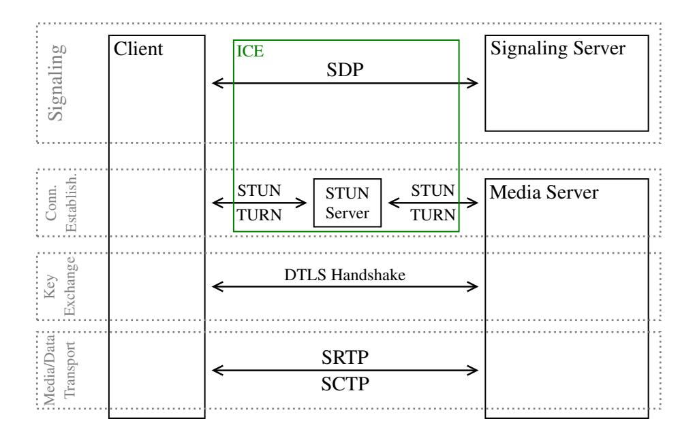
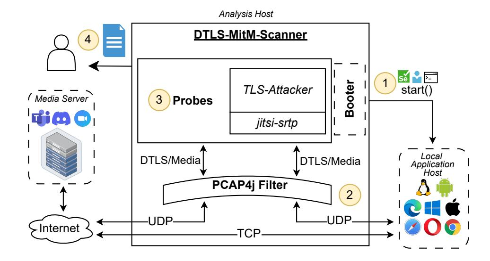

{0}------------------------------------------------

# Analyzing the WebRTC Ecosystem and Breaking Authentication in DTLS-SRTP

Martin Bach *Technology Innovati[on](https://orcid.org/0009-0009-7473-887X) Institute*

Vukašin Karadžic´ *Technical University of [Dar](https://orcid.org/0009-0007-5011-4304)mstadt*

Lukas Knittel *Ruhr University B[och](https://orcid.org/0009-0006-5676-5151)um*

Robert Merget *Technology Innovatio[n In](https://orcid.org/0009-0006-5026-9229)stitute*

Jean Paul Degabriele *Technology Innovation In[sti](https://orcid.org/0000-0002-4515-974X)tute*

### Abstract

DTLS-SRTP was designed to secure real-time media communication and is found in prominent audio and video call platforms, including Zoom, Teams, and Google Meet. Notably, it is part of Web Real-Time Communication (WebRTC), a web standard enabling real-time communication in the browser. To this end, WebRTC uses multiple technologies, including HTTP, TLS, SDP, ICE, STUN, TURN, UDP, TCP, DTLS, (S)RTP, (S)RTCP, and SCTP. This amalgamation of technologies results in an overly complex system that is very challenging to audit systematically and automatically. As a result, the security of deployments of this core modern communication technology remains largely unexplored.

In this work, we aim to close this gap by developing an automated MitM testing framework (DTLS-MitM-Scanner (DMS)) to test the DTLS channel of a DTLS-SRTP connection. We use our framework to study the current state of the ecosystem in a case study spanning *24* service providers across their browser and mobile applications. Our analysis puts special emphasis on the authentication mechanism in DTLS-SRTP, where we test for *19* potential vulnerabilities that could lead to authentication bypasses for both the client and server. We find that among the *33* tested media server implementations, *19* contained vulnerabilities allowing an attacker to break authentication at the DTLS layer. For *9* of the affected systems, which serve hundreds of millions of users, we could also demonstrate that they could be exploited by an attacker to retrieve media data, assuming only Man-in-the-Middle capabilities. We highlight the impact of these vulnerabilities by building a Proof-of-Concept exploit to listen to Webex video conference calls.

#### 1 Introduction

After the onset of the COVID-19 pandemic, Real-Time Communication (RTC) technologies experienced rapid growth in adoption and market share [\[79\]](#page-18-0), driven by the shift to online teaching and the widespread adoption of remote work. As

Figure 1: Phases of establishing a WebRTC connection.

the proliferation of RTC technologies continues to increase, ensuring their privacy and resilience to attacks is a forefront priority for the IT security community.

At the heart of most RTC technologies is the DTLS-SRTP protocol [\[48\]](#page-16-0), which specifies a mechanism for securely exchanging cryptographic key material between two communicating parties and then using this key material to establish secure channels for transmitting media and data. In particular, DTLS-SRTP is used in the Web Real-Time Communication (WebRTC) standard, which defines an API for browsers to establish RTC connections using DTLS-SRTP. WebRTC was initially proposed by Google in 2010 and later released as an open-source project in 2011 [\[6\]](#page-14-0), after which it was quickly implemented in nearly all browsers. However, it was not until January 2021 that its first complete version of the standard was officially released [\[36\]](#page-16-1). A notable feature of WebRTC is that it was designed to provide a high degree of flexibility and be backwards-compatible with several existing technologies. Most strikingly, it does not specify a signaling protocol and attempts to be backwards-compatible with all possible options. As we shall see, this added complexity has a toll on security.

{1}------------------------------------------------

A textbook WebRTC call between two parties, *A* and *B*, would proceed as follows. Both parties must typically authenticate to the service through some web application, for example, by opening the service's webpage and logging into their account. This establishes a secure connection (TLS) with the *signaling server*. The signaling server then acts as an intermediary to assist *A* and *B* in establishing a direct connection. Now *A* can initiate a call with *B* through the signaling server, which relays the appropriate signaling messages. Both parties then generate self-signed certificates and exchange their fingerprints, along with several other call parameters, in a standardized text-formatted Session Description Protocol (SDP) message [\[13\]](#page-15-0). Next, they perform connectivity checks via the Interactive Connectivity Establishment (ICE) protocol [\[54\]](#page-17-0) (STUN/TURN) in order to bypass potential NATs and communicate directly without further assistance from the signaling server. Once a connection has been established, a Datagram Transport Layer Security (DTLS) [\[61,](#page-17-1) [62,](#page-17-2) [63\]](#page-17-3) handshake is initiated between the two peers, where one of the peers will act as a server and the other as a client. During the DTLS handshake, both parties present their self-signed certificates, thereby binding their identities to the ones established during signaling. If both can match the peer's certificate fingerprint against the one provided in the SDP, the handshake proceeds.

Once the DTLS handshake concludes, symmetric keys are exported from the DTLS [\[57\]](#page-17-4) to establish Secure Real-time Transport Protocol (SRTP) and Secure RTCP (SRTCP) channels or used directly to secure Stream Control Transmission Protocol (SCTP) communication, as needed. Namely, media packets are protected via SRTP, whereas control traffic is carried over RTP Control Protocol (RTCP) and protected using SRTCP, both of which are specified in [\[11\]](#page-15-1). In addition to media, applications may negotiate data channels transported as SCTP over DTLS [\[75,](#page-18-1) [80\]](#page-18-2). The symmetric cryptographic algorithms, called protection profiles, are negotiated during the DTLS handshake via a DTLS extension [\[48\]](#page-16-0).

While WebRTC was originally envisioned to be peer-topeer (P2P), in reality, many applications relay or remix the communication through an intermediate media server. In such cases, both *A* and *B* establish separate DTLS-SRTP connections with the media server instead. This provides the application with more flexibility, allowing for compression and advanced features such as cloud recording, where encryption is not end-to-end. In SRTP, media streams are identified and multiplexed using an Synchronization Source (SSRC) identifier that is included in the Real-time Transport Protocol (RTP) header. The SSRC is exchanged in the SDP and helps the other participants or a forwarding party to map media streams to the respective entity.

The DTLS-SRTP/WebRTC ecosystem presents significant challenges for automated security analysis due to its complex architecture and the interplay of numerous protocols and standards.

Multitude of Components. A typical WebRTC session involves several protocols: HTTP, TLS, SDP, ICE, STUN, TURN, UDP, TCP, DTLS, (S)RTP, (S)RTCP, and SCTP. Each system may employ a distinct subset with different settings. This complicates the attack surface, and building automated tools that account for all these technologies and their possible configurations becomes particularly challenging.

Interleaved Protocol Progression. The DTLS connection cannot be tested in isolation, as it requires progression through both the signaling phase and the connectivity establishment phase. As discussed, signaling is not specified beyond SDP, with many details left open to the application layer. Typically, users must sign into a web application to trigger signaling and connection establishment, as otherwise, no server will listen for incoming DTLS connections. Thus, each test subject requires specific customization of the testing tools in order to trigger a DTLS-SRTP connection, creating per-application overhead that testers ideally want to avoid.

Hidden Signaling. A major challenge for system testing is that signaling is conducted through encrypted channels. Accordingly, external testers cannot observe or influence the negotiated parameters. This includes crucial information such as ICE candidates, SSRC values, X.509 certificate fingerprints, IP addresses, and ports of media servers. Consequently, testers are restricted to the same capabilities as a true Manin-the-Middle attacker, limiting the scope of executable tests. While applications can be modified to exfiltrate private keys, this creates additional overhead per application or browser.

Parallel Connections. Real-world applications often establish multiple simultaneous DTLS-SRTP connections, typically using separate connections for different media types (audio and video). Additionally, distinct endpoints may not behave consistently due to load balancing and random port allocations, making it challenging to consistently test the same logical endpoint.

These challenges have rendered WebRTC particularly unattractive to test, resulting in limited tooling for analyzing the security of deployed implementations, especially regarding DTLS. As a result, this huge ecosystem used by hundreds of millions of users remains largely unexplored, which leads us to our first research questions:

RQ1: What is the status of the DTLS-SRTP ecosystem? Which cryptographic algorithms and DTLS features are used to secure RTC communication?

To answer this question, we developed an automated DTLS-SRTP testing platform, called DMS, to probe the DTLS component of any party willing to establish DTLS-SRTP/WebRTC connections. Through it, we can gather information about the DTLS implementation and configuration of a target system, such as supported cipher suites and extensions, version support, assumed DTLS role, and RFC compliance, among other details. Our testing platform is built on TLS-Attacker [\[74\]](#page-17-5), pcap4j [\[88\]](#page-18-3), Selenium [\[67\]](#page-17-6), and jitsi-srtp [\[38\]](#page-16-2), and is entirely

{2}------------------------------------------------

black box—requiring only MitM access and no alterations to the system under test. Equipped with this testing platform and having noted several differences in the way that DTLS is employed in DTLS-SRTP, we were then faced with the next important question:

RQ2: Is DTLS deployed securely in DTLS-SRTP, and are connections securely authenticated?

To address this question, we extended our testing platform with a suite of tests that specifically target the authentication mechanism in DTLS. We use it to analyze the behavior of many popular DTLS-SRTP implementations, with a special focus on WebRTC. Our study includes various browsers, mobile platforms, and apps, as well as numerous popular web applications, including Zoom, Discord, Teams, Google Meet, Webex, and more, through an extensive case study.

Results. Our case study reveals a diverse ecosystem comprised of numerous algorithms and features across the tested applications. Among the *24* tested applications, *19* implementations contained vulnerabilities that allowed an attacker to complete the DTLS handshake with their peer without owning the private key to the certificate. While this may not be enough for a complete exploit, we confirmed for *9* of those vulnerabilities that the vulnerability allows the attacker to receive media data from the peer. This would allow an active MitM attack to effectively join a media call instead of the intended client, thereby compromising the confidentiality of the media connections. Last but not least, we propose additional hardening measures that can be implemented in DTLS-SRTP implementations (like browsers) to reduce the potential for dangerous misconfigurations.

Contributions. We make the following contributions:

- ▶ We create the first testing platform, DMS, for analyzing DTLS-SRTP implementations in a black-box manner, requiring only MitM capabilities [\(Section 3\)](#page-4-0). Our test framework is modular and open source.
- ▶ We present a suite of tests to perform a thorough evaluation of the DTLS-SRTP ecosystem, focusing on the DTLS component, gathering data on algorithm support and deployment practices, and, specifically targeting authentication [\(Section 4\)](#page-5-0).
- ▶ We perform the first case study of the DTLS-SRTP ecosystem, spanning *33* media server implementations, with a particular focus on DTLS authentication. Among the tested implementations, we identify *19* cases where authentication is broken at the DTLS layer. In *9* of these cases, we find that the vulnerability is exploitable and can be used to decrypt media data from a pure Manin-the-Middle position. Among the vulnerable applications are popular services with hundreds of millions of users, including Webex, Discord, Zoom, and Steam [\(Section 5\)](#page-7-0).
- ▶ We demonstrate how an attacker can fully exploit the identified vulnerabilities and eavesdrop on teleconferenc-

- ing calls, by implementing a Proof-of-Concept exploit for one of the identified applications (Webex) to highlight the severity of the discovered issues [\(Section 6\)](#page-11-0).
- ▶ We analyze browser implementations of the WebRTC API, focusing on certificate generation and validation. Our findings reveal that all tested browsers accept weak 512-bit RSA certificates from media servers, and some browsers allow generating certificates with potentially insecure parameters [\(Section 7\)](#page-11-1).

# 2 Background

Datagram Transport Layer Security (DTLS) [\[63\]](#page-17-3) is a variant of the TLS protocol [\[58\]](#page-17-7) aiming at providing equivalent security guarantees over datagram-based transport protocols like UDP. This requires DTLS to implement additional features, such as explicit sequence numbers, in order to reliably retransmit handshake messages.

To establish a DTLS connection, the client sends a *ClientHello* message, which includes a nonce, the highest supported protocol version, supported cipher suites and compression algorithms, an optional session ID of a previous connection, as well as a list of supported extensions. The server responds with a *ServerHello* message, which specifies the selected protocol version, cipher suite, and compression algorithm, a session ID, server nonce, and a list of extensions. The server then sends a *Certificate* message to the client containing its X.509 certificate chain. When the server selects an ephemeral cipher suite, it additionally sends a *ServerKeyExchange* message containing its ephemeral public key signed with the certificate's private key. If the server is configured to request client authentication, it will additionally send a *CertificateRequest* message to indicate this. The server then finishes its flight by sending a *ServerHelloDone* message, which indicates to the client that the server is awaiting a response from the client. If the server requested client authentication, the client sends its client certificate (or certificate chain) in a *Certificate* message. If the client does not have a suitable certificate, this message can be left empty. The client then proceeds to send a *ClientKeyExchange* message, which contains the client's ephemeral public key. If the client was able to send a certificate, it also sends a *CertificateVerify* message containing a signature over the hash of the current transcript of the handshake. The signature is computed with the private key of the client's certificate, thereby proving to the server that it is in possession of the certificate's private key. At this point, the client and the server have all the necessary information to compute the shared secret for the DTLS connection. Using this shared secret and a PRF, both parties evaluate a master secret, which is in turn used to derive the symmetric keys for securing data. The client then sends a *ChangeCipherSpec* message, indicating to the server that all subsequent messages will be encrypted using the negotiated keys, followed by a *Finished* message containing a crypto

{3}------------------------------------------------

graphic checksum over the handshake transcript. Upon receiving this message, the server will recompute the checksum to verify that both parties saw the same handshake messages. If successful, the server will send its own *ChangeCipherSpec* and *Finished* messages as confirmation to the client. The handshake is complete, and application data can now be exchanged.

To prevent DoS attacks, a DTLS server can request the client to prove its ability to receive server messages and is thus not spoofing its IP address. To this end, the server can respond to the *ClientHello* message with a *HelloVerifyRequest* message containing a stateless 'cookie'. In return, the client will retransmit its *ClientHello* message with this cookie, to prove that it received it.

### 2.1 DTLS-SRTP

Real-time Transport Protocol (RTP) [\[66\]](#page-17-8) is a protocol for delivering audio and video over IP networks, offering timing information and sequence numbering. Secure Real-time Transport Protocol (SRTP) [\[11\]](#page-15-1) extends RTP by additionally providing confidentiality through encryption, message authentication, and replay protection for media streams. However, SRTP still requires an external key management mechanism to exchange the necessary symmetric keys. Accordingly, the DTLS-SRTP protocol augments SRTP with the DTLS handshake. During the DTLS handshake, both endpoints authenticate using certificates, which can be self-signed and generated on the fly. Self-signed certificates are authenticated by exchanging their fingerprints in Session Description Protocol (SDP) during signaling. Once complete, the shared secret is used to generate the master keys and salts required by SRTP to protect media packets.

# 2.2 WebRTC

Web Real-Time Communication (WebRTC) is a protocol suite enabling secure real-time communication in browser applications. It is specified jointly by the IETFs' *rtcweb* working group and W3Cs' *Web Real-Time Communications* working group. The IETF is responsible for defining and standardizing the protocols used in WebRTC, while W3C is tasked with standardizing the browser API WebRTC. Today, virtually all teleconferencing services (e.g., Zoom, Discord, Google Meet, Webex) use WebRTC in their web applications. Additionally, it is used in browser applications for streaming and voice interaction with AI agents.

### 2.2.1 WebRTC Connection Establishment

A WebRTC connection proceeds in four phases, as illustrated in [Figure 1.](#page-0-0)

Signaling Phase. A WebRTC connection starts with the signaling phase, where two parties exchange SDP messages via a signaling server to negotiate parameters for the media connection and make proposals on how to establish a connection by exchanging Interactive Connectivity Establishment (ICE) candidates. Both parties exchange fingerprints of the certificates that they will use in the DTLS handshake, and they also negotiate which peer will assume the role of DTLS server and that of DTLS client.

Connection Establishment Phase. Once signaling is complete, they proceed to establish a network connection in order to communicate with each other. Albeit straightforward in a centralized setting, where clients (i.e., browsers) simply connect to a central media server, connection establishment is more challenging when both peers of the connection are clients. Clients are often behind NAT gateways and are thus not aware of their public IP address, and may also be restricted by firewalls. The ICE protocol [\[39\]](#page-16-3) is used to overcome these limitations. In turn, ICE can use Session Traversal Utilities for NAT (STUN) [\[53\]](#page-17-9), Traversal Using Relays around NAT (TURN) [\[52\]](#page-17-10), or try to establish a direct connection. The STUN protocol allows a peer to learn its public-facing IP address and port. TURN is an extension of STUN, used when direct communication between two peers is not possible, for example, due to a firewall. In such cases, the peers can communicate via a TURN server that relays their communication. ICE will try different approaches until a connection is established.

Key Exchange Phase. Once a connection is established, both peers need to exchange keys to secure media and data traffic. As previously negotiated during signaling, one party will act as a DTLS client and the other as a DTLS server. Keys are exchanged using the DTLS handshake with client authentication, using the certificates that the parties have committed to in the signaling phase. Once the handshake is complete, the master secret of the connection is used to export keys for the media channel.

Media Phase. The peers are now ready to start exchanging media through the SRTP protocol. Video and audio are encapsulated in SRTP packets, whereas connection metadata and other control information are transported using SRTCP [\[11,](#page-15-1) [66\]](#page-17-8). The usage of SRTP and the concrete cryptographic algorithms are negotiated in the key exchange phase through the use\_srtp DTLS extension. Additionally, Web-RTC applications can also use SCTP [\[75,](#page-18-1) [80\]](#page-18-2), typically for chat messages and meta information, which will be protected by DTLS directly.

#### 2.3 TLS-Attacker

TLS-Attacker [\[74\]](#page-17-5) is an open-source framework for analyzing TLS and DTLS implementations. With TLS-Attacker, users can generate arbitrary protocol flows and modify the structure of the included protocol messages at runtime.

{4}------------------------------------------------

# 3 DMS: Testing DTLS-SRTP

While previous work on WebRTC focused on the signaling channel and Man-in-the-Middle attacks with a malicious signaling server, other potential flows, like MitM-based attacks on the authentication on the DTLS layer that exploit implementation and configuration flaws, have not received the same attention. In this work, we therefore want to investigate the potential for Man-in-the-Middle attacks *without* a malicious signaling server.

For this work, we focus on the security of the DTLS connection. The security of DTLS is very closely related to the security of the TLS protocol, which has been heavily analyzed in the past and is considered, when implemented and configured correctly, as secure. However, no public study has analyzed whether DTLS-SRTP is implemented and configured securely in real-world systems. The DTLS protocol offers various features, some of which are no longer considered secure or state-of-the-art, which can lead to severe vulnerabilities. At the same time, incorrectly implementing the protocol can completely break all security properties of the protocol. To assess whether an implementation is correctly implemented and configured, we will use system tests that allow for the dynamic testing of implementations without significant changes to the system under test.

# 3.1 System Tests for DTLS-SRTP

To answer our research questions, we built a framework to analyze DTLS-SRTP applications on a system test level, without hooking deeply into the tested application, such that we can support a plethora of platforms and applications without custom code for each, beyond automating the startup of the application. We achieve this by leaving the tested application as is, not interfering with the signaling of the application, and only interacting with the tested application like a normal user (potentially by emulating mouse clicks and button presses) and then performing our tests from a Man-in-the-Middle position. Crucially, our approach does not require installing any certificates or private keys on the system under test nor do we modify the application's trust store to decrypt traffic. This makes our testing framework entirely black-box and portable across different platforms and applications. The overall architecture of our testing platform is visualized in [Figure 2.](#page-5-1)

1. Booting. To start the analysis, DTLS-MitM-Scanner (DMS) can request the startup of a local application with a *Booter*. The Booter abstracts away the concrete steps to start or stop a DTLS-SRTP connection, for example, logging into the web application and starting a video conference, or hanging up a call on the web application. Booters can then either automatically start or stop the application using scripts or Selenium, or can be implemented by manually starting/stopping the application on the request of DMS.

- 2. Traffic Filtering. To enable testing, our testing tool is brought into a Man-in-the-Middle position, where it is able to intercept the network traffic between the media server and the local application. Using iptables and pcap4j [\[88\]](#page-18-3), we route all UDP traffic from both communication directions to our analysis tool, where we make a decision of whether the UDP packet is interesting for further analysis (i.e., it belongs to a DTLS-SRTP connection). Packets that are not interesting get forwarded, while packets that are will be sorted into processing queues associated with a logical DTLS-SRTP connection.
- 3. Performing the Test. Once we are able to receive UDP packets and associate them with logical connections, test execution can start. We group the tests we want to execute into semantically similar test groups called a *Probe*. Each probe can request connections to be started via the Booter interface to then execute multi-context TLS-Attacker WorkflowTraces. The Probe then uses these results of the execution to draw conclusions about the configuration and implementation of the system under test. To implement our tests, we extended the TLS-Attacker framework with support for STUN and TURN, as well as additional *Actions* to better support our test cases. For each WorkflowTrace, we always try to find evidence of the behavior. For example, when testing for supported cipher suites, it may happen that we do not get a response from the system under test. From this, we could conclude that the cipher suites we offered were not supported. However, it may also be that for some application-specific reason, the media server closed the DTLS endpoint entirely, and that the server is, in fact, supporting a cipher suite we offered. We therefore execute tests where we did not get a final answer at the point of test, up to 5 times or until we get a definite answer (like an *Alert* message). We then treat the final answer as the answer of the target to the test. After all tests have been performed, we use the booter interface to bring the application back into its starting state. For the decryption of media traffic, we use the jitsi-SRTP library [\[38\]](#page-16-2). To collect evidence for multiple different behaving DTLS-SRTP implementations, we fingerprint all seen *ClientHello* messages, *ServerHello* in response to an unmodified *ClientHello*, and *Certificate* messages. For *ClientHello* messages, we use JA3 [\[65\]](#page-17-11) fingerprints, for *ServerHello* we use JA3S [\[4\]](#page-14-1) fingerprints, and for certificate messages, we built a custom similar solution based on hashing the number of certificates, the length of the issuer, the length of the subject, the public key OID and the signature algorithm OID.
- 4. Reporting. After all probes have been executed, a report with the results is returned. If this report contained more than one fingerprint for each analyzed message type, we conclude that there are multiple different behaving endpoints. From that point on, we attempt to manually identify a pattern that allows us to distinguish between the two endpoints. We discard the report and restart the scanning with an additional filter in place that only triggers on connections that have the selected

{5}------------------------------------------------

Figure 2: Sketch of the DMS architecture.

characteristic (i.e., a certain source port, JA3 fingerprint, or source IP).

# 3.2 Limitations

Missing TCP support. To minimize overhead, we deliberately do not intercept TCP traffic. Under this constraint, if a peer fails to receive responses on its UDP-based ICE candidate pair within the retransmission window, it will be marked failed, and the application switches to an alternative pair. In our observations, applications typically first migrate to a TURN-based UDP path and, if that also fails, may select a TCP-based ICE candidate. Because our tool monitors only UDP, any DTLS-SRTP association that moves to a TCP path becomes invisible to us. It is therefore essential that we process all UDP packets promptly to avoid triggering such fallbacks. Moreover, sessions that select a TCP-based candidate right at the start, such as Viber and Cloudflare Agents, are outside the scope of our evaluation.

TURN Channels. Our implementation supports TURN but does not support TURN channels [\[45\]](#page-16-4). To account for this, we drop all TURN channel-establishment messages, preventing the establishment of a TURN channel within the TURN connection. This forces peers to use STUN *SendIndication* and *DataIndication* to exchange payloads, if they support them. However, we are unable to analyze applications that rely exclusively on data exchange through TURN channel messages.

#### 4 Implemented Tests

We added various tests to our framework to analyze the implementation and configuration of the target systems.

#### 4.1 Property Tests

To answer RQ1, we built tests using TLS-Attacker to assess specific properties of the involved implementations. We organize the tests we perform into *probes*, each of which is

responsible for a set of properties.

Selftest. To explain how these probes operate, we will first introduce the most basic one, the SelfTestProbe. The SelfTestProbe first starts the connection with the booter interface. Then the probe just forwards the messages between the peers until the client sends its certificate. After that, we use the booter to reset the application. This test allows us to verify that the booter is working properly, i.e., able to start the DTLS-SRTP connection, that we are able to intercept the traffic correctly, and also that we are able to forward messages correctly. Additionally, the probe allows us to read many properties of the connection straight away. The *ClientHello* message contains the client-supported cipher suites, the highest protocol version, supported compression algorithms, and supported extensions. The *ServerHello* tells us which parameters would be naturally negotiated between the client and the server (version, cipher suite, compression algorithm, and extensions). Additionally, the test shows us the structure of the certificates that are being used by both peers. Last but not least, the test allows us to see if the server requires the client to authenticate.

Basic DTLS Properties. We implemented a group of probes tasked with retrieving parameters from the server's configuration that are not visible through passive observation. In these tests, we intercept the original *ClientHello* message from the client and replace it with a crafted *ClientHello* message designed to force the server into negotiating different parameters to probe it for support for different parameters. For example, to test the different server-supported cipher suites, we first send a *ClientHello* message with all TLS-Attacker supported cipher suites that are allowed in DTLS (317). The cipher suite the server chooses is then considered supported. In the next connection, we then propose the same list of cipher suites, excluding those the server has already selected in a previous connection. We repeat this process until the server no longer chooses a cipher suite. We perform this test for the supported cipher suites, protocol versions, signature algorithms, named groups, and SRTP protection profiles.

#### 4.2 Authentication Bypasses

To answer RQ2, we developed a total of *19* tests for the authentication mechanism of DTLS-SRTP. Some of the tests we designed are motivated by the existing literature. The rest were constructed partially in an ad-hoc manner, based on our experience and knowledge of common pitfalls that occur in (D)TLS implementations, while taking into account the specific nature of the WebRTC ecosystem that is based on self-signed certificates. We group our tests into the following categories.

Certificate Requested. If the DTLS server is not configured to request a certificate from the client, the client does not authenticate at all, meaning that the server later has no chance to detect illegitimate clients on the DTLS layer, leading to

{6}------------------------------------------------

a trivial 'authentication bypass'. We therefore test if DTLS servers request client authentication.

Authentication Required. DTLS libraries usually support *optional* and *required* authentication. *Required* authentication means that the server will not accept connections in which the client did not send a valid certificate during the handshake. With *optional* authentication, the DTLS server will also finish DTLS connections if the client did not present a certificate at all. In those cases, the DTLS library 'marks' the connection internally as not authenticated but still hands the connection to the application for consideration. In the context of WebRTC, optional authentication should not be used, as both parties *must* authenticate to establish a secure connection [\[27,](#page-15-2) Chapter 5]. To test if optional authentication is supported, we try to connect to the server with an empty certificate message.

Performs Identity Check. Another potential flaw that either peer can make is related to the identity check. Peers have to not only check that they receive *a certificate* from their peer, but also need to check that the certificate that they receive is the correct one (i.e., with the same fingerprint as exchanged in the SDP). To test if peers verify the identity, we differentiate between two cases: we either try to authenticate with a completely unrelated certificate (i.e., the TLS-Attacker default certificate) or try to authenticate with a *mimicry* certificate. This certificate mimics the expected certificate in all regards (same key type, same subject, same issuer, etc.), but the expected public key (and signature), which we replaced with our own. We perform this test to rule out identity checks on other (insecure) metrics, such as the common name. Variants of this test involve presenting a mimicked certificate alongside the original peer certificate in the hope that the system under test will authenticate us based on the original peer certificate fingerprint, while completing the handshake with keys from our own certificate.

Incorrect Trust Store. While DTLS-SRTP implementations are supposed to only accept certificates that match the exchanged certificate fingerprint, incorrectly configured DTLS implementations might also accept certificates that are accepted in general by the operating system's trust store. Therefore, it might be possible to confuse a peer into accepting a certificate with an incorrect fingerprint, which is generally trusted by the browser/Internet PKI. To perform this test, we send a certificate we received from Lets Encrypt [\[41\]](#page-16-5) using RSA-2048 with SHA256, and ECDSA P384R1 with SHA384 for a domain under our control.

Signature Verified. When signatures are used in key exchange protocols, it is important that peers also verify the correctness of the transmitted signatures. As mentioned by Maehren et al. [\[44\]](#page-16-6), the (D)TLS RFCs[1](#page-6-0) never explicitly mention that peers are supposed to verify signatures. We therefore also perform tests for both peers where we invalidate the signature (by flipping bits in the middle) in the *ServerKeyExchange*

and *CertificateVerify* messages to test if peers are correctly implementing this implicit requirement.

No Flow Bypass. Since DTLS is usually used on top of UDP, it is possible that messages naturally arrive out of order. However, implementations should not process messages out of order; instead, DTLS implementations *can* buffer messages that arrive out of order and process them at a later point. If an implementation can be tricked into processing out-of-order messages (maybe with an incorrect *message sequence number*, the implementation's internal state might get confused into accepting connections it should not accept. A prominent example of this was shown by Fiterau-Brostean et al. [\[28\]](#page-15-3), who were able to present multiple variations of authentication bypasses in JSSE [\[51\]](#page-16-7). Inspired by Fiterau-Brostean et al. [\[28\]](#page-15-3), we considered three different tests, a handshake where we omit the *Certificate* message and are therefore not presenting an identity, a handshake where we omit the *CertificateVerify* message and are therefore not proving that we are not in possession of the private key, and last but not least a handshake where we are neither presenting a *Certificate* nor *CertificateVerify* message, ignoring authentication completely. If any of these handshakes are completed, we have a potential authentication bypass.

Public Key Protected. The public key of each peer in mutual DTLS is protected by a signature, which, in the case of the client, is computed over the session transcript, while in the case of the server, it signs the public key with the nonces from the hello messages. Since DTLS implementations have to be flexible regarding their received message order, we try to see if it is possible to inject a second public key into the connection that is *not protected* by the signature. Our hope is that the peer verifies the signature with the original key, while it computes the shared secret using our maliciously injected key. For the client's public key, we do this by sending a *ClientKeyExchange* message after the *CertificateVerify* message. This out-of-order message should be discarded by the server. However, if it does not implement the state machine correctly and processes the message, the *ClientKeyExchange* message can potentially overwrite the client's public key in the server's internal state, allowing the attacker to bypass client authentication. We perform the same test for the server, sending a second *ServerKeyExchange* message after the first initial *ServerKeyExchange* message. For this test case, we are less optimistic about the results, as the *ServerKeyExchange* message contains a signature that we, as an attacker, cannot forge, meaning the client has to process the out-of-order message and ignore or not act on the invalid signature. In both cases, we do the test twice, once with a *correct* message sequence number and once with the same sequence number that the original key exchange message had.

1RFC 5246 (TLS 1.2), RFC 8446 (TLS 1.3), and RFC 6347 (DTLS 1.2)

{7}------------------------------------------------

# 4.3 Exploitability Tests

An issue that arises from our testing approach is that a completed DTLS handshake, which reveals an authentication flaw on the DTLS layer, may not necessarily result in real exploitable behavior on the application layer. We identified three main reasons for unexploitable issues:

- Delayed Client Authentication. Implementations could verify the state and properties of the established DTLS connection *after* the handshake was completed. Implementations can then abandon the connection before using it to send any sensitive data, making the perceived vulnerability unexploitable.
- Application State Signaling. Another mitigation could be implemented on the application layer. If only one of the peers is vulnerable to an authentication bypass, it may be that the peers wait for a signal on the application layer before they transmit data. If one of the peers never finishes the DTLS connection, the signal to start media data transmission may never be sent, preventing the leakage of confidential data to the attacker.
- Application Layer Authentication. Applications are free to not rely on the security of the DTLS-SRTP channel at all and can implement their own cryptography with their own authentication mechanisms on top of it. This results in a custom security architecture that no longer follows any public standards and is therefore also very difficult to test automatically.

At the same time, analyzing if a detected vulnerability is actually exploitable is challenging, as we do not have access to the details of the remote implementation. Applications use a diverse mix of protocols and technologies in the media connection, which may require target-specific messages on the media channel from the attacker to trigger the flow of media traffic, hindering an exploitability analysis. To better understand the impact of our identified vulnerabilities, we conduct additional tests to explore whether the observed behavior is actually exploitable and to rule out any limiting factors. Furthermore, we consider vulnerabilities as exploitable for which the vendor has applied a patch after our disclosure (unless otherwise communicated). We want to emphasize that the fact that we cannot show exploitability does not necessarily mean that the issue is not exploitable, as we are working in a black-box scenario.

Unprovoked Media. Some applications are willing to send media data immediately after finishing the handshake. We, therefore, added a probe that analyzes the behavior of the peer after a successful DTLS authentication bypass with our analysis tool. If a peer sends media data that we can decrypt, we conclude that the vulnerability is exploitable.

Ruling out Delayed Client Authentication. To rule out that the authentication test is simply performed after the DTLS handshake is completed, using the information presented in the DTLS handshake, we need to send the 'correct' application data and check if the peer responds with media data. For example, Discord's media server requires a client to send a valid SRTP message with a correct SSRC before it will start sending media to the client. Another example is Cisco Webex, which needs a data channel setup and a completion of the Webex Multistream protocol [\[19\]](#page-15-4) before the attacker can receive media from the server. To avoid reverse engineering of applications and ensure the correct message is sent, we use a specialized browser to test the exploitability of web applications. This browser has been modified to accept any certificate fingerprint presented by our analysis tool, enabling us to use it to interact with the web application and generate application data. DMS will then use this application data within a connection in which it performed the authentication bypass. If we do not receive media data, we conclude that the application is merely performing the authentication check after the DTLS connection is established. In contrast, when we receive media data, we conclude that authentication on the DTLS layer is truly broken. For non-web-based applications, we omit this evaluation. Other exploit-hindering measures on the application layer may still be in place, but we consider their analysis as out of scope for this work.

#### 5 Server Evaluation

We analyzed the state of the ecosystem and DTLS-SRTP implementations using our framework. As applications, we chose the web applications (WebRTC) of multiple different audio and video conferencing and chat systems. We performed all WebRTC tests on web applications using Chrome. To test DTLS-SRTP implementations on other platforms, we selected a similar list of Desktop and Android applications. The selected applications were chosen based on perceived popularity to explore prominent use cases across diverse platforms. Individual descriptions for the test methodology for each service can be found in [Appendix A.](#page-19-0)

#### 5.1 General Properties

DTLS Versions. There exist three distinct DTLS version, DTLS 1.0 [\[61\]](#page-17-1) (2006), DTLS 1.2 [\[62\]](#page-17-2) (2012), and DTLS 1.3 [\[63\]](#page-17-3) (2022). Across all tested platforms, only Adobe Connect supported DTLS 1.0. In contrast, DTLS 1.2 was supported by *every* tested implementation. Support for DTLS 1.3 was effectively nonexistent at the time of our experiments. Firefox officially added DTLS 1.3 support with version 127. We used version 137 for our tests and found that it does not come with DTLS 1.3 enabled. At the time of writing, we observed that DTLS 1.3 was re-enabled in Firefox in later versions, suggesting that the absence of DTLS 1.3 in Firefox 137 was a bug. The lack of support for DTLS 1.0 indicates that DTLS-SRTP is atypical compared to recent studies on the

{8}------------------------------------------------

general DTLS ecosystem by Erinola et al. [\[25\]](#page-15-5), where most servers supported version 1.0 and 1.2 simultaneously. The full list of DTLS versions supported across tested platforms is present in [Table 3.](#page-21-0)

Cipher Suites. In [Table 3,](#page-21-0) we also list the cipher suites that the tested applications supported. Cipher suites with weak parameters were generally not supported by any tested application. All implementations supported forward secure key exchange algorithms and AEAD cipher suites. In general, we did not observe any support for exotic TLS cipher suites or known broken cipher suites, such as EXPORT or NULL. Cipher suites using 64-bit block ciphers (vulnerable to the Sweet32 attack) were observed only in the Instagram web application. However, since servers do not negotiate this cipher with browsers (due to missing support), there is no real impact.

For WebRTC specifically, all implementations must support TLS\_ECDHE\_ECDSA\_WITH\_AES\_128\_GCM\_SHA256 [\[60\]](#page-17-12). During our evaluations, this cipher suite was often supported, but not universally available in the deployed configuration. Additionally, WebRTC implementations must favor cipher suites with forward secrecy over non-forward secure ones and must favor AEAD cipher suites over CBC cipher suites (RFC 8827). However, among the tested applications, many do not even enforce a server-preferred order, but instead rely on the ordering of the client-proposed list, giving browser developers more agency about algorithm choices.

The most concerning issue we found is that cipher suites are advertised as supported, but fail in practice when we tried to use them. Concretely, we observed servers willing to negotiate a specific cipher in their *ServerHello* message, but would then send an *Alert* message right after when trying to send a certificate message. We attribute this, for the most part, to server-side misconfigurations. The server is trying to use cipher suites that require a certificate with a public key type not present in the certificate it has committed to using in the SDP.

SRTP Profiles. Regarding supported SRTP protection profiles, we see little diversity among browsers in WebRTC. All tested browsers supported AES GCM 128/256, ˜ and all browsers supported the mandatory SRTP profile SRTP\_AES128\_CM\_HMAC\_SHA1\_80. The only difference we found between browsers is that Firefox also supported counter mode with 32-bit HMACs. HMACs with 32-bit lengths are rather weak, as they allow an attacker to forge a MAC by guessing with non-negligible probability. Across other applications, we see no support for other protection profiles, with individual support for 32-bit HMACs. The full results of our analysis are given in [Table 3.](#page-21-0)

Supported Groups. The results of our analysis of supported groups are presented in [Table 4.](#page-22-0) Some applications support a wide range of groups, including some that are also considered weak. However, to exploit their presence, both endpoints have to support the weak choice, which we did not observe in any application.

Signature+Hash Algorithms. Support for signature and hash algorithms is presented in [Table 5.](#page-23-0) The results are mostly unsurprising, with support focusing on RSA, ECDSA, or ED-DSA. Signature algorithms supporting MD5 were generally not observed. Additionally, server implementations typically allow the client more leeway in their support than what they are willing to use themselves.

Certificate Analysis. The results of our certificate analysis are presented in [Table 6.](#page-24-0) In contrast to our expectations, many applications were not using fresh self-signed certificates for every connection. Many remote applications used the same certificate for multiple connections, while local applications always generated a fresh certificate. Additionally, some applications did not use self-signed certificates at all but used normal Internet PKI.

Our analysis of the certificates revealed that all tested applications use either ECDSA or RSA certificates. For ECDSA, we exclusively saw SECP256R1 certificates, likely motivated by browser support (see [Table 2\)](#page-12-0). For RSA, most applications use a 2048-bit RSA modulus, which is considered secure. Two exceptions to this were Vonage and Zoho. Vonage used a 1024-bit modulus, which, while not catastrophic, is on the border of what is considered crackable by motivated attackers and has been deprecated by NIST. More severely, Zoho was using a 512-bit modulus, which is unarguably too short for modern applications.

Curiously, many certificate subject names contained the names of WebRTC/DTLS-SRTP libraries, such as *mediasoup*, *FreeSWITCH*, and *LiveSwitch*, leading us to believe that these applications are using these libraries. Some application servers use certificates with long expiration dates (10 years or more). In one case, however, we even encountered an expired certificate (Discord).

#### 5.2 Authentication Bypasses

Our study uncovered multiple server authentication bypasses on the DTLS layer across the tested applications. We have highlighted applications from which we successfully obtained media or encrypted metadata in [Table 1.](#page-10-0)

Webex. When testing the Webex application, our tool reported that it is possible to authenticate to the Webex media server by presenting an empty certificate message. Cisco fixed the issue and assigned CVE-2025-20215 [\[20\]](#page-15-6).

Discord. In the Discord web application, we discovered two authentication bypasses. In October 2022, we discovered that it was possible to finish the DTLS handshake with the Discord server using *any* X.509 certificate, indicating that Discord was not verifying the identity of peers. While we investigated the issue, we noticed that shortly after our discovery, Discord independently found and fixed the issue. We contacted them, and they confirmed that they independently fixed the issue. In February 2024, we discovered that the Discord server was accepting DTLS connections with optional

{9}------------------------------------------------

client authentication. We reported the problems to Discord, and they acknowledged and fixed the issue, awarding us a bug bounty (severity: medium).

Zoom. Our analysis revealed that the Zoom web application's media server failed to request authentication from the browser, leading to missing client authentication. We reported the issue to Zoom, which acknowledged and fixed it (severity: high) and awarded us a bug bounty.

Teams. We observed that Microsoft Teams allows a peer to complete DTLS authentication using either an empty certificate or an arbitrary client certificate. In both cases, once the DTLS handshake completes, we receive *plaintext RTCP Source Descriptions*, behavior that the WebRTC standard explicitly prohibits [\[60,](#page-17-12) Section 6.5], as well as continued ICE connectivity checks (e.g., STUN binding requests/responses). However, we did not observe any true RTP media traffic. One possible explanation is that the media server cannot properly associate our connection with the correct call. Microsoft investigated our report but determined the reported vulnerabilities were out of scope because no RTP leakage was observed.

FreeSWITCH. Internally, BigBlueButton uses FreeSWITCH [\[68\]](#page-17-13), an open-source telephony framework used by multiple media servers for a variety of purposes (e.g., SIP, call routing, and WebRTC). While testing version 2.4 of BigBlueButton, we noticed that FreeSWITCH accepts any client certificate. In the code, FreeSWITCH mistakenly overwrites the remote fingerprint received in the SDP while attempting to extract the client certificate's fingerprint. Thus, the peer certificate verification always returns true. This issue was reported independently of our research in 2023 [\[55\]](#page-17-14), but the related pull request was never merged. In version 2.5, BigBlueButton transitioned from using FreeSWITCH for WebRTC calls to Mediasoup.

Zoho. In our tests, Zoho established multiple DTLS connections in one call. We found one of them to be vulnerable, as Zoho's media server accepted any client certificate in the handshake. We were able to MitM the connection and observed the exchange of call metadata on a WebRTC data channel (SCTP). We therefore consider Zoho as exploitable. As mentioned in [Section 5.1,](#page-7-1) Zoho used a 512-bit RSA certificate. To demonstrate that this allows an attacker to bypass authentication, we used cado-nfs [\[77\]](#page-18-4) to factor the key and retrieve the private key for the certificate in 4.5 hours with an AMD EPYC 7763. While Zoho did not negotiate RSA KEX cipher suites by default (which would have allowed for passive attacks), the certificate was used for all incoming clients, allowing an attacker to break the certificate once and then use the keys for active server impersonation attacks. We notified Zoho about the vulnerability, and they replaced the certificate with an ECDSA one. Zoho determined the missing identity check to be an out-of-scope vulnerability.

Steam. For Steam, the media server did not request a client certificate during the DTLS handshake. After we completed the handshake, the server immediately sent us RTP from the call, which we could decrypt. Therefore, we classified Steam as exploitable.

Vonage. With Vonage, we observed that the media server neither requested nor validated a web client's certificate when one was presented. Additionally, Vonage emits media data directly after our authentication bypass, confirming exploitability.

RingCentral. The RingCentral WebRTC gateway did not request client authentication from the browser. We directly received RTP data from the DTLS endpoint without further interaction.

Browsers. We evaluated the security of browser implementations in both DTLS roles: as a DTLS client and as a DTLS server. Our analysis reveals that none of the tested browsers were directly affected by a direct authentication bypass vulnerability.

Non-Exploitable. For *11* implementations (marked ✗ in [Table 1\)](#page-10-0), we could not provoke media data transmission, or we are missing confirmation from the vendor. We therefore manually investigated individual applications and found, for example, that mediasoup [\[12\]](#page-15-7) actually uses a delayed client authentication check by reviewing the source code. Similarly, after contacting the Amazon [\[7\]](#page-15-8) team, we learned that Chime is not using DTLS-SRTP for all of its connections, but is *also* sometimes using regular DTLS connections that see a custom authentication after the handshake. We likewise observed the Snapchat web client performing custom authentication by including a token in the first protected data-channel message. For Amazon Wickr, we assume that an authenticated key exchange occurs after the DTLS handshake to establish keys for end-to-end encryption (E2EE). Among our tests, some were unsuccessful for all applications. Concretely, we could not find evidence for *Flow Bypasses*, *Missing Signature Verification*, or *Missing Public Key Protection*. Additionally, when testing if the *OS Trust Store* was used, we observed that the application did not verify the peer's identity in all cases, leading us to conclude that no application was utilizing the OS trust store.

#### 5.3 Non-Security Bugs

During our testing, we encountered several non-security critical bugs in the tested applications that are worth mentioning. We noticed that our analysis of Discord only functions when DTLS retransmissions are used, as the Discord media server sends only half of the *ServerHello* flight in its first packet, without following up with the rest of the flight. Only after a retransmission were we able to receive the full flight. This behavior causes unnecessary delay for real users, as it adds an additional round-trip time to the connection establishment. Another observation we made is that five applications are configured to use the DTLS Denial-of-Service (DoS) countermeasure, which involves adding an additional cookie exchange to the DTLS protocol. However, in the case of DTLS-SRTP,

{10}------------------------------------------------

| DTLS Role Server   | Platform | Cert. Requested | Auth. Required | Identity Check | Signature Verified | No Flow Bypass | Public Key Protected | No OS Trust Store | Assessment | DTLS Role Client   | Platform                 | Identity Check Signature Verified Public Key Protected No OS Trust Store Assessment |
|--------------------|----------|-----------------|----------------|----------------|--------------------|----------------|----------------------|-------------------|------------|--------------------|--------------------------|-------------------------------------------------------------------------------------|
| Chromium           |          | <b>✓</b>        | <u> </u>       | <u></u>        | <u>J</u>           | <u></u>        |                      | <u></u>           | <u> </u>   | Chromium           | <u></u>                  | $\frac{1}{J}$ $\frac{1}{J}$ $\frac{1}{J}$ $\frac{1}{J}$                             |
| Firefox            |          | 1               | 1              | 1              | 1                  | 1              | 1                    | 1                 | /          | Firefox            |                          |                                                                                     |
| Safari             | É        | 1               | 1              | 1              | 1                  | 1              | 1                    | 1                 | 1          | Safari             | \$                       | 1 1 1 1 1                                                                           |
| Adobe Connect      | 0        |                 | 1              | 1              | 1                  | 1              | 1                    | 1                 | 1          | BBB v2.4           | 8                        | X / / X at                                                                          |
| BBB v3.0.4         | 8        |                 | 1              | X              | 1                  | 1              | 1                    | X                 | X          | BBB v3.0.12 con 2  | 8                        | X / / X X                                                                           |
| BBB v3.0.12 con 1  | 8        | 1               | 1              | X              | 1                  | 1              | 1                    | X                 | X          | ChatGPT con 1      | •                        |                                                                                     |
| ChatGPT con 1      | •        | 1               | 1              | X              | 1                  | 1              | 1                    | X                 | X          | ChatGPT con 2      | ·₩·                      | x                                                                                   |
| ChatGPT con 2      | ·₩·      | 1               | /              | 1              | /                  | /              | /                    | 1                 | 1          | Chime              | <b>*</b>                 |                                                                                     |
| Chime              | <b>#</b> | /               | /              | /              | /                  | /              | /                    | /                 | /          | Clickmeeting con 2 | <b>②</b>                 | X / / / 0                                                                           |
| Clickmeeting con 1 | <b>3</b> | /               | /              | X              | /                  | /              | /                    | /                 | Ø          | Goto Meet          | <b>3</b>                 |                                                                                     |
| Discord 2022       | <b>3</b> | 1               | /              | X              | /                  | /              | /                    | X                 | <b>*</b>   | LiveKit con 2      | <b>3</b>                 | X V V X X                                                                           |
| Discord 2024       | <b>3</b> | /               | X              | <b>√</b>       | /                  | /              | /                    | · /               | <b>*</b>   | MatterMost         | <b>3</b>                 | X V V X X                                                                           |
| Discord            | <b>Ø</b> | 1               | /              | /              | /                  | /              | /                    | /                 | /          | Slack              | △■                       | 1 1 1 1 1                                                                           |
| eduMEET            | 8        | 1               | /              | X              | /                  | /              | /                    | X                 | X          | Slack con 1        |                          | / / / / /                                                                           |
| Google Meet        | Ø        | /               | /              | 1              | /                  | /              | /                    | 1                 | 1          | Slack con 2        |                          | / / / / <b>&amp;</b>                                                                |
| Instagram          | •        | /               | /              | /              | /                  | /              | /                    | 1                 | 1          | Steam              | ۵                        | 1 1 1 1 1                                                                           |
| Ionos              | Ø        | 1               | /              | /              | /                  | /              | /                    | -                 | /          | T 7 4              | $\widetilde{\mathbf{Q}}$ | X / / / <b></b>                                                                     |
| Janus              | Ø        | 1               | 1              | X              | /                  | /              | /                    | /                 | 0          | Wickr              | △■                       | / / / / &                                                                           |
| Jitsi              | •        | 1               | /              | /              | /                  | <b>√</b>       | /                    | -                 | 1          |                    |                          |                                                                                     |
| LiveKit con 1      | •        | 1               | 1              | X              | 1                  | /              | 1                    | X                 | X          |                    |                          |                                                                                     |
| Ringcentral        | Q        | X               | -              | -              | -                  | -              | -                    | -                 | <b>*</b>   |                    |                          |                                                                                     |
| Slack              | å∎Ø      | 1               | ✓              | ✓              | ✓                  | ✓              | ✓                    | ✓                 | ✓          |                    |                          |                                                                                     |
| Slack con 1        | <b>\</b> | 1               | ✓              | ✓              | ✓                  | ✓              | ✓                    | ✓                 | ✓          |                    |                          |                                                                                     |
| Slack con 2        | <b>\</b> | X               | -              | -              | -                  | -              | -                    | -                 | <b>SC</b>  |                    |                          |                                                                                     |
| Snapchat           | <b>②</b> | X               | -              | -              | -                  | -              | -                    | -                 | <b>SC</b>  |                    |                          |                                                                                     |
| Steam              | ₫ 😵      | X               | -              | -              | -                  | -              | -                    | -                 |            |                    |                          |                                                                                     |
| Teams              | •        | 1               | X              | X              | ✓                  | ✓              | ✓                    | X                 | 0          |                    |                          |                                                                                     |
| Vonage con 2       | •        | X               | -              | -              | -                  | -              | -                    | -                 |            |                    |                          |                                                                                     |
| Webex 2024         | •        | ✓               | X              | ✓              | ✓                  | ✓              | ✓                    | ✓                 |            |                    |                          |                                                                                     |
| Webex              | •        | ✓               | ✓              | ✓              | ✓                  | ✓              | ✓                    | ✓                 | ✓          |                    |                          |                                                                                     |
| Wickr              | △■       | X               | -              | -              | -                  | -              | -                    | -                 | <b>AC</b>  |                    |                          |                                                                                     |
| Zoho con 1         | •        | ✓               | X              | X              | ✓                  | ✓              | ✓                    | X                 |            |                    |                          |                                                                                     |
| Zoho con 2         | •        | ✓               | ✓              | ✓              | ✓                  | ✓              | ✓                    | ✓                 | ✓          |                    |                          |                                                                                     |
| Zoom 2024          | •        | X               | -              | -              | -                  | -              | -                    | -                 |            |                    |                          |                                                                                     |
| Zoom               | •        | ✓               | ✓              | ✓              | ✓                  | ✓              | ✓                    | ✓                 | ✓          |                    |                          |                                                                                     |

Table 1: Overview of our DTLS authentication tests across tested applications. Local endpoints are shaded in gray.  $\checkmark$  indicates an expected and correct behavior,  $\checkmark$  indicates that the application fails this test on the DTLS layer. As for the **Assessment** column:  $\checkmark$  indicates a failed test that results in an exploitable vulnerability,  $\checkmark$  denotes that the application sends an encrypted alert directly after the handshake,  $\emptyset$  indicates that the endpoint abandoned all communication to us, except for ICE connectivity checks, and  $\checkmark$  denotes that the application performs, or is highly likely to perform, a custom authentication protocol after the DTLS handshake.

{11}------------------------------------------------

this addition is arguably not necessary. Namely, in DTLS-SRTP, the server knows from where it expects a connection and can limit incoming *ClientHello* messages to the expected endpoints, preventing DoS attacks. By adding the countermeasure, implementations add an additional round-trip time to the connection establishment, which unnecessarily slows down the connection. In Webex, the mitigation is not implemented correctly: the cookie is hard-coded to the ASCII string session id, defeating its purpose. We also observed that many applications that perform a delayed fingerprint check and terminate the DTLS-SRTP connection after the handshake still leave the ICE candidate pair active, and we continue to receive STUN *Binding Success Responses* when forwarding *Binding Requests*.

# 6 Proof-of-Concept Exploit

To demonstrate that vulnerabilities on the DTLS layer can lead to an exploit that leaks media data to the attacker, we developed a proof-of-concept exploit for Webex. In this exploit, we wait for a client to establish a connection to Webex, but then the exploit authenticates using an empty certificate and an attacker-chosen public key. The exploit then finishes the DTLS handshake. After the DTLS handshake is completed, we then request media data for the client's meeting, using Cisco's Multistreaming protocol [\[19\]](#page-15-4). After that, the Webex media server sends the audio stream of the targeted call to us, which we decrypt and decode. This allows us to listen in on the call. From the view of other users in the Webex meeting, the real user joined the call. After a certain amount of time (~30s), the attacker gets disconnected from the call and will not receive further media data. We assume that this is simply a limitation of our simplistic PoC, as we did not prevent the real client from signaling to the media server on the application layer that it needs to reconnect.

# 7 Browser API Evaluation

Beyond server-side implementations, we investigated the extent to which the DTLS channel can be influenced through the JavaScript WebRTC API, as well as the permissiveness of browser certificate acceptance policies. The WebRTC API hides most of the DTLS connection internals; the main interface for users to influence the DTLS channel is through the generateCertificate() function and by manually modifying the SDP sent during signaling.

Certificate Generation. The WebRTC API function generateCertificate() generates a self-signed X.509 certificate and the corresponding private key. The standard dictates that RSASSA-PKCS1-v1\_5 with 2048-bit modulus and 65537 exponent and ECDSA with P-256 curve *must* be supported, while other algorithms are optional. All tested browsers support this. Aside from that, the specification also

mentions RSA-PSS certificate as a permitted option.

We tested the generateCertificate() function in Chrome, Safari, Edge, Firefox, and Opera to check which algorithms and cryptographic parameters are allowed. These browsers use one of three browser engines: Blink, Gecko, or WebKit. All browser engines use the native WebRTC library[2](#page-11-2) ; however, each engine typically adds additional functionality, leading to browsers potentially behaving differently in identical situations.

For RSA-based signature schemes, we tested the minimum and maximum supported modulus sizes and the smallest supported exponent. We test this since allowing small moduli may permit factoring attacks [\[82\]](#page-18-5), and allowing a small exponent can lead to signature forgery vulnerabilities [\[15\]](#page-15-9). For ECDSA, we tested which curves out of the SECG curves over prime and binary fields[3](#page-11-3) and the Brainpool curves are supported. Some of these curves are too small and may allow motivated attackers to recover private keys (e.g., [\[84\]](#page-18-6)). The complete list of curves we tested is available in the artifacts.

We present the results in [Table 2.](#page-12-0) Chrome, Edge, and Opera behave identically, consistent with all three using Google's Blink browser engine. Firefox is the only browser supporting ECDSA curves other than P-256. However, Firefox allows users to generate potentially weak RSA exponents (*e* = 3), which may enable signature forgery attacks if signature validation is not strictly implemented [\[15\]](#page-15-9).

Certificate Permissiveness. We also tested whether browsers accept weak RSA certificates from peers, specifically those with a modulus size smaller than 1024 bits (e.g., 512 bits). All tested browsers accept weak RSA certificates provided by the media server [\(Table 2,](#page-12-0) last column). We performed this test using a custom Janus [\[9\]](#page-15-10) media server configured to offer a 512-bit RSA certificate to clients.

SDP Munging. In all browsers, it is possible to modify the generated SDP offer from the API before sending it to the server, a practice commonly known as *SDP munging*. Although the specification explicitly forbids this practice [\[81\]](#page-18-7), it remains widely used by developers to work around API limitations. Browser vendors are actively working toward its deprecation [\[18\]](#page-15-11).

The extent to which modifications can be made differs across browsers. In all browsers except Firefox, it is not possible to change the certificate fingerprint in the SDP. This would have been beneficial for our testing framework, as it would allow us to claim custom certificates for analyzing peers without modifying the browser's source code.

# 8 Discussion

Missing *CertificateRequest* Acceptance. A surprising finding that we observed in many applications is that they did not

2<https://webrtc.github.io/webrtc-org/native-code>

3The NIST curves are a subset of curves defined by SECG.

{12}------------------------------------------------

| Browser  | Version                | RSA    | -PKCS1- | v1.5   | RSA-PSS    | ECDSA               | Rejects 512-bit RSA |
|----------|------------------------|--------|---------|--------|------------|---------------------|---------------------|
| 21011501 | V 01 21 01             | min. N | max. N  | min. e | 11011 1 00 | Supported Curves    | certificate         |
| Chrome   | 121.0.6167.184         | 1024   | 8192    | 1025   | Х          | P-256               | Х                   |
| Safari   | 18.6 (20621.3.11.11.3) | 1024   | 8192    | 260    | X          | P-256               | X                   |
| Edge     | 121.0.2277.128         | 1024   | 8192    | 1025   | X          | P-256               | X                   |
| Firefox  | 122.0.1                | 1024   | 16384   | 3      | X          | P-256, P-384, P-521 | X                   |
| Opera    | 107.0.5045.21          | 1024   | 8192    | 1025   | X          | P-256               | ×                   |

Table 2: Results of testing the <code>generateCertificate()</code> WebRTC API function. Safari was tested on macOS Sequoia v15.6, and other browsers on Ubuntu 20.04.6 LTS. The minimum public exponent size was tested with a 1024-bit modulus. For ECDSA, the function always generates a certificate that uses the SHA-256 hash function, irrespective of what is provided as an argument for the hash function name.

request a certificate at all. Browsers (and other clients) generally accept such DTLS connections because, from the perspective of a DTLS library, it is unaware that it is being used in a WebRTC context where client authentication is mandatory. We therefore propose a new hardening mechanism for (D)TLS libraries, where the same semantics of *optional* and *required* authentication, currently employed on the server (see Section 4.2), be replicated on the client. Specifically, when client authentication is set to required on a client, it should abort the connection when the server does not request the client to authenticate. Deploying this defense-in-depth mechanism would break misconfigured applications, forcing them to correct their configurations.

**DTLS-SRTP vs SDES-SRTP.** Earlier versions of WebRTC used SDES-SRTP (Session Description Protocol Security Descriptions) instead of DTLS-SRTP. With SDES, the symmetric keys for the SRTP connection are directly exchanged in the signaling phase (via SDP) without the use of public key cryptography. Eventually, DTLS-SRTP was chosen as a replacement as it offers better security against an honest-butcurious signaling server. Neither approach protects against an actively-malicious signaling server. In our view, plugging in the whole DTLS technology stack (for both clients and servers), including X.509 implementations, instead of designing a dedicated key exchange, had its downsides. The (D)TLS standard introduces unnecessary technological complexity, as many of its features are unused in WebRTC. Moreover, DTLS introduced two additional round-trips before a connection is established, which significantly increases latency. Since only the key exchange component of DTLS is used, WebRTC could achieve the same goals by exchanging public keys instead of X.509 certificate fingerprints in the SDP. This would have allowed peers to do the key exchange directly, preventing many unnecessary computations, round-trips, and technical overhead.

Modularity at the Cost of Complexity. Reliable, scalable and portable real-time communication is challenging. Fortunately, through the effort of the WebRTC framework, anyone can easily create an RTC application capable of running in

everyone's browser in little time and without expensive hosting costs [42]. To accomplish this, the WebRTC framework made heavy use of "off-the-shelf" components. This allows WebRTC to easily interoperate with many existing, older technologies, like VoIP and SIP. However, this also introduced all the weight and complexity that these older technologies bring. For instance, SDP was preferred over JSON or Protobuf for exchanging connection parameters. Instead of exchanging public keys in signaling, WebRTC uses DTLS to exchange them. Even the choice of SRTP may be re-evaluated with alternatives like RTP over QUIC evolving [24]. Thus, while these component choices allow for modularity and rapid development, the added complexity makes these systems harder to analyze and test, which is probably why these basic DTLS flaws were not discovered earlier. WebRTC is yet another example that, in the long run, a complex design has a toll on the development lifecycle of such systems and ultimately their security. Our open-source testing framework DMS is a first step toward remedying this, and developers and admins can use it to test their systems and configurations. However, in this work, we only analyzed a small portion of the attack surface of this ecosystem and there are likely many more vulnerabilities to be uncovered.

#### 9 Related Work

WebRTC Security. WebRTC's security architecture is detailed in RFC 8826 [59] and RFC 8827 [60]. However, both RFCs cover primarily direct peer-to-peer connections between two clients. Johnston demonstrated successful MitM attacks against naive WebRTC deployments that rely on a compromised signaling server and recommended authenticating certificate fingerprints via an authenticated signaling path [78]. A broader community study similarly argued that WebRTC's self-signed certificate model makes fingerprint verification via secure signaling essential to prevent MitM attacks [87]. Reiter et al. also explore untrusted signaling channels and present privacy leaks where ICE/SDP flows can expose local and public IPs and enable in-browser network reconnaissance [56].

{13}------------------------------------------------

Notably, none of these works provides concrete guidance for the security of media servers.

RTC Protocols Security. Early VoIP security research by Gupta and Shmatikov revealed critical weaknesses in how session keys are established for SRTP. In particular, when SRTP is keyed via the older SDES mechanism, a replay attack can cause reuse of keystream material, completely breaking transport-layer encryption [\[33\]](#page-16-9). They also demonstrated a MitM attack on the ZRTP key exchange protocol, exploiting the case where users cannot perform the Short Authentication String (SAS) verification (e.g., devices without a display), effectively downgrading the session. Bresciani and Butterfield provided a formal security proof for ZRTP, confirming that the Diffie-Hellman key agreement (with SAS verification) can indeed prevent MitM attacks and strengthen SRTP's end-toend authenticity [\[17\]](#page-15-13).

Vulnerabilities in Video Conferencing Systems. Beyond core WebRTC issues, conferencing apps show applicationlayer and deployment flaws. A study of BigBlueButton and eduMEET found 57 flaws across access control and media handling [\[35\]](#page-16-10). Other bugs in proprietary stacks include Zoom's crypto and E2EE design [\[46\]](#page-16-11), an XMPP "stanza smuggling" chain that enabled code execution [\[30\]](#page-16-12), and a media router overflow [\[3\]](#page-14-2). Similar issues are reported for Microsoft Teams [\[16\]](#page-15-14) and Electron-based clients like Jitsi [\[5\]](#page-14-3) and Discord [\[40\]](#page-16-13). Google Project Zero fuzzed consumer WebRTC apps, such as FaceTime and WhatsApp, which surfaced memory safety bugs in media processing [\[69,](#page-17-17) [70,](#page-17-18) [71\]](#page-17-19).

DTLS Implementations. Although the DTLS protocol is closely related to the TLS protocol, its implementations have not received the same level of scrutiny as TLS until recently. The state machine of the DTLS implementations has been analyzed by Fiterau-Brostean et al. [\[28\]](#page-15-3), who used state-machine fuzzing to automatically create a model of the state machine. The concept was later extended by Fiterau-Brostean et al. [\[29\]](#page-16-14) to avoid manual analysis of the state machine for already known vulnerability types. Since state machine fuzzing is inherently tricky outside of a controlled environment, we did not explore applying this approach to DTLS-SRTP. Besides the state machine, the DTLS ecosystem has been analyzed by Erinola et al. [\[25\]](#page-15-5) in a first Internetwide ecosystem study. Although the study was extensive, it was unable to capture DTLS as used in DTLS-SRTP because DTLS servers are not permanently located on specific endpoints and may only respond to messages from a previously established ICE candidate pair. Related to this limitation, work by Enable Security [\[26\]](#page-15-15) examined which remote RTC endpoints are willing to accept DTLS *ClientHello* messages outside of the selected ICE candidate pair. A symbolic analysis of DTLS implementations has been performed by Asadian et al. [\[10\]](#page-15-16), who analyzed four DTLS server implementations and uncovered non-conformant behavior and security issues in OpenSSL and TinyDTLS.

# 10 Conclusion

In this work, we presented the first WebRTC/DTLS-SRTP analysis platform DMS. Setting up our platform in a MitM position, using TLS-Attacker's MitM module, allowed us to implement complex testing strategies without needing to access key material, enabling the systematic evaluation of *24* service providers and *5* browsers.

Returning to the research questions that we set out to explore, we observe the following. With respect to RQ1, we find a maturing ecosystem with universal DTLS 1.2 support but negligible DTLS 1.3 adoption, and a consistent preference for forward-secure key exchange and modern AEAD cipher suites. On the other hand, the answer to RQ2 is somewhat less satisfactory. While all browsers implement DTLS-SRTP securely, *19* server implementations contained authentication bypasses, of which *9* were confirmed to be exploitable allowing attackers to decrypt media from a pure MitM position. These findings reveal severe issues in the WebRTC ecosystem that affect the security of media connections for hundreds of millions of users and need to be addressed, either through systematic testing or a technology change. In addition, these findings suggest a gap in WebRTC/DTLS-SRTP proficiency between browser providers and application providers. This is perhaps expected, since WebRTC was primarily developed by the former community.

Future Work. In this work, we have not yet analyzed DTLS implementations with the same level of scrutiny that TLS implementations have been subjected to. Works like Maehren et al. [\[44\]](#page-16-6), Fiterau-Brostean et al. [\[28\]](#page-15-3), and Fiterau-Brostean et al. [\[29\]](#page-16-14) use more advanced techniques in their analysis. Applying these more advanced techniques to Web-RTC and DTLS-SRTP is more challenging as it requires hooking into the signaling phase in order to extract or manipulate keys and increasing the level of automation in the initiation of connections, but it is likely to be a fruitful endeavor.

#### Acknowledgment

The authors would like to thank the reviewers for their insightful comments. Lukas Knittel was supported by the research project "North-Rhine Westphalian Experts in Research on Digitalization (NERD II)", sponsored by the state of North Rhine-Westphalia – NERD II 005-2201-0014. Vukašin Karadžic was supported by the German Federal Ministry of ´ Education and Research and the Hessen State Ministry for Higher Education, Research and the Arts within their joint support of the National Research Center for Applied Cybersecurity ATHENE.

{14}------------------------------------------------

# Ethical Considerations

Our research involves testing the security of web applications by manipulating DTLS and media messages in our own Web-RTC connections. We identified the following stakeholders: (1) the web application service providers whose systems we tested, (2) other users of these services, (3) our research team members, and (4) the broader community that relies on secure WebRTC implementations. To ensure our research maximizes benefits while minimizing potential harms, we implemented several safeguards:

Limited Scope. We exclusively manipulated our own connections and authentication credentials, ensuring no impact on other users' sessions or data.

Resource Consumption. Our tests are severely ratelimited, with at most one connection every few seconds, minimizing impact on the network and computation resources, typically totaling less than 500 short-lived connections. The performed tests were not expected to bind many computational resources.

No Exploitation. While we identified vulnerabilities, we did not exploit them beyond what was necessary for a proof of concept, and we never accessed or modified data belonging to other users.

Broader Impact Analysis. We considered both positive and negative potential outcomes of our research. Our research has improved the security of WebRTC connections for hundreds of millions of users worldwide. Additionally, our research advanced the field of practical communication protocol research, showcasing how to perform studies in highly complicated communication protocols, providing a prime case study for research and industry alike. On the negative side, our research may have temporarily consumed some amount of server computation and may have triggered warnings at tested applications, which temporarily binds security team resources.

Vendor Permission and Testing Scope. Where vendors had public coordinated vulnerability disclosure (CVD) or bug bounty programs, we operated within those programs' terms, which expressly permit external security testing. For all services, we limited experiments exclusively to our own sessions and credentials. Our methodology was designed to minimize operational risk: we (1) manipulated only our own connections and authentication credentials, (2) rate-limited to at most one call every few seconds, and (3) did not exploit beyond what was necessary to show exploitability, nor did we access or modify other users' data. These probes target DTLS handshake-layer behaviors rather than high-load paths, minimizing crash risk and operational impact.

Responsible Disclosure. We responsibly disclosed all findings to the respective vendors in accordance with their vulnerability disclosure guidelines, and continuously assisted them by retesting deployed patches and providing feedback.

Discord and Zoom confirmed our reports, fixed the reported

issues, and awarded us bug bounties. Webex acknowledged the reported vulnerabilities, fixed the issues, and assigned CVE-2025-20215 (severity medium). Our proof-of-concept only captured audio from our own test meetings that we initiated. Microsoft (Teams) considered the reported vulnerabilities to be out of scope for their threat model. Zoho removed the weak certificate after our initial report and awarded us a bounty. Steam and Ringcentral confirmed the exploits and awarded us bounties.

### Open Science

We provide both our testing framework, DTLS MitM Scanner (cf. [Section 3\)](#page-4-0), and the results of our evaluation as artifacts. Furthermore, we provide PCAP recordings of all our executed tests, as well as the textual report, which is output by our framework. We also provide a patch file to modify Chromium as described in [Section 4.3.](#page-7-2) In addition, our artifacts contain scripts and instructions to reproduce our browser-side tests: JavaScript snippets to replace the SDP fingerprint, a Janus setup using a 512-bit RSA certificate for DTLS, and materials for examining which parameters browsers permit when generating a certificate (cf. [Table 2\)](#page-12-0). Finally, we include a video recording of the exploit for Cisco Webex (cf. [Section 6\)](#page-11-0).

Our artifact can be found at [https://doi.org/10.528](https://doi.org/10.5281/zenodo.17880120) [1/zenodo.17880120](https://doi.org/10.5281/zenodo.17880120).

#### References

- [1] 8x8, Inc. Jitsi meet. [https://jitsi.org/jitsi-m](https://jitsi.org/jitsi-meet/) [eet/](https://jitsi.org/jitsi-meet/), 2025.
- [2] Adobe Inc. Adobe connect. [https://www.adobe.co](https://www.adobe.com/products/adobeconnect.html) [m/products/adobeconnect.html](https://www.adobe.com/products/adobeconnect.html), 2025.
- [3] Thijs Alkemade and Daan Keuper. Zoom RCE from Pwn2Own 2021. Sector 7 research blog, August 2021. URL [https://sector7.computest.nl/post/2021](https://sector7.computest.nl/post/2021-08-zoom/) [-08-zoom/](https://sector7.computest.nl/post/2021-08-zoom/).
- [4] John Althouse. TLS Fingerprinting with JA3 and JA3S. [https://engineering.salesforce.com/tls-fin](https://engineering.salesforce.com/tls-fingerprinting-with-ja3-and-ja3s-247362855967/) [gerprinting-with-ja3-and-ja3s-24736285596](https://engineering.salesforce.com/tls-fingerprinting-with-ja3-and-ja3s-247362855967/) [7/](https://engineering.salesforce.com/tls-fingerprinting-with-ja3-and-ja3s-247362855967/), 2019. Salesforce Engineering Blog.
- [5] Benjamin Altpeter. RCE in Jitsi Meet Electron prior to 2.3.0 due to insecure use of shell.openExternal() (CVE-2020-25019). [https://benjamin-altpeter.](https://benjamin-altpeter.de/jitsi-meet-electron-rce-shell-openexternal/) [de/jitsi-meet-electron-rce-shell-openexter](https://benjamin-altpeter.de/jitsi-meet-electron-rce-shell-openexternal/) [nal/](https://benjamin-altpeter.de/jitsi-meet-electron-rce-shell-openexternal/), August 2020.
- [6] Harald Alvestrand. Google release of WebRTC source code. URL [https://lists.w3.org/Archives/Pu](https://lists.w3.org/Archives/Public/public-webrtc/2011May/0022.html) [blic/public-webrtc/2011May/0022.html](https://lists.w3.org/Archives/Public/public-webrtc/2011May/0022.html).

{15}------------------------------------------------

- [7] Amazon Web Services, Inc. Amazon chime. [https:](https://aws.amazon.com/chime/) [//aws.amazon.com/chime/](https://aws.amazon.com/chime/), 2025.
- [8] Amazon Web Services, Inc. AWS Wickr. [https:](https://aws.amazon.com/wickr/) [//aws.amazon.com/wickr/](https://aws.amazon.com/wickr/), 2025.
- [9] Amirante, A. and Castaldi, T. and Miniero, L. and Romano, S. P. Janus: a general purpose Web-RTC gateway. In *Proceedings of the Conference on Principles, Systems and Applications of IP Telecommunications*, IPTComm '14, New York, NY, USA, 2014. Association for Computing Machinery. URL <https://doi.org/10.1145/2670386.2670389>.
- [10] Hooman Asadian, Paul Fiterau-Brostean, Bengt Jonsson, and Konstantinos Sagonas. Applying Symbolic Execution to Test Implementations of a Network Protocol Against its Specification. In *IEEE Conference on Software Testing, Verification and Validation, ICST*, 2022.
- [11] M. Baugher, D. McGrew, M. Naslund, E. Carrara, and K. Norrman. The Secure Real-time Transport Protocol (SRTP). RFC 3711 (Proposed Standard), March 2004. ISSN 2070-1721. URL [https://www.rfc-edito](https://www.rfc-editor.org/rfc/rfc3711.txt) [r.org/rfc/rfc3711.txt](https://www.rfc-editor.org/rfc/rfc3711.txt). Updated by RFCs 5506, 6904, 9335.
- [12] Iñaki Baz Castillo, José Luis Millán, and Nazar Mokynskyi. mediasoup. <https://mediasoup.org/>, 2025.
- [13] A. Begen, P. Kyzivat, C. Perkins, and M. Handley. SDP: Session Description Protocol. RFC 8866 (Proposed Standard), January 2021. ISSN 2070-1721. URL <https://www.rfc-editor.org/rfc/rfc8866.txt>.
- [14] BigBlueButton Inc. Bigbluebutton (version 3.0.13). [https://github.com/bigbluebutton/bigbluebu](https://github.com/bigbluebutton/bigbluebutton) [tton](https://github.com/bigbluebutton/bigbluebutton), 2025.
- [15] Daniel Bleichenbacher. Forging some RSA signatures with pencil and paper, 2006. Presented at CRYPTO 2006 rump session.
- [16] Fabian Bräunlein. MS teams: 1 feature, 4 vulnerabilities. Positive Security blog, December 2021. URL [https:](https://positive.security/blog/ms-teams-1-feature-4-vulns) [//positive.security/blog/ms-teams-1-featu](https://positive.security/blog/ms-teams-1-feature-4-vulns) [re-4-vulns](https://positive.security/blog/ms-teams-1-feature-4-vulns).
- [17] Riccardo Bresciani and Andrew Butterfield. A formal security proof for the ZRTP Protocol. In *2009 International Conference for Internet Technology and Secured Transactions,(ICITST)*, pages 1–6. IEEE, 2009.
- [18] Chromium Project. Issue 40567530: Deprecate and remove ability to modify SDP before SetLocalDescription. [https://issues.chromium.org/issues/405](https://issues.chromium.org/issues/40567530) [67530](https://issues.chromium.org/issues/40567530).

- [19] Cisco. Announcing the Multistream Feature in Webex Web Meetings SDK. [https://developer.webex.co](https://developer.webex.com/blog/announcing-the-multistream-feature-in-webex-web-meetings-sdk) [m/blog/announcing-the-multistream-feature](https://developer.webex.com/blog/announcing-the-multistream-feature-in-webex-web-meetings-sdk) [-in-webex-web-meetings-sdk](https://developer.webex.com/blog/announcing-the-multistream-feature-in-webex-web-meetings-sdk), 2024.
- [20] Cisco Systems, Inc. Cisco Security Advisory CVE-2025-20215. [https://sec.cloudapps.cisco.com/](https://sec.cloudapps.cisco.com/security/center/content/CiscoSecurityAdvisory/cisco-sa-webex-join-yNXfqHk4) [security/center/content/CiscoSecurityAdvis](https://sec.cloudapps.cisco.com/security/center/content/CiscoSecurityAdvisory/cisco-sa-webex-join-yNXfqHk4) [ory/cisco-sa-webex-join-yNXfqHk4](https://sec.cloudapps.cisco.com/security/center/content/CiscoSecurityAdvisory/cisco-sa-webex-join-yNXfqHk4), 2025.
- [21] Cisco Systems, Inc. Webex. [https://www.webex.co](https://www.webex.com/) [m/](https://www.webex.com/), 2025.
- [22] ClickMeeting Sp. z o.o. Clickmeeting. [https://clic](https://clickmeeting.com/) [kmeeting.com/](https://clickmeeting.com/), 2025.
- [23] Discord Inc. Discord. <https://discord.com/>, 2025.
- [24] Mathis Engelbart, Joerg Ott, and Spencer Dawkins. RTP over QUIC (RoQ). Internet-Draft draft-ietf-avtcore-rtpover-quic-14, Internet Engineering Task Force, March 2025. URL [https://datatracker.ietf.org/doc](https://datatracker.ietf.org/doc/draft-ietf-avtcore-rtp-over-quic/14/) [/draft-ietf-avtcore-rtp-over-quic/14/](https://datatracker.ietf.org/doc/draft-ietf-avtcore-rtp-over-quic/14/). Work in Progress.
- [25] Nurullah Erinola, Marcel Maehren, Robert Merget, Juraj Somorovsky, and Jörg Schwenk. Exploring the unknown DTLS universe: Analysis of the DTLS server ecosystem on the internet. In *32nd USENIX Security Symposium (USENIX Security 23)*, pages 4859– 4876, Anaheim, CA, August 2023. USENIX Association. ISBN 978-1-939133-37-3. URL [https:](https://www.usenix.org/conference/usenixsecurity23/presentation/erinola) [//www.usenix.org/conference/usenixsecuri](https://www.usenix.org/conference/usenixsecurity23/presentation/erinola) [ty23/presentation/erinola](https://www.usenix.org/conference/usenixsecurity23/presentation/erinola).
- [26] Alfred Farrugia and Sandro Gauci. DTLS "ClientHello" Race Conditions in WebRTC Implementations. [https:](https://www.enablesecurity.com/research/webrtc-hello-race-conditions-paper.pdf) [//www.enablesecurity.com/research/webrtc-h](https://www.enablesecurity.com/research/webrtc-hello-race-conditions-paper.pdf) [ello-race-conditions-paper.pdf](https://www.enablesecurity.com/research/webrtc-hello-race-conditions-paper.pdf), October 2024. White paper, Enable Security GmbH.
- [27] J. Fischl, H. Tschofenig, and E. Rescorla. Framework for Establishing a Secure Real-time Transport Protocol (SRTP) Security Context Using Datagram Transport Layer Security (DTLS). RFC 5763 (Proposed Standard), May 2010. ISSN 2070-1721. URL [https://www.rf](https://www.rfc-editor.org/rfc/rfc5763.txt) [c-editor.org/rfc/rfc5763.txt](https://www.rfc-editor.org/rfc/rfc5763.txt). Updated by RFC 8842.
- [28] Paul Fiterau-Brostean, Bengt Jonsson, Robert Merget, Joeri de Ruiter, Konstantinos Sagonas, and Juraj Somorovsky. Analysis of DTLS implementations using protocol state fuzzing. In *29th USENIX Security Symposium (USENIX Security 20)*, pages 2523–2540. USENIX Association, August 2020. ISBN 978-1- 939133-17-5. URL [https://www.usenix.org/c](https://www.usenix.org/conference/usenixsecurity20/presentation/fiterau-brostean) [onference/usenixsecurity20/presentation/fi](https://www.usenix.org/conference/usenixsecurity20/presentation/fiterau-brostean) [terau-brostean](https://www.usenix.org/conference/usenixsecurity20/presentation/fiterau-brostean).

{16}------------------------------------------------

- [29] Paul Fiterau-Brostean, Bengt Jonsson, Konstantinos Sagonas, and Fredrik Tåquist. Automata-based automated detection of state machine bugs in protocol implementations. In *30th Annual Network and Distributed System Security Symposium, NDSS 2023, San Diego, California, USA, February 27 - March 3, 2023*. The Internet Society, 2023. URL [https://www.ndss](https://www.ndss-symposium.org/ndss-paper/automata-based-automated-detection-of-state-machine-bugs-in-protocol-implementations/) [-symposium.org/ndss-paper/automata-based-a](https://www.ndss-symposium.org/ndss-paper/automata-based-automated-detection-of-state-machine-bugs-in-protocol-implementations/) [utomated-detection-of-state-machine-bugs-i](https://www.ndss-symposium.org/ndss-paper/automata-based-automated-detection-of-state-machine-bugs-in-protocol-implementations/) [n-protocol-implementations/](https://www.ndss-symposium.org/ndss-paper/automata-based-automated-detection-of-state-machine-bugs-in-protocol-implementations/).
- [30] Ivan Fratric. XMPP stanza smuggling or how i hacked zoom. Black Hat USA 2022 talk (slides), August 2022. URL [https://i.blackhat.com/USA-22/Thursd](https://i.blackhat.com/USA-22/Thursday/US-22-Fratric-XMPP-Stanza-Smuggling.pdf) [ay/US-22-Fratric-XMPP-Stanza-Smuggling.pdf](https://i.blackhat.com/USA-22/Thursday/US-22-Fratric-XMPP-Stanza-Smuggling.pdf). See also: Project Zero issue 2254.
- [31] Google LLC. Google meet. [https://meet.google.](https://meet.google.com/) [com/](https://meet.google.com/), 2025.
- [32] GoTo Technologies USA, LLC. Goto meeting. [https:](https://www.goto.com/meeting) [//www.goto.com/meeting](https://www.goto.com/meeting), 2025.
- [33] Prateek Gupta and Vitaly Shmatikov. Security analysis of voice-over-IP protocols. In *20th IEEE Computer Security Foundations Symposium (CSF'07)*, pages 49– 63. IEEE, 2007.
- [34] GÉANT Association. edumeet. [https://edumeet.or](https://edumeet.org/) [g/](https://edumeet.org/), 2025.
- [35] Nico Heitmann, Hendrik Siewert, Sven Moog, and Juraj Somorovsky. Security analysis of bigbluebutton and edumeet. In *International Conference on Applied Cryptography and Network Security*, pages 190–216. Springer, 2024.
- [36] C. Holmberg and R. Shpount. Session Description Protocol (SDP) Offer/Answer Considerations for Datagram Transport Layer Security (DTLS) and Transport Layer Security (TLS). RFC 8842 (Proposed Standard), January 2021. ISSN 2070-1721. URL [https:](https://www.rfc-editor.org/rfc/rfc8842.txt) [//www.rfc-editor.org/rfc/rfc8842.txt](https://www.rfc-editor.org/rfc/rfc8842.txt).
- [37] IONOS Group SE. Ionos video chat. [https://vide](https://videochat.ionos.com/) [ochat.ionos.com/](https://videochat.ionos.com/), 2025.
- [38] Jitsi. jitsi-srtp: SRTP implementation for Jitsi. [https:](https://github.com/jitsi/jitsi-srtp) [//github.com/jitsi/jitsi-srtp](https://github.com/jitsi/jitsi-srtp), 2021.
- [39] A. Keranen, C. Holmberg, and J. Rosenberg. Interactive Connectivity Establishment (ICE): A Protocol for Network Address Translator (NAT) Traversal. RFC 8445 (Proposed Standard), July 2018. ISSN 2070-1721. URL <https://www.rfc-editor.org/rfc/rfc8445.txt>. Updated by RFC 8863.

- [40] Masato Kinugawa. Discord desktop app RCE. Masato Kinugawa's Security Blog, October 2020. URL [https:](https://mksben.l0.cm/2020/10/discord-desktop-rce.html) [//mksben.l0.cm/2020/10/discord-desktop-rce](https://mksben.l0.cm/2020/10/discord-desktop-rce.html) [.html](https://mksben.l0.cm/2020/10/discord-desktop-rce.html).
- [41] Let's Encrypt. Let's Encrypt. [https://letsencrypt.](https://letsencrypt.org/) [org/](https://letsencrypt.org/), 2025.
- [42] Tsahi Levent-Levi. Is WebRTC really free? the costs of running a WebRTC application. URL [https://blog](https://bloggeek.me/is-webrtc-really-free/) [geek.me/is-webrtc-really-free/](https://bloggeek.me/is-webrtc-really-free/).
- [43] LiveKit Incorporated. Livekit. [https://livekit.io](https://livekit.io/) [/](https://livekit.io/), 2025.
- [44] Marcel Maehren, Philipp Nieting, Sven Hebrok, Robert Merget, Juraj Somorovsky, and Jörg Schwenk. TLS-Anvil: Adapting combinatorial testing for TLS libraries. In *31st USENIX Security Symposium (USENIX Security 22)*, pages 215–232, Boston, MA, August 2022. USENIX Association. ISBN 978-1-939133-31-1. URL [https://www.usenix.org/conference/usenixse](https://www.usenix.org/conference/usenixsecurity22/presentation/maehren) [curity22/presentation/maehren](https://www.usenix.org/conference/usenixsecurity22/presentation/maehren).
- [45] R. Mahy, P. Matthews, and J. Rosenberg. Traversal Using Relays around NAT (TURN): Relay Extensions to Session Traversal Utilities for NAT (STUN). RFC 5766 (Proposed Standard), April 2010. ISSN 2070- 1721. URL [https://www.rfc-editor.org/rfc/rf](https://www.rfc-editor.org/rfc/rfc5766.txt) [c5766.txt](https://www.rfc-editor.org/rfc/rfc5766.txt). Obsoleted by RFC 8656, updated by RFCs 8155, 8553.
- [46] Bill Marczak and John Scott-Railton. Move fast and roll your own crypto: A quick look at the confidentiality of zoom meetings. Citizen Lab Report, April 2020. URL [https://citizenlab.ca/2020/04/move-fast-r](https://citizenlab.ca/2020/04/move-fast-roll-your-own-crypto-a-quick-look-at-the-confidentiality-of-zoom-meetings/) [oll-your-own-crypto-a-quick-look-at-the-c](https://citizenlab.ca/2020/04/move-fast-roll-your-own-crypto-a-quick-look-at-the-confidentiality-of-zoom-meetings/) [onfidentiality-of-zoom-meetings/](https://citizenlab.ca/2020/04/move-fast-roll-your-own-crypto-a-quick-look-at-the-confidentiality-of-zoom-meetings/).
- [47] Mattermost, Inc. Mattermost. [https://mattermost](https://mattermost.com/) [.com/](https://mattermost.com/), 2025.
- [48] D. McGrew and E. Rescorla. Datagram Transport Layer Security (DTLS) Extension to Establish Keys for the Secure Real-time Transport Protocol (SRTP). RFC 5764 (Proposed Standard), May 2010. ISSN 2070-1721. URL [https://www.rfc-editor.org/rfc/rfc5764.](https://www.rfc-editor.org/rfc/rfc5764.txt) [txt](https://www.rfc-editor.org/rfc/rfc5764.txt). Updated by RFCs 7983, 9443.
- [49] Meta Platforms, Inc. Instagram. [https://www.inst](https://www.instagram.com/) [agram.com/](https://www.instagram.com/), 2025.
- [50] Microsoft Corporation. Microsoft teams (web). [https:](https://teams.microsoft.com/) [//teams.microsoft.com/](https://teams.microsoft.com/), 2025.
- [51] NIST National Vulnerability Database. CVE-2020- 2655. [https://nvd.nist.gov/vuln/detail/CVE](https://nvd.nist.gov/vuln/detail/CVE-2020-2655) [-2020-2655](https://nvd.nist.gov/vuln/detail/CVE-2020-2655), 2020.

{17}------------------------------------------------

- [52] P. Patil, T. Reddy, and D. Wing. Traversal Using Relays around NAT (TURN) Server Auto Discovery. RFC 8155 (Proposed Standard), April 2017. ISSN 2070- 1721. URL [https://www.rfc-editor.org/rfc/rf](https://www.rfc-editor.org/rfc/rfc8155.txt) [c8155.txt](https://www.rfc-editor.org/rfc/rfc8155.txt).
- [53] M. Petit-Huguenin, G. Salgueiro, J. Rosenberg, D. Wing, R. Mahy, and P. Matthews. Session Traversal Utilities for NAT (STUN). RFC 8489 (Proposed Standard), February 2020. ISSN 2070-1721. URL [https://www.](https://www.rfc-editor.org/rfc/rfc8489.txt) [rfc-editor.org/rfc/rfc8489.txt](https://www.rfc-editor.org/rfc/rfc8489.txt).
- [54] M. Petit-Huguenin, S. Nandakumar, C. Holmberg, A. Keränen, and R. Shpount. Session Description Protocol (SDP) Offer/Answer Procedures for Interactive Connectivity Establishment (ICE). RFC 8839 (Proposed Standard), January 2021. ISSN 2070-1721. URL <https://www.rfc-editor.org/rfc/rfc8839.txt>.
- [55] praveen-kd-23. Wrong DTLS Peer Certificate verification (Issue #2076, signalwire/freeswitch). [https://gi](https://github.com/signalwire/freeswitch/issues/2076) [thub.com/signalwire/freeswitch/issues/2076](https://github.com/signalwire/freeswitch/issues/2076), May 2023. GitHub issue.
- [56] Andreas Reiter and Alexander Marsalek. WebRTC: your privacy is at risk. In *Proceedings of the Symposium on Applied Computing*, SAC '17, page 664–669, New York, NY, USA, 2017. Association for Computing Machinery. ISBN 9781450344869. doi: 10.1145/3019612.3019844. URL [https://doi.](https://doi.org/10.1145/3019612.3019844) [org/10.1145/3019612.3019844](https://doi.org/10.1145/3019612.3019844).
- [57] E. Rescorla. Keying Material Exporters for Transport Layer Security (TLS). RFC 5705 (Proposed Standard), March 2010. ISSN 2070-1721. URL [https://www.rf](https://www.rfc-editor.org/rfc/rfc5705.txt) [c-editor.org/rfc/rfc5705.txt](https://www.rfc-editor.org/rfc/rfc5705.txt). Updated by RFCs 8446, 8447.
- [58] E. Rescorla. The Transport Layer Security (TLS) Protocol Version 1.3. RFC 8446 (Proposed Standard), August 2018. ISSN 2070-1721. URL [https:](https://www.rfc-editor.org/rfc/rfc8446.txt) [//www.rfc-editor.org/rfc/rfc8446.txt](https://www.rfc-editor.org/rfc/rfc8446.txt).
- [59] E. Rescorla. Security Considerations for WebRTC. RFC 8826 (Proposed Standard), January 2021. ISSN 2070-1721. URL [https://www.rfc-editor.org/rf](https://www.rfc-editor.org/rfc/rfc8826.txt) [c/rfc8826.txt](https://www.rfc-editor.org/rfc/rfc8826.txt).
- [60] E. Rescorla. WebRTC Security Architecture. RFC 8827 (Proposed Standard), January 2021. ISSN 2070-1721. URL [https://www.rfc-editor.org/rfc/rfc8827.](https://www.rfc-editor.org/rfc/rfc8827.txt) [txt](https://www.rfc-editor.org/rfc/rfc8827.txt).
- [61] E. Rescorla and N. Modadugu. Datagram Transport Layer Security. RFC 4347 (Historic), April 2006. ISSN 2070-1721. URL [https://www.rfc-editor.org/rf](https://www.rfc-editor.org/rfc/rfc4347.txt) [c/rfc4347.txt](https://www.rfc-editor.org/rfc/rfc4347.txt). Obsoleted by RFC 6347, updated by RFCs 5746, 7507.

- [62] E. Rescorla and N. Modadugu. Datagram Transport Layer Security Version 1.2. RFC 6347 (Proposed Standard), January 2012. ISSN 2070-1721. URL <https://www.rfc-editor.org/rfc/rfc6347.txt>. Obsoleted by RFC 9147, updated by RFCs 7507, 7905, 8996, 9146.
- [63] E. Rescorla, H. Tschofenig, and N. Modadugu. The Datagram Transport Layer Security (DTLS) Protocol Version 1.3. RFC 9147 (Proposed Standard), April 2022. ISSN 2070-1721. URL [https://www.rfc-edi](https://www.rfc-editor.org/rfc/rfc9147.txt) [tor.org/rfc/rfc9147.txt](https://www.rfc-editor.org/rfc/rfc9147.txt).
- [64] RingCentral, Inc. Ringcentral. [https://www.ringce](https://www.ringcentral.com/) [ntral.com/](https://www.ringcentral.com/), 2025.
- [65] Salesforce. JA3. [https://github.com/salesforc](https://github.com/salesforce/ja3) [e/ja3](https://github.com/salesforce/ja3), 2020.
- [66] H. Schulzrinne, S. Casner, R. Frederick, and V. Jacobson. RTP: A Transport Protocol for Real-Time Applications. RFC 3550 (Internet Standard), July 2003. ISSN 2070-1721. URL [https://www.rfc-editor.org/rf](https://www.rfc-editor.org/rfc/rfc3550.txt) [c/rfc3550.txt](https://www.rfc-editor.org/rfc/rfc3550.txt). Updated by RFCs 5506, 5761, 6051, 6222, 7022, 7160, 7164, 8083, 8108, 8860.
- [67] Selenium Project. Selenium. [https://www.selenium](https://www.selenium.dev/) [.dev/](https://www.selenium.dev/).
- [68] SignalWire, Inc. Freeswitch. [https://signalwire](https://signalwire.com/freeswitch) [.com/freeswitch](https://signalwire.com/freeswitch), 2025.
- [69] Natalie Silvanovich. Adventures in video conferencing part 2: Fun with FaceTime. Google Project Zero blog, December 2018. URL [https://googleprojectzer](https://googleprojectzero.blogspot.com/2018/12/adventures-in-video-conferencing-part-2.html) [o.blogspot.com/2018/12/adventures-in-video](https://googleprojectzero.blogspot.com/2018/12/adventures-in-video-conferencing-part-2.html) [-conferencing-part-2.html](https://googleprojectzero.blogspot.com/2018/12/adventures-in-video-conferencing-part-2.html).
- [70] Natalie Silvanovich. Adventures in video conferencing part 1: The wild world of WebRTC. Google Project Zero blog, December 2018. URL [https://google](https://googleprojectzero.blogspot.com/2018/12/adventures-in-video-conferencing-part-1.html) [projectzero.blogspot.com/2018/12/adventure](https://googleprojectzero.blogspot.com/2018/12/adventures-in-video-conferencing-part-1.html) [s-in-video-conferencing-part-1.html](https://googleprojectzero.blogspot.com/2018/12/adventures-in-video-conferencing-part-1.html).
- [71] Natalie Silvanovich. Adventures in video conferencing part 3: The even wilder world of WhatsApp. Google Project Zero blog, December 2018. URL [https://go](https://googleprojectzero.blogspot.com/2018/12/adventures-in-video-conferencing-part-3.html) [ogleprojectzero.blogspot.com/2018/12/adven](https://googleprojectzero.blogspot.com/2018/12/adventures-in-video-conferencing-part-3.html) [tures-in-video-conferencing-part-3.html](https://googleprojectzero.blogspot.com/2018/12/adventures-in-video-conferencing-part-3.html).
- [72] Slack Technologies, LLC. Slack. [https://slack.co](https://slack.com/) [m/](https://slack.com/), 2025.
- [73] Snap Inc. Snapchat. <https://www.snapchat.com/>, 2025.
- [74] Juraj Somorovsky. Systematic fuzzing and testing of TLS libraries. In *Proceedings of the 2016 ACM SIGSAC*

{18}------------------------------------------------

- *Conference on Computer and Communications Security*, 2016. ISBN 9781450341394. doi: 10.1145/2976749. 2978411. URL [https://doi.org/10.1145/297674](https://doi.org/10.1145/2976749.2978411) [9.2978411](https://doi.org/10.1145/2976749.2978411).
- [75] R. Stewart, M. Tüxen, and K. Nielsen. Stream Control Transmission Protocol. RFC 9260 (Proposed Standard), June 2022. ISSN 2070-1721. URL [https://www.rf](https://www.rfc-editor.org/rfc/rfc9260.txt) [c-editor.org/rfc/rfc9260.txt](https://www.rfc-editor.org/rfc/rfc9260.txt).
- [76] Ian Taylor. Vonage acquires tokbox, the leading programmable video provider. *UC Today*, August 1 2018. URL [https://www.uctoday.com/unified-commu](https://www.uctoday.com/unified-communications/vonage-acquires-tokbox-the-leading-programmable-video-provider/) [nications/vonage-acquires-tokbox-the-leadi](https://www.uctoday.com/unified-communications/vonage-acquires-tokbox-the-leading-programmable-video-provider/) [ng-programmable-video-provider/](https://www.uctoday.com/unified-communications/vonage-acquires-tokbox-the-leading-programmable-video-provider/).
- [77] The CADO-NFS Development Team. CADO-NFS, an implementation of the number field sieve algorithm, 2017. URL <http://cado-nfs.inria.fr/>. Release 2.3.0.
- [78] Tsahi Levent-Levi. WebRTC and Man-in-the-Middle Attacks. [https://webrtchacks.com/webrtc-and](https://webrtchacks.com/webrtc-and-man-in-the-middle-attacks/) [-man-in-the-middle-attacks/](https://webrtchacks.com/webrtc-and-man-in-the-middle-attacks/), June 2015.
- [79] Cristiana Tudor. The impact of the COVID-19 pandemic on the global web and video conferencing SaaS market. *Electronics*, 11(16), 2022. ISSN 2079-9292. doi: 10.3390/electronics11162633. URL [https://www.md](https://www.mdpi.com/2079-9292/11/16/2633) [pi.com/2079-9292/11/16/2633](https://www.mdpi.com/2079-9292/11/16/2633).
- [80] M. Tuexen, R. Stewart, R. Jesup, and S. Loreto. Datagram Transport Layer Security (DTLS) Encapsulation of SCTP Packets. RFC 8261 (Proposed Standard), November 2017. ISSN 2070-1721. URL [https:](https://www.rfc-editor.org/rfc/rfc8261.txt) [//www.rfc-editor.org/rfc/rfc8261.txt](https://www.rfc-editor.org/rfc/rfc8261.txt). Updated by RFCs 8899, 8996.
- [81] J. Uberti, C. Jennings, and E. Rescorla (Ed.). JavaScript Session Establishment Protocol (JSEP). RFC 8829 (Proposed Standard), January 2021. ISSN 2070-1721. URL [https://www.rfc-editor.org/rfc/rfc8829.](https://www.rfc-editor.org/rfc/rfc8829.txt) [txt](https://www.rfc-editor.org/rfc/rfc8829.txt).
- [82] Luke Valenta, Shaanan Cohney, Alex Liao, Joshua Fried, Satya Bodduluri, and Nadia Heninger. Factoring as a service. Cryptology ePrint Archive, Paper 2015/1000, 2015. URL <https://eprint.iacr.org/2015/1000>.
- [83] Valve Corporation. Steam. [https://store.steamp](https://store.steampowered.com/) [owered.com/](https://store.steampowered.com/), 2025.
- [84] Paul C. van Oorschot and Michael J. Wiener. Parallel collision search with cryptanalytic applications. 12(1): 1–28, January 1999. doi: 10.1007/PL00003816.
- [85] Vonage Holdings Corp. Vonage. [https://www.vona](https://www.vonage.com/) [ge.com/](https://www.vonage.com/), 2025.

- [86] WebRTC. WebRTC samples. [https://webrtc.git](https://webrtc.github.io/samples/) [hub.io/samples/](https://webrtc.github.io/samples/), 2025.
- [87] WebRTC-Security contributors. A study of WebRTC security. <https://webrtc-security.github.io/>, 2015.
- [88] Kaito Yamada. Pcap4J. <https://www.pcap4j.org/>.
- [89] Zoho Corporation Private Limited. Zoho (online business apps suite). <https://www.zoho.com/>, 2025.
- [90] Zoom Communications, Inc. Zoom. [https://www.zo](https://www.zoom.com/) [om.com/](https://www.zoom.com/), 2025.

{19}------------------------------------------------

#### A Evaluation Setup

Our testbed consists of an analysis host connected via Ethernet to the backbone network and exposing a local interface to the target device. For mobile applications, the phone connects to the analysis host's Wi-Fi hotspot, which analyzes and forwards traffic through our tool to the backbone network. For desktop and browser applications, we run a virtual machine (VM) bridged to an interface on the analysis host. All web application DTLS tests were conducted using Google Chrome version 123. Each application was tested with a 300 ms timeout for DTLS messages. If a run failed, e.g., due to packet loss or a switch to a different ICE candidate, we repeated the test flow up to five times. In our evaluation, such test failures were typically attributed to unhandled protocol features (e.g., STUN as a transport), which we then implemented for the final evaluation. Many applications do not surface alerts on handshake failure and instead silently abort. In such cases, we performed five retries and recorded the missing response. Profiling an application can take between 5 minutes and multiple hours, depending on the complexity of the call flow, the number of distinct connections initiated in each call, and the target's DTLS configuration. Where applicable, we automated the connection setup using Selenium, with the application running in a browser within the VM. Developing robust Selenium scripts proved challenging due to nondeterministic site behavior (e.g., unsolicited feedback prompts). Consequently, we profiled most applications via manual call initiation or lightweight click-automation scripts. In total, we performed approximately 17 000 calls during our final evaluation. Some services do not publish version numbers, so we are not able to pinpoint each of them to a release tag. Unless otherwise stated, we performed the tests in July of 2025.

Browsers. We profiled the DTLS behavior of Google Chrome, Mozilla Firefox, Opera, Microsoft Edge, and Apple Safari across multiple platforms. Since Chrome, Opera, and Edge produced identical results, we report them jointly under their common framework, *Chromium*. Client-side behavior was profiled using Janus [\[9\]](#page-15-10) v1.3.1. As the Janus gateway operated as a client in v1.3.0, we used that version to capture DTLS server-side behavior of browsers. Results for Google Chrome on Android were obtained using BigBlueButton [\[14\]](#page-15-17) v3.0.12.

Adobe Connect. We profiled Adobe Connect [\[2\]](#page-14-4) v12.9 through the trial version. We joined a call and restarted the connection by disabling and re-enabling the audio input.

BigBlueButton. To avoid unintentionally testing a browser in a peer-to-peer scenario instead of a distinct DTLS endpoint, we ensured that profiling was conducted by joining a BigBlue-Button meeting with more than six participants. This setup forces the service to operate as a centralized Selective Forwarding Unit (SFU). The meeting host had audio, video and screen sharing enabled. The most recent version we profiled is v3.0.12.

OpenAI's ChatGPT. We tested ChatGPT Android application v1.2025.189 on an Android 15 device by connecting the phone to our analysis machine's hotspot interface and pressing the sound wave icon to start a call with the AI.

Amazon Chime. Chime [\[7\]](#page-15-8) is a cross-platform application with desktop, web and mobile clients. We tested the Linux and web client v5.23 by joining a call hosted by another user. The host had their audio, video and screen sharing enabled. We would re-initiate the connection by leaving and re-joining the meeting.

Clickmeeting. Clickmeeting [\[22\]](#page-15-18) was examined by joining the meeting of another peer, who had audio, video and screen sharing enabled. We made sure to unmute ourselves when joining the call.

Discord. When profiling with Discord's web client [\[23\]](#page-15-19) in May 2025, we joined a channel on our Discord server where another peer was already present with their audio enabled. Fortunately for us, Discord re-initiates the connection automatically if it detects a failure, so we did not need to leave the channel for most of the tests.

eduMEET. We profiled eduMEET [\[34\]](#page-16-15) v4.0 through their official demo page by joining the meeting of another peer, who had audio, video and screen sharing enabled.

Google Meet. To test Google Meet [\[31\]](#page-16-16), we joined the meeting of another peer, who had audio, video and screen sharing enabled.

GoTo Meeting. We profiled GoTo Meeting web [\[32\]](#page-16-17), by the meeting of another peer, who had audio and video enabled.

Instagram. We profiled Meta's Instagram [\[49\]](#page-16-18) by calling another user directly, having them pick up and repeating the process.

Ionos. When profiled the meeting service of Ionos [\[37\]](#page-16-19). We joined the meeting room with six peers, one of whom had their audio and video enabled.

Janus. To examine Janus [\[9\]](#page-15-10), we hosted an instance of the Janus gateway v1.3.1 on a remote virtual machine. Additionally, we set up one of the WebRTC sample clients [\[86\]](#page-18-10) to connect to the Janus endpoints.

Jisti. To profile Jisti [\[1\]](#page-14-5) v2.0.10431, we used the official demo site, where we created a meeting room, which the host joined with the audio, video and screen sharing enabled. To prevent Jitsi from establishing peer-to-peer connections, we made sure to join the call with five more clients. We then proceeded to join with our target client, which had its audio enabled.

LiveKit. We profiled the AI voice agent LiveKit [\[43\]](#page-16-20) v1.9.0 by visiting <https://livekit.io> and pressing *T* to start a demo call. After each test, we refreshed the page and repeated the process.

Mattermost. We hosted an instance of Mattermost [\[47\]](#page-16-21) v10.5.2 and called the feedback bot in the web version to create DTLS connections for our tests.

Ringcentral. We tested Ringcentral [\[64\]](#page-17-20) web client v25.2.3 by joining a meeting on our target machine with another peer 

{20}------------------------------------------------

waiting. Both parties had their audio enabled.

Slack. The Slack [\[72\]](#page-17-21) clients (desktop v4.44.65 and Android v25.07.30) were profiled by joining another peer's "Huddle" call. The peer was in the "Huddle" with audio, video and screen sharing enabled.

Snapchat. We examined Snapchat Web [\[73\]](#page-17-22), by video calling a contact from our target machine. The contact used the web client to pick up.

Valve's Steam. Profiling of DTLS connections made by Steam [\[83\]](#page-18-11) clients was conducted on their web and desktop clients v1751405894. In the chat window of a contact, we pressed the call icon, which starts a voice call. The other peer picked up. No video or screen sharing was used.

Microsoft Teams. We profiled Teams [\[50\]](#page-16-22) web client v2025.25.0-1.11-hcfc1a by setting up a meeting room, where the host has their audio, video and screen sharing enabled. Then we proceeded to join it from our target machine's browser.

Vonage. At the time of writing, the Vonage API [\[85\]](#page-18-12) offers a connection test under [https://tokbox.com/developer](https://tokbox.com/developer/tools/precall/) [/tools/precall/](https://tokbox.com/developer/tools/precall/) (Vonage acquired Tokbox in 2018 [\[76\]](#page-18-13)). We initiated this test, without video enabled, from our target machine.

Amazon Wickr. We examined Amazon's Wickr [\[8\]](#page-15-20) DTLS connections in v6.56.15 by initiating a voice-only call from our target machine, which was answered on another machine.

Cisco Webex. To study Webex [\[21\]](#page-15-21), we created a meeting on another machine, where the host had enabled the audio, video and screen sharing. We then proceeded to join from our target machine through the browser.

Zoho. Similar to other web client tests, we create a Zoho [\[89\]](#page-18-14) meeting on another machine, while making sure the host enables audio, video and screen sharing. We then proceed to join the meeting from the target machine's browser and refresh the page to restart the test.

Zoom. The Zoom [\[90\]](#page-18-15) web client was profiled in May of 2025 by joining a meeting of another peer. The peer had audio, video and screen sharing enabled. For every test, we quit the previous meeting and joined again under the same name.

{21}------------------------------------------------

|                                                                                                                                                                                                                                                                                                                                |           |                                                              |                                 |                            |                       |                                         |        |           |                                        | Γ                                     | TL     | S        |       |      |        |      |                                        |                                        |     |                   |                                        |                                       | SRT                                   | P                                      |                                        |
|--------------------------------------------------------------------------------------------------------------------------------------------------------------------------------------------------------------------------------------------------------------------------------------------------------------------------------|-----------|--------------------------------------------------------------|---------------------------------|----------------------------|-----------------------|-----------------------------------------|--------|-----------|----------------------------------------|---------------------------------------|--------|----------|-------|------|--------|------|----------------------------------------|----------------------------------------|-----|-------------------|----------------------------------------|---------------------------------------|---------------------------------------|----------------------------------------|----------------------------------------|
|                                                                                                                                                                                                                                                                                                                                |           | Vei                                                          | sion                            |                            |                       | ]                                       | KEX    | ζ         |                                        | S                                     | ym     | metı     | ric C | Ciph | er     |      |                                        | M                                      | ode |                   | _                                      |                                       | Pro                                   | file                                   |                                        |
|                                                                                                                                                                                                                                                                                                                                | Platforms | v1.0                                                         | VI.2 1 3                     |                            | Order entorced        | ECDHE                                   | DHE    | RSA       | AES                                    | CHACHA20                              | ARIA   | CAMELLIA | SEED  | 3DES | EXPORT | NULL | GCM                                    | CBC                                    | CCM | CCM_8             | Order enforced                         | SRTP_AES128_CM_HMAC_SHA1_80           | SRTP_AES128_CM_HMAC_SHA1_32           | SRTP_AEAD_AES_128_GCM                  | SRTP_AEAD_AES_256_GCM                  |
| Chromium Firefox Safari BBB 2.4 BBB Demo v3.0.12 con 2 ChatGPT con 1 ChatGPT con 2 Chime Clickmeeting con 2 Goto Meet                                                                                                                                                                                                          |           | PV PV IP PV PV PV IP                       | y 1 y 1 y 1 y 1 y 1 y 1 y 1 y 1 | n n n n n n | - - - - - | >>>>>>>>>>>>>>>>>>>>>>>>>>>>>>>>>>>>>>  | ✓ ✓ | 1 11 1 11 | > > > > > > > > > > > > > > > > > > >  | \ \ \ \ \ \ \ \ \ \ \ \ \ \ \ \ \ \ \ | 1      | 1        | ✓     |      |        |      | >>>>>>>>>>>>>>>>>>>>>>>>>>>>>>>>>>>>>> | >>>>>>>>>>>>>>>>>>>>>>>>>>>>>>>>>>>>>> | /   | ✓                 |                                        |                                       | ✓ ✓                                | \\\\\\\\\\\\\\\\\\\\\\\\\\\\\\\\\\\\\\ | 111 1111                               |
| Goto Meet LiveKit con 2 MatterMost Slack Slack con 1 Slack con 2 Steam Vonage con 1 Wickr                                                                                                                                                                                                                                      |           | PV PV PV PV UM PV                             | y 1 y 1 y 1 y 1 y 1 y 1 y 1 y 1 | n n n n n n | - - - - - | >>>>>>>>>>>>>>>>>>>>>>>>>>>>>>>>>>>>>>  | 1 1 1  | 1 1111    | >>>>>>>>>>>>>>>>>>>>>>>>>>>>>>>>>>>>>> | 1 1111                                | ✓      | ✓        |       |      |        |      | 11111111                               | ノノノノノノノ                                | ✓   | ✓                 |                                        | \ \ \ \ \ \ \ \ \ \ \ \ \ \ \ \ \ \ \ | -                                     | \ \ \ \ \ \ - \ \ \ -                  | \ \ \ \ \ \ \ \ \ \ \ \ \ \ \ \ \ \ \  |
| Chromium Firefox Safari Adobe Connect BBB Demo v3.0.12 con 1 BBB Docker v 3.0.4 ChatGPT con 1 ChatGPT con 2 Chime Clickmeeting con 1 Discord\neduMEET Google Meet Instagram Ionos Janus Jitsi LiveKit con 1 Ringcentral Slack Slack con 1 Slack con 2 Snapchat Steam Teams Vonage con 2 Webex Wickr Zoho con 1 Zoho con 2 Zoom |           | PV PV PV IE PV PV n IE PV PV n PV n PV n PV n PV n PV n PV n | y                               |                            |                       | ✓ ✓ ✓ ✓ △ ✓ △ ✓ ✓ ✓ ✓ ✓ ✓ ✓ ✓ ✓ ✓ ✓ ✓ ✓ |        |           | \\\\\\\\\\\\\\\\\\\\\\\\\\\\\\\\\\\\\\ |                                       | ✓ ✓ | ✓ ✓   | •     | •    |        |      | \\\\\\\\\\\\\\\\\\\\\\\\\\\\\\\\\\\\\\ | \\\\\\\\\\\\\\\\\\\\\\\\\\\\\\\\\\\\\\ |     | \[   \lambda   \] | \\\\\\\\\\\\\\\\\\\\\\\\\\\\\\\\\\\\\\ | \ \ \ \ \ \ \ \ \ \ \ \ \ \ \ \ \ \ \ | \ \ \ \ \ \ \ \ \ \ \ \ \ \ \ \ \ \ \ | \\ \ \ \ \ \ \ \ \ \ \ \ \ \ \ \ \ \ \ | \\\\\\\\\\\\\\\\\\\\\\\\\\\\\\\\\\\\\\ |

Table 3: Supported DTLS versions and DTLS/SRTP cipher suites offered by clients and supported by servers. Local endpoints are shaded in gray. An empty cell indicates that a client did not offer a given suite or a server did not accept it, while ✓ denotes that the suite was offered (client) or accepted (server); ✓ marks the default selected when multiple suites are supported. ♠ indicates that the server picks a single cipher suite even if the client does not offer it. A dash (-) denotes "not applicable": SRTP may not be negotiated at all and order enforcement may be irrelevant. When forcing a DTLS version, the alerts seen are PV (PROTOCOL\_VERSION), IP (ILLEGAL\_PARAMETER), UM (UNEXPECTED\_MESSAGE), IE (INTERNAL\_ERROR), and HF (HANDSHAKE\_FAILURE), with n indicating a silent abort. Our tool failed to determine DTLS cipher suite order enforcement for Slack's Android (marked ERR). Missing DTLS v1.3 support in Firefox is attributed to a bug in Firefox 137 (see Section 5.1).

{22}------------------------------------------------

|                                                                                                                                                                                                                                                                                                               | Platform | Order enforced                                                                              | sect163k1 | sect163r1 | sect193r1 | sect193r2 | sect233k1 | sect233f1 | sect239k1 sect283k1 | sect283r1 | sect409k1 | sect409r1 | sect571k1 | sect571r1 | secp160k1 | secp160r1 | secp160r2 | secp192k1 | secp192r1 | secp224k1 | secp224r1 | secp256k1 | secp256r1                 | secp384r1 | secp521r1 | brainpoolP256r1 | brainpoolP384r1 | brainpoolP512r1 | x25519 x448 |
|---------------------------------------------------------------------------------------------------------------------------------------------------------------------------------------------------------------------------------------------------------------------------------------------------------------|----------|---------------------------------------------------------------------------------------------|-----------|-----------|-----------|-----------|-----------|-----------|------------------------|-----------|-----------|-----------|-----------|-----------|-----------|-----------|-----------|-----------|-----------|-----------|-----------|-----------|---------------------------|-----------|-----------|-----------------|-----------------|-----------------|----------------|
| Chromium Firefox Safari BBB Demo v3.0.12 con 2 BBB v2.4 ChatGPT Chimes Clickmeeting con 2 Goto Meet LiveKit con 2 MatterMost Slack Slack Steam Vonage con 1 Wickr Wickr                                                                                                                                       | # A      | - - - - - - - - - - - - - - - - - - - |           |           |           |           |           |           |                        |           |           |           |           |           |           |           |           |           |           |           |           |           | <b>ノノノノノノノノノノノノノノノノノ</b>  |           | 1 1 1     |                 |                 |                 |                |
| Chromium Chromium Firefox Safari Adobe Connect BBB Demo v3.0.12 con 1 BBB Docker v3.0.4 BBB v2.4 ChatGPT con 1 ChatGPT con 2 Chimes Clickmeeting con 1 Discord\neduMEET Google Meet Instagram Ionos Janus Jitsi LiveKit con 1 Ringcentral Slack Snapchat Steam Teams Vonage Webex Wickr Zoho con 1 Zoho con 2 | * #      | n n y n n - y - n n n n n n n n n n n n                                                     | ✓         |           | ′ ✓       | ✓         | ✓ •       | ✓ •       | / /                    | ✓         | ✓         | •         | ✓         | ✓         | ✓         | ✓         | ✓         | •         | ✓         | •         | ✓         | ✓         | ソンソン ソー・ソンソンソンソンソ ソンソンソンソ |           |           | ✓               | <i>\</i>        | ✓ ✓             | √              |

Table 4: Overview of supported groups across tested applications. Local endpoints are shaded in gray. An empty cell indicates that the client did not offer the group or the server did not accept it, while ✓ denotes a group that was offered or accepted; ✓ marks the default selected when multiple groups are supported. ♠ indicates that the server enforced this group even when the client offered only different ones. A dash (-) denotes "not applicable": clients cannot prioritize groups (*order enforced*); servers cannot impose an order when they support only a single group.

{23}------------------------------------------------

|                                                                                                                                                                                                                                                                                                             | Platforms | Order enforced | KSA_SHAI | RSA SHA256 | RSA_SHA384 | RSA_SHA512                              | DSA_SHA1                                | DSA_SHA224 | DSA_SHA256 | DSA_SHA384 | DSA_SHA512 | ECDSA_SHA1                            | ECDSA_SHA224 | ECDSA_SHA256             | ECDSA_SHA384              | ECDSA_SHA512                          | ED25519 | _PSS_RSAE_ | RSA_PSS_RSAE_SHA384                    | RSA_PSS_RSAE_SHA512 | RSA_PSS_PSS_SHA256                                                                                                                            | RSA_PSS_PSS_SHA384 | RSA_PSS_PSS_SHA512         |
|-------------------------------------------------------------------------------------------------------------------------------------------------------------------------------------------------------------------------------------------------------------------------------------------------------------|-----------|----------------|----------|------------|------------|-----------------------------------------|-----------------------------------------|------------|------------|------------|------------|---------------------------------------|--------------|--------------------------|---------------------------|---------------------------------------|---------|------------|----------------------------------------|---------------------|-----------------------------------------------------------------------------------------------------------------------------------------------|--------------------|----------------------------|
| Chromium Firefox Safari BBB v3.0.12 con 2 BBB v2.4 ChatGPT Android con 2 ChatGPT Android con 2 Chime Clickmeeting con 2 Goto Meet LiveKit con 2 MatterMost Slack Slack Steam Vonage con 1 Wickr Wickr                                                                                                       |           |                |          |            |            | くくくくくくくくくくくくくくくくくくくくくくくくくくくくくくくくくくくくくくく | \ \ \ \ \ \ \ \ \ \ \ \ \ \ \ \ \ \ \   |            |            |            |            | \ \ \ \ \ \ \ \ \ \ \ \ \ \ \ \ \ \ \ |              | <b>ノンノンノンノンノンノンノンノンノ</b> | <b>ノノノノノノノノノノノノノノノノノノ</b> | \ \ \ \ \ \ \ \ \ \ \ \ \ \ \ \ \ \ \ |         | √ √     | \\\\\\\\\\\\\\\\\\\\\\\\\\\\\\\\\\\\\\ | シンシ シン シンシ シンシンシン   |                                                                                                                                               |                    | <i>y y y y y y y y y y</i> |
| Chromium Firefox Safari Adobe Connect BBB v3.0.12 con 1 BBB v3.0.4 ChatGPT con 1 ChatGPT con 2 Chime Clickmeeting con 1 Discord\neduMEET Google Meet Instagram Ionos Janus Jitsi LiveKit con 1 Ringcentral Slack Slack con 1 Slack con 2 Snapchat Steam Teams Vonage Webex Wickr Zoho con 1 Zoho con 2 Zoom |           | n (            |          |            |            |                                         | 000000000000000000000000000000000000000 |            |            |            |            |                                       |              |                          |                           |                                       |         |            |                                        |                     | $\bullet \bullet \bullet \bullet \circ \bullet \circ \bullet \circ \circ \circ \bullet \bullet \circ \circ \circ \bullet \circ \bullet \circ$ |                    |                            |

Table 5: Summary of DTLS signature—hash algorithms that are offered, supported, or requested across tested applications. Local endpoints are shaded in gray. For clients, a checkmark ( $\checkmark$ ) indicates an offered or accepted algorithm, while an empty cell indicates a lack of support. Servers supporting the algorithm are marked with  $\bigcirc$ , while a request of the algorithm is marked with  $\bigcirc$ . The default selected algorithms are denoted with  $\bigcirc$  and  $\bigcirc$ . A dash (-) denotes "not applicable": clients cannot prioritize signature-hash algorithms (*order enforced*); servers cannot impose an order when they support only a single algorithm.

{24}------------------------------------------------

|        |                   | Platform         | Static   | Self-Signed  | PK Type        | PK Length              | Expires In                |
|--------|-------------------|------------------|----------|--------------|----------------|------------------------|---------------------------|
|        | Chromium          | ♣ 🐧 📢            | X        | ✓            | ECDSA          | SECP256R1              | 29 days                   |
|        | Firefox           | <b>∆ ■</b>       | X        | $\checkmark$ | <b>ECDSA</b>   | SECP256R1              | 29 days                   |
|        | Safari            | É                | X        | ✓            | <b>ECDSA</b>   | SECP256R1              | 29 days                   |
|        | BBB v2.4          | •                | ✓        | ✓            | RSA            | 4096                   | 97 years                  |
|        | BBB v3.0.12 con 2 | •                | X        | ✓            | <b>ECDSA</b>   | SECP256R1              | 29 days                   |
| _      | ChatGPT           | •                | X        | ✓            | <b>ECDSA</b>   | SECP256R1              | 29 days                   |
| 1115   | Chime             | 4                | X        | ✓            | <b>ECDSA</b>   | SECP256R1              | 29 days                   |
| cuents | Clickmeeting      | •                | 1        | ✓            | <b>ECDSA</b>   | SECP256R1              | 349 days                  |
| •      | Goto Meet         | •                | X        | ✓            | <b>ECDSA</b>   | SECP256R1              | 29 days                   |
|        | LiveKit con 2     | •                | X        | ✓            | <b>ECDSA</b>   | SECP256R1              | 29 days                   |
|        | MatterMost        | •                | X        | ✓            | <b>ECDSA</b>   | SECP256R1              | 29 days                   |
|        | Slack             | ♠ 🐧 📢            | X        | ✓            | <b>ECDSA</b>   | SECP256R1              | 29 days                   |
|        | Steam             |                  | X        | ✓            | <b>ECDSA</b>   | SECP256R1              | 29 days                   |
|        | Vonage            | <b>©</b>         | ✓        | ✓            | RSA            | 1024                   | 381 days                  |
|        | Chromium          | Δ                | Х        | <b>√</b>     | ECDSA          | SECP256R1              | 29 days                   |
|        | Firefox           |                  | X        | <b>√</b>     | ECDSA          | SECP256R1              | 29 days                   |
|        | Safari            | S. ■ <b>É</b> | X        | <b>√</b>     | ECDSA          | SECP256R1              | 29 days                   |
|        | Adobe Connect     | 8                | X        | <b>√</b>     | ECDSA          | SECP256R1              | 9 days                    |
|        | BBB v3.0.12 con 1 | <b>3</b>         | X        | <b>√</b>     | ECDSA          | SECP256R1              | 29 days                   |
|        | BBB v3.0.4        | <b>3</b>         | X        | <b>√</b>     | ECDSA          | SECP256R1              | 9 years                   |
|        | ChatGPT           | •                | X        | X            | ECDSA          | SECP256R1              | 29 days                   |
|        | Chime             | ₩ <b>②</b>    | <b>√</b> | X            | RSA            | 2048                   | 150 days                  |
|        | Chime             |                  | 1        | X            | RSA            | 2048                   | 95 days                   |
|        | Clickmeeting      |                  | /        | <b>✓</b>     | ECDSA          | SECP256R1              | 349 days                  |
|        | Discord           | <b>Q</b>         | •        | <b>∨</b> ✓   | RSA            | 2048                   | •                         |
|        | eduMEET           | <b>Q</b>         | X        | <b>√</b>     | ECDSA          | SECP256R1              | <b>expired</b> 9 years |
|        |                   | <b>Q</b>         | X        | <b>∨</b> ✓   | ECDSA          |                        | 364 days                  |
|        | Google Meet       | <b>Q</b>         | X        | <b>∨</b> ✓   | ECDSA          | SECP256R1              | 29 days                   |
| 3      | Instagram         | <b>Q</b>         |          |              | ECDSA ECDSA | SECP256R1              | -                         |
|        | Ionos             | <b>Q</b>         | 1        | <b>√</b>     |                |                        | 6 days                    |
| 2      | Janus Jitsi    | <b>Q</b>         | <b>V</b> | ✓ ✓       | ECDSA ECDSA | SECP256R1 SECP256R1 | 358 days                  |
|        | LiveKit con 1     | <b>Q</b>         | <b>V</b> | _            |                |                        | 6 days                    |
|        |                   | <b>Q</b>         | X        | <b>√</b>     | ECDSA          | SECP256R1              | 29 days                   |
|        | Ringcentral       | 3 7 3            | X        | ✓ ✓       | RSA            | 2048                   | 29 days                   |
|        | Slack             | å≢ø              | 1        | X            | RSA            | 2048                   | 72 days                   |
|        | Slack con 1       | •                | <b>√</b> | X            | RSA            | 2048                   | 333 days                  |
|        | Slack con 2       | •                | <b>√</b> | X            | RSA            | 2048                   | 305 days                  |
|        | Snapchat          | <b>Q</b>         | <b>V</b> | <b>√</b>     | ECDSA          | SECP256R1              | 9 years                   |
|        | Steam             | Å <b>⊗</b>       | <b>√</b> | <b>√</b>     | ECDSA          | SECP256R1              | 5 years                   |
|        | Teams             | <b>3</b>         | <b>√</b> | <b>√</b>     | RSA            | 2048                   | 357 days                  |
|        | Vonage            | <b>3</b>         | <b>√</b> | <b>✓</b>     | RSA            | 1024                   | 381 days                  |
|        | Webex             | <b>3</b>         | <b>/</b> | X            | ECDSA          | SECP256R1              | 51 days                   |
|        | Wickr             | ₫■               | <b>√</b> | X            | ECDSA          | SECP256R1              | 282 days                  |
|        | Zoho              | <b>3</b>         | <b>√</b> | <b>√</b>     | RSA            | <b>512</b>             | 22 years                  |
|        | Zoom              | Ø                | ✓        | ×            | RSA            | 2048                   | 151 days                  |

Table 6: Results of certificate scan for DTLS endpoints. A certificate is classified as *static* if an identical certificate is presented in two consecutive handshakes. Local endpoints are shaded in gray.