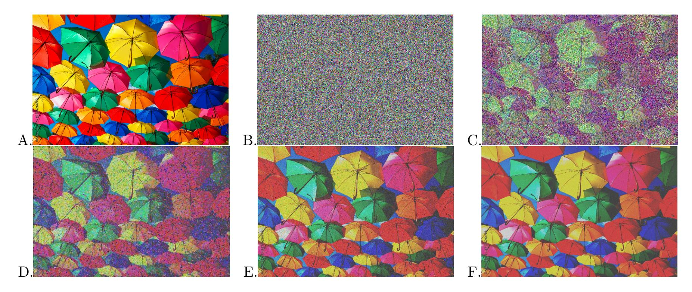
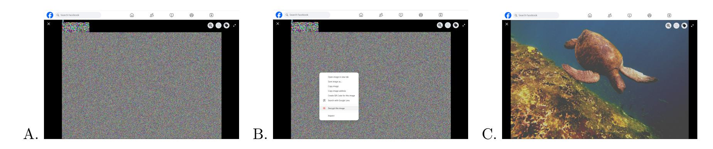
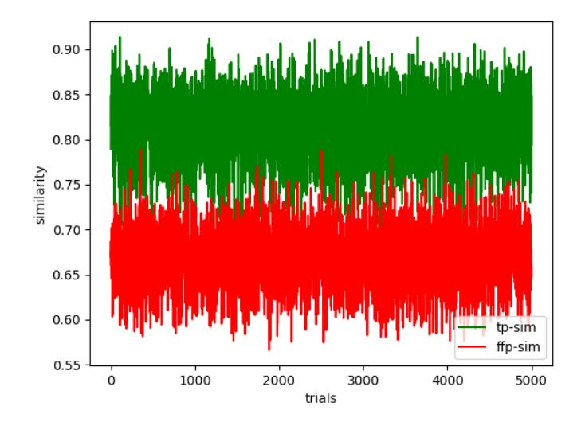
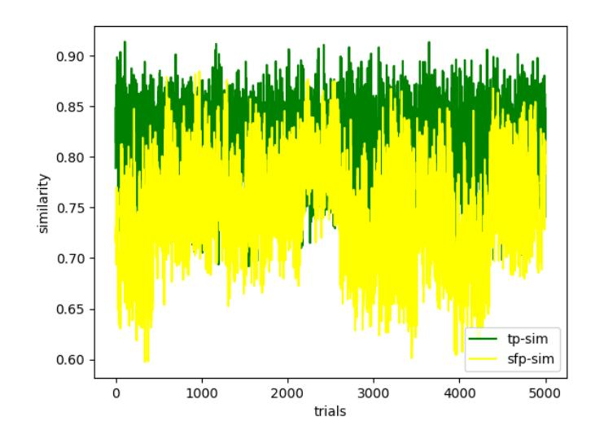
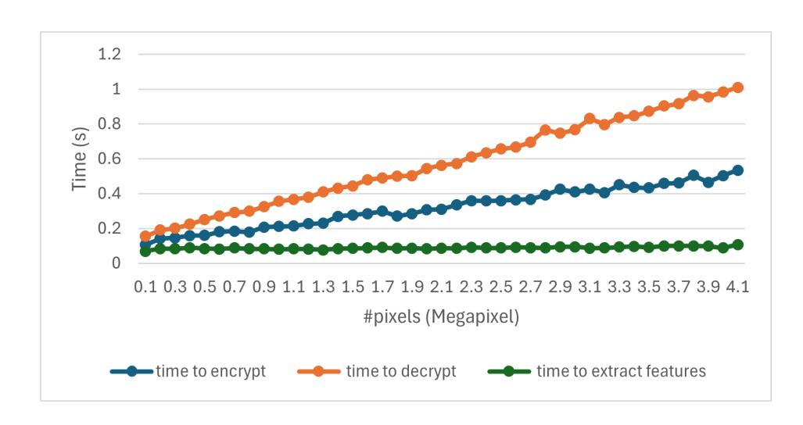

{0}------------------------------------------------

# Format-Preserving Compression-Tolerating Authenticated Encryption for Images

Alexandra Boldyreva, Kaishuo Cheng, and Jehad Hussein

School of Cybersecurity and Privacy Georgia Institute of Technology, Atlanta, Georgia, US {sasha, kcheng89, jhussein6}@gatech.edu

Abstract. We study the problem of provably-secure format-preserving authenticated encryption scheme for images, where decryption is successful even when ciphertexts undergo compression. This novel primitive offers users more control and privacy when sharing and storing images on social media and other photo-centric, compressing platforms like Facebook and Google Photos. Since compression is usually lossy, we cannot expect the decrypted image to be identical to the original. But we want the decrypted image to be visually as close to the original image as possible. There is a vast number of works on image encryption, mostly in the signal processing community, but they do not provide formal security analyses. We formally define security, covering the goals of image confidentiality and integrity. While we first treat the problem generically, we are particularly interested in the construction for the most common compression format, JPEG. We design a scheme for JPEG compression using the standard symmetric cryptographic tools and special pre- and post-processing. We formally assess the security guarantees provided by the construction, discuss how to select the parameters using empirical experiments, and study performance of our scheme in terms of computational efficiency and decryption quality. We also build a browser plug-in that helps users store and share photos privately.

Keywords: Image Encryption, Encryption before Compression, Authenticated Encryption, Format-Preserving Encryption, Web Privacy

## 1 Introduction

### 1.1 Motivation

End-to-end encryption (E2EE) allows users to protect their data so that even the platforms handling the data could not access it. The demand for E2EE is constantly growing as the public becomes more aware of the risks of data sharing. Even if the platforms handling the data in the cloud implement proper security measures and encrypt the data during transmission and at rest, there are still risks of server compromises and data breaches, of the platforms colluding with governments for surveillance, selling users' data to third parties, or training AI models on users' data without explicit consent. Messaging apps such as Signal, WhatsApp, iMessage and cloud storage services like iCloud, Microsoft OneDrive for Business, Google Drive via Google Workspace Client-side encryption (CSE) provide E2EE capabilities. For social media platforms, systems like Mimesis Aegis and Shadowcrypt [\[12,](#page-22-0)[24\]](#page-23-0) attempt to give users more control over the data they share. They provide a seamless overlay that intercepts the user's input text, encrypts it locally, and posts the ciphertext instead. Then, the users who have the same secret key as the sender, can view the posts as the overlay detects the ciphertext and replaces it with the plaintext.

However, all such systems encrypt and decrypt data as bits. Many platforms are fundamentally about images (e.g., Google Photos or Flickr), and, in others, the UX is unimaginable without images (e.g., Facebook). Privacy of images in such apps can be as crucial as that of text. Yet, there are no available provably-secure E2EE solutions for securing images in such apps, and this is why.

Assume a user wants to store some end-to-end-encrypted images on Google Photos or post end-to-endencrypted images in a private Facebook family group. The key could be derived from the password known to the user and their family. But the traditional encryption methods produce bitstring ciphertexts that would not be accepted by Google Photos unless the ciphertext is encoded as an image. For Facebook, it is inconvenient to post images as texts due to Facebook's post size limitations. It is possible to encrypt plaintext 

{1}------------------------------------------------

images as bits and then encode ciphertexts as images. However, most platforms, including Facebook, store images in JPEG format and compress them to save space. Google Photos also usually compresses photos unless a special option of storing images in the "Original Quality" is selected. But this option is not used often since then users run out of allowed space very quickly.

Ciphertexts created with traditional encryption schemes, once compressed, will not decrypt correctly. As we discuss further, the most popular JPEG compression, will mostly modify high frequency components (the rate of change of intensity values) of the image. In our case, the encrypted image will look random, so it will have many high frequency components. Then decryption will likely fail, due to the diffusion property of standard encryption schemes, even when the scheme does not provide integrity.

Note that the problem arises even before uploading. Encrypting an image and converting it to JPEG format locally will still trigger JPEG compression that will break the decryption, even without the platform's involvement. It is possible to circumvent this problem if the concrete parameters of the JPEG compression (the coefficients and quantization tables discussed below) are known and fixed. But this will not be very practical as such parameters may differ across software and devices the user may want to use.

We finally observe that these problems do not arise in E2EE-secure messaging apps, since images can be compressed before encryption and sent as bits.

### 1.2 Our Focus

To add E2EE capability to the image-centric apps like we discussed, we search for a format-preserving authenticated encryption scheme for images, where decryption is successful even though ciphertexts undergo compression. Recall that format-preserving encryption (FPE) [\[2\]](#page-22-1) preserves the format of the plaintexts. For example, one can use FPE to encrypt credit card numbers. We are interested in the case where the plaintexts and ciphertexts are images since we target platforms dealing with images. Authenticated encryption targets both goals of message confidentiality and integrity, and for the applications we consider both goals may be important. Since compression is usually lossy, we cannot expect the decrypted image to be the same as the one which was encrypted. But we want the decrypted image to be as visually close to the original one as possible. While we first treat the problem generically, we are particularly interested in the construction for the most common compression format, JPEG. We search for a solution that is mostly independent of the particular JPEG parameters used.

### 1.3 JPEG Overview

JPEG [\[48\]](#page-24-0) is the most ubiquitous compression format for images. It is supported by most, if not all, platforms. More importantly, many platforms, such as Facebook, will in fact convert all images uploaded to them to JPEG regardless of the original format. This warrants an exposition of how JPEG compression operates.

JPEG compression has a lossy and lossless components. Only the lossy component is relevant to our work. The lossy component of JPEG comes in two parts: quantization and subsampling. Quantization rounds pixel values to the nearest multiples of some predifined values, so the pixels can be stored more efficiently. Subsampling simply drops pixels, and later uses remaining pixels to (approximately) recompute dropped pixels. Compression of a grayscale images only performs quantization. The compression algorithm scans the image in MCU (minimum coded unit), usually of size 8x8 pixels. Each MCU is then encoded as a linear combination of 64 pre-defined templates. This step is called DCT transform. Now, instead of storing 64 pixel values, only 64 coefficients are needed. The algorithm further uses a pre-defined quantization table, which stores different elements. Each coefficient is then divided by the corresponding element in the table, with the remainder dropped. After division, most coefficients become zeros, allowing for further efficient encoding. Because the remainder is dropped, later when de-compressing, the pixels values will be different from its original value, though they should be close.

For color images, the compression algorithm first converts the image to YCbCr format (Luminance, Blue, and Red). Layer Y is treated just like the grayscale image. Layers Cb and Cr get subsampled additionally. Depending on the parameter, layers Cb and Cr only retain 1/4 or 1/8 of its original pixels. The algorithm does so by keeping the 1 pixel out of 2×2 pixel grids or 4×2 pixel grids. Reduced-size layers then undergo quantization like the luminance. Later in decompressing, after recovering Cb and Cr values, the algorithm will use some custom filters to expand the image to its original size.

{2}------------------------------------------------

#### 1.4 Related Works and their Limitations

While the topic of image encryption is rarely discussed in the cryptographic community, there is an enormous line of work on image encryption in the signal processing community. The work [\[18\]](#page-22-2) studies theoretical feasibility of encryption then lossy compression schemes. The solution relies on source coding and availability of a lossless channel. The work does not offer a construction for JPEG compression. The following references are for some surveys on image encryption before compression [\[26,](#page-23-1)[43\]](#page-23-2) and these are the surveys for general image encryption papers [\[36,](#page-23-3)[35,](#page-23-4)[17,](#page-22-3)[34,](#page-23-5)[22](#page-23-6)[,50,](#page-24-1)[21,](#page-22-4)[19,](#page-22-5)[30,](#page-23-7)[40,](#page-23-8)[14\]](#page-22-6). There have been several approaches proposed for the problem.

Block permutation. First introduced in [\[23\]](#page-23-9) and subsequently incrementally enhanced in [\[7,](#page-22-7)[16,](#page-22-8)[44\]](#page-23-10), the idea is to divide an RGB image to n×n blocks and apply some randomization steps, which include permuting blocks, swapping color components within a block, rotating or flipping a block. The enhancements vary in three aspects: (1) when, where and how these steps are applied, (2) the block size, and (3) the output could be greyscale or colored.

There are known weaknesses of this approach. Although n could be made small enough that the sheer number of blocks is too large for brute-forcing, some observations could help cut down the search space. The particular observations depend on the particular variant used; but as an example, blocks with high frequencies are more likely to contain the most important details in the image, so a solver could simply focus on them. This is knows as jigsaw puzzle attack [\[6\]](#page-22-9). Moreover, despite permutations, the ciphertexts still leak information; e.g., a plain grey and a plain white images are trivially distinguishable.

Chaos theory. There are works, surveyed in [\[41,](#page-23-11)[9,](#page-22-10)[47](#page-24-2)[,53,](#page-24-3)[52,](#page-24-4)[10](#page-22-11)[,51,](#page-24-5)[42\]](#page-23-12) that use chaos theory and chaotic maps to encrypt images. The most relevant works dealing with compression, such as [\[11,](#page-22-12)[13,](#page-22-13)[31\]](#page-23-13), model JPEG compression as noise in the transmitted image. They show by example that chaos-based permutation and substitution of pixels are tolerant to distortions or even occlusions (losing whole patches of the image) in ciphertext. This makes it possible to restore a good portion of the original image after decryption.

Other approaches. The scheme in [\[38\]](#page-23-14) uses linear algebraic manipulation to preserve image texture (correlations between the pixels) in the ciphertext for use by JPEG. The image is divided into n × n blocks (where n is adjustable). Let M be the number of such blocks and N = n×n. The image is then restructured into an N ×M matrix whose columns are the pixels in one n×n block. To encrypt the image, it is multiplied by an M × M orthogonal matrix and scaled.

Koh et. al [\[20\]](#page-22-14) address the same problem as us (enabling E2EE for image hosting platforms with compression like Google Photos). But their approach is a variant of the aforementioned block permutation that incurs leakage.

The main limitation of the aforementioned works is that there are no formal security analyses and hence schemes provide no known security guarantees. Moreover, to the best of our knowledge, all works focus on data confidentiality and do not address the goals of image integrity and sender authenticity. These can often be as important as the goal of image confidentiality. When encrypted images are posted, the sender has no easy way to see if the image is theirs. The protocol should ensure that the platform cannot modify images maliciously. Even if the platform is trusted, it still can be subject to security compromise, and some malware can compromise image integrity.

There are works on thumbnail-preserving image encryption [\[32,](#page-23-15)[46,](#page-23-16)[49\]](#page-24-6), which provide security guarantees but they are for a different problem that does not consider lossy compression.

### 1.5 Our Contributions

We propose the first provably-secure format-preserving authenticated encryption (aIE) scheme for images, where decryption can tolerate ciphertext compression performed by an untrusted server.

We first define the syntax and security (confidentiality and integrity) for the new primitive. Next, we construct a generic scheme modularly and analyze its security. We then show how to instantiate the building blocks securely to yield the scheme, for the most popular compression, JPEG. JPEG standard specifies a generic, long-lasting compression algorithm and each software can develop its own version. It is crucial that we do not assume the exact details of compression used, but rather a general structure that involves quantization and subsampling. We finally build a browser plug-in incorporating our construction. We now discuss our contributions in more detail.

{3}------------------------------------------------

Syntax. We start with defining aIE input-output functionality (syntax). An aIE scheme is defined similarly to a standard symmetric authenticated encryption scheme, with the message space, key generation, encryption and decryption algorithms, but there are a few differences. First, both the plaintext and the ciphertext spaces are images sets IMG. Second, the scheme is associated with compression function Compr: IMG → IMG, and the decryption algorithm takes inputs compressed ciphertexts. Finally, correctness does not require decryption to return the original image (impossible due to lossy compression). Instead, we ask for the decrypted image to be "close" to the original one, according to some predefined metric.

Security Definitions. Next we formalize security for aIE. For image confidentiality, we consider the chosenplaintext and chosen-ciphertext security. While the former cpa definition follows the one for the standard encryption, the cca version is different. In the standard definition, to prevent trivial attacks, the adversary can query the decryption oracle on any ciphertext that is different from the ones returned by the challenge encryption oracle. There is also a weaker replayable cca definition (rcca) [\[5\]](#page-22-15), where the adversary is not allowed to query ciphertexts that decrypt to the challenge messages. In our case, we need to restrict the adversary even further and disallow it to query the decryption oracle on any ciphertext that decrypts to an image that is "close" to messages queried to the encryption oracle. In this case, the oracle returns ⊥. We call our notions aIE-ind-cpa and aIE-ind-cca.

We then formalize the integrity notion. Again, we have to adjust the standard definition of plaintext integrity, in which the adversary wins if it creates a valid ciphertext that decrypts to a message that was not queried to the encryption oracle. In our definition, the adversary wins if it creates a valid ciphertext that decrypts to a message that is not close to any message queried to the encryption oracle. We call our notion aIE-int-ptxt.

We then show that aIE-ind-cpa and aIE-int-ptxt imply aIE-ind-cca. This result differs from that for standard authenticated encryption, where a stronger notion of ciphertext integrity is needed for the implication [\[1\]](#page-22-16).

Generic aIE Scheme and its Security. We build a generic aIE scheme modularly from some standard cryptographic primitives such as pseudorandom function (PRF), symmetric encryption SE, and two novel image-centered primitives that we define, and which could be of independent interest. One is the encryption scheme for images IE, whose syntax is the same as that for aIE, but security-wise it does not provide integrity and is only "one-time" secure in the sense that the key is only used once. The other is IMAC, a message authentication code for images, where a tag is not only valid for the original image but for images close to it. Moreover, we will need an embedding function to embed some short information as part of an image in such a way so that, despite compression, information could be extracted unchanged. Since compression is lossy, the embedding will require some duplication and hence can only be applied for short strings.

The idea for the modular aIE construction is as follows. The sender and the receiver share keys kF, kIMAC for a pseudorandom function and an IMAC. The sender first picks a random string r and generates two new symmetric keys k1, k<sup>2</sup> using a pseudorandom function Fk<sup>F</sup> applied to inputs r and r resp. The sender then computes c, an encryption of the image p using IE under key k1. It also computes t, the IMAC of p under key kIMAC. It then computes ct, an encryption of t using SE under k2. Finally the sender embeds r, c<sup>t</sup> with image c, so they could be represented as part of an image in a way that they could be losslessly recovered after compression. The receiver can decrypt and verify the obvious way. We provide the details in Section [7,](#page-11-0) where we also discuss why the standard Encrypt-then-MAC approach is not suitable for our scheme.

We prove security of the generic aIE scheme (aIE-ind-cpa and aIE-int-ptxt and hence aIE-ind-cca) based on the security of its components.

aIE for JPEG. One of our main contributions is to propose a specific instantiation of our generic aIE specifically designed for the most popular JPEG compression. We use AES as a PRF, AES in the counter mode as SE, but constructing IE, IMAC, lossless embedding, and setting the parameters to work with JPEG compression requires some work. Unlike most cryptographic schemes, design of these schemes involves resolving a number of engineering tasks which sometimes requires decisions based on empirical evaluations.

For constructing IE, we observe that one does not necessarily require chaotic maps or other complex transformations. In fact, a simple stream cipher for integers applied pixel-by-pixel can work to a large degree. Since quantization changes pixels in ciphertext to close ones, the decrypted pixels should also be close to original ones.

This method, as is, provides great data confidentiality that is easy to prove. The encrypted image is shown in image B in Fig. [1.](#page-4-0) However, decryption quality is quite bad, as shown in image C in Fig. [1.](#page-4-0) The

{4}------------------------------------------------



<span id="page-4-0"></span>Fig. 1. A: Original image [\[8\]](#page-22-17); B: Encrypted Image; C: Basic decryption; D: Decryption after image preprocessing (IP); E: Decryption after IP and ciphertext preprocessing (CP); F: Final decryption after IP, CP, and image postprocessing.

main reason is that for pixels that are close to both ends (0 and 255), after compression, the decrypted value, though close, might cross the boundary. For example, value 10 might decrypt to -10, which then becomes 245. This wraparound can cause recognizable noise and impacts the image quality. We refer to this noise as "bit flipping" noise.

We remedy this by preprocessing the original image before encrypting. We push (by a small amount) all pixel values in the image away from both ends. This may sound counter-intuitive, to battle the effects of lossy compression with more lossy transformation, but this method significantly reduces the "bit flipping" noise, see image D in Fig. [1.](#page-4-0) (The method slightly darkens the image as high values are pushed to the middle but this is not very noticeable.)

Another source of error comes from subsampling algorithm during compression. The algorithm samples 1 out of every 2×2 pixel grid to store. Later, the decompression algorithm infers what the 4 pixels should be by interpolating. Naturally, this causes errors while decryption. Therefore, we preprocess the ciphertext image by copying the top left pixel value and pasting it into the remaining 3 pixels. Now, every 2×2 grid will share the same pixel value inside the grid. Although we only retain 1/4 of original pixels, we can still reconstruct the original image. The result is shown by image E in Fig. [1.](#page-4-0)

After decryption, depending on the image quality, we can further remove noise in postprocessing by applying a filter to the decrypted image. We want to apply the filter to correct "wrong" pixels, but not blurring the whole picture by too much. Therefore, we check the differences in pixels before and after filtering, only substitute with filtered value if the difference is large, cf. image F in Fig. [1,](#page-4-0) which shows the final decryption.

For IMAC construction, we note that a traditional MAC does not work as is. Assume the sender MACs the unencrypted or encrypted image. Even if the MAC tag is sent losslessly, the image ciphertext is too large to be sent losslessly, and will get compressed. Then the decrypted image will differ from the original one and the MAC verification will fail.

To build an IMAC, we turn to the neural network technologies used for content-based image search. The idea behind image-to-image search is to compare feature vectors extracted from images. Feature vectors are compact representations of the most essential content parts of the images. They have the useful property that if the images are visually close, then the feature vectors are close, using e.g., hamming distance or cosine similarity. The degree of image closeness that the feature extractors handle vary. Some feature extractors are designed to distinguish different objects, e.g., images of cars are deemed close, but images of a car and a house will not be. Other feature extractors aim to identify images of the same object, not just the type. For example, the extracted feature vectors can be close only for portraits of the same person or photos of the same house from different angles.

{5}------------------------------------------------

While our IMAC scheme can be incorporated with different feature extractors, we decided to use CLIP. Released in 2021 by researchers at OpenAI, CLIP (Contrastive Language–Image Pre-training) [\[39\]](#page-23-17), is the state-of-the-art neural networks family, which is a is a collection of models trained as pure feature extractors. It is used to extract a vector representation of an image that captures its semantic and perceptual features.

Equipped with the feature extractor, we propose the following simple IMAC scheme. The sender simply extracts the feature vector f from the image p it wants to send, and signs it using a traditional message authentication code to produce tag t. The output of IMAC is (f, t). To verify, the receiver takes an image p ′ , computes the feature vector f ′ , and checks that f, f′ are close, and t is a valid tag for f.

To compare closeness, we check if the cosine similarity of the two feature vectors are within some threshold. One challenge, however, is how to set this similarity threshold. Setting such a threshold is not straightforward because the relation between the CLIP similarity threshold and visual closeness of the images is not immediate. In Section [10](#page-18-0) we discuss how we make a decision based on empirical evaluations and how our formal results that rely on closeness of CLIP feature vectors translate to intuitive results for visual closeness.

Finally, we design the embedding function to embed the randomness and the IMAC tag into the encrypted image so they could be sent losslessly. Intuitively, we encode three bits into a 2×2 pixel grid by mapping bit 0 to value 0, and bit 1 to 255. Since compression algorithm will change pixel to some close values, later we can check if the value is greater than 128 or not to know if the bit is 1 or 0.

Extension Implementation. We have implemented and tested an instantiation of aIE. We used AES as the blockcipher and AES-based stream cipher for the IE, CLIP feature extractor and HMAC for IMAC.

With our protocol, a user can encrypt an image and upload it to a social platform or image cloud storage. Then, while a receiver can download the image and decrypt and view it locally, we have implemented a Chrome browser plug-in to streamline the process. Using our plug-in, the receiver can simply right click on an image to decrypt and view it in the context of the webpage. We provide some screenshots of our plug-in for Facebook in Figure [2.](#page-5-0) The first few lines of pixels embed the randomness and the MAC tag, which have to be sent losslessly. Our plug-in is composed of a Javascript Chrome extension and a Python server running on localhost. Section [10.2](#page-20-0) provides more implementation details and also the performance analysis. Our artifact is provided in [\[4\]](#page-22-18).



<span id="page-5-0"></span>Fig. 2. A: Uploaded ciphertext image; B: Right-Click to run the extension; C: Decrypted result.

## 2 Notations

Let {0, 1} <sup>∗</sup> denote the set of all finite-length binary strings and {0, 1} <sup>n</sup> denote the set of binary strings of length n. For a binary string s, let |s| denote its bit-length and s¯ be the bit complement of s. For a finite set S, let |S| denote its size and r \$← S denote sampling r uniformly at random from S. We use y ← x for assigning a value to a variable. If A is a probabilistic algorithm we use y \$← A(x) for running A on x using fresh random coins and assigning the output to y. In the pseudocode, we use "Require" as an asserting statement. If the statement is not satisfied, the game immediately aborts, and the attacker loses the game. Abort means terminating the current process and immediately return the corresponding value. We use "Abort" in security games when the game or attacker returns its final answer. For an array a and index i, a[: i] returns a new array containing all elements before index i. a[i :] returns a new array containing all elements after index i (including i),

{6}------------------------------------------------

## 3 Preliminaries: Images and Compression

Here we introduce, rather abstractly, the basic terms regarding images and compression, which will be sufficient for our general scheme. In later sections, in order to present our construction for JPEG, we will go into specifics.

Images. Let IMG be the set of all possible images in some format. For example, an image in RGB format can be represented as a w × h × 3 array, with each element being an integer from 0 to 255. Here w is the width and h is the height of the image.

Image similarity. We define an image similarity function Similar: IMG × IMG × R → {0, 1} that takes two images p, pˆ ∈ IMG and a threshold parameter τ and outputs a bit indicating whether the images are close. We will specify Similar for our construction in Section. [9.3.](#page-16-0)

Image Compression. To model image compression, we define function Compr: IMG → IMG. It (usually) holds that for some τ , Similar(p, Compr(p), τ ) = 1 for all p ∈ IMG. Notice that Compr(IMG) ⊂ IMG, because compression is usually lossy and two very close images can be compressed to the same image.

Our generic construction is for a general compression function. Our specific scheme is for the most popular compression, JPEG. We will discuss the details of JPEG compression in Section [9.1.](#page-13-0)

Lossless Embedding. To transfer a short bitstring losslessly along with an encrypted image, we convert the bitstring into a small image in a particular way, and merge it with an image we are sending. To model this, we define Embed: IMG × {0, 1} <sup>m</sup> → IMG and Extract: IMG → IMG × {0, 1} <sup>m</sup> be a pair of algorithms, such that Extract(Compr(Embed(p, s))) = (Compr(p), s) for every p ∈ IMG and s ∈ {0, 1} n.

## 4 aIE Functionality

We start with defining the general functionality (syntax) for our aIE scheme.

Syntax. An authenticated symmetric image encryption scheme aIE is defined by the message and ciphertext space IMG, function Similar with threshold τ , compression function Compr, and the following algorithms:

- The key generation algorithm aIE.Kg generates the key; we write k \$← aIE.Kg.
- The randomized encryption algorithm aIE.Enc takes inputs key k and image p ∈ IMG and outputs ciphertext c ∈ IMG: c \$← aIE.Enc(k, p).
- The deterministic decryption algorithm aIE.Dec takes inputs key k and compressed ciphertext Compr(c) and outputs image p or ⊥: p/⊥ ← aIE.Dec(k, Compr(c)).

For ϵ-correctness we require that decryption of a compressed ciphertext returns an image close to the original, with high probability, i.e., for every p ∈ IMG and k output by aIE.Kg, we have that

$$\Pr[\mathsf{Similar}(p,\mathsf{alE.Dec}(k,\mathsf{Compr}(\mathsf{alE.Enc}(k,p))),\tau)=1] \geq 1-\epsilon$$
 .

For the above, we assume that Similar(p, ⊥) = 0 for every p ∈ IMG.

## <span id="page-6-0"></span>5 Security Definitions for aIE

We now formally define security for aIE. We consider two main cryptographic security goals: confidentiality (privacy) and integrity (authenticity).

Image Confidentiality. Let aIE be an authenticated symmetric image encryption scheme defined by IMG, Similar, τ , Compr, aIE.Kg, aIE.Enc, aIE.Dec. We define the security experiments for image confidentiality notions aIE-ind-cpa and aIE-ind-cca in Figure [3.](#page-7-0)

The aIE-ind-cpa notion (the left part of Figure [3\)](#page-7-0) is identical to the corresponding notion for regular encryption schemes. The notion requires that no efficient adversary could distinguish encryption of two messages of the same size of the attacker's choice.

The aIE-ind-cca notion (boxed) is a fuzzy version of the replayable CCA (RCCA) notion defined in [\[5\]](#page-22-15). RCCA is a strictly weaker version of CCA security, while the Dec returns ⊥ when decrypted message is

{7}------------------------------------------------

```
\mathsf{G}_{\mathsf{alE}}^{\mathsf{alE}\mathsf{-ind}\mathsf{-cpa}}(\mathcal{A}) \overline{\, \mathsf{G}_{\mathsf{alE}}^{\mathsf{alE}\mathsf{-ind}\mathsf{-cca}}(\mathcal{A}) \,}
                                                                                                                                                    \underline{\mathsf{G}_{\mathsf{alE}}^{\mathsf{alE-int-ptxt}}}(\mathcal{A}):
                                                                                                                                                      1: k \stackrel{\$}{\leftarrow} alE.Kg
  1: k \stackrel{\hspace{-0.1em}\mathsf{\scriptscriptstyle\$}}{\leftarrow} \mathsf{alE.Kg}
                                                                                                                                                      2: \mathbf{P} \leftarrow \emptyset
  2: b \stackrel{\$}{\leftarrow} \{0, 1\}
                                                                                                                                                      3: win \leftarrow 0
  3: \mathbf{P} \leftarrow \emptyset
                                                                                                                                                      4: \ \mathsf{done} \leftarrow \mathcal{A}^{\mathrm{Enc},\mathrm{Chal}}
  4: d \leftarrow \mathcal{A}^{\text{Enc}} DEC
                                                                                                                                                      5: return win
  5: return (b = d):
                                                                                                                                                    Enc(p)
\text{Enc}(p_0, p_1)
                                                                                                                                                      1: c \stackrel{\$}{\leftarrow} \mathsf{alE}.\mathsf{Enc}(k,p)
  1: Require |p_0| = |p_1|
                                                                                                                                                      2: \mathbf{P} \leftarrow \mathbf{P} \cup \{p\}
  2: \mathbf{P} \leftarrow \mathbf{P} \cup \{p_0, p_1\}
                                                                                                                                                      3: return c
  3: return alE.Enc(k, p_b)
                                                                                                                                                    CHAL(c)
  Dec(c)
                                                                                                                                                      1: \hat{p} \leftarrow \mathsf{aIE.Dec}(k,c)
  1: \hat{p} \leftarrow \mathsf{aIE}.\mathsf{Dec}(k,c)
                                                                                                                                                      2: if \hat{p} \neq \bot and
  2: if \hat{p} \neq \bot and \forall p \in \mathbf{P}, Similar(p, \hat{p}, \tau) = 0 then
                                                                                                                                                             \forall p \in \mathbf{P}, Similar(p, \hat{p}, \tau) = 0 then win \leftarrow 1
  3: | return \hat{p}
                                                                                                                                                      3: return win
  4: return \perp
```

<span id="page-7-0"></span>Fig. 3. Experiments for alE image privacy definitions (left) and image integrity definition (right).

| $ \frac{G_{alE}^{alE-1ind-cpa}(\mathcal{A})}{1: \ k \overset{\$}{\leftarrow} IE.Kg} \\ 2: \ b \overset{\$}{\leftarrow} \{0,1\} \\ 3: \ flag \leftarrow false \\ 4: \ d \leftarrow \mathcal{A}^{Enc}() \\ 5: \ \mathbf{return} \ (b=d) $ | $\frac{\operatorname{ENC}(p_0,p_1)}{1: \operatorname{Require} \ \operatorname{flag} = \operatorname{false}} \\ 2: c \leftarrow \operatorname{alE.Enc}(k,p_b) \\ 3: \operatorname{flag} \leftarrow \operatorname{true} \\ 4: \mathbf{return} \ c$ |  |
|-----------------------------------------------------------------------------------------------------------------------------------------------------------------------------------------------------------------------------------------|--------------------------------------------------------------------------------------------------------------------------------------------------------------------------------------------------------------------------------------------------|--|
|-----------------------------------------------------------------------------------------------------------------------------------------------------------------------------------------------------------------------------------------|--------------------------------------------------------------------------------------------------------------------------------------------------------------------------------------------------------------------------------------------------|--|

<span id="page-7-1"></span>Fig. 4. One-time ind-cpa security for alE.

previously queried to Enc. In our notion, to prevent trivial attacks, Dec will return  $\perp$  if decrypted image is close to any image previously queried to Enc, where closeness is captured via Similar function.

For each notion and for an adversary  $\mathcal{A}$ , we define the advantages for  $\mathcal{A}$  as

$$\begin{split} \mathsf{Adv}_{\mathsf{alE}}^{\mathsf{alE-ind-cpa}}(\mathcal{A}) &= 2\Pr\Big[\mathsf{G}_{\mathsf{alE}}^{\mathsf{alE-ind-cpa}}(\mathcal{A})\Big] - 1 \;, \\ \mathsf{Adv}_{\mathsf{alE}}^{\mathsf{alE-ind-cca}}(\mathcal{A}) &= 2\Pr\big[\mathsf{G}_{\mathsf{alE}}^{\mathsf{alE-ind-cca}}(\mathcal{A})\Big] - 1 \;. \end{split}$$

Remark 1. We note that we do not apply Compr to ciphertexts before decryption as Compr is a public function and the adversary can apply it to any ciphertext before calling the encryption oracle.

We also define alE-1ind-cpa notion (the experiment and the advantage), which targets message indistinguishability when the key is only used once. The adversary is allowed to query its left-right encryption oracle only once. The security game is defined in Fig. 4. We also recall the 1ind-cpa notion for symmetric scheme SE. The only difference is replacing IE.Enc with SE.Enc. The advantages are defined as follows.

$$\begin{split} \mathsf{Adv}_{\mathsf{alE}}^{\mathsf{alE-1ind-cpa}}(\mathcal{A}) &= 2\Pr\Big[\mathsf{G}_{\mathsf{alE}}^{\mathsf{alE-1ind-cpa}}(\mathcal{A})\Big] - 1\;, \\ \mathsf{Adv}_{\mathsf{SE}}^{\mathsf{1ind-cpa}}(\mathcal{A}) &= 2\Pr\Big[\mathsf{G}_{\mathsf{SE}}^{\mathsf{1ind-cpa}}(\mathcal{A})\Big] - 1\;. \end{split}$$

Image Integrity. We define the security experiment  $G^{\mathsf{alE-int-ptxt}}$  for image integrity notion in the right part of Figure 3. The experiment is a fuzzy version of the standard int-ptxt definition for regular encryption. In both definitions, the adversary if given the encryption oracle, and the challenge oracle. The goal of the adversary is to query the challenge oracle on a valid ciphertext. In the int-ptxt definition, the Chal oracle will return  $\bot$  if ciphertext decrypts to a message that has been queried to Enc before. Our fuzzy-ptxt notion rejects if ciphertexts decrypt to images close to any of the image previously queried to the Enc. And again

{8}------------------------------------------------

we do not use Compr in the definition as the adversary is free to apply the function to any ciphertext on its own.

For an adversary A, we define the advantage as

$$\mathsf{Adv}_{\mathsf{alF}}^{\mathsf{alE-int-ptxt}}(\mathcal{A}) = \Pr[\mathsf{G}_{\mathsf{alF}}^{\mathsf{alE-int-ptxt}}(\mathcal{A}) = 1] \ .$$

Remark 2. We note that in the applications like private Facebook group photo sharing, integrity means that parties who do not possess the secret key, cannot significantly tamper with the images. The group users who share the same password and hence the key, can of course modify the images and the scheme does not provide non-repudiation.

Remark 3. It is possible to exclude the trivial attacks in the cca privacy and integrity definitions by comparing the closeness of the ciphertexts queried by the adversary and the ciphertexts returned by the encryption oracles. However, this approach requires a good Similar function defined for ciphertexts that in turn reflects closeness of the underlying images. Since we do not have such function handy for JPEG, we use the similarity function defined for plaintexts, for which we have a practical candidate, defined via CLIP feature extraction.

#### 5.1 Relations between Notions

<span id="page-8-0"></span>We show that alE-ind-cpa and alE-int-ptxt imply alE-ind-cca.

**Theorem 1.** For any efficient adversary A there are efficient adversaries B, C such that

$$\mathsf{Adv}_{\mathsf{alE}}^{\mathsf{alE}\mathsf{-ind}\mathsf{-cca}}(\mathcal{A}) \leq \mathsf{Adv}_{\mathsf{alE}}^{\mathsf{alE}\mathsf{-int}\mathsf{-ptxt}}(\mathcal{B}) + \mathsf{Adv}_{\mathsf{alE}}^{\mathsf{alE}\mathsf{-ind}\mathsf{-cpa}}(\mathcal{C}) \;.$$

*Proof.* We follow the game-playing framework [3] that considers a sequence of "hybrid" games. For every security game  $G_i$ , we use  $\Pr[G_i]$  as shorthand for  $\Pr[G_i(\mathcal{A}) = 1]$ , where  $\mathcal{A}$  is the adversary in game  $G_i$ . We use  $\Pr[\mathsf{Bad}]$  to denote  $\Pr[\mathsf{Bad} = \mathsf{true}]$ . highlighted code is exclusive to  $G_1$  and boxed code is exclusive to  $G_2$ .

```
\mathsf{G}_0:
                                                                                                                                \mathsf{G}_1,\mathsf{G}_2
 1: k \stackrel{\$}{\leftarrow} \mathsf{alE.Kg}
                                                                                                                                  1: k \stackrel{\$}{\leftarrow} \mathsf{alE.Kg}
  2: b \stackrel{\$}{\leftarrow} \{0, 1\}
                                                                                                                                 2: b \stackrel{\$}{\leftarrow} \{0, 1\}
                                                                                                                                 3: d \leftarrow \mathcal{A}^{\text{Enc}, \text{Dec}}
  3: d \leftarrow \mathcal{A}^{\text{Enc}, \text{Dec}}
  4: \mathbf{P} \leftarrow \emptyset
                                                                                                                                  4: \mathbf{P} \leftarrow \emptyset
 5: return (b = d)
                                                                                                                                  5: return (b = d)
\text{Enc}(p_0, p_1)
                                                                                                                                \operatorname{Enc}(p_0, p_1)
 1: Require |p_0| = |p_1|
                                                                                                                                  1: Require |p_0| = |p_1|
  2: \mathbf{P} \leftarrow \mathbf{P} \cup \{p_0, p_1\}
                                                                                                                                  2: \mathbf{P} \leftarrow \mathbf{P} \cup \{p_0, p_1\}
 3: return alE.Enc(k, p_b)
                                                                                                                                  3: return alE.Enc(k, p_b)
Dec(c)
                                                                                                                                Dec(c)
 1: \hat{p} \leftarrow \mathsf{alE.Dec}(k,c)
                                                                                                                                  1: \hat{p} \leftarrow \mathsf{aIE.Dec}(k,c)
  2: if \hat{p} \neq \bot and \forall p \in \mathbf{P},
                                                                                                                                  2: if \hat{p} \neq \bot and \forall p \in \mathbf{P},
              Similar(p, \hat{p}, \tau) = 0 then
  3:
                                                                                                                                              Similar(p, \hat{p}, \tau) = 0 then
                                                                                                                                  3:
  4:
              return \hat{p}
                                                                                                                                              \mathsf{bad} \leftarrow \mathsf{true}
                                                                                                                                  4:
  5: return \perp
                                                                                                                                  5: return \perp
                                                                                                                                  6: return \perp
```

<span id="page-8-1"></span>Fig. 5. Games for the proof of Theorem 1.

In Figure 5 we define a sequence of games associated with alE and adversary A.

 $\mathsf{G}_0$  is identical to the alE-ind-cca experiment.  $\mathsf{G}_1$  is different from  $\mathsf{G}_0$  in that it sets flag bad when the decryption oracle is queried on a ciphertext that is valid and decrypts to a message close to those previously queried to the decryption oracle.  $\mathsf{G}_2$  is different from  $\mathsf{G}_1$  in that the decryption oracle always returns  $\bot$ .

{9}------------------------------------------------

We now claim that for every alE-ind-cca adversary  $\mathcal{A}$ , we can construct alE-int-ptxt adversary  $\mathcal{B}$ , alE-ind-cpa adversary  $\mathcal{C}$  such that

<span id="page-9-0"></span>
$$\mathsf{Adv}_{\mathcal{A}}^{\mathsf{alE-ind-cca}}(\mathsf{alE}) = \Pr[\mathsf{G}_0] \tag{1}$$

$$=\Pr[\mathsf{G}_0]-\Pr[\mathsf{G}_1]$$

$$+ \Pr[\mathsf{G}_1] - \Pr[\mathsf{G}_2] + \Pr[\mathsf{G}_2] \tag{2}$$

$$= \Pr[\mathsf{G}_1] - \Pr[\mathsf{G}_2] + \Pr[\mathsf{G}_2] \tag{3}$$

$$\leq \Pr[\mathsf{G}_1 \text{ sets bad}] + \Pr[\mathsf{G}_2]$$
 (4)

$$\leq \mathsf{Adv}_{\mathcal{B}}^{\mathsf{alE-int-ptxt}}(\mathsf{alE}) + \Pr[\mathsf{G}_2]$$
 (5)

$$\leq \mathsf{Adv}^{\mathsf{alE-int-ptxt}}_{\mathcal{B}}(\mathsf{alE})$$

$$+ \operatorname{\mathsf{Adv}}^{\mathsf{alE-ind-cpa}}_{\mathcal{C}}(\mathsf{alE}) \ . \tag{6}$$

Equation 1 is trivially true because  $G_0$  is defined to be alE-ind-cca. Equation 2 is trivially true because we just add and subtract the same values.

Equation 3 is true because

$$\Pr[\mathsf{G}_0] - \Pr[\mathsf{G}_1] = 0 ,$$

since setting the flag does not change the output of the game.

Inequality 4 is true because

$$\Pr[\mathsf{G}_2] - \Pr[\mathsf{G}_1] \leq \Pr[\mathsf{G}_1 \text{ sets bad}] \;,$$

since the games are identical until bad.

To justify inequality 5 we construct alE-int-ptxt adversary  $\mathcal{B}$  so that

$$\Pr[\mathsf{G}_1 \text{ sets bad}] \leq \mathsf{Adv}^{\mathsf{alE-int-ptxt}}_{\mathcal{B}}(\mathsf{alE}) \;.$$

 $\mathcal{B}$  runs  $\mathcal{A}$  and it uses its own Enc oracle to simulate the encryption oracle for  $\mathcal{A}$ . To answer  $\mathcal{A}$ 's decryption queries,  $\mathcal{B}$  forwards the ciphertexts to its own Chal oracle. Note that the flag bad is set in  $G_1$  exactly when the winning condition is set for  $\mathcal{B}$ . Clearly,  $\mathcal{B}$  is efficient.

Finally, to justify inequality 6, we construct alE-ind-cpa adversary  $\mathcal{C}$  that runs  $\mathcal{A}$ , uses its own Enc oracle to simulate that for  $\mathcal{A}$ , and answers  $\bot$  to every decryption oracle query of  $\mathcal{A}$ . We then observe that

$$\Pr[\mathsf{G}_2] = \mathsf{Adv}^{\mathsf{alE-ind-cpa}}_{\mathcal{C}}(\mathsf{alE}) \; .$$

Clearly,  $\mathcal{C}$  is efficient.

Remark 4. For regular authenticated encryption, ind-cpa and int-ctxt imply ind-cca [1]. For us, alE-int-ptxt is sufficient because our alE-ind-cca notion is weaker.

## 6 Building Blocks

In the next section we show how to construct a generic aIE scheme achieving image confidentiality and integrity. We construct the scheme modularly from an IE scheme that only provides a weak form of image confidentiality, a pseudorandom function (PRF), symmetric encryption (SE) and an image message authentication code (IMAC). Unlike the other building blocks, the latter primitive of IMAC is new. We first recall the standard definitions and then define IMAC and its security.

### <span id="page-9-1"></span>6.1 Standard Crypto Primitives

**PRF.** For an adversary  $\mathcal{A}$  and function family  $F: \{0,1\}^k \times \{0,1\}^n \to \{0,1\}^n$ , we consider two experiments. In the first one,  $\mathcal{A}$  is given oracle access to  $F_k(\cdot)$ , for  $k \stackrel{\$}{\leftarrow} \{0,1\}^k$ . In the second experiment,  $\mathcal{A}$  is given oracle access to  $g(\cdot)$ , a function picked at random from all functions  $\{0,1\}^n \to \{0,1\}^n$ . The PRF advantage,  $\mathsf{Adv}^\mathsf{PRF}_\mathsf{F}(\mathcal{A})$ , is defined as the difference of probabilities of  $\mathcal{A}$  outputting the same bit in two experiments.

{10}------------------------------------------------

**Symmetric Encryption.** A symmetric encryption scheme SE is defined by a message space SE.M, key generation SE.Kg, and encryption and decryption algorithms SE.Enc, SE.Dec. The key is generated by the key generation algorithm. Encryption takes inputs the key and a message and outputs a ciphertext. Decryption takes inputs the key and a ciphertext and outputs the message. Correctness requires that for any k output by SE.Kg and any  $m \in SE.M$ , Pr[SE.Dec(k, SE.Enc(m)) = m] = 1. We only need 1ind-cpa security, defined identically to 1ind-cpa security for IE in Section 5.

Message Authentication Code. A message authentication code MAC is defined by a message space MAC.M, key generation MAC.Kg, and signing and verification algorithms MAC.Sign, MAC.Verify. The key is generated by MAC.Kg. MAC.Sign takes inputs the key and a message and outputs a tag. MAC.Verify takes inputs the key, a message and a tag, and outputs 1 or 0. Correctness requires that for any k output by MAC.Kg and any  $m \in \text{MAC.M}$ ,  $\Pr[\text{MAC.Verify}(k, m, \text{MAC.Sign}(k, m)) = 1] = 1$ . In the uf-cma (unforgeability under chosen-message attack) experiment adversary  $\mathcal{A}$  is given the signing oracle and the challenge oracle. The challenge oracle takes messages and tags, and it returns a bit if the tag is valid. The adversary wins if the challenge oracle returns 1 when queried on a message not previously queried to the signing oracle. The uf-cma advantage,  $\operatorname{Adv}_{\mathsf{MAC}}^{\mathsf{uf-cma}}(\mathcal{A})$  is defined as the probability of the adversary winning.

### 6.2 Image Message Authentication Code (IMAC)

**IMAC Syntax.** An image MAC scheme IMAC is defined by the message space IMG, function Similar with threshold  $\tau$  and the following algorithms:

- The key generation algorithm returns a key:  $k \stackrel{\$}{\leftarrow} \mathsf{IMAC.Kg.}$
- The signing algorithm IMAC.Sign takes inputs key k and image  $p \in \mathsf{IMG}$  and returns a tag  $t : t \leftarrow \mathsf{IMAC.Sign}(k,p)$ .
- The verification algorithm IMAC. Verify takes inputs key k, image  $p \in \mathsf{IMG}$ , and tag t and returns a bit  $d : d \leftarrow \mathsf{IMAC.Verify}(k, p, t)$ .

For  $\epsilon$ -correctness we require that for every k generated by IMAC.Kg, for all  $p, \hat{p} \in \mathsf{IMG}$ , we have that

$$\Pr[\mathsf{IMAC.Verify}(k,\hat{p},\mathsf{IMAC.Sign}(k,p)) = 1] \geq 1 - \epsilon$$
,

if  $\mathsf{Similar}(p, \hat{p}, \tau) = 1$ .

Remark 5. We do not consider compression in the above definition as the tags will be sent losslessly in our construction.

<span id="page-10-0"></span>Fig. 6. The experiment for defining IMAC security.

**IMAC Security.** We define the security experiment for image integrity notion  $G^{img-uf-cma}$  in Figure 6. The definition is similar to the unforgeability under chosen message attack (uf-cma) definition for regular MACs.

{11}------------------------------------------------

In both definitions the adversary is given the signing and the verification/challenge oracles. Both adversaries can query the signing oracle on messages of their choice, and the verification/challenge oracle on message-tag pairs of their choice. The goal for both adversaries is to query the challenge oracle on a message-tag pair so that the message is new. In the standard uf-cma definition, "new" means that the message was not queried to the signing oracle. We define the novelty of the message as not being similar to any messages queried to the signing oracles. This is because such a query would constitute a trivial attack for any IMAC.

For an adversary A, we define the advantage as

$$\mathsf{Adv}^{\mathsf{img-uf-cma}}_{\mathsf{IMAC}}(\mathcal{A}) = \Pr[\mathsf{G}^{\mathsf{img-uf-cma}}_{\mathsf{IMAC}}(\mathcal{A}) = 1] \; .$$

## <span id="page-11-0"></span>7 Generic Modular aIE Scheme

We are ready to present our generic aIE scheme.

Let MAC = (MAC.Kg, MAC.Sign, MAC.Verify) be a MAC for message space {0, 1} ∗ . Let IMAC = (IMAC.Kg, IMAC.Sign, IMAC.Verify) be an IMAC for message space IMG and Similar with threshold τ . Let F: F.K × {0, 1} <sup>n</sup> → {0, 1} <sup>n</sup> be a PRF function. Let IE = (IE.Kg, IE.Enc, IE.Dec) be an aIE scheme for message space IMG, (the same) function Similar with threshold τ , and compression function Compr. (We will want IE to only provide weak image confidentiality.) Let SE = (SE.Kg, SE.Enc, SE.Dec) be a symmetric encryption scheme for message space {0, 1} ∗ .

We then construct aIE = (aIE.Kg, aIE.Enc, aIE.Dec) for message space IMG, function Similar with threshold τ , compression function Compr, and lossless embedding (Embed, Extract), as follows. The key generation

```
aIE.Enc(k, p):
 1: Parse k as (kF, kIMAC)
 2: t ← IMAC.Sign(kIMAC, p)
 3: r
     $← {0, 1}
               n
 4: k1 ← F(kF, r)
 5: k2 ← F(kF, r)
 6: cp
       $← IE.Enc(k1, p)
 7: ct
      $← SE.Enc(k2, t)
 8: return Embed(cp,(r, ct))
                                            aIE.Dec(k, c):
                                             1: Parse k as (kF, kIMAC)
                                             2: (cp,(r, ct)) ← Extract(c)
                                             3: k1 ← F(kF, r)
                                             4: k2 ← F(kF, r)
                                             5: p ← IE.Dec(k1, cp)
                                             6: t ← SE.Dec(k2, ct)
                                             7: if IMAC.Verify(kIMAC, p, t) = 0 then
                                                return ⊥
                                             8: return p
```

<span id="page-11-1"></span>Fig. 7. Generic aIE construction.

algorithm aIE.Kg runs k<sup>F</sup> \$← F.K, kIMAC \$← IMAC.Kg and returns the key (kF, kIMAC). We present the rest of the algorithms in Figure [7](#page-11-1) and also discuss them informally.

The encryption algorithm aIE.Enc first uses IMAC to sign the input image p (line [2\)](#page-11-0). Next, it picks a random bitstring and uses the PRF function to generate two short-term keys (lines [3-5\)](#page-11-0). (In line [5,](#page-11-0) recall that r denotes the bit-wise complement of r.) Next, the input image is encrypted using image encryption IE, under one of the short-term keys. Also, the IMAC tag is encrypted using regular symmetric encryption SE under the second short-term key. Finally, the algorithm embeds the random string and the encrypted IMAC tag so they could be send losslessly along with the image encryption that will undergo lossy compression.

The decryption algorithm aIE.Dec extracts the losslessly sent randomness and the encrypted IMAC tag. The PRF and the randomness are used to reconstruct the short-term keys. Next, the image ciphertext, though lossy, is decrypted using the decryption algorithm of the image encryption scheme IE, under the first short-term key. Then the IMAC tag is decrypted using the decryption algorithm of the regular symmetric encryption SE under the second short-term key. Finally, the IMAC tag is verified for the image, and if successful, the image is returned.

{12}------------------------------------------------

Remark 6. We note that we do not follow the standard "encrypt-then-MAC" approach for a generic authenticated encryption composition. This is because we do not have a MAC that can meaningfully verify when both the tag and the message (ciphertext in our case) change due to compression. Even if we can send the MAC tag so it does not get compressed, still, we do not know how to build a MAC for this case. The problem is related to our inability to find a practical Similar function for ciphertexts, as discussed in Section. 5.

Remark 7. We could have used a long-term key for encrypting the IMAC tag. We chose to use a short-term key for this, because otherwise, the symmetric encryption scheme had to be randomized and the randomness had be sent losslessly along with the ciphertext. The use of a short-term key allows us to save the length of the strings that need to be send without a loss.

Remark 8. The two long-term keys can be generated using a PRF under the single shared key the standard way (applying the PRF to two distinct constants). And the single shared key can be derived from a password in practice. We omit formalizing these for simplicity.

Correctness follows from correctness of the building blocks. Correctness of IE guarantees decrypted image will be close to original image with at least  $1-\epsilon_{\mathsf{IE}}$  probability. Correctness of IMAC says that when two images are close, authentication tags of one image should verify on another image with at least  $1-\epsilon_{\mathsf{IMAC}}$  probability. Combining these two correctness properties, decrypted image of alE will be similar to original image, and will pass authentication checks with at least  $(1-\epsilon_{\mathsf{IE}}) \cdot (1-\epsilon_{\mathsf{IMAC}})$  probability (alE is  $\epsilon_{\mathsf{IE}} + \epsilon_{\mathsf{IMAC}} - \epsilon_{\mathsf{IE}} \cdot \epsilon_{\mathsf{IMAC}}$  correct).

## 8 Generic alE Security Analysis

The following theorems provide the concrete security guarantees of our generic alE scheme, based on the security of the building blocks.

**Theorem 2.** Let alE be the generic scheme presented in Figure 7 and q be the number of adversarial queries to Enc, let F be a blockcipher with blocklength n, IE be a secure image encryption scheme, and SE be a secure symmetric encryption scheme, then for every efficient adversary  $\mathcal{A}$  there exist efficient adversaries PRF adversary  $\mathcal{B}$ , alE-1ind-cpa adversary  $\mathcal{C}$ , 1ind-cpa adversary  $\mathcal{D}$  such that

<span id="page-12-0"></span>
$$\mathsf{Adv}_{\mathsf{alE}}^{\mathsf{alE-ind-cpa}}(\mathcal{A}) \leq \mathsf{Adv}_F^{\mathsf{PRF}}(\mathcal{B}) + q \cdot \mathsf{Adv}_{\mathsf{IE}}^{\mathsf{alE-1ind-cpa}}(\mathcal{C}) + q \cdot \mathsf{Adv}_{\mathsf{SE}}^{\mathsf{1ind-cpa}}(\mathcal{D}) + \frac{q^2}{2^{n-1}} \; .$$

<span id="page-12-1"></span>The proof is in Appendix A.1.

**Theorem 3.** Let alE be the generic scheme presented in Figure 7. Then for every efficient adversary A there exists an efficient adversary B such that

$$\mathsf{Adv}_{\mathsf{alE}}^{\mathsf{alE-int-ptxt}}(\mathcal{A}) \leq \mathsf{Adv}_{\mathsf{IMAC}}^{\mathsf{img-uf-cma}}(\mathcal{B}) \; .$$

Remark 9. alE-ind-cca security of alE follows directly from Theorems 1, 2, 3.

Proof. On the left of Fig. 8 we present game  $\mathsf{G}^{\mathsf{alE}\mathsf{-int\text{-}ptxt}}_{\mathsf{alE}}(\mathcal{A})$ . For a given  $\mathcal{A}$ , we construct  $\mathcal{B}$  such that  $\mathsf{Pr}[\mathsf{G}^{\mathsf{alE}\mathsf{-int\text{-}ptxt}}_{\mathsf{alE}}(\mathcal{A})] \leq \mathsf{Adv}^{\mathsf{img\text{-}uf\text{-}cma}}_{\mathsf{IMAC}}(\mathcal{B})$ . We present  $\mathcal{B}$  on the right of Fig. 8, which uses its own oracles to simulate IMAC algorithms it does not know they key for. The rest of the game is simulated perfectly and the view of  $\mathcal{A}$  in the experiment simulated by  $\mathcal{B}$  is exactly like that in  $\mathsf{G}$ . Notice that  $\mathcal{B}$  itself keeps a table  $\mathsf{P}$ , which is exactly the same as the table in the img-uf-cma game. Thus, whenever  $\mathcal{A}$  has set win to 1, we know  $\mathcal{A}$  has submitted a ciphertext that decrypts to (image,tag) pair  $(\hat{p},t)$  such that it verifies successfully, and  $\hat{p}$  is not similar to any image in  $\mathsf{P}$ . I.e.,  $\mathcal{B}$  wins whenever  $\mathcal{A}$  wins. Clearly,  $\mathcal{B}$  is efficient if  $\mathcal{A}$  is efficient, and the statement of the theorem follows.

{13}------------------------------------------------

```
{\sf G}^{\sf alE\text{-int-ptxt}}_{\sf alE}(\mathcal{A}) :
                                                                                                                                                                          \mathcal{B}^{\mathrm{Sign},\mathrm{Chal}}
                                                                                                                                                                            1: k_{\mathsf{F}} \overset{\$}{\leftarrow} \mathsf{F}.\mathsf{K}
  1: k_{\mathsf{F}} \overset{\$}{\leftarrow} \mathsf{F.K}, k_{\mathsf{IMAC}} \overset{\$}{\leftarrow} \mathsf{IMAC.Kg}
                                                                                                                                                                            2: \mathbf{P} \leftarrow \emptyset
  2: \mathbf{P} \leftarrow \emptyset
                                                                                                                                                                            3: done \leftarrow \mathcal{A}^{\text{EncSim}, \text{ChalSim}}()
  3: win \leftarrow 0
  4 \colon \, \mathsf{done} \leftarrow \mathcal{A}^{\mathrm{Enc},\mathrm{Chal}}
                                                                                                                                                                            4: return win
                                                                                                                                                                          EncSim(p)
  5: return win
Enc(p)
                                                                                                                                                                            1: r \stackrel{\$}{\leftarrow} \{0,1\}^n
                                                                                                                                                                            2: t \leftarrow \text{Sign}(p)
  1: r \stackrel{\$}{\leftarrow} \{0,1\}^n
                                                                                                                                                                            3: k_1 \leftarrow \mathsf{F}(k_\mathsf{F}, r), k_2 \leftarrow \mathsf{F}(k_\mathsf{F}, \bar{r})
  2:\ t \leftarrow \mathsf{IMAC}.\mathsf{Sign}(k_{\mathsf{IMAC}},p)
                                                                                                                                                                            4: c_p \leftarrow \mathsf{IE}.\mathsf{Enc}(k_1,p)
  3: k_1 \leftarrow \mathsf{F}(k_\mathsf{F}, r), k_2 \leftarrow \mathsf{F}(k_\mathsf{F}, \bar{r})
                                                                                                                                                                            5: c_t \leftarrow \mathsf{SE}.\mathsf{Enc}(k_2,t)
  4: c_p \leftarrow \mathsf{IE}.\mathsf{Enc}(k_1,p)
                                                                                                                                                                            6: \mathbf{P} \leftarrow \mathbf{P} \cup \{p\}
  5: c_t \leftarrow \mathsf{SE}.\mathsf{Enc}(k_2,t)
                                                                                                                                                                            7: return Embed(c_p, (r, c_t))
  6: \mathbf{P} \leftarrow \mathbf{P} \cup \{p\}
  7: return Embed(c_p, (r, c_t))
                                                                                                                                                                          CHALSIM(\hat{c})
CHAL(c)
                                                                                                                                                                            1: (c_p, (r, c_t)) \leftarrow \mathsf{Extract}(c)
                                                                                                                                                                            2: k_1 \leftarrow \mathsf{F}(k_\mathsf{F}, r)
  1: (c_p, (r, c_t)) \leftarrow \mathsf{Extract}(c)
                                                                                                                                                                            3: k_2 \leftarrow \mathsf{F}(k_\mathsf{F}, \overline{r})
  2: k_1 \leftarrow \mathsf{F}(k_\mathsf{F}, r)
                                                                                                                                                                            4: \hat{p} \leftarrow \mathsf{IE.Dec}(k_1, c_p)
  3: k_2 \leftarrow \mathsf{F}(k_\mathsf{F}, \overline{r})
                                                                                                                                                                            5: t \leftarrow \mathsf{SE.Dec}(k_2, c_t)
  4: \hat{p} \leftarrow \mathsf{IE.Dec}(k_1, c_p)
                                                                                                                                                                            6: if CHAL(\hat{p}, t) = 0 then
  5: t \leftarrow \mathsf{SE}.\mathsf{Dec}(k_2, c_t)
                                                                                                                                                                            7: \hat{p} \leftarrow \bot
  6: if IMAC.Verify(k_{\text{IMAC}}, \hat{p}, t) = 0 then
                                                                                                                                                                            8: if \hat{p} \neq \bot and \forall p \in \mathbf{P}, Similar(p, \hat{p}, \tau) = 0 then win \leftarrow 1
  7: \hat{p} \leftarrow \bot
                                                                                                                                                                            9: return win
  8: if \hat{p} \neq \bot and \forall p \in \mathbf{P}, Similar(p, \hat{p}, \tau) = 0 then win \leftarrow 1
  9: return win
```

<span id="page-13-1"></span>**Fig. 8.** Game  $\mathsf{G}^{\mathsf{alE-int-ptxt}}_{\mathsf{alE}}(\mathcal{A})$  and adversary  $\mathcal{B}$  for the proof of Theorem 3.

### 9 alE for JPEG

One of our main contributions is to construct an alE scheme for the message space of RGB images and a particular Compr function: JPEG compression. We instantiate each building block of our modular scheme defined in Figure 7. It is straightforward to pick a PRF (AES) and a one-time secure symmetric encryption scheme (AES in counter mode). But work is needed to specify Similar and to construct and analyze security of the new primitives – IE (aIE that provides alE-1ind-cpa security), IMAC, and also Embed/Extract. Moreover, while for most cryptographic primitives, satisfying correctness is trivial, this is not the case here. This is because decryption of compressed images may not work well, or at all. We will also have to set the schemes' parameters, which will affect correctness and security. To resolve these tasks we rely on empirical experiments. Before we present the constructions, we recall the details behind JPEG compression.

#### <span id="page-13-0"></span>9.1 RGB images and JPEG Compression

**RGB.** An image in RGB format can be represented as a  $w \times h \times 3$  array, with each element being an integer from 0 to 255. Here w is the width and h is the height of the image. We will consider IMG to be the set of images in RGB format, which we denote as RGB. For any  $p \in \text{RGB}$  we define Im-Pix(p) to be the pixel extraction function returning the list of  $w \times h \times 3$  integers  $\mathbf{p}$ . We denote the i-th element of  $\mathbf{p}$  as  $\mathbf{p}[i]$ , where  $0 \le i \le |\mathbf{p}|$ .

**JPEG.** JPEG [48] is a standard image format, widely used for storing and transmitting photographic images. It uses a lossy compression algorithm, which means that some image data is lost during the compression process to reduce the file size. The high-level guarantee of JPEG is that the output of compression looks visually similar to the input, only with some fine details lost.

JPEG files can be saved with different quality settings, which affect the level of compression and the resulting image quality. We give a brief overview of the essential workings of JPEG, building up how an image encryption algorithm could be JPEG-tolerant.

In summary, high-quality images contain fine details which the human eye easily misses. To expose the unnecessary detail, JPEG decomposes an image into a luminance (brightness) component and two chrominance (color) components. It then divides the image into blocks, and, within each block, subsamples color information, and removes the fine details. Finally, it losslessly encodes what remains of the image data.

{14}------------------------------------------------

Decomposition. RGB images are first converted to another color space, YCbCr. Y stands for luminance (brightness), Cb for blueness, and Cr for redness (Cb and Cr are together the chrominance, or color, components). The human eye is most sensitive to luminance, so JPEG more aggressively (i.e., lossily) compresses the chrominance components. Note that the color transformation between YCbCr and RGB is defined on real numbers, so this transformation involves nonnegligible round-off errors.

Color subsampling. JPEG keeps only a fraction of the color data via subsampling. Out of a neighborhood of pixels, only one pixel's color is kept. Then when the image is decompressed, the color of each pixel in the neighborhood is approximately reconstructed.

The standard does not specify the subsampling frequency, but a few frequencies are most common. It also does not specify a reconstruction algorithm, so implementations vary in the quality of their approximations [\[25\]](#page-23-18).

The Discrete Cosine Transform. The human eye is less sensitive to high frequency changes in images (e.g., a very thin line in a solid background), so JPEG removes high frequencies. An efficiently computable frequency transform is DCT (Discrete Cosine Transform [\[45\]](#page-23-19)), which is the one used in JPEG.

In an 8x8 block, forward DCT computes the contributions of 64 2D cosine waves of different frequencies to the MCU. Inverse DCT computes the brightness of a pixel as a sum of 64 weighted cosine waves evaluated at the pixel coordinates.

It is worth noting that the coefficients vary in importance. The higher the frequency of the wave that a coefficient represents, the less important it is to the human eye.

Quantization. To reduce the range of numbers stored (and hence the number of bits needed), DCT coefficients are quantized. Each coefficient is integer-divided by a different multiplier. These multipliers depend on the frequency band. The higher the frequency, the larger the multiplier. Note that this integer-division is the main source of quality loss in JPEG. The multipliers are implementation-dependent and are empirically determined for each quality factor. That is, if we increase these multipliers, the size of the compressed image will decrease, but its quality will increasingly degrade. In a JPEG file, the quantization tables are contained in the headers.

Lossless compression. As a result of the previous lossy steps, redundancy is introduced in the DCT coefficients. JPEG compresses the remaining data losslessly using run-length encoding and Huffman coding [\[27\]](#page-23-20). This compression is not relevant to us because it is fully reversible.

Decompressing JPEG files. A JPEG file stores quantization tables and the compressed coefficients. To reconstruct the pixel data from a JPEG file, the algorithm first decodes the quantized DCT coeffcients. They are multiplied by the multipliers, and then inverse DCT is applied to get the pixel colors in YCbCr. Finally, the pixels are transformed to the RGB colorspace.

### <span id="page-14-0"></span>9.2 IE Construction

The basic idea for the IE construction is very simple: we convert the image into a list of pixels, and encrypt it using a stream cipher. I.e., we encrypt the image's list of pixels using the one-time-pad (for integers), that we generate via a pseudorandom generator built from blockcipher F. To minimize the quality loss due to compression, we also need to preprocess and postprocess image p.

The key generation for IE simply samples the key space for F. Let rl, rr be the integer parameters between 0 and 255. The details of the encryption and decryption algorithms of IE scheme are presented in Figure [9.](#page-15-0)

The encryption algorithm starts with preprocessing the input message as follows. First, it resizes the height and weight of the image to multiples of 16. In JPEG, images are encoded as a series MCU (minimum coded unit), usually of size 8x8 or 16x16. Therefore, resizing dimensions to multiples of 16 can prevent boundary issues.

Next, the algorithm extracts the pixel array p from p and pushes all pixel values below rl to exact rl (range left), and all pixel values above rr to exact rr (range right). This is to address the "bit flipping" noise as discussed in the Introduction. Next, each pixel (value ranging from 0 to 255) is encrypted using a stream cipher, i.e., the One Time Pad encryption for integers (line [7\)](#page-14-0). To generate enough pseudorandom numbers for the pad, the algorithm applies the blockcipher F under the encryption key k to multiple non-repeating inputs (line [4\)](#page-14-0). Note that the key will only be used once for each message. Also note that one blockcipher application yields 16 8-bit numbers for the pad, assuming the blockcipher's block length is 128. Then, the

{15}------------------------------------------------

```
\mathsf{IE}.\mathsf{Dec}(k,c):
\mathsf{IE}.\mathsf{Enc}(k,p):
 1: \mathbf{p} \leftarrow \mathsf{Preprocess-p}(p)
                                                                                             1: \mathbf{c} \leftarrow \mathsf{Im}\text{-}\mathsf{Pix}(c)
                                                                                             2: for i = 0 to |\mathbf{p}|/16 - 1 do
 2: \ell \leftarrow 0
 3: for i = 0 to |\mathbf{p}|/16 - 1 do
                                                                                                        for \ell = 0 to 15 do
                                                                                             3:
                                                                                                          K[\ell+i] \leftarrow \langle \mathsf{F}(k,i) \rangle_{[\ell \cdot 7 \dots \ell \cdot 7+7]}
            for \ell = 0 to 15 do
 4:
                                                                                             4:
                 K[\ell+i] \leftarrow \langle \mathsf{F}(k,i) \rangle_{[\ell \cdot 7 \dots \ell \cdot 7+7]}
                                                                                             5: for j = 0 to |\mathbf{c}| - 1 do
 5:
 6: for j = 0 to |\mathbf{p}| - 1 do
                                                                                             6: \mathbf{p}[j] \leftarrow \mathbf{c}[j] - K[j] \mod 256
 7: |\mathbf{c}[j] \leftarrow \mathbf{p}[j] + K[j] \mod 256
                                                                                             7: p \leftarrow \mathsf{Postprocess-p}(\mathbf{p})
 8: \mathbf{c} \leftarrow \mathsf{Preprocess-c}(\mathbf{c})
                                                                                             8: return p
 9: return Pix-Im(c)
                                                                                            Preprocess-c(\mathbf{c})
Preprocess-p(p)
                                                                                             1: Let (w, h, 3) be the dimension of c
 1: Let w, h be the width and height of p
                                                                                             2: for i = 0 to w - 1 do
 2: w^* \leftarrow \lceil \frac{w}{16} \rceil \cdot 16, h^* \leftarrow \lceil \frac{h}{16} \rceil \cdot 16
3: Resize p to shape (w^*, h^*)
                                                                                                        for j = 0 to h - 1 do
                                                                                             3:
                                                                                                             \mathbf{c}[i,j] \leftarrow \mathbf{c}[\lfloor \frac{i}{2} \rfloor \cdot 2, \lfloor \frac{j}{2} \rfloor \cdot 2]
                                                                                             4:
 4: \mathbf{p} \leftarrow \text{Im-Pix}(p)
                                                                                             5: return c
 5: for i = 0 to w^* - 1 do
                                                                                            Postprocess-p(\mathbf{p})
            for j = 0 to h^* - 1 do
 6:
                                                                                             1: \mathbf{p} \leftarrow \mathsf{subsample}(\mathbf{p})
 7:
                  if \mathbf{p}[i][j] < rl then
                                                                                             2: \mathbf{p}^* \leftarrow \mathsf{medfilt}(\mathbf{p})
                     \mathbf{p}[i][j] = rl
 8:
                                                                                             3: Let (w, h, 3) be the dimension of p
 9:
                  if \mathbf{p}[i][j] > rr then
                                                                                             4: for i = 0 to w - 1 do
10:
                  \mathbf{p}[i][j] = rr
                                                                                                        for j = 0 to h - 1 do
                                                                                             5:
                                                                                                              if |\mathbf{p}^*[i][j] - \mathbf{p}[i][j]| > 100 then
                                                                                             6:
                                                                                                           \mathbf{p}[i][j] = \mathbf{p}^*[i][j]
                                                                                             7:
                                                                                             8: p \leftarrow \mathsf{Pix-Im}(\mathbf{p})
                                                                                             9: Resize p to size (2w, 2h)
                                                                                            10: return p
```

<span id="page-15-0"></span>Fig. 9. Image Encryption Scheme IE.

algorithm Preprocess-c preprocesses the ciphertext by copying the value top-left pixel of every 2x2 pixel grid into the rest three pixels. This is to combat the subsampling algorithm used in compression, as we discussed previously. We note that while the JPEG standard doesn't specify a subsampling frequency, the conventional JPEG implementations use 4:2:2 (samples half of horizontal pixels), 4:4:0 (samples half of vertical pixels), or 4:2:0 (samples 1 out of 2x2 pixel grid) ratios. We target the most-compressing 4:2:0-ratio, therefore, our construction also works for less-compressing ratios. Finally, the pixels are converted into an image.

Decryption is defined naturally, but to further improve the image quality, we run Postprocess-p to post-process the pixel array after decryption. We first subsample the image to 1/4 of its original size images, then we apply a median filter medfilt, which replaces every value with the median of the 5x5 pixel grid centered around it. This is a standard procedure to remove image noise. However, filtering comes with a downside that blurs the image. Therefore, we want to apply filters only to the values which have been corrected. To do so, we substitute values in the unfiltered array with values in the filtered array only if their difference is larger than 100, which means the filter has efficiently "corrected" the noise. Finally, we resize the image to its original size.

While we cannot formally argue correctness, we can empirically test it for a particular choice of Similar function we will be interested in, and also for the choice of rl, rr. We defer the discussion to Section 10. The intuition for visual closeness is that the compression algorithm preserves closeness between a ciphertext and its compression. Our stream cipher decryption scheme preserves this closeness, with exceptions like "bit flipping" noise. We reduced the chances of such noise happening by preprocessing the image, and improve the image quality by postprocessing the decrypted image.

The following theorem states the security guarantees our scheme provides: IE constructed in Fig. 9 achieves alE-1ind-cpa security defined in Fig. 4.

{16}------------------------------------------------

**Theorem 4.** For every efficient alE-1ind-cpa adversary A, we can construct an efficient PRF adversary  $\mathcal{B}$  such that

$$\mathsf{Adv}^{\mathsf{alE-1ind-cpa}}_{\mathsf{IF}}(\mathcal{A}) \leq \mathsf{Adv}^{\mathsf{PRF}}_{\mathsf{F}}(\mathcal{B})$$
.

*Proof.* Since F is a PRF, and since i's do not repeat for a single k, the outputs of F(k,i) are computationally indistinguishable from random values. Hence, the resulting K is basically the (pseudorandom) key for the one-time pad, which achieves perfect information security. Postprocess-p is a general processing function that is independent of the bit b, so the overall scheme achieves alE-1ind-cpa.

#### <span id="page-16-0"></span>9.3 IMAC Construction

Our IMAC construction relies on feature extractors, which we discuss below.

**Feature Extraction**, Similar, Similar. Feature extractors are algorithms designed to extract compact information about the content of an image. We model feature extractors with Feature:  $\mathsf{IMG} \to \{0,1\}^n$  function.

In our instantiation we chose to use CLIP (Contrastive Language–Image Pre-training) [39], which is the state-of-the-art neural networks-based feature extractor. It is used to extract a vector representation of an image that captures its semantic and perceptual features.

Let SimilarF:  $\{0,1\}^n \times \{0,1\}^n \to \mathcal{R}$  be a function that outputs a number indicating a similarity score between two feature vectors. In our instantiation, we use the cosine similarity.

Then for a threshold parameter  $\tau$  we specify function Similar as

$$\mathsf{Similar}(p,\hat{p},\tau) = \begin{cases} 1, & \text{if } \mathsf{SimilarF}(\mathsf{Feature}(p),\mathsf{Feature}(\hat{p})) \geq \tau \ ; \\ 0, & \text{if } \mathsf{SimilarF}(\mathsf{Feature}(p),\mathsf{Feature}(\hat{p})) < \tau \ . \end{cases}$$

<span id="page-16-3"></span>Remark 10. Most feature extractors, including CLIP, do not "work" well on some images where the common features are not obvious, such as random images (images of random noise). Therefore the message space for our schemes is not full IMG, but IMG\*, the subset of IMG of "meaningful" images for which CLIP feature extraction works. This is not a limitation since most of the images users will be interested to use are of this type.

```
 \begin{array}{ll} \underline{\mathsf{IMAC.Kg}} & \underline{\mathsf{IMAC.Verify}(k,p,(f,t)):} \\ 1: \ k \overset{\$}{\leftarrow} \mathsf{MAC.K} \\ 2: \ \mathbf{return} \ k & 2: \ \ \mathsf{return} \ 0 \\ 3: \ f' \leftarrow \mathsf{Feature}(p) \\ 1: \ f \leftarrow \mathsf{Feature}(p) & 5: \ \ \mathsf{return} \ 1 \\ 2: \ t \leftarrow \mathsf{MAC.Sign}(k,f) & 6: \ \mathbf{return} \ 0 \\ 3: \ \mathbf{return} \ 0 & 6: \ \mathbf{return} \ 0 \\ 3: \ \mathbf{return} \ 0 & 6: \ \mathbf{return} \ 0 \\ 3: \ \mathbf{return} \ 0 & 6: \ \mathbf{return} \ 0 \\ 3: \ \mathbf{return} \ 0 & 6: \ \mathbf{return} \ 0 \\ 3: \ \mathbf{return} \ 0 & 6: \ \mathbf{return} \ 0 \\ 3: \ \mathbf{return} \ 0 & 6: \ \mathbf{return} \ 0 \\ 3: \ \mathbf{return} \ 0 & 6: \ \mathbf{return} \ 0 \\ 3: \ \mathbf{return} \ 0 & 6: \ \mathbf{return} \ 0 \\ 3: \ \mathbf{return} \ 0 & 6: \ \mathbf{return} \ 0 \\ 3: \ \mathbf{return} \ 0 & 6: \ \mathbf{return} \ 0 \\ 3: \ \mathbf{return} \ 0 & 6: \ \mathbf{return} \ 0 \\ 3: \ \mathbf{return} \ 0 & 6: \ \mathbf{return} \ 0 \\ 3: \ \mathbf{return} \ 0 & 6: \ \mathbf{return} \ 0 \\ 3: \ \mathbf{return} \ 0 & 6: \ \mathbf{return} \ 0 \\ 3: \ \mathbf{return} \ 0 & 6: \ \mathbf{return} \ 0 \\ 3: \ \mathbf{return} \ 0 & 6: \ \mathbf{return} \ 0 \\ 3: \ \mathbf{return} \ 0 & 6: \ \mathbf{return} \ 0 \\ 3: \ \mathbf{return} \ 0 & 6: \ \mathbf{return} \ 0 \\ 3: \ \mathbf{return} \ 0 & 6: \ \mathbf{return} \ 0 \\ 3: \ \mathbf{return} \ 0 & 6: \ \mathbf{return} \ 0 \\ 3: \ \mathbf{return} \ 0 & 6: \ \mathbf{return} \ 0 \\ 3: \ \mathbf{return} \ 0 & 6: \ \mathbf{return} \ 0 \\ 3: \ \mathbf{return} \ 0 & 6: \ \mathbf{return} \ 0 \\ 3: \ \mathbf{return} \ 0 & 6: \ \mathbf{return} \ 0 \\ 3: \ \mathbf{return} \ 0 & 6: \ \mathbf{return} \ 0 \\ 3: \ \mathbf{return} \ 0 & 6: \ \mathbf{return} \ 0 \\ 3: \ \mathbf{return} \ 0 & 6: \ \mathbf{return} \ 0 \\ 3: \ \mathbf{return} \ 0 & 6: \ \mathbf{return} \ 0 \\ 3: \ \mathbf{return} \ 0 & 6: \ \mathbf{return} \ 0 \\ 3: \ \mathbf{return} \ 0 & 6: \ \mathbf{return} \ 0 \\ 3: \ \mathbf{return} \ 0 & 6: \ \mathbf{return} \ 0 \\ 3: \ \mathbf{return} \ 0 & 6: \ \mathbf{return} \ 0 \\ 3: \ \mathbf{return} \ 0 & 6: \ \mathbf{return} \ 0 \\ 3: \ \mathbf{return} \ 0 & 6: \ \mathbf{return} \ 0 \\ 3: \ \mathbf{return} \ 0 & 6: \ \mathbf{return} \ 0 \\ 3: \ \mathbf{return} \ 0 & 6: \ \mathbf{return} \ 0 \\ 3: \ \mathbf{return} \ 0 & 6: \ \mathbf{return} \ 0 \\ 3: \ \mathbf{return} \ 0 & 6: \ \mathbf{return} \ 0 \\ 3: \ \mathbf{return} \ 0 & 6: \ \mathbf{return} \ 0 \\ 3: \ \mathbf{return} \ 0 & 6: \ \mathbf{return} \ 0 \\ 3: \ \mathbf{return} \ 0 & 6: \ \mathbf{return} \ 0 \\ 3: \ \mathbf{return} \ 0 \\ 3: \ \mathbf{return} \ 0 \\ 3: \ \mathbf{return} \ 0 \\ 3: \ \mathbf{retu
```

<span id="page-16-1"></span>Fig. 10. IMAC construction.

**IMAC.** Fix Feature(p), SimilarF and threshold  $\tau$  (these together define Similar). Let MAC be a MAC. Our IMAC construction is presented in Fig. 10. The IMAC key generation is that for MAC. The IMAC signing algorithm takes image p, extracts the feature vector f from p, and signs it using MAC signing to produce tag t. The output of IMAC signing is (f,t). The IMAC verification algorithm, on inputs image p and tag (f,t), checks that t is a valid tag for f, computes the feature vector f' from p, and checks if the similarity score between f and f' are greater than the threshold value  $\tau$ .

Correctness follows from correctness of MAC and from the fact that the check in the verification algorithm (line 4) directly follows the definition of Similar. When MAC is correct as defined in Section.6.1, IMAC achieves 0-correctness.

<span id="page-16-2"></span>The following theorem states the concrete security guarantees for IMAC. The security experiment for IMAC is defined in Fig. 6.

{17}------------------------------------------------

**Theorem 5.** For every efficient img-uf-cma adversary A, we can construct an efficient uf-cma adversary  $\mathcal{B}$  such that

```
\mathsf{Adv}^{\mathsf{img\text{-}uf\text{-}cma}}_{\mathsf{IMAC}}(\mathcal{A}) \leq \mathsf{Adv}^{\mathsf{uf\text{-}cma}}_{\mathsf{MAC}}(\mathcal{B}) \;.
```

```
\mathcal{B}^{\mathrm{Sign},\mathrm{Chal}} .
                                                                                                           ChalSim(\hat{p}, (f, t))
 1: \mathbf{P} \leftarrow \emptyset
                                                                                                            1: \hat{f} \leftarrow \mathsf{Feature}(\hat{p})
 2: win \leftarrow 0
                                                                                                             2: if Chal(f,t) = 1 \&
 3: done \leftarrow \mathcal{A}^{\text{SignSim}, \text{ChalSim}}
                                                                                                                   SimilarF(f, f) \le \tau &
 4: return win
                                                                                                                  \forall p \in \mathbf{P}, Similar(p, \hat{p}, \tau) = 0 : \mathbf{then} \text{ win } \leftarrow 1
                                                                                                            3: return win
SIGNSIM(p)
 1: f \leftarrow \mathsf{Feature}(p)
 2: t \leftarrow \text{Sign}(p)
 3: \mathbf{P} \leftarrow \mathbf{P} \cup \{p\}
 4: return t
```

<span id="page-17-0"></span>**Fig. 11.** Adversary  $\mathcal{B}$  for the proof of Theorem 5.

*Proof.* We present  $\mathcal{B}$  in Fig. 11. For every image p that  $\mathcal{A}$  queries to SignSim,  $\mathcal{B}$  queries Feature(p) to its own oracle Sign. When  $\mathcal{A}$  wins, it has returned ( $\hat{p}$ , (f, t) such that Chal( $\hat{f}$ , t) = 1. What is left to argue is  $\hat{f}$  is a fresh query for  $\mathcal{B}$ . Notice that in ChalSim, we require Similar(p,  $\hat{p}$ ,  $\tau$ ) =0 for all p queried on SignSim. Therefore, the cosine similarity between Feature(p) and  $\hat{f}$  is at least  $\tau$ , meaning  $\hat{f}$  is different from all previous features, thus is a valid forgery for  $\mathcal{B}$ . Clearly,  $\mathcal{B}$  is efficient if  $\mathcal{A}$  is efficient.

Remark 11. Even though the theoretical results above are not complicated, the challenge is how to set the similarity threshold  $\tau$  so that clean security and correctness results relying on Similar function translated the best way for visual similarity, and those can be at odds with each other depending on the value of  $\tau$ . We will address this problem in Section 10.

#### <span id="page-17-1"></span>9.4 Embed and Extract Construction

It remains to construct Embed and Extract functions that permit embedding arbitrary short bitstrings into images so that the bitstrings could be recovered without loss. Recall that Embed inputs a ciphertext image and a bitstring, outputting an image. Extract inputs an image, and outputs a ciphertext image and a bitstring. And for a given Compr function, we want to have Extract (Compr( Embed(p, s)))=(Compr(p), s) for every  $p \in IMG$  and  $s \in \{0, 1\}^*$ . (In our scheme, we use Embed and Extract to transfer randomness r and encryption of IMAC tag  $c_t$  losslessly.

We present our Embed and Extract functions for JPEG in Fig. 12. "Reshape" means reshaping a matrix into given dimensions (Embed: Lines 5, 10; Extract: Lines 3, 11), and "Vertically Stack" (means concatenating two matrices vertically, assuming they have the same width in dimensions Embed: Line 12). As discussed in the Introduction, we first map each bit to a pixel value, with 0 mapped to 0 and 1 mapped to 255. While JPEG compression changes pixel values, it never makes abrupt changes that turns pixel 0 to range [129,255] or turns pixel 255 to range [0,128] in our use cases. Later in Extract, we map pixels in range [0,128] to 0, and pixels in range [129,255] to 255. We have effectively transferred one bit at the cost of one pixel value.

Now, for an RGB image, one pixel has three channels. So we can transfer 3 values per pixel, now the cost is 3 bit per pixel. Since JPEG compression operates on pixel grid of size 8x8, we need to divide our randomness string to 8 substrings, and make it an array. Finally, to stack the image obtained from randomness to the ciphertext image, we pad the randomness using trailing 0. Finally, to combat subsampling in JPEG compression algorithm, we need to expand our ciphertext to 4 times larger, so it offsets the subsampling effect. The final cost becomes 3 bit per 4 pixels.

Extract basically undoes what Embed does. Because the length of the short bitstring is determined ahead of the time, Extract can separate the ciphertext to two parts: images and the embedded string. It then reverses the process in Embed by subsampling and reshaping two ciphertexts and maps pixels in range [0,128] to 0, and pixels in range [129,255] to 255 to recover the exact bitstring.

{18}------------------------------------------------

```
\mathsf{Embed}(c_p,(r,c_t)):
                                                                                   \mathsf{Extract}(c):
1: let w, h be the width and height of c_p
                                                                                    1: r \leftarrow c[:16], c_t \leftarrow c[16:2T+16], c_p \leftarrow c[2T+16:]
 2: for i = 0 to 127 do
                                                                                    2: r \leftarrow \mathsf{subsample}(r), c_t \leftarrow \mathsf{subsample}(c_t)
 3: | r[i] \leftarrow r[i] \cdot 255
                                                                                    3: Reshape r to (1, 24w, 1)
 4: r \leftarrow r || 0^{24w - |r|}
                                                                                    4: r \leftarrow r[: 127]
 5: Reshape r to (8, w, 3)
                                                                                    5: for i = 0 to 127 do
 6: for i = 0 to T - 1 do
                                                                                             if r[i] > 128 then
                                                                                    6:
          for j=0 to |c_{t_i}-1| do
                                                                                               r[i] \leftarrow 1
 7:
                                                                                    7:
           c_{ti}[j] \leftarrow c_{ti}[j] \cdot 255 
                                                                                             if r[i] \leq 128 then
 8:
                                                                                    8:
          c_{ti} \leftarrow c_{ti} || 0^{3w - |c_{ti}|}
9:
                                                                                    9:
                                                                                             r[i] \leftarrow 0
        Reshape c_{ti} to (1, w, 3)
                                                                                   10: for i = 0 to T - 1 do
10:
11: r \leftarrow \mathsf{expand}(r), c_t \leftarrow \mathsf{expand}(c_t)
                                                                                             Reshape c_{ti} to (1, 3w, 1)
                                                                                  11:
12: Vertically stack r and c_t to c_p
                                                                                   12:
                                                                                              c_{ti} \leftarrow c_{ti}[:256]
13: return c_p
                                                                                   13:
                                                                                              for j = 0 to 255 do
                                                                                  14:
                                                                                                  if c_{ti}[j] > 128 then
expand(s)
                                                                                  15:
                                                                                                     c_{ti}[j] \leftarrow 1
1: Let (w, h, 3) be the dimension of s
                                                                                                  if c_{ti}[j] \leq 128 then
                                                                                  16:
 2: for i = 0 to w - 1 do
                                                                                                  c_{ti}[j] \leftarrow 0
                                                                                  17:
        for j = 0 to h - 1 do
 3:
                                                                                   18: return c_p, (r, c_t)
       s[i,j] \leftarrow s[\lfloor \frac{i}{2} \rfloor \cdot 2, \lfloor \frac{j}{2} \rfloor \cdot 2]
 4:
                                                                                   subsample(s)
 5: return s
                                                                                    1: Let (w, h, 3) be the dimension of s
                                                                                    2: Let \hat{s} be a matrix with dimension (\lfloor \frac{w}{2} \rfloor, \lfloor \frac{h}{2} \rfloor, 3)
                                                                                    3: for i = 0 to \lfloor \frac{w}{2} \rfloor-1 do
                                                                                            for j = 0 to \lfloor \frac{h}{2} \rfloor-1 do
                                                                                    4:
                                                                                    5: \hat{s}[i,j] \leftarrow s[2 \cdot i, 2 \cdot j]
                                                                                    6: return \hat{s}
```

<span id="page-18-1"></span>Fig. 12. Embed and Extract construction.

#### <span id="page-18-0"></span>10 Concrete Instantiations

#### 10.1 Concrete Instantiations

We use AES as the blockcipher F, AES in counter mode for SE, both with blocklength 128, and IMAC with HMAC as MAC. The nonce is 16 bytes long. The message space is IMG\* discussed in Remark 10. To select the range offsets rl, rr for IE's encryption algorithm, we ran some experiments and found that rl = 70 and rr = 205 produce good results (the bit-flipping noise is reduced without other significant image quality degradation).

In order to instantiate Similar function, we have to fix Feature, SimilarF and the similarity threshold  $\tau$ . As we mentioned, for Feature we use CLIP (Contrastive Language–Image Pre-training) [39], which is the state-of-the-art neural networks-based feature extractor. Our SimilarF uses cosine similarity to compare the feature vectors.

It remains to select the similarity threshold  $\tau$ . While the correctness and security for IMAC authentication hold for any  $\tau$  and the Similar function based on CLIP feature extraction, we have to use the same Similar for IE, and hence overall aIE. It is important to "translate" the results based on CLIP-based similarity into results about the *visual* similarity, something that the end users can understand and care about.

The task would be easy if we knew, for example, that all images and their decryptions have the similarity score greater than, say, 0.9 and all pairs of visually different images have the similarity score less than, say, 0.7. Then we could set the threshold  $\tau$  to 0.8 that would ensure that we have no false positives or negatives and the adversary cannot forge any images (unless the MAC is broken). I.e., in this case the results we got for the Similar function defined for CLIP features would directly translate into an intuitive similarity function capturing visual similarity of images.

One problem is that no such results are known for CLIP feature vectors. Moreover, CLIP similarity is only an approximation of *visual* similarity, and it is possible to have visually different images which would be deemed similar by CLIP. Such a gap could yield attacks in practice while our security definition would exclude such attacks as trivial. We note that perceptual hashes like PDQhash that map similar images to

{19}------------------------------------------------

the same hash could have been used in our generic construction in place of CLIP. And for them, attacks finding visually different images hashing to the same value have been shown [\[37,](#page-23-21)[29\]](#page-23-22).

For CLIP, we do not know if such attacks can be found or whether it is possible to formally prove anything about the difficulty of finding such attacks. Instead, we resort to empirical testing to estimate how common images which could leak to the attacks are. We use two datasets, COCO 2017 Validation dataset [\[28\]](#page-23-23), which contains 5000 unlabeled images of different objects and the labeled ImageNet 2018 dataset [\[15\]](#page-22-20), which groups pictures into different categories based on their labels. Particularly, we look at the distribution of cosine similarity of CLIP feature vectors between three kinds of image pairs:

- similarity between decrypted images and the original images. We call it tp-sim for true-positive similarity. We encrypted and decrypted 5000 images and then computed tp-sim. The result is shown in Fig. [13](#page-20-1) in green.
- similarity between images of different objects, for example, an image of a plane and an image of a car. We call it ffp-sim for far false positive similarity. The result of testing 5000 pairs of images of different objects is shown in red in Fig. [13.](#page-20-1)
- similarity between images of the same type, for example, two images of cars. We call it sfp-sim for similar false positive similarity. We compute the cosine similarity between images in the same label category, and the result is shown in Fig. [13](#page-20-1) in yellow.

Remark 12. We note that the 3 plots are not aligned on the x-axis, i.e. there is no relation between the pairs of images corresponding to the same x coordinate and the plots of different color. The plots are put above or under each other just to see if there is a clear gap between the green plot and the other.

The next problem is that when analyzing the results, we see that there is no clear gap between tp-sim and sfp-sim, as the green and yellow plots overlap significantly. This means that wherever we draw the line to set the threshold τ , both correctness and security wrt visual similarity images of the same object type will be affected and deviate from the clean theoretical results for CLIP similarity, due to a significant fraction of the green plot being below the line and a fraction of the yellow points being above the line. The number of green points below the threshold line contributes to the number of false negatives and affects correctness. The number of yellow points above the threshold line contributes to the number of false positives and affects security.

E.g., if we set τ to 0.8, our IMAC scheme would only be 0.32-correct on average, i.e. 32% of the originaldecryption pairs will be false-negatives and rejected since they will not be CLIP-similar with τ=0.8.

Security-wise, for two images of the same type picked randomly, they would be classified as Similar 16% of the time.

To summarize, we found that our scheme based on CLIP-based Similar does not yield good empirical correctness and security for images of the same object, but possibly shot from a different angle. And our schemes do not offer adequate protection from such attacks that replaces images of an object with the same object but different angles.

We then consider relaxed security with another "visual" Similar function that deems images similar iff they are images of the same object type. In this case, the attack we describe above will not be valid, as choosing a forgery of the same object time is now prohibited. We have to see if we can pick τ for this similarity function so there are no other attacks, and also have to study correctness.

From the left graph of Figure [13](#page-20-1) we see that there is a better gap between tp-sim and ffp-sim. Intuitively, that means our scheme with overwhelming probability will not reject legitimate ciphertexts, and will reject images that are visually not similar (images of different object types). We base our choice of τ on this gap. In particular, we chose to set our τ to be 0.74. In this case, our IMAC scheme is 0.03-correct (honest decryption will verify 97% of the time). And for two randomly picked images (from different category), they would be classified to be Similar at most 1% of the time.

Remark 13. We remark that new feature extractors, especially with the rapid AI progress, could potentially give us much better results in that we could get a cleaner relation between the feature vector similarity scores and visual similarity, and we could potentially have better empirical results for correctness and security wrt stronger similarity functions, e.g., considering images being close only if they are images of the same object or even if they are the original and the decryption of the same image.

{20}------------------------------------------------





<span id="page-20-1"></span>Fig. 13. CLIP similarity scores between various pairs of images. Green: original and the decryption; Red: images of different types; Yellow: Images of the same type.

### <span id="page-20-0"></span>10.2 Efficiency and Performance

We have implemented a Chrome browser plug-in for Facebook to streamline the process of posting and reading images securely. Our plug-in is composed of a Javascript Chrome extension and a Python server running on localhost. Using our plug-in, the receiver right clicks on an image to decrypt and view it in the context of the webpage. Figure [2](#page-5-0) provides some screenshots. Google Photo appears to compress more than Facebook, so more work is needed to ensure good decryption quality and lossless transmission of the randomness. We leave this task for future works.

Time complexity. We benchmarked our aIE construction using the COCO validation dataset [\[28\]](#page-23-23) on a Windows 11 machine with an Intel Core i7-10750H CPU, 16GB of RAM, and an NVIDIA GeForce GTX 1650 graphics card with 4GB of RAM. We used no optimizations. The time for encryption and decryption increases with the number of pixels in an image as shown in Fig. [14.](#page-20-2) For reference, we include the time for feature extraction in the plot.



<span id="page-20-2"></span>Fig. 14. The time in seconds taken for encryption, decryption, and for feature extraction, for images with different sizes.

Space Complexity. Our aIE construction has three sources of space overhead: (1) rounding the image dimensions up to the nearest multiple of 16, (2) Embedding a 16 byte nonce with 1k byte feature vector, resulting in extra 10,000 pixels being sent. The extra overhead, however, is fixed regardless of image size.

## 11 Conclusions and Open Problems

We initiated the study of the provably-secure format-preserving authenticated encryption for images, for the scenarios when the ciphertexts undergo lossy compression. Our construction allows users to share im

{21}------------------------------------------------

ages privately via Facebook or store images on Google Photos or Flickr. We believe this novel direction opens multiple interesting research problems. Are there more compact IMACs with reasonable security? Can one further improve decryption quality of IE? Can other feature extractors, e.g., the ones based on perceptual Hashing such as PhotoDNA [\[33\]](#page-23-24) permit better visual correctness–security tradeoffs for IMAC? Can the protocol be modified to work with different compression methods? Is it possible to search through encrypted images? What can be done to detect harmful or illegal content? Can one design format-preserving authenticated encryption scheme for videos undergoing compression?

## 12 Acknowledgements

We thank the anonymous reviewers of Asiacrypt 2025 for their comments and James Hays for the CLIP introduction. Alexandra Boldyreva and Kaishuo Cheng were supported by the National Science Foundation under Grant No 2453434.

{22}------------------------------------------------

## References

- <span id="page-22-16"></span>1. Bellare, M., Namprempre, C.: Authenticated encryption: Relations among notions and analysis of the generic composition paradigm. In: Okamoto, T. (ed.) Advances in Cryptology - ASIACRYPT 2000, 6th International Conference on the Theory and Application of Cryptology and Information Security, Kyoto, Japan, December 3-7, 2000, Proceedings. Lecture Notes in Computer Science, vol. 1976, pp. 531–545. Springer (2000). [https:](https://doi.org/10.1007/3-540-44448-3\_41) [//doi.org/10.1007/3-540-44448-3\\_41](https://doi.org/10.1007/3-540-44448-3\_41), [https://doi.org/10.1007/3-540-44448-3\\_41](https://doi.org/10.1007/3-540-44448-3_41)
- <span id="page-22-1"></span>2. Bellare, M., Ristenpart, T., Rogaway, P., Stegers, T.: Format-preserving encryption. In: Selected Areas in Cryptography: 16th Annual International Workshop, SAC 2009, Calgary, Alberta, Canada, August 13-14, 2009, Revised Selected Papers 16. pp. 295–312. Springer (2009)
- <span id="page-22-19"></span>3. Bellare, M., Rogaway, P.: The security of triple encryption and a framework for code-based game-playing proofs. In: Vaudenay, S. (ed.) EUROCRYPT 2006. LNCS, vol. 4004, pp. 409–426. Springer Berlin Heidelberg, Germany, St. Petersburg, Russia (May 28 – Jun 1, 2006). [https://doi.org/10.1007/11761679\\_25](https://doi.org/10.1007/11761679_25)
- <span id="page-22-18"></span>4. Boldyreva, A., Cheng, K., Hussein, J.: Code for aIE plug-in (2025), [https://artifacts.iacr.org/asiacrypt/](https://artifacts.iacr.org/asiacrypt/2025/a22/) [2025/a22/](https://artifacts.iacr.org/asiacrypt/2025/a22/)
- <span id="page-22-15"></span>5. Canetti, R., Krawczyk, H., Nielsen, J.B.: Relaxing chosen-ciphertext security. In: Boneh, D. (ed.) Advances in Cryptology - CRYPTO 2003. pp. 565–582. Springer Berlin Heidelberg, Berlin, Heidelberg (2003)
- <span id="page-22-9"></span>6. Chuman, T., Kurihara, K., Kiya, H.: On the security of block scrambling-based etc systems against jigsaw puzzle solver attacks. In: 2017 IEEE International Conference on Acoustics, Speech and Signal Processing (ICASSP). pp. 2157–2161 (2017). <https://doi.org/10.1109/ICASSP.2017.7952538>
- <span id="page-22-7"></span>7. Chuman, T., Sirichotedumrong, W., Kiya, H.: Encryption-then-compression systems using grayscale-based image encryption for jpeg images. IEEE Transactions on Information Forensics and Security 14(6), 1515–1525 (2019). <https://doi.org/10.1109/TIFS.2018.2881677>
- <span id="page-22-17"></span>8. es0lex: Lots of colorful umbrellas in the sky. City decoration. Adobe Stock, [https://\protect\@normalcr\](https://stock.adobe.com/images/lots-of-colorful-umbrellas-in-the-sky-city-decoration/213626699?prev_url=detail) [relaxstock.adobe.com/images/lots-of-colorful-umbrellas-in-the-sky-city-decoration/213626699?](https://stock.adobe.com/images/lots-of-colorful-umbrellas-in-the-sky-city-decoration/213626699?prev_url=detail) [prev\\_url=detail](https://stock.adobe.com/images/lots-of-colorful-umbrellas-in-the-sky-city-decoration/213626699?prev_url=detail), Adobe Stock
- <span id="page-22-10"></span>9. Fadhel, S., Shafry, M., Farook, O.: Chaos image encryption methods: A survey study. Bulletin of Electrical Engineering and Informatics 6(1), 99–104 (2017)
- <span id="page-22-11"></span>10. Fang, P., Liu, H., Wu, C., Liu, M.: A survey of image encryption algorithms based on chaotic system. The Visual Computer 39(5), 1975–2003 (2023)
- <span id="page-22-12"></span>11. Gschwandtner, M., Uhl, A., Wild, P.: Transmission Error and Compression Robustness of 2D Chaotic Map Image Encryption Schemes. EURASIP Journal on Information Security 2007(1), 048179 (Nov 2007). [https:](https://doi.org/10.1155/2007/48179) [//doi.org/10.1155/2007/48179](https://doi.org/10.1155/2007/48179), <https://doi.org/10.1155/2007/48179>
- <span id="page-22-0"></span>12. He, W., Akhawe, D., Jain, S., Shi, E., Song, D.: ShadowCrypt: Encrypted web applications for everyone. p. 1028–1039. CCS '14, Association for Computing Machinery, New York, NY, USA (2014). [https://doi.org/10.](https://doi.org/10.1145/2660267.2660326) [1145/2660267.2660326](https://doi.org/10.1145/2660267.2660326)
- <span id="page-22-13"></span>13. Hernández-Díaz, E., Pérez-Meana, H., Silva-García, V., Flores-Carapia, R.: Jpeg images encryption scheme using elliptic curves and a new s-box generated by chaos. Electronics 10(4) (2021). [https://doi.org/10.3390/](https://doi.org/10.3390/electronics10040413) [electronics10040413](https://doi.org/10.3390/electronics10040413), <https://www.mdpi.com/2079-9292/10/4/413>
- <span id="page-22-6"></span>14. Himthani, V., Dhaka, V.S., Kaur, M., Singh, D., Lee, H.N.: Systematic survey on visually meaningful image encryption techniques. IEEE Access 10, 98360–98373 (2022)
- <span id="page-22-20"></span>15. Howard, A., Park, E., Kan, W.: Imagenet object localization challenge. [https://kaggle.com/competitions/](https://kaggle.com/competitions/imagenet-object-localization-challenge) [imagenet-object-localization-challenge](https://kaggle.com/competitions/imagenet-object-localization-challenge) (2018), kaggle
- <span id="page-22-8"></span>16. Imaizumi, S., Ogasawara, T., Kiya, H.: Block-permutation-based encryption scheme with enhanced color scrambling. In: Image Analysis, pp. 562–573. Springer International Publishing (2017). [https://doi.org/10.1007/](https://doi.org/10.1007/978-3-319-59126-1_47) [978-3-319-59126-1\\_47](https://doi.org/10.1007/978-3-319-59126-1_47)
- <span id="page-22-3"></span>17. Jain, Y., Bansal, R., Sharma, G., Kumar, B., Gupta, S.: Image encryption schemes: a complete survey. International Journal of Signal Processing, Image Processing and Pattern Recognition 9(7), 157–192 (2016)
- <span id="page-22-2"></span>18. Johnson, M., Ishwar, P., Prabhakaran, V., Schonberg, D., Ramchandran, K.: On compressing encrypted data. IEEE Transactions on Signal Processing 52(10), 2992–3006 (2004). <https://doi.org/10.1109/TSP.2004.833860>
- <span id="page-22-5"></span>19. Kaur, M., Kumar, V.: A comprehensive review on image encryption techniques. Archives of Computational Methods in Engineering 27(1), 15–43 (2020)
- <span id="page-22-14"></span>20. Koh, J.S., Nieh, J., Bellovin, S.M.: Encrypted cloud photo storage using google photos. In: Proceedings of the 19th Annual International Conference on Mobile Systems, Applications, and Services. p. 136–149. MobiSys '21, Association for Computing Machinery, New York, NY, USA (2021). <https://doi.org/10.1145/3458864.3468220>, <https://doi.org/10.1145/3458864.3468220>
- <span id="page-22-4"></span>21. Kumar, S., Singh, B.K., Pundir, S., Batra, S., Joshi, R., et al.: A survey on symmetric and asymmetric key based image encryption. In: 2nd International conference on data, engineering and applications (IDEA). pp. 1–5. IEEE (2020)

{23}------------------------------------------------

- <span id="page-23-6"></span>22. Kumari, M., Gupta, S., Sardana, P.: A survey of image encryption algorithms. 3D Research 8, 1–35 (2017)
- <span id="page-23-9"></span>23. Kurihara, K., Kikuchi, M., Imaizumi, S., Kiya, S.S.H.: An encryption-then-compression system for JPEG/motion JPEG standard. IEICE Transactions on Fundamentals of Electronics, Communications and Computer Sciences E98.A(11), 2238–2245 (2015). <https://doi.org/10.1587/transfun.e98.a.2238>, [https://doi.org/10.1587/](https://doi.org/10.1587/transfun.e98.a.2238) [transfun.e98.a.2238](https://doi.org/10.1587/transfun.e98.a.2238)
- <span id="page-23-0"></span>24. Lau, B., Chung, S., Song, C., Jang, Y., Lee, W., Boldyreva, A.: Mimesis Aegis: A mimicry privacy shield a system's approach to data privacy on public cloud. In: Proceedings of the 23rd USENIX Conference on Security Symposium. p. 33–48. SEC'14, USENIX Association, USA (2014)
- <span id="page-23-18"></span>25. Lee, T.G.: libjpeg: A portable jpeg image manipulation and compression library (2024), <http://www.ijg.org/>, version 9f
- <span id="page-23-1"></span>26. Li, P., Lo, K.T.: Survey on jpeg compatible joint image compression and encryption algorithms. IET Signal Processing 14(8), 475–488 (2020). <https://doi.org/https://doi.org/10.1049/iet-spr.2019.0276>, [https://](https://ietresearch.onlinelibrary.wiley.com/doi/abs/10.1049/iet-spr.2019.0276) [ietresearch.onlinelibrary.wiley.com/doi/abs/10.1049/iet-spr.2019.0276](https://ietresearch.onlinelibrary.wiley.com/doi/abs/10.1049/iet-spr.2019.0276)
- <span id="page-23-20"></span>27. Li, Z.N., Drew, M.S., Liu, J.: Fundamentals of Multimedia. Springer Nature Switzerland AG (2021). [https:](https://doi.org/10.1007/978-3-030-62124-7) [//doi.org/10.1007/978-3-030-62124-7](https://doi.org/10.1007/978-3-030-62124-7)
- <span id="page-23-23"></span>28. Lin, T.Y., Maire, M., Belongie, S., Hays, J., Perona, P., Ramanan, D., Dollár, P., Zitnick, C.L.: Microsoft COCO: Common objects in context. arXiv preprint arXiv:1405.0312 (2014)
- <span id="page-23-22"></span>29. Madden, J., Bhavsar, M., Dorje, L., Li, X.: Robustness of practical perceptual hashing algorithms to hash-evasion and hash-inversion attacks (2024), <https://arxiv.org/abs/2406.00918>
- <span id="page-23-7"></span>30. Makki, Q.H., Abdalla, A.M., Tamimi, A.A.: A survey of image encryption algorithms. In: 2021 International Conference on Information Technology (ICIT). pp. 598–602. IEEE (2021)
- <span id="page-23-13"></span>31. Man, Z., Li, J., Di, X., Sheng, Y., Liu, Z.: Double image encryption algorithm based on neural network and chaos. Chaos, Solitons and Fractals 152, 111318 (2021). [https://doi.org/https://doi.org/10.1016/j.chaos.2021.](https://doi.org/https://doi.org/10.1016/j.chaos.2021.111318) [111318](https://doi.org/https://doi.org/10.1016/j.chaos.2021.111318), <https://www.sciencedirect.com/science/article/pii/S096007792100672X>
- <span id="page-23-15"></span>32. Marohn, B., Wright, C.V., Feng, W.c., Rosulek, M., Bobba, R.B.: Approximate thumbnail preserving encryption. In: Proceedings of the 2017 on Multimedia Privacy and Security, pp. 33–43 (2017)
- <span id="page-23-24"></span>33. Microsoft: Photodna, <https://www.microsoft.com/en-us/photodna>
- <span id="page-23-5"></span>34. Mohammad, O.F., Rahim, M.S.M., Zeebaree, S.R.M., Ahmed, F.: A survey and analysis of the image encryption methods. International Journal of Applied Engineering Research 12(23), 13265–13280 (2017)
- <span id="page-23-4"></span>35. Pakshwar, R., Trivedi, V.K., Richhariya, V., et al.: A survey on different image encryption and decryption techniques. International journal of computer science and information technologies 4(1), 113–116 (2013)
- <span id="page-23-3"></span>36. Patel, K.D., Belani, S.: Image encryption using different techniques: A review. International Journal of Emerging Technology and Advanced Engineering 1(1), 30–34 (2011)
- <span id="page-23-21"></span>37. Prokos, J., Fendley, N., Green, M., Schuster, R., Tromer, E., Jois, T.M., Cao, Y.: Squint hard enough: Attacking perceptual hashing with adversarial machine learning. In: Calandrino, J.A., Troncoso, C. (eds.) USENIX Security 2023. pp. 211–228. USENIX Association, Anaheim, CA, USA (Aug 9–11, 2023)
- <span id="page-23-14"></span>38. Puchala, D., Stokfiszewski, K., Yatsymirskyy, M.: Image statistics preserving encrypt-then-compress scheme dedicated for jpeg compression standard. Entropy 23(4) (2021). <https://doi.org/10.3390/e23040421>, [https:](https://www.mdpi.com/1099-4300/23/4/421) [//www.mdpi.com/1099-4300/23/4/421](https://www.mdpi.com/1099-4300/23/4/421)
- <span id="page-23-17"></span>39. Radford, A., Kim, J.W., Hallacy, C., Ramesh, A., Goh, G., Agarwal, S., Sastry, G., Askell, A., Mishkin, P., Clark, J., et al.: Learning transferable visual models from natural language supervision. In: International conference on machine learning. pp. 8748–8763. PMLR (2021)
- <span id="page-23-8"></span>40. Sajitha, A., Rekh, A.S.: Review on various image encryption schemes. Materials Today: Proceedings 58, 529–534 (2022)
- <span id="page-23-11"></span>41. Sankpal, P.R., Vijaya, P.: Image encryption using chaotic maps: a survey. In: 2014 fifth international conference on signal and image processing. pp. 102–107. IEEE (2014)
- <span id="page-23-12"></span>42. Singh, D., Kaur, S., Kaur, M., Singh, S., Kaur, M., Lee, H.N.: A systematic literature review on chaotic mapsbased image security techniques. Computer Science Review 54, 100659 (2024)
- <span id="page-23-2"></span>43. Singh, K.N., Singh, A.K.: Towards integrating image encryption with compression: A survey 18(3) (mar 2022). <https://doi.org/10.1145/3498342>, <https://doi.org/10.1145/3498342>
- <span id="page-23-10"></span>44. Sirichotedumrong, W., Kiya, H.: Grayscale-based block scrambling image encryption using ycbcr color space for encryption-then-compression systems. APSIPA Transactions on Signal and Information Processing 8, e7 (2019). <https://doi.org/10.1017/ATSIP.2018.33>
- <span id="page-23-19"></span>45. Strang, G.: The discrete cosine transform. SIAM Review 41(1), 135–147 (1999)
- <span id="page-23-16"></span>46. Tajik, K., Gunasekaran, A., Dutta, R., Ellis, B., Bobba, R.B., Rosulek, M., Wright, C.V., Feng, W.: Balancing image privacy and usability with thumbnail-preserving encryption. In: 26th Annual Network and Distributed System Security Symposium, NDSS 2019, San Diego, California, USA, February 24-27, 2019. The Internet Society (2019), [https://www.ndss-symposium.org/ndss-paper/](https://www.ndss-symposium.org/ndss-paper/balancing-image-privacy-and-usability-with-thumbnail-preserving-encryption/) [balancing-image-privacy-and-usability-with-thumbnail-preserving-encryption/](https://www.ndss-symposium.org/ndss-paper/balancing-image-privacy-and-usability-with-thumbnail-preserving-encryption/)

{24}------------------------------------------------

- <span id="page-24-2"></span>47. Veena, G., Ramakrishna, M.: A survey on image encryption using chaos-based techniques. International Journal of Advanced Computer Science and Applications 12(1) (2021)
- <span id="page-24-0"></span>48. Wallace, G.: The jpeg still picture compression standard. IEEE Transactions on Consumer Electronics 38(1), xviii–xxxiv (1992). <https://doi.org/10.1109/30.125072>
- <span id="page-24-6"></span>49. Wright, C.V., Feng, W.c., Liu, F.: Thumbnail-preserving encryption for jpeg. In: Proceedings of the 3rd ACM Workshop on Information Hiding and Multimedia Security. pp. 141–146 (2015)
- <span id="page-24-1"></span>50. Younes, M.A.B.: A survey of the most current image encryption and decryption techniques. International Journal of Advanced Research in Computer Science 10(1) (2019)
- <span id="page-24-5"></span>51. Zhang, B., Liu, L.: Chaos-based image encryption: Review, application, and challenges. Mathematics 11(11), 2585 (2023)
- <span id="page-24-4"></span>52. Zia, U., McCartney, M., Scotney, B., Martinez, J., AbuTair, M., Memon, J., Sajjad, A.: Survey on image encryption techniques using chaotic maps in spatial, transform and spatiotemporal domains. International Journal of Information Security 21(4), 917–935 (2022)
- <span id="page-24-3"></span>53. Zolfaghari, B., Koshiba, T.: Chaotic image encryption: state-of-the-art, ecosystem, and future roadmap. Applied System Innovation 5(3), 57 (2022)

## A Security Proofs

#### <span id="page-24-7"></span>A.1 Proof for Theorem [2](#page-12-0)

Proof. In Figure [15,](#page-26-0) Figure [16,](#page-27-0) Figure [17](#page-27-1) we define a sequence of games associated with aIE and adversary A.

G<sup>0</sup> will be the original game of G aIE-ind-cpa . G<sup>1</sup> is different from G<sup>0</sup> where we switch the output of F to be random, and rule out the collision of randomness. G2,i is a series of hybrids with i ranging from 0 to q (q is the number of queries to Enc). In hybrid game G2,i, we are switching output c<sup>p</sup> of i-th Enc query from encryption of p<sup>b</sup> to p0. Similarly, we have another series of hybrids games G3,i where we switch output c<sup>t</sup> of i-th Enc query from encryption of t<sup>b</sup> to t0. In G3,q, the game always returns ciphertexts of p0, which is independent of the challenge bit b. So Pr[G3,q] ≤ 1/2.

Let q be the number of queries to Enc. We now claim that for every aIE-ind-cpa adversary A, we can construct PRF adversary B, aIE-1ind-cpa adversary C<sup>i</sup> , 1ind-cpa adversary D<sup>i</sup> (for all 0 ≤ i ≤ q −1) such that

{25}------------------------------------------------

<span id="page-25-0"></span>
$$\begin{split} \Pr[\mathsf{G}_{0}] & \leq \Pr[\mathsf{G}_{0}] - \Pr[\mathsf{G}_{1}] + \Pr[\mathsf{G}_{1}] - \Pr[\mathsf{G}_{2,0}] \\ & + \sum_{i=0}^{q} \left( \Pr[\mathsf{G}_{2,i}] - \Pr[\mathsf{G}_{2,i+1}] \right) \\ & + \sum_{i=0}^{q} \left( \Pr[\mathsf{G}_{3,i}] - \Pr[\mathsf{G}_{3,i+1}] \right) + 1/2 \end{split} \tag{7} \\ & \leq \mathsf{Adv}_{\mathsf{F}}^{\mathsf{PRF}}(\mathcal{B})/2 + \frac{q^{2}}{2^{n}} + \Pr[\mathsf{G}_{1}] - \Pr[\mathsf{G}_{2,0}] \\ & + \sum_{i=0}^{q} \left( \Pr[\mathsf{G}_{2,i}] - \Pr[\mathsf{G}_{2,i+1}] \right) \\ & + \sum_{i=0}^{q} \left( \Pr[\mathsf{G}_{3,i}] - \Pr[\mathsf{G}_{3,i+1}] \right) + 1/2 \\ & \leq \frac{1}{2} \mathsf{Adv}_{\mathsf{F}}^{\mathsf{PRF}}(\mathcal{B}) + \frac{1}{2} \sum_{i=0}^{q} \mathsf{Adv}_{\mathsf{IE}}^{\mathsf{alE-1ind-cpa}}(\mathcal{C}_{i}) \\ & + \sum_{i=0}^{q} \left( \Pr[\mathsf{G}_{3,i}] - \Pr[\mathsf{G}_{3,i+1}] \right) + 1/2 + \frac{q^{2}}{2^{n}} \end{aligned} \tag{9} \\ & \leq \frac{1}{2} \mathsf{Adv}_{\mathsf{F}}^{\mathsf{PRF}}(\mathcal{B}) + \frac{1}{2} \sum_{i=0}^{q} \mathsf{Adv}_{\mathsf{IE}}^{\mathsf{alE-1ind-cpa}}(\mathcal{C}_{i}) \\ & + \frac{1}{2} \sum_{i=0}^{q} \mathsf{Adv}_{\mathsf{SE}}^{\mathsf{lind-cpa}}(\mathcal{D}_{i}) + \frac{1}{2} + \frac{q^{2}}{2^{n}} \end{aligned} \tag{10}$$

$$\begin{aligned} \mathsf{Adv}_{\mathcal{A}}^{\mathsf{alE-ind-cpa}}(\mathsf{alE}) &= 2\Pr[\mathsf{G}^{\mathsf{alE-ind-cpa}}\mathcal{A}] - 1 \\ &= 2\Pr[\mathsf{G}_0] - 1 \\ &\leq \mathsf{Adv}_{\mathsf{F}}^{\mathsf{PRF}}(\mathcal{B}) + \sum_{i=0}^{q} \mathsf{Adv}_{\mathsf{IE}}^{\mathsf{alE-1ind-cpa}}(\mathcal{C}_i) \\ &+ \sum_{i=0}^{q} \mathsf{Adv}_{\mathsf{SE}}^{\mathsf{1ind-cpa}}(\mathcal{D}_i) + \frac{q^2}{2^{n-1}} \ . \end{aligned} \tag{12}$$

 $G_0$  is defined on the left of Fig. 15 contains highlighted but not boxed code. It is the same as  $G^{\text{alE-ind-cpa}}$  with code of alE plugged in.  $G_{3,i}$  defined on the left of Fig. 17. When i=q, output of Enc is independent of b.

Equation 7 holds because we are just adding and subtracting values. When i = 0,  $G_{2,i}$  is equivalent to  $G_1$  and  $G_{3,i}$  is equivalent to  $G_{2,q}$ .  $G_{3,i}$  defined on the left of Fig. 17.  $\Pr[G_{3,q}]$  is bounded by 1/2, as the view of the adversary is independent from the challenge bit.

Equation 8:  $G_0$  is defined on the left of Fig. 15 contains highlighted but not boxed code. It is the same as  $G^{alE-ind-cpa}$  with code of alE plugged in.  $G_1$  is defined on the left of Fig. 15 with boxed code but not highlighted code. Further, we remove the collision of randomness in  $G_1$ . We start with the latter. The probability of collision is exactly  $\Pr[G_0 \text{ sets bad}]$ , which is the birthday bound  $\frac{q^2}{2^n}$  when q is the number of queries and n is the length of randomness. Next, we switch  $k_1$  and  $k_2$  to be random. This difference is bounded by 1/2 of advantage of PRF adversary  $\mathcal{B}$  by the definition.  $\mathcal{B}$  is defined on the right of Fig. 15, and it replaces the computation of  $k_r$  and  $k_{\bar{r}}$  with a query to its own oracle Ev. Therefore, we claim that there exists PRF adversary  $\mathcal{B}$  such that  $\Pr[G_0] - \Pr[G_1] \leq \mathsf{Adv}_{\mathsf{F}}^{\mathsf{PRF}}(\mathcal{B}) + \frac{q^2}{2^n}$ .

Equation 9 holds because there exists a series of alE-1ind-cpa adversary  $C_i$  such that  $\Pr[\mathsf{G}_{2,i}] - \Pr[\mathsf{G}_{2,i+1}] \leq \mathsf{Adv}_{\mathsf{IE}}^{\mathsf{alE-1ind-cpa}}(C_i)$ . Hybrid  $\mathsf{G}_2$  is defined on the left of Fig. 16. For all queries before the *i*-th query, ENC always

{26}------------------------------------------------

```
\mathsf{G}_0 \mathsf{G}_1
                                                                                                                                        \mathcal{B}^{\mathrm{Ev}}
                                                                                                                                         1: (k_{\mathsf{F}}, k_{\mathsf{IMAC}}) \overset{\hspace{0.1em}\mathsf{\scriptscriptstyle\$}}{\leftarrow} \mathsf{aIE.Kg}
  1: (k_{\mathsf{F}}, k_{\mathsf{IMAC}}) \overset{\$}{\leftarrow} \mathsf{aIE.Kg}
                                                                                                                                          2: b \stackrel{\$}{\leftarrow} \{0, 1\}
  2: b \stackrel{\$}{\leftarrow} \{0, 1\}
                                                                                                                                         3: d \leftarrow \mathcal{A}^{\text{EncSim}}()
  3: R \leftarrow \emptyset
                                                                                                                                          4: return (d = b)
  4: d \leftarrow \mathcal{A}^{\text{Enc}}()
                                                                                                                                       EncSim(p_0, p_1)
  5: return (d = b)
                                                                                                                                          1: Require |p_0| = |p_1|
\operatorname{Enc}(p_0, p_1)
                                                                                                                                          2: r \stackrel{\$}{\leftarrow} \{0,1\}^n
  1: Require |p_0| = |p_1|
                                                                                                                                          3: k_1 \leftarrow \text{Ev}(r), k_2 \leftarrow \text{Ev}(\bar{r})
  2: r \stackrel{\$}{\leftarrow} \{0,1\}^n
                                                                                                                                          4: c_p \leftarrow \mathsf{IE}.\mathsf{Enc}(k_1, p_b)
  3: if r \in R then
                                                                                                                                          5: t \leftarrow \mathsf{IMAC}.\mathsf{Sign}(k_{\mathsf{IMAC}}, p_b)
  4:  bad \leftarrow true 
                                                                                                                                          6: c_t \leftarrow \mathsf{SE}.\mathsf{Enc}(k_2,t)
  5: R \leftarrow R \cup \{r\}
                                                                                                                                          7: return Embed(c_p, (r, c_t))
  6: t \leftarrow \mathsf{IMAC}.\mathsf{Sign}(k_{\mathsf{IMAC}}, p)
  7: k_1 \leftarrow \mathsf{F}(k_\mathsf{F}, r), \ k_2 \leftarrow \mathsf{F}(k_\mathsf{F}, \bar{r})
  8: k_1 \stackrel{\$}{\leftarrow} IE.K, k_2 \stackrel{\$}{\leftarrow} SE.K
  9: c_p \leftarrow \mathsf{IE}.\mathsf{Enc}(k_1, p_b)
10: t \leftarrow \mathsf{IMAC}.\mathsf{Sign}(k_{\mathsf{IMAC}}, p_b)
11: c_t \leftarrow \mathsf{SE}.\mathsf{Enc}(k_2,t)
12: return Embed(c_p, (r, c_t))
```

<span id="page-26-0"></span>**Fig. 15.** Theorem 2: Left: Hybrid  $G_0$  and  $G_1$ ; Right: PRF attacker for F

return ciphertext of  $p_0$ . For all queries after the *i*-th query (including *i*-th),  $c_p$  is still a ciphertext of  $p_b$ . Therefore, the difference between  $\mathsf{G}_{2,i}$  and  $\mathsf{G}_{2,i+1}$  lies on the handling of *i*-th query when b=1. We construct alE-lind-cpa adversary  $\mathcal{C}_i$  on the right of Fig. 16 to bound the difference.  $\mathcal{C}_i$  replaces the computation of *i*-th query with a query to its own oracle when b=1. Clearly, depending on the underlying bit in  $\mathsf{G}^{\mathsf{alE-lind-cpa}}$   $\mathsf{IE}\mathcal{C}$ ,  $\mathcal{C}_{\mathsf{alE-lind-cpa},i}$  is either emulating  $\mathsf{G}_{2,i}$  or  $\mathsf{G}_{2,i+1}$ .

Equation 10 holds because there exists a series of 1ind-cpa adversary  $\mathcal{D}_i$  such that  $\Pr[\mathsf{G}_{3,i}] - \Pr[\mathsf{G}_{3,i+1}] \leq \mathsf{Adv}^{\mathsf{1ind-cpa}}_{\mathsf{SE}}(\mathcal{D}_i)$ .  $\mathsf{G}_{3,i}$  is defined on the left of Fig. 17 in a similar manner. We then construct adversary  $\mathcal{D}_i$  on the right of Fig. 17. Depending on the underlying bit in  $\mathsf{G}^{\mathsf{1ind-cpa}}$ ,  $\mathcal{D}_i$  is either emulating  $\mathsf{G}_{3,i}$  or  $\mathsf{G}_{3,i+1}$ .

Clearly, all of our constructed adversaries are efficient.

{27}------------------------------------------------

```
\mathcal{C}_i^{\text{Enc}}
\mathsf{G}_{2,i}
  1: k_{\mathsf{IMAC}} \overset{\hspace{0.1em}\mathsf{\scriptscriptstyle\$}}{\leftarrow} \mathsf{IMAC}.\mathsf{Kg}
                                                                                                                            1: k_{\mathsf{IMAC}} \overset{\hspace{0.1em}\mathsf{\scriptscriptstyle\$}}{\leftarrow} \mathsf{IMAC}.\mathsf{Kg}
  2: q \leftarrow 0
                                                                                                                             2: q \leftarrow 0
  3: b \stackrel{\$}{\leftarrow} \{0, 1\}
                                                                                                                             3: b \stackrel{\$}{\leftarrow} \{0, 1\}
                                                                                                                             4: d \leftarrow \mathcal{A}^{\text{EncSim}}()
  4: d \leftarrow \mathcal{A}^{\text{Enc}}()
  5: return (d = b)
                                                                                                                             5: return (d = b)
\text{ENC}(p_0, p_1)
                                                                                                                           EncSim(p_0, p_1)
                                                                                                                            1: Require |p_0| = |p_1|
  1: Require |p_0| = |p_1|
                                                                                                                             2: r \stackrel{\$}{\leftarrow} \{0,1\}^n
  2: r \stackrel{\$}{\leftarrow} \{0,1\}^n
                                                                                                                             3: k_1 \stackrel{\$}{\leftarrow} \mathsf{IE.K}, k_2 \stackrel{\$}{\leftarrow} \mathsf{SE.K}
  3: k_1 \stackrel{\$}{\leftarrow} \mathsf{IE.K}, k_2 \stackrel{\$}{\leftarrow} \mathsf{SE.K}
                                                                                                                             4: if q < i then
  4: if q < i then
  5: c_p \leftarrow \mathsf{IE}.\mathsf{Enc}(k_1, p_0)
                                                                                                                             5:                                    
                                                                                                                             6: if q = i then
  6: if q \ge i then
  7: c_p \leftarrow \mathsf{IE}.\mathsf{Enc}(k_1, p_b)
                                                                                                                                        if b = 1 then
                                                                                                                             7:
  8: t \leftarrow \mathsf{IMAC.Sign}(k_{\mathsf{IMAC}}, p_b)
                                                                                                                             8:
                                                                                                                                               c_p \leftarrow \text{Enc}(p_0, p_1)
                                                                                                                                         if b = 0 then
  9: c_t \leftarrow \mathsf{SE}.\mathsf{Enc}(k_2,t)
                                                                                                                             9:
                                                                                                                                        c_p \leftarrow \mathsf{IE}.\mathsf{Enc}(k_1,p_0)
                                                                                                                           10:
10: q \leftarrow q + 1
11: return Embed(c_p, (r, c_t))
                                                                                                                          11: if q > i then
                                                                                                                          12: c_p \leftarrow \mathsf{IE}.\mathsf{Enc}(k_1,p_b)
                                                                                                                          13: t \leftarrow \mathsf{IMAC}.\mathsf{Sign}(k_{\mathsf{IMAC}}, p_b)
                                                                                                                          14: c_t \leftarrow \mathsf{SE}.\mathsf{Enc}(k_2,t)
                                                                                                                          15: q \leftarrow q + 1
                                                                                                                          16: return Embed(c_p, (r, c_t))
```

<span id="page-27-0"></span>**Fig. 16.** Theorem 2: Left: Hybrid  $G_{2,i}$ ; Right: alE-1ind-cpa attacker C for IE

```
\mathcal{D}^{\mathrm{Enc}}_{\cdot}
\mathsf{G}_{3,i}
                                                                                                                                1: k_{\mathsf{IMAC}} \overset{\hspace{0.1em}\mathsf{\scriptscriptstyle\$}}{\leftarrow} \mathsf{IMAC}.\mathsf{Kg}
  1: k_{\mathsf{IMAC}} \overset{\hspace{0.1em}\mathsf{\scriptscriptstyle\$}}{\leftarrow} \mathsf{IMAC}.\mathsf{Kg}
                                                                                                                                2: q \leftarrow 0
  2: q \leftarrow 0
                                                                                                                                3: b \stackrel{\$}{\leftarrow} \{0, 1\}
  3: b \stackrel{\$}{\leftarrow} \{0, 1\}
  4: d \leftarrow \mathcal{A}^{\text{Enc}}()
                                                                                                                                4: d \leftarrow \mathcal{A}^{\text{EncSim}}()
  5: return (d = b)
                                                                                                                                5: return (d = b)
\operatorname{Enc}(p_0, p_1)
                                                                                                                             EncSim(p_0, p_1)
                                                                                                                                1: Require |p_0| = |p_1|
  1: Require |p_0| = |p_1|
                                                                                                                                2: r \stackrel{\$}{\leftarrow} \{0,1\}^n
  2: r \stackrel{\$}{\leftarrow} \{0,1\}^n
  3: k_1 \stackrel{\$}{\leftarrow} \mathsf{IE.K}, k_2 \stackrel{\$}{\leftarrow} \mathsf{SE.K}
                                                                                                                                3: k_1 \stackrel{\$}{\leftarrow} \mathsf{IE.K}, k_2 \stackrel{\$}{\leftarrow} \mathsf{SE.K}
  4: t_0 \leftarrow \mathsf{IMAC}.\mathsf{Sign}(k_{\mathsf{IMAC}}, p_0)
                                                                                                                                4: t_0 \leftarrow \mathsf{IMAC}.\mathsf{Sign}(k_{\mathsf{IMAC}}, p_0)
  5: t_1 \leftarrow \mathsf{IMAC.Sign}(k_{\mathsf{IMAC}}, p_1)
                                                                                                                                5: t_1 \leftarrow \mathsf{IMAC}.\mathsf{Sign}(k_{\mathsf{IMAC}}, p_1)
  6: c_p \leftarrow \mathsf{IE}.\mathsf{Enc}(k_1,p_0)
                                                                                                                                6: c_p \leftarrow \mathsf{IE}.\mathsf{Enc}(k_1, p_{1-b})
                                                                                                                                7: if q < i then
  7: if q < i then
  8: c_t \leftarrow \mathsf{SE}.\mathsf{Enc}(k_2,t_0)
                                                                                                                                8: c_t \leftarrow \mathsf{SE}.\mathsf{Enc}(k_2,t_0)
  9: if q \ge i then
                                                                                                                                9: if q = i then
10: c_t \leftarrow \mathsf{SE}.\mathsf{Enc}(k_2, t_b)
                                                                                                                              10:
                                                                                                                                            if b = 1 then
11: q \leftarrow q + 1
                                                                                                                              11:
                                                                                                                                              c_t \leftarrow \text{Enc}(t_0, t_1)
                                                                                                                                             if b = 0 then
12: return Embed(c_p, (r, c_t))
                                                                                                                              12:
                                                                                                                                            c_t \leftarrow \mathsf{SE}.\mathsf{Enc}(k_2,t_0)
                                                                                                                             13:
                                                                                                                             14: if q > i then
                                                                                                                              15: c_t \leftarrow \mathsf{SE}.\mathsf{Enc}(k_2, t_b)
                                                                                                                              16: q \leftarrow q + 1
                                                                                                                              17: return Embed(c_p, (r, c_t))
```

<span id="page-27-1"></span>**Fig. 17.** Theorem 2: Left: Hybrid  $G_{3,i}$ ; Right: 1ind-cpa attacker  $\mathcal{D}$  for SE