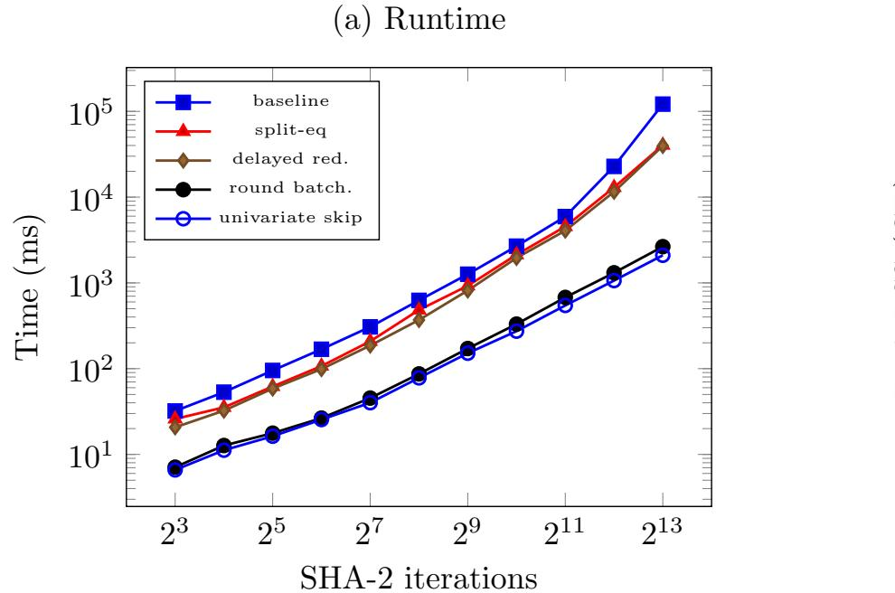
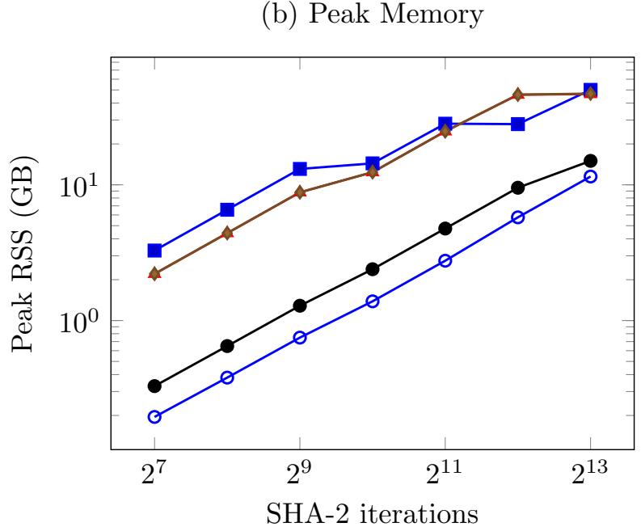

{0}------------------------------------------------

# Speeding Up Sum-Check Proving (Extended Version)<sup>∗</sup>

Quang Dao† qvd@andrew.cmu.edu Zachary DeStefano‡ zd2131@nyu.edu

Suyash Bagad§ suyash@ingonyama.com

Yuval Domb§

Justin Thaler¶ justin.r.thaler@gmail.com

yuval.domb@gmail.com

March 24, 2026

#### Abstract

The sum-check protocol is a foundational primitive in modern cryptographic proof systems, but its prover-side cost has emerged as a concrete bottleneck. This paper introduces three complementary techniques that significantly reduce sum-check proving time and memory, especially in the context of zero-knowledge virtual machines (zkVMs).

First, for applications involving products of many multilinear polynomials, we develop a new algorithm that significantly reduces the number of field multiplications required for proving. Second, we develop a "small-value sum-check prover" algorithm. This significantly speeds up the prover in the common setting where the polynomials being summed evaluate to 64 or 32-bit integers, or to elements of a small sub-field within a larger extension field. Even outside of the small-value setting, this algorithm yields a faster "streaming prover", by which we mean a small-space algorithm that applies whenever the terms being summed can be enumerated in small space (as arises, for example, in zkVM applications). Third, we nearly eliminate prover overhead in the ubiquitous case where one factor is an equality polynomial by exploiting its decomposable tensor structure.

We implement these techniques in Jolt, a state-of-the-art zkVM, and evaluate their performance. In Jolt, we observe over an order of magnitude runtime speedup and memory reduction on the Spartan sub-protocol, and 1.7×–2.2× speedups for a key high-degree sum-check sub-protocol in the Shout batchevaluation argument.

# 1 Introduction

The sum-check protocol [\[41\]](#page-28-0) is a fundamental tool in the design of succinct proof systems. When run interactively, it is an information-theoretically sound method for verifying claims of the form

$$\sum_{x \in \{0,1\}^{\ell}} g(x) = t,$$

where g is a multivariate polynomial of individual degree d over a finite field F. From the verifier's perspective, the protocol reduces the expensive task of summing 2<sup>ℓ</sup> evaluations of g to the much cheaper task of evaluating g at a single random point in F ℓ . In many applications g factors as a product of d multilinear polynomials; this is the case we consider throughout.

When used in succinct non-interactive arguments of knowledge (SNARKs), the sum-check protocol generally minimizes the amount of data the SNARK prover must commit to cryptographically, and also minimizes the time required to prove that this committed data is well-formed. Because of these features, the sum-check

<sup>∗</sup>This manuscript directly combines and improves upon results from prior work [\[8,](#page-26-0) [23\]](#page-27-0).

<sup>†</sup>Carnegie Mellon University

<sup>‡</sup>New York University

<sup>§</sup> Ingonyama

<sup>¶</sup>a16z crypto research and Georgetown University

{1}------------------------------------------------

protocol now underpins SNARKs for arithmetic circuit satisfiability [\[30,](#page-27-1) [63,](#page-29-0) [65\]](#page-29-1), R1CS [\[49\]](#page-28-1), Plonkish and CCS [\[14,](#page-26-1) [52\]](#page-28-2), the fastest lookup arguments [\[51,](#page-28-3) [53\]](#page-28-4), polynomial commitment schemes [\[4,](#page-26-2) [25,](#page-27-2) [26,](#page-27-3) [45\]](#page-28-5), folding schemes [\[11,](#page-26-3) [37,](#page-27-4) [38,](#page-27-5) [12,](#page-26-4) [44\]](#page-28-6), and zero-knowledge virtual machines (zkVMs) like Jolt [\[5\]](#page-26-5), SP1 Hypercube [\[55\]](#page-28-7), and Ceno [\[40\]](#page-27-6).

The sum-check protocol is so effective at reducing cryptographic costs that its own proving time and memory have become a major bottleneck in many proof systems.

Overhead of large-field arithmetic. The security of the sum-check protocol is directly related to the size of the finite field F over which it operates. For non-interactive security, the sum-check protocol needs to operate over fields of at least λ = 128 bits, with many systems (such as Jolt) requiring 256-bit fields to support elliptic curve-based polynomial commitments. This leads to a large overhead: a single 256-bit field multiplication requires 40-100 CPU cycles [\[66\]](#page-29-2). For additional details on the necessity of large fields, see Appendix [F.](#page-50-0)

Time-space tradeoffs for sum-check algorithms. Let M = 2<sup>ℓ</sup> be the size of the sum being proved. The fastest proving algorithms for products of multilinear polynomials [\[61,](#page-28-8) [58\]](#page-28-9) perform a number of field operations that scales linearly with M; however, these algorithms also require linear space (i.e., storing Θ(M) field elements). In practice, when M can be on the order of billions, the memory requirements of these algorithms can be prohibitive.

There are low-memory alternatives, called streaming algorithms, which use significantly less space at the cost of superlinear time. The best streaming algorithm, recently introduced by Baweja et al. [\[10\]](#page-26-6), uses O(M1/k) space and O(M log log M) time for any constant k whenever d is a small constant (i.e., 3 or smaller). However, as d increases, this algorithm rapidly approaches the performance of a prior streaming algorithm [\[21\]](#page-26-7) that costs O(d <sup>2</sup>M log M) time and O(d + log M) space. For realistic values of M, this is more than an order of magnitude slower than the linear-time algorithm.

To summarize, recall that we are considering applications of the sum-check protocol to a product of d multilinear polynomials over a λ-bit field F. In a crude model where a field multiplication costs one unit and linear space is allowed, the "linear-time" sum-check proving algorithm [\[61,](#page-28-8) [58\]](#page-28-9) is essentially optimal for small d like d = 2 or d = 3. In practice, however, field multiplications dominate proving time (and, even asymptotically, a λ-bit field multiplication should not be regarded as a unit-cost operation). On top of this, moving to a sublinear-space proving algorithm results in a time penalty.

Moreover, handling high d is important in some modern proof systems. For example, the Shout [\[51\]](#page-28-3) batch-evaluation argument used in Jolt [\[5,](#page-26-5) [2\]](#page-25-0), as currently configured, invokes a sum-check protocol with a configurable degree d that can be up to 32. This makes efficient prover support for high-degree sum-checks important in practice.

A major goal and focus of our work is to speed up the Jolt zkVM prover [\[5,](#page-26-5) [2\]](#page-25-0) as much as possible. Jolt is a state-of-the-art zkVM that is simple and fast, relying entirely on various sum-check instances for its information-theoretic core (the PIOP), together with a polynomial-commitment layer. When proving programs with large trace lengths (say 1 billion cycles), the Jolt prover spends about 65 − 70% of its time on sum-checks, making it a major bottleneck.

While this is the main motivation, we also stress that our techniques apply to a broad range of applications of the sum-check protocol in SNARK design, including the fastest SNARKs for circuit- and constraintsatisfaction, such as Spartan [\[49,](#page-28-1) [1\]](#page-25-1) and its variants like Binius64 [\[57\]](#page-28-10) (which applies SuperSpartan, a SNARK for Customizable Constraint Systems [\[52\]](#page-28-2), over binary fields using (FRI-)Binius [\[25,](#page-27-2) [26\]](#page-27-3) as the polynomial commitment scheme).

An earlier version of this manuscript appeared in prior work [\[7\]](#page-26-8). The present extended version reorganizes and expands that presentation, and directly combines and improves upon results from prior work [\[8,](#page-26-0) [23\]](#page-27-0).

## 1.1 Our results

This work presents a variety of prover-side optimizations for sum-check that, except for one (univariate skip (Section [7\)](#page-17-0)), leave the protocol, verifier, and soundness unchanged.[1](#page-1-0) The techniques we introduce are com-

<span id="page-1-0"></span><sup>1</sup>Univariate skip, first introduced by Gruen [\[33\]](#page-27-7), modifies the protocol but still remains sound.

{2}------------------------------------------------

| Algorithm             | Time                      | Space    |
|-----------------------|---------------------------|----------|
| LinearTime [61, 58]   | 2M<br>d                   | dM       |
| OptLinearTime         | (d log d)M                | dM       |
| LogSpace [21]         | 2M<br>d<br>log M          | d+ log M |
| CrossProductk<br>[10] | 2M(k<br>d<br>+ log log M) | M1/k     |
| EvalProductStreamk    | (d log d)M(k + log log M) | M1/k     |

<span id="page-2-2"></span>Table 1: Generic-setting prover asymptotic costs (M=2<sup>ℓ</sup> ), counted in terms of bb (i.e., big-big) field multiplications. In all cases, the constants hidden by the asymptotics are concretely small.

plementary to each other, and exploit structural properties common in sum-check applications, such as small polynomial evaluations, long-running sums of products, high-degree products, and equality polynomials.

Faster field arithmetic via small-value specialization and delayed reduction. In Section [3,](#page-8-0) we observe that while computing the product of two arbitrary finite field elements is expensive, when one or both elements are small interpreted as integers (e.g., storable in a single 64-bit or 32-bit machine word), it is possible to compute their product significantly faster. We then generalize these techniques to the efficient computation of linear combinations (and, more generally, low multiplicative depth circuits) over the appropriate finite field. Our techniques improve efficiency by allowing intermediate values to exceed the field size, deferring modular reduction until the end of the operation sequence.[2](#page-2-0)

We provide explicit procedures for small-small, small-big, and big-big multiplications, where the latter refers to standard finite field multiplication.

High-degree sum-check speedups. In Section [4,](#page-10-0) we apply this observation to the problem of efficiently computing the product of d multilinear polynomials, each in v variables. This computation is a core subroutine in all known sum-check proving algorithms and dominates their runtimes.

The most concretely efficient prior baseline is the naive algorithm that performs O(d <sup>v</sup>+1) (big-big) multiplications to compute this product by directly evaluating the product at (d+ 1)<sup>v</sup> points. We lower this cost to O(d <sup>v</sup> + d log d) (big-big) multiplications with a concretely small constant. In the univariate case of v = 1, this is an improvement from O(d 2 ) to O(d log d) multiplications, while for v > 1, this is an improvement by a factor of d over the naive algorithm.[3](#page-2-1) For large d used in practice, such as d = 16 or d = 32, this yields substantial concrete speedups: up to about 2.5× in our high-degree kernel microbenchmarks, and about 1.7×–2.2× in Jolt's read-access (RA) virtualization sum-check benchmark (see §[9\)](#page-19-0).

This approach is inspired by a suggestion of Ben Diamond [\[24\]](#page-27-8); however, making the idea concretely efficient requires a routine to efficiently extrapolate from a small set of evaluation points to a larger set. Our contributions here consist of generalizing the approach to the multivariate setting and making it concretely efficient, by optimizing the extrapolation step with a mix of specialized field operations and optimal multiaddition chains.

Improved speed/memory tradeoffs. In Section [5,](#page-12-0) we work at the granularity of full sum-check prover algorithms, combining the techniques above with additional algorithmic insights to improve prover performance across the time-space tradeoff spectrum. Table [1](#page-2-2) summarizes our results against prior work.

Streaming algorithms typically group the rounds of the sum-check protocol into epochs called windows and amortize the cost of computing the prover's messages over all rounds within a window [\[21,](#page-26-7) [10\]](#page-26-6). When using a window size of k rounds, our improvement over prior work [\[10\]](#page-26-6) comes from working with (d + 1)<sup>k</sup> evaluations, rather than O((2<sup>d</sup> ) k ) terms used to compute the coefficients of intermediate polynomials. We show that computing these evaluation points can be structured as a recursive polynomial multiplication problem, similar to the high-degree optimization above, allowing speedups using techniques similar to the Toom-Cook multiplication algorithm [\[18,](#page-26-9) [60\]](#page-28-11).

<span id="page-2-0"></span><sup>2</sup>While the delayed reduction technique is not new and has been used in other contexts, our work is the first time it has applied to speed up sum-check proving, yielding a substantial speedup for all existing sum-check algorithms ( Section [3\)](#page-8-0).

<span id="page-2-1"></span><sup>3</sup>The lower-order (sb/addition) work is O(d <sup>v</sup>+1), which is dominated by the bb savings for all practical values of d.

{3}------------------------------------------------

**Small-value sum-check optimizations.** When the underlying multilinear polynomials in the sum-check protocol have small evaluations (as is common in zkVMs), we further reduce the number of expensive big-big multiplications in this algorithm. Here, we say informally that an  $\ell$ -variate multilinear polynomial p has small evaluations if, for all  $x \in \{0,1\}^{\ell}$ , p(x) can be specified with significantly fewer bits than arbitrary elements of  $\mathbb{F}$ . This includes, for example, values in  $\{0,1,\ldots,2^{64}-1\}$  when working over a 128- or 256-bit prime field, or values in a 32- or 64-bit subfield of a larger extension field.

The key insight is that the first few rounds of the sum-check prover make up the vast majority of the prover's work, and in these rounds only a handful of random field elements arise—all other values in the prover's computation within these rounds are small. By working with evaluation points, rather than coefficients, it is possible to replace a significant fraction of big-big multiplications with much cheaper small-small and small-big multiplications. The resulting prover time improvements are substantial for all d, even d = 2, and even in non-streaming (i.e., linear-space) contexts.

**Handling decomposable polynomials for free.** In practice, some of the multilinear polynomials in the sum-check protocol have a specific *decomposable* structure. That is they can be expressed as a product of univariate polynomials. One common example is the equality polynomial

$$\widetilde{\operatorname{eq}}(W,X) = \prod_{i=1}^{\ell} (W_i \cdot X_i + (1-W_i) \cdot (1-X_i)),$$

with randomly chosen  $W \in \mathbb{F}^{\ell}$ , which is nearly ubiquitous in sum-check applications. In Section 6, we show how to leverage this structure in the streaming setting, to nearly eliminate all overheads from this polynomial factor.

This decomposability allows for unique amortization strategies. This structure was previously exploited by Gruen [33]; however, our techniques are distinct and complementary.<sup>4</sup> The key insight involves rewriting the sum-check messages as iterated sums, which allows the prover to compute small tables of values that can be reused across rounds of the protocol.

Implementation and evaluation. We have implemented these techniques and integrated them into the Jolt zkVM (§8). <sup>5</sup> Our experimental evaluation (§9) shows substantial microbenchmark speedups that carry over to end-to-end prover performance. In Jolt's Spartan outer benchmarks, our most optimized variant (using univariate skip, which trades faster proving for a higher-degree verifier interpolation step) reaches  $10.9\times$  runtime speedup over an unoptimized baseline (with none of our optimizations in this paper), and up to  $17.5\times$  lower isolated peak memory; at memory-bottleneck scales, runtime speedup grows up to  $57.9\times$ . In Shout's read-access virtualization sum-check, we observe  $1.7\times-2.2\times$  speedups across various configurable degree settings.

#### <span id="page-3-2"></span>1.2 Related work

Sum-check's central role in modern SNARKs has spurred extensive prover-side optimizations. We review prior work, spanning general techniques and setting-specific variants.

**Sum-check origins.** The sum-check protocol was introduced by Lund, Fortnow, Karloff, and Nisan [41] as a key component in an interactive proof for #P and later PSPACE [54]. The provers in these protocols took superpolynomial time even when applied to very simple problems (e.g., those solvable in logarithmic space). The sum-check protocol was later harnessed by Goldwasser, Kalai, and Rothblum (GKR) [30], who used it to construct an interactive proof for any arithmetic circuit of polylogarithmic depth and polynomial size, with a prover that runs in polynomial time.

<span id="page-3-0"></span><sup>&</sup>lt;sup>4</sup>See also a small variation proposed by Setty and Thaler [51] that avoids altering the prover's message in each round of sum-check.

<span id="page-3-1"></span><sup>&</sup>lt;sup>5</sup>See https://github.com/quangvdao/jolt/tree/zkproof-submission.

{4}------------------------------------------------

Linear time proving. The linear-space implementations of Vu et al. [\[61\]](#page-28-8) and Thaler [\[58\]](#page-28-9) are what is colloquially called the "linear-time" sum-check prover when applied to a product of multilinear polynomials. Cormode, Thaler, and Yi [\[21\]](#page-26-7) gave a space-efficient variation that runs in quasilinear time using only logarithmic space. The name "linear-time" stems from the fact that, for fixed d, the prover performs O(M) field operations, where M = 2<sup>ℓ</sup> is the size of the summation domain. We follow the conventional name "lineartime", though the dependence on d is crucial in practice and is a focus of our work, as is the difference between big-by-big field multiplications compared to big-by-small or small-by-small.

These algorithms have since been refined and deployed in a variety of systems. For example, they were used in a long line of works to implement linear-time variants of the GKR protocol [\[20,](#page-26-10) [61,](#page-28-8) [58,](#page-28-9) [62,](#page-28-13) [63,](#page-29-0) [68,](#page-29-3) [65,](#page-29-1) [67\]](#page-29-4). They also form the prover backbone in Spartan [\[49\]](#page-28-1), which is itself a major component of the Jolt zkVM [\[5\]](#page-26-5). A line of works has also applied the sum-check protocol to obtain efficient memory-checking arguments, meaning a way of forcing an untrusted prover to correctly process reads and writes to a large memory (or just reads, in the case of read-only memories) [\[69,](#page-29-5) [50,](#page-28-14) [53\]](#page-28-4). Most recent in this line of work is Twist and Shout [\[51\]](#page-28-3).

Low-memory proving. Baweja et al. [\[10\]](#page-26-6) implement the sum-check prover (applied to a product of a constant number of multilinear polynomials) in sublinear space and slightly superlinear time (i.e., in O(M · log log M) field operations and using space M<sup>1</sup>/k for any constant integer k > 1, where M = 2<sup>ℓ</sup> is the size of the sum being computed). Assuming natural conjectures, Baweja et al. also prove a matching lower bound of Ω(M log log M) field multiplications for the sum-check prover applied to a product of two multilinear polynomials when using sublinear space. This lower bound in terms of M also applies to our improvement of their streaming algorithm; we improve upon the asymptotic dependence on the degree instead.

Delayed reduction. The idea of postponing modular reduction to a canonical field representation when performing many operations sequentially (often referred to as "lazy reduction") is a well-known optimization in pairing-based cryptography [\[47,](#page-28-15) [3,](#page-25-2) [48\]](#page-28-16), and is used in practice in many high-performance elliptic curve and SNARK implementations (e.g., blst [\[56\]](#page-28-17) and gnark-crypto [\[16\]](#page-26-11)) to optimize extension field arithmetic and multi-scalar multiplications. Our contribution is to systematically apply this insight to the core linear combinations and low-degree polynomial evaluations of the sum-check protocol, where it combines with small-value arithmetic to yield substantial speedups. We describe the delayed reduction principle and its applications in detail in §[3.](#page-8-0)

Gruen's optimizations. A recent work of Gruen [\[33\]](#page-27-7) also seeks to optimize the sum-check prover and focuses on the case where the protocol is performed over fields of small characteristic. Two of the optimizations in that work are relevant to us. The first is useful when summing a product of multilinear polynomials one of which is decomposable. Gruen's optimization in this setting is complementary to our own, and is discussed in more detail in Section [6.](#page-16-0) The second is the univariate-skip technique itself, which targets the same smallvalue regime as ours but modifies the protocol and increases the degree of the first-round prover polynomial; we revisit this tradeoff in Section [7.](#page-17-0)

Our small-value optimizations do not have any of the above limitations, instead applying "as is" to existing sum-check-based SNARKs, yielding functionally equivalent implementations (i.e., the SNARK verifier is unchanged).

Structured sum-check protocols. The sparse-dense sum-check prover algorithm [\[53\]](#page-28-4) achieves a general time-space tradeoff, running in O(cM) time and O(M<sup>1</sup>/c) space for any integer c > 0, but applies only to structured sum-check instances, involving the product of an arbitrary multilinear polynomial and a structured multilinear polynomial. Its refinement, the prefix-suffix inner product algorithm [\[43\]](#page-28-18), further generalizes applicability and improves efficiency for these structured scenarios. Jolt employs these protocols where possible for efficiency; however, their applicability is limited to specific structured sum-check instances (they do not apply to many sum-check instances in Jolt, including those in Spartan).

Concurrent work. As mentioned above, after the release of an initial version of our results [\[8,](#page-26-0) [23\]](#page-27-0), Nair, Thaler, and Zhu [\[43\]](#page-28-18) described an efficient small-space implementation of the Jolt prover (without invoking 

{5}------------------------------------------------

SNARK composition or recursion), whose concrete efficiency benefits substantially from our optimizations.

Two recent works also focus on the sum-check protocol applied in the small-characteristic setting. Liu and Zhang [39] focus on the setting of binary tower fields, building on a technique of Dao and Thaler [22] to give a sum-check prover algorithm for products of d Boolean-valued multilinear polynomials. However, for the most common settings of d, namely  $d \in \{2,3\}$ , their algorithm is asymptotically slower than ours, and no implementation is provided. Wei et al. [64] obtain a fast sum-check prover implementation by combining parallel repetition with NeutronNova's [38] "sumfold" scheme that reduces many independent instances of the sum-check protocol to a single one.

# 2 Preliminaries

**Notation.** We index vectors from 1, and denote ranges using bracket notation as:  $[a,b] := \{a,\ldots,b\}$ ,  $[n] := \{1,\ldots,n\}$ ,  $[< i] := \{1,\ldots,i-1\}$ , and  $[> i] := \{i+1,\ldots,n\}$  (where n is assumed to be clear from context).  $U_d$  is shorthand for the set  $\{\infty,0,1,\ldots d-1\}$  and  $\widehat{U_d} := U_d \setminus \{0\}$  is the set  $\{\infty,1,\ldots d-1\}$ . We write  $\mathsf{nat}_b(x) := \sum_{i=1}^\ell x_i \cdot b^{i-1}$  to refer to the natural number in base b corresponding to the vector  $x \in [0,b-1]^\ell$ , abbreviating  $\mathsf{nat}(x)$  when b=2.

### <span id="page-5-1"></span>2.1 Finite fields

SNARKs that use elliptic curve-based polynomial commitments need to operate over large prime fields  $\mathbb{F}_p$  of roughly 256 bits; examples include the scalar fields of the BN254, secp256k1, or BLS12-381 curves. On 64-bit architectures, elements of such fields are represented as N=4 limbs of 64-bit unsigned integers. To accelerate multiplication, field elements are typically stored in Montgomery form [42]. An element  $a \in \mathbb{F}_p$  is represented as  $a'=aR \pmod{p}$ , where  $R=2^{64N}$  is a power of two, chosen so that multiplication or division by R amounts to very cheap bit shifts.

Multiplying two elements a', b' in Montgomery form involves two steps. First, a large-integer multiplication computes  $c = a' \cdot b'$ , a 2N-limb integer, at a cost of  $N^2$  native multiplications. Second, a Montgomery reduction computes  $cR^{-1} \pmod{p}$  to return the product to Montgomery form, costing an additional  $N^2 + N$  native multiplications.<sup>6</sup> The total cost for a field multiplication is thus approximately  $2N^2 + N$  native multiplications and a similar amount of additions, translating to around 50-100 CPU cycles when N = 4 [66] (see Appendix G for further details).

Barrett reduction [9] is another common technique for modular reduction which does not perform the division by R. An optimized implementation gives the same number of multiplications as Montgomery reduction, but with a larger number of conditional subtractions, and thus is slower in practice. Because of this, most field arithmetic libraries use Montgomery representation for large prime fields

Hash-based SNARKs often use ~128-bit extension fields  $\mathbb{F}_{p^k}$ , which are k-dimensional vector spaces over a base field  $\mathbb{F}_p$ . Extension field elements can be represented as vectors over the base field, relative to a chosen basis. A standard monomial basis represents elements as polynomials of degree less than k, with multiplication performed modulo a degree-k irreducible polynomial. When  $k = 2^{\tau}$  is a power of two, a tower basis can be used, constructed from a sequence of iterated quadratic extensions. For both bases, multiplication in the extension field costs  $O(k^{\log_2 3}) \approx O(k^{1.585})$  multiplications in the base field via Karatsuba's algorithm [36]. Prominent examples include the degree-4 tower extension of the 31-bit BabyBear prime field and the degree-128 tower extension  $\mathsf{GF}(2^{128})$  of the binary field  $\mathsf{GF}(2)$ , used in systems like Binius [25].

#### 2.2 Multilinear polynomials

We state some facts about multilinear polynomials needed in our paper. See standard references, e.g. [59], for derivations.

<span id="page-5-0"></span><sup>&</sup>lt;sup>6</sup>It is possible to reduce the multiplication count to  $N^2 + 1$  [27], but this may not always yield a practical speedup due to an increased number of conditional branches.

{6}------------------------------------------------

Multilinear extension. An ℓ-variate polynomial p is multilinear if it has degree at most 1 in each variable. The multilinear extension of a function f : {0, 1} <sup>ℓ</sup> → F is the unique multilinear polynomial p such that p(x) = f(x) for all x ∈ {0, 1} ℓ .

In particular, the equality polynomial eq<sup>e</sup> defined as

$$\widetilde{\text{eq}}(X,Y) = \prod_{i=1}^{\ell} (X_i \cdot Y_i + (1 - X_i) \cdot (1 - Y_i))$$
(1)

is the multilinear extension of the equality function (· ?= ·) : {0, 1} <sup>ℓ</sup> × {0, 1} <sup>ℓ</sup> → {0, 1}, as we can verify that

$$\widetilde{\operatorname{eq}}(x,y) = \begin{cases} 1 \text{ if } x = y \\ 0 \text{ otherwise} \end{cases}$$
, for all  $x, y \in \{0, 1\}^{\ell}$ .

Lemma 1. Let p: F <sup>ℓ</sup> → F be a multilinear polynomial. Then for any 0 ≤ i ≤ ℓ, any (r1, . . . , ri) ∈ F i , and any x ′ ∈ {0, 1} ℓ−i ,

<span id="page-6-0"></span>
$$p(r_1, \dots, r_i, x') = \sum_{y \in \{0,1\}^i} \widetilde{eq}((r_1, \dots, r_i), y) \cdot p(y, x').$$
(2)

Setting i = 1, Equation [\(2\)](#page-6-0) simplifies to

$$p(r_1, x') = (1 - r_1) \cdot p(0, x') + r_1 \cdot p(1, x'). \tag{3}$$

Setting i = ℓ, we get the multilinear extension formula

$$p(r_1, \dots, r_\ell) = \sum_{y \in \{0,1\}^\ell} \widetilde{eq}(r_1, \dots, r_\ell, y) \cdot p(y).$$
(4)

Lagrange interpolation. A (univariate) polynomial s(X) of degree d is uniquely determined by its values at d + 1 distinct evaluation points U = {x0, . . . , xd} ⊂ F via the Lagrange interpolation formula:

$$s(X) = \sum_{i=0}^{d} s(x_i) \cdot \mathcal{L}_{U,i}(X), \text{ where } \mathcal{L}_{U,i}(X) = \prod_{j \neq i} \frac{X - x_j}{x_i - x_j}.$$
 (5)

In our algorithms, we use a standard variant of Lagrange interpolation that takes into account the "evaluation at infinity" of a polynomial, defined as s(∞) := the highest-degree coefficient of s(X).

Lemma 2. Let s(X) = a · X<sup>d</sup> + · · · ∈ F[X] be a polynomial of degree d. Then for any distinct evaluation points x1, . . . , x<sup>d</sup> ∈ F, setting U = {∞} ∪ {x1, . . . , xd}, we have the identity:

$$s(X) = a \cdot \prod_{k=1}^{d} (X - x_k) + \sum_{k=1}^{d} s(x_k) \cdot \mathcal{L}_{\{x_i\}, k}(X).$$
 (6)

Thus, we can define LU,0(X) := Q<sup>d</sup> <sup>k</sup>=1(X − xk) and LU,k(X) := L{xi},k(X) for k ∈ [d].

Streaming model. For all streaming algorithms, we assume that the evaluations p1(x), . . . , pd(x) for x ∈ {0, 1} ℓ can be enumerated in linear time and small space, in lexicographic order (either little- or bigendian) from x = 0<sup>ℓ</sup> to x = 1<sup>ℓ</sup> . This holds in many applications, since p1, . . . , p<sup>d</sup> are typically the multilinear extensions of functions f1, . . . , f<sup>d</sup> : {0, 1} <sup>ℓ</sup> → F, whose evaluations over the Boolean hypercube can themselves be enumerated in linear time and small space (for example, when they are derived from the execution trace of a virtual machine).

{7}------------------------------------------------

<span id="page-7-0"></span>**Setup:** Assume that the verifier has oracle access to the polynomial g, and knows the value  $C_0$  claimed to equal

$$\sum_{x \in \{0,1\}^{\ell}} g(x) = C_0.$$

For each round  $i = 1, \dots, \ell$ :

1.  $\mathcal{P}$  sends the univariate polynomial  $s_i(X)$  claimed to equal

$$\sum_{(x_{i+1},\ldots,x_{\ell})\in\{0,1\}^{\ell-i}}g(r_1,\ldots,r_{i-1},X,x_{i+1},\ldots,x_{\ell}).$$

 $\mathcal{P}$  does so by sending the evaluations  $\{s_i(u): u \in \widehat{U}_d\}$  to  $\mathcal{V}$ .

- 2.  $\mathcal{V}$  sends a random challenge  $r_i \leftarrow \mathbb{F}$  to  $\mathcal{P}$ .
- 3.  $\mathcal{V}$  derives  $s_i(0) := C_{i-1} s_i(1)$ , then sets  $C_i := s_i(r_i)$ .

After  $\ell$  rounds, we reduce to the claim that

$$q(r_1,\ldots,r_\ell)=C_\ell.$$

 $\mathcal{V}$  checks this claim by making a single oracle query to g.

Figure 1: The sum-check protocol

### <span id="page-7-3"></span>2.3 The sum-check protocol

In Figure 1, we describe the sum-check protocol that reduces checking a claim of the form

$$\sum_{x \in \{0,1\}^{\ell}} g(x) = C,$$

for a polynomial g of degree at most d in each variable over field  $\mathbb{F}$ , to checking the evaluation of g at a random point  $r \in \mathbb{F}^{\ell}$ : g(r) = v. We assume that g is a product of d multilinear polynomials  $p_1, \ldots, p_d$ ; by linearity, existing algorithms can be straightforwardly extended if g is any degree-d function of multilinears.

In each round j, the honest prover sends a univariate polynomial  $s_j$  of degree d. As any degree-d univariate polynomial is specified by its evaluations on any set of d+1 points, computing  $s_j(c)$  for all  $c \in \{\infty\} \cup \{0,1,\ldots,d-1\}$  suffices to uniquely specify  $s_j$ . In fact, the prover can omit the evaluation  $s_j(0)$ , and instead let the verifier derive it from the previous round using the equation  $s_j(0) = C_{j-1} - s_j(1)$ , which holds for an honest protocol execution.

**Theorem 3.** The sum-check protocol applied to a polynomial g of individual degree at most d is perfectly complete and has soundness error of  $d\ell/|\mathbb{F}|$ .

See, e.g., [59] for a proof of this standard result, attributed to Lund, Fortnow, Karloff, and Nisan [41].<sup>8</sup>

Linear-time algorithm for sum-check proving. We recall the linear-time algorithm from prior work [21, 61, 58], which runs in time linear in the instance size  $M = 2^{\ell}$ . The key idea is that we "bind" the polynomial after each round to this round's verifier challenge  $r_i$ . After each round i, it uses the verifier's challenge  $r_i$  to compute and cache the partial evaluations  $p_k(r_1, \ldots, r_i, x')$  for all  $k \in [d]$  and  $x' \in \{0, 1\}^{\ell-i}$ . This cache,

<span id="page-7-1"></span><sup>&</sup>lt;sup>7</sup>We assume a mapping from  $\{0, 1, \dots, d-1\}$  to distinct field elements. For large enough prime fields, these integers are naturally identified with their corresponding field elements. For binary extension fields, a natural choice is to use those whose binary representation (in the chosen basis) matches that of each integer.

<span id="page-7-2"></span><sup>&</sup>lt;sup>8</sup>Not only does the sum-check protocol have soundness error at most  $d\ell/|\mathbb{F}|$ , it satisfies a stronger property: it has round-by-round soundness at most  $d/|\mathbb{F}|$  in each round. This ensures that the protocol remains secure (in the random oracle model) even after it is rendered non-interactive via the Fiat-Shamir transformation. See [13] for details.

{8}------------------------------------------------

which halves in size each round, allows for efficient computation of the next round's polynomial in only  $O(d^2 \cdot 2^{\ell-i})$  time. The total runtime is  $O(d^2 \cdot 2^{\ell})$ . See Section C for a full description and cost analysis of LinearTimesc, along with full descriptions of two prior streaming algorithms [21, 10].

## <span id="page-8-0"></span>3 Non-black-box field arithmetic

The implementation of arithmetic operations in a finite field is typically treated as a black-box: given two field elements, one can add, subtract, multiply, or divide them. These operations can broadly be decomposed into two discrete steps. First, the field elements are treated as integers (or polynomials) and the corresponding integer (or polynomial) operation is performed. This results in a *non-reduced* integer (or polynomial). Second, the result is *reduced* to obtain a valid canonical representation of the resulting field element.

By opening up this black box, we identify a variety of techniques that involve modifying, deferring, or batching reductions across multiple operations. The first of these is a more efficient algorithm for multiplying two field elements when one of them is "small" when interpreted as an integer (i.e., fits into a single machine word). The second of these is a *delayed* (also known as *deferred*, or *lazy*) reduction technique, where we minimize the number of (Barrett or Montgomery) reductions in a long-running sequence of field operations. As mentioned in Section 1.2, we stress that this technique is not new, but to the best of our knowledge ours is the first time this technique is systematically applied to sum-check.

## 3.1 Multiplying with small integers

As discussed in §2.1, multiplying two N-limb field elements in Montgomery form involves  $2N^2 + N$  native multiplications. However, when one of the operands is a small integer that fits into a single limb (e.g., a 64-bit integer), we can employ a more direct and efficient method. Instead of converting the small integer to Montgomery form, we can:

- 1. Multiply the multi-limb integer representation of the field element by the small integer directly. This large integer (bignum) multiplication costs only N native multiplications.
- 2. Apply a single, optimized pass of Barrett reduction to the (N+1)-limb result to perform the modular reduction. This costs an additional N+1 native multiplications.

This optimized approach reduces the total cost from  $2N^2 + N$  to 2N + 1 native multiplications, which in practice is about a 2-3× speedup for a  $\sim 256$ -bit field. We give details in Appendix B.1.

To distinguish types of multiplications, we use the following notation. A multiplication of two (big) field elements is denoted as a big-big multiplication ( $\mathfrak{bb}$ ). A multiplication of a small field element (i.e., a machine integer) with a big field element is denoted as a small-big multiplication ( $\mathfrak{sb}$ ). Finally, a multiplication of two small field elements (i.e., two machine integers) is denoted as a small-small multiplication ( $\mathfrak{sb}$ ). When we discuss the complexity of various algorithms, we will focus on the number of  $\mathfrak{bb}$  operations as the dominant cost, while also accounting for  $\mathfrak{sb}$  and  $\mathfrak{ss}$  operations as secondary costs when relevant.

### 3.2 Small value arithmetic over tower fields

An analogue of small-value arithmetic is also available for tower fields. Recall from §2.1 that a tower field  $\mathbb{F}$  is constructed as a series of quadratic extensions over a base field  $\mathbb{B}$ , denoted  $\mathbb{B} \subset \mathbb{B}^{(1)} \subset \cdots \subset \mathbb{B}^{(\ell)} = \mathbb{F}$ , where each  $\mathbb{B}^{(j)}$  is a degree-2 extension of  $\mathbb{B}^{(j-1)}$ . This recursive structure allows for two benefits (already exploited in prior work [25, 26]):

- 1. Compressed subfield representation: An element  $x \in \mathbb{B}^{(j)}$  is, by construction, a linear combination of the first  $2^j$  basis vectors of  $\mathbb{F}$  over  $\mathbb{B}$ . Thus, it can be represented using only  $2^j$  elements from  $\mathbb{B}$ .
- 2. **Fast subfield multiplication:** To multiply an element  $x \in \mathbb{B}^{(j)}$  by an element  $y \in \mathbb{B}^{(j')}$  (with j < j'), we can leverage the recursive structure. We view y as  $y_0 + y_1 \alpha$ , where  $y_0, y_1 \in \mathbb{B}^{(j'-1)}$ . The product  $x \cdot y = (x \cdot y_0) + (x \cdot y_1)\alpha$  becomes two recursive multiplications of an element in  $\mathbb{B}^{(j)}$  by elements in  $\mathbb{B}^{(j'-1)}$ . This recursive definition leads to a multiplication algorithm that costs only  $2^{j'-j}$  multiplications in the subfield  $\mathbb{B}^{(j)}$ .

{9}------------------------------------------------

These properties allow operations on subfield elements to be treated as a form of small-value arithmetic, yielding significant performance gains. Further details are in Appendix B.

### <span id="page-9-0"></span>3.3 Delayed reduction

Instead of focusing on a single field multiplication, we turn to computing a linear combination of field elements, specifically a dot product between a vector of small integers and a vector of large field elements. An efficient primitive of this form is particularly useful when applied to the sum-check protocol, as described in Sections 4 and 5.

Formally, consider computing the linear combination  $S = \sum_{i=1}^{k} c_i \cdot a_i \pmod{p}$ , where each  $c_i$  is a 64-bit unsigned integer and each  $a_i$  is a large field element in Montgomery form.

A black-box approach would involve k  $\mathfrak{bb}$  multiplications. Using our new  $\mathfrak{sb}$  multiplication primitive, this can be improved to k  $\mathfrak{sb}$  multiplications. However, in the spirit of opening the black-box further, the modular reduction in each of these  $\mathfrak{sb}$  multiplications can be deferred to the end as a single modular reduction operation.

The full procedure is the following. First, compute the integer product  $T_i = c_i \cdot a_i$  where each  $T_i$  is an integer of at most N+1 limbs. Then, sum these integer products to get an integer total  $T = \sum_{i=1}^k T_i$ . If the coefficient sum satisfies  $\sum_{i=1}^k c_i < 2^{64}$ , then T still has at most N+1 limbs and the specialized single-pass Barrett reduction from Appendix B applies directly. More generally, if the accumulated coefficient growth needs one extra limb, then T has at most N+2 limbs and one should either widen the final reduction routine or reduce in batches. Finally, perform a single Barrett reduction on T to compute  $S=T \mod p$ .

This approach amortizes the cost of modular reduction, requiring only k small-big (integer) multiplications (at N native multiplications each) plus one final reduction (at N+1 native multiplications), for a total of  $k \cdot N + (N+1)$  native multiplications. This is nearly a  $2 \times$  improvement over an approach that uses raw  $\mathfrak{sb}$  multiplications, and a far larger improvement over an approach which treats field multiplication as a black box.

This primitive can be further adapted to support cases where  $c_i$  can be: (i) larger (say 128-bit unsigned integers), or (ii) negative. The first case is handled straightforwardly by adapting the number of limbs used in the intermediate integer representation. The second involves splitting the sum into positive and negative terms, computing the positive and negative integer linear combinations, taking the difference of the result, and finally performing a Barrett reduction.

**Delayed reduction in field extensions.** This technique of delaying reductions also applies to field extensions with some modifications, though we do not specifically implement or benchmark this extension in this work.

In this setting, say one has an extension  $\mathbb{F}_p[X]/(f(X))$  for a degree- $\kappa$  irreducible polynomial f. The multiplication of two extension field elements begins with a multiplication of two degree- $(\kappa-1)$  polynomials to produce a polynomial of degree at most  $2\kappa-2$ . This step typically involves  $\kappa^2$  base-field multiplications. Then polynomial division by f is performed to produce an extension field element.

There are two types of reductions happening here: (i) reductions on the base field elements themselves (in the base field multiplications) and (ii) a final polynomial reduction (taking remainder when divided by f).

It is possible to delay both types of reductions by working with a "long" representation. In this setting, a linear combination will consist of up to  $2\kappa - 1$  coefficients, each one having bit-width more than twice the bit-width of a base field element. If base field reduction is fast, one could apply the base field reduction right away, delaying only the polynomial reduction. If not, it is possible to delay both types of reductions. We leave the implementation and optimization of this technique to future work.

**Application to sum-check.** Recall that in every round, the prover must evaluate expressions of the form

$$s_j(u) = \sum_{x' \in \{0,1\}^{\ell-j}} \prod_{i=1}^d p_i(r_{[< j]}, u, x'),$$

{10}------------------------------------------------

which are long-running accumulations of products. For each summand, one can first compute  $h(x') := \prod_{i=1}^{d-1} p_i(r_{[<j]}, u, x')$ , then form the final product  $h(x') \cdot p_d(r_{[<j]}, u, x')$  in an unreduced representation, and defer reduction until after many summands have been accumulated (or at the end of the accumulator update). This replaces many per-term reductions by one batched reduction per accumulator, and therefore reduces prover cost without changing the protocol. The effect is most pronounced for low degrees, especially  $d \in \{2,3\}$ , where this final multiplication accounts for a large fraction of per-summand work; we measure this effect empirically in Section 9.

**Rough cost model.** In subsequent sections, we often refer to trading off one operation for a handful of another operation, so it is useful to have a heuristic model of the relative costs of these operations for 256-bit fields. Following the notation established earlier in this section, say  $\mathfrak{ss}$  operations have unit cost, then it is helpful to think of  $\mathfrak{bb}$  additions,  $\mathfrak{sb}$  multiplications,  $\mathfrak{bb}$  multiplications, and  $\mathfrak{sb}$  linear combinations of n variables as having costs of roughly 5, 8, 32, and 5n + 3 respectively. This model is crude, using simple round numbers to provide intuition. Although the actual costs of these operations in practice are hardware-dependent and field-dependent, this model can be justified empirically using the results in Section 9.

# <span id="page-10-0"></span>4 Handling high-degree polynomials

Almost all sum-check prover algorithms require, as a subroutine, the ability to compute the product of d linear (or multilinear) polynomials, where d can be as large as 32 in practice. While adding two v-variate degree-d polynomials can be performed with  $(d+1)^v$  additions and no multiplications, computing the product of d linear polynomials is typically much more expensive.

This section provides a general algorithm for computing this product, which is concretely faster than all prior approaches for the values of d and v arising in practical applications of the sum-check protocol. We focus first on the univariate case for simplicity in exposition, and then show how to generalize from univariate to multivariate.

## 4.1 Product of univariate polynomials

For the univariate case, let  $p_1, \ldots, p_d$  be d linear polynomials. The most common approach to compute the product  $\prod_i p_i(x)$  is to directly evaluate this product at d+1 points. Each linear polynomial,  $p_i$ , can be extrapolated to evaluations at  $U_d$  using d-1 additions. Given these evaluations,  $\prod_i p_i(x)$  can be computed for each  $x \in U_d$  using d-1 bb multiplications. This results in a total of  $(d-1) \cdot (d+1)$  bb multiplications and  $d \cdot (d-1)$  additions. This algorithm is simple to implement, optimal for d=2, and commonly used in practice.

Hyperplonk [14] describes an asymptotically more efficient divide-and-conquer approach. Split the list of polynomials in half, make recursive calls to compute the product of the first  $\lfloor d/2 \rfloor$  polynomials and the product of the last  $\lceil d/2 \rceil$  polynomials, and then multiply the two resulting polynomials. When using FFT-based polynomial multiplication, this algorithm requires  $O(d\log^2 d)$  bb multiplications; however, in practice, there are large constants hidden in the O-notation which make this algorithm significantly slower than the naive approach for common values of d (also, not all finite fields support efficient FFTs). For this reason, we consider the common approach to be the baseline for comparison.

An alternative algorithm. Here we introduce an alternative algorithm whose expensive  $\mathfrak{bb}$  work is  $O(d \log d)$ . The lower-order  $(\mathfrak{sb}/\text{addition})$  cost is  $O(d^2)$ , which is concretely acceptable since  $\mathfrak{sb}$  operations and additions are significantly cheaper than  $\mathfrak{bb}$  multiplications. This is concretely more efficient for the values of d used in practice. Additionally, we significantly optimize the concrete number of operations over a naive specification of our new algorithm.

Consider a recursive algorithm that takes in the evaluations of d linear polynomials at  $\{0,1\}$  and outputs the evaluations of their product at  $U_d$ . To compute this, it first divides the list of d polynomials in half and recursively computes the product of each half. This yields two polynomials of degree  $\lceil d/2 \rceil$  and  $\lfloor d/2 \rfloor$ , specified by their evaluations over  $U_{\lceil d/2 \rceil}$  and  $U_{\lfloor d/2 \rfloor}$  respectively. Next, it extrapolates these polynomials

{11}------------------------------------------------

<span id="page-11-0"></span>**Procedure 1** MultiProductEval<sub>v,d</sub>: Efficient product of multilinear polynomials in evaluation form using extrapolation.

```
Input: d multilinear polynomials p_1, \ldots, p_d in v variables, specified by their evaluations over \{0,1\}^v
Output: The product polynomial g(x) = \prod_{i=1}^d p_i(x), specified by its evaluations over U_d^v
  1: if d = 1 then
                                                       \triangleright Identify the input two-point domain with U_1 via a fixed bijection
          g(x) \leftarrow p_1(x)
  2:
          return g
  3:
  4: else
          m \leftarrow |d/2|
  5:
         q_L \leftarrow \mathsf{MultiProductEval}_{\mathsf{v},\mathsf{m}}(p_1,\ldots,p_m)
  6:
          q_R \leftarrow \mathsf{MultiProductEval}_{\mathsf{v},\mathsf{d-m}}(p_{m+1},\ldots,p_d)
  7:
          q_L' \leftarrow \mathsf{MultiExtrapolate}_{v,m,d}(q_L)
  8:
          q_R' \leftarrow \mathsf{MultiExtrapolate}_{v,d-m,d}(q_R)
 9:
          g \leftarrow q_L' \circ q_R'
                                                                                                     ▶ Pointwise product of evaluations
10:
          return g
11:
12: end if
```

to their evaluations over  $U_d$  and then multiplies these evaluations point-wise to get the evaluations of their product over  $U_d$ .

A precise accounting of the number of  $\mathfrak{bb}$  multiplications gives the recurrence  $a(d) = a(\lfloor d/2 \rfloor) + a(\lceil d/2 \rceil) + (d+1)$  with base case a(1) = 0, whose closed form is

$$a(d) = d\lceil \log_2 d \rceil + 2d - 2^{\lceil \log_2 d \rceil} - 1.$$

In particular,  $a(d) \leq d\lceil \log_2 d\rceil + d - 1$ , with equality when d is a power of two. A naive realization of the extrapolation step uses  $\Theta(d^2)$   $\mathfrak{sb}$  multiplications and a similar number of additions. These additions and  $\mathfrak{sb}$  multiplications can be optimized using the techniques in Section 3.3; moreover, nearly all the  $\mathfrak{sb}$  operations can be eliminated entirely using a few more technical insights about Vandermonde matrices and optimal multi-addition chains. See Appendix D for details.

When this algorithm is applied as a subroutine in the linear-time sum-check prover LinearTime<sub>SC</sub>, the number of  $\mathfrak{bb}$  multiplications is reduced from  $\Theta(d^2M)$  to  $\Theta((d \log d)M)$ .

Note that a slight refinement of this algorithm can be used here, as the evaluation point at 0 can be omitted and a single  $\mathfrak{bb}$  multiplication can be saved. When this optimization is applied, this algorithm yields a concrete improvement for all  $d \geq 4$ . At d = 4, the number of  $\mathfrak{bb}$  multiplications is reduced from 12M to 10M. By d = 32, the number of  $\mathfrak{bb}$  multiplications is reduced from 992M to 190M, a  $> 5 \times$  improvement.

### 4.2 Product of multilinear polynomials

The univariate algorithm is a special case of a more general algorithm (Procedure 1) for computing the product of d multivariate polynomials using a minimal number of  $\mathfrak{bb}$  multiplications, used later in Section 5. The algorithm is given the multilinear polynomials  $p_1, \ldots, p_d$  by their evaluations on the Boolean hypercube  $\{0,1\}^v$ , and needs to return their product  $g = \prod_{k=1}^d p_k$  also in evaluation form; namely, by returning the evaluations of g on the extended grid  $U_d^v := \{0,1,\ldots,d-1,\infty\}^v$ .

Whereas the univariate algorithm worked with evaluations over  $U_d$ , the multivariate algorithm works with evaluations over  $U_d^v$ . This means that univariate extrapolations from  $U_k$  to  $U_d$  become multivariate extrapolations from  $U_k^v$  to  $U_d^v$ .

Multivariate extrapolation reduces to repeated univariate extrapolation along each dimension, and is described in Procedure 2. To begin, for each  $S \in U_k^{v-1}$ , the evaluations at  $U_k \times S$  can be extrapolated to evaluations at  $U_d \times S$  using the univariate extrapolation algorithm. This process is repeated v times to extrapolate along each dimension. In the j'th step, the evaluations at  $U_d^{j-1} \times U_k^{v-j+1}$  can be extrapolated to evaluations at  $U_d^j \times U_k^{v-j}$  using repeated univariate extrapolation. In the j'th step,  $(d+1)^{j-1} \cdot (k+1)^{v-j}$ 

{12}------------------------------------------------

<span id="page-12-1"></span>**Procedure 2** MultiExtrapolate<sub>v,k,d</sub>: Multivariate polynomial extrapolation from evaluations at  $U_k^v$  to  $U_d^v$  using a univariate extrapolation subroutine as a black-box.

Input: A v-variate polynomial p with per-variable degree at most k, specified as evaluations over  $U_k^v$ Output: q, the evaluations of p over  $U_d^v$ Initialize q with known evaluations over  $U_k^v$ 1:  $q \leftarrow p$ 2: for j = 1 to v do

For each slice orthogonal to dimension j3: for each  $(x_l, x_r) \in U_d^{j-1} \times U_k^{v-j}$  do

Apply univariate extrapolation on the jth axis

4:  $q(x_l, U_d, x_r) \leftarrow \mathsf{Extrapolate}_{k,d}(q(x_l, U_k, x_r))$ 5: end for

6: end for

univariate extrapolations are required (one for each setting of the other coordinates), resulting in a total of

$$\sum_{j=1}^{v} (d+1)^{j-1} (k+1)^{v-j}$$

univariate extrapolations to extrapolate from  $U_k^v$  to  $U_d^v$ .

7:  $\mathbf{return}\ q$ 

A general accounting of the number of  $\mathfrak{bb}$  multiplications in this multivariate algorithm gives the recurrence  $a(d) = a(\lfloor d/2 \rfloor) + a(\lceil d/2 \rceil) + (d+1)^v$  with base case a(1) = 0. Using the extrapolation analysis from Appendix D, we obtain the following summary.

**Lemma 4.** For v=1, the algorithm  $\mathsf{MultiProductEval}_{1,d}$  requires  $O(d\log d)$   $\mathfrak{bb}$  multiplications and  $O(d^2)$   $\mathfrak{sb}$  multiplications plus additions. For every fixed  $v\geq 2$ ,  $\mathsf{MultiProductEval}_{v,d}$  requires  $O(d^v)$   $\mathfrak{bb}$  multiplications and  $O(d^{v+1})$   $\mathfrak{sb}$  multiplications plus additions.

The  $\mathfrak{bb}$  cost is  $d \log d$  for v = 1 and  $\Theta(d^v)$  for  $v \geq 2$ . The lower-order  $(\mathfrak{sb}/\text{addition})$  cost is  $\Theta(d^{v+1})$  uniformly, because each univariate extrapolation from degree k to 2k costs  $\Theta(k^2)$  operations, and the resulting per-level sums form a convergent geometric series dominated by the root.

Using the optimizations to extrapolation described in Appendix D, the ratio of  $\mathfrak{bb}$  operations for the naive algorithm to this algorithm for various values of d and v is summarized in Table 2. In the sum-check protocol, it is possible to save a small part of a single univariate extrapolation and a single  $\mathfrak{bb}$  multiplication by omitting an evaluation at 0, though for large d and v this offers only a marginal improvement.

# <span id="page-12-0"></span>5 Small-value and streaming proving

Small-value operations and fast multilinear products set the stage for an optimized round-batching algorithm that allows the prover to compute messages for a contiguous window of rounds in a single pass. This technique leads to two simultaneous improvements: (i) an efficient prover in the *small-value* setting, whose speedup over LinearTime<sub>SC</sub> scales as  $\Theta((d^2\kappa)^{1/\delta})$  for fixed d, where  $\kappa$  is the cost ratio between  $\mathfrak{bb}$  and  $\mathfrak{ss}$  multiplications and  $\delta = \log_2(d+1)$ ; and (ii) a streaming prover, improving the dependence on d from  $\Theta(d^2)$  to  $\Theta(d \log d)$  over the prior algorithm of Baweja et al. [10].

### <span id="page-12-2"></span>5.1 Small-value setting

We first motivate the idea of round-batching in the context of small-value proving, then show how it generalizes to the streaming setting.

{13}------------------------------------------------

<span id="page-13-0"></span>

| v<br>d | 1        | 2          | 3          | 4            | 5             |
|--------|----------|------------|------------|--------------|---------------|
| 3      | 8⁄7      | 32⁄25      | 128⁄91     | 512⁄337      | 2048⁄1267     |
| 4      | 15⁄11    | 75⁄43      | 375⁄179    | 1875⁄787     | 9375⁄3611     |
| 5      | 24⁄16    | 144⁄70     | 864⁄334    | 5184⁄1714    | 31104⁄9286    |
| 6      | 35⁄21    | 245⁄99     | 1715⁄525   | 12005⁄3075   | 84035⁄19341   |
| 7      | 48⁄26    | 384⁄132    | 3072⁄782   | 24576⁄5220   | 196608⁄37646  |
| 8      | 63⁄31    | 567⁄167    | 5103⁄1087  | 45927⁄8135   | 413343⁄66271  |
| 9      | 80⁄37    | 800⁄213    | 8000⁄1513  | 80000⁄12501  | 800000⁄112897 |
| 10     | 99⁄43    | 1089⁄261   | 11979⁄1999 | 131769⁄18069 | *             |
| 16     | 255⁄79   | 4335⁄623   | 73695⁄7087 | *            | *             |
| 32     | 1023⁄191 | 33759⁄2335 | *          | *            | *             |

Table 2: Ratio of the number of bb multiplications between a baseline multilinear polynomial product algorithm and our optimized algorithm (Algorithm [1\)](#page-11-0), for various numbers of variables v and polynomials d. These operations dominate the cost of the algorithm, so they can be treated as a proxy for overall speedup. ∗ indicates entries where either the numerator or denominator exceeds 10<sup>6</sup> (the display cutoff used to keep the table readable). Our algorithm is significantly faster for all parameters listed and this speedup increases sharply as one moves down or right in the table.

Taking advantage of small evaluations. Consider the linear-time algorithm LinearTimeSC in the smallvalue setting applied to the polynomial

$$g(X_1, \dots, X_\ell) = \prod_{k=1}^d p_k(X_1, \dots, X_\ell).$$

In the first round, it is possible to perform ss and sb multiplications, as, by definition, the evaluations of g required for computing the first prover message are all small. However, from the second round onwards, the prover exclusively performs bb multiplications, since the bound evaluations pk(r1, . . . , ri−1, x′ ) are no longer small, due to the presence of the large random challenges r1, . . . , ri−<sup>1</sup> ← F.

In each round, the number of evaluations required to compute the sum is halved, so this approach makes the most expensive round far cheaper. Extending this benefit to the first few rounds, by computing the first few messages with only ss and sb multiplications, would significantly reduce prover work.

The presence of the random values r1, . . . , ri−<sup>1</sup> eliminates the possibility of exclusively using ss and sb multiplications; however, the effect of their contributions can be delayed.

We consider a prover which delays binding the variables X<sup>1</sup> . . . , Xi−<sup>1</sup> to the values r1, . . . , ri−1, opting to treat them symbolically instead. This approach has a clear tradeoff: it eliminates a large number of bb multiplications, but it also increases the number of ss multiplications and additions required. If the prover takes this approach and wants to bind the polynomial only after the first v rounds, then it first needs to compute the v-variate polynomial that suffices to answer the first v rounds:

$$q(X_1, \dots, X_v) := \sum_{x' \in \{0,1\}^{\ell-v}} \prod_{k=1}^d p_k(X_1, \dots, X_v, x'),$$

purely from the evaluations of p1, . . . , p<sup>d</sup> on {0, 1} v . For all x ′ , computing the product in the summand is exactly the multilinear product evaluation problem, which we have an efficient algorithm for in Procedure [1.](#page-11-0)[9](#page-13-1)

Moreover, when the evaluations of p1, . . . , p<sup>d</sup> over the Boolean hypercube {0, 1} <sup>ℓ</sup> are small (and d is not significantly larger than what is seen in practice), most bb and sb multiplications in MultiProductEval can

<span id="page-13-1"></span><sup>9</sup>To be precise, it is possible to skip one out of (d+ 1)<sup>v</sup> evaluations of q, for instance the evaluation at the all-zero point. This is a simple generalization of the trick in the v = 1 case, described in Section [2.3.](#page-7-3) The impact of this quickly becomes negligible as v grows.

{14}------------------------------------------------

be replaced with  $\mathfrak{ss}$  multiplications.<sup>10</sup> This is because extrapolations of small values remain small, and the growth rate of the products of these extended evaluations is similarly controlled. For typical values of d and v, in this setting, this primitive requires  $\Theta(d^v)$   $\mathfrak{ss}$  multiplications and not a single  $\mathfrak{bb}$  multiplication. More generally, the small-value specialization is valid whenever the chosen window satisfies the bit-width preconditions of the underlying arithmetic routines: extrapolated values must remain within the machine-word budget used by the  $\mathfrak{ss}/\mathfrak{sb}$  kernels, and every delayed-reduction accumulator must stay within the limb bounds discussed in Sections B and 3.3.

Given this modified cost structure, the prover can tune v, the number of initial rounds to batch together before binding, to balance the savings from avoiding  $\mathfrak{bb}$  multiplications against the increased number of  $\mathfrak{ss}$  multiplications and additions.

Comparison with an earlier version of the paper. In prior work [7], we described essentially the same small-value proving algorithm (called Algorithm 4 and Algorithm 6 in that paper). In this version, we opt for an alternative explanation that we think clarifies the underlying algebra: the pre-computation is specifically to form evaluations of the v-variate prefix polynomial  $q(X_1, \ldots, X_v)$  over the full grid  $U_d^v$ . This algebraic framing abstracts away the complex, round-by-round "accumulator" state machines and Toom-Cook index mappings (e.g., the idx4 function) used in that prior work [7]. Instead, we show that evaluating q on this grid yields exactly the information needed to answer the verifier dynamically during the first v rounds via simple challenge-weighted combinations.

### 5.2 Streaming setting

In the linear time small-value setting we focused strictly on reducing runtime; however, the streaming setting imposes a space budget of  $O(M^{1/k})$  for a tunable  $k \geq 2$ . As it turns out, an extension of the round-batching idea is also well-suited to this setting when applied repeatedly, rather than just once.

Recall, as the sum-check progresses, the number of summands decreases by a factor of 2 each round. The LinearTime<sub>SC</sub> algorithm uses standard caching techniques to exploit this halving; however, these techniques require far more space than is available to the prover in the streaming setting.

Instead of caching, our prover algorithm takes advantage of iterative batching of rounds. If the prover batches rounds  $[j, j + \omega - 1]$  together, then this incurs a normalized overhead of  $\approx (d+1)^{\omega}/2^{j+\omega}$  relative to the linear-time baseline. The exponential decrease of the overhead in j means that this overhead becomes more tolerable as the protocol progresses and fewer variables remain, allowing us to start with small windows and gradually increase them as total work decreases.

Mechanically, the high-level design of our prover algorithm is similar to that of Baweja et al. [10] as they both consist broadly of three phases:

- 1. A time-constrained precomputation phase with geometrically growing window sizes.
- 2. A space-constrained precomputation phase with a fixed integer window chosen to meet the  $O(M^{1/k})$  memory target.
- 3. A final phase identical to LinearTimesc once the remaining variable count is small enough.

However, at a low level, the implementation of each phase, as well as the points at which the prover transitions between phases differ significantly. Appendix C contains additional details, particularly on the schedule for phases.

Algorithm and cost summary. Figure 2 describes the complete algorithm with the option to specialize to the small-value or streaming setting (or both). The window schedule  $\Omega$  determines the behavior: for streaming,  $\Omega$  uses the progressive integer schedule from Figure 2 (with floor/clip operations and a final-phase cutoff at  $\ell - S_{T+1} \leq \ell/k$ ), rather than the single early window used in the small-value setting.

<span id="page-14-0"></span>For exceptionally large d, it may also be better to use the evaluation points at  $0, 1, \ldots, d$  rather than  $0, 1, \ldots, d - 1, \infty$  as this results in a smaller largest entry of the extrapolation matrix.

{15}------------------------------------------------

#### EvalProduct SV Streamk, SC

<span id="page-15-0"></span>Inputs: Streams of evaluations for p1, . . . , p<sup>d</sup> over {0, 1} ℓ . Let M = 2<sup>ℓ</sup> , δ = log<sup>2</sup> (d + 1), α = δ/(δ − 1). Let S<sup>t</sup> := P i<t ω<sup>i</sup> be the partial window sum (with S<sup>1</sup> := 0).

Window schedule Ω = (ω1, . . . , ω<sup>T</sup> ):

- SV: Ω = (ω1), single early window to minimize time, then linear-time for remaining rounds.
- Streamk: Two precomputation phases with integer windows, then a final linear-time phase:

$$\omega_t = \begin{cases} \min(\max(1, \lfloor \alpha^{t-1}/(\delta - 1) \rfloor), \ \ell - S_t) & t \leq T', \\ \min(\max(1, \lfloor \ell/(k\delta) \rfloor), \ \ell - S_t) & t > T'. \end{cases}$$

Here T ′ is the largest index in the time-constrained phase, i.e., the last t for which α <sup>t</sup>−1/(δ − 1) ≤ ⌊ℓ/(kδ)⌋. Choose T so that ℓ − S<sup>T</sup> +1 ≤ ℓ/k.

Interpret r[1:0] as the empty tuple.

- 1. For t = 1, . . . , T:
- (a) For each x ′ ∈ {0, 1} ℓ−St−ω<sup>t</sup> , compute using MultiProductEval :

$$P_{x'}(X_1,\ldots,X_{\omega_t}) := \prod_{k=1}^d p_k(r_{[1:S_t]}, X_1,\ldots,X_{\omega_t}, x'),$$

and thus qt(X1, . . . , Xω<sup>t</sup> ) = P <sup>x</sup>′ Px′ (X1, . . . , Xω<sup>t</sup> ).

If t > 1, emulate streaming access to pk(r[1:St] , ·) via on-the-fly Lagrange weights eq<sup>e</sup> (r[1:St] , ·).

- (b) Emulate rounds [St+1, St+ωt] directly on the evaluation grid of q<sup>t</sup> (grid-based linear-time emulation; see Appendix [C\)](#page-32-0).
- 2. Final phase: for remaining rounds i > S<sup>T</sup> +1, stream and store

$$\left\{ p_k(r_{[1:S_{T+1}]}, x') : k \in [d], \ x' \in \{0, 1\}^{\ell - S_{T+1}} \right\},$$

then run LinearTimeSC on pk(r[1:S<sup>T</sup> +1] , X) d <sup>k</sup>=1.

Figure 2: Combined small-value and streaming prover, parameterized by an integer window schedule Ω = (ω1, . . . , ω<sup>T</sup> ) and a final linear-time phase.

In the small-value setting, with the cost analysis in Section [C.4.1,](#page-39-0) we get the following result. Let κ denote the ratio of costs between bb and ss multiplications.[11](#page-15-1)

Lemma 5. For fixed degree parameter d, at the optimal early-window size v <sup>∗</sup> = logd+1(d <sup>2</sup>κ) (clipped/rounded to valid rounds), EvalProductSVSC has big-multiplication-equivalent runtime

$$\Theta\left(M\cdot d^{2-2/\delta}\cdot\kappa^{-1/\delta}\right),$$

and space usage

$$\Theta((d+1)^{v^*}) = \Theta(d^2\kappa)$$

,

<span id="page-15-1"></span><sup>11</sup>For large prime fields with Montgomery multiplication, κ ≈ 2N<sup>2</sup> + N, where N is the number of limbs, so κ = Θ(N<sup>2</sup> ); for tower extension fields with Karatsuba, κ ≈ Nlog2(3), where N is the extension degree.

{16}------------------------------------------------

 $where \ \delta = \log_2(d+1). \ Compared \ with \ \mathsf{LinearTime_{SC}} \ (runtime \ \Theta(d^2M)), \ this \ gives \ speedup \ \Theta((d^2\kappa)^{1/\delta}).$ 

For the streaming setting, we have the following result.

**Lemma 6.** For products of d multilinear polynomials, the evaluation-basis round-batched prover algorithm  $\text{EvalProductStream}_{k,\mathsf{SC}}$  uses  $O(M^{1/k})$  space and runs in time

$$\Theta((d \log d)M(k + \log \log M)).$$

This improves over the prior work of Baweja et al. [10] which has complexity

$$\Theta(d^2M(k + \log\log M)).$$

Hidden in these asymptotics are small constants which we also improve on for parameters seen in practice. Roughly speaking, their algorithm computes the *coefficients* rather than the evaluations of the product polynomials, which is more expensive. A full analysis is provided in Section C.4.2.

The improvement stems from a better growth base  $\alpha = \delta/(\delta - 1)$  compared to  $\alpha_{\sf old} = d/(d-1)$  that reduces the number of time-constrained passes, and more efficient evaluation-form storage that increases the allowable space-constrained window size from  $\ell/(dk)$  to  $\ell/(k\delta)$  with  $\delta = \log_2(d+1)$ . However, each pass still requires  $\Theta(d \cdot M)$  work for prefix adaptation to handle intermediate challenges.

# <span id="page-16-0"></span>6 Decomposable multilinear polynomial optimization

Many applications of the sum-check protocol involve a polynomial which has as one of its factors, a multilinear polynomial which is decomposable into a product of univariate linear polynomials. The canonical example, and most common one, is the equality polynomial  $\widetilde{eq}(w, X)$  in X with randomly chosen constant w. Many applications of sum-check involve an equality polynomial term when batching multiple constraints into a single protocol instance. For example, the Spartan protocol [49] verifies R1CS satisfiability by checking that

$$\sum_{X \in \{0,1\}^{\ell}} \widetilde{\operatorname{eq}}(w,X) \cdot (\widetilde{Az}(X) \cdot \widetilde{Bz}(X) - \widetilde{Cz}(X)) = 0, \tag{7}$$

where  $\widetilde{\operatorname{eq}}$  is the equality polynomial and  $\widetilde{Az}, \widetilde{Bz}, \widetilde{Cz}$  are multilinear extensions derived from the product of constraint matrices A, B, C and a witness vector z. For clarity, in the remainder of this section, we focus on the equality polynomial, but our techniques apply more generally to any decomposable multilinear polynomial.

Suppose it was possible to remove this polynomial entirely from the prover's algorithm. Then, using our multiproduct evaluation from Section 4, the prover's dominant cost per window of size v would be  $\Theta(d^v)$   $\mathfrak{bb}$  field multiplications instead of  $\Theta((d+1)^v)$ . Even for small values of d and v, the savings would be substantial: for d=3 and v=4, this represents a  $> 2.3 \times$  decrease in the number of  $\mathfrak{bb}$  multiplications. While it may not be possible to remove this factor entirely, it is possible to remove it from the multiproduct evaluation step, nearly achieving the same savings.

**Exploiting decomposability.** The equality polynomial's decomposable structure allows much more efficient handling. Observe that, for a variable X,  $\widetilde{eq}(w, X)$  decomposes as a product of linear factors as  $\widetilde{eq}(w, X) = \prod_{i=1}^{\ell} \widetilde{eq}(w_i, X_i)$ . Consider the window of rounds [i, i + v - 1]. This decomposability allows the equality polynomial to be written as the product of three parts.

- The first part is a constant factor  $\alpha = \widetilde{\mathsf{eq}}(w_{[< i]}, r_{[< i]})$  contributed by past rounds.
- The second part is a product of linear factors in the current window:  $\prod_{j=1}^{v} \widetilde{eq}(w_{i+j-1}, X_j)$ .
- The third part is the weights contributed by future rounds:  $\widetilde{\mathsf{eq}}(w_{[>i+v-1]},x')$  for  $x' \in \{0,1\}^{\ell-i-v+1}$ .

Splitting the polynomial in this way immediately leads to the following more efficient prover algorithm.

{17}------------------------------------------------

Algorithm overview. Suppose, concretely, that the sum-check polynomial is of the form

$$g(X_1,\ldots,X_\ell) = \widetilde{\operatorname{eq}}(w,X) \cdot \prod_{i=1}^d p_i(X),$$

where  $p_1, \ldots, p_d$  are multilinear polynomials. For the window of rounds [i, i + v - 1], the prover is tasked with computing the v-variate polynomial

$$\sum_{x' \in \{0,1\}^{\ell-i-v+1}} g(r_1, \dots, r_{i-1}, X_1, \dots, X_v, x').$$

By the decomposition into past rounds, the current window, and the remaining suffix, this can be rewritten as

$$\prod_{j=1}^{i-1} \widetilde{\operatorname{eq}}(w_j, r_j) \cdot \prod_{j=1}^{v} \widetilde{\operatorname{eq}}(w_{i+j-1}, X_j) \cdot T(X_1, \dots, X_v),$$

where  $T(X_1, \ldots, X_v)$  is defined as

$$\sum_{x'} \widetilde{eq}(w_{[>i+v-1]}, x') \prod_{k=1}^{d} p_k(r_{[< i]}, X_1, \dots, X_v, x').$$

While the first two parts are straightforward to compute, the challenge is to efficiently compute the third part T. We give a sketch of the technique here for evaluating T on the grid  $U_d^v$  efficiently. Figure 8 summarizes the main-body algorithm; full details and proofs are provided in Section C.5.

First, the prover partitions  $\widetilde{\operatorname{eq}}(w_{[>i+v-1]},x')$  into a product of k polynomials and computes a table of evaluations for each part using k-way decomposition, requiring only  $O(M^{1/k})$  space while maintaining  $O(2^{\ell-i-v+1})$  time complexity. Next, the prover iterates over all  $x' \in \{0,1\}^{\ell-i-v+1}$  in lexicographic order, and uses these evaluations in combination with multiproduct evaluation from Section 4 to compute T on  $U_d^v$ . Finally, this T can be easily combined with  $\alpha \cdot \prod_{j=1}^v \widetilde{\operatorname{eq}}(w_{i+j-1}, X_j)$  to form the sum-check polynomials for rounds i through i+v-1.

**Lemma 7.** Appending an equality polynomial factor  $\widetilde{eq}(w, X)$  to a product of d multilinear polynomials leads to the following additional sum-check prover work:

- **Time:**  $O(2^{\ell-i-v+1})$  field operations for suffix weights, while preserving the same dominant multiproduct term as the non-equality case.
- Space:  $O(M^{1/k})$  with k-way decomposition.

When combined with small-value proving, the optimization preserves the use of cheap small-value arithmetic, requiring only small-by-big multiplications for the linear factors.

The detailed proof and constants appear in Appendix C.5, Theorem 14. We note that in practice, a two-way decomposition of  $\widetilde{eq}(w, X)$  often yields the best performance tradeoff; this variant is the one described in the original note of the first and last author [23].

# <span id="page-17-0"></span>7 Univariate Skip over Large Prime Fields

Univariate skip, introduced by Gruen [33], is a generic way to reduce prover work by "fusing" several Boolean variables into a single higher-degree variable, in a setting where we start out with base field values but sumcheck is over the extension field. In this section, we show that univariate skip can also apply in the setting of small values inside a large prime field, which allows us to apply the technique to applications such as Spartan-in-Jolt.

{18}------------------------------------------------

**General idea.** Let  $f: \mathbb{F}^n \to \mathbb{F}$  be the polynomial being summed. Univariate skip chooses a set of m components to pack into one variable Y (here m is a design parameter, not necessarily a power of two), and an interpolation domain  $D = \{u_0, \ldots, u_{m-1}\} \subset \mathbb{F}$  of the same size. Let  $\{L_j(Y)\}_{j=0}^{m-1}$  be the Lagrange basis for D. Define the packed polynomial

$$f_{\text{pack}}(Y, \cdot) := \sum_{j=0}^{m-1} L_j(Y) \cdot f_j(\cdot),$$

where  $f_0, \ldots, f_{m-1}$  are the objects being packed (for example, slices indexed by Boolean prefixes, or batched constraint components in zerocheck). By construction,  $f_{\text{pack}}(u_j, \cdot) = f_j(\cdot)$  for all j. Operationally, this replaces several rounds/components by one higher-degree univariate step.

The familiar Boolean-block version is the special case  $m = 2^k$ , with  $f_j(\cdot) = f(\text{bin}(j), \cdot)$  for a k-bit prefix. But in batched zerocheck settings, one often wants m to match the number of packed constraints or terms; this can be any convenient size.

What Gruen uses. Gruen's zerocheck setting is over a small base field with a large extension field [33]. The univariate-skip instantiation there chooses domains compatible with that base/extension-field structure, specifically a m-sized subgroup of the base field's multiplicative group, to enable  $O(m \log m)$  extrapolation cost over the base field.

Adapting to large-prime fields. For our setting (small values inside a large prime field), we use the same packing principle but with a different domain choice. Instead of a multiplicative subgroup, we take a small symmetric integer domain around 0 with the required cardinality m:

$$D_m := \{-|m/2|, -|m/2| + 1, \dots, -|m/2| + m - 1\} \subset \mathbb{F}.$$

This choice has two practical benefits. First, the interpolation points stay numerically small, which controls the growth of intermediate Lagrange terms (compared with one-sided domains like  $\{0, \ldots, m-1\}$ ). Second, symmetry around 0 improves conditioning of integer-lifted intermediate expressions used in our implementation, reducing delayed-reduction pressure.

Why quadratic interpolation is acceptable. With this domain, we use the straightforward  $O(|D_m|^2)$  interpolation/evaluation routine. This is practical because  $|D_m| = m$  is chosen to be small in our target regime and the arithmetic in the interpolation loop is dominated by multiplying large field elements by small coefficients. Hence, the fast small-by-big multiplications (§3.3) and delayed reductions (§3) apply directly. As a result, even a quadratic-in-m interpolation step has low concrete cost.

**Practical bound on packed width.** For symmetric domains, the shifted Lagrange coefficients are integers

$$\alpha_i(s) = (-1)^{m-1-i} \binom{s}{i} \binom{s-i-1}{m-1-i},$$

where s is the integer shift from the left endpoint of the base window. Define

$$\Lambda := \max_{s \in \text{target shifts}} \sum_{i=0}^{m-1} |\alpha_i(s)|.$$

If the packed values satisfy  $|v_i| \leq B$ , then the interpolation sum obeys  $|\sum_i \alpha_i(s)v_i| \leq B\Lambda$ . Hence, with a one-extra-limb budget (signed 128-bit accumulation for 64-bit inputs), we need  $B\Lambda < 2^{127}$ .

For the common odd symmetric case  $D = \{-K, ..., K\}$  (so m = 2K + 1), a natural degree-2 target window is  $\{-2K, ..., 2K\}$ , which corresponds to shifts  $s \in [0, 3K]$  from the left endpoint of D. In this specific regime, exact integer evaluation of  $\alpha_i(s)$  gives:

$$\Lambda_{14} \approx 7.16 \cdot 10^{18} \ (\approx 2^{62.6}), \quad \Lambda_{15} \approx 1.87 \cdot 10^{20} \ (\approx 2^{67.3}), \quad \Lambda_{16} \approx 4.88 \cdot 10^{21} \ (\approx 2^{72.0}).$$

So under worst-case full-width 64-bit values in this degree-2 symmetric setting,  $K \leq 14$  is the conservative safe choice. For higher packed degrees, the target window is larger and the corresponding value of  $\Lambda$  must be recomputed.

{19}------------------------------------------------

Applicability. Univariate skip is most useful when the prover can choose a block of variables to pack and then reuse this structure across many evaluations. As in Gruen's analysis [\[33\]](#page-27-7), the parameter k gives a prover-verifier tradeoff: larger k decreases prover-side repeated work but increases the degree of the packed univariate and therefore the verifier-side interpolation burden. In the more general m-ary formulation above, the same tradeoff is controlled directly by m: larger m gives more prover amortization but increases univariate degree and interpolation cost.

# <span id="page-19-1"></span>8 Implementation

For field arithmetic, we extended the arkworks [\[17\]](#page-26-15) library to support the delayed reduction technique in Section [3.](#page-8-0)

Our Jolt integration includes several key components. First, we apply delayed reduction (Section [3\)](#page-8-0) across sum-check-heavy components. Second, we implement various iterations of the Spartan outer sumcheck prover. This spans from a baseline variant with no optimizations to successive variants incorporating split-eq (Section [6\)](#page-16-0) and delayed reduction (Section [3\)](#page-8-0), followed by round-batching (Section [5.1\)](#page-12-2) and univariate skip (Section [7\)](#page-17-0). We also include streaming variants of both our approach (Section [5\)](#page-12-0) and that of Baweja et al. [\[10\]](#page-26-6). Finally, we apply our high-degree optimization to the instruction RA virtualization sum-check prover. In this context, the effective degree is configurable in the range {4, 8, 16, 32} and involves an equality polynomial term optimized using our split-eq technique (Section [6\)](#page-16-0).

# <span id="page-19-0"></span>9 Evaluation

Our evaluation aims to answer the following questions:

- 1. How do our new white-box finite field techniques compare to black-box alternatives?
- 2. How do our techniques improve the prover time and space of various sum-check primitives over prior work?
- 3. What is the end-to-end impact of our techniques on real-world systems?

Experimental setup. All experiments are run over the BN254 scalar field (the field currently used in Jolt). We run benchmarks on a MacBook Pro with Apple M4 Max (12 performance cores, 64 GB RAM). We use the Criterion [\[34\]](#page-27-12) benchmark tool to derive statistically significant microbenchmarks and Chrome-trace [\[31\]](#page-27-13) span analysis for RA virtualization measurements in Jolt. All microbenchmarks are run single threaded, and the multithreaded benchmarks are specified as such. For memory, we use three complementary metrics: isolated process peak RSS (Resident Set Size), which measures the maximum amount of physical RAM a process consumes over its lifetime, for Spartan outer runs, setup-normalized ∆peak RSS for streaming comparisons (∆peak RSS = peak RSS − RSS immediately after trace/setup), and allocative object-level heap snapshots for retained-state accounting. This allows us to measure the additional memory overhead of components when compared to the rest of Jolt.

## 9.1 The cost of finite field operations

We first benchmark primitive finite-field operations, including ss, sb, and bb multiplication costs and their internal breakdowns.

Next, we benchmark linear combinations with small coefficients using: (i) naive bb multiplication, (ii) sb multiplication, and (iii) delayed reduction across the whole combination.

Finally, we benchmark the product of d multilinear polynomials in v variables (the core high-degree kernel from Section [4\)](#page-10-0). Table [5](#page-21-0) reports speedups of our optimized method over the naive baseline. Speedups grow with d and v, reaching about 2.5× at (d, v) = (32, 18) and (32, 20).

{20}------------------------------------------------

| Operation                | Time (ns) |
|--------------------------|-----------|
| ss multiply              | 0.36      |
| $\mathfrak{bb}$ add      | 1.99      |
| $\mathfrak{sb}$ multiply | 4.65      |
| Bigint multiply by u64   | 2.02      |
| Barrett reduce           | 3.67      |
| bb multiply              | 10.50     |
| Bigint multiply          | 4.48      |
| Montgomery reduce        | 6.67      |

Table 3: Microbenchmarks for various field operations. For  $\mathfrak{sb}$  and  $\mathfrak{bb}$  multiplications, we break down the time into its constituent parts: raw big-integer multiplication and modular reduction and benchmark each of these separately. Note that the sum of the time for the constituent parts exceeds the time for the full operation because the compiler is able to optimize the combined operation better than the individual parts.

| Size (n)             | 2     | 4      | 8      | 16     | 32     |
|----------------------|-------|--------|--------|--------|--------|
| Baseline (ns)        | 55.10 | 107.27 | 212.85 | 438.95 | 873.31 |
| $\mathfrak{sb}$ (ns) | 11.49 | 23.070 | 42.57  | 81.71  | 167.60 |
| Fast (ns)            | 5.26  | 9.32   | 12.08  | 26.00  | 36.84  |
| Speedup $(\times)$   | 10.48 | 11.51  | 17.62  | 16.88  | 23.71  |

Table 4: Microbenchmark results of linear combinations of n variables with small-value coefficients. Baseline indicates the approach of decomposing the linear combination into a series of  $\mathfrak{bb}$  additions and multiplications.  $\mathfrak{sb}$  indicates the approach of using our new  $\mathfrak{sb}$  ops. Fast indicates delaying the reduction step across all  $\mathfrak{sb}$  operations until the end of the linear combination. The speedup row indicates the difference in time between the baseline approach and our one-reduction approach.

#### 9.2 Delayed reduction in degree-2 sum-check

To isolate the effect of delayed reduction inside actual sum-check prover loops (see Section 3), we run two single-threaded sum-check prover microbenchmarks: one on a clean degree-2 instance  $\sum_x p(x) \cdot q(x)$ , and a degree-2 plus eq-poly instance  $\sum_x \widetilde{eq}(\tau, x) \cdot p(x) \cdot q(x)$  with split-eq optimization (see Section 6).

Table 6 shows that delayed reduction yields a stable  $\approx 1.37 \times$  speedup across variable sizes 14–26 in the clean degree-2 setting. In the eq-poly setting (Table 7), the gain is smaller but still consistent at  $\approx 1.09 \times$ . This reduction in speedup is expected: after split-eq, fewer multiplications are on the critical path where reductions can be deferred.

#### 9.3 Jolt integration benchmarks

We evaluate two integrations in Jolt:

- 1. Spartan outer sum-check (small-value + equality-polynomial optimizations);
- 2. Shout instruction lookup RA virtualization (high-degree optimization).

See Section E for full details on these sum-checks as they appear in Jolt. For Spartan ablations, we report SHA2-chain-N, where N is the number of SHA-256 iterations. In Jolt's SHA2 benchmark, one iteration corresponds to roughly  $3.4 \times 10^3$  RISC-V cycles, so the workload has approximately  $3.4 \times 10^3 \cdot N$  cycles (e.g., N = 8192 is about  $2.8 \times 10^7$  cycles). For end-to-end results, we use a *scale* parameter: scale s means the trace is padded to roughly  $2^s$  cycles (for example, at scale 22 the unpadded trace is about 3.8M cycles and the padded trace is about 4.2M cycles in our setup).

{21}------------------------------------------------

<span id="page-21-0"></span>

| Speedup (baseline / optimized) |       | v = 12 v = 14 v = 16 |        | v = 18                 | v = 20         |
|--------------------------------|-------|----------------------|--------|------------------------|----------------|
| d = 2                          | 1.12× | 1.87×                | 2.07×  | 2.20×                  | 2.92×          |
| d = 4                          | 1.17× | 1.54×                | 2.04×  | 1.93×                  | 2.07×          |
| d = 8                          | 1.27× | 1.58×                | 1.83×  | 1.94×                  | 2.01×          |
| d = 16                         | 1.33× | 1.67×                | 1.91×  | 2.02×                  | 2.04×          |
| d = 32                         | 1.48× | 1.93×                | 2.31×  | 2.48×                  | 2.47×          |
| Optimized runtime (µs)         |       |                      |        |                        |                |
| d = 2                          | 88    | 121                  | 246    | 709                    | 2,235          |
| d = 4                          | 145   | 238                  | 606    | 1,882                  | 7,038          |
| d = 8                          | 351   | 641                  | 1,640  | 5,329                  | 21,262         |
| d = 16                         | 949   | 1,903                | 5,648  | 19,214                 | 76,196         |
| d = 32                         | 3,054 | 6,026                | 17,120 |                        | 58,397 237,080 |
| Baseline runtime (µs)          |       |                      |        |                        |                |
| d = 2                          | 98    | 226                  | 509    | 1,561                  | 6,521          |
| d = 4                          | 170   | 367                  | 1,235  | 3,628                  | 14,568         |
| d = 8                          | 446   | 1,012                | 2,997  | 10,324                 | 42,677         |
| d = 16                         | 1,263 | 3,179                | 10,786 |                        | 38,747 155,200 |
| d = 32                         | 4,511 | 11,651               |        | 39,618 144,980 585,530 |                |

<span id="page-21-1"></span>Table 5: High-degree product benchmark for computing the product of d multilinear polynomials in v variables. Values are Criterion mean estimates from a dedicated microbenchmark.

| Baseline (ms) | Unreduced (ms) | Speedup |
|---------------|----------------|---------|
| 1.15          | 0.87           | 1.31×   |
| 5.42          | 3.98           | 1.36×   |
| 21.0          | 15.2           | 1.38×   |
| 82.6          | 59.4           | 1.39×   |
| 331.5         | 235.2          | 1.41×   |
| 1,324         | 965            | 1.37×   |
| 5,316         | 3,819          | 1.39×   |
|               |                |         |

Table 6: Degree-2 sum-check prover microbenchmark applied to the sum: P x p(x)· q(x), comparing baseline multiplication against delayed reduction.

Spartan ablation (linear-space). Figure [3](#page-22-1) shows a cumulative ablation[12](#page-21-2) over variants of the outer sumcheck protocol in Spartan (hereafter referred to as "Spartan outer"): baseline, split-eq, delayed reduction, round batching, and univariate skip. The variants are defined as follows.

- Baseline: textbook Spartan outer prover implemented with the linear-time sum-check algorithm, without the optimizations introduced in this paper.
- Split-eq: applies equality-polynomial factorization (Section [6\)](#page-16-0).
- Delayed reduction: adds delayed reduction (Section [3\)](#page-8-0).
- Round batching: adds our multi-round small-value precomputation strategy (Section [5.1\)](#page-12-2) to reduce big-field multiplications in early rounds.
- Univariate skip: adds univariate skip (Section [7\)](#page-17-0) replacing round batching, yielding our fastest linearspace Spartan outer variant (and is the current default in Jolt).

<span id="page-21-2"></span><sup>12</sup>By ablation, we mean starting from a baseline and adding one optimization at a time to isolate each optimization's contribution.

{22}------------------------------------------------

| Variables | Baseline (ms) | Unreduced (ms) | Speedup       |
|-----------|---------------|----------------|---------------|
| 14        | 2.63          | 2.49           | $1.06 \times$ |
| 16        | 9.51          | 8.57           | $1.11 \times$ |
| 18        | 35.0          | 32.2           | $1.09 \times$ |
| 20        | 136.4         | 124.3          | $1.10 \times$ |
| 22        | 538.9         | 494.9          | $1.09 \times$ |

<span id="page-22-0"></span>Table 7: Degree-2 plus eq-poly sum-check prover microbenchmark.  $\sum_{x} \widetilde{\mathsf{eq}}(\tau, x) \cdot p(x) \cdot q(x)$  with split-eq, comparing baseline multiplication against delayed reduction.

<span id="page-22-1"></span>



Figure 3: Performance of Spartan's outer sum-check (linear-space) in Jolt. (a) Runtime in milliseconds (log-log scale); (b) Peak process RSS in GB (log-log scale). Our optimized variants (round batching and univariate skip) maintain near-linear scaling in both time and memory, while baselines hit severe memory pressure at large scales.

We see a monotonic improvement in performance as we add more optimizations. The largest incremental gain comes from round batching, while univariate skip yields the fastest overall linear-space variant. This ablation focuses on prover-side runtime and memory; univariate skip changes the prover/verifier tradeoff and is discussed separately in Section 7. In a steady-state compute regime  $(N = 128-2048, \text{ about } 4.4 \times 10^5-7.0 \times 10^6 \text{ RV}64 \text{ cycles})$ , the multiplicative gains across successive variants are as follows.

- baseline  $\rightarrow$  split-eq: 1.26—1.47 $\times$ .
- split-eq  $\rightarrow$  delayed reduction: 1.09—1.31 $\times$ .
- delayed reduction  $\rightarrow$  round batching: 4.10—6.01 $\times$ .
- round batching  $\rightarrow$  univariate skip: 1.11—1.24 $\times$ .

These values capture pure algorithmic throughput before dense variants hit severe memory pressure.

In a memory-bottleneck regime ( $N \ge 4096$ , about  $1.4 \times 10^7$  RV64 cycles and above), dense variants become memory-bound: the incremental performance gains are:

- baseline  $\rightarrow$  split-eq: 1.76—3.01 $\times$ ,
- split-eq  $\rightarrow$  delayed reduction: 1.02—1.12 $\times$ ,
- delayed reduction  $\rightarrow$  round batching: 8.81—14.95 $\times$ ,
- round batching  $\rightarrow$  univariate skip: 1.23—1.26×.

{23}------------------------------------------------

This is consistent with the runtime scaling under input doubling: the proving times for baseline/spliteq/delayed grow super-linearly (e.g., doubling the input from 2048 → 4096 iterations yields runtime slowdowns of 3.85 × /2.86 × /2.84× respectively; 4096 → 8192: 5.32 × /3.11 × /3.43×), while round batching and univariate skip proving times remain near-linear (about 1.94×–2.02× per doubling). Consequently, the cumulative headline at 8192 iterations is much larger: univariate skip is 57.9× faster than baseline (about 2.1s vs. 121s), and round batching is 45.9× faster. This is consistent with the memory data in Table [9:](#page-23-0) at 512 iterations, dense variants already use 8.8–13.1 GB peak RSS, versus 0.75–1.29 GB for univariate skip/round batching; by 8192 iterations, dense variants rise to 46.6–50.1 GB while univariate skip/round batching stay at 11.5–15.0 GB. Tables [8](#page-23-1) and [9](#page-23-0) provide the full datapoints used in these plots, including both runtime and isolated peak memory during sum-check.

<span id="page-23-1"></span>

| SHA2 iterations   | 8 | 16             | 32 | 64                               | 128              | 256  | 512   | 1024  | 2048  | 4096                        | 8192                                                                   |
|-------------------|---|----------------|----|----------------------------------|------------------|------|-------|-------|-------|-----------------------------|------------------------------------------------------------------------|
| Baseline          |   |                |    |                                  |                  |      |       |       |       |                             | 32.1 53.2 95.3 168.4 306.9 625.6 1262.0 2679.7 5929.3 22814.6 121432.5 |
| Split EqPoly      |   |                |    | 25.9 35.4 61.9 107.1 208.4 483.5 |                  |      |       |       |       | 925.1 2129.2 4538.9 12980.0 | 40305.6                                                                |
| Delayed reduction |   | 20.7 32.4 58.6 |    |                                  | 98.9 186.0 369.6 |      |       |       |       | 815.3 1954.4 4068.1 11552.3 | 39566.8                                                                |
| Round batching    |   | 7.1 12.7 17.7  |    | 26.5                             | 45.4             | 86.8 | 171.7 | 330.6 | 677.0 | 1311.3                      | 2645.9                                                                 |
| Univariate skip   |   | 6.6 11.2 16.3  |    | 25.5                             | 40.1             | 78.1 | 151.4 | 273.6 | 545.7 | 1064.1                      | 2098.7                                                                 |

<span id="page-23-0"></span>Table 8: Numeric runtime data in milliseconds for the linear-space Spartan outer ablation in Figure [3.](#page-22-1)

| SHA2 iterations   | 128 | 256         | 512   | 1024  | 2048  | 4096                                           | 8192         |
|-------------------|-----|-------------|-------|-------|-------|------------------------------------------------|--------------|
| Baseline          |     |             |       |       |       | 3.280 6.552 13.094 14.387 28.202 28.005 50.054 |              |
| Split-eq          |     | 2.207 4.405 |       |       |       | 8.802 12.386 24.762 46.102 46.610              |              |
| Delayed reduction |     | 2.207 4.406 |       |       |       | 8.799 12.386 24.761 46.155 46.998              |              |
| Round batching    |     | 0.329 0.649 | 1.286 | 2.389 | 4.763 |                                                | 9.518 15.014 |
| Univariate skip   |     | 0.195 0.380 | 0.749 | 1.386 | 2.760 |                                                | 5.761 11.511 |

Table 9: Peak process resident set size, measured in GB, when running Spartan's outer sum-check in isolation for proving various numbers of SHA2 executions.

Streaming regime (low-space). √ Tables [10](#page-24-0) and [11](#page-24-1) compare linear-space univariate skip against two N-space streaming variants: our evaluation-basis streaming prover and a cross-product streaming baseline (implemented in coefficient form, following Baweja et al.). Our evaluation-basis streaming implementation is consistently faster than cross-product streaming. Relative to linear-space univariate skip, evaluation-basis streaming is typically in the 1.62×–2.70× slowdown range overall (and 2.3×–2.7× on larger instances), versus 1.88×–2.97× overall (and 2.6×–3.0× on larger instances) for cross-product streaming. Using setupnormalized peak RSS (Table [11\)](#page-24-1), where we subtract RSS immediately after trace/setup to mask shared allocations, both streaming variants require much less additional memory at moderate and large sizes. At the very smallest instances this normalized metric is close to the allocator/setup noise floor, so we interpret it only qualitatively there. At 8192 iterations, the masked ∆peak RSS is 8.593 GB for univariate skip versus 0.018 GB (17.7 MB, evaluation-basis) and 0.036 GB (35.8 MB, cross-product), i.e., about two orders of magnitude lower for streaming. This MB-scale overhead is consistent with the intended <sup>√</sup> N working set once dense trace/setup allocations are removed.

RA virtualization in Shout. Table [12](#page-25-3) reports scale s = 22 (i.e., padded to ≈ 2 <sup>22</sup> cycles) trace measurements for RA virtualization with the number of virtual polynomials set to N ∈ {8, 4, 2, 1} (degrees 5, 9, 17, 33), comparing optimized and baseline kernels. Total RA time improves by 1.70—2.18×, and the RA share of total proving time is substantially reduced across all configurations.

End-to-end sweep. Table [13](#page-25-4) reports a consolidated SHA2-chain sweep for scale parameters s = 22 to 25 (3 runs per scale) under the default optimized configuration. Proving time grows from 9.76±0.12s (scale 22)

{24}------------------------------------------------

<span id="page-24-0"></span>

| SHA2 iterations               | 8     | 16    | 32    | 64    | 128   | 256   | 512   | 1024  | 2048   | 4096   | 8192   |
|-------------------------------|-------|-------|-------|-------|-------|-------|-------|-------|--------|--------|--------|
| linear-space, univariate skip | 6.6   | 11.2  | 16.3  | 25.5  | 40.1  | 78.1  | 151.4 | 273.6 | 545.7  | 1064.1 | 2098.7 |
| streaming, evaluation-basis   | 10.7  | 18.8  | 32.1  | 59.4  | 96.4  | 181.2 | 381.9 | 718.3 | 1261.9 | 2871.0 | 5647.1 |
| streaming, cross-product      | 13.9  | 21.1  | 39.1  | 62.5  | 103.8 | 213.8 | 418.8 | 784.7 | 1411.4 | 3165.7 | 6121.9 |
| evaluation-basis slowdown     | 1.62× | 1.68× | 1.97× | 2.33× | 2.40× | 2.32× | 2.52× | 2.63× | 2.31×  | 2.70×  | 2.69×  |
| cross-product slowdown        | 2.10× | 1.88× | 2.40× | 2.45× | 2.59× | 2.74× | 2.77× | 2.87× | 2.59×  | 2.97×  | 2.92×  |

Table 10: Streaming versus linear-space Spartan outer sum-check in Jolt. All runtimes are in milliseconds (ms). The evaluation-basis streaming variant is consistently faster than the cross-product baseline at the same <sup>√</sup> N-space regime.

<span id="page-24-1"></span>

| SHA2 iterations            | 8     | 16    | 32    | 64    | 128   | 256   | 512   | 1024  | 2048  | 4096  | 8192  |
|----------------------------|-------|-------|-------|-------|-------|-------|-------|-------|-------|-------|-------|
| univariate skip            | 0.105 | 0.100 | 0.095 | 0.082 | 0.136 | 0.272 | 0.539 | 1.078 | 2.152 | 4.300 | 8.593 |
| evaluation-basis streaming | 0.105 | 0.101 | 0.094 | 0.082 | 0.057 | 0.011 | 0.015 | 0.013 | 0.015 | 0.017 | 0.018 |
| cross-product streaming    | 0.105 | 0.101 | 0.095 | 0.082 | 0.057 | 0.016 | 0.020 | 0.021 | 0.028 | 0.032 | 0.036 |

Table 11: Masked memory using setup-normalized peak RSS for streaming versus linear-space Spartan outer variants across SHA2-chain 8–8192. We report ∆peak RSS = (run peak RSS) - (RSS immediately after trace/setup) obtained from a dedicated memory microbenchmark, in GBs, which removes shared allocations such as trace storage.

to 51.09 ± 1.11s (scale 25), while the RA virtualization share increases from 8.0% to 11.8% and the Spartan outer sum-check share remains a smaller component (3.0% to 4.2%).

Memory measurements. We report memory using the metric that best matches each question. For variant-level outer sum-check comparison, we use isolated process peak RSS obtained from a dedicated memory microbenchmark. For streaming versus linear-space comparison, we report setup-normalized ∆peak RSS to remove shared trace/setup allocations. For retained-state accounting, we use allocative object-level heap snapshots. Under this methodology, isolated allocative object-level runs at 16k and 32k SHA2 iterations show a stable ≈ 4.00× reduction for streaming versus linear-space univariate skip. For linear-space variant ablations at SHA2-chain 128–8192 (Table [9\)](#page-23-0), peak RSS in isolated runs drops from 3.28–50.05 GB (baseline) to 0.19–11.51 GB for univariate skip (≈ 4.35×–17.5× lower) and to 0.33–15.01 GB for round batching (≈ 2.94×–10.2× lower), with round batching using about 1.30×–1.73× higher peak RSS than univariate skip. For end-to-end process peak memory (monitor/perfetto, single run per scale), we measure 4.98 GB (scale 22), 9.91 GB (scale 23), 14.12 GB (scale 24), and 27.67 GB (scale 25).

# 10 Discussion

The techniques in this paper represent substantial progress toward practical SNARK-based proof systems, especially in the setting of zero-knowledge virtual machines. We develop a suite of prover-side optimizations for the sum-check protocol that significantly reduce proving time and memory usage. All of the optimizations except univariate skip leave the protocol and verifier costs unchanged; univariate skip instead trades a faster prover for a higher-degree verifier interpolation step.

A primary beneficiary of these techniques is Jolt, which already had state-of-the-art proving performance among zkVMs. Our improvements further strengthen its position, yielding even faster and more memoryefficient proving.

More broadly, these results help close the performance gap traditionally associated with operating over large prime fields. Our techniques substantially mitigate the cost of these large fields, allowing systems like Jolt to enjoy the benefits of elliptic curves without incurring prohibitive overhead from the 256-bit fields that they impose. At the same time, our techniques remain applicable to future versions of Jolt and other zkVMs that avoid elliptic curves and hence use 128-bit fields.

{25}------------------------------------------------

<span id="page-25-3"></span>

| Degree | Baseline (ms) | Optimized (ms) | Speedup | % prove (base) | % prove (opt) |
|--------|---------------|----------------|---------|----------------|---------------|
| 5      | 1,602         | 921            | 1.74×   | 13.0%          | 8.4%          |
| 9      | 2,135         | 1,247          | 1.71×   | 17.5%          | 11.2%         |
| 17     | 3,837         | 2,254          | 1.70×   | 26.0%          | 17.1%         |
| 33     | 6,501         | 2,979          | 2.18×   | 39.7%          | 22.8%         |

<span id="page-25-4"></span>Table 12: RA virtualization benchmark inside Jolt's Shout lookup argument (scale parameter s = 22, multithreaded).

| Scale | Prove time (s) | RA virtualization share | Spartan outer share |
|-------|----------------|-------------------------|---------------------|
| 22    | 9.76 ± 0.12    | 8.0%                    | 3.0%                |
| 23    | 15.72 ± 0.18   | 9.6%                    | 3.4%                |
| 24    | 29.79 ± 0.38   | 10.2%                   | 3.6%                |
| 25    | 51.09 ± 1.11   | 11.8%                   | 4.2%                |

Table 13: End-to-end SHA2-chain proving sweep in Jolt (default optimized configuration, BN254, 3 runs per scale, mean ± standard deviation). Component shares are extracted from Chrome-trace spans. These include optimized implementations of both the RA virtualization and Spartan outer sum-check instances.

The goal of this line of work is to put SNARKs on the same footing as digital signatures and encryption—namely, as standard cryptographic building blocks that developers reach for without hesitation, confident in their performance and reliability. In our view, SNARKs should be as pervasive in digital infrastructure as signatures and encryption already are. This work moves the field closer to realizing that vision.

# Acknowledgments

The first author thanks Riad Wahby for fruitful discussion, especially on the delayed reduction technique.

# Disclosures

Justin Thaler is a Research Partner at a16z crypto and is an investor in various blockchain-based platforms, as well as in the crypto ecosystem more broadly (for general a16z disclosures, see [https://www.a16z.com](https://www.a16z.com/disclosures/) [/disclosures/](https://www.a16z.com/disclosures/)).

# AI Usage

GPT, Claude, and Gemini were used to assist with implementation, benchmark setup, data extraction, LATEX formatting, and parts of the writing in the technical sections. The authors have carefully reviewed every word and every experimental result, and take full responsibility for all writing and results reported in this paper.

# References

- <span id="page-25-1"></span>[1] Spartan: High-speed zkSNARKs without trusted setup. <https://github.com/Microsoft/Spartan> (2020)
- <span id="page-25-0"></span>[2] Jolt codebase. <https://github.com/a16z/jolt> (2025)
- <span id="page-25-2"></span>[3] Aranha, D.F., Karabina, K., Longa, P., Gebotys, C.H., L´opez, J.: Faster software for sparse isogenies and pairings. Cryptology ePrint Archive (2011)

{26}------------------------------------------------

- <span id="page-26-2"></span>[4] Arnon, G., Chiesa, A., Fenzi, G., Yogev, E.: WHIR: Reed–solomon proximity testing with super-fast verification. Cryptology ePrint Archive, Paper 2024/1586 (2024), [https://eprint.iacr.org/2024/1](https://eprint.iacr.org/2024/1586) [586](https://eprint.iacr.org/2024/1586)
- <span id="page-26-5"></span>[5] Arun, A., Setty, S., Thaler, J.: Jolt: Snarks for virtual machines via lookups. In: Annual International Conference on the Theory and Applications of Cryptographic Techniques. pp. 3–33. Springer (2024)
- <span id="page-26-16"></span>[6] Attema, T., Fehr, S., Klooß, M.: Fiat-shamir transformation of multi-round interactive proofs. In: Theory of Cryptography Conference. pp. 113–142. Springer (2022)
- <span id="page-26-8"></span>[7] Bagad, S., Dao, Q., Domb, Y., Thaler, J.: Speeding up sum-check proving. Cryptology ePrint Archive, Paper 2025/1117 (2025), <https://eprint.iacr.org/2025/1117>
- <span id="page-26-0"></span>[8] Bagad, S., Domb, Y., Thaler, J.: The sum-check protocol over fields of small characteristic. Cryptology ePrint Archive, Paper 2024/1046 (2024), <https://eprint.iacr.org/2024/1046>
- <span id="page-26-13"></span>[9] Barrett, P.: Implementing the rivest shamir and adleman public key encryption algorithm on a standard digital signal processor. In: Conference on the Theory and Application of Cryptographic Techniques. pp. 311–323. Springer (1986)
- <span id="page-26-6"></span>[10] Baweja, A., Chiesa, A., Fedele, E., Fenzi, G., Mishra, P., Mopuri, T., Zitek-Estrada, A.: Time-space trade-offs for sumcheck. Cryptology ePrint Archive, Paper 2025/1473 (2025), [https://eprint.iacr.](https://eprint.iacr.org/2025/1473) [org/2025/1473](https://eprint.iacr.org/2025/1473)
- <span id="page-26-3"></span>[11] Boneh, D., Chen, B.: LatticeFold: A lattice-based folding scheme and its applications to succinct proof systems. Cryptology ePrint Archive, Paper 2024/257 (2024), <https://eprint.iacr.org/2024/257>
- <span id="page-26-4"></span>[12] Boneh, D., Chen, B.: Latticefold+: Faster, simpler, shorter lattice-based folding for succinct proof systems. Cryptology ePrint Archive (2025)
- <span id="page-26-14"></span>[13] Canetti, R., Chen, Y., Holmgren, J., Lombardi, A., Rothblum, G.N., Rothblum, R.D.: Fiat-shamir from simpler assumptions. Cryptology ePrint Archive (2018)
- <span id="page-26-1"></span>[14] Chen, B., B¨unz, B., Boneh, D., Zhang, Z.: HyperPlonk: Plonk with linear-time prover and high-degree custom gates (2023)
- <span id="page-26-17"></span>[15] Cloutier, F.: MULX — Unsigned Multiply Without Affecting Flags (nd), url: [https://www.felixclo](https://www.felixcloutier.com/x86/mulx) [utier.com/x86/mulx](https://www.felixcloutier.com/x86/mulx)
- <span id="page-26-11"></span>[16] Consensys: gnark-crypto: High-performance cryptographic and elliptic curve library in go. [https://gi](https://github.com/Consensys/gnark-crypto) [thub.com/Consensys/gnark-crypto](https://github.com/Consensys/gnark-crypto) (2024)
- <span id="page-26-15"></span>[17] arkworks contributors: arkworks zksnark ecosystem. <https://arkworks.rs> (2022)
- <span id="page-26-9"></span>[18] Cook, S.A.: On the minimum computation time of functions. In: Proceedings of the first annual ACM symposium on Theory of computing. pp. 187–192. ACM (1969)
- <span id="page-26-18"></span>[19] Cordes, P., et al.: What is the difference between the adc and adcx instructions on x86? [https:](https://stackoverflow.com/questions/29747508/what-is-the-difference-between-the-adc-and-adcx-instructions-on-x86) [//stackoverflow.com/questions/29747508/what-is-the-difference-between-the-adc-and-a](https://stackoverflow.com/questions/29747508/what-is-the-difference-between-the-adc-and-adcx-instructions-on-x86) [dcx-instructions-on-x86](https://stackoverflow.com/questions/29747508/what-is-the-difference-between-the-adc-and-adcx-instructions-on-x86) (2015)
- <span id="page-26-10"></span>[20] Cormode, G., Mitzenmacher, M., Thaler, J.: Practical verified computation with streaming interactive proofs. In: ITCS (2012)
- <span id="page-26-7"></span>[21] Cormode, G., Thaler, J., Yi, K.: Verifying computations with streaming interactive proofs. Proc. VLDB Endow. 5(1), 25–36 (2011). https://doi.org/10.14778/2047485.2047488, [http://www.vldb.org/pvldb](http://www.vldb.org/pvldb/vol5/p025_grahamcormode_vldb2012.pdf) [/vol5/p025\\_grahamcormode\\_vldb2012.pdf](http://www.vldb.org/pvldb/vol5/p025_grahamcormode_vldb2012.pdf)
- <span id="page-26-12"></span>[22] Dao, Q., Thaler, J.: Constraint-packing and the sum-check protocol over binary tower fields. Cryptology ePrint Archive, Paper 2024/1038 (2024), <https://eprint.iacr.org/2024/1038>

{27}------------------------------------------------

- <span id="page-27-0"></span>[23] Dao, Q., Thaler, J.: More optimizations to sum-check proving. Cryptology ePrint Archive, Paper 2024/1210 (2024), <https://eprint.iacr.org/2024/1210>
- <span id="page-27-8"></span>[24] Diamond, B.: Sumchecks of medium degree. [https://hackmd.io/@benediamond/Sye\\_bB1wJl](https://hackmd.io/@benediamond/Sye_bB1wJl) (2025), accessed 2026-03-24
- <span id="page-27-2"></span>[25] Diamond, B.E., Posen, J.: Succinct arguments over towers of binary fields. Cryptology ePrint Archive, Paper 2023/1784 (2023), <https://eprint.iacr.org/2023/1784>, [https://eprint.iacr.org/2023/1](https://eprint.iacr.org/2023/1784) [784](https://eprint.iacr.org/2023/1784)
- <span id="page-27-3"></span>[26] Diamond, B.E., Posen, J.: Polylogarithmic proofs for multilinears over binary towers. Cryptology ePrint Archive, Paper 2024/504 (2024), <https://eprint.iacr.org/2024/504>, [https://eprint.iacr.org/](https://eprint.iacr.org/2024/504) [2024/504](https://eprint.iacr.org/2024/504)
- <span id="page-27-11"></span>[27] Domb, Y.: The Barrett-Montgomery duality and a new multi-precision modular reduction scheme with only n <sup>2</sup> − 1 operations. [https://medium.com/@ingonyama/the-barrett-montgomery-duality-and](https://medium.com/@ingonyama/the-barrett-montgomery-duality-and-a-new-multi-precision-modular-reduction-scheme-with-only-n2-1-b40ede4792da) [-a-new-multi-precision-modular-reduction-scheme-with-only-n2-1-b40ede4792da](https://medium.com/@ingonyama/the-barrett-montgomery-duality-and-a-new-multi-precision-modular-reduction-scheme-with-only-n2-1-b40ede4792da) (2024), accessed: 2025-04-09
- <span id="page-27-15"></span>[28] Fiat, A., Shamir, A.: How to prove yourself: Practical solutions to identification and signature problems. pp. 186–194 (1986)
- <span id="page-27-17"></span>[29] Fog, A.: Instruction Tables: Lists of instruction latencies, throughputs and micro-operation breakdowns for Intel, AMD and VIA CPUs. Technical University of Denmark (2025), [https://www.agner.org/op](https://www.agner.org/optimize/instruction_tables.pdf) [timize/instruction\\_tables.pdf](https://www.agner.org/optimize/instruction_tables.pdf)
- <span id="page-27-1"></span>[30] Goldwasser, S., Kalai, Y.T., Rothblum, G.N.: Delegating computation: interactive proofs for muggles. Journal of the ACM (JACM) 62(4), 1–64 (2015)
- <span id="page-27-13"></span>[31] Google: Trace event format. [https://docs.google.com/document/d/1CvAClvFfyA5R-PhYUmn5OOQt](https://docs.google.com/document/d/1CvAClvFfyA5R-PhYUmn5OOQtYMH4h6I0nSsKchNAySU/preview) [YMH4h6I0nSsKchNAySU/preview](https://docs.google.com/document/d/1CvAClvFfyA5R-PhYUmn5OOQtYMH4h6I0nSsKchNAySU/preview) (2024)
- <span id="page-27-14"></span>[32] Gouvˆea, C.P., L´opez, J.: Implementing gcm on armv8. In: Topics in Cryptology—CT-RSA 2015: The Cryptographer's Track at the RSA Conference 2015, San Francisco, CA, USA, April 20-24, 2015. Proceedings. pp. 167–180. Springer (2015)
- <span id="page-27-7"></span>[33] Gruen, A.: Some improvements for the piop for zerocheck. Cryptology ePrint Archive (2024)
- <span id="page-27-12"></span>[34] Heisler, B.: Criterion.rs: Statistics-driven micro-benchmarking in rust. [https://github.com/criteri](https://github.com/criterion-rs/criterion.rs) [on-rs/criterion.rs](https://github.com/criterion-rs/criterion.rs) (2024)
- <span id="page-27-16"></span>[35] Intel Corporation: New instructions supporting large integer arithmetic on intel® architecture processors. Technical whitepaper (PDF) (2013), [https://raw.githubusercontent.com/wiki/intel/intel](https://raw.githubusercontent.com/wiki/intel/intel-ipsec-mb/doc/ia-large-integer-arithmetic-paper.pdf) [-ipsec-mb/doc/ia-large-integer-arithmetic-paper.pdf](https://raw.githubusercontent.com/wiki/intel/intel-ipsec-mb/doc/ia-large-integer-arithmetic-paper.pdf)
- <span id="page-27-10"></span>[36] Karatsuba, A.A.: The complexity of computations. Proceedings of the Steklov Institute of Mathematics-Interperiodica Translation 211, 169–183 (1995)
- <span id="page-27-4"></span>[37] Kothapalli, A., Setty, S.: Hypernova: Recursive arguments for customizable constraint systems. In: Annual International Cryptology Conference. pp. 345–379. Springer (2024)
- <span id="page-27-5"></span>[38] Kothapalli, A., Setty, S.: NeutronNova: Folding everything that reduces to zero-check. Cryptology ePrint Archive, Paper 2024/1606 (2024), <https://eprint.iacr.org/2024/1606>
- <span id="page-27-9"></span>[39] Liu, T., Zhang, Y.: Efficient SNARKs for boolean circuits via sumcheck over tower fields. Cryptology ePrint Archive, Paper 2025/594 (2025), <https://eprint.iacr.org/2025/594>
- <span id="page-27-6"></span>[40] Liu, T., Zhang, Z., Zhang, Y., Hu, W., Zhang, Y.: Ceno: Non-uniform, segment and parallel zeroknowledge virtual machine. Journal of Cryptology 38(2), 17 (2025)

{28}------------------------------------------------

- <span id="page-28-0"></span>[41] Lund, C., Fortnow, L., Karloff, H., Nisan, N.: Algebraic methods for interactive proof systems. In: FOCS (Oct 1990)
- <span id="page-28-19"></span>[42] Montgomery, P.L.: Modular multiplication without trial division. Mathematics of Computation 44(170), 519–521 (1985). https://doi.org/10.2307/2007970, <https://doi.org/10.2307/2007970>
- <span id="page-28-18"></span>[43] Nair, V., Thaler, J., Zhu, M.: Proving CPU executions in small space. Cryptology ePrint Archive, Paper 2025/611 (2025), <https://eprint.iacr.org/2025/611>
- <span id="page-28-6"></span>[44] Nguyen, W., Setty, S.: Neo: Lattice-based folding scheme for ccs over small fields and pay-per-bit commitments. Cryptology ePrint Archive (2025)
- <span id="page-28-5"></span>[45] Novakovic, A., Angeris, G.: Ligerito: A small and concretely fast polynomial commitment scheme (2025)
- <span id="page-28-21"></span>[46] Schorn, E.: Optimizing pairing-based cryptography: Montgomery multiplication in assembly. [https:](https://www.nccgroup.com/research-blog/optimizing-pairing-based-cryptography-montgomery-multiplication-in-assembly/) [//www.nccgroup.com/research-blog/optimizing-pairing-based-cryptography-montgomery-m](https://www.nccgroup.com/research-blog/optimizing-pairing-based-cryptography-montgomery-multiplication-in-assembly/) [ultiplication-in-assembly/](https://www.nccgroup.com/research-blog/optimizing-pairing-based-cryptography-montgomery-multiplication-in-assembly/) (2021)
- <span id="page-28-15"></span>[47] Scott, M.: Implementing cryptographic pairings. In: Pairing-Based Cryptography–Pairing 2007: First International Conference, Tokyo, Japan, July 2-4, 2007. Proceedings 1. pp. 177–196. Springer (2007)
- <span id="page-28-16"></span>[48] Scott, M.: Slothful reduction. Cryptology ePrint Archive, Paper 2017/437 (2017), [https://eprint.i](https://eprint.iacr.org/2017/437) [acr.org/2017/437](https://eprint.iacr.org/2017/437)
- <span id="page-28-1"></span>[49] Setty, S.: Spartan: Efficient and general-purpose zksnarks without trusted setup. In: Annual International Cryptology Conference. pp. 704–737. Springer (2020)
- <span id="page-28-14"></span>[50] Setty, S., Angel, S., Gupta, T., Lee, J.: Proving the correct execution of concurrent services in zeroknowledge (Oct 2018)
- <span id="page-28-3"></span>[51] Setty, S., Thaler, J.: Twist and shout: Faster memory checking arguments via one-hot addressing and increments. Cryptology ePrint Archive, Paper 2025/105 (2025), <https://eprint.iacr.org/2025/105>
- <span id="page-28-2"></span>[52] Setty, S., Thaler, J., Wahby, R.: Customizable constraint systems for succinct arguments. Cryptology ePrint Archive, Paper 2023/552 (2023), <https://eprint.iacr.org/2023/552>
- <span id="page-28-4"></span>[53] Setty, S., Thaler, J., Wahby, R.: Unlocking the lookup singularity with lasso. In: Annual International Conference on the Theory and Applications of Cryptographic Techniques. pp. 180–209. Springer (2024)
- <span id="page-28-12"></span>[54] Shamir, A.: Ip= pspace. Journal of the ACM (JACM) 39(4), 869–877 (1992)
- <span id="page-28-7"></span>[55] Succinct: Sp1 hypercube: Proving ethereum in real-time. [https://blog.succinct.xyz/sp1-hypercu](https://blog.succinct.xyz/sp1-hypercube/) [be/](https://blog.succinct.xyz/sp1-hypercube/) (2025)
- <span id="page-28-17"></span>[56] Supranational: blst: Multilingual rsa-and ecdsa-capable bls12-381 signature library. [https://github.c](https://github.com/supranational/blst) [om/supranational/blst](https://github.com/supranational/blst) (2024)
- <span id="page-28-10"></span>[57] team, T.I.: Binius: Rust implementation of Snark over towers of binary fields (2023), [https://gitlab](https://gitlab.com/IrreducibleOSS/binius) [.com/IrreducibleOSS/binius](https://gitlab.com/IrreducibleOSS/binius)
- <span id="page-28-9"></span>[58] Thaler, J.: Time-optimal interactive proofs for circuit evaluation. In: CRYPTO (2013)
- <span id="page-28-20"></span>[59] Thaler, J.: Proofs, arguments, and zero-knowledge. Foundations and Trends in Privacy and Security 4(2–4), 117–660 (2022)
- <span id="page-28-11"></span>[60] Toom, A.: The complexity of a scheme of functional elements realizing the multiplication of integers. In: Soviet Mathematics Doklady, No 3. pp. 714–716 (1963)
- <span id="page-28-8"></span>[61] Vu, V., Setty, S., Blumberg, A.J., Walfish, M.: A hybrid architecture for verifiable computation (2013)
- <span id="page-28-13"></span>[62] Wahby, R.S., Ji, Y., Blumberg, A.J., Shelat, A., Thaler, J., Walfish, M., Wies, T.: Full accounting for verifiable outsourcing (2017)

{29}------------------------------------------------

- <span id="page-29-0"></span>[63] Wahby, R.S., Tzialla, I., Shelat, A., Thaler, J., Walfish, M.: Doubly-efficient zkSNARKs without trusted setup (2018)
- <span id="page-29-6"></span>[64] Wei, Y., Wang, K., Xiang, B., Zhang, X., Wang, H., Deng, Y., Zhu, X., Lin, L.: Packed sumcheck over fields of small characteristic with application to verifiable FHE. Cryptology ePrint Archive, Paper 2025/719 (2025), https://eprint.iacr.org/2025/719
- <span id="page-29-1"></span>[65] Xie, T., Zhang, J., Zhang, Y., Papamanthou, C., Song, D.: Libra: Succinct zero-knowledge proofs with optimal prover computation (2019)
- <span id="page-29-2"></span>[66] XopMC: secp256k1-x64-avx: very fast (not secure) implementation of arithmetic on curve secp256k1 on x86\_64. https://github.com/XopMC/secp256k1-x64-avx, rEADME benchmark: Montgomery mul = 49 cycles/op on Intel Core i7-6700 (Skylake); 93 cycles/op on Intel Core i3-2328M (Sandy Bridge)
- <span id="page-29-4"></span>[67] Zhang, J., Xie, T., Zhang, Y., Song, D.: Transparent polynomial delegation and its applications to zero knowledge proof. In: 2020 IEEE Symposium on Security and Privacy (SP). pp. 859–876. IEEE (2020)
- <span id="page-29-3"></span>[68] Zhang, Y., Genkin, D., Katz, J., Papadopoulos, D., Papamanthou, C.: vSQL: Verifying arbitrary SQL queries over dynamic outsourced databases (2017)
- <span id="page-29-5"></span>[69] Zhang, Y., Genkin, D., Katz, J., Papadopoulos, D., Papamanthou, C.: vRAM: Faster verifiable RAM with program-independent preprocessing (2018)

# A Auxiliary procedures

In this section, we list the procedures that are called by the algorithms in the paper.

## A.1 Equality polynomial evaluations

Procedure 3 computes the equality polynomial evaluations  $\widetilde{eq}(w,x)$  for  $w \in \mathbb{F}^{\ell}$  and  $x \in \{0,1\}^{\ell}$  using  $2^{\ell}$  bb multiplications. Procedure 4 is a memoized version of Procedure 3 that additionally stores the intermediate result  $\{e(w_{[1:i]},x)\}_{i=1}^{\ell}$  at each step i.

```
Procedure 3 Compute \widetilde{eq}(w, x) for all x \in \{0, 1\}^{\ell}
Input: w \in \mathbb{F}^{\ell}
Output: v such that \mathbf{v}[\mathsf{nat}(x)] = \widetilde{\mathsf{eq}}(w,x) for all x \in \{0,1\}^{\ell}
 1: Initialize: an all-one vector \mathbf{v} := (1, 1, \dots, 1) \in \mathbb{F}^{2^{\ell}}
  2: Initialize: s := 1
  3: for i = 0, ..., \ell - 1 do
           for j = s - 1, ..., 0 do
  4:
                \mathbf{v}[j+s] := \mathbf{v}[j] \cdot w_i
  5:
               \mathbf{v}[j] := \mathbf{v}[j] - \mathbf{v}[j+s]
  6:
           end for
  7:
           s := s \cdot 2
  8:
  9: end for
10: return v
```

{30}------------------------------------------------

## <span id="page-30-0"></span>**Procedure 4** Compute $\{\widetilde{eq}(w_{[1:i]}, x) : x \in \{0, 1\}^i\}$ for all $i \in [\ell]$

```
Input: w \in \mathbb{F}^{\ell}
Output: \mathbf{v}_1, \dots, \mathbf{v}_\ell such that \mathbf{v}_i[\mathsf{nat}(x)] = \widetilde{\mathsf{eq}}(w_{[1:i]}, x) for all i = 1, \dots, \ell and x \in \{0, 1\}^i
 1: Initialize: empty vectors \mathbf{v}_i of size 2^i for all i = 1, \dots, \ell.
 2: Initialize: \mathbf{v}_0 := (1) and s := 1
 3: for i = 0, ..., \ell - 1 do
           for j = s - 1, ..., 0 do
  4:
                 \mathbf{v}_{i+1}[j+s] := \mathbf{v}_i[j] \cdot w_i
  5:
                 \mathbf{v}_{i+1}[j] := \mathbf{v}_i[j] - \mathbf{v}_{i+1}[j+s]
  6:
            end for
  7:
            s := s \cdot 2
  8:
  9: end for
10: return \mathbf{v}_1, \dots, \mathbf{v}_\ell
```

We also derive a procedure to compute the round polynomial  $s_i(X) = \widetilde{\operatorname{eq}}(w_{[:i]}, (r_{[< i]}, X)) \cdot t_i(X)$  given evaluations  $\{t_i(c)\}_{c \in \widehat{U}_d}$  and the claimed equality  $s_i(0) + s_i(1) = T_i$ , where  $T_i$  is the claimed value of the round. This is given in Procedure 5, and can easily be seen to be correct.

```
Procedure 5 Compute s(X) = \ell(X) \cdot t(X) given evaluations \{t(c)\}_{c \in \widehat{U}_d} and the condition s(0) + s(1) = T

Input: Evaluations \{t(c)\}_{c \in \widehat{U}_d} for a polynomial t(X) of degree d, a linear polynomial \ell(X) with \ell(0) \neq 0, and a target sum T \in \mathbb{F}

Output: Polynomial s(X) of degree d+1 such that s(0) + s(1) = T and s(X) = \ell(X) \cdot t(X)

1: Compute t(0) = \ell(0)^{-1} \cdot (T - \ell(1) \cdot t(1)).

2: Interpolate t(X) from \{t(c)\}_{c \in U_d}.

3: return s(X) = \ell(X) \cdot t(X).
```

Exact cost of the memoized equality-polynomial procedures. For Procedure 3, across rounds  $i = 0, \ldots, \ell - 1$ , each round performs exactly  $2^i$  bb multiplications and  $2^i$  additions; summing gives  $(2^{\ell} - 1)$  bb multiplications and  $(2^{\ell} - 1)$  additions. For Procedure 4, the arithmetic counts are identical, and it additionally materializes vectors of total size  $\sum_{i=1}^{\ell} 2^i = 2^{\ell+1} - 2$ .

{31}------------------------------------------------

# <span id="page-31-1"></span>B Implementation details for field arithmetic

## <span id="page-31-0"></span>B.1 Optimized multiplication by small integers

We present a two-stage algorithm for multiplying a large field element in Montgomery form with a 64 bit unsigned integer. The key idea is to separate the initial integer multiplication from the final modular reduction.

### B.1.1 Bignum multiplication

Given a field element a ′ = aR (mod p) represented by N 64-bit limbs and a 64-bit integer b, we first compute the integer product c = a ′ · b. This is a standard multi-precision multiplication of an N-limb number by a single-limb number, which costs N native 64-bit multiplications and results in an (N + 1)-limb integer c.

## B.1.2 Barrett reduction for (N + 1)-limb integers

After obtaining the integer product c, we apply a specialized Barrett reduction to compute c (mod p). This reduction is optimized for inputs that are only slightly larger than the modulus (i.e., (N + 1) limbs). The algorithm is presented in Procedure [6.](#page-31-2)

### <span id="page-31-2"></span>Procedure 6 Optimized Barrett reduction for an (N + 1)-limb integer

### Input:

- An (N + 1)-limb integer c = (c<sup>N</sup> , . . . , c0).
- Precomputed constant µ = ⌊2 64 · 2 <sup>n</sup><sup>p</sup> /(2p)⌋.

Output: c mod p as a N-limb integer.

- 1: Let ˜c = ⌈c/2 <sup>n</sup><sup>p</sup> ⌉. ▷ Round up the high part of c
- 2: Compute m := ⌊(˜c · µ)/2 <sup>64</sup>⌋. ▷ Estimate quotient c/(2p)
- 3: Compute r := c − m · 2p. ▷ Signed result −2p < r < 4p
- 4: If r < 0, set r ← r + 2p. ▷ Correct underflow
- 5: Find k ∈ {0, 1, 2, 3} such that kp ≤ r < (k + 1)p, and compute c ′ = r − kp.
- 6: return c ′

Lemma 8. Assume 2 <sup>n</sup>p−<sup>1</sup> < p < 2 <sup>n</sup><sup>p</sup> and input c satisfies 0 ≤ c < p · 2 <sup>64</sup>. Then the Barrett reduction in Procedure [6](#page-31-2) is correct.

Proof. Let q = ⌊c/(2p)⌋, and write c = ˆc · 2 <sup>n</sup><sup>p</sup> − δ where ˆc = ⌈c/2 <sup>n</sup><sup>p</sup> ⌉ and 0 ≤ δ < 2 <sup>n</sup><sup>p</sup> . The key claim is that m := ⌊(ˆc · µ)/2 <sup>64</sup>⌋ satisfies q − 1 ≤ m ≤ q + 1.

Upper bound (m ≤ q + 1). Since µ ≤ 2 <sup>n</sup>p+64/(2p) and c = ˆc · 2 <sup>n</sup><sup>p</sup> − δ ≥ (ˆc − 1) · 2 <sup>n</sup><sup>p</sup> :

$$m \le \frac{\hat{c} \cdot \mu}{2^{64}} \le \frac{\hat{c} \cdot 2^{n_p}}{2p} = \frac{c + \delta}{2p} \le \frac{c}{2p} + \frac{2^{n_p}}{2p} < q + 1 + 1 = q + 2.$$

The last step uses δ < 2 <sup>n</sup><sup>p</sup> < 2p (since p > 2 np−1 ). Since m and q are integers, m ≤ q + 1. Lower bound (q − 1 ≤ m). Write µ = 2<sup>n</sup>p+64/(2p) − ε where 0 ≤ ε < 1. Then:

$$\frac{\hat{c} \cdot \mu}{2^{64}} = \frac{\hat{c} \cdot 2^{n_p}}{2p} - \frac{\hat{c} \cdot \varepsilon}{2^{64}} = \frac{c + \delta}{2p} - \frac{\hat{c} \cdot \varepsilon}{2^{64}}.$$

Since c < p·2 <sup>64</sup> we have ˆc ≤ p·2 <sup>64</sup>−n<sup>p</sup> + 1 < 2 <sup>64</sup> (using p < 2 <sup>n</sup><sup>p</sup> ), so ˆc · ε/2 <sup>64</sup> < 1. Also δ/(2p) < 2 <sup>n</sup><sup>p</sup> /(2p) < 1. Thus ˆc · µ/2 <sup>64</sup> > c/(2p) − 1, giving m = ⌊cˆ · µ/2 <sup>64</sup>⌋ > q − 2, i.e., m ≥ q − 1.

Combining: m ∈ {q − 1, q, q + 1}, so r = c − m · 2p satisfies −2p < r < 4p. After correcting underflow (r < 0 =⇒ r ← r + 2p), we have 0 ≤ r < 4p, and r ≡ c (mod p). The final conditional subtraction of kp for k ∈ {0, 1, 2, 3} then yields c mod p.

{32}------------------------------------------------

#### **B.1.3** Alternative: Montgomery reduction

For the linear combination optimization described in the main body, it is also possible to use Montgomery reduction on the final sum T, instead of Barrett reduction. A Montgomery reduction would compute  $T \cdot R^{-1}$  (mod p). The result would be  $(\sum_i c_i a_i)$  (mod p), which is the correct value but is no longer in Montgomery form. If the surrounding protocol can accommodate a value in standard form, this is a valid alternative. However, a generic Montgomery reduction is typically more costly than the specialized single-pass Barrett reduction we employ, so Barrett reduction is generally preferred for this optimization.

### B.2 Extension field multiplication

In both monomial and tower bases, multiplication of extension field elements can be accelerated using variants of Karatsuba's algorithm [36]. For an extension of degree k, this reduces the number of base field multiplications from  $k^2$  to  $O(k^{\log_2 3}) \approx O(k^{1.585})$ . For the monomial basis, Karatsuba's algorithm is used for polynomial multiplication. For the tower basis, it is applied recursively to multiply elements in smaller subfields.

#### **B.3** Hardware considerations

In FPGAs and ASICs, multiplication in binary fields is highly efficient when field elements are represented using a tower basis. Current CPUs, however, do not natively support efficient multiplication in the tower basis, but they do support fast multiplication in a different (monomial) basis for  $\mathsf{GF}(2^{128})$ , known as POLYVAL. For instance, ARMv8 provides the PMULL instruction, which efficiently multiplies two 64-bit inputs. To extend multiplication to 128-bit inputs, one can apply the techniques described in [32, Algorithms 2 and 3], which invoke PMULL multiple times. Indeed, BearSSL<sup>13</sup> contains optimized implementations of  $\mathsf{GF}(2^{128})$  multiplication in the POLYVAL basis for both x86\_64 and ARM64 architectures, utilizing the PMULL instruction for ARM64 and the PCLMULQDQ instruction for x86\_64 [25]. Additionally, Intel's Galois Field instruction set (GFNI), originally targeting  $\mathsf{GF}(2^8)$  multiplications for AES computations, can be leveraged—together with Karatsuba's algorithm—to achieve reasonably efficient  $\mathsf{GF}(2^{128})$  multiplications by decomposing bigger operations into sequences of smaller ones.

# <span id="page-32-0"></span>C Details of sum-check prover algorithms

In this section, we give full details of the three existing algorithms for the sum-check prover (spanning the time-space trade-off spectrum) with a fine-grained analysis of their cost in each round. We also give missing details of the combined small-value and streaming algorithm in Section 5, along with the equality polynomial handling in Section 6. As with the main body, we focus on the product of multilinear polynomials case, where the polynomial g(x) is given as

$$g(X) = p_1(X) \cdot p_2(X) \cdots p_d(X), \tag{8}$$

with  $p_1, \ldots, p_d$  being multilinear polynomials in  $\ell$  variables. Recall that we denote  $M = 2^{\ell}$  to be the instance size.

# <span id="page-32-2"></span>C.1 Linear time and linear space

The first algorithm we consider is the linear-time, linear-space algorithm from prior work [61, 58]. The key idea of LinearTime<sub>SC</sub> is that, by maintaining a cache of the partial evaluations of the polynomials  $p_1, \ldots, p_d$  at  $(r_1, \ldots, r_{i-1})$  in each round i, the prover can compute the round polynomial  $s_i(u)$  and update the cache for the next round in  $O(d^2 \cdot 2^{\ell-i})$  time, leading to  $O(d^2 \cdot 2^{\ell})$  time in total. Unfortunately, storing the cache, especially after the first round, requires  $O(d \cdot 2^{\ell})$  space as well.

Figure 4 gives the full details of LinearTimesc. The prover maintains d arrays  $P_1, \ldots, P_d$ , which initially store all evaluations of  $p_1, \ldots, p_d$  over  $\{0,1\}^{\ell}$ , e.g., we have  $P_k[x] = p_k(x)$  for all  $k \in [d]$  and  $x \in \{0,1\}^{\ell}$ . The prover halves the size of the arrays after each round i, via "binding" the arrays  $\{P_k\}_{k \in [d]}$  to the challenge  $r_i$  received from the verifier.

<span id="page-32-1"></span> $<sup>^{13} {\</sup>rm https://bearssl.org/}$ 

{33}------------------------------------------------

# LinearTimeSC

<span id="page-33-0"></span>Initialize: Length-2<sup>ℓ</sup> arrays P (0) 1 , . . . , P(0) d such that

$$P_k^{(0)}[x] = p_k(x)$$
 for all  $k = 1, ..., d$  and  $x \in \{0, 1\}^{\ell}$ .

For each round i = 1, . . . , ℓ:

1. For <sup>u</sup> <sup>∈</sup> <sup>U</sup>b<sup>d</sup>, compute <sup>s</sup>i(u) using the formula

$$\sum_{x' \in \{0,1\}^{\ell-i}} \prod_{k=1}^d \left( \left( P_k^{(i-1)}[1,x'] - P_k^{(i-1)}[0,x'] \right) \cdot u + P_k^{(i-1)}[0,x'] \right).$$

- 2. Send n <sup>s</sup>i(u) : <sup>u</sup> <sup>∈</sup> <sup>U</sup>b<sup>d</sup> o to the verifier.
- 3. Receive challenge r<sup>i</sup> ∈ F from the verifier.
- 4. For k = 1, . . . , d and x ′ ∈ {0, 1} ℓ−i , update arrays:

$$P_k^{(i)}[x'] := \left(P_k^{(i-1)}[1, x'] - P_k^{(i-1)}[0, x']\right) \cdot r_i + P_k^{(i-1)}[0, x'].$$

Note: P (i) k [x ′ ] = pk(r[1:i] , x′ ) ∀ k ∈ [d], i ∈ [0, ℓ], x′ ∈ {0, 1} ℓ−i .

Figure 4: Linear time, linear space prover [\[61,](#page-28-8) [58\]](#page-28-9)

## C.1.1 Cost analysis of LinearTimeSC.

We now give a fine-grained analysis of the cost of LinearTimeSC.

- Per-round operations: In each round i ∈ [ℓ], the prover first computes the evaluations of the round polynomial <sup>s</sup>i(u) for all <sup>u</sup> <sup>∈</sup> <sup>U</sup>cd, then updates an auxiliary array for the subsequent round.
- Cost of evaluations: The computation of each of the d evaluations for s<sup>i</sup> involves a sum over 2ℓ−<sup>i</sup> terms. Each term is a product of d values, requiring d − 1 multiplications. Note that we may compute the evaluations of each p<sup>k</sup> at 0, ∞, 2, . . . purely by additions and subtractions, requiring no multiplications.
  - Cost: d × (d − 1) × 2 <sup>ℓ</sup>−<sup>i</sup> multiplications.
- Cost of array updates: The prover updates an array of size d · 2 ℓ−i . This requires one multiplication per entry.
  - Cost: d · 2 <sup>ℓ</sup>−<sup>i</sup> multiplications.
  - Total cost for round i: The total number of multiplications in round i is the sum of these two steps:

$$d(d-1) \cdot 2^{\ell-i} + d \cdot 2^{\ell-i} = d^2 \cdot 2^{\ell-i}.$$

• Total cost across all rounds: Summing over all ℓ rounds, the total number of multiplications is:

$$\sum_{i=1}^{\ell} d^2 \cdot 2^{\ell-i} = d^2 \sum_{j=0}^{\ell-1} 2^j = d^2 (2^{\ell} - 1) \approx d^2 \cdot M.$$

The additions / subtractions are of the same order: generating the d evaluations of each linear factor already costs d(d − 1)2<sup>ℓ</sup>−<sup>i</sup> additions per round, so the total is Θ(d 2 · M).

{34}------------------------------------------------

# $LogSpace_{SC}$

For each round  $i = 1, \ldots, \ell$ :

1. For  $u \in \widehat{U}_d$ , compute  $s_i(u)$  by streaming through the inputs:

$$s_i(u) = \sum_{x' \in \{0,1\}^{\ell-i}} \prod_{k=1}^d \left( \sum_{b \in \{0,1\}^{i-1}} \widetilde{\operatorname{eq}}(r_{[< i]}, b) \cdot p_k(b, u, x') \right), \tag{9}$$

where the values  $\widetilde{eq}(r_{[< i]}, b)$  are computed on-the-fly for each b.

- 2. Send  $\{s_i(u): u \in \widehat{U}_d\}$  to the verifier.
- 3. Receive challenge  $r_i \in \mathbb{F}$  from the verifier.

Figure 5: Quasilinear time, logarithmic space prover [21]

Thus, in the general case, where none of  $p_k$  have small evaluations, we have the following cost summary.

**Lemma 9.** For general multilinear polynomials  $p_1, \ldots, p_d$  over the finite field  $\mathbb{F}$ , LinearTime<sub>SC</sub> performs exactly  $d^2(M-1)$  field multiplications and  $\Theta(d^2 \cdot M)$  field additions/subtractions.

When the evaluations of  $p_1, \ldots, p_d$  are small. In this case, we have that the computation of  $s_1(u)$  in round 1 are entirely  $\mathfrak{ss}$  multiplications. The binding of the arrays in round 1 now use  $\mathfrak{sb}$  multiplications.

When all but one of the polynomials  $p_1, \ldots, p_d$  have small evaluations. In this case (which happens for instance when one of the  $p_i$  terms is the equality polynomial eq(w, x) for some  $w \in \mathbb{F}^{\ell}$  chosen prior by the verifier), we must convert  $d \cdot M/2$  multiplications in the computation of  $s_1(u)$  from  $\mathfrak{ss}$  (in the case where all of  $p_1, \ldots, p_d$  have small evaluations) to  $\mathfrak{sb}$  multiplications.

### C.2 Quasilinear time and logarithmic space

Next, we describe  $\mathsf{LogSpace}_{\mathsf{SC}}$ , a sum-check prover implementation with  $O(\ell \cdot 2^{\ell})$  time and  $O(\ell)$  space [21]. This algorithm avoids storing large tables of partially evaluated polynomials by recomputing the necessary values from the initial streams in each round.

The core idea is that for each round i, the prover can compute the partial evaluations  $p_k(r_1, \ldots, r_{i-1}, u, x')$  directly from the initial inputs by applying the multilinear extension formula (Equation (2)). This involves summing over the Boolean hypercube of dimension i-1. The Lagrange coefficients  $\widetilde{\operatorname{eq}}(r_{[< i]}, b)$  needed for this expansion can be generated in a streaming fashion, requiring only O(i) space. As the prover iterates through all inputs for each round, no large state needs to be maintained between rounds.

### C.2.1 Cost analysis of LogSpace<sub>SC</sub>.

We first analyze the *general case* (no small-evaluation assumption), then state the changes in the small-evaluation setting.

• **Per-round operations:** In round  $i \in [\ell]$  and for each  $u \in \widehat{U_d}$  (there are d such points), we stream over all  $x' \in \{0,1\}^{\ell-i}$ . For each x' and each  $k \in [d]$  we compute the inner sum

$$S_k(u, x') := \sum_{b \in \{0,1\}^{i-1}} \widetilde{\operatorname{eq}}(r_{[< i]}, b) \cdot p_k(b, u, x').$$

We then multiply the d values  $\{S_k(u,x')\}_{k=1}^d$  and add the product into  $s_i(u)$ .

{35}------------------------------------------------

- Cost of inner sums  $S_k$ : For fixed (u, x', k), the sum has  $2^{i-1}$  terms. Each term multiplies a big coefficient  $\widetilde{eq}(r_{[< i]}, b)$  by a big value  $p_k(b, u, x')$ , so each such multiply is a  $\mathfrak{bb}$  multiply. The additions to accumulate the sum are over field elements.
  - Multiplies per (u, x', k):  $2^{i-1}$  bb.
  - Adds per (u, x', k):  $2^{i-1} 1$ .
  - **Per round** i across all u, x', k: d (choices of u)  $\times$   $2^{\ell-i}$  (choices of x')  $\times$  d (choices of k)  $\times$   $2^{i-1}$  =  $d^2 \cdot 2^{\ell-1}$  bb multiplies.
  - Adds per round i across all u, x', k:  $d^2 \cdot (2^{\ell-1} 2^{\ell-i})$ .
- Cost of forming the product across k: For each (u, x'), we multiply d big values  $S_1, \ldots, S_d$  to produce their product, which requires d-1 bb multiplies.
  - Per round i across all u, x': d (choices of u)  $\times$   $2^{\ell-i}$  (choices of x')  $\times$   $(d-1) = d(d-1) \cdot 2^{\ell-i}$  bb multiplies.
- Cost to generate  $\widetilde{\operatorname{eq}}(r_{[< i]}, \cdot)$  coefficients: The  $2^{i-1}$  coefficients can be generated once per round via the standard doubling recurrence  $C \mapsto ((1-r_j) \cdot C, \ r_j \cdot C)$  for  $j=1,\ldots,i-1$ . This costs  $\sum_{j=1}^{i-1} 2^j = 2^i 2$  multiplications; these are  $\mathfrak{bb}$ . This table (or an equivalent on-the-fly generator) is shared by all u, x', k in round i.
  - Per round i:  $O(2^i)$  multiplications (predominantly  $\mathfrak{bb}$ ), plus  $O(2^i)$  additions.
  - Total cost for round *i* (general case):

$$\underbrace{d^2 \cdot 2^{\ell-1}}_{\mathfrak{b}\mathfrak{b} \text{ from inner sums}} + \underbrace{d(d-1) \cdot 2^{\ell-i}}_{\mathfrak{b}\mathfrak{b} \text{ from products}} + \underbrace{(2^i-2)}_{\mathfrak{b}\mathfrak{b} \text{ from coeffs}}.$$

Additions:  $d^2 \cdot (2^{\ell-1} - 2^{\ell-i})$  from inner sums and  $O(2^i)$  from coefficient generation.

• Totals across all rounds (general case):

bb multiplications:

$$\begin{split} &\sum_{i=1}^{\ell} \left( d^2 2^{\ell-1} + d(d-1) 2^{\ell-i} + (2^i - 2) \right) \\ &= d^2 \, \ell \, 2^{\ell-1} \, + \, d(d-1) (2^\ell - 1) \, + \, (2^{\ell+1} - 2\ell - 2). \\ &= \Theta(d^2 \, \ell \, 2^\ell). \end{split}$$

Additions:  $\sum_{i=1}^{\ell} \left( d^2 (2^{\ell-1} - 2^{\ell-i}) \right) + (2^{\ell+1} - 2) = d^2 (\ell 2^{\ell-1} - 2^{\ell} + 1) + 2^{\ell+1} - 2.$ 

• Space Complexity: We maintain O(1) accumulators per u and per k, plus an O(i)-state generator for  $\widetilde{eq}(r_{\lceil \langle i \rceil}, \cdot)$ . Hence O(d+i) words in round i, i.e.,  $O(d+\ell)$  overall.

**Small-evaluation setting.** When all  $p_k(b, u, x')$  are small at Boolean points, the inner-sum multiplies become  $\mathfrak{sb}$  (counts unchanged):  $d^2 2^{\ell-1}$   $\mathfrak{sb}$  multiplications per round (and  $d^2 (2^{\ell-1} - 2^{\ell-i})$  additions). The product-across-k and coefficient-generation costs remain  $\mathfrak{bb}$  with exact totals as above, i.e.,  $d(d-1)(2^{\ell}-1)+(2^{\ell+1}-2\ell-2)$   $\mathfrak{bb}$  multiplications across all rounds.

Recalling that  $M = 2^{\ell}$  is the instance size, and rewriting in terms of M, we have the following cost summary (in the general case).

**Lemma 10.** In the general case,  $\mathsf{LogSpace}_{\mathsf{SC}}$  performs  $\frac{d^2}{2}M\log M + d(d-1)(M-1) + (2M-2\log M-2)$  bb multiplications and  $\frac{d^2}{2}(M\log M - 2M + 2) + (2M-2)$  additions in total, and uses  $O(d + \log M)$  space. In the small-evaluation setting, the  $\frac{d^2}{2}M\log M$  inner-sum bb multiplications become  $\mathfrak{sb}$ .

{36}------------------------------------------------

## CrossProductk,SC

<span id="page-36-0"></span>Inputs: Streams of evaluations for p1, . . . , p<sup>d</sup> over {0, 1} ℓ ; parameter k ≥ 2.

Setup: Let ℓ be the number of variables, M := 2<sup>ℓ</sup> the instance size, η := d/(d − 1), and ℓ<sup>0</sup> := ⌊ℓ/(kd)⌋.

For every round j ∈ [ℓ]:

- 1. Initialize P ← 0. indicates whether a pass is executed.
- 2. Time-constrained phase (j < (d − 1) ℓ0):
- (a) If j = ⌈η t ⌉ for some t ∈ N, set P ← 1 and j ′ := ⌈η t ⌉.
- (b) Define w(j ′ ) := min(max(1, ⌈η <sup>t</sup>+1⌉ − ⌈η t ⌉), ℓ − j ′ + 1). rounds handled by the pass
- 3. Space-constrained phase (j ≥ (d − 1) ℓ0):
- (a) If ℓ<sup>0</sup> | j, set P ← 1 and j ′ := ℓ<sup>0</sup> · ⌈j/ℓ0⌉.
- (b) Define w(j ′ ) := min(ℓ0, ℓ − j ′ + 1).
- 4. If P = 1 (necessarily j = j ′ ): Let the received challenges be r[<j′ ] ∈ F j ′−1 . For all x1, . . . , x<sup>d</sup> ∈ {0, 1} w(j ′ ) , compute and store

$$M_{j'}[x_1, \dots, x_d] := \sum_{b \in \{0,1\}} \prod_{\ell=j'=w(j')+1}^d \prod_{t=1}^d p_t(r_{[< j']}, x_t, b).$$

- 5. At the current round j (necessarily j ∈ {j ′ , j′ + 1, . . . , j′ + w(j ′ ) − 1}):
- (a) Let ∆ := j − j ′ and let r ′ ∈ F <sup>∆</sup> denote the suffix of r[<j] after r[<j′ ] (i.e., the challenges received so far in this stage).
- (b) For all <sup>z</sup> <sup>∈</sup> <sup>U</sup>bd,

$$f_{j}(z) = \sum_{\beta_{1},...,\beta_{d} \in \{0,1\}^{\Delta}} \left( \prod_{t=1}^{d} \widetilde{\operatorname{eq}}(r',\beta_{t}) \right) \cdot \sum_{b \in \{0,1\}^{w(j')-\Delta-1}} \sum_{b^{*} \in \{0,1\}^{d}} z^{|b^{*}|} (1-z)^{d-|b^{*}|} M_{j'} \left[ \beta_{1} ||b_{1}^{*}||b, \ldots, \beta_{d} ||b_{d}^{*}||b \right].$$

- (c) Send {f<sup>j</sup> (z) : <sup>z</sup> <sup>∈</sup> <sup>U</sup>bd} to <sup>V</sup>.
- (d) Receive r<sup>j</sup> from V.

Figure 6: Cross-product-based streaming prover for products of d multilinear polynomials with parameter k [\[10\]](#page-26-6).

## C.3 Streaming via cross products

### C.3.1 Cost analysis of CrossProductk,SC.

We give a fine-grained accounting for the general d-polynomial setting. We default to the general (no smallevaluation) case (all multiplications are bb unless stated otherwise). Costs are split between: (i) passes that build the tables M<sup>j</sup> ′ at stage starts j ′ ; and (ii) the per-round message computations within a stage.

Per-pass cost at stage start j ′ . Let the stage window be w := w(j ′ ) ∈ N (defined in Figure [6\)](#page-36-0). There are B := 2 <sup>ℓ</sup>−<sup>j</sup> ′−w+1 values of b.

{37}------------------------------------------------

• Compute  $X_t[\beta_t]$  for each  $t \in [d]$ : For a fixed b and  $\beta_t \in \{0,1\}^w$ ,

$$X_t[\beta_t] := \sum_{x \in \{0,1\}^{j'-1}} \widetilde{eq}(r_{[< j']}, x) \cdot p_t(x, \beta_t, b).$$

Exact operations (per b): for each t,  $2^{j'-1}$  multiplications and  $2^{j'-1}-1$  additions; across  $2^w$  choices of  $\beta_t$  and all d polynomials this is

$$d 2^{w} (2^{j'-1})$$
 mults and  $d 2^{w} (2^{j'-1} - 1)$  adds.

Aggregated across all b's:  $dB 2^w (2^{j'-1}) = d2^\ell = dM$  multiplications and  $dB 2^w (2^{j'-1} - 1) \le d2^\ell = dM$  additions.

• Form the d-wise product and accumulate into  $M_{j'}$ : For each  $\vec{\beta} = (\beta_1, \dots, \beta_d) \in (\{0, 1\}^w)^d$ , compute  $\prod_{t=1}^d X_t[\beta_t]$  and add into  $M_{j'}[\vec{\beta}]$ . This takes (d-1) multiplications and 1 addition per entry. There are  $2^{dw}$  entries, hence per b we use (d-1)  $2^{dw}$  multiplications and  $2^{dw}$  additions. Across all b's this is

$$(d-1) B 2^{dw}$$
 mults and  $B 2^{dw}$  adds.

Our scheduling ensures  $(d-1)w \leq j'$  (both phases), so  $B \, 2^{dw} = 2^{\ell-j'-w+1+dw} \leq 2^{\ell+1} = 2M$ . Thus this product-and-accumulate step is bounded by at most 2(d-1)M multiplications and 2M additions per pass.

Per-pass total (exact upper bound):

$$\underbrace{dM}_{X_t \text{ sums}} + \underbrace{2(d-1)M}_{\text{products}} = (3d-2)M$$
 multiplications,

and at most (d+2) M additions.

**Per-round cost within a stage** [j', j' + w - 1]. Write  $\Delta := j - j' \in \{0, \dots, w - 1\}$ .

- Generate Lagrange coefficients for the recent challenges  $r' \in \mathbb{F}^{\Delta}$ : Generate  $\{\widetilde{\operatorname{eq}}(r',b) : b \in \{0,1\}^{\Delta}\}$  once and reuse it across all  $t \in [d]$ . Exact per round:  $(2^{\Delta+1}-2)$  multiplications and  $(2^{\Delta+1}-2)$  additions (shared across  $f_j(0), f_j(1), f_j(z)$ ).
- Form inner partial sums over  $M_{j'}$ : For each  $(b_1, \ldots, b_d) \in \{0, 1\}^{\Delta d}$  and each pattern  $b^* \in \{0, 1\}^d$ , take the sum over  $b \in \{0, 1\}^{w-\Delta-1}$  of the relevant  $M_{j'}$  entries. This is additions-only: exactly  $2^{w-\Delta-1} 1$  additions per pair, giving  $[2^{w-\Delta-1} 1] \cdot 2^{d(\Delta+1)}$  additions.
  - Scale by coefficient products and assemble  $f_j$ :
  - Compute the coefficient products  $\prod_{t=1}^d \widetilde{eq}(r', b_t)$  once per tuple  $(b_1, \ldots, b_d)$ , costing  $(d-1) 2^{d\Delta}$  multiplications.
  - For  $u \in \{0,1\}$ : apply the cached coefficient product to the two relevant partial sums, costing  $2 \, 2^{d\Delta}$  multiplications.
  - For  $f_j(z)$ : combine the  $2^d$  patterns  $b^* \in \{0,1\}^d$  with weights  $z^{|b^*|}(1-z)^{d-|b^*|}$ . This costs  $2^d 2^{d\Delta}$  multiplications for the weights,  $(2^d-1) 2^{d\Delta}$  additions to sum the weighted terms, and a final  $2^{d\Delta}$  multiplications to scale by the cached coefficient product.

Per-round totals:

$$\begin{aligned} & \text{mults} = (2^{\Delta+1} - 2) + (d + 2 + 2^d) 2^{d\Delta}, \\ & \text{adds} = (2^{\Delta+1} - 2) + (2^{w - \Delta - 1} - 1) 2^{d(\Delta+1)} + (2^d - 1) 2^{d\Delta}. \end{aligned}$$

Summing  $\Delta = 0$  to w - 1 within the stage gives

$$\sum_{\Delta=0}^{w-1} (2^{\Delta+1} - 2) = 2(2^w - 1) - 2w,$$

$$\sum_{\Delta=0}^{w-1} (d+2+2^d) 2^{d\Delta} = (d+2+2^d) \frac{2^{dw}-1}{2^d-1}.$$

{38}------------------------------------------------

## CrossProduct<sub>SC</sub>

<span id="page-38-0"></span>Let  $\ell_0 = \lfloor \ell/(2d) \rfloor$ .

Time-constrained phase  $(1 \le j < (d-1)\ell_0)$ :

- Passes are made in rounds  $j' = \lceil \eta^t \rceil$  for  $t \in \mathbb{N}$  where  $\eta = d/(d-1)$ . Let  $w_{j'} = \max(1, \lceil \eta^{t+1} \rceil \lceil \eta^t \rceil)$ .
- In round j', for each of the d polynomials  $p_i$ , compute and store tables  $P_i[b_i, x_i]$  for  $b_i \in \{0, 1\}^{j'-1}$  and  $x_i \in \{0, 1\}^{w_{j'}}$ .
- Compute and store table  $M_{j'}$  for  $x_1, \ldots, x_d \in \{0, 1\}^{w_{j'}}$

$$M_{j'}[x_1, \dots, x_d] := \sum_{b \in \{0,1\}^{\ell-j'-w_{j'}+1}} \prod_{i=1}^d p_i(r_{[< j']}, x_i, b).$$

Space-constrained phase  $((d-1)\ell_0 \le j \le \ell)$ :

- Passes are made every  $\ell_0$  rounds.
- In round j', compute and store table  $M_{j'}$  for  $x_1, \ldots, x_d \in \{0, 1\}^{\ell_0}$

$$M_{j'}[x_1, \dots, x_d] := \sum_{b \in \{0,1\}^{\ell-j'-\ell_0+1}} \prod_{i=1}^d p_i(r_{[< j']}, x_i, b).$$

Figure 7: Cross-product-based streaming prover following prior work |10|

Hence, within a stage the round-message work is  $O(2^{dw})$  multiplications and  $O(2^{dw})$  additions. Since our schedule ensures  $2^{dw} \leq M^{1/k}$ , each stage contributes at most  $c_d M^{1/k}$  multiplications for  $c_d := (d+2+2^d)/(2^d-1)+2$ .

Number of stages and overall time. The number of passes (stages) is  $\Theta(\log_{\eta}(\ell_0) + dk)$  with  $\eta = d/(d-1)$  and  $\ell_0 = \lfloor \ell/(kd) \rfloor$ . Combining with the per-pass bound, the total multiplication count is

$$\underbrace{(3d-2)M}_{\text{per pass}} \times \underbrace{\left(\lceil \log_{\eta}(\ell_0) \rceil + dk\right)}_{\text{num. passes}} + O\left((\log_{\eta}(\ell_0) + dk)M^{1/k}\right),$$

which, using  $\log_{\eta}(x) = \ln(x)/\ln(d/(d-1)) = \Theta(d\log x)$ , simplifies to  $\Theta(d^2 \cdot M \cdot (\log\log M + k))$  big-field multiplications, plus a lower-order  $O(d(\log\log M + k)M^{1/k})$  tail.

**Small-evaluation variant.** If each  $p_t(x)$  is small on Boolean inputs, then multiplications inside the  $X_t$  sums are  $\mathfrak{sb}$  (counts unchanged). All other multiplications (coefficient generation, d-wise products, and the z-weights) remain  $\mathfrak{bb}$ .

Switch to folding-based sum-check in the final  $\ell/k$  rounds. As suggested in prior work [10] (see discussion after Fig. 2 therein), one can switch from  $\mathsf{CrossProduct}_{k,\mathsf{SC}}$  to the folding-based prover from prior work [21, 58] for the final  $\ell/k$  rounds. This preserves the  $O(M^{1/k})$  space and reduces the tail cost; we defer a detailed cost derivation for this switch to a later subsection.

Next, we describe the cross-product algorithm in its k=2 specialization (the familiar  $O(M^{1/2})$ -space setting from Baweja et al. [10]). Let  $\ell_0 = \lfloor \ell/(2d) \rfloor$ .

{39}------------------------------------------------

The protocol is split into two phases. The space-constrained phase begins at round  $(d-1)\ell_0$ . In this phase, a pass is made over the input streams every  $\ell_0$  rounds. The time-constrained phase covers rounds  $j < (d-1)\ell_0$ . In this phase, passes are made in rounds  $j' = \lceil \eta^t \rceil$  for  $t \in \mathbb{N}$ , where  $\eta = d/(d-1)$ .

The computation of the round polynomial  $s_i(u)$  for a round i within a stage (that started at round j') can be expressed as an inner product. Let  $r'_{\langle i-j'}$  be the challenges received between round j' and i-1. The value  $s_i(u)$  is a sum over the remaining variables x' of a product of polynomials evaluated at the full challenge vector  $(r_{[\langle j']}, r'_{\langle i-j'})$ . By expanding this expression similarly to the derivation in Section C.1, we can separate the challenge-dependent parts from the precomputed parts:

$$s_{i}(u) = \sum_{x'} \prod_{k=1}^{d} p_{k}(r_{[

$$= \sum_{b_{1}, \dots, b_{d} \in \{0,1\}^{i-j'}} \left( \prod_{k=1}^{d} \chi_{b_{k}}(r'_{$$$$

The second term,  $\sum_{x'} \prod_k p_k(r_{[<j']}, b_k, u, x')$ , can be computed from the precomputed table  $M_{j'}$ . The first term consists of products of Lagrange basis polynomial evaluations, which depend only on the recent challenges  $r'_{<i-j'}$ . This structure allows the prover to compute  $s_i(u)$  efficiently without new passes over the full dataset.

**Lemma 11.** For any  $k \geq 2$ , the cross-product-based streaming prover runs in time  $\Theta(d^2 \cdot M \cdot (\log \log M + k))$  and uses  $O(M^{1/k})$  space.

## C.4 Combined small value and streaming via evaluation-basis products

#### <span id="page-39-0"></span>C.4.1 Analysis of the small value algorithm

We analyze the early-window variant of EvalProductSV<sub>SC</sub> (Figure 2) for the small-value setting where all input polynomials  $p_1, \ldots, p_d$  have small evaluations on  $\{0, 1\}^{\ell}$ .

The algorithm defers binding by v rounds, computing the window polynomial

$$q(X_1, \dots, X_v) = \sum_{x' \in \{0,1\}^{\ell-v}} \prod_{k=1}^d p_k(X_1, \dots, X_v, x')$$

on the  $(d+1)^v$  evaluation grid using the multivariate product engine (Procedure 1), then answering v rounds from this grid.

The cost has two components:

- Big-multiplication tail: The remaining  $\ell v$  rounds cost  $\Theta(d^2M/2^v)$  big multiplications.
- Window computation: For each of the  $M/2^v$  suffix assignments, we compute one  $(d+1)^v$  grid via multivariate products. For v=1 this costs  $\Theta((d+1)\log d)$  per suffix, while for every fixed  $v\geq 2$  it costs  $\Theta(d^v)=\Theta((d+1)^v)$  per suffix. In the early-window regime of interest we therefore summarize the total as  $\Theta\left(M\cdot\left(\frac{d+1}{2}\right)^v\right)$  small multiplications, up to d-independent constants.

Let  $\kappa$  be the big-to-small multiplication cost ratio (typically  $\kappa \approx 2N^2 + N$  where N is the limb count). We optimize in big-multiplication-equivalent units:

$$\mathsf{Cost}_{\mathsf{big-eqv}}(v) = \frac{d^2M}{2^v} + \frac{M}{\kappa} \cdot \left(\frac{d+1}{2}\right)^v.$$

Ignoring integrality and clipping, the minimizer satisfies equality of the two terms:

$$\frac{d^2M}{2^{v^*}} = \frac{M}{\kappa} \cdot \left(\frac{d+1}{2}\right)^{v^*} \iff (d+1)^{v^*} = d^2\kappa.$$

{40}------------------------------------------------

Thus the unconstrained optimum is

$$v^* = \log_{d+1}(d^2\kappa) = \frac{2\log d + \log \kappa}{\log(d+1)},$$

then clipped to  $[0, \ell]$  and rounded to an integer.

At  $v^*$ , both terms contribute equally, giving big-multiplication-equivalent runtime

$$T_{\mathsf{SV}}^{\,(\mathrm{big\,eqv})}(M,d,\kappa) = \Theta\Big(M \cdot d^{2-2/\delta} \cdot \kappa^{-1/\delta}\Big)\,,$$

where  $\delta = \log_2(d+1)$ ; equivalently,

$$T_{\mathsf{SV}}^{\,(\mathrm{big\,eqv})}(M,d,\kappa) = \Theta\Big(Md^2\left(d^2\kappa\right)^{-1/\delta}\Big).$$

The dominant space term is the stored window grid, so  $\operatorname{Space}(v^*) = \Theta((d+1)^{v^*}) = \Theta(d^2\kappa)$  (up to constant factors).

**Lemma 12** (Small-value early window: optimal cost and space). For cost ratio  $\kappa$  between big and small multiplications, the unconstrained minimizer is  $v^* = \log_{d+1}(d^2\kappa)$ , then clipped/rounded to a valid round count. At this  $v^*$ ,  $(d+1)^{v^*} \approx d^2\kappa$ , yielding:

- Big-multiplication-equivalent runtime:  $\Theta(M \cdot d^{2-2/\delta} \cdot \kappa^{-1/\delta})$
- Space usage:  $\Theta((d+1)^{v^*}) = \Theta(d^2\kappa)$  (vs  $O(d \cdot M)$  for LinearTime<sub>SC</sub>) with  $\delta = \log_2(d+1)$ .

#### <span id="page-40-0"></span>C.4.2 Analysis of the streaming algorithm

We analyze the evaluation-basis (round-batched) variant from Section 5. The algorithm materializes, per pass, an evaluation grid for a window polynomial and answers all rounds within the window from this grid. We compare with Baweja et al. [10].

**Per-pass time bound.** Fix a pass at j' with window size  $\omega$ . Each pass has two main cost components: (i) **prefix adaptation**, where we must stream through all inputs to form the partial evaluations  $p_k(r_{\lfloor < j' \rfloor}, \cdot)$  by applying Lagrange weights  $\widetilde{\text{eq}}(r_{\lfloor < j' \rfloor}, \cdot)$ , costing  $\Theta(d \cdot M)$  big-field multiplications; and (ii) **window grid computation**, where we materialize the  $(d+1)^{\omega}$  evaluation grid. With the multivariate product engine (Section 4), the grid computation costs

$$T(d,\omega) = \begin{cases} \Theta((d+1)\log d) & \omega = 1, \\ \Theta((d+1)^{\omega}) & \omega \ge 2 \quad (d\text{-independent constant}). \end{cases}$$

Under the constraint  $(\delta - 1)\omega \leq j'$ , we have  $T(d, \omega) = O(M)$ , so the grid work is absorbed by the  $\Theta(d \cdot M)$  prefix adaptation cost. Hence the total per-pass cost is  $\Theta(d \cdot M)$  big-field multiplications.

**Number of passes.** With  $\omega_t \approx j_t'/(\delta-1)$ , the starts satisfy  $j_{t+1}' \approx j_t' + \omega_t \approx \alpha j_t'$ , so the time-constrained phase takes  $\Theta(\log_\alpha \ell) = \Theta(\log d \cdot \log\log M)$  passes. The space-constrained phase uses fixed  $\omega = \ell/(k\delta)$  and requires  $\Theta(k\delta) = \Theta(k\log d)$  passes. Total passes are therefore  $\Theta(\log d \cdot \log\log M + k\log d) = \Theta(\log d \cdot \log\log M + k\log d)$ .

Overall time and space. The number of time-constrained passes is  $\lceil \log_{\alpha} \ell \rceil$  with  $\alpha = \delta/(\delta - 1)$ , and  $\Theta(k\delta) = \Theta(k\log d)$  space-constrained passes. Each pass costs  $\Theta(d \cdot M)$  big-field multiplications due to prefix adaptation. Therefore

$$T(M, d, k) = \Theta(d \cdot M \cdot (\log_{\alpha} \ell + k\delta))$$
  
=  $\Theta(d \cdot M \cdot (\log d \cdot \log \log M + k \log d)),$ 

where we used  $\log_{\alpha} \ell = \ln \ell / \ln \alpha$  and  $\ln \alpha = \ln(\delta/(\delta-1)) \approx 1/(\delta-1) = \Theta(1/\log d)$ . Factoring out  $\log d$ , this becomes  $\Theta(d \cdot M \cdot \log d \cdot (\log \log M + k))$ . The space usage is  $O(M^{1/k})$  by construction.

{41}------------------------------------------------

Comparison with Baweja et al. Their coefficient-based streaming yields Θ(d 2 · M ·(log log M + k)) (up to growth-base constants). Our evaluation-basis streaming achieves Θ(d·M ·log d·(log log M +k)), improving by roughly a factor of d/ log d over the prior approach, while preserving O(M1/k) space.

Lower-order terms. If one multiplies d factors pointwise without reuse, the exact big-multiplication count is (d−1)(d+ 1)ω. The recursive product replaces this with O((d+ 1) log d) when ω = 1 and with O((d+ 1)ω) for every fixed ω ≥ 2. Additions and small-by-big operations contribute lower-order terms that do not change the asymptotic in M.

Dependence on d: old vs. new. For the existing algorithm of Baweja et al. [\[10\]](#page-26-6), the d-dependence per phase is:

- Time-constrained phase: log<sup>η</sup> (ℓ) passes with η = d/(d − 1), so ≈ (d − 1) ln ℓ = Θ(d log log M). Per-pass d-dependence Θ(d), yielding Θ(d 2 · M · log log M).
- Space-constrained phase: Θ(dk) passes (window size ℓ/(dk)), each Θ(d · M), for Θ(d 2 · M · k).

For the new algorithm, the d-dependence per phase is:

- Time-constrained phase: logα(ℓ) passes with α = δ/(δ − 1), so ≈ (δ − 1) ln ℓ = Θ(log d · log log M). Per-pass cost Θ(d · M) due to prefix adaptation, yielding overall Θ(d · M · log d · log log M).
- Space-constrained phase: Θ(kδ) = Θ(k log d) passes (window size ℓ/(kδ)), each Θ(d · M) for prefix adaptation, totaling Θ(d · M · k log d).

## <span id="page-41-0"></span>C.5 Equality Polynomial Optimization: Full Algorithm and Analysis

This appendix provides the complete algorithm and analysis for handling equality polynomials in windowed sum-check, as summarized in Section [6.](#page-16-0)

### C.5.1 Detailed algorithm for windowed equality handling

Consider computing sum-check for <sup>g</sup>(X) = eq<sup>e</sup> (w, X) · Q<sup>d</sup> <sup>k</sup>=1 pk(X) using a window of v rounds starting at position i. The polynomial we need to evaluate is:

$$q(X_1, \dots, X_v) = \sum_{x' \in \{0,1\}^{\ell-i-v+1}} \widetilde{eq}(w, (r_{[< i]}, X_1, \dots, X_v, x'))$$

$$\cdot \prod_{k=1}^d p_k(r_{[< i]}, X_1, \dots, X_v, x').$$

Using the decomposability of eq<sup>e</sup> , we rewrite this as:

$$q(X_1,\ldots,X_v) = \alpha \cdot \prod_{j=1}^v \ell_j(X_j) \cdot T(X_1,\ldots,X_v),$$

where:

- <sup>α</sup> <sup>=</sup> eq<sup>e</sup> (w[<i] , r[<i]) is a scalar constant
- <sup>ℓ</sup><sup>j</sup> (X<sup>j</sup> ) = eq<sup>e</sup> (wi+j−1, X<sup>j</sup> ) = <sup>w</sup>i+j−<sup>1</sup> · <sup>X</sup><sup>j</sup> + (1 <sup>−</sup> <sup>w</sup>i+j−1)(1 <sup>−</sup> <sup>X</sup><sup>j</sup> ) are linear polynomials
- T(X1, . . . , Xv) = P <sup>x</sup>′ eq<sup>e</sup> (w[>i+v−1], x′ ) · Q k pk(r[<i] , X1, . . . , Xv, x′ )

{42}------------------------------------------------

#### C.5.2 Space-efficient computation via k-way decomposition

Let  $s = \ell - i - v + 1$  be the suffix length. We partition the suffix bits into k parts of roughly equal length  $s_j \approx s/k$  for  $j \in [k]$ , with  $\sum_{j=1}^k s_j = s$ . This allows us to rewrite T as a k-fold iterated sum:

$$T(X_{1},...,X_{v}) = \sum_{x'_{1} \in \{0,1\}^{s_{1}}} \widetilde{eq}(w_{\text{range}_{1}}, x'_{1})$$

$$\sum_{x'_{2} \in \{0,1\}^{s_{2}}} \widetilde{eq}(w_{\text{range}_{2}}, x'_{2})$$

$$\vdots$$

$$\sum_{x'_{k} \in \{0,1\}^{s_{k}}} \widetilde{eq}(w_{\text{range}_{k}}, x'_{k})$$

$$\cdot \prod_{j=1}^{d} p_{j}(r_{[< i]}, X_{1}, ..., X_{v}, x'_{1}, ..., x'_{k}),$$

where range j denotes the j-th partition of suffix bits.

The crucial insight is that we can evaluate this nested sum in a streaming fashion that uses only  $O(2^{s/k})$  space. We iterate through all tuples  $(x'_1, \ldots, x'_k)$  in lexicographic order (with  $x'_k$  changing most frequently), maintaining only the necessary partial sums.

#### Algorithm: Streaming k-way evaluation.

1. **Precompute equality tables:** For each of the k ranges, compute and store:

$$\{\widetilde{\text{eq}}(w_{\text{range}_i}, x_i') : x_i' \in \{0, 1\}^{s_j}\} \text{ for } j \in [k]$$

Each table requires  $2^{s_j} \approx 2^{s/k}$  space and can be computed using the standard streaming recurrence. Total space:  $O(k \cdot 2^{s/k}) = O(2^{s/k})$ .

2. Streaming accumulation: Process the nested sum from innermost to outermost. For each partial tuple  $(x'_1, \ldots, x'_{j-1})$ , we maintain a running sum over  $(x'_j, \ldots, x'_k)$ . By processing in lexicographic order and immediately consuming each partial sum, we never store more than one partial sum per level simultaneously.

#### C.5.3 Proof of grid sufficiency

**Lemma 13** (Grid sufficiency). Let  $q(X_1, \ldots, X_v) = \alpha \cdot \prod_{j=1}^v \ell_j(X_j) \cdot T(X_1, \ldots, X_v)$  where  $\alpha \in \mathbb{F}$ , each  $\ell_j$  is linear, and T has degree at most d in each variable. Then knowing T on the grid  $U_d^v$  suffices to compute all round polynomials  $s_i, \ldots, s_{i+v-1}$  for the sum-check protocol.

*Proof.* In round i+j-1 for  $j \in [1,v]$ , the sum-check polynomial is:

$$s_{i+j-1}(X_j) = \sum_{x'' \in \{0,1\}^{v-j}} q(r_i, \dots, r_{i+j-2}, X_j, x'').$$

This can be expressed as  $s_{i+j-1}(X_j) = \alpha \cdot \prod_{t=1}^{j-1} \ell_t(r_{i+t-1}) \cdot \ell_j(X_j) \cdot t_j(X_j)$ , where  $t_j$  is obtained by:

- 1. Binding the first j-1 coordinates of T to  $(r_i,\ldots,r_{i+j-2})$  using Lagrange interpolation
- 2. Summing the remaining v j coordinates over Boolean values (i.e., summing evaluations at 0 and 1 along each free coordinate)

Both operations preserve the property that  $t_j$  is a degree-d univariate polynomial, which can be recovered from its evaluations on  $U_d$ . Multiplying by the linear polynomial  $\ell_j(X_j)$  gives the full round polynomial  $s_{i+j-1}$  on  $U_d$ ; the protocol message is then its restriction to  $\widehat{U}_d$ , with the verifier reconstructing  $s_{i+j-1}(0)$  from  $C_{i+j-2} - s_{i+j-1}(1)$ .

{43}------------------------------------------------

#### Equality-polynomial window handling

<span id="page-43-0"></span>**Inputs:** Window size v, degree bound d, grid  $U_d = \{\infty, 0, 1, \dots, d-1\}$ ,  $\widehat{U_d} = U_d \setminus \{0\}$ .

**Goal:** Compute sum-check for  $g(X) = \widetilde{eq}(w, X) \cdot \prod_{k=1}^{d} p_k(X)$  over rounds [i, i+v-1].

- 1. **Precompute suffix weights:** Compute  $\{\widetilde{eq}(w_{[>i+v-1]}, x')\}_{x'}$  via k-way streaming.
- 2. Compute T on  $U_d^v$ : For each  $x' \in \{0,1\}^{\ell-i-v+1}$ :
- (a) Use multiproduct evaluation (Section 4) to compute  $\prod_{k=1}^d p_k(r_{[< i]}, \beta, x')$  for all  $\beta \in U_d^v$ .
- (b) Accumulate:  $T(\beta) \leftarrow T(\beta) + \widetilde{\mathsf{eq}}(w_{[>i+v-1]}, x') \cdot \prod_k p_k(r_{[<i]}, \beta, x')$ .
- 3. Extract round polynomials: For round  $j \in [1, v]$ :
- (a) Contract bound variables  $(X_1, \ldots, X_{j-1})$  to  $(r_i, \ldots, r_{i+j-2})$  via Lagrange.
- (b) Sum free variables  $(X_{j+1}, \ldots, X_v)$  over Boolean values (equivalently, evaluate each free coordinate at 0 and 1 and add).
- (c) Form  $s_j(X_j) = \alpha \cdot \prod_{t=1}^{j-1} \ell_t(r_{i+t-1}) \cdot \ell_j(X_j) \cdot t_j(X_j)$ .
- (d) Restrict  $s_j$  to  $\widehat{U}_d$  for the transmitted message; the verifier reconstructs the omitted value  $s_j(0)$  from  $C_{i+j-2} s_j(1)$ .

Figure 8: Complete algorithm for handling equality polynomials in windowed sum-check.

### C.5.4 Detailed cost analysis

<span id="page-43-1"></span>**Lemma 14** (Detailed marginal cost). When computing sum-check for  $g(X) = \widetilde{eq}(w, X) \cdot \prod_{k=1}^{d} p_k(X)$  using windows of size v with k-way decomposition, the additional cost beyond computing  $\prod_{k} p_k(X)$  is:

- Time:
  - Suffix weight computation:  $O(2^s)$  field operations where  $s = \ell i v + 1$
  - k-way table/setup overhead:  $O(k 2^{s/k})$  operations
  - Window linear factors:  $(d+1)^v$  small-by-big multiplications per window
- Space:  $O(2^{s/k}) = O(M^{1/k})$  for suffix weight storage

The dominant multiproduct evaluation cost remains  $\Theta((d+1)^v)$  rather than increasing to  $\Theta((d+2)^v)$ .

*Proof.* The suffix weight computation uses standard equality-evaluation recurrences and costs  $O(2^s)$  field operations. With k-way decomposition, we store k tables of size  $2^{s_j}$  each, where  $\sum_j s_j = s$  and  $s_j \approx s/k$ . Thus total space is  $\sum_j 2^{s_j} \approx k \cdot 2^{s/k} = O(2^{s/k})$ .

Generating the k equality tables contributes at most

$$\sum_{j=1}^{k} (2^{s_j+1} - 2) = O\left(\sum_{j=1}^{k} 2^{s_j}\right) = O(k \, 2^{s/k}),$$

which is lower order than the dominant suffix-streaming work.

The multiproduct evaluation for each suffix tuple uses the same  $(d+1)^v$  grid as without equality factors. The only additional per-window multiplications are: (1) scaling accumulated sums by precomputed equality weights (precomputation avoids recomputing weights but does not eliminate these multiplications), and (2) multiplying by linear factors  $\ell_j$  when extracting round polynomials, which requires  $(d+1)^v$  small-by-big multiplications.

{44}------------------------------------------------

#### C.5.5 Intra-window prover algorithm

The statement in Figure 2 to "Run LinearTimesc with  $q_t$ " is a conceptual simplification. In practice, the prover does not materialize the coefficients of  $q_t$ . Instead, it performs an equivalent set of operations directly on the evaluation grid computed by MultiProductEval. This subsection details this process.

**Representation.** The window polynomial  $q_t(X_1, \ldots, X_{\omega_t})$  is stored as a grid of  $(d+1)^{\omega_t}$  field elements, representing its evaluations on the grid  $U_d^{\omega_t}$ , where we define  $U_d := \{\infty, 0, 1, \ldots, d-1\}$ . All intra-window operations are performed on this grid, typically stored as a flat array in row-major order.

Sum-check on the Grid. Emulating the sum-check protocol on  $q_t$  for rounds  $j = 1, ..., \omega_t$  involves two main steps per round, mirroring the logic of LinearTime<sub>SC</sub> but adapted for the evaluation representation.

Round Polynomial Computation. For the current round j, the prover must compute the univariate polynomial  $s_j(X_j)$  by summing  $q_t$  over the Boolean hypercube of the remaining free variables  $X_{j+1}, \ldots, X_{\omega_t}$ . This is implemented as a series of grid reductions. To sum out a variable  $X_k$  (for k > j), the prover collapses the corresponding axis of the grid. This operation proceeds slice-by-slice: for each univariate slice  $f(X_k)$  along that axis (represented by its d+1 evaluations on  $U_d$ ), the prover computes the sum  $\sum_{b \in \{0,1\}} f(b) = f(0) + f(1)$ . Since the values f(0) and f(1) are directly available in the evaluation grid for  $U_d$ , this summation is a simple addition. This process is repeated for each free variable until only the axis corresponding to  $X_j$  remains, which now holds the evaluations of  $s_j(X_j)$  on  $U_d$ .

Challenge Binding. After the verifier sends the challenge  $r_j \in \mathbb{F}$ , the prover binds the variable  $X_j$  to this value. This corresponds to collapsing the current axis of the grid. For each slice along this axis (which now represents a univariate restriction of the currently bound window polynomial), the prover evaluates it at the point  $r_j$  using Lagrange interpolation from the known values on  $U_d$ . The result is a new, smaller grid for the polynomial  $q_t(r_1, \ldots, r_j, X_{j+1}, \ldots, X_{\omega_t})$ , whose dimensionality is one less than the previous grid. This prepares the state for the next round within the window.

#### C.5.6 Transition to the Final Prover

When the windowing schedule dictates a switch to the final, non-windowed prover (conceptually, LinearTime<sub>SC</sub>), it is crucial to initialize this prover in the correct state. The new prover must behave as if it had been running from the start, having already processed challenges  $r_1, \ldots, r_{j'-1}$ , where j' is the round of the switch. A naive start would be incorrect.

An effective implementation strategy to correctly transfer state is to "fast-forward" a fresh instance of the linear-time prover, via a final streaming pass. The process is as follows:

- 1. **Instantiate:** A fresh instance of the LinearTime<sub>SC</sub> prover is created, initialized with the original streams over the full  $\{0,1\}^{\ell}$  hypercube.
- 2. **Populate Caches:** The prover's first step is run, which populates its internal evaluation tables (the arrays  $P_k^{(0)}$  in Figure 4).
- 3. **Replay History:** The prover then iteratively applies every historical challenge, from  $r_1$  up to  $r_{j'-1}$ . For each  $t = 1, \ldots, j' 1$ , it uses its update procedure to compute the tables  $P_k^{(t)}$  from  $P_k^{(t-1)}$  and the challenge  $r_t$ .
- 4. **State Transfer:** After all j'-1 challenges have been processed, the resulting evaluation tables  $P_k^{(j'-1)}$  represent the correct state. These tables are transferred to the main prover, which will use them to continue the protocol for rounds  $j', \ldots, \ell$ .

This fast-forwarding procedure ensures that the final phase of the protocol begins with the correct partial evaluations.

{45}------------------------------------------------

# <span id="page-45-0"></span>D Details of the high-degree polynomial product

This appendix provides additional details for the univariate extrapolation routine used inside  $MultiProductEval_{v,d}$ , which were too technical for the main body.

### D.1 Univariate extrapolation

We first provide the technical details for the optimized univariate extrapolation procedure, UniExtrap, which is central to the performance of our high-degree polynomial product algorithm. The goal is to compute the evaluations of a degree-k polynomial p(x) at points in  $U_h$  given its evaluations at  $U_k$ , for h > k. Let  $e_k$  be the vector of evaluations of p(x) on  $U_k$ . Each extrapolated value in  $e_h$  can be computed as a linear combination of the values in  $e_k$ .

**Vandermonde matrix formulation.** We consider first a naive solution. Let the coefficients of this linear combination be computed using Vandermonde matrices in the following manner. Let  $V_n$  be the Vandermonde matrix of size  $(n+1) \times (n+1)$  over  $U_n = \{\infty, 0, 1, \dots, n-1\}$ :

$$V_n = \begin{bmatrix} 0 & 0 & 0 & 0 & \cdots & 1 \\ 1 & 0 & 0 & 0 & \cdots & 0 \\ 1 & 1 & 1^2 & 1^3 & \cdots & 1^n \\ 1 & 2 & 2^2 & 2^3 & \cdots & 2^n \\ 1 & 3 & 3^2 & 3^3 & \cdots & 3^n \\ \vdots & \vdots & \vdots & \vdots & \ddots & \vdots \\ 1 & n-1 & (n-1)^2 & (n-1)^3 & \cdots & (n-1)^n \end{bmatrix}$$

which maps a vector of coefficients of a degree-n polynomial to its evaluations at  $U_n$ . Its inverse  $V_n^{-1}$  maps the evaluations of a degree-n polynomial to its coefficients. The extrapolated evaluations  $e_h$  can be computed from  $e_k$  using the formula

$$e_h = V_{h,k} V_k^{-1} e_k,$$

where  $V_{h,k}$  is the  $(h+1) \times (k+1)$  matrix formed by taking the first k+1 columns of  $V_h$ . The right matrix  $V_k^{-1}$  maps the evaluations of the degree-k polynomial to its coefficients, and the left matrix  $V_{h,k}$  maps these coefficients to evaluations at points in  $U_h$ . Together, these can be preprocessed to a single matrix  $M = V_{h,k}V_k^{-1}$  of size  $(h+1) \times (k+1)$ . The first k+1 rows of this matrix are the identity matrix, as the first k+1 values of  $e_h$  are the same as those of  $e_k$ .

Coefficient growth and cost of the naive approach. In the subsequent rows of M, all of the entries are non-zero and the entries grow in magnitude further down the rows. As an example of how these entries grow, row k + 2 of  $V_{16}V_8^{-1}$  is

$$[40320, -1, 8, -28, 56, -70, 56, -28, 8]$$

while row 2k is

$$[259459200, -3432, 25740, -83160, 150150, -163800, \ldots]$$

Naively, this extrapolation requires (k+1)  $\mathfrak{sb}$  multiplications and k additions per extrapolated value. For the recursive structure of MultiProductEval, this would imply  $O(d^2 \log d)$   $\mathfrak{sb}$  operations in total to compute the product of d linear polynomials, which is concretely worse than the naive approach unless  $\mathfrak{sb}$  operations were cheaper than  $\mathfrak{bb}$  by a factor of at least  $\log d$ .

Reusing computations via shifted evaluations. However, we observe that it is possible to do significantly better by reusing work across the k extrapolated values, after which it is even possible to optimize

{46}------------------------------------------------

away many of the  $\mathfrak{sb}$  multiplications in favor of additions. Consider the more manageable example of  $V_8V_4^{-1}$ .

$$M := V_8 V_4^{-1} = \begin{bmatrix} 1 & 0 & 0 & 0 & 0 \\ 0 & 1 & 0 & 0 & 0 \\ 0 & 0 & 1 & 0 & 0 \\ 0 & 0 & 0 & 1 & 0 \\ 0 & 0 & 0 & 0 & 1 \\ 24 & -1 & 4 & -6 & 4 \\ 120 & -4 & 15 & -20 & 10 \\ 360 & -10 & 36 & -45 & 20 \\ 840 & -20 & 70 & -84 & 35 \end{bmatrix}.$$

Ignoring the contribution of the evaluation at  $\infty$ , the linear combination in the first row can be computed using just 6 additions. If every row had values this small, they would be similarly easy to compute, and it would be possible to potentially share work across the rows. However, the later rows require significantly more work.

Put differently, computing p(k) from evaluations of p(x) for all  $x \in U_k$  is easy while computing p(k+c) from evaluations of p(x) at these points is more expensive, and rapidly gets more expensive, to a point, as c increases. Our key insight is that computing p(k+c) can be expressed as the problem of computing  $q_c(k)$  where  $q_c(k) := p(k+c)$ . This means that it is possible to compute p(k+c) from evaluations of p(x) at the points  $(\infty, c, c+1, \ldots, c+k-1)$  efficiently. Additionally, if we have already extended p from  $U_k$  to  $U_{c+k}$ , then we have the evaluations required to compute  $q_c(k)$ .

This is best illustrated with the example of k = 4. To extrapolate from  $U_4$  to  $U_8$ , we can compute the new evaluations one by one. In the lower-triangular matrix below, the jth entry of  $e_8$  can be computed by multiplying the jth row of this matrix by the partially filled vector of evaluations,  $e_8$ .

$$\begin{bmatrix} 1 & 0 & 0 & 0 & 0 & 0 & 0 & 0 & 0 \\ 0 & 1 & 0 & 0 & 0 & 0 & 0 & 0 & 0 \\ 0 & 0 & 1 & 0 & 0 & 0 & 0 & 0 & 0 \\ 0 & 0 & 0 & 1 & 0 & 0 & 0 & 0 & 0 \\ 0 & 0 & 0 & 0 & 1 & 0 & 0 & 0 & 0 \\ 24 & -1 & 4 & -6 & 4 & 0 & 0 & 0 \\ 24 & 0 & -1 & 4 & -6 & 4 & 0 & 0 \\ 24 & 0 & 0 & -1 & 4 & -6 & 4 & 0 \\ 24 & 0 & 0 & -1 & 4 & -6 & 4 & 0 \end{bmatrix}.$$

From this structure, it is immediately clear that it is possible to reuse work across rows and that the number of additions required to compute each row is small. The low-level optimizations here require finding minimal multi-addition chains for the small integer coefficients. We provide explicit, optimized procedures for this computation in our implementation.

#### D.2 Multivariate extrapolation

We first recall the content of the multivariate extrapolation algorithm from the main body (Procedure 2). Given evaluations on the Boolean grid  $U_k^v$  of a v-variate polynomial p with per-variable degree at most k, the task is to extend these evaluations to the larger grid  $U_h^v$  for some h > k. The algorithm uses the standard "passes" view that reduces multivariate extrapolation to a sequence of univariate extrapolations applied to axis-aligned slices.

In pass  $j \in [v]$ , we extrapolate along the j-th coordinate for all (v-1)-dimensional slices defined by the remaining coordinates. At the start of pass j, the grid is  $U_h^{j-1} \times U_k^{v-j+1}$ . Extrapolating along the j-th coordinate requires

$$N_j = (h+1)^{j-1} (k+1)^{v-j}$$

independent univariate calls. After completing pass j the grid becomes  $U_h^j \times U_k^{v-j}$ . Summing over all passes,

{47}------------------------------------------------

the total number of univariate extrapolations is

$$N_{\text{tot}}(k, v, h) = \sum_{j=1}^{v} (h+1)^{j-1} (k+1)^{v-j} = \frac{(h+1)^{v} - (k+1)^{v}}{h-k}.$$
 (10)

Let  $C_{\text{uni}}(k,h)$  denote the online cost of one univariate extrapolation from degree k to h using the shiftedevaluation recurrence described above, counting  $\mathfrak{sb}$  operations and field additions. In the doubling regime used in the product recursion  $(h \in \{2k, 2k+1\})$ , the recurrence has k terms applied to each of  $h-k=\Theta(k)$ new values, giving

<span id="page-47-0"></span>
$$C_{\text{uni}}(k,h) = \Theta(k^2). \tag{11}$$

Therefore, the online cost of multivariate extrapolation is

$$C_{\text{extrap}}(k, v, h) = N_{\text{tot}}(k, v, h) \cdot C_{\text{uni}}(k, h), \tag{12}$$

entirely in  $\mathfrak{sb}$  operations and field additions, with zero  $\mathfrak{bb}$  multiplications.

For the doubling regime that arises inside our product recursion (set  $k = \lfloor d/2 \rfloor$ , h = d), we have  $N_{\text{tot}}(k, v, h) = \Theta_v(k^{v-1})$  (with a constant depending on v), and  $C_{\text{uni}}(k, h) = \Theta(k^2)$ . Hence one multivariate extrapolation costs  $\Theta_v(k^{v+1})$ , and the pair of extrapolations at a product node costs  $\Theta_v(d^{v+1})$  in  $\mathfrak{sb}/a$ .

## D.3 Multivariate product costs

We now analyze the cost of MultiProductEval<sub>v,d</sub> which computes, in evaluation form, the product  $g = \prod_{i=1}^d p_i$  of d multilinear polynomials given by their values on  $U_1^v = \{0,1\}^v$ . Each internal node of the divide-and-conquer recursion multiplies two degree- $\lfloor d/2 \rfloor$  and degree- $\lceil d/2 \rceil$  partial products after extrapolating them to the common grid  $U_d^v$ .

**Big-by-big multiplications.** Counting only pointwise products on  $U^v$ , the cost obeys the recurrence

$$A_v(1) = 0,$$
  $A_v(d) = A_v(|d/2|) + A_v([d/2]) + (d+1)^v.$ 

Unrolling by recursion depth yields the bounds

$$\sum_{t=0}^{\lceil \log_2 d \rceil - 1} 2^t (\lfloor d/2^t \rfloor + 1)^v \le A_v(d) \le \sum_{t=0}^{\lceil \log_2 d \rceil - 1} 2^t (\lceil d/2^t \rceil + 1)^v.$$

Hence  $A_v(d) = \Theta(d^v)$  for all fixed  $v \geq 2$ . When  $d = 2^m$  the exact expression is

$$A_v(2^m) = \sum_{t=0}^{m-1} 2^t (2^{m-t} + 1)^v$$
(13)

$$= 2^{mv} \sum_{t=0}^{m-1} 2^{t(1-v)} \cdot \left(1 + O(2^{-(m-t)})\right), \tag{14}$$

which converges to a constant factor  $c_v := 1/(1-2^{1-v})$  as  $m \to \infty$ . For v = 1 one recovers the exact univariate form  $A_1(d) = d \lceil \log_2 d \rceil + 2d - 2^{\lceil \log_2 d \rceil} - 1$ .

Small-by-big multiplications and additions. Let  $S_v(d)$  denote the total cost in  $\mathfrak{sb}$  operations and additions. At a node with degree d, we perform two extrapolations to  $U_d^v$  from  $k = \lfloor d/2 \rfloor$  and  $k' = \lceil d/2 \rceil$ . Using (12), each extrapolation costs  $\Theta_v(d^{v+1})$  in the doubling regime, so the per-node lower-order work is  $\Theta_v(d^{v+1})$ . The resulting recurrence

$$S_v(1) = 0,$$
  $S_v(d) = S_v(\lfloor d/2 \rfloor) + S_v(\lceil d/2 \rceil) + \Theta(d^{v+1})$ 

solves to  $S_v(d) = \Theta(d^{v+1})$  for all fixed  $v \ge 1$ . All these costs are in  $\mathfrak{sb}$  and additions; no new  $\mathfrak{bb}$  are introduced by extrapolation.

We thus summarize the cost of  $\mathsf{MultiProductEval}_{v,d}$  as follows. This gives more details than the same statements in the main body.

{48}------------------------------------------------

**Lemma 15** (Product cost summary). For fixed  $v \ge 2$  and all  $d \ge 1$ , the algorithm  $\mathsf{MultiProductEval}_{v,d}$  uses  $A_v(d) = \Theta(d^v)$  big-by-big multiplications and  $S_v(d) = \Theta(d^{v+1})$  small-by-big operations plus additions. For v = 1, the big-by-big count is  $A_1(d) = d \lceil \log_2 d \rceil + 2d - 2^{\lceil \log_2 d \rceil} - 1$  and the lower-order work is  $S_1(d) = \Theta(d^2)$ .

These results follow from the fact that at each level of the recursion, the per-node extrapolation cost is  $\Theta(d^{v+1})$  (because each univariate extrapolation from degree k to 2k costs  $\Theta(k^2)$  operations), and the level-sum decays geometrically (ratio  $1/2^v$ ), so the root level dominates.

# <span id="page-48-0"></span>E Integration with Jolt

This appendix explains how the techniques in this paper instantiate inside the current Jolt prover [2]. We focus on the two integration points used in our evaluation: (i) Spartan outer sum-check, and (ii) instruction RA (read-access) virtualization in Shout.

## E.1 Spartan outer sum-check

In the standard Spartan formulation [49], one proves the R1CS relation

$$(A \cdot Z) \circ (B \cdot Z) = C \cdot Z,$$

where  $A, B, C \in \mathbb{F}^{n \times m}$  are public matrices,  $x \in \mathbb{F}^k$  is the public input,  $v \in \mathbb{F}^{m-k-1}$  is the private witness, and Z = (1, x, v). The first Spartan sum-check is applied to

$$G(X) := \widetilde{\operatorname{eq}}(w, X) \cdot (\overline{A}(X) \cdot \overline{B}(X) - \overline{C}(X)),$$

and proves

$$\sum_{x \in \{0,1\}^{\ell}} G(x) = 0.$$

Here  $w \in \mathbb{F}^{\ell}$  is a random verifier challenge vector, and  $\overline{A}, \overline{B}, \overline{C}$  are multilinear extensions of  $A \cdot Z, B \cdot Z$ , and  $C \cdot Z$ , respectively.

In Jolt, Z encodes the execution trace, while A, B, C encode the VM constraints (together with lookup and read-write checking subprotocols). Operationally, the prover computes  $A \cdot Z$ ,  $B \cdot Z$ , and  $C \cdot Z$  from the trace; many coordinates are zero/one and, more generally, small signed integers. This is exactly the structure we exploit.

Round-by-round, the prover message has the standard form

$$s_i(X) = \operatorname{eq}(w_{[\leq i]}, (r_{[< i]}, X)) \cdot t_i(X),$$
 
$$t_i(X) = \sum_{x' \in \{0,1\}^{\ell-i}} \operatorname{eq}(w_{[> i]}, x') \left( \overline{A}(r_{[< i]}, X, x') \overline{B}(r_{[< i]}, X, x') - \overline{C}(r_{[< i]}, X, x') \right).$$

This is the standard outer sum-check equation used by the baseline ablation.

Univariate-skip variant in Jolt. In the current Jolt outer instance, the uniform constraint table has 19 constraints. Applying univariate skip, we partition these constraints as  $C = C_{\text{small}} \sqcup C_{\text{rem}}$ , with  $|C_{\text{small}}| = 10$  and  $|C_{\text{rem}}| = 9$ . The first set is proved via one univariate-skip round over a size-10 domain, followed by ordinary low-degree remainder rounds for the residual variables.

Write  $d = |\mathcal{C}_{\text{small}}| - 1 = 9$ , and let z be the univariate first-round variable. The first-round message is built from

$$q(z) = \omega_{\text{pack}}(z) \cdot \sum_{x'} \omega(x') \left( \overline{A}_{\text{small}}(z, x') \, \overline{B}_{\text{small}}(z, x') - \overline{C}_{\text{small}}(z, x') \right),$$

where  $\omega_{\text{pack}}(z)$  is the packed equality factor on the skipped constraint coordinate and  $\omega(x')$  is the folded equality weight on the remaining variables; under this parameterization,  $\deg q \leq 3d = 27$ . After the verifier samples the first-round challenge, the protocol continues with standard low-degree rounds (including the  $|\mathcal{C}_{\text{rem}}| = 9$  constraint remainder).

{49}------------------------------------------------

Why this split helps. The split is not arbitrary: we place in  $C_{\rm small}$  the constraints whose arithmetic profile is most "small-value friendly" (many Boolean/near-Boolean factors and low absolute value ( $\sim$  64-bit integers) in the linear forms). This maximizes the work that benefits from our small-value multiplication and delayed reduction optimizations. Constraints with wider intermediate magnitudes are left in  $C_{\rm rem}$ , where they are handled in the regular remainder rounds.

Why this matters for the benchmarks. This stage is exactly what is measured in Figure 3 and tables 8 to 10. The linear-space variants materialize large bound buffers in the remainder, while streaming variants trade runtime for lower peak memory.

#### E.2 Instruction RA virtualization in Shout

For proving correctness of instruction execution, Jolt uses the Shout lookup argument to perform one lookup per cycle into a structured table of size  $2^{128}$ . In this lookup argument, the prover needs a read-address selector  $\tilde{ra}(k,j)$ : for each cycle j, it indicates which lookup-table row k was accessed. Since the instruction lookup address space is very large ( $K=2^{128}$  in our setting), committing to a monolithic  $\tilde{ra}$  is expensive. The protocol therefore virtualizes this selector and commits only to smaller one-hot components.

Concretely, the prover splits the address into N blocks,  $k = (k^{(0)}, \dots, k^{(N-1)})$ , and writes

$$\widetilde{\mathrm{ra}}(k,j) = \prod_{i=0}^{N-1} \widetilde{\mathrm{ra}}^{(i)}(k^{(i)},j).$$

The instruction read-checking and RAF-evaluation identities (see [51]) consume  $\widetilde{\mathrm{ra}}^{(i)}$  as virtual polynomials and output claims

$$\alpha_i = \widetilde{ra}^{(i)}(r^{(i)}, r_{\text{cyc}}) \text{ for } i = 0, \dots, N - 1.$$

The RA virtualization sum-check is the bridge that proves these claims from committed data.

Each virtual factor  $\widetilde{\mathrm{ra}}^{(i)}$  is itself represented as a product of d committed one-hot chunk polynomials,  $\widetilde{\mathrm{ra}}_{i,1},\ldots,\widetilde{\mathrm{ra}}_{i,d}$ , so the identity proved is

$$\alpha_i = \sum_{j \in \{0,1\}^{\log T}} \widetilde{\operatorname{eq}}(r_{\operatorname{cyc}}, j) \cdot \prod_{t=1}^d \widetilde{\operatorname{ra}}_{i,t}(r_{i,t}, j).$$

To prove all N claims in one shot, Jolt batches them with a random challenge  $\gamma$ :

$$\sum_{i=0}^{N-1} \gamma^i \alpha_i = \sum_{j \in \{0,1\}^{\log T}} \widetilde{\operatorname{eq}}(r_{\operatorname{cyc}}, j) \cdot \sum_{i=0}^{N-1} \gamma^i \prod_{t=1}^d \widetilde{\operatorname{ra}}_{i,t}(r_{i,t}, j).$$

At a high level, this certifies that the virtual address selectors used by the instruction-lookup argument are exactly the tensor/product composition of the committed one-hot chunks.

**Tunable parameters.** Let  $\kappa = \log_2 K$  be the address bit-width and let b be the bit-width per committed chunk. Then

$$d = \frac{\kappa/N}{b}$$
,  $\deg_{\text{sumcheck}} = d + 1$ .

Thus N and d are coupled tuning knobs: increasing N by a factor of 2 decreases d (and the degree) by a factor of 2, and vice versa, while the total number of committed chunk polynomials  $N \cdot d = \kappa/b$  stays fixed. In our benchmarks ( $\kappa = 128, b = 4$ ), this gives

$$N=8: d=4, \deg=5, \qquad N=4: d=8, \deg=9,$$
  $N=2: d=16, \deg=17, \qquad N=1: d=32, \deg=33.$ 

Optimized vs naive kernels. The RA prover can evaluate this product either with a naive  $O(d^2)$  interpolation/extrapolation path or with the optimized high-degree product kernel used in our implementation from Section 4. This is exactly the comparison reported in Table 12.

{50}------------------------------------------------

On the scope of our optimizations. Jolt contains additional sum-check instances beyond these two integration points. This appendix intentionally documents only the two instances used in the paper's main benchmark claims, and matches the current Jolt implementation.

# <span id="page-50-0"></span>F Why large fields?

In this section, we discuss why the sum-check protocol needs to operate over large fields (with cardinality at least 2128) for non-interactive security (after applying the Fiat-Shamir transformation). More precisely, this means that the sum-check challenges r1, . . . , r<sup>ℓ</sup> from the verifier need to be chosen over this large field, even if the initial polynomial evaluations may be small. This applies especially to the extension field setting, where one might be tempted to work fully over the small base field.

Indeed, the core of the problem is that in the non-interactive setting, one cannot apply either sequential or parallel repetition to boost soundness. Although such techniques can boost soundness in the interactive setting, for sum-check-based SNARKs they fail to do so when combined with the Fiat-Shamir transformation [\[28\]](#page-27-15) to render the protocol non-interactive (at least, not without major performance overheads).

The case of sequential repetition is widely known. In particular, given a protocol with one or more rounds and 1/poly(λ) soundness, repeating the protocol for any k = poly(λ) times and applying Fiat-Shamir results in a completely insecure non-interactive argument. This is because an adversary against the Fiat-Shamired version can simply guess the "bad" challenge for the first repetition via varying the first message, then do the same for the second repetition via varying the first message of the second repetition, and so on. This is referred to as a "grinding attack" on the Fiat-Shamired protocol.

Grinding attacks are also effective when the Fiat-Shamir transformation is applied to the parallel (rather than sequential) repetition of a multi-round protocol, unless the number of repetitions is very big. Specifically, when applying parallel repetition followed by Fiat-Shamir to an ℓ-round interactive protocol, ℓ · k repetitions are necessary to amplify λ/k bits of security to λ bits of security (i.e., there is an attack demonstrating that this security bound is tight [\[6\]](#page-26-16).[14](#page-50-2)).

In the context of the sum-check protocol, this results in O(nk log n) base field operations for the prover, which is typically worse than the linear-time algorithm [\(Procedure 4\)](#page-33-0) that achieves O(nk<sup>2</sup> ) base field operations. Indeed, in practice, we have k ≤ 4 (i.e. 64-bit inside BN254, or 32-bit subfield inside 128-bit extension fields) while log n ≥ 20.

# <span id="page-50-1"></span>G Cycle counts for Montgomery multiplication

An informal but concrete anchor for the claim that a 256-bit field multiplication costs on the order of 50– 100 cycles on modern x86 64 comes from a public benchmark: a hand-tuned (non-constant-time) secp256k1 implementation reports a 256-bit Montgomery multiplication in 49 cycles/op on an Intel i7-6700 (Skylake) and 93 cycles/op on an Intel i3-2328M (Sandy Bridge) [\[66\]](#page-29-2). At 4 GHz, 50–100 cycles corresponds to roughly 12.5–25 ns.

The architectural reason these numbers are plausible is that modern x86 cores provide instructions intended for multi-precision arithmetic. In particular, MULX (BMI2) performs a 64 × 64 → 128 multiply without touching flags, and the ADX extension provides ADCX and ADOX, which maintain independent carry chains. This permits overlap of partial products and reductions in 4×64-bit (256-bit) Montgomery kernels, shortening dependency chains compared to classic MUL/ADC-based code [\[35,](#page-27-16) [15,](#page-26-17) [19,](#page-26-18) [29\]](#page-27-17). As an additional data point, a 384-bit Montgomery multiplication implemented in x86 64 assembly and using these instructions is reported at about 29.576 ns on an Intel i7-7700K, i.e., about 124–133 cycles at 4.2–4.5 GHz, which is consistent with a well-optimized 256-bit kernel being cheaper [\[46\]](#page-28-21).

<span id="page-50-2"></span><sup>14</sup>See <https://a16zcrypto.com/posts/article/17-misconceptions-about-snarks/#section-13> for an exposition of this attack.