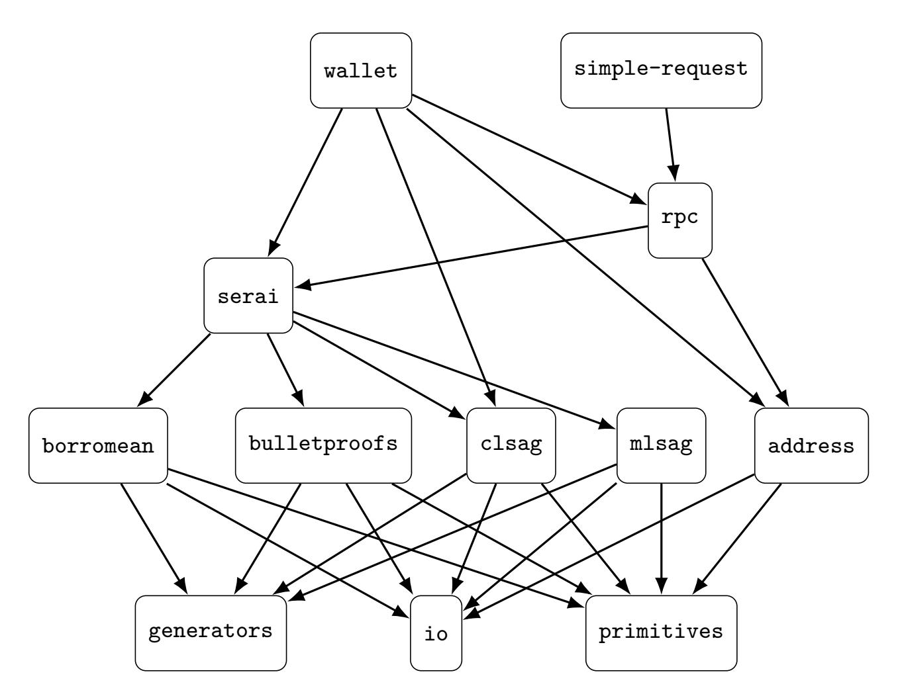

{0}------------------------------------------------

## <span id="page-0-0"></span>FROSTLASS: Flexible Ring-Oriented Schnorr-like Thresholdized Linkably Anonymous Signature Scheme

Joshua Babb<sup>1</sup> , Brandon Goodell<sup>1</sup> , Rigo Salazar<sup>1</sup> , Freeman Slaughter1,2,B, and Luke Szramowski<sup>1</sup>

> <sup>1</sup>Cypher Stack <sup>2</sup>University of South Florida, Tampa FL, USA <sup>B</sup><fslaughter@usf.edu>

**Abstract.** FROST is a pragmatic method of thresholdizing Schnorr signatures, permitting a threshold quorum of *t* signers out of *n* total individuals to sign for a message. This scheme improved on the state of the art, resulting in an efficient protocol that aborts in the presence of up to *t*−1 malicious users with strong resilience against chosen-message attacks, assuming the hardness of the discrete logarithm problem. In this work, we build upon the foundation introduced in FROST by presenting FROSTLASS, which additionally enjoys novel linkability criteria and anonymity guarantees under the general one-more discrete logarithm problem, utilizing a "Schnorr-shaped hole" technique to prove desirable security results. This scheme is highly practical, tailor-made for use on-chain in the Monero cryptocurrency; indeed, we also showcase a Rust implementation for this protocol, demonstrating its real-world application to improve the security and usability of Monero.

**Keywords:** Threshold signature scheme · Rust · One-more discrete logarithm problem.

## **1 Introduction**

Over the past decades, especially since Shamir's secret sharing [\[10\]](#page-51-0) and Shoup's threshold signatures [\[11\]](#page-51-1), threshold and multiparty cryptographic schemes of different flavors have become fashionable. Bellare and Neven [\[2\]](#page-51-2), for example, famously proposed a framework to formalize multisignatures and to prove them secure with the generalized forking lemma - which goes back to [\[7\]](#page-51-3), and is used in a variety of modern cryptographic protocols, such as ring signatures [\[12\]](#page-51-4) and Bulletproofs [\[3\]](#page-51-5).

Concise linkable spontaneous anonymous group (CLSAG) signatures, proposed in [\[5\]](#page-51-6) and built from the LSAG signatures of [\[8\]](#page-51-7), are Schnorr-like ring signatures used in the Monero cryptocurrency protocol. A naïve thresholdization of CLSAG signatures, called *thring signatures*, was proposed in [\[4\]](#page-51-8), building off of the linkable spontaneous anonymous group (LSAG) signatures, which are used in the Monero cryptocurrency protocol. The FROST approach to thresholdizing Schnorr signatures, first described in [\[6\]](#page-51-9), is sufficiently flexible to work for CLSAG signatures, and are superior to the thring signatures of [\[4\]](#page-51-8).

An opinionated Rust implementation of every major component of the Monero protocol at [\[9\]](#page-51-10) contains an implementation of FROSTLASS. Herein, we formalize FROSTLASS, present a novel definition of linkability, and prove FROSTLASS strongly unforgeable up to the hardness of the *κ*-one-more discrete logarithm problem, and statistically linkable.

{1}------------------------------------------------

#### 2 Notation and Background Definitions

#### 2.1 Notation

Tuples are denoted with underlines,  $\underline{x} = (x_1, \dots, x_n)$ , and we abuse set notation for these, e.g.  $x_1 \in \underline{x}$ . The set of all finite-length bitstrings is denoted with  $\{0,1\}^*$ . For  $n \in \mathbb{N}$ , denote the set  $\{1,2,\dots,n\}$  with [n]. For sets X,Y with  $X \subseteq Y$ , denote the set  $\{y \in Y \mid y \notin X\}$  with  $\overline{X}$ .

Denote a prime modulus with  $q \in \mathbb{N}$ , an abelian group of order q with  $\mathbb{G}$ , and a generator of  $\mathbb{G}$  with  $G \in \mathbb{G}$ . We say the tuple  $(q, \mathbb{G}, G)$  are group parameters. Given  $\underline{x} = (x_1, \dots, x_n) \in \mathbb{Z}_q^n$  and  $\underline{G} = (G_1, \dots, G_n) \in \mathbb{G}^n$ , we denote the Shur product  $\underline{x} \circ \underline{G} = (x_1 G_1, \dots, x_n G_n)$ .

Denote "big-oh" notation with O and denote random oracles with O. Denote algorithm run times with  $t \geq 0$  and success probabilities with  $\epsilon \in [0,1]$ . Denote the event that a PPT algorithm A inputs some in and outputs some out with out  $\leftarrow A(in)$ . We use the same notation for oracles, but we refer to the inputs as queries, say query, and outputs as responses, say resp.

#### <span id="page-1-0"></span>2.2 Definitions

<span id="page-1-1"></span>**Definition 1** ( $\kappa$  Random Oracle Distinguishing). Let  $\kappa \geq 0$  be an integer, let S, T be sets,  $\mathcal{O}: S \to T$  be a random oracle, and  $\phi: S \to T$  a function. Any PPT  $(t, \epsilon)$ -algorithm  $\mathcal{A}$  which plays the following game is an  $(\phi, \kappa)$ -distinguisher.

- 1. The challenger samples  $b \stackrel{\$}{\leftarrow} \{0,1\}$  and grants  $\mathcal{A}$  access to an oracle  $\mathcal{O}_b'$ , where
  - (a)  $\mathcal{O}'_0$  is a simple wrapper for  $\mathcal{O}$ , and
  - (b)  $\mathcal{O}'_1$  is a simple wrapper for  $\phi$ .
- <span id="page-1-2"></span>2. A outputs a bit b', succeeding if and only if b' = b and  $\mathcal{O}'_b$  was queried at most  $\kappa$  times.

Definition 2 ( $\kappa$ -OMDL: One-More-Than- $\kappa$  Discrete Logarithms over  $G \in \mathbb{G}$ ). Let  $\kappa \geq 0$  be an integer. Let  $\Phi = \{(q_{\lambda}, \mathbb{G}_{\lambda}, G_{\lambda})\}_{\lambda \in \mathbb{N}}$  be a parameterized family of group parameters. Let  $t \geq 0$  and  $\epsilon \in [0, 1]$  be real numbers. We say any PPT algorithm A that can successfully play the following game in time at most t and with probability at least  $\epsilon$  is a  $(t, \epsilon)$ -player of the one-more-than- $\kappa$  discrete logarithms game over  $G_{\lambda} \in \mathbb{G}_{\lambda}$ .

- 1. The challenger grants  $\mathcal{A}$  access to a key generation oracle  $\mathcal{O}_{key}: \{*\} \to \mathbb{G}_{\lambda}$  and a corruption oracle  $\mathcal{O}_{corrupt}: \mathbb{G}_{\lambda} \to \mathbb{Z}_{q_{\lambda}}$  which work as follows.
  - (a) A valid query made to  $\mathcal{O}_{key}$  is a simple request for a new key, which we model with a dummy singleton domain  $\{*\}$ . The response is some point  $resp = X \in \mathbb{G}_{\lambda}$ . We say the response is a challenge key. Let  $\mathcal{L}_{key} = \{X \in \mathbb{G}_{\lambda} \mid X \leftarrow \mathcal{O}_{key} \text{ occurred}\}$  denote the set of all responses from  $\mathcal{O}_{key}$ .
  - (b) A valid query made to  $\mathcal{O}_{corrupt}$  a challenge key,  $X \in \mathcal{L}_{key}$ . The response to a valid query X is a scalar  $x \in \mathbb{Z}_{q_{\lambda}}$  such that X = xG, and the response to an invalid query is a distinct failure symbol. Let  $\mathcal{L}_{corrupt} \subseteq \mathcal{L}_{key}$  be the subset of valid queries made to  $\mathcal{O}_{corrupt}$  be the corrupted keys and let  $\overline{\mathcal{L}_{corrupt}}$  be the subset of uncorrupted challenge keys.
- 2. Eventually, the event  $out_{\mathcal{A}} \leftarrow \mathcal{A}$  occurs. We say  $\mathcal{A}$  succeeds at the  $\kappa$ -OMDL game if and only if all the following hold in this event:
  - (a)  $|\mathcal{L}_{key}| \geq \kappa + 1$ ,
  - (b)  $\left|\mathcal{L}_{corrupt}\right| \leq \kappa$ ,
  - (c)  $out_{\mathcal{A}} \in \mathbb{Z}_{q_{\lambda}}^{\kappa+1}$ , and
  - (d)  $\{xG \mid x \in out_{\mathcal{A}}\} \subseteq \mathcal{L}_{key}$

If  $t \in O(poly(\lambda))$  implies  $\epsilon \in negl(\lambda)$  for all  $(t, \epsilon)$ -players, then the  $\kappa$ -OMDL game is hard over  $\Phi$ .

{2}------------------------------------------------

| Oracle $\mathcal{O}_{\mathtt{corrupt}}(X)$                                   |
|------------------------------------------------------------------------------|
| $\mathbf{if}\ X\in\mathcal{L}_{\texttt{key}}$                                |
| $x = \log_G X$                                                               |
| $\mathcal{L}_{\texttt{corrupt}} = \mathcal{L}_{\texttt{corrupt}} \cup \{X\}$ |
| $\mathbf{return} \ x$                                                        |
| $\bullet$ else return $\bot$                                                 |

Oracle 1: The key generation and corruption oracles for the  $\kappa$ -OMDL game.

Game 1: Success condition for the  $\kappa$ -OMDL game.

Note that the 0-OMDL game is simply the discrete logarithm game. Moreover, an adaptive variation of this game is natural, where  $\kappa$  is determined in each instance of the game by the number of corruption oracle queries made by the adversary.

<span id="page-2-0"></span>**Definition 3 (General Forking Algorithm).** Let X, Y, H be finite sets,  $\kappa \geq 1$  an integer parameter, and let  $\mathcal{A}$  be a PPT algorithm which uses a random tape  $\tau \in \{0,1\}^*$ , inputs some  $(x,\underline{h}) \in X \times H^{\kappa}$ , and outputs a pair  $(i,y) \in [\kappa] \times Y$  or a distinct failure symbol. Then the algorithm specified below,  $Fork_{\mathcal{A}}$ , is a PPT algorithm which inputs  $x \in X$ , outputs  $(i,y,y') \in [\kappa] \times Y^2$  or a distinct failure symbol, and is called the general forking algorithm for  $\mathcal{A}$ .

- 1. Sample  $\tau \stackrel{\$}{\leftarrow} \{0,1\}^*$  for  $\mathcal{A}$  to use in both executions.
- 2. Sample  $\underline{h}, \underline{h}' \stackrel{\$}{\leftarrow} H^{\kappa}$ .
- 3. Compute out  $\leftarrow \mathcal{A}(x, \underline{h}; \tau)$ .
- 4. If out is a failure symbol, output a distinct failure symbol and terminate. Otherwise, out is not failure symbol, so parse (i, y) := out.
- 5. Set  $\underline{h}^* = (h_1, \dots, h_{i-1}, h'_i, h'_{i+1}, \dots, h'_{\kappa}).$
- 6. Compute  $out' \leftarrow \mathcal{A}(x, \underline{h}^*; \tau)$ .
- 7. If out' is a failure symbol, output a distinct failure symbol and terminate. Otherwise, out is not a failure symbol, so parse (i', y') := out'.
- 8. If  $i \neq i'$  or  $h_i = h_{i'}^*$ , then output a distinct failure symbol and terminate.
- 9. Otherwise, output (i, y, y').

<span id="page-2-2"></span>**Lemma 1 (General Forking Lemma).** For any finite sets X, H, for any algorithm A as in Definition 3 which runs in time at most t and fails with probability at most  $\epsilon$ , for any probability mass function F over X, the general forking algorithm  $Fork_A$  has advantage satisfying the following

$$\textit{Adv}_{Fork_{\mathcal{A}}} \geq \epsilon \left(\frac{\epsilon}{\kappa} - \frac{1}{|H|}\right)$$

<span id="page-2-1"></span>where this probability is measured over F and all randomness used in sampling.

{3}------------------------------------------------

Definition 4 (LTM: Linkable Thring Multisignatures). A tuple of algorithms (PGen, KGen, Sign, Combine, Vf, Link) as follows.

- 1.  $PGen(\lambda) \rightarrow pars_{\lambda}$ . Input a security parameter  $\lambda \in \mathbb{N}$ , and output some public parameters  $pars_{\lambda}$ , which includes the description of secret signing key shares SK, public verification key shares VK, total verification keys TVK, messages MSG, signatures challenges CH, partial signature shares PSIG, and signatures SIG.
- 2.  $KGen(pars_{\lambda}, n, r) \rightarrow (tvk, \underline{vk}, \underline{sk})$ . An interactive probabilistic algorithm executed by some capacity of  $n \geq 1$  participants called threshold keyholders. Users share as common input the capacity n and threshold  $r \in n$ . Output total verification key  $tvk \in TVK$ , public verification key shares  $\underline{vk} = (vk_i)_{i=1}^n \in VK^n$ , and secret signing key shares  $\underline{sk} = (sk_i)_{i=1}^n \in SK^n$ .
- 3.  $Sign(pars_{\lambda}, msg, ring, \underline{vk}, sk) \rightarrow psig$ . Non-interactive probabilistic algorithm executed by a threshold keyholder. Input a message  $msg \in \mathcal{MSG}$ , a tuple of  $m \geq 1$  total verification keys  $ring = (tvk_j)_{j=1}^m \in \mathcal{TVK}^m$  called a  $ring^*$ , some  $r \geq 1$  public verification key shares  $\underline{vk} = (vk_i)_{i=1}^r \in \mathcal{VK}^r$  called signers' coalition key shares, and a secret key share  $sk \in \mathcal{SK}$ . Output a ring signature share  $psig \in \mathcal{PSIG}$ .
- 4. Combine( $pars_{\lambda}$ , msg, ring,  $\underline{vk}$ ,  $\underline{psig}$ )  $\rightarrow$  sig. Non-interactive deterministic algorithm executed by a user called the combiner. Input a message  $msg \in \mathcal{MSG}$ , a ring  $ring = (tvk_j)_{j=1}^m \in \mathcal{TVK}^m$ , a signers' coalition of key shares  $\underline{vk} = (vk_i)_{i=1}^r \in \mathcal{VK}^r$ , and ring signature shares  $psig = (psig_i)_{i=1}^r \in \mathcal{PSIG}^r$ . Output a ring signature  $sig \in \mathcal{SIG}$ .
- 5.  $\overline{Vf(pars_{\lambda}, msg, ring, sig)} \rightarrow b$ . Non-interactive deterministic algorithm executed by a user called the verifier. Input message  $msg \in \mathcal{MSG}$ , a ring  $ring = (tvk_j)_{j=1}^m \in \mathcal{TVK}^m$ , and a ring signature  $sig \in \mathcal{SIG}$ . Output a bit.
- 6.  $Link(pars_{\lambda}, sig, sig') \rightarrow b$ . A non-interactive deterministic algorithm executed by a user called the linker. Input ring signatures  $sig, sig' \in SIG$ , and output a bit.

Definition 4 extends naturally to a *verifiable* scheme by allowing the verification of signature shares with the following additional algorithm. Adding this additional level of verifiability requires modifying Definition 5 below in the natural way.

- VfSh(pars<sub> $\lambda$ </sub>, msg, ring,  $\underline{vk}$ , psig)  $\rightarrow b$ . Non-interactive deterministic executed by a user called a share verifier. Input message msg  $\in \mathcal{MSG}$ , a ring ring =  $(\mathbf{tvk}_j)_{j=1}^m \in \mathcal{TVK}^m$ , a signers' coalition of key shares  $\underline{vk} = (vk_i)_{i=1}^r$ , and a ring signature share  $psig \in \mathcal{PSIG}$ . Outputs a bit.

Any of the algorithms in Definition 4 may input or output auxiliary data  $\mathtt{aux}$ , which we only include in notation when relevant. Following our convention for group parameter notation, we leave  $\mathtt{pars}_{\lambda}$  implicit in our notation, as all algorithms require it.

<span id="page-3-1"></span>**Definition 5.** Let  $\Pi$  be an LTM scheme. We define correctness using the following events.

- 1. Let  $E_1$  be the event in which some signers' coalitions of key shares  $\underline{v}\underline{k}', \underline{v}\underline{k}'' \subseteq \underline{v}\underline{k}$  is used to compute ring signature shares  $psig_i'$  and  $psig_i''$  semi-honestly. That is to say, the following holds.
  - (a) For some  $msg', msg'' \in \mathcal{MSG}$ ,
  - (b) for some  $n, r \in \mathbb{N}$  such that  $r \in [n]$  and some event  $(tvk, \underline{vk}, \underline{sk}) \leftarrow \mathit{KGen}(n, r)$  occurs,
  - (c) for some  $\underline{vk'}, \underline{vk''}$  such that  $\underline{vk'}, \underline{vk''} \subseteq \underline{vk}, r' = |\underline{vk'}|, r'' = |\underline{vk''}|, and <math>r \leq \min\{r', r''\}, r'' = |\underline{vk'}|, r'' = |\underline{vk''}|, r'' = |\underline{vk''}|, r'' \leq |\underline{vk''}|, r'' \leq |\underline{vk''}|, r'' \leq |\underline{vk''}|, r'' \leq |\underline{vk''}|, r'' \leq |\underline{vk''}|, r'' \leq |\underline{vk''}|, r'' \leq |\underline{vk''}|, r'' \leq |\underline{vk''}|, r'' \leq |\underline{vk''}|, r'' \leq |\underline{vk''}|, r'' \leq |\underline{vk''}|, r'' \leq |\underline{vk'''}|, r'' \leq |\underline{vk'''}|, r'' \leq |\underline{vk'''}|, r'' \leq |\underline{vk'''}|, r'' \leq |\underline{vk'''}|, r'' \leq |\underline{vk'''}|, r'' \leq |\underline{vk'''}|, r'' \leq |\underline{vk'''}|, r'' \leq |\underline{vk'''}|, r'' \leq |\underline{vk''''}|, r'' \leq |\underline{vk''''}|, r'' \leq |\underline{vk''''}|, r'' \leq |\underline{vk''''}|, r'' \leq |\underline{vk''''}|, r'' \leq |\underline{vk''''}|, r'' \leq |\underline{vk''''}|, r'' \leq |\underline{vk''''}|, r'' \leq |\underline{vk''''}|, r'' \leq |\underline{vk''''}|, r'' \leq |\underline{vk''''}|, r'' \leq |\underline{vk''''}|, r'' \leq |\underline{vk''''}|, r'' \leq |\underline{vk''''}|, r'' \leq |\underline{vk''''}|, r'' \leq |\underline{vk''''}|, r'' \leq |\underline{vk''''}|, r'' \leq |\underline{vk'''''}|, r'' \leq |\underline{vk'''''}|, r'' \leq |\underline{vk''''}|, r'' \leq |\underline{vk'''''}|, r'' \leq |\underline{vk'''''}|, r'' \leq |\underline{vk''''''''''}|, r'' \leq |\underline{vk''''''''''''''''''''''''''''''''''''$
  - (d) for some  $\sigma' \in \mathcal{S}_n$  such that, for every  $i \in [r']$ ,  $vk'_i = vk_{\sigma'(i)}$  and  $sk'_i = sk_{\sigma'(i)}$ ,
  - (e) for some  $\sigma'' \in \mathcal{S}_n$  such that, for every  $i \in [r'']$ ,  $vk_i'' = vk_{\sigma''(i)}$  and  $sk_i'' = sk_{\sigma''(i)}$ ,
  - (f) for some ring',  $ring'' \subseteq TVK$  such that  $tvk \in ring' \cap ring''$ ,

<span id="page-3-0"></span><sup>\*</sup> A better term would be anonymity tuple, but we keep with tradition.

{4}------------------------------------------------

- (g) for each  $i \in [r']$ ,  $psig'_i \leftarrow Sign(msg', ring', \underline{vk'}, sk'_i)$ , and
- (h) for each  $i \in [r'']$ ,  $psig_i'' \leftarrow Sign(msg'', ring'', \underline{vk}'', sk_i'')$ .
- 2. Let  $E_1^*$  be a similar event in which some  $\underline{v}\underline{k}^{**} \subseteq \underline{v}\underline{k}^*$  compute ring signature shares  $psig_i^*$  semi-honestly from a different  $tvk^*$ , i.e. all the following hold.
  - (a) For some  $msg^* \in \mathcal{MSG}$ ,
  - (b) for some  $n^*, r^* \in \mathbb{N}$  such that  $r^* \in [n^*]$  and some event  $(\mathbf{tvk}^*, \underline{\mathbf{vk}}^*, \underline{\mathbf{sk}}^*) \leftarrow \mathit{KGen}(n, r)$  occurs such that  $(\mathbf{tvk}^*, \underline{\mathbf{vk}}^*, \underline{\mathbf{sk}}^*) \neq (\mathbf{tvk}', \underline{\mathbf{vk}}', \underline{\mathbf{sk}}')$  and  $(\mathbf{tvk}^*, \underline{\mathbf{vk}}^*, \underline{\mathbf{sk}}^*) \neq (\mathbf{tvk}'', \underline{\mathbf{vk}}'', \underline{\mathbf{sk}}'')$ ,
  - (c) for some  $\underline{v}\underline{k}^{**}$  such that  $\underline{v}\underline{k}^{**} \subseteq \underline{v}\underline{k}^{*}$ ,  $r^{**} = |\underline{v}\underline{k}^{*}|$ , and  $r^{*} \leq r^{**}$ ,
  - (d) for some  $\sigma^* \in \mathcal{S}_n$  such that, for every  $i \in [r^{**}]$ ,  $\mathbf{v}\mathbf{k}_i^* = \mathbf{v}\mathbf{k}_{\sigma^*(i)}$  and  $\mathbf{s}\mathbf{k}_i^* = \mathbf{s}\mathbf{k}_{\sigma^*(i)}$ ,
  - (e) for some  $ring^* \subseteq TVK$  such that  $tvk^* \in ring^*$ ,
  - (f) for each  $i \in [r^{**}]$ ,  $psig_i^{**} \leftarrow Sign(msg^*, ring^*, \underline{vk}^*, sk_i^*)$ .
- 3. Let  $E_2 \subseteq E_1^* \cap E_1$  be the event that the ring signature shares  $psig_i'$ ,  $psig_i''$ , and  $psig_i^*$  are combined semi-honestly, i.e. all of the following hold.
  - (a)  $sig' \leftarrow Combine(msg', ring', psig')$ ,
  - (b)  $sig'' \leftarrow Combine(msg'', ring'', psig'')$ ,
  - $(c) \ \textit{sig}^* \leftarrow \textit{Combine}(\textit{msg}^*, \textit{ring}^*, \textit{psig}^*).$
- 4. Let  $E_3 \subseteq E_2$  be the event that the combined signatures are valid, i.e. all the following hold.
  - (a) Vf(msg', ring', sig') = 1,
  - (b) Vf(msg'', ring'', sig'') = 1, and
  - (c) Vf(msg'', ring'', sig'') = 1.
- 5. Let  $E_4 \subseteq E_3$  be the event that Link is commutative, i.e. all the following hold.
  - (a) Link(sig', sig'') = Link(sig'', sig'),
  - (b)  $Link(sig', sig^*) = Link(sig^*, sig')$ , and
  - $\textit{(c)} \; \textit{Link}(\textit{sig}^*, \textit{sig}'') = \textit{Link}(\textit{sig}'', \textit{sig}^*)$
- 6. Let  $E_5 \subseteq E_2$  that Link(sig', sig'') = 1.
- 7. Let  $E_6 \subseteq E_3$  that  $Link(sig', sig^*) = Link(sig^*, sig'') = 0$ .

We say  $\Pi$  has correct ring signature share verification if  $\mathbb{P}[E_2] = 1$ , has correct ring signature verification if  $\mathbb{P}[E_4] = 1$ , has commutative linking if  $\mathbb{P}[E_5] = 1$ , has correct positive linkability if  $\mathbb{P}[E_6] = 1$ , and has correct negative linkability if  $\mathbb{P}[E_7] = 1$ , where these probabilities are computed over all choices of  $n, r, n^*, r^*, msg', msg'', msg^*$ , all executions of KGen, all choices of  $\underline{vk'}, \underline{vk''}, \underline{vk''}, \underline{vk''}, \underline{vk''}, \underline{vk''}, \underline{vk''}, \underline{vk''}, \underline{vk''}, \underline{vk''}, \underline{vk''}, \underline{vk''}, \underline{vk''}, \underline{vk''}, \underline{vk''}, \underline{vk''}, \underline{vk''}, \underline{vk''}, \underline{vk''}, \underline{vk''}, \underline{vk''}, \underline{vk''}, \underline{vk''}, \underline{vk''}, \underline{vk''}, \underline{vk''}, \underline{vk''}, \underline{vk''}, \underline{vk''}, \underline{vk''}, \underline{vk''}, \underline{vk''}, \underline{vk''}, \underline{vk''}, \underline{vk''}, \underline{vk''}, \underline{vk''}, \underline{vk''}, \underline{vk''}, \underline{vk''}, \underline{vk''}, \underline{vk''}, \underline{vk''}, \underline{vk''}, \underline{vk''}, \underline{vk''}, \underline{vk''}, \underline{vk''}, \underline{vk''}, \underline{vk''}, \underline{vk''}, \underline{vk''}, \underline{vk''}, \underline{vk''}, \underline{vk''}, \underline{vk''}, \underline{vk''}, \underline{vk''}, \underline{vk''}, \underline{vk''}, \underline{vk''}, \underline{vk''}, \underline{vk''}, \underline{vk''}, \underline{vk''}, \underline{vk''}, \underline{vk''}, \underline{vk''}, \underline{vk''}, \underline{vk''}, \underline{vk''}, \underline{vk''}, \underline{vk''}, \underline{vk''}, \underline{vk''}, \underline{vk''}, \underline{vk''}, \underline{vk''}, \underline{vk''}, \underline{vk''}, \underline{vk''}, \underline{vk''}, \underline{vk''}, \underline{vk''}, \underline{vk''}, \underline{vk''}, \underline{vk''}, \underline{vk''}, \underline{vk''}, \underline{vk''}, \underline{vk''}, \underline{vk''}, \underline{vk''}, \underline{vk''}, \underline{vk''}, \underline{vk''}, \underline{vk''}, \underline{vk''}, \underline{vk''}, \underline{vk''}, \underline{vk''}, \underline{vk''}, \underline{vk''}, \underline{vk''}, \underline{vk''}, \underline{vk''}, \underline{vk''}, \underline{vk''}, \underline{vk''}, \underline{vk''}, \underline{vk''}, \underline{vk''}, \underline{vk''}, \underline{vk''}, \underline{vk''}, \underline{vk''}, \underline{vk''}, \underline{vk''}, \underline{vk''}, \underline{vk''}, \underline{vk''}, \underline{vk''}, \underline{vk''}, \underline{vk''}, \underline{vk''}, \underline{vk''}, \underline{vk''}, \underline{vk''}, \underline{vk''}, \underline{vk''}, \underline{vk''}, \underline{vk''}, \underline{vk''}, \underline{vk''}, \underline{vk''}, \underline{vk''}, \underline{vk''}, \underline{vk''}, \underline{vk''}, \underline{vk''}, \underline{vk''}, \underline{vk''}, \underline{vk''}, \underline{vk''}, \underline{vk''}, \underline{vk''}, \underline{vk''}, \underline{vk''}, \underline{vk''}, \underline{vk''}, \underline{vk''}, \underline{vk''}, \underline{vk''}, \underline{vk''}, \underline{vk''}, \underline{vk''}, \underline{vk''}, \underline{vk''}, \underline{vk''}, \underline{vk''}, \underline{vk''}, \underline{vk''}, \underline{vk''}, \underline{vk''}, \underline{vk''}, \underline{vk''}, \underline{vk''}, \underline{vk''}, \underline{vk''}, \underline{vk''}, \underline{vk''}, \underline{vk''}, \underline{vk''}, \underline{vk''}, \underline{vk''}, \underline{vk''}, \underline{vk''}, \underline{vk''}, \underline{vk''}, \underline{vk''}$ 

# <span id="page-4-0"></span>Definition 6 (Common Setup with Key Generation, Corruption, and Signing Oracles). Let $\Pi$ be an LTM scheme. Let A be any PPT algorithm which runs in time at most t > 0, and successfully plays the following game with probability at least $\epsilon \in [0,1]$ .

- 1. A is granted to oracles  $\mathcal{O}_{key}$ ,  $\mathcal{O}_{corrupt}$ , and  $\mathcal{O}_{Sign}$  as follows.
  - (a)  $(\mathbf{tvk}, \underline{vk}) \leftarrow \mathcal{O}_{key}(n, r)$ . A valid query made to  $\mathcal{O}_{key}$  is a simple request for r-of-n keys, which we model with the pair (n, r) such that  $r \in [n]$ . The response to a valid query is some  $\mathbf{resp} = (\mathbf{tvk}, \underline{vk}) \in \mathcal{TVK} \times \mathcal{VK}^n$ , and the response to an invalid query is a distinct failure symbol. Let  $\mathcal{L}_{key} = \{(\mathbf{tvk}, \underline{vk}) \mid \exists (n, r), (\mathbf{tvk}, \underline{vk}) \leftarrow \mathcal{O}_{key}(n, r)\}$  denote the set of all responses from  $\mathcal{O}_{key}$ .
  - (b)  $\mathbf{sk} \leftarrow \mathcal{O}_{corrupt}(i, \mathbf{tvk}, \underline{\mathbf{vk}})$ . A valid query made to  $\mathcal{O}_{corrupt}$  is some  $\mathbf{query} = (i, \mathbf{tvk}, \underline{\mathbf{vk}})$  where  $(\mathbf{tvk}, \underline{\mathbf{vk}}) \in \mathcal{L}_{key}$  is associated with some  $(n, r) \in \mathbb{N}^2$  such that  $r \in [n]$  and  $(\mathbf{tvk}, \underline{\mathbf{vk}}) \leftarrow \mathcal{O}_{key}(n, r)$  occurred, and i is an index in [n]. The response to a valid query is a secret signing key  $\mathbf{sk}_i$  corresponding to  $\mathbf{vk}_i \in \underline{\mathbf{vk}}$ , and the response to an invalid query is a distinct failure symbol.

{5}------------------------------------------------

Oracle 2: The key generation oracle in the game of common setup.

```
\begin{array}{c} \mathbf{Oracle} \ \mathcal{O}_{\texttt{corrupt}}(i, \texttt{tvk}, \underline{\texttt{vk}}) \\ \mathbf{if} \ (\texttt{tvk}, \underline{\texttt{vk}}) \leftarrow \mathcal{O}_{\texttt{key}}(n, r) \ \mathbf{and} \ i \in [n] \ \mathbf{then} \\ \mathcal{L}_{\texttt{corrupt}}^{\texttt{sh}} = \mathcal{L}_{\texttt{corrupt}}^{\texttt{sh}} \cup \{\texttt{vk}_i\} \\ \mathbf{if} \ |\underline{\texttt{vk}} \cap \mathcal{L}_{\texttt{corrupt}}^{\texttt{sh}}| \geq r \ \mathbf{then} \\ \mathcal{L}_{\texttt{corrupt}}^{\texttt{tot}} \leftarrow \mathcal{L}_{\texttt{corrupt}}^{\texttt{tot}} \cup \{\texttt{tvk}\} \\ \mathbf{return} \ \mathbf{sk}_i \\ \mathbf{else} \ \mathbf{return} \ \bot \end{array}
```

Oracle 3: The corruption oracle in the game of common setup.

Upon success, we say the verification key share  $\mathbf{v}\mathbf{k}_i$  has been corrupted, and if r or more key shares have been corrupted associated with  $\mathbf{t}\mathbf{v}\mathbf{k}$ , then we say  $\mathbf{t}\mathbf{v}\mathbf{k}$  has been totally corrupted. Let  $\mathcal{L}_{corrupt}^{sh} = \{\mathbf{v}\mathbf{k}_i \mid \mathbf{s}\mathbf{k}_i \leftarrow \mathcal{O}_{corrupt}(i, \mathbf{t}\mathbf{v}\mathbf{k}, \underline{\mathbf{v}\mathbf{k}}) \text{ occurred}\}$  be the set of corrupted key shares and let  $\mathcal{L}_{corrupt}^{tot}$  be the set of totally corrupted keys.

- (c)  $sig \leftarrow \mathcal{O}_{Sign}(msg, ring, tvk, \underline{vk}, i)$ . A valid query to  $\mathcal{O}_{Sign}$  is a tuple  $(msg, ring, tvk, \underline{vk}, i)$ , where  $msg \in \{0, 1\}^*$ ,  $ring \in \mathcal{TVK}^m$  for some  $m \in \mathbb{N}$ ,  $tvk \in \mathcal{TVK}$ ,  $\underline{vk} \in \underline{vk}^r$  for some  $r \in \mathbb{N}$ , and  $i \in \mathbb{N}$ , such that all the following hold.
  - i.  $tvk \in ring$ ,
  - ii. there exists some n,  $\underline{v}\underline{k}'$  such that  $r \in [n]$  and  $(tvk, \underline{v}\underline{k}') \leftarrow \mathcal{O}_{key}(n, r)$  occurred,
  - iii. the query  $\underline{vk}$  is a subset  $\underline{vk} \subseteq \underline{vk'}$  such that  $|\underline{vk}| \ge r$ , and
  - iv.  $i \in [r]$ .

```
\begin{array}{c} \mathbf{Oracle} \ \mathcal{O}_{\mathtt{Sign}}(\mathtt{msg},\mathtt{ring},\mathtt{tvk},\underline{\mathtt{vk}},i) \\ \mathbf{parse} \ r := \mathtt{len}(\underline{\mathtt{vk}}) \\ \mathbf{if} \ \mathtt{tvk} \in \mathtt{ring} \\ \mathbf{and} \ \exists n,r',\underline{\mathtt{vk}'} \ \mathrm{s.t.} \ (\mathtt{tvk},\underline{\mathtt{vk}'}) \leftarrow \mathcal{O}_{\mathtt{key}}(n,r') \\ \mathbf{and} \ \underline{\mathtt{vk}} \subseteq \underline{\mathtt{vk}'} \ \mathbf{and} \ r \geq r' \ \ \mathbf{and} \ \ i \in [r] \\ \mathbf{return} \ \mathtt{psig} \\ \mathbf{else} \ \bot \end{array}
```

Oracle 4: The signing oracle

The response to an invalid query is a distinct failure symbol, and the response to a valid query is a valid partial signature psig which is combinable with other valid signatures, and links to a challenge key, as follows.

{6}------------------------------------------------

- Well-Formed Queries Combine to Valid Signatures. If oracle response events  $psig_{vk^*} \leftarrow \mathcal{O}_{Sign}(msg, ring, tvk, \underline{vk}, vk^*)$  occur for each  $vk^* \in \underline{vk}$ , the combination of these responses  $sig = Combine(msg, ring, \underline{vk}, psig)$  is valid, Vf(msg, ring, sig) = 1.
- Links to Challenge Key. If msg' is a  $messa\overline{ge}$ ,  $\underline{vk''} \subseteq \underline{vk'}$  such that  $|\underline{vk''}| \geq r$ , ring' is a ring with  $tvk \in ring \cap ring'$ , and there exist signing oracle responses for each  $vk^{**} \in \underline{vk''}$ ,  $psig'_{vk^{**}} \leftarrow \mathcal{O}_{Sign}(msg', ring', tvk, \underline{vk''}, vk^{**})$ , then  $Link(pars_{\lambda}, sig, sig') = 1$  where  $sig' = Combine(msg', ring', \underline{vk''}, psig')$  is the combined signature.
- Verifiability. If  $\Pi$  is verifiable, then  $V\overline{fSh}(msg, ring, \underline{vk}, psig) = 1$
- 2. Eventually,  $\mathcal{A}$  outputs some  $out_{\mathcal{A}}$  which includes one or more message-ring-signature triples (msg, ring, sig) such that all the signatures are valid (in which case we say  $\mathcal{A}$  succeeds) or a distinct failure symbol (in which case we say  $\mathcal{A}$  fails).

Further assume that, if A requires more oracle queries allowed than the following bounds, or if A is about to make an oracle query which will cause the oracle to fail, then A outputs a distinct failure symbol and terminates.

- 1. There exists  $\kappa_{key}$ ,  $\kappa_{corrupt}$ ,  $\kappa_{Sign} \geq 0$  such that, in every successful transcript,  $\mathcal{A}$  makes at most  $\kappa_{key}$  respective queries to  $\mathcal{O}_{key}$ , at most  $\kappa_{corrupt}$  queries to  $\mathcal{O}_{corrupt}$ , and at most  $\kappa_{Sign}$  queries to  $\mathcal{O}_{Sign}$ .
- 2. For each random oracle, say H, to which A has access, there exists as similar integer  $\kappa_H$  such that A makes at most  $\kappa_H$  queries to the corresponding random oracle H in every successful transcript.
- 3. There exists an integer  $n_{key}$  such that all queries query = (n, r) made to  $\mathcal{O}_{key}$  satisfies  $n \leq n_{key}$  in every successful transcript.

If A succeeds with probability at least  $\epsilon \in [0,1]$  is  $(t,\epsilon)$ -player of the game with common setup with key generation oracle access, corruption oracle access, and signing oracle access.

Winning this game is trivial, so the notion of security against players of this game is vacuous. However, players of our unforgeability and linkability games in Definition 7 and Definition 8 are also players of the game of common setup, just with nontrivial success conditions.

<span id="page-6-0"></span>**Definition 7 (LTM-SUF-1: Strong Unforgeability).** Let  $\Pi$  be an LTM scheme. Let A be any  $(t, \epsilon)$ -player of the game with common setup with key generation, corruption, and signing oracle access such that every successful output of A has some  $(msg, ring, sig) \in out_A$  satisfying all the following.

- 1. The signature is valid, Vf(msg, ring, sig) = 1.
- 2. All ring members are challenge keys,  $ring \subseteq \mathcal{L}_{key}$ .
- 3. If all the following hold, then Link(sig, sig') = 1:
  - (a) there exists some  $(j, \mathbf{tvk}_j) \in [m] \times \mathbf{ring}$ , capacity  $n \in \mathbb{N}$ , and a threshold  $r \in [n]$  such that a key generation oracle query event  $(\mathbf{tvk}_j, \underline{\mathbf{vk}}) \leftarrow \mathcal{O}_{\mathbf{key}}(n, r)$  occurs,
  - (b) there exists some  $msg' \in \{0,1\}^*$ , some  $ring' \in \mathcal{P}(\mathcal{TVK})$  such that  $tvk_j \in ring \cap ring' \setminus \mathcal{L}_{corrupt}^{tot}$ , some signers' coalition of public verification keys  $\underline{vk'} \subseteq \underline{vk}$  such that  $|\underline{vk'}| \geq r$ , and events  $psig_{vk'} \leftarrow \mathcal{O}_{Sign}(msg', ring', tvk_j, \underline{vk'}, vk')$  for each  $vk' \in \underline{vk'}$  which occurred, and
  - (c)  $sig' = Combine(msg', ring', \underline{vk'}, psig)$ .
- 4. For any msg', for any ring', for  $an\overline{y\ \underline{v}\underline{k}'}$ , if every event  $(psig_i \leftarrow \mathcal{O}_{Sign}(msg', ring', \underline{v}\underline{k}', vk_i))$  occurs for each  $vk_i \in \underline{v}\underline{k}$ , then  $sig \neq Combine(msg', ring', \underline{v}\underline{k}', psig')$ .

{7}------------------------------------------------

Then we say A is an LTM strong forger for  $\Pi$ . Moreover, if  $t \in O(poly(\lambda))$  implies  $\epsilon \in negl(\lambda)$  for every LTM strong forger, then we say  $\Pi$  is strongly unforgeable.

We connect this definition to the definition of strong unforgeability for threshold digital signature schemes, TS-SUF-4 from [1]. Indeed, we include as "trivial" all ring signatures which are a superthreshold combinations of oracle-generated signature shares which all use a common query. This way, if an attacker can combine seemingly unrelated ring signature shares to obtain a valid signature, we count this as a forgery.

However, ring signatures have their own hierarchy of security definitions, and some of these depend on how many adversarially-selected ring members are allowable in a forgery. We call the previous definition LTM-SUF-1, because an unforgeable scheme under this definition stops forgers from generating ostensibly valid signatures, but only when all ring members are challenge keys. Natural extensions may be a fruitful area of further research.

<span id="page-7-0"></span>The following is, to the authors' knowledge, a novel definition of linkability for ring signatures. **Definition 8** ( $\kappa$ -Linkability). Let  $\Pi$  be a LTM signature scheme and A be a  $(t, \epsilon)$ -player of the game of common setup with key generation, corruption, and signing oracle access such that every  $successful\ output\ of\ \mathcal{A}\ has\ some\ \{(\mathbf{msg}_u,\mathbf{ring}_u,\mathbf{sig}_u)\}_{u\in[\kappa+1]}\ satisfying\ all\ the\ following\ properties.$ 

- 1. For each  $u \in [\kappa + 1]$ ,  $Vf(msg_u, ring_u, sig_u) = 1$ .
- 2. For each  $u, v \in [\kappa + 1]$ ,  $Link(sig_u, sig_v) = \delta_{u,v}$ , the Kronecker delta function.
- 3. At most  $\kappa$  keys can be under adversarial control,  $\left| \bigcup_{u} ring_{u} \setminus \overline{\mathcal{L}_{corrupt}^{tot}} \right| \leq \kappa$ Then we say  $\mathcal{A}$  is a  $\kappa$ -linkability breaker for  $\Pi$ . Moreover,  $t \in O(poly(\lambda))$  implies  $\epsilon \in negl(\lambda)$ for every  $\kappa$ -linkability breaker, we say  $\Pi$  is  $\kappa$ -linkable.

Note that if we remove oracle access from Definition 8, we recover the notion of pigeonhole linkability. If we retain oracle access but set  $\kappa = 1$ , we recover the notion of ACST linkability.

#### FROSTLASS Construction 3

<span id="page-7-2"></span>We now provide a formal description of FROSTLASS. We note that the definition provided here varies from the Rust implementation [9] to improve readability. We discuss these in section 3.3. **Definition 9.** Let  $F_{PRNG}$  be a seedable pseudorandom number generator. FROSTLASS consists of the following algorithms.

- 1.  $PGen(\lambda) \rightarrow (q, \mathbb{G}, G, d, \underline{H})$  where  $q \geq 1$  is a prime modulus,  $\mathbb{G}$  is an abelian group of order q,  $G \in \mathbb{G}$  is a generator,  $d \in \mathbb{N}$  is a key dimension, and H are the following random oracles.
  - (a)  $H_{base}: \{0,1\}^* \to \mathbb{G},$
  - (b)  $H_{seed}: \{0,1\}^* \to \{0,1\}^{\lambda}$ ,
  - (c)  $H_{FROST,i}: \{0,1\}^* \to \mathbb{Z}_q \text{ for each } i \in \mathbb{N},$

  - (d)  $H_{lt}^*: \{0,1\}^* \to \mathbb{Z}_q$ . (e)  $H_{lt,k}: \{0,1\}^* \to \mathbb{Z}_q$  for each  $1 \le k \le d-1$ , (f)  $H_{ch}: \{0,1\}^* \to \mathbb{Z}_q$ .
- 2.  $KGen(n,r,\underline{z}) \rightarrow (tvk,\underline{vk},\underline{lt},\underline{sk})$ . An interactive PPT algorithm which requires  $n \geq 2$  participants. Participants decide upon a threshold  $1 \leq r \leq n$ , and scalars  $\underline{z} = z_1, \ldots, z_{d-1} \in \mathbb{Z}_q$  via secure side channel; they share these data as common input. Participants do the following.
  - (a) Participants use FROST key generation such that, for each  $1 \leq i \leq n$ , the  $i^{th}$  participant obtains the total verification FROST key Y, secret signing key share\*\*  $y_i$ , and public verification key share  $Y_i$ .

<span id="page-7-1"></span><sup>\*\*</sup> The secret share  $y_i$  is denoted  $s_i$  in the original FROST paper; however, we use  $s_i$  for signature data to maintain consistency with previous ring signature publications.

{8}------------------------------------------------

- (b) For each  $i \in [n]$ , the  $i^{th}$  participant computes  $Z_k = z_k G$  for each  $k \in [d-1]$ . These are called the auxilliary keys.
- (c) Compute the main linking tag share  $\mathfrak{T}_i = y_i H_{base}(Y)$  and the auxilliary linking tags  $\mathfrak{D}_k = z_k \cdot H_{base}(Y)$  for  $k \in [d-1]$ .
- (d) The key  $Y \in tvk$  is called the linking key. Set the following.

$$\begin{aligned} \bm{s}\bm{k}_i &= (y_i, z_1, \dots, z_{d-1}), \quad \bm{v}\bm{k}_i &= (Y_i, Z_1, \dots, Z_{d-1}), \ \bm{t}\bm{v}\bm{k} &= (Y_i, Z_1, \dots, Z_{d-1}), \quad and \quad \bm{l}\ \bm{t}_i &= (\mathfrak{T}_i, \mathfrak{D}_1, \dots, \mathfrak{D}_{d-1}). \end{aligned}$$

At the end of this process, each signer has learned their total verification key tvk for the group, secret key shares  $sk_i$ , public key shares  $vk_i$ , and linking tag share  $(tvk, vk_i, lt_i, sk_i)$ .

- 3. Sign(msg, ring,  $\underline{vk}$ , sk, (tlt, com, d, e))  $\rightarrow$  psig. A non-interactive PPT algorithm individually carried out by signers. Signers are expected to interactively decide upon a message msg, a ring ring, a signers' coalition of public verification key shares  $\underline{vk'}$ , a total linking tag tlt, and a hash table com by secure side channel with authentication in a pre-processing step before executing Sign; see PreProc below in section 3.1. Input a message msg, a ring ring = (tvk<sub>1</sub>,..., tvk<sub>m</sub>), a signers' coalition of public verification key shares  $\underline{vk'} = (vk'_i)_{i=1}^r$ , a secret key sk, and auxiliary data (tlt, com, d, e), where tlt is a total linking tag, com =  $\{(vk_i, (D_i, E_i, D'_i, E'_i))\}_{i=1}^r$  is a hash table with keys  $vk_i \in \underline{vk}$  and values  $(D_i, E_i, D'_i, E'_i) \in \mathbb{G}^4$ , and  $d, e \in \mathbb{Z}_q$  are secret scalars. The signer does the following.
  - (a) Find the index  $j^* \in [m]$  such that the ring member  $tvk_{j^*} \in ring$  is the total verification key. If no such index exists, output a distinct failure symbol and terminate.
  - (b) Find the index  $i^* \in [r]$  such that sk corresponds to  $vk_{i^*} \in \underline{vk}$ . If no such index exists, output a distinct failure symbol and terminate.
  - (c) Parse:
    - $i. \ (y_{i^*}, z_1, \dots, z_{d-1}) := sk,$
    - ii.  $(Y_i, Z_{i,1}, \ldots, Z_{i,d-1}) := vk_i \text{ for } i \in [r],$
    - iii.  $\{(vk_i, (D_i, E_i, D_i', E_i'))\}_{i=1}^r := com,$
    - iv.  $(Y'_j, Z'_{j,1}, \dots, Z'_{j,d-1}) := tvk_j \text{ for } j \in [m], \text{ and }$
    - $v. \ (\mathfrak{T},\mathfrak{D}_1,\ldots,\mathfrak{D}_{d-1}):=tlt.$
  - (d) If there exists any  $j \in [m]$ ,  $k \in [d-1]$  such that  $Z_{j,k} \neq Z'_{j,k}$ , output  $\perp$  and terminate.
  - (e) Compute:
    - i. the point hash  $\widehat{Y}_{j^*} = H_{base}(Y_{j^*})$ .
    - $ii. \ a \ seed^{\star \ \star \ \star} \ \gamma \leftarrow H_{\textit{seed}}(\underline{\textit{vk}} \ || \ \widehat{Y}_{j^*} \ || \ \textit{ring} \ || \ \textit{tlt} \ || \ \textit{msg} \ || \ \textit{com}),$
    - iii. the Lagrange coefficients  $\lambda_i = \prod_{i' \neq i} \frac{i}{i'-i} \pmod{q}$  for each  $i \in [r] = \{1, 2, \dots, r\}$ .
    - $iv. \ \mathit{FROST} \ \mathit{coefficients} \ \mathit{for} \ i \in [r], \ \rho_i = H_{\mathit{FROST},i}(\mathit{msg} \mid\mid \widehat{Y}_{j^*} \mid\mid \mathit{ring} \mid\mid \underline{\mathit{vk}} \mid\mid \underline{\mathit{lt}} \mid\mid \mathit{com}),$
    - v. FROST nonces  $F_i = D_i + \rho_i E_i$  for  $i \in [r]$ ,
    - vi. FROST-like nonces  $F'_i = D'_i + \rho_i E'_i$  for  $i \in [r]$ ,
    - vii. starting nonces  $L_{j^*} = \sum_{i=1}^r F_i$  and  $R_{j^*} = \sum_{i=1}^r F_i'$ , and
    - viii. starting signature challenge

$$c_{j^*+1} = H_{\operatorname{ch}}(\operatorname{dst}_{j^*} \mid\mid \operatorname{ring}\mid\mid \operatorname{tlt}\mid\mid \underline{\widehat{Y}}\mid\mid \operatorname{\mathfrak W}\mid\mid \underline{W}\mid\mid \underline{\mu}\mid\mid L_{j^*}\mid\mid R_{j^*}\mid\mid \operatorname{msg}),$$

where 
$$j^* = m$$
 implies that  $c_{m+1} \equiv c_1$ 

- (f) Sample  $(s_j)_{j \neq j^*} \leftarrow F_{PRNG}(\gamma)$ .
- <span id="page-8-1"></span>(g) Compute:
  - i. the point hashes of ring members' leading keys  $\widehat{Y}_j = H_{\text{base}}(Y'_j)$ .

<span id="page-8-0"></span><sup>\* \*</sup>  $\overline{\phantom{a}}$  A functionally equivalent implementation uses an extendable output function **xof** to extract  $\underline{s}$  directly, bringing efficiency gains and reducing the risk of implementation errors.

{9}------------------------------------------------

ii. the aggregation coefficients

$$\mu_Y = H^*_{lt}(\textbf{ring} \mid\mid \textbf{tlt} \mid\mid \widehat{\underline{Y}}), \quad and \quad \mu_k = H_{lt,k}(\textbf{ring} \mid\mid \textbf{tlt} \mid\mid \widehat{\underline{Y}}) \ for \ each \ k \in [d-1],$$

- iii. the aggregated linking tag  $\mathfrak{W} = \mu_Y \mathfrak{T} + \sum_{k=1}^{d-1} \mu_k \mathfrak{D}_k$ ,
- iv. for each  $j \in [m]$ , the  $j^{th}$  aggregated ring member  $W_j = \mu_Y Y'_j + \sum_{k=1}^{d-1} \mu_k Z'_{j,k}$ ,
- v. For  $j^* < j \le m$ , compute the nonces and signature challenges:

$$L_i = s_i G + c_i W_i$$
 and  $R_i = s_i \widehat{Y}_i + c_i \mathfrak{V}$ 

$$c_{i+1} = H_{ch}(\operatorname{dst}_i || \operatorname{ring} || \operatorname{tlt} || \widehat{Y} || \operatorname{\mathfrak{W}} || W || \mu || L_i || R_i || \operatorname{msg})$$

- $c_{j+1} = H_{ch}(\operatorname{dst}_j \mid\mid \operatorname{ring} \mid\mid \operatorname{tlt} \mid\mid \underline{\widehat{Y}} \mid\mid \operatorname{\mathfrak{W}} \mid\mid \underline{W} \mid\mid \underline{\mu} \mid\mid L_j \mid\mid R_j \mid\mid \operatorname{msg})$  vi. Set  $c_1 = c_{m+1}$  and, for  $1 \leq j < j^*$ , compute the nonces and signature challenges as in the previous step.
- (h) Set  $s_{i^*,i^*} = d + \rho_{i^*}e + \lambda_{i^*} \cdot c_{i^*} \cdot w_{i^*}$ .
- (i) Output  $psig = (i^*, lt_{i^*}, c_1, s_1, \dots, s_{j^*-1}, s_{j^*,i^*}, s_{j^*+1}, \dots s_m).$
- 4. Combine $(msg, ring, psig) \rightarrow sig$ . Input a message msg, a ring ring, and signature shares  $psig_1, \ldots, psig_r$ , and output a ring signature sig. Do the following.
  - (a) Parse  $(\mathbf{vk}_1,\ldots,\mathbf{vk}_r):=\underline{\mathbf{vk}},\ (Y_i,Z_{i,1},\ldots,Z_{i,d-1}):=\mathbf{vk}_i\ for\ i\in[r],\ and\ Y:=\mathbf{tvk}.\ Parse$  $(tvk_1,\ldots,tvk_m):=ring$  and find the index  $1\leq j^*\leq m$  in ring such that  $Ytvk_{j^*}$ . Otherwise, output a distinct failure symbol and terminate.
  - (b) Parse each  $(i'_i, lt_i, c_{i,1}, (s_{i,j})_{j=1}^m) := psig_i \text{ for each } i \in [r].$
  - (c) If there exists indices  $i_1 \neq i_2$  such that  $lt_{i_1} = lt_{i_2}$ , output a distinct failure symbol and terminate.
  - (d) Otherwise, if there exists indices  $i_1 \neq i_2$  any signature challenges mismatch,  $c_{i_1,1} \neq c_{i_2,1}$ , output a distinct failure symbol and terminate.
  - (e) Otherwise, for any  $1 \leq i_1, i_2 \leq r$ ,  $1 \leq j \leq m$ , if  $j \neq j^*$  and  $s_{i_1,j} \neq s_{i_2,j}$ , output a distinct failure symbol and terminate.
  - (f) Otherwise, set  $c_1 = c_{1,1}$ , set  $\hat{s}_j = s_j$  for each  $j \neq j^*$ , set  $\hat{s}_{j^*} = \sum_{i=1}^r s_{i,j^*}$ , and output the signature  $sig = (c_1, (\widehat{s})_{j=1}^m, tlt)$
- 5.  $Vf(msg, ring, sig) \rightarrow b$ . Input a message msg, a ring  $ring = (tvk_1, \ldots, tvk_m)$ , and a signature sig. Output a bit. Works as follows.
  - (a) Parse  $(c_1, s_1, \ldots, s_m, \mathfrak{T}, \mathfrak{D}_1, \ldots, \mathfrak{D}_{d-1}) := sig.$
  - (b) If  $\mathfrak{T} = 0$  or any  $\mathfrak{D}_{d-1} = 0$ , output 0 and terminate.
  - (c) Using  $j^* = 1$ , execute step item 3g in Sign.
  - (d) If  $c_1 = c_{m+1}$ , output 1 and terminate; otherwise output 0 and terminate.
- 6.  $Link(sig, sig') \rightarrow b$ . Do the following.
  - (a) Parse the following.

$$i.$$
  $(c_1,s_1,\ldots,s_m,\mathit{tlt}) := \mathit{sig},$   $(c'_1,s'_1,\ldots,s'_m,\mathit{tlt'}) := \mathit{sig'},$   $ii.$   $(\mathfrak{T},\mathfrak{D}_1,\ldots,\mathfrak{D}_{d-1}) := \mathit{lt},$   $(\mathfrak{T}',\mathfrak{D}'_1,\ldots,\mathfrak{D}'_{d-1}) := \mathit{lt'}.$ 

(b) Output a bit indicating whether  $\mathfrak{T} = \mathfrak{T}'$ .

<span id="page-9-0"></span>Beware that signature shares leak information, like the true signer's ring index. Executing VfSh or Combine can only be safely done with other signers.

#### 3.1 Extensions and Additional Algorithms

FROSTLASS can be made verifiable as described in section 2.2 with a VfSh algorithm as follows.

- $VfSh(msg, ring, \underline{vk}, psig, tlt, com) \rightarrow b \text{ inputs some msg, ring} = (tvk_1, \dots, tvk_m), \text{ signers'}$ coalition of key shares  $\underline{\mathtt{vk}} = (\mathtt{vk}_i)_{i=1}^r$ , a signature share  $\mathtt{psig} = (i^*, \mathtt{lt}, c_1, s_1, \ldots, s_m)$ , a total linking tag tlt, and a hash table com, and outputs a bit. Do the following.
  - 1. Set  $j^* = 1$ .
  - 2. Carry out step c of Sign.

{10}------------------------------------------------

- 3. Parse  $(i^*, lt, c_1, s_1, \ldots, s_m) := psig.$
- 4. Carry out step d of Sign.
- 5. Carry out step e of Sign. If any  $s_j$  mismatch their corresponding element in psig, output 0 and terminate.
- 6. Carry out step f of Sign, to obtain each  $c'_i$ .
- 7. If  $c_1 \neq c'_1$ , or  $s_{j^*,i^*}G \neq \lambda_{i^*}c_{i^*}Y_{i^*}$ , or  $s_{j^*,i^*}\widehat{Y}_{j^*} \neq \lambda_{i^*}c_{j^*}\mathfrak{W}$ , output 0 and terminate.
- 8. Otherwise, output 1 and terminate.

FROSTLASS also admits a pre-processing step wherein participants may commit to their auxiliary signing data ahead of time and compute their total linking tag tlt, which works as follows.

- PreProc(tvk,  $\underline{vk}, \underline{sk}$ )  $\rightarrow$  (1t, com). An interactive PPT algorithm required to execute Sign and VfSh, and which requires some  $r \geq 1$  participants and a digital signature scheme  $\Pi_{DSS}$  as a subroutine. Input total verification key tvk, signers' coalition of public verification key shares  $\underline{\mathtt{vk}} = (\mathtt{vk}_i)_{i=1}^r$ , and secret signing key shares  $\underline{\mathtt{sk}} = (\mathtt{sk}_i)_{i=1}^r$ . Output a hash table com. Participants do the following.
  - 1. Parse  $(\mathfrak{T}_i, \mathfrak{D}^{(i)}) := \mathsf{lt}_i$ . If any  $\mathfrak{D}^{(i)} \neq \mathfrak{D}^{(i')}$ , output  $\perp$  and terminate.
  - 2. Otherwise, carry out step d.ii and d.iii from Sign to compute the Lagrange coefficients  $\lambda_i$ and the linking tag  $\mathfrak{T} = \sum_{i} \mathfrak{T}_{i}$ .
  - 3. Compute the point hash of the linking key  $\widehat{Y} = H_{\text{base}}(Y)$ .
  - 4. For each  $i \in [r]$ , the  $i^{th}$  participant samples  $(d_i, e_i) \in \mathbb{Z}_q^2$  and computes the following:  $D_i = d_i G$ ,  $D'_i = d_i \widehat{Y}$ ,  $E_i = e_i G$ , and  $E'_i = e_i \widehat{Y}$ .

$$D_i = d_i G$$
,  $D'_i = d_i \widehat{Y}$ ,  $E_i = e_i G$ , and  $E'_i = e_i \widehat{Y}$ .

- 5. The  $i^{th}$  participant sends  $(1t_i, D_i, E_i, D'_i, E'_i)$  in an authenticated all-to-all broadcast to the other signers $^{\dagger}$ .
- 6. After using  $\Pi_{DSS}$  to verify this communication, participants set com to be a hash table with keys  $vk_i$  and values  $com[vk_i] = (D_i, E_i, D'_i, E'_i)$ .

FROSTLASS also only links ring signatures according to whether the linking tags  $\mathfrak{T}$  match, where  $\mathfrak{T}$  is a collision-resistant image of the link of the signing key. That is, linking is not bound to the message, the other keys  $Z_k$  of the signing key, or the ring. Variations of this scheme binding linking to more data can provide a hierarchical expansion of linkability; this may be a fruitful area of further research.

#### <span id="page-10-2"></span>3.2 Concrete Instantiation

To concretely implement random oracles in practice, we employ hash functions  $H_{\mathbb{G}}: \{0,1\}^* \to \mathbb{G}$ ,  $H_{\mathbb{Z}_q}: \{0,1\}^* \to \mathbb{Z}_q$ , and  $H_{\lambda}: \{0,1\}^* \to \{0,1\}^{\lambda}$  with distinct domain separating tags  $\mathtt{dst}_{\mathtt{label}} \in$  $\{0,1\}^*$ . For example, we concretely instantiate  $H_{\text{base}}$  by mapping  $x \mapsto H_{\mathbb{G}}(\text{dst}_{\text{base}} || x)$ . Note that we can avoid domain separating tags and associated implementation errors without losing efficiency by using an extendable output function xof instead of hash functions throughout, extracting  $(\mu_Y, \mu_1, \dots, \mu_{d-1}) \leftarrow \mathsf{xof}(\mathsf{vk}_{i^*})$  directly with one function call.

#### <span id="page-10-0"></span>3.3 Variations From Older Versions of CLSAG and the Rust Implementation

Definition 9 varies from older versions of CLSAG and the Rust implementation at |9| in a few ways.

- We strictly follow the "hash the complete transcript" paradigm to prevent malleability in Definition 9. This causes some significant variations from previous versions of CLSAG and the Rust implementation; much more data is included in our hash pre-images.

<span id="page-10-1"></span><sup>†</sup> Equivalently, all users may send their commitment points to a single member, who may then broadcast com back to all other users after executing step 3 of PreProc

{11}------------------------------------------------

- For example, we include the point hashes of the ring members  $\widehat{Y}$  when computing aggregation coefficients in g.ii of Sign. This prevents an adversary from attempting to pick some aggregation coefficients before selecting a ring.
- $\bullet$  Similarly, we also include the aggregated key image  $\mathfrak W$  in the preimage of every signature challenge computation. This prevents an adversary from attempting to pick a signature challenge before deciding upon an aggregated key image.

This binding prevents mall eability. We see no obvious way to violate any of our security properties without taking such care, but we do so as a matter of good practice for the formal definition of the scheme. Practical implementations do not need to be quite so stringent. For example, although CLSAG signatures do not usually compute  $c_{j+1}$  with the total linking tag tlt included in the pre-image, the most notable application of CLSAG signatures (the Monero cryptocurrency) includes these data in the message being signed. By including these data in msg, those applications essentially enforce (some of) the "include all data in all hashes" paradigm.

- The order of our computations in Definition 9 is not necessarily faithful to the order of computations in [9]. Our description in Definition 9 is ordered in a way which makes cross-referencing within this document easier, improving the readability of our description of Vf and VfSh substantially. None of our variations from [9] cause security problems and are rather superficial.
- All hashing in [9] is deterministically computed from transcript data. The approach in this repo largely follows the "hash the complete transcript" paradigm. Indeed, the Rust implementation appends data to running transcripts constructed in a canonical way. However, this transcript is pruned whenever data can be deterministically and verifiably computed from the state of the transcript at some point. For example, computing x = H(msg), y = H(0 || x), and z = H(1 || x) is safe; we do not need to compute z = H(1 || y || x). This approach is consistent with, e.g. approaches in IETF standards like RFC 9591.

## 4 FROSTLASS Security

Correctness and linkability depend on the following lemmata, wherein we intentionally conflate linking tags  $\mathfrak{T}$  with a function mapping a linking key to its linking tag. Recalling  $H_{\mathbb{G}}$  was a hash function modeled as a random oracle (see section 3.2), this lemma establishes that, as a corollary,  $\mathfrak{T}$  is indistinguishable from a random oracle.

**Lemma 2.** Let  $dst \in \{0,1\}^*$  be a domain separating tag, let  $\theta : \mathbb{G} \to \mathbb{G}$  be any function, let  $\phi : \mathbb{Z}_q \times \mathbb{G} \to \mathbb{G}$  be the function defined by mapping  $(x,Y) \mapsto x \cdot \theta(Y)$ , and let  $t_{scmul}$  denote the time it takes to multiply a point in  $\mathbb{G}$  by a scalar in  $\mathbb{Z}_q$ . If some PPT  $(t,\epsilon)$  algorithm  $\mathcal{A}$  (or  $\mathcal{B}$ , respectively) is a  $\kappa$ -distinguisher for  $\phi$  (or  $\theta$ , respectively) under definition Definition 1, then there exists a PPT  $(t',\epsilon')$  algorithm  $\mathcal{A}'$  (or  $\mathcal{B}'$ , respectively) which is a  $\kappa$ -distinguisher for  $\theta$  (or  $\phi$ , respectively).

*Proof.* Assume the algorithm  $\mathcal{A}$  can distinguish  $\phi$  from a random oracle in Definition 1. We build a  $\mathcal{A}'$  to distinguish  $\theta$  as follows.

- 1.  $\mathcal{A}'$  is granted oracle access to  $\mathcal{O}'_b: \mathbb{G} \to \mathbb{G}$ .
- 2.  $\mathcal{A}'$  runs  $\mathcal{A}$  as a subroutine, handling oracle queries as follows. When  $\mathcal{A}$  sends some query  $(x,Y) \in \mathbb{Z}_q \times \mathbb{G}$ ,  $\mathcal{A}'$  computes  $Y' \leftarrow \mathcal{O}'_b(Y)$ , sets Z = xY', and responds with Z.
- 3. When  $\mathcal{A}$  outputs b',  $\mathcal{A}'$  outputs b'.

It is clear that this  $\mathcal{A}'$  correctly plays the  $\kappa$ -random oracle distinguisher game for  $\theta$ , succeeds if and only if  $\mathcal{A}$  succeeds at distinguishing  $\phi$ , and takes only the additional time to compute xY' from x and Y', i.e. a single scalar multiplication.

Likewise, assume  $\mathcal{B}$  can distinguish  $\theta$  from a random oracle. We build  $\mathcal{B}'$  similarly.

1.  $\mathcal{B}'$  is granted oracle access to  $\mathcal{O}'_b: \mathbb{Z}_q \times \mathbb{G} \to \mathbb{G}$ .

{12}------------------------------------------------

2.  $\mathcal{B}'$  runs  $\mathcal{B}$  as a subroutine, handling oracle queries as follows. When  $\mathcal{B}$  sends some query  $Y \in \mathbb{G}$ ,

 $\mathcal{B}'$  samples  $x \stackrel{\$}{\leftarrow} \mathbb{Z}_q$ , computes  $Y' \leftarrow \mathcal{O}'_b(x,Y)$ , sets  $Z = x^{-1}Y'$ , and responds with Z. 3. When  $\mathcal{B}$  outputs b',  $\mathcal{B}'$  outputs b'. It is also clear that this  $\mathcal{B}'$  correctly plays the  $\kappa$ -random oracle distinguisher game for  $\phi$ , succeeds if and only if  $\mathcal{B}$  succeeds at distinguishing  $\theta$ , and takes additional time for sampling, inverting an

<span id="page-12-0"></span>element from  $\mathbb{Z}_q$ , and multiplying a point by a scalar, i.e. extra time  $t_{\mathtt{sample}} + t_{\mathtt{inv}} + t_{\mathtt{scmul}}$ . Corollary 1. Let  $r \geq 1$ . Each of the maps  $\mathfrak{T} : \mathbb{Z}_q \to \mathbb{G}$  and  $\mathfrak{T}_i : \mathbb{Z}_q^r \times \mathbb{G} \to \mathbb{G}$  defined by mapping  $y \mapsto yH_{\text{base}}(yG)$  and  $(y,Y) \mapsto y_iH_{\text{base}}(Y)$  are indistinguishable from random oracles.

#### 4.1 Correctness

**Theorem 2.** FROSTLASS is a correct LTM scheme under Definition 5.

*Proof.* In event  $E_2$ , consider the ring signature shares  $psig'_i$ ,  $psig''_i$ , and  $psig^*_i$ . These have some corresponding indices j', j'', and  $j^*$ , respectively, and we write these ring signature shares as follows.

$$\begin{split} &\forall i \in [|\underline{\mathtt{v}}\underline{\mathtt{k}}'|] \,, \mathtt{psig}_i' = &(i, c_1', s_1', \dots, s_{j^*-1}', s_{j^*,i}', s_{j^*+1}', \dots, s_m'), \\ &\forall i \in [|\underline{\mathtt{v}}\underline{\mathtt{k}}''|] \,, \mathtt{psig}_i' = &(i, c_1', s_1', \dots, s_{j^*-1}', s_{j^*,i}'', s_{j^*+1}'', \dots, s_m''), \\ &\forall i \in [|\underline{\mathtt{v}}\underline{\mathtt{k}}^*|] \,, \mathtt{psig}_i^* = &(i, c_1^*, s_1^*, \dots, s_{j^*-1}^*, s_{j^*,i}^*, s_{j^*+1}^*, \dots, s_m^*) \end{split}$$

Each signer with index  $i \in [|\underline{v}\underline{k}'|]$ , computes the same seed, say  $\gamma'$  in event  $E_1$ , so  $(s'_j)_{j \neq j',i}$ is identical in each  $psig'_i$ , where j' is the ring index of the true signer for  $psig'_i$ . Similarly, each signer with index  $i \in [|\underline{\mathbf{v}}\underline{\mathbf{k}}''|]$  computes the same seed, say  $\gamma''$ , and  $(s_i'')_{i \neq j'',i}$  is identical in each  $psig_i''$ , where j'' is the ring index of the true signer for  $psig_i''$ . In event  $E_1^*$ , each signer with index  $i \in [|\underline{\mathtt{v}}\underline{\mathtt{k}}^{**}|]$  compute the same seed  $\gamma^*$ , and  $(s_j^*)_{j \neq j^*, i}$  is identical in each  $\mathtt{psig}_i^*$ , where  $j^*$  is the index of the true signer of  $psig_i^*$ . Moreover, these ring signature shares were all output from honest executions of Sign.

To show  $\mathbb{P}[E_2] = 1$ , it is sufficient to demonstrate that each  $psig_i'$  passes VfSh in  $E_1$ . Indeed, the ring signature shares  $psig_i''$  and  $psig_i^*$  are shown to be valid in a similar way, mutatis mutandis.

In  $E_1$ , the points  $L'_{j'} = \sum_i F_i$  and  $R'_{j'} = \sum_i F'_i$  are computed with the starting challenge  $c_{j'+1}$ . Then, for  $j^* < j \le m$ , the following computations take place.

$$\begin{split} L_j' = & s_j'G + c_j'W_j', \quad R_j' = s_j'\widehat{Y}_j' + c_j'\mathfrak{W} \\ c_{j+1} = & H_{\mathrm{ch}}(\mathrm{dst}_j \mid\mid \mathrm{ring}\mid\mid \mathrm{tlt}\mid\mid \underline{\widehat{Y}}\mid\mid \mathfrak{W}\mid\mid \underline{W}\mid\mid \mu\mid\mid L_j\mid\mid R_j\mid\mid \mathrm{msg'}) \end{split}$$

Then the value  $c_1 = c_{m+1}$  is set and, for  $1 \leq j \leq j^*$ , the same computations for  $L'_j, R'_j, c'_j$  take place. Lastly, each  $s'_{j',i} = d'_i + \rho'_i e'_i + \lambda'_i c'_{j'} y'_i$  for the random scalars  $d'_i, e'_i$ , the corresponding aggregation coefficient  $\rho'_i$ , Lagrange interpolation coefficient  $\lambda'_i$ , and secret signing key share  $y'_i$ . Thus, in  $E_1$ , the verifier computes  $\gamma'$  the same as the signer, and so samples  $(s'_j)_{j\neq j',i}$  identically to all the signers. Moreover, for each  $1 \leq j \leq m'$ , the signature nonce points satisfy  $L'_j = s'_j G + c'_j W'_j$ ,  $R'_{j} = s'_{j} \widehat{Y}'_{j} + c'_{j} \mathfrak{W}$ , and the signature challenges satisfy the verification equations, except j = j'. In event  $E_3$ , we have the following combined signatures.

$$\begin{split} & \texttt{sig'} = (c'_1, s'_1, \dots, s'_{j'-1}, \sum_i s'_{j',i}, s'_{j'+1}, \dots, s'_m, \texttt{lt'}) \\ & \texttt{sig''} = (c''_1, s''_1, \dots, s''_{j''-1}, \sum_i s''_{j'',i}, s''_{j''+1}, \dots, s''_m, \texttt{lt''}) \\ & \texttt{sig}^* = (c^*_1, s^*_1, \dots, s^*_{j^*-1}, \sum_i s^*_{j^*,i}, s^*_{j^*+1}, \dots, s^*_m, \texttt{lt}^*) \end{split}$$

{13}------------------------------------------------

Moreover, the aggregation coefficients, aggregated ring members, point hashes of ring members' leading keys, and the seed are all computed exactly as in Sign and VfSh. So, by construction,  $c_1 = c_{m+1}$  and the circle of hashes pass verification.

Lastly, consider events  $E_4$ ,  $E_5$ , and  $E_6$ . Link merely compares the linking tags. Moreover, as Link is a check for equality of linking tags, it is necessarily commutative. In event  $E_5$ ,  $\operatorname{sig}'$  and  $\operatorname{sig}''$  are both computed from superthreshold subsets of  $\operatorname{\underline{vk}}$  with the same corresponding 1t, and so have identical linking tags  $\mathfrak{T}$ .

In event  $E_6$ , the signatures are computed for distinct  $tvk \neq tvk'$ . By Corollary 1,  $\mathfrak{T}(tvk) \neq \mathfrak{T}(tvk')$ , so  $Link(sig', sig^*) = Link(sig^*, sig'') = 0$  except with negligible probability.

#### 4.2 Strong Unforgeability

<span id="page-13-0"></span>**Theorem 3.** Let  $\kappa_{ch}$ ,  $\kappa_{key}$ ,  $n_{key} \geq 1$  be integer parameters. For every PPT  $(t, \epsilon)$ -forger  $\mathcal{A}$  as described in Definition 7, there exists a PPT  $(t', \epsilon')$ -player of the  $(n_{key}\kappa_{key} - 1)$ -OMDL game such that  $t' \in O(2t)$  and  $\epsilon' \in O(\frac{\epsilon^2}{\kappa_{ch}})$ .

Proof. We solve the  $\kappa$ -OMDL game by constructing a tower of algorithms  $\mathcal{A}_4 \to \mathcal{A}_3 \to \mathcal{A}_2 \to \mathcal{A}_1$ , where  $\mathcal{A}_1 = \mathcal{A}$  is a forger,  $\mathcal{A}_2$  is a simulator of the unforgeability challenger for  $\mathcal{A}_1$ ,  $\mathcal{A}_3 = \operatorname{Fork}_{\mathcal{A}_2}$  is the forking algorithm of Definition 3, and  $\mathcal{A}_4 = \mathcal{A}'$  plays the  $\kappa$ -OMDL game. These arrows indicate  $\mathcal{A}_4$  runs  $\mathcal{A}_3$  as a subroutine, and so on. We discuss these in order beginning with  $\mathcal{A}_1$ , the forger.

The forger. Let  $\mathcal{A}_1$  be a  $(t_1, \epsilon_1)$ -algorithm which is an LTM strong forger of FROSTLASS as described in Definition 7 and runs with some random tape  $\tau_{\mathcal{A}_1}$ .  $\mathcal{A}_1$  has access to the oracles  $\mathcal{O}_{\text{key}}$ ,  $\mathcal{O}_{\text{corrupt}}$ , and  $\mathcal{O}_{\text{Sign}}$  from Definition 6 via Definition 7, and all the random oracles  $H_{\text{label}}$  with label  $\in$  {base, seed, (FROST, i), (kb, k), ch} for  $i \in \mathbb{N}$  and  $k \in [d-1]$  from Definition 9.

Wrap the forger. We first wrap  $\mathcal{A}_1$  in an algorithm  $\mathcal{A}_2$ . This  $\mathcal{A}_2$  simulates the forgery challenger for  $\mathcal{A}_1$  and is compatible with Definition 3, and is a helper algorithm for playing Definition 2 which requires oracle access; we denote the oracles of Definition 2 with  $\mathcal{O}_{\text{key}}^*$  and  $\mathcal{O}_{\text{corrupt}}^*$  to prevent confusion.  $\mathcal{A}_2$  works as follows.

- 1. Initialize empty tables  $T_{label}$  for  $label \in \{base, seed, (FROST, i), (lt, k), ch, DL\}$ .
- 2. Run  $A_1$  as a subroutine. As a simulator of the game of Definition 7,  $A_2$  handles all oracle queries made by  $A_1$  as follows.
  - (a) For label  $\in \{ \text{seed}, (\text{FROST}, i), (\text{lt}, y), (\text{lt}, k) \mid i \in [n_{\text{key}}], k \in [d-1] \}$ , when  $\mathcal{A}_1$  queries  $H_{\text{label}}$ ,  $\mathcal{A}_3$  simulates responses using its own internal random tape, resampling in the event of a collision, and storing query-response pairs as key-value pairs in hash tables  $T_{\text{label}}$  to maintain consistency with later queries. We assume handling these queries requires no other oracle queries, takes negligible time, and certainly succeeds. These simulations are indistinguishable from real oracles, as they are directly simulated from the random tape of  $\mathcal{A}_2$ .
  - (b) When  $\mathcal{A}_1$  makes some query to  $H_{ch}$  and query  $\notin T_{ch}$ ,  $\mathcal{A}_2$  computes  $i = |T_{ch}| + 1$ , finds  $h_i \in \underline{h}$ , stores  $T_{ch}[\text{query}] = (i, h_i)$ , and responds with  $h_i$ . We assume handling these queries requires no other oracle queries, takes negligible time, and succeeds with certainty.
  - (c) When  $\mathcal{A}_1$  makes some query to  $H_{\text{base}}$ ,  $\mathcal{A}_2$  checks if query  $\notin T_{\text{base}}$ . If so,  $\mathcal{A}_2$  samples  $\alpha \leftarrow \mathbb{Z}_q$ , resampling in the case of a collision, and sets  $T_{\text{base}}[\text{query}] = \alpha$ . The response is computed in two cases.
    - i. If query  $\notin \mathbb{G}$ , then  $\mathcal{A}_2$  samples  $Y \leftarrow \mathbb{G}$  and responds with  $\alpha Y$ .
    - ii. Otherwise,  $A_2$  parses  $Y \leftarrow \text{query}$ , and responds with  $\alpha Y$ .

This query requires no further oracle access, takes the time to sample  $\alpha \stackrel{\$}{\leftarrow} \mathbb{Z}_q$ , possibly the time it takes to sample  $Y \in \mathbb{G}$ , and the time it takes to compute  $\alpha Y$ , a scalar multiplication

{14}------------------------------------------------

of a point. Thus, this query takes time at most  $t_{\text{base}} \approx t_q + t_{\mathbb{G}} + t_{\text{scmul}}$ , where  $t_q$  is the time it takes to sample  $Y \in \mathbb{G}$ , and  $t_{\text{scmul}}$  is the time it takes to compute  $\alpha Y$ . This query certainly succeeds.

- (d) When  $A_1$  queries  $\mathcal{O}_{\text{key}}$  with some pair (n,r),  $A_2$  does the following.
  - i. If  $r \notin [n]$ , output a distinct failure symbol and terminate.
  - ii. Otherwise, for each  $i \in [n]$ , make a query  $Y_i \leftarrow \mathcal{O}_{\text{kev}}^*(*)$  from Definition 2.
  - iii. Compute  $Y = \sum_{i \in [n]} Y_i$ .
  - iv. Sample  $(z_1, \ldots, z_{d-1}) \leftarrow \mathbb{Z}_q^{d-1}$ .
  - v. Compute each  $Z_k = z_k G$  and store  $T_{DL}[Z_k] = z_k$ .
  - vi. Simulate a query made to  $H_{\text{base}}$  by  $A_1$ ,  $\hat{Y} = H_{\text{base}}(Y)$ .
  - vii. Retrieve  $\alpha = T_{\text{base}}[Y]$ ; this table entry is non-empty with certainty due to the previous step.
  - viii. Set  $\mathfrak{T} = \alpha Y$ ,  $\mathfrak{T}_i = \alpha Y_i$ , and each  $\mathfrak{D}_k = \alpha Z_k$  for each  $i \in [n]$  and each  $k \in [d-1]$ .
  - ix. Set  $\mathsf{tvk} = (Y, Z_1, \dots, Z_{d-1})$ ,  $\mathsf{lt} = (\mathfrak{T}, \mathfrak{D}_1, \dots, \mathfrak{D}_{d-1})$ , each  $\mathsf{vk}_i = (Y_i, Z_1, \dots, Z_{d-1})$ , and each  $\mathsf{lt}_i = (\mathfrak{T}_i, \mathfrak{D}_1, \dots, \mathfrak{D}_{d-1})$ .
  - x. Store  $T_{lt}[vk_i] = lt_i$  and  $T_{tlt}[vk] = tlt$ .
  - xi. Respond with  $(tvk, \underline{vk})$ .

Handling one  $\mathcal{O}_{\text{key}}$  query takes n queries to  $\mathcal{O}_{\text{key}}^*$  and one query to  $H_{\text{base}}$ ,  $n^2$  sums of points from  $\mathbb{G}$ , (d-1) samples from  $\mathbb{Z}_q$ , and 2d+1 scalar multiplications against points. This query takes time at most  $t_{\text{key}} \approx nt_{\text{key}}^* + n^2t_+ + (d-1)t_q + (1+2d)t_{\text{scmul}} + t_{\text{base}}$ , where  $t_{\text{key}}^*$  is the time it takes to query  $\mathcal{O}_{\text{key}}^*$ ,  $t_+$  is the time it takes to sum two arbitrary group elements, and  $t_{\text{base}}$  is the time it takes to simulate a query  $H_{\text{base}}$ . This query succeeds with certainty.

- (e) When  $\mathcal{A}_1$  queries  $\mathcal{O}_{\mathtt{corrupt}}$  with some  $(i, (\mathtt{tvk}, \underline{\mathtt{vk}}))$ ,  $\mathcal{A}_2$  parses  $(Y_i, Z_1, \ldots, Z_{d-1}) := \mathtt{vk}_i$ . If this is not possible, then  $\mathcal{O}_{\mathtt{corrupt}}$  responds with a distinct failure symbol. Otherwise,  $\mathcal{A}_2$  looks up  $z_k \leftarrow T_{\mathtt{DL}}[Z_k]$  for each k. If this is not possible, then  $\mathcal{O}_{\mathtt{corrupt}}$  responds with a distinct failure symbol. Otherwise,  $\mathcal{A}_2$  queries  $y_i \leftarrow \mathcal{O}_{\mathtt{corrupt}}^*(Y_i)$ , sets  $T_{\mathtt{corrupt}}[Y_i] = y_i$ , and responds with  $(y_i, z_1, \ldots, z_{d-1})$ .
  - This query takes one query to  $\mathcal{O}_{\mathtt{corrupt}}^*$  and d-1 retrievals from  $T_{\mathtt{DL}}$ . As this is a hash table, lookups are constant-time, so this query takes time at most  $t_{\mathtt{corrupt}} = t_{\mathtt{corrupt}}^* + (d-1)O(1)$ . Moreover, this query fails if and only if  $\mathcal{A}_1$  makes a query that is not a challenge key. By assumption,  $\mathcal{A}_1$  prefers to fail than to make a failed corruption oracle query, so without loss of generality, this corruption oracle certainly succeeds.

This is the only oracle which may fail if queried incorrectly, say with non-challenge data.

- (f) When  $A_1$  queries  $\mathcal{O}_{\text{Sign}}$  with some (msg,ring,tvk, vk),  $A_2$  does the following to backpatch an ostensibly valid signature.
  - i. If  $(tvk, \underline{vk'})$  does not appear as a  $\mathcal{O}_{key}$  response to  $\mathcal{A}_1$  for any  $\underline{vk} \subseteq \underline{vk'}$ , or  $tvk \notin ring$ , output a distinct failure symbol and terminate.
  - ii. Otherwise, there is some query made by  $\mathcal{A}_1$  to  $\mathcal{O}_{\text{key}}$  with keys matching this  $\mathcal{O}_{\text{Sign}}$  query, say  $(\text{tvk}, \underline{\text{vk}'}) \leftarrow \mathcal{O}_{\text{key}}(n, r)$  occurred for some  $\underline{\text{vk}} \subseteq \underline{\text{vk}'}$ . If  $|\underline{\text{vk}}| < r$ , or  $|\underline{\text{vk}'}| \neq n$ , output a distinct failure symbol and terminate.
  - iii. Otherwise, there is a superthreshold number of signers in the coalition and the correct total number of keyholders. Parse  $(Y, Z_1, \ldots, Z_{d-1}) := tvk$ .
  - iv. Retrieve  $\alpha = T_{\text{base}}[Y]$ , then compute  $\mathfrak{T} = \alpha Y$  and each  $\mathfrak{D}_k = \alpha Z_k$ . Set tlt =  $(\mathfrak{T}, \mathfrak{D}_1, \ldots, \mathfrak{D}_{d-1})$ .
  - v. Simulate a query made to  $H_{\text{base}}$  by  $\mathcal{A}_1$ , say  $\widehat{Y}_j = H_{\text{base}}(Y_j)$ , for each ring members' linking keys  $Y_j$  (i.e. for each  $j \in [m]$ ).

{15}------------------------------------------------

- vi. Simulate a query made to  $H_{1t}^*$  and  $H_{1t,k}$  from  $\mathcal{A}_1$  for each  $k \in [d-1]$  to obtain  $\mu_Y = H_{1t}^*(\text{ring } || \text{ tlt } || \underline{\widehat{Y}})$  and  $\mu_k = H_{1t,k}(\text{ring } || \text{ tlt } || \underline{\widehat{Y}})$  for each  $k \in [d-1]$ .
- vii. Compute  $W_j = \mu_Y Y_j + \sum_k \mu_k Z_{j,k}$  for each ring member  $\mathsf{tvk}_j = (Y_j, Z_{j,1}, \dots, Z_{j,d-1})$ .
- viii. Compute  $\mathfrak{W} = \mu_Y \mathfrak{T} + \sum_k \mu_k \mathfrak{D}_k$ .
- ix. Sample  $s_1, \ldots, s_m \leftarrow \mathbb{Z}_q$ .
- x. Retrieve  $i^* = |T_{ch}| + 1$  and the challenges  $h_{i^*}, h_{i^*+1}, \dots, h_{i^*+m-1} \leftarrow \underline{h}$ .
- xi. Find  $j^* \in [m]$  such that  $tvk_{j^*} = tvk$ .
- xii. Set the following:

$$c_{j^*+1} = h_{i^*}$$
  $c_m = h_{i^*+(m-j^*-1)}$   
 $c_{j^*+2} = h_{i^*+1}$   $c_1 = h_{i^*+(m-j^*)}$   
 $\vdots$   $\vdots$   $\vdots$   $\vdots$   $\vdots$   $\vdots$   $\vdots$   $\vdots$   $\vdots$   $\vdots$ 

xiii. If any query =  $(\operatorname{dst}_j || \operatorname{ring} || \operatorname{tlt} || \underline{\widehat{Y}} || \mathfrak{W} || \underline{W} || \underline{\mu} || L_j || R_j || \operatorname{msg}) \in T_{\operatorname{ch}}$ , then output a distinct failure symbol and terminate.

xiv. For  $j \in [m]$ ,  $T_{\operatorname{ch}}(\operatorname{dst}_j || \operatorname{ring} || \operatorname{tlt} || \underline{\hat{Y}} || \mathfrak{W} || \underline{W} || \mu || L_j || R_j || \operatorname{msg}) := c_{j+1}$ .

xv. Set  $sig = (c_1, s_1, \ldots, s_m, \mathfrak{T}, \mathfrak{D}_1, \ldots, \mathfrak{D}_{d-1}).$ 

xvi. Respond with sig.

This query requires one simulated query to  $H_{1t}^*$ , one query to  $H_{1t,k}$  for each  $k \in [d-1]$ , and one query to  $H_{\text{base}}$  for each ring member. This query requires a lookup in  $T_{\text{key}}$ , a lookup in  $T_{\text{key}}$ , a lookup in  $T_{\text{base}}$ , and m lookups in  $\underline{h}$ . This query takes time  $t_{\text{Sign}} \approx t_{1t,y} + (d-1)t_{1t,k} + t_{\text{base}} + (2+m)O(1)$ . The only way this algorithm fails is if  $A_1$  makes a poorly-formed query. By assumption,  $A_1$  prefers to output a distinct failure symbol than do so. That is, this simulation of  $\mathcal{O}_{\text{Sign}}$  succeeds with certainty.

- 3. If  $A_1$  outputs a distinct failure symbol and terminates, then  $A_2$  does also.
- 4. Otherwise,  $\operatorname{out}_1 \leftarrow \mathcal{A}_1$ . In this event,  $\mathcal{A}_2$  parses  $(\operatorname{msg}, \operatorname{ring}, \operatorname{sig}) \leftarrow \operatorname{out}_1$ , sets  $m = |\operatorname{ring}|$ , and then does the following.
  - (a) Find all queries query  $\in T_{ch}$ ,  $\ell \in [\kappa_{ch}]$ ,  $j \in [m]$ ,  $c \in \mathbb{Z}_q$  such that  $T_{ch}[query] = (\ell, c)$ ,  $\mathsf{tvk}_j \in \mathsf{ring}$ , and  $c = c_{j+1}$  is used to verify  $\mathsf{sig}$ ; call this set of queries S.
  - (b) If  $S = \emptyset$ , output a distinct failure symbol and terminate.
  - (c) Otherwise, find the argument query  $\in S$  which minimizes  $\ell \in T_{ch}[query]$ ; i.e. the index of the first  $H_{ch}$  query used during verification.
  - (d) Set tables to consist of all the tables  $\{T_{label}\}$ .
  - (e) Set  $out_2 = (\ell, out_1, tables)$  for this minimal  $\ell$ .
- 5. Output out<sub>2</sub>.

The random oracles  $H_{\mathtt{seed}}$ ,  $H_{\mathtt{FROST},i}$ ,  $H_{\mathtt{lt},k}$ , and  $H_{\mathtt{base}}$  are all clearly simulated correctly, in the standard way which is indistinguishable from random oracles. Moreover,  $H_{\mathtt{ch}}$  is also simulated correctly, up to the quality of the randomness used for the input  $\underline{h}$ .  $\mathcal{O}_{\mathtt{corrupt}}$  is also correct, as the simulator knows the table  $T_{\mathtt{DL}}$  and has access to  $\mathcal{O}_{\mathtt{corrupt}}^*$ . Certainly  $\mathcal{O}_{\mathtt{key}}$  is simulated correctly, as the computation of the  $Y_i$  and Y points correctly simulates FROST key generation, and the remainder of the response is computed honestly. Now, consider  $\mathcal{O}_{\mathtt{Sign}}$ . By construction, the output of  $\mathcal{O}_{\mathtt{Sign}}$  is a ring signature which passes verification. Moreover, since  $H_{\mathtt{lt},k}$  and  $H_{\mathtt{base}}$  are simulated correctly, this simulation of  $\mathcal{O}_{\mathtt{Sign}}$  is correct, also, at least up to randomness used to sample  $\underline{h}$ . Thus,  $\mathcal{A}_2$  is a correct simulation of the unforgeability challenger for  $\mathcal{A}_1$ .

{16}------------------------------------------------

Now, consider the runtime of  $\mathcal{A}_2$ . If  $t_{label}$  denotes the time it takes to simulate each query made to  $H_{label}$  or  $\mathcal{O}_{label}$ , and  $\kappa_{label}$  is the number of such queries, then  $\mathcal{A}_2$  takes up to  $\kappa_{label}t_{label}$  time for all these queries to  $H_{label}$ . So,  $\mathcal{A}_2$  takes time

$$t_2 \approx t_1 + n_{\text{key}} \kappa_{\text{key}} t_{\text{key}} + \kappa_{\text{Sign}} t_{\text{Sign}} + \kappa_{\text{base}} t_{\text{base}} + \sum \kappa_{\text{label}} t_{\text{label}}$$

where the times  $t_{label}$  in the sum are assumed to be negligible, hence vanish, and where  $\mathcal{A}_1$  makes some  $\kappa_{key}$  queries to  $\mathcal{O}_{key}$ , and each of these is handled with up to  $n_{key}$  queries to  $\mathcal{O}_{key}^*$ . Although we assume querying  $\mathcal{O}_{key}^*$  takes negligible time, the wrapper used to simulate responses from  $\mathcal{O}_{key}$  requires sampling randomness and assembling the response.

Now consider the success probability. Certainly  $\mathcal{A}_2$  succeeds at simulating all oracle queries, so  $\mathcal{A}_2$  can only terminate with a distinct failure symbol if  $\mathcal{A}_1$  fails, or if no index  $\ell$  exists as described above. However, we claim that if  $\mathcal{A}_1$  succeeds, then  $T_{\rm ch}$  contains a suitable pair  $(\ell, c)$  except with negligible probability. Indeed, if  $\mathcal{A}_1$  outputs a successful forgery with ring signature  $\mathtt{sig} = (c_1, \underline{s}, \mathtt{tlt})$  which passes verification, then  $\mathcal{A}_1$  selected this signature to satisfy the equations.

For this forgery to pass verification, these  $c_j$  must be consistent with responses from the random oracle  $H_{\text{ch}}$  when queried by a verifier. So,  $\mathcal{A}_1$  guessed or queried  $H_{\text{ch}}$  for these  $c_j$ . Guessing one  $\mathbb{Z}_q$  output of  $H_{\text{ch}}$  successfully from amongst some  $\kappa \in \mathbb{N}$  queries succeeds with probability at most  $\prod_{i \in [\kappa]} (q-i)^{-1}$ , which is negligible in q. Since  $q \in O(\text{poly}(\lambda))$ , this probability is negligible in  $\lambda$ . Thus, the probability that no index  $\ell$  can be found is negligible, and  $\epsilon_2 \approx \epsilon_1$ .

Fork this simulator. Note that  $\mathcal{A}_2$  is compatible with Definition 3, leading to the forking algorithm. Define  $\mathcal{A}_3$  to be similar to  $\mathsf{Fork}_{\mathcal{A}_2}$  as in Definition 3, except with oracle access to  $\mathcal{O}^*_{\mathsf{key}}$  and  $\mathcal{O}^*_{\mathsf{corrupt}}$  from Definition 2. Then Lemma 1 implies  $\mathcal{A}_3$  is a PPT  $(t_3, \epsilon_3)$ -algorithm where

$$t_3 = 2t_2 + t_2' \approx 2t_2 \in \text{negl}(\lambda), \quad \text{and} \quad \epsilon_3 = \epsilon_2 \left( \frac{\epsilon_2}{\kappa_{\text{ch}}} - \frac{1}{q-1} \right) \in O\left( \frac{\epsilon_2^2}{\kappa_{\text{ch}}} \right)$$

where  $t'_2 \in \text{negl}(\lambda)$  is the additional time it takes to sample randomness in Definition 3.

**Solve OMDL.** Lastly, we build an algorithm  $\mathcal{A}_4$  which has access to  $\mathcal{O}_{\text{key}}^*$  and  $\mathcal{O}_{\text{corrupt}}^*$  as defined in Definition 2 (and which we assume take negligible time to invoke), runs  $\mathcal{A}_3$  as a subroutine, and plays the  $\kappa$ -OMDL game in time at most  $t_4$  and succeeds with probability at least  $\epsilon_4$  as follows, where  $\kappa = n_{\text{key}} \kappa_{\text{key}} - 1$ .

Observe that  $A_2$  makes some query at the fork point. Moreover, this fork point is selected so that the response appears in verification. Thus, query =  $(\mathtt{dst}_j \parallel \mathtt{ring} \parallel \mathtt{tlt} \parallel \widehat{Y} \parallel \mathfrak{W} \parallel \underline{W} \parallel \underline{\mu} \parallel L_j \parallel R_j \parallel \mathtt{msg})$  for some  $j \in [m]$  and for some points  $L_j, R_j \in \mathbb{G}$ , and  $T_{\mathtt{ch}}[\mathtt{query}] = c_{j+1}$ . All data available to  $A_2$ , as well as its random tape, are identical until the fork point. Thus, the queries are identical on both sides of the fork with certainty, but by the definition of Definition 3, the responses vary in both transcripts except with negligible probability. In particular, the points  $L_j$  and  $R_j$  are common to both transcripts with certainty. That is to say, we see the same query with two distinct responses  $c_{j+1} \neq c'_{j+1}$ . That is to say, on one side of the fork, the same query yields the response  $c_{j+1}$ , and on the other side of the fork, the different response  $c_{j+1} \neq c'_{j+1}$ . Since  $\mathtt{lt} = (\mathfrak{T}, \mathfrak{D}_1, \ldots, \mathfrak{D}_{d-1})$  appears in this query, these points are certainly identical on both sides of the fork.

- 1. Run  $\mathcal{A}_3$  as a subroutine, responding to  $\mathcal{O}_{\text{key}}^*$  and  $\mathcal{O}_{\text{corrupt}}^*$  queries by consulting these oracles and responding faithfully. If  $\mathcal{A}_3$  fails, then  $\mathcal{A}_4$  outputs a distinct failure symbol and terminates. This step takes time  $t_3$  and succeeds with probability  $\epsilon_3$ .
- 2. Otherwise,  $\operatorname{out}_{\mathcal{A}_3} \leftarrow \mathcal{A}_3$ . If  $\mathcal{A}_4$  cannot parse  $(\ell, (\operatorname{out}_{\mathcal{A}_1}, \operatorname{tables}), (\operatorname{out}'_{\mathcal{A}_1}, \operatorname{tables}')) := \operatorname{out}_{\mathcal{A}_3}$ , then  $\mathcal{A}_4$  outputs a distinct failure symbol and terminates. This takes negligible time. By construction of  $\mathcal{A}_4$ , this step, conditioned on the success of the previous step, certainly succeeds.

{17}------------------------------------------------

3. Otherwise,  $A_4$  attempts to parse the following.

```
\begin{array}{ll} (\mathtt{msg},\mathtt{ring},\mathtt{sig}) := \mathtt{out}_{\mathcal{A}_1} & (\mathtt{msg}',\mathtt{ring}',\mathtt{sig}') := \mathtt{out}'_{\mathcal{A}_1} \\ (\mathtt{tvk}_1,\ldots,\mathtt{tvk}_m) := \mathtt{ring}, & (\mathtt{tvk}'_1,\ldots,\mathtt{tvk}'_{m'}) := \mathtt{ring}', \\ (c_1,\underline{s},\mathtt{tlt}) := \mathtt{sig} & (c'_1,\underline{s}',\mathtt{tlt}') := \mathtt{sig}' \\ (\mathfrak{T},\underline{\mathfrak{D}}) := \mathtt{tlt} & (\mathfrak{T}',\underline{\mathfrak{D}}') := \mathtt{tlt} \end{array}
```

If  $\mathcal{A}_4$  cannot parse this, then  $\mathcal{A}_4$  outputs a distinct failure symbol and terminates. By construction of  $\mathcal{A}_3$ , this step, conditioned on the success of the previous step, certainly succeeds.

- 4. For each  $j \in [m]$ ,  $A_4$  searches for each query<sub>j</sub> such that  $T_{ch}[\text{query}_j] = (\ell_j, c_{j+1})$ . This  $\ell_j$  is the  $H_{ch}$  query index whose response is  $c_{j+1}$  used during verification. For the signature challenge  $c_{j+1}$  used in verification, call this set  $S_1$ . Recalling that the forger makes all these queries to  $H_{ch}$  in every successful transcript except with negligible probability, then conditioned on the success of the previous steps, this step succeeds except with negligible probability. Moreover, this step takes time at most  $O(\kappa_{ch})$  in case we must touch every entry in  $T_{ch}$ .
- 5. Find the  $j^* \in [m]$  such that  $\operatorname{query}_{j^*} \in S$  minimizes  $\ell_{j^*} \in T_{\operatorname{ch}}[\operatorname{query}_{j^*}]$ . This way,  $c_{j^*}$  is the first oracle response used during verification.
- 6.  $\mathcal{A}_4$  parses  $(\mathtt{dst}_{j^*} \parallel \mathtt{ring} \parallel \mathtt{tlt} \parallel \underline{\widehat{Y}} \parallel \mathfrak{W} \parallel \underline{W} \parallel \underline{\mu} \parallel L_{j^*} \parallel R_{j^*} \parallel \mathtt{msg}) := \mathtt{query}_{j^*}$  for some points  $L_{j^*}, R_{j^*} \in \mathbb{G}$ . If  $\mathcal{A}_4$  cannot do this, then  $\overline{\mathcal{A}}_4$  outputs a distinct failure symbol and terminates. This takes negligible time. Say this step succeeds with probability  $\epsilon'$ , and see below.
- 7. For this  $j^*$ , parse  $(Y_{j^*}, Z_{j^*,1}, \ldots, Z_{j^*,d-1}) := \mathsf{tvk}_{j^*}$  (where  $\mathsf{tvk}_{j^*} \in \mathsf{ring}$ ). Retrieve  $\mu_y \leftarrow T^*_{\mathsf{lt}}[\mathsf{ring} \mid \mid \mathsf{tlt}]$  and, for each  $k \in [d-1], \mu_k \leftarrow T_{\mathsf{lt},k}[\mathsf{ring} \mid \mid \mathsf{tlt}]$ .
- 8.  $\mathcal{A}_4$  computes  $\widetilde{w}_{j^*} = \frac{s_{j^*} s'_{j^*}}{c'_{j^*} c_{j^*}}$ . This takes the time of two negations, two additions, an inversion, and a multiplication in  $\mathbb{Z}_q$ , say  $2t_{\text{neg}} + 2t_+ + t_{\text{inv}} + t_{\text{mul}}$ . By the construction of  $\mathcal{A}_3$ , and conditioned on the previous step's success,  $c'_{j^*} \neq c_{j^*}$  with certainty, so this step succeeds with certainty.
- 9.  $\mathcal{A}_4$  finds a response  $(\mathsf{tvk}, \underline{\mathsf{vk}}) \leftarrow \mathcal{O}_{\mathsf{key}}(n,r)$  to a query made by  $\mathcal{A}_1$  such that  $\mathsf{tvk} = \mathsf{tvk}_{j^*}$ , and parses  $(\mathsf{vk}_1, \ldots, \mathsf{vk}_n) := \underline{\mathsf{vk}}$ . This takes negligible time, and, conditioned on the success of the previous step, this step certainly succeeds.
- 10. If  $\mathsf{tvk}_{j^*} \in \mathcal{L}^{\mathsf{tot}}_{\mathsf{corrupt}}$ , output a distinct failure symbol and terminate. Otherwise, for this  $\underline{\mathsf{vk}}$ , let  $C = \underline{\mathsf{vk}} \cap \mathcal{L}_{\mathsf{corrupt}}$  be the set of corrupted public verification key shares corresponding to the total verification key ring member  $\mathsf{tvk}_j$ . This step takes negligible time. Moreover, conditioned on the success of the previous step, this step succeeds with certainty. Indeed,  $\mathcal{A}_1$  would have failed (causing a cascade of failures) if too many key shares had been corrupted.
- 11. Otherwise, |C| < r 1. In this event,  $\mathcal{A}_4$  selects r 1 |C| uncorrupted keys associated with  $\mathsf{tvk}_{j^*}$  to parse, say  $(Y_i, Z_1, \ldots, Z_{d-1}) := \mathsf{vk}_i$ , and corrupts them by querying  $y_i \leftarrow \mathcal{O}^*_{\mathsf{corrupt}}(Y_i)$ , until |C| = r 1 exactly. This step takes negligible time and certainly succeeds.
- 12. Compute the indices  $I \subseteq [n]$  of keys in  $\underline{\mathbf{vk}}$  corresponding to the elements in C, and compute the Lagrange interpolation coefficients  $\lambda_i$  for  $I \in [n]$ .
- 13.  $\mathcal{A}_4$  picks an uncorrupted challenge key of  $\underline{\mathtt{vk}}$ , say  $\mathtt{vk}_{i^*}$ , and parses  $(y_{i^*}, z_1, \ldots, z_{d-1}) := \mathtt{vk}_{i^*}$ . This is the target challenge key. This step takes negligible time and succeeds with certainty.
- 14.  $\mathcal{A}_4$  computes the Lagrange interpolation coefficients corresponding to the target challenge key  $\mathsf{vk}_{i^*}$  and the corrupted keys  $(Y_i, Z_1, \ldots, Z_{d-1})$  for each  $i \in I$ . Call these  $\lambda_{i^*}$  for  $\mathsf{vk}_{i^*}$ , and  $\lambda_i$  for each  $\mathsf{vk}_i$  with  $i \in I$ . This takes r(r-1) multiplications and certainly succeeds. Moreover, the Lagrange interpolation coefficients are all nonzero with certainty.
- 15.  $\mathcal{A}_4$  computes the following.

$$z^* = \sum_{k \in [d-1]} \mu_k z_k, \quad \overline{y} = \sum_{i \in I, i \neq i^*} \lambda_i y_i, \quad \text{and} \quad y_{j^*, i^*} = \lambda_{i^*}^{-1} \left( \mu_y^{-1} \left( \widetilde{w}_{j^*} - z^* \right) - \overline{y} \right)$$

{18}------------------------------------------------

Then  $\mathcal{A}_4$  sets  $\operatorname{out}_4 = \mathcal{L}_{\operatorname{corrupt}} \cup \{y_{j^*,i^*}\}$ . Computing  $z^*$  takes time  $(d-1)t_{\operatorname{mul}} + (d-1)t_+$ , computing  $\overline{y}$  takes time  $(r-1)t_{\operatorname{mul}} + (r-1)t_+$ , and computing  $y_{j^*,i^*}$  from these takes time  $2t_{\operatorname{mul}} + 2t_+$ . These all certainly succeed. Thus, this step takes  $(r+d)(t_{\operatorname{mul}} + t_+)$  time.

Consider the correctness of the composition of all these algorithms  $\mathcal{A}_4$  through  $\mathcal{A}_1$  as a  $\kappa$ -OMDL player. Given the auxiliary keys  $z_1, \ldots, z_{d-1}$  and the aggregation coefficients, the aggregated key w yields the linking key  $y = \mu_Y^{-1}(w - \sum_k \mu_k z_k)$ , and given the r-1 corrupted secret signing key shares  $y_i$  and the value y, Lagrange interpolation implies  $y = \lambda_{i^*} y_{j^*,i^*} + \sum_{i \in I, i \neq i^*} \lambda_i y_i$ . Since this is a successful forgery, all ring members are challenge keys. Solving these for  $y_{j^*,i^*}$  provides correctness.

 $\mathcal{A}_4$  takes time  $t_4 \approx t_3 + (r+2)t_+ + 3t_{\text{inv}} + 2t_{\text{scmul}} + O(\kappa_{\text{ch}}) + 2t_{\text{neg}} + r^2t_{\text{mul}} + (r-1-|C|)t_{\text{corrupt}}$ , obtained by summing the times of each step above. However, r is selected by  $\mathcal{A}_4$  in the course of executing  $\mathcal{A}_1$ . Moreover, the strongest adversary corrupts no keys at all. So, we use  $r \leq n \leq n_{\text{ch}}$  and  $r-1-|C| \leq n_{\text{ch}}-1$  to obtain

$$t_4 \approx t_3 + (n_{\rm ch} + 2)t_+ + 3t_{\rm inv} + 2t_{\rm scmul} + O(\kappa_{\rm ch}) + 2t_{\rm neg} + n_{\rm ch}^2 t_{\rm mul} + (n_{\rm ch} - 1)t_{\rm corrupt}.$$
 However,  $t_3 \approx 2t_2 \approx 2(t_1 + n_{\rm key}\kappa_{\rm key}t_{\rm key} + \kappa_{\rm Sign}t_{\rm Sign} + \kappa_{\rm corrupt}t_{\rm corrupt} + \kappa_{\rm base}t_{\rm base})$ , so

$$t_4 \approx 2t_2 + 2n_{\rm key}\kappa_{\rm key}t_{\rm key} + 2\kappa_{\rm Sign}t_{\rm Sign} + 2\kappa_{\rm corrupt}t_{\rm corrupt} + 2\kappa_{\rm base}t_{\rm base} + \\ (n_{\rm ch} + 2)t_+ + 3t_{\rm inv} + 2t_{\rm scmul} + O(\kappa_{\rm ch}) + 2t_{\rm neg} + n_{\rm ch}^2t_{\rm mul} + (n_{\rm ch} - 1)t_{\rm corrupt}$$

Now consider success probability. If  $\mathcal{A}_3$  succeeds,  $\mathcal{A}_4$  can fail if the query made to  $H_{\text{ch}}$  such that  $T_{\text{ch}}[\text{query}] = (\ell, c)$  cannot be parsed as  $(\text{dst}_j \mid | \text{ring} \mid | \text{tlt} \mid | \widehat{\underline{Y}} \mid | \mathfrak{W} \mid | \underline{W} \mid | \underline{\mu} \mid | L_j \mid | \text{msg})$ . We denoted above the probability that query cannot be parsed appropriately with  $\epsilon'$ .

All that remains is to show  $\epsilon'$  is negligible. Indeed, the query satisfies  $T_{\rm ch}[{\tt query}] = (\ell,c)$  where  $c = c_{j+1}$  is used in verification. If query cannot be parsed as  $({\tt dst}_j \mid | {\tt ring} \mid | {\tt tlt} \mid | \widehat{\underline{Y}} \mid | {\tt W} \mid | {\tt W} \mid | {\tt W} \mid | {\tt U} \mid | {\tt L}_j \mid | {\tt R}_j \mid | {\tt msg})$ , but  $c_{j+1}$  is used in verification, then there is some other query'  $\in T_{\rm ch}$  with this c. This is a second pre-image for query for the random oracle  $H_{\rm ch}$ , so this  $\epsilon' \in {\rm negl}(\lambda)$ .

#### 4.3 Linkability

**Theorem 4.** FROSTLASS is linkable under Definition 8.

*Proof.* Let  $\kappa \in \mathbb{N}$  and let  $\mathcal{A}$  be a  $\kappa$ -linkability breaker. We build a tower of algorithms,  $\mathcal{A}_3 \to \mathcal{A}_2 \to \mathcal{A}_1$ , where  $\mathcal{A}_1 = \mathcal{A}$ , similar to those in theorem 3, to extract the discrete logarithm of an aggregated ring member which is under adversarial control. We use this discrete logarithm to show the linkability tag is, except with negligible probability, the image of the linking key under a collision-resistant function.

First, recall  $A_2$  in theorem 3 was a five-step algorithm. We let  $A_2$  operate similarly to  $A_2$  from theorem 3, modifying the following steps:

- 4. Otherwise,  $\operatorname{out}_1 \leftarrow \mathcal{A}_1$ . In this event,  $\mathcal{A}_2$  parses the first message-ring-signature triple present,  $(\operatorname{\mathtt{msg}}, \operatorname{\mathtt{ring}}, \operatorname{\mathtt{sig}}) \leftarrow \operatorname{\mathtt{out}}_1$ , sets  $m = |\operatorname{\mathtt{ring}}|$ , and does the following.
  - (a) Find all queries query  $\in T_{ch}$ ,  $\ell \in [\kappa_{ch}]$ ,  $j \in [m]$ ,  $c \in \mathbb{Z}_q$  such that  $T_{ch}[query] = (\ell, c)$ ,  $\mathsf{tvk}_j \in \mathsf{ring}$  is not an uncorrupted challenge key, and  $c = c_{j+1}$  is used to verify  $\mathsf{sig}$ ; call this set of queries S.

All other steps are otherwise similar to theorem 3. That we fork only on queries related to uncorrupted challenge keys is critically important here, just as forking only on challenge keys was critical in theorem 3. As before,  $\mathcal{A}_2$  is compatible with the forking algorithm, so let  $\mathcal{A}_3 = \mathtt{Fork}_{\mathcal{A}_2}$  as in theorem 3. Now consider a successful output of  $\mathcal{A}_3$ .

{19}------------------------------------------------

The forking query  $(\operatorname{dst}_{j^*} || \operatorname{ring} || \operatorname{tlt} || \widehat{\underline{Y}} || \mathfrak{W} || \underline{W} || \underline{\mu} || L_{j^*} || R_{j^*} || \operatorname{msg})$  is the same on both sides of the fork. Moreover, in one transcript we obtain  $L_{j^*} = s_{j^*}G + c_{j^*}W_{j^*}$  where  $W_{j^*}$  is the aggregation of the ring member with index  $j^*$ , and in the other transcript the same  $L_{j^*}$  satisfies  $L_{j^*} = s'_{j^*}G + c'_{j^*}W_{j^*}$ . Thus, just as before, we obtain the discrete logarithm  $W_{j^*} = \frac{s_{j^*} - s'_{j^*}}{c'_{j^*} - c_{j^*}}G$ . However, this  $W_{j^*} = \mu_Y Y_{j^*} + \sum_k \mu_k Z_{j^*,k}$ . Thus, if  $y_{j^*}$  is the discrete logarithm of  $Y_{j^*}$  with respect to  $Y_{j^*}$  and each  $Y_{j^*,k}$  is the discrete logarithm of  $Y_{j^*,k}$  with respect to  $Y_{j^*,k}$  with respect to  $Y_{j^*,k}$  with respect to  $Y_{j^*,k}$  with respect to  $Y_{j^*,k}$  with respect to  $Y_{j^*,k}$  with respect to  $Y_{j^*,k}$  with respect to  $Y_{j^*,k}$  with respect to  $Y_{j^*,k}$  with respect to  $Y_{j^*,k}$  with respect to  $Y_{j^*,k}$  with respect to  $Y_{j^*,k}$  with respect to  $Y_{j^*,k}$  with respect to  $Y_{j^*,k}$  with respect to  $Y_{j^*,k}$  with respect to  $Y_{j^*,k}$  with respect to  $Y_{j^*,k}$  with respect to  $Y_{j^*,k}$  with respect to  $Y_{j^*,k}$  with respect to  $Y_{j^*,k}$  with respect to  $Y_{j^*,k}$  with respect to  $Y_{j^*,k}$  with respect to  $Y_{j^*,k}$  with respect to  $Y_{j^*,k}$  with respect to  $Y_{j^*,k}$  with respect to  $Y_{j^*,k}$  with respect to  $Y_{j^*,k}$  with respect to  $Y_{j^*,k}$  with respect to  $Y_{j^*,k}$  with respect to  $Y_{j^*,k}$  with respect to  $Y_{j^*,k}$  with respect to  $Y_{j^*,k}$  with respect to  $Y_{j^*,k}$  with respect to  $Y_{j^*,k}$  with respect to  $Y_{j^*,k}$  with respect to  $Y_{j^*,k}$  with respect to  $Y_{j^*,k}$  with respect to  $Y_{j^*,k}$  with respect to  $Y_{j^*,k}$  with respect to  $Y_{j^*,k}$  with respect to  $Y_{j^*,k}$  with respect to  $Y_{j^*,k}$  with respect to  $Y_{j^*,k}$  with respect to  $Y_{j^*,k}$  with respect to  $Y_{j^*,k}$  with respect to  $Y_{j^*,k}$  with respect to  $Y_{j^*,k}$  with respect to  $Y_{j^*,k}$  with

Also, we obtain in one transcript  $R_{j^*} = s_{j^*} \widehat{Y}_{j^*} + c_{j^*} \mathfrak{W}$  where  $\mathfrak{W}$  is the aggregation of the linking tag base points  $\mathfrak{T}$  and  $\mathfrak{D}_k$ . In the other transcript, the same  $R_{j^*}$  satisfies  $R_{j^*} = s'_{j^*} \widehat{Y}_{j^*} + c'_{j^*} \mathfrak{W}$ . Thus, just as before, we obtain the discrete logarithm  $\mathfrak{W} = \frac{s_{j^*} - s'_{j^*}}{c'_{j^*} - c_{j^*}} \widehat{Y}_{j^*}$ . However,  $\mathfrak{W} = \mu_Y \mathfrak{T} + \sum_k \mu_k \mathfrak{D}_k$ , so  $\frac{s_{j^*} - s'_{j^*}}{c'_{j^*} - c_{j^*}} \widehat{Y}_{j^*} = \mu_Y \mathfrak{T} + \sum_k \mu_k \mathfrak{D}_k$ . Re-arranging, we have  $\mu_Y \left( y_{j^*} \widehat{Y}_{j^*} - \mathfrak{T} \right) + \sum_k \mu_k \left( z_{j^*,k} \widehat{Y}_{j^*} - \mathfrak{D}_k \right) = 0$ , which can only be satisfied if  $\mathfrak{T} = \widehat{Y}_{j^*}$ , except with negligible probability. Since  $\mathfrak{T}$  is a collision-resistant function of  $y_{j^*}$ , we conclude that valid signatures, except with negligible probability, have linking tags which are collision-resistant functions of some ring member which is not an uncorrupted challenge key. This prevents more linking tags than linking keys.

## A Introduction to Appendices

We review the Rust implementation of FROSTLASS, the /serai-dex/serai/networks/monero/directory in commit 48db06f by KayabaNerve of the GitHub repository at github.com/serai-dex/serai. This directory contains a Rust implementation of Monero wallet functionality, together with a new approach to using FROST for threshold signing. All files, folders, and subfolders of /serai-dex/serai/networks/monero/ are in scope for the audit, except not the subfolder /serai-dex/serai/networks/monero/verify-chain/.

#### B General Findings

Overall, the code is consistent, neat, clean, and efficient. The following practices are used throughout.

- Use of LazyLock for thread-safe lazy initialization.
- Constant-time group operations from curve25519-dalek.
- Constant-time hash-to-point mapping.
- Implement Zeroize and ZeroizeOnDrop for sensitive data.
- Perform careful bounds checking when handling anonymity sets/tuples.
- Use utility types for vectors of Scalar and
   EdwardsPoint for safe indexing and algebraic operations.
- Seal code with sealed modules, enforcing that certain traits are private to certain modules, so that only types defined within the same module can implement it.
- Use Arc<Mutex> for safe concurrent access during authentication of state and for nonce management.

{20}------------------------------------------------

- **–** Manage thread-safe connections through Arc<Mutex<(Option<(WwwAuthenticateHeader, u64)>, Client)» in the monero-rpc crate.
- **–** Non-constant time primitives which explicitly match Monero's default wallet implementation.
- **–** Enforce canonical forms by requiring fully reduced values modulo the group order, canonical forms for point coordinates, and validation of prime-order subgroup membership.
- **–** Thoroughly tested, including tests against Monero default wallet implementation.

Although the codebase is largely robust, the following issues have been identified:

- **–** Use of unchecked conversions and the frequent use of unwrap() can lead to runtime panics.
- **–** Critical operations (e.g. varint decoding, point decompression, and scalar conversions) lack sufficient error differentiation.
- **–** Documentation of complex arithmetic and cryptographic design decisions is sparse, making it harder to verify that every individual line meets security best practices.
- **–** Higher-level concerns include the choice of hash functions, inadequate domain separation in transcript construction, and potential vulnerabilities in asynchronous and resource-management patterns.

## **C Repository Structure**

The repository at<github.com/serai-dex/serai> is organized into several top-level directories, including /serai-dex/serai/networks/, which in turn contains /serai-dex/serai/networks/monero/. Figure [1](#page-21-0) describes the target directory structure, where asterisks indicate crates (named in parentheses); the only folder not in scope of this audit is verify-chain.

In the following, we omit /serai-dex/serai/networks/monero/ from directory references for clarity, with the understanding that all directory references use this as a prefix.

The crates are evocatively named by the data they handle, and mutually depend on each other. Crate dependency is not isomorphic to the file structure. Figure [2](#page-22-0) displays these dependencies in the transitive reduction of the directed graph of crate dependencies. Readers should be aware that the transitive reduction of a directed graph *G* is constructed by removing as many edges as possible without changing the *reachability relation* on pairs of vertices. Thus, not all edges corresponding to direct crate dependency are displayed in Figure [2.](#page-22-0) For example, monero-serai depends directly on monero-generators, monero-io, and monero-primitives. In Section [D.1,](#page-20-0) we present a look at each crate.

## **D Functionality**

#### <span id="page-20-0"></span>**D.1 Crate Details**

In this section, we describe each crate name, version, purpose, internal dependencies, and a brief description of crate structure. We use a breadth-first, top-down approach following Figure [2.](#page-22-0) Elements of public APIs (i.e. with the modifier pub) have names which are decorated thusly† , and elements exposed at the crate level (i.e. with the modifier pub(crate)) have names which are decorated thusly*<sup>∆</sup>*. We provide links throughout the document to corresponding glossary entries.

**–** [monero-wallet \(v0.1.0\)](#page-0-0)

{21}------------------------------------------------

```
/serai-dex/serai/
|-- out_of_scope_files
|-- networks/
    |-- out_of_scope_files
    |-- monero*/ (monero-serai)
        |-- generators*/ (monero-generators)
        |-- io*/ (monero-io)
        |-- primitives*/ (monero-primitives)
        |-- ringct/
            |-- borromean*/ (monero-borromean)
            |-- bulletproofs*/ (monero-bulletproofs)
            |-- clsag*/ (monero-clsag)
            |-- mlsag*/ (monero-mlsag)
        |-- rpc*/ (monero-rpc)
            |-- simple-request*/ (monero-simple-request-rpc)
        |-- src/
        |-- tests/
        |-- verify-chain*/
        |-- wallet*/ (monero-wallet)
            |-- address*/ (monero-address)
```

Fig. 1: Directory structure of the target repository. Everything within /serai-dex/serai/ networks/monero is in scope, except the subfolder /serai-dex/serai/networks/monero/ verify-chain/. Asterisks indicate crates. Crate names are included in parantheses.

- Purpose: Handle all wallet functionality.
- Internal Dependencies:
  - ∗ [monero-address \(v0.1.0\)](#page-0-0)† ∗ [monero-clsag \(v0.1.0\)](#page-0-0)† ∗ [monero-rpc \(v0.1.0\)](#page-0-0)† , ∗ [monero-serai \(v0.1.4-alpha\)](#page-0-0)†
- Structure: A standard library crate, with the corresponding entry point at [/wallet/src/](#page-0-0) [lib.rs](#page-0-0).
- Tests at [/wallet/src/tests/runner/mod.rs](#page-0-0).
- The [monero-wallet \(v0.1.0\)](#page-0-0) crate employs the following modules.
  - ∗ [/wallet/src/decoys.rs](#page-0-0) handles decoy selection with a publicly exposed struct OutputWithDecoys.
  - ∗ [/wallet/src/extra.rs](#page-0-0)† handles the extra field of a transaction.
  - ∗ [/wallet/src/output.rs](#page-0-0)*<sup>∆</sup>* handles transaction outputs.
  - ∗ [/wallet/src/scan.rs](#page-0-0) handles transaction scanning.
  - ∗ [/wallet/src/send/mod.rs](#page-0-0)† handles sending transactions. This is a directory module, and contains the following file modules:
    - · [/wallet/src/send/eventuality.rs](#page-0-0) handles [Eventualities.](#page-0-0)
    - · [/wallet/src/send/multisig.rs](#page-0-0) handles sending threshold transactions.
    - · [/wallet/src/send/tx.rs](#page-0-0) handles sending transactions.
    - · [/wallet/src/send/tx\\_key.rs](#page-0-0) handles keys for sending transactions.
  - ∗ [/wallet/src/view\\_pair.rs](#page-0-0) handles pairs of keys, where one is a public spend key, and the other is a private view key.

{22}------------------------------------------------

<span id="page-22-0"></span>

Fig. 2: The transitive reduction of the graph of crates and their dependencies. Not all edges corresponding to a direct dependency are displayed in a transitive reduction. For example, monero-serai depends directly on monero-generators, monero-io, and monero-primitives, but these edges are not explicitly displayed.

- **–** [monero-simple-request-rpc \(v0.1.0\)](#page-0-0)
  - Purpose: Default RPC to avoid external dependencies on, e.g. reqwest. Only used in dev dependencies.
  - Internal Dependencies:
    - ∗ [monero-rpc \(v0.1.0\)](#page-0-0)
  - Structure: A standard library crate, with the corresponding entry point at [/rpc/simple-requ](#page-0-0)est/ [src/lib.rs](#page-0-0).
- **–** [monero-rpc \(v0.1.0\)](#page-0-0)
  - Purpose: handle RPC calls for interacting on the Monero network.
  - Internal Dependencies:
    - ∗ [monero-address \(v0.1.0\)](#page-0-0)
    - ∗ [monero-serai \(v0.1.4-alpha\)](#page-0-0)
  - Structure: A standard library crate, with the corresponding entry point at [/rpc/src/lib.](#page-0-0) [rs](#page-0-0), employing no file or directory modules.
- **–** [monero-serai \(v0.1.4-alpha\)](#page-0-0)
  - Purpose: the overall transaction library.
  - Internal dependencies:
    - ∗ [monero-borromean \(v0.1.0\)](#page-0-0)
    - ∗ [monero-bulletproofs \(v0.1.0\)](#page-0-0)
    - ∗ [monero-clsag \(v0.1.0\)](#page-0-0)

{23}------------------------------------------------

```
∗ monero-generators (v0.4.0)†
       ∗ monero-io (v0.1.0)†
       ∗ monero-mlsag (v0.1.0)
       ∗ monero-primitives (v0.1.0)†
   • Structure: A standard library crate, with the corresponding entry point at /src/lib.rs.
       ∗ File modules:
          · /src/block.rs†
          · /src/merkle.rs
          · /src/ring_signatures.rs†
          · /src/ringct.rs†
          · /src/transaction.rs†
       ∗ Tests at /src/tests/mod.rs
– monero-address (v0.1.0)
   • Purpose: handles Monero addresses.
   • Internal dependencies:
       ∗ monero-io (v0.1.0)
       ∗ monero-primitives (v0.1.0)
   • Structure: A standard library crate, with the corresponding entry point at /wallet/address/
     src/lib.rs.
       ∗ File module: /wallet/address/src/base58check.rs.
       ∗ Tests at /wallet/address/src/tests.rs.
– monero-borromean (v0.1.0)
   • Purpose: Handles Borromean signatures and Borromean range proofs.
   • Internal dependencies:
       ∗ monero-generators (v0.4.0)
       ∗ monero-io (v0.1.0)
       ∗ monero-primitives (v0.1.0)
   • Structure: A standard library crate, with the corresponding entry point at /ringct/borromean/
     src/lib.rs. Employs no modules, and untested.
– monero-bulletproofs (v0.1.0)
   • Purpose: Handles original bulletproofs and bulletproofs plus.
   • Internal dependencies:
       ∗ monero-generators (v0.4.0)
       ∗ monero-io (v0.1.0)
       ∗ monero-primitives (v0.1.0)
   • Structure: A standard library crate, with the corresponding entry point at /ringct/bulletproofs/
     src/lib.rs.
       ∗ File modules:
          · /ringct/bulletproofs/src/batch_verifier.rs∆
          · /ringct/bulletproofs/src/core.rs∆
          · /ringct/bulletproofs/src/point_vector.rs∆
          · /ringct/bulletproofs/src/scalar_vector.rs∆
       ∗ Directory modules:
          · /ringct/bulletproofs/src/original/mod.rs∆
          · /ringct/bulletproofs/src/plus/mod.rs∆
```

∗ Tests at [/ringct/bulletproofs/src/plus/mod.rs](#page-0-0).

**–** [monero-clsag \(v0.1.0\)](#page-0-0)

{24}------------------------------------------------

- Purpose: Handles CLSAG ring signatures and a FROST-like thresholdization.
- Internal dependencies:
  - ∗ [monero-generators \(v0.4.0\)](#page-0-0)
  - ∗ [monero-io \(v0.1.0\)](#page-0-0)
  - ∗ [monero-primitives \(v0.1.0\)](#page-0-0)
- Structure: A standard library crate, with the corresponding entry point at [/ringct/clsag/](#page-0-0) [src/lib.rs](#page-0-0).
  - ∗ File module: [/ringct/clsag/src/multisig.rs](#page-0-0).
  - ∗ Tests: [/ringct/clsag/src/tests.rs](#page-0-0)
- **–** [monero-mlsag \(v0.1.0\)](#page-0-0)
  - Purpose: Handles MLSAG ring signatures.
  - Internal dependencies:
    - ∗ [monero-generators \(v0.4.0\)](#page-0-0)
    - ∗ [monero-io \(v0.1.0\)](#page-0-0)
    - ∗ [monero-primitives \(v0.1.0\)](#page-0-0)
  - Structure: A standard library crate with entry point at [/ringct/clsag/src/tests.rs](#page-0-0). Employs no modules, and untested.
- **–** [monero-primitives \(v0.1.0\)](#page-0-0)
  - Purpose: Handles Pedersen Commitments and Decoys.
  - Internal dependencies:
    - ∗ [monero-io \(v0.1.0\)](#page-0-0)
    - ∗ [monero-generators \(v0.4.0\)](#page-0-0)
  - Structure: A standard library crate with entry point at [/primitives/src/lib.rs](#page-0-0).
    - ∗ File module at [/primitives/src/unreduced\\_scalar.rs](#page-0-0).
    - ∗ Tests at [/primitives/src/tests.rs](#page-0-0).
- **–** [monero-generators \(v0.4.0\)](#page-0-0)
  - Purpose: Handles hashing data to elliptic curve group elements and all fixed generators used in Monero protocol computations.
  - Internally dependent only on [monero-io \(v0.1.0\)](#page-0-0).
  - Structure: A standard library crate with entry point at [/generators/src/lib.rs](#page-0-0).
    - ∗ File module at [/primitives/src/hash\\_to\\_point.rs](#page-0-0).
    - ∗ Tests at [/primitives/src/tests/mod.rs](#page-0-0)
- **–** [monero-io \(v0.1.0\)](#page-0-0)
  - Purpose: Handles reading and writing various data structures used in Monero protocol computations (e.g. bytes, scalars, group elements, lists whose entries are the same type).
  - No internal dependencies.
  - Structure: A standard library crate with entry point at [/io/src/lib.rs](#page-0-0). Employs neither modules nor tests.

## **E monero-io (v0.1.0)**

The monero-io crate implements canonical serialization and deserialization routines for various Monero protocol data types.

{25}------------------------------------------------

#### **E.1 Overview of Functionality**

**varint Encoding** Implements variable-length integer encoding using a continuation-bit scheme. Each byte dedicates 7 bits for data, while the most significant bit signals whether additional bytes follow. Ensures canonical encoding by rejecting unnecessary leading zeros. Note that although there is no separate explicit check after reading the final byte, the loop termination condition implicitly ensures that the final byte does not contain the continuation bit.

**Scalar Serialization** Scalars are encoded in a fixed 32-byte, little-endian format. The implementation further enforces canonical form by requiring the scalar values to be fully reduced modulo the curve order.

**Point Serialization** Points are serialized using the compressed Edwards format into 32 bytes. Bytes 0 through 30 encode the *Y* -coordinate, and byte 31 holds the sign bit of the *X*-coordinate. Validation is performed for both canonical encoding and, optionally, prime-order subgroup membership.

**Integer and Vector Operations** Provides little-endian encoding for standard integer types (u16, u32, u64) and supports both raw and length-prefixed vector serialization.

#### **E.2 Findings and Recommendations**

#### 1. **Insufficient VarInt Validation:**

The read\_varint function does not perform an explicit post-read check on the final byte; however, its loop termination condition implicitly ensures that the final byte does not contain the continuation bit. **Recommendation:** Although the current behavior meets the functional requirement, consider adding inline documentation to clarify that the implicit check is intentional.

#### 2. **Error Propagation in Point Decompression:**

The decompress\_point function returns an Option<EdwardsPoint> without providing detailed error information in failure scenarios. **Recommendation:** Modify the function to return a Result<EdwardsPoint, ErrorType> with descriptive error types to differentiate between failure modes.

#### 3. **Potential Panics in Vector Deserialization:**

Conversion from a vector to an array via unwrap() (as in read\_array) can cause a panic if the expected number of elements is not met. **Recommendation:** Replace unwrap() with proper error propagation to safely handle conversion failures.

#### 4. **Reachable Panic in VarInt Length Calculation:**

The varint\_len function utilizes unwrap() when converting a VarInt to a u64. This poses a risk of a panic if the input exceeds u64::MAX. **Recommendation:** Consider returning a Result or constrain the trait such that conversion is guaranteed to be safe, thereby preventing potential panics.

#### 5. **Insufficient Torsion Validation in Point Reading:**

The basic read\_point function does not enforce subgroup membership, which may result in processing points outside the intended prime-order subgroup. Note that the underlying constant-time operations for point decompression and scalar arithmetic are provided by the curve25519-dalek library. **Recommendation:** Either document the difference between read\_point and read\_torsion\_free\_point more clearly or rename the functions to prevent misuse.

#### 6. **Ambiguous Error Messages:**

Error messages such as "non-canonical varint" are generic and do not provide extensive context for debugging. **Recommendation:** Enhance error messages to include more contextual information (e.g., input value details) to aid in debugging without compromising security.

{26}------------------------------------------------

#### 7. **Lack of Bounds Checking in Vector Reading:**

The read\_vec function does not impose an upper bound on the length prefix, which could lead to excessive memory allocation. **Recommendation:** Introduce a maximum allowed length for vector inputs to mitigate potential denial-of-service risks.

#### 8. **Non-Constant-Time Scalar Comparisons:**

Although the code does not itself implement scalar comparison routines, the document cautions that any scalar comparisons should be performed in constant time. In this case, the underlying curve25519-dalek library is relied upon for constant-time operations. **Recommendation:** Verify that any direct scalar comparisons (if introduced in future code) are implemented in constant time or explicitly delegate to curve25519-dalek's constant-time functions.

## **F monero-generators (v0.4.0)**

This monero-generators crate implements key cryptographic primitives, including the deterministic hash\_to\_point function and routines for generating Pedersen and Bulletproofs generators. The code is found in the /generators directory, with its entry point at /generators/src/lib.rs. The hash\_to\_point function is specifically located in /generators/src/hash\_to\_point.rs. A comprehensive test suite resides in /generators/src/tests/mod.rs, verifying both hash\_to\_point and check\_key operations against official Monero test vectors.

#### **F.1 Analysis of hash\_to\_point Implementation**

The hash\_to\_point function implements a variant of Monero's hash\_to\_ec routine, using Keccak256 (rather than SHA3-256) for hashing, to match the standard Monero codebase. It processes a 32-byte input and computes an EdwardsPoint on Curve25519, ensuring the resulting point lies in the correct prime-order subgroup. Key steps include:

- **–** A constant A = 486662 is defined, corresponding to the Montgomery curve parameter for Curve25519.
- **–** The input is hashed with Keccak256 and then interpreted as a FieldElement, which undergoes specific transformations (double*,* add*,* invert, etc.) to produce a partial *X*-coordinate.
- **–** The final EdwardsPoint is decompressed and subjected to a mul\_by\_cofactor call (often inlined by the library) to ensure the point is in the correct subgroup.
- **–** Intermediate operations rely on constant-time field arithmetic from curve25519-dalek, though the function's control flow may include variable-time steps for coordinate sign adjustments.

#### **Potential Vulnerabilities and Recommendations:**

- 1. **Use of unwrap**: Critical operations (e.g., field inversion, decompression) still employ unwrap() without explicit error handling.
  - **Recommendation:** Replace unwrap() with expect() (with descriptive messages) or return a Result to mitigate unexpected panics.
- 2. **Keccak256 vs. SHA3-256**: The crate mirrors Monero's choice to use Keccak256 rather than the finalized SHA3-256 standard.
  - **Recommendation:** Document this design decision clearly so maintainers understand the compatibility trade-offs and historical reasons.

{27}------------------------------------------------

3. **Variable Reuse and Code Clarity**: Variables like x and X, y and Y may cause confusion in the function's local logic.

**Recommendation:** Consider inline comments clarifying each variable's purpose to minimize confusion.

#### **F.2 Bulletproofs Generator Creation**

Besides hash\_to\_point, the crate generates Bulletproofs' G and H vectors using a domain-separated approach. Key points:

- **–** A base generator H (derived via hashing the Ed25519 basepoint) is compressed and concatenated with a domain-separation tag (DST). Indices are encoded with write\_varint, using even values for one generator set and odd values for the other.
- **–** The preimage is hashed with Keccak256; each hash is mapped to a curve point via hash\_to\_point. This is repeated for however many generators are needed (often the Bulletproofs dimension).
- **–** Thread-safe lazy initialization via LazyLock ensures the generator vectors are computed only once. Although curve25519-dalek provides constant-time arithmetic, repeated hashing (for each index) is not strictly constant-time.

#### **Optimization and Usage Considerations:**

- **– Performance under Repeated Calls**: Generating vectors in a loop can be computationally expensive; caching or storing them in a static is recommended.
- **– Domain Separation**: The DST prevents collisions across different contexts, but careful documentation of the DST's intended use is advised.
- **– Constant-Time Guarantees**: While scalar and point arithmetic are constant-time, the loop for generating G/H points depends on index-dependent hashing steps. Document any conditions under which data might become secret-dependent.

#### **F.3 Constant-Time and Thread-Safety Notes**

- **– Constant-Time Arithmetic**: Curve operations (additions, multiplications, etc.) are performed via curve25519-dalek's constant-time primitives.
- **– Hashing and Varint Encoding**: These steps are not strictly constant-time, but typically operate on public indices or domain tags.
- **– LazyLock Safety**: Using LazyLock ensures single-threaded initialization of these vectors, preventing race conditions and providing a minor performance optimization when multiple threads need the same generator values.

#### **F.4 Test Coverage**

The crate includes extensive tests in /generators/src/tests/mod.rs, comparing:

- **–** hash\_to\_point outputs to official Monero test vectors, validating correctness across various inputs.
- **–** check\_key and generator logic against known reference data, ensuring mul\_by\_cofactor calls and compressed forms match expectations.

These tests help confirm the crate's conformance to Monero's cryptographic standards and maintain backward compatibility with its existing ecosystem.

{28}------------------------------------------------

## **G monero-primitives (v0.1.0)**

The monero-primitives crate provides core cryptographic operations for Monero's protocol and is designed to work in both std and no-std environments.

#### **G.1 Critical Findings**

#### 1. **Non-Adjacent Form (NAF) Vulnerability:**

The non\_adjacent\_form function executes in variable time and is vulnerable to timing sidechannel attacks.

**Recommendation:** Document this risk clearly and consider offering a constant-time alternative if used in secret-dependent contexts.

#### 2. **Reachable Panic in Scalar Conversion:**

The keccak256\_to\_scalar function uses an assert! that can panic if the resulting scalar equals zero.

**Recommendation:** Replace the assertion with proper error propagation to safely handle unexpected inputs.

#### 3. **Hash Function Choice:**

Keccak-256 is used in place of the finalized SHA3-256 standard, which may raise subtle compatibility and security concerns.

**Recommendation:** Clearly document the rationale for this choice along with its trade-offs.

#### **G.2 Moderate Findings**

#### 1. **Inconsistent Error Handling:**

The code uses a mix of assert!, Option<T>, and io::Result<T>, which can lead to unclear error propagation and unexpected termination.

**Recommendation:** Standardize on a uniform, Result-based error handling approach to provide consistent and contextual error reporting.

#### **G.3 Code Quality and Implementation Analysis**

#### 1. **UnreducedScalar and Legacy Behaviors:**

The legacy handling in UnreducedScalar defers reduction, which can lead to subtle inconsistencies if edge cases are not carefully managed.

**Recommendation:** Revisit these implementations periodically to determine whether modern, safer alternatives can be adopted while maintaining backward compatibility.

#### 2. **Commitment Structure:**

The calculate method for commitments uses variable-time double scalar multiplication, which may leak sensitive data if used with secret inputs.

**Recommendation:** Document this usage clearly and consider employing constant-time alternatives when secret data is involved.

#### 3. **Zeroization Practices:**

Sensitive data is zeroized in many cases; however, the documentation should emphasize that this policy is enforced throughout the codebase.

**Recommendation:** Include a note in the documentation that a consistent zeroization policy is applied for all security-critical data.

{29}------------------------------------------------

#### **G.4 Optimization and Design Decisions**

#### 1. **Lazy Initialization Versus On-Demand Calculation:**

Conditional compilation is used effectively via LazyLock for thread-safe lazy initialization. **Recommendation:** Document the performance trade-offs between lazy initialization and ondemand calculation explicitly.

## **H monero-rpc (v0.1.0)**

The monero-rpc crate provides abstractions for communicating with a Monero daemon, retrieving various data (blocks, transactions, fee estimates, *etc.*), and publishing transactions. This crate implements RPC calls to the Monero daemon, using data structures from monero-serai to parse and serialize Monero primitives. It offers several traits and types that facilitate interaction with the Monero network, including specialized functionality for decoy selection in ring signatures.

#### **H.1 Overview**

The monero-rpc crate defines several key components:

- 1. **RpcError**: An enumeration capturing errors that may arise when performing RPC calls, providing fine-grained error categories for different failure modes.
- 2. **Rpc trait**: The primary abstraction for interacting with a Monero daemon. It requires both Sync and Clone for thread-safe usage and defines a set of asynchronous methods for retrieving blocks, transactions, and other chain data, as well as publishing transactions.
- 3. **DecoyRpc trait**: A higher-level trait extending the base RPC functionality with methods specifically for retrieving outputs used in constructing ring signatures. A blanket implementation is provided for any type that implements Rpc, thereby preserving Monero's privacy guarantees without requiring additional user code.
- 4. **Supporting types and structures**:
  - **–** ScannableBlock: Bundles a Monero block with its non-miner transactions (in pruned form) and includes metadata for efficiently scanning RingCT outputs. It also addresses privacy concerns by including an optional
    - output\_index\_for\_first\_ringct\_output to reduce repeated queries for output indexes.
  - **–** FeeRate and FeePriority: Provide abstractions for fee estimation and transaction priority management (including a numeric multiplier). The FeeRate calculation uses methods like div\_ceil, which may depend on Rust versions that support it.
  - **–** Utility functions for parsing specialized binary responses from a node (for instance, partially EPEE-formatted get\_o\_indexes.bin responses). The implementation uses a custom, limited EPEE parser that requires careful handling of headers and bounds checks.

Implementors of the Rpc trait supply the low-level transport logic—such as HTTP/HTTPS handling, authentication, and connection pooling—enabling flexibility in accessing Monero nodes, whether locally, remotely, or via privacy-enhancing networks (e.g., Tor or i2p).

{30}------------------------------------------------

#### **H.2 Key Findings**

Our analysis of the monero-rpc crate identified several areas for improvement:

- 1. **Unchecked Conversions and Potential Panics**: The codebase contains instances of unchecked type conversions and unwrapped operations (e.g., converting between usize and u64 or u32) that can lead to runtime panics if given malicious or otherwise unexpected data.
  - **– Recommendation:** Replace unwrap() calls with explicit error handling or use expect() with descriptive messages, ensuring domain assumptions are enforced.
- 2. **Error Handling Granularity**: Several functions consolidate diverse errors into coarse error categories (e.g., mapping all malformed responses to InvalidNode), making debugging more difficult.
  - **– Recommendation:** Propagate errors with additional context and consider defining more granular error variants or dedicated error fields.
- 3. **Binary Protocol Parsing Issues**: The custom parser for partially EPEE-formatted binary responses in get\_o\_indexes.bin lacks thorough bounds checking and header/version validation. Although an EPEE\_HEADER is defined, the implementation is minimal and might deviate from standard EPEE usage.
  - **– Recommendation:** Modularize the parsing routines and enhance input validation (e.g., enforcing known lengths, checking for truncated data) to prevent potential memory or logic issues.
- 4. **Limited Node Response Verification**: Verification of responses (e.g., in get\_transactions) primarily relies on hash comparisons with minimal structural checks. While this helps catch some invalid data, additional validation of response fields would improve security.
  - **– Recommendation:** Implement further integrity checks and stricter validation of nodesupplied data.
- 5. **Timelock and Arithmetic Safety**: Unchecked arithmetic operations—especially those involving timelock values—could lead to overflows or logical errors. A // TODO: ... comment (e.g., referencing github.com/serai-dex/serai/issues/104) highlights the need for more robust handling of unusual timelock scenarios.
  - **– Recommendation:** Use checked arithmetic operations and validate timelocks in boundary cases.
- 6. **Performance Considerations**: Sequential asynchronous calls and a fixed batching limit (via TXS\_PER\_REQUEST=100) may limit performance. (The code references a Monero restriction that errors if more than 100 transactions are requested from a restricted RPC.)
  - **– Recommendation:** Parallelize independent asynchronous calls and implement adaptive batching to accommodate varied node configurations.
- 7. **Cryptographic Timing Considerations**: Sensitive comparisons, such as those involving transaction or key-related data, are not always performed in constant time, potentially exposing timing side-channels in advanced threat models.
  - **– Recommendation:** Where relevant (beyond typical hash checks), replace standard equality operations with constant-time comparison routines.

{31}------------------------------------------------

#### **H.3 RpcError Enumeration**

The RpcError enum defines error conditions encountered when interacting with the Monero RPC layer. Its variants include:

- **– InternalError(String)**: Signals internal logic issues, such as constructing requests with outof-range parameters.
- **– ConnectionError(String)**: Indicates connectivity issues (timeouts, malformed responses, etc.).
- **– InvalidNode(String)**: Returned when a node supplies data that does not conform to the Monero protocol.
- **– TransactionsNotFound(Vec<[u8; 32]>)**: Indicates that one or more requested transactions were not retrieved by the node.
- **– PrunedTransaction**: Flags that a transaction was returned in pruned form when full data was required.
- **– InvalidTransaction([u8; 32])**: Denotes that a transaction failed local parsing or verification.
- **– InvalidFee**: Occurs when the fee estimate is nonsensical or out of a safe range.
- **– InvalidPriority**: Indicates that a requested fee priority is invalid or cannot be mapped.

This structured error handling allows higher-level components to distinguish user-facing issues (e.g., nonexistent transactions) from deeper problems with node responses or protocol conformance.

#### **H.4 Rpc Trait**

The Rpc trait is the cornerstone of the crate, defining asynchronous calls for interacting with a Monero daemon. It requires Sync and Clone for concurrency. Its methods fall into several categories:

**Low-Level Transport Functions** The post method provides the basic transport layer:

```
fn post(
    &self,
    route: &str,
    body: Vec<u8>
) -> impl Future<Output = Result<Vec<u8>, RpcError>> + Send;
```

Implementors are responsible for handling authentication, connection pooling, and other concerns (e.g., TLS or Tor proxies). This low-level method underpins higher-level abstractions such as:

```
fn rpc_call<Params: Serialize + Debug,
            Response: DeserializeOwned + Debug>(
    &self,
    route: &str,
    params: Option<Params>
) -> impl Future<Output = Result<Response, RpcError>> + Send;
fn json_rpc_call<Response: DeserializeOwned + Debug>(
```

{32}------------------------------------------------

```
&self,
    method: &str,
    params: Option<Value>
) -> impl Future<Output = Result<Response, RpcError>> + Send;
```

These functions serialize parameters, perform the request, and deserialize responses into strongly typed Rust structures, returning RpcError variants on failure.

**Block and Transaction Methods** The trait provides various methods to interact with blockchain data:

- **–** get\_height(): Retrieves the current blockchain height (the genesis block is height 1).
- **–** get\_block, get\_block\_by\_number, get\_block\_hash: Retrieve and verify blocks by hash or number, ensuring the returned block's hash matches.
- **–** get\_transactions and get\_pruned\_transactions: Fetch transactions by hash. A limit of 100 is enforced to avoid node errors under restricted RPC configurations.
- **–** get\_scannable\_block: Returns a ScannableBlock that optimizes scanning of RingCT outputs, leveraging an optional first-output index to reduce repeated queries.

**Transaction Publishing and Fee Estimation** The trait also facilitates transaction submission and fee calculations:

```
fn publish_transaction(
    &self,
    tx: &Transaction
) -> impl Future<Output = Result<(), RpcError>> + Send;
fn get_fee_rate(
    &self,
    priority: FeePriority
) -> impl Future<Output = Result<FeeRate, RpcError>> + Send;
```

publish\_transaction submits a transaction to the network, returning an error if the node rejects it. get\_fee\_rate obtains estimates based on a specified priority and uses FeeRate to compute final transaction fees via a rounding mask. A generate\_blocks method is available in certain testing or local scenarios.

#### **H.5 DecoyRpc Trait**

The DecoyRpc trait extends the base RPC functionality by providing specialized methods for retrieving decoy outputs, which are critical for maintaining privacy in ring signature constructions. Its key methods include:

**–** get\_output\_distribution\_end\_height(): Retrieves the upper bound of the output distribution, typically matching the chain height.

{33}------------------------------------------------

- **–** get\_output\_distribution(range): Returns cumulative output counts for a given block range (focusing on zero-amount RingCT outputs).
- **–** get\_outs(indexes): Fetches detailed information for specified zero-amount outputs, including block height and key/commitment data.
- **–** get\_unlocked\_outputs(indexes, height, fingerprintable): Provides a filtered list of outputs that are unlocked. If fingerprintable\_deterministic is set, purely deterministic checks are performed without relying on the node's local view of time-based timelocks.

A blanket implementation is defined for any type satisfying Rpc. Consumers can thus reuse the same transport logic for decoy selection routines.

#### **H.6 Supporting Types and Structures**

#### **ScannableBlock**

```
pub struct ScannableBlock {
    pub block: Block,
    pub transactions: Vec<Transaction<Pruned>>,
    pub output_index_for_first_ringct_output: Option<u64>,
}
```

The ScannableBlock structure packages a block and its pruned non-miner transactions, along with an optional index indicating where the first RingCT output appears. Internal code comments (e.g., lines 590–640) detail how this helps avoid repeated get\_o\_indexes calls when scanning outputs, which would otherwise leak request patterns to the node.

#### **FeeRate and FeePriority**

```
pub struct FeeRate {
    per_weight: u64,
    mask: u64,
}
```

This structure represents a per-weight fee rate and a quantization mask, computed via a method that uses rounding:

$$fee = \left\lceil \frac{\texttt{per\_weight} \times \texttt{tx\_weight}}{\texttt{mask}} \right\rceil \times \texttt{mask}.$$

Since this uses div\_ceil, older Rust compilers may require a backport or manual implementation. The FeePriority enum defines Monero's typical priority levels plus a Custom variant:

```
pub enum FeePriority {
    Unimportant,
    Normal,
    Elevated,
    Priority,
    Custom { priority: u32 },
}
```

{34}------------------------------------------------

#### **H.7 Security Considerations**

Given that the monero-rpc crate may operate on untrusted nodes, several security considerations are relevant:

- 1. **Node Trust and Validation**: The crate performs validation of node responses (e.g., verifying that transaction hashes match computed values) to ensure data integrity. Nonetheless, additional structural checks—especially in the partial EPEE parsing—are recommended to guard against malformed binary data.
- 2. **Query Privacy**: To mitigate the risk of revealing query patterns, the code minimizes repeated output index lookups when scanning blocks, storing output\_index\_for\_first\_ringct\_output. Further enhancements, such as local caching, may be beneficial to avoid node-based fingerprinting.
- 3. **Constant-Time Operations**: While underlying cryptographic libraries (curve25519-dalek) provide constant-time primitives, certain comparisons (e.g., verifying transaction IDs or keys) might need explicit constant-time utilities for advanced threat models. Hash comparisons generally pose less risk, but privacy-critical checks may require caution.
- 4. **Memory Safety**: The use of the zeroize crate ensures that sensitive data is cleared from memory. However, unchecked operations or unwrap() calls could lead to panics in unexpected scenarios, leaving incomplete states.
- 5. **Timelock Checks**: Arithmetic involving timelocks or DEFAULT\_LOCK\_WINDOW should be bounded (e.g., checked\_add) to protect against overflows. Comments in the code base (see // TODO: https://github.com/serai-dex/serai/issues/104) acknowledge the need for additional auditing in this area.
- 6. **Pruned Transaction Handling**: The crate flags PrunedTransaction if data is insufficient for certain operations. Users must either rely on pruned scans (if their use case allows) or ensure the node provides full transaction data.

## **I monero-bulletproofs (v0.1.0)**

This section audits the monero-bulletproofs crate, which implements both the original Bulletproofs range proof scheme and the Bulletproofs+ variant used for confidential transaction amounts in Monero. The crate generates and verifies aggregated range proofs via recursive inner product techniques and employs key cryptographic measures—such as cofactor clearing—to ensure security.

#### **I.1 Overview and Structure**

The library is organized into several modules:

- **–** core: Provides low-level cryptographic primitives, including multi-exponentiation routines and challenge product computations. In core.rs, lines 31–74 define the multiexp\_vartime function used throughout the proof verification.
- **–** batch\_verifier: Implements mechanisms for batching multiple proofs into a single multiexponentiation check. See batch\_verifier.rs lines 20–53 for the accumulation of scalars and points into a single MSM (multi-scalar multiplication).

{35}------------------------------------------------

- **–** original and plus: Implement the original Bulletproofs protocol and Bulletproofs+ protocol, respectively. The plus module (plus/mod.rs) includes the weighted inner product proof (WipProof) and transcripts in plus/transcript.rs.
- **–** scalar\_vector and point\_vector: Define safe vector types for field elements and group elements, ensuring bounds checks on indexing. For example, scalar\_vector.rs lines 28–85 implement element-wise operations.

#### **I.2 Security Analysis and Implementation Critique**

While the overall design aligns with Monero protocol specifications, several issues and improvement opportunities merit attention:

#### 1. **Transcript Construction and Domain Separation:**

The code (e.g. plus/transcript.rs lines 8–17 and transcript\_A\_B in weighted\_inner\_product.rs lines 246–270) employs a static domain-separation constant derived via hash\_to\_point. Although functionally correct, the inline documentation does not explicitly clarify how this constant binds challenges to specific protocol parameters or commit to all relevant data (e.g. original basepoints).

**Recommendation:** Expand inline comments or code documentation to explain each parameter included in the transcript, referencing Monero's recommended domain separation. Where possible, incorporate additional references (like basepoints or blockspecific tags) to reduce the risk of cross-protocol collisions.

#### 2. **Error Handling and Unchecked Conversions:**

Several proof-generation and verification functions use unwrap(). For example:

- **–** In lib.rs lines 108–146 (prove), the code *assumes* that witness construction cannot fail under normal conditions.
- **–** In lib.rs lines 148–173 (verify), the code unwraps certain transcript states rather than returning structured errors.

Should malformed or adversarial input reach these functions, a runtime panic could occur.

**Recommendation:** Replace unwrap() with explicit error handling via Result or expect("Descriptive message") to avoid silent panics. Additionally, confirm that all transcript and witness data is validated before use.

#### 3. **Cofactor Clearing and Documentation Consistency:**

The code correctly multiplies external inputs by INV\_EIGHT and compensates by multiplying by 8 later (e.g. original/mod.rs lines 61–62 and batch\_verifier.rs lines 23–53). However, the comments explaining why this step eliminates torsion-based forgeries vary in detail across modules.

**Recommendation:** Standardize these comments to note that cofactor clearing ensures points lie in the primary subgroup. Reference lines 61–62 in original/mod.rs from the vantage of best practices recommended in cryptographic literature (e.g. the rationale behind multiplying by the cofactor).

#### 4. **Variable-Time Operations:**

The crate uses multiexp\_vartime for public data, which is acceptable as long as it is never called with secret-dependent scalars. For instance, see core.rs lines 50–74 and references in plus/weighted\_inner\_product.rs lines 416–435.

{36}------------------------------------------------

**Recommendation:** Audit each call to multiexp\_vartime to ensure it cannot be reached with secret values. If any scalar is secret, switch to a constant-time alternative or document precisely why variable time is safe (e.g. purely public aggregator data).

#### 5. **Prover Logic and Recursive Inner Product Loop:**

Both the original and plus schemes rely on a recursive splitting of vectors in half. For example, original/inner\_product.rs lines 195–231 handle splitting for the IpProof and plus/weighted\_inner\_product.rs lines 302–352 do similarly for WipProof. While the code is correct, it assumes inputs are padded to a power-of-two length. If the user passes a vector of scalars or points that is not padded, the code attempts to do so automatically without robust checks.

**Recommendation:** Add explicit assertions or better documentation clarifying the padding. For instance, note at the start of prove() that the code extends vectors to the nearest power of two, and confirm that the user is aware of any trailing zero elements introduced.

**Test Coverage and Diagnostics** The test suite in src/tests/plus/weighted\_inner\_product.rs and other files covers standard Bulletproofs and Bulletproofs+ cases but lacks deliberate failure scenarios. In addition, the batch\_verify approach merges multiple proofs into one check, making it harder to isolate a single failing proof.

**Recommendation:** Expand the tests with malformed inputs (e.g. tampered proof scalars) and confirm that the crate returns explicit errors rather than panicking. For batch verification, consider adding logging or partial checks to identify which proof fails in a multi-proof scenario.

## **J monero-address (v0.1.0)**

The monero-address crate provides functionality for constructing, parsing, and validating Monero addresses. It supports multiple address types—legacy, integrated, subaddress, and featured—and relies on a custom Base58Check encoding scheme that integrates a Keccak256 checksum. The implementation includes specialized routines for converting arbitrary byte arrays to Base58 strings (with embedded checksum) and vice versa, as found in the base58check module.

#### **J.1 Internal Dependencies**

- **–** monero-io (v0.1.0) Provides low-level I/O operations used for serialization and checksum computation.
- **–** monero-primitives (v0.1.0) Supplies core cryptographic types (including Edwards25519 point operations) that are used for point decompression and subgroup checks.

#### **J.2 Structure**

A standard Rust library crate with its primary entry point at /wallet/address/src/lib.rs. The main components are:

**–** base58check module, which implements encoding/decoding routines that append and verify a 4-byte Keccak256-based checksum.

{37}------------------------------------------------

- **–** The Address type and associated AddressType enum. Of note, AddressType::Featured encodes three boolean flags (subaddress, integrated payment ID presence, and guarantee status) into a varint, occupying the lower three bits of a single byte before optionally appending an 8-byte payment ID.
- **–** A test suite under /wallet/address/src/tests.rs, which includes cases for standard, integrated, subaddress, and featured addresses. Notably, /wallet/address/src/vectors/featured\_ addresses.json provides vector-based tests that verify correct address construction and parsing.

#### **J.3 Functionality Overview**

- **– Multiple Address Types with Network-Specific Prefixes:** Network byte assignments are handled by NetworkedAddressBytes, a structure that leverages a constant generic representation. It defines distinct version bytes for each network (Mainnet, Testnet, Stagenet) and each address category (Legacy, Integrated, Subaddress, Featured). This unique approach is found around lines *195–290* in /wallet/address/src/lib.rs and ensures compile-time verification of prefix uniqueness.
- **– Base58Check Encoding/Decoding:** Routines in /wallet/address/src/base58check.rs (e.g. encode\_check and decode\_check) handle byte-to-Base58 conversions, appending and verifying a 4-byte Keccak256-derived checksum. Functions such as encoded\_len\_for\_bytes() (around lines *60–80*) use unwrap() in numeric casts that risk panicking with adversarial inputs.
- **– Parsing and Validation of Addresses:** Address::from\_str\_with\_unchecked\_network (around lines *380–470* in /wallet/address/src/lib.rs) reads a Base58Check string, interprets the network byte via NetworkedAddressBytes::metadata\_from\_byte, and checks key lengths (32 bytes for spend/view keys, 8 bytes for payment IDs). Prime-order subgroup membership is delegated to monero-primitives, but the code enforces basic length and byte-format checks. The more user-friendly Address::from\_str calls this function and also verifies that the network matches the caller's expected network type.

#### **J.4 Implementation Details and Observations**

*Unique Constant Generic Approach* By encoding network/type prefix bytes in a single u128 constant generic, the crate ensures that addresses cannot accidentally overlap among Mainnet, Testnet, or Stagenet. This design appears in

NetworkedAddressBytes::to\_const\_generic and from\_const\_generic, providing compile-time safety.

*Featured Address Varint* A single byte varint is used in AddressType::Featured to set three bits:

- **–** Bit 0 indicates subaddress.
- **–** Bit 1 indicates payment\_id presence.
- **–** Bit 2 indicates guaranteed.

After writing the varint, the code appends the payment ID bytes if required. Although thoroughly commented in the source (see lines *160–220* of lib.rs), the original audit text did not fully emphasize this security-relevant packing scheme.

{38}------------------------------------------------

*Potential unwrap() Panics in Base58Check* Within /wallet/address/src/base58check.rs, code such as:

```
let mut val = ...;
chunk_str[i] = ALPHABET[usize::try_from(val % ALPHABET_LEN).expect("...")] as char;
```

and in decode or decode\_check, can panic if val is out of bounds (though the logic attempts to ensure it is not). This constitutes a **Medium-Risk** possibility for adversarial inputs.

*Line-by-Line Validation for from\_str\_with\_unchecked\_network* The function rejects data of incorrect length after subtracting the 4-byte checksum, then checks:

- **–** If the network byte matches any recognized network/type prefix,
- **–** If the spend/view keys are 32 bytes each,
- **–** If an 8-byte payment ID is present for integrated or featured addresses (bit 1 set).

A malicious or malformed Base58Check string can still trigger a panic if certain unwrap() calls fail. This is partially mitigated by the tight checks, but a robust error-return approach would be safer.

#### **J.5 Detailed Findings and Recommendations**

### 1. **Use of unwrap in Encoding/Decoding (Medium Risk)**

Functions like encoded\_len\_for\_bytes and decode\_check (lines *60–106* in base58check.rs) rely on unwrap() for numeric conversions. Adversarial input could provoke panics if chunk sizes or computed values exceed expected bounds.

**Recommendation:** Switch to expect("Descriptive message") or fully propagate errors via Result to prevent unhandled panics.

#### 2. **Documentation Gaps on Featured Varint Construction (Low Risk)**

Although the code references the subaddress/payment-ID/guaranteed bits in inline comments, the original audit text did not mention it in detail. Lack of external documentation might confuse new developers.

**Recommendation:** Expand code-level docs (especially around lines *160–220* in lib.rs) to highlight the security implications of storing multiple flags in a varint, referencing any relevant design rationale.

#### 3. **Subgroup Validation (Low Risk)**

The Address parsing routine defers prime-order checks to monero-primitives; if any future code bypasses that library's validation, addresses with invalid points could slip through.

**Recommendation:** Document this reliance clearly and consider optional checks in from\_str\_with\_unchecked\_network for code that must ensure prime-order membership within the crate itself.

#### 4. **Tests and featured\_vectors.json** (Informational)

The test suite covers standard, integrated, subaddress, and featured addresses. The file /wallet/ address/src/vectors/featured\_addresses.json enumerates known addresses for each variant, including subaddress + payment ID, guaranteed + payment ID, etc. While the coverage is good, the prior audit text did not reference these vector tests explicitly.

**Recommendation:** Continue using or expanding these vector-based tests to validate every new feature (e.g. additional bits in the varint if future expansions occur).

{39}------------------------------------------------

## **K monero-clsag (v0.1.0)**

The monero-clsag crate provides an implementation of CLSAG signatures as defined by the Monero protocol, along with a FROST-inspired threshold signing extension. Overall, the design adheres to sound cryptographic practices—employing constant-time operations, cofactor clearing (via multiplication by 8 or its inverse), and zeroization of sensitive data—but several issues, with varying degrees of severity, merit further attention.

## **K.1 Architecture and Security Properties**

The implementation is divided into two main components:

#### **Core CLSAG Implementation**

- **– ClsagContext**: Holds the context required for signing, including the commitment opening (mask and amount) and the decoy ring data.
- **– Clsag Signature**: Consists of three components:
  - D: The difference of commitment randomnesses used to scale the key image generator.
  - s: A vector of response scalars for each ring member.
  - c1: The first challenge in the ring.
- **– Core Algorithm and Transcript Construction**: The main signing and verification code (in the core() function around lines 96–120) builds a transcript by concatenating fixed prefixes (PREFIX, AGG\_0, ROUND) and compressed representations of ring elements. Certain parameters (such as global output indexes) are omitted. Cryptographically, excluding such data can weaken domain separation because different transactions or contexts might end up with similarly derived challenges. While the current use of Keccak256 enforces some binding, it may be possible for carefully constructed scenarios to reuse transcript states if key transaction details are not included.
- **– Cofactor Clearing**: In both signing and verification paths, the code references D\_INV\_EIGHT (the inverse of the cofactor constant) to ensure points lie in the correct prime-order subgroup. For instance, after computing D, the code multiplies by INV\_EIGHT and then compensates by multiplying by 8 if needed, preventing torsion-based forgeries.

#### **FROST-Inspired Threshold Signing**

- **– ClsagMultisig**: Extends the core CLSAG implementation to support threshold signing by integrating FROST key generation and coordination.
- **– Key Components**:
  - ClsagMultisigMaskSender: Implements a channel for transmitting the mask, using Arc<Mutex<Option<Scalar»>. Note that the code comment states "this was this or a mpsc channel... std doesn't have oneshot," highlighting a design limitation.
  - ClsagAddendum: Carries key image shares produced during multisig signing.
  - Interim: Temporarily stores partial signature data during threshold signing.
- **– Protocol Flow**:
  - 1. Initialization with a transcript and CLSAG context.
  - 2. Sharing and aggregation of key image contributions.

{40}------------------------------------------------

- 3. Nonce generation and exchange using FROST mechanisms.
- 4. Production and verification of partial signatures.

In the threshold context, verify\_share() and related functions in multisig.rs (e.g., ClsagMultisig::verify\_share) use partial key image checks to ensure each participant's share is consistent with the final signature. While the code is generally correct, some error paths return None or minimal error data, which is less idiomatic than returning a Result<\_, ClsagError> with descriptive context.

#### **K.2 Findings and Recommendations**

The audit identifies several issues—each prioritized by its potential impact:

#### 1. **Reachable Panic in Multisig Mask Processing (High Severity):**

In ClsagMultisig::process\_addendum, an unguarded unwrap() is used when retrieving the mask from the channel (see multisig.rs, lines 172–185). This design risks a runtime panic if the mask is absent or already consumed.

**Recommendation:** Replace the unwrap() with proper error propagation (e.g., return a Result) and document the expected control flow. If failures should be rare, use expect("Descriptive message") rather than a silent panic.

#### 2. **Transcript and Challenge Derivation Deviations (Medium Severity):**

The transcript is constructed with fixed prefixes and ring-member data (see core() in lib.rs, lines 96–120), but it omits global output indexes or other transaction identifiers. Cryptographically, missing parameters can reduce domain separation, potentially allowing replays or confusion across different transactions.

**Recommendation:** Include relevant transaction parameters in the transcript and clearly document which fields are hashed. This mitigates potential malleability by tying each challenge more tightly to unique context data.

#### 3. **Inefficient and Fragile Channel Implementation (Medium Severity):**

The mask channel uses an Arc<Mutex<Option<Scalar»>, which introduces synchronization overhead and potential deadlocks. A code comment explains that a oneshot channel was not an option in std, revealing a design trade-off.

**Recommendation:** Refactor to use a oneshot-like mechanism from an external crate for more efficient, lock-free communication. If Arc<Mutex<...>> remains, add clarifying comments about potential concurrency pitfalls.

#### 4. **Generic Error Handling in Signature Verification (Low Severity):**

The Clsag::verify method returns relatively generic errors (see lib.rs, lines 222–231), sometimes defaulting to None or minimal error codes. While consistent with Rust's Result usage, this lacks detail for debugging.

**Recommendation:** Return structured error types (e.g., with thiserror) that clarify the source of a mismatch (invalid challenge, incorrect ring length, etc.). More descriptive errors simplify troubleshooting while remaining safe for production logs.

## **L monero-simple-request-rpc (v0.1.0)**

The monero-simple-request-rpc crate implements the Rpc trait from the monero-rpc ecosystem. The crate is designed to minimize dependencies by forgoing larger HTTP libraries such as reqwest and instead relies on simple-request for connection management. It supports both authenticated and unauthenticated connections via HTTP Digest Authentication.

{41}------------------------------------------------

*Purpose* The crate provides a minimal transport layer to facilitate RPC communications with a Monero daemon. It handles URL parsing, authentication (when credentials are provided), request creation, and response processing—including retries for stale authentication challenges. Note that the current implementation parses URLs using simple string splitting, which may be brittle when encountering nonstandard URL formats.

#### *Internal Dependencies*

- **–** monero-rpc (v0.1.0): Provides the Rpc trait and related error types.
- **–** simple-request: Handles HTTP(S) request/response operations.
- **–** digest-auth: Implements HTTP Digest Authentication for secure access.
- **–** tokio: Supports asynchronous operations and synchronization primitives.
- **–** hex: Facilitates hexadecimal encoding and decoding.

*Structure and Key Components* The primary component is the SimpleRequestRpc struct, which encapsulates:

- **– Authentication Handling:** Supports both unauthenticated requests (using a single shared client that benefits from connection pooling) and authenticated requests that manage a nonce and authentication challenge via a thread-safe Arc<Mutex<...> structure. Note that when credentials are provided, they are parsed as plain strings without secure zeroization.
- **– Request Processing:** Implements a two-attempt retry mechanism in the internal inner\_post function to handle stale authentication challenges and connection errors. This retry loop uses unwrap() and unreachable!() in some paths, which may cause runtime panics in edge cases; these calls should eventually be replaced with robust error handling.
- **– Timeout Management:** Uses a configurable timeout (defaulting to 30 seconds) to prevent indefinite blocking during network communication.

#### **L.1 Findings**

#### 1. **URL Parsing and Protocol Validation:**

The current URL parsing mechanism relies on simple string splitting. This approach is brittle when URLs deviate from the expected format, potentially leading to misinterpretation of protocols or credentials.

**Recommendation:** Refactor to utilize a robust URL parsing library (for example, the url crate) and explicitly enforce that only http or https protocols are accepted.

#### 2. **Secure Credential Storage:**

Authentication credentials are parsed directly from the URL and stored as plain strings. There is no mechanism to ensure that these sensitive values are securely zeroized when no longer needed.

**Recommendation:** Adopt secure types such as Zeroizing<String> to manage sensitive credential data.

#### 3. **TLS Configuration and Response Content Validation:**

TLS settings are not explicitly configured, and the response processing does not verify the Content-Type header. This might allow processing of unintended or malformed responses.

**Recommendation:** Explicitly configure TLS verification and validate the Content-Type header in responses.

{42}------------------------------------------------

#### 4. **Enhanced Retry Mechanism and Error Handling:**

The retry loop in inner\_post utilizes unwrap() and unreachable!(), which may cause runtime panics in edge cases if unexpected errors occur.

**Recommendation:** Replace unwrap() with explicit error handling and consider implementing exponential backoff with jitter for improved resilience.

#### 5. **Connection Pooling and Resource Efficiency:**

In unauthenticated mode, the client uses a connection pool; however, for authenticated connections a new client is created and managed per authentication session. This can lead to inefficiencies and increased resource usage.

**Recommendation:** Investigate opportunities for reusing clients across multiple authenticated requests to enable connection pooling.

#### 6. **Debugging and Documentation Enhancements:**

Debug outputs may expose sensitive information, and documentation around thread safety (particularly concerning the Arc<Mutex<...> usage) is sparse.

**Recommendation:** Implement custom Debug traits to mask sensitive information and expand the documentation regarding concurrent access and thread-safety guarantees.

#### 7. **Legacy Code and Test Coverage:**

There is legacy, commented-out code within the response processing routine and test coverage for error scenarios is limited. Maintaining such code can obscure the intended functionality and complicate maintenance.

**Recommendation:** Remove any legacy code segments and extend test coverage to include edge cases and error conditions.

## **M monero-borromean (v0.1.0)**

The monero-borromean crate implements older-style Borromean ring signature–based 64-bit range proofs, historically used within the Monero protocol for backward compatibility.

It defines two primary types:

- **–** BorromeanSignatures
- **–** BorromeanRange

Both structures rely on Curve25519-based group operations and use a custom transcript mechanism to produce ring signatures for range proofs. Below is a summary of each core type and its role.

*Data Structures and Purpose.*

#### **–** BorromeanSignatures

- Stores 64 Borromean ring signatures in two arrays of UnreducedScalar, s0 and s1, plus a final challenge scalar ee.
- The UnreducedScalar type preserves the original byte encoding of the scalars and employs a custom reduction algorithm.
- Implements read and write methods (via monero-io) for serialization.
- The verify function performs iterative double-scalar multiplications, accumulates results in a fixed-size transcript, and confirms that the final hash matches ee.

{43}------------------------------------------------

#### **–** BorromeanRange

- Encapsulates BorromeanSignatures and an array of 64 bit\_commitments (EdwardsPoint).
- Provides read and write methods for I/O.
- Its verify method checks that:
  - (a) The sum of all bit\_commitments matches the overall commitment.
  - (b) Each individual bit\_commitments[i], minus H\_pow\_2[*i*], yields a complementary set of points for verification.
  - (c) The embedded BorromeanSignatures validates with those two sets of points.

#### **M.1 Findings**

In reviewing monero-borromean (v0.1.0), we note that it is generally well-structured and clear in its focus on Borromean-based range proofs. However, several issues emerged during the audit:

#### 1. **Transcript Construction Fragility:**

The crate uses a fixed-size 2048-byte transcript derived by concatenating the compressed encodings of points. This approach is not easily adapted if encoding dimensions change or if a variable-length transcript is required in the future.[‡](#page-43-0)

**Recommendation:** Consider using a more flexible transcript or a standardized protocol that gracefully accommodates variable-sized data.

#### 2. **Potentially Non-Constant-Time Verification:**

Verification relies on vartime\_double\_scalar\_mul\_basepoint for each step. As the name implies, this approach can leak timing variations if used on secrets.[§](#page-43-1)

**Recommendation:** Continue restricting these functions to public data and ensure no secret scalars are used in variable-time multiplications.

#### 3. **Reachable Panic on Malformed Input:**

The read implementations assume well-formed inputs. Adversarial data of incorrect length can potentially trigger a panic.[¶](#page-43-2)

**Recommendation:** Add stricter input validation to safely reject malformed data rather than panicking.

#### 4. **Two Observed Bugs in Ancillary Testing:**

During extended testing, we discovered:

- **–** A Monero consensus edge case, where certain older transactions could fail verification if the transcript were handled incorrectly.
- **–** A reachable panic when decoding data with mismatched lengths, related to the assumption that all 64 "bits" are always present and valid.

**Recommendation:** Document these specific conditions, add regression tests, and consider graceful error handling rather than panics. Where relevant, ensure that older transactions or special cases do not encounter silent failures.

<span id="page-43-0"></span><sup>‡</sup> While this might not be critical for a strictly 64-bit range proof, it could present compatibility or extensibility issues in other contexts.

<span id="page-43-1"></span><sup>§</sup> The current design appears to use only public data, so the timing behavior may not pose a direct risk, but vigilance is recommended.

<span id="page-43-2"></span><sup>¶</sup> Such an event is not likely in typical usage, but in a hostile environment might be relevant.

{44}------------------------------------------------

#### 5. **Insufficient Rationale for Custom Scalar Handling:**

The UnreducedScalar logic preserves original byte encodings and then performs custom reduction. While valid, it is non-standard and could surprise new contributors.

**Recommendation:** Provide explicit references or design notes explaining the need for UnreducedScalar so that implementers understand the potential pitfalls of partial or unusual reductions.

## **N monero-mlsag (v0.1.0)**

The monero-mlsag implements the MLSAG signature scheme used within Monero. It exports two core data structures for handling ring signatures, and includes a builder for aggregated ring matrices. The crate is generally well-structured and follows best practices such as zeroizing sensitive data. However, the following sections detail both positive observations and several actionable findings, including two bugs uncovered during review (one reachable panic condition and a subtle consensusrelated edge case).

#### **N.1 Data Structures and Methods Overview**

#### **Ring Matrix**

#### **Structure**

The RingMatrix type encapsulates a matrix of Edwards points used for MLSAG verification:

- **–** Internal representation: Vec<Vec<EdwardsPoint».
- **–** Zeroizes on drop for security.
- **–** Must contain at least 2 ring members.
- **–** All members must have equal length.

## **Construction Methods**

- 1. new: Creates a ring matrix from a pre-formatted vector of vectors.
  - **–** Validates matrix dimensions.
  - **–** Ensures minimum ring size of 2.
  - **–** Ensures consistent member lengths.
- 2. individual: Constructs a ring matrix for single-output verification.
  - **–** Takes a ring of [EdwardsPoint; 2] arrays.
  - **–** Takes a pseudo-output point.
  - **–** Subtracts the pseudo-output from the second column to form the second entry.

#### **Utilities**

- **–** members(): Returns the count of ring members.
- **–** member\_len(): Returns the length of each member vector.
- **–** iter(): Provides an iterator over matrix members as slices.

#### **MLSAG Signature**

#### **Structure**

The Mlsag type represents a complete MLSAG signature:

{45}------------------------------------------------

- ss: A matrix of response scalars (Vec<Vec<Scalar»).
- cc: A challenge scalar.
- Implements zeroization for security.

#### Serialization

Provides binary serialization methods for transmitting or storing signatures.

- write: Serializes to a writer.
  - Writes the ss matrix elements.
  - Writes the cc challenge.
- read: Deserializes from a reader.
  - Takes the expected mixin count.
  - Takes the expected width of the ss matrix.
  - Reconstructs the signature structure.

#### Verification

The verify method validates an MLSAG signature.

- 1. Input validation:
  - Validates that the key image count matches the ring member length minus 1.
  - Ensures consistent matrix dimensions.
  - Validates key image properties (non-identity, torsion-free).
- 2. Challenge reconstruction:
  - Maintains a message buffer for hash computation.
  - Iterates through ring members and key images.
  - Computes  $L = sG + (c_i \times P)$  for each entry.
  - For linkable layers, computes  $R = s \times \operatorname{Hp}(P) + (c_i \times I)$ .
  - Updates the challenge using Keccak256.
- 3. Final verification:
  - Checks that the reconstructed challenge matches the signature's challenge.
  - Returns a Result indicating validity.

#### Aggregate Ring Matrix Builder

#### Purpose

The AggregateRingMatrixBuilder facilitates constructing ring matrices for aggregate signatures.

- Manages key ring vectors.
- Tracks amount commitments.
- Handles pseudo-output calculations.

#### Construction

Created with transaction outputs and a fee.

- Takes a slice of output commitment points.
- Takes the fee amount as a u64.
- Computes the initial sum of outputs.

#### Ring Addition

The push\_ring method builds the matrix incrementally.

- Validates ring dimensions.
- Separates key and amount components.
- Updates running sums.

#### **Finalization**

The build method produces the final RingMatrix.

- Combines key and amount components.
- Validates the final matrix structure.
- Returns the complete ring matrix.

{46}------------------------------------------------

**Error Handling** The crate defines the MlsagError enum for various failure modes:

- **–** InvalidRing: Ring size or structure issues.
- **–** InvalidAmountOfKeyImages: Incorrect key image count.
- **–** InvalidSs: Response matrix dimension mismatch.
- **–** InvalidKeyImage: Invalid key image properties.
- **–** InvalidCi: Challenge verification failure.

#### **N.2 Findings and Recommendations**

In our review of monero-mlsag, we identified several findings, including two bugs:

#### 1. **Ring Matrix Validation**

The constructor for RingMatrix reports all dimension or size errors under InvalidRing without distinguishing causes. In larger codebases or dynamic ring construction, this reduces visibility into whether a ring is too small or simply dimensionally mismatched.

**Recommendation:** Provide more granular error handling or messages to differentiate a zeromember ring from a dimension mismatch.

#### 2. **Challenge Reconstruction and Buffer Management**

The verify method reuses a common buffer for each ring iteration, expanding it and partially draining it. Under adversarial conditions, this approach risks excessive re-allocation or confusion in boundary cases, which in turn can bloat memory usage.

**Recommendation:** Either re-initialize the buffer on each iteration or implement an explicit bound/limit to ensure safe usage and better clarity in the code.

#### 3. **Repeated Conversions and Performance Considerations**

We noted frequent compress/decompress conversions between EdwardsPoint and compressed byte array forms. Although correct, repeated conversions can degrade performance if the ring is large.

**Recommendation:** Evaluate whether caching or avoiding repeated compression in the inner loops is feasible for performance improvement.

#### 4. **Documentation and Testing Enhancements**

Critical functions such as verify lack thorough in-code documentation about cryptographic invariants and security properties. In addition, we observed limited test coverage for edge cases. **Recommendation:** Expand inline documentation for verify, especially around the assumptions it makes about input data and malicious ring members. Further integration and fuzz testing should be considered to ensure coverage of corner cases.

#### 5. **Reachable Panic Bug**

Although the ring size constraints should ordinarily prevent out-of-range or overflow conditions, we discovered a scenario where an intentionally malformed transaction structure could trigger a panic during ring indexing. While not trivially exploitable under normal network conditions, it remains a potential denial of service vector.

**Recommendation:** Replace unchecked indexing and assumptions with safe checks (expect or explicit Result-based error handling). Guarantee any loop or indexing operation cannot panic when handling untrusted data.

#### 6. **Consensus Edge Case**

In certain unusual circumstances involving older Monero blocks or alternative network rules, ring construction assumptions about ring size or key image validity may fail to reflect actual 

{47}------------------------------------------------

consensus rules.

**Recommendation:** Document these assumptions clearly, and consider adding checks for networkspecific or historical consensus quirks that might cause partial verification failures or acceptance of invalid data.

## **O monero-serai (v0.1.4-alpha)**

The monero-serai crate provides high-level wallet functionality for Monero, including key storage, transaction scanning, decoy selection, and multisig transaction creation. Internally, it interacts with lower-level cryptographic and transaction-handling modules for RingCT, CLSAG, and Bulletproofs, and also integrates monero-rpc for network operations.

#### **O.1 Critical Findings**

#### 1. **Unhandled Errors and Potential Panics in Transaction Parsing**

Insufficient error propagation in deserialization routines (e.g. when reading outputs, timelock values, or transaction versions) may lead to unwrap()-triggered panics or denial-of-service scenarios during block and transaction scanning. Examples include unchecked casts or assumptions about RCT outputs and ring sizes.

**Recommendation:** Enhance error-handling by propagating detailed error information rather than collapsing different error conditions into a single message. This will improve diagnostic clarity and resilience to malformed data.

#### 2. **Hardcoded Block Hash Modification**

A hardcoded exception for block 202612 replaces a computed hash with a predefined value, deviating from strict protocol behavior and lacking comprehensive documentation. While it may address a historical quirk or bug, it can introduce confusion or unforeseen consensus issues if not thoroughly documented or conditioned on context.

**Recommendation:** Reexamine this exception. Either document it comprehensively (including rationale and potential consequences) or provide a configurable mechanism that allows operators to disable or adjust this behavior.

#### 3. **Inconsistent Error Handling in Transaction Creation and Serialization**

Discrepancies between serialization and deserialization routines (e.g. using amount.unwrap\_or(0)) risk triggering unpredictable behavior or panics if data is unexpectedly absent. Certain paths assume values are always valid, which may fail if new transaction versions or unexpected zero-valued outputs appear.

**Recommendation:** Standardize error handling across all creation and parsing logic to ensure no hidden unwrap() or guesswork occurs on critical fields. For example, returning explicit errors on missing amounts or unknown transaction versions.

#### 4. **Insufficient Validation in Cryptographic Operations**

Torsion checks, view tag encoding, and key-offset validations are applied inconsistently or only partially documented. While the code uses curve25519\_dalek, certain ring-signature and offset logic might be misused if future code merges omit the checks.

**Recommendation:** Apply uniform validation (torsion-free checks, enforced key offset rules, etc.) in all cryptographic paths. Document all assumptions (e.g. whether a given function expects an already-tweaked key) to prevent misuse.

{48}------------------------------------------------

#### **O.2 High- and Medium-Risk Issues**

#### 1. **Inefficient Range Checks and Potential Overflow**

Bulletproof verification and Merkle or ring-check routines do not robustly enforce input-size boundaries, risking integer overflows or large-allocation scenarios if an adversary provides malformed data.

**Recommendation:** Implement explicit range checking and validate all array or vector sizes. Ensure that aggregated proofs and ring sizes are bounded at parse time to thwart resource exhaustion or integer-wrap vulnerabilities.

#### 2. **Potential Resource Exhaustion in Transaction Hash Calculation**

Fixed buffer allocations and liberal use of unwrap() in hashing sequences can lead to large memory footprints or abrupt panics under adversarial conditions (e.g. forging abnormally large transactions).

**Recommendation:** Improve buffer management by bounding transaction sizes and verifying that internal structures match expected maximums. Avoid unwrap() in production code to handle exceptional cases gracefully.

#### 3. **Inconsistent Zeroization Practices**

Although some modules rigorously zeroize ephemeral key material, other modules omit this or rely on default Drop behaviors. Overlooked ephemeral data may persist in memory unnecessarily, creating potential side-channel risks.

**Recommendation:** Standardize usage of the Zeroize trait (or equivalent) on all ephemeral or private data, ensuring that each cryptographic object is consistently zeroed after use.

#### 4. **Limited Validation for Transaction Versions and Special Cases**

Only versions 1 and 2 (V1, V2) are recognized. Future extension or special transaction formats could be accidentally treated as valid or generate panics if an unknown version is parsed.

**Recommendation:** Add strict sanity checks (e.g. an error if version > 2) and robustly handle or reject unknown versions with clear error messages, preventing confusion or partial acceptance of unrecognized features.

## **P monero-wallet (v0.1.0)**

The monero-wallet crate (version 0.1.0) provides high-level Monero wallet functionality built on top of the monero-serai and monero-rpc crates. It is responsible for scanning the blockchain for outputs, constructing transactions (including decoy selection and range proofs), and optionally performing threshold multisignature signing based on a FROST-like protocol.

- **– scan.rs**: Detects and records wallet outputs from blocks or transactions. Scanner or GuaranteedScanner identify outputs for the wallet's ViewPair or GuaranteedViewPair, handling potential timelocks, decrypted payment IDs, and subaddress details.
- **– view\_pair.rs**: Manages public spend keys plus private view keys as ViewPairs (or GuaranteedViewPairs for advanced anti-burning-bug scenarios). Includes functionality for subaddress derivation, address construction (legacy, integrated, subaddresses), and ensures zeroization of private data on drop.
- **– decoys.rs**: Provides decoy selection logic by querying a node for output distributions, ensuring ring signatures have properly unlocked decoys. Implements OutputWithDecoys.
- **– output.rs**: Defines WalletOutput and associated metadata (e.g., payment\_id, subaddress\_index). Used to track discovered outputs, including timelock considerations.

{49}------------------------------------------------

- **– extra.rs**: Handles parsing and serialization of the extra field in a Monero transaction (e.g., payment IDs, arbitrary data, and additional keys).
- **– send/**: Includes submodules for transaction creation and signing.
  - tx\_keys.rs: Manages ephemeral transaction keys, ensuring consistent derivations and zeroization.
  - multisig.rs: Implements threshold multisignature signing using a FROST-like protocol (*optional feature*).
  - tx.rs: Builds full RingCT transactions (V2), forging inputs, decoys, outputs, fees, and CLSAG signatures.
  - eventuality.rs: Tracks an intended transaction outcome (e.g., for checking whether an on-chain transaction matches the local wallet's expected results).

## **Q Key Features and Workflow**

#### 1. **Scanning and Balance Tracking**

The Scanner regularly processes newly mined blocks to detect outputs corresponding to the wallet's view key. Amounts (for instance, from Bulletproof or CLSAG context) are decrypted and tracked. Additional timelock constraints on outputs are accounted for (e.g., burning-bug protections).

#### 2. **Decoy Selection**

The wallet obtains decoy outputs by calling a node for output distribution and selecting outputs that appear plausible in terms of blockchain age. The OutputWithDecoys structure bundles the real input with its decoy references, ensuring ring-size compliance.

#### 3. **Transaction Assembly and Signing**

The user forms a SignableTransaction, listing real inputs, decoys, outputs, bulletproof or bulletproof+ range proofs, and ephemeral keys. CLSAG ring signatures are produced for each input. If FROST-based multisignature is enabled, a threshold protocol orchestrates partial signatures.

## 4. **Broadcast and Confirmation**

The crate serializes the transaction and publishes it via the monero-rpc crate. After confirmation, Scanner updates the wallet's balance and marks spent outputs accordingly.

## **R Code-Level Findings and Recommendations**

#### **R.1 Panic Conditions and unwrap**

*Description* In multiple areas of code, unwrap is used in production. If unexpected input is processed (e.g., from an adversarial node response or a malformed block), unwrap could cause a runtime panic.

#### *Locations*

- **–** send/tx.rs lines dealing with transaction weight calculations
- **–** scan.rs code that casts the output index from usize to u32 (e.g., .unwrap())

*Recommendation* Refactor unwrap calls into structured error handling (e.g., using ? or expect), returning errors to the caller. This mitigates the possibility of a reachable panic in production code.

{50}------------------------------------------------

#### **R.2 Consensus Issue and Additional Bugs**

*Description* The audit discovered two main bugs impacting consensus-level correctness and reliability:

- 1. **Monero Consensus Issue:** Certain code paths rely on assumptions about external node responses or block validation. If a node returns partial or crafted data for output distribution, the ring signature logic might not account for subtle off-by-one block heights or uninitialized outputs, risking partial consensus mismatches.
- 2. **Reachable Panic:** If decoy selection fails for a ring due to insufficient outputs (e.g., on extremely new or custom networks), some calls might panic or produce indefinite loops instead of raising an explicit RpcError.

#### *Locations*

- **–** decoys.rs near select\_n and select\_decoys if distribution is unexpectedly small or manipulated
- **–** rpc::DecoyRpc usage, specifically if get\_output\_distribution does not match assumptions

*Recommendation* Introduce explicit sanity checks for newly spawned or unusual networks, handle RpcError more gracefully, and ensure exceptions for ring size or distribution are carried back as user-visible errors (e.g., SendError).

#### **R.3 Unused or Unchecked Conversions**

*Description* There are conversions and checks that rely on a single code path. For instance, multiple places cast usize to u32 or u64 without fallback. Some files also have commented-out code left behind from earlier debugging.

*Recommendation* Remove or adapt commented-out code segments or at least document them clearly so that they are either fully removed or recognized as placeholders for future implementation. Where casts occur, confirm that malicious node responses cannot exceed the cast range.

#### **R.4 Test Coverage and Edge Cases**

*Description* The test suite is comprehensive in standard usage scenarios but does not fully cover adversarial or heavily customized node responses. For instance, forcing get\_output\_distribution to return near-empty distributions or unexpected block times might cause partial coverage gaps in the decoy code.

*Recommendation* Expand integration tests to forcibly produce unusual node data (simulated or mocked). Such testing reveals how the library responds when ring sizes cannot be satisfied or if distribution data is incomplete.

{51}------------------------------------------------

## **References**

- <span id="page-51-11"></span>1. Bellare, M., Crites, E.C., Komlo, C., Maller, M., Tessaro, S., Zhu, C.: Better than Advertised Security for Non-interactive Threshold Signatures. Advances in Cryptology-CRYPTO 2022 **4** (2022)
- <span id="page-51-2"></span>2. Bellare, M., Neven, G.: Multi-Signatures in the Plain Public-Key Model and a General Forking Lemma. In: Proceedings of the 13th ACM conference on Computer and communications security. pp. 390–399 (2006)
- <span id="page-51-5"></span>3. Bünz, B., Bootle, J., Boneh, D., Poelstra, A., Wuille, P., Maxwell, G.: Bulletproofs: Short Proofs for Confidential Transactions and More. In: 2018 IEEE symposium on security and privacy (SP). pp. 315–334. IEEE (2018)
- <span id="page-51-8"></span>4. Goodell, B., Noether, S.: Thring Signatures and Their Applications to Spender-Ambiguous Digital Currencies (2018)
- <span id="page-51-6"></span>5. Goodell, B., Noether, S., Blue, A.: Concise Linkable Ring Signatures and Forgery Against Adversarial Keys (2019)
- <span id="page-51-9"></span>6. Komlo, C., Goldberg, I.: FROST: flexible Round-Optimized Schnorr Threshold Signatures. In: Selected Areas in Cryptography: 27th International Conference, Halifax, NS, Canada (Virtual Event), October 21-23, 2020, Revised Selected Papers 27. pp. 34–65. Springer (2021)
- <span id="page-51-3"></span>7. Li, X., Malek, M.: Analysis of Speedup and Communication/Computation Ratio in Multiprocessor Systems. In: Proceedings. Real-Time Systems Symposium. pp. 282–283. IEEE Computer Society (1988)
- <span id="page-51-7"></span>8. Liu, J.K., Wei, V.K., Wong, D.S.: Linkable Spontaneous Anonymous Group Signature for Ad Hoc Groups. In: Information Security and Privacy: 9th Australasian Conference, ACISP 2004, Sydney, Australia, July 13-15, 2004. Proceedings 9. pp. 325–335. Springer (2004)
- <span id="page-51-10"></span>9. Parker, L.: monero-oxide (2024), [https://github.com/monero-oxide/monero-oxide/tree/main/](https://github.com/monero-oxide/monero-oxide/tree/main/monero-oxide) [monero-oxide,](https://github.com/monero-oxide/monero-oxide/tree/main/monero-oxide) gitHub repository
- <span id="page-51-0"></span>10. Shamir, A.: How to Share a Secret. Communications of the ACM **22**(11), 612–613 (1979)
- <span id="page-51-1"></span>11. Shoup, V.: Practical Threshold Signatures. In: Advances in Cryptology—EUROCRYPT 2000: International Conference on the Theory and Application of Cryptographic Techniques Bruges, Belgium, May 14–18, 2000 Proceedings 19. pp. 207–220. Springer (2000)
- <span id="page-51-4"></span>12. Zhang, F., Liu, S., Kim, K.: ID-Based One Round Authenticated Tripartite Key Agreement Protocol with Pairings. Cryptology ePrint Archive (2002)