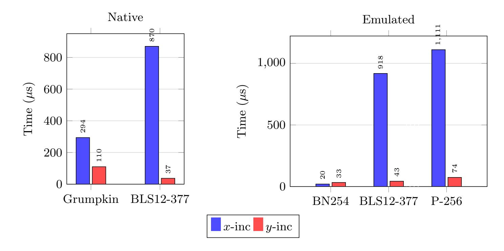
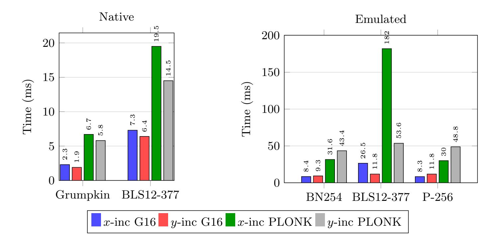
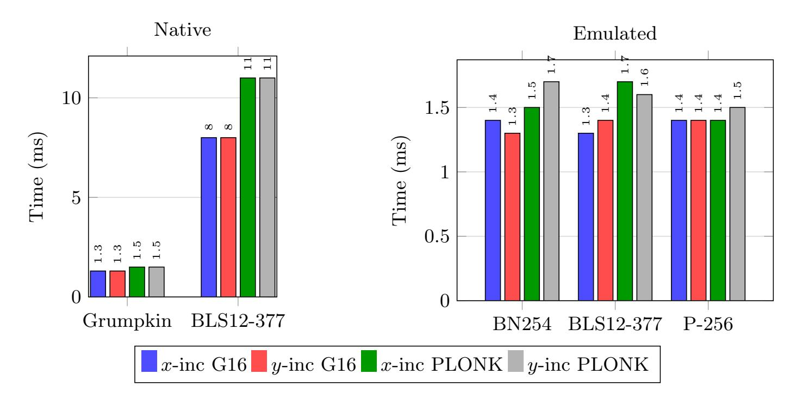

{0}------------------------------------------------

# On the Security of Constraint-Friendly Map-to-Curve Relations

Youssef El Housni Benedikt Bünz youssef.elhousni@consensys.net bb@nyu.edu Consensys, Linea New York University

Abstract. Groth, Malvai, Miller and Zhang (Asiacrypt 2025) introduced constraint-friendly map-to-elliptic-curve-group relations that bypass the inner cryptographic hash when hashing to elliptic curve groups inside constraint systems, achieving substantial reductions in circuit size. Their security proof works in the Elliptic Curve Generic Group Model (EC-GGM).

We identify three gaps. First, the security bound is not explicitly analyzed, and the bounds stated for the concrete instantiations are loose. Second, the EC-GGM does not capture the algebraic structure of most deployed curves; we exhibit a concrete signature forgery using the parameters claimed secure. Third, the construction requires a congruence condition on the field that is not satisfied by all deployed curves; we extend it to any field.

As a countermeasure we propose a y-increment variant that neutralizes the algebraic attack, removes the field restriction, and preserves a comparable constraint count. We implement and benchmark both constructions in the open-source gnark (Go) library; the attack is additionally demonstrated via a self-contained SageMath simulation and confirmed at the circuit level against the authors' own Noir (Rust) implementation.

# 1 Introduction

Hashing to elliptic curve groups underlies two cryptographic primitives: multiset hashing [\[13\]](#page-21-0), used for memory checking, and BLS signatures [\[9\]](#page-21-1), used for transactions and consensus in blockchain protocols. When proving these operations using zk-SNARKs, e.g. in zero-knowledge Virtual Machines (zkVM) or for signature aggregation, we must express them as low-constraint circuits to be practical. Standard hash-to-curve constructions combine an inner cryptographic hash (e.g. SHA-256, Poseidon [\[19\]](#page-22-0)) with an outer map-to-curve, making them a bottleneck at scale, because of the inner hash cost.

Groth, Malvai, Miller and Zhang [\[20\]](#page-22-1) (GMMZ) proposed bypassing the inner hash entirely via a map-to-curve relation. Their construction sets x = m · T + k for a message m, a small tweak k and a fixed tweak bound T determined by the target failure probability. Then, checks whether x lands on the curve E/Fq, and encodes the non-deterministic search for a valid k as a witness. The resulting verifier circuit costs a few constraints, with security analyzed in the Elliptic Curve Generic Group Model (EC-GGM) [\[21\]](#page-22-2).

{1}------------------------------------------------

Our contributions. We identify three gaps in the GMMZ construction, leading to an existential forgery in the signature application, and address each.

- 1. The security bound is loose. GMMZ does not state a clear security threshold, but their concrete parameter choices in [20, Sections 5.4 and 6.4] implicitly treat  $M \cdot T \ll q$  as the governing security condition, where M is the size of the message space  $\mathcal{M}$ . We prove that  $M \cdot T < \sqrt{q}$  is the threshold below which the construction achieves discrete-logarithm-problem (DLP) level security.
- 2. **Field restriction.** The construction requires  $q \equiv 3 \pmod{4}$  for canonical square-root extraction. GMMZ requires this for point inverse exclusion. We replace the quadratic residuosity with higher power residuosity, extending the construction to any field, at the cost of a few additional constraints when  $q \equiv 1 \pmod{4}$ . However, witness generation becomes impractical for highly 2-adic fields.
- 3. The EC-GGM misses algebraic structure. Most deployed curves have a j-invariant zero and thus carry a non-trivial automorphism that the EC-GGM does not capture. Specifically, for any such curve there are constants  $\omega$  and  $\lambda$  such that the points  $P_1 = (x, y)$  and  $P_2 = (\omega \cdot x, y)$  have a known discrete logarithm  $\lambda$ . We exploit this via a short-vector lattice computation, yielding a BLS signature forgery in  $O(\log^2 q)$  time (or O(1) for parameterized families such as Barreto-Naehrig (BN) [7] and Barreto-Lynn-Scott (BLS) [6] curves) when  $M \cdot T \gtrsim \sqrt{q}$ . We exhibit a concrete forgery with the GMMZ proposed parameters.

As a countermeasure we propose the *y-increment* construction (Section 5): encoding the message as a *y*-coordinate and recovering x. For j=0 curves, the automorphism that breaks the GMMZ x-increment acts as the identity on y-coordinates, neutralizing the attack. Inverse exclusion becomes free, lifting the field restriction. Both constructions are implemented and benchmarked in gnark [10]; the attack is additionally demonstrated via a SageMath simulation and at the circuit level against GMMZ's own Noir circuits (Section 6).

Organization. Section 2 recalls background on elliptic curves, root extraction, and the GMMZ construction. Section 3 analyzes the algebraic attack on j=0 curves and tightens the security bound. Section 4 addresses the field restriction. Section 5 introduces the y-increment construction. Section 6 describes the implementation. Section 7 concludes.

# <span id="page-1-0"></span>2 Preliminaries

## <span id="page-1-1"></span>2.1 Elliptic curves

Let  $E: y^2 = x^3 + ax + b$  be an elliptic curve over  $\mathbb{F}_q$  with q > 3. Let  $\mathbb{G}$  be a subgroup of  $E(\mathbb{F}_q)$  of prime order p. We write [k]P for scalar multiplication and  $\mathcal{O}$  for the point at infinity. The j-invariant is  $j(E) = 1728 \cdot 4a^3/(4a^3 + 27b^2)$ .

{2}------------------------------------------------

The endomorphism ring  $\operatorname{End}(E)$  consists of all rational maps  $E \to E$  preserving the group law. The automorphism group  $\operatorname{Aut}(E) \subset \operatorname{End}(E)$  is the invertible part:

- $-j \neq 0,1728$ , curves  $y^2 = x^3 + ax + b$  with  $a \cdot b \neq 0$ : Aut $(E) = \{\pm 1\}$ .
- -j=0, curves  $y^2=x^3+b$  with a=0: Aut $(E)\cong \mathbb{Z}/6\mathbb{Z}$ . When  $q\equiv 1\pmod 3$  the field  $\mathbb{F}_q$  contains a primitive cube root of unity  $\omega$ , and the order-3 automorphism

$$\phi:(x,y)\longmapsto(\omega x,\,y)$$

satisfies  $\phi(P) = [\lambda]P$  for a scalar  $\lambda$  satisfying  $\lambda^2 + \lambda + 1 \equiv 0 \pmod{p}$ . The endomorphism ring is  $\operatorname{End}(E) \cong \mathbb{Z}[\omega]$ .

-j = 1728, curves  $y^2 = x^3 + ax$  with b = 0: Aut $(E) \cong \mathbb{Z}/4\mathbb{Z}$  when  $q \equiv 1 \pmod{4}$ . The order-4 automorphism is  $\psi : (x,y) \mapsto (-x,iy)$  where  $i^2 = -1$  in  $\mathbb{F}_q$ .

Endomorphism action on coordinates. The degree of an endomorphism  $\alpha \in \operatorname{End}(E)$  is  $\deg(\alpha) = |\ker \alpha|$  (counted over  $\overline{\mathbb{F}}_q$ ). Scalar multiplication satisfies  $\deg([k]) = k^2$ ; automorphisms are precisely the degree-1 endomorphisms. An endomorphism of degree d acts on the x-coordinate via a rational function of degree d: for a generic point P, the value  $x(\alpha(P))$  is a rational function of x(P) of degree d. On short Weierstrass curves, degree-1 maps further reduce to scalings: every automorphism has x-map of the form  $x \mapsto cx$  for some  $c \in \mathbb{F}_q^*$  (for j = 0,  $c = \omega$ ; for j = 1728, c = -1). Endomorphisms of degree  $d \geq 2$  have x-maps of degree  $\geq 2$  and are not linear.

# <span id="page-2-0"></span>2.2 Root extraction in $\mathbb{F}_q$ and $\mathbb{F}_{q^2}$

Square roots in  $\mathbb{F}_q$ . An element  $a \in \mathbb{F}_q^*$  is a quadratic residue (QR) with probability  $\approx 1/2$ . Write  $q-1=2^s \cdot d$  with d odd; the 2-adic valuation  $s=v_2(q-1)$  determines the algorithm. When  $q\equiv 3\pmod 4$  (s=1), exactly one of  $\{a^{(q+1)/4}, -a^{(q+1)/4}\}$  is a QR (since -1 is a quadratic non-residue QNR), giving a canonical square root with a single exponentiation. When  $q\equiv 1\pmod 4$  ( $s\geq 2$ ), -1 is a QR and y,-y are simultaneously QR or QNR: no canonical choice exists from residuosity alone. For  $s\geq 3$ , Tonelli–Shanks iteratively corrects a near-root via a discrete-log computation in the 2-Sylow subgroup.

Cube roots in  $\mathbb{F}_q$ . Write  $q-1=3^v\cdot d$  with  $\gcd(d,3)=1$ . When  $q\equiv 2\pmod 3$  (v=0), cube roots are unique. When  $q\equiv 1\pmod 3$   $(v\geq 1)$ , each cube has exactly three roots  $\{x,\,\omega x,\,\omega^2 x\}$ , the orbit of the order-3 automorphism  $\phi$ . For  $v\leq 2$ , the cube root reduces to a single exponentiation (possibly times a fixed root of unity); for  $v\geq 3$ , the Adleman–Manders–Miller (AMM) [3] algorithm performs an iterative correction analogous to Tonelli–Shanks.

Table 1 summarises the closed-form exponentiation formulas. All deployed curves fields have  $v_3(q-1) \leq 2$ , so AMM is never needed in practice.

{3}------------------------------------------------

<span id="page-3-1"></span>Square roots in  $\mathbb{F}_{q^2}$ . Let  $\mathbb{F}_{q^2} = \mathbb{F}_q[u]/(u^2 + \beta)$  for a non-square  $\beta \in \mathbb{F}_q^*$ . Adj and Rodríguez-Henríquez [2], Scott [25, Sec. 6.3] and Aardal et al. [1, Alg. 3,  $q \equiv 3 \pmod 4$  only] all reduce  $\mathbb{F}_{q^2}$  square roots to computations in  $\mathbb{F}_q$ . The key identity is  $x^{q+1} = \mathrm{N}(x) \in \mathbb{F}_q$ . Since q+1 is even,  $b = x^{(q+1)/2}$  satisfies  $b^2 = \mathrm{N}(x) \in \mathbb{F}_q$ , which forces  $b \in \mathbb{F}_q$  (or  $b \in \mathbb{F}_q \cdot u$ ). The  $\mathbb{F}_{q^2}$  square root thus reduces to: compute b via an  $\mathbb{F}_q$  exponentiation (using the Frobenius  $x^q = \overline{x}$ ), take an  $\mathbb{F}_q$  square root of  $\mathrm{N}(x)$ , and combine.

<span id="page-3-2"></span>Cube roots in  $\mathbb{F}_{q^2}$ . El Housni [22] shows that when  $q \equiv 1 \pmod{3}$ , a cube root of  $x \in \mathbb{F}_{q^2}^*$  can be computed entirely in  $\mathbb{F}_q$ . The key insight is that the algebraic torus  $T_2(\mathbb{F}_q) \cong \mathbb{F}_{q^2}^*/\mathbb{F}_q^*$  has order q+1 with  $\gcd(3,q+1)=1$ , so every torus element has a unique cube root given by raising to the  $3^{-1} \mod (q+1)$  power via the Lucas V-sequence — an operation that stays entirely in  $\mathbb{F}_q$ . This covers all pairing-friendly primes of practical interest (BN, BLS12, BLS24), which satisfy  $q \equiv 1 \pmod{3}$  by construction.

|               | Condition                         | Formula                     | Examples                                  |  |  |
|---------------|-----------------------------------|-----------------------------|-------------------------------------------|--|--|
| $\sqrt{a}$    | $q \equiv 3 \pmod{4}$             | $a^{(q+1)/4}$               | BN254 [8], BLS12-<br>381 [11], P-256 [27] |  |  |
|               | $q \equiv 5 \pmod{8}$             | $\mathrm{Atkin}^{\dagger}$  |                                           |  |  |
|               | general $(v_2 \ge 3)$             | Tonelli-Shanks              | BLS12-377 [12] $(v_2=46)$                 |  |  |
| $\sqrt[3]{a}$ | $q \equiv 2 \pmod{3}$             | $a^{(2q-1)/3}$              | (unique root)                             |  |  |
|               | $q \equiv 4 \pmod{9} \ (v_3 = 1)$ | $a^{(8q-5)/9}$              | BN254 [8], P-256 [27]                     |  |  |
|               | $q \equiv 7 \pmod{9} \ (v_3 = 1)$ | $a^{(q+2)/9}$               |                                           |  |  |
|               | $q \equiv 10 \pmod{27} \ (v_3=2)$ | $\zeta \cdot a^{(2q+7)/27}$ | BLS12-381 [11]                            |  |  |
|               | $q \equiv 19 \pmod{27} \ (v_3=2)$ | $\zeta \cdot a^{(q+8)/27}$  |                                           |  |  |
|               | general $(v_3 \ge 3)$             | AMM                         | (rare)                                    |  |  |

†  $t = (2a)^{(q-5)/8}, s = 2at^2, \sqrt{a} = at(s-1).$ 

<span id="page-3-0"></span>**Table 1.** Exponentiation formulas for square and cube roots in  $\mathbb{F}_q$ . Cube-root formulas assume a is a cubic residue  $(a^{(q-1)/3}=1)$ ;  $\zeta$  is a precomputed primitive cube root of unity. Each closed-form case costs one field exponentiation.

# <span id="page-3-3"></span>2.3 Depressed cubic over $\mathbb{F}_q$

For  $a \neq 0$ , the depressed cubic  $x^3 + ax + c = 0$  over  $\mathbb{F}_q$  has either zero, one, or three roots in  $\mathbb{F}_q$ . Its behavior is controlled by the discriminant  $\Delta = -4a^3 - 27c^2$ . Compute the Legendre symbol  $\left(\frac{\Delta}{q}\right)$  via the binary GCD in  $O(\log^2 q)$  bit operations: -1 means one root, 0 means a repeated root, 1 means zero or three

{4}------------------------------------------------

roots. Note that  $\left(\frac{\Delta}{q}\right) = 1$  is necessary but *not sufficient* for three roots: three roots additionally require  $-3r_0^2 - 4a$  to be a square in  $\mathbb{F}_q$  (where  $r_0$  is the first root returned by Cardano's formula).

All three cases fit the same Cardano framework. Let

$$D = \sqrt{\frac{c^2}{4} + \frac{a^3}{27}}, \qquad u = \sqrt[3]{-\frac{c}{2} + D}, \qquad v = -\frac{a}{3u},$$

and set  $r_0 = u + v$ ,  $r_1 = \omega u + \omega^2 v$ ,  $r_2 = \omega^2 u + \omega v$ , where  $\omega$  is the primitive cube root of unity in  $\mathbb{F}_q$ .

One root ( $\Delta$  non-square). Whether  $D=\sqrt{-\Delta/108}$  lies in  $\mathbb{F}_q$  or  $\mathbb{F}_{q^2}$  depends on the Legendre symbol  $\left(\frac{-\Delta/108}{q}\right)=\left(\frac{-1}{q}\right)\left(\frac{\Delta}{q}\right)\left(\frac{3}{q}\right)$ , which is not determined by  $q \mod 4$  alone (e.g. for P-256 [27],  $q\equiv 3\pmod 4$ ) yet 3 is a non-residue mod q, so  $D\notin \mathbb{F}_q$ ). Rather than case-splitting, compute D uniformly via the  $\mathbb{F}_{q^2}$  square-root algorithm of Section 2.2 — if  $-\Delta/108$  is a square in  $\mathbb{F}_q$ , the result lies there; otherwise it is a proper  $\mathbb{F}_{q^2}$  element — then compute  $u=\sqrt[3]{-c/2+D}$  in  $\mathbb{F}_{q^2}$  via the torus method of Section 2.2. The root  $r_0=u-a/(3u)$  is recovered as an element of  $\mathbb{F}_q$ . Both algorithms perform all arithmetic in  $\mathbb{F}_q$ .

Three roots ( $\Delta$  square).  $D \in \mathbb{F}_q$  and  $u \in \mathbb{F}_q$  (use Table 1). All arithmetic stays in  $\mathbb{F}_q$ :

$$r_0 = u + v,$$
  $r_{1,2} = \frac{-r_0 \pm \sqrt{-3r_0^2 - 4a}}{2}.$ 

If the radicand  $-3r_0^2 - 4a$  is a non-square, return  $\{r_0\}$  only (the cubic has a single root despite  $\Delta$  being a square).

Repeated root ( $\Delta = 0$ ).  $r_0 = 3c/a$  and  $r_1 = r_2 = -3c/(2a)$ .

# <span id="page-4-0"></span>2.4 The x-increment construction

We describe the GMMZ map-to-curve relation [20]. Figure 1 gives the constructor and the corresponding relation.

Key properties.

- **Disjointness.** Distinct messages  $m_i$  map to disjoint x-ranges  $[m_iT, (m_i+1)T)$ ; the pair (m, k) is recovered uniquely by Euclidean division.
- **Inverse exclusion.** When  $q \equiv 3 \pmod{4}$ , exactly one of  $\{y, -y\}$  is a QR. The witness  $z^2 = y$  forces y to be the canonical QR root, preventing substitution of the inverse point (x, -y). This imposes the field restriction  $q \equiv 3 \pmod{4}$  (see Section 4).
- Failure probability. Each candidate x fails the QR test with probability  $\approx 1/2$ ; the probability that all T trials fail is  $\approx 2^{-T}$ .

{5}------------------------------------------------

## x-Increment Constructor

#### Inputs:

- An elliptic curve  $E: y^2 = x^3 + ax + b$  over  $\mathbb{F}_q$ , with  $q \equiv 3 \pmod{4}$ .
- An elliptic curve group  $\mathbb{G} \subseteq E(\mathbb{F}_q)$ .
- A message  $m \in \mathcal{M}$ .
- A tweak bound  $T \in \mathbb{N}$ .

# Procedure:

- 1. Initialize tweak counter  $k \leftarrow 0$ .
- 2. While k < T:
  - (a) Let  $x \leftarrow m \cdot T + k$  and  $f \leftarrow x^3 + ax + b$ .

  - (b) If f is a quadratic residue in  $\mathbb{F}_q$ :

     Compute  $y \leftarrow f^{(q+1)/4}$  and  $z \leftarrow y^{(q+1)/4}$ .
    - If  $(x,y) \in \mathbb{G}$ , output (x,y) with witness  $(k,z) \in \mathcal{W}$  (witness space).
  - (c) Otherwise, increment  $k \leftarrow k + 1$ .
- 3. If no valid point is found after T iterations, declare failure.

## x-Increment Relation

## Parameters:

- A prime-order subgroup  $\mathbb{G} \subseteq E(\mathbb{F}_q)$  of an elliptic curve  $E(\mathbb{F}_q)$ :  $y^2 = x^3 + ax + b$ , with  $q \equiv 3 \pmod{4}$ .
- A message space  $\mathcal{M} \subseteq \mathbb{F}_q$  and a tweak space [0,T) such that  $M \cdot T < q$ .

## Relation $\mathcal{R}_x \subseteq \mathcal{M} \times \mathbb{G} \times \mathcal{W}$ :

A triple (m, (x, y), w) where w = (k, z) belongs to  $\mathcal{R}_x$  if:

- 1.  $m \in \mathcal{M}, k \in [0,T),$
- $2. \ x = m \cdot T + k,$
- 3.  $z^2 = y$  (inverse exclusion), 4.  $y^2 = x^3 + ax + b$ ,
- <span id="page-5-0"></span>5.  $(x,y) \in \mathbb{G}$ .

Fig. 1. The GMMZ [20] x-increment map-to-curve relation: top, the constructor; bottom, the efficiently constructible relation.

Security model. The security proof works in the EC-GGM [21], which models the encoding  $\overline{\operatorname{enc}}: \mathbb{F}_q^{\pm} \to G^{\pm}$  as a random bijection over inversion classes. The model captures the  $\pm 1$  symmetry  $(x,y) \leftrightarrow (x,-y)$  but does not account for the curve's algebraic automorphism structure (see Section 3.3).

#### <span id="page-5-1"></span>2.5BLS signatures

Let  $E/\mathbb{F}_q$  be a pairing-friendly curve with two prime-order subgroups  $\mathbb{G}_1 \subset$  $E(\mathbb{F}_q)$  and  $\mathbb{G}_2 \subset E(\mathbb{F}_{q^k})$  of order p, generators  $g_1 \in \mathbb{G}_1$ ,  $g_2 \in \mathbb{G}_2$ , and a type-3 

{6}------------------------------------------------

bilinear pairing  $e: \mathbb{G}_1 \times \mathbb{G}_2 \to \mathbb{G}_T$ . A BLS signature [9] with hash  $H: \{0,1\}^* \to \mathbb{G}_1$  works as follows.

- KeyGen: sample  $\mathsf{sk} \leftarrow \mathbb{Z}/p\mathbb{Z}$ , set  $\mathsf{vk} = [\mathsf{sk}] \, g_2 \in \mathbb{G}_2$ .
- Sign(m): output  $\sigma = [\operatorname{sk}] H(m) \in \mathbb{G}_1$ .
- Verify $(m, \sigma)$ : accept iff  $e(\sigma, g_2) = e(H(m), vk)$ .

Security (existential unforgeability under adaptive chosen-message attack) reduces to the co-computational Diffie-Hellman problem relative to the pairing e, assuming H is modeled as a random oracle. In the GMMZ setting, H is replaced by the x-increment map-to-curve relation.

# <span id="page-6-0"></span>3 The Attack

To forge a BLS signature (Section 2.5) on a fresh message  $m_2$  after querying the signing oracle on  $m_1$ , an attacker needs two valid encodings  $P_1 = H(m_1)$  and  $P_2 = H(m_2)$  with a known scalar relation  $P_2 = [\mu]P_1$ : then  $[\mu]\sigma_1$  is a valid signature on  $m_2$  without knowledge of the secret key. Since the x-increment construction (Section 2.4) places every valid encoding's x-coordinate in  $[0, M \cdot T)$ , this reduces to finding two curve points with small x-coordinates related by a known scalar.

Automorphisms (the degree-1 endomorphisms, Section 2.1) are the only endomorphisms with a linear x-map  $x \mapsto cx$ . This linearity is key: a small  $x(P_1)$  maps to  $c \cdot x(P_1)$  mod q, which can also be small. Higher-degree endomorphisms act as rational functions of degree  $\geq 2$ , scattering x-coordinates unpredictably.

# <span id="page-6-1"></span>3.1 The order-3 automorphism attack on j = 0 curves

The automorphism  $\phi$  from Section 2.1 maps  $x \mapsto \omega x$  with  $\omega \not\equiv \pm 1 \pmod{q}$ , inducing the linear relation  $x_2 \equiv \omega x_1 \pmod{q}$ . This defines the two-dimensional integer lattice

$$L = \{(a, b) \in \mathbb{Z}^2 : b \equiv \omega a \pmod{q}\}$$
 (1)

of determinant q.

Finding a short vector. The  $\ell^{\infty}$  ball of radius r in  $\mathbb{Z}^2$  has volume  $4r^2$ . By Minkowski's theorem a non-zero vector of L exists inside this ball whenever  $4r^2 > 4 \det(L) = 4q$ , i.e.,  $r > \sqrt{q}$ . In particular there exists  $(a,b) \in L \setminus \{0\}$  with  $\max(|a|,|b|) \leq \sqrt{q}$ .

The half-GCD algorithm (a variant of the extended Euclidean algorithm) finds this vector in  $O(\log^2 q)$  time. It runs the extended Euclidean algorithm on the pair  $(q, \omega)$ , tracking the sequence of remainders  $r_0 = q, r_1 = \omega, r_2, \ldots$  and cofactors  $s_i$  satisfying  $s_i q + t_i \omega = r_i$ . It stops at the first index i with  $|r_i| \leq \sqrt{q}$ ; the output  $(s_i, r_i)$  is a short vector of L since  $r_i \equiv \omega s_i \pmod{q}$  and  $\max(|s_i|, |r_i|) \leq \sqrt{q}$ .

Alternatively, the short basis can be read off from the Complex Multiplication (CM) structure without lattice reduction, following Smith [26]: since  $q \equiv 1$ 

{7}------------------------------------------------

(mod 3), the prime q splits in  $\mathbb{Z}[\zeta_3]$  as  $q = \pi \bar{\pi}$ , and Cornacchia's algorithm computes  $\pi = a + b\omega$  directly, giving (a, b) as the short vector. For curves in parameterized families the Cornacchia factorization is known symbolically: for BN curves, Proposition 1 gives it in O(1) operations in the curve seed u.

When  $M \cdot T > \sqrt{q}$ , this short vector satisfies  $|a|, |b| < M \cdot T$ , so both |a| and |b| lie in the encoding range  $[0, M \cdot T)$ .

Constructing the BLS signature forgery. The adversary proceeds as follows.

- 1. Compute (a, b) via Smith's CM-based approach [26]: since  $q \equiv 1 \pmod{3}$ , run Cornacchia's algorithm on q to find  $a + b\omega$  with  $a^2 ab + b^2 = q$ , giving  $\max(|a|, |b|) \leq \sqrt{q}$  and  $b \equiv \omega a \pmod{q}$  in a single  $O(\log^2 q)$  pass. No half-GCD or lattice reduction is needed. The resulting (a, b) is the unique (up to sign and conjugacy) short vector of L and is available as a ready-made basis from the CM theory.
- 2. Set  $m_1 = \lfloor |a|/T \rfloor$  and  $k_1 = |a| \mod T$ . Query the signing oracle on  $m_1$  to obtain  $\sigma_1 = [\mathsf{sk}] \cdot H(m_1)$ , where  $H(m_1) = (m_1T + k^*, y^*)$  for the canonical tweak  $k^*$ . The forgery succeeds when  $k^* = k_1$ , which holds whenever the prover's canonical tweak matches  $k_1$ . The total attack cost is one signing query with  $O(\log^2 q)$  field work (or O(1) field operations for parameterized families where (a, b) is known symbolically).
- 3. When  $H(m_1) = (|a|, y_1)$ : set  $m_2 = \lfloor |b|/T \rfloor$ ,  $P_2 = \phi(P_1) = (\omega |a|, y_1) = [\lambda]P_1$ , and  $\sigma_2 = [\lambda]\sigma_1$ .

The pair  $(m_2, \sigma_2)$  is a valid BLS forgery:

$$e(\sigma_2, g_2) = e([\lambda]\sigma_1, g_2) = e([\lambda][\operatorname{sk}]P_1, g_2) = e([\operatorname{sk}]\phi(P_1), g_2) = e(P_2, \operatorname{vk}).$$

Since  $\phi$  is an automorphism,  $P_2 = \phi(P_1)$  lies on the curve automatically; no additional QR check is needed.

Scope. The attack requires a degree-1 automorphism acting as  $x \mapsto cx$  with  $c \not\equiv \pm 1 \pmod{q}$  (so that the lattice has short vectors below the encoding range).

- -j = 0:  $c = \omega$ ,  $\omega \not\equiv \pm 1 \pmod{q}$  attack applies.
- -j = 1728: the automorphism maps  $x \mapsto -x$ , i.e., c = -1, which is already handled by inverse exclusion. The x-lattice degenerates.
- Generic j:  $Aut(E) = \{\pm 1\}$ ; no non-trivial degree-1 x-map exists.
- Higher-degree endomorphisms  $(d \geq 2)$ : x-map is a rational function, not linear; the lattice framework does not apply.

# Concrete instantiation

<span id="page-7-0"></span>Polynomial short vector for BN curves. The family parameters are polynomials in an integer seed u:  $q(u) = 36u^4 + 36u^3 + 24u^2 + 6u + 1$  and  $p(u) = 36u^4 + 36u^3 + 18u^2 + 6u + 1$ . The primitive cube root of unity and the lattice short vector admit closed-form polynomial expressions.

{8}------------------------------------------------

**Proposition 1.** For any BN seed u such that q(u) is prime and  $q(u) \equiv 1 \pmod{3}$ , the element  $\omega(u) = 18u^3 + 18u^2 + 9u + 1 \pmod{q(u)}$  is a primitive cube root of unity in  $\mathbb{F}_q$ , and the pair

$$a(u) = 6u^2 + 2u + 1,$$
  $b(u) = 2u \mod q(u)$ 

satisfies  $\omega(u) \cdot a(u) \equiv b(u) \pmod{q(u)}$ .

*Proof.* We must show  $\omega(u) \cdot a(u) \equiv b(u) \pmod{q(u)}$ , i.e.  $q(u) \mid \omega(u) \cdot a(u) - b(u)$  in  $\mathbb{Z}[u]$ . Computing the product:

$$\omega(u) \cdot a(u) = (18u^3 + 18u^2 + 9u + 1)(6u^2 + 2u + 1) = 108u^5 + 144u^4 + 108u^3 + 42u^2 + 11u + 1,$$

so  $\omega(u) \cdot a(u) - b(u) = 108u^5 + 144u^4 + 108u^3 + 42u^2 + 9u + 1$ . Polynomial long division by  $q(u) = 36u^4 + 36u^3 + 24u^2 + 6u + 1$  gives

$$108u^5 + 144u^4 + 108u^3 + 42u^2 + 9u + 1 = (3u+1) \cdot q(u),$$

so the remainder is zero and  $\omega(u) \cdot a(u) \equiv b(u) \pmod{q(u)}$  as claimed. The norm bound  $\max(|a(u)|, |b(u)|) \leq \sqrt{q(u)}$  follows since  $a(u) = O(u^2)$ , b(u) = O(u), and  $q(u) = O(u^4)$ . The identity is also confirmed by the SageMath script (Section 6.1).

Both components have magnitude  $O(u^2)$  resp. O(u), confirming the  $\sqrt{q(u)}$ norm bound. The pair (a(u), b(u)) is the polynomial short vector of L for the\nentire BN curve family.

Concrete forgery on BN254. This curve is used in Ethereum and has the seed  $u_0 = 0x44e992b44a6909f1$ , giving  $q \approx 2^{254}$  and  $\sqrt{q} \approx 2^{127}$ . GMMZ [20, Section 6.4] uses  $M \approx 2^{120}$ , T = 128, so  $M \cdot T \approx 2^{127} \gtrsim \sqrt{q}$ : the construction is vulnerable. Evaluating Proposition 1 at  $u_0$  gives the short vector

$$x_1 = b(u_0) = 0$$
x89d3256894d213e2 (64 bits)  
 $x_2 = a(u_0) = 0$ x6f4d8248eeb859fc8211bbeb7d4f1129 (127 bits)

with  $\omega(u_0)^2 \cdot x_1 \equiv x_2 \pmod{q}$  (Proposition 1 gives  $\omega(u_0) \cdot x_2 \equiv x_1$ ; applying  $\omega^{-1} = \omega^2$  yields  $\omega^2 x_1 \equiv x_2$ ). Both lie in  $[0, M \cdot T)$ . The corresponding messages and tweaks are

$$m_1 = 0$$
x113a64ad129a427,  $k_1 = 98$   
 $m_2 = 0$ xde9b0491dd70b3f9042377d6fa9e22,  $k_2 = 41$ .

The concrete points are

 $y_1 = \texttt{0x7095c7c4a55eef5fa35ec35b700bcda96277be86bbe79c27b57ed8b7f6c32b9}, \\ P_1 = (x_1, y_1),$ 

$$P_2 = (x_2, y_1) = \phi^2(P_1) = [\lambda^2]P_1.$$

{9}------------------------------------------------

The equality  $y(P_2) = y(P_1)$  holds because  $x_2^3 = x_1^3$  on this j = 0 curve. The forger queries the signing oracle on  $m_1$  to obtain  $\sigma_1 = [\mathsf{sk}] P_1$ , then outputs  $\sigma_2 = [\lambda^2] \sigma_1 = [\mathsf{sk}] P_2$  as a valid signature on  $m_2 \neq m_1$ . The SageMath implementation (Section 6.1) confirms the pairing check

$$e(\sigma_2, g_2) = e([\lambda^2][\operatorname{sk}] P_1, g_2) = e([\operatorname{sk}] P_2, g_2) = e(P_2, [\operatorname{sk}] g_2) = e(P_2, \operatorname{vk}),$$

so  $(m_2, \sigma_2)$  is a concrete BLS forgery.

## 3.2 Tightening the security bound

GMMZ's stated security of  $p/(M \cdot T)$  queries overstates the actual level. Their own Theorem 3 [20] provides a bound

$$\Pr[\text{collision}] \leq c \cdot \frac{\left(\sum_{m} |S_{m}^{\pm}|\right) \cdot Q + Q^{2}}{p},$$

where c is a small constant, Q is the number of adversary queries, and  $S_m^{\pm}$  is the set of curve points encoding message m (including both a point and its inverse), so  $|S_m^{\pm}| \leq T$ . Hence  $\sum_m |S_m^{\pm}| \leq M \cdot T$ , and the first term is  $c \cdot M \cdot T \cdot Q/p$ . Each term independently limits the number of useful queries: the first,  $c \cdot M \cdot T \cdot Q/p$ , reaches  $\Omega(1)$  at  $Q \approx p/(M \cdot T)$ , while the second,  $Q^2/p$  reaches  $\Omega(1)$  at  $Q \approx \sqrt{p}$ . Security is therefore capped at  $\min(p/(M \cdot T), \sqrt{p})$ .

The same  $\sqrt{q}$  threshold emerges from two independent mechanisms depending on the degree of the endomorphisms available.

Degree  $\geq 2$  — birthday argument. For  $\alpha$  of degree  $d \geq 2$ , the map  $x \mapsto x(\alpha(P))$  is a rational function of degree d, whose image behaves pseudorandomly in  $\mathbb{F}_q$ . Under this heuristic the events " $x(P_1) \in [0, M \cdot T)$ " and " $x(\alpha(P_1)) \in [0, M \cdot T)$ " are approximately independent, each with probability  $\approx M \cdot T/q$ . The expected number of valid pairs is  $(M \cdot T)^2/q$ , reaching 1 at  $M \cdot T \approx \sqrt{q}$ : a birthday threshold, captured by the  $Q^2$  term in GMMZ's Theorem 3.

Degree 1 — lattice argument. For  $\phi$ , the x-map  $x \mapsto \omega x$  is a bijection, so the pseudorandom heuristic fails entirely. The lattice L (Section 3.1) already gives the threshold deterministically: Minkowski guarantees a short vector whenever  $M \cdot T > \sqrt{q}$ , found in  $O(\log^2 q)$  via Cornacchia's algorithm (or O(1) for parameterized families) — no birthday luck required.

# <span id="page-9-0"></span>3.3 EC-GGM model gap

The gap exposed in Section 3 is structural, not merely a miscalculation of constants: the EC-GGM model itself is blind to the automorphism.

{10}------------------------------------------------

The Groth–Shoup EC-GGM. Following [\[21\]](#page-22-2), the EC-GGM fixes a random encoding function π : Z<sup>q</sup> → E that is injective, identity-preserving (π(0) = O), and inverse-preserving (π(−i) = −π(i) for all i). The last condition captures the only algebraic symmetry baked into the model: a point and its inverse share the same x-coordinate. Parties interact with a group oracle Ogrp:

```
– (map, i): returns π(i);
– (add, P1, P2): returns π

                             π
                               −1
                                  (P1) + π
                                           −1
                                              (P2)

                                                    .
```

No further structure of E is exposed; in particular, there is no query for ϕ.

Why ϕ is invisible to the model. Since ϕ(P) = [λ]P, we have ϕ(π(i)) = π(λi mod q). An adversary holding P = π(i) computes ϕ(P) = (ω · x(P), y(P)) with a single field multiplication, without issuing any oracle query. The EC-GGM proof accounts only for queries to Ogrp, so ϕ is free of charge in the attack but invisible to the security argument.

ϕ-augmented EC-GGM. A model that correctly reflects curves with automorphisms whose action is non-trivially linear on the encoding coordinate should add a third oracle query:

```
– (aut, P): returns π

                       λ · π
                            −1
                              (P) mod q

                                           = ϕ(P).
```

In this ϕ-augmented EC-GGM, applying ϕ costs a query, so the model faithfully reflects the real adversary's capabilities. This captures both j-invariant 0 and 1728 automorphisms.

Relationship to the Algebraic Group Model. In the AGM [\[18\]](#page-22-7), every group element the adversary outputs must be expressed as a linear combination of previously received elements. Since ϕ(P) = [λ]P, it is such a linear combination, so the AGM does capture the automorphism — it is "free" in the AGM just as in reality. However, the AGM alone does not model coordinates (x, y), which are essential for map-to-curve security arguments that reason about encoding ranges. A hybrid "EC-AGM" combining EC-GGM coordinates with AGM representations would be the principled general model, but its formalization is beyond our scope. Our y-increment sidesteps this modelling question entirely: as shown in Theorem [1,](#page-14-0) it is provably secure in the standard EC-GGM because ϕ is harmless on y-encodings.

# <span id="page-10-0"></span>4 Removing the Field Restriction

The x-increment method requires q ≡ 3 (mod 4) for inverse exclusion: as recalled in Section [2.2,](#page-2-0) only then is −1 a QNR, so the witness z <sup>2</sup> = y forces y to be the canonical QR square root and excludes −y. When q ≡ 1 (mod 4), −1 is a QR, y and −y are simultaneously QR or QNR, and z <sup>2</sup> = y no longer distinguishes them.

<span id="page-10-1"></span>The fix is to replace quadratic residuosity with higher power residuosity. Let s = v2(q − 1).

{11}------------------------------------------------

**Proposition 2** (Inverse exclusion via  $2^s$ -th powers). Let q be an odd prime and  $s = v_2(q-1)$ . For any  $y \in \mathbb{F}_q^*$ : if y is a  $2^s$ -th power then -y is not. Hence replacing the witness  $z^2 = y$  with the chain  $z^{2^s} = y$  restores inverse exclusion for any prime q.

*Proof.* Let g generate  $\mathbb{F}_q^*$  and write  $q-1=2^s r$  with r odd. The  $2^s$ -th powers form the unique subgroup  $H = \langle g^{2^s} \rangle$  of index  $2^s$ .

Since  $(-1) = g^{(q-1)/2} = g^{2^{s-1}r}$  and  $2^{s-1}r$  is not divisible by  $2^s$  (as r is odd), the element -1 lies in a coset of H distinct from H itself.

If  $y = g^{2^s j} \in H$  then  $-y = g^{2^{s-1}r + 2^s j}$ ; for  $-y \in H$  one would need  $2 \mid r$ , which contradicts r odd. Hence  $-y \notin H$ .

Modified verifier. Replace  $z^2 = y$  with  $z^{2^s} = y$ . This costs s multiplication constraints instead of 1, raising the total from 4 (for s = 1) to 3 + s in general. For s=1, every quadratic residue is a  $2^s$ -th power, so the original GMMZ success probability remains  $\approx 1/2$  per trial. For general s, however, the prover additionally needs the square root y to be a  $2^s$ -th power, so witness generation succeeds only when y lies in the subgroup of index  $2^s$  of  $\mathbb{F}_q^*$ .

Instantiations.

- $-s = 1 \ (q \equiv 3 \pmod{4})$ : original GMMZ.
- -s = 2 ( $q \equiv 5 \pmod{8}$ ): witness  $z^4 = y$ , costing a single additional constraint. -s = 46 (BLS12-377  $\mathbb{F}_q$ ): witness  $z^{2^{46}} = y$ . Still much cheaper than verifying the inner hash, but impractical for the prover.

Prover practicality. Proposition 2 shows that the x-increment construction theoretically extends to any prime field via the  $z^{2^s} = y$  witness chain. However, the prover must find a y that is simultaneously a square root of  $x^3 + ax + b$  and a  $2^s$ -th power in  $\mathbb{F}_q^*$ . Since the  $2^s$ -th powers form a subgroup of index  $2^s$ , each candidate y passes this test with probability  $2^{-s}$ , requiring  $T \approx 2^{s+1}$  trials in expectation. For s=1 this is negligible (T=128 suffices), but for large s e.g. s = 46 for BLS12-377 — the forward search becomes infeasible: the prover cannot map a *chosen* message m to a curve point within a practical tweak bound.

In summary, the higher-residuosity extension generalises the GMMZ construction to any field from the verifier's perspective (costing only s additional constraints), but renders witness generation impractical when s is large. The y-increment construction (Section 5) resolves this entirely.

# <span id="page-11-0"></span>The y-Increment Construction

The x-increment method (Section 2.4) encodes a message as a candidate xcoordinate and recovers y by taking a square root. We propose reversing the roles: encode the message as a candidate y-coordinate and recover x by solving the curve equation as a cubic. This single swap resolves all limitations of GMMZ.

{12}------------------------------------------------

- No field restriction. The inverse-exclusion argument becomes trivial: inverse points (x, y) and (x, -y) share x but have y-coordinates y and q y respectively. Since the message range  $[0, M \cdot T)$  and its reflection  $[q M \cdot T, q)$  are disjoint (because  $M \cdot T < q/2$ ), inverse points always encode different messages. No witness is needed and there is no constraint on q mod 4.
- Order-3 automorphism is neutralized. The automorphism  $\phi$  (Section 2.1) acts as the *identity* on the y-coordinate. Therefore  $\phi(P)$  and P always carry the same y-value and encode the same message. The automorphism cannot produce a cross-message collision.

On a j=0 curve, i.e.  $y^2=x^3+b$ , recovering x from a given y amounts to computing a cube root of  $y^2-b$ . As recalled in Section 2.2, when  $q\equiv 1\pmod 3$  each cube has three roots forming the orbit  $\{x,\omega x,\omega^2 x\}$  of  $\phi$ . Since  $\phi$  fixes y, all three roots encode the *same message*. The prover witnesses any one of them; the verifier accepts it by checking the curve equation and the y-range.

On a  $j \neq 0,1728$  curve, i.e.  $y^2 = x^3 + ax + b$  with  $a \cdot b \neq 0$ , recovering x from a candidate y requires solving the depressed cubic  $x^3 + ax + c = 0$  with  $c = b - y^2$ . The cubic has at least one root in  $\mathbb{F}_q$  with probability  $\approx 2/3$  for a random y; none are related by a field automorphism. The root-finding algorithm is given in Section 2.3.

Remark 1 (Canonicality). In GMMZ's x-increment construction, the verifier enforces a canonical square-root choice for the y-coordinate. This is not a canonicality requirement per se but an inverse-exclusion measure: without it, a prover could substitute the point (x, -y) for (x, y), and since both share the same x-coordinate the message encoding would be ambiguous.

The y-increment construction is free of this issue. The negation map sends  $(x,y)\mapsto (x,-y)$ , and  $-y \mod q \notin [0,M\cdot T)$  for any y in the encoding range, so inverse points automatically encode different messages. Moreover, since the prover witnesses the full point (x,y) in both the multiset-hashing and BLS signature settings, no inverse-exclusion constraint on x is ever needed: the verifier checks  $(x,y)\in E(\mathbb{F}_q)$  and  $\lfloor y/T\rfloor=m$ , and in the BLS case the pairing equation  $e(\sigma,g_2)=e((x,y),\mathsf{vk})$  uniquely determines the correct point.

Remark 2 (j = 1728 duality). On a j = 1728 curve the order-4 automorphism  $\psi$  acts as  $x \mapsto -x$  on the x-coordinate and as  $y \mapsto iy$  with  $i \not\equiv \pm 1 \pmod{q}$  on the y-coordinate. Thus x-increment is safe on j = 1728, but y-increment is not: the lattice  $L_{1728} = \{(a,b) \in \mathbb{Z}^2 : b \equiv i \cdot a \pmod{q}\}$  has determinant q and a short vector of norm  $\leq \sqrt{q}$ , giving an analogous attack when  $M \cdot T \gtrsim \sqrt{q}$ . Enforcing  $M \cdot T < \sqrt{q}$  eliminates it. In practice, for the two applications discussed in this work, all deployed curves have  $j \neq 1728$ .

# 5.1 Construction

Figure 2 gives the constructor and the corresponding relation. The prover iterates candidate y-values of the form  $m \cdot T + k$  until one yields a valid curve point.

{13}------------------------------------------------

# y-Increment Constructor

#### Inputs:

- An elliptic curve  $E: y^2 = x^3 + ax + b$  over  $\mathbb{F}_q$ .
- An elliptic curve group  $\mathbb{G} \subseteq E(\mathbb{F}_q)$ .
- A message  $m \in \mathcal{M}$ .
- A tweak bound  $T \in \mathbb{N}$ .

# Procedure:

- 1. Initialize tweak counter  $k \leftarrow 0$ .
- 2. While k < T:
  - (a) Let  $y \leftarrow m \cdot T + k$  and  $c \leftarrow b y^2$ .
  - (b) Find  $x \in \mathbb{F}_q$  such that  $x^3 + ax + c = 0$ .
    - j = 0: compute a cube root of -c.
    - $j \neq 0$ : solve the depressed cubic
    - If a solution x exists and  $(x, y) \in \mathbb{G}$ , output (x, y).
  - (c) Otherwise, increment  $k \leftarrow k + 1$ .
- 3. If no valid point is found after T iterations, declare failure.

## y-Increment Relation

## Parameters:

- A prime-order subgroup  $\mathbb{G} \subseteq E(\mathbb{F}_q)$  of an elliptic curve  $E(\mathbb{F}_q): y^2 = x^3 + ax + b$ .
- A message space  $\mathcal{M} \subseteq \mathbb{F}_q$  and tweak space [0,T) such that  $M \cdot T < \sqrt{q}$ .

## Relation $\mathcal{R}_y \subseteq \mathcal{M} \times \mathbb{G} \times \mathcal{W}$ :

A triple (m, (x, y), w) where w = k belongs to  $\mathcal{R}_y$  if:

- 1.  $m \in \mathcal{M}, k \in [0, T),$
- $2. \ y = m \cdot T + k,$
- 3.  $y^2 = x^3 + ax + b$ ,
- <span id="page-13-0"></span>4.  $(x,y) \in \mathbb{G}$ .

**Fig. 2.** The y-increment map-to-curve relation: top, the constructor; bottom, the efficiently constructible relation.

The procedure is uniform for j = 0 and  $j \neq 0$  curves; the only difference is in step 2(b), where x-recovery reduces to a cube root for j = 0 or to solving the depressed cubic of Section 2.3 for  $j \neq 0$ . The tweak k is part of the witness, making the construction deterministic and constant-time from the verifier's perspective: the verifier checks four simple algebraic conditions without re-running the search.

Failure probability. On a j=0 curve  $(q \equiv 1 \pmod 3)$ , each candidate value  $c=b-y^2$  is a cube in  $\mathbb{F}_q$  independently with probability  $\approx 1/3$ , since cubes form the unique subgroup of index 3 in  $\mathbb{F}_q^*$ . The failure probability after T tweaks

{14}------------------------------------------------

is  $(2/3)^T$ ; T = 256 gives  $2^{-150} < 2^{-128}$ . (When  $q \equiv 2 \pmod{3}$  every element is a cube, so any T suffices.)

On a  $j \neq 0$  curve, the depressed cubic  $x^3 + ax + c = 0$  has at least one root in  $\mathbb{F}_q$  with probability  $\approx 2/3$ , since irreducible cubics account for  $\approx 1/3$  of monic cubics over  $\mathbb{F}_q$ . The failure probability after T tweaks is  $(1/3)^T$ ; T = 81 is the minimum for  $2^{-128}$  security ( $\lceil 128/\log_2 3 \rceil = 81$ ), and T = 128 is a conservative choice.

Verifier cost. The verifier checks conditions 1–4 of Figure 2. Condition 1 is a range check on k; condition 2 is linear (free); condition 3 verifies the curve equation  $x^3 + ax + b = y^2$  using 3 multiplications ( $x^2$ ,  $x^3$ ,  $y^2$ ; the term ax is free since a is a public constant); condition 4 is free once the curve equation holds and  $\mathbb{G}$  has prime order. The total is **3 multiplications** + **1 range check** for both curve families.

Compared to GMMZ x-increment, whose verifier requires 3+s multiplications (Section 4), where  $s=v_2(q-1)\geq 1$ : the extra s multiplications come from the square-root witness chain  $z^{2^s}=y$  that enforces inverse exclusion. The y-increment eliminates this chain entirely, saving s multiplications — 1 for BN254 and BLS12-381 ( $s=1,\ q\equiv 3\pmod 4$ ) and 46 for BLS12-377 (s=46). The tradeoff is a slightly wider range check for j=0: since each candidate succeeds with probability  $\approx 1/3$  rather than  $\approx 1/2$ , one needs T=256 instead of T=128 for the j=0 case, adding one bit to the range check. In our gnark implementation we use T=256 uniformly across all curves. gnark's commitment-based range checker decomposes a value into limbs of an auto-selected optimal width of size 4 bits. An 8-bit check (T=256) decomposes evenly into two 4-bit limbs with no remainder, whereas a 7-bit check (T=128) does not divide evenly by 4, producing an overflowing most-significant limb that requires one extra constraint. Consequently, the more conservative T=256 yields equal or better constraint counts than T=128 in practice for all constructions in all settings.

# 5.2 Security analysis

We prove that the y-increment construction is secure in the standard Groth–Shoup EC-GGM [21] — no model augmentation is needed. The key insight is that on j=0 curves the automorphism  $\phi$  preserves y-coordinates, so it cannot produce cross-message collisions in the y-encoding.

<span id="page-14-0"></span>Theorem 1 (y-increment security in the standard EC-GGM). Let  $E: y^2 = x^3 + b$  be a j = 0 curve over  $\mathbb{F}_q$  with a prime-order subgroup  $\mathbb{G}$  of order p. Let  $\mathcal{M}$  be a message space with  $|\mathcal{M}| = M$  and tweak bound T satisfying  $M \cdot T < \sqrt{q}$ . In the standard EC-GGM, any adversary making at most Q oracle queries (map and add) has advantage at most

$$\mathsf{Adv}^{\mathrm{forge}} \, \leq \, \frac{c \cdot MT \cdot Q + Q^2}{p}$$

for an absolute constant c > 0. In particular, the construction achieves DLP-level security  $\min(p/(MT), \sqrt{p})$ .

{15}------------------------------------------------

*Proof.* We work in the Groth-Shoup EC-GGM [21]. The encoding function  $\pi$ :  $\mathbb{Z}_p \to \mathbb{G}$  is a random bijection satisfying  $\pi(0) = \mathcal{O}$  and  $\pi(-i) = -\pi(i)$ . The adversary interacts with oracles map and add as defined in Section 3.3.

Step 1: Encoding sets  $S_m^{\pm}$ . For each message  $m \in \mathcal{M}$ , the set of valid encodings under the y-increment is  $S_m = \{P \in \mathbb{G} : y(P) \in [mT, (m+1)T)\}$ . On a j = 0 curve each y-value yields up to 3 points (the cube-root orbit  $\{(x,y), (\omega x,y), (\omega^2 x,y)\}$ ), so  $|S_m| \leq 3T$ . For inverse exclusion: if  $y \in [0, MT)$  then  $-y = q - y \notin [0, MT)$  since MT < q/2, so  $S_m$  and  $S_m^- = \{-P : P \in S_m\}$  are disjoint. Hence  $|S_m^{\pm}| = |S_m \cup S_m^-| \leq 6T$ , and  $\sum_m |S_m^{\pm}| \leq 6MT$ .

Step 2:  $\phi$  is harmless (no model augmentation needed). The adversary can compute  $\phi(P) = (\omega x, y)$  from coordinates without any oracle query. But  $\phi$  preserves y-coordinates:  $y(\phi(P)) = y(P)$ . Therefore  $\phi(P)$  encodes the same message as P. The "free" points obtained via  $\phi$  are same-message duplicates that do not produce cross-message collisions. This is the crucial difference from the x-increment, where  $\phi$  maps  $x \mapsto \omega x$  and does create cross-message collisions (Section 3). In particular, the standard EC-GGM already accounts for all points in  $S_m^{\pm}$ , including those related by  $\phi$ , so no aut oracle is needed.

Step 3: Applying GMMZ Theorem 3. The y-increment relation (Figure 2) satisfies the preconditions of [20, Theorem 3]: (i) completeness—the prover finds a valid encoding with probability  $1-(2/3)^T$ ; (ii) efficient constructibility—the verifier checks 4 algebraic conditions in O(1) field operations; (iii) disjointness—distinct messages m map to disjoint y-ranges [mT, (m+1)T). By [20, Theorem 3], the advantage is bounded by  $c(\sum_m |S_m^{\pm}|)Q/p + Q^2/p$  for an absolute constant c. Substituting  $\sum_m |S_m^{\pm}| \leq 6MT$ :

$$\mathsf{Adv}^{\mathrm{forge}} \, \leq \, \frac{6c \cdot MT \cdot Q}{p} \, + \, \frac{Q^2}{p} \, .$$

The factor 6 is absorbed into the constant. The bound is negligible when  $Q \ll p/(MT)$  and  $Q \ll \sqrt{p}$ .

# <span id="page-15-0"></span>6 Implementation and Benchmarks

We provide two complementary implementations. First, a SageMath simulation that demonstrates the algebraic attack end-to-end and checks the correctness of both x-increment and y-increment constructions. Second, gnark [10] circuits for both relations, from which we derive concrete R1CS and PLONK (SCS) constraint counts. We cover native and emulated arithmetic, j=0 and  $j\neq 0$  curves, and both low (s=1) and high  $(s\gg 1)$  2-adicity regimes. All source code is available at [16]:

https://github.com/yelhousni/map-to-curve.

# <span id="page-15-1"></span>6.1 Attack — SageMath simulation

We provide a self-contained SageMath simulation of the full attack and forgery pipeline.

{16}------------------------------------------------

bn\_poly\_attack.sage. Derives the CM short vector  $(a(u), b(u)) = (6u^2 + 2u + 1, 2u)$  from first principles (Proposition 1). Verifies the polynomial identity  $b(u) \equiv \omega(u) \cdot a(u) \pmod{q(u)}$  symbolically in  $\mathbb{Q}[u]$ , then evaluates at the BN254 seed  $u_0 = 0x44e992b44a6909f1$  and checks  $|a(u_0)|, |b(u_0)| \leq \sqrt{q}$ .

bn254\_forgery.sage. Instantiates the O(1) BLS signature forgery of Section 3 for BN254. The pairing-level correctness of the forgery is confirmed by an explicit optimal ate pairing computation implemented in pairing bn.sage.

Additionally, for correctness, we simulate both x-increment and y-increment provers and verifiers.

x\_increment.sage, y\_increment.sage. Implements curve-agnostic GMMZ x-increment and our y-increment encoders and verifiers. Both are tested on different elliptic curves.

cardano.sage. Implements the Cardano depressed cubic solver of Section 2.3. The implementation is validated against SageMath's .roots() on 200 random cubics over each of the P-256 and BN254 base fields, with 0-root / 1-root / 3-root breakdowns matching expectations ( $\approx 1/3, 1/2, 1/6$  respectively).

## 6.2 Attack — GMMZ Noir circuits

The GMMZ paper [20, Section 7] describes Noir [14] circuit implementations of the x-increment relation but provides no link to the source code. Upon independent investigation, we located an implementation on GitHub under the account of co-author Harjasleen Malvai [23] (https://github.com/Jasleen1/map-to-curve) and included a fork of it (https://github.com/yelhousni/map-to-curve-gmmz) as a submodule in our artifact [16] at commit aaaeea6. On this fork we demonstrate the algebraic attack of Section 3 directly at the circuit level.

native\_noir\_map\_to\_curve/src/attacks.nr. Confirms that the circuit relation is non-injective under the order-3 automorphism. Given a valid witness, the automorphism  $\phi$  yields a second valid witness for a different message.

noir\_map\_to\_curve/src/attacks.nr. Repeats the same automorphism attack for the non-native circuit variant, where x-coordinates are represented as 256-bit limb arrays over the BN254 scalar field.

The circuit additionally omits the tweak range check  $t \in [0, T)$  required for injectivity. This is an implementation gap that does not reflect the GMMZ construction as described in the paper and should not be treated as a vulnerability of the GMMZ scheme; the resulting exploits are deferred to Appendix A.

# <span id="page-16-0"></span>6.3 Constructions — gnark circuits

We implement both the x-increment and y-increment relations as gnark [10] circuits to obtain concrete constraint counts and to verify end-to-end satisfiability. Each circuit is compiled against the R1CS and PLONK (SCS) arithmetisations.

{17}------------------------------------------------

Circuit variants. Each construction is provided in two flavors.

- Native. The circuit arithmetic is performed directly over the target curve's base field, which must equal the scalar field of the proving system's curve. This is the case when the two curves form a 2-cycle [4, Section 5.4] (each curve's base field is the other's scalar field) or sit in a 2-chain [4, Section 5.2] (the inner curve's scalar field equals the outer curve's base field). We instantiate this for three j = 0 curves: BN254 [7] and Grumpkin [5], which form a 2-cycle, and BLS12-377 [6], which is the inner curve in a 2-chain with BW6-761 [17]. BN254 has  $s = v_2(q 1) = 1$ ; Grumpkin has s = 28; BLS12-377 has s = 46.
- **Emulated.** The circuit arithmetic uses non-native field emulation over BN254, supporting any curve. We instantiate this for BN254, BLS12-377, and P-256, the latter being a  $j \neq 0$  curve (a = -3).

Witness generation at high 2-adicity. For the x-increment circuit, the prover must produce a witness (k, z) satisfying  $z^{2^s} = y$ . When s is large (e.g. s = 28 for Grumpkin, s = 46 for BLS12-377), mapping a chosen message m to a valid witness is infeasible (Section 4). For benchmarking purposes we use a reverse construction: pick a random seed r, compute  $y = r^{2^s}$  (guaranteeing that y is a  $2^s$ -th power with z = r), solve for x via cube root  $(x^3 = y^2 - b)$ , and decompose  $x = m \cdot T + k$ . This yields a valid witness for a random message rather than a chosen one, which suffices for circuit compilation and constraint counting but illustrates the prover limitation discussed in Section 4.

Shared helper packages. Witness generation requires field-level cube roots that are not provided by gnark. We factor these into two reusable internal/ packages.

- internal/grumpkin cube root in Grumpkin  $\mathbb{F}_q$  (= BN254  $\mathbb{F}_r$ ). Since  $q \equiv 19 \pmod{27}$  ( $v_3(q-1)=2$ ), we compute  $x^{(q+8)/27}$  and adjust by a cube root of unity. The exponentiation uses a short addition chain (301 operations, generated by mmcloughlin/addchain [24]).
- internal/p256 Cardano depressed-cubic solver and the necessary  $\mathbb{F}_{q^2}$  arithmetic over the P-256 base field, used by the y-increment witness generator for P-256.
  - $\mathbb{F}_{q^2}$  arithmetic.  $\mathbb{F}_{q^2} = \mathbb{F}_q[u]/(u^2+1)$  (valid since  $q \equiv 3 \pmod{4}$ ), with Karatsuba multiplication and complex squaring.
  - $\mathbb{F}_q$  cube root. Since  $q \equiv 4 \pmod{9}$   $(v_3(q-1) = 1)$ , cube roots in  $\mathbb{F}_q$  are unique and given by  $x^{(8q-5)/9}$ , computed via a short addition chain (278 operations).
  - $\mathbb{F}_{q^2}$  cube root. Implemented via the torus method of Section 2.2 following [15], using an addition chain for (q-4)/9 (278 operations). All arithmetic stays in  $\mathbb{F}_q$ .
  - $\mathbb{F}_{q^2}$  square root. Used in Cardano's Case 2 ( $\Delta$  non-square). Implemented via the algorithm of Section 2.2, using an addition chain for (q-3)/4 (264 operations). All arithmetic stays in  $\mathbb{F}_q$ .

{18}------------------------------------------------

Constraint counts. Table [2](#page-18-0) reports the number of R1CS constraints and PLONK gates for each circuit, compiled with gnark v0.14 on an AMD EPYC 9R14.

| Construction | Mode     | Curve     | s  | R1CS  | SCS    |
|--------------|----------|-----------|----|-------|--------|
|              | Native   | BN254     | 1  | 18    | 40     |
|              | Native   | BLS12-377 | 46 | 63    | 85     |
| x-increment  | Native   | Grumpkin  | 28 | 45    | 67     |
|              | Emulated | BN254     | 1  | 977   | 3 705  |
|              | Emulated | BLS12-377 | 46 | 7 741 | 31 175 |
|              | Emulated | P-256     | 1  | 1 065 | 4 082  |
|              | Native   | BN254     | —  | 16    | 38     |
|              | Native   | BLS12-377 | —  | 16    | 38     |
| y-increment  | Native   | Grumpkin  | —  | 16    | 38     |
|              | Emulated | BN254     | —  | 821   | 3 065  |
|              | Emulated | BLS12-377 | —  | 1 065 | 4 065  |
|              | Emulated | P-256     | —  | 911   | 3 448  |

<span id="page-18-0"></span>Table 2. Constraint counts for x-increment and y-increment circuits. R1CS = rank-1 constraint system; SCS = sparse constraint system (PLONK). s = v2(q − 1).

The y-increment native circuit costs 16 R1CS constraints across all three curves, regardless of s, saving 2 constraints over x-increment for s = 1 and 47 for s = 46 (BLS12-377). In the emulated setting the savings are more striking: BLS12-377 drops from 7 741 to 1 065 R1CS constraints (an 8.6× reduction) and from 31 175 to 4 065 SCS gates. For BN254 and P-256 the savings are modest (around 13–16% in R1CS) since s = 1; in all cases the y-increment emulated circuit is smaller than or equal to its x-increment counterpart.

# 6.4 Full pipeline benchmarks

We benchmark the full prove/verify pipeline — witness generation, proving, and verification — using Groth16 and PLONK (KZG) backends. All timings are collected on an AMD EPYC 9R14 (32 cores, 64 GB RAM) with go test -bench. Native circuits compile over the cycle partner (BN254→Grumpkin, BLS12-377→BW6-761); emulated circuits compile over BN254. The native BN254 case (compiled over Grumpkin) is excluded from the pipeline benchmarks because Grumpkin is not pairing-friendly and thus lacks a Groth16/PLONK proving backend in gnark.

Figure [3](#page-19-0) compares witness generation times. For j = 0 curves the y-increment computes a single cube root, while the x-increment must find a k such that x = m · T + k yields a quadratic residue and a 2 s -th root witness z. When s is large the forward search is infeasible. The reverse construction (Section [6.3\)](#page-16-0)

{19}------------------------------------------------



<span id="page-19-1"></span><span id="page-19-0"></span>Fig. 3. Witness generation time (µs). Hatched bars denote the x-increment on curves with high 2-adicity (s = 28 for Grumpkin, s = 46 for BLS12-377): the forward messageto-x map is infeasible so these bars are capped at chart height; the reverse construction used for correctness testing is not a meaningful benchmark.



<span id="page-19-3"></span><span id="page-19-2"></span>Fig. 4. Proving time (ms). The y-increment's constraint savings yield 2.2× Groth16 and 3.4× PLONK speedups on emulated BLS12-377.

produces valid witnesses for circuit testing but does not represent a realistic prover workflow. For P-256 (j ̸= 0), the y-increment pays the Cardano solver cost but avoids the 2-adicity witness chain entirely.

Figures [4](#page-19-3) and [5](#page-20-1) report proving and verification times respectively. The yincrement's constraint savings yield measurably faster proving, with the gap most pronounced on emulated BLS12-377: the x-increment's s = 46 squaring chain inflates Groth16 proving from 11.8 ms to 26.5 ms (2.2×) and PLONK from

{20}------------------------------------------------



<span id="page-20-2"></span><span id="page-20-1"></span>Fig. 5. Verification time (ms). Verification is fast and nearly identical for both constructions across all configurations.

 $53.6 \,\mathrm{ms}$  to  $182.0 \,\mathrm{ms}$  (3.4×). For native Grumpkin and BLS12-377 the *y*-increment is  $1.1\text{--}1.3\times$  faster. Verification times are comparable across all configurations, as expected for succinct proofs.

# <span id="page-20-0"></span>7 Conclusion

The GMMZ x-increment construction achieves remarkable constraint savings, but its EC-GGM security analysis has three gaps. First, it misses the order-3 automorphism on usually deployed curves, enabling a concrete BLS signature forgery in  $O(\log^2 q)$  time (or O(1) for parameterized families) when  $M \cdot T \gtrsim \sqrt{q}$ . Second, it is implicitly restricted to fields with  $q \equiv 3 \pmod{4}$ ; higher power residuosity theoretically restores correctness for any field, but witness generation is only practical when the 2-adicity  $s = v_2(q-1)$  is small. Third, the stated security level  $p/(M \cdot T)$  ignores the  $Q^2/p$  term in GMMZ's own theorem, which caps security at the DLP-level  $\sqrt{p}$ .

Our y-increment construction resolves all issues. By encoding messages as y-coordinates, the order-3 automorphism (which fixes y) is neutralized by construction; inverse exclusion is free; and the constraint count is comparable or lower.

We provide a full open-source implementation comprising a SageMath end-to-end attack simulation, correctness tests for both constructions on BN254, Grumpkin, and P-256, and gnark circuits benchmarked against R1CS and PLONK. The y-increment native circuit requires only 16 R1CS constraints across all tested curves, independent of the 2-adicity s.

Responsible Disclosure. We communicated these findings to the GMMZ authors prior to public release. They acknowledged the gap and confirmed they will

{21}------------------------------------------------

address it by tightening the parameter constraints in a revised version. To the best of our and their knowledge, no production system currently deploys the x-increment construction.

# References

- <span id="page-21-7"></span>1. Aardal, M.A., Adj, G., Alblooshi, A., Aranha, D.F., Martinez, I.A.C., Chávez-Saab, J., Filho, D.L.G., Reijnders, K., Rodríguez-Henríquez, F.: Optimized onedimensional SQIsign verification on intel and cortex-M4. IACR TCHES 2025(1), 497–522 (2025).
- <span id="page-21-6"></span>2. Adj, G., Rodríguez-Henríquez, F.: Square root computation over even extension fields. IEEE Transactions on Computers 63(11), 2829–2841 (2014).
- <span id="page-21-5"></span>3. Adleman, L.M., Manders, K., Miller, G.: On taking roots in finite fields. In: 18th Annual Symposium on Foundations of Computer Science (SFCS 1977). pp. 175– 178. IEEE (1977).
- <span id="page-21-12"></span>4. Aranha, D.F., El Housni, Y., Guillevic, A.: A survey of elliptic curves for proof systems. DCC 91(11), 3333–3378 (2023).
- <span id="page-21-13"></span>5. Aztec Protocol: Grumpkin: a cycle companion for BN254. [https:](https://aztecprotocol.github.io/aztec-connect/primitives.html) [//aztecprotocol.github.io/aztec-connect/primitives.html](https://aztecprotocol.github.io/aztec-connect/primitives.html) (2019)
- <span id="page-21-3"></span>6. Barreto, P.S.L.M., Lynn, B., Scott, M.: Constructing elliptic curves with prescribed embedding degrees. In: Cimato, S., Galdi, C., Persiano, G. (eds.) SCN 02. LNCS, vol. 2576, pp. 257–267. Springer, Berlin, Heidelberg (Sep 2003).
- <span id="page-21-2"></span>7. Barreto, P.S.L.M., Naehrig, M.: Pairing-friendly elliptic curves of prime order. In: Preneel, B., Tavares, S. (eds.) SAC 2005. LNCS, vol. 3897, pp. 319–331. Springer, Berlin, Heidelberg (Aug 2006).
- <span id="page-21-8"></span>8. Ben-Sasson, E., Chiesa, A., Tromer, E., Virza, M.: Succinct noninteractive zero knowledge for a von neumann architecture. In: Fu, K., Jung, J. (eds.) USENIX Security 2014. pp. 781–796. USENIX Association (Aug 2014), [https://www.usenix.org/conference/usenixsecurity14/](https://www.usenix.org/conference/usenixsecurity14/technical-sessions/presentation/ben-sasson) [technical-sessions/presentation/ben-sasson](https://www.usenix.org/conference/usenixsecurity14/technical-sessions/presentation/ben-sasson)
- <span id="page-21-1"></span>9. Boneh, D., Lynn, B., Shacham, H.: Short signatures from the Weil pairing. Journal of Cryptology 17(4), 297–319 (Sep 2004).
- <span id="page-21-4"></span>10. Botrel, G., Piellard, T., Housni, Y.E., Kubjas, I., Tabaie, A., Galteland, Y.J.: gnark a fast zk-snark library by consensys (2026), [https://github.com/consensys/](https://github.com/consensys/gnark) [gnark](https://github.com/consensys/gnark)
- <span id="page-21-9"></span>11. Bowe, S.: BLS12-381: New zk-SNARK elliptic curve construction. Zcash blog (March 11 2017), <https://blog.z.cash/new-snark-curve/>
- <span id="page-21-10"></span>12. Bowe, S., Chiesa, A., Green, M., Miers, I., Mishra, P., Wu, H.: ZEXE: Enabling decentralized private computation. In: 2020 IEEE Symposium on Security and Privacy. pp. 947–964. IEEE Computer Society Press (May 2020).
- <span id="page-21-0"></span>13. Clarke, D.E., Devadas, S., van Dijk, M., Gassend, B., Suh, G.E.: Incremental multiset hash functions and their application to memory integrity checking. In: Laih, C.S. (ed.) ASIACRYPT 2003. LNCS, vol. 2894, pp. 188–207. Springer, Berlin, Heidelberg (Nov / Dec 2003).
- <span id="page-21-11"></span>14. contributors, N.: Noir a domain specific language for zero knowledge proofs (2026), <https://github.com/noir-lang/noir>
- <span id="page-21-14"></span>15. El Housni, Y.: Fast cube roots in fp2 via the algebraic torus (2026), [https://](https://github.com/yelhousni/fp2-cbrt) [github.com/yelhousni/fp2-cbrt](https://github.com/yelhousni/fp2-cbrt)

{22}------------------------------------------------

- <span id="page-22-8"></span>16. El Housni, Y., Bunz, B.: On the security of constraint-friendly map-to-curve relations (2026), <https://github.com/yelhousni/map-to-curve>
- <span id="page-22-11"></span>17. El Housni, Y., Guillevic, A.: Optimized and secure pairing-friendly elliptic curves suitable for one layer proof composition. In: Krenn, S., Shulman, H., Vaudenay, S. (eds.) CANS 20. LNCS, vol. 12579, pp. 259–279. Springer, Cham (Dec 2020).
- <span id="page-22-7"></span>18. Fuchsbauer, G., Kiltz, E., Loss, J.: The algebraic group model and its applications. In: Shacham, H., Boldyreva, A. (eds.) CRYPTO 2018, Part II. LNCS, vol. 10992, pp. 33–62. Springer, Cham (Aug 2018).
- <span id="page-22-0"></span>19. Grassi, L., Khovratovich, D., Rechberger, C., Roy, A., Schofnegger, M.: Poseidon: A new hash function for zero-knowledge proof systems. In: Bailey, M., Greenstadt, R. (eds.) USENIX Security 2021. pp. 519–535. USENIX Association (Aug 2021), [https://www.usenix.org/conference/usenixsecurity21/presentation/](https://www.usenix.org/conference/usenixsecurity21/presentation/grassi) [grassi](https://www.usenix.org/conference/usenixsecurity21/presentation/grassi)
- <span id="page-22-1"></span>20. Groth, J., Malvai, H., Miller, A., Zhang, Y.N.: Constraint-friendly map-to-ellipticcurve-group relations and their applications. In: Hanaoka, G., Yang, B.Y. (eds.) ASIACRYPT 2025, Part II. LNCS, vol. 16246, pp. 511–543. Springer, Singapore (Dec 2025).
- <span id="page-22-2"></span>21. Groth, J., Shoup, V.: On the security of ECDSA with additive key derivation and presignatures. In: Dunkelman, O., Dziembowski, S. (eds.) EUROCRYPT 2022, Part I. LNCS, vol. 13275, pp. 365–396. Springer, Cham (May / Jun 2022).
- <span id="page-22-4"></span>22. Housni, Y.E.: Fast cube roots in fp2 via the algebraic torus. Cryptology ePrint Archive, Paper 2026/392 (2026), <https://eprint.iacr.org/2026/392>
- <span id="page-22-9"></span>23. Malvai, H.: Noir implementation of the GMMZ map-to-curve construction (2025), <https://github.com/Jasleen1/map-to-curve>, no link provided in the GMMZ paper; located independently on GitHub under the account of co-author Harjasleen Malvai
- <span id="page-22-12"></span>24. McLoughlin, M.: addchain: Cryptographic addition chain generation in go (2024), <https://github.com/mmcloughlin/addchain>
- <span id="page-22-3"></span>25. Scott, M.: A note on the calculation of some functions in finite fields: Tricks of the trade. Cryptology ePrint Archive, Report 2020/1497 (2020), [https://eprint.](https://eprint.iacr.org/2020/1497) [iacr.org/2020/1497](https://eprint.iacr.org/2020/1497)
- <span id="page-22-6"></span>26. Smith, B.: Easy scalar decompositions for efficient scalar multiplication on elliptic curves and genus 2 jacobians. In: Algorithmic Arithmetic, Geometry, and Coding Theory (AGCT 2013), Contemporary Mathematics, vol. 637, pp. 151–164. American Mathematical Society (2015).
- <span id="page-22-5"></span>27. Standards for Efficient Cryptography Group (SECG): SEC 2: Recommended Elliptic Curve Domain Parameters, Version 2.0. Tech. rep., Certicom Research (2010), <https://www.secg.org/sec2-v2.pdf>

# <span id="page-22-10"></span>A Implementation-Gap Exploits on GMMZ's Noir Circuits

Here we exploit the absence of the tweak range check t ∈ [0, T) which are unrelated to the algebraic vulnerability of the GMMZ construction analyzed in Section [3.](#page-6-0)

native\_noir\_map\_to\_curve/src/attacks.nr. Three test cases against the native Grumpkin circuit.

{23}------------------------------------------------

- exploit\_missing\_range\_check: the circuit accepts the same curve point for two messages m<sup>1</sup> = 7 and m<sup>2</sup> = 6 by choosing tweaks (t1, t2) = (0, 256) satisfying m1T + t<sup>1</sup> = m2T + t<sup>2</sup> = 1792; t<sup>2</sup> = 256 ≥ T goes unchecked.
- exploit\_zero\_message: setting m = 0 and t = x satisfies the embedding x = 0 · T + x for any valid point (x, y), claiming it as the encoding of the zero message without performing a hash.
- exploit\_multiset\_hash\_collision: the injectivity break propagates to elliptic-curve accumulation-based multiset hashing; two multisets differing by the swap m<sup>1</sup> ↔ m<sup>2</sup> produce the same Grumpkin-addition digest, forging a zkVM memory-consistency check.

noir\_map\_to\_curve/src/attacks.nr. Four test cases against the non-native circuit variant. The first three mirror those above.

- exploit\_missing\_range\_check\_nonnative: same injectivity break as above, adapted to the 256-bit limb representation of x.
- exploit\_zero\_message\_nonnative: same zero-message forgery adapted to the non-native field representation.
- exploit\_multiset\_hash\_collision\_nonnative: same multiset hash collision adapted to the non-native circuit.
- exploit\_mul\_mod\_p\_noncanonical: the mul\_mod\_p helper does not enforce a canonical representative after reduction modulo p; a prover can supply a non-canonical limb encoding of y that passes the is\_equal check against z <sup>2</sup> while encoding a different field value, bypassing the quadratic-residue condition.