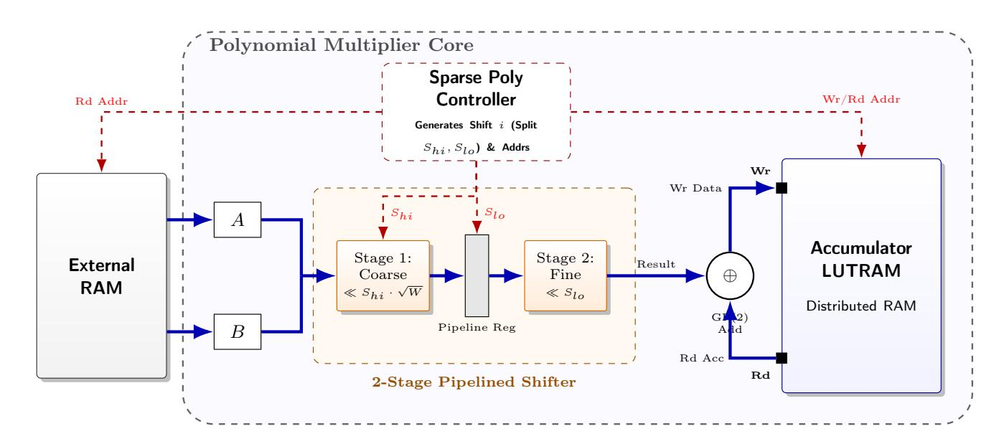

{0}------------------------------------------------

# Performance Analysis of Parameterizable HQC Hardware Architecture

Nishant Pandey\*<sup>1</sup> , Sanjay Deshpande\*<sup>2</sup> , Dixit Dutt Bohra<sup>3</sup> , Debapriya Basu Roy<sup>1</sup> , Dip Sankar Banerjee<sup>3</sup> , and Jakub Szefer<sup>2</sup>

> 1 Indian Institute of Technology Kanpur {nishantp22,dbroy}@iitk.ac.in <sup>2</sup> Northwestern University {sanjay.deshpande1, jakub.szefer}@northwestern.edu 3 Indian Institute of Technology Jodhpur {p23cs0003,dipsankarb}@iitj.ac.in

Abstract. This work presents a constant-time hardware design for HQC (Hamming Quasi-Cyclic), a code-based key encapsulation mechanism selected for standardization by NIST's Post-Quantum Cryptography process. While existing hardware implementations of HQC have achieved limited performance due to area constraints, our work demonstrates that high performance can be attained with minimal hardware overhead using higher datawidth. We present a fully parameterizable, flexible data width, hardware design, configurable for both performance targets and security levels, implementing HQC key generation, encapsulation, and decapsulation in Verilog for FPGA deployment. The three operational modules share a common SHAKE256 hash core to minimize area overhead while maintaining throughput. Our design significantly outperforms existing HQC hardware implementations in terms of latency, while achieving a similar or smaller value of the area-time (AT) product compared to existing implementations. The improved performance results from the optimizations introduced in the sparse polynomial multiplier and fixed weight vector generator modules. We achieve upto 35% improvement in the AT product when compared to other most efficient unified HQC hardware designs in the literature. For our fastest configuration targeting HQC-1 (the L1 security level), key generation completes in 0.020 ms, encapsulation in 0.040 ms, and decapsulation in 0.081 ms when implemented on a Xilinx Artix 7 FPGA, showcasing a 40% improvement in latency when compared against the fastest design, while maintaining a competitive area footprint.

Keywords: HQC · Hamming Quasi-Cyclic · PQC · Post-Quantum Cryptography · KEM · Key Encapsulation Mechanism · Hardware Implementation · FPGA.

<sup>\*</sup>Equal contribution

{1}------------------------------------------------

# 1 Introduction

The advent of quantum computing poses a significant threat to modern cryptographic systems, particularly public-key algorithms such as RSA and ECC [\[15,](#page-24-0) [20,](#page-25-0) [23,](#page-25-1) [29\]](#page-25-2). These widely deployed schemes derive their security from the computational intractability of integer factorization and discrete logarithm problems, assumptions that hold for classical computers but become vulnerable in the presence of sufficiently powerful quantum machines. In anticipation of this risk, researchers and cryptographers have proposed post-quantum cryptographic (PQC) algorithms designed to remain secure against both classical and quantum attacks. Recognizing the urgency, the National Institute of Standards and Technology (NIST) has led a multi-year effort to standardize PQC [\[24\]](#page-25-3). Among the candidates selected for standardization is the Hamming Quasi-Cyclic (HQC) algorithm, a code-based key encapsulation mechanism that was officially selected by NIST in March 2025 as the fifth post-quantum standard.

With HQC now selected for standardization, its deployment in real-world applications has become a critical consideration. Hardware implementations of HQC are particularly important for applications requiring high throughput, low latency, or operation in resource-constrained environments. To date, several hardware implementations of HQC have been reported in the literature, including both high-level synthesis (HLS) based designs [\[1,](#page-23-0)[4\]](#page-23-1), Hardware–Software codesign based implementations [\[26\]](#page-25-4), and purely hand-optimized RTL implementations [\[6,](#page-24-1) [8,](#page-24-2) [14,](#page-24-3) [21\]](#page-25-5) targeting FPGAs. However, existing designs predominantly focus on achieving either high-speed performance or compact area utilization as fixed design objectives, lacking the flexibility to dynamically trade off between performance and resource utilization within the same architecture. This limitation poses challenges for practical deployment scenarios where system requirements may vary. Addressing this flexibility gap constitutes the primary focus of our work.

In our work, we address this limitation by proposing a highly parameterisable HQC architecture that allows for seamless scaling across the throughput-area trade-off space. Specifically, we move beyond fixed-objective designs by introducing a hardware architecture where the datapath width (W) is a synthesistime parameter, enabling the same design architecture to target either ultracompact footprints or high-performance systems. The core of our solution lies in breaking the fundamental timing and area bottlenecks that traditionally plague wide-bus implementations of HQC. By redesigning the polynomial multiplication stage with pipelining, our architecture minimizes critical path delays, allowing for seamless scaling toward more demanding performance targets. Furthermore, while most prior implementations rely on Block RAM (BRAM) for storing and accumulating polynomial products, we transition to a distributed memory (LU-TRAM) architecture for the accumulation stages. This shift is critical for scaling the design to high-performance 1024-bit configurations. By utilizing LUTRAM, we mitigate the rapid escalation of BRAM consumption typically seen as the datapath width (W) increases, ensuring that the area overhead remains man

{2}------------------------------------------------

ageable. This strategy allows our architecture to achieve superior area-delay products while maintaining frequency stability even at maximum widths.

## Contributions The main contributions of this work are as follows:

- 1. We present a constant-time, parameterizable hardware implementation of HQC targeting FPGAs. The design supports synthesis-time configurability, specifically,
  - We introduce a parameter W that represents the width of the datapath, which inherently helps is scaling the time and area of the design.
  - Our design supports all three security levels (HQC-1, HQC-3, HQC-5) specified in [\[17\]](#page-24-4).
- 2. We implement all three cryptographic primitives, key generation, encapsulation, and decapsulation, which can operate as standalone modules or as a unified architecture with shared components to minimize overall area utilization.
- 3. We propose an improved sparse-dense polynomial multiplication unit that achieves up to 67% better performance in terms of Area-Time (AT) product compared to the implementations presented in [\[9,](#page-24-5) [14\]](#page-24-3).
- 4. We further propose a faster, improved Fixed-Weight Vector generation module that improves the performance of [\[14\]](#page-24-3)'s design by 6.7–13× across different parameter sets.
- 5. Our unified HQC hardware design achieves a 11–35% reduction in AT product compared to previously reported designs, demonstrating superior efficiency across the performance-area trade-off space.

### 1.1 Paper Organization

This paper is organized as follows. Section [2](#page-2-0) gives a brief background on the HQC primitives. Section [3](#page-7-0) presents a summary of the works related to HQC. Section [4](#page-9-0) gives a detailed description of our hardware designs. Section [5](#page-17-0) presents a comparison of our HQC designs to other existing designs for all primitives. Section [6](#page-23-2) concludes the paper.

# <span id="page-2-0"></span>2 Preliminaries

Hamming Quasi-Cyclic (HQC) is a code-based Key Encapsulation Mechanism (KEM) that achieves IND-CCA2 security under the hardness assumption of the Quasi-Cyclic Syndrome Decoding (QCSD) problem [\[17\]](#page-24-4). A distinguishing feature of HQC is that, unlike many code-based cryptosystems, it does not rely on the indistinguishability of structured codes from random codes. The construction follows a standard paradigm: an underlying IND-CPA secure Public Key Encryption (PKE) scheme [\[3\]](#page-23-3) is transformed into an IND-CCA2 secure KEM via the HHK transform [\[19\]](#page-25-6).

Table [1](#page-7-1) presents the HQC parameters that we will use in the rest of the paper. We also tabulate the key and ciphertext sizes for reference.

{3}------------------------------------------------

### 2.1 HQC Algorithms (Latest Specification)

The HQC scheme operates in two layers: the underlying Public Key Encryption (PKE) layer and the IND-CCA2 secure KEM layer. The following algorithms reflect the updated specification incorporating the hardware-friendly sampling order and salted Fujisaki-Okamoto transform.

### Public Key Encryption (PKE) Layer

Keygen: The key generation algorithm (HQC.PKE.KeyGen) begins by sampling random seeds to ensure compact key representation. A secret seed, seedPKE.dk, is used to deterministically generate two low-weight vectors, x and y, with Hamming weight w. A second seed, seedPKE.ek, is used to derive a random public generator vector h. The algorithm then computes the public syndrome vector s = x + h · y over the ring R. The resulting public encryption key (ek) consists of the tuple (seedPKE.ek, s) allowing for recalculation of h during encryption, while the private decryption key (dk) consists of the secret seed seedPKE.dk, allowing the recalculation of y during decryption.

### <span id="page-3-0"></span>Algorithm 1 HQC.PKE.KeyGen()

```
1: (seedPKE.dk, seedPKE.ek) ← {0, 1}
                                  k × {0, 1}
                                           k
2: y ← SampleFixedWeight(seedPKE.dk, w) ▷ Optimized order for HW
3: x ← SampleFixedWeight(seedPKE.dk, w)
4: dkPKE ← seedPKE.dk
5: h ← SampleVector(seedPKE.ek)
6: s ← x + h · y
7: ekPKE.ek ← (seedPKE.ek, s)
8: return (ekPKE, dkPKE)
```

Encryption: To encrypt a message m using HQC.PKE.Encrypt, the sender first regenerates the vector h from the public seed seedPKE.ek. The message is encoded into a codeword using the concatenated code C (combining Reed-Solomon and Reed-Muller codes). The algorithm then uses the input randomness θ to sample three sparse error vectors: r1, r<sup>2</sup> (both of weight ωr), and e (of weight ωe). To optimize hardware performance, these are sampled in the specific order r2, e, then r1. The ciphertext c = (u, v) is constructed by computing u = r<sup>1</sup> +h· r<sup>2</sup> and masked using the syndrome as v = C.Encode(m) + s · r<sup>2</sup> + e.

{4}------------------------------------------------

# <span id="page-4-0"></span>Algorithm 2 HQC.PKE.Encrypt(ekPKE = (seedPKE.ek, s), m, θ)

```
1: h ← SampleVector(seedPKE.ek)
2: seedr ← Gseed(θ)
3: r2 ← SampleFixedWeight(seedr, wr) ▷ Optimized order for HW
4: e ← SampleFixedWeight(seedr, we)
5: r1 ← SampleFixedWeight(seedr, wr)
6: u ← r1 + h · r2
7: v ← Encode(m) + s · r2 + e
8: return c ← (u, v)
```

Decryption: The decryption process (HQC.PKE.Decrypt) recovers the message by removing the masking term using the private key. The receiver first regenerates the sparse vector y from the secret seed seedPKE.dk. Given the ciphertext (u, v), the algorithm computes the vector v ′ = v − u · y. Due to the commutative property of the ring, this operation isolates the encoded message plus a manageable error term e ′ = x · r<sup>2</sup> − r<sup>1</sup> · y + e. Finally, the decoding algorithm of C is applied to v ′ to correct these errors and return the original plaintext m.

```
Algorithm 3 HQC.PKE.Decrypt(dkPKE = (seedPKE.dk), cPKE = (u, v))
1: y ← SampleFixedWeight(seedPKE.dk, w)
2: v
    ′ ← v − u · y
3: m′ ← Decode(v
                 ′
                 )
```

### Key Encapsulation Mechanism (KEM) Layer

4: return m′

Keygen: The key generation algorithm (HQC.KEM.KeyGen) utilizes a master seed to derive all necessary key components ensuring a deterministic and compact process. A random seed, seedKEM, is sampled and passed through an Extendable Output Function (XOF) to generate the PKE seed (seedPKE) and a secret rejection value σ. The algorithm then invokes the underlying PKE key generation with seedPKE to produce the encryption and decryption keys. The final encapsulation key ekKEM is identical to the PKE encryption key, while the decapsulation key dkKEM stores the PKE decryption key, the public key, the master seed, and crucially, the value σ, which is required for the implicit rejection mechanism.

{5}------------------------------------------------

### Algorithm 4 HQC.KEM.KeyGen()

```
1: seedKEM ← B|seed|
2: (ekPKE, dkPKE) ← HQC-PKE.Keygen()
3: ekKEM ← ekPKE
4: dkKEM ← (ekKEM, dkPKE, σ, seedKEM)
5: return (ekKEM, dkKEM)
```

Encapsulation: The encapsulation process (HQC.KEM.Encapsulate) secures a session key using a salted Fujisaki-Okamoto transformation. The sender samples a uniform message m and a random salt. To ensure the scheme is resistant to multi-target attacks, the shared session key K and the randomness θ for the underlying PKE encryption are derived simultaneously by hashing the public key, the message, and the salt. The message is then encrypted using θ to produce the PKE ciphertext cPKE. Finally, the KEM ciphertext is formed by appending the salt to cPKE.

# <span id="page-5-0"></span>Algorithm 5 HQC.KEM.Encapsulate(ekKEM)

```
1: m ← {0, 1}
          k
                                          ▷ Sample message uniformly
2: salt ← {0, 1}
           128 ▷ Sample random salt
3: (K, θ) ← G(H(ekKEM) ∥ m ∥ salt) ▷ Derive K and θ together
4: cPKE ← HQC.PKE.Encrypt(ekKEM, m, θ)
5: cKEM ← (cPKE, salt)
6: return (K, cKEM)
```

Decapsulation: The decapsulation algorithm (HQC-KEM.Decaps) implements implicit rejection to prevent chosen-ciphertext attacks. The receiver first decrypts the incoming PKE ciphertext to recover a candidate message m′ . The algorithm then immediately derives a candidate shared key K′ and internal randomness θ ′ by hashing the public key, m′ , and the salt. To verify validity, it re-encrypts m′ using θ ′ and compares the result against the received ciphertext. If the re-encryption matches, the algorithm returns the candidate key K′ . Otherwise, it returns a rejection key K, which is derived by hashing the public key, the secret value σ, and the ciphertext, ensuring the attacker learns nothing about the secret state.

#### 2.2 Hardware Acceleration Perspective

Dong et al. [\[16\]](#page-24-6) present a detailed profiling study of HQC-1 software reference implementation, analyzing the distribution of computational costs across different operations. Their results reveal that polynomial multiplication accounts for over 70% of the cycle count in each primitive, making it the primary optimization target for improving overall performance. Additionally, prior hardware im-

{6}------------------------------------------------

# <span id="page-6-1"></span>Algorithm 6 HQC.KEM.Decapsulate(dkKEM, cKEM)

```
1: (ekKEM, dkPKE, σ, seedKEM) ← dkKEM
2: (cPKE, salt) ← cKEM
3: m′ ← HQC-PKE.Decrypt(dkPKE, cPKE)
4: (K′
      , θ′
         ) ← G(H(ekKEM) ∥ m′
                               ∥ salt)
5: c
    ′
    PKE ← HQC-PKE.Encrypt(ekKEM, m′
                                        , θ′
                                           )
6: K ← J (H(ekKEM) ∥ σ ∥ cKEM)
7: if cPKE ̸= c
              ′
              PKE or m′ = ⊥ then
8: return K
9: else
10: return K′
11: end if
```

plementations [\[14\]](#page-24-3) identify fixed-weight vector generation as the second largest contributor to cycle count, owing to its inherently sequential nature. Accordingly, our work prioritizes the optimization of these two operations, detailed in section [4.1](#page-10-0) and section [4.2,](#page-14-0) respectively. Furthermore, we schedule operations to maximize hardware parallelism, as discussed in sections [4](#page-9-0) and [5.](#page-17-0)

Polynomial Multiplication Bottleneck As evidenced by software profiling, polynomial multiplication over R dominates the execution time. While generic multiplication operates in O(n log n) time, HQC features a unique structure where one operand is always dense (random) and the other is sparse (low Hamming weight). This enables hardware accelerators to employ Sparse × Dense algorithms, reducing complexity to O(n · w). However, realizing this speedup requires efficient access to the dense polynomial coefficients. As the datapath width increases to improve throughput, the memory subsystem must support simultaneous access to multiple coefficients, a requirement that challenges standard memory architectures.

Memory Hierarchy and Accumulation A critical design decision is the storage of intermediate polynomial results. The large operand sizes (n ≈ 17–57 Kbits) typically necessitate Block RAM (BRAM). However, BRAMs have limited read/write ports, creating a bottleneck when attempting to parallelize accumulation. To achieve high-performance scaling, architectures must consider alternative storage strategies, such as distributed memory (LUTRAM), which allows for higher bandwidth at the cost of logic resources. This trade-off between memory density (BRAM) and access bandwidth (LUTRAM) is central to optimizing the Area-Time Product (AT).

<span id="page-6-0"></span>Note on Key Compression The latest HQC specification [\[17\]](#page-24-4) introduces a compressed format for public and secret keys. While this reduces storage requirements, it incurs computational overhead, as the full keys must be expanded from

{7}------------------------------------------------

<span id="page-7-1"></span>Table 1: Parameter sets for HQC. n is the length of the polynomial. n<sup>1</sup> is the length of the Reed–Solomon code. n<sup>2</sup> is the length of the Reed–Muller code. w is the weight of vectors x, y. w<sup>r</sup> is the weight of vectors r1, r2, e. |ekKEM| = |seed| + ⌈n/8⌉ is the encapsulation key. |dkKEM| = |ekKEM| + |seed| + ⌈k/8⌉ or |dkKEM| = |seed| (compressed format) is the decapsulation key. |cKEM| = ⌈n/8⌉ + ⌈(n1n2)/8⌉ + |salt|. K is a shared key with size 32 bytes.

| Instance Security |        | Parameters                |    |    |    |    |        | Key and Ciphertext size† |          |  |           |  |
|-------------------|--------|---------------------------|----|----|----|----|--------|--------------------------|----------|--|-----------|--|
|                   |        | n                         | n1 | n2 | ω  | ωr | k      | ekKEM   dkKEM   cKEM   K |          |  |           |  |
| HQC-1             | NIST-1 | 17,669 46 384             |    |    | 66 |    | 75 128 | 2,241                    | 2,321 32 |  | 4,433 32  |  |
| HQC-3             | NIST-3 | 35,851 56 640 100 114 192 |    |    |    |    |        | 4,514                    | 4,602 32 |  | 8,978 32  |  |
| HQC-5             | NIST-5 | 57,637 90 640 131 149 256 |    |    |    |    |        | 7,237                    | 7,333 32 |  | 14,421 32 |  |

†Key and ciphertext size are given in bytes.

their respective seeds prior to encryption and decryption, as shown in algorithm [2](#page-4-0) and algorithm [3.](#page-4-1)

Our implementation adheres to this latest specification and supports key compression. To enable fair comparison with existing works [\[1,](#page-23-0) [4,](#page-23-1) [6,](#page-24-1) [8,](#page-24-2) [14,](#page-24-3) [21,](#page-25-5) [26\]](#page-25-4) that do not support this feature, we report results for both configurations, with and without key compression. To the best of our knowledge, our design is the first hardware implementation to support the newly introduced key compression mechanism.

# <span id="page-7-0"></span>3 Related Work

Since HQC's evaluation in the NIST standardization process, several hardware implementations [\[1,](#page-23-0) [4,](#page-23-1) [6,](#page-24-1) [8,](#page-24-2) [14,](#page-24-3) [21,](#page-25-5) [26\]](#page-25-4) have been proposed, spanning high-level synthesis (HLS), hardware-software codesign, and fully hand-optimized designs. As discussed in section [2,](#page-2-0) profiling of the reference software implementation reveals that polynomial multiplication constitutes the primary timing bottleneck across all three primitives. Consequently, the hardware implementations in the literature employ various techniques to address this computational challenge.

The first hardware implementation was proposed by the authors of HQC themselves using an HLS-based approach [\[1\]](#page-23-0). Their design combines Karatsuba and Toom-Cook methods [\[11\]](#page-24-7) for polynomial multiplication, achieving speedup over the software implementation but at considerable area cost. A subsequent HLS implementation by [\[4\]](#page-23-1) improved upon this work, offering modest gains in both timing and area efficiency.

The first fully hand-optimized implementation was introduced by Deshpande et al. [\[14\]](#page-24-3), who proposed a synthesis-time parameterizable design supporting multiple security levels. Their key optimization leverages the observation that in all polynomial multiplications across HQC's primitives, at least one operand is a sparse polynomial, enabling an efficient sparse-dense multiplication strategy. This approach achieved significant speedup over prior HLS implementations while substantially reducing area overhead. The authors presented two de

{8}------------------------------------------------

sign variants: a balanced configuration employing a single polynomial multiplier shared across all primitives, and a high-speed configuration utilizing two multipliers to exploit independent polynomial multiplications in both encapsulation and decapsulation.

Building on this work, Schöffel et al. [\[26\]](#page-25-4) proposed a hardware-software codesign approach that implements sparse-dense polynomial multiplication in programmable logic while executing the remaining operations on a processor. Although sparse-dense multiplication provides computational benefits, the overall performance of this design falls short of pure hardware implementations due to data transfer overhead between the processing system and the hardware accelerator.

Antognazza et al. [\[8\]](#page-24-2) subsequently proposed a fully hand-optimized implementation that also employs sparse-dense polynomial multiplication while additionally supporting runtime switching among all parameter sets. In more recent work [\[6\]](#page-24-1), the same authors further optimized their design by introducing multiple lanes for independent shift operations within the polynomial multiplier. This enhancement yields significant speedup compared to prior implementations, albeit at the cost of increased area and memory utilization. It is also worth noting that Antognazza et al. [\[8\]](#page-24-2) identified that reordering the fixed-weight vector generation process enables parallelization of polynomial multiplication across key generation, encapsulation, and decapsulation. The most recent HQC specification [\[17\]](#page-24-4) was subsequently updated to incorporate this optimization.

In addition to the aforementioned works, a natural question that arises in this context is whether Number Theoretic Transform (NTT) or Fast Fourier Transform (FFT)-based multiplication can be applied to achieve further speedup. One fundamental limitation is that, as described in section [2,](#page-2-0) all arithmetic operations in HQC are performed over F2, and NTT-style multiplication requires the underlying finite field to possess special roots of unity. Chen et al. [\[12\]](#page-24-8) proposed a workaround using Frobenius Additive FFTs (FAFFTs) [\[22\]](#page-25-7) in the context of BIKE [\[10\]](#page-24-9), wherein binary polynomials are converted to a Cantor basis representation before applying FFT-based operations. However, the overhead introduced by basis conversion, combined with the FFT computations, diminishes the potential gains, rendering this approach less effective than expected. This technique was subsequently implemented in hardware by Ras et al. [\[25\]](#page-25-8), though the inherent overhead limitations persist.

The architectural details of our work and comparisons with prior implementations are summarised in table [2.](#page-9-1) We present a fully parameterizable HQC architecture designed to support all security levels specified in [\[17\]](#page-24-4), while enabling systematic exploration of the time-area trade-off space. Specifically, we introduce a performance parameter W that determines the datapath width.

Central to our design is a sparse-dense polynomial multiplication unit. A key architectural distinction from prior implementations is our use of distributed memory (LUTRAM) rather than Block RAM (BRAM) for polynomial accumulation. This design choice proves critical for scaling to high-performance configurations with wide datapaths, as it mitigates the rapid increase in BRAM

{9}------------------------------------------------

<span id="page-9-1"></span>Table 2: A brief comparison of key architectural features for our proposed designs against the related works. HW: Hardware; HW-SW Hardware-Software Codesign, HLS - High-Level Synthesis.

| Design | Method | Multiplier<br>Type            | - Parametric |     | Max Data Width<br>Supported |
|--------|--------|-------------------------------|--------------|-----|-----------------------------|
| [4]    | HLS    | HLS-generated                 | No           | No  | 64                          |
| [14]   | HW     | Sparse-Dense                  | No           | No  | 128                         |
| [26]   | HW-SW  | Sparse-Dense                  | No           | No  | 64                          |
| [9]    | SW     | Sparse-Dense                  | No           | No  | 128                         |
| [25]   | HW-SW  | $\mathrm{FAFFT}/\mathrm{NTT}$ | No           | No  | 32                          |
| Ours   | HW     | Sparse-Dense                  | Yes          | Yes | Flexible                    |

utilisation that typically accompanies larger values of W, thereby maintaining manageable area overhead.

While our architecture supports arbitrary datapath widths, we evaluate configurations with W=128,256,512, and 1024 in this work. To ensure a fair comparison with prior implementations, we construct analogous design variants. First, in tables 6 to 8, we compare standalone modules for key generation, encapsulation, and decapsulation against designs that similarly provide independent primitives. Subsequently, in table 9, we compare our unified design, which integrates all primitives and shares common modules across operations, against comparable unified implementations from the literature. In both cases, several of our W configurations achieve superior performance in terms of timing, area (logic and memory resources), and Area-Time Product.

Our work moves beyond fixed-objective designs by introducing a unified architecture with a synthesis-time configurable performance parameter W. This parameterizability enables a single hardware design to address diverse deployment scenarios, ranging from ultra-compact implementations targeting minimal resource utilisation to high-throughput configurations optimised for performance.

# <span id="page-9-0"></span>4 Proposed Hardware Accelerator for HQC

In the following subsections, we present a detailed description of our hardware design for different modules in HQC. Specifically, we focus on the optimisations incorporated in the polynomial multiplier, fixed weight vector generator and the modules for encryption and decryption. We integrate these to improve the overall performance of the Keygen, Encapsulation, and Decapsulation modules while allowing parametrised HQC operation.

{10}------------------------------------------------

#### <span id="page-10-0"></span>4.1 Polynomial Multiplier

We first discuss the polynomial multiplication module used across the keygen, encapsulation and decapsulation stages in HQC. The polynomial multiplication step can be seen as a cyclic convolution between two polynomials with n components in  $\mathbb{F}_2$ , where one of the polynomials is sparse, with a fixed weight w. Mathematically, if a(X), b(X) are the input polynomials in  $\mathbb{F}_2$  and b is sparse with hamming weight = w, then their product is given as  $c(X) = a(X) \cdot b(X)$  mod  $(X^n - 1)$ .

Existing Architectures: Most designs in the literature follow a standard 'shiftand-add' approach by storing only the non-zero indices of the sparse polynomial and correspondingly shifting the dense polynomial by these indices. The final product is obtained by XORing all the shifted copies and performing an interleaved reduction to reduce the product modulo  $(X^n-1)$ . Due to the sparse structure of HQC polynomials, this approach is a more efficient approach compared to schoolbook or Karatsuba-based methods. As the value of n is large in HQC (Table 1), a simple register-based shifter would consume a huge amount of hardware resources. To circumvent this, a more scalable Block RAM-based sequential variable shifter is used, where the dense polynomial is loaded into the BRAM in chunks, and a small barrel rotator assists in performing the shifts. Thus, the dense shifts are performed using the BRAM addressing and loading sequences in chunks, while the fine intra-chunk shifts are performed using a combinatorial circuit, the barrel rotator. [14] perform fine rotations by concatenating two adjacent memory words of width W, shifting the resulting 2W-bit vector by i bits, and extracting the upper W bits. However, their implementation suffers from linear complexity because it resolves these shifts using bit-wise comparisons rather than a logarithmic structure. [9] propose a pipelined barrel rotation unit, which improves the operating frequency. They also utilise a memory organization with l read ports to parallelize the addition operation by using l=4 shifters in parallel. This improves the overall multiplication latency at the cost of increased area and total BRAM count.

Proposed Optimization Strategy: The first major optimization is with respect to the utilization of the storage unit where the results are accumulated. As discussed, existing designs utilize BRAMs for this purpose. However, a notable downside arises with using BRAMs when we scale the RAM-Width W. For higher values of W, the RAM-Depth, given by  $\lceil n/W \rceil$  effectively decreases. However, BRAM primitives have a rigid aspect ratio with a maximum native port width (e.g., 36 bits for Xilinx 7-Series [30]). When the design parameter W exceeds this native width, the synthesis tool must instantiate multiple physical BRAMs in parallel to satisfy the interface bandwidth. Because the required depth D is shallow at high widths, the vast majority of the storage capacity in these parallel BRAMs remains unused. Thus, the existing architectures suffer from the abrupt increase in overhead due to the significant increase in BRAM count for higher datawidths.

{11}------------------------------------------------

| Instance | W    | BRAM | LUTRAM |
|----------|------|------|--------|
| HQC-1    | 128  | 4    | 1032   |
| HQC-1    | 512  | 14.5 | 1368   |
| HQC-1    | 1024 | 28.5 | 1368   |
| HQC-3    | 128  | 4    | 1720   |
| HQC-3    | 512  | 14.5 | 2732   |
| HQC-3    | 1024 | 28.5 | 2736   |
| HQC-5    | 128  | 4    | 2732   |

HQC-5 512 14.5 2732 HQC-5 1024 28.5 2736

<span id="page-11-0"></span>Table 3: A comparison of area utilization with different types of memories.

To overcome these inefficiencies, we propose a design based on Distributed Memories (LUTRAMs). We use a dual port distributed LUTRAM with 2 reads and one write port. The advantage is that we can get less overhead and better frequencies compared to a BRAM [\[5\]](#page-23-4) when using a distributed memory and avoid any underutilisation. Table [3](#page-11-0) summarises the comparison with using BRAM versus using LUTRAM for the accumulator for different HQC instances. Note that, typically for AMD-Xilinx based FPGA design, a single BRAM is considered to have a overhead of 128 logic slices, where each logic slice contains 4 LUTs. Since the total number of bits that we have to store is constant (≈ n), the total number of LUTs needed to organise this memory does not change significantly even as we increases W. On the contrary, since BRAMs cannot trade Depth for Width beyond a certain point, increasing W forces us to have multiple BRAMs which in turn increases the overhead significantly. For example, with W = 128, the equivalent overhead due to the BRAM based memory are given as 4×128×4 = 2048 (since 1 BRAM ≈ 128 Slices ≈ 512 LUTs), whereas, the distributed memory requires only 1032 LUTs. For W = 1024, the difference is much more significant, where overhead of BRAM-based memory is 14592 equivalent LUTs, whereas the distributed memory requires only 1368 LUTs.

Further, we observe that as W increases, the barrel shifter complexity increases drastically. Specifically, the design suffers from a lowered frequency due to the critical path lying in the complex chain of comparators and multiplexing logic required to resolve the dynamic shift in a single clock cycle. We optimise this operation by implementing a two-stage pipelined barrel shifter. This architecture decomposes the rotation into two distinct phases: Coarse Shifting and Fine Shifting. First, we divide the control bits of the shift amount into two segments: the lower bits (fine amount) and the upper bits (coarse amount). For a <sup>W</sup>-bit bus, this effectively splits the shifting effort into <sup>√</sup> W increments. In the first clock cycle, the module performs a "coarse" shift. This stage shifts the 2Wbit concatenated input by large increments based on the most significant bits of

{12}------------------------------------------------

#### <span id="page-12-0"></span>Algorithm 7 Two-Stage Pipelined Barrel Rotation

```
Input: Concatenated Input V_{in} (2W bits), Shift Amount S (k bits)

Output: Rotated Output V_{out} (W bits)

1: Constants: L \leftarrow \lceil k/2 \rceil, R \leftarrow 2^L

// Decomposition Phase

2: S_{coarse} \leftarrow S[k-1:L]

3: S_{fine} \leftarrow S[L-1:0]

// Stage 1: Coarse Shift (Cycle 1)

4: V_{mid} \leftarrow V_{in} \ll (S_{coarse} \times R)

5: Pipeline_Reg \leftarrow \{V_{mid}, S_{fine}\}

// Stage 2: Fine Shift (Cycle 2)

6: V_{out} \leftarrow V_{mid} \ll S_{fine}

7: return V_{out}[2W-1:W]
```

the shift value. The result is captured in an intermediate pipeline register, along with the saved "fine" shift bits for the next stage. In the second clock cycle, the hardware takes the partially rotated data from the pipeline register and performs the "fine" shift. This stage resolves the remaining bit-level displacements using the lower bits of the shift value. Finally, the logic truncates the double-width vector to extract the desired W-bit result.

A short algorithm for this procedure is given in Algorithm 7. Mathematically, this optimization works by treating the shift index S as a value in base- $\sqrt{W}$ . If the total shift amount is represented by  $k = \log_2 W$  bits, partitioning these control bits into two equal halves implies a radix of  $2^{k/2} = \sqrt{W}$ . Consequently, any arbitrary shift S can be expressed linearly as  $S = S_{coarse} \cdot \sqrt{W} + S_{fine}$ , where  $S_{coarse}$  is determined by the upper k/2 bits and  $S_{fine}$  by the lower k/2 bits. This decomposition allows the hardware to replace a single massive W-to-1 multiplexer layer with two much smaller  $\sqrt{W}$ -to-1 stages, reducing the multiplexer selection complexity and signal fan-out from a factor of W to roughly  $2\sqrt{W}$ . Using this optimization, we observe a drastic decrease the overhead and stable frequencies as we sweep W from 128 to 1024, since the critical path no longer resides in the barrel shifter for higher W.

A detailed schematic of the architecture is given in Figure 1, illustrating the data flow and control interaction within the Polynomial Multiplier Core. The operation is orchestrated by the Sparse Poly Controller, which synchronizes data retrieval from the External RAM with the internal shifting logic. Input data is latched into registers A and B before entering the 2-Stage Pipelined Shifter. As depicted, this unit decomposes the rotation into a Stage 1 Coarse shift ( $\ll S_{hi} \cdot \sqrt{W}$ ) and a Stage 2 Fine shift ( $\ll S_{lo}$ ), separated by a pipeline register to isolate the critical path. The controller supplies the split shift indices,  $S_{hi}$  and  $S_{lo}$ , to their respective stages. The final shifted result is forwarded to the accumulation stage, where it is combined via a GF(2) adder (XOR gate) with the current state and stored in the Accumulator LUTRAM. This storage unit

{13}------------------------------------------------

is explicitly implemented using Distributed RAM logic to maximize bandwidth and minimize the area inefficiencies associated with BRAMs at high bit-widths.

<span id="page-13-0"></span>

Fig. 1: Polynomial Multiplication Architecture with Improved Barrel Rotator. The single-cycle barrel shifter is replaced by a two-stage pipelined architecture. Stage 1 performs coarse rotation (× √ W) and Stage 2 performs fine rotation, separated by a pipeline register to break the critical path.

The clock cycle count required for a single polynomial multiplication can be calculated based on the HQC parameters. Specifically, the latency depends on the weight of the sparse polynomial (w), the polynomial size (n), and the block width of the barrel shifter (W). For each of the w non-zero coefficients, the hardware takes ⌈n/W⌉ cycles to process all the chunks of the dense polynomial from BRAM, plus 3 additional cycles for the internal pipeline for the entire operation. We further add a total ⌈n/W⌉ needed to initially clear the memory, and w clock cycles to synchronize writes for each sparse index after performing the shift operations. A final 2 cycles are added for overall start and done synchronization. This results in the following formula for the total latency:

$$l_{new} = w * (3 + \lceil n/W \rceil) + \lceil n/W \rceil + w + 2$$

Results. We give a detailed comparison against other designs in Table [4.](#page-14-1) Note that LUT overhead reported for our design includes the overhead of LUTRAMs. While our polynomial multiplier is the least efficient for W = 128, the AT product gradually decreases as we increase W, achieving significant improvement over the design proposed by [\[9\]](#page-24-5). Since the design by [\[9\]](#page-24-5) also utilises a 4-stage pipelined barrel shifter, we compare our design for W = 512 against their design, where we achieve an improvement of 57%. This drastic improvement is achieved by mitigating the inefficiencies described in the sections above. As observed in the trend for frequency, [\[14\]](#page-24-3)'s design achieves lower frequencies as we increase W, owing to the huge combinatorial logic that arises in the Barrel shifter. On the contrary, our design achieves much stable frequencies (greater than 200 MHz)

{14}------------------------------------------------

<span id="page-14-1"></span>Table 4: Comparision of Area and Timing for the poly\_mult module for HQC-5. All our experiments are performed targeting the Artix 7 board with xc7a200tfbv484-3 FPGA chip. Note for calculating area overhead, we have used eSlices = max{LUT/4 + 128 ∗ BRAM + 100 ∗ DSP, FF/8}

| Design | W    |        |       | Area |         | Time      |        |     |
|--------|------|--------|-------|------|---------|-----------|--------|-----|
|        |      | LUT    | FF    | BRAM | eSlices | Fmax(MHz) | Cycles |     |
| [14]   |      | 1,448  | 474   | 4    | 874     | 245       | 59,476 | 212 |
| [9]    | 128  | 5,101  | 3,903 | 11   | 2,684   | 233       | 15,057 | 173 |
| Ours   |      | 3,913  | 491   | 0    | 978     | 218       | 60,058 | 269 |
| [14]   |      | 5,201  | 606   | 7.5  | 2,260   | 202       | 30,114 | 336 |
| Ours   | 256  | 4,268  | 867   | 0    | 1,067   | 226       | 30,358 | 143 |
| [14]   |      | 11,573 | 866   | 14.5 | 4,749   | 179       | 15,254 | 404 |
| Ours   | 512  | 4,495  | 1627  | 0    | 1,124   | 232       | 15,442 | 75  |
| [14]   |      | 30,126 | 1,889 | 28.5 | 11,179  | 150       | 7,890  | 588 |
| Ours   | 1024 | 5,972  | 3,155 | 0    | 1,493   | 213       | 8,070  | 56  |

due to the pipelining step, resolving the critical path issue. Similarly, we achieve a marginal increase in the area overhead (captured in eSlice count) compared to [\[14\]](#page-24-3). This is explained by the huge cost of bit-by-bit comparisons and the usage of BRAMs. Thus, pipelining helps us with resolving the timing violations, enabling us to achieve one of the best area-delay products among existing designs.

### <span id="page-14-0"></span>4.2 Fixed Weight Vector Generator

The fixed-weight vector generator produces a uniformly random n-bit vector with a specified Hamming weight w. The original algorithm proposed in [\[1\]](#page-23-0) exhibited non-constant-time behavior during rejection sampling, specifically in the threshold check and duplicate detection steps. This vulnerability was exploited in a timing attack against the HQC software reference implementation [\[18\]](#page-24-10). To address this issue, the HQC authors adopted the Constant-Weight Word (CWW) generation method, originally proposed by Sendrier [\[28\]](#page-25-10), as a fourth-round recommendation [\[2\]](#page-23-5). The CWW approach ensures constant-time execution at the cost of introducing a small, negligible bias in the output distribution.

A hardware implementation of the CWW method was presented in [\[14\]](#page-24-3). However, the authors reported that CWW was slower compared to the non-constanttime fixed-weight vector generator from [\[1\]](#page-23-0). We observed that this performance degradation stems from the default duplicate detection strategy specified in the CWW algorithm [\[17,](#page-24-4) Section 3.2], which forms the primary timing bottleneck.

In this work, we present an optimised CWW implementation that achieves a significant speedup compared to [\[14\]](#page-24-3). This improvement is realised through a redesigned duplicate detection and replacement module. Specifically, we employ a one-pass traversal technique that trades off space for speed for our duplicate detection approach that identifies duplicates in O(n) complexity [\[13\]](#page-24-11). Since n is

{15}------------------------------------------------

<span id="page-15-0"></span>Table 5: Comparision of Area and Timing for the Fixed-weight vector module. All our experiments are performed targeting the Artix 7 board with xc7a200tfbv484-3 FPGA chip. Note we have used eSlices = max{LUT/4 + 128 ∗ BRAM + 100 ∗ DSP, FF/8}

| Parameter                      | Logic |     | Memory |                            | eSlices |                         | AT     |              |            |  |
|--------------------------------|-------|-----|--------|----------------------------|---------|-------------------------|--------|--------------|------------|--|
| Set                            | LUT   | DSP | FF     | BRAM                       |         | Fmax<br>Cycles<br>(MHz) |        | Time<br>(µs) | (×103<br>) |  |
|                                |       |     |        | Constant-Weight Word (our) |         |                         |        |              |            |  |
| HQC-1                          | 539   | 4   | 336    | 5.5                        | 839     | 183                     | 440    | 2.40         | 4          |  |
| HQC-3                          | 556   | 5   | 322    | 5.5                        | 843     | 183                     | 625    | 3.41         | 5          |  |
| HQC-5                          | 567   | 5   | 328    | 5.5                        | 846     | 184                     | 865    | 4.71         | 7          |  |
| Constant-Weight Word from [14] |       |     |        |                            |         |                         |        |              |            |  |
| HQC-1                          | 226   | 4   | 229    | 1.0                        | 185     | 192                     | 3,062  | 15.96        | 6          |  |
| HQC-3                          | 238   | 5   | 245    | 1.0                        | 188     | 188                     | 6,817  | 36.27        | 13         |  |
| HQC-5                          | 247   | 5   | 248    | 1.0                        | 190     | 188                     | 11,487 | 61.12        | 22         |  |

a large value (see Table [1\)](#page-7-1), maintaining an n-bit bit-vector using registers would incur prohibitive resource utilisation and routing complexity. To address this, we store the bit-vector in Block RAM (BRAM) and design a dedicated address decoder that maps each input index to its corresponding memory location for efficient duplicate checking and flag updates.

Results. Table [5](#page-15-0) presents a comparative analysis between our optimized Constant-Weight Word (CWW) generator and the state-of-the-art implementation from [\[14\]](#page-24-3). The results demonstrate that our architecture achieves a drastic reduction in latency, offering a speedup of 6.7× to 13× across the HQC parameter sets. For instance, in the HQC-5 set, the cycle count drops from 11,487 to just 865, reducing the total execution time from 61.12 µs to 4.71 µs. This performance gain is achieved through a deliberate space-for-speed trade-off; while our O(n) duplicate detection logic increases resource utilization, requiring approximately 4.5× more eSlices and additional BRAM compared to [\[14\]](#page-24-3), the overall efficiency is significantly improved. This is evidenced by the Area-Time (AT) product, which decreases from a range of 6–22 in the reference design to 4–7 in our work, confirming that the substantial gains in processing speed outweigh the overhead in logic and memory resources.

### <span id="page-15-1"></span>4.3 Encrypt

As shown in algorithm [2,](#page-4-0) the HQC public key encryption process takes as input a message m, a public key ekPKE = (seedPKE, s), and randomness θ, producing the ciphertext CPKE = (u, v). The remainder of this subsection describes the constituent modules and details our Encrypt implementation.

{16}------------------------------------------------

Encode. Our encoder module integrates Reed–Solomon and Reed–Muller encoding modules. The encoding process accepts a K-bit input, which first undergoes Reed–Solomon encoding. This stage employs systematic encoding implemented via a linear feedback shift register (LFSR) with feedback taps derived from the generator polynomial. The Reed–Solomon encoder produces an n1-bit codeword. For Galois field arithmetic, we implement an LFSR-based multiplication unit optimised for area efficiency. The design instantiates multiple Galois field multipliers operating in parallel, with the degree of parallelism matching the degree of the generator polynomial. The multiplier outputs are accumulated through an LFSR producing the final n1-bit Reed–Solomon codeword. This output is subsequently fed into Reed–Muller encoding, realised as a vector-matrix multiplication. Each input byte serves as the vector, multiplied against the generator matrix G. Our implementation stores the 128-bit rows of G in ROM, with row selection determined by the input byte value. The resulting encoded output is generated in 128-bit codewords.

While the 128-bit Reed–Muller codewords align naturally with a W = 128 datapath, supporting arbitrary datapath widths requires additional consideration. Two approaches were evaluated: duplicating the Reed–Muller hardware to generate wider outputs, or implementing a wrapper that sequentially collects 128-bit codewords and assembles them into W-bit outputs. We adopt the latter approach, as profiling data (described in section [2.2\)](#page-6-0) suggests that the encoder contributes minimally to the overall cycle count in both encapsulation and decapsulation. Hardware duplication, therefore, offers negligible benefit. Our wrapper employs shift registers to accumulate 128-bit codewords and produce W-bit outputs over multiple clock cycles, incurring minimal overhead.

Key Compression. As described in section [2.2,](#page-6-0) the updated HQC specification [\[17\]](#page-24-4) employs a key compression technique wherein h is sampled from SHAKE256 using seedPKE during the Encrypt operation. Our design incorporates this key compression mechanism.

Standard (S) and Parallel (P) Design Variants As shown in algorithm [2,](#page-4-0) the Encrypt operation involves two independent polynomial multiplications, h · r<sup>2</sup> and s · r2, which can be computed concurrently given sufficient hardware resources. Our design therefore offers two configurations for the Encrypt module: (1) a Standard (S) configuration employing a single polynomial multiplier that computes h · r<sup>2</sup> and s · r<sup>2</sup> sequentially, and (2) a Parallel (P) configuration utilising two polynomial multipliers to compute both products concurrently.

Operation Scheduling The operational schedule proceeds as follows. First, h is generated by sampling from SHAKE256 using seedPKE. Second, the fixedweight vector r<sup>2</sup> is generated by loading θ into the fixed-weight vector generator described in section [4.2.](#page-14-0) Third, polynomial multiplication commences: the Standard (S) configuration computes h · r2, while the Parallel (P) configuration computes both h · r<sup>2</sup> and s · r<sup>2</sup> concurrently. During the polynomial multiplication, e and r<sup>1</sup> are generated in parallel, and the encoder computes Encode(m), 

{17}------------------------------------------------

effectively hiding the latency of fixed-weight generation and encoding. Fourth, the polynomial additions u = r<sup>1</sup> + h · r<sup>2</sup> and vtemp = e + s · r<sup>2</sup> are performed sequentially. Finally, the output v = Encode(m) + vtemp is computed via a final polynomial addition.

### 4.4 Decrypt

As described in Algorithm [3,](#page-4-1) the HQC Public Key Decryption process takes the shared secret (dkPKE), ciphertext (cPKE), and recovers the message (m). The rest of this subsection details our implementation of Decrypt module.

Key Compression. As per the updated HQC specification [\[17\]](#page-24-4), as described in section [2.2,](#page-6-0) the Decrypt operation employs a key compression technique wherein the fixed-weight vectors are described in section [2.2,](#page-6-0) are generated using dkPKE. Our design incorporates this key compression mechanism.

Operational Flow. Our Decrypt module operates as follows. First, the fixedweight vector y is generated using dkPKE and the fixed-weight vector generator described in section [4.2.](#page-14-0) Second, the polynomial multiplication u · y is computed. Third, polynomial subtraction yields v − u · y. As noted in section [2,](#page-2-0) all arithmetic in HQC is performed over F2, and hence subtraction reduces to a simple XOR operation. Finally, the message m is recovered by applying Decode(v − u · y).

Decode. The Decode module takes v − u · y as input and performs duplicated Reed–Muller decoding followed by shortened Reed–Solomon decoding to retrieve the message (m). Our implementation adopts the decode module from [\[14\]](#page-24-3); however, this module is incompatible with our parameterisable architecture. Therefore, analogous to the Encode module (described in section [4.3\)](#page-15-1), we employ a wrapper utilising shift registers to support arbitrary W-bit output widths.

# <span id="page-17-0"></span>5 Experimental Evaluation

In this section, we integrate the modules described in section [4](#page-9-0) to construct two implementation variants:

- First, we realize standalone modules for key generation, encapsulation, and decapsulation, each operating independently. We note that, similar to prior works [\[9,](#page-24-5) [14\]](#page-24-3), SHAKE256 is interfaced externally.
- Second, we realize a unified design that combines all three primitives through resource sharing, specifically the polynomial multiplier, SHAKE256 interface, fixed-weight vector generator, and encryption modules.

As discussed in section [3,](#page-7-0) prior works in the literature follow both approaches, standalone modules and unified designs, and we therefore evaluate our implementations against each category separately in the following subsections. Consistent with prior work, all design experiments are performed targeting the Artix 7

{18}------------------------------------------------

<span id="page-18-0"></span>Table 6: Comparision of Area and Timing for the keygen module for HQC-1. All our experiments are performed targeting the Artix 7 board with xc7a200tfbv484-3 FPGA chip. Note that we have used eSlices =  $\max\{LUT/4 + 128*BRAM + 100*DSP, FF/8\}$ .

| Design                          | W    | Log    | ${\bf c}^{\dagger}$ | $\mathbf{Memory}^{\dagger}$ |      | eSlices   |                          | AT      |                                                        |       |
|---------------------------------|------|--------|---------------------|-----------------------------|------|-----------|--------------------------|---------|--------------------------------------------------------|-------|
|                                 |      | LUT    | DSP                 | $\mathbf{FF}$               | BRAM |           | $\mathbf{F}_{max}$ (MHz) | Cycles  | $ \begin{array}{c} \mathbf{Time} \\ (ms) \end{array} $ |       |
| $\overline{\mathrm{HLS}^*}$ [4] |      | 11,484 |                     | 8,798                       | 6.0  | 3,639     | 150                      | 40,427  | 0.269                                                  | 980   |
| HLS [4]                         |      | 4,676  |                     | 9,544                       | 6.0  | 1,937     | 130                      | 626,589 | 4.819                                                  | 9,336 |
| HW [14]                         | 128  | 4,145  |                     | 2,128                       | 13.5 | 2,765     | 179                      | 33,438  | 0.186                                                  | 584   |
| HW [9]                          | 128  | 6,827  |                     | 5,444                       | 20.0 | $4,\!267$ | 208                      | 6,203   | 0.029                                                  | 127   |
| HW [21]                         |      | 2,813  |                     | 1,318                       | 10.0 | 1,984     | 172                      | 16,188  | 0.094                                                  | 186   |
| Ours                            |      | 2,754  |                     | 1,243                       | 10.5 | 2,433     | 186                      | 11,922  | 0.064                                                  | 156   |
| Ours                            | 256  | 3,717  | 4                   | 1,878                       | 14   | 3122      | 193                      | 7,299   | 0.037                                                  | 118   |
| Ours                            | 512  | 5,400  | 4                   | 3,424                       | 21   | 4438      | 190                      | 4,954   | 0.026                                                  | 115   |
| Ours                            | 1024 | 6,946  | 4                   | 5,987                       | 35   | 6,217     | 184                      | 3,815   | 0.020                                                  | 137   |

HLS: High-level Synthesis; HW: Pure Hardware;  $^{\dagger}$ Given resources does not include the area for SHAKE256 module.  $^{*}$ Opt. Perf.

board with the xc7a200tfbv484-3 FPGA. To ensure a fair comparison with existing implementations, in addition to LUTs, flip-flops, BRAM, and DSPs, we also adopt the Area-Time Product (AT) as our evaluation metric, computed using the equivalent slices (eSlice) metric, as defined in Equation 1. We report the AT product in eslices·nS, where eSlices encapsulates the effective area due to LUTs, flip-flops, BRAMs, and DSP blocks. A relation for eSlices has been given by [9] in their work, however we further include the term corresponding to DSP blocks, with the conversion factor of 1 DSP = 100 eSlices. Thus, the relation for eSlices becomes:

<span id="page-18-1"></span>
$$eSlices = max\{LUT/4 + 128 * BRAM + 100 * DSP, FF/8\}.$$
 (1)

As described in section 2.2, our design supports the key compression mechanism. However, to enable fair comparison with existing implementations that lack this feature, we report results for both configurations, with and without key compression, in tables 7 to 9. The timing results indicate that the overhead introduced by key compression is minimal. We also note that our design supports synthesis-time parameterisability across all HQC parameter sets (HQC-1, HQC-3, and HQC-5). However, for brevity, we report results only for HQC-1.

{19}------------------------------------------------

<span id="page-19-0"></span>Table 7: Comparision of Area and Timing for the encap module for HQC-1. All our experiments are performed targeting the Artix 7 board with xc7a200tfbv484-3 FPGA chip. Note that we have used eSlices =  $\max\{LUT/4 + 128 * BRAM + 100 * DSP, FF/8\}$ .

| Design                                  | W    | $\mathbf{Logic}^{\dagger}$ |       | $\overline{\mathbf{Memory}^{\dagger}}$ |        | eSlices   | Timing          |            |                                                      | $\overline{\mathbf{AT}}$ |  |  |
|-----------------------------------------|------|----------------------------|-------|----------------------------------------|--------|-----------|-----------------|------------|------------------------------------------------------|--------------------------|--|--|
|                                         |      | LUT                        | DSP   | FF                                     | BRAM   | Conces    | $F_{max} (MHz)$ | Cycles     | $\begin{array}{c} \textbf{Time} \\ (ms) \end{array}$ |                          |  |  |
| Designs with no Key Compression Support |      |                            |       |                                        |        |           |                 |            |                                                      |                          |  |  |
| $HLS^*$ [4]                             |      | 16,487                     | -     | 13,390                                 | 10     | 5,402     | 152             | 89,110     | 0.586                                                | 3,166                    |  |  |
| $HLS \begin{bmatrix} 4 \end{bmatrix}$   |      | 9,544                      | -     | 9,544                                  | -      | $2,\!122$ | 129             | 1,482,332  | 11.49                                                | _                        |  |  |
| HW [14]                                 |      | 4,145                      | 4     | 2128                                   | 13.5   | 2,765     | 179             | 33438      | 0.286                                                | 591                      |  |  |
| HW [9]                                  |      | 7,064                      | _     | $6,\!378$                              | 20     | 4,326     | 168             | 13,314     | 0.079                                                | 343                      |  |  |
| Ours (S)                                | 128  | 4,316                      | 4     | 2,611                                  | 13.5   | 3,207     | 189             | $27,\!371$ | 0.144                                                | 464                      |  |  |
| Ours (P)                                | 120  | 6,323                      | 4     | 3,109                                  | 11.5   | 3,053     | 187             | 16,212     | 0.086                                                | 299                      |  |  |
| Ours (S)                                | 256  | 8,921                      | 4     | 9,648                                  | 15.5   | 4,215     | 180             | 16,745     | 0.093                                                | 429                      |  |  |
| Ours (P)                                | 256  | 11,501                     | 4     | 10,526                                 | 11.5   | 4,348     | 180             | 10,899     | 0.060                                                | 287                      |  |  |
| Ours (S)                                | F10  | 12,250                     | 4     | 11,693                                 | 19     | 5,495     | 188             | 11,356     | 0.060                                                | 356                      |  |  |
| Ours (P)                                | 512  | 15,721                     | 4     | 13,316                                 |        | 5,403     | 166             | $8,\!205$  | 0.049                                                | 287                      |  |  |
| Ours (S)                                | 1004 | 18,209                     | 4     | 15,782                                 | 26     | 7,881     | 185             | 8,738      | 0.047                                                | 391                      |  |  |
| Ours (P)                                | 1024 | 24,007                     | 4     | 18,962                                 | 11.5   | $7,\!474$ | 172             | 6,896      | 0.040                                                | 315                      |  |  |
|                                         |      | D                          | esign | with K                                 | ey Com | oression  | Supp            | ort        |                                                      |                          |  |  |
| Ours (S)                                | 100  | 4,316                      | 4     | 2,611                                  | 13.5   | 3,207     | 189             | 28,871     | 0.153                                                | 490                      |  |  |
| Ours (P)                                | 128  | 6,323                      | 4     | 3,109                                  | 11.5   | 3,053     | 187             | 17,712     | 0.095                                                | 327                      |  |  |
| Ours (S)                                | orc  | 8,921                      | 4     | 9,648                                  | 15.5   | 4,215     | 180             | 18,245     | 0.101                                                | 468                      |  |  |
| Ours (P)                                | 256  | 11,501                     | 4     | $10,\!526$                             | 11.5   | 4,348     | 180             | 12,399     | 0.069                                                | 327                      |  |  |
| Ours (S)                                | F10  | 12,250                     | 4     | 11,693                                 | 19     | 5,495     | 188             | 12,856     | 0.068                                                | 403                      |  |  |
| Ours (P)                                | 512  | 15,721                     | 4     | 13,316                                 | 11.5   | 5,403     | 166             | 9,705      | 0.058                                                | 339                      |  |  |
| Ours (S)                                | 1004 | 18,209                     | 4     | 15,782                                 | 26     | 7,881     | 185             | 10,238     | 0.055                                                | 458                      |  |  |
| Ours (P)                                | 1024 | 24,007                     | 4     | 18,962                                 | 11.5   | 7,474     | 172             | 8,396      | 0.049                                                | 383                      |  |  |

HLS: High-level Synthesis; HW: Pure Hardware; <sup>†</sup>Given resources does not include the area for SHAKE256 module. \*Opt. Perf. (S): Standard Encrypt; (P) Parallel Encrypt.

### <span id="page-19-1"></span>5.1 Standalone: Key Generation, Encapsulation, and Decapsulation

Keygen Table 6 presents the implementation results for our key generation module alongside comparisons with prior implementations. A key advantage of our parameterizable polynomial multiplier is that it extends directly to the key generation module, enabling exploration of different datapath widths (W). As shown in the table, scaling W yields sublinear area growth while achieving substantial timing improvements. However, as W increases towards 1024, the benefits diminish: although polynomial multiplication cycles scale effectively, the cycles consumed by SHAKE256 and fixed-weight vector generation remain constant, limiting overall speedup. Among all configurations evaluated, W=256 achieves the optimal Area-Time Product, offering the most favorable balance between

{20}------------------------------------------------

<span id="page-20-0"></span>Table 8: Comparision of Area and Timing for the decap module for HQC-1. All our experiments are performed targeting the Artix 7 board with xc7a200tfbv484-3 FPGA chip. Note that we have used eSlices =  $\max\{LUT/4 + 128 * BRAM + 100 * DSP, FF/8\}$ .

| $\overline{\text{Design}}  W$           | $\mathbf{Logic}^{\dagger}$ |   | $\mathbf{Memory}^{\dagger}$ |         | eSlices   | Timing                                             |           |                                                      | AT        |  |  |
|-----------------------------------------|----------------------------|---|-----------------------------|---------|-----------|----------------------------------------------------|-----------|------------------------------------------------------|-----------|--|--|
|                                         | LUT DS                     | P | $\mathbf{FF}$               | BRAM    |           | $\overline{ \mathbf{F}_{max} \choose \text{MHz} }$ | Cycles    | $\begin{array}{c} \textbf{Time} \\ (ms) \end{array}$ | •         |  |  |
| Designs with no Key Compression Support |                            |   |                             |         |           |                                                    |           |                                                      |           |  |  |
| $HLS^*$ [4]                             | 18,739                     | - | $15,\!243$                  | 18      | 6,989     | 152                                                | 193,082   | 1.270                                                | 8,877     |  |  |
| $\mathrm{HLS}^{\S}$ [4]                 | $9,\!544$                  | - | 9,544                       | 21      | 5,074     | 130                                                | 2,152,313 | 16.55                                                | 84,006    |  |  |
| HW [14]                                 | 8,984                      | 4 | $6,\!596$                   | 20.5    | $5,\!270$ | 172                                                | 48,212    | 0.280                                                | $1,\!586$ |  |  |
| HW [9]                                  | $13,\!327$                 | - | $9,\!488$                   | 20.5    | 5,956     | 167                                                | 19,880    | 0.119                                                | 738       |  |  |
| Ours $(S)$ 128                          | $9,\!182$                  | 4 | 7,477                       | 16.5    | 4,808     | 186                                                | 42,282    | 0.227                                                | 1,075     |  |  |
| Ours (P)                                | 10,991                     | 4 | 7,675                       | 14.5    | 5,004     | 186                                                | 31,123    | 0.167                                                | 837       |  |  |
| Ours (S)                                | 14,392                     | 4 | 14,745                      | 18.5    | 5,966     | 185                                                | 26,668    | 0.144                                                | 917       |  |  |
| Ours (S) 256                            | 16,906                     | 4 | 15,596                      | 14.5    | 6,083     | 187                                                | 20,842    | 0.111                                                | 722       |  |  |
| Ours $(S)$ 512                          | 18,986                     | 4 | 17,776                      | 22      | 7,563     | 186                                                | 18,879    | 0.105                                                | 808       |  |  |
| Ours $(P)$ $^{512}$                     | 22,265                     | 4 | 19,403                      | 14.5    | 7,822     | 176                                                | 15,628    | 0.089                                                | 694       |  |  |
| Ours (S) 1024                           | 26,605                     | 4 | 23,903                      | 29      | 10,364    | 186                                                | 14,937    | 0.080                                                | 864       |  |  |
| Ours (P) 1024                           | 32,578                     | 4 | 27,068                      | 14.5    | 10,001    | 160                                                | 13,095    | 0.081                                                | 851       |  |  |
|                                         | Desig                      | n | with K                      | ley Com | pression  | n Supp                                             | ort       |                                                      |           |  |  |
| Ours (S) 128                            | 9,182                      | 4 | 7,477                       | 16.5    | 4,808     | $18\overline{6}$                                   | 44,282    | 0.238                                                | 1,145     |  |  |
| Ours $(P)$ 128                          | 10,991                     | 4 | 7,675                       | 14.5    | 5,004     | 186                                                | 33,123    | 0.178                                                | 891       |  |  |
| Ours (S)                                | 14,392                     | 4 | 14,745                      | 18.5    | 5,966     | 185                                                | 28,668    | 0.155                                                | 925       |  |  |
| Ours (P) 256                            | 16,906                     | 4 | 15,596                      | 14.5    | 6,483     | 187                                                | 22,842    | 0.122                                                | 743       |  |  |
| Ours (S) F12                            | 18,986                     | 4 | 17,776                      | 22      | 7,563     | 186                                                | 20,879    | 0.112                                                | 849       |  |  |
| Ours (P) 512                            | 22,265                     | 4 | 19,403                      | 14.5    | 7,822     | 176                                                | 17,628    | 0.101                                                | 768       |  |  |
| Ours (S) 1024                           | 26,605                     | 4 | 23,903                      | 29      | 10,364    | 186                                                | 16,937    | 0.091                                                | 944       |  |  |
| Ours (P) 1024                           | 32,578                     | 4 | 27,068                      | 14.5    | 10,001    | 160                                                | 15,095    | 0.094                                                | 941       |  |  |

HLS: High-level Synthesis; HW: Pure Hardware; <sup>†</sup>Given resources does not include the area for SHAKE256 module. \*Opt. Perf. (S): Standard Encrypt; (P) Parallel Encrypt.

resource utilization and performance. For  $W \geq 256$ , our design is the fastest among all the competing designs.

Encapsulation Our encapsulation module incorporates the encrypt unit described in Section 4. Consequently, in addition to the datapath width parameter (W), our design supports an optional parallel polynomial multiplication configuration. As shown in algorithm 2 and discussed in section 4.3, this parallelism exploits the independent polynomial multiplications within the encrypt operation, namely  $\mathbf{h} \cdot \mathbf{r}_2$  and  $\mathbf{s} \cdot \mathbf{r}_2$ , which can be computed concurrently.

Table 7 summarizes the implementation results for our encapsulation module alongside comparisons with prior implementations. Both design variants, the standard configuration and the parallel multiplication configuration achieve 

{21}------------------------------------------------

better resource utilization and timing compared to existing work, with our W = 256, 512, 1024 designs representing the fastest reported implementation to date. Furthermore, our designs exhibit the best Area-Time Product among all implementations in the literature, while achieving the lowest latency over all the prior works. These improvements are attributed to the consistent operating frequencies maintained across all configurations of W, enabled by the pipelining strategy discussed in section [4.1.](#page-10-0)

An interesting observation from our results is that BRAM utilization remains constant across all configurations of W for the parallel encapsulation design (employing two polynomial multipliers). While this configuration incurs a modest increase in logic resources, it reduces overall memory consumption. This behavior arises from a fundamental difference in data handling: in a standard encapsulation design with a single polynomial multiplier, the intermediate result u = r1+h·r<sup>2</sup> must be copied to external memory before computing v = s·r2+e. In contrast, the parallel configuration stores u and v in their respective multipliers' internal memories, eliminating this overhead.

We note that the design proposed in [\[14\]](#page-24-3) employs a similar dual-multiplier strategy; however, their implementation incurs significant BRAM utilization in both single and parallel configurations. Since our polynomial multipliers do not utilize BRAM internally (as described in section [4.1\)](#page-10-0), the total BRAM count for parallel encapsulation remains independent of W, making our design highly efficient and scalable.

Decapsulation Similar to encapsulation, the decapsulation operation performs a complete encapsulation following the initial decrypt step, along with computing a rejection key in the event of an empty K value or mismatched ciphertext (as shown in algorithm [6.](#page-6-1) Our decapsulation module, therefore reuses the entire encapsulation unit with minor modifications to support rejection key computation. This design naturally enables both encapsulation configurations, standard and parallel, to be utilized within decapsulation as well.

Table [8](#page-20-0) summarizes the implementation results for our decapsulation module alongside comparisons with prior implementations. Consistent with the encapsulation results, BRAM utilization remains constant as W increases, again attributable to the elimination of W dependent BRAMs through the use of parallel multipliers. Furthermore, resource utilization exhibits sublinear growth with increasing W, while clock cycle counts decrease substantially. Overall, the configurations with W = 256, 512 deliver optimal Area-Time Products, representing the most efficient implementations in the literature. Additionally, the configuration with W ≥ 256 achieves the fastest timing among other competing designs.

### 5.2 Unified Design

As evident from algorithms [1,](#page-3-0) [5](#page-5-0) and [6,](#page-6-1) all three HQC primitives share common computational modules, polynomial multiplication, polynomial addition,

{22}------------------------------------------------

<span id="page-22-0"></span>Table 9: Comparison of Area and Timing for the Unified Design for HQC-1. All our experiments are performed targeting the Artix 7 board with the xc7a200tfbv484-3 FPGA chip. Note that we have used eSlices =  $max\{LUT/4 + 128 * BRAM + 100 * DSP, FF/8\}$ .

| Design                                   | W    | Logic      |       | Memory |                          | eSlices    | Timing                        |                                 |       | AT        |  |
|------------------------------------------|------|------------|-------|--------|--------------------------|------------|-------------------------------|---------------------------------|-------|-----------|--|
|                                          |      | LUT DSP    |       | FF     | $\overline{\mathbf{BR}}$ | COHCCS     | $\overline{\mathbf{F}_{max}}$ | KCycles                         | Time  | •         |  |
|                                          |      |            |       |        |                          |            | (MHz)                         | KG/E/D                          | (ms)  |           |  |
| Designs with no Key Compression Support  |      |            |       |        |                          |            |                               |                                 |       |           |  |
| HS-HLS [4]                               |      | 20,169     | _     | 9,544  | 25                       | $8,\!243$  | 148                           | 40/90/190                       | 1.756 | 14,474    |  |
| Bal-HW [14]                              |      | 13,865     | 8     | 6,897  | 22                       | 6,283      | 164                           | 20/30/50                        | 0.609 | 3,286     |  |
| HS-HW [14]                               |      | $15,\!214$ | 8     | 7,293  | 24                       | 6876       | 178                           | 20/20/40                        | 0.449 | 3,087     |  |
| HW [7]                                   |      | 26,561     | 0     | 13,636 | 28                       | $12,\!471$ | 143                           | -                               | 0.249 | 3,105     |  |
| HW [21]                                  |      | 19,794     | 0     | 11,079 |                          | 13,653     | 178                           | 70/20/40                        | 0.730 | 9,966     |  |
| HW-SW [27]                               | 128  | 8,000      |       | 2,400  | 3                        | 2,384      | 100                           | 56/131/557                      | 7.440 | 17,736    |  |
| Ours(S)                                  | 120  | 12,619     | 8     | 4,739  | 24                       | 7,027      | 166                           | 12/27/42                        | 0.487 | $3,\!422$ |  |
| Ours (P)                                 |      | 14,403     | 8     | 4,975  | 22                       | 7,217      | 166                           | 12/16/31                        | 0.355 | $2,\!562$ |  |
| Ours (S)                                 | orc  | 17,706     | 8     | 12,192 | 29.5                     | 9,003      | 166                           | 7/17/ 27                        | 0.307 | 2,763     |  |
| Ours (P)                                 | 256  | 20,316     | 8     | 13,051 | 25.5                     | 9,143      | 166                           | 7/11/21                         | 0.234 | 2,139     |  |
| Ours (S)                                 | 512  | 22,848     | 8     | 15,804 | 40                       | 11,632     | 166                           | 5/11/19                         | 0.210 | 2,442     |  |
| Ours (P)                                 | 312  | 26,802     | 8     | 17,430 | 32.5                     | 11,661     | 162                           | 5/8/16                          | 0.179 | 1,997     |  |
| Ours (S)                                 | 1004 | 30,384     | 8     | 22,451 | 61                       | 16,204     | 167                           | 4/9/15                          | 0.167 | 2,706     |  |
| Ours $(P)$                               | 1024 | 36,193     | 8     | 25,623 |                          | 15,801     | 161                           | 4/7/13                          |       | $2,\!354$ |  |
|                                          |      | Design     | n wit | h Key  | Cor                      | npressi    | on Sup                        | port                            |       |           |  |
| Ours (S)                                 | 128  | 12,619     | 8     | 4,739  |                          | 7,027      | 166                           | 12/29/44                        | 0.513 | 3,601     |  |
| Ours (P)                                 | 128  | 14,403     | 8     | 4,975  | 22.0                     | 7,217      | 166                           | 12/18/33                        | 0.378 | 2,728     |  |
| Ours (S)                                 | orc  | 17,706     | 8     | 12,192 | 29.5                     | 9,003      | 166                           | 7/18/29                         | 0.327 | 2,940     |  |
| $\mathrm{Ours}\ \widehat{(\mathrm{P}')}$ | 256  | 20,316     | 8     | 13,051 |                          | 9,143      | 166                           | $7^{\prime}\!/12^{\prime}\!/23$ | 0.256 | 2,343     |  |
| Ours (S)                                 | F10  | 22,848     | 8     | 15,804 | 40.0                     | 11,632     | 166                           | 5/13/21                         | 0.233 | 2,711     |  |
| Ours (P)                                 | 512  | 26,802     | 8     | 17,430 |                          | 11,661     | 162                           | 5/10/18                         | 0.199 | 2,324     |  |
| Ours (S)                                 | 1004 | 30,384     | 8     | 22,451 | 61.0                     | 16,204     | 167                           | 4/10/17                         | 0.186 | 3,007     |  |
| Ours $(P)$                               | 1024 | 36,193     | 8     |        |                          | 15,801     | 161                           | 4/8/15                          |       | 2,680     |  |

Bal- Balanced; HS- High Speed; HW-SW: Hardware-Software Codesign; HLS: High-level Synthesis; HW: Pure Hardware; (S): Standard Encrypt (P): Parallel Encrypt.

fixed-weight vector generation, and SHAKE256, differing only in their parameterization. For instance, the fixed-weight vector generator uses weight  $\omega$  during key generation, whereas encapsulation and decapsulation use weight  $\omega_r$ . To exploit this structural similarity, we design all modules to be fully parameterizable and integrate them into a unified architecture with shared resources. Multiple prior works in the literature, including [1,4,7,14], also adopt a unified design approach. We provide a comprehensive comparison of our implementation against these works in table 9.

Consistent with the resource utilisation and timing trends observed for the standalone modules in section 5.1, our unified designs demonstrate superior per-

{23}------------------------------------------------

formance. As shown in table [9,](#page-22-0) all configurations, both with and without key compression support, outperform existing implementations in terms of Area-Time Product across all values of W. Furthermore, configurations with W ≥ 256 achieve faster execution times than all prior works in the literature while maintaining a modest area overhead. The performance gains are particularly pronounced in the unified design, attributable to our efficient resource-sharing.

# <span id="page-23-2"></span>6 Conclusion

This work presents a first fully-parameterizable, constant-time hardware architecture for the HQC Key Encapsulation mechanism, enabling seamless scaling across the area-performance trade-off space. By utilizing a synthesis-time configurable datapath width and transitioning from BRAM-based polynomial multiplication to distributed memory (LUTRAM) organisation, we effectively mitigate the area inefficiencies and bandwidth bottlenecks for higher datapath widths inherent in prior designs. Furthermore, our optimized sparse polynomial multiplier, featuring a two-stage pipelined barrel shifter, combined with a substantially faster fixed-weight vector generator, ensures stable frequency operation across datapath widths ranging from 128 to 1024. Experimental results on Xilinx Artix-7 FPGAs demonstrate that our unified design achieves an 11-35% reduction in the Area-Time (AT) product and upto 40% improvement in the latency compared to state-of-the-art implementations, establishing a new benchmark for flexible and efficient post-quantum cryptographic hardware.

# References

- <span id="page-23-0"></span>1. Aguilar-Melchor, C., Aragon, N., Bettaieb, S., Bidoux, L., Blazy, O., Deneuville, J.C., Gaborit, P., Persichetti, E., Zémor, G., Bos, J.: HQC. Tech. rep., National Institute of Standards and Technology (2020), available at [https://csrc.nist.gov/projects/post-quantum-cryptography/](https://csrc.nist.gov/projects/post-quantum-cryptography/post-quantum-cryptography-standardization/round-3-submissions) [post-quantum-cryptography-standardization/round-3-submissions](https://csrc.nist.gov/projects/post-quantum-cryptography/post-quantum-cryptography-standardization/round-3-submissions)
- <span id="page-23-5"></span>2. Aguilar-Melchor, C., Aragon, N., Bettaieb, S., Bidoux, L., Blazy, O., Deneuville, J.C., Gaborit, P., Persichetti, E., Zémor, G., Bos, J., Dion, A., Lacan, J., Robert, J.M., Veron, P.: HQC. Tech. rep., National Institute of Standards and Technology (2022), available at [https://csrc.nist.gov/Projects/](https://csrc.nist.gov/Projects/post-quantum-cryptography/round-4-submissions) [post-quantum-cryptography/round-4-submissions](https://csrc.nist.gov/Projects/post-quantum-cryptography/round-4-submissions)
- <span id="page-23-3"></span>3. Aguilar-Melchor, C., Blazy, O., Deneuville, J.C., Gaborit, P., Zémor, G.: Efficient encryption from random quasi-cyclic codes. IEEE Transactions on Information Theory 64(5), 3927–3943 (2018). <https://doi.org/10.1109/TIT.2018.2804444>
- <span id="page-23-1"></span>4. Aguilar-Melchor, C., Deneuville, J.C., Dion, A., Howe, J., Malmain, R., Migliore, V., Nawan, M., Nawaz, K.: Towards automating cryptographic hardware implementations: A case study of hqc. In: Deneuville, J.C. (ed.) Code-Based Cryptography. pp. 62–76. Springer Nature Switzerland, Cham (2023)
- <span id="page-23-4"></span>5. AMD Xilinx: 7 Series FPGAs Configurable Logic Block User Guide (11 2014), [https://docs.amd.com/r/en-US/ug474\\_7Series\\_CLB](https://docs.amd.com/r/en-US/ug474_7Series_CLB), v1.7

{24}------------------------------------------------

- <span id="page-24-1"></span>6. Antognazza, F., Barenghi, A., Pelosi, G.: An efficient and unified rtl accelerator design for hqc-128, hqc-192, and hqc-256. IEEE Transactions on Computers 74(7), 2306–2320 (2025). <https://doi.org/10.1109/TC.2025.3558044>
- <span id="page-24-12"></span>7. Antognazza, F., Barenghi, A., Pelosi, G.: An efficient and unified rtl accelerator design for hqc-128, hqc-192, and hqc-256. IEEE Transactions on Computers 74(7), 2306–2320 (2025). <https://doi.org/10.1109/TC.2025.3558044>
- <span id="page-24-2"></span>8. Antognazza, F., Barenghi, A., Pelosi, G., Susella, R.: A high efficiency hardware design for the post-quantum kem hqc. In: 2024 IEEE International Symposium on Hardware Oriented Security and Trust (HOST). pp. 431–441 (2024). [https:](https://doi.org/10.1109/HOST55342.2024.10545409) [//doi.org/10.1109/HOST55342.2024.10545409](https://doi.org/10.1109/HOST55342.2024.10545409)
- <span id="page-24-5"></span>9. Antognazza, F., Barenghi, A., Pelosi, G., Susella, R.: A high efficiency hardware design for the post-quantum kem hqc. In: 2024 IEEE International Symposium on Hardware Oriented Security and Trust (HOST). pp. 431–441 (2024). [https:](https://doi.org/10.1109/HOST55342.2024.10545409) [//doi.org/10.1109/HOST55342.2024.10545409](https://doi.org/10.1109/HOST55342.2024.10545409)
- <span id="page-24-9"></span>10. Aragon, N., Barreto, P., Bettaieb, S., Bidoux, L., Blazy, O., Deneuville, J.C., Gaborit, P., Gueron, S., Guneysu, T., Aguilar-Melchor, C., Misoczki, R., Persichetti, E., Sendrier, N., Tillich, J.P., Zémor, G., Vasseur, V., Ghosh, S., Richter-Brokmann, J.: BIKE. Tech. rep., National Institute of Standards and Technology (2022), available at [https://csrc.nist.gov/Projects/](https://csrc.nist.gov/Projects/post-quantum-cryptography/round-4-submissions) [post-quantum-cryptography/round-4-submissions](https://csrc.nist.gov/Projects/post-quantum-cryptography/round-4-submissions)
- <span id="page-24-7"></span>11. Bernstein, D.J., Institute, M.S.R.: Fast multiplication and its applications, p. 325–384. Mathematical Sciences Research Institute Publications, Cambridge University Press (2008)
- <span id="page-24-8"></span>12. Chen, M.S., Chou, T., Krausz, M.: Optimizing bike for the intel haswell and arm cortex-m4. IACR Transactions on Cryptographic Hardware and Embedded Systems 2021(3), 97–124 (Jul 2021). [https://doi.org/10.46586/tches.v2021.i3.](https://doi.org/10.46586/tches.v2021.i3.97-124) [97-124](https://doi.org/10.46586/tches.v2021.i3.97-124), <https://tches.iacr.org/index.php/TCHES/article/view/8969>
- <span id="page-24-11"></span>13. Cormen, T.H., Leiserson, C.E., Rivest, R.L., Stein, C.: Introduction to Algorithms. MIT Press, 4 edn. (2022)
- <span id="page-24-3"></span>14. Deshpande, S., Xu, C., Nawan, M., Nawaz, K., Szefer, J.: Fast and efficient hardware implementation of hqc. In: Selected Areas in Cryptography – SAC 2023: 30th International Conference, Fredericton, Canada, August 14–18, 2023, Revised Selected Papers. p. 297–321. Springer-Verlag, Berlin, Heidelberg (2023). <https://doi.org/10.1007/978-3-031-53368-6\_15>, [https://doi.org/10.1007/](https://doi.org/10.1007/978-3-031-53368-6_15) [978-3-031-53368-6\\_15](https://doi.org/10.1007/978-3-031-53368-6_15)
- <span id="page-24-0"></span>15. Devoret, M.H., Schoelkopf, R.J.: Superconducting circuits for quantum information: an outlook. Science 339(6124), 1169–1174 (2013)
- <span id="page-24-6"></span>16. Dong, B., Feng, H., Wang, Q.: Opthqc: Optimize hqc for high-performance postquantum cryptography. arXiv preprint arXiv:2512.12904 (2025)
- <span id="page-24-4"></span>17. Gaborit, P., Aguilar-Melchor, C., Aragon, N., Bettaieb, S., Bidoux, L., Blazy, O., Deneuville, J.C., Persichetti, E., Zémor, G., Bos, J., Dion, A., Lacan, J., Robert, J.M., Véron, P., Barreto, P.L., Ghosh, S., Gueron, S., Güneysu, T., Misoczki, R., Richter-Brokmann, J., Sendrier, N., Tillich, J.P., Vasseur, V.: HQC. Tech. rep., National Institute of Standards and Technology (2025), available at [https:](https://pqc-hqc.org/doc/hqc_specifications_2025_08_22.pdf) [//pqc-hqc.org/doc/hqc\\_specifications\\_2025\\_08\\_22.pdf](https://pqc-hqc.org/doc/hqc_specifications_2025_08_22.pdf)
- <span id="page-24-10"></span>18. Guo, Q., Hlauschek, C., Johansson, T., Lahr, N., Nilsson, A., Schröder, R.L.: Don't reject this: Key-recovery timing attacks due to rejection-sampling in hqc and bike. IACR Transactions on Cryptographic Hardware and Embedded Systems 2022, Issue 3, 223–263 (2022). <https://doi.org/10.46586/tches.v2022.i3.223-263>, <https://tches.iacr.org/index.php/TCHES/article/view/9700>

{25}------------------------------------------------

- <span id="page-25-6"></span>19. Hofheinz, D., Hövelmanns, K., Kiltz, E.: A modular analysis of the fujisaki-okamoto transformation. In: Kalai, Y., Reyzin, L. (eds.) Theory of Cryptography. pp. 341– 371. Springer International Publishing, Cham (2017)
- <span id="page-25-0"></span>20. Kelly, J., Barends, R., Fowler, A.G., Megrant, A., Jeffrey, E., White, T.C., Sank, D., Mutus, J.Y., Campbell, B., Chen, Y., Chen, Z., Chiaro, B., Dunsworth, A., Hoi, I.C., Neill, C., O'Malley, P.J.J., Quintana, C., Roushan, P., Vainsencher, A., Wenner, J., Cleland, A.N., Martinis, J.M.: State preservation by repetitive error detection in a superconducting quantum circuit. Nature 519, 66–69 (2015)
- <span id="page-25-5"></span>21. Li, C., Song, S., Tian, J., Wang, Z., Koç, K.: An efficient hardware design for fast implementation of hqc. In: 2023 IEEE 36th International System-on-Chip Conference (SOCC). pp. 1–6 (2023). [https://doi.org/10.1109/SOCC58585.2023.](https://doi.org/10.1109/SOCC58585.2023.10257054) [10257054](https://doi.org/10.1109/SOCC58585.2023.10257054)
- <span id="page-25-7"></span>22. Li, W.D., Chen, M.S., Kuo, P.C., Cheng, C.M., Yang, B.Y.: Frobenius additive fast fourier transform. In: Proceedings of the 2018 ACM International Symposium on Symbolic and Algebraic Computation. p. 263–270. ISSAC '18, Association for Computing Machinery, New York, NY, USA (2018). [https://doi.org/10.1145/](https://doi.org/10.1145/3208976.3208998) [3208976.3208998](https://doi.org/10.1145/3208976.3208998), <https://doi.org/10.1145/3208976.3208998>
- <span id="page-25-1"></span>23. Mosca, M.: Cybersecurity in an Era with Quantum Computers: Will We Be Ready? (2018), <http://eprint.iacr.org/2015/1075>
- <span id="page-25-3"></span>24. National Institute of Standards and Technology (NIST): Post-quantum cryptography standardization project (2017), [http://csrc.nist.gov/groups/ST/](http://csrc.nist.gov/groups/ST/post-quantum-crypto/) [post-quantum-crypto/](http://csrc.nist.gov/groups/ST/post-quantum-crypto/)
- <span id="page-25-8"></span>25. Ras, A., Loiseau, A., Carmona, M., Pontié, S., Renault, G., Smith, B., Valea, E.: PHOENIX: Crypto-agile hardware sharing for ML-KEM and HQC. Cryptology ePrint Archive, Paper 2025/601 (2025), <https://eprint.iacr.org/2025/601>
- <span id="page-25-4"></span>26. Schöffel, M., Feldmann, J., Wehn, N.: Code-based cryptography in iot: A hw/sw co-design of hqc. In: 2022 IEEE 8th World Forum on Internet of Things (WF-IoT). pp. 1–7 (2022). <https://doi.org/10.1109/WF-IoT54382.2022.10152031>
- <span id="page-25-11"></span>27. Schöffel, M., Feldmann, J., Wehn, N.: Code-based cryptography in iot: A hw/sw co-design of hqc (2023), <https://arxiv.org/abs/2301.04888>
- <span id="page-25-10"></span>28. Sendrier, N.: Secure sampling of constant-weight words – application to bike. Cryptology ePrint Archive, Paper 2021/1631 (2021), [https://eprint.iacr.org/2021/](https://eprint.iacr.org/2021/1631) [1631](https://eprint.iacr.org/2021/1631), <https://eprint.iacr.org/2021/1631>
- <span id="page-25-2"></span>29. Shor, P.W.: Algorithms for quantum computation: Discrete logarithms and factoring. In: Foundations of Computer Science, 1994 Proceedings., 35th Annual Symposium on. pp. 124–134. IEEE (1994)
- <span id="page-25-9"></span>30. Xilinx: 7 Series FPGAs Memory Resources User Guide (UG473). Xilinx Inc. (2019), [https://docs.xilinx.com/v/u/en-US/ug473\\_7Series\\_Memory\\_Resources](https://docs.xilinx.com/v/u/en-US/ug473_7Series_Memory_Resources), v1.14