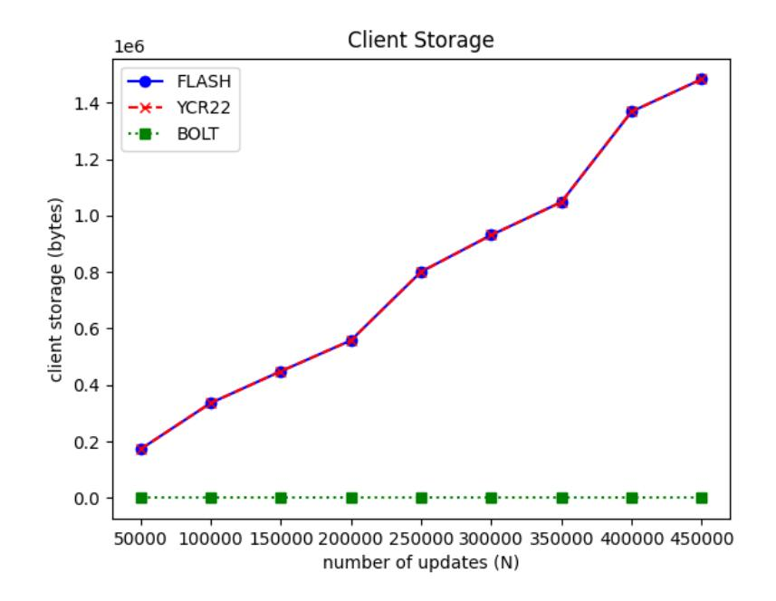
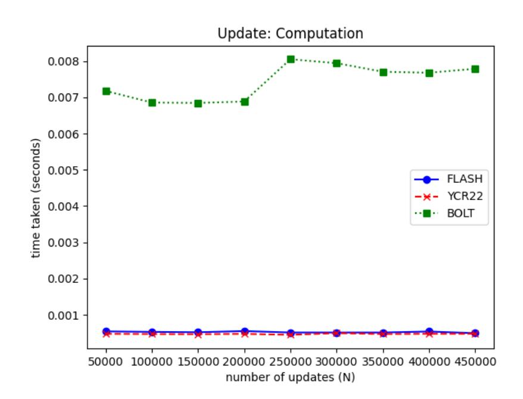
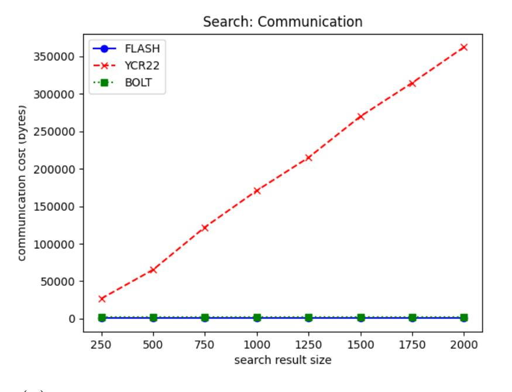
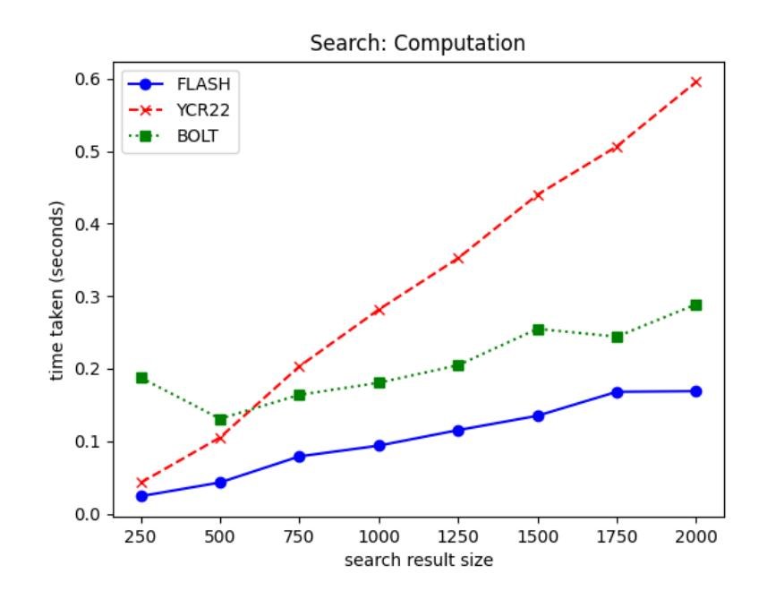

{0}------------------------------------------------

# Efficient Compilers for Verifiable Dynamic Searchable Symmetric Encryption

Chaya Ganesh<sup>1</sup> , Sikhar Patranabis<sup>2</sup> , and Raja Rakshit Varanasi<sup>∗</sup><sup>3</sup>

1 Indian Institute of Science, India , <chaya@iisc.ac.in> 2 IBM Research India , <sikhar.patranabis@ibm.com> <sup>3</sup>Stony Brook University, USA , <rvaranasi@cs.stonybrook.edu>

#### Abstract

We construct compilers to generically transform any dynamic Searchable Symmetric Encryption (DSSE) scheme that is secure against a semi-honest server into one that is secure against a malicious servers, thus yielding a Verifiable dynamic SSE (VDSSE). Our compilers achieve optimal overheads while preserving forward and backward privacy, which are the standard and widely accepted security notions for DSSE.

We focus on optimizing communication overheads and client storage requirements. Our first compiler FLASH incurs O(1) communication overhead between the client and the server, which is optimal, while incurring mild storage overhead at the client. Our second compiler BOLT incurs O(1) storage overhead at the client while incurring mild communication overhead. Towards this, we define a new authenticated data structure called a set commitment and we provide an efficient instantiation of this primitive.

We prototype implement our compilers and report on their performance over real-world databases. Our experiments validate that our compilers incur concretely low overheads on top of existing semi-honest DSSE schemes, and yield practically efficient VDSSE schemes that scale to very large databases.

<sup>∗</sup>Work done while at Indian Institute of Science

{1}------------------------------------------------

# Contents

| 1 | Introduction<br>3                                                         |    |  |  |  |  |  |
|---|---------------------------------------------------------------------------|----|--|--|--|--|--|
|   | 1.1<br>Our Contributions<br>                                              | 5  |  |  |  |  |  |
|   | 1.2<br>Overview of Techniques<br>                                         | 8  |  |  |  |  |  |
| 2 | Preliminaries<br>10                                                       |    |  |  |  |  |  |
|   | 2.1<br>Chosen Plaintext Attack Secure Encryption<br>                      | 11 |  |  |  |  |  |
|   | 2.2<br>Verifiable Hash Table (VHT)<br>                                    | 12 |  |  |  |  |  |
|   | 2.3<br>Verifiable Dynamic SSE<br>                                         | 13 |  |  |  |  |  |
|   | 2.4<br>Semi-Honest Security Definition for VDSSE<br>                      | 14 |  |  |  |  |  |
|   | 2.5<br>Malicious Security Definition for VDSSE<br>                        | 15 |  |  |  |  |  |
| 3 | Set Commitment                                                            | 17 |  |  |  |  |  |
|   | 3.1<br>Construction of Set Commitment<br>                                 | 19 |  |  |  |  |  |
| 4 | Our VDSSE Compilers                                                       | 24 |  |  |  |  |  |
|   | 4.1<br>FLASH<br>                                                          | 24 |  |  |  |  |  |
|   | 4.2<br>BOLT<br>                                                           | 25 |  |  |  |  |  |
| 5 | Experimental Evaluation<br>31                                             |    |  |  |  |  |  |
| A | Proof of Lemma<br>1<br>36                                                 |    |  |  |  |  |  |
| B | Compiler for End-to-end VDSSE                                             | 37 |  |  |  |  |  |
|   | B.1<br>Compiler for Verifying Document Retrieval<br>                      | 37 |  |  |  |  |  |
|   | B.2<br>End-to-end VDSSE with Document Retrieval<br>                       | 38 |  |  |  |  |  |
| C | FLASH: Deferred Details                                                   | 39 |  |  |  |  |  |
|   | C.1<br>Detailed Discussion on the leakage and Performance of<br>FLASH<br> | 39 |  |  |  |  |  |
|   | C.2<br>Proof of Theorem<br>2<br>                                          | 41 |  |  |  |  |  |
| D | BOLT: Deferred Details                                                    | 44 |  |  |  |  |  |
|   | D.1<br>Detailed Discussion on the Performance and Leakage of<br>BOLT<br>  | 44 |  |  |  |  |  |
|   | D.2<br>Proof of Theorem<br>3<br>                                          | 45 |  |  |  |  |  |

{2}------------------------------------------------

# <span id="page-2-0"></span>1 Introduction

Searchable Symmetric Encryption (SSE) [\[SWP00,](#page-35-1)[CGKO06,](#page-32-0)[CK10\]](#page-33-0) is a cryptographic primitive designed to facilitate searching over symmetrically encrypted data outsourced to an untrusted server. In contrast to cryptographic techniques such as fully homomorphic encryption (FHE) [\[Gen09,](#page-33-1)[BV11,](#page-32-1) [BGV14\]](#page-32-2) and oblivious RAM (ORAM) [\[GO96\]](#page-33-2) that offer strong security at the cost of substantial overheads, SSE prioritizes efficiency while allowing the server to learn some controlled amount of information (called "leakage" [\[IKK12,](#page-33-3)[CGPR15,](#page-32-3)[BKM20\]](#page-32-4)) during query execution.

The most commonly studied variant of SSE allows keyword search queries over symmetrically encrypted document collections [\[CGKO06,](#page-32-0)[CJJ](#page-33-4)+13,[CJJ](#page-33-5)+14], where each document is tagged with one or more keywords. Examples of leakage in such SSE schemes include the query equality pattern (which queries correspond to the same keyword), and the query access pattern (which documents in the encrypted document collection match a queried keyword). Throughout this paper, when we refer to SSE, we implicitly assume SSE for keyword searches over encrypted document collections.

Dynamic SSE. Some SSE proposals [\[CGKO06,](#page-32-0) [CJJ](#page-33-4)+13, [KM17,](#page-34-0) [KM19,](#page-34-1) [PPYY19\]](#page-34-2) only handle static databases (i.e., do not allow efficiently updating the encrypted database without re-initializing the entire system). Another long line of works [\[CM05,](#page-33-6) [KPR12,](#page-34-3) [KP13,](#page-34-4) [CJJ](#page-33-5)+14, [Bos16,](#page-32-5) [BMO17,](#page-32-6) [EKPE18,](#page-33-7)[GKM21\]](#page-33-8) has studied dynamic SSE (DSSE) schemes. These schemes allow efficient query executions and updates in tandem directly over the encrypted database. In order to address the additional privacy concerns that arise when supporting the update operations, two notions of security for DSSE have been proposed in these works - (i) forward privacy (requiring that adding a new document to a database should not reveal whether this document contains keywords from previous queries) and (ii) backward privacy (requiring that a keyword query reveals no information about documents containing this keyword that have already been deleted from the document collection). In light of recent works [\[BMO17,](#page-32-6)[CPPJ18,](#page-33-9)[SYL](#page-35-2)+18,[GKM21\]](#page-33-8) [\[PM21,](#page-34-5)[GPPW24\]](#page-33-10), any DSSE scheme should ideally satisfy both forward and backward privacy.

Verifiable SSE. Most SSE schemes [\[SWP00,](#page-35-1)[CGKO06,](#page-32-0)[CK10,](#page-33-0)[CJJ](#page-33-4)+13,[CJJ](#page-33-5)+14] [\[Bos16,](#page-32-5)[BMO17,](#page-32-6) [EKPE18,](#page-33-7) [CPPJ18,](#page-33-9) [SYL](#page-35-2)+18, [GKM21,](#page-33-8) [PM21,](#page-34-5) [GPPW24\]](#page-33-10) consider a semi-honest adversarial model, where the server, while not trusted fully, does not deviate arbitrarily from the protocol. In this model, the client is guaranteed to receive the correct query output, without the need for additional verification. However, such a security model may not be enough to capture certain stronger adversarial settings in practice (e.g., malicious insiders and/or malicious external attackers), where the server might actually deviate arbitrarily from the protocol. Such a setting demands additional verification of the output; consequently, SSE schemes that are secure against a malicious adversary are categorized under verifiable SSE (VSSE). While verifiable SSE has been studied for static databases [\[KO12,](#page-34-6) [CG12,](#page-32-7) [KO15,](#page-34-7) [TO15,](#page-35-3) [WCH](#page-35-4)+15, [OK17\]](#page-34-8), in this paper, we focus on verifiable and dynamic SSE (VDSSE) schemes.

VDSSE was formally introduced in [\[KO12,](#page-34-6)[KO15,](#page-34-7)[KSOY16\]](#page-34-9); however, the proposed schemes lack forward privacy. Subsequent works on VDSSE can be divided into two categories – works that propose standalone and specialized VDSSE schemes [\[CYG](#page-33-11)+15[,BFP16,](#page-32-8)[SR19,](#page-34-10)[ZWW](#page-35-5)+19[,AMZ21,](#page-32-9)[SR22\]](#page-34-11), and ones that propose generic compilers for upgrading existing semi-honest SSE schemes (without verifiability) into VDSSE schemes [\[Bos16,](#page-32-5)[BFP16,](#page-32-8)[YCR22\]](#page-35-6). Many schemes in the first category are

{3}------------------------------------------------

<span id="page-3-0"></span>Table 1: Comparison between VDSSE compilers. Here, λ denotes the security parameter, |W| denotes the total number of keywords in the document collection, N denotes the total number of updates, and u<sup>w</sup> denotes the number of updates involving a keyword w. Note that λ >> log N. All overheads are additive (over any DSSE scheme). We note that the compiler in [\[Bos16\]](#page-32-5) incurs prohibitively large client storage overhead of O(|W| · λ), while the compilers from [\[BFP16\]](#page-32-8) are not forward/backward private. [\[YCR22\]](#page-35-6) achieves reasonably mild client storage overhead and maintains forward and backward privacy, but incurs non-optimal communication overheads for searches. Our first compiler FLASH achieves optimal communication overhead, reasonably mild client storage overhead, and maintains forward and backward privacy. Our second compiler BOLT achieves optimal client storage overhead and maintains forward and backward privacy, while incurring mild (amortized) communication overheads.

| Scheme              | Additive Communication Overhead |          | Client Storage    | Forward Private | Backward Private |
|---------------------|---------------------------------|----------|-------------------|-----------------|------------------|
|                     | Update                          | Search   |                   |                 |                  |
| [Bos16]             | -                               | -        | O( W  ·<br>λ)     | Yes             | Yes (Type-II)    |
| [BFP16]-1           | O(1)                            | O(log W) | O(1)              | No              | No               |
| [BFP16]-2           | O(1)                            | O(1)     | O(1)              | No              | No               |
| [YCR22]             | O(1)                            | O(uw)    | O( W  ·<br>log N) | Yes             | Yes (Type-II)    |
| FLASH (Section 4.1) | O(1)                            | O(1)     | O( W  ·<br>log N) | Yes             | Yes (Type-II)    |
| BOLT (Section 4.2)  | O(log N) (amortized)            | O(log N) | O(1)              | Yes             | Yes (Type-II)    |

either not backward private [\[BFP16,](#page-32-8)[ZWW](#page-35-5)+19,[SR19\]](#page-34-10), or incur heavy computational overheads due to the usage of public-key cryptographic machinery [\[CYG](#page-33-11)+15, [SR19,](#page-34-10) [SR22\]](#page-34-11). Since the core aim of SSE is to achieve practically efficient query capabilities for resource-constrained clients while ensuring both forward and backward privacy, such solutions are not desirable for real-world applications and deployments. An alternative VDSSE scheme was proposed in [\[AMZ21\]](#page-32-9); however, this scheme is prone to malleability attacks due to faulty usage of authenticated encryption, thus allowing a malicious adversary to maul the result set into an incorrect one, while bypassing the verification checks at the client.

Compilers for VDSSE. In this paper, we focus on the compiler-based approach for realizing VDSSE. We note that there exist a plethora of semi-honest DSSE schemes with varying tradeoffs between efficiency and security (e.g., some DSSE schemes optimize search latency [\[CPPJ18,](#page-33-9)[SYL](#page-35-2)+18], others aim for optimal communication overheads [\[SSL](#page-35-7)+21], while still others target optimal storage overheads at the client [\[CPKD22\]](#page-33-12)), and it is not desirable to only have a handful of VDSSE counterparts to these schemes that can only plausibly achieve a subset of the aforementioned features. Hence, the compiler-based approach is more appealing, since it allows one to generically upgrade a large class of semi-honest DSSE schemes (typically with single-round search protocols) to VDSSE schemes, while preserving the desirable properties of the underlying DSSE scheme.

An ideal compiler for VDSSE is one that: (i) incurs little (concretely, O(1)) additional overheads in terms of communication between the client and the server, as well as in terms of storage required at the client (typically resource-constrained), and (ii) maintains the forward and backward privacy guarantees of the underlying semi-honest SSE scheme. Unfortunately, no existing VDSSE compiler achieves this (see Table [1](#page-3-0) for a summary of existing VDSSE compilers). The first VDSSE compilers due to [\[Bos16,](#page-32-5) [BFP16\]](#page-32-8) are either not forward and backward private, or incur prohibitively heavy client storage overheads at the client. Subsequently, [\[YCR22\]](#page-35-6) proposed a VDSSE compiler that retains both forward and backward privacy of the underlying semi-honest SSE scheme. However, it neither achieves optimal communication overheads, nor optimal storage overheads at the client. This leads to the following question: can we design a VDSSE compiler that achieves optimal overheads while preserving forward and backward privacy?

{4}------------------------------------------------

### <span id="page-4-0"></span>1.1 Our Contributions

We address the above question by proposing two new practically efficient forward and backward privacy-preserving VDSSE compilers. Our first compiler FLASH incurs O(1) communication overheads between the client and the server, which is optimal, while incurring mild storage overheads at the client. The second compiler BOLT incurs O(1) storage overheads at the client while incurring mild communication overheads, and is particularly suitable for resource-constrained client devices. To the best of our knowledge, these are the first practically efficient VDSSE compilers to approach the above notion of ideality in terms of overheads for communication or client storage. As a technical contribution of independent interest, we formalize the a new verifiable data structure called a set commitment, and propose a concrete, provably secure construction for the same based on XOR-MACs.

Set Commitments. In Section [3,](#page-16-0) we formally introduce a new verifiable data structure, which we call a set commitment. Informally, a set commitment allows a client to outsource the storage of a set to a server in a way that guarantees four properties simultaneously – succinctness (i.e., the commitment/digest corresponding to the set stored at the server is small), privacy/hiding (i.e., the set is hidden from the server), verifiability/binding (the server can open a commitment to a claimed set such that the client can efficiently verify that the claimed set and the original set are identical), and updatability (i.e,, the client can update the set in a manner that allows the server to update the corresponding commitment). Note that, if we do not require privacy, then one could use a (dynamic) accumulator. However, for our target application of efficient VDSSE, maintaining privacy is an essential requirement, and so a traditional (dynamic) accumulator does not suffice. We also present an efficient construction of set commitment based on XOR-MAC [\[BGR95\]](#page-32-10). The resulting construction is succinct (the commitment is constant-sized, and hence independent of the size of the set), computationally hiding/private, and computationally binding/verifiable. The proof of privacy is non-black-box and relies on the security of the PRF underlying the XOR-MAC scheme (note that the original XOR-MAC scheme does not care about privacy of the message). The proof of verifiability is more nuanced, and requires additional techniques beyond what follows from the unforgeabilty of the original XOR MAC scheme. We refer to Section [3](#page-16-0) for details.

FLASH. In Section [4.1,](#page-23-1) we present our first VDSSE compiler FLASH that lifts any forward and backward private semi-honest DSSE scheme into a forward and backward private maliciously secure VDSSE scheme, while incurring O(1) communication overheads for both updates and keyword searches. We formally establish its malicious security under a rigorously defined leakage profile. Technically, FLASH uses a set commitment, which allows the client to verify the final result set using an additional commitment/digest received from the server. The updatability property of the set commitment allows the server to update the commitment every time the client updates the database. The succinctness of the set commitment ensures that the additional communication overhead incurred by FLASH (due to the commitment sent by the server to the client) is O(1) and hence independent of the size of the result set, as desired. To prove malicious security, we rely on the hiding and binding properties of the set commitment scheme. While the hiding property ensures the client's privacy during updates and queries (i.e., the keywords and document identifiers underlying different updates and queries remain hidden), the binding property prevents a maliciously adversarial server from producing an incorrect result set that passes the verification check at the client (except with negligible probability). Since FLASH only uses a set commitment (which, 

{5}------------------------------------------------

as discussed above, can be realized from entirely symmetric-key primitives), the resulting VDSSE scheme incurs little practical overheads over and above the underlying semi-honest SSE scheme.

BOLT. While FLASH achieves optimal communication overheads, it incurs non-optimal (albeit, mild) storage overhead at the client. We propose a second VDSSE compiler BOLT that lifts any forward and backward private semi-honest DSSE scheme into a forward and backward private maliciously secure VDSSE scheme while incurring O(1) storage overhead at the client. We again formalize the leakage profile of this compiler, and present a proof of malicious security (see Section [4.2](#page-24-0) for details). At a high level, we achieve optimal client storage in BOLT by outsourcing the client's local storage to the server. Note that the client storage contains potentially sensitive information about the plaintext document collection (such as the frequency distribution of keywords), and cannot be outsourced in plaintext form. In order to hide such information while still allowing updates and searches, we use verifiable hash tables (defined formally in Section [2.2\)](#page-11-0) in addition to (nonce transferable) set commitments. This leads to slightly higher communication overhead for updates and searches, which we view as a trade-off for optimal client storage. BOLT is thus particularly suitable for practical scenarios where the client is constrained with respect to long-term memory storage.

Perfect vs Imperfect Correctness. Our proposed compilers preserve the perfect correctness of the underlying DSSE scheme. We leave it as an interesting and non-trivial open question to extend our compilers to support DSSE schemes with imperfect correctness (e.g., DSSE schemes that use probabilistic set-membership data structures such as Bloom filters [\[Blo70\]](#page-32-11)). The vast majority of DSSE schemes for single keyword search [\[BFP16,](#page-32-8) [BMO17,](#page-32-6) [CPPJ18\]](#page-33-9) [\[SYL](#page-35-2)+18, [SSL](#page-35-7)+21, [CPKD22\]](#page-33-12) achieve perfect correctness, and are hence covered by our compiler. The usage of probabilistic data structures is more prominent in (D)SSE schemes for richer query types such as conjunctive, disjunctive and more general Boolean queries [\[CGPR15,](#page-32-3)[CJJ](#page-33-5)+14,[KM17,](#page-34-0)[PM21\]](#page-34-5), which are beyond the scope of this work.

Backward Privacy. Our proposed compilers preserve Type-II backward privacy of the underlying DSSE scheme. As summarized in Table [1,](#page-3-0) this matches the backward privacy guarantees of known VDSSE compilers [\[Bos16,](#page-32-5) [YCR22\]](#page-35-6). We leave it as an interesting open question to design VDSSE compilers that preserve even stronger notions (e.g., Type-I) of backward privacy. We note that existing DSSE schemes with Type-I backward privacy typically follow one of two design approaches: (i) they either use ORAM-style techniques [\[BMO17,](#page-32-6) [CPPJ18\]](#page-33-9) to hide access pattern leakage, and incur logarithmic round complexity, as well as very large computational and communication overheads (see [\[GPP23\]](#page-33-13) for a detailed study), or (ii) they rely on non-cryptographic, hardware-based assumptions such as trusted execution environments [\[AKM19,](#page-32-12)[VLY](#page-35-8)+20], which are prone to well-studied vulnerabilities [\[LSG](#page-34-12)+18, [KHF](#page-34-13)+19]. In contrast, Type-II backward private DSSE schemes are typically more efficient while relying purely on cryptographic assumptions, and there are no known leakage-abuse attacks (to the best of our knowledge) that specifically exploit the additional leakage incurred by Type-II backward private schemes over their Type-I counterparts. For practical applications where practical efficiency is paramount, our compiler yields VDSSE schemes with desirable security and efficiency guarantees.

{6}------------------------------------------------

Leakage-Abuse Attacks. A recent work [\[XZX](#page-35-9)+23] shows that forward and backward private DSSE schemes could be vulnerable to leakage-abuse attacks that exploit query equality leakage for query reconstruction. Protecting DSSE schemes against such attacks is orthogonal to the goal of verifiability studied in this work. Our compilers carry forward any query equality leakage from the underlying DSSE scheme. We recognize the importance of preventing leakage-abuse attacks and leave it as an interesting open question to design compilers for leakage-resistant VDSSE.

Index-only vs End-to-End VDSSE. Some recent works [\[GPP23,](#page-33-13)[GPPW24\]](#page-33-10) differentiate between index-only SSE schemes (focusing purely on index retrieval, which is the most commonly used setting in the SSE literature) and end-to-end SSE schemes (which consider both index and document retrieval). For a simpler exposition of our core ideas, we restrict the presentation of FLASH and BOLT in the body of the paper to the index-only setting. We defer a detailed treatment of how our compilers can be extended to the end-to-end VDSSE setting (i.e., including document retrieval) to Appendix [B.](#page-36-0)

Implementation and Experimentation. We prototype implement our proposed compilers and experimentally validate their computational, communication, and (client) storage overheads over real-world databases. For comparability with previous research in SSE, we use the Enron email corpus[1](#page-6-0) for our experiments. We experimented with a range of subsets of this corpus to gauge performance for different database and keyword set sizes.

Choice of Baseline. Since our focus is on designing generic compilers for VDSSE, we believe that it is only fair to compare our proposed compilers FLASH and BOLT with the other existing VDSSE compilers [\[Bos16,](#page-32-5)[BFP16,](#page-32-8)[YCR22\]](#page-35-6) summarized in Table [1.](#page-3-0) Of these, the compiler of [\[Bos16\]](#page-32-5) incurs nearly 20× larger client-side storage compared to both [\[YCR22\]](#page-35-6) and FLASH (BOLT achieves even smaller client-side storage than [\[YCR22\]](#page-35-6) and FLASH), and does not scale realistically to large realworld databases. On the other hand, the compilers [\[BFP16\]](#page-32-8) are not forward/backward private, and hence provide weaker security guarantees than BOLT and FLASH. Since [\[YCR22\]](#page-35-6) proposed the only other VDSSE compiler that achieves reasonably mild client storage overhead and maintains forward and backward privacy, we only compare FLASH and BOLT with [\[YCR22\]](#page-35-6) in our experiments. Our experiments establish that the overheads incurred by our compiler are significantly smaller than or comparable to [\[YCR22\]](#page-35-6), and scale smoothly to provide verifiability of searches and updates over very large real-world databases.

Comparison with Standalone Schemes. We further note that other (standalone and specialized, non-compiler based) VDSSE schemes [\[CYG](#page-33-11)+15,[BFP16,](#page-32-8)[SR19,](#page-34-10)[ZWW](#page-35-5)+19[,AMZ21,](#page-32-9)[SR22\]](#page-34-11) are either not backward private [\[BFP16,](#page-32-8) [ZWW](#page-35-5)+19, [SR19\]](#page-34-10), or are practically inefficient due to the usage of public-key cryptographic machinery [\[CYG](#page-33-11)+15[,SR19,](#page-34-10)[SR22\]](#page-34-11). On the other hand, FLASH and BOLT preserve forward and backward privacy of the underlying DSSE scheme, and use purely symmetrickey cryptographic primitives. Hence, the VDSSE schemes obtained by instantiating FLASH and BOLT with efficient, symmetric-key crypto-based, forward and backward private DSSE schemes such as MITRA [\[CPPJ18\]](#page-33-9) are either significantly more efficient or offer stronger security as compared to standalone and specialized VDSSE schemes.

<span id="page-6-0"></span><sup>1</sup> <https://www.cs.cmu.edu/~enron/>

{7}------------------------------------------------

### <span id="page-7-0"></span>1.2 Overview of Techniques

Set Commitment. A set commitment is a new verifiable data structure that we introduce in this paper and use as a core building block for our VDSSE compilers. At a high level, a set commitment scheme allows a client to outsource the storage of a set to a server while retaining a small local state (ideally independent of the size of the set) such that: (i) the set remains private, i,e., the elements of the set are suitably randomized such that the plaintext set is hidden from the server, (ii) the server can create a succinct commitment (equivalently, a digest) corresponding to the state, (iii) this commitment can be updated by the server every time the client pushes an update to the set using an update token (the client also updates its local state appropriately), and (iv) the server can later open the set commitment to a claimed set that the client can verify efficiently with respect to its local state. We capture these properties formally in Section [3.](#page-16-0) In particular, succinctness and updatability are baked into the syntax and correctness requirements of a set commitment, and we additionally present security games for hiding and binding to capture the privacy and verifiability requirements. We believe that this is a contribution of independent interest, with potential applications beyond VDSSE.

Comparison with Other Verifiable Data Structures. To the best of our knowledge, no existing verifiable data structure captures all of the above requirements simultaneously. Note that a set commitment may be viewed as a dynamic accumulator that additionally provides privacy/hiding (in a traditional accumulator, the elements of the accumulated set are not hidden from the accumulator manager/server). If we did not care about privacy of the set, we could simply replace a set commitment with a dynamic accumulator, but privacy is crucial to our application (looking ahead, it crucially ensures that our VDSSE compilers preserve forward and backward privacy), and so dynamic accumulators do not suffice. Similarly, succinctness of the commitment and the client state are also important efficiency considerations that rule out trivial solutions. If we did not care about succinctness, the client could simply store the set locally instead of outsourcing it in the first place, or alternatively, have the server provide individual non-interactive zero-knowledge (NIZK) proofs pertaining to each update.

Construction from XOR-MAC. We then present a construction of set commitment from XOR-MACs [\[BGR95\]](#page-32-10). In its original embodiment, an XOR-MAC scheme allows succinct and incremental authentication of long messages consisting of several blocks. At a high level, we use the XOR-MAC framework to create verifiable commitments to a set (where the elements of the set are treated as message blocks, and the XOR-MAC itself acts as the commitment, which can be verified using the original verification mechanism of the XOR-MAC – see Section [3](#page-16-0) for details). While succinctness and updatability follow naturally from the succinctness and incremental nature of the underlying XOR-MAC scheme, proving hiding and binding are more involved. Note that the original XOR-MAC scheme only cares about message authentication and not message privacy, so we need to make non-black-box use of the XOR-MAC construction to additionally prove that updates from the client do not leak information about the underlying set to the server.

Our Compilers for VDSSE. We build upon set commitments to present two new compilers that lift any semi-honest DSSE scheme that is 1-roundtrip into a VDSSE scheme, while preserving the forward and backward privacy guarantees of the original scheme. The basic approach for upgrading a static semi-honest SSE scheme into a verifiable static SSE scheme is as follows: the 

{8}------------------------------------------------

client computes, at setup, a MAC of the result set corresponding to each keyword. The client could store each such MAC locally (this incurs λ bits of client storage per keyword), or encrypt and outsource them to the server along with the encrypted database generated by the semi-honest SSE scheme. The search protocol for a given keyword proceeds exactly as in the semi-honest SSE scheme, with the only addition being that the client now obtains the MAC (either from its local storage or from the server) and uses it to verify the search result. However, this idea does not extend to DSSE since it leaves open the possibility of replay attacks, wherein the server could simply replay stale MAC values corresponding to sets with deleted items. While this does not violate the unforgeability of the MAC, it trivially violates verifiability for the overall DSSE solution.

Using Set Commitments. In FLASH, we circumvent this issue by using set commitments. At a high level, the client outsources to the server a succinct commitment to the result set corresponding to each keyword using the set commitment scheme. In other words, in addition to the encrypted database pertaining to the semi-honest DSSE, the server also stores a succinct set commitment corresponding to each keyword. For each update operation, the client sends a (pseudorandom) update token to the server (in addition to updating the encrypted database as per the semi-honest DSSE), which the server uses to update the corresponding set commitment. The client also updates its own internal state in the process. During a search query, the client retrieves the result set from the server as per the semi-honest DSSE scheme, along with the set commitment. The client verifies that this result set is indeed a valid opening of the set commitment with respect to its current internal state. Note that immediately rules out replay attacks; the binding property of the set commitment ensures that the server cannot convince the client of the validity of an incorrect result set, since (except with negligible probability) this result set would not constitute a valid opening of the set commitment with respect to the client's updated internal state.

The above approach is fully black-box in the underlying semi-honest DSSE, and can hence be used in conjunction with any semi-honest DSSE. This makes FLASH a fully general-purpose compiler. The succinctness property of the set commitment scheme contributes to the succinct communication overheads for FLASH. When instantiated with the aforementioned XOR-MAC compiler, it results in practically efficient compiler that yields VDSSE schemes with little overheads over and above the original semi-honest DSSE.

Ensuring Forward and Backward Privacy. The above high-level explanation glosses over many important issues, the most crucial being that of ensuring forward and backward privacy. In particular, one needs to ensure that the updates to the commitment at the server do not allow it to correlate future updates with past searches, which would trivially violate forward privacy (in fact, the compiler from [\[BFP16\]](#page-32-8) suffers from a similar violation of forward privacy).

To circumvent this, we propose a novel approach of storing the commitment in a distributed manner across multiple pseudorandomly chosen addresses in a dictionary-like data structure, such that the server: (i) cannot correlate the address corresponding to a future update with any of the addresses used in prior searches, but (ii) can efficiently reconstruct the current state of the commitment by aggregating the various pseudorandomly located components during a given keyword search operation. This entails some additional storage at the client; for each keyword, it needs to store the number of update operations involving the keyword so far, but this is a mild requirement from a practical point of view; in fact, there are numerous semi-honest DSSE schemes which already incur such client storage [\[BMO17,](#page-32-6)[CPPJ18,](#page-33-9)[SYL](#page-35-2)+18]. For backward privacy, we rely on the hiding 

{9}------------------------------------------------

properties of the commitment scheme. See Section [4.1](#page-23-1) for the detailed construction and formal proofs of forward and backward privacy.

Optimizing Client Storage. For certain applications, it might be more crucial to optimize client storage as opposed to the communication overhead. For example, for practical scenarios where the client is an extremely resource-constrained in terms of long-term memory/storage capabilities, storing an entire database of keyword frequencies might be prohibitive. Moreover, if we would like to support the capability to query the encrypted document collection from multiple, such storage requirements on the client side could be cumbersome, as it entails synchronization and state transfer across such devices (see [\[CPKD22\]](#page-33-12) for a more detailed exposition). To address such requirements, we propose a second VDSSE compiler BOLT that lifts any forward and backward private semihonest DSSE scheme into a forward and backward private maliciously secure VDSSE scheme while incurring O(1) storage overhead at the client. In particular, BOLT removes the need to store update frequency information for each keyword at the client.

Note that the client storage contains potentially sensitive information about the plaintext document collection (such as the frequency distribution of various keywords). Also, access pattern leakage from this storage could lead to violations of forward and/or backward privacy, which is undesirable. To prevent such leakage, we adopt the approach of private lazy rebuilds, that has been used previously to design (semi-honest, non-verifiable) DSSE schemes with small client storage [\[CPKD22\]](#page-33-12), and show how to adapt it to the verifiable setting. Concretely, while [\[CPKD22\]](#page-33-12) uses hash tables, we use verifiable hash tables (VHTs) in conjunction with set commitments to ensure that the final result can be verified efficiently.

More clearly, unlike FLASH, we store updates in levels of static tables, with each table's size being a power of two and the levels arranged in ascending order of size. For each update, following the technique of [\[CPKD22\]](#page-33-12), the client retrieves all the levels until it finds an empty level. The client then builds the empty level using the retrieved updates and the current update, and sends it to the server. The client uses the rebuild number of the level during rebuilding, which serves as a unique value. This rebuild number can be derived from the total number of updates up to that point, thereby keeping the storage requirement constant. During a search query, the process is similar to [\[CPKD22\]](#page-33-12), but we use VHTs to ensure all values are returned, as the server could deviate from the protocol in our case, and set commitments for succinctness and its hiding property and binding property for preserving forward and backward privacy.

Similar to [\[CPKD22\]](#page-33-12), we incur slightly higher communication overheads for updates and searches. We view this as a reasonable tradeoff for optimal client storage, particularly in scenarios where the client is memory-constrained and cannot possibly afford long-term storage of update frequency information for the entire database.

# <span id="page-9-0"></span>2 Preliminaries

Notation. We write z \$←− Z to represent that an element z is sampled uniformly at random from a set/distribution Z. The output z of a deterministic algorithm Z is denoted by z = Z and the output z of a randomized algorithm Z is denoted by z ← Z. We refer to λ ∈ N as the security parameter, and denote by poly(λ) and negl(λ) any generic polynomial function and negligible function in λ, respectively. Unless specified explicitly, the symmetric keys are strings of λ bits, and the key generation algorithm uniformly samples a key in {0, 1} λ . We write PPT to mean probabilistic 

{10}------------------------------------------------

polynomial time algorithms. In a two-party protocol P execution between a client and a server, the notation P(x; y) means that x is the client's input and y is the server's input. We use "list" for an unordered array of elements where repetition of elements is allowed and "set" when repetitions are not allowed. They are represented using multi-set notation {} in algorithms.

We consider the database DB as a collection of n documents with unique identifiers id1, . . . , idn, each of which contains keywords from a given alphabet Λ. Let W denote the set of all keywords that appear in DB, |W| the number of distinct keywords, N the number of document/keyword pairs (i.e., N = |DB|), and DB(w) denote the set of documents that contain keyword w. We denote by DB<sup>i</sup> the database at timestamp i, and by DBi(w), the set of documents that contain keyword w at timestamp i.

Definition 1 (Pseudorandom Functions). Let F : {0, 1} <sup>∗</sup>×{0, 1} <sup>∗</sup> → {0, 1} ∗ be an efficient, lengthpreserving, keyed function. We say F is a pseudorandom function (PRF) if for all probabilistic polynomial-time distinguishers D, there exists a negligible function negl such that:

$$\Pr[D^{F_{\lambda}(K,\cdot)}(1^{\lambda}) = 1] - \Pr[D^{f_{\lambda}(\cdot)}(1^{\lambda}) = 1] \le \mathsf{negl}(\lambda)$$

where K ← {0, 1} λ is chosen uniformly at random and f<sup>λ</sup> is chosen uniformly at random from the set of functions mapping λ-bit strings to λ-bit strings.

We use a CPA secure encryption scheme. We define it and give the standard PRF-based construction below.

### <span id="page-10-0"></span>2.1 Chosen Plaintext Attack Secure Encryption

[Encryption - syntax] Given K is key space, M is message space, C is ciphertext space, an encryption scheme is a tuple of PPT algorithms (Gen, Enc, Dec) with Gen : K \$←− K, Enc : K ×M → C, and Dec : K × C → M.

Correctness. For every K and m, it holds that Dec(K, Enc(K, m)) = m.

Definition 2 (Chosen Plaintext Attack Security). A private-key encryption scheme Π = (Gen, Enc, Dec) has indistinguishable encryptions under a chosen plaintext attack (or is CPA secure) if for all PPT adversaries A there exists a negligible function negl such that

$$\Pr\left[\mathbf{PrivK}_{\mathcal{A},\Pi}^{\mathsf{CPA}}(\lambda) = 1\right] \le 1/2 + \mathsf{negl}(\lambda)$$

where the game PrivKCPA <sup>A</sup>,Π(λ) is

- 1. A random key K is generated by running Gen(1<sup>λ</sup> ).
- 2. The adversary A is given input 1 <sup>λ</sup> and oracle access to Enc(K, ·), and outputs a pair of messages m0, m<sup>1</sup> of the same length.
- 3. A random bit b ← {0, 1} is chosen, and then a ciphertext c ← Enc(K, mb) is computed and given to A. We call c the challenge ciphertext.
- 4. The adversary A continues to have oracle access to Enc(K, ·), and outputs a bit b ′ .
- 5. The output of the game is defined to be 1 if b ′ = b, and 0 otherwise. (In case PrivKCPA <sup>A</sup>,Π(λ) = 1, we say that A succeeded.)

{11}------------------------------------------------

PRF-based CPA Secure Encryption. If F is a PRF, then the construction below is an encryption scheme that has indistinguishable encryptions under a chosen plaintext attack.

- Gen(1<sup>λ</sup> ): On input 1<sup>λ</sup> , choose K ← {0, 1} <sup>λ</sup> uniformly at random and output it as the key.
- Enc(K, m): On input key K and a message m ∈ {0, 1} λ , choose r ← {0, 1} <sup>λ</sup> uniformly at random and output the ciphertext c = (r, FK(r) ⊕ m).
- Dec(K, c): On input key K and a ciphertext c = (r, s), output the plaintext message m = FK(r) ⊕ s.

### <span id="page-11-0"></span>2.2 Verifiable Hash Table (VHT)

A VHT is a data structure first introduced in [\[BFP16\]](#page-32-8). It serves as an abstraction that implements a regular hash table storing key-value pairs while additionally providing integrity guarantees. The setting involves two parties – a client and a server. Each query by the client is answered with a response together with a proof that the returned value is indeed the correct value for the queried key. Formally, a verifiable hash table (static) for values in set V is given by a tuple of algorithms θ = (Setup, Get, Verify):

- Setup(T, λ) takes as input a hash table T and outputs (K, σ, VHT) where K is a private key, VHT is the verifiable hash table (possibly including a public key), and σ the client's state. The output K and σ is given to the client while VHT is output to the server.
- Get(key;T,VHT) outputs the tuple (v, π) where v is the value associated with key in T, and π a proof.
- Verify(K, σ, key, v, π) checks the validity of tuple (v, π) from the Get call corresponding to key. It outputs accept or reject.

A VHT satisfies completeness and soundness as defined below.

Definition 3 (Completeness). A VHT is said to be complete if for any security parameter λ ∈ N, for every hash table T, for any key in the table, the following probability is negl(λ):

$$\Pr\left[\mathsf{Verify}(K,\sigma,\mathsf{key},v,\pi) = 0: \begin{array}{c} (K,\sigma,\mathsf{VHT}) \leftarrow \mathsf{Setup}(\lambda,\mathsf{T}) \\ (v,\pi) \leftarrow \mathsf{Get}(\mathsf{key};\mathsf{T},\mathsf{VHT}) \end{array}\right]$$

Definition 4 (Soundness). A VHT is said to be sound if for any security parameter λ ∈ N, for any PPT Adversary A, the following holds

$$\Pr\left[\mathbf{Snd}_{\mathcal{A}}^{\mathsf{VHT}}(\lambda) = 1\right] \le \mathsf{negl}(\lambda)$$

where the SndVHT <sup>A</sup> game is described in Figure [1.](#page-12-1)

{12}------------------------------------------------

#### SndVHT <sup>A</sup> (λ)

<span id="page-12-1"></span>Game between the challenger C and PPT Adversary A

Setup phase: C generates (K, σ, VHT) ← Setup(λ,T) where T is given by A and sends the VHT to A.

Challenge phase: A chooses a key and computes π ← Get(key;T, VHT) sends the (key, v′ , π′ ) to the C.

A outputs 1 if Verify(K, σ, key, v′ , π′ ) = 1 and T[key] ̸= v, and 0 otherwise.

Figure 1: Soundness Experiment for VHT

### <span id="page-12-0"></span>2.3 Verifiable Dynamic SSE

A Verifiable Dynamic Searchable Symmetric Encryption (VDSSE) scheme is given by the following: an algorithm Setup executed by the client and protocols Search and Update executed between a client and a server.

- Setup(1<sup>λ</sup> ): A PPT algorithm that takes the security parameter λ and outputs a tuple (sk,st, EDB), where sk is the client's secret key, st is the client's internal state, and EDB is the server's encrypted database.
- Update(sk,st, op, id, w; EDB): A client-server protocol where the client has an input secret key sk, state st, operation op ∈ {add, del}, keyword w and document identifier id, and server has as input an encrypted database EDB. At the end of the protocol, the server receives as output an updated encrypted database EDB′ ; and the client receives an updated state st′ (if successful) or ⊥ (indicating failure).
- Search(sk,st, w; EDB): A client-server protocol where client has an input secret key sk, state st, and a keyword w and server takes the encrypted database EDB as input. At the end of the protocol, the client outputs DB(w) (a set of identifiers matching the keyword) or ⊥ (indicating failure).

Finally, we make the implicit assumption that the client engages in an additional interaction with the server to retrieve or update the files associated with the queries. There is limited literature discussing the mechanism of this interaction as we discuss in Appendix [B.2.](#page-37-0) Since combining these two steps while maintaining privacy is orthogonal to verifiability, we assume that a separate server, which does not collude with the original one, handles this task. We divide this process into two protocols: DocumentUpdate and DocumentRetrieval.

- DocumentUpdate(sk,st, op, id, d; EDB): A client-server protocol where the client has an input secret key sk, state st, operation op ∈ {add, del}, new document d if op = add or d = ⊥ otherwise, and document identifier id, and server has as input an encrypted database EDB. At the end of the protocol, the server receives as output an updated encrypted database EDB′ ; and the client receives an updated state st′ (if successful) or ⊥ (indicating failure).
- DocumentRetrieval(sk,st, R; EDB): A client-server protocol where client has an input secret key sk, state st, and a set of identifiers R and server takes the encrypted database EDB as input. At the end of the protocol, the client outputs the set of documents matching the identifiers or ⊥ (indicating failure).

{13}------------------------------------------------

We only consider updates that add/remove the whole document. In addition, we pick a fresh identifier for every new document addition. We also assume that the client (honest) performs valid additions and deletions. Going ahead in the paper, we omit discussing the compiler for this interaction as we can use similar techniques to those for the main interaction. We present this compiler and provide an outline of our end-to-end VDSSE compiler in Appendix B.1 and B.2.

**Definition 5** (Correctness). A SSE is said to be correct if the server is honest, for every database DB and every query q, Search protocol outputs DB(q) except with negligible probability.

#### <span id="page-13-0"></span>2.4 Semi-Honest Security Definition for VDSSE

In the semi-honest setting, the server follows the protocol and therefore, no verifiability is expected from the SSE protocol. That is, the Update and Search protocols always succeed. The definition is as follows.

**Definition 6** (Semi-Honest Security). A SSE  $\Pi$  is said to be adaptively secure with respect to a leakage function  $\mathcal{L}$ , if for any security parameter  $\lambda \in \mathbb{N}$ , for any stateful PPT Adversary  $\mathcal{A}$  that issues query list  $\mathcal{Q}$  of  $poly(\lambda)$  length, there exists a stateful PPT Simulator  $\mathcal{S}(\mathcal{L})$  such that the following is  $poly(\lambda)$ :

$$\left| \Pr \left[ \mathbf{Real}_{\Pi, \mathcal{A}}^{\mathsf{SSE}}(\lambda, Q) = 1 \right] - \Pr \left[ \mathbf{Ideal}_{\mathcal{S}(\mathcal{L}), \mathcal{A}}^{\mathsf{SSE}}(\lambda, Q) = 1 \right] \right|$$

where

- Real<sup>SSE</sup><sub> $\Pi,A$ </sub>: denotes the output of the adversary A after interacting with the client following the protocol  $\Pi$ .
- Ideal<sup>SSE</sup><sub> $S(\mathcal{L}),A$ </sub>: denotes the output of the adversary A after interacting with the simulator S that takes the leakage function  $\mathcal{L}$  as input.

Furthermore, the adversary is restricted to not make queries to add redundant keywords to an existing identifier, and delete a keyword from an identifier that does not match it.

**Forward Privacy.** Informally, a DSSE scheme is said to satisfy forward privacy if the server cannot establish a correlation between a given update and the keywords that were searched in the past. In other words, during an update operation, the server's view should be oblivious to the specific keyword that triggered the update. We recall the formal definition from [Bos16, BMO17] below.

**Definition 7** (Forward Privacy). A DSSE that is adaptively secure with respect to a leakage profile  $\mathcal{L} = (\mathcal{L}^{\mathsf{Setup}}, \mathcal{L}^{\mathsf{Update}}, \mathcal{L}^{\mathsf{Search}})$ , is said to be adaptively forward private, if there exists a stateless function  $\mathcal{L}'$  such that for any triplet  $(\mathsf{op}, id, w)$ , we have

$$\mathcal{L}^{\mathsf{Update}}(w,id,\mathsf{op}) = \mathcal{L}'(\mathsf{op},id)$$

{14}------------------------------------------------

Backward Privacy. Informally, a DSSE scheme is said to satisfy backward privacy if the server knows no information about identifiers that were deleted prior to a given search query. Based on the level of leakage, prior works [\[BMO17,](#page-32-6) [CPPJ18\]](#page-33-9) consider three types of backward privacy: where Type I corresponds to the least amount of leakage, and Type III corresponds to the most. Concretely, consider a query list Q, where each entry is denoted as (t, w) for a search query and (t, op, w, id) for an update query. Here, t is the query timestamp, w is the keyword, op is the operation, and id is the identifier. We define three leakage functions to capture the three different levels of backward privacy.

• TimeDB(w): It's a function that returns timestamp/identifier pairs where keyword w have been added and not deleted later.

$$\mathsf{TimeDB}(w) = \{(t,id) \mid (t,\mathsf{add},w,id) \in \mathcal{Q} \\ \& \ (t',\mathsf{del},w,id) \not\in \mathcal{Q} \ \text{s.t.} \ t' > t\}$$

• Updates(w): It's a function that returns the timestamps of all update (add/del) operation of keyword w.

$$\mathsf{Updates}(w) = \{t \mid (t, \mathsf{op}, w, id) \in \mathcal{Q}\}\$$

• DelHist(w): It's a function that returns the insertion and deletion timestamp pairs of the keyword w in a file.

DelHist
$$(w) = \{(t_1, t_2) | \exists (t_1, \mathsf{add}, w, id) \}$$
  
&  $(t_2, \mathsf{del}, w, id) \in \mathcal{Q} \ \& \ t_1 < t_2 \}$ 

Definition 8 (Backward Privacy). A DSSE that is adaptively secure with respect to a leakage profile L = (L Setup ,L Update ,L Search) is said to be adaptively backward private,

- Type-I : if L Update(op, w, id) = L ′ (op) and L Search(w) = L ′′(TimeDB(w), |Updates(w)|).
- Type-II : if L Update(op, w, id) = L ′ (op, w) and L Search(w) = L ′′(TimeDB(w),Updates(w)).
- Type-III : if L Update(op, w, id) = L ′ (op) and L Search(w) = L ′′(TimeDB(w), DelHist(w)).

where L ′ and L ′′ are the stateless functions.

### <span id="page-14-0"></span>2.5 Malicious Security Definition for VDSSE

In this work, we consider scenarios where the server is malicious, and not just semi-honest. Informally, our requirement is that in any VDSSE protocol Π, a malicious server learns no information about the client's input or database, except for any permissible leakage denoted as L. We use the real/ideal paradigm to capture this requirement formally as also done in [\[ZWW](#page-35-5)+19].

Ideal Functionality. We begin by formally defining the ideal functionality F where this defines what each party is expected to learn at the end of the protocol, as described in Figure [2.](#page-15-0) Furthermore, we want the functionality to be reactive as it must keep track of the database, taking queries from the client and giving outputs to all the parties in the polynomial number of queries.

The Real/Ideal World Paradigm. The real and ideal worlds are as follows.

{15}------------------------------------------------

#### Ideal Functionality F(λ,L, Q)

<span id="page-15-0"></span>• Let the input of the client be Q, the list of queries of length poly(λ), where

```
Q = {q1, q2, ....qn} where n = poly(λ),
and each q is either an update or a search query
```

The honest client provides its input, query by query, to F.

• F computes the output for each query in the list by building the database in the background.

$$\mathsf{out}_i = \mathsf{DB}_{i-1}(q_i) \text{ if } q_i \text{ is a search query}$$
  
 $\mathsf{DB}_i = \mathsf{DB}_{i-1}(q_i) \text{ if } q_i \text{ is an update query}$   
 $\mathcal{L}_i = \mathcal{L}(q_1, q_2, ..., q_i)$ 

- F sends the leakage L<sup>i</sup> after each query q<sup>i</sup> to the S.
- If S sends "abort ⊥" to F, F sends the same to the client and terminate.
- Otherwise, F sends out<sup>i</sup> if it's the search query, to the client and continues to the next query qi+1in Q.

Figure 2: Ideal Functionality of VSSE

- In the real world, the client which is an honest party follows the specified protocol Π and interacts with the maliciously corrupt server that is controlled by an adversary A.
- In the ideal world, the client, and an adversary called the simulator (denoted by S) interact with the ideal functionality F, where the adversary controls the server.

Informally speaking, in the ideal world, the simulator S learns nothing except what the ideal functionality F allows it. We say that protocol Π securely emulates the ideal functionality F if no A can distinguish between the real and ideal worlds. We now formalize this real/ideal world paradigm as follows.

Real world. In the real world, the following participants engage in protocol Π.

- The client inputs a list of queries and honestly follows the protocol Π.
- The real world adversary A controls the server, interacts with the client, and eventually outputs a bit b ∈ {0, 1}.

Ideal world. In the ideal world, the following participants interact with the ideal functionality F.

- The client inputs a list of queries directly to the ideal functionality F.
- The ideal world simulator S receives the leakage L associated with the client's input from the F. Furthermore, S can send "abort (⊥)" at any point in the protocol (we only consider security with abort). S also interacts with A with the aim of making the interaction indistinguishable from the real world.
- The adversary A interacts with the simulator S and eventually outputs a bit b ∈ {0, 1}.

{16}------------------------------------------------

Furthermore, in both worlds, the adversary A is not allowed to issue queries that add redundant keywords to an existing identifier, or delete a keyword from an identifier that does not match it<sup>2</sup>.

For any VSSE protocol  $\Pi$ , any adversary  $\mathcal{A}$ , any simulator  $\mathcal{S}$ , define the following random variables:

- $\mathbf{Real}_{\Pi,\mathcal{A}}^{\mathsf{VSSE}}$ : denotes the output of the adversary  $\mathcal{A}$  after the execution of the real-world protocol  $\Pi$ .
- Ideal  $_{\mathcal{F},\mathcal{S},\mathcal{A}}^{\mathsf{VSSE}}$ : denotes the output of the adversary  $\mathcal{A}$  after interacting with the simulator  $\mathcal{S}$  in the ideal world.

<span id="page-16-2"></span>**Definition 9** (Malicious security). A VSSE protocol  $\Pi$  is said to be adaptively secure with respect to a leakage function  $\mathcal{L}$  against the malicious server, if it securely emulates the ideal functionality  $\mathcal{F}(\mathcal{L})$  if for any security parameter  $\lambda \in \mathbb{N}$ , for any PPT adversary  $\mathcal{A}$  that issues query list  $\mathcal{Q}$  of  $\mathsf{poly}(\lambda)$  length, there exists a stateful PPT simulator  $\mathcal{S}(\mathcal{L})$  such that

$$\left|\Pr\left[\mathbf{Real}_{\Pi,\mathcal{A}}^{\mathsf{VSSE}}(\lambda,\mathcal{Q}) = 1\right] - \Pr\left[\mathbf{Ideal}_{\mathcal{F}(\mathcal{L}),\mathcal{S}(\mathcal{L}),\mathcal{A}}^{\mathsf{VSSE}}(\lambda,\mathcal{Q}) = 1\right]\right| \leq \mathsf{negl}(\lambda)$$

Forward and Backward Privacy in the Malicious Setting. We note that the definitions of forward privacy and backward privacy in the malicious setting remains same as in the semi-honest setting. This is because the distinction is not in the power of the adversary but in the amount of leakage allowed by the protocol. Therefore, while our VDSSE definition is the same as the one in [ZWW<sup>+</sup>19], their construction does not achieve backward privacy, in contrast to our constructions. That is, our constructions are secure as per the same real/ideal definition, though the adversary in our real world is more powerful. This is captured by our ideal world simulator receiving strictly less leakage than the ideal world simulator of [ZWW<sup>+</sup>19].

### <span id="page-16-0"></span>3 Set Commitment

In this section, we define our new verifiable data structure, a set commitment (SC). At a high level, a set commitment allows a client to outsource storage of a set to a server in a succinct, private and verifiable way. That is, the digest corresponding to the set stored by the server is small and the set is hidden from the server. Additionally, it allows the client to update the set in a way that the server can update the commitment. Eventually, the server can verifiably open a commitment to a claimed set. A set commitment is an accumulator with an additional hiding property. In dynamic accumulators that allow the set to be updated, the elements of the set are not hidden from the accumulator manager (server, the party that computes the commitment). We say an update  $\mathsf{upd} = (\mathsf{e}_i, \mathsf{op}_i)$  is applied to a set S to mean an addition or a deletion operation performed as specified by  $\mathsf{upd}$ : element  $\mathsf{e}_i$  is added to S if  $\mathsf{op}_i = \mathsf{add}$ , and  $\mathsf{e}_i$  is removed from S if  $\mathsf{op}_i = \mathsf{delete}$ . We denote this updation by  $S' \leftarrow \mathsf{upd}(S)$ . When  $\mathsf{upd}$  is a list of updates,  $\mathsf{upd} = \{(\mathsf{e}_i, \mathsf{op}_i)\}$ , we abuse notation and write  $S' \leftarrow \mathsf{upd}(S)$  to mean each  $\mathsf{upd}_i$  in the list applied starting from S to obtain S'.

Note that operations such as adding an existing element and deleting a non-existent element are not supported by our definitions. This restriction is primarily due to the limitations of our

<span id="page-16-1"></span><sup>&</sup>lt;sup>2</sup>This assumption has been made in prior SSE schemes, most notably in [Bos16, BFP16, BMO17, CPPJ18].

{17}------------------------------------------------

candidate, sc-xor, for set commitment. Fortunately, this restriction is common in SSE, making our set commitment approach well-suited for SSE applications.

More formally, a set commitment for sets over  $\mathcal{V}$  is characterized by a tuple of algorithms  $\theta = (\mathsf{Setup}, \mathsf{TokenGen}, \mathsf{Commit}, \mathsf{Verify})$ :

- Setup(1 $^{\lambda}$ ) A PPT algorithm takes the security parameter  $\lambda$ , and outputs a secret key K.
- TokenGen $(K, r, \mathsf{upd})$  An algorithm that takes the secret key K, nonce r, and list of updates  $\mathsf{upd} = \{(\mathsf{e}_i, \mathsf{op}_i)\}$  where  $\mathsf{e}_i \in \mathcal{V}$  and  $\mathsf{op}_i$  is the operation which is either "add" or "delete". It outputs a token value  $\mathsf{tk}$  and nonce r.
- Commit( $tk_1, tk_2, ..., tk_n$ ) An algorithm that takes the list of update token values (tk) and outputs the set commitment s for the underlying set represented by those updates.
- Verify(K, R, r, s) An algorithm that takes the secret key K, set R, set commitment s, and list of nonces r. It outputs accept or reject.

In a typical set commitment protocol, the Setup, TokenGen, and Verify algorithms are executed by the client, while the Commit algorithm is executed by the server. This means that the client generates and sends tokens to the server, allowing the server to compute the commitment. The client then verifies the set when the server sends the set commitment.

A set commitment satisfies correctness, hiding, and binding, which are defined below.

**Definition 10** (Correctness). A set commitment scheme  $\theta$  is said to be correct if for any security parameter  $\lambda \in \mathbb{N}$ , for every valid list of update lists  $\mathsf{upd} = \{(\mathsf{upd}_i)_{i \in [u]}\}$ , the following is  $\mathsf{negl}(\lambda)$ :

$$\Pr \begin{bmatrix} \mathsf{Verify}(K,R,[r_i]_{i \in [u]},s) = 0: \\ K \leftarrow \theta.\mathsf{Setup}(\lambda) \\ (\mathsf{tk}_i,r_i) = \theta.\mathsf{TokenGen}(K,r_i,\mathsf{upd}_i) \\ \forall i \\ s = \theta.\mathsf{Commit}(\{(\mathsf{tk}_i)_{i \in [u]}\}) \end{bmatrix}$$

where  $R = S_u$  such that  $S_j \leftarrow \operatorname{upd}_j(S_{j-1})$ , for  $j \in [u]$ ,  $S_0 = \emptyset$ .

<span id="page-17-0"></span>**Definition 11** (**Hiding**). A set commitment scheme  $\theta$  is said to be hiding if for any security parameter  $\lambda \in \mathbb{N}$ , for any PPT Adversary A, the following holds

$$\Pr\left[\mathbf{Hid}_{\theta,\mathcal{A}}^{\mathsf{SC}}(\lambda) = 1\right] \leq 1/2 + \mathsf{negl}(\lambda)$$

where the  $\mathbf{Hid}_{\theta,\mathcal{A}}^{\mathsf{SC}}$  is as described in Figure 3.

<span id="page-17-1"></span>**Definition 12** (Binding). A set commitment scheme  $\theta$  satisfies binding if for any security parameter  $\lambda \in \mathbb{N}$ , for any PPT Adversary A, the following holds

$$\Pr\left[\mathbf{Bind}_{\theta,\mathcal{A}}^{\mathsf{SC}}(\lambda) = 1\right] \leq \mathsf{negl}(\lambda)$$

where the  $\mathbf{Bind}_{\theta,\mathcal{A}}^{\mathsf{SC}}$  game is as described in Figure 4.

{18}------------------------------------------------

#### HidSC θ,A(λ)

<span id="page-18-1"></span>Game between a challenger C and PPT Adversary A

Setup phase: C generates a key K ← θ.Setup(1<sup>λ</sup> ) and initiates a game with A.

Query phase: A make the update queries adaptively to C. For each query upd, C chooses a nonce r and computes (tk, r) = θ.TokenGen(K, r, upd) and sends them to A.

Challenge phase: A provides two updates upd<sup>0</sup> ,upd<sup>1</sup> that are not part of the query phase to C. C chooses a bit b \$←− {0, 1} and nonce r <sup>∗</sup> and computes (tk, r<sup>∗</sup> ) = θ.TokenGen(K, r<sup>∗</sup> , upd<sup>b</sup> ) and sends to A.

Guess phase: A outputs a guess b ′ .

A wins the game if b = b ′

Figure 3: Hiding Game for Set Commitment

#### BindSC θ,<sup>A</sup>(λ)

<span id="page-18-2"></span>Game between the challenger C and PPT Adversary A

Setup phase: C generates a key K ← θ.Setup(1<sup>λ</sup> ) and initiates a game with A

#### Query phase:

- A provides a list of update lists upd = {(upd<sup>i</sup> )i∈[u]} to C where u = poly(λ).
- If the list doesn't add an existing element or delete a non-existing element, C chooses a nonce r<sup>i</sup> for each update list upd<sup>i</sup> and computes (tk<sup>i</sup> , ri) = θ.TokenGen(K, upd<sup>i</sup> , ri), and sends {(tk<sup>i</sup> , ri)} to the A.
- C computes S<sup>j</sup> ← upd<sup>j</sup> (Sj−1), for j ∈ [u], S<sup>0</sup> = ∅ and sets R = Su.

Output phase: After the Query phase, A sends a set R′ , and s ′ to C. C outputs 1, if θ.Verify(K, R′ , r<sup>∗</sup> , s′ ) = 1, where r <sup>∗</sup> = {r1, r<sup>2</sup> . . . ru} and R′ ̸= R, and 0 otherwise.

Figure 4: Binding Game for Set Commitment

### <span id="page-18-0"></span>3.1 Construction of Set Commitment

In this section, we present a construction of set commitment, which we call sc-xor. It only relies on a PRF, and has linear verification and commitment complexity. Let B := {x|x ∈ {0, 1} <sup>m</sup>} represent the set of bit vectors of length m and let R ⊆ B. Let F<sup>K</sup> : {0, 1} <sup>m</sup>+1 → {0, 1} <sup>L</sup> be randomly selected from a PRF family where L is poly(λ). We now define sc-xor below.

- Setup(1<sup>λ</sup> ): takes the security parameter λ and outputs a random key K for PRF F.
- TokenGen(K, r, upd): takes key K, nonce r , a list of updates upd = {(e<sup>i</sup> , op<sup>i</sup> )} and computes a token tk as below, where F is the PRF.

$$\mathsf{tk} = F_K(0,r) \bigoplus_{(\mathsf{e},\mathsf{op}) \in \mathsf{upd}} F_K(1,\mathsf{e})$$

and outputs (tk, r). We note that op<sup>i</sup> is either "add" or "delete". 

{19}------------------------------------------------

• Commit( $tk_1, tk_2, ..., tk_n$ ): takes the tokens and outputs the set commitment.

$$s = \bigoplus_{i=1}^{n} \mathsf{tk}_{i}$$

• Verify $(K, R, r^*, s)$ : takes a key, a purported set R, a list of nonces  $r^* = \{r_1, \ldots, r_u\}$  (for some  $u = \mathsf{poly}(\lambda)$ ), a set commitment value s, and outputs accept/reject. It accepts if:

$$s = \bigoplus_{r_i \in r^*} F_K(0, r_i) \bigoplus_{b \in R} F_K(1, b)$$

<span id="page-19-0"></span>**Theorem 1** (**Hiding** and **Binding**). Assuming F is a PRF, the scheme sc-xor satisfies Hiding and Binding as defined in Definitions 11 and 12.

*Proof.* Hiding. Let  $\mathcal{A}$  be a probabilistic poly-time adversary such that

$$\Pr\left[\mathbf{Hid}^{\mathsf{SC}}_{\mathcal{A},\mathsf{sc\text{-}xor}}(\lambda) = 1\right] > 1/2 + \mathsf{negl}(\lambda)$$

We use A to construct a distinguisher D such that

$$\Pr[D^{F_{\lambda}(K,\cdot)}(1^{\lambda})=1] - \Pr[D^{f_{\lambda}(\cdot)}(1^{\lambda})=1] > \mathsf{negl}(\lambda),$$

where  $k \leftarrow K_{\lambda}$  is a uniformly randomly sampled key for the PRF family  $F_{\lambda}$ . The construction of the distinguisher D is as in Figure 5.

Let the view of the adversary  $\mathcal{A}$  be denoted by  $V_{\mathcal{A}}$ . Now, we observe the following.

• Suppose that the distinguisher D has access to the real PRF oracle, i.e.,  $\mathcal{O}(\cdot) \equiv F_{\lambda}(k, \cdot)$ . In this case, the view of the adversary  $\mathcal{A}$  is exactly as in the real hiding game for the protocol sc-xor. In other words, we have

$$V_{\mathcal{A}} \equiv V_{\mathbf{Hid}_{\mathcal{A},\mathsf{sc}\mathsf{-}\mathsf{xor}}^{\mathsf{SC}}}.$$

• Suppose that the distinguisher D has access to the random function oracle, i.e.,  $\mathcal{O}(\cdot) \equiv f_{\lambda}(\cdot)$ . In this case, the view of the adversary  $\mathcal{A}$  is as in the hiding game for the protocol  $\Pi$ , except that the PRF  $F(k,\cdot)$  is replaced by a uniformly random function  $f_{\lambda}(\cdot)$ . We refer to this game as  $\mathbf{Hid}_{\mathcal{A},sc\text{-xor}'}^{\mathsf{SC}}$ . Hence, we have

$$V_{\mathcal{A}} \equiv V_{\mathbf{Hid}^{\mathsf{SC}}_{\mathcal{A},\mathsf{sc-xor'}}}.$$

Observe that in the game  $\mathbf{Hid}_{\mathcal{A},sc\text{-xor}'}^{\mathsf{SC}}$ , the adversary  $\mathcal{A}$ 's view is statistically independent of the choice bit b, since  $f(0||r^*)$  essentially acts as a computational one-time pad in the challenge response. More specifically,  $\mathcal{A}$  learns nothing about  $f(0||r^*)$  cause f(.) is a truly random function and the D picks the distinct nonce  $r^*$ , and therefore,  $r^*$  is not used in the query phase. This means, from the  $\mathcal{A}$  perspective,  $f(0||r^*)$  is XORed with  $\bigoplus_{j\in[1,n_b]}x_{b,j}^*$ , where b is uniformly chosen. So there is no statistical dependence between  $\mathcal{A}$ 's view and the choice bit b.

{20}------------------------------------------------

#### The Distinguisher D

<span id="page-20-0"></span>We assume that in the PRF game, the distinguisher D is given as input  $1^{\lambda}$ , and that D has access to an oracle  $\mathcal{O}(\cdot)$  which is either  $F_{\lambda}(k,\cdot)$  or  $f_{\lambda}(\cdot)$ .

- 1. Query Phase: Suppose that the adversary  $\mathcal{A}$  issues an update query of the form  $upd_i = \{(e_{i,j}, op_{i,j})_{j \in [n_i]}\}$ . The distinguisher D does the following:
  - New distinct nonce  $r_i \leftarrow \{0,1\}^{\lambda}$ .
  - Query and obtain  $x_{i,j} = \mathcal{O}(1||\mathbf{e}_{i,j})$  for each  $j \in [1, n_i]$ .
  - Query and obtain  $y_i = \mathcal{O}(0||r_i)$
  - Compute  $\mathsf{tk}_i = y_i \bigoplus_{j \in [1, n_i]} x_{i,j}$ .

Finally, D outputs  $\{(r_i, \mathsf{tk}_i)\}$  as the query response to  $\mathcal{A}$ .

- 2. Challenge Phase: Suppose  $\mathcal{A}$  outputs  $(\mathsf{upd}_0, \mathsf{upd}_1)$  as its challenge query, where for each  $b \in \{0, 1\}$ , we have  $\mathsf{upd}_b = \{(\mathsf{e}_{b,j}^*, \mathsf{op}_{b,j}^*)_{j \in [n_b]}\}$ . D does the following:
  - Uniformly sample a bit  $b \leftarrow \{0, 1\}$ .
  - New unique  $r^* \leftarrow \{0,1\}^{\lambda}$ .
  - Query and obtain  $x_{b,j}^* = \mathcal{O}(1||\mathbf{e}_{b,j}^*)$  for each  $j \in [n_b]$ .
  - Query and obtain  $y^* = \mathcal{O}(0||r^*)$
  - Compute  $\mathsf{tk}^* = y^* \bigoplus_{j \in [1, n_b]} x_{b,j}^*$ .

Finally, D outputs  $(r^*, \mathsf{tk}^*)$  as the challenge response to  $\mathcal{A}$ .

- 3. **Output Phase:** Eventually, the adversary  $\mathcal{A}$  outputs a bit  $b' \in \{0,1\}$ . The distinguisher D now does the following:
  - If b = b', the distinguisher D outputs 1.
  - Otherwise, D outputs 0.

Figure 5: The distinguisher D in the proof of hiding security for our set commitment construction

So, we have

$$\Pr\left[D^{F_{\lambda}(K,\cdot)}(\lambda) = 1\right] = \Pr\left[b' = b|V_{\mathcal{A}} \equiv V_{\mathbf{Hid}_{\mathcal{A},\mathsf{sc}^{-}\mathsf{xor}}}\right] > 1/2 + \mathsf{negl}(\lambda))$$

which follows from our assumption above that the adversary A successfully wins the real hiding game.

Similarly, we have

$$\Pr\left[D^{f_{\lambda}(\cdot)}(\lambda) = 1\right] = \Pr\left[b' = b|V_{\mathcal{A}} \equiv V_{\mathbf{Hid}_{\mathcal{A}, \mathsf{sc}\text{-}\mathsf{xor'}}}\right]$$

$$\leq 1/2 + \mathsf{negl}(\lambda)$$

which follows from the fact that in the game  $\mathbf{Hid}_{\mathcal{A},\mathsf{sc-xor'}}^{\mathsf{SC}}$ , the adversary  $\mathcal{A}$ 's view is statistically independent of the choice bit b, as discussed above.

{21}------------------------------------------------

Therefore, we have

$$\Pr[D^{F_{\lambda}(K,\cdot)}(1^{\lambda}) = 1] - \Pr[D^{f_{\lambda}(\cdot)}(1^{\lambda}) = 1] > \mathsf{negl}(\lambda).$$

**Binding.** In the Binding game, given the knowledge of u tuples  $\{\mathsf{upd}_i, r_i, \mathsf{tk}_i\}_{i \in [u]}$ , we aim to demonstrate that the probability of the adversary finding a set R' and s' such that  $\mathsf{Verify}(K, R', s', r^*) = 1$ , where  $r^* = \{r_1, r_2, \ldots, r_u\}$  and  $R' \neq \mathsf{upd}(\emptyset)$ , is negligible. That is, the following equation being satisfied is negligible.

$$\bigoplus_{a \in r^*} F_K(0, a) \bigoplus_{b \in R'} F_K(1, b) = s'$$

First, we prove binding for sc-xor' = (Setup', TokenGen', Commit', Verify'), which is a scheme that is identical to sc-xor except that the F is a truly random function instead of a PRF.

Let F be a family of matrices with  $2^{m+1}$  rows, L columns, and entries in  $\{0,1\}$ . Let  $F_K$  be a random matrix in F. Notice that  $F_K$  is the K-th matrix in F. We assume that this matrix, or equivalently its label K, is secret and only accessible by the client and the server. The family of matrices F from which  $F_K$  is selected is publicly known.

We now introduce some notation that we use in the proof. For a list G, let m(G, b) denote the number of times  $b \in G$  is in G. Let v(X, M) be the vector of length  $2^{m+1}$ , where  $X = \{x_i\}$ ,  $x_i \in \{0,1\}^m$ , and is defined as follows.

If M is a set  $R = \{x_i\}, x_i \in \{0, 1\}^m$ 

$$v(X,R)_{(0,b)} = 1$$
 if and only if  $b \in X$   
 $v(X,R)_{(1,b)} = 1$  if and only if  $b \in R$ 

Likewise, if M is an update list  $\mathsf{upd} = \{(\mathsf{e}, \mathsf{op})\}_i$ , where  $\mathsf{e} \in \{0, 1\}^m$  and  $\mathsf{op} \in \{\mathsf{add}, \mathsf{del}\}$ 

$$v(X,\mathsf{upd})_{(0,b)}=1$$
 if and only if  $b\in X$  
$$v(X,\mathsf{upd})_{(1,b)}=m(\mathsf{upd},b) \text{ if and only if } (b,\mathsf{op})\in\mathsf{upd}$$

As adversary learns u tuples  $\{\mathsf{upd}_i, r_i, \mathsf{tk}_i\}$ , it implies that it learns u vectors  $v(X_i, \mathsf{upd}_i)$  together with the corresponding  $v(X_i, \mathsf{upd}_i)F_K \mod 2 = \mathsf{tk}_i$ , where each  $X_i$  is a singleton,  $X_i := r_i$ . Let A be the  $u \times 2^{m+1}$  matrix with rows  $v(X_i, \mathsf{upd}_i)$ . Then the matrix with rows  $\mathsf{tk}_i$  is equal to  $AF_K$ . Let us call this matrix as  $D(=AF_K)$ , whose size is  $u \times L$ . Let  $A' = A \mod 2$ . So, we have

$$AF_K \mod 2 = A'F_K \mod 2 = D$$

<span id="page-21-0"></span>Claim 1. The  $r_i$ 's (nonces) corresponding to matrix A are distinct by definition.

Since all  $r_i$ 's are different, it also means A' is a full rank matrix. Let  $\mathcal{A}$ 's output in the binding game be (R', s') such that  $s' = v(X^*, R')F_K \mod 2$  where  $X^* = \bigcup_{i=1}^u X_i = r^*$  and  $R' \neq \mathsf{upd}(\emptyset)$ . We add this vector  $v(X^*, R')$  to the end of A' and call it B, whose size is  $u + 1 \times 2^{m+1}$ . Similarly, we add s' to the end of D and call it  $E(=BF_K)$ , whose size is  $u + 1 \times L$  matrix.

$$D = \begin{bmatrix} \mathsf{tk}_1 \\ \vdots \\ \mathsf{tk}_u \end{bmatrix}, E = \begin{bmatrix} \mathsf{tk}_1 \\ \vdots \\ \mathsf{tk}_u \\ s' \end{bmatrix}$$

{22}------------------------------------------------

#### <span id="page-22-1"></span>Claim 2. Matrix B has full rank.

*Proof.* Given  $X^* = \{r_1, r_2, ... r_u\}$  and all  $r_i$ 's are distinct. Add rows 1, ..., u to row u + 1. This transforms the left half of row u + 1 into an entirely 0 vector. Now, since R' is assumed to be different from  $R(= \mathsf{upd}(\emptyset))$ , the right half of row u + 1 must have 1 in at least one of the columns. Let us denote this column by  $\beta$ .

Now, any 1's in rows  $1, \ldots, u$  of column  $\beta$  can be zeroed out by adding column p in the left half of the matrix to column  $\beta$  for any  $i \in \{1, \ldots, u\}$  such that B[i, p] = 1. With these operations, the column  $\beta$  now contains all 0s except in the row u + 1.

As a result, from the  $u + 1 \times 2^{m+1}$  matrix, we can identify a a  $u + 1 \times u + 1$  sub-matrix that is the identity matrix, thus concluding that B has full rank.

We now state a lemma from [BGR95] (for the sake of completeness, we provide the proof of the lemma in Appendix A).

<span id="page-22-0"></span>**Lemma 1.** [BGR95] For a full rank matrix B, the probability that  $BF_K \mod 2 = E$  and  $A'F_K \mod 2 = D$  is  $1/2^L$ .

From Claims 1, 2 and Lemma 1,  $\mathcal{A}$  can forge with probability  $1/2^L$ 

$$\Pr\left[\mathbf{Bind}^{\mathsf{SC}}_{\mathcal{A},\mathsf{sc-xor'}}(\lambda) = 1\right] \leq 1/2^L = \mathsf{negl}(\lambda)$$

Assuming F is a PRF, sc-xor is binding. This is because, suppose there exists a PPT algorithm B that can win  $\mathbf{Bind}_{\mathcal{A},\mathsf{sc-xor}}^{\mathsf{SC}}$  game. Similar to the distinguisher D in the hiding proof, B can be used to design a PPT adversary B' (using the above  $\mathbf{Bind}_{\mathcal{A},\mathsf{sc-xor}'}^{\mathsf{SC}}$  result) that can distinguish a set of PRF evaluations of the form  $F_K(\cdot)$  from a set of function evaluations of the form  $f(\cdot)$ , where f is a truly random function, contradicting PRF security. Hence,

$$\Pr\left[\mathbf{Bind}_{\mathcal{A},\mathsf{sc\text{-}xor}}^{\mathsf{SC}}(\lambda) = 1\right] \leq \mathsf{negl}(\lambda)$$

Remark. We note that sc-xor is reminiscent of XOR MAC [BGR95], an incremental MAC for long messages interpreted as a collection of blocks (also a special case of [CDvD+03]), where incrementality means that the MAC can be updated based on previous values without having to recompute. sc-xor satisfies an additional *hiding* property whereas the XOR MAC provides only authentication and no hiding. Moreover, the binding of sc-xor is stronger than the unforgeability of the XOR MAC. In particular, binding does not follow from unforgeability in a straightforward way (we refer to the proof of binding as seen in the proof of Theorem 1).

Remark. By the assumption that adding an existing element and deleting a non-existent element are unsupported operations, the addition and deletion in the XOR MAC effectively cancel each other out and do not require the use of  $op_i$ . The nonce r in this case serves as a unique identifier for the update, rather than a simple counter as used in [BGR95].

{23}------------------------------------------------

<span id="page-23-2"></span>• Run Π.Setup(λ)

#### Client

- 1. Pick a uniformly random key K<sup>1</sup> for the PRF F
- 2. Set K<sup>2</sup> ← SC.Setup(λ)
- 3. Initialize T and UpdateCnt to empty maps
- 4. Send T to the server

Figure 6: Setup protocol in FLASH

# <span id="page-23-0"></span>4 Our VDSSE Compilers

In this section, we present our proposed VDSSE compilers FLASH and BOLT. Throughout, we assume a semi-honest DSSE scheme with single-round search queries satisfying forward and backward privacy. We restrict the presentation here to the index-only setting. For a detailed treatment of how our compilers can be extended to the end-to-end VDSSE setting, see Appendix [B.](#page-36-0)

### <span id="page-23-1"></span>4.1 FLASH

We first describe our VDSSE compiler FLASH. Let be Π be an underlying SSE protocol, F : {0, 1} <sup>λ</sup> → {0, 1} <sup>λ</sup> be a PRF, H be a hash function modeled as a Random Oracle (RO), SC = (SC.Setup, SC.TokenGen, SC.Commit, SC.Verify) be a set commitment scheme, T and UpdateCnt be dictionaries that store key-value pairs, and ALLONE be a constant binary integer of length λ where every bit is 1. The Setup, Update, Search algorithms of the compiled VDSSE are given in Figures [6,](#page-23-2) [7,](#page-24-2) [8.](#page-25-0) We now discuss the performance of this protocol where sc-xor is the set commitment instantiation. We can denote skFLASH = (K1, K2), stFLASH = UpdateCnt, and EDBFLASH = T.

Server Storage. The server stores the dictionary T, initially set to empty during the setup process. As N updates occur, the client's storage expands in proportion to O(N), since each update adds an entry (addr, val) to T. In simpler terms, the server's storage requirement grows linearly with the number of update queries.

Client Storage. The client locally maintains UpdateCnt, initially set to empty during the setup process. As N updates occur, the client's storage requirement is O(|W| · log N), where |W| denotes the size of the keyword dictionary.

Note that, in practical terms, this overhead is substantially lower compared to the naive approach that involves storing digests for every keyword. In the latter case, client storage would be proportional to O(|W|·|δ|), where |δ| represents the size of the digest, typically set at 128 bits. This storage overhead is reached only after 2<sup>128</sup> updates in our protocol. Therefore, in practical settings, our protocol proves to be more efficient, offering a notable reduction in client storage requirements. We refer to Appendix [C.1](#page-38-1) for a detailed discussion on the performance of FLASH.

Leakage. The leakage of FLASH (in addition to the leakage of the underlying DSSE scheme) is

$$\mathcal{L} = (\mathcal{L}^{\mathsf{Setup}}, \mathcal{L}^{\mathsf{Update}}, \mathcal{L}^{\mathsf{Search}}) = (\bot, \bot, (\mathsf{Updates}(w), \mathsf{DB}(w)))$$

Observe that FLASH does not incur any additional leakage beyond what is allowed by the standard notions of forward and Type-II backward privacy. We refer to Appendix [C.1](#page-38-1) for a detailed discussion

{24}------------------------------------------------

```
• Run Π.Update(skΠ,stΠ, op, id, w, EDBΠ)
Client
   1. If UpdateCnt(w) is NULL then set UpdateCnt(w) = 0
   2. Set UpdateCnt(w) = UpdateCnt(w) + 1
   3. Set count = UpdateCnt(w)
   4. Set kw = F(K1, w)
   5. Set rw,count = F(K1, w||count)
   6. Set addr = H(kw, 0||rw,count)
   7. If count > 1, Set e = H(kw, 1||rw,count) ⊕ rw,count−1
   8. Else, Set e = H(kw, 1||rw,count) ⊕ ALLONE
   9. tk, = SC.TokenGen(K2, w||count, {(id, op)})
  10. Set val = tk, e
  11. Send (addr, val) to the server
Server
   1. Set T[addr] = val
```

Figure 7: Update protocol in FLASH

on the leakage of FLASH.

<span id="page-24-1"></span>Theorem 2. Assuming that H is modeled as a random oracle, SC is a secure set commitment scheme, Π is 1-round and adaptively secure semi-honest DSSE with respect to leakage function LΠ, then, for any query list Q, of size poly(λ), issued by the adversary, protocol FLASH is adaptively secure with respect to the leakage function LFLASH = L ∪ L<sup>Π</sup> against a malicious server as per Definition [9.](#page-16-2)

The proof of Theorem [2](#page-24-1) appears in Appendix [C.2.](#page-40-0)

### <span id="page-24-0"></span>4.2 BOLT

We now describe our second VDSSE compiler BOLT.

Nonce Transferability. For this construction, we rely on an additional property of the set commitment scheme, called nonce transferability, that says the following: given a token tk and associated nonce (r,tk) that is the purported output of TokenGen, given the corresponding key K, allows one to compute a fresh token for the same underlying update upd with any chosen nonce r ′ . That is, a set commitment scheme SC is nonce tranferable if there exists a PPT algorithm SC.ReNon such that, for every K ← Setup(1<sup>λ</sup> ), every update list upd, every pair of nonces (r, r′ ), and every token tk ← SC.TokenGen(K, r, upd), we have tk′ = tk′′, where

$$(r',\mathsf{tk'}) = \mathsf{SC}.\mathsf{ReNon}(K,(r,\mathsf{tk}),r')$$

{25}------------------------------------------------

<span id="page-25-0"></span>• Run Π.Search(skΠ,stΠ, w, EDBΠ) Client gets the result set R.

#### Client

- 1. Set count = UpdateCnt(w)
- 2. If count is not NULL, Send k<sup>w</sup> = F(K1, w), rw,count = F(K1, w||count) to the server

#### Server

- 1. Set valueList to an empty list.
- 2. Set s = rw,count
- 3. While s is not ALLONE:
  - (a) tk, e = T[H(kw, 0||s)]
  - (b) valueList = valueList ∪ {tk}
  - (c) s = e ⊕ H(kw, 1||s)
- 4. Send proof = SC.Commit(valueList) to the client

#### Client

- 1. Set α = {(w||i)i∈[1,count]}
- 2. If SC.Verify(K2, R, α, proof) = 1, return R
- 3. Else return ⊥

Figure 8: Search protocol in FLASH

$$(r',\mathsf{tk''}) = \mathsf{SC}.\mathsf{TokenGen}(K,r',\mathsf{upd})$$

We note that XMAC-based set commitment is nonce transferable and its ReNon algorithm is as follows: Given K,(r,tk), XMAC.ReNon samples r ′ , computes tk′ = FK(0||r) ⊕ FK(0||r ′ ) ⊕ tk, and outputs (r ′ ,tk′ ).

VHT from Set Commitment. To construct BOLT, we rely on a VHT constructed using a set commitment, summarized in Figure [9.](#page-26-0) The basic idea revolves around sorting the entries of the table based on their keys and storing the corresponding values alongside the update tokens with the (key, value) pair as the update and the position as the randomness. When queried for an existing entry/entries in the table, the protocol sends the corresponding update token or set commitment of update tokens for multiple entries, along with their corresponding values. In the case where the queried key is not present in the table, a binary search is performed over the keys to find the neighboring keys that are part of the table. The neighboring entries along with set commitment of two update tokens are sent. Verification involves checking the validity of the set commitment. The soundness of the scheme follows from the binding of the set commitment. This protocol uses additional algorithms AggMem and VerAggMem to aggregate membership proofs and verify aggregate proofs, respectively.

Description of BOLT. The Setup, Update, Search algorithms are given in Figures [10,](#page-27-0) [11,](#page-28-1) [12.](#page-29-0) Here, Π is the underlying (semi-honest secure) DSSE protocol, F is a PRF, H is a hash function

{26}------------------------------------------------

```
• Setup(T, λ):
     – Initialize VHT to an empty map
     – Sort T based on the keys
     – Set K ← SC.Setup(λ)
     – Set i = 1
     – For each (key, v) ∈ T in ascending order:
          ∗ Compute tk, i =
             SC.TokenGen(K, i, [(key||v, add)])
          ∗ VHT = VHT ∪ {(key,(v, i,tk))}
          ∗ i = i + 1
     – return K,VHT
• Get(VHT, key):
     – If VHT[key] ̸= ⊥,
          ∗ (vi
                , i,tki) = VHT[key]
          ∗ return key, vi
                          , π = (i,tki)
     – Else
          ∗ Perform binary search for key in VHT and find keyi and keyi+1 such that keyi < key <
             keyi+1
          ∗ Set (vi
                    , i,tki) = VHT[keyi
                                       ] and (vi+1, i + 1,tki+1) = VHT[keyi+1]
          ∗ return key, v = ⊥, π = ((keyi
                                          , vi
                                              , i),(keyi+1, vi+1, i + 1), s = SC.Commit(tki
                                                                                          ,tki+1))
• AggMem(VHT, {(key, v, i,tk)}):
     – Set tokenList to an empty list
     – For each tk in the set:
          ∗ tokenList = tokenList ∪ {tk}
     – return {(key, v, i)}, s = SC.Commit(tokenList)
• Verify(K, key, v, π):
     – If v ̸= ⊥
          ∗ Set (i, s) = π
          ∗ return SC.VerifyK({key||v}, i, s)
     – Else
          ∗ Set ((keyi
                       , vi
                          , i, si),(keyi+1, vi+1, i + 1, si+1)) = π
          ∗ return SC.VerifyK({keyi
                                      ||vi
                                         , keyi+1||vi+1}, [i, i + 1], s)
• VerAggMem({(key, v, i)}, s):
     – return SC.VerifyK({(key||v)}, [i], s)
```

Figure 9: Construction of VHT using Set Commitment

modeled as a Random Oracle(RO), SC = (SC.Setup, SC.TokenGen, SC.Commit, SC.Verify) us a set

{27}------------------------------------------------

<span id="page-27-0"></span>• Run Π.Setup(λ)

#### Client

- 1. Set K<sup>T</sup> ← SC.Setup(λ)
- 2. Set K<sup>3</sup> ← Gen(λ)
- 3. Initialize empty vectors K1, K<sup>2</sup>
- 4. Initialize T,VHT to an empty vector of maps, T<sup>i</sup> , VHT<sup>i</sup> denotes the map at level i ∈ [0, log N], where N is upper bound on number of updates.
- 5. Initialize a counter for each level i, rb<sup>i</sup> = 0
- 6. Send T,VHT to the server.

Figure 10: Setup protocol in BOLT

commitment, VHT = (VHT.Setup, VHT.Get, VHT.Verify) is a VHT, (Gen, Enc, Dec) is a CPA-secure encryption scheme, T is list of maps or dictionaries which stores key-value pairs, and rb is a list of rebuild numbers.

For ease of exposition, we initially present a version of BOLT where the client's storage consists of the secret key skBOLT = (K1, K2, K3, KT), and the state stBOLT = rb, while the server's storage consists of EDBBOLT = (T,VHT). We subsequently discuss how the client's storage could be further reduced to O(1). In the rest of the discussion on the performance of BOLT, we assume that VHT is instantiated using the concrete construction in Figure [9,](#page-26-0) SC is instantiated using the set commitment scheme sc-xor, and we use the CPA-secure encryption scheme described in Section [2.1.](#page-10-0)

Server Storage. The server stores the vector of maps T, initially set to empty during the setup process. As N updates occur, the server's storage expands proportionally to O(N), since each update adds a new level and deletes all of the previous levels.

Client Storage. The client locally maintains the encryption key K3, the set commitment key KT, the vectors K1, K2, the rebuild number for each level, which are initially set to empty during the setup process. As N updates occur, the client storage expands in proportion to O(log N).

However, observe that the client can simply set the counter to N and compute the rebuild numbers on the fly for each level. Concretely, the client can simply store a master key and generate the key pseudorandomly for each level using the level number and its rebuild number for every update. This computation is as efficient as converting N into a binary number, which has complexity O(log N). This allows the client storage requirement to be O(1) without (asymptotically) increasing the client's computational complexity, thus achieving the original design goal of BOLT. In this case, the client now simply stores skBOLT = (K3, K<sup>T</sup> ) and stBOLT = N, while the server still stores EDBBOLT = (T, VHT). We refer to Appendix [D.1](#page-43-1) for a discussion on the search and update performance of BOLT.

Leakage Profile. The leakage profile of BOLT (in addition to the leakage of the underlying DSSE scheme) is

$$\mathcal{L} = (\mathcal{L}^{\mathsf{Setup}}, \mathcal{L}^{\mathsf{Update}}, \mathcal{L}^{\mathsf{Search}}) = (\bot, \bot, (\mathsf{Updates}'(w), \mathsf{DB}(w)))$$

where Updates′ (w) captures the locations of the update operations of w in EDBBOLT instead of timestamps as in Updates(w) (detailed discussion on the leakage profile in Appendix [D.1\)](#page-43-1). In essence, BOLT achieves optimal client storage while introducing no additional leakage beyond what is allowed by the standard notions of forward and Type-II backward privacy.

{28}------------------------------------------------

```
• Run Π.Update(skΠ,stΠ, op, id, w, EDBΠ)
Server
   1. Find the minimum level j such that Tj = ϕ
   2. Invoke VHT.Get on all the values in T1, . . .Tj−1
   3. For i = 1 to j − 1: set Ti = ϕ and VHTi = ϕ
Client
   1. If K1[i] = ⊥, for i < j, then return ⊥.
   2. Invoke VHT.Verify on the values received form the server. If any VHT.Verify fails, return ⊥
   3. Set rbj = rbj + 1, set Tj to an empty list, and set UpdateCnt to an empty map
   4. Pick a uniformly random key K1[j] for PRF
   5. Construction of Tj
       (a) For i = 1 to j − 1:
              i. For each (addr,(val1, val2)) in Ti
                                                 :
                 A. w
                      ∗
                       ||count∗ = Dec(K3[i], val1)
                 B. If UpdateCnt(w
                                    ∗
                                     ) is NULL then set UpdateCnt(w
                                                                       ∗
                                                                        ) = 0
                 C. Set UpdateCnt(w
                                      ∗
                                       ) = UpdateCnt(w
                                                        ∗
                                                         ) + 1
                 D. Set addr = H(F(K1[j], w∗
                                               ), UpdateCnt(w
                                                               ∗
                                                                ))
                 E. Set val1 = Enc(K3[j], w||UpdateCnt(w
                                                           ∗
                                                            ))
                 F. val2, d = SC.ReNon(KT,(w
                                                ∗
                                                 ||i||rbi
                                                       || count∗
                                                                , val2); w
                                                                         ∗
                                                                          ||j||rbj ||UpdateCnt(w
                                                                                               ∗
                                                                                                ))
                 G. Tj = Tj ∪ (addr,(val1, val2))
       (b) For update (w, id, op)
              i. If UpdateCnt(w) is NULL then set UpdateCnt(w) = 0
             ii. Set UpdateCnt(w) = UpdateCnt(w) + 1
            iii. Set addr = H(F(K1[j], w),UpdateCnt(w))
            iv. Set val1 = Enc(K3[j], w||UpdateCnt(w))
             v. tk, a = SC.TokenGen(KT, w||j||rbj ||
                UpdateCnt(w), {(id, op)})
            vi. Set val2 = tk
            vii. Tj = Tj ∪ (addr,(val1, val2))
   6. For i = 1 to j − 1:
       (a) Set K1[i] = ⊥ and K2[i] = ⊥
   7. (K2[j], VHTj ) ← VHT.Setup(Tj , λ)
   8. send Tj , VHTj to the server
```

Figure 11: Update protocol in BOLT

<span id="page-28-0"></span>Theorem 3. Assuming that H is modeled as a programmable random oracle, F is a PRF, SC is a secure set commitment, Encryption is CPA secure, VHT is a secure VHT, Π is a 1-round and

{29}------------------------------------------------

```
• Run Π.Search(skΠ,stΠ, w, EDBΠ)
      Client gets the result set R.
Client
   1. Set List to an empty list
   2. For i = 1 to K1.size:
        (a) If K1[i] ̸= ⊥ set key = F(K1[i], w), Else key = ⊥
       (b) List = List ∪ {key}
   3. send List to the server
Server
   1. Set proof = ⊥, and proofList, tokenList to empty lists
   2. For i = 1 to List.size:
        (a) Set j = 1
       (b) While Ti
                      [H(List[i], j)] ̸= ⊥
              i. Set val1, val2 = Ti
                                    [H(List[i], j)]
              ii. tokenList = tokenList ∪ {val2}
             iii. j = j + 1
        (c) Set ⊥, π = VHT.Get(Ti
                                     , VHTi
                                            ,T[F(List[i], j)])
       (d) proofList = proofList ∪ {(i, j, π)}
   3. Set proof = SC.Commit(tokenList)
   4. send proof, proofList to the client.
Client
   1. Set α to an empty list
   2. For each (i, j, π) in the proofList:
        (a) If VHT.Verify(K2[i], F(List[i], j), ⊥, π) = 0, return ⊥
       (b) α = α ∪ {(w||i||rbi
                                ||count)count∈[1,j−1]}
   3. If SC.Verify(KT, R, α, proof) = 1, return R
   4. Else return ⊥
```

Figure 12: Search protocol in BOLT

adaptively secure semi-honest DSSE with respect to leakage function LΠ, then, for any query list Q, of size poly(λ), issued by the adversary, the protocol BOLT is adaptively secure with respect to the leakage function LBOLT = L ∪ L<sup>Π</sup> against a malicious server as per Definition [9.](#page-16-2)

The proof of Theorem [3](#page-28-0) appears in Appendix [D.2.](#page-44-0)

{30}------------------------------------------------

<span id="page-30-2"></span>



- (a) Client storage overhead in [\[YCR22\]](#page-35-6), FLASH, and BOLT.
- (b) End-to-end update latency in [\[YCR22\]](#page-35-6), FLASH, and BOLT

Figure 13: Client Storage overhead and end-to-end latency

# <span id="page-30-0"></span>5 Experimental Evaluation

We experimentally compare FLASH and BOLT with the VDSSE compiler from [\[YCR22\]](#page-35-6). We compile MITRA [\[CPPJ18\]](#page-33-9) using each of the three compilers, and compare the resulting VDSSE schemes. We specifically choose [\[YCR22\]](#page-35-6) since it achieves reasonably mild client storage overhead and maintains forward and backward privacy. Other VDSSE compilers, such as in [\[Bos16,](#page-32-5)[BFP16\]](#page-32-8), as well as other standalone, non-compiler-based VDSSE schemes [\[CYG](#page-33-11)+15[,BFP16,](#page-32-8)[SR19,](#page-34-10)[ZWW](#page-35-5)+19, [AMZ21,](#page-32-9) [SR22\]](#page-34-11) are significantly less efficient or provide weaker security guarantees as compared to the MITRA-based instantiations of FLASH and BOLT. Hence, these are not considered for experimental comparison.

Implementation, Platform, Dataset. Our prototype implementations are developed in Python (version-3.11), using the hashlib, hmac, and Crypto libraries for symmetric-key operations. Specifically, we realize all PRF operations using SHA-256. For our experiments, we used a Intel(R) Core(TM) i5-10210U CPU @ 1.60GHz 2.11 GHz processor, running windows 10 home, 8GB RAM, connected over a 10 MBPS network. The data source was the Enron email corpus[3](#page-30-1) , a comprehensive dataset containing approximately 400,000 emails. For our experiments, we use a subset of the database consisting of 20, 000 emails, with a total of 487, 750 keyword-document pairs.

Client Storage. Figure [13a](#page-30-2) illustrates the client's storage overhead relative to the number of updates. The comparisons match the asymptotic analysis in Table [1,](#page-3-0) with both [\[YCR22\]](#page-35-6) and FLASH incurring identical overheads (linear in the number of keywords), and BOLT incurring constant client storage (independent of database size).

Search Overheads. Figures [14a](#page-31-0) and [14b](#page-31-0) compare the communication overhead and end-to-end latency overheads for keyword searches across the schemes. In terms of communication overheads,

<span id="page-30-1"></span><sup>3</sup> <https://www.cs.cmu.edu/~enron/>

{31}------------------------------------------------

<span id="page-31-0"></span>



- (a) Communication overheads for [\[YCR22\]](#page-35-6), FLASH, and BOLT
- (b) End-to-end search latency in [\[YCR22\]](#page-35-6), FLASH, and BOLT

Figure 14: Communication overhead and end-to-end latency overheads for keyword searches

[\[YCR22\]](#page-35-6) scales linearly with the search result size (proportional to the number of updates), while FLASH incurs small, constant communication overheads for searches. The overhead for BOLT is only marginally larger in practice, and does not scale with the search result size. Regarding end-toend latency, both FLASH and BOLT outperform [\[YCR22\]](#page-35-6). Our experiments illustrate that FLASH is suitable for applications requiring fast searches while operating over low bandwidth networks, while BOLT is particularly suited for applications where the client is resource-constrained and incapable of supporting long-term storage of auxiliary information.

Update Overheads. The end-to-end latency for updates captured in Figure [13b](#page-30-2) align with the asymptotic analysis in Table [1,](#page-3-0) with both [\[YCR22\]](#page-35-6) and FLASH incurring small, constant overheads. BOLT incurs larger update overheads, which is a tradeoff for its smaller client-side storage.

{32}------------------------------------------------

# References

- <span id="page-32-12"></span>[AKM19] Ghous Amjad, Seny Kamara, and Tarik Moataz. Forward and backward private searchable encryption with SGX. In EuroSec@EuroSys 2019, pages 4:1–4:6. ACM, 2019.
- <span id="page-32-9"></span>[AMZ21] Najwa Aaraj, Chiara Marcolla, and Xiaojie Zhu. Exipnos: An efficient verifiable dynamic symmetric searchable encryption scheme with forward and backward privacy. In INDOCRYPT 2021, volume 13143, pages 487–509, 2021.
- <span id="page-32-8"></span>[BFP16] Raphael Bost, Pierre-Alain Fouque, and David Pointcheval. Verifiable dynamic symmetric searchable encryption: Optimality and forward security. IACR Cryptol. ePrint Arch., page 62, 2016.
- <span id="page-32-10"></span>[BGR95] Mihir Bellare, Roch Gu´erin, and Phillip Rogaway. XOR macs: New methods for message authentication using finite pseudorandom functions. In CRYPTO '95, volume 963, pages 15–28, 1995.
- <span id="page-32-2"></span>[BGV14] Zvika Brakerski, Craig Gentry, and Vinod Vaikuntanathan. (leveled) fully homomorphic encryption without bootstrapping. TOCT, 6(3):13:1–13:36, 2014.
- <span id="page-32-4"></span>[BKM20] Laura Blackstone, Seny Kamara, and Tarik Moataz. Revisiting leakage abuse attacks. In NDSS 2020, 2020.
- <span id="page-32-11"></span>[Blo70] Burton H. Bloom. Space/time trade-offs in hash coding with allowable errors. Commun. ACM, 13(7):422–426, 1970.
- <span id="page-32-6"></span>[BMO17] Rapha¨el Bost, Brice Minaud, and Olga Ohrimenko. Forward and backward private searchable encryption from constrained cryptographic primitives. In ACM CCS 2017, pages 1465–1482, 2017.
- <span id="page-32-5"></span>[Bos16] Raphael Bost. Poφoς: Forward secure searchable encryption. In ACM CCS 2016, pages 1143–1154, 2016.
- <span id="page-32-1"></span>[BV11] Zvika Brakerski and Vinod Vaikuntanathan. Fully homomorphic encryption from ringlwe and security for key dependent messages. In CRYPTO 2011, pages 505–524, 2011.
- <span id="page-32-13"></span>[CDvD+03] Dwaine E. Clarke, Srinivas Devadas, Marten van Dijk, Blaise Gassend, and G. Edward Suh. Incremental multiset hash functions and their application to memory integrity checking. In ASIACRYPT 2003, volume 2894, pages 188–207, 2003.
- <span id="page-32-7"></span>[CG12] Qi Chai and Guang Gong. Verifiable symmetric searchable encryption for semi-honestbut-curious cloud servers. In IEEE ICC 2012, pages 917–922, 2012.
- <span id="page-32-0"></span>[CGKO06] Reza Curtmola, Juan A. Garay, Seny Kamara, and Rafail Ostrovsky. Searchable symmetric encryption: improved definitions and efficient constructions. In ACM CCS 2006, pages 79–88, 2006.
- <span id="page-32-3"></span>[CGPR15] David Cash, Paul Grubbs, Jason Perry, and Thomas Ristenpart. Leakage-abuse attacks against searchable encryption. In ACM CCS 2015, pages 668–679, 2015.

{33}------------------------------------------------

- <span id="page-33-4"></span>[CJJ+13] David Cash, Stanislaw Jarecki, Charanjit S. Jutla, Hugo Krawczyk, Marcel-Catalin Rosu, and Michael Steiner. Highly-scalable searchable symmetric encryption with support for boolean queries. In CRYPTO 2013, pages 353–373, 2013.
- <span id="page-33-5"></span>[CJJ+14] David Cash, Joseph Jaeger, Stanislaw Jarecki, Charanjit S. Jutla, Hugo Krawczyk, Marcel-Catalin Rosu, and Michael Steiner. Dynamic searchable encryption in verylarge databases: Data structures and implementation. In NDSS 2014, 2014.
- <span id="page-33-0"></span>[CK10] Melissa Chase and Seny Kamara. Structured encryption and controlled disclosure. In ASIACRYPT 2010, pages 577–594, 2010.
- <span id="page-33-6"></span>[CM05] Yan-Cheng Chang and Michael Mitzenmacher. Privacy preserving keyword searches on remote encrypted data. In ACNS 2005, pages 442–455, 2005.
- <span id="page-33-12"></span>[CPKD22] Javad Ghareh Chamani, Dimitrios Papadopoulos, Mohammadamin Karbasforushan, and Ioannis Demertzis. Dynamic searchable encryption with optimal search in the presence of deletions. In USENIX Security 2022, pages 2425–2442, 2022.
- <span id="page-33-9"></span>[CPPJ18] Javad Ghareh Chamani, Dimitrios Papadopoulos, Charalampos Papamanthou, and Rasool Jalili. New constructions for forward and backward private symmetric searchable encryption. In ACM CCS 2018, pages 1038–1055, 2018.
- <span id="page-33-11"></span>[CYG+15] Rong Cheng, Jingbo Yan, Chaowen Guan, Fangguo Zhang, and Kui Ren. Verifiable searchable symmetric encryption from indistinguishability obfuscation. In ACM ASIA CCS 2015, pages 621–626. ACM, 2015.
- <span id="page-33-7"></span>[EKPE18] Mohammad Etemad, Alptekin K¨up¸c¨u, Charalampos Papamanthou, and David Evans. Efficient dynamic searchable encryption with forward privacy. PoPETs, 2018(1):5–20, 2018.
- <span id="page-33-1"></span>[Gen09] C. Gentry. Fully homomorphic encryption using ideal lattices. In ACM STOC'09, pages 169–178, 2009.
- <span id="page-33-8"></span>[GKM21] Marilyn George, Seny Kamara, and Tarik Moataz. Structured encryption and dynamic leakage suppression. In Anne Canteaut and Fran¸cois-Xavier Standaert, editors, EUROCRYPT 2021, volume 12698, pages 370–396, 2021.
- <span id="page-33-2"></span>[GO96] Oded Goldreich and Rafail Ostrovsky. Software protection and simulation on oblivious rams. J. ACM, 43(3):431–473, 1996.
- <span id="page-33-13"></span>[GPP23] Zichen Gui, Kenneth G. Paterson, and Sikhar Patranabis. Rethinking searchable symmetric encryption. In IEEE Symposium on Security and Privacy, SP 2023 (to appear), 2023. Available from <https://eprint.iacr.org/2021/879>.
- <span id="page-33-10"></span>[GPPW24] Zichen Gui, Kenneth G. Paterson, Sikhar Patranabis, and Bogdan Warinschi. Swissse: System-wide security for searchable symmetric encryption. Proc. Priv. Enhancing Technol., 2024(1):549–581, 2024.
- <span id="page-33-3"></span>[IKK12] Mohammad Saiful Islam, Mehmet Kuzu, and Murat Kantarcioglu. Access pattern disclosure on searchable encryption: Ramification, attack and mitigation. In NDSS 2012, 2012.

{34}------------------------------------------------

- <span id="page-34-13"></span>[KHF+19] Paul Kocher, Jann Horn, Anders Fogh, , Daniel Genkin, Daniel Gruss, Werner Haas, Mike Hamburg, Moritz Lipp, Stefan Mangard, Thomas Prescher, Michael Schwarz, and Yuval Yarom. Spectre attacks: Exploiting speculative execution. In 40th IEEE Symposium on Security and Privacy (S&P'19), 2019.
- <span id="page-34-0"></span>[KM17] Seny Kamara and Tarik Moataz. Boolean searchable symmetric encryption with worstcase sub-linear complexity. In EUROCRYPT 2017, pages 94–124, 2017.
- <span id="page-34-1"></span>[KM19] Seny Kamara and Tarik Moataz. Computationally volume-hiding structured encryption. In EUROCRYPT 2019, pages 183–213, 2019.
- <span id="page-34-6"></span>[KO12] Kaoru Kurosawa and Yasuhiro Ohtaki. Uc-secure searchable symmetric encryption. In FC 2012, volume 7397, pages 285–298, 2012.
- <span id="page-34-7"></span>[KO15] Kaoru Kurosawa and Yasuhiro Ohtaki. How to construct uc-secure searchable symmetric encryption scheme. IACR Cryptol. ePrint Arch., page 251, 2015.
- <span id="page-34-4"></span>[KP13] Seny Kamara and Charalampos Papamanthou. Parallel and dynamic searchable symmetric encryption. In FC 2013, pages 258–274, 2013.
- <span id="page-34-3"></span>[KPR12] Seny Kamara, Charalampos Papamanthou, and Tom Roeder. Dynamic searchable symmetric encryption. In ACM CCS 2012, pages 965–976, 2012.
- <span id="page-34-9"></span>[KSOY16] Kaoru Kurosawa, Keisuke Sasaki, Kiyohiko Ohta, and Kazuki Yoneyama. Uc-secure dynamic searchable symmetric encryption scheme. In IWSEC 2016, volume 9836, pages 73–90, 2016.
- <span id="page-34-12"></span>[LSG+18] Moritz Lipp, Michael Schwarz, Daniel Gruss, Thomas Prescher, Werner Haas, Anders Fogh, Jann Horn, Stefan Mangard, Paul Kocher, Daniel Genkin, Yuval Yarom, and Mike Hamburg. Meltdown: Reading kernel memory from user space. In USENIX Security 2018, 2018.
- <span id="page-34-8"></span>[OK17] Wakaha Ogata and Kaoru Kurosawa. Efficient no-dictionary verifiable searchable symmetric encryption. In Aggelos Kiayias, editor, FC 2017, volume 10322, pages 498–516, 2017.
- <span id="page-34-5"></span>[PM21] Sikhar Patranabis and Debdeep Mukhopadhyay. Forward and backward private conjunctive searchable symmetric encryption. In NDSS 2021, 2021.
- <span id="page-34-2"></span>[PPYY19] Sarvar Patel, Giuseppe Persiano, Kevin Yeo, and Moti Yung. Mitigating leakage in secure cloud-hosted data structures: Volume-hiding for multi-maps via hashing. In ACM CCS 2019, pages 79–93, 2019.
- <span id="page-34-10"></span>[SR19] Laltu Sardar and Sushmita Ruj. Fspvdsse: A forward secure publicly verifiable dynamic SSE scheme. In ProvSec 2019, volume 11821, pages 355–371, 2019.
- <span id="page-34-11"></span>[SR22] Laltu Sardar and Sushmita Ruj. Verifiable and forward private conjunctive keyword search from DIA tree. IACR Cryptol. ePrint Arch., page 598, 2022.

{35}------------------------------------------------

- <span id="page-35-7"></span>[SSL<sup>+</sup>21] Shifeng Sun, Ron Steinfeld, Shangqi Lai, Xingliang Yuan, Amin Sakzad, Joseph K. Liu, Surya Nepal, and Dawu Gu. Practical non-interactive searchable encryption with forward and backward privacy. In NDSS 2021, 2021.
- <span id="page-35-1"></span>[SWP00] Dawn Xiaodong Song, David A. Wagner, and Adrian Perrig. Practical techniques for searches on encrypted data. In *IEEE S&P 2000*, pages 44–55, 2000.
- <span id="page-35-2"></span>[SYL<sup>+</sup>18] Shifeng Sun, Xingliang Yuan, Joseph K. Liu, Ron Steinfeld, Amin Sakzad, Viet Vo, and Surya Nepal. Practical backward-secure searchable encryption from symmetric puncturable encryption. In *ACM CCS 2018*, pages 763–780, 2018.
- <span id="page-35-3"></span>[TO15] Shunsuke Taketani and Wakaha Ogata. Improvement of UC secure searchable symmetric encryption scheme. In Keisuke Tanaka and Yuji Suga, editors, *IWSEC 2015*, volume 9241, pages 135–152, 2015.
- <span id="page-35-8"></span>[VLY<sup>+</sup>20] Viet Vo, Shangqi Lai, Xingliang Yuan, Shifeng Sun, Surya Nepal, and Joseph K. Liu. Accelerating forward and backward private searchable encryption using trusted execution. In *ACNS 2020*, volume 12147 of *Lecture Notes in Computer Science*, pages 83–103. Springer, 2020.
- <span id="page-35-4"></span>[WCH<sup>+</sup>15] Jianfeng Wang, Xiaofeng Chen, Xinyi Huang, Ilsun You, and Yang Xiang. Verifiable auditing for outsourced database in cloud computing. *IEEE Trans. Computers*, 64(11):3293–3303, 2015.
- <span id="page-35-9"></span>[XZX<sup>+</sup>23] Lei Xu, Leqian Zheng, Chengzhi Xu, Xingliang Yuan, and Cong Wang. Leakage-abuse attacks against forward and backward private searchable symmetric encryption. In *Proceedings of the 2023 ACM SIGSAC Conference on Computer and Communications Security*, CCS '23, page 3003–3017, New York, NY, USA, 2023. Association for Computing Machinery.
- <span id="page-35-6"></span>[YCR22] Dandan Yuan, Shujie Cui, and Giovanni Russello. We can make mistakes: Fault-tolerant forward private verifiable dynamic searchable symmetric encryption. In *IEEE EuroS&P 2022*, pages 587–605, 2022.
- <span id="page-35-5"></span>[ZWW<sup>+</sup>19] Zhongjun Zhang, Jianfeng Wang, Yunling Wang, Yaping Su, and Xiaofeng Chen. Towards efficient verifiable forward secure searchable symmetric encryption. In *ESORICS* 2019, volume 11736, pages 304–321, 2019.

### <span id="page-35-0"></span>A Proof of Lemma 1

This Lemma is a part of the proof of [BGR95, Theorem 4.1].

**Lemma 2.** [BGR95] (Lemma 1 restated.) For a full rank matrix B, the probability that  $BF_K \mod 2 = E$  and  $A'F_K \mod 2 = D$  is  $1/2^L$ .

*Proof.* Let us enumerate the possible  $F_K$ 's that satisfy  $BF_K = E$ . Since B is a full rank matrix, it can be extended to a non singular  $2^{m+1} \times 2^{m+1}$  matrix C. Let  $C^{(i,j)}$  denote the matrix consisting of rows i through j of C.

{36}------------------------------------------------

#### <span id="page-36-2"></span>Client

- 1. Set  $K \leftarrow \mathsf{SC.Setup}(\lambda)$
- 2. Initialize DV to a empty map
- 3. Send DV to the server

Figure 15: Setup of VDOC

$$CF_{K} = \begin{bmatrix} B \\ C^{(u+2,2^{m+1})} \end{bmatrix} . F_{K} = \begin{bmatrix} E \\ C^{(u+2,2^{m+1})} . F_{K} \end{bmatrix}$$
$$F_{K} = C^{-1} . \begin{bmatrix} E \\ C^{(u+2,2^{m+1})} . F_{K} \end{bmatrix}$$

The count of  $F_K$ 's that satisfy  $BF_K = E$  is equivalent to the count of non-singular C matrices that can be formed using B. This count corresponds to the number of full-rank  $C^{(u+2,2^{m+1})}$  matrices possible, which is  $2^{L(2^{m+1}-u-1)}$ .

Similarly, the count of  $F_K$ 's that satisfy  $A'F_K = D$  is  $2^{L(2^{m+1}-u)}$ .

Therefore, the probability of  $BF_K = E$  and  $A'F_K = D$  is the count of  $F_K$ 's that satisfy both equations, which is  $\frac{2^{L(2^{m+1}-u-1)}}{2^{L(2^{m+1}-u)}} = \frac{1}{2^L}$ .

# <span id="page-36-0"></span>B Compiler for End-to-end VDSSE

In this section, we discuss how to extend our VDSSE compilers from the index-only setting to design end-to-end VDSSE schemes where document retrieval is additionally verified. We begin by discussing a compiler that transforms the additional interaction for document retrieval in a semi-honest secure end-to-end DSSE scheme into a verifiable, maliciously secure version. We then discuss how to use this compiler in conjunction with our proposed index-only compilers to obtain an end-to-end compiler.

#### <span id="page-36-1"></span>B.1 Compiler for Verifying Document Retrieval

We envision document retrieval as a separate process from the index retrieval phase. In the semi-honest SSE setting, we treat this interaction as a single round. Our focus is on constructing a compiler that can verify both the DocumentUpdate and DocumentRetrieval algorithms. Given the practical constraints of a large real-world database, we allow the server to know the document identifiers to ensure efficiency. This approach mirrors the FLASH compiler, with the key difference being that we do not hide the identifiers as we do for keywords in FLASH. Let  $\Pi$  be the underlying semi-honest SSE. The construction of this new compiler, which we will refer to as VDOC, is illustrated in Figures 15, 16, 17.

The core idea behind VDOC is to store a map DV on the server that holds the set commitment token for each document. During document updates, we either add or remove entries, and during document retrieval, we compute a combined set commitment, which serves as a succinct proof. This technique not only ensures document verification but also provides a succinct proof, resulting in an optimal communication overhead of O(1).

{37}------------------------------------------------

```
1. If op = add, pick a fresh id for the new document d.
      • Run Π.DocumentUpdate(skΠ,stΠ, id, op, d; EDBΠ)
   Client
    (a) Set addr = id
    (b) tk, j = SC.TokenGen(K, id, {(d, add)})
    (c) Set val = tk
    (d) Send (addr, val) to the server
    (e) Return d
   Server
    (a) Set DV[addr] = val
2. Else,
      • Run Π.DocumentUpdate(skΠ,stΠ, id, op, ⊥; EDBΠ)
   Client
    (a) Set d = Π.DocumentRetrieval(skΠ,stΠ, {id}; EDBΠ)
    (b) Send id to the server.
   Server
    (a) Send proof = DV[id] to the client.
    (b) Delete the entry (id, DV[id]) in the map DV
   Client
    (a) If SC.Verify(K, {d}, {id}, proof) = 1, return d
    (b) Else return ⊥
```

Figure 16: DocumentUpdate of VDOC

### <span id="page-37-0"></span>B.2 End-to-end VDSSE with Document Retrieval

In this subsection, we illustrate an end-to end VDSSE compiler in Figure [18.](#page-39-0) Let Π be the underlying semi-honest SSE. For the purposes of illustration, we use FLASH as the index-only VDSSE compiler (but one could also use BOLT instead).

We assume two servers – server-1 is responsible for retrieving the identifiers and server-2 is responsible for retrieving the actual documents. The key challenge of using a single server for both tasks lies in managing the leakage across these processes, especially during updates. Allowing the server to learn the identifiers during the update phase would compromise backward privacy if the atomic update and document update are applied sequentially without additional protections. For hiding the identifiers, one would typically need to use more complex techniques, such as Private Information Retrieval (PIR) or Oblivious RAM (ORAM), which introduce significant overhead.

There are, however, a few techniques to address this challenge. The core idea is to perform atomic updates independently of the document update process. These methods involve batching

{38}------------------------------------------------

```
• Run Π.DocumentRetrieval(skΠ,stΠ, R; EDBΠ)
      Client gets the document set D.
Client
   1. send R to the server
Server
   1. Set valueList to an empty list.
   2. For id in R:
       (a) valueList = valueList ∪ {DV[i]}
   3. Send proof = SC.Commit(valueList) to the client
Client
   1. If SC.Verify(K, R, D, proof) = 1, return D
```

Figure 17: DocumentRetrieval of VDOC

atomic updates across multiple document updates and scheduling them in such a way that the server is unable to correlate which atomic update corresponds to which document update. This approach helps obscure the linkage between the two steps, preventing the server from correlating the leakage from one step to the other

# <span id="page-38-0"></span>C FLASH: Deferred Details

2. Else return ⊥

### <span id="page-38-1"></span>C.1 Detailed Discussion on the leakage and Performance of FLASH

Update Performance. The client sends an entry (addr, val) to the server for each update. As N updates occur, the communication overhead grows in proportion to O(N), since (addr, val) is a PRF and a token tk which are of constant size O(1). In simpler terms, the communication between the server and client grows linearly with the number of update queries. The computational overhead at both the client and server side remains constant at O(1). This is due to the involvement of PRF and XOR operations, which are computationally efficient.

Note that, leveraging the property of set commitments, we have the flexibility to batch all the update operations (id<sup>i</sup> , op<sup>i</sup> ) for each keyword into a single update list {(id<sup>i</sup> , op<sup>i</sup> )}. This batching approach can contribute to optimizing the efficiency of the protocol.

Search Performance. As the client sends the key and rw,count values corresponding to the keyword, the communication overhead from the client to the server is constant, O(1). On the other hand, the server sends back the set commitment value, resulting in a constant communication overhead from the server to the client, O(1). However, the computational overhead is proportional to O(UpdateCnt(w)) for both the client and the server. The client incurs this cost due to the computation of UpdateCnt(w) PRFs for generating addr values and the sc-xor verification in the end. Similarly, the server experiences the computation of set commitment, involving the XOR operation of UpdateCnt(w) tokens.

{39}------------------------------------------------

```
Setup:
Client ↔ Server 1
   1. Run FLASH.Setup(Π, λ)
Client ↔ Server 2
   1. Run VDOC.Setup(Π, λ)
Update:
Client ↔ Server 2
   1. Run VDOC.DocumentUpdate(Π,skVDOC,stVDOC, id, op, d; EDBVDOC)
     Client returns the document d
Client ↔ Server 1
   1. The client breaks down the document d into tuples of (w, id, op)
   2. For each tuple (w, id, op):
       (a) Run
           FLASH.Update(Π,skFLASH,stFLASH, op, id, w ; EDBFLASH)
Search:
Client ↔ Server 1
   1. Run FLASH.Search(Π,skFLASHstFLASH, w; EDBFLASH)
     Client returns the verified result set R (= DB(w))
Client ↔ Server 2
   1. Run VDOC.DocumentRetrieval(Π,skVDOC,stVDOC, R; EDBVDOC)
     Client returns the verified set of documents D
```

Figure 18: End-to-end VDSSE

Leakage Profile. We now discuss the leakage profile of the compiler. Let us consider a query list Q, where each entry is denoted as (t, w) for a search query and (t, op, w, id) for an update query. Here, t is the query timestamp, w is the keyword, op is the operation, and id is the identifier. Let us denote the leakage function of this compiler as L.

- Setup Leakages. The Setup algorithm is leakage-free since, during this phase, the server only sees an empty map. This ensures that no data is leaked to the server at this stage. L Setup = ⊥
- Update Leakages. The Update algorithm is leakage-free since, during this phase, the server sees (addr, val) pair which is a PRF and a token. This ensures no additional information is leaked to the server at this stage. Since the leakage is not dependent on w or id, this suggests a stronger form of forward privacy, as identified in [\[KM17\]](#page-34-0). L Update = ⊥.
- Search Leakages. During the Search algorithm, the server observes the addr values corresponding to the keyword, which provides information about the number of update operations involving the keyword w as well as the timestamp for each such operation. This implies that Updates(w) is leaked to the server during the search process. We assume that the query result

{40}------------------------------------------------

is also leaked for ease of proof, which is acceptable since we allow the result set to be revealed during document retrieval.  $\mathcal{L}^{\mathsf{Search}} = (\mathsf{Updates}(w), \mathsf{DB}(w))$ 

#### <span id="page-40-0"></span>C.2 Proof of Theorem 2

*Proof.* We show the computational indistinguishability of  $\mathbf{Real}^{\mathsf{VSSE}}_{\mathsf{FLASH},\mathcal{A}}$  and  $\mathbf{Ideal}^{\mathsf{VSSE}}_{\mathcal{F}(\mathcal{L}_{\mathsf{FLASH}}),\mathcal{S}(\mathcal{L}_{\mathsf{FLASH}}),\mathcal{A}}$  through a series of intermediate games.

We construct a simulator S in Figure 19 that generates a view and sends the command "deliver" or "abort". We then prove that for the leakage function  $\mathcal{L}_{\mathsf{FLASH}}$ , the simulator generates a view and client's output that is computationally indistinguishable from the view of the adversary and output of the client in the protocol FLASH.

**Game-0.** This is the real-world transcript that contains view of the adversary  $\mathcal{A}$  along with the output of the client.

**Game-1.** This game is identical to Game-0 except that the underlying semi-honest SSE  $\Pi$  is replaced with its corresponding simulator  $S_{\Pi}$ .

Assuming that  $S_{\Pi}$  securely emulates  $\Pi$  concerning the leakage function  $\mathcal{L}_{\Pi}$  and  $\Pi$  is a single round protocol, Games 1 and 0 exhibit computational indistinguishability. This is because, the  $\Pi$  is a one-round protocol involving a single exchange from the client, the simulator  $S_{\Pi}$  emulates the first message from the client to the server. Since the client is assumed to be honest, the simulator  $S_{\Pi}$  functions effectively in our malicious setting. Consequently, Game-1 and Game-0 become computationally indistinguishable.

**Game-2.** This game is identical to Game 1, with the only difference occurring during the generation of addr values for each update and search query. In Game 2, the  $k_w$  values of the form  $F(K_1, w)$  are replaced with G(w), where G is a truly random function.

Assuming that F is a secure PRF, the view of the adversary  $\mathcal{A}$  and output of the client in Game-2 is computationally indistinguishable from the view of the adversary  $\mathcal{A}$  and output of the client in Game-1. This is because of the following, here, we demonstrate that if there exists a distinguisher B capable of distinguishing between Game-1 and Game-2, the F cannot be considered as a secure PRF, which is a contradiction. To illustrate, let's consider a PRF distinguisher A that queries all the keywords in the query list  $\mathcal{Q}$  to the challenger and receives the corresponding function evaluations. We then utilize these values in generating  $k_w$  and construct the transcript of this game and provide it to the distinguisher B. Assuming that, distinguisher B who is capable of distinguishing between Game-2 and Game-1 exists, we output "truly random" if the distinguisher B identifies it as Game-2, and "psuedo-random" otherwise. On the other hand, this alteration does not impact the output of the algorithm and, consequently, the output remains the same.

**Game-3.** This game is identical to Game-2, with the only difference occurring during the generation of addr and val for each update and search query, as well as during the computation of  $\alpha$  in the search operation. In Game-3, the addr values of the form  $H(G(w), 0||r_{w,\text{count}})$  are replaced with a, and the e values of the form  $H(G(w), 1||r_{w,\text{count}}) \oplus r_{w,\text{count}-1}$  are substituted with c, where a, c are uniformly random values. Furthermore, the dictionary T is stored locally. During the search query for the keyword w, the game utilises the programmable random oracle to generate  $r_{w,i}$  such that  $H(k_w, 0||r_w[i]) = a_i$ , and  $H(k_w, 1||r_w[i]) = c_i \oplus r_w[i-1]$  where  $a_i$ ,  $c_i$  is the addri and  $e_i$  of the i<sup>th</sup> update in the leakage.

Given H is a random oracle, the view of the adversary  $\mathcal{A}$  and output of the client in Game-3 is computationally indistinguishable from the view of the adversary  $\mathcal{A}$  and output of the client in Game-2. Because, H is a random oracle, both  $H(G(w), \cdot)$  and a or c are uniformly random.

{41}------------------------------------------------

```
\mathcal{S}(\lambda,\mathcal{Q},\mathcal{L}_{\mathsf{FLASH}} = \mathcal{L} \cup \mathcal{L}_\Pi)
Let S_{\Pi} be the semi-honest simulator of the underlying semi-honest SSE \Pi.
     • Setup phase:
           1. Run S_{\Pi}(\mathcal{L}_{\Pi}^{\mathsf{Setup}})
           2. Set K_2 \leftarrow \mathsf{SC.Setup}(\lambda)
           3. Initialize T, keyList to empty maps
           4. Send T to the server
     • For k = 1 to Q.size:
           - If Q.type = update
                 1. Run S_{\Pi}(\mathcal{L}_{\Pi}^{\mathsf{Update}})
                 2. Pick three uniformly random value a, b, c and set \mathsf{addr} =
                                                                                                                   a, tk, j
                                                                                                                                  =
                     SC.TokenGen(K_2, t, [(b, op \stackrel{\$}{\leftarrow} \{add, del\})]), where t is the timestamp, and e = c
                 3. Set val = tk, e
                 4. Set T[t] = addr, val
                 5. Send (addr, val) to the server
           - If Q.type = search
                 1. Run S_{\Pi}(\mathcal{L}_{\Pi}^{\mathsf{Search}})
                 2. Set List, valueList, and updates to empty lists and proof' = 0.
                 3. If this keyword has been queried before, Set k_w, r_w = \text{keyList}[w]
                 4. Else, Set keyList[w] = G(w) where G is a truly random function.
                 5. Set updates = \mathcal{L}^{\mathsf{Search}}.Updates
                 6. Set r_w[0] = 1^{\lambda}
                 7. For i = 1 to updates.size:
                     (a) Set addr_i, val_i = T[updates[i]]
                     (b) Set \mathsf{tk}_i, e_i = \mathsf{val}_i
                     (c) If r_w[i] is not NULL:
                          i. Program s.t. H(k_w, 0||r_w[i]) = \mathsf{addr}_i, where r_w[i] is randomly picked.
                          ii. Program s.t. H(k_w, 1||r_w[i]) = e_i \oplus r_w[i-1]
                     (d) valueList = valueList \cup {tk<sub>i</sub>}
                 8. Set proof' = SC.Commit(valueList)
```

Figure 19: The simulator S in the proof of malicious security for our FLASH protocol

9. Send k<sub>w</sub>, r<sub>w</sub>[updates.size] to the server.
10. Upon receiving R and proof from the server:
(a) If R ≠ DB(w), then send ⊥ to the F

(c) Else continue

(b) Else If  $proof' \neq proof$ , then send  $\perp$  to the  $\mathcal{F}$ 

Consequently,  $\mathcal{A}$  cannot distinguish between them as they are uniformly distributed at random. Moreover, in this game, we generate  $r_w[i]$  and program as in the game suggests. However, this

{42}------------------------------------------------

game continues to generate  $r_w[i]$  until it produces the one that is not present in the previously queried keys by the server. This only fails if all the polynomial tries of the simulator falls in the previously queried list, which occurs with  $\mathsf{negl}(\lambda)$  probability. Furthermore, similar to the previous argument, this modification does not alter the output in any way.

**Game-4.** This is identical to Game-3, with the only difference occurring during the generation of val for search and update query. In Game-4, tk values of the form  $SC.TokenGen(K_2, w||count, [(id, op)])$  are replaced with  $SC.TokenGen(K_2, t, [(id, op)])$ , where t is the timestamp. During the verification, instead of w||count| as randomness, this game employs timestamps as randomness which these timestamps are obtained from the leakage.

Given the SC is secure, the view of the adversary  $\mathcal{A}$  and output of the client in Game-4 is computationally indistinguishable from the view of the adversary  $\mathcal{A}$  and output of the client in Game-3. This is because the timestamp t is also unique and non colliding, the view of Game-4 and Game-3 are indistinguishable unless the set commitment is not secure. On the other hand, We utilise the timestamps obtained from the leakage during the verification, which are the very randomness while generating the tokens. Therefore, this modification doesn not affect the output of the algorithm and, consequently, the output remains the same.

**Game-5.** This is identical to Game-4, with the only difference occurring during the execution of verification algorithm of set commitment. In Game-5, during the search query, it checks R and  $\mathsf{DB}(w)$  are equal and verifies the set commitment by computing the same with the help of local table.

Given the SC is secure, the view of the adversary  $\mathcal{A}$  and output of the client in Game-5 is computationally indistinguishable from the view of the adversary  $\mathcal{A}$  and output of the client in Game-4. This is because there is no modification in the view, the views of Game-5 and Game-4 are Indistinguishable. On the other hand, if this change in verification affects lets the adversary to distinguish between Game-4 and Game-5, then it means that the adversary could able pass through the set commitment verification algorithm with the incorrect result set with non-negligible probability, which contradicts with the binding property of set commitment.

**Game-6.** This represents the ideal game. This is identical to Game-5, with the only difference occurring during the generation of val for each update query. In Game-6, the val values of the form  $SC.TokenGen(K_2, t, [(id, op)])$  are substituted with  $SC.TokenGen(K_2, t, [(b, op \leftarrow {add, del})])$ , where r is a uniformly random value.

Given the SC is secure, the view of the adversary  $\mathcal{A}$  and output of the client in Game-6 is computationally indistinguishable from the view of the adversary  $\mathcal{A}$  and output of the client in Game-5. This is because of the following, here, we demonstrate that if there exists a distinguisher B capable of distinguishing between Game-6 and Game-5, the set commitment cannot be considered hiding, which is a contradiction. To illustrate, let's consider a hiding distinguisher A that queries list of updates of form  $[(id, \mathsf{op})]$  as  $\mathsf{upd}_0$  and list of updates of form  $[(b, \mathsf{op} \xleftarrow{\$} \{\mathsf{add}, \mathsf{del}\})]$ , where b is a uniformly random value, as  $\mathsf{upd}_1$  to the challenger and receives the tokens for one of the lists. We then utilize these values to construct the transcript of this game and provide it to the distinguisher B. Assuming that, distinguisher B who is capable of distinguishing between Game-5 and Game-4 exists, we output " $\mathsf{upd}_1$ " if the distinguisher B identifies it as Game-5, and " $\mathsf{upd}_0$ " otherwise. On the other hand, this alteration does not impact the output of the algorithm and, consequently, the output remains the same

Above hybrid games from 0 to 6 establish that games  $\mathbf{Real}^{\mathsf{VSSE}}_{\mathsf{FLASH},\mathcal{A}}$  and  $\mathbf{Ideal}^{\mathsf{VSSE}}_{\mathcal{F}(\mathcal{L}_{\mathsf{FLASH}}),\mathcal{S}(\mathcal{L}_{\mathsf{FLASH}}),\mathcal{A}}$ , are computationally indistinguishable, which is

{43}------------------------------------------------

$$\left| \Pr \left[ \mathbf{Real}^{\mathsf{VSSE}}_{\mathsf{FLASH}, \mathcal{A}}(\lambda, \mathcal{Q}) = 1 \right] - \Pr \left[ \mathbf{Ideal} \ ^{\mathsf{VSSE}}_{\mathcal{F}(\mathcal{L}_{\mathsf{FLASH}}), \mathcal{S}(\mathcal{L}_{\mathsf{FLASH}}), \mathcal{A}}(\lambda, \mathcal{Q}) = 1 \right] \right| \leq \mathsf{negl}(\lambda)$$

## <span id="page-43-0"></span>D BOLT: Deferred Details

#### <span id="page-43-1"></span>D.1 Detailed Discussion on the Performance and Leakage of BOLT

**Search Performance.** To summarize the search performance, the communication overhead from the client to the server scales with  $O(\log N)$  as the client sends the appropriate key value for each level. On the other hand, the communication overhead from the server to the client is  $O(\log N)$  as it looks up all tokens and computes set commitment, including VHT proof for a non-existing element in each level.

The computation overhead at the client side grows in proportion to  $O(\log N + \mathsf{UpdateCnt}(w))$ . This includes generating  $\log N$  keys (PRFs), verifying  $\log N$  VHT proofs (constant time), and verifying sc-xor ( $O(\mathsf{UpdateCnt}(w))$  time). On the other hand, the computation overhead at the server side scales with  $O(\log^2 N + \mathsf{UpdateCnt}(w))$ , involving VHT proof generation for a non-existing element in each level (logarithmic time) and computing the set commitment for  $\mathsf{UpdateCnt}(w)$  tokens.

**Update Performance.** As the server sends the first j-1 levels with VHT proofs, the communication overhead from the server to the client is  $2^{j-1}-1$  key-value pairs. Since the j varies with the update, the amortized cost per update after N updates is  $O(\log N)$ . On the other hand, the client verifies j is the first empty level, verifies all the values of j-1 levels, decrypts the values, and builds the key-value pairs for level j of size  $2^{j-1}$ . The client then runs VHT.Setup( $T_j$ ) and sends it to the server. The communication overhead from client to server is  $2^{j-1}$ , and similarly, the amortized cost per update after N updates is  $O(\log N)$ .

The computation overhead at the server side scales with  $O(\log N)$  (amortized) after N updates as it involves sending j-1 levels for every update. On the other hand, the computational overhead at the client side grows proportionally to  $O(\log N \cdot \log \log N)$  (amortized) after N updates as it involves VHT verification, decryption, rerandomization, and sorting of  $2^{j-1}-1$  key-value pairs, generating update tokens, which are constant time except the sorting.

**Leakage Profile.** We now discuss the leakage profile of the compiler. Let's consider a query list  $\mathcal{Q}$ , where each entry is denoted as (t, w) for a search query and  $(t, \mathsf{op}, w, id)$  for an update query. Here, t is the query timestamp, w is the keyword,  $\mathsf{op}$  is the operation, and id is the identifier. Let's denote the leakage function of this compiler as  $\mathcal{L}$ .

- Setup Leakages. The Setup algorithm is leakage-free since, during this phase, the server only sees an empty vector of maps. This ensures that no data is leaked to the server at this stage.  $\mathcal{L}^{\mathsf{Setup}} = \bot$
- Update Leakages. The Update algorithm is leakage-free since, during this phase, the server sees the new level, which includes PRFs, encryptions, tokens, and MACs. This ensures no additional information is leaked to the server at this stage. Since the leakage is not dependent on w or id, this suggests a stronger form of forward privacy, as identified in [KM17].  $\mathcal{L}^{\text{Update}} = \bot$

{44}------------------------------------------------

• Search Leakages. During the Search algorithm, the server observes the addr values corresponding to the keyword in each level, which provides information about their locations for each such operation as well as number of update operations involving the keyword w. This implies that  $\mathsf{Updates}'(w)$ , which captures the locations of the update operations of w in every level, is leaked to the server during the search process. We assume that the query result is also leaked for ease of proof, which is acceptable since we allow the result set to be revealed during document retrieval.  $\mathcal{L}^{\mathsf{Search}} = (\mathsf{Updates}'(w), \mathsf{DB}(w))$ 

Note that, in this protocol, the update operations not only leaks nothing but also cleans the leakage of the previous searches related to the levels up to the freshly built level.

#### <span id="page-44-0"></span>D.2 Proof of Theorem 3

*Proof.* Following the provided definitions, we establish the computational indistinguishability of  $\mathbf{Real}_{\mathsf{BOLT},\mathcal{A}}^{\mathsf{VSSE}}$  and  $\mathbf{Ideal}_{\mathcal{F}(\mathcal{L}_{\mathsf{BOLT}}),\mathcal{S}(\mathcal{L}_{\mathsf{BOLT}}),\mathcal{A}}^{\mathsf{VSSE}}$  through a series of intermediate games. Precisely, We prove the malicious security of the protocol by formally proving that the distribution in each pair of consecutive games is computationally indistinguishable, ultimately concluding that both games are computationally indistinguishable.

In our scenario, where there is no input to extract, the simulator generates a view and sends the command "deliver" or "abort". We essentially prove that the simulator  $\mathcal{S}$ , where the leakage function is  $\mathcal{L}_{\mathsf{BOLT}}$ , generates a view and client's output that is computationally indistinguishable from the view of the adversary and output of the client in the protocol BOLT.

**Game-0.** This is the real-world transcript that contains view of the adversary  $\mathcal{A}$  along with the output of the client.

**Game-1.** This game is identical to Game-0 except that the underlying semi-honest SSE  $\Pi$  is replaced with its corresponding simulator  $S_{\Pi}$ .

Assuming that  $S_{\Pi}$  securely emulates  $\Pi$  concerning the leakage function  $\mathcal{L}_{\Pi}$  and  $\Pi$  is a single round protocol, Games 1 and 0 exhibit computational indistinguishability. This is because the  $\Pi$  is a one-round protocol involving a single exchange from the client, the simulator  $S_{\Pi}$  emulates the first message from the client to the server. Since the client is assumed to be honest, the simulator  $S_{\Pi}$  functions effectively in our malicious setting. Consequently, Game-1 and Game-0 become computationally indistinguishable.

**Game-2.** This game is identical to Game-1, with the only difference occurring during the generation of addr values for each update and search query. In Game 2, the addr values of the form  $H(F(K_1, w), count)$  are replaced with H(G(w), count), where G is a truly random function.

Assuming that F is a secure PRF, the view of the adversary A and output of the client in Game-2 is computationally indistinguishable from the view of the adversary  $\mathcal{A}$  and output of the client in Game-1. This is because of the following, we demonstrate that if there exists a distinguisher B capable of distinguishing between Game-2 and Game-1, the function F cannot be considered a secure PRF, which is a contradiction. To illustrate, let's consider a PRF distinguisher A that queries all the keywords in the query list  $\mathcal{Q}$  to the challenger and receives the corresponding function evaluations. We then utilize these values to construct the transcript of this game and provide it to the distinguisher B. Assuming that, distinguisher B who is capable of distinguishing between

{45}------------------------------------------------

```
S(λ, Q, LΠ3 = L ∪ LΠ)
Let SΠ be the the semi-honest simulator of the underlying semi-honest SSE Π.
    • Setup phase:
          1. Run SΠ(L
                        Setup
                        Π
                            )
          2. Initialize T, VHT to a empty vector of map
          3. KT ← SC.Setup(λ)
          4. Initialize empty vectors, K1, K2 and keyList
          5. Set the list usedKeys as the list of queries asked by the server to the public random oracle H
          6. Send T, VHT to the server
    • For k = 1 to Q.size :
           – If Q.type = update
                1. Run SΠ(L
                              Update
                              Π
                                   )
                2. Upon receiving VHT1, ..., VHTj−1 from the server, It checks them with the local tables after verifying
                   j is the first empty level.
                3. Construction of Tj
                    (a) Pick an uniformly random key K1[j]
                    (b) For i = 1 to 2j−1
                                          :
                        i. Pick three uniformly random values a, b, c and set addr = a, val1 = Enc(K1[j], b) and val2 =
                           SC.TokenGen(KT, b, [(c, op
                                                      $←− [add, del])])
                        ii. Tj = Tj ∪ (addr, (val1, val2))
                4. (K2[j], VHTj ) ← VHT.Setup(Tj , λ)
                5. Delete VHT[i] and keyList[i], for i < j and set VHT[j] = VHTj
                6. Send Tj , VHTj to the server
           – If Q.type = search
                1. Run SΠ(LSearch
                              Π
                                   )
                2. Initialize List to an empty list
                3. Set updates = LSearch
                                        .Updates′
                4. For i = 1 to updates.size:
                    (a) If VHT[i] is not an empty level
                        i. If this keyword was not queried after the latest rebuild of the level
                          A. generate a uniformly random key that is not in usedKeys and program such that that
                              positions of H(key, c), where c = 1 to updates[i].size, in VHT[i] is same as updates[i], and
                              H(key, updates[i].size + 1) is not present in the VHT[i]
                          B. keyList[i] = keyList[i] ∪ {key} and usedKeys = usedKeys ∪ {key}
                    (b) Else key = ⊥
                    (c) List = List ∪ {key}
                5. Send List to the server
                6. Upon receiving R, proof and proofList,
                    (a) Check R and DB(w) are equal
                    (b) Verify proof and proofList with the local storage VHT
                7. If both checks pass, continue. Else, return ⊥
```

Figure 20: The simulator S in the proof of malicious security for our BOLT protocol

Game-1 and Game-2 exists, we output "truly random" if the distinguisher B identifies it as Game-2, and "pseudo-random" otherwise. On the other hand, this alteration doesn't affect the output.

{46}------------------------------------------------

Game-3. This game is identical to Game-2, with the only difference occurring during the generation of addr values for each update and generation of keys during the search query. In Game-3, the addr values of the form H(G(w), count) are substituted with uniformly generated random values denoted as a. Moreover, all VHT entries are stored locally. During a search query for the keyword w, the game utilizes the programmable random oracle to generate a uniformly random key for each level i that is not previously queried by the server If the keyword has not been queried after the last rebuild, otherwise, send the key that was used in the last query. The H(key, c), where c ranges from 1 to the number of updates corresponding to w in VHT[i], provide the keys associated with w. These positions of the keys are obtained from the leakage.

Given H is a random oracle, the view of the adversary A and output of the client in Game-3 is computationally indistinguishable from the view of the adversary A and output of the client in Game-2. Because, H is a random oracle, both H(G(w), count) and a are uniformly random. Consequently, A cannot distinguish between them as they are uniformly distributed at random. Moreover, in this game, we generate a uniformly random key and program as in the game suggests. However, this game continues to generate key until it produces the one that is not present in the previously queried keys by the server. This only fails if all the polynomial tries of the simulator falls in the previously queried list, which occurs with negl(λ) probability. Furthermore, similar to the preceding lemma, this modification does not alter the output in any way.

Game-4. This game is identical to Game-3, with the only difference occurring during the generation of val<sup>1</sup> for each update query. In Game-4, the val<sup>1</sup> values of the form Enc(K1, w||UpdateCnt(w)) are substituted with the encryptions of uniformly random generated values denoted as b. Additionally, These values are used when rerandomizing the set commitment during the update query and verification of set commitment during the search query.

Given the encryption scheme is CPA secure, then the view of the adversary A and the output of the client in Game-4 is computationally indistinguishable from the view of the adversary A and the output of the client in Game-3. Because, we demonstrate that if there exists a distinguisher B capable of distinguishing between Game-4 and Game-3, the encryption scheme cannot be considered CPA secure, which is a contradiction. To illustrate, let's consider a CPA distinguisher A that queries list of w||UpdateCnt(w) as m<sup>1</sup> and list of b as m<sup>2</sup> to the challenger and receives the encryption evaluations for one of the lists. We then utilize these values to construct the transcript of this game and provide it to the distinguisher B. Assuming that, distinguisher B who is capable of distinguishing between Game-4 and Game-3 exists, we output "m2" if the distinguisher B identifies it as Game-4, and "m1" otherwise. On the other hand, since we treat these values as randomness for the set commitment, the output remains the same.

Game-5. This game is identical to Game-4, with the only difference occurring during the execution of the verification algorithm of VHT. In Game-5, the VHT verification algorithm, invoked during both update and search queries, is replaced with a process that matches the values with locally stored VHT tables.

Given the VHT is secure, then the view of the adversary A and the output of the client in Game-5 is computationally indistinguishable from the view of the adversary A and the output of the client in Game-4. Because, there is no modification in the view, the views of Game-5 and Game-4 are indistinguishable. On the other hand, if this change in verification affects lets the adversary to distinguish between Game-5 and Game-4, then it means that the adversary could able to forge 

{47}------------------------------------------------

a incorrect entry in the table and pass through the VHT verification algorithm for non-negligible queries, which contradicts with the soundness property of VHT.

**Game-6.** This game is identical to Game-5, with the only difference occurring during the execution of the verification algorithm of set commitment. In Game-6, the set commitment verification algorithm, invoked during the search query, is replaced with checking R = DB(w) and computing set commitment of locally stored elements and matching it with the received set commitment.

Given the SC is secure, then the view of the adversary  $\mathcal{A}$  and the output of the client in Game-6 is computationally indistinguishable from the view of the adversary  $\mathcal{A}$  and the output of the client in Game-5. This is because, there is no modification in the view, the views of Game-5 and Game-6 are indistinguishable. On the other hand, if this change in verification affects lets the adversary to distinguish between Game-6 and Game-5, then it means that the adversary could able to forge a incorrect result set and pass through the set commitment verification algorithm for non-negligible queries, which contradicts with the binding property of set commitment.

**Game-7.** This represents the ideal game. This is identical to Game-6. with the only difference occurring during the generation of  $\mathsf{val}_2$  for each update query. In Game 7, the  $\mathsf{val}_2$  values of the form  $\mathsf{SC}.\mathsf{TokenGen}(K_\mathsf{T},b,[(id,\mathsf{op})])$  are substituted with  $\mathsf{SC}(K_\mathsf{T},b,[(c,\mathsf{op} \xleftarrow{\$} \{\mathsf{add},\mathsf{del}\})])$ , where c is the uniformly random generated value.

Given the SC is secure, then the view of the adversary  $\mathcal{A}$  and the output of the client in Game-7 is computationally indistinguishable from the view of the adversary  $\mathcal{A}$  and the output of the client in Game-6. Because, we demonstrate that if there exists a distinguisher B capable of distinguishing between Game-7 and Game-6, the set commitment cannot be considered hiding, which is a contradiction. To illustrate, let's consider a hiding distinguisher A that queries list of updates of form [(id, op)] as  $upd_0$  and list of updates of form  $[(c, op \overset{\$}{\leftarrow} \{add, del\})]$ , where c is a uniformly random value, as  $upd_1$  to the challenger and receives the tokens for one of the lists. We then utilize these values to construct the transcript of this game and provide it to the distinguisher B. Assuming that, distinguisher B who is capable of distinguishing between Game-7 and Game-6 exists, we output " $upd_1$ " if the distinguisher B identifies it as Game-7, and " $upd_0$ " otherwise. Furthermore, this modification does not alter the output in any way.

Above games from 0 to 7 establish that games  $\mathbf{Real}_{\mathsf{BOLT},\mathcal{A}}^{\mathsf{VSSE}}$  and  $\mathbf{Ideal}_{\mathcal{F}(\mathcal{L}_{\mathsf{BOLT}}),\mathcal{S}(\mathcal{L}_{\mathsf{BOLT}}),\mathcal{A}}^{\mathsf{VSSE}}$ , are computationally indistinguishable, which is

$$\left| \Pr \left[ \mathbf{Real}^{\mathsf{VSSE}}_{\mathsf{BOLT},\mathcal{A}}(\lambda,\mathcal{Q}) = 1 \right] - \Pr \left[ \mathbf{Ideal} \ ^{\mathsf{VSSE}}_{\mathcal{F}(\mathcal{L}_{\mathsf{BOLT}}),\mathcal{S}(\mathcal{L}_{\mathsf{BOLT}}),\mathcal{A}}(\lambda,\mathcal{Q}) = 1 \right] \right| \leq \mathsf{negl}(\lambda)$$

Alternative Approach to Security without Random Oracle. In this alternative approach, we eliminate the reliance on the random oracle, although at the cost of increased communication overhead. Instead of sending the key and having the server compute F(key, count), where count is incremented from 1 until it finds the addr in the table, the client directly sends these F(key, count) values to the server until the server signals to stop. As a result, the simulator only needs to send addr values of the positions, removing the need for a random oracle and ensuring security. However, it's important to note that while this approach achieves security, the communication overhead is

{48}------------------------------------------------

proportional to the number of updates, and it requires a corresponding number of round trips between the client and the server. Consequently, the resulting scheme, while secure, is not as efficient as the original scheme.