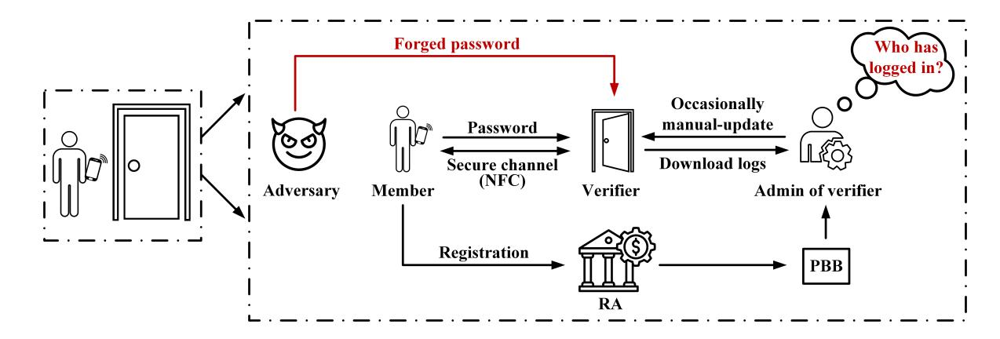
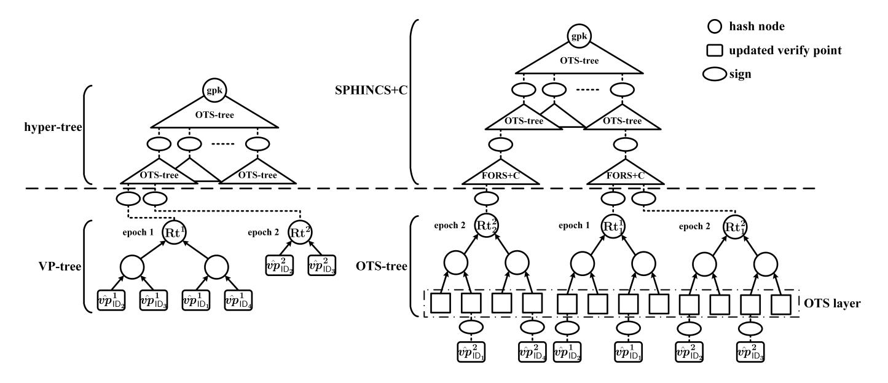
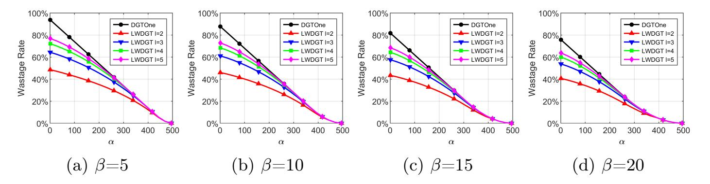
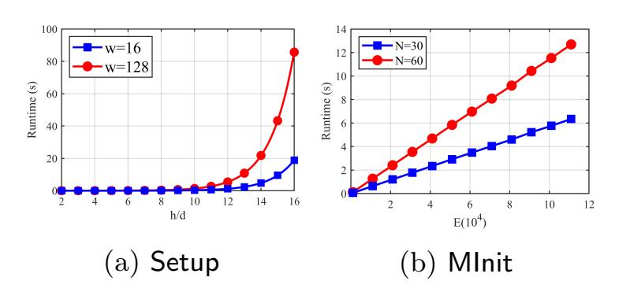

{0}------------------------------------------------

# Registration-Optimized Dynamic Group Time-based One-time Passwords for Mobile Access

Jiaqing Guo<sup>1</sup> , Xuelian Cao<sup>2</sup> , Zengpeng Li<sup>3</sup> , Yong Zhou<sup>1</sup> , Zheng Yang1<sup>⋆</sup> , and Jianying Zhou<sup>4</sup>

> <sup>1</sup> Southwest University, Chongqing, China {whoami, hiro115}@email.swu.edu.cn, youngzheng@swu.edu.cn <sup>2</sup> Tsinghua University, Beijing, China xl-cao@mail.tsinghua.edu.cn <sup>3</sup> Shandong University, Jinan, China zengpeng@email.sdu.edu.cn <sup>4</sup> Singapore University of Technology and Design, Singapore jianying\_zhou@sutd.edu.sg

Abstract. Mobile access within public finance and enterprise environments often requires lightweight anonymous authentication, allowing users to prove authorization without disclosing their identities. Group Time-based One-Time Passwords (GTOTP) has recently been proposed as a lightweight primitive meeting this need with post-quantum security. To address dynamic group membership, Cao et al. introduced DGTOne, the first dynamic GTOTP construction. It employs chameleon hashes to precompute a fixed set of Merkle-tree leaves (mount points), into which conventional TOTP verification points (VPs) contributed by group members are adaptively inserted. However, DGTOne partitions mount points by time epochs, so they can expire and become unusable, causing capacity waste due to unpredictable join times. Moreover, its outsourced proof generation requires verifiers to be online each epoch to fetch refreshed credentials from Registration Authority (RA), defeating offline verification needed in mobile access. We address these limitations with two new schemes. First, we propose NWDGT, a no-wastage DGTOTP design that constructs Merkle trees of members' verification points (VPtrees) on demand, eliminating expired mount points at the cost of added handling latency. To mitigate this latency, we introduce LWDGT, which instantiates multiple small one-time signature (OTS) trees whose leaves (OTS public keys) serve as mount points. New members' VPs are signed immediately using unused leaves, achieving low wastage. We formally prove that the wastage rate of LWDGT is, with overwhelming probability, lower than that of DGTOne. By modeling the registration process and optimizing OTS-tree size, for deployments with up to 500 members (209 initially, 20 added monthly), LWDGT reduces mount point wastage rate by 10.2% over one year compared to DGTOne.

Keywords: Group Time-based One-Time Passwords · Anonymity · Traceability · Authentication.

<sup>⋆</sup> Corresponding author.

{1}------------------------------------------------

# 1 Introduction

Mobile access has become an indispensable component of modern infrastructures, supporting applications in finance and enterprise access control [\[9,](#page-20-0)[28](#page-21-0)[,29\]](#page-21-1). In scenarios like bank or stock exchange entry, authentication devices are typically resourceconstrained smartcard readers or embedded terminals with limited storage, computational power, and connectivity. Meanwhile, these settings involve highly sensitive operations (e.g., financial transactions, and entertainment activities), where users prefer not to expose identities, making privacy-preserving authentication a fundamental requirement for mobile access systems [\[18\]](#page-21-2). Lightweight anonymous authentication thus emerges as a promising approach, enabling users to prove access rights without revealing identities.

To realize such lightweight anonymous authentication, Yang et al. [\[34\]](#page-21-3) introduced a primitive named Group Time-based One-Time Passwords (GTOTP). Their construction, referred to as YJN+ scheme, extends asymmetric time-based one-time passwords (TOTP) into an anonymous group setting, allowing members to authenticate by proving group membership without revealing identities. Credentials are generated at registration and returned directly to members, avoiding outsourced generation by RA. By relying solely on hash functions, the scheme is not only lightweight and suitable for embedded devices, but also post-quantum secure. Nevertheless, this approach requires each member to have a sufficient auxiliary storage device (such as a mobile phone) to store Merkle proofs for all future epochs, each covering only a short validity window for verification. However, the YJN+ scheme assumes a static group model in which all members are predefined and immutable, making it unsuitable for dynamic settings where participants join and leave the group adaptively at will.

To enable dynamic group management (DGM), Cao et al. [\[10\]](#page-20-1) recently proposed an enhanced primitive Dynamic Group Time-based One-Time Passwords (DGTOTP). Their concrete construction, called DGTOne scheme, extends asymmetric TOTP using chameleon hash functions and a Merkle tree whose root acts as the group public key. It pre-generates leaves as mount points using chameleon hash functions. These mount points can later be used to register new members, allowing them to join without affecting existing ones. Unlike YJN+, however, DGTOne outsources credential generation to the registration authority (RA), requiring the verifier to fetch updated proofs from the RA in each epoch. Consequently, a DGTOne verifier must remain online at all times, which limits its applicability in scenarios where verifier devices have intermittent or restricted network access. For instance, many access devices—such as smartcard readers at physical entry gates—are designed to operate with unreliable or limited connectivity due to security isolation concerns.

Moreover, DGTOne partitions mount points by epochs, requiring a fixed number to be pre-generated for each epoch. These mount points can expire and become unusable, leading to a high wastage rate (i.e., the fraction of unused mount points over the total provided) when member join times are unpredictable. To support offline verification, credentials cannot be outsourced to RA but must instead be stored directly by members, as in YJN+ scheme. In this case, the

{2}------------------------------------------------

total number of mount points available for member registration is fixed, making it important to maximize their utilization so that the verifier can authenticate as many members as possible, thereby reducing the wastage rate. In summary, this raises the key research question:

"Can we construct a non-outsourced DGTOTP scheme with lower wastage rate for mobile access?"

Our Works. To further explore this question, we illustrate in Figure [1](#page-2-0) a mobile access scenario where a member authenticates at the access gate using a password stored on a mobile phone. The gate acts as the verifier device, which may have intermittent or limited network connectivity due to operational constraints or security isolation. The verifier device is periodically updated by an entity responsible for its maintenance, referred to as the administrator of the verifier (abbreviated as admin of verifier in Figure [1\)](#page-2-0). This entity can be a human operator, an automated management system, or another trusted component with network access, performing manual updates and maintenance tasks when connectivity is available but without continuous real-time synchronization. A member submits a registration request to RA, after which RA publishes the corresponding authentication information on a public bulletin board (PBB) that the administrator can later retrieve and update to the verifier device manually. The administrator can also download logs such as authentication records, but may be curious about the identities of authenticating members, making privacy preservation essential. After registration, a member can authenticate by transmitting the stored password through a secure channel, such as Near-Field Communication (NFC), to the verifier, while an adversary may attempt to forge passwords in order to gain unauthorized access.

<span id="page-2-0"></span>

Fig. 1: System model illustration.

Building on this scenario, we propose two new DGTOTP constructions designed for different deployment environments, since anonymous authentication systems differ in their tolerance to registration-handling latency. One targets the delayed-batch registration setting, where short delays in registration are acceptable. This is typical in enterprise infrastructures, for example when employees are registered in advance before starting work or when new members are added at scheduled times. The other aims at instant-response registration setting, where registration must take effect immediately. Such a setting arises in 

{3}------------------------------------------------

mobile and IoT environments, for instance when a visitor requests temporary access to a facility or when a new edge device joins a network and must be authenticated without delay.

Our first construction, a no-wastage DGTOTP scheme NWDGT, is designed for the delayed-batch registration setting. Designing such a scheme to achieve offline verification and eliminate mount point wastage presents several challenges. Since the group public key (gpk) is generated at system initialization, it is necessary to ensure that dynamically adding sub-trees for future epochs does not affect the existing gpk or the states of registered members. Achieving anonymity and traceability under adaptive adversaries further complicates the design.

To address these challenges, we customize a register-and-build-later (RBL) strategy. For each epoch, verification points are aggregated to construct a VPtree before the epoch begins, thereby avoiding unused mount points. Since VP-trees depend on the actual registered members per epoch, they cannot be pre-generated, thus the gpk cannot be fixed at setup. To support this dynamic structure efficiently, we use a hash-based hyper-tree from SPHINCS+C [\[19\]](#page-21-4), with the hyper-tree root as the gpk and each VP-tree mounted under it. Offline authentication is achieved by delivering all necessary credentials to members.

However, the waiting requirement in NWDGT is impractical for latencysensitive scenarios, motivating our second construction, a low-wastage DGTOTP scheme LWDGT. It is designed for the instant-response registration setting, where immediate handling is required. Designing such a scheme introduces new challenges. First, RA must determine how to construct sub-trees efficiently during registration without waiting for future members to prevent handling delays. In addition, if we follow the sequential mounting strategy used in NWDGT, the order of sub-trees may reveal a member's joining time, leading to privacy leakage.

To resolve these issues, we develop a partitioned-build-on-demand (PBOD) registration strategy. Instead of building a single VP-tree for each epoch based on the registered verification points, we partition registrations into multiple smaller trees whose leaves serve as mount points. These trees, referred to as OTS-trees, are constructed using one-time signature (OTS) when needed. Each member's verification point is immediately signed by one of these leaves upon registration. To prevent the registration order from being inferred, we adopt the full SPHINCS+C construction, using its root as gpk. All OTS-trees are then signed and mounted under this structure, ensuring that the mounting order is unlinkable and that no information about member joining timing is exposed.

#### Contributions. The main contributions are as follows:

- We propose a no-wastage DGTOTP scheme, NWDGT, designed for the delayedbatch registration setting. Utilizing the RBL strategy, it constructs VP-trees based on actual registrations in each epoch. This eliminates mount point wastage, and it supports offline verification by providing credentials to members during registration. The trade-off is that RA and members must wait until the batch is complete, introducing registration handling latency.
- We develop a low-wastage DGTOTP scheme, LWDGT, tailored for the instantresponse registration setting. Leveraging a PBOD strategy, it constructs small

{4}------------------------------------------------

- OTS-trees on demand to enable fast registration handling and support offline verifiers by issuing the required credentials at registration time. While ondemand tree generation inevitably introduces some mount point wastage, our approach minimizes this overhead. Compared to NWDGT, LWDGT offers faster registration at the cost of slightly increased wastage.
- We provide a security analysis showing our design is secure. Through theoretical modeling of mount point wastage under realistic settings (systems with up to 500 users, 209 initial registrations, and 20 monthly arrivals), we demonstrate that LWDGT reduces wastage rate by 10.2% over one year compared to DGTOne scheme. In addition, our experimental evaluation confirms that both schemes remain practical and efficient in resource-constrained environments.

# 2 Related Work

The concept of One-Time Passwords (OTP) originated with Lamport's seminal proposal [\[22\]](#page-21-5), ensuring each password is valid for a single transaction. Building on this foundation, Sun et al. [\[30\]](#page-21-6) proposed TrustOTP, a secure OTP solution to implement OTP schemes on the smartphone platform even in the presence of a malicious mobile OS. To further strengthen OTP-based authentication, Tolosana et al. [\[31\]](#page-21-7) integrated handwritten digit biometrics on touchscreens, providing improved resistance against imitation attacks through behavioral analysis. In 2005, RFC 4226 standardized the HMAC-based One-Time Password (HOTP) algorithm [\[25\]](#page-21-8), which uses a shared secret and synchronized counters to generate human-readable OTPs but risks desynchronization. RFC 6238 then proposed Time-based One-Time Password (TOTP) [\[24\]](#page-21-9), replacing counters with timestamps to constrain OTP validity to short intervals. However, symmetric key reliance still exposes servers to compromise; asymmetric variants such as T/Key [\[20\]](#page-21-10) enable public verification without server-stored seeds but lack anonymity, limiting their use in privacy-sensitive scenarios.

Group signature schemes [\[1,](#page-20-2)[14](#page-21-11)[,17](#page-21-12)[,21\]](#page-21-13) offer an alternative primitive for anonymous authentication [\[23,](#page-21-14)[33,](#page-21-15)[35](#page-22-0)[,36\]](#page-22-1). In these schemes, users can produce signatures on behalf of a group without revealing their identity, while a designated group manager retains the ability to trace the signer if necessary. The concept was first introduced by Chaum and van Heyst [\[11\]](#page-20-3), and formalized by Bellare et al. [\[2\]](#page-20-4), who consolidated earlier informal notions into two key security properties: full anonymity and full traceability. This foundational model, now widely adopted, assumes a static group setting in which the list of group members is fixed at initialization. Building on this foundation, various efficient group signature schemes have been proposed [\[1,](#page-20-2)[4,](#page-20-5)[5](#page-20-6)[,6](#page-20-7)[,12\]](#page-20-8), many of which follow Bellare et al.'s model. However, the original static model lacks support for member dynamics, which is critical in real-world applications where members frequently join or leave the group. To address this, Bellare et al. [\[4\]](#page-20-5) proposed a formal security model for dynamic group signatures, which strengthens the traditional model to allow dynamic enrollment of members. In this model, the role of the group manager

{5}------------------------------------------------

is split between a group manager, responsible for managing membership, and a tracing manager, responsible for opening the signature when needed.

Although these schemes provide strong theoretical guarantees, they typically depend on expensive operations [7,15] (such as bilinear pairings or RSA accumulators) and incur complex, resource-intensive revocation processes. Consequently, they are ill-suited to settings with limited computational capacity or frequent user turnover. By contrast, GTOTP-style constructions, including those introduced in this work, achieve comparable security properties with markedly lower overhead, rendering them far more practical for deployment on resource-constrained devices. Compared to traditional TOTP schemes, GTOTP further realizes privacy by supporting anonymity, and as hash-based constructions, they avoid the computational costs inherent in group signatures. These advantages make DGTOTP the most practical and lightweight approach to anonymous authentication in real-world dynamic environments.

### 3 Preliminaries

We denote the security parameter by  $\kappa$ , and the set of integers between 1 and n by  $[n] = \{1, \ldots, n\} \subset \mathbb{N}$ . Let  $x \stackrel{\$}{\leftarrow} X$  be the operation of sampling x uniformly at random from the set X. Let  $\parallel$  be the string concatenation operation.

Our constructions rely on several cryptographic primitives. We use (1) TOTP := (Setup, Plnit, PGen, Verify) to denote an asymmetric TOTP scheme; (2) PRF :  $\mathcal{K}_{PRF} \times \mathcal{M}_{PRF} \to \mathcal{R}_{PRF}$  to denote a pseudo-random function family, where  $\mathcal{K}_{PRF}$  is the key space,  $\mathcal{M}_{PRF}$  is the message space, and  $\mathcal{R}_{PRF}$  is the range space; (3) ASE := (Setup, Enc, Dec) to denote an authenticated symmetric encryption scheme; (4) CRH :  $\mathcal{K}_{CRH} \times \mathcal{M}_{CRH} \to \mathcal{R}_{CRH}$  to denote a collision-resistant hash function, where  $\mathcal{K}_{CRH}$  is the key space,  $\mathcal{M}_{CRH}$  is the message space, and  $\mathcal{R}_{CRH}$  is the range space; (5) MT := (Build, GetPf, Verify) to denote a Merkle tree scheme; (6) PM := (Setup, Shuffle) to denote an unpredictable permutation scheme; (7) Sig := (Setup, Sign, Verify) to denote a digital signature scheme. Their detailed definitions are described in Appendix A.

### 4 Security Notions

This section presents the security notions of our constructions, following [10].

**Entities.** The system involves three entities: group members, verifiers, and a registration authority (RA). Group members can generate valid time-based one-time passwords for authentication. RA performs system setup and manages member enrollment, where each member is uniquely identified by an identity ID.

Syntax. There are eight algorithms to describe in detail below.

• (pms, gpk<sub>G</sub>, Gl<sub>G</sub>, RL<sub>G</sub>,  $k_{RA}$ )  $\leftarrow$  Setup(1<sup> $\kappa$ </sup>, G,  $\Delta_{pw}$ ,  $\Delta_{vp}$ ,  $T_s$ ,  $T_e$ ): RA runs this system setup algorithm. It takes the security parameter 1<sup> $\kappa$ </sup>, the group G, the password generation interval  $\Delta_{pw}$ , the validity period of each verification point  $\Delta_{vp}$ , and

{6}------------------------------------------------

the instance start and end time  $T_s$  and  $T_e$ . This algorithm outputs system parameters pms, the initial group public key  $\mathsf{gpk}_\mathsf{G}$  of a group  $\mathsf{G}$ , the group management information  $\mathsf{Gl}_\mathsf{G}$ , the revocation list  $\mathsf{RL}_\mathsf{G}$ , and a secret key  $k_\mathsf{RA} \stackrel{\$}{\leftarrow} \mathcal{K}_\mathsf{RA}$  for  $\mathsf{RA}$ , where  $\mathcal{K}_\mathsf{RA}$  is the key space of  $\mathsf{RA}$ .

- $(k_{\mathsf{ID}_j}, \mathsf{vps}_{\mathsf{ID}_j}) \leftarrow \mathsf{MInit}(\mathsf{ID}_j)$ : A group member runs this member initialization algorithm. It takes the identity of a member  $\mathsf{ID}_j$  as input, and outputs the secret key  $k_{\mathsf{ID}_j} \stackrel{\$}{\leftarrow} \mathcal{K}_M$  and the verification state (i.e., a set of verification points)  $\mathsf{vps}_{\mathsf{ID}_j}$  belonging to member  $\mathsf{ID}_j$ , where  $\mathcal{K}_M$  is the secret key space of a group member.
- $(Ax_{ID_j}, gpk'_G, Gl'_G) \leftarrow Join(k_{RA}, gpk_G, ID_j, vps_{ID_j})$ : RA runs this join algorithm to handle the enrollment of a member  $ID_j$ . It takes as input its secret key  $k_{RA}$ , group public key  $gpk_G$ , identity  $ID_j$ , and verification state  $vps_{ID_j}$  of the member. It outputs the auxiliary information  $Ax_{ID_j}$  as registration receipt to  $ID_j$ , and updates group management message  $Gl'_G$  and group public key  $gpk'_G$  if necessary.
- $sd_{\mathsf{ID}_j}^i \leftarrow \mathsf{GetSD}(k_{\mathsf{ID}_j}, T)$ : A group member runs this seed generation algorithm. It takes secret key  $k_{\mathsf{ID}_j} \in \mathcal{K}_M$  and time T, and outputs the secret seed  $sd_{\mathsf{ID}_j}^i \in \mathcal{S}_{\mathsf{SD}}$  of the i-th verify epoch w.r.t. the time T, where  $\mathcal{S}_{\mathsf{SD}}$  is the secret seed space.
- $pw_{\mathsf{ID}_{j}}^{i,z} \leftarrow \mathsf{PwdGen}(sd_{\mathsf{ID}_{j}}^{i},T)$ : A group member runs this password generation algorithm. It takes secret seed  $sd_{\mathsf{ID}_{j}}^{i}$  and time T as input, and outputs password  $pw_{\mathsf{ID}_{j}}^{i,z}$  the z-th password of the i-th verify epoch for member  $\mathsf{ID}_{j}$ .
- $\{0,1\} \leftarrow \mathsf{Verify}(\mathsf{gpk}_\mathsf{G}, pw^{i,z}_{\mathsf{ID}_j}, T, \mathsf{RL}_\mathsf{G})$ : Verifier runs this verification algorithm. It takes the group public key  $\mathsf{gpk}_\mathsf{G}$ , the password  $pw^{i,z}_{\mathsf{ID}_j}$ , the time T, and the revocation list  $\mathsf{RL}_\mathsf{G}$  as input. It outputs 1 if  $pw^{i,z}_{\mathsf{ID}_j}$  is accepted, and 0 otherwise.
- $RL'_{\mathsf{G}} \leftarrow \mathsf{Revoke}(k_{\mathsf{RA}}, \mathsf{ID}_j, \mathsf{gpk}_{\mathsf{G}}, \mathsf{RL}_{\mathsf{G}}, \mathsf{GI}_{\mathsf{G}})$ : RA runs this revocation algorithm to revoke the credentials of a member  $\mathsf{ID}_j$  with respect to  $\mathsf{gpk}_{\mathsf{G}}$  by using its secret key  $k_{\mathsf{RA}}$ , the revoking identity  $\mathsf{ID}_j$ , and the group management message  $\mathsf{GI}_{\mathsf{G}}$ . It returns the updated revocation list  $\mathsf{RL}'_{\mathsf{G}}$ .
- $\mathsf{ID}_j \leftarrow \mathsf{IDOpen}(k_{\mathsf{RA}}, \mathsf{gpk}_{\mathsf{G}}, pw_{\mathsf{ID}_j}^{i,z}, T)$ : RA runs this identity extraction algorithm. It takes as input the secret key  $k_{\mathsf{RA}}$ , group public key  $\mathsf{gpk}_{\mathsf{G}}$ , password  $pw_{\mathsf{ID}_j}^{i,z}$  and time T. It outputs  $\mathsf{ID}_j$  if algorithm procedure is successful, and  $\bot$  otherwise.

Threat Model. We assume RA is a non-colluding and semi-honest third party. RA will not be corrupted by any attackers and will faithfully register for members and trace the identity of malicious members, but may be curious about the status of password usage. The members can be corrupted by the attackers, but at least two members are honest. The attackers can control the network and thus can intercept, inject, and tamper with the communication between a member and a verifier. However, the communication between a member and RA is secure. The verifier can be malicious and may be curious about the identity of a member. The malicious group members and verifiers may infer the private information of honest group members.

**Security Goals.** To meet the security requirements of member authentication in group setting, the proposed schemes should meet the following security goals:

{7}------------------------------------------------

- Anonymity: Anonymity ensures that an adversary cannot infer any information about the real identity of an uncorrupted group member from an unused password even if the communication message is captured.
- Traceability: Only valid proofs can be traced to honest group members. This ensures that an adversary cannot forge a valid proof that can be attributed to either (i) an uncorrupted member of the group or (ii) any non-member.

**Security Definition.** Following [10], we define the correctness (Corr) and security properties of DGTOTP within a unified game-based framework [3]. The security properties include anonymity (Anony) and traceability (Trace)<sup>5</sup>. Each property is formalized as a game indexed by  $Gvar \in \{Corr, Anony, Trace\}$ . A challenger simulates the game procedures, illustrated in Figure 2. An adversary begins the game with Initialize and concludes with Finalize, issuing adaptive queries in between to achieve the winning condition Finalize( $b^*, pw^*, T^*$ ) = 1 for the corresponding game.

To model attacks on the join process, an adversary may adaptively introduce new members at any point using either AddHM (honest) or AddMM (malicious). Malicious members are fully controlled by the adversary, capturing insider threats, while their verification states  $vst_{\mathsf{ID}_j}$  are generated by the adversary, and the challenger does not know their secrets. For honest members, the adversary may reveal long-term keys and secret seeds via Corrupt and CompromiseSD queries, respectively, simulating real-world compromises such as insider leaks, weak key management, or cryptanalysis.

Password generation and verification by honest members are modeled through GetNextPw and ReceivePw. The GetNextPw query captures known-password attacks without affecting unexposed secrets, while ReceivePw allows the adversary to test forged passwords, reflecting impersonation attempts. Membership revocation is modeled via RevokelD, enabling the adversary to manipulate group structure and infer information about honest members. Additionally, the OpenID procedure allows the adversary to reveal the identities associated with certain passwords, emphasizing that disclosure of one password must not compromise others.

Anonymity requires that the adversary cannot distinguish the secret seeds of two honest members in the Challenge procedure. Traceability requires that the adversary cannot produce a valid password-time pair  $(pw^*, T^*)$  satisfying either: (i) it is linked to an identity (including  $\bot$ ) never added via AddHM or AddMM, or (ii) it belongs to an honest, uncorrupted member (whose key or secret seed was not exposed) and was never generated by the challenger during any procedure.

**Definition 1.** We say that a DGTOTP scheme  $\Sigma$  is correct if for any PPT adversary  $\mathcal{A}$  and system parameters  $\mathsf{Gpm} = (\kappa, \mathsf{G}, \Delta_{pw}, \Delta_{vp}, T_s, T_e)$ ,  $\Pr\left[G_{\mathcal{A},\Sigma}^{\mathsf{Corr}}(\mathsf{Gpm}) = 0\right] \approx 1$ , and we say that a correct scheme  $\Sigma$  is secure if for any PPT adversary  $\mathcal{A}$  the advantages in the corresponding games are negligi-

<span id="page-7-0"></span><sup>&</sup>lt;sup>5</sup> Accordingly, adversaries are classified as either anonymity adversaries or traceability adversaries based on the property they aim to break.

{8}------------------------------------------------

$$\begin{array}{l} \mathit{ble}, \ \mathit{i.e.}, \ \mathsf{Adv}^{\mathsf{Anony}}_{\mathcal{A}, \mathcal{\Sigma}}(\mathsf{Gpm}) := \left| \Pr[G^{\mathsf{Anony}}_{\mathcal{A}, \mathcal{\Sigma}}(\mathsf{Gpm}) = 1] - 1/2 \right| \ \mathit{and} \ \mathsf{Adv}^{\mathsf{Trace}}_{\mathcal{A}, \mathcal{\Sigma}}(\mathsf{Gpm}) := \Pr[G^{\mathsf{Trace}}_{\mathcal{A}, \mathcal{\Sigma}}(\mathsf{Gpm}) = 1]. \end{array}$$

<span id="page-8-0"></span>

| $G_{\mathcal{A},\mathcal{\Sigma}}^{Gwar}(\kappa,G,\Delta_{pw},\Delta_{vp},T_s,T_e)$ :                               |                                                                                                                                                                                        |
|---------------------------------------------------------------------------------------------------------------------|----------------------------------------------------------------------------------------------------------------------------------------------------------------------------------------|
| Initialize():                                                                                                       | Finalize $(b^*, pw^*, T^*)$ :                                                                                                                                                          |
| $(pms, gpk_{G}, Gl_{G}, RL_{G}, k_{RA}) \leftarrow \Sigma.Setup(1^{\kappa}, G, \Delta_{pw}, \Delta_{vp}, T_s, T_e)$ | $\overline{ID^*} := \Sigma.IDOpen(k_{RA}, gpk_{G}, pw^*, T^*)$                                                                                                                         |
| Create lists (CML, CSL, HML, OL) $\leftarrow \emptyset$                                                             | $vr := \Sigma.Verify(gpk_G, pw^*, T^*, \mathrm{RL}_G)$                                                                                                                                 |
| Init a monotonically increasing (in $\Delta_{pw}$ ) system clock $T_c := T_s$                                       | $i := \frac{\lceil T^* - T_s \rceil}{\Delta_{vp}};  \tilde{T^*} := T^* - ((T^* - T_s) \mod \Delta_{pw})$                                                                               |
| OUTPUT pms, $gpk_G$ , $\mathrm{RL}_G$                                                                               | IF Gvar = Corr and $pw^* \in PL$ and $(vr = 0 \lor ID^* \notin HML)$                                                                                                                   |
| Challenge( $I\hat{D}_0, I\hat{D}_1$ ):                                                                              | OUTPUT 1                                                                                                                                                                               |
| $ \overline{IF}\;(I\hat{D}_0,I\hat{D}_1)\notin \mathrm{GP}\;\mathrm{or}\;I\hat{D}_0=I\hat{D}_1,\;OUTPUT\;\bot$      | IF Gvar = Anony and $b = b^*$ and $ \hat{D}_0 \notin (CML \cup OL)$ and $ \hat{D}_1 \notin (CML \cup OL)$                                                                              |
| $b \stackrel{\$}{\leftarrow} \{0,1\}$                                                                               | OUTPUT 1                                                                                                                                                                               |
| Switch to the next verification epoch                                                                               | $IF\;Gvar = Trace\;\mathrm{and}\;vr = 1$                                                                                                                                               |
| $sd_{\hat{ID}_b} \leftarrow \Sigma.GetSD(k_{\hat{ID}_b}, T_c)$                                                      | $\text{and} \left( \left( ID^* \notin (HML \cup CML) \right) \ \lor \ \left( (pw^*, \tilde{T^*}) \notin PL \ \land \ ID^* \notin CML \ \land \ sd^i_{ID^*} \notin CSL \right) \right)$ |
| Switch to the next verification epoch                                                                               | OUTPUT 1                                                                                                                                                                               |
| OUTPUT $sd_{ \hat{D}_{h}}$                                                                                          | OUTPUT 0                                                                                                                                                                               |
| $Corrupt(ID_j)$ :                                                                                                   | $AddHM(ID_j)$ :                                                                                                                                                                        |
| $ \overline{IF}   \overline{ID}_j \notin \overline{HML}, OUTPUT \perp$                                              | $(k_{ID_j}, vps_{ID_j}) \leftarrow MInit(ID_j)$                                                                                                                                        |
| $CML \leftarrow ID_j$                                                                                               | $(Ax_{ID_j}, gpk_G', GI_G') \leftarrow \Sigma.Join(k_{RA}, gpk_G, ID_j, vps_{ID_j})$                                                                                                   |
| OUTPUT $k_{ID_i}$                                                                                                   | $\text{HML} \leftarrow ID_j$                                                                                                                                                           |
| $CompromiseSD(ID_j)$ :                                                                                              | OUTPUT $Ax_{ID_j}$ , $gpk'_G$ , $GI'_G[ID_j]$                                                                                                                                          |
| $  \overline{IF} \ ID_j \notin HML, \ OUTPUT \ \bot$                                                                | $AddMM(ID_j,vps_{ID_j})$ :                                                                                                                                                             |
| $sd_{ID_i}^i \leftarrow \Sigma.GetSD(k_{ID_i}, T_c)$                                                                | $\overline{(Ax_{ID_j},gpk_G',GI_G')} \leftarrow \Sigma.Join(k_{RA},gpk_G,ID_j,vps_{ID_j})$                                                                                             |
| $CSL \leftarrow sd_{ID_i}^i$                                                                                        | $CML \leftarrow ID_j$                                                                                                                                                                  |
| OUTPUT $s d^i_{ID_i}$                                                                                               | OUTPUT $Ax_{ID_j}$ , $gpk'_G$ , $GI'_G[ID_j]$                                                                                                                                          |
| GetNextPw():                                                                                                        | ReceivePw $(pw)$ :                                                                                                                                                                     |
| $\overline{\text{FOR } \forall \text{ID}_j \in \text{HML}}$ :                                                       | $\overline{OUTPUT\ \varSigma.Verify}(gpk_G,pw,T_c,\mathrm{RL}_G)$                                                                                                                      |
| $sd_{ID_{j}}^{i} \leftarrow \Sigma.GetSD(k_{ID_{j}}, T_{c})$                                                        | OpenID(pw,T) :                                                                                                                                                                         |
| $pw_{ID_j} \leftarrow \Sigma.PwdGen(sd^i_{ID_j}, T_c)$                                                              | $OL \leftarrow pw$                                                                                                                                                                     |
| $PL \leftarrow (\{pw_{ID_j}\}_{ID_j \in HML}, T_c)$                                                                 | $OUTPUT\ \varSigma.IDOpen(k_{RA},gpk_{G},pw,T)$                                                                                                                                        |
| OUTPUT $\{pw_{ID_j}\}_{ID_j \in HML}$                                                                               | $RevokelD(ID_j)$ :                                                                                                                                                                     |
|                                                                                                                     | $\boxed{OUTPUT\ RL_G'} \leftarrow \varSigma.Revoke(k_RA,ID_j,gpk_G,RL_G,GI_G)$                                                                                                         |

Fig. 2: Procedures Used to Define the Security of a DGTOTP Scheme.

# 5 New DGTOTP Constructions

In this section, we introduce two new DGTOTP constructions with tailored registration strategies for specific real-world settings, respectively.

Meanwhile, we consider the following four functional goals (FG) in our designs. FG1) Minimize mount point wastage. The scheme should reduce unused mount points on the RA side to improve resource utilization and avoid unnecessary computation. FG2) Support offline verifier. Verifiers should be able to authenticate members without requiring real-time communication with RA, which is essential for deployment in disconnected or intermittently connected environments. FG3) Dynamic group management. The scheme should support member joining and revocation without altering the group public key or the local state of existing members, while preserving the lightweight feature of TOTP. FG4) Lightweight client-side computation. The computational burden on each member should be kept low to ensure practicality for resource-constrained devices.

We begin our exploration of efficient DGTOTP constructions by introducing NWDGT, a no-wastage DGTOTP scheme tailored for the delayed-batch registration setting. It eliminates mount point wastage and supports offline verification, but at the cost of increased registration latency. We introduce this scheme first as a natural baseline in our pursuit of reducing wastage in DGTOTP designs. Next, we present LWDGT, a low-wastage DGTOTP construction designed for

{9}------------------------------------------------

the instant-response registration setting. It preserves the security and offlineverification features of NWDGT without registration latency, making it suitable for latency-sensitive environments. Moreover, it achieves lower mount point wastage than the DGTOne scheme. The constructions of NWDGT and LWDGT are summarized in Figure [3,](#page-9-0) where the part above the dashed line corresponds to the existing construction and the part below represents the additional construction proposed in this work, before we proceed to their detailed descriptions.

<span id="page-9-0"></span>

Fig. 3: Constructions of NWDGT (left) and LWDGT (right). In NWDGT, ID<sup>1</sup> and ID<sup>4</sup> leave the group in the 2nd verify epoch; in LWDGT with U = 8 and l = 4, ID<sup>3</sup> and ID<sup>4</sup> join the group in the 2nd verify epoch.

# 5.1 NWDGT

We outline the construction challenges and design ideas of NWDGT below. The detailed algorithms and security analysis of NWDGT are given in Appendix [B.](#page-26-0)

Construction Challenges and Ideas. In DGTOne scheme, fixed-size sub-trees are pre-generated per epoch under an assumed maximum group size. Leaves of these sub-trees serve as mount points, signing member-generated verification points. However, in dynamic environments with unpredictable member arrivals, this leads to unused mount points, violating FG1. A natural idea is to let sub-tree sizes adapt to actual registrations, but this raises new challenges: dynamic sub-tree generation must not alter group public key or disrupt enrolled members (FG3 ), and it must preserve anonymity, traceability, offline verification (FG2 ), and lightweight computation (FG4 ) in the presence of adaptive adversaries capable of registering honest or malicious members and corrupting honest members.

To address these issues, we propose a no-wastage DGTOTP scheme NWDGT. We implement a register-and-build-later (RBL) strategy by constructing each epoch's sub-tree dynamically based on the precise number of registered verification points to fulfill FG1. To fully implement the RBL strategy and facilitate the

{10}------------------------------------------------

dynamic construction of epoch-specific sub-trees under the restriction of FG3 and FG4, we adopt a hash-based hyper-tree structure used in SPHINCS+C [\[19\]](#page-21-4). This hyper-tree consists of several layers, where each layer's leaves are generated using a one-time signature (OTS) scheme. Specifically, the leaves on the lowest layer of this structure are used to sign the root of each sub-tree, and the leaves on higher layers sign the roots of the sub-trees below them.

Instead of signing each verification point individually, RA constructs a verification point tree (VP-tree) using all verification points of an epoch as its leaves and signs the VP-tree root using the hyper-tree. Since the epoch associated with each verification point is public and only verification points from different members within the same epoch need to be randomized, each epoch's VP-tree root is signed in order using the hyper-tree leaves. To ensure traceability, each verification point is bound to the member's encrypted identity before constructing the VP-tree, allowing RA to recover identities if necessary. To achieve FG2, RA generates and returns all necessary authentication credentials to group members before the beginning of each epoch. These credentials are sufficient for verifiers to authenticate members without needing to download any additional verification information or communicate with RA during the authentication process.

#### <span id="page-10-0"></span>5.2 LWDGT

Construction Challenges and Ideas. While NWDGT eliminates mount point wastage via dynamic VP-tree construction, it incurs undesirable delays, problematic in latency-sensitive settings. Devices registering offline for future epochs must later reconnect solely to obtain credentials, increasing overhead, energy use, and degrading usability. To address this, we propose constructing multiple smaller sub-trees per epoch, enabling RA to process verification points in smaller clusters and thereby improving registration responsiveness while balancing mount point efficiency (FG1) and low-latency registration.

Nonetheless, this approach introduces new challenges. If RA still constructs multiple smaller VP-trees, it must wait for enough verification points to form each sub-tree. In sparse or unpredictable arrivals, members may face indefinite registration handling delays. Furthermore, reusing the hyper-tree from NWDGT and mounting sub-trees in a fixed order introduces privacy concerns, as the mounting sequence may reveal members' relative join times, potentially compromising their anonymity. One potential solution is to mount all sub-trees strictly according to their epoch index, ensuring that sub-trees for earlier epochs appear before those of later epochs. This would eliminate the correlation between registration time. However, this is difficult to enforce in practice, since RA cannot predict the number of members who will register in a given epoch. As a result, future preregistrations may cause later sub-trees to be built earlier. In such a case, to avoid delaying registration, RA must mount available sub-trees immediately, without waiting for sub-trees of earlier epochs. This unpredictability prevents RA from pre-allocating positions for earlier-epoch sub-trees, making it challenging to implement a mounting strategy that preserves privacy under dynamic registration.

{11}------------------------------------------------

To address these limitations, we propose a low-wastage DGTOTP scheme LWDGT based on one-time signature trees (OTS-trees). We implement a partitioned-build-on-demand (PBOD) strategy. The key idea is to allow RA to instantiate a small OTS-tree only when a registration event occurs, instead of constructing VP-trees that require a complete batch of verification points. This on-demand generation not only enables immediate processing of incoming registration requests but also avoids creating unnecessary mount points, thus fulfilling FG1. In this design, each verification point is signed and mounted by a leaf of a newly or existing OTS-tree associated with the corresponding epoch.

To preserve anonymity, a keyed permutation is applied to randomize member placement across OTS-trees. Specifically, each epoch is partitioned into U/l OTS-trees, where U is the maximum group size and l is the OTS-tree size. RA assigns each member a unique identifier and applies a keyed permutation uniquely for each epoch to shuffle the identifiers. The shuffled set is then divided into clusters of size l, determining randomized member positions across OTS-trees. This conceals registration timing and prevents inference of join order. To deal with potential collisions arising from random OTS-trees placement, we adopt the full SPHINCS+C. This ensures secure mounting and supports concurrent mounting of multiple OTS-trees while satisfying FG4 under the restriction of FG3. As in NWDGT, traceability is achieved by binding each verification point to the encrypted identity before it is signed, and offline verification (FG2) is enabled because RA returns all authentication credentials to members at registration.

**Detailed Construction.** Both the digital signature SPHINCS+C and the one-time signature OTS used below share the syntax of digital signature. Below are the algorithms' details of our construction (pseudocodes of Join and Verify algorithms are given in Appendix C).

• Setup $(1^{\kappa},\mathsf{G},\Delta_{pw},\Delta_{vp},T_s,T_e)$ : RA samples a secret key  $k_{\mathsf{RA}}$ , sets  $T_s$  to the current time  $T_c$ , and computes  $E:=\frac{(T_e-T_s)}{\Delta_{vp}}$  and  $N:=\frac{(T_e-T_s)}{\Delta_{pw}}$ , where E denotes the number of TOTP instances and N denotes the number of passwords per instance. Next, RA initializes the building blocks including a pseudo-random function F as  $\mathsf{pms}_{\mathsf{PRF}} := \mathsf{F.Setup}(1^{\kappa})$ , an authenticated symmetric encryption ASE as  $\mathsf{pms}_{\mathsf{ASE}} := \mathsf{ASE.Setup}(1^{\kappa})$ , a collision-resistant hash function H as  $\mathsf{pms}_{\mathsf{CRH}} := \mathsf{H.Setup}(1^{\kappa})$ , and a permutation PM as  $\mathsf{pms}_{\mathsf{PM}} := \mathsf{PM.Setup}(1^{\kappa})$ . RA then generates the SPHINCS+C public key  $pk_{\mathsf{SPHINCS+C}}$  by computing  $(\mathsf{pms}_{\mathsf{SPHINCS+C}}, pk_{\mathsf{SPHINCS+C}}, sk_{\mathsf{SPHINCS+C}}) \leftarrow \mathsf{SPHINCS+C.Setup}(1^{\kappa})$ , with the SPHINCS+C secret key  $sk_{\mathsf{SPHINCS+C}}$  also generated, and sets the group public key  $\mathsf{gpk}_{\mathsf{G}} := pk_{\mathsf{SPHINCS+C}}$ . Moreover, for each epoch, RA carries out the following preparation steps: (i) compute the i-th permutation key  $k_{\mathsf{PM}}^i := \mathsf{F}(k_{\mathsf{RA}}, \text{``PM''}|i)$  and the permuted set  $S_i = \{s_1^i, \ldots, s_U^i\} := \mathsf{PM.Shuffle}(k_{\mathsf{PM}}^i, \{1, \ldots, U^i\})$ ; (ii) partition set  $S_i$  into U clusters of size U, denoted by  $U_i = \{\{s_1^i, \ldots, s_l^i\}, \{s_{l+1}^i, \ldots, s_{2l}^i\}, \ldots\}$ .

Meanwhile, RA maintains the group management information  $\mathsf{Gl}_\mathsf{G}$ , which includes a registration list  $\mathsf{IDL}_\mathsf{G}$  for storing member identities and a set of variables  $\{\mathsf{RS}_{s^i_j}:=(pk^i_{s^i_j},C^i_{s^i_j})\}_{j\in[U]}$  for currently active verify epochs. These

{12}------------------------------------------------

variables are periodically updated by RA to remove expired entries and prepare for the next epoch. RA also manages a revocation list  $RL_{\mathsf{G}}$ , a bit array of length U, where each bit (initialized to 0) indicates whether the corresponding member is revoked.

- MInit(ID<sub>j</sub>): Let  $\tau$  denote the consecutive epochs a member must register during the current registration period.  $\tau$  is pre-defined by the system through a fixed division of the system's lifetime, representing epochs required for registration at this time (e.g., epochs 1-10).<sup>6</sup> A group member ID<sub>j</sub> first runs (pms<sub>PRF</sub>,  $k_{\text{ID}_j}$ )  $\leftarrow$  Setup(1<sup> $\kappa$ </sup>) to sample a random key  $k_{\text{ID}_j} \stackrel{\$}{\leftarrow} \mathcal{K}_{\text{PRF}}$  as its secret key. For each epoch  $i \in \tau$ , ID<sub>j</sub> runs TOTP.Setup(1<sup> $\kappa$ </sup>,  $T_i$ ,  $T_i$  +  $\Delta_{vp}$ ,  $\Delta_{pw}$ ) to initialize i-th TOTP instance, where  $T_i = T_{i-1} + \Delta_{vp}$  and  $T_0 = T_s$ . Next, it computes i-th verification point  $vp_{\text{ID}_j}^i := \text{TOTP.PInit}(sd_{\text{ID}_j}^i)$ , where  $sd_{\text{ID}_j}^i := \text{F}(k_{\text{ID}_j}, \text{ID}_j || i)$  is the corresponding secret seed. This algorithm returns  $k_{\text{ID}_j}$  and  $\text{vps}_{\text{ID}_j} = \{vp_{\text{ID}_i}^i\}_{i \in \tau}$ .
- $\bullet$  Join $(k_{\mathsf{RA}},\mathsf{gpk}_{\mathsf{G}},\mathsf{ID}_{j},\mathsf{vps}_{\mathsf{ID}_{j}})$ : We assume that all identities recorded in  $\mathsf{IDL}_{\mathsf{G}}$ are ordered by their joining time. Namely, RA maps each member  $ID_j$  to a number  $\alpha_{\mathsf{ID}_i} \in [U]$  based on its join order. Once the position of a member in IDL<sub>G</sub> is fixed, it remains unchanged throughout the lifespan of the group. For  $i \in [E]$ , RA handles registrations of all parties. Specifically, if a party  $\mathsf{ID}_j$  submits registration of the *i*-th epoch, RA generates and returns the corresponding auxiliary information  $Ax_{ID_j} = (\sigma^i_{ID_j}, C^i_{ID_j})$ , where  $\sigma^i_{ID_j} :=$  $(\sigma_{\mathsf{OTS}}^i, \mathsf{Pf}_{\mathsf{ID}_i}^i, \sigma_{\mathsf{SPHINCS+C}}^i)$ . On receiving a party's registration request, RA does the following steps: (i) compute the *i*-th ASE key  $k_{\mathsf{ASE}}^i := \mathsf{F}(k_{\mathsf{RA}}, \text{``ASE''} \| i)$ , the identity ciphertext  $C^i_{\mathsf{ID}_j} := \mathsf{ASE}.\mathsf{Enc}(k^i_{\mathsf{ASE}},\mathsf{ID}_j)$  (note that  $\mathsf{ASE}.\mathsf{Enc}$  is randomized, so  $C_{\mathsf{ID}_j}^i \neq C_{\mathsf{ID}_j}^{i+1}$ ), and the updated verification point  $\hat{vp}_{\mathsf{ID}_j}^i := \mathsf{H}(vp_{\mathsf{ID}_j}^i \| C_{\mathsf{ID}_j}^i \| i)$ ; (ii) find the index idx such that  $s_{idx}^i = \alpha_{\mathsf{ID}_j}$ , and generate l OTS key pairs  $\{(pk_j^i, sk_j^i)\}$  for indices  $j \in [l(\lceil \frac{idx}{l} \rceil - 1) + 1, \dots, l\lceil \frac{idx}{l} \rceil]$  by initializing l independent OTS instances using OTS.Setup $(1^{\kappa})$ ; (iii) compute the OTS-tree  $\mathrm{MT}^{\imath}_{\lceil \underline{idx} \rceil} := \mathrm{MT.Build}(P_{\lceil \underline{idx} \rceil}), \text{ where } P_{\lceil \underline{idx} \rceil} := \{pk^{i}_{j}\}_{j \in \{l(\lceil \underline{idx} \rceil - 1) + 1, \dots, l\lceil \underline{idx} \rceil\}};$ (iv) compute OTS signature  $\sigma_{\mathsf{OTS}}^i := \mathsf{Sign}(sk_{idx}^i, \hat{vp}_{\mathsf{ID}_i}^i)$  and the Merkle proof as  $\mathrm{Pf}^i_{\mathsf{ID}_i} := \mathsf{MT}.\mathsf{GetPf}(\mathrm{MT}_{\lceil \frac{idx}{I} \rceil}, pk^i_{idx});$  (v) compute SPHINCS+C signature  $\sigma_{\mathsf{SPHINCS+C}}^i := \mathsf{SPHINCS+C}.\mathsf{Sign}(sk_{\mathsf{SPHINCS+C}}, \mathsf{MT}_{\left\lceil \frac{idx}{I} \right\rceil}).$
- GetSD $(k_{\mathsf{ID}_j}, T)$ : This algorithm returns *i*-th secret seed  $sd^i_{\mathsf{ID}_j} := \mathsf{F}(k_{\mathsf{ID}_j}, \mathsf{ID}_j || i)$ , where  $i := \frac{T T_s}{\Delta_{vp}}$  is the index of the TOTP instance.
- PwdGen $(k_{\mathsf{ID}_j}, T)$ : The party  $\mathsf{ID}_j$  first computes the index as  $i := \frac{T T_s}{\Delta_{vp}}$ . Next, it computes the secret seed  $sd^i_{\mathsf{ID}_j} := \mathsf{F}(k_{\mathsf{ID}_j}, \mathsf{ID}_j \| i)$  and the password  $p\bar{w}^{i,z}_{\mathsf{ID}_j} := \mathsf{TOTP.PGen}(sd^i_{\mathsf{ID}_j}, T_c)$ , where  $z := \frac{T_c T_s i \cdot \Delta_{vp}}{\Delta_{pw}}$  is the index of password in the i-th epoch. Then, the password  $pw^{i,z}_{\mathsf{ID}_j} := (p\bar{w}^{i,z}_{\mathsf{ID}_j}, \sigma^i_{\mathsf{ID}_j}, C^i_{\mathsf{ID}_j})$  is returned.

<span id="page-12-0"></span><sup>&</sup>lt;sup>6</sup> Such design supports manual updates of group management information to verifiers at epoch boundaries, allowing them to operate offline.

{13}------------------------------------------------

- Verify(gpk<sub>G</sub>,  $pw_{\mathsf{ID}_j}^{i,z}$ , T, RL<sub>G</sub>): The verifier first checks whether the member is revoked by consulting the local registration status list  $\{\mathrm{RS}_{s_j^i}\}_{j\in[U]}$  maintained and published by RA. If valid, it verifies the correctness of the TOTP password and reconstructs the verification point for signature validation. Using the received Merkle proof  $\mathrm{Pf}^i_{\mathsf{ID}_j}$  from member and the stored OTS-tree public key from registration status, it derives the corresponding OTS-tree root, which is then used to verify the SPHINCS+C signature for the epoch. Specifically, the verifier proceeds as follows: (i) return 0, if  $C^i_{\mathsf{ID}_j}$  is not contained in  $\{\mathrm{RS}_{s_j^i}\}_{j\in[U]}$ ; (ii) get the position idx such that  $\mathrm{RS}_{idx}$  contains the identity ciphertext  $C^i_{\mathsf{ID}_j}$ ; (iii) compute the verification point  $vp^i_{\mathsf{ID}_j}$  from  $p\bar{w}^{i,z}_{\mathsf{ID}_j}$  and T, and  $\bar{v}p^i_{\mathsf{ID}_j} := \mathsf{H}(vp^i_{\mathsf{ID}_j}\|C^i_{\mathsf{ID}_j}\|i)$ ; (iv) compute the tree root Rt based on  $pk^i_{idx}$  and  $\mathrm{Pf}^i_{\mathsf{ID}_j}$ ; (v) output 1, if and only if TOTP.Verify( $vp^i_{\mathsf{ID}_j}$ ,  $p\bar{w}^{i,z}_{\mathsf{ID}_j}$ , T = 1, OTS.Verify( $vp^i_{\mathsf{Id}_j}$ ,  $v^i_{\mathsf{ID}_j}$ ,  $v^i_{\mathsf{ID}_j}$ ,  $v^i_{\mathsf{ID}_j}$ ,  $v^i_{\mathsf{ID}_j}$ ,  $v^i_{\mathsf{ID}_j}$ ,  $v^i_{\mathsf{ID}_j}$ ,  $v^i_{\mathsf{ID}_j}$ ,  $v^i_{\mathsf{ID}_j}$ ,  $v^i_{\mathsf{ID}_j}$ ,  $v^i_{\mathsf{ID}_j}$ ,  $v^i_{\mathsf{ID}_j}$ ,  $v^i_{\mathsf{ID}_j}$ ,  $v^i_{\mathsf{ID}_j}$ ,  $v^i_{\mathsf{ID}_j}$ ,  $v^i_{\mathsf{ID}_j}$ ,  $v^i_{\mathsf{ID}_j}$ ,  $v^i_{\mathsf{ID}_j}$ ,  $v^i_{\mathsf{ID}_j}$ ,  $v^i_{\mathsf{ID}_j}$ ,  $v^i_{\mathsf{ID}_j}$ ,  $v^i_{\mathsf{ID}_j}$ ,  $v^i_{\mathsf{ID}_j}$ ,  $v^i_{\mathsf{ID}_j}$ ,  $v^i_{\mathsf{ID}_j}$ ,  $v^i_{\mathsf{ID}_j}$ ,  $v^i_{\mathsf{ID}_j}$ ,  $v^i_{\mathsf{ID}_j}$ ,  $v^i_{\mathsf{ID}_j}$ ,  $v^i_{\mathsf{ID}_j}$ ,  $v^i_{\mathsf{ID}_j}$ ,  $v^i_{\mathsf{ID}_j}$ ,  $v^i_{\mathsf{ID}_j}$ ,  $v^i_{\mathsf{ID}_j}$ ,  $v^i_{\mathsf{ID}_j}$ ,  $v^i_{\mathsf{ID}_j}$ ,  $v^i_{\mathsf{ID}_j}$ ,  $v^i_{\mathsf{ID}_j}$ ,  $v^i_{\mathsf{ID}_j}$ ,  $v^i_{\mathsf{ID}_j}$ ,  $v^i_{\mathsf{ID}_j}$ ,  $v^i_{\mathsf{ID}_j}$ ,  $v^i_{\mathsf{ID}_j}$ ,  $v^i_{\mathsf{ID}_j}$ ,  $v^i_{\mathsf{ID}_j}$ ,  $v^i_{\mathsf{ID}_j}$ ,  $v^i_{\mathsf{ID}_j}$ ,  $v^i_{\mathsf{ID}_j}$ ,  $v^i_{\mathsf{ID}_j}$ ,  $v^i_{\mathsf{ID}_j}$ ,  $v^i_{\mathsf{ID}_j}$ ,  $v^i_{\mathsf{ID}_j}$ ,  $v^i_{\mathsf{ID}_j$
- Revoke( $k_{RA}$ ,  $ID_j$ ,  $gpk_G$ ,  $RL_G$ ,  $Gl_G$ ): Let  $\alpha_{ID_j} := IDL_G[ID_j]$  denote the mapped number that corresponds to  $ID_j$ . To revoke a group member  $ID_j$ , RA sets  $RL_G[\alpha_{ID_j}] := 1$ , and stops updating RS relevant to  $ID_j$  in all future epochs.
- IDOpen $(k_{\mathsf{RA}}, \mathsf{gpk}_{\mathsf{G}}, pw_{\mathsf{ID}_{j}}^{i,z}, T)$ : RA aborts if  $\mathsf{Verify}(\mathsf{gpk}_{\mathsf{G}}, pw_{\mathsf{ID}_{j}}^{i,z}, T, \mathsf{RL}_{\mathsf{G}}) = 0$ . Otherwise, RA returns  $\mathsf{ID}_{j} := \mathsf{ASE}.\mathsf{Dec}(k_{\mathsf{ASE}}^{i}, C_{\mathsf{ID}_{j}}^{i})$ , where  $k_{\mathsf{ASE}}^{i} := \mathsf{F}(k_{\mathsf{RA}}, \text{``ASE''} || i)$ .

Security Analysis. Our construction achieves both anonymity and traceability, as stated by the two theorems below.

<span id="page-13-0"></span>**Theorem 1.** Suppose that the building blocks TOTP, H, PRF, SPHINCS+C, OTS, ASE, MT and PM are secure, then LWDGT provides anonymity.

The proof for Theorem 1 is in Appendix D. Here, we informally analyze how our scheme achieves anonymity. The prover authenticates by sending a password comprising four components: a TOTP password, an identity ciphertext, an OTS-tree signature, and a SPHINCS+C signature. The hash chain-based TOTP instances leverage a pseudo-random function to compute the secret seed, and compute the TOTP password and the verification point by a collision-resistant hash function. The output of the hash function and the ASE encryption algorithm contain randomness; thus, an attacker cannot distinguish the updated verification points of the honest members. Because of the employment of an unpredictable permutation function to determine the position of all updated verification points in the OTS-tree, an attacker cannot associate the SPHINCS+C signature and the OTS-tree signature with the updated verification points of the honest members and therefore cannot distinguish the correspondence between the verification points indicated by the leaf nodes of the OTS-tree mounted by SPHINCS+C and the honest members. Finally, since identity is encrypted by an ASE encryption algorithm, the attacker learns nothing about the identity from identity ciphertext.

<span id="page-13-1"></span>**Theorem 2.** Under the same assumptions as in Theorem 1, LWDGT provides traceability.

{14}------------------------------------------------

The proof of Theorem [2](#page-13-1) is in Appendix [E.](#page-33-0) Here, we provide an informal analysis to convey the intuition behind the traceability property. Attackers cannot forge a valid password that can be traced to an honest group member. Due to the collision-resistant hash function, attackers are unable to forge a valid TOTP password. As a result of the employment of IND-CCA ASE encryption to generate group member identity ciphertext, attackers are unable to distinguish between group members; thus, they are unable to forge a password that binds to the identity of an honest group member. In addition, a secure OTS-tree scheme and a SPHINCS+C scheme make sure that attackers are unable to forge signatures of an OTS-tree and SPHINCS+C. On the other hand, RA can use its secret key to decrypt the identity ciphertext with ASE to trace the identity of the group member corresponding to the password.

# 6 Evaluation

Experiment Setup. We implement NWDGT and LWDGT [7](#page-14-0) using the OpenSSL library and conduct experiments on a PC (AMD Ryzen 9 7945HX, 16 GB RAM) acting as RA and verifier, and a Raspberry Pi 3 emulating resource-constrained clients in mobile access scenarios, such as smartcards, IoT tokens, or embedded user devices. The TOTP scheme is instantiated with T/Key [\[20\]](#page-21-10), SHA256 is used as the hash function, 128-bit AES-GCM-SIV [\[16\]](#page-21-17) for authenticated symmetric encryption, and Fisher-Yates shuffle algorithm [\[13\]](#page-20-11) for the permutation scheme.

In NWDGT, the HT follows the SPHINCS+C hyper-tree structure [\[19\]](#page-21-4). In LWDGT, SPHINCS+C is instantiated as full SPHINCS+C, with its WOTS+C for one-time signature scheme OTS. Based on our following theoretical analysis of mount point wastage, we set the size of each OTS-tree in LWDGT to l = 2 to minimize the expected waste rate during randomized sub-tree mounting.

We adopt the small-signature parameter set from the SPHINCS+C specification to ensure 128-bit security, minimizing client storage at the cost of slightly higher verification time. For both schemes, we set the total height of the hypertree to h = 66, the number of layers to d = 11, and the Winternitz parameter to w = 128. Following [\[10\]](#page-20-1), the password interval is set to ∆pw = 5 seconds and the verification point lifespan to ∆vp = 5 minutes, yielding a password chain length N = 60. For LWDGT, which includes the FORS+C layer, we additionally configure the number of FORS trees as k = 9, the number of leaves per tree as t = 2<sup>13</sup>, and the number of leaves in the optional extra FORS tree as t ′ = 2<sup>18</sup> .

Theoretical Analysis of Wastage Rate. We analyze mount point efficiency using both analytical bounds and probabilistic modeling.

Theoretical Comparison. We define the overall wastage rate as Waste = 1 − P<sup>E</sup> <sup>i</sup>=1 x<sup>i</sup> C , where x<sup>i</sup> denotes the number of registrations in epoch i, E is the total number of epochs, and C is the total capacity provisioned across all epochs. This measures the fraction of unused mount points across the system lifespan. NWDGT incurs no wastage due to its adaptive registration strategy, while LWDGT

<span id="page-14-0"></span><sup>7</sup> Code is available at: <https://github.com/LannisterArthur/Efficient-DGTOTP>

{15}------------------------------------------------

may incur some wastage to support instant-response registration, but its wastage remains strictly bounded. Lemma 1 shows that, under equal registration counts across all epochs, the wastage rate under LWDGT never exceeds that of DGTOne.

<span id="page-15-0"></span>**Lemma 1.** Let U, E, and  $l \in [2, U]$  be fixed. If LWDGT and DGTOne register same number of verification points per epoch, then Wastelword  $\leq$  Wastelgerone.

Proof. The overall wastage rate is defined as Waste =  $1 - \frac{\sum_{i=1}^{E} x_i}{C}$ , where C denotes the total provisioned capacity across all epochs. Since both schemes register the same total number of points  $\sum_{i=1}^{E} x_i$ , the comparison reduces to their provisioned capacities  $C_{\text{DGTOne}}$  and  $C_{\text{LWDGT}}$ . DGTOne allocates U mount points per epoch, giving  $C_{\text{DGTOne}} = U \cdot E$ . In LWDGT, each epoch constructs up to  $\frac{U}{l}$  sub-trees of size l, yielding  $C_{\text{LWDGT}} \leq U \cdot E = C_{\text{DGTOne}}$ . Substituting these into the wastage rate definition gives

Waste<sub>LWDGT</sub> = 
$$1 - \frac{\sum_{i=1}^{E} x_i}{C_{LWDGT}} \le 1 - \frac{\sum_{i=1}^{E} x_i}{C_{DGTOne}} = \text{Waste}_{DGTOne}.$$

That proves the lemma.  $\Box$ 

While this bound guarantees that LWDGT never performs worse than DG-TOne, it is important to analyze the probability of equality because achieving the same wastage rate implies that the same number of mount points remain unused as in DGTOne. This directly limits the number of members the verifier can authenticate offline and reduces overall mount point utilization, which is undesirable in mobile and offline scenarios.

For this purpose, we define event  $A_i$  as the case in epoch i where LWDGT provisions the same capacity as DGTOne under the same registrations  $x_i$ , i.e.,  $C_{\mathsf{LWDGT}}^{(i)} = C_{\mathsf{DGTOne}}^{(i)} = U$ . When  $0 \le x_i < \frac{U}{l}$ , then LWDGT provisions only  $x_i$  subtrees of size l, resulting in  $C_{\mathsf{LWDGT}}^{(i)} < U = C_{\mathsf{DGTOne}}^{(i)}$ , and hence Waste $_{\mathsf{LWDGT}}^{(i)} < Waste_{\mathsf{DGTOne}}^{(i)}$  in that epoch. When  $\frac{U}{l} \le x_i \le U$ , the probability that LWDGT provisions the full capacity  $C_{\mathsf{LWDGT}}^{(i)} = U$  is

$$\mathbb{P}[A_i] = \frac{\sum_{j=0}^{U/l} (-1)^j \binom{U/l}{j} \frac{(U-jl)!}{(U-jl-x_i)!}}{\frac{U!}{(U-x_i)!}}.$$

Here, the denominator counts all possible assignments of the  $x_i$  registrations to the  $\frac{U}{l}$  sub-trees (no restriction), while the numerator counts only those assignments in which every sub-tree receives at least one registration, obtained via the inclusion-exclusion principle.

Therefore, equality Waste<sub>LWDGT</sub> = Waste<sub>DGTOne</sub> occurs only if  $x_i \in [\frac{U}{l}, U]$  for every epoch i, and LWDGT provisions full capacity in all such epochs. The overall probability is

$$\Pr \big[ \text{Waste}_{\text{LWDGT}} = \text{Waste}_{\text{DGTOne}} \big] = \prod_{i=1}^{E} \Pr[A_i] = \prod_{i=1}^{E} \begin{cases} 0, & 0 \leq x_i < \frac{U}{l}, \\ \mathbb{P}[A_i], & \frac{U}{l} \leq x_i \leq U, \end{cases}$$

{16}------------------------------------------------

which is negligible for realistic parameters (e.g., E = 103,680 in a year), showing that LWDGT almost always achieves strictly better mount point utilization in practice.

Expected Waste under Probabilistic Modeling. To evaluate expected wastage under realistic deployment conditions, we choose parameters that reflect typical small-scale institutional settings. According to [8,26,32], a small company typically has at most 500 employees, which motivates setting the system maximum size U = 500. The average monthly number of new registrations  $\beta \in \{5, 10, 15, 20\}$  represents typical hiring rates, how the organization grows over time. We model the number of registrations  $x_i$  per epoch as a Poisson random variable because it naturally describes count data for independent, sporadic events within a fixed interval [27]. Empirical studies show that small firms hire only a few employees per month on average [32], supporting the use of this model to represent employee growth.

We then construct a probabilistic model over E=12y epochs (one year with y=8640 epochs per month). The number of registrations  $x_i$  follows a Poisson distribution with mean  $\lambda_i=\alpha+i\cdot(\beta/y)$ , where  $\alpha\in[1,U]$  denotes the initial number of registered members. As a result, the probability of observing  $x_i$  registrations in epoch i is given by  $P_i(x_i)=\frac{(\lambda_i)^{x_i}e^{-\lambda_i}}{x_i!}$ . Expected capacity and wastage are computed by enumerating  $x_i\in[\alpha,U]$  and weighting by  $P_i(x_i)$ .

In LWDGT, U members are divided into U/l sub-trees of size l. For registrations  $x_i$ , the expected number of used sub-trees is  $\mathbb{E}[\text{Used Trees} \mid x_i] = \frac{U}{l} \cdot \left[1 - \binom{U-l}{x_i} / \binom{U}{x_i}\right]$ . Thus corresponding capacity and waste are  $C_i(x_i) = l \cdot \mathbb{E}[\text{Used Trees} \mid x_i]$  and  $W_i(x_i) = C_i(x_i) - x_i$ . Aggregating over  $x_i$ , we obtain the epoch-level expectations:  $\mathbb{E}[W_i] = \sum_{x_i=\alpha}^{U} P_i(x_i) \cdot W_i(x_i)$ ,  $\mathbb{E}[C_i] = \sum_{x_i=\alpha}^{U} P_i(x_i) \cdot C_i(x_i)$ . Summing over all epochs, the total expected wastage ratio is  $\mathbb{E}[\text{Waste}_{\mathsf{LWDGT}}] = \frac{\sum_{i=1}^{E} \mathbb{E}[W_i]}{\sum_{i=1}^{E} \mathbb{E}[C_i]}$ .

For comparison, we evaluate the expected wastage rate under the DG-TOne scheme, where each epoch utilizes a single Merkle tree of fixed capacity U. Then, the total expected wastage rate for DGTOne is  $\mathbb{E}[\text{Waste}_{\text{DGTOne}}] = \frac{1}{E} \sum_{i=1}^{E} \left(1 - \frac{\mathbb{E}[x_i]}{U}\right) = 1 - \frac{1}{U \cdot E} \sum_{i=1}^{E} \mathbb{E}[x_i].$ 

In Figure 4, we compare the expected mount point wastage rates of LWDGT and DGTOne under different values of monthly registrations  $\beta$  and initial registered users  $\alpha$  over one year. The results show that as  $\alpha$  increases, the expected wastage rates of both schemes exhibit a decreasing tendency, and this trend persists across different  $\beta$  values, indicating that variations in monthly registration do not fundamentally alter the dependence of wastage rate on  $\alpha$ . Moreover, the OTS-tree size l also affects the curves: larger l causes LWDGT to gradually approach the wastage of DGTOne, while smaller l leads to more pronounced differences. It is worth noting that even if some users revoke their registrations, the corresponding mount points remain occupied, so revocation does not affect the mount point wastage rate.

{17}------------------------------------------------

This difference in performance becomes particularly notable when the initial number of users is far below the system's maximum capacity (α ≤ U/2), a situation often observed in real-world small organizations where the workforce starts small and grows gradually [\[32\]](#page-21-19). As illustrated in Figure [4,](#page-17-0) under these conditions, LWDGT can reduce the annual wastage rate by 12% to 41% when the monthly registration is lower (β = 1% · U = 5), and by 6% to 31% when the monthly registration is relatively large (β = 4% · U = 20).

<span id="page-17-0"></span>

Fig. 4: Comparison of expected wastage rate.

Runtime Performance. We evaluate the computational efficiency of our schemes by measuring the runtime of their algorithms.

RA Setup time. The runtime of Setup is primarily determined by constructing the top-level tree of the hyper-tree, which involves generating the leaves and computing the root from these leaves. The time to generate each leaf depends on the Winternitz parameter ω of WOTS+C [\[19\]](#page-21-4), which specifies the number of bits encoded per step in each WOTS+C hash chain. Larger ω values produce shorter signatures but require more hash evaluations per leaf, while smaller ω values reduce the number of hashes at the cost of longer signatures. The time to compute the top-level root depends on the tree height h/d, where h is the total height of the hyper-tree and d is the number of layers into which the hyper-tree is divided. Figure [5a](#page-17-1) shows that runtime increases exponentially with h/d, and that larger ω substantially increases runtime due to more hash computations per leaf. Because the hyper-tree is divided into layers, h/d remains small (typically less than 10), Setup is still practical.

Member Initialization Time. MInit in both schemes runs one Eval of PRF and N hash evaluations to initialize a TOTP instance in each epoch. In our experiments, we assume that a member registers for all E epochs, and Figure [5b](#page-17-1) shows the computational cost measured on a Raspberry Pi for different TOTP chain lengths N = 30 and N = 60, representing shorter and longer

<span id="page-17-1"></span>

Fig. 5: Runtimes of Setup and MInit.

TOTP chains, respectively. From the figure, it can be observed that the total runtime increases linearly with the number of epochs E. This linear growth 

{18}------------------------------------------------

occurs because each epoch's initialization requires a fixed amount of computation. Nonetheless, the measured per-epoch initialization time is approximately 0.07ms for N = 30 and 0.12ms for N = 60, demonstrating that MInit is still practical even for longer chains.

Join Time. In both schemes, the Join algorithm begins by encrypting the member's identity using ASE, requiring one ASE encryption with runtime 0.57 µs. The subsequent credential generation differs between the two schemes. In NWDGT, RA aggregates registrations over an epoch and constructs a single VP-tree for all members. Once all registrations are collected, constructing the VP-tree and preparing credentials requires U −1 hash evaluations in the worst case or U/2 −1 in the average case (for Merkle proof generation), along with a single hyper-tree signing operation to produce the associated signature. For U = 220, the total join cost for an epoch reaches 23.01s in the worst case and 12.29s in the average case. In LWDGT, credentials are generated immediately upon registration, requiring one hash evaluation for the updated verification point, one OTS-tree signing (with l = 2), and one SPHINCS+C signing computation, with per-join runtime approximately 1.07s.

Password Generation Time. Since RA handles the most expensive computations (i.e., credentials generation), members only need to compute TOTP passwords: one hash function in the average case, and one more F in the worst case to switch TOTP instances. The runtime is 1.54 µs (average) and 23.64 µs (worst).

Group Management Information Update Time. In both schemes, RA updates the registration status RS<sup>s</sup> i j in part of the join process. Since credential generation already produces the necessary verification materials, we assume RA stores these materials at registration time. Thus, updating group management information imposes no additional runtime overhead during verification and does not require separate update procedures. We further assume that each member submits verification points for a predefined time window (e.g., a month or a year) at registration. This allows RA to perform batch updates manually and periodically distribute group management information to verifiers. Such a design ensures that verifiers can operate offline without access to RA.

Password Verification Time. In NWDGT, verification begins with checking the TOTP password, requiring up to N = 60 hash evaluations in the worst case and N/2 on average. The verifier then computes one hash to derive the VP-tree leaf, followed by log U hash evaluations in the worst case or log(U/2) on average to compute the VP-tree root. Verification concludes with a hyper-tree signature check, which dominates the runtime. The difference between worst and average cases amounts to only 31 extra hash evaluations, corresponding to 2.56 µs, making the verification time effectively stable. The measured total verification time is approximately 7.54 ms. In LWDGT, the verifier similarly begins with TOTP password validation, followed by one hash computation for the updated verification point and one OTS signature verification algorithm to validate this value using the accompanying OTS signature. It then performs log l hash evaluations to compute the OTS-tree root, and finally runs one SPHINCS+C 

{19}------------------------------------------------

verification algorithm to verify the correctness of the SPHINCS+C signature on that root. The total runtime is approximately  $8.05 \ ms$ .

Identity Open Time. The overhead of IDOpen in both schemes consists of the costs of the respective verification algorithm cost and one decryption of ASE. The runtime of one ASE.Dec is  $0.55~\mu s$ .

Comparison. We compare our schemes with YJN+ [34] and DGTOne [10] schemes in terms of several properties. Table 1 summarizes the comparison across four dimensions. These include whether it supports a dynamic group setting, whether it avoids mount point wastage, whether the verifier can operate without online connectivity, and how the registration process is handled by RA.

Table 1: Comparison of Properties.

<span id="page-19-0"></span>

|             |               |            | 1                        |                       |
|-------------|---------------|------------|--------------------------|-----------------------|
| Schemes     | Group Setting | No Wastage | Offline Verifier Support | Registration Handling |
| YJN+ [34]   | Static        | Yes        | Yes                      | Immediate             |
| DGTOne [10] | Dynamic       | No         | No                       | Immediate             |
| NWDGT       | Dynamic       | Yes        | Yes                      | Delayed               |
| LWDGT       | Dynamic       | No         | Yes                      | Immediate             |

Table 2 compares the performance of these schemes under worst-case (Wor) and average-case (Avg) settings. In evaluating setup costs, we compare the GVSTGen algorithm of YJN+, RASetup of DGTOne, and the Setup used by our two schemes, as all serve the purpose of group public key generation. We use 'BFc' and 'BFi' to represent the costs of the check and insert operations of the Bloom filter, respectively. 'Ae' and 'Ad' denote AES-GCM-SIV encryption and decryption algorithms, while 'Ss' and 'Se' denote AES setup and encryption algorithms. 'CHe', 'CHs', and 'CHc' correspond to the evaluation, setup, and collision-finding algorithms of the chameleon hash function. We denote the cost of permutation with 'PM'. Additionally, we use 'Wp', 'Ws', and 'Wv' to represent the public key generation, signing, and verification algorithms of WOTS+C, and 'Fs' and 'Fv' to denote the signing and verification algorithms of FORS+C. We use ' $\mu$ ' and ' $\nu$ ' denote ' $E^{\frac{1}{d}}$ ' and ' $2^{h/d}$ '.

From the two tables, it is evident that both of our proposed schemes support dynamic group management (not provided in YJN+ scheme) and offline verifier functionality (not provided in DGTOne scheme) while maintaining low overhead. In particular, group public key generation in our schemes leverages a hyper-tree structure, where only a small tree at the top layer needs to be constructed, greatly reducing setup complexity. Password generation is lightweight, requiring only the generation of a TOTP password. While member-side storage in our schemes is slightly higher than DGTOne due to offline verifier support, expensive credential generation is handled by RA, keeping the schemes suitable for resource-constrained clients. Importantly, mount points are efficiently utilized: NWDGT achieves zero wastage, and LWDGT significantly reduces wastage compared to DGTOne, demonstrating practicality and scalability of our designs.

**Acknowledgments.** This work was supported by the National Key Research and Development Program of China under Grant No. 2025YFE0220300 and the National Natural Science Foundation of China under Grant No. 62372386.

{20}------------------------------------------------

<span id="page-20-13"></span>

| Schemes |     | Execution Time                                                                                                             |                                                             |        |                                                                                      |       | Storag                     | e Cost (Byt                                                    | te)                                                  | Password                                                    |                                                  |                           |                                      |                                             |
|---------|-----|----------------------------------------------------------------------------------------------------------------------------|-------------------------------------------------------------|--------|--------------------------------------------------------------------------------------|-------|----------------------------|----------------------------------------------------------------|------------------------------------------------------|-------------------------------------------------------------|--------------------------------------------------|---------------------------|--------------------------------------|---------------------------------------------|
| Schemes |     | RASetup                                                                                                                    | MInit                                                       | Revoke | Join                                                                                 | GetSD | PwdGen                     | GMUpdate                                                       |                                                      | Open                                                        | Member                                           | Verifier                  | RA                                   | size(Byte)                                  |
| YJN+    | Avg | $\begin{array}{c} 2U\cdot E\cdot H+\\ \phi\cdot BFi\end{array}$                                                            | $\begin{array}{c} 60E \cdot H + \\ 2E \cdot Se \end{array}$ | -      | -                                                                                    | 2Se   | 30H                        | -                                                              | $(32 + \log^{\frac{\hat{U} \cdot E}{\phi}})H + 1BFc$ | +1BFc+1Ad                                                   | 1004E · log ♥                                    | $1.44\epsilon \cdot \phi$ | 16                                   | $76+ \atop 32\log^{\frac{U \cdot E}{\phi}}$ |
|         | Wor | $\begin{array}{c} 2U \cdot E \cdot H + \\ \phi \cdot BFi \end{array}$                                                      | $60E \cdot H + \\ 2E \cdot Se$                              | -      | -                                                                                    | 2Se   | 60H+ $2Se$                 | -                                                              | $(62 + \log^{\frac{U \cdot E}{\phi}})H + 1BFc$       | $ \frac{(62 + \log \frac{U \cdot E}{\phi})H}{+1BFc + 1Ad} $ | +10                                              |                           |                                      | 32 log *                                    |
| DGTOne  |     | $6U \cdot E \cdot Ae \\ + (U+1)Ae \\ + E \cdot PM \\ + U \cdot E \cdot CHe \\ + U \cdot E \cdot CHs \\ + (U \cdot E - 1)H$ | 1Ss                                                         | 1Ass   | 1Se                                                                                  | 2Se   | 30 <i>H</i>                | $(9U+1)Se \\ +1PM \\ +U\cdot CHe \\ +U\cdot Ae \\ +U\cdot CHs$ | $(32 + \log^{U \cdot E})H + 1CHe$                    | $(32 + \log^{U \cdot E})H$ $+1CHe + 3Se$ $+1PM + 1Ad$       | 36                                               | $32 + 460U + 32 \log^{E}$ | $16 + 5U + 32E + 32E \cdot \log^{E}$ | 108                                         |
|         | Wor | $6U \cdot E \cdot Ae \\ + (U+1)Ae \\ + E \cdot PM \\ + U \cdot E \cdot CHe \\ + U \cdot E \cdot CHs \\ + (U \cdot E - 1)H$ | 1Ss                                                         | 1Ass   | 1Se                                                                                  | 2Se   | 62H $+1CHe$ $+10Se$ $+1Ae$ | $(9U+1)Se \\ +1PM \\ +U\cdot CHe \\ +U\cdot Ae \\ +U\cdot CHs$ | $(62 + \log^{U \cdot E})H + 1CHe$                    | $(62 + \log^{U \cdot E})H + 1CHe + 3Se + 1PM + 1Ad$         |                                                  |                           |                                      |                                             |
| NWDGT   | Avg | $\mu(Wp+H)$                                                                                                                | $30E \cdot H + \\ 1Se \cdot E$                              | 1Ass   | $ \begin{aligned} d\mu(Wp+H) \\ +d\cdot Ws \\ +1PM+1Ae \\ +U/2\cdot H \end{aligned}$ | 2Se   | 30 <i>H</i>                | Performed<br>in Join                                           | $(30 + \log^{U})H + d \cdot Wv$                      | $(30 + \log^U)H + d \cdot Wv + 1Ad$                         | $60 + 4d + 16 \log^{E} + 2048d / \log^{w}$       | 32 + 44U                  | 16                                   | $76 + 4d + 16 \log^{E} + 2048d / \log^{w}$  |
|         | Wor | $\mu(Wp+H)$                                                                                                                | $60E \cdot H + \\ 2E \cdot Se$                              | 1Ass   | $d\mu(Wp+H) \\ +d \cdot Ws \\ +1PM+1Ae \\ +U/2 \cdot H$                              | 2Se   | 60H+2Se                    | Performed<br>in Join                                           | $(61 + \log^{U})H + d \cdot Wv$                      | $(61 + \log^{U})H + d \cdot Wv + 1Ad$                       | 1   2040 <i>u</i> / 10g                          |                           |                                      | 2040 <i>a</i> / log                         |
| LWDGT   | Avg | $\nu(Wp+H) \\ + E \cdot PM$                                                                                                | $30E \cdot H + 1E \cdot Se$                                 | 1Ass   | $(d\nu + 1)Wp +(l+d\nu)H +1Fs+1Ae +d \cdot Ws$                                       | 2Se   | 30 <i>H</i>                | Performed<br>in Join                                           | (30+l)H + 1Fv + (d+1)Wv                              | (30+l)H $+(d+1)Wv$ $+1Fv+1Ad$                               | $72 + 4d + 16h + 16k(\log^t + 1) + 4096d/\log^w$ | 32 + 60U                  | 16                                   | $88 + 4d + 16 \log^{l} + 16(h + kl) +$      |
|         | Wor | $\nu(Wp+H)\\+E\cdot PM$                                                                                                    | $\begin{array}{c} 60E \cdot H + \\ 2Se \cdot E \end{array}$ | 1Ass   |                                                                                      | 2Se   | 60H+2Se                    | Performed<br>in Join                                           | (60+l)H + 1Fv + (d+1)Wv                              | (60+l)H $+(d+1)Wv$ $+1Fv+1Ad$                               | 1 1000t/ 10g                                     |                           |                                      | $16k \log^t + 4096d/\log^w$                 |

Table 2: Comparison of performance.

# References

- <span id="page-20-2"></span>1. Backes, M., Hanzlik, L., Schneider-Bensch, J.: Membership privacy for fully dynamic group signatures. In: CCS. pp. 2181–2198. ACM (2019)
- <span id="page-20-4"></span>2. Bellare, M., Micciancio, D., Warinschi, B.: Foundations of group signatures: Formal definitions, simplified requirements, and a construction based on general assumptions. In: EUROCRYPT. pp. 614–629. Springer (2003)
- <span id="page-20-10"></span>3. Bellare, M., Rogaway, P.: The security of triple encryption and a framework for code-based game-playing proofs. In: EUROCRYPT. pp. 409–426. Springer (2006)
- <span id="page-20-5"></span>4. Bellare, M., Shi, H., Zhang, C.: Foundations of group signatures: The case of dynamic groups. In: CT-RSA. pp. 136–153. Springer (2005)
- <span id="page-20-6"></span>5. Boneh, D., Boyen, X., Shacham, H.: Short group signatures. In: CRYPTO. pp. 41–55. Springer (2004)
- <span id="page-20-7"></span>6. Boneh, D., Shacham, H.: Group signatures with verifier-local revocation. In: CCS. pp. 168–177. ACM (2004)
- <span id="page-20-9"></span>7. Bootle, J., Cerulli, A., Chaidos, P., Ghadafi, E., Groth, J.: Foundations of fully dynamic group signatures. J. Cryptol. **33**(4), 1822–1870 (2020)
- <span id="page-20-12"></span>8. Bort, J., Wiklund, J., Yu, W.: Firm growth and the job satisfaction of the startup workforce. Strategic Management Journal (2025)
- <span id="page-20-0"></span>9. Camenisch, J., Drijvers, M., Hajny, J.: Scalable revocation scheme for anonymous credentials based on n-times unlinkable proofs. In: WPES@CCS. pp. 123–133. ACM (2016)
- <span id="page-20-1"></span>10. Cao, X., Yang, Z., Ning, J., Jin, C., Lu, R., Liu, Z., Zhou, J.: Dynamic group time-based one-time passwords. IEEE Trans. Inf. Forensics Secur. **19**, 4897–4913 (2024)
- <span id="page-20-3"></span>11. Chaum, D., van Heyst, E.: Group signatures. In: EUROCRYPT. pp. 257–265. Springer (1991)
- <span id="page-20-8"></span>12. Chen, L., Dong, C., Newton, C.J.P., Wang, Y.: Sphinx-in-the-head: Group signatures from symmetric primitives. ACM Trans. Priv. Secur. **27**(1), 11:1–11:35 (2024)
- <span id="page-20-11"></span>13. Fisher, R.A., Yates, F.: Statistical tables for biological, agricultural and medical research, pp. 26–27. Oliver & Boyd, Third edn. (1948)

{21}------------------------------------------------

- <span id="page-21-11"></span>14. Garms, L., Lehmann, A.: Group signatures with selective linkability. In: Public Key Cryptography (1). Lecture Notes in Computer Science, vol. 11442, pp. 190–220. Springer (2019)
- <span id="page-21-16"></span>15. Groth, J.: Fully anonymous group signatures without random oracles. In: ASI-ACRYPT. pp. 164–180. Springer (2007)
- <span id="page-21-17"></span>16. Gueron, S.: Aes-gcm-siv implementations (128 and 256 bit) (2018), [https://github.](https://github.com/Shay-Gueron/AES-GCM-SIV) [com/Shay-Gueron/AES-GCM-SIV](https://github.com/Shay-Gueron/AES-GCM-SIV)
- <span id="page-21-12"></span>17. He, Y., Ling, S., Tang, K.H., Wang, H.: Everlasting fully dynamic group signatures. In: ACNS (3). Lecture Notes in Computer Science, vol. 15827, pp. 3–28. Springer (2025)
- <span id="page-21-2"></span>18. Hesse, J., Singh, N., Sorniotti, A.: How to bind anonymous credentials to humans. In: USENIX Security Symposium. pp. 3047–3064. USENIX Association (2023)
- <span id="page-21-4"></span>19. Hülsing, A., Kudinov, M.A., Ronen, E., Yogev, E.: SPHINCS+C: compressing SPHINCS+ with (almost) no cost. In: SP. pp. 1435–1453. IEEE (2023)
- <span id="page-21-10"></span>20. Kogan, D., Manohar, N., Boneh, D.: T/key: Second-factor authentication from secure hash chains. In: CCS. pp. 983–999. ACM (2017)
- <span id="page-21-13"></span>21. Kumar, V., Li, H., Park, J.J., Bian, K., Yang, Y.: Group signatures with probabilistic revocation: A computationally-scalable approach for providing privacy-preserving authentication. In: CCS. pp. 1334–1345. ACM (2015)
- <span id="page-21-5"></span>22. Lamport, L.: Password authentication with insecure communication. Commun. ACM 24(11), 770–772 (1981)
- <span id="page-21-14"></span>23. Liu, J.K., Chu, C., Chow, S.S.M., Huang, X., Au, M.H., Zhou, J.: Time-bound anonymous authentication for roaming networks. IEEE Trans. Inf. Forensics Secur. 10(1), 178–189 (2015)
- <span id="page-21-9"></span>24. M'Raihi, D., Machani, S., Pei, M., Rydell, J.: Totp: Time-based one-time password algorithm (2011), <https://tools.ietf.org/html/rfc6238>
- <span id="page-21-8"></span>25. M'Raïhi, D., Bellare, M., Hoornaert, F., Naccache, D., Ranen, O.: HOTP: an hmac-based one-time password algorithm. RFC 4226, 1–37 (2005)
- <span id="page-21-18"></span>26. Murmann, J.P., Korn, J., Worch, H.: How fast can firms grow? Jahrbücher für Nationalökonomie und Statistik 234(2-3), 210–233 (2014)
- <span id="page-21-20"></span>27. Nisbet, R., Miner, G., Yale, K.: Chapter 10 - numerical prediction. In: Nisbet, R., Miner, G., Yale, K. (eds.) Handbook of Statistical Analysis and Data Mining Applications (Second Edition), pp. 187–213. Academic Press, Boston, second edition edn. (2018)
- <span id="page-21-0"></span>28. Odelu, V., Das, A.K., Goswami, A.: A secure biometrics-based multi-server authentication protocol using smart cards. IEEE Trans. Inf. Forensics Secur. 10(9), 1953–1966 (2015)
- <span id="page-21-1"></span>29. Rodríguez, J.G., Krenn, S., Slamanig, D.: To pass or not to pass: Privacy-preserving physical access control. Comput. Secur. 136, 103566 (2024)
- <span id="page-21-6"></span>30. Sun, H., Sun, K., Wang, Y., Jing, J.: Trustotp: Transforming smartphones into secure one-time password tokens. In: CCS. pp. 976–988. ACM (2015)
- <span id="page-21-7"></span>31. Tolosana, R., Vera-Rodríguez, R., Fiérrez, J.: Biotouchpass: Handwritten passwords for touchscreen biometrics. IEEE Trans. Mob. Comput. 19(7), 1532–1543 (2020)
- <span id="page-21-19"></span>32. Wheat, C., Farrell, D.: The ups and downs of small business employment: Big data on payroll growth and volatility. JPMorgan Chase & Co. Institute (2017)
- <span id="page-21-15"></span>33. Yang, Q., Xue, K., Xu, J., Wang, J., Li, F., Yu, N.: Anfra: Anonymous and fast roaming authentication for space information network. IEEE Trans. Inf. Forensics Secur. 14(2), 486–497 (2019)
- <span id="page-21-3"></span>34. Yang, Z., Jin, C., Ning, J., Li, Z., Dinh, A., Zhou, J.: Group time-based one-time passwords and its application to efficient privacy-preserving proof of location. In: ACSAC. pp. 497–512. ACM (2021)

{22}------------------------------------------------

- <span id="page-22-0"></span>35. Zeng, M., Cui, J., Zhang, Q., Zhong, H., He, D.: Efficient revocable cross-domain anonymous authentication scheme for iiot. IEEE Trans. Inf. Forensics Secur. **20**, 996–1010 (2025)
- <span id="page-22-1"></span>36. Zhang, Q., Wu, J., Zhong, H., He, D., Cui, J.: Efficient anonymous authentication based on physically unclonable function in industrial internet of things. IEEE Trans. Inf. Forensics Secur. 18, 233–247 (2023)

### <span id="page-22-2"></span>A Cryptographic Building Blocks

Time-based One-time Passwords. We adopt an asymmetric TOTP scheme similar to that in GTOTP, defined by four algorithms (Setup, Plnit, PGen, Verify). Setup( $1^{\kappa}$ ,  $T_s$ ,  $T_e$ ,  $\Delta_{pw}$ ) outputs the password number  $N=(T_e-T_s)/\Delta_{pw}$  given the security parameter, start and end times  $T_s$  and  $T_e$ , and the password generation interval  $\Delta_{pw}$ . Plnit(sd) takes a secret seed  $sd \in \mathcal{K}_{\mathsf{TOTP}}$  and outputs a verification point  $vp \in \mathcal{VP}_{\mathsf{TOTP}}$ . PGen(sd, T) takes a seed sd and time T, and outputs a password  $pw \in \mathcal{PW}_{\mathsf{TOTP}}$  associated with the time T. Verify(vp, pw, T) checks the validity of password pw at time T against vp, outputting 1 if valid and 0 otherwise. We require that the verification point in TOTP can be computed based on the secret seed or password. We define a security game  $G_{\mathcal{A},\mathsf{TOTP}}^{\mathsf{TOTP},\mathsf{Forge}}(\kappa, T_s, T_e, \Delta_{pw})$  for a time-based one-time passwords scheme TOTP in Figure 6, with a key space  $\mathcal{K}_{\mathsf{TOTP}}$  for the input secret seed, a verification point space  $\mathcal{VP}_{\mathsf{TOTP}}$ , and a password space  $\mathcal{PW}_{\mathsf{TOTP}}$ . We assume that the challenger keeps a system clock  $T_{ct}$  which is updated every  $\Delta_{pw}$ . The goal of adversary in the game is to forge a valid password of TOTP for a future time.

<span id="page-22-3"></span>

| TATE                                                                          |                                                             |
|-------------------------------------------------------------------------------|-------------------------------------------------------------|
| $G_{\mathcal{A},TOTP}^{TOTP}$ Forge $(\kappa,T_s,T_e,\Delta_{pw}):$           |                                                             |
| Initialize $(T_s, T_e, \Delta_{pw})$ :                                        | Finalize() :                                                |
| $\boxed{pms_{TOTP} \leftarrow TOTP.Setup(1^{\kappa}, T_s, T_e, \Delta_{pw})}$ | $\overline{IF} \ \exists (pw^*, T^*) \in HD$                |
| $sd \stackrel{\$}{\leftarrow} \mathcal{K}_{TOTP}$                             | s.t. $(Verify(vp, pw^*, T^*) = 1$                           |
| $vp \leftarrow TOTP.PInit(sd)$                                                | and no GetNextPw() at $\tilde{T}$ s.t. $\tilde{T} \geq T^*$ |
| OUTPUT $pms_{TOTP}, vp$                                                       | OUTPUT 1                                                    |
|                                                                               | OUTPUT 0                                                    |
| GetNextPw():                                                                  | ReceivePw $(pw)$ :                                          |
| $\overline{OUTPUT\;TO}TP.PGen(sd,T_c)$                                        | $\overline{APPEND\;(pw,T_c)} \to HD$                        |
|                                                                               | OUTPUT TOTP. Verify $(vp, pw, T_c)$                         |

Fig. 6: Procedures Used to Define Security for TOTP.

**Definition 2.** We say a TOTP protocol is secure if no PPT adversary has a non-negligible advantage  $\mathsf{Adv}_{\mathcal{A},\mathsf{TOTP}}^{\mathsf{TOTP}}$  Forge  $(\kappa, T_s, T_e, \Delta_{pw}) := \Pr\left[G_{\mathcal{A},\mathsf{TOTP}}^{\mathsf{TOTP}}(\kappa, T_s, T_e, \Delta_{pw}) = 1\right]$  with given parameters.

**Pseudo-random Function Family.** A pseudo-random function (PRF) family consists of (Setup, Eval). Setup( $1^{\kappa}$ ) takes as input the security parameter  $1^{\kappa}$ ,

{23}------------------------------------------------

and outputs a secret key  $k \stackrel{\$}{\leftarrow} \mathcal{K}_{\mathsf{PRF}}$  and system parameter  $\mathsf{pms}_{\mathsf{PRF}}$ . Eval(k, x) is a deterministic algorithm that takes as input the secret key k and a message  $x \in \mathcal{M}_{\mathsf{PRF}}$ , and outputs the evaluation result  $r \in \mathcal{R}_{\mathsf{PRF}}$ . We define a security game  $G_{\mathcal{A},\mathsf{F}}^{\mathsf{PRF}}(\kappa,q_f)$  (see also in Figure 7) that is played between a probabilistic polynomial time (PPT) adversary  $\mathcal{A}$  and a challenger based on  $\mathsf{F}$  and the security parameter  $\kappa$ .

<span id="page-23-0"></span>

| $G^{\sf PRF}_{\cal A,\sf F}(\kappa,q_f)$ :                                                                           |                                                                     |
|----------------------------------------------------------------------------------------------------------------------|---------------------------------------------------------------------|
| Initialize():                                                                                                        | Finalize $(b^*)$ :                                                  |
| $\overline{(pms_{PRF},k)} \leftarrow F.Setup(1^{\kappa})$                                                            | $ \overline{IF\ b^* = b\ \mathbf{and}}\ x^* \notin FL,\ OUTPUT\ 1 $ |
| OUTPUT pms <sub>PRF</sub>                                                                                            | ELSE OUTPUT 0                                                       |
| Challenge $(x^*)$ :                                                                                                  | FuncQ(x):                                                           |
| $b \stackrel{\$}{\leftarrow} \{0,1\}; r_0 \stackrel{\$}{\leftarrow} \mathcal{R}_{PRF}; r_1 \leftarrow F.Eval(k,x^*)$ | $APPEND\ x \to FL$                                                  |
| OUTPUT $r_b$                                                                                                         | OUTPUT F.Eval $(k,x)$                                               |

Fig. 7: Procedures Used to Define Security for PRF.

**Definition 3.** We say F is secure if the advantage  $\mathsf{Adv}^{\mathsf{PRF}}_{\mathcal{A},\mathsf{F}}(\kappa,q_f) := \left| \Pr[G^{\mathsf{PRF}}_{\mathcal{A},\mathsf{F}}(\kappa,q_f) = 1] - \frac{1}{2} \right| \ of \ any \ PPT \ adversary \ \mathcal{A} \ is \ negligible \ under \ \kappa.$ 

Authenticated Symmetric Encryption. An authenticated symmetric encryption scheme ASE consists of three algorithms (Setup, Enc, Dec). Setup( $1^{\kappa}$ ) takes the security parameter and outputs a secret key  $k \in \mathcal{K}_{\mathsf{ASE}}$  and system parameter  $\mathsf{pms}_{\mathsf{ASE}}$ .  $\mathsf{Enc}(k,m)$  takes a secret key k and message  $m \in \mathcal{M}_{\mathsf{ASE}}$  and outputs ciphertext  $C \in \mathcal{C}_{\mathsf{ASE}}$ .  $\mathsf{Dec}(k,C)$  takes a key k and ciphertext C, and outputs the corresponding message m. We say an ASE scheme is randomized if  $\mathsf{Enc}$  is a probabilistic (randomized) algorithm. We define a security game  $G_{\mathcal{A},\mathsf{ASE}}^{\mathsf{IND-CCA}}(\kappa,q_e)$  in Figure 8 to formulate the standard notion of indistinguishability under chosenciphertext attacks (IND-CCA), that is played between a PPT adversary  $\mathcal{A}$  and a challenger based on ASE and  $\kappa$ .

<span id="page-23-1"></span>

| $G_{\mathcal{A},ASE}^{IND-CCA}(\kappa,q_e)$ : |                                           |                                       |  |  |
|-----------------------------------------------|-------------------------------------------|---------------------------------------|--|--|
| Initialize():                                 | $\boxed{Finalize(b^*):}$                  | Challenge $(m_0, m_1)$ :              |  |  |
| $(pms, k) \leftarrow ASE.Setup(1^{\kappa})$   | $ IF\ b^* = b \text{ and } C^* \notin CL$ | $b \stackrel{\$}{\leftarrow} \{0,1\}$ |  |  |
| OUTPUT pms                                    | OUTPUT 1                                  | $C^* \leftarrow ASE.Enc(k, m_b)$      |  |  |
|                                               | OUTPUT 0                                  | OUTPUT $C^*$                          |  |  |
| DecP(C):                                      | EncP(m):                                  |                                       |  |  |
| $\overline{APPEND} \ C \to CL$                | $\overline{OUTPUT}ASE.Enc(k,m)$           |                                       |  |  |
| OUTPUT ASE. $Dec(k, C)$                       |                                           |                                       |  |  |

Fig. 8: Procedures Used to Define Security for ASE.

**Definition 4.** We say ASE is secure if for any PPT adversaries, the advantage  $Adv_{\mathcal{A},ASE}^{\mathsf{IND-CCA}}(\kappa,q_e) := \left| \Pr[G_{\mathcal{A},ASE}^{\mathsf{IND-CCA}}(\kappa,q_e) = 1] - \frac{1}{2} \right| \text{ is negligible under } \kappa.$ 

{24}------------------------------------------------

Collision-resistant Hash Functions. A collision-resistant hash function CRH consists of two algorithms (Setup, Eval). Setup(1<sup> $\kappa$ </sup>) takes the security parameter and outputs a key  $hk \in \mathcal{K}_{CRH}$  and system parameter  $pms_{CRH}$ . Eval(hk, m) takes a key hk and a message  $m \in \mathcal{M}_{CRH}$  and outputs a hash value  $y \in \mathcal{R}_{CRH}$ . The CRH security game  $G_{\mathcal{A},H}^{CRH}(\kappa)$  based on an adversary  $\mathcal{A}$  and a CRH family H is defined in Figure 9, where H has key space  $\mathcal{K}_{CRH}$ , message space  $\mathcal{M}_{CRH}$  and hash value space  $\mathcal{Y}_{CRH}$ .

```
\begin{array}{c|c} G_{\mathcal{A},\mathsf{H}}^{\mathsf{CRH}}(\kappa): \\ \hline \underline{\mathsf{Initialize}():} \\ (\mathsf{pms}_{\mathsf{CRH}}, hk) \leftarrow \mathsf{H.Setup}(1^\kappa) \\ \mathsf{OUTPUT}\ hk \\ \hline \\ \mathsf{OUTPUT}\ 1 \\ \mathsf{OUTPUT}\ 0 \\ \end{array} \qquad \begin{array}{c|c} \underline{\mathsf{Finalize}(m, m'):} \\ \mathsf{IF}\ m \neq m' \ \mathrm{and}\ \mathsf{H.Eval}(hk, m) = \mathsf{H.Eval}(hk, m') \\ \mathsf{OUTPUT}\ 1 \\ \mathsf{OUTPUT}\ 0 \\ \end{array}
```

Fig. 9: Procedures Used to Define Security for CRH.

**Definition 5.** We say H is secure if no PPT adversary has non-negligible advantage  $\mathsf{Adv}_{\mathcal{A},\mathsf{H}}^{\mathsf{CRH}}(\kappa) := \Pr[G_{\mathcal{A},\mathsf{H}}^{\mathsf{CRH}}(\kappa) = 1] \ under \ \kappa.$ 

Merkle Tree. A Merkle tree is constructed from a series of data items, which form the leaves of a Merkle tree. It can act as an authenticated data structure for efficient verification of a huge data set. We define a Merkle tree scheme with three algorithms (Build, GetPf, Verify). Build( $\{Lf_i\}_{i\in[\ell]}$ ) takes a list of data items as leaves and builds a Merkle tree MTI, whose internal nodes are computed as H(node.LeftChild||node.RightChild). GetPf(MTI, Lf<sub>i</sub>) takes the tree MTI and a leaf Lf<sub>i</sub>, and outputs an inclusion proof PfLf<sub>i</sub> consisting of the sibling hashes along the path to the root. Verify(MTI, Lf<sub>i</sub>, Pf<sub>Lf<sub>i</sub></sub>) takes the root, a leaf, and its proof, and outputs 1 if the recomputed root matches MTI and 0 otherwise. We define a security game  $G_{\mathcal{A},\overline{\mathsf{MT}}}^{\mathsf{MT}}$  Forge  $(\kappa)$  in Figure 10 for a Merkle tree scheme MT, which encompasses the following procedures. For a secure Merkle tree scheme, the adversary must not forge the Merkle proof for a leaf node which does not belong to the Merkle tree.

```
 \begin{array}{|l|l|} \hline G_{\mathcal{A},\mathsf{MT}}^{\mathsf{MT\_Forge}}(\kappa): \\ \hline & \underline{\mathsf{Initialize}(\{Lf_i\}_{i\in[\ell]}):} \\ \hline & \mathrm{MTI} \leftarrow \mathsf{MT}.\mathsf{Build}(\{Lf_i\}_{i\in[\ell]}) \\ \hline \mathsf{OUTPUT} \ \mathrm{MTI} & \mathrm{and} \ Lf^* \notin \{Lf_i\}_{i\in[\ell]}, \ \mathsf{OUTPUT} \ 1 \\ \hline & \mathsf{OUTPUT} \ 0 \\ \hline \end{array}
```

Fig. 10: Procedures Used to Define Security for MT.

 $\begin{array}{l} \textbf{Definition 6.} \ \textit{We say} \ \mathsf{MT} \ \textit{is secure if no PPT adversary has non-negligible} \\ \textit{advantage} \ \mathsf{Adv}^{\mathsf{MT\_Forge}}_{\mathcal{A},\mathsf{MT}}(\kappa) := \Pr[G^{\mathsf{MT\_Forge}}_{\mathcal{A},\mathsf{MT}}(\kappa) = 1] \ \textit{under } \kappa. \end{array}$ 

{25}------------------------------------------------

Unpredictable Permutation. We define a keyed permutation as two algorithms (Setup, Shuffle). Let  $\mathcal{K}_{PM}$  be the key space,  $\mathcal{M}_{PM}$  be the element space. Setup( $1^{\kappa}$ ) takes the security parameter and outputs a key  $k \in \mathcal{K}_{PM}$  and system parameter pms<sub>PM</sub>. Shuffle(k, X) takes as input the permutation key k and a set of elements  $X = \{x_i\}_{i \in [n]}$ , where  $X \in \mathcal{M}_{PM}$  is of size  $n \in \mathbb{N}$ , and outputs a permuted set  $Y \in \mathcal{M}_{PM}$ . In Figure 11, we define a security game  $G_{\mathcal{A},PM}^{UP}(\kappa)$  that is played between a PPT adversary  $\mathcal{A}$  and a challenger based on a permutation scheme PM and the security parameter  $\kappa$ , where PM has the key space  $\mathcal{K}_{PM}$  and the element space  $\mathcal{M}_{PM}$ .

```
\begin{array}{|l|} \hline G_{\mathcal{A},\mathsf{PM}}^{\mathsf{UP}}(\kappa) : \\ \hline \underline{\mathsf{Initialize}(n) :} \\ \hline (\mathsf{pms}_{\mathsf{PM}},k) \leftarrow \mathsf{PM}.\mathsf{Setup}(1^\kappa,n) & \overline{\mathsf{IF}\ \beta^* = \beta_0}, \, \mathsf{OUTPUT}\ 1 \\ \hline \mathsf{OUTPUT}\ \mathsf{pms}_{\mathsf{MT}} & \mathsf{OUTPUT}\ 0 \\ \hline \\ \hline \underline{\mathsf{Challenge}(\{x_i\}_{i\in[n]},w_0,w_1) :} \\ \hline \mathsf{IF}\ w_0,w_1\notin[n]\ \mathsf{or}\ w_0=w_1\ \mathsf{OUTPUT}\ \bot \\ \{y_i\}_{i\in[n]} := \mathsf{PM}.\mathsf{Shuffle}(k,\{x_i\}_{i\in[n]}) \\ \\ \mathsf{Let}\ \beta_0 \ \mathsf{and}\ \beta_1 \ \mathsf{be}\ \mathsf{indices}\ \mathsf{s.t.}\ y_{\beta_0}=x_{w_0}\ \mathsf{and}\ y_{\beta_1}=x_{w_1} \\ \\ \mathsf{OUTPUT}\ \{y_i\}_{i\in[n\setminus\{\beta_0,\beta_1\}]} \\ \hline \end{array}
```

Fig. 11: Procedures Used to Define Security for PM.

**Definition 7.** We say PM is secure if for any PPT adversaries, the advantage  $\operatorname{Adv}_{\mathcal{A},\mathsf{PM}}^{\mathsf{UP}}(\kappa) := \left| \Pr[G_{\mathcal{A},\mathsf{PM}}^{\mathsf{UP}}(\kappa) = 1] - \frac{1}{2} \right|$  is negligible under  $\kappa$ .

**Digital Signature.** A signature scheme Sig consists of three algorithms (Setup, Sign, Verify). Setup( $1^{\kappa}$ ) takes the security parameter and outputs a key pair  $(sk, pk) \in \mathcal{K}_{\mathsf{Sig}}$  and system parameter  $\mathsf{pms}_{\mathsf{Sig}}$ . Sign(sk, m) takes a secret key and message  $m \in \{0, 1\}^*$  and outputs a signature  $\sigma$ . Verify $(pk, m, \sigma)$  takes the public key, message, and signature, and outputs 1 if the signature is valid and 0 otherwise. We define a security game  $G_{\mathcal{A},\mathsf{Sig}}^{\mathsf{EU-CMA}}(\kappa, q_s)$  (see also in Figure 12) that is played between a PPT adversary  $\mathcal{A}$  and a challenger based on the signature scheme Sig and the security parameter  $\kappa$ .

<span id="page-25-1"></span>

| $G_{\mathcal{A},Sig}^{EU-CMA}(\kappa,q_s)$ :          |                                     |                                                   |
|-------------------------------------------------------|-------------------------------------|---------------------------------------------------|
| Initialize():                                         | SignOracle(m):                      | Finalize $(m^*, \sigma^*)$ :                      |
| $\overline{(pk,sk)} \leftarrow Sig.Setup(1^{\kappa})$ | $\sigma \leftarrow Sig.Sign(sk, m)$ | $\overline{IF Sig.Verify(pk, m^*, \sigma^*)} = 1$ |
| OUTPUT pk                                             | APPEND $m \to ML$                   | and $m^* \notin ML$                               |
|                                                       | OUTPUT $\sigma$                     | OUTPUT 1                                          |
|                                                       |                                     | ELSE OUTPUT 0                                     |

Fig. 12: Procedures Used to Define Security for Sig.

{26}------------------------------------------------

**Definition 8.** We say a digital signature scheme Sig is secure if for every PPT adversary  $\mathcal{A}$  making at most  $q_s$  signing queries, the advantage  $\mathsf{Adv}_{\mathcal{A},\mathsf{Sig}}^{\mathsf{EU-CMA}}(\kappa,q_s) := \Pr\left[G_{\mathcal{A},\mathsf{Sig}}^{\mathsf{EU-CMA}}(\kappa,q_s) = 1\right]$  is negligible under  $\kappa$ .

#### <span id="page-26-0"></span>B NWDGT

We now present the the details of NWDGT and its security analysis.

#### **B.1** Detailed Algorithms of NWDGT

We use a SPHINCS+C construction without the FORS+C layer, i.e., only the hyper-tree structure, as the digital signature HT below. The proposed NWDGT is described as follows.

• Setup(1<sup> $\kappa$ </sup>, G,  $\Delta_{pw}$ ,  $\Delta_{vp}$ ,  $T_s$ ,  $T_e$ ): RA samples a secret key  $k_{RA}$ , sets  $T_s$  to the current time  $T_c$ , and computes the number of TOTP instances  $E := (T_e - T_s)/\Delta_{vp}$  and the number of passwords per instance  $N := (T_e - T_s)/\Delta_{pw}$ . Next, RA initializes the building blocks including a pseudo-random function F as  $\mathsf{pms}_{\mathsf{PRF}} := \mathsf{F.Setup}(1^{\kappa})$ , an authenticated symmetric encryption scheme ASE as  $\mathsf{pms}_{\mathsf{ASE}} := \mathsf{ASE.Setup}(1^{\kappa})$ , a collision-resistant hash function H as  $\mathsf{pms}_{\mathsf{CRH}} := \mathsf{H.Setup}(1^{\kappa})$ , and a permutation PM as  $\mathsf{pms}_{\mathsf{PM}} := \mathsf{PM.Setup}(1^{\kappa})$ . RA generates HT public key  $pk_{\mathsf{HT}}$  by computing  $(\mathsf{pms}_{\mathsf{HT}}, pk_{\mathsf{HT}}, sk_{\mathsf{HT}}) \leftarrow \mathsf{HT.Setup}(1^{\kappa})$ , where the secret key  $sk_{\mathsf{HT}}$  of HT scheme is also generated, and sets the group public key  $\mathsf{gpk}_{\mathsf{G}} := pk_{\mathsf{HT}}$ .

Meanwhile, RA maintains the group management information  $\mathsf{Gl}_\mathsf{G}$ , which includes a registration list  $\mathsf{IDL}_\mathsf{G}$  for storing member identities, along with a set of variables  $\{\mathsf{RS}_{s^i_j}:=C^i_{s^i_j}\}_{j\in[U]}$  corresponding to currently active verify epochs. These variables are periodically updated by RA to remove expired entries and prepare for the upcoming epoch. RA also manages a revocation list  $\mathsf{RL}_\mathsf{G}$ , a bit array of length U, where each bit, initialized to 0, indicates whether the corresponding member has been revoked.

- $MInit(ID_j)$ : This algorithm is identical to the one in LWDGT, as described in Section 5.2.
- Join( $k_{\mathsf{RA}}$ ,  $\mathsf{gpk}_\mathsf{G}$ ,  $\mathsf{ID}_j$ ,  $\mathsf{vps}_{\mathsf{ID}_j}$ ): During the i-th epoch, RA continuously receives verification points from different members and maintains a set of size  $ids_{i+1}$ , representing the identities of members registered for the next epoch. Before the end of the (i-1)-th epoch, RA should generate auxiliary information  $\mathsf{Ax}_{\mathsf{ID}_j} = (\sigma^i_{\mathsf{ID}_j}, C^i_{\mathsf{ID}_j})$  for the i-th epoch and return it to the group member through the following steps: (i) compute the i-th ASE key  $k^i_{\mathsf{ASE}} := \mathsf{F}(k_{\mathsf{RA}}, \text{``ASE''} \| i)$ , the identity ciphertext  $C^i_{\mathsf{ID}_j} := \mathsf{ASE}.\mathsf{Enc}(k^i_{\mathsf{ASE}}, \mathsf{ID}_j)$  and the updated verification point  $\hat{vp}^i_{\mathsf{ID}_j} := \mathsf{H}(vp^i_{\mathsf{ID}_j} \| C^i_{\mathsf{ID}_j} \| i)$  for the member's requested registration epochs; (ii) compute the i-th permutation key  $k^i_{\mathsf{PM}}$  and shuffle  $S_i$  to generate a permuted set  $S'_i := \mathsf{PM.Shuffle}(k^i_{\mathsf{PM}}, S_i)$ , where  $S_i$  denotes the updated verification points of all registered members in the i-th epoch; (iii) build a Merkle tree  $\mathsf{MT}_i := \mathsf{MT.Build}(S'_i)$  and compute the Merkle proof  $\mathsf{Pf}_{\hat{vp}^i_{\mathsf{ID}_j}} := \mathsf{MT.GetPf}(\mathsf{MT}_i, \hat{vp}^i_{\mathsf{ID}_j})$ ;

{27}------------------------------------------------

- (iv) compute the HT signature  $\sigma_{\mathsf{HT}}^i := \mathsf{HT}.\mathsf{Sign}(sk_{\mathsf{HT}},\mathsf{MT}_i)$  and return  $\sigma_{\mathsf{ID}_j}^i := (\mathsf{Pf}_{\hat{vp}_{\mathsf{ID}_j}^i},\sigma_{\mathsf{HT}}^i)$ .
- $\mathsf{GetSD}(k_{\mathsf{ID}_j}, T)$ : This algorithm is also identical to that of LWDGT (given in Section 5.2).
- PwdGen $(k_{\mathsf{ID}_j}, T)$ : The party  $\mathsf{ID}_j$  first computes the index i as  $i := \frac{T T_s}{\Delta_{vp}}$ . Next, it computes the secret seed  $sd^i_{\mathsf{ID}_j} := \mathsf{F}(k_{\mathsf{ID}_j}, \mathsf{ID}_j \| i)$  and the password  $p\bar{w}^{i,z}_{\mathsf{ID}_j} := \mathsf{TOTP}.\mathsf{PGen}(sd^i_{\mathsf{ID}_j}, T_c)$ , where  $z := \frac{T_c T_s i \cdot \Delta_{vp}}{\Delta_{pw}}$  is the index of password in the i-th epoch. Then, the password  $pw^{i,z}_{\mathsf{ID}_j} := (p\bar{w}^{i,z}_{\mathsf{ID}_j}, \mathsf{Pf}_{\hat{v}\hat{p}^i_{\mathsf{ID}_j}}, \sigma^i_{\mathsf{HT}}, C^i_{\mathsf{ID}_j})$  is returned.
- Verify(gpk<sub>G</sub>,  $pw_{\mathsf{ID}_j}^{i,z}$ , T, RL<sub>G</sub>): The verifier first gets the value of idx such that RS<sub>idx</sub> contains the identity ciphertext  $C_{\mathsf{ID}_j}^i$ . If RL<sub>G</sub>[idx] = 1, it outputs 0. Otherwise, it computes the verification point  $vp_{\mathsf{ID}_j}^i$  from  $p\bar{w}_{\mathsf{ID}_j}^{i,z}$  and T, and  $\hat{v}p_{\mathsf{ID}_j}^i$  :=  $\mathsf{H}(vp_{\mathsf{ID}_j}^i\|C_{\mathsf{ID}_j}^i\|i)$ . Then, it outputs 1, if and only if TOTP. Verify( $vp_{\mathsf{ID}_j}^i$ ,  $p\bar{w}_{\mathsf{ID}_j}^{i,z}$ , T) = 1 and HT. Verify( $\mathsf{gpk}_\mathsf{G}$ , Rt,  $\sigma_{\mathsf{HT}}^i$ ) = 1, where the tree root Rt is computed based on  $\hat{v}p_{\mathsf{ID}_j}^i$  and  $\mathsf{Pf}_{\hat{v}p_{\mathsf{ID}_j}^i}$ .
- Revoke( $k_{RA}$ ,  $ID_j$ ,  $gpk_G$ ,  $RL_G$ ,  $Gl_G$ ): The algorithm is the same as that of LWDGT (see Section 5.2).
- IDOpen $(k_{RA}, \mathsf{gpk}_{\mathsf{G}}, pw_{\mathsf{ID}_j}^{i,z}, T)$ : This algorithm is identical to the one in LWDGT, as given in Section 5.2.

#### B.2 Security Analysis of NWDGT

<span id="page-27-3"></span>**Theorem 3.** Suppose that the building blocks TOTP, H, PRF, HT, ASE, MT and PM are secure, then NWDGT provides anonymity.

*Proof.* We prove the claim using a sequence-of-games approach, starting from the original Anony experiment and gradually modifying it until the adversary's advantage becomes negligible. For each game i, let  $\mathsf{BK}_i^{\mathsf{Anony}}$  denote the event that the adversary wins (i.e., the experiment outputs 1).

<span id="page-27-0"></span>**Game 0.** This game is the real Anony game. By definition, we have

$$\Pr[\mathsf{BK}_0^{\mathsf{Anony}}] = 1/2 + \mathsf{Adv}_{\mathcal{A}.\mathsf{NWDGT}}^{\mathsf{Anony}}(\kappa,\mathsf{G},\Delta_{pw},\Delta_{vp},T_s,T_e).$$

<span id="page-27-1"></span>**Game 1.** The challenger aborts if two independent executions of PRF.Setup yield the same key. Such collisions occur only with negligible probability; otherwise, an adversary could break the PRF security directly. More concretely, suppose the PRF challenger provides a challenge key  $k^*$  while the adversary samples U-1 additional keys. If any two keys collide, then with probability at least 2/U,  $k^*$  is among them, exposing it and violating the PRF assumption. Therefore,

<span id="page-27-2"></span>
$$\Pr[\mathsf{BK}_0^{\mathsf{Anony}}] \leq \Pr[\mathsf{BK}_1^{\mathsf{Anony}}] + \frac{U}{2} \cdot \mathsf{Adv}_{\mathcal{A},\mathsf{PRF}}^{\mathsf{PRF}}(\kappa,1).$$

{28}------------------------------------------------

**Game 2.** We introduce an abort condition: the challenger aborts if it fails to correctly guess the two honest members (among U) and the challenge verification epoch (among E) used in the Challenge query. Since the guess is uniform, the success probability is bounded by  $1/(2U \cdot E)$ . Thus,

$$\Pr[\mathsf{BK}_1^{\mathsf{Anony}}] = 2U \cdot E \cdot \Pr[\mathsf{BK}_2^{\mathsf{Anony}}].$$

<span id="page-28-0"></span>**Game 3.** In this game, we modify the values derived from the PRF at the guessed challenge epoch  $i^*$ . Specifically, the set  $\{k_{\mathsf{PM}}^{i^*}, k_{\mathsf{ASE}}^{i^*}, sd_{\alpha_{\mathsf{I}\hat{\mathsf{D}}_0}}^{i^*}, sd_{\alpha_{\mathsf{I}\hat{\mathsf{D}}_1}}^{i^*}\}$  is replaced by four independently and uniformly chosen random strings of the same length. The rest of the experiment remains identical. To argue that this transition is indistinguishable, we rely on a hybrid argument. We define a sequence of hybrid experiments  $H_0, H_1, H_2, H_3, H_4$ , where  $H_0$  corresponds to the previous game in which all four values are PRF outputs, and in each subsequent hybrid one additional element from the set is replaced by a random string. Thus,  $H_4$  coincides with the current game. Consider any two consecutive hybrids  $H_{j-1}$  and  $H_j$ . If an adversary  $\mathcal{D}$  can distinguish between them, we construct a reduction  $\mathcal{B}_j$  to break the security of the underlying PRF. The reduction  $\mathcal{B}_j$  is given oracle access to a challenger that on input a label either returns a true PRF evaluation under a hidden key or an independent uniform string. In simulating the scheme for  $\mathcal{D}$ ,  $\mathcal{B}_{j}$  embeds the challenger's response exactly at the position of the j-th element in the set for epoch  $i^*$ . All other PRF outputs required in the simulation are computed locally by  $\mathcal{B}_j$  using independently sampled keys, ensuring that the entire execution is consistent with the scheme specification. If the challenger returns a real PRF evaluation, the view of  $\mathcal{D}$  is distributed exactly as in  $H_{i-1}$ ; if the challenger instead provides a random string, the resulting view is that of  $H_i$ . Therefore, any distinguishing advantage of  $\mathcal{D}$  between the two hybrids transfers directly to  $\mathcal{B}_j$  as an advantage against the PRF. Summing over all four replacements, the cumulative change in the adversary's success probability is at most four times the PRF advantage. Formally, we obtain

$$\Pr[\mathsf{BK}_2^{\mathsf{Anony}}] \leq \Pr[\mathsf{BK}_3^{\mathsf{Anony}}] + 4 \cdot \mathsf{Adv}_{\mathcal{A},\mathsf{PRF}}^{\mathsf{PRF}}(\kappa, E).$$

<span id="page-28-1"></span>**Game 4.** Here, the challenge ciphertext in the Challenge query is always generated using  $\hat{\mathsf{ID}}_0$ , regardless of the challenge bit b. If an adversary can distinguish this game from the previous one, we construct an adversary  $\mathcal C$  that breaks the IND-CCA security of ASE. Specifically,  $\mathcal C$  forwards the pair  $(\alpha_{\hat{\mathsf{ID}}_0}, \alpha_{\hat{\mathsf{ID}}_1})$  to the ASE challenger and receives a challenge ciphertext. If the ciphertext encrypts  $\alpha_{\hat{\mathsf{ID}}_0}$ , it matches the previous game; if  $\alpha_{\hat{\mathsf{ID}}_1}$ , it matches this game. Thus,

$$\Pr[\mathsf{BK}_3^{\mathsf{Anony}}] \leq \Pr[\mathsf{BK}_4^{\mathsf{Anony}}] + \mathsf{Adv}_{\mathcal{A},\mathsf{ASE}}^{\mathsf{IND-CCA}}(\kappa, E).$$

The changed game implies that the adversary cannot infer any information regarding the identity from the ASE ciphertext.

<span id="page-28-2"></span>**Game 5.** Finally, instead of using the permutation mechanism, the challenger chooses uniformly at random between the two leaves intended for  $I\hat{D}_0$  and  $I\hat{D}_1$ . An adversary that distinguishes this modification can break the unpredictability

{29}------------------------------------------------

of PM. The reduction queries the PM challenger on the set  $\{1, \ldots, U\}$  with two positions corresponding to the challenge members' join order. If the output aligns with the chosen leaf, the game is simulated as before; otherwise, it matches the modified game. The adversary's decision predicts PM's output, contradicting its security assumption. Hence,

$$\Pr[\mathsf{BK}_{4}^{\mathsf{Anony}}] \leq \Pr[\mathsf{BK}_{5}^{\mathsf{Anony}}] + \mathsf{Adv}_{4\;\mathsf{PM}}^{\mathsf{UP}}(\kappa).$$

In this final game, the adversary cannot distinguish which identity corresponds to which verification point. Even if all group members except  $I\hat{D}_0$  and  $I\hat{D}_1$  are corrupted, these two honest members occupy indistinguishable positions selected uniformly at random. Therefore,  $\Pr[\mathsf{BK}_5^{\mathsf{Anony}}] = \frac{1}{2}$ .

Combining all the bounds across the game transitions, the adversary's overall advantage is negligible. This completes the proof of Theorem 3.

**Theorem 4.** Under the same assumptions as in Theorem 3, NWDGT provides traceability.

*Proof.* Let  $\mathsf{BK}_i^\mathsf{Trace}$  denote the event that the *i*-th instance of the (modified) Trace game outputs 1.

<span id="page-29-0"></span>Game 0. This is the original Trace game. By definition,

$$\Pr[\mathsf{BK}_0^{\mathsf{Trace}}] = \mathsf{Adv}_{\mathcal{A},\mathsf{NWDGT}}^{\mathsf{Trace}}(\kappa,\mathsf{G},\Delta_{pw},\Delta_{vp},T_s,T_e).$$

<span id="page-29-1"></span>Game 1. As before, the challenger aborts if any two honest group members share the same PRF key. By the same argument as in Game 1 of Theorem 3, we obtain

$$\Pr[\mathsf{BK}_0^{\mathsf{Trace}}] \leq \Pr[\mathsf{BK}_1^{\mathsf{Trace}}] + \frac{U}{2} \cdot \mathsf{Adv}_{\mathcal{A},\mathsf{F}}^{\mathsf{PRF}}(\kappa,1).$$

<span id="page-29-2"></span>**Game 2.** Let  $vp^*$  be the verification point corresponding to the password  $pw^*$  submitted in the Finalize query. The challenger aborts if there exist indices  $i^*$ , u such that  $\mathsf{H}(vp^*||C_{\mathsf{ID}_j^*}||i^*) = \mathsf{H}(vp^u_{\mathsf{ID}_j}||C^u_{\mathsf{ID}_j}||u)$  and  $\mathsf{ID}^*$  is registered by AddHM. If the adversary causes this abort with non-negligible probability, we can construct an algorithm that breaks the collision resistance of H. Therefore,

$$\Pr[\mathsf{BK}_1^{\mathsf{Trace}}] \leq \Pr[\mathsf{BK}_2^{\mathsf{Trace}}] + \mathsf{Adv}_{\mathcal{A},\mathsf{H}}^{\mathsf{CRH}}(\kappa).$$

<span id="page-29-3"></span>Game 3. This game is identical to the previous one, except that the challenger aborts if the adversary outputs a password  $p\bar{w}^*{}_{\mathsf{ID}_j}^{i,z} := (p\bar{w}^*{}_{\mathsf{ID}_j}^{i,z}, \mathsf{Pf}_{\hat{v}\hat{p}_{\mathsf{ID}^*}}, \sigma_{\mathsf{HT}}^i, C_{\mathsf{ID}^*}^i)$  for some  $T^*$  such that: i)  $\mathsf{Verify}(\mathsf{gpk}_\mathsf{G}, p\bar{w}^*{}_{\mathsf{ID}_j}^{i,z}, T^*, \mathsf{RL}_\mathsf{G}) = 1$ ; and ii)  $\sigma_{\mathsf{ID}^*}^i$  was not produced by the challenger during AddHM or AddMM. If this happens with non-negligible probability, one can break the existential unforgeability under chosen message attack (EU-CMA) of HT and the unforgeability of MT. Hence,

$$\Pr[\mathsf{BK}_2^{\mathsf{Trace}}] \leq \Pr[\mathsf{BK}_3^{\mathsf{Trace}}] + \mathsf{Adv}_{\mathcal{A},\mathsf{HT}}^{\mathsf{EU-CMA}}(\kappa,E) + \mathsf{Adv}_{\mathcal{A},\mathsf{MT}}^{\mathsf{MT}\_\mathsf{Forge}}(\kappa).$$

<span id="page-29-4"></span>**Game 4.** The challenger aborts if it cannot correctly guess the owner  $ID^*$  and the verification epoch  $i^*$  of the forged password. The guessing probability is at

{30}------------------------------------------------

most  $1/(U \cdot E)$ , so  $\Pr[\mathsf{BK}_3^{\mathsf{Trace}}] = U \cdot E \cdot \Pr[\mathsf{BK}_4^{\mathsf{Trace}}]$ . We denote  $i^*$  as the guessed verification epoch and  $\mathsf{ID}^*$  as the target uncorrupted member.

<span id="page-30-1"></span>**Game 5.** Similar to the anonymity proof, the outputs of F at epoch  $i^*$ , namely  $\{k_{\mathsf{PM}}^{i^*}, k_{\mathsf{ASE}}^{i^*}, sd_{\alpha_{\mathsf{I}\hat{\mathsf{D}}_0}}^{i^*}, sd_{\alpha_{\mathsf{I}\hat{\mathsf{D}}_1}}^{i^*}\}$ , are replaced with truly random values. Applying the same hybrid argument yields

$$\Pr[\mathsf{BK}_{4}^{\mathsf{Trace}}] \leq \Pr[\mathsf{BK}_{5}^{\mathsf{Trace}}] + 4 \cdot \mathsf{Adv}_{\mathcal{A},\mathsf{F}_{1}}^{\mathsf{PRF}}(\kappa, E).$$

<span id="page-30-2"></span>**Game 6.** Finally, the challenger aborts if the adversary outputs a valid password  $p\bar{w}^*$  for  $ID^*$  at some time  $T^*$  beyond all previously generated password values. Such a forgery would break the unforgeability of TOTP. Constructing an adversary  $\mathcal{B}$  that simulates this modified game and uses GetNextPw() appropriately yields

$$\Pr[\mathsf{BK}_5^{\mathsf{Trace}}] \leq \Pr[\mathsf{BK}_6^{\mathsf{Trace}}] + \mathsf{Adv}_{\mathcal{A},\mathsf{TOTP}}^{\mathsf{TOTP}} (\kappa, T_s, T_e, \Delta_{pw}).$$

At this point, the adversary cannot forge any password of an uncorrupted member with non-negligible probability, so the advantage is zero. This completes the proof.

### <span id="page-30-0"></span>C Pseudocodes of LWDGT

Here, we provide the pseudocodes for the member join procedure Join and verification procedure Verify of LWDGT.

```
Algorithm 1: Join: Member Join Procedure
      Input: k_{RA}, gpk_G, ID_j, vps_{ID_j}
      Output: Ax_{ID_j} = (\sigma_{ID_j}^i, C_{ID_j}^i) where \sigma_{ID_j}^i := (\sigma_{OTS}^i, Pf_{ID_j}^i, \sigma_{SPHINCS+C}^i)
      /* Step 1: Identity ciphertext and updated verification point
              generation
                                                                                                                                                                */
 1 k_{\mathsf{ASE}}^i \leftarrow \mathsf{F}(k_{\mathsf{RA}}, \text{``} \mathsf{ASE''} \| i);
2 C_{\mathsf{ID}_j}^i \leftarrow \mathsf{ASE}.\mathsf{Enc}(k_{\mathsf{ASE}}^i, \mathsf{ID}_j); // Randomized encryption, C_{\mathsf{ID}_j}^i \neq C_{\mathsf{ID}_j}^{i+1}
  \mathbf{3} \ \hat{vp}_{\mathsf{ID}_{i}}^{i} \leftarrow \mathsf{H}(vp_{\mathsf{ID}_{j}}^{i} \| C_{\mathsf{ID}_{j}}^{i} \| i);
      /* Step 2: OTS key generation
                                                                                                                                                                */
 4 Find idx such that s_{idx}^i = \alpha_{\mathsf{ID}_i};
  5 Generate l OTS key pairs \{(pk_i^i, sk_i^i)\} for j \in [l(\lceil idx/l \rceil - 1) + 1, \dots, l\lceil idx/l \rceil]
         using OTS.Setup(1^{\kappa});
      /* Step 3: Build OTS-tree
                                                                                                                                                                */
 6 P_{\lceil idx/l \rceil} \leftarrow \{pk_j^i\}_{j \in \{l(\lceil idx/l \rceil - 1) + 1, \dots, l \lceil idx/l \rceil\}};
  7 \mathsf{MT}^i_{\lceil idx/l \rceil} \leftarrow \mathsf{MT.Build}(P_{\lceil idx/l \rceil});
      /* Step 4: Signature and proof generation
                                                                                                                                                                */
  8 \sigma_{\mathsf{OTS}}^i \leftarrow \mathsf{OTS}.\mathsf{Sign}(sk_{idx}^i, \hat{vp}_{\mathsf{ID}_i}^i);
  \mathbf{9} \ \mathrm{Pf}^{i}_{\mathsf{ID}_{i}} \leftarrow \mathsf{MT}.\mathsf{GetPf}(\mathsf{MT}^{i}_{\lceil idx/l \rceil}, pk^{i}_{idx});
10 \sigma_{\text{SPHINCS+C}}^{i} \leftarrow \text{SPHINCS+C.Sign}(sk_{\text{SPHINCS+C}}, \text{MT}_{\lceil idx/l \rceil}^{i});
11 return (\sigma_{\mathsf{ID}_j}^i, C_{\mathsf{ID}_j}^i) with \sigma_{\mathsf{ID}_j}^i := (\sigma_{\mathsf{OTS}}^i, \mathrm{Pf}_{\mathsf{ID}_j}^i, \sigma_{\mathsf{SPHINCS+C}}^i);
```

{31}------------------------------------------------

#### Algorithm 2: Verify: Verification Procedure

```
Input: gpk_{G}, pw_{ID_{i}}^{i,z}, T, RL_{G}
    Output: 1 if verification succeeds, 0 otherwise
    /* Step 1: Revocation check
                                                                                                                     */
1 if C^i_{\mathsf{ID}_j} \notin \{RS_{s^i_j}\}_{j \in [U]} then
 \mathbf{2} return 0;
                                                                     // Member not valid or revoked
 3 Find idx such that RS_{idx} contains C_{ID_i}^i;
    /* Step 2: Compute updated verification point
                                                                                                                     */
 4 vp_{\mathsf{ID}_j}^i \leftarrow \text{from } p\overline{w}_{\mathsf{ID}_j}^{i,z} \text{ and } T;
\mathbf{5} \ v\bar{p}_{\mathsf{ID}_{j}}^{i} \leftarrow \mathsf{H}(vp_{\mathsf{ID}_{j}}^{i} \| C_{\mathsf{ID}_{j}}^{i} \| i);
    /* Step 3: Reconstruct OTS-tree root
                                                                                                                     */
6 Rt \leftarrow \text{derived from } pk_{idx}^i, Pf_{\mathsf{ID}_i}^i;
    /* Step 4: Verify TOTP password and signatures
                                                                                                                     */
7 if TOTP. Verify(vp_{\mathsf{ID}_j}^i, p\bar{w}_{\mathsf{ID}_j}^{i,z}, T) = 1 and OTS. Verify(pk_{idx}^i, \bar{vp}_{\mathsf{ID}_j}^i, \sigma_{\mathsf{OTS}}^i) = 1
      and SPHINCS+C. Verify(gpk<sub>G</sub>, Rt, \sigma^{i}_{SPHINCS+C}) = 1 then
                                                                                    // All checks succeed
 8
      return 1;
 9 else
         return 0;
                                                                        // Reject if any check fails
10
```

#### <span id="page-31-0"></span>D Proof of Theorem 1

We establish the claim using a sequence-of-games argument, starting from the original Anony experiment and step by step modifying it until the adversary's advantage disappears. For each game i, let  $\mathsf{BK}_i^{\mathsf{Anony}}$  denote the event that the adversary wins (i.e., the experiment outputs 1).

<span id="page-31-1"></span>Game 0. This game is the real Anony game. We have that

$$\Pr[\mathsf{BK}_0^{\mathsf{Anony}}] = 1/2 + \mathsf{Adv}_{\mathcal{A},\mathsf{LWDGT}}^{\mathsf{Anony}}(\kappa,\mathsf{G},\Delta_{pw},\Delta_{vp},T_s,T_e).$$

<span id="page-31-2"></span>**Game 1.** The challenger now aborts if two independent runs of PRF.Setup produce the same key. Such collisions occur only with negligible probability, otherwise one could directly break PRF security. Concretely, suppose the PRF challenger provides a challenge key  $k^*$ , while the adversary samples U-1 additional keys. If any two coincide, then with probability 2/U the challenge key is among them, revealing  $k^*$  and violating the PRF assumption. Therefore,

$$\Pr[\mathsf{BK}_0^{\mathsf{Anony}}] \leq \Pr[\mathsf{BK}_1^{\mathsf{Anony}}] + \frac{U}{2} \cdot \mathsf{Adv}_{\mathcal{A},\mathsf{PRF}}^{\mathsf{PRF}}(\kappa,1).$$

<span id="page-31-3"></span>**Game 2.** We change this game from the previous game by adding one abort condition. Namely, the challenger additionally aborts if it fails to correctly identify the two honest members (out of U) and the challenge verification epoch (out of

{32}------------------------------------------------

E) used in the Challenge query. The success probability is bounded by  $1/(2U \cdot E)$ . Hence,

$$\Pr[\mathsf{BK}_1^{\mathsf{Anony}}] = 2U \cdot E \cdot \Pr[\mathsf{BK}_2^{\mathsf{Anony}}].$$

<span id="page-32-0"></span>Game 3. In this game, the values derived from the PRF at the guessed challenge epoch  $i^*$ , namely the set  $\{k_{\mathsf{PM}}^{i^*}, k_{\mathsf{ASE}}^{i^*}, sd_{\alpha_{\mathsf{ID}_0}}^{i^*}, sd_{\alpha_{\mathsf{ID}_1}}^{i^*}\}$ , are replaced by independent, uniformly random strings of the same length. The rest of the experiment remains unchanged. To argue indistinguishability, we use a hybrid argument defining a sequence of experiments  $H_0, H_1, H_2, H_3, H_4$ , where  $H_0$  corresponds to the previous game and  $H_4$  to the current game. Each subsequent hybrid replaces one additional element from the set by a random string. If an adversary  $\mathcal{D}$  distinguishes between two consecutive hybrids  $H_{j-1}$  and  $H_j$ , we build a reduction  $\mathcal{B}_j$  that breaks the security of the underlying PRF. The reduction  $\mathcal{B}_j$  uses oracle access to a challenger which returns either a real PRF evaluation or a random string on a query label. By embedding this oracle response in the position of the j-th replaced element for epoch  $i^*$ ,  $\mathcal{B}_j$  perfectly simulates either  $H_{j-1}$  or  $H_j$ . Summing over all four replacements, the total distinguishing advantage is bounded by four times the PRF advantage, yielding

$$\Pr[\mathsf{BK}_2^{\mathsf{Anony}}] \leq \Pr[\mathsf{BK}_3^{\mathsf{Anony}}] + 4 \cdot \mathsf{Adv}_{\mathcal{A},\mathsf{PRF}}^{\mathsf{PRF}}(\kappa, E).$$

<span id="page-32-1"></span>Game 4. The game proceeds exactly as the previous game, but the challenge ciphertext produced during the Challenge query is always generated using  $\hat{\mathsf{ID}}_0$ , regardless of the challenge bit b. If an adversary  $\mathcal{A}$  can tell this game apart from the previous one, then we can construct an algorithm  $\mathcal{C}$  that breaks the IND-CCA security of ASE. The reduction works as follows: the adversary submits the pair  $(\alpha_{\hat{\mathsf{ID}}_0}, \alpha_{\hat{\mathsf{ID}}_1})$  to the ASE challenger and receives the challenge ciphertext. If the ASE challenger encrypted  $\alpha_{\hat{\mathsf{ID}}_0}$ , then the distribution matches the previous game; if it encrypted  $\alpha_{\hat{\mathsf{ID}}_1}$ , then the distribution matches the current game. Thus, distinguishing between the two games translates into an IND-CCA advantage against ASE. Hence,

$$\Pr[\mathsf{BK}_3^{\mathsf{Anony}}] \leq \Pr[\mathsf{BK}_4^{\mathsf{Anony}}] + \mathsf{Adv}_{\mathcal{A},\mathsf{ASE}}^{\mathsf{IND-CCA}}(\kappa, E).$$

The changed game implies that the adversary cannot infer any information regarding the identity from the ASE ciphertext.

<span id="page-32-2"></span>Game 5. Finally, instead of relying on the permutation mechanism, the challenger simply chooses uniformly at random between the two leaves intended for  $I\hat{D}_0$  and  $I\hat{D}_1$ . An adversary that can detect this change would break the unpredictability of PM. In more detail, the reduction can query the PM challenger on the set  $\{1,\ldots,U\}$  with two positions corresponding to the challenge members' join order. If the output of PM aligns with the chosen leaf, then the simulated game is the same as before; otherwise it corresponds to the modified game. The adversary's decision can then be used to predict the output of PM, violating its assumed security. We therefore conclude that

$$\Pr[\mathsf{BK}_4^{\mathsf{Anony}}] \leq \Pr[\mathsf{BK}_5^{\mathsf{Anony}}] + \mathsf{Adv}_{\mathcal{A},\mathsf{PM}}^{\mathsf{UP}}(\kappa).$$

{33}------------------------------------------------

In this last game, the adversary learns nothing about which identity corresponds to which verification point. Even in the worst case, where all group members except  $\hat{\mathsf{ID}}_0$  and  $\hat{\mathsf{ID}}_1$  are malicious, the two honest members still occupy two indistinguishable positions chosen at random. Thus the adversary's success probability is exactly 1/2, i.e.,  $\Pr[\mathsf{BK}_5^{\mathsf{Anony}}] = \frac{1}{2}$ .

Collecting the bounds over all transitions, the adversary's overall advantage is negligible. This completes the proof of Theorem 1.

### <span id="page-33-0"></span>E Proof of Theorem 2

Let us define  $\mathsf{BK}_i^\mathsf{Trace}$  as the event that the *i*-th instance of the (modified) Trace game returns 1.

<span id="page-33-1"></span>Game 0. This is the original Trace game. By definition, we have

$$\Pr[\mathsf{BK}_0^{\mathsf{Trace}}] = \mathsf{Adv}_{A\ \mathsf{IWDGT}}^{\mathsf{Trace}}(\kappa,\mathsf{G},\Delta_{pw},\Delta_{vp},T_s,T_e).$$

<span id="page-33-2"></span>**Game 1.** In this game, we proceed as in the previous one, except that the challenger aborts if any two honest group members happen to share the same PRF key. Using an argument analogous to Game 1 in the proof of Theorem 1, we obtain

$$\Pr[\mathsf{BK}_0^{\mathsf{Trace}}] \leq \Pr[\mathsf{BK}_1^{\mathsf{Trace}}] + \frac{U}{2} \cdot \mathsf{Adv}_{\mathcal{A},\mathsf{F}}^{\mathsf{PRF}}(\kappa,1).$$

<span id="page-33-3"></span>**Game 2.** Let  $vp^*$  be the verification point corresponding to the password  $pw^*$  submitted in the Finalize query. In this game, the challenger additionally aborts if there exist indices  $i^*$ , u such that  $\mathsf{H}(vp^*||C_{\mathsf{ID}_j^*}||i^*) = \mathsf{H}(vp^u_{\mathsf{ID}_j}||C^u_{\mathsf{ID}_j}||u)$  and  $\mathsf{ID}^*$  is registered by AddHM. If an adversary triggers this abort with non-negligible probability, one can construct an algorithm that breaks the collision resistance of H. Therefore, we have

$$\Pr[\mathsf{BK}_{1}^{\mathsf{Trace}}] \leq \Pr[\mathsf{BK}_{2}^{\mathsf{Trace}}] + \mathsf{Adv}_{A\;\mathsf{H}}^{\mathsf{CRH}}(\kappa).$$

<span id="page-33-4"></span>**Game 3.** This game is identical to the previous one, except that the challenger aborts if the adversary outputs a password  $pw^* = (p\bar{w}^*{}^{i,z}_{\mathsf{ID}_j}, C^i_{\mathsf{ID}^*}, \sigma^i_{\mathsf{ID}^*})$  for some  $T^*$  such that: i)  $\mathsf{Verify}(\mathsf{gpk}_\mathsf{G}, p\bar{w}^*{}^{i,z}_{\mathsf{ID}_j}, T^*, \mathsf{RL}_\mathsf{G}) = 1$ ; and ii)  $\sigma^i_{\mathsf{ID}^*}$  was not produced by the challenger during AddHM or AddMM. If this event occurs with non-negligible probability, it can be used to break the EU-CMA security of the SPHINCS+C, OTS and MT schemes. Hence,

$$\Pr[\mathsf{BK}_2^{\mathsf{Trace}}] \leq \Pr[\mathsf{BK}_3^{\mathsf{Trace}}] + \mathsf{Adv}_{\mathcal{A},\mathsf{SPHINCS+C}}^{\mathsf{EU-CMA}}(\kappa,E) + \mathsf{Adv}_{\mathcal{A},\mathsf{OTS}}^{\mathsf{EU-CMA}}(\kappa,1) + \mathsf{Adv}_{\mathcal{A},\mathsf{MT}}^{\mathsf{MT\_Forge}}(\kappa).$$

<span id="page-33-6"></span><span id="page-33-5"></span>**Game 4.** In this step, the challenger additionally aborts if it cannot correctly guess the owner  $\mathsf{ID}^*$  and the verification epoch  $i^*$  of the forged password. The probability of a correct guess is at most  $1/(U \cdot E)$ , leading to  $\Pr[\mathsf{BK}_3^{\mathsf{Trace}}] = U \cdot E \cdot \Pr[\mathsf{BK}_4^{\mathsf{Trace}}]$ . We let the  $i^*$ -th epoch be the guessed verification epoch, and denote the target uncorrupted group member as  $\mathsf{ID}^*$ .

{34}------------------------------------------------

**Game 5.** Here, the outputs of F corresponding to  $\{k_{\mathsf{PM}}^{i^*}, k_{\mathsf{ASE}}^{i^*}, sd_{\alpha_{\mathsf{ID}\hat{0}}}^{i^*}, sd_{\alpha_{\mathsf{ID}\hat{1}}}^{i^*}\}$  are replaced with truly random values. By the same reasoning as in Game 3 of Theorem 1, we obtain

$$\Pr[\mathsf{BK}_4^{\mathsf{Trace}}] \leq \Pr[\mathsf{BK}_5^{\mathsf{Trace}}] + 4 \cdot \mathsf{Adv}_{\mathcal{A},\mathsf{F}_1}^{\mathsf{PRF}}(\kappa,E).$$

<span id="page-34-0"></span>**Game 6.** Finally, the challenger aborts if the adversary outputs a valid password  $p\bar{w}^*$  for  $ID^*$  at some  $T^*$  that is later than all previously generated password values. Any such output could be leveraged to break TOTP security. Constructing an algorithm  $\mathcal{B}$  that simulates this modified Trace game while querying GetNextPw() appropriately yields

$$\Pr[\mathsf{BK}_{\mathbf{5}}^{\mathsf{Trace}}] \leq \Pr[\mathsf{BK}_{\mathbf{6}}^{\mathsf{Trace}}] + \mathsf{Adv}_{\mathcal{A},\mathsf{TOTP}}^{\mathsf{TOTP}} \text{Forge}(\kappa, T_s, T_e, \Delta_{pw}).$$

At this stage, the adversary cannot manipulate any uncorrupted member's password values, implying that the advantage is 0. This completes the proof.