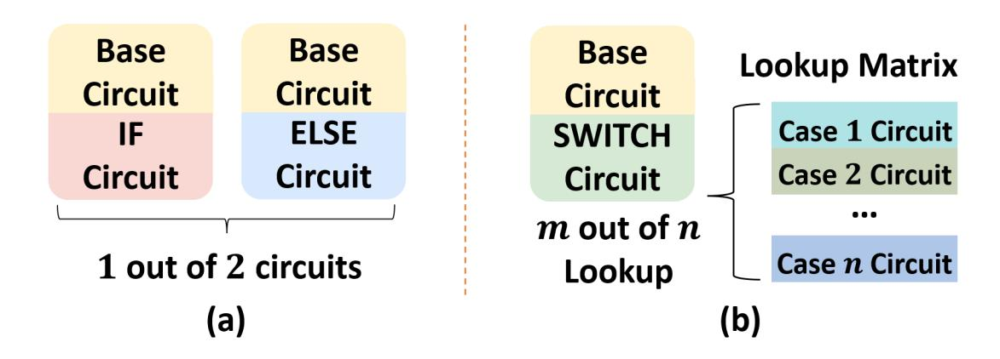
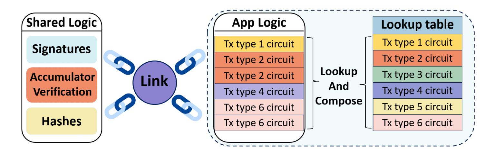
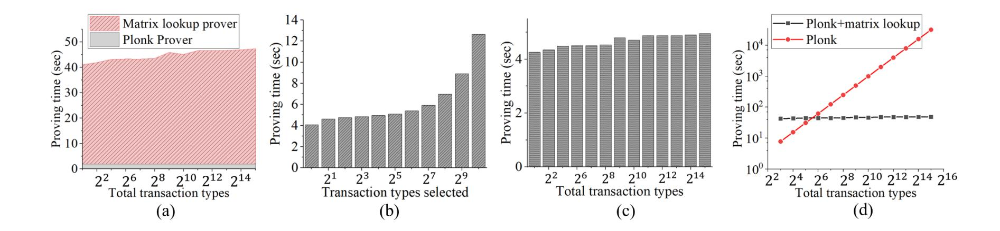

{0}------------------------------------------------

## Gryphes: Hybrid Proofs for Modular SNARKs with Applications to zkRollups

Jiajun Xin<sup>∗</sup><sup>1</sup> , Samuel Cheung On Tin<sup>∗</sup><sup>1</sup> , Christodoulos Pappas<sup>1</sup> , Yongjin Huang<sup>2</sup> , and Dimitrios Papadopoulos<sup>1</sup>

> <sup>1</sup>Hong Kong University of Science and Technology <sup>2</sup>OKG

#### Abstract

We address the challenge of constructing a proof system capable of handling multiple computations that involve diverse types of tasks, such as scalable zkRollup applications. A central dilemma in this design is the trade-off between generality and efficiency: while arithmetic circuit-based SNARKs offer fast proofs but limited flexibility, zkVMs provide general-purpose programmability at the cost of considerable overhead for circuit translation. We observe that typical workloads for such applications can be naturally divided into two parts: (1) diverse, task and data-dependent application logic, and (2) computationally intensive cryptographic operations, e.g., hashes, that are common and repetitive. To optimize for both efficiency and adaptability, we propose Gryphes, a hybrid framework that composes matrix lookup, a generalization of lookup arguments, together with SNARK solutions tailored for cryptographic operations. At the heart of Gryphes is a novel and efficient linking protocol, enabling seamless, efficient composition of matrix lookup + PlonK with general commit-and-prove SNARKs.

By integrating Gryphes with Groth16 for signatures and RSA accumulators for membership proofs, we build a zkRollup prototype that achieves efficient proving, constantsize proofs, and dynamic support for thousands of transaction types. This includes our matrix lookup implementation incorporated with PlonK, as well as practical optimizations, comprehensive benchmarks, and open-sourced code. Our results demonstrate that Gryphes strikes a very good balance between functionality and efficiency, offering highly expressive and practical zkRollup systems.

## 1 Introduction

A Succinct Non-interactive ARgument of Knowledge (SNARK) is a cryptographic primitive allowing a prover to prove the correct execution of a potentially expensive compu-

<sup>∗</sup>Both authors contributed equally to this research. Emails: jxin@cse.ust.hk, xtianae@cse.ust.hk, cpappas@connect.ust.hk, jason.huang@okg.com, dipapado@cse.ust.hk

{1}------------------------------------------------

tation. The resulting proof is succinct, meaning it can be verified in sub-linear (often constant or logarithmic) time. SNARKs have found numerous applications, ranging from building advanced cryptographic tools [\[1,](#page-28-0) [2,](#page-28-1) [3,](#page-28-2) [4\]](#page-28-3) to solving complex real-world problems directly, e.g., scaling verifiable computations [\[5,](#page-28-4) [6,](#page-28-5) [7,](#page-28-6) [8\]](#page-28-7), decentralized identity frameworks [\[9,](#page-28-8) [10\]](#page-28-9), zero-knowledge machine learning [\[11,](#page-29-0) [12,](#page-29-1) [13,](#page-29-2) [14\]](#page-29-3), and zero-knowledge databases [\[15,](#page-29-4) [16,](#page-29-5) [17\]](#page-29-6). Besides, they have gained significant popularity in many blockchain applications, including zkRollups [\[18,](#page-29-7) [19,](#page-29-8) [7,](#page-28-6) [20,](#page-29-9) [21,](#page-29-10) [22,](#page-29-11) [23,](#page-29-12) [24\]](#page-29-13).

One popular and efficient approach for proving computations is to directly compile them into arithmetic circuits, a model adopted by many widely-used SNARKs [\[25,](#page-29-14) [26,](#page-30-0) [27,](#page-30-1) [28\]](#page-30-2). However, this method becomes impractical when the computation is input-dependent, for example, if it contains conditional branches. Since arithmetic circuits have a fixed structure, different branches require different circuits, meaning that in the worst case, each distinct input might trigger a different execution path and thus require a different circuit. Throughout the literature, there have been two main approaches to overcome that issue. "Strawman" solution based on SNARK + 1-out-of-n circuits. The first simple approach to bypass the above constraint is to pre-process all possible circuits at the beginning. However, this approach is limited to a "shallow" branching circuit. If the circuit has k layers of "switch case" with n conditions, we need to set up n <sup>k</sup> different sets of public parameters via a trusted setup ceremony for each circuit, which is impractical (or an expensive pre-processing step by the verifier, simply to validate the correctness of each circuit being proven). We illustrate this idea in Figure [1](#page-1-0) (a).

<span id="page-1-0"></span>

Figure 1: Two different approaches to implementing branching within a SNARK circuit. Subfigure (a) shows compiling both circuits independently and using one of the circuits to prove. Subfigure (b) describes storing the circuits of n cases into a lookup matrix and achieving the "switch case" by looking up m out of n circuits in the matrix.

Proving computations in the RAM model. The second approach, commonly known as Zero-Knowledge Random Access Machine (zkRAM) [\[29,](#page-30-3) [30,](#page-30-4) [31,](#page-30-5) [32\]](#page-30-6), addresses this limitation by simulating a RAM-based execution model within a proof system, allowing the prover to follow only the actual control path. Memory correctness is ensured via offline consistency checks [\[33,](#page-30-7) [34\]](#page-30-8) or authenticated data structures [\[6\]](#page-28-5) (e.g., Merkle trees). While zkRAM improves efficiency for data-dependent logic, it incurs significant prover overhead due to the cost of simulating and verifying memory access for branching. We would like to have a proving system that is as efficient as proving the computation directly as an arithmetic 

{2}------------------------------------------------

circuit and as general as proving a computation in the RAM model.

Based on the above discussion, it is apparent that both approaches have their limitations. Ideally, we would like to construct a proving system that combines the generality of a RAM-based solution with the efficiency of directly proving computations as arithmetic circuits. Until very recently, however, constructing such a proving system has been an important open question. To our knowledge, the only work that attempted to answer that question is  $Sublon \mathcal{K}$  [35], which is based on the  $Plon \mathcal{K}$  +matrix lookup paradigm.

To explain how that approach works, we begin by introducing  $\mathcal{PlonK}$ , which serves as its foundation.  $\mathcal{PlonK}$  [26] is a widely adopted SNARK proving system, built by integrating a polynomial interactive oracle proof (P-IOP) with a polynomial commitment scheme [36, 37, 38]. A  $\mathcal{PlonK}$  prover mainly needs to prove two types of constraints: **gate constraints** and **copy constraints** (we omit details about input/output checks, as they are not the focus of this discussion). Gate constraints enforce the *correct behavior of arithmetic operations* (e.g., addition, multiplication) following a predetermined gate sequence. In contrast, copy constraints ensure *value consistency* across different gates. We illustrate one example in Figure 2.

Crucially,  $\mathcal{PlonK}$  verification assumes the circuit C is fixed: during preprocessing, a verification key (VK) is generated that encodes the specific circuit. This is where the branching challenge discussed earlier becomes relevant. For a branching circuit C with input x, the actually executed subcircuit  $\tilde{C}_x$  is only determined after the prover receives x. While the prover can generate a succinct proof with cost  $\tilde{O}(|\tilde{C}_x|)$ , this proof alone is insufficient: the VK was generated for the full circuit C, not for the subcircuit  $\tilde{C}_x$ .

Sublon  $\mathcal{K}$  [35] proposed storing the possible sub-circuits of a  $\mathcal{Plon}\mathcal{K}$  circuit in a vector, and using a matrix lookup [35, 39, 40], a variant of lookup arguments with additional properties, to prove their validity. Before going into the details of  $Sublon\mathcal{K}$ , we first introduce what lookup arguments are and why they do not suffice to prove the validity of subcircuits. A lookup argument enables efficient membership proofs in a predefined table or vector **v**. If we only use the traditional lookup arguments to batched membership proofs of subcircuits, a key limitation arises: traditional lookup arguments only verify that the elements (gates) belong to the vector v, but they do not preserve their relative order. This lack of ordering guarantees can be problematic if we use lookup arguments to compose subcircuits into a circuit, as shown in Figure 2, where the sequence of gates is essential for maintaining  $\mathcal{Plon}\mathcal{K}$  constraints. To solve this problem,  $\mathcal{Sublon}\mathcal{K}$  proposed to use matrix lookup arguments, which enhance traditional lookup arguments by incorporating structural ordering. A matrix lookup argument [35, 39, 40] improves lookup arguments over vectors with two key properties: (a) it groups contiguous elements into vectors (matrix rows), preserving relative order within each vector and (b) it groups vectors into a matrix and can generate membership proofs for each vector or a collection of vectors (or sub-matrices).

Armed with a matrix lookup argument,  $Sublon\mathcal{K}$  works as follows: 1) in the preprocessing phase, in addition to the process of  $Plon\mathcal{K}$ , generate a vector that encodes each subcircuit of C, store them in a matrix  $\mathbf{M}$ , and precompute the membership proofs for each vector; 2) once the input x is fixed, the prover derives the corresponding subcircuit  $\tilde{C}_x$  and

{3}------------------------------------------------

<span id="page-3-0"></span>

| Inputs | 6  | 8 | 3  |                |        |
|--------|----|---|----|----------------|--------|
| Gate 0 | 6  | 8 | 14 | Addition       | Gate   |
| Gate 1 | 8  | 3 |    | Subtraction    | Gate   |
| Gate 2 | 14 |   | 70 | Multiplication | n Gate |

Figure 2: An example of  $\mathcal{PlonK}$  circuit with three inputs: 6, 8, and 3. All numbers with the same color should be the same and should have a wire to check their consistency. For clarity of presentation, we only draw the wires for number 8.

uses the precomputation to generate a membership of  $\tilde{C}_x$ , which is the batched membership proofs of respective vectors; 3) prover and verifier carry out  $\mathcal{PlonK}$  for subcircuit  $\tilde{C}_x$ , incurring a computation overhead proportional to the active part of the circuit. We describe this approach in Figure 1 (b).

Decomposing real-world computations. Many real-world cryptographic applications, especially in blockchain and zkRollup [20, 41, 21, 42], entail computations that can be decomposed into two categories: (1) complex but lightweight "application logic" and (2) repetitive but computationally intensive "cryptographic operations." One such example is the domain name system (DNS) based on the Ethereum virtual machine (EVM), as discussed by Buterin [43], where around 85% of execution is concentrated in a few structured expensive operations and the rest is application logic with small costs. Another example is zkRollup by Loopring [42], where verifications of EdDSA signature and hash take around 70% of the total constraints for a transfer transaction. Ideally, a proof system should support both the expressive branching logic for complex application workflows and the efficient handling of heavy cryptographic subroutines.

Limitations of matrix lookup. While matrix lookups were introduced to enable expressive branching logic within proof systems, they unfortunately fall short of meeting the needs outlined above due to two limitations. The *first limitation* lies in its **proving overhead**: matrix lookup requires additional steps to load and prove the correct composition of subcircuits, resulting in a proving overhead that scales linearly with the active portion of the circuit. In practice, our benchmarks indicate that proving the same number of gates using matrix lookup is approximately 19 times slower than the original  $\mathcal{PlonK}$  protocol with KZG polynomial commitment scheme [36]. The second limitation is the requirement for pre-fixed copy constraints. In particular, copy constraints within each subcircuit must be fixed during the preprocessing phase, which prevents the dynamic addition of copy constraints across subcircuits. Recall that  $\mathcal{PlonK}$  's P-IOP enforces wiring consistency using polynomial constraints, which are statically determined during the setup of the matrix M. As a result, a SNARK based on matrix lookup can only support subcircuit compositions with predefined gates and copy constraints. This restriction means that copy constraints are enforced only within individual subcircuits, making it highly impractical to check value consistency across vectors, i.e., to pass values between different execution branches, within 

{4}------------------------------------------------

the matrix lookup framework.[1](#page-4-0) In summary, matrix lookup suffers from two main limitations: high proving overhead and the inability to dynamically enforce copy constraints across subcircuits, thereby limiting support for flexible, cross-branch computations.

Our solution: Gryphes. To overcome these challenges, we introduce Gryphes, a hybrid proof framework that addresses both efficiency and compositional flexibility, by employing different proof systems for each component, proving them separately and linking the proofs. Gryphes integrates:

- PlonK + matrix lookup to handle versatile, complex application logic which may change over time;
- Any efficient SNARK to handle fixed, heavy cryptographic computations, e.g., signatures and hashes;
- A link proof to connect the two SNARK proofs, ensuring witness consistency across both systems.

More specifically, the link proof ensures that the witnesses used in both SNARK systems remain consistent for predetermined indices, thereby enabling seamless and sound composition across different proof systems. Our Gryphes framework has several advantages:

- Improved efficiency. Gryphes combines the strengths of both SNARK systems, supporting efficient proof generation while handling complex logic with branching circuits at minimal cost;
- Cross-subcircuit copy constraints. While PlonK + matrix lookup restricts copy constraints to within individual subcircuits, Gryphes allows witness values to be transferred across subcircuits by enforcing consistency in the second SNARK, thereby supporting cross-subcircuit value sharing;
- Parallel proving. By splitting the computation into two or more independent parts, Gryphes allows the corresponding proofs to be generated in parallel, potentially reducing total proving time.

Despite these benefits, designing an efficient link protocol that maintains key properties, such as a fast prover and constant proof size, remains a technical challenge. In the following, we present the core idea behind our approach.

Link protocol. Several prior works [\[44,](#page-31-3) [45,](#page-31-4) [46,](#page-31-5) [47,](#page-31-6) [48,](#page-31-7) [49\]](#page-31-8) have explored combining different SNARK systems to enable modular composition, allowing the use of the most suitable SNARK for each computational component and connecting witnesses with different representations. This general approach is known as a commit-and-prove (CP) SNARK [\[44\]](#page-31-3), where shared witness values across SNARKs are committed using a common commitment scheme.

However, constructing a CP-SNARK for PlonK (i.e., CP-PlonK) is particularly challenging. This difficulty arises because PlonK represents witness values as polynomials in

<span id="page-4-0"></span><sup>1</sup>SublonK (as discussed in Section 4.1 of the paper [\[35\]](#page-30-9)) supports copy constraints only between consecutive subcircuits via extended permutation domains, with all constraints fixed during preprocessing.

{5}------------------------------------------------

the Lagrange basis over a multiplicative subgroup (i.e., roots of unity), tightly coupling the witness representation with constraint enforcement and proof generation. As a result, decoupling the witness commitment from the prover's internal representation is nontrivial. Moreover, translating PlonK 's polynomial-based witness encoding into the vector representation needed by commitment schemes used in other CP-SNARKs is especially difficult.

For our link protocol, we require three key properties: (1) constant proof size and verification time, to minimize on-chain costs in applications such as zkRollups [\[20,](#page-29-9) [41,](#page-31-0) [21,](#page-29-10) [42\]](#page-31-1); (2) an efficient prover, to ensure practical performance; and (3) compatibility with vector commitments, to enable integration with widely-used SNARKs such as Groth16 [\[25\]](#page-29-14), which represent witnesses as vectors rather than polynomials. Eclipse [\[45\]](#page-31-4) and Lunar [\[46\]](#page-31-5) propose different approaches for building CP-PlonK, but none of them satisfy all of these requirements. Eclipse [\[45\]](#page-31-4) achieves modular composition but incurs logarithmic proof size and verification time, which is unsuitable for applications with tight on-chain verification budgets. Lunar [\[46\]](#page-31-5), on the other hand, focuses on CP-PlonK constructions based on polynomial commitments, requiring that both commitments operate over multiplicative subgroups of the same size. This restriction prevents flexible composition when the two proof systems use domains of different sizes. Moreover, Lunar does not explore how to integrate CP-PlonK with vector commitments, which are commonly used in other SNARK systems [\[50,](#page-31-9) [51,](#page-31-10) [25,](#page-29-14) [52\]](#page-31-11). Another line of work [\[47,](#page-31-6) [48,](#page-31-7) [49\]](#page-31-8) addresses commitment conversions for multilinear polynomial commitments, enabling translations between monomial, Lagrange, and multilinear Lagrange bases but focuses on univariate polynomials, which are the foundation of widely-deployed SNARKs such as PlonK with KZG commitments [\[36\]](#page-30-10) and Groth16 [\[25\]](#page-29-14). By targeting univariate polynomials, our approach enables modular composition with a broader ecosystem of existing SNARK implementations while achieving constant proof size and verification time.

To ensure that two witness representations—one as a Lagrange-basis polynomial and the other as a vector of values—encode the same underlying data, we leverage polynomial identity testing (PIT). According to the Schwartz–Zippel lemma [\[53,](#page-31-12) [54\]](#page-31-13), if two polynomials agree at a randomly chosen point with overwhelming probability, then they are identical. Applying PIT in this context involves evaluating both representations at a random point and comparing the results. However, performing such evaluations is nontrivial: PlonK witnesses are already in evaluation form over the domain (roots of unity), while vector-based witnesses do not naturally support polynomial evaluations. A straightforward solution is to use a separate SNARK circuit that evaluates the witness polynomial as follows:

- 1. Commit to the witness (e.g., w1, w2, . . . , wn) for both SNARKs;
- 2. Sample a random point r (via interaction or Fiat–Shamir heuristic [\[55,](#page-31-14) [52\]](#page-31-11)), and provide it as input to the SNARK circuit;
- 3. Treat the witnesses as polynomial coefficients and compute the evaluation w<sup>1</sup> + w2r + · · · + wnr n−1 inside the SNARK circuits.

{6}------------------------------------------------

This approach is efficient for CP-SNARKs based on vector commitments (e.g., Groth16 [\[25,](#page-29-14) [44\]](#page-31-3)), requiring only n native-field multiplications and additions.[2](#page-6-0) However, it is difficult to apply this method directly to PlonK + matrix lookup. As discussed earlier, PlonK + matrix lookup does not support copy constraints across subcircuits, nor does it provide a straightforward way to evaluate witness values across multiple subcircuits. To address this, we propose a two-step solution:

- 1. Construct an auxiliary PlonK circuit that encodes only the subset of witnesses to be linked, and prove that their values at specific indices match those in the original PlonK + matrix lookup circuit using our link protocol;
- 2. Use polynomial identity testing to verify consistency between this smaller PlonK circuit and the CP-SNARK used for the second computation.

The core challenge lies in efficiently linking two PlonK proof systems—achieving both an optimal prover time and constant proof size and verification overhead. As we just discussed, Eclipse [\[45\]](#page-31-4) does not fit into this step because it incurs logarithmic proof size and verification time. Lunar [\[46\]](#page-31-5) is also limited in this context. Its commit-and-prove techniques for polynomial consistency only apply when the polynomials are defined over the same multiplicative subgroup, or over two domains of equal size related by a shift or permutation. This limitation is fundamental: Lunar's protocol requires a bijective mapping between domains, which is only possible if the domains have the same size. However, the proving time of a PlonK circuit is highly dependent on the choice of the multiplicative subgroup (roots of unity). Moreover, using a large multiplicative subgroup for the auxiliary PlonK means the FFT-based computations in both the auxiliary and main PlonK become equally expensive, significantly increasing the prover's workload. As a result, the protocol loses its efficiency advantages for modular composition and is slow for the prover to compute in practice. In comparison, the core of our link protocol is a new lemma, extending the log-derivative lemma [\[56\]](#page-32-0), that allows us to prove that two polynomials are identical even if they are evaluated over different multiplicative subgroups (roots of unity). Compared to other CP-PlonK approaches, our construction achieves an efficient prover and constant proof size and verification time. Following our presentation of the link protocol, we demonstrate how the Gryphes framework can be applied to decentralized exchanges (DEXs) based on zkRollups.

Application to DEXs based on zkRollup. Blockchains often suffer from high on-chain costs, resulting in expensive gas fees and limited transaction throughput. zkRollups offer a scalable solution by processing transactions off-chain while maintaining security and decentralization. Instead of posting every transaction on-chain, zkRollups submit succinct proofs and state digests, ensuring that state updates are correctly executed without exposing unnecessary data. Moreover, zkRollups can support complex applications, such as DEXs, enabling users to trade cryptocurrencies efficiently on a Layer-2 (L2) chain, possibly without relying on a centralised platform. This enables trustless trading where users

<span id="page-6-0"></span><sup>2</sup>Assuming both SNARKs operate over the same field; otherwise, additional cost is incurred to simulate the arithmetic.

{7}------------------------------------------------

operate directly from self-custodial wallets, eliminating intermediaries that would otherwise collect personal data, control asset custody, or aggregate user trading patterns. The key performance indicators of a DEX are functionality, prover efficiency, and digest size. There are three types of zkRollup solutions. First, solutions based on zero-knowledge Virtual Machines (zk-VMs). These solutions [\[20,](#page-29-9) [41\]](#page-31-0) can support any functionality with a constant-sized proof but suffer from high proving overhead because of the low-level abstraction of zk-VM. Second, solutions based on Scalable Transparent ARgument of Knowledge (STARKs). These solutions [\[21\]](#page-29-10) have fast provers and support a wide range of functionalities, but their proof size and verification cost grow poly-logarithmically with circuit complexity, significantly increasing on-chain costs. Third, there are solutions based on SNARKs for arithmetic circuits. These solutions [\[42\]](#page-31-1) can have efficient provers and constant-sized proofs but cannot handle branching circuits efficiently, which offers limited functionality.

Our Gryphes framework enables DEXs to achieve efficient proving, constant-sized proofs with adaptive, versatile functionalities. Under Gryphes, circuits for different transaction types are stored in the lookup matrix to support various functionalities dynamically. To ensure efficient proving with constant-sized proofs, we can further employ a constant-sized proof SNARK (e.g., Groth16 or PlonK + KZG) to verify heavy cryptographic operations, such as signatures and state updates (the matrix lookup and link proof have constant-sized proofs). This approach balances the broad functionality of zk-VMs with the efficiency of SNARKs, positioning Gryphes as a middle ground between the two. By doing so, we enhance efficiency without significantly compromising functionality in the context of DEXs. From the SNARK perspective, our method can be viewed as a "generalization", as it introduces support for branching conditions, expanding the range of possible circuits. Conversely, from the zk-VM viewpoint, our approach represents a "specialization", focusing specifically on the circuits for DEX functionalities. This hybrid strategy effectively combines the strengths of both zk-VM and SNARK paradigms.

Applications to decentralized identity. Our Link protocol enables the composition of general-purpose, heterogeneous proof systems. This capability naturally extends to applications requiring SNARK compositions. For example, a decentralized identity (DID) project called AnonAadhaar [\[57\]](#page-32-1) leverages Groth16 [\[25\]](#page-29-14) to generate zero-knowledge proofs of identity credentials, benefiting from Groth16's compact proofs. However, Groth16's circuitspecific setup limits extensibility: each new application built on these credentials (e.g., age-based eligibility checks [\[9\]](#page-28-8)) requires its own trusted setup ceremony. Our Link protocol addresses this by enabling composition of Groth16-proven identity credentials with PlonKbased application logic, which only requires a one-time universal setup. This modularity allows identity systems to evolve their functionality without conducting additional trusted setups.

Gryphes implementation. We provide an end-to-end implementation of Gryphes with open-sourced code and detailed benchmarks. In our code, we combined matrix lookup with the industrial-level implementation of PlonK based on Halo2 [\[28\]](#page-30-2). To implement Gryphes, we had to implement our (1) Link protocol and (2) PlonK + matrix lookup. However, there is no efficient, fully open-source implementation of (2) yet. SublonK [\[35\]](#page-30-9) provides an 

{8}------------------------------------------------

incomplete implementation of matrix lookup, with some parts' costs only estimated. For cq+ [\[39\]](#page-30-13), no implementation is available; its performance numbers are derived from theoretical analysis. The work of [\[40\]](#page-30-14) does provide an implementation, but it is not as efficient as SublonK or cq+ [\[39\]](#page-30-13) when there are many subcircuits to encode, both asymptotically and concretely. To fill this gap, we implemented both components in Rust and open-sourced our implementations. For (2), we built upon the halo2 library [\[58\]](#page-32-2) as the basic PlonK and implemented the matrix lookup primitive on top of it, using the BN256 curve. To the best of our knowledge, ours is the first complete, open-source implementation of PlonK + matrix lookup.

Summary of contributions. Our overall contributions can be summarised as follows:

- 1. We propose Gryphes, a framework that efficiently combines PlonK + matrix lookup and any other SNARK. Gryphes enables efficient composition of SNARKs with branching circuits while preserving succinctness, achieving constant-sized proofs and efficient proving and verification.
- 2. As important building blocks of the above, we introduce a novel Link protocol that connects PlonK with any other SNARK under the CP-SNARK framework, with constantsized proofs and low prover overhead.
- 3. We implement an open-source construction[3](#page-8-0) for the matrix lookup primitive introduced in [\[35\]](#page-30-9), together with a full implementation of PlonK + matrix lookup, which, to the best of our knowledge, is the first one.
- 4. We evaluate the performance of our framework for an L2 DEX application (implemented via zkRollup). Our evaluation demonstrates both the practicality and efficiency of our techniques. All our code is open-sourced to support reproducibility and future research.

## 2 Related Work

Existing zkRollups. A zk-VM transforms complex programs into low-level, machinereadable code, which is further decomposed into operation codes (opcodes). These opcodes represent elementary instructions that the virtual machine can execute, such as addition and multiplication. The zk-VM sequentially executes these opcodes while simultaneously generating proofs to verify the correct execution of each instruction. This approach enables zk-VM to execute arbitrary programs, making zk-VM-based zkRollup solutions capable of accommodating a wide range of functionality while maintaining a succinct digest size. However, the abstraction to the opcode level introduces a significant trade-off. While it provides flexibility and broad compatibility, it also results in reduced prover efficiency. The process of proving the correct execution of numerous low-level operations can be computationally intensive, potentially impacting the overall performance of the system. Examples of these include Scroll [\[20\]](#page-29-9) and ZKSync [\[41\]](#page-31-0).

STARK-based solutions, exemplified by systems like StarkEx [\[21\]](#page-29-10), offer extensive functionality support with an efficient prover. However, they present significant trade-offs in

<span id="page-8-0"></span><sup>3</sup> <https://github.com/hkust-okx-zkdex-project/pets26-artifacts>

{9}------------------------------------------------

terms of proof size and verification costs. Both the proof size and verification cost increase logarithmically with the complexity of the arithmetic circuit representing the computation. While logarithmic growth is generally favorable for scalability, it poses unique challenges in the context of zkRollups. The process of storing and verifying STARK proofs on-chain through smart contracts can incur substantial gas costs, particularly for intricate operations. These elevated costs can create a significant adoption barrier for such zkRollups, given that the primary objective of zkRollups is to reduce transaction fees and improve scalability. The inherent expense of STARK proof verification on-chain potentially undermines the cost-saving benefits that zkRollups aim to provide.

SNARK-based solutions offer a compelling combination of efficient proof generation and succinct digests, which are highly desirable in the zkRollups setting. However, this efficiency often comes at the cost of limited functionality. For example, Loopring [42] is based on such a paradigm and can only support a handful of types of transactions, e.g., basic deposit, transfer, and exchange.

## <span id="page-9-0"></span>3 Preliminaries

Let  $\lambda$  denote a security parameter. A function  $\operatorname{negl}(\lambda) \colon \mathbb{N} \to \mathbb{R}^+$  is  $\operatorname{negligible}$  if for every positive polynomial  $\operatorname{poly}(\lambda)$  there exists a  $\lambda_0 \in \mathbb{N}$ , such that for all  $\lambda > \lambda_0 : \epsilon(\lambda) < 1/\operatorname{poly}(\lambda)$ . We denote  $\operatorname{PPT}$  as "probabilistic polynomial time" with respect to  $\lambda$  throughout our paper. Let  $[i,j] = \{i,i+1,\ldots,j-1\}$ , and  $[j] = \{0,1,\ldots,j-1\}$ . Matrices are represented using bold uppercase letters, such as  $\mathbf{M}$ , while vectors are denoted by bold lowercase letters, such as  $\mathbf{v}$ . Let  $\mathbb{F}$  be a finite field, and we denote uniformly sampling a field element x as  $x \overset{\$}{\leftarrow} \mathbb{F}$ . We denote the set of all univariate polynomials over  $\mathbb{F}$  by  $\mathbb{F}[X]$ , while the subset of polynomials with degree strictly less than d is denoted by  $\mathbb{F}_{< d}[X]$ .

**Bilinear mapping.** Let  $(\mathbb{G}_1, \mathbb{G}_2, \mathbb{G}_T)$  denote three cyclic groups of prime order q, where  $\mathbb{G}_1$  and  $\mathbb{G}_2$  are the source groups and  $\mathbb{G}_T$  is the target group. A bilinear map is a function:  $e: \mathbb{G}_1 \times \mathbb{G}_2 \to \mathbb{G}_T$  satisfying the following properties:

- 1. **Bilinearity:** For all  $h_1, h'_1 \in \mathbb{G}_1$ ,  $h_2 \in \mathbb{G}_2$ , and scalars  $\alpha, \beta \in \mathbb{F}_q$ , the map satisfies:  $e(h_1^{\alpha}, h_2^{\beta}) = e(h_1, h_2)^{\alpha \cdot \beta}$ ,  $e(h_1 \cdot h'_1, h_2) = e(h_1, h_2) \cdot e(h'_1, h_2)$ .
- 2. **Non-degeneracy:** The map does not send all input pairs to the identity in  $\mathbb{G}_T$ . Specifically, for generators  $g_1 \in \mathbb{G}_1$ ,  $g_2 \in \mathbb{G}_2$ , we have:  $e(g_1, g_2) = g_T \neq 1_{\mathbb{G}_T}$ , where  $g_T$  is a generator of  $\mathbb{G}_T$ .

For generator  $g_1 \in \mathbb{G}_1$  and  $g_2 \in \mathbb{G}_2$ , we denote  $[x]_1$  to represent  $x \cdot g_1$  for presentation simplicity, and denote  $[x]_2$  for  $x \cdot g_2$ .

Vanishing polynomial and Lagrange basis. Let  $\mathbb{F}$  be a finite field, and let  $\mathbb{W} \subset \mathbb{F}^{\times}$  be a multiplicative subgroup of order n consisting of the n-th roots of unity. Let  $\mathbb{W} = \{1, \omega, \omega^2, \dots, \omega^{n-1}\}$ , where  $\omega \in \mathbb{F}$  is a primitive n-th root of unity, i.e.,  $\omega^n = 1$  and  $\omega^k \neq 1$  for all  $1 \leq k < n$ . In other words,  $\omega$  is a generator of  $\mathbb{W}$ .

The vanishing polynomial associated with  $\mathbb{W}$ , denoted  $Z_{\mathbb{W}}(X)$ , is the unique monic polynomial of degree n that vanishes at every point in  $\mathbb{W}$ . It is given explicitly by:  $Z_{\mathbb{W}}(X) =$ 

{10}------------------------------------------------

 $\prod_{i=0}^{n-1} (X - \omega^i)$ . For each  $i \in \{0, 1, \dots, n-1\}$ , the *i-th Lagrange basis polynomial* over  $\mathbb{W}$  is defined as:  $\ell_i^{\mathbb{W}}(X) = \prod_{\substack{j=0 \ j \neq i}}^{n-1} \frac{X - \omega^j}{\omega^i - \omega^j}$ . Each  $\ell_i^{\mathbb{W}}(X)$  is a degree-(n-1) polynomial satisfying

the interpolation conditions:  $\ell_i^{\mathbb{W}}(\omega^j) = 1$  if j = i; and 0 otherwise. An equivalent and often useful expression for  $\ell_i^{\mathbb{W}}(X)$  involves the vanishing polynomial and its derivative:  $\ell_i^{\mathbb{W}}(X) = \frac{Z_{\mathbb{W}}(X)}{Z'_{\mathbb{W}}(\omega^i)(X-\omega^i)}$ . This formulation is very helpful in settings where the vanishing polynomial and its derivative are known or efficiently computable.

The Lagrange basis polynomials over a multiplicative subgroup  $\mathbb{W}$  of order n exhibit a useful **cyclic symmetry**. Specifically, for any  $i \in \{0, ..., n-1\}$ , the Lagrange basis satisfies:  $\ell_i^{\mathbb{W}}(\omega X) = \ell_{i-1}^{\mathbb{W}}(X)$ , where indices are taken modulo n. This identity reflects a rotational structure among the basis functions: scaling the input X by  $\omega$  effectively shifts the index of the basis function by one.

Aurora Sumcheck Lemma. We introduce the univariate sumcheck lemma initially formulated within the Aurora framework [59].

**Lemma 1** (Aurora Sumcheck Lemma). Let  $\mathbb{W} \subset \mathbb{F}$  be a multiplicative subgroup of size t. For polynomial  $f \in \mathbb{F}_{< t}[X]$ , we have  $\sum_{w \in \mathbb{W}} f(w) = t \cdot f(0)$ .

**KZG** polynomial commitment scheme. The KZG polynomial commitment scheme, introduced by Kate, Zaverucha, and Goldberg [36], provides a succinct and efficient method for committing to univariate polynomials and proving their evaluations at specific points. The scheme relies on a structured reference string (SRS) as public parameters, which are generated through a trusted setup.

<span id="page-10-0"></span>**Definition 1** (KZG Polynomial Commitment Scheme). The KZG polynomial commitment is defined by the following algorithms:  $\Pi_{\mathsf{KZG}} = (\mathsf{KZG}.\mathsf{Setup},\,\mathsf{KZG}.\mathsf{Commit},\,\mathsf{KZG}.\mathsf{Open},\,\mathsf{KZG}.\mathsf{Check}).$ 

- KZG.Setup $(1^{\lambda}, D) \to pp$ . Generate a bilinear group  $(\mathbb{G}_1, \mathbb{G}_2, \mathbb{G}_T, e)$  of prime order p and sample a secret  $\tau \in \mathbb{F}_p$ . Output:  $pp = \{[\tau^i]_1\}_{i=0}^D \cup \{[1]_2, [\tau]_2\}$ .
- KZG.Commit(pp, p(X))  $\to c$ . Let  $p(X) = \sum_{i=0}^{D} p_i X^i$  be a polynomial of degree at most D. Compute the commitment as:  $c = [p(\tau)]_1 = \prod_{i=0}^{D} [\tau^i]_1^{p_i}$ .
- KZG.Open(pp,  $p(X), z) \to (v, \pi)$ . Evaluate the polynomial at z: v = p(z). Define the witness polynomial:  $w(X) = \frac{p(X) v}{X z}, \pi = [w(\tau)]_1$ . Output the evaluation value v and the proof  $\pi$ .
- KZG.Check(pp,  $c, z, v, \pi$ )  $\in \{0, 1\}$ . Accept if the following pairing equation holds:  $e(c [v]_1, [1]_2) = e(\pi, [\tau]_2 [z]_2)$ .

For notational simplicity, we omit pp from function inputs in the rest of this paper. The KZG scheme naturally supports batched openings of multiple polynomials at a common evaluation point using a single proof [26]. This optimization improves efficiency when verifying multiple evaluations simultaneously.

{11}------------------------------------------------

**Definition 2** (Batched KZG Opening). A batched opening at a single point is defined by the following tuple:  $\Pi_{\mathsf{BatchKZG}} = (\mathsf{Batched.Setup}, \mathsf{Batched.Commit}, \mathsf{Batched.Open}, \mathsf{Batched.Check}).$ 

- $\bullet$  Batched.Setup $(1^{\lambda},D) \to pp. \ As \ in \ KZG.Setup, \ generate \ public \ parameters \ for \ a \ degree \ bound \ D.$
- Batched.Commit(pp,  $\{p_i(X)\}_{i=1}^t$ )  $\rightarrow \{c_i\}_{i=1}^t$ . For t polynomials, compute each commitment as  $c_i = [p_i(\tau)]_1$  for  $i = 1, \ldots, t$ .
- Batched.Open(pp,  $\{p_i\}, z) \to (\{v_i\}, \pi)$ . Let  $v_i = p_i(z)$  for each i. Sample a random challenge  $\gamma \in \mathbb{F}_p$ , and compute:  $w(X) = \sum_{i=1}^t \gamma^{i-1} \cdot \frac{p_i(X) v_i}{X z}, \pi = [w(\tau)]_1$ . Output the evaluations  $\{v_i\}_{i=1}^t$  and the aggregated proof  $\pi$ .
- Batched.Check(pp,  $\{c_i\}$ ,  $\{v_i\}$ ,  $z,\pi$ ). Compute the linear combinations of polynomial commitments:  $F = \sum_{i=1}^t \gamma^{i-1} c_i$  and  $V = \left[\sum_{i=1}^t \gamma^{i-1} v_i\right]_1$ . Accept if:  $e(F V, [1]_2) = e(\pi, [\tau]_2 [z]_2)$ .

Commitments to bivariate polynomials. Although the KZG scheme is inherently designed for univariate polynomials, it can be extended to support commitments to bivariate polynomials via univariate encoding techniques [60, 61].

Let P(X,Y) be a bivariate polynomial with degree less than  $d_1$  in X and less than  $d_2$  in Y. Define the univariate encoding:  $\tilde{P}(x) = P(x^{d_2}, x)$ , which transforms P into a univariate polynomial of degree less than  $d_1 \cdot d_2$ . The commitment is then computed using the standard KZG scheme:  $c = [\tilde{P}(\tau)]_1$ .

To open the commitment at a point  $(\alpha, \beta) \in \mathbb{F}_p^2$ , proceed as follows: (1) Fix  $X = \alpha$  to obtain the univariate restriction  $P(\alpha, Y)$ ; (2) Construct a witness for the evaluation of  $\tilde{P}$  at  $x = \beta$ :  $\pi_{\alpha} = \left[\frac{\tilde{P}(x) - P(\alpha, x)}{x^{d_2} - \alpha}\right]_1$ ; (3) Use  $\pi_{\alpha}$  within the standard KZG verification equation to verify that  $P(\alpha, \beta)$  corresponds to the committed polynomial. This encoding enables efficient commitment and evaluation proofs for bivariate polynomials using only univariate KZG infrastructure. It is particularly useful in applications such as lookup arguments, where bivariate relations occur frequently.

**SNARKs.** A Succinct Non-interactive **AR**gument of **K**nowledge (SNARK) for a relation  $\mathcal{R}$  comprises of three algorithms as follows:

- $\Pi.\mathbf{Setup}(1^{\lambda}, \mathcal{R}) \to \mathrm{crs.}$  crs is a common reference string.
- $\Pi$ .**Prove**(crs, x; w)  $\to \pi$ . x is a statement and w is the witness such that  $\mathcal{R}(x, w)$  holds. It outputs  $\pi$  as proof.
- $\Pi$ . Verify(crs,  $x, \pi$ )  $\to$  {0, 1}. It inputs the crs, statement x and proof  $\pi$ . If the proof is correct, it outputs 1; otherwise, 0.

A SNARK is complete, knowledge-sound, and succinct. Completeness means that if  $\mathcal{R}(x, w)$  holds, an honest prover fails to generate the proof  $\pi$  with probability less than  $\operatorname{negl}(\lambda)$ . Knowledge soundness means that given a valid proof, there exists an extractor to extract the witness for that statement. Finally, a SNARK is succinct if the proof size and the verification time are sublinear in the witness size. This property allows the verifier to check any statement in  $\mathcal{R}$  faster than checking the statement and witness (if given) directly. If

{12}------------------------------------------------

a SNARK is also zero-knowledge, it leaks no information about the witness and is called zkSNARK [62].

We follow the Commit-and-Prove SNARK (CP-SNARK) definition from [44]. Informally, the prover can commit the inputs and witnesses of a SNARK through some commitment scheme, e.g., extended Pedersen commitments, which are perfectly hiding and computationally binding. We denote  $c_{w1}$  the committed witness w1 for a CP-SNARK proof  $\pi \leftarrow \Pi$ .Prove(crs,  $c_{w1}, x; w2$ ) where w2 is the non-committed part of the witness. CP-SNARK allows the modular composition of SNARKs through the committed witness. For example, given two relations  $\mathcal{R}_1$  and  $\mathcal{R}_2$ , the prover can prove  $\mathcal{R}_1(c_{w1}; w_2)$  and  $\mathcal{R}_2(c_{w1}; w_3)$  hold with two CP-SNARKs for the same committed witness  $c_{w1}$ .

**RSA accumulators.** An RSA accumulator [63, 64, 65] is a cryptographic commitment to a set  $S = \{e_1, \ldots, e_n\}$ . It has pros/cons compared to Merkle tree-based accumulators and bilinear accumulators as discussed in [66, 67]. Its main advantage is constant-sized membership proof for any set size.

**MultiSwap.** MultiSwap is a cryptographic primitive for proving the update state of an accumulator C after removing a set X and adding a set Y is C'. It was introduced by Ozdemir et al. [6] and improved by Campanelli et al. [9]. Both schemes rely on CP-SNARKs for this check. It was shown to be more efficient than classical Merkle trees to update elements inside SNARK [9].

## <span id="page-12-0"></span>4 Link Proof

Overview. Given two KZG polynomial commitments  $C_S$  and  $C_T$ , each corresponding to a witness polynomial from separate  $\mathcal{Plon}\mathcal{K}$  proofs, we want to prove that their witness values are equal at certain indices. In  $\mathcal{Plon}\mathcal{K}$ , witness values are encoded as polynomials in the Lagrange basis over a domain of roots of unity, meaning that each index maps to a specific evaluation point in this domain. To compare values at these indices, a natural approach is to evaluate both committed polynomials at the corresponding domain points. This can be done by generating KZG opening proofs at those points and verifying that the evaluations match. While KZG commitments support batched openings with a single, constant-sized proof, this method still incurs verification costs that scale linearly with the number of shared indices. But in many application scenarios, e.g., DEXs based on zkRollup, the verification is expensive, and constant verification is important. In this section, we build a link protocol to prove that two  $\mathcal{Plon}\mathcal{K}$  witness values are equal at certain indices with a constant verification overhead, even if they are evaluated using different roots of unity with different sizes, which is indeed the case for circuits with different sizes. Formally, we aim to solve the following problem:

Given two KZG commitments  $C_S$  and  $C_T$ , each committing to polynomials  $S(X), T(X) \in \mathbb{F}[X]$  defined on the Lagrange basis over possibly different evaluation domains  $\mathbb{W} = \{\omega^0, \omega^1, \ldots, \omega^{n-1}\}$  and  $\mathbb{V} = \{\nu^0, \nu^1, \ldots, \nu^{k-1}\}$ , where  $\omega$  and  $\nu$  are primitive roots of unity of order n and k, respectively, and an injective partial function  $\phi: D \subseteq [n] \to [k]$ , the goal is to prove, with constant verification cost, that  $\forall i \in D: S(\omega^i) = T(\nu^{\phi(i)})$ . More formally, we

{13}------------------------------------------------

want to prove the following relation:

<span id="page-13-0"></span>
$$\mathcal{R}_{\text{link}} = \{C_S, C_T, \phi; S(X), T(X) : C_S = \mathsf{KZG.Commit}(S(X)), C_T = \mathsf{KZG.Commit}(T(X)), \phi : D \subseteq [n] \to [k] \text{ is injective}, \forall i \in D : S(\omega^i) = T(\nu^{\phi(i)}), S(X) \in \mathbb{F}_{\leq n}[X], T(X) \in \mathbb{F}_{\leq k}[X] \}.$$

Our approach. The key algebraic insight underlying the link protocol comes from the theory of partial fraction decomposition of rational functions. Suppose we only want to check  $S(\omega^i) = T(\nu^{\phi(i)})$  for all i in D where values  $S(\omega^i)$  and  $T(\nu^j)$  are all distinct. The multisets  $S(\omega^i)$  and  $T(\nu^j)$  are equal if and only if the following rational function holds:

$$\sum_{i \in D} \frac{1}{X + S(\omega^i)} = \sum_{j \in \phi(D)} \frac{1}{X + T(\nu^j)}.$$

Furthermore, the above equation is insufficient for our aim because the mapping relation between the two sides is not fixed. More specifically, if we only check the above equation, then there could exist another injective partial function  $\phi': D \subseteq [n] \to [k]$  to make the above equation hold. To solve this, we introduce a mapping polynomial  $\Phi(X)$  to encode the relation  $\phi$ , so that for  $i \in D$ ,  $\Phi(\omega^i) = \nu^{\phi(i)}$ , and 0 elsewhere. Furthermore, we introduce another variable Y to bind  $\Phi$ , so that the multisets  $S(\omega^i)$  and  $T(\nu^j)$  are equal with respect to  $\phi$  if and only if the following function holds:

$$\sum_{i \in D} \frac{a_i}{X + S(\omega^i) + Y\Phi(\omega^i)} = \sum_{j \in \phi(D)} \frac{b_j}{X + T(\nu^j) + Y\nu^j}$$

where indicators  $a_i = 1$  if  $\omega^i$  is involved in the mapping; otherwise 0, and  $b_j = 1$  if  $\nu^j$  is involved in the mapping; otherwise 0. We will present the formal lemma and proof of the above condition shortly.

For compatibility with polynomial commitment schemes, we interpolate the indicator vector  $(a_i)$  to a global polynomial A(X) such that  $A(\omega^i) = a_i$  for all  $i \in [n]$  with degree less than n. More specifically, A(X) can be constructed by  $A(X) = \sum_{i \in D} a_i \cdot \ell_i^{\mathbb{W}}(X)$  where  $\ell_i^{\mathbb{W}}(X)$  is the Lagrange basis polynomial for  $\omega^i$ . This means A(X) agrees with the original sum's coefficients at the prescribed points, but also produces a value at every other  $X \in \mathbb{F}$  by the rules of polynomial evaluation. Similarly, we interpolate  $(b_j)$  to B(X) over  $\mathbb{V}$ . Further recall that all  $S(X), T(X), \Phi(X)$  are also defined everywhere with appropriate degree, allowing us to rewrite sums over the finite set as a rational function, i.e., a fraction of two polynomials, **over the entire domain**:

$$\frac{A(X)}{X + S(X) + Y\Phi(X)} = \frac{B(X)}{X + T(X) + Y \cdot X}.$$

Suppose we commit S(X), T(X) first and derive  $\Phi(X), A(X), B(X)$  from  $\phi(\cdot)$ . In that case, verifying the rational function equality at random  $(X,Y)=(\alpha,\beta)$  implies the original point-wise equalities with overwhelming probability. However, the KZG polynomial

{14}------------------------------------------------

commitment and most other polynomial commitments commit to polynomials, not rational functions. It is hard to evaluate the rational function directly over polynomial commitments.

To bridge this gap, we transform the rational function identity into an equivalent statement about polynomials. This is achieved by clearing denominators: for any fixed  $(\alpha, \beta)$ , we multiply both sides of the rational function equation by the common denominator, resulting in polynomial identities that can be efficiently handled within the framework of polynomial commitments. Specifically, denote the left-hand side of the rational equation as  $L(X) := \frac{A(X)}{\alpha + S(X) + \beta \Phi(X)}$ . Since the rational function L(X) is not a polynomial and cannot be directly committed using KZG, we construct the unique degree- $\langle n \text{ polynomial } L'(X)$  that agrees with L(X) at all points of the subgroup  $\mathbb{W}$ :  $L'(\omega^i) := \frac{A(\omega^i)}{\alpha + S(\omega^i) + \beta \Phi(\omega^i)}$ ,  $\forall i \in [n]$ . This polynomial L'(X) is constructed via Lagrange interpolation from the collection of rational evaluations at the subgroup points. We observe that, for all  $X = \omega^i \in \mathbb{W}$ ,  $L'(X) \cdot (\alpha + S(X) + \beta \Phi(X)) - A(X) = 0$ . In other words, the polynomial  $P(X) := L'(X) \cdot (\alpha + S(X) + \beta \Phi(X)) - A(X)$  vanishes at every point in  $\mathbb{W}$ . By the polynomial remainder theorem, P(X) is divisible by the vanishing polynomial  $Z_{\mathbb{W}}(X) = \prod_{i=0}^{n-1} (X - \omega^i)$ :  $P(X) = Z_{\mathbb{W}}(X) \cdot Q_L(X)$ , where  $Q_L(X)$  is some quotient polynomial. An analogous construction applies to the right-hand side for T(X) over  $\mathbb{V}$ .

The divisibility check confirms that L'(X) and R'(X) are correctly constructed from the rational functions. Our goal now is to verify the linking relation  $S(\omega^i) = T(\nu^{\phi(i)})$  for all  $i \in D$ . The key observation is that, since  $A(\omega^i) = 1$  for  $i \in D$  and 0 otherwise, the sums of L' and R' over their respective domains reduce to exactly the partial fraction sums:

$$\sum_{\omega \in \mathbb{W}} L'(\omega) = \sum_{i \in D} \frac{1}{\alpha + S(\omega^i) + \beta \nu^{\phi(i)}}, \sum_{\nu \in \mathbb{V}} R'(\nu) = \sum_{j \in \phi(D)} \frac{1}{\alpha + T(\nu^j) + \beta \nu^j}.$$

As we prove in Appendix A, equality of these partial fraction sums for all  $\alpha, \beta \in \mathbb{F}$  is equivalent to the linking relation (Lemma 2). Therefore, verifying the linking relation reduces to checking that  $\sum_{\omega \in \mathbb{W}} L'(\omega) = \sum_{\nu \in \mathbb{V}} R'(\nu)$ .

The Aurora sumcheck lemma enables efficient verification of sum equality. For a degree- n polynomial, we have  $\sum_{\omega \in \mathbb{W}} L'(\omega) = n \cdot L'(0)$ , and similarly  $\sum_{\nu \in \mathbb{V}} R'(\nu) = k \cdot R'(0)$ . Thus, the verifier checks  $n \cdot L'(0) = k \cdot R'(0)$  using KZG opening proofs, reducing sum verification to a single field equation. By Schwartz-Zippel, equality at random  $(\alpha, \beta)$  implies the partial fraction identity holds for all  $\alpha, \beta$  with overwhelming probability, which in turn establishes the linking relation. One subtlety remains: the Aurora sumcheck lemma is one-directional—it guarantees  $\sum_{\omega \in \mathbb{W}} f(\omega) = n \cdot f(0)$  only when  $\deg(f) < n$ , but the converse does not hold.

To close this gap, we use the standard KZG shifted commitment technique [68, 46] to enforce degree bounds. To prove  $\deg(f) < d$  when the  $\mathbb{G}_1$  SRS supports polynomials up to degree  $D_1$ , the prover provides a "shifted" element  $[\tau^{D_1-d+1} \cdot f(\tau)]_1$ . If  $\deg(f) < d$ , then  $\deg(\tau^{D_1-d+1}f) \leq D_1$ , so this element is computable from the SRS. If  $\deg(f) \geq d$ , the shifted polynomial has degree  $> D_1$  and cannot be produced in the algebraic group model. This technique works with any universal KZG SRS of known maximum degree  $D_1$ , regardless of how much larger  $D_1$  is than the protocol parameters n and k.

{15}------------------------------------------------

For our protocol, L' requires  $\deg(L') < n$  (shift  $D_1 - n + 1$ ) and R' requires  $\deg(R') < k$  (shift  $D_1 - k + 1$ ). Rather than providing two separate proofs, we batch them into a single  $\mathbb{G}_1$  element  $W_{\deg} = [\tau^{D_1 - n + 1} L'(\tau) + \delta \cdot \tau^{D_1 - k + 1} R'(\tau)]_1$  using the existing random challenge  $\delta$ . By the Schwartz-Zippel lemma, if either degree bound is violated, the combined polynomial has degree  $> D_1$  except with probability  $1/|\mathbb{F}|$ , making  $W_{\deg}$  uncomputable from the  $\mathbb{G}_1$  SRS. The verifier checks consistency via a single pairing equation; the total overhead is one  $\mathbb{G}_1$  element and one pairing, with no extra round of interaction. We refer to Appendix A for the formal security argument.

The **high-level overview** of the Link protocol is the following:

- 1. Given a public mapping polynomial  $\Phi$ , the prover commits to witness polynomials S(X) and T(X) encoding values over domains  $\mathbb{W}$  and  $\mathbb{V}$ .
- 2. The verifier sends random challenges  $(\alpha, \beta)$ .
- 3. The prover constructs auxiliary polynomials L'(X), R'(X), along with quotient polynomials  $Q_L(X)$ ,  $Q_R(X)$  witnessing the divisibility by vanishing polynomials.
- 4. The prover proves evaluations of L'(0), R'(0) in a batch.
- 5. The verifier checks divisibility constraints, evaluation correctness, the Aurora sumcheck  $n \cdot L'(0) = k \cdot R'(0)$ , and a batched degree-bound proof ensuring  $\deg(L') < n$  and  $\deg(R') < k$ .

Linking proofs requires proving that two vectors of witness elements partially coincide in a structured way, based on the index mappings. We formally define the matching relation as follows.

<span id="page-15-0"></span>**Definition 3** (Consistent Subvector Matching). Let  $\mathbb{F}$  be a field containing primitive n-th and k-th roots of unity,  $\omega$  and  $\nu$ . Let  $\mathbb{W} = \{\omega^i : 0 \le i < n\}$  and  $\mathbb{V} = \{\nu^j : 0 \le j < k\}$  be multiplicative subgroups of  $\mathbb{F}^{\times}$ . Let  $\mathbf{s} = (s_0, \ldots, s_{n-1}) \in \mathbb{F}^n$  and  $\mathbf{t} = (t_0, \ldots, t_{k-1}) \in \mathbb{F}^k$  be vectors over  $\mathbb{F}$ . Suppose we are given:

- An injective partial function  $\phi: D \subseteq [n] \to [k]$ , where D is a subset of [n], mapping each  $i \in D$  to a unique  $j \in [k]$ .
- A mapping polynomial  $\Phi: \mathbb{W} \to \mathbb{V} \cup \{0\}$  such that  $\Phi(\omega^i) = \nu^{\phi(i)}$  if  $i \in D$ , and 0 otherwise.

We say that **s** and **t** match consistently on D under  $\phi$  if  $\forall i \in D$ :  $s_i = t_{\phi(i)}$ . We say that  $\Phi$  is consistent with  $\phi$  if, for all  $i \in D$ ,  $\Phi(\omega^i) = \nu^{\phi(i)}$ , and for  $i \notin D$ ,  $\Phi(\omega^i) = 0$ .

#### <span id="page-15-1"></span>4.1 The Link Proof Protocol

We present the Link Proof Protocol, which serves as a building block for constructing  $\text{CP-Plon}\mathcal{K}$  proofs. The protocol can be transformed into a non-interactive version using the Fiat-Shamir heuristic [55]. Unless explicitly stated otherwise, we employ the KZG polynomial commitment scheme, as formally defined in Definition 1, for polynomial commitments. Recall that  $\phi$  is an injective partial function  $\phi: D \subseteq [n] \to [k]$ , where D is a subset of

{16}------------------------------------------------

[n] (indices of s), mapping each  $i \in D$  to a unique  $j \in [k]$ . Without loss of generality, we assume  $n \ge k$  throughout; the reverse case is symmetric.

#### $\mathsf{Setup}(\mathbb{F},n,k,\phi)\to\mathsf{srs}$

- 1. Let  $D_1 \geq n-1$  and  $D_2 \geq n$  be the maximum polynomial degrees supported by the  $\mathbb{G}_1$  and  $\mathbb{G}_2$  components of the KZG SRS, respectively. Sample a secret  $\tau \stackrel{\$}{\leftarrow} \mathbb{F}$ . Compute  $\{[\tau^i]_1\}_{i=0}^{D_1}$  and  $\{[\tau^i]_2\}_{i=0}^{D_2}$ . In practice, these may be obtained from a universal KZG ceremony.
- 2. Let  $\omega$  and  $\nu$  be primitive n-th and k-th roots of unity of  $\mathbb{F}$ . Let  $\mathbb{W} = \{\omega^i : 0 \leq i < n\}$  and  $\mathbb{V} = \{\nu^j : 0 \leq j < k\}$  be multiplicative subgroups of  $\mathbb{F}^{\times}$ . Compute vanishing polynomials  $Z_{\mathbb{W}}$ ,  $Z_{\mathbb{V}}$  and the Lagrange basis polynomials for each roots of unity  $\ell_i^{\mathbb{W}}(X)$ ,  $\ell_i^{\mathbb{V}}(X)$  respectively, as we introduced in Section 3.
- 3. Construct binary indicator sequences **a** and **b** to represent the presence of indices in  $\phi$ :  $\mathbf{a} = (a_0, \dots, a_{n-1}), \mathbf{b} = (b_0, \dots, b_{k-1})$

$$a_i = \begin{cases} 1 & \text{if } i \in D, \\ 0 & \text{otherwise,} \end{cases}$$
  $b_j = \begin{cases} 1 & \text{if } j \in \phi(D), \\ 0 & \text{otherwise.} \end{cases}$ 

- 4. Encode the binary sequences  $\mathbf{a}$ ,  $\mathbf{b}$  and the index mapping  $\phi$  into polynomials:  $A(X) = \sum_{i=0}^{n-1} a_i \ell_i^{\mathbb{W}}(X)$ ,  $B(X) = \sum_{j=0}^{k-1} b_j \ell_j^{\mathbb{V}}(X)$ ,  $\Phi(X) = \sum_{i=0}^{n-1} \mathbf{a}_i \cdot \nu^{\phi(i)} \ell_i^{\mathbb{W}}(X)$ . Here,  $\Phi(X)$  encodes the mapping  $\phi$  such that  $\Phi(\omega^i) = \nu^{\phi(i)}$  if  $i \in D$ , and  $\Phi(\omega^i) = 0$  otherwise.
- 5. Commit to polynomials  $Z_{\mathbb{W}}$ ,  $Z_{\mathbb{V}}$ , A(X), B(X), and  $\Phi(X)$ :  $[Z_{\mathbb{W}}]_2$ ,  $[Z_{\mathbb{V}}]_2$ ,  $[A(\tau)]_2$ ,  $[B(\tau)]_2$ , and  $[\Phi(\tau)]_1$  and output

$$\operatorname{srs} = \Big\{ \big\{ \big\{ [\tau^i]_1 \big\}_{i=0}^{D_1}, \{ [\tau^i]_2 \big\}_{i=0}^{D_2} \big\}, [Z_{\mathbb{W}}]_2, [Z_{\mathbb{V}}]_2, [A(\tau)]_2, [B(\tau)]_2, [\Phi(\tau)]_1 \Big\}.$$

Only Step 1 requires a secret trapdoor, identical to the setup phase of the KZG polynomial commitment scheme; the KZG parameters may be reused from a universal ceremony in practice. All subsequent steps are transparent and do not rely on any trapdoor. We commit to polynomials  $Z_{\mathbb{W}}$ ,  $Z_{\mathbb{V}}$ , A(X), B(X), and  $\Phi(X)$  for the ease of verification.

The Link process is defined as follows: Let  $\mathcal{P}$  denote the prover and  $\mathcal{V}$  denote the verifier. Given two polynomials  $S(X) \in \mathbb{F}_{< n}[X]$  and  $T(X) \in \mathbb{F}_{< k}[X]$ , the prover generates their evaluation form via Lagrange interpolation such that  $S(\omega^i) = x_i$  and  $T(\nu^j) = y_j$ . The prover computes the commitments to S(X) and T(X):  $C_S := [S(\tau)]_1$  and  $C_T := [T(\tau)]_1$  and sends  $C_S$  and  $C_T$  to the verifier. The Link protocol proves the relation  $\mathcal{R}_{\text{link}} = \{C_S, C_T, \phi; S(X), T(X)\}$  holds.

## Link protocol between Prover $\mathcal{P}$ and Verifier $\mathcal{V}$ $\mathcal{P}$ 's input:(srs, $C_S$ , $C_T$ , $\phi$ ; S(X), T(X)). $\mathcal{V}$ 's input:(srs, $C_S$ , $C_T$ , $\phi$ ).

1. Round 1 (Challenge Sampling by V)

Sample random challenges  $\alpha, \beta \stackrel{\$}{\leftarrow} \mathbb{F}$ , and send to  $\mathcal{P}$ .

{17}------------------------------------------------

#### 2. Round 2 (Construct Auxiliary Polynomials by $\mathcal{P}$ )

(a) Construct Left-hand Side Polynomial/commitments Construct  $L'(X) \in \mathbb{F}_{< n}[X]$ , where L'(X) satisfies:

$$L'(\omega^i) = \frac{A(\omega^i)}{\alpha + S(\omega^i) + \beta \Phi(\omega^i)}, \forall i \in [n].$$

Compute the quotient polynomial  $Q_L(X)$  such that:

$$L'(X)(\alpha + S(X) + \beta \Phi(X)) - A(X) = Z_{\mathbb{W}}(X)Q_L(X).$$

Commit to L'(X) and  $Q_L(X)$  by  $[L'(\tau)]_2$  and  $[Q_L(\tau)]_1$ .

(b) Construct Right-hand Side Polynomial/commitments Construct  $R'(X) \in \mathbb{F}_{< k}[X]$ , where R'(X) satisfies:

$$R'(\nu^j) = \frac{B(\nu^j)}{\alpha + T(\nu^j) + \beta \nu^j}, \quad \forall j \in [k].$$

Compute the quotient polynomial  $Q_R(X)$  satisfying:

$$R'(X)(\alpha + T(X) + \beta X) - B(X) = Z_{\mathbb{V}}(X)Q_R(X).$$

Commit to R'(X) and  $Q_R(X)$  by  $[R'(\tau)]_2$  and  $[Q_R(\tau)]_1$ , and send  $\{[L'(\tau)]_2, [Q_L(\tau)]_1, [R'(\tau)]_2, [Q_R(\tau)]_1\}$  to  $\mathcal{V}$ .

3. Round 3 (Batch challenge by V)

Sample random challenge  $\delta \stackrel{\$}{\leftarrow} \mathbb{F}$ , and send to  $\mathcal{P}$ .

4. Round 4 (Batched Proof Generation by  $\mathcal{P}$ )

Evaluate L'(0), R'(0), form the batch polynomial  $P(X) = L'(X) + \delta R'(X)$ . Since P(X) - P(0) has no constant term (it vanishes at X = 0), dividing by X yields a well-defined polynomial  $W(X) = \frac{P(X) - P(0)}{X}$ . Set  $\pi_{\mathsf{batch}} = [W(\tau)]_2$ . Compute the batched degree-bound proof:  $W_{\mathsf{deg}} = [\tau^{D_1 - n + 1} L'(\tau) + \delta \cdot \tau^{D_1 - k + 1} R'(\tau)]_1$ . Send  $(L'(0), R'(0), \pi_{\mathsf{batch}}, W_{\mathsf{deg}})$  to  $\mathcal{V}$ .

- 5. Round 5 (Verification by V)
  - (a) Left-hand Side Polynomial Well-formedness Check  $\ \ \ \ \ \ \ \ \ \ \ \ \ \ \ \ \ \ \$

$$e([S(\tau)]_1 + \beta[\Phi(\tau)]_1, [L'(\tau)]_2) \stackrel{?}{=} e([Q_L(\tau)]_1, [Z_{\mathbb{W}}(\tau)]_2) \cdot e([1]_1, [A(\tau)]_2 - \alpha[L'(\tau)]_2)$$

(b) Right-hand Side Polynomial Well-formedness Check

\\Check 
$$R'(X) \cdot (\alpha + T(X) + \beta X) - B(X) = Z_{\mathbb{V}}(X) \cdot Q_R(X)$$

$$e([T(\tau)]_1 + \beta[\tau]_1, [R'(\tau)]_2) \stackrel{?}{=} e([Q_R(\tau)]_1, [Z_{\mathbb{V}}(\tau)]_2) \cdot e([1]_1, [B(\tau)]_2 - \alpha[R'(\tau)]_2)$$

{18}------------------------------------------------

- (c) Check the Validity of L'(0), R'(0)\\Batch KZG opening at z = 0: verify  $P(0) = L'(0) + \delta R'(0)$  $e([\tau]_1, \pi_{\mathsf{batch}}) \stackrel{?}{=} e([1]_1, [L'(\tau)]_2 + \delta [R'(\tau)]_2 - (L'(0) + \delta R'(0))[1]_2)$
- (d) Aurora Sumcheck Verify  $nL'(0) \stackrel{?}{=} kR'(0)$ .
- (e) **Degree-Bound Check** Verify:  $e(W_{\text{deg}}, [1]_2) \stackrel{?}{=} e([\tau^{D_1 n + 1}]_1, [L'(\tau)]_2) \cdot e(\delta[\tau^{D_1 k + 1}]_1, [R'(\tau)]_2)$
- (f) Return 1 (accept) if all pairing checks, the sumcheck, and the degree-bound check pass. Otherwise, return 0 (reject).

We discuss the security of the Link protocol and refer to Appendix A for the security proof and further discussion.

<span id="page-18-0"></span>**Theorem 1.** The Link protocol is an argument of knowledge of polynomials for the relation  $\mathcal{R}_{link}$ , if there is an extractor for the KZG polynomial commitment.

We further extend our protocol to make it zero-knowledge in Appendix B.

#### 4.2 Complexity Analysis

The most computationally intensive parts are the FFT-based operations over polynomials of size n. Therefore, both Setup and Prove have time complexity  $\mathcal{O}(n \log n + k \log k)$ .

The proof consists of 3  $\mathbb{G}_1$ , 3  $\mathbb{G}_2$  and 2 field elements in total:  $[Q_L(\tau)]_1$ ,  $[Q_R(\tau)]_1$ ,  $W_{\text{deg}}$ ,  $[L'(\tau)]_2$ ,  $[R'(\tau)]_2$ ,  $\pi_{\text{batch}} = [W(\tau)]_2$  (the KZG witness polynomial for the batch opening at z = 0) and 2 field elements L'(0), R'(0). The proof size and the verification time are constant, exhibiting a complexity of  $\mathcal{O}(1)$ .

## 5 Gryphes Framework

This section presents the  $\mathcal{G}$ ryphes framework, a modular approach to SNARK composition that efficiently handles computations combining complex branching logic with intensive cryptographic operations. We first describe the framework's general architecture and core technical components, then demonstrate its practical utility and benefits through a concrete zkRollup instantiation for decentralized exchanges.

Existing SNARK systems face a common limitation: they cannot efficiently handle computations that require both complex control flow and heavy cryptographic operations. Current solutions force an unsatisfactory choice between functionality (zk-VMs [20, 41]) and efficiency (arithmetic circuits). Gryphes bridges this gap by decomposing such computations into specialized components, each optimized for its specific computational pattern, then linking them via a novel protocol that ensures end-to-end correctness. The section is organized as follows: Section 5.1 presents the general framework, including architecture, algorithms, and analysis. Section 5.2 provides a concrete DEX-based zkRollup instantiation, demonstrating practical benefits.

{19}------------------------------------------------

#### <span id="page-19-0"></span>5.1 Gryphes Framework

Core approach.  $\mathcal{G}$ ryphes decomposes complex computations into two specialized components:

- Logic Prover: Uses  $\mathcal{PlonK}$  + matrix lookup for complex but lightweight application logic with branching circuits;
- Crypto Prover: Uses any efficient SNARK system for repetitive but computationally intensive cryptographic operations.

The central challenge lies in linking these possibly heterogeneous proof systems while preserving constant proof size and efficient verification. Our solution employs a two-stage approach: connecting the Logic Prover to an auxiliary  $\mathcal{PlonK}$  circuit via our Link protocol (Section 4), then connecting the auxiliary circuit to the Crypto Prover via polynomial identity testing.

Framework architecture. Consider computations  $\mathcal{C}_{logic}$  and  $\mathcal{C}_{crypto}$  for logic and cryptographic operations, respectively. The overall computation  $\mathcal{C} = \mathcal{C}_{logic} \circ \mathcal{C}_{crypto}$  connects through shared witness values at predetermined indices. Let  $\mathbf{w}_{logic} \in \mathbb{F}^{n_1}$  and  $\mathbf{w}_{crypto} \in \mathbb{F}^{n_2}$  denote the witness vectors. A bijective mapping  $\phi : \mathcal{I}_{logic} \to \mathcal{I}_{crypto}$  specifies the correspondence between shared witness indices, where  $\mathcal{I}_{logic} \subseteq [n_1]$  and  $\mathcal{I}_{crypto} \subseteq [n_2]$ . The framework enforces witness consistency:  $\mathbf{w}_{logic}[i] = \mathbf{w}_{crypto}[\phi(i)]$  for all  $i \in \mathcal{I}_{logic}$ .

**Logic Prover.** This component handles dynamic control flow using  $\mathcal{PlonK}$  + matrix lookup. A lookup matrix  $\mathbf{M} \in \mathbb{F}^{s \times t}$  stores precomputed subcircuits for different execution paths. At proving time, the system selects appropriate subcircuits based on runtime inputs and generates a matrix lookup proof  $\pi_{\mathcal{PlonK}}$  +Mat demonstrating execution validity. Witnesses are encoded as polynomials  $S(X) \in \mathbb{F}_{< n_1}[X]$  in Lagrange basis over multiplicative subgroup  $\mathbb{W}_1$  of size  $n_1$ .

Crypto Prover. This component employs efficient SNARK systems optimized for fixed cryptographic operations, e.g., signature verification, hash evaluation, and dataset authentication. For vector-based systems like Groth16, we follow the commit-and-prove paradigm: the prover first commits to the witness  $\mathbf{w}_{\text{crypto}} \in \mathbb{F}^{n_2}$  using a vector commitment scheme to produce  $C_{\text{crypto}}$ , then generates a SNARK proof that the committed witness satisfies the circuit relation. The commitment  $C_{\text{crypto}}$  becomes part of the public statement, enabling the linking protocol to verify consistency with other proof components. We provide one concrete example to link one Logic Prover with one Crypto Prover using our Link protocol in the Appendix C.

#### <span id="page-19-1"></span>5.2 zkRollup Instantiation

We instantiate  $\mathcal{G}$ ryphes for general-purpose applications on zkRollup, creating a comprehensive system that achieves diverse transaction support, efficient proving, and constant proof sizes, delivering optimal trade-offs across functionality, performance, and cost for production blockchain deployment.

Design space and current limitations. Current zkRollup solutions face fundamental trade-offs that limit their practical adoption: zk-VMs offer general programmability but in-

{20}------------------------------------------------

cur high proving overhead, particularly for cryptographic operations that require thousands of constraints; STARKs provide fast proving but generate proof sizes that grow logarithmically with computation complexity, increasing on-chain storage and verification costs; arithmetic SNARKs like Groth16 achieve practical proving with constant proof sizes but lack native support for conditional execution and complex control flow required for diverse transaction types. Our instantiation resolves these limitations by strategically decomposing application functionality into specialized components, each optimized for its specific computational characteristics.

System architecture. The Gryphes zkRollup instantiation follows a standard Layer 2 architecture with three core components:

- Sequencer (L2): Organizes, validates, and executes Layer 2 transactions, consolidating them into ordered batches while ensuring protocol adherence and deterministic state transitions;
- Prover (L2): Constructs SNARK proofs using the Gryphes framework to prove the correctness of all state transitions;
- zkRollup Contract (L1): A single smart contract that atomically verifies SNARK proofs and updates the global state root. It serves as the authoritative source of certified state, enforces protocol rules, and ensures data availability.

The zkRollup contract provides the critical security guarantee that state updates only occur after successful proof verification, ensuring no invalid transitions can be committed to Layer 1.

Global state management. The system maintains global states using RSA accumulators for efficient membership proofs. Representative state structures include:

- Account State Set: Tracks user account information including balances, nonces, and application-specific data, with each account uniquely identified by user addresses
- Application State Set: Represents application-specific objects such as smart contract states, NFT ownership records, or lending positions, each with unique identifiers and associated metadata

Each global state is represented by an RSA accumulator element, encoded with division intractable hash digest [\[69,](#page-32-13) [70,](#page-32-14) [6,](#page-28-5) [9\]](#page-28-8), providing constant-sized membership proofs regardless of state size, a crucial property for zkRollup scalability where proof verification costs directly impact L1 gas expenses.

Transaction Logic Decomposition. The system supports diverse transaction types, including deposits, withdrawals, transfers, smart contract calls, state updates, batch operations, and administrative actions. Each transaction type is decomposed into two distinct components:

- Transaction-Specific Logic, which is lightweight and unique to each transaction type, including state validation, business rule enforcement, and application-specific computations;
- Shared Logic, which is computationally expensive operations and common across all

{21}------------------------------------------------



Figure 3: Gryphes framework: Gryphes decomposes complex computations into two separate specialized components and links them together using our Link protocol. One component called Shared Logic contains all the repeated heavy cryptographic operations, and another component handles various application logics using matrix lookup.

<span id="page-21-0"></span>transactions, including signature verification, RSA membership proofs, and hash computations.

This separation optimizes circuit utilization since shared operations dominate the constraint count while being identical across transaction types, making their separate optimization worthwhile. We illustrate this idea in Figure [3.](#page-21-0)

Groth16 crypto prover implementation. Our Crypto Prover uses Groth16 for two typical shared operations that benefit from its constant proof size and efficient arithmetic circuit representation:

RSA accumulator membership: RSA accumulators maintain authenticated global states with constant-sized membership proofs independent of state size. For each transaction, the Crypto Prover generates membership proofs demonstrating correct inclusion of relevant account states in the global accumulator, providing superior scalability compared to Merkle tree proofs that grow logarithmically with state size. For state transitions affecting multiple accounts, MultiSwap [\[6,](#page-28-5) [9\]](#page-28-8) based on accumulators proves correct updates by simultaneously removing outdated states (set X) and adding updated states (set Y ), transitioning the accumulator C → C ′ . This approach outperforms individual Merkle tree updates by avoiding the need for logarithmic path verification for each modified account, instead requiring only constant-time accumulator operations. More specifically, we utilize two RSA accumulators in this system: one RSA accumulator containing all state information, and updated using MultiSwap; the other RSA accumulator accumulates all the transaction information in an append-only manner.

Signatures: Validates transaction signatures using Baby Jubjub [\[71\]](#page-32-15) elliptic curve operations and performs SNARK-friendly hash computations using Poseidon and MiMC hash [\[72,](#page-33-2) [73\]](#page-33-3). These operations involve fixed arithmetic computations without conditional logic, making them ideally suited for Groth16's arithmetic circuit model.

Groth16 provides three crucial advantages for our system: compact proofs (192 bytes) essential for minimizing L1 verification costs; seamless CP-SNARK integration via vectorbased witness representation [\[44\]](#page-31-3); and optimized proving performance for the repetitive 

{22}------------------------------------------------

cryptographic operations common in batch processing.

PlonK + matrix lookup logic prover implementation. The Logic Prover handles diverse transaction types via a lookup matrix M storing precomputed subcircuits for various transaction types. Dynamic subcircuit selection based on transaction types enables flexible functionality while maintaining circuit efficiency through specialized optimization for each transaction category. Adding new transaction types requires only extending the lookup matrix rather than modifying core infrastructure, providing extensibility for evolving application requirements.

Integration architecture. The Gryphes framework integrates heterogeneous proof systems through modular composition, enabling each component to be optimized independently while maintaining end-to-end security. The system generates four coordinated proofs that collectively establish transaction batch correctness: a PlonK +matrix lookup proof for transaction-specific logic, a Groth16 proof for shared cryptographic operations, an auxiliary PlonK proof for cross-framework bridging, and a link proof ensuring witness consistency. The key innovation lies in the two-stage linking approach that bridges polynomial-based and vector-based witness representations without requiring homogeneous proof systems.

Cross-framework witness consistency. Linking heterogeneous proof systems requires bridging different witness representations, e.g., Lagrange-basis polynomials for PlonK versus vectors for Groth16. The auxiliary PlonK circuit encodes shared witness values {wlogic[i] : i ∈ Ilogic} and evaluates the polynomial vaux = P|Ilogic|−<sup>1</sup> <sup>j</sup>=0 waux[j] · r <sup>j</sup> at challenge point r. The Groth16 circuit computes the equivalent evaluation vcrypto = P i∈Ilogic wcrypto[ϕ(i)] · r i using the same challenge. Polynomial identity verification vaux = vcrypto confirms witness consistency across frameworks, ensuring the same shared values are used in both proof systems.

Performance and scalability analysis. This instantiation delivers several key advantages over existing approaches:

- Constant Verification Cost: All proof components have constant verification time, resulting in predictable L1 gas costs regardless of batch size;
- Flexible Transaction Support: Dynamic subcircuit selection supports arbitrary transaction logic while maintaining proving efficiency through specialized circuits;
- Efficient State Management: RSA accumulators with MultiSwap provide superior batch update efficiency compared to traditional Merkle tree approaches, particularly for large batches;
- Parallel Proving: Logic and crypto proving proceed independently, enabling latency reduction through parallel execution.

The auxiliary circuit complexity scales with the number of transactions per batch rather than total zkRollup state size, ensuring link overhead remains manageable even for systems with substantial global state. RSA accumulators provide four critical advantages over Merkle trees in the SNARK context: constant versus logarithmic proof sizes, efficient batch updates via MultiSwap versus individual path updates, seamless CP-SNARK integration through simple arithmetic operations, and reduced auxiliary circuit complexity due to fewer 

{23}------------------------------------------------

shared witness values. Gryphes thus provides a practical solution to the zkRollup dilemma, enabling sophisticated blockchain applications with the performance characteristics required for scalable deployment while maintaining the security guarantees essential for production systems.

## 6 Experimental Evaluation

We evaluate Gryphes through comprehensive experiments that validate our core claims: (1) the Link protocol enables efficient composition of heterogeneous SNARKs, (2) matrix lookup + PlonK provides superior efficiency for diverse application logic compared to monolithic circuits, (3) the complete Gryphes framework achieves better performance than existing approaches for zkRollup workloads, and (4) the system scales effectively with increasing transaction types and batch sizes. We open-source our implementation.[4](#page-23-0) Our evaluation follows a systematic approach: we first benchmark individual components (Link protocol, matrix lookup + PlonK, crypto prover), then demonstrate their composition in a realistic zkRollup scenario, and finally measure the overall performance.

All performance evaluations in this section were conducted on a single workstation powered by an Intel Xeon E-2174G processor, featuring 4 physical cores and 8 logical threads enabled through Intel's Hyper-Threading technology, with a clock speed of 3.80 GHz. The system was equipped with 128 GiB of DDR4 RAM operating at 2666 MHz and utilized a 1 TB NVMe SSD as primary storage. The workstation ran Ubuntu 20.04.6 LTS with a 64-bit Linux kernel (5.15.0-91-generic). All experiments are conducted with multiple cores in parallel, unless otherwise noted. We relied on the Rayon library for parallelism in Rust projects, which automatically detects and utilizes all eight logical cores available on the workstation.

Most components were developed in Rust (stable toolchain version 1.79.0), except for the Shared Logic Components implemented in Groth16 using the gnark [\[74\]](#page-33-4) library in Golang. We implement finite field arithmetic, elliptic curve operations, polynomial arithmetic, and the BN256 curve functionality using the arkworks [\[75\]](#page-33-5) libraries. We used the halo2 library from PSE [\[58\]](#page-32-2) as the foundational PlonK proving framework. This library applies a KZG polynomial commitment scheme over the BN256 elliptic curve, via the halo2curve library. The matrix lookup argument and halo2 rely on the same BN256 curves.

#### 6.1 Component Performance Analysis

We begin by evaluating the performance of individual Gryphes components to understand their computational characteristics and validate the theoretical complexity analysis.

<span id="page-23-0"></span><sup>4</sup> <https://github.com/hkust-okx-zkdex-project/pets26-artifacts>

{24}------------------------------------------------



<span id="page-24-1"></span>Figure 4: Performance evaluation of matrix lookup + PlonK: (a) Breakdown of proving time showing matrix lookup overhead dominates at 95% vs 5% for PlonK operations; (b) Impact of transaction type diversity on proving time, showing quasi-linear growth with the number of distinct types selected; (c) Scalability with lookup table size, demonstrating sub-linear growth as the number of supported transaction types; (d) Comparison between PlonK +matrix lookup with monolithic PlonK.

#### 6.1.1 Link protocol evaluation

The Link protocol is crucial for enabling composition between heterogeneous proof systems. We evaluate its performance across different polynomial sizes to verify the theoretical O(n log n+k log k) complexity, where n and k are the degrees of the linked polynomials. We benchmark the protocol between two polynomials: one with fixed degree 2<sup>16</sup> and another with varying degree from 2<sup>10</sup> to 220, with 2<sup>10</sup> common elements between them. Table [1](#page-24-0) presents the results, confirming the expected quasi-linear growth in proving time with polynomial degree.

For the practical zkRollup scenario with 1024 transactions and 4 shared witness values per transaction (totaling 4096 common values), we construct an auxiliary circuit with 8192 rows. Under these conditions, the Link protocol achieves 1167.8 ms proving time and 3.2 ms verification time, demonstrating practical efficiency for real-world applications. The auxiliary circuit size (8192 rows) is chosen as the next power of 2 above the number of common values (4096) to optimize FFT operations in the PlonK proving process. The Link proof contains 3 G1, 3 G<sup>2</sup> and 2 field elements, resulting in a proof size of 358 Bytes with compressed elliptic curve form.

<span id="page-24-0"></span>Degree 2 <sup>10</sup> 2 <sup>11</sup> 2 <sup>12</sup> 2 <sup>13</sup> 2 <sup>14</sup> 2 <sup>15</sup> 2 <sup>16</sup> 2 <sup>17</sup> 2 <sup>18</sup> 2 <sup>19</sup> 2 20 Time (sec) 1.1 1.1 1.1 1.2 1.3 1.6 2.5 4.3 7.9 15.0 24.1

Table 1: Proving time for the Link protocol. "Degree" refers to the polynomial degree to be linked.

{25}------------------------------------------------

#### 6.1.2 PlonK + matrix lookup performance breakdown

We use the 2 fan-in gates PlonK layout for the benchmark. The matrix lookup requires 9 segment lookup arguments in total: five for the selector columns (corresponding to the five PlonK selectors: qL, qR, qO, qM, qC) and four for the permutation polynomial (one additional permutation polynomial to accommodate Halo2's special setting). In this benchmark, we set each sub-circuit to size 64 gates and include 1024 sub-circuits with 4 different transaction types per proof batch. We varied the number of sub-circuits in a table exponentially (in powers of two) to measure scalability. We first break down the prover cost for matrix lookup compared with PlonK. As shown in Figure [4](#page-24-1) (a), the prover overhead is dominated by the matrix lookup, which takes around 95% of the whole computation, and PlonK only takes around 5% of the computation. In other words, matrix lookup + PlonK is 19× slower than directly executing a fixed-circuit PlonK with the same number of gates. Prover time exhibits sub-linear growth with increasing subcircuit count. For a 1024-subcircuit table, prover time is around 46.6 seconds. The verification process takes 469.5 ms on average, including nine matrix lookup proofs and the final PlonK proof.

#### <span id="page-25-0"></span>6.1.3 Impact of different transaction types selected

We investigate how the number of distinct transaction types affects prover runtime. Given a lookup table with 2<sup>10</sup> = 1024 different subcircuits, we vary the number of distinct transaction types selected from 1 to 1024 while keeping the batch size fixed at 1024 transactions. When selecting 1 transaction type, all 1024 transactions in the batch are identical, requiring only one subcircuit lookup repeated 1024 times. When selecting 1024 distinct types, each transaction in the batch uses a different subcircuit, requiring 1024 different subcircuit lookups. Figure [4](#page-24-1) (b) indicates that the prover time is quasi-linear with the number of transaction types in one matrix lookup. Restricting the variety of transaction types within a single batch can thus improve the prover's efficiency.

#### <span id="page-25-1"></span>6.1.4 Application Logic with PlonK + matrix lookup

Gryphes uses PlonK + matrix lookup to efficiently handle diverse transaction types without the overhead of monolithic circuits. We evaluate this component's ability to scale with increasing transaction variety while maintaining reasonable proving costs. Our evaluation focuses on realistic zkRollup parameters: each transaction type requires at most 64 PlonK gates for its application logic, and each batch processes 1024 transactions. We systematically vary the number of supported transaction types and measure the impact on proving performance. We first measure how many different transaction types and application logics can be efficiently supported using matrix lookup. We fix the subcircuit size and retrieve 4 different subcircuit from a matrix lookup table for 1024 transactions, and measure this condition with various table sizes.

As shown in Figure [4](#page-24-1) (c), the prover time grows sub-linearly with the number of rows in the lookup matrix (number of transaction types). When the number of transaction 

{26}------------------------------------------------

types reaches 1024, the prover time is 4.71 seconds. Verification time remains stable at approximately 18.2 milliseconds. This experiment shows that using matrix lookup can efficiently handle many different types of transactions and applications, at the scale of 2 <sup>10</sup> − 2 14 .

#### 6.1.5 Comparison with monolithic PlonK

Figure [4](#page-24-1) (d) compares PlonK + matrix lookup with monolithic PlonK, both checking 2 <sup>10</sup> transactions, each with 2<sup>6</sup> gates. The monolithic PlonK encodes all possible transaction logics into the circuit, even if they are not checked for a certain witness. Because matrix lookup introduces a large overhead to process the PlonK circuits, for a small number of transaction types, encoding all possible branches is more efficient to prove. As the number of transaction types grows, circuit size and prover time of monolithic PlonK grow linearly, and become impractical for a large number of transaction types. The crossover point occurs at approximately 32-64 transaction types (2<sup>5</sup> to 2<sup>6</sup> ), beyond which monolithic circuits become prohibitively expensive. In contrast, Gryphes's matrix lookup + PlonK approach only processes the actually selected transaction types, achieving sub-linear scaling.

#### <span id="page-26-0"></span>6.1.6 Cryptographic prover based on Groth16

Gryphes utilizes Groth16 [\[25\]](#page-29-14) to handle repetitive cryptographic operations because of its constant proof size and efficient arithmetic circuit representation. Our zkRollup instantiation includes the following operations per 1024-transaction batch:

- Signature Verification: 1024 EdDSA signatures with MiMC hash over Baby Jubjub curve [\[71\]](#page-32-15)
- State Updates: Updating 1024 user states using MultiSwap [\[9\]](#page-28-8)
- Transaction History: 1024 append operations to maintain transaction history in an RSA accumulator

These operations represent the computationally intensive but fixed-structure components that benefit from specialized optimization. The Groth16 proof generation requires approximately 40 seconds for the signature verification and state update operations, plus an additional 4.3 seconds for RSA accumulator computation with 2<sup>14</sup> = 16, 384 users (scaling linearly with user count as shown in Table [2\)](#page-27-0), totaling 44.3 seconds for the complete Crypto Prover component. Verification time is constant at approximately 1 millisecond regardless of batch size. Note that we only used very basic operations for RSA accumulators, and the proving time can be optimized with several standard methods, e.g., precomputation table and parallelizations.

#### 6.2 End-to-End zkRollup Performance

We evaluate the complete Gryphes system in a realistic zkRollup scenario supporting 1024 transaction types and 2<sup>14</sup> = 16, 384 users. Each transaction type requires specific application logic implemented in 64 PlonK gates. For each batch, the prover processes 1024

{27}------------------------------------------------

<span id="page-27-0"></span>

| Number of Users              | 14  | 15  | 16   | 17   | 18   |
|------------------------------|-----|-----|------|------|------|
|                              | 2   | 2   | 2    | 2    | 2    |
| Subset RSA Accumulator (sec) | 4.3 | 8.5 | 17.2 | 34.5 | 68.4 |

Table 2: The prover time to compute the subset RSA accumulator, which is essential for MultiSwap [\[9\]](#page-28-8).

transactions spanning 4 different transaction types, where each transaction shares 4 common witness values between the Crypto Prover (Groth16) and Logic Prover (PlonK + matrix lookup). The Link protocol establishes consistency between the Logic Prover's witness vector (size 2<sup>16</sup> = 65, 536, corresponding to 1024 × 64 gate evaluations) and the auxiliary circuit's witness vector (size 2<sup>12</sup> = 4, 096, corresponding to 1024 × 4 shared values), with 2 <sup>12</sup> common witnesses between them. The system based on Gryphes achieves the following end-to-end performance:

- Proving Time: 92.8 seconds total (46.6s for Logic Prover + 44.3s for Crypto Prover + 1.9s for Link protocol).
- Verification: 478.7 ms verification time (constant regardless of transaction diversity) and constant-size proof.
- Throughput: 11 transactions per second on our test workstation (calculated as 1024 transactions ÷ 92.8 seconds).

The modular design enables parallel execution of Crypto Prover and Logic Prover on separate servers, potentially doubling throughput. The Link protocol overhead (1.9s) represents only 2% of total proving time, validating the efficiency of our composition approach. If users tend to have diverse transaction types within a proof batch, then the time for matrix lookup will increase as we discussed in Section [6.1.3,](#page-25-0) and the other parts of the system remain unchanged. If we include more types of transactions, the time for matrix lookup will increase as we discussed in Section [6.1.4,](#page-25-1) and the other parts of the system remain unchanged. If we increase the number of users in the system, the time to compute RSA accumulators will increase as we discussed in Section [6.1.6,](#page-26-0) and the other parts of the system remain unchanged.

## 7 Conclusion

In this work, we presented Gryphes, a modular framework that composes PlonK +matrix lookup with other SNARKs to efficiently support expressive and scalable zkRollup applications. Leveraging our novel link protocol, Gryphes enables seamless composition and cross-subcircuit witness consistency, achieving constant-sized proofs while supporting thousands of transaction types.

Our end-to-end implementation and extensive benchmarks demonstrate the practicality of Gryphes. On a workstation with just 4 physical CPU cores, Gryphes efficiently processes batches of 1,024 transactions and supports up to 16,384 users. For 1,024 transaction types, the total prover time is 92.8 seconds, corresponding to a throughput of 11 TPS, while the 

{28}------------------------------------------------

overall verification time per batch is under 0.5 seconds. Our open-source implementation provides a foundation for deploying efficient and functional zkRollup systems.

## 8 Acknowledgments

We would like to thank the anonymous reviewers for their constructive feedback. This work was supported with funding from OKG. The views and findings expressed are those of the authors and should not be interpreted as reflecting the position or policy of the funding entity.

## References

- <span id="page-28-0"></span>[1] D. Fiore and I. Tucker, "Efficient zero-knowledge proofs on signed data with applications to verifiable computation on data streams," in Proceedings of the ACM CCS, 2022.
- <span id="page-28-1"></span>[2] J. Xin and D. Papadopoulos, ""check-before-you-solve": Verifiable time-lock puzzles," in IEEE Symposium on Security and Privacy, SP, 2025.
- <span id="page-28-2"></span>[3] S. Garg, A. Jain, P. Mukherjee, R. Sinha, M. Wang, and Y. Zhang, "hints: Threshold signatures with silent setup," in IEEE Symposium on Security and Privacy, SP, 2024.
- <span id="page-28-3"></span>[4] C. Papamanthou, S. Srinivasan, N. Gailly, I. Hishon-Rezaizadeh, A. Salumets, and S. Golemac, "Reckle trees: Updatable merkle batch proofs with applications," in CCS, 2024.
- <span id="page-28-4"></span>[5] E. Ben-Sasson, A. Chiesa, D. Genkin, E. Tromer, and M. Virza, "Snarks for c: Verifying program executions succinctly and in zero knowledge," in CRYPTO, 2013.
- <span id="page-28-5"></span>[6] A. Ozdemir, R. Wahby, B. Whitehat, and D. Boneh, "Scaling verifiable computation using efficient set accumulators," in USENIX Security Symposium, 2020.
- <span id="page-28-6"></span>[7] Y. Ji and K. Chalkias, "Generalized proof of liabilities," in Proceedings of the ACM CCS, 2021.
- <span id="page-28-7"></span>[8] I. Tzialla, A. Kothapalli, B. Parno, and S. T. V. Setty, "Transparency dictionaries with succinct proofs of correct operation," in NDSS, 2022.
- <span id="page-28-8"></span>[9] M. Campanelli, D. Fiore, S. Han, J. Kim, D. Kolonelos, and H. Oh, "Succinct zeroknowledge batch proofs for set accumulators," in Proceedings of the ACM CCS, 2022.
- <span id="page-28-9"></span>[10] D. Rathee, G. V. Policharla, T. Xie, R. Cottone, and D. Song, "Zebra: Snark-based anonymous credentials for practical, private and accountable on-chain access control," Cryptology ePrint Archive, 2022.

{29}------------------------------------------------

- <span id="page-29-0"></span>[11] T. Eisenhofer, D. Riepel, V. Chandrasekaran, E. Ghosh, O. Ohrimenko, and N. Papernot, "Verifiable and provably secure machine unlearning," arXiv preprint arXiv:2210.09126, 2022.
- <span id="page-29-1"></span>[12] K. Abbaszadeh, C. Pappas, J. Katz, and D. Papadopoulos, "Zero-knowledge proofs of training for deep neural networks," in Proceedings of the ACM CCS, 2024.
- <span id="page-29-2"></span>[13] B. B¨unz and J. Chen, "Proofs for deep thought: Accumulation for large memories and deterministic computations," in ASIACRYPT, 2024.
- <span id="page-29-3"></span>[14] C. Pappas and D. Papadopoulos, "Sparrow: Space-efficient zksnark for data-parallel circuits and applications to zero-knowledge decision trees," in Proceedings of the ACM CCS, 2024.
- <span id="page-29-4"></span>[15] Y. Zhang, J. Katz, and C. Papamanthou, "Integridb: Verifiable sql for outsourced databases," in Proceedings of the ACM CCS, 2015.
- <span id="page-29-5"></span>[16] Y. Zhang, D. Genkin, J. Katz, D. Papadopoulos, and C. Papamanthou, "vSQL: Verifying Arbitrary SQL Queries over Dynamic Outsourced Databases," in IEEE Symposium on Security and Privacy, SP, 2017.
- <span id="page-29-6"></span>[17] ——, "A zero-knowledge version of vsql," Cryptology ePrint Archive, 2017.
- <span id="page-29-7"></span>[18] I. Miers, C. Garman, M. Green, and A. D. Rubin, "Zerocoin: Anonymous distributed e-cash from bitcoin," in IEEE Symposium on Security and Privacy, SP, 2013.
- <span id="page-29-8"></span>[19] E. B. Sasson, A. Chiesa, C. Garman, M. Green, I. Miers, E. Tromer, and M. Virza, "Zerocash: Decentralized anonymous payments from bitcoin," in IEEE Symposium on Security and Privacy, SP, 2014.
- <span id="page-29-9"></span>[20] "Scroll architecture," [https://docs.scroll.io/en/technology/,](https://docs.scroll.io/en/technology/) 2023.
- <span id="page-29-10"></span>[21] "Perpetual trading," [https://docs.starkware.co/starkex/perpetual/oracle-price-tick.ht](https://docs.starkware.co/starkex/perpetual/oracle-price-tick.html) [ml,](https://docs.starkware.co/starkex/perpetual/oracle-price-tick.html) 2023.
- <span id="page-29-11"></span>[22] L. T. Thibault, T. Sarry, and A. S. Hafid, "Blockchain scaling using rollups: A comprehensive survey," IEEE Access, 2022.
- <span id="page-29-12"></span>[23] W. Wang, L. Zhou, A. Yaish, F. Zhang, B. Fisch, and B. Livshits, "Mechanism design for zk-rollup prover markets," arXiv preprint arXiv:2404.06495, 2024.
- <span id="page-29-13"></span>[24] S. Chaliasos, I. Reif, A. Torralba-Agell, J. Ernstberger, A. Kattis, and B. Livshits, "Analyzing and benchmarking zk-rollups," Cryptology ePrint Archive, 2024.
- <span id="page-29-14"></span>[25] J. Groth, "On the size of pairing-based non-interactive arguments," in EUROCRYPT, 2016.

{30}------------------------------------------------

- <span id="page-30-0"></span>[26] A. Gabizon, Z. J. Williamson, and O. Ciobotaru, "Plonk: Permutations over lagrangebases for oecumenical noninteractive arguments of knowledge," Cryptology ePrint Archive, 2019.
- <span id="page-30-1"></span>[27] P.-Z. Team, "Plonky2: Fast recursive arguments with plonk and fri," [https://github.c](https://github.com/0xPolygonZero/plonky2/blob/main/plonky2/plonky2.pdf) [om/0xPolygonZero/plonky2/blob/main/plonky2/plonky2.pdf,](https://github.com/0xPolygonZero/plonky2/blob/main/plonky2/plonky2.pdf) 2022.
- <span id="page-30-2"></span>[28] H. team, "Halo2 book," [https://zcash.github.io/halo2/index.html,](https://zcash.github.io/halo2/index.html) 2021.
- <span id="page-30-3"></span>[29] E. Ben-Sasson, A. Chiesa, D. Genkin, E. Tromer, and M. Virza, "Snarks for c: Verifying program executions succinctly and in zero knowledge," in CRYPTO, 2013.
- <span id="page-30-4"></span>[30] E. Ben-Sasson, A. Chiesa, E. Tromer, and M. Virza, "Scalable zero knowledge via cycles of elliptic curves," in CRYPTO, 2014.
- <span id="page-30-5"></span>[31] Y. Zhang, D. Genkin, J. Katz, D. Papadopoulos, and C. Papamanthou, "vram: Faster verifiable ram with program-independent preprocessing," in IEEE Symposium on Security and Privacy (SP), 2018.
- <span id="page-30-6"></span>[32] K. Jiang, F. Brown, and R. S. Wahby, " CoBBL: Dynamic Constraint Generation for SNARKs ," in 2025 IEEE Symposium on Security and Privacy (SP), 2025.
- <span id="page-30-7"></span>[33] S. Setty, J. Thaler, and R. Wahby, "Unlocking the lookup singularity with lasso," in EUROCRYPT, 2024.
- <span id="page-30-8"></span>[34] A. Arun, S. Setty, and J. Thaler, "Jolt: Snarks for virtual machines via lookups," in EUROCRYPT, 2024.
- <span id="page-30-9"></span>[35] A. R. Choudhuri, S. Garg, A. Goel, S. Sekar, and R. Sinha, "Sublonk: Sublinear prover plonk," Proceedings on Privacy Enhancing Technologies, 2024.
- <span id="page-30-10"></span>[36] A. Kate, G. M. Zaverucha, and I. Goldberg, "Constant-size commitments to polynomials and their applications," in ASIACRYPT, 2010.
- <span id="page-30-11"></span>[37] E. Ben-Sasson, I. Bentov, Y. Horesh, and M. Riabzev, "Fast reed-solomon interactive oracle proofs of proximity," in ICALP, 2018.
- <span id="page-30-12"></span>[38] B. B¨unz, J. Bootle, D. Boneh, A. Poelstra, P. Wuille, and G. Maxwell, "Bulletproofs: Short proofs for confidential transactions and more," in IEEE Symposium on Security and Privacy, SP, 2018.
- <span id="page-30-13"></span>[39] M. Campanelli, A. Faonio, D. Fiore, T. Li, and H. Lipmaa, "Lookup arguments: improvements, extensions and applications to zero-knowledge decision trees," in Public Key Cryptography (PKC), 2024.
- <span id="page-30-14"></span>[40] Z. Di, L. Xia, W. Nguyen, and N. Tyagi, "Muxproofs: Succinct arguments for machine computation from vector lookups," in ASIACRYPT, 2024.

{31}------------------------------------------------

- <span id="page-31-0"></span>[41] "Zksync," [https://docs.zksync.io/zk-stack/,](https://docs.zksync.io/zk-stack/) 2024.
- <span id="page-31-1"></span>[42] "Loopring project," [https://github.com/Loopring/protocols/blob/master/packages/l](https://github.com/Loopring/protocols/blob/master/packages/loopring_v3/DESIGN.md) oopring [v3/DESIGN.md,](https://github.com/Loopring/protocols/blob/master/packages/loopring_v3/DESIGN.md) 2023.
- <span id="page-31-2"></span>[43] V. Buterin, "Glue and coprocessor architectures," [https://vitalik.eth.limo/general/2](https://vitalik.eth.limo/general/2024/09/02/gluecp.html) [024/09/02/gluecp.html,](https://vitalik.eth.limo/general/2024/09/02/gluecp.html) 2024, accessed: 2025-08-28.
- <span id="page-31-3"></span>[44] M. Campanelli, D. Fiore, and A. Querol, "Legosnark: Modular design and composition of succinct zero-knowledge proofs," in Proceedings of the ACM CCS, 2019.
- <span id="page-31-4"></span>[45] D. F. Aranha, E. M. Bennedsen, M. Campanelli, C. Ganesh, C. Orlandi, and A. Takahashi, "Eclipse: enhanced compiling method for pedersen-committed zksnark engines," in Public Key Cryptography (PKC), 2022.
- <span id="page-31-5"></span>[46] M. Campanelli, A. Faonio, D. Fiore, A. Querol, and H. Rodr´ıguez, "Lunar: a toolbox for more efficient universal and updatable zksnarks and commit-and-prove extensions," in ASIACRYPT, 2021.
- <span id="page-31-6"></span>[47] C. Ganesh, V. Nair, and A. Sharma, "Dual polynomial commitment schemes and applications to commit-and-prove snarks," in Proceedings of the ACM CCS, 2024.
- <span id="page-31-7"></span>[48] M. Campanelli, D. Fiore, and R. Gennaro, "Natively compatible super-efficient lookup arguments and how to apply them," Journal of Cryptology, 2024.
- <span id="page-31-8"></span>[49] T. Kohrita and P. Towa, "Zeromorph: Zero-knowledge multilinear-evaluation proofs from homomorphic univariate commitments," Journal of Cryptology, 2024.
- <span id="page-31-9"></span>[50] R. Gennaro, C. Gentry, B. Parno, and M. Raykova, "Quadratic span programs and succinct nizks without pcps," in EUROCRYPT, 2013.
- <span id="page-31-10"></span>[51] B. Parno, J. Howell, C. Gentry, and M. Raykova, "Pinocchio: Nearly practical verifiable computation," Communications of the ACM, 2016.
- <span id="page-31-11"></span>[52] A. Kosba, D. Papadopoulos, C. Papamanthou, and D. Song, "{MIRAGE}: Succinct arguments for randomized algorithms with applications to universal {zk-SNARKs}," in USENIX Security Symposium, 2020.
- <span id="page-31-12"></span>[53] J. T. Schwartz, "Fast probabilistic algorithms for verification of polynomial identities," Journal of the ACM (JACM), 1980.
- <span id="page-31-13"></span>[54] R. Zippel, "Probabilistic algorithms for sparse polynomials," in International symposium on symbolic and algebraic manipulation, 1979.
- <span id="page-31-14"></span>[55] A. Fiat and A. Shamir, "How to prove yourself: Practical solutions to identification and signature problems," in CRYPTO, 1986.

{32}------------------------------------------------

- <span id="page-32-0"></span>[56] U. Hab¨ock, "Multivariate lookups based on logarithmic derivatives," Cryptology ePrint Archive, 2022.
- <span id="page-32-1"></span>[57] Privacy and Scaling Explorations, "Anon aadhaar," [https://pse.dev/projects/anon-a](https://pse.dev/projects/anon-aadhaar) [adhaar,](https://pse.dev/projects/anon-aadhaar) 2024, accessed: 2025.
- <span id="page-32-2"></span>[58] PSE, "Pse halo2," [https://github.com/privacy-scaling-explorations/halo2,](https://github.com/privacy-scaling-explorations/halo2) 2025.
- <span id="page-32-3"></span>[59] E. Ben-Sasson, A. Chiesa, M. Riabzev, N. Spooner, M. Virza, and N. P. Ward, "Aurora: Transparent succinct arguments for r1cs," in EUROCRYPT. Springer, 2019.
- <span id="page-32-4"></span>[60] C. Papamanthou, E. Shi, and R. Tamassia, "Signatures of correct computation," in Theory of Cryptography Conference (TCC), 2013.
- <span id="page-32-5"></span>[61] A. Zapico, V. Buterin, D. Khovratovich, M. Maller, A. Nitulescu, and M. Simkin, "Caulk: Lookup arguments in sublinear time," in Proceedings of the ACM CCS, 2022.
- <span id="page-32-6"></span>[62] N. Bitansky, R. Canetti, A. Chiesa, and E. Tromer, "From extractable collision resistance to succinct non-interactive arguments of knowledge, and back again," in Innovations in Theoretical Computer Science, 2012.
- <span id="page-32-7"></span>[63] J. Benaloh and M. De Mare, "One-way accumulators: A decentralized alternative to digital signatures," in EUROCRYPT, 1993.
- <span id="page-32-8"></span>[64] J. Li, N. Li, and R. Xue, "Universal accumulators with efficient nonmembership proofs," in ACNS, 2007.
- <span id="page-32-9"></span>[65] D. Boneh, B. B¨unz, and B. Fisch, "Batching techniques for accumulators with applications to iops and stateless blockchains," in CRYPTO, 2019.
- <span id="page-32-10"></span>[66] A. Tomescu, V. Bhupatiraju, D. Papadopoulos, C. Papamanthou, N. Triandopoulos, and S. Devadas, "Transparency logs via append-only authenticated dictionaries," in Proceedings of the ACM CCS, 2019.
- <span id="page-32-11"></span>[67] I. A. Tomescu Nicolescu, "How to keep a secret and share a public key (using polynomial commitments)," Ph.D. dissertation, Massachusetts Institute of Technology, 2020.
- <span id="page-32-12"></span>[68] A. Chiesa, Y. Hu, M. Maller, P. Mishra, N. Vesely, and N. Ward, "Marlin: Preprocessing zksnarks with universal and updatable srs," in EUROCRYPT, 2020.
- <span id="page-32-13"></span>[69] R. Gennaro, S. Halevi, and T. Rabin, "Secure hash-and-sign signatures without the random oracle," in EUROCRYPT, 1999.
- <span id="page-32-14"></span>[70] J.-S. Coron and D. Naccache, "Security analysis of the gennaro-halevi-rabin signature scheme," in EUROCRYPT, 2000.
- <span id="page-32-15"></span>[71] B. WhiteHat, J. Baylina, and M. Bell´es, "Baby jubjub elliptic curve," Ethereum Improvement Proposal, EIP-2494, vol. 29, 2020.

{33}------------------------------------------------

- <span id="page-33-2"></span>[72] L. Grassi, D. Khovratovich, C. Rechberger, A. Roy, and M. Schofnegger, "Poseidon: A new hash function for zero-knowledge proof systems," in USENIX Security Symposium, 2021.
- <span id="page-33-3"></span>[73] M. R. Albrecht, L. Grassi, C. Rechberger, A. Roy, and T. Tiessen, "Mimc: Efficient encryption and cryptographic hashing with minimal multiplicative complexity," in ASI-ACRYPT, 2016.
- <span id="page-33-4"></span>[74] G. Botrel, T. Piellard, Y. E. Housni, I. Kubjas, and A. Tabaie, "Consensys/gnark: v0.11.0," sep 2024. [Online]. Available:<https://doi.org/10.5281/zenodo.5819104>
- <span id="page-33-5"></span>[75] arkworks contributors, "arkworks zksnark ecosystem," 2022. [Online]. Available: <https://arkworks.rs>
- <span id="page-33-6"></span>[76] H. Lipmaa, R. Parisella, and J. Siim, "Constant-size zk-snarks in rom from falsifiable assumptions," in EUROCRYPT, 2024.
- <span id="page-33-7"></span>[77] G. Fuchsbauer, E. Kiltz, and J. Loss, "The algebraic group model and its applications," in Annual International Cryptology Conference. Springer, 2018, pp. 33–62.

## <span id="page-33-0"></span>A Security Proofs for the Link Protocol

Before we introduce the security proof for Theorem [1,](#page-18-0) we first introduce the following lemma.

<span id="page-33-1"></span>Lemma 2 (Subvector Matching Lemma). Let F be a field containing primitive n-th and k-th roots of unity, ω and ν. Let W = {ω i : 0 ≤ i < n} and V = {ν j : 0 ≤ j < k} be multiplicative subgroups of F <sup>×</sup>. Let s ∈ F <sup>n</sup> and t ∈ F k be vectors over F. Suppose ϕ : D ⊆ [n] → [k] is an injective partial function, and let Φ : W → V ∪ {0} be the mapping polynomial as in Definition [3.](#page-15-0) ϕ and Φ are consistent if and only if there exist binary sequences a = {0, 1} n , b = {0, 1} k such that the following partial-fraction identity holds for all X, Y ∈ F:

$$\sum_{i \in [n]} \frac{a_i}{X + s_i + Y\Phi(\omega^i)} = \sum_{j \in [k]} \frac{b_j}{X + t_j + Y\nu^j}.$$

Proof. (⇒) Direction: Suppose ϕ and Φ are consistent. Define binary vectors a and b as indicator vectors for the subsets D ⊆ [n] and ϕ(D) ⊆ [k]:

$$a_i = \begin{cases} 1 & \text{if } i \in D, \\ 0 & \text{otherwise,} \end{cases}$$
  $b_j = \begin{cases} 1 & \text{if } j \in \phi(D), \\ 0 & \text{otherwise.} \end{cases}$ 

Then, for all i ∈ D, we have a<sup>i</sup> = 1, s<sup>i</sup> = tϕ(i) , Φ(ω i ) = ν ϕ(i) . So the left-hand side becomes: P i∈D 1 X+si+Y ·ν ϕ(i) . Since each j = ϕ(i) is distinct (injectivity), for each such j we have t<sup>j</sup> = s<sup>i</sup> and b<sup>j</sup> = 1, so the right-hand side becomes: P j∈ϕ(D) 1 X+tj+Y ·ν j . Substituting 

{34}------------------------------------------------

 $t_j = s_i$  and  $j = \phi(i)$ , we conclude that both sides are equal term-by-term, and hence the identity holds.

( $\Leftarrow$ ) Direction: Suppose the partial-fraction identity holds with binary vectors **a** and **b**, and define:  $D := \{i \in [n] \mid a_i = 1\}, \quad D' := \{j \in [k] \mid b_j = 1\}.$ 

Then the left-hand side is:  $\sum_{i \in D} \frac{1}{X+s_i+Y\cdot\Phi(\omega^i)}$ , and the right-hand side is:  $\sum_{j \in D'} \frac{1}{X+t_j+Y\cdot\nu^j}$ . Because this holds for all X,Y, the set of poles (the values of  $-(s_i+Y\Phi(\omega^i))$  for  $i \in D$ , and  $-(t_j+Y\nu^j)$  for  $j \in D'$ ) must agree as multisets. In particular, for each  $i \in D$ , there exists a unique  $j \in D'$  such that  $s_i + Y\Phi(\omega^i) = t_j + Y\nu^j$  as polynomials in Y. Hence,  $s_i = t_j$  and  $\Phi(\omega^i) = \nu^j$ . Therefore, for all  $i \in D$ ,  $s_i = t_{\phi(i)}$  and  $\Phi(\omega^i) = \nu^{\phi(i)}$ , i.e.,  $\phi$  and  $\Phi$  are consistent.

#### A.1 Security Proof for Theorem 1

*Proof.* The correctness follows a careful examination of the protocol. To prove the knowledge soundness, we construct an extractor  $\mathcal{E}$  that extracts polynomials  $S^*(X)$ ,  $T^*(X)$  from an accepting proof such that  $\mathcal{R}_{\text{link}}(C_S, C_T, \phi; S^*(X), T^*(X))$  holds.

First, using the extractor for the KZG polynomial commitment [16, 76], we extract the committed polynomials S(X), T(X) from  $C_S$  and  $C_T$ , as well as the polynomials A(X), B(X),  $\Phi(X)$  from their respective commitments  $(A(X), B(X), \Phi(X))$  are also public information).  $\mathcal{E}$  can compute the vanishing polynomials  $Z_{\mathbb{W}}(X)$ ,  $Z_{\mathbb{V}}(X)$  based on the field  $\mathbb{F}$  and the multiplicative subgroup  $\mathbb{W}$  and  $\mathbb{V}$ . Similarly, we extract the auxiliary polynomials L'(X),  $Q_L(X)$ , R'(X),  $Q_R(X)$  from the corresponding commitments.

Because the following equations hold,

$$e([S(\tau)]_1 + \beta[\Phi(\tau)]_1, [L'(\tau)]_2) = e([Q_L(\tau)]_1, [Z_{\mathbb{W}}(\tau)]_2) \cdot e([1]_1, [A(\tau)]_2 - \alpha[L'(\tau)]_2),$$

$$e([T(\tau)]_1 + \beta[\tau]_1, [R'(\tau)]_2) = e([Q_R(\tau)]_1, [Z_{\mathbb{W}}(\tau)]_2) \cdot e([1]_1, [B(\tau)]_2 - \alpha[R'(\tau)]_2),$$

then  $L'(X) \cdot (\alpha + S(X) + \beta \Phi(X)) - A(X) = Z_{\mathbb{W}}(X) \cdot Q_L(X)$ , and  $R'(X) \cdot (\alpha + T(X) + \beta X) - B(X) = Z_{\mathbb{V}}(X) \cdot Q_R(X)$ . Because  $Z_{\mathbb{W}}(X)$  vanishes on  $\mathbb{W}$  and  $Z_{\mathbb{V}}(X)$  vanishes on  $\mathbb{V}$ , we have

$$L'(\omega^i) = \frac{A(\omega^i)}{\alpha + S(\omega^i) + \beta \Phi(\omega^i)}, \forall i \in [n]; R'(\nu^j) = \frac{B(\nu^j)}{\alpha + T(\nu^j) + \beta \nu^j}, \forall j \in [k].$$
 (1)

Furthermore, the degree-bound check verifies  $e(W_{\text{deg}}, [1]_2) = e([\tau^{D_1 - n + 1}]_1, [L'(\tau)]_2) \cdot e(\delta[\tau^{D_1 - k + 1}]_1, [R'(\tau)]_2)$ . In the algebraic group model [77], the prover's  $\mathbb{G}_1$  element  $W_{\text{deg}}$  must be a linear combination of the  $\mathbb{G}_1$  SRS elements  $\{[\tau^i]_1\}_{i=0}^{D_1}$ , so  $W_{\text{deg}} = [W(\tau)]_1$  for some polynomial W(X) with  $\deg(W) \leq D_1$ . The pairing check implies the polynomial identity  $X^{D_1 - n + 1}L'(X) + \delta \cdot X^{D_1 - k + 1}R'(X) = W(X)$  with overwhelming probability (over the random trapdoor  $\tau$ ). Since  $\delta$  is chosen uniformly at random after L'(X) and R'(X) are committed, by the Schwartz-Zippel lemma, we must have  $\deg(X^{D_1 - n + 1}L'(X)) \leq D_1$  and  $\deg(X^{D_1 - k + 1}R'(X)) \leq D_1$  separately, except with probability at most  $1/|\mathbb{F}|$ . This yields  $\deg(L') \leq D_1 - (D_1 - n + 1) = n - 1$ , i.e.,  $\deg(L') < n$ , and  $\deg(R') \leq D_1 - (D_1 - k + 1) = k - 1$ , i.e.,  $\deg(R') < k$ .

{35}------------------------------------------------

Moreover, the protocol enforces the sumcheck constraint nL′ (0) = kR′ (0). Since deg(L ′ ) < n, by the Aurora Sumcheck Lemma [\[59\]](#page-32-3), P <sup>i</sup>∈[n] L ′ (ω i ) = n·L ′ (0). Similarly, since deg(R′ ) < k, P <sup>j</sup>∈[k] R′ (ν j ) = k · R′ (0). Therefore,

$$\sum_{i \in [n]} L'(\omega^i) = n \cdot L'(0) = k \cdot R'(0) = \sum_{j \in [k]} R'(\nu^j).$$

Substituting the expressions from Equation [1,](#page-13-0) we get

$$\sum_{i \in [n]} \frac{A(\omega^i)}{\alpha + S(\omega^i) + \beta \Phi(\omega^i)} = \sum_{j \in [k]} \frac{B(\nu^j)}{\alpha + T(\nu^j) + \beta \nu^j}.$$

Because this equality holds for random α and β, by viewing both sides as rational functions in variables X, Y and applying Schwartz-Zippel lemma[\[53,](#page-31-12) [54\]](#page-31-13), the following equation holds for all X, Y ∈ F with overwhelming probability:

$$\sum_{i \in [n]} \frac{A(\omega^i)}{X + S(\omega^i) + Y\Phi(\omega^i)} = \sum_{j \in [k]} \frac{B(\nu^j)}{X + T(\nu^j) + Y\nu^j}.$$

Because A(X) and B(X) are Lagrange interpolants of binary indicator vectors over W and V, respectively, and Φ(X) is the interpolant of the mapping ϕ, according to Lemma [2,](#page-33-1) it implies that the extracted polynomials satisfy S(ω i ) = T(ν ϕ(i) ) for all i ∈ D, and Φ<sup>∗</sup> (ω i ) = ν ϕ(i) for i ∈ D. In other words, the relation Rlink holds for the extracted polynomials.

The extractor E is efficient, as it uses the KZG extractor and verifies polynomial identities in time polynomial in the degree. Thus, the protocol is an argument of knowledge for the relation Rlink, assuming the knowledge soundness of KZG polynomial commitments.

Discussion. The degree-bound check is necessary because the Aurora Sumcheck Lemma only holds in the forward direction: for deg(f) < n, P <sup>W</sup> f(ω i ) = n · f(0). The converse is false in general, so the protocol must explicitly enforce deg(L ′ ) < n and deg(R′ ) < k before invoking the lemma. The batched degree-bound proof uses the standard KZG shifted commitment technique [\[68,](#page-32-12) [46\]](#page-31-5), parameterized by the G<sup>1</sup> SRS maximum degree D1. By reusing the random challenge δ from the batch opening, it adds only one G<sup>1</sup> element (Wdeg) and one pairing equation to the verification, while simultaneously bounding both polynomials. The construction is compatible with any universal KZG ceremony: the shift values D<sup>1</sup> − n + 1 and D<sup>1</sup> − k + 1 adapt to the SRS size, ensuring soundness regardless of D1.

## <span id="page-35-0"></span>B Zero-knowledge Extension for the Link Protocol

The Link protocol as described in Section [4.1](#page-15-1) does not provide zero-knowledge guarantees: the proof transcript may leak information about the witness polynomials S(X) and T(X) beyond the validity of the link relation. We present a zero-knowledge extension that 

{36}------------------------------------------------

achieves full hiding: the commitments  $C_{\tilde{S}}$  and  $C_{\tilde{T}}$  reveal nothing about S(X) and T(X) beyond the link relation. The construction first masks the witness polynomials using standard techniques [35, 39] and then applies a Sigma-protocol-style transformation to the Link protocol. Since the masked polynomials have degree up to 2n-1, this extension requires  $D_1 \geq 2n-1$  (compared to  $D_1 \geq n-1$  for the non-ZK protocol); the  $\mathbb{G}_2$  requirement  $D_2 \geq n$  is unchanged.

Given S(X) and T(X) as the original polynomials with degree less than n and k, the prover commits to and works with masked polynomials  $\tilde{S}(X) = S(X) + \zeta(X) \times Z_{\mathbb{W}}(X)$  and  $\tilde{T}(X) = T(X) + \eta(X) \times Z_{\mathbb{V}}(X)$ , where  $\zeta(X)$  is a uniform random polynomial of degree n-1,  $\eta(X)$  is a uniform random polynomial of degree k-1, and  $Z_{\mathbb{W}}(X), Z_{\mathbb{V}}(X)$  are vanishing polynomials. Thus,  $\tilde{S}(X)$  and  $\tilde{T}(X)$  are perfectly hiding and their evaluations on  $\mathbb{W}$  and  $\mathbb{V}$  respectively remain the same. This technique is widely used in other matrix lookup [35, 39] protocols to achieve hiding for committed polynomials.

Since  $\deg(\tilde{S}) = 2n - 1$  and  $\deg(\tilde{T}) = 2k - 1$ , the quotient polynomials in the inner Link protocol reach degree 2n - 2 and 2k - 2 respectively. This requires  $D_1 \geq 2n - 1$  (compared to  $D_1 \geq n - 1$  for the non-ZK protocol), while the  $\mathbb{G}_2$  requirement remains  $D_2 \geq n$ . The degree-bound check still verifies  $\deg(L') < n$  and  $\deg(R') < k$  using shifts  $D_1 - n + 1$  and  $D_1 - k + 1$ ; the larger  $D_1$  is needed to accommodate the higher-degree commitments and quotient polynomials, not to change the verification equation itself.

Based on the above, we want to generate a zero-knowledge proof for the following relation:

$$\mathcal{R}^{\mathrm{zk}}_{\mathrm{link}} = \{ C_{\tilde{S}}, C_{\tilde{T}}, \phi; \tilde{S}(X), \tilde{T}(X) : C_{\tilde{S}} = \mathsf{KZG.Commit}(\tilde{S}(X)), C_{\tilde{T}} = \mathsf{KZG.Commit}(\tilde{T}(X)), \phi : D \subseteq [n] \to [k] \text{ is injective}, \forall \, i \in D : \tilde{S}(\omega^i) = \tilde{T}(\nu^{\phi(i)}) \}.$$

Using standard masking techniques we prove the above via the following protocol:

- 1. First, the prover samples masking polynomials  $S_r, T_r \stackrel{\$}{\leftarrow} \mathbb{F}[X]$  of the same degree as  $\tilde{S}$  and  $\tilde{T}$  respectively such that  $S_r(\omega^i) = T_r(\nu^{\phi(i)})$  for all  $i \in D$ . Concretely, the prover chooses random evaluations at every point of  $\mathbb{W}$  (resp.  $\mathbb{V}$ ) subject to the linking constraint, interpolates a degree-< n (resp. < k) polynomial, and adds a random multiple of the vanishing polynomial to reach degree 2n-1 (resp. 2k-1). Next, it sends  $C_{S_r} = \mathsf{KZG}.\mathsf{Commit}(S_r(X))$  and  $C_{T_r} = \mathsf{KZG}.\mathsf{Commit}(T_r(X))$  to the verifier.
- 2. The verifier samples a random challenge  $c \stackrel{\$}{\leftarrow} \mathbb{F}^*$  and sends it to the prover.
- 3. Both parties run the "standard" protocol for  $\mathcal{R}_{link}$  as described in Section 4.1 over  $C_{\tilde{S}}C_{S_r}^c$  and  $C_{\tilde{T}}C_{T_r}^c$ .

Completeness & Soundness. It is not hard to see that completeness is preserved due to the completeness of the standard protocol of  $\mathcal{R}_{link}$  as well as the homomorphic properties of the KZG scheme. Note that in step 3, the effective polynomials  $\tilde{S}(X) + c \cdot S_r(X)$  and  $\tilde{T}(X) + c \cdot T_r(X)$  have degree 2n - 1 and 2k - 1, but the auxiliary polynomials L'(X) and R'(X) are defined by Lagrange interpolation, so  $\deg(L') < n$  and  $\deg(R') < k$ ; the

{37}------------------------------------------------

degree-bound check verifies this as in the non-ZK protocol. As for the soundness error, it only increases by  $\operatorname{negl}(\lambda)$ . To see why this is the case, assume that there exists  $i \in \mathcal{D}$  such that  $\tilde{S}(\omega^i) \neq \tilde{T}(\nu^{\phi(i)})$ . Then, the prover can win the soundness game only when (1) It gets "lucky" and  $\tilde{S}(\omega^i) + c \cdot S_r(\omega^i) = \tilde{T}(\nu^{\phi(i)}) + c \cdot T_r(\nu^{\phi(i)})$  or (2) it finds polynomials S' and T' such that they are pre-images of  $C_{\tilde{S}}C_{S_r}^c$  and  $C_{\tilde{T}}C_{T_r}^c$  but  $S'(\omega^i) = T'(\nu^{\phi(i)})$  for all  $i \in \mathcal{D}$ . Case (1) happens only with probability  $\frac{1}{|\mathbb{F}|}$ —due to the Schwartz-Zippel lemma while (2) happens with negligible probability due to the DLOG assumption. Overall, the soundness error of the zero-knowledge protocol is at most  $\varepsilon_{\text{link}} + \frac{1}{|\mathbb{F}|} + \text{negl}(\lambda)$ , where  $\varepsilon_{\text{link}}$  denotes the soundness error of the inner Link protocol.

**Honest-Verifier Zero-Knowledge.** We show that for any fixed statement  $(C_{\tilde{S}}, C_{\tilde{T}}, \phi)$  and challenge c, the distribution of the prover's messages  $(C_{S_r}, C_{T_r}, \pi_{\mathcal{R}})$  can be perfectly simulated without knowledge of the witness  $(\tilde{S}, \tilde{T})$ .

The key observation is that the effective polynomials  $\tilde{S}(X)+c\cdot S_r(X)$  and  $\tilde{T}(X)+c\cdot T_r(X)$  are uniformly distributed over degree-(2n-1) and degree-(2k-1) polynomials satisfying the linking relation, regardless of the specific witness  $(\tilde{S},\tilde{T})$ . This follows because  $S_r$  is sampled uniformly (subject to linking) and the map  $S_r \mapsto \tilde{S} + c \cdot S_r$  is an affine bijection for fixed  $\tilde{S}$  and  $c \neq 0$ .

We construct a simulator Sim that, on input  $(C_{\tilde{S}}, C_{\tilde{T}}, \phi, c)$ , produces an accepting transcript as follows:

- 1. Sample  $S' \stackrel{\$}{\leftarrow} \mathbb{F}_{\leq 2n-1}[X]$  and  $T' \stackrel{\$}{\leftarrow} \mathbb{F}_{\leq 2k-1}[X]$  uniformly at random subject to  $S'(\omega^i) = T'(\nu^{\phi(i)})$  for all  $i \in D$ .
- 2. Compute  $C_{S_r} \leftarrow (C_{\tilde{S}}^{-1} \cdot \mathsf{KZG.Commit}(S'(X)))^{1/c}$  and  $C_{T_r} \leftarrow (C_{\tilde{T}}^{-1} \cdot \mathsf{KZG.Commit}(T'(X)))^{1/c}$ .
- 3. Run the honest prover of the inner Link protocol with polynomials S', T' to generate  $\pi_{\mathcal{R}}$ .
- 4. Output  $(C_{S_r}, C_{T_r}, \pi_{\mathcal{R}})$ .

By construction,  $C_{\tilde{S}} \cdot C_{S_r}^c = \mathsf{KZG}.\mathsf{Commit}(S')$ , so the inner protocol accepts. Since S' has the same distribution as the real effective polynomial  $\tilde{S} + c \cdot S_r$  (both are uniform over degree-(2n-1) polynomials satisfying the linking relation), the joint distribution of  $(C_{S_r}, C_{T_r}, \pi_{\mathcal{R}})$  is identical in the real and simulated executions. Hence, the above protocol is HVZK. After applying the Fiat-Shamir heuristic [55], HVZK together with special soundness yield full zero-knowledge in the random oracle model.

Remark (hiding of original witnesses). The masking  $\tilde{S}(X) = S(X) + \zeta(X) \cdot Z_{\mathbb{W}}(X)$  ensures that  $C_{\tilde{S}}$  is statistically independent of S(X): since  $\zeta$  is uniform of degree n-1 and  $Z_{\mathbb{W}}(\tau) \neq 0$  with overwhelming probability, the map  $\zeta \mapsto [\zeta(\tau)Z_{\mathbb{W}}(\tau)]_1$  is a surjection onto  $\mathbb{G}_1$ , so  $C_{\tilde{S}}$  is uniform over  $\mathbb{G}_1$  regardless of S. Combined with the HVZK property above, the overall protocol reveals nothing about S(X) and T(X) beyond the validity of the link relation.

{38}------------------------------------------------

# <span id="page-38-0"></span>C Example of Two-Stage Linking under the $\mathcal{G}$ ryphes Framework

If both the Crypto Prover and the Logic Prover are implemented using  $\mathcal{PlonK}$  + KZG [26], then these two components can be connected using the Link protocol directly. This will be a simple special case. We present the more general and more complicated case where the Crypto Prover is implemented with SNARK based on vector commitment. Connecting heterogeneous proof systems requires bridging different witness representations: Lagrange-basis polynomials for  $\mathcal{PlonK}$  versus vectors for other SNARKs. We denote this relation as  $\mathcal{R}'_{\text{link}}$  to separate from the relation  $\mathcal{R}_{\text{link}}$  where both witnesses are committed using KZG polynomial commitments. Formally, let VectorCommit denote a vector commitment scheme (e.g., Pedersen-based commitments used in Groth16). The heterogeneous linking relation is defined as:

```
\mathcal{R}'_{\text{link}} = \{C_S, C_{\text{crypto}}, \phi; S(X), \mathbf{w}_{\text{crypto}} : C_S = \mathsf{KZG.Commit}(S(X)), \\ C_{\text{crypto}} = \mathsf{VectorCommit}(\mathbf{w}_{\text{crypto}}), \phi : \mathcal{I}_{\text{logic}} \subseteq [n_1] \to \mathcal{I}_{\text{crypto}} \subseteq [n_2] \text{is bijective}, \\ \forall i \in \mathcal{I}_{\text{logic}} : S(\omega^i) = \mathbf{w}_{\text{crypto}}[\phi(i)], S(X) \in \mathbb{F}_{< n_1}[X], \mathbf{w}_{\text{crypto}} \in \mathbb{F}^{n_2} \}.
```

Here, S(X) is the witness polynomial from the Logic Prover ( $\mathcal{PlonK}$  + matrix lookup) evaluated over the multiplicative subgroup  $\mathbb{W}_1$  of size  $n_1$ , and  $\mathbf{w}_{\text{crypto}}$  is the witness vector from the Crypto Prover. The mapping  $\phi$  specifies which witness values must be consistent across the two proof systems.

Stage 1: Logic to Auxiliary. We construct an auxiliary  $\mathcal{PlonK}$  circuit  $\mathcal{C}_{\text{aux}}$  encoding the shared witness values  $\mathbf{w}_{\text{aux}} = \{\mathbf{w}_{\text{logic}}[i] : i \in \mathcal{I}_{\text{logic}}\}$ . This circuit operates over a smaller multiplicative subgroup  $\mathbb{W}_{\text{aux}}$  of size  $|\mathcal{I}_{\text{logic}}|$ , with witnesses encoded as polynomial  $A(X) \in \mathbb{F}_{<|\mathcal{I}_{\text{logic}}|}[X]$  in Lagrange basis. Our link protocol proves witness consistency by establishing  $S(\omega_1^i) = A(\omega_{\text{aux}}^j)$  for the appropriate index correspondence, where  $i \in \mathcal{I}_{\text{logic}}$  and j represents the position of witness  $\mathbf{w}_{\text{logic}}[i]$  in the auxiliary witness vector.

Stage 2: Auxiliary to Crypto. Standard polynomial identity testing verifies consistency between auxiliary and Crypto components. For vector-based crypto provers, this involves evaluating the auxiliary polynomial A(X) at a random challenge point r to obtain  $v_{\text{aux}} = \sum_{j=0}^{|\mathcal{I}_{\text{logic}}|-1} \mathbf{w}_{\text{aux}}[j] \cdot r^j$ . The crypto circuit further computes the corresponding evaluation  $v_{\text{crypto}} = \sum_{i \in \mathcal{I}_{\text{logic}}} \mathbf{w}_{\text{crypto}}[\phi(i)] \cdot r^i$ , where the indexing is aligned via the mapping  $\phi$  to ensure both evaluations represent the same polynomial over shared witness values. Polynomial identity  $v_{\text{aux}} = v_{\text{crypto}}$  confirms witness consistency across the heterogeneous proof systems.

**Algorithms.** We present the  $\mathcal{G}$ ryphes algorithms for Crypto Provers using vector commitments (e.g., Groth16 [25]). The key insight is following the commit-then-challenge paradigm: first generate commitments to witness polynomials, then derive a challenge via Fiat-Shamir, and finally compute polynomial evaluations.

$$\mathcal{G}ryphes.\mathbf{Setup}(1^{\lambda},\mathcal{C}_{logic},\mathcal{C}_{crypto},\phi) \rightarrow (crs = \{crs_{logic}, crs_{crypto}, \, crs_{aux}, crs_{link}\}):$$

<sup>1.</sup> Generate  $\operatorname{crs}_{\operatorname{logic}} \leftarrow \Pi_{\mathcal{P}\mathfrak{lon}\mathcal{K} + \operatorname{Mat}}.\mathbf{Setup}(1^{\lambda}, \mathcal{C}_{\operatorname{logic}})$  for  $\mathcal{P}\mathfrak{lon}\mathcal{K} + \operatorname{matrix}$  lookup.

{39}------------------------------------------------

- 2. Generate  $\operatorname{crs_{crypto}} \leftarrow \Pi_{\operatorname{crypto}}.\mathbf{Setup}(1^{\lambda}, \mathcal{C}_{\operatorname{crypto}})$  for vector-based Crypto Prover.
- 3. Construct auxiliary circuit  $\mathcal{C}_{\text{aux}}$  that encodes shared witness and computes polynomial evaluation  $v_{\text{aux}} = \sum_{j=0}^{|\mathcal{I}_{\text{logic}}|-1} \mathbf{w}_{\text{aux}}[j] \cdot r^j$  for challenge r.
- 4. Generate  $\operatorname{crs}_{\operatorname{aux}} \leftarrow \Pi_{\operatorname{plonk}}.\mathbf{Setup}(1^{\lambda}, \mathcal{C}_{\operatorname{aux}})$  over domain  $\mathbb{W}_{\operatorname{aux}}.$
- 5. Generate  $\operatorname{crs_{link}} \leftarrow \operatorname{Link.Setup}(1^{\lambda}, n_1, |\mathcal{I}_{\operatorname{logic}}|, \phi)$ .

 $\frac{\mathcal{G}\text{ryphes.}\mathbf{Prove}(\text{crs}, x_{\text{logic}}, x_{\text{crypto}}, \phi; \mathbf{w}_{\text{logic}}, \mathbf{w}_{\text{crypto}})}{C_{\text{crypto}}, v_{\text{crypto}}, v_{\text{aux}}):} \\ \setminus \mathbf{Precondition:} \ \mathbf{w}_{\text{logic}}[i] = \mathbf{w}_{\text{crypto}}[\phi(i)] \ \text{for all} \ i \in \mathcal{I}_{\text{logic}}$ 

- 1. Generate witness polynomial S(X) from  $\mathbf{w}_{\text{logic}}$  in Lagrange basis over  $\mathbb{W}_1$ , and extract auxiliary witness  $\mathbf{w}_{\text{aux}}$  by ordering  $\{\mathbf{w}_{\text{logic}}[i]: i \in \mathcal{I}_{\text{logic}}\}$  as  $(\mathbf{w}_{\text{aux}}[0], \dots, \mathbf{w}_{\text{aux}}[|\mathcal{I}_{\text{logic}}|-1])$ .
- 2. Compute auxiliary polynomial A(X) from  $\mathbf{w}_{\text{aux}}$  in Lagrange basis over  $\mathbb{W}_{\text{aux}}$ .
- 3. Compute commitments:  $C_S \leftarrow \mathsf{KZG.Commit}(S(X)), C_A \leftarrow \mathsf{KZG.Commit}(A(X)),$  and  $C_{\mathrm{crypto}} \leftarrow \mathsf{VectorCommit}(\mathbf{w}_{\mathrm{crypto}})$  as the committed witness for the vector-based SNARK following the commit-and-prove paradigm.
- 4. Generate a prime challenge  $r = \mathbf{HashToPrime}(crs, x_{logic}, x_{crypto}, \phi, C_S, C_A, C_{crypto})$  via Fiat-Shamir heuristic [55], where  $\mathbf{HashToPrime}$  denotes a hash to prime function.
- 5. Compute polynomial evaluations:  $v_{\text{aux}} \leftarrow \sum_{j=0}^{|\mathcal{I}_{\text{logic}}|-1} \mathbf{w}_{\text{aux}}[j] \cdot r^j$  for the auxiliary polynomial,  $v_{\text{crypto}} \leftarrow \sum_{i \in \mathcal{I}_{\text{logic}}} \mathbf{w}_{\text{crypto}}[\phi(i)] \cdot r^i$  for the crypto circuit with aligned indexing.
- 6. Generate  $\pi_{\text{logic}} \leftarrow \Pi_{\mathcal{PlonK} + \text{Mat.}} \mathbf{Prove}(\text{crs}_{\text{logic}}, x_{\text{logic}}; \mathbf{w}_{\text{logic}}).$
- 7. Generate  $\pi_{\text{crypto}} \leftarrow \Pi_{\text{crypto}}$ .**Prove**(crs<sub>crypto</sub>, ( $x_{\text{crypto}}$ ,  $C_{\text{crypto}}$ , r,  $v_{\text{crypto}}$ );  $\mathbf{w}_{\text{crypto}}$ ) where  $C_{\text{crypto}}$  is the commitment of the witness.
- 8. Generate  $\pi_{\text{aux}} \leftarrow \Pi_{\text{plonk}}$ . **Prove**(crs<sub>aux</sub>,  $(r, v_{\text{aux}})$ ;  $\mathbf{w}_{\text{aux}}$ ).
- 9. Generate  $\pi_{\text{link}} \leftarrow \text{Link.Prove}(\text{crs}_{\text{link}}, C_S, C_A, \phi)$  establishing consistency between shared witness across S(X) and A(X).

 $\frac{\mathcal{G}\text{ryphes.}\mathbf{Verify}(\text{crs}, x_{\text{logic}}, x_{\text{crypto}}, \phi, \pi_{\text{logic}}, \pi_{\text{crypto}}, \pi_{\text{aux}}, \pi_{\text{link}}, C_S, C_A, \underline{C_{\text{crypto}}, v_{\text{crypto}}, v_{\text{aux}})} \rightarrow \{0, 1\}:$ 

- 1. Recompute challenge  $r = \mathbf{HashToPrime}(crs, x_{logic}, x_{crypto}, \phi, C_S, C_A, C_{crypto})$  from public inputs and commitments
- 2. Verify  $\Pi_{\mathcal{Plon}\mathcal{K} + \text{Mat}}$ . Verify  $(\text{crs}_{\text{logic}}, x_{\text{logic}}, \pi_{\text{logic}}) = 1$
- 3. Verify  $\Pi_{\text{crypto}}$ . Verify  $(\text{crs}_{\text{crypto}}, (x_{\text{crypto}}, C_{\text{crypto}}, r, v_{\text{crypto}}), \pi_{\text{crypto}}) = 1$  where  $C_{\text{crypto}}$  is the commitment of the witnesses
- 4. Verify  $\Pi_{\text{plonk}}$ . Verify  $(\text{crs}_{\text{aux}}, (r, v_{\text{aux}}), \pi_{\text{aux}}) = 1$
- 5. Verify Link. Verify  $(crs_{link}, C_S, C_A, \phi, \pi_{link}) = 1$

{40}------------------------------------------------

- 6. Verify polynomial identity:  $v_{\text{aux}} = v_{\text{crypto}}$
- 7. Output 1 if all checks pass, 0 otherwise

**Theorem 2** (Security of Gryphes). Gryphes satisfies completeness and knowledge soundness for relation  $\mathcal{R}'_{link}$ , assuming security of the underlying systems  $\Pi_{\mathcal{PlonK}}$  +Mat,  $\Pi_{crypto}$ ,  $\Pi_{plonk}$ , and link protocol Link.

*Proof.* Proof sketch. Security follows a committen-challenge paradigm where witness commitments precede challenge generation. Completeness derives directly from component completeness. Knowledge soundness rests on: (1) the knowledge soundness of KZG polynomial commitment and (2) component soundness ensuring witness consistency through linking and polynomial identity testing. Note that zero-knowledge is not the focus of  $\mathcal{G}$ ryphes, as our target zkRollup applications involve public transaction data where witnesses optimize statement size rather than preserve privacy.

Computational Cost: The cost for the above process includes the proving cost of the Crypto Prover + the proving cost of the Logic Prover, which depends on the SNARK choices, and the cost of the Link protocol. It takes an additional  $O(n_1 \log n_1 + k \log k)$  prover time for linking these two components together. Logic and crypto proving can proceed in parallel.