{0}------------------------------------------------

# Triangulating Meet-in-the-Middle Attack<sup>1</sup>

Boxin Zhao<sup>1</sup> , Qingliang Hou<sup>3</sup> , Lingyue Qin2,1,<sup>4</sup> , and Xiaoyang Dong2,1,4(B)

> <sup>1</sup> Zhongguancun Laboratory, Beijing, P.R.China zhaobx@mail.zgclab.edu.cn <sup>2</sup> Tsinghua University, Beijing, P.R.China {qinly,xiaoyangdong}@tsinghua.edu.cn

Abstract. To penetrate more rounds with Meet-in-the-Middle (MitM) attack, the neutral words are usually subject to some linear constraints, e.g., Sasaki and Aoki's initial structure technique. At CRYPTO 2021, Dong et al. found the neutral words can be nonlinearly constrained. They introduced a table-based method to precompute and store the solution space of the neutral words, which led to a huge memory complexity. In this paper, we find some nonlinearly constrained neutral words can be solved efficiently by Khovratovich et al.'s triangulation algorithm (TA). Furthermore, motivated by the structured Gaussian elimination paradigm developed by LaMacchia et al. [\[32\]](#page-31-0) and Bender et al. [\[6\]](#page-30-0), we improve the TA to deal with the case when there are still many unprocessed equations, but no variable exists in only one equation (the original TA will terminate). Then, we introduce the new MitM attack based on our improved TA, called triangulating MitM attack.

As applications, the memory complexities of the single-plaintext keyrecovery attacks on 4-/5-round AES-128 are significantly reduced from 2 <sup>80</sup> to the practical 2<sup>24</sup> or from 2<sup>96</sup> to 2<sup>40</sup>. Besides, a series of new one/two-plaintext attacks are proposed for reduced AES-192/-256 and Rijndael-EM, which are the basic primitives of NIST PQC candidate FAEST. A partial key-recovery experiment is conducted on 4-round AES-128 to verify the correctness of our technique. For AES-256-DM, the memory complexity of the 10-round preimage attack is reduced from 2<sup>56</sup> to 2<sup>8</sup> , thus an experiment is also implemented. Without our technique, the impractical memories 2<sup>80</sup> or 2<sup>56</sup> of previous attacks in the precomputation phase will always prevent any kind of (partial) experimental simulations. In the full version, we extend our techniques to sponge functions.

Keywords: AES · Triangulating MitM · Key-recovery · Triangulation Algorithm

<sup>3</sup> School of Cyber Science and Technology, Shandong University, Qingdao, P.R.China qinglianghou@mail.sdu.edu.cn

<sup>4</sup> State Key Laboratory of Cryptography and Digital Economy Security, Tsinghua University, Beijing, P.R.China

<sup>1</sup>The full version of this paper is available at [https://github.com/boxindev/](https://github.com/boxindev/Triangulation-MitM) [Triangulation-MitM](https://github.com/boxindev/Triangulation-MitM)

{1}------------------------------------------------

# 1 Introduction

The Rijndael block cipher [\[15\]](#page-30-1) was designed by Daemen and Rijmen in 1997 and accepted by NIST as the AES (Advanced Encryption Standard) standard in October 2000. Today, it is probably the most widely used block cipher. In 2024, NIST announced the 2nd round candidates for the contest of additional digital signature schemes for the NIST PQC, including FAEST [\[5\]](#page-29-0). In FAEST, the secret signing key is an AES key, while the public verification key is one plaintextciphertext pair for FAEST based on AES-128, and two plaintext-ciphertext pairs for FAEST based on AES-192 and AES-256. The plaintext-ciphertext pairs are obtained by encrypting some random messages with AES under the signing key. Therefore, the security of FAEST is reduced to the security of AES with one or two known plaintext-ciphertext pairs. Therefore, it is important to study the security of AES in this scenario. In fact, attacks on AES with data complexity restricted to only a few known or chosen plaintexts have been studied extensively [\[11,](#page-30-2)[10](#page-30-3)[,16,](#page-30-4)[43,](#page-32-0)[36](#page-32-1)[,4](#page-29-1)[,23\]](#page-31-1). Among these attacks, the single plaintext-ciphertext attacks are based on the Meet-in-the-Middle (MitM) approach or Guess-and-Determine [\[11\]](#page-30-2).

The MitM attack proposed by Diffie and Hellman in 1977 is a time-memory trade-off cryptanalysis of symmetric-key primitives [\[18\]](#page-30-5). Currently, the MitM attack has been successfully applied to block ciphers and hash functions with more sophisticated techniques, such as the internal state guessing [\[24\]](#page-31-2), splice-and-cut [\[1\]](#page-29-2), initial structure [\[39\]](#page-32-2), bicliques [\[7,](#page-30-6)[30\]](#page-31-3), 3-subset MitM [\[8\]](#page-30-7), (indirect) partial matching [\[1,](#page-29-2)[39\]](#page-32-2), guess-and-determine [\[40,](#page-32-3)[28\]](#page-31-4), sieve-in-the-middle [\[13\]](#page-30-8), match-box [\[26\]](#page-31-5), dissection [\[19\]](#page-30-9), non-linear initial structure [\[27\]](#page-31-6), MitM in differential view [\[31](#page-31-7)[,25\]](#page-31-8), nonlinear constrained neutral words [\[21\]](#page-30-10), and differential MitM [\[12\]](#page-30-11), etc. Automating MitM attack was first reported in CRYPTO 2011 and 2016 [\[11](#page-30-2)[,17\]](#page-30-12), which present attacks on AES with low data complexity, or even a single plaintext-ciphertext pair. In 2018, Sasaki [\[37\]](#page-32-4) first tried to automate MitM with Mixed Integer Linear Programming (MILP). At EUROCRYPT 2021, Bao et al. [\[2\]](#page-29-3) built a fully automated MitM preimage attack using MILP on AES-like hashing. Later, the automated MitM models were improved with more techniques by Dong et al. [\[21\]](#page-30-10), Bao et al. [\[3\]](#page-29-4), and Chen et al. [\[14\]](#page-30-13), or further developed for the sponge functions by Schrottenloher and Stevens [\[41,](#page-32-5)[42\]](#page-32-6), Qin et al. [\[35\]](#page-32-7), and Dong et al. [\[22\]](#page-31-9).

In the MitM attacks, as shown in Figure [1,](#page-2-0) the iterative round-based computation of the compression function or block cipher is divided at a certain round (starting point) into two chunks. The two chunks are computed independently and end at a common matching point. In both chunks, the computation involves different message words, denoted by N <sup>+</sup> and N <sup>−</sup> respectively. So one chunk computes all possible values of the involved message words N <sup>+</sup> independently of the message words N <sup>−</sup> involved in the other chunk. The different words N <sup>+</sup> and N <sup>−</sup> are called the neutral words. At EUROCRYPT 2009, Sasaki and Aoki proposed the initial structure (IS) technique with the purpose of skipping several rounds at the beginning of two chunks to enhance the MitM attack [\[39\]](#page-32-2). As shown in Figure [1,](#page-2-0) the two chunks are in the opposite direction, and only 

{2}------------------------------------------------

a few consecutive starting rounds are overlapped, which form the so-called IS. Although the two sets of neutral words N <sup>+</sup> and N <sup>−</sup> appear simultaneously at these rounds, they are only involved in the computation of one chunk each. This is achieved by assigning some linear constraints to the values of neutral words of one chunk, such that different values lead to constant impact on the computation of the opposite chunk. The constrained space of the values of the neutral words is derived by solving the linear systems via Gaussian elimination. At CRYPTO

<span id="page-2-0"></span>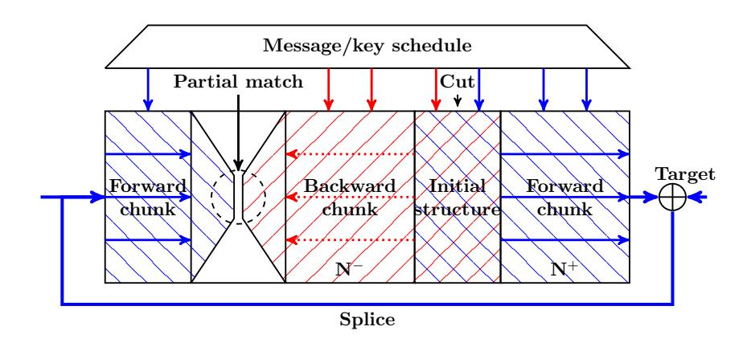

Fig. 1: The Splice-and-cut MitM Attack [\[1\]](#page-29-2)

2021, Dong et al. [\[21\]](#page-30-10) noticed that in many potential MitM characteristics, the two sets of neutral words N <sup>+</sup> and N <sup>−</sup> are constrained by some nonlinear constraints, such that different values lead to a constant impact on the computation of the opposite chunk only if the nonlinear system holds. Therefore, Dong et al. presented a table-based technique to obtain the constrained space of the values of the neutral words. The drawback of Dong et al.'s approach is that it requires a huge amount of memory to prepare two hash tables, and many attacks based on this method need huge memory, e.g., [\[21,](#page-30-10)[35\]](#page-32-7).

Our Contribution. At CT-RSA 2009, Khovratovich, Biryukov, and Nikolic presented the triangulation algorithm (TA) [\[29\]](#page-31-10) to solve the nonlinear system. Combining TA and rebound attack [\[34\]](#page-31-11), Dong et al. proposed the triangulating rebound attack [\[20\]](#page-30-14).

In this paper, motivated by the structured Gaussian elimination paradigm developed by LaMacchia et al. [\[32\]](#page-31-0) and Bender et al. [\[6\]](#page-30-0), we improve the triangulation algorithm to deal with the case where there are still many unprocessed equations but no variable exists in only one equation (the original TA will terminate immediately). Moreover, with the help of the improved triangulation algorithm, we find a memory-efficient approach to derive the value space of the nonlinear constrained neutral words for MitM, thereby solving the memory problem of Dong et al.'s MitM attacks [\[21\]](#page-30-10). We name this new method as the triangulating MitM attack. With this advanced method in hand, we achieve the following results:

– Improved key-recovery attacks on AES with single/two plaintextciphertext pairs: This setting directly impacts the security of NIST PQC 

{3}------------------------------------------------

candidate FAEST [5], where only one plaintext-ciphertext pair acts as the public key in FAEST-128 (based on AES-128), and two plaintext-ciphertext pairs act as the public key in FAEST-192/-256 (based on AES-192/-256). The encryption key of AES acts as secret signing key in FAEST. Our goal is to recover the secret signing key with the public key, *i.e.*, single/two plaintext-ciphertext pairs. Once the secret signing key is recovered, a forgery attack on FAEST is found. The cryptanalysis records on up to 5-round AES in this setting are kept by Bouillaguet, Derbez, and Fouque from CRYPTO 2011 [11] and Derbez's PhD thesis [16]. We break their 10+ year record by significantly reducing the memory complexities of both the 4-round and 5-round attacks on AES-128 by a factor of  $2^{56}$ , *i.e.*, from  $2^{80}$  to the practical  $2^{24}$  and from  $2^{96}$  to  $2^{40}$ . Due to the practical memory, the new 4-round attack has been practically verified by a 4-byte partial key-recovery experiment in Sect. 4.2.

<span id="page-3-0"></span>Table 1: Summary of the attacks on AES and Rijndael-EM with low data. KP: known plaintext; CP: Chosen plaintext; ACC: Adaptive chosen plaintext and ciphertext;  $\dagger$ : The attacks cover x full rounds of AES.

| Target          | Methods                                            | Rounds                                                                                   | Data                                                                         | Time                                                                           | Memory                                                                                                           | Generic                                                                                   | Ref.                                                               |  |
|-----------------|----------------------------------------------------|------------------------------------------------------------------------------------------|------------------------------------------------------------------------------|--------------------------------------------------------------------------------|------------------------------------------------------------------------------------------------------------------|-------------------------------------------------------------------------------------------|--------------------------------------------------------------------|--|
|                 |                                                    | *Key-re                                                                                  | covery A                                                                     | ttacks*                                                                        |                                                                                                                  |                                                                                           |                                                                    |  |
| AES-128         | MitM<br>MitM<br>MitM<br>MitM<br>MitM<br>MitM       | $3^{\dagger}/10$ $4^{\dagger}/10$ $4^{\dagger}/10$ $4^{\dagger}/10$ $5/10$ $5/10$ $5/10$ | 1KP<br>1KP<br>1KP<br>1KP<br>1KP<br>1KP                                       | $2^{96}$ $2^{120}$ $2^{120}$ $2^{112}$ $2^{120}$ $2^{120}$ $2^{120}$ $2^{120}$ | 2 <sup>72</sup> 2 <sup>80</sup> 2 <sup>24</sup> 2 <sup>56</sup> 2 <sup>120</sup> 2 <sup>96</sup> 2 <sup>40</sup> | $2^{128}$ $2^{128}$ $2^{128}$ $2^{128}$ $2^{128}$ $2^{128}$ $2^{128}$ $2^{128}$ $2^{128}$ | [11]<br>[11]<br>Sect. 4.2<br>Sect. 4.3<br>[9]<br>[16]<br>Sect. 4.1 |  |
|                 | MitM<br>MitM<br>Partial Sum<br>R-Boomerang<br>Yoyo | $4^{\dagger}/10$ $5^{\dagger}/10$ $5/10$ $5/10$ $5/10$                                   | 2CP<br>8CP<br>2 <sup>8</sup> CP<br>2 <sup>9</sup> ACC<br>2 <sup>11</sup> ACC | 280 264 240 223 231                                                            | $2^{80}$ $2^{56}$ small $2^{9}$ small                                                                            | $ 2^{128} \\ 2^{128} \\ 2^{128} \\ 2^{128} \\ 2^{128} \\ 2^{128} $                        | [11]<br>[16]<br>[44]<br>[23]<br>[36]                               |  |
| AES-192         | MitM<br>MitM<br>Multiple-of-8                      | 6/12<br>6/12<br>7/12                                                                     | 2KP  2 <sup>8</sup> CP  2 <sup>26</sup> CP                                   | $ 2^{176} \\ 2^{109.6} \\ 2^{146.3} $                                          | $   \begin{array}{c}     2^{72} \\     2^{109.6} \\     2^{40}   \end{array} $                                   | $   \begin{array}{r}     2^{192} \\     \hline     2^{192} \\     2^{192}   \end{array} $ | Sect. 4.4 [16] [4]                                                 |  |
|                 | MitM                                               | 7/14                                                                                     | 2KP                                                                          | $2^{248}$                                                                      | $2^{72}$                                                                                                         | $2^{256}$                                                                                 | Sect. 4.5                                                          |  |
| AES-256         | MitM<br>MitM<br>MitM                               | 6/14<br>7/14<br>7/14                                                                     | $2^8$ CP<br>$2^8$ CP<br>$2^{26}$ CP                                          | $ \begin{array}{c} 2^{122} \\ 2^{170} \\ 2^{146} \end{array} $                 | $2^{113} \\ 2^{186} \\ 2^{40}$                                                                                   | $2^{256} \\ 2^{256} \\ 2^{256}$                                                           | [16]<br>[16]<br>[4]                                                |  |
| Rijndael-EM-128 | MitM                                               | 7/10                                                                                     | 1KP                                                                          | $2^{112}$                                                                      | $2^{32}$                                                                                                         | $2^{128}$                                                                                 | Sect. 5.1                                                          |  |
| Rijndael-EM-192 | MitM                                               | 8/12                                                                                     | 1KP                                                                          | $2^{176}$                                                                      | $2^{16}$                                                                                                         | $2^{192}$                                                                                 | Sect. 5.2                                                          |  |
| Rijndael-EM-256 | MitM                                               | 9/14                                                                                     | 1KP                                                                          | $2^{248}$                                                                      | $2^8$                                                                                                            | $2^{256}$                                                                                 | Sect. 5.3                                                          |  |
|                 |                                                    | *Prei                                                                                    | mage Att                                                                     | ack*                                                                           |                                                                                                                  |                                                                                           |                                                                    |  |
| AES-256-DM      | MitM                                               | 9/14<br>10/14<br>10/14                                                                   | -<br>-<br>-                                                                  | $2^{120} \\ 2^{120} \\ 2^{120} $                                               | 2 <sup>8</sup><br>2 <sup>56</sup><br><b>2<sup>8</sup></b>                                                        | $2^{128}$                                                                                 | [2]<br>[21]<br>Sect. 4.6                                           |  |

{4}------------------------------------------------

With the help of Leurent and Pernot's new representation of AES's key schedule [33], we also improve both the time and memory complexities of the 4-round key-recovery attack on AES-128 and also propose the attacks on 6-round AES-192 and 7-round AES-256 with two plaintext-ciphertext pairs.

- **Key-recovery attacks on** Rijndael-EM with one plaintext-ciphertext pair: The high-performance versions of FAEST are based on Rijndael-EM [5]. We first convert the key-recovery attacks on Rijndael-EM into the preimage attacks on its hashing mode. By applying the triangulating MitM attack, we find the preimage attacks and then convert them back to key-recovery attacks with one plaintext-ciphertext pair on 7-/8-/9-round Rijndael-EM-128/192/256, respectively.
- **DM Hashing mode with AES-256:** The memory complexity of the preimage attack on 10-round AES-256-DM is reduced from the impractical  $2^{56}$  [21] to the practical  $2^{8}$ . Therefore, an experiment is performed to find a 40-bit partial target preimage to verify our technique in Sect. 4.6. Without our improvement, the impractical memory of size  $2^{56}$  in the precomputation will prevent any (partial) experiments.

The attacks on AES and Rijndael-EM are summarized in Tab. 1. Our codes including the experiments are given at

https://github.com/boxindev/Triangulation-MitM

### 2 Preliminaries

#### 2.1 AES and Rijndael

AES-128/192/256 [15] is a 128-bit block cipher with a 128/192/256-bit key, respectively. In contrast, the block length of Rijndael [15] can be 128/192/256 bits. The state is treated as a  $4 \times N_{col}$  ( $N_{col} = 4, 6, 8$ ) two-dimensional array of bytes. The *i*-th ( $i \ge 0$ ,  $MC^{(-1)} = P$ ) round of Rijndael round function (Figure 2) typically consists of the following operations:

- AddRoundKey (AK): XOR a round key  $RK^{(i)}$  into the state  $MC^{(i-1)}$  to produce  $A^{(i)}$ .
- SubBytes (SB): Substitute each cell of  $A^{(i)}$  according to an S-box to get  $SB^{(i)}$ .
- ShiftRows (SR): For  $N_{col} = 4, 6$ , rotate the *i*th row of SB<sup>(i)</sup> to the left by *i* bytes (i = 0, 1, 2, 3). For  $N_{col} = 8$ , rotate the 0, 1, 2, 3rd row to the left by 0, 1, 3, 4 bytes, respectively.
- MixColumns (MC): Update each column of  $SR^{(i)}$  by left-multiplying an MDS matrix to get  $MC^{(i)}$ .

AES in FAEST [5]. FAEST is a 2nd-round candidate of NIST PQC - Additional Digital Signature Schemes. FAEST's one-way function is defined using AES and Rijndael. Taking the FAEST-128 as an example, which is based on AES-128, the

{5}------------------------------------------------

<span id="page-5-0"></span>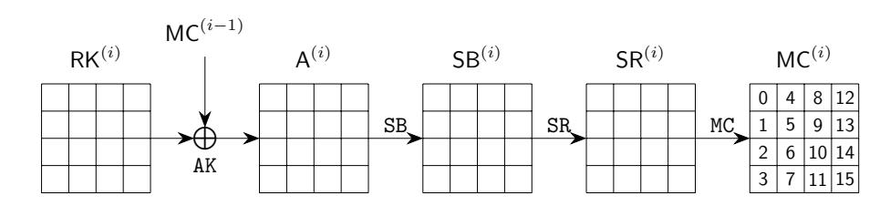

Fig. 2: One Round of AES

plaintext-ciphertext pair (P, C = AES-128(k, P)) is used as the public key of the signature scheme (verification key) and encryption key k is used as the secret key (signing key). If an adversary can recover the encryption key k given only a single plaintext-ciphertext pair (P,C) of AES-128, i.e., the public key of the signature scheme, then he can compute the secret signing key k. This allows him to forge a signature by following exactly the honest prover protocol with the recovered signing key k. This demonstrates that a key recovery attack with one data complexity on AES-128 leads to a signature forgery on FAEST. In FAEST-192/-256 based on AES-192/-256, the size of k is larger than the block size, and FAEST-192/-256 uses two (P, C) pairs as the public key (verification key). Because one (P,C) pair with only 128-bit information cannot prove a 192 or 256-bit knowledge of the secret signing key k. Therefore, the key-recovery attack on AES-192/-256 with two plaintext-ciphertext pairs matters for FAEST-192/-256. FAEST additionally uses Rijndael in Even-Mansour (EM) mode, i.e., FAEST-EM, where Rijndael block cipher is used as a permutation in EM mode. The original key of Rijndael block cipher is published as part of the public key (along with one plaintext-ciphertext), and the new block cipher Rijndael-EM's key is the secret signing key. Therefore, the original key of Rijndael block cipher is a known constant when performing the key-recovery attack on Rijndael-EM.

#### 2.2 Preliminaries of Basic Meet-in-the-Middle Attack

The following notations will be used in the MitM framework.

| Symbol                                                     | Description                                                                             |
|------------------------------------------------------------|-----------------------------------------------------------------------------------------|
| $\overline{\mathcal{E}}$                                   | The encryption process.                                                                 |
| $\mathcal K$                                               | The key schedule process.                                                               |
| $I^{\mathcal{E}}/I^{\mathcal{K}}$                          | Starting state for encryption, key schedule, respectively.                              |
| $E^+/E^-$                                                  | Ending state for the forward/backward computation.                                      |
| $\mathcal{B}^{\mathcal{E}}/\mathcal{B}^{\mathcal{K}}$      | Blue cells $\blacksquare$ in starting state $I^{\mathcal{E}}/I^{\mathcal{K}}$ .         |
| $\mathcal{R}^{\mathcal{E}'}/\mathcal{R}^{\mathcal{K}}$     | Red cells $\blacksquare$ in starting state $I^{\mathcal{E}}/I^{\mathcal{K}}$ .          |
| $\mathcal{G}^{\mathcal{E}}/\mathcal{G}^{\mathcal{K}}$      | Gray cells $\blacksquare$ in starting state $I^{\mathcal{E}}/I^{\mathcal{K}}$ .         |
| $\mathcal{M}^+/\mathcal{M}^-$                              | Matching cells in the ending state $E^+/E^-$ .                                          |
| $\lambda^+ =  \mathcal{B}^{\mathcal{E}}  +  \mathcal{B}$   | $ \mathcal{K} $ The initial degree of freedom for the forward computation.              |
| $\lambda^{-} =  \mathcal{R}^{\mathcal{E}}  +  \mathcal{R}$ | $\mathcal{R}^{\mathcal{K}}$ The initial degree of freedom for the backward computation. |
| $\pi^+/\pi^-$                                              | Certain constraints on the starting state.                                              |

At CRYPTO 2021, Dong et al. [21] gave a formal description of the MitM attack as shown in Figure 3. Assume that the states involved in the encryption  $(\mathcal{E})$  and key schedule  $(\mathcal{K})$  contain n and  $\bar{n}$  w-bit cells, respectively. The public

{6}------------------------------------------------

<span id="page-6-0"></span>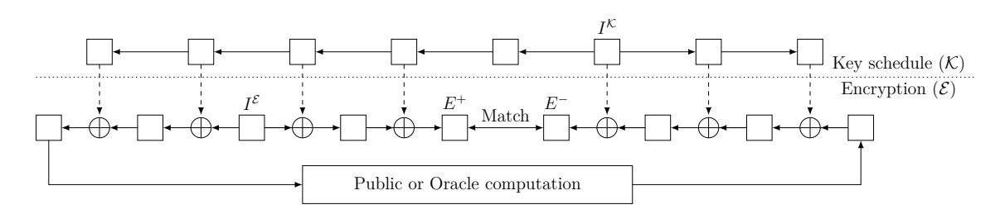

Fig. 3: A high-level overview of the MitM attacks [21]

or oracle computation in Figure 3 can be a simple exclusive-or of a given target value for preimage attacks, or an oracle of block cipher for key-recovery attacks.

Dong et al. [21] specified several states for MitM in Figure 3, i.e., two starting states  $I^{\mathcal{E}}$ ,  $I^{\mathcal{K}}$ , the ending state  $E^+$  for the forward computation (the computation path starting from  $(I^{\mathcal{E}}, I^{\mathcal{K}})$  leading to  $E^+$ ), and similarly the ending state  $E^-$  for the backward computation. The cells of  $(I^{\mathcal{E}}, I^{\mathcal{K}})$  are partitioned into different subsets with different meanings. Let  $\mathcal{B}^{\mathcal{E}}$ ,  $\mathcal{B}^{\mathcal{K}}$ ,  $\mathcal{R}^{\mathcal{E}}$ ,  $\mathcal{R}^{\mathcal{K}}$ ,  $\mathcal{M}^+$ , and  $\mathcal{M}^-$  be some ordered subsets of  $\mathcal{N} = \{0, 1, \dots, n-1\}$  or  $\overline{\mathcal{N}} = \{0, 1, \dots, \overline{n}-1\}$  such that  $\mathcal{B}^{\mathcal{E}} \cap \mathcal{R}^{\mathcal{E}} = \emptyset$ ,  $\mathcal{B}^{\mathcal{K}} \cap \mathcal{R}^{\mathcal{K}} = \emptyset$ ,  $\mathcal{G}^{\mathcal{E}} = \mathcal{N} - \mathcal{B}^{\mathcal{E}} \cup \mathcal{R}^{\mathcal{E}}$  and  $\mathcal{G}^{\mathcal{K}} = \overline{\mathcal{N}} - \mathcal{B}^{\mathcal{K}} \cup \mathcal{R}^{\mathcal{K}}$ . The index sets are used to reference the cells of the states, e.g., for a 16-cell state I and  $\mathcal{B}^{\mathcal{E}} = [0, 1, 3]$ , we have  $I[\mathcal{B}^{\mathcal{E}}] = I[0, 1, 3] = (I[0], I[1], I[3])$ .

The cells  $(I^{\mathcal{E}}[\mathcal{B}^{\mathcal{E}}], I^{\mathcal{K}}[\mathcal{B}^{\mathcal{K}}])$ , visualized as  $\blacksquare$  cells, are called neutral words of the forward computation, and the cells  $(I^{\mathcal{E}}[\mathcal{R}^{\mathcal{E}}], I^{\mathcal{K}}[\mathcal{R}^{\mathcal{K}}])$ , visualized as  $\blacksquare$  cells, are called neutral words of the backward computation. The initial degrees of freedom for the forward and backward computation are defined as  $\lambda^+ = |\mathcal{B}^{\mathcal{E}}| + |\mathcal{B}^{\mathcal{K}}|$  and  $\lambda^- = |\mathcal{R}^{\mathcal{E}}| + |\mathcal{R}^{\mathcal{K}}|$  respectively, that is, the numbers of  $\blacksquare$  cells and  $\blacksquare$  cells in the starting states.  $I^{\mathcal{E}}[\mathcal{G}^{\mathcal{E}}]$  and  $I^{\mathcal{K}}[\mathcal{G}^{\mathcal{K}}]$  are visualized as  $\blacksquare$  cells. Define  $\ell^+$  functions  $\pi^+ = (\pi_1^+, \cdots, \pi_{\ell^+}^+)$  whose values can be computed with the knowledge of the  $\blacksquare$  cells  $(I^{\mathcal{E}}[\mathcal{G}^{\mathcal{E}}], I^{\mathcal{K}}[\mathcal{G}^{\mathcal{K}}])$  and  $\blacksquare$  cells  $(I^{\mathcal{E}}[\mathcal{B}^{\mathcal{E}}], I^{\mathcal{K}}[\mathcal{B}^{\mathcal{K}}])$  in the starting states, where

<span id="page-6-1"></span>
$$\pi_i^+: \mathbb{F}_2^{w\cdot (|\mathcal{G}^{\mathcal{E}}|+|\mathcal{G}^{\mathcal{K}}|+|\mathcal{B}^{\mathcal{E}}|+|\mathcal{B}^{\mathcal{K}}|)} \to \mathbb{F}_2^w$$

is a function mapping  $(I^{\mathcal{E}}[\mathcal{G}^{\mathcal{E}}], I^{\mathcal{K}}[\mathcal{G}^{\mathcal{K}}], I^{\mathcal{E}}[\mathcal{B}^{\mathcal{E}}], I^{\mathcal{K}}[\mathcal{B}^{\mathcal{K}}])$  to a w-bit word. Similarly, we define a sequence of  $\ell^-$  functions  $\boldsymbol{\pi}^- = (\pi_1^-, \cdots, \pi_{\ell^-}^-)$  whose values can be computed with the knowledge of the  $\blacksquare$  cells  $(I^{\mathcal{E}}[\mathcal{G}^{\mathcal{E}}], I^{\mathcal{K}}[\mathcal{G}^{\mathcal{K}}])$  and  $\blacksquare$  cells  $(I^{\mathcal{E}}[\mathcal{R}^{\mathcal{E}}], I^{\mathcal{K}}[\mathcal{R}^{\mathcal{K}}])$ .  $\boldsymbol{\pi}^+$  and  $\boldsymbol{\pi}^-$  will be used to represent certain constraints on the neutral words of the forward and backward computations, respectively, as given in Property 1.

Property 1. For any fixed  $\mathfrak{c}^+ = (a_1, \dots, a_{\ell^+}) \in \mathbb{F}_2^{w \cdot \ell^+}$  and  $\mathfrak{c}^- = (b_1, \dots, b_{\ell^-}) \in \mathbb{F}_2^{w \cdot \ell^-}$ , when the cells  $(I^{\mathcal{E}}[\mathcal{G}^{\mathcal{E}}], I^{\mathcal{K}}[\mathcal{G}^{\mathcal{K}}])$  are fixed to an arbitrary constant, the neutral words fulfill the following systems:

<span id="page-6-3"></span><span id="page-6-2"></span>
$$\begin{cases} \pi_{1}^{+}(I^{\mathcal{E}}[\mathcal{G}^{\mathcal{E}}], I^{\mathcal{K}}[\mathcal{G}^{\mathcal{K}}], I^{\mathcal{E}}[\mathcal{B}^{\mathcal{E}}], I^{\mathcal{K}}[\mathcal{B}^{\mathcal{K}}]) = a_{1} \\ \pi_{2}^{+}(I^{\mathcal{E}}[\mathcal{G}^{\mathcal{E}}], I^{\mathcal{K}}[\mathcal{G}^{\mathcal{K}}], I^{\mathcal{E}}[\mathcal{B}^{\mathcal{E}}], I^{\mathcal{K}}[\mathcal{B}^{\mathcal{K}}]) = a_{2} \\ \dots \\ \pi_{\ell+}^{+}(I^{\mathcal{E}}[\mathcal{G}^{\mathcal{E}}], I^{\mathcal{K}}[\mathcal{G}^{\mathcal{K}}], I^{\mathcal{E}}[\mathcal{B}^{\mathcal{E}}], I^{\mathcal{K}}[\mathcal{B}^{\mathcal{K}}]) = a_{\ell+} \end{cases}$$

$$(1)$$

$$\begin{cases} \pi_{1}^{-}(I^{\mathcal{E}}[\mathcal{G}^{\mathcal{E}}], I^{\mathcal{K}}[\mathcal{G}^{\mathcal{K}}], I^{\mathcal{E}}[\mathcal{R}^{\mathcal{E}}], I^{\mathcal{K}}[\mathcal{R}^{\mathcal{K}}]) = b_{1} \\ \pi_{2}^{-}(I^{\mathcal{E}}[\mathcal{G}^{\mathcal{E}}], I^{\mathcal{K}}[\mathcal{G}^{\mathcal{K}}], I^{\mathcal{E}}[\mathcal{R}^{\mathcal{E}}], I^{\mathcal{K}}[\mathcal{R}^{\mathcal{K}}]) = b_{2} \\ \dots \\ \pi_{\ell-}^{-}(I^{\mathcal{E}}[\mathcal{G}^{\mathcal{E}}], I^{\mathcal{K}}[\mathcal{G}^{\mathcal{K}}], I^{\mathcal{E}}[\mathcal{R}^{\mathcal{E}}], I^{\mathcal{K}}[\mathcal{R}^{\mathcal{K}}]) = b_{\ell-} \end{cases}$$

Then  $E^+[\mathcal{M}^+]$  can be derived from neutral words  $(I^{\mathcal{E}}[\mathcal{B}^{\mathcal{E}}], I^{\mathcal{K}}[\mathcal{B}^{\mathcal{K}}])$  and  $E^-[\mathcal{M}^-]$  can be derived from neutral words  $(I^{\mathcal{E}}[\mathcal{R}^{\mathcal{E}}], I^{\mathcal{K}}[\mathcal{R}^{\mathcal{K}}])$ , independently.

{7}------------------------------------------------

For any given  $(I^{\mathcal{E}}[\mathcal{G}^{\mathcal{E}}], I^{\mathcal{K}}[\mathcal{G}^{\mathcal{K}}])$  and  $\mathfrak{c}^+ = (a_1, \cdots, a_{\ell^+})$ , the solution space of  $(I^{\mathcal{E}}[\mathcal{B}^{\mathcal{E}}], I^{\mathcal{K}}[\mathcal{B}^{\mathcal{K}}])$  induced by Eq. (1) is denoted by

$$\mathbb{B}(I^{\mathcal{E}}[\mathcal{G}^{\mathcal{E}}], I^{\mathcal{K}}[\mathcal{G}^{\mathcal{K}}], \mathfrak{c}^+).$$

Since there are  $\lambda^+ = |\mathcal{B}^{\mathcal{E}}| + |\mathcal{B}^{\mathcal{K}}|$  w-bit variables and  $\ell^+$  equations, we expect  $2^{w \cdot (\lambda^+ - \ell^+)}$  solutions, and we call DoF<sup>+</sup> =  $\lambda^+ - \ell^+$  the degree of freedom (DoF) for the forward computation. Similarly, the solution space of  $(I^{\mathcal{E}}[\mathcal{R}^{\mathcal{E}}], I^{\mathcal{K}}[\mathcal{R}^{\mathcal{K}}])$ induced by Eq. (2) is denoted by  $\mathbb{R}(I^{\mathcal{E}}[\mathcal{G}^{\mathcal{E}}], I^{\mathcal{K}}[\mathcal{G}^{\mathcal{K}}], \mathfrak{c}^{-})$ , whose size is  $2^{w \cdot (\lambda^{-} - \ell^{-})}$ . We call DoF<sup>-</sup> =  $\lambda^- - \ell^-$  the DoF for the backward computation. Assume the computation connecting  $E^+[\mathcal{M}^+]$  and  $E^-[\mathcal{M}^-]$  forms an m-cell filter, which is denoted as the degree of matching (DoM = m). The MitM attack is Algorithm 1. To find a preimage of h-cell target, the complexity of Algorithm 1 is about

<span id="page-7-3"></span>
$$(2^w)^{h-\min\{\text{DoF}^+,\text{DoF}^-,\text{DoM}\}} + \mathcal{T}_{pre}, \tag{3}$$

where  $\mathcal{T}_{pre}$  is the time complexity to precompute  $\mathbb{B}(I^{\mathcal{E}}[\mathcal{G}^{\mathcal{E}}], I^{\mathcal{K}}[\mathcal{G}^{\mathcal{K}}], \mathfrak{c}^+)$  and  $\mathbb{R}(I^{\mathcal{E}}[\mathcal{G}^{\mathcal{E}}], I^{\mathcal{K}}[\mathcal{G}^{\mathcal{K}}], \mathfrak{c}^{-})$  in Line 2.

# **Algorithm 1:** The MitM Attack

- <span id="page-7-0"></span>1 Assign  $(I^{\mathcal{E}}[\mathcal{G}^{\mathcal{E}}], I^{\mathcal{K}}[\mathcal{G}^{\mathcal{K}}])$  and  $\mathfrak{c}^+$ , and  $\mathfrak{c}^-$  to some constants.
- <span id="page-7-1"></span>**2** Solve Eq. (1) and (2) to obtain  $\mathbb{B}(I^{\mathcal{E}}[\mathcal{G}^{\mathcal{E}}], I^{\mathcal{K}}[\mathcal{G}^{\mathcal{K}}], \mathfrak{c}^+)$  and
- $\mathbb{R}(I^{\mathcal{E}}[\mathcal{G}^{\mathcal{E}}], I^{\mathcal{K}}[\mathcal{G}^{\mathcal{K}}], \mathfrak{c}^{-}).$ 3 For values in  $\mathbb{B}(I^{\mathcal{E}}[\mathcal{G}^{\mathcal{E}}], I^{\mathcal{K}}[\mathcal{G}^{\mathcal{K}}], \mathfrak{c}^{+})$ , compute  $E^{+}[\mathcal{M}^{+}]$  and insert it into L
- 4 For values in  $\mathbb{R}(I^{\mathcal{E}}[\mathcal{G}^{\mathcal{E}}], I^{\mathcal{K}}[\mathcal{G}^{\mathcal{K}}], \mathfrak{c}^-)$ , compute  $E^-[\mathcal{M}^-]$  to match L
- 5 In case of partial-matching exists in the above step, for the surviving pairs, check for a full-state match. In case none of them are fully matched, repeat the procedure by changing the values of fixed bytes till finding a full match.

<span id="page-7-2"></span>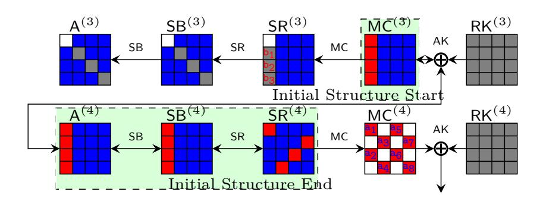

Fig. 4: Sasaki and Aoki's initial structure of MitM attack on AES

Sasaki and Aoki's Initial Structure [39]. In Line 2 of Algorithm 1, we have to solve Eq. (1) and (2). In most previous MitM attacks, the system of 

{8}------------------------------------------------

equations is linear and easy to solve [38,2]. At EUROCRYPT 2009, Sasaki and Aoki formalized this linear case as the *initial structure* technique [39]. Take the *initial structure* of Sasaki's 7-round MitM attack [38] on AES as an example, which covers from state  $MC^{(3)}$  to  $SR^{(4)}$  in Figure 4, where the red/blue neutral words satisfy some linear equation system, *i.e.*, the cancellations are linear. For example, Eq. (4) are the linear computations for red neutral words,

<span id="page-8-0"></span>
$$\begin{bmatrix} b_{1} = 9 \cdot \mathsf{MC}^{(3)}[0] \oplus e \cdot \mathsf{MC}^{(3)}[1] \oplus b \cdot \mathsf{MC}^{(3)}[2] \oplus d \cdot \mathsf{MC}^{(3)}[3] \\ b_{2} = d \cdot \mathsf{MC}^{(3)}[0] \oplus 9 \cdot \mathsf{MC}^{(3)}[1] \oplus e \cdot \mathsf{MC}^{(3)}[2] \oplus b \cdot \mathsf{MC}^{(3)}[3] \\ b_{3} = b \cdot \mathsf{MC}^{(3)}[0] \oplus d \cdot \mathsf{MC}^{(3)}[1] \oplus 9 \cdot \mathsf{MC}^{(3)}[2] \oplus e \cdot \mathsf{MC}^{(3)}[3] \end{bmatrix},$$
(4)

where  $\mathfrak{c}^- = (b_1, b_2, b_3)$ ,  $\ell^- = 3$ . After satisfying the cancellations in Eq. (4), the value space of the red neutral words  $\mathsf{MC}^{(3)}[0-3]$  is reduced from  $2^{w \cdot \lambda^-} = 2^{8 \times 4}$  to  $2^{w \cdot (\lambda^- - \ell^-)} = 2^8$ , and the value of  $\mathsf{MC}^{(3)}[0-3]$  from the space of size  $2^8$  has a constant impact on the backward computation. The value space of neutral words is easily obtained by solving the linear system Eq. (4). Therefore, the time complexity  $\mathcal{T}_{pre}$  in Eq. (3) is usually ignored [38,2].

Dong et al.'s Nonlinear Constrained Neutral Words [21]. As noticed by Dong et al. [21], the Eq. (1) and (2) of many interesting MitM characteristics are nonlinear systems in practice, and there is no efficient method to solve them. Therefore, Dong et al. presented a table-based technique in Algorithm 2 which can be applied in attacks relying on such MitM characteristics without solving the equations. The major drawback of Dong et al.'s approach is that it would require a huge amount of memory to prepare two hash tables V and U, and many attacks based on this method need huge memory, e.g., [21,35].

#### Algorithm 2: Computing the solution spaces of the neutral words

```
Input: (I^{\mathcal{E}}[\mathcal{G}^{\mathcal{E}}], I^{\mathcal{K}}[\mathcal{G}^{\mathcal{K}}]) \in \mathbb{F}_{2}^{w \cdot (|\mathcal{G}^{\mathcal{E}}| + |\mathcal{G}^{\mathcal{K}}|)}
Output: V, U

1 V \leftarrow [\ ], U \leftarrow [\ ]
2 for (I^{\mathcal{E}}[\mathcal{B}^{\mathcal{E}}], I^{\mathcal{K}}[\mathcal{B}^{\mathcal{K}}]) \in \mathbb{F}_{2}^{w \cdot (|\mathcal{B}^{\mathcal{E}}| + |\mathcal{B}^{\mathcal{K}}|)} do
3 |\ \mathbf{v} \leftarrow \boldsymbol{\pi}^{+}(I^{\mathcal{E}}[\mathcal{G}^{\mathcal{E}}], I^{\mathcal{K}}[\mathcal{G}^{\mathcal{K}}], I^{\mathcal{E}}[\mathcal{B}^{\mathcal{E}}], I^{\mathcal{K}}[\mathcal{B}^{\mathcal{K}}]) by Eq. (1)
4 |\ \text{Insert } (I^{\mathcal{E}}[\mathcal{B}^{\mathcal{E}}], I^{\mathcal{K}}[\mathcal{B}^{\mathcal{K}}]) into V at index \mathbf{v}
5 end
6 for (I^{\mathcal{E}}[\mathcal{R}^{\mathcal{E}}], I^{\mathcal{K}}[\mathcal{R}^{\mathcal{K}}]) \in \mathbb{F}_{2}^{w \cdot (|\mathcal{R}^{\mathcal{E}}| + |\mathcal{R}^{\mathcal{K}}|)} do
7 |\ \mathbf{u} \leftarrow \boldsymbol{\pi}^{-}(I^{\mathcal{E}}[\mathcal{G}^{\mathcal{E}}], I^{\mathcal{K}}[\mathcal{G}^{\mathcal{K}}], I^{\mathcal{E}}[\mathcal{R}^{\mathcal{E}}], I^{\mathcal{K}}[\mathcal{R}^{\mathcal{K}}]) by Eq. (2)
8 |\ \text{Insert } (I^{\mathcal{E}}[\mathcal{R}^{\mathcal{E}}], I^{\mathcal{K}}[\mathcal{R}^{\mathcal{K}}]) into U at index \mathbf{u}
9 end
```

{9}------------------------------------------------

#### <span id="page-9-2"></span>2.3 Triangulation Algorithm (TA)

The triangulation algorithm (TA) was introduced by Khovratovich, Biryukov, and Nikolic [29] at CT-RSA 2009, which is a Gaussian-like elimination process to solve the nonlinear system. The algorithm expresses all transformations as equations that link the internal variables. Variables refer to bits or bytes/words depending on the trail. In the triangulation algorithm, free variables form the basis of the nonlinear system, which are to be assigned with arbitrary values. The variables that can be determined by the free variables are called dependent variables. The idea is to build a set of dependent variables that includes many variables. The more such variables we have among the dependent variables, the more conditions are satisfied at no cost. The heart of the triangulation algorithm is to search for dependent variables. The formal process can be described as follows.

- 1. Given the system of equations with fixed predefined values as constants.
- 2. Label all variables and equations as unprocessed. Initially, all variables and equations are marked as unprocessed, meaning they have not yet been simplified or solved.
- 3. Identify a variable that appears in only one unprocessed equation. Label both the variable and the corresponding equation as processed. If there is no such variable, label all the unprocessed equations as processed, exit.
- 4. Repeat Step 3 if there are still unprocessed equations.
- 5. If all equations have been processed, mark all the remaining unprocessed variables as free variables.
- 6. Assign random values to free variables and compute the remaining variables.

For example, Eq. (5) is a nonlinear system of 7 byte-variables  $s, t, u, v, x, y, z \in \mathbb{F}_2^8$ , and F, G, H, and L are bijective functions. After applying TA, we get Eq. (6), where x and s are free variables and by varying them we deduce the values of the other 5 dependent variables.

<span id="page-9-1"></span><span id="page-9-0"></span>
$$\begin{cases}
F(x \oplus s) \oplus v = 0, \\
G(x \oplus u) \oplus s \oplus L(y \oplus z) = 0, \\
v \oplus G(u \oplus s) = 0, \\
H(z \oplus s \oplus v) \oplus t = 0, \\\nu \oplus H(t \oplus x) = 0,
\end{cases} (5)$$

$$\begin{cases}
L(y \oplus z) \oplus G( & u \oplus x) \oplus s = 0, \\
z \oplus H^{-1}(t) \oplus v \oplus s = 0, \\
t \oplus H^{-1}(u) \oplus s = 0, \\\nu \oplus G^{-1}(v) \oplus s = 0, \\
v \oplus F(x \oplus s) = 0.
\end{cases} (6)$$

The TA algorithm is used by Khovratovich et al. to speed up the collision search on AES hashing mode [29]. They described the hash function as a system of equations with S-boxes, and added equations to force the message and chaining value to obey their differential characteristic inside the function. Solving these equations will produce a collision. At CRYPTO 2022, Dong et al. combined the TA and rebound attack [34] to propose the triangulating rebound attack [20], where the TA is used to solve certain nonlinear system to connect multiple inbound phases efficiently. Therefore, TA was mainly exploited in differential attacks previously, and in this paper we will exploit TA in MitM attacks.

{10}------------------------------------------------

# 3 Triangulating MitM Attack Framework

#### 3.1 Limitations of Khovratovich et al.'s TA.

The previous triangulation algorithm faces a significant limitation in Step 3 to Step 5 in Sect. 2.3 when there are still many unprocessed equations, but no variable exists in only one equation. For example, if there is another byte-equation

<span id="page-10-1"></span>
$$P(s \oplus v \oplus t) \oplus z = 0, \tag{7}$$

then together with Eq. (5), only one dependent variable y can be obtained. Similar to [29], consider the equation system as a matrix of dependencies, where the rows correspond to equations, and the columns to variables. In Eq. (8), the matrix before TA represents the system combining Eq. (5) and the additional Eq. (7). When applying Khovratovich et al.'s TA given in Sect. 2.3, after determining one dependent variable y, the remaining six variables in the remaining 5 equations would be directly marked as free variables since there is no variable that appears in only one unprocessed equation, and the TA terminates. We move the 5 equations to the top of the right matrix of Eq. (8) and mark them in cyan. In this case, Khovratovich et al.'s TA can not reduce the system and eliminate potential free variables further. Then, we have to randomly assign values for the six free variables s, t, u, v, x,  $z \in \mathbb{F}_2^8$  and check if the 5 byte-equations (the first 5 rows in cyan) are satisfied, whose probability is  $2^{-40}$ . Once satisfied, y is deduced to satisfy the last equation. The time complexity is around  $2^{40}$ .

<span id="page-10-0"></span>Before TA: 
$$\begin{pmatrix} \frac{s \ t \ u \ v \ x \ y \ z}{1\ 0\ 0\ 1\ 1\ 0\ 0} \\ 1\ 0\ 1\ 0\ 0\ 0 \\ 1\ 1\ 0\ 1\ 0\ 0\ 1 \end{pmatrix} \xrightarrow{\text{after extract } y} \\ \text{Khovratovich } et\ al.\text{'s TA} & \begin{pmatrix} \frac{y \ s \ t \ u \ v \ x \ z}{0\ 0\ 1\ 0\ 0\ 1\ 1\ 0} \\ 0\ 1\ 0\ 0\ 1\ 1\ 0 \\ 0\ 1\ 1\ 0\ 1\ 0\ 0 \\ 0\ 1\ 1\ 0\ 1\ 0\ 1 \\ 0\ 0\ 1\ 1\ 0\ 1\ 0\ 1 \\ 0\ 0\ 1\ 1\ 0\ 1\ 0\ 1 \\ 0\ 0\ 1\ 1\ 0\ 1\ 0\ 1 \\ 0\ 0\ 1\ 1\ 0\ 1\ 0\ 1 \\ 0\ 0\ 1\ 1\ 0\ 1\ 0\ 1 \\ 0\ 1\ 1\ 0\ 1\ 0\ 1 \\ 1\ 1\ 0\ 1\ 0\ 1\ 1 \\ 1\ 1\ 0\ 1\ 0\ 1\ 1 \\ 1\ 1\ 0\ 1\ 0\ 1\ 1 \\ 1\ 1\ 0\ 1\ 0\ 1\ 1 \\ 1\ 1\ 0\ 1\ 0\ 1\ 1 \\ 1\ 1\ 0\ 1\ 0\ 1\ 1 \\ 1\ 1\ 0\ 1\ 0\ 1\ 1 \\ 1\ 1\ 0\ 1\ 0\ 1\ 1 \\ 1\ 1\ 0\ 1\ 0\ 1\ 1 \\ 1\ 1\ 0\ 1\ 0\ 1\ 1 \\ 1\ 1\ 0\ 1\ 0\ 1\ 1 \\ 1\ 1\ 0\ 1\ 0\ 1\ 1 \\ 1\ 1\ 0\ 1\ 0\ 1\ 1 \\ 1\ 1\ 0\ 1\ 0\ 1\ 1 \\ 1\ 1\ 0\ 1\ 0\ 1\ 1 \\ 1\ 1\ 0\ 1\ 0\ 1\ 1 \\ 1\ 1\ 0\ 1\ 0\ 1\ 1 \\ 1\ 1\ 0\ 1\ 0\ 1\ 1 \\ 1\ 1\ 0\ 1\ 0\ 1\ 1 \\ 1\ 1\ 0\ 1\ 0\ 1\ 1 \\ 1\ 1\ 0\ 1\ 0\ 1\ 1 \\ 1\ 1\ 0\ 1\ 0\ 1\ 1 \\ 1\ 1\ 0\ 1\ 0\ 1\ 1 \\ 1\ 1\ 0\ 1\ 0\ 1\ 1\ 1 \\ 1\ 1\ 0\ 1\ 0\ 1\ 1\ 1 \\ 1\ 1\ 0\ 1\ 0\ 1\ 1\ 1 \\ 1\ 1\ 0\ 1\ 0\ 1\ 1\ 1 \\ 1\ 1\ 0\ 1\ 0\ 1\ 1\ 1\ 1\ 1\ 0\ 1\ 1\ 1\ 1\ 1\ 1\ 1\ 1\ 1\ 1\ 1\ 1\ 1\$$

# 3.2 Improved Triangulation Algorithm with Structured Gaussian Elimination

Structured Gaussian elimination (SGE). At 1990 and 1999, LaMacchia et al. [32] and Bender et al. [6] proposed the structured Gaussian elimination (SGE) paradigm, which solves the large and sparse linear system efficiently. Consider the linear system of equations of the form  $M\mathbf{x} = \mathbf{0}$ , where M is the coefficient matrix of the linear system. The SGE steps of LaMacchia et al. [32] can be summarized roughly as follows:

- 1. Delete all the columns that have a single non-zero coefficient and the rows in which those columns have non-zero coefficients (this step is similar to step 3 of Khovratovich *et al.*'s TA).
- 2. For any row which has only a single non-zero coefficient, subtract appropriate multiples of that row from all other rows that have non-zero coefficients on that column so as to make those coefficients 0. This step can reduce the matrix without introducing new non-zero coefficients for other rows.

{11}------------------------------------------------

However, for nonlinear system, this step usually does not help. E.g. in Eq. [\(8\)](#page-10-0), the matrix is different from the coefficient matrix of the linear system. In Eq. [\(8\)](#page-10-0), the non-zero entry of the matrix means the variable exists in the corresponding nonlinear equation, i.e., the variable may exist in multiple linear or nonlinear terms in that equation. Therefore, one cannot apply similar step to reduce the rows for nonlinear system.

3. Delete some rows which have the largest number of non-zero elements. Apply this step when steps 1 and 2 are not possible. We apply this step when the Khovratovich et al.'s TA cannot proceed.

Improved TA with the idea of SGE. The improvements happen to Step 3 to Step 5 of Khovratovich et al.'s TA by a similar approach of the SGE [\[32](#page-31-0)[,6\]](#page-30-0), i.e., when we are stuck and cannot determine any new dependent variable, greedily remove the biggest equation that have the largest number of non-zero element (that we will have to satisfy stochastically) and until we can make progress. Specifically, we introduce a new rule to process the system (highlighted in italics), and the modified algorithm proceeds as follows.

- 1. Construct the system of equations: Given the system of equations, fix the predefined values to constants.
- 2. Initialize all variables and equations as unprocessed: Mark all variables and all equations as unprocessed.
- 3. Find the variable involved in only one unprocessed equation:
  - (a) Search for a variable that appears in only one unprocessed equation. If such a variable exists, mark the equation and the variable as processed.
  - (b) If no such variable can be found, perform the following steps:
    - i. Count the number of variables present in each unprocessed equation.
    - ii. Identify the unprocessed equations that contain the largest number of variables.
    - iii. Remove one of the equations in (ii) from the system and mark it as processed. This reduces the scale of the remaining system.
- 4. Repeat Step 3 until all equations have been processed: Continue searching for variables involved in a single equation or removing equations with the maximum number of variables until no unprocessed equations exist.
- 5. Assign free variables: After all equations are processed, mark all remaining unprocessed variables as free.
- 6. Solve the system: Assign random values to the free variables. Using these values, compute the remaining variables by substituting them back into the processed equations.

This enhancement ensures that the system is further simplified even when no variable appears in a single equation. By strategically removing the equation with the largest number of variables, we reduce the remaining system and maximize the opportunities for variable elimination. At last, fewer variables are marked as free, leading to a more efficient solution process.

Now let's continue to consider the example in Eq. [\(8\)](#page-10-0), the whole process is illustrated in Eq. [\(9\)](#page-12-0). After extracting y, instead of immediately marking the 

{12}------------------------------------------------

remaining variables as free, we analyze the number of variables included in each remaining unprocessed equation and prioritize the equations with the largest number of variables (4-th and 6-th row in the first matrix of Eq. (9)), which are highlighted in **bold**. Label one of them as processed and remove it from the equation system, *i.e.* move this equation to the top of the second matrix of Eq. (9) and highlight it in cyan, continue to process the remaining 4 unprocessed equations (the last 4 rows) to extract dependent variables z, t, u, v sequentially.

<span id="page-12-0"></span>
$$\begin{pmatrix} \frac{y \ s \ t \ u \ v \ x \ z}{1 \ 1 \ 0 \ 1 \ 0 \ 1 \ 1 \ 0} \\ \frac{1 \ 1 \ 0 \ 1 \ 0 \ 1 \ 1}{0 \ 1 \ 0 \ 0 \ 1 \ 1 \ 0} \\ 0 \ 1 \ 0 \ 0 \ 1 \ 1 \ 0 \ 0 \\ 0 \ 1 \ 1 \ 0 \ 1 \ 0 \ 1 \\ 0 \ 0 \ 1 \ 1 \ 0 \ 1 \\ 0 \ 0 \ 1 \ 1 \ 0 \ 1 \\ 0 \ 0 \ 1 \ 1 \ 0 \ 1 \\ 0 \ 0 \ 1 \ 1 \ 0 \ 1 \\ 0 \ 0 \ 1 \ 1 \ 0 \ 1 \\ 0 \ 0 \ 1 \ 1 \ 0 \ 1 \\ 0 \ 0 \ 1 \ 1 \ 0 \ 1 \\ 0 \ 0 \ 1 \ 1 \ 0 \ 1 \\ 0 \ 0 \ 1 \ 1 \ 0 \ 1 \\ 0 \ 0 \ 1 \ 1 \ 0 \ 1 \\ 0 \ 0 \ 1 \ 1 \ 0 \ 1 \\ 0 \ 0 \ 0 \ 1 \ 1 \ 0 \ 1 \\ 0 \ 0 \ 0 \ 1 \ 1 \ 0 \ 1 \\ 0 \ 0 \ 0 \ 1 \ 1 \ 0 \ 1 \\ 0 \ 0 \ 0 \ 1 \ 1 \ 0 \ 1 \\ 0 \ 0 \ 0 \ 0 \ 1 \ 1 \ 0 \ 1 \\ 0 \ 0 \ 0 \ 0 \ 1 \ 1 \ 0 \ 1 \\ 0 \ 0 \ 0 \ 0 \ 1 \ 1 \ 0 \ 1 \\ 0 \ 0 \ 0 \ 0 \ 1 \ 1 \ 0 \ 1 \\ 0 \ 0 \ 0 \ 0 \ 1 \ 1 \ 0 \ 1 \\ 0 \ 0 \ 0 \ 0 \ 1 \ 1 \ 0 \ 1 \\ 0 \ 0 \ 0 \ 0 \ 1 \ 1 \ 0 \ 1 \\ 0 \ 0 \ 0 \ 0 \ 1 \ 1 \ 0 \ 1 \\ 0 \ 0 \ 0 \ 0 \ 1 \ 1 \ 0 \ 1 \\ 0 \ 0 \ 0 \ 0 \ 1 \ 1 \ 0 \ 1 \\ 0 \ 0 \ 0 \ 0 \ 1 \ 1 \ 0 \ 1 \\ 0 \ 0 \ 0 \ 0 \ 1 \ 1 \ 0 \ 1 \\ 0 \ 0 \ 0 \ 0 \ 1 \ 1 \ 0 \ 1 \\ 0 \ 0 \ 0 \ 0 \ 1 \ 1 \ 0 \ 1 \\ 0 \ 0 \ 0 \ 0 \ 1 \ 1 \ 0 \ 1 \\ 0 \ 0 \ 0 \ 0 \ 1 \ 1 \ 0 \ 1 \\ 0 \ 0 \ 0 \ 0 \ 1 \ 1 \ 0 \ 1 \\ 0 \ 0 \ 0 \ 0 \ 1 \ 1 \ 0 \ 1 \\ 0 \ 0 \ 0 \ 0 \ 1 \ 1 \ 0 \ 1 \\ 0 \ 0 \ 0 \ 0 \ 1 \ 1 \ 0 \ 1 \\ 0 \ 0 \ 0 \ 0 \ 1 \ 1 \ 0 \ 1 \\ 0 \ 0 \ 0 \ 0 \ 1 \ 1 \ 0 \ 1 \\ 0 \ 0 \ 0 \ 0 \ 1 \ 1 \ 0 \ 1 \\ 0 \ 0 \ 0 \ 0 \ 1 \ 1 \ 0 \ 1 \\ 0 \ 0 \ 0 \ 0 \ 0 \ 1 \ 1 \ 0 \ 1 \\ 0 \ 0 \ 0 \ 0 \ 0 \ 1 \ 1 \ 0 \ 1 \\ 0 \ 0 \ 0 \ 0 \ 0 \ 1 \ 1 \ 0 \ 1 \\ 0 \ 0 \ 0 \ 0 \ 0 \ 1 \ 1 \ 0 \ 1 \\ 0 \ 0 \ 0 \ 0 \ 0 \ 1 \ 1 \ 0 \ 1 \\ 0 \ 0 \ 0 \ 0 \ 0 \ 1 \ 1 \ 0 \ 1 \\ 0 \ 0 \ 0 \ 0 \ 0 \ 1 \ 1 \ 0 \ 1 \\ 0 \ 0 \ 0 \ 0 \ 0 \ 1 \ 1 \ 0 \ 1 \\ 0 \ 0 \ 0 \ 0 \ 0 \ 1 \ 1 \ 0 \ 1 \\ 0 \ 0 \ 0 \ 0 \ 0 \ 1 \ 1 \ 0 \ 1 \\ 0 \ 0 \ 0 \ 0 \ 0 \ 1 \ 1 \ 0 \ 1 \\ 0 \ 0 \ 0 \ 0 \ 0 \ 1 \ 1 \ 0 \ 1 \\ 0 \ 0 \ 0 \ 0 \ 0 \ 1 \ 1 \ 0 \ 1 \\ 0 \ 0 \ 0 \ 0 \ 0 \ 1 \ 1 \ 0 \ 1 \\ 0 \ 0 \ 0 \ 0 \ 0 \ 1 \ 1 \ 0 \ 1 \\ 0 \ 0 \ 0 \ 0 \ 0 \ 1 \ 1 \ 0 \ 1 \\ 0 \ 0 \ 0 \ 0 \ 0 \ 1 \ 1 \ 0 \ 0 \ 0 \$$

As a result, we determine 5 dependent variables (y, z, t, u, v) and 2 free variables x, s. Then we randomly assign values for the 2 free variables  $x, s \in \mathbb{F}_2^8$  and deduce the values of v, u, t, z, y in turn. And then, check if the first equation marked in cyan in Eq. (9) is satisfied, whose probability is  $2^{-8}$ . The total time complexity to solve the nonlinear system is  $2^8$ , which is significantly smaller than the time  $2^{40}$  by Khovratovich  $et\ al.$ 's TA.

# <span id="page-12-2"></span>3.3 Triangulating MitM Attack: Solving Nonlinear Constrained Neutral Words with the New TA

When applying our improved TA to the MitM attack, we combine the nonlinear system solving by the improved TA and a memory-aided precomputation to compute the solution space of the neutral words efficiently. Taking Eq. (8) as an example and supposing the system Eq. (2) is Eq. (8), *i.e.*, Eq. (10), where the 7-byte variables  $s, t, u, v, x, y, z \in \mathbb{F}_2^8$  are the  $\lambda^- = 7$  cells  $(I^{\mathcal{E}}[\mathcal{R}^{\mathcal{E}}], I^{\mathcal{K}}[\mathcal{R}^{\mathcal{K}}])$  in the starting states of the MitM path. Given global constants  $(I^{\mathcal{E}}[\mathcal{G}^{\mathcal{E}}], I^{\mathcal{K}}[\mathcal{G}^{\mathcal{K}}])$ , Eq. (2) becomes the left system of Eq. (10), *i.e.*,  $\ell^- = 6$ .

<span id="page-12-1"></span>
$$\begin{cases}
\pi_{1}^{-}(s, v, x, ) = b_{1} \\
\pi_{2}^{-}(s, u, x, y, z) = b_{2} \\
\pi_{3}^{-}(s, u, v, ) = b_{3} \\
\pi_{4}^{-}(s, t, v, z) = b_{4}
\end{cases}
\xrightarrow{\text{New TA}}
\begin{cases}
\frac{\pi_{4}^{-}(|z, t, | v, |s|) = b_{4}}{\pi_{2}^{-}(y, z, |u, |x, s|) = b_{2}} \\
\pi_{6}^{-}(|z, t, |v, |s|) = b_{6}
\end{cases}$$

$$\frac{\pi_{4}^{-}(|z, t, |v, |s|) = b_{4}}{\pi_{5}^{-}(|z, t, |v, |s|) = b_{5}} \\
\pi_{6}^{-}(|z, t, |v, |s|) = b_{5}
\end{cases}$$

$$\pi_{6}^{-}(|z, t, |v, |s|) = b_{5}$$

$$\pi_{6}^{-}(|z, t, |v, |s|) = b_{5}$$

$$\pi_{6}^{-}(|z, t, |v, |s|) = b_{5}$$

$$\pi_{6}^{-}(|z, t, |v, |s|) = b_{5}$$

$$\pi_{6}^{-}(|z, t, |v, |s|) = b_{5}$$

$$\pi_{6}^{-}(|z, t, |v, |s|) = b_{5}$$

$$\pi_{6}^{-}(|z, t, |v, |s|) = b_{5}$$

$$\pi_{6}^{-}(|z, t, |v, |s|) = b_{5}$$

$$\pi_{6}^{-}(|z, t, |v, |s|) = b_{5}$$

$$\pi_{6}^{-}(|z, t, |v, |s|) = b_{5}$$

$$\pi_{6}^{-}(|z, t, |v, |s|) = b_{5}$$

$$\pi_{6}^{-}(|z, t, |v, |s|) = b_{5}$$

$$\pi_{6}^{-}(|z, t, |v, |s|) = b_{5}$$

$$\pi_{6}^{-}(|z, t, |v, |s|) = b_{5}$$

$$\pi_{6}^{-}(|z, t, |v, |s|) = b_{6}$$

Following Dong *et al.*'s method in Algorithm 2, we have to traverse 7-byte variables and compute  $\mathbf{u} \leftarrow (b_1, b_2, \cdots, b_6) \in \mathbb{F}_2^{48}$  and store the 7-byte string (s, t, u, v, x, y, z) into a hash table U at index  $\mathbf{u}$ , which needs a huge memory of about  $2^{56} \cdot 7$  bytes.

{13}------------------------------------------------

**Algorithm 3:** Computing the value space of the neutral words with New TA and a memory-aided precomputation

```
Input: (I^{\mathcal{E}}[\mathcal{G}^{\mathcal{E}}], I^{\mathcal{K}}[\mathcal{G}^{\mathcal{K}}]) \in \mathbb{F}_2^{w \cdot (|\mathcal{G}^{\mathcal{E}}| + |\mathcal{G}^{\mathcal{K}}|)}
 1 for (b_2, b_6, b_5, b_3, b_1) \in \mathbb{F}_2^{8 \times 5} do
          V \leftarrow [\ ], \ U \leftarrow [\ ]
  \mathbf{2}
          for (x,s) \in \mathbb{F}_2^{8 \times 2} do
  3
                 Compute v from \pi_1^-()
  4
                 Compute u from \pi_3^-()
  \mathbf{5}
                 Compute t from \pi_5^-()
  6
                 Compute z from \pi_6^-()
  7
                 Compute y from \pi_2^-()
  8
                 Compute \mathbf{u} = b_4 by equations marked by cyan
  9
                 Store U[\mathbf{u}] \leftarrow (x, s, v, u, t, z, y)
10
11
           end
           Similarly, we can prepare V
12
           Then, under each index i, j, compute the values from U[i] backward, and
13
             independently, compute the values from V[j] forward, and filter the
             states by the matching point.
14 end
```

<span id="page-13-1"></span>Based on our new TA, we give a new Algorithm 3 to solve the nonlinear constrained neutral words. After applying the new TA, we get the right system of Eq. (10), where x, s are two free variables and v, u, t, z, y are 5 dependent variables. Given  $b_2, b_6, b_5, b_3, b_1$  and x, s, the dependent variable v, u, t, z, y are successively determined by the evaluation the lower 5 nonlinear equations in Eq. (10). After all variables are determined, compute  $b_4$  by  $\pi_4^-$ () as the index  $\mathbf{u}$ . In Algorithm 3, the  $2^8$  solution spaces of  $\mathbb{R}(I^{\mathcal{E}}[\mathcal{G}^{\mathcal{E}}], I^{\mathcal{K}}[\mathcal{G}^{\mathcal{K}}], \mathfrak{c}^-)$ , with  $|\mathbb{R}(I^{\mathcal{E}}[\mathcal{G}^{\mathcal{E}}], I^{\mathcal{K}}[\mathcal{G}^{\mathcal{K}}], \mathfrak{c}^-)| = 2^{8 \cdot (\lambda^- - \ell^-)} = 2^8$ , are stored in U in Line 10. Therefore, only the lower 5 nonlinear equations in the right system of Eq. (10) are actually solved, whose solutions are all stored in U under different index  $\mathbf{u}$ . We call this method to prepare the solution space of neutral words as a combination of improved TA with memory-aided precomputation. At last, the size to store U is about  $2^{16} \cdot 7$  bytes. Compared to Dong et al.'s method, the memory is significantly reduced from  $2^{56} \cdot 7$  bytes to  $2^{16} \cdot 7$  bytes.

#### 3.4 Automatic Triangulating MitM

The full search framework of our attacks consists of two steps:

1. The first step is to use the existing MILP models for MitM attacks on AES and other primitives to find massive MitM paths.

E.g., for AES we use Dong *et al.*'s model [21] to search potential MitM paths, and more than 1000 MitM paths are found for 5-round AES-128.

{14}------------------------------------------------

2. The second step is to apply the improved TA to each MitM path to solve the systems of the nonlinear constrained neutral words (e.g., Eq. (2) and (1)) and recognize the good MitM path with improved memory complexity.

Comparison with the guess-and-determine approach in [11]. At CRYPTO 2011, Bouillaguet, Derbez, and Fouque [11] introduced a powerful automatic tool for searching guess-and-determine and MitM attacks on byte-oriented symmetric primitives by programming techniques such as knowledge propagation and some pruning techniques. The tool automatically and exhaustively searches all possible sets of "free variables" to find a good one, leading to the exploration of a large search tree. The complexity of the exhaustive search is inherently exponential and exploring the whole space might not be feasible.

Our improved TA developed from the structured Gaussian elimination [32,6] does not explore the full space. Therefore, for certain nonlinear byte-equation systems, our algorithm may output weaker solutions than Bouillaguet et al.'s tool. However, as shown in our search framework, we first automatically find massive MitM paths and then solve many nonlinear systems for those MitM paths. Hence, the method used to solve nonlinear systems should be very efficient. The time complexity of our improved TA is linear with the number of equations, which is very suitable for our search framework. The guess-and-determine algorithm in [11] exhausted all possible solutions, but it can be slow because so many nonlinear systems should be solved. Moreover, our improved TA is also efficient when the system is huge (e.g., 299 nonlinear equations with 316 variables in the preimage attack on 4-round Keccak[768] in the full version), where the algorithm in [11] may not output solutions in a reasonable time.

Furthermore, in our triangulating MitM attacks, we are not solving the full nonlinear system to get the solution space of the neutral words. As explained in Sect. 3.3, we actually combine the improved TA with the memory-aided precomputation to compute the solution space of neutral words. This core idea is well explained in our 5-round attack on AES-128 in Sect. 4.1. For example, in Eq. (13)-(f), our triangulating MitM first automatically selects a system of 5 byte-equations and solves it for each value of the 5-byte value  $(\widehat{\mathsf{A}}^{(2)}[4], \widehat{\mathsf{RK}}^{(2)}[12,13], \widehat{\mathsf{A}}^{(1)}[3,4])$ . Then, store all the solutions in a hash table under the index of 4-byte value  $\mathbf{u} = (\widehat{\mathsf{SR}}^{(3)}[1,4], \widehat{\mathsf{RK}}^{(5)}[0], \widehat{\mathsf{A}}^{(1)}[14])$  (see Line 7-9 in Algorithm 4). Therefore, all the solutions of the 5 byte-equations are stored under different index of the table U and no solutions are filter out, since they are all useful in the following MitM procedures. Our improved TA is very suitable for the memory-aided precomputation, since it directly identifies these 5 byte-equations.

# 4 Attacks on Reduced AES with One/Two Plaintexts

#### <span id="page-14-0"></span>4.1 Single-Plaintext Key-Recovery Attack on 5-round AES-128

The 5-round MitM characteristic is shown in Figure 5, where green cells  $\blacksquare$  mean linear combinations of  $\blacksquare$  and  $\blacksquare$ . In the MitM path, the starting state  $\mathsf{RK}^{(0)}$ , whose

{15}------------------------------------------------

<span id="page-15-0"></span>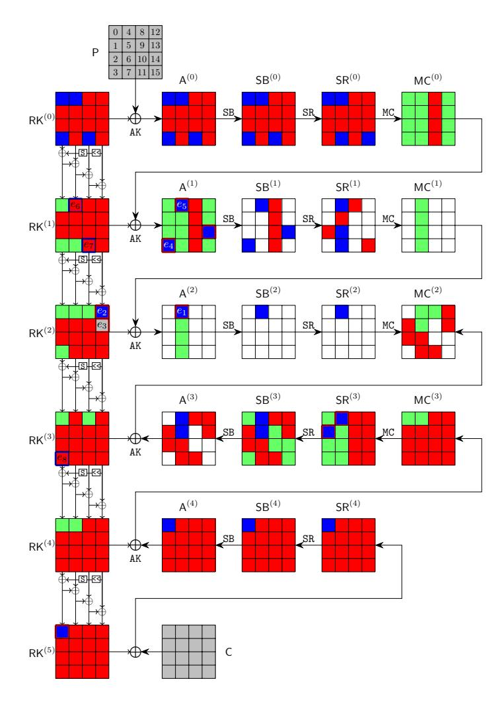

Fig. 5: 5-round attack on AES-128

bytes are denoted as  $k_0$  to  $k_{15}$ , contains  $\lambda^+ = 4$  bytes and  $\lambda^- = 12$  bytes. In the computation from  $\mathsf{RK}^{(0)}$  to  $\mathsf{RK}^{(5)}$ , from  $\mathsf{A}^{(0)}$  to  $\mathsf{SR}^{(2)}$ , and from  $\mathsf{SR}^{(4)}$  to  $\mathsf{MC}^{(2)}$ , the consumed degrees of freedom (DoFs) of  $\blacksquare$  and  $\blacksquare$  are  $\ell^+ = 3$  and  $\ell^- = 9$  bytes, respectively. Therefore,  $\mathsf{DoF}^+ = 1$ ,  $\mathsf{DoF}^- = 3$ , and there is DoM = 1 matching byte in round 2. The 9 consumed DoFs of  $\blacksquare$  on  $\mathsf{A}^{(1)}[3]$ ,  $\mathsf{A}^{(1)}[4]$ ,  $\mathsf{A}^{(1)}[14]$ ,  $\mathsf{RK}^{(2)}[12]$ ,  $\mathsf{RK}^{(2)}[13]$ ,  $\mathsf{A}^{(2)}[4]$ ,  $\mathsf{SR}^{(3)}[1]$ ,  $\mathsf{SR}^{(3)}[4]$ , and  $\mathsf{RK}^{(5)}[0]$  marked by  $\blacksquare$ / $\blacksquare$  in Figure 5 are a system on the byte-variables of  $\mathsf{RK}^{(0)}$  in Eq. (11).

```
 \begin{cases} \mathsf{A}^{(1)}[3] = S(k_5) \oplus S(k_{10}) \oplus 2 \cdot S(k_{15}) \oplus S(k_{12}) \oplus 3 \cdot S(k_0) \oplus k_3 \\ \mathsf{A}^{(1)}[4] = 3 \cdot S(k_9) \oplus S(k_{14}) \oplus S(k_{13}) \oplus 2 \cdot S(k_4) \oplus k_4 \oplus S(k_3) \oplus k_0 \\ \mathsf{A}^{(1)}[14] = S(k_{12}) \oplus S(k_1) \oplus 2 \cdot S(k_6) \oplus k_{14} \oplus k_{10} \oplus k_6 \oplus k_2 \oplus S(k_{15}) \oplus 3 \cdot S(k_{11}) \\ \mathsf{A}^{(2)}[4] = 3 \cdot S(S(k_8) \oplus 2 \cdot S(k_{13}) \oplus 3 \cdot S(k_2) \oplus S(k_7) \oplus k_9 \oplus k_5 \oplus k_1 \oplus S(k_{14})) \oplus \\ S(k_{13} \oplus k_9 \oplus k_5 \oplus k_1 \oplus S(k_{14})) \oplus k_4 \oplus S(\mathsf{A}^{(1)}[3]) \oplus 2 \cdot S(\mathsf{A}^{(1)}[4]) \oplus S(\mathsf{A}^{(1)}[14]) \\ \mathsf{RK}^{(2)}[12] = k_{12} \oplus S(k_{13} \oplus k_9 \oplus k_5 \oplus k_1 \oplus S(k_{14})) \oplus k_4 \\ \mathsf{RK}^{(2)}[13] = k_{13} \oplus k_5 \oplus S(k_{14} \oplus k_{10} \oplus k_6 \oplus k_2 \oplus S(k_{15})) \\ \mathsf{SR}^{(3)}[1] = 9 \cdot (S(\mathsf{RK}^{(0)}[13]) \oplus S(\mathsf{RK}^{(1)}[13]) \oplus S(\mathsf{RK}^{(2)}[13]) \oplus S(\mathsf{RK}^{(3)}[13])) \oplus \\ & \quad \quad \quad \quad \quad \quad \quad \quad \quad \quad \quad \quad \quad \quad \quad \quad \quad \quad
```

{16}------------------------------------------------

Excluding the parts of Eq. (11) related to blue bytes, we get Eq. (12) which is only related to the red bytes, where the boxed parts are deleted<sup>5</sup>.

where  $B_1 = 3 \cdot S(k_0) \oplus k_3$ ,  $B_2 = 2 \cdot S(k_4) \oplus k_4 \oplus S(k_3) \oplus k_0$ ,  $B_3 = 3 \cdot S(k_{11})$ . The Eq. (12) is first expressed as the matrix (a) in Eq. (13), where the rows correspond to the equations and the columns to variables. Apply our new TA:

- 1. At the beginning, in matrix (a), no variable appears in only one unprocessed equation. Count the number of variables present in each unprocessed equation; there are 3 unprocessed equations that contain 12 variables, which are highlighted in **bold**.
- 2. Remove the 3 bold rows and label them as processed by moving them to the top of the matrix highlighted in cyan. We get the matrix (b).
- 3. Process the last 6 rows of (b) with TA and extract a dependent variable  $k_7$  marked by green. We get the matrix (c).
- 4. Process the last 5 rows of (c). No variable appears in only one unprocessed equation, we count and remove the unprocessed equation that contains the most number of variables, *i.e.*, row  $\widehat{A}^{(1)}[14]$  and get the matrix (d).
- 5. Process the last 4 rows of matrix (d) and extract  $k_1, k_2, k_5, k_9$  sequentially to get the matrix (f).

<span id="page-16-1"></span><sup>&</sup>lt;sup>5</sup>In our MitM attack (see Line 14 to 27 of Algorithm 4), we need the 9 bytes  $(A^{(1)}[3], A^{(1)}[4], \cdots)$  on the left side of Eq. (11) (the bytes marked in red border in Figure 5) to depend only on the blue/gray bytes. Therefore, we specify the red parts in Eq. (12) as global constants  $(\widehat{A}^{(1)}[3], \widehat{A}^{(1)}[4], \cdots)$ , so that the red bytes have a constant effect on the 9 bytes  $(A^{(1)}[3], A^{(1)}[4], \cdots)$ .

{17}------------------------------------------------

<span id="page-17-0"></span>
$$\begin{pmatrix} \frac{k_1}{\hat{\Lambda}(1)} \frac{k_2}{[4]} \frac{k_5}{[6]} \frac{k_7}{k_8} \frac{k_8}{k_9} \frac{k_{10}}{k_{10}} \frac{k_{12}}{k_{13}} \frac{k_{14}}{k_{14}} \frac{k_{15}}{k_{15}} \\ \hat{\Lambda}(1) \frac{1}{[4]} 0 & 0 & 0 & 0 & 0 & 1 & 1 & 0 & 0 & 1 & 1$$

Finally, we extract 5 dependent variables  $\mathsf{RK}^{(0)}[7,1,2,5,9] = (k_7,k_1,k_2,k_5,k_9)$  marked in green in Eq. (13)-(f) from the rows of  $\widehat{\mathsf{A}}^{(2)}[4]$ ,  $\widehat{\mathsf{RK}}^{(2)}[12]$ ,  $\widehat{\mathsf{RK}}^{(2)}[13]$ ,  $\widehat{\mathsf{A}}^{(1)}[3]$ , and  $\widehat{\mathsf{A}}^{(1)}[4]$ . The others are 7 free variables  $\mathsf{RK}^{(0)}[6,8,10,12,13,14,15] = (k_6,k_8,k_{10},k_{12},k_{13},k_{14},k_{15})$ . The values  $(e_1,e_2,e_3,e_4,e_5) \in \mathbb{F}_2^{40}$  are assigned to the expressions for the red bytes of  $(\widehat{\mathsf{A}}^{(2)}[4],\widehat{\mathsf{RK}}^{(2)}[12],\widehat{\mathsf{RK}}^{(2)}[13],\widehat{\mathsf{A}}^{(1)}[3],\widehat{\mathsf{A}}^{(1)}[4])$ , then given the values of the seven free variables, the dependent variables  $(k_9,k_5,k_2,k_1,k_7)$  are deduced in sequence. Thereafter, the values of  $\widehat{\mathsf{SR}}^{(3)}[1]$ ,  $\widehat{\mathsf{SR}}^{(3)}[4]$ ,  $\widehat{\mathsf{RK}}^{(5)}[0]$  and  $\widehat{\mathsf{A}}^{(1)}[14]$  are deduced directly.

In the 3 consumed DoFs of blue byte  $\blacksquare$  on  $\mathsf{RK}^{(1)}[4]$ ,  $\mathsf{RK}^{(1)}[11]$ , and  $\mathsf{RK}^{(3)}[3]$ , the expressions are

$$\begin{cases}
\mathsf{RK}^{(1)}[4] = k_4 \oplus k_0 \oplus S(k_{13}) \\
\mathsf{RK}^{(1)}[11] = k_{11} \oplus k_3 \oplus k_7 \oplus S(k_{12}) \\
\mathsf{RK}^{(3)}[3] = k_3 \oplus S(k_4 \oplus e_2) \oplus S(k_4 \oplus k_0 \oplus S(k_{13}) \oplus k_8 \oplus k_{12}) \oplus S(k_{12})
\end{cases}$$
(14)

After assigning the following formulas as constants  $(e_6, e_7, e_8)$ ,

<span id="page-17-1"></span>
$$\begin{cases} k_4 \oplus k_0 = e_6 \\ k_{11} \oplus k_3 = e_7 \\ k_3 \oplus S(k_4 \oplus e_2) = e_8 \end{cases} , \tag{15}$$

{18}------------------------------------------------

the bytes  $\mathsf{RK}^{(1)}[4]$ ,  $\mathsf{RK}^{(1)}[11]$ ,  $\mathsf{RK}^{(3)}[3]$  will be  $\blacksquare$ , *i.e.*, only determined by the red cells. By applying the TA to Eq. (15), 1 free variable  $k_0$  is obtained, the other 3 variables  $\mathsf{RK}^{(0)}[3,4,11] = (k_3,k_4,k_{11})$  are deduced directly for any value of the free variable  $k_0$ . The 5-round MitM attack is given in Algorithm 4.

Analysis of Algorithm 4. In Line 12 to 27,  $2^{\zeta+24+16+32+8+8} = 2^{128}$  states should be tested to recover the 128-bit key; therefore,  $\zeta = 40$ . According to Eq. (3),  $\mathcal{T}_{pre}$  corresponds to the time complexity of Line 7-9, which is about  $2^{\zeta+24+16+40} = 2^{120}$  1-round AES. Therefore, the first part of Eq. (3) dominates the overall complexity, which is about  $2^{128-8 \cdot \min\{\text{DoF}^+, \text{DoF}^-, \text{DoM}\}} = 2^{120}$  5-round AES. The memory complexity to store U is about  $2^{40}$ .

# <span id="page-18-0"></span>4.2 Practical-Memory Key-Recovery Attack on 4-full-round AES-128

The attack leverages the new representation of AES's key schedule by Leurent and Pernot [33]. They introduced a new basis  $S^{(i)}$  to derive the round keys, *i.e.*,  $RK^{(i)} = C_0 \cdot S^{(i)}$  as shown in Figure 6, where  $C_0$  is a  $16 \times 16$  binary matrix given in the full version.

<span id="page-18-1"></span>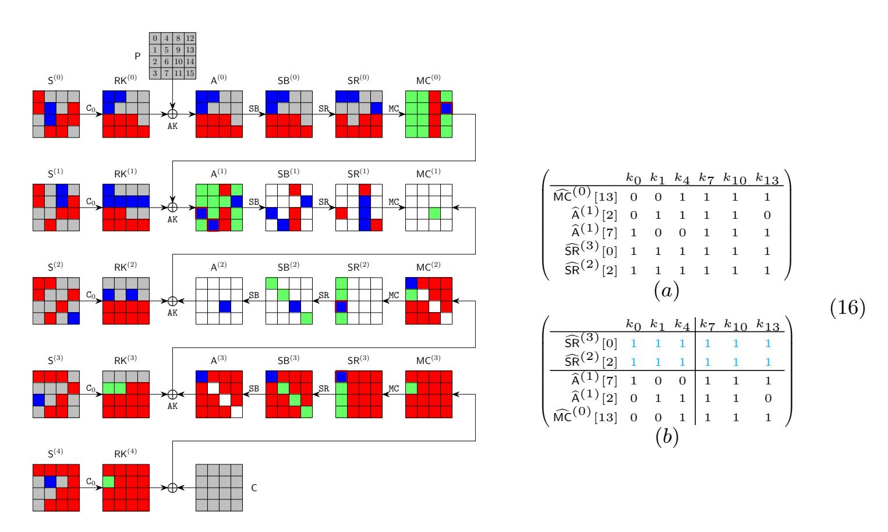

<span id="page-18-2"></span>Fig. 6: 4-round attack on AES-128

The MitM path is shown in Figure 6. The starting state  $S^{(2)}$ , whose bytes are denoted by  $k_0$  to  $k_{15}$ , contains  $\lambda^+ = 1$  byte and  $\lambda^- = 6$  bytes. The consumed DoFs of  $\blacksquare$  and  $\blacksquare$  are  $\ell^+ = 0$  and  $\ell^- = 5$  bytes, respectively. The  $\ell^- = 5$  constraints (marked by  $\blacksquare/\blacksquare$ ) form a system of 5 nonlinear equations in Eq. (17) (deleting the boxed parts). Therefore, DoF<sup>+</sup> = 1, DoF<sup>-</sup> = 1, and there

{19}------------------------------------------------

# **Algorithm 4:** Key-recovery attack on 5-round AES-128 with 1 (P, C)

```
1 for 2^{\zeta} values of (e_1, e_2, e_3, e_4, e_5) \in \mathbb{F}_2^{40} do
           for (e_6, e_7, e_8) \in \mathbb{F}_2^{24} do | for \mathsf{RK}^{(0)}[14, 15] \in \mathbb{F}_2^{16} do
 2
  3
                         U \leftarrow [\ ]
  4
                         (\widehat{\mathsf{A}}^{(1)}[4], \widehat{\mathsf{RK}}^{(2)}[12], \widehat{\mathsf{RK}}^{(2)}[13], \widehat{\mathsf{A}}^{(1)}[3], \widehat{\mathsf{A}}^{(2)}[4]) \leftarrow (e_1, e_2, e_3, e_4, e_5)
  \mathbf{5}
                         for \mathsf{RK}^{(0)}[6, 8, 10, 12, 13] \in \mathbb{F}_2^{40} do
  6
                               Compute RK^{(0)}[7,1,2,5,9] = (k_7, k_1, k_2, k_5, k_9) by Eq. (13)-(f)
  7
                               Compute \mathbf{u} = (\widehat{\mathsf{SR}}^{(3)}[1], \widehat{\mathsf{SR}}^{(3)}[4], \widehat{\mathsf{RK}}^{(5)}[0], \widehat{\mathsf{A}}^{(1)}[14]) \in \mathbb{F}_2^{32}
  8
                               U[\mathbf{u}] \leftarrow \mathsf{RK}^{(0)}[1, 2, 5 - 10, 12 - 15] \in \mathbb{F}_2^{8 \times 12}
  9
                               /* The nonlinear system solving and memory-aided
10
                                     precomputation are combined to get the solution
                                     space of the neutral words. There are about 2^8
                                     elements in U[\mathbf{u}] for each \mathbf{u}.
                                                                                                                                         */
                         end
11
                        for \mathbf{u} \in \mathbb{F}_2^{32} do
12
                               L \leftarrow [\ ]
13
                               for \mathsf{RK}^{(0)}[0] = k_0 \in \mathbb{F}_2^8 do
14
                                      Compute RK^{(0)}[3,4,11] = (k_3, k_4, k_{11}) by Eq. (15)
15
                                      Compute the 1-byte matching point
16
                                       v = \mathsf{SR}^{(2)}[4] \oplus e \cdot \mathsf{MC}^{(2)}[4] \oplus b \cdot \mathsf{MC}^{(2)}[5]
                                     L[v] \leftarrow (k_0, k_3, k_4, k_{11})
17
                               \quad \text{end} \quad
18
                               for values in U[\mathbf{u}] do
19
                                      Compute the 1-byte matching point
20
                                        v' = e \cdot \mathsf{MC}^{(2)}[4] \oplus b \cdot \mathsf{MC}^{(2)}[5] \oplus d \cdot \mathsf{MC}^{(2)}[6] \oplus 9 \cdot \mathsf{MC}^{(2)}[7]
                                      for values in L[v'] do
21
                                            if E(Key = \mathsf{RK}^{(0)}, P) = C then
22
                                                  return \mathsf{RK}^{(0)}
 \mathbf{23}
                                            end
24
                                      \mathbf{end}
25
                               \mathbf{end}
26
27
                         end
                  end
28
            \mathbf{end}
\mathbf{29}
30 end
```

{20}------------------------------------------------

is DoM = 1 matching byte in round 1. Using new TA, we get 3 free variables  $S^{(2)}[7, 10, 13] = (k_7, k_{10}, k_{13})$  and 3 dependent variables  $S^{(2)}[0, 1, 4] = (k_0, k_1, k_4)$ . The matrices before and after the improved TA are shown in Eq. (16). The steps for the MitM attack are given in Algorithm 5. The time complexity is about  $2^{128-8 \cdot \min\{\text{DoF}^+, \text{DoF}^-, \text{DoM}\}} = 2^{120}$ . The memory is  $2^{24}$  to store U.

```
\begin{cases} \widehat{\mathsf{MC}}^{(0)}[13] = 3 \cdot S(k_{14} \oplus k_4 \oplus S(k_7)) \oplus S(k_{10} \oplus k_{13}) & \oplus 2 \cdot \mathsf{SR}^{(0)}[13] \oplus \mathsf{SR}^{(0)}[12] \\ \widehat{\mathsf{A}}^{(1)}[2] = 2 \cdot S(k_{14} \oplus k_1) \oplus 3 \cdot S(k_{10}) \oplus k_4 \oplus S(k_7) \oplus k_1 & \oplus \mathsf{SR}^{(0)}[0] \oplus k_{11} \oplus k_{14} \oplus \mathsf{SR}^{(0)}[1] \\ \widehat{\mathsf{A}}^{(1)}[7] = 2 \cdot S(k_{10} \oplus k_{13} \oplus k_0 \oplus S(k_3) \oplus k_7 \oplus S(k_6)) \oplus k_7 \oplus k_{13} \oplus 3 \cdot (\mathsf{SR}^{(0)}[4]) \oplus \mathsf{SR}^{(0)}[5] \oplus \mathsf{SR}^{(0)}[6] \\ \widehat{\mathsf{SR}}^{(2)}[2] = 9 \cdot (\mathsf{A}^{(3)}[1] \oplus \mathsf{S}^{(3)}[5] \oplus \mathsf{S}^{(3)}[8] \oplus \mathsf{S}^{(3)}[15]) \oplus \mathsf{e} \cdot \mathsf{MC}^{(2)}[2] \oplus \mathsf{b} \cdot \mathsf{MC}^{(2)}[3] \oplus \mathsf{e} \cdot \mathsf{S}^{(3)}[2] \oplus \mathsf{d} \cdot \mathsf{MC}^{(2)}[0] \\ \widehat{\mathsf{SR}}^{(3)}[0] = \mathsf{e} \cdot \mathsf{RK}^{(4)}[0] \oplus \mathsf{b} \cdot (\mathsf{S}^{(4)}[2] \oplus \cdot \mathsf{S}^{(4)}[8] \oplus \mathsf{S}^{(4)}[15]) \oplus \mathsf{d} \cdot \mathsf{RK}^{(4)}[2] \oplus 9 \cdot \mathsf{RK}^{(4)}[3] \oplus \mathsf{b} \cdot \mathsf{S}^{(4)}[5] \\ (17) \end{cases}
```

# Algorithm 5: Practical-memory attack on 4-full-round AES-128

```
1 for S^{(2)}[2,3,5,6,8,9,11,12,14] \in \mathbb{F}_2^{8 \times 9} and (e_1,e_2,e_3) \in \mathbb{F}_2^{24} do
             (\widehat{\mathsf{MC}}^{(0)}[13], \widehat{\mathsf{A}}^{(1)}[2,7]) \leftarrow (e_1, e_2, e_3), \ U \leftarrow [\ ]
  2
            for S^{(2)}[7, 10, 13] \in \mathbb{F}_2^{24} do
  3
                  Compute S^{(2)}[0, 1, 4] by Eq. (16)-(b) and \mathbf{u} = (\widehat{\mathsf{SR}}^{(2)}[2], \widehat{\mathsf{SR}}^{(3)}[0]) \in \mathbb{F}_2^{16}
U[\mathbf{u}] \leftarrow S^{(2)}[0, 1, 4, 7, 10, 13] \in \mathbb{F}_2^{8 \times 7}
  4
  5
            end
  6
            for \mathbf{u} \in \mathbb{F}_2^{16} do
  7
                   L \leftarrow [\ ]
  8
                   for S^{(2)}[15] \in \mathbb{F}_2^8 do
  9
                         Compute the 1-byte matching point v, L[v] \leftarrow S^{(2)}[15]
10
                   end
11
                   for values in U[\mathbf{u}] do
12
                          Compute the 1-byte matching point v'
13
                          for values in L[v'] do
14
                                if E(Key = S^{(2)}, P) = C then | \text{return } S^{(2)} |
15
16
                                end
17
                          end
18
                   end
19
             end
20
21 end
```

<span id="page-20-3"></span>Partial Experiment of the Key-Recovery Attack. We give an experiment of a 4-byte partial key-recovery attack as follows:

1. Data collection: encrypt the plaintext P=0 with key  $\mathsf{S}^{(2)}=0$  to get the ciphertext C.

{21}------------------------------------------------

2. Given (P=0,C) and 12-byte key information to recover the other 4-byte key  $S^{(2)}[7,10,13,15]$ . If the recovered  $S^{(2)}[7,10,13,15]=0$ , the attack succeeds. The 12-byte key information includes  $9 \blacksquare$  bytes  $S^{(2)}[2,3,5,6,8,9,11,12,14]=0$  and 3-byte key relations of  $(\widehat{\mathsf{MC}}^{(0)}[13],\widehat{\mathsf{A}}^{(1)}[2,7])=(e_1,e_2,e_3)$  on the 6 red key bytes of  $S^{(2)}$ , *i.e.*, assign  $(e_1,e_2,e_3)$  to the last 3 expressions of Eq. (16)-(b). From (P,C) and  $S^{(2)}=0$ , pre-compute the 3-byte  $(e_1,e_2,e_3)=(0$ x75,0x00,0xc6). In our experiment, (P=0,C) and 12-byte key information  $(S^{(2)}[2,3,5,6,8,9,11,12,14]=0,\ (e_1,e_2,e_3)=(0$ x75,0x00,0xc6)) are given, the goal is to recover  $S^{(2)}[7,10,13,15]=0$ . In brute-force search, the time will be  $2^{32}$ . With the given information, we actually conduct the experiment from Line 3 to Line 20 according to Algorithm 5. The time is  $2^{24}$  with  $2^{24}$  memory<sup>6</sup>.

We successfully recover the 4-byte partial key  $S^{(2)}[7, 10, 13, 15] = 0$ , and the source codes and results are available via https://github.com/boxindev/Triangulation-MitM. We implemented the experiment on a computer with an i9-13900KF CPU and 32GB of memory. It takes about 200 seconds, while the brute force needs  $2^{32}$  evaluations of 4-round AES-128, which takes about 3200 seconds in the same platform using the same code for AES.

<span id="page-21-1"></span>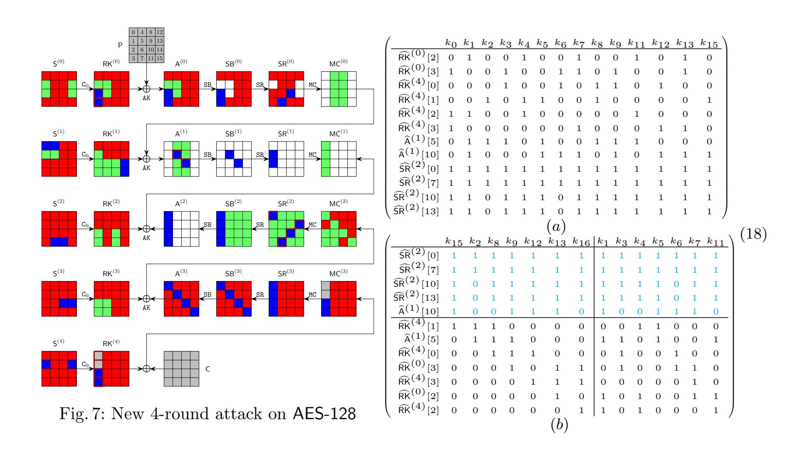

<span id="page-21-2"></span><span id="page-21-0"></span><sup>&</sup>lt;sup>6</sup>In our experiment, we use the data structure "map<uint $32_t$ , vector<vector<uint $8_t>>$ " to store U, which needs about 300 MB memory.

{22}------------------------------------------------

### <span id="page-22-0"></span>4.3 New Attack on 4-full-round AES-128 with 2<sup>112</sup> Complexity

As shown in Figure 7, the starting state  $S^{(3)} = (k_0, k_1, \dots, k_{15})$  contains  $\lambda^+ = 2$  bytes (i.e.,  $k_{10}$  and  $k_{14}$ ) and  $\lambda^- = 14$  bytes. The consumed DoFs of and are  $\ell^+ = 0$  and  $\ell^- = 12$  bytes, respectively. The  $\ell^- = 12$  constraints (marked by / in Figure 7) form a system of 12 equations in Eq. (19). Therefore, DoF<sup>+</sup> = 2, DoF<sup>-</sup> = 2, and DoM = 2. Using new TA, we get 7 free variables  $S^{(3)}[1,3,4,5,6,7,11]$  and 7 dependent variables  $S^{(3)}[0,2,8,9,12,13,15]$  in Eq. (18). The MitM attack is given in Algorithm 6 with time complexity of  $2^{128-8 \cdot \min\{\text{DoF}^+,\text{DoF}^-,\text{DoM}\}} = 2^{112}$  and memory  $2^{56}$  to store U.

```
 \widehat{\mathsf{RK}}^{(0)}[2] = k_1 \oplus S(k_{13}) \oplus k_4 \oplus S(k_7) \oplus k_{11} \oplus S(k_{10}) \oplus k_{14} \\ \widehat{\mathsf{RK}}^{(0)}[3] = k_{13} \oplus k_0 \oplus S(k_3) \oplus k_7 \oplus S(k_6) \oplus S(k_9) \oplus k_{10} \\ \widehat{\mathsf{RK}}^{(4)}[0] = k_{12} \oplus k_3 \oplus k_6 \oplus k_9 \oplus S(k_8); \ \widehat{\mathsf{RK}}^{(4)}[1] = k_{15} \oplus k_2 \oplus k_5 \oplus S(k_4) \oplus k_8 \\ \widehat{\mathsf{RK}}^{(4)}[2] = k_1 \oplus S(k_0) \oplus k_4 \oplus k_{11} \oplus k_{14}; \ \widehat{\mathsf{RK}}^{(4)}[3] = k_{13} \oplus S(k_{12}) \oplus k_0 \oplus k_7 \oplus k_{10} \\ \widehat{\mathsf{A}}^{(1)}[5] = S(k_3 \oplus S(k_2) \oplus k_9) \oplus 2 \cdot S(k_5 \oplus k_8 \oplus S(k_{11})) \oplus 3 \cdot S(k_1) \oplus k_8 \oplus S(k_{11}) \oplus k_2 \oplus SR^{(0)}[7] \\ \widehat{\mathsf{A}}^{(1)}[10] = S(k_{12} \oplus S(k_{15}) \oplus k_9) \oplus S(k_5) \oplus 3 \cdot S(k_{13} \oplus k_7 \oplus S(k_6)) \oplus k_1 \oplus 2 \cdot SR^{(0)}[10] \oplus k_{14} \\ \widehat{\mathsf{SR}}^{(2)}[0] = \mathbf{e} \cdot \mathsf{RK}^{(3)}[0] \oplus \mathbf{b} \cdot (\mathsf{RK}^{(3)}[1] \oplus \mathsf{A}^{(3)}[1]) \oplus \mathbf{d} \cdot (k_1 \oplus k_4 \oplus k_{11} \oplus \mathsf{A}^{(3)}[2]) \oplus 9 \cdot (k_0 \oplus \mathsf{A}^{(3)}[3]) \oplus \mathbf{e} \cdot \mathsf{A}^{(3)}[0] \oplus \mathbf{d} \cdot k_{14} \oplus 9 \cdot k_{10} \\ \widehat{\mathsf{SR}}^{(2)}[7] = \mathbf{b} \cdot (\mathsf{RK}^{(3)}[4] \oplus \mathsf{A}^{(3)}[4]) \oplus \mathbf{d} \cdot \mathsf{RK}^{(3)}[5] \oplus 9 \cdot (k_4 \oplus \mathsf{A}^{(3)}[6]) \oplus \mathbf{e} \cdot (k_0 \oplus \mathsf{A}^{(3)}[7]) \oplus \mathbf{d} \cdot \mathsf{A}^{(3)}[5] \oplus 9 \cdot \mathsf{MC}^{(2)}[9] \oplus \mathbf{e} \cdot \mathsf{RK}^{(3)}[10] \oplus \mathbf{b} \cdot \mathsf{MC}^{(2)}[11] \oplus \mathbf{e} \cdot \mathsf{A}^{(3)}[10] \oplus \mathbf{d} \cdot \mathsf{A}^{(3)}[15] \oplus \mathbf{d} \cdot \mathsf{A}^{(3)}[15] \oplus \mathbf{d} \cdot \mathsf{A}^{(3)}[15] \oplus \mathbf{d} \cdot \mathsf{A}^{(3)}[15] \oplus \mathbf{d} \cdot \mathsf{A}^{(3)}[15] \oplus \mathbf{d} \cdot \mathsf{A}^{(3)}[15] \oplus \mathbf{d} \cdot \mathsf{A}^{(3)}[15] \oplus \mathbf{d} \cdot \mathsf{A}^{(3)}[15] \oplus \mathbf{d} \cdot \mathsf{A}^{(3)}[15] \oplus \mathbf{d} \cdot \mathsf{A}^{(3)}[15] \oplus \mathbf{d} \cdot \mathsf{A}^{(3)}[15] \oplus \mathbf{d} \cdot \mathsf{A}^{(3)}[15] \oplus \mathbf{d} \cdot \mathsf{A}^{(3)}[15] \oplus \mathbf{d} \cdot \mathsf{A}^{(3)}[15] \oplus \mathbf{d} \cdot \mathsf{A}^{(3)}[15] \oplus \mathbf{d} \cdot \mathsf{A}^{(3)}[15] \oplus \mathbf{d} \cdot \mathsf{A}^{(3)}[15] \oplus \mathbf{d} \cdot \mathsf{A}^{(3)}[15] \oplus \mathbf{d} \cdot \mathsf{A}^{(3)}[15] \oplus \mathbf{d} \cdot \mathsf{A}^{(3)}[15] \oplus \mathbf{d} \cdot \mathsf{A}^{(3)}[15] \oplus \mathbf{d} \cdot \mathsf{A}^{(3)}[15] \oplus \mathbf{d} \cdot \mathsf{A}^{(3)}[15] \oplus \mathbf{d} \cdot \mathsf{A}^{(3)}[15] \oplus \mathbf{d} \cdot \mathsf{A}^{(3)}[15] \oplus \mathbf{d} \cdot \mathsf{A}^{(3)}[15] \oplus \mathbf{d} \cdot \mathsf{A}^{(3)}[15] \oplus \mathbf{d} \cdot \mathsf{A}^{(3)}[15] \oplus \mathbf{d} \cdot \mathsf{A}^{(3)}[15] \oplus \mathbf{d} \cdot \mathsf{A}^{(3)}[15] \oplus \mathbf{d} \cdot \mathsf{A}^{(3)}[15] \oplus \mathbf{d} \cdot \mathsf{A}^{(3)}[15] \oplus \mathbf{d} \cdot \mathsf{A}^{(3)}[15] \oplus \mathbf{d} \cdot \mathsf{A}^{(3)}[15] \oplus \mathbf{d} \cdot \mathsf{A}^{(3)}[15] \oplus \mathbf{d} \cdot \mathsf{A}^{(3)}[15] \oplus \mathbf{d} \cdot \mathsf{A}^{(3)}[15] \oplus \mathbf{d} \cdot \mathsf{A}^{(3)}[15] \oplus \mathbf{d} \cdot \mathsf{A}^
```

#### <span id="page-22-1"></span>4.4 Two-Plaintext Key-Recovery Attack on 6-round AES-192

The MitM attack on 6-round AES-192 needs two plaintext-ciphertext pairs. One plaintext-ciphertext pair is used in the MitM phase, and the other pair is used to identify the unique correct 192-bit key. Similar situation happens to the 7-round attack on AES-256 in Sect. 4.5.

The 6-round MitM path is given in Figure 8, where the starting state  $S^{(3)}$ , whose bytes are denoted as  $k_0, k_1, \dots, k_{23}$ , contains  $\lambda^+ = 2$  bytes and  $\lambda^- = 21$  bytes. The consumed degrees of freedom (DoFs) of and are  $\ell^+ = 0$  and  $\ell^- = 19$  bytes, respectively. Therefore, DoF<sup>+</sup> = 2, DoF<sup>-</sup> = 2, and there are DoM = 2 matching bytes in round 2. We get 19 equations as Eq. (20) (deleting the boxed parts) on the red bytes of  $S^{(3)}$  for the 19 consumed DoFs of marked by / in Figure 8.

Using the new TA, we get 9 free variables  $S^{(3)}[0,3,4,13,14,15,16,21,23]$  and 12 dependent variables  $S^{(3)}[1,2,5,6,7,11,12,17,18,19,20,22]$ . The matrices after TA are given in Eq. (21). The algorithm of the 6-round MitM attack is given in the full version. The total time complexity is about  $2^{192-8 \cdot \min\{\text{DoF}^+, \text{DoF}^-, \text{DoM}\}} = 2^{176}$ . The memory is  $2^{72}$  to store U.

{23}------------------------------------------------

# **Algorithm 6:** New Attack on 4-full-round AES-128 with $2^{112}$ time

```
1 for (e_1, e_2, e_3, e_4, e_5, e_6, e_7) \in \mathbb{F}_2^{56} do

2 (\widehat{\mathsf{A}}^{(1)}[5], \widehat{\mathsf{RK}}^{(0)}[2, 3], \widehat{\mathsf{RK}}^{(4)}[0, 1, 2, 3]) \leftarrow (e_1, e_2, e_3, e_4, e_5, e_6, e_7), \ U \leftarrow [\ ]
3 for \mathsf{S}^{(3)}[1, 3, 4, 5, 6, 7, 11] \in \mathbb{F}_2^{56} do
                       Compute S^{(3)}[0, 2, 8, 9, 12, 13, 16] by Eq. (18)-(b)
   4
                      Compute \mathbf{u} = (\widehat{\mathsf{A}}^{(1)}[10], \widehat{\mathsf{SR}}^{(2)}[0, 7, 10, 13]) \in \mathbb{F}_2^{40}

U[\mathbf{u}] \leftarrow \mathsf{S}^{(3)}[0 - 9, 11 - 13, 15] \in \mathbb{F}_2^{8 \times 14}
   5
   6
               \mathbf{end}
   7
               for \mathbf{u} \in \mathbb{F}_2^{40} do
   8
                       L \leftarrow [\ ]
   9
                       for S^{(3)}[10, 14] \in \mathbb{F}_2^{16} do
 10
                         Compute the 2-byte matching point v, L[v] \leftarrow \mathsf{S}^{(3)}[10, 14]
 11
                       end
 12
                       for values in U[\mathbf{u}] do
 13
                               Compute the 2-byte matching point v'; For matched values, if
 14
                                  E(Key = S^{(3)}, P) = C, then return S^{(3)}
                       \quad \text{end} \quad
 15
               end
16
17 end
```

<span id="page-23-1"></span>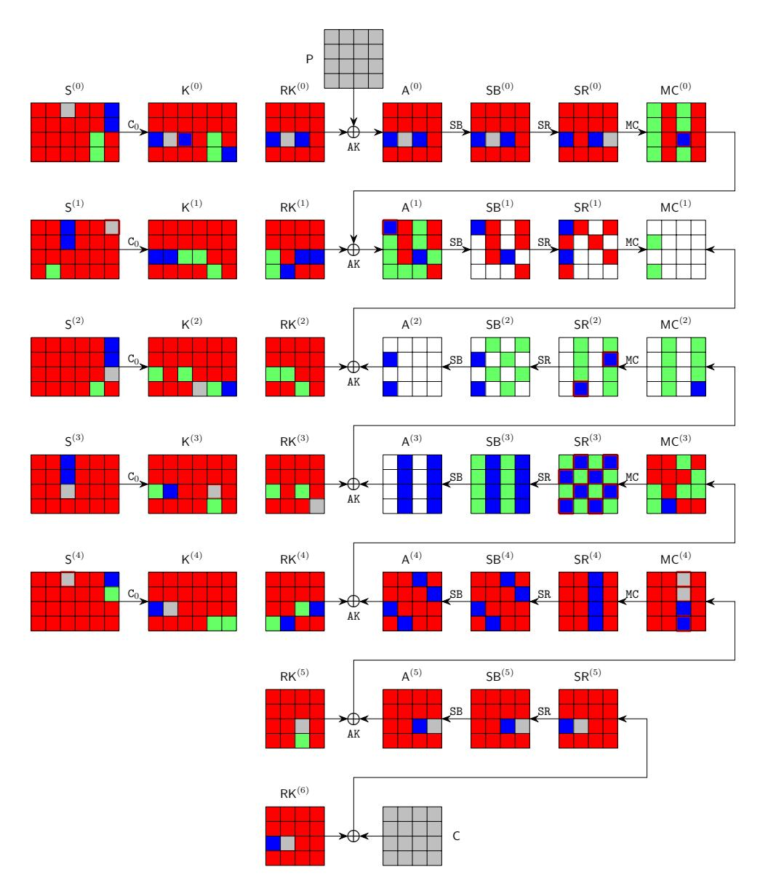

Fig. 8: The 6-round attack on AES-192 24

{24}------------------------------------------------

```
\widehat{\mathsf{S}}^{(1)}[20] = \underline{k_{20}} \oplus S(\underline{k_{21}} \oplus \underline{k_{22}}); \widehat{\mathsf{S}}^{(4)}[8] = \underline{k_{20}} \oplus S(\underline{k_{21}}); \widehat{\mathsf{K}}^{(0)}[10] = \underline{k_{19}} \oplus \underline{k_{20}} \oplus \underline{k_{7}} \oplus S(\underline{k_{9}}); \widehat{\mathsf{K}}^{(3)}[18] = \underline{k_{6}} \oplus \underline{k_{18}}
\widehat{\mathsf{MC}}^{(0)}[10] = S(k_{13} \oplus k_{14} \oplus k_1 \oplus S(k_3)) \oplus S(k_4 \oplus k_5) \oplus 3 \cdot S(k_{11} \oplus S(k_0 \oplus k_1)) \Big| \oplus 2 \cdot \mathsf{SR}^{(0)}[10]
\widehat{\mathsf{A}}^{(1)}[0] = 2 \cdot S(k_{14} \oplus S(k_{15} \oplus k_{16}) \oplus k_2 \oplus S(k_3) \oplus S(k_3 \oplus k_4)) \oplus 3 \cdot S(k_5 \oplus S(k_6 \oplus k_7))
                           \oplus S(k_{10} \oplus k_{11}) \oplus k_{12} \oplus k_{13} \oplus k_0 \oplus k_2 \oplus SR^{(0)}[2]
\widehat{\mathsf{MC}}^{(4)}[8] = S^{-1}(k_{13} \oplus k_{14} \oplus S(k_{15}) \oplus k_1) \oplus k_0 \oplus k_{12}; \quad \widehat{\mathsf{MC}}^{(4)}[9] = S^{-1}(k_5 \oplus S(k_6)) \oplus k_3 \oplus k_{15}
\widehat{\mathsf{MC}}^{(4)}[11] = S^{-1}(k_{10} \oplus k_{11} \oplus S(k_0)) \oplus k_{21} \oplus k_9
\widehat{\mathsf{SR}}^{(3)}[1] = 9 \cdot \mathsf{MC}^{(3)}[0] \oplus \mathsf{e} \cdot \mathsf{MC}^{(3)}[0] \oplus \mathsf{b} \cdot \mathsf{RK}^{(4)}[2] \oplus \mathsf{d} \cdot (k_{21} \oplus k_{22} \oplus \mathsf{A}^{(4)}[3]) \Big| \oplus \mathsf{b} \cdot \mathsf{A}^{(4)}[2] \oplus \mathsf{d} \cdot k_{9}
\widehat{\mathsf{SR}}^{(3)}[3] = \mathtt{b} \cdot \mathsf{MC}^{(3)}[0] \oplus \mathtt{d} \cdot \mathsf{MC}^{(3)}[1] \oplus 9 \cdot \mathsf{RK}^{(4)}[2] \oplus \mathtt{e} \cdot (k_{21} \oplus k_{22} \oplus \mathsf{A}^{(4)}[3]) \oplus 9 \cdot \mathsf{A}^{(4)}[2] \oplus \mathtt{e} \cdot k_{9}
\widehat{\mathsf{SR}}^{(3)}[4] = \mathsf{e} \cdot \mathsf{MC}^{(3)}[4] \oplus \mathsf{b} \cdot \mathsf{MC}^{(3)}[5] \oplus \mathsf{d} \cdot \mathsf{MC}^{(3)}[6] \oplus 9 \cdot \mathsf{MC}^{(3)}[7]
\widehat{\mathsf{SR}}^{(3)}[6] = \mathsf{d} \cdot \mathsf{MC}^{(3)}[4] \oplus 9 \cdot \mathsf{MC}^{(3)}[5] \oplus \mathsf{e} \cdot \mathsf{MC}^{(3)}[6] \oplus \mathsf{b} \cdot \mathsf{MC}^{(3)}[7]
\widehat{\mathsf{SR}}^{(3)}[9] = 9 \cdot \mathsf{MC}^{(4)}[8] \oplus \mathsf{e} \cdot \mathsf{MC}^{(3)}[9] \oplus \mathsf{b} \cdot (k_{20} \oplus \mathsf{A}^{(4)}[10]) \oplus \mathsf{d} \cdot \mathsf{MC}^{(3)}[11] \oplus 9 \cdot \mathsf{A}^{(4)}[8] \oplus \mathsf{b} \cdot k_{8}
\widehat{\mathsf{SR}}^{(3)}[11] = \mathtt{b} \cdot \mathsf{MC}^{(4)}[8] \oplus \mathtt{d} \cdot \mathsf{MC}^{(3)}[9] \oplus 9 \cdot (k_{20} \oplus \mathsf{A}^{(4)}[10]) \oplus \mathtt{e} \cdot \mathsf{MC}^{(3)}[11] \oplus \mathtt{b} \cdot \mathsf{A}^{(4)}[8] \oplus 9 \cdot k_{8}
\widehat{\mathsf{SR}}^{(3)}[12] = \mathsf{e} \cdot \mathsf{MC}^{(3)}[12] \oplus \mathsf{b} \cdot \mathsf{RK}^{(4)}[13] \oplus \mathsf{d} \cdot \mathsf{A}^{(4)}[14] \oplus 9 \cdot \mathsf{MC}^{(3)}[15] \\ \oplus \mathsf{b} \cdot \mathsf{A}^{(4)}[13] \oplus \mathsf{d} \cdot \mathsf{RK}^{(4)}[14]
\widehat{\mathsf{SR}}^{(3)}[14] = \mathsf{d} \cdot \mathsf{MC}^{(3)}[12] \oplus 9 \cdot \mathsf{RK}^{(4)}[13] \oplus \mathsf{e} \cdot \mathsf{A}^{(4)}[14] \oplus \mathsf{b} \cdot \mathsf{MC}^{(3)}[15] \oplus 9 \cdot \mathsf{A}^{(4)}[13] \oplus \mathsf{e} \cdot \mathsf{RK}^{(4)}[14]
\widehat{\mathsf{SR}}^{(2)}[7] = \mathsf{b} \cdot k_{14} \oplus \mathsf{d} \cdot k_{5} \oplus 9 \cdot k_{20} \oplus \mathsf{e} \cdot k_{11} \oplus \mathsf{b} \cdot \mathsf{A}^{(3)}[4] \oplus \mathsf{d} \cdot \mathsf{A}^{(3)}[5] \oplus 9 \cdot \mathsf{A}^{(3)}[6] \oplus \mathsf{e} \cdot \mathsf{A}^{(3)}[7]
\widehat{\mathsf{SR}}^{(2)}[13] = 9 \cdot k_{13} \oplus \mathsf{e} \cdot k_{4} \oplus \mathsf{b} \cdot k_{19} \oplus 9 \cdot \mathsf{A}^{(3)}[12] \oplus \mathsf{e} \cdot \mathsf{A}^{(3)}[13] \oplus \mathsf{b} \cdot \mathsf{A}^{(3)}[14] \oplus \mathsf{d} \cdot (\mathsf{A}^{(3)}[15] \oplus k_{10})
                                                                                                                                                                                                                                                                                     (20)
                                                                                                                                                            k_{20}
                 \widehat{\mathsf{SR}}^{\overline{(3)}}
```

```
\widehat{\mathsf{SR}}^{(3)}[3]
   \widehat{\mathsf{SR}}^{(3)}[4]
   \widehat{\mathsf{SR}}^{(3)} [6]
   \widehat{SR}^{(3)}[9]
 \widehat{\mathsf{SR}}^{(3)}[11]
 \widehat{SR}^{(3)}[12]
  \hat{K}^{(3)}[18]
                       1
                                                                                                                     0
 \widehat{SR}^{(3)}[14]
                                                                                                                                                                                                                  (21)
   \hat{S}^{(1)}[20]
    \hat{A}^{(1)}[0]
  \widehat{MC}^{(4)}[9]
  \hat{K}^{(0)}[10]
  \widehat{\mathsf{MC}}^{(4)}[8]
\widehat{\mathsf{SR}}^{\left(2\right)}[13]
\widehat{\mathsf{MC}}^{(0)}[10]
                     Ο
                                 0
  \widehat{\mathsf{SR}}^{\left(2\right)}[7]
                     0
                                0
                                                                                                                                                                                                   0
\widehat{MC}^{(4)}[11] = 0
                                O
                                          0
                                                   0
                                                         0
                                                                0
                                                                         0
                                                                                   0
                                                                                           0
                                                                                                  0
                                                                                                           1
                                                                                                                     0
                                                                                                                             1
                                                                                                                                    0
                                                                                                                                            0
                                                                                                                                                              0
    \hat{S}^{(4)}[8] = 0
                                0
                                                                                   0
                                                                                                 0
                                                                                                           0
                                                                                                                            O
                                          0
                                                   0
                                                         0 0
                                                                         0
                                                                                           O
                                                                                                                    1
                                                                                                                                    0
                                                                                                                                           0
                                                                                                                                                    0
                                                                                                                                                              0
```

#### <span id="page-24-0"></span>4.5 Two-Plaintext Key-Recovery Attack on 7-round AES-256

The 7-round MitM path is given in the full version, where the starting state  $S^{(1)}$  contains  $\lambda^+ = 1$  bytes and  $\lambda^- = 23$  bytes. The consumed DoFs of and are  $\ell^+ = 0$  and  $\ell^- = 22$  bytes, respectively. Therefore, DoF<sup>+</sup> = 1, DoF<sup>-</sup> = 1, and there is DoM = 1 matching byte in round 3. Compute 22 expressions for the 22 consumed DoFs of on the red bytes of  $S^{(1)}$ . Using the new TA, we get 9 free variables  $S^{(1)}[0, 6, 14, 18, 20, 22, 27, 28, 30]$  and 14 dependent variables  $S^{(1)}[1, 2, 3, 4, 5, 7, 9, 10, 11, 16, 17, 21, 29, 31]$ . The matrices after TA is given in Eq.

{25}------------------------------------------------

(22). The algorithm for the 7-round MitM attack is given in the full version. The total time complexity is about  $2^{256-8 \cdot \min\{\text{DoF}^+, \text{DoF}^-, \text{DoM}\}} = 2^{248}$ . The memory is  $2^{72}$  to store U.

<span id="page-25-1"></span>

| (                         |                    | $k_5$ | $k_{21}$ | $k_{17}$ | $k_{11}$ | $k_{16}$ | $k_{10}$ | $k_{31}$ | $k_9$ | $k_{29}$ | $k_1$ | $k_3$ | $k_4$ | $k_7$ | $k_2$ | $k_0$ | $k_6$ | $k_{14}$ | $k_{18}$ | $k_{20}$ | $k_{22}$ | $k_{27}$ | $k_{28}$ | k <sub>30</sub> | ١    |
|---------------------------|--------------------|-------|----------|----------|----------|----------|----------|----------|-------|----------|-------|-------|-------|-------|-------|-------|-------|----------|----------|----------|----------|----------|----------|-----------------|------|
| SR <sup>(4</sup>          | $^{4)}[1]$         | 1     | 1        | 1        | 1        | 1        | 1        | 1        | 1     | 1        | 1     | 1     | 1     | 1     | 1     | 1     | 1     | 1        | 1        | 1        | 1        | 1        | 1        | 1               |      |
|                           | $^{4)}_{[4]}$      | 1     | 1        | 1        | 1        | 1        | 1        | 1        | 1     | 1        | 1     | 1     | 1     | 1     | 1     | 1     | 1     | 1        | 1        | 1        | 1        | 1        | 1        | 1               |      |
| $\widehat{SR}^{(4)}$      |                    | 1     | 1        | 1        | 1        | 1        | 1        | 1        | 1     | 1        | 1     | 1     | 1     | 1     | 1     | 1     | 1     | 1        | 1        | 1        | 1        | 1        | 1        | 1               |      |
| $\widehat{SR}^{(4)}$      |                    | 1     | 1        | 1        | 1        | 1        | 1        | 1        | 1     | 1        | 1     | 1     | 1     | 1     | 1     | 1     | 1     | 1        | 1        | 1        | 1        | 1        | 1        | 1               |      |
| MC <sup>(1</sup>          | $^{(1)}[4]$        | 1     | 1        | 0        | 0        | 0        | 1        | 1        | 0     | 0        | 1     | 0     | 1     | 1     | 1     | 1     | 1     | 1        | 1        | 1        | 1        | 1        | 1        | 1               |      |
| $\widehat{MC}^{(1)}$      | (14]               | 1     | 1        | 1        | 1        | 1        | 1        | 1        | 0     | 0        | 0     | 0     | 0     | 0     | 1     | 0     | 1     | 1        | 1        | 0        | 1        | 0        | 1        | 1               |      |
| $\widehat{A}^{(2)}$       | <sup>2)</sup> [9]  | 0     | 0        | 0        | 0        | 1        | 0        | 0        | 0     | 0        | 0     | 0     | 1     | 1     | 1     | 1     | 1     | 1        | 1        | 1        | 1        | 1        | 1        | 1               |      |
| $\widehat{MC}^{(0)}$      | ) <sub>[14]</sub>  | 0     | 0        | 0        | 0        | 0        | 0        | 0        | 0     | 0        | 0     | 0     | 0     | 0     | 1     | 0     | 1     | 1        | 0        | 1        | 1        | 0        | 0        | 0               |      |
| MC <sup>(5</sup>          | <sup>5)</sup> [9]  | 1     | 0        | 1        | 0        | 0        | 1        | 0        | 1     | 0        | 1     | 1     | 1     | 0     | 1     | 0     | 0     | 0        | 0        | 0        | 0        | 0        | 0        | 0               |      |
| $\widehat{MC}^{(5)}$      | (11]               | 0     | 1        | 1        | 0        | 0        | 0        | 0        | 0     | 0        | 0     | 0     | 0     | 0     | 0     | 0     | 0     | 0        | 1        | 1        | 0        | 0        | 0        | 0               | (22) |
| MC <sup>(§</sup>          | 5) <sub>[8]</sub>  | 0     | 0        | 1        | 1        | 0        | 1        | 0        | 1     | 0        | 0     | 0     | 0     | 0     | 0     | 0     | 0     | 0        | 1        | 0        | 0        | 0        | 0        | 0               | (22) |
| $\widehat{A}^{(2)}$       | <sup>2)</sup> [3]  | 0     | 0        | 0        | 1        | 0        | 1        | 1        | 0     | 0        | 0     | 0     | 1     | 1     | 0     | 1     | 1     | 1        | 1        | 1        | 1        | 0        | 1        | 1               |      |
| $\hat{\mathbf{K}}^{(i)}$  | <sup>(2)</sup> [1] | 0     | 0        | 0        | 0        | 1        | 1        | 0        | 0     | 0        | 0     | 0     | 1     | 0     | 0     | 0     | 0     | 0        | 0        | 0        | 0        | 0        | 0        | 1               |      |
| A(-                       | $^{(1)}_{[2]}$     | 0     | 0        | 0        | 0        | 0        | 1        | 1        | 1     | 1        | 0     | 1     | 0     | O     | 0     | 0     | 1     | 1        | 1        | 0        | 1        | 0        | 1        | 1               |      |
| $A^{(1)}$                 | [13]               | 0     | 0        | 0        | 0        | 0        | 0        | 1        | 0     | 0        | 0     | 0     | 0     | 0     | 1     | 0     | 1     | 1        | 0        | 1        | 1        | 0        | 0        | 0               |      |
| K(3)                      | [18]               | 0     | 0        | 0        | 0        | 0        | 0        | 0        | 1     | 1        | 1     | 1     | 0     | 0     | 1     | 0     | 0     | 0        | 0        | 0        | 0        | 1        | 1        | 0               |      |
| $A^{(1)}$                 | [10]               | 0     | 0        | 0        | 0        | 0        | 0        | 0        | 0     | 1        | 0     | 0     | 0     | 0     | 1     | 0     | 1     | 1        | 0        | 0        | 1        | 0        | 1        | 1               |      |
| K(3)                      | [10]               | 0     | 0        | 0        | 0        | 0        | 0        | 0        | 0     | 0        | 1     | 0     | 0     | 0     | 1     | 0     | 0     | 0        | 0        | 0        | 0        | 1        | 1        | 0               |      |
| A(-                       | 1) <sub>[6]</sub>  | 0     | 0        | 0        | 0        | 0        | 0        | 0        | 0     | 0        | 0     | 1     | 1     | 1     | 0     | 1     | 1     | 1        | 1        | 1        | 1        | 0        | 0        | 1               |      |
| A(2                       | 2)[8]              | 0     | 0        | 0        | 0        | 0        | 0        | 0        | O     | 0        | 0     | 0     | 1     | 1     | 1     | 1     | 1     | 1        | 1        | 1        | 1        | 1        | 1        | 1               |      |
| $\widehat{A}^{(1)}$       | [12]               | 0     | 0        | 0        | 0        | 0        | 0        | 0        | O     | 0        | 0     | 0     | 0     | 1     | 1     | 0     | 1     | 1        | 0        | 1        | 1        | 0        | 0        | 0               |      |
| $\int \widehat{MC}^{(0)}$ | <sup>1</sup> [15]  | 0     | 0        | 0        | 0        | 0        | 0        | 0        | 0     | 0        | 0     | 0     | 0     | 0     | 1     | 0     | 1     | 1        | 0        | 1        | 1        | 0        | 0        | 0 /             | ,    |

# <span id="page-25-0"></span>4.6 Improved Preimage Attack on 10-round AES-256-DM

In addition to the key-recovery attacks, we also significantly reduce the memory complexity of Dong et al.'s 10-round preimage attack on DM hashing mode with AES-256 from the impractical  $2^{56}$  [21] to the practical  $2^8$ , with the same time complexity. The compression function of AES-256-DM is  $h_i = \text{AES-256}_{m_{i-1}}(h_{i-1}) \oplus h_{i-1}$ , where  $h_i$  is the 128-bit chaining variable and the 256-bit message block  $m_{i-1}$  acts as the encryption key of AES-256. Given a 128-bit target  $h_i$ , the preimage attack is to generate a preimage  $(m_{i-1}, h_{i-1})$  satisfying the target with time complexity lower than  $2^{128}$ .

We reuse the 10-round MitM characteristic in [21], which is also given in the full version. In the MitM path, the starting states are  $A^{(4)}$  and  $S^{(3)}$ . The 1-byte matching occurs in the MC operation in round 8. In  $S^{(3)}$ , there are 19  $\blacksquare$  cells, 1  $\blacksquare$  cell and 12  $\blacksquare$  cells. In  $A^{(4)}$ , there are 8  $\blacksquare$  cells, 8  $\blacksquare$  cells. Hence, the total initial DoFs are  $\lambda^+ = 19 + 8 = 27$  cells for  $\blacksquare$  cells, and  $\lambda^- = 1 + 8 = 9$  for  $\blacksquare$  cells. The consumed DoFs of  $\blacksquare$  and DoFs of  $\blacksquare$  are  $\ell^+ = 26$  and  $\ell^- = 8$  bytes, respectively. Therefore, DoF<sup>+</sup> = 1, DoF<sup>-</sup> = 1, and there is DoM = 1 matching byte.

We obtain the 18 equations on  $\square$  bytes of  $S^{(3)}$  for the consumed DoFs of blue bytes in  $S^{(1)}[13,14]$ ,  $S^{(2)}[12,13,14,15]$ ,  $S^{(4)}[1]$ ,  $K^{(2)}[0,3,4,5,9]$ ,  $SR^{(1)}[3,6,9,12]$  and  $SR^{(9)}[6,12]$ , where the expressions of  $SR^{(1)}[3,6,9,12]$  are obtained by  $MC^{-1}(RK^{(1)})$ , and assign  $a_i(0 \le i < 18)$  to them. Using the new TA, we get 4 free variables  $S^{(3)}[8,16,18,24]$  and 15 dependent variables  $S^{(3)}[0,1,2,3,4,5,6,7,9,10,11,17,27,28,31]$ . The matrices before and after TA are given in the full version.

Since we try to find a 128-bit preimage, the 128-bit encryption data path and 256-bit key-schedule path provide enough degrees of freedom, we do not

{26}------------------------------------------------

need to traverse all the cells to find the 128-bit preimage. The algorithm for the 10-round MitM attack is given in the full version. The total time complexity is about  $2^{120}$ . The memory is  $2^8$  to store U.

**Experiment of Preimage Attack.** We conduct an experiment of the 5-byte partial target preimage attack by fixing the 5 target bytes T[0,1,2,6,12]=0. The detailed configurations for the experiment is given in the full version. In our partial MitM attack, the time complexity to get a preimage of the 5-byte partial target T[0,1,2,6,12]=0 is about  $2^{32}$ . Obviously, to find a preimage of a 5-byte target, a brute-force search takes  $2^{8\cdot 5=40}$  time. The source codes and results are available via https://github.com/boxindev/Triangulation-MitM

We deploy the experiment on a computer with an i9-13900KF CPU and 32GB memory. Our experiment takes about 35000 seconds, and 4 preimages are produced with T[0,1,2,6,12]=0, which are given in the full version. The brute force search for 40-bit target preimage needs  $2^{40}$  evaluations of 10-round AES-256, which takes about 5888000 seconds using the same AES-256 code in the same platform.

Our 4-round attack on AES-128 with  $2^{24}$  memory in Sect. 4.2 is about 16 times faster than brute force, but the 10-round attack with  $2^8$  memory is about 168 times faster than brute force. The reason behind may be that accessing a larger memory needs more time in practical implementations. This phenomenon also proves that the attacks we proposed with significantly reduced memory complexities are very important in practical attacks.

# 5 Single-Plaintext Key-Recovery on Reduced Rijndael-EM

FAEST [5] additionally uses Rijndael in the Even-Mansour (EM) mode shown in Figure 9, *i.e.*, Rijndael-EM-128/-192/-256, where Rijndael with block sizes of 128/192/256 bits acts as the ideal permutations. Given a plaintext-ciphertext pair (P,C), suppose  $X=P\oplus k$ , then Rijndael-EM in Figure 9 can be transformed into Figure 10, *i.e.*, Rijndael  $(X)\oplus X=P\oplus C$ . Therefore, the key-recovery problem turns into the preimage attack on DM-like hashing mode, *i.e.*, given the target  $P\oplus C$  and find the preimage X. Then, find the key  $k=X\oplus P$ .

<span id="page-26-1"></span>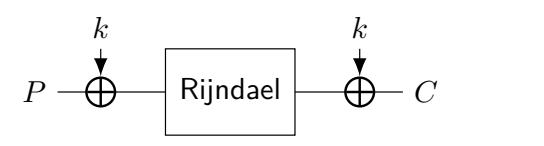

Fig. 9: Rijndael-EM

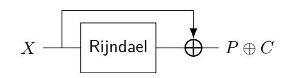

Fig. 10: Equivalent Form

#### <span id="page-26-0"></span>5.1 Key-Recovery Attack on 7-round Rijndael-EM-128

The 7-round MitM path is shown in Figure 11. The starting states  $A^{(1)}$  contains  $\lambda^+ = 6$  bytes and  $\lambda^- = 2$  bytes. The consumed DoFs of and are  $\ell^+ = 4$ 

{27}------------------------------------------------

and  $\ell^-=0$  bytes, respectively. Then,  $\mathrm{DoF}^+=2$ ,  $\mathrm{DoF}^-=2$ , and  $\mathrm{DoM}=4$  in round 2. The 7-round MitM attack is given in Algorithm 7 with the time complexity of  $2^{128-8\cdot\min\{\mathrm{DoF}^+,\mathrm{DoF}^-,\mathrm{DoM}\}}=2^{112}$  and memory  $2^{32}$  to store U.

# Algorithm 7: Attack on 7-round Rijndael-EM-128

```
1 for A^{(1)}[5,6,7,12,13,15] \in \mathbb{F}_2^{48} and (e_1,e_2,e_3,e_4) \in \mathbb{F}_2^{32} do
          U \leftarrow [\ ]
  2
          for MC^{(4)}[0, 5, 8, 13] \in \mathbb{F}_2^{32} do
 3
                Compute MC^{(4)}[2, 7, 10, 15] according to (e_1, e_2, e_3, e_4)
  4
                Compute \mathbf{u} = \mathsf{MC}^{(0)}[3,9] \in \mathbb{F}_2^{16}; U[\mathbf{u}] \leftarrow \mathsf{MC}^{(4)}[0,2,5,7,8,10,13,15]
  \mathbf{5}
          end
 6
          for \mathbf{u} \in \mathbb{F}_2^{16} do
 7
                L \leftarrow [\ ]
  8
                for A^{(1)}[4,14] \in \mathbb{F}_2^{16} do
  9
                 Compute the 4-byte matching point v, L[v] \leftarrow A^{(1)}[4, 14]
10
                end
11
                for values in U[\mathbf{u}] do
12
                     Compute the 4-byte matching point v'
13
                     for values in L[v'] do
14
                          Check if the target P \oplus C is satisfied
15
                     \mathbf{end}
16
                end
17
          end
18
19 end
```

#### <span id="page-27-0"></span>5.2 Key-Recovery Attack on 8-round Rijndael-EM-192

The 8-round MitM characteristic is shown in Figure 12. The starting state  $A^{(1)}$  contains  $\lambda^+ = 4$  bytes and  $\lambda^- = 8$  bytes. In the computation from  $A^{(1)}$  to  $SR^{(4)}$  and  $MC^{(4)}$ , the consumed DoFs of and are  $\ell^+ = 2$  and  $\ell^- = 6$  bytes, respectively. Therefore,  $DoF^+ = 2$ ,  $DoF^- = 2$ , and there are DoM = 2 matching bytes. The algorithm the 8-round MitM attack is given in the full version. The time complexity is about  $2^{192-8 \cdot \min\{DoF^+, DoF^-, DoM\}} = 2^{176}$ . The memory is  $2^{16}$  to store the table L.

#### <span id="page-27-1"></span>5.3 Key-Recovery Attack on 9-round Rijndael-EM-256

The 9-round MitM characteristic is shown in Figure 13. The starting state  $A^{(4)}$  contains  $\lambda^+ = 28$  bytes and  $\lambda^- = 1$  bytes. In the computation from  $A^{(4)}$  to  $SR^{(6)}$  and  $MC^{(6)}$ , the consumed degrees of freedom (DoFs) of  $\square$  and  $\square$  are  $\ell^+ = 27$  and  $\ell^- = 0$  bytes, respectively. Therefore,  $DoF^+ = 1$ ,  $DoF^- = 1$ , and there is DoM = 1 matching byte. The algorithm for the 9-round MitM attack is given in

{28}------------------------------------------------

<span id="page-28-0"></span>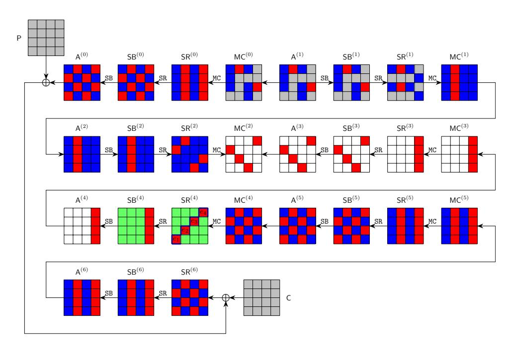

Fig. 11: The 7-round attack on Rijndael-EM-128

<span id="page-28-1"></span>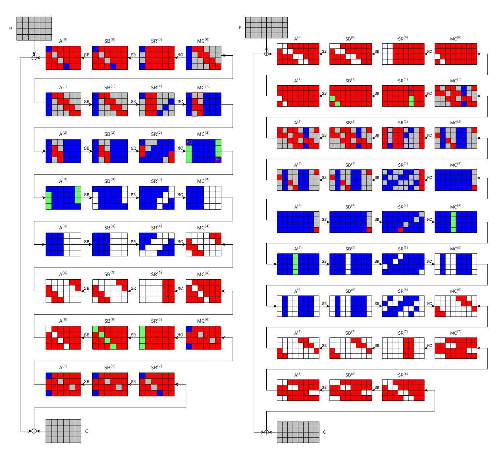

Fig. 12: 8-round Rijndael-EM-192

Fig. 13: 9-round Rijndael-EM-256

{29}------------------------------------------------

the full version. The time complexity is about 2256−8·min{DoF+,DoF−,DoM} = 2<sup>248</sup> . The memory is 2<sup>8</sup> to store table L.

# 6 Conclusion

This paper introduces the triangulating Meet-in-the-Middle attack to reduce the memory complexity when considering MitM paths with nonlinearly constrained neutral words. We achieve this goal by leveraging and improving the Triangulation Algorithm (TA) of Khovratovich et al. to solve nonlinear systems of the MitM efficiently.

For AES, we reduce the memory complexities of the 4-/5-round single-plaintext key-recovery attacks on AES-128 and propose new attacks on 6-round AES-192 and 7-round AES-256 with two known plaintexts. For Rijndael-EM, we convert key-recovery attack into preimage attack on its hashing mode and give new key recovery attacks Rijndael-EM-128/192/256 with a single plaintext-ciphertext pair. In the full version, we extend our techniques to sponge functions.

Acknowledgements. We would like to thank Yu Sasaki and the anonymous reviewers from CRYPTO 2025 for their excellent guidance in improving the paper. This work is supported by the National Key R&D Program of China (2024YFA1013000), the Natural Science Foundation of China (62272257, 62302250), the Young Elite Scientists Sponsorship Program by CAST (2023QNRC001), and the Zhongguancun Laboratory.

# References

- <span id="page-29-2"></span>1. Kazumaro Aoki and Yu Sasaki. Preimage attacks on one-block MD4, 63-step MD5 and more. In SAC 2008, volume 5381, pages 103–119. Springer, 2008.
- <span id="page-29-3"></span>2. Zhenzhen Bao, Xiaoyang Dong, Jian Guo, Zheng Li, Danping Shi, Siwei Sun, and Xiaoyun Wang. Automatic search of meet-in-the-middle preimage attacks on AESlike hashing. In EUROCRYPT 2021, Part I, volume 12696, pages 771–804.
- <span id="page-29-4"></span>3. Zhenzhen Bao, Jian Guo, Danping Shi, and Yi Tu. Superposition meet-in-themiddle attacks: Updates on fundamental security of AES-like hashing. In Yevgeniy Dodis and Thomas Shrimpton, editors, CRYPTO 2022, Proceedings, Part I, volume 13507 of LNCS, pages 64–93. Springer, 2022.
- <span id="page-29-1"></span>4. Achiya Bar-On, Orr Dunkelman, Nathan Keller, Eyal Ronen, and Adi Shamir. Improved key recovery attacks on reduced-round AES with practical data and memory complexities. In Hovav Shacham and Alexandra Boldyreva, editors, Advances in Cryptology - CRYPTO 2018 - 38th Annual International Cryptology Conference, Santa Barbara, CA, USA, August 19-23, 2018, Proceedings, Part II, volume 10992 of Lecture Notes in Computer Science, pages 185–212. Springer, 2018.
- <span id="page-29-0"></span>5. Carsten Baum, Lennart Braun, Cyprien Delpech de Saint Guilhem, Michael Klooß, Christian Majenz, Shibam Mukherjee, Emmanuela Orsini, Sebastian Ramacher, Christian Rechberger, Lawrence Roy, et al. Faest: algorithm specifications. Technical report, Technical report, National Institute of Standards and Technology, 2023.

{30}------------------------------------------------

- <span id="page-30-0"></span>6. Edward A. Bender and E. Rodney Canfield. An approximate probabilistic model for structured gaussian elimination. J. Algorithms, 31(2):271–290, 1999.
- <span id="page-30-6"></span>7. Andrey Bogdanov, Dmitry Khovratovich, and Christian Rechberger. Biclique cryptanalysis of the full AES. In ASIACRYPT 2011, Proceedings, pages 344–371.
- <span id="page-30-7"></span>8. Andrey Bogdanov and Christian Rechberger. A 3-subset meet-in-the-middle attack: Cryptanalysis of the lightweight block cipher KTANTAN. In SAC 2010, volume 6544, pages 229–240. Springer, 2010.
- <span id="page-30-15"></span>9. Charles Bouillaguet. Etudes d'hypotheses algorithmiques et attaques de primitives cryptographiques. PhD thesis, Universit´e Paris-Diderot–Ecole Normale Sup´erieure, ´ 2011.
- <span id="page-30-3"></span>10. Charles Bouillaguet, Patrick Derbez, Orr Dunkelman, Pierre-Alain Fouque, Nathan Keller, and Vincent Rijmen. Low-data complexity attacks on AES. IEEE transactions on information theory, 58(11):7002–7017, 2012.
- <span id="page-30-2"></span>11. Charles Bouillaguet, Patrick Derbez, and Pierre-Alain Fouque. Automatic search of attacks on round-reduced AES and applications. In Phillip Rogaway, editor, Advances in Cryptology - CRYPTO 2011 - 31st Annual Cryptology Conference, Santa Barbara, CA, USA, August 14-18, 2011. Proceedings, volume 6841 of Lecture Notes in Computer Science, pages 169–187. Springer, 2011.
- <span id="page-30-11"></span>12. Christina Boura, Nicolas David, Patrick Derbez, Gregor Leander, and Mar´ıa Naya-Plasencia. Differential meet-in-the-middle cryptanalysis. In Helena Handschuh and Anna Lysyanskaya, editors, CRYPTO 2023, Proceedings, Part III, volume 14083 of Lecture Notes in Computer Science, pages 240–272. Springer, 2023.
- <span id="page-30-8"></span>13. Anne Canteaut, Mar´ıa Naya-Plasencia, and Bastien Vayssi`ere. Sieve-in-the-middle: Improved MITM attacks. In CRYPTO 2013, Proceedings, Part I, pages 222–240.
- <span id="page-30-13"></span>14. Shiyao Chen, Jian Guo, Eik List, Danping Shi, and Tianyu Zhang. Diving deep into the preimage security of AES-like hashing. In Marc Joye and Gregor Leander, editors, Advances in Cryptology - EUROCRYPT 2024 - 43rd Annual International Conference on the Theory and Applications of Cryptographic Techniques, Zurich, Switzerland, May 26-30, 2024, Proceedings, Part I, volume 14651 of Lecture Notes in Computer Science, pages 398–426. Springer, 2024.
- <span id="page-30-1"></span>15. Joan Daemen and Vincent Rijmen. The Design of Rijndael: AES - The Advanced Encryption Standard. Information Security and Cryptography. Springer, 2002.
- <span id="page-30-4"></span>16. Patrick Derbez. Meet-in-the-middle attacks on AES. PhD thesis, Ecole Normale Sup´erieure de Paris-ENS Paris, 2013.
- <span id="page-30-12"></span>17. Patrick Derbez and Pierre-Alain Fouque. Automatic search of meet-in-the-middle and impossible differential attacks. In CRYPTO 2016, Proceedings, Part II, volume 9815, pages 157–184. Springer, 2016.
- <span id="page-30-5"></span>18. Whitfield Diffie and Martin E. Hellman. Special feature exhaustive cryptanalysis of the NBS data encryption standard. Computer, 10(6):74–84, 1977.
- <span id="page-30-9"></span>19. Itai Dinur, Orr Dunkelman, Nathan Keller, and Adi Shamir. Efficient dissection of composite problems, with applications to cryptanalysis, knapsacks, and combinatorial search problems. In CRYPTO 2012, volume 7417, pages 719–740.
- <span id="page-30-14"></span>20. Xiaoyang Dong, Jian Guo, Shun Li, and Phuong Pham. Triangulating rebound attack on AES-like hashing. In Yevgeniy Dodis and Thomas Shrimpton, editors, Advances in Cryptology - CRYPTO 2022 - 42nd Annual International Cryptology Conference, CRYPTO 2022, Santa Barbara, CA, USA, August 15-18, 2022, Proceedings, Part I, volume 13507 of Lecture Notes in Computer Science, pages 94–124. Springer, 2022.
- <span id="page-30-10"></span>21. Xiaoyang Dong, Jialiang Hua, Siwei Sun, Zheng Li, Xiaoyun Wang, and Lei Hu. Meet-in-the-middle attacks revisited: Key-recovery, collision, and preimage attacks. In CRYPTO 2021, Proceedings, Part III, volume 12827, pages 278–308. Springer.

{31}------------------------------------------------

- <span id="page-31-9"></span>22. Xiaoyang Dong, Boxin Zhao, Lingyue Qin, Qingliang Hou, Shun Zhang, and Xiaoyun Wang. Generic mitm attack frameworks on sponge constructions. In Leonid Reyzin and Douglas Stebila, editors, Advances in Cryptology - CRYPTO 2024 - 44th Annual International Cryptology Conference, Santa Barbara, CA, USA, August 18-22, 2024, Proceedings, Part IV, volume 14923 of Lecture Notes in Computer Science, pages 3–37. Springer, 2024.
- <span id="page-31-1"></span>23. Orr Dunkelman, Nathan Keller, Eyal Ronen, and Adi Shamir. The retracing boomerang attack, with application to reduced-round AES. J. Cryptol., 37(3):32, 2024.
- <span id="page-31-2"></span>24. Orr Dunkelman, Gautham Sekar, and Bart Preneel. Improved meet-in-the-middle attacks on reduced-round DES. In INDOCRYPT 2007, Proceedings, volume 4859, pages 86–100. Springer, 2007.
- <span id="page-31-8"></span>25. Thomas Espitau, Pierre-Alain Fouque, and Pierre Karpman. Higher-order differential meet-in-the-middle preimage attacks on SHA-1 and BLAKE. In CRYPTO 2015, Proceedings, Part I, volume 9215, pages 683–701. Springer, 2015.
- <span id="page-31-5"></span>26. Thomas Fuhr and Brice Minaud. Match box meet-in-the-middle attack against KATAN. In FSE 2014, pages 61–81, 2014.
- <span id="page-31-6"></span>27. Jian Guo, San Ling, Christian Rechberger, and Huaxiong Wang. Advanced meetin-the-middle preimage attacks: First results on full Tiger, and improved results on MD4 and SHA-2. In ASIACRYPT 2010, Proceedings, volume 6477, pages 56–75.
- <span id="page-31-4"></span>28. Hosein Hadipour and Maria Eichlseder. Autoguess: A tool for finding guess-anddetermine attacks and key bridges. In Giuseppe Ateniese and Daniele Venturi, editors, Applied Cryptography and Network Security - 20th International Conference, ACNS 2022, Rome, Italy, June 20-23, 2022, Proceedings, volume 13269 of Lecture Notes in Computer Science, pages 230–250. Springer, 2022.
- <span id="page-31-10"></span>29. Dmitry Khovratovich, Alex Biryukov, and Ivica Nikolic. Speeding up collision search for byte-oriented hash functions. In Marc Fischlin, editor, Topics in Cryptology - CT-RSA 2009, The Cryptographers' Track at the RSA Conference 2009, San Francisco, CA, USA, April 20-24, 2009. Proceedings, volume 5473 of Lecture Notes in Computer Science, pages 164–181. Springer, 2009.
- <span id="page-31-3"></span>30. Dmitry Khovratovich, Ga¨etan Leurent, and Christian Rechberger. Narrowbicliques: Cryptanalysis of full IDEA. In David Pointcheval and Thomas Johansson, editors, EUROCRYPT 2012, Proceedings, volume 7237, pages 392–410.
- <span id="page-31-7"></span>31. Simon Knellwolf and Dmitry Khovratovich. New preimage attacks against reduced SHA-1. In CRYPTO 2012, Proceedings, volume 7417, pages 367–383.
- <span id="page-31-0"></span>32. Brian A. LaMacchia and Andrew M. Odlyzko. Solving large sparse linear systems over finite fields. In Alfred Menezes and Scott A. Vanstone, editors, Advances in Cryptology - CRYPTO '90, 10th Annual International Cryptology Conference, Santa Barbara, California, USA, August 11-15, 1990, Proceedings, volume 537 of Lecture Notes in Computer Science, pages 109–133. Springer, 1990.
- <span id="page-31-12"></span>33. Ga¨etan Leurent and Clara Pernot. New representations of the AES key schedule. In Anne Canteaut and Fran¸cois-Xavier Standaert, editors, Advances in Cryptology - EUROCRYPT 2021 - 40th Annual International Conference on the Theory and Applications of Cryptographic Techniques, Zagreb, Croatia, October 17-21, 2021, Proceedings, Part I, volume 12696 of Lecture Notes in Computer Science, pages 54–84. Springer, 2021.
- <span id="page-31-11"></span>34. Florian Mendel, Christian Rechberger, Martin Schl¨affer, and Søren S. Thomsen. The rebound attack: Cryptanalysis of reduced Whirlpool and Grøstl. In FSE 2009, 2009, pages 260–276, 2009.

{32}------------------------------------------------

- <span id="page-32-7"></span>35. Lingyue Qin, Jialiang Hua, Xiaoyang Dong, Hailun Yan, and Xiaoyun Wang. Meetin-the-middle preimage attacks on sponge-based hashing. In Carmit Hazay and Martijn Stam, editors, Advances in Cryptology - EUROCRYPT 2023 - 42nd Annual International Conference on the Theory and Applications of Cryptographic Techniques, Lyon, France, April 23-27, 2023, Proceedings, Part IV, volume 14007 of Lecture Notes in Computer Science, pages 158–188. Springer, 2023.
- <span id="page-32-1"></span>36. Sondre Rønjom, Navid Ghaedi Bardeh, and Tor Helleseth. Yoyo tricks with AES. In Tsuyoshi Takagi and Thomas Peyrin, editors, Advances in Cryptology - ASI-ACRYPT 2017 - 23rd International Conference on the Theory and Applications of Cryptology and Information Security, Hong Kong, China, December 3-7, 2017, Proceedings, Part I, volume 10624 of Lecture Notes in Computer Science, pages 217–243. Springer, 2017.
- <span id="page-32-4"></span>37. Yu Sasaki. Integer linear programming for three-subset meet-in-the-middle attacks: Application to GIFT. In IWSEC 2018, volume 11049, pages 227–243.
- <span id="page-32-9"></span>38. Yu Sasaki. Meet-in-the-middle preimage attacks on AES hashing modes and an application to Whirlpool. In Antoine Joux, editor, Fast Software Encryption - 18th International Workshop, FSE 2011, Lyngby, Denmark, February 13-16, 2011, Revised Selected Papers, volume 6733 of Lecture Notes in Computer Science, pages 378–396. Springer, 2011.
- <span id="page-32-2"></span>39. Yu Sasaki and Kazumaro Aoki. Finding preimages in full MD5 faster than exhaustive search. In EUROCRYPT 2009, Proceedings, volume 5479, pages 134–152.
- <span id="page-32-3"></span>40. Yu Sasaki, Lei Wang, Shuang Wu, and Wenling Wu. Investigating fundamental security requirements on Whirlpool: Improved preimage and collision attacks. In Xiaoyun Wang and Kazue Sako, editors, Advances in Cryptology - ASIACRYPT 2012 - 18th International Conference on the Theory and Application of Cryptology and Information Security, Beijing, China, December 2-6, 2012. Proceedings, volume 7658 of Lecture Notes in Computer Science, pages 562–579. Springer, 2012.
- <span id="page-32-5"></span>41. Andr´e Schrottenloher and Marc Stevens. Simplified MITM modeling for permutations: New (quantum) attacks. In CRYPTO 2022, Proceedings, Part III, volume 13509, pages 717–747. Springer, 2022.
- <span id="page-32-6"></span>42. Andr´e Schrottenloher and Marc Stevens. Simplified modeling of MITM attacks for block ciphers: New (quantum) attacks. IACR Trans. Symmetric Cryptol., 2023(3):146–183, 2023.
- <span id="page-32-0"></span>43. Tyge Tiessen. Polytopic cryptanalysis. In Marc Fischlin and Jean-S´ebastien Coron, editors, Advances in Cryptology - EUROCRYPT 2016 - 35th Annual International Conference on the Theory and Applications of Cryptographic Techniques, Vienna, Austria, May 8-12, 2016, Proceedings, Part I, volume 9665 of Lecture Notes in Computer Science, pages 214–239. Springer, 2016.
- <span id="page-32-8"></span>44. Michael Tunstall. Improved "partial sums"-based square attack on AES. In Pierangela Samarati, Wenjing Lou, and Jianying Zhou, editors, SECRYPT 2012 - Proceedings of the International Conference on Security and Cryptography, Rome, Italy, 24-27 July, 2012, SECRYPT is part of ICETE - The International Joint Conference on e-Business and Telecommunications, pages 25–34. SciTePress, 2012.