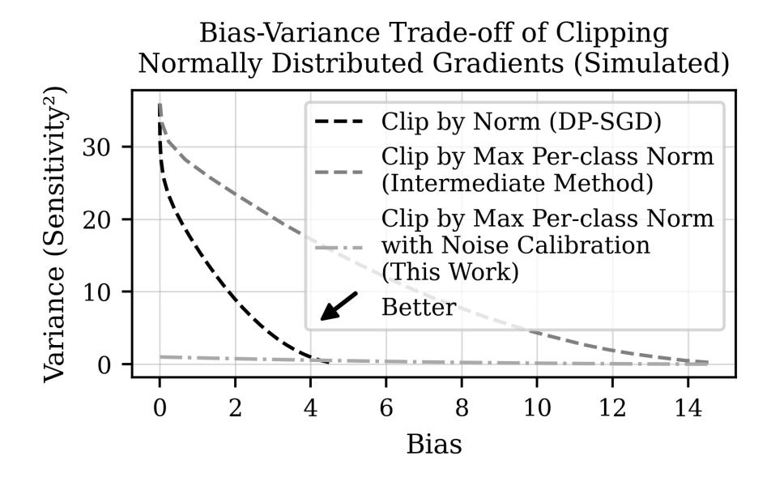
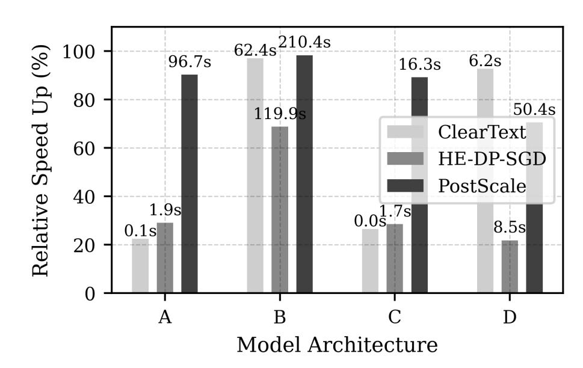
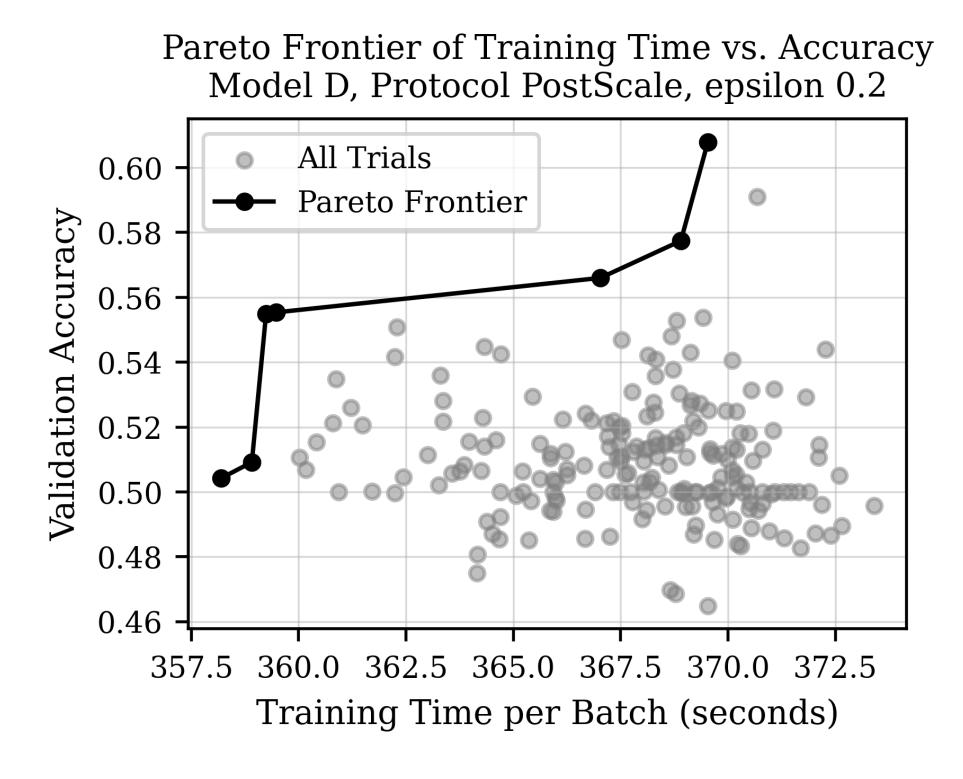
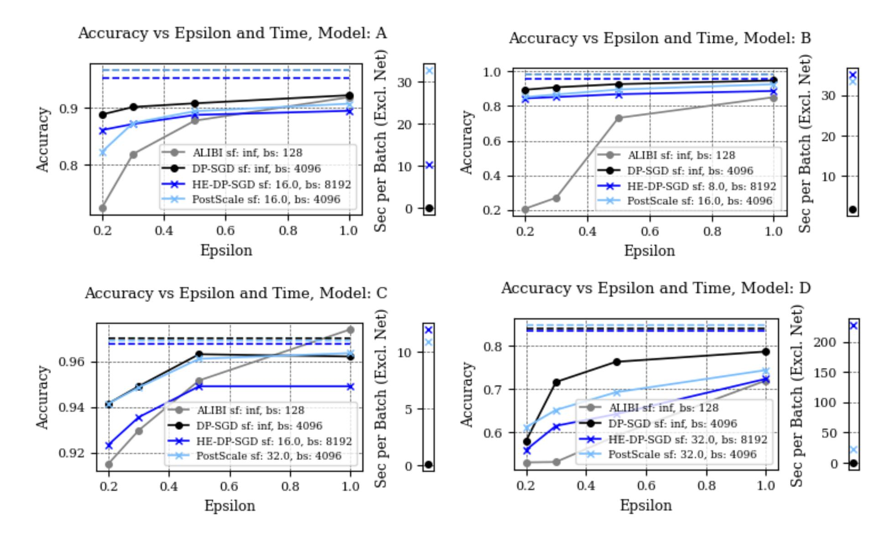

{0}------------------------------------------------

# Hadal: Centralized Label DP without a Trusted Party

James Choncholas<sup>∗</sup>, † Stanislav Peceny<sup>∗</sup>, †, ‡ Amit Agarwal<sup>∗</sup>, §, ¶ Mariana Raykova<sup>∗</sup> Baiyu Li<sup>∗</sup> Karn Seth<sup>∗</sup>

### Abstract

We explore distributed training in a setting where features are held by one party and labels are held by another. In this context, we focus on label Differential Privacy (DP), where the labels require privacy protection from the other party who learns the trained model. Previous approaches struggle to train accurate models in high-privacy settings (i.e. when ϵ ≤ 1), or typically require a trusted third party. To eliminate this trusted party while preserving model utility, we present PostScale, a novel Homomorphic Encryption (HE)-based protocol suited for high-privacy regimes with ciphertext multiplicative depth of two. Our protocol is suitable for a wide variety of models in the semi-honest setting and avoids leaking the model architecture as well as costly ciphertext operations like bootstrapping and rotations. We also present a multi-party sampling protocol for generating DP noise, and Hadal, a general-purpose dataflowbased framework for encrypted computation implementing our protocols. Hadal repurposes existing tools for use with HE, including comprehensive performance profiling capabilities, dual execution modes (eager and deferred), graph compiler-based optimization, and hyperparameter tuning. Our techniques achieve model utility similar to centralized DP while reducing communication by over 90% (from 1 TB to 8 GB per batch) and training time by 99% (from 54 minutes to 33 seconds) compared to related work that protects both features and labels. These improvements unlock larger models; we train Bert-tiny of Devlin et al. (2019), with 6.5 MB of parameters, in 20 ms per example in a LAN setting.

<sup>∗</sup>Google

<sup>†</sup>Georgia Institute of Technology

<sup>‡</sup>Stealth Software Technologies, Inc.

<sup>§</sup>University of Illinois Urbana-Champaign

<sup>¶</sup>Category Labs

{1}------------------------------------------------

# Contents

| 1            | Introduction 1.1 Contributions                                                                     | $\frac{3}{4}$ |  |  |  |  |  |
|--------------|----------------------------------------------------------------------------------------------------|---------------|--|--|--|--|--|
| 2            | Preliminaries 2.1 (Label) Differential Privacy                                                     | <b>5</b>      |  |  |  |  |  |
| 3            | Related Work                                                                                       | 6             |  |  |  |  |  |
| 4            | Overview                                                                                           |               |  |  |  |  |  |
| 5            | Protocol Design5.1 POSTSCALE Protocol5.2 SAMPLECENTEREDGAUSSIAN Protocol5.3 Security5.4 Discussion | 12<br>13      |  |  |  |  |  |
| 6            | Hadal System Design6.1 Dual Execution Modes                                                        |               |  |  |  |  |  |
| 7            | Evaluation 7.1 Experimental Setup                                                                  | <b>18</b>     |  |  |  |  |  |
| 8            | Conclusion                                                                                         | 20            |  |  |  |  |  |
| $\mathbf{A}$ | Extended Noise Sampling Protocol Design                                                            | 26            |  |  |  |  |  |
| В            | B Estimated Cost of Training with Secret Shares                                                    |               |  |  |  |  |  |
| $\mathbf{C}$ | Detailed DP Analysis                                                                               | 27            |  |  |  |  |  |

{2}------------------------------------------------

# <span id="page-2-0"></span>1 Introduction

Machine learning often requires training on sensitive data, raising privacy concerns. To address these concerns, privacy-preserving machine learning seeks to enable training without compromising the privacy of the underlying data. This involves protecting the inputs during the execution of the computation and guaranteeing that the output does not leak individual data. Secure multiparty computation (MPC) [\[41,](#page-22-0) [88\]](#page-25-2), Homomorphic Encryption (HE) [\[76\]](#page-24-0), and Differential Privacy (DP) [\[31\]](#page-21-0) address these privacy goals, though their incorporation poses performance challenges.

In this work, we focus on a privacy-preserving training setting in which the data is vertically partitioned between two parties: one holding features (inputs to the model) and the other holding labels (correct classifications) [\[38\]](#page-22-1). The objective is for the feature-holding party to train a model while the label-holding party learns nothing. We refer to this setting as Features-and-Model-vs-Labels (FAML) partitioning. It naturally arises when one party seeks to leverage features stored in one silo to predict labels held in another. For example, in medical analyses, prognosis models are developed by medical testing laboratories, which are private to the lab, while the prognoses themselves are private to the patient [\[25\]](#page-21-1). Similarly, in recommendation systems, user preferences and choices are accessible to service providers, but individual ratings or feedback may be confidential [\[63\]](#page-23-0). In online advertising, features (e.g., user attributes or ad impressions) are available to the advertising platform, while conversions (i.e. whether the user completed a purchase) are known to the advertiser [\[38\]](#page-22-1). The Private Advertising Technology Working Group (PATWG) at W3C has specifically examined training scenarios in which one party holds the features and ultimately receives the trained model, emphasizing the need to protect the labels [\[67\]](#page-23-1).

To protect privacy, the objective is for the party with the features to securely train a model that preserves DP with respect to the labels (i.e., label DP [\[38\]](#page-22-1)). In the more general context of ML training, DP guarantees that the trained model is not heavily influenced by an individual example, i.e. both features and label. In FAML partitioning, since the feature-holding party receives the model and does not need to hide the features from itself, it is sufficient to weaken the privacy notion to label DP, which limits the influence of any individual example's label, without attempting to hide the features. The security of label DP is more relaxed than the general case of privacy-preserving training, presenting an opportunity for more accurate and efficient training compared to existing work.

Most previous work achieves label DP via local DP, applying noise locally before sharing the labels [\[8,](#page-20-0) [13,](#page-20-1) [34,](#page-21-2) [38,](#page-22-1) [40,](#page-22-2) [56,](#page-23-2) [79,](#page-24-1) [84,](#page-24-2) [91\]](#page-25-3). While both local and centralized DP protect only the labels, centralized DP applies noise to aggregate gradients. At the same privacy budget, centralized DP achieves substantially better utility when ϵ ≤ 1, a DP parameter regime associated with strong privacy [\[39\]](#page-22-3). Because centralized DP traditionally requires a trusted third party with access to all data, our primary contribution is replacing this trusted party with cryptographic techniques to achieve centralized utility without centralized trust.

Homomorphic encryption (HE) and multiparty computation (MPC) have been used extensively in privacypreserving machine learning [\[3,](#page-19-1)[7,](#page-20-2)[9,](#page-20-3)[10,](#page-20-4)[14,](#page-20-5)[17,](#page-20-6)[18,](#page-20-7)[19,](#page-21-3)[24,](#page-21-4)[25,](#page-21-1)[33,](#page-21-5)[36,](#page-22-4)[42,](#page-22-5)[43,](#page-22-6)[45,](#page-22-7)[49,](#page-22-8)[50,](#page-22-9)[54,](#page-23-3)[60,](#page-23-4)[61,](#page-23-5)[62,](#page-23-6)[68,](#page-23-7)[70,](#page-23-8)[71,](#page-24-3)[73,](#page-24-4)[74,](#page-24-5) [75,](#page-24-6) [80,](#page-24-7) [82,](#page-24-8) [83,](#page-24-9) [85,](#page-24-10) [92\]](#page-25-4). This work leverages HE, which enables computation on encrypted data. We find HE is particularly well-suited to training in the FAML setting since the forward pass can be performed entirely in plaintext by the feature-holding party, and the backward pass requires only an affine transformation of the labels. Building on these observations, we notice that the backward pass mainly consists of secret-plaintext multiplications that are not efficiently evaluated with existing MPC protocols. For example, a garbled circuit MPC-based approach requires communicating wire labels for all the plaintext values, while additive secret sharing as in [\[25\]](#page-21-1) requires consuming Beaver triples for the secret-plaintext multiplications. Due to this, MPC requires an order of magnitude more time and communication than our tailored approach which better leverages FAML partitioning (more details in Appendix [B\)](#page-25-1).

Training in the FAML partitioned setting, especially with high-privacy label DP, is not well explored, nor are programming frameworks targeting this model. Existing frameworks either do not focus on DP guarantees for the output or do not take advantage of the unique data distribution semantics of the FAML partitioning [\[3,](#page-19-1) [7,](#page-20-2) [10,](#page-20-4) [18,](#page-20-7) [24,](#page-21-4) [25,](#page-21-1) [42,](#page-22-5) [49,](#page-22-8) [50,](#page-22-9) [61,](#page-23-5) [62,](#page-23-6) [68,](#page-23-7) [80,](#page-24-7) [82,](#page-24-8) [83,](#page-24-9) [85\]](#page-24-10). Furthermore, these frameworks often lack support for features common in plaintext ML frameworks such as profiling tools, supporting both eager and deferred (imperative and declarative) execution modes, and compiler-based optimizations. These features 

{3}------------------------------------------------

are especially important when incorporating privacy in order to identify and overcome performance obstacles introduced by the cryptographic primitives during protocol design.

In response, we design a cryptographic protocol for training centralized, label DP models in high-privacy (ϵ ≤ 1) FAML settings named PostScale. This necessitates distributed noise sampling for DP purposes, thus we present a two party discrete Gaussian sampling protocol, where one party learns encrypted samples while the other chooses the scale of the distribution. Lastly, we propose a modified gradient clipping technique which moves most computation to the plaintext domain.

The protocol is designed in tandem with Hadal, [1](#page-3-1) a novel dataflow-based framework for encrypted computation. Hadal extends the machine learning framework TensorFlow [\[1\]](#page-19-2) with the Simple Homomorphic Encryption Library with Lattices (SHELL) library [\[22\]](#page-21-6), taking a co-design approach: the constraints of the cryptography shaping the design of the framework, and performance feedback from the framework informing protocol design. Our protocol require only 21 seconds and 8 GB of communication per batch of 4096 examples when training an MNIST classification model, where an MPC-based approach that does not take advantage of the FAML setting takes 54 minutes and 1 TB for smaller batches of 1000 examples [\[25\]](#page-21-1). These improvements allow us to train larger models, like SqueezeNet [\[44\]](#page-22-10), a small and practical CNN, with 80 seconds and 36 GB communication per batch of 4096 examples.

### <span id="page-3-0"></span>1.1 Contributions

The contributions of this work are as follows.

- PostScale: A protocol for training in the FAML setting achieving label DP without requiring a trusted third party, based on HE, and targeting high-privacy ϵ ≤ 1 settings.
- Distributed noise sampling: A protocol for generating encrypted samples of a discrete Gaussian distribution.
- Hadal: A framework for privacy-preserving machine learning based on TensorFlow and Google's SHELL HE library.

Our work is open-source on GitHub under the Apache 2.0 license.[2](#page-3-2)

PostScale performs encrypted backpropagation using the BGV [\[12\]](#page-20-8) HE scheme. The protocol targets the semi-honest security model, and does not require ciphertext slot rotations, an expensive operation to perform intra-ciphertext data movement common in secure inference and training [\[4,](#page-19-3) [43,](#page-22-6) [66,](#page-23-9) [73\]](#page-24-4). PostScale is most efficient for deep classification networks with few output classes having a ciphertext multiplicative depth of only two. We present a variant of the protocol, HE-DP-SGD, which performs backpropagation in the natural way, for comparison purposes. The protocols require the gradient of the loss with respect to the final layer's pre-activations is affine in the labels, which we later discuss is common in practice.

Distributed noise sampling enables the generation of encrypted samples from a discrete Gaussian distribution where one party knows the scale of the distribution and the other introduces the randomness in sampling and holds encryption keys. This is invoked as a sub-protocol during training to generate additive noise for DP. Additionally in pursuit of DP, we describe how the feature holding party can locally clip the gradients of each example to bound their norm.

Hadal is a novel framework for privacy-preserving machine learning with HE. Existing ML frameworks which incorporate HE take a performance-focused, compiler-centric approach. They lose domain-level semantic information when translating computations into low-level circuits, making it difficult to debug, profile performance, identify bottlenecks, and design new protocols. Additionally, they lack support for essential features like capturing model parallelism through compiler-based optimization and supporting both eager and deferred execution modes. Our framework Hadal tightly integrates TensorFlow [\[1\]](#page-19-2) with Google's SHELL library [\[22\]](#page-21-6), reusing the existing ecosystem of compiler-based optimization, performance profiling tools, and hyperparameter tuning libraries. Hadal incorporates HE-specific graph optimizations into Grappler, TensorFlow's graph compiler, and automates the selection of encryption scheme parameters, an often manual

<span id="page-3-1"></span><sup>1</sup>The Hadal zone is the deepest region of the ocean that lies within oceanic trenches. We call our system Hadal as 1) the absence of light at these ocean depths parallels computing on encrypted data using HE, where the data remains hidden throughout computation and 2) Hadal supports deep networks.

<span id="page-3-2"></span><sup>2</sup>https://github.[com/google/hadal-flow](https://github.com/google/hadal-flow)

{4}------------------------------------------------

process which blocks automated hyperparameter tuning. These features were co-designed alongside the cryptographic protocol, making Hadal a strict prerequisite for PostScale as opposed to merely engineering convenience. Hadal supports general-purpose computation (not just our protocols specifically) and is installed alongside TensorFlow taking an extension-based approach inspired by the design of secure inference framework TF Encrypted [\[23\]](#page-21-7), and is useful beyond the context of training label DP models.

Hadal-ml is a software library built on top of the Hadal framework which implements our protocols. Hadal-ml integrates with Keras [\[21\]](#page-21-8), the machine learning library, including bespoke HE kernels for common ML operations such as dense layers, convolution, pooling, and embedding, suitable for training on homomorphically encrypted labels.

# <span id="page-4-0"></span>2 Preliminaries

This work uses Homomorphic Encryption to enable privacy-preserving machine learning with label Differential Privacy.

### <span id="page-4-1"></span>2.1 (Label) Differential Privacy

Differential Privacy (DP) is a method to quantify privacy for a given transformation on a dataset. Privacy is parameterized by ϵ, which quantifies the sensitivity of a function's output to the inclusion or exclusion of a single data point in the input. Such inputs are referred to as neighboring. In the context of machine learning, DP ensures that the inclusion or exclusion of a single data point does not significantly affect the output of the model in the case of inference, or the model weights in the case of training. Techniques such as DP-SGD (Differentially Private Stochastic Gradient Descent) [\[2\]](#page-19-4) are commonly used to incorporate DP into training, ensuring that both features and labels are protected.

Definition 2.1 (Differential Privacy [\[30,](#page-21-9) [31\]](#page-21-0)). Let ε, δ ∈ R<sup>≥</sup>0. A randomized algorithm A taking as input a dataset is said to be (ε, δ)-differentially private ((ε, δ)-DP) if for any two neighboring datasets D and D′ , and for any subset S of outputs of A, it is the case that Pr[A(D) ∈ S] ≤ e ε · Pr[A(D′ ) ∈ S] + δ.

Label Differential Privacy (label DP) applies Differential Privacy to machine learning in the setting where only labels require protection. In our setting, training data is partitioned vertically across parties, one holding features and the other holding labels. The goal is for the feature-holding party to train a model that is differentially private with respect to the labels [\[38\]](#page-22-1). As privacy is with respect to the labels of the training data, inference using a model trained with label DP does not affect the privacy budget by the DP post-processing principle.

It is sufficient to weaken the notion of "neighboring" datasets in label DP to bounded DP, or swapping the value of a single data point, rather than unbounded DP, the addition or removal of a data point. Bounded DP is considered weaker as it implies a transformation may fully reveal the cardinality of a dataset, however bounded DP is sufficient for label DP because the presence of records in the set is already known to both parties; only the value of the label requires protection.

Definition 2.2 (Label Differential Privacy [\[38\]](#page-22-1)). Let ε, δ ∈ R<sup>≥</sup>0. A randomized training algorithm A taking as input a dataset is said to be (ε, δ)-label differentially private ((ε, δ)-label DP) if for any two training datasets D and D′ that differ in the label of a single example, and for any subset S of outputs of A, it is the case that Pr[A(D) ∈ S] ≤ e ε · Pr[A(D′ ) ∈ S] + δ.

### <span id="page-4-2"></span>2.2 Homomorphic Encryption

Homomorphic encryption (HE) enables computation on encrypted data without decryption. Among various HE schemes, the Brakerski-Gentry-Vaikuntanathan (BGV) [\[12\]](#page-20-8) scheme is a prominent lattice-based construction especially efficient at computing arithmetic, affine functions. In BGV, the plaintext space is defined over polynomial rings R<sup>t</sup> = Zt/(X<sup>N</sup> + 1) where N is a power of two and each coefficient is modulo t, the plaintext 

{5}------------------------------------------------

modulus. The symmetric scheme includes three algorithms, Gen(1<sup>λ</sup> ) to generate secret key sk, Enc(sk, m) to encrypt a message m ∈ R<sup>t</sup> and produce ciphertext c, a tuple of polynomials ∈ RQ, and Dec(sk, c) to decrypt. For efficiency reasons, Q is typically a product of primes and operations are performed in the residue number system (RNS). Homomorphic properties allow operations on ciphertexts that correspond to addition and multiplication in the plaintext domain. Fractional cleartext messages are first multiplied by a scaling factor, rounding to the nearest integer modulo t, and packed into the coefficients of polynomials where the inverse Number Theoretic Transform is applied so subsequent polynomial multiplications take place "slot-wise" on the coefficients in the cleartext domain.

In secure inference, arithmetic HE schemes such as BGV are typically used to evaluate the linear layers of the forward pass, while Boolean HE schemes or secure multiparty computation (MPC) protocols handle nonlinear layers, e.g. ReLU activations [\[9,](#page-20-3) [43,](#page-22-6) [45,](#page-22-7) [69,](#page-23-10) [75\]](#page-24-6). When considering the FAML setting, however, training requires only low depth affine transformations. As such, symmetric-key, additive somewhat homomorphic encryption is sufficient and efficient, both in computation and communication.

# <span id="page-5-0"></span>3 Related Work

Secret-sharing MPC and Homomorphic Encryption are particularly popular in secure ML [\[3,](#page-19-1) [7,](#page-20-2) [9,](#page-20-3) [10,](#page-20-4) [14,](#page-20-5) [17,](#page-20-6) [18,](#page-20-7) [19,](#page-21-3) [24,](#page-21-4) [25,](#page-21-1) [33,](#page-21-5) [36,](#page-22-4) [42,](#page-22-5) [43,](#page-22-6) [45,](#page-22-7) [49,](#page-22-8) [50,](#page-22-9) [54,](#page-23-3) [60,](#page-23-4) [61,](#page-23-5) [62,](#page-23-6) [68,](#page-23-7) [70,](#page-23-8) [71,](#page-24-3) [73,](#page-24-4) [74,](#page-24-5) [75,](#page-24-6) [80,](#page-24-7) [82,](#page-24-8) [83,](#page-24-9) [85,](#page-24-10) [92\]](#page-25-4). As far as we know, besides [\[90\]](#page-25-5) no works focus on the FAML setting. HE appears to be well suited given secret-sharing-based approaches require the model must be fully secret-shared in order to be combined with the secret label to produce the gradient. This means that even in the FAML setting, secret-sharing-based approaches incur per-example communication proportional to the number of multiplications in the backward pass. This leads to at least an order of magnitude more communication.

Several non-cryptographic techniques have been proposed to achieve label DP. Most often, the DP mechanism is applied locally to the labels before sharing them. For example, this is the case in Randomized Response (RR), a technique that precedes the study of DP [\[84\]](#page-24-2). Recent works improve the RR mechanism for training through various uses of features and a partially trained model to improve the resulting model utility. In general, these techniques fall into two categories: those that apply the DP mechanism locally to labels before sharing them [\[56\]](#page-23-2), and those that apply the DP mechanism to the gradients, calculated centrally using non-private labels [\[38,](#page-22-1) [39,](#page-22-3) [56\]](#page-23-2). Local DP techniques are less effective than centralized approaches in high-privacy settings when ϵ ≤ 1 as measured by related work [\[25,](#page-21-1) [39\]](#page-22-3) and in our own tests Figure [5.](#page-18-1) Conversely, centralized techniques result in more accurate models in the high-privacy regime; however, they either require a trusted party to train the model or cryptographic techniques like MPC or HE.

Yuan et al. [\[90\]](#page-25-5) present an MPC-based approach to label DP training. They propose performing backpropagation using MPC only through the last layer, then revealing the noised gradient for a batch, and completing backpropagation in plaintext. In order to backpropagate in plaintext, they attempt to recover the individual labels from the noisy batch gradient at the last layer by solving a system of equations. The recovered labels remain noisy by the postprocessing property of DP, but the equations can only be solved when the batches are smaller than the number of variables in the last layer. Although more efficient than full MPC-based training as explored by Das et al. [\[25\]](#page-21-1), their approach suffers from degradation of model accuracy in high-privacy settings, similar to local DP techniques. Yuan et al.'s approach outperforms the accuracy of randomized response for ϵ > 4, but performs the same or worse than RR for smaller epsilon [\[90\]](#page-25-5). The authors note that DP-SGD performs better for ϵ ≤ 1.

The technique of computing the gradient for every possible label also appears in [\[87\]](#page-24-11) in the context of differentially private split learning. This work proposes computing gradient transcripts for all possible labels, and with some probability, flip the true transcript to a random transcript. This has a similar effect as randomized response, and differs significantly from the approach we present.

Focusing on Differential Privacy, prior work demonstrates significant progress in improving the utilityprivacy tradeoff when training. Yu et al. [\[89\]](#page-25-6) propose Gradient Embedding Perturbation (GEP), a technique that projects private gradients into a low-dimensional anchor subspace before adding noise, which helps reduce the variance of the noise while maintaining privacy guarantees. They show that GEP can achieve 74.9% 

{6}------------------------------------------------

accuracy on the CIFAR-10 dataset [51] and 95.1% accuracy on the SVHN dataset [64] under  $\epsilon=8$  privacy budget. Sander et al. [77] introduce the concept of Total Amount of Noise (TAN) and demonstrate that privacy budget primarily depends on TAN rather than on the choice of specific parameters. This insight allows them to efficiently tune hyperparameters by training with smaller batch sizes and extrapolating performance to larger batches, achieving significant computational savings. Their approach improves ImageNet [27] accuracy by 9 points under  $\epsilon=8$  compared to previous work. De et al. [26] show that carefully tuned standard deep learning architectures can achieve strong performance under Differential Privacy when combined with techniques like group normalization, large batch sizes, weight standardization, and augmentation multiplicity. They achieve 81.4% accuracy on CIFAR-10 under  $\epsilon=8$  without pre-training, and up to 86.7% top-1 accuracy on ImageNet when fine-tuning pre-trained models. Together, these papers demonstrate that the previously observed degradation in model performance under Differential Privacy is not inherent, but can be significantly mitigated through better training techniques, careful hyperparameter tuning, and architectural choices. These works focus on the privacy setting where  $\epsilon=8$ , with the exception of [26] which additionally considers the  $\epsilon=0.5$  setting.

### <span id="page-6-0"></span>4 Overview

Recall that standard SGD minimizes the loss between a model's prediction and the ground truth label. The backward pass (backpropagation) computes gradients via the chain rule contingent on this label, directing future predictions toward the target class. Our FAML setting requires the gradients to be computed securely and, once revealed, prevent complete recovery of the labels.

HE can help achieve these privacy goals, however it is often characterized by heavy computational requirements. Our PostScale protocol mitigates this by fundamentally restructuring the backwards pass, moving the most expensive cryptographic operations to the plaintext domain where they can be performed cheaply. Intuitively, the feature-holding party computes a gradient for every possible output class, then homomorphically scales them post-backpropagation using the encrypted label and a single multiplication hence the name PostScale. DP noise is added before decryption to prevent complete recovery of the secret label.

The protocol, presented in Section 5.1, is particularly efficient when the number of classes is low (e.g. binary classification) because the total number of plaintext-ciphertext multiplications is proportional to the number of classes. Even though Postscale requires more multiplications compared to straightforward backpropagation, the low multiplicative depth allows more efficient HE parameters. To show this trade-off makes sense in practice, we compare against straightforward HE-based backpropagation, named HE-DP-SGD, which computes gradients in the traditional manner by sequentially applying the chain rule as done in reverse mode automatic differentiation libraries. We use batch-axis packing, where a mini-batch of labels is packed into a single ciphertext, and avoid expensive intra-ciphertext data movement. We present a modified gradient clipping procedure to avoid computing the expensive non-linear clipping function under HE. Lastly, in Section 5.2 we present a multi-party discrete Gaussian sampling protocol for DP.

Next, we present our framework, Hadal, in Section 6 which incorporates Google's SHELL library for HE with TensorFlow via the Custom Op extension interface [1,22]. The kernels are written in C++, precompiled, and distributed as a python package, similar to TensorFlow's existing Ops that invoke the Eigen library for CPU, CUDA for GPU, etc. This design integrates with TensorFlow's rich ecosystem of performance profiling tools, graph compiler optimizations, distributed execution, and supports both eager and deferred execution modes. Furthermore, Hadal introduces HE-tailored graph compiler passes through TensorFlow's compiler extension interface, Grappler. These passes perform commutative arithmetic optimizations and can automate the selection of low-level parameters of the HE scheme. We implement our protocols in Hadal-ml, a python package which depends on Hadal. We use Hadal-ml to evaluate the performance of our framework and protocols, focusing on training time, model utility, and network usage.

{7}------------------------------------------------

### <span id="page-7-0"></span>5 Protocol Design

We begin by presenting our PostScale protocol, following with the supporting steps for DP noise generation, clipping, and eliminating ciphertext slot rotations. Next we present a proof of security and DP privacy analysis. Lastly we present our HE-DP-SGD protocol as a modification to PostScale and discuss.

#### <span id="page-7-1"></span>5.1 PostScale Protocol

The PostScale protocol performs backpropagation by computing an affine transformation of the gradients for each example and each class, subsequently adding noise for DP purposes. The protocol runs between two parties: one holding the features and the model (party  $\mathcal{F}$ ), and the other holding the labels (party  $\mathcal{L}$ ). Party  $\mathcal{F}$  computes per-example, per-class gradients in plaintext, then scales them homomorphically using encrypted labels from party  $\mathcal{L}$ . DP noise is then added using a distributed noise protocol such that party  $\mathcal{F}$  doesn't learn the noise samples (which would reveal the un-noised secret gradients), and party  $\mathcal{L}$  doesn't learn the scale of the distribution (which would reveal the per-example gradients norms). The full protocol is described in Algorithm 1.

PostScale requires gradients to be an affine transformation of the labels. This corresponds to models composed of functions whose gradients are (piecewise) linear, covering most common models such as those built with fully connected layers, convolutions, maxpools, and with ReLU, sigmoid, softmax, or Poisson activations. It does not apply to some more complex gates like smooth-ReLU or GeLU. For now, consider the case when the output layer activation is the softmax function and the loss function is the categorical cross entropy. Softmax is commonly used for multi-class single-label classification, e.g., MNIST (i.e., there are 10 different classes, digits 0–9, but each input image is labeled with exactly one class). It is defined as

$$S(z_i) = \frac{e^{z_i}}{\sum_{j=1}^k e^{z_j}} \forall i = 1, \dots, k ,$$
  
$$\frac{\partial S_i}{\partial z_j} = \begin{cases} S_i(1 - S_j) & i = j \\ -S_j S_i & i \neq j \end{cases},$$

where  $z_i$  is the pre-activation score for class i of the output layer, and k is the total number of classes. The categorical cross entropy (CCE) loss function is common in multi-class single-label classification and is defined as

$$J(y_i, \hat{y}_i) = -\sum_{i=1}^k y_i \cdot \log(\hat{y}_i), \quad \frac{\partial J}{\partial \hat{y}_i} = \frac{y_i}{\hat{y}_i}$$

for the label  $y_i$ , and predicted label  $\hat{y}_i$ . Backpropagation makes use of the chain rule to compute the derivative of the loss J with respect to the weights  $\mathbf{w}$  that produced  $\hat{y}_i$ . First, observe that when the activation function of the last layer in the model is softmax with inputs  $\mathbf{z} = z_0, \ldots, z_k$ , and the loss function is CCE, the gradient  $\frac{\partial J}{\partial \mathbf{z}}$  simplifies to  $\hat{\mathbf{y}} - \mathbf{y}$ , an affine function.

$$\begin{split} \frac{\partial J}{\partial z_j} &= \frac{\partial J}{\partial \hat{y}_j} \cdot \frac{\partial \hat{y}_j}{\partial z_j} \\ &= -\sum_{\forall i \in K} \frac{y_i}{\hat{y}_i} \cdot \begin{cases} \hat{y}_i (1 - \hat{y}_j) & i = j \\ -\hat{y}_j \hat{y}_i & i \neq j \end{cases} \\ &= \sum_{\forall i \in K} y_i \cdot \begin{cases} (\hat{y}_j - 1) & i = j \\ \hat{y}_j & i \neq j \end{cases} \\ &= \sum_{\forall i \in K} y_i \cdot \hat{y}_j - \sum_{\forall i \in K} y_i \cdot 1 \text{ where } i = j \\ &= \sum_{\forall i \in K} y_i \cdot \hat{y}_j - y_j \end{split}$$

{8}------------------------------------------------

#### <span id="page-8-0"></span>Functionality $\mathcal{F}_{\text{PostScale}}$

The PostScale ideal functionality computes a label-differentially private gradient between the feature-holding party  $\mathcal{F}$ , the label-holding party  $\mathcal{L}$ , and the adversary  $\mathcal{A}$ .

#### Public Parameters:

- Number of weights in the model  $|\mathbf{w}|$ .
- Plaintext modulus t.
- Batch size b.
- SampleCenteredGaussian Parameters:
  - $s_0$ : Base discrete Gaussian scale.
  - m: Number of samples to generate.

#### Party $\mathcal{F}$ Inputs:

- Batch of features **f**.
- $\bullet$  Model weights **w** and architecture with k output classes.
- Matrix of masks M with shape  $b \times |\mathbf{w}|$  sampled uniformly between [0, t).

#### Party $\mathcal{L}$ Inputs:

- Batch of labels y.
- $|\mathbf{w}|$  discrete Gaussian samples  $\rho_{\mathbb{Z}}(0, s_0)$ .

#### $\mathcal{F}_{\mathbf{PostScale}}$ :

- Compute the per-example mini-batch gradient  $\frac{\partial J}{\partial \mathbf{w}}$ .
- Clip the per-example gradients by the example's maximum norm over all k possible labels.
- Sample noise **d** from the discrete Gaussian distribution  $\mathcal{N}_{\mathbb{Z}}(0, s^2 \mathbf{I}_b)$  where  $s \propto$  the maximum norm.
- Send noised gradient  $\frac{\partial J}{\partial \mathbf{w}}_d = \frac{\partial J}{\partial \mathbf{w}} + \mathbf{d}$  to party  $\mathcal{F}$ .

Figure 1: PostScale ideal functionality.

$$= \hat{y}_j \cdot \sum_{\forall i \in K} y_i - y_j$$
$$= \hat{y}_j \cdot 1 - y_j$$
$$= \hat{y}_j - y_j$$

Let  $\frac{\partial J}{\partial \mathbf{z}}$  consist of the individual  $\frac{\partial J}{\partial z_j}$ . Using the chain rule again, the derivative of the loss with respect to the weights can be expressed as

$$\frac{\partial J}{\partial w_i} = \left\langle \frac{\partial J}{\partial \mathbf{z}}, \frac{\partial \mathbf{z}}{\partial w_i} \right\rangle,$$

where  $w_i$  is the i'th weight in the model and  $\langle ., . \rangle$  is the inner product.

Our key observation is that party  $\mathcal{F}$  can compute the Jacobian  $\frac{\partial \mathbf{z}}{\partial w_i}$  locally without interacting with the label-holding party. The only term that depends on the secret label (and therefore requires encrypted computation) is  $\frac{\partial J}{\partial \mathbf{z}}$ , along with the subsequent multiplication by  $\frac{\partial \mathbf{z}}{\partial w_i}$  and summation over the output classes. Party  $\mathcal{F}$  can thus compute the encrypted gradient  $\frac{\partial J}{\partial w_i}$  from a homomorphically encrypted label with one HE multiplication in the case of the softmax activation and CCE loss. In other words, it is effectively computing a linear combination over all possible gradients. While other activation and loss functions may require additional multiplications, importantly the HE multiplicative depth no longer depends on model depth.

Clipping is common in differentially private ML. DP is achieved by adding noise to the gradient, which, in standard DP-SGD, involves clipping each example's gradient to a maximum norm to bound their sensitiv-

{9}------------------------------------------------

<span id="page-9-0"></span>

Figure 2: The bias-variance trade-off comparing traditional clipping in DP-SGD versus our method which does not require parties  $\mathcal{F}$  and  $\mathcal{L}$  to interact.

ity to any particular example. The noise is sampled from a Gaussian distribution, whose standard deviation  $\sigma$  is proportional to the clipping threshold C [2], and can be further scaled by a public parameter known as the noise multiplier, a hyperparameter that controls the privacy budget  $\epsilon$ . Clipping, however, is a non-linear function and is expensive to compute with arithmetic HE schemes like BGV. We instead propose computing an upper bound of the gradient L2 norm analytically by computing the maximum norm over all possible labels, as this can be done without interaction with the label-holding party. The per-example gradients are then clipped by this maximum, rather than the true norm, i.e. the clipping divisor is max  $(1, \max_k \|\frac{\partial J_k}{\partial \mathbf{w}}\|_2 / C)$  where the subscript k denotes the gradient if the true label were to be k.

Clipping introduces bias by limiting the magnitude of gradients and our proposed method potentially clips more aggressively (by  $\max_k \left\| \frac{\partial J_k}{\partial \mathbf{w}} \right\|_2$  instead of  $\left\| \frac{\partial J}{\partial \mathbf{w}} \right\|_2$ ). The amount of noise required to achieve the same  $(\epsilon, \delta)$ -DP guarantee must be calibrated to this looser, worst-case sensitivity bound. To limit the impact of this, we propose tailoring the DP noise to the specific gradients. That is, where DP-SGD adds noise that is always calibrated to the clipping bound C, we instead add noise calibrated to the true norm such that un-clipped gradients now receive less noise. This changes the bias variance trade-off compared to standard DP-SGD clipping. Considering the bias  $\mathbb{E}(\text{clip}(\frac{\partial J}{\partial \mathbf{w}})) - \frac{\partial J}{\partial \mathbf{w}}$  and the sensitivity squared as a proxy for variance, and assuming the gradients are normally distributed for expository purposes, the bias-variance trade-off is shown in Figure 2. Our clipping method has lower bias and variance when the clipping threshold is large, outperforming DP-SGD. When the clipping threshold is low, our method has slightly higher variance, and thus less concentrated noise.

This clipping method is the result of cryptography-systems co-design with the Hadal framework. Rather than relying on theoretical estimates of cryptographic overhead, Hadal enabled standard ML-oriented profiling tools to systematically evaluate the computational trade-offs between encrypted operations and plaintext Jacobian calculations using encryption parameters tailored to the circuit. This empirically-driven design process revealed that shifting the clipping computation to the plaintext domain is highly efficient; computing the norms requires only 3% of the total training time excluding network IO when accelerated with a GPU (measured on model A introduced later in Table 1). Regarding accuracy, we observe similar model utility compared to traditional gradient clipping of DP-SGD (results appearing later in Figure 5). Lastly, our analytical approach to clipping facilitates accounting for quantization error introduced by the fixed-precision nature of BGV. Failure to account for such quantization error can lead to dangerous overestimation of DP guarantees [15,59].

Eliding ciphertext slot rotations is important for efficiency reasons. Recall that the feature-holding party  $\mathcal{F}$  computes per-example gradients, which are homomorphically encrypted under the label-holding party's secret key. The goal is for party  $\mathcal{F}$  to learn the sum of a mini-batch of per-example gradients. Naïvely, this can be achieved using an additive masking approach: party  $\mathcal{F}$  homomorphically sums the batch

{10}------------------------------------------------

#### <span id="page-10-0"></span>Algorithm 1 PostScale Protocol

**Public Parameters**: Number of weights in the model  $|\mathbf{w}|$ , plaintext modulus t, batch size b.

#### Party $\mathcal{F}$ :

**Input:** Batch of features  $\mathbf{f}$ , model weights  $\mathbf{w}$  with k output classes (also written as  $\mathbf{w}(\mathbf{x})$  to signify the forward pass), loss J (also written as  $J(\mathbf{x})$  to signify applying the loss function), matrix of masks M with shape  $b \times |\mathbf{w}|$  sampled uniformly between [0, t), clipping threshold C.

**Output:** Gradient  $\frac{\partial J}{\partial \mathbf{w}}_d = \frac{\partial J}{\partial \mathbf{w}} + \mathbf{d}$  which is differentially private w.r.t. the labels  $\mathbf{y}$ .

#### Party $\mathcal{L}$ :

**Input:** Batch of labels  $\mathbf{y}$ ,  $|\mathbf{w}|$  discrete Gaussian base samples  $\rho_{\mathbb{Z}}(0, s_0)$ .

Output:  $\perp$ .

#### POSTSCALE PROTOCOL:

#### Party $\mathcal{L}$

Sample symmetric HE encryption key  $sk_{\mathcal{L}}$   $\mathbf{y}_{\mathcal{L}} \leftarrow \text{encrypt}(\mathbf{y}, sk_{\mathcal{L}})$ Send  $\mathbf{y}_{\mathcal{L}}$ 

▶ Encrypt the labels using batch-axis packing.

#### Party $\mathcal{F}$

Sample symmetric HE encryption key  $sk_{\mathcal{F}}$  $\hat{\mathbf{y}}^* \leftarrow \mathbf{w}(\mathbf{f})$ 

$$\frac{\partial \mathbf{z}}{\partial \mathbf{w}} \leftarrow \operatorname{Jacobian}\left(\hat{\mathbf{y}^*}, \mathbf{w}\right)$$
$$\hat{\mathbf{y}} \leftarrow \operatorname{softmax}\left(\hat{\mathbf{y}^*}\right)$$

$$s \leftarrow \min\left(C, \max_k \frac{\partial J_k}{\partial \mathbf{w}}\right)$$

$$\begin{vmatrix} \frac{\partial J}{\partial \mathbf{z}} \Big|_{\mathcal{L}} \leftarrow \hat{\mathbf{y}} - \mathbf{y} \Big|_{\mathcal{L}} \\
\frac{\partial J}{\partial \mathbf{w}} \Big|_{\mathcal{L}} \leftarrow \left\langle \begin{bmatrix} \frac{\partial J}{\partial \mathbf{z}} \Big|_{\mathcal{L}}, \frac{\partial \mathbf{z}}{\partial \mathbf{w}} \right\rangle \\
\frac{\overline{\partial J}}{\partial \mathbf{w}} \Big|_{\mathcal{L}} \leftarrow \begin{bmatrix} \frac{\partial J}{\partial \mathbf{w}} \Big|_{\mathcal{L}} / \max \left( 1, \max_{k} \left\| \frac{\partial J_{k}}{\partial \mathbf{w}} \right\|_{2} / C \right)
\end{vmatrix}$$

▶ Forward pass to compute prediction logits, excluding the last layer softmax.

▶ The Jacobian of the logits w.r.t. model weights.

▷ Complete the forward pass to compute the predictions.

 $\triangleright$  Noise scale is the largest gradient over all classes k, bounded by the clipping threshold.

 $\triangleright$  Gradient of the loss w.r.t. last layer pre-activations  $\mathbf{z}$ .

> Scale the Jacobian to compute the gradient via inner product.

 $\triangleright$ 

 $\triangleright$ 

Clip per-example gradients by the example's maximum norm over all k possible labels.

$$\begin{bmatrix}
\frac{\partial J}{\partial \mathbf{w}_M} \\
\frac{\partial J}{\partial \mathbf{w}_M}
\end{bmatrix}_{\mathcal{L}} \leftarrow \begin{bmatrix}
\overline{\partial J} \\
\overline{\partial \mathbf{w}}
\end{bmatrix}_{\mathcal{L}} + M$$
Send 
$$\begin{bmatrix}
\frac{\partial J}{\partial \mathbf{w}_M} \\
\frac{\partial J}{\partial \mathbf{w}_M}
\end{bmatrix}_{\mathcal{L}}$$

SAMPLECENTEREDGAUSSIAN  $_{\mathcal{F}}(s, sk_{\mathcal{F}})$ 

▷ Mask the encrypted, clipped gradient.

#### Party $\mathcal{L}$

 $\boxed{\mathbf{d}}_{\mathcal{F}} \leftarrow \text{SampleCenteredGaussian}_{\mathcal{L}}(\rho_{\mathbb{Z}}(0, s_0))$ 

Generate encrypted noise samples.

$$\frac{\partial J}{\partial \mathbf{w}}_{M} \leftarrow \operatorname{decrypt}\left(\left[\frac{\partial J}{\partial \mathbf{w}}_{M}\right]_{\mathcal{L}}, sk_{\mathcal{L}}\right)$$

$$\frac{\partial J}{\partial \mathbf{w}_{m}} \leftarrow \sum_{i=1}^{b} \frac{\partial J}{\partial w_{M}} i \mod t$$

$$\begin{bmatrix}
\frac{\partial J}{\partial \mathbf{w}_{m,d}} \Big|_{\mathcal{F}} \leftarrow \frac{\partial J}{\partial \mathbf{w}_{m}} + \mathbf{d} \Big|_{\mathcal{F}}$$
Send 
$$\begin{bmatrix}
\frac{\partial J}{\partial \mathbf{w}_{m,d}} \Big|_{\mathcal{F}}
\end{bmatrix}$$

 $\triangleright$  Sum masked gradients over batching dimension b, modulo t.

▶ Add the encrypted noise to the gradients.

11

{11}------------------------------------------------

Party 
$$\mathcal{F}$$

$$\frac{\partial J}{\partial \mathbf{w}}_{m,d} \leftarrow \operatorname{decrypt}\left(\left[\frac{\partial J}{\partial \mathbf{w}}_{m,d}\right]_{\mathcal{F}}, sk_{\mathcal{F}}\right)$$

$$\mathbf{m} = \sum_{i=1}^{b} M_{i,*} \mod t$$

$$\frac{\partial J}{\partial \mathbf{w}}_{d} = \frac{\partial J}{\partial \mathbf{w}}_{m,d} - \mathbf{m}$$

$$\mathbf{return} \ \frac{\partial J}{\partial \mathbf{w}}_{d}$$

- $\triangleright$  Sum the masks over the batching dimension b, modulo t.
- ▷ Unmask the noised gradient.

of encrypted gradients and adds a random mask acting as a one-time-pad. Party  $\mathcal{L}$  decrypts, and finally party  $\mathcal{F}$  may remove the mask. Unfortunately, the sum over the batch is computationally expensive when using batch-axis packing, as it requires log(b) ciphertext slot rotations where b is the batch size (and the degree of the ciphertext polynomials due to batch-axis packing). Furthermore, the rotations introduce noise into ciphertexts requiring larger encryption parameters, potentially increasing b and further exacerbating the cryptographic overhead.

In our protocol, we make the observation that the sum of per-example gradients can instead be computed after decryption, on the masked values. Specifically, party  $\mathcal{F}$  masks the per-example gradients of size  $b \times |\mathbf{w}|$ , as opposed to the batch gradient, using masks  $M \sim U(0,t)^{b \times |\mathbf{w}|}$  and sends them to party  $\mathcal{L}$  who decrypts and performs the sum in plaintext modulo the HE scheme's plaintext modulus t. When returned to party  $\mathcal{F}$ , the batch gradient is computed by subtracting the sum of the masks modulo t. This approach elides the expensive ciphertext slot rotations when summing over batching dimension, improving computational efficiency and reducing ciphertext noise growth.

### <span id="page-11-0"></span>5.2 SampleCenteredGaussian Protocol

Additive noise is required to ensure that the gradients are differentially private with respect to the labels. DP training techniques were originally presented with noise sampled from continuous distributions; however, discrete Gaussians have recently been proposed [25]. A key benefit of the discrete Gaussian is the lack of quantization error introduced when running on a real-world machine with finite precision, avoiding the associated privacy failures [59].

Efficiently sampling from discrete Gaussians is non-trivial. Furthermore, our protocols require a distributed notion of noise sampling in which one party  $(\mathcal{F})$  knows the scale of the distribution but is not allowed to learn the value of the sample, a security goal often appearing in distributed learning settings [16,37,47,86]. To achieve this, we introduce the SampleCentered Gaussian protocol (Algorithm 2), which intuitively works by homomorphically computing convolutions of zero-centered samples from a hierarchy of smaller, fixed scales. The protocol is based on the work of Micciancio and Walter [58] which was originally presented in the single party setting. Our protocol allows generating any number of encrypted samples by sending a constant number of ciphertexts between parties, and does not require preprocessing. Details and comparison to related work can be found in Appendix A.

The core of the protocol is the algorithm SAMPLEI\* (see Algorithm 3). SAMPLEI\* recursively generates a list of samples of increasing scales,  $\mathbf{y}$ . It begins at level 0 by sampling from a base discrete Gaussian distribution  $\rho_{\mathbb{Z}}(0,s_o)$  of center 0 and scale  $s_0$ , and combines them hierarchically where level i>0 is a convolution  $y_i=z_ix_1+\max(1,z_i-1)x_2$  of two unique samples  $x_1,x_2$  from the lower level. The parameter  $z_i>0$  is public and depends on the (public) scale of the base distribution, and the sample  $y_i$  has distribution  $\rho_{\mathbb{Z}}(0,s_i)$  for  $s_i=\sqrt{(z_i^2+\max((z_i-1)^2,1))}s_{i-1}$  (see [57,58]). The scales of the combined samples grow rapidly and at most  $\log s$  recursions are needed to reach any given scale s when considering  $s_0$  as a fixed value [58].<sup>2</sup>

In our work, we integrate SampleI\* into a secure distributed protocol SampleCenteredGaussian between two parties  $\mathcal{F}$  and  $\mathcal{L}$ . In this setting, the two parties first agree on an upper bound of the distribution

<span id="page-11-1"></span><sup>&</sup>lt;sup>2</sup>Technically  $s_0$  must be slightly larger than the smoothing parameter of the integer lattice. For details, see [58].

{12}------------------------------------------------

scale beforehand. Party  $\mathcal{L}$  invokes SampleI\* storing all the intermediate samples y of smaller scales. Party  $\mathcal{F}$  encrypts a one-hot selection vector based on its desired scale such that  $\mathcal{L}$  can homomorphically select the appropriate  $y_i$  ciphertext using an inner product operation. Although this is technically sufficient, the scale of  $y_i$ 's have coarse granularity. Thus, to return a sample with a finer grain scale, we compute a final convolution of two samples, as suggested by [58], also performed homomorphically on the ciphertexts. The output encrypted sample has scale  $s < \tilde{s} < s\sqrt{5}$  where s is the desired scale by analysis of [58].

#### <span id="page-12-0"></span>5.3 Security

This work considers security against a semi-honest adversary and DP of the output gradients with respect to the input labels.

We model security using the real-ideal paradigm, where the ideal world consists of an ideal functionality and a simulator, and the real world consists of the parties  $\mathcal{F}$  and  $\mathcal{L}$  and an adversary  $\mathcal{A}$  who corrupts one of the parties. A protocol  $\Pi$  is secure against corruption of party  $P \in \{\mathcal{F}, \mathcal{L}\}$  if there exists a simulator  $S_P$ , who if given the input of P and the output of the protocol, can generate a view that is computationally indistinguishable from the view of the real world adversary  $\mathcal{A}$ . I.e., a protocol executed by party P is secure if  $\{S_P(1^\kappa, x_P, \text{output}_p(x_\mathcal{F}, x_\mathcal{L}))\} \stackrel{\circ}{\equiv} \text{view}_P(x_\mathcal{F}, x_\mathcal{L}))$  where  $x_P$  is the party P's input. Because we consider the semi-honest security model, the adversary always uses the prescribed inputs. This implies that the output of the functionality is not controlled by the adversary, and thus is given to the simulator. Note that this is a simplified definition for deterministic functionalities. For more background about the real-ideal paradigm, see Lindell [53].

We can treat the PostScale functionality as deterministic, i.e. the outputs are fully determined from the inputs, by considering the randomness required by the parties as input to the protocol. Specifically, the discrete Gaussian samples from the base distribution  $\rho_{\mathbb{Z}}(0,s_0)$  are inputs of the party  $\mathcal{L}$  and the uniform random masks M are inputs of party  $\mathcal{F}$ . Thus, we use the simplified definition for deterministic functionalities above.

**Theorem 5.1.** The PostScale protocol in Algorithm 1 securely implements the PostScale functionality defined in Figure 1 in the presence of a semi-honest adversary.

*Proof.* By simulating the view of  $\mathcal{F}$  and  $\mathcal{L}$ .

Party  $\mathcal{F}$ 's view at the end of the protocol consists of their inputs as defined in Algorithm 1, the labels encrypted under the secret key of the other party  $\mathbf{y}_{\mathcal{L}}$ , and the noised masked batch gradient encrypted

under their own secret key  $\left[ \frac{\partial J}{\partial \mathbf{w}_{m,d}} \right]_{\mathcal{F}}$ .

The value  $\mathbf{y}_{\mathcal{L}}$  may be simulated by an encryption of zero under a fresh secret key, and is indistinguishable

by the semantic security guarantees of the HE scheme. Next, the simulator generates  $\left\lfloor \frac{\partial J}{\partial \mathbf{w}_{m,d}} \right\rfloor_{\mathcal{F}}$  by summing

the output of the functionality  $\frac{\partial J}{\partial \mathbf{w}_d}$  with the masks  $\mathbf{m}$  and encrypting under their key  $\overline{sk_{\mathcal{F}}}$ .

**Party**  $\mathcal{L}$ 's view consists of their inputs as defined in Algorithm 1, the masked gradient  $\left| \frac{\partial J}{\partial \mathbf{w}_M} \right|_{\mathcal{L}}$ , and

the selection vectors  $\mathbf{a}_{\mathcal{F}}$ ,  $\mathbf{b}_{\mathcal{F}}$  from the SampleCenteredGaussian sub-protocol. The masked gradient can be simulated simply by sampling  $|\mathbf{w}|$  values uniformly at random in [0,t) and encrypting them under the secret key  $sk_{\mathcal{L}}$ . Indistinguishability follows because  $\mathcal{F}$  applies uniform masks to the sent gradients (i.e. one-time pad). The selection vectors may be trivially simulated by encrypting vectors of zeros of (known) length n under a fresh secret key, and are indistinguishable due to the semantic security guarantees of the HE scheme. 

**Differential Privacy** of PostScale is based on the analysis of Das et al. [25, Lemma 3.3], which was adopted from the continuous Gaussian noise analysis by Abadi et al. [2]. The core result of Das et al. is 

{13}------------------------------------------------

that, for any positive integer  $\lambda \leq s \ln \frac{1}{qs}$  where q is the sampling probability of each batch J, the mechanism  $\mathcal{M}(d) = \sum_{i \in J} f(d_i) + \mathcal{N}_{\mathbb{Z}}(0, s^2\mathbf{I}_b)$  with  $||f(\cdot)||_2 \leq 1$  satisfies  $\alpha_{\mathcal{M}}(\lambda) \leq \frac{q^2\lambda(\lambda+1)}{(1-q)s^2} + O(\frac{q^3\lambda^3}{s^3})$ , where  $\alpha_{\mathcal{M}}(\lambda)$  is the so-called  $\lambda$ 'th moments accountant of  $\mathcal{M}$  from Abadi et al. [2]. Such a bound guarantees the protocol to be  $(\epsilon, \delta)$ -DP for any  $\epsilon < c_1q^2T$  as long as  $s \geq c_2q\sqrt{T\log(1/\delta)}/\epsilon$ , where T is the total number of training steps and  $c_1, c_2$  are universal constants. Note that while Das et al. consider an n-party setting where an adversary may learn a subset of noise samples added by each party, we consider a simpler setting with a single noise sample from one party. This simplification allows the direct application of [25, Lemma 3.3] without the additional privacy expenditure denoted in their work as  $\epsilon'$ .

Our distributed SampleCenteredGaussian(s) protocol converts the Micciancio-Walter algorithm to a two party setting, and it samples from a discrete Gaussian over the integers with center 0 and scale at least s (see [58, Corollary 5.1]). By using a sufficiently accurate base sampler with scale  $s_0$ , it has been shown in [58] that the max log distance between the generated sample distribution  $\tilde{D}_s$  and the true discrete Gaussian distribution  $D_s$  is at most  $(\mu + 2\nu)\log(s)$ , where  $\mu$  is the relative error of the base sampler and  $\nu$  is a small constant, e.g.  $\nu = 2^{-128}$ . Note that the max log distance between  $\tilde{D}_s$  and  $D_s$  with the same support S is defined as  $\Delta_{ML}(\tilde{D}_s, D_s) = \max_{x \in S} |\ln \tilde{D}_s(x) - \ln D_s(x)|$ . When  $\mu, \nu$  are sufficiently small, using an approximated distribution  $\tilde{D}_s$  only increases  $\alpha_{\mathcal{M}}$  by an negligible amount  $(\mu + 2\nu)\log(s)$ , which does not meaningfully contribute to privacy loss. For example, by choosing a base sampler with  $\mu = 2^{-63}$  and setting  $\nu = 2^{-128}$ , for  $s \leq 2^{10}$ , the resulting moments accountant  $\alpha_{\mathcal{M}}$  increases by at most  $2^{-59}$ .

#### <span id="page-13-0"></span>5.4 Discussion

**HE-DP-SGD Variation.** The PostScale protocol as presented performs best when the number of output classes is low since the number of multiplications required is O(|w|k) where |w| is the number of model parameters and k is the number of output classes. When a model has many output classes, the number of additional multiplications required may become burdensome, and straightforward HE-based backpropagation is preferable. Thus, we modify our PostScale protocol such that instead of computing the gradient  $\frac{\partial J}{\partial \mathbf{w}}$  as an inner product, we compute it by standard backpropagation via the chain rule, using HE. Specifically, the feature-holding party first computes  $\frac{\partial J}{\partial \mathbf{z}_L}$  using the homomorphically encrypted label, where  $\mathbf{z}_L$  are the preactivations of the last layer L. Backpropagation proceeds by applying the chain rule, successively multiplying by  $\frac{\partial \mathbf{z}_L}{\partial \mathbf{w}_L}$  and  $\frac{\partial \mathbf{z}_L}{\partial \mathbf{z}_{L-1}}$  until the gradient of the loss with respect to all weights is computed. This variation we call HE-DP-SGD since it closely follows DP-SGD. The remaining steps of the protocol, i.e. masking, adding noise, and decryption, remain unchanged and the security proof follows.

Gradient De-noising is a popular technique in both local and centralized DP for ML. The idea is that after computing the noised gradients, they can be altered to reduce the impact the noise has on model utility. For example, the noised gradients may be augmented with prior information from a partially trained model [38], projected onto the convex hull formed by the non-private gradient [39], or the original label may be estimated from a partial gradient [90]. The de-noised gradients are still considered differentially private by the post-processing property. Such techniques are compatible with Postscale when de-noising does not require secret information, for example in the case of RRWithPrior [38]. When secret information, such as the un-noised gradient in [39] is required, this must be computed securely. While gradient post-processing is important in practice, it is not the focus of this work and does not appear in our experimental evaluation.

**Fixed Batch Sizes** as used in our protocols are a slight deviation from DP-SGD. The privacy analysis of DP-SGD relies on privacy amplification via subsampling, where samples in a batch are chosen via Poisson sampling meaning the batch size may vary during training. For practical reasons, it is common to instead fix the batch size as the expectation with randomly chosen samples [2, 25, 78].

<span id="page-13-1"></span><sup>&</sup>lt;sup>3</sup>The constant  $\nu$  is used to determine the so-called *smoothing parameter* of a lattice.

{14}------------------------------------------------

<span id="page-14-2"></span>

Figure 3: Speedup of deferred execution mode for the protocols considered in this work. Model architectures described in Table [1.](#page-16-1) The y-axis measures relative runtime speedup of eager versus deferred execution. The absolute speedup in seconds per batch is indicated in labels above the bars.

# <span id="page-14-0"></span>6 Hadal System Design

In this section, we introduce the design of Hadal, which tightly integrates with TensorFlow through its public extension interfaces. In doing so, Hadal supports the debugging and performance profiling tools TensorFlow Profiler and TensorBoard for encrypted computation, a unique feature compared to related HE frameworks. These tools influenced our protocol design, as mentioned in Section [5.1.](#page-7-1) In this section, however, we instead focus on quantifying the benefits of Hadal's dual execution modes (eager and deferred) and present graph compiler optimizations.

Hadal uses SHELL's [\[22\]](#page-21-6) implementation of the Brakerski-Gentry-Vaikuntanathan (BGV) leveled Homomorphic Encryption scheme [\[12\]](#page-20-8) for its efficiency in performing arithmetic operations on encrypted data and its support for ciphertext packing optimizations. Arithmetic schemes like BGV are well suited for machine learning workloads, especially in the FAML setting, where backpropagation only requires affine transformations of the labels as described previously in Section [5.1.](#page-7-1) This is in contrast to Boolean HE schemes like FHEW [\[29\]](#page-21-12), or MPC protocols, which are instead preferred when computing non-linear functions such as the forward pass of RELU. While CKKS [\[20\]](#page-21-13) is another popular arithmetic scheme for machine learning, its security guarantees are currently under study, though our techniques can be applied to other arithmetic HE schemes like CKKS and BFV [\[35\]](#page-22-14).

### <span id="page-14-1"></span>6.1 Dual Execution Modes

Machine learning frameworks generally offer two execution modes: eager and deferred. The initial release of PyTorch focused on an eager execution mode while TensorFlow initially adopted deferred. Since their initial release, both frameworks have evolved to support both modes, underscoring the significance of each. Where eager execution is important for prototyping, testing, and debugging, deferred execution is necessary for optimization and performance. JAX, Google's latest ML framework, offers the same abstraction: a program can run as written (analogous to eager mode) or be traced and compiled using Accelerated Linear Algebra (XLA, analogous to deferred mode).

It is well-known that the compiler optimizations made possible by deferred execution offer significant speedups, e.g. constant folding, common sub-expression elimination, and dead code elimination, which are not possible when executing eagerly. The impact of such optimizations on HE-based training, however, is not immediately clear. On the one hand, the magnitude of cryptographic overheads could overshadow the relative benefits of deferred execution, potentially rendering it unnecessary. On the other hand, if some 

{15}------------------------------------------------

of the cryptographic overheads can be avoided through compiler-based optimization, deferred execution is even more important to HE-based training than to plaintext. We measure the impact of deferred execution with TensorFlow's default compiler-based optimizations enabled for both plaintext and HE-based training with our protocols. The results in Figure [3](#page-14-2) show that deferred execution for HE-based training sometimes results in greater relative speedup than plaintext, but not always. In absolute terms, however, the speedup in HE-based training is always greater, underscoring the importance of deferred mode.

For this reason, Hadal supports both eager and deferred execution modes. Furthermore, Hadal introduces HE-specific arithmetic graph optimizations. For example, consider the expression ( a · b) · c where a is a ciphertext, b and c are plaintexts, and · is an associative operation like addition or multiplication. Instead, it is more efficient to compute a · (b · c), trading one ciphertext-plaintext operation for one plaintext operation. This transformation also eliminates one Number Theoretic Transform (NTT) required to encode values, implicitly required to perform the ciphertext-plaintext operation.

### <span id="page-15-0"></span>6.2 Automated Encryption Parameters

In practice, HE requires careful consideration towards selecting appropriate encryption parameters to maintain security while minimizing overhead. Choosing such parameters is a significant practical problem since they typically have internal dependencies on one another, and for leveled schemes like BGV, the parameters also depend on the exact computation to be performed. Poorly chosen parameters can dramatically increase the cryptographic overhead of training, negatively impact correctness, and degrade security.

To handle this complexity, Hadal automates the selection of the encryption parameters with 1) a custom compiler pass to set security-critical HE parameters, and 2) hyperparameter tuning to set precision-related HE parameters.

Custom Compiler Pass. Hadal introduces a custom compiler pass to automate the selection of the HE scheme, i.e. the ciphertext moduli (product of primes Q = Πqi) and polynomial degree N. These parameters affect the security of the HE scheme, and the correctness of the computation. Hadal can automatically choose these parameters given a desired secure parameter and an upper bound on the plaintexts by statistically estimating the noise growth in the ciphertexts at each node in TensorFlow's dataflow graph. The security constraints are determined by the Homomorphic Encryption Security Standard [\[5\]](#page-20-11) and are verified against the Lattice Estimator [\[6\]](#page-20-12).

Hyperparameter Tuning. The remaining parameters, notably the plaintext modulus t and the scaling factor ∆, are related to precision and overflow. If these parameters are too small the model's accuracy will suffer, but if too large they will unnecessarily slow the training process. In this sense, these can be considered hyperparameters because they are constant throughout training and impact the trained model's accuracy. To set these parameters, Hadal integrates with Keras Tuner [\[65\]](#page-23-16), a popular hyperparameter tuning library, to systematically explore the search space in tandem with other model hyperparameters.

The importance of automated parameter exploration is illustrated in Figure [4,](#page-16-2) where Keras Tuner is used to explore the hyperparameter space, revealing the Pareto front of accuracy and training time. HE-related hyperparameters tuned include the scaling factor, plaintext modulus, ciphertext moduli, and ring polynomial degree. DP-related hyperparameters consist of the clipping threshold and traditional hyperparameters include the learning rate, momentum associated with an optimizer, etc. All these hyperparameters interact to affect model accuracy, and without an automated and principled approach to exploring the search space, it is difficult to know if a set of hyperparameters will converge, let alone if the configuration lies on the Pareto front.

The idea of automated parameter selection is not novel in itself; the HECO compiler explores automating the selection of moduli and ring degree [\[81\]](#page-24-15). Hadal, however, is the first to couple this with a machine learning framework like TensorFlow, which supports both eager and deferred execution modes with in-domain profiling capabilities, and is the first to integrate this approach with hyperparameter tuning for end-to-end configuration exploration. The automated parameter exploration this enabled was a strict prerequisite to the protocol design as discussed in Section [5.1.](#page-7-1)

{16}------------------------------------------------

<span id="page-16-1"></span>

| Model | Architecture                                                                   | Num.      | Training             | Batch    | Batch               | Network Sent          | Network Recv. |
|-------|--------------------------------------------------------------------------------|-----------|----------------------|----------|---------------------|-----------------------|---------------|
| Model |                                                                                | Params    | Algorithm            | Size     | Time                | by Party F            | by Party F    |
|       | $784 \rightarrow 100 \rightarrow 10$                                           | 79,400    | PostScale            | $2^{12}$ | $32.5 \mathrm{\ s}$ | 7.5 GB                | 8.6 MB        |
| A     |                                                                                |           | HE-DP-SGD            | $2^{13}$ | 42.9 s              | 2.4 GB                | 23 MB         |
| Λ     |                                                                                |           | [ <b>25</b> ] DP-MPC | 1000     | 3238 s              | 1.0 TB (online only)  |               |
|       |                                                                                |           | SS baseline          | $2^{12}$ | 165 s               | 303 TB (with pre-pr.) |               |
| В     | $784 \rightarrow \text{Conv}4/2-32 \rightarrow \text{MaxPool}2 \rightarrow 10$ | 87,104    | PostScale            | $2^{12}$ | 36 s                | 8.0 GB                | 8.1 MB        |
| 1     |                                                                                |           | HE-DP-SGD            | $2^{13}$ | 76.2 s              | 37.0 GB               | 43 MB         |
| С     | $784 \rightarrow 100 \rightarrow 2$                                            | 78,600    | PostScale            | $2^{12}$ | 16.3 s              | 8.3 GB                | 8.4 MB        |
|       |                                                                                |           | HE-DP-SGD            | $2^{13}$ | 42.0 s              | 22 GB                 | 19 MB         |
| D     | $E16/10000 \rightarrow AvgPool \rightarrow Drop0.5 \rightarrow 2$              | 160,050   | PostScale            | $2^{12}$ | 61.0 s              | 16.8 GB               | 18 MB         |
|       |                                                                                |           | HE-DP-SGD            | $2^{13}$ | 297 s               | 50.3 GB               | 33 MB         |
| E     | SqueezeNet (v1.1) [44]                                                         | 479,106   | PostScale            | $2^{12}$ | 82.6 s              | 39.8 GB               | 37 MB         |
| F     | Bert-tiny [28]                                                                 | 1,696,386 | PostScale            | $2^{12}$ | 731 s               | 178 GB                | 137 MB        |
| G     | Bert-tiny pre-train and finetune [28]                                          | 1,538     | PostScale            | $2^{12}$ | 8.5 s               | 178 MB                | 0.6 MB        |

<span id="page-16-2"></span>Table 1: The time and communication costs of training various models. Models A-C are trained on the MNIST dataset with "A" from [25], a secret-sharing MPC-based approach that does not leverage the FAML data partitioning. [25] is evaluated with 1 GbE and assumes a trusted dealer versus this work with 20 Gb/s and no dealer. SS baseline estimates costs of a secret-sharing baseline which does leverage the FAML data partitioning, including preprocessing and no trusted dealer. See Appendix Appendix B for details. Model C performs binary classification on MNIST digits 3 and 8. Models D, F, and G perform sentiment analysis on the IMDB movie review dataset [55]. Model E classifies images of dogs and cats [32].



Figure 4: Illustrating the trade-off between runtime and accuracy when training Model D described in Table 1. Each point represents a unique set of hyperparameters, both traditional like learning rate and momentum, and HE-specific parameters as discussed in Section 6.2. The clustering is due to different polynomial degrees of  $2^{12}$  (left) and  $2^{13}$  (right) with the larger degree requiring more time per-batch.

### <span id="page-16-0"></span>6.3 Implementation

Hadal uses the extension types interface of TensorFlow to introduce a new data type, ShellTensor, to represent encrypted data. Transformations on this data are implemented as TensorFlow custom operations, written in C++, and leveraging SHELL's HE primitives [22]. TensorFlow is then used to construct a dataflow graph containing a mixture of custom HE and traditional TensorFlow operations. Compiler-based optimization passes are implemented as custom passes of Grappler, TensorFlow's graph compiler. At this time, encrypted operations are performed on CPU, although the design of Hadal is inherently compatible with

{17}------------------------------------------------

accelerators. Plaintext operations, such as computing the Jacobian, use standard TensorFlow operations, and thus are compatible with accelerators. Support for HE acceleration is left for future work.

To fully realize the efficiency gains from avoiding rotations, Hadal-ml provides "slot-aware" Keras layers for operations like matrix multiplication and convolution. These are designed for the FAML setting and can skip the final, computationally expensive sum reduction over ciphertext slots. This critical step is instead performed efficiently in plaintext after decryption, directly implementing the rotation elision technique described in Section [5.1.](#page-7-1)

Why TensorFlow? Despite the popularity of PyTorch and JAX, we argue that TensorFlow is the best candidate to introduce HE at this time. TensorFlow's mature C++ extension interfaces for both custom operations and crucially, custom compiler passes within Grappler, offer a direct pathway for integrating HE primitives and implementing the specific arithmetic optimizations and parameter automation central to Hadal's design. Related work uses compiler-based optimizations to find the best ciphertext packing when performing secure inference [\[4\]](#page-19-3), a setting not currently considered by Hadal but which is compatible with Grappler extension approach. Although PyTorch's graph capabilities have advanced since its initial release (e.g., torch.compile), TensorFlow's foundational architecture centered around an optimizable graph and the extensibility of its compiler provided a suitable platform for the unique demands of integrating and optimizing HE within Hadal, particularly for the complex task of automated security parameter selection and hyperparameter tuning based on graph-wide properties.

JAX [\[11\]](#page-20-13), a more recent ML framework, breaks from the dataflow execution model of TensorFlow. JAX requires static tensor shapes known at compile time, which due to batch-axis packing used in our approach, are sometimes unknown. This is because Hadal automatically selects low-level parameters of the HE scheme that affect tensor shapes. Specifically, HE schemes like BGV are parameterized by the depth of the computation to be performed (among other things), and the depth of the computation is unknown until the computation's dataflow graph is constructed. Once the graph is known, the ciphertext noise growth may be statistically estimated, and the ciphertext modulus and polynomial degree may be selected. The polynomial degree determines the number of slots in a ciphertext, and thus the batch size due to batch axis packing. Therefore, this leads to a chicken-and-egg problem when tensor shapes must be known at compile time for frameworks like JAX. The graph cannot be compiled until tensor shapes are known, but tensor shapes are not known until the graph is constructed. While this chicken-and-egg problem could in theory be worked around in JAX, TensorFlow is well-suited for this task, and its extension interfaces are more mature at this time. Furthermore, TensorFlow's graph inspection capabilities are useful for debugging and profiling. The dataflow graph can be visualized and tied to profiling data using native tools in the TensorFlow ecosystem. For these reasons, we highlight TensorFlow as the most suitable framework.

# <span id="page-17-0"></span>7 Evaluation

To provide a comprehensive evaluation, we conduct two sets of comparisons. The first assesses computation and communication costs against related cryptographic training methods, while the second evaluates the privacy-utility trade-off against related DP approaches.

First, we compare Hadal against related cryptographic protocols for secure training. A direct 1-to-1 comparison is challenging due to the novelty of the FAML setting. For instance, the work of Das et al. [\[25\]](#page-21-1) provides a useful reference but solves a more general and computationally intensive problem by securing both the forward and backward passes, as it does not assume features and the model are held by the same party. For a more equitable comparison, we estimate the costs of a straightforward secret-sharing-based MPC protocol applied to the FAML setting. This analysis, detailed in Appendix Appendix [B,](#page-25-1) shows that Hadal requires an order of magnitude less runtime and communication albeit evaluated with more capable hardware.

Second, we benchmark Hadal's privacy-utility trade-off against prominent label DP techniques. Figure [5](#page-18-1) compares Hadal against two key baselines: ALIBI, a local DP method that excels in high-privacy settings, and DP-SGD, the standard centralized DP approach requiring a trusted curator to train the model. Figure [5](#page-18-1) shows Hadal's training protocols achieve significantly higher accuracy than local DP methods, consistent with

{18}------------------------------------------------

<span id="page-18-1"></span>

Figure 5: The privacy-utility trade-off of Hadal's protocols compared against local DP baseline ALIBI and centralized DP baseline DP-SGD (which requires a trusted third party). Training is configured with scaling factor sf and batch size bs. Models are described in Table 1. Larger epsilon indicates less privacy and the dotted lines indicate no privacy, i.e. no DP noise is applied ( $\epsilon = \infty$ ). Reported times exclude communication; see Table 1 for end-to-end time including communication.

prior findings. More importantly, Hadal's utility approaches that of the DP-SGD baseline without requiring the trusted curator. This validates our method's core objective: to eliminate the need for a trusted party through cryptography without substantially compromising the high model utility associated with centralized DP.

#### <span id="page-18-0"></span>7.1 Experimental Setup

Evaluation is performed on Google Cloud Platform with a g2-standard-96 instance for the feature-holding party and c3d-standard-90 instance for the label-holding party. The machines were created in the same availability zone with a connection bandwidth of 20 Gb per second, measured with iperf. While the HE-based kernels in Hadal are CPU-based, GPUs on the feature-holding party accelerate plaintext operations, the most expensive of which is computing the Jacobian  $\frac{\partial \mathbf{z}}{\partial \mathbf{w}}$ . The most GPU-intensive configuration we measure in Figure 5 requires only a single GPU, however, machine configurations on GCP with sufficient RAM are only available with multiple GPUs. The memory high water mark of the worst-case configuration in Figure 5 (Model B, PostScale protocol) of the feature-holding party is 285 GB, and 80 GB for the label-holding party. Results are collected using unmodified TensorFlow Profiler and TensorBoard. Configurations use the Adam optimization algorithm with default parameters except learning rate 0.01 and beta\_1 0.8 (controlling momentum and model D), to better suit the DP noise applied to the gradients [48].<sup>4</sup>

<span id="page-18-2"></span><sup>&</sup>lt;sup>4</sup>Figures in this work can be reproduced from the following instructions and hyperparameters: https://github.com/james-choncholas/hadal-experiments.

{19}------------------------------------------------

# <span id="page-19-0"></span>8 Conclusion

This work presents PostScale, an efficient cryptographic protocol enabling centralized label DP in highprivacy settings without requiring a trusted third party for FAML-partitioned data. The protocol is codesigned with Hadal, a framework for privacy-preserving computation, which repurposes existing performance profiling tools and hyperparameter tuning libraries for use with HE. The results are characterized by low cryptographic overhead and improved accuracy over related local DP approaches.

# Ethical considerations

Hadal offers a technical means to perform privacy-preserving training, however, the ethical integrity critically depends on the choices made by its implementers. This work is evaluated on public datasets and does not raise ethical concerns regarding user data.

# LLM usage considerations

LLMs were used for editorial purposes in this manuscript. All outputs were inspected by the authors to ensure accuracy and originality. Editorial changes were limited to clarity and grammar. Based on the analysis of Lacoste et al. [\[52\]](#page-22-16), the experimental results appearing in this paper are estimated to emit less than 5 kg of CO2, all of which was offset by the cloud service provider.

# Acknowledgements

Thanks to the anonymous reviewers, shepherd, Jonathan Katz, and Ada Gavrilovska for their insightful feedback and guidance. This work was supported by NSF award CCF-2217070 and Google Cloud Research Credits program.

# References

- <span id="page-19-2"></span>[1] Mart´ın Abadi, Ashish Agarwal, Paul Barham, Eugene Brevdo, Zhifeng Chen, Craig Citro, Greg S. Corrado, Andy Davis, Jeffrey Dean, Matthieu Devin, Sanjay Ghemawat, Ian Goodfellow, Andrew Harp, Geoffrey Irving, Michael Isard, Yangqing Jia, Rafal Jozefowicz, Lukasz Kaiser, Manjunath Kudlur, Josh Levenberg, Dandelion Man´e, Rajat Monga, Sherry Moore, Derek Murray, Chris Olah, Mike Schuster, Jonathon Shlens, Benoit Steiner, Ilya Sutskever, Kunal Talwar, Paul Tucker, Vincent Vanhoucke, Vijay Vasudevan, Fernanda Vi´egas, Oriol Vinyals, Pete Warden, Martin Wattenberg, Martin Wicke, Yuan Yu, and Xiaoqiang Zheng. TensorFlow: Large-scale machine learning on heterogeneous systems, 2015. Software available from tensorflow.org.
- <span id="page-19-4"></span>[2] Martin Abadi, Andy Chu, Ian Goodfellow, H. Brendan McMahan, Ilya Mironov, Kunal Talwar, and Li Zhang. Deep learning with differential privacy. In Conference on Computer and Communications Security, 2016.
- <span id="page-19-1"></span>[3] Amit Agarwal, Stanislav Peceny, Mariana Raykova, Phillipp Schoppmann, and Karn Seth. Communication-efficient secure logistic regression. In IEEE European Symposium on Security and Privacy, pages 440–467, 2024.
- <span id="page-19-3"></span>[4] Ehud Aharoni, Allon Adir, Moran Baruch, Nir Drucker, Gilad Ezov, Ariel Farkash, Lev Greenberg, Ramy Masalha, Guy Moshkowich, Dov Murik, et al. Helayers: A tile tensors framework for large neural networks on encrypted data. In Proceedings on Privacy Enhancing Technologies Symposium, 2023.

{20}------------------------------------------------

- <span id="page-20-11"></span>[5] Martin Albrecht, Melissa Chase, Hao Chen, Jintai Ding, Shafi Goldwasser, Sergey Gorbunov, Shai Halevi, Jeffrey Hoffstein, Kim Laine, Kristin Lauter, Satya Lokam, Daniele Micciancio, Dustin Moody, Travis Morrison, Amit Sahai, and Vinod Vaikuntanathan. Homomorphic encryption security standard. Technical report, HomomorphicEncryption.org, Toronto, Canada, November 2018.
- <span id="page-20-12"></span>[6] Martin R Albrecht, Rachel Player, and Sam Scott. On the concrete hardness of learning with errors. Journal of Mathematical Cryptology, 9(3):169–203, 2015.
- <span id="page-20-2"></span>[7] Nuttapong Attrapadung, Koki Hamada, Dai Ikarashi, Ryo Kikuchi, Takahiro Matsuda, Ibuki Mishina, Hiraku Morita, and Jacob C. N. Schuldt. Adam in Private: Secure and Fast Training of Deep Neural Networks with Adaptive Moment Estimation. Proceedings on Privacy Enhancing Technologies (PoPETs), 2022(4):746–767, 2022.
- <span id="page-20-0"></span>[8] Ashwinkumar Badanidiyuru, Badih Ghazi, Pritish Kamath, Ravi Kumar, Ethan Leeman, Pasin Manurangsi, Avinash V Varadarajan, and Chiyuan Zhang. Optimal unbiased randomizers for regression with label differential privacy, 2023.
- <span id="page-20-3"></span>[9] Fabian Boemer, Rosario Cammarota, Daniel Demmler, Thomas Schneider, and Hossein Yalame. Mp2ml: a mixed-protocol machine learning framework for private inference. In Conference on Availability, Reliability and Security, 2020.
- <span id="page-20-4"></span>[10] Christina Boura, Ilaria Chillotti, Nicolas Gama, Dimitar Jetchev, Stanislav Peceny, and Alexander Petric. High-precision privacy-preserving real-valued function evaluation. In Financial Cryptography and Data Security: 22nd International Conference, FC 2018, Nieuwpoort, Cura¸cao, February 26–March 2, 2018, Revised Selected Papers, volume 10957 of Lecture Notes in Computer Science, pages 183–202. Springer, 2018.
- <span id="page-20-13"></span>[11] James Bradbury, Roy Frostig, Peter Hawkins, Matthew James Johnson, Chris Leary, Dougal Maclaurin, George Necula, Adam Paszke, Jake VanderPlas, Skye Wanderman-Milne, and Qiao Zhang. JAX: composable transformations of Python+NumPy programs, 2018.
- <span id="page-20-8"></span>[12] Zvika Brakerski, Craig Gentry, and Vinod Vaikuntanathan. (leveled) fully homomorphic encryption without bootstrapping. ACM Transactions on Computation Theory, 2014.
- <span id="page-20-1"></span>[13] R´obert Busa-Fekete, Andres Mu˜noz Medina, Umar Syed, and Sergei Vassilvitskii. Label differential privacy and private training data release. In Proceedings of the 40th International Conference on Machine Learning, ICML'23. JMLR.org, 2023.
- <span id="page-20-5"></span>[14] Megha Byali, Harsh Chaudhari, Arpita Patra, and Ajith Suresh. FLASH: Fast and robust framework for privacy-preserving machine learning. In Proceedings on Privacy Enhancing Technologies Symposium, 2020.
- <span id="page-20-9"></span>[15] S´ılvia Casacuberta, Michael Shoemate, Salil Vadhan, and Connor Wagaman. Widespread underestimation of sensitivity in differentially private libraries and how to fix it. In Conference on Computer and Communications Security, 2022.
- <span id="page-20-10"></span>[16] Jeffrey Champion, abhi shelat, and Jonathan Ullman. Securely sampling biased coins with applications to differential privacy. In Conference on Computer and Communications Security, 2019.
- <span id="page-20-6"></span>[17] Nishanth Chandran, Divya Gupta, Aseem Rastogi, Rahul Sharma, and Shardul Tripathi. Ezpc: Programmable and efficient secure two-party computation for machine learning. In IEEE European Symposium on Security and Privacy, 2019.
- <span id="page-20-7"></span>[18] Harsh Chaudhari, Rahul Rachuri, and Ajith Suresh. Trident: Efficient 4pc framework for privacy preserving machine learning. In Proceedings 2020 Network and Distributed System Security Symposium. Internet Society, 2020.

{21}------------------------------------------------

- <span id="page-21-3"></span>[19] Tianyu Chen, Hangbo Bao, Shaohan Huang, Li Dong, Binxing Jiao, Daxin Jiang, Haoyi Zhou, Jianxin Li, and Furu Wei. The-x: Privacy-preserving transformer inference with homomorphic encryption. arXiv, 2022.
- <span id="page-21-13"></span>[20] Jung Hee Cheon, Andrey Kim, Miran Kim, and Yongsoo Song. Homomorphic encryption for arithmetic of approximate numbers. In Tsuyoshi Takagi and Thomas Peyrin, editors, Advances in Cryptology – ASIACRYPT 2017, pages 409–437, Cham, 2017. Springer International Publishing.
- <span id="page-21-8"></span>[21] Fran¸cois Chollet et al. Keras. [https://keras](https://keras.io).io, 2015.
- <span id="page-21-6"></span>[22] SHELL Contributors. Simple homomorphic encryption library with lattices (SHELL). [https:](https://github.com/google/shell-encryption) //github.[com/google/shell-encryption](https://github.com/google/shell-encryption), 2017.
- <span id="page-21-7"></span>[23] Morten Dahl and the TF Encrypted contributors. Tf encrypted, 2023.
- <span id="page-21-4"></span>[24] Anders Dalskov, Daniel Escudero, and Marcel Keller. Fantastic four: Honest-Majority Four-Party secure computation with malicious security. In 30th USENIX Security Symposium (USENIX Security 21), pages 2183–2200. USENIX Association, August 2021.
- <span id="page-21-1"></span>[25] Sankha Das, Sayak Ray Chowdhury, Nishanth Chandran, Divya Gupta, Satya Lokam, and Rahul Sharma. Communication efficient secure and private multi-party deep learning. Proceedings on Privacy Enhancing Technologies Symposium, 2025.
- <span id="page-21-11"></span>[26] Soham De, Leonard Berrada, Jamie Hayes, Samuel L Smith, and Borja Balle. Unlocking high-accuracy differentially private image classification through scale. arXiv preprint arXiv:2204.13650, 2022.
- <span id="page-21-10"></span>[27] Jia Deng, Wei Dong, Richard Socher, Li-Jia Li, Kai Li, and Li Fei-Fei. Imagenet: A large-scale hierarchical image database. In Proceedings of the IEEE Conference on Computer Vision and Pattern Recognition (CVPR), pages 248–255. IEEE, 2009.
- <span id="page-21-14"></span>[28] Jacob Devlin, Ming-Wei Chang, Kenton Lee, and Kristina Toutanova. Bert: Pre-training of deep bidirectional transformers for language understanding. In Proceedings of the 2019 conference of the North American chapter of the association for computational linguistics: human language technologies, volume 1 (long and short papers), pages 4171–4186, 2019.
- <span id="page-21-12"></span>[29] L´eo Ducas and Daniele Micciancio. Fhew: Bootstrapping homomorphic encryption in less than a second. In Elisabeth Oswald and Marc Fischlin, editors, Advances in Cryptology-EUROCRYPT, pages 617–640, 2015.
- <span id="page-21-9"></span>[30] Cynthia Dwork, Krishnaram Kenthapadi, Frank McSherry, Ilya Mironov, and Moni Naor. Our data, ourselves: Privacy via distributed noise generation. In Advances in Cryptology-EUROCRYPT, pages 486–503, 2006.
- <span id="page-21-0"></span>[31] Cynthia Dwork, Frank McSherry, Kobbi Nissim, and Adam Smith. Calibrating noise to sensitivity in private data analysis. In Theory of Cryptography Conference, pages 265–284, 2006.
- <span id="page-21-15"></span>[32] Jeremy Elson, John R Douceur, Jon Howell, and Jared Saul. Asirra: a captcha that exploits interestaligned manual image categorization. Conference on Computer and Communications Security, 7(366- 374):15, 2007.
- <span id="page-21-5"></span>[33] Daniel Escudero, Satrajit Ghosh, Marcel Keller, Rahul Rachuri, and Peter Scholl. Improved primitives for mpc over mixed arithmetic-binary circuits. In Annual International Cryptology Conference, pages 823–852, 2020.
- <span id="page-21-2"></span>[34] Hossein Esfandiari, Vahab Mirrokni, Umar Syed, and Sergei Vassilvitskii. Label differential privacy via clustering. In International Conference on Artificial Intelligence and Statistics, pages 7055–7075. PMLR, 2022.

{22}------------------------------------------------

- <span id="page-22-14"></span>[35] Junfeng Fan and Frederik Vercauteren. Somewhat practical fully homomorphic encryption. Cryptology ePrint Archive, 2012.
- <span id="page-22-4"></span>[36] Jun Feng, Yefan Wu, Hong Sun, Shunli Zhang, and Debin Liu. Panther: Practical secure 2-party neural network inference. IEEE Transactions on Information Forensics and Security, pages 1–1, 2025.
- <span id="page-22-12"></span>[37] Olive Franzese, Congyu Fang, Radhika Garg, Somesh Jha, Nicolas Papernot, Xiao Wang, and Adam Dziedzic. Secure noise sampling for differentially private collaborative learning. Cryptology ePrint Archive, 2025.
- <span id="page-22-1"></span>[38] Badih Ghazi, Noah Golowich, Ravi Kumar, Pasin Manurangsi, and Chiyuan Zhang. Deep learning with label differential privacy. In Advances in Neural Information Processing Systems, 2021.
- <span id="page-22-3"></span>[39] Badih Ghazi, Yangsibo Huang, Pritish Kamath, Ravi Kumar, Pasin Manurangsi, and Chiyuan Zhang. LabelDP-pro: Learning with label differential privacy via projections. In International Conference on Learning Representations, 2024.
- <span id="page-22-2"></span>[40] Badih Ghazi, Pritish Kamath, Ravi Kumar, Ethan Leeman, Pasin Manurangsi, Avinash Varadarajan, and Chiyuan Zhang. Regression with label differential privacy. arXiv preprint arXiv:2212.06074, 2022.
- <span id="page-22-0"></span>[41] Oded Goldreich, Silvio Micali, and Avi Wigderson. How to play any mental game or a completeness theorem for protocols with honest majority. In Proceedings of the 19th Annual ACM Symposium on Theory of Computing (STOC), pages 218–229. ACM, 1987.
- <span id="page-22-5"></span>[42] Kanav Gupta, Deepak Kumaraswamy, Nishanth Chandran, and Divya Gupta. Llama: A Low Latency Math Library for Secure Inference. Proceedings on Privacy Enhancing Technologies, 2022(4):274–294, 2022.
- <span id="page-22-6"></span>[43] Meng Hao, Hongwei Li, Hanxiao Chen, Pengzhi Xing, Guowen Xu, and Tianwei Zhang. Iron: Private inference on transformers. In Advances in Neural Information Processing Systems, 2022.
- <span id="page-22-10"></span>[44] Forrest N Iandola, Song Han, Matthew W Moskewicz, Khalid Ashraf, William J Dally, and Kurt Keutzer. Squeezenet: Alexnet-level accuracy with 50x fewer parameters and¡ 0.5 mb model size. arXiv preprint arXiv:1602.07360, 2016.
- <span id="page-22-7"></span>[45] Chiraag Juvekar, Vinod Vaikuntanathan, and Anantha Chandrakasan. GAZELLE: A low latency framework for secure neural network inference. In USENIX Security Symposium, 2018.
- <span id="page-22-17"></span>[46] Peter Kairouz, Ziyu Liu, and Thomas Steinke. The distributed discrete gaussian mechanism for federated learning with secure aggregation. In International Conference on Machine Learning, volume 139, 2021.
- <span id="page-22-13"></span>[47] Hannah Keller, Helen M¨ollering, Thomas Schneider, Oleksandr Tkachenko, and Liang Zhao. Secure noise sampling for dp in mpc with finite precision. In Proceedings of the 19th International Conference on Availability, Reliability and Security, 2024.
- <span id="page-22-15"></span>[48] Diederik P. Kingma and Jimmy Ba. Adam: A method for stochastic optimization, 2017.
- <span id="page-22-8"></span>[49] Brian Knott, Shobha Venkataraman, Awni Hannun, Shubho Sengupta, Mark Ibrahim, and Laurens van der Maaten. Crypten: Secure multi-party computation meets machine learning. In Advances in Neural Information Processing Systems, volume 34, 2021.
- <span id="page-22-9"></span>[50] Nishat Koti, Mahak Pancholi, Arpita Patra, and Ajith Suresh. SWIFT: Super-fast and robust Privacy-Preserving machine learning. In USENIX Security Symposium, 2021.
- <span id="page-22-11"></span>[51] Alex Krizhevsky. Learning multiple layers of features from tiny images. Technical Report, 2009.
- <span id="page-22-16"></span>[52] Alexandre Lacoste, Alexandra Luccioni, Victor Schmidt, and Thomas Dandres. Quantifying the carbon emissions of machine learning. arXiv preprint arXiv:1910.09700, 2019.

{23}------------------------------------------------

- <span id="page-23-15"></span>[53] Yehuda Lindell. Tutorials on the Foundations of Cryptography: Dedicated to Oded Goldreich. Springer, 2017.
- <span id="page-23-3"></span>[54] Jian Liu, Mika Juuti, Yao Lu, and N. Asokan. Oblivious neural network predictions via minionn transformations. In Conference on Computer and Communications Security, 2017.
- <span id="page-23-17"></span>[55] Andrew Maas, Raymond E Daly, Peter T Pham, Dan Huang, Andrew Y Ng, and Christopher Potts. Learning word vectors for sentiment analysis. In Proceedings of the 49th annual meeting of the association for computational linguistics: Human language technologies, pages 142–150, 2011.
- <span id="page-23-2"></span>[56] Mani Malek, Ilya Mironov, Karthik Prasad, Igor Shilov, and Florian Tram`er. Antipodes of label differential privacy: Pate and alibi. In Advances in Neural Information Processing Systems, 2021.
- <span id="page-23-14"></span>[57] Daniele Micciancio and Chris Peikert. Hardness of SIS and LWE with small parameters. In CRYPTO (1), volume 8042 of Lecture Notes in Computer Science, pages 21–39. Springer, 2013.
- <span id="page-23-13"></span>[58] Daniele Micciancio and Michael Walter. Gaussian sampling over the integers: Efficient, generic, constant-time. In Annual International Cryptology Conference, 2017.
- <span id="page-23-12"></span>[59] Ilya Mironov. On significance of the least significant bits for differential privacy. In Conference on Computer and Communications Security, 2012.
- <span id="page-23-4"></span>[60] Pratyush Mishra, Ryan Lehmkuhl, Akshayaram Srinivasan, Wenting Zheng, and Raluca Ada Popa. Delphi: A cryptographic inference service for neural networks. In USENIX Security Symposium, 2020.
- <span id="page-23-5"></span>[61] Payman Mohassel and Peter Rindal. Aby3: A mixed protocol framework for machine learning. In Conference on Computer and Communications Security, 2018.
- <span id="page-23-6"></span>[62] Payman Mohassel and Yupeng Zhang. SecureML: A system for scalable privacy-preserving machine learning. In IEEE Symposium on Security and Privacy, pages 19–38, 2017.
- <span id="page-23-0"></span>[63] Peter M¨ullner, Elisabeth Lex, Markus Schedl, and Dominik Kowald. Differential privacy in collaborative filtering recommender systems: A review. Frontiers in Big Data, 6, 2023.
- <span id="page-23-11"></span>[64] Yuval Netzer, Tao Wang, Adam Coates, Alessandro Bissacco, Bo Wu, and Andrew Y Ng. Reading digits in natural images with unsupervised feature learning. NIPS Workshop on Deep Learning and Unsupervised Feature Learning, 2011.
- <span id="page-23-16"></span>[65] Tom O'Malley, Elie Bursztein, James Long, Fran¸cois Chollet, Haifeng Jin, Luca Invernizzi, et al. Keras Tuner. https://github.[com/keras-team/keras-tuner](https://github.com/keras-team/keras-tuner), 2019.
- <span id="page-23-9"></span>[66] Qi Pang, Jinhao Zhu, Helen M¨ollering, Wenting Zheng, and Thomas Schneider. Bolt: Privacypreserving, accurate and efficient inference for transformers. In IEEE Symposium on Security and Privacy, pages 4753–4771. IEEE, 2024.
- <span id="page-23-1"></span>[67] PATCG. Private conversion optimisation. https://github.com/patcg/meetings/issues/117, 2023.
- <span id="page-23-7"></span>[68] Arpita Patra, Thomas Schneider, Ajith Suresh, and Hossein Yalame. ABY2.0: Improved Mixed-Protocol secure Two-Party computation. In USENIX Security Symposium, 2021.
- <span id="page-23-10"></span>[69] Arpita Patra, Thomas Schneider, Ajith Suresh, and Hossein Yalame. Syncirc: Efficient synthesis of depth-optimized circuits for secure computation. In IEEE International Symposium on Hardware Oriented Security and Trust, 2021.
- <span id="page-23-8"></span>[70] Rishabh Poddar, Sukrit Kalra, Avishay Yanai, Ryan Deng, Raluca Ada Popa, and Joseph M Hellerstein. Senate: a {Maliciously-Secure}{MPC} platform for collaborative analytics. In USENIX Security Symposium, pages 2129–2146, 2021.

{24}------------------------------------------------

- <span id="page-24-3"></span>[71] Deevashwer Rathee, Mayank Rathee, Rahul Kranti Kiran Goli, Divya Gupta, Rahul Sharma, Nishanth Chandran, and Aseem Rastogi. Sirnn: A math library for secure rnn inference. In IEEE Symposium on Security and Privacy, 2021.
- <span id="page-24-16"></span>[72] Deevashwer Rathee, Thomas Schneider, and KK Shukla. Improved multiplication triple generation over rings via rlwe-based ahe. In International conference on cryptology and network security, pages 347–359. Springer, 2019.
- <span id="page-24-4"></span>[73] Brandon Reagen, Woo-Seok Choi, Yeongil Ko, Vincent T. Lee, Hsien-Hsin S. Lee, Gu-Yeon Wei, and David Brooks. Cheetah: Optimizing and accelerating homomorphic encryption for private inference. In IEEE International Symposium on High-Performance Computer Architecture, 2021.
- <span id="page-24-5"></span>[74] M. Sadegh Riazi, Mohammad Samragh, Hao Chen, Kim Laine, Kristin Lauter, and Farinaz Koushanfar. XONN: XNOR-based oblivious deep neural network inference. In USENIX Security Symposium, 2019.
- <span id="page-24-6"></span>[75] M. Sadegh Riazi, Christian Weinert, Oleksandr Tkachenko, Ebrahim M. Songhori, Thomas Schneider, and Farinaz Koushanfar. Chameleon: A hybrid secure computation framework for machine learning applications. In Asia Conference on Computer and Communications Security, 2018.
- <span id="page-24-0"></span>[76] Ronald L. Rivest, Len Adleman, and Michael L. Dertouzos. On data banks and privacy homomorphisms. Foundations of Secure Computation, pages 169–180, 1978.
- <span id="page-24-12"></span>[77] Tom Sander, Pierre Stock, and Alexandre Sablayrolles. Tan without a burn: Scaling laws of dp-sgd. In International Conference on Machine Learning. PMLR, 2023.
- <span id="page-24-14"></span>[78] Ali Shahin Shamsabadi, Gefei Tan, Tudor Ioan Cebere, Aur´elien Bellet, Hamed Haddadi, Nicolas Papernot, Xiao Wang, and Adrian Weller. Confidential-dpproof: Confidential proof of differentially private training. In International Conference on Learning Representations (ICLR), 2024.
- <span id="page-24-1"></span>[79] XU Shirong, Chendi Wang, Will Wei Sun, and Guang Cheng. Binary classification under local label differential privacy using randomized response mechanisms. Transactions on Machine Learning Research, 2023.
- <span id="page-24-7"></span>[80] Sijun Tan, Brian Knott, Yuan Tian, and David J. Wu. Cryptgpu: Fast privacy-preserving machine learning on the gpu. In 2021 IEEE Symposium on Security and Privacy (SP), pages 1021–1038, 2021.
- <span id="page-24-15"></span>[81] Alexander Viand, Patrick Jattke, Miro Haller, and Anwar Hithnawi. {HECO}: Fully homomorphic encryption compiler. In USENIX Security Symposium, 2023.
- <span id="page-24-8"></span>[82] Sameer Wagh, Divya Gupta, and Nishanth Chandran. SecureNN: Efficient and private neural network training. Cryptology ePrint Archive, 2018.
- <span id="page-24-9"></span>[83] Sameer Wagh, Shruti Tople, Fabrice Benhamouda, Eyal Kushilevitz, Prateek Mittal, and Tal Rabin. Falcon: Honest-Majority Maliciously Secure Framework for Private Deep Learning. Proceedings on Privacy Enhancing Technologies (PoPETs), 2021(1):188–208, 2021.
- <span id="page-24-2"></span>[84] Stanley L Warner. Randomized response: A survey technique for eliminating evasive answer bias. Journal of the American Statistical Association, 1965.
- <span id="page-24-10"></span>[85] Jean-Luc Watson, Sameer Wagh, and Raluca Ada Popa. Piranha: A GPU platform for secure computation. In USENIX Security Symposium, pages 827–844, 2022.
- <span id="page-24-13"></span>[86] Chengkun Wei, Ruijing Yu, Yuan Fan, Wenzhi Chen, and Tianhao Wang. Securely sampling discrete gaussian noise for multi-party differential privacy. In Conference on Computer and Communications Security, 2023.
- <span id="page-24-11"></span>[87] Xin Yang, Jiankai Sun, Yuanshun Yao, Junyuan Xie, and Chong Wang. Differentially private label protection in split learning. arXiv preprint arXiv:2203.02073, 2022.

{25}------------------------------------------------

- <span id="page-25-2"></span>[88] Andrew Chi-Chih Yao. How to generate and exchange secrets. In 27th Annual Symposium on Foundations of Computer Science (FOCS), pages 162–167. IEEE Computer Society, 1986.
- <span id="page-25-6"></span>[89] Da Yu, Huishuai Zhang, Wei Chen, and Tie-Yan Liu. Do not let privacy overbill utility: Gradient embedding perturbation for private learning. arXiv preprint arXiv:2102.12677, 2021.
- <span id="page-25-5"></span>[90] Sen Yuan, Milan Shen, Ilya Mironov, and Anderson C. A. Nascimento. Practical, label private deep learning training based on secure multiparty computation and differential privacy. Cryptology ePrint Archive, 2021.
- <span id="page-25-3"></span>[91] Puning Zhao, Rongfei Fan, Huiwen Wu, Qingming Li, Jiafei Wu, and Zhe Liu. Enhancing learning with label differential privacy by vector approximation, 2024.
- <span id="page-25-4"></span>[92] Alexander Ziller, Andrew Trask, Antonio Lopardo, Benjamin Szymkow, Bobby Wagner, Emma Bluemke, Jean-Mickael Nounahon, Jonathan Passerat-Palmbach, Kritika Prakash, Nick Rose, et al. Pysyft: A library for easy federated learning. Federated learning systems: Towards next-generation AI, pages 111–139, 2021.

# <span id="page-25-0"></span>A Extended Noise Sampling Protocol Design

We present details of our discrete Gaussian (DG) sampling protocol in Algorithm [2](#page-26-1) and a sub-routine in Algorithm [3.](#page-27-0) The protocol is based on the single-party algorithm of Micciancio and Walter which, intuitively, computes a DG sample of a given scale from convolutions of samples from smaller fixed scales, hierarchically. We transform this into a semi-honest two-party protocol such that one party computes the entire hierarchy of samples, and the other homomorphically selects the desired scale from this hierarchy using multiplication with an encrypted one-hot vector.

Several related works consider the task of secure sampling for differential privacy. One line of work is distributed noise generation [\[46\]](#page-22-17), where multiple parties contributes a portion of the noise, though this reduces to local DP in the FAML setting as there is only one label-holding party to add noise. Other works for sampling the discrete gaussian in the malicious security model rely on generic MPC [\[16\]](#page-20-10), use table lookups [\[37\]](#page-22-12), or rejection sampling [\[30,](#page-21-9) [86\]](#page-24-13). The stronger malicious security model requires additional communication and computation compared to the semi-honest protocol we present.

# <span id="page-25-1"></span>B Estimated Cost of Training with Secret Shares

In this section, we estimate the preprocessing and online cost of a secret-sharing MPC-based approach to training in the FAML setting. This estimation is useful because the closest related work of [\[25\]](#page-21-1) considers a stronger security model, which does not assume the feature-holding party learns the output model (i.e., it does not leverage the FAML data partitioning). Due to this, [\[25\]](#page-21-1) performs both forward and backward passes in MPC, whereas this work securely computes only the backward pass. As such, we seek to estimate the cost of a secret-sharing approach to the FAML setting for an apples-to-apples comparison, where only the backward pass is computed securely.

Training MNIST model A (defined in Table [1\)](#page-16-1) with a batch size of 2<sup>12</sup> requires 330 million multiplications. We begin by estimating the cost to generate the Beaver triples for the multiplications in the preprocessing phase. Assuming an amortized time of 0.5 µs per 16-bit Beaver triple as measured by Rathee et al. [\[72\]](#page-24-16), triple generation is estimated to take 165 seconds per batch. Assuming an amortized cost of 224 B per triple, generation is expected to require 303 TB per batch for every training iteration (including when the same batch is used over multiple epochs). We note for comparison purposes that our evaluation uses more capable machines versus [\[72\]](#page-24-16) and networking bandwidth of 20 GbE versus their 10 GbE.

Next, we estimate the cost of the online phase. First, the model weights must be secret-shared, requiring 159 kB of communication, assuming 2 B per weight. The weights must be re-shared every batch, but can be 

{26}------------------------------------------------

<span id="page-26-1"></span>Algorithm 2 SampleCenteredGaussian Protocol based on Micciancio and Walter, Section 5.1 [58].

**Public Parameters:** Base discrete Gaussian scale  $s_0$ , number of samples to generate m, maximum number of recursive calls n (this imposes an upper bound on Party  $\mathcal{F}$ 's input s), smoothing parameter  $\eta$ ,  $\mathbf{z}$ , where  $z_i = \left\lfloor \frac{s_{i-1}}{\sqrt{2\eta}} \right\rfloor \forall i \in [0, n]$ ,  $\mathbf{s}$ , where  $s_i^2 = \left( z_i^2 + \max \left( (z_i - 1)^2, 1 \right) \right) s_{i-1}^2$ .

#### Party $\mathcal{F}$ :

Input: Sampled discrete Gaussian scale s, Homomorphic Encryption key  $sk_{\mathcal{F}}$ . Output:  $\perp$ .

#### Party $\mathcal{L}$ :

**Input:** Discrete Gaussian samples of base scale  $\rho_{\mathbb{Z}}(0, s_0)$ . **Output:**  $\boxed{\mathbf{d}}_{\mathcal{F}}$ . Where  $\mathbf{d} \in \mathbb{Z}^m$ , and  $d_j \sim \rho_{\mathbb{Z},0,\tilde{s}}$  is sampled from a discrete Gaussian with center 0 and scale  $\tilde{s} \geq s$ , homomorphically encrypted under  $sk_{\mathcal{F}}$ .

#### ${\bf Sample Centered Gaussian}$

**Party**  $\mathcal{F}$ : Encrypt noise quantum selection vector and scalar.

Find the largest 
$$i$$
 such that  $s_i < s$ , and let  $\hat{z} = \left[\frac{1}{2}\left(1 + \sqrt{2\left(\frac{s}{s_i}\right)^2 - 1}\right)\right]$   
Compute  $\mathbf{a} \in \mathbb{Z}^n$ , where  $a_i = \hat{z}$  and  $a_j = 0$  for all  $j \neq i$ .  
Compute  $\mathbf{b} \in \mathbb{Z}^n$ , where  $b_i = \hat{z} - 1$  and  $b_j = 0$  for all  $j \neq i$ .  
Encrypt  $\mathbf{a}_{\mathcal{F}}$ ,  $\mathbf{b}_{\mathcal{F}}$   $\leftarrow$  encrypt  $(\mathbf{a}, sk_{\mathcal{F}})$ , encrypt  $(\mathbf{b}, sk_{\mathcal{F}})$   $\triangleright$  Encrypt and send to Party  $\mathcal{L}$ .  
Output  $\perp$ 

**Party**  $\mathcal{L}$ : Homomorphically combine samples from base distribution.

```
for all j \in 1, ..., m do
\mathbf{y}_1 \text{ where } y_{1,i} \leftarrow \text{SAMPLEI*}(n, \rho_{\mathbb{Z}}(0, s_0))
\mathbf{y}_2 \text{ where } y_{2,i} \leftarrow \text{SAMPLEI*}(n, \rho_{\mathbb{Z}}(0, s_0))
\boxed{x_1}_{\mathcal{F}} = \langle \boxed{\mathbf{a}}_{\mathcal{F}}, \mathbf{y}_1 \rangle \qquad \triangleright \text{ Homomorphically select the scale quantum, } y_i, \text{ and scale it by } \hat{z}.
\boxed{x_2}_{\mathcal{F}} = \langle \boxed{\mathbf{b}}_{\mathcal{F}}, \mathbf{y}_2 \rangle
\boxed{d_j}_{\mathcal{F}} = \boxed{x_1}_{\mathcal{F}} + \boxed{x_2}_{\mathcal{F}} \qquad \triangleright \text{ Generates a sample from a distribution of scale at least } s.
Output \boxed{\mathbf{d}}_{\mathcal{F}}
```

reused across individual examples. Next, each multiplication requires that parties broadcast two elements when consuming the Beaver triples, requiring 1.32 GB of communication per batch.

In summary, secret-sharing has slightly lower online communication costs compared to this work (2.6 GB versus PostScale's 8.4 GB). The preprocessing cost of secret sharing, however, is very expensive while this work does not require preprocessing. Relaxing the security model to allow a trusted dealer to generate the Beaver triples would reduce the preprocessing costs of the secret-shared approach to 1.98 GB per party to download the triples from the trusted dealer, and 1.32 GB per party to consume the triples. The sum is 3.3 GB per party, or 6.6 GB total, about the same as our PostScale protocol which requires 6.39 GB. Thus, our protocols which do not require a trusted dealer have similar communication costs to a secret-sharing approach with a trusted dealer.

# <span id="page-26-0"></span>C Detailed DP Analysis

Here we provide some details on the DP guarantees of PostScale. As mentioned in Section 5, we follow the analysis in [25, Lemma 3.3], which was adopted from the moments accountant based analysis in [2].

{27}------------------------------------------------

<span id="page-27-0"></span>**Algorithm 3** SampleI\* based on the algorithm from Micciancio and Walter, [58, Section 5], modified to store intermediate results in **y**.

```
SAMPLEI*(i, \rho_{\mathbb{Z}}(0, s_0))
\nif i = 0 then

y_0 \leftarrow \rho_{\mathbb{Z}}(0, s_0)
return y_0

x_1 \leftarrow \text{SAMPLEI*}(i-1)
x_2 \leftarrow \text{SAMPLEI*}(i-1)
y_i = z_i x_1 + \max(1, z_i - 1) x_2
return y_i
```

Our analysis accounts for the use of SampleCenteredGaussian protocol, which can be considered as an approximate sampler of the target discrete Gaussian distribution  $D_s$ .

First we restate the necessary notations from [25] and [2]. Consider a DP mechanism  $\mathcal{M}(d) = \sum_{i \in J} f(d_i) + \mathcal{N}_{\mathbb{Z}}(0, s^2 \mathbf{I}_b)$ , where  $f : \mathcal{D} \mapsto \mathbb{Z}^b$  satisfies  $||f(\cdot)||_2 \leq 1$ . For any neighboring databases  $d, d' \in \mathcal{D}$ , and for any auxiliary input aux, the privacy loss at  $z \in \mathbb{Z}^b$  is

$$c(z; \mathcal{M}, \mathsf{aux}, d, d') = \log \frac{\Pr{\mathcal{M}(\mathsf{aux}, d) = z}}{\Pr{\mathcal{M}(\mathsf{aux}, d') = z}}.$$

For any positive integer  $\lambda$ , the  $\lambda$ 'th moment is

$$\alpha_{\mathcal{M}}(\lambda; \mathsf{aux}, d, d') = \log \mathbb{E}_{z \sim \mathcal{M}(\mathsf{aux}, d)}[\exp(\lambda \cdot c(z; \mathcal{M}, \mathsf{aux}, d, d'))].$$

The  $\lambda$ 'th moments accountant [2] of  $\mathcal{M}$  is

$$\alpha_{\mathcal{M}}(\lambda) = \max_{\mathsf{aux}, d, d'} \alpha_{\mathcal{M}}(\lambda; \mathsf{aux}, d, d').$$

Following the proofs of [2] and the discrete Gaussian based analysis in [25], for any positive integer  $\lambda \leq s^2 \ln \frac{1}{qs}$ , it holds that  $\alpha_{\mathcal{M}}(\lambda) \leq \frac{q^2\lambda(\lambda+1)}{(1-q)s^2} + O(q^3\lambda^3/s^3)$ . Now, denote using  $\tilde{D}_s$  the output distribution of the sampling protocol SampleCenteredGaussian(s), and let us consider the approximate mechanism  $\tilde{\mathcal{M}} = \sum_{i \in J} f(d_i) + \tilde{D}_s$ , with the only difference with  $\mathcal{M}$  being that the noises are sampled by invoking SampleCenteredGaussian(s) instead of from the ideal distribution  $\mathcal{N}_{\mathbb{Z}}(0,s^2)$ . The proof in [2,25] simplifies the analysis by considering  $\mathcal{M}(d') \sim D_s$  and  $\mathcal{M}(d) \sim D = (1-q)D_s + qD_{1,s}$ , where  $D_s = \mathcal{N}_{\mathbb{Z}}(0,s^2)$  and  $D_{1,s} = \mathcal{N}_{\mathbb{Z}}(1,s^2)$  are ideal discrete Gaussian distributions centered at 0 and 1. We follow the same proof strategy and consider  $\tilde{\mathcal{M}}(d') \sim \tilde{D}_s$  and  $\tilde{\mathcal{M}}(d) \sim (1-q)\tilde{D}_s + qD_{1,s}$ . Then, we can expand  $\alpha_{\tilde{\mathcal{M}}}(\lambda; \mathsf{aux}, d, d')$  as

$$\begin{split} & \mathbb{E}_{z \sim \tilde{D}_s}[\exp(\lambda \cdot c(z; \tilde{\mathcal{M}}, \mathsf{aux}, d, d')] \\ &= \sum_{z \in \mathbb{Z}} \left(\frac{\tilde{D}_s(z)}{D(z)}\right)^{\lambda} \cdot \tilde{D}_s(z) \\ &= \sum_{t=0}^{\lambda+1} \binom{\lambda+1}{t} \mathbb{E}_{z \sim D} \left[ \left(\frac{\tilde{D}_s(z) - D(z)}{D(z)}\right)^t \right]. \end{split}$$

As in [2,25], the sum of the first two terms in the above equation is 1. For the remaining terms where  $t \ge 2$ , we have

$$\mathbb{E}_{z \sim D} \left[ \left( \frac{\tilde{D}_s(z) - D(z)}{D(z)} \right)^t \right]$$

{28}------------------------------------------------

$$= \sum_{z \in \mathbb{Z}} \left( \frac{\tilde{D}_s(z)}{D(z)} \right)^t \tilde{D}_s(z)$$

$$\leq \sum_{z \in \mathbb{Z}} \left( \frac{D_s(z)}{D(z)} \right)^t D_s(z) \cdot \exp(\Delta_{ML}(D_s, \tilde{D}_s))$$

$$= \mathbb{E}_{z \sim D} \left[ \left( \frac{D_s(z) - D(z)}{D(z)} \right)^t \right] \cdot \exp(\Delta_{ML}(D_s, \tilde{D}_s)).$$

Thus, we have

$$\alpha_{\tilde{\mathcal{M}}}(\lambda) \leq \alpha_{\mathcal{M}}(\lambda) + \Delta_{ML}(D_s, \tilde{D}_s)$$

$$\leq \frac{q^2 \lambda(\lambda+1)}{(1-q)s^2} + O(q^3 \lambda^3/s^3) + \Delta_{ML}(D_s, \tilde{D}_s).$$