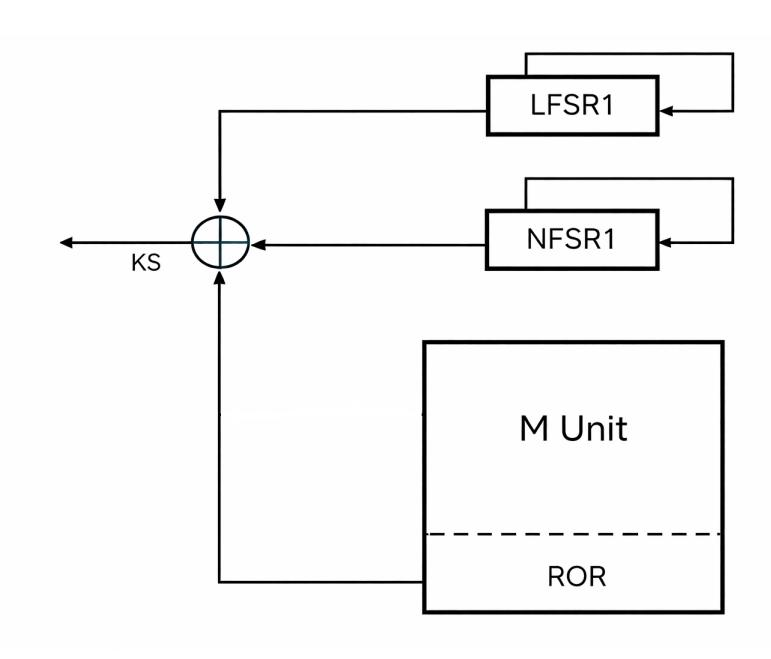
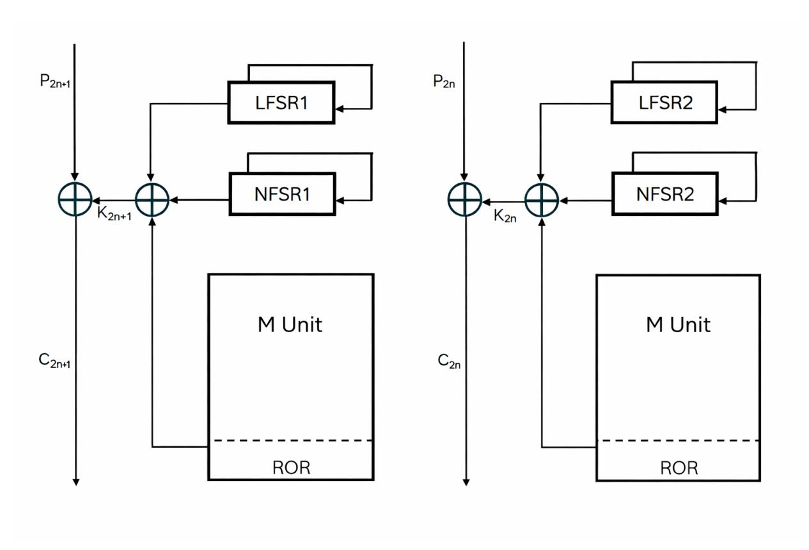

{0}------------------------------------------------

# Cryptanalysis of the Lightweight Stream Cipher RRSC

Shivarama K. N.1 and Susil Kumar Bishoi2

1Manipal Institute of Technology, Manipal Academy of Higher Education, Manipal, 576104, Karnataka, India.

2Centre for Artificial Intelligence and Robotics, Defence Research and Development Organisation, CV Raman Nagar, Bengaluru, 560093, Karnataka, India.

Contributing authors: shivaramakn1@gmail.com; skbishoi.cair@gov.in;

#### Abstract

This paper presents a security evaluation of the RRSC lightweight stream cipher in its 64-bit and 128-bit variants. The analysis examines the key update process, internal component interactions, and diffusion behavior during initialization, supported by an avalanche study. Based on these observations, several cryptanalytic scenarios are explored, including time-memory-data trade-off attacks, full keyrecovery attacks in the known-plaintext setting, and partial key-recovery attacks targeting the linear feedback shift register and nonlinear feedback shift register components. It is shown that the effective key space is reduced from 2 128 to 2 96 for the 128-bit variant and from 2 64 to 2 48 for the 64-bit variant.

Keywords: Lightweight cryptography, Lightweight stream cipher, LFSR, NFSR, cryptanalysis

# 1 Introduction

Cryptography provides the security [\[1\]](#page-7-0). Lightweight cryptography has become an essential research area owing to the rapid growth of resource-constrained platforms such as RFID tags, low-power sensors, medical implants, and IoT devices [\[2\]](#page-7-1). These environments require cryptographic primitives that deliver adequate security while operating under tight restrictions on memory, gate count, energy consumption, and computational delay. Over the past decade, numerous lightweight stream ciphers and block ciphers have been proposed with the goal of achieving a balanced trade-off between efficiency and security. Representative stream cipher examples include Grain, Trivium, Spritz, Fruit [\[3\]](#page-7-2) [\[4\]](#page-8-0) [\[5\]](#page-8-1) [\[6\]](#page-8-2) and block cipher examples include Present, Simon, Speck [\[7,](#page-8-3) [8\]](#page-8-4). In addition, systematic evaluation efforts such as the eSTREAM [\[9\]](#page-8-5) project, organized by the European Network of Excellence in Cryptology, played a pivotal role in identifying efficient and secure stream ciphers suitable for both software and hardware-constrained environments. More recently, the CAESAR [\[10\]](#page-8-6) competition focused on authenticated encryption schemes and further highlighted the importance of lightweight designs capable of providing confidentiality and integrity with minimal implementation overhead. Building on these efforts, several more recent constructions developed as part of NIST's Lightweight Cryptography initiative [\[11\]](#page-8-7). Recent proposals have also explored hybrid design approaches that combine nonlinear feedback shift registers with chaotic dynamics to enhance security while retaining lightweight implementation characteristics, particularly for IoT-oriented applications [\[12\]](#page-8-8). Many of these designs rely on reduced-size shift registers, compact nonlinear components, simple update rules, and bitwise operations intended to minimize implementation cost while maintaining resistance against known attacks. Alongside these design efforts, recent work has applied statistical cryptanalysis to seven classical lightweight ciphers [\[13\]](#page-8-9), revealing detectable deviations 

{1}------------------------------------------------

from ideal randomness and emphasizing the importance of rigorous statistical evaluation in lightweight cipher design.

Within this broader design landscape, the RRSC was introduced as a simple, fast, and hardwareefficient synchronous stream cipher, available in both 128-bit and 64-bit key variants by Runa Chatterjee et al.[\[14\]](#page-8-10). RRSC integrates an Linear Feedback Shift Register (LFSR), an NFSR, and a matrix unit. Due to its compact structure, RRSC achieves low hardware complexity and high throughput, making it seemingly suitable for deployment in constrained devices.

However, the initialization of the RRSC memory elements after the key update algorithm raises serious concerns about its actual security. Weak key initialization is a well-known source of vulnerability in stream ciphers and has enabled several cryptanalytic attacks, as shown in [\[15,](#page-8-11) [16\]](#page-8-12). Moreover, insufficient mixing between the key and the nonce can further facilitate chosen-IV and related-key attacks [\[17\]](#page-8-13). In RRSC, the XOR-based key update creates large equivalence classes of key–nonce pairs that result in identical internal states. This substantially reduces the effective key space and makes efficient key-recovery attacks feasible. In addition, the LFSR, NFSR, and matrix unit operate independently, allowing an attacker to selectively neutralize or isolate individual components through carefully chosen modifications of the key and nonce, thereby further weakening the overall security of the cipher.

This paper presents a detailed cryptanalytic analysis of both the 128-bit and 64-bit variants of RRSC. We first demonstrate that a known-plaintext attack can recover the full 128-bit secret key using approximately 270 bits of precomputation and storage. We then develop partial key-recovery attacks that exploit the lack of proper mixing among the cipher components. For the 64-bit variant, our method recovers 16 key bits, thereby reducing the brute-force complexity from 264 to 248. Similarly, for the 128-bit variant, it is possible to recover 32 key bits, reducing the effective search space from 2128 to 296. These results indicate that RRSC does not provide the intended security level and requires substantial redesign. The attacks presented in this work highlight the broader cryptographic principle that even in highly resource-restricted settings, strong key mixing is essential for achieving meaningful security guarantees.

The entire paper is organized as follows. Section [2](#page-1-0) presents a detailed description of the initialization and execution procedures of both variants of RRSC. In Section [3,](#page-4-0) we analyze the security of RRSC by presenting several cryptanalytic attacks along with an experimental study of its avalanche behavior. Finally, Section [4](#page-7-3) concludes the paper and summarizes the main findings.

# 2 Description of the RRSC stream cipher

The RRSC is a lightweight synchronous stream cipher. It has two variants: a 64-bit version and a 128-bit version. Both the variant use common cryptographic primitives.

## 2.1 The primitives used in RRSC

- One of the core components of RRSC is a 16-bit LFSR. The LFSR operates in a free-running mode, where the feedback value is determined solely by its internal state. In each round, the most significant bit (MSB) of the LFSR is updated using the output bit generated by the polynomial f(x) = 1 + x 3 + x 9 + x 15. However, it is not explicitly specified whether f(x) corresponds to the feedback polynomial or the characteristic polynomial of the LFSR. Additionally, since f(x) is not a primitive polynomial, the resulting LFSR does not achieve maximal period, thereby rendering it unsuitable for cryptographic applications [\[1,](#page-7-0) [18\]](#page-8-14). Let LF SR1 denote the LFSR employed in RRSC-64, and let LF SR1[k] denote the k-th state of LF SR1.
- Another building block of RRSC is a 16-bit NFSR that also operates in free-running mode. In each round, the MSB of the NFSR is updated with the output bit generated by the nonlinear feedback function g(x) = 1 + x 4x 8 + x 12x 13x 14 . Let NF SR1[k] be the k-th state of NF SR1.
- The third primitive is a matrix unit, referred to as the M unit, which consists of a 4 × 4 matrix M coupled with a 16-bit Rotation and Output Register (ROR) that governs its evolution. At each clock cycle i, a single transformation is applied to M based on the value of the i-th bit of the ROR (with indices taken modulo 16), as described below.
  - If the i-th bit of the ROR register is 0, then the (i mod 4)-th row of M undergoes a left circular rotation.
  - If the i-th bit of the ROR register is 1, then the (i mod 4)-th column of M undergoes a downward circular rotation.

{2}------------------------------------------------

The M unit and ROR are updated whenever the clock cycle number modulo 4 equals 1. The detailed procedure for updating M and ROR is described in the execution steps of RRSC.

In the following sections, we describe the initialization and execution procedures for both variants of RRSC.

#### 2.2 RRSC-64

RRSC-64 as depicted in Figure 1 is composed of a single processing block consists of a 16-bit LFSR, a 16-bit NFSR, and a matrix unit. At each clock cycle, the outputs of these three components are combined through a bitwise XOR operation to generate one keystream bit.

### 2.2.1 Initialization of memory bits of RRSC-64

The RRSC-64 variant consists of a single block, namely Block 1. Before the encryption or decryption process begins, the original 64-bit secret key is updated using a 64-bit nonce through the key update algorithm. If the secret key  $K = (k_0, k_1, \ldots, k_{63})$ , and the nonce  $N = (n_0, n_1, \ldots, n_{63})$ , then in key update procedure key K is updated as  $k_i = k_i \oplus n_{63-i}$ , for  $i = 0, 1, \ldots, 63$ .

The updated key bits are employed to initialize the internal components of Block 1. Specifically, the first 16 bits,  $k_0$  to  $k_{15}$  (with  $k_0$  designated as the most significant bit), are used to initialize the LFSR such that  $LFSR_1[15-i]=k[i]$ . The subsequent 16 bits,  $k_{16}$  to  $k_{31}$ , are used to initialize the NFSR according to  $NFSR_1[15-i]=k[16+i]$ . The matrix M of the matrix unit is initialized as

$$M = \begin{bmatrix} k_{32} & k_{33} & k_{34} & k_{35} \\ k_{36} & k_{37} & k_{38} & k_{39} \\ k_{40} & k_{41} & k_{42} & k_{43} \\ k_{44} & k_{45} & k_{46} & k_{47} \end{bmatrix}$$

while the ROR register is initialized using the bits  $k_{48}$  to  $k_{63}$  i.e.,  $ROR_i = k_{48+i}$ , for i = 0, 1, ..., 15. Here,  $(k_{32}, k_{37}, k_{42}, k_{47})$  is the 1st diagonal entries and  $(k_{35}, k_{38}, k_{41}, k_{44})$  is the 2nd diagonal entries.

Fig. 1 Keystream generation in RRSC-64

#### 2.2.2 RRSC-64 Execution Process

Once all 64-bit memory elements of the cipher are initialized, the RRSC-64 cipher operates as follows.

- 1. Computation of the output of the M unit: Let i denote the clock cycle. Depending on the bit value of ROR[i mod 16], compute  $M_{\text{out}}$ , the output of the M unit, as follows.
  - (a) If the bit value is 0, then  $(i \mod 4)$ -th row of the matrix M is circularly shifted to the left and the

output of the 
$$M$$
 unit in this case is the XORed of the 1st diagonal entries. If  $M = \begin{bmatrix} a & b & c & d \\ e & f & g & h \\ i & j & k & l \\ m & n & o & p \end{bmatrix}$ ,

{3}------------------------------------------------

and 
$$(i \mod 4) = 0$$
 and, then the updated matrix is  $\begin{bmatrix} b & c & d & a \\ e & f & g & h \\ i & j & k & l \\ m & n & o & p \end{bmatrix}$  and the output of the matrix

- unit  $M_{out} = b \oplus f \oplus k \oplus p$ .
- (b) If the bit value is 1, then the  $(i \mod 4)$ -th column of the matrix M is circularly shifted downward and the output of the M unit is the XORed of the 2nd diagonal entries.
- 2. Computation of the feedback values of LFSR1 and NFSR1: Let  $fb_L$  and  $fb_N$  denote the feedback values of LFSR and NFSR, respectively. Then,  $fb_L$  and  $fb_N$  are computed using the feedback functions f(x) and g(x), respectively.
- 3. Shift the states: For this,  $LFSR_1[k] = LFSR_1[k+1]$ ,  $NFSR_1[k] = NFSR_1[k+1]$  for k = 0, 1, ..., 14 and  $LFSR_1[15] = fb_L$  and  $NFSR_1[15] = fb_N$ .
- 4. The keystream bit for *i*-th cycle is  $ks_i = M_{out} \oplus fb_L \oplus fb_N$
- 5. If the clock cycle is 1 modulo 4, then the feedback values of M and ROR are computed. The feedback value of M is calculated using the feedback function of the LFSR, and the feedback value of ROR is calculated using the feedback function of the NFSR, each using their respective memory elements. Subsequently, the contents of M and ROR are shifted in a manner analogous to an LFSR.

## 2.3 RRSC-128

RRSC-128 is composed of two blocks, each block is same as the block used in RRSC-64. The RRSC-128 variant consists of two identical blocks, namely Block 1 and Block 2 as depicted in Figure 2. Each block is similar to RRSC-64. Specifically, Block 1 includes  $LFSR_1$ ,  $NFSR_1$ , and an  $M_1$  unit, while Block 2 includes  $LFSR_2$ ,  $NFSR_2$ , and an  $M_2$  unit. Alternately, these two blocks output a keystream bit.

## 2.3.1 Initialization of RRSC-128

Before the encryption or decryption process begins, the original 128-bit secret key is updated using a 64-bit nonce through the key update algorithm. Let the 128-bit secret key be  $K = (k_0, k_1, \ldots, k_{127})$ , and let the 64-bit nonce be  $N = (n_0, n_1, \ldots, n_{63})$ . During the key update procedure, the key K is updated as follows:

$$k_i = k_i \oplus n_{63-i}$$
, for  $i = 0, 1, \dots, 63$ ,

and

$$k_i = k_i \oplus n_{i-64}$$
, for  $i = 64, 65, \dots, 127$ .

The updated key bits are then used to initialize the internal components of Block 1 and Block 2. Specifically, the updated key bits  $k_0$  to  $k_{63}$  are used to initialize Block 1 in the same manner as in the 64-bit variant, while the updated key bits  $k_{64}$  to  $k_{127}$  are used to initialize Block 2 in the same manner as in the 64-bit variant. The RRSC-128 variant can be viewed as two 64-bit RRSC instances operating in parallel.

#### 2.4 Execution of RRSC-128

Each block of RRSC-128 operates in the same manner as the RRSC-64 variant, and the two blocks function independently. The blocks are activated in alternating clock cycles: Block 1 produces a keystream bit during odd clock cycles, while Block 2 produces a keystream bit during even clock cycles. Consequently, in the final keystream, the bits at odd positions originate from Block 1, whereas the bits at even positions originate from Block 2.

{4}------------------------------------------------

Fig. 2 Keystream generation in RRSC-128

# 3 Attacks on RRSC

In this section, we present a detailed cryptanalytic analysis of the RRSC cipher and identify several structural weaknesses. A key observation is that the secret key and the nonce are combined solely through an XOR operation, and the resulting bits are directly used to initialize the memory elements of the RRSC. Since the design does not incorporate a dedicated Key Scheduling Algorithm (KSA), the overall structure of RRSC exhibits inherent weaknesses. This design simplicity results in a large equivalence class of key-nonce pairs that produce identical initialization values. Consequently, multiple distinct keynonce combinations can lead to identical internal states, thereby facilitating several forms of cryptanalytic attacks.

In the following, we present a set of cryptanalytic attacks on the RRSC cipher.

## 3.1 Time-Memory-Data Trade-Off attack

Time-Memory-Data Trade-off attack was introduced by M. Hellman in [\[19\]](#page-8-15). It is well known that when the internal memory size of a cipher is smaller than twice the key size, time-memory-data trade-off (TMDT) attacks become feasible. In both variants of RRSC, the internal memory size is equal to the key size. As a result, TMDT attacks can be applied effectively. The effective security against TMDT attacks is approximately 32 bits for the RRSC-64 variant, requiring 232 memory, whereas the RRSC-128 variant provides an effective security level of 64 bits with a memory requirement of 264 .

To achieve meaningful resistance against TMDT attacks, the total internal state (memory) size of a stream cipher should be at least twice the key size (i.e., ≥ 2× key length in bits). This design principle ensures that the balanced TMDT complexity remains at or above the target security level. The inadequacy of the current RRSC state sizes is clearly illustrated in Table [2,](#page-7-4) which compares RRSC variants with established lightweight stream ciphers that adhere to this guideline (e.g., ASCON-128, ACORN, Grain-128AEAD, Trivium).

## 3.2 Known-Plaintext Attack

We first describe the attack on RRSC-64, which can then be generalized to RRSC-128.

#### 3.2.1 Full key recovery attack on RRSC-64

For RRSC-64, let the 64-bit key be

$$K=(k_0,k_1,\ldots,k_{63})$$

and the nonce be

$$N=(n_0,n_1,\ldots,n_{63}).$$

{5}------------------------------------------------

Then, the updated key is defined as

$$U_K = (k_0 \oplus n_{63}, k_1 \oplus n_{62}, \dots, k_{63} \oplus n_0),$$

which is used to initialize the memory elements of RRSC-64.

Now consider a modified key–nonce pair (K′ , N′ ), obtained by flipping the first bit of both the key and the nonce. Then,

$$K' \oplus N' = K \oplus N.$$

This implies that for both pairs (K, N) and (K′ , N′ ), RRSC-64 has the same initialization state and therefore generates the same keystream. Moreover, there are 264 distinct (K, N) pairs that lead to the same initialization state. We exploit this weakness to recover the secret key from a single (plaintext, ciphertext) pair of length 64 as follows.

An array A is prepared such that A[i] stores the 64-bit keystream generated by RRSC-64 when the 64-bit value i is used as the updated key. This array can be computed offline. Once the attacker obtains a 64-bit (plaintext, ciphertext) pair, the keystream is computed as

$$keystream = plaintext \oplus ciphertext.$$

The attacker then finds the index i such that A[i] matches the recovered keystream. In this case, i corresponds to the updated key equals to K ⊕ Rev(N), where Rev(N) = (n63, . . . , n1, n0) and hence

$$i = K \oplus Rev(N)$$
.

This implies that

$$K = Rev(N) \oplus i$$
.

Since the nonce N is public, the attacker can efficiently recover the 64-bit secret key.

## 3.2.2 Full key recovery attack on RRSC-128

The cipher RRSC-128 consists of two independent blocks and each of which is similar to the RRSC-64. let the 128-bit key used in RRSC-128 be

$$K = (k_0, k_1, \dots, k_{127})$$

and the 64-bit nonce be

$$N=(n_0,n_1,\ldots,n_{63}).$$

Then the updated key

$$U_K = (k_0 \oplus n_{63}, k_1 \oplus n_{62}, \dots, k_{63} \oplus n_0, k_{64} \oplus n_0, k_{65} \oplus n_1, \dots, k_{127} \oplus n_{63})$$

Once an adversary obtains a single 128-bit plaintext–ciphertext pair, they can directly recover the corresponding segment of the keystream. Since stream ciphers typically generate ciphertext by XOR-ing plaintext with the keystream, the keystream bits KS = (s0, s1, s2, . . . , s127) can be computed by XORing the known plaintext bits with the corresponding ciphertext bits. Since the RRSC-128 variant consists of two blocks that generate output bits in alternating clock cycles, the keystream KS decomposes into two subsequences:

$$KS_{\text{odd}} = (s_1, s_3, s_5, \dots, s_{127}), \qquad KS_{\text{even}} = (s_0, s_2, s_4, \dots, s_{126}).$$

These two subsequences correspond to the outputs of Block 1 and Block 2, respectively. The odd-indexed keystream bits, denoted by KSodd, are generated by Block 1 and can be exploited using the knownplaintext attack strategy described in Section [3.2.1.](#page-4-2) Likewise, the even-indexed keystream bits, denoted by KSeven, are generated by Block 2 and can be attacked using the same methodology, with the only modification being that the nonce N is used in place of Rev(N). By applying this recovery procedure independently to both subsequences, the adversary can reconstruct the entire 128-bit secret key.

{6}------------------------------------------------

#### 3.3 Partial Key Recovery Attack

In this section, we propose an attack on the 64-bit variant of RRSC under the assumption that the adversary already knows a portion of the secret key. The objective of the attack is to recover the remaining unknown key bits. A similar attack strategy can be extended to the 128-bit variant.

### 3.3.1 To recover the initial states of LFSR

In this attack, the adversary is assumed to know the last 48 bits of the 64-bit secret key, and the objective is to recover the first 16 bits. That is, the key bits  $k_{16}$  to  $k_{63}$  are known to the adversary. The attacker then constructs a modified key  $K^* = (k_0^*, \ldots, k_{63}^*)$  and a modified nonce  $N^* = (n_0^*, \ldots, n_{63}^*)$  as follows:

 $k_i^* = n_i^*$  for randomly chosen bits  $n_i^*$ ,  $0 \le i \le 15$ ,

and

$$k_i^* = k_i, \qquad n_i^* = n_i \quad \text{for } 16 \le i \le 63.$$

Next, the attacker generates two keystreams,  $KS_1$  from (K, N) and  $KS_2$  from  $(K^*, N^*)$ , and computes their XOR. Since each keystream bit is obtained as the XOR of the output bits of the LFSR, NFSR, and the matrix unit, XORing  $KS_1$  and  $KS_2$  eliminates the contributions of the NFSR and the matrix unit. This cancellation occurs because the last 48 bits of K and  $K^*$  are identical, which results in identical NFSR and matrix unit outputs in both keystreams. Therefore,  $KS_1 \oplus KS_2$  is simply the XOR of the two LFSR outputs.

Furthermore, since  $k_i^* = n_i^*$  for all  $0 \le i \le 15$ , the LFSR is initialized to the all-zero state for the pair  $(K^*, N^*)$ . Consequently, it produces an all-zero output sequence. Therefore,  $KS_1 \oplus KS_2$  corresponds exactly to the output sequence of a single LFSR with an unknown initial state. By applying the Berlekamp-Massey algorithm [20], the initial state of the LFSR can be recovered, and hence the first 16 bits of the secret key can be determined. Therefore, the effective key-search complexity of RRSC-64 reduces from  $2^{64}$  to  $2^{48}$ .

A similar attack can be carried out on the 128-bit variant of RRSC. In this case, the secret key bits  $k_0$  to  $k_{15}$  and  $k_{64}$  to  $k_{79}$  are the unknown portions that the adversary aims to recover. Hence, the overall key search complexity decreases from  $2^{128}$  to  $2^{96}$ .

#### 3.4 Avalanche Effect Analysis

We study the avalanche properties of RRSC by analyzing how the keystream reacts to small changes in the input parameters. In a well-designed stream cipher, modifying a single bit of the key or the nonce is expected to affect approximately half of the keystream or internal state bits. Such behavior is generally considered an indication of strong diffusion and effective internal mixing.

| No. of | % of avg. changes in memory bits | % of avg. changes in    |
|--------|----------------------------------|-------------------------|
| Rounds | of RRSC-64                       | memory bits of RRSC-128 |
| 64     | 13.65                            | 3.58                    |
| 128    | 13.31                            | 4.32                    |
| 192    | 13.18                            | 4.44                    |
| 256    | 14.92                            | 4.59                    |
| 320    | 14.33                            | 4.7                     |
| 384    | 13.62                            | 4.57                    |
| 448    | 13.38                            | 4.69                    |
| 512    | 15.06                            | 4.84                    |
| 576    | 14.40                            | 4.73                    |
| 640    | 13.60                            | 4.72                    |
| 704    | 14.65                            | 4.68                    |
| 768    | 13.35                            | 4.66                    |
| 832    | 14.14                            | 4.75                    |
| 896    | 14.14                            | 4.71                    |
| 960    | 14.14                            | 8.82                    |
| 1024   | 14.82                            | 4.73                    |

 Table 1
 Avalanche Effect Results of RRSC

{7}------------------------------------------------

However, our experimental observations indicate that RRSC does not exhibit this level of sensitivity. Flipping individual bits in either the key or the nonce results in only a small number of changes in the generated keystream.

In Table [1,](#page-6-0) the first column represents the number of RRSC rounds, while the second and third columns show the average percentage of changes in the internal memory bits of RRSC-64 and RRSC-128, respectively. The results in Table [1](#page-6-0) indicate that the change in internal memory bits remains below 15% even after 1024 rounds of RRSC. This suggests that the cipher exhibits weak sensitivity to input perturbations, even after a large number of rounds, indicating very slow diffusion within the design.

A closer inspection of the structure suggests that this behavior arises because both the LFSR and NFSR operate in a free-running mode. Moreover, the key bits in the range [32:63] do not propagate into the states of either the LFSR or the NFSR.

# 4 Conclusion

This paper presented a security analysis of the RRSC stream cipher in both its 64-bit and 128-bit variants. The study examined the initialization process, component interactions, and diffusion properties of the design. Based on this analysis, several attack scenarios were demonstrated, including a full key-recovery attack under the known-plaintext model and partial key-recovery attacks targeting individual internal components. The results indicate that the effective security level of RRSC can be reduced under practical attack settings.

The analysis shows that the main weakness of RRSC lies in its key update mechanism, which relies solely on a bitwise XOR operation between the key and nonce, without employing a dedicated Key Scheduling Algorithm (KSA). This results in insufficient mixing during initialization and enables the construction of related key–nonce pairs leading to closely related internal states.

| Name of the cipher | Internal state / memory | Key size |
|--------------------|-------------------------|----------|
|                    | size                    |          |
| ASCON-128          | 320                     | 128      |
| Trivium            | 288                     | 80       |
| ACORN              | 293                     | 128      |
| Grain-128AEAD      | 256                     | 128      |
| RRSC-64            | 64                      | 64       |
| RRSC-128           | 128                     | 128      |

Table 2 Memory, Key, and Nonce Sizes of the popular Lightweight stream ciphers.

Moreover, as shown in Table [2,](#page-7-4) comparison with existing lightweight stream ciphers suggests that stronger key scheduling, improved internal diffusion, and a larger internal state size are essential for achieving robust security. These findings highlight important design considerations for future improvements of RRSC and for the development of secure lightweight stream ciphers.

# 5 Acknowledgement

The second author sincerely thanks the Director of CAIR for his continuous encouragement and support.

# References

- [1] Menezes, A.J., Van Oorschot, P.C., Vanstone, S.A.: Handbook of Applied Cryptography. CRC Press, Boca Raton, FL (2018)
- [2] Poschmann, A.: Lightweight Cryptography - Cryptographic Engineering for a Pervasive World. Cryptology ePrint Archive, Paper 2009/516 (2009). <https://eprint.iacr.org/2009/516>
- [3] Hell, M., Johansson, T., Maximov, A., Meier, W.: A stream cipher proposal: Grain-128. 2006 IEEE International Symposium on Information Theory, 1614–1618 (2006)

{8}------------------------------------------------

- [4] De Canni`ere, C.: Trivium: a stream cipher construction inspired by block cipher design principles. In: Proceedings of the 9th International Conference on Information Security. ISC'06, pp. 171–186. Springer, Berlin, Heidelberg (2006)
- [5] Rivest, R.L., Schuldt, J.C.N.: Spritz - a spongy RC4-like stream cipher and hash function. IACR Cryptol. ePrint Arch. 2016, 856 (2016)
- [6] Amin Ghafari, V., Hu, H.: Fruit-80: A secure ultra-lightweight stream cipher for constrained environments. Entropy 20 (2018) <https://doi.org/10.3390/e20030180>
- [7] Bogdanov, A., Knudsen, L.R., Leander, G., Paar, C., Poschmann, A., Robshaw, M.J.B., Seurin, Y., Vikkelsoe, C.: Present: An ultra-lightweight block cipher. In: Paillier, P., Verbauwhede, I. (eds.) Cryptographic Hardware and Embedded Systems - CHES 2007, pp. 450–466. Springer, Berlin, Heidelberg (2007)
- [8] Beaulieu, R., Shors, D., Smith, J., Treatman-Clark, S., Weeks, B., Wingers, L.: The SIMON and SPECK families of lightweight block ciphers (2013)
- [9] eSTREAM: The ECRYPT Stream Cipher Project. <http://competitions.cr.yp.to/estream.html> (2008)
- [10] Bernstein, D.J.: CAESAR Competition for Authenticated Encryption: Security, Applicability, and Robustness. <http://competitions.cr.yp.to/caesar.html> (2013)
- [11] Gookyi, D., Ryoo, K.: NIST lightweight cryptography standardization process: Classification of second round candidates, open challenges, and recommendations. Journal of Information Processing Systems 17, 253–270 (2021)
- [12] Bokhari, M., Afzal, S., Yadav, G.: Chaosforge: a lightweight stream cipher fusion of chaotic dynamics and nlfsrs for secure iot communication. International Journal of Information Technology, 1–11 (2024) <https://doi.org/10.1007/s41870-024-02061-z>
- [13] Chatterjee, R., Chakraborty, R.: Statistical cryptanalysis of seven classical lightweight ciphers. International Journal of Information Technology 16 (2024) <https://doi.org/10.1007/s41870-024-02175-4>
- [14] Chatterjee, R., Chakraborty, R.: RRSC-128/64-v1: a two-variant simple, fast, and secure lightweight stream cipher. International Journal of Information Technology 17(6), 3477–3485 (2025) [https://](https://doi.org/10.1007/s41870-025-02533-w) [doi.org/10.1007/s41870-025-02533-w](https://doi.org/10.1007/s41870-025-02533-w)
- [15] De Canni`ere, C., K¨u¸c¨uk, O., Preneel, B.: Analysis of grain's initialization algorithm. In: Vaudenay, ¨ S. (ed.) Progress in Cryptology – AFRICACRYPT 2008, pp. 276–289. Springer, Berlin, Heidelberg (2008)
- [16] Fluhrer, S.R., Mantin, I., Shamir, A.: Weaknesses in the key scheduling algorithm of rc4. In: Revised Papers from the 8th Annual International Workshop on Selected Areas in Cryptography. SAC '01, pp. 1–24. Springer, Berlin, Heidelberg (2001)
- [17] Banik, S., Maitra, S., Sarkar, S., Meltem S¨onmez, T.: A chosen iv related key attack on grain-128a. In: Boyd, C., Simpson, L. (eds.) Information Security and Privacy, pp. 13–26. Springer, Berlin, Heidelberg (2013)
- [18] Golomb, S.W.: Shift register sequences – a retrospective account. In: Gong, G., Helleseth, T., Song, H.-Y., Yang, K. (eds.) Sequences and Their Applications – SETA 2006, pp. 1–4. Springer, Berlin, Heidelberg (2006)
- [19] Hellman, M.: A cryptanalytic time-memory trade-off. IEEE Transactions on Information Theory 26(4), 401–406 (1980) <https://doi.org/10.1109/TIT.1980.1056220>
- [20] Canteaut, A.: Berlekamp-Massey Algorithm, pp. 29–30. Springer, Boston, MA (2005). [https://doi.](https://doi.org/10.1007/0-387-23483-7_24)

{9}------------------------------------------------

