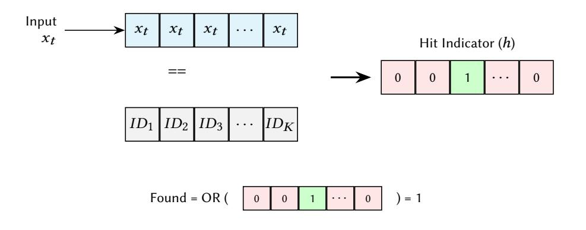
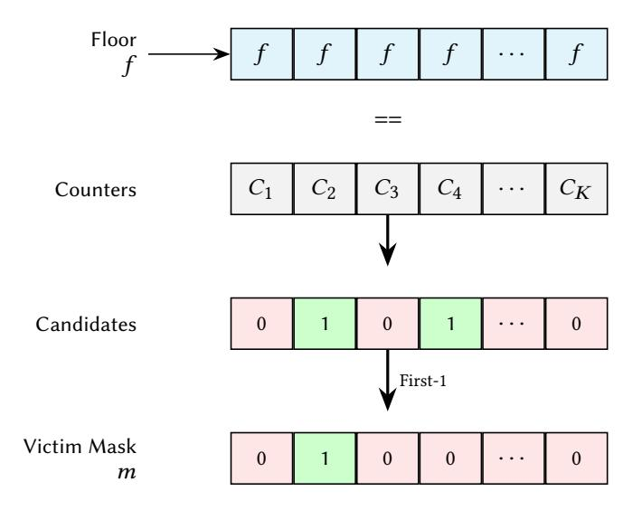
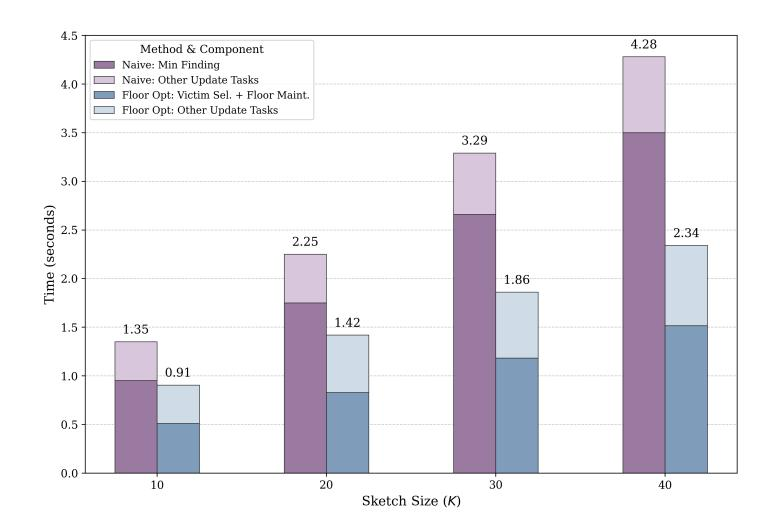
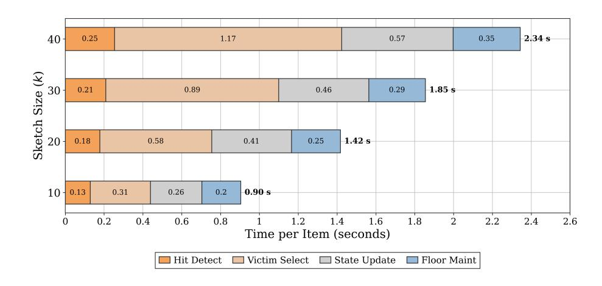
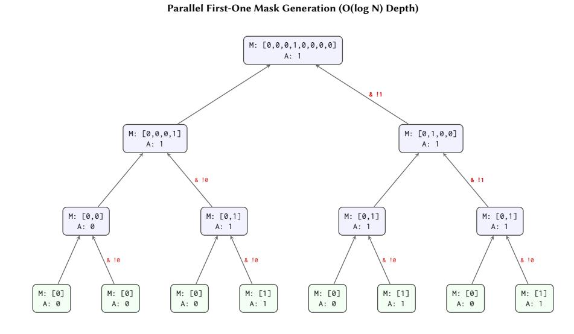
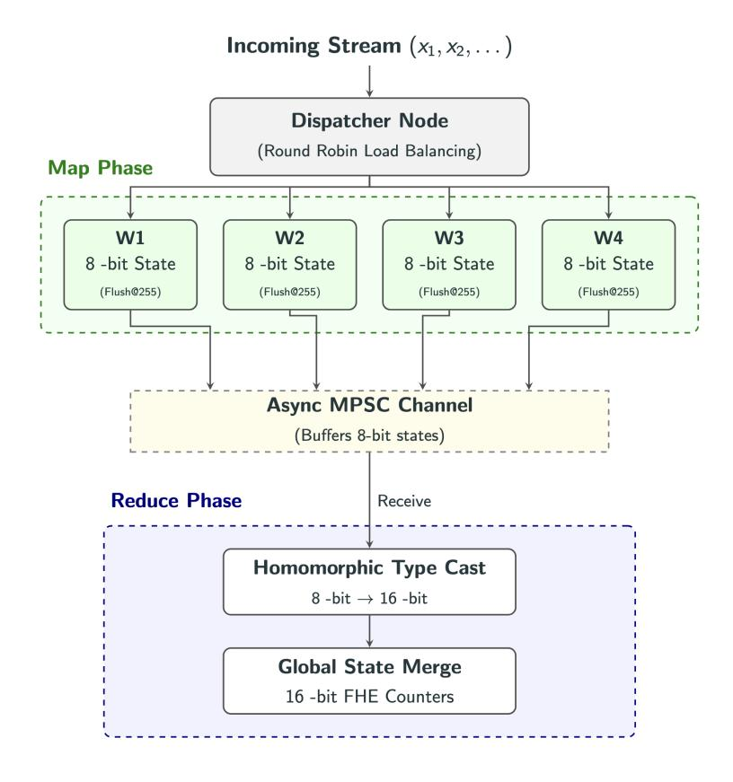
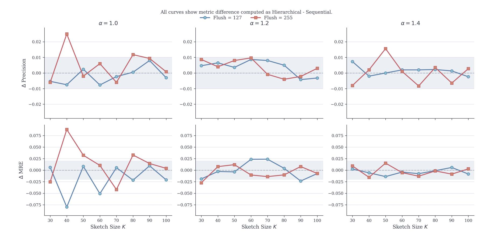
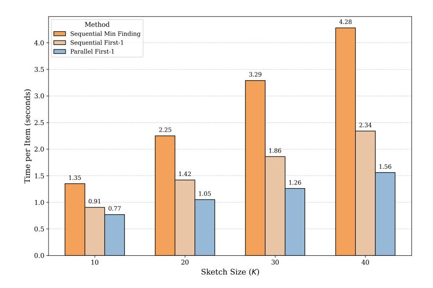

{0}------------------------------------------------

# Oblivious SpaceSaving: Heavy-Hitter Detection over Fully Homomorphic Encryption

Sohaib sohaib@ucsb.edu UC Santa Barbara Divyakant Agrawal divyagrawal@ucsb.edu UC Santa Barbara

Amr El Abbadi amr@cs.ucsb.edu UC Santa Barbara

#### **ABSTRACT**

Heavy-hitter detection is a fundamental primitive in stream analytics, with applications in network monitoring, telemetry, and large-scale data systems. In many practical deployments, this computation must be maintained continuously on remote infrastructure that offers higher availability and centralized operational control, even when the underlying streams contain sensitive identifiers or proprietary activity patterns. Existing privacy-preserving approaches either incur substantial statistical noise or rely on multiserver trust assumptions. Fully Homomorphic Encryption (FHE) offers an attractive alternative by enabling exact computation over encrypted data on a single untrusted server, but the high cost of encrypted comparisons has historically made stateful stream processing impractical.

We present *Oblivious SpaceSaving*, a privacy-preserving reformulation of the classical Space-Saving algorithm for fully encrypted execution. Our central idea is the *Moving Floor* abstraction, which exploits a monotonicity invariant in the summary state to replace repeated magnitude comparisons with equality-based selection against a tracked encrypted floor. We further combine this with parallel victim selection and a hierarchical asynchronous ingestion pipeline, yielding an end-to-end encrypted heavy-hitter architecture that preserves the deterministic accuracy guarantees of the original algorithm.

Our design reduces the cost of encrypted updates by up to  $2.74\times$  over a naive oblivious baseline and sustains end-to-end encrypted ingestion throughputs of up to 4.30 items/s with sub-second amortized latency. These results show that, with the right algorithmic reformulation, classical streaming summaries can be made practically viable under fully encrypted execution, bringing privacy-preserving stream analytics significantly closer to deployment.

#### 1 INTRODUCTION

Many real world streaming workloads need a running summary of the dominant items, or heavy hitters, in a data stream, often under strict latency and memory budgets. Applications of such summaries include detecting distributed denial of service (DDoS) attacks in network traffic, identifying trending content in social media streams, and optimizing query execution in database engines [8, 25]. In formal terms, given a high velocity stream drawn from a large universe, the heavy hitters problem is to continuously identify the most frequent elements while using memory that is sublinear in both the stream length and the domain size [8, 25].

Among the many algorithms proposed for this task, the *Space-Saving* algorithm [22] has emerged as a de facto standard in practice. SpaceSaving maintains exactly k counters, each paired with an item identifier, and guarantees bounded estimation error with strict O(k) memory usage [22]. Unlike probabilistic sketches such

as Count-Min [9], SpaceSaving is deterministic and offers strong worst-case guarantees on both false positives and frequency overestimation [8, 22]. These properties have made counter-based heavy-hitter summaries central to networking, telemetry, and large-scale stream processing systems [8, 25].

Despite its practical success, SpaceSaving is fundamentally designed for plaintext execution. Its update logic relies on data-dependent control flow. Incoming items are first checked for membership among stored identifiers, and if absent, the algorithm identifies and evicts the bucket with the minimum counter value [22]. In conventional settings, these operations are inexpensive. However, they become a major obstacle in privacy-preserving environments, where revealing item identities, access patterns, or control flow is unacceptable.

Existing privacy-preserving solutions primarily rely on Local Differential Privacy (LDP) or Multi-Party Computation (MPC). LDP protocols [2, 12, 16, 33] allow users to perturb data before transmission, but they inherently suffer from a substantial noise floor (e.g., an error bound of  $\Omega(\sqrt{n})$  for n users), which can make moderate-frequency heavy hitters difficult to recover accurately [2, 16]. Conversely, MPC and secret-sharing approaches [3, 10, 26] achieve high accuracy but fundamentally require a distributed trust model with two or more non-colluding servers. This assumption is difficult to satisfy in many real-world deployments where infrastructure is managed by a single provider. Furthermore, these interactive protocols often introduce significant latency due to communication and network round-trips [17, 24].

This tension is increasingly relevant as heavy-hitter analytics are deployed over sensitive data. Network telemetry may expose client IP addresses, enterprise monitoring may reveal proprietary workloads, and healthcare or financial streams often contain regulated identifiers. In many scenarios, data owners are willing to outsource computation but unwilling, or legally unable, to reveal raw streams or intermediate states. A naive approach to this problem is to simply encrypt the stream values before outsourcing them to a remote heavy-hitter detector. However, hiding only the item identifiers is insufficient. If the server observes the intermediate summary state, frequency evolution, or update correlations, it can learn sensitive distributional information about the stream. For instance, sudden concentration in a small number of counters may reveal traffic surges or denial-of-service behavior, while in multi-client settings, the server may infer when distinct clients contribute to the same underlying encrypted value. This vulnerability motivates the need to protect not only the stream contents, but the heavy-hitter computation itself.

Fully Homomorphic Encryption (FHE) [13] provides a powerful cryptographic tool to address this challenge by enabling arbitrary computation directly over encrypted data. In principle, FHE allows

{1}------------------------------------------------

an untrusted server to process encrypted streams without learning item values or access patterns [13, 14]. Furthermore, the server remains entirely oblivious to the final top-k summary. It only maintains the encrypted summary state, while the final result can be retrieved and decrypted only by authorized clients. However, efficiently executing streaming algorithms under FHE remains an open challenge because its cost model differs sharply from conventional computation. Data-dependent branching is infeasible, memory access must be oblivious, and magnitude comparisons translate into deep arithmetic circuits. In modern torus-based schemes such as TFHE [6, 7], encrypted comparisons are significantly more expensive than arithmetic operations or equality tests. Consequently, a direct oblivious translation of the Space-Saving algorithm requires O(k) encrypted comparisons per stream update to identify the minimum counter. This quickly becomes the dominant performance bottleneck, rendering real-time processing impractical.

This paper asks a simple but fundamental question: Can the SpaceSaving algorithm be restructured to operate efficiently and obliviously under Fully Homomorphic Encryption, without sacrificing its accuracy guarantees?

We answer this question affirmatively by presenting *Oblivious SpaceSaving*, a reformulation of the classical algorithm designed specifically for execution under TFHE. Our key insight is the recognition of a structural invariant in SpaceSaving that is largely inconsequential in plaintext execution but crucial in encrypted computation. The minimum counter value maintained by the algorithm is *monotonically nondecreasing* over time. Rather than recomputing the global minimum at every update, we exploit this property to maintain an encrypted *floor* value that tracks the current minimum frequency.

Building on this observation, we introduce the *Moving Floor* optimization. Instead of identifying eviction candidates via expensive magnitude comparisons, we detect buckets at the current minimum using equality checks against the encrypted floor value. Since equality operations are substantially cheaper than comparisons in TFHE, this transformation reduces the dominant per-update cost from O(k) comparisons to O(k) equality tests. To preserve correctness when multiple buckets share the minimum counter, we employ an oblivious tie-breaking mechanism based on prefix selection circuits that deterministically selects exactly one victim without leaking access patterns [18, 20].

Crucially, our design unifies hit detection, counter updates, and bucket eviction into a single arithmetic circuit using homomorphic multiplexing. The observable computation is identical regardless of whether an incoming item is a hit or a miss, eliminating all data-dependent control flow. As a result, Oblivious SpaceSaving preserves the original algorithm's space and accuracy guarantees while making encrypted execution practical.

Beyond algorithmic refinement, Oblivious SpaceSaving enables new application scenarios that are difficult or impossible with existing techniques. For example, multiple organizations can collaboratively detect large-scale DDoS attack sources by streaming encrypted traffic summaries to an untrusted aggregator, without revealing raw IP addresses or access patterns. Unlike secure multiparty computation approaches, our solution is noninteractive after encryption, and unlike trusted execution environments, it relies solely on cryptographic assumptions rather than hardware trust.

In summary, this work demonstrates that classical streaming algorithms long considered incompatible with FHE can be adapted to fully encrypted execution by carefully exploiting algorithmic invariants. Our results advance the practicality of privacy-preserving stream analytics and provide a blueprint for redesigning other branch-heavy algorithms under cryptographic constraints.

#### 2 PRELIMINARIES

This section (i) formalizes the heavy hitter problem, (ii) reviews the SpaceSaving algorithm and its core invariant, (iii) describes the TFHE computational model and our cost assumptions, and (iv) specifies the threat model and a precise notion of data obliviousness for encrypted streaming.

#### 2.1 Problem statement: heavy-hitter detection

Let  $\sigma = \langle x_1, x_2, \dots, x_n \rangle$  be a stream of n items drawn from a universe  $\mathcal{U}$ . For any  $v \in \mathcal{U}$ , let  $f_v = |\{i \mid x_i = v\}|$  denote the true frequency of v. The  $(\phi, \varepsilon)$ -Heavy Hitter problem asks to return a set of items S such that every item v with  $f_v > \phi n$  is in S, and no item with  $f_v < (\phi - \varepsilon)n$  is in S [9, 25].

We focus on summary algorithms (like SpaceSaving [22]) that provide the following guarantees with error parameter  $\varepsilon < \phi$ :

- (1) **Completeness:** Every item with  $f_v > \varepsilon n$  is stored in the summary (implying no false negatives for  $\phi$ -heavy hitters if  $\phi > \varepsilon$ ).
- (2) **Accuracy:** For any stored item v, the estimated frequency  $\widehat{f_v}$  satisfies

$$f_v \le \widehat{f_v} \le f_v + \varepsilon n.$$

Note that while Misra-Gries [23] provides lower-bound guarantees  $(f_v - \varepsilon n \le \widehat{f_v} \le f_v)$ , SpaceSaving provides upper-bound guarantees consistent with the definition above [22].

#### 2.2 SpaceSaving and its invariant

We briefly recall the SpaceSaving algorithm [22], which will be the baseline summary we make oblivious. We refer to the SpaceSaving data structure as a sketch, and to its number of buckets  $k = \lceil 1/\epsilon \rceil$  as the sketch size. Each bucket  $B_i = (ID_i, C_i)$  stores an item identifier  $ID_i$  and a non-negative integer counter  $C_i$ . Initially, all counters are empty.

On arrival of an item *x*:

- (1) If there is an empty bucket i, set  $ID_i = x$  and  $C_i = 1$
- (2) If  $\exists i$  with  $ID_i = x$  (a hit), increment  $C_i \leftarrow C_i + 1$ .
- (3) Otherwise (a *miss*), select  $j = \arg\min_{i \in [1,k]} C_i$ , set  $ID_j \leftarrow x$ , and increment  $C_j \leftarrow C_j + 1$ .

SpaceSaving guarantees the completeness and accuracy properties above.

A structural property we exploit is the monotonicity of the minimum counter:

<span id="page-1-0"></span>LEMMA 2.1 (MONOTONIC MINIMUM — BOUNDED INCREMENT). Let  $f_t = \min_{i \in [1,k]} C_i(t)$  denote the minimum counter after processing t stream items. Then for every  $t \ge 0$ ,

$$f_{t+1} \in \{ f_t, f_t + 1 \}.$$

In particular,  $f_{t+1} \ge f_t$  and the minimum increases by at most one.

{2}------------------------------------------------

PROOF. Exactly one bucket's counter is incremented (by one) on the (t+1)-th update; no counters are decremented. Hence the minimum cannot decrease, so  $f_{t+1} \ge f_t$ .

Moreover, because only a single counter changes and that change is an increment by one, the minimum can increase by at most one. Concretely:

- If the update is a *hit* on a bucket whose counter is strictly greater than  $f_t$ , then the minimum remains  $f_t$ .
- If the update is a *hit* on a bucket with counter equal to  $f_t$ , that bucket becomes  $f_t + 1$ ; if at least one other bucket remains at  $f_t$ , the minimum stays  $f_t$ , otherwise the unique minimum becomes  $f_t + 1$ .
- If the update is a *miss*, the algorithm replaces a bucket with counter  $f_t$  and increments it to  $f_t + 1$ ; again, the new minimum is either  $f_t$  (if other buckets remain at  $f_t$ ) or  $f_t + 1$  (if the evicted bucket was the unique minimum).

In all cases  $f_{t+1}$  equals either  $f_t$  or  $f_t$  + 1, establishing the claim.  $\Box$ 

### 2.3 Cryptographic Framework and Cost Model

Fully Homomorphic Encryption (FHE). Fully Homomorphic Encryption (FHE) allows arbitrary computation on encrypted data without access to the secret decryption key [13, 28]. Formally, given a public evaluation key ek, an FHE scheme provides an algorithm Eval such that for a function f and plaintext x,

$$Dec(Eval(ek, f, Enc(x))) = f(x).$$

This capability enables an untrusted server to compute over ciphertexts while learning nothing about the inputs or the result.

Most practical FHE constructions rely on lattice-based hardness assumptions, such as the Learning With Errors (LWE) problem [27]. In these schemes, ciphertexts are "noisy" approximations of the message. Each homomorphic operation increases this noise; if the accumulated noise exceeds a scheme-specific threshold, decryption fails.

To support computations of unbounded depth, FHE schemes employ *bootstrapping*, a computationally intensive procedure that homomorphically evaluates the scheme's own decryption function [13]. This resets the noise of a ciphertext to a fixed nominal level, enabling continuous processing. This capability distinguishes *fully* homomorphic schemes (like TFHE [6]) from *leveled* schemes, which are limited to evaluating functions of a pre-determined maximum complexity.

Leveled vs. Fully Homomorphic Encryption. FHE schemes are generally categorized based on their noise management strategies. Leveled schemes (e.g., BGV [4], CKKS [5]) are typically parameterized to support circuits of a fixed, pre-determined multiplicative depth. While these schemes can theoretically support unbounded depth via bootstrapping, the procedure is often prohibitively expensive and high-latency, making it practical only for specific high-value intermediate refreshes. Consequently, to avoid this cost, parameters are usually inflated to accommodate the entire computation depth upfront. In contrast, schemes like TFHE [7] and FHEW [11] utilize Programmable Bootstrapping (PBS) as a native, frequent operation. PBS integrates noise management directly into the evaluation of non-linear gates, resetting noise to a fixed nominal level with every operation. This granular, constant-time refresh decouples the

ciphertext parameters from circuit depth, enabling the efficient evaluation of *unbounded* streams without parameter explosion.

Choice of FHE Scheme. Our system requires a single untrusted server to maintain a long-lived, stateful encrypted summary updated continuously by an unbounded stream. We select TFHE as the cryptographic substrate rather than leveled arithmetic schemes (e.g., BGV, CKKS) due to three fundamental structural mismatches in the latter:

- (1) **Unbounded Execution Depth:** Streaming algorithms effectively have infinite circuit depth. Leveled schemes require either pre-determined circuit depths or frequent *global* bootstrapping of large ciphertexts, which dominates runtime. TFHE's gate-level programmable bootstrapping (PBS) continuously refreshes noise, natively supporting indefinite execution.
- (2) **Precision and Stability:** SpaceSaving relies on exact integer counters to maintain strict lower bounds. Approximate schemes like CKKS introduce rounding errors that accumulate over updates, potentially violating algorithmic invariants (e.g., the heavy-hitter bounds).
- (3) **Fine-Grained Control Flow:** Stream summaries require data-dependent conditional updates (e.g., updating *only* the minimum counter). SIMD-based leveled schemes efficiently handle batched arithmetic but incur high overhead for such fine-grained, non-uniform branching logic.

Computational model. We represent counters and identifiers as fixed-width N-bit words (unsigned, MSB-first). Our complexity analysis follows the TFHE gate model and distinguishes between two classes of operations:

- Linear and affine operations (No PBS). Operations such as bitwise XOR and XNOR represent purely linear and affine transformations over  $\mathbb{F}_2$ , respectively. Because the underlying LWE ciphertexts are additively homomorphic, these operations are evaluated simply by adding ciphertexts together or injecting plaintext constants. Consequently, they require no Programmable Bootstrapping (PBS) and incur negligible computational cost relative to non-linear gates.
- Non-linear operations (PBS). Operations such as AND, OR, MUX (conditional selection), full integer addition (carry propagation), and small lookup-tables (LUTs) require programmable bootstrapping.

<span id="page-2-0"></span>Asymmetry of Arithmetic Operations. A critical characteristic of the TFHE model is the performance asymmetry between equality testing and magnitude comparison. This distinction drives our algorithmic design.

**Equality** (EQ): Testing a = b is computationally efficient because it is *bitwise independent*. The operation parallelizes N linear comparisons followed by a reduction tree, requiring  $\Theta(N)$  PBS invocations but only  $\Theta(\log N)$  depth.

**Comparison** (LT): Determining a < b is inherently sequential due to the *dependency chain* required for carry propagation (similar to subtraction). Resolving this dependency forces a trade-off: ripple-carry designs minimize total PBS count ( $\Theta(N)$ ) but suffer linear depth, whereas parallel-prefix designs achieve logarithmic depth only at the cost of significantly higher PBS counts.

{3}------------------------------------------------

This cost asymmetry motivates the *Moving Floor* optimization proposed in Section 3.1. By restructuring the SpaceSaving eviction policy to rely on efficient equality checks against a tracked minimum rather than expensive pairwise magnitude comparisons, we minimize the frequency of high-cost operations in the critical path.

## 2.4 Cryptographic Setup

Our construction is implemented using TFHE-rs<sup>1</sup> under the shortint preset PARAM\_MESSAGE\_2\_CARRY\_2\_KS\_PBS. This preset allocates 2 message bits and 2 carry bits per shortint ciphertext block, and follows a keyswitch-then-programmable-bootstrap evaluation order. Larger encrypted integers, such as FheUint32, are represented internally as radix compositions of multiple shortint blocks. According to the TFHE-rs documentation, the default parameter sets provide at least 128-bit security [32]. We use this fixed cryptographic configuration throughout the paper.

# 2.5 Threat model and definition of obliviousness

**Participants.** We consider a two-party setting with a *Client* and an *Untrusted Compute Server*. The Client holds the secret key and encrypts each stream item  $v_t$  to  $x_t$  before transmitting it to the Server. The Server has an encrypted summary state  $S = \{(ID_i, C_i)\}_{i=1}^k$  and processes the encrypted stream without access to the secret key.

**Adversary.** The Server is *honest-but-curious* (semi-honest): it follows the prescribed encrypted computation but attempts to learn information about the plaintext stream or frequency distribution by inspecting ciphertexts, memory access patterns, timing, or other side channels observable at the server.

**Data-obliviousness under FHE.** An FHE-based streaming algorithm is *data-oblivious* if it satisfies:

- (1) Circuit independence: the Boolean circuit executed homomorphically is independent of the plaintext data (no data-dependent control-flow such as conditional branches that alter which gates are evaluated);
- (2) *Physical-access independence:* every logical operation performs the same sequence of physical reads/writes to the server's memory (or, equivalently, reads all *k* buckets and uses homomorphic multiplexing to produce the new encrypted state), thus preventing leakage through memoryaccess traces or timing differences.

We emphasize that under this model the server may see ciphertexts and observe that encrypted operations occurred, but cannot learn which logical bucket changed, the item identifiers, or exact frequencies beyond what is leaked by protocol outputs. We do not consider active/malicious servers in this work; handling those adversaries requires stronger techniques (authenticated encryption, verifiable computation) and is orthogonal to our main focus.

### 2.6 Notation

Table 1 summarizes the notation used throughout the paper.

**Table 1: Notation summary** 

<span id="page-3-2"></span>

| Symbol                        | Meaning                                           |
|-------------------------------|---------------------------------------------------|
| $\overline{x_t}$              | TFHE encryption of an incoming item               |
| $S = \{(ID_i, C_i)\}_{i=1}^k$ | Encrypted SpaceSaving state with <i>k</i> buckets |
| f                             | Encrypted floor value that tracks $\min_i C_i$    |
| $h_i$                         | Hit indicator: $EQ(ID_i, x)$                      |
| $cand_i$                      | Candidate indicator: $EQ(C_i, f)$                 |
| $m_i$                         | One-hot victim selector after oblivious tie-      |
|                               | breaking                                          |
| $u_i$                         | Unified write-enable mask used for updating a     |
|                               | single target bucket                              |
| N                             | Bit-width used to represent counters/identifiers  |
|                               | in binary (implementation parameter)              |
| EQ, LT                        | Homomorphic equality and less-than compara-       |
|                               | tor circuits                                      |

# 3 METHODOLOGY: OBLIVIOUS SPACE-SAVING

In this section, we present *Oblivious Space-Saving*, a fully oblivious variant of the classic Space-Saving sketch tailored for efficient execution with Fully Homomorphic Encryption (FHE), specifically leveraging the TFHE scheme. The primary objective is to transform the control-flow-dependent logic of the classical algorithm into a *fixed-topology* boolean and arithmetic circuit. This transformation guarantees functional equivalence and maintains the original error bounds, while strictly precluding any information leakage via access patterns or timing side-channels at the untrusted server.

We first detail the core algorithmic optimizations required for FHE practicality, synthesize them into a constant-depth update pipeline, and conclude with formal correctness guarantees and a TFHE-specific complexity analysis.

### <span id="page-3-0"></span>3.1 The Moving Floor Optimization

Recall that Space-Saving maintains k buckets counters, and each time a new item arrives, the algorithm is required to determine whether the new item is already being monitored or not, and in the latter case, the new item must replace the global minimum counter (the victim). The principal computational bottleneck in migrating Space-Saving to the FHE domain lies in the victim selection phase. A naive implementation would identify the global minimum counter dynamically, necessitating O(k) magnitude comparisons (LT). As established in Section 2.3, homomorphic magnitude comparisons are computationally intensive, incurring significantly higher Programmable Bootstrapping (PBS) costs and greater circuit depths compared to homomorphic equality evaluations (EQ).

To circumvent this prohibitive overhead, we propose the *Moving Floor* optimization. Instead of recomputing the minimum via pairwise comparisons, we maintain an explicit encrypted floor variable, f, which strictly tracks the global minimum. This paradigm shift reduces the k-way magnitude comparisons to highly parallelizable equality checks.

Because the global minimum in Space-Saving is incremented by at most one per update (a property formalized in Lemma 2.1), the new minimum can be deduced by homomorphically verifying if

<span id="page-3-1"></span><sup>&</sup>lt;sup>1</sup>TFHE-rs documentation: https://docs.zama.ai/tfhe-rs/

{4}------------------------------------------------

any counters remain at the current floor post-update. We define a Boolean indicator:

$$still\_at\_floor \leftarrow \bigvee_{i=1}^{k} EQ(C'_i, f)$$

where  $C'_i$  denotes the updated counter values. The floor for the subsequent state is then updated via a single homomorphic addition:

$$f' \leftarrow f + (1 - still\_at\_floor)$$

This mechanism entirely eliminates data-dependent branching and magnitude comparisons from the critical path of minimum maintenance.

<span id="page-4-1"></span>THEOREM 3.1 (FLOOR CORRECTNESS). Let  $f^{(0)} = \min_i C_i^{(0)}$ . If f is updated according to the proposed floor maintenance logic, then for all stream updates  $t \ge 0$ ,

$$f^{(t)} = \min_{i \in [k]} C_i^{(t)}.$$

PROOF. We proceed by induction. The base case t = 0 holds by definition. For the inductive step, let  $\mu_t = \min_i C_i^{(t)}$  and  $f^{(t)} = \mu_t$ .

By Lemma 2.1, the new minimum  $\mu_{t+1}$  satisfies  $\mu_{t+1} \in {\{\mu_t, \mu_t + 1\}}$ . The algorithm evaluates the indicator  $still\_at\_floor = \bigvee_i \mathsf{EQ}(C_i', f^{(t)})$ , strictly distinguishing these two cases:

- Case 1:  $still\_at\_floor = 1$ . There exists at least one counter j such that  $C'_j = f^{(t)} = \mu_t$ . Since counts monotonically increase,  $\mu_{t+1}$  cannot be strictly less than  $\mu_t$ . Thus,  $\mu_{t+1} = \mu_t$ . The circuit evaluates  $f^{(t+1)} \leftarrow f^{(t)} + 0$ , maintaining the invariant.
- Case 2:  $still\_at\_floor = 0$ . No counter evaluates to  $\mu_t$ . Because all counters were initially  $\geq \mu_t$  and none decreased, all counters are strictly greater than  $\mu_t$ . Constrained by the +1 maximum increment step, the new minimum must be  $\geq \mu_t + 1$ . Thus,  $\mu_{t+1} = \mu_t + 1$ . The circuit evaluates  $f^{(t+1)} \leftarrow f^{(t)} + 1$ , maintaining the invariant.

# <span id="page-4-0"></span>3.2 Oblivious Tie-Breaking and One-Hot Selection

In the classical Space-Saving algorithm, when an incoming item is not found in the sketch, the entry with the lowest estimated frequency is evicted and replaced; this entry is designated as the *victim*. Because our Moving Floor optimization tracks this global minimum, any counter currently equal to the encrypted floor f constitutes a valid victim candidate.

We formally define a candidate vector  $cand \in \{0,1\}^k$ , where each element  $cand_i \leftarrow \mathsf{EQ}(C_i,f)$  acts as a Boolean indicator for whether the i-th counter matches the floor. Consequently, cand may contain multiple asserted bits. To strictly preserve the deterministic semantics of the Space-Saving sketch, the algorithm must select exactly one victim index obliviously.

We introduce an oblivious *First-1* selection primitive that maps the candidate vector *cand* to a strict one-hot vector *m*, formulated as:

$$m_i = cand_i \wedge \bigwedge_{j < i} \neg cand_j.$$

This Boolean constraint isolates the lowest-index entry whose candidate bit is true, guaranteeing the selection of exactly one position whenever *cand* has any non-zero entries.

#### 3.3 Complete Pipeline and Circuit Topology

Integrating the Moving Floor and the First-1 tie-breaking primitives, we construct the complete Oblivious Space-Saving pipeline. Every stream update is executed as a rigid sequence of five phases, ensuring the circuit topology and memory access patterns remain invariant regardless of the underlying encrypted input stream.

Let the encrypted summary state be  $S = \{(ID_i, C_i)\}_{i=1}^k$  and the encrypted floor be f. For an incoming encrypted item x, the circuit evaluates the following phases homomorphically:

**Phase 1: Hit Detection.** Parallel identification of an existing entry matching the incoming encrypted item.

$$h_i \leftarrow \mathsf{EQ}(ID_i, x) \quad (i = 1, \dots, k)$$

$$Found \leftarrow \bigvee_{i=1}^k h_i$$

The resulting vector *h* is one-hot upon a cache hit and all-zero upon a miss. The encrypted scalar *Found* serves as a global Boolean indicator asserting whether the incoming item is already tracked anywhere within the sketch.



Figure 1: Hit Detection of Incoming item.

**Phase 2: Victim Selection (Moving Floor).** Identification of counters at the current floor value and deterministic selection of a singular victim.

$$cand_i \leftarrow EQ(C_i, f) \quad (i = 1, ..., k)$$

The vector *cand* is reduced to a strict one-hot vector *m* via the oblivious First-1 circuit defined in Section 3.2.

**Phase 3: Unified Write Mask.** Synthesis of a single Boolean mask that deterministically isolates the target bucket for both hit and miss scenarios, avoiding any branching.

$$u_i \leftarrow h_i \vee (\neg Found \wedge m_i)$$

This formulation consolidates the conditional update logic into a single arithmetic evaluation. If the incoming item is present (Found = 1), the second term evaluates to zero, yielding  $u_i = h_i$  to target the existing entry. Conversely, if the item is absent (Found = 0), the first term evaluates to zero, yielding  $u_i = m_i$  to target the chosen victim. This results in u forming a strict one-hot vector pointing to the correct bucket under any condition.

{5}------------------------------------------------



Figure 2: Mask generation for replacing item in minimum bucket.

**Phase 4: State Update (Homomorphic MUX).** We apply state mutations uniformly across all *k* buckets to strictly prevent access-pattern leakage. First, the encrypted counters are updated:

$$C_i' \leftarrow C_i + u_i$$

Because u is guaranteed to be a one-hot vector, this parallel addition deterministically increments only the single targeted counter, implicitly adding zero to the remaining k-1 buckets. Next, we compute an eviction flag:

$$overwrite_i \leftarrow u_i \land \neg Found$$

This Boolean flag evaluates to true only if the *i*-th bucket is the chosen victim. Finally, the item identifiers are conditionally replaced:

$$ID'_i \leftarrow overwrite_i \cdot x + (1 - overwrite_i) \cdot ID_i$$

The homomorphic multiplexer executes the assignment obliviously. It routes the incoming item x into the bucket if  $overwrite_i = 1$ , and retains the existing  $ID_i$  otherwise.

**Phase 5: Floor Maintenance.** Oblivious tracking of the global minimum to conclude the update cycle.

$$\begin{aligned} still\_at\_floor \leftarrow \bigvee_{i=1}^k \mathsf{EQ}(C_i', f) \\ f' \leftarrow f + (1 - still\_at\_floor) \end{aligned}$$

#### 3.4 Algorithm

<span id="page-5-0"></span>Algorithm 1 Oblivious Space-Saving Update

**Input:** Encrypted item x, Summary state  $S = \{(ID_i, C_i)\}_{i=1}^k$ , Floor f

**Output:** Updated state S', Updated floor f'

```
for i \leftarrow 1 to k do
  1:
               h_i \leftarrow (ID_i = x)
  2:
         end for
  3:
         Found \leftarrow \bigvee_{i=1}^k h_i
  4:
         for i \leftarrow 1 to k do
  5:
               cand_i \leftarrow (C_i = f)
  6:
         end for
  7:
         m \leftarrow FirstOne(cand)
  8:
         for i \leftarrow 1 to k do
  9:
               u_i \leftarrow h_i \vee (\neg Found \wedge m_i)
 10:
         end for
11:
         for i \leftarrow 1 to k do
12:
               C'_i \leftarrow C_i + u_i
13:
               overwrite_i \leftarrow u_i \land \neg Found
14:
               ID'_{i} \leftarrow overwrite_{i} \cdot x + (1 - overwrite_{i}) \cdot ID_{i}
15:
         end for
 16:
         still\_at\_floor \leftarrow \bigvee_{i=1}^{k} (C'_i = f)
17:
         f' \leftarrow f + (1 - still\_at\_floor)
 18:
         return S' = \{(ID'_i, C'_i)\}_{i=1}^k, f'_i
19:
```

### 3.5 Correctness and Obliviousness Guarantees

Theorem 3.2 (Semantic Equivalence). Let  $S_t^{ideal}$  and  $S_t^{alg}$  denote the ordered summary states (tuples of (ID, C) pairs) after processing a stream prefix  $x_1, \ldots, x_t$  utilizing the classical plaintext Space-Saving algorithm (with fixed deterministic tie-breaking) and Algorithm 1, respectively. For all update horizons  $t \geq 0$ ,  $Dec(S_t^{alg}) = S_t^{ideal}$ .

PROOF. We prove by induction on the stream length t that

$$Dec(S_t^{alg}) = S_t^{ideal},$$

assuming identical initialization and the same deterministic tiebreaking rule.

**Base case** (t = 0). Initially, both algorithms contain k empty buckets with zero counters, so the claim holds trivially.

**Inductive step.** Assume

$$Dec(S_{t-1}^{alg}) = S_{t-1}^{ideal}$$

Consider the next item  $x_t$ .

If  $x_t$  already appears in bucket j of the plaintext state, then by the inductive hypothesis the same identifier appears in bucket j of the encrypted state after decryption. By correctness of the homomorphic equality test, the hit mask satisfies

$$Dec(h_i) = 1 \iff i = j.$$

Hence the global hit flag is 1, the eviction branch is suppressed, and the unified update mask increments exactly bucket j while leaving all other counters and identifiers unchanged. This matches the plaintext hit update.

{6}------------------------------------------------

If  $x_t$  does not appear in the plaintext state, then  $Dec(h_i) = 0$  for all i, so the victim-selection branch is active. By Theorem 3.1,

$$Dec(f) = \min_{j \in [k]} C_j^{(t-1)}.$$

Therefore,

$$Dec(cand_i) = 1 \iff C_i^{(t-1)} = \min_{j \in [k]} C_j^{(t-1)},$$

so the decrypted candidate set is exactly the set of minimum-counter buckets in the plaintext state. Since the oblivious First-1 circuit implements the same deterministic tie-breaking rule as the plaintext algorithm, both executions choose the same victim index v. The unified update mask then increments only bucket v, and the conditional overwrite replaces only  $ID_v$  with  $x_t$ . This matches the plaintext eviction step.

Thus, in both cases,

$$Dec(\mathcal{S}_t^{alg}) = \mathcal{S}_t^{ideal}.$$

The result follows by induction.

Theorem 3.3 (Cryptographic Obliviousness). The logic circuit defining Algorithm 1 exhibits a deterministic execution trace. The spatial and temporal sequence of gate evaluations, alongside all memory access patterns, are parameterized strictly by public constants (sketch size k and data bit-width N), remaining entirely independent of the encrypted input vector x and the internal summary state S.

PROOF. All components of Algorithm 1 are determined solely by the public parameters k and N. Every loop ranges over the fixed set [k], all bucket accesses are performed uniformly, and all conditional behavior is expressed through homomorphic masks and multiplexers rather than data-dependent branches. The equality and First-1 sub-circuits likewise have fixed topologies independent of the encrypted input and state.

Thus, the control flow, memory access pattern, and gate-evaluation structure are independent of x and S. Therefore, the algorithm is data-oblivious.

#### 3.6 TFHE Asymptotic Cost Analysis

In TFHE, computational overhead is overwhelmingly dominated by Programmable Bootstrapping (PBS) operations. We therefore characterize the update circuit in terms of total PBS gate volume and critical-path depth. Let *N* denote the bit-width of counters and item identifiers.

- Equality Operator (EQ): An N-bit equality test requires
   O(N) PBS operations, consisting of bitwise comparisons
   followed by a reduction over all bit positions. Each stream
   update performs k such tests for hit detection and another
   k tests to identify counters matching the current floor, contributing O(kN) PBS operations overall.
- Oblivious Control and Updates: Tie-breaking among candidate counters, together with masked counter and identifier updates, introduces additional structural overhead. This contributes a lower-order term that grows with the sketch size k and does not alter the dominant O(kN) work bound.

By contrast, a naive homomorphic implementation must repeatedly evaluate magnitude comparisons in order to identify the minimum counter. Although this baseline has a similar overall word-level work bound, its comparison logic induces a substantially deeper and less parallel evaluation structure. The main benefit of the Moving Floor optimization is therefore not asymptotic work reduction, but a reorganization of the update path: it replaces expensive comparison-driven minimum selection with equality-based checks that are much more amenable to parallel evaluation.

#### **4 INITIAL EVALUATION**

In this section, we evaluate the computational feasibility of our proposed Oblivious SpaceSaving algorithm. By measuring the execution latency of the optimized TFHE circuits and comparing them against a baseline oblivious implementation, we aim to answer a central question: Can Fully Homomorphic Encryption be optimized to practically handle streaming algorithms like top-k heavy hitters?

**Datasets and Accuracy Guarantees.** To evaluate our system, we stream items drawn from a Zipfian distribution, which represents the heavy-tailed skew typical of real-world heavy-hitter workloads (e.g., network traffic, vocabulary frequencies). Because our TFHE circuit is an exact homomorphic realization of the classical SpaceSaving logic, its estimation accuracy and error bounds are mathematically identical to the plaintext algorithm. We verified this by running both plaintext and encrypted versions over the same synthetic datasets and observing 100% state equivalence. Therefore, our evaluation focuses entirely on computational latency and throughput rather than ranking quality.

#### 4.1 Experimental Setup and Metrics

**Experimental Setup.** All benchmarks were executed on a dedicated Amazon Web Services (AWS) EC2 m8a.metal-48xl baremetal instance. This machine is powered by a 4th-generation AMD EPYC 9R45 processor clocked at up to 4.5 GHz, featuring 192 physical cores and 768 GiB of RAM.

**Metrics.** We report the processing time required to securely ingest a single stream item. We evaluate our *Moving Floor* optimization against a *Naive Oblivious* baseline that relies on standard magnitude comparisons to locate the minimum counter. To understand the scaling behavior, we test sketch sizes of  $k \in \{10, 20, 30, 40\}$ . Furthermore, we decompose the processing time of the optimized algorithm into its four core phases: Hit Detection, Victim Selection, State Update, and Floor Maintenance.

#### 4.2 Observations

**The Cost of Naive Comparisons.** We first evaluate the impact of the Moving Floor optimization against a naive minimum-finding implementation. As shown in Figure 3, the optimized design consistently reduces the per-item processing time across all tested sketch sizes. For k=10, the time drops from 1.35 s to 0.91 s, while for k=40 it decreases from 4.28 s to 2.34 s, corresponding to a  $1.83\times$  speedup. The gap also widens with increasing sketch size: the naive implementation grows from 1.35 s to 4.28 s per item as k increases from 10 to 40, whereas the optimized version grows more moderately from 0.91 s to 2.34 s. This trend confirms that removing

{7}------------------------------------------------

homomorphic magnitude comparisons from the critical path substantially improves scalability and is necessary for practical FHE stream processing.

<span id="page-7-0"></span>

Figure 3: Processing time per item scaling with sketch size (*k*) for naive minimum search versus floor optimization.

Figure 4 presents the latency breakdown of the optimized design. As expected, the total processing time increases with the sketch size, requiring 0.91 s, 1.42 s, 1.86 s, and 2.34 s per item for k = 10, 20, 30, and 40, respectively.

A closer inspection shows that *Victim Selection* is the dominant bottleneck throughout. Its cost rises from 0.31 s at k=10 to 1.17 s at k=40, accounting for roughly 34%, 41%, 48%, and 50% of the total per-item latency for k=10,20,30, and 40, respectively. In contrast, hit detection grows from 0.13 s to 0.25 s, state update from 0.26 s to 0.57 s, and floor maintenance from 0.20 s to 0.35 s. Thus, while all components become more expensive as k increases, victim selection scales the most aggressively and increasingly dominates the overall runtime.

The reason is rooted in circuit depth. Hit detection, state update, and floor maintenance are largely composed of equality checks and masked arithmetic, which can be parallelized across buckets. Victim selection, however, requires resolving the oblivious "First-1" condition over the candidate mask. This prefix-style dependency introduces a more sequential critical path, limiting parallelism and making the victim-selection circuit the main scalability bottleneck in the optimized design.

<span id="page-7-1"></span>

Figure 4: Breakdown of processing time per item (in seconds)

# 5 CIRCUIT AND SYSTEM-LEVEL OPTIMIZATIONS

While the baseline Oblivious Space-Saving construction ensures strict cryptographic obliviousness and preserves the theoretical error bounds of the original algorithm, the latency of sequential TFHE evaluations introduces a practical bottleneck for high-throughput streaming workloads. To improve system throughput, we introduce two complementary optimizations operating at different levels of the execution stack. First, at the circuit level, we replace the linear-depth tie-breaking logic with a parallel prefix scan, reducing the critical path of victim selection to  $O(\log k)$ . Second, at the system level, we design a hierarchical MapReduce-style architecture. By decoupling fast 8-bit local stream ingestion (Map) from computationally intensive 16-bit global aggregation (Reduce), this architecture overlaps computation and effectively hides cryptographic latency.

#### 5.1 Logarithmic Depth Victim Selection

The naive sequential implementation of the First-1 tie-breaking logic dictates an O(k) critical path. Specifically, resolving the prefix constraint  $\bigwedge_{j < i} \neg cand_j$  for the i-th bucket requires evaluating a linear chain of homomorphic AND gates. In the context of gate-level TFHE, where sequential gate depth directly dictates the number of sequential Programmable Bootstrapping (PBS) rounds, an O(k) depth imposes a severe bottleneck on the sketch's scalability.

To mitigate this, we redesign the victim selection phase using a divide-and-conquer tree topology, replacing the linear scan with a parallel prefix reduction.

<span id="page-7-2"></span>

Figure 5: Parallel First-One mask generation for an 8-bit candidate vector cand = [0, 0, 0, 1, 0, 1, 0, 1]. The balanced binary tree reduces the critical path to  $O(\log k)$  depth by propagating block-level existence flags (A) and conditionally zeroing out right-child sub-trees.

Figure 5 illustrates this hierarchical circuit architecture. At the leaf level, each node corresponds to a single bucket, initialized with a block-level existence flag  $A = cand_i$  and a candidate mask  $M = [cand_i]$ . The circuit then merges adjacent nodes iteratively up the tree.

During a merge operation, the parent node computes its combined mask array by concatenating the left child's mask  $(M_L)$  and the conditionally masked right child's mask  $(M_R \land \neg A_L)$ . Simultaneously, the parent computes its own block-level existence flag as

{8}------------------------------------------------

the Boolean disjunction of its children ( $A_{parent} = A_L \vee A_R$ ). Logically, this structure guarantees that if any valid victim candidate is present in the left half of a sub-tree ( $A_L = 1$ ), the entire candidate mask from the right half is homomorphically zeroed out. When the reduction completes at the root, all asserted bits except the absolute leftmost '1' have been suppressed, successfully yielding the strict one-hot mask m.

Complexity and Parallelism. This tree formulation changes the asymptotic profile of victim selection in a fundamental way. It reduces the sequential critical-path depth from O(k) to  $O(\log k)$  PBS rounds, at the cost of increasing the total number of non-linear gate evaluations. Since the linear NOT operation  $(\neg A_L)$  is effectively free in TFHE, the PBS cost is dominated by the AND and OR gates. At level  $\ell \in [0, \log k - 1]$ , each parent computes one OR gate to form its existence flag and  $2^{\ell}$  AND gates to mask the right child. Summing across all levels yields a total non-linear gate count on the order of  $k + \frac{k}{2} \log k$  PBS invocations.

The key advantage of this increase in computational volume is that it is highly parallelizable. The disjoint branches of the reduction tree have no cross-branch dependencies, so gates within the same level can be evaluated concurrently across hardware threads. As a result, although the total work grows to  $O(k \log k)$ , the exposed parallelism allows the observed wall-clock latency to be governed much more by the reduced  $O(\log k)$  depth than by the aggregate gate count.

# 5.2 System-Level Optimization: Hierarchical MapReduce Ingestion

While logarithmic depth reduction optimizes the internal circuit topology, the overarching latency of FHE remains fundamentally bounded by the data bit-width (N). The number of programmable bootstraps scales linearly with N for arithmetic additions and equality checks. Consequently, tracking frequencies using 16-bit or 32-bit encrypted counters injects significant overhead into the critical ingestion path.

Table 2 quantifies this penalty. For a sketch parameterized at k=40 buckets, processing a single item takes 1.10 seconds using 8-bit counters, scaling up to 1.67 seconds for 32-bit counters. Operating strictly at an 8-bit width provides a substantial throughput advantage, but imposes a strict capacity constraint: an 8-bit counter overflows after 255 updates, rendering it insufficient for long-running continuous streams.

<span id="page-8-0"></span>Table 2: Average Processing Time per Item (seconds) Across Counter Bit-Widths

|             | Counter Bit-Width |        |        |
|-------------|-------------------|--------|--------|
| Buckets (k) | 8-bit             | 16-bit | 32-bit |
| 10          | 0.64              | 0.72   | 0.79   |
| 20          | 0.79              | 0.90   | 1.02   |
| 30          | 0.93              | 1.14   | 1.28   |
| 40          | 1.10              | 1.29   | 1.67   |

To bridge the gap between 8-bit ingestion speeds and 16-bit capacity requirements, we propose a hierarchical, MapReduce-style

distributed architecture (Figure 6). Rather than maintaining a single monolithic sketch, we decouple rapid local stream ingestion from computationally heavy global aggregation.

<span id="page-8-1"></span>

Figure 6: Hierarchical MapReduce architecture. A round-robin dispatcher distributes the stream across concurrent 8-bit workers (Map). Workers periodically flush full states to an asynchronous channel, where a background aggregator (Reduce) merges them into a 16-bit master sketch.

Map Phase: High-Throughput Ingestion. The incoming plaintext stream is initially intercepted by an unencrypted Dispatcher Node. This node executes round-robin load balancing, encrypts the incoming items, and routes them to a pool of W parallel FHE workers. Each worker maintains a wholly independent, 8-bit instance of the Oblivious Space-Saving sketch. Because these workers operate entirely on 8-bit ciphertexts, they achieve maximum per-item throughput. To strictly prevent overflow, each worker is configured to halt and flush its state to a message queue upon processing exactly 255 items.

Reduce Phase: Background Aggregation. The flushed 8-bit sketches are pushed into an Asynchronous Multi-Producer Single-Consumer (MPSC) channel. A dedicated background aggregator constantly polls this channel. Upon receiving an 8-bit state, the aggregator performs a Homomorphic Type Cast, safely padding the 8-bit ciphertexts with encrypted zeros to promote them to 16-bit precision. It then obliviously merges this incoming state into a persistent 16-bit intermediate instance. Because a 16-bit counter natively overflows after 65,535 updates, this abstraction naturally extends into a multitiered hierarchy: upon reaching its capacity threshold, the 16-bit instance is similarly type-cast and merged into a terminal 32-bit global master instance, enabling the system to track arbitrarily long stream horizons.

*5.2.1 Reduce Phase: Merge via Weighted Updates.* To merge flushed 8-bit sketches without introducing the overhead of homomorphic

{9}------------------------------------------------

sorting, our architecture performs merging via weighted updates. In distributed streaming settings, directly combining two Space-Saving summaries can introduce additional approximation error unless a dedicated merge procedure is used. While stronger mergeability guarantees [1] can be obtained through combine-and-prune style operations, implementing such logic homomorphically would require a deep circuit over up to 2k candidate entries, making it prohibitively expensive in our setting.

To avoid this bottleneck, the reducer reuses the standard streamingestion circuit. Rather than treating merge as an explicit set-union operation, the aggregator interprets the k entries of a flushed worker state  $(S_w)$  as a batch of weighted updates to be applied sequentially to the 16-bit global master state  $(S_m)$ .

For each encrypted (id, freq) pair in  $S_w$ , the reducer updates  $S_m$  as follows:

- Hit Condition ( $id \in S_m$ ): The matching counter in  $S_m$  is homomorphically incremented by *freq*.
- Miss Condition ( $id \notin S_m$ ): The circuit performs standard victim selection on  $S_m$ , replaces the minimum-counter item with id, and assigns the new counter value  $freq + min\_count$ .

Frequency Conservation and Error Behavior. A key invariant of this weighted-update design is the conservation of total frequency. In both hit and miss cases, the sum of counters in  $S_m$  increases by exactly freq. After all entries from a worker state have been incorporated, the total count stored in  $S_m$  therefore equals the total number of stream items processed so far, denoted by N.

Since the master sketch maintains exactly k counters whose total sum is N, the minimum counter value in  $S_m$  is always upper bounded by N/k by the pigeonhole principle. This does not by itself establish strict equivalence to a sequential execution of standard Space-Saving, since the reducer ingests weighted summary updates rather than raw stream items in arrival order. However, it does show that the hierarchical design preserves the global counting invariant of the sketch and remains in the same asymptotic error class as the original algorithm, while avoiding the substantial circuit cost of homomorphic combine-and-prune merging. As we show empirically in Section 5.2.2, this relaxation of strict sequential semantics leads to only small differences in heavy-hitter quality relative to the sequential baseline.

<span id="page-9-0"></span>5.2.2 Empirical Validation of Merge Accuracy. To assess the practical impact of hierarchical merging, we compare the heavy-hitter predictions produced by the hierarchical weighted-update design against those of a strict sequential baseline. We use streams of  $10^6$  items drawn from Zipfian distributions with skew parameters  $\alpha \in \{1.0, 1.2, 1.4\}$ , varying the sketch capacity  $K \in \{30, 40, \ldots, 100\}$  and the local worker flush interval  $\{127, 255\}$ . For each configuration, we report the difference between the hierarchical and sequential executions, averaged over 50 random seeds.

Figure 7 shows that the hierarchical design remains closely aligned with the sequential baseline across all tested settings. In the top row, the precision difference (Hierarchical – Sequential) stays tightly centered around zero and is bounded within approximately  $\pm 0.025$  across all values of  $\alpha$ , K, and flush interval. The deviations are bidirectional rather than systematic: some configurations slightly favor the hierarchical execution, while others slightly

favor the sequential baseline, indicating no consistent directional bias in heavy-hitter identification quality.

The bottom row reports the corresponding difference in mean relative error (MRE), where negative values indicate that the hierarchical execution achieves lower relative error than the sequential baseline. Here again, the deviations remain bounded, within roughly  $\pm 0.09$ , and alternate in sign across configurations. This pattern suggests that deferred weighted-update reconciliation does not introduce persistent error inflation relative to the strict sequential model.

Across the tested settings, neither the flush interval nor the degree of worker parallelism appears to introduce a clear systematic effect on approximation quality. Differences between flush intervals remain small and inconsistent in direction across configurations, and our broader experiments with multiple worker counts likewise do not reveal a uniform accuracy penalty from increased parallelism. Instead, the dominant trend is that the hierarchical execution continues to track the sequential baseline closely under all tested architectural settings.

Finally, the two architectures appear particularly similar under more strongly skewed workloads. For  $\alpha=1.4$ , both precision and MRE differences are generally concentrated closer to zero than in the lower-skew settings, indicating that hierarchical weighted updates preserve heavy-hitter behavior especially well when the stream is dominated by a smaller set of frequent items. Overall, Figure 7 supports the conclusion that the hierarchical architecture is a close empirical approximation of the sequential model: it changes update ordering and batching behavior, but does not materially alter the final heavy-hitter predictions or their relative error profile.

#### **6 FINAL EVALUATION**

We now evaluate the complete optimized design from an end-toend systems perspective. Unlike the initial feasibility study, which focused on circuit-level latency and computational decomposition, this section examines whether the full architecture can deliver practically meaningful performance for private streaming heavyhitter detection. Specifically, we structure our evaluation around three questions:

- (1) **End-to-End Performance:** What throughput and latency gains does the fully optimized system achieve over a naive sequential oblivious construction?
- (2) **Ablation Study:** What are the individual contributions of the logarithmic-depth circuit optimization and the hierarchical ingestion pipeline?
- (3) **System Bottlenecks:** What hardware and cryptographic limitations remain in the optimized execution path?

Our results show that the circuit-level and system-level optimizations are complementary: the former reduces the critical path of encrypted updates, while the latter translates those savings into sustained end-to-end throughput.

### 6.1 End-to-End Performance

We begin by evaluating the end-to-end performance of the fully optimized architecture. Our primary metrics are sustained ingestion throughput and amortized latency per stream update. In this setting, end-to-end performance is determined by whether the system can

{10}------------------------------------------------

<span id="page-10-0"></span>

Figure 7: Difference between the hierarchical weighted-update execution and the strict sequential baseline. All curves report Hierarchical - Sequential. Each point is averaged over 50 random seeds on streams of  $10^6$  items drawn from Zipfian distributions, with  $K \in \{30, 40, ..., 100\}$ ,  $\alpha \in \{1.0, 1.2, 1.4\}$ , and flush intervals  $\{127, 255\}$ .

continuously accept incoming encrypted items at the Map tier while the Reduce tier asynchronously merges flushed, capacity-bounded 8-bit worker states into the global sketch. We report these steady-state metrics across varying sketch capacities (k).

<span id="page-10-1"></span>Table 3: Sustained end-to-end ingestion performance of the full optimized system.

| k  | Throughput (items/s) | Latency (ms/item) |
|----|----------------------|-------------------|
| 10 | 4.30                 | 232.5             |
| 20 | 2.60                 | 385.0             |
| 30 | 1.84                 | 544.5             |
| 40 | 1.34                 | 745.0             |
|    |                      |                   |

As shown in Table 3, the fully optimized system sustains non-trivial encrypted stream ingestion across all tested sketch sizes. For k=10, the system achieves a throughput of 4.30 items/s, corresponding to an amortized latency of 232.5 ms per item. As the sketch capacity increases to k=40, throughput declines to 1.34 items/s and amortized latency rises to 745.0 ms per item. This trend is expected: larger sketches incur higher encrypted state-maintenance costs, particularly in victim selection and update propagation.

Importantly, these measurements reflect steady-state system behavior rather than isolated circuit microbenchmarks. By timing complete stream executions and normalizing by the number of processed items, we capture the sustained operational rate of the optimized ingestion pipeline. The results show that the logarithmic-depth victim selection circuit and the hierarchical MapReduce design are complementary: the former reduces the critical path of each encrypted update, while the latter prevents aggregation from blocking ingestion. As a result, the system maintains sub-second amortized processing latency even at the sketch size of 40.

#### 6.2 Ablation Study

We next isolate the contributions of the two circuit-level optimizations that reduce the critical path and computational volume of each encrypted update. Figure 8 compares the per-item latency across increasing sketch capacities for three designs: (i) the baseline sequential minimum finding, (ii) the sequential First-1 design enabled by Moving Floor, and (iii) the fully optimized parallel First-1 design.

While we also explored a parallelized minimum-finding reduction tree as an intermediate baseline, our experiments showed that this approach provides limited benefit in practice. Homomorphic magnitude comparisons remain fundamentally deep and expensive circuits, so directly parallelizing the naive minimum search does not remove its main source of cost. This reinforces the need for an algorithmic reformulation rather than purely hardware-level parallelization.

Two clear observations emerge from Figure 8. First, the Moving Floor optimization is the dominant source of improvement because it fundamentally reduces the computational volume of victim selection. By replacing expensive multi-bit magnitude comparisons with comparatively cheaper single-bit equality-style checks, the sequential First-1 approach reduces the per-item latency from 1.35 s to 0.91 s at k = 10, and from 4.28 s to 2.34 s at k = 40. This corresponds to a 1.83× speedup at k = 40, confirming that eliminating magnitude comparisons from the critical path is essential as the sketch capacity grows. Second, the logarithmic-depth First-1 circuit provides a strong complementary gain once the minimum-search bottleneck has been removed. While the sequential First-1 design successfully reduces computational volume, it still incurs an O(k)sequential prefix dependency. Converting this logic into a parallel reduction tree shrinks the critical-path depth to  $O(\log k)$ . This topological optimization further reduces the latency from 0.91 s to 0.77 s

{11}------------------------------------------------

<span id="page-11-0"></span>

Figure 8: Per-item processing time across three oblivious update designs. Moving Floor removes the dominant cost of sequential minimum search, while the parallel First-1 circuit further reduces the victim-selection critical path.

at = 10, and from 2.34 s to 1.56 s at = 40 an additional 1.50× speedup over the sequential First-1 design. As expected, this benefit grows with , directly mitigating the increasing cost of evaluating longer candidate masks.

Overall, the ablation results show that high-throughput FHE streaming cannot be achieved simply by parallelizing naive plaintextstyle algorithms. By coupling an algorithmic reduction in computational volume (Moving Floor) with a topological reduction in critical-path depth (parallel First-1 tree), the optimized circuit design achieves a compounded 2.74× speedup over the sequential baseline at = 40. Together, these optimizations form the circuitlevel foundation for the end-to-end throughput gains reported earlier.

### 6.3 System Bottlenecks

Although the proposed circuit- and system-level optimizations substantially reduce per-item latency, execution remains primarily constrained by the underlying cost of homomorphic computation. We identify three main bottlenecks that limit the scalability of the current architecture.

- 1. Residual () Encrypted Update Cost. The primary bottleneck is no longer naive minimum search itself, but the aggregate cost of encrypted bucket-wise processing. Hit detection, masked state updates, and floor maintenance still require an () volume of PBSintensive equality checks, conditional assignments, and arithmetic operations. Consequently, even though victim selection now has a logarithmic critical path, the total work per update still grows linearly with the sketch capacity .
- 2. The Bit-Width Precision Penalty. Our hierarchical design improves throughput by performing local ingestion over 8-bit states and deferring higher-precision aggregation to the background reducer. However, this optimization shifts rather than eliminates the cost of wide encrypted counters. As shown in Table [2,](#page-8-0) promoting operations from 8-bit to 16-bit and 32-bit precision incurs roughly 17% and 51% additional latency, respectively. As the stream horizon

grows and larger global counters become necessary, these wider encrypted updates increasingly dominate total processing time.

3. Reducer Saturation Under Asynchronous Aggregation. Finally, the asynchronous MPSC reducer emerges as the main system-level throughput limiter. By decoupling ingestion from aggregation, the Map tier can absorb incoming updates quickly, but long-run stability depends on whether the reducer can drain the flush queue faster than workers generate new epochs.

Taken together, these bottlenecks suggest that the next orderof-magnitude improvement in FHE stream processing will require reducing the total () volume of encrypted primitives per update and improving the efficiency of high-precision aggregation. More aggressive gains may ultimately depend on hardware support, such as ASIC or FPGA accelerators specialized for reducing PBS latency.

### 7 CONCLUSION AND FUTURE WORK

In this paper, we presented an optimized architecture for privacypreserving streaming heavy-hitter detection under Fully Homomorphic Encryption. Starting from the classical oblivious Space-Saving formulation, we introduced two complementary circuit-level optimizations: the Moving Floor reformulation and logarithmicdepth parallel First-1 victim selection and combined them with a hierarchical MapReduce-style ingestion pipeline to decouple highthroughput local updates from higher-precision global aggregation.

Our empirical evaluation shows that these optimizations translate into substantial practical gains. By systematically reducing both the computational volume and the critical-path depth of encrypted updates, the system sustains end-to-end encrypted stream ingestion throughputs of 4.30, 2.60, 1.84, and 1.34 items/s for sketch capacities = 10, 20, 30, and 40, respectively. More broadly, the core ideas developed here replaces deep magnitude comparisons with equality-based masked selection, and restructuring sequential selection logic into logarithmic-depth reduction trees may serve as reusable design patterns for adapting other stateful streaming sketches to the constraints of FHE.

While these results demonstrate that encrypted streaming analytics is viable, the absolute latencies still leave room for continued improvement. One immediate direction is to leverage emerging GPU-accelerated TFHE implementations [\[30,](#page-12-27) [31\]](#page-12-28) to reduce the latency of PBS-dominated update paths. A second promising trajectory is to map these highly structured circuits onto FPGA- or ASIC-based accelerators [\[15,](#page-12-29) [29\]](#page-12-30) specialized for homomorphic evaluation. Beyond raw performance, extending this architecture to a Multi-Key FHE (MK-FHE) or Threshold FHE [\[19,](#page-12-31) [21\]](#page-12-32) setting is a critical next step. Such a construction would allow multiple untrusted clients to collaboratively maintain a global sketch without relying on a single shared secret key, significantly strengthening the trust model for distributed, privacy-preserving stream processing.

In conclusion, this work demonstrates that FHE-based heavyhitter detection is no longer merely a theoretical possibility. With the right synthesis of algorithmic reformulation, circuit restructuring, and hierarchical execution, complex stateful analytics can move beyond cryptographic proofs-of-concept toward practical, privacy-preserving data infrastructures.

{12}------------------------------------------------

#### **REFERENCES**

- <span id="page-12-26"></span>[1] Pankaj K. Agarwal, Graham Cormode, Zengfeng Huang, Jeff M. Phillips, Zhewei Wei, and Ke Yi. 2012. Mergeable Summaries. In *Proceedings of the 31st ACM SIGMOD-SIGACT-SIGAI Symposium on Principles of Database Systems (PODS)*. 23–34.
- <span id="page-12-4"></span>[2] Raef Bassily, Kobbi Nissim, Uri Stemmer, and Abhradeep Guha Thakurta. 2020. Practical locally private heavy hitters. *Journal of Machine Learning Research* 21, 16 (2020), 1–42.
- <span id="page-12-8"></span>[3] Dan Boneh, Elette Boyle, Henry Corrigan-Gibbs, Niv Gilboa, and Yuval Ishai. 2021. Lightweight techniques for private heavy hitters. In *2021 IEEE Symposium on Security and Privacy (SP)*. IEEE, 762–776.
- <span id="page-12-22"></span>[4] Zvika Brakerski, Craig Gentry, and Vinod Vaikuntanathan. 2014. (Leveled) fully homomorphic encryption without bootstrapping. *ACM Transactions on Computation Theory (TOCT)* 6, 3 (2014), 1–36.
- <span id="page-12-23"></span>[5] Jung Hee Cheon, Andrey Kim, Miran Kim, and Yongsoo Song. 2017. Homomorphic encryption for arithmetic of approximate numbers. In *Advances in Cryptology–ASIACRYPT 2017*. Springer, 409–437.
- <span id="page-12-15"></span>[6] Ilaria Chillotti, Nicolas Gama, Mariya Georgieva, and Malika Izabachène. 2016. Faster fully homomorphic encryption: Bootstrapping in less than 0.1 seconds. In *Advances in Cryptology–ASIACRYPT 2016*. Springer, 3–33.
- <span id="page-12-16"></span>[7] Ilaria Chillotti, Nicolas Gama, Mariya Georgieva, and Malika Izabachène. 2020. TFHE: Fast fully homomorphic encryption over the torus. *Journal of Cryptology* 33, 1 (2020), 34–91.
- <span id="page-12-0"></span>[8] Graham Cormode and Marios Hadjieleftheriou. 2008. Finding the Frequent Items in Data Streams. *The VLDB Journal* 17, 1 (2008), 1–21.
- <span id="page-12-3"></span>[9] Graham Cormode and Shan Muthukrishnan. 2005. An improved data stream summary: the count-min sketch and its applications. *Journal of Algorithms* 55, 1 (2005), 58–75.
- <span id="page-12-9"></span>[10] Alex Davidson, Peter Snyder, E. B. Quirk, Joseph Genereux, Benjamin Livshits, and Hamed Haddadi. 2022. STAR: Secret Sharing for Private Threshold Aggregation Reporting. In *Proceedings of the 2022 ACM SIGSAC Conference on Computer and Communications Security (CCS)*. 697–710.
- <span id="page-12-24"></span>[11] Léo Ducas and Daniele Micciancio. 2015. FHEW: Bootstrapping homomorphic encryption in less than a second. In *Advances in Cryptology–EUROCRYPT 2015*. Springer, 617–640.
- <span id="page-12-5"></span>[12] Úlfar Erlingsson, Vasyl Pihur, and Aleksandra Korolova. 2014. RAPPOR: Randomized Aggregatable Privacy-Preserving Ordinal Response. In *Proceedings of the 2014 ACM SIGSAC Conference on Computer and Communications Security*. 1054–1067.
- <span id="page-12-13"></span>[13] Craig Gentry. 2009. Fully homomorphic encryption using ideal lattices. In *Proceedings of the 41st annual ACM symposium on Theory of computing*. 169–178.
- <span id="page-12-14"></span>[14] Rafik Hamza, Alzubair Hassan, Ali Alqahtani, Ali Alkhalifah, Aouatif Amine, and Ahmed Yousif. 2022. Towards Secure Big Data Analysis via Fully Homomorphic Encryption Algorithms. *Entropy* 24, 4 (2022), 519. https://doi.org/10.3390/e24040519
- <span id="page-12-29"></span>[15] Valentin Reyes Häusler, Gabriel Ott, Aruna Jayasena, and Andreas Peter. 2025. Towards a Functionally Complete and Parameterizable TFHE Processor. arXiv:2510.23483 [cs.CR] https://arxiv.org/abs/2510.23483
- <span id="page-12-6"></span>[16] Justin Hsu, Sanjeev Khanna, and Aaron Roth. 2012. Distributed private heavy hitters. In *International Colloquium on Automata*, *Languages*, *and Programming (ICALP)*. Springer, 461–472.

- <span id="page-12-11"></span>[17] Pranav Jangir, Nishat Koti, Varsha Bhat Kukkala, Arpita Patra, Bhavish Raj Gopal, and Somya Sangal. 2022. Vogue: Faster Computation of Private Heavy Hitters. Cryptology ePrint Archive, Paper 2022/1561. https://eprint.iacr.org/2022/1561
- <span id="page-12-17"></span>[18] Peter M. Kogge and Harold S. Stone. 1973. A parallel algorithm for the efficient solution of a general class of recurrence equations. *IEEE Trans. Comput.* 22, 8 (1973), 786–793. https://doi.org/10.1109/TC.1973.5009159
- <span id="page-12-31"></span>[19] Hyesun Kwak, Seonhong Min, and Yongsoo Song. 2022. Towards Practical Multikey TFHE: Parallelizable, Key-Compatible, Quasi-linear Complexity. Cryptology ePrint Archive, Paper 2022/1460. https://eprint.iacr.org/2022/1460
- <span id="page-12-18"></span>[20] Richard E Ladner and Michael J Fischer. 1980. Parallel prefix computation. *Journal of the ACM (JACM)* 27, 4 (1980), 831–838.
- <span id="page-12-32"></span>[21] Lingwu Li and Ruwei Huang. 2023. Multi-Key Homomorphic Encryption Scheme with Multi-Output Programmable Bootstrapping. *Mathematics* 11, 14 (2023), 3239. https://doi.org/10.3390/math11143239
- <span id="page-12-2"></span>[22] Ahmed Metwally, Divyakant Agrawal, and Amr El Abbadi. 2005. Efficient computation of frequent and top-k elements in data streams. In *International conference on database theory*. Springer, 398–412.
- <span id="page-12-19"></span>[23] Jayadev Misra and David Gries. 1982. Finding Repeated Elements. *Science of Computer Programming* 2, 2 (1982), 143–152.
- <span id="page-12-12"></span>[24] Dimitris Mouris, Christopher Patton, Hannah Davis, Pratik Sarkar, and Nektarios Georgios Tsoutsos. 2025. Mastic: Private Weighted Heavy-Hitters and Attribute-Based Metrics. *Proceedings on Privacy Enhancing Technologies (PoPETs)* 2025, 1 (2025), 290–319.
- <span id="page-12-1"></span>[25] S. Muthukrishnan. 2005. Data Streams: Algorithms and Applications. Vol. 1. Now Publishers. 117–236 pages. https://doi.org/10.1561/0400000002
- <span id="page-12-10"></span>[26] Mayank Rathee, Yuwen Zhang, Henry Corrigan-Gibbs, and Raluca Ada Popa. 2024. Whisper: Private Analytics via Streaming, Sketching, and Silently Verifiable Proofs. Cryptology ePrint Archive, Paper 2024/666. https://eprint.iacr.org/2024/ 666
- <span id="page-12-21"></span>[27] Oded Regev. 2005. On lattices, learning with errors, random linear codes, and cryptography. In *Proceedings of the thirty-seventh annual ACM symposium on Theory of computing.* 84–93.
- <span id="page-12-20"></span>[28] Ronald L Rivest, Len Adleman, and Michael L Dertouzos. 1978. On data banks and privacy homomorphisms. *Foundations of secure computation* 4, 11 (1978), 169–179.
- <span id="page-12-30"></span>[29] Jianming Tong, Tianhao Huang, Jingtian Dang, Leo de Castro, Anirudh Itagi, Anupam Golder, Asra Ali, Jeremy Kun, Jevin Jiang, Arvind, G. Edward Suh, and Tushar Krishna. 2025. Leveraging ASIC AI Chips for Homomorphic Encryption. arXiv:2501.07047 [cs.CR] https://arxiv.org/abs/2501.07047
- <span id="page-12-27"></span>[30] Yu Xiao, Feng-Hao Liu, Yu-Te Ku, Ming-Chien Ho, Chih-Fan Hsu, Ming-Ching Chang, Shih-Hao Hung, and Wei-Chao Chen. 2024. GPU Acceleration for FHEW/TFHE Bootstrapping. *IACR Transactions on Cryptographic Hardware and Embedded Systems* 2025, 1 (Dec. 2024), 314–339. https://doi.org/10.46586/tches.v2025.i1.314-339
- <span id="page-12-28"></span>[31] Zama. 2025. GPU acceleration | TFHE-rs 0.6. https://docs.zama.org/tfhe-rs/0.6-3/guides/run\_on\_gpu. Accessed: 2026-03-24.
- <span id="page-12-25"></span>[32] Zama. 2025. TFHE-rs Documentation: Cryptographic Parameters. https://docs.zama.org/tfhe-rs/references/fine-grained-apis/shortint/parameters. Accessed: 2026-03-20.
- <span id="page-12-7"></span>[33] Wennan Zhu, Peter Kairouz, Brendan McMahan, Haicheng Sun, and Wei Li. 2020. Federated Heavy Hitters Discovery with Differential Privacy. In *Proceedings of the Twenty Third International Conference on Artificial Intelligence and Statistics (Proceedings of Machine Learning Research)*, Vol. 108. PMLR, 3837–3847.