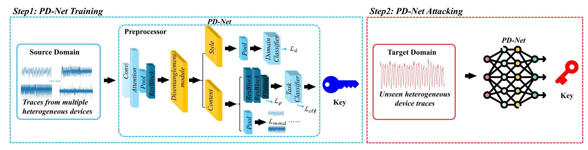
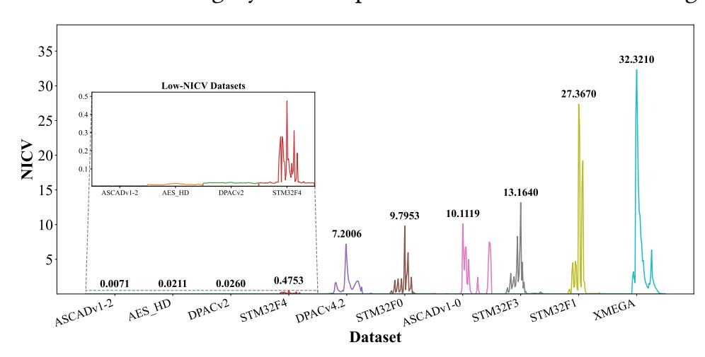
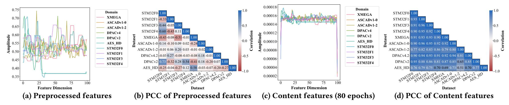
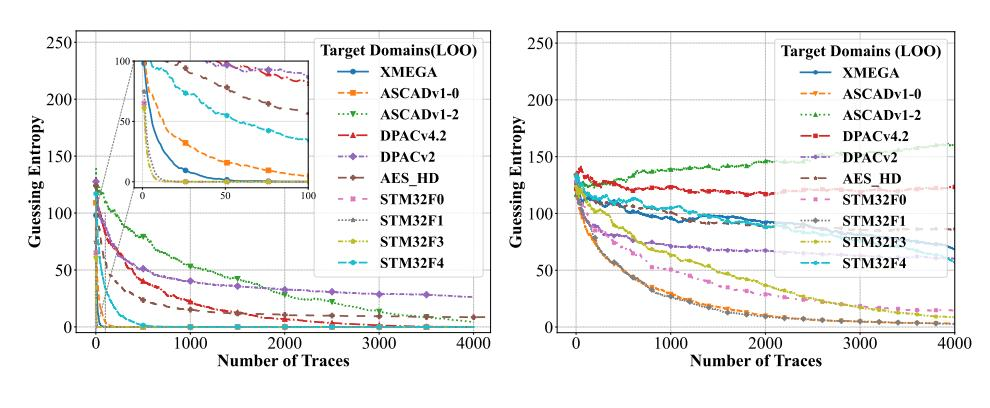
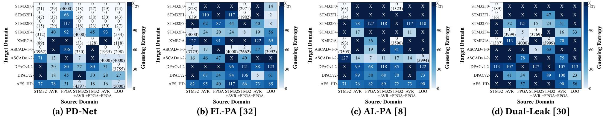
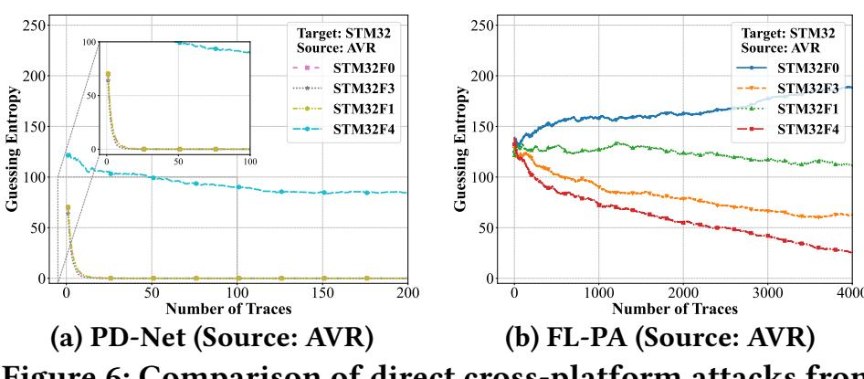

{0}------------------------------------------------

# PD-Net: Learning Device-Invariant Representations for Heterogeneous Cross-Device Side-Channel Attacks

Dalin He<sup>1</sup> , Wei Cheng1,3 #, Yuejun Liu<sup>1</sup> #, Jingdian Ming<sup>1</sup> , Yongbin Zhou1,2 <sup>1</sup>School of Cyber Science and Engineering, Nanjing University of Science and Technology, Nanjing, China 2 Institute of Information Engineering, Chinese Academy of Sciences, Beijing, China <sup>3</sup>LTCI, Télécom Paris, Institut Polytechnique de Paris, Palaiseau, France {hedalin, wei.cheng, liuyuejun, mingjingdian, zhouyongbin}@njust.edu.cn

# ABSTRACT

Heterogeneous cross-device side-channel attacks remain a critical yet underexplored challenge, as models trained on one device often fail to generalize across architectures. This paper presents PD-Net, a domain generalization framework that learns deviceinvariant features by disentangling algorithmic content from devicespecific style and aligning feature distributions using prototypical and Maximum Mean Discrepancy (MMD) losses. PD-Net is trained on nine heterogeneous source domains spanning ARM/AVR/FPGA and power/electromagnetic leakage modalities, including 32-bit ARM Cortex-M0/M1/M3/M4, 8-bit AVR ATmega (three series), and 128-bit Xilinx Virtex-5 FPGA, and evaluated in a zero-shot setting without target-specific adaptation. Experimental results demonstrate robust zero-shot cross-architecture transfers between 8-bit and 32-bit devices, with consistent gains over existing generalization and transfer-learning approaches. In particular, PD-Net delivers 29 successful attacks with only 10 divergences across 70 settings, markedly outperforming the state of the art, which succeeds in only 4 cases and diverges 19 times. To the best of our knowledge, this is the first domain generalization (DG)-based deep learning framework to systematically demonstrate practical zero-shot heterogeneous cross-device side-channel attacks.

# KEYWORDS

Side-Channel Attacks, Cross-Device Attack, Domain Generalization

# 1 INTRODUCTION

Side-Channel Attacks (SCAs) pose a critical threat to the physical security of embedded cryptographic implementations. By exploiting unintended physical leakages—such as power consumption [\[18\]](#page-6-0) or electromagnetic emissions [\[13\]](#page-6-1)—attackers can circumvent the mathematical guarantees of cryptographic algorithms [\[19\]](#page-6-2). Among various SCA techniques, profiled attacks represent the most powerful category [\[9,](#page-6-3) [27\]](#page-6-4). In this paradigm, an adversary first constructs a leakage model using a fully controlled profiling device, then deploys it to extract secret keys in target devices [\[27\]](#page-6-4).

The advent of Deep Learning (DL) has revolutionized SCA. Pioneering work by Maghrebi et al. demonstrated that DL models, particularly Convolutional Neural Networks (CNNs), could successfully break cryptographic implementations [\[25\]](#page-6-5). Subsequent research quickly established DL-SCA's potency: Cagli et al. showed its ability to defeat jitter-based countermeasures without manual preprocessing [\[6\]](#page-6-6), while Benadjila et al. achieved similar success against masking schemes, introducing the now-standard ASCAD dataset [\[1\]](#page-6-7). Further architectural refinements by Kim et al. [\[17\]](#page-6-8) and Zaid et al. [\[31\]](#page-6-9) enhanced model robustness, cementing DL-SCA's dominance.

However, these early successes operated under a restrictive classical threat model, assuming identical profiling and attack devices, often using traces from the same acquisition campaign. Practical scenarios violate this assumption due to physical variations in manufacturing processes [\[28\]](#page-6-10), measurement setups, and operating environments, creating significant domain discrepancies. This "portability problem" has emerged as a central challenge in recent SCA research. Das et al. quantitatively established this gap in their X-DeepSCA, demonstrating that inter-device variation substantially exceeds inter-key variation [\[11\]](#page-6-11). This challenge was further systematically analyzed in works like Bhasin et al. [\[3\]](#page-6-12). Consequently, single-device models severely overfit and fail when applied to different devices, even of identical models [\[7,](#page-6-13) [8,](#page-6-14) [11\]](#page-6-11).

Following Zhang et al.'s categorization [\[32\]](#page-6-15), this portability challenge can be classified by difficulty: homogeneous devices (same chip model, different instances) and heterogeneous devices (different manufacturers or instruction set architectures, e.g., 8-bit vs. 32-bit). Research has evolved distinct strategies for these two types, as summarized in Table [1.](#page-1-0)

For homogeneous devices, initial solutions required data from multiple profiling devices (X-DeepSCA [\[11\]](#page-6-11), MDM [\[3\]](#page-6-12)). To reduce this dependency, subsequent methods shifted to Unsupervised Domain Adaptation (UDA), requiring only a single profiling device. However, these UDA methods (CD-PA [\[7\]](#page-6-13), AL-PA [\[8\]](#page-6-14)) are transductive: as shown in Table [1,](#page-1-0) they require access to unlabeled target device data for a second fine-tuning stage. More recent efforts aim for true Domain Generalization (DG) within the homogeneous setting. Approaches like GPAM [\[5\]](#page-6-16), using Transformers, and DDPMbased augmentation [\[10\]](#page-6-17), using diffusion models, focus on building highly robust models that are trained once and can attack new identical devices directly. However, these DG methods have their own drawbacks: GPAM's Transformer architecture, while powerful, incurs very long training times and must be re-tuned for new device types [\[5\]](#page-6-16). The DDPM approach, while innovative, risks obscuring subtle leakage features with artificial noise, making it less effective against strongly protected implementations [\[10\]](#page-6-17).

For the more difficult heterogeneous problem, development followed a similar path. FL-PA achieved the first success by using frequency-domain analysis to bridge the gap between PIC and AVR microcontrollers [\[32\]](#page-6-15). This was followed by transductive UDA methods designed for different ISAs, such as MTL-SCA (requiring labeled target data for meta-transfer) [\[29\]](#page-6-18) and Dual-Leak (using unlabeled target data for active learning) [\[30\]](#page-6-19), both of which demonstrated attacks between ARM and AVR architectures.

Despite their effectiveness, these state-of-the-art UDA methods—whether for homogeneous (CD-PA, AL-PA) or heterogeneous (Dual-Leak) targets—share a critical practical limitation: they are

{1}------------------------------------------------

<span id="page-1-0"></span>**Table 1: Cross-Device Side-Channel Attack Methodologies.** 

| Device<br>Type           | Method             | Fine-tuning &<br>Label Status | Requires Target<br>Device Data? |
|--------------------------|--------------------|-------------------------------|---------------------------------|
| Homogeneous<br>Devices   | X-DeepSCA [11]     | No                            | No                              |
|                          | MDM [3]            | No                            | No                              |
|                          | CD-PA [7]          | Yes (Unlabeled)               | Yes                             |
|                          | AL-PA [8]          | Yes (Unlabeled)               | Yes                             |
|                          | GPAM [5]           | No                            | No                              |
|                          | DDPM [10]          | No                            | No                              |
| Heterogeneous<br>Devices | FL-PA [32]         | No                            | No                              |
|                          | MTL-SCA [29]       | Yes (Labeled)                 | Yes                             |
|                          | Dual-Leak [30]     | Yes (Unlabeled)               | Yes                             |
|                          | PD-Net (This work) | No                            | No                              |

transductive, requiring access to target device data during the attack phase [7, 8, 30]. In this paper, we refer to these transductive methods, which require target domain data for fine-tuning, as *One-shot* or *Few-shot* attacks. This increases attack complexity and is infeasible in many scenarios. While recent DG work has addressed this for homogeneous devices (GPAM, DDPM), a true zero-shot attack for heterogeneous devices remains an open challenge. We advocate for a paradigm shift to solve this specific problem: a model trained *inductively* on source domains that can attack an unseen, architecturally different target without requiring any access to the target's data for fine-tuning. This inductive paradigm, which operates without any target domain data, is what we define as a *Zero-Shot* attack.

We posit that true heterogeneous generalization is achievable through "weak universality". While devices differ in architecture and ISA, the core task (e.g., classifying AES S-box values) remains identical. Recent work by Karayalcin et al. [16] provides compelling evidence for this hypothesis, discovering that "emergent identical structures" appear in DL-SCA models trained on different implementations and even across physical domains (power vs. EM). This suggests that models solving identical tasks converge to similar internal representations.

Building on this insight, we propose PD-Net, the first Domain Generalization framework specifically designed for heterogeneous, *zero-shot* SCA. Our approach employs explicit feature disentanglement by training on multiple diverse source devices. The model learns to decompose trace features into: (1) Content Features ( $F_c$ ), capturing domain-invariant cryptographic leakage, and (2) Style Features ( $F_s$ ), isolating device-specific artifacts. We implement this through a multi-task objective: (1) a Classification Loss ensures  $F_c$  retains cryptographic relevance; (2) a Domain Classifier Loss forces  $F_s$  to absorb device-specific information; and (3) distributionalignment losses (by both Maximum Mean Discrepancy and Prototypical) enforce convergence of  $F_c$  representations across all source devices, creating a truly generalized leakage model.

Our main contributions are as follows:

- We propose PD-Net, the first Domain Generalization framework for SCA that learns shared, universal features to enable heterogeneous, *zero-shot* attacks.
- We establish and validate the existence of generalizable sidechannel features across diverse architectures, evaluated on five self-acquired datasets (32-bit ARM Cortex-M0/M1/M3/M4, 8-bit AVR) and public benchmarks (8-bit DPACv4.2, 8-bit ASCADv1).

• We demonstrate the first successful mutual heterogeneous cross-device attacks (32-bit ARM Cortex M-series vs. 8-bit AVR-series) where Guessing Entropy (GE) reaches 0 in our experimental setup, proving our framework's practical efficacy.

# 2 BACKGROUND

This section examines the "portability problem" in SCA and tracks the evolution of existing mitigation approaches. We then formalize Domain Generalization as a superior paradigm, establishing the theoretical framework for our proposed methodology.

# 2.1 The SCA Portability Problem

Profiling-based SCAs rely on the assumption that the leakage distribution  $p(x \mid v)$  of a sensitive intermediate value v remains consistent between profiling and attack devices. In practice, this assumption rarely holds. Physical measurements are influenced not only by the cryptographic operation but also by device-specific and setup-specific factors such as analog front-end characteristics, clocking behavior, instruction timing, and microarchitectural execution patterns.

These sources of variation cause the conditional leakage distributions of two devices  $D_i$  and  $D_j$  to differ,

$$p_{D_i}(x \mid v) \neq p_{D_i}(x \mid v), \tag{1}$$

even when both execute the same algorithm. As a result, deep-learning models trained on a single device tend to entangle task-relevant leakage with device-specific artifacts. When the device changes, the latter component shifts while the former remains subtle, leading the model to overfit to the profiling device and fail on the target.

This work adopts the perspective that portability requires explicitly isolating the cryptographic, device-invariant content of the leakage from device-dependent style. By learning a representation that suppresses device-specific factors and aligns the invariant component across multiple source devices, a model can generalize to previously unseen—and even architecturally different—targets without requiring target traces.

## 2.2 Domain Generalization

To transcend the limitations of transductive approaches, we advocate for Domain Generalization (DG) as a more practical and robust paradigm. DG is an inductive learning framework that trains a model on multiple diverse source domains  $S = \{D_{S_1}, ..., D_{S_N}\}$  to directly generalize to completely unseen *target domains*  $D_T$ , without requiring any access to target data during training or deployment.

The formal objective of DG is to learn a model f that minimizes the empirical risk across all source domains:

$$\min_{f} \frac{1}{N} \sum_{i=1}^{N} \mathbb{E}_{(x,y) \sim D_{S_i}} \left[ \mathcal{L}(f(x), y) \right]$$
 (2)

where  $\mathcal{L}$  denotes the task-specific loss function. Established DG methodologies typically encompass data augmentation [33], domain alignment [14, 22], and meta-learning techniques [12, 21].

Our work adopts the more principled approach of Learning Disentangled Representations [15]. This framework decomposes the feature representation F into two orthogonal components: a

{2}------------------------------------------------

<span id="page-2-0"></span>

Figure 1: PD-Net framework with training and attacking phases. Note that we insist on zero-shot in this context, with zero overlap between traces in the source domain and the target domain.

domain-invariant content space  $F_c$  that captures task-relevant features, and a domain-specific style space  $F_s$  that encodes domain-specific artifacts. By exclusively utilizing the invariant content features  $F_c$  for classification, the resulting model achieves inherent robustness to domain shifts, enabling true zero-shot generalization.

## 3 METHODOLOGY

The fundamental challenge in cross-device side-channel attacks is the "portability" problem: models trained on profiling devices (source domains) fail when deployed on target devices (target domains) due to statistical discrepancies in physical leakages. These domain shifts stem from manufacturing variations, disparate noise levels, and measurement setup differences, creating significant barriers to practical deployment.

To address this challenge, we propose PD-Net, a novel framework based on Multi-Source Domain Generalization (MS-DG) that enables heterogeneous zero-shot attacks. Unlike conventional approaches that train on single devices and hope for generalization, our method systematically learns from multiple diverse source domains. The core innovation lies in feature disentanglement, which explicitly separates device-specific *style* features from universal, leakage-bearing *content* features.

## 3.1 Overall Framework

Our methodology operates through two distinct phases: the multidomain training phase and the black-box attack phase.

- 1) Training Phase: As depicted in Fig. 1 (Step 1), PD-Net is trained using labeled traces from N diverse source domains ( $\mathcal{D}_s = \{\mathcal{D}_1, ..., \mathcal{D}_N\}$ ). The architecture is explicitly designed to disentangle input features into two orthogonal latent spaces: a Content Space enforced to be domain-invariant, and a Style Space capturing domain-specific characteristics. This separation is achieved through our multi-loss optimization strategy that will be detailed in Section 3.3.
- 2) Attack Phase: As shown in Fig. 1 (Step 2), the attack phase targets an Unseen Target Domain ( $\mathcal{D}_t$ ) excluded from training. Crucially, we discard the Style branch and deploy only the optimized content pathway—comprising the Preprocessor, Content Encoder, and Task Classifier. This specialized network processes target traces directly to recover secret keys, requiring no fine-tuning or labeled target data, thus enabling true *zero-shot* generalization.

# 3.2 PD-Net Architecture and Disentanglement

As depicted in Fig. 1, the PD-Net architecture comprises five key components designed for effective feature disentanglement. Let

x denote an input trace with the class label y (e.g., output of the S-box) and the domain label d.

- (1) **Preprocessor** ( $E_p$ ): A shared feature extractor composed of Convolutional, Attention, and Residual layers that maps raw traces to initial representations:  $f_p = E_p(x)$ .
- (2) **Disentanglement Module:** This critical module bifurcates the feature stream into parallel paths:
  - Content Encoder ( $E_{dis\_c}$ ): Generates raw content features  $f_{c\_raw} = E_{dis\_c}(f_p)$
  - **Style Encoder** ( $E_{dis\_s}$ ): Produces raw style features  $f_{s\_raw} = E_{dis\_s}(f_p)$
- (3) **Content Feature Extractor** ( $E_{c\_feat}$ ): A series of Res-Blocks that refine raw content features into final, high-level content representations:  $f_c = E_{c\_feat}(f_{c\_raw})$ .
- (4) **Task Classifier** ( $C_t$ ): This classifier predicts secret key labels y exclusively from final content features  $f_c$ . The classifier can be built upon the ASCAD dataset's mlp\_best architecture [1].
- (5) **Domain Classifier** ( $C_d$ ): A dedicated classifier that predicts domain labels d solely from pooled style features  $f_s = Pool(f_{s \ raw})$ .

The architectural design of PD-Net is grounded in the core observation that side-channel traces amalgamate both cryptographic-relevant information (content) and device-specific artifacts (style). Our framework is specifically constructed to disentangle these components through dedicated processing pathways. This bifurcated structure enforces a deliberate separation of features, where the content pathway is guided to preserve only the leakage patterns essential for key recovery, while the style pathway is mandated to absorb the distracting domain-specific variations that typically degrade cross-device performance.

# <span id="page-2-1"></span>3.3 Multi-Loss Optimization for Disentanglement in PD-Net

To enforce proper feature disentanglement, we jointly optimize four complementary loss functions that guide the Content and Style encoders toward their respective objectives.

1) Task Classification Loss ( $\mathcal{L}_{clf}$ ): This primary objective ensures the content pathway ( $E_p \to E_{dis\_c} \to E_{c\_feat} \to C_t$ ) accurately captures leakage-relevant information. We employ Cross-Entropy loss between predictions  $\hat{y} = C_t(f_c)$  and true labels y:

$$\mathcal{L}_{clf} = \mathbb{E}_{(x,y) \sim \mathcal{D}_s} [\mathcal{L}_{ce}(C_t(E_{c\ feat}(E_{dis\ c}(E_p(x)))), y)]. \tag{3}$$

2) **Domain Classification Loss** ( $\mathcal{L}_d$ ): This loss trains the style

{3}------------------------------------------------

pathway ( $E_p \rightarrow E_{dis\_s} \rightarrow C_d$ ) to excel at device identification, ensuring style features capture domain-specific characteristics:

$$\mathcal{L}_d = \mathbb{E}_{(x,d) \sim \mathcal{D}_s} [\mathcal{L}_{ce}(C_d(Pool(E_{dis\_s}(E_p(x)))), d)]. \tag{4}$$

The simultaneous optimization of  $\mathcal{L}_{clf}$  and  $\mathcal{L}_{d}$  creates a competitive dynamic that drives feature separation: leakage information flows to the content path for task resolution, while device-specific artifacts route to the style path for domain identification.

3) Prototypical Loss ( $\mathcal{L}_p$ ): To reinforce content space invariance, we introduce a prototypical loss that encourages final content features  $f_c$  from all domains to cluster around learned class-specific prototypes  $\{p_k\}_{k=1}^K$ . This loss is calculated using the Smooth L1 distance between the feature  $f_c$  and its class prototype  $p_u$ :

$$\mathcal{L}_{p} = \mathbb{E}_{(x,y)\sim\mathcal{D}_{s}}[\mathcal{L}_{smooth}(f_{c}, p_{y})]. \tag{5}$$

4) Maximum Mean Discrepancy Loss ( $\mathcal{L}_{mmd}$ ): This crucial loss explicitly minimizes statistical distribution differences between content features from different source domains. Applied to pooled raw content features from domains  $\mathcal{D}_i$  and  $\mathcal{D}_j$ :

$$\mathcal{L}_{mmd} = MMD(\{f_{c\_pool}^i\}_{x_i \sim \mathcal{D}_i}, \{f_{c\_pool}^j\}_{x_j \sim \mathcal{D}_j}).$$
 (6)

Minimizing  $\mathcal{L}_{mmd}$  forces the Content Encoder to produce statistically indistinguishable representations across domains.

**Total Loss:** The composite objective function combines all losses with weighting hyperparameters  $\lambda_p$  and  $\lambda_{mmd}$ :

$$\mathcal{L}_{total} = \mathcal{L}_{clf} + \mathcal{L}_d + \lambda_p \mathcal{L}_p + \lambda_{mmd} \mathcal{L}_{mmd}. \tag{7}$$

This composite loss enforces our disentanglement strategy by jointly optimizing for task accuracy ( $\mathcal{L}_{clf}$ ), style isolation ( $\mathcal{L}_d$ ), and content invariance ( $\mathcal{L}_p$ ,  $\mathcal{L}_{mmd}$ ).

Summing up, Algorithm 1 outlines the complete PD-Net training procedure, implementing our multi-loss disentanglement strategy.

### 4 EXPERIMENTS

### 4.1 Dataset

To rigorously evaluate the generalization capabilities of our PD-Net, we established a comprehensive benchmark of 10 dataset tasks derived from 9 unique physical devices. This benchmark spans three distinct core architectures (ARM Cortex-M0/M3/M4, 8-bit AVR, and FPGA), two leakage modalities (Power and EM), and three different countermeasure levels (Unprotected, Boolean masking, and RSM masking). Table 2 provides an overview of these datasets.

Table 2: Overview of the Heterogeneous Datasets.

<span id="page-3-1"></span>

| Dataset (Device Class)   | Core Architecture | Leakage Type | Target Key  |
|--------------------------|-------------------|--------------|-------------|
| STM32F0 (STM32F0)        | ARM Cortex-M0     | Power        | 0x2E        |
| STM32F1 (STM32F1)        | ARM Cortex-M3     | Power        | 0x4F        |
| STM32F3 (STM32F3)        | ARM Cortex-M4     | Power        | 0x7E        |
| STM32F4 (STM32F4)        | ARM Cortex-M4     | Power        | 0x2B        |
| XMEGA (ATmega128D4)      | AVR 8-bit         | Power        | 0xD2        |
| ASCADv1 (ATmega8515)     | AVR 8-bit         | EM           | Byte0: 0x4D |
| 113C/1DV1 (11111cga0313) | TIVICO DIL        | LIVI         | Byte2: 0xE0 |
| DPACv4.2 (ATmega163)     | AVR 8-bit         | EM           | 0xEF        |
| DPACv2 (Xilinx Virtex-5) | FPGA              | Power        | 0x00        |
| AES_HD (Xilinx Virtex-5) | FPGA              | Power        | 0x2B        |

We use Normalized Inter-Class Variance (NICV) [4] to quantify signal heterogeneity of the raw traces captured from various devices. Figure 2 plots the top 70 NICV points for each dataset, revealing an immense domain shift. Peak values range from 32.32 (XMEGA)

# <span id="page-3-0"></span>Algorithm 1 PD-Net Training Procedure

```
Input: Source domain datasets \mathcal{D}_s = \{\mathcal{D}_1, ..., \mathcal{D}_N\}, Loss
     weights \lambda_p, \lambda_{mmd}, Epochs E
     Output: Optimized content pathway \theta_{content}
 1: Initialize all parameters \theta and prototypes P
 2: for epoch = 1 to E do
           for each training step do
 3:
                 Sample domains \mathcal{D}_i, \mathcal{D}_i \sim \mathcal{D}_s
 4:
                 Sample batches (x_i, y_i, d_i) \sim \mathcal{D}_i, (x_i, y_i, d_i) \sim \mathcal{D}_i
 5:
                 x \leftarrow [x_i, x_i]; y \leftarrow [y_i, y_i]; d \leftarrow [d_i, d_i]
 6:
                /* Forward Pass & Feature Disentanglement */
                 f_c, f_{c pool} \leftarrow \text{ContentPathway}(x)
 7:
                f_s \leftarrow \text{StylePathway}(x); \hat{y} \leftarrow C_t(f_c); \hat{d} \leftarrow C_d(f_s)
 8:
                /* Compute All Four Losses */
                 \mathcal{L}_{clf} \leftarrow \mathcal{L}_{CE}(\hat{y}, y); \quad \mathcal{L}_{d} \leftarrow \mathcal{L}_{CE}(d, d)
 9:
                 \mathcal{L}_p \leftarrow \mathcal{L}_{SmoothL1}(f_c, P[y])
10:
                 f_{c\_pool}^i, f_{c\_pool}^j \leftarrow \text{split}(f_{c\_pool})
11:
                 \mathcal{L}_{mmd} \leftarrow MMD(f_{c\_pool}^{i}, f_{c\_pool}^{j})
12:
                /* Backward Pass */
                 \mathcal{L}_{total} \leftarrow \mathcal{L}_{clf} + \mathcal{L}_d + \lambda_p \mathcal{L}_p + \lambda_{mmd} \mathcal{L}_{mmd}
13:
                 Update \theta and P via gradient descent
14:
           end for
15:
    end for
16:
17: \theta_{content} \leftarrow \text{GetContentPathwayParams}(\theta)
18: return \theta_{content}
```

down to 0.0071 (ASCADv1-2), highlighting the significant challenge in magnitude and alignment for cross-device generalization.

Figure 3 illustrates our feature disentanglement. The initial Preprocessor features (Fig. 3a) and their Pearson correlation coefficient (PCC) [2] matrix (Fig. 3b) show strong domain-specific correlations. After 80 training epochs, the disentangled Content features (Fig. 3c) are more aligned, and their PCC matrix (Fig. 3d) confirms that interdomain correlations are significantly reduced, indicating successful domain-invariant feature extraction.

Our benchmark comprises three categories. The first includes five self-collected datasets (STM32F0-F4 and XMEGA) using Chip-Whisperer platform with a fixed clock frequency and 29.4912 MS/s sampling rate, each running TinyAES implementation [20]. We collected 20,000 power traces per device, which were split into 16,000 traces for training/validation and 4,000 traces for attacking.

The second category features public EM datasets with masking

<span id="page-3-2"></span>

Figure 2: NICV comparison of all ten datasets. Note that the peak values of NICV vary largely from 0.0071 to 32.32.

{4}------------------------------------------------

<span id="page-4-0"></span>

Figure 3: Visualization of feature distributions and correlations before/after the content feature extraction.

<span id="page-4-1"></span>

(a) PD-Net LOO performance

(b) FL-PA LOO performance

Figure 4: Leave-One-Out (LOO) generalization comparison between PD-Net and FL-PA.

countermeasures. We split ASCADv1 (sampled at 2 GS/s, 4 MHz clock) into two 700-point tasks: ASCADv1-0 (unprotected Byte 0) and ASCADv1-2 (Boolean masked Byte 2). We also include DPACv4.2 (500 MS/s, 3.579 MHz clock) with RSM masking [26]. For the ASCADv1 datasets (v1-0 and v1-2), we utilize 16,000 traces for training/validation and 5,000 traces for attacking, while for the DPACv4.2 dataset, we use 15,000 traces for training/validation and 5,000 for attacking.

The third category includes hardware AES implementations. For DPACv2 (5 GS/s, 24 MHz clock), we utilize 20,000 traces, split into 16,000 for training/validation and 4,000 for attacking. For AES\_HD, we use 20,000 traces, similarly split into 15,000 for training/validation and 5,000 for attacking. For the hardware AES implementations, we target the last-round S-box output byte. For all other tasks, we target the first-round S-box output byte. In both cases, the problem is formulated as a 256-class classification task.

### 4.2 Setups

We employ Guessing Entropy (GE) as the primary security metric. The reported GE is the average rank of the correct key over 200 independent attack runs.

Our proposed model features a deep Convolutional Neural Network (CNN) as the feature extractor, which incorporates residual blocks and a self-attention mechanism. A key component is an adaptive pooling layer, enabling the model to process input traces of arbitrary length. All input traces are Z-score standardized.

The shared task classifier is a Multi-Layer Perceptron (MLP). It processes the features that have been isolated by the disentanglement module and further refined through subsequent residual layers. The MLP consists of five hidden layers, each containing 200 neurons with ReLU activation, followed by a final output layer of 256 neurons.

Models are trained for 80 epochs using a batch size of 128. We

utilize the AdamW optimizer with a CosineAnnealingWarmRestarts learning rate scheduler [23, 24]. The training starts with an initial learning rate of  $1 \times 10^{-4}$  and a minimum learning rate ( $\eta_{min}$ ) of  $1 \times 10^{-5}$ . All experiments are implemented using PyTorch 2.8 and Python 3.12, and are conducted on a workstation equipped with an Intel<sup>®</sup> Xeon Platinum 8470Q @2.1GHz CPU and an NVIDIA GeForce RTX 5090 GPU.

#### 4.3 Results

We conduct a comprehensive evaluation of PD-Net's zero-shot generalization capabilities across our heterogeneous benchmark. This evaluation assesses the model's performance when trained on various combinations of source domains and attacking unseen target domains.

We first present the results of our primary evaluation, a Leave-One-Out (LOO) test applied to each of the 10 datasets. In this scenario, one dataset is held out as the unseen target domain, while the model is trained on the remaining nine. As shown in Fig. 4, the comparison is stark. PD-Net (Fig. 4a) generalizes effectively: High-NICV devices (XMEGA, STM32F0, F3) converge rapidly, with GE reaching zero within 70 traces. Significantly, the model successfully breaks public datasets captured using different leakage modalities. It breaks ASCADv1-0 (an unprotected EM dataset) and DPACv4.2 (a masked EM dataset), confirming that our learned features transcend not only device architecture but also the physical leakage modality itself. In sharp contrast, FL-PA's LOO performance (Fig. 4b) fails systemically. While some targets show a steady decline (e.g., STM32F1, F3), most require thousands of traces, and many (like ASCADv1-2 or DPACv4.2) fail to converge at all.

Next, we evaluate generalization performance using the 70-experiment benchmark, which relies on specific source domain combinations. For this, we group our 10 datasets into three architectural pools: STM32 (four 32-bit ARMs: STM32F0/F1/F3/F4), AVR (four 8-bit cases: XMEGA, ASCADv1-0, ASCADv1-2, DPACv4.2), and FPGA (two hardware cases: DPACv2, AES\_HD). As shown in Fig. 5, this benchmark tests seven distinct source combinations—derived from these pools—against all 10 target domains. When a target domain was part of the source pool being tested (e.g., attacking STM32F0 using the 'STM32' pool), it was held out, and the model was trained on the remaining datasets from that pool.

We compare PD-Net against three state-of-the-art (SOTA) methods selected for their distinct approaches:

• FL-PA [32]: A pioneering signal-processing-based method for heterogeneous cross-device attacks that, like our DG method, does not require target-domain data.

{5}------------------------------------------------

<span id="page-5-0"></span>

Figure 5: Generalization heatmap comparison across seven source domain combinations. Note that 'X' denotes a failed attack (loss divergence), color indicates minimum GE, and numbers in parentheses show traces required.

<span id="page-5-1"></span>

Figure 6: Comparison of direct cross-platform attacks from 8-bit (AVR) to 32-bit (STM32).

- AL-PA [8]: A UDA method using an adversarial mechanism to find feature commonalities, a concept relevant to invariant feature learning.
- **Dual-Leak** [30]: An unsupervised fine-tuning (UDA) method for heterogeneous cross-device attacks.

We implemented these baselines strictly following the architectural details and hyperparameters reported in the respective original papers. The results on our 70-experiment benchmark (Fig. 5) provide a stark quantitative comparison. We define 'X' as a model divergence (loss divergence), indicating a complete failure to learn features, which is distinct from a mere high-GE failure. PD-Net (Fig. 5a) demonstrates robust generalization, achieving 29 successful (GE = 0) attacks while only diverging in 10 scenarios. In contrast, the baseline methods fail systemically: FL-PA [32] (Fig. 5b) has only 4 successful attacks and diverges 19 times. The UDA-based methods, AL-PA [8] (Fig. 5c) and Dual-Leak [30] (Fig. 5d), are unsuitable for this heterogeneous challenge, achieving only 6 and 4 successes, respectively, while exhibiting a massive 30 and 35 divergences. This highlights that their fine-tuning mechanisms cannot bridge the heterogeneous gap and frequently fail to converge.

To further scrutinize cross-architecture capabilities, Fig. 6 shows a challenging 8-bit (AVR only) to 32-bit (all STM32) attack. The performance gap is significant. PD-Net (Fig. 6a) succeeds remarkably, rapidly breaking STM32F0, F1, and F3, with GE converging to zero almost immediately (within 50 traces, per inset). Even the low-NICV STM32F4 target shows a steady GE decline. In stark contrast, FL-PA (Fig. 6b) fails completely within 4000 traces. Its GE curves for all STM32 targets remain high, with STM32F0 even increasing, indicating its signal-processing approach cannot bridge the fundamental architectural gap.

### 5 DISCUSSIONS

The main contribution of this work is the discovery of a bidirectional, universal leakage representation across different hardware architectures. Our feature disentanglement framework reveals a

"weak universality" in core leakage patterns, separable from device-specific artifacts—a breakthrough compared to UDA methods that require target data adaptation (aka. *zero-shot* vs. *few-shot* settings).

Moreover, the LOO evaluation confirms PD-Net's effectiveness against masked implementations (DPACv4.2, ASCADv1-2) and hardware targets (AES\_HD), though convergence is slower than on unprotected software. This suggests a reduced signal-to-noise ratio in the invariant features ( $F_c$ ) for complex implementations. We posit this reflects a data-scaling limitation rather than a fundamental barrier. Incorporating more diverse source domains—including varied hardware AES implementations and masking schemes—could evolve PD-Net into a foundational expert model capable of rapid zero-shot convergence even on challenging targets.

Finally, regarding implementation specifics, we determined the loss weight hyperparameters to  $\lambda_p=8$  and  $\lambda_{mmd}=20$  via grid search. Internal ablation studies confirm the effectiveness of these components: Removing  $\mathcal{L}_d$  or  $\mathcal{L}_{mmd}$  leads to convergence failure on masked and low-SNR datasets, and results in unsuccessful attacks across the overall LOO benchmark. In addition, we fixed the latent feature dimension to 100. This fixed dimensionality serves a critical structural purpose: It establishes a unified feature space via adaptive pooling, enabling the efficient computation of distribution alignment losses across heterogeneous traces with distinct lengths. We leave hyperparameter optimization to future work, e.g., through automated methods or higher-dimensional representations to unlock further gains.

## 6 CONCLUSIONS

This paper addresses the critical portability problem in heterogeneous DL-SCA in a zero-shot setting. We propose PD-Net, the first DG framework that, unlike prior UDA methods, requires no access to target device data. By training on multiple diverse source devices, PD-Net employs a feature disentanglement mechanism to isolate universal, domain-invariant leakage features. Our experiments establish the first practical zero-shot attacks across different bit-width architectures (ARM vs. AVR vs. FPGA), demonstrating that a deep learning model can be trained purely on source devices and then directly attack an unseen heterogeneous target with high efficacy. Notably, PD-Net removes the need for target-specific adaptation, and paves the way for fully portable, architecture-agnostic SCA models that remain effective.

# **ACKNOWLEDGMENTS**

This work is supported in part by the National Natural Science Foundation of China (No.U2336205, No.62502207, No.62302226, No.62302224), and Yunnan Provincial New R&D Institution Cultivation Project (202404BQ040148).

{6}------------------------------------------------

# REFERENCES

- <span id="page-6-7"></span>[1] Ryad Benadjila, Emmanuel Prouff, Rémi Strullu, Eleonora Cagli, and Cécile Dumas. 2020. Deep learning for side-channel analysis and introduction to ASCAD database. Journal of Cryptographic Engineering 10, 2 (2020), 163–188.
- <span id="page-6-28"></span>[2] Jacob Benesty, Jingdong Chen, Yiteng Huang, and Israel Cohen. 2009. Pearson Correlation Coefficient. In Noise Reduction in Speech Processing. Springer, 1–4.
- <span id="page-6-12"></span>[3] Shivam Bhasin, Anupam Chattopadhyay, Annelie Heuser, Dirmanto Jap, Stjepan Picek, and Ritu Ranjan. 2020. Mind the Portability: A Warriors Guide through Realistic Profiled Side-channel Analysis. In NDSS 2020 - Network and Distributed System Security Symposium. 1–14.
- <span id="page-6-27"></span>[4] Shivam Bhasin, Jean-Luc Danger, Sylvain Guilley, and Zakaria Najm. 2014. NICV: Normalized inter-class variance for detection of side-channel leakage. In 2014 International Symposium on Electromagnetic Compatibility, Tokyo. IEEE, 310–313.
- <span id="page-6-16"></span>[5] Elie Bursztein, Luca Invernizzi, Karel Král, Daniel Moghimi, Jean-Michel Picod, and Marina Zhang. 2024. Generalized Power Attacks against Crypto Hardware using Long-Range Deep Learning. IACR Transactions on Cryptographic Hardware and Embedded Systems – CHES 2024 (2024), 472–499.
- <span id="page-6-6"></span>[6] Eleonora Cagli, Cécile Dumas, and Emmanuel Prouff. 2017. Convolutional Neural Networks with Data Augmentation Against Jitter-Based Countermeasures. In Cryptographic Hardware and Embedded Systems – CHES 2017. Springer, 45–68.
- <span id="page-6-13"></span>[7] Pei Cao, Chi Zhang, Xiangjun Lu, and Dawu Gu. 2021. Cross-Device Profiled Side-Channel Attack with Unsupervised Domain Adaptation. IACR Transactions on Cryptographic Hardware and Embedded Systems – CHES 2021 (2021), 27–56.
- <span id="page-6-14"></span>[8] Pei Cao, Hongyi Zhang, Dawu Gu, Yan Lu, and Yidong Yuan. 2022. AL-PA: Cross-Device Profiled Side-Channel Attack using Adversarial Learning. In Proceedings of the 59th ACM/IEEE Design Automation Conference (DAC). ACM, 691–696.
- <span id="page-6-3"></span>[9] Suresh Chari, Josyula R Rao, and Pankaj Rohatgi. 2002. Template Attacks. In Cryptographic Hardware and Embedded Systems - CHES 2002. Springer, 13–28.
- <span id="page-6-17"></span>[10] Yimeng Chen, Bo Wang, Changshan Su, Ao Li, Yuxing Tang, and Gen Li. 2025. Enhancing Model Generalization for Efficient Cross-Device Side-Channel Analysis. IEEE Transactions on Information Forensics and Security 20 (2025), 10114–10129.
- <span id="page-6-11"></span>[11] Debayan Das, Anupam Golder, Josef Danial, Santosh Ghosh, Arijit Raychowdhury, and Shreyas Sen. 2019. X-DeepSCA: Cross-Device Deep Learning Side Channel Attack. In Proceedings of the 56th Annual Design Automation Conference (DAC). ACM, 1–6.
- <span id="page-6-24"></span>[12] Chelsea Finn, Pieter Abbeel, and Sergey Levine. 2017. Model-Agnostic Meta-Learning for Fast Adaptation of Deep Networks. In Proceedings of the 34th International Conference on Machine Learning, ICML. PMLR, 1126–1135.
- <span id="page-6-1"></span>[13] Karine Gandolfi, Christophe Mourtel, and Francis Olivier. 2001. Electromagnetic Analysis: Concrete Results. In Cryptographic Hardware and Embedded Systems — CHES 2001. Springer, 251–261.
- <span id="page-6-22"></span>[14] Yaroslav Ganin, Evgeniya Ustinova, Hana Ajakan, Pascal Germain, Hugo Larochelle, François Laviolette, Mario March, and Victor Lempitsky. 2016. Domain-Adversarial Training of Neural Networks. Journal of machine learning research 17, 59 (2016), 1–35.
- <span id="page-6-26"></span>[15] Xun Huang, Ming-Yu Liu, Serge Belongie, and Jan Kautz. 2018. Multimodal Unsupervised Image-to-image Translation. In Proceedings of the European Conference on Computer Vision (ECCV). 172–189.
- <span id="page-6-20"></span>[16] Sengim Karayalcin, Marina Krček, and Stjepan Picek. 2025. Interpreting Emergent Features in Deep Learning-based Side-channel Analysis. In The Thirty-ninth Annual Conference on Neural Information Processing Systems, NeurIPS.
- <span id="page-6-8"></span>[17] Jaehun Kim, Stjepan Picek, Annelie Heuser, Shivam Bhasin, and Alan Hanjalic. 2019. Make Some Noise. Unleashing the Power of Convolutional Neural Networks for Profiled Side-channel Analysis. IACR Transactions on Cryptographic Hardware and Embedded Systems - CHES 2019 (2019), 148–179.
- <span id="page-6-0"></span>[18] Paul Kocher, Joshua Jaffe, and Benjamin Jun. 1999. Differential Power Analysis. In Advances in Cryptology — CRYPTO' 99. Springer, 388–397.
- <span id="page-6-2"></span>[19] Paul C. Kocher. 1996. Timing Attacks on Implementations of Diffie-Hellman, RSA, DSS, and Other Systems. In Advances in Cryptology — CRYPTO '96. Springer, 104–113.
- <span id="page-6-29"></span>[20] kokke. 2019. tiny-AES-c. [https://github.com/kokke/tiny-AES-c.](https://github.com/kokke/tiny-AES-c)
- <span id="page-6-25"></span>[21] Da Li, Yongxin Yang, Yi-Zhe Song, and Timothy Hospedales. 2018. Learning to Generalize: Meta-Learning for Domain Generalization. In Proceedings of the AAAI conference on artificial intelligence, AAAI, Vol. 32.
- <span id="page-6-23"></span>[22] Mingsheng Long, Yue Cao, Jianmin Wang, and Michael Jordan. 2015. Learning Transferable Features with Deep Adaptation Networks. In Proceedings of the 32nd International Conference on Machine Learning, ICML. PMLR, 97–105.
- <span id="page-6-31"></span>[23] Ilya Loshchilov and Frank Hutter. 2017. SGDR: Stochastic Gradient Descent with Warm Restarts. In International Conference on Learning Representations.
- <span id="page-6-32"></span>[24] Ilya Loshchilov and Frank Hutter. 2019. Decoupled Weight Decay Regularization. In International Conference on Learning Representations.
- <span id="page-6-5"></span>[25] Houssem Maghrebi, Thibault Portigliatti, and Emmanuel Prouff. 2016. Breaking Cryptographic Implementations Using Deep Learning Techniques. In Security, Privacy, and Applied Cryptography Engineering. Springer, 3–26.
- <span id="page-6-30"></span>[26] Maxime Nassar, Youssef Souissi, Sylvain Guilley, and Jean-Luc Danger. 2012. RSM: A small and fast countermeasure for AES, secure against 1st and 2nd-order zero-offset SCAs. In 2012 Design, Automation & Test in Europe Conference &

- Exhibition (DATE). IEEE, 1173–1178.
- <span id="page-6-4"></span>[27] Stjepan Picek, Guilherme Perin, Luca Mariot, Lichao Wu, and Lejla Batina. 2023. SoK: Deep Learning-based Physical Side-channel Analysis. ACM Comput. Surv. 55, 11 (2023).
- <span id="page-6-10"></span>[28] Mathieu Renauld, François-Xavier Standaert, Nicolas Veyrat-Charvillon, Dina Kamel, and Denis Flandre. 2011. A Formal Study of Power Variability Issues and Side-Channel Attacks for Nanoscale Devices. In Advances in Cryptology – EUROCRYPT 2011. Springer, 109–128.
- <span id="page-6-18"></span>[29] Honggang Yu, Haoqi Shan, Maximillian Panoff, and Yier Jin. 2021. Cross-Device Profiled Side-Channel Attacks using Meta-Transfer Learning. In 2021 58th ACM/IEEE Design Automation Conference (DAC). IEEE, 703–708.
- <span id="page-6-19"></span>[30] Honggang Yu, Shuo Wang, Haoqi Shan, Maximillian Panoff, Michael Lee, Kaichen Yang, and Yier Jin. 2023. Dual-Leak: Deep Unsupervised Active Learning for Cross-Device Profiled Side-Channel Leakage Analysis. In 2023 IEEE International Symposium on Hardware Oriented Security and Trust (HOST). IEEE, 144–154.
- <span id="page-6-9"></span>[31] Gabriel Zaid, Lilian Bossuet, Amaury Habrard, and Alexandre Venelli. 2020. Methodology for Efficient CNN Architectures in Profiling Attacks. IACR Transactions on Cryptographic Hardware and Embedded Systems - CHES 2020 2020, 1 (2020), 1–36.
- <span id="page-6-15"></span>[32] Fan Zhang, Bin Shao, Guorui Xu, Bolin Yang, Ziqi Yang, Zhan Qin, and Kui Ren. 2020. From Homogeneous to Heterogeneous: Leveraging Deep Learning based Power Analysis across Devices. In 2020 57th ACM/IEEE Design Automation Conference (DAC). IEEE, 1–6.
- <span id="page-6-21"></span>[33] Kaiyang Zhou, Yongxin Yang, Yu Qiao, and Tao Xiang. 2021. Domain Generalization with MixStyle. In 9th International Conference on Learning Representations, ICLR.