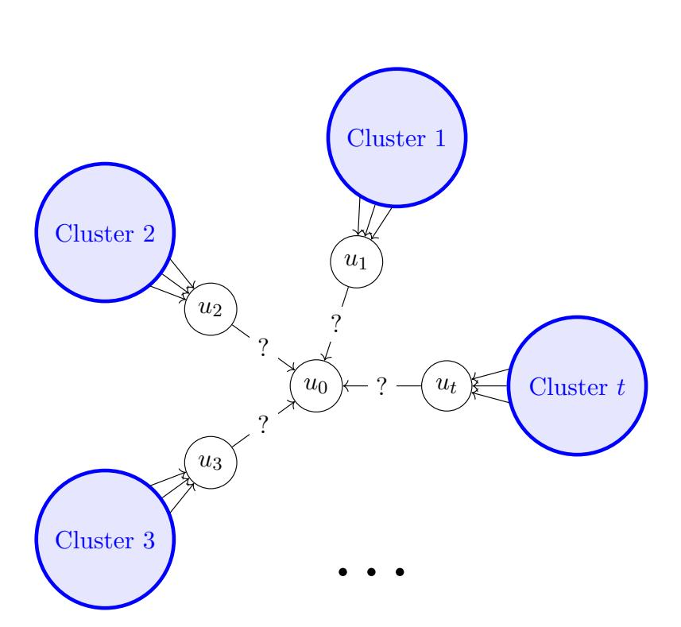
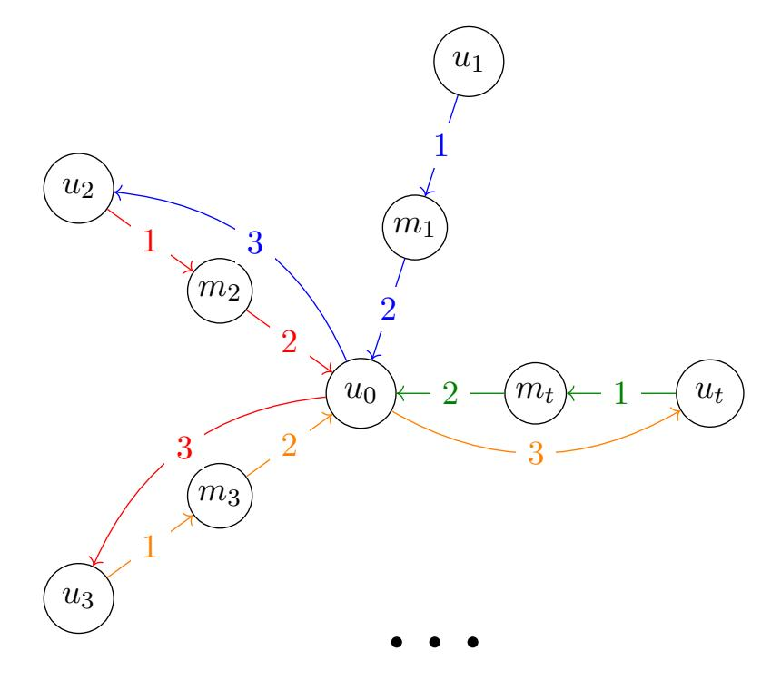

{0}------------------------------------------------

# Can Adaptive Communication Graphs Lower the Bottleneck Complexity of (Secure) Multiparty Computation?

Lisa Kohl<sup>∗</sup> Pierre Meyer † Divya Ravi ‡ Nicolas Resch§

#### Abstract

The bottleneck complexity of a (secure) multiparty computation protocol is one measure of its communication-efficiency. It captures how well the communication load is balanced, and is defined as the maximum communication complexity required by any one party within the protocol execution. Prior works on this topic restricted attention to protocols with fixed communication graphs, i.e., whether or not a given party communicates to another only depends on the round number. We demonstrate the power of adaptively choosing communication graphs by developing various bottleneck-efficient protocols, both with and without security. Done na¨ıvely, protocols with adaptive communication graphs can exploit unnatural tricks, such as "communicating with silence." To ensure our protocols are meaningful, we additionally stipulate that they should run correctly even in asynchronous networks (where we make no assumption on the adversarial message-delays other than being finite).

Bottleneck complexity of arbitrary functions. With fixed communication graphs, Boyle, Jain, Prabhakaran, and Yu (ICALP'18) established the existence of a function f : {0, 1} <sup>n</sup> → {0, 1} requiring Ω(n)-bit bottleneck complexity, which is matched by the trivial protocol of having all parties send their inputs to one party. By adaptively choosing communication graphs, we show that any function f : {0, 1} <sup>n</sup> → {0, 1} can be computed (securely) with bottleneck O(n/ log n) (which we prove is essentially optimal), even in asynchronous networks.

Bottleneck complexity of symmetric functions. Prior works have demonstrated that special classes of symmetric functions, such as additive [Eriguchi, Asiacrypt'23] or abelian [Keller, Orlandi, Paskin-Cherniavsky, Ravi, ITC'23] functions can be computed bottleneck-efficiently with fixed communication graphs. We both expand the class of symmetric functions achievable with low bottleneck complexity, as well as show how inputadaptive communication graphs can be leveraged to further reduce the bottleneck complexity of some of our protocols.

<sup>∗</sup>Cryptology Group, CWI Amsterdam. Research supported by a NWO (Dutch Research Council) grant with number VI.Veni.222.348 and by NWO Gravitation project QSC. Part of this work was conducted while the author was visiting the Simons Institute for the Theory of Computing.<lisa.kohl@cwi.nl>

<sup>†</sup>Research supported by the European Research Council (ERC) under the European Union's Horizon 2020 research and innovation programme under grant 101124977 (DECRYPSIS), and by a grant from the STIBO foundation. Part of this work was conducted while the author was visiting the Simons Institute for the Theory of Computing.<pierre.meyer@cs.au.dk>

<sup>‡</sup> Informatics Institute, University of Amsterdam. Research supported by a NWO (Dutch Research Council) grant with number VI.Veni.242.295 and by NWO Gravitation Project CiCS (Challenges in Cyber Security). <d.ravi@uva.nl>

<sup>§</sup> Informatics Institute, University of Amsterdam. Research supported in part by a NWO (Dutch Research Council) grant with number VI.Veni.222.347.<n.a.resch@uva.nl>

{1}------------------------------------------------

# Contents

| 1            | Introduction                                                     | 2  |
|--------------|------------------------------------------------------------------|----|
|              | 1.1 Adaptivity in protocols                                      | 3  |
|              | 1.2 Technical contributions                                      | 4  |
|              | 1.3 Open Problems                                                | 8  |
| 2            | Preliminaries                                                    | 9  |
|              | 2.1 Bottleneck complexity                                        | 9  |
|              | 2.2 Cryptography preliminaries                                   | 11 |
| 3            | Arbitrary functions                                              | 12 |
|              | 3.1 An $n/\log n$ upper bound                                    | 12 |
|              | 3.2 Complementary Lower Bounds                                   | 13 |
| 4            | Symmetric Functions                                              | 14 |
|              | 4.1 Permutation testing                                          | 15 |
|              | 4.2 Sorting                                                      | 20 |
|              | 4.2.1 A $O(\log(M) \cdot \log(n))$ -bottleneck sorting algorithm | 21 |
|              | 4.2.2 A $O(\log n \cdot \log M)$ -bottleneck galactic algorithm  | 26 |
|              | 4.3 Randomized reduction from sparse symmetric to additive       | 26 |
|              | 4.4 Secure Protocol for 1-Sparse Additive Functions              | 30 |
| $\mathbf{A}$ | Upper Bounds in the Liberal Communication Model                  | 35 |
| В            | Compiler using FHE                                               | 37 |
|              | B.1 Incremental FHE                                              | 37 |
|              | B.2 Our Compiler                                                 |    |
|              | B.3 Secure Protocols with Low Bottleneck Complexity              |    |
| $\mathbf{C}$ | Details on the Upper Bound for Arbitrary Functions               | 42 |

# <span id="page-1-0"></span>1 Introduction

We consider the design of protocols for solving computational tasks where the inputs are distributed over n parties. That is, there are parties  $P_1, \ldots, P_n$  given inputs  $x_1, \ldots, x_n \in D$ , respectively, and a function  $f: D^n \to \{0,1\}$ . At the end of the protocol, it should be that every party learns the value  $f(x_1, \ldots, x_n)$ . One can additionally require the protocol to be secure, which informally stipulates that the parties learn nothing by executing the protocol about the other parties inputs, beyond what they could infer just from their input and the function output.

In distributed computation protocols, typically the main cost metric under consideration is the total communication, measured in bits. While low communication is a natural desideratum, it does not distinguish between protocols requiring some parties to communication substantially more than others. Note that there is always a protocol which (insecurely) computes any function f with  $O(n \log |D|)$  communication by having each party send their input to a central "coordinator" node, who then computes the value  $f(x_1, \ldots, x_n)$ , and then transmits it back to all the other nodes. This protocol can also be made secure assuming fully-homomorphic encryption: the parties now send encryptions of their inputs, and the coordinator node can then apply the function value directly to the encrypted inputs.

<span id="page-1-1"></span> $<sup>^{1}</sup>$ Here, D is a finite set. One could additionally consider functions that output more than just a bit, but in this work we will, like prior work, restrict attention to the case of Boolean-valued functions.

{2}------------------------------------------------

Thus, we see that communication-"efficient" protocols may impose an onerous requirement on one party, even if on average parties do not have to communicate too much. Specifically, assuming the total communication is C, it could be that the average communication cost C/n per node (in a network with n nodes) is perfectly manageable. However, if some nodes must communicate Ω(C) bits of information, the protocol may in fact be completely impractical, especially in settings with lightweight devices (limiting the computational power of the nodes) or in large-scale distributed settings (where n is very large; if every party must contribute to the computation, this forces C ≥ n).

In response to this, Boyle et al. [\[BJPY18\]](#page-33-0) proposed studying and designing protocols with small bottleneck complexity, defined as the maximum communication (received and transmitted) by any node in the protocol. We will refer to a protocol as bottleneck efficient if the bottleneck complexity is o(n log |D|) – i.e., if it improves asymptotically on the protocol sketched above with a central node computing the function value given all the other inputs. Perhaps disappointingly, Boyle et al. [\[BJPY18,](#page-33-0) Theorem 1] prove that for most functions there is no bottleneck efficient protocol. In light of this, most works [\[ORS22,](#page-34-1) [Eri23,](#page-33-1) [KOPR23,](#page-33-2) [Eri24\]](#page-33-3) have restricted attention to specific classes of functions, and designed bottleneck-efficient protocols for them. For these protocols, (computational) security typically comes "for free," assuming a public-key infrastructure (PKI) and the existence of fully homomorphic encryption (FHE) [\[BJPY18,](#page-33-0) Theorem 2]. Having said this, some works explicitly look for statistical security (and therefore rely on correlated randomness, a resource that can also be bounded), or rely on milder cryptographic assumptions [\[ORS22,](#page-34-1) [Eri23,](#page-33-1) [KOPR23\]](#page-33-2).

# <span id="page-2-0"></span>1.1 Adaptivity in protocols

One observation that we make about these results is that they all consider a relatively conservative class of protocols. Namely, in the protocols, whether a party P<sup>i</sup> speaks to a party P<sup>j</sup> in a given round t depends only on the given round t, and not on, say, the inputs the parties received. Following Damg˚ard et al [\[DNOR16\]](#page-33-4), we will call such protocols conservative. One question we ask in this work is the following: what can we gain by considering more "liberal" models of protocol?

A first observation (which is already observed in prior work [\[BJPY18,](#page-33-0) Footnote 5]) is that if one allows parties too much freedom in deciding whether to communicate in a given round, parties can "communicate with silence," which is unnatural (and additionally impractical, as this strongly assumes the existence of a synchronized clock for all parties). Indeed, as we outline in Appendix [A,](#page-34-0) this can be abused to such an extent that one can securely "compute" any function with only O(1) bottleneck complexity. We will call this unrestricted model liberal, and posit that the liberal protocols in the synchronized setting can be fairly unrealistic.

However, we do not believe this implies one should fully give up on any form of adaptivity. For example, Damg˚ard et al [\[DNOR16\]](#page-33-4), explicitly suggested studying secure multiparty computation protocols in this liberal model.[2](#page-2-1) Additionally, in the context of interactive coding – where one takes an interactive communication protocol and makes it robust to noise – it has been shown that (limited) adaptivity allows one to provably outperform non-adaptive protocols [\[MG14,](#page-34-2) [Hae14\]](#page-33-5).

In light of this, we choose to study a model that does allow a party to determine whether and to whom it will communicate based on its input.[3](#page-2-2) However, to ensure the protocols are meaningful, we make the following restriction: the protocol must be correct even when run without synchronized clocks. That is, our protocols will have the property that, even if there is no shared clock between the parties and messages can be delayed an arbitrarily long (but finite)

<span id="page-2-1"></span><sup>2</sup>To prevent the sorts of abuses we sketched above, they require security against an adversary that learns the communication pattern. Hence, if "silence" transmits information, then the adversary also learns this information.

<span id="page-2-2"></span><sup>3</sup>And, potentially the randomness it has access to.

{3}------------------------------------------------

time, the protocol is still guaranteed to eventually terminate with the correct function value.[4](#page-3-1) We posit that this makes our protocols reasonable and practical. In particular, it rules out unrealistic "tricks" like communicating with silence (which, as demonstrated in Appendix [A,](#page-34-0) can be heavily abused in the liberal model). We will term such liberal protocols that are still correct in this asynchronous environment semi-liberal (alternately, asynchronous liberal). We remark that conservative protocols can be made to run in an asynchronous environment with minimal effect on its efficiency (including its bottleneck efficiency); indeed, this is stated as a motivation for considering the conservative model [\[BJPY18,](#page-33-0) Footnote 5]. Hence, by restricting attention to semi-liberal protocols we do not lose this pleasing feature of conservative protocols.

Another perspective one can take is the following. For a given distributed computation protocol run with a synchronized clock and a given round t, consider the directed graph on n nodes obtained by adding an edge from node i to node j iff P<sup>i</sup> transmits to P<sup>j</sup> in round t. In the conservative model, these directed graphs are specified solely by the protocol. However, in the semi-liberal model, we allow them to depend on the parties inputs and randomness. Hence, we think of the protocol choosing its communication graph adaptively.

At this point, the reader might wonder what can be gained by considering such semi-liberal protocols instead of conservative protocols. As we will see, a technique that we are now able to use is to transmit information via the sender ID. We leverage the fact that authenticated channels embed sender identities in their metadata.

# <span id="page-3-0"></span>1.2 Technical contributions

With this frame of mind – namely, by looking explicitly for distributed protocols that exploit adaptively-chosen communication graphs, and potentially using sender ID's to transmit information – we make a number of contributions which improve upon the state-of-the-art in bottleneck-efficient protocol design. Our contributions largely fall into two parts: firstly, we consider arbitrary (worst-case) functions; secondly, we consider symmetric functions.

Bottleneck efficiency for arbitrary functions. Recall that Boyle et al. [\[BJPY18\]](#page-33-0) established that, for some (in fact, most) functions f : D<sup>n</sup> → {0, 1} the bottleneck complexity of any protocol computing it is Ω(n log |D|). However, we show that this can be overcome in the semi-liberal model.

Theorem 1.1 (Informal, see Theorem [3.1](#page-12-1) and Theorem [3.4\)](#page-13-1). Let f : D<sup>n</sup> → {0, 1}. There exists a communication protocol computing f correctly in the semi-liberal model with bottleneck complexity O n log |D| log n and poly(n) rounds.

Additionally, this is tight: there exists a function f : D<sup>n</sup> → {0, 1} for which any liberal communication protocol computing it correctly has bottleneck complexity Ω n log |D| log n , under the assumption that the protocol can be run in the synchronized setting with at most poly(n) rounds.

The lower bound follows via a fairly straightforward reduction to the lower bound of Boyle et al. [\[BJPY18\]](#page-33-0), essentially by observing that if the parties always include their ID and the round number at the start of their communication (which, if there are poly(n) rounds, only increases the bottleneck complexity by an O(log n) factor), then the protocol transcripts can be uniquely parsed into a sequence of possible messages (and the Boyle et al. lower bound still applies to such protocols).

For the upper bound, we give a novel clustering based approach. In this introduction, we assume |D| = 2. To do this (without security), the parties make n/ log n clusters of size log n, and one leader from each cluster aggregates the log n inputs from the parties in their cluster.

<span id="page-3-1"></span><sup>4</sup>This corresponds to the standard asynchronous model for distributed computing and sometimes referred to in the cryptography literature as 'asynchronous communication with eventual delivery' [\[KMTZ13\]](#page-33-6).

{4}------------------------------------------------

The goal is to transmit these  $n/\log n$  bit strings to a central authority (who can then compute the function value). To transmit these  $\log n$  bits, the leaders sequentially ping the party i for which i (written in base 2) matches the  $\log n$  bits the leader's holding; the party i then pings the central authority, which allows the central party to learn these  $\log n$  bits. Since the ping consists of just a single bit, the central authority receives  $\Omega(n/\log n)$  bits (one per cluster), yielding the claimed bottleneck complexity.

We additionally show that this protocol can be made secure against (n-1) semi-honest corruptions, where semi-honest parties follow the protocol specifications but reveal their internal state to a centralized adversary. Our construction relies on the existence of fully homomorphic encryption (FHE) (Definition B.1) and uses a correlated randomness setup.

**Theorem 1.2** (Informal; see Corollary B.3). Let  $f:D^n \to \{0,1\}$  and let  $\lambda$  be a security parameter. Assuming the existence of FHE and a correlated randomness setup, there exists a semi-liberal protocol computing f with  $O\left(\frac{n \log |D|}{\log n}\right) + \mathsf{poly}(\lambda)$  bottleneck complexity.

Our secure construction builds upon the above clustering-based (insecure) protocol as follows: Instead of sending inputs in the clear, parties use the insecure protocol to send 'masked inputs' to a central authority. The corresponding masks are distributed as correlated randomness. As part of the correlated randomness, the central authority also receives the FHE ciphertexts corresponding to all masks. This enables the central authority to evaluate a function f' homomorphically, where f' takes as input both the masked inputs and the corresponding masks. The computation of f' first removes the mask before computing the target function f. Finally, the resulting output ciphertext computed by the central authority can be incrementally decrypted in a bottleneck-efficient manner using the incremental FHE of [BJPY18]. Intuitively, security follows from the one-time pad security of the masked inputs and the threshold privacy of the incremental FHE scheme which guarantees that no subset of up to (n-1) parties can infer any information about the underlying plaintexts from the ciphertexts.

Symmetric functions. Having established the bottleneck complexity for worst-case functions, we now – like much prior work [ORS22, Eri23, KOPR23, Eri24] – restrict attention to special classes of functions. The class of functions that has seen the most prior work are additive functions. That is, assume now  $D \subseteq G$ , where G is an abelian group, and the function  $f: D^n \to \{0,1\}$  is of the form  $f(x_1,\ldots,x_n) := g(\sum_{i=1}^n x_i)$  for some (public) function  $g: G \to \{0,1\}$ . Observe that if the parties' inputs are in  $\{0,1\}$  (and the addition is performed over the integers), then additive functions precisely correspond to symmetric functions, namely, functions which are invariant under coordinate permutations of the inputs. However, for larger input domains, the family of symmetric functions forms a strict superset of that of additive functions. Inspired by this gap, we study symmetric functions over larger input domains, and look for opportunities to exploit adaptivity to go beyond the current state-of-the-art.

**Permutation testing.** As a first (arguably natural) symmetric but non-additive function, we consider *permutation testing*, i.e., the function  $\text{Perm}:[n]^n \to \{0,1\}$  defined as  $\text{Perm}(x_1,\ldots,x_n)=1 \iff \{x_1,\ldots,x_n\}=[n]$ . In other words, Perm outputs 1 iff the parties' inputs are all *distinct*. Our first contribution is a highly bottleneck-efficient protocol in the semi-liberal model.

**Theorem 1.3** (Informal; see Theorem 4.1). There is a protocol with O(1) bottleneck complexity correctly computing Perm in the semi-liberal model.

The idea is relatively straightforward. Initially, party  $P_1$  pings (say, sends a 1)  $P_i$  if  $P_1$  holds input i. Next,  $P_i$  will ping  $P_j$  if he's holding input j, etc. If a party is pinged twice, then it must be that  $Perm(x_1, \ldots, x_n) = 0$ , and the party can return 0 (and communicate this to the others). Otherwise, the parties will communicate in a cycle; once this cycle returns to  $P_1$ , he will tell  $P_2$  that he is done (say, by sending 0); if  $P_2$  is also done (i.e., appeared in the first cycle), he will tell this to  $P_3$ , etc. If a party is not done, he will start a new cycle.

{5}------------------------------------------------

Sorting. More generally, observe that for any symmetric function, the function value only depends on the sorted inputs. That is, consider any symmetric function f : [M] <sup>n</sup> → {0, 1}, then for all x1, . . . , x<sup>n</sup> ∈ [M] we have f(x1, . . . , xn) = f(Sort(x1, . . . , xn)), where Sort : [M] <sup>n</sup> → [M] n is the function that maps its input to a non-decreasing ordering of its the inputs. That is, for example, Sort(4, 2, 3, 1, 3) = (1, 2, 3, 3, 4).

Because of this identity, to evaluate a symmetric function it can be useful for the parties' inputs to be sorted. That is, if (y1, . . . , yn) = Sort(x1, . . . , xn), it could be convenient to give party P<sup>i</sup> the value y<sup>i</sup> . For example, consider the distinctness function Dist : [M] <sup>n</sup> → {0, 1}, which outputs 1 iff all the inputs are pairwise distinct (i.e., i ̸= j ⇒ x<sup>i</sup> ̸= x<sup>j</sup> ). (Note that when M = n, this exactly recovers the Perm function discussed above.) If the parties' inputs were sorted, then they could quickly check the distinctness property: party P<sup>i</sup> only needs to compare its input to those of parties Pi−<sup>1</sup> and Pi+1, which can be easily done with O(1) bottleneck complexity.

Thus, we design two protocols for this specific task.

Theorem 1.4 (Informal; see Theorem [4.3,](#page-23-0) Section [4.2.2\)](#page-25-0). The task of sorting can be completed by a:

- 1. protocol in the asynchronous liberal model with O(log(M) · log(n)) bottleneck complexity;
- 2. protocol in the conservative model with O((log M)(log n) + log<sup>2</sup> n) bottleneck complexity;

In the above statement, it is not clear what benefit the first semi-liberal protocol achieves over the second conservative protocol. A minor benefit is the constant hiding in the O(·) notation, which is modest for the former protocol but massive for the latter. A more significant difference is that the semi-liberal protocol natively works in the asynchronous model; however, while the conservative protocol can indeed be implemented in an asynchronous network without significantly harming the bottleneck complexity (as is true for all conservative protocols), the natural transformation (to us) appears to require significant waiting on the part of the parties, which could cause it to take significantly longer to run.

The basic idea of all these protocols is to have the parties run an efficient sorting algorithm in a distributed manner. In particular, such sorting algorithms define a sequence of orderings, and after a sufficient number of steps the final ordering is correct (i.e., in non-decreasing order). For the semi-liberal protocols, we make essential use of the concept of a doubly linked list. That is, consider a single step of the sorting algorithm; we would like each party to know the next party in the ordering defined by this step, and the previous party. That is, we need two pointers. Then, in small bottleneck complexity, we need the parties to be able to determine the ordering for the next step. That is, they need communicate in such a way that they know who the next party in the list is, and who the previous party in the list is, based on the next ordering defined by the sorting algorithm.

For the first semi-liberal protocol, we take inspiration from radix sort, which we recall works as follows: going from least significant bit to most significant bit, the elements in the array are sorted based on that current bit location. To do this in a distributed manner, for the first bit, the parties first communicate from left to right (i.e., P<sup>1</sup> → P<sup>2</sup> → · · · → Pn) the following: the ID of the most recent party in the chain holding a 0; the ID of the most recent party in the chain holding a 1; and the ID of the first party in the chain holding a 1. Once we get to the end, note that the last party P<sup>n</sup> will know the last party holding a 0; this ID is then transmitted from right to left (i.e., P<sup>n</sup> → Pn−<sup>1</sup> → · · · → P1). Note that this gives O(log n) bottleneck complexity. In this way, we've created an ordering of the parties based on their the least-significant bit of their inputs. Next, the parties do the same thing, but based on their 2nd least-significant bit, then 3rd, etc. – after considering all the bits, the parties are sorted. Since we need to do this for all log M bits, the final bottleneck complexity is O(log(M) · log(n)), as claimed.

{6}------------------------------------------------

For the conservative protocol, we make use of an oblivious sorting network. Such a network behaves as follows: the inputs are initialized in n memory cells, and each layer consists of "compare and maybe swap" gates, which look at the contents of two cells and, depending on the values, may swap the contents of the cells. Thanks to Ajtai, Komlós, and Szemerédi [AKS83], it is know that there exist asymptotically optimal oblivious sorting networks of size  $O(n \log n)$  and depth  $O(\log n)$ . To implement our distributed protocol, we go through the gates of the oblivious sorting network sequentially (based on a topological ordering) and, if a gate uses inputs  $x_i$  and  $x_j$ , parties  $P_i$  and  $P_j$  compare their inputs (requiring  $O(\log M)$  bits of communication) and perhaps swap their inputs. As the depth is  $O(\log n)$ , it follows that each party will need to compare its input with another at most  $O(\log n)$  times (it is never the case that a memory cell is accessed twice in a single layer by an oblivious sorting network). Thus, the total bottleneck complexity is  $O(\log(M) \cdot \log(n))$ , as claimed. However, as cautioned above, the constants hidden in the  $O(\cdot)$  notation here are quite poor.

**Sparse functions.** We next look to extend the class of symmetric functions further. Firstly, note that any symmetric function can be written in the form  $f(x_1, \ldots, x_n) = \varphi(\{\{x_1, \ldots, x_n\}\})$ ,  $\{\{x_1, \ldots, x_n\}\}$  denotes the (unordered) multiset of the parties inputs, and  $\varphi$  is a function that is only defined on *multisets* of size n from the domain p. Note that, for Perm, the corresponding function  $\varphi$  is very "sparse" in the sense that  $|\varphi^{-1}(1)| = 1$ : there is only one multiset that comes from a permutation, namely  $\{\{1, 2, \ldots, n\}\}$ . More generally, we consider s-sparse  $\varphi$ 's – namely,  $|\varphi^{-1}(1)| \leq s$  – and give a t-randomized bottleneck-efficient protocol.

**Theorem 1.5** (Informal; see Theorem 4.7 and Corollary 4.8). Let  $f : [M]^n \to \{0,1\}$  be of the form  $f(x_1, \ldots, x_n) = \varphi(\{\{x_1, \ldots, x_n\}\})$  with  $\varphi$  s-sparse. There are protocols which are conservative with a synchronized clock and semi-liberal in the asynchronous model with the following properties.

- Given  $O(n(\log s + \log M + \lambda))$  bits of public randomness, there is a protocol  $\Pi_1$  correctly computing f with probability at least  $1-2^{-\lambda}$  with bottleneck complexity  $O(\log s + \lambda + \log M)$ .
- Assuming existence of secure PRFs, there is a protocol  $\Pi_2$  correctly computing f with probability at least  $1 2^{-\lambda}$  with bottleneck complexity  $O(\log s + \lambda + \log M)$ .

Furthermore, assuming IFHE,<sup>5</sup> the protocols can be made secure, which incurs a multiplicative  $poly(\lambda)$  term in the bottleneck complexity.

The crux of this theorem is in some sense a reduction from computing sparse symmetric functions to sparse additive functions, namely, functions of the form  $f(x_1, ..., x_n) = \varphi(\sum_{i=1}^n x_i)$ , where  $\varphi: \mathbb{Z}_p \to \{0, 1\}$ . Note that there is a very simple  $O(\log p)$  bottleneck complexity (insecure) protocol for such functions: the parties just compute the sum in a line. For the secure version, since the originals protocols are conservative, we can use the compiler from Boyle et al. [BJPY18] (refer Theorem 2.8).

To handle now s-sparse symmetric functions, the basic idea is to have the parties randomly map their inputs to values in  $\mathbb{Z}_p$  for sufficiently large prime p using a sufficiently random function (either a sampling from a 2n-wise independent family if given public randomness, or a PRF if assuming cryptography). The parties then use the protocol sketched above. The fact that there are only s such values allows us to check these values with minimal blowup in bottleneck complexity, and by choosing p just large enough (roughly  $s \cdot 2^{\lambda}$ ) we can get the requisite success probability.

<span id="page-6-0"></span><sup>&</sup>lt;sup>5</sup>This stands for *incremental* FHE, which we define formally in Definition B.1.

{7}------------------------------------------------

Secure protocol for 1-sparse additive functions. For the special case of 1-sparse additive functions, i.e., functions where  $|\varphi^{-1}(1)| = 1$ , we observe that the full power of incremental fully homomorphic encryption (IFHE) is not required. Our construction is conceptually simple, achieves better concrete efficiency and allows to obtain instantiations from a broader class of assumptions.

We build on the observation that rather than full-fledged IFHE, additively homomorphic encryption (AHE) suffices to compute the special case of 1-sparse additive functions securely. To illustrate this, we provide an instantiation based on the decisional Diffie-Hellman (DDH) assumption.

The efficiency of our construction is derived from the additive properties of *ElGamal*. By embedding messages in the exponent, the scheme permits the homomorphic aggregation of inputs via simple component-wise multiplication:

$$\operatorname{Enc}(m_1) \cdot \operatorname{Enc}(m_2) = \operatorname{Enc}(m_1 + m_2)$$

This property allows the parties to compute the sum of their private inputs under encryption. Furthermore, the scheme is particularly well-suited for our application as it facilitates a zero-test primitive: determining if a ciphertext encrypts the message 0 is computationally efficient, even though recovering an arbitrary message would require solving the discrete logarithm problem. Finally, the structure of ElGamal allows for distributed key generation and re-randomization with low bottleneck complexity.

Using these properties, the parties can generate a collective encryption of the sum  $x = \sum_{i=1}^{n} x_i$ . To determine the output without compromising privacy, the protocol must verify if  $x^* - x = 0$ . Since revealing the raw difference is insecure,<sup>6</sup> we observe that the parties can jointly re-randomize this value into  $s \cdot (x^* - x)$  for a shared random secret s. This product yields zero if  $x^* = x$  and a uniformly random group element otherwise, allowing for safe disclosure of the result. Further, the probability of s = 0, which would lead to the function output to be flipped from 0 to 1, is negligible.

We obtain the following theorem.

**Theorem 1.6** (Informal). Let G be a group of prime order p. If the DDH assumption holds relative to G, then there exists a secure protocol to compute any 1-sparse additive function  $f: \mathbb{Z}_p^n \to \{0,1\}$  securely against upto n-1 semi-honest corruptions with bottleneck complexity  $8\|g\|+1$ , where by  $\|g\| \in O(\lambda)$  we denote the bit-representation of group elements  $g \in G$ .

#### <span id="page-7-0"></span>1.3 Open Problems

Before concluding the introduction, we share a few open problems that naturally present themselves based on our work.

- Can adaptive communication graphs save a logarithmic factor for all functions? We show that the naïve  $O(n \log |D|)$  bottleneck complexity algorithm in the conservative model can always be replaced by a  $O(n \log |D|/\log n)$  bottleneck complexity algorithm in the semi-liberal model. Is it always true that, given a protocol with bottleneck complexity C in the conservative model, it can be replaced by a protocol with bottleneck complexity  $O(C/\log n)$  in the semi-liberal model? (Assuming at least that  $C = \Omega(\log n)$ .)
- Do adaptive communication graphs hinder security? In this work, we have investigated some of the benefits of designing protocols whose communication graph depends adaptively on the parties' inputs. One potential downside of this approach however is that it seemingly makes it harder to design low-bottleneck secure multiparty computation

<span id="page-7-1"></span><sup>&</sup>lt;sup>6</sup>Note that this is true even if we only reveal the difference in the exponent, as it allows to efficiently check equality for a dedicated input x.

{8}------------------------------------------------

protocols. Could there be a generic compiler taking any protocol in the semi-liberal model with bottleneck complexity C, outputting a secure variant with bottleneck complexity Oλ(C) (where λ is the security parameter)? Or, even better, bottleneck complexity O(C) + poly(λ)?

# <span id="page-8-0"></span>2 Preliminaries

We let N denote the set of positive integers, and for n ∈ N we define [n] = {1, 2, . . . , n}. Given a finite set S, we write x ← S to mean that x is sampled uniformly at random from S. We use double curly brackets to denote multisets, that is, sets in which elements can be repeated. For example, the multisets {{1, 2, 2}} and {{1, 2}} are distinct, but the multisets {{1, 2, 2}} and {{2, 1, 2}} are the same. The set of all multisets of size k of a finite set S is denoted by <sup>S</sup> k .

# <span id="page-8-1"></span>2.1 Bottleneck complexity

For n ∈ N (viewed as a growing parameter), we will consider communication protocols with n parties P1, . . . , Pn. We will consider protocols computing a function f : D<sup>n</sup> → {0, 1}, where D is a finite set, in the following manner: for each i ∈ [n], party P<sup>i</sup> is given input x<sup>i</sup> , and at the end of the protocol each party learns the value f(x1, . . . , xn). When we demand that the protocol be secure, we will informally require that each party learns nothing about the others' inputs beyond what it can infer from the function value and its own input. We make this more precise below (Section [2.2\)](#page-10-0). For an event E we use 1{E} to denote the indicator of the event E, i.e., it is 1 if and only if the event E occurs.

Below, we give a formal definition of what we mean by bottleneck complexity of a protocol and a function [\[BJPY18\]](#page-33-0).

Definition 2.1. The bottleneck complexity of an n-party protocol Π is defined as BC(Π) = maxi∈[n]CCi(Π), where CC<sup>i</sup> refers to the expected number of bits sent / received by P<sup>i</sup> in an execution of Π, with worst case inputs.

Definition 2.2. The bottleneck complexity of an n-input function is the minimum value of BC(Π) when quantified over all n-party distributed protocols Π which securely evaluate f.

Communication models We first formally define what we mean by an n-party communication protocol. We in fact consider multiple models.

Firstly, we distinguish between synchronous and asynchronous communication protocols. In a synchronous communication protocol, there is a global clock that all parties have access to, and the parties are only permitted to communicate when the clock ticks. We refer to these clock ticks as rounds. In the asynchronous model, there is no global clock. When a party transmits a bit, the bit is guaranteed to eventually arrive to the target party; however, the delays can be arbitrarily long. Note this does mean that, if a party sends multiple messages to another party, they could arrive in a different order.

For a given party P<sup>i</sup> , we let T<sup>i</sup> denote the transcript of messages it has received. In a synchronous setting, that will be a tuple of the form ((t1, Pj<sup>1</sup> , m1),(t2, Pj<sup>2</sup> , m2), . . . ,(tr, Pj<sup>r</sup> , mr)), which means that in rounds t<sup>s</sup> for s ∈ [r], P<sup>i</sup> received message m<sup>s</sup> from party Pj<sup>s</sup> . They are also ordered lexicographically, that is we have t<sup>1</sup> ≤ t<sup>2</sup> ≤ · · · ≤ t<sup>r</sup> and if t<sup>s</sup> = ts+1 then j<sup>s</sup> < js+1.

In the asynchronous setting, the transcript is defined similarly but without the round number (which we recall is not defined in this model). In this case, the order of the messages is given by the order in which the messages are received (which we emphasize is not uniquely specified by the protocol, but also by the adversarially introduced delays).

In both cases, we will often refer to partial transcripts, which is the just the transcript created by a party up to a certain point in the protocol execution (that is, before the end of the protocol).

{9}------------------------------------------------

We begin with the simplest model of a conservative communication protocol, which only makes sense for protocols in a synchronous setting.[7](#page-9-0)

<span id="page-9-1"></span>Definition 2.3 (Conservative communication protocol). Let n ∈ N, D a finite set, and f : D<sup>n</sup> → {0, 1} be a function. A conservative n-party protocol Π computing f with n parties P1, . . . , P<sup>n</sup> with r rounds is specified as follows. Initially, each party P<sup>i</sup> (for i ∈ [n]) is given an input x<sup>i</sup> , and is given randomness r<sup>i</sup> ← R<sup>i</sup> (for a finite set Ri). Then, in each round t ∈ [r], Π specifies whether P<sup>i</sup> should communicate a bit to P<sup>j</sup> for all i ̸= j (and, if yes, what bit). That is, Π specifies a collection of functions Πi,j,t : [D] × R<sup>i</sup> × Ti,<t → {0, 1} for some values of t ∈ [r] where Ti,<t denotes the set of all partial transcripts P<sup>i</sup> could have received in rounds 1, . . . , t−1. We interpret this as saying that if Πi,j,t is defined, P<sup>i</sup> will transmit bit Πi,j,t(x<sup>i</sup> , r<sup>i</sup> , ti,<t) to P<sup>j</sup> in round t, if P<sup>i</sup> 's partial transcript is ti,<t ∈ Ti,<t. After r rounds, the protocol terminates.

Importantly, observe that whether or not a party communicates to another party in a round t only depends on t – it is only the specific bit that is sent which can depend on the party's input and randomness.

Remark. We remark that we allow the parties random tapes to be correlated; this will be the case in some of our secure protocols, where we assume a trusted setup.

Next, we define liberal communication protocols. Firstly, we define such a protocol in the synchronous setting with a synchronized clock. The only thing that changes from Definition [2.3](#page-9-1) is that the functions Πi,j,t can output ⊥, which we interpret as saying "do not send a bit this round."

Definition 2.4 (Liberal communication protocol with synchronized clock). Let n ∈ N, D a finite set, and f : D<sup>n</sup> → {0, 1} be a function. A liberal n-party protocol Π computing f with n parties P1, . . . , P<sup>n</sup> with r rounds is specified as follows. Initially, each party P<sup>i</sup> (for i ∈ [n]) is given an input x<sup>i</sup> , and is given randomness r<sup>i</sup> ← R<sup>i</sup> (for a finite set Ri). Then, in each round t ∈ [r], Π specifies a function Πi,j,t : [D] × R<sup>i</sup> × Ti,<t → {0, 1, ⊥} for each i, j ∈ [n] and r ∈ [t], where Ti,<t denotes the set of all partial transcripts P<sup>i</sup> could have received in rounds 1, . . . , t−1. We interpret this as saying that if Πi,j,t(x<sup>i</sup> , r<sup>i</sup> , ti,<t) ∈ {0, 1}, P<sup>i</sup> will transmit this bit to P<sup>j</sup> in round t, but if Πi,j,t(x<sup>i</sup> , r<sup>i</sup> , ti,<t) = ⊥ then P<sup>i</sup> will not communicate to P<sup>j</sup> , where ti,<t ∈ Ti,<t is Pi 's current partial transcript. After r rounds, the protocol terminates.

Lastly, we will also wish to discuss protocols that run in an asynchronous setting. Recall that in this setting, the transcript is now defined without including the round number (which, in general, need not be defined). The basic idea is that, after fixing inputs and randomness, all decisions to communicate will be based on what is received, but not when it was received, or the current "time" (which again, is not well-defined in our asynchronous model).

Definition 2.5 (Liberal communication protocol in asynchronous setting). Let n ∈ N, D a finite set, and f : D<sup>n</sup> → {0, 1} be a function. A liberal n-party protocol Π computing f in the asynchronous model with n parties P1, . . . , P<sup>n</sup> is specified as follows. Initially, each party P<sup>i</sup> (for i ∈ [n]) is given an input x<sup>i</sup> , and is given randomness r<sup>i</sup> ← R<sup>i</sup> (for a finite set Ri). Π specifies a collection of functions Πi,j : [D] × R<sup>i</sup> × T<sup>i</sup> → {0, 1, ⊥} for each i, j ∈ [n], where T<sup>i</sup> denotes the set of all partial transcripts P<sup>i</sup> could have received. We interpret this as saying that if Πi,j (x<sup>i</sup> , r<sup>i</sup> , ti) ∈ {0, 1}, P<sup>i</sup> immediately transmits this bit to P<sup>j</sup> , but if Πi,j (x<sup>i</sup> , r<sup>i</sup> , ti) = ⊥ then P<sup>i</sup> will not communicate to P<sup>j</sup> , where t<sup>i</sup> ∈ T<sup>i</sup> is P<sup>i</sup> 's current partial transcript. After some finite time (which can depend on the adversarially determined message delays), the protocol is required to terminate.

<span id="page-9-0"></span>In all these cases, we can talk about a protocol being correct.

<sup>7</sup>Having said this, we remark that such a protocol can be made to run in an asynchronous setting. However, it suffices to analyze their correctness in a synchronous setting, so one can restrict attention to this (easier) model.

{10}------------------------------------------------

Definition 2.6 (Protocol correctness). Let n ∈ N, D a finite set, and f : D<sup>n</sup> → {0, 1} <sup>n</sup> be a function. An n-party protocol Π is said to correctly compute f with probability p if, after termination, all parties can determine the value f(x1, . . . , xn) with probability at least p. If the probability is not mentioned, it is assumed to be 1.

Communicating multiple bits asynchronously Firstly, we observe that by increasing the round complexity by a constant factor, while we above assumed that parties only transmit bits, we may assume that parties send symbols from a constant-sized alphabet. That is, if parties wish to use an alphabet of size q, then by increasing the bottleneck complexity by a multiplicative ⌈log q⌉ factor, which is O(1) assuming q is: they just send ⌈log q⌉ bits whenever they wish to transmit a symbol.

However, for communicating in an asynchronous network, it is actually not immediately obvious how a party can transmit multiple bits to another party. That is, say party P<sup>1</sup> wishes to transmit the string (b1, b2, b3) ∈ {0, 1} 3 to party P2. If party P<sup>1</sup> just transmits the bits b1, b2, and b<sup>3</sup> one after another, then the delays caused by the asynchronous network could cause the bits to arrive out of order, say, as (b3, b1, b2) (or any other such permutation).

To ensure these permutations do not arise, instead of communicating directly like this, we need to have P<sup>2</sup> send a reply to P<sup>1</sup> when it receives a bit, so that P<sup>1</sup> knows it can send the next bit. That is, when P<sup>1</sup> sends b1, before sending b<sup>2</sup> it will wait till it receives a roger symbol from P2, which P<sup>2</sup> will send when it has received b1. Then P<sup>1</sup> will send b2, then P<sup>2</sup> will send a roger symbol, etc. In this way, we can ensure that the bits arrive in order. Additionally, to ensure that P<sup>2</sup> knows when the transmission is over, after b1, b<sup>2</sup> and b<sup>3</sup> have been sent and P<sup>1</sup> has received the 3 roger replies, P<sup>1</sup> can send a done symbol, which will then tell P<sup>2</sup> that it has received all the bits, and therefore can start to make decisions based on what it received.

Observe that this transformation again only increases the bottleneck complexity by a constant (multiplicative) factor (even accounting for the additional roger and done symbols, based on the earlier discussion). Hence, in the sequel, when providing protocols designed to function correctly in an asynchronous network, when we write, e.g., "party i transmits string (b1, . . . , bt) to party j," we mean that they engage in the above protocol, and we will use that this protocol just has an O(t) bottleneck complexity cost.

Remark. In many of our protocols, the transmissions will in fact always have the same length (or can easily be padded to ensure this without significantly damaging the bottleneck complexity), so it is not always necessary to have the transmitting party send done when it is done.

# <span id="page-10-0"></span>2.2 Cryptography preliminaries

We present the formal security model below, and defer the details of the cryptographic tool used in our secure constructions (namely, Fully Homomorphic Encryption (FHE)) to Appendix [B.](#page-36-0)

Security Model. We prove the security of our protocols in the standard real world/ideal world paradigm [\[Can00,](#page-33-8) [Gol04\]](#page-33-9) where the security of a protocol is analyzed by comparing what an adversary can do in the real execution of the protocol, to what it can do in an ideal execution which is secure by definition (in the presence of an incorruptible trusted party). In this work, the adversary is assumed to be passive (alternately, referred to as being semi-honest) – the corrupt parties must follow the protocol specifications. However, the adversary attempts to learn private information by observing the view of the passively corrupt parties.

The real-world execution involves the parties {P1, . . . , Pn}, and a real world adversary A who corrupts the parties in C passively. The view of a party in the real world is defined to be its random tape, together with all messages received during the execution of the protocol. The ideal-world involves parties {P1, . . . , Pn} and an ideal adversary Sim (referred to as the 

{11}------------------------------------------------

simulator) who controls the parties in C. In the ideal world, the simulator Sim is given as input nothing but the corrupt parties' inputs sent to the trusted party and the outputs they receive from the trusted party. If Sim is able to 'simulate' the real-world view with just this information, intuitively, security must hold. This is formalized below.

We define the following distributions of random variables.

- realΠ,C,A(aux) ({xi}i∈[n] , λ): Suppose the protocol Π is run with security parameter λ where each party P<sup>i</sup> runs the protocol honestly using private input x<sup>i</sup> . Let V<sup>i</sup> denote the view of party P<sup>i</sup> at the end of the protocol execution and let y<sup>i</sup> denote the output of P<sup>i</sup> . Output {{Vi}i∈C,(y1, . . . , yn)}.
- idealF,C,Sim(aux) ({xi}i∈[n] , λ): Let (y1, . . . , yn) ← F(x1, . . . , xn). Output {Sim(C, {x<sup>i</sup> , yi}i∈C), (y1, . . . , yn)}.

Definition 2.7. A protocol Π securely realizes F if there exists a PPT ideal world adversary Sim, such that for every subset of corrupt parties C and all inputs (x1, . . . , xn), the following two distributions are computationally indistinguishable:

$$\mathtt{real}_{\Pi,\mathcal{C},\mathcal{A}(\mathtt{aux})}(\vec{x},\lambda) \overset{c}{\approx} \mathtt{ideal}_{\mathcal{F},\mathcal{C},\mathsf{Sim}(\mathtt{aux})}(\vec{x},\lambda)$$

The following compiler from Boyle et al. will be useful. For precise definitions of IFHE, see Definition [B.1.](#page-36-2)

<span id="page-11-2"></span>Theorem 2.8 (Bottleneck Complexity Compiler [\[BJPY18\]](#page-33-0)). Assume the existence of Incremental Fully Homomorphic Encryption (IFHE). For any n-party protocol Π with bottleneck complexity B, there exists a compiled protocol Π′ that computes the same functionality with malicious security, such that the bottleneck complexity of Π′ is:

$$B' = B \cdot \mathsf{poly}(\lambda)$$

where λ is the security parameter. Notably, the compiler does not require the underlying protocol Π to satisfy any prior security properties.

# <span id="page-11-0"></span>3 Arbitrary functions

Consider n parties, each holding an input x<sup>i</sup> (i ∈ [n]), and which to correctly compute an arbitrary function f : {0, 1} <sup>n</sup> → {0, 1} on their joint inputs.

# <span id="page-11-1"></span>3.1 An n/ log n upper bound

In this section, we present an asynchronous protocol with bottleneck complexity O(n/ log n). The first observation is that it suffices to devise an all-to-one broadcast protocol[8](#page-11-3) . Once one party, e.g. the first, holds the inputs of all others it can locally compute the output y ← f(x1, . . . , xn), then send y (along with a special symbol indicating this is the output) to the second party, then output y. The second party can similarly send y to the third before outputting, and so on.

Achieving all-to-one broadcast (informal description). Let us partition all parties except the first into O(n/ log n) clusters of size at most log n. Within each of the clusters, the parties can aggregate all their inputs by sending them to a single party (the bottleneck complexity of this step is log n). The core idea behind our protocol is that each of these "cluster

<span id="page-11-3"></span><sup>8</sup> It does not suffice for the receiver to obtain the unordered set of all others' inputs, it should know which input came from which party.

{12}------------------------------------------------

representatives", now holding a bit string m of length ≤ log n, can communicate their cluster's inputs to the first party by simply pinging (i.e. sending a special constant-size message) the mth party (where m is now interpreted as an element of [n]), who can in turn send a second kind of ping to the first party (with a different special message, so as to disambiguate from the prior pings). Upon receiving such a ping from party m, the first party can infer that one of the clusters' concatenated inputs is m (now seen as a (log n)-bit string). Before we explain how to break this symmetry, note that the communication complexity (which is an upper bound on the bottleneck complexity) of this second step is O(n/ log n), as there are only so many pings of each kind as there are clusters. In order to allow the first party to distinguish which pings are issued on behalf of which clusters, we force the pings to be performed sequentially (despite the network's asynchrony): initially, only the first cluster sends its input vector (using a single bit, as described above) to the first party. Upon receiving it (and unambiguously understanding it as coming from the first cluster), the first party can now sending an activation ping to the representative of the second cluster, who can now safely start the process of sending its cluster's input vector. The extra overhead of introducing these "activation pings" is an additive O(n/ log n) term. Overall, the protocol's bottleneck complexity is O(n/ log n). We provide a visual representation of the above sketch in fig. [1.](#page-12-2) Stated formally,

<span id="page-12-1"></span>Theorem 3.1. There exists an n-party protocol (fig. [7,](#page-42-0) Appendix [C\)](#page-41-0) that correctly computes any function f : {0, 1} <sup>n</sup> → {0, 1} in asynchronous networks with eventual message delivery, with bottleneck complexity O(n/ log n).

<span id="page-12-2"></span>

(a) All parties but u<sup>0</sup> are partitioned into O(log n)-sized clusters, each one with a representative u<sup>i</sup> . The representative aggregates its cluster's inputs, and then must communicate these inputs to u<sup>0</sup> succinctly.



(b) The cluster's representatives are activated sequentially. The first cluster sends its inputs (with pings 1 and 2) to u0, who then activates the second cluster (with ping 3). Now activated, the second cluster's pings 1-2 communicate their inputs to u0, and so on.

Figure 1: Communication pattern of our sublinear-bottleneck protocol in the semi-liberal model.

# <span id="page-12-0"></span>3.2 Complementary Lower Bounds

We now observe that the protocol introduced in the previous section has optimal bottleneck complexity, at least if we insist on protocols that can be run with a synchronized clock using only poly(n) rounds of communication. This follows a via a simple reduction to the lower bound of Boyle et al. [\[BJPY18\]](#page-33-0), which we quote below. We actually quote a minor variant of the statement, combining it with a remark made by the authors. To state this variant, we must introduce the notion of unique-decodability for a protocol (which applies to protocols run with a synchronized clock).

{13}------------------------------------------------

**Definition 3.2** (Uniquely-Decodable Protocol). Let  $\Pi$  be a n-party distributed protocol, run in the synchronized setting. For  $i \in [n]$ , let  $T_i$  denote the transcript of messages received by party  $P_i$ . We say that  $\Pi$  is uniquely-decodable if, for all  $i \in [n]$ , one can uniquely parse  $T_i$  into a sequence of messages  $(m_{j_1}^{t_1}, m_{j_2}^{t_2}, \ldots, m_{j_s}^{t_s})$  such that, in the given execution of  $\Pi$ ,  $P_i$  received  $m_{j_r}^{t_r}$  from party  $P_{j_r}$  in round  $t_r$ .

We now quote the lower bound, stated for uniquely-decodable protocols. We remark that, while Boyle et al. only explicitly prove the lower bound for conservative protocols, by inspection of the proof one can see that it holds for uniquely-decodable protocols.

Remark. In fact, Boyle et al. comment that their lower bound argument applies so long as the messages each party could receive form a prefix-free set. They use this property to deduce that the parties' transcripts can be parsed as in a uniquely-decodable protocol. Alternatively, in the proof of Theorem 3.4 one can observe that the protocol  $\Pi'$  has this prefix-freeness property. We prefer the uniquely-decodable property, as it more directly characterizes what is required to make the lower bound proof go through.

<span id="page-13-2"></span>**Theorem 3.3** (Communication Lower Bound for Uniquely-Decodable Protocols). There exists a function  $f: D^n \to \{0,1\}$  such that any n-party uniquely-decodable distributed protocol that computes f correctly with probability 1 has at least one party that receives at least  $(n-1)\log |D| - O(\log n + \log \log |D|)$  bits in the worst case.

Using this, we can show that shaving a logarithmic factor from the bottleneck complexity is optimal for protocols that are potentially even liberal, under the mild constraint that when run with a synchronous clock, the number of rounds is at most poly(n) (assuming in each round only one bit is transmitted).

<span id="page-13-1"></span>**Theorem 3.4** (Communication Lower Bound). There exists a function  $f: D^n \to \{0,1\}$  such that any liberal n-party distributed protocol with at most r rounds when run synchronously with one bit transmitted per round, has one party that receives at least  $\frac{(n-1)\log|D|-O(\log n+\log\log|D|)}{\lceil\log r\rceil+\lceil\log n\rceil}$  bits in the worst case.

*Proof.* Let  $f: D^n \to \{0,1\}$  be the hard function guaranteed by Theorem 3.3, and consider any protocol  $\Pi$  correctly computing f in the semi-liberal model, which has at most r rounds when run with a synchronous clock. Let C denote the maximum number of bits received by a party in the worst case.

Consider the new protocol  $\Pi'$  obtained from  $\Pi$ , where now each party  $P_i$  adds a length  $\lceil \log r \rceil + \lceil \log n \rceil$  tag encoding the round number t and the party's identity i to any bit that  $P_i$  sends in round t. Clearly, this results in a uniquely-decodable protocol: for each  $i \neq j$ , one can break up the transcript between  $P_i$  and  $P_j$  into chunks of length  $\lceil \log r \rceil + 1$ , and interpret the first  $\lceil \log r \rceil$  bits as encoding the round number, the next  $\lceil \log n \rceil$  bits as encoding the identity of the transmitting party, and the last bit as the bit the party transmitted. It is clear that  $\Pi'$  still correctly computes f, and that its bottleneck complexity is now  $(\lceil \log r \rceil + \lceil \log n \rceil) \cdot C$ . Hence, by Theorem 3.3, we have  $(\lceil \log r \rceil + \lceil \log n \rceil) \cdot C \geq (n-1) \log |D| - O(\log n + \log \log |D|)$ , which rearranges to the claimed lower bound on C.

# <span id="page-13-0"></span>4 Symmetric Functions

In this section, we show protocols for a wider class of symmetric functions. We first zoom in on two special classes of symmetric functions: permutation testing (i.e., testing if the inputs are a permutation of the set  $\{1, \ldots, n\}$ ) and distinctness testing (i.e., testing if the n inputs are distinct). Note that permutation testing can also be viewed as a special case of input testing,

{14}------------------------------------------------

where the inputs are restricted to elements in {1, . . . , n} (where n is the number of parties). We show that for these classes of functions, allowing for adaptive communication graphs can give better bottleneck complexity. For both classes, using adaptive communication graphs results insecure protocols as the graph structure depends on the input. We show how this can be overcome using oblivious sorting algorithms. Finally, we show that permutation testing can be transformed into a 1-sparse additive function (albeit, at the cost of adding a correctness error), and give a secure protocol for such functions based on the decisional Diffie-Hellman assumption.

# <span id="page-14-0"></span>4.1 Permutation testing

In this section, we consider the "permutation testing" function Perm, which determines if its inputs form a permutation of [n] = {1, . . . , n}:

Perm: 
$$[n]^n \to \{0,1\}$$
  
 $(x_i)_{i \in [n]} \mapsto \begin{cases} 1 & \text{if } \{x_i : i \in [n]\} = \{1,\dots,n\} \\ 0 & \text{else.} \end{cases}$ 

For simplicity of exposition, we start by considering a synchronous communication network. Our starting point is the observation that there is a protocol with O(n) total communication complexity (in the liberal model) for computing Perm. Suppose n parties, each holding an input x<sup>i</sup> , each ping[9](#page-14-1) the party whose index corresponds to their input. Then, Perm(x1, . . . , xn) = 1 if and only all of the parties were pinged exactly once each. Thence, the parties can Perm(x1, . . . , xn) by computing an n-party boolean AND, which can be done with bottleneck 2 [10](#page-14-2) .

The above protocol correctly computes Perm, and in the best case, where Perm(x1, . . . , xn) = 1, each party only communicates a constant number of bits. However, it suffers from linear bottleneck complexity in the worst case, where x<sup>1</sup> = · · · = xn. We can however adapt it to have only constant bottleneck complexity. The high-level idea is to have these pings be done sequentially: P<sup>1</sup> starts by pinging Px<sup>1</sup> (thereby communicating x<sup>1</sup> to the latter), who can then inform P<sup>2</sup> it is its turn to ping Px<sup>2</sup> , and so on and so forth.

- If a party is pinged twice, it can interrupt the sequence and broadcast (with constant bottleneck, analogously to how the parties computed an AND) a special message telling all parties to output 0
- If the final ping occurs without interruption, the final party can broadcast a special message telling all parties to output 1.

As an added benefit, the sequential nature of our protocol (where a party sends out a message only if and when it received a message itself) means it can be run in asynchronous networks with eventual message delivery.

#### Protocol Permutation Testing

Input: For i ∈ [n], P<sup>i</sup> holds input x<sup>i</sup> ∈ [n].

Output: For i ∈ [n], P<sup>i</sup> outputs Perm(x1, . . . , xn) = "{x<sup>i</sup> : i ∈ [n]} == [n]".

The Protocol:

<span id="page-14-1"></span><sup>9</sup> i.e. send "1". We use the word "ping" to emphasise that what matters is not the contents of this message, but the fact it was sent at all.

<span id="page-14-2"></span><sup>10</sup>For instance, denoting b<sup>i</sup> the bit "P<sup>i</sup> was pinged exactly once", party P<sup>1</sup> can send b<sup>1</sup> to P2, who can send b<sup>1</sup> ∧ b<sup>2</sup> to P3, and so on until P<sup>n</sup> receives b := b<sup>1</sup> ∧ · · · ∧ b<sup>n</sup> from Pn−1. P<sup>n</sup> can then send b to Pn−1, who can forward it to Pn−2, and so on.

{15}------------------------------------------------

- 1. Initialisation Phase. Each party P<sup>i</sup> (for i ∈ [n]) locally initialises the variable has-been-pinged<sup>i</sup> ← ⊥ .
- 2. Communication Phase. P<sup>1</sup> starts by doing the following:
  - (a) if x<sup>1</sup> ̸= 1: Send "1" to Px<sup>1</sup>
  - (b) if x<sup>1</sup> = 1: set has-been-pinged<sup>1</sup> ← ⊤ then send "0" to P<sup>2</sup>
  - (c) Upon receiving a message m from some sender P<sup>j</sup> , party P<sup>i</sup> proceeds with the message processing subroutine detailed in Figure [3](#page-15-0)

<span id="page-15-1"></span>Figure 2: Constant-bottleneck protocol for permutation testing in the semi-liberal model.

### Subroutine Message processing

Upon receiving a message m from some sender P<sup>j</sup> , party P<sup>i</sup> does the following:

- if m = 0: // Indicates that {{x1, . . . , xi−1}} has no collisions. – if x<sup>i</sup> ̸= i: Send "1" to Px<sup>i</sup> – if x<sup>i</sup> = i: // P<sup>i</sup> now acts as if it had sent "1" to Px<sup>i</sup> (which is P<sup>i</sup> itself) ∗ If has-been-pinged<sup>i</sup> then send "2" to P<sup>1</sup> // A collision has been found.
  - ∗ Otherwise:
    - · If i < n: set has-been-pinged<sup>i</sup> ← ⊤ then send "0" to Pi+1
    - · If i = n: send "3" to P<sup>1</sup>
- if m = 1: // Indicates that x<sup>j</sup> = i
  - If has-been-pinged<sup>i</sup> then send "2" to P<sup>1</sup> // A collision has been found.
  - Otherwise set has-been-pinged<sup>i</sup> ← ⊤ then:
    - ∗ If i < n and j ̸= i + 1: send "0" to Pj+1
    - ∗ If i < n and i = j + 1:

// P<sup>i</sup> now acts as if it had sent "0" to Pj+1 (which is P<sup>i</sup> itself)

- 1. if x<sup>i</sup> ̸= i: Send "1" to Px<sup>i</sup>
- 2. if x<sup>i</sup> = i: // P<sup>i</sup> now acts as if it had sent "1" to Px<sup>i</sup> (which is P<sup>i</sup> itself)
  - · If has-been-pinged<sup>i</sup> then send "2" to P<sup>1</sup> // A collision has been found.
  - · Otherwise set has-been-pinged<sup>i</sup> ← ⊤ then send "0" to Pi+1
- ∗ If i = n: send "3" to P<sup>1</sup>
- if m = 2: // Indicates that a collision has been detected
  - If i < n, send "2" to Pi+1
  - Output 0
- if m = 3: // Indicates that there are no collisions
  - If i < n, send "3" to Pi+1
  - Output 1

<span id="page-15-0"></span>Figure 3: Message processing subroutine for the permutation protocol in Figure [2](#page-15-1)

{16}------------------------------------------------

<span id="page-16-0"></span>Theorem 4.1. The protocol of fig. [2](#page-15-1) correctly computes the "permutation testing" function Perm with bottleneck complexity 6 in the semi-liberal model.

Proof. Observe that the protocol works by having P<sup>1</sup> send a message to a single party (P<sup>2</sup> or Px<sup>1</sup> ), who then sends a message to a single party, and so on. Therefore the protocol terminates and is correct in asynchronous networks with eventual message delivery if and only if it is correct when run in a synchronous network. Let us therefore consider synchronous networks.

• Positive instances. Let x1, . . . , x<sup>n</sup> ∈ [n] such that Perm(x1, . . . , xn) = 1. For i ∈ [n], define si := |{j ∈ [1, i]: x<sup>j</sup> = j}| and for i ∈ [0, n − 1], define t<sup>i</sup> := |{j ∈ [1, i]: x<sup>j</sup> = j + 1}|. If we further define s0, t<sup>0</sup> := 0, observe that 0 = s<sup>0</sup> ≤ s<sup>1</sup> ≤ · · · ≤ s<sup>n</sup> and 0 = t<sup>0</sup> ≤ t<sup>1</sup> ≤ · · · ≤ tn−1). Consider the following events/invariants:

$$(i \in [n])$$
  $A_i$ : "If  $x_i \neq i$ ,  $P_i$  sends the message 1 to  $P_{x_i}$  in round  $2i - 1 - s_{i-1} - t_{i-1}$ "  $(i \in [n-1])$   $B_i$ : "If  $x_i \neq i+1$ ,  $P_{x_i}$  sends the message 0 to  $P_{i+1}$  in round  $2i - s_i - t_i$ "  $C$ : " $P_{x_n}$  sends the message 3 to  $P_1$  in round  $2n - s_n - t_{n-1}$ "  $(i \in [n])$   $D_i$ : " $P_i$  sends the message 3 to  $P_{i+1}$  in round  $2n + 1 + i - s_n - t_{n-1}$ "

Before we proceed, let us note that:

1. Round 2i−1−si−1−ti−<sup>1</sup> (c.f. Ai−1) always occurs before 2(i+1)−1−s(i+1)−1−t(i+1)−<sup>1</sup> (c.f. Ai). Indeed,

$$(2(i+1) - 1 - s_{(i+1)-1} - t_{(i+1)-1}) - (2i - 1 - s_{i-1} - t_{i-1}) = 2 + (s_{i-1} + t_{i-1} - s_i - t_i)$$

$$= 2 - \mathbb{1}_{x_i \in \{i, i+1\}}$$

$$> 0$$

2. Round 2(i − 1) − si−<sup>1</sup> − ti−<sup>1</sup> (c.f. Bi−1) always occurs before 2i − s<sup>i</sup> − t<sup>i</sup> (c.f. Bi). Indeed,

$$(2i - s_i - t_i) - (2(i - 1) - s_{i-1} - t_{i-1}) = 2 + (s_{i-1} + t_{i-1} - s_i - t_i)$$

$$= 2 - \mathbb{1}_{x_i \in \{i, i+1\}}$$

$$> 0$$

3. Round 2(n−1)−sn−<sup>1</sup> −tn−<sup>1</sup> (c.f. Bn−1) always occurs before 2n−s<sup>n</sup> −tn−<sup>1</sup> (c.f. C). Indeed,

$$(2n - s_n - t_{n-1}) - (2(n-1) - s_{n-1} - t_{n-1}) = 2 + (s_{n-1} - s_n)$$

$$= 2 - \mathbb{1}_{x_n = n}$$

$$> 0$$

Let us show that all these events are certain.

- Even A<sup>1</sup> is certain. It immediately follows from inspection of the protocol that if x<sup>1</sup> ̸= 1, P<sup>1</sup> sends "1" to Px<sup>1</sup> in round 1 (= 2 · 1 − s<sup>0</sup> − t0).
- Even B<sup>1</sup> is certain. Assume that x<sup>1</sup> ̸= 2 (which implies t<sup>1</sup> = 0), as otherwise B<sup>1</sup> is a trivial statement. There are two cases to consider:
  - ∗ If x<sup>1</sup> ̸= 1 (which implies s<sup>1</sup> = 0): Then, by A1, Px<sup>1</sup> sends "0" to P<sup>2</sup> (because x<sup>1</sup> ̸= 1 + 1) in round 2 = 2 − s<sup>1</sup> − t1.

{17}------------------------------------------------

- \* If  $x_1 = 1$  (which implies  $s_1 = 1$ ): Then, by inspection of the protocol,  $P_1$  sends "0" to  $P_2$  in round 1 (=  $2 s_1 t_1$ ).
- $-(\bigwedge_{j=1}^{i-1} A_i) \wedge (\bigwedge_{j=1}^{i-1} B_i)) \Rightarrow A_i$ . Assume  $x_i \neq i$  (as otherwise,  $A_i$  is trivially certain), which implies  $s_i = s_{i-1}$ . There are two cases to consider:
  - \* If  $x_{i-1} \neq i$ : By  $B_{i-1}$ ,  $P_i$  received the message 0 in round  $2(i-1) s_{i-1} t_{i-1} = 2i 2 s_i t_{i-1}$  (using the fact that  $s_i = s_{i-1}$ ). This means that in the subsequent round,  $2i 1 s_i t_{i-1}$ ,  $P_i$  sends 1 to  $P_{x_i}$  (because  $x_i \neq i$  by assumption).
  - \* If  $x_{i-1} = i$ : By  $A_{i-1}$ ,  $P_{i-1}$  sends the message 1 to  $P_{x_{i-1}}$ , *i.e.*  $P_i$ , in round  $2(i-1)-1-s_{i-2}-t_{i-2}$ . Because  $s_{i-1} = s_{i-2}$  (since  $x_{i-1} \neq i-1$ ) and  $t_{i-1} = t_{i-2}+1$  (since  $x_{i-1} = i$ ), we can re-write  $A_{i-1}$  as receiving the message 0 from  $P_{i-1}$  in round  $2(i-1)-s_{i-1}-t_{i-1}=2(i-1)-s_i-t_{i-1}$  (because  $s_{i-1}=s_i$ ). It follows that in the subsequent round, *i.e.*  $2i-1-s_i-t_{i-1}$ ,  $P_i$  sends 1 to  $P_{x_i}$  (because  $x_i \neq i$ ).
- $-(\bigwedge_{j=1}^{i} A_i) \wedge (\bigwedge_{j=1}^{i-1} B_i)) \Rightarrow B_i$ . Assume  $x_i \neq i+1$  (otherwise,  $B_i$  is trivially true). There are two cases to consider:
  - \* If  $x_i \neq i$ : By  $A_i$ ,  $P_{x_i}$  receives the message 1 from  $P_i$  in round  $2i-1-s_{i-1}-t_{i-1}=2i-1-s_i-t_i$  (because  $x_i \neq i \Rightarrow s_i = s_{i-1}$  and  $x_i \neq i+1 \Rightarrow t_i = t_{i-1}$ ). Therefore, if has-been-pinged<sub>i</sub> =  $\bot$  at the beginning of round  $2i-s_{i-1}-t_{i-1}$ , then  $B_i$  holds.

Note that because at most one message (across all parties) is sent per round, the total number of message sent can never exceed the round number. However, the  $(A_j)_{j < i}$  and the  $(B_j)_{j < i}$  already account for a total of  $2(i-1) - s_{i-1} - t_{i-1}$  different messages (more precisely, the  $(A_j)_{j < i}$  account for  $|\{j \in [i-1]: x_j \neq j\}| = i-1-s_{i-1}$  messages, and the  $(B_j)_{j < i}$  account for  $|\{j \in [i-1]: x_j \neq j+1\}| = i-1-t_{i-1}$  messages) within the first  $2(i-1)-s_{i-1}-t_{i-1}$  rounds. It follows that, at the beginning of round  $2i-1-s_{i-1}-t_{i-1}$ , only parties  $\{P_{x_j}: j \in [i-1]\}$  have received the message 1. Because we are considering  $(x_1, \ldots, x_n)$  such that  $Perm(x_1, \ldots, x_n)$ , this list cannot include  $P_{x_i}$ . Therefore has-been-pinged<sub>i</sub> =  $\bot$  at the beginning of round  $2i-s_{i-1}-t_{i-1}$ , q.e.d.

\* If  $x_i = i$ : By  $B_{i-1}$ , since  $x_{i-1} \neq i$  (least  $x_{i-1} = x_i$ ),  $P_i$  received the message 0 from  $P_{x_{i-1}}$  in round  $2(i-1) - s_{i-1} - t_{i-1} = 2i - 1 - s_i - t_i$  (because  $x_i = i \Rightarrow s_i = s_{i-1} + 1$  and  $x_i \neq i + 1 \Rightarrow t_i = t_{i-1}$ ). If has-been-pinged<sub>i</sub> =  $\bot$  at the beginning of round  $2i - s_i - t_i$ , then  $P_i$  (i.e.  $P_{x_i}$ ) does indeed send 0 to  $P_{i+1}$  in round  $2i - s_i - t_i$ : that is to say,  $P_i$  holds.

The  $(A_j)_{j < i}$  and the  $(B_j)_{j < i}$  account for a total of  $2(i-1) - s_{i-1} - t_{i-1} = 2i - 1 - s_i - t_i$  different messages, all sent within the first  $2i - 1 - s_i - t_i$  rounds. So only parties from the set  $\{P_{x_j} : j \in [i-1]\}$  could have received a 1 by the end of round  $2i - 1 - s_i - t_i$ .  $P_i$  cannot be in this set (since  $i = x_i \notin \{x_1, \ldots, x_{i-1}\}$ ), and therefore has-been-pinged<sub>i</sub> =  $\bot$  at the beginning of round  $2i - s_i - t_i$ .

- $-(\bigwedge_{j=1}^n A_i) \wedge (\bigwedge_{j=1}^{n-1} B_i)) \Rightarrow C$ ). There are two cases to consider.
  - \* If  $x_n \neq n$ : By  $A_n$ ,  $P_{x_n}$  receives 1 from  $P_n$  in round  $2n 1 s_{n-1} t_{n-1} = 2n 1 s_n t_{n-1}$  (note that  $x_n \neq n \Rightarrow s_n = s_{n-1}$ ). Therefore C follows from the

{18}------------------------------------------------

fact that has-been-pinged<sub>n</sub> =  $\bot$  at the beginning of round  $2n - s_n - t_{n-1}$  (which, as before, can be verified by the fact the  $A_1, \ldots, A_n, B_1, \ldots, B_{n-1}$  account for all messages in the first  $2n - 1 - s_n - t_{n-1}$  rounds).

- \* If  $x_n = n$ : Since  $x_{n-1} \neq n$  (least  $x_n = x_{n-1}$ , which would contradict  $\text{Perm}(x_1, \dots, x_n) = 1$ ), by  $B_{n-1}$ :  $P_n$  receives the message 0 in round  $2(n-1) s_{n-1} t_{n-1} = 2n 1 s_n t_{n-1}$  (because  $x_n = n \Rightarrow s_n = s_{n-1} + 1$ ). Here again, C follows from the fact that has-been-pinged<sub>n</sub> =  $\bot$  at the beginning of round  $2n s_n t_{n-1}$  (which, as before, can be verified by the fact the  $A_1, \dots, A_n, B_1, \dots, B_{n-1}$  account for all messages in the first  $2n 1 s_n t_{n-1}$  rounds).
- $-C \Rightarrow \bigwedge_{j=1}^{n} D_{j}$ . This follows immediately from inspection of the protocol: if  $P_{x_{n}}$  sends 3 to  $P_{1}$ , then the message is forwarded to  $P_{2}$ , then  $P_{3}$ , and so on.

Since every party eventually receives the message 3, they all output 1, and the protocol is correct. The events  $A_1, \ldots, A_n, B_1, \ldots, B_{n-1}, C, D_1, \ldots, D_n$  account for all messages, so we can observe that:

- $-P_1$  receives at most one "1" and one "3"; it sends at most one "1", one "0", and one "3"
- For  $i \in [2, n-1]$ :  $P_i$  receives and sends at most one "1", one "0", and one "3"
- $-P_n$  receives at most one "1", one "0", and one "3"; it sends at most one "1" and two "3"

This means each party communicates at most 6 bits for positive instances.

• Negative instances. Let  $x_1, \ldots, x_n \in [n]$  such that  $\mathsf{Perm}(x_1, \ldots, x_n) = 0$ . In particular, there must exist  $y \in [n]$  such that  $\exists i, j \in [n], i < j \land x_i = x_j = y$ . Let  $y^*$  be the smallest such y, and let  $i^*, j^*$  be the lexicographically smallest such collision pair for  $y^*$ .

Analogously to the analysis of the positive instances, let us define  $s_i := |\{j \in [1, i] : x_j = j\}|$  for  $i \in [n]$ ,  $t_i := |\{j \in [1, i] : x_j = j + 1\}|$  for  $i \in [0, n - 1]$ , and  $s_0, t_0 := 0$ . Consider the following invariants:

```
(i \in [j^*]) A_i: "If x_i \neq i, P_i sends the message 1 to P_{x_i} in round 2i - 1 - s_{i-1} - t_{i-1}" (i \in [j^*-1]) B_i: "If x_i \neq i+1, P_{x_i} sends the message 0 to P_{i+1} in round 2i - s_i - t_i" C: "P_{x_{j^*}} sends the message 2 to P_1 in round 2j^* - s_{j^*} - t_{j^*-1}" (i \in [n]) D_i: "P_i sends the message 2 to P_{i+1} in round 2j^* + 1 + i - s_{j^*} - t_{j^*-1}"
```

Let us now argue that all these events are certain.

- The  $(A_i)_{i=1}^{j^*}$  and the  $(B_i)_{i=1}^{j^*-1}$  are all certain. The proof is exactly the same as the positive case, with the observation that when we invoked "Perm $(x_1, \ldots, x_n) = 1$ " (which no longer holds) it was only to argue that  $P_{x_i}$  was not amongst the  $\{P_{x_j}: j \in [i-1]\}$  (which does hold here, provided  $i < j^*$ , by minimality of  $(y^*, i^*, j^*)$ ).
- C is certain. There are two cases to consider.
  - \* If  $x_{j^*} \neq j^*$ : By  $A_{j^*}$ ,  $P_{x_{j^*}}$  receives 1 from  $P_{j^*}$  in round  $2j^* 1 s_{j^*-1} t_{j^*-1} = 2j^* 1 s_{j^*} t_{j^*-1}$  (note that  $x_{j^*} \neq j^* \Rightarrow s_{j^*} = s_{j^*-1}$ ). Therefore C follows from the fact that has-been-pinged<sub>j^\*</sub> =  $\top$  at the beginning of round  $2j^* s_{j^*} t_{j^*-1}$ . We establish this by considering, again, two cases:

{19}------------------------------------------------

- · If  $x_{i^*} \neq i^*$ : By  $A_{i^*}$ ,  $P_{x_{j^*}}$  (i.e.  $P_{x_{i^*}}$ ) already received a 1 (and therefore must have set has-been-pinged<sub>j\*</sub>  $\leftarrow \top$ ) by the end of round  $2i^* 1 s_{i^*-1} t_{i^*-1}$  (which is indeed earlier than  $2j^* s_{j^*} t_{j^*-1}$ ).
- · If  $x_{i^*} = i^*$ : We know that  $x_{i^*-1} \neq i^*$  (least  $x_{i^*-1} = x_{i^*}$ , which would contradict the minimality of the collision pair  $(i^*, j^*)$ ). By  $B_{i^*-1}$ ,  $P_{i^*}$  received 0 in round  $2(i^*-1) s_{i^*-1} t_{i^*-1}$ , at which point (because  $x_{i^*} = i^*$ ) party  $P_{x_{j^*}}$  (i.e.  $P_{x_{i^*}}$  i.e.  $P_{i^*}$ ) must have toggled has-been-pinged  $p_{i^*} \leftarrow \top$ .
- \* If  $x_{j^*} = j^*$ : Since  $x_{j^*-1} \neq j^*$  (least  $x_{i^*} = x_{j^*-1}$ , which would contradict the minimality of the pair  $(i^*, j^*)$ ), by  $B_{j^*-1}$ :  $P_{j^*}$  receives the message 0 in round  $2(j^*-1)-s_{j^*-1}-t_{j^*-1} = 2j^*-1-s_{j^*-1}t_{j^*-1}$  (because  $x_{j^*} = j^* \Rightarrow s_{j^*} = s_{j^*-1}+1$ ). Here again, C follows from the fact that has-been-pinged  $_{j^*} = T$  at the beginning of round  $2j^* s_{j^*} t_{j^*-1}$ . We know that  $x_{i^*} \neq i^*$  (because  $x_{i^*} = x_{j^*} = j^*$  but  $i^* \neq j^*$ ), and so, by  $A_{i^*}$ ,  $P_{x_{j^*}}$  (i.e.  $P_{x_{i^*}}$ ) already received a 1 (and therefore must have set has-been-pinged  $_{j^*} \leftarrow T$ ) by the end of round  $2i^* 1 s_{i^*-1} t_{i^*-1}$  (which is indeed earlier than  $2j^* s_{j^*} t_{j^*-1}$ ).
- The  $(D_i)_{i=1}^n$  are all certain. This follows immediately from inspection of the protocol: if  $P_{x_n}$  sends 2 to  $P_1$ , then the message is forwarded to  $P_2$ , then  $P_3$ , and so on.

Since every party eventually receives the message 2, they all output 0, and the protocol is correct. The events  $A_1, \ldots, A_{j^*}, B_1, \ldots, B_{j^*-1}, C, D_1, \ldots, D_n$  account for all messages, so we can observe that:

- $P_1$  (note that  $j^* \neq 1$ , as  $j^* > i^* \geq 1$ ) receives at most one "1" and one "2"; it sends at most one "1", one "0", and one "3"
- For  $i \in [2, j^*] \setminus \{y^*\}$ :  $P_i$  receives and sends at most one "1", one "0", and one "2"
- $-P_{y^*}$  receives at most two "1", one "0", and one "2"; it sends at most two "2"
- For  $i \in [j^* + 1, n 1] \setminus \{y^*\}$ :  $P_i$  receives at most one "1" and one "2"; it sends at most one "0" and at most one "2".
- If  $j^* \neq n$ :  $P_n$  receives at most one "1" and one "2"; it sends at most one "0".

This means each party communicates at most 6 bits for negative instances.

Overall, the protocol correctly computes Perm, and with bottleneck complexity 6.  $\Box$ 

#### <span id="page-19-0"></span>4.2 Sorting

In this section, we consider various methods for sorting inputs. That is, the parties are initially given inputs  $x_1, \ldots, x_n$ , and at the end of the protocol each party  $P_i$  learns a value  $x_{\pi(i)}$  such that  $x_{\pi^{-1}(1)} \leq x_{\pi^{-1}(2)} \leq \cdots \leq x_{\pi^{-1}(n)}$ , where  $\pi : [n] \to [n]$  is a permutation. In other words, each party i learns the input of the party holding a i-th smallest value in a non-descending ordering of their inputs.

Motivation for bottleneck-efficient sorting. Many symmetric functions become easy to compute once the parties' inputs are sorted. One such example is the "pairwise distinctness" function  $\mathsf{Dist}:[M]^n\to\{0,1\}$ , which computes whether its n inputs from [M] are pairwise distinct. That is,

$$\mathsf{Dist}(x_1,\ldots,x_n) = \mathbb{1}_{\forall i,j \in [n], i \neq j \Rightarrow x_i \neq x_j}.$$

Indeed, if the parties' inputs are sorted it suffices for each party  $P_i$  to send its input to  $P_{i+1}$  (the bottleneck complexity of this step is  $O(\log M)$ ) so their inputs can be compared locally.

{20}------------------------------------------------

Thence, the parties can simply compute an AND to determine if any collision was detected (see footnote 10, page 15, for why this step has bottleneck O(1)).

Note that "pairwise distinctness" is a strict generalisation of the "permutation testing" function, which corresponds to the special case where M=n, and that Dist is indeed symmetric.

Computing ranking vs sorting. One of our algorithms is more naturally presented as solving a related problem to sorting, wherein each party learns their input's rank. That is, they learn the value  $\pi(i)$  instead of  $x_{\pi(i)}$  (where  $\pi:[n] \to [n]$  is the permutation as before). Note that, in the liberal model of communication, there is a simple reduction from ranking to sorting (even in asynchrony): once party i learns their ranking  $\pi(i)$ , they can send their input  $x_i$  to the party whose index is  $\pi(i)$ , and in turn wait to receive  $x_{\pi^{-1}(i)}$  from some party (who happens to be  $\pi^{-1}(x)$ ). This only increases bottleneck complexity by an additive  $O(\log M)$  term. We record this in the following proposition.

**Proposition 4.2.** Suppose there is a protocol  $\Pi$  computing ranking with bottleneck complexity C. Then there is a liberal protocol  $\Pi'$  for sorting with bottleneck complexity  $C + O(\log M)$ , which is correct when run asynchronously.

Remark. Up to now, we have been restricting attention to protocols computing a single function  $f: D^n \to \{0,1\}$ , that is, they are just Boolean-valued, and each of the parties are expecting the same output. For sorting, technically we should be considering a tuple of functions  $(f_1, \ldots, f_n)$ , where each  $f_i: D^n \to R$  for a larger (but finite) range R (for sorting, R would be [M]; for ranking, R would be [n]). The notions of correctness and security for a protocol introduced in Section 2.1 naturally generalize to this setting.

### <span id="page-20-0"></span>4.2.1 A $O(\log(M) \cdot \log(n))$ -bottleneck sorting algorithm

We now give a protocol for ranking inspired by radix-sort. Recall how radix sort works on an array of integers in [M], which we view as bit-strings of length  $m = \log M$ : one first orders the integers in place<sup>11</sup> based on their least-significant bit, then based on the second-least significant bit, etc., progressing this way through all m bits of the integers. It is folklore (see, e.g., [CLRS22, Section 8.3]) that after this procedure the inputs will be sorted.

To make this work in a distributed setting – especially in asynchrony – requires a few ideas, but at a high level, the main task is to maintain a doubly-linked list such that, after processing each bit, the parties all know who the next party in the list is, and who the previous in this ordering is. In Protocol 4, the pointers are implemented by variables  $\mathsf{next}_i$  and  $\mathsf{prev}_i$  for each party  $i \in [n]$ .

On a high-level, to sort based on a bit position  $d \in \{0, 1, ..., m-1\}^{12}$ , the parties perform a stable partition that reorders the list into two contiguous blocks: first all parties with bit 0 at the d-th position, followed by all parties with bit 1 at the d-th position.

- **Partitioning:** During a forward pass, each party identifies its new prev neighbor, specifically, the most recent party encountered that shares the same d-th bit. This ensures that the relative order within the 0-block and 1-block remains unchanged. Further, the parties propagate the global information about the first party holding 1 (denoted  $\ell$ ).
- **Stitching:** During a backward pass, each party identifies its new **next** neighbor by identifying the party that previously selected them as a **prev** neighbor, thereby establishing the

<span id="page-20-1"></span>By an in place sorting algorithm, we mean that if there are two integers  $x_i$  and  $x_j$  in the array with  $x_i = x_j$ , then after sorting  $x_i$  will appear before  $x_j$  iff i < j.

<span id="page-20-2"></span><sup>&</sup>lt;sup>12</sup>Here, the parties naturally identify their inputs  $x_i \in [M]$  with the bit-string in  $(x_{m-1}^i, \dots, x_0^i) \in \{0, 1\}^m$  for which  $x_i - 1 = \sum_{j=0}^{m-1} 2^j \cdot x_j^i$ .

{21}------------------------------------------------

doubly-linked structure. Simultaneously, the parties propagate global information identifying the last party holding a 0 (denoted p). This allows the 0-block and 1-block to "snap" together by linking party p to party ℓ, forming a single, updated doubly-linked list.

After repeating this for all m bits, the list is sorted. The parties then determine their final rank by passing a counter from the head to the tail of the final list.

Before giving the protocol, we describe the protocol in more detail in the following. When traversing the list in the forward direction, each party will send to the next party the ID j of the most recent party that held a 0 in the d-th position, and the ID k of the most recent party that held a 1 in the d-th position (if there are no such parties at this point, the value will be ⊥). Based on receiving this, a party can now determine who to have a backwards pointer to: if holding a 0 in the d-th position, it should be j; else, it should be k. (Technically, since we will also need to traverse through this current linked-list from forwards to back, party i should for now just update a temporary pointer called prev′ i .)

Having done this, we now traverse the doubly-linked list in the opposite direction. Again, the parties will forward the ID of the most recent party to hold a 0 and the ID of the most recent party to hold a 1, and now based on this each party i will update their next<sup>i</sup> pointer. Once a party has been passed by the chain going in the reverse direction, they will increment their private d<sup>i</sup> counter (which keeps track of the bit-position for them) by 1.

This essentially works, with one slight issue: the last party in this round to hold a 0 must update their next pointer to the first party to hold a 1, and vice versa: the first party holding 1 should direct their prev pointer to the last party holding a 0. (Note additionally that these values could be ⊥.) To account for this, the parties will determine and then forward along the ID of the first party to hold a 1, which is denoted in the pseudocode below by ℓ. This is also sent backwards through the parties when we traverse the doubly-linked list in the opposite direction. Now, note that the last party reached when traversing the chain in the forward direction will know the ID of the last party to hold a 0. Then, when traversing the chain in the backwards direction, this value (denoted by p in the pseudocode, Figure [4\)](#page-23-1) can be communicated to the other parties. The party which sees (based on the value ℓ it receives) that it was the first party holding a 1 can update its prev pointer to p (which could in fact be ⊥ if no party had a 0 in this round). Similarly, the party which learns that it was the last party holding a 0 (based on the p value it receives) will update its next pointer to ℓ (which again, could be ⊥).

This essentially completes the protocol, except for one final step: the first party in the chain (and hence, the last party to have been processed when traversing the list in the reverse direction) needs to somehow signal to start the next round. The easy case is if this party held a 0 in the current round: then, this party will certainly remain the first party in the next round, and therefore no signalling is required. If this party held a 1, however, then he will have to signal to the first party which held a 0 to start the next round. Fortunately, this value is known, being the j value that he received, which is the last party to have held a 0. (There is one additional corner case to consider, which is if all the parties held a 1 in the current round. In this case, both i and p are ⊥, and quite conveniently the first party of the prior round will again be the first party in the following round.)

Finally, once we have created the doubly linked list of parties such that the inputs are in order – which the parties will know since all of the di-values will have incremented to m – we can easily have the parties learn their rankings: the parties essentially "count up" based on the ordering given by the final linked list.

#### Protocol Radix-sort based ranking protocol.

Input: For i ∈ [n], P<sup>i</sup> holds input x<sup>i</sup> ∈ [M], and determines (x i m−1 , . . . , x<sup>i</sup> 0 ) ∈ {0, 1} <sup>m</sup> for m = ⌈log M⌉ such that x<sup>i</sup> − 1 = Pm−<sup>1</sup> <sup>j</sup>=0 2 j · x i j .

{22}------------------------------------------------

Output: For  $i \in [n]$ ,  $P_i$  outputs  $\pi(i)$ , where  $\pi:[n] \to [n]$  is a permutation such that  $x_{\pi^{-1}(1)} \leq x_{\pi^{-1}(2)} \leq \cdots \leq x_{\pi^{-1}(n)}$ .

#### The Protocol:

#### 1. Initialisation Phase.

- (a) Party 1 initializes following variables:  $\mathsf{next}_1 \leftarrow 2$ ,  $\mathsf{prev}_1 \leftarrow \bot$ ,  $\mathsf{prev}_1' \leftarrow \bot$ .
- (b) Each party  $i \in \{2, ..., n-1\}$  initializes following variables:  $\mathsf{next}_i \leftarrow i+1$ ,  $\mathsf{prev}_i \leftarrow i-1$ ,  $\mathsf{prev}_i' \leftarrow \bot$
- (c) Party n initializes the following variables:  $\mathsf{next}_n \leftarrow \bot$ ,  $\mathsf{prev}_n \leftarrow n-1$ ,  $\mathsf{prev}_n' \leftarrow \bot$ .
- (d) Each party  $i \in [n]$  initializes the following variables:  $d_i \leftarrow 0$ .

#### 2. Communication Steps.

- (a) If party i received start\_next\_step and  $d_i < m$  do the following, or if no communication yet, party i does the following:
  - If  $x_{d_i}^i = 0$  then transmit (0, i),  $(1, \perp)$  and  $\perp$  to party  $\text{next}_i$ . // The third  $\perp$  denotes the first party to hold a 1, which is currently empty.
  - If  $x_{d_i}^i = 1$  then transmit  $(0, \perp)$ , (1, i) and 1 party  $\text{next}_i$ . // If party 1 holds a 1, then it is certainly the first party to hold a 1.
- (b) If party i receives transmission from party  $prev_i$  and  $next_i \neq \bot$  and  $d_i < m$  do:
  - Parse transmission as  $((0,j),(1,k),\ell)$ , where  $j,k,\ell\in[n]\sqcup\{\bot\}$ .
  - If  $x_{d_i}^i = 0$  then set  $\operatorname{prev}_i' \leftarrow j$  and transmit (0, i), (1, k) and  $\ell$  to party  $\operatorname{next}_i$ .
  - If  $x_{d_i}^i = 1$  then set  $\operatorname{\mathsf{prev}}_i' \leftarrow k$ . If  $\ell \neq \bot$ , transmit (0,j), (1,i) and  $\ell$  to party  $\operatorname{\mathsf{next}}_i$ . Else if  $\ell = \bot$  transmit (0,j), (1,i) and i to party  $\operatorname{\mathsf{next}}_i$ .
- (c) If party *i* receives transmission from party  $prev_i$  and  $next_i = \bot$  and  $d_i < m$  do: // This is the last party in the forward chain; she will now reverse the order.
  - Parse transmission as  $((0,j),(1,k),\ell)$ , where  $j,k,\ell\in[n]\sqcup\{\bot\}$ .
  - If  $x_{d_i}^i = 0$  then set  $\mathsf{next}_i \leftarrow \ell$ . Transmit  $(0, i), (1, \perp), \ell$  and i to  $\mathsf{prev}_i$ . Update  $\mathsf{prev}_i \leftarrow j$ .
  - If  $x_{d_i}^i = 1$  and  $\ell \neq \bot$  then transmit  $(0, \bot)$ , (1, i),  $\ell$  and j to  $\mathsf{prev}_i$ . Update  $\mathsf{prev}_i \leftarrow k$ .
  - If  $x_{d_i}^i = 1$  and  $\ell = \bot$  then transmit  $(0, \bot)$ , (1, i), i and j to  $\mathsf{prev}_i$ . // In this case, only the last party held a 1. She remains in last place, and in fact, the list order does not need to change (it is already sorted).
  - Update  $d_i \leftarrow d_i + 1$ . // The party is ready for the next step.
- (d) If party i receives transmission from party  $\text{next}_i$  and  $\text{prev}_i \neq \bot$  do:
  - Parse transmission as  $((0, j), (1, k), \ell, p)$ , where  $j, k, \ell, p \in [n] \sqcup \{\bot\}$ .
  - If  $x_{di}^i = 0$  and  $p = \bot$  then set  $\mathsf{next}_i \leftarrow \ell$ . Transmit  $(0, i), (1, k), \ell$ , and i to  $\mathsf{prev}_i$ . Update  $\mathsf{prev}_i \leftarrow \mathsf{prev}_i'$ . // In this case, party i is the last party holding 0. So the p-value is set to i, and his  $\mathsf{next}_i$  pointer should be the first party holding a 1, which is  $\ell$ .
  - If  $x_{d_i}^i = 0$  and  $p \neq \bot$  then set  $\mathsf{next}_i \leftarrow j$ . Transmit  $(0, i), (1, k), \ell$  and p to  $\mathsf{prev}_i$ . Update  $\mathsf{prev}_i \leftarrow \mathsf{prev}_i'$ .
  - If  $x_{d_i}^i = 1$  and  $i = \ell$  then set  $\mathsf{next}_i \leftarrow k$ . Transmit  $(0, j), (1, i), \ell$  and p to  $\mathsf{prev}_i$ . Update  $\mathsf{prev}_i \leftarrow p$ .

{23}------------------------------------------------

- If  $x_{d_i}^i = 1$  and  $i \neq \ell$  then set  $\mathsf{next}_i \leftarrow k$ . Transmit  $(0, j), (1, i), \ell$  and p to  $\mathsf{prev}_i$ . Update  $\mathsf{prev}_i \leftarrow \mathsf{prev}_i'$ .
- Update  $d_i \leftarrow d_i + 1$ .
- (e) If party i receives transmission from party  $\mathsf{next}_i$  and  $\mathsf{prev}_i = \bot$  and  $d_i < m$  do: // This is the last party in the backwards chain. After updating her pointers, she will have to trigger the start of the next step.
  - Parse transmission as  $((0,j),(1,k),\ell,p)$ , where  $j,k,\ell,p\in[n]\sqcup\{\bot\}$ .
  - If  $x_{d_i}^i = 0$  and  $j \neq \bot$  then set  $\text{next}_i \leftarrow j$ . Update  $d_i \leftarrow d_i + 1$ . If  $d_i < m$  go to step (a); else, go to step (f).
  - If  $x_{d_i}^i = 0$  and  $j = \bot$  then set  $\text{next}_i \leftarrow \ell$ . Update  $d_i \leftarrow d_i + 1$ . If  $d_i < m$ , go to step (a); else, go to step (f).
  - If  $x_{d_i}^i = 1$  and  $j \neq \bot$  then set  $\mathsf{next}_i \leftarrow k$  and  $\mathsf{prev}_i \leftarrow p$ . Update  $d_i \leftarrow d_i + 1$ . Send  $\mathsf{start\_next\_step}$  to  $\mathsf{party}\ j$ .
  - If  $x_{d_i}^i = 1$  and  $j = \bot$  then set  $\mathsf{next}_i \leftarrow k$  and  $\mathsf{prev}_i \leftarrow \bot$ . Update  $d_i \leftarrow d_i + 1$ . If  $d_i < m_i$  go to step (a); else, go to step (f).
- (f) Party i received start\_next\_step and  $d_i = m$ , do the following: // We are now done with creating the ordered linked-list; now the parties just have to learn their ranking.
  - Transmit to party  $next_i$  the value 2.
  - Output value 1 and terminate.
- (g) If party i receives transmissions from party  $prev_i$  and  $d_i = m$  do:
  - Parse transmission as  $j \in [n]$ .
  - If  $next_i \neq \bot$ , transmit value j + 1 to party  $next_i$ .
  - Output value j and terminate.

<span id="page-23-1"></span>Figure 4: The above protocol gives a sorting protocol based on radix-sort with bottleneck complexity  $O(\log(M) \cdot \log(n))$ .

<span id="page-23-0"></span>**Theorem 4.3** (Radix-sort based ranking protocol). Protocol 4, when run in an asynchronous network, correctly terminates and completes the ranking task. Additionally, the bottleneck complexity is  $O(\log(n) \cdot \log(M))$ .

Proof. Given inputs  $(x_1, \ldots, x_n)$ , the radix sort algorithm defines a sequence of orderings for the inputs for each  $d \in \{-1, 0, \ldots, m-1\}$ , where the ordering for d = -1 is the initial ordering, and for  $d \geq 0$  the d-th ordering is defined based on what is obtained after having sorted based on the (d+1)-least significant bits (ordered from least-significant to most-significant). Denote these orderings by  $\pi_d$  for  $d \in \{-1, 0, \ldots, m-1\}$ .

We will show by induction that after each step  $d \in \{-1,0,1,\ldots,m\}$  (defined as the time from which all parties i go from having  $d_i = d$  to  $d_i = d+1$ ), if at the start of step d the parties were ordered according to  $\pi_d$ , then after step d they are ordered according to  $\pi_{d+1}$ , where the ordering is determined by the pointers. (In particular, it is implicit that the pointers define a valid total ordering – e.g., it cannot be that two parties have the same third party as the next, there cannot be cycles, etc.). Additionally, we demonstrate that they all increment their  $d_i$ 's exactly once per step, so the concept is well-defined. We note that for d = -1 we certainly have that initially the parties form a correct doubly linked list thanks to the initialization phase – i.e., the doubly linked list corresponds to the permutation  $\pi_{-1}$  – so the induction is well-founded.

For the induction step, fix a party i; we will show that so long as it was pointing to the correct parties (via  $\mathsf{next}_i$  and  $\mathsf{prev}_i$ ) at the start of step d (which is determined by  $\pi_{d-1}$ ), then

{24}------------------------------------------------

it will be pointing to the correct parties at the start of step d+1 (as determined by  $\pi_d$ ).

By the protocol specification, note that when traversing the chain in the forward direction, in code-blocks (b) and (c), j always holds the ID of the most recent party holding value 0 (or  $\bot$  if no such party exists), and k holds the ID of the most recent party holding value 1. By most recent, we mean the ID of the party with maximal  $\pi_d$ -value subject to being less that the  $\pi_d$ -value of the party under consideration. In particular, in code-block (c), the value p will be given the ID of the party with maximal  $\pi_d$ -value holding a 0 (if some party exists), otherwise  $\bot$ .

Symmetrically, when traversing the linked list in the opposite directions (code-blocks (c), (d) and (e)), note that j and k still hold the ID of the most recent party holding values 0 or 1 respectively, except now most recent means the party with minimal  $\pi_d$ -value greater than that of the  $\pi_d$ -value of the party under consideration.

We consider multiple cases. Suppose first party i has received the ping start\_next\_step, or d=0 and i=1. If it has  $x_i^{d_i}=0$ , then for the next round its  $\mathsf{prev}_i$  pointer should remain  $\bot$ , and indeed in this case by inspecting code-block (e) we see that its  $\mathsf{prev}_i$  pointer doesn't change. Otherwise, if its value is 1, then its  $\mathsf{prev}_i$  pointer should either be the last party with a 0, or still  $\bot$  if no party had a 0. Either way, by inspecting (e) we see that party i sets  $\mathsf{prev}_i$  to p. That this is correct follows from the prior discussion. Also, we observe that this party will only execute code-blocks (a) and (e); hence, it increments  $d_i$  exactly once.

Suppose now party i has  $\mathsf{prev}_i, \mathsf{next}_i \neq \bot$ . Suppose first  $x_i^d = 0$ . Then, its new  $\mathsf{prev}_i$  value for step d should be j, based on the above discussion. It sets first  $\mathsf{prev}_i' = j$  in code-block (b), and then sets  $\mathsf{prev}_i = j$  in code-block (d). If  $x_i^d = 1$ , the same reasoning applies for k, unless  $k = \bot$ . Note that in this case,  $\ell$  will be set to i in this step, and so in code-block (d) we will go to the appropriate if-branch which sets  $\mathsf{prev}_i$  to p (and  $\mathsf{prev}_i'$  will be ignored). This is correct based on the previous discussion. Also, in all the above cases, in code-block (d) party i will increment its  $d_i$  value exactly once.

Finally, suppose now that party i has  $\mathsf{next}_i = \bot$ . If  $x_{d_i}^i = 0$ , then for step d+1 its  $\mathsf{next}_i$  pointer should be  $\ell$ , which is what it does in code-block (c). Additionally, its  $\mathsf{prev}_i$  pointer for step d should be j, which we recall is the previous party holding value 0 (or empty if no such party exists). If  $x_i^{d_i} = 1$ , then it should continue to hold that  $\mathsf{next}_i = \bot$  in step d+1, and indeed party i does not update this pointer in this case. If there is some previous party holding a 1 – which, based on the above discussion, is equivalent to both k and  $\ell$  not being  $\bot$  – then its  $\mathsf{prev}_i$  pointer for step d+1 should be k, which we recall was argued above to be the most recent party holding a 1 for this step. Alternatively, if  $k = \bot$  (and so also  $\ell = \bot$ ), then this party i is in fact the only party holding a 1 in this step, and so all the previous parties must have been holding a 0. In particular, this means that the ordering shouldn't change for the next step, so also  $\mathsf{prev}_i$  does not need to be updated. Lastly, before concluding code-block (c), the  $d_i$  value is incremented once.

Based on the above discussion, we see that for steps d < m we simulate the sorting of radix sort. In particular, at the start of step d = m, the doubly linked list defined by the parties' pointers must define the ordering  $\pi_{m-1}$ . As the parties now all have  $d_i = m$ , they will execute code-blocks (f) and (g), which implement a simple counting protocol. In this way, each party learns their ranking as defined by the linked list, which we proved matches their ranking as defined by  $\pi_{m-1}$ . Also, observe that each party terminates after outputting the correct value.

Lastly, we consider the bottleneck complexity. When traversing the doubly linked list in either direction, the information we send consists of a constant number of party ID's; hence, it is  $O(\log n)$  bits of information. We traverse the list twice (once in each direction) per step, so as there are m steps, we get total complexity  $O(m \log(n)) = O(\log(M) \cdot \log(n))$ . Finally, for the counting-up portion of the protocol (code-blocks (f) and (g)), we obtain an additive  $O(\log n)$  term.

{25}------------------------------------------------

#### <span id="page-25-0"></span>4.2.2 A $O(\log n \cdot \log M)$ -bottleneck galactic algorithm.

Let us start by describing a simplified algorithm, which works in synchronous networks. Consider a depth-D sorting network, and let it be run on the memory array  $(x_1, \ldots, x_n)$ . For  $i \in [n]$  and  $d \in [D]$ , define  $y_{i,d}$  as the value deterministically stored in the  $i^{\text{th}}$  memory cell after the  $d^{\text{th}}$  layer of the sorting network has been completed.

The synchronous protocol works by having the parties, each initially holding an input  $x_i$ , maintain the invariant that party  $P_i$  holds the value  $y_{i,d}$  at the end of round d. This is done by having each pair of parties  $(P_i, P_j)$  communicate  $O(\log M)$  bits in round d to exchange the values the values they are currently holding, if and only if the sorting network compares the memory values i and j in its d<sup>th</sup> layer. Since each memory cell is accessed at most once per layer, the bottleneck complexity of the resulting synchronous protocol is at most  $O(D \log M)$ .

In order to adapt this protocol for asynchronous networks with eventual message delivery, we can fix a topological order on the s gates of the sorting network. Initially, the two parties whose indices correspond to the first comparison gate exchange their inputs. Once they have received the other party's input, they update the value they hold if necessary and then they ping the parties corresponding to the next gate. The next parties wait to receive an activation ping from both of the previous parties before exchanging their inputs. This ensures the swaps are performed in the correct order, thereby yielding a protocol for sorting values in [M] with asynchronous bottleneck complexity  $O(D(\log s + \log M))$ . Using the sorting network of Ajtai, Komlós, and Szemerédi [AKS83], which achieves the asymptotically optimal size  $s = O(n \log n)$  and depth  $D = O(\log n)$ , the bottleneck complexity of our protocol is  $O(\log^2 n + (\log n)(\log M))$ . In the typical setting where the input length is at most polynomial in the number of parties, this is simply  $O(\log^2 n)$ .

Remark (On using a different sorting network than [AKS83]). Note that, in principle, we could use a depth- $\omega(\log n)$  sorting network and still achieve bottleneck complexity  $O((\log n)(\log M))$ , provided the sorting network accesses each memory cell  $O(\log n)$  times. While this property does not imply the sorting network must have low depth<sup>13</sup>, it does require it to be of the optimal size  $O(n \log n)$ . To the best of our knowledge, none of the other known asymptotically optimal sorting networks have the desired property.

#### <span id="page-25-1"></span>4.3 Randomized reduction from sparse symmetric to additive

In this section, we consider a special class of functions; symmetric functions that become sparse when considered as function on multisets, where by s-sparse we denote a function takes a non-zero value at at most n points. An example for such a function is the permutation function Perm we considered before: Recall that  $Perm(x_1, \ldots, x_n) = 1$  if and only if  $\{x_1, \ldots, x_n\} = \{1, \ldots, n\}$ . While the permutation function itself is not sparse (in fact, there are n! different permutations that result in input 1), if we consider it as a function on multisets, i.e., only consider the elements irrespective of who wolds which value, it becomes 1-sparse. Namely, there is a unique multiset  $\{\{1,\ldots,n\}\}$  for which the output is 1.

Fix now an integer M, and recall that we use  $\binom{[M]}{n}$  to denote the set of multisets of elements from [M] of size n. In this section, we fix a symmetric function  $f:[M]^n \to \{0,1\}$ . By the above considerations each symmetric function can be written as  $f(x_1,\ldots,x_n) = \varphi(\{\{x_1,\ldots,x_n\}\})$ , where  $\varphi:(\binom{[M]}{n}) \to \{0,1\}$ . We say  $\varphi$  is an s-sparse function, if  $|\varphi^{-1}(1)| \leq s$  (here, s, is thought of as a small, constant integer). We call f an s-sparse symmetric function if it can be written

<span id="page-25-2"></span><sup>&</sup>lt;sup>13</sup>Indeed, without loss of generality, we can always assume the first n layers of a network start by comparing cells 1 and 2, then 2 and 3, then 3 and 4... This gives the network depth  $\Omega(n)$ , while essentially preserving how many times each cell is accessed (up to a small additive constant).

<span id="page-25-3"></span><sup>&</sup>lt;sup>14</sup>Note that we use multisets rather than standard sets here to account for the fact that elements may show up several times. While for permutations one could also consider sets, we decided for the more general notion to cover all symmetric functions.

{26}------------------------------------------------

in this form with  $\varphi$  s-sparse.

A special case of sparse symmetric functions are furnished by sparse additive functions. Here, by fixing an injection from [M] to an abelian group G, one can think of the parties inputs as lying in G. The function  $f:[M]^n \to \{0,1\}$  is said to be an *s-sparse additive function* if it can be written in the form

$$f(x_1, \dots, x_n) = \bigvee_{i=1}^{s} \mathbf{1} \left\{ \sum_{i=1}^{n} x_i = y_i \right\}$$

for some group elements  $y_1, \ldots, y_s$ . In other words, f equals 1 iff the sum of the parties' inputs takes on one of s different values  $y_1, \ldots, y_s$ .

Note that it is not the case that every s-sparse symmetric function is a s-sparse additive function. Indeed, Perm is such an example: note that if  $\operatorname{Perm}(x_1,\ldots,x_n)=1$  then  $\sum_{i=1}^n x_i=\binom{n+1}{2}$ ; however, there are inputs (such as  $(1,3,3,3,5,6,\ldots,n)$ ) that also sum to  $\binom{n+1}{2}$ , but are not 1-inputs for Perm. Here, addition is done over the abelian group  $\mathbb{Z}$ , or  $\mathbb{Z}_B$  for  $B \geq \binom{n+1}{2}$ , say, where the set  $[M]=\{1,2,\ldots,M\}$  is embedded in the natural way.

However, we show that it is always the case that there is *some* way to embed [M] into a sufficiently large abelian group such that f can be viewed as a sparse additive function, at least if the way [M] is embedded varies per party. In fact, randomly mapping each domain into  $\mathbb{Z}_p$  for a large prime p does the trick with high probability. That is essentially the idea of the Protocol 5 (and its correctness proof). To instantiate this idea, we need functions that are "sufficiently random." The natural concept is that of a t-wise independent function family.

**Definition 4.4** (t-Wise Independent Function Family). Let  $\mathcal{X}$  and  $\mathcal{Y}$  be finite sets, and let  $\mathcal{H}$  denote a set of functions  $H: \mathcal{X} \to \mathcal{Y}$ . The collection of functions  $\mathcal{H}$  is said to be t-wise independent if, for all  $x_1, \ldots, x_t \in \mathcal{X}$  that are pairwise distinct, and all  $y_1, \ldots, y_t \in \mathcal{Y}$ , we have

$$\Pr_{H \leftarrow \mathcal{F}} \left[ \bigwedge_{i=1}^{t} H(x_i) = y_i \right] = \frac{1}{|\mathcal{Y}|^t} .$$

When  $\mathcal{X} = \mathcal{Y} = \mathbb{Z}_p$  (or more generally, a finite field), it is well-known (see, e.g., [Vad12, Proposition 3.33]) that t-wise independent function families exist with size  $p^t$ : the collection  $\mathcal{F}$  consists of all (univariate) polynomials of degree at most t-1, assuming p > t. We record this as the following proposition.

<span id="page-26-0"></span>**Proposition 4.5** (Existence of t-Wise Independent Function Families). Assuming p > t, there exists a t-wise independent function family  $\mathcal{H}$  of functions  $H : \mathbb{Z}_p \to \mathbb{Z}_p$  of size  $p^t$ .

Alternatively, we can make use of a pseudorandom function. We provide a precise definition of this concept here. Note that we will assume existence of PRFs which are secure against nonuniform adversaries (i.e., circuits). For a circuit  $\mathcal{A}$  and a function f, we write  $\mathcal{A}^{f(\cdot)}$  to denote that the function may access oracle gates that compute the function f in one time-step.

**Definition 4.6** (Pseudorandom Function). For integers  $\lambda, n, m \in \mathbb{N}$ , let  $F : \{0, 1\}^{\lambda} \times \{0, 1\}^{n} \to \{0, 1\}^{m}$  be a function. For  $T \in \mathbb{N}$  and  $\varepsilon > 0$ , F is called a  $(T, \varepsilon)$ -pseudorandom function (PRF) if, for all circuits  $\mathcal{A}$  of size T, we have

$$\left| \Pr_{k} \left[ \mathcal{A}^{F(k,\cdot)}(1^{\lambda}, 1^{n}, 1^{m}) = 1 \right] - \Pr_{F} \left[ \mathcal{A}^{F(\cdot)}(1^{\lambda}, 1^{n}, 1^{m}) = 1 \right] \right| \leq \varepsilon ,$$

where  $F:\{0,1\}^n \to \{0,1\}^m$  denotes a uniformly random function.

In the sequel, we will typically abbreviate  $F(k, x) = F_k(x)$ . §

{27}------------------------------------------------

# Protocol Sparse Symmetric to Sparse Additive Protocol

Requires:  $f:[M]^n \to \{0,1\}$  is an s-sparse symmetric function, that is,  $f(x_1,\ldots,x_n)=\varphi(\{\{x_1,\ldots,x_n\}\})$  for s-sparse  $\varphi:\left(\left[\frac{M}{n}\right]\right)\to\{0,1\}$ .

Input: For  $i \in [n]$ ,  $P_i$  holds input  $x_i \in [M]$ .

Output: For  $i \in [n]$ ,  $P_i$  outputs  $f(x_1, \ldots, x_n) \in \{0, 1\}$ , where  $f(x_1, \ldots, x_n) = \varphi(\{\{x_1, \ldots, x_n\}\})$  for s-sparse  $\varphi: \left(\binom{[M]}{n}\right) \to \{0, 1\}$ .

#### The Protocol:

- 1. Initialisation Phase.
  - (a) If using public-randomness: each party locally determines the function  $H \in \mathcal{H}$  (where  $\mathcal{H}$  is a 2n-wise independent function family of size  $p^{2n}$ , promised to exist by Proposition 4.5) then computes  $y_i := H(x_i)$  and the set  $T := \{\sum_{i=1}^n H(x_i) : \{\{x_1, \ldots, x_n\}\} \in \varphi^{-1}(1)\} \subseteq \mathbb{Z}_p$ .
  - (b) If using PRF:  $P_1$  samples  $k \leftarrow \{0,1\}^{O(\log s + \lambda)}$ . The key k is 1-to-all broad-casted. Each party then computes  $y_i := F_k(x_i)$  and the set  $T := \{\sum_{i=1}^n F_k(x_i) : \{\{x_1, \ldots, x_n\}\} \in \varphi^{-1}(1)\} \subseteq \mathbb{Z}_p$ .
- 2. The parties now run the protocol for sparse additive functions, and thereby learn if  $y \in T$ .

<span id="page-27-1"></span>Figure 5: The above protocol gives a randomized reduction from computing sparse symmetric functions to computing sparse additive functions.

<span id="page-27-0"></span>**Theorem 4.7.** Let  $s, n, M, \lambda \in \mathbb{N}$  and let  $f : [M]^n \to \{0, 1\}$  be an s-sparse additive function. Let p be a prime in the range  $[\max\{M, s2^{\lambda+1}\}, 2\max\{M, s2^{\lambda+1}\}]$ . Suppose there exists a protocol  $\Pi$  computing s-sparse additive functions over  $\mathbb{Z}_p$  with bottleneck complexity C. Then:

- 1. Assuming  $O(n \log p) = O(n(\log s + \lambda + \log M))$  preshared bits of randomness, there is a protocol  $\Pi_1$  correctly computing f with probability at least  $1-2^{-\lambda}$  with bottleneck complexity C.
- 2. Suppose there is a  $(\text{poly}(n), 2^{-(\lambda+1)}/s)$ -secure  $PRF\ F : \{0,1\}^{O(\log s + \lambda)} \times \mathbb{Z}_p \to \mathbb{Z}_p$ . Then there is a protocol  $\Pi_2$  correctly computing f with probability at least  $1-2^{-\lambda}$  with bottleneck complexity  $C + O(\log s + \lambda)$ .

Additionally, if  $\Pi$  is a conservative protocol, then so are  $\Pi_1$  and  $\Pi_2$ . Furthermore, if  $\Pi$  can be run in an asynchronous setting, so can  $\Pi_1$  and  $\Pi_2$ .

*Proof.* The protocols are described in Figure 5. The claimed bottleneck complexities follow immediately: for item 1., no communication occurs except for the communication determined by  $\Pi$ ; for item 2., all-to-1 broadcasting  $O(\log s + \lambda)$  bits indeed just requires an additional  $O(\log s + \lambda)$  additive overhead. Lastly, it is convenient to fix an injection  $[M] \hookrightarrow \mathbb{Z}_p$ , and by slight abuse of notation also evaluate F and  $F_k$  on the parties' inputs  $x_1, \ldots, x_n \in [M]$ .

We first prove item 1. Let p be as given in the problem statement, and let  $H: \mathbb{Z}_p \to \mathbb{Z}_p$  be sampled from a 2n-wish independent function family, which can be sampled with the  $O(n \log p)$ 

{28}------------------------------------------------

bits of preshared randomness. Let

$$T_H := \left\{ \sum_{i=1}^n H(x_i) : (x_1, \dots, x_n) \in f^{-1}(1) \right\} \subseteq \mathbb{Z}_p$$

denote the set of sums that can be achieved given H from a 1-input to  $\varphi$ . Note that as  $\varphi$  is s-sparse, and since the value of  $\sum_{i=1}^{n} H(x_i)$  only depends on  $\mathsf{Sort}(x_1,\ldots,x_n)$ , we have  $|T_H| \leq s$ .

We now verify the correctness of the protocol. Clearly, if  $(x_1, \ldots, x_n) \in f^{-1}(1)$ , then  $\sum_{i=1}^n H(x_i) \in T_H$ , and so by the correctness of the protocol for the additive function  $h(x_1, \ldots, x_n) := \sum_{i=1}^n H(x_i)$ , we find that our protocol outputs 1.

Conversely, suppose  $(x_1, \ldots, x_n) \in f^{-1}(0)$ . Then, it could be that  $\sum_{i=1}^n H(x_i) \in T_H$ , causing the protocol to incorrectly output 1; however, we can prove this is unlikely. We have, over the randomness of sampling H:

$$\Pr\left[\sum_{i=1}^{n} H(x_i) \in T_H\right] \le \sum_{(y_1, \dots, y_n) \in \varphi^{-1}(1)} \Pr\left[\sum_{i=1}^{n} H(x_i) = \sum_{i=1}^{n} H(y_i)\right].$$

Fix some  $(y_1, \ldots, y_n) \in \varphi^{-1}(1)$ . As  $(x_1, \ldots, x_n) \in f^{-1}(0)$ , it must that, as multisets, we have  $\{\{x_1, \ldots, x_n\}\} \neq \{\{y_1, \ldots, y_n\}\}$ . This implies that there are *nonempty* subsets  $S_1, S_2 \subseteq [n]$  for which  $\{\{x_i : i \in S_1\}\} \cap \{\{y_i : i \in S_2\}\} = \emptyset$ . Additionally, observe that

$$\sum_{i=1}^{n} H(x_i) = \sum_{i=1}^{n} H(y_i) \iff \sum_{i \in S_1} H(x_i) = \sum_{i \in S_2} H(y_i) .$$

Now, take a point  $i^* \in S_1$ , and let  $T_1 := \{j \in S_1 : x_j = x_{i^*}\}$  be the set of all indices of points that have the same value as  $x_{i^*}$  that remain in the multiset  $\{\{x_i : i \in S_1\}\}$ , and let  $t_1 = |T_1|$ . Since  $1 \le t_1 \le n < p$ ,  $t_1$  is invertible modulo p. Hence,

$$\sum_{i \in S_1} H(x_i) = \sum_{i \in S_2} H(y_i) \iff t_1 \cdot H(x_{i^*}) = \sum_{i \in S_2} H(y_i) - \sum_{i \in S_1 \setminus T_1} H(x_i)$$

$$\iff H(x_{i^*}) = t_1^{-1} \cdot \left(\sum_{i \in S_2} H(y_i) - \sum_{i \in S_1 \setminus T_1} H(x_i)\right).$$

(Above, all arithmetic is modulo p.) Hence,

$$= \sum_{(y_1, \dots, y_n) \in \varphi^{-1}(1)} \frac{1}{p} \le \frac{s}{p} \le 2^{-\lambda} ,$$

where at the end we use the choice  $p \geq 2^{\lambda} \cdot s$ .

We now turn to item 2. Upon replacing H by  $F_k$  (and  $T_H$  by  $T_{F_k}$ ), the same analysis still applies, and again with  $(x_1, \ldots, x_n) \in f^{-1}(1)$  and  $(y_1, \ldots, y_n) \in \varphi^{-1}(1)$ , with  $S_1, S_2, i^*, T_1$  and  $t_1$  as before it suffices to argue

$$\Pr_{k} \left[ F_{k}(x_{i^{*}}) = t_{1}^{-1} \cdot \left( \sum_{i \in S_{2}} F_{k}(y_{i}) - \sum_{i \in S_{1} \setminus T_{1}} F_{k}(x_{i}) \right) \right]$$

Now, for F a uniformly random function, this probability is 1/p (using again that the multisets defined by  $S_1$  and  $S_2$  are disjoint). By considering the poly(n)-sized circuit which computes 

{29}------------------------------------------------

 $F_k(x_i)$  for  $i \in S_1$  and  $F_k(y_i)$  for  $i \in S_2$ , and then checks if  $F_k(x_i^*) = t_1^{-1} \cdot \left(\sum_{i \in S_2} F_k(y_i) - \sum_{i \in S_1 \setminus T_1} F_k(x_i)\right)$ , it follows that the same probability for  $F_k$  is at most  $\frac{1}{p} + \frac{2^{-(\lambda+1)}}{s} \leq \frac{2^{-\lambda}}{s}$  (here, the circuit has the values  $S_1, S_2, i^*, T_1$ ,  $(x_i : i \in S_1)$  and  $(y_i : i \in S_2)$  hardcoded into it, and uses the function oracle to compute the necessarily PRF values). Hence, summing over all the  $|T_{F_k}| \leq s$  choices for  $(y_1, \dots, y_n) \in \varphi^{-1}(1)$ , we again get the desired  $2^{-\lambda}$  bound.

Based on this, Theorem 2.8, and the fact that additive functions are easy to compute (insecurely) with low bottleneck, we have the following corollary.

<span id="page-29-1"></span>Corollary 4.8. Let  $s, n, M, \lambda, f$  and p be as in Theorem 4.7. Then:

- 1. Assuming  $O(n \log p) = O(n(\log s + \lambda + \log M))$  preshared bits of randomness, there is a conservative protocol  $\Pi_1$  securely computing f with probability at least  $1 2^{-\lambda}$  with bottleneck complexity  $O(\log p) = O(\log s + \lambda + \log M)$ .
- 2. Assuming the existence of  $(\text{poly}(n), 2^{-(\lambda+1)}/s)$ -secure  $PRF\ F : \{0, 1\}^{O(\log s + \lambda)} \times \mathbb{Z}_p \to \mathbb{Z}_p$ , there is a conservative protocol  $\Pi_2$  securely computing f with probability at least  $1 2^{-\lambda}$  with bottleneck complexity  $O(\log p) + O(\log s + \lambda) = O(\log s + \lambda + \log M)$ .

If we additionally assume the existence of IFHE, then the above protocols can be made secure at the cost of a multiplicative  $poly(\lambda)$  term.

Proof. First, observe that for computing the additive function  $h(x_1, \ldots, x_n) = \sum_{i=1}^n x_i$ , there is a simple conservative protocol computing it with bottleneck complexity complexity  $2 \cdot \lceil \log p \rceil$ :  $P_1$  transmits  $x_1$  to  $P_2$ , who then transmits  $x_1 + x_2$  to  $P_3$ , etc. In this way,  $P_n$  learns  $\sum_{i=1}^n x_i$ , and can subsequently line-broadcast it back to the parties  $P_1, \ldots, P_{n-1}$ . More generally, this allows computing any function  $f: \mathbb{Z}_p^n \to \{0,1\}$  of the form  $f(x_1,\ldots,x_n) = \varphi(\sum_{i=1}^n x_i)$  with  $\varphi: \mathbb{Z}_p \to \{0,1\}$ : once the parties have learned the value of  $\sum_{i=1}^n x_i$ , they can locally determine  $\varphi(\sum_{i=1}^n x_i)$ . Thus, we can apply Theorem 4.7 with  $C = O(\log p) = O(\log M + \log s + \lambda)$ .

For the additional part using IFHE, since the protocols are conservative, we can apply Theorem B.2 to get the secure variants (at the cost of a multiplicative  $poly(\lambda)$  term).

#### <span id="page-29-0"></span>4.4 Secure Protocol for 1-Sparse Additive Functions

In this section, we focus on the special case 1-sparse additive functions. I.e., we consider functions of the form  $f: \mathbb{Z}_p^n \to \{0,1\}$  for a prime p, where  $f(x_1, \ldots, x_n) = \varphi(\sum_{i=1}^n x_i)$  for 1-sparse function  $\varphi: \mathbb{Z}_p \to \{0,1\}$  (i.e.,  $\varphi(x) = 1$  for a unique  $x^* \in \mathbb{Z}_p$ , or, in other words,  $\varphi$  is a point function). We show that for these functions, we do not need the full power of FHE.

In fact, we show that it suffices to build on additively homomorphic encryption. In the following, we give an instantiation of our protocol based on the decisional Diffie-Hellman assumption, we note though that it is straightforward to instantiate the protocol from a wider class of assumptions. Essentially, the idea is that the parties can set up an ElGamal public key (which is possible with low bottleneck complexity), and then generate an encryption of  $\sum_{i=1}^{n} x_i$ . In order to derive the output in a secure way, notice that it suffices to check whether  $x^* - \sum_{i=1}^{n} x_i = 0$ . As it is not secure to reveal  $x^* - \sum_{i=1}^{n} x_i = 0$ , we observe that the parties can instead jointly rerandomize this value to  $s \cdot (x^* - \sum_{i=1}^{n} x_i = 0)$  (for a shared random s), which can be safely revealed. Before stating the protocol, we recall the definition of a group generator and the decisional Diffie-Hellman assumption.

**Definition 4.9** (Group Generator). A group generator  $\mathcal{G}$  is a probabilistic polynomial-time (PPT) algorithm that, on input of a security parameter  $1^{\lambda}$ , outputs a tuple (G, g, p) consisting of a description of a cyclic group G of prime order p (where  $\log p = \lambda$ ) and a generator  $g \in G$ :

$$(G,g,p) \leftarrow \mathcal{G}(1^{\lambda})$$

{30}------------------------------------------------

**Definition 4.10** (Decisional Diffie-Hellman Assumption). The Decisional Diffie-Hellman (DDH) assumption holds relative to  $\mathcal{G}$  if for every PPT adversary  $\mathcal{A}$ , the following advantage is negligible in  $\lambda$ :

$$Adv_{\mathcal{G},\mathcal{A}}^{DDH}(\lambda) = \left| \Pr \left[ \mathcal{A}(G, q, g, g^a, g^b, g^{ab}) = 1 \right] - \Pr \left[ \mathcal{A}(G, q, g, g^a, g^b, g^c) = 1 \right] \right|$$

where the probability is taken over the choice of  $(G, g, p) \leftarrow \mathcal{G}(1^{\lambda})$  and  $a, b, c \leftarrow \mathbb{Z}_p$ .

For simplicity, we will in the following focus on the synchronous setting. We note though that it is straightforward to extend the protocol to the asynchronous setting, as the communication graph of the protocol is fixed (as noted in [BJPY18], Footnote 5).

#### **Protocol** Secure Multi-Party Computation Protocol for 1-Sparse Additive Functions

Public Parameters: Group  $\mathbb{G} = (G, g, p)$ , where G is a description of a cyclic group of prime order p with generator g, relative to which the decisional Diffie-Hellman problem is assumed to be hard.

Input: For  $i \in [n]$ ,  $P_i$  holds input  $x_i \in \mathbb{Z}_p$ .

Ingredient: ElGamal encryption with public key  $h = g^a$ .  $Enc(m; r) = g^r \cdot h^m$ . Note:  $Enc(m; r) \cdot Enc(m'; r') = Enc(m + m'; r + r')$ ,  $Enc(m; r)^s = Enc(sm; sr)$ .

Output: For  $i \in [n]$ ,  $P_i$  outputs  $f(x_1, \ldots, x_n) \in \{0, 1\}$ , where  $f(x_1, \ldots, x_n) = \varphi(\sum_{i=1}^n x_i)$  for 1-sparse function  $\varphi \colon \mathbb{Z}_p \to \{0, 1\}$  (i.e.,  $\varphi(x) = 1$  for a unique  $x^* \in \mathbb{Z}_p$ ).

#### The Protocol:

- 1. Initialisation Phase.
  - Goal: The parties jointly set up a public key  $h = g^{\sum_{i=1}^{n} a_i}$ , to be received by all parties.
  - Party  $P_i$  samples secret key  $a_i \leftarrow \mathbb{Z}_p$ .
  - Party  $P_1$  sets  $h_1 := g^{a_1}$ . For i = 2, ..., n, party  $P_i$  receives  $h_{i-1}$  from party  $P_{i-1}$  and forwards  $h_i := h_{i-1} \cdot g^{a_i}$  to party  $P_{i+1}$ . // Bottleneck complexity = ||g||
  - Party  $P_n$  sets  $h := h_n$ . For i = n 1, ..., 1, party  $P_i$  receives h from party  $P_{i+1}$ , such that finally all parties hold  $h = g^{\sum_{i=1}^{n} a_i}$ . // Bottleneck complexity = ||g||
- 2. Broadcast Phase.
  - Goal: The parties jointly generate an encryption of  $x = \sum_{i=1}^{n} x_i$  in the exponent, to be received by  $P_n$ .
  - Party  $P_i$  samples randomness  $r_i \leftarrow \mathbb{Z}_p$ .
  - Party  $P_1$  sets  $(y_1, \tilde{y}_1) := (g^{r_1}, h^{r_1} \cdot g^{x_1})$ . For  $i = 2, \ldots, n$ , party  $P_i$  receives  $(y_{i-1}, \tilde{y}_{i-1})$  from party  $P_{i-1}$  and forwards  $(y_i, \tilde{y}_i) := (y_i \cdot g^{r_i}, \tilde{y}_i \cdot h^{r_i} \cdot g^{x_i})$  to party  $P_{i+1}$ . // Party  $P_i$  multiplies the ciphertext by  $\mathsf{Enc}(x_i; r_i)$  and forwards  $\mathsf{Enc}(\sum_{j=1}^i x_j; \sum_{j=1}^i r_j)$ . Bottleneck complexity  $= 2\|g\|$ .
  - Finally,  $P_n$  holds  $(y_n, \tilde{y}_n) = (g^r, h^r \cdot g^x)$ , where  $r = \sum_{i=1}^n r_i$  and  $x = \sum_{i=1}^n x_i$ .
- 3. Correction Phase.
  - Goal:  $P_n$  holds an encryption of  $x x^*$  in the exponent,  $x^* \in \mathbb{Z}_p$  the unique input such that  $\varphi(x^*) = 1$ .

{31}------------------------------------------------

- Party  $P_n$  sets  $(y, \tilde{y}) := (y_n, \tilde{y}_n \cdot g^{-x^*})$ . That is,  $(y, \tilde{y})$  corresponds to an encryption of  $x x^*$  in the exponent.
- 4. Rerandomization Phase.
  - Goal: The parties jointly generate an encryption of  $s \cdot (x x^*)$  in the exponent, where  $s = \sum_{i=1}^{n} s_i$ , to be received by  $P_1$ .
  - Party  $P_i$  samples randomness  $s_i, r'_i \leftarrow \mathbb{Z}_p$ .
  - Party  $P_n$  sets  $(z_n, \tilde{z}_n) := (g^{r'_n} \cdot y^{s_n}, h^{r'_n} \cdot \tilde{y}^{s_n})$ . For  $i = n-1, \ldots, 1$ , party  $P_i$  receives  $(z_{i+1}, \tilde{z}_{i+1})$  from party  $P_{i+1}$  and computes  $(z_i, \tilde{z}_i) := (g^{r'_i} \cdot z_{i+1}^{s_i}, h^{r'_i} \cdot \tilde{z}_{i+1}^{s_i})$ . // Party  $P_i$  rerandomizes the message in the exponent by raising it to  $s_i$  and rerandomizes the output by multiplying  $\text{Enc}(0; r'_i)$ . Bottleneck complexity = 2||g||
  - Finally,  $P_1$  holds  $(z_1, \tilde{z}_1) = (g^{r''}, h^{r''} \cdot g^{s \cdot (x x^*)})$ , where  $r'' = r'_1 + \sum_{j=2}^{n} (r'_j \prod_{k=1}^{j-1} s_k)$ .

#### Decryption Phase.

- Goal: The parties jointly decrypt  $(z_1, \tilde{z}_1)$ , such that  $P_n$  receives  $s \cdot (x x^*)$  in the exponent.
- Party  $P_1$  sets  $o_1 := \tilde{z}_1 \cdot (z_1)^{-a_1}$ . For  $i = 2, \ldots, n$ , party  $P_i$  receives  $(z_1, o_{i-1})$  from party  $P_{i-1}$ , computed  $o_i := o_{i-1} \cdot (z_1)^{-a_i}$  and forwards  $(z_1, o_i)$  to party  $P_{i+1}$ . // Bottleneck complexity = 2||g||.
- Finally, party  $P_n$  holds  $o_n = \tilde{z}_1 \cdot (z_1)^{-a} = (g^a)^{r''} \cdot g^{s \cdot (x-x^*)} \cdot g^{-ar''} = g^{s \cdot (x-x^*)}$ . It sets y := 1, if  $s \cdot (x x^*) = 0$  (i.e.,  $o_n = g^0$ ), and y := 0, otherwise.

#### Output Phase.

- Goal: All parties obtain the output  $f(x_1, \ldots, x_n) = \varphi(x)$ .
- <span id="page-31-0"></span>• For i = 0, ..., n - 2, party  $P_{n-i}$  forwards output  $y \in \{0, 1\}$  to party  $P_{n-i-1}$ . // Bottleneck complexity = 1.

Figure 6: The above protocol gives a protocol to securely compute 1-sparse additive functions using the homomorphic properties of ElGamal encryption.

**Theorem 4.11.** Let  $\mathcal{G}$  be a group generator, and assume to a public setup of a group  $(G, g, p) \leftarrow \mathcal{G}(1^{\lambda})$ . If the DDH assumption holds relative to  $\mathcal{G}$ , then there exists a secure protocol to compute any 1-sparse additive function  $f: \mathbb{Z}_p^n \to \{0,1\}$  securely against upto n-1 semi-honest corruptions with bottleneck complexity  $8\|g\|+1$ , where by  $\|g\| \in O(\lambda)$  we denote the bit-representation of group elements  $g \in G$ .

Proof. We give the protocol in Figure 6. We start by showing correctness. Recall that  $f(x_1, \ldots, x_n) = \phi(x)$  for  $x = \sum_{i=1}^n x_i$ , where  $\phi(x) = 1$  if and only if  $x = x^*$  (for a unique  $x^* \in \mathbb{Z}_p$ ). Therefore, we have  $f(x_1, \ldots, x_n) = 1$  if and only if  $x = x^*$ . At the end of the decryption phase  $P_n$  holds  $g^{s \cdot (x - x^*)}$ , where  $s \leftarrow \mathbb{Z}_p$ . We therefore have that  $P_n$  sets y = 1 if and only if  $x = x^*$  or s = 0. As the latter happens only with negligible probability 1/p, correctness follows.

It is left to define a simulator Sim. Recall that Sim receives as input the set of corrupt parties  $\mathcal{C} \subset [n]$ , the inputs of corrupt parties  $\{x_i\}_{i\in\mathcal{C}}$ , as well as the output  $y = f(x_1, \ldots, x_n)$ .

If y = 1, for each  $i \in [n]$  the simulator chooses  $\hat{x}_i \leftarrow \mathbb{Z}_p$  subject to  $\sum_{i \in \mathcal{C}} x_i + \sum_{i \in [n] \setminus \mathcal{C}} \hat{x}_i = x^*$ . If  $y \neq 1$ , for each  $i \in [n]$  the simulator chooses  $\hat{x}_i \leftarrow \mathbb{Z}_p$  subject to  $\sum_{i \in \mathcal{C}} x_i + \sum_{i \in [n] \setminus \mathcal{C}} \hat{x}_i \neq x^*$ . The simulator then simulates the view of each honest party  $P_i$ ,  $i \in [n] \setminus \mathcal{C}$ , by following the protocol description with input  $\hat{x}_i$ . 

{32}------------------------------------------------

It is left to show that this view is computationally indistinguishable from a real execution of the protocol.

We start by showing that the view of the adversary in the broadcast phase is indistinguishable from its view in the real protocol execution, which follows from the hardness of the DDH assumption relative to  $\mathcal{G}$ . Recall that for a public key  $h = g^a$ , party  $P_i$  generates a ciphertext as  $(g^{r_i}, h^{r_i} \cdot g^{x_i})$ , and multiplies the result to the previous ciphertext.

We show that any adversary  $\mathcal{A}$  capable of distinguishing encryptions of  $x_i$  and  $\hat{x}_i$  can be used to solve the DDH problem. Given a DDH tuple  $(g^a, g^b, Z)$ , we implicitly set the public key  $h := g^a$  and the randomness  $r_i := b$ . We then construct the challenge ciphertext for  $b \leftarrow \{0, 1\}$ :

$$C^* = (g^b, Z \cdot g^{x_{i,b}})$$

where  $x_{i,0} = x_i$  and  $x_{i,1} = \hat{x}_i$ . If  $Z = g^{ab}$ ,  $C^*$  is a perfectly formed encryption of  $x_{i,b}$  in the exponent (and thus either of the real view or the simulated view). If Z is a random group element, the second component is uniformly random and independent of  $x_{i,b}$ . Thus, a non-negligible advantage in distinguishing the messages implies a non-negligible advantage in distinguishing  $g^{ab}$  from  $g^c$ .

It is left to show that the simulated and real execution are indistinguishable in the decryption phase. First of all, by a similar argument as above we can argue that  $s \in \mathbb{Z}_p$  is computationally close to a fresh random  $\hat{s} \leftarrow \mathbb{Z}_p$  from the view of the adversary based on the DDH assumption (that is the reason for rerandomizing the ciphertexts at each step with a fresh  $(g^{r'_i}, h^{r'_i})$ ).

If  $x = x^*$ , then the simulator perfectly simulates the view of the adversary, as we have  $x - x^* = 0$  both in the real and the simulated case. If  $x \neq x^*$ , by the above argument we have that  $s \cdot (x - x^*)$  is computationally close to  $\hat{s} \cdot (x - x^*)$ . As the group has prime order, this is distributed as a random element in  $\mathbb{Z}_p$ , hence the simulated view of the adversary is indistinguishable from the real view.

Combining this theorem with Theorem 4.7, we get the following for 1-sparse symmetric functions.

**Corollary 4.12.** Let  $n, M, \lambda \in \mathbb{N}$  and let  $f : [M]^n \to \{0, 1\}$  be a 1-sparse symmetric function. Let p be a prime in the range  $[\max\{M, 2^{\lambda+1}\}, 2\max\{M, 2^{\lambda+1}\}]$ . Then:

- 1. Assuming  $O(n \log p) = O(n(\lambda + \log M))$  bits of preshared randomness, there is a protocol  $\Pi_1$  correctly computing f with probability at least  $1 2^{-\lambda}$  with bottleneck complexity  $O(\log p) = O(\log M + \lambda)$ .
- 2. Suppose there is a  $(\text{poly}(n), 2^{-(\lambda+1)})$ -secure  $PRF\ F : \{0,1\}^{O(\lambda)} \times \mathbb{Z}_p \to \mathbb{Z}_p$ . Then there is a protocol  $\Pi_2$  correctly computing f with probability at least  $1-2^{-\lambda}$  with bottleneck complexity  $O(\log p + \lambda) = O(\log M + \lambda)$ .

Remark. Note that the protocol described above does not naturally extend to t-sparsity for t > 1. A direct generalization would require the parties to execute the protocol t times, once for each candidate point  $\{x_1^{\star}, \ldots, x_t^{\star}\}$ . However, this would inherently reveal the index i for which  $x = x_i^{\star}$ , thereby violating the privacy of the sparse indices.

For the specific case of t=2, this limitation can be circumvented by leveraging the pairing-based BGN encryption scheme [BGN05]. Specifically, BGN allows for a single homomorphic multiplication of ciphertexts in the exponent. This enables the parties to homomorphically compute an encryption of the quadratic form  $(x-x_1^*)(x-x_2^*)$ , which evaluates to zero if and only if  $x \in \{x_1^*, x_2^*\}$ . Since a general compiler for arbitrary t via FHE is already well-established in the literature, we focus our attention on the t=1 case to achieve a more efficient, specialized construction.

{33}------------------------------------------------

# References

- <span id="page-33-7"></span>[AKS83] Mikl´os Ajtai, J´anos Koml´os, and Endre Szemer´edi. An O(n log n) sorting network. In 15th ACM STOC, pages 1–9. ACM Press, April 1983.
- <span id="page-33-11"></span>[BGN05] Dan Boneh, Eu-Jin Goh, and Kobbi Nissim. Evaluating 2-DNF formulas on ciphertexts. In Joe Kilian, editor, TCC 2005, volume 3378 of LNCS, pages 325–341. Springer, Berlin, Heidelberg, February 2005.
- <span id="page-33-0"></span>[BJPY18] Elette Boyle, Abhishek Jain, Manoj Prabhakaran, and Ching-Hua Yu. The bottleneck complexity of secure multiparty computation. In Ioannis Chatzigiannakis, Christos Kaklamanis, D´aniel Marx, and Donald Sannella, editors, ICALP 2018, volume 107 of LIPIcs, pages 24:1–24:16. Schloss Dagstuhl, July 2018.
- <span id="page-33-8"></span>[Can00] Ran Canetti. Security and composition of multiparty cryptographic protocols. J. Cryptol., 2000.
- <span id="page-33-10"></span>[CLRS22] Thomas H Cormen, Charles E Leiserson, Ronald L Rivest, and Clifford Stein. Introduction to algorithms. 2022.
- <span id="page-33-4"></span>[DNOR16] Ivan Damg˚ard, Jesper Buus Nielsen, Rafail Ostrovsky, and Adi Ros´en. Unconditionally secure computation with reduced interaction. In Marc Fischlin and Jean-S´ebastien Coron, editors, Advances in Cryptology - EUROCRYPT 2016 - 35th Annual International Conference on the Theory and Applications of Cryptographic Techniques, Vienna, Austria, May 8-12, 2016, Proceedings, Part II, volume 9666 of Lecture Notes in Computer Science, pages 420–447. Springer, 2016.
- <span id="page-33-1"></span>[Eri23] Reo Eriguchi. Unconditionally secure multiparty computation for symmetric functions with low bottleneck complexity. In ASIACRYPT, volume 14438 of Lecture Notes in Computer Science, pages 335–368. Springer, 2023.
- <span id="page-33-3"></span>[Eri24] Reo Eriguchi. Secure multiparty computation of symmetric functions with polylogarithmic bottleneck complexity and correlated randomness. In 5th Conference on Information-Theoretic Cryptography, ITC 2024, volume 304 of LIPIcs, pages 10:1–10:22. Schloss Dagstuhl - Leibniz-Zentrum f¨ur Informatik, 2024.
- <span id="page-33-9"></span>[Gol04] Oded Goldreich. The Foundations of Cryptography - Volume 2: Basic Applications. Cambridge University Press, 2004.
- <span id="page-33-5"></span>[Hae14] Bernhard Haeupler. Interactive channel capacity revisited. Proceeding of the IEEE Symposium on Foundations of Computer Science (FOCS), pages 226–235, 2014.
- <span id="page-33-12"></span>[IKM+13] Yuval Ishai, Eyal Kushilevitz, Sigurd Meldgaard, Claudio Orlandi, and Anat Paskin-Cherniavsky. On the power of correlated randomness in secure computation. In Amit Sahai, editor, TCC, volume 7785 of Lecture Notes in Computer Science, pages 600–620. Springer, 2013.
- <span id="page-33-6"></span>[KMTZ13] Jonathan Katz, Ueli Maurer, Bj¨orn Tackmann, and Vassilis Zikas. Universally composable synchronous computation. In Theory of Cryptography TCC, volume 7785 of Lecture Notes in Computer Science, pages 477–498. Springer, 2013.
- <span id="page-33-2"></span>[KOPR23] Hannah Keller, Claudio Orlandi, Anat Paskin-Cherniavsky, and Divya Ravi. MPC with low bottleneck-complexity: Information-theoretic security and more. In Kai-Min Chung, editor, 4th Conference on Information-Theoretic Cryptography, ITC 2023, Aarhus University, Aarhus, Denmark, June 6-8, 2023, volume 267 of LIPIcs, pages 11:1–11:22. Schloss Dagstuhl - Leibniz-Zentrum f¨ur Informatik, 2023.

{34}------------------------------------------------

- <span id="page-34-2"></span>[MG14] Madhu Sudan Mohsen Ghaffari, Bernhard Haeupler. Optimal error rates for interactive coding I: Adaptivity and other settings. *Proceeding of the ACM Symposium on Theory of Computing (STOC)*, pages 794–803, 2014.
- <span id="page-34-1"></span>[ORS22] Claudio Orlandi, Divya Ravi, and Peter Scholl. On the bottleneck complexity of MPC with correlated randomness. In *Public-Key Cryptography PKC*, volume 13177 of *Lecture Notes in Computer Science*, pages 194–220. Springer, 2022.
- <span id="page-34-3"></span>[Vad12] Salil P Vadhan. Pseudorandomness. Foundations and Trends® in Theoretical Computer Science, 7(1-3):1-336, 2012.

# <span id="page-34-0"></span>A Upper Bounds in the Liberal Communication Model

In this section, we show that in the fully liberal model in the synchronous setting (where communication with silence is permitted), any function can be securely computed with O(1) bottleneck complexity.

Firstly, we note in such a model, any message  $\mathtt{msg} \in \{0,1\}^\ell$  can be communicated from a sender to receiver in  $2^\ell$  rounds, just by sending a single bit (say '1') during the  $(\mathtt{msg}+1)$ th round and remaining silent in the other rounds (interpreting  $\mathtt{msg}$  as an integer between  $[0,2^\ell-1]$ ). Let  $\mathsf{libsend}(S,R,\mathtt{msg})$  denote this sub-protocol where a sender S communicates a message  $\mathtt{msg} \in \{0,1\}^\ell$  to a receiver R with O(1) bottleneck complexity and over  $2^\ell$  rounds.

**Protocol without Security.** For an (insecure) computation of  $f:D^n \to \{0,1\}$ , consider parties arranged in a chain, with  $P_i$  holding input  $x_i \in D$ . The first party initiates the process by executing libsend $(P_1, P_2, x_1)$ . The second party can now execute libsend $(P_2, P_3, x_1||x_2)$  by appending its own input, and this process continues along the chain. At the end, party  $P_n$  receives a list of concatenated inputs  $x_1||\dots||x_{n-1}$  and is now able to compute the function  $f(x_1, \dots, x_n)$  on clear to obtain the output  $z \in \{0,1\}$ . Note that the bottleneck complexity still remains O(1) as each party sent and/or received only a single bit. The output can now simply be propagated over a backward chain with  $P_n$  sending z to  $P_{n-1}$  who forwards it to  $P_{n-2}$  and so on. This continues until  $P_1$  receives the output. The bottleneck complexity of O(1) is retained. In this protocol, the forward chain incurs a round complexity of  $\sum_{i=1}^{n-1} 2^{i\log|D|} = O(2^{(n-1)\log|D|}) = O(|D|^{n-1})$ , while the backward chain incurs O(n) rounds. Therefore, the overall round complexity of the protocol is  $O(|D|^{n-1})$ .

**Secure Construction.** In Appendix B (Corollary B.4), we show that the above protocol can be made secure against (n-1) semi-honest corruptions with  $poly(\lambda)$  bottleneck complexity, where  $\lambda$  denotes the security parameter. While that construction achieves computationally security, we now present an information-theoretic construction. As is standard in MPC, we assume that every pair of parties is connected by a secure channel, so that communication between honest parties remains private and hidden from the adversary, including whether or not any communication took place.

This information-theoretic construction extends the protocol of [KOPR23] (which uses the one-time truth table (OTTT) framework of [IKM<sup>+</sup>13]) to the liberal model. Consider the n-dimensional truth-table corresponding to f, namely,  $T \in \{0,1\}^{|D| \times |D| \times \dots |D|}$  which is an n-dimensional array with |D| entries along each dimension. Here, the table entry  $T[x_1, \dots, x_n]$  stores the value  $f(x_1, \dots, x_n)$ . The OTTT framework involves an n-dimensional permuted truth table  $T' \in \{0,1\}^{|D| \times |D| \times \dots |D|}$  where the table is randomly permuted using independent additive offsets  $r_1, \dots, r_n \in D$ . Specifically,  $f(x_1, \dots, x_n)$  is now stored at index  $T'[y_1, \dots, y_n]$ , where  $y_i = x_i + r_i$   $(i \in [n])$ , where addition is taken over D. As part of the correlated randomness

{35}------------------------------------------------

setup, each party  $P_i$  is given the respective random offset  $r_i$ , as well as an additive share of this permuted truth table, say  $T_i'$ . Since f is boolean function with single-bit output, we consider an XOR-sharing: Let  $T_i' \in \{0,1\}^{|D| \times |D| \times ...|D|}$  denote the additive share of the truth table received by  $P_i$ , where  $\bigoplus_{i=1}^n T_i' = T'$ . Note that reconstruction at index  $(y_1, \ldots, y_n)$  as  $\bigoplus_{i=1}^n T_i'[y_1, \ldots, y_n] = T'[y_1, \ldots, y_n] = f(y_1 - r_1, \ldots, y_n - r_n)$ . Assuming the above correlated randomness setup, the secure protocol involves the following steps in the online phase:

- 1. Parties execute the forward chain of the insecure protocol using their masked inputs  $y_i = x_i + r_i$ . At the end of the forward chain,  $P_n$  obtains the concatenated masked inputs  $Y = (y_1, y_2, \dots, y_n)$ . This step incurs O(1) bottleneck complexity and  $O(|D|^{n-1})$  round complexity.
- 2. The backward chain proceeds as follows, starting from i = n down to 2. Initialize  $S_{n+1} = 0$ .
  - For i < n, receive  $S_{i+1}$  and Y from  $P_{i+1}$ .
  - $P_i$  retrieves its additive share  $s_i = T'_i[Y] = T'_i[y_1, \dots, y_n]$ .
  - $P_i$  computes the cumulative share  $S_i = S_{i+1} \oplus S_i$  and sends  $S_i$  to  $P_{i-1}$ .
  - $P_i$  executes libsend $(P_i, P_{i-1}, Y)$ .

Note that this step incurs O(1) bottleneck complexity. The round complexity of this step is  $O((n-1)2^{n\log|D|}) = O((n-1)|D|^n)$ 

3. At the end of the backward chain,  $P_1$  computes the output  $z = S_1$ . This output z can be propagated to all parties over a forward chain by each  $P_i$  (i = 1 to i = 1) sending i = 1 to i = 1 to i = 1 to i = 1 to i = 1 to i = 1 to i = 1 to i = 1 to i = 1 to i = 1 to i = 1 to i = 1 to i = 1 to i = 1 to i = 1 to i = 1 to i = 1 to i = 1 to i = 1 to i = 1 to i = 1 to i = 1 to i = 1 to i = 1 to i = 1 to i = 1 to i = 1 to i = 1 to i = 1 to i = 1 to i = 1 to i = 1 to i = 1 to i = 1 to i = 1 to i = 1 to i = 1 to i = 1 to i = 1 to i = 1 to i = 1 to i = 1 to i = 1 to i = 1 to i = 1 to i = 1 to i = 1 to i = 1 to i = 1 to i = 1 to i = 1 to i = 1 to i = 1 to i = 1 to i = 1 to i = 1 to i = 1 to i = 1 to i = 1 to i = 1 to i = 1 to i = 1 to i = 1 to i = 1 to i = 1 to i = 1 to i = 1 to i = 1 to i = 1 to i = 1 to i = 1 to i = 1 to i = 1 to i = 1 to i = 1 to i = 1 to i = 1 to i = 1 to i = 1 to i = 1 to i = 1 to i = 1 to i = 1 to i = 1 to i = 1 to i = 1 to i = 1 to i = 1 to i = 1 to i = 1 to i = 1 to i = 1 to i = 1 to i = 1 to i = 1 to i = 1 to i = 1 to i = 1 to i = 1 to i = 1 to i = 1 to i = 1 to i = 1 to i = 1 to i = 1 to i = 1 to i = 1 to i = 1 to i = 1 to i = 1 to i = 1 to i = 1 to i = 1 to i = 1 to i = 1 to i = 1 to i = 1 to i = 1 to i = 1 to i = 1 to i = 1 to i = 1 to i = 1 to i = 1 to i = 1 to i = 1 to i = 1 to i = 1 to i = 1 to i = 1 to i = 1 to i = 1 to i = 1 to i = 1 to i = 1 to i = 1 to i = 1 to i = 1 to i = 1 to i = 1 to i = 1 to i = 1 to i = 1 to i = 1 to i = 1 to i = 1 to i = 1 to i = 1 to i = 1 to i = 1 to i = 1 to i = 1 to i = 1 to i = 1 to i = 1 to i = 1 to i = 1 to i = 1 to i = 1 to i = 1 to i = 1 to i = 1 to i = 1 to i = 1 to i = 1 to i = 1 to i = 1 to i = 1 to i = 1 to

**Correctness.** Correctness of the protocol follows from the fact that the sum  $S_1 = \bigoplus_{i=1}^n s_i = \bigoplus_{i=1}^n T_i'[y_1, \ldots, y_n]$ , which by definition, stores the value  $f(y_1 - r_1, \ldots, y_n - r_n) = f(x_1, \ldots, x_n)$ .

**Security.** To prove security, we design a simulator Sim that generates a view indistinguishable from the real-world view of the semi-honest adversary corrupting (n-1) parties. Sim is given the input of the corrupt parties and output  $z = f(x_1, \ldots, x_n)$ . Let  $\mathcal{C}$  denote the set of corrupt party indices.

Setup. During the setup, Sim sends  $\{(r_i, T'_i)\}_{i \in \mathcal{C}}$  to the adversary, where  $r_i$  is sampled uniformly at random from D and  $T'_i$  consists of entries that are all randomly sampled from  $\{0,1\}$ . This is identically distributed to the real world because, under XOR-sharing, any strict subset of shares (i.e. upto n-1 shares) are uniformly distributed.

Online Phase. During the simulation of the forward chain in Step 1, Sim samples the masked input  $y_j$  for each honest  $P_j$  uniformly at random from D. Sim acts honestly as per protocol specifications on behalf of each honest  $P_j$  using this chosen value of  $y_j$ . Since  $r_j$  is sampled uniformly at random and unknown to the adversary, it follows from semantic security of one-time pad encryption that this is perfectly indistinguishable from the real-world view.

Next, Sim samples the shares  $\{s_j\}_{j\notin\mathcal{C}}$  corresponding to additive shares of honest parties (at the index Y) uniformly at random, subject to the constraint that  $\bigoplus_{i=1}^n s_i = z$ . Note that Sim has the knowledge of  $s_i = T_i'[Y] = T_i'[y_1, \ldots, y_n]$  for  $i \in \mathcal{C}$ , due to the information it distributed to the adversary during setup. Further, Sim must have received  $y_i$  from the corrupt parties in Step 1 (alternately, it could have also computed  $y_i$  using  $x_i$  and  $r_i$  as Sim is given corrupt parties' inputs). For the simulation of Step 2, Sim acts as per the protocol specifications using  $s_j$  computed as above on behalf of honest  $P_j$ . Since the honest parties' shares corresponding to the index Y are simulated such that they produce the same output as the real protocol, the view generated by Sim is identically distributed to the real protocol. Lastly, the simulation of Step 3 is identical to the real protocol where Sim sends z on behalf of the honest parties as per protocol specifications.

{36}------------------------------------------------

# <span id="page-36-0"></span>B Compiler using FHE

Consider an (insecure) all-to-one broadcast protocol Π that computes the following function g(x1, . . . , xn) = (⊥, ⊥, . . . ,(x1, . . . , xn)), (where for each i ∈ [n], x<sup>i</sup> ∈ D). In other words, Π essentially results in a designated party P<sup>n</sup> obtaining the set of all inputs. We show that using such an (insecure) all-to-one broadcast protocol Π with bottleneck complexity B = bc(D, n) (where B is function of the domain D and number of parties n), one can construct a protocol Π′ for any efficiently computable function f : D<sup>n</sup> → R with bottleneck complexity B + poly(λ) that achieves security against (n − 1) semi-honest corruptions. This compiler is based on incremental fully-homomorphic encryption (IFHE) and uses a correlated randomness setup.

Regarding the compiler of [\[BJPY18\]](#page-33-0). We remark that the IFHE-based bottleneck-preserving compiler of [\[BJPY18\]](#page-33-0) transforms any insecure protocol in the conservative communication model (with a pre-determined fixed communication graph which is independent of parties' inputs) into a secure one. However, their compiler does not extend to the semi-liberal or liberal models where the graph is not necessarily fixed and can potentially depend on parties' inputs. The reason is that their compiler preserves the same communication graph as the underlying insecure protocol, focusing solely on protecting message contents rather than the graph itself. In the semi-liberal and liberal settings, this approach is insufficient, since the communication structure alone can leak sensitive information about the parties' inputs.

Our compiler is orthogonal to the compiler of [\[BJPY18\]](#page-33-0), because even though it can be applied to any communication models, it does not transform arbitrary insecure protocols into secure ones. Instead, it transforms only (insecure) low-bottleneck all-to-one broadcast protocols (i.e. protocols computing the specific function g defined above) into low-bottleneck protocols that securely compute an arbitrary function f.

# <span id="page-36-1"></span>B.1 Incremental FHE

First, we describe the syntax and properties of incremental FHE, adapted from [\[BJPY18\]](#page-33-0).

<span id="page-36-2"></span>Definition B.1 (Incremental FHE). An incremental fully homomorphic encryption (IFHE) scheme is a threshold FHE scheme (KeyGen, Enc, Eval, Dec) with additional decryption algorithms IFHE.PDec and IFHE.Combine. We describe the syntax of the algorithms below:

- KeyGen(1<sup>λ</sup> ): On input a security parameter λ, outputs a public key pk, and a secret key sk = (sk1, . . . , skn).
- Enc(pk, m): On input a public key pk and a plaintext m from the message space, outputs a ciphertext c encrypting m.
- Eval(pk, f, c1, . . . , ct): On input the public key, a computable function (or circuit) f, and ciphertexts c1, . . . , c<sup>t</sup> , outputs a ciphertext c<sup>f</sup> that encrypts the value f(m1, . . . , mt).
- Dec(sk, c): On input a secret key sk and a ciphertext c, outputs a plaintext m.
- PDec(pk, sk<sup>i</sup> , C): On input the public key pk, ith secret key sk<sup>i</sup> , and ciphertext C, output a partial decryption v{i} .
- Combine(vS, v<sup>T</sup> ): On input two partial decryptions vS, v<sup>T</sup> where S ∩ T = ∅, if |S ∪ T| < n output a partial decryption vS∪<sup>T</sup> ; otherwise output the plaintext y as the final decryption.

We require the following properties for an IFHE scheme:

• Correctness: For all valid inputs and circuits f, decrypting a homomorphically evaluated ciphertext Z (encoding f(m1, . . . , mt)) with n decryption shares yields:

$$\mathsf{Combine}\big(\mathsf{PDec}(pk,sk_{i_1},Z),\ldots,\mathsf{PDec}(pk,sk_{i_n},Z)\big)=f(m_1,\ldots,m_t),$$

{37}------------------------------------------------

except with negligible probability. Furthermore, by "incremental" FHE, we mean that the final combined decryption can be formed in an arbitrary incremental manner. We refer to [BJPY18] for a more detailed formal definition of correctness.

- Threshold Privacy: For any subset of parties  $S \subseteq [n]$  with |S| < n, the joint distribution of the public key, all ciphertexts, all homomorphically evaluated ciphertexts, and the secret key shares  $\{sk_i\}_{i\in S}$  is computationally indistinguishable for any two choices of plaintexts of equal length.
- Efficiency: There exist polynomials  $\mathsf{poly}_1(\cdot)$  and  $\mathsf{poly}_2(\cdot)$  such that for any security parameter  $\lambda$  and any non-empty  $S \subseteq [n]$ , the size of the combined decryption  $|v_S| \leq \mathsf{poly}_1(\lambda)$  and the size of the ciphertext output by Eval is bounded by  $\mathsf{poly}_2(\lambda)$ .
- Simulatability of partial decryption: For any ciphertext Z encrypting a bit x under a public key pk, there exists a PPT simulator SimPDec that, given pk, Z, the plaintext output y, an index i, and all secret keys except  $sk_i$ , produces a simulated partial decryption  $v'_i$  that is computationally indistinguishable from an honestly generated partial decryption  $v_i$ :  $\{pk, Z, v'_i\} \approx^c \{pk, Z, v_i\}$ , where  $v_i \leftarrow \mathsf{PDec}(pk, sk_i, Z)$  and  $v'_i \leftarrow \mathsf{SimPDec}(pk, \{sk_j\}_{j \in [n] \setminus i}, y, Z)$ .

### <span id="page-37-0"></span>B.2 Our Compiler

At a high level, the secure protocol  $\Pi'$  begins by executing an instance of the all-to-one broadcast protocol  $\Pi$ , where each party participates using its masked input (using masks provided during the setup). Once the designated party  $P_n$  receives all masked inputs as the outcome of  $\Pi$ , it can homomorphically evaluate the following function f' related to the target function f: Specifically, f' takes as input both the masked inputs as well as the masks. It first removes the masks, and then computes f on the resulting clear inputs. To enable this evaluation,  $P_n$  also receives the ciphertexts corresponding to the masks from the setup.  $P_n$  can thereby compute the output ciphertext, which can be incrementally decrypted by the parties along a chain. We present the protocol  $\Pi'$  below.

# **Protocol** Secure Protocol $\Pi'$ computing $f: D^n \to \{0, 1\}$

Setup: Let IFHE = (IFHE.KeyGen, IFHE.Enc, IFHE.Eval, IFHE.PDec) denote an incremental FHE scheme. This can be instantiated based on LWE (we refer to [BJPY18] for the construction). The setup does the following:

- $(pk, sk_1, ..., sk_n) \leftarrow \mathsf{IFHE}.\mathsf{KeyGen}$ , where pk denotes the public key and  $sk_i$  denotes the secret key share.
- Sample random one-time pads  $r_i \in D$  for  $i \in [n]$  and compute the corresponding ciphertexts  $R_i = \mathsf{IFHE}.\mathsf{Enc}(pk, r_i)$ .
- Each  $P_i$   $(i \in [n])$  receives  $pk, sk_i$  and  $r_i$ .
- $P_n$  additionally receives  $(R_1, \ldots, R_n)$ .

Building Blocks: Let  $\Pi$  denote the (insecure) all-to-one broadcast protocol computing  $g(x_1, \ldots, x_n) = (\bot, \bot, \ldots, (x_1||\ldots||x_n))$ . Let  $f'(y_1, y_2, \ldots, y_n, r_1, r_2, \ldots, r_n)$  denote the function computing  $f((y_1 - r_1), (y_2 - r_2), \ldots, (y_n - r_n))$ .

Input: For  $i \in [n]$ ,  $P_i$  holds input  $x_i \in D$ .

Output: For  $i \in [n]$ ,  $P_i$  outputs  $z = f(x_1, \ldots, x_n)$ .

{38}------------------------------------------------

### The Protocol:

The following steps are executed.

- 1. Each party P<sup>i</sup> computes its masked input y<sup>i</sup> = x<sup>i</sup> + r<sup>i</sup> .
- 2. Parties execute Π(y1, . . . , yn). At the end of this protocol, P<sup>n</sup> receives (y1, . . . , yn).
- 3. P<sup>n</sup> computes Y<sup>i</sup> ← IFHE.Enc(pk, yi) for each i ∈ [n].
- 4. P<sup>n</sup> computes Z ← IFHE.Eval(pk, f′ , Y1, . . . , Yn, R1, . . . , Rn), where Z denotes the output ciphertext.
- 5. Parties execute a distributed decryption sub-protocol as follows. For i = n down to 1.
  - If i < n, P<sup>i</sup> receives Z and Si+1 from Pi+1.
  - P<sup>i</sup> computes s<sup>i</sup> ← IFHE.PDec(pk, sk<sup>i</sup> , Z).
  - If i < n, P<sup>i</sup> computes S<sup>i</sup> ← IFHE.Combine(Si+1, si).
  - If i > 1, send (Z, Si) to Pi−<sup>1</sup>
- 6. P<sup>1</sup> obtains the final decryption z = S1.
- 7. In sequence from i = 1 to n − 1, each P<sup>i</sup> sends z to Pi+1 and outputs z.

Correctness of Π′ . Before presenting the formal theorem, we argue correctness of Π′ in the asynchronous setting. Since Π is already designed to operate asynchronously, and the additional steps in Π′ follow a strict ordering along a backward chain, this ordering is not affected by asynchrony. More specifically, each party P<sup>i</sup> expects to receive messages only from Pi+1; which prevents the adversary from exploiting message scheduling across parties. Any potential issues with the ordering of bits in the same message can be handled by sending the message bit by bit in sequence and waiting for an acknowledgment from the recipient before sending the next bit (as elaborated in Section [2](#page-8-0) under 'Communicating multiple bits asynchronously'). The correctness of Π′ then follows directly from the correctness of the underlying IFHE scheme.

<span id="page-38-0"></span>Theorem B.2. Assume the existence of FHE and a correlated randomness setup. Let Π be an (insecure) all-to-one broadcast protocol with bottleneck complexity B = bc(D, n). The protocol Π′ securely computes f : D<sup>n</sup> → {0, 1} against (n − 1) semi-honest corruptions with bottleneck complexity B + poly(λ).

Proof. We first analyze the bottleneck complexity of the protocol Π′ . The execution of Π incurs a bottleneck complexity of B, while the communication of the partial decryptions and the output ciphertext Z incurs a bottleneck complexity of poly(λ).

We note that correctness of Π′ follows directly from the correctness of IFHE. Next, we prove security against (n − 1) semi-honest corruptions by designing a simulator Sim who generates a view indistinguishable from the real-world view of the adversary. The simulator receives the inputs of the corrupt parties and the output z = f(x1, . . . , xn). We have two cases based on whether P<sup>n</sup> is corrupt or not (as the roles of other parties are symmetric). Let H and C denote the honest and corrupt party indices respectively.

# Case 1: P<sup>n</sup> is corrupt. The simulation proceeds as follows:

• During simulation of the setup, Sim provides to the adversary a public key, random secret key shares {skj}j∈C, {Rj}j∈C as encryptions of random values and {rj}j∈C as random one-time pads.

{39}------------------------------------------------

- During the online phase, Sim samples y<sup>i</sup> (i ∈ H) uniformly at random and acts as per protocol specifications in Π.
- During Step 5, Sim would receive Z from the adversary. Next, Sim computes the partial decryptions on behalf of honest P<sup>i</sup> as s<sup>i</sup> ← SimPDec(pk, {skj}j∈C, z, Z). Using these values of Z and s<sup>i</sup> , Sim behaves as per protocol specifications in the distributed decryption subprotocol.
- Sim acts as per protocol specifications on behalf of honest parties in Step 7.

Case 2: P<sup>n</sup> is honest. The simulation proceeds as follows:

- During simulation of the setup, Sim provides to the adversary a public key, random secret key shares {skj}j∈C and {rj}j∈C as random one-time pads.
- During the online phase, Sim samples y<sup>i</sup> (i ∈ H) uniformly at random and acts as per protocol specifications in Π.
- During Step 5, Sim computes Z as an encryption of a random value. Next, Sim computes the partial decryptions on behalf of honest P<sup>i</sup> as s<sup>i</sup> ← SimPDec(pk, {skj}j∈C, z, Z). Using these values of Z and s<sup>i</sup> , Sim behaves as per protocol specifications in the distributed decryption sub-protocol.
- Sim acts as per protocol specifications on behalf of honest parties in Step 7.

Indistinguishability. We argue that the view generated by Sim is computationally indistinguishable from the real-world view of the adversary. Firstly, it follows from the semantic security of one-time pad encryption that the randomly sampled y<sup>i</sup> (i ∈ H) is perfectly indistinguishable from the honestly generated masked inputs in the real-word view. Next, it follows from threshold privacy of the IFHE that the distribution of {Rj}j∈C and Z (in Case 2) generated by Sim is computationally indistinguishable from the honestly generated ciphertexts in the real-world view. Lastly, it follows from the simulatability of the partial decryptions that s<sup>i</sup> (i ∈ H) is computationally indistinguishable from honestly generated partial decryptions. We can thus conclude that Π′ securely computes f against (n − 1) semi-honest corruptions.

# <span id="page-39-0"></span>B.3 Secure Protocols with Low Bottleneck Complexity

We now apply the above compiler to transform two of our low-bottleneck (insecure) all-to-one broadcast protocols into low-bottleneck protocols securely computing any efficiently computable function f : D<sup>n</sup> → {0, 1} against (n − 1) semi-honest corruptions.

(Semi-Liberal) Secure Protocol in the Asynchronous Setting. We note that the protocol of Section [3.1](#page-11-1) in the semi-liberal model with bottleneck complexity B = O n log |D| log n can be used to realise the all-to-one broadcast protocol Π. Plugging in this protocol to realize Π in Theorem [B.2](#page-38-0) yields the following corollary.

<span id="page-39-1"></span>Corollary B.3. Assume the existence of FHE and a correlated randomness setup. Let f : D<sup>n</sup> → {0, 1} and let λ be a security parameter. There exists a protocol in the semi-liberal model computing f securely against (n − 1) semi-honest corruptions with bottleneck complexity O n log |D| log n + poly(λ).

{40}------------------------------------------------

Liberal Secure Protocol in the Synchronous Setting. Next, we observe that the (insecure) protocol in the synchronous liberal model (Appendix [A\)](#page-34-0) with bottleneck complexity O(1) can be used to realize an all-to-one broadcast protocol Π, as the first phase involves P<sup>n</sup> receiving the set of all inputs. This leads to the following corollary.

<span id="page-40-0"></span>Corollary B.4. Assume the existence of FHE and a correlated randomness setup. Let f : D<sup>n</sup> → {0, 1} and let λ be a security parameter. There exists a protocol in the liberal synchronous model computing f securely against (n−1) semi-honest corruptions with bottleneck complexity poly(λ).

{41}------------------------------------------------

# <span id="page-41-0"></span>C Details on the Upper Bound for Arbitrary Functions

We present the formal description of our O(n/ log n) upper bound for arbitrary functions (Section [3.1\)](#page-11-1) in Figure [7.](#page-42-0)

#### Protocol

// Compute the function f : {0, 1} <sup>n</sup> → {0, 1}

Parameters: n denotes the number of parties, and we define k := ⌊log n⌋ − 1.

Input: For i ∈ [0, n − 1], party P<sup>i</sup> holds input x<sup>i</sup> ∈ {0, 1}.

Output: Every party outputs f(x0, . . . , xn−1).

The Protocol: Each party P<sup>i</sup> runs the following sequence of subroutines, atomically[a](#page-42-1) , until one of these subroutines has them produce an output. Each party starts by running the "Initialisation" subroutine; then, whenever they receive a message, they run the "Message-Processing" subroutine.

# Subroutine Initialisation

- 1. If i = n − 1, initialise counter ctr ← 0 and vec ← [0] ∗ n, then vec[n − 1] ← xn−1.
- 2. If (i < n−1)∧(i mod k ̸= 0): // i belongs to a cluster, but is not its representative
  - j ← i − (i mod k) // j is the representative of i's cluster
  - Send (0, xi) to P<sup>j</sup>
- 3. If (i < n − 1) ∧ (i mod k = 0): // i is the representative of one of the clusters
  - Wait to receive a message of the form (0, m<sup>j</sup> ) (with m<sup>j</sup> ∈ {0, 1}) from each j ∈ [i + 1, min(i + k − 1, n − 2)] // i's cluster is [i, min(i + k − 1, n − 2)]
  - Set ind<sup>i</sup> ← mmin(i+k−1,n−2)∥ . . . ∥mi+1∥x<sup>i</sup> // ind<sup>i</sup> is a bit string of length at most k + 1, seen as an element of [0, n − 1]; note that the least significant bit of ind<sup>i</sup> (when seen as an integer in [0, n − 1]) is the rightmost bit of ind<sup>i</sup> (when viewed as a bitstring).
- 4. If i = 0: // i is the representative of the first cluster
  - If ind<sup>0</sup> ̸= 0: Send "1" to Pind<sup>i</sup>
  - If ind<sup>0</sup> = 0: Add to the FIFO stack the subroutine "Message-Processing" as if P<sup>i</sup> had just received the message "1" from P<sup>0</sup> (disregarding the fact that ind<sup>0</sup> = i = 0)

{42}------------------------------------------------

# Subroutine Message-Processing

Upon receiving a message m from some party P<sup>j</sup> , party P<sup>i</sup> does the following:

- If m = 1:
  - If i ̸= n − 1: Send "2" to Pn−<sup>1</sup>
  - If i = n − 1: Add to the FIFO stack the subroutine "Message-Processing" as if P<sup>i</sup> had just received the message "2" from Pn−<sup>1</sup> (disregarding the fact that i = n − 1)
- If m = 2:
  - 1. assert(i = n − 1) // Only party Pn−<sup>1</sup> should receive such messages.
  - 2. Parse j as a (k + 1)-bit string jk∥ . . . ∥j<sup>0</sup>
  - 3. For r ∈ [0, k]: if ctr · k + r < n − 1, then vec[ctr · k + r] ← j<sup>r</sup>
  - 4. ctr ← ctr + 1
  - 5. If ctr · k ≤ n − 2, send "3" to Pctr·<sup>k</sup>
  - 6. If ctr · k > n − 2:
    - Compute y ← f(vec[0], . . . , vec[n − 1])
    - Send "(4, y)" to P<sup>0</sup>
- If m = 3:
  - If ind<sup>i</sup> ̸= i: Send "1" to Pind<sup>i</sup>
  - If ind<sup>i</sup> = i: Add to the FIFO stack the subroutine "Message-Processing" as if P<sup>i</sup> had just received the message "1" from P<sup>i</sup> (itself)
- If m is of the form (4, y) with y ∈ {0, 1}:
  - If i < n − 1, send "(4, y)" to Pi+1
  - Output y

<span id="page-42-0"></span>Figure 7: A sublinear-bottleneck protocol for computing any function in the semi-liberal model.

<span id="page-42-1"></span><sup>a</sup>Meaning a subroutine has to be finished before a new one is started, and subroutines are executed in a first-in-first-out fashion.