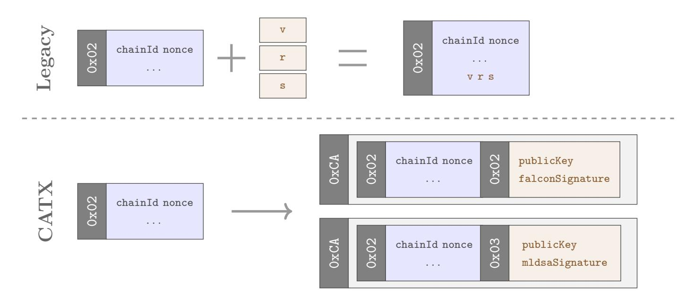
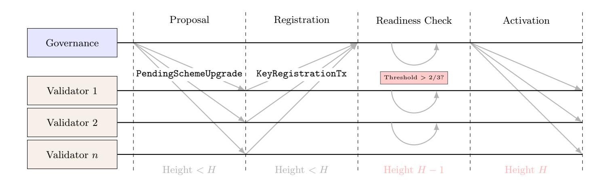
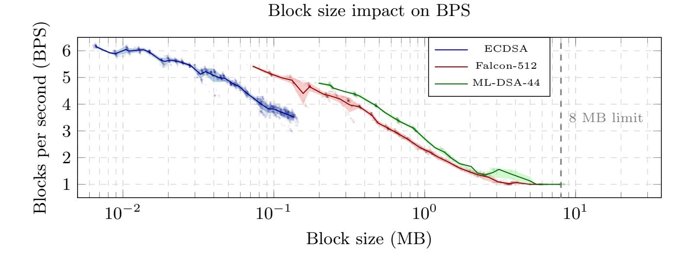

{0}------------------------------------------------

# Post-Quantum Blockchains with Agility in Mind

Manuel B. Santos, Danno Ferrin, Ron Kahat, and Michael Lodder

Tectonic Labs

manuel.batalha.santos@gmail.com, {danno,ron,mikelodder}@tectonic.xyz

Abstract. Blockchains intend to provide long-term integrity guarantees through cryptographic primitives that may become vulnerable over time due to algorithmic advances or paradigm shifts such as quantum computation. While cryptographic agility, the ability to transition between algorithms without disrupting operation, is recognized as essential, existing blockchain systems lack comprehensive support for such transitions. We address this gap by designing an Ethereum virtual machine (EVM) compatible blockchain that introduces support for cryptographic agility from genesis.

We first propose a flexibility framework that characterizes how algorithm choice can be distributed across blockchain components. We then present two technical contributions aligned with this framework: (1) cryptographically agile transactions (CATX), a new transaction format that decouples body and signature to enable user-selected signature schemes; and (2) a consensus-layer key registration mechanism that allows validators to migrate between signature schemes as operational upgrades without hard forks. We exemplify the agility of our design with ECDSA, Falcon-512, and ML-DSA signatures by conducting experimental evaluations over 30,000 blocks and 11 million transactions, showing that the CATX format introduces no measurable overhead.

Keywords: Cryptographic agility · Post-quantum cryptography · Blockchain

# 1 Introduction

Blockchains provide decentralized trust through cryptographic verification rather than reliance on trusted third parties. Unlike centralized systems where data can be modified, blockchains are designed to be persistent and immutable, providing long-term integrity guarantees. Their security relies on multiple building blocks, including the consensus layer, execution layer, transaction mechanisms, and peerto-peer communication protocols. These components are built on cryptographic primitives such as hash functions (e.g., SHA-256 [\[1\]](#page-18-0), Keccak [\[2\]](#page-18-1)) and digital signature schemes, making them foundational to blockchain integrity [\[38\]](#page-20-0).

Historical precedent shows that cryptographic primitives can become vulnerable due to algorithmic advances (e.g., MD5 [\[60\]](#page-21-0), SHA-1 [\[56\]](#page-21-1)), implementation flaws, or paradigm shifts such as quantum computation [\[53\]](#page-21-2). Given the long-term lifespan of blockchains, systems must be able to transition cryptographic primitives without disrupting operation. This ability, referred to in NIST CSWP 

{1}------------------------------------------------

39 as cryptographic agility [\[13\]](#page-19-0), is essential for sustaining security over time. However, the properties that make blockchains valuable also create challenges when cryptographic primitives must be updated, replaced, or deprecated, making cryptographic agility a fundamental design feature.

The most immediate threat to blockchain cryptography comes from quantum computers. Current systems rely heavily on elliptic curve signature schemes such as ECDSA [\[3\]](#page-18-2) and EdDSA [\[14\]](#page-19-1), which are vulnerable to cryptographically relevant quantum computers via Shor's algorithm [\[53\]](#page-21-2). Despite this risk, migration to post-quantum cryptography remains slow. A survey of over 14,000 blockchain users found that although quantum threats are widely acknowledged, 58.8% stated that post-quantum security is "not important" when choosing chains or applications [\[5\]](#page-18-3). This perception gap, combined with coordination challenges, deployment processes that risk network forks, and long-term backward compatibility requirements for legacy accounts, significantly delays transition efforts.

These challenges help explain why major blockchain systems such as Bitcoin [\[48\]](#page-21-3) and Ethereum [\[22\]](#page-19-2) currently lack cryptographic agility, and why platforms with partial agility support, including Hedera [\[11\]](#page-19-3) and Cosmos [\[42\]](#page-20-1), still struggle with comprehensive post-quantum transitions. Existing analysis, such as NIST CSWP 39 [\[13\]](#page-19-0), also lack an overview of current approaches and best practices to achieve crypto agility in decentralized systems. This paper addresses these gaps by designing a blockchain with cryptographic agility as a foundational principle from genesis, enabling secure cryptographic transitions as threats evolve while preserving the persistence and immutability that define blockchains.

#### 1.1 Our Contribution

We propose an Ethereum virtual machine (EVM)-based blockchain that addresses cryptographic agility needs in different layers of the protocol stack to allow future migrations and post-quantum support. More specifically, we present the following contributions.

- Flexibility framework (Section [3\)](#page-5-0). We propose a framework that specifies how cryptographic algorithm choice can be addressed. We identify three flexibility types (singular, negotiated, selected), and map each blockchain layer to the appropriate type based on its coordination constraints.
- Cryptographically agile transactions (Section [4\)](#page-8-0). We design CATX, a new transaction format that decouples transaction body from signature into independent components with explicit type identifiers. This enables users to select their signature algorithm without protocol changes, following the selected flexibility type.
- Consensus key agility (Section [5\)](#page-11-0). We introduce a mechanism to migrate the consensus-specific signature scheme as an operational upgrade via consensuslayer transactions, with activation gated by voting power > 2/3.
- Experimental evaluation (Section [6\)](#page-14-0). We evaluate the performance impact of post-quantum cryptography across the protocol stack, measuring transaction throughput under various signature schemes. We identify block size, not computation, as the limiting factor for larger post-quantum signatures.

{2}------------------------------------------------

#### 1.2 Related Work

The blockchain industry has recognized the quantum threat for over a decade, prompting various high-profile projects to adopt distinct approaches to postquantum security. We examine existing efforts, dividing them into chains requiring migration and post-quantum-native solutions.

Chains Requiring Migration. Solana introduced the Winternitz vault in January 2025 [\[59\]](#page-21-4), a sophisticated construction based on the Winternitz one-time signature [\[20\]](#page-19-4). The vault mechanism employs programmatic address derivation to compress signatures, achieving post-quantum security while mitigating blockspace overhead. However, this opt-in, application-layer solution creates a fragmented security landscape where only proactive users gain protection while the majority remain vulnerable. Moreover, vaults must be instantiated through standard transactions that themselves rely on quantum-vulnerable elliptic curve (EC)-based signatures, leaving the bootstrapping process exposed.

Algorand pioneered post-quantum implementations among major blockchains, introducing State Proofs in 2022, consisting of post-quantum secure certificates signed by validator supermajorities using Falcon signatures [\[9,](#page-19-5)[37\]](#page-20-2). While State Proofs represent a significant achievement, other aspects of Algorand continue to rely on quantum-vulnerable cryptography: transaction signatures use EC cryptography, and the consensus mechanism depends on a classical verifiable random function [\[10\]](#page-19-6). Since Algorand launched without post-quantum security from genesis, its transition process faces the coordination and migration difficulties inherent to protocol-wide cryptographic upgrades.

Bitcoin's migration discourse centers on several community proposals under active discussion. The prominent draft by Lopp [\[45\]](#page-21-5) outlines a phased approach: Phase A would prohibit transactions to legacy quantum-vulnerable address types (P2PK, P2PKH) three years after BIP-360 [\[15\]](#page-19-7) implementation, forcing new UTXOs (unspent transaction output) into quantum-resistant formats (P2QRH). Phase B would invalidate transactions from legacy addresses after a fixed period, freezing unmigrated funds. However, these approaches have met with skepticism within the community. The viability of such migrations depends heavily on the BIP-32 wallet standard [\[16\]](#page-19-8), creating problems for non-conforming wallets such as paper wallets.

Ethereum has adopted a comprehensive research approach through multiple initiatives [\[32,](#page-20-3)[34\]](#page-20-4). For user-level transaction signing, post-quantum migration remains under heavy research without concrete implementation plans. While account abstraction (EIP-4337) [\[29\]](#page-20-5) has been proposed as a potential enabling technology [\[33\]](#page-20-6), theoretical proposals involving STARK proofs face significant practical challenges including substantial computational overhead and unclear migration paths. At the consensus layer, Ethereum researchers investigate quantumresistant alternatives for BLS signatures in Proof-of-Stake [\[27\]](#page-20-7). Despite this theoretical sophistication, Ethereum's approach faces enormous coordination challenges affecting every layer of the protocol stack, requiring consensus among globally distributed stakeholders.

{3}------------------------------------------------

Baldimtsi et al. [\[12\]](#page-19-9) presents a migration strategy for EdDSA-based chains with backward compatibility. However, this approach lacks the cryptographic agility necessary for future transitions beyond the initial post-quantum migration, as it relies on proving knowledge of the seed used in EdDSA key derivation.

Post-Quantum Chains and Solutions. Several academic works propose blockchain transition schemes. Sato et al. [\[52\]](#page-21-6) proposes a scheme inspired by long-term signature schemes, but assumes availability of a secure timestamping service and a trusted public key infrastructure (PKI), requiring decentralization of the PKI system with critical practical consequences and added governance issues. Meng and Chen [\[47\]](#page-21-7) work further develops and formalizes the transition scheme, but does not take into account API and data format details in blockchain implementations, presenting transitions only at a conceptual level addressing hash and signature schemes rather than specific blockchain subsystems. Fukuda and Matsuo [\[35\]](#page-20-8) highlights migration issues but only mentions generic migration paths.

Among existing chains, Quantum Resistant Ledger (QRL) [\[58\]](#page-21-8) uses XMSS signatures [\[21\]](#page-19-10) for post-quantum security, implementing a cap on the number of signatures generated and an address format that allows for different signature schemes. However, QRL is not an EVM-based chain, limiting its compatibility with the broader Ethereum ecosystem. QANplatform [\[50\]](#page-21-9) incorporates ML-DSA [\[55\]](#page-21-10) signatures for cross-chain signing, but this addresses only a narrow aspect of post-quantum security rather than the comprehensive stack-wide problems. The platform lacks cryptographic agility in its design, focusing on a single post-quantum primitive without migration mechanisms. The Quantus design [\[54\]](#page-21-11) addresses post-quantum security in both peer-to-peer (P2P) node communication and transaction layers. However, Quantus follows a Proof-of-Work consensus mechanism, whereas our approach uses Proof-of-Stake, creating fundamental architectural differences in how consensus and security are achieved. Neptune Cash [\[57\]](#page-21-12) implements post-quantum cryptography, but lacks modularity and does not incorporate cryptographic agility or migration strategies in its design, making future transitions difficult.

# <span id="page-3-0"></span>2 Preliminaries

#### 2.1 Definitions

Definition 1 (Digital Signatures). A digital signature scheme is a tuple of algorithms (KeyGen, Sign, Verify) defined as follows:

- (pk,sk) ← KeyGen(): generates a public/private key pair.
- σ ← Sign(sk, m): produces a signature σ on message m.
- {0, 1} ← Verify(pk, σ, m): returns 1 if the signature is valid, 0 otherwise.

A signature scheme is correct if Verify(pk, Sign(sk, m), m) = 1 for all messages m and corresponding keypairs (pk,sk), and secure if it satisfies EUF-CMA (existential unforgeability under chosen-message attack) [\[46\]](#page-21-13).

{4}------------------------------------------------

The elliptic curve digital signature algorithm (ECDSA) [\[3\]](#page-18-2) is a digital signature scheme based on elliptic curves. In Ethereum [\[61\]](#page-21-14), ECDSA is instantiated over the secp256k1 curve, and a signature on a message m consists of three components: (r, s, v), where r and s are 32-byte integers and v is a recovery parameter. The recovery parameter v encodes information about the parity of the public key y-coordinate. Therefore, given (r, s, v) and m, the public key can be uniquely determined without explicitly transmitting it. This property is exploited in Ethereum during transaction validation [\[61,](#page-21-14) Appendix F].

#### 2.2 EVM-based Blockchains

Blockchains are decentralized systems for maintaining a shared, append-only ledger among a set of untrusted parties. Instead of relying on a central authority, a blockchain uses cryptographic techniques, such as hash functions and digital signatures, and distributed consensus to ensure that all parties agree on the order and contents of recorded transactions.

Ethereum virtual machine (EVM)-based blockchains [\[22\]](#page-19-2) organize their protocol stack into distinct layers, each responsible for a specific functionality. Next, we describe the four primary layers of blockchain systems.

Transactions. Transactions are the units of state change in a blockchain. In Ethereum, transactions use recursive length prefix (RLP) encoding [\[61,](#page-21-14) Appendix B] as the canonical serialization format, providing deterministic encoding. Since EIP-2718 [\[28\]](#page-20-9), Ethereum transactions follow a typed envelope format:

$$Tx = type \parallel RLP(payload),$$

where type is a single-byte identifier distinguishing transaction formats (e.g., 0x02 for EIP-1559 fee market transactions). This typed structure enables protocol evolution by allowing new transaction formats and we redesign it to accommodate different signature schemes (cf. Section [4\)](#page-8-0).

Execution Layer. The execution layer (EL) consists of nodes, called clients, which verify and execute transactions and update the network's global state. This involves executing smart contract bytecode in a virtual machine. A specific category of operations in EVM bytecode are precompiled contracts, which offer efficient implementations of computationally intensive cryptographic functions that would otherwise be prohibitively expensive to execute.

Consensus Layer. The consensus layer (CL) secures the integrity of block finalization, ensuring all honest nodes agree on the canonical chain of blocks. Byzantine fault tolerant (BFT) [\[43](#page-20-10)[,19\]](#page-19-11) consensus protocols enable agreement even when some validators behave maliciously.

In weighted BFT systems such as Tendermint [\[19\]](#page-19-11), each validator has an associated voting power and a block is finalized when validators representing more than 2/3 of voting power sign commit messages for that block. The consensus 

{5}------------------------------------------------

proceeds in rounds consisting of three phases: Propose (proposer broadcasts a candidate block), Prevote (validators vote for the proposal), and Precommit (validators commit upon seeing sufficient prevotes). We use this structure to allow for cryptographic agility in the validator's signature scheme used (cf. Section [5\)](#page-11-0).

P2P Communication Layer. The peer-to-peer (P2P) layer enables nodes to discover each other and exchange messages without centralized coordination. This layer consists of two main components: a discovery protocol that maintains a distributed hash table (DHT) for peer discovery, and a transport protocol that establishes secure communication channels.

In Ethereum's execution layer, the Discv4 protocol [\[31\]](#page-20-11) enables peer discovery via UDP gossip. Discovery packets are authenticated using ECDSA signatures with public key recovery, binding messages to node identities. The RLPx transport protocol [\[30\]](#page-20-12) then establishes encrypted sessions between discovered peers using ECIES [\[36\]](#page-20-13) for key agreement.

# <span id="page-5-0"></span>3 Cryptographic Flexibility in Blockchains

Cryptographic agility (CA) is a design principle that enables systems to adapt their cryptographic algorithms over time without disrupting their live functioning [\[13\]](#page-19-0). In this section, we introduce some principles established by NIST Cybersecurity White Paper (CSWP) 39 [\[13\]](#page-19-0) to enable effective cryptographic agility and highlight the unique challenges blockchains face in adopting them. We then present a flexibility framework that characterizes how algorithm choice can be distributed across blockchain participants, providing a lens through which to analyze the design space for cryptographic transitions.

#### <span id="page-5-1"></span>3.1 Challenges

NIST CSWP 39 [\[13\]](#page-19-0) establishes a set of principles that enable effective cryptographic agility. Among others, it stresses the need for: algorithm identification through ciphersuite negotiation and naming conventions; modularity that separates cryptographic algorithms from application logic, enabling algorithms to be treated as interchangeable components; policy and mechanism separation that allows cryptographic policies to be stored in configuration files rather than hard-wired in source code; and mechanisms for preserving interoperability during transitions. Additionally, systems must handle the deployment of algorithm transitions, which can take years when new infrastructure is required, and manage cryptographic keys associated with deprecated algorithms through proper key expiration and revocation procedures.

While the NIST principles provide a foundation for cryptographic agility in traditional systems, each concept faces unique challenges when applied to blockchain environments. More specifically, ciphersuite negotiation, which works effectively in point-to-point protocols like TLS [\[51\]](#page-21-15), becomes impractical among 

{6}------------------------------------------------

an unbounded number of distributed nodes. Modularity is limited when protocols depend on algorithm-specific properties rather than using cryptography as a black box. For instance, KZG [\[41\]](#page-20-14) commitments are tied to specific data types, and BLS [\[18\]](#page-19-12) signatures are chosen specifically for their aggregation properties, making drop-in replacements non-trivial. Moreover, preserving interoperability presents asymmetric challenges between blockchain entities, as different participants face different coordination constraints (discussed in Section [3.2\)](#page-6-0). Key lifecycle management is particularly problematic in blockchains, where addresses serve as long-lived identities tied to deprecated algorithms, making key expiration and revocation difficult to implement without disrupting user accounts. Finally, deploying algorithm transitions in consensus scenarios is more complex than in centralized systems. Indeed, not all nodes upgrade simultaneously, making it difficult to determine which nodes are honest, potentially leading to forks and increased vulnerability to 51% attacks during transition periods.

#### <span id="page-6-0"></span>3.2 Flexibility Framework

The challenges outlined in Section [3.1](#page-5-1) demonstrate that blockchain systems cannot adopt traditional cryptographic agility principles wholesale. Instead, cryptographic agility in blockchains is best understood as a design space where different components require different degrees of flexibility based on their coordination constraints, which we unfold next.

Coordination Constraints. Different blockchain participants face different pressures when cryptographic algorithms change. Node operators actively manage staking collateral and operations, enabling them to coordinate quickly: when consensus-critical vulnerabilities emerge, the economic cost of non-compliance (missed rewards, slashing, chain splits) creates strong incentives for rapid, synchronized upgrades. The patching of CVE-2018-17144 within days [\[17\]](#page-19-13) exemplifies this dynamic. For these stakeholders, hard transitions at defined upgrade points are operationally feasible. However, even for node operators, hardware adoption can present significant barriers. Many hardware security modules (HSM) lack support for certain post-quantum algorithms (e.g., Falcon [\[49\]](#page-21-16)), and operational constraints such as long HSM purchasing and refresh cycles can slow down cryptographic migration. This makes it necessary to support multiple signature schemes to accommodate different business and hardware timelines, even among participants who are otherwise willing to coordinate.

End users, by contrast, interact with the chain sporadically and cannot be expected to upgrade in lockstep. Also, they lack a comparable pressure to migrate since their funds may remain accessible under legacy schemes and the quantum threat may feel distant [\[5\]](#page-18-3). Ideally, a user who returns after some period of time should not discover that their funds are inaccessible because they failed to migrate during a specific time frame. Therefore, for user-facing components, the system should support multiple algorithms simultaneously, allowing gradual adoption without forcing coordinated action. This trade-off is supported by the 

{7}------------------------------------------------

selected flexibility type (Section [3.2\)](#page-7-0) below, which shifts the burden of multialgorithm support to validators.

These asymmetries, between those who operate the network and those who use it, determine which flexibility strategies are feasible for each layer.

<span id="page-7-0"></span>Flexibility Types. We characterize cryptographic agility along a flexibility spectrum that captures how algorithm choice is distributed across participants. This spectrum ranges from enforcement of a single algorithm to full user-side choice, with a negotiated type in between:

- Singular. Exactly one algorithm is permitted system-wide at any point in time. All participants must use the same algorithm, which simplifies verification logic but creates a single point of cryptographic failure: if that algorithm is broken, the entire system is compromised. This model suits components where all parties can coordinate upgrades synchronously.
- Negotiated. Both communicating parties select an algorithm from the intersection of their individually supported sets. This approach is standard in point-to-point protocols but difficult to generalize to decentralized systems where transactions must be validated by an unbounded set of nodes without prior negotiation.
- Selected. One party unilaterally chooses an algorithm from a protocol-defined allowed set. This shifts flexibility to the edge where users can adopt new algorithms at their own pace. The tradeoff is that verifiers must maintain implementations of all supported algorithms.

Mapping Blockchain Components. Based on the flexibility framework and the coordination constraints, we propose the following positioning for our design.

Transactions: Selected. Since transactions originate from users who cannot be forced to upgrade synchronously, legacy wallets must remain functional while users adopt post-quantum signatures at their own pace. We therefore adopt a selected model where senders choose their signature algorithm from an allowed set, and all nodes processing transactions (EL clients) must support verification of every algorithm in that set. The CATX transaction format (Section [4\)](#page-8-0) enables this by encoding algorithm identifiers directly in the transaction structure, decoupling signature schemes from transaction semantics. User migration from legacy to post-quantum schemes proceeds through wallet creation and fund transfer: a user generates a new keypair under the target scheme (e.g., ML-DSA-44), derives a new address from that keypair, and transfers funds from their legacy address via a standard transaction. This approach requires no protocollevel coordination but it changes the user's on-chain address.

Execution Layer: Selected. On-chain cryptographic operations exposed via precompiled contracts follow the same selected model as transactions. Smart contracts invoke signature-specific precompiles, and the execution layer must support all algorithms in the allowed set. This enables contracts to adopt new cryptographic primitives without requiring protocol upgrades for each addition.

{8}------------------------------------------------

.



<span id="page-8-1"></span>Fig. 1. Legacy transactions (top) embed ECDSA signature fields directly into the body. CATX (bottom) wraps body and signature as separate typed components within a 0xCA envelope, enabling different signature schemes.

Consensus Layer: Singular. Consensus requires all validators to agree on block validity using identical verification logic. Supporting multiple signature algorithms would complicate fork-choice rules and increase the attack surface during transitions. We therefore adopt a singular model where all validators use the same algorithm (Falcon-512 [\[49\]](#page-21-16) in our implementation). Section [5](#page-11-0) details a migration mechanism for transitioning between singular algorithms without requiring a hard-fork and based on consensus.

P2P Communication: Singular. The peer-to-peer layer establishes secure channels between nodes. Because P2P participants are node operators who can coordinate upgrades, a transition to new algorithms is feasible.

# <span id="page-8-0"></span>4 CATX

In this section, we propose a new transaction format as traditional Ethereum transaction formats have a fundamental barrier to cryptographic agility through their deep integration of ECDSA signatures into the transaction structure [\[23\]](#page-19-14). The signature components, specifically the recovery parameter v and the signature values r and s (cf. Section [2\)](#page-3-0), are directly embedded within the RLPencoded transaction payload along with its body data (e.g., chainId, nonce) as exemplified below with EIP-1559 [\[23\]](#page-19-14) (Type 0x02):

$$Tx = 0x02 \parallel \mathsf{RLP} \left( \begin{array}{c} \mathsf{chainId}, \ \mathsf{nonce}, \ \mathsf{maxTip}, \ \mathsf{maxFee}, \ \mathsf{gasLimit}, \\ \mathsf{destination}, \ \mathsf{amount}, \ \mathsf{data}, \ \mathsf{accessList}, \ \mathsf{v}, \ \mathsf{r}, \ \mathsf{s} \end{array} \right)$$

This design creates several limitations that prevent cryptographic agility. First, the transaction format assumes a public key recovery mechanism. This 

{9}------------------------------------------------

represents a concrete case of the modularity challenge identified in Section [3.1:](#page-5-1) the transaction protocol is not designed to use cryptographic primitives in a black box manner, but rather depends on specific properties of ECDSA (namely, public key recovery) that are baked into the transaction structure itself.

Second, the signature structure is hardcoded into the transaction serialization format, violating the modularity principle discussed before. Unlike point-topoint protocols such as TLS, where cryptographic algorithms can be negotiated at runtime through ciphersuite selection, blockchain transactions must be validated by an unbounded set of distributed nodes without prior negotiation. This distributed validation requirement, as discussed in Section [3.1,](#page-5-1) makes runtime algorithm negotiation impractical and necessitates that the cryptographic algorithm be encoded directly in the transaction format.

CATX Design. To address the above issues, we present cryptographically agile transactions (CATX), which introduces transaction type 0xCA that achieves cryptographic modularity. As shown in Figure [1,](#page-8-1) CATX design maintains the same core transaction items and base signing object as traditional Ethereum transactions, but package it into a self-contained blob. The core crypto agile innovation lies in separating the transaction body from its signature, enabling independent evolution of transaction semantics and cryptographic primitives. CATX structure can be described as follows:

Tx = 0xCA ∥ bodyType ∥ RLP(bodyData) ∥ sigType ∥ RLP(sigData).

This design choice creates four independent components: body type (bodyType), body data (bodyData), signature type (sigType) and signature data (sigData).

The body type identifies the transaction body format, allowing for multiple transaction body formats and each identified by a unique body type value (e.g., 0x02 for fee market EIP-1559 transactions). The body data contains the transaction semantics (e.g., chain ID, nonce, gas parameters). This body type registry allows new transaction formats to be added without affecting signature handling. The signature type identifies the cryptographic signature algorithm, enabling pluggable cryptographic schemes. This follows the crypto agility norm of algorithm identification [\[13\]](#page-19-0), where an identifier is used for an implementation to tell the verification peer which algorithm is being used. For our experiments, we set the following algorithm identities: 0x01 for ECDSA-secp256k1, 0x02 for FALCON-512 and 0x03 for ML-DSA-44. Finally, the signature data contains the algorithm-specific signature material. For ECDSA, the signature data contains the standard three parameters (v, r, s). Post-quantum signatures might have support for extractable public key from a signature. Depending on the signature type supported, specified by sigType, the verification precompile input pattern accepts two variants: (pubKey ∥ signature ∥ digest) or (extractableSignature ∥ digest).

Message digest. Post-quantum signature algorithms typically support signing messages of arbitrary length [\[55\]](#page-21-10). At first glance, it may therefore seem natural 

{10}------------------------------------------------

to sign the transaction data directly. However, for consistency with the ECDSAbased design, we instead adopt a message-digest approach, since ECDSA only accepts 32-byte inputs. Concretely, under CATX the signed message is

$$digest = Keccak256 (bodyType \parallel RLP(bodyData)).$$

This design choice offers two main advantages. First, it preserves compatibility with the existing ECDSA workflow, improving interoperability with current tooling, and enabling signatures to be treated as a black box. Second, in the presence of large transactions, signing the full message can significantly impact certain signing environments (e.g., key management systems), whereas a fixedsize digest avoids these limitations.

Address derivation. For externally owned accounts (EOAs) that do not rely on ECDSA and instead use post-quantum signature schemes, a mechanism is required to map a public key to an address. To support multiple signature schemes while preserving cryptographic agility and enabling smooth migration, address derivation follows a structure similar to that used for ECDSA-based accounts. To separate concerns across different signature types, a signature identifier (sigType) is appended to the public key prior to hashing. Concretely, addresses are derived by

$$address = Keccak256 (sigType \parallel pubKey).$$

#### 4.1 Precompiles in Execution Layer

Beyond EOAs, Ethereum supports a growing number of smart contract wallets that rely on EVM execution logic for authentication. Account abstraction proposals such as ERC-4337 [\[29\]](#page-20-5) enable smart contracts to define custom signature verification logic, opening a potential path for post-quantum cryptography: contracts could implement post-quantum signature verification directly in EVM bytecode.

However, the EVM is highly inefficient for the low-level arithmetic required by post-quantum signature schemes. Benchmarks show that pure-EVM verification of Falcon-512 signatures consumes approximately 6.6 million gas, while ML-DSA-44 verification requires approximately 13.5 million gas [\[62,](#page-21-17)[63\]](#page-21-18).

To address this limitation, we expose post-quantum signature verification as precompiled contracts. The precompile interface follows the pattern established by existing Ethereum cryptographic precompiles (e.g., ecrecover at address 0x01 [\[61\]](#page-21-14)), accepting the public key, signature, and message as inputs:

$$Verify(pubKey, signature, message).$$
 (1)

The argument ordering differs from ECDSA's ecrecover for two reasons. First, post-quantum schemes do not necessarily support public key recovery from signatures, making the public key a required input. Second, NIST postquantum algorithms support signing arbitrary-length messages directly [\[55\]](#page-21-10), so 

{11}------------------------------------------------

the message appears last in the argument list to allow variable-length inputs. For consistency with ECDSA workflows, many implementations still sign over a hash digest, but the precompile interface accommodates both patterns.

To conform with the algorithm identification principle for crypto agility, the precompile addresses align with the CATX signature type identifiers: 0xCA00xx, where xx corresponds to the signature type (e.g., 0xCA0001 for ECDSA, 0xCA0002 for Falcon-512, 0xCA0003 for ML-DSA-44). A new ECDSA precompile is also provided at 0xCA0001 with the unified argument layout, enabling smart contracts to handle all signature types through a consistent interface. This design supports the selected flexibility type: smart contract wallets can verify any supported signature algorithm, allowing users to choose their preferred scheme.

# <span id="page-11-0"></span>5 Cryptographic Agile Consensus

Consensus layers usually enforce a single and fixed cryptographic signature scheme set at genesis, with all nodes validating at startup to ensure configuration consistency [\[61\]](#page-21-14). This approach mirrors the singular flexibility type discussed in Section [3.2.](#page-6-0) However, embedding the scheme in the genesis configuration means that changing the consensus signature algorithm requires a hard fork, creating a significant barrier to cryptographic migration. This migration barrier is particularly concerning at the consensus layer, where a cryptographic compromise does not merely affect individual users, but undermines the entire chain's history.

In this section, we present an extension to Tendermint-based consensus [\[19\]](#page-19-11) that enables scheme changes via on-chain governance while maintaining consensus safety. The key insight is that transitions between schemes can be coordinated through consensus-layer transactions, allowing the network to migrate to new algorithms as operational upgrades without requiring a hard fork.

#### 5.1 Architecture

The core contribution of this design is the introduction of key registration transactions, which is a new consensus layer transaction type that enables validators to register new cryptographic keys for upcoming upgrades. Unlike EVM execution layer transactions, key registrations are processed entirely within the consensus layer. The proposer includes valid key registration transactions in the block's consensus data, and all validators process them as part of block finalization.

Figure [2](#page-12-0) illustrates how key registrations reside in the consensus portion of the block. Validators learn all nodes' consensus keys by deterministically executing the chain state with no additional P2P gossip layer required. The supported consensus signing schemes can include different post-quantum schemes such as Falcon [\[49\]](#page-21-16), ML-DSA [\[55\]](#page-21-10), and SLH-DSA [\[4\]](#page-18-4), although only one scheme is active at any given height as explained below.

{12}------------------------------------------------

| Consensus Data     | Execution Data     |
|--------------------|--------------------|
| height             | ExecutionPayload   |
| round              | (EVM transactions) |
| proposer           |                    |
| validatorSet       |                    |
| keyRegistrations ← |                    |
| commitSignatures   |                    |

<span id="page-12-0"></span>Fig. 2. Block structure with key registrations as consensus layer data, separate from EVM execution data.

#### 5.2 Upgrade Mechanism

The upgrade process involves four phases coordinated through on-chain state. To support this process, the consensus layer maintains two new data structures that track pending upgrades and validator readiness.

Data structures. The consensus layer maintains a ConsensusParams record in chain state to track the cryptographic configuration and coordinate upgrades across all nodes. This record stores the currently active signing scheme, ensuring all validators use the same algorithm for block signatures, and a minimum upgrade delay that enforces a safety window between proposal and activation.

When governance proposes a scheme change, a PendingSchemeUpgrade is added to ConsensusParams. It stores the target activation height, the new scheme identifier, and a readiness threshold (representing > 2/3 of voting power [\[19\]](#page-19-11)). This record allows all nodes to know that an upgrade is scheduled and track how many validators have prepared for the transition.

Validators signal their readiness by submitting a KeyRegistrationTx, which contains the validator's address, their new public key for the target scheme, the upgrade height, and a signature computed with their current consensus key over:

```
Sign (oldKey, "KEY_REGISTRATION" ∥ address ∥ scheme ∥ height ∥ newKey).
```

Signing with the current key proves that the legitimate validator (not an impersonator) is authorizing the transition to the new key.

Upgrade Mechanism. The upgrade mechanism is described in Figure [3](#page-13-0) and it is based on the following steps. (1) Proposal: Governance proposes a scheme change at a future block height H, setting the PendingSchemeUpgrade in consensus state. External coordination is expected before this proposal, particularly for validators using hardware security modules that may require lead time to provision new key material. (2) Registration: Each validator generates a new keypair for the target scheme and submits a KeyRegistrationTx signed with their current key. (3) Readiness check: At height H −1, the protocol verifies that sufficient voting power (exceeding the 2/3 threshold) has registered new keys. If

{13}------------------------------------------------



<span id="page-13-0"></span>Fig. 3. Consensus layer upgrade mechanism. Governance proposes a scheme change at future height H. Validators register new keys via KeyRegistrationTx. At height H −1, the protocol checks if sufficient voting power has registered. At height H, the scheme activates and unregistered validators are excluded.

the threshold is not met, the upgrade is cancelled. Importantly, the chain continues operating under the current scheme rather than halting. (4) Activation: At height H, the consensus signing scheme switches to the new algorithm. Validators who failed to register are excluded from the active validator set; they must restake and follow standard procedures to rejoin.

#### 5.3 Extension

Let us extend the upgrade mechanism to handle edge cases and catastrophic scenarios: emergency migration mode and validator lifecycle management.

Emergency migration mode. The upgrade mechanism presented before assumes the current signature scheme remains secure throughout the migration window. However, that assumption might not hold. In that case, signatures can be forged, allowing an attacker to register arbitrary new keys and hijack the whole consensus upgrade mechanism.

To mitigate this issue, we introduce a dual-key system where each validator maintains two independent keys: a primary key for normal consensus, and a recovery key used for emergency migration. The recovery key should rely on a different security assumption than the primary key. Since the recovery key is only used sporadically, we can use a more conservative signature scheme (e.g., SLH-DSA [\[4\]](#page-18-4)). Then, when governance declares an emergency upgrade the authentication mechanism switches: KeyRegistrationTx transactions require signatures from recovery keys instead of primary keys. This design effectively prevents an attacker from hijacking the consensus upgrade mechanism under a broken primary signature scheme.

Validator lifecycle during upgrades. The validator set is not static during the upgrade window as validators may join or exist. We need to address both scenarios during a normal and emergency upgrade.

{14}------------------------------------------------

When a new validator joins during a normal pending upgrade, they must provide keys for both the current scheme and the pending scheme. Requiring both keys at onboarding ensures new validators can participate immediately while surviving the upgrade, and their pending key is automatically registered in ConsensusParams.pending\_keys.

When a validator exits during a normal pending upgrade, their registration state must be deleted and readiness recalculated dynamically. If this exit causes readiness to drop below the 2/3 threshold, the upgrade is automatically cancelled to preserve chain liveness. This dynamic recalculation ensures that the upgrade only proceeds if the current validator set has sufficient readiness, not just the validator set that existed at proposal time.

During emergency upgrades, since primary signatures cannot be trusted for identity verification, validators cannot join and must wait until the emergency upgrade completes.

#### 5.4 Security Considerations

The mechanism addresses several security threats. Insufficient readiness cancels the upgrade rather than halting the chain, preserving liveness. Replay attacks are prevented by including the upgrade height in the signed registration data. Duplicate keys are rejected during validation to prevent voting power inflation. Downgrade attacks intend to make verifiers accept an weaker consensus signing scheme. Assuming honest governance, such attacks reduce to replaying previously issued upgrade artifacts (e.g., a stale PendingSchemeUpgrade), which is mitigated because scheme activation is derived deterministically from finalized consensus state at each height and upgrade-specific authentication is bound to the intended activation height (so replays fail). Additionally, upgrade cancellation preserves the currently active scheme rather than reverting, preventing downgrade via propose/cancel behavior.

Additionally, historical verification must be preserved after scheme changes. Old keys must be retained in chain state to verify old blocks since the deterministic replay of chain state ensures this data remains available.

# <span id="page-14-0"></span>6 Experimental Evaluation

We developed a Layer-1 implementation with CATX integrated as described above. It combines malachite BFT consensus engine [\[24\]](#page-19-15) with Ethereum's reth execution client [\[7\]](#page-18-5). It provides EVM compatibility with CATX supporting ECDSA, Falcon-512, and ML-DSA-44. All experiments and benchmarks were run in a local 3 node network on an Apple M3 Max with 36 GiB of memory. We also measured SLH-DSA [\[4\]](#page-18-4) variants (SHAKE-128f and SHAKE-128s), but report them only in microbenchmarks. In end-to-end experiments, SHAKE-128f began to degrade around 200 TPS and failed at 300 TPS, while SHAKE-128s sustained only about 16 TPS and proved impractical to benchmark locally due to its 8,576× higher signing cost compared to ECDSA.

{15}------------------------------------------------

In this section, we evaluate the impact of post-quantum signatures on the blockchain performance. Our evaluation spans over 30,000 blocks and 11 million transactions under sustained load, enabling analysis of steady-state behavior. Under these conditions, throughput is limited by three resources: (1) CPU, when verification time approaches the 12s slot limit [61]; (2) gas, when the block gas limit is reached; and (3)  $block\ size$ , when the block size cap is hit. Identifying the active bottleneck is essential to explain performance differences across signature schemes. We begin with microbenchmarks of the cryptographic primitives to isolate the effects of computation, transaction size, and network propagation on overall performance.

#### 6.1 Signatures Microbenchmarks

We start by establishing a computational baseline through isolated benchmarks. Table 1 reports key generation, signing, and verification times for ECDSA and post-quantum schemes Falcon-512, ML-DSA-44 and SLH-DSA for SHAKE-128f and SHAKE-128s variants.

<span id="page-15-0"></span>**Table 1.** Public key and signature sizes (bytes) and median cryptographic operation performance ( $\mu$ s) using Rust crate **criterion** [6] with 100 samples and 5-second measurement periods. Values in parentheses are relative to ECDSA.

|              | Sizes (B)  |           |                         | Latency $\mu$ s |                           |                         |
|--------------|------------|-----------|-------------------------|-----------------|---------------------------|-------------------------|
| Scheme       | Public Key | Signature | Total                   | Key Gen.        | Sign                      | Verify                  |
| ECDSA        | 33         | 65        | 98                      | 31              | 45                        | 51                      |
| Falcon-512   | 897        | 666       | $1,563 \ (16.0\times)$  | 4,035           | $119(2.6\times)$          | $18(0.4\times)$         |
| ML-DSA-44    | 1,312      | 2,420     | $3,732 (38.1\times)$    | 37              | $165(3.7\times)$          | $40(0.8\times)$         |
| SLH-DSA-128f | 32         | 17,088    | $17,120\ (175\times)$   | 808             | $19,185(426\times)$       | $1,15\dot{4}(23\times)$ |
| SLH-DSA-128s | 32         | 7,856     | $7,888 \ (80.5 \times)$ | 49,985          | $385,903  (8,576 \times)$ | $371(7.3\times)$        |

We observe that for both Falcon-512 and ML-DSA-44 schemes, signature verification – the dominant cryptographic operation executed by the validating nodes – is faster than ECDSA [40]. These measurements indicate that post-quantum verification does not introduce a computational bottleneck for these two schemes. On the other hand, both SLH-DSA variants exceed the verification latency between  $7\times$  and  $23\times$ .

Signing costs are higher for all post-quantum schemes, where the SLH-DSA variant optimized for size being the most affected  $(8,576\times)$ . However, signing occurs off-chain and, therefore, does not affect consensus throughput. In addition, key generation is a one-time account initialization cost, which is amortized over its lifetime without affecting performance.

In contrast, signature and public key sizes differ by more than two orders of magnitude across schemes and have a direct effect on transaction size and block utilization. Table 1 summarizes these size differences as well.

{16}------------------------------------------------

#### 6.2 Gas Computation

As mentioned before, gas costs have an impact on blockchain throughput. These are computed from three components: (1) intrinsic gas, a base cost of 21,000 gas per transaction; (2) data gas, charged at 4 gas per zero byte [\[61\]](#page-21-14) and 16 gas per non-zero byte [\[8\]](#page-18-7) in transaction data; and (3) execution gas, for operations like signature verification via precompiles.

For signature verification, ECDSA uses a fixed 3,000 gas precompile cost [\[61\]](#page-21-14), while post-quantum schemes use base costs plus per-message length charges: Falcon-512 requires 1,300 gas base plus 12 gas per 32-byte word of message data, and ML-DSA-44 requires 2,800 gas base plus 12 gas per word. These execution gas parameters are derived by scaling proportionally to measured signature verification times, using ECDSA as the reference.

### 6.3 CATX Impact

We next evaluate CATX transactions (cf. Section [4\)](#page-8-0) under sustained load to quantify end-to-end throughput.

We first investigate the transaction sizes and the gas threshold at which blocks become constrained by the 8 MB block size rather than by the gas or CPU limit, reported in Table [2.](#page-16-0) We observe that ECDSA transactions remain far

<span id="page-16-0"></span>

| Table 2. Transaction sizes and gas at 8 MB block size limit. B: billion; M: million. |  |  |
|--------------------------------------------------------------------------------------|--|--|
|                                                                                      |  |  |

| Type       | TX size | Data-limited at | Practical impact             |
|------------|---------|-----------------|------------------------------|
| Legacy1    | 121 B   | 1.456 B gas     | Never data-limited           |
| Falcon-512 | 1,622 B | 108.6 M gas     | ∼2× current Ethereum config. |
| ML-DSA-44  | 3,790 B | 46.5 M gas      | Below 60 M target            |

below the data-limited regime under any realistic gas configuration. Falcon-512 approaches data saturation only at approximately twice the current Ethereum gas limits (45 M [\[25\]](#page-19-16)). In contrast, ML-DSA-44 becomes data-limited within the range of existing Ethereum target parameters (60 M [\[26\]](#page-20-16)), indicating that block size, not gas or CPU, becomes the constraint.

Next, we present the resulting throughput measurements in Table [3,](#page-17-0) allowing us to identify the dominant bottleneck for each transaction type. The CATX transaction format introduces no measurable overhead: ECDSA achieves the same throughput as legacy EIP-1559 transactions, with both ultimately limited by the slot time. Falcon-512 maintains high throughput despite significantly larger signatures, operating near the transition between gas- and size-limited regimes. In contrast, ML-DSA-44 exhibits lower throughput because blocks reach the 8 MB size limit before exhausting the available gas.

<span id="page-16-1"></span><sup>1</sup> The results for CATX ECDSA and legacy transactions are reported to be equivalent.

{17}------------------------------------------------

<span id="page-17-0"></span>Table 3. Transactions per second (TPS), gas and block size consumption, and the primary performance bottleneck for legacy 0x02 and CATX transaction types.

| Type       | Peak TPS | Sustained TPS | Gas% | Size% | Bottleneck |
|------------|----------|---------------|------|-------|------------|
| Legacy     | 4,021    | 3,963         | 19%  | 1%    | CPU        |
| ECDSA      | 4,032    | 3,964         | 22%  | 2%    | CPU        |
| Falcon-512 | 3,730    | 1,625 B       | 78%  | 72%   | Mixed      |
| ML-DSA-44  | 2,210    | 3,794 B       | 46%  | 100%  | Block size |



<span id="page-17-1"></span>Fig. 4. Block size impact on BPS. Error bands show ±1 standard deviation. Based on observation from a live blockchain node (aggregated into 15-second windows), showing BPS behavior when each scheme dominates block production (ECDSA: 2,294 windows; Falcon-512: 1,104 windows; ML-DSA-44: 493 windows)

This behavior arises from the fact that overall transactions per second (TPS) is directly determined by transactions per block (TPB) and blocks per second (BPS): TPS = TPB×BPS. At the extreme, although ML-DSA-44 accommodates more transactions per block due to larger block sizes, the slower block production rate dominates, yielding lower net TPS. Figure [4](#page-17-1) highlights the negative correlation between block size and block production rate across all evaluated signature schemes. Hence, faster cryptographic verification does not translate into higher system throughput once block propagation becomes the limiting factor.

For completeness, exploratory end-to-end runs with SLH-DSA showed that SHAKE-128f reached only around 200 TPS, whereas SHAKE-128s was not practical to benchmark because signing is 8,576× slower than ECDSA.

# 7 Conclusion

This work takes a concrete step towards cryptographically agile blockchain infrastructure by showing that cryptographic scheme changes, specifically transitions to post-quantum algorithms, can be introduced as operational upgrades without requiring hard forks, while preserving EVM compatibility and operational continuity. Our evaluation reveals an important shift in system bottlenecks 

{18}------------------------------------------------

(cf. Section [6\)](#page-14-0): although post-quantum signatures such as Falcon-512 verify up to 2.83× faster than ECDSA and sustain 3,200 TPS (≈80% of baseline), and ML-DSA-44 reaches 1,900 TPS (≈47%), throughput becomes constrained not by computation but by block size and network bandwidth. These results highlight that future post-quantum blockchain designs must optimize for bandwidth efficiency as much as cryptographic performance.

This bandwidth pressure extends beyond the transaction layer into the P2P communication layer, where existing protocols impose tight size constraints that post-quantum schemes cannot satisfy through simple algorithm substitution. Discovery protocols such as Discv4 [\[31\]](#page-20-11) rely on UDP gossip packets constrained to 1280 bytes (the IPv6 minimum MTU) [\[39\]](#page-20-17), while Ethereum Node Records (ENRs) [\[44\]](#page-20-18) are limited to 300 bytes. Since post-quantum signature schemes require transmitting both signatures and public keys, unlike ECDSA which supports public key recovery, they would exceed these limits, making a direct transition infeasible without protocol redesign. Exploring alternative authentication mechanisms for discovery protocols that preserve post-quantum security while respecting existing packet size constraints remains an important direction for future work.

# Acknowledgments

We thank our reviewers for their helpful feedback and Léo Ducas for valuable comments.

# References

- <span id="page-18-0"></span>1. Secure hash standard (2015). <https://doi.org/10.6028/nist.fips.180-4>, [http:](http://dx.doi.org/10.6028/NIST.FIPS.180-4) [//dx.doi.org/10.6028/NIST.FIPS.180-4](http://dx.doi.org/10.6028/NIST.FIPS.180-4)
- <span id="page-18-1"></span>2. SHA-3 standard:: permutation-based hash and extendable-output functions (2015). <https://doi.org/10.6028/nist.fips.202>, [http://dx.doi.org/10.6028/NIST.](http://dx.doi.org/10.6028/NIST.FIPS.202) [FIPS.202](http://dx.doi.org/10.6028/NIST.FIPS.202)
- <span id="page-18-2"></span>3. Digital Signature Standard (DSS) (Feb 2023). [https://doi.org/10.6028/nist.](https://doi.org/10.6028/nist.fips.186-5) [fips.186-5](https://doi.org/10.6028/nist.fips.186-5), <http://dx.doi.org/10.6028/NIST.FIPS.186-5>
- <span id="page-18-4"></span>4. Stateless hash-based digital signature standard (Aug 2024). [https://doi.org/10.](https://doi.org/10.6028/nist.fips.205) [6028/nist.fips.205](https://doi.org/10.6028/nist.fips.205), <http://dx.doi.org/10.6028/NIST.FIPS.205>
- <span id="page-18-3"></span>5. The great quantum disconnect: Why web3 knows about quantum, but doesn't care (yet) (nov 2025), [https://www.tectonic.xyz/blog/](https://www.tectonic.xyz/blog/the-great-quantum-disconnect) [the-great-quantum-disconnect](https://www.tectonic.xyz/blog/the-great-quantum-disconnect), accessed: 2026-02-01
- <span id="page-18-6"></span>6. criterion: A statistics-driven micro-benchmarking library for rust. [https://](https://docs.rs/criterion/latest/criterion/) [docs.rs/criterion/latest/criterion/](https://docs.rs/criterion/latest/criterion/) (2026), online documentation, accessed 2026-02-05
- <span id="page-18-5"></span>7. Reth: Ethereum full node implementation. [https://github.com/paradigmxyz/](https://github.com/paradigmxyz/reth) [reth](https://github.com/paradigmxyz/reth) (2026), online documentation, accessed 2026-02-13
- <span id="page-18-7"></span>8. Akhunov, A., Sasson, E.B., Brand, T., Guthmann, L., Levy, A.: Eip-2028: Transaction data gas cost reduction. <https://eips.ethereum.org/EIPS/eip-2028> (May 2019)

{19}------------------------------------------------

- <span id="page-19-5"></span>9. Algorand: State proofs overview. Algorand Developer Portal (2024), [https://](https://developer.algorand.org/docs/get-details/stateproofs/) [developer.algorand.org/docs/get-details/stateproofs/](https://developer.algorand.org/docs/get-details/stateproofs/)
- <span id="page-19-6"></span>10. Algorand Foundation: Post-quantum technology (2024), [https://algorand.co/](https://algorand.co/technology/post-quantum) [technology/post-quantum](https://algorand.co/technology/post-quantum)
- <span id="page-19-3"></span>11. Baird, L., Harmon, M., Madsen, P.: Hedera: A public hashgraph network & governing council (2020), [https://files.hedera.com/hh\\_whitepaper\\_v2.2-20230918.](https://files.hedera.com/hh_whitepaper_v2.2-20230918.pdf) [pdf](https://files.hedera.com/hh_whitepaper_v2.2-20230918.pdf)
- <span id="page-19-9"></span>12. Baldimtsi, F., Chalkias, K., Roy, A.: Post-quantum readiness in EdDSA chains. Cryptology ePrint Archive, Paper 2025/1368 (2025), [https://eprint.iacr.org/](https://eprint.iacr.org/2025/1368) [2025/1368](https://eprint.iacr.org/2025/1368)
- <span id="page-19-0"></span>13. Barker, E., Chen, L., Regenscheid, A., Moody, D., Newhouse, W., Kent, K., Barker, W., Cooper, D., Souppaya, M., Housley, R., Turner, S.: Considerations for Achieving Crypto Agility: Strategies and Practices (2025). [https://doi.org/10.6028/](https://doi.org/10.6028/nist.cswp.39) [nist.cswp.39](https://doi.org/10.6028/nist.cswp.39), <http://dx.doi.org/10.6028/NIST.CSWP.39>
- <span id="page-19-1"></span>14. Bernstein, D.J., Duif, N., Lange, T., Schwabe, P., Yang, B.Y.: High-speed high-security signatures 2(2), 77–89 (Sep 2012). [https://doi.org/10.1007/](https://doi.org/10.1007/s13389-012-0027-1) [s13389-012-0027-1](https://doi.org/10.1007/s13389-012-0027-1)
- <span id="page-19-7"></span>15. Bitcoin Community: Bip-360: Pay to tapscript hash (p2tsh). Bitcoin Improvement Proposal (Draft), <https://bip360.org/bip360.html>
- <span id="page-19-8"></span>16. Bitcoin Core Developers: BIP 32: Hierarchical Deterministic Wallets. Bitcoin Improvement Proposal (2012), [https://github.com/bitcoin/bips/blob/master/](https://github.com/bitcoin/bips/blob/master/bip-0032.mediawiki) [bip-0032.mediawiki](https://github.com/bitcoin/bips/blob/master/bip-0032.mediawiki), accessed: 2026-02-09
- <span id="page-19-13"></span>17. Bitcoin Core Developers: Disclosure of cve-2018-17144 and bitcoin core 0.16.3 patch. <https://bitcoincore.org/en/2018/09/20/notice/> (2018), accessed: 2026-02-05
- <span id="page-19-12"></span>18. Boneh, D., Lynn, B., Shacham, H.: Short Signatures from the Weil Pairing, p. 514–532. Springer Berlin Heidelberg (2001). [https://doi.org/10.1007/](https://doi.org/10.1007/3-540-45682-1_30) [3-540-45682-1\\_30](https://doi.org/10.1007/3-540-45682-1_30)
- <span id="page-19-11"></span>19. Buchman, E., Kwon, J., Milosevic, Z.: The latest gossip on bft consensus (2018). <https://doi.org/10.48550/ARXIV.1807.04938>, [https://arxiv.org/abs/1807.](https://arxiv.org/abs/1807.04938) [04938](https://arxiv.org/abs/1807.04938)
- <span id="page-19-4"></span>20. Buchmann, J., Dahmen, E., Ereth, S., Hülsing, A., Rückert, M.: On the security of the Winternitz one-time signature scheme. pp. 363–378 (2011). [https://doi.](https://doi.org/10.1007/978-3-642-21969-6_23) [org/10.1007/978-3-642-21969-6\\_23](https://doi.org/10.1007/978-3-642-21969-6_23)
- <span id="page-19-10"></span>21. Buchmann, J.A., Dahmen, E., Hülsing, A.: XMSS - A practical forward secure signature scheme based on minimal security assumptions. pp. 117–129 (2011). [https://doi.org/10.1007/978-3-642-25405-5\\_8](https://doi.org/10.1007/978-3-642-25405-5_8)
- <span id="page-19-2"></span>22. Buterin, V.: Ethereum: A next-generation smart contract and decentralized application platform (2013), <https://ethereum.org/en/whitepaper/>
- <span id="page-19-14"></span>23. Buterin, V., Conner, E., Dudley, R., Slipper, M., Norden, I., Bakhta, A.: Eip-1559: Fee market change for eth 1.0 chain. <https://eips.ethereum.org/EIPS/eip-1559> (2019), accessed: 2026-02-05
- <span id="page-19-15"></span>24. Circle Internet Financial, LLC.: Malachite: Flexible bft consensus engine in rust. <https://github.com/circlefin/malachite> (2026), online documentation, accessed 2026-02-13
- <span id="page-19-16"></span>25. CoinDesk: Ethereum block gas limit reaches 45 million units. [https://www.coindesk.com/tech/2025/07/21/](https://www.coindesk.com/tech/2025/07/21/ethereum-validators-signal-intention-of-upping-gas-limit-to-45m/) [ethereum-validators-signal-intention-of-upping-gas-limit-to-45m/](https://www.coindesk.com/tech/2025/07/21/ethereum-validators-signal-intention-of-upping-gas-limit-to-45m/) (2025), accessed 2026-02-05

{20}------------------------------------------------

- <span id="page-20-16"></span>26. Cointelegraph : Ethereum block gas limit raised to 60 million units. [https://](https://cointelegraph.com/news/ethereum-validators-push-gas-limit-60m-scaling) [cointelegraph.com/news/ethereum-validators-push-gas-limit-60m-scaling](https://cointelegraph.com/news/ethereum-validators-push-gas-limit-60m-scaling) (2025), accessed 2026-02-05
- <span id="page-20-7"></span>27. Drake, J., et al.: Hash-based multi-signatures for post-quantum ethereum. Cryptology ePrint Archive, Paper 2025/055 (2025), <https://eprint.iacr.org/2025/055>
- <span id="page-20-9"></span>28. Ethereum Community: Eip-2718: Typed transaction envelope. [https://eips.](https://eips.ethereum.org/EIPS/eip-2718) [ethereum.org/EIPS/eip-2718](https://eips.ethereum.org/EIPS/eip-2718) (2019), accessed: 2026-02-05
- <span id="page-20-5"></span>29. Ethereum Community: Eip-4337: Account abstraction using alt mempool. Ethereum Improvement Proposal (2023), [https://eips.ethereum.org/EIPS/](https://eips.ethereum.org/EIPS/eip-4337) [eip-4337](https://eips.ethereum.org/EIPS/eip-4337)
- <span id="page-20-12"></span>30. Ethereum DevP2P: Rlpx transport protocol. [https://github.com/ethereum/](https://github.com/ethereum/devp2p/blob/master/rlpx.md) [devp2p/blob/master/rlpx.md](https://github.com/ethereum/devp2p/blob/master/rlpx.md) (2016), accessed: 2026-02-05
- <span id="page-20-11"></span>31. Ethereum DevP2P: Node discovery protocol v4 (discv4). [https://github.com/](https://github.com/ethereum/devp2p/blob/master/discv4.md) [ethereum/devp2p/blob/master/discv4.md](https://github.com/ethereum/devp2p/blob/master/discv4.md) (2019), accessed: 2026-02-05
- <span id="page-20-3"></span>32. Ethereum Foundation Privacy & Scaling Explorations: Post-quantum cryptography and ethereum (2025), [https://pse.dev/projects/](https://pse.dev/projects/post-quantum-cryptography) [post-quantum-cryptography](https://pse.dev/projects/post-quantum-cryptography)
- <span id="page-20-6"></span>33. Ethereum Research: Poqeth: Efficient post-quantum signature verification on ethereum (2024), [https://ethresear.ch/t/](https://ethresear.ch/t/poqeth-efficient-post-quantum-signature-verification-on-ethereum/21554) [poqeth-efficient-post-quantum-signature-verification-on-ethereum/](https://ethresear.ch/t/poqeth-efficient-post-quantum-signature-verification-on-ethereum/21554) [21554](https://ethresear.ch/t/poqeth-efficient-post-quantum-signature-verification-on-ethereum/21554)
- <span id="page-20-4"></span>34. Ethereum Research: Tasklist for post-quantum eth (2024), [https://ethresear.](https://ethresear.ch/t/tasklist-for-post-quantum-eth/21296) [ch/t/tasklist-for-post-quantum-eth/21296](https://ethresear.ch/t/tasklist-for-post-quantum-eth/21296)
- <span id="page-20-8"></span>35. Fukuda, K., Matsuo, S.: Post-quantum blockchain: Transition landscape amidst evolving complexity. Cryptology ePrint Archive, Paper 2025/1626 (2025), [https:](https://eprint.iacr.org/2025/1626) [//eprint.iacr.org/2025/1626](https://eprint.iacr.org/2025/1626)
- <span id="page-20-13"></span>36. Gayoso Martínez, V., Hernandez Encinas, L., Sánchez Ávila, C.: A survey of the elliptic curve integrated encryption scheme. Journal of Computer Science and Engineering 2, 7–13 (01 2010)
- <span id="page-20-2"></span>37. Gentry, C., Peikert, C., Vaikuntanathan, V.: Trapdoors for hard lattices and new cryptographic constructions. In: STOC 2008. pp. 197–206. ACM (2008), [https:](https://eprint.iacr.org/2007/432) [//eprint.iacr.org/2007/432](https://eprint.iacr.org/2007/432)
- <span id="page-20-0"></span>38. Giechaskiel, I., Cremers, C.J.F., Rasmussen, K.B.: On bitcoin security in the presence of broken cryptographic primitives. pp. 201–222 (2016). [https://doi.org/](https://doi.org/10.1007/978-3-319-45741-3_11) [10.1007/978-3-319-45741-3\\_11](https://doi.org/10.1007/978-3-319-45741-3_11)
- <span id="page-20-17"></span>39. Internet Engineering Task Force: Internet protocol, version 6 (ipv6) specification. RFC 8200 (2017), <https://www.rfc-editor.org/rfc/rfc8200.html>, accessed: 2026-02-05
- <span id="page-20-15"></span>40. Juaristi, P., Agudo, I., Rios, R., Ricci, L.: Benchmarking Post-quantum Cryptography in Ethereum-Based Blockchains, p. 340–353. Springer Nature Switzerland (2025). [https://doi.org/10.1007/978-3-031-82349-7\\_23](https://doi.org/10.1007/978-3-031-82349-7_23), [http://dx.doi.org/](http://dx.doi.org/10.1007/978-3-031-82349-7_23) [10.1007/978-3-031-82349-7\\_23](http://dx.doi.org/10.1007/978-3-031-82349-7_23)
- <span id="page-20-14"></span>41. Kate, A., Zaverucha, G.M., Goldberg, I.: Constant-Size Commitments to Polynomials and Their Applications, p. 177–194. Springer Berlin Heidelberg (2010). [https://doi.org/10.1007/978-3-642-17373-8\\_11](https://doi.org/10.1007/978-3-642-17373-8_11)
- <span id="page-20-1"></span>42. Kwon, J., Buchman, E.: Cosmos: A network of distributed ledgers (2016), [https:](https://github.com/cosmos/cosmos/blob/master/WHITEPAPER.md) [//github.com/cosmos/cosmos/blob/master/WHITEPAPER.md](https://github.com/cosmos/cosmos/blob/master/WHITEPAPER.md)
- <span id="page-20-10"></span>43. Lamport, L., Shostak, R., Pease, M.: The byzantine generals problem. ACM Transactions on Programming Languages and Systems (TOPLAS) 4(3), 382–401 (1982)
- <span id="page-20-18"></span>44. Lange, F.: Eip-868: Node discovery v4 enr extension. [https://eips.ethereum.](https://eips.ethereum.org/EIPS/eip-868) [org/EIPS/eip-868](https://eips.ethereum.org/EIPS/eip-868) (2018), accessed: 2026-02-05

{21}------------------------------------------------

- <span id="page-21-5"></span>45. Lopp, J., Papathanasiou, C.: Post quantum migration and legacy signature sunset. Bitcoin Improvement Proposal (Draft) (2025), <https://qbip.org/>
- <span id="page-21-13"></span>46. Menezes, A.J., van Oorschot, P.C., Vanstone, S.A.: Handbook of Applied Cryptography. CRC Press, Boca Raton, Florida (1996)
- <span id="page-21-7"></span>47. Meng, L., Chen, L.: A blockchain-based long-term time-stamping scheme. pp. 3–24 (2022). [https://doi.org/10.1007/978-3-031-17140-6\\_1](https://doi.org/10.1007/978-3-031-17140-6_1)
- <span id="page-21-3"></span>48. Nakamoto, S.: Bitcoin: A peer-to-peer electronic cash system (2008), [https://](https://bitcoin.org/bitcoin.pdf) [bitcoin.org/bitcoin.pdf](https://bitcoin.org/bitcoin.pdf)
- <span id="page-21-16"></span>49. Prest, T., Fouque, P.A., Hoffstein, J., Kirchner, P., Lyubashevsky, V., Pornin, T., Ricosset, T., Seiler, G., Whyte, W., Zhang, Z.: FALCON. Tech. rep., National Institute of Standards and Technology (2020), available at [https://csrc.nist.gov/projects/post-quantum-cryptography/](https://csrc.nist.gov/projects/post-quantum-cryptography/post-quantum-cryptography-standardization/round-3-submissions) [post-quantum-cryptography-standardization/round-3-submissions](https://csrc.nist.gov/projects/post-quantum-cryptography/post-quantum-cryptography-standardization/round-3-submissions)
- <span id="page-21-9"></span>50. QANplatform: QANplatform: A Quantum-Resistant Hybrid Blockchain Platform. <https://qanplatform.com/> (2026), accessed: 2026-02-04
- <span id="page-21-15"></span>51. Rescorla, E.: The transport layer security (tls) protocol version 1.3. RFC 8446, Internet Engineering Task Force (Aug 2018), [https://www.rfc-editor.org/rfc/](https://www.rfc-editor.org/rfc/rfc8446) [rfc8446](https://www.rfc-editor.org/rfc/rfc8446)
- <span id="page-21-6"></span>52. Sato, M., Matsuo, S.: Long-term public blockchain: Resilience against compromise of underlying cryptography. In: 2017 26th International Conference on Computer Communication and Networks (ICCCN). p. 1–8. IEEE (Jul 2017). [https:](https://doi.org/10.1109/icccn.2017.8038516) [//doi.org/10.1109/icccn.2017.8038516](https://doi.org/10.1109/icccn.2017.8038516), [http://dx.doi.org/10.1109/ICCCN.](http://dx.doi.org/10.1109/ICCCN.2017.8038516) [2017.8038516](http://dx.doi.org/10.1109/ICCCN.2017.8038516)
- <span id="page-21-2"></span>53. Shor, P.W.: Algorithms for quantum computation: Discrete logarithms and factoring. pp. 124–134 (1994). <https://doi.org/10.1109/SFCS.1994.365700>
- <span id="page-21-11"></span>54. Smith, C.: Quantus network whitepaper, version 0.3.1. [https://github.com/](https://github.com/Quantus-Network/whitepaper) [Quantus-Network/whitepaper](https://github.com/Quantus-Network/whitepaper) (2026), accessed: 2026-02-05
- <span id="page-21-10"></span>55. of Standards, N.I., (NIST), T., Dang, T., Lichtinger, J., Liu, Y.K., Miller, C., Moody, D., Peralta, R., Perlner, R., Robinson, A.: Modulelattice-based digital signature standard (2024-08-13 04:08:00 2024). <https://doi.org/https://doi.org/10.6028/NIST.FIPS.204>, [https:](https://tsapps.nist.gov/publication/get_pdf.cfm?pub_id=958463) [//tsapps.nist.gov/publication/get\\_pdf.cfm?pub\\_id=958463](https://tsapps.nist.gov/publication/get_pdf.cfm?pub_id=958463)
- <span id="page-21-1"></span>56. Stevens, M., Bursztein, E., Karpman, P., Albertini, A., Markov, Y.: The first collision for full SHA-1. pp. 570–596 (2017). [https://doi.org/10.1007/](https://doi.org/10.1007/978-3-319-63688-7_19) [978-3-319-63688-7\\_19](https://doi.org/10.1007/978-3-319-63688-7_19)
- <span id="page-21-12"></span>57. Szepieniec, A., Værge, T.: Neptune white paper. [https://neptune.cash/](https://neptune.cash/whitepaper) [whitepaper](https://neptune.cash/whitepaper) (2025), accessed: 2026-02-05
- <span id="page-21-8"></span>58. The QRL Foundation: Qrl: The quantum resistant ledger whitepaper (2018), <https://github.com/theQRL/Whitepaper>
- <span id="page-21-4"></span>59. The Quantum Insider: Solana takes a step toward pqc era with quantumresistant vault (2025), [https://thequantuminsider.com/2025/01/04/](https://thequantuminsider.com/2025/01/04/solana-takes-a-step-toward-pqc-era-with-quantum-resistant-vault/) [solana-takes-a-step-toward-pqc-era-with-quantum-resistant-vault/](https://thequantuminsider.com/2025/01/04/solana-takes-a-step-toward-pqc-era-with-quantum-resistant-vault/)
- <span id="page-21-0"></span>60. Wang, X., Yu, H.: How to break MD5 and other hash functions. pp. 19–35 (2005). [https://doi.org/10.1007/11426639\\_2](https://doi.org/10.1007/11426639_2)
- <span id="page-21-14"></span>61. Wood, G.: Ethereum: A secure decentralised generalised transaction ledger (yellow paper) (2014), <https://ethereum.github.io/yellowpaper/paper.pdf>, appendix B: Recursive Length Prefix (RLP)
- <span id="page-21-17"></span>62. ZKNoxHQ: Ethdilithium: Dilithium signature for ethereum. [https://github.com/](https://github.com/ZKNoxHQ/ETHDILITHIUM) [ZKNoxHQ/ETHDILITHIUM](https://github.com/ZKNoxHQ/ETHDILITHIUM) (2025), accessed: 2026-02-05
- <span id="page-21-18"></span>63. ZKNoxHQ: Ethfalcon: Falcon signature for ethereum. [https://github.com/](https://github.com/ZKNoxHQ/ETHFALCON) [ZKNoxHQ/ETHFALCON](https://github.com/ZKNoxHQ/ETHFALCON) (2025), accessed: 2026-02-05