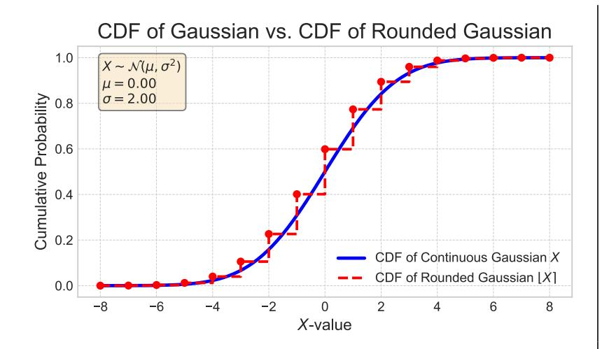
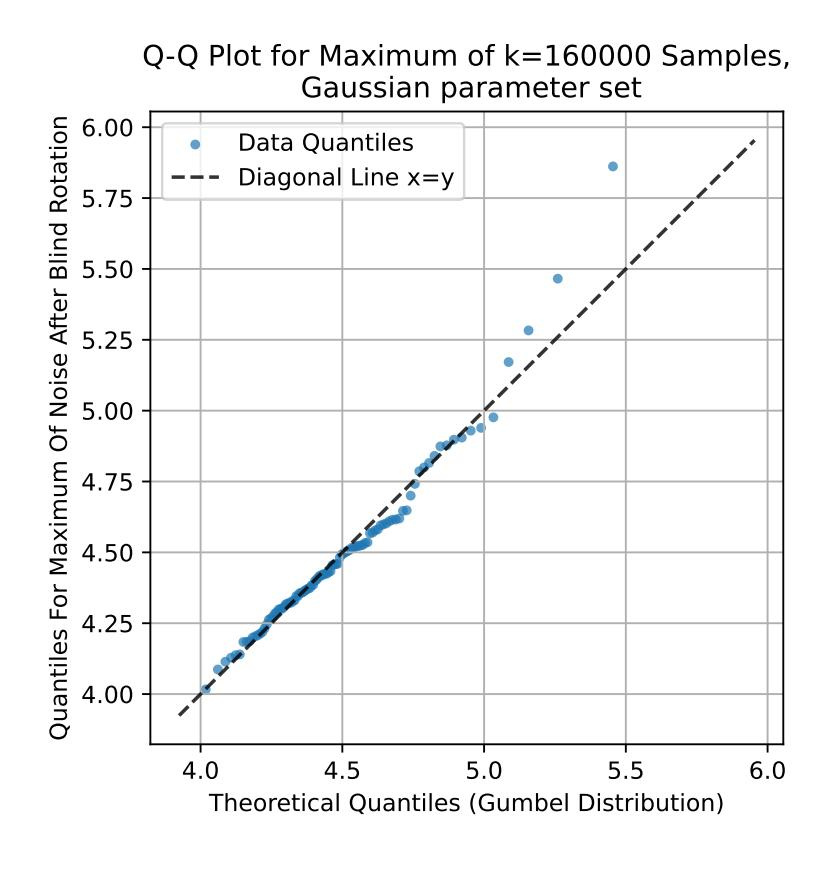
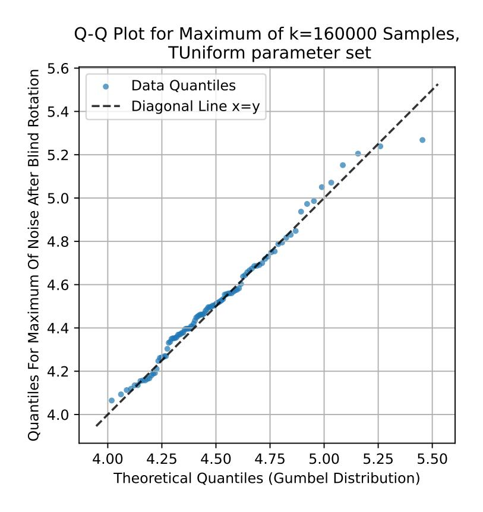

{0}------------------------------------------------

## <span id="page-0-0"></span>Concrete Estimation of Correctness and IND-CPA-D Security for FHE via Rare Event Simulation

Mathieu Ballandras [,](https://orcid.org/0009-0001-9603-3055) Jean-Baptiste Orfila [,](https://orcid.org/0009-0001-4526-0434) Samuel Tap

### Zama

{mathieu.ballandras, jb.orfila, samuel.tap}@zama.org

#### Abstract

By construction, Fully Homomorphic Encryption schemes have probabilistic correctness due to their underlying cryptographic assumptions. The family of Learning With Errors (LWE) problems assumes that a random error term is added during encryption. Statistically, this error grows as homomorphic computation proceeds. While predicting the noise evolution was initially only a correctness issue, recent works have shown a direct link with the security of FHE schemes in the IND-CPA-D model. Here, we present a framework that provides practical guarantees that the probabilities extrapolated from theoretical models satisfy bounds as small as 2 <sup>−</sup>128. We show how to obtain strong experimental guarantees that the usual Gaussian model for noise is conservative and that a refined model based on Irwin–Hall distribution is valid. This is realized through an algorithm called importance splitting, which we adapt here to the cryptographic setting. We provide a detailed study in the context of TFHE bootstrapping and its variants. We believe our framework can serve as a baseline to be extended to other schemes, thereby ensuring both correctness and security across all FHE schemes.

{1}------------------------------------------------

## Contents

| 1 | Introduction                                                                                                              | 3        |
|---|---------------------------------------------------------------------------------------------------------------------------|----------|
| 2 | Preliminaries                                                                                                             | 6        |
|   | 2.1<br>Notations<br><br>2.2<br>TFHE<br>                                                                                   | 6<br>7   |
|   | 2.2.1<br>Bootstrap<br>                                                                                                    | 8        |
|   | 2.2.2<br>Multi Bit Modulus Switch<br><br>2.3<br>Estimation of Rare Events Probabilities with Importance Splitting<br>     | 9<br>9   |
|   | 2.4<br>Tails of Noise Distributions After Products<br>                                                                    | 12       |
| 3 | Correctness Condition and Shifted Modulus Switch                                                                          | 13       |
|   | 3.1<br>Mask Modulus Switch and Shifted Modulus Switch<br><br>3.2<br>Mask Modulus Switch Variance<br>                      | 13<br>15 |
| 4 | Refinement of the Gaussian model for the modulus switch noise                                                             | 17       |
|   | 4.1<br>Irwin–Hall Distribution<br>                                                                                        | 17       |
|   | 4.2<br>Saddle Point Approximation<br><br>4.3<br>Comparison with Gaussian Approximation<br>                                | 18<br>19 |
| 5 | Failure Probability Measures                                                                                              | 19       |
|   | 5.1<br>Importance Splitting for LWE Ciphertexts<br>                                                                       | 20       |
|   | 5.2<br>Importance Splitting (I-S) for TFHE<br>                                                                            | 23       |
|   | 5.3<br>Brute Forcing the Failure Probability<br>                                                                          | 25       |
| 6 | Experimental results                                                                                                      | 25       |
|   | 6.1<br>Failure Probabilities Estimated via Importance Splitting<br>                                                       | 25       |
|   | 6.2<br>Gaussian approximation<br>                                                                                         | 28       |
|   | 6.3<br>Tail Behavior after Blind Rotation<br>                                                                             | 29       |
|   | 6.3.1<br>Maximum of Independent Samples of the Noise Distribution<br><br>6.4<br>Brute Forcing the Failure Probability<br> | 29<br>29 |
| A | IND-CPA-D Definition                                                                                                      | 33       |
| B | Drift Mitigation for Multi Bit Modulus Switch                                                                             | 33       |
|   | B.1<br>Multi Bit Modulus Switch<br>                                                                                       | 33       |
|   | B.2<br>Drift Mitigation Extension<br>                                                                                     | 36       |
|   | B.3<br>Theoretical Determination of the Probability of Success in the Multi Bit<br>Drift Mitigation Technique<br>         | 37       |
| C | List Length of Encryptions of Zero for Drift Mitigation                                                                   | 40       |
| D | Mean Compensation for Multibit Modulus Switch                                                                             | 41       |
| E | The Clopper–Pearson Confidence Interval.                                                                                  | 43       |
| F | Additional Experimental Results<br>F.0.1<br>Kurtosis of the Noise Distribution<br>                                        | 43<br>43 |
| G | Additional Algorithms<br>G.1<br>Implementation references of parameter sets<br>                                           | 44<br>44 |

{2}------------------------------------------------

## <span id="page-2-0"></span>1 Introduction

Fully homomorphic encryption (FHE) has been proven to be a prolific path for cryptographic research and applications. Such cryptographic schemes, allowing users to compute circuits of any depth over encrypted data, have been drastically improved, going from the groundbreaking demonstration by Gentry [\[Gen09\]](#page-31-0) showing this was theoretically possible to practical deployments. The current standard cryptographic assumptions used to construct FHE schemes are LWE [\[Reg09\]](#page-32-0) and its algebraically structured variants [\[BV11\]](#page-30-0). The common difficulty arising from these assumptions and their applications to the evaluation of encrypted circuits lies into their inherent construction: the noise growth. The noise is a small random perturbation chosen at encryption time, which gives the confidence that solving such problems is generally hard, even with the help of potentially forthcoming quantum computers. At evaluation time, any homomorphic operations, e.g. an addition, will yield a statistical noise increment. In order to guarantee the correctness of circuit evaluation in the encrypted world, this noise has to be properly managed. Otherwise, an overflow could occur and erase the plaintext information contained in the resulting ciphertexts. The state-of-the-art suggests then two approaches to deal with the noise: either levelled or bootstrapped. The first one, which includes schemes such as CKKS [\[CKKS17\]](#page-30-1), BGV [\[BGV12\]](#page-29-0) or BFV [\[Bra12,](#page-29-1) [FV12\]](#page-31-1), generally offers fast and SIMD-compliant operations, at the cost of a slower bootstrap. The noise evolution has then to be planned depending on the circuit, so that the bootstrap computations happen as few times as possible. The second approach, for instance represented by AP [\[ASP14\]](#page-29-2), FHEW [\[DM15\]](#page-31-2) and TFHE [\[CGGI20\]](#page-30-2) offers fast bootstrapping on small input message precision (generally a few bits [\[BBB](#page-29-3)<sup>+</sup>23]). Then, the bootstrap is in almost every homomorphic operation, since it allows the flexibility of computing any univariate functions without additional cost [\[CJP21\]](#page-30-3).

The security of FHE schemes has recently been put under renewed scrutiny. Historically, the standard security model was the so-called IND-CPA model (e.g., [\[BV14\]](#page-30-4)), since the usual stronger security notions for encryption schemes were either impossible (IND-CCA2) or still rather theoretical (e.g, IND-CCA1 [\[MN24\]](#page-32-1)). An intermediate security notion called IND-CPA<sup>D</sup> was then defined in [\[LM21\]](#page-31-3), in order to catch use-cases where an adversary may have access to some decryptions. Numerous follow-up works regarding the security of common FHE schemes under this security model have been published, whether there are exact or approximate [\[CCP](#page-30-5)<sup>+</sup>24b] [\[CSBB24\]](#page-31-4). For the purpose of this work, we focus on one outcome, which can be summarized in one sentence as: the security of FHE schemes is entangled with its correctness.

The correctness of an FHE scheme is probabilistic by construction because of the error term (i.e., the noise) appearing in all ciphertexts. In the IND-CPA<sup>D</sup> model, attacks that reveal information about the secret keys can be mounted when an attacker observes the decryption of a ciphertext whose noise became too large and caused a decryption error. In the case of TFHE, this could occur during a bootstrap [\[CCP](#page-30-6)<sup>+</sup>24a]. Otherwise said, if an adversary is capable of endangering the correctness of a bootstrap and gets access to the associated decrypted values, then secret key information could be revealed. To circumvent such attacks, the idea is to have a failure probability associated to this operation matching usual cryptographic standards, i.e., smaller than 2 <sup>−</sup><sup>128</sup>. The pratical impact of going from 

{3}------------------------------------------------

a failure probability chosen with only a will of correctness (so around 2 <sup>−</sup><sup>40</sup>) to one chosen for security needs is disastrous performance-wise. In order to avoid getting bootstrapping that could be more than twice slower because of this new constraint, recent works [\[BJSW25,](#page-29-4) [dRDV25\]](#page-31-5) detail methods to drastically reduce the failure probability from around 2 <sup>−</sup><sup>64</sup> to 2 <sup>−</sup><sup>128</sup> for (almost) free.

The current methods to evaluate this probability rely on a theoretical model to predict the evolution of the noise during homomorphic operations. This theoretical model describes the noise as a Gaussian distribution, whose mean and variance can be estimated through an average case analysis. However, the cornerstone of security and correctness of FHE schemes is related to this failure probability, which relies then on an approximate model. The fact that this model might rely on practically unverified assumptions such as the Normality of the tail of the noise distribution, has, up to our knowledge, never been addressed. We then raise the following questions: can we refine the Gaussian model for the noise? how to define a generic framework to evaluate and verify failure probabilities in FHE schemes?

Contributions In this paper, we describe some practical methods to measure the failure probability associated to homomorphic operations. We also propose a refined model of the noise by using both Gaussian distributions and Irwin–Hall distributions. Our main case study is the TFHE bootstrap, but the overall approach could be adapted to other schemes and operations if needed. Such small failure probabilities cannot be realistically measured through a basic brute force analysis, since this would roughly require evaluating 2 <sup>128</sup> samples to observe one failure. We propose to use a standard statistical method to evaluate rare events: the importance splitting algorithm [\[GHSZ96,](#page-31-6) [BK08\]](#page-29-5) with Gibbs resampling [\[GS90\]](#page-31-7). After explaining how to split FHE operations to exhibit the critical path, we provide probabilistic methods to verify experimentally the theoretical prediction of various models in terms of failure probability. These methods allow to probe much deeper into the tail of the noise distribution than the previous techniques used for instance in [\[BJSW25\]](#page-29-4) (all of them relying on direct sampling).

In the bootstrap à la TFHE, the first operation to compute is a modulus switch [\[BV14\]](#page-30-4), giving the possibility to switch the ciphertext modulus from q to q ′ . Regarding the noise, this step is critical as it is generally after this step that the noise is the largest. We show how to slightly change this operator, through a simple but efficient shift, in order to get slightly better failure probabilities and more accurate theoretical models. Moreover, we show that the noise added by the modulus switch is better described by an Irwin–Hall distribution than by a Gaussian. Finally, we give experimental results regarding the aforementioned failure probabilities, confirming the accuracy of our refined noise model and showing that the standard Gaussian model overestimates the failure probability. This overestimation of the failure probability varies from a factor 2 to a factor 100 for the standard parameter of the TFHE-rs library.. Independently, we provide a generalization of the drift mitigation technique [\[BJSW25\]](#page-29-4), allowing it to account for the input noise before the modulus switch, and adapt it to the multi-bit modulus switch of [\[ZYL](#page-32-2)<sup>+</sup>18a]. Note that we also experimentally verify the failure probabilities in this case. The code will be submitted as an artifact and/or open-sourced if the paper is accepted.

{4}------------------------------------------------

<span id="page-4-0"></span>Technical overview We start by giving more technical details about the measure of the failure probability in the TFHE atomic pattern. In practice, a program using TFHE is often composed of repeated subgraphs of homomorphic operations, known as atomic patterns [\[BBB](#page-29-3)<sup>+</sup>23]. The failure probability p<sup>f</sup> is defined as the probability of a failure occurring within a single atomic pattern. The traditional atomic pattern involves three sequential operations: a dot product, a key switch, and a programmable bootstrap. The programmable bootstrap outputs a ciphertext with smaller noise than the input ciphertext, encrypting the evaluation of an arbitrary function on the underlying message under a different secret key. The dot product is a linear combination, with plaintext coefficients, of several LWE ciphertexts. The key switch transforms a ciphertext to one encrypted under a different secret key, enabling composition with another programmable bootstrap.

The first step of the bootstrap is the modulus switch, a homomorphic operation that introduces an overwhelming amount of noise into the ciphertext. In the atomic pattern described above, this is the point where the noise reaches its maximum. Accordingly, the failure probability of the atomic pattern is defined as the probability that the noise after the modulus switch exceeds the correctness threshold (see Propositions [2](#page-7-1) and [5\)](#page-13-0).

As the modulus switch is one of the main contributors to the noise, it is important to have a precise theoretical model of its contribution. Usually it is modeled by a Gaussian distribution, like all other noise contributions. We show that this particular contribution is better described by an Irwin–Hall distribution. This refined model allows to get more accurate predictions for the failure probability, while Gaussian model tends to pessimistically overestimate it.

Practically estimating this probability is not straightforward, as it is expected to be extremely small, typically on the order of 2 <sup>−</sup><sup>64</sup> or 2 <sup>−</sup><sup>128</sup>. A naive approach by brute force would require an unpractical evaluation of at least 1/p<sup>f</sup> samples to obtain a non zero estimate. This motivates the use of more advanced techniques such as importance splitting [\[BK08\]](#page-29-5), relying on more subtle sampling than brute force. This is described in Section [5.1.](#page-19-0) This technique is thus applied to estimate the probability that the noise after the modulus switch is larger than the correctness threshold. Unfortunately importance splitting cannot be applied to the entire atomic pattern directly. Indeed it can only simulate situations where the output noise varies continuously with the input. This is the case for the modulus switch and for the key switch independently, but not for the combination of the two as they appear in the atomic pattern: key switch −→ modulus switch. Indeed the mask of the output ciphertext after key switch is very sensitive to the input ciphertext, therefore so is the noise output by the consecutive modulus switch. For the same reason, importance splitting cannot be applied to the blind rotation.

Consequently each step has to be studied independently. The main contributions to the noise come from the modulus switch and the key switch. Therefore the focus is on these two steps. Note that to study a single step in isolation with importance splitting, we need to rely on a theoretical model for the input noise. The input noise of the key switch is the noise after the blind rotation. This noise is studied by various techniques described in Section [2.4.](#page-11-0) This analysis confirms the theoretical Gaussian description of the noise after the blind rotation, we can rely on this theoretical model to use as input for the importance splitting applied to key switch. The input noise of the modulus switch is the noise after the key switch. This noise is studied by 

{5}------------------------------------------------

importance splitting in Section 5.2. To summerize the overall strategy: the noise after the blind rotation is studied by various statistical techniques, confirming the theoretical Gaussian model. This model is then used as input for the importance splitting applied to the key switch confirming the theoretical model for the noise after the key switch. This model is then used as input for the importance splitting applied to the modulus switch, confirming the new theoretical model for the noise after the modulus switch and therefore the correctness of the atomic pattern.

The drift mitigation technique [BJSW25] aims to reduce the noise introduced during modulus switch. The idea is to look at a quality test for a given ciphertext. This quality test leverages runtime knowledge of the mask (the mask of an LWE ciphertext is obviously public information known by the server). At runtime, the only remaining unknown regarding the noise added by the modulus switch is on the secret key. The quality test determines if the failure probability of the modulus switch over this randomness is larger than the target failure probability or not. This quality test assumes the Normality of the noise added by the modulus switch and computes its mean  $\mu$  and variance  $\sigma^2$  from the mask components. The drift mitigation algorithm then consists in iterating over a list of encryptions of zero given as part of the public material, adding one of them to the input ciphertext and re-evaluating the quality test until the test passes.

In this article we first adapt this technique in order to take into account the noise before the modulus switch in the quality test and therefore simplifying parameter selection. Then we extend this technique to the multi bit modulus switch. The algorithm is fundamentally the same, only the quality test is modified to take into account the fact that the multi bit version of the modulus switch is used. For illustration, recall that the multi bit modulus switch with grouping factor 2 acts on the mask in the following way:  $(a_1, \ldots, a_n) \mapsto (\lfloor a_1 \rceil, \lfloor a_2 \rceil, \lfloor a_1 + a_2 \rceil, \lfloor a_3 \rceil, \ldots, \lfloor a_{n-1} + a_n \rceil)$ . The mean  $\mu$  and the variance  $\sigma^2$  are then computed according to this new approach. The details of this extension are given in Section C and Appendix B.

## <span id="page-5-0"></span>2 Preliminaries

#### <span id="page-5-1"></span>2.1 Notations

The following notations will be used throughout the paper. Let  $q \in \mathbb{N}$  denotes the base ciphertext modulus, i.e., the one used by default when encrypting. The ring  $\mathbb{Z}/q\mathbb{Z}$  of integers modulo q is denoted by  $\mathbb{Z}_q$ . The elements of this ring are identified with their representative in ]-q/2,q/2]. The dimension of the lattice is written as  $n \in \mathbb{N}$ . Let  $\Delta \in \mathbb{N}$  be an even integer such that  $\Delta$  divides q. Then  $q/\Delta$  is called the message modulus and messages are elements of  $\mathbb{Z}_{q/\Delta}$ . For GLWE ciphertexts the cyclotomic ring is  $\mathbb{Z}_q[X]/(X^N+1)$  with N a power of 2. We assume that all the secret keys s are binary, i.e.,  $s \in \mathbb{B}^n = \{0,1\}^n$ . A zero-centered Gaussian distribution of variance  $\sigma^2$  is denoted  $\mathcal{N}_{\sigma^2}$ . For a random variable  $\mathcal{X}$ , we denote by  $\mathrm{E}(\mathcal{X})$  its expected value and by  $\mathrm{Var}(\mathcal{X})$  its variance. Denote by  $\lfloor \cdot \rfloor$  the rounding operator with the convention that in case of a tie, the rounding is towards the larger integer. For a scale factor  $\lambda \in \mathbb{R}_{>0}$ , the rescaled rounding operator is defined by  $\lfloor \cdot \rfloor_{\lambda} := \lambda \lfloor \frac{\cdot}{\lambda} \rfloor$ .

{6}------------------------------------------------

#### <span id="page-6-0"></span>2.2 TFHE

We recall some basic definitions and operators used in the TFHE scheme.

**Definition 1** (Learning With Error (LWE)-based ciphertext [Reg05]). An LWE ciphertext is a pair  $c = (a,b) \in \mathbb{Z}_q^n \times \mathbb{Z}_q$ , where  $a = (a_1,\ldots,a_n)$  is called the mask and b the body. A ciphertext c encrypting a message  $m \in \mathbb{Z}_{q/\Delta}$  under the secret key  $s \in \mathbb{B}^n$  and an error e is correctly decrypted by computing  $\mathrm{Dec}(c) := \left\lfloor \frac{b - \sum_{i=1}^n a_i s_i}{\Delta} \right\rfloor$  if and only if  $\Delta m + e = b - \sum_{i=1}^n a_i s_i$ , with  $-\Delta/2 \le e < \Delta/2$ .

The presence of the error term e is necessary for the security of the scheme. When encrypting a message, the error term e is usually drawn from one of the following distributions:

- 1. Modular Gaussian distribution: The error e is obtained by first sampling  $\widetilde{e} \in \mathbb{Z}$  with probability  $\Pr(\widetilde{e} = k) \propto \exp\left(-\frac{k^2}{2q^2\sigma^2}\right)$  and then setting  $e = \widetilde{e} \mod q$ .
- 2. **TUniform distribution:** Such distribution are characterized by an integer parameter B < q/2 called the bound. For every integer n with -B < n < B, the probability that e is equal to n is p, and Pr(e = B) = Pr(e = -B) = p/2. The constant p is fixed by the normalization condition.

In practice, the exact value of the noise e in a ciphertext is not known to the server, but the distribution from which it was drawn can be publicly known. Except during encryption, where the noise may be drawn from a TUniform distribution, the error e can be modeled as sampled from a centered modular Gaussian distribution with known standard deviation  $\sigma$ . Using this distribution, the probability that e falls outside the correctness interval  $[-\Delta/2, \Delta/2)$  can be estimated as follows.

<span id="page-6-1"></span>**Proposition 1** (Failure Probability). Assume that the noise e in an LWE ciphertext is Gaussian, zero-centered, with standard deviation  $\sigma$ . Then the probability of decryption failure is  $p_f = 1 - \Pr(-\Delta/2 \le e < \Delta/2) = \operatorname{erfc}\left(\frac{\Delta}{2\sqrt{2}\sigma^2}\right)$ , where erfc denotes the complementary error function.

The fact that decryption can only be guaranteed with some probability has important consequences for the security of the scheme. Indeed, [LM21] introduced a security model, denoted IND-CPA<sup>D</sup>, to formalize security for FHE schemes with probabilistic decryption; this model was later adapted to exact FHE schemes [CCP+24b], i.e., approximate schemes with negligible failure probability. The IND-CPA<sup>D</sup> security experiment is identical to the standard IND-CPA game, except that the decryption oracle, on input a ciphertext c, returns either the correct message m or a special failure symbol  $\bot$  whenever decryption fails. The complete experiment is detailed in Appendix A.

<span id="page-6-2"></span>**Definition 2** (IND-CPA<sup>D</sup> security [LM21]). Let  $\mathcal{FHE} = (\text{KeyGen}, \text{Enc}, \text{Eval}, \text{Dec})$  be a statistically correct FHE public-key encryption scheme. A scheme  $\mathcal{FHE}$  is IND-CPA<sup>D</sup> secure if for every probabilistic polynomial time adversary  $\mathcal{A}$ , then

$$\left| Pr\left[ \operatorname{Exp}_b^{\mathsf{IND-CPA-D}}(\lambda) - \frac{1}{2} \right] \right|$$

is negligible in the security parameter  $\lambda$ .

{7}------------------------------------------------

To be secure under this model, the key requirement is that the decryption failure probability be made small enough that an adversary cannot exploit failures via a decryption oracle to learn information about the secret key [\[CCP](#page-30-5)<sup>+</sup>24b]. Consequently, most FHE libraries target a failure probability below 2 <sup>−</sup><sup>128</sup>, the standard threshold for 128-bit security, by carefully selecting their parameter sets.

Because correctness and security are tightly connected, accurately estimating the failure probability p<sup>f</sup> is a critical task. The primary focus of this paper is therefore a detailed experimental and theoretical analysis of the failure probability to ensure both the correctness and the security of LWE-based schemes.

#### <span id="page-7-0"></span>2.2.1 Bootstrap

The bootstrap is a core component of the TFHE scheme. At a high level, it consists in evaluating the decryption algorithm homomorphically, with parameters chosen so that the output ciphertext contains statistically less noise than the input ciphertext. Several variants of the bootstrap exist, but they all follow the same structure: a modulus switch, followed by a blind rotation, and finally a sample extraction. The modulus switch introduces additional noise into the input ciphertext. When the parameters are correctly chosen, the blind rotation breaks the dependency between the input noise of the bootstrap and the output noise, and statistically reduces the noise. In this setting, the output noise of the bootstrap is defined as the output noise of the blind rotation, since the sample extraction is a simple operation that does not increase the noise.

The failure probability of the bootstrap can be defined as the probability that the output ciphertext, or any intermediate ciphertext, is not a correct encryption of the intended message.

<span id="page-7-1"></span>Proposition 2. On input a ciphertext c = (a, b = Pais<sup>i</sup> + ∆m + e mod q), the bootstrap returns a correct result, i.e., an encryption of the message m, iff

<span id="page-7-2"></span>
$$-\Delta/2 \le e_{\mathsf{MS}} < \Delta/2 \ and \ -\Delta/2 \le e_{\mathsf{BR}} < \Delta/2, \tag{1}$$

where eMS (resp. eBR) is the error after a modulus switch (resp. blind rotation).

Except for freshly encrypted ciphertexts, the inputs to a bootstrap are themselves the outputs of previous bootstraps. By computing eMS and eBR using the parameter set f in Table [2,](#page-25-0) we estimate that Var(eMS) ≈ 1000×Var(eBR). This means that the noise after the modulus switch is statistically much larger than the noise after the blind rotation and therefore a failure is much more likely to occur after the modulus switch than after the blind rotation. As such, in the remainder of this work we define the failure probability of the bootstrap as the probability that the condition on eMS in Equation [\(1\)](#page-7-2) is not satisfied, i.e., p<sup>f</sup> = 1 − Pr(−∆/2 ≤ eMS < ∆/2). This confirms that the critical point for the scheme's correctness is just after the modulus switch.

Several variants of the bootstrap have been proposed to improve performance. Each of them can still be decomposed into a modulus switch, a blind rotation, and a sample extraction, with modifications to these operators. Interestingly, the same behavior of the noise persists: the noise is maximal just after the modulus switch, and the blind rotation statistically reduces it. Thus, the analysis of the modulus switch remains central for studying the correctness of these variants, including the classical 

{8}------------------------------------------------

bootstrap [CGGI20] discussed below, the multi bit bootstrap [ZYL<sup>+</sup>18b] discussed in Section 2.2.2, the mean compensation technique [dRDV25] in Section 2.2.2, and the drift mitigation technique [BJSW25] already discussed in Section 1.

<span id="page-8-4"></span>Classical Modulus Switch The modulus switch is a homomorphic operator used to change the ciphertext modulus from q to q'. In Definition 3, we focus on the special case where q' = 2N and N is a power of 2. Moreover, we assume that 2N divides q and that the integer  $\frac{q}{2N}$  divides  $\Delta/2$  which is a classical assumption when using the TFHE scheme. Implementations typically set q, N and  $\Delta$  as powers of two.

<span id="page-8-3"></span>**Definition 3** (Modulus Switch [DM15, CGGI20]). The modulus switch of an LWE ciphertext  $c = (a, b) \in \mathbb{Z}_q^n \times \mathbb{Z}_q$  with mask  $a = (a_1, \ldots, a_n)$  is the ciphertext  $\mathrm{MS}(c) := (\lfloor a \rfloor_{\frac{q}{2N}}, \lfloor b \rceil_{\frac{q}{2N}}) \in \mathbb{Z}_q^n \times \mathbb{Z}_q$  with mask  $\lfloor a \rceil_{\frac{q}{2N}} := (\lfloor a_1 \rceil_{\frac{q}{2N}}, \ldots, \lfloor a_n \rceil_{\frac{q}{2N}})$ . The error term after modulus switch is:  $e_{\mathrm{MS}} := \lfloor b \rceil_{\frac{q}{2N}} - \sum_{i=1}^n \lfloor a_i \rceil_{\frac{q}{2N}} s_i - \Delta m$ .

#### <span id="page-8-0"></span>2.2.2 Multi Bit Modulus Switch

The multi bit bootstrap [ZYL<sup>+</sup>18b, JP22] is a variant of the classical TFHE bootstrap. It offers a trade-off between latency, and the size of the public material. This trade-off is governed by an integer parameter g, called the *grouping factor*. In the multi bit modulus switch, instead of rounding each coefficient of the mask  $(a_1, a_2, \ldots, a_n)$  individually, the terms are grouped into n/g sums of g consecutive terms of the form  $\lfloor a_1s_1 + a_2s_2 + \cdots + a_gs_g \rfloor_{\frac{q}{2N}}$ . This grouping reduces the total rounding error and therefore results in less noise after the modulus switch, as studied in [CKLM24]. While this technique requires larger public material, it also decreases the cost of the blind rotation by a factor of g. In TFHE-rs [Zam22], the default bootstrap used on a GPU is a multi bit bootstrap.

<span id="page-8-2"></span>Mean Compensated Modulus Switch The mean compensation technique introduced in [dRDV25] aims at reducing the noise introduced by the modulus switch. This technique is similar in spirit to the drift mitigation technique recalled in Section 1. The idea of the mean compensation is to subtract from the body the rounding error averaged over the randomness of the secret key. Overall its effect is roughly to divide by two the variance of the noise added by the modulus switch.

**Definition 4** (Mean Compensated Modulus Switch [dRDV25]). The mean compensated modulus switch of an LWE ciphertext  $c = (a,b) \in \mathbb{Z}_q^n \times \mathbb{Z}_q$  with mask  $a = (a_1,\ldots,a_n)$  is the ciphertext  $\mathrm{MS}(c) := \left(\lfloor a \rceil_{\frac{q}{2N}}, \left\lfloor b - \frac{1}{2} \sum_{i=1}^n \left( a_i - \lfloor a_i \rceil_{\frac{q}{2N}} \right) \right\rceil_{\frac{q}{2N}} \right) \in \mathbb{Z}_q^n \times \mathbb{Z}_q$  with mask  $\lfloor a \rceil_{\frac{q}{2N}} := \left( \lfloor a_1 \rceil_{\frac{q}{2N}}, \ldots, \lfloor a_n \rceil_{\frac{q}{2N}} \right)$ .

## <span id="page-8-1"></span>2.3 Estimation of Rare Events Probabilities with Importance Splitting

Importance splitting [BK08] offers a general approach to estimate the probability of rare events. It is especially useful when the probability of the event of interest is very small, so that direct brute force measurement is not an option. The general idea is to simulate a population of samples of the random variable of interest and

{9}------------------------------------------------

then to recursively resample this population and steer it toward the relevant event. When the random variable is a high dimensional vector, an efficient way to resample the population is the Gibbs resampling algorithm. It will be particularly well suited to the present application to LWE ciphertexts. In the remainder of this section the general importance splitting algorithm is presented.

**Setup** Consider a random variable  $\mathcal{X}$  with value in some space E and  $S: E \to \mathbb{R}$  a score function. We are interested in the probability of a rare event  $S(\mathcal{X}) > \eta$  for some threshold  $\eta \in \mathbb{R}$ . The importance splitting algorithm is a method to estimate this probability.

**Recursive Bayes formula** Recall Bayes' formula: for two events A and B,  $\Pr(A \cap B) = \Pr(A \mid B) \Pr(B)$ . From this general identity one obtains a recursive version for nested events  $A_l \subset A_{l-1} \subset \cdots \subset A_1$ :

$$\Pr(A_l) = \Pr(A_l \mid A_{l-1}) \Pr(A_{l-1} \mid A_{l-2}) \cdots \Pr(A_2 \mid A_1) \Pr(A_1). \tag{2}$$

Let  $A_i = \{S(\mathcal{X}) > \eta_i\}$  with  $\eta_1 < \eta_2 < \cdots < \eta_l := \eta$ . Then

$$\Pr(S(\mathcal{X}) > \eta) = \Pr(S(\mathcal{X}) > \eta_l \mid S(\mathcal{X}) > \eta_{l-1})$$

$$\times \Pr(S(\mathcal{X}) > \eta_{l-1} \mid S(\mathcal{X}) > \eta_{l-2}) \cdots \Pr(S(\mathcal{X}) > \eta_1). \quad (3)$$

The central idea of importance splitting is to estimate the probability of exceeding the threshold of interest  $\eta$  in situations where  $\Pr(S(\mathcal{X}) > \eta) \ll 1$ , by decomposing it into conditional probabilities  $\Pr(S(\mathcal{X}) > \eta_{i+1} \mid S(\mathcal{X}) > \eta_i)$ , which are much easier to estimate in practice.

**Resampling** The key ingredient of the importance splitting algorithm is the population resampling step. Given a population of n samples  $X_1, \ldots, X_n$  of the random variable  $\mathcal{X}$ , all satisfying  $S(X_j) > \eta$ , this step produces a new population of size k (possibly with k > n) consisting of independent samples  $Y_1, \ldots, Y_k$ , where each  $Y_j$  is distributed as  $\mathcal{X}$  conditioned on the event  $S(\mathcal{X}) > \eta$  and is independent of the original samples  $X_i$ .

In this paper, the resampling step is performed using Gibbs resampling, which takes as input a threshold  $\eta$  and a sample X satisfying  $S(X) > \eta$ , and produces a new sample  $\mathcal{G}(X)$  that also satisfies  $S(\mathcal{G}(X)) > \eta$ .

To experimentally assess whether  $\mathcal{G}(X)$  is independent of the original sample X, we can consider a real-valued test function  $f: \mathcal{X} \to \mathbb{R}$  and measure correlations between the random variables f(X) and  $f(\mathcal{G}^t(X))$  by computing the lag-t autocorrelation

<span id="page-9-1"></span>
$$\gamma_t := \frac{\operatorname{Cov}(f(\mathcal{G}^t(X)), f(X))}{\operatorname{Var}(f(X))}, \quad t \in \mathbb{N}.$$
(4)

as well as the integrated autocorrelation time (see [Sok97])

<span id="page-9-0"></span>
$$\tau := \frac{1}{2} + \frac{1}{2} \sum_{t=1}^{+\infty} \gamma_t. \tag{5}$$

For perfect sampling with no memory, one has  $\gamma_t = 0$  for all  $t \geq 1$ , and consequently  $\tau = 1/2$ . The parameter  $\tau$  can be interpreted as the number of consecutive

{10}------------------------------------------------

resampling steps required to obtain an effectively independent sample. For the purposes of simulation, a sampling procedure with  $\tau < 1$  introduces only a negligible bias.

Importance Splitting Algorithm The goal is to sequentially estimate the probabilities  $\Pr(S(\mathcal{X}) > \eta_i | S(\mathcal{X}) > \eta_{i-1})$  by counting, among a population of fixed size k with score larger than  $\eta_{i-1}$ , the portion of the population with a score larger than the subsequent threshold  $\eta_i$ . Keeping only the samples with score larger than  $\eta_i$ , we obtain from the population of size k a smaller population of size  $n_i$ . The resampling is applied to this smaller population to obtain a new population of size k with scores larger than  $\eta_i$ . Therefore, for all i the probability  $\Pr(S(\mathcal{X}) > \eta_i | S(\mathcal{X}) > \eta_{i-1})$  is estimated over a population of the same size k. The complete algorithm is detailed in Algorithm 1 (ignoring the full-line boxes). In this algorithm,  $p_i$  is an unbiased estimator of  $\Pr(S(\mathcal{X}) > \eta_i | S(\mathcal{X}) > \eta_{i-1})$  meaning that  $\mathbb{E}[p_i] = \Pr(S(\mathcal{X}) > \eta_i | S(\mathcal{X}) > \eta_{i-1})$ . We have the following proposition (see [BK08]).

**Proposition 3.** In Algorithm 1, under the assumption that the estimators  $p_i$  are independent, the returned value  $p = p_1 \dots p_l$  is an unbiased estimator of  $\Pr(S(\mathcal{X}) > \eta)$  with squared relative error

<span id="page-10-0"></span>
$$R^{2} = \prod_{i=1}^{l} \left( 1 + \frac{p_{i}^{-1} - 1}{k} \right) - 1.$$
 (6)

From the relative error one can deduce the  $3\sigma$  confidence interval [p-3Rp, p+3Rp].

**Remark 1.** The assumption that the estimators  $p_i$  are independent is justified by the quality of the resampling algorithm when the integrated autocorrelation time satisfies  $\tau < 1$  (see (5)).

Finding the Consecutive Thresholds The importance splitting algorithm presented in Algorithm 1 takes as input a sequence of consecutive thresholds  $\eta_1 < \eta_2 < \cdots < \eta_l$ . These thresholds directly affect both the convergence of the algorithm and the quality of the estimate of  $\Pr(S(\mathcal{X}) > \eta)$ , and should therefore be chosen with care. Crucially, for the importance splitting algorithm to work, the main forloop must never yield an empty set  $\{Y_1^{(i)}, \ldots, Y_{n_i}^{(i)}\}$ , since this would prevent the resampling step from being carried out. This could happen if the space between consecutive thresholds is too large.

In practice we want to target a fixed portion  $p_i = \frac{n_i}{k} > 0$  at each step of the loop. Notice that aiming for equal  $p_1, \ldots, p_l$  minimizes the relative error (6) (for a fixed number of thresholds l and a fixed estimated probability  $p_1 \ldots p_l$ , see [BK08]). To achieve this goal, the thresholds are determined on-the-fly during a first run of a variant of the importance splitting algorithm. During this first run, a target n is fixed for the size of the small population (the quantity k-n is called the number of samples to kill at each step). The complete procedure for determining these thresholds is given in Algorithm 1 (ignoring dashed boxes).

**Remark 2.** The threshold determination run of Algorithm 1 could also be used to directly estimate the probabilities  $p_1, \ldots, p_l$ . However the correlations between the samples and the thresholds  $\eta_i$  introduce correlations between the  $p_i$  and lead to a less precise estimation.

{11}------------------------------------------------

```
Algorithm 1 Importance Splitting
                                                           Threshold Determination in Importance Splitting
                   The size k of the population
                   An increasing sequence of thresholds -\infty = \eta_0 < \eta_1 < \dots < \eta_l = \eta.
  Input:
                    The target size of the reduced population n < k, the target threshold \eta
                              Initialize a population X_1^{(0)}, \dots, X_k^{(0)} drawn as \mathcal{X}
Initialize i = 1 and \eta_0 = -\infty
   Initialization:
  For i = 1, \dots, l Repeat
         The population is X_1^{(i-1)}, \dots, X_k^{(i-1)} with S(X_j^{(i-1)}) > \eta_{i-1} for all j.
          Let \eta_i be the score of the (n+1)-th sample (ordered by decreasing score)
         Keep only the samples with score larger than \eta_i:
                                     \{Y_1^{(i)}, \dots, Y_{n_i}^{(i)}\} := \{X_i^{(i-1)} \mid S(X_i^{(i-1)}) > \eta_i\}.
         Compute p_i := \frac{n_i}{k}
         Apply Gibbs resampling (see Algorithm 2 and Appendix G) to Y_1^{(i)}, \ldots, Y_{n_i}^{(i)}.
         This produces a population X_1^{(i)}, \ldots, X_k^{(i)} with S(X_j^{(i)}) > \eta_i.
          Increment i \leftarrow i+1
   \begin{aligned} \textbf{EndFor} \ \boxedsymbol{\bigs} \ \textbf{Until } \eta_{i-1} > \eta \end{aligned}
   \lceil \mathbf{return} \ p_1 p_2 \dots p_l \rceil \rceil \lceil \mathbf{return} \ \eta_0, \eta_1, \dots, \eta_{i-2}, \eta \rceil
```

#### <span id="page-11-0"></span>2.4 Tails of Noise Distributions After Products

As explained in Section 1, importance splitting is not well suited to study every step of the TFHE scheme. Therefore other tools are used to study the tail of the noise distribution after the blind rotation.

Deviation from the Gaussian Model In [GZ25], the behavior of the noise is studied when performing product of polynomials in a cyclotomic ring. Discrepancies between theoretical Gaussian models and actual behavior of the noise in the tail of the distributions are observed. They are studied by computing the two quantities explained below, the Kurtosis and the distribution of the maximums. Such discrepancies are suspected to affect homomorphic encryption schemes such as BGV [BGV12] and BFV [FV12]. We check that according to these two metrics, no such effect are observed in TFHE after the blind rotation.

Kurtosis of the Noise Distribution The Kurtosis of a real random variable  $\mathcal{X}$  is defined as  $\mathrm{E}(\mathcal{X}^4)/\mathrm{E}(\mathcal{X}^2)^2$ . The Kurtosis is an indicator of the weight of the tail of a distribution (see [Wes14]). For a Gaussian random variable, the Kurtosis equals 3, a larger Kurtosis indicates a heavier tail of the distribution. In [GZ25], the authors compute the Kurtosis of a product of a large number of independent Gaussian polynomials in a cyclotomic ring and prove that such products are not well approximated by Gaussian distributions, particularly in the tails. Such deep products appear in TFHE during the blind rotation, but in practice they are combined with other operations, such as rounding and addition. This means that the theoretical analysis of [GZ25] does not directly apply to our use case. In Appendix F.0.1, we present experimental results showing that the Kurtosis of the noise distribution after the blind rotation in TFHE is indeed compatible with the Gaussian model.

{12}------------------------------------------------

<span id="page-12-4"></span>Maximum of Independent Samples The second relevant quantity studied in [GZ25] is the maximum  $\max_{1 \le i \le k} X_i$  of independent samples of the noise distribution  $X_1, \ldots, X_k$ . We want to compare this experimental distribution to the theoretical one. The theoretical distribution is obtained by assuming that the  $X_i$  are Gaussian, independent and identically distributed. For large k, the resulting theoretical distribution follows a Gumbel distribution [GZ25]. The cumulative distribution function of this Gumbel distribution is  $\exp\left(-\exp(-\frac{x-\mu_k}{\beta_k})\right)$ . Denote by  $\Phi$  the cumulative distribution function of the zero-centered normalized Gaussian random variable. The parameters  $\mu_k$  and  $\beta_k$  are given by  $\mu_k = \Phi^{-1}\left(1-\frac{1}{k}\right)$  and  $\beta_k = \frac{\sqrt{2\pi}}{k}\exp\left(\frac{\mu_k^2}{2}\right)$ .

In Section 6.3, this behavior expected for Gaussian samples is checked experimentally for the noise distribution after the blind rotation in TFHE. The Kolmogorov–Smirnov test is used to check the agreement between the theoretical Gumbel distribution and the experimental one.

### <span id="page-12-0"></span>3 Correctness Condition and Shifted Modulus Switch

In this section a minor modification of the modulus switch is introduced, it is called the *shifted* modulus switch. It corrects the asymmetry present in the classical modulus switch between failure with positive noise and failure with negative noise. Moreover it leads to a more precise theoretical description of the failure probability and overall slightly reduces it.

#### <span id="page-12-1"></span>3.1 Mask Modulus Switch and Shifted Modulus Switch

First we introduce the mask modulus switch as an intermediate step within the modulus switch. This formulation simplifies subsequent proofs and allows for a cleaner description of the correctness condition.

<span id="page-12-5"></span>**Definition 5** (Mask Modulus Switch). Let c = (a, b) be an LWE ciphertext with mask  $a = (a_1, \ldots, a_n)$ . The mask modulus switch takes as input c and outputs:  $MMS(c) := \left(\lfloor a \rceil_{\frac{q}{2N}}, b\right)$ , where  $\lfloor a \rceil_{\frac{q}{2N}} := \left(\lfloor a_1 \rceil_{\frac{q}{2N}}, \ldots, \lfloor a_n \rceil_{\frac{q}{2N}}\right)$ . The noise of MMS(c) is given by:  $e_{MMS} := b - \sum_{i=1}^{n} \lfloor a_i \rceil_{\frac{q}{2N}} s_i - \Delta m$ .

<span id="page-12-3"></span>**Definition 6** (Mean Compensated Mask Modulus Switch). The mean compensated mask modulus switch of an LWE ciphertext  $c = (a, b) \in \mathbb{Z}_q^n \times \mathbb{Z}_q$  with mask  $a = (a_1, \ldots, a_n)$  is the ciphertext  $\left(\lfloor a \rfloor_{\frac{q}{2N}}, b - \frac{1}{2} \sum_{i=1}^n \left(a_i - \lfloor a_i \rceil_{\frac{q}{2N}}\right)\right) \in \mathbb{Z}_q^n \times \mathbb{Z}_q$  with mask  $\lfloor a \rceil_{\frac{q}{2N}} := \left(\lfloor a_1 \rceil_{\frac{q}{2N}}, \ldots, \lfloor a_n \rceil_{\frac{q}{2N}}\right)$ .

The following proposition establishes the relationship between the noise resulting from the *mask* modulus switch and that of the standard modulus switch.

<span id="page-12-2"></span>**Proposition 4.** Let  $e_{MS}$ , respectively  $e_{MMS}$  be the error term after modulus switch, respectively mask modulus switch. The error after modulus switch is obtained by rounding of the error term after mask modulus switch,  $e_{MS} = \lfloor e_{MMS} \rfloor_{\frac{q}{2N}}$ .

*Proof.* By definition, we have  $\lfloor e_{\text{MMS}} \rceil_{\frac{q}{2N}} = \lfloor b - \sum_{i=1}^n \lfloor a_i \rceil_{\frac{q}{2N}} s_i - \Delta m \rfloor_{\frac{q}{2N}}$ . The integer  $\frac{q}{2N}$  divides each term  $\lfloor a_i \rceil_{\frac{q}{2N}} s_i$ . It is also assumed from Section 2.2.1 that it

{13}------------------------------------------------

divides the term  $\Delta$ , thus also  $\Delta m$ . All these terms can then be taken out of the rounding operator and  $\lfloor e_{\text{MMS}} \rceil_{\frac{q}{2N}} = \lfloor b \rceil_{\frac{q}{2N}} - \sum_{i=1}^n \lfloor a_i \rceil_{\frac{q}{2N}} s_i - \Delta m$ . This last term is exactly the definition of the error after modulus switch  $e_{\text{MS}}$ .

The mask modulus switch allows us to rewrite the correctness constraint from Proposition 2 so that it depends solely on  $e_{\rm MMS}$ .

<span id="page-13-0"></span>**Proposition 5.** On input a ciphertext  $c = (a, b = \sum a_i s_i + \Delta m + e)$  the bootstrap returns a correct result, i.e., an encryption of the message m if and only if the error after mask modulus switch  $e_{\text{MMS}}$  satisfies

<span id="page-13-1"></span>
$$-\Delta/2 - \frac{q}{4N} \le e_{\text{MMS}} < \Delta/2 - \frac{q}{4N}. \tag{7}$$

Proof. The bootstrap is a modulus switch followed by homomorphic evaluation of the decryption formula. By Proposition 2 its result is correct as long as the error after modulus switch is small enough, namely  $-\Delta/2 \le e_{\rm MS} < \Delta/2$ . By Proposition 4, this is equivalent to  $-\Delta/2 \le \frac{q}{2N} \left\lfloor \frac{2N}{q} e_{\rm MMS} \right\rfloor < \Delta/2 \Leftrightarrow -\frac{2N}{q} \frac{\Delta}{2} \le \left\lfloor \frac{2N}{q} e_{\rm MMS} \right\rfloor < \frac{2N}{q} \frac{\Delta}{2}$ . By assumption,  $\frac{q}{2N}$  divides  $\Delta/2$  (see Classical Modulus Switch in Section 2.2.1), so both bounds of the inequality are integers. Therefore by definition of the rounding operator (rounding toward the largest integer in case of tie), the previous inequality is equivalent to  $-\frac{2N}{q} \frac{\Delta}{2} - \frac{1}{2} \le \frac{2N}{q} e_{\rm MMS} < \frac{2N}{q} \frac{\Delta}{2} - \frac{1}{2}$  The result follows by multiplying the previous inequality by  $\frac{q}{2N}$ .

Interestingly, the interval of the correctness condition (7) is not zero-centered. As in Proposition 1, a more precise failure probability can be deduced from this correctness condition. Because of the asymmetry, a failure with a positive error is more likely to happen than a failure with a negative error. Assuming that the noise after mask modulus switch  $e_{\rm MMS}$  is Gaussian, zero-centered, with standard deviation  $\sigma_{\rm MMS}$  the corresponding probabilities are given by

$$p_f^+ := \Pr\left(e_{\text{MMS}} \ge \Delta/2 - \frac{q}{4N}\right) = \frac{1}{2}\operatorname{erfc}\left(\frac{\Delta/2 - \frac{q}{4N}}{\sqrt{2\sigma_{\text{MMS}}^2}}\right),$$

$$p_f^- := \Pr\left(e_{\text{MMS}} < -\frac{\Delta}{2} - \frac{q}{4N}\right) = \frac{1}{2}\operatorname{erfc}\left(\frac{\Delta/2 + \frac{q}{4N}}{\sqrt{2\sigma_{\text{MMS}}^2}}\right).$$

<span id="page-13-3"></span>From which the global failure probability is deduced.

**Proposition 6.** Assuming that the noise after mask modulus switch follows a zero centered Gaussian distribution the failure probability is given by

$$p_f = \frac{1}{2} \left( \operatorname{erfc} \left( \frac{\Delta/2 - \frac{q}{4N}}{\sqrt{2\sigma_{\text{MMS}}^2}} \right) + \operatorname{erfc} \left( \frac{\Delta/2 + \frac{q}{4N}}{\sqrt{2\sigma_{\text{MMS}}^2}} \right) \right).$$

<span id="page-13-2"></span>To avoid the asymmetry and at the same time slightly reduce the global failure probability, the noise can be shifted to be statistically centered relative to the correctness condition interval. This shift operation is performed during the modulus switch, before the rounding of the body. This variant is called the *shifted* modulus switch.

{14}------------------------------------------------

**Definition 7** (Shifted Modulus Switch). Let c = (a, b) be an LWE ciphertext with mask  $a = (a_1, \ldots, a_n)$ . The shifted modulus switch takes as input c and outputs:  $SMS(c) := \left( \lfloor a \rfloor_{\frac{q}{2N}}, \lfloor b - \frac{q}{4N} \rceil_{\frac{q}{2N}} \right)$ .

The various steps of the *shifted* modulus switch operation are summarized in the following diagram describing both the ciphertext (above) and the error (below).

$$(a,b) \xrightarrow[e]{\text{MMS}} (\lfloor a \rceil_{\frac{q}{2N}}, b) \xrightarrow[e]{\text{shift}} (\lfloor a \rceil_{\frac{q}{2N}}, b - \frac{q}{4N}) \xrightarrow[e]{\text{body}} (\lfloor a \rceil_{\frac{q}{2N}}, \lfloor b - \frac{q}{4N} \rceil_{\frac{q}{2N}})$$

$$e_{\text{MMS}} - \frac{q}{4N} \xrightarrow[e]{\text{MMS}} - \frac{q}{4N}$$

When using the *shifted* modulus switch, the correctness condition becomes symmetric.

<span id="page-14-2"></span>**Proposition 7.** The bootstrap with shifted modulus switch returns a correct result if and only if the error after mask modulus switch  $e_{\mathrm{MMS}}$  satisfies

$$-\Delta/2 \le e_{\text{MMS}} < \Delta/2. \tag{8}$$

*Proof.* This follows from Proposition 5 and from the Definition 7 of the shifted modulus switch.

Corollary 1. Assuming that the noise after mask modulus switch  $e_{\text{MMS}}$  is Gaussian, zero-centered, with standard deviation  $\sigma_{\text{MMS}}$ , the failure probability when using the shifted modulus switch is given by  $p_f^{\text{SMS}} = \text{erfc}\left(\frac{\Delta/2}{\sqrt{2\sigma_{\text{MMS}}^2}}\right)$ .

<span id="page-14-3"></span>Remark 3. The failure probability with the shifted modulus switch is smaller than the one for the standard modulus switch (described in Proposition 6). Indeed by strict convexity of the erfc function over  $\mathbb{R}^+$ : erfc  $\left(\frac{\Delta/2}{\sqrt{2\sigma_{\mathrm{MMS}}^2}}\right) < \frac{1}{2} \left(\mathrm{erfc}\left(\frac{\Delta/2 - \frac{q}{4N}}{\sqrt{2\sigma_{\mathrm{MMS}}^2}}\right) + \mathrm{erfc}\left(\frac{\Delta/2 + \frac{q}{4N}}{\sqrt{2\sigma_{\mathrm{MMS}}^2}}\right)\right)$ .

The expression of the failure probability for *shifted* modulus switch,  $\operatorname{erfc}\left(\frac{\Delta/2}{\sqrt{2\sigma_{\mathrm{MMS}}^2}}\right)$ , is reminiscent of the usual one  $\operatorname{erfc}\left(\frac{\Delta/2}{\sqrt{2\sigma_{\mathrm{MS}}^2}}\right)$  (which is stated at the level of the modulus switch). However, the former is more precise; not only does it take into account the asymmetry, but it is also stated at the level of the *mask* modulus switch, where the Gaussian approximation is more precise. Indeed, after mask modulus switch the space where the noise lies is much less discretized than after the rounding of the body. These theoretical considerations are confirmed by the experimental results obtained with Shapiro–Francia normality tests (see Section 6.2).

#### <span id="page-14-0"></span>3.2 Mask Modulus Switch Variance

<span id="page-14-1"></span>In order to compare the usual expression of the failure probability erfc  $\left(\frac{\Delta/2}{\sqrt{2\sigma_{\rm MS}^2}}\right)$  with the one obtained with the *shifted* modulus switch erfc  $\left(\frac{\Delta/2}{\sqrt{2\sigma_{\rm MMS}^2}}\right)$ , we study the variances  $\sigma_{\rm MS}^2$  and  $\sigma_{\rm MMS}^2$  of the noises. This analysis relies on [BJSW25, Lemma 4.1], recalled below for completeness.

{15}------------------------------------------------

**Lemma 1.** [BJSW25, Lemma 4.1] For X a uniformly-distributed random variable over  $\mathbb{Z}_q$ , the rounding error  $\alpha$  defined as  $\alpha = \lfloor X \rceil_{\frac{q}{2N}} - X$  is uniformly distributed over  $\left\{-\frac{q}{4N} + 1, \ldots, \frac{q}{4N}\right\}$ . It satisfies  $\mathrm{E}(\alpha^2) = \frac{q^2 + 8N^2}{48N^2}$  and  $\mathrm{Var}(\alpha) = \frac{q^2 - 4N^2}{48N^2}$ .

**Definition 8** (Error added by the mask modulus switch). Let c be a ciphertext with initial error term e, and let  $e_{\text{MMS}}$  denote the error after applying the mask modulus switch. The error added by the mask modulus switch is defined as:  $\delta := e_{\text{MMS}} - e = -\sum_{i=1}^{n} \alpha_i s_i$ . with  $\alpha_i = \lfloor a_i \rfloor_{\frac{q}{2N}} - a_i$  the rounding error of the i-th component of the mask  $a_i$ .

<span id="page-15-1"></span>**Proposition 8.** The noise added by the mask modulus switch satisfies  $Var(\delta) = n \frac{q^2 + 2N^2}{96N^2}$ .

Proof. By Lemma 1, the rounding errors  $\alpha_i$  are independent random variables uniformly distributed over  $\left\{-\frac{q}{4N}+1,\ldots,\frac{q}{4N}\right\}$  with  $\mathrm{E}(\alpha_i^2)=\frac{q^2+8N^2}{48N^2}$  and  $\mathrm{Var}(\alpha_i)=\frac{q^2-4N^2}{48N^2}$ . Then, as the mask is independent of the secret key, we have  $\mathrm{Var}(\alpha_i s_i)=\mathrm{E}(\alpha^2)\,\mathrm{E}(s_i^2)-\mathrm{E}(\alpha)^2\,\mathrm{E}(s_i)^2=\frac{1}{2}\,\mathrm{E}(\alpha^2)-\frac{1}{16}=\frac{q^2+2N^2}{96N^2}$ . The variance  $\mathrm{Var}(\delta)$  is obtained by summing the independent contributions of each mask component.

<span id="page-15-0"></span>**Remark 4.** The maximum value of the noise added by the mask modulus switch is  $\frac{qn}{4N}$ . Thus for the modulus switch, the Gaussian model necessarily overestimates the noise in the tail of the distribution: the actual noise is bounded whereas the Gaussian distribution is not.

In previous works, for instance in [CLOT21], the noise of the traditional modulus switch was obtained by assuming the rounding error of the body to be independent from the other contributions. Under this approximation, the variance of the noise after modulus switch is obtained by adding  $Var(\alpha)$  to the variance of the noise after mask modulus switch  $\sigma_{MS}^2 = \sigma_{MMS}^2 + Var(\alpha)$ . Therefore the usual expression of the failure probability is  $erfc\left(\frac{\Delta/2}{\sqrt{2\sigma_{MS}^2}}\right) = erfc\left(\frac{\Delta/2}{\sqrt{2(\sigma_{MMS}^2 + Var(\alpha))}}\right)$ , which is slightly

larger than the failure probability with *shifted* modulus switch erfc  $\left(\frac{\Delta/2}{\sqrt{2\sigma_{\rm MMS}^2}}\right)$ . Notice that the independence assumption between the rounding error of the body and that of the mask elements is not true in general, as the body does depend on the mask. Numerically, for the parameter set d from Table 2, the failure probability without the shift computed with the traditional expression is erfc  $\left(\frac{\Delta/2}{\sqrt{2\sigma_{\rm MS}^2}}\right) = 1.146 \times 10^{-39}$ , with the more accurate expression the failure probability without the shift is  $\frac{1}{2} \left( \text{erfc} \left( \frac{\Delta/2 - \frac{q}{4N}}{\sqrt{2\sigma_{\rm MMS}^2}} \right) + \text{erfc} \left( \frac{\Delta/2 + \frac{q}{4N}}{\sqrt{2\sigma_{\rm MMS}^2}} \right) \right) = 2.041 \times 10^{-39}$ , finally, with the shifted modulus switch the failure probability is  $\text{erfc} \left( \frac{\Delta/2}{\sqrt{2\sigma_{\rm MMS}^2}} \right) = 9.819 \times 10^{-40}$ .

Here the traditional expression of the failure probability thus underestimates the failure probability roughly by a factor of 2 compared to the more precise expression from Proposition 6. The *shifted* modulus switch provides, at no additional cost, a slightly more precise estimate than the traditional expression.

{16}------------------------------------------------

## <span id="page-16-0"></span>4 Refinement of the Gaussian model for the modulus switch noise

In the previous section, we saw that introducing the mask modulus switch and the shifted modulus switch allows for a more precise description of the failure probability. This is achieved while still keeping the Gaussian approximation of the noise added by the modulus switch. In the following we propose a more accurate description with the Irwin–Hall distribution.

#### <span id="page-16-1"></span>4.1 Irwin–Hall Distribution

Recall from Lemma 1 that the rounding error of a single mask component is uniformly distributed over  $\left\{-\frac{q}{4N}+1,\ldots,\frac{q}{4N}\right\}$ . Notice that this finite set has size  $\frac{q}{2N}$ , which is typically very large (for instance  $2^{64-12}$  for all the parameter set from Table 2). It is sometimes convenient to work with continuous values rather than discrete ones, in the context of TFHE this is achieved by moving from to the finite set  $\mathbb{Z}/q\mathbb{Z}$  to the continuous space  $\mathbb{R}/\mathbb{Z}$ . This leads to the following approximation:

<span id="page-16-2"></span>**Approximation 1** (Torus model and continuous distribution). The rounding error of a single mask is approximated by a distribution  $\tilde{\alpha}$  uniform over the interval  $\left[-\frac{1}{4N}, \frac{1}{4N}\right]$ .

A sum of m independent identically distributed random variables uniform over [-M, M] is described, by definition, by an Irwin–Hall distribution  $\mathbf{Irwin-Hall}_{m,M}$ . This is used for instance in CKKS to describe the modulus rising operation  $[\mathbf{BTPH22}]$ . Let h be the Hamming weight of the secret key, i.e., the number of non-zero secret key bits.

**Proposition 9.** Under Approximation 1, the noise added by the mask modulus switch is described by an Irwin–Hall distribution  $\mathbf{Irwin}$ –Hall $_{h,\frac{1}{4N}}$ .

*Proof.* Each mask component  $a_i$  with  $s_i \neq 0$  contributes a rounding error to the noise added by the mask modulus switch, under Approximation 1 this rounding error is described by a distribution  $\widetilde{\alpha}_i$  uniform over the interval  $\left[-\frac{1}{4N}, \frac{1}{4N}\right]$ .

Notably, the Irwin–Hall distribution also describes the error term added by the *mean compensated* mask modulus switch (Definition 6) and by the *multi bit* mask modulus switch (Definition 9).

**Proposition 10.** Under Approximation 1, the noise added by the mean compensated mask modulus switch is described by an Irwin-Hall distribution  $\mathbf{Irwin-Hall}_{n,\frac{1}{8N}}$ .

*Proof.* Without loss of generality, we can assume that the secret key is  $s = (\underbrace{1, \ldots, 1}_{h}, 0, \ldots, 0)$ . The noise added by the mean compensated mask modulus switch

is given by  $e_{\mathbf{MC}} = \sum_{i=1}^h \widetilde{\alpha}_i - \sum_{i=1}^n \frac{1}{2} \widetilde{\alpha}_i$  with  $\widetilde{\alpha}_i$  the rounding error of the i-th component of the mask under Approximation 1. The second sum is exactly the correction term added by the mean compensation. Overall it can be rewritten as  $e_{\mathbf{MC}} = \sum_{i=1}^h \frac{1}{2} \widetilde{\alpha}_i + \sum_{i=h+1}^n -\frac{1}{2} \widetilde{\alpha}_i$ . Notice that  $\frac{1}{2} \widetilde{\alpha}_i$  as well as  $-\frac{1}{2} \widetilde{\alpha}_i$  is uniform over  $\left[-\frac{1}{8N}, \frac{1}{8N}\right]$ . Thus  $e_{\mathbf{MC}}$  is the sum of n independent identically distributed random variables uniform over  $\left[-\frac{1}{8N}, \frac{1}{8N}\right]$ .

{17}------------------------------------------------

**Proposition 11.** Under Approximation 1, the noise added by the multi bit mask modulus switch with grouping factor g is described by an Irwin–Hall distribution  $\mathbf{Irwin-Hall}_{\left[\frac{n}{q}\left(1-\frac{1}{2g}\right)\right],\frac{1}{4N}}$ .

*Proof.* The error term consists of a rounding error for each of the  $\frac{n}{g}$  unless all the secret key bits in the block are zero, which happens with probability  $\frac{1}{2^g}$ . Thus the number of rounding errors summed is on average  $\frac{n}{g} \left(1 - \frac{1}{2^g}\right)$ , and each rounding error is uniform over  $\left[-\frac{1}{4N}, \frac{1}{4N}\right]$ .

#### <span id="page-17-0"></span>4.2 Saddle Point Approximation

The total noise after mask modulus switch is the sum of the noise before modulus switch and the noise added by the mask modulus switch. The noise before modulus switch is still modelled by a Gaussian distribution, whereas the noise added by the mask modulus switch is modelled by an Irwin–Hall distribution.

<span id="page-17-1"></span>Remark 5. The Gaussian approximation of the noise before modulus switch is quite accurate, as the noise is the sum of many more terms than the noise added by the mask modulus switch so the central limit theorem gives a better approximation.

The total noise after mask modulus switch (or mean compensated mask modulus switch, or multi bit mask modulus switch) is described as

$$Z = N + \sum_{i=1}^{m} U_i,$$

with N a zero-centered Gaussian distribution with standard deviation  $\sigma$  and  $U_i$  are independent identically distributed random variables uniform over  $\left[-\frac{M}{2}, \frac{M}{2}\right]$ . For the classical modulus switch,  $M = \frac{1}{4N}$  and m = h the Hamming weight of the secret key; for the mean compensated modulus switch,  $M = \frac{1}{8N}$  and m = n the LWE dimension; and for the multi bit mask modulus switch,  $M = \frac{1}{4N}$  and  $m = \left\lfloor \frac{n}{g} \left(1 - \frac{1}{2^g}\right) \right\rfloor$ . The failure probability is then determined from  $\Pr(Z \ge \eta)$  for the threshold  $\eta = \Delta/2$ . To estimate this probability, we employ the saddlepoint approximation [Dan54, LR80, But07]. This approximation is computed from the cumulant generating function defined as  $K(s) = \log E[e^{sZ}]$ .

**Proposition 12.** The cumulant generating function of the noise after mask modulus switch Z is given by  $K(s) := m \left[ \log \sinh(sM/2) - \log(sM/2) \right] + \frac{1}{2}\sigma^2 s^2$ .

*Proof.* The cumulant generating function of the Gaussian distribution N is given by  $\frac{1}{2}\sigma^2s^2$ . The cumulant generating function of the uniform distribution  $U_i$  is given by  $\log \sinh(sM/2) - \log(sM/2)$  (see [LR80]). The cumulant of the sum of independent random variables is the sum of their cumulants.

The tail probability is given by But07, Section 1.2.1

$$\Pr(Z \ge \eta) \approx \frac{1}{2} \operatorname{erfc}\left(\frac{\hat{w}}{\sqrt{2}}\right) - \frac{1}{\sqrt{2\pi}} \exp\left(-\frac{\hat{w}^2}{2}\right) \left(\frac{1}{\hat{w}} - \frac{1}{\hat{u}}\right), \tag{9}$$

where  $\hat{s}$  is the unique positive root of  $K'(s) = \eta$ , and the parameters are defined as  $\hat{w} := \sqrt{2(\hat{s}\eta - K(\hat{s}))}$  and  $\hat{u} := \hat{s}\sqrt{K''(\hat{s})}$ .

{18}------------------------------------------------

Ignoring the Gaussian part N the distribution is simply a sum or independent identically distributed random variables. In this case, as shown in [But07, Section 2.2.2] the saddle point approximation yields a relative error of  $O(m^{-1})$ . In general (see [Dan54]), the accuracy of the saddle point approximation is governed by the standardized cumulants at the saddlepoint,  $\lambda_j(\hat{s}) = \frac{K^{(j)}(\hat{s})}{(K''(\hat{s}))^{j/2}}$  for  $j \geq 3$ .

Since the term  $\frac{1}{2}\sigma^2s^2$  corresponding to the Gaussian component N contributes solely to the second derivative K''(s) and not to higher order derivatives  $K^{(j)}(s)$ , its presence actually decreases the magnitude of the error terms  $\lambda_j(\hat{s})$ . Therefore the relative error of order  $O(m^{-1})$  obtained by ignoring the Gaussian distribution is actually mitigated further by the presence of this Gaussian term.

#### <span id="page-18-0"></span>4.3 Comparison with Gaussian Approximation

In practice, m=918 for the mean compensated modulus switch with parameter set d from Table 2 and  $m\approx 879/2$  for the classical modulus switch with the parameter set g from Table 2. For the multi bit modulus switch with grouping factor g=4 (parameter set e from Table 2)  $m\approx 216$  Therefore the saddle point approximation is expected to be very accurate in our setting. For classical and mean compensated modulus switch, the failure probability predicted by the Irwin–Hall distribution and the saddle point approximation are two to three times smaller than the failure probability predicted by the Gaussian approximation (see last two lines of Table 3). As expected the Gaussian model overestimates the noise in the tail of the distribution, which is consistent with the fact that the actual noise is bounded whereas the Gaussian distribution is not (see Remark 4).

For the multi bit modulus switch, the mismatch between the Gaussian approximation and the saddle point approximation is even more significant, with a factor 100 between the two predictions (see last two lines in Table 4). This is consistent with the fact that for this modulus switch, the number of rounding errors summed is much smaller than for the other modulus switches, so that the Gaussian approximation is even less accurate.

## <span id="page-18-1"></span>5 Failure Probability Measures

As explained in Section 1, a program using TFHE is often composed of repeated subgraphs of homomorphic operations, known as atomic patterns [BBB<sup>+</sup>23]. The failure probability  $p_f$  is defined as the probability of a failure occurring within a single atomic pattern. The failure probability of the atomic pattern is defined as the probability that the noise after the modulus switch exceeds the correctness threshold (see Propositions 2 and 5).

So far most theoretical estimations of the failure probability in TFHE are based on the assumption that the noise term e follows a Gaussian distribution (it is then determined completely by its mean and variance). This normality assumption is justified theoretically by the central limit theorem. Indeed the security of the LWE ciphertext relies on the fact that the mask components  $a_i$  are independent uniformly distributed over  $\mathbb{Z}_q$ . Most operations of TFHE (key switch and external product) add to the error term e a linear combination of digits of the mask components  $a_i$  and of their rounding errors  $\alpha_i$ . As the  $a_i$  are independent and uniformly distributed, so

{19}------------------------------------------------

are their digits and rounding errors (see Lemma 1). By the central limit theorem, such linear combinations of a large number of independent uniformly distributed random variables can be approximated by a Gaussian distribution. These theoretical considerations can be verified experimentally by a normality test such as the Shapiro–Francia normality test [SF72].

The Shapiro–Francia test, is primarily sensitive to deviations from normality around the center of the distribution. It has little power to detect abnormalities in the extreme tails, where we saw in Section 4.3 that the Gaussian approximation is pessimistic. Nevertheless, this experimental verification is performed and reported in Section 6.2. The technique described next is significantly more powerful, as it allows us to accurately characterize the tail behavior of the noise distribution and to obtain a precise estimate of the failure probability, and to observe the behavior in the tail, which is better described by the Irwin–Hall distribution than by the Gaussian. In the remainder of this section we present how to adapt the importance splitting method to LWE ciphertexts in general in 5.1 and to TFHE in particular in 5.2. In 5.3 we also present an alternative method to estimate the failure probability less precised as it is based on the Gaussian model but lighter in computation cost.

#### <span id="page-19-0"></span>5.1 Importance Splitting for LWE Ciphertexts

Setup We are interested in the failure probability of LWE based homomorphic encryption schemes with a fixed binary secret key of dimension n and Hamming weight n/2. We consider a circuit taking as input an LWE ciphertext  $c_{in} = (a, b = \sum a_i s_i + \Delta m + e_{in})$ , and returning a new LWE ciphertext  $c_{out} = (a_{out}, b_{out} = \sum a_{out,i} s_i + \Delta m_{out} + e_{out})$  with  $m_{out}$  the message expected to be encrypted by the ciphertext  $c_{out}$ . The input ciphertext  $c_{in}$  can be seen as a random variable. The operation computing the output error  $e_{out}$  for an input  $c_{in}$  is called the score function. Importance splitting can be applied to estimate the probability that  $e_{out} \geq \Delta/2$ . Similarly, by using  $-e_{out}$  as the score function, one can compute the probability  $\Pr(e_{out} < -\Delta/2)$ . The overall failure probability is then given by  $p_f = \Pr(e_{out} \geq \Delta/2) + \Pr(e_{out} < -\Delta/2)$ .

Gibbs Resampling The input LWE ciphertext  $c_{in} = (a, b = \sum a_i s_i + \Delta m + e_{in})$  is a random variable where  $a_i$  are independent uniformly distributed over  $\mathbb{Z}_q$  and  $e_{in}$  follows some distribution  $\mathcal{L}(e_{in})$ . In order to perform the resampling step in the importance splitting algorithm (Algorithm 1), first we need to rerandomize a single LWE ciphertext. The goal is, starting from the LWE ciphertext  $c_{in}$  with score  $e_{out} > \eta$ , to obtain a new LWE ciphertext  $c'_{in} = (a', b' = \sum a'_i s_i + \Delta m + e'_{in})$  following the same distribution as  $c_{in}$  conditioned on  $e'_{out} > \eta$ , this is described in Algorithm 2. The idea is to used the vector structure of LWE ciphertexts to resample a single coordinate at each step. A mask component is resampled uniformly at random, and after the resampling of this coordinate we check that the score, i.e., the output error, is still large enough. If not, we resample again this coordinate. In the body of the ciphertext we only resample the error term according to its distribution  $\mathcal{L}(e_{in})$ .

<span id="page-19-1"></span>Remark 6. In Algorithm 2, notice that in the inner repeat loop, there exists a value  $a'_i$  such that  $e'_{out} > \eta$ , it is indeed the case for the initial value of the i-th coordinate  $a'_i = a_i$ . However there is no guarantee whatsoever on the number of iterations in this loop and on the overall runtime of the algorithm. For the algorithm to be

{20}------------------------------------------------

## <span id="page-20-0"></span>Algorithm 2 Single LWE ciphertext Gibbs resampling

```
Input:
A threshold \eta \in \mathbb{R}
An LWE ciphertext c_{in} = (a, b = \sum_{i=1}^{n} a_i s_i + m + e_{in})
An integer r, the number of times to resample the error term
Initialization:
c'_{in} = (a', b') \leftarrow c_{in}
C_{in} = (a, o) \in C_{in}
Create a list L = [1, 2, ..., n, \underbrace{\text{err}, ..., \text{err}}]
                                           r \text{ times}
Randomly permute the list L
Gibbs Sampling:
for each element k in L do
    if k \in \{1, \ldots, n\} then
                                                 \triangleright Resample the k-th coordinate of the mask
         repeat
              Sample a_k'' uniformly at random over R_q
             Update b' \leftarrow b' + (a''_k - a'_k)s_k
                                                             \triangleright Update b' based on change in a_k
             a_k' \leftarrow a_k''
             Compute the error e'_{out} corresponding to (a', b')
         until e'_{out} > \eta
    else
                                                                   \triangleright Resample the error term e_{in}
         repeat
              Sample e'_{in} from the distribution \mathcal{L}(e_{in})
              b' \leftarrow \sum a_i' s_i + m + e_{in}'
              Compute the error e'_{out} corresponding to (a', b')
         until e'_{out} > \eta
    end if
end for
return c'_{in} = (a', b')
Output: A new ciphertext c'_{in} with e'_{out} > \eta
```

{21}------------------------------------------------

efficient, the output error e ′ out should vary slowly with respect to the coordinates of the input. The meaning of varying slowly can be made rigorous by requiring the map cin 7→ e ′ out to be Lipschitz.

Quality of the resampling The quality of the resampling (Algorithm [2\)](#page-20-0) is estimated by measuring the integrated autocorrelation time τ (see [\(5\)](#page-9-0)) for several functions f: the score function itself cin 7→ eout, the mask components cin 7→ a<sup>i</sup> and the input error term cin 7→ ein. To compute τ experimentally from a finite trace of T samples {G<sup>j</sup> (X)} T <sup>j</sup>=1, we first compute the empirical autocorrelation γˆ<sup>t</sup> , an estimator of the autocorrelation coefficient γ<sup>t</sup> defined in [\(4\)](#page-9-1):

$$\hat{\gamma}_t = \frac{1}{T\hat{\sigma}^2} \sum_{j=1}^{T-t} \left( f(\mathcal{G}^j(X)) - \bar{f} \right) \left( f(\mathcal{G}^{j+t}(X)) - \bar{f} \right)$$

where ¯f and σˆ <sup>2</sup> are the sample mean and variance respectively. Following [\[Gey92\]](#page-31-12), we define the sequence of pair sums:

$$\Gamma_m := \hat{\gamma}_{2m} + \hat{\gamma}_{2m+1}.$$

The summation in [\(5\)](#page-9-0) is then truncated at the largest integer M such that Γ<sup>m</sup> > 0 for all m ≤ M. The estimator for the integrated autocorrelation time is then:

$$\hat{\tau} = \frac{1}{2} + \sum_{t=1}^{2M+1} \hat{\gamma}_t. \tag{10}$$

Experimental results and parameter selection Experimental measurements of the integrated autocorrelation time τˆ are summarized in Table [1,](#page-22-1) for the mean compensated modulus switch and for the keyswitch (both with parameters ([d](#page-44-0))). The measurements are performed at a threshold η close to the targeted final threshold of the importance splitting algorithm (corresponding to the target failure probability of 2 <sup>−</sup><sup>128</sup> for the modulus switch and 10<sup>−</sup><sup>24</sup> for the keyswitch). We observe that the mask components and the output noise eout decorrelate relatively quickly. However, with only a single resampling of the input error per iteration (r = 1), the input noise ein exhibits a high autocorrelation time (τˆ ≈ 34 respectively τˆ ≈ 12). By setting r = 100 in Algorithm [2,](#page-20-0) we drastically reduce this correlation, bringing τˆ down to approximately 0.7. This ensures that every component of the ciphertext is effectively refreshed, producing nearly independent samples (τˆ ≈ 0.5) and ensuring that the hypothesis of the importance splitting algorithm are satisfied.

Population of LWE Ciphertexts From resampling of single LWE ciphertext (Algorithm [2\)](#page-20-0), one can easily construct a resampling algorithm for a whole population. The idea it to sample uniformly at random with replacement a ciphertext from the input population and to apply the single ciphertext resampling algorithm to it. This is repeated until the desired size of the output population is reached. For more details see Algorithm [5](#page-44-1) in Appendix [G.](#page-43-0)

{22}------------------------------------------------

<span id="page-22-1"></span>

|                                          |          | Modulus Switch | Key Switch |            |  |
|------------------------------------------|----------|----------------|------------|------------|--|
| Target Function                          | r<br>= 1 | r<br>= 100     | r<br>= 1   | r<br>= 100 |  |
| Mask component<br>ai                     | 0.54     | 0.51           | 0.66       | 0.60       |  |
| Input noise<br>ein                       | 34.0     | 0.70           | 12.25      | 0.55       |  |
| Output noise<br>eout<br>(Score function) | 0.52     | 0.51           | 0.51       | 0.52       |  |

Table 1: Estimated integrated autocorrelation time τ for the parameter set in ([d](#page-44-0)). The number of iterations is T = 8000 for the mean compensated modulus switch and T = 300 for the key switch.

## <span id="page-22-0"></span>5.2 Importance Splitting (I-S) for TFHE

Atomic pattern The goal is to apply the general framework of importance splitting for LWE ciphertexts, described in Section [5.1,](#page-19-0) to verify the theoretical prediction of the failure probability of TFHE. We focus on the classical atomic pattern consisting of dot product → key switch → programmable bootstrap. We further decompose this pattern and apply a cyclic permutation so as to mirror the growth of the noise: blind rotation → dot product → key switch → modulus switch. The noise at the end of the atomic pattern is composed of a combination of the noise of the bootstrap (amplified by the 2-norm of the dot product), the noise of the key switch, and the noise of the modulus switch —the main contributions being the modulus switch and the key switch.

Restriction to study the complete atomic pattern at once The main restriction to apply the importance splitting algorithm is the need for an efficient resampling algorithm, which in turn requires that the output error varies slowly with the input ciphertext (see Remark [6\)](#page-19-1). This condition is satisfied for the key switch and it is also satisfied for the modulus switch. However it is not satisfied for the composition of the key switch and the modulus switch. Indeed even if the output error of the key switch varies slowly with respect to the input ciphertext, it is not the case of the mask of the ciphertext outputed by the keyswitch. Indeed a small change in the mask of the input ciphertext of the key switch can completely re-randomize the mask of the output ciphertext. In this configuration output mask of the key switch is the input mask of the modulus switch. The output error of the modulus switch is mostly determined by this mask, therefore the output error of the composition key switch −→ modulus switch does not vary slowly with respect to the input ciphertext. The same consideration apply to the blind rotation which is a succession of external products and linear operations. Therefore it is hopeless to study the whole atomic pattern all at once with importance splitting.

Divide and conquer By working independently on the modulus switch and on the key switch, we are nevertheless able to examine the tail behavior of the noise distribution at the two most critical steps. The remaining parts of the atomic pattern that are not explicitly simulated are the dot product and the blind rotation. The dot product is a linear operation, and its effect on the noise is well understood. The blind rotation is a succession of external products and linear operations, and the external product itself is essentially identical to a key switch. Therefore, checking 

{23}------------------------------------------------

the key switch and the modulus switch (and their variants) independently provides a high degree of confidence in the estimated failure probability of the complete atomic pattern. This remains relatively efficient, since a modulus switch or a key switch is far less costly than a blind rotation.

For completeness, we also perform additional tests to study the tail of the noise distribution after the blind rotation, namely the Kurtosis and the maximum over a large population. While these methods do not probe as deeply into the tails as importance splitting, they nevertheless confirm the Gaussian-like behavior further into the tail than the Shapiro–Francia normality test.

Modulus Switch and its Variants We take the notations of Section 5.1 with the circuit composed of a single modulus switch. Let  $c_{in}$  be an LWE ciphertext just before modulus switch and the score function  $e_{out}$  be the error after mask modulus switch. The final threshold we are interested in is given by the correctness condition. This threshold is  $\Delta/2 - \frac{q}{4N}$  for classical variants of modulus switch (see Proposition 5) and  $\Delta/2$  for the shifted variants of modulus switch (see Proposition 7). In Algorithm 2, we need to sample the noise before modulus switch according to the distribution  $\mathcal{L}(e_{in})$ . At this step we assume the noise before modulus switch is Gaussian with variance given by the theoretical model. This is checked experimentally with Shapiro–Francia normality test and with measures of the variance. The Gaussianity up to the tail of the distribution is also checked by looking at a few points in the tail of the distribution after key switch with importance splitting.

<span id="page-23-1"></span>Remark 7. The resampling of the noise before modulus switch can actually be performed in a more efficient way. Instead of resampling blindly over the entire Gaussian distribution, we can determine a lower bound l such that if  $e'_{in} < l$  then  $e'_{out} < \eta$ . Thus any sample  $c'_{in}$  with noise  $e'_{in} < l$  will be rejected. Therefore  $e'_{in}$  can actually be sampled over the truncated Gaussian distribution.

Remark 8. The approach described in this section can be applied to every variant of the modulus switch mentioned in this article, namely: drift mitigated modulus switch, multi bit modulus switch, and multi bit drift mitigated modulus switch, and their shifted and mean compensated variants. The only difference being additional technicality, in the drift mitigated case, to determine a lower bound l to efficiently resample the noise as explained in Remark 7.

<span id="page-23-0"></span>Importance Splitting for the Key Switch In the previous step focusing on the modulus switch, we assumed the input noise (i.e. the noise just after key switch and before modulus switch) is well described by the theory. Namely it is assumed to be a zero centered Gaussian with variance given by the theoretical model from [CLOT21]. In practice the input noise of the modulus switch is nothing but the output noise of the key switch. Hence importance splitting also needs to be applied to the key switch in order to be confident in the Gaussian behaviour of the noise in the tail of the distribution. The setup is similar to the one for the modulus switch, we start from a sample  $c_{in}$  which is an LWE ciphertext just before key switch and the score function is given by the noise  $e_{out}$  just after the keyswitch. However the choice of threshold differs from the modulus switch case. Indeed for the modulus switch, as we were only interested in the failure probability, we only looked at the correctness threshold. For the key switch, it is important to be confident in modeling the output

{24}------------------------------------------------

noise as a Gaussian distribution, in particular with respect to the behavior of its tail. Therefore several points are necessary, not only a single correctness threshold.

Remark 9. To run the importance splitting algorithm for the key switch, we need to sample the noise before key switch. It is assumed to be Gaussian with variance given by the theoretical model. This is justified experimentally by the analysis of Section 6.3.

#### <span id="page-24-0"></span>5.3 Brute Forcing the Failure Probability

As explained above, the failure probability of the atomic pattern is expected to be extremely small, typically on the order of  $2^{-64}$  or  $2^{-128}$ , which makes a brute-force estimation infeasible. Instead of directly measuring the failure probability, that is, the probability that the noise exceeds  $\Delta/2$ , we consider the probability that the noise exceeds a smaller threshold, for example  $\Delta/\kappa$ , with  $\kappa>2$  chosen so as to guarantee an efficient estimation of the probability. This can be interpreted as working with a message space that has  $\log_2{(\kappa/2)}$  additional bits of precision. The probability of the noise exceeding  $\Delta/\kappa$  is given by the following formula:  $p_f(\Delta/\kappa) := \Pr(e_{out} \geq \Delta/\kappa) + \Pr(e_{out} < -\Delta/\kappa) \approx \operatorname{erfc}\left(\frac{\Delta/\kappa}{\sqrt{2\sigma_{\text{MMS}}^2}}\right)$ . For  $\kappa$  large enough (in practice  $\kappa=4$  works well) this probability can be measure by brute force. From this brute force measure we deduce  $\sigma_{\text{MMS}}$  and assuming Gaussianity of the noise, the actual failure probability can be estimated by extrapolation as  $p_f(\Delta/2) = \Pr(|e_{out}| \geq \Delta/2) = \operatorname{erfc}\left(\frac{\Delta/2}{\sqrt{2\sigma_{\text{MMS}}^2}}\right)$ . (Experiments in Section 6.4).

The brute force measure of  $p_f(\Delta/\kappa)$  can be viewed as the estimation of the parameter of a Bernoulli distribution. Accordingly, we can compute the associated confidence interval using the Clopper-Pearson method (see [CP34] and Appendix E). The confidence interval for  $p_f(\Delta/\kappa)$  can then be translated into a confidence interval for  $p_f(\Delta/2)$ . While this method is very efficient and relies directly on actual failures of the entire atomic pattern (including the blind rotation), it has the drawback of depending on the Gaussian assumption to extrapolate the true failure probability from the measured equivalent failure probability. Thus, it is complementary to the importance splitting method, which does not rely on the Gaussian assumption but instead focuses on individual components of the atomic pattern.

## <span id="page-24-1"></span>6 Experimental results

## <span id="page-24-2"></span>6.1 Failure Probabilities Estimated via Importance Splitting

Classical Modulus Switch In the following experiments, the focus is on the classical modulus switch instantiated with the parameter set of TFHE-rs, targeting a failure probability of  $2^{-64}$  (see set g in Table 2). From this complete parameter set, the standard deviation  $\sigma_{in}$  of the noise just before the modulus switch is computed, using the formulas from [BdBB+25]. This value is required by the importance splitting algorithm to resample the input ciphertext noise. The corresponding results are reported in Table 3. The measured failure probabilities match the prediction of the Irwin–Hall model, and therefore are smaller than the prediction of the Gaussian

{25}------------------------------------------------

<span id="page-25-0"></span>

| $p_f$      | Set | Parameters in common |      |   |     |                 |              |                 | tigation<br>parameters | Encryption Noise & Security |                |        |         |                        |                        |                    |                         |                     |
|------------|-----|----------------------|------|---|-----|-----------------|--------------|-----------------|------------------------|-----------------------------|----------------|--------|---------|------------------------|------------------------|--------------------|-------------------------|---------------------|
|            |     | k                    | N    | g | n   | $\ell_{\rm ks}$ | $b_{\rm ks}$ | $\ell_{\rm bs}$ | $b_{\rm bs}$           | p                           | $\overline{q}$ | trials | r       | $\sigma_{\rm in,MS}$   | LWE<br>Noise           | LWE<br>Sec. (bits) | GLWE<br>Noise           | GLWE<br>Sec. (bits) |
|            | (a) | 1                    | 2048 |   | 866 | 5               | 8            | 1               | $2^{23}$               | 4                           | $2^{64}$       | 16.50  | 13.128  | $5.819 \times 10^{-4}$ | $2.046 \times 10^{-6}$ | 132.5              | $2.845 \times 10^{-15}$ | 133.1               |
|            | (b) | 1                    | 2048 |   | 866 | 5               | 8            | 1               | $2^{23}$               | 4                           | $2^{64}$       | me     | ean com | pensation              | $2.046 \times 10^{-6}$ | 132.5              | $2.845 \times 10^{-15}$ | 133.1               |
| $2^{-128}$ | (c) | 1                    | 2048 |   | 918 | 4               | 16           | 1               | $2^{23}$               | 4                           | $2^{64}$       | 16.41  | 13.180  | $5.129 \times 10^{-4}$ | TUniform(45)           | 134.9              | TUniform(17)            | 134.8               |
| 2          | c'  | 1                    | 2048 | 3 | 960 | 4               | 16           | 1               | $2^{22}$               | 4                           | $2^{64}$       | 7.96   | 13.146  | $1.914 \times 10^{-7}$ | TUniform(44)           | 134.9              | TUniform(17)            | 134.8               |
|            | (d) | 1                    | 2048 |   | 918 | 4               | 16           | 1               | $2^{23}$               | 4                           | $2^{64}$       | me     | ean com | pensation              | TUniform(45)           | 134.9              | TUniform(17)            | 134.8               |
|            | (e) | 1                    | 2048 | 4 | 920 | 5               | 8            | 1               | $2^{22}$               | 4                           | $2^{64}$       |        |         |                        | TUniform(45)           | 134.9              | TUniform(17)            | 134.8               |
| $2^{-64}$  | (f) | 1                    | 2048 |   | 833 | 5               | 8            | 1               | $2^{23}$               | 4                           | $2^{64}$       |        |         |                        | $3.616 \times 10^{-6}$ | 132.0              | $2.845 \times 10^{-15}$ | 133.1               |
| 2 01       | (g) | 1                    | 2048 |   | 879 | 5               | 8            | 1               | $2^{23}$               | 4                           | $2^{64}$       |        |         |                        | TUniform(46)           | 134.8              | TUniform(17)            | 134.8               |

Table 2: Parameter sets from TFHE-rs: p is the input message precision, in bits.

model and are smaller than the advertised  $2^{-64}$ . As expected from the theoretical analysis of Section 3.1, an asymetry between failure with positive overflow and failure with negative overflow is observed (much more failures are observed for positive noise).

<span id="page-25-1"></span>

|                                   | Classical MS                                     | Shifted MS                                       | Mean Compensated<br>and Shifted MS               |
|-----------------------------------|--------------------------------------------------|--------------------------------------------------|--------------------------------------------------|
| Positive overflow                 |                                                  |                                                  |                                                  |
| Estimated probability             | $7.53 \times 10^{-23}$                           | $3.48 \times 10^{-23}$                           | $1.69 \times 10^{-40}$                           |
| $3\sigma$ confidence interval     | $[4.97 \times 10^{-23}, \ 1.01 \times 10^{-22}]$ | $[2.29 \times 10^{-23}, \ 4.67 \times 10^{-23}]$ | $[9.18 \times 10^{-41}, \ 2.46 \times 10^{-40}]$ |
| Negative overflow                 |                                                  |                                                  |                                                  |
| Estimated probability             | $1.81 \times 10^{-23}$                           | $3.72 \times 10^{-23}$                           | $1.59 \times 10^{-40}$                           |
| $3\sigma$ confidence interval     | $[1.19 \times 10^{-23}, \ 2.43 \times 10^{-23}]$ | $[2.45 \times 10^{-23}, 5.00 \times 10^{-23}]$   | $[8.62 \times 10^{-41}, \ 2.32 \times 10^{-40}]$ |
| Global failure probabilit         | y                                                |                                                  |                                                  |
| Estimated probability             | $9.33 \times 10^{-23}$                           | $7.20 \times 10^{-23}$                           | $3.28 \times 10^{-40}$                           |
| Upper bound of the $3\sigma$ C.I. | $1.20 \times 10^{-22}$                           | $8.95 \times 10^{-23}$                           | $4.34 \times 10^{-40}$                           |
| Gaussian model prediction         | $2.20 \times 10^{-22}$                           | $1.71 \times 10^{-22}$                           | $9.82 \times 10^{-40}$                           |
| Irwin-Hall model prediction       | $1.05 \times 10^{-22}$                           | $8.03 \times 10^{-23}$                           | $3.27 \times 10^{-40}$                           |

Table 3: Failure probability after classical modulus switch (MS), shifted MS and Mean Compensated & Shifted MS for TUniform encryption noises (using parameter set respectively g & g & d from Table 2), estimated with the I-S algorithm with 4000 samples, and 20 samples eliminated at each step.

Shifted Modulus Switch As predicted in Section 3.1 The asymmetry between failures due to negative overflow and positive overflow disappears when using the shifted modulus switch introduced in Definition 7. This observation follows from the experiments reported in the two first columns of Table 3. They were conducted with the parameter set of TFHE-rs advertised with a failure probability of  $2^{-64}$  (see set g in Table 2). They display no significant difference between the estimated probabilities of positive and negative overflow. As expected by Remark 3, the failure probabilities measured are also slightly smaller with the shifted modulus switch compared to the classical modulus switch. They also match the theoretical model from Section 4 based on Irwin–Hall distribution, therefore they are smaller than the prediction of the Gaussian model (thus smaller than  $2^{-64}$ ).

Mean Compensated and Shifted Modulus Switch The default parameter sets of TFHE-rs for a targeted failure probability of  $2^{-128}$  (see set d in Table 2) includes the mean compensation technique from [dRDV25]. We have directly adapted

{26}------------------------------------------------

the code to support the shifted modulus switch from Definition [7.](#page-13-2) Earlier version used the same parameter but with the drift mitigation technique (see set c in Table [2\)](#page-25-0). The corresponding failure probabilities are measured with importance splitting and reported in the third column Table [3.](#page-25-1) As expected, the asymmetry between positive and negative overflow is not observed anymore thanks to the shifted modulus switch. The measured failure probability match the theoretical prediction of the Irwin–Hall model from Section [4,](#page-16-0) hence it is smaller than the prediction of the Gaussian model and smaller than 2 −128 .

Multi Bit Modulus Switch The importance splitting algorithm is now applied to the multi bit variant of TFHE introduced in [\[ZYL](#page-32-4)<sup>+</sup>18b]. The classical multi bit modulus switch (sometimes called late rounding) is used, with the default parameter set of TFHE-rs, for GPU, with a targeted failure probability of 2 <sup>−</sup><sup>128</sup>. The result are reported in Table [4](#page-26-0) and the complete parameter set is set e in Table [2.](#page-25-0) Note that we chose not to report the asymmetry between positive and negative overflow anymore in order to lighten the presentation. However the total failure probability is still computed by performing an experiment with positive overflow and another one with negative overflow and summing the results. The measured failure probability is compatible with the prediction of the Irwin–Hall model. Therefore it is much smaller than the prediction of the Gaussian model, and thus smaller than the advertised 2 −128 .

<span id="page-26-0"></span>

|                             | Multibit-MS  | Drift-Mitigated-Multibit-MS |
|-----------------------------|--------------|-----------------------------|
| Global failure probability  |              |                             |
| Estimated probability       | 2.81 × 10−43 | 1.53 × 10−41                |
| Upper bound of the 3σ C.I.  | 5.18 × 10−43 | 3.05 × 10−41                |
| Gaussian model prediction   | 3.70 × 10−41 | 1.79 × 10−39                |
| Irwin–Hall model prediction | 2.20 × 10−43 |                             |

Table 4: Comparison of classical multibit modulus switch and drift mitigated multibit modulus switch (using parameter set c ′ , respectively d ′ from Table [2\)](#page-25-0). These have been estimated with the importance splitting algorithm with 1000 (resp. 200) samples and 20 (resp. 10) samples eliminated at each step.

Drift Mitigated Multi Bit Modulus Switch The drift mitigated multi bit modulus switch is studied with the parameter set is set c ′ in Table [2.](#page-25-0) This set was generated using the same approach as in TFHE-rs, as a solution of an optimization problem, with a target failure probability of 2 <sup>−</sup><sup>128</sup>. The result are presented in Table [4.](#page-26-0) The measured failure probability is again slightly smaller than the prediction of the Gaussian model (thus sßmaller than 2 <sup>−</sup><sup>128</sup>).

Key Switch For the key switch the importance splitting estimation are much more computation intensive than for the modulus switch. Indeed the key switch is an operation much more complex than the modulus switch. Therefore we only test the TFHE-rs default parameter set (set d in Table [2\)](#page-25-0). The probability of reaching a given noise threshold after the key switch is estimated using the importance splitting algorithm with a population size of 40 and 10 samples eliminated at each step. The results are reported in Table [5.](#page-27-1) The noise thresholds were chosen to yield probabilities comparable to the desired overall failure probabilities of 2 <sup>−</sup><sup>128</sup>. The estimated 

{27}------------------------------------------------

probabilities are all compatible with or smaller than the theoretical prediction of the Gaussian model. It is expected that at this step (contrarily to the modulus switch step) the Gaussian model is a good approximation (see Remark [5\)](#page-17-1). Notice however that the confidence intervals are quite large relative to the estimated probabilities. This is due to the small population size, which was chosen to keep the computation time reasonable.

<span id="page-27-1"></span>

| Threshold | Theoretical<br>Probability | Estimated<br>Probability | Upper Bound of the<br>3σ<br>Confidence Interval |
|-----------|----------------------------|--------------------------|-------------------------------------------------|
| ∆/8       | 10−14                      | 10−15                    | 10−14                                           |
|           | ×                          | ×                        | ×                                               |
|           | 1.30                       | 5.00                     | 2.47                                            |
| ∆/6       | 10−24                      | 10−25                    | 10−24                                           |
|           | ×                          | ×                        | ×                                               |
|           | 1.57                       | 4.84                     | 3.55                                            |
| ∆/5       | 10−34                      | 10−34                    | 10−33                                           |
|           | ×                          | ×                        | ×                                               |
|           | 1.84                       | 1.72                     | 1.78                                            |

Table 5: Probability of reaching a given noise threshold after the key switch, estimated using the importance splitting algorithm with the parameter set d of Table [2](#page-25-0) and an input noise standard deviation of σin = 0.000172. The algorithm is ran with a population size of 40, eliminating 10 samples at each step.

### <span id="page-27-0"></span>6.2 Gaussian approximation

The Shapiro–Francia normality test is implemented in the TFHE-rs library [1](#page-27-2) . It was conducted to assess the normality of the noise distributions at various steps of the TFHE algorithm, results are detailed in Table [6.](#page-28-3) They indicate that the noise distributions after bootstrap, after key switch, and after mask modulus switch do not significantly deviate from normality (p > .05) whereas the distribution after the modulus switch shows a significant deviation from normality (p < .001).

It is expected from the analysis of Section [4](#page-16-0) that the Gaussian approximation is not very accurate in the tail of the noise after either modulus switch or mask modulus switch. However with only 5000 samples the Shapiro–Francia normality test does not probe deep enough in the tail to capture this behavior. The observed non-normality of the noise distribution after modulus switch is likely due to the discretization of the noise term. Indeed the error after modulus switch is nothing but a rounding of the error after the mask modulus switch (see Proposition [4\)](#page-12-2). Assuming the Gaussian model for the noise after mask modulus switch, the noise after modulus switch is thus a rounded Gaussian, i.e., a random variable ⌊X⌉ obtained by rounding a gaussian random variable X (see Figure [1\)](#page-28-4).

<span id="page-27-2"></span><sup>1</sup>Commit hash: 3680f796af2c79

{28}------------------------------------------------



<span id="page-28-4"></span>Figure 1: Comparison of the Cumulative Distribution Function (CDF) for a continuous Gaussian random variable  $X \sim \mathcal{N}(0, 6.5^2)$  (solid blue line) and its corresponding rounded variable [X] (dashed red steps).

| Previous step       | Test statistic $W'$ | <i>p</i> -value |
|---------------------|---------------------|-----------------|
| Bootstrap           | 0.99961             | 0.391           |
| Key Switch          | 0.99973             | 0.726           |
| Mask Modulus Switch | 0.99968             | 0.573           |
| Modulus Switch      | 0.99767             | < 0.001         |

<span id="page-28-3"></span>Table 6: Shapiro-Francia normality test results for noise distributions after various steps of the TFHE algorithm (5000 samples), for the Gaussian parameter set with failure probability  $2^{-64}$  (set e in Table 2).

#### <span id="page-28-0"></span>6.3 Tail Behavior after Blind Rotation

#### <span id="page-28-1"></span>6.3.1 Maximum of Independent Samples of the Noise Distribution

We study the random variable  $\mathcal{M} = \frac{1}{\sigma} \max_{1 \leq i \leq k} \mathcal{X}_i$ , for  $\mathcal{X}_1, \ldots, \mathcal{X}_k$  independent samples of the noise distribution after blind rotation and  $\sigma$  the standard deviation computed over these k samples. The theoretical model describes  $\mathcal{X}_i$  by a Gaussian distribution and therefore it predicts that  $\mathcal{M}$  is a Gumbel distribution (see Section 2.4). To formally assess the consistency between the empirical and theoretical distributions, the Kolmogorov–Smirnov test is applied. The null hypothesis states that the empirical distribution follows the theoretical Gumbel distribution. For the TUniform parameters (set d in Table 2), we obtain a value of 0.095881 for the Kolmogorov–Smirnov statistic and a p-value equals to 0.297490. These results, (reported in Appendix F for the Gaussian distribution, Table 9), show large p-values (> 0.05), indicating that the null hypothesis cannot be rejected and that the empirical distribution is therefore consistent with the theoretical Gumbel distribution. In addition, Q–Q plots are provided in Appendix F, comparing the quantiles of the empirical and theoretical Gumbel distributions. The points lie closely along the diagonal, further confirming this consistency.

## <span id="page-28-2"></span>6.4 Brute Forcing the Failure Probability

Table 7 presents the results of the experiment described in Section 5.3, the results are consistent with the theoretical prediction of the Gaussian model. This is likely due to the fact that it does not probe deep enough in the tail of the noise distribution to capture the discrepancies between the Gaussian model and the Irwin–Hall model.

{29}------------------------------------------------

<span id="page-29-7"></span>

| Quantity                                     | Value / Interval                                |
|----------------------------------------------|-------------------------------------------------|
| Equivalent failure probability at threshold  | ∆/8                                             |
| Theoretical equivalent failure probability   | 0.0148                                          |
| Measured equivalent failure probability      | 0.0150                                          |
| Clopper–Pearson confidence interval<br>99%   | [0.0141,<br>0.0158]                             |
| Failure probability (threshold<br>∆/2)       |                                                 |
| Gaussian model prediction                    | 10−22<br>1.87<br>×                              |
| Extrapolated from measured of the equivalent | 10−22<br>×<br>2.20                              |
| Confidence interval<br>99%                   | 10−23<br>10−22]<br>[9.34<br>×<br>,<br>4.73<br>× |

Table 7: Measure of the equivalent failure probability at threshold ∆/8 and extrapolation to the failure probability at threshold ∆/2 for parameters set f (Table [2\)](#page-25-0). This is measured by brute force over 135168 samples.

## References

- <span id="page-29-2"></span>[ASP14] Jacob Alperin-Sheriff and Chris Peikert. Faster bootstrapping with polynomial error. In Annual Cryptology Conference, pages 297–314. Springer, 2014.
- <span id="page-29-3"></span>[BBB<sup>+</sup>23] Loris Bergerat, Anas Boudi, Quentin Bourgerie, Ilaria Chillotti, Damien Ligier, Jean-Baptiste Orfila, and Samuel Tap. Parameter optimization and larger precision for (t)fhe. Journal of Cryptology, 36(3):28, 2023.
- <span id="page-29-6"></span>[BdBB<sup>+</sup>25] Mathieu Ballandras, Mayeul de Bellabre, Loris Bergerat, Charlotte Bonte, Carl Bootland, Benjamin R. Curtis, Jad Khatib, Jakub Klemsa, Arthur Meyre, Thomas Montaigu, Jean-Baptiste Orfila, Nicolas Sarlin, Samuel Tap, and David Testé. TFHE-rs: A (Practical) Handbook, First Edition. Zama, https://github.com/zama-ai/tfhe-rshandbook/blob/main/tfhe-rs-handbook.pdf, February 2025.
- <span id="page-29-0"></span>[BGV12] Zvika Brakerski, Craig Gentry, and Vinod Vaikuntanathan. (leveled) fully homomorphic encryption without bootstrapping. In Innovations in Theoretical Computer Science 2012, Cambridge, MA, USA, January 8-10, 2012, 2012.
- <span id="page-29-4"></span>[BJSW25] Olivier Bernard, Marc Joye, Nigel P Smart, and Michael Walter. Drifting towards better error probabilities in fully homomorphic encryption schemes. In Annual International Conference on the Theory and Applications of Cryptographic Techniques, pages 181–211. Springer, 2025.
- <span id="page-29-5"></span>[BK08] Zdravko I. Botev and Dirk P. Kroese. An efficient algorithm for rareevent probability estimation, combinatorial optimization, and counting. Methodology and Computing in Applied Probability, 10(4):471–505, 2008.
- <span id="page-29-1"></span>[Bra12] Zvika Brakerski. Fully homomorphic encryption without modulus switching from classical gapsvp. IACR Cryptology ePrint Archive, 2012, 2012.

{30}------------------------------------------------

- <span id="page-30-9"></span>[BTPH22] Jean-Philippe Bossuat, Juan Ramón Troncoso-Pastoriza, and Jean-Pierre Hubaux. Bootstrapping for approximate homomorphic encryption with negligible failure-probability by using sparse-secret encapsulation. Cryptology ePrint Archive, Paper 2022/024, 2022.
- <span id="page-30-10"></span>[But07] Ronald W. Butler. Saddlepoint approximations with applications. Cambridge University Press, Cambridge, 2007.
- <span id="page-30-0"></span>[BV11] Zvika Brakerski and Vinod Vaikuntanathan. Fully homomorphic encryption from ring-lwe and security for key dependent messages. In Annual cryptology conference, pages 505–524. Springer, 2011.
- <span id="page-30-4"></span>[BV14] Zvika Brakerski and Vinod Vaikuntanathan. Efficient fully homomorphic encryption from (standard) lwe. SIAM Journal on computing, 43(2):831–871, 2014.
- <span id="page-30-6"></span>[CCP<sup>+</sup>24a] Jung Hee Cheon, Hyeongmin Choe, Alain Passelègue, Damien Stehlé, and Elias Suvanto. Attacks against the ind-cpad security of exact fhe schemes. In Proceedings of the 2024 on ACM SIGSAC Conference on Computer and Communications Security, CCS '24, page 2505–2519, New York, NY, USA, 2024. Association for Computing Machinery.
- <span id="page-30-5"></span>[CCP<sup>+</sup>24b] Jung Hee Cheon, Hyeongmin Choe, Alain Passelègue, Damien Stehlé, and Elias Suvanto. Attacks against the indcpa-d security of exact fhe schemes. Cryptology ePrint Archive, 2024.
- <span id="page-30-2"></span>[CGGI20] Ilaria Chillotti, Nicolas Gama, Mariya Georgieva, and Malika Izabachène. TFHE: Fast fully homomorphic encryption over the torus. Journal of Cryptology, 33(1):34–91, 2020. Earlier versions in ASI-ACRYPT 2016 and 2017.
- <span id="page-30-3"></span>[CJP21] Ilaria Chillotti, Marc Joye, and Pascal Paillier. Programmable bootstrapping enables efficient homomorphic inference of deep neural networks. In Cyber Security Cryptography and Machine Learning - 5th International Symposium, CSCML 2021, volume 12716 of Lecture Notes in Computer Science. Springer, 2021.
- <span id="page-30-1"></span>[CKKS17] Jung Hee Cheon, Andrey Kim, Miran Kim, and Yong Soo Song. Homomorphic encryption for arithmetic of approximate numbers. In Advances in Cryptology - ASIACRYPT 2017, 2017.
- <span id="page-30-7"></span>[CKLM24] Philippe Chartier, Michel Koskas, Mohammed Lemou, and Florian Méhats. Fully homomorphic encryption on large integers. Cryptology ePrint Archive, Paper 2024/155, 2024.
- <span id="page-30-8"></span>[CLOT21] Ilaria Chillotti, Damien Ligier, Jean-Baptiste Orfila, and Samuel Tap. Improved programmable bootstrapping with larger precision and efficient arithmetic circuits for tfhe. In ASIACRYPT 2021. Springer, 2021.
- <span id="page-30-11"></span>[CP34] C. J. Clopper and E. S. Pearson. The use of confidence or fiducial limits illustrated in the case of the binomial. Biometrika, 26(4):404–413, 1934.

{31}------------------------------------------------

- <span id="page-31-4"></span>[CSBB24] Marina Checri, Renaud Sirdey, Aymen Boudguiga, and Jean-Paul Bultel. On the practical cpa d security of "exact" and threshold fhe schemes and libraries. In Annual International Cryptology Conference, pages 3– 33. Springer, 2024.
- <span id="page-31-10"></span>[Dan54] Henry E. Daniels. Saddlepoint approximations in statistics. The Annals of Mathematical Statistics, 25(4):631–650, 1954.
- <span id="page-31-2"></span>[DM15] Léo Ducas and Daniele Micciancio. FHEW: Bootstrapping homomorphic encryption in less than a second. In Advances in Cryptology – EUROCRYPT 2015, Part I, volume 9056 of Lecture Notes in Computer Science, pages 617–640. Springer, 2015.
- <span id="page-31-5"></span>[dRDV25] Thomas de Ruijter, Jan-Pieter D'Anvers, and Ingrid Verbauwhede. Don't be mean: Reducing approximation noise in TFHE through mean compensation. Cryptology ePrint Archive, Paper 2025/809, 2025.
- <span id="page-31-1"></span>[FV12] Junfeng Fan and Frederik Vercauteren. Somewhat practical fully homomorphic encryption. IACR Cryptology ePrint Archive, 2012, 2012.
- <span id="page-31-0"></span>[Gen09] Craig Gentry. Fully homomorphic encryption using ideal lattices. In 41st Annual ACM Symposium on Theory of Computing, pages 169–178. ACM Press, 2009.
- <span id="page-31-12"></span>[Gey92] Charles J. Geyer. Practical Markov chain Monte Carlo. Statistical Science, 7(4):473–483, 1992.
- <span id="page-31-6"></span>[GHSZ96] P. Glasserman, P. Heidelberger, P. Shahabuddin, and T. Zajic. Splitting for rare event simulation: analysis of simple cases. In Proceedings Winter Simulation Conference, pages 302–308, 1996.
- <span id="page-31-7"></span>[GS90] Alan E. Gelfand and Adrian F. M. Smith. Sampling-based approaches to calculating marginal densities. Journal of the American Statistical Association, 85(410):398–409, 1990.
- <span id="page-31-9"></span>[GZ25] Mingyu Gao and Hongren Zheng. A critique on average-case noise analysis in RLWE-based homomorphic encryption. Cryptology ePrint Archive, Paper 2025/1036, 2025.
- <span id="page-31-8"></span>[JP22] Marc Joye and Pascal Paillier. Blind rotation in fully homomorphic encryption with extended keys. In Shlomi Dolev, Jonathan Katz, and Amnon Meisels, editors, Cyber Security, Cryptology, and Machine Learning, pages 1–18, Cham, 2022. Springer International Publishing.
- <span id="page-31-3"></span>[LM21] Baiyu Li and Daniele Micciancio. On the security of homomorphic encryption on approximate numbers. In Annual International Conference on the Theory and Applications of Cryptographic Techniques, pages 648–677. Springer, 2021.
- <span id="page-31-11"></span>[LR80] Robert Lugannani and Stephen Rice. Saddle point approximation for the distribution of the sum of independent random variables. Advances in Applied Probability, 12(2):475–490, 1980.

{32}------------------------------------------------

- <span id="page-32-1"></span>[MN24] Mark Manulis and Jérôme Nguyen. Fully homomorphic encryption beyond ind-cca1 security: integrity through verifiability. In Annual International Conference on the Theory and Applications of Cryptographic Techniques, pages 63–93. Springer, 2024.
- <span id="page-32-3"></span>[Reg05] Oded Regev. On lattices, learning with errors, random linear codes, and cryptography. In Harold N. Gabow and Ronald Fagin, editors, Proceedings of the 37th Annual ACM Symposium on Theory of Computing, 2005. ACM, 2005.
- <span id="page-32-0"></span>[Reg09] Oded Regev. On lattices, learning with errors, random linear codes, and cryptography. Journal of the ACM, 56(6):34:1–34:40, 2009. Earlier version in STOC 2005.
- <span id="page-32-8"></span>[SF72] S. S. Shapiro and R. S. Francia. An approximate analysis of variance test for normality. Journal of the American Statistical Association, 67(337):215–216, 1972.
- <span id="page-32-6"></span>[Sok97] Alan D. Sokal. Monte Carlo methods in statistical mechanics: foundations and new algorithms. In Functional Integration, volume 361 of NATO ASI Series, pages 131–192. Springer, Boston, MA, 1997.
- <span id="page-32-7"></span>[Wes14] Peter H. Westfall. Kurtosis as peakedness, 1905–2014. r.i.p. The American Statistician, 68(3):191–195, 2014. PMID: 25678714.
- <span id="page-32-5"></span>[Zam22] Zama. TFHE-rs: A Pure Rust Implementation of the TFHE Scheme for Boolean and Integer Arithmetics Over Encrypted Data, 2022. [https:](https://github.com/zama-ai/tfhe-rs) [//github.com/zama-ai/tfhe-rs](https://github.com/zama-ai/tfhe-rs).
- <span id="page-32-2"></span>[ZYL<sup>+</sup>18a] Tanping Zhou, Xiaoyuan Yang, Longfei Liu, Wei Zhang, and Ningbo Li. Faster bootstrapping with multiple addends. IEEE Access, 6:49868– 49876, 2018.
- <span id="page-32-4"></span>[ZYL<sup>+</sup>18b] Tanping Zhou, Xiaoyuan Yang, Longfei Liu, Wei Zhang, and Ningbo Li. Faster bootstrapping with multiple addends. IEEE Access, 6:49868– 49876, 2018.

{33}------------------------------------------------

## <span id="page-33-0"></span>A IND-CPA-D Definition

In what follows, we give the complete IND-CPA-D experiment associated to Definition 2.2

```
Algorithm 3 \operatorname{Exp}_{h}^{\mathsf{IND-CPA-D}}(\lambda)
   1. (\mathsf{pk}, \mathsf{ek}, \mathsf{sk}) \leftarrow \mathsf{KeyGen}(1^{\lambda})
                                                            ▷ (Public key, Evaluation Key, Secret Key) from
   Key Generation given the security parameter \lambda
   2. The adversary \mathcal{A} gets (pk, ek) and has access to the following stateful oracles:
   \mathcal{O}^{\mathsf{pk},b,i}_{\mathsf{Enc}}(m_0,m_1):
                                                                           \triangleright Messages m_0, m_1 in the message space
           ct \leftarrow \mathsf{Enc}(\mathsf{pk}, m_b)
           \mathcal{S}[i] \leftarrow (m_0, m_1, ct)
           i \leftarrow i + 1
           Return ct, i
   \mathcal{O}^{\mathcal{S},\mathsf{ek}}_{\mathrm{Eval}}(\mathcal{C},i_1,\ldots,i_k):
                                                \triangleright A circuit \mathcal{C} to be evaluated on some ciphertexts in \mathcal{S}
            ct \leftarrow \text{Eval}(\mathsf{ek}, \mathcal{C}, (\mathcal{S}[j].ct)_{j \in [k]})
           For \alpha \in \{0,1\}, r_{\alpha} := \mathcal{C}((\mathcal{S}[i_j].m_{\alpha})_{j \in [k]})
           S[i] \leftarrow (r_0, r_1, ct)
           i \leftarrow i + 1
           Return ct, i
   \mathcal{O}^{\mathsf{sk},\mathcal{S}}_{\mathrm{Dec}}(j) :
                                                                                                              ▷ Decryption Oracle
           If S[j].m_0 = S[j].m_1
                   Return Dec(sk, S[j].ct)
           Else
                   Return \perp
            EndIf
   3. \mathcal{A} eventually outputs a bit b'
   4. Return b' \stackrel{?}{=} b
```

## <span id="page-33-1"></span>B Drift Mitigation for Multi Bit Modulus Switch

In this section, the drift mitigation technique from [BJSW25] is generalized to the multi bit setting. It is also adapted to take into account the noise before modulus switch, both in the multi bit and in the classical setting.

#### <span id="page-33-2"></span>B.1 Multi Bit Modulus Switch

Let the grouping factor g be an integer dividing n. In the multi-bit bootstrapping setting (Section 2.2.2), the rounding operations  $\lfloor \cdot \rfloor$  are applied to blocks of size g rather than component-wise. For g=1 the multi-bit modulus switch is the same as the classical one, even if the overall mulitbit bootstrap is different.

<span id="page-33-3"></span>**Definition 9** (Multi Bit Mask Modulus Switch Noise). The multi bit mask modulus switch noise is defined as  $e_{\text{mbMMS}} := b - \sum_{B=0}^{\frac{n}{g}-1} \left\lfloor \sum_{i=1}^{g} a_{i+Bg} s_{i+Bg} \right\rfloor_{\frac{q}{2N}} - \Delta m$ .

**Remark 10.** Notice that  $e_{\rm mbMMS}$  is not strictly speaking the error term of an LWE ciphertext. It is rather the error obtained after decrypting the initial ciphertext but

{34}------------------------------------------------

performing rounding on blocks of size g instead of component wise for a classical mask modulus switch followed by decryption.

As in the classical bootstrapping case, the correctness condition for multi-bit bootstrapping can be formulated as a constraint on the noise resulting from the multi-bit mask modulus switch. The proof is similar to that of Proposition 5.

**Proposition 13.** On input a ciphertext  $c = (a, b = \sum a_i s_i + \Delta m + e)$  the multi bit bootstrap returns a correct result, i.e., an encryption of the message m if and only if

<span id="page-34-0"></span> $-\Delta/2 - \frac{q}{4N} \le e_{\text{mbMMS}} < \Delta/2 - \frac{q}{4N}. \tag{11}$ 

This condition is a bound on the error after multi bit mask modulus switch (Definition 5).

**Remark 11.** Notice that the correctness condition (11) is not zero-centered, similarly to the case of the classical modulus switch (see Proposition 5). This can be corrected exactly as in the classical case by using the shift  $b \to b - \frac{q}{4N}$  before the rounding of the body (see Definition 7).

The mask and the secret key are divided in n/g blocks of size g. For  $B \in \{0, \ldots, \frac{n}{g} - 1\}$  the B-th block of the mask is  $A_B := (a_{Bg+1}, \ldots a_{Bg+g})$ , and similarly the B-th block of the secret key is  $S_B := (s_{Bg+1}, \ldots s_{Bg+g}) \in \{0, 1\}^g$ . For any  $S = (s_1, \ldots, s_g) \in \{0, 1\}^g$  define

<span id="page-34-1"></span>
$$\alpha_{B,S} := -\left\{A_B.S\right\}_{\frac{q}{2N}} = -\left\{\sum_{i=1}^g a_{Bg+i} s_i\right\}_{\frac{q}{2N}},$$
(12)

with  $\{x\}_{\frac{q}{2N}} := x - \lfloor x \rceil_{\frac{q}{2N}}$  the rescaled fractional part. For a fixed  $S \neq (0, \ldots, 0)$  the random variable  $A_B.S$  is uniformly distributed over  $\mathbb{Z}_q$ , Lemma 1 implies that  $\alpha_{B,S}$  is uniformly distributed over  $\{-\frac{q}{4N} + 1, \ldots, \frac{q}{4N}\}$ . If  $S = (0, \ldots, 0)$ , then  $\alpha_{B,S} = 0$ , thus  $\alpha_{B,S_B}$  is distributed as  $\mathbf{1}_{\{S_B \neq 0\}}\alpha$ , with  $\mathbf{1}_{\{S_B \neq 0\}}$  the indicator function taking value 0 if  $S_B = (0, \ldots, 0)$  and 1 otherwise, and with  $\alpha$  a uniform random variable over  $\{-\frac{q}{4N} + 1, \ldots, \frac{q}{4N}\}$ . The secret key s is uniformly distributed over  $\{0, 1\}^n$  so that each block  $S_B$  is uniformly distributed over  $\{0, 1\}^g$ . Then  $\mathbf{1}_{\{S_B \neq 0\}}$  is a Bernoulli random variable taking value 1 with probability  $1 - \frac{1}{2^g}$ .

**Definition 10** (Error added by the multi bit mask modulus switch). For a cipher-text c with initial error term e and with error after mask modulus switch  $e_{\text{mbMMS}}$ , the error added by the multi bit mask modulus switch is  $\delta_{\text{mb}} := e_{\text{mbMMS}} - e = -\sum_{B=0}^{\frac{n}{g}-1} \alpha_{B,S_B}$ .

**Proposition 14.** The noise added by the multi bit mask modulus switch satisfies  $E(\delta_{\rm mb}) = \frac{n}{2g} \left(1 - \frac{1}{2g}\right)$  and  $Var(\delta_{\rm mb}) = \frac{n}{g} \left(1 - \frac{1}{2g}\right) \left(\frac{q^2 - 4N^2}{48N^2} + 2^{-g-2}\right)$ .

*Proof.* The secret key is independent of the mask so that

$$E(\alpha_{B,S_B}) = E(\mathbf{1}_{\{S_B \neq 0\}}) E(\alpha) = \frac{1}{2} \left( 1 - \frac{1}{2^g} \right),$$

{35}------------------------------------------------

which gives the expected value  $E(\delta_{mb})$ .

$$Var(\alpha_{B,S_B}) = E(\mathbf{1}_{\{S_B \neq 0\}}^2 \alpha^2) - E(\mathbf{1}_{\{S_B \neq 0\}} \alpha)^2$$

$$= E(\mathbf{1}_{\{S_B \neq 0\}}) E(\alpha^2) - E(\mathbf{1}_{\{S_B \neq 0\}})^2 E(\alpha)^2$$

$$= \left(1 - \frac{1}{2^g}\right) \left(\frac{q^2 + 8N^2}{48N^2} - \frac{1}{4}\left(1 - \frac{1}{2^g}\right)\right)$$

$$= \left(1 - \frac{1}{2^g}\right) \left(\frac{q^2 - 4N^2}{48N^2} + 2^{-g-2}\right).$$

For  $B \neq B'$ , the random variables  $\alpha_{B,S_B}$  and  $\alpha_{B',S_{B'}}$  are independent, so that  $Var(\delta_{mb})$  is obtained by summing over each block.

<span id="page-35-1"></span>**Remark 12.** The variance of the noise added by the multi bit mask modulus can be compared to the variance of the noise added by the classical mask modulus switch (Proposition 8):  $\operatorname{Var}(\delta_{\mathrm{mb}}) \cong \frac{2}{g} \left(1 - \frac{1}{2^g}\right) \operatorname{Var}(\delta)$ .

## <span id="page-35-0"></span>**B.2** Drift Mitigation Extension

The drift mitigation technique was introduced in [BJSW25]. Its purpose is to reduce the noise added by the modulus switch. The key idea is to add an encryption of zero to the ciphertext before the modulus switch in order to have a more concentrated noise distribution after the modulus switch. In [BJSW25], the noise of the ciphertext prior to the modulus switch is assumed to be negligible compared to the noise introduced by the modulus switch. However, this assumption does not hold in the general case. In this section, we adapt the original algorithm to account for the noise present before the modulus switch, and we generalize it to the multi bit setting.

At runtime, the server knows the mask components of the ciphertext, the remaining unknown randomness is only the secret key. Let  $\delta_{\rm mb}(a)$  be the random variable describing the noise added by the multi bit mask modulus switch for a fixed mask a, we have  $\delta_{\rm mb}(a) := -\sum_{B=0}^{\frac{n}{g}-1} \alpha_{B,S_B}$  with  $\alpha_{B,S}$  defined in Eq (12). Each block  $S_B$  of the secret key are independent uniformly distributed over  $\{0,1\}^g$ . Therefore the contribution of the block B to  $\delta_{\rm mb}(a)$  is a uniform distribution over  $\{\alpha_{B,S}|S\in\{0,1\}^g\}$ . Each blocks are independent so that the overall distribution of  $\delta_{\rm mb}(a)$  has the following characteristics

$$\mathbb{E}(\delta_{mb}(a)) = -\frac{1}{2^g} \sum_{B} \sum_{S \in \{0,1\}^g} \alpha_{B,S},$$

$$\sigma(a)^2 := \text{Var}(\delta_{mb}(a)) = \sum_{B} \left( \left( \sum_{S \in \{0,1\}^g} \frac{\alpha_{B,S}^2}{2^g} \right) - \left( \sum_{S \in \{0,1\}^g} \frac{\alpha_{B,S}}{2^g} \right)^2 \right).$$

For a ciphertext c=(a,b), assume the noise before modulus switch has zero mean and variance  $\sigma_{in}^2$ , then the noise after modulus switch has mean  $\mu(c) := \mathbb{E}(\delta_{mb}(a)) - \{b\}_{\frac{q}{2N}}$  and variance  $\sigma^2(a) + \sigma_{in}^2$ . The noise after modulus switch is represented by a Gaussian distribution. For a desired failure probability  $p_f$ , we define r such that  $r:=\sqrt{2}\operatorname{erfc}^{-1}(p_f)$ , with  $\operatorname{erfc}^{-1}$  the inverse complementary error function. For a given ciphertext c, the probability of failure after modulus switch is smaller than the target  $p_f$  if it satisfied the quality test  $|\mu(c)| + r\sqrt{\sigma_{in}^2 + \sigma(a)^2} \leq T := \Delta/2$ .

{36}------------------------------------------------

The drift mitigation algorithm consists in adding encryptions of zero to the input ciphertext c until the quality test is satisfied. The details are given in Algorithm 4, the algorithm allows to reach the target failure probability  $p_f$ .

#### <span id="page-36-1"></span>Algorithm 4 Multi bit drift mitigation algorithm

#### Input data:

Public material a list of encryption of zero  $(c_i)_{i=1,...,l}$ .

c the input ciphertext

 $\sigma_{in}$  the variance of the input noise (before the modulus switch)

Initialization: i = 1

repeat

 $c' = (a', b') := c + c_i$ 

compute  $\mu(c')$  and  $\sigma(a')$ 

Increment i

until  $|\mu(c')| + r\sqrt{\sigma_{in}^2 + \sigma(a')^2} \le T := \Delta/2$ 

return c'

**Output:** The improved ciphertext c' with  $p_{fail}$  determined by r.

**Remark 13.** There are two differences with the original algorithm from [BJSW25]

- 1. The algorithm is now adapted to the multi bit setting.
- 2. The algorithm takes into account the noise before the modulus switch.

## <span id="page-36-0"></span>B.3 Theoretical Determination of the Probability of Success in the Multi Bit Drift Mitigation Technique

In this section we determine a theoretical formula for the probability of success of a single encryption of zero in the drift mitigation technique (Algorithm 4). Let  $Y_B$  be the random variable

<span id="page-36-3"></span>
$$Y_B = \frac{1}{2^g} \sum_{S \in \{0,1\}^g} \alpha_{B,S} \tag{13}$$

and let  $Z_B$  be the random variable

<span id="page-36-4"></span>
$$Z_B = \left(\sum_{S \subset \{0,1\}^g} \frac{\alpha_{B,S}^2}{2^g}\right) - \left(\sum_{S \subset \{0,1\}^g} \frac{\alpha_{B,S}}{2^g}\right)^2. \tag{14}$$

Let 
$$\widetilde{Y} = \left| \sum_{B=1}^{n/g} Y_B \right|, \widetilde{Z} = \sqrt{\sigma_{in}^2 + \sum_{B=1}^{n/g} Z_B}$$
, so that  $p_s = \Pr\left(\widetilde{Y} + r\widetilde{Z} \leq T\right)$ .

<span id="page-36-2"></span>**Definition 11.** The cumulative distribution function of the standard normal distribution is denoted by  $\Phi$  and is defined by  $\Phi(x) := \frac{1}{2}\operatorname{erfc}\left(-\frac{x}{\sqrt{2}}\right)$ . The Owen's T function is denoted by  $\mathcal{T}$ . We also introduce the following parameters:  $\rho := \frac{1}{r}\sqrt{\frac{\operatorname{Var}(\widetilde{Y})}{\operatorname{Var}(\widetilde{Z})/\left(4\operatorname{E}(\widetilde{Z})\right)}}$ ,  $\omega := \sqrt{\operatorname{Var}(\widetilde{Y})}\sqrt{1+\frac{1}{\rho^2}}$ ,  $\xi := r\sqrt{\operatorname{E}(\widetilde{Z}^2)-\frac{\operatorname{Var}(\widetilde{Z}^2)}{4\operatorname{E}(\widetilde{Z}^2)}}$ .

To compute  $p_s$  we use the same approximations as in the original article [BJSW25, Heuristic 6.1, 6.4 and 6.6].

{37}------------------------------------------------

- 1. A sum of independent, identically distributed, bounded random variables is approximated by a Gaussian distribution.
- 2. For a large number of samples of some random variable X, the sampled mean and the sampled variance are assumed to be independent random variables.
- 3. Let N be a Gaussian distribution with mean  $\mu > 0$  and variance  $\sigma^2$ . If  $\frac{\mu}{\sigma} \gg 1$ , then  $\sqrt{N}$  is assumed to follow a Gaussian distribution with mean  $\sqrt{m \frac{\sigma^2}{4\mu}}$  and variance  $\frac{\sigma^2}{4\mu}$ .

<span id="page-37-3"></span>**Proposition 15.** Under the three previous heuristics and using Notations 11, the probability of success of a single encryption of zero from Definition 12 is given by

$$p_s = \Pr\left(\widetilde{Y} + r\widetilde{Z} \le T\right) = \Phi\left(\frac{T - \omega}{\xi}\right) - 2\mathcal{T}\left(\frac{T - \xi}{\omega}, \rho\right).$$

*Proof.* This is exactly [BJSW25, Proposition 6.7] after the following substitutions:  $E(s)Y \to \widetilde{Y}$  and  $Var(s)Z^2 \to \widetilde{Z}^2$ .

To compute  $p_s$ , the only quantities that remain to be determined are:  $\operatorname{Var}(\widetilde{Y}) = \frac{n}{g}\operatorname{Var}(Y_B)$ ,  $\operatorname{Var}(\widetilde{Z}^2) = \frac{n}{g}\operatorname{Var}(Z_B)$ , and  $\operatorname{E}(\widetilde{Z}^2) = \frac{n}{g}\operatorname{E}(Z_B) + \sigma_{in}^2$ . Let us begin with a technical lemma.

<span id="page-37-2"></span>**Lemma 2.** Let  $S, T \in \{0, 1\}^g$  such that  $S \neq T$  and both are distinct from  $(0, \dots, 0)$ , then  $E(\alpha_{B,S}\alpha_{B,T}) = E(\alpha)^2 = \frac{1}{4}$ .

*Proof.* Elements of  $\{0,1\}^g$  are identified with subsets of  $\{1,\ldots,g\}$ . The rescaled fractional part is defined by  $\{x\}_{\frac{q}{2N}} := x - \lfloor x \rceil_{\frac{q}{2N}}$ . Without loss of generality we assume B=0 is the first block, then

$$\alpha_{0,S}\alpha_{0,T} = \left\{ \sum_{i \in S \setminus T} a_i + \sum_{j \in S \cap T} a_j \right\}_{\frac{q}{2N}} \left\{ \sum_{j \in S \cap T} a_j + \sum_{k \in T \setminus S} a_k \right\}_{\frac{q}{2N}}$$

$$= \left\{ \left\{ \sum_{i \in S \setminus T} a_i \right\}_{\frac{q}{2N}} + \left\{ \sum_{j \in S \cap T} a_j \right\}_{\frac{q}{2N}} \right\}_{\frac{q}{2N}} \left\{ \left\{ \sum_{j \in S \cap T} a_j \right\}_{\frac{q}{2N}} + \left\{ \sum_{k \in T \setminus S} a_k \right\}_{\frac{q}{2N}} \right\}_{\frac{q}{2N}}.$$

Now for any non empty set  $U \subset \{1,\ldots,g\}$  the random variable  $\sum_{i\in U} a_i$  is uniformly distributed over  $\mathbb{Z}_q$ . By Lemma 1, the rounding error  $-\{\sum_{i\in U} a_i\}_{\frac{q}{2N}}$  is uniformly distributed over  $\{-\frac{q}{4N}+1,\ldots,\frac{q}{4N}\}$  so that it follows the same distribution as  $-\{a_1\}_{\frac{q}{2N}}$ . Without loss of generality the  $S\setminus T$  is assumed to be non empty. We now have the following simplified distribution of probabilities

<span id="page-37-0"></span>1. If 
$$S \cap T \neq \emptyset$$
 and  $T \setminus S \neq \emptyset$  then  $E(\alpha_{0,S}\alpha_{0,T}) = E\left(\{a_1 + a_2\}_{\frac{q}{2N}} \{a_2 + a_3\}_{\frac{q}{2N}}\right)$ 

<span id="page-37-1"></span>2. If 
$$T \setminus S = \emptyset$$
 then  $E(\alpha_{0,S}\alpha_{0,T}) = E\left(\{a_1 + a_2\}_{\frac{q}{2N}} \{a_2\}_{\frac{q}{2N}}\right)$ 

{38}------------------------------------------------

3. If  $S \cap T = \emptyset$ , then

$$E(\alpha_{0,S}\alpha_{0,T}) = E\left(\left\{a_1\right\}_{\frac{q}{2N}}\left\{a_2\right\}_{\frac{q}{2N}}\right)$$
$$= E(\alpha_{0,S}\alpha_{0,T}) = E(\alpha_1) E(\alpha_2) = E(\alpha)^2.$$

It remains to prove cases (1) and (2).

$$E\left(\left\{a_1 + a_2\right\}_{\frac{q}{2N}} \left\{a_2 + a_3\right\}_{\frac{q}{2N}}\right) = \frac{1}{q^3} \sum_{a_2 \in \mathbb{Z}_q} \sum_{a_3 \in \mathbb{Z}_q} \sum_{a_1 \in \mathbb{Z}_q} \left\{a_1 + a_2\right\}_{\frac{q}{2N}} \left\{a_2 + a_3\right\}_{\frac{q}{2N}}.$$

The sums can be reindexed as  $a_1' \leftarrow a_1 + a_2$  and  $a_3' \leftarrow a_2 + a_3$  so that

$$E\left(\left\{a_{1}+a_{2}\right\}_{\frac{q}{2N}}\left\{a_{2}+a_{3}\right\}_{\frac{q}{2N}}\right) = \frac{1}{q^{3}} \sum_{a_{2} \in \mathbb{Z}_{q}} \sum_{a'_{3} \in \mathbb{Z}_{q}} \sum_{a'_{1} \in \mathbb{Z}_{q}} \left\{a'_{1}\right\}_{\frac{q}{2N}} \left\{a'_{3}\right\}_{\frac{q}{2N}}$$

$$= \left(\frac{1}{q} \sum_{a'_{1} \in \mathbb{Z}_{q}} \left\{a'_{1}\right\}_{\frac{q}{2N}}\right) \left(\frac{1}{q} \sum_{a'_{3} \in \mathbb{Z}_{q}} \left\{a'_{3}\right\}_{\frac{q}{2N}}\right)$$

$$= E(\alpha)^{2}.$$

The computation is similar for the case (2).

Corollary 2. The random variable  $Y_B$  and  $Z_b$  defined in Equation (13) respectively Equation (14) satisfy

$$Var(Y_B) = \frac{2^g - 1}{2^{2g}} Var(\alpha),$$
  
 $E(Z_B) = \frac{(2^g - 1)^2}{2^{2g}} Var(\alpha) + \frac{2^g - 1}{2^{2g}} E(\alpha)^2.$ 

*Proof.* Notice that  $E(Y_B) = \frac{2^g - 1}{2^g} E(\alpha)$ , and  $E(Y_B^2) = \frac{1}{2^{2g}} \sum_{S,T \subset \{1,...,g\}} E(\alpha_{B,S} \alpha_{B,T})$ . This sum can be split in two parts, the first with S = T and the second with  $S \neq T$  so that

$$E(Y_B^2) = \frac{1}{2^{2g}} \left( \sum_{\substack{S \subset \{1,\dots,g\} \\ S \neq T}} E(\alpha_{B,S}^2) + \sum_{\substack{S,T \subset \{1,\dots,g\} \\ S \neq T}} E(\alpha_{B,S}\alpha_{B,T}) \right).$$

Now  $E(\alpha_{B,S}^2) = E(\alpha^2)$  and  $E(\alpha_{B,S}\alpha_{B,T}) = E(\alpha)^2$  for  $S \neq T$  by Lemma 2. It remains to count the number of terms in each sum

$$E(Y_B^2) = \frac{1}{2^{2g}} \left( (2^g - 1) E(\alpha^2) + (2^g - 1)(2^g - 2) E(\alpha)^2 \right).$$

The variance  $Var(Y_B)$  is obtained by plugging the previous result in  $E(Y_B^2) - E(Y_B)^2$ . The mean  $E(Z_B)$  is obtained similarly after noticing that

$$Z_B = \left(\sum_{S \subset \{1,\dots,g\}} \frac{\alpha_{B,S}^2}{2^g}\right) - Y_B^2.$$

{39}------------------------------------------------

Among all the parameters appearing in Proposition 15, the only one with not explicit algebraic expression from the cryptographic parameters is  $\text{Var}(Z_B)$  when  $g \leq 2$  (the case g=1 being already studied in the original article [BJSW25]). Its general computation is tedious because of the presence of cross terms  $\alpha_{B,S}\alpha_{B,T}\alpha_{B,U}\alpha_{B,V}$  with overlapping subset  $S, T, U, V \subset \{1, \ldots, g\}$ . In practice it can be computed numerically. A dimensionality argument shows that for large  $\frac{q}{N}$ 

$$\operatorname{Var}(Z_B) = c_g \left(\frac{q}{N}\right)^4 + o\left(\left(\frac{q}{N}\right)^4\right)$$

for some parameter  $c_g$  to determine numerically. Numerically we compute  $c_2 = 5.93 \times 10^{-5}$ ,  $c_3 = 4.41 \times 10^{-5}$ ,  $c_4 = 2.52 \times 10^{-5}$ .

# <span id="page-39-0"></span>C List Length of Encryptions of Zero for Drift Mitigation

Probability of Success of a Single Encryption of Zero The drift mitigation technique applied to a ciphertext c=(a,b) with noise variance  $\sigma_{in}^2$  modifies this ciphertext before the modulus switch. It consists in iterating for  $c_z=(a_z,b_z)$  in a list of encryptions of zero until the quality test  $|\mu(c+c_z)|+r\sqrt{\sigma_{in}^2+\sigma(a+a_z)^2} \leq T$  is satisfied. The values  $\mu(c+c_z)$  and  $\sigma(a+a_z)^2$  are computed as the mean and the variance (over the randomness of the secret key) of the noise after multibit modulus switch (see Appendix B for more details). The number of iterations of the loop must remain small enough so as not to affect the overall performance of the bootstrapping.

<span id="page-39-1"></span>**Definition 12** (Probability of Success for a Single Encryption of Zero). The probability of success for a single encryption of zero in the drift mitigation algorithm is denoted by  $p_s$  and is defined as the probability that the test  $|\mu(c')|+r\sqrt{\sigma_{in}^2+\sigma(a')^2} \leq T$  passes for c' uniformly distributed over the space of LWE ciphertexts.

The average number of iterations before passing the test is  $1/p_s$ . In practice, since the length  $\ell$  of the list of encryptions of zero must be fixed in advance in order to generate the appropriate public material, we rely on a worst-case estimate of the number of iterations. For consistency, the probability of reaching the end of the list must be negligible compared to the target failure probability; in practice, we take  $p_f/4$ . As the encryptions of zero are independent, the length  $\ell$  must satisfy  $(1-p_s)^{\ell} \leq \frac{p_f}{4}$ , so that we can set

<span id="page-39-2"></span>
$$\ell = \frac{\log\left(\frac{p_f}{4}\right)}{\log(1 - p_s)}.\tag{15}$$

Therefore, all the parameters can be fixed once the success probability  $p_s$  of a single encryption of zero passing the test is known. An estimate of  $p_s$  is provided in [BJSW25] for the traditional bootstrapping. This approach is adapted to the multibit setting in Appendix B.3.

Experimental Validation of the List Length with Importance Splitting The importance splitting algorithm can be applied in this context to estimate the probability  $p_{\rm end}$  of reaching the end of the list of encryption of zero during the drift

{40}------------------------------------------------

mitigation algorithm. In this setting a sample  $c_{in}$  is an LWE ciphertext just before the drift mitigated modulus switch. The score function is the number of iterations in the list of encryption of zero before passing the quality test. The threshold  $\eta$  is given by Equation (15):  $\eta = \frac{\log(\frac{p_f}{4})}{\log(1-p_s)}$ . For the parameter set c in Table 2), the results are summarized in Table 8. The probability of reaching the end of the list estimated with the importance splitting algorithm is smaller than the theoretical prediction. Therefore the theoretical prediction of the required length of the list of encryptions of zero is experimentally validated.

<span id="page-40-1"></span>

| Quantity                                     | Value                  |
|----------------------------------------------|------------------------|
| Estimated probability                        | $1.59 \times 10^{-42}$ |
| Upper bound of the 99.7% confidence interval | $7.55 \times 10^{-42}$ |
| Theoretical probability                      | $2.86 \times 10^{-40}$ |

Table 8: Probability of reaching the end of the list of encryptions of zero estimated with the I-S (number of samples 128, samples killed at each step 24).

## <span id="page-40-0"></span>D Mean Compensation for Multibit Modulus Switch

We present a variant of the mean compensation technique from [dRDV25] for the multi bit modulus switch. It is slightly less efficient than the one from [dRDV25, Section 4] in terms of reduction of the noise variance after modulus switch. However it does not require to modify the multi bit modulus switch (called late rounding in [dRDV25]), and it comes with a general theoretical formula for the noise reduction, for any grouping factor, see Corollary 3 and Remark 14. Similarly to the drift mitigation technique, the idea is to reduce the noise added by the multibit modulus switch using knowledge, at runtime, of the mask components and the subsequent rounding errors. Once the mask a is known, the error added by the multibit mask modulus switch  $\delta_{\rm mb}(a) = -\sum_{B=0}^{\frac{n}{g}-1} \alpha_{B,S_B}$  is a random variable over the randomness of the secret key only and the corresponding expected value is

$$E(\delta_{mb}(a)) = -\sum_{B=0}^{\frac{n}{g}-1} \frac{1}{2^g} \sum_{S \in \{0,1\}^g} \alpha_{B,S}.$$

This value can be subtracted from the body, before the multi bit bootstrap, in order to reduce the noise added by the rounding operations, on average.

**Definition 13** (Error added by the mean compensated multi bit mask modulus switch). The error added by the mean compensated multi bit mask modulus switch is defined by

$$\delta_{\text{mcmb}} := \delta_{\text{mb}} + \sum_{B=0}^{\frac{n}{g}-1} \frac{1}{2^g} \sum_{S \in \{0,1\}^g} \alpha_{B,S}.$$

Lemma 3. Consider the random variable

$$\delta_{\text{mcmb},B} := \sum_{S \in \{0,1\}^g} \left( \frac{1}{2^g} - \mathbf{1}_{\{S_B = S\}} \right) \alpha_{B,S}$$

{41}------------------------------------------------

with  $\mathbf{1}_{\{S_B=S\}}$  the indicator function taking value 1 if  $S_B=S$  and 0 otherwise. Then

$$E(\delta_{\text{mcmb},B}) = 0,$$

$$Var(\delta_{\text{mcmb},B}) = \left(1 - \frac{1}{2^g}\right)^2 E(\alpha^2) - \frac{1}{2^{2g}} (2^g - 1) (2^g - 2) E(\alpha)^2.$$

*Proof.* The secret key block  $S_B$  is uniformly distributed over  $\{0,1\}^g$  and independent of the mask so that  $E(\delta_{\text{mcmb},B}) = 0$ .

$$\delta_{\text{mcmb},B}^{2} = \sum_{S \in \{0,1\}^{g}} \sum_{T \in \{0,1\}^{g}} \left( \frac{1}{2^{g}} - \mathbf{1}_{\{S_{B}=S\}} \right) \left( \frac{1}{2^{g}} - \mathbf{1}_{\{S_{B}=T\}} \right) \alpha_{B,S} \alpha_{B,T}$$

$$= \sum_{S \in \{0,1\}^{g}} \sum_{T \in \{0,1\}^{g}} \left( \frac{1}{2^{2g}} - \frac{1}{2^{g}} \mathbf{1}_{\{S_{B}=S\}} - \frac{1}{2^{g}} \mathbf{1}_{\{S_{B}=T\}} + \mathbf{1}_{\{S_{B}=S\}} \mathbf{1}_{\{S_{B}=T\}} \right) \alpha_{B,S} \alpha_{B,T}.$$

First notice that the terms with  $S=\emptyset$  or  $T=\emptyset$  do not contribute to the sum. To compute the expected value, we use that the secret key is independent from the mask and we split the sum in two, one sum over  $S\neq T$  and one sum over S=T

$$E\left(\delta_{\text{mcmb},B}^{2}\right) = \sum_{\substack{S,T \in \{0,1\}^{g} \\ S \neq T}} E\left(\frac{1}{2^{2g}} - \frac{1}{2^{g}} \mathbf{1}_{\{S_{B}=S\}} - \frac{1}{2^{g}} \mathbf{1}_{\{S_{B}=T\}}\right) E\left(\alpha_{B,S} \alpha_{B,T}\right) \\
+ \sum_{S \in \{0,1\}^{g}} E\left(\frac{1}{2^{2g}} + \left(1 - \frac{2}{2^{g}}\right) \mathbf{1}_{\{S_{B}=S\}}\right) E\left(\alpha_{B,S}^{2}\right) \\
= \sum_{\substack{S,T \in \{0,1\}^{g} \\ S \neq T}} -\frac{1}{2^{2g}} E\left(\alpha_{B,S} \alpha_{B,T}\right) + \sum_{S \in \{0,1\}^{g}} \frac{1}{2^{g}} \left(1 - \frac{1}{2^{g}}\right) E\left(\alpha_{B,S}^{2}\right)$$

The term  $E(\alpha_{B,S}\alpha_{B,T})$  is computed in Lemma 2. To obtain the result it remains to count the number of non zero terms in each sum.

<span id="page-41-0"></span>Corollary 3. The variance of the error added by the mean compensated multi bit mask modulus switch is

$$Var(\delta_{mcmb}) = \frac{n}{g} \left( \left( 1 - \frac{1}{2^g} \right)^2 E(\alpha^2) - \frac{1}{2^{2g}} (2^g - 1) (2^g - 2) E(\alpha)^2 \right)$$

<span id="page-41-1"></span>**Remark 14.** In practice  $E(\alpha^2) \gg 1$  and at the first order in  $E(\alpha^2)$ 

$$\operatorname{Var}(\delta_{\mathrm{mcmb}}) \cong \left(1 - \frac{1}{2^g}\right) \operatorname{Var}(\delta_{\mathrm{mb}}),$$

so that the factor gained on the noise added by mean compensating the multi bit mask modulus switch is roughly  $(1-\frac{1}{2^g})$ . Combining with Remark 12, the overall factor gained on the noise added by the mean compensated multi bit mask modulus switch compared to the classical mask modulus switch is approximately  $\frac{2}{g}(1-\frac{1}{2^g})^2$ . Starting at g=4 this factor is smaller than 1/2 (for g=4 it is 0.439) so that the mean compensated multi bit mask modulus switch adds less noise than the mean compensated classical mask modulus switch.

{42}------------------------------------------------

## <span id="page-42-0"></span>E The Clopper-Pearson Confidence Interval.

The Clopper–Pearson [CP34] method provides a confidence interval for the experimental measure of the parameter p of a Bernoulli distribution. Let x be the number of successes in n independent Bernoulli trials with an unknown success probability p. The Clopper–Pearson interval provides a confidence interval for p at confidence  $\alpha \in [0, 1]$ . The lower bound,  $p_L$ , is the value satisfying

$$\frac{\Gamma(n+1)}{\Gamma(x) \Gamma(n-x+1)} \int_{0}^{p_L} t^{x-1} (1-t)^{n-x} dt = \frac{\alpha}{2}.$$

The upper bound,  $p_U$ , is the value satisfying

$$\frac{\Gamma(n+1)}{\Gamma(x+1)\Gamma(n-x)} \int_0^{p_U} t^x (1-t)^{n-x-1} dt = 1 - \frac{\alpha}{2}.$$

These equations can be interpreted as the quantiles of a Beta distribution. Specifically, the lower bound is the  $\alpha/2$  quantile of a Beta distribution with parameters (x, n-x+1), and the upper bound is the  $1-\alpha/2$  quantile of a Beta distribution with parameters (x+1, n-x).

## <span id="page-42-1"></span>F Additional Experimental Results

#### <span id="page-42-2"></span>F.1 Kurtosis of the Noise Distribution

| Parameter set                                                                        | Kolmogorov–Smirnov statistic $D$ | <i>p</i> -value        |
|--------------------------------------------------------------------------------------|----------------------------------|------------------------|
| Gaussian parameters (set $b$ in Table 2)<br>TUniform parameters (set $d$ in Table 2) | 0.081793 $0.095881$              | $0.489872 \\ 0.297490$ |

Table 9: Kolmogorov–Smirnov test for the consistency between the empirical distribution of  $\mathcal{M}$  (measured over 100 data points) of the maximum of k = 160,000 independent noise samples after a blind rotation and the theoretical Gumbel distribution, for different parameter sets.

Recall that for a zero-centered Gaussian distribution  $\mathcal{X}$ , the Kurtosis is  $\frac{E(\mathcal{X}^4)}{E(\mathcal{X}^2)^2} = 3$ . A value smaller than 3 corresponds to a distribution with lighter tails than the Gaussian distribution, whereas a value larger than 3 indicates heavier tails. The noise distribution after the blind rotation is experimentally verified to have a Kurtosis consistent with a Gaussian distribution. To this end, the Kurtosis is measured over 16,000 samples, and this procedure is repeated 1000 times. The estimated Kurtosis is defined as the median of the 1000 measurements, while the bounds of the 95% confidence interval are given by the 2.5% and 97.5% percentiles. The same process is applied to measure the variance, and the corresponding results are reported in Tables 10. The experimental results are compatible with a Kurtosis of 3 which the theoretical value for a Gaussian distribution. The experimental variance are either compatible with or smaller than the theoretical predictions obtained with formulas from [BdBB+25]. Which is reassuring regarding the failure probability of the scheme.

{43}------------------------------------------------

<span id="page-43-4"></span>

| Metric                           | Measured Value                                   | Confidence Interval $95\%$                                                                          | Theoretical Value                               |
|----------------------------------|--------------------------------------------------|-----------------------------------------------------------------------------------------------------|-------------------------------------------------|
| Variance Gaussian TUniform       | $9.0316 \times 10^{-10}$ $1.2022 \times 10^{-9}$ | $[8.8379 \times 10^{-10}, 9.2286 \times 10^{-10}]$ $[1.1758 \times 10^{-9}, 1.2284 \times 10^{-9}]$ | $9.3480 \times 10^{-10}$ $1.184 \times 10^{-9}$ |
| Kurtosis<br>Gaussian<br>TUniform | 2.9976 $2.9997$                                  | $[2.9291, 3.0802] \\ [2.9281, 3.0783]$                                                              | 3<br>3                                          |

Table 10: Comparison of the empirical statistics of the noise after a Blind Rotation with theoretical values for the Gaussian (set b in Table 2) and TUniform (set d in Table 2) parameter sets. Statistics are derived from 1000 measures, each over 160 000 samples.





- (a) Gaussian parameter set (set b in Table 2)
- (b) TUniform parameter set (set d in Table 2)

Figure 2: Q-Q plots comparing the distribution of  $\mathcal{M}$  (sampled over 100 data points) of normalized maximums among k=160000 noise samples after blind rotation against the theoretical Gumbel distribution.

## <span id="page-43-0"></span>G Additional Algorithms

## <span id="page-43-1"></span>G.1 Implementation references of parameter sets

This gives the equivalence between the index of the parameter sets and their associated names into the TFHE-rs implementation. Parameters can be found in https://github.com/zama-ai/tfhe-rs/tree/main/tfhe/src/shortint/parameters/v1\_4/classic and https://github.com/zama-ai/tfhe-rs/tree/main/tfhe/src/shortint/parameters/v1\_4/multi\_bit.

- <span id="page-43-2"></span>(a) V1\_1\_PARAM\_MESSAGE\_2\_CARRY\_2\_KS\_PBS\_GAUSSIAN\_2M128
- <span id="page-43-3"></span>(b) V1\_4\_PARAM\_MESSAGE\_2\_CARRY\_2\_KS\_PBS\_GAUSSIAN\_2M128

{44}------------------------------------------------

#### <span id="page-44-1"></span>Algorithm 5 Gibbs resampling of a population

#### Input:

A population of LWE ciphertexts samples cin,1, . . . , cin,k with score eout,i > η The desired size l of the new population.

for 
$$j = 1, \dots, l$$
 do

Sample cin,r uniformly at random from {cin,1, . . . , cin,k} with replacement. Apply single sample Gibbs resampling (Algorithm [2\)](#page-20-0) to cin,r to obtain c ′ in,j with score

$$e'_{out,j} > \eta.$$

end for

return c ′ in,1 , . . . , c′ in,l

Output: A new population of LWE ciphertext c ′ in,1 , . . . , c′ in,l with score e ′ out,j > η.

- <span id="page-44-2"></span>(c) V1\_1\_PARAM\_MESSAGE\_2\_CARRY\_2\_KS\_PBS\_TUNIFORM\_2M128
- <span id="page-44-0"></span>(d) V1\_4\_PARAM\_MESSAGE\_2\_CARRY\_2\_KS\_PBS\_TUNIFORM\_2M128
- <span id="page-44-3"></span>(e) V1\_1\_PARAM\_GPU\_MULTI\_BIT\_GROUP\_4\_MESSAGE\_2\_CARRY\_2\_KS\_PBS\_TUNIFORM\_2M128
- <span id="page-44-4"></span>(f ) V1\_1\_PARAM\_MESSAGE\_2\_CARRY\_2\_KS\_PBS\_GAUSSIAN\_2M64
- <span id="page-44-5"></span>(g) V1\_1\_PARAM\_MESSAGE\_2\_CARRY\_2\_KS\_PBS\_TUNIFORM\_2M64