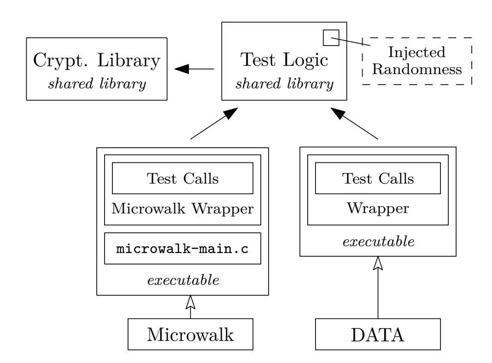

{0}------------------------------------------------

# **A Comparative Evaluation of DATA and Microwalk for Detecting Constant-Time Violations in Cryptographic Libraries**

Dominik Schneider, Paul Fuchs, and Kerstin Lemke-Rust

Institute for Cyber Security & Privacy Bonn-Rhein-Sieg University of Applied Sciences 53757 Sankt Augustin, Germany name.surname@h-brs.de

**Abstract.** DATA [\[22\]](#page-19-0) and Microwalk [\[23\]](#page-19-1) are two advanced dynamic binary instrumentation (DBI) tools for detecting constant-time (CT) violations in software implementations. This paper presents a comparative evaluation of these tools' findings using a common test setup and several cryptographic implementations that are included in the libraries LibTom-Crypt, OpenSSL, and liboqs. Our experiments yield reliable results for symmetric ciphers. For asymmetric cryptographic schemes, however, internal random numbers cause a high number of reported findings that also differ among the tools. In order to make the tools' results more comparable our test setup is adapted to externally inject random numbers that are otherwise generated internally by the cryptographic libraries. We discuss the differences of the tools' design and their impact on practical results of cryptographic implementations as well as their resource consumption in terms of memory and runtime.

**Keywords:** Constant-Time · Dynamic Binary Instrumentation Tools · DATA · Microwalk · Leakage Assessment · Side-Channel Analysis

# **1 Introduction**

Timing side-channel attacks are a well-known threat to cryptographic implementations [\[9\]](#page-18-0). These attacks require that the execution time of a cryptographic implementation depends on security-sensitive data. There are three different types [\[2\]](#page-18-1) of timing leakages: (a) *control flow*, e.g., due to a conditional branch in the algorithm, (b) *variable-time operations*, e.g., due to variable execution time of processor instructions or multiple-precision arithmetic functions, and (c) *memory access patterns*, e.g., due to different access times to memory by the processor.

An effective security objective in order to counteract timing side-channel attacks is to guarantee *constant-time* implementations. In relation to cryptography, *constant-time* means that each execution time of an algorithm is independent of externally or internally generated secret data and does not mean constant wall-clock time [\[2,](#page-18-1)[3\]](#page-18-2). Many efforts have been spent to develop verification tools for constant-time in the previous years. These tools can be roughly classified

{1}------------------------------------------------

into *static analysis* and *dynamic analysis* tools. While static analysis tools verify the security of the implementation's source code without executing it, dynamic analysis tools build upon the analysis of execution traces under concrete inputs [\[4\]](#page-18-3).

In this paper we evaluate two powerful dynamic binary instrumentation tools, DATA [\[22\]](#page-19-0) and Microwalk [\[23\]](#page-19-1) which are developed by academia and have already awakened researchers' interests, e.g. in [\[4,](#page-18-3)[21\]](#page-19-2). Both tools follow a similar approach, but differ in their internal design and detection methods. For our experimental study we apply DATA and Microwalk to several algorithms of the cryptographic libraries LibTomCrypt, OpenSSL, and liboqs. Our objective is to gain in-depth insights in the inner processing of these tools and to provide comparative experimental results of these tools on both symmetric and asymmetric cryptographic implementations.

## **1.1 Related Work**

Geimer *et al.* [\[4\]](#page-18-3) provide a broad overview over the current state of the art regarding automated tools for detecting timing side-channel leakage. In total, they compare 34 side-channel detection frameworks theoretically and build a practical benchmark using 5 selected tools that represent diverse analysis approaches. Jancar *et al.* [\[9\]](#page-18-0) evaluate the relation of currently available side-channel analysis tools regarding their applicability taking into account the experience of software developers of cryptographic libraries. Their work concludes that many of the tools are either unknown to the developers or too difficult to use. Barbosa *et al.* [\[2\]](#page-18-1) provide a SoK over goals, challenges and tools for improving design and implementation of cryptographic algorithms.

# **2 Dynamic Binary Instrumentation Tools**

First, this section provides an introduction to the construction of each tool, and afterwards a conceptual comparison is given.

## **2.1 DATA**

DATA [\[22\]](#page-19-0) – Differential Address Trace Analysis – is a dynamic analysis tool to detect address-based side-channel leakages. It targets to classify a leakage and locate its origin with high accuracy, meanwhile being practical in usage. For that it executes a software under test with varying input classes and records its traces. A trace in DATA is a sequence of executed instructions and operands including their memory addresses. By using different input classes and comparing the resulting address traces, DATA is able to identify secret dependent memory accesses and control flow leakages. DATA uses the Intel Pin Tool [\[18\]](#page-19-3) to record the traces for x86 binaries on the Linux operating system.

DATA assumes a powerful adversary who is able to retrieve full noise-free address traces for an attack. The advantage of this threat model is its conservatism 

{2}------------------------------------------------

as it does not limit the information retrieved by the adversary to a certain granularity.

DATA's analysis is separated into three different phases that are described below.

*Difference Detection* In the first phase, address traces are recorded which consist of instructions and their operands including the memory address. To identify differences between the traces, trace alignment is applied. For that, a diff-algorithm is used which continuously searches for differences. In DATA's case a difference shows as a matching instruction pointer where the address of the data is different. In addition, the merge point where the traces converge again has to be identified to re-align the traces. This is necessary to correctly identify following differences as new differences. The difference detection is applied pairwise on the recorded traces.

*Leakage Detection* The second phase focuses on the leakage detection itself. Leakage detection is based on detected differences of the previous phase. Differences in traces are not equal to leakages, as differences can be introduced by nondeterminism which is not induced by secret data. Thus, within the second phase a statistical fix-vs-random test [\[5\]](#page-18-4) is applied to identify differences depending on secret data. This is called a general leakage test in terms of DATA. New traces are recorded using multiple fixed keys and random keys. These traces are smaller: only difference inducing instructions are taken into account. Based on this information, evidence traces are created. An evidence trace is a chronologically ordered sequence of all accessed addresses by a single instruction during one program execution. For each difference inducing instruction, several evidence traces are created. For data differences the memory address is saved, whereas for control flow differences the target branch address is saved. From these evidence traces, a three-dimensional histogram Hfull is built to represent the program's behavior, with axes for trace position, address, and access count. Due to the large number of traces required, the histogram is split into Haddr (accesses per address) and Hpos (accesses per position), reducing the dimensionality while potentially missing some leakages. Separate histograms are generated for fixed and random inputs, and if the two can be statistically distinguished using Kuiper's test [\[13\]](#page-19-4), which assumes no specific data distribution, a leakage is detected.

*Leakage Classification* The third phase is used to determine a leakage's severity. Specific leakage tests are applied to find linear or non-linear relations between a given secret input and the previously recorded address traces. Again, traces using random inputs are recorded, and evidence traces are created. Contrary to the second phase, the evidence traces are not aggregated into histograms. Instead, they are merged into evidence matrices. The leakage model itself is also represented as matrix. The specific leakage test is a statistical test that is applied to the comparison between the evidence and the leakage model matrix. For DATA the Randomized Dependence Coefficient (RDC) [\[17\]](#page-19-5) is used to detect linear

{3}------------------------------------------------

#### 4 D. Schneider *et al.*

and non-linear dependencies, as according to the authors, it can be calculated efficiently especially for large input sizes.

## **2.2 Microwalk**

Microwalk [\[23\]](#page-19-1) roughly follows a similar approach as DATA: It uses dynamic binary instrumentation to locate and quantify leakages induced by secret dependent memory accesses and control flow. Microwalk has been improved continuously since its first publication [\[23](#page-19-1)[,25,](#page-20-0)[24\]](#page-20-1). The original analysis approach for x86 binaries using Intel's Pin Tool [\[23\]](#page-19-1) has been optimized with a new analysis module and extended to JavaScript using Jalangi2 for instrumentation [\[25\]](#page-20-0) and adapted to work for the RISC-V architecture using the MAMBO framework for instrumentation [\[24\]](#page-20-1).

The currently used analysis approach has been designed for improved performance meanwhile keeping the ability to localize and quantify the leakage [\[25\]](#page-20-0). Its algorithm is based on trace merging for difference detection within the recorded traces. Detected differences indicate leakages. Recorded traces are merged into a radix tree-based call tree, where identical parts, i.e., a list of instructions, are stored as single nodes due to the radix tree structure. For each function call, a call node is added, which only contains the instructions of the respective function. Divergences within the traces caused by jumps or function calls create different branches by introducing split nodes. Differences in memory address offsets do not create new nodes, as they do not alter the control flow. Instead, the differing memory address offsets are stored as lists within the respective nodes. The call tree is split into call stacks and trace ID trees for analysis. The trace ID trees represent split information of the different traces for each instruction. Each trace ID tree holds the trace IDs for each split, showing where the divergence occurs. Call stacks reference the related trace ID trees.

Microwalk applies statistical measures for the quantification of divergence behavior of instructions per call stack: MI [\[7\]](#page-18-5), conditional guessing entropy, and minimal conditional guessing entropy. All these measures quantify the interdependence between picking a uniformly distributed trace ID and observing the corresponding trace. The measures are applied on each trace ID tree individually, whereas the metrics are influenced by the size of the leaves. The authors choose minimal guessing entropy as score, as it describes the worst-case scenario by measuring the minimal number of guesses an adversary needs for associating a given trace with a secret input [\[25\]](#page-20-0). The fewer leaves a trace ID tree has, the more difficult it is to distinguish traces from one another. It is scaled linearly from 0 to 100, where 100 represents maximum leakage.

## **2.3 Conceptual Comparison**

In the following we compare Microwalk and DATA under certain criteria. The selected criteria highlight the most relevant differences and similarities. The comparison is based on the publications of the tools.

{4}------------------------------------------------

*Threat Model* Microwalk and DATA have the same threat model [\[25\]](#page-20-0). Following DATA's threat model description [\[22\]](#page-19-0), the adversary is considered to be able to observe full, noise-free address traces. This includes the addresses of the instructions and the address of the operands accessed by each instruction. This threat model is conservative as it considers a powerful adversary who may be more powerful than an actual adversary might be regarding accessible leakage resolution [\[22,](#page-19-0)[25\]](#page-20-0).

*Technical Specifications* Both Microwalk and DATA support the analysis of x86 binaries in the executable and linking format (ELF), which is used, e.g., for Linux operating systems. Both analysis frameworks use the Intel Pin Tool [\[18\]](#page-19-3) for instrumentation of x86 binaries. In contrast to DATA, Microwalk is able to analyze programs written in JavaScript and binaries compiled for RISC-V. Instrumentation of JavaScript programs is based on Jalangi2, whereas instrumentation of RISC-V binaries uses a customized version of the MAMBO instrumentation framework.

DATA is mainly implemented in Python, whereas Microwalk is implemented in C#. The recommended usage of Microwalk is within a container, avoiding a local installation with its drawbacks. DATA cannot be used within containers as it requires the setarch command which is not available in containers. Following the documentation, the command is used to disable ASLR. For Microwalk, ASLR does not need to be disabled before the analysis, as Microwalk collects allocation data to calculate relative address offsets. This approach eliminates the effects of ASLR and other external influences inducing changes to the absolute addresses [\[23\]](#page-19-1).

*Analysis Requirements* Both tools take a software under test in form of a binary as input. The source code is not necessarily required, nevertheless given the source code, both tools can map the leaking instructions to their respective position in the source code. This simplifies the localization of leakages for software developers.

Each tool requires a wrapper implementation to call the software under test. For DATA, the wrapper can be a generic program calling the software under test. For Microwalk, the wrapper has to be in a certain format. In Section [3.2](#page-7-0) we give a more precise introduction about the test setup for each tool.

*Trace Format* Both tools use Intel Pin [\[18\]](#page-19-3) as dynamic binary instrumentation tool for x86 binaries in the ELF. Following [\[23,](#page-19-1)[18\]](#page-19-3), Pin is based on just-in-time (JIT) compilation. It allows collecting metadata during runtime, such as accessed memory addresses and targets of branches. Thus, it compiles code during runtime, which is used to retrieve information about a binary's state. At the same time, Pin ensures that the original application behavior is not altered. Both Microwalk and DATA implemented their own Pintools. A Pintool consists of two components: A mechanism that decides where and which code to insert, and the code to be inserted [\[8\]](#page-18-6). Details on the format of the traces of Microwalk and DATA are provided in Appendix [A.1.](#page-21-0)

{5}------------------------------------------------

*Analysis Capabilities* Both Microwalk and DATA are capable to locate and quantify leakages in binaries. Both can detect control-flow leakages and leakage due to memory access patterns, but they are not able to detect variable-time operations.

*Algorithm Choices* The goal of both tools is to localize and quantify timing leakages. Both tools collect traces and compare them to find differences for further analysis. DATA uses a trace alignment algorithm for this purpose with quadratic running time regarding length and number of traces, whereas Microwalk uses a radix tree based trace merging algorithm with linear running time [\[25\]](#page-20-0). Trace alignment describes an approach to determine points where two traces split and where they merge again. Trace merging describes an approach where multiple traces are merged together in a separate data structure. In Microwalk's case the data structure is a radix tree. The major difference between the difference detection approaches is that Microwalk treats each difference found as leakage and DATA applies a further analysis step, i.e., DATA's second phase. DATA's score for leakages is based on the result of the Kuiper's test. Microwalk uses minimal guessing entropy as statistical measures to quantify leakages. As DATA uses a less efficient diff-algorithm and applies an additional statistical test which includes the collection of further traces, DATA's approach is potentially slower than Microwalk's [\[25\]](#page-20-0).

Microwalk lacks an equivalent to the third phase of DATA, the leakage classification phase. Here, DATA uses the RDC to detect linear and non-linear dependencies for a user-defined leakage model.

*Output and Visualization* DATA collects its result in form of an framework archive, containing the results as pickle, i.e., a collection of serialized Python objects, the source code if available, the binary and its human-readable assembly representation, and the wrapper binary, its source code and its human-readable assembly representation. Besides, the results are exported as XML file. For presentation purposes, the DATA developers published DATA GUI [\[21\]](#page-19-2) that enables analysts to review the found leakages including the leakage score and their position in binary and source code.

Microwalk's adaption to be applicable as part of CI applications comes with an extension of the output: the Sarif [\[6\]](#page-18-7) report. A Sarif report is a standardized JSON file, containing results created by automated software analysis. If Microwalk is set up as part of a GitHub CI pipeline, GitHub directly presents the leakages in the source code. Besides, the results are available as non-standardized text file containing the leaking instructions, the calls stacks and the leakage scores.

*Limitations* Although both tools are able to localize leakages and to quantify their severity, the respective approaches including the choice of algorithms induce certain limitations. DATA localizes differences by a trace alignment algorithm. The localization of actual leakages is based on the difference found, whereas a statistical test is applied to distinguish between secret induced differences and non-determinism induced differences. Microwalk applies its custom trace merging

{6}------------------------------------------------

| Criterion      | Microwalk                                                                                             | DATA                                                                               |  |  |  |  |  |  |  |
|----------------|-------------------------------------------------------------------------------------------------------|------------------------------------------------------------------------------------|--|--|--|--|--|--|--|
|                | Difference detection trace merging (no re-alignment<br>after difference) with linear run<br>ning time | trace alignment (re-alignment af<br>ter difference) with quadratic<br>running time |  |  |  |  |  |  |  |
| Leakages       | difference-based                                                                                      | differences with statistical depen<br>dence on the secret input                    |  |  |  |  |  |  |  |
| Quantification | MI [7], conditional and minimal<br>guessing entropy [25]                                              | Kuiper's test [13]                                                                 |  |  |  |  |  |  |  |
| Output         | custom text file and SARIF re<br>port [6]                                                             | custom archive and XML with<br>GUI [21]                                            |  |  |  |  |  |  |  |
| Portability    | containerized                                                                                         | local installation                                                                 |  |  |  |  |  |  |  |

<span id="page-6-0"></span>Table 1: Aggregated main conceptual differences between Microwalk and DATA.

algorithm to identify differences and there is no further distinction between deterministic and non-deterministic induced differences. This constitutes an issue for cryptographic primitives using internal randomness, such as nonces and blinding. Furthermore, Wichelmann *et al.* [\[24\]](#page-20-1) state that Microwalk's approach may lead to missed leakages which are hidden by other leakages higher up in the call chain.

Both Microwalk and DATA cannot detect data leakages, i.e., leakages exploited by attacks such as Spectre [\[12\]](#page-19-6) and Meltdown [\[16\]](#page-19-7). In addition, as both tools apply a dynamic approach, the results of the analysis are always dependent of the coverage of the software under test. Concluding the conceptual comparison, Table [1](#page-6-0) summarizes the main differences we identified between Microwalk and DATA.

# **3 Practical Testing**

# **3.1 Software under Test**

**Library Selection** For this work we analyze LibTomCrypt[\[14\]](#page-19-8) in its current version v1.18.2 as software under test. We decided to analyze LibTomCrypt because it has not been the subject of side-channel detection tools related publications, to the best of our knowledge. LibTomCrypt is a cryptography library written in C. For asymmetric algorithms the library requires a math provider, for which we use LibTomMath in version v1.2.1 (git commit hash: a1baa97) [\[15\]](#page-19-9). LibTomMath is the default math provider for LibTomCrypt in Ubuntu. A common use case of LibTomCrypt is the Dropbear SSH [\[10\]](#page-19-10) server, which can be used to unlock encrypted hard drives remotely before the OS has booted. As a reference, we also apply our test setup on the widespread OpenSSL library in version 3.3.2. With regard to the finalized standards of post-quantum safe algorithms ML-KEM and ML-DSA, we apply our test setup on ML-DSA in liboqs (Open Quantum Safe) in version 0.12.0. This release contains the FIPS 204 [\[19\]](#page-19-11) compliant implementation of ML-DSA.

{7}------------------------------------------------

**Algorithm Selection** Our analysis includes cipher and signature algorithms. We test all algorithms in a configuration close to the default configuration of the respective library. As symmetric algorithms we test AES-128 in ECB and CTR mode, and ChaCha20Poly1305 with 256-bit keys. For both algorithms we test whether the key or the plaintext is leaking. The size of the plaintext test cases is 16 bytes. As asymmetric algorithms we test the elliptic curve digital signature algorithm (ECDSA) and the RSA signature algorithm. We test one key size for each algorithm: Curve P-256 (256-bit) for ECDSA, and 768-bit RSA for LibTomCrypt and 512-bit RSA for OpenSSL. The key sizes for the asymmetric algorithms are chosen to be small resulting in reduced analysis time. For the RSA signature algorithm, LibTomCrypt only supports the probabilistic signature scheme (PSS) for PKCS #1 v2.1. OpenSSL uses the deterministic PKCSV1\_5 scheme as default. The differences in RSA key lengths for LibTomCrypt and OpenSSL are induced by the used signatures schemes. Except ChaCha20Poly1305, which is constant-time by design, all the aforementioned algorithms are not claimed to be constant-time. For ML-DSA provided by liboqs we test the ML-DSA-44 reference implementation and the hardware accelerated AVX2 implementation with 2560-byte keys.

LibTomCrypt's documentation [\[14\]](#page-19-8) notes that the RSA modular exponentiation uses a blinding algorithm and the elliptic curve algorithms use a timing resistant scalar point multiplication to prevent leakage of private key bits per default. Following OpenSSL's changelog, blinding for RSA has been enabled since 0.9.6j and 0.9.7b. Although blinding has been temporarily used for ECDSA, current versions use length-invariant addition and fixed-length Montgomery multiplication instead. FIPS 204 (ML-DSA [\[19\]](#page-19-11)) does not mention security properties against side-channel attacks, but protection against SCAs has been part of the selection criteria for the new standard digital signature algorithm [\[20\]](#page-19-12).

## <span id="page-7-0"></span>**3.2 Test Implementation**

**Testing Environment** For the analysis we use a Intel NUC with an Intel i5-1135G7 (x86-64) processor paired with 64 GB of RAM. The i5-1135G7 CPU consists of four cores. As it supports hyperthreading, it can handle 8 parallel threads. The testing system runs 64-bit Ubuntu Server 24.04 LTS. We use the GNU compiler tool chain in version 11.4.0. We use patched versions of Microwalk (based on version v3.2.0, git commit hash: 16a17ba) as Docker container and DATA (based on version v0.3, git commit hash: 9d467ed) as local installation. The patches are limited to minor compatibility issues with the system and the tested libraries. To make DATA compatible with instrumenting system libraries compiled for Ubuntu 24.04, we had to upgrade Intel Pin to version 3.27 which is the same version used by Microwalk.

**Testing Procedure** Typically, cryptographic algorithms have multiple secret inputs, e.g., the AES in ECB mode requires a plaintext and a key as input. For constant-time testing, one tests for each secret input individually. This means 

{8}------------------------------------------------

that every other input, public or secret, should be constant to prevent noise. Thus, we configure each input of the algorithms as constants, except the one we are testing for. We hide the configuration of each algorithm inside a test call wrapper to centralize and simplify the creation of tests for each of the tools.

For symmetric algorithms, the input handling is intuitive: keys and plaintexts are arrays of random bytes. Both tools provide helper functions or examples to use random bytes as input for test cases. This is not the case for asymmetric algorithms. The keys of asymmetric algorithms are structured inputs, dependent on the algorithm. Thus, we build helper programs for generating the required keys, exporting and saving them to individual files for each tested library. Microwalk requires testing inputs in form of file descriptors, whereas DATA uses file names as program parameters. These differences in input handling induce small differences in the test logic for importing the keys. However, these differences are negligible for the test setup regarding Microwalk and DATA. To further reduce noise, we let DATA generate the testing inputs and export them such that we can re-use them for the respective test case with Microwalk.

*Requirements* The typical test setup for each tool consists of writing a wrapper around the library functions to be tested. For comparing multiple tools, this setup has disadvantages: Constant-time tests are sensible regarding static and dynamic input values. Thus, the first requirement for our test setup is that both tools test the same binary and the same test logic. Although Microwalk and DATA support localization of leakages and thus non-constant-time test preparation can be filtered, we want to minimize the effort to filter these additional leakages. Thus, the second requirement for our test setup is that the test logic including test preparation should be constant-time.

Figure [1](#page-9-0) shows the general structure of the test logic's implementation. This setup ensures that Microwalk and DATA test the same calls to the cryptographic library under test. We remark that the test setup for the tools contains differences regarding input parsing. This is inevitable due to the API differences of Microwalk and DATA.

*Test Parameters* We use the test parameters for our test setup as recommended by the publications of Microwalk [\[25\]](#page-20-0) and DATA [\[22\]](#page-19-0). The numbers of test cases are determined experimentally, such that no new deterministic leakages occur if more test cases are used, i.e., the number of leakages settles within this number of test cases. We use 10 test cases for Microwalk and for DATA's first phase, the difference detection phase. Afterward, for the second phase, the leakage detection phase, we record 60 traces for each of the three fixed keys and 60 traces with random keys. To achieve a precise source code location from a leaking instruction, we compile the test logic and the tests without optimizations (-O0) and inclusive debug symbols (-g).

To verify the recommended number of traces for difference detection, we repeated our experiments on ML-DSA with 100 traces for both Microwalk and DATA's first phase. The results showed the same variation in number of leakages

{9}------------------------------------------------

<span id="page-9-0"></span>

Fig. 1: Structure of the constant-time tests with optionally injected randomness.

found as when the tests were repeated several times with only 10 traces. Thus, we keep following the recommendation of 10 test cases.

Evaluation Metrics In Appendix A.4 we applied Microwalk and DATA on examples of (non-) constant-time software gaining some basic insight about the behavior of the tools. Nevertheless, the intended use case for these tools are cryptographic algorithms. So far, the results of the tools have been mainly congruent. Our analysis is supposed to show how the tools behave on different types of algorithms. Especially the differences between symmetric and asymmetric algorithms are of interest. During our tests we measure the time and memory consumption of the tools for efficiency evaluations.

As our example application in Appendix A.4 shows, the leakage scores of Microwalk and DATA are only somewhat comparable. Following Geimer et al. [4], we omit comparing the leakage quantification scores, as there is no standardized way of determining them. Besides, a quantification score does not indicate the level of exploitability of a leakage [4]. DATA's third phase, the leakage classification phase, targets this problem by testing for user-defined leakage models. As Microwalk lacks a counterpart to this feature, DATA's leakage classification phase is out of scope for this work.

Considerations Regarding Randomness In cryptographic algorithms, random numbers are used internally for different purposes such as masks and blinding factors, nonces, or rejection sampling. In fixed-vs-random testing, we test for differences dependent on a single, externally controlled input variable. When applying fixed-vs-random testing on cryptographic algorithms which use internal randomness, two problems occur: First, internal randomness induces differences,

{10}------------------------------------------------

which may lead to false positives. Second, if the internal randomness is a secret which must not leak, we cannot test for it as we only control external inputs in the given scenario. Following this, we distinguish randomness used in cryptographic algorithms into *internal randomness* and *internal random secrets* where the latter is a subset of the former. Internal randomness, such as masks or blinding factors, remains internal to the system. In contrast, internal secrets, like those generated in ML-KEM or ECDSA nonces, are inaccessible externally and must not leak and therefore are of interest for testing. DATA addresses the latter issue by extracting internal secrets and analyzing the resulting traces for statistical independence in its third analysis phase [\[21\]](#page-19-2). Noise introduced by internal randomness should become negligible when statistical tests are applied, e.g., DATA's second phase. However, tools like Microwalk, which do not employ such tests, may be prone to false positives, as noted by Wichelmann *et al.* [\[24\]](#page-20-1). Nevertheless, Microwalk supports fixing the output of the rdrand instruction to a constant value to minimize noise caused by internal randomness. However, this approach could not be applied to our test setup, as LibTomCrypt for example does not make use of the rdrand instruction.

We present a tool independent approach using runtime linking of shared libraries to enable straightforward replacement of otherwise inaccessible functions. Consequently, this controls both of our defined forms of internal randomness. However, this requires the target and replacement function headers to remain identical, ensuring symbols resolve correctly during compilation. The load order of shared libraries is crucial, as the linker resolves symbols only once, prioritizing the first occurrence. On Linux systems, this can be controlled using the LD\_PRELOAD environment variable, which specifies the injecting library to load first. When overriding functions responsible for randomness, one has to differentiate between the described forms of internal randomness. To reduce the noise resulting from internal randomness, the goal is to replace the target function with a replacement providing a constant value. When testing for an internal secret, the goal is to provide values based on the fixed-vs-random approach, i.e., external generated fixed or random values which are known to the tester. If both forms are to be controlled at the same time, the complexity of our approach is strongly dependent on the libraries implementation and usage of randomness providing functions.

We successfully applied the approach to LibTomCrypt and liboqs, where only a single function needs replacement. For LibTomCrypt, each implemented random number generator provides a read function. It is sufficient to overwrite this read function of the used random number generator. In liboqs a single global randomness function is used and can be overwritten.

**Analyzing Result Data** The number of leaking instructions of both Microwalk and DATA can go into the hundreds for some algorithms. Thus, analyzing result data of this size requires an automated approach. We developed a result comparison tool written in Python for this purpose. Although we omit comparing the scores in this work for the aforementioned reasons, we included them in 

{11}------------------------------------------------

the tool for completeness. The detailed processing of the traces generated by Microwalk and DATA is described in Appendix [A.3.](#page-22-0)

The full analysis pipeline consists of the following simplified steps: 1. Parsing Microwalk's results, 2. parsing DATA's results, 3. creating the leakage representation, 4. applying the analyses, and 5. creating the outputs. Our internal leakage representation contains the relative instruction address, the leakage type, the score, the tool origin, the source code file with column and line, and the tested algorithm.

The source code used for the test setups is available from [https://git.inf.](https://git.inf.h-brs.de/pfuchs2s/dbi-comparison.git) [h-brs.de/pfuchs2s/dbi-comparison.git](https://git.inf.h-brs.de/pfuchs2s/dbi-comparison.git).

# **4 Results and Evaluation**

## **4.1 Leakages**

In this section we present the analysis results from our test setup described in Section [3.2](#page-7-0) applied on LibTomCrypt, OpenSSL, and liboqs. Tables [2](#page-12-0) to [6](#page-14-0) contain the number of different leakages found in the algorithms analyzed for Microwalk and DATA. If applicable, the tables also include the results for asymmetric algorithms when executed with fixed randomness. The number of total leakages |T| contains all leaking instructions including duplicates induced by different call hierarchies. The number of unique leakages |U| is cleansed from these duplicates and represents the sum of all unique memory leakages |M| and unique control flow leakages |CF|. In contrast to Microwalk, DATA contains a second phase for filtering false positives: the number of determined false positives is represented in the column |F P|. The comparison column is divided into four parts: the intersection of Microwalk and DATA's unique leakages |I|, the Microwalk only leakages |UMW −I|, the DATA only leakages |U<sup>D</sup> −I|, and the leakages identified by Microwalk which DATA identified as false positives |F PMW|.

**LibTomCrypt** Table [2](#page-12-0) shows the leakages found by Microwalk and DATA when applied on implementations of symmetric algorithms of LibTomCrypt. For the symmetric algorithms, we tested for leakages on both the key and the plaintext as secret input. DATA and Microwalk produce identical results for all symmetric algorithms. For the AES, the secret dependent memory look-ups of the T-Tables and during the key schedule are correctly detected. The differences between the results of the different modes of operation for the AES testing for the plaintext show that the trace comparison approach is able to precisely identify differences dependent on the specified secret-only: AES in CTR mode XORs the encryption result on the plaintext, and thus does not leak the plaintext, although the key is leaking. The results confirm ChaCha20Poly1305's constant-time property by design.

The results of the asymmetric algorithms shown in Table [3](#page-12-1) differ greatly from the results of the symmetric algorithms in terms of the number of leakages found and the agreement between Microwalk and DATA. In general, Microwalk found

{12}------------------------------------------------

<span id="page-12-0"></span>Table 2: Leakages found by Microwalk and DATA when applied on implementations of symmetric algorithms of LibTomCrypt.

|               |    |    | Microwalk |   |    | DATA   |                                                 | Comparison |   |             |
|---------------|----|----|-----------|---|----|--------|-------------------------------------------------|------------|---|-------------|
| Algorithm     |    |    |           |   |    |        | T   M   CF   U   T   M   CF   U   F P   I   UMW | − I   UD   |   | − I   F PMW |
| AES CTR (k)   | 68 | 68 | 0 68 68   |   | 68 | 0 68   | 0 68                                            | 0          | 0 | 0           |
| AES CTR (p)   | 0  | 0  | 0<br>0    | 0 | 0  | 0<br>0 | 0<br>0                                          | 0          | 0 | 0           |
| AES ECB (k)   | 68 | 68 | 0 68 68   |   | 68 | 0 68   | 0 68                                            | 0          | 0 | 0           |
| AES ECB (p)   | 48 | 48 | 0 48 48   |   | 48 | 0 48   | 0 48                                            | 0          | 0 | 0           |
| CC20P1305 (k) | 0  | 0  | 0<br>0    | 0 | 0  | 0<br>0 | 0<br>0                                          | 0          | 0 | 0           |
| CC20P1305 (p) | 0  | 0  | 0<br>0    | 0 | 0  | 0<br>0 | 0<br>0                                          | 0          | 0 | 0           |

k: key. p: plaintext.

<span id="page-12-1"></span>Table 3: Leakages found by Microwalk and DATA when applied on implementations of asymmetric algorithms of LibTomCrypt.

|              |          |    | Microwalk |            |        |    | DATA |       |                                                 |   | Comparison |   |             |
|--------------|----------|----|-----------|------------|--------|----|------|-------|-------------------------------------------------|---|------------|---|-------------|
| Algorithm    |          |    |           |            |        |    |      |       | T   M   CF   U   T   M   CF   U   F P   I   UMW |   | − I   UD   |   | − I   F PMW |
| ECDSA        | 1042 219 |    |           | 44 263 132 |        | 8  |      | 13 21 | 89 20                                           |   | 243        | 1 | 68          |
| ECDSA (f)    | 79       | 29 | 15        | 44         | 58     | 5  |      | 17 22 | 5 18                                            |   | 26         | 4 | 4           |
| RSA Enc.     | 10       | 0  | 5         | 5          | 12     | 0  | 0    | 0     | 12                                              | 0 | 5          | 0 | 5           |
| RSA Enc. (f) | 15       | 3  | 7         | 10         | 16     | 4  |      | 6 10  | 1                                               | 9 | 1          | 1 | 1           |
| RSA Sig.     | 128      | 40 | 22        |            | 62 171 | 17 |      | 18 35 | 51 27                                           |   | 35         | 8 | 20          |
| RSA Sig. (f) | 170      | 63 | 22        |            | 85 177 | 21 |      | 19 40 | 43 31                                           |   | 54         | 9 | 20          |

f: fixed randomness

more total leakages, especially for ECDSA. The number of unique leakages for each algorithm is also higher than DATA's. Whereas the number of control flow leakages are in the same magnitude as DATA's, the number of memory leakages is generally higher and of a different magnitude for ECDSA. The leakages found by DATA are almost a subset of the ones found by Microwalk for ECDSA. This observation highlights the higher intersection for control flow leakages, whereas Microwalk identified a magnitude more memory access leakages. DATA was able to significantly reduce the amount of false positives. Partially, these false positives are part of Microwalk's leakages found. Nevertheless, these false positives do not explain the high number of Microwalk's detected leakages.

**OpenSSL** Table [4](#page-13-0) shows the leakages found by Microwalk and DATA when applied on implementations of symmetric algorithms of OpenSSL.

The results are similar to the results of our analysis of LibTomCrypt. Although the number of leakages of OpenSSL's AES T-Tables implementation are different to LibTomCrypt's, Microwalk and DATA agree on all leakages and confirmed ChaCha20Poly1305's constant time design.

{13}------------------------------------------------

<span id="page-13-0"></span>Table 4: Leakages found by Microwalk and DATA when applied on implementations of symmetric algorithms of OpenSSL.

|               |     | Microwalk |          |    |    | DATA                                            |        |          | Comparison |             |
|---------------|-----|-----------|----------|----|----|-------------------------------------------------|--------|----------|------------|-------------|
| Algorithm     |     |           |          |    |    | T   M   CF   U   T   M   CF   U   F P   I   UMW |        | − I   UD |            | − I   F PMW |
| AES CTR (k)   | 52  | 52        | 0 52     | 52 | 52 | 0 52                                            | 0 52   | 0        | 0          | 0           |
| AES CTR (p)   | 0   | 0         | 0<br>0   | 0  | 0  | 0<br>0                                          | 0<br>0 | 0        | 0          | 0           |
| AES ECB (k)   | 100 | 52        | 0 52 100 |    | 52 | 0 52                                            | 0 52   | 0        | 0          | 0           |
| AES ECB (p)   | 48  | 48        | 0 48     | 48 | 48 | 0 48                                            | 0 48   | 0        | 0          | 0           |
| CC20P1305 (k) | 0   | 0         | 0<br>0   | 0  | 0  | 0<br>0                                          | 0<br>0 | 0        | 0          | 0           |
| CC20P1305 (p) | 0   | 0         | 0<br>0   | 0  | 0  | 0<br>0                                          | 0<br>0 | 0        | 0          | 0           |

k: key. p: plaintext.

<span id="page-13-1"></span>Table 5: Leakages found by Microwalk and DATA when applied on implementations of asymmetric algorithms of OpenSSL.

|           |          | Microwalk |                |  |                  | DATA |    |        |    |        | Comparison                                 |    |             |
|-----------|----------|-----------|----------------|--|------------------|------|----|--------|----|--------|--------------------------------------------|----|-------------|
| Algorithm |          |           | T   M   CF   U |  |                  |      |    |        |    |        | T   M   CF   U   F P   I   UMW<br>− I   UD |    | − I   F PMW |
| ECDSA     | 1336     | 71        | 28             |  | 99 1405          | 64   | 11 | 75     | 57 | 67     | 32                                         | 8  | 29          |
| RSA Enc.  | 223      | 56        |                |  | 46 102 1081      | 56   | 6  | 62     | 70 | 59     | 43                                         | 3  | 38          |
| RSA Sig.  | 2094 536 |           |                |  | 127 663 1916 128 |      |    | 75 203 |    | 95 168 | 495                                        | 35 | 72          |

For the asymmetric algorithms, the results differ in certain points to LibTom-Crypt's analysis. Table [5](#page-13-1) shows the leakages found by Microwalk and DATA when applied on implementations of asymmetric algorithms of OpenSSL.

As with LibTomCrypt, the asymmetric algorithms leak more than the symmetric algorithms. Besides, Microwalk has always identified more leakages than DATA. In contrast to LibTomCrypt, the number of leakages found for ECDSA are in the same magnitude for DATA and Microwalk. For OpenSSL, the contrary holds true for the RSA signature and the number found of memory leakages. The number of false positives identified by DATA which are part of Microwalk result set is higher than LibTomCrypt's, except for ECDSA.

**liboqs** Table [6](#page-14-0) shows the leakages found by Microwalk and DATA when applied on the reference and the AVX2 implementation of ML-DSA of liboqs. As seen before, Microwalk and DATA do not produce identical results on either implementation and testing procedure of ML-DSA. If the randomness is not fixed, Microwalk produces more unique leakages than DATA, whereas it is the other way round if the internal randomness is fixed. In every case DATA has again identified false positives, which are part of Microwalk's result set.

Manually inspecting the leakages found for the reference implementation with fixed randomness leads to multiple findings: Most of the leakages are related to the rejection sampling part of ML-DSA. Other leakages are leaking public values,

{14}------------------------------------------------

|                      |    |   | Microwalk                             |   | DATA   |      | Comparison |            |   |
|----------------------|----|---|---------------------------------------|---|--------|------|------------|------------|---|
| Algorithm            |    |   | T  M  CF  U  T  M  CF  U  F P  I  UMW |   |        |      | − I  UD    | − I  F PMW |   |
| ML-DSA               | 12 | 2 | 9 11 16                               | 2 | 2<br>4 | 12 3 | 8          | 1          | 7 |
| ML-DSA (AVX2)        | 58 | 7 | 5 12 69                               | 9 | 1 10   | 23 5 | 7          | 5          | 7 |
| ML-DSA (f)           | 12 | 2 | 9 11 17                               | 4 | 9 13   | 3 9  | 2          | 4          | 2 |
| ML-DSA (AVX2) (f) 51 |    | 7 | 5 12 75 24                            |   | 7 31   | 210  | 2          | 21         | 2 |

<span id="page-14-0"></span>Table 6: Leakages found by Microwalk and DATA when applied on ML-DSA of liboqs.

and thus are not critical. One leakage regarding checking the infinity norm is known not to be critical, which is also marked in the source code. We did not identify a critical leakage for ML-DSA.

**Observations Regarding Fixed Randomness** The application of our approach to fix randomness on LibTomCrypt and liboqs is straightforward, as each requires only a single function. Tables [3](#page-12-1) and [6](#page-14-0) contain results for each examined algorithm where the randomness is fixed. For Microwalk, reducing randomness leads to an increasing number of leakages for RSA encryption and signing, whereas for ML-DSA the number of leakages stays the same. In the case of ECDSA, using injected randomness drastically reduces the number of leakages. DATA detects more leakages for each of the tested algorithms and except for ECDSA, the number of leakages where Microwalk and DATA agree on also increases. In contrast, the number of false positives has been decreased for each tested algorithm. While fixing randomness eliminates some false positives identified by DATA, it may indicate that these previously identified "false positives" have been categorized as leakages now. Comparing the leakages' addresses reveals that this assumption is partly true: liboqs ML-DSA shows a reclassification, from 12 false positives to 9 leakages for the reference implementation and from 23 false positives to 21 leakages for the AVX2 implementation. Similarly, for LibTomCrypt, the results are as follows: ECDSA shows a reclassification from 89 false positives to 4 leakages, RSA encryption demonstrates a reclassification from 12 false positives to 10 leakages, and RSA signing shows a reclassification from 51 false positives to 5 leakages. Besides this observation, the results show that even with fixed randomness, the tools' results are not identical.

## **4.2 Ressources**

Table [7](#page-15-0) shows exemplarily the resource consumption of Microwalk and DATA during the analysis of LibTomCrypt's implementations for "classic" cryptographic algorithms. For DATA, the time and peak memory consumption is split up according to the phases. These measurements have been taken, where Microwalk was configured to keep the recorded traces in memory instead of writing them

f: fixed randomness

{15}------------------------------------------------

to the hard drive. Surprisingly, repeating the experiment with Microwalk being configured to store the traces to the hard drive led to similar results for the algorithms.

<span id="page-15-0"></span>Table 7: Resources overview by Microwalk and DATA when applied on implementations of symmetric and asymmetric algorithms of LibTomCrypt. Time in CPU seconds and RAM in MB.

|               | Microwalk |       |        | DATA   |       |       |  |  |
|---------------|-----------|-------|--------|--------|-------|-------|--|--|
| Algorithm     | Time      | RAM   | Time 1 | Time 2 | RAM 1 | RAM 2 |  |  |
| AES CTR (k)   | 2         | 68    | 88     | 191    | 119   | 132   |  |  |
| AES CTR (p)   | 2         | 68    | 22     | 0      | 113   | 4     |  |  |
| AES ECB (k)   | 2         | 71    | 88     | 190    | 119   | 132   |  |  |
| AES ECB (p)   | 2         | 70    | 86     | 189    | 113   | 125   |  |  |
| CC20P1305 (k) | 3         | 75    | 23     | 0      | 113   | 4     |  |  |
| CC20P1305 (p) | 3         | 76    | 23     | 0      | 113   | 4     |  |  |
| ECDSA         | 968       | 11974 | 5848   | 477    | 605   | 2752  |  |  |
| ECDSA (f)     | 948       | 4633  | 579    | 294    | 605   | 150   |  |  |
| RSA Enc.      | 22        | 217   | 114    | 243    | 113   | 158   |  |  |
| RSA Enc. (f)  | 22        | 218   | 112    | 241    | 113   | 146   |  |  |
| RSA Sig.      | 208       | 3645  | 2443   | 290    | 188   | 1002  |  |  |
| RSA Sig. (f)  | 208       | 3610  | 2506   | 288    | 188   | 1009  |  |  |

k: key. p: plaintext. f: fixed randomness

The resource consumption reveals similar divergences between symmetric and asymmetric algorithms as the number of leakages found: Time and peak memory consumption is magnitudes higher for asymmetric algorithms. DATA's phase 1 is drastically more time-consuming and drastically less memory consuming than phase 2. Our results confirm Microwalk's performance advantage using its linear running time trace merging algorithm [\[25\]](#page-20-0). During the analysis of both tools we observed that DATA utilized all available cores for phase 1, whereas Microwalk did not exhaust the available CPU cores. We observed that Microwalk created the number of sub-processes we configured it to use, but the CPU usage stayed low. Thus, compared to Microwalk, DATA's slower trace alignment algorithm may be compensated by multicore CPUs.

Comparing the resource consumption for test cases executed with real and injected randomness, one can see that it stays almost the same for the majority of algorithms. ECDSA is the exception: Injecting fixed values for randomness results in drastically reduced memory consumption for Microwalk and DATA. For DATA, the execution time is also reduced.

Table [8](#page-16-0) shows the resource consumption of Microwalk and DATA during the analysis of the ML-DSA implementations of liboqs. The differences induced by injected randomness are negligible, when evaluating the AVX2 hardware accelerated version. The reference implementation shows a reduction in time

{16}------------------------------------------------

|                   |      | Microwalk | DATA   |        |       |       |  |  |  |
|-------------------|------|-----------|--------|--------|-------|-------|--|--|--|
| Algorithm         | Time | RAM       | Time 1 | Time 2 | RAM 1 | RAM 2 |  |  |  |
| ML-DSA            | 77   | 1263      | 1518   | 263    | 767   | 314   |  |  |  |
| ML-DSA (AVX2)     | 13   | 176       | 265    | 340    | 162   | 220   |  |  |  |
| ML-DSA (f)        | 50   | 789       | 1047   | 264    | 760   | 316   |  |  |  |
| ML-DSA (AVX2) (f) | 12   | 163       | 223    | 340    | 145   | 203   |  |  |  |

<span id="page-16-0"></span>Table 8: Resources overview by Microwalk and DATA when applied on ML-DSA of liboqs. Time in CPU seconds and RAM in MB.

and memory consumption for Microwalk when using injected randomness. For DATA, only the total execution time is reduced, where especially the time required for comparing the traces (first phase) induces this difference. Compared to the resource consumption by ECDSA and the RSA signature implemented in LibTomCrypt, both the AVX2 and the reference implementation of ML-DSA are analyzed with lower CPU and RAM usage for Microwalk. For DATA, RAM and CPU usage is of the same magnitude, whereas the required CPU time is smaller for all ML-DSA variants compared to the aforementioned algorithms, except ECDSA with fixed randomness. We remind the reader that we tested RSA with unsecure key sizes in contrast to ECDSA and ML-DSA. Increasing the RSA key size to at least 2048-bit drastically increases time and memory consumption for both tools.

Taking into account the key sizes for the different signature algorithms, it is counterintuitive that ML-DSA is analyzed faster, as it uses the longest private keys. This confirms, that the resource consumption mainly depends on the length and divergence of the traces. Thus, performance-wise, the analysis tools compared in this work are still feasible of handling the standardized post-quantum secure algorithm. Especially the analysis of hardware accelerated version performs well.

# **4.3 Evaluation and Discussion**

Following our results, we showed that Microwalk struggles with noise for asymmetric algorithms, often resulting in numerous false positives. In contrast, DATA's second phase can be overly aggressive, categorizing potential leakages as false positives meanwhile still producing false positives. If possible, applying our fixed randomness approach has been shown to reduce trace variation and thus to improve the performance of both tools. Nevertheless, non-determinism by design, such as rejection sampling in ML-DSA, continues to cause false positives.

Several technical challenges affect the reliability and adaptability of these tools. Both tools rely on Intel Pin for binary analysis on x86, which raises concerns about their long-term viability. The implementations require extensive knowledge of the binary structure, which for these tools is tied to ELF binaries, restricting their use to a single operating system. This reliance on binary-specific

f: fixed randomness

{17}------------------------------------------------

knowledge is problematic; for example, DATA required an upgrade to Intel Pin 3.27 to function because the ld-linux system library on Ubuntu 24 could not be analyzed due to an unknown section type. Such dependencies may also fail to account for hardware variations. For instance, systems without caches, such as certain microcontrollers, would not exhibit cache-induced memory access leakages. Moreover, both tools lack support for variable-time instructions, limiting their applicability.

Despite these limitations, both tools perform conclusively when analyzing symmetric algorithms, demonstrating low CPU time and memory consumption. However, their results for asymmetric algorithms are often inconclusive, with resource consumption strongly influenced by trace variations. These findings may lead to the conclusion that the effort and expertise required to maintain such tools may not justify their benefits, particularly given their inconclusive results for asymmetric algorithms.

# **5 Conclusion and Future Work**

This work provides a conceptual and practical comparison of two dynamic binary instrumentation tools, Microwalk and DATA, for detecting leakage through trace differences. We applied these tools on common symmetric and asymmetric algorithms of the cryptographic libraries LibTomCrypt, OpenSSL, and liboqs using a centralized test setup designed for consistent test cases between the tools. We propose an approach exploiting the loading behavior of shared libraries at runtime to control internal randomness used in cryptographic libraries without modifying source code. Our comparison of the tools' results show conclusive results for symmetric algorithms with low resource consumption. Asymmetric algorithms exhibit much higher resource consumption and yield a high number of false positives and inconclusive findings which is cumbersome for manual checks. We experimented with fixing randomness that was partly successful but does not lead to identical results of the tools. We note that our approach of handling randomness is strongly dependent on the structure of the library under test and may not be applicable in any case. Further, we removed randomness from our test cases and did not test for the effects of randomness itself. In general, DATA was observed to perform better in reducing the number of false positives compared to Microwalk.

Microwalk and DATA rely on complex mechanisms tied to hardware assumptions about potential leakages. This results in high maintenance as operating systems and hardware evolve over time. To address these limitations, the precision of the analysis could be reduced to simplify the code and improve system independence. Dependency on pre-defined knowledge of specific leakage types, such as memory access leakages, should be minimized. Instead, the analysis should employ techniques that detect different leakage types only when they are genuinely present, avoiding reliance on implementation-specific assumptions about runtime behavior. Combining time measurements with dynamic binary instrumentation could serve as a more practical solution that would significantly

{18}------------------------------------------------

reduce complexity while maintaining the capability to pinpoint leakages. Time measurements can identify various leakage types only if they truly exist, and have the advantage to be able to additionally detect variable-time instructions. Nevertheless, such a tool implementation would inherit the drawback of depending on one or multiple dynamic binary instrumentation frameworks, if it is to be applied on multiple systems.

Summarizing, internal randomness in asymmetric cryptographic algorithms remains an open research problem for the verification of the constant-time property using current DBI tools. A joint effort of both developers of cryptographic libraries and of DBI tools is recommended to create reliable testing conditions.

## **Acknowledgements**

This research was supported by the project DevToSCA funded by the German Federal Ministry of Research, Technology and Space (grant number: 16KIS1602).

# **References**

- <span id="page-18-8"></span>1. Almeida, J.B., Barbosa, M., Barthe, G., Dupressoir, F., Emmi, M.: Verifying constant-time implementations. In: 25th USENIX Security Symposium. pp. 53–70. USENIX Association (Aug 2016), [https://www.usenix.org/conference/](https://www.usenix.org/conference/usenixsecurity16/technical-sessions/presentation/almeida) [usenixsecurity16/technical-sessions/presentation/almeida](https://www.usenix.org/conference/usenixsecurity16/technical-sessions/presentation/almeida)
- <span id="page-18-1"></span>2. Barbosa, M., Barthe, G., Bhargavan, K., Blanchet, B., Cremers, C., Liao, K., Parno, B.: SoK: Computer-aided cryptography. In: 2021 IEEE Symposium on Security and Privacy (SP). pp. 777–795. IEEE (May 2021). [https://doi.org/10.1109/sp40001.](https://doi.org/10.1109/sp40001.2021.00008) [2021.00008](https://doi.org/10.1109/sp40001.2021.00008)
- <span id="page-18-2"></span>3. Bernstein, D.J.: Cache-timing attacks on AES (2005)
- <span id="page-18-3"></span>4. Geimer, A., Vergnolle, M., Recoules, F., Daniel, L.A., Bardin, S., Maurice, C.: A systematic evaluation of automated tools for side-channel vulnerabilities detection in cryptographic libraries. In: Proceedings of the 2023 ACM SIGSAC Conference on Computer and Communications Security. CCS '23, ACM (Nov 2023). [https:](https://doi.org/10.1145/3576915.3623112) [//doi.org/10.1145/3576915.3623112](https://doi.org/10.1145/3576915.3623112)
- <span id="page-18-4"></span>5. Gilbert Goodwill, B.J., Jaffe, J., Rohatgi, P., et al.: A testing methodology for side-channel resistance validation. In: NIST non-invasive attack testing workshop. vol. 7, pp. 115–136 (2011)
- <span id="page-18-7"></span>6. GitHub: Sarif support for code scanning (2024), [https://docs.github.](https://docs.github.com/en/code-security/code-scanning/integrating-with-code-scanning/sarif-support-for-code-scanning) [com/en/code-security/code-scanning/integrating-with-code-scanning/](https://docs.github.com/en/code-security/code-scanning/integrating-with-code-scanning/sarif-support-for-code-scanning) [sarif-support-for-code-scanning](https://docs.github.com/en/code-security/code-scanning/integrating-with-code-scanning/sarif-support-for-code-scanning)
- <span id="page-18-5"></span>7. Guiașu, S.: Information theory with applications. McGraw-Hill Companies (1977)
- <span id="page-18-6"></span>8. Intel: Pin - a dynamic binary instrumentation tool (2024), [https:](https://www.intel.com/content/www/us/en/developer/articles/tool/pin-a-dynamic-binary-instrumentation-tool.html) [//www.intel.com/content/www/us/en/developer/articles/tool/](https://www.intel.com/content/www/us/en/developer/articles/tool/pin-a-dynamic-binary-instrumentation-tool.html) [pin-a-dynamic-binary-instrumentation-tool.html](https://www.intel.com/content/www/us/en/developer/articles/tool/pin-a-dynamic-binary-instrumentation-tool.html)
- <span id="page-18-0"></span>9. Jancar, J., Fourné, M., Braga, D.D.A., Sabt, M., Schwabe, P., Barthe, G., Fouque, P.A., Acar, Y.: "they're not that hard to mitigate": What cryptographic library developers think about timing attacks. In: 2022 IEEE Symposium on Security and Privacy (SP). IEEE (May 2022). [https://doi.org/10.1109/sp46214.2022.](https://doi.org/10.1109/sp46214.2022.9833713) [9833713](https://doi.org/10.1109/sp46214.2022.9833713)

{19}------------------------------------------------

- <span id="page-19-10"></span>10. Johnston, M.: Dropbear SSH (Nov 2022), [https://matt.ucc.asn.au/dropbear/](https://matt.ucc.asn.au/dropbear/dropbear.html) [dropbear.html](https://matt.ucc.asn.au/dropbear/dropbear.html)
- <span id="page-19-13"></span>11. Kaufmann, T., Pelletier, H., Vaudenay, S., Villegas, K.: When constant-time source yields variable-time binary: Exploiting curve25519-donna built with MSVC 2015. In: Cryptology and Network Security. pp. 573–582. Springer (2016)
- <span id="page-19-6"></span>12. Kocher, P.C., Horn, J., Fogh, A., Genkin, D., Gruss, D., Haas, W., Hamburg, M., Lipp, M., Mangard, S., Prescher, T., Schwarz, M., Yarom, Y.: Spectre attacks: Exploiting speculative execution. In: 2019 IEEE Symposium on Security and Privacy (SP). pp. 1–19. No. NA, IEEE (May 2019). [https://doi.org/10.1109/sp.2019.](https://doi.org/10.1109/sp.2019.00002) [00002](https://doi.org/10.1109/sp.2019.00002)
- <span id="page-19-4"></span>13. Kuiper, N.H.: Tests concerning random points on a circle. In: Nederl. Akad. Wetensch. Proc. Ser. A. vol. 63, pp. 38–47 (1960)
- <span id="page-19-8"></span>14. LibTom Projects: LibTomCrypt (Jul 2018), [https://github.com/libtom/](https://github.com/libtom/libtomcrypt) [libtomcrypt](https://github.com/libtom/libtomcrypt), v1.18.2
- <span id="page-19-9"></span>15. LibTom Projects: LibTomMath (Mar 2024), [https://github.com/libtom/](https://github.com/libtom/libtommath) [libtommath](https://github.com/libtom/libtommath), v1.2.1
- <span id="page-19-7"></span>16. Lipp, M., Schwarz, M., Gruss, D., Prescher, T., Haas, W., Fogh, A., Horn, J., Mangard, S., Kocher, P.C., Genkin, D., Yarom, Y., Hamburg, M.: Meltdown: reading kernel memory from user space. Communications of the ACM **63**(6), 46–56 (May 2020). <https://doi.org/10.1145/3357033>
- <span id="page-19-5"></span>17. López-Paz, D., Hennig, P., Schölkopf, B.: The randomized dependence coefficient. In: Advances in Neural Information Processing Systems 26: 27th Annual Conference on Neural Information Processing Systems 2013. pp. 1–9 (Dec 2013), [https://proceedings.neurips.cc/paper/2013/hash/](https://proceedings.neurips.cc/paper/2013/hash/aab3238922bcc25a6f606eb525ffdc56-Abstract.html) [aab3238922bcc25a6f606eb525ffdc56-Abstract.html](https://proceedings.neurips.cc/paper/2013/hash/aab3238922bcc25a6f606eb525ffdc56-Abstract.html)
- <span id="page-19-3"></span>18. Luk, C., Cohn, R.S., Muth, R., Patil, H., Klauser, A., Lowney, P.G., Wallace, S., Reddi, V.J., Hazelwood, K.M.: Pin: building customized program analysis tools with dynamic instrumentation. In: Proceedings of the ACM SIGPLAN 2005 Conference on Programming Language Design and Implementation. pp. 190–200. ACM (2005). <https://doi.org/10.1145/1065010.1065034>
- <span id="page-19-11"></span>19. National Institute of Standards and Technology (U.S.): Module-lattice-based digital signature standard (Aug 2024). <https://doi.org/10.6028/nist.fips.204>
- <span id="page-19-12"></span>20. Ravi, P., Chattopadhyay, A., D'Anvers, J.P., Baksi, A.: Side-channel and faultinjection attacks over lattice-based post-quantum schemes (kyber, dilithium): Survey and new results. ACM Transactions on Embedded Computing Systems **23**(2), 1–54 (Mar 2024). <https://doi.org/10.1145/3603170>
- <span id="page-19-2"></span>21. Weiser, S., Schrammel, D., Bodner, L., Spreitzer, R.: Big numbers - big troubles: Systematically analyzing nonce leakage in (EC)DSA implementations. In: 29th USENIX Security Symposium, USENIX Security 2020, August 12-14, 2020. pp. 1767–1784. USENIX Association (2020), [https://www.usenix.org/conference/](https://www.usenix.org/conference/usenixsecurity20/presentation/weiser) [usenixsecurity20/presentation/weiser](https://www.usenix.org/conference/usenixsecurity20/presentation/weiser)
- <span id="page-19-0"></span>22. Weiser, S., Zankl, A., Spreitzer, R., Miller, K., Mangard, S., Sigl, G.: DATA differential address trace analysis: Finding address-based side-channels in binaries. In: 27th USENIX Security Symposium. pp. 603–620. USENIX Association (Aug 2018), [https://www.usenix.org/conference/usenixsecurity18/presentation/](https://www.usenix.org/conference/usenixsecurity18/presentation/weiser) [weiser](https://www.usenix.org/conference/usenixsecurity18/presentation/weiser)
- <span id="page-19-1"></span>23. Wichelmann, J., Moghimi, A., Eisenbarth, T., Sunar, B.: Microwalk: A framework for finding side channels in binaries. In: Proceedings of the 34th Annual Computer Security Applications Conference. pp. 161–173. ACSAC '18, ACM (Dec 2018). <https://doi.org/10.1145/3274694.3274741>

{20}------------------------------------------------

- <span id="page-20-1"></span>24. Wichelmann, J., Peredy, C., Sieck, F., Pätschke, A., Eisenbarth, T.: MAMBO–V: Dynamic side-channel leakage analysis on RISC–V. In: Detection of Intrusions and Malware, and Vulnerability Assessment, pp. 3–23. LNCS (2023). [https://doi.org/](https://doi.org/10.1007/978-3-031-35504-2_1) [10.1007/978-3-031-35504-2\\_1](https://doi.org/10.1007/978-3-031-35504-2_1)
- <span id="page-20-0"></span>25. Wichelmann, J., Sieck, F., Pätschke, A., Eisenbarth, T.: Microwalk-CI: Practical side-channel analysis for javascript applications. In: Proceedings of the 2022 ACM SIGSAC Conference on Computer and Communications Security. pp. 2915–2929. CCS '22, ACM (Nov 2022). <https://doi.org/10.1145/3548606.3560654>

{21}------------------------------------------------

# **A Appendix**

## **A.1 Formats of Traces**

<span id="page-21-0"></span>**Microwalk** Microwalk differentiates between raw traces and preprocessed traces. All traces are binary encoded, but can be printed in human-readable format if configured.

```
1 MemoryWrite: target-aes-ctr-key:PinNotifyTestcaseStart+8 [0000645ed8d412f1] writes
         00007ffce5bc980c (4 bytes)
2 MemoryRead: target-aes-ctr-key:PinNotifyTestcaseStart+b [0000645ed8d412f4] reads
         00007ffce5bc980c (4 bytes)
3 MemoryRead: target-aes-ctr-key:TraceFunc+1c9 [0000645ed8d415fc] reads 00007ffce5bc9838
         (8 bytes)
4 Call: target-aes-ctr-key:TraceFunc+1d3 [0000645ed8d41606] ->
         target-aes-ctr-key:RunTarget+0 [0000645ed8d41664] [taken]
5 MemoryWrite: target-aes-ctr-key:RunTarget+c [0000645ed8d41670] writes 00007ffce5bc97e8
         (8 bytes)
6 MemoryWrite: target-aes-ctr-key:RunTarget+19 [0000645ed8d4167d] writes 00007ffce5bc9808
         (8 bytes)
7 MemoryWrite: target-aes-ctr-key:RunTarget+1f [0000645ed8d41683] writes 00007ffce5bc97f0
         (8 bytes)
8 MemoryWrite: target-aes-ctr-key:RunTarget+27 [0000645ed8d4168b] writes 00007ffce5bc97f8
         (8 bytes)
9 MemoryRead: target-aes-ctr-key:RunTarget+2f [0000645ed8d41693] reads 00007ffce5bc97e8 (8
         bytes)
10 Call: target-aes-ctr-key:RunTarget+47 [0000645ed8d416ab] -> target-aes-ctr-key:_init+140
         [0000645ed8d41140] [taken]
11 Jump: target-aes-ctr-key:_init+144 [0000645ed8d41144] -> libc.so.6:7fb30
         [000071515b2d3b30] [taken]
```

#### (a) Raw trace.

```
1 [ 5] StackWrite: <target-aes-ctr-key:PinNotifyTestcaseStart+8>, [S#0+008000bc], 4 bytes
2 [ 6] StackRead: <target-aes-ctr-key:PinNotifyTestcaseStart+b>, [S#0+008000bc], 4 bytes
3 [ 7] StackRead: <target-aes-ctr-key:TraceFunc+1c9>, [S#0+008000e8], 8 bytes
4 [ 8] Call: <target-aes-ctr-key:TraceFunc+1d3> -> <target-aes-ctr-key:RunTarget+0>
5 [ 9] StackWrite: <target-aes-ctr-key:RunTarget+c>, [S#0+00800098], 8 bytes
6 [ 10] StackWrite: <target-aes-ctr-key:RunTarget+19>, [S#0+008000b8], 8 bytes
7 [ 11] StackWrite: <target-aes-ctr-key:RunTarget+1f>, [S#0+008000a0], 8 bytes
8 [ 12] StackWrite: <target-aes-ctr-key:RunTarget+27>, [S#0+008000a8], 8 bytes
9 [ 13] StackRead: <target-aes-ctr-key:RunTarget+2f>, [S#0+00800098], 8 bytes
10 [ 14] Call: <target-aes-ctr-key:RunTarget+47> -> <target-aes-ctr-key:_init+140>
11 [ 15] Jump: <target-aes-ctr-key:_init+144> -> <libc.so.6:7fb30>, taken
12 [ 16] Return: <libc.so.6:7fbf2> -> <target-aes-ctr-key:RunTarget+4c>
```

## (b) Preprocessed trace.

Fig. A.1: Excerpt of a raw and a preprocessed trace of Microwalk recorded for AES in CTR mode.

A raw trace is a list of instructions including operand data, e.g., a memoryread or memory-write, branching, and heap- or stack-allocations. Internally, Microwalk defines multiple TraceEntryTypes, which define each type of instruction including their respective properties. For example, a heap-allocation entry

{22}------------------------------------------------

holds the address and the size of the allocated memory, whereas a branching event can be either call, jump, or return and holds the relative source and target address amongst others. The main tasks of the preprocessing stage are to generate the hierarchical branching structure from the sequence of events and generate allocation information [\[25\]](#page-20-0). Figure [A.1](#page-21-1) shows an excerpt of a raw trace and its preprocessed version.

The main differences are the hierarchical structure of the preprocessed trace and its more detailed description of entries. The MemoryWrite and MemoryRead entries are categorized as operations on the stack: StackWrite and StackRead. The preprocessed trace also reveals that internal libc calls are excluded which originally were part of the raw trace.

**DATA** The definition of traces as a sequence of instructions including operand data holds also true for DATA. DATA does not provide a configuration option to print the binary encoded traces in human-readable format. The format of the traces is internally defined in the addtrace.cpp file, i.e., DATA's source code for their Pintool. In contrast to Microwalk, DATA does not differentiate between raw and preprocessed traces. Similar to Microwalk, DATA defines multiple entry types for different instruction types, e.g., memory-reads and branching operations. In addition, they define an entry type for memory and control flow leakages. These entry types are used within the "fast" trace recording for the second phase, the leakage detection phase. For fast recording, only the instructions are recorded which were marked as difference in the first phase. The format for fast recording consists of four parts: the entry type, the instruction, the length of subsequent optional values, and the optional values. Recording only instructions which were marked as differences decreases trace size and increases recording speed. This optimization is necessary as an order of magnitude more traces are recorded in the second phase than in the first phase.

# **A.2 Trace Sizes**

The trace sizes vary strongly between symmetric and asymmetric algorithms, and between Microwalk and DATA. The following trace sizes are a result of our test setup described in Section [3.2.](#page-7-0) For the AES in ECB mode, DATA's trace size in the first phase is around 100 KB, whereas it is 4 KB for the second phase. Microwalk's trace size for the same algorithm is 48 KB raw and 38 KB preprocessed. For the RSA signature algorithm (non-blinded) with 2048-bit keys, DATA's trace size in the first phase is around 570 MB, whereas it is around 17 MB for the second phase. Microwalk's trace size for the same algorithm is 765 MB raw and 634 MB preprocessed.

## <span id="page-22-0"></span>**A.3 Processing of our Result Comparison Tool**

As previously described, Microwalk has two different types of outputs: the nonstandardized call stack file as shown in Figure [A.2](#page-23-0) and the Sarif report, a

{23}------------------------------------------------

```
1 ...
2 libtomcrypt.so.1:ctr_start+1af -> libtomcrypt.so.1:rijndael_setup+0
            ($26CB6ACFB52BB9BB)
3 [L] libtomcrypt.so.1:rijndael_setup+70b (memory access)
4 - Number of calls: 9
5 - Tree depth: 2.00 +/- 0.00, min 2, max 2
6 - Mutual information: 3.92 +/- 0.08 bits, min 3.75 bits, max 4.00 bits
7 - Cond. guessing entropy: 1.04 +/- 0.04, min 1.00, max 1.12, score 99.44 +/- 0.56
8 - Min. cond. guessing entropy: 1.00 +/- 0.00, min 1.00, max 1.00, score 100.00
               +/- 0.00
```

Fig. A.2: Example excerpt of a Microwalk call stack file.

standardized JSON file. We use the call stack file as input for the comparison tool as it contains the result data on instruction granularity. As this format is not standardized, retrieving information requires custom parsing of the file. The relative instruction address of a leakage is not directly retrievable from this file and needs to be calculated: Microwalk creates a map file containing the addresses of all functions of the tested library. With the function names and the offsets of the leakages from the call stack file, the leaking instruction address can be determined. Additionally, our tool collects the minimal conditional guessing entropy score, which is also used for the Sarif report as a severity metric.

Among other formats, DATA exports its results as XML file as shown in Figure [A.3.](#page-23-1) The XML tree groups leakages according to their type, i.e., memory

```
1 7ffff58ebe65(+19e65)[9c0]: rijndael_setup(T)@libtomcrypt/.libs/libtomcrypt.so.1
2 <evidences>
3 ...
4 </evidences>
5 <result status='leak' type='generic'>
6 <generic result='none' source='H_pos(a)' count='3' />
7 <generic result='none' source='H_pos(b)' count='3' />
8 <generic result='leak' source='H_addr' kuiper='0.4667' significance='0.1499'
            confidence='0.9999' key_index='1' count='1' />
9 <generic result='leak' source='H_addr_sort' kuiper='0.9630' significance='0.1499'
            confidence='0.9999' key_index='1' count='1' />
10 ...
11 </result>
```

Fig. A.3: Example excerpt of a DATA result XML file.

or control flow leakage. The relative instruction address of a leakage can be parsed directly from the leak element. Parsing the XML file is not intuitive in two points: retrieving the score and handling false positives. Retrieving the score to match the results shown in DATA GUI required reverse-engineering of DATA's source code. The complexity of handling false positives when parsing the XML file is induced by the possibility of multiple occurrences of a potential leakage: For some occurrences, the statistical test identifies a difference inducing

{24}------------------------------------------------

instruction as false positive and for others it does not. Only if all occurrences of a difference inducing instruction are identified as false positive, it is a false positive for DATA. Difference inducing instructions identified as false positives have the status attribute with the value "dropped".

We map the leaking instructions to their position in the source code by adopting Microwalk's implementation using the DWARF debug information of the tested library binaries. Applying the same mapping method on leaking instructions identified by Microwalk and DATA guarantees identical locations in the source code given the same leaking instruction as input.

## <span id="page-24-0"></span>**A.4 Example Application**

In the following, we apply Microwalk and DATA on three code snippets taken from Almeida *et al.* [\[1\]](#page-18-8) used for the description of non-constant-time and constanttime source code. The following Figure [A.4](#page-27-0) is an aggregated version of these examples. It matches the code used for the analysis.

We recall that the example shows three implementations of a function copying a sub-array of length sub\_len at index l\_idx within a source array in of length len to a target array out. The contents of the sub-array and its starting index l\_idx are secret. Both tools should detect that the first both implementations are non-constant-time and should be able to localize the leakages' origin. The third implementation is constant-time, thus both tools should not detect a leakage.

Each tool correctly identifies the leaking functions without introducing false positives. Unexpectedly, the part of the binary corresponding to Line [35](#page-27-1) does not contain a div instruction and thus no leaking variable-time operation. This observation is reproducible on each optimization level from -O0 to -O3 and -Os. This observation confirms that analyzing software regarding constant-time has to be done on the binary and not on the source code only. This example is inverse to the results from Kaufmann *et al.* [\[11\]](#page-19-13), where constant-time source code is compiled to a non-constant-time binary.

For analysts, the exact position of a leakage is necessary to improve the source code. Tables [A.1](#page-25-0) and [A.2](#page-26-0) show the results with their maximum available resolution.

As both tools are working with the binary, the mapping from leaking instructions to the source code position is dependent on the level of optimization. For Tables [A.1](#page-25-0) and [A.2](#page-26-0) we analyzed the examples binary using no optimizations (-O0) and maximum optimizations (-O3).

For the control flow leakage in Line [11,](#page-27-2) there is a difference between the actual line containing the leakage and the identified line for -O3 and both tools. With no optimizations applied, both Microwalk and DATA can pinpoint the leakage to Line 11. Nevertheless, DATA identified two more leaking instructions than Microwalk, where one is actually another memory access leakage in another line (Line 12). When using -O3, Microwalk also detected this leakage, in addition to another leaking instruction belonging to the control flow leakage. This additional memory access leakage was not mentioned by Almeida *et al.* [\[1\]](#page-18-8), although we assume this result to be correct as the memory access is dependent on i which is dependent

{25}------------------------------------------------

<span id="page-25-0"></span>Table A.1: Analysis results regarding the position of identified leakages from Microwalk and DATA applied on the first leaking example implementation of the sub-array copy function. The results are divided dependent on the used compiler optimization flag.

|           | Control flow (Line 11)                                                |                                                                                                                                |
|-----------|-----------------------------------------------------------------------|--------------------------------------------------------------------------------------------------------------------------------|
| Tool      | O0                                                                    | O3                                                                                                                             |
| Microwalk | 11 (CF, 0x1168, 100%)                                                 | 9 (CF, 0x1134, 100.0%)<br>9 (CF, 0x1191, 100.0%)<br>9 (CF, 0x11a4, 100.0%)<br>9 (CF, 0x11e1, 100.0%)<br>12 (M, 0x11ce, 100.0%) |
| DATA      | 11 (CF, 0x1168, 13.6%)<br>11 (CF, 0x1175, 97.0%)<br>12 (M, 0x118e, –) | 9 (CF, 0x1134, 97.0%)<br>9 (CF, 0x1191, 76.4%)<br>9 (CF, 0x11e1, 97.0%)<br>12 (M, 0x11ce, 42.5%)                               |

CF: control flow leakage. M: memory access leakage. Entry format: *line* (*leakage type, address, score*). Leaking instructions detected by a single tool only are underlined.

on the secret l\_idx. For the memory access leakage in Line [34,](#page-27-3) both Microwalk and DATA can correctly pinpoint the leakage for both tested optimization levels. We observe that optimization strongly influences the mapping from binary to source code: In our example cases the number of leaking instructions is different and in case of the control flow leakage the instructions are not mapped correctly to the source code. Although the identified leaking instructions from both tools are almost identical, the severity scores differ drastically. We recall that DATA's score is based on Kuiper's test, whereas Microwalk's score is based on minimal guessing entropy. For Microwalk, leaking instructions almost always have a score of 100% or close to it, whereas DATA's score vary across the whole scale. In one case, instruction 0x118e, a leakage score was not provided. For the memory access leakage in Line [34](#page-27-3) the scores differ vastly between Microwalk and DATA: Whereas for Microwalk the scores strongly indicate a leakage, DATA's scores can be intuitively interpreted as subtle hints for a leakage.

We conclude from these results that testing during development should be done with non-optimized binaries for more precise leakage localization. Following Geimer *et al.* [\[4\]](#page-18-3), one should not focus too much on the leakage scores and more on the indicated leakage positions.

{26}------------------------------------------------

<span id="page-26-0"></span>Table A.2: Analysis results regarding the position of identified leakages from Microwalk and DATA applied on the second leaking example implementation of the sub-array copy function. The results are divided dependent on the used compiler optimization flag.

|           | Memory access (Line 34)                          |                        |  |  |  |  |  |
|-----------|--------------------------------------------------|------------------------|--|--|--|--|--|
| Tool      | O0                                               | O3                     |  |  |  |  |  |
| Microwalk | 34 (M, 0x125f, 99.52%)<br>34 (M, 0x1282, 99.52%) | 34 (M, 0x12ad, 100.0%) |  |  |  |  |  |
| DATA      | 34 (M, 0x125f, 13.6%)<br>34 (M, 0x1282, 13.6%)   | 34 (M, 0x12ad, 20.4%)  |  |  |  |  |  |

M: memory access leakage. Entry format: *line* (*leakage type, address, score*). Leaking instructions detected by a single tool only are underlined.

{27}------------------------------------------------

```
1 #include "almeida.h"
2 #include <stdint.h>
3
4 // naive non-constant-time implementation
5 // control_flow.c
6 void copy_subarray(uint8_t *out, const uint8_t *in, uint32_t len,
7 uint32_t l_idx, uint32_t sub_len) {
8 uint32_t i, j;
9 for (i = j = 0; i < len; i++) {
10 // control flow leakage
11 if ((i >= l_idx) && (i < l_idx + sub_len)) {
12 out[j] = in[i];
13 j++;
14 }
15 }
16 }
17
18 // improved, but non-constant-time implementation
19 // memory_access.c
20 uint32_t ct_lt(uint32_t a, uint32_t b) {
21 uint32_t c = a ^ ((a ^ b) | ((a - b) ^ b));
22 return (0 - (c >> (sizeof(c) * 8 - 1)));
23 }
24 void cp_copy_subarray(uint8_t *out, const uint8_t *in, uint32_t len,
25 uint32_t l_idx, uint32_t sub_len) {
26 uint32_t i, j, in_range;
27 for (i = 0; i < sub_len; i++)
28 out[i] = 0;
29 for (i = 0, j = 0; i < len; i++) {
30 in_range = 0;
31 in_range |= ~ct_lt(i, l_idx);
32 in_range &= ct_lt(i, l_idx + sub_len);
33 // memory access leakage
34 out[j] |= in[i] & in_range;
35 j = j + (in_range % 2);
36 }
37 }
38
39 // constant-time implementation
40 // constant_time.c
41 uint32_t ct_eq(uint32_t a, uint32_t b) {
42 uint32_t c = a ^ b;
43 uint32_t d = ~c & (c - 1);
44 return (0 - (d >> (sizeof(d) * 8 - 1)));
45 }
46
47 void ct_copy_subarray(uint8_t *out, const uint8_t *in, uint32_t len,
48 uint32_t l_idx, uint32_t sub_len) {
49 uint32_t i, j;
50 for (i = 0; i < sub_len; i++)
51 out[i] = 0;
52 for (i = 0; i < len; i++) {
53 for (j = 0; j < sub_len; j++) {
54 out[j] |= in[i] & ct_eq(l_idx + j, i);
55 }
56 }
57 }
```

<span id="page-27-3"></span><span id="page-27-1"></span>Fig. A.4: Aggregated examples for (non-) constant-time implementations of the sub-array copy function. Potential control flow leakage in Line [11,](#page-27-2) memory access pattern leakage in Line [34](#page-27-3) and variable-time operation leakage in Line [35](#page-27-1) [\[1\]](#page-18-8).