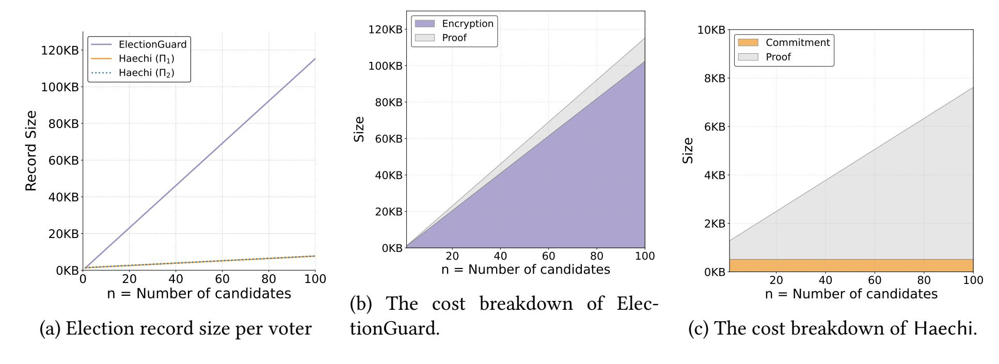
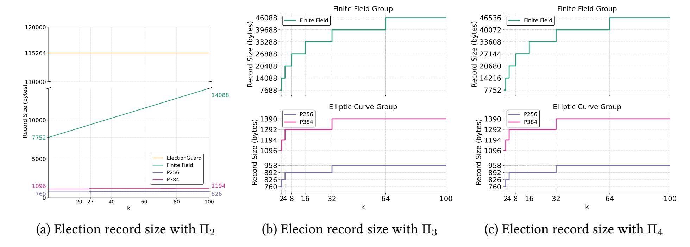

{0}------------------------------------------------

# Haechi: Simple Commitment-based Keyless In-person Verifiable Elections

Jiwon Kim<sup>1</sup>, Michael Naehrig<sup>2</sup>, Olivier Pereira<sup>3</sup>, and Josh Benaloh<sup>2</sup>

<sup>1</sup>University of Michigan, Ann Arbor, MI, USA
 <sup>2</sup>Microsoft Research, Redmond, WA, USA
 <sup>3</sup>UCLouvain, B-1348 Louvain-la-Neuve, Belgium

#### **Abstract**

For decades, verifiable election systems have typically relied on encrypting ballots to maintain voter privacy. Encryption requires keys, and the management of these keys is usually one of the most cumbersome and error-prone components of the system. But in-person elections—where one or more devices are used to each collect many votes—can use cryptographic commitments rather than encryption and completely obviate the need for cryptographic keys, leading to solutions that are much simpler and more robust than the encryption-based approaches.

Currently deployed E2E-verifiable voting systems also produce large election records, which can sometimes become an obstacle to election verification, by increasing the cost of hosting, distributing, and verifying election data. Using modern techniques for compact ZK proofs, Haechi improves on past commitment-based and encryption-based solutions by drastically reducing the size of the election records, leading to improvements of over an order of magnitude compared to several real-world deployments.

# 1 Introduction

In an end-to-end (E2E) verifiable election system, one of the principal challenges has always been key management. Who manages the keys and how are they managed? This is not only an operational challenge but also one of the greatest challenges for system design and implementation: key management problems forced the IACR to re-run its 2025 election [32], leading to global coverage, and a review of the design principles for E2E-verifiable elections has been proposed by Benaloh et al. [5] even before this incident.

It is difficult to see how a remote E2E-verifiable election system (such as internet voting) could function without keys, but the same is not true for in-person voting.

Traditional in-person voting remains the most common method for conducting public elections, and it is typically centered around devices—sometimes mechanical, sometimes electronic, or sometimes simple boxes—which collect ballots and produce tallies, often in conjunction with people who interact with them. Election officials then gather these device-tallies and either publish them directly or aggregate them with other device-tallies for publication.

If we replicate this model, we can build a keyless E2E-verifiable election system. An electronic ballot-collection device (such as a precinct scanner) can give each voter a cryptographic commitment to each

<span id="page-0-0"></span> $<sup>^{1}</sup> https://www.nytimes.com/2025/11/21/world/cryptography-group-lost-election-results.html \\$ 

{1}------------------------------------------------

ballot it receives. By keeping running totals of the votes it received and the random nonces it generated to form the commitments, the device can—at the end of voting—open a single aggregate commitment by revealing an aggregate nonce and the vote totals.

This matches the tallying process observed in many places, in which election officials collect vote totals from each individual vote collecting device, before further aggregation happens (see, e.g., [\[35,](#page-22-1) pp. 51-52], [\[13\]](#page-20-1), [\[16\]](#page-21-0), and [\[17\]](#page-21-1)). Election officials can then choose either to publish these individual device totals or further aggregate them (and their associated nonces) before publication.

The commitment-based workflow outlined above can be instantiated in many ways. In particular, switching to commitments raises the question of adopting perfectly binding or perfectly hiding schemes in the public key encryption setting, perfectly hiding is just impossible to obtain. Haechi is based on perfectly hiding commitments. The traditional motivation for this choice found in the literature is that in the election context long-term privacy is more important than long-term integrity—see, for instance, the SoK by Haines et al. [\[26\]](#page-21-2). Indeed, even the perspective of losing vote privacy in 20 years can be sufficient for coercion. But, we can expect a more limited impact if cryptanalytic advances (or quantum computers) make it possible to break the binding property of commitments in a few years and produce "evidence" of an alternate outcome, which nobody will believe.

Everlasting privacy is a welcome benefit, but the adoption of perfectly hiding commitments in Haechi started from a different motivation: reducing the size of the election records that are used for election verification, and which can become an obstacle to actual election verification. For instance, the ballots from the current version of Helios [\[1\]](#page-19-0), used by the IACR, require 1664 bytes/candidate in approval voting (the ballot format that results in the shortest ballots), which amounts to 166.4GB of data for an election with 100 candidates and a million ballots. The use of early versions of ElectionGuard for Risk Limiting Audits resulted in election records of about 1TB for a million ballots [\[4\]](#page-20-2), which was a motivation for the modification of proof formats in ElectionGuard 2.0 [\[6\]](#page-20-3). The Belenios system [\[18\]](#page-21-3) also moved to shorter election records and switched to using elliptic curve cryptography (ECC) by default in its Version 2.1 released in 2023.

While several verifiable voting systems based on perfectly hiding commitments have been proposed in the past (see discussion below), these systems did not bring any important benefits for ballot size: due to difficulties with building zero-knowledge (ZK) proofs of ballot validity, they would still use one Pedersen commitment per candidate on the ballot, and include one ZK proof per candidate.

Haechi explores the use of modern ZK proof techniques based on Compressed Σ-Protocol Theory [\[2\]](#page-19-1) in order to prove the knowledge of valid openings of perfectly hiding Pedersen vector commitments, for various ballot validity rules, including the most common cases of approval voting, selection of 1-out-of-, but also less common cases like cumulative voting, in which the voter can share votes among candidates, and possibly assign multiple votes to a single candidate.

We implemented Haechi in Rust, and instantiated it with both elliptic-curve and finite-field groups. Our implementation shows dramatic size improvements. For instance, for a 1-out-of-100 contest, and using identical groups, the size of a ballot goes from 115264 bytes in ElectionGuard [\[6\]](#page-20-3) down to 7688 bytes with Haechi.

# Related Work

The challenges of key management in elections. Benaloh et al. conducted a systematic review of the challenges related to key management in verifiable elections [\[5\]](#page-20-0). A key challenge identified there is the conflicting requirement of independence of the trustees who hold and use shares of the election decryption key, and the difficulty for election organizers to make sure that this independence will not lead to mistakes 

{2}------------------------------------------------

and failures. They describe situations in which the organizers manage and keep the devices holding the election secret keys at all times, reducing the role of the trustees to mere theater. At the other extreme, the 2025 IACR election had to be canceled and reorganized because an independently managed secret key went missing. Threshold key generation offers some benefits through redundancy, but creates increased complexity and its own pitfalls as well [\[5\]](#page-20-0).

Verifiable voting systems based on commitments. The first voting protocol relying on perfectly hiding commitments is probably the scheme of Cramer et al. from 1996 [\[20\]](#page-21-4). They envision a remote voting system where Pedersen commitments to the votes are published on a bulletin board, while the votes and commitment randomness are sent, using verifiable secret sharing, to a set of authorities (relying on a PKI here). Cuvelier et al. propose a variation on this approach where the votes and commitment openings are verifiably encrypted with a threshold encryption mechanism instead of being secret shared [\[22\]](#page-21-5).

Moran and Naor also use Pedersen commitments to construct a universally verifiable voting scheme with everlasting privacy in the context of in-person voting on ballot marking devices (BMDs) [\[34\]](#page-22-2). In their approach, an arbitrary voting choice is committed to in a Pedersen commitment. At the end of the voting phase, the list of committed votes is verifiably mixed, and the tally is obtained by opening the mixed commitments. By adopting the traditional mixnet approach, the BMD avoids the challenge of proving the validity of the committed votes during the voting phase, but must support the burden of running a verifiable shuffle. This raises its own coercion concerns when the set of voting options is large, as full and possibly unique votes are released in the clear.

The DRE-I system of Hao et al. [\[27\]](#page-21-6) is a variation on the above in-person voting scheme, in which homomorphic tallying is performed on a direct recording device (DRE). There, each choice on the ballot is encoded as a separate Pedersen-like commitment, with its own proof of knowledge of a valid opening. As a result, the size of the ballots grows linearly with the number of candidates, instead of logarithmically in our case for the compressed proof.

Modern ZK proof techniques for voting. ZK proofs are the standard tool used in verifiable voting systems to demonstrate that ballots are valid. The traditional approach used to demonstrate that a committed or encrypted vote is within a list of valid options is based on the secret-sharing based solution of Cramer-Damgård-Schoenmakers (CDS) [\[19\]](#page-21-7) for proving that a witness satisfies a disjunctive statement (see, among many others, [\[20,](#page-21-4) [21,](#page-21-8) [1,](#page-19-0) [18,](#page-21-3) [6\]](#page-20-3)). However, the size of the proofs grows linearly with the number of options for each question, and with the number of questions on the ballot.

There have been several recent explorations of the use of modern sublinear ZK proof techniques for proving ballot validity. In the Kryvos design by Huber et al. [\[30\]](#page-22-3), constant-size proofs based on the Groth16 approach are used for proving the validity of committed ballots. While constant-size proofs are appealing, this approach raises the question of the trusted proof setup, which is generally not desirable in verifiable elections where one should not need to trust any entity for the validity of the election outcome, and with demanding computational constraints: a computation time of 9 seconds is reported for proving the validity of a vote encoded on a Pedersen vector commitment of width 100, which may just be prohibitive in practice (the proof computation time of Haechi for the same width and slightly stronger security parameters is around 0.1s). Groth16 proofs have also been applied for proving the validity of votes encrypted with exponential ElGamal [\[31,](#page-22-4) [37\]](#page-22-5): the best results for 100 candidates require around 20s of proof computation time and a trusted public key of 194MB.

Very few works applied sublinear proof techniques to voting protocol in a way that does not require any trusted setup (the absence of trusted setup leading to logarithmic-size instead of constant-size proofs). 

{3}------------------------------------------------

Bulletproofs [\[11\]](#page-20-4) and the subsequent work [\[15,](#page-20-5) [23,](#page-21-9) [10\]](#page-20-6) are excellent candidates, as they directly apply to discrete log statements, which are common in ElGamal ciphertexts and Pedersen commitments that are common in voting protocols. Indeed, the Bulletproofs paper [\[11\]](#page-20-4) already outlines a strategy for a proof of shuffle of committed values, which Hoffman et al. [\[29\]](#page-21-10) adapt to the shuffle of ciphertexts. Recently, Harrison and Haines [\[28\]](#page-21-11) applied STARKS to produce proofs that a reported election result is consistent with the homomorphic aggregation of a set of encrypted votes that are only provided in a perfectly hiding committed form. While these works all focus on proofs computed by talliers, our work focuses on proofs of ballot validity computed by vote-collection devices while interacting with voters.

Roadmap. This work describes in detail how a commitment-based device-centric in-person E2E-verifiable election system can be built and used. Section [2](#page-3-0) introduces the threat model of Haechi and explains how it could be integrated in some standard election workflows. Then, we turn to the Haechi technical description: Section [3](#page-5-0) introduces our main cryptographic building blocks, Section [4](#page-6-0) describes the Haechi cryptographic setup, and Section [5](#page-8-0) describes our ballot validity proofs. Section [6](#page-12-0) offers an analysis of the privacy and integrity properties of Haechi. Eventually, Section [7](#page-16-0) details our Rust implementation results and offers a detailed comparison with the ElectionGuard state-of-the-art SDK [\[6\]](#page-20-3).

# <span id="page-3-0"></span>2 Overview

## 2.1 Setting

Our Haechi scheme considers an in-person device-centric election, where voters cast their ballots at official voting sites using dedicated voting devices—e.g. ballot collecting devices, ballot scanners, etc. Also, we assume that an election can have several contests (e.g. presidential election contest, senator election contest, state assembly member contest, etc.), where each contest may have a distinct set of candidates and election rules. Our scheme focuses on rather typical and traditional non-preferential voting schemes, where voters select one (or more) candidates instead of ranking them.

Our work addresses the voting process itself and assumes that voter eligibility verification is completed as a prerequisite. The device is loaded with the correct election manifest file that describes the election setting: list of contests, selectable options per contest, and election rules per contest such as selection limits (e.g. {0, 1} for each candidate) and contest selection limits (e.g. up to 1 candidate), etc.

We consider three groups of participants: voters, voting devices, and verifiers. A Voter casts a ballot using a voting device. A device records each voter's ballot commitment (not the cleartext votes) on a public bulletin board called the election record. Verifiers can download the election record and verify the election locally. Haechi is a publicly verifiable election scheme; any person—candidates, press, voters, and even non-voters—can be a verifier. We note that verifiers can include coercers who attempt to force voters to vote for specific candidates.

# 2.2 Threat Model & Goals

We assume that voters might be malicious; they may attempt to violate the election rules. Such behavior includes casting more votes than allowed for preferred candidates or assigning negative values to other candidates. We assume that verifiers might be malicious as well and may try to learn voters' choices.

A malicious voting device could incorrectly record votes or report inaccurate tallies, but that is always detectable by voters and/or verifiers. While a malicious voting device could also compromise voter privacy, such attacks are inherent to any real-world deployment and not specific to our construction. Addressing 

{4}------------------------------------------------

privacy breaches caused by fully compromised devices (e.g. cameras, spyware, or covert communication channels) is therefore outside the scope of this work. Our intent is to be realistic and avoid adding new threats to existing processes.

In this section, we define our goals informally using the terminology in [\[6,](#page-20-3) [8\]](#page-20-7) and defer the formalism to [§6.](#page-12-0)

- Vote Privacy: No one other than the corresponding voter can learn about the selections from the ballot.[2](#page-4-0)
- Receipt-freeness: Voters must not be able to convince a third party (i.e. coercer) of the contents of their votes—even if they want to.
- Cast-as-intended verifiability: Voters must be able to verify if a device has recorded their ballots honestly.
- Tallied-as-cast verifiability: Verifiers must be able to verify if every recorded ballot is correctly included in the tally.

## 2.3 Overview of Procedure

This section gives a high-level overview of Haechi. We will explain the specific details of the procedure in [§4.](#page-6-0)

Before a voting procedure begins, the device is loaded with the election setting from the manifest file and an empty election record. When voters make selections on a device (or scan their paper-ballots on the device, which may offer stronger dispute resolution properties), the device first prepares a ballot, a proof of ballot well-formedness, and a confirmation code. If a voter's selections do not satisfy the election rules, the device will fail to generate the well-formedness proof and will show an error message. If the proof is successfully generated, the device returns a confirmation code with the ballot to the voter.

Now, the voter has two options, either to cast or to challenge the ballot. If the voter chooses to cast, the device adds the ballot along with the proof and confirmation code to the election record and adds the selections to the running aggregated tallies. If the voter chooses to challenge, then the device needs to show a proof that the provided ballot has been generated honestly with the voter's choices. The voter will verify the proof, and if the verification fails, the voter will conclude that the device is not operating correctly. The challenged ballot is discarded, and the voter needs to start from the beginning. This is in order to preserve voter-privacy and receipt-freeness; the device's proof can be used as a receipt so that a coercer can check the voter's selections. Challenged ballots may also be added to the election record; however, they must be clearly identified as challenge ballots and their contents are not added to the tallies.

After voting is completed, the tally procedure begins. The ballot collecting device reveals the aggregated selections and a proof of correct tallying. Voters can use their confirmation codes to verify that their votes have been properly recorded and included in the tallies, and verifiers can confirm that the tallies are consistent with the published confirmation codes.

Haechi can of course be included and bring benefits to various other workflows. As an example, it could be integrated into a VAULT-style privacy-preserving risk limiting audit workflow [\[4\]](#page-20-2), resulting in considerably shorter audit data as well.

<span id="page-4-0"></span><sup>2</sup>As indicated above, we do not claim to prevent existing methods wherein a malicious voting device can divulge the contents of a ballot.

{5}------------------------------------------------

# <span id="page-5-0"></span>3 Cryptographic Building Blocks

**Notation.** For a positive integer  $n \in \mathbb{N}$ , let  $[n] = \{1, 2, ..., n\}$ . We denote by  $\mathbb{Z}_q$  the integers modulo q for  $q \in \mathbb{Z}$ .

**Group.** The cryptographic protocols in this paper make use of a cyclic group G with a generator g of prime order q in which the discrete logarithm problem is assumed to be hard. The group G can be instantiated using finite fields or elliptic curves. Concretely, in this paper, G is either the ElectionGuard [6] finite field group defined by a 4096-bit prime with a 256-bit group order; or the elliptic curve group on one of the two NIST standard curves P-256 and P-384 [14] with 256-bit and 384-bit group order, respectively.

**Commitments.** Given an element  $h \in G$  such that  $\log_g(h)$  is not known, the *Pedersen commitment scheme* [36] commits to a value  $v \in \mathbb{Z}_q$  by choosing a uniform random  $a \in \mathbb{Z}_q$  and computing the commitment  $c = g^a h^v$ . The scheme is computationally binding and information theoretically hiding. It can be generalized in order to commit to a vector of values as follows.

**Vector commitments.** Let  $n \in \mathbb{N}$ . Given n randomly chosen generators  $g_i \in G$ ,  $1 \le i \le n$ , such that no non-trivial discrete lograithm relation is known among the set of generators  $g, g_1, \ldots, g_n$ , the *Pedersen vector commitment scheme* commits to a vector  $\mathbf{x} = (\sigma_1, \ldots, \sigma_n)$  of n values  $\sigma_i \in \mathbb{Z}_q$  by choosing a uniformly random  $\sigma \in \mathbb{Z}_q$  and computing  $\mathbf{c_x} = \mathsf{Com}(\sigma, \mathbf{x}) = g^{\sigma} \prod_{i=1}^n g_i^{\sigma_i}$ . The vector of all generators is denoted by  $\mathbf{g} = (g, g_1, g_2, \ldots, g_n)$ . Given a commitment  $\mathbf{c_x}$ , an *opening* of  $\mathbf{c_x}$  is a pair  $(\mathbf{x}, \sigma)$  such that  $\mathbf{c_x} = \mathsf{Com}(\sigma, \mathbf{x})$ . The *verification* algorithm for Pedersen vector commitments takes as input a vector  $\mathbf{x}$ , randomness  $\sigma$ , and a commitment value  $\mathbf{c}$  and returns *true* if  $\mathbf{c} = \mathsf{Com}(\sigma, \mathbf{x})$ . Otherwise, it returns *false*.

Pedersen vector commitments are additively homomorphic, i.e., the product of a commitment  $c_{\mathbf{x}}$  to  $\mathbf{x}$  and  $c_{\mathbf{x}}'$  to  $\mathbf{x}'$  is a commitment to the component-wise sum of the vectors  $\mathbf{x}$  and  $\mathbf{x}'$  using  $\sigma + \sigma'$  as randomness:

$$\mathsf{c}_{\mathbf{x}} \cdot \mathsf{c}'_{\mathbf{x}} = \left( g^{\sigma} \prod_{i=1}^{n} g_{i}^{\sigma_{i}} \right) \cdot \left( g^{\sigma'} \prod_{i=1}^{n} g_{i}^{\sigma'_{i}} \right) = g^{\sigma + \sigma'} \prod_{i=1}^{n} g_{i}^{\sigma_{i} + \sigma'_{i}}.$$

**Generators.** To obtain the vector **g** of generators, we use the standard approach of hashing a counter to obtain algebraically unrelated group elements via the hash-to-field and hash-to-curve methods from RFC9380 [24]<sup>3</sup> (see Appendix D).

**Hash function.** As in [6], we use HMAC-SHA-256 to instantiate a random oracle via a hash function  $\mathsf{Hash}(\cdot\,;\,\cdot)$  that takes two arguments, a fixed-length 32-byte input in the first argument that is used as the key in HMAC and arbitrary-length input in the second argument as the data input, which in our notation is usually stated by a comma-separated list of input data items that are to be concatenated.

**Zero-knowledge proofs.** A zero-knowledge proof system for a language  $\mathcal{L}$  is an interactive protocol between a prover and a verifier, in which the prover convinces the verifier that a statement  $x \in \mathcal{L}$  by demonstrating knowledge of a witness w for x, without revealing any additional information about w.

<span id="page-5-1"></span><sup>&</sup>lt;sup>3</sup>https://www.rfc-editor.org/rfc/rfc9380.pdf

{6}------------------------------------------------

Compressed  $\Sigma$ -Protocol Theory. Compressed  $\Sigma$ -Protocols [2] present a class of Sigma protocol that can reduce the communication complexity to logarithmic in the number of committed values, by using the approach introduced in [11]. Briefly, rather than adding the third round messages of a Sigma protocol to each proof, the prover adds a proof of knowledge of the third round messages. Furthermore, they demonstrate how zero-knowledge circuits can be expressed as linear relations and show that the correct evaluation of a linear equation can be proved using a Sigma protocol. This approach provides significant flexibility: not only can complicated election rules be encoded into a single linear relation, but heterogeneous election rules across different contests can also be incorporated into one.

# <span id="page-6-0"></span>4 Commitment-Based Verifiable Elections

Haechi supports end-to-end verifiable in-person voting and follows in spirit the homomorphic tallying approach. However, instead of an additively homomorphic encryption scheme it uses an additively homomorphic commitment scheme. This removes the need for threshold encryption and complicated distributed key agreement.

Roles and election definition. Compared to a standard homomorphic tallying scheme, Haechi eliminates the role of trustees. The remaining roles that participate in the protocol are the voters, an election administrator, and election verifiers. Voters cast their votes and are enabled to verify that their votes have been correctly recorded by the election system. The election administrator facilitates the election and publishes the election record. Verifiers do not directly participate but examine the election record to verify the correctness of the election results.

The election is defined by an election manifest file that describes the election, its contests, the selectable options, and the voting modalities for each contest, and may contain other information about the election such as details on voting equipment, the election jurisdiction, and time information.

**Cryptographic parameters and context.** The cryptographic parameters specify the cryptographic group G for instantiating the commitment scheme and the required zero-knowledge proofs. This group is either a finite field or an elliptic curve group of prime order q as described in §3. The prime p defines the finite field  $\mathbb{F}_p$  that either contains G as a multiplicative group or is the base field over which the elliptic curve  $E: y^2 = x^3 + ax + b$  is defined, where  $a, b \in \mathbb{F}_p$  are the curve parameters.

Cryptographic objects and operations are tied to the cryptographic parameters and the specific election and are kept in a specific context by a chain of hash values using the hash function Hash described in §3. This prevents the reuse of cryptographic objects such as confirmation codes or proofs of well-formedness for other purposes within the protocol or in a different election. Each hash computation has a consecutive single byte input that ensures domain separation.

The cryptographic parameter information is captured in the parameter hash  $H_P$ . When G is a finite field group in  $\mathbb{F}_p$ ,  $H_P$  is computed as  $H_P \leftarrow \mathsf{Hash}(\mathsf{ver}; 0\mathsf{x}00, p, q)$ . Is G a group on an elliptic curve, it is  $H_P \leftarrow \mathsf{Hash}(\mathsf{ver}; 0\mathsf{x}00, p, q, a, b)$ .

Since the commitment-based approach avoids the need for generating and managing cryptographic keys, only the vector  $\mathbf{g} = (g, g_1, g_2, \dots, g_n)$  of generators needs to be computed beyond the group parameters as outlined in Appendix D. The number  $n \in \mathbb{N}$  that determines the required number of generators is an election-specific parameter. The generator information is bound to the parameter hash by the generator hash  $H_G \leftarrow \mathsf{Hash}(H_P; 0x01, n, \mathbf{g})$ .

{7}------------------------------------------------

Finally the base hash ← Hash( ; 0x02, manifest) binds the manifest file and captures the cryptographic and election parameters in a single value.

In the commitment-based, in-person voting procedure in Haechi, the voter makes selections on a voting device (e.g., by scanning a paper ballot), receives a confirmation code from the device, and then decides whether to challenge or cast the ballot. This means that the voting device must record the plaintext voter selections, commit to them, and compute a confirmation code.

Ballot preparation. The voting device collects the vector x = (1, 2, . . . , ) of votes from the voter. The selections ∈ Z are integers, typically very small integers and in the simplest, most common case ∈ {0, 1}. The device then picks a uniform random value and computes the commitment c<sup>x</sup> = Com(, x) that commits to all of the votes in a single Pedersen vector commitment. It now computes a proof of ballot well-formedness = Π(cx; x, ). The details of this proof are deferred to [§5.](#page-8-0)

The device then computes the confirmation code from the commitment and the previous confirmation code that has been computed on the device:

$$conf_i = Conf(H_I; 0x04, c_x, conf_{i-1}),$$

where = Hash(; 0x03,) is the ballot identifier hash computed from and a random identifier ←\$ Z.

If a voter challenges the ballot, the randomness is released to the voter together with the previous confirmation code such that the commitment can be opened and verified for correctness. Using the released information and the plaintext selection vector x, the voter can compute the confirmation code and compare it to the code obtained from the device.

When the voter casts the ballot, the commitment, the proof, and the confirmation code are stored and published in the election record together with and .

The device updates the plaintext tally by adding the plaintext voter selections x. In addition to the plaintext tally, a randomness aggregator is kept, that is initialized at 0 when voting begins. The randomness aggregator is updated together with the plaintext tally by adding the randomness used for preparing the current ballot.

Tallying and reporting. In the tally procedure, aggregate commitments are computed by multiplying them together at the appropriate reporting level for which aggregate randomness is available. Due to the additively homomorphic Pedersen vector commitments, the aggregate commitments commit to the tally values using the aggregate randomness. Therefore, aggregate commitments can be opened with the aggregate randomness to confirm correctness of the tally.

Election verification. End-to-end (E2E) verifiability has two central aspects, cast-as-intended verifiability and tallied-as-cast verifiability. Haechi follows the cast-or-challenge paradigm of [\[3\]](#page-20-9) to achieve the former. Giving voters the opportunity to challenge their ballots as described above enables them to hold the voting device accountable and verify correct recording of their votes by verifying the opening of the commitments associated with their confirmation codes. It is important that the device commits to the votes and computes each confirmation code before the voter chooses to challenge or cast. A challenged ballot cannot be cast, which ensures the privacy of cast votes as their commitments are never opened. Only voters can verify that their votes are cast as intended. This includes verifying that the confirmation code of the voter's cast ballot appears in the election record.

{8}------------------------------------------------

The election record allows tallied-as-cast verifiability by anyone with access to the record. It contains commitments to all cast votes. Verification of the proofs of well-formedness confirms that each individual commitment was made to a valid set of selections. The homomorphic property of Pedersen vector commitments allows to confirm correct aggregation of the commitments. The correctness of the reported tallies is verified by confirming that the aggregated commitment is correctly opened by the reported tally together with the aggregated commitment randomness. Verification that all confirmation codes have been computed correctly as part of a hash chain, where each confirmation code depends on the previous one, ensures that no ballots have been omitted.

Compared to the homomorphic tallying approach (e.g., as in ElectionGuard [6]), election verification is drastically simplified. There is no need for verifiable decryption to prove the correctness of tally decryption. As there are no cryptographic keys, privacy checks that ensure the correctness of distributed key agreement and the integrity of keys are not necessary.

# <span id="page-8-0"></span>5 Proof of Well-Formedness

To ensure that the plaintext vote data is well-formed, verifiable election systems compute non-interactive zero-knowledge proofs (NIZKs) showing that the input data satisfies the constraints prescribed by the election rules defined in the election manifest file. These proofs are an essential part of the election record. In the standard case of tallying via an additively homomorphic encryption scheme, the NIZKs prove that the voter selections that are encrypted in the corresponding ciphertexts adhere to these rules. For Haechi, votes are not encrypted but instead are committed to via homomorphic Pedersen vector commitments, so a well-formedness proof must use the commitments. While not standard for verifiable elections, modern zero-knowledge proof systems often use the commit-and-proof paradigm [33, 12, 38] that naturally uses commitment schemes as a fundamental building block.

Haechi follows the Compressed  $\Sigma$ -Protocol Theory approach outlined by Attema and Cramer in [2]. We specialize and modify it to the verifiable election setting. The proofs are described as interactive protocols between a prover and a verifier as in [2] and are made non-interactive by the Fiat-Shamir methodology [25], which is possible because all protocols are public-coin protocols.

**A simple base case.** Given the vector of voter selections  $\mathbf{x} = (\sigma_1, \sigma_2, \dots, \sigma_n)$  on a ballot, the election rules state requirements for the values of the  $\sigma_i$ . We start with the simplest case where the ballot has only a single contest with n selectable options. A voter must select exactly one of the options. This translates into the logical statement

<span id="page-8-1"></span>
$$\forall i \in [n], \sigma_i \in \{0, 1\} \land \sum_{i=1}^n \sigma_i = 1. \tag{1}$$

We adopt the language used in [2]. Let  $C: \mathbb{Z}_q^n \to \mathbb{Z}_q^n$  be an arithmetic circuit over  $\mathbb{Z}_q$  with  $C(\mathbf{x}) = \mathbf{x}*(1-\mathbf{x})$  and \* denotes component-wise multiplication. Also, define the linear equation  $\ell(\mathbf{x}) = \sum_{i=1}^n \sigma_i$ . Validity of the above statement for the voter selections  $\mathbf{x}$  and the commitment  $c_{\mathbf{x}}$  to  $\mathbf{x}$  with randomness  $\sigma$  can be expressed by the relation

$$\mathcal{R}_0 = \{ (C, \ell, c_{\mathbf{x}}; \mathbf{x}, \sigma) : C(\mathbf{x}) = 0 \land \ell(\mathbf{x}) = 1 \land \mathsf{Com}(\sigma, \mathbf{x}) = c_{\mathbf{x}} \}.$$

To prove  $C(\mathbf{x}) = 0$ , [2] proceeds as follows. The circuit C is comprised of n multiplicative gates whose left input, right input, and output we denote by  $(\alpha_i, \beta_i, \gamma_i)$  for  $i \in [n]$ . In our particular case, we assign  $\alpha_i = \sigma_i$ ,  $\beta_i = 1 - \sigma_i$ , and  $\gamma_i = 0$  and select three polynomials f(x), g(x) and h(x) that are a

{9}------------------------------------------------

multiplicative packed secret sharing of the vectors of the  $\alpha_i$ ,  $\beta_i$ , and  $\gamma_i$ . Specifically, the prover randomly selects polynomials f, g of degree  $\leq n$  such that  $f(i) = \alpha_i, g(i) = \beta_i$  and computes h(x) = f(x)g(x) of degree  $\leq 2n < q$ . Both f(x) and g(x) can be computed with Lagrange interpolation by using the additional degree of freedom to assign f(0) and g(0) uniformly at random.

Verifying  $C(\mathbf{x}) = 0$  is then reduced to checking  $f(x) \cdot g(x) = h(x)$ . Following [2], the verifier picks a random challenge  $c \leftarrow \mathbb{Z}_q \setminus [n]$  and sends it to the prover who responds with  $z_1 = f(c)$ ,  $z_2 = g(c)$ , and  $z_3 = h(c)$ . The verifier accepts if  $z_1 \cdot z_2 = z_3$ . A malicious prover will be caught with probability > 1 - 2n/(q - n).

For this to work, we need to additionally commit to f, g, h. This can be done by committing to a vector of polynomial evaluations  $(f(0), \ldots, f(n), g(0), \ldots, g(n), h(0), \ldots, h(2n)) \in \mathbb{Z}_q^{4n+3}$ . However, rather than computing an additional vector commitment, we instead extend the vector  $\mathbf{x}$  and could commit to the vector  $(\mathbf{x}, f(0), \ldots, h(2n)) \in \mathbb{Z}_q^{5n+3}$  all at once.

In our specific case, there are a few considerations that allow to shorten this vector. Observe that we can omit  $(f(1), \ldots, f(n)) = (\alpha_1, \ldots, \alpha_n)$  and  $(g(1), \ldots, g(n)) = (\beta_1, \ldots, \beta_n)$  because  $\alpha_i = \sigma_i$  and  $\beta_i = 1 - \sigma_i$  and the  $\sigma_i$  are already contained in  $\mathbf{x}$ . Likewise, we can also remove  $h(1), \ldots, h(n)$  from  $\mathbf{y}$  since they are all 0.

Furthermore, there is no need to include the polynomial g(x) at all because we can use 1 - f(x) as pointed out in [2]. Accordingly, the prover only sends  $z_1 = f(c)$  and  $z_2 = h(c)$  (instead of three values) and the verifier simply checks  $z_2 = z_1 \cdot (1 - z_1)$ . Thus, we can also remove g(0). Overall, the final vector that is committed to is

$$\mathbf{y} = (\sigma_1, \dots, \sigma_n, f(0), h(0), h(n+1), \dots, h(2n)) \in \mathbb{Z}_q^{2n+2}$$

and the prover commits to y instead of x, computing

$$\mathsf{c}_{\mathbf{y}} = g^{\sigma} \prod_{i=1}^{2n+2} g_{i}^{\mathbf{y}_{i}} = g^{\sigma} \prod_{i=1}^{n} g_{i}^{\sigma_{i}} \cdot g_{n+1}^{f(0)} \cdot g_{n+2}^{h(0)} \cdot \prod_{i=n+3}^{2n+2} g_{i}^{h(i-2)}.$$

Naturally, the setup for the Pedersen vector commitment scheme now needs to generate 2n + 2 generators.

Beyond verifying  $z_1 \cdot (1 - z_1) = z_2$  the prover must also convince the verifier that  $z_1 = f(c)$  and  $z_2 = h(c)$  because a malicious prover could send an arbitrary pair  $(z_1, z_2)$  that satisfies  $z_2 = z_1 \cdot (1 - z_1)$ .

To enable the verification that  $z_1$  and  $z_2$  are the values of the polynomials f and h at c, we show that the polynomials can be written as affine maps  $\phi_1, \phi_2 : \mathbb{Z}_q^{2n+2} \mapsto \mathbb{Z}_q$  that depend on c such that  $f(c) = \phi_1(\mathbf{y})$  and  $h(c) = \phi_2(\mathbf{y})$ . This allows to verify  $z_1 = \phi_1(\mathbf{y})$  and  $z_2 = \phi_2(\mathbf{y})$  in terms of  $\mathbf{y}$ .

The maps  $\phi_1$  and  $\phi_2$  are obtained by Lagrange interpolation. As usually, define the Lagrange-coefficients  $\ell_{i,m}(x) = \prod_{j=0,j\neq i}^m \ell_{i,j}(x-j)/(i-j)$ . Using these coefficients,  $f(x) = \sum_{i=0}^n \ell_{i,n}(x)f(i)$  and  $h(x) = \sum_{i=0}^{2n} \ell_{i,2n}(x)h(i)$  and we use

$$\phi_1(\mathbf{y}) = \sum_{i=1}^n \ell_{i,n}(c)\mathbf{y}_i + \ell_{0,n}(c)\mathbf{y}_{n+1},$$

$$\phi_2(\mathbf{y}) = \ell_{0,2n}(c)\mathbf{y}_{n+2} \sum_{i=n+1}^{2n} \ell_{i,2n}(c)\mathbf{y}_{i+2}.$$

Since the Lagrange coefficients only depend on the value c,  $\phi_1$  and  $\phi_2$  are public functions.

Finally, we combine  $C(\mathbf{x}) = 0$  and  $\ell(\mathbf{x}) = 1$  into a single linear equation, where we interpret  $\ell$  as a function of  $\mathbf{y}$ :  $\ell(\mathbf{y}) = \sum_{i=1}^{n} \mathbf{y}_{i}$ . The verifier provides an additional random value  $\rho$  and both prover and

{10}------------------------------------------------

verifier can derive the function

$$L(\mathbf{y}) = \ell(\mathbf{y}) \cdot \rho^0 + \sum_{i=1}^2 \phi_i(\mathbf{y}) \cdot \rho^i.$$

The condition that needs to be verified then becomes  $L(\mathbf{y}) = 1 + z_1 \cdot \rho + z_2 \cdot \rho^2$ . This means that instead of providing a proof for  $\mathcal{R}_0$ , we provide a proof for the relation

$$\mathcal{R}_1 = \{ (c_{\mathbf{y}}, L, z_1, z_2, \rho; \mathbf{y}, \sigma) : z_1(1 - z_1) = z_2$$

$$\land L(\mathbf{y}) = 1 + z_1 \rho + z_2 \rho^2 \land \mathsf{Com}(\sigma, \mathbf{y}) = c_{\mathbf{y}} \},$$

<span id="page-10-0"></span>where the coefficients of L can be computed from  $\ell$ ,  $\phi_1$ , and  $\phi_2$ , which in turn depend on c. In conclusion, applying [2] to this situation, we arrive at the proof protocol  $\Pi_1$  for the validity of (1) as shown in Figure 1. Note that this protocol needs an additional generator  $u \leftarrow \mathfrak{s} G$  with no known non-trivial relation to the other generators, i.e., setup should generate 2n+3 generators right away.

```
Protocol \Pi_1(\mathbf{c_y}, \ell, \phi_1, \phi_2; \mathbf{y}, \sigma, f, h):

1: V: sends a challenge c \leftarrow \mathbb{Z}_q \setminus [n] to P.

2: P: computes z_1 \leftarrow f(c), z_2 \leftarrow h(c) and sends z_1, z_2 to V.

3: V: verifies z_2 = z_1(1 - z_1).

4: V: sends \rho \leftarrow \mathbb{Z}_q to P.

5: P, V: compute L(\cdot) \leftarrow \ell(\cdot) \cdot \rho^0 + \phi_1(\cdot) \cdot \rho^1 + \phi_2(\cdot) \cdot \rho^2.

6: P: samples \mathbf{r} \leftarrow \mathbb{Z}_q^{2n+2}, \gamma \leftarrow \mathbb{Z}_q and sends t \leftarrow L(\mathbf{r}), A \leftarrow g^\gamma \Pi_{i=1}^{2n+2} g_i^{\mathbf{r}_i}

7: V: sends \mathbf{c}' \leftarrow \mathbb{Z}_q

8: P: sends \mathbf{z} \leftarrow \mathbf{c}' \cdot \mathbf{y} + \mathbf{r}, \zeta \leftarrow \mathbf{c}' \cdot \sigma + \gamma.

9: V: verifies g^\zeta \cdot \prod_{i=1}^{2n+2} g_i^{\mathbf{z}_i} \cdot u^{L(\mathbf{z})} \stackrel{?}{=} \mathbf{c}_\mathbf{y}^{\mathbf{c}'} \cdot A \cdot u^{\mathbf{c}' \cdot (1+z_1 \cdot \rho + z_2 \cdot \rho^2) + t}
```

Figure 1: Zero-knowledge proof protocol  $\Pi_1$  proving (1).

The following theorem sums up the completeness, soundness and zero-knowledge properties of protocol  $\Pi_1$ . We defer its proof to Appendix A.

<span id="page-10-1"></span>**Theorem 1.**  $\Pi_1$  is perfectly complete, special honest-verifier zero-knowledge, and computationally (2n+1,2)-special-sound under the discrete logarithm assumption.

Compressing the proof. We now describe a compressed proof scheme  $\Pi_1^{\mathsf{comp}}$  that also proves statement (1) but uses the compression technique introduced in [2].  $\Pi_1^{\mathsf{comp}}$  is identical to Figure 1 except for steps 7 and 8, which are modified as follows. Rather than explicitly sending all 2n+2 third-round response values, the prover in  $\Pi_1^{\mathsf{comp}}$  proves the knowledge of this response using a compressed- $\Sigma$  protocol.

The intuition is that the third round response vector  $(\mathbf{z}, \zeta)$ —and other auxiliary information needed for verification, e.g., the vector of generators and the linear equation L—can be recursively folded using random challenges, while maintaining the ability to verify due to linearity.

In each recursive step, the prover splits the generators, responses, and the linear equation into left and right halves. (The linear equation is decomposed into two linear equations: the left (resp., right) equation is obtained from the original equation by setting the right (resp., left) variables to zero.) The prover then commits to each half of the response together with the corresponding linear equation evaluation on them.

{11}------------------------------------------------

Upon receiving a random challenge from the verifier, the prover folds the left and right halves using the challenge, thereby dividing the dimension of the response vector, generators, and the linear equation by two. After repeating this procedure for logarithmically many steps, only two response messages remain. The prover sends them as final messages and the verifier runs the verification. We make  $\Pi_1^{\text{comp}}$  non-interactive using the Fiat-Shamir heuristics. The full (interactive) protocol is given in Appendix B.

If the length of  $\mathbf{y}$  is not a power of 2, the prover pads it with zeroes. Observe that the prover sends 2 group elements (commitments) every step. Since there are  $\lceil \log(|\mathbf{y}|+1) \rceil - 1$  recursive steps and  $|\mathbf{y}| = 2n+2$ , a proof from  $\Pi_1^{\mathsf{comp}}$  contains  $(2\lceil \log(2n+3) \rceil - 1)$  group elements and 5 scalars.

We remark that the compressed proof scheme is especially advantageous for elliptic curve groups, e.g., P-256, P-384, Curve25519, where the size of a group element and that of a scalar have little difference. On the other hand, for a group that has a huge difference between the size of a group element and a scalar—e.g., for the finite-field group from [6]—the regular protocol  $\Pi_1$  may yield smaller proofs.

**Full construction.** Figure 2 provides the full construction of the non-interactive proof of protocol  $\Pi_1$  for the simplest election rule (1), where each selection must be either 0 or 1, and their sum must be 1.

<span id="page-11-0"></span>

| Setup(manifest):                                                                                                                                                                                                                                                                                                                                                                                                                                                                                                                                                                                                            | $Conf(H_B, c_y, conf_{prev})$ :                                                                                                                                                                                                                                                                                 | $\overline{VerifyCast(R):}$                                                                                                                                                                                                                                                                                                                                                                                                                                                                                                                                                                                                                                                                                                                                                                                                                                                                                        |  |  |  |
|-----------------------------------------------------------------------------------------------------------------------------------------------------------------------------------------------------------------------------------------------------------------------------------------------------------------------------------------------------------------------------------------------------------------------------------------------------------------------------------------------------------------------------------------------------------------------------------------------------------------------------|-----------------------------------------------------------------------------------------------------------------------------------------------------------------------------------------------------------------------------------------------------------------------------------------------------------------|--------------------------------------------------------------------------------------------------------------------------------------------------------------------------------------------------------------------------------------------------------------------------------------------------------------------------------------------------------------------------------------------------------------------------------------------------------------------------------------------------------------------------------------------------------------------------------------------------------------------------------------------------------------------------------------------------------------------------------------------------------------------------------------------------------------------------------------------------------------------------------------------------------------------|--|--|--|
| <ol> <li>Use scheme Π₁ based on manifest.</li> <li>pp<sub>Π</sub> ← (ℓ, φ₁, φ₂)</li> </ol>                                                                                                                                                                                                                                                                                                                                                                                                                                                                                                                                  | 1: $id \leftarrow \mathbb{Z}_q$ , $H_I = Hash(H_B, id)$<br>2: $conf \leftarrow Hash(H_I, c_y, conf_prev)$                                                                                                                                                                                                       | 1: $\{(c_{y_i}, \pi_i, conf_i, H_{I_i})\}_{i \in [ voters ]} \leftarrow R$<br>2: <b>for</b> $i \in [ voters ]$ :                                                                                                                                                                                                                                                                                                                                                                                                                                                                                                                                                                                                                                                                                                                                                                                                   |  |  |  |
| <ol> <li>g ← (g, g<sub>1</sub>, · · · , g<sub>2n+2</sub>)</li> <li>H<sub>P</sub> ← Hash(ver, pp)</li> <li>H<sub>B</sub> = Hash(H<sub>P</sub>, manifest)</li> <li>pp ← (pp<sub>Π</sub>, g, H<sub>P</sub>, H<sub>B</sub>).</li> <li>return pp</li> </ol>                                                                                                                                                                                                                                                                                                                                                                      | 3: return (H <sub>I</sub> , conf)  Device.Chal(c <sub>y</sub> ):  1: Get (σ, y) corresponding to c <sub>y</sub> 2: (x, aux) ← y  3: return (σ, aux)                                                                                                                                                             | 3: $\operatorname{conf}_{i}' \leftarrow \operatorname{Hash}(H_{Ii}, c_{y_i}, \operatorname{conf}_{i-1})$ 4: $\operatorname{if} \operatorname{conf}_{i}' \neq \operatorname{conf}_{i} : \operatorname{return} 0 \text{ (reject)}.$ 5: $\operatorname{return} 1 \text{ (accept)}.$ VerifyConf(conf, $R$ ):  1: $\{(c_{y_i}, \pi_i, \operatorname{conf}_i, H_{Ii})\}_{i \in [ \operatorname{voters} ]} \leftarrow R$ 2: $\operatorname{if} \nexists i \text{ s.t. } \operatorname{conf}_i = \operatorname{conf} : \operatorname{return} 0$ 3: $\operatorname{return} \operatorname{conf} = \operatorname{Hash}(H_{Ii}, c_{y_i}, \operatorname{conf}_{i-1})$ VerifyProof( $R$ ):  1: $\{(c_i, \pi_i, \operatorname{conf}_i, H_{Ii})\}_{i \in [ \operatorname{voters} ]} \leftarrow R$ 2: $\operatorname{for} i \in [ R ]$ :  3: $\operatorname{if} \Pi.\operatorname{Verify}(\pi_i, c_i) = 0: \operatorname{return} 0$ |  |  |  |
| Vote(pp, $\mathbf{x} = (\sigma_1, \dots, \sigma_n)$ ):  1: $(pp_\Pi, g, H_P, H_B) \leftarrow pp,$ $(\ell, \phi_1, \phi_2) \leftarrow pp_\Pi$ 2: $f(x) \leftarrow \mathbb{Z}_q^{\leq n}[X] \text{ s.t. } f(i) = \sigma_i$ 3: $h(x) \leftarrow f(x) \cdot (1 - f(x))$ 4: $aux \leftarrow (f(0), h(0), h(n+1), \dots, h(2n))$ 5: $\mathbf{y} \leftarrow (\mathbf{x}, aux)$ 6: $\sigma \leftarrow \mathbb{Z}_q, c_y \leftarrow Com(\sigma, \mathbf{y})$ 7: $\pi \leftarrow \Pi_1(c_y, \ell, \phi_1, \phi_2; \mathbf{y}, \sigma, f, h)$ 8: $(H_I, conf) \leftarrow Conf(H_B, c_y, conf_{prev})$ 9: $return(c_y, \pi, conf, H_I)$ | Voter.Chal $(\sigma, \text{aux}, \mathbf{x}', \mathbf{c_y})$ :  1: $\mathbf{y}' \leftarrow (\mathbf{x}', \text{aux})$ 2: Get $\mathbf{c}'_{\mathbf{y}'} \leftarrow \text{Com}(\sigma, \mathbf{y}')$ 3: <b>return</b> Accept if $\mathbf{c}'_{\mathbf{y}'} = \mathbf{c_y}$ Cast $(\alpha, \sigma, \mathbf{y})$ : |                                                                                                                                                                                                                                                                                                                                                                                                                                                                                                                                                                                                                                                                                                                                                                                                                                                                                                                    |  |  |  |
|                                                                                                                                                                                                                                                                                                                                                                                                                                                                                                                                                                                                                             | 1: $\alpha \leftarrow \alpha + (\sigma, \mathbf{y})$<br>2: Add $(c_{\mathbf{y}}, \pi, H_{I}, \text{conf})$ to elect. record $R$<br>3: <b>return</b> $\alpha$<br>Tally():<br>1: <b>return</b> $\alpha$                                                                                                           | 4: <b>return</b> 1 $ \underline{\text{VerifyTally}(R, \alpha):} $ 1: $\{(c_{\mathbf{y}_{i}}, \pi_{i}, conf_{i}, H_{Ii})\}_{i \in [ voters ]} \leftarrow \mathbb{R}$ 2: $c_{1} \leftarrow \prod_{i=1}^{ voters } c_{\mathbf{y}_{i}}$ 3: $(\alpha_{\sigma}, \alpha_{\sigma_{1}}, \cdots, \alpha_{\sigma_{n}}, \alpha_{\mathbf{y}_{n+1}}, \cdots, \alpha_{\mathbf{y}_{2n+2}}) \leftarrow \alpha$                                                                                                                                                                                                                                                                                                                                                                                                                                                                                                                      |  |  |  |
|                                                                                                                                                                                                                                                                                                                                                                                                                                                                                                                                                                                                                             |                                                                                                                                                                                                                                                                                                                 | 4: $c_2 \leftarrow g^{\alpha_{\sigma}} \cdot \prod_{i=1}^n g_i^{\alpha_{\sigma_i}} \cdot \prod_{i=1}^{n+2} g_{n+i}^{\alpha_{y_{n+i}}}$<br>5: <b>return</b> accept <b>if</b> $c_1 = c_2$                                                                                                                                                                                                                                                                                                                                                                                                                                                                                                                                                                                                                                                                                                                            |  |  |  |

Figure 2: The full construction of Haechi instantiated with finite field integer groups for ballot well-formedness proof  $\Pi_1$ .

{12}------------------------------------------------

More general election rules. We end this section by presenting the high-level intuition on how we can extend  $\Pi_1$  to cover other election rules. The full protocols with detailed analysis can be found in Appendix C.

(i) First, consider a rule where a voter can choose up to k candidates for  $k \ge 1$ . This amounts to proving the statement

<span id="page-12-1"></span>
$$\Pi_2: \forall i \in [n], \sigma_i \in \{0, 1\} \land \sum_{i=1}^n \sigma_i \le k.$$

$$(2)$$

We introduce k "dummy" options (or no-vote options) that allow us to make the sum exactly k. Namely, if the voter chooses l < k candidates, k - l of the no-vote options are set to 1. Now, we can use  $\Pi_1$  exactly and only change the desired sum to k instead of 1. As we have k more candidates, the proof contains 2(n + k) + 6 scalars as well as 1 group element. Appendix C describes a more efficient scheme for bigger k's.

(ii) Our proof scheme can also be extended to cumulative voting, where a voter can share  $k \ge 1$  votes among n candidates but has to use exactly k votes. This is the statement

<span id="page-12-2"></span>
$$\Pi_3: \forall i \in [n], \sigma_i \in [0, k] \land \sum_{i=1}^n \sigma_i = k.$$
(3)

One could simply use the arithmetic circuit  $C'(\mathbf{x}) = \mathbf{x}*(1-\mathbf{x})*\cdots(k-\mathbf{x})$ . However, this strongly increases the degree of the polynomial h to (k+1)n. Alternatively, the degree of h can be made logarithmic in k, more concretely  $\kappa = \lfloor \log k \rfloor + 1$ . To achieve this each selection is represented in binary as bits. Then, the same circuit C as in  $\Pi_1$  is applied over this bit vector. This only ensures that each selection is in  $[0, 2^{\kappa} - 1]$ , which is sufficient due to other constraints that the sum is exactly k; any value larger than k cannot satisfy the sum constraint. The number of scalars in the proof becomes  $2(\kappa n) + 6$  scalars.

(iii) Finally we address the case of cumulative voting, where a voter does not need to spend all *k* votes, i.e.,

<span id="page-12-3"></span>
$$\Pi_4: \forall i \in [n], \sigma_i \in [0, k] \land \sum_{i=1}^n \sigma_i \le k. \tag{4}$$

We basically combine  $\Pi_2$  and  $\Pi_3$  here. For the sum constraint, we introduce 1 dummy candidate. Then, we represent (n+1) choices as bit vectors to prove the selection range constraint. Thus, the proof contains  $2\kappa(n+1) + 6$  scalars.

Although it is very rare, there can be another rule where a voter can vote up to k' > k. This requires introducing dummy candidates and the circuit C' introduced above. We defer the detail in Appendix C.

# <span id="page-12-0"></span>6 Haechi Privacy and Integrity

In this section, we give formal game-based definitions of vote privacy and the integrity properties of cast-as-intended verifiability and tallied-as-cast verifiability. We also provide an analysis of our scheme in the context of these games.

### 6.1 Vote Privacy

We formally define *vote* privacy using the game VP in Figure 3. Given the adversary  $\mathcal{A}$ 's two sets of selections  $\mathbf{x}_0$  and  $\mathbf{x}_1$ , the challenger randomly selects b and gives the ballot of  $\mathbf{x}_b$  to  $\mathcal{A}$ .  $\mathcal{A}$  wins if it

{13}------------------------------------------------

```
Game VP^{\mathcal{H}}(\lambda):

1: pp \leftarrow Setup(\lambda)

2: (\mathbf{x}_0, \mathbf{x}_1) \leftarrow \mathcal{H}(pp)

3: b \leftarrow \$ \{0, 1\}

4: (c_{\mathbf{y}_b}, \pi_b, H_{Ib}, conf_b) \leftarrow Vote(pp, \mathbf{x}_b)

5: b' \leftarrow \mathcal{H}(c_{\mathbf{y}_b}, \pi_b, H_{Ib}, conf_b)

6: \mathbf{return} \ b = b'
```

<span id="page-13-0"></span>Figure 3: The vote privacy game VP. The adversary  $\mathcal{A}$  wins if it can distinguish between records for  $\mathbf{x}_0$  and  $\mathbf{x}_1$ .

successfully guesses the bit b. For an adversary  $\mathcal A$  and an election scheme E, we define the VP advantage of  $\mathcal A$  against E as

$$Adv_E^{\mathsf{VP}}(\mathcal{A}) := |\Pr[\mathsf{VP}_F^{\mathcal{A}}(\lambda) = 1] - 1/2|.$$

We say that an election scheme E satisfies vote privacy if  $Adv_E^{\mathsf{VP}}(\mathcal{A}) \leq \mathsf{negl}(\lambda)$ . This definition is considerably simpler than those often used for ballot privacy [9] because here, the ballot-collection device is trusted for privacy—there is no concern of repeated randomness, ballot copies, etc.

<span id="page-13-1"></span>**Theorem 2.** For all adversaries  $\mathcal{A}$  and the vote privacy game VP in Figure 3,  $Adv_{Haechi}^{VP}(\mathcal{A}) \leq Adv_{\Pi_1}^{ZK}(\lambda) + Adv_{Hash}^{PR}(\lambda) + Adv_{Com}^{CH}(\lambda)$ .

*Proof Sketch.* We first proceed with a game hop to a game that generates the ballot well-formedness proof  $\pi$  using a simulator S using the zero-knowledge property of our scheme  $\Pi_1$ . Now we are in a world where the challenger of VP does not need a witness to generate  $\pi$ .

Then, we proceed with another game hop so that Vote generates the commitment  $c_y$  by committing to a fixed value, say 0. This game hop is bounded by the commitment hiding advantage of our commitment scheme. As we do not need y for generating the proof or commitment, we remove all procedures needed to generate y, namely getting the polynomial f and h and the auxiliary values to commit.

We then use the final game hop to a game where Conf in Vote produces the identifier hash  $H_I$  as a random string. This game hop is bounded by the pseudorandomness of our hash function. Now we are in a world where the adversary can only use conf to guess the challenge bit b. We build a reduction that if  $\mathcal{A}$  successfully guesses b, then we can build another adversary that can break the pseudorandomness of our underlying hash function. This concludes the proof.

## 6.2 Cast-as-intended Verifiability

We formally define the cast-as-intended verifiability as CI in Figure 4. The high-level idea is that  $\mathcal{A}$  wins if it can change the honest election record R and still convince VerifyConf. R and C denote sets for the election record and to collect confirmation codes, respectively.  $\mathcal{A}$  can add as many votes as it wants to R by querying the Vote oracle,  $O_{\text{Vote}}$ , with its choice of selections.  $O_{\text{Vote}}$  runs Vote to get the corresponding record that consists of the commitment, proof of well-formedness, identifier hash, and confirmation code. Then, it adds this honestly generated record and confirmation code to R and C and returns the record.  $\mathcal{A}$  outputs a different election record R' that contains different commitments, identifier hashes, or confirmation codes than R. Observe that we do not consider the proof of well-formedness. This is because cast-as-intended

{14}------------------------------------------------

```
Game Cl^{\mathcal{A}}(\lambda):

1: pp \leftarrow Setup(\cdot)

2: R \leftarrow \emptyset // the election record

3: C \leftarrow \emptyset // the set of confirmation codes

4: R' \leftarrow \mathcal{A}^{O_{\text{Vote}}}(pp)

5: diff \leftarrow (|R'| = |R|) \land (\exists i \in |R| \text{ s.t. } R_i.c_y \neq R'_i.c_y \lor R_i.H_I \neq R'_i.H_I \lor R_i.conf_i \neq R'_i.conf_i)

6: \mathbf{return} \ diff \land \forall \mathsf{conf} \in C, \mathsf{VerifyConf}(\mathsf{conf}, R')

O_{\mathsf{Vote}}(pp, \mathbf{x}):

1: (\mathbf{c_y}, \pi, H_I, \mathsf{conf}) \leftarrow \mathsf{Vote}(pp, \mathbf{x})

2: R \leftarrow R \cup \{(\mathbf{c_y}, \pi, H_I, \mathsf{conf})\}

3: C \leftarrow C \cup \{\mathsf{conf}\}

4: \mathbf{return} \ (\mathbf{c_y}, \pi, H_I, \mathsf{conf})
```

Figure 4: Cast-as-intended Verifiability Game Cl.

verfiability only ensures that the election record honestly reflects the voter's choices: the recorded choice cannot be altered, and the voter's ballot is included in the record.  $\mathcal{A}$  wins if it can output a different election record R' such that VerifyConf accepts for all honest confirmation codes conf  $\in C$ . For an adversary  $\mathcal{A}$ , we define the CI advantage of  $\mathcal{A}$  against an election scheme E as

$$Adv_E^{\mathsf{CI}}(\mathcal{A}) := \Pr[\mathsf{CI}_E^{\mathcal{A}}(\lambda) = 1].$$

We say that an election scheme satisfies cast-as-intended verifiability if  $Adv_E^{\mathsf{CI}}(\mathcal{A}) \leq \mathsf{negI}(\lambda)$ .

**Theorem 3.** For any PPT adversary  $\mathcal{A}$  and the cast-as-intended game CI in Figure 4,  $Adv_{Haechi}^{CI}(\mathcal{A}) \leq Adv_{Hash}^{CR}(\lambda)$ .

*Proof Sketch.* We show that no adversary  $\mathcal{A}$  can change any elements  $(c_y, H_I, conf)$  in any entry  $R_i$  for all  $i \in |R|$  and convince VerifyConf. First, if the set of the confirmation codes in R' are different from that in R, VerifyConf will fail. Thus, R' must contain the same confirmation codes as in R.

Now consider that some entry  $R'_i$  has a different commitment and/or identifier hash  $c'_{y_i}$ ,  $H'_{Ii}$  while maintaining the same confirmation codes  $\operatorname{conf}_i$ . Recall that  $\operatorname{VerifyConf}(\operatorname{conf}_i, R')$  checks  $\operatorname{conf}_i = \operatorname{Hash}(H'_{Ii}, c'_{y_i}, \operatorname{conf}_{i-1})$ . Since  $\operatorname{conf}_i$  was originally generated as  $\operatorname{Hash}(H_{Ii}, c_{y_i}, \operatorname{conf}_{i-1})$ , any difference in the input but the same output  $\operatorname{conf}_i$  constitutes a hash collision. We show that if  $\mathcal A$  wins, we can build another adversary that breaks the collision resistance of our underlying hash function.

The adversary  $\mathcal{A}$  may also change the confirmation code to  $\operatorname{conf}_i'$  so that  $\operatorname{conf}_i' = \operatorname{Hash}(H'_{Ii}, \operatorname{c}'_{y_i}, \operatorname{conf}_{i-1})$ . However, because confirmation codes are part of a hash chain, if the next entry  $R'_{i+1}$  has the same confirmation code as  $R_{i+1} \in R$ , the probability that  $\operatorname{conf}_{i+1} = \operatorname{Hash}(H_{Ii+1}, \operatorname{c}_{y_{i+1}}, \operatorname{conf}_i')$  holds and  $\operatorname{VerifyConf}(\operatorname{conf}_{i+1}, R') = 1$  is also bounded by the collision resistance of our hash function. In other words, any modification to an entry  $R_i$  requires the adversary to recompute every subsequent confirmation code  $\operatorname{conf}_j$  for all j > i.

Then,  $\mathcal{A}$  may also attempt to construct R' completely differently such that it satisfies the equation  $Verify\mathsf{Conf}(\mathsf{conf}_i,R')=1$  for all  $\mathsf{conf}_i\in C$ . In that case, R' is composed of an entirely different hash chain than R. However, as pointed out above, all confirmation codes appearing in R must also appear in R'. If  $\mathcal{A}$  wins, this essentially implies that two different sequences can derive the same hash values.

{15}------------------------------------------------

This implies the existence of a collision in the underlying hash function. We show that  $\mathcal{A}$ 's advantage is bounded by the collision resistance assumption of our underlying hash function.

### <span id="page-15-0"></span>6.3 Tallied-as-cast Verifiability

```
Game \mathsf{TC}^{\mathcal{A}}(\lambda):

1: \mathsf{pp} \leftarrow \mathsf{Setup}(\cdot)

2: (\alpha', R, \Gamma) \leftarrow \mathcal{A}(\mathsf{pp})

3: C \leftarrow \prod_{i=1}^{|R|} \mathsf{c}_{y_i}

4: \alpha \leftarrow \mathsf{open}(C, \Gamma)

5: \mathsf{return} \ \alpha' \neq \alpha \land \mathsf{VerifyTally}(R, \alpha') \land \mathsf{VerifyProof}(R)
```

Figure 5: Tallied-as-cast Verifiability Game TC.

We provide a formal definition of tallied-as-cast verifiability in Figure 5. The adversary  $\mathcal{A}$  outputs an election record R, a dishonest aggregate  $\alpha'$  that is not consistent with R, and an opening  $\Gamma$ . The challenger gets the product of all commitments in R and derives the honest aggregate  $\alpha$  by opening the product with  $\Gamma$ . The adversary wins if it can convince VerifyTally and VerifyProof with  $\alpha'$  and R. For an adversary  $\mathcal{A}$ , we define the TC advantage of  $\mathcal{A}$  against an election scheme E as

$$Adv_E^{\mathsf{TC}}(\mathcal{A}) := \Pr[\mathsf{TC}_E^{\mathcal{A}}(\lambda) = 1].$$

We say that a scheme satisfies tallied-as-cast verifiability if  $Adv_E^{\mathsf{TC}}(\mathcal{A}) \leq \mathsf{negl}(\lambda)$ .

Although it may seem counterintuitive that  $\mathcal{A}$  outputs both R and  $\alpha'$ , this reflects the real-world setting in which the device produces both the record and the tally result. Tallied-as-cast verifiability does not address whether the record reflects the voters' intended choices; instead, it captures the internal consistency between the record and the tally outcome.

**Theorem 4.** For any PPT adversary  $\mathcal{A}$  and the tallied-as-cast verifiability game TC in Figure 5, we have that  $Adv_{Haechi}^{\mathsf{TC}}(\mathcal{A}) \leq Adv_{\Pi_1}^{SS}(\lambda) + Adv_{\mathsf{Com}}^{CB}(\lambda)$ .

*Proof Sketch.* In order to win the game, an adversary  $\mathcal{A}$  may attempt to commit to choices that violate the election rule while producing proofs corresponding to different choices that do satisfy the rule. We show that  $\mathcal{A}$  cannot win with this strategy without negligible probability. We proceed with a game hop to a game where an extractor additionally extracts the witnesses for all proofs  $\pi_i$  for  $i \in [|R|]$ . The witnesses contain the choices and the randomness, which we denote  $\mathbf{y}_i'$  and  $\sigma_i'$ . The game hop is bounded by the special soundness of our proof scheme.

Say the committed values and witnesses associated with  $c_{y_i}$  are  $(y_i, \sigma_i)$ . If  $y_i' \neq y_i$  and VerifyProof accepts, by the verification equation,  $Com(y_i', \sigma_i') = Com(y_i, \sigma_i)$  holds. Thus, we show that if  $\mathcal{A}$  wins, we can build another adversary that wins the commitment binding game. However,  $\mathcal{A}$ 's advantage is bounded by the commitment binding property of our underlying commitment scheme. This ensures consistency between the commitment and proofs; if VerifyProof accepts, all committed choices follow the election rule.

Now recall that VerifyTally returns 1 only if the product of all commitments in R is the same as the commitment to  $\alpha'$ . Since the product of all commitments in R is the commitment to the honest aggregate  $\alpha$  due to additive homomorphism, the commitment to  $\alpha$  is the same as that to  $\alpha'$ . Thus, we also show that we can build another adversary  $\mathcal{A}'$  that wins the commitment binding game. However, due to the binding property of the commitment scheme, the advantage of  $\mathcal{A}'$  is bounded by negligible probability.

{16}------------------------------------------------

We conclude this section with a brief discussion of the receipt-freeness of Haechi, which follows from the system setting and its other privacy properties. The information closest to a receipt that a voter can retain after voting is a confirmation code. By Theorem 6.1, the pseudorandomness of the hash function prevents any third party from inferring the voter's choice from the confirmation code, and vote privacy further ensures that no additional advantage is gained even if the full election record corresponding to the confirmation code is revealed.

# <span id="page-16-0"></span>7 Implementation and Evaluation

We have implemented Haechi with 4247 lines of code in Rust. The election scheme is instantiated with two of the NIST standard elliptic curve groups, P-256 and P-384, as well as the finite field group introduced by ElectionGuard [6]. For each group, the scheme is implemented with the four proof schemes  $\Pi_1$ ,  $\Pi_2$ ,  $\Pi_3$ , and  $\Pi_4$  proving the statements in Equations (1), (2), (3), and (4). They differ by different choices for the allowed range for a single selection  $\sigma$  and the allowed range for the sum of all selections in the contest. The implementation uses the hash function Hash described in §3 based on HMAC-SHA-256, and the random oracle is instantiated with HashToField as in RFC9380 [24] (see Appendix D). All experiments were evaluated on an Apple M2 Pro CPU with 10 physical cores and 32GB RAM.

The empirical analysis of our scheme Haechi focuses on communication complexity, specifically proof size and election record size. While prover and verifier times are also important performance metrics, the election record size is particularly crucial; it directly affects the ability of verifiers—any member of the public—to download and audit the election record, even with low-end devices.

Thus, we aim to answer the following questions through our experiment: How much have proof and election record sizes improved compared to ElectionGuard [6] with the same group? What are the resulting proof and election record sizes when the scheme is instantiated with elliptic curves? How do proof and election record sizes vary under different election rules? How do these metrics scale in multi-contest elections?

<span id="page-16-1"></span>

Figure 6: The comparison between ElectionGuard vs. Haechi (instantiated with the same integer group) in terms of the size of an election record per voter for different numbers of candidates. Figure 6a shows election record size for the most general election rules,  $\Pi_1$  and  $\Pi_2$  with k = 1. Figure 6b and 6c shows the breakdown of the cost in 6a; it omits trivial costs (e.g., identifier and confirmation code computation, etc.)

We begin by comparing the size of the ElectionGuard election record with that of Haechi when it is

{17}------------------------------------------------

instantiated with the ElectionGuard finite field group [\[6\]](#page-20-3) for the most common election rules, namely Π<sup>1</sup> and Π<sup>2</sup> with = 1, where a voter can choose exactly one candidate or at most one candidate (Figure [6\)](#page-16-1). Note that a group element has 512 bytes and a scalar 32 bytes.

An election record contains a large amount of information about the election and the cryptographic artifacts that allow election verification. For simplicity, we focus only on the cryptographic objects associated with each cast ballot as they constitute the majority of the election record data.

For ElectionGuard, the data for a cast ballot consists of a ciphertext for each selection in each contest of the ballot, a range proof for each ciphertext and range proofs for the selection limits of each contest that prove that the ballot encryption is well-formed. The Haechi election record consists of a commitment to the voter's choices and a proof of well-formedness for the commitment. We assume that one commitment includes all voter selections on the ballot for this comparison. Both types of election records each contain an identifier, an identifier hash, and the ballot confirmation code among other small data items. Since they are contained in both records and are comparatively small, we do not take them into account in our comparison. The bulk of the data consists of ciphertexts and proofs, or commitments and proofs, respectively.

Figure [6](#page-16-1) displays the size of the election record per ballot depending on the number of selectable options on the ballot. Figure [6a](#page-16-1) shows that the size of an election record in Haechi is always smaller than that of ElectionGuard, and the gap becomes wider as the number of candidates grows. If the number of candidates is = 100, the election record size is 115,264 bytes per ballot in ElectionGuard for both election rules. This is because ElectionGuard exploits the additive homomorphic property of exponential ElGamal encryption to verify the sum; it decrypts the product of all encryptions and checks if it is exactly 1 (for rule 1) or is 0 or 1 (for rule 2). In Haechi, the election record size is 7,688 and 7,752 bytes when using Π<sup>1</sup> and Π2, respectively, which gives approximately a factor ×15 improvement from ElectionGuard in this setting and increases further as grows.

As Figure [6b](#page-16-1) shows, the dominating factor of a record size in ElectionGuard are the ciphertexts encrypting the voter selections. ElectionGuard encrypts each selection using ElGamal encryption; thus when = 100, the ciphertexts amount to 2 group elements ×100 = 102,400 bytes. On the other hand, the corresponding data in Haechi consists of a single vector commitment, i.e., a single group element. The commitment size is always 512 bytes regardless of the number of candidates (Figure [6c\)](#page-16-1). This yields a factor ×200 improvement in data size for = 100, or a factor ×2 in general.

Although Figure [6c](#page-16-1) indicates that the proof contributes a much larger fraction of the record size for Haechi than for ElectionGuard, the absolute size of the proof component in Haechi is smaller than that in ElectionGuard when > 11. ElectionGuard generates a CDS [\[19\]](#page-21-7) proof consisting of 4 scalars for each selection encryption; thus, the proof size grows linearly with . Concretely, when = 100, it is 12,800 bytes. On the other hand, Haechi proves well-formedness for all selections jointly, making the proof size 7,172 bytes for Π<sup>1</sup> and 7,176 bytes for Π2, a reduction by a factor ×1.8.

Our implementation also supports the elliptic curve groups P-256 and P-384. Figure [7](#page-18-0) shows the size of the election record per ballot with elliptic curve groups (and finite field groups) for the proof schemes Π2, Π3, and Π4. The experiment assumes that the number of selectable options is = 100. Since the size of a commitment, identifier hash, and confirmation code remains the same regardless of , Figure [7](#page-18-0) reflects the difference in proof sizes.

The first observation is that communication complexity is much smaller for all proof schemes when using elliptic curve groups. It is noteworthy that, for the most general rule where a voter can vote for up to one candidate (Π<sup>2</sup> with = 1), the record size per voter is 760 bytes with P-256 vs. 115,264 bytes with ElectionGuard using its finite field group.

{18}------------------------------------------------

<span id="page-18-0"></span>

Figure 7: The size of an election record per voter for different proof schemes when the number of candidates n = 100. With  $\Pi_2$ , a voter can cast at most one vote per candidate, for up to k different candidates. In  $\Pi_3$ , voters may split their k votes arbitrarily among candidates, assigning multiple votes to the same candidate if desired, as long as the total number of votes cast is exactly k. In  $\Pi_4$ , voters may again split their k votes among candidates, but is allowed to cast fewer than k votes in total.

Another observation is that the proof size of  $\Pi_2$  in the elliptic curve group setting grows in a stepwise manner, whereas in the finite field group setting it grows linearly. This is essentially the result of using the compressed proof. As  $\Pi_2$  uses "dummy" candidates to address the inequality, the proof scheme essentially assumes that there are n+k candidates, where k is the number of dummies. Thus, with the uncompressed proof scheme, the third-round message contains 2(n+k)+2 scalars. In contrast, a compressed proof includes only a logarithmic number of group elements with respect to the number of committed values. Thus the proof size could remain the same even with different values for k.

Figures 7b and 7c show the size of an election record with cumulative voting settings where voters are allowed to split a total of k votes to different candidates. In this setting, the size of a record grows in a stepwise manner both when the scheme is instantiated with a finite field group and with an elliptic curve group. This essentially comes from representing each selection as bits for the range proof (see §5 for more detail). Thus, the number of first round messages is logarithmic in k and essentially the proof size (and thus the record size) grows in discrete steps.

Table 1 shows the time metrics of Haechi: election record generation time and the proof verification time instantiated with the basic election rule  $\Pi_1$  for varying numbers of candidates. The prover time includes the commitment and proof generation phase. The elliptic curve based schemes use multi-scalar multiplications for these operations. Our implementation uses secp256r1 and secp384r1 Rust libraries for the MSM operations, resulting in 115ms and 325ms for generating an election record for n=100 candidates with P-256 and P-384 respectively. The corresponding proof verification times are 27ms and 89ms respectively. The scheme instantiated with the ElectionGuard's finite field group uses group exponentiations for the same operations, giving 278ms for generating an election record and 117ms for verifying the proof under the same setting. These are approximately  $\times 3$  (from 1.7 seconds) and  $\times 12$  (from 2.9 seconds) improvements from ElectionGuard.

It is also noteworthy that Haechi supports multi-contest elections without requiring additional commitments or proofs. This capability is due to the flexibility of our approach to the proof scheme design—Compressed Sigma [2]—that uses a linear equation to represent the election rules. Since all four rules in

{19}------------------------------------------------

<span id="page-19-2"></span>

|                | Record Generation Time (ms) |     |     |      |      |     | Number of Candidates<br>Verifier Time (ms) |      |      |      |  |
|----------------|-----------------------------|-----|-----|------|------|-----|--------------------------------------------|------|------|------|--|
|                | 10                          | 30  | 50  | 100  | 150  | 10  | 30                                         | 50   | 100  | 150  |  |
| P256           | 18                          | 33  | 59  | 115  | 221  | 7   | 14                                         | 27   | 54   | 108  |  |
| P384           | 53                          | 96  | 172 | 325  | 623  | 26  | 48                                         | 89   | 175  | 339  |  |
| Finite Field   | 73                          | 185 | 278 | 517  | 769  | 45  | 80                                         | 117  | 204  | 287  |  |
| ElectionGuard∗ | 174                         | 526 | 874 | 1742 | 2632 | 291 | 877                                        | 1471 | 2908 | 4381 |  |

Table 1: The election record generation (prover) and verification time per number of candidates for Π1. We implemented ElectionGuard 's record generation and proof verification components on top of the same finite-field implementation used in our system, enabling a direct comparison of timing results.

Π1, Π2, Π<sup>3</sup> and Π<sup>4</sup> can be expressed as linear equations, we can construct a single linear equation that simultaneously encodes the distinct rules of each contest.

# 8 Discussion & Future Work

Haechi offers a departure from recent efforts at E2E-verifiable voting. By focusing on in-person voting and leveraging the device-centric model currently used in practice, Haechi completely eliminates the need for keys and election trustees—which have posed significant difficulties in other approaches. By replacing encryption with commitments and applying recent work on modern efficient zero-knowledge methods, Haechi also drastically reduces the size of verifiable election records—eliminating another practical roadblock.

Haechi can also be used with VAULT-style risk-limiting audits (see [\[7\]](#page-20-12) and [\[4\]](#page-20-2)) to greatly simplify the process for privacy-preserving risk-limiting audits and make the size of the audit records far more manageable.

Future work will include an exploration of extending the approach to other voting methods such as ranked-choice voting. Methods to incorporate votes from other channels such as mail-in voting will also be explored—although any form of verifiable remote voting will likely require the reintroduction of cryptographic keys in some form.

# References

- <span id="page-19-0"></span>[1] Ben Adida, Olivier de Marneffe, Olivier Pereira, and Jean-Jacques Quisquater. Electing a University President Using Open-Audit Voting: Analysis of Real-World Use of Helios. In T. Moran D. Jefferson, J.L. Hall, editor, Electronic Voting Technology Workshop/Workshop on Trustworthy Elections. Usenix, August 2009.
- <span id="page-19-1"></span>[2] Thomas Attema and Ronald Cramer. Compressed Σ-protocol theory and practical application to plug & play secure algorithmics. In Advances in Cryptology - CRYPTO 2020, volume 12172 of Lecture Notes in Computer Science, pages 513–543. Springer, 2020.

{20}------------------------------------------------

- <span id="page-20-9"></span>[3] Josh Benaloh. Simple verifiable elections. In Proceedings of the USENIX/ACCURATE Electronic Voting Technology Workshop (EVT'06), Vancouver, BC, Canada, 2006. USENIX Association. PDF: [https:](https://www.usenix.org/legacy/event/evt06/tech/full_papers/benaloh/benaloh.pdf) [//www.usenix.org/legacy/event/evt06/tech/full\\_papers/benaloh/benaloh.pdf](https://www.usenix.org/legacy/event/evt06/tech/full_papers/benaloh/benaloh.pdf).
- <span id="page-20-2"></span>[4] Josh Benaloh, Kammi Foote, Philip B. Stark, Vanessa Teague, and Dan S. Wallach. VAULT-style risklimiting audits and the inyo county pilot. IEEE Secur. Priv., 19(4):8–18, 2021.
- <span id="page-20-0"></span>[5] Josh Benaloh, Michael Naehrig, and Olivier Pereira. REACTIVE: Rethinking effective approaches concerning trustees in verifiable elections. In Electronic Voting – E-Vote-ID 2025, volume 16028 of Lecture Notes in Computer Science, pages 17–37. Springer, 2025.
- <span id="page-20-3"></span>[6] Josh Benaloh, Michael Naehrig, Olivier Pereira, and Dan S. Wallach. ElectionGuard: a cryptographic toolkit to enable verifiable elections. In Davide Balzarotti and Wenyuan Xu, editors, 33rd USENIX Security Symposium, USENIX Security 2024, Philadelphia, PA, USA, August 14-16, 2024. USENIX Association, 2024.
- <span id="page-20-12"></span>[7] Josh Benaloh, Philip B. Stark, and Vanessa Teague. VAULT: Verifiable audits using limited transparency. In E-Vote-ID: International Joint Conference on Electronic Voting, October 2019. Also available as a preprint: <https://www.stat.berkeley.edu/~stark/Preprints/vault19.pdf>.
- <span id="page-20-7"></span>[8] Josh Benaloh and Dwight Tuinstra. Receipt-free secret-ballot elections. In Proceedings of the twentysixth annual ACM symposium on Theory of computing, pages 544–553, 1994.
- <span id="page-20-11"></span>[9] David Bernhard, Véronique Cortier, David Galindo, Olivier Pereira, and Bogdan Warinschi. SoK: A comprehensive analysis of game-based ballot privacy definitions. In 2015 IEEE Symposium on Security and Privacy, SP 2015, pages 499–516. IEEE Computer Society, 2015.
- <span id="page-20-6"></span>[10] Dan Boneh, Trisha Datta, Rex Fernando, Kamilla Nazirkhanova, and Alin Tomescu. DekartProof: Efficient vector range proofs and their applications. Cryptology ePrint Archive, Paper 2025/1159, 2025.
- <span id="page-20-4"></span>[11] Benedikt Bünz, Jonathan Bootle, Dan Boneh, Andrew Poelstra, Pieter Wuille, and Greg Maxwell. Bulletproofs: Short proofs for confidential transactions and more. In 2018 IEEE symposium on security and privacy (SP), pages 315–334. IEEE, 2018.
- <span id="page-20-10"></span>[12] Ran Canetti, Yehuda Lindell, Rafail Ostrovsky, and Amit Sahai. Universally composable two-party and multi-party secure computation. In Proceedings of the 34th Annual ACM Symposium on Theory of Computing (STOC), pages 494–503. ACM, 2002.
- <span id="page-20-1"></span>[13] Center for Internet Security. Vote tabulation - essential guide to election security. [https://docs.](https://docs.cisecurity.org/en/latest/ei_primer/tabulation.html) [cisecurity.org/en/latest/ei\\_primer/tabulation.html](https://docs.cisecurity.org/en/latest/ei_primer/tabulation.html). Details device-level data extraction, transfer, and aggregation processes in election systems.
- <span id="page-20-8"></span>[14] Lily Chen, Dustin Moody, Andrew Regenscheid, Angela Robinson, and Karen Randall. Recommendations for discrete logarithm-based cryptography: Elliptic curve domain parameters. NIST Special Publication 800-186, National Institute of Standards and Technology, February 2023.
- <span id="page-20-5"></span>[15] Heewon Chung, Kyoohyung Han, Chanyang Ju, Myungsun Kim, and Jae Hong Seo. Bulletproofs+: Shorter proofs for privacy-enhanced distributed ledger. Cryptology ePrint Archive, Paper 2020/735, 2020.

{21}------------------------------------------------

- <span id="page-21-0"></span>[16] Loi organisant le vote électronique avec preuve papier, article 12 (belgium). [https://www.ejustice.](https://www.ejustice.just.fgov.be/eli/loi/2014/02/07/2014000108/justel) [just.fgov.be/eli/loi/2014/02/07/2014000108/justel](https://www.ejustice.just.fgov.be/eli/loi/2014/02/07/2014000108/justel), 2014.
- <span id="page-21-1"></span>[17] Code électoral, article l57-1 (france). [https://www.legifrance.gouv.fr/codes/article\\_lc/](https://www.legifrance.gouv.fr/codes/article_lc/LEGIARTI000027477742) [LEGIARTI000027477742](https://www.legifrance.gouv.fr/codes/article_lc/LEGIARTI000027477742), 2015.
- <span id="page-21-3"></span>[18] Véronique Cortier, Pierrick Gaudry, and Stéphane Glondu. Belenios: A simple private and verifiable electronic voting system. In Foundations of Security, Protocols, and Equational Reasoning - Essays Dedicated to Catherine A. Meadows, volume 11565 of LNCS, pages 214–238. Springer, 2019.
- <span id="page-21-7"></span>[19] Ronald Cramer, Ivan Damgård, and Berry Schoenmakers. Proofs of partial knowledge and simplified design of witness hiding protocols. In Annual International Cryptology Conference, pages 174–187. Springer, 1994.
- <span id="page-21-4"></span>[20] Ronald Cramer, Matthew K. Franklin, Berry Schoenmakers, and Moti Yung. Multi-autority secretballot elections with linear work. In Advances in Cryptology - EUROCRYPT '96, volume 1070 of Lecture Notes in Computer Science, pages 72–83. Springer, 1996.
- <span id="page-21-8"></span>[21] Ronald Cramer, Rosario Gennaro, and Berry Schoenmakers. A secure and optimally efficient multiauthority election scheme. In Advances in Cryptology - EUROCRYPT '97, volume 1233 of Lecture Notes in Computer Science, pages 103–118. Springer, 1997.
- <span id="page-21-5"></span>[22] Edouard Cuvelier, Olivier Pereira, and Thomas Peters. Election verifiability or ballot privacy: Do we need to choose? In Computer Security - ESORICS 2013, volume 8134 of Lecture Notes in Computer Science, pages 481–498. Springer, 2013.
- <span id="page-21-9"></span>[23] Liam Eagen, Sanket Kanjalkar, Tim Ruffing, and Jonas Nick. Bulletproofs++: Next generation confidential transactions via reciprocal set membership arguments. Cryptology ePrint Archive, Paper 2022/510, 2022.
- <span id="page-21-12"></span>[24] A. Faz-Hernandez, S. Scott, N. Sullivan, R. S. Wahby, and C. A. Wood. RFC 9380: Hashing to Elliptic Curves. RFC 9380, Internet Research Task Force (IRTF), August 2023. Informational RFC.
- <span id="page-21-13"></span>[25] Amos Fiat and Adi Shamir. How to prove yourself: Practical solutions to identification and signature problems. In Advances in Cryptology - CRYPTO '86, volume 263 of LNCS, pages 186–194. Springer, 1986.
- <span id="page-21-2"></span>[26] Thomas Haines, Rafieh Mosaheb, Johannes Müller, and Ivan Pryvalov. SoK: Secure e-voting with everlasting privacy. Proc. Priv. Enhancing Technol., 2023(1):279–293, 2023.
- <span id="page-21-6"></span>[27] Feng Hao, Matthew N. Kreeger, Brian Randell, Dylan Clarke, Siamak F. Shahandashti, and Peter Hyun-Jeen Lee. Every vote counts: Ensuring integrity in large-scale electronic voting. Journal of Election Technology and Systems (JETS), 2(3):1–25, aug 2014.
- <span id="page-21-11"></span>[28] Max Harrison and Thomas Haines. On the applicability of STARKs to counted-as-collected verification in existing homomorphic e-voting systems. In Financial Cryptography and Data Security. FC 2024 International Workshops - Voting, DeFI, WTSC, CoDecFin, volume 14746 of Lecture Notes in Computer Science, pages 50–65. Springer, 2024.
- <span id="page-21-10"></span>[29] Max Hoffmann, Michael Klooß, and Andy Rupp. Efficient zero-knowledge arguments in the discrete log setting, revisited. In Proceedings of the 2019 ACM CCS 2019, pages 2093–2110. ACM, 2019.

{22}------------------------------------------------

- <span id="page-22-3"></span>[30] Nicolas Huber, Ralf Küsters, Toomas Krips, Julian Liedtke, Johannes Müller, Daniel Rausch, Pascal Reisert, and Andreas Vogt. Kryvos: Publicly tally-hiding verifiable e-voting. In *Proceedings of ACM CCS 2022*, pages 1443–1457. ACM, 2022.
- <span id="page-22-4"></span>[31] Nicolas Huber, Ralf Küsters, Julian Liedtke, and Daniel Rausch. ZK-SNARKs for ballot validity: A feasibility study. In *E-Vote-ID 2024, Proceedings*, volume 15014 of *Lecture Notes in Computer Science*, pages 107–123. Springer, 2024.
- <span id="page-22-0"></span>[32] Iacr news: Election 2025 update. https://www.iacr.org/news/item/27138, 2025.
- <span id="page-22-7"></span>[33] Joe Kilian. A note on efficient zero-knowledge proofs and arguments. In *Proceedings of the 24th Annual ACM Symposium on Theory of Computing (STOC)*, pages 723–732. ACM, 1992.
- <span id="page-22-2"></span>[34] Tal Moran and Moni Naor. Receipt-free universally-verifiable voting with everlasting privacy. In *Advances in Cryptology – CRYPTO 2006*, volume 4117 of *Lecture Notes in Computer Science*, pages 373–392. Springer, 2006.
- <span id="page-22-1"></span>[35] National Academies of Sciences, Engineering, and Medicine. *Securing the Vote: Protecting American Democracy.* The National Academies Press, Washington, DC, 2018.
- <span id="page-22-6"></span>[36] Torben P. Pedersen. Non-interactive and information-theoretic secure verifiable secret sharing. In *Advances in Cryptology — CRYPTO '91*, volume 576 of *Lecture Notes in Computer Science*, pages 129–140. Springer, 1992.
- <span id="page-22-5"></span>[37] Felix Röhr, Nicolas Huber, and Ralf Küsters. Improving the efficiency of zkSNARKs for ballot validity. Cryptology ePrint Archive, Paper 2025/2286, 2025.
- <span id="page-22-8"></span>[38] Justin Thaler. Proofs, arguments, and zero-knowledge. Foundations and Trends® in Privacy and Security, 4(2-4):117-660, 2022.

# <span id="page-22-9"></span>A Proof of Theorem 1

*Proof.* (Completeness). Completeness follows directly from the protocol.

(Special Soundness). Recall that a public-coin protocol is  $(k_1, \dots, k_\mu)$ -special sound, if there exists a polynomial time algorithm that on input a statement and a  $(k_1, \dots, k_\mu)$ -tree of accepting transcripts, outputs a witness for the statement. In our protocol, the statement is  $c_y$ ,  $\ell$ ,  $\phi_1$ ,  $\phi_2$ . We divide our protocol of  $\Pi_1$  into two parts: step 1-3 and step 4-9. We first show that the first part is (2n+1)-special sound, by showing that there exists an efficient extractor  $\mathcal{E}_1$  that extracts (f,h) from (2n+1) accepting transcripts  $(c,(z_1,z_2))$ . Recall that  $\deg(f) = n$  and  $\deg(h) = 2n$  and  $z_1 \leftarrow f(c), z_2 \leftarrow h(c)$ . By Lagrange interpolation, f can be reconstructed with n+1 distinct evaluations and h can be reconstructed with 2n+1 distinct evaluations. Therefore,  $\mathcal{E}_1$  can interpolate (2n+1) evaluation results and extract f and h.

We now show that the second part is 2-special sound; for fixed  $(c, (z_1, z_2), \rho)$ , there exists an efficient extractor  $\mathcal{E}_2$  that given two accepting transcripts  $((t, A), c', (\mathbf{z}', \zeta'))$  and  $((t, A), c^*, (\mathbf{z}^*, \zeta^*))$  extracts the

{23}------------------------------------------------

witness  $(\mathbf{y}, \sigma)$ . From the accepting transcripts,  $\mathcal{E}_2$  has the following equations.

$$\begin{split} g^{\zeta'} \cdot \prod_{i=1}^{2n+2} g_i^{\mathbf{z}_i'} \cdot h^{L(\mathbf{z}')} &= \mathsf{c}_\mathbf{y}^{c'} \cdot A \cdot h^{c' \cdot (1+z_1 \rho + z_2 \rho^2) + t} \\ &= (g^{\sigma} \cdot \prod_{i=1}^{2n+2} g_i^{\mathbf{y}_i})^{c'} \cdot A \cdot h^{c' \cdot (1+z_1 \rho + z_2 \rho^2) + t} \\ g^{\zeta^*} \cdot \prod_{i=1}^{2n+2} g_i^{\mathbf{z}_i^*} \cdot h^{L(\mathbf{z}^*)} &= \mathsf{c}_\mathbf{y}^{c^*} \cdot A \cdot h^{c^* \cdot (1+z_1 \rho + z_2 \rho^2) + t} \\ &= (g^{\sigma} \cdot \prod_{i=1}^{2n+2} g_i^{\mathbf{y}_i})^{c^*} \cdot A \cdot h^{c^* \cdot (1+z_1 \rho + z_2 \rho^2) + t}. \end{split}$$

Thus, by dividing the first equation by the second equation,  $\mathcal{E}_2$  gets

<span id="page-23-0"></span>
$$g^{\zeta'-\zeta^*} \cdot \prod_{i=1}^{2n+2} g_i^{\mathbf{z}_i'-\mathbf{z}_i^*} = (g^{\sigma} \cdot \prod_{i=1}^{2n+2} g_i^{\mathbf{y}_i})^{c'-c^*}.$$
 (5)

We show that given this,  $\mathcal{E}_2$  either finds non-trivial discrete logarithm relations between generators or from

$$\zeta' - \zeta^* = (c' - c^*) \cdot \sigma$$
 and  $\mathbf{z}_i' - \mathbf{z}_i^* = (c' - c^*)\mathbf{y}_i$ 

outputs

$$\sigma \leftarrow (\zeta' - \zeta^*)/(c' - c^*)$$
 and  $\mathbf{y}_i \leftarrow (\mathbf{z}_i' - \mathbf{z}_i^*)/(c' - c^*)$ .

In other words, we show that if an extractor  $\mathcal{E}_2$  outputs  $(\sigma', \mathbf{y}') \neq (\sigma, \mathbf{y})$ , then it knows the discrete logarithm relation between generators. Consider an adversarial extractor  $\mathcal{E}_2^*$  that, given two accepting transcripts, tries to output a set of witnesses  $(\sigma', \mathbf{y}')$  such that  $(\sigma', \mathbf{y}') \neq (\sigma, \mathbf{y})$  under the discrete logarithm assumption.

First, suppose  $\mathcal{E}_2^*$  outputs  $(\sigma', \mathbf{y}')$  such that only one element is different from  $(\sigma, \mathbf{y})$ . Without loss of generality, suppose that  $\sigma' \neq \sigma$  but  $\mathbf{y}' = \mathbf{y}$ . Then,

$$g^{\zeta'-\zeta^*} \cdot \prod_{i=1}^{2n+2} g_i^{\mathbf{z}_i'-\mathbf{z}_i^*} = (g^{\sigma} \cdot \prod_{i=1}^{2n+2} g_i^{\mathbf{y}_i})^{c'-c^*}$$

$$= (g^{\sigma} \cdot \prod_{i=1}^{2n+2} g_i^{\frac{\mathbf{z}_i'-\mathbf{z}_i^*}{c'-c^*}})^{c'-c^*}$$

$$= g^{\sigma \cdot (c'-c^*)} \cdot \prod_{i=1}^{2n+2} g_i^{\mathbf{z}_i'-\mathbf{z}_i^*}.$$

Since the term  $\prod_{i=1}^{2n+2} g_i^{\mathbf{z}_i' - \mathbf{z}_i^*}$  cancels out, we get  $\sigma = (\zeta' - \zeta^*)/(c' - c^*)$ , which contradicts the assumption. This means that at least two elements of witnesses need to be different.

We show that  $\mathcal{E}_2^*$  cannot output such  $(\sigma', \mathbf{y}')$  with more than negligible probability. Consider a game ExtDiff in Figure 8 where an adversarial extractor  $\mathcal{E}_2^*$  wins if it can output witnesses  $(\sigma', \mathbf{y}')$  that have two

{24}------------------------------------------------

```
Game ExtDiff<sup>\mathcal{E}_2^*</sup>(\lambda)

1: ((z_1, z_2), c, (t, A), c', (\mathbf{z}', \zeta')) \leftarrow \Pi_1(c_{\mathbf{y}}, \ell, \phi_1, \phi_2; \sigma, \mathbf{y}, f, h)

2: ((z_1, z_2), c, (t, A), c^*, (\mathbf{z}^*, \zeta^*)) \leftarrow \Pi_1(c_{\mathbf{y}}, \ell, \phi_1, \phi_2; \sigma, \mathbf{y}, f, h)

3: \operatorname{tr}_1 \leftarrow ((t, A), c', (\mathbf{z}', \zeta')), \operatorname{tr}_2 \leftarrow ((t, A), c^*, (\mathbf{z}^*, \zeta^*))

4: (\sigma', \mathbf{y}') \leftarrow \mathcal{E}_2^*(\operatorname{tr}_1, \operatorname{tr}_2)

5: \operatorname{return} (\sigma', \mathbf{y}') \neq (\sigma, \mathbf{y})
```

Figure 8: The game ExtDiff where the adversarial extractor  $\mathcal{E}_2^*$  wins if it outputs a set of witnesses that is different from the witnesses used for the transcripts. Since we consider the step 4 to 9 of  $\Pi_1$  in this proof, we pass only the corresponding transcripts to  $\mathcal{E}_2^*$ .

or more different elements than  $(\sigma, \mathbf{y})$ . We show a reduction between ExtDiff and the discrete log game DL and prove that the advantage of  $\mathcal{E}_2^*$  against ExtDiff is upper-bounded by the advantage of  $\mathcal{A}$  against DL. The reduction is described in Figure 9. The adversary  $\mathcal{A}$  is given the set of generators  $(g, g_1, \dots, g_{2n+2})$  where  $g_i = g^{d_i}$  and wins if it outputs at least one  $d_i$  correctly.  $\mathcal{A}$  uses  $\mathcal{E}_2^*$  as a subroutine and acts as the challenger of ExtDiff; it generates two accepting transcripts and invokes  $\mathcal{E}_2^*$  with  $(\mathsf{tr}_1, \mathsf{tr}_2)$ . When  $\mathcal{E}_2^*$  outputs  $(\sigma', \mathbf{y}')$ ,  $\mathcal{A}$  gets  $d_i'$  by

$$d_i' = -\frac{\sigma' \cdot (c' - c^*) - (\zeta' - \zeta^*)}{\mathbf{y}_i \cdot (c' - c^*) - (\mathbf{z}_i' - \mathbf{z}_i^*)},$$

<span id="page-24-1"></span>and outputs  $(d'_1, \dots, d'_{2n+2})$ .

```
Game DL^{\mathcal{H}}(\lambda):

1: (d_1, \dots, d_{2n+2}) \leftarrow \mathbb{Z}_q^{2n+2}

2: \forall i \in [2n+2], g_i \leftarrow g^{d_i}

3: (d'_1, \dots, d'_{2n+2}) \leftarrow \mathcal{H}(g, g_1, \dots, g_{2n+2})

4: return \exists d'_i = d_i for i \in [2n+2]

\underline{\mathcal{H}(g, g_1, \dots, g_{2n+2})}:

1: ((z_1, z_2), c, (t, A), c', (\mathbf{z}', \zeta')) \leftarrow \Pi_1(\mathbf{c}_{\mathbf{y}}, \ell, \phi_1, \phi_2; \mathbf{y}, \sigma, f, h)

2: ((z_1, z_2), c, (t, A), c^*, (\mathbf{z}^*, \zeta^*)) \leftarrow \Pi_1(\mathbf{c}_{\mathbf{y}}, \ell, \phi_1, \phi_2; \mathbf{y}, \sigma, f, h)

3: \operatorname{tr}_1 \leftarrow ((t, A), c', (\mathbf{z}', \zeta')), \operatorname{tr}_2 \leftarrow ((t, A), c^*, (\mathbf{z}^*, \zeta^*))

4: (\sigma', \mathbf{y}') \leftarrow \mathcal{E}_2^*(\operatorname{tr}_1, \operatorname{tr}_2)

5: \forall i \in [2n+2],

6: \operatorname{if} \mathbf{y}'_i \neq \mathbf{y}_i : d'_i \leftarrow -\frac{\sigma' \cdot (c'-c^*) - (\zeta'-\zeta^*)}{\mathbf{y}'_i \cdot (c'-c^*) - (\mathbf{z}'_i - \mathbf{z}^*)}

7: \operatorname{else} : d'_i \leftarrow 0

8: \operatorname{return} (d'_1, \dots, d'_{2n+2})
```

Figure 9: The reduction between DL and ExtDiff.

Now suppose that  $\mathcal{E}_2^*$  wins ExtDiff. Without loss of generality, suppose that  $\mathcal{E}_2^*$  outputs  $(\sigma', \mathbf{y}')$  such that  $\sigma' \neq \sigma$ ,  $\mathbf{y}_1' \neq \mathbf{y}_1$ , but other elements are the same. As  $(\sigma', \mathbf{y}')$  are witnesses that satisfy Equation 5, all terms will cancel out except

$$g^{\zeta'-\zeta^*} \cdot g_1^{\mathbf{z}_1'-\mathbf{z}_1^*} = g^{\sigma'(c'-c^*)} \cdot g_1^{\mathbf{y}_1' \cdot (c'-c^*)}.$$
 (6)

{25}------------------------------------------------

Notice that since  $g_1 = g^{d_1}$ ,

$$q^{\zeta'-\zeta^*} \cdot q^{d_1 \cdot (\mathbf{z}_1'-\mathbf{z}_1^*)} = q^{\sigma' \cdot (c'-c^*)} \cdot q^{d_1 \cdot (\mathbf{y}_1' \cdot (c'-c^*))}.$$

Thus, from

$$(\zeta' - \zeta^*) + d_1(\mathbf{z}_1' - \mathbf{z}_1^*) = \sigma'(c' - c^*) + d_1(\mathbf{y}_1' \cdot (c' - c^*))$$

 $\mathcal{A}$  can get

$$d_1 \leftarrow -\frac{\sigma' \cdot (c'-c^*) - (\zeta'-\zeta^*)}{\mathbf{y}_1' \cdot (c'-c^*) - (\mathbf{z}_1'-\mathbf{z}_1^*)},$$

since  $\sigma' \neq \frac{\zeta' - \zeta^*}{c' - c^*}$  and  $\mathbf{y}'_1 \neq \frac{\mathbf{z}'_1 - \mathbf{z}^*_1}{c' - c^*}$ , and thus the denominator will not be 0. Therefore,  $\mathcal{A}'$  can successfully derive the discrete logarithm relation between g and  $g_1$  and win DL. In conclusion,

$$Adv^{ExtDiff}(\mathcal{E}_2^*) \le Adv^{DL}(\mathcal{A}).$$

However, due to the discrete logarithm assumption,  $\mathrm{Adv}^{\mathsf{DL}}(\mathcal{A}) \leq \mathsf{negl}$ . Accordingly, the probability that  $\mathcal{E}_2^*$  outputs  $(\sigma', \mathbf{y}') \neq (\sigma, \mathbf{y})$  is also upper-bounded by negligible probability. Therefore, the extractor  $\mathcal{E}_2$  always outputs the correct witnesses  $(\sigma, \mathbf{y})$  for the statement  $(\mathsf{c}_{\mathbf{y}}, \ell, \phi_1, \phi_2)$  under the discrete logarithm assumption.

<span id="page-25-0"></span>(Special HVZK). Given the input and challenge  $(c_y, \ell, \phi_1, \phi_2, L, c, \rho, c')$ , we show that a simulator S can output an accepting transcript that has the same distribution as that of a real transcript. The simulator S works as shown in Figure 10.

```
S(c_{\mathbf{y}}, \ell, \phi_{1}, \phi_{2}, c, \rho, c') :
1: Sample z_{1} \leftarrow \mathbb{Z}_{q} uniformly at random and set z_{2} \leftarrow z_{1} \cdot (1 - z_{1}).
2: L(\cdot) \leftarrow \ell(\cdot) \cdot \rho^{0} + \phi_{1}(\cdot) \cdot \rho^{1} + \phi_{2}(\cdot) \cdot \rho^{2}
3: Sample uniformly at random \mathbf{z} \leftarrow \mathbb{Z}_{q}^{2n+2}, \zeta \leftarrow \mathbb{Z}_{q}.
4: A \leftarrow g^{\zeta} \prod_{i=1}^{2n+2} g_{i}^{\mathbf{z}_{i}}/c_{\mathbf{y}}^{c'}, t \leftarrow L(\mathbf{z}) - c' \cdot (1 + z_{1}\rho + z_{2}\rho^{2})
5: return (z_{1}, z_{2}, t, A, \mathbf{z}, \zeta)
```

Figure 10: The simulator S of the protocol  $\Pi_1$ .

It is obvious that the resulting transcript is an accepting transcript. The right-hand side of the verification equation will be

$$c_{\mathbf{y}}^{c'} \cdot A \cdot h^{c' \cdot (1+z_1\rho+z_2\rho^2)+t} = c_{\mathbf{y}}^{c'} \cdot g^{\zeta} \prod_{i=1}^{2n+2} g_i^{\mathbf{z}_i} / c_{\mathbf{y}}^{c'} \cdot h^{L(\mathbf{z})}$$
$$= g^{\zeta} \prod_{i=1}^{2n+2} g_i^{\mathbf{z}_i} \cdot h^{L(\mathbf{z})},$$

which is exactly the left-hand side of the verification equation. We now argue that the output  $(z_1, z_2, t, A, \mathbf{z}, \zeta)$  of S has the right distribution by analyzing each element.

First,  $z_1$  in a real transcript is computed as  $z_1 \leftarrow f(c)$  where f is a random polynomial such that evaluations are fixed at  $\{1, \dots, n\}$ . Thus, for other evaluation points  $c \in \mathbb{Z}_q \setminus [n]$ , f(c) is uniformly

{26}------------------------------------------------

distributed over  $\mathbb{Z}_q$ . Therefore, simulated  $z_1 \leftarrow \mathbb{Z}_q$  has the same distribution as  $z_1 \leftarrow f(c)$  in a real transcript. Since  $z_2 \leftarrow h(c) = f(c) \cdot (1 - f(c))$  in a real transcript, its distribution is the same as the simulated  $z_2 \leftarrow z_1 \cdot (1 - z_1)$ . In a real transcript, since all elements in  $\mathbf{r}$  and  $\gamma$  are mutually independent and uniform over  $\mathbb{Z}_q$  and c is uniform over  $\mathbb{Z}_q \setminus [n]$ ,  $\mathbf{z}$  and  $\zeta$  are uniformly distributed over  $\mathbb{Z}_q^{2n+2}$  and  $\mathbb{Z}_q$ . This is the exact distribution of  $(\mathbf{z},\zeta)$  of S's output. Also, observe that A in a real transcript is uniformly distributed over  $\mathbb{G}$  as the base group elements are raised to  $\mathbf{r}$  and  $\gamma$ . The simulated A has the same distribution, because  $g^{\zeta}\prod_{i=1}^{2n+2}g_i^{\mathbf{z}_i}$  is uniformly distributed over  $\mathbb{G}$ , and thus dividing it by  $\mathbf{c}_{\mathbf{y}}^{c'}$  is also uniformly distributed over  $\mathbb{G}$ .  $t \leftarrow L(\mathbf{r})$  in a real transcript is uniformly distributed over  $\mathbb{Z}_q$  due to  $\mathbf{r}$ . In a simulated world,  $L(\mathbf{z})$  is uniformly distributed over  $\mathbb{Z}_q$  due to  $\mathbf{z}$ , and thus  $t \leftarrow L(\mathbf{z}) - c' \cdot (1 + z_1 \rho + z_2 \rho^2)$  has a uniform distribution over  $\mathbb{Z}_q$ . This completes the proof.

**Theorem 5.** The communication cost of  $\Pi_1$  from the prover to verifier is  $1\mathbb{G} + (2n+6)\mathbb{Z}_q$  and that from the verifier to prover is  $3\mathbb{Z}_q$ . Since all verifier's messages are public-coin, we can make this non-interactive using Fiat-Shamir heuristics. Then, the proof size is  $1\mathbb{G} + (2n+6)\mathbb{Z}_q$ .

*Proof.* The proof contains one group element A. It also contains  $(z_1, z_2, t, \mathbf{z}, \zeta)$  where  $|\mathbf{z}| = 2n + 2$ .

# <span id="page-26-0"></span>**B** Full Protocol of $\Pi_1^{comp}$

Figure 11 shows the full compressed zero-knowledge proof protocol  $\Pi_1^{\text{comp}}$  that proves statement (1) with the compressed proving technique from [2]. For simplicity of analysis, we suppose that  $\mathbf{y}$  was padded with zeroes until its size becomes  $2^m - 1$ , i.e. a power of 2 minus 1. Also, we denote  $\mathbf{g} = (g_1, \dots, g_{|\mathbf{y}|})$ 

In step 8, the prover prepares a vector of third round messages  $\mathbf{z}$  and a vector of their corresponding bases  $\mathbf{g}$ . Notice that Q would be the right-hand side of verification in  $\Pi_1$  (without compression). In  $\Pi_1^{\text{comp}}$ , instead of sending the third round messages  $\mathbf{z}$ , the prover keeps folding  $\mathbf{g}$ ,  $\mathbf{z}$ ,  $\tilde{L}$  and Q.

We now justify the folding in step 12-13. We show that with one folding step, the verification in step 9 in  $\Pi_1$  (Figure 1) is reduced to checking  $\hat{\mathbf{g}}^{\mathbf{z}} \cdot u^{\tilde{L}(\hat{\mathbf{z}})} = Q$ .

$$\begin{split} Q &= \mu \cdot Q^{c'} \cdot v^{c'^2} \\ &= \hat{\mathbf{g}_R^c} \hat{\mathbf{z}}_L \cdot u^{\tilde{L}_R(\hat{\mathbf{z}}_L)} \cdot (\hat{\mathbf{g}}_L^{\hat{\mathbf{z}}_L} \cdot \hat{\mathbf{g}}_R^{\hat{\mathbf{z}}_R} \cdot u^{c_1 \cdot L(\mathbf{z})})^{c'} \cdot (\hat{\mathbf{g}}_L^{\hat{\mathbf{z}}_R} \cdot u^{\tilde{L}_L(\hat{\mathbf{z}}_R)})^{c'^2} \\ &= \hat{\mathbf{g}}_R^{\hat{\mathbf{z}}_L + c'\hat{\mathbf{z}}_R} \cdot \hat{\mathbf{g}}_L^{c'(\hat{\mathbf{z}}_L + c'\hat{\mathbf{z}}_R)} \cdot u^{\tilde{L}_R(\hat{\mathbf{z}}_L) + c'(\tilde{L}_R(\mathbf{z}_R) + \tilde{L}_L(\mathbf{z}_L)) + c'^2\tilde{L}_L(\mathbf{z}_R)} \\ &= \hat{\mathbf{g}}_R^{\hat{\mathbf{z}}_L + c'\hat{\mathbf{z}}_R} \cdot \hat{\mathbf{g}}_L^{c'(\hat{\mathbf{z}}_L + c'\hat{\mathbf{z}}_R)} \cdot u^{c'\tilde{L}_L(\hat{\mathbf{z}}_L + c'\hat{\mathbf{z}}_R) + \tilde{L}_R(\hat{\mathbf{z}}_L + c'\hat{\mathbf{z}}_R)} \\ &= \hat{\mathbf{g}}_R^{\hat{\mathbf{z}}} \cdot \hat{\mathbf{g}}_L^{c'\hat{\mathbf{z}}} \cdot u^{c'\tilde{L}_L(\hat{\mathbf{z}}) + \tilde{L}_R(\hat{\mathbf{z}})} \\ &= \hat{\mathbf{g}}_R^{\mathbf{z}} \cdot \hat{\mathbf{g}}_L^{c'\hat{\mathbf{z}}} \cdot u^{c'\tilde{L}_L(\hat{\mathbf{z}}) + \tilde{L}_R(\hat{\mathbf{z}})} \\ &= \hat{\mathbf{g}}^{\mathbf{z}} \cdot u^{\tilde{L}(\hat{\mathbf{z}})}. \end{split}$$

With recursion, the verification of a statement of size  $2^m$  is reduced to the statement of size  $2^{m-1}$  at each step until  $|\hat{\mathbf{z}}| = 2$ , at which point the final message is sent and verified.

# <span id="page-26-1"></span>C Proof of Ballot Well-formedness for Various Election Rules

Now we discuss how we can extend  $\Pi_1$  for more complicated election rules.

{27}------------------------------------------------

```
Protocol \Pi_1^{\mathsf{comp}}(\mathsf{c}_{\mathbf{y}},\ell,\phi_1,\phi_2;\mathbf{y},\sigma,f,h):
 1: V: sends a challenge c \leftarrow \mathbb{Z}_q \setminus [n] to P.
  2: P: computes z_1 \leftarrow f(c), z_2 \leftarrow h(c) and sends z_1, z_2 to V.
  3: V: verifies z_2 = z_1(1 - z_1).
  4: V: sends \rho \leftarrow \mathbb{Z}_q to P.
  5: P, V: compute L(\cdot) \leftarrow \ell(\cdot) \cdot \rho^0 + \phi_1(\cdot) \cdot \rho^1 + \phi_2(\cdot) \cdot \rho^2.
  6: P: samples \mathbf{r} \leftarrow_{\$} \mathbb{Z}_q^{|\mathbf{y}|}, \gamma \leftarrow_{\$} \mathbb{Z}_q and sends t \leftarrow L(\mathbf{r}), A \leftarrow g^{\gamma} \prod \mathbf{g}^{\mathbf{r}}
  7: V: sends c_0, c_1 \leftarrow \mathbb{Z}_q
  8: P: gets \mathbf{z} \leftarrow c_0 \cdot \mathbf{y} + \mathbf{r}, \zeta \leftarrow c_0 \cdot \sigma + \gamma, and prepares
        • \hat{\mathbf{g}} := (\mathbf{g}, g)
        • \hat{\mathbf{z}} := (\mathbf{z}, \zeta)
 9: P, V: prepares
        • \tilde{L}(\hat{\mathbf{z}}) := c_1 L(\mathbf{z})
        • Q := Ac_y^{c_0} u^{c_1(c_0L(y)+t)}
10: P: sends the commitments \mu, \nu
        • \mu := \hat{\mathbf{g}_R}^{\hat{\mathbf{z}}_L} \cdot u^{\tilde{L}_R(\hat{\mathbf{z}}_L)}
        • v := \hat{\mathbf{g}_L}^{\hat{\mathbf{z}}_R} \cdot u^{\tilde{L}_L(\hat{\mathbf{z}}_R)}
11: V: sends a challenge c' \leftarrow \mathbb{Z}_q
12: P: folds g and z
        • \hat{\mathbf{g}} := \hat{\mathbf{g}}_L^{c'} * \hat{\mathbf{g}}_R
        • \hat{\mathbf{z}} := \hat{\mathbf{z}_L} + c' \cdot \hat{\mathbf{z}_R}
13: P, V: folds \tilde{L} and Q
        • \tilde{L} := c'\tilde{L}_L + \tilde{L}_R
        • Q := \mu \cdot Q^{c'} \cdot v^{c'^2}
14: P: if |\hat{\mathbf{z}}| = 2: send \hat{\mathbf{z}} to V. Go back to step 9 otherwise.
15: V: verifies \hat{\mathbf{g}}^{\mathbf{z}} \cdot u^{\tilde{L}(\hat{\mathbf{z}})} = Q
```

Figure 11: Compressed proof protocol  $\Pi_1^{\mathsf{comp}}$  proving (1). \* denotes a component-wise vector multiplication.

# **C.1** $\forall i \in [n], \sigma_i \in \{0, 1\} \land \sum_{i=1}^n \sigma_i \le k, \ k \ge 1$

Consider a case where each selection must be either 0 or 1, but the sum of the selections can be up to k (see the statement (2)). We propose two approaches: (i) constructing a distinct circuit for checking  $\sum_{i=1}^{n} \sigma_i \in \{0, \dots, k\}$  and (ii) introducing "dummy" candidates in order to make the sum exactly k.

{28}------------------------------------------------

#### C.1.1 A distinct circuit for the sum of selections

We use two circuits C and C'. C is the same as  $\Pi_1$ , i.e.  $C(\mathbf{x}) : \mathbf{x} \mapsto \mathbf{x} * (1 - \mathbf{x})$ , and proves that  $\sigma_i \in \{0, 1\}$ . We construct another circuit  $C' : \mathbb{Z}_q \to \mathbb{Z}_q$  that proves that the sum  $s = \sum_{i=1}^n \sigma_i \in \{0, \dots, k\}$ .

$$C'(x): x \mapsto x \cdot (1-x) \cdots (k-x)$$

As before, we represent input x as a polynomial f'. In this case, the prover chooses a random degree-1 polynomial f' such that f'(1) = s. Then, we define a degree-(k + 1) polynomial  $h'(x) = f'(x) \cdot (1 - f'(x)) \cdot \cdots \cdot (k - f'(x))$ .

Now we construct  $\mathbf{y}$ . Since we use C for the first clause  $\sigma_i \in \{0, 1\}$ ,  $\mathbf{y}$  contains  $(\mathbf{x}, f(0), h(0), h(n+1), \dots, h(2n))$  as before. Now, we append more elements corresponding to C' to  $\mathbf{y}$ . We first put s, the claimed sum. Then, we put f'(0). Notice that since s = f'(1), s and f'(0) will uniquely denote f'. Similarly, we append  $h'(0), \dots, h'(k+1)$ . However, since h'(1) = 0 is desired, we can omit h'(1) from  $\mathbf{y}$  and still uniquely commit to h'. Therefore,  $\mathbf{y}$  is as follows.

$$\mathbf{y} = (\mathbf{x}, f(0), h(0), h(n+1), \cdots, h(2n),$$
  
$$s, f'(0), h'(0), h'(2), \cdots, h'(k+1)) \in \mathbb{Z}_q^{2n+k+5}.$$

We now show the linear equation L. Recall that for C, given the verifier's challenge  $c \in \mathbb{Z}_q \setminus [n]$ , the prover sends  $z_1 \leftarrow f(c)$  and  $z_2 \leftarrow h(c)$  and the verifier checks  $z_2 = z_1 \cdot (1 - z_1)$ . Then, the prover additionally proves that  $z_1$  and  $z_2$  are honestly generated by using the affine maps  $\phi_1 : \mathbf{y} \mapsto f(c)$  and  $\phi_2 : \mathbf{y} \mapsto h(c)$  and proving  $\phi_1(\mathbf{y}) = z_1$  and  $\phi_2(\mathbf{y}) = z_2$ . We do the same for C'. The challenge space is different since only f'(1) and h'(1) are fixed; the challenge can now be sampled from  $\mathbb{Z}_q \setminus \{1\}$  uniformly at random; we denote the challenge for C' as  $c^*$ . Given  $c^*$ , the prover additionally sends  $z'_1 \leftarrow f'(c^*)$  and  $z'_2 \leftarrow h'(c^*)$ , and the verifier checks  $z'_2 = z'_1 \cdot (1 - z'_1) \cdots (k - z'_1)$ . Then, the prover shows that for  $\phi'_1 : \mathbf{y} \mapsto f'(c^*)$  and  $\phi'_2 : \mathbf{y} \mapsto h'(c^*)$ ,  $\phi'_1(\mathbf{y}) = z'_1$  and  $\phi'_2(\mathbf{y}) = z'_2$ . Also, we need a check that the claimed s in  $\mathbf{y}$  is the actual sum of  $(\sigma_i)$ . We modify  $\ell$  to reflect this.

In more detail, given the purported  $z_1, z_2, z_1', z_2'$  and the verifier's challenge  $c, c^*, \rho$ , we construct L as follows.

$$L(\mathbf{y}) = \ell(\mathbf{y}) \cdot \rho^0 + \sum_{i=1}^2 \phi_i(\mathbf{y}) \cdot \rho^i + \sum_{i=1}^2 \phi_i'(\mathbf{y}) \cdot \rho^{2+i}$$

where  $\ell$ ,  $\phi_1$ ,  $\phi_2$ ,  $\phi_1'$ ,  $\phi_2'$  are defined as follows. Since we use the same circuit as  $\Pi_1$ ,  $\phi_1$  and  $\phi_2$  are the same as  $\Pi_1$ . Regarding  $\phi_1'$  and  $\phi_2'$ , notice that

$$f'(c) = \ell_0(c^*) \cdot f'(0) + \ell_1(c^*) \cdot f'(1)$$

and

$$h'(c^*) = \sum_{i=0}^{k+1} \ell_i(c^*) \cdot h'(i).$$

Since the index of f'(0) and s = f'(1) is 2n + 4 and 2n + 3 respectively,

$$\phi_1'(\mathbf{y}) = \frac{c^* - 1}{0 - 1} \cdot \mathbf{y}_{2n+4} + \frac{c^* - 0}{1 - 0} \cdot \mathbf{y}_{2n+3}.$$

{29}------------------------------------------------

Similarly,

$$\phi_2'(\mathbf{y}) = \prod_{j=1}^{k+1} \frac{c^* - j}{0 - j} \cdot \mathbf{y}_{2n+5} + \sum_{i=2}^{k+1} \prod_{j=0, j \neq i}^{k+1} \frac{c^* - j}{i - j} \cdot \mathbf{y}_{2n+5+i-1}.$$

Finally,

$$\ell(\mathbf{y}) = \sum_{i=1}^{n} \sigma_i - s$$
$$= \sum_{i=1}^{n} \mathbf{y}_i - \mathbf{y}_{2n+3}$$

As before,  $\ell$ ,  $\phi_1$ ,  $\phi_2$ ,  $\phi_1'$ ,  $\phi_2'$  are public and L can be constructed by both prover and verifier after the verifier randomly selects and sends  $(c, c^*, \rho)$  to the prover.

<span id="page-29-0"></span>The prover proves that  $L(\mathbf{y})$  equals  $0 \cdot \rho^0 + z_1 \cdot \rho^1 + z_2 \cdot \rho^2 + z_1' \cdot \rho^3 + z_2' \cdot \rho^4$ . We denote this protocol as  $\Pi_2^{C'}$  and describes the full protocol in Figure 12.

```
Protocol \Pi_2^{C'}(c_{\mathbf{y}}, \ell, \phi_1, \phi_2, \phi'_1, \phi'_2; \mathbf{y}, \sigma, f, h, f', h'):

1: V: sends a challenge c \leftarrow \mathbb{Z}_q \setminus [n] to P.

2: P: gets z_1 \leftarrow f(c), z_2 \leftarrow h(c) and sends z_1, z_2 to V.

3: V: checks z_2 = z_1(1 - z_1).

4: V: sends a challenge c^* \leftarrow \mathbb{Z}_q \setminus \{1\} to P.

5: P: gets z'_1 \leftarrow f'(c), z'_2 \leftarrow h'(c) and sends to V.

6: V: checks z'_2 = z'_1 \cdot (1 - z'_1) \cdots (k - z'_1)

7: V: sends \rho \leftarrow \mathbb{Z}_q to P.

8: P, V: computes L(\cdot) \leftarrow \ell(\cdot) \cdot \rho^0 + \sum_{i=1}^2 \phi_i(\cdot) \cdot \rho^i + \sum_{i=1}^2 \phi'_i(\cdot) \cdot \rho^{2+i}

9: P: \mathbf{r} \leftarrow \mathbb{Z}_q^{2n+k+5}, \gamma \leftarrow \mathbb{Z}_q, and sends t \leftarrow L(\mathbf{r}), A \leftarrow g^{\gamma}\Pi_{i=1}^{2n+k+5}g_i^{\mathbf{r}_i}

10: V: sends c' \leftarrow \mathbb{Z}_q

11: P: sends \mathbf{z} \leftarrow c' \cdot \mathbf{y} + \mathbf{r}, \zeta \leftarrow c' \cdot \sigma + \gamma.

12: V: return g^{\zeta} \cdot \prod_{i=1}^{2n+k+5} g_i^{\mathbf{z}_i} \cdot h^{L(\mathbf{z})} \stackrel{?}{=} \mathbf{c}_{\mathbf{y}}^c \cdot A \cdot h^{c' \cdot (z_1 \cdot \rho + z_2 \cdot \rho^2 + z'_1 \cdot \rho^3 + z'_2 \cdot \rho^4) + t}
```

Figure 12: The zero-knowledge proof protocol  $\Pi_2^{C'}$  that proves the selection  $\sigma_i \in \{0, 1\}$  and the sum of selections  $\sum_{i=1}^n \sigma_i \le k$  for some  $k \ge 1$ . Blue text denotes the difference from  $\Pi_1$ .

**Theorem 6.**  $\Pi_2^{C'}$  is perfectly complete, special honest-verifier zero-knowledge, and (2n + 1, k + 2, 2)-special-sound under the discrete logarithm assumption.

*Proof.* The proof is the same as proof of Theorem 1 with a slight change due to additional polynomials f' and h' and the difference in the size of vector  $\mathbf{y}$ . The completeness directly follows from the protocol. The special honest-verifier zero-knowledge can be proven using the same simulator S as Figure 10 but samples  $\mathbf{z} \leftarrow \mathbb{Z}_q^{2n+k+5}$  uniformly at random. S also additionally samples  $z'_1 \leftarrow \mathbb{Z}_q$  and  $z'_2 \leftarrow z'_1 \cdot (1-z'_1) \cdots (k-z'_1)$ . Since f' is a random polynomial where the evaluation is fixed at an evaluation point  $1, z'_1 \leftarrow f'(c^*)$  for  $c^* \in \mathbb{Z}_q \setminus \{1\}$  in a real transcript looks uniformly distributed from the view of the verifier. Thus, the simulated  $z'_1 \leftarrow \mathbb{Z}_q$  has the same distribution as a real  $z'_1 \leftarrow f'(c^*)$ . Also, in a real transcript,  $z'_2 \leftarrow f'(c^*)$ 

{30}------------------------------------------------

 $h'(c^*) = f'(c^*) \cdot (1 - f'(c^*)) \cdot \cdots \cdot (k - f'(c^*))$  by the definition. Thus, the distribution of a simulated  $z'_2 \leftarrow z'_1 \cdot (1 - z'_1) \cdot \cdots \cdot (k - z'_1)$  is the same as that of a real transcript.

Notice that  $\Pi_2^C$  is (2n+1,k+2,2)-special sound. The additional element (k+2) is due to the additional transcript  $(z'_1,z'_2)$  at step 4-6. Since f' is a degree-1 polynomial, an extractor needs at least 2 accepting transcripts to extract f'. However, since h' is a degree-(k+1) polynomial, an extractor needs at least (k+2) accepting transcripts to extract h'. Thus, with (k+2) pairs of  $(z'_1,z'_2)$ , an extractor can extract both f' and h'.

**Theorem 7.** The communication cost of  $\Pi_2^{C'}$  from the prover to verifier is  $1\mathbb{G} + (2n+k+11)\mathbb{Z}_q$  and that from the verifier to prover is  $4\mathbb{Z}_q$ . Since all verifier's messages are public-coin, we can make this non-interactive using Fiat-Shamir heuristics. Then, the proof size is  $1\mathbb{G} + (2n+k+11)\mathbb{Z}_q$ .

*Proof.* The proof contains one group element A. It also contains  $(z_1, z_2, z'_1, z'_2, t, \mathbf{z}, \zeta)$  where  $|\mathbf{z}| = 2n + k + 5$ .

#### <span id="page-30-0"></span>C.1.2 Dummy candidates

We can prove the same thing another way. We introduce k dummy candidates (so there are n+k candidates total). If the voter's selection sum l is less than k, then the device sets 1 for k-l dummy candidates. This makes the selection sum over n+k candidates become exactly k. In other words, we modify the statement as follows

$$\forall i \in [n+k], \sigma_i \in \{0,1\} \land \sum_{i=1}^{n+k} \sigma_i = k.$$

This is the exact statement as the base case, except that the sum of selections is k instead of 1. Therefore, we use the protocol  $\Pi_1$ .

In more detail, let  $\mathbf{x}' \in \mathbb{Z}_q^{n+k}$  be the modified input vector that contains dummy selections. Since the size of input elements become n+k instead of n, the degree of f will be n+k, and accordingly the degree of f will be f0 will be f1. Then,

$$\mathbf{y} = (\mathbf{x}', f(0), h(0), h(n+k+1), \dots, h(2(n+k)) \in \mathbb{Z}_q^{2(n+k)+2}.$$

The linear equation is the same except that  $\ell$  checks the sum equals to k and  $\phi_1$  and  $\phi_2$  are over n+k evaluation points and 2(n+k) evaluation points respectively. Let the proof protocol  $\Pi_2$ . We omit the full description of  $\Pi_2^D$  since it is the same as  $\Pi_1$  except that c is chosen from  $\mathbb{Z}_q \setminus [n+k]$  uniformly at random and the size of vector  $\mathbf{r}$  is 2(n+k)+2.

**Theorem 8.**  $\Pi_2^D$  is perfectly complete, special honest-verifier zero-knowledge, and (2(n+k)+1,2)-special-sound under the discrete logarithm assumption.

*Proof.* Since  $\Pi_2$  is exactly the same as  $\Pi_1$  except the challenge size and the size of vector  $\mathbf{y}$ , it is obvious that  $\Pi_2^D$  is perfectly complete and special honest-verifier zero-knowledge. Also, it is obvious that  $\Pi_2$  is (2(n+k)+1,2)-special sound in accordance with the change of  $\deg(f)=n+k$  and  $\deg(h)=2(n+k)$  from n and 2n respectively.

**Theorem 9.** The communication cost of  $\Pi_2^D$  from the prover to verifier is  $1\mathbb{G} + (2(n+k)+6)\mathbb{Z}_q$  and that from the verifier to prover is  $3\mathbb{Z}_q$ . Since all verifier's messages are public-coin, we can make this non-interactive using Fiat-Shamir heuristics. Then, the proof size is  $1\mathbb{G} + (2(n+k)+6)\mathbb{Z}_q$ .

{31}------------------------------------------------

**Theorem 10.** If  $k \le 5$ ,  $\Pi_2^D$  is more efficient in terms of proof size. If k > 5,  $\Pi_2^{C'}$  is more efficient.

*Proof.* Since the proof size of  $\Pi_2^{C'}$  is  $1\mathbb{G} + (2n + k + 11)\mathbb{Z}_q$  and the proof size of  $\Pi_2$  is  $1\mathbb{G} + (2n + 2k + 6)\mathbb{Z}_q$ ,

$$2n + k + 11 < 2n + 2k + 6$$
  
 $k + 11 < 2k + 6$   
 $5 < k$ 

<span id="page-31-0"></span>**C.2**  $\forall i \in [n], \sigma_i \in \{0, \dots, k\} \land \sum_{i=1}^n \sigma_i = k, k \ge 1$ 

Now, consider a case where each selection can be larger than 1, e.g.  $\sigma_i \in \{0, 1, \dots, k\}$  and the sum of all selections should be exactly k (see statement (3))

A naive way to prove this is modifying the circuit  $C: \mathbb{Z}_q^n \mapsto \mathbb{Z}_q^n$  as follows: given *n*-length vector  $\mathbf{x}$ ,

$$C(\mathbf{x}) = \mathbf{x} * (1 - \mathbf{x}) * \cdots * (k - \mathbf{x}).$$

The prover constructs the polynomial f as before; the prover randomly samples a polynomial f such that  $f(i) = \sigma_i$ . The degree of f is n. Then, the prover constructs the polynomial h as  $h(\mathbf{x}) = f(x) \cdot (1 - f(x)) \cdots (k - f(x))$ . Thus, the degree of h will blow up to (k + 1)n.

Alternatively, we can make the degree of h logarithmic to k. Let  $\kappa = \lfloor \log k \rfloor + 1$  and represent each selection  $\sigma_i$  as a bit vector  $\sigma_i = (b_{i,1}, \dots, b_{i,\kappa})$ . Then,

$$\mathbf{b} = (b_{1,1}, \cdots, b_{1,\kappa}, \cdots, b_{n,1}, \cdots, b_{n,\kappa}) \in \{0, 1\}^{n \cdot \kappa},$$

and we run the same circuit  $C: \mathbf{x} \mapsto \mathbf{x} * (1 - \mathbf{x})$  over this  $n \cdot \kappa$ -length vector  $\mathbf{b}$ . In other words, the prover shows that each bit  $b_{i,j} \in \{0,1\}$ . Notice that this ensures that  $\sigma_i \in \{0,\cdots,2^{\kappa}-1\}$  instead of  $\{0,\cdots,k\}$ . However, checking  $\sigma_i \in \{0,\cdots,2^{\kappa}-1\}$  is sufficient in this case due to the other constraint  $\sum_{i=1}^n \sigma_i = k$ . If there exists any  $\sigma_i > k$ , the sum constraint will not be satisfied.

Now consider how **y** is constructed. Since  $|\mathbf{b}| = \kappa \cdot n$ , the degree of f will be  $\kappa \cdot n$ . As we use the same circuit,  $h(x) = f(x) \cdot (1 - f(x))$ ,  $\deg(h) = 2\kappa n$ . Similar to the previous protocol, we can skip committing to  $h(1), \dots h(\kappa n)$  as they should be 0. Thus,

$$\mathbf{y} = (\mathbf{b}, f(0), h(0), h(\kappa n + 1), \cdots h(2\kappa n)) \in \mathbb{Z}_q^{2\kappa n + 2}.$$

Recall that we reduce checking the circuit into checking a linear equation L,

$$L(\mathbf{y}) = \ell(\mathbf{y}) \cdot \rho^0 + \sum_{i=1}^2 \phi_i(\mathbf{y}) \cdot \rho^i \stackrel{?}{=} k + z_1 \cdot \rho + z_2 \cdot \rho^2,$$

which verifies whether the sum of selections is k,  $f(c) = z_1$ , and  $h(c) = z_2$  where  $z_1, z_2$  are the purported evaluation given the verifier's challenge c. Since  $\mathbf{y}$  in this case contains bit representations of  $\sigma_i$ , we change  $\ell(\mathbf{y})$  as follows

$$\ell(\mathbf{y}) = \sum_{i=0}^{n-1} \sum_{j=1}^{\kappa} \mathbf{y}_{i \cdot \kappa + j} \cdot 2^{j-1}.$$

{32}------------------------------------------------

 $\phi_1$  and  $\phi_2$  are defined similarly as those in  $\Pi_1$ . In sum, given  $c, \rho$ , the linear equation  $L(\mathbf{y})$  is defined as follows.

$$\begin{split} L(\mathbf{y}) &= \ell(\mathbf{y}) \cdot \rho^0 + \sum_{i=1}^2 \phi_i(\mathbf{y}) \cdot \rho^i \\ &= \left(\sum_{i=0}^{n-1} \sum_{j=1}^{\kappa} \mathbf{y}_{i \cdot \kappa + j} \cdot 2^{j-1}\right) \cdot \rho^0 \\ &+ \left(\sum_{i=1}^{\kappa n} \prod_{j=0, j \neq i}^{\kappa n} \frac{c - j}{i - j} \cdot \mathbf{y}_i + \prod_{j=1}^{\kappa n} \frac{c - j}{0 - j} \cdot \mathbf{y}_{\kappa n + 1}\right) \cdot \rho^1 \\ &+ \left(\prod_{j=1}^{\kappa n} \frac{c - j}{0 - j} \cdot \mathbf{y}_{\kappa n + 2} + \sum_{i=\kappa n + 1}^{2\kappa n} \prod_{j=0, j \neq i}^{2\kappa n} \frac{c - j}{i - j} \cdot \mathbf{y}_{i + 2}\right) \cdot \rho^2 \end{split}$$

<span id="page-32-0"></span>The full protocol is described in Figure 13.

```
Protocol \Pi_{3}(c_{\mathbf{y}}, \ell, \phi_{1}, \phi_{2}; \mathbf{y}, \sigma, f, h):

1: V: sends a challenge c \leftarrow \mathbb{Z}_{q} \setminus [\kappa n] to P.

2: P: gets z_{1} \leftarrow f(c), z_{2} \leftarrow h(c) and sends z_{1}, z_{2} to V.

3: V: checks z_{2} = z_{1}(1 - z_{1}).

4: V: sends \rho \leftarrow \mathbb{Z}_{q} to P.

5: P, V: computes L(\cdot) \leftarrow \ell(\cdot) \cdot \rho^{0} + \phi_{1}(\cdot) \cdot \rho^{1} + \phi_{2}(\cdot) \cdot \rho^{2}.

6: P: gets \mathbf{r} \leftarrow \mathbb{Z}_{q}^{2\kappa n+2}, \gamma \leftarrow \mathbb{Z}_{q}, and sends t \leftarrow L(\mathbf{r}), A \leftarrow g^{\gamma}\Pi_{i=1}^{2\kappa n+2}g_{i}^{\mathbf{r}i}

7: V: sends c' \leftarrow \mathbb{Z}_{q}

8: P: sends \mathbf{z} \leftarrow c' \cdot \mathbf{y} + \mathbf{r}, \zeta \leftarrow c' \cdot \sigma + \gamma.

9: V: checks g^{\zeta} \cdot \prod_{i=1}^{2\kappa n+2} g_{i}^{\mathbf{z}i} \cdot h^{L(\mathbf{z})} \stackrel{?}{=} c_{\mathbf{y}}^{c} \cdot A \cdot h^{c' \cdot (k+z_{1} \cdot \rho+z_{2} \cdot \rho^{2}) + t}
```

Figure 13: The zero-knowledge proof protocol  $\Pi_3$  that proves the selection  $\sigma_i \in \{0, \dots, k\}$  and the sum of selections is exactly k. Blue text denotes the difference from  $\Pi_1$ .

**Theorem 11.**  $\Pi_3$  is perfectly complete, special honest-verifier zero-knowledge, and  $(2\kappa n + 1, 2)$ -special-sound under the discrete logarithm assumption.

*Proof.* The proof is essentially the same as the proof of Theorem 1 with small changes due to the difference in the size of vector  $\mathbf{y}$ . Completeness follows directly from the protocol. The special honest-verifier zero-knowledge property can be proved using the same simulator S as Figure 10 but samples  $\mathbf{z} \leftarrow \mathbb{Z}_q^{2\kappa n+2}$ . Notice that  $\Pi_3$  is  $(2\kappa n+1,2)$ -special sound whereas  $\Pi_1$  is (2n+1,2)-special sound. This is because since f and h in  $\Pi_3$  are degree  $\leq \kappa n$  and  $\leq 2\kappa n$  polynomial respectively. Thus, an extractor needs at least  $2\kappa n+1$  accepting transcripts in order to extract both f and h. The rest of the special soundness proof is the same as  $\Pi_1$ .

**Theorem 12.** The communication cost of  $\Pi_3$  from the prover to verifier is  $1\mathbb{G} + (2\kappa n + 6)\mathbb{Z}_q$  where  $\kappa = \lfloor \log k \rfloor + 1$  and that from the verifier to prover is  $3\mathbb{Z}_q$ . Since all verifier's messages are public-coin, we can make this non-interactive using Fiat-Shamir heuristics. Then, the proof size is  $1\mathbb{G} + (2\kappa n + 6)\mathbb{Z}_q$ .

{33}------------------------------------------------

**C.3** 
$$\forall i \in [n], \sigma_i \in \{0, \dots, k\} \land \sum_{i=1}^n \sigma_i \leq k$$

This is a case where each selection can be in range  $\{0, \dots, k\}$  and the sum of selections can be up to k (see statement (4)). We show that we can prove this statement by using the dummy candidates as § C.1.2 and the approach in § C.2.

First, we represent the statement as follows:

$$\forall i \in [n], \sigma_i \in \{0, \cdots, k\} \land \sum_{i=1}^n \sigma_i \in \{0, \cdots, k\}$$

As Section C.1.2, we introduce a dummy candidate, and if the voter's selection sum s is less than k, assign k-s for the dummy candidate. Then, we can modify the statement as follows.

$$\forall i \in [n+1], \sigma_i \in \{0, \cdots, k\} \land \sum_{i=1}^{n+1} \sigma_i = k.$$

Now observe that this is the exact statement as Section C.2 where the only difference is that we have n+1 candidates instead of n. Therefore, we run  $\Pi_2$  with the input  $\mathbf{x}' = (\sigma_1, \dots, \sigma_{n+1})$ . We denote this proof scheme as  $\Pi_4$ . The size of proof of  $\Pi_4$  will be  $1\mathbb{G} + (2(n+1)(\lfloor \log k \rfloor + 1) + 6)\mathbb{Z}_q$ .

**C.4** 
$$\forall i \in [n], \sigma_i \in \{0, \dots, k\} \land \sum_{i=1}^n \sigma_i \leq k', k' > k$$

This is the most complicated case and unused case where each selection can be in range  $\{0, \dots, k\}$  and the sum of selections can be up to k' such that k' > k. First, we represent the statement as follows:

$$\forall i \in [n] \text{ and } k < k', \sigma_i \in \{0, \cdots, k\} \land \sum_{i=1}^n \sigma_i \in \{0, \cdots, k'\}.$$
 (7)

As shown before, a naive way is using two circuits  $C(\mathbf{x}): \mathbf{x} * (1 - \mathbf{x}) * \cdots * (k - \mathbf{x})$  and  $C'(x): \mathbf{x} \cdot (1 - \mathbf{x}) \cdot \cdots \cdot (k' - \mathbf{x})$ . Let f be the polynomial corresponding to  $\mathbf{x}$  and h be the polynomial corresponding to the output of C. Similarly, let f' be the polynomial corresponding to the input to C' and h' be the polynomial corresponding to the output of C'.  $\deg(f) = n, \deg(h) = (k+1)n, \deg(f') = 1, \deg(h') = k'+1$ .

$$\mathbf{y} = (\mathbf{x}, f(0), h(0), h(n+1), \cdots, h((k+1)n),$$
$$f'(0), h'(0), h'(2), \cdots, h'(k+1)) \in \mathbb{Z}_q^{(k+1)n+k'+4}.$$

Notice that since  $h(1), \dots, h(n)$  should be zeroes, we can omit them. Similarly, h'(1) should be 0, so we omit it from **y**.

Consider the flow of the protocol. Similar to  $\Pi_2^C$ , since we are using two circuits, the verifier sends two challenges  $c \in \mathbb{Z}_q \setminus [n]$  and  $c^* \in \mathbb{Z}_q \setminus \{1\}$ . The prover sends  $z_1 \leftarrow f(c), z_2 \leftarrow h(c), z_1' \leftarrow f'(c^*), z_2' \leftarrow h'(c^*)$ . After the verifier checks  $z_2 = z_1 \cdot (1 - z_1) \cdot \cdot \cdot (k - z_1)$  and  $z_2' = z_1' \cdot (1 - z_1') \cdot \cdot \cdot (k' - z_1')$ , the prover and verifier proceed with the remaining  $\Sigma$  protocol against the linear equation L that verifies that  $z_1, z_2, z_1', z_2'$  are computed honestly. The linear equation  $L(\mathbf{y})$  will be

$$L(\mathbf{y}) = \phi_1(\mathbf{y}) \cdot \rho^0 + \phi_2(\mathbf{y}) \cdot \rho^1 + \phi_1'(\mathbf{y}) \cdot \rho^2 + \phi_2'(\mathbf{y}) \cdot \rho^3.$$

 $\phi_1$  and  $\phi_2$  are constructed the same way as those in  $\Pi_1$ ; the only difference is that  $\phi_2$  requires more terms due to the degree of h.  $\phi'_1$  and  $\phi'_2$  are constructed the same way as those in  $\Pi_2^C$ . The full construction of the protocol is in Figure 14.

{34}------------------------------------------------

```
Protocol \Pi_5(\mathbf{c_y}, \phi_1, \phi_2, \phi'_1, \phi'_2; \mathbf{y}, \sigma, f, h, f', h'):

1: V: sends a challenge c \leftarrow_{\$} \mathbb{Z}_q \setminus [n] to P.

2: P: gets z_1 \leftarrow f(c), z_2 \leftarrow h(c) and sends z_1, z_2 to V.

3: V: checks z_2 = z_1 \cdot (1 - z_1) \cdots (k - z_1).

4: V: sends a challenge c^* \leftarrow_{\$} \mathbb{Z}_q \setminus \{1\} to P.

5: P: gets z'_1 \leftarrow f'(c), z'_2 \leftarrow h'(c) and sends to V.

6: V: checks z'_2 = z'_1 \cdot (1 - z'_1) \cdots (k' - z'_1)

7: V: sends \rho \leftarrow_{\$} \mathbb{Z}_q to P.

8: P, V: computes L(\cdot) \leftarrow_{\$} \sum_{i=1}^{2} \phi_i(\cdot) \cdot \rho^{i-1} + \sum_{i=1}^{2} \phi'_i(\cdot) \cdot \rho^{i+1}.

9: P: gets \mathbf{r} \leftarrow_{\$} \mathbb{Z}_q^{(k+1)n+k'+4}, \gamma \leftarrow_{\$} \mathbb{Z}_q, and sends t \leftarrow_{\$} L(\mathbf{r}), A \leftarrow_{\$} g^{\gamma} \Pi_{i=1}^{(k+1)n+k'+4} g_i^{\mathbf{r}_i}

10: V: sends \mathbf{z}' \leftarrow_{\$} \mathbb{Z}_q

11: P: sends \mathbf{z} \leftarrow_{\$} c' \cdot \mathbf{y} + \mathbf{r}, \zeta \leftarrow_{\$} c' \cdot \sigma + \gamma.

12: V: checks g^{\zeta} \cdot \prod_{i=1}^{(k+1)n+k'+4} g_i^{\mathbf{z}_i} \cdot h^{L(\mathbf{z})} \stackrel{?}{=} \mathbf{c}_y^c \cdot A \cdot h^{c' \cdot (z_1 + z_2 \cdot \rho + z'_1 \cdot \rho^2 + z'_2 \cdot \rho^3) + t}
```

Figure 14: The zero-knowledge proof protocol  $\Pi_5$  that proves the selection  $\sigma_i \in \{0, \dots, k\}$  and the sum of selections  $\sum_{i=1}^n \sigma_i \leq k'$  for some k' > k.

**Theorem 13.** The communication cost of  $\Pi_5$  from the prover to verifier is  $1\mathbb{G} + ((k+1)n + k' + 10)\mathbb{Z}_q$  and that from the verifier to prover is  $4\mathbb{Z}_q$ . Since all verifier's messages are public-coin, we can make this non-interactive using Fiat-Shamir heuristics. Then, the proof size is  $1\mathbb{G} + ((k+1)n + k' + 10)\mathbb{Z}_q$ .

*Proof.* The proof contains  $\pi = (z_1, z_2, z_1', z_2', t, A, \mathbf{z}, \zeta)$  where A is a group element and  $|\mathbf{z}| = (k+1)n + k' + 4$ .

Another approach is to introduce dummy candidates. In more detail, we can introduce  $d = \lceil \frac{k'}{k} \rceil$  dummy candidates; rather than assigning 1 for dummy candidates, the device can assign up to k for each dummy candidate. Now, we can modify the statement as follows.

$$\forall i \in [n+d], \sigma_i \in \{0, \cdots, k\} \land \sum_{i=1}^{n+d} \sigma_i = k'.$$

We now do not need the circuit C' as the sum of selections is fixed as k'. We need to run the circuit  $C(\mathbf{x}) = \mathbf{x} * (1 - \mathbf{x}) * \cdots * (k - \mathbf{x})$  over  $\mathbf{x}' \in \mathbb{Z}_q^{n+d}$ , a vector that has  $\mathbf{x}$  and the selections for d dummy candidates. Then,  $\deg(f) = n + d$  and  $\deg(h) = (k+1)(n+d)$ .

$$\mathbf{y} = (\mathbf{x}', f(0), h(0),$$
  
 $h(n+d+1), \dots, h((k+1)(n+d)) \in \mathbb{Z}_q^{(k+1)(n+d)+2}.$ 

In the protocol, say  $\Pi_6$ , given the verifier's challenge c, the prover only needs to respond with  $z_1 \leftarrow f(c)$  and  $z_2 \leftarrow g(c)$ . After the verifier checks  $z_2 = z_1 \cdot (1 - z_1) \cdot \cdots \cdot (k - z_1)$ , the prover and verifier run a  $\Sigma$  protocol against the linear equation L:

$$L(\mathbf{y}) = \ell(\mathbf{y}) \cdot \rho^0 + \phi_1(\mathbf{y}) \cdot \rho^1 + \phi_2(\mathbf{y}) \cdot \rho^2$$

where  $\ell(\mathbf{y}) = \sum_{i=1}^{n+d} \mathbf{y}_i$ , which has to be k', and  $\phi_1(\mathbf{y})$  and  $\phi_2(\mathbf{y})$  are defined the same way as those in  $\Pi_1$ . The full construction is in Figure 15.

{35}------------------------------------------------

```
Protocol \Pi_{6}(\mathbf{c_{y}}, \phi_{1}, \phi_{2}; \mathbf{y}, \sigma, f, h):

1: V: sends a challenge c \leftarrow \mathbb{Z}_{q} \setminus [n] to P.

2: P: gets z_{1} \leftarrow f(c), z_{2} \leftarrow h(c) and sends z_{1}, z_{2} to V.

3: V: checks z_{2} = z_{1} \cdot (1 - z_{1}) \cdots (k - z_{1}).

4: V: sends \rho \leftarrow \mathbb{Z}_{q} to P.

5: P, V: computes L(\cdot) \leftarrow \ell(\cdot) \cdot \rho^{0} + \phi_{1}(\cdot) \cdot \rho^{1} + \phi_{2}(\cdot) \cdot \rho^{2}.

6: P: gets \mathbf{r} \leftarrow \mathbb{Z}_{q}^{(k+1)(n+d)+2}, \gamma \leftarrow \mathbb{Z}_{q}, and sends t \leftarrow L(\mathbf{r}), A \leftarrow g^{\gamma}\Pi_{i=1}^{(k+1)(n+d)+2}g_{i}^{\mathbf{r}_{i}}

7: V: sends c' \leftarrow \mathbb{Z}_{q}

8: P: sends \mathbf{z} \leftarrow c' \cdot \mathbf{y} + \mathbf{r}, \zeta \leftarrow c' \cdot \sigma + \gamma.

9: V: checks g^{\zeta} \cdot \prod_{i=1}^{(k+1)(n+d)+2} g_{i}^{\mathbf{z}_{i}} \cdot h^{L(\mathbf{z})} \stackrel{?}{=} \mathbf{c}_{\mathbf{y}}^{c} \cdot A \cdot h^{c' \cdot (k'+z_{1} \cdot \rho+z_{2} \cdot \rho^{2}) + t}
```

Figure 15: The zero-knowledge proof protocol  $\Pi_6$  that proves the selection  $\sigma_i \in \{0, \dots, k\}$  and the sum of selections  $\sum_{i=1}^n \sigma_i \leq k'$  for some  $k' \geq k$  using dummy candidates.

**Theorem 14.** The communication cost of  $\Pi_6$  from the prover to verifier is  $1\mathbb{G} + ((k+1)(n+d)+6)\mathbb{Z}_q$  and that from the verifier to prover is  $3\mathbb{Z}_q$ . Since all verifier's messages are public-coin, we can make this non-interactive using Fiat-Shamir heuristics. Then, the proof size is  $1\mathbb{G} + ((k+1)(n+d)+6)\mathbb{Z}_q$ .

*Proof.* The proof contains  $\pi = (z_1, z_2, t, A, \mathbf{z}, \zeta)$  where A is a group element and  $|\mathbf{z}| = (k+1)(n+d) + 2$ .  $\square$ 

**Claim 1.** If  $k \mid k'$ , then the proof size of  $\Pi_6$  is smaller than that of  $\Pi_5$  if k' < 4k. If  $k \nmid k'$ , then the proof size of  $\Pi_5$  is always smaller than that of  $\Pi_6$ .

*Proof.* (i)  $k \mid k'$ : This means that  $\lceil k'/k \rceil = k'/k$ .

$$|\pi|$$
 from  $\Pi_5 - |\pi|$  from  $\Pi_6$   
 $= (k+1)n + k' + 10 - (k+1)(n+d) - 6$   
 $= k' + 10 - (k+1)d - 6$   
 $= k' + 4 - (k+1) \cdot \frac{k'}{k}$   
 $= 4 - \frac{k'}{k}$   
 $> 0$  when  $k' < 4k$ 

(ii)  $k \nmid k'$ : This means that  $\lceil k'/k \rceil = k'/k + 1$ .

$$|\pi| \text{ from } \Pi_5 - |\pi| \text{ from } \Pi_6$$

$$= (k+1)n + k' + 10 - (k+1)(n+d) - 6$$

$$= k' + 10 - (k+1)d - 6$$

$$= k' + 4 - (k+1) \cdot (\frac{k'}{k} + 1)$$

$$= 3 - k - \frac{k'}{k}$$

$$> 0 \text{ when } k' < 3k - k^2$$

{36}------------------------------------------------

However, notice that  $3k - k^2 \le 0$  if  $k \ge 3$ . Then,  $k' < 3k - k' \le 0$  This contradicts that k' > k. Also, when k = 2,  $k' < 3k - k^2 = 2$ . This also contradicts that k' > k. Therefore,  $|\pi|$  from  $\Pi_5 \le |\pi|$  from  $\Pi_6$  for the case (ii).

# <span id="page-36-0"></span>**D** Generators for Vector Commitments

To instantiate Pedersen vector commitments, n base generators  $g_i \in G$ ,  $i \in \{1, 2, ..., n\}$  are needed in addition to the generator g when committing to vectors of length n. These group elements must be generated in a deterministic way such that the discrete logarithms between any pair of them as well as between any one of them and the generator g are unknown, even to the party generating them. The standard way to achieve this is to use a cryptographic hash function HashToGroup :  $\{0,1\}^* \to G$  to generate the i-th generator as

$$g_i = \mathsf{HashToGroup}(\mathsf{context}, i),$$

where context is a context string unique to the use case that also ensures domain separation.

The following two sections describe how to instantiate HashToGroup for finite field groups and elliptic curve groups. For elliptic curves, HashToGroup has been extensively studied, and it is usually denoted by HashToCurve. To implement this hash function, we follow RFC9380 [24].<sup>4</sup> For hashing to a finite field group, HashToGroup is implemented by hashing to the finite field with HashToField, followed by a cofactor exponentiation to move the value into the group *G*. As HashToField is a prerequisite for HashToCurve, we follow the procedure specified in Section 5 of RFC9380.

### **D.1** Finite Field Groups

This section specializes the function HashToField from RFC9380 to the specific use case of a finite field group of a fixed size. RFC9380 already provides the functionality for a single HashToField call to output a limited number of field elements. However, the number of needed generators can easily exceed the allowed number of elements. For simplicity and because this functionality is not performance critical, we only output a single element in  $\mathbb{F}_p$  for each counter value and map it to the group G of order g by an exponentiation with the cofactor (p-1)/q.

The function HashToField makes use of the function expand\_message shown in Figure 16. It specializes the algorithm in Section 5.3.1 of RFC9380. The input message to be hashed is denoted by msg. The string DST is a domain separation tag of at most 255 bytes. The desired length of the output byte string is len\_in\_bytes. We instantiate the hash function H with SHA-256, which has an output size of 256 bits. Therefore the parameter b\_in\_bytes in RFC9380 is equal to 32 and s\_in\_bytes is 64. The function I20SP encodes nonnegative integers into octet strings in big endian order, it is specified in RFC8017. Its first input is the integer to be converted, its second input denotes the length of the output byte string. The function strxor computes the bitwise XOR of two byte strings. The function substr(b, i, l) returns the substring of the byte string b starting at byte b of length b.

The function expand\_message is used in HashToField as shown in Figure 17. It is a specialization of the algorithm in Section 5.2 of RFC9380. The extension degree is m=1 here. The function HashToField takes as input a message msg to be hashed and the number of desired output elements, which we set to 1. The parameter L is the number of hash output bytes needed for each  $\mathbb{F}_p$  element. We use  $L = \lceil (\lceil \log_2(p) \rceil + k)/8 \rceil$  as defined in RFC9380, where k=128 is an appropriate choice when using H=SHA-256. When hashing

<span id="page-36-1"></span><sup>&</sup>lt;sup>4</sup>https://www.rfc-editor.org/rfc/rfc9380.pdf

<span id="page-36-2"></span><sup>&</sup>lt;sup>5</sup>https://www.rfc-editor.org/rfc/rfc8017.txt

{37}------------------------------------------------

```
expand_message(msg, DST, len_in_bytes)
 1: ℓ ← ⌈len_in_bytes/32⌉
 2: ABORT if ℓ > 255 or len_in_bytes > 65535 or |DST| > 255
 3: DST′ ← DST∥I2OSP(|DST|, 1)
 4: Z_pad ← I2OSP(0, 64) // a byte string of 64 0x00 bytes
 5: l_i_b_str ← I2OSP(len_in_bytes, 2)
 6: msg_prime ← Z_pad∥msg∥l_i_b_str∥I2OSP(0, 1) ∥DST′
 7: 0 ← (msg_prime)
 8: 1 ← (0∥I2OSP(1, 1) ∥DST′
                               )
 9: For  ∈ {2, . . . , ℓ }:
10:  ← (strxor(0, −1) ∥I2OSP(, 1) ∥DST′
                                              )
11: uniform_bytes ← 1∥ · · · ∥ℓ
12: return substr(uniform_bytes, 0, len_in_bytes)
```

Figure 16: The function expand\_message.

<span id="page-37-1"></span>to a finite field defined by a 4096-bit prime and using = 128, we have = 528. The string DST is a domain separation tag as above. The function for accessing substrings substr is as above and OS2IP converts a big endian octet string into an unsigned integer as specified in RFC8017.

```
HashToField(msg)
1:  ← ⌈( ⌈log2
              ()⌉ + )/8⌉
2: uniform_bytes ← expand_message(msg, DST, )
3:  ← substr(uniform_bytes, 0, )
4: return OS2IP() mod
```

Figure 17: The function HashToField.

Altogether, the generators 1, 2, . . . , ∈ are generated by obtaining

```
 = HashToField(,) for  = 0, 1, . . . ,  − 1,
```

where is the parameter hash and the input message to HashToField is concatenated with the byte representation of the counter , and then computing

$$g_i = (u_{i-1})^{\frac{p-1}{q}} \bmod p.$$

## D.2 Elliptic Curve Groups

A function HashToCurve that hashes to an elliptic curve /F can be implemented by first using HashToField to obtain an element in F . This field element is then mapped to an elliptic curve point by a deterministic mapping usually denoted by map\_to\_curve. If the curve is not a prime order curve an additional function clear\_cofactor is applied to map the point to the correct prime-order subgroup.

These functions are specified in RFC9380 in Sections 6 and 7. Our implementation uses NIST standardized curves P-256 and P-384, which are prime order curves and do not require the cofactor clearing. 

{38}------------------------------------------------

The deterministic mapping is given by the simplified Shallue-van de Woestijne-Ulas method. RFC9380 provides the recommended parameters and methods in Section 8.2 for P-256 and in Section 8.3 for P-384 together with optimized algorithms to implement HashToCurve. They use the expand\_message function as described in the previous section, where = SHA-256 for P-256 and = SHA-384 for P-384. When hashing to integers modulo the group order , SHA-384 is used for P-384 because the group order has 384 bits.

We do not reproduce the pseudo-code for HashToCurve and its components here because our implementation follows RFC9380 exactly.