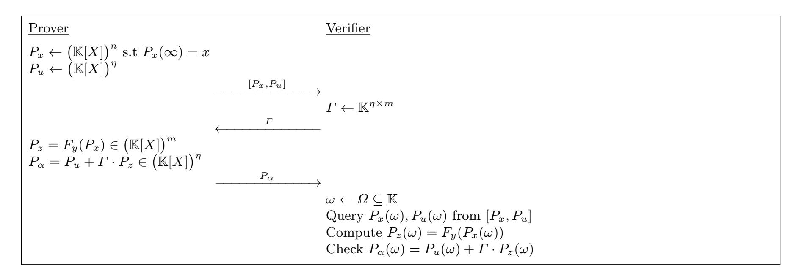

{0}------------------------------------------------

# On the Security of MPC-in-the-Head Signatures with Correlated GGM Trees

Thibauld Feneuil and Matthieu Rivain

CryptoExperts, Paris, France

Abstract. Recent MPC-in-the-Head techniques enable the construction of signature schemes with compact signature sizes from various hardness assumptions. These techniques rely on commitments based on GGM trees, which have been optimized to further reduce the signature size with the so-called one-tree or correlated tree optimizations. While the one-tree technique has no incidence on the security of the scheme, this is not obvious for the correlated tree technique, and a formal security analysis of this technique has been missing in the literature.

In this work, we fill this gap and provide the first formal security analysis of MPC-in-the-Head signature schemes based on correlated trees. We first exhibit a potential security flaw of this technique which rules out any hope for a security reduction to the underlying hardness assumption. In particular, we show that recovering the first λ bits of the secret witness is sufficient to achieve a full key recovery (where λ is the security level). The underlying assumption should hence be such that recovering these λ bits is as hard as recovering the full witness. Some state-of-the-art schemes do not satisfy this condition, which prevents a direct application of the correlated tree technique.

We then provide a formal security proof for signature schemes based on the correlated tree technique under this degraded hardness assumption. Our proof comes in several variants, in the random oracle mode or in the ideal cipher model, depending on the specific correlated tree construction. We also introduce a tweak for the instantiation of the leaf seed expansion in the ideal cipher model, which allows us to achieve a tighter security reduction. Our result shows that MPC-in-the-Head signatures based on correlated trees can achieve strong security guarantees and provides the first formal security proof for the MQOM v2 signature scheme, the on-going candidate in the NIST post-quantum standardization process with the shortest signature size in the MPC-in-the-Head family.

Keywords: Post-Quantum Signatures · Security Proofs · MPC-in-the-Head · Correlated GGM Trees · H-Coefficient Technique

# 1 Introduction

The MPC-in-the-Head (MPCitH) paradigm [\[IKOS07\]](#page-35-0) provides a flexible approach for designing signature schemes based on a wide range of security assumptions. This is illustrated by the presence of six MPCitH schemes among the fourteen Round-2 candidates in the NIST process for standardizing additional post-quantum signature schemes [\[ABC](#page-34-0)<sup>+</sup>24]. Recent frameworks specializing this paradigm [\[BBD](#page-34-1)<sup>+</sup>23[,FR25\]](#page-34-2) achieve signature sizes below 5 kilobytes while relying on conservative security assumptions, such as the security of AES [\[BBB](#page-34-3)<sup>+</sup>24], the hardness of solving unstructured multivariate quadratic systems [\[BBFR24\]](#page-34-4), or the hardness of solving unstructured syndrome decoding problems [\[ABB](#page-34-5)<sup>+</sup>24].

These constructions heavily rely on GGM seed trees [\[GGM86,](#page-34-6) [KKW18\]](#page-35-1). A significant portion of the signature size is devoted to sibling paths in these trees. To reduce this overhead, two optimization techniques have been introduced. The one-tree technique [\[BBM](#page-34-7)<sup>+</sup>24] combines several GGM trees into a single tree in order to merge and hence shorten the revealed sibling paths. This optimization is purely combinatorial and does not affect the security of the scheme. It can therefore be applied to essentially all recent MPCitH constructions. The correlated tree technique consists in keeping an XOR-invariant across the tree [\[GYW](#page-35-2)<sup>+</sup>23, [HJ24\]](#page-35-3). More precisely, the tree is constructed such that at each layer, the XOR of all the nodes equals the first λ bits of the secret witness. By tweaking the definition of the expanded tapes from the leaf seeds, this structure allows to reduce the impact of the GGM tree in the signature size of λ bits for each of the τ

{1}------------------------------------------------

repetitions, which yields a valuable reduction. Compared to the one-tree technique, correlated trees further offer certain practical advantages from an implementation perspective [\[BF26\]](#page-34-8).

However, the correlated tree technique has never been formally proven secure in the context of MPCin-the-Head signatures. Although a recent work [\[KLS25\]](#page-35-4) introduces a scheme based on this technique and provides a security proof, a subsequent paper [\[KX25\]](#page-35-5) identifies a flaw in that proof arising precisely from the use of correlated trees. Consequently, the authors of [\[KLS25\]](#page-35-4) later released a revised version of their scheme that no longer relies on this technique. At present, no concrete attack against the correlated tree optimization is known, and no complete security proof has been established either. As a result, the security guarantees of the NIST candidate MQOM (version 2) [\[BBFR24\]](#page-34-4), which relies on this technique, remain unclear.

Our contributions. In this work, we provide a thorough security analysis of the correlated tree technique for MPC-in-the-Head signatures. We emphasize that this technique does not affect existential unforgeability under key-only attacks (EUF-KO). However, it does impact existential unforgeability under chosen-message attacks (EUF-CMA). Indeed, the technique introduces additional structure in the scheme's randomness, making signatures potentially more prone to leaking information about the secret key.

We first exhibit a potential security flaw of this technique which rules out any hope for a security reduction to the underlying hardness assumption. Indeed, if an adversary can recover the λ first bits of the witness, then they learn the root of the tree and can reconstruct the entire tree, ultimately recovering the full witness (i.e., the full secret key). It results that the security of signatures based on correlated trees can only rely on the degraded assumption that recovering the first λ bits of the witness is as hard as recovering the full witness. We formalize this property as the partial guessing one-wayness (PGOW) of the underlying problem. While this assumption appears to hold for many MPCitH schemes, it is not always satisfied. For instance, the SDitH v2 signature scheme [\[ABB](#page-34-5)+24], the min-entropy of these λ bits is strictly smaller than λ. Consequently, using correlated trees in such a setting would significantly reduce the security below λ bits.

We then provide formal security proofs that correlated tree commitments and openings do not leak information about the secret key, under suitable assumptions. Our analysis formalize the correlated tree oracle capturing the leakage provided by signature queries and show how to simulate this oracle without access to the secret key using the H-Coefficient technique [\[Pat09,](#page-35-6) [CS14\]](#page-34-9). Our analysis considers several instantiations of the symmetric primitives used to define the tree. We begin with the random oracle model, assuming that seed derivation, seed commitment, and seed expansion primitives are instantiated using hash functions or extendable-output functions. In this setting, we obtain a clean and conceptually simple proof under the PGOW assumption. However, hash-based instantiations (e.g., SHA3/SHAKE) are computationally expensive, and recent MPCitH schemes typically instead rely on AES, which enjoys hardware acceleration on modern processors. We therefore analyze security in the ideal cipher model (the ideal assumption capturing a block cipher like AES). First, we consider an instantiation based on the Davies-Meyer mode. We show that security holds only if the underlying one-way function satisfies an additional ad-hoc property which we call relation guessing one-wayness (RGOW), generalizing the PGOW assumption in a way that depends on the underlying signature scheme. Next, we study the use of a block cipher in counter mode. In this case, due to the way domain separation is implemented, the resulting proof is non-tight. Finally, we tweak the Davies-Meyer-based construction to obtain a tight security proof that does not rely on the additional ad-hoc assumption (though still requiring the hardness of recovering the first λ bits of the witness). Altogether, these four variants of our security proof demonstrate that correlated trees can be proven secure but only with careful instantiations and a degraded hardness assumption.

Finally, we show how the simulation security of the introduced correlated tree oracle can be leveraged to establish the existential unforgeability under chosen-message attacks for MPC-in-the-Head signatures based on correlated trees. We apply this result to the NIST candidate MQOM v2 [\[BBFR24\]](#page-34-4), an MPC-in-the-Head signature scheme based on the hardness of solving unstructured multivariate quadratic systems (MQ). In its current version, this scheme uses correlated trees with the Davies-Meyer instantiation, and its EUF-CMA security therefore relies on the PGOW and RGOW assumptions for MQ. Our analysis shows that while PGOW seems essentially as hard as the standard MQ problem, RGOW opens the door to some attack degrading the security by a few bits. Using our proposed enhanced Davies-Meyer instantiation, we can avoid 

{2}------------------------------------------------

the RGOW assumption and hence rule out this attack path, albeit at the cost of a small increase in the number of AES calls.

# <span id="page-2-2"></span>2 MPC-in-the-Head Signatures from Correlated Trees

A GGM tree [GGM86] consists in pseudorandomly expanding a root seed rseed into N leaf seeds lseed[0], ..., lseed[N-1] using a binary tree:

<span id="page-2-0"></span>
$$\begin{cases} \mathsf{node}[1] = \mathsf{rseed} \\ (\mathsf{node}[2i], \mathsf{node}[2i+1]) = G(\mathsf{node}[i]) \text{ for } 1 \le i \le N-1 \end{cases}$$
 (1)

where G is a seed derivation function. The leaf seeds are then defined as the last N nodes, namely lseed[i] := node[N+i] for all  $i \in [0, N-1]$ , assuming that N is a power of two for the sake of simplicity. We denote  $\ell := \log_2(N)$  the height of the tree.

The GGM tree structure enables to reveal all-but-one leaf seeds from  $\ell$  nodes of the tree. Let  $i^* \in [0, N-1]$  be the index of the leaf seed that should remain hidden. This means that all its ancestors, whose indexes are in the set  $\mathcal{H} = \{\lfloor (N+i^*)/2^j \rfloor \mid 0 \leq j \leq \ell-1 \}$ , should remain hidden. On the other hand, the *sibling path*, which is made of the siblings of the hidden nodes, can be revealed without giving any information on lseed[ $i^*$ ]. From the binary tree structure, these are the nodes in  $\{\mathsf{node}[i\oplus 1] \mid i \in \mathcal{H}\}$ . By running the tree derivation of Equation (1) from all the seeds in the sibling path, one reconstructs a partial tree composed of all the nodes but the hidden path. In particular, this partial tree includes all the leaves but the hidden leaf lseed[ $i^*$ ].

GGM seed trees have been introduced in the context of MPC-in-the-Head to commit additive secret sharings with efficient opening of all-but-one shares [KKW18]. From a random root seed rseed, one expands a GGM seed tree to obtain the leaf seeds  $lseed[0], \ldots, lseed[N-1]$ . Then, each leaf seed is expanded into a share:  $[x]_i = PRG(lseed[i]) \in \mathbb{F}^n$  and a auxiliary value  $\Delta_x$  is defined as:

<span id="page-2-1"></span>
$$\Delta_x = x - \sum_{i=0}^{N-1} [x]_i . \tag{2}$$

By definition,  $(\llbracket x \rrbracket_0 + \Delta_x)$ ,  $\llbracket x \rrbracket_1, \ldots, \llbracket x \rrbracket_{N-1}$  forms an additive secret sharing of x. This additive sharing is committed by deriving a commitment for each seed:  $\mathtt{ls\_com}[i] = \mathsf{SeedCommit}(\mathtt{lseed}[i])$ , and sending a global commitment:  $\mathsf{com} = \mathsf{Commit}(\mathtt{ls\_com}[0], \ldots, \mathtt{ls\_com}[N-1], \Delta_x)$  to the verifier. Later on, the verifier can challenge the prover to open all the additive shares of x but one, say the share of index  $i^*$ . The prover then reveals the sibling path of  $\mathtt{lseed}[i^*]$ , the auxiliary value  $\Delta_x$  and the commitment  $\mathtt{ls\_com}[i^*]$ . From all the leaf seeds (but  $\mathtt{lseed}[i^*]$ ), the verifier can expand all the shares  $\llbracket x \rrbracket_i$  (but  $\llbracket x \rrbracket_{i^*}$ ) and correct  $\llbracket x \rrbracket_0$  with  $\Delta_x$ . The verifier can also recompute the commitments  $\mathtt{ls\_com}[i]$ , for all  $i \neq i^*$ , and together with  $\mathtt{ls\_com}[i^*]$  and  $\Delta_x$ , recompute and check the global commitment.

Correlated GGM Trees. The correlated tree technique [GYW<sup>+</sup>23] consists in keeping an invariant across all the layers of the tree: the XOR of all the nodes of a given depth is equal to a fixed value  $\delta$ . This is ensured by defining:

$$node[2] \leftarrow \{0,1\}^{\lambda} \quad and \quad node[3] = node[2] \oplus \delta$$
,

and then deriving the rest of the tree as in Equation (1) with a special instantiation of the seed derivation function G of the form:

$$G: x \mapsto (H(x), H(x) \oplus x)$$
,

where H is a hash function or a pseudorandom function. With this definition of G, the two child nodes node[2k] and node[2k+1] of node[k] with  $k \ge 2$  satisfy the relation:

$$\mathsf{node}[k] = \mathsf{node}[2k] \oplus \mathsf{node}[2k+1]$$
.

{3}------------------------------------------------

This way, for all  $j \in [1, \ell]$ , the XOR of all the nodes of depth j is equal to the XOR of all the nodes of depth j-1 (their parents) which, by induction, is equal to  $\mathsf{node}[2] \oplus \mathsf{node}[3] = \delta$ .

In the context of MPC-in-the-Head signatures, the correlated tree technique can be used to reduce the signature size. The principle of this optimization proposed in [HJ24] is to define the XOR-invariant  $\delta$  as the  $\lambda$  first bits of the secret witness x. Each leaf seed <code>lseed[i]</code> is then expanded as

$$[x]_i = \texttt{lseed}[i] \parallel PRG(\texttt{lseed}[i])$$

namely by prepending the seed itself to the expanded share  $[x]_i$ . Doing so, the first  $\lambda$  bits of the auxiliary value  $\Delta_x$  defined in Equation (2) satisfy:

$$\mathsf{First}_{\lambda}(\varDelta_x) = \mathsf{First}_{\lambda}(x) - \mathsf{First}_{\lambda}\big(\sum_{i=0}^{N-1} \mathtt{lseed}\,[i]\big) = 0 \;.$$

As a result, one can discard the first  $\lambda$  bits of  $\Delta_x$  in the commitment, which saves  $\lambda$  bits per GGM tree in the signature. Since the signature typically includes  $\tau$  GGM trees, with  $\tau$  ranging between 12 and 16, this optimization saves up to 192–256 bytes in the signature for  $\lambda = 128$ .

On domain separation. While we did not explicitly mention it in the above description, the seed derivation function H is typically tweaked with a domain separator which depends on a salt value salt randomly generated for each signature. In addition, H is further tweaked using the depth of the node in the tree. The principle is the following: we should avoid having different hidden nodes  $\{h\}$  (over the same or different signatures) entering the same instance of the function H with revealed outputs  $\{r\}$ . This is because in that case, the adversary could exhaustively search for h such that  $H(h) \in \{r\}$  and recover a solution with an average of  $2^{\lambda}/|\{r\}|$  trials. Since revealing any hidden node enable a full key recovery, such an attack effectively lowers the security of the scheme by  $\log_2(|\{r\}|)$  bits. If the same function H is involved in the seed commitment and/or expansion (which is common), these different uses should also be domain-separated for the same reason.

Modern MPC-in-the-Head Signatures. Recent MPC-in-the-Head signature schemes (see e.g. [FR25, BBD+23,HJ24,KLS25]), including those selected for Round 2 of the ongoing NIST process, rely on VOLE-in-the-Head [BBD+23] or its variant Threshold-Computation-in-the-Head [FR25]. In both frameworks, GGM trees are involved to build a line commitment scheme (LCS), in which the prover can commit to a degree-one polynomial  $P_x$  and later open an evaluation  $P_x(\omega)$  without revealing further information. The line commitment scheme is then used as a building block in a specific protocol named a Polynomial Interactive Oracle Proof (PIOP) in which the prover sends a polynomial oracle to the verifier and later opens some evaluations of this oracle. We provide a general overview of these constructions hereafter.

Let  $\mathbb{F}$  be the finite field in which the secret witness x is defined. We denote  $\mathbb{K}$  an extension of  $\mathbb{F}$  of size  $|\mathbb{K}| \geq N$  (where N is the size of the GGM tree) and  $\mathbb{K}[X]$  the set of univariate polynomials over  $\mathbb{K}$ . For a polynomial  $P \in \mathbb{K}[X]$ , we further denote  $P(\infty)$  its leading coefficient. In the following, we assume that  $\mathbb{F}$  and  $\mathbb{K}$  are binary fields. We usually denote the XOR operation on bitstrings by  $\oplus$ , and the addition in  $\mathbb{F}$  and  $\mathbb{K}$  by +. However, these notations may occasionally be used interchangeably in contexts where sequences of field elements are interpreted as bitstrings, or conversely, where bitstrings are viewed as sequences of field elements.

Witness-checking function. The considered MPCitH signature schemes rely on (families of) one-way functions. Consider a scheme based on a family  $\mathcal{F}$  of functions  $f: \mathcal{X} \to \mathcal{Y}$ . Generating a key pair consists in sampling a random function f from  $\mathcal{F}$ , a random input  $\bar{x} \in \mathcal{X}$  and computing the output  $\bar{y} = f(\bar{x})$ . The secret key is then defined as  $\bar{x}$  while the public key is  $(f, \bar{y})$ . The signature is a zero-knowledge proof of knowledge of  $\bar{x}$  such that  $f(\bar{x}) = \bar{y}$  made non-interactive (and tweaked with input message) using the Fiat-Shamir transform. For this purpose, one relies on an arithmetization of the verification of  $f(\bar{x}) = \bar{y}$ . This

{4}------------------------------------------------

arithmetization is typically defined as a system of multivariate polynomial equations:

$$F_y(x) = 0 \quad \Leftrightarrow \quad f(\bar{x}) = \bar{y}$$

where F<sup>y</sup> is a vector of m polynomial functions over F and x is a secret witness derived from ¯x. Here we denote y the public statement encoding the function f and the output ¯y. The signature is then defined as a proof of knowledge of a solution x of Fy(x) = 0. We call F<sup>y</sup> the witness checking function and stress that finding a preimage of 0 for F<sup>y</sup> is as hard as inverting f on ¯y, which is the underlying hardness assumption of the scheme.

In the following, we denote D<sup>F</sup> the distribution of witness-statement instances of F. In other words, (x, y) ← D<sup>F</sup> denotes the process of sampling a random function f from F, a random input ¯x, computing y¯ = f(¯x), deriving y from (f, y¯) and deriving x from ¯x, which satisfy Fy(x) = 0.

<span id="page-4-0"></span>Example 1. In FAEST [\[BBB](#page-34-3)+24], the family F is composed of functions mapping ¯x to the AES encryption of a fixed plaintext under the key ¯x. The witness x extends ¯x with some auxiliary values derived from the underlying AES encryption. In MQOM [\[BBFR24\]](#page-34-4), the family F is composed of random multivariate quadratic functions. The witness x is simply ¯x, which is a solution of the MQ system defined by f(¯x) = ¯y and the function F<sup>y</sup> is simply defined as x 7→ f(x) − y¯. In both these examples, the λ first bits of x are the same as the λ first bits of ¯x, which are uniformly distributed over {0, 1} λ . This is a crucial property for the security of the correlated tree technique as we will see.

Along the paper, we will implicitly consider that a family of one-way functions F comes associated with a witness checking and underlying distribution D<sup>F</sup> as defined above.

Line commitment scheme. The committed degree-1 polynomial (or line) is defined from the expanded leaf seeds of the GGM tree as:

$$P_x(X) = \Delta_x \cdot P_0(X) + \sum_{i=0}^{N-1} [x]_i \cdot P_i(X) \in \mathbb{K}[X]$$
 (3)

where P0, . . . , PN−<sup>1</sup> ∈ K[X] are the unique degree-1 polynomials satisfying Pi(ωi) = 0 and Pi(∞) = 1 for a fixed evaluation set Ω = {ω0, . . . , ωN−1} ⊆ K. From this definition, we have that P<sup>x</sup> encodes the secret x by:

$$P_x(\infty) = \Delta_x + \sum_{i=0}^{N-1} [x]_i = x$$
.

Moreover, the evaluation of P<sup>x</sup> in a point ω<sup>i</sup> <sup>∗</sup> <sup>∈</sup> <sup>Ω</sup> can be derived from all the shares <sup>J</sup>xK<sup>i</sup> but <sup>J</sup>xK<sup>i</sup> <sup>∗</sup> by:

$$P_x(\omega_{i^*}) = \Delta_x \cdot P_0(\omega_{i^*}) + \sum_{i=0}^{N-1} [x]_i \cdot P_i(\omega_{i^*}) = \Delta_x \cdot P_0(\omega_{i^*}) + \sum_{i \neq i^*} [x]_i \cdot P_i(\omega_{i^*})$$

where the above equality holds because P<sup>i</sup> <sup>∗</sup> (ω<sup>i</sup> <sup>∗</sup> ) = 0. Since any other evaluation of P<sup>x</sup> would require the knowledge of <sup>J</sup>xK<sup>i</sup> <sup>∗</sup> , the verifier only learns Px(ω<sup>i</sup> <sup>∗</sup> ) from the all-but-one opening.

Polynomial IOP. Besides the line commitment scheme, MPC-in-the-Head signatures also rely on a specific protocol named a Polynomial Interactive Oracle Proof (PIOP). A PIOP is an interactive proof in which the prover can send a polynomial oracle [P1, . . . , Pn] to the verifier for polynomials P1, . . . , P<sup>n</sup> ∈ K[X] of prescribed degree d (with d = 1 in our setting). From such a polynomial oracle, the verifier can then query some evaluations. In practice, the polynomial oracle are replaced by LCS commitments and the evaluation queries are implemented by LCS openings for the queried evaluations.

{5}------------------------------------------------

The PIOP aims at proving knowledge of the secret witness  $x \in \mathbb{F}^n$  satisfying  $F_y(x) = (0, \dots, 0) \in \mathbb{F}^m$ , where  $F_y$  is the witness-checking function introduced above, which is a vector of m degree-2 functions over  $\mathbb{F}^1$ . A simple PIOP proving knowledge of x satisfying  $F_y(x) = 0$  is depicted in Figure 1. This protocol is the PIOP equivalent of the QuickSilver protocol [YSWW21] within the VOLE-in-the-Head framework [BBD+23] or the  $\Pi_{PC}$  MPC protocol within the TCitH framework [FR25]. Most of the recent MPC-in-the-Head signatures, including all six on-going MPCitH candidates in the NIST process, rely on this specific PIOP.

<span id="page-5-1"></span>

Fig. 1: Polynomial IOP.

In Figure 1,  $P_x(\infty)$  denotes the degree-1 coefficient of  $P_x$ . The computation of  $P_z := F_y(P_x)$  is done by homogenizing  $F_y$ . Specifically, for  $F_y = (f_1, \ldots, f_m)$  with  $f_j(v) := v^T \cdot A_j \cdot v + b_j^T \cdot v + c_j$  for some  $A_j$ ,  $b_j$  and  $c_j$ , we define  $f_j(P_x(X)) := P_x(X)^T \cdot A_j \cdot P_x(X) + b_j^T \cdot P_x(X) \cdot X + c_j \cdot X^2$ , so that the degree-2 coefficient of  $f_j(P_x(X))$  equals  $f_j(x)$  by definition. We thus get that  $P_z$  is of degree 1 if and only if  $F_y(P_x(\infty)) = (0, \ldots, 0) \in \mathbb{K}^m$ , meaning that  $x = P_x(\infty)$  is a valid solution of  $F_y(x) = 0$ . The soundness of this protocol follows from the Schwartz-Zippel lemma. Assume that  $P_x(\omega) = P_x(\omega) + \Gamma \cdot F_y(P_x(\omega))$  holds for 3 different points  $r \in \Omega$ , then because  $P_x, P_y, P_y, P_z$  are guaranteed to be of degree 1, we must have  $P_x = P_x + \Gamma \cdot F_y(P_x)$  and hence  $P_x = P_x + \Gamma \cdot F_y(P_x)$  and hence  $P_x = P_x + \Gamma \cdot F_y(P_x)$  and hence  $P_x = P_x + \Gamma \cdot F_y(P_x)$  and hence  $P_x = P_x + \Gamma \cdot F_y(P_x)$  and hence  $P_x = P_x + \Gamma \cdot F_y(P_x)$  and hence  $P_x = P_x + \Gamma \cdot F_y(P_x)$  and hence  $P_x = P_x + \Gamma \cdot F_y(P_x)$  and hence  $P_x = P_x + \Gamma \cdot F_y(P_x)$  and hence  $P_x = P_x + \Gamma \cdot F_y(P_x)$  and hence  $P_x = P_x + \Gamma \cdot F_y(P_x)$  and hence  $P_x = P_x + \Gamma \cdot F_y(P_x)$  and hence  $P_x = P_x + \Gamma \cdot F_y(P_x)$  and hence  $P_x = P_x + \Gamma \cdot F_y(P_x)$  and hence  $P_x = P_x + \Gamma \cdot F_y(P_x)$  and hence  $P_x = P_x + \Gamma \cdot F_y(P_x)$  and hence  $P_x = P_x + \Gamma \cdot F_y(P_x)$  and hence  $P_x = P_x + \Gamma \cdot F_y(P_x)$  and hence  $P_x = P_x + \Gamma \cdot F_y(P_x)$  and hence  $P_x = P_x + \Gamma \cdot F_y(P_x)$  and hence  $P_x = P_x + \Gamma \cdot F_y(P_x)$  and hence  $P_x = P_x + \Gamma \cdot F_y(P_x)$  and hence  $P_x = P_x + \Gamma \cdot F_y + \Gamma \cdot F_y$  and hence  $P_x = P_x + \Gamma \cdot F_y$  and hence  $P_x = P_x + \Gamma \cdot F_y$  and hence  $P_x = P_x + \Gamma \cdot F_y$  and hence  $P_x = P_x + \Gamma \cdot F_y$  and hence  $P_x = P_x + \Gamma \cdot F_y$  and hence  $P_x = P_x + \Gamma \cdot F_y$  and hence  $P_x = P_x + \Gamma \cdot F_y$  and hence  $P_x = P_x + \Gamma \cdot F_y$  and hence  $P_x = P_x + \Gamma \cdot F_y$  and hence  $P_x = P_x + \Gamma \cdot F_y$  and hence  $P_x = P_x + \Gamma \cdot F_y$  and hence  $P_x = P_x + \Gamma \cdot F_y$  and

The zero-knowledge property of this protocol holds for two reasons. First, thanks to the addition of the random vector polynomial  $P_u$ , the vector polynomial  $P_\alpha$  is further uniformly random. Then, any evaluations  $P_x(\omega), P_u(\omega)$  are independent of x thanks to the randomness involved in these polynomials.

Remark 1. In this PIOP, the purpose of the random challenge  $\Gamma$  is to batch the different equations of  $F_y$  embedded in  $P_z$  into a smaller vector polynomial  $P_\alpha$  to save communication. Namely,  $P_\alpha$  has  $\eta$  coordinates instead of m, where  $\eta < m$  is a security parameter. We note that this challenge can be avoided which amounts to define  $\Gamma = \operatorname{Id}_m$  in the PIOP and saves two rounds of interaction. This option is actually implemented in one of the variants of the MQOM v2 signature scheme [BBFR24].

<span id="page-5-0"></span><sup>&</sup>lt;sup>1</sup> We note that the PIOP can be generalized to support witness-checking functions of degree greater than 2. However, since degree 2 is the most commonly used in practice, we restrict our exposition to this case for simplicity. Extending the analysis to higher degrees would not affect our results.

<span id="page-5-2"></span>While Threshold-Computation-in-the-Head [FR25] uses such parallel repetition approach, VOLE-in-the-Head relies on a slightly different approach:  $\tau$  line commitments on a small field  $\mathbb{K}$  are combined into a single line commitment on a larger field  $\mathbb{K}'$  (of size  $\approx |\mathbb{K}|^{\tau}$ ), then the PIOP is executed only once with the larger field  $\mathbb{K}'$ . The obtained soundness is of  $2/|\Omega|^{\tau}$ .

{6}------------------------------------------------

#### <span id="page-6-0"></span>3 Security Issues in MPC-in-the-Head Signatures with Correlated GGM Trees

The security of an MPCitH scheme typically relies on the hardness of finding a witness that satisfies the public constraints encoded in the public key, i.e., finding  $x \in \mathbb{F}^n$  such that  $F_y(x) = 0$ , using the notation of the previous section, which is as hard as solving the underlying hard problem. More precisely, two main security notions are considered for signature schemes:

- The existential unforgeability under key-only attacks (EUF-KO) requires that it is computationally infeasible for an adversary to forge a valid signature given only the public key.
- The existential unforgeability under chosen-message attacks (EUF-CMA) requires that, given access to a signing oracle replying queries from the adversary, it remains computationally infeasible to forge a valid signature on a new message.

In the MPCitH literature, EUF-KO security is typically established by a reduction to the underlying hard problem. EUF-CMA security is then obtained by completing this reduction with an argument showing that the signatures returned by the signing oracle do not leak useful information about the secret key and can typically be simulated without knowledge of the secret key. This typically relies on the zero-knowledge property of the underlying MPCitH proof system.

While EUF-KO security can still be established using standard techniques in the presence of correlated trees, the situation is more subtle for EUF-CMA security. The correlation introduced by correlated trees partially leaks information about the secret key. In particular, the scheme is susceptible to the attack we introduce below.

## 3.1 The $\lambda$ -bit Attack and PGOW Assumption

An adversary may attempt to guess the first  $\lambda$  bits of the witness, denote  $\mathsf{First}_\lambda(x)$  hereafter. If the guess is correct, the adversary can recover a hidden node at any level of the tree. For instance, the two siblings at the first level satisfy  $\mathsf{node}[3] \oplus \mathsf{node}[2] = \mathsf{First}_\lambda(x)$ . Since exactly one of these siblings is known and the other hidden,  $\mathsf{First}_\lambda(x)$  directly yields the hidden node. This in turn reveals the full hidden path until the hidden leaf seed  $\mathsf{lseed}[i^*]$ . From this leaf seed, the adversary can compute the corresponding share as  $[\![x]\!]_{i^*} = \mathsf{lseed}[i^*] \parallel \mathsf{PRG}(\mathsf{lseed}[i^*])$  and subsequently recover the full witness as  $x = \sum_0^{N-1} [\![x]\!]_i + \Delta_x$ .

**Partial-Guessing One-Way Security.** To prevent such an attack, it must be computationally infeasible to recover the first  $\lambda$  bits of the witness x. We formalize this requirement through a notion that we call partial-guessing one-way security, which captures the additional property that the one-way function family (and associated witness-checking function) must satisfy in order for the scheme to remain secure.

**Definition 1 (Partial-Guessing One-Way Security).** A one-way function family  $\mathcal{F}$  is said to be  $(\lambda, t, Q, \varepsilon_{PGOW}(t,Q))$ -PGOW-secure if any t-time adversary  $\mathcal{A}$  making Q queries to the guessing oracle has at most  $\varepsilon_{PGOW}(t,Q)$  probability of winning the  $(\lambda, \mathcal{F})$ -PGOW game described in Figure 2 (i.e. the game returns 1).

**PGOW** (In)security of Certain OWFs. Currently, the only NIST candidate relying on correlated trees is the Round-2 version of MQOM. One can observe that the MQ problem, with its natural arithmetization as used in MQOM (see Example 1), satisfies the partial-guessing one-way property defined above. Indeed, the hardness of solving the corresponding PGOW problem for MQ can be reduced to the hardness of solving MQ itself. Suppose there exists an efficient adversary capable of guessing the first  $\lambda$  bits of a solution to an MQ instance. Then, by fixing these variables accordingly, one obtains a new MQ system with fewer unknowns and a large number of remaining equations. The resulting system is highly overdetermined and can therefore be solved efficiently, allowing the recovery of the full solution.

A similar security reduction can be applied to the scheme from [HJ24]. In their setting, the hardness of solving the corresponding PGOW problem for their *subfield bilinear collision* (SBC) assumption can be

{7}------------------------------------------------

```
(\lambda, \mathcal{F})\text{-PGOW Game:}
1. (x, y) \leftarrow \mathcal{D}_{\mathcal{F}}
2. Run \mathcal{A}^{\mathcal{G}(\cdot)}(y)
3. The game returns 0 (\mathcal{A} loses)

Guessing oracle \mathcal{G}(\hat{x}_0):

1. if \hat{x}_0 = \mathsf{First}_{\lambda}(x) then the game returns 1 (\mathcal{A} wins)
```

Fig. 2: Partial-guessing one-way (PGOW) security game.

reduced to the hardness of SBC itself, since knowing the first  $\lambda$  bits of the witness yields linear relations with the remaining bits.

However, such security reductions do not hold for all problems. For example, when the witness is structured or sparse, the PGOW security might be weaker than the underlying one-wayness. This is for instance the case in SDitH v2 [ABB<sup>+</sup>24] where the witness is composed of several small vectors of Hamming weight at most 1. For the L1 parameter set, the first 128 bits of the witness have a min-entropy of approximately 88 bits. Consequently, applying correlated trees to SDitH v2 would result in a serious security degradation. This illustrates that signature designers must exercise caution when adopting correlated trees, as the required partial-guessing one-wayness property may not be satisfied in all constructions.

## 3.2 Additional Issues with Davies-Meyer and the RGOW Assumption

While the above vulnerability is inherent to the correlated-tree technique itself, it may not be the only source of security degradation. We exhibit hereafter additional issues arising when the seed expansion PRG is instantiated with a Davies-Meyer construction, as in MQOM [BBFR24]. In this setting, a  $\lambda$ -bit block is computed as  $E_{\text{sep}}(\text{seed}) \oplus \sigma(\text{seed})$  where E is a block cipher,  $\sigma$  is a linear orthomorphism, and sep is a public domain-separation string. An attacker may attempt to invert a cipher call involved in the expansion in order to recover the corresponding seed. Since the cipher key sep is public, this inversion only requires knowledge of the cipher output.

Consider an adversary attempting to guess the cipher output involved in the (k-1)-th  $\lambda$ -bit block of the PRG applied to  $lseed[i^*]$  to derive the k-th block of  $[x]_{i^*}$ , for k>1. This block is used to mask the k-th  $\lambda$ -bit block of the witness x in the computation of the auxiliary value  $\Delta_x$ . Denoting by  $Block_{\lambda}^{(k)}(\cdot)$  the function that outputs the k-th  $\lambda$ -bit chunk of its input, we obtain:

$$\begin{split} \mathsf{Block}_{\lambda}^{(k)}(\Delta_x) \oplus \mathsf{Block}_{\lambda}^{(k)}(\sum_{i \neq i^*} \llbracket x \rrbracket_i) \\ &= \mathsf{Block}_{\lambda}^{(k)}(x) \oplus \mathsf{Block}_{\lambda}^{(k)}(\llbracket x \rrbracket_{i^*}) \\ &= \mathsf{Block}_{\lambda}^{(k)}(x) \oplus E_{\mathsf{sep}}(\mathsf{lseed}[i^*]) \oplus \sigma(\mathsf{lseed}[i^*]) \\ &= \mathsf{Block}_{\lambda}^{(k)}(x) \oplus E_{\mathsf{sep}}(\mathsf{lseed}[i^*]) \oplus \sigma(\mathsf{First}_{\lambda}(x) \oplus \sum_{i \neq i^*} \mathsf{lseed}[i]) \\ &= \mathsf{Block}_{\lambda}^{(k)}(x) \oplus \sigma(\mathsf{First}_{\lambda}(x)) \oplus E_{\mathsf{sep}}(\mathsf{lseed}[i^*]) \oplus \sigma(\sum_{i \neq i^*} \mathsf{lseed}[i]) \;. \end{split}$$

Assume now that  $\mathsf{Block}_{\lambda}^{(k)}(x) \oplus \sigma(\mathsf{First}_{\lambda}(x))$  can be recovered efficiently (or at least more efficiently than with exhaustive search). From the above equality, the adversary can then recover  $E_{\mathsf{sep}}(\mathsf{lseed}[i^*])$ , since all other quantities are public. As the cipher key  $\mathsf{sep}$  is known, the adversary can invert the block cipher and recover the leaf seed  $\mathsf{lseed}[i^*]$ . As for the  $\lambda$ -bit attack, this yields the full secret. We thus get that, in addition to

{8}------------------------------------------------

a successful guess of  $\mathsf{First}_{\lambda}(x)$ , a successful guess of  $\mathsf{Block}_{\lambda}^{(k)}(x) \oplus \sigma(\mathsf{First}_{\lambda}(x))$ , which is a linear function of x, for any block index j, also leads to a full key recovery.

Considering the PRG blocks used to generate  $[\![u]\!]_{i^*}$ , a similar yet more subtle attack can be mounted. In the general signature scheme depicted in Section 2, the secrecy of  $[\![u]\!]_{i^*}$  ensures the masking of sensitive information in the polynomial  $P_{\alpha}$  (which is part of the signature). The information contained in  $P_{\alpha}$  can be fully captured from the pair  $(P_{\alpha}(\omega), \alpha_1)$ , where  $P_{\alpha}(\omega)$  is the open evaluation which can be derived from the open leaf seeds and  $\alpha_1$  is the degree-1 coefficient of  $P_{\alpha}$ . The latter can be expressed as follows:

<span id="page-8-2"></span><span id="page-8-0"></span>
$$\alpha_1 = u_1 + \Gamma \cdot z_1 = \left( [\![u]\!]_{i^*} + \sum_{i \neq i^*} [\![u]\!]_i \right) + \Gamma \cdot z_1 , \qquad (4)$$

where  $z_1$  and  $u_1$  denote the degree-1 coefficient of  $P_z$  and  $P_u$ , respectively. The coordinates of  $z_1 = (z_{1,1}, \ldots, z_{1,m})$  can then be expressed as

$$z_{1,j} = P_x(0) \cdot (A_j^T + A_j) \cdot x + b_j^T \cdot P_x(0)$$

$$= (P_x(\omega) - \omega x)^T \cdot (A_j^T + A_j) \cdot x + b_j^T \cdot (P_x(\omega) - \omega x)$$

$$= (-2w) \cdot x^T \cdot A_j \cdot x + (P_x(\omega)^T \cdot (A_j^T + A_j) - w \cdot b_j^T) \cdot x + b_j^T \cdot P_x(\omega) ,$$
(5)

for every  $j \in \{1, ..., m\}$ , where  $A_j$  and  $b_j$  are the matrices and vectors defining the j-th component of  $F_y$ . For fields  $\mathbb{F}, \mathbb{K}$  of characteristic 2, which we assume here and is the case for MQOM, the above expression simplifies to  $z_{1,j} = (P_x(\omega)^T \cdot (A_j^T + A_j) - w \cdot b_j^T) \cdot x + b_j^T \cdot P_x(\omega)$ , which is a linear function of x. We thus have that  $\Gamma \cdot z_1$  is a public linear function of x whose coefficients depend on the randomness of  $\Gamma$  and  $P_x(\omega)$ . Then the k-th  $\lambda$ -bit block of Equation (4) yields the following equality:

$$E_{\text{sep}}(\texttt{lseed}[i^*]) = \underbrace{\sigma(\mathsf{First}_{\lambda}(x)) \oplus \mathsf{Block}_{\lambda}^{(k)}(\varGamma \cdot z_1)}_{\text{depends on } x} \\ \oplus \underbrace{\mathsf{Block}_{\lambda}^{(k)}(\alpha_1) \oplus \mathsf{Block}_{\lambda}^{(k)}(\sum_{i \neq i^*} \llbracket u \rrbracket_i) \oplus \sigma(\sum_{i \neq i^*} \mathsf{lseed}[i])}_{\text{public value}},$$

given that  $\mathsf{Block}_{\lambda}^{(k)}(\llbracket u \rrbracket_{i^*}) = E_{\mathsf{sep}}(\mathsf{lseed}[i^*]) \oplus \sigma(\mathsf{lseed}[i^*])$  for some domain-separation string  $\mathsf{sep}$ . We thus get that a successful guess of  $\sigma(\mathsf{First}_{\lambda}(x)) \oplus \mathsf{Block}_{\lambda}^{(k)}(\Gamma \cdot z_1)$ , which is a linear function of x, also leads to a full key recovery.

To summarize, each repetition of each signature provides the adversary with functions  $g: \mathbb{F}^n \to \{0,1\}^{\lambda}$  such that a successful guess of g(x) leads to a full key recovery. Let  $n_x = \frac{n \log |\mathbb{F}|}{\lambda}$  and  $n_u = \frac{\eta \log |\mathbb{K}|}{\lambda}$  denote the number of  $\lambda$ -bit blocks in x and u, respectively. Then, for each signature, the adversary obtains  $n_x + n_u - 1$  such functions  $g_1, \ldots, g_{n_x + n_u - 1}$  defined as follows:

<span id="page-8-1"></span>
$$g_k: x \mapsto \begin{cases} \sigma(\mathsf{First}_{\lambda}(x)) \oplus \mathsf{Block}_{\lambda}^{(k+1)}(x) & \text{if } k \in \{1, \dots, n_x - 1\} \\ \sigma(\mathsf{First}_{\lambda}(x)) \oplus \mathsf{Block}_{\lambda}^{(k+1-n_x)}(\Gamma \cdot z_1) & \text{if } k \in \{n_x, \dots, n_x + n_u - 1\} \end{cases}$$
(6)

for some random  $\Gamma$ ,  $\omega$  and  $P_x(\omega)$ . We note that the  $n_x-1$  first functions are the same for all the signatures, while the  $n_u$  last functions depend on the signature randomness. Indeed, as shown above, the term  $\Gamma \cdot z_1$  is a public linear function of x depending on the randomness of  $\Gamma$ ,  $\omega$  and  $P_x(\omega)$ .

Remark 2. For the sake of simplicity, we assume here that both x and u fit into complete  $\lambda$ -bit blocks. In practice, a  $\lambda$ -bit block may contain the last bits of x together with the first bits of u. The described attack behaves similarly in such a setting.

{9}------------------------------------------------

Relation-Guessing One-Way Security. To prevent the additional vulnerabilities described above, it must be computationally infeasible to recover g(x) from the public statement y for any of the functions g defined in Equation [\(6\)](#page-8-1) obtained from the revealed signatures. We formalize this requirement through a notion that we call relation-guessing one-way security (RGOW), which captures the additional property that the underlying one-way function must satisfy in order for the scheme to remain secure. In this definition, we consider a general distribution R for a set of relations R = {g : F <sup>n</sup> → {0, 1} <sup>λ</sup>} for which the adversary can try to guess g(x). The adversary is granted access to a relation-sampling oracle S, which outputs fresh relation sets drawn from R. The adversary queries S to increase the set of admissible functions g and can then query a guessing oracle G to attempt to guess g(x) for any of the functions g obtained from the relation-sampling oracle.

<span id="page-9-0"></span>Definition 2 (Relation-Guessing One-Way Security). Let R be a distribution for a set of relations. A one-way function family F is said to be (R, t, Q, εrgow(t, Q))-RGOW-secure if any t-time adversary A making Q queries to the guessing oracle has at most εrgow(t, Q) probability of winning the (F, R)-RGOW game described in Figure [3](#page-9-0) (i.e. the game returns 1).

```
(R, F)-RGOW Game:
 1. (x, y) ← DF
 2. S ← ∅
 3. Run A
          G(·),S()(y)
 4. The game returns 0 (A loses)
Guessing oracle G(g, xˆ0):
 1. if g ∈ S and g(x) = ˆx0 then the game returns 1 (A wins)
Relation sampling oracle S():
 1. R ← R
 2. S ← S ∪ R
 3. return R
```

Fig. 3: Relation-guessing one-way (RGOW) security game.

# 4 Simulation Security of Correlated GGM Tree Openings

This section is devoted to prove the simulation security of the correlated GGM tree technique. We first introduce the correlated tree oracle capturing the leakage provided by signature queries and recall the Hcoefficient technique, which are the main tools used in our proof. Then, we prove the simulation security of this oracle under the PGOW or RGOW assumptions, for different instantiations of the seed derivation, seed commitment and seed expansion functions. Namely, we first consider a simple instantiation based on hash functions in the random oracle model, and then we show how to instantiate the technique in the ideal cipher model, using either a block cipher in Davies-Meyer mode or in counter mode. We finally introduce a tweak of the Davies-Meyer instantiation to obtain a tight security avoiding the RGOW assumption.

#### <span id="page-9-1"></span>4.1 The Correlated Tree Oracle

We start by formally defining the correlated tree oracle, which captures the distribution of the correlated GGM tree opening in an MPC-in-the-Head signature.

{10}------------------------------------------------

```
O(salt):
 1. h0 ← {0, 1}
                 λ
 2. b := (b0, . . . , bℓ−1) ← {0, 1}
                                 ℓ
 3. for j = 0 to ℓ − 1 do
 4. (uj,0, uj,1) = Gtree(salt, j, hj )
 5. (rj+1, hj+1) = (uj,bj
                              , uj,1−bj
                                      )
 6. end for
 7. rcom = Hcom(salt, hℓ)
 8. rrnd = Hrnd(salt, hℓ)
 9. Γ ← K
            η×m
10. β = f(salt, rrnd, x, y, b, r1, . . . , rℓ, Γ)
11. return (b, r1, . . . , rℓ, rcom, Γ, β)
Gtree(salt, j, hj ):
 1. if j = 0 then
 2. uj,0 = h0
 3. uj,1 = h0 ⊕ Firstλ(x)
 4. else
 5. uj,0 = Htree(salt, j, hj )
 6. uj,1 = uj,0 ⊕ hj
 7. return (uj,0, uj,1)
```

Fig. 4: Correlated tree oracle.

A cryptographic oracle is an idealized primitive C modelled by a stateful probabilistic algorithm with access to a fresh source of randomness. In this work, we consider two types of cryptographic oracles: random oracles and ideal ciphers. A random oracle models an ideal random function. On input a message m ∈ {0, 1} ∗ , it replies with a uniformly random string h ∈ {0, 1} <sup>|</sup>out<sup>|</sup> of length |out|, and answers consistently to repeated queries. An ideal cipher, takes as input a message m ∈ {0, 1} <sup>λ</sup> and a key k ∈ {0, 1} λ , and replies with a ciphertext c ∈ {0, 1} λ . For any fixed key k, the ideal cipher behaves as a random permutation over {0, 1} λ , and answers consistently to repeated queries. We may rely on several cryptographic oracles, denoted by C = (C1, . . . , Ct), which may be of different types. We also consider oracle functions, which are functions making calls to somes cryptographic oracles as sub-routines.

<span id="page-10-1"></span>Definition 3 (Correlated Tree Oracle). Let λ, κ, ℓ ∈ N. Let F be a one-way function family and (x, y) ∈ X × Y a witness-statement instance of F. Given a salt length |salt| ∈ N, let Htree, Hcom, Hrnd be oracle functions satisfying:

```
Htree : {0, 1}
               |salt| × [ℓ] × {0, 1}
                                    λ → {0, 1}
                                                 λ
                                                    ,
Hcom : {0, 1}
               |salt| × {0, 1}
                              λ → {0, 1}
                                           2λ
                                               ,
Hrnd : {0, 1}
               |salt| × {0, 1}
                              λ → {0, 1}
                                           κ
                                             .
```

Let f : {0, 1} <sup>|</sup>salt<sup>|</sup> × {0, 1} <sup>κ</sup> × X × Y × {0, 1} <sup>ℓ</sup> ×({0, 1} λ ) <sup>ℓ</sup> ×Kη×<sup>m</sup> → {0, 1} κ be a deterministic function which for every (salt, x, y, b, r1, . . . , rℓ, Γ) is such that

$$r_{\mathrm{rnd}} \in \{0,1\}^{\kappa} \mapsto f(\mathsf{salt}, r_{\mathrm{rnd}}, x, y, b, r_1, \dots, r_\ell, \Gamma) \in \{0,1\}^{\kappa}$$

is a bijection. The correlated tree oracle defined with respect to x, y, Htree , Hcom, Hrnd and f is the oracle O that, on input a salt salt, outputs a tuple (b, r1, . . . , rℓ, rcom, Γ, β) as described in Figure [4.](#page-10-0)

It is not hard to see that the output distribution of O(salt) corresponds to the distribution of the correlated GGM tree opening in an MPCitH signature for a well-defined function f where h1, . . . , h<sup>ℓ</sup> are the hidden 

{11}------------------------------------------------

nodes, r1, . . . , r<sup>ℓ</sup> are their revealed siblings, rcom is the revealed seed commitment digest of the hidden leaf, and b corresponds to the bit-decomposition of the hidden index i ∗ . Moreover, β corresponds to the extra information which cannot be derived from the sibling nodes. Specifically, β is the pair (∆x, α1) serialized as a κ-bit string.[3](#page-11-0) The associated function f satisfies the bijection property from Definition [3,](#page-10-1) where ∆<sup>x</sup> is masked with <sup>J</sup>xK<sup>i</sup> <sup>∗</sup> and <sup>α</sup><sup>1</sup> is masked with <sup>J</sup>uK<sup>i</sup> <sup>∗</sup> , both composing rrnd.

Real world vs. ideal world. The zero-knowledge property of an MPC-in-the-Head scheme based on correlated GGM trees relies on the ability to simulate the oracle O without knowledge of the secret input x. We will show in the following that we can achieve such a simulation under an idealized assumption (in the ROM or in the ICM) such that a distinguisher D has a negligible advantage in distinguishing the real world, where D has oracle access to O, from the ideal world, where D has oracle access to the simulator Sim. In both cases, the distinguisher has oracle access to the cryptographic oracles C. In our proofs, the ideal-world simulator Sim shall always work the same way, by simulating the responses to O's queries with fresh uniform randomness.

We give a formal definition of the ideal-world simulator and of the distinguishing advantage in the following.

<span id="page-11-1"></span>Definition 4 (Ideal World Simulator). Let O be a correlated tree oracle under Definition [3.](#page-10-1) The idealworld simulator for O is a probabilistic algorithm Sim which on input salt responds by uniformly sampling

$$(b, r_1, \dots, r_\ell, r_{\text{com}}, \Gamma, \beta) \leftarrow \{0, 1\}^\ell \times (\{0, 1\}^\lambda)^\ell \times \{0, 1\}^{2\lambda} \times \mathbb{K}^{\eta \times m} \times \{0, 1\}^\kappa$$

(independently of the input) and returning this tuple.

Our security proofs rely on bounding the advantage of any distinguisher D in distinguishing the real world, when D interacts with (C, O), from the ideal world, when D interacts with (C, Sim). We give a formal definition of this advantage hereafter.

Definition 5 (Distinguishing Advantage). Let O be a correlated tree oracle under Definition [3](#page-10-1) with y as underlying one-way function statement and C as underlying cryptographic oracles. Let Sim be the ideal-world simulator for O from Definition [4.](#page-11-1) Let D be a distinguishing algorithm having oracle access to either (C, O) or (C, Sim), taking y as input and returning a bit. The distinguishing advantage of D is defined as

$$\varepsilon_{\text{CTO}}(\mathcal{D}) := \left| \Pr[\mathcal{D}^{\mathcal{C},\mathcal{O}}(y) = 1] - \Pr[\mathcal{D}^{\mathcal{C},\mathsf{Sim}}(y) = 1] \right|.$$

Let D(QC, QO, µ) be the set of all distinguishers making at most at most Q<sup>C</sup> queries to C and Q<sup>O</sup> queries to O, with µ the maximum number of queries to O with the same input salt. The maximum distinguishing advantage against O with query bounds (QC, QO, µ) is defined as

$$\varepsilon_{\text{CTO}}(Q_{\mathcal{C}}, Q_{\mathcal{O}}, \mu) := \max_{\mathcal{D} \in \mathsf{D}(Q_{\mathcal{C}}, Q_{\mathcal{O}}, \mu)} \varepsilon_{\text{CTO}}(\mathcal{D}) \ .$$

Remark 3. In practice, a master salt is randomly picked at the beginning of the signing process and a signature yields τ correlated tree openings with different salts which are derived from the master salt. By querying several signatures one may obtain (multi)collisions on the (derived) salts but the maximum number of openings with the same salt, captured by the parameter µ, should remain small with overwhelming probability. Bounding the multicollisions on the salt is deferred to the security analysis of the signature scheme in Section [5.](#page-25-0)

<span id="page-11-0"></span><sup>3</sup> We recall that in addition to the revealed nodes, the signature includes ∆<sup>x</sup> and P<sup>α</sup> where P<sup>α</sup> is fully determined by Pα(r) (which is computable from the revealed nodes) and α1, its degree-1 coefficient.

{12}------------------------------------------------

**Query sets and transcripts.** In the following, we shall denote by  $\mathcal{Q}_{\mathcal{O}}$  and  $\mathcal{Q}_{\mathcal{C}}$  the sets of queries to  $\mathcal{O}$  and  $\mathcal{C}$  respectively made by  $\mathcal{D}$ . By query, we mean an input-output pair to the corresponding oracle. A query  $q \in \mathcal{Q}_{\mathcal{O}}$  is of the form

$$q = (\mathsf{salt}^{(q)}, (b^{(q)}, \boldsymbol{r}^{(q)}, r_{\mathrm{com}}^{(q)}, \boldsymbol{\varGamma}^{(q)}, \boldsymbol{\beta}^{(q)}))$$

where  $\mathsf{salt}^{(q)}$  is the input to  $\mathcal{O}$  and  $(b^{(q)}, \boldsymbol{r}^{(q)}, r_{\mathrm{com}}^{(q)}, \Gamma^{(q)}, \beta^{(q)})$  is the corresponding output, with  $\boldsymbol{r}^{(q)} := (r_1^{(q)}, \ldots, r_\ell^{(q)})$ . The pair  $(\mathcal{Q}_{\mathcal{C}}, \mathcal{Q}_{\mathcal{O}})$  is called the transcript of  $\mathcal{D}$ 's interaction.

We say that a transcript  $(\mathcal{Q}_{\mathcal{C}}, \mathcal{Q}_{\mathcal{O}})$  is *attainable* if there exist random tapes for  $\mathcal{D}$ ,  $\mathcal{C}$ ,  $\mathcal{O}$  and Sim such that  $\mathcal{D}$  produces this transcript either when interacting with  $(\mathcal{C}, \mathcal{O})$  or when interacting with  $(\mathcal{C}, \mathsf{Sim})$ . For a given oracle  $\mathcal{C}$  and query list  $\mathcal{Q}_{\mathcal{C}}$ , we denote by  $\mathcal{C} \vdash \mathcal{Q}_{\mathcal{C}}$  the event that all the queries in  $\mathcal{Q}_{\mathcal{C}}$  are consistent with the oracle  $\mathcal{C}$ .

By definition of the correlated tree oracle  $\mathcal{O}$ , for every query  $q \in \mathcal{Q}_{\mathcal{O}}$  (in the real world), the values  $h_1^{(q)}$ , ...,  $h_{\ell}^{(q)}$  internally computed by  $\mathcal{O}$  (which compose the hidden path of the GGM tree) can be expressed as a function of x and the open values  $r_1^{(q)}, \ldots, r_{\ell}^{(q)}$  as:

<span id="page-12-0"></span>
$$h_j^{(q)} = \operatorname{First}_{\lambda}(x) \oplus \sum_{k=1}^{j} r_k^{(q)} . \tag{7}$$

We extend the notation  $h_j$  in the setting of the simulator Sim (in the ideal world), where it is defined according to the above relation.

## <span id="page-12-1"></span>4.2 Application of the H-Coefficient Technique

We recall the principle of the H-coefficient technique from [Pat09,CS14], applied to our context. We consider the interaction transcript  $(\mathcal{Q}_{\mathcal{C}}, \mathcal{Q}_{\mathcal{O}})$  produced by the distinguisher in either the real world or the ideal world. The H-coefficient technique consists in partitioning the set of attainable transcripts into two disjoint classes: Good and Bad. Intuitively, Bad contains the "unlikely" or "problematic" transcripts where the analysis fails (e.g., collisions, inconsistencies, etc.), while Good contains the remaining transcripts where we can compare real and ideal probabilities cleanly.

Let  $\Pr^{(re)}$  denote the probability distribution of transcripts in the real world, and  $\Pr^{(id)}$  the probability distribution of transcripts in the ideal world. The H-coefficient technique bounds the distinguishing advantage by combining: (i) an upper bound on the probability of landing in Bad in the ideal world, and (ii) a lower bound on the likelihood ratio  $\Pr^{(re)}[(\mathcal{Q}_{\mathcal{C}},\mathcal{Q}_{\mathcal{O}})]/\Pr^{(id)}[(\mathcal{Q}_{\mathcal{C}},\mathcal{Q}_{\mathcal{O}})]$  for all  $(\mathcal{Q}_{\mathcal{C}},\mathcal{Q}_{\mathcal{O}}) \in \mathsf{Good}$ . Concretely, and for any partition  $\mathsf{Good} \cup \mathsf{Bad}$  of the attainable transcripts, we have the following bound on the distinguishing advantage:

<span id="page-12-2"></span>
$$\varepsilon_{\text{CTO}}(\mathcal{D}) \leq \Pr^{(\text{id})} \left[ (\mathcal{Q}_{\mathcal{C}}, \mathcal{Q}_{\mathcal{O}}) \in \mathsf{Bad} \right] + \left( 1 - \frac{\Pr^{(\text{re})} \left[ (\mathcal{Q}_{\mathcal{C}}, \mathcal{Q}_{\mathcal{O}}) \in \mathsf{Good} \right]}{\Pr^{(\text{id})} \left[ (\mathcal{Q}_{\mathcal{C}}, \mathcal{Q}_{\mathcal{O}}) \in \mathsf{Good} \right]} \right) . \tag{8}$$

The interested reader is referred to [CS14] for a comprehensive introduction to this technique and a detailed demonstration of the above bound.

#### 4.3 Security in the Random Oracle Model

We first bound the distinguishing advantage in the random oracle model. Concretely, we consider that  $H^{\text{tree}}$ ,  $H^{\text{com}}$ ,  $H^{\text{rnd}}$  are three random oracles. In this context, the distinguishing advantage against the correlated tree oracle only relies on the PGOW security assumption.

<span id="page-12-3"></span>**Theorem 1.** Let  $\mathcal{F}$  be a  $(\lambda, t, Q, \varepsilon_{PGOW}(t, Q))$ -PGOW-secure family of one-way functions and let (x, y) be a random witness-statement instance of  $\mathcal{F}$ . Let  $H^{tree}$ ,  $H^{com}$ ,  $H^{rnd}$  be random oracles. Let  $\mathcal{O}$  be a correlated

{13}------------------------------------------------

tree oracle with respect to  $x, y, H^{\text{tree}}$ ,  $H^{\text{com}}$  and  $H^{\text{rnd}}$ . Then, the maximum distinguishing advantage against  $\mathcal{O}$  with query bounds  $(Q_{\mathcal{H}}, Q_{\mathcal{O}}, \mu)$  is upper-bound by:

$$\varepsilon_{\text{CTO}}(Q_{\mathcal{H}}, Q_{\mathcal{O}}, \mu) \le \varepsilon_{\text{PGOW}}(t, Q) + \frac{(\mu - 1) \cdot \ell \cdot Q_{\mathcal{O}}}{2^{\lambda + 1}}$$

with 
$$t = (\mu + 1) \cdot Q_{\mathcal{H}} + Q_{\mathcal{O}}$$
 and  $Q = \mu \cdot Q_{\mathcal{H}}$ .

Informally, there are two situations in which an adversary may succeed in distinguishing the two settings (the real world and the ideal word), *i.e.* where the two settings behave differently. The first situation occurs when an input collision happens between two calls to the random oracle made in two different  $\mathcal{O}$  queries. In the real world, such calls produce identical outputs, whereas in the ideal world they differ with overwhelming probability, since each simulator query relies on fresh randomness. This event is referred to as InputCollision, and its probability can be easily upper-bounded using standard probabilistic arguments. The second situation arises when the adversary successfully guesses the input of a random-oracle call involved in an  $\mathcal{O}$  query. This input is a hidden node  $h_j$  which is meant to remain secret. Knowing such a hidden node or correctly guessing it allows the adversary to distinguish the two settings by checking whether the random-oracle output is consistent with the corresponding  $\mathcal{O}$  response. Since by Equation (7), such a hidden node consists of the sum of the long-term secret  $x^L = \mathsf{First}_{\lambda}(x)$  and a public value, this distinguishing advantage can be reduced to solving the corresponding PGOW problem. This event is referred to as InputGuessing.

*Proof.* The following proof relies on the H-Coefficient technique as recalled in Section 4.2.

As explained earlier, a query  $q \in \mathcal{Q}_{\mathcal{O}}$  to the correlated tree oracle  $\mathcal{O}$  is of the form  $q = (\mathsf{salt}^{(q)}, (b^{(q)}, \boldsymbol{r}^{(q)}, r^{(q)}, r^{(q)}, r^{(q)}, r^{(q)}, r^{(q)}, r^{(q)}, r^{(q)})$  with  $\boldsymbol{r}^{(q)} = (r_1^{(q)}, \dots, r_\ell^{(q)})$ . On the other hand, a query  $q \in \mathcal{Q}_{\mathcal{H}}$  to the random oracle  $\mathcal{H}^{(q)} \in \{H^{\text{tree}}, H^{\text{com}}, H^{\text{rnd}}\}$  is of the form  $q = (\mathsf{in}^{(q)}, \mathsf{out}^{(q)})$  such that  $\mathsf{out}^{(q)} = \mathcal{H}^{(q)}(\mathsf{in}^{(q)})$ . Without loss of generality, we can assume that  $\mathsf{in}^{(q)}$  is of the form:

$$\mathsf{in}^{(q)} = \begin{cases} (\mathsf{salt}^{(q)}, j^{(q)}, m^{(q)}) & \text{if } \mathcal{H}^{(q)} = H^{\mathsf{tree}} \\ (\mathsf{salt}^{(q)}, m^{(q)}) & \text{if } \mathcal{H}^{(q)} \in \{H^{\mathsf{com}}, H^{\mathsf{rnd}}\} \end{cases}$$

We extend the notation  $j^{(q)}$  when  $\mathcal{H}^{(q)} \in \{H^{\text{com}}, H^{\text{rnd}}\}$  by defining  $j^{(q)} = \ell$ .

We define the set of bad transcripts Bad as follows. A transcript  $(\mathcal{Q}_{\mathcal{H}}, \mathcal{Q}_{\mathcal{O}}) \in \mathsf{Bad}$  is a transcript for which one of the following events holds:

- InputCollision: There are distinct queries  $q, q' \in \mathcal{Q}_{\mathcal{O}}$  for the same salt  $(i.e. \, \mathsf{salt}^{(q)} = \mathsf{salt}^{(q')})$  such that  $h_j^{(q)} = h_j^{(q')}$  for some  $j \in \{1, \dots, \ell\}$ .
- InputGuessing: There are queries  $q \in \mathcal{Q}_{\mathcal{H}}$  and  $q' \in \mathcal{Q}_{\mathcal{O}}$  such that  $\mathsf{salt}^{(q)} = \mathsf{salt}^{(q')}$  and  $m^{(q)} = h_j^{(q')}$ , with  $j := j^{(q)}$ .

Analysis of the bad transcripts in the ideal world. We bound the probability of the above events in the ideal world (i.e., when the transcript is generated by the ideal-world simulator).

We first bound the probability of the InputCollision event in the ideal world. For fixed salt  $\in \{0,1\}^{|\mathsf{salt}|}$ , consider a pair of  $q, q' \in \mathcal{Q}_{\mathcal{O}}$  such that  $\mathsf{salt} = \mathsf{salt}^{(q)} = \mathsf{salt}^{(q')}$ , and an index  $j \in [\ell]$ . Using Equation (7), we have:

$$\begin{split} \Pr^{(\mathsf{id})} \left[ h_j^{(q)} = h_j^{(q')} \right] &= \Pr^{(\mathsf{id})} \left[ \mathsf{First}_\lambda(x) \oplus \sum_{k \leq j} r_k^{(q)} = \mathsf{First}_\lambda(x) \oplus \sum_{k \leq j} r_k^{(q')} \right] \\ &= \Pr^{(\mathsf{id})} \left[ r_j^{(q)} = r_j^{(q')} \oplus \sum_{k < j} \left( r_k^{(q)} \oplus r_k^{(q')} \right) \right] = \frac{1}{2^\lambda} \end{split}$$

{14}------------------------------------------------

using the fact that  $r_j^{(q)}$  and  $r_j^{(q')}$  are uniform and independent in the ideal world. Thus, for every j and any pair of queries in  $\mathcal{Q}_{\mathcal{O}}$ , the probability that InputCollision holds is at most  $1/2^{\lambda}$ . If we let  $C_{\mathsf{salt}} \leq \mu$  denote the number of queries in  $\mathcal{Q}_{\mathcal{O}}$  using the salt salt, then

$$\begin{split} \Pr^{(\mathsf{id})}[\mathsf{InputCollision}] &\leq \sum_{\mathsf{salt} \in \{0,1\}^{|\mathsf{salt}|}} \sum_{j \in \{1,\dots,\ell\}} \binom{C_{\mathsf{salt}}}{2} \cdot \frac{1}{2^{\lambda}} \\ &\leq (\mu-1) \sum_{j} \sum_{\mathsf{salt}} \frac{C_{\mathsf{salt}}}{2^{\lambda+1}} \leq (\mu-1) \cdot \ell \cdot \frac{Q_{\mathcal{O}}}{2^{\lambda+1}} \end{split}$$

Let us now bound the probability of the InputGuessing event in the ideal world. We will show that if this event occurs, then we can build an adversary  $\mathcal{A}$  breaking the partial-guessing one-wayness of  $\mathcal{F}$  with high probability. This adversary  $\mathcal{A}$  takes as input y and queries the partial guessing oracle  $\mathcal{G}$  of the  $(\lambda, \mathcal{F})$ -PGOW security game (see Figure 2). Whenever  $\mathcal{A}$  inputs  $\hat{x}_0 = \mathsf{First}_{\lambda}(x)$  to  $\mathcal{G}$ , it wins the game. This adversary  $\mathcal{A}$  simply calls the distinguisher  $\mathcal{D}$  and simulates the responses to  $\mathcal{D}$ 's queries to  $\mathcal{H}$  and  $\mathcal{O}$  using the ideal-world simulator. Then  $\mathcal{A}$  tests several candidates  $\hat{x}_0$  for  $\mathsf{First}_{\lambda}(x)$  based on  $\mathcal{D}$ 's transcript. We show below that if the event InputGuessing occurs in  $\mathcal{D}$ 's transcript, then one of  $\mathcal{A}$ 's candidates is the right  $\mathsf{First}_{\lambda}(x)$ , and hence  $\mathcal{A}$  wins the PGOW security game.

The tested candidates are defined as follows. For each query  $q \in \mathcal{Q}_{\mathcal{H}}$ ,  $\mathcal{A}$  tests the candidate:

$$\hat{x}_0 = m^{(q)} \oplus \sum_{k \le j^{(q)}} r_k^{(q')}$$

for every query  $q' \in \mathcal{Q}_{\mathcal{O}}$  satisfying  $\mathsf{salt}^{(q')} = \mathsf{salt}^{(q)}$ . By definition of the InputGuessing event, there is at least one pair of queries  $(q, q') \in \mathcal{Q}_{\mathcal{H}} \times \mathcal{Q}_{\mathcal{O}}$  such that  $\mathsf{salt}^{(q)} = \mathsf{salt}^{(q')}$  and  $m^{(q)} = h_j^{(q')}$ , with  $j := j^{(q)}$ . By Equation (7), for this pair of queries, we have

$$\hat{x}_0 = m^{(q)} \oplus \sum_{k \le j} r_k^{(q')} = h_j^{(q')} \oplus \sum_{k \le j} r_k^{(q')} = \mathsf{First}_\lambda(x) \; .$$

The adversary  $\mathcal{A}$  makes  $\mu \cdot Q_{\mathcal{H}}$  queries to the guessing oracle and its execution time is roughly of  $Q_{\mathcal{H}} + Q_{\mathcal{O}}$  to simulate  $\mathcal{D}$ 's execution in the ideal world, plus  $\mu \cdot Q_{\mathcal{H}}$  to test the candidates  $\hat{x}_0$ . Therefore,

$$\Pr^{(\mathsf{id})}[\mathsf{InputGuessing}] = \Pr[\mathcal{A} \ \mathsf{succeeds}] \leq \varepsilon_{\mathsf{PGOW}}(t,Q) \ ,$$

with  $t = (\mu + 1) \cdot Q_{\mathcal{H}} + Q_{\mathcal{O}}$  and  $Q = \mu \cdot Q_{\mathcal{H}}$  as in the statement of the theorem. Summarizing, the probability of a bad transcript in the ideal world is upper-bounded by:

$$\Pr^{(\mathsf{id})} \big[ (\mathcal{Q}_{\mathcal{H}}, \mathcal{Q}_{\mathcal{O}}) \in \mathsf{Bad} \big] \leq \varepsilon_{\mathsf{PGOW}} \big( (\mu + 1) \cdot Q_{\mathcal{H}} + Q_{\mathcal{O}}, \mu \cdot Q_{\mathcal{H}} \big) + \frac{(\mu - 1) \cdot \ell \cdot Q_{\mathcal{O}}}{2^{\lambda + 1}} \ .$$

Analysis of the good transcripts. Fix a good transcript  $Q = (Q_{\mathcal{H}}, Q_{\mathcal{O}})$ . The probability to obtain this transcript in the ideal world is given by

$$\Pr^{(\mathsf{id})}[\mathcal{H} \vdash \mathcal{Q}_{\mathcal{H}}] \cdot \prod_{q \in \mathcal{Q}_{\mathcal{O}}} \Pr^{(\mathsf{id})}[(b^{(q)}, \boldsymbol{r}^{(q)}, r^{(q)}, r^{(q)}, \Gamma^{(q)}, \beta^{(q)})] = \frac{\Pr^{(\mathsf{id})}[\mathcal{H} \vdash \mathcal{Q}_{\mathcal{H}}]}{(2^{\ell} \cdot (2^{\lambda})^{\ell} \cdot 2^{2\lambda} \cdot |\mathbb{K}|^{\eta \cdot n} \cdot 2^{\kappa})^{Q_{\mathcal{O}}}}.$$

The probability to obtain this transcript in the real world is

$$\Pr^{(\mathsf{re})}[\forall q \in \mathcal{Q}_{\mathcal{O}} : (b^{(q)}, \boldsymbol{r}^{(q)}, r^{(q)}, r^{(q)}, \beta^{(q)}) \mid \mathcal{H} \vdash \mathcal{Q}_{\mathcal{H}}] \cdot \Pr^{(\mathsf{re})}[\mathcal{H} \vdash \mathcal{Q}_{\mathcal{H}}] .$$

We can express the left term in the above product as:

$$\prod_{j=1}^{Q_{\mathcal{O}}} \Pr^{(\mathsf{re})} \left[ (b^{(q_j)}, \boldsymbol{r}^{(q_j)}, r_{\text{com}}^{(q_j)}, \Gamma^{(q_j)}, \beta^{(q_j)}) \mid \mathcal{H} \vdash \mathcal{Q}_{\mathcal{H}} \land \forall k < j : (b^{(q_k)}, \boldsymbol{r}^{(q_k)}, r_{\text{com}}^{(q_k)}, \Gamma^{(q_k)}, \beta^{(q_k)}) \right] ,$$

{15}------------------------------------------------

labelling  $q_1, \ldots, q_{Q_{\mathcal{O}}}$  the queries in  $\mathcal{Q}_{\mathcal{O}}$ . Since the transcript is good, there is no query in  $\mathcal{Q}_{\mathcal{H}}$  with a hash input that would be involved in a query to  $\mathcal{O}$  (since the event InputGuessing does not occur). Moreover, there is no previous opening with a hash input that would also appear in this opening (since the event InputCollision does not occur). For all j, we thus have:

$$\begin{split} \Pr^{(\mathsf{re})} \left[ (b^{(q_j)}, \boldsymbol{r}^{(q_j)}, r^{(q_j)}_{\mathrm{com}}, \boldsymbol{\Gamma}^{(q_j)}, \beta^{(q_j)}) \mid (\mathcal{H} \vdash \mathcal{Q}_{\mathcal{H}}) \, \wedge \, (\forall k < j : (b^{(q_k)}, \boldsymbol{r}^{(q_k)}, r^{(q_k)}_{\mathrm{com}}, \boldsymbol{\Gamma}^{(q_k)}, \beta^{(q_k)})) \right] \\ &= \frac{1}{2^{\ell} \cdot (2^{\lambda})^{\ell} \cdot 2^{2\lambda} \cdot |\mathbb{K}|^{\eta \cdot n} \cdot 2^{\kappa}} \; . \end{split}$$

It follows that

$$\Pr^{(\mathsf{re})}[\forall q \in \mathcal{Q}_{\mathcal{O}}: (b^{(q)}, \boldsymbol{r}^{(q)}, r_{\text{com}}^{(q)}, \Gamma^{(q)}, \beta^{(q)}) \mid H \vdash \mathcal{Q}_{H}] = \left(\frac{1}{2^{\ell} \cdot (2^{\lambda})^{\ell} \cdot 2^{2\lambda} \cdot |\mathbb{K}|^{\eta \cdot n} \cdot 2^{\kappa}}\right)^{Q_{\mathcal{O}}}.$$

We deduce that, for any good transcript  $(\mathcal{Q}_{\mathcal{H}}, \mathcal{Q}_{\mathcal{O}}) \in \mathsf{Good}$ , the probability to obtain it in the real world is equal to the probability to obtain it in the ideal world. This implies:

$$\Pr\nolimits^{(\mathsf{re})} \bigl[ (\mathcal{Q}_{\mathcal{H}}, \mathcal{Q}_{\mathcal{O}}) \in \mathsf{Good} \bigr] = \Pr\nolimits^{(\mathsf{id})} \bigl[ (\mathcal{Q}_{\mathcal{H}}, \mathcal{Q}_{\mathcal{O}}) \in \mathsf{Good} \bigr]$$

which, by Equation (8), concludes the proof.

## 4.4 Security in the Ideal Cipher Model with Davies-Meyer Instantiation

Although the random oracle model yields a simple and tight proof, hash-based instantiations significantly impact the running time of the scheme. For this reason, most modern MPCitH-based constructions rely instead on a block cipher such as AES, leading to substantially more efficient implementations.

In this section, we instantiate the primitives  $H^{\text{tree}}$ ,  $H^{\text{com}}$  and  $H^{\text{rnd}}$  using a block cipher E in Davies-Meyer mode. Concretely, the oracle functions  $H^{\text{tree}}$ ,  $H^{\text{com}}$  and  $H^{\text{rnd}}$  are defined as:

$$\begin{split} H^{\text{tree}}(\mathsf{salt}, j, m) &= H_{(\mathsf{salt} \parallel j)}(m) \\ H^{\text{com}}(\mathsf{salt}, m) &= H_{(\mathsf{salt} \parallel \ell)}(m) \parallel H_{(\mathsf{salt} \parallel \ell+1)}(m) \\ H^{\text{rnd}}(\mathsf{salt}, m) &= H_{(\mathsf{salt} \parallel \ell+2)}(m) \parallel \ldots \parallel H_{(\mathsf{salt} \parallel \ell+1+n_{\text{rnd}})}(m) \end{split}$$

where

$$H_{\text{sep}}(m) = E_{\text{sep}}(m) \oplus \sigma(m)$$
.

We assume that  $\kappa = n_{\rm rnd} \cdot \lambda$  with  $n_{\rm rnd} \in \mathbb{N}$ . The case where  $\kappa$  is not a multiple of  $\lambda$  can be handled as explained in Remark 4. The domain separator string sep is of the form salt  $\parallel$  ind where the salt salt is encoded on  $|{\sf salt}|$  bits and the index ind  $\in \{1, \ldots, \ell+1+n_{\rm rnd}\}$  is encoded on  $|{\sf ind}|$  bits where:

$$|\mathsf{ind}| = \lceil \log_2(\ell + 1 + n_{\mathsf{rnd}}) \rceil$$
 and  $|\mathsf{salt}| = \lambda - |\mathsf{ind}|$ .

Such an instantiation is for example used in the NIST candidate MQOM v2 [BBFR24].

For the following security statement, we need to specify the function f underlying the expression of  $\beta$  in the correlated tree oracle  $\mathcal{O}$ . Based on the general signature scheme depicted in Section 4.1, the value  $\beta$  returned by the oracle is the pair  $(\Delta_x, \alpha_1)$  serialized as a  $\kappa$ -bit string. The associated function f is formally defined as:

$$f: (\mathsf{salt}, r_{\mathrm{rnd}}, x, y, b, \mathbf{r}) \mapsto \begin{bmatrix} \Delta_x \\ \alpha_1 \end{bmatrix} := \begin{bmatrix} \mathsf{NextBits}_{\lambda}(x) \oplus \sum_{i=0}^{N-1} \llbracket x \rrbracket_i \\ z_1 \oplus \sum_{i=0}^{N-1} \llbracket u \rrbracket_i \end{bmatrix} , \tag{9}$$

where  $i^*$  is the integer whose binary decomposition is b, the shares  $\{([\![x]\!]_i, [\![u]\!]_i)\}_{i\neq i^*}$  are derived from the open siblings  $\mathbf{r} := (r_1, \ldots, r_\ell)$ , the value  $r_{\mathrm{rnd}}$  is interpreted as  $([\![x]\!]_{i^*}, [\![u]\!]_{i^*})$ , and  $z_1$  is the degree-1 coefficient

{16}------------------------------------------------

of the polynomial  $P_z = F_y(P_x)$ . We note that  $P_x$  can be computed from x (its degree-1 coefficient) and the evaluation  $P_x(\omega_{i^*})$  derived from the open siblings  $\boldsymbol{r}$  and  $\Delta_x$ .

As explained in Section 3, the security of the Davies-Meyer relies on the relation-guessing one-wayness (RGOW) assumption for  $\mathcal{F}$ , in addition to the partial-guessing one-wayness (PGOW) assumption. The definition of the functions  $\{g\}$  we consider under Equations (6) and (5) depends on the ideal cipher; formally, they are oracle functions. Indeed, the term  $P_x(\omega)$  in the expression of  $z_1$  is derived from the public siblings  $r_1, \ldots, r_\ell$  by making calls to the ideal cipher. For this reason, we need to slightly adapt the RGOW game as follows. First we consider that the RGOW adversary is given oracle access to the ideal cipher E, in addition to the relation-sampling oracle  $\mathcal{S}_{\text{RGOW}}$  and the guessing oracle  $\mathcal{G}_{\text{RGOW}}$ . Then, we consider that the distribution  $\mathcal{R}$  outputs a tuple of uniform random values  $(i^*, \mathbf{r}, \Gamma)$ , with  $\mathbf{r} = (r_1, \ldots, r_\ell)$ , for which the associated set  $R_{(i^*, \mathbf{r}, \Gamma)}$  contains the oracle functions g defined in Equation (6).

The following theorem states the simulation security of the correlated tree oracle in the ideal cipher model with Davies-Meyer instantiation.

<span id="page-16-0"></span>**Theorem 2.** Let  $\mathcal{F}$  be a family of one-way functions and let (x,y) be a random witness-statement instance of  $\mathcal{F}$ . Assume that  $\mathcal{F}$  is both  $(\lambda, t, Q, \varepsilon_{PGOW}(t, Q))$ -PGOW-secure and  $(\mathcal{R}, t', Q', \varepsilon_{RGOW}(t', Q'))$ -RGOW-secure, where  $\mathcal{R}$  is the relation distribution defined above. Let E be an ideal cipher and let  $H^{\text{tree}}$ ,  $H^{\text{com}}$ ,  $H^{\text{rnd}}$  and f be oracle functions defined with respect to E as described above. Let  $\mathcal{O}$  be a correlated tree oracle with respect to  $x, y, H^{\text{tree}}$ ,  $H^{\text{com}}$  and  $H^{\text{rnd}}$ . Then, the maximum distinguishing advantage against  $\mathcal{O}$  with query bounds  $(Q_E, Q_{\mathcal{O}}, \mu)$  is upper-bound by:

$$\varepsilon_{\text{CTO}}(Q_E, Q_{\mathcal{O}}, \mu) \le \varepsilon_{\text{PGOW}}(t, Q) + \varepsilon_{\text{RGOW}}(t', Q') + \frac{(\mu - 1) \cdot (2\ell + 1 + n_{\text{rnd}}) \cdot Q_{\mathcal{O}}}{2^{\lambda + 1}}$$

with 
$$t = (2\mu + 1) \cdot Q_E + Q_O$$
,  $Q = 2\mu \cdot Q_E$ ,  $t' = (2\mu + 1) \cdot Q_E + Q_O$  and  $Q' = \mu \cdot Q_E$ .

The following proof is similar to that in the random oracle model, considering similar bad events as well as extra ones stemming from the use of an ideal cipher instead of a random oracle. The first bad event occurs when a collision happens on the plaintext-key pair in two calls to the ideal cipher made in two different  $\mathcal{O}$  queries. This event is referred to as KeylnputCollision and is analyzed in exactly the same way as InputCollision in the ROM proof. The second bad event arises when the adversary successfully guesses the input of an ideal-cipher call involved in an  $\mathcal{O}$  query. This event is referred to as KeylnputGuessing and similarly follows the same analysis as InputGuessing in the ROM proof. The two remaining events stem from the fact that, for a fixed domain separator sep, the outputs of the oracle function  $H_{\text{sep}}$  are correlated, since they correspond to different evaluations of the same permutation. In contrast, the simulation relies on fresh, independent randomness, and this discrepancy can potentially be exploited by an adversary. Thus, the third situation occurs when an output collision happens between two calls to the ideal cipher made in two different  $\mathcal{O}$  queries. In the real world, such a collision never occurs, whereas in the ideal world it may occur with negligible probability. This event is referred to as KeyOutputCollision, and its probability can be upperbounded using standard probabilistic arguments. Finally, the fourth situation arises when the adversary successfully guesses the output of an ideal-cipher call involved in an  $\mathcal{O}$  query. This output is intended to remain secret, since knowledge of it would allow the adversary to invert the ideal-cipher call and recover the long-term secret (as the cipher key is public). Because such a secret output can be expressed as a public relation involving the long-term secret  $x^L = \text{First}_{\lambda}(x)$  and public values, this distinguishing advantage can be reduced to solving the corresponding PGOW problem or an instance of the RGOW problem. This event is referred to as KeyOutputGuessing.

*Proof.* We denote the transcript of  $\mathcal{D}$ 's interaction by  $\mathcal{Q} = (\mathcal{Q}_E, \mathcal{Q}_{\mathcal{O}})$ . A E-query (key, in, out)  $\in \mathcal{Q}_E$  satisfies out  $= E_{\mathsf{key}}(\mathsf{in})$ . We also denote  $s_j^{(q)}$  the output of the block cipher with index j for a query  $q \in \mathcal{Q}_{\mathcal{O}}$ , which in the real world is defined as:

$$s_j^{(q)} = \begin{cases} E_{(\mathsf{salt}^{(q)} \parallel j)}(h_j^{(q)}) & \text{when } 1 \leq j < \ell \text{ (in } H^{\mathsf{tree}}) \\ E_{(\mathsf{salt}^{(q)} \parallel j)}(h_\ell^{(q)}) & \text{when } \ell \leq j \leq \ell + 1 + n_{\mathsf{rnd}} \text{ (in } H^{\mathsf{com}} \text{ or } H^{\mathsf{rnd}}) \end{cases}$$

{17}------------------------------------------------

By structure of the construction, we have the following relations, for all  $j \in \{1, ..., \ell+1+n_{\text{rnd}}\}$  and  $q \in \mathcal{Q}_{\mathcal{O}}$ :

$$\begin{cases} u_{j,0}^{(q)} = s_j^{(q)} \oplus \sigma(h_j^{(q)}), & \text{when } 1 \leq j < \ell \text{ (in } H^{\text{tree}}) \\ r_{\text{com},k}^{(q)} = s_j^{(q)} \oplus \sigma(h_\ell^{(q)}), & \text{when } j = \ell + k \text{ with } k \in \{0,1\} \text{ (in } H^{\text{com}}), \\ r_{\text{rnd},k}^{(q)} = s_j^{(q)} \oplus \sigma(h_\ell^{(q)}), & \text{when } j = \ell + 2 + k \text{ with } k \in \{0,\dots,n_{\text{rnd}}-1\} \text{ (in } H^{\text{rnd}}), \end{cases}$$

where  $r_{\text{com},k}^{(q)}$  (resp.  $r_{\text{rnd},k}^{(q)}$ ) is the  $k^{\text{th}}$   $\lambda$ -bit block of  $r_{\text{com}}^{(q)}$  (resp.  $r_{\text{rnd}}^{(q)}$ ) and where

$$u_{j,0}^{(q)} = \begin{cases} r_{j+1}^{(q)} & \text{if } b_j^{(q)} = 0\\ h_{j+1}^{(q)} & \text{if } b_j^{(q)} = 1 \end{cases}$$

In the ideal world, the hidden values  $\{h_j^{(q)}\}$  are defined from the simulated revealed values  $\{r_j^{(q)}\}$  and x from Equation (7) and the cipher outputs  $\{s_j^{(q)}\}$  are defined from those values using the above relations.

We define the set of bad transcripts Bad as follows. A transcript  $(Q_E, Q_O) \in Bad$  is a transcript for which one of the following events holds:

- KeyInputCollision: There are distinct queries  $q, q' \in \mathcal{Q}_{\mathcal{O}}$  for the same salt  $(i.e. \, \mathsf{salt}^{(q)} = \mathsf{salt}^{(q')})$  such that  $h_j^{(q)} = h_j^{(q')}$  for some  $j \in \{1, \dots, \ell\}$ .
- KeyOutputCollision: There are distinct queries  $q, q' \in \mathcal{Q}_{\mathcal{O}}$  for the same salt salt  $(i.e. \operatorname{salt}^{(q)} = \operatorname{salt}^{(q')})$  such that  $s_j^{(q)} = s_j^{(q')}$  for some  $j \in \{1, \ldots, \ell + 1 + n_{\operatorname{rnd}}\}$ .
- KeyInputGuessing: There is a query  $q \in \mathcal{Q}_{\mathcal{O}}$  and a query  $((\mathsf{salt} \parallel j), \mathsf{in}, \mathsf{out}) \in \mathcal{Q}_E$  such that  $\mathsf{salt}^{(q)} = \mathsf{salt}$  and  $\mathsf{in} = h_j^{(q)}$ .
- KeyOutputGuessing: There is a query  $q \in \mathcal{Q}_{\mathcal{O}}$  and a query  $((\mathsf{salt} \parallel j), \mathsf{in}, \mathsf{out}) \in \mathcal{Q}_E$  such that  $\mathsf{salt}^{(q)} = \mathsf{salt}$  and  $\mathsf{out} = s_j^{(q)}$ .

Analysis of the bad transcripts in ideal world. The analysis of the KeylnputCollision event is strictly identical to the case with the random oracle (see event InputCollision). We thus have

$$\Pr^{(\mathsf{id})}[\mathsf{KeyInputCollision}] \leq \frac{(\mu-1) \cdot \ell \cdot Q_{\mathcal{O}}}{2^{\lambda+1}}.$$

We bound the probability of the KeyOutputCollision event in the ideal world. For fixed salt  $\in \{0,1\}^{|\mathsf{salt}|}$  and index  $j \in \{1, \ldots, \ell + 1 + n_{\mathrm{rnd}}\}$ , consider a pair of queries  $q, q' \in \mathcal{Q}_{\mathcal{O}}$  such that  $\mathsf{salt} = \mathsf{salt}^{(q)} = \mathsf{salt}^{(q')}$ . For  $j < \ell$ , we have

$$\begin{split} \Pr^{(\mathsf{id})}[s_{j}^{(q)} &= s_{j}^{(q')}] = \Pr^{(\mathsf{id})}[u_{j,0}^{(q)} \oplus \sigma(h_{j}^{(q)}) = u_{j,0}^{(q')} \oplus \sigma(h_{j}^{(q')})] \\ &= \Pr^{(\mathsf{id})}[r_{j+1}^{(q)} \oplus (b_{j}^{(q)} \cdot x^{L}) \oplus \sigma(h_{j}^{(q)}) = r_{j+1}^{(q')} \oplus (b_{j}^{(q')} \cdot x^{L}) \oplus \sigma(h_{j}^{(q')})] \\ &= \frac{1}{2^{\lambda}} \end{split}$$

using the fact that  $r_{j+1}^{(q)}$  and  $r_{j+1}^{(q')}$  are uniform and independent in the ideal world. Similarly, when  $j = \ell + k$ , with  $k \in \{0,1\}$ , we have

$$\Pr^{(\mathsf{id})}[s_j^{(q)} = s_j^{(q')}] = \Pr^{(\mathsf{id})}[r_{\mathrm{com},k}^{(q)} \oplus \sigma(h_\ell^{(q)}) = r_{\mathrm{com},k}^{(q')} \oplus \sigma(h_\ell^{(q')})] = \frac{1}{2^\lambda}$$

using the fact that  $r_{\text{com},k}^{(q)}$  and  $r_{\text{com},k}^{(q')}$  are uniform and independent in the ideal world. Finally, for  $j = \ell + 2 + k$ , with  $k \in \{0, \ldots, n_{\text{rnd}} - 1\}$ , we have

$$\Pr(\mathsf{id})[s_j^{(q)} = s_j^{(q')}] = \Pr(\mathsf{id})[r_{\mathsf{rnd},k}^{(q)} \oplus \sigma(h_\ell^{(q)}) = r_{\mathsf{rnd},k}^{(q')} \oplus \sigma(h_\ell^{(q')})] = \frac{1}{2^{\lambda}}$$

{18}------------------------------------------------

using the fact that  $r_{\mathrm{rnd},k}^{(q)}$  and  $r_{\mathrm{rnd},k}^{(q')}$  are uniform and independent, which itself follows from the fact that  $\beta^{(q)}$  and  $\beta^{(q')}$  are uniform and independent in the ideal world, together with the uniform property of the function f from Definition 3. Thus, given a salt and an index, for any pair of queries in  $\mathcal{Q}_{\mathcal{O}}$ , the probability that KeyOutputCollision holds is  $1/2^{\lambda}$ . If we let  $C_{\mathsf{salt}} \leq \mu$  denote the number of queries in  $\mathcal{Q}_{\mathcal{O}}$  using the salt salt, then

$$\begin{split} \Pr^{(\mathsf{id})}[\mathsf{KeyOutputCollision}] &\leq \sum_{\mathsf{salt} \in \{0,1\}^{|\mathsf{salt}|}} \sum_{j \in \{1, \dots, \ell+1 + n_{\mathrm{rnd}}\}} \binom{C_{\mathsf{salt}}}{2} \cdot \frac{1}{2^{\lambda}} \\ &\leq (\mu - 1) \cdot \sum_{j} \sum_{\mathsf{salt}} \frac{C_{\mathsf{salt}}}{2^{\lambda + 1}} = \frac{(\mu - 1) \cdot (\ell + 1 + n_{\mathrm{rnd}}) \cdot Q_{\mathcal{O}}}{2^{\lambda + 1}} \end{split}$$

Let us now bound the probability of the guessing event defined as

## $Guessing = KeyInputGuessing \cup KeyOutputGuessing$

in the ideal world. We will show that if this event occurs, then we can build an adversary  $\mathcal{A}$  breaking either the PGOW or the RGOW security of  $\mathcal{F}$ . This adversary  $\mathcal{A}$  takes as input the statement y and queries the guessing oracles  $\mathcal{G}_{PGOW}$  and  $\mathcal{G}_{RGOW}$  and the relation-sampling oracle  $\mathcal{S}_{RGOW}$ . Whenever  $\mathcal{A}$  inputs  $\hat{x}_0 = \mathsf{First}(x)$  to  $\mathcal{G}_{PGOW}$  or inputs  $\hat{x}_0 = g(x)$  to  $\mathcal{G}_{PGOW}$  for some previously sampled relation g, it wins the corresponding game. This adversary  $\mathcal{A}$  simply calls the distinguisher  $\mathcal{D}$  and replies  $\mathcal{D}$ 's queries as follows. On one hand,  $\mathcal{A}$  forwards  $\mathcal{D}$ 's queries to the ideal cipher E. On the other hand, for each query q to  $\mathcal{O}$ ,  $\mathcal{A}$  queries the RGOW relation sampling oracle  $\mathcal{S}_{RGOW}$  to obtain a random tuple  $(i^*, \mathbf{r}, \Gamma)$ .  $\mathcal{A}$  then replies to q by sampling random values  $\mathbf{r}_{com}^{(q)}$  and  $\mathbf{r}_{com}^{(q)}$  and returning  $(b^{(q)}, \mathbf{r}_{com}^{(q)}, \Gamma_{com}^{(q)}, \Gamma_{com}^{(q)})$  where  $b^{(q)}$  denotes the binary decomposition of  $i^*$ , and  $\mathbf{r}_{com}^{(q)}$  are simply set to  $\mathbf{r}$ ,  $\Gamma$  returned by  $\mathcal{S}_{RGOW}$ . We denote  $\{g_k^{(q)}\}$  the set of functions defined from  $\mathbf{r}_{com}^{(q)}$  as in Equation (6) for which  $\mathcal{A}$  can then try to guess  $\hat{x}_0 = g_k^{(q)}(x)$ . Because all the elements are uniformly random in this response, the distribution of  $\mathcal{D}$ 's view is perfectly consistent with the ideal world distribution, hence  $\mathcal{D}$ 's transcript is distributed according to the ideal world distribution. Then  $\mathcal{A}$  tests several candidates  $\hat{x}_0$  for First $_{\mathcal{A}}(x)$  with  $\mathcal{G}_{PGOW}$  and several candidates  $\hat{x}_0$  for g(x) with  $\mathcal{G}_{RGOW}$ , with g(x) among the accumulated set of relations from  $\mathcal{S}_{RGOW}$ . We show below that if the event Guessing occurs in  $\mathcal{D}$ 's transcript, then one of  $\mathcal{A}$ 's candidates is correct and hence  $\mathcal{A}$  wins the PGOW or the RGOW security game.

The tested candidates are defined as follows. For each query  $((\mathsf{salt} \parallel j), \mathsf{in}, \mathsf{out}) \in \mathcal{Q}_E$  and each query  $q \in \mathcal{Q}_{\mathcal{O}}$  satisfying  $\mathsf{salt}^{(q)} = \mathsf{salt}$ ,

 $-\mathcal{A}$  tests the candidate  $\hat{x}_0 := \operatorname{in} \oplus \sum_{k \leq \min(j,\ell)} r_k^{(q)}$  with  $\mathcal{G}_{PGOW}$ . If KeylnputGuessing holds for q and the current cipher query, we have

$$\hat{x}_0 := \mathsf{in} \oplus \sum_{i \leq \min(j,\ell)} r_i^{(q)} = h_{\min(j,\ell)}^{(q)} \oplus \sum_{i \leq \min(j,\ell)} r_i^{(q)} = \mathsf{First}_\lambda(x) \;.$$

- for  $j < \ell$ ,  $\mathcal{A}$  tests the candidate  $\hat{x}_0 := \Phi^{-1}(r_{j+1}^{(q)} \oplus \mathsf{out} \oplus \sigma(\sum_{i \leq j} r_i^{(q)}))$  with  $\mathcal{G}_{PGOW}$ , with  $\Phi(\cdot) := \sigma(\cdot) \oplus b_j^{(q)} \cdot \mathrm{Id}(\cdot)$ . If KeyOutputGuessing holds for q and the current cipher query with  $j < \ell$ , we have

$$\begin{split} \varPhi(\hat{x}_0) &:= r_{j+1}^{(q)} \oplus \mathsf{out} \oplus \sigma(\sum_{i \leq j} r_i^{(q)}) \\ &= r_{j+1}^{(q)} \oplus s_j^{(q)} \oplus \sigma(\sum_{i \leq j} r_i^{(q)}) = (r_{j+1}^{(q)} \oplus u_{j,0}^{(q)}) \oplus \sigma(h_j^{(q)} \oplus \sum_{i \leq j} r_i^{(q)}) \\ &= (b_j^{(q)} \cdot \mathsf{First}_\lambda(x)) \oplus \sigma(\mathsf{First}_\lambda(x)) = \varPhi(\mathsf{First}_\lambda(x)) \;. \end{split}$$

{19}------------------------------------------------

- for  $j = \ell + k$  with  $k \in \{0,1\}$ ,  $\mathcal{A}$  tests  $\hat{x}_0 := \sigma^{-1}(r_{\mathrm{com},k}^{(q)} \oplus \mathsf{out} \oplus \sigma(\sum_{i \leq \ell} r_i^{(q)}))$  with  $\mathcal{G}_{\mathrm{PGOW}}$ . If KeyOutputGuessing holds for q and the current cipher query with  $j = \ell + k$ , we have

$$\begin{split} \sigma(\hat{x}_0) &:= r_{\mathrm{com},k}^{(q)} \oplus \mathsf{out} \oplus \sigma(\sum_{i \leq \ell} r_i^{(q)}) = r_{\mathrm{com},k}^{(q)} \oplus s_j^{(q)} \oplus \sigma(\sum_{i \leq \ell} r_i^{(q)}) \\ &= \sigma(h_\ell^{(q)} \oplus \sum_{i \leq \ell} r_i^{(q)}) = \sigma(\mathsf{First}_\lambda(x)) \;. \end{split}$$

- for  $j = \ell + 2 + k$  with  $k \in \{0, \dots, n_{\text{rnd}} - 1\}$ ,  $\mathcal{A}$  tests the candidate

$$\hat{x}_0 := \mathsf{out} \oplus \beta_k^{(q)} \oplus f_k'(b^{(q)}, r_1^{(q)}, \ldots, r_\ell^{(q)})$$

for  $g_k^{(q)}$  where  $\beta_k^{(q)}$  is the  $k^{\text{th}}$   $\lambda$ -bit block of  $\beta^{(q)}$  and where  $f_k'$  is defined as:

$$f_k': (b, r_1, \dots, r_\ell) \mapsto \mathsf{Block}_{\lambda}^{(k)} \big( \sum\nolimits_{i \neq i^*} \llbracket x \parallel u \rrbracket_i \big) \oplus \sigma \big( \sum\nolimits_{i \neq i^*} \mathsf{lseed} \, \llbracket i \rrbracket \big)$$

with  $i^*$  the index with binary decomposition  $b^{(q)}$  and  $[x \mid u]_i$  the concatenation of  $[x]_i$  and  $[u]_i$ , where  $[x \mid u]_i$  and lseed[i] are derived from the siblings  $r_1^{(q)}, \ldots, r_\ell^{(q)}$  for all  $i \neq i^*$ . If KeyOutputGuessing holds for q and the current cipher query with  $j = \ell + 2 + k$ , the above relation holds by definition of the  $\{g_k^{(q)}\}$  functions (see Section 3).

The execution time of  $\mathcal{A}$  is roughly of  $Q_E + Q_{\mathcal{O}}$  to simulate  $\mathcal{D}$ 's execution in the ideal world, plus  $2\mu \cdot Q_E$  to test the candidates  $\hat{x}_0$  for PGOW and  $\mu \cdot Q_E$  to test the candidates  $\hat{x}_0$  for RGOW. Therefore,

$$\Pr^{(\mathsf{id})}[\mathsf{Guessing}] = \Pr[\mathcal{A} \text{ succeeds}] \leq \varepsilon_{\mathsf{PGOW}}(t, Q) + \varepsilon_{\mathsf{RGOW}}(t, Q')$$
.

with  $t = (2\mu + 1) \cdot Q_E + Q_O$ ,  $Q = 2\mu \cdot Q_E$  and  $Q' = \mu \cdot Q_E$ .

Summarizing, the probability of a bad transcript in the ideal world is upper-bounded by:

$$\Pr^{(\mathsf{id})}\big[(\mathcal{Q}_E,\mathcal{Q}_{\mathcal{O}}) \in \mathsf{Bad}\big] \leq \varepsilon_{\mathsf{PGOW}}(t,Q) + \varepsilon_{\mathsf{RGOW}}(t,Q') + \frac{(\mu-1)\cdot(2\ell+n_{\mathsf{rnd}}+1)\cdot Q_{\mathcal{O}}}{2^{\lambda+1}} \ .$$

Analysis of the good transcripts. Fix a good transcript  $Q = (Q_E, Q_O)$ . The probability to obtain this transcript in the ideal world is given by

$$\Pr^{(\mathsf{id})}[E \vdash \mathcal{Q}_E] \cdot \prod_{q \in \mathcal{Q}_{\mathcal{O}}} \Pr[(b^{(q)}, \boldsymbol{r}^{(q)}, r^{(q)}, r^{(q)}, \beta^{(q)})] = \frac{\Pr^{(\mathsf{id})}[E \vdash \mathcal{Q}_E]}{(2^{\ell} \cdot (2^{\lambda})^{\ell} \cdot 2^{2\lambda} \cdot |\mathbb{K}|^{\eta \cdot n} \cdot 2^{\kappa})^{Q_{\mathcal{O}}}}$$

The probability to obtain this transcript in the real world is

$$\Pr^{(\mathsf{re})}[\forall q \in \mathcal{Q}_{\mathcal{O}} : (b^{(q)}, \boldsymbol{r}^{(q)}, r_{\text{com}}^{(q)}, \Gamma^{(q)}, \beta^{(q)}) \mid E \vdash \mathcal{Q}_{E}] \cdot \Pr^{(\mathsf{re})}[E \vdash \mathcal{Q}_{E}]$$

We can express the left term of the above product as

$$\prod_{i=1}^{Q_{\mathcal{O}}} \Pr^{(\mathsf{re})} \left[ (b^{(q_i)}, \boldsymbol{r}^{(q_i)}, r_{\text{com}}^{(q_i)}, \Gamma^{(q_i)}, \beta^{(q_i)}) \mid E \vdash \mathcal{Q}_E \land \forall k < i : (b^{(q_k)}, \boldsymbol{r}^{(q_k)}, r_{\text{com}}^{(q_k)}, \Gamma^{(q_k)}, \beta^{(q_k)}) \right].$$

Note that the realization " $(b^{(q_i)}, \mathbf{r}^{(q_i)}, r^{(q_i)}, r^{(q_i)}, \rho^{(q_i)}, \rho^{(q_i)})$ " occurs if and only if, for all  $j \in \{1, \dots, \ell+1+n_{\text{rnd}}\}$ , we have  $s_j^{(q_i)} = E_{(\text{salt}||j)}(h_j^{(q_i)})$ . Since the transcript is good, there is no query in  $Q_E$  with the same cipher input that one that would be in the transcript (since KeyInputGuessing does not occur). Similarly, there is no query in  $Q_E$  with the same cipher output that one that would be in the transcript (since KeyOutputGuessing does not occur). Moreover, there is no previous transcripts with the same cipher input that one that would

{20}------------------------------------------------

be in this transcript (since KeyInputCollision does not occur), while there is no previous transcripts with the same cipher output that one that would be in this transcript (since KeyOutputCollision does not occur). For all i, we thus have

$$\begin{split} \Pr^{(\mathsf{re})}[(b^{(q_i)}, \boldsymbol{r}^{(q_i)}, r_{\text{com}}^{(q_i)}, \Gamma^{(q_i)}, \beta^{(q_i)}) \mid E \vdash \mathcal{Q}_E \land \forall k < i : (b^{(q_k)}, \boldsymbol{r}^{(q_k)}, r_{\text{com}}^{(q_k)}, \Gamma^{(q_k)}, \beta^{(q_k)})] \\ & \geq \frac{1}{2^{\ell} \cdot (2^{\lambda})^{\ell} \cdot 2^{2\lambda} \cdot |\mathbb{K}|^{\eta \cdot n} \cdot 2^{\kappa}} \; . \end{split}$$

It follows that

$$\Pr^{(\mathsf{re})}[\forall q \in \mathcal{Q}_{\mathcal{O}}: (b^{(q)}, \boldsymbol{r}^{(q)}, r_{\text{com}}^{(q)}, \Gamma^{(q)}, \beta^{(q)}) \mid E \vdash \mathcal{Q}_{E}] \geq \left(\frac{1}{2^{\ell} \cdot (2^{\lambda})^{\ell} \cdot 2^{2\lambda} \cdot |\mathbb{K}|^{\eta \cdot n} \cdot 2^{\kappa}}\right)^{Q_{\mathcal{O}}},$$

and so the probability to obtain the transcript in the real world is at least the probability to obtain it in the ideal world. The proof finally holds from the above results applied to Equation (8).  $\Box$ 

<span id="page-20-0"></span>Remark 4. In this section and in the following ones, for the sake of simplicity, we assume that  $\kappa$  is a multiple of  $\lambda$ , namely  $\kappa:=n_{\mathrm{rnd}}\cdot\lambda$  with  $n_{\mathrm{rnd}}\in\mathbb{N}$ . If this is not the case,  $H^{\mathrm{rnd}}$  can simply be constructed by truncating a few bits from the last cipher output. This truncation does not affect our security proofs. Indeed, in the ideal world, the truncated bits of  $s_{n+1+n_{\mathrm{rnd}}}^{(q)}$  are sampled uniformly at random. The KeyOutputCollision event can therefore be analyzed using the same probabilistic argument. The KeyOutputGuessing event becomes even less likely, since the adversary would additionally need to correctly guess the truncated bits. In other words, the truncation transforms the problem of recovering these bits from a computational problem into a purely statistical guessing problem. On the other hand, the events KeyInputCollision and KeyInputGuessing are independent of the cipher outputs and are therefore unaffected by the truncation.

## 4.5 Security in the Ideal Cipher Model with Counter Mode Instantiation

The Davies-Meyer instantiation analyzed in the previous section is attractive for its computational performance when the underlying block cipher is instantiated with AES, which is much faster than hashing on modern CPU. In addition, the Davies-Meyer mode enables to factor most of the key schedules involved in the computation. Unfortunately, the security of the obtained construction relies on the ad hoc RGOW security assumption on the one-way function family  $\mathcal{F}$ . In this section, we still consider using a block cipher in the ideal cipher model, but in counter mode instead of Davies-Meyer, namely putting the secret as the cipher key and the domain separation as the cipher input. Concretely, the oracle functions  $H^{\text{tree}}$ ,  $H^{\text{com}}$  and  $H^{\text{rnd}}$  are defined as:

$$\begin{split} H^{\text{tree}}(\mathsf{salt}, j, m) &= E_m(\mathsf{salt}, j) \\ H^{\text{com}}(\mathsf{salt}, m) &= (E_m(\mathsf{salt}, \ell) \parallel E_m(\mathsf{salt}, \ell + 1)) \\ H^{\text{rnd}}(\mathsf{salt}, m) &= E_m(\mathsf{salt}, \ell + 2) \parallel \ldots \parallel E_m(\mathsf{salt}, \ell + 1 + n_{\text{rnd}}) \end{split}$$

where  $\kappa = n_{\rm rnd} \cdot \lambda$  with  $n_{\rm rnd} \in \mathbb{N}$  (c.f. Remark 4). Such a cipher mode instantiation is used by all the ongoing MPCitH-based round-2 NIST candidates except MQOM, and is further used in [KLS25]. We stress that the security analysis below is for the specific case of correlated GGM trees, which are not involved in these schemes.

**Theorem 3.** Let  $\mathcal{F}$  be a  $(\lambda, t, Q, \varepsilon_{PGOW}(t, Q))$ -PGOW-secure family of one-way functions and let (x, y) be a random witness-statement instance of  $\mathcal{F}$ . Let E be an ideal cipher and let  $H^{tree}$ ,  $H^{com}$ ,  $H^{rnd}$  be oracle functions defined with respect to E as described above. Let  $\mathcal{O}$  be a correlated tree oracle with respect to  $x, y, H^{tree}$ ,  $H^{com}$  and  $H^{rnd}$ . Then, the maximum distinguishing advantage against  $\mathcal{O}$  with query bounds  $(Q_E, Q_{\mathcal{O}}, \mu)$  is upper-bound by:

$$\varepsilon_{\text{CTO}}(Q_E, Q_{\mathcal{O}}, \mu) \leq \varepsilon_{\text{PGOW}}(t, Q) + \frac{(\mu - 1) \cdot \ell \cdot Q_{\mathcal{O}}}{2^{\lambda + 1}} + \frac{\left((\ell + 1 + n_{\text{rnd}}) \cdot Q_{\mathcal{O}}\right)^2}{2^{2\lambda + 1}} ,$$

$$with \ t := Q_{\mathcal{O}} \cdot Q_E \cdot (\ell + 1 + n_{\text{rnd}}) + (Q_{\mathcal{O}} + Q_E) \ and \ Q := Q_{\mathcal{O}} \cdot Q_E \cdot (\ell + 1 + n_{\text{rnd}}).$$

{21}------------------------------------------------

The events that allow an adversary to distinguish between the real world and the ideal world with the counter mode instantiation are exactly the same as for the proof in the ICM with Davies-Meyer mode. In particular, we again consider the two events KeylnputCollision and KeyOutputCollision, which occur when an input collision or an output collision happens between two calls to the ideal cipher made in the  $\mathcal{O}$  queries. We also consider the events KeylnputGuessing and KeyOutputGuessing, which occur when the adversary successfully guesses a key-input pair or a key-output pair of an ideal-cipher call involved in an  $\mathcal{O}$  query. The security analysis of KeylnputCollision and KeylnputGuessing is strictly identical to that of the proof with Davies-Meyer mode, since swapping the cipher key and the cipher input does not affect these events. The differences in the analysis arise for KeyOutputCollision and KeyOutputGuessing. The main difficulty for the analysis of the counter mode instantiation is that a key-output pair of a cipher call does not contain any domain separation, which is now encoded in the cipher input. While the probability of KeyOutputCollision can still be upper-bounded using standard probabilistic arguments, the reduction to PGOW arising for KeyOutputGuessing suffers from looseness. Indeed, without domain separation, the extractor can no longer precisely determine which  $\mathcal{O}$  queries are compatible with a given E query. In the Davies-Meyer instantiation, domain separation enables to filter the  $\mathcal{O}$  queries that could be combined with each E query, a property that is no longer available with counter mode.

*Proof.* We denote the transcript of  $\mathcal{D}$ 's interaction by  $\mathcal{Q} = (\mathcal{Q}_E, \mathcal{Q}_{\mathcal{O}})$ . A E-query (key, in, out)  $\in \mathcal{Q}_E$  satisfies out  $= E_{\text{key}}(\text{in})$ . We also denote  $s_j^{(q)}$  the output of the block cipher with (salt<sup>(q)</sup>, j) as key in the query  $q \in \mathcal{Q}_{\mathcal{O}}$ . By structure of the construction, we have the following relations: for all j,

$$\begin{cases} u_{j,0}^{(q)} &= s_j^{(q)}, \text{ when } 1 \leq j < \ell \text{ (i.e. } H^{\text{tree}}) \\ r_{\text{com},k}^{(q)} &= s_j^{(q)}, \text{ when } j = \ell + k \text{ with } k \in \{0,1\} \text{ (in } H^{\text{com}}), \\ r_{\text{rnd},k}^{(q)} &= s_j^{(q)}, \text{ when } j = \ell + 2 + k \text{ with } k \in \{0,\dots,n_{\text{rnd}}-1\} \text{ (in } H^{\text{rnd}}), \end{cases}$$

where  $r_{\text{com},k}^{(q)}$  (resp.  $r_{\text{rnd},k}^{(q)}$ ) is the  $k^{\text{th}}$   $\lambda$ -bit block of  $r_{\text{com}}^{(q)}$  (resp.  $r_{\text{rnd}}^{(q)}$ ). We only consider attainable transcripts.

We define the set of bad transcripts Bad as follows. A transcript  $(\mathcal{Q}_E, \mathcal{Q}_{\mathcal{O}}) \in \mathsf{Bad}$  is a transcript for which one of the following events holds:

- KeyInputCollision: There are distinct queries  $q, q' \in \mathcal{Q}_{\mathcal{O}}$  for the same salt  $(i.e. \, \mathsf{salt}^{(q)} = \mathsf{salt}^{(q')})$  such that  $h_j^{(q)} = h_j^{(q')}$  for some  $j \in \{1, \dots, \ell\}$ .
- KeyOutputCollision: There are queries  $q, q' \in \mathcal{Q}_{\mathcal{O}}$  such that  $h_j^{(q)} = h_{j'}^{(q')}$  and  $s_j^{(q)} = s_{j'}^{(q')}$  for some  $j, j' \in \{1, \dots, \ell+1+r_{\mathrm{rnd}}\}$  with  $(q,j) \neq (q',j')$ , where  $h_j^{(q)} := h_\ell^{(q)}$  when  $j > \ell$  (same for  $h_j^{(q')}$ ).
- KeyInputGuessing: There is a query  $q \in \mathcal{Q}_{\mathcal{O}}$  and a query  $(\text{key}, (\text{salt}, j), \text{out}) \in \mathcal{Q}_E$  such that  $\text{salt}^{(q)} = \text{salt}$  and  $\text{key} = h_j^{(q)}$ .
- KeyOutputGuessing: There is a query  $q \in \mathcal{Q}_{\mathcal{O}}$  and a query  $(\text{key}, \text{in}, \text{out}) \in \mathcal{Q}_E$  such that  $\text{key} = h_j^{(q)}$  and  $\text{out} = s_j^{(q)}$ .

Analysis of the bad transcripts in ideal world. The analysis of the KeylnputCollision event is strictly identical to that in the proofs of Theorems 1 and 2. We thus have

$$\Pr^{(\mathsf{id})}[\mathsf{KeyInputCollision}] \leq \frac{(\mu-1) \cdot \ell \cdot Q_{\mathcal{O}}}{2^{\lambda+1}}.$$

We bound the probability of the KeyOutputCollision event in the ideal world. Consider a pair of queries  $q, q' \in \mathcal{Q}_{\mathcal{O}}$  and a pair of indexes  $j, j' \in \{1, \dots, \ell + 1 + r_{\text{rnd}}\}$ . By Equation (7), we have:

$$h_j^{(q)} = r_{\min(j,\ell)}^{(q)} \oplus \left(\mathsf{First}_\lambda(x) \oplus \sum_{k < \min(j,\ell)} r_k^{(q)}\right)$$

{22}------------------------------------------------

And by definition, we have:

$$s_{j}^{(q)} = \begin{cases} r_{j+1}^{(q)} \oplus (\dots) & \text{when } 1 \leq j < \ell \\ r_{\text{com},k}^{(q)} \oplus (\dots) & \text{when } j = \ell + k \text{ with } k \in \{0,1\} \\ r_{\text{rnd},k}^{(q)} \oplus (\dots) & \text{when } j = \ell + 2 + k \text{ with } k \in \{0,\dots,n_{\text{rnd}} - 1\} \end{cases}$$

where the terms (...) depend on the other elements in q. Since  $r_j^{(q)}, r_{j+1}^{(q)}, r_{\text{com},k}^{(q)}$  and  $r_{\text{rnd},k}^{(q)}$  are uniformly random and independent of each other in the ideal world, we deduce that  $(h_j^{(q)}, s_j^{(q)})$  is uniformly distributed over  $\{0,1\}^{\lambda} \times \{0,1\}^{\lambda}$ . As a result:

$$\Pr^{(\mathsf{id})}[h_j^{(q)} = h_{j'}^{(q')} \wedge s_j^{(q)} = s_{j'}^{(q')}] = \frac{1}{2^{2\lambda}} .$$

Summing over all the possible pairs of pairs (q, j), (q', j'), we get

$$\Pr(\mathsf{id})[\mathsf{KeyOutputCollision}] \leq \frac{\left((\ell+1+n_{\mathrm{rnd}})\cdot Q_{\mathcal{O}}\right)^2}{2^{2\lambda+1}}$$

Let us now bound the probability of the Guessing event in the ideal world, where this event is the union event of KeylnputGuessing and KeyOutputGuessing. We will show that if this event occurs, then we can build an adversary  $\mathcal{A}$  breaking the partial-guessing one-wayness of  $\mathcal{F}$  with high probability. This adversary  $\mathcal{A}$  takes as input y and queries the guessing oracle  $\mathcal{G}$ . Whenever  $\mathcal{A}$  inputs  $\hat{x}_0 = \mathsf{First}_{\lambda}(x)$  to  $\mathcal{G}$ , it wins the game. This adversary  $\mathcal{A}$  simply calls the distinguisher  $\mathcal{D}$  and simulates the responses to  $\mathcal{D}$ 's queries to E and  $\mathcal{O}$  using the ideal-world simulator. Then  $\mathcal{A}$  tests several candidates  $\hat{x}_0$  based on  $\mathcal{D}$ 's transcript. We show below that if the event Guessing occurs in  $\mathcal{D}$ 's transcript, then one of  $\mathcal{A}$ 's candidates is the right  $\mathsf{First}_{\lambda}(x)$ , and hence  $\mathcal{A}$  wins the PGOW security game.

The tested candidates are defined as follows. For each query  $(\text{key}, \text{in}, \text{out}) \in \mathcal{Q}_E$ , each query  $q \in \mathcal{Q}_{\mathcal{O}}$  and each  $j \in \{1, \ldots, \ell+1+n_{\text{rnd}}\}$ ,  $\mathcal{A}$  tests the candidate  $\hat{x}_0 := \text{key} \oplus \sum_{k \leq \min(j,\ell)} r_k^{(q)}$ . Indeed, if KeyInputGuessing or KeyOutputGuessing holds for such pair of queries, we have  $\text{key} = h_j^{(q)}$  for some index j, which implies

$$\hat{x}_0 := \ker \oplus \sum_{k \leq \min(j,\ell)} r_k^{(q)} = h_j^{(q)} \oplus \sum_{k \leq \min(j,\ell)} r_k^{(q)} = \mathsf{First}_\lambda(x) \;.$$

The execution time of  $\mathcal{A}$  is roughly of  $Q_E + Q_{\mathcal{O}}$  to simulate  $\mathcal{D}$ 's execution in the ideal world, plus at most  $Q_{\mathcal{O}} \cdot Q_E \cdot (\ell + 1 + n_{\text{rnd}})$  to test the candidates  $\hat{x}_0$ . Therefore,

$$\Pr^{(\mathsf{id})}[\mathsf{Guessing}] = \Pr[\mathcal{A} \ \mathrm{succeeds}] \leq \varepsilon_{\scriptscriptstyle{\mathrm{PGOW}}}(t,Q)$$
 .

with 
$$t := Q_{\mathcal{O}} \cdot Q_E \cdot (\ell + 1 + n_{\text{rnd}}) + (Q_{\mathcal{O}} + Q_E)$$
 and  $Q := Q_{\mathcal{O}} \cdot Q_E \cdot (\ell + 1 + n_{\text{rnd}})$ .

Analysis of the good transcripts. The analysis of the good transcripts is identical to the one in the proof of Theorem 2.  $\Box$ 

#### <span id="page-22-0"></span>4.6 Security in the Ideal Cipher Model with Enhanced Davies-Meyer Instantiation

As explained in Section 3, using the Davies-Meyer mode increases the attack surface, and requires the ad-hoc RGOW assumption in addition to the PGOW assumption to obtain security guarantees. On the other hand, while the counter mode does not require additional assumptions, it leads to a non-tight security reduction which is not satisfactory, although we did not identify any concrete attacks. In this section, we introduce a third construction to avoid relying on the RGOW assumption while still achieving a tight security reduction. This construction is inspired by the Davies-Meyer mode, but includes an additional cipher call to mitigate the attack paths identified in Section 3.

{23}------------------------------------------------

The issue depicted in Section 3 arises because the output blocks of  $H^{\rm rnd}$  are used to mask values that (linearly) depend on the secret x. In Davies-Meyer mode, the feedback term  $\sigma(m)$  also linearly depends on x, and thus the cipher outputs in  $H^{\rm rnd}$  are in linear relation with x. We mitigate this issue by introducing an additional cipher call: instead of adding  $\sigma(m)$  to prevent inversion of the cipher call  $E_{(\mathsf{salt}||j)}(m)$ , we add the value  $E_{(\mathsf{salt}||0)}(m)$ .

Concretely, the oracle functions  $H^{\text{tree}}$ ,  $H^{\text{com}}$ , and  $H^{\text{rnd}}$  are defined as follows:

$$\begin{split} H^{\text{tree}}(\mathsf{salt}, j, m) &= E_{(\mathsf{salt} \parallel j)}(m) \oplus \sigma(m) \\ H^{\text{com}}(\mathsf{salt}, m) &= \left( E_{(\mathsf{salt} \parallel \ell)}(m) \oplus \sigma(m) \right) \parallel \left( E_{(\mathsf{salt} \parallel \ell + 1)}(m) \oplus \sigma(m) \right) \\ H^{\text{rnd}}(\mathsf{salt}, m) &= E_{(\mathsf{salt} \parallel \ell + 2)}(m) \oplus E_{(\mathsf{salt} \parallel \ell + n_{\text{rnd}} + 2)}(m) \parallel \\ &\qquad \qquad \ldots \parallel E_{(\mathsf{salt} \parallel \ell + n_{\text{rnd}} + 1)}(m) \oplus E_{(\mathsf{salt} \parallel \ell + n_{\text{rnd}} + 2)}(m) \end{split}$$

where  $\kappa = n_{\rm rnd} \cdot \lambda$  with  $n_{\rm rnd} \in \mathbb{N}$  (c.f. Remark 4). Compared to the standard Davies-Meyer instantiation, the index ind in the domain-separator string ranges in  $\{1, \ldots, \ell + 2 + n_{\rm rnd}\}$  (i.e. with the extra " $\ell + n_{\rm rnd} + 2$ " value) and is hence encoded on  $|\operatorname{ind}| = \lceil \log_2(\ell + 2 + n_{\rm rnd}) \rceil$  bits.

The following theorem states the simulation security of the correlated tree oracle in the ideal cipher model with our enhanced Davies-Meyer instantiation.

<span id="page-23-0"></span>**Theorem 4.** Let  $\mathcal{F}$  be a family of one-way functions and let (x,y) be a random witness-statement instance of  $\mathcal{F}$ . Assume that  $\mathcal{F}$  is  $(\lambda, t, Q, \varepsilon_{PGOW}(t, Q))$ -PGOW-secure. Let E be an ideal cipher and let  $H^{tree}$ ,  $H^{com}$ ,  $H^{rnd}$  be oracle functions defined with respect to E as described above. Let  $\mathcal{O}$  be a correlated tree oracle with respect to  $x, y, H^{tree}$ ,  $H^{com}$  and  $H^{rnd}$ . Then, the maximum distinguishing advantage against  $\mathcal{O}$  with query bounds  $(Q_E, Q_{\mathcal{O}}, \mu)$  is upper-bound by:

$$\varepsilon_{\text{CTO}}(Q_E, Q_{\mathcal{O}}, \mu) \le \varepsilon_{\text{PGOW}}(t, Q) + \frac{(\mu - 1) \cdot (2\ell + n_{\text{rnd}} + 2) \cdot Q_{\mathcal{O}}}{2^{\lambda + 1}} + \frac{\mu \cdot Q_E}{2^{\lambda}},$$

with 
$$t := (2\mu + 1) \cdot Q_E + Q_O$$
 and  $Q := 2\mu \cdot Q_E$ .

The security proof closely follows that of Theorem 2. Apart from extending the collision analysis to account for the additional cipher call, the only substantive difference lies in the treatment of KeyOutputGuessing for  $H^{\text{rnd}}$ . In this case, we rely on a probabilistic argument instead of a reduction to the RGOW security of  $\mathcal{F}$ .

*Proof.* We denote the transcript of  $\mathcal{D}$ 's interaction by  $\mathcal{Q} = (\mathcal{Q}_E, \mathcal{Q}_{\mathcal{O}})$ . A E-query (key, in, out)  $\in \mathcal{Q}_E$  satisfies out  $= E_{\text{key}}(\text{in})$ . We also denote  $s_j^{(q)}$  the output of the block cipher with index j for a query  $q \in \mathcal{Q}_{\mathcal{O}}$ , which in the real world is defined as:

$$s_{j}^{(q)} = \begin{cases} E_{(\mathsf{salt}^{(q)} \parallel j)}(h_{j}^{(q)}) & \text{when } 1 \leq j < \ell \text{ (in } H^{\mathsf{tree}}) \\ E_{(\mathsf{salt}^{(q)} \parallel j)}(h_{\ell}^{(q)}) & \text{when } \ell \leq j \leq \ell + 2 + n_{\mathsf{rnd}} \text{ (in } H^{\mathsf{com}} \text{ or } H^{\mathsf{rnd}}) \end{cases}$$

By structure of the construction, we have the following relations, for all  $j \in \{1, ..., \ell+1+n_{\text{rnd}}\}$  and  $q \in \mathcal{Q}_{\mathcal{O}}$ :

$$\begin{cases} u_{j,0}^{(q)} = s_j^{(q)} \oplus \sigma(h_j^{(q)}), & \text{when } 1 \leq j < \ell \text{ (in } H^{\text{tree}}) \\ r_{\text{com},k}^{(q)} = s_j^{(q)} \oplus \sigma(h_\ell^{(q)}), & \text{when } j = \ell + k \text{ with } k \in \{0,1\} \text{ (in } H^{\text{com}}), \\ r_{\text{rnd},k}^{(q)} = s_j^{(q)} \oplus s_{\ell+n_{\text{rnd}}+2}^{(q)}, & \text{when } j = \ell+2+k \text{ with } k \in \{0,\dots,n_{\text{rnd}}-1\} \text{ (in } H^{\text{rnd}}), \end{cases}$$

where  $r_{\text{com},k}^{(q)}$  (resp.  $r_{\text{rnd},k}^{(q)}$ ) is the  $k^{\text{th}}$   $\lambda$ -bit block of  $r_{\text{com}}^{(q)}$  (resp.  $r_{\text{rnd}}^{(q)}$ ) and where

$$u_{j,0}^{(q)} = \begin{cases} r_{j+1}^{(q)} & \text{if } b_j^{(q)} = 0\\ h_{j+1}^{(q)} & \text{if } b_j^{(q)} = 1 \end{cases}$$

{24}------------------------------------------------

In the ideal world, the hidden values  $\{h_j^{(q)}\}$  are defined from the simulated revealed values  $\{r_j^{(q)}\}$  and x from Equation (7). Regarding the cipher outputs,  $s_{\ell+n_{\rm rnd}+2}^{(q)}$  is sampled uniformly at random, while the  $\{s_j^{(q)}\}$ , for  $j < \ell + n_{\rm rnd} + 2$ , are defined from  $\{h_j^{(q)}\}$ ,  $\{r_j^{(q)}\}$  and  $s_{\ell+n_{\rm rnd}+2}^{(q)}$  using the above relations.

We define the set of bad transcripts Bad as in the proof of Theorem 2. A transcript  $(\mathcal{Q}_E, \mathcal{Q}_{\mathcal{O}}) \in \mathsf{Bad}$  is a transcript for which one of the following events holds:

- KeyInputCollision: There are distinct queries  $q, q' \in \mathcal{Q}_{\mathcal{O}}$  for the same salt  $(i.e. \, \mathsf{salt}^{(q)} = \mathsf{salt}^{(q')})$  such that  $h_j^{(q)} = h_j^{(q')}$  for some  $j \in \{1, \dots, \ell\}$ .
- KeyOutputCollision: There are distinct queries  $q, q' \in \mathcal{Q}_{\mathcal{O}}$  for the same salt salt  $(i.e. \operatorname{salt}^{(q)} = \operatorname{salt}^{(q')})$  such that  $s_j^{(q)} = s_j^{(q')}$  for some  $j \in \{1, \ldots, \ell + 2 + n_{\operatorname{rnd}}\}$ .
- KeyInputGuessing: There is a query  $q \in \mathcal{Q}_{\mathcal{O}}$  and a query  $((\mathsf{salt} \parallel j), \mathsf{in}, \mathsf{out}) \in \mathcal{Q}_E$  such that  $\mathsf{salt}^{(q)} = \mathsf{salt}$  and  $\mathsf{in} = h_j^{(q)}$ .
- KeyOutputGuessing: There is a query  $q \in \mathcal{Q}_{\mathcal{O}}$  and a query  $((\mathsf{salt} \parallel j), \mathsf{in}, \mathsf{out}) \in \mathcal{Q}_E$  such that  $\mathsf{salt}^{(q)} = \mathsf{salt}$  and  $\mathsf{out} = s_j^{(q)}$ .

Analysis of the bad transcripts in ideal world. The analysis of the KeylnputCollision event is strictly identical to the one in the previous proofs. We thus have

$$\Pr^{(\mathsf{id})}[\mathsf{KeyInputCollision}] \leq \frac{(\mu-1) \cdot \ell \cdot Q_{\mathcal{O}}}{2^{\lambda+1}}.$$

Regarding the analysis of the KeyOutputCollision event, this is identical to the analysis of KeyOutputCollision in the proof of Theorem 2, except that there is now  $\ell + n_{\rm rnd} + 2$  cipher calls per query instead of  $\ell + n_{\rm rnd} + 1$ . We then have

$$\Pr^{(\mathsf{id})}[\mathsf{KeyOutputCollision}] \leq \frac{(\mu-1) \cdot (\ell + n_{\mathrm{rnd}} + 2) \cdot Q_{\mathcal{O}}}{2^{\lambda+1}}.$$

We bound the probability of the KeyOutputGuessing event in the ideal world for  $j \geq \ell + 2$ . For any given cipher query set  $\mathcal{Q}_E$  and any assignment of the  $\{r_{\mathrm{rnd},k}^{(q)}\}_{q \in \mathcal{Q}_{\mathcal{O}},k}$  values, we have the two following probabilities that hold by the uniform randomness of  $s_{\ell+n_{\mathrm{rnd}}+2}^{(q)}$  over  $\{0,1\}^{\lambda}$ . First, for any salt  $\in \{0,1\}^{|\mathsf{salt}|}$ , we have

$$\begin{split} \Pr^{(\mathsf{id})}[\exists q \in \mathcal{Q}_{\mathcal{O}} \text{ s.t. salt}^{(q)} &= \mathsf{salt} \text{ and } ((\mathsf{salt}, \ell + n_{\mathrm{rnd}} + 2), \star, s_{\ell + n_{\mathrm{rnd}} + 2}^{(q)}) \in \mathcal{Q}_{E}] \\ &\leq \sum_{q \in \mathcal{Q}_{\mathcal{O}} : \; \mathsf{salt}^{(q)} = \mathsf{salt}} \Pr^{(\mathsf{id})}[((\mathsf{salt}, \ell + n_{\mathrm{rnd}} + 2), \star, s_{\ell + n_{\mathrm{rnd}} + 2}^{(q)}) \in \mathcal{Q}_{E}] \leq \mu \cdot \frac{|\mathcal{Q}_{E}[(\mathsf{salt}, \ell + n_{\mathrm{rnd}} + 2)]|}{2^{\lambda}} \end{split}$$

where  $Q_E[\text{key}]$  contains all the E queries where the cipher key is key. Moreover, we have for every  $j = \ell + 2 + k$ , with  $k \in \{0, \ldots, n_{\text{rnd}} - 1\}$ ,

$$\begin{split} & \Pr^{(\mathsf{id})}[\exists q \in \mathcal{Q}_{\mathcal{O}} \text{ s.t. salt}^{(q)} = \mathsf{salt} \text{ and } ((\mathsf{salt},j),\star,s_{j}^{(q)}) \in \mathcal{Q}_{E}] \\ & = \Pr^{(\mathsf{id})}[\exists q \in \mathcal{Q}_{\mathcal{O}} \text{ s.t. salt}^{(q)} = \mathsf{salt} \text{ and } ((\mathsf{salt},j),\star,s_{\ell+n_{\mathrm{rnd}}+2}^{(q)} \oplus r_{\mathrm{rnd},k}^{(q)}) \in \mathcal{Q}_{E}] \\ & \leq \mu \cdot \frac{|\mathcal{Q}_{E}[(\mathsf{salt},j)]|}{2^{\lambda}} \ . \end{split}$$

Therefore,

$$\begin{split} \Pr^{(\mathsf{id})}[\mathsf{KeyOutputGuessing} \text{ with } j \geq \ell + 2] \\ \leq \sum_{\mathsf{salt}, j} \frac{\mu \cdot |\mathcal{Q}_E[(\mathsf{salt}, j)]|}{2^\lambda} \leq \frac{\mu \cdot Q_E}{2^\lambda}. \end{split}$$

{25}------------------------------------------------

It remains to bound the probability of the union of the events KeylnputGuessing (for all j) and KeyOutputGuessing with  $j \leq \ell + 1$ . We rely on the same reduction to the PGOW security of  $\mathcal{F}$  as in the proof of Theorem 2. We obtain

$$\Pr^{(\mathsf{id})}[\mathsf{KeyInputGuessing} \lor \mathsf{KeyOutputGuessing} \ \mathrm{with} \ j \leq \ell+1] \leq \varepsilon_{\scriptscriptstyle{\mathrm{PGOW}}}(t,Q)$$

where  $t := (2\mu + 1) \cdot Q_E + Q_{\mathcal{O}}$  and  $Q := 2\mu \cdot Q_E$ .

Summarizing, the probability of a bad transcript in the ideal world is upper-bounded by:

$$\Pr^{(\mathsf{id})}\big[(\mathcal{Q}_E,\mathcal{Q}_{\mathcal{O}}) \in \mathsf{Bad}\big] \leq \varepsilon_{\mathsf{PGOW}}(t,Q) + \frac{(\mu-1)\cdot(2\ell+n_{\mathsf{rnd}}+2)\cdot Q_{\mathcal{O}}}{2^{\lambda+1}} + \frac{\mu\cdot Q_E}{2^{\lambda}} \ .$$

Analysis of the good transcripts. The analysis of the good transcripts is identical to that in the proof of Theorem 2. We thus have that the probability to obtain a good transcript in the real world is at least the probability to obtain it in the ideal world. The proof then holds by the H-coefficient inequality (see (8)).  $\square$ 

Remark 5. An alternative construction would be to introduce an additional cipher call also for both  $H^{\text{tree}}$  and  $H^{\text{com}}$ . Although this modification would simplify the proof—since the entire KeyOutputGuessing event could then be handled via a purely probabilistic analysis—it would result in less efficient schemes, as it would require approximately 2N additional cipher encryptions, where N denotes the size of the underlying seed tree.

# <span id="page-25-0"></span>5 Unforgeability of MPC-in-the-Head Signatures with Correlated GGM Trees

In the previous section, we showed that the output of the correlated tree oracle is indistinguishable from a simulation based on fresh randomness, assuming that the underlying one-way function is PGOW secure. We now show that based on this indistinguishability, the underlying MPCitH signature scheme (under the general description of Section 2) is existentially unforgeable under chosen-message attacks (EUF-CMA) assuming that it is existentially unforgeable under key-only attacks (EUF-KO). In other words, we show that if an adversary cannot forge a valid signature given only the public key, then they also cannot forge a signature when additionally granted access to a signing oracle.

We stress that the EUF-KO security of such signature scheme does not depend on the internal structure of the GGM trees. It solely relies on the extractable binding property of the hash commitment  $H^{\text{com}}$  (in the ROM or the ICM) and on the soundness of the underlying PIOP. These are well-established security arguments which we do not restate here. Instead, we focus on the reduction from EUF-KO to EUF-CMA security, which relies on the correlated tree oracle analysis and constitutes the main technical contribution of our work.

#### 5.1 Description of the Signature Scheme

The signature scheme whose security we establish follows the general MPC-in-the-Head paradigm described in Section 2. It is based on a one-way function family  $\mathcal{F}$  (with associated arithmetization). The secret key is a witness-statement pair (x, y) for a random instance of  $\mathcal{F}$ , and the public key is y.

The signing algorithm is described in Figure 5. It relies on the line commitment scheme (LCS) and PIOP protocol introduced in Section 2. The protocol is repeated  $\tau$  times and made non-interactive using the Fiat-Shamir transformation. Concretely, a commitment  $\mathsf{com}_1$  is first computed by hashing the  $\tau$  LCS commitments. The batching challenges  $\{\Gamma^{(e)}\}$  are then derived from  $\mathsf{com}_1$  using an XOF. The polynomials  $\{P_{\alpha}^{(e)}\}$  are then computed and hashed together with  $\mathsf{com}_1$  and the message  $\mathsf{msg}$  to obtain a second hash commitment  $\mathsf{com}_2$ . The evaluation opening challenges  $\{i^{*(e)}\}$  are then derived from  $\mathsf{com}_2$  using another XOF.

The LCS is composed of three routines:

{26}------------------------------------------------

```
\begin{split} & \underline{\text{Sign}}(\mathsf{sk} := (x,y), \mathsf{msg}) \colon \\ & 1. \ \mathsf{msalt} \leftarrow \{0,1\}^{|\mathsf{msalt}|} \\ & 2. \ \forall e \in [\tau] : \mathsf{salt}^{(e)} = (\mathsf{msalt}, e) \\ & 3. \ \forall e \in [\tau] : (1s\_\mathsf{com}^{(e)}, \Delta_x^{(e)}, \mathsf{key}^{(e)}, P_x^{(e)}, P_u^{(e)}) = \mathsf{LCS}.\mathsf{Commit}(\mathsf{salt}^{(e)}, x) \\ & 4. \ \mathsf{com}_1 = \mathsf{Hash}_1(\{1s\_\mathsf{com}^{(e)}, \Delta_x^{(e)}\}_e) \\ & 5. \ \{\Gamma^{(e)}\}_e = \mathsf{XOF}_1(\mathsf{com}_1) \\ & 6. \ \forall e \in [\tau] : P_\alpha^{(e)} = P_u^{(e)} + \Gamma^{(e)} \cdot F_y(P_x^{(e)}) \\ & 7. \ \mathsf{com}_2 = \mathsf{Hash}_2(\{P_\alpha^{(e)}\}_e, \mathsf{com}_1, \mathsf{msg}) \\ & 8. \ \{i^{*(e)}\}_e = \mathsf{XOF}_2(\mathsf{com}_2) \\ & 9. \ \forall e \in [\tau] : (r_1^{(e)}, \dots, r_\ell^{(e)}, r_{\mathsf{com}}^{(e)}) = \mathsf{LCS}.\mathsf{Open}(\mathsf{key}^{(e)}, i^{*(e)}) \\ & 10. \ \mathbf{return} \ \sigma := (\mathsf{msalt}, \mathsf{com}_1, \mathsf{com}_2, \{P_\alpha^{(e)}, r_1^{(e)}, \dots, r_\ell^{(e)}, r_{\mathsf{com}}^{(e)}, \Delta_x^{(e)}\}_e) \end{split}
```

Fig. 5: Signing algorithm.

- LCS.Commit takes as input a salt and the secret witness x, and outputs a leaf seeds' commitment  $ls\_com$  (concatenation of all the leaf seed commitments, or a hash of it), an auxiliary value  $\Delta_x$ , an opening key and the polynomials  $P_x$  and  $P_u$ . The opening key contains sufficient information to recompute the whole tree (namely at least the two master nodes).
- LCS.Open takes as input the opening key and an index  $i^*$ , and outputs the sibling path  $(r_1, \ldots, r_\ell)$  and the commitment  $r_{\text{com}}$  to the hidden seed. These values, together with  $\Delta_x$ , enable the verifier to partially reconstruct the tree (all the leaves except that of index  $i^*$ ) to evaluate the polynomials  $P_x$  and  $P_u$  at  $\omega_{i^*}$ , and to verify that they are consistent with the commitment ls\_com.
- LCS. Eval takes as input the salt, the opening index  $i^*$ , the auxiliary value  $\Delta_x$ , and the opening  $(r_1, \ldots, r_\ell, r_{\text{com}})$ , and outputs the evaluation of the committed polynomials at  $\omega_{i^*}$  together with the recomputed commitment ls\_com.

The two first routines are used during signing, while the last one is used during verification. As discussed later, the MQOM v2 signature scheme [BBFR24] closely follow the above description.

#### 5.2 EUF-CMA Security

The EUF-CMA security proof relies on the correlated tree oracle introduced in Section 4.1. The value  $\beta$  returned by the oracle is the pair  $(\Delta_x, \alpha_1)$  serialized as a  $\kappa$ -bit string. The associated function f is formally defined as:

<span id="page-26-1"></span>
$$f: (\mathsf{salt}, r_{\mathrm{rnd}}, x, y, b, \mathbf{r}) \mapsto \begin{bmatrix} \Delta_x \\ \alpha_1 \end{bmatrix} := \begin{bmatrix} \mathsf{NextBits}_{\lambda}(x) \oplus \sum_{i=0}^{N-1} \llbracket x \rrbracket_i \\ z_1 \oplus \sum_{i=0}^{N-1} \llbracket u \rrbracket_i \end{bmatrix}, \tag{10}$$

where  $i^*$  is the integer whose binary decomposition is b, the shares  $\{([\![x]\!]_i, [\![u]\!]_i)\}_{i\neq i^*}$  are derived from  $r:=(r_1,\ldots,r_\ell)$  in the same way as in LCS. Eval, the value  $r_{\rm rnd}$  is interpreted as  $([\![x]\!]_{i^*}, [\![u]\!]_{i^*})$ , and  $z_1$  is the degree-1 coefficient of the polynomial  $P_z=F_y(P_x)$ . Here,  $P_x$  is the degree-1 polynomial whose leading coefficient is x and such that  $P_x(\omega_{i^*})$  is obtained from LCS. Eval $(\mathsf{salt}, i^*, r_1, \ldots, r_\ell, r_{\mathrm{com}}, \Delta_x)$ .

The EUF-CMA security of the signature scheme is stated in the following theorem, whose proof is given below.

<span id="page-26-2"></span>**Theorem 5.** Let  $Hash_1$ ,  $Hash_2$ ,  $XOF_1$ ,  $XOF_2$  be modeled as random oracles. Let  $\mathcal{C}$  be a cryptographic oracle (random oracle or ideal cipher) and let  $H^{tree}$ ,  $H^{com}$ ,  $H^{rnd}$  be oracle functions defined from  $\mathcal{C}$ . Let  $\mathcal{F}$  be a one-way function family. Let  $\mathcal{O}$  be a correlated tree oracle associated with  $H^{tree}$ ,  $H^{com}$ ,  $H^{rnd}$ , a random witness-statement instance of  $\mathcal{F}$ , and the function f defined by Equation (10). Consider the signature scheme defined in Figure 5, with LCS based on the oracle functions  $H^{tree}$ ,  $H^{com}$ ,  $H^{rnd}$ . Let  $\varepsilon_{EUF-KO}$  be the maximum advantage of winning the EUF-KO game against this signature scheme in time t. Then, for every  $\mu \in \mathbb{N}^*$ , the

{27}------------------------------------------------

```
\begin{split} & \underline{\text{Sign}}(\mathsf{sk} := (x,y), \mathsf{msg}) \colon \\ & 1. \  \, \mathsf{msalt} \leftarrow \{0,1\}^{|\mathsf{msalt}|} \\ & 2. \  \, \forall e \in [\tau] : \mathsf{salt}^{(e)} = (\mathsf{msalt}, e) \\ & 3. \  \, \forall e \in [\tau] : (i^{*(e)}, r_1^{(e)}, \dots, r_\ell^{(e)}, r_{\mathsf{com}}^{(e)}, \Delta_x^{(e)}, \alpha_1^{(e)}, \Gamma^{(e)}) \leftarrow \mathsf{Routine}(\mathsf{salt}^{(e)}, x) \\ & 4. \  \, \forall e \in [\tau] : (\mathsf{1s.com}^{(e)}, p_x^{(e)}, p_u^{(e)}) = \mathsf{LCS.Eval}((\mathsf{msalt}, e), i^{*(e)}, r_1^{(e)}, \dots, r_\ell^{(e)}, r_{\mathsf{com}}^{(e)}, \Delta_x^{(e)}) \\ & 5. \  \, \forall e \in [\tau] : p_\alpha^{(e)} = p_u^{(e)} + \Gamma^{(e)} \cdot F_y(p_x^{(e)}) \\ & 6. \  \, \forall e \in [\tau] : \mathsf{interpolate} \  \, P_\alpha^{(e)} \  \, \mathsf{from} \  \, \alpha_1^{(e)} \  \, \mathsf{and} \  \, P_\alpha^{(e)}(\omega_{i^*(e)}) := p_\alpha^{(e)}. \\ & 7. \  \, \mathsf{com}_1 = \mathsf{Hash}_1(\{\mathsf{1s.com}^{(e)}, \Delta_x^{(e)}\}_e) \\ & 8. \  \, \mathsf{program} \  \, \mathsf{XOF}_1(\mathsf{com}_1) := \{\Gamma^{(e)}\}_e \\ & 9. \  \, \mathsf{com}_2 = \mathsf{Hash}_2(\{P_\alpha^{(e)}\}_e, \mathsf{com}_1, \mathsf{msg}) \\ & 10. \  \, \mathsf{program} \  \, \mathsf{XOF}_2(\mathsf{com}_2) := \{i^{*(e)}\}_e \\ & 11. \  \, \mathsf{return} \  \, \sigma := (\mathsf{msalt}, \mathsf{com}_1, \mathsf{com}_2, \{P_\alpha^{(e)}, r_1^{(e)}, \dots, r_\ell^{(e)}, r_{\mathsf{com}}^{(e)}, \Delta_x^{(e)}\}_e) \\ & \frac{\mathsf{Routine}(\mathsf{salt}^{(e)}, x) :}{1. \  \, i^{*(e)}} \leftarrow [N] \\ & 2. \  \, \Gamma^{(e)} \leftarrow \mathbb{K}^{\eta \times m} \\ & 3. \  \, (\mathsf{1s.com}^{(e)}, \Delta_x^{(e)}, \mathsf{key}^{(e)}, P_x^{(e)}, P_u^{(e)}) = \mathsf{LCS.Commit}(\mathsf{salt}^{(e)}, x) \\ & 4. \  \, (r_1^{(e)}, \dots, r_\ell^{(e)}, r_{\mathsf{com}}^{(e)}) = \mathsf{LCS.Open}(\mathsf{key}^{(e)}, i^{*(e)}) \\ & 5. \  \, P_\alpha^{(e)} \leftarrow P_u^{(e)} + \Gamma^{(e)} \cdot F_y(P_x^{(e)}) \\ & 6. \  \, \alpha_1^{(e)} = \mathsf{coeff}_1(P_\alpha^{(e)}) \\ & 7. \  \, \mathsf{return} \  \, (i^{*(e)}, r_1^{(e)}, \dots, r_\ell^{(e)}, r_{\mathsf{com}}^{(e)}, \Delta_x^{(e)}, \rho_\alpha^{(e)}, \rho_\alpha^{(e)}, \rho_\alpha^{(e)}, \rho_\alpha^{(e)}) \\ & 7. \  \, \mathsf{return} \  \, (i^{*(e)}, r_1^{(e)}, \dots, r_\ell^{(e)}, r_{\mathsf{com}}^{(e)}, \rho_\alpha^{(e)}, \rho_\alpha^{(e)}, \rho_\alpha^{(e)}, \rho_\alpha^{(e)}, \rho_\alpha^{(e)}, \rho_\alpha^{(e)}) \\ & 7. \  \, \mathsf{return} \  \, (i^{*(e)}, r_1^{(e)}, \dots, r_\ell^{(e)}, r_{\mathsf{com}}^{(e)}, \rho_\alpha^{(e)}, \rho_\alpha^{(e)}, \rho_\alpha^{(e)}, \rho_\alpha^{(e)}, \rho_\alpha^{(e)}, \rho_\alpha^{(e)}, \rho_\alpha^{(e)}, \rho_\alpha^{(e)}, \rho_\alpha^{(e)}, \rho_\alpha^{(e)}, \rho_\alpha^{(e)}, \rho_\alpha^{(e)}, \rho_\alpha^{(e)}, \rho_\alpha^{(e)}, \rho_\alpha^{(e)}, \rho_\alpha^{(e)}, \rho_\alpha^{(e)}, \rho_\alpha^{(e)}, \rho_\alpha^{(e)}, \rho_\alpha^{(e)}, \rho_\alpha^{(e)}, \rho_\alpha^{(e)
```

Fig. 6: Intermediary signing algorithm (Game 1).

advantage  $\varepsilon_{\text{EUF-CMA}}$  of any adversary running in time t against the EUF-CMA security of the same scheme is upper-bounded by:

<span id="page-27-0"></span>
$$\varepsilon_{\text{EUF-CMA}} \le \varepsilon_{\text{EUF-KO}} + \frac{2 Q_{sig} \cdot Q_{\mathcal{H}}}{2^{2\lambda}} + \varepsilon_{\text{MCOL}}(2^{|\text{msalt}|}, \mu + 1, Q_{sig}) + \varepsilon_{\text{CTO}}(Q_{\mathcal{C}}, Q_{\mathcal{O}}, \mu),$$
(11)

with  $Q_{\mathcal{O}} = \tau \cdot Q_{sig}$ , where  $Q_{\mathcal{H}}$ ,  $Q_{\mathcal{C}}$ ,  $Q_{sig}$  denotes the number of queries made by the adversary to the random oracles (including Hash<sub>1</sub>, Hash<sub>2</sub>, XOF<sub>1</sub> and XOF<sub>2</sub>), the cryptographic oracle  $\mathcal{C}$  and the signing oracle, respectively,  $\varepsilon_{\text{CTO}}(Q_{\mathcal{C}}, Q_{\mathcal{O}}, \mu)$  denotes the maximum distinguishing advantage against  $\mathcal{O}$  with query bounds  $(Q_{\mathcal{C}}, Q_{\mathcal{O}}, \mu)$  and  $\varepsilon_{\text{MCOL}}(2^s, \mu, Q)$  denotes the probability of obtaining a  $\mu$ -collision when sampling Q random elements uniformly from a set of size  $2^s$ .

*Proof.* Assume that there exists an EUF-CMA adversary  $\mathcal{A}$  running in time t and outputting a valid forgery with probability  $\varepsilon_{\text{EUF-CMA}}$ . We construct an adversary  $\mathcal{B}$  against EUF-KO security that runs in time t and succeeds with probability  $\varepsilon_{\text{EUF-KO}}$  verifying (11).

The EUF-KO adversary  $\mathcal{B}$  is given the public key y and aims to produce a valid forgery under this key. It interacts with  $\mathcal{A}$  by simulating the EUF-CMA game with respect to the same public key. In particular,  $\mathcal{B}$  answers all hash queries made by  $\mathcal{A}$  using lazy sampling, while recording each query in a list  $\mathcal{Q}_H$ . When  $\mathcal{A}$  outputs a purported forgery  $\sigma$ , adversary  $\mathcal{B}$  forwards the same signature  $\sigma$  as its own forgery in the EUF-KO game.

It remains to explain how adversary  $\mathcal{B}$  simulates the signing oracle. To this end, we consider the following sequence of games.

- Game 0. In this game, adversary  $\mathcal{B}$  is additionally given the secret key and answers all signing queries of  $\mathcal{A}$  using the genuine signing algorithm. Hence, the simulation is perfect. The probability that  $\mathcal{B}$  outputs a valid forgery is therefore exactly the success probability of  $\mathcal{A}$ , namely  $\varepsilon_0 = \varepsilon_{\text{EUF-CMA}}$ .

{28}------------------------------------------------

- Game 1. In this game, instead of running the original signing algorithm verbatim,  $\mathcal{B}$  uses the modified procedure described in Figure 6. This procedure is functionally equivalent to the genuine signing algorithm, with the following difference: the Fiat-Shamir challenges  $\Gamma^{(e)}$  and  $i^{*(e)}$  are sampled at the beginning of the execution, and the random oracles  $\mathsf{XOF}_1$  and  $\mathsf{XOF}_2$  are later programmed to output the preselected challenges on the appropriate input. Apart from this reordering, the signing process remains unchanged. Some steps are reorganized and isolated into a subroutine, and the computation of  $P_{\alpha}$  involves partial recomputation: the degree-1 coefficient is first determined, and the full polynomial  $P_{\alpha}$  is then recovered using the evaluation-opening procedure, as in the verification algorithm. While programming the random oracles, the adversary  $\mathcal{B}$  aborts whenever the programmed input has already been queried by  $\mathcal{A}$ , which would cause an inconsistency in the simulation. Whenever  $\mathcal{B}$  does not abort, the distribution of the challenges simulated signatures is identical to that of the original signing algorithm. Hence, the success probability in this game satisfies:

$$\varepsilon_1 \ge \varepsilon_0 - \varepsilon_{\text{ABORT}}$$

where  $\varepsilon_{ABORT}$  is the probability that  $\mathcal{B}$  aborts due to an inconsistency when programming the random oracles. Let us now upper bound this probability.

We consider a concrete signing query made by  $\mathcal{A}$ , and we analyze the probability that  $\mathcal{B}$  aborts during the simulation of this query. Let us denote by  $\mathcal{Q}_{\operatorname{Hash}_1}$ ,  $\mathcal{Q}_{\operatorname{Hash}_2}$ ,  $\mathcal{Q}_{\operatorname{XOF}_1}$ ,  $\mathcal{Q}_{\operatorname{XOF}_2}$ , the sets of previous queries to the random oracles  $\operatorname{Hash}_1$ ,  $\operatorname{Hash}_2$ ,  $\operatorname{XOF}_1$ ,  $\operatorname{XOF}_2$ , respectively (counting the indirect queries made by the signing oracle). Consider the values  $\operatorname{in}_1 = \{\operatorname{1s\_com}^{(e)}, \Delta_x^{(e)}\}_e$ ,  $\operatorname{com}_1$  and  $\operatorname{com}_2$  in the ongoing signature. We have:<sup>4</sup>

$$\begin{split} \Pr\left[\mathsf{com}_{1} \in \mathcal{Q}_{\mathsf{XOF}_{1}} \lor \mathsf{com}_{2} \in \mathcal{Q}_{\mathsf{XOF}_{2}}\right] \\ & \leq \Pr\left[\mathsf{com}_{1} \in \mathcal{Q}_{\mathsf{XOF}_{1}} \lor (*, \mathsf{com}_{1}, *) \in \mathcal{Q}_{\mathsf{Hash}_{2}}\right] \\ & + \Pr\left[\mathsf{com}_{2} \in \mathcal{Q}_{\mathsf{XOF}_{2}} \mid (*, \mathsf{com}_{1}, *) \notin \mathcal{Q}_{\mathsf{Hash}_{2}}\right] \\ & \leq \Pr\left[\mathsf{com}_{1} \in \mathcal{Q}_{\mathsf{XOF}_{1}} \lor (*, \mathsf{com}_{1}, *) \in \mathcal{Q}_{\mathsf{Hash}_{2}} \mid \mathsf{in}_{1} \notin \mathcal{Q}_{\mathsf{Hash}_{1}}\right] \\ & \leq (|\mathcal{Q}_{\mathsf{XOF}_{1}}| + |\mathcal{Q}_{\mathsf{Hash}_{2}}|)/2^{2\lambda} \\ & + \Pr\left[\mathsf{in}_{1} \in \mathcal{Q}_{\mathsf{Hash}_{1}}\right] + \Pr\left[\mathsf{com}_{2} \in \mathcal{Q}_{\mathsf{XOF}_{2}} \mid (*, \mathsf{com}_{1}, *) \notin \mathcal{Q}_{\mathsf{Hash}_{2}}\right] \\ & \leq |\mathcal{Q}_{\mathsf{Hash}_{1}}|/|\mathcal{T}| \end{split}$$

where  $\mathcal{T}$  denotes the space of possible inputs  $\{1s\_com^{(e)}, \Delta_x^{(e)}\}_e$  to  $Hash_1$ . If  $in_1 \notin \mathcal{Q}_{Hash_1}$ , then  $com_1$  is uniformly sampled in the ongoing signature query which leads to the upper bound of the first term. If  $(*, com_1, *) \notin \mathcal{Q}_{Hash_2}$ , then  $com_2$  is uniformly sampled in the ongoing signature query which leads to the upper bound of the third term. Then the second term is upper-bounded by the probability that  $in_1$ , which is freshly sampled from  $\mathcal{T}$ , coincides with one of the previous inputs to  $Hash_1$ . While it is hard to precisely evaluate the size of  $\mathcal{T}$ , we have that  $\{1s\_com^{(e)}, \Delta_x^{(e)}\}_e$  is obtained by expanding fresh randomness over a space of size  $2^{|msalt|} \cdot (2^{\lambda})^{\tau}$  (made of the master salt and the  $\tau$  master seeds). While the expansion procedure could in theory cause some collisions, we can reasonably expect that the size of  $\mathcal{T}$  is close to  $2^{|msalt|} \cdot (2^{\lambda})^{\tau}$  and clearly  $|\mathcal{T}| \gg 2^{2\lambda}$ . We deduce:

$$\Pr\left[\mathsf{com}_1 \in \mathcal{Q}_{\mathsf{XOF}_1}\right] \leq \frac{|\mathcal{Q}_{\mathrm{Hash}_1}| + |\mathcal{Q}_{\mathrm{Hash}_2}| + |\mathcal{Q}_{\mathsf{XOF}_1}| + |\mathcal{Q}_{\mathsf{XOF}_2}|}{2^{2\lambda}} \;.$$

The probability of abortion over all the signature queries is then upper-bounded by

$$\varepsilon_{\text{ABORT}} \le \frac{Q_{\text{sig}} \cdot Q_{\mathcal{H}}}{2^{2\lambda}} .$$

- Game 2. We replace the subroutine in Figure 6 by a call to the correlated tree oracle  $\mathcal{O}$  defined in Figure 4, where the function f is defined as in Equation (10). By construction of f, the behavior of  $\mathcal{O}$  is identical

<span id="page-28-0"></span><sup>&</sup>lt;sup>4</sup> The first inequality holds since for any three events A, B, C, with  $\Pr[\neg C] > 0$ , we have  $\Pr[A \lor B] \le \Pr[A \lor C] + \Pr[B \land \neg C]$  and  $\Pr[B \land \neg C] \le \Pr[B \mid \neg C]$ .

{29}------------------------------------------------

to that of the replaced subroutine. Therefore, this modification is purely syntactic and does not change the distribution of the simulated signatures. The adversary's success probability in this game remains unchanged:  $\varepsilon_2 = \varepsilon_1$ .

- Game 3. The adversary  $\mathcal{B}$  aborts if a master salt value is sampled strictly more than  $\mu$  times, *i.e.*, if a  $(\mu + 1)$ -collision occurs in the master salt space. The probability of such an event is bounded by  $\varepsilon_{\text{MCOL}}(2^{|\mathsf{msalt}|}, \mu + 1, Q_{\text{sig}})$ . Apart from this abort condition, the game is identical to the previous one. We hence have:

$$\varepsilon_3 \ge \varepsilon_2 - \varepsilon_{\text{MCOL}}(2^{|\mathsf{msalt}|}, \mu + 1, Q_{\text{sig}})$$
.

- Game 4. We replace calls to the oracle  $\mathcal{O}$  by calls to its simulator. The distinguishing gap between this game and the previous one is bounded by the distinguishing advantage against  $\mathcal{O}$ , implying

$$\varepsilon_{\text{CTO}}(Q_{\mathcal{C}}, Q_{\mathcal{O}}, \mu),$$

where  $Q_{\mathcal{O}} = \tau \cdot Q_{\text{sig}}$  and  $\mu$  bounds the maximal number of calls using the same salt. After this replacement, the signing simulation no longer depends on the secret key and we have  $\varepsilon_4 \geq \varepsilon_3 - \varepsilon_{\text{CTO}}(Q_{\mathcal{C}}, Q_{\mathcal{O}}, \mu)$ .

- Game 5. Finally,  $\mathcal{B}$  aborts if  $\mathcal{A}$  makes a query to Hash<sub>2</sub> that output a value  $\mathsf{com}_2$  contained in a previously generated signature. In case no such abortion occurs, the forged signature output by  $\mathcal{A}$  must contain a value  $\mathsf{com}_2$  that has never been generated during the signing simulation, and the forgery is hence valid in the EUF-KO game. We have:

$$\varepsilon_{\text{EUF-KO}} = \varepsilon_5 \ge \varepsilon_4 - \frac{Q_{\text{sig}} \cdot Q_{\mathcal{H}}}{2^{2\lambda}} .$$

Summing up the bounds incurred in each game transition, we obtain (11) which concludes the proof.

## 5.3 Application to MQOM

The ongoing NIST candidate MQOM v2 is very close to the signature scheme described in Figure 5, with two main differences: (1) it uses a single Fiat-Shamir challenge  $\Gamma$  for all the LCS instances, and (2) it incorporates a grinding procedure in XOF<sub>2</sub> to boost the soundness of the evaluation opening. In our context, taking (1) into account would mean considering that the correlated tree oracle  $\mathcal{O}$  generates openings by batch of  $\tau$  with the same  $\Gamma$ . Such a change has no incidence on our security analysis. On the other hand, grinding consists in making more calls to XOF<sub>2</sub> in the signing algorithm (by including some small proof of work), which improves the EUF-KO security bound but has no impact on the EUF-CMA security analysis. In summary, both changes do not affect the validity of our security theorems.

The EUF-CMA security of MQOM v2 is obtained by plugging the result of Theorem 2 (simulation security of the correlated tree oracle in the ICM with Davies-Meyer instantiation) for  $\varepsilon_{\text{CTO}}$  into Theorem 5. This gives the following bound on the EUF-CMA advantage of MQOM v2:

$$\begin{split} \varepsilon_{\text{EUF-CMA}} & \leq \varepsilon_{\text{EUF-KO}} + \frac{2\,Q_{\text{sig}} \cdot Q_{\mathcal{H}}}{2^{2\lambda}} + \varepsilon_{\text{MCOL}}(2^{|\text{msalt}|}, \mu + 1, Q_{\text{sig}}) \\ & + \varepsilon_{\text{PGOW}}(t, Q) + \varepsilon_{\text{RGOW}}(t', Q') + \frac{(\mu - 1) \cdot (2\ell + n_{\text{rnd}} + 1) \cdot Q_{\mathcal{O}}}{2^{\lambda + 1}} \end{split}$$

with  $Q_{\mathcal{O}} = \tau \cdot Q_{\text{sig}}$ ,  $t = (2\mu + 1) \cdot Q_E + Q_{\mathcal{O}}$ ,  $Q = 2\mu \cdot Q_E$ ,  $t' = (2\mu + 1) \cdot Q_E + Q_{\mathcal{O}}$  and  $Q' = \mu \cdot Q_E$ , where  $Q_E$  denotes the number of queries made by the adversary to the ideal cipher.

Tweaking MQOM v2 with the enhanced Davies-Meyer instantiation of Section 4.6 to avoid the RGOW assumption, we obtain the following EUF-CMA security bound (by plugging the result of Theorem 4 into Theorem 5):

$$\begin{split} \varepsilon_{\text{EUF-CMA}} & \leq \varepsilon_{\text{EUF-KO}} + \frac{2\,Q_{\text{sig}} \cdot Q_{\mathcal{H}}}{2^{2\lambda}} + \varepsilon_{\text{MCOL}}(2^{|\text{msalt}|}, \mu + 1, Q_{\text{sig}}) \\ & + \varepsilon_{\text{PGOW}}(t, Q) + \frac{(\mu - 1) \cdot (2\ell + n_{\text{rnd}} + 2) \cdot Q_{\mathcal{O}}}{2^{\lambda + 1}} + \frac{\mu \cdot Q_{E}}{2^{\lambda}} \end{split}$$

{30}------------------------------------------------

**Bounding Multi-Collisions.** In MQOM, the master salt is  $\lambda - 12$  bits long (with 12 bits dedicated to domain separation). Assuming that the maximal number  $Q_{\text{sig}}$  of queries is upper bounded by  $2^{64}$  (as required in the NIST call), we obtain a negligible probability that the largest multi-collision in the master salt space is greater than  $\mu = 4$ . More precisely, using the Chernoff Bound, we have (see for example [KLS24, Section 2.2]):

$$\varepsilon_{\text{\tiny MCOL}}(2^{|\mathsf{msalt}|}, \mu+1, Q_{\text{sig}}) < \left(\frac{2eQ_{\text{sig}}}{5 \cdot 2^{|\mathsf{msalt}|}}\right)^5 \cdot 2^{|\mathsf{msalt}|} \leq \frac{Q_{\text{sig}}^5}{2^{4|\mathsf{msalt}|}} < \frac{1}{2^{\lambda}}$$

for  $\lambda \in \{128, 192, 256\}$  whenever  $|\mathsf{msalt}| = \lambda - 12$  and  $Q_{\mathrm{sig}} \leq 2^{64}$ .

**PGOW Security.** As briefly discussed in Section 3, the PGOW security of MQOM can be easily reduced to the hardness of solving the MQ problem underlying the secret key, namely with n variables and m equations. Let us denote  $t_{\text{WMQ}}$  the running time of solving a weak MQ instance with  $n - \lambda'$  variables and m equations (with probability close to 1), where  $\lambda' = \lambda/\log_2 |\mathbb{F}|$ . In that case, if we have an adversary against the PGOW problem running in time  $t_{\text{PGOW}}$  and making Q queries to the guessing oracle, we can build an adversary against the MQ problem with n variables and m equations running in time  $t_{\text{PGOW}} + Q \cdot t_{\text{WMQ}}$ , by simply reducing the original MQ system into a simpler one using the output of the PGOW adversary. Concretely, the adversary  $\mathcal{A}_{\text{MQ}}$  against MQ runs  $\mathcal{A}_{\text{PGOW}}$  and, for each query  $\hat{x}_0$  made by  $\mathcal{A}_{\text{PGOW}}$  to the guessing oracle,  $\mathcal{A}_{\text{MQ}}$  attempts solving the weak MQ instance obtained by fixing the  $\lambda'$  first variables to the value of  $\hat{x}_0$  and keeping the  $n - \lambda'$  last variables as unknowns. The success probability of this adversary is the same as that of  $\mathcal{A}_{\text{PGOW}}$ , which implies:

$$\varepsilon_{\text{PGOW}}(t_{\text{PGOW}}, Q) \le \varepsilon_{\text{MQ}}(t_{\text{MQ}})$$
 with  $t_{\text{MQ}} := t_{\text{PGOW}} + Q \cdot t_{\text{WMQ}}$ 

for every Q and  $t_{PGOW}$ . The above inequality further implies:

$$\frac{\varepsilon_{\text{MQ}}}{t_{\text{MQ}}} \le 2^{-\kappa} \quad \Longrightarrow \quad \frac{\varepsilon_{\text{PGOW}}}{t_{\text{PGOW}}} \le 2^{-\kappa} \cdot \left(\frac{t_{\text{MQ}}}{t_{\text{PGOW}}}\right) = 2^{-\kappa} \cdot \left(1 + \frac{Q \cdot t_{\text{WMQ}}}{t_{\text{PGOW}}}\right) .$$

In other words,  $\kappa$  bits of MQ security implies at least  $\kappa - \log_2\left(1 + \frac{Q \cdot t_{\text{\tiny WMQ}}}{t_{\text{\tiny PGOW}}}\right)$  bits of PGOW security.

To interpret the above inequality, let us first consider the case of a small Q so that  $Q \cdot t_{\text{WMQ}} \ll t_{\text{PGOW}}$ . In this case, we have that breaking the PGOW problem essentially consists in breaking the MQ problem. If on the other hand, the running time of  $\mathcal{A}_{\text{PGOW}}$  is dominated by the calls to the guessing oracle, namely  $t_{\text{PGOW}} \approx Q \cdot t_{\mathcal{G}}$  for  $t_{\mathcal{G}}$  denoting the running time of the guessing oracle, we get a loss of  $\log_2\left(1 + \frac{t_{\text{WMQ}}}{t_{\mathcal{G}}}\right)$  bits of security (assuming  $t_{\text{WMQ}} > t_{\mathcal{G}}$ ). This loss depends on the relative cost of solving a weak MQ instance and making a query to the guessing oracle. In a practical setting, such a query amounts evaluating one node derivation function of the GGM tree – typically one AES block – which is commonly estimated to  $t_{\mathcal{G}} \approx 2^{15}$  elementary operations. On the other hand, the solving time of a weak MQ instance  $t_{\text{WMQ}}$  might be greater than this (though significantly smaller than the solving time of the original MQ instance), which might result in a small security gap.

Fortunately, this security gap seems purely inherited from the non-tightness of the above PGOW to MQ reduction, and not from an intrinsic weakness of the PGOW problem. Obvious ways to attack the PGOW problem are:

- 1. by directly solving the original MQ system and making a single query to the guessing oracle with the  $\lambda'$  first variables of the solution;
- 2. by exhaustively searching for the  $\lambda'$  first variables of the secret MQ solution and making a query to the guessing oracle for each guess.

The complexity of the first attack is similar to that of solving the original MQ system while that of the second attack is  $2^{\lambda} \cdot t_{\mathcal{G}}$  with  $t_{\mathcal{G}} \approx 2^{15}$  in practice, which precisely matches the desired security for the underlying MQ problem while targeting NIST levels 1, 3 or 5 (*i.e.* exhaustive search of an AES secret key, estimated to  $\lambda + 15$ 

{31}------------------------------------------------

bits of security). Moreover, it seems unlikely that a significantly more efficient attack against PGOW exists. This would implicitly imply that an efficient attack against MQ exists that consists in partially solving the MQ system to recover (a candidate for) the  $\lambda'$  first variables of the solution, and then solving the remaining weak MQ instance. Should such an attack exist, it would effectively be speeded up by the availability of the guessing oracle in the PGOW problem (in place of solving the weak MQ instance). Fortunately, no such attack is known, and recovering the  $\lambda'$  first variables of the MQ solution seems essentially as hard as solving the original MQ system.

**RGOW** (In)Security. Let us analyze the RGOW security of MQOM. As introduced in Section 3, for each query to the relation oracle, the adversary get functions  $g_1, \ldots, g_{n_x+n_u-1}^{(i)}$  for which they can try to guess  $g_k(x)$ , where x is the secret MQ solution.

The  $n_x - 1$  first functions are the same for all the signatures (new signatures do not provide different relations), which is why we drop the superscript index i for those functions. They are defined as

$$g_k: x \mapsto \sigma(\mathsf{First}_\lambda(x)) \oplus \mathsf{Block}_\lambda^{(k+1)}(x)$$

for  $1 \le k \le n_x - 1$ . For those functions, we have a similar situation in the PGOW case, where the adversary can try to guess some value  $g_k(x)$  to obtain a weak MQ instance with  $n - \lambda'$  variables and m equations, where  $\lambda' = \lambda/\log_2 |\mathbb{F}|$ .

Let us now deal with the signature-dependent functions  $g_k(x)$  for  $k \geq n_x$ . These functions are defined as:

$$g_k: x \mapsto \sigma(\mathsf{First}_{\lambda}(x)) \oplus \mathsf{Block}_{\lambda}^{(k+1-n_x)}(\Gamma \cdot z_1) \ .$$

In the context of MQOM, a packing technique is used (see [BBFR24, Sect. 2.1.2]) which implies that the m coordinates of  $F_y$  are defined over the extension field  $\mathbb{K}$  of  $\mathbb{F}$ , thus reducing the number of coordinates of  $z_1$  to  $\hat{m} = m/\mu$ , where  $\mu = [\mathbb{K} : \mathbb{F}]$ . The matrices and vectors defining the coordinates of  $F_y$  are denoted  $\hat{A}_j \in \mathbb{K}^{n \times n}$  and  $\hat{b}_j \in \mathbb{K}^n$  for  $1 \leq j \leq \hat{m}$ . In this context, we have:

$$\forall j \in [\hat{m}], \ z_{1,j} = (P_x(\omega)^T \cdot (\hat{A}_j^T + \hat{A}_j) - w \cdot \hat{b}_j^T) \cdot x + \hat{b}_j^T \cdot P_x(\omega) \ .$$

Let us define the matrices  $M \in \mathbb{K}^{\hat{m} \times n}$  and  $O \in \mathbb{K}^{\hat{m} \times n}$  as

$$M := \begin{pmatrix} P_x(\omega)^T \cdot (\hat{A}_1^T + \hat{A}_1) - \omega \cdot \hat{b}_1^T \\ \vdots \\ P_x(\omega)^T \cdot (\hat{A}_{\hat{m}}^T + \hat{A}_{\hat{m}}) - \omega \cdot \hat{b}_{\hat{m}}^T \end{pmatrix} \quad \text{and} \quad O := \begin{pmatrix} -\omega \cdot \hat{b}_1^T \\ \vdots \\ -\omega \cdot \hat{b}_{\hat{m}}^T \end{pmatrix}.$$

Let us denote  $\hat{\lambda}' := \lambda'/\mu = \lambda/\log_2 |\mathbb{K}|$  (where  $\mu = [\mathbb{K} : \mathbb{F}]$ ) and  $\Phi_{\mathbb{K} \to \mathbb{F}}^{(\hat{r})} : \mathbb{K}^{\hat{r} \times n} \to \mathbb{F}^{(\hat{r} \cdot \mu) \times n}$  the linear application that transforms each row of the input matrix into  $\mu$  rows of the output matrix in the canonical  $\mathbb{F}$ -basis of  $\mathbb{K}$ . When the dimensions are clear from the context, we omit the superscript  $(\hat{r})$ . Let M' be the full-rank matrix that corresponds to the linear application  $x \mapsto \sigma(\mathsf{First}_{\lambda}(x))$  and let  $\Gamma_k$  the  $k^{\text{th}}$  block of  $\hat{\lambda}'$  rows of  $\Gamma$ . We have:

$$g_k: x \mapsto \Phi_{\mathbb{K} \to \mathbb{F}}(\Gamma_k \cdot M + M') \cdot x + \Phi_{\mathbb{K} \to \mathbb{F}}(\Gamma_k \cdot O)$$
.

If  $\Phi_{\mathbb{K}\to\mathbb{F}}(\Gamma_k\cdot M+M')$  is full rank (namely of rank  $\lambda'$ ), then  $g_k$  is a affine transformation with an image of size  $|\mathbb{F}|^{\lambda'}=2^{\lambda}$ . This case is equivalent to that of the  $n_x-1$  first functions and the PGOW problem (a correct guess for  $g_k(x)$  gives a weak MQ instance with  $n-\lambda'$  variables and m equations). On the other hand, in case of rank deficiency in  $\Phi_{\mathbb{K}\to\mathbb{F}}(\Gamma_k\cdot M+M')$ , the situation changes. Let us assume that the rank of  $\Phi_{\mathbb{K}\to\mathbb{F}}(\Gamma_k\cdot M+M')$  is  $\lambda'-\delta$ . In that case, the image of  $g_k$  is  $|\mathbb{F}|^{\delta}$  smaller, meaning that an exhaustive search for  $g_k(x)$  only cost  $2^{\lambda}/|\mathbb{F}|^{\delta}$ . In practice, an adversary can get many such  $g_k$  with different  $\Gamma_k$ , M and M' and just needs to find one with the desired rank deficiency. For a target  $\delta$ , the attack runs as follows:

- Generate many signatures such that having a relation with a rank deficiency of  $\delta$ , *i.e.* rank $(\Phi_{\mathbb{K}\to\mathbb{F}}(\Gamma_k \cdot M + M')) \leq \lambda' - \delta$ .

{32}------------------------------------------------

- Test the  $|\mathbb{F}|^{\lambda'-\delta} = 2^{\lambda}/|\mathbb{F}|^{\delta}$  possible candidates for  $g_k(x)$  using the guessing oracle (which is one AES call in practice).

The adversary needs to collect  $\frac{1}{p_{\delta}}$  relations in average to get one with the target rank deficiency, where  $p_{\delta}$  is the probability to obtain the desired rank deficiency. The attack cost is thus of

$$\frac{1}{p_{\delta}} + \frac{2^{\lambda}}{|\mathbb{F}|^{\delta}}.$$

To estimate the RGOW security of MQOM, we thus need to quantify the probability to get the desired rank deficiency  $\delta$ :

$$p_{\delta} := \Pr[\operatorname{rank}(\Phi_{\mathbb{K} \to \mathbb{F}}(\Gamma_k \cdot M + M')) = \lambda' - \delta],$$

over the randomness of  $\{\hat{A}_j, \hat{b}_j\}$ ,  $\omega$  and  $P(\omega)$ .

To get an upper bound for  $p_{\delta}$ , let us analyze the probability distribution of  $\Gamma_k \cdot M + M'$ . The vector  $P(\omega)$  is uniformly random from  $\mathbb{K}^n$ , therefore the probability that it has at most 2 non-zero coordinates is negligible (and much smaller than  $2^{-\lambda}$  for the different parameters of MQOM). Assuming that  $P(\omega)$  has at least 3 non-zero coordinates,  $P_x(\omega)^T \cdot (\hat{A}_j^T + \hat{A}_j)$  is a vector uniformly random in  $\mathbb{K}^n$ , using the fact the  $\hat{A}_j$  is a random triangular matrix. As consequence, M follows a uniform distribution in  $\mathbb{F}^{\hat{m} \times n}$ , using the fact that  $\hat{A}_j$ 's randomness are independent. Moreover,  $\Gamma_k$  is composed of some rows of  $\Gamma$  that are uniformly sampled, so  $\Gamma_k$  is uniformly random from  $\mathbb{K}^{\hat{\lambda}' \times \hat{m}}$ . In what follows, we assume that  $P(\omega)$  has at least 3 non-zero coordinates and so both M and  $\Gamma_k$  are uniformly random.

**Lemma 1.** The rank-deficiency probability  $p_{\delta}$  is given by

$$p_{\delta} = \sum_{\hat{\theta}=0}^{\hat{\lambda}'} p_{|\mathbb{F}|, \lambda' - \mu \cdot \hat{\theta}, n - \mu \cdot \hat{\theta}, (\lambda' - \delta) - \mu \cdot \hat{\theta}}^{(\text{rank})} \cdot p_{|\mathbb{K}|, \hat{\lambda}', \hat{m}, \hat{\lambda}' - \hat{\theta}}^{(\text{rank})}$$

where  $p_{q,a,b,c}^{(\text{rank})}$  is the probability that a uniformly-random matrix of  $\mathbb{F}_q^{a \times b}$  is of rank exactly c, which is given by

$$p_{q,a,b,c}^{(\text{rank})} = \frac{S_{q,a,b,c}}{q^{a \cdot b}}$$
 with  $S_{q,a,b,c} = \prod_{i=0}^{c-1} \frac{(q^a - q^i)(q^b - q^i)}{q^c - q^i}$ 

where  $S_{q,a,b,c}$  is the number of matrices of  $\mathbb{F}_q^{a \times b}$  of weight exactly r.

*Proof.* Let us assume that  $\operatorname{rank}_{\mathbb{K}}(\Gamma_k) = \hat{\lambda}' - \hat{\theta}$  for some  $\hat{\theta}$ . There exists  $P \in \mathbb{K}^{\hat{\lambda}' \times \hat{\lambda}'}$  and  $Q \in \mathbb{K}^{\hat{m} \times \hat{m}}$  invertible such that

$$\Gamma_k = P \begin{pmatrix} I_{\hat{\lambda}' - \hat{\theta}} & 0 \\ 0 & 0 \end{pmatrix} Q$$

Since Q is invertible, the distribution of QM is uniformly random over  $\mathbb{K}^{\hat{m}\times n}$ , as M is uniformly random. We denote  $X\in\mathbb{K}^{(\hat{\lambda}'-\hat{\theta})\times n}$  the first  $\hat{\lambda}'-\hat{\theta}$  rows of QM. Denoting  $P^{-1}\cdot M':=\binom{Y_1}{Y_2}$  with  $Y_1\in\mathbb{K}^{(\hat{\lambda}'-\hat{\theta})\times n}$  and  $Y_2\in\mathbb{K}^{\hat{\theta}\times n}$ , we have

$$\Gamma_k \cdot M + M' = P \begin{pmatrix} X + Y_1 \\ Y_2 \end{pmatrix}.$$

{33}------------------------------------------------

Let  $\operatorname{Im}_{\mathbb{F}^n}(C)$  be the set  $\{C \cdot x \mid x \in \mathbb{F}^n\}$  for a matrix C with coefficients in  $\mathbb{K}$  (or in  $\mathbb{F}$ ). We have the following relation:

$$\operatorname{rank}(\Phi_{\mathbb{K}\to\mathbb{F}}(\Gamma_{k}\cdot M+M')) = \log |\operatorname{Im}_{\mathbb{F}^{n}}(\Phi_{\mathbb{K}\to\mathbb{F}}(\Gamma_{k}\cdot M+M'))| / \log |\mathbb{F}|$$

$$= \log |\operatorname{Im}_{\mathbb{F}^{n}}(\Gamma_{k}\cdot M+M')| / \log |\mathbb{F}|$$

$$= \log |\operatorname{Im}_{\mathbb{F}^{n}}\begin{pmatrix} X+Y_{1} \\ Y_{2} \end{pmatrix}| / \log |\mathbb{F}|$$

$$= \log |\operatorname{Im}_{\mathbb{F}^{n}}(\Phi_{\mathbb{K}\to\mathbb{F}}\begin{pmatrix} X+Y_{1} \\ Y_{2} \end{pmatrix})| / \log |\mathbb{F}|$$

$$= \operatorname{rank}\begin{pmatrix} \Phi_{\mathbb{K}\to\mathbb{F}}(X) + \Phi_{\mathbb{K}\to\mathbb{F}}(Y_{1}) \\ \Phi_{\mathbb{K}\to\mathbb{F}}(Y_{2}) \end{pmatrix}$$

$$(12)$$

where (12) holds because P is invertible. The matrix  $\Phi_{\mathbb{K}\to\mathbb{F}}(X)$  follows a uniform distribution over  $\mathbb{F}^{(\lambda'-\mu\cdot\hat{\theta})\times n}$ . Since  $P^{-1}\cdot M'$  is full rank (as the product of an invertible matrix and a full-rank matrix), it follows that  $\Phi_{\mathbb{K}\to\mathbb{F}}(Y_2)$  is of rank  $\mu\cdot\hat{\theta}$ , *i.e.* it is full-rank. Given  $Y_1$  and  $Y_2$ , the probability over the randomness of X that

<span id="page-33-0"></span>
$$\begin{pmatrix} \Phi_{\mathbb{K} \to \mathbb{F}}(X) + \Phi_{\mathbb{K} \to \mathbb{F}}(Y_1) \\ \Phi_{\mathbb{K} \to \mathbb{F}}(Y_2) \end{pmatrix}$$

is of rank r, for  $r \geq \mu \cdot \hat{\theta}$ , is the probability that a uniformly-random matrix of  $\mathbb{F}^{(\lambda' - \mu \cdot \hat{\theta}) \times (n - \mu \cdot \hat{\theta})}$  has rank  $r - \mu \cdot \hat{\theta}$ , which is given by

$$p_{|\mathbb{F}|,\lambda'-\mu\cdot\hat{\theta},n-\mu\cdot\hat{\theta},r-\mu\cdot\hat{\theta}}^{(\mathrm{rank})}$$
 .

This follows from the fact that one can remove in  $\Phi_{\mathbb{K}\to\mathbb{F}}(X) + \Phi_{\mathbb{K}\to\mathbb{F}}(Y_1)$  the columns corresponding to the full-rank part of  $\Phi_{\mathbb{K}\to\mathbb{F}}(Y_2)$ , reducing the problem to evaluating the probability that the resulting matrix has rank  $r - \mu \cdot \hat{\theta}$ . We thus deduce that

$$\begin{split} p_{\delta} &:= \Pr[\operatorname{rank}(\varPhi_{\mathbb{K} \to \mathbb{F}}(\varGamma_k \cdot M + M')) = \lambda' - \delta] \\ &= \sum_{\hat{\theta} = 0}^{\hat{\lambda}'} \Pr[\operatorname{rank}(\varPhi_{\mathbb{K} \to \mathbb{F}}(\varGamma_k \cdot M + M')) = \lambda' - \delta \mid \operatorname{rank}_{\mathbb{K}}(\varGamma_k) = \hat{\lambda}' - \hat{\theta}] \cdot \Pr[\operatorname{rank}_{\mathbb{K}}(\varGamma_k) = \hat{\lambda}' - \hat{\theta}] \\ &= \sum_{\hat{\theta} = 0}^{\hat{\lambda}'} p_{|\mathbb{F}|, \lambda' - \mu \cdot \hat{\theta}, n - \mu \cdot \hat{\theta}, (\lambda' - \delta) - \mu \cdot \hat{\theta}}^{(\operatorname{rank})} \cdot p_{|\mathbb{K}|, \hat{\lambda}', \hat{m}, \hat{\lambda}' - \hat{\theta}}^{(\operatorname{rank})} \; . \end{split}$$

We give in Table 1 the cost of the RGOW attack against the current version of MQOM. We observe that rank deficiency occurs with very small probability, but it is not totally negligible for small fields. For the first security level, the RGOW security are few bits below the target security of 128(+15) bits, namely 3 bits smaller when working on  $\mathbb{F}_2$  and 4 bits smaller when working on  $\mathbb{F}_{16}$ . While it does not impact significantly the security, using the enhanced construction of Section 4.6 would formally avoid this small security degradation.

Conclusion on MQOM Security. In summary, our analysis shows that the EUF-CMA security of MQOM v2 can be reduced to the hardness of the underlying MQ problem, with a small security degradation due to the PGOW & RGOW attacks. The PGOW security requires the hardness of retrieving the  $\lambda$  first bits of the MQ solution. This problem reduces to the original MQ problem with some tightness gap but its practical hardness is essentially the same as that of the original MQ problem. On the other hand, the RGOW security of MQOM is slightly below the target security (by  $\approx 4$  bits for NIST security level 1), due to the small probability of rank deficiency in the signature-dependent functions  $g_k$ . Tweaking MQOM with the enhanced Davies-Meyer instantiation of Section 4.6 would formally avoid this small security degradation at a moderate cost increase, which seems a valuable option for a future version of MQOM.

{34}------------------------------------------------

Table 1: Cost of the RGOW attack against the MQOM scheme.

<span id="page-34-10"></span>

| Field              | Security Level | n   | m   | $\lambda'$ | Target security (log) | δ | $p_{\delta}$       | Attack cost (log)           |
|--------------------|----------------|-----|-----|------------|-----------------------|---|--------------------|-----------------------------|
| $\mathbb{F}_2$     | L1             | 160 | 160 | 128        | 128 (+15)             | 0 | $\approx 1$        | $\approx 128 (+15)$         |
|                    |                |     |     |            |                       | 1 | $\approx 2^{-32}$  | $\approx 127 \; (+ \; 15)$  |
|                    |                |     |     |            |                       | 2 | $\approx 2^{-67}$  | $\approx 126 (+15)$         |
|                    |                |     |     |            |                       | 3 | $\approx 2^{-103}$ | $\approx$ <b>125</b> (+ 15) |
|                    |                |     |     |            |                       | 4 | $\approx 2^{-142}$ | $\approx 142 \ (+15)$       |
| $\mathbb{F}_{16}$  | L1             | 56  | 56  | 32         | 128 (+15)             | 0 | $\approx 1$        | $\approx 128 \ (+\ 15)$     |
|                    |                |     |     |            |                       | 1 | $\approx 2^{-100}$ | $\approx 124 \; (+ \; 15)$  |
|                    |                |     |     |            |                       | 2 | $\approx 2^{-208}$ | $\approx 208 \ (+\ 15)$     |
| $\mathbb{F}_{256}$ | L1             | 48  | 48  | 16         | 128 (+15)             | 0 | $\approx 1$        | $\approx 128 \; (+ \; 15)$  |
|                    |                |     |     |            |                       | 1 | $\approx 2^{-264}$ | $\approx 264 \ (+\ 15)$     |

# References

- <span id="page-34-5"></span>ABB<sup>+</sup>24. Carlos Aguilar Melchor, Slim Bettaieb, Loïc Bidoux, Thibauld Feneuil, Philippe Gaborit, Nicolas Gama, Shay Gueron, James Howe, Andreas Hülsing, David Joseph, Antoine Joux, Mukul Kulkarni, Edoardo Persichetti, Tovohery H. Randrianarisoa, Matthieu Rivain, and Dongze Yue. SDitH — Syndrome Decoding in the Head. Technical report, National Institute of Standards and Technology, 2024. available at https://csrc.nist.gov/Projects/pqc-dig-sig/round-2-additional-signatures.
- <span id="page-34-0"></span>ABC<sup>+</sup>24. Gorjan Alagic, Maxime Bros, Pierre Ciadoux, David Cooper, Quynh Dang, Thinh Dang, John Kelsey, Jacob Lichtinger, Yi-Kai Liu, Carl Miller, Dustin Moody, Rene Peralta, Ray Perlner, Angela Robinson, Hamilton Silberg, Daniel Smith-Tone, and Noah Waller. Status report on the first round of the additional digital signature schemes for the nist post-quantum cryptography standardization process. NIST Internal Report, NIST IR 8528, 2024.
- <span id="page-34-3"></span>BBB<sup>+</sup>24. Carsten Baum, Lennart Braun, Ward Beullens, Cyprien Delpech de Saint Guilhem, Michael Klooß, Christian Majenz, Shibam Mukherjee, Emmanuela Orsini, Sebastian Ramacher, Christian Rechberger, Lawrence Roy, and Peter Scholl. FAEST. Technical report, National Institute of Standards and Technology, 2024. available at https://csrc.nist.gov/Projects/pqc-dig-sig/round-2-additional-signatures.
- <span id="page-34-1"></span>BBD<sup>+</sup>23. Carsten Baum, Lennart Braun, Cyprien Delpech de Saint Guilhem, Michael Klooß, Emmanuela Orsini, Lawrence Roy, and Peter Scholl. Publicly verifiable zero-knowledge and post-quantum signatures from VOLE-in-the-head. In Helena Handschuh and Anna Lysyanskaya, editors, *CRYPTO 2023, Part V*, volume 14085 of *LNCS*, pages 581–615. Springer, Cham, August 2023.
- <span id="page-34-4"></span>BBFR24. Ryad Benadjila, Charles Bouillaguet, Thibauld Feneuil, and Matthieu Rivain. MQOM — MQ on my Mind. Technical report, National Institute of Standards and Technology, 2024. available at https://csrc.nist.gov/Projects/pqc-dig-sig/round-2-additional-signatures.
- <span id="page-34-7"></span>BBM<sup>+</sup>24. Carsten Baum, Ward Beullens, Shibam Mukherjee, Emmanuela Orsini, Sebastian Ramacher, Christian Rechberger, Lawrence Roy, and Peter Scholl. One tree to rule them all: Optimizing GGM trees and OWFs for post-quantum signatures. In Kai-Min Chung and Yu Sasaki, editors, ASIACRYPT 2024, Part I, volume 15484 of LNCS, pages 463–493. Springer, Singapore, December 2024.
- <span id="page-34-8"></span>BF26. Ryad Benadjila and Thibauld Feneuil. Breaking the myth of MPCitH inefficiency: Optimizing MQOM for embedded platforms. Cryptology ePrint Archive, Paper 2026/078, 2026.
- <span id="page-34-9"></span>CS14. Shan Chen and John P. Steinberger. Tight security bounds for key-alternating ciphers. In Phong Q. Nguyen and Elisabeth Oswald, editors, *EUROCRYPT 2014*, volume 8441 of *LNCS*, pages 327–350. Springer, Berlin, Heidelberg, May 2014.
- <span id="page-34-2"></span>FR25. Thibauld Feneuil and Matthieu Rivain. Threshold computation in the head: Improved framework for post-quantum signatures and zero-knowledge arguments. *Journal of Cryptology*, 38(3):28, July 2025.
- <span id="page-34-6"></span>GGM86. Oded Goldreich, Shafi Goldwasser, and Silvio Micali. How to construct random functions. J.~ACM, 33(4):792-807, 1986.

{35}------------------------------------------------

- <span id="page-35-2"></span>GYW<sup>+</sup>23. Xiaojie Guo, Kang Yang, Xiao Wang, Wenhao Zhang, Xiang Xie, Jiang Zhang, and Zheli Liu. Half-tree: Halving the cost of tree expansion in COT and DPF. In Carmit Hazay and Martijn Stam, editors, EUROCRYPT 2023, Part I, volume 14004 of LNCS, pages 330–362. Springer, Cham, April 2023.
- <span id="page-35-3"></span>HJ24. Janik Huth and Antoine Joux. MPC in the head using the subfield bilinear collision problem. In Leonid Reyzin and Douglas Stebila, editors, CRYPTO 2024, Part I, volume 14920 of LNCS, pages 39–70. Springer, Cham, August 2024.
- <span id="page-35-0"></span>IKOS07. Yuval Ishai, Eyal Kushilevitz, Rafail Ostrovsky, and Amit Sahai. Zero-knowledge from secure multiparty computation. In David S. Johnson and Uriel Feige, editors, 39th ACM STOC, pages 21–30. ACM Press, June 2007.
- <span id="page-35-1"></span>KKW18. Jonathan Katz, Vladimir Kolesnikov, and Xiao Wang. Improved non-interactive zero knowledge with applications to post-quantum signatures. In David Lie, Mohammad Mannan, Michael Backes, and XiaoFeng Wang, editors, ACM CCS 2018, pages 525–537. ACM Press, October 2018.
- <span id="page-35-8"></span>KLS24. Seongkwang Kim, Byeonghak Lee, and Mincheol Son. Relaxed vector commitment for shorter signatures. Cryptology ePrint Archive, Report 2024/1004, 2024.
- <span id="page-35-4"></span>KLS25. Seongkwang Kim, Byeonghak Lee, and Mincheol Son. Relaxed vector commitment for shorter signatures. In Serge Fehr and Pierre-Alain Fouque, editors, EUROCRYPT 2025, Part IV, volume 15604 of LNCS, pages 427–455. Springer, Cham, May 2025.
- <span id="page-35-5"></span>KX25. Haruhisa Kosuge and Keita Xagawa. New security proofs of MPC-in-the-head signatures in the quantum random oracle model. Cryptology ePrint Archive, Report 2025/1999, 2025.
- <span id="page-35-6"></span>Pat09. Jacques Patarin. The "coefficients H" technique (invited talk). In Roberto Maria Avanzi, Liam Keliher, and Francesco Sica, editors, SAC 2008, volume 5381 of LNCS, pages 328–345. Springer, Berlin, Heidelberg, August 2009.
- <span id="page-35-7"></span>YSWW21. Kang Yang, Pratik Sarkar, Chenkai Weng, and Xiao Wang. QuickSilver: Efficient and affordable zeroknowledge proofs for circuits and polynomials over any field. In Giovanni Vigna and Elaine Shi, editors, ACM CCS 2021, pages 2986–3001. ACM Press, November 2021.