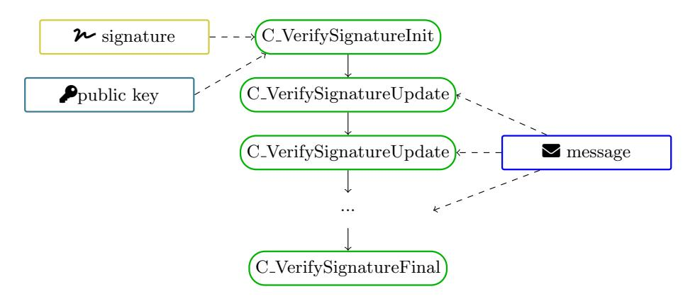

{0}------------------------------------------------

# Scaling of Memory and Bandwidth Requirements of Post-Quantum Signatures with Message Size

Falko Strenzke[0009−0006−6574−2904]

MTG AG, Darmstadt, Germany falko.strenzke@mtg.de

Abstract. In this work we analyse the qualitative memory and bandwidth efficiency properties of the currently standardised post-quantum signatures as such and of their protocol integrations mainly in the X.509 context. The term "qualitative" in this respect refers to how memory and bandwidth requirements scale with the size of the signed message. Specifically, we address the question in how far the algorithms support online-computations, a.k.a streaming, with respect to the signed message in the signing and verification operations. Further, we review the possibilities for the pre-computation of a short message representative outside the cryptographic module responsible for the signing or verification operation of the different signature schemes. We also give a preview on the corresponding cryptographic API of the PKCS#11 standard which introduces numerous PQC signature algorithms in the upcoming version 3.2. We demonstrate that for specific realistic use cases, the qualitative memory and bandwidth efficiency of the PQC signature schemes in protocol use is widely varied and by tendency substantially degraded compared to the traditional signature schemes based on RSA and elliptic curves, which always allow for the pre-computation of a short message representative in the form of a hash value. Our results are relevant to PQC migrations of existing applications using traditional RSA or elliptic curve schemes.

# 1 Introduction

The standardisation of PQC signatures schemes has reached a state where not only finalized cryptographic algorithm specifications from NIST for ML-DSA and SLH-DSA [\[1](#page-18-0)[,2\]](#page-18-1) and previously existing RFCs specifying the stateful hashbased signature schemes XMSS and LMS [\[3,](#page-18-2)[4\]](#page-18-3) are available, but where also the standards specifying their use in the X.509 [\[5\]](#page-18-4) context are completed or close to finalisation. In the LAMPS working group of the IETF, RFCs specifying the use of XMSS, LMS, ML-DSA and SLH-DSA in X.509 [\[6](#page-18-5)[,7,](#page-18-6)[8\]](#page-18-7) and the Cryptographic Message Syntax (CMS) [\[9,](#page-18-8)[10,](#page-18-9)[11\]](#page-18-10) have been finalized. Drafts for X.509 and CMS, specifying ML-DSA composite signatures, combining the lattice-based PQC signature scheme with RSA and ECC-based signature algorithms have been finalized by the working group and entered the IETF publication process [\[12,](#page-18-11)[13\]](#page-18-12).

{1}------------------------------------------------

In this work we analyse how the memory and bandwidth requirements scale with the size of the signed message for the PQC signature schemes. This pertains to their "raw" form, i.e., based on the respective algorithm standard from NIST or the IETF, but also to their protocol integrations in the X.509 protocol. We further address the integration of PQC signatures in the cryptographic message formats CMS [\[14\]](#page-18-13) and OpenPGP [\[15\]](#page-18-14). The analyses of these protocol integrations turns out to be relevant, as the protocol specifications can on the one hand restrict the usage of the PQC signature schemes compared to the respective genuine cryptographic algorithm specification and on the other hand modify their security and performance characteristics. A further aspect we take into account is the integration of the PQC signature schemes into the current and upcoming PKCS#11 standard [\[16](#page-18-15)[,17\]](#page-18-16), which is the most widely used programming API to communicate with a middleware for cryptographic hardware and potentially also software modules. We will learn that the upcoming version addresses an important efficiency aspect by the introduction of a new function interface for signature verification but also imposes artificial restrictions that negatively affect memory and bandwidth efficiency.

It should be noted that our analysis, as explained above, is qualitative in nature and thus does not present any quantitative results. This is because for the scaling of memory and bandwidth requirements with the message size, there are only two cases: either the respective requirement scales fully with the message, i.e., the required memory size on a processing device or the transmitted message has the size of the message or it is constant, i.e., independent of the message size. The case where the full message has to be stored or transmitted can have significant impacts in at least these three different scenarios: First, a memory-constrained device may be unable to store even small messages such X.509 certificates or revocation lists. Second, even powerful infrastructure components can suffer from memory exhaustion when extraneously large message have to be signed. Third, increased bandwidth, even though not accompanied by the problem of memory exhaustion on the involved machines, can be a cost factor as it can lead to the need of scaling up the network infrastructure.

The basic reason for the arising of such memory efficiency issues for the PQC signature schemes is the deviation from the traditional hash-then-sign paradigm in the new schemes in favor of what we refer to as direct signing. A signature algorithm that is based on hash-then-sign first hashes ("digests") the message with a cryptographic hash algorithm and then signs the hash value ("message digest") with the underlying core signature algorithm. This approach applies to RSA and elliptic curve based signature schemes. The modern design approach, on the other hand, is to input the message to the signature algorithm directly. In this work, we refer to such schemes as direct signature schemes or direct signing.

Direct signature schemes also always perform an internal hashing step before applying the signature function of the underlying primitive. However, this internal hashing step prefixes a set of parameters to the message, the structure of which varies from signature scheme to signature scheme. The purpose of direct signing is to have weaker security assumptions regarding the collision resis

{2}------------------------------------------------

tance of the employed hash function. While ML-DSA restricts the exploitability of a single hash collision to a single key, SLH-DSA, XMSS, and LMS remain secure even if the collision resistance of the employed hash function is broken. This property makes these algorithms especially interesting for applications with long-term security requirements. These properties are obviously lost when the pre-hash variants of the NIST algorithms, which turn the schemes into hashthen-sign schemes, are used or the direct signature scheme is used in a protocol to sign a message hash.

The main motivation for this work is to help designers to tackle the challenge that lies in the PQC migration of systems currently relying on traditional publickey signatures that arises due to the message-size-scaling effects in the PQC schemes. Besides message hashes in the hash-then-sign, potentially, depending on the particular signature scheme or even implementation, other mechanisms to achieve a short message representative may be available. The latter is a term for the token that can be transmitted to a cryptographic module to perform the signature. Thus its availability is a key factor in achieving bandwidth efficiency. While the increase in artifact sizes, namely public key and signature sizes, for PQC signature schemes is well-known and is already considered a burden, the associated cost increase is constant, that is, not scaling with message size. To make a concrete example for the effects of increased cryptographic artifact size and message-size-scaling, let us assume the transition from RSA-3072 to SLH-DSA-128 "fast" parameters – the most size intensive of the currently standardised PQC signature schemes at the equivalent security level of roughly 128 bit. The increased artifact size gives a ratio for the sums of signature and public key sizes of (17088 + 32)/(2 ∗ 384) = 22.29.

For a message of 1 MB, the ratio of the transmission size for transmitting the full to-be-signed data to the signing module and transmitting a short message representative given through a SHA-256 hash value, is 1, 000, 000/32 = 31, 250. This comparison, where the cost increase is more than 10,000 fold higher for the message-size-scaling effect compared to that of the increased artifact sizes, clearly shows the relevance of considering the former even for moderately sized messages.

In the following subsections, we explain further the aspects of our analysis.

### 1.1 Short message representative

As outlined above, a short message representative is a token that can be computed outside the signature module, i.e., without the knowledge of the private key, and provided to the signature module to compute the signature. Equivalently, it can be sent to a cryptographic module for the purpose of signature verification. A short message representative is thus in this respect equivalent to the message digest in signature schemes that adhere to the hash-then-sign paradigm.

Pre-hash variants, as they have been specified for ML-DSA and SLH-DSA [\[1,](#page-18-0)[2\]](#page-18-1) give the simplest and most straightforward form of short message representatives. Their use reverts the respective signature scheme back to the security 

{3}------------------------------------------------

assumptions of the hash-then-sign paradigm. External-µ, addressed in Section [2.1,](#page-5-0) is another such mechanism defined specifically for ML-DSA, which preserves the security assumptions, as it is merely an implementation variant of the direct signing or pure variant of ML-DSA.

The ability to use a short message representative in the signing function reduces the bandwidth requirements in the communication with the signing module compared to sending the full message. The concrete technical realization in the PKCS#11 interface is given through the use of a mechanism like CKM RSA PKCS [\[18\]](#page-18-17), which sends an externally computed hash value to the cryptographic module in a signature generation or verification operation.

### 1.2 Online property of the signing and verification function with respect to the message

It is important to note that the traditional hash-then-sign paradigm, besides providing a means to transfer a short message representative to a cryptographic module in the form of the message hash, has another performance-relevant aspect. This is the ability to start the hash computation with the receipt of the message to be signed or verified without the need for any further information than the hash algorithm to use. The hash computation can be continued incrementally with only the need for a relatively small constant amount of memory until the whole message has been received. This is what is referred to as an online or streaming algorithm, computation, or implementation.

As the message to be signed is potentially unlimited in size, the ability of the cryptographic module performing the signing operation to consume the message in chunks is another performance-critical aspect that becomes relevant when short message representatives are not available in the application context.

For the signature verification, the relevance of the online computation is potentially wider. The verification operation typically does not require the use of a specific cryptographic module. Nevertheless, even for infrastructure systems, the means of accessing the message data for verification may be limited by the software architecture. This can be seen from the example of a command line application which receives the message data on the standard input file descriptor. In this case, the signature verification has to be conducted in a single pass over the message. In case the algorithm does not allow for online computation, the whole message will have to be buffered in memory before the verification can be carried out.

For memory-constrained devices, on the other hand, the lack of the ability to perform the signature verification in an online manner, can be significant. We demonstrate this in particular for the certificate path validation in Section [3.1.](#page-9-0)

As we show in our analysis, the ability to perform the PQC signature verification in an online manner is generally dependent on whether the public key or the signature is available prior to receiving the message. Furthermore, as we learn, ML-DSA using the external-µ mechanism for computing a short message representative does not solve the problem of performing the signature verification in an online manner in all cases, as demonstrated in Section [3.1.](#page-9-0)

{4}------------------------------------------------

#### 1.3 A note on PKCS#11

Due to its broad relevance in cryptographic applications, we address the interface functions that the PKCS#11 standard prescribes for PQC signature schemes. The current PKCS#11 v3.2 Committee Specification Draft [\[17\]](#page-18-16) introduces the PQC signature algorithms XMSS, ML-DSA, SLH-DSA. LMS and its multi-tree variant HSS are already included in the current version 3.1 of PKCS#11. The v3.2 draft accounts for the memory-efficiency challenges of the PQC signature algorithms by introducing new interface functions for the signature verification, namely the C VerifySignature interface with its functions C VerifySignatureInit, C VerifySignature, C VerifySignatureUpdate, and C VerifySignatureFinal. These functions enable the caller to set the signature prior to feeding the message, possibly in a multi-part operation using C Verify-SignatureUpdate as shown in Figure [1.](#page-4-0) The previously existing C Verify interface allows to set the signature only after the message in the C VerifyFinal interface function.

<span id="page-4-0"></span>

Fig. 1: Depiction of the incremental, i.e., online, processing of a message for signature verification in the current draft for PKCS#11 v3.2 [\[17\]](#page-18-16) using the newly introduced C VerifySignature interface.

# <span id="page-4-1"></span>2 Cryptographic algorithm specifications

In this section we provide a concise description of the operations of the individual signature algorithms that are relevant to our analysis. These are limited to the initial transformation of the message until the computation of what can be called the inner message digest, which forms the data input to the actual signature primitive. Please note that our description is agnostic towards concrete encodings or actual lengths of various parameters such as random byte strings, or concrete instances of hash functions, since these aspects are of no relevance to our analysis. The omission of elements of data structures not relevant to our analysis will be indicated by ellipsis (". . . ").

{5}------------------------------------------------

#### 2.1 ML-DSA

ML-DSA is specified in FIPS-204 [\[1\]](#page-18-0). The pure variant of ML-DSA, performing direct signing, is defined as

<span id="page-5-6"></span><span id="page-5-2"></span>
$$M' \leftarrow 0 \times 00 \parallel \text{byte\_length}(\text{ctx}) \parallel \text{ctx} \parallel M$$
 (1)

tr ← SHAKE256(pk, 512)

<span id="page-5-3"></span>
$$\mu \leftarrow \text{SHAKE256}(\text{encode}(\text{tr}) \parallel M', 512)$$
 (2)

sig ← ML-DSA-primitive-sign(µ,rnd,sk)

where M is the signed message, ctx is a user-specified context parameter that is by default empty[1](#page-5-1) , pk is the public key, rnd is a 32 byte array which in case of the so-called hedged variant is chosen uniformly at random and all zero in case of the deterministic variant, SHAKE256(x, y) denotes the application of the SHAKE256 function to the data x with an output of length of y bits and ML-DSA-primitive-sign() takes as arguments the message to be signed, a random seed, and the private key in that order.

Pre-hash variant NIST specifies a pre-hash variant of ML-DSA alongside with the pure variant [\[1\]](#page-18-0). While the pure variant given above signs the message directly, the pre-hash variant takes an externally computed message digest in place of the message as the data to be signed. The pre-hash signature operation is defined analogously to the direct-signing or pure variant with only the following alternate first step replacing Equation [\(1\)](#page-5-2):

$$M' \leftarrow 0 \times 01 \parallel \text{byte\_length}(\text{ctx}) \parallel \text{ctx} \parallel \text{OID} \parallel \text{PH}(M),$$
 (3)

where OID is the OID of the hash algorithm used to compute the pre-hash PM(M) of the message.

<span id="page-5-0"></span>µ-ML-DSA FIPS-204 further specifies that the value µ, computed in Equation [\(2\)](#page-5-3), may be computed in a different cryptographic module than the signature.[2](#page-5-4) This allows to compute a short message representative in the form of µ which can be sent to a signing module instead of the message.

PKCS#11 The upcoming PKCS#11 version 3.2 will introduce ML-DSA in the pure and pre-hash variant. Providing external-µ as the input to the signature or verification function will be specified in version 3.3[3](#page-5-5) .

<span id="page-5-1"></span><sup>1</sup>This is the case for the use of ML-DSA in the X.509 and CMS context, but ML-DSA-composite schemes [\[12\]](#page-18-11) employ the context parameter to achieve domain separation from standalone use of ML-DSA in the same protocol.

<span id="page-5-4"></span><sup>2</sup> [https://csrc.nist.gov/csrc/media/Projects/post-quantum-cryptography/](https://csrc.nist.gov/csrc/media/Projects/post-quantum-cryptography/documents/faq/fips204-sec6-03192025.pdf) [documents/faq/fips204-sec6-03192025.pdf](https://csrc.nist.gov/csrc/media/Projects/post-quantum-cryptography/documents/faq/fips204-sec6-03192025.pdf)

<span id="page-5-5"></span><sup>3</sup> <https://github.com/oasis-tcs/pkcs11/issues/58>

{6}------------------------------------------------

Message-related memory efficiency The signature operation can straightforwardly be performed in an online manner. For the signature verification, the computation of µ in ML-DSA requires the public key as an input prior to being able to start consuming the message.[4](#page-6-0) It is thus only an online operation if the public-key is available before the receipt of the message.

Since certificate chains are typically provided in the sequence from the endentity to the root certificate, verification with ML-DSA requires to store each certificate in memory until the signer certificate is received and the signature can be verified. This is for instance the case in the TLS protocol. The memoryefficiency of the X.509 certificate path validation is analysed in Section [3.1.](#page-9-0)

Also in the case of cryptographic message formats, the availability of the public key is not necessarily given at the point where the message is received. In a protocol supporting PKI, the public key of the sender is typically provided as part of the signed message and authenticated against a trust anchor. In the case of the Cryptographic Message Syntax [\[14\]](#page-18-13), and thus also for S/MIME [\[19\]](#page-18-18), it is indeed the case that the signer's public key is provided after the signed message. Thus also here message streaming is generally not possible. See our discussion of CMS in Section [3.3.](#page-12-0)

### 2.2 Composite ML-DSA signatures in draft-ietf-lamps-pqcomposite-sigs

Version 14 of draft-ietf-lamps-pq-composite-sigs [\[12\]](#page-18-11), which has been finalized by the LAMPS working group of the IETF and is in the IETF publication process, defines various composite schemes combining ML-DSA with RSA and elliptic curve based signature schemes. The signature process transforms the message as follows before applying the signature function of the component schemes:

$$\begin{split} M' &= \text{Prefix}||\text{Label}||\text{byte\_length}(\text{ctx})||\text{ctx}||\text{PH}(M), \\ \text{mldsaSig} &= \text{ML-DSA.Sign}(\text{key} = \text{sk}_{\text{mldsa}}, \text{message} = M', \text{ctx}_{\text{mldsa}} = \text{Label}) \\ \text{tradSig} &= \text{Trad.Sign}(\text{key} = \text{sk}_{\text{trad}}, \text{message} = M') \end{split}$$

where M is the message supplied by the user, M′ is the message that is fed into the component algorithms, and PH(M) is a pre-hash of the message. "Prefix" is a fixed string, "Label" is an algorithm and security parameter specific byte string, and ctx is a user-supplied context string. The important observation here is that the construction allows to compute PH(M) as a short message representative without any dependency on other values than M and the employed hash function for computing PH(M), which defined by the algorithm identifier.

Message-related memory efficiency There are no dependencies on values other than the message and the algorithm identifier for the online-processing of the message during signature generation or verification.

<span id="page-6-0"></span><sup>4</sup>This has been pointed out by Samuel Lee on the PQC-Forum mailing list: [https://groups.google.com/a/list.nist.gov/g/pqc-forum/c/GPtJRsk67TY/m/](https://groups.google.com/a/list.nist.gov/g/pqc-forum/c/GPtJRsk67TY/m/8vbWxGbrAAAJ) [8vbWxGbrAAAJ](https://groups.google.com/a/list.nist.gov/g/pqc-forum/c/GPtJRsk67TY/m/8vbWxGbrAAAJ)

{7}------------------------------------------------

#### 2.3 SLH-DSA

SLH-DSA, defined in [\[2\]](#page-18-1), is the stateless hash-based digital signature standard. Besides the pure variant also a pre-hash variant is specified.

The pure, i.e. direct signing, variant of SLH-DSA transforms the signed message according to the following steps:

<span id="page-7-1"></span>
$$R = PRF_{msg}(SK.prf, opt\_rand, M)$$
(4)

<span id="page-7-0"></span>
$$M' \leftarrow 0x0 \parallel \text{byte\_length}(\text{ctx}) \parallel \text{ctx} \parallel M$$
 (5)  
 $\text{digest} = H_{\text{msg}}(R, \text{PK.seed}, \text{PK.root}, M')$   
 $\text{signature\_SLH-DSA} = \{R, \ldots\}$ 

Here, opt rand is a byte array which in the case of the hedged variant is chosen uniformly at random and all zeroes in the case of the deterministic variant of SLH-DSA. SK.prf is part of the secret key, while PK.seed and PK.root are parts of the public key. PRFmsg and Hmsg represent either applications of SHAKE256 or SHA-2 based constructions depending on the concrete parameter set.

Pre-hash variant The pre-hash variant of SLH-DSA defined in FIPS-205 is equivalently defined to the pre-hash variant of ML-DSA. It is realized by replacing Equation [\(5\)](#page-7-0) with the following step:

$$M' \leftarrow 0x1 \parallel \text{byte\_length(ctx)} \parallel \text{ctx} \parallel \text{OID} \parallel PH(M),$$

The pre-hash variant is also available for X.509 objects [\[7\]](#page-18-6), but not for CMS [\[9\]](#page-18-8).

<span id="page-7-2"></span>Message-related memory efficiency By hashing the message in the computation of the randomizer R in Equation [\(4\)](#page-7-1), the scheme achieves resilience against flawed random bit generation. At the same time, this feature leads to the requirement of processing the message twice. A device performing the signature generation thus is required to either hold the whole message in memory during the operation or to receive it twice. Refer to Section [3.1](#page-9-0) for the concept of two-pass algorithms to circumvent memory limitations in the context of X.509 certificate path validation and the security measure specified there to ensure consistency of the input data in both passes.

The signature verification of SLH-DSA requires the availability of the public key and the randomizer R from the signature prior to online-processing of the message. With the pre-hash variant of SLH-DSA, these memory-performance issues can be circumvented at the expense of independence of the security assumptions from collision resistance of the underlying hash function.

{8}------------------------------------------------

#### 2.4 XMSS and LMS

XMSS and LMS are stateful hash-based signature schemes. When we are referring to XMSS and LMS, this is meant to equally address their respective multi-tree variant, namely XMSSMTand HSS for LMS. The statefulness property means that the private key carries an internal state which has to be updated in each signature generation. If ever the same private key state is used to sign two messages, either of these scheme becomes insecure and signatures verifiable by that private key can be forged [\[20\]](#page-19-0).

Message preprocessing in XMSS For the signature generation first the value M′ is computed as

```
randomizer = PRF(secret-key-part, idx msg)
 M′ = Hmsg(randomizer||pk||idx msg, M)
signatureXMSS = {idx msg,randomizer, . . .}
```

where pk denotes the public key and idx sig, the index of the signature, which is incremented for each generated signature for a particular key. The signature contains the values of the randomizer and the idx msg.

Then the internal signature is generated on M′ .

Message preprocessing in LMS In LMS, the message is transformed as follows during the signature generation:

```
C = random bytes()
Q = H(I||idx msg||D MESG||C||M),
  signatureLMS = {C, idx msg, . . .}
```

where I is a part of the public (and private) key and D MESG is a constant. The function random bytes() designates a function that returns a random byte array with the help an RNG. The randomizer C is hashed before the message.

PKCS#11 As of the current draft for PKCS#11 v3.2, multipart signature generation and verification is not supported for XMSS and LMS. The introduction of multi-part signature support for these algorithms is considered for PKCS#1 v3.3[5](#page-8-0) .

<span id="page-8-0"></span><sup>5</sup> <https://github.com/oasis-tcs/pkcs11/issues/44> and [https://github.com/](https://github.com/oasis-tcs/pkcs11/issues/32) [oasis-tcs/pkcs11/issues/32](https://github.com/oasis-tcs/pkcs11/issues/32)

{9}------------------------------------------------

Message-related memory efficiency XMSS and LMS exhibit the same efficiency properties. These algorithms have no mechanism for a short message representative, i.e., the whole message has to be provided to the signature module. Their signature generation operation can be performed in an online manner. The signature verification can only be performed in an online manner after the signature and the public key are available.

# <span id="page-9-1"></span>3 Protocol integrations of the PQC signature schemes

We review the protocol integrations of the PQC signature schemes in X.509, CMS, and OpenPGP as the most basic and widespread asynchronous cryptographic message protocols and that already have an advanced state of the integration of PQC signatures. Table [1](#page-13-0) gives an overview.

## <span id="page-9-0"></span>3.1 X.509 Certificates

The X.509 standard, RFC 5280 [\[5\]](#page-18-4), defines the data structures and processing rules for X.509 public key certificates and certificate revocation lists (CRL). The X.509 certificate path validation is one of the crucial applications of X.509 certificates and typically has to be carried before any usage of a public key certificate. RFC 5280 defines the path validation in the order from the trust anchor to the end-entity certificate, however, in practice, the order in which certificate chains are provided is often inverted. This was the case for TLS prior to TLS 1.3 [\[21\]](#page-19-1). TLS 1.3 allows different orderings here, but requires the endentity certificate to be provided as the first in any case. Thus at least at the beginning of the TLS certificate chain, the ordering is from end-entity certificate to the issuer. Algorithm [1](#page-10-0) describes a memory-optimized path validation routine for this chain ordering in the case of direct signing schemes. Since the currently specified direct signing schemes ML-DSA, SLH-DSA, XMSS, and LMS all require the public key prior to the message processing during signature verification, the TBS data (the certificate body, refer to Figure [2](#page-12-1) for structure of an X.509 certificate) of a certificate has to be stored until the reception of the public key in the issuer certificate. This means that the peak memory requirement for path validation resulting from the involved cryptographic artifacts is

$$\operatorname{size}(c_{i-1}) + \operatorname{size}(p_i),$$

which amounts to 5 kB for ML-DSA-44. In comparison, for a hash-then-sign algorithm, it is not necessary to store the certificate c<sup>i</sup> at all. Instead, it can be processed in an online manner with a parallel computation of the hash of the TBS data. The hash function is specified early in the TBS data in the signature field which defines the signature algorithm. The computed hash is then input to the signature verification in the next iteration.

The memory cost of the path validation is especially relevant in the case of ML-DSA, since this algorithm is, under consideration of the absolute signature 

{10}------------------------------------------------

and public key sizes and the running time performance, the most cost-effective and thus presumably by tendency the preferred choice for resource-constrained devices.

In case resource-constrained devices are operating in a heterogeneous PKI environment, where the key sizes of the certificates in the peer certificate chain may vary, the implementation of a straightforward fallback mechanism for the case of a memory exhaustion suggests itself. This is achieved by resorting to a two-pass processing where in the first pass the following values are computed and stored: firstly, keyed-hashes, i.e., hashes with secret random prefix generated on the device, of all certificates received for the path validation; secondly, internal states of the signature-algorithm-internal hash operations for the signature verification of each certificate that has to be verified. The saved hash state is the state after having received the required public key and signature elements and thus is ready to receive the TBS data of the certificate to verify.

<span id="page-10-0"></span>**Algorithm 1** Certificate path validation from the end-entity certificate  $c_0$  to the trust anchor  $c_n$  with any number of intermediate certificates for ML-DSA certificates. Here  $p_i$  and  $s_i$  denote the public key and signature of  $c_i$ , respectively. For simplicity, the description ignores the modelling of trust anchor trust.

```
1: Algorithm VALIDATE-CERT-PATH(certificate-chain c_0, \ldots c_n)
 2:
        receive c_0 and store it in memory
 3:
        apply c_0 or its public key p_0 in protocol or store it in memory for later use
 4:
        for i = 1 to n do
 5:
           start to receive c_i
 6:
           process leading part of c_i until subject public key p_i
 7:
           ensure verify(message = TBS_data(c_{i-1}), public_key = p_i, signature = s_{i-1})
 8:
           release c_{i-1} from memory
9:
           process the final part of c_i
10:
           after complete receipt of c_i, store the whole certificate in memory
11:
        end for
12: end Algorithm
```

The process for the two-pass verification in given Algorithm 2. The two-pass property here means that receipt of the certificate chain has to occur twice. In reality, this is simply achieved by a retry from the client after a failed TLS handshake during the first pass. The memory-constrained device causing the failure in the first pass may either be the server or the client. In case it has the role of the client, the initiation of the second handshake attempt happens at its own discretion. In case it is the server, a successful handshake requires a second handshake attempt by the client.

For simplicity, Algorithm 2 is written such that two-pass verification is always realized. In reality, an implementation of the path validation would implement the two-pass verification only as fallback option when the regular verification according to Algorithm 1 fails due to memory exhaustion. For this purpose, the algorithm specifications of 1 would have to be merged with the specification of the first pass in Algorithm 2 appropriately.

Algorithm 2 removes the requirement to store any certificate in full at any time during the algorithm execution. The keyed hashes  $y_i$  computed during the

{11}------------------------------------------------

<span id="page-11-0"></span>Algorithm 2 Two-pass certificate path validation from the end-entity certificate  $c_0$  to the trust anchor  $c_n$  with any number of intermediate certificates for ML-DSA certificates. The function verify  $\mu$  refers to the ML-DSA verification based on externally computed  $\mu$ .

```
1: Algorithm Two-Pass-Validate-Cert-Path(certificate-chain c_0, \ldots c_n)
 2:
        x_0 = \text{random\_bytes}()
 3:
        receive c_0
 4:
        incrementally compute y_0 = hash(x_0||c_0) and store (x_0, y_0)
 5:
        for i = 1 to n do
 6:
            x_i = \text{random\_bytes}()
 7:
            start to receive c_i
 8:
            incrementally compute y_i = hash(x_i||c_i) and store (x_i, y_i)
 9:
            compute and store t_{i-1} =hash-state(SHAKE256(encode(tr<sub>i</sub>))) using tr<sub>i</sub> from p_i
10:
         end for
11:
        start to receive c_0
12:
        incrementally compute y'_0 = \text{hash}(x_0||c_0) and ensure equality to y_0 after complete receipt
13:
        apply c_0 or its public key p_0 in protocol or store it in memory for later use
14:
        store s_0, the signature in c_0
15:
         for i = 1 to n do
16:
            start to receive c_i
17:
            incrementally compute y'_i = \text{hash}(x_i||c_i) and ensure equality to y_i after complete receipt
18:
            if (i < n) then restore t_i and incrementally continue hash computation \mu_i
    SHAKE256(encode(tr<sub>i+1</sub>) || ...) with the TBS data of c_i
19:
            incrementally process c_i until receipt of p_i starts
20:
21:
            ensure verify \mu(\mu = \mu_{i-1}, \text{ public\_key} = p_i, \text{ signature} = s_{i-1})
            release s_{i-1} from memory
22:
            incrementally process the final part of c_i
23:
            if (i < n) then store s_i
24:
        end for
25: end Algorithm
```

first pass are used to ensure that the same certificate chain is received in the second pass. The precomputed hash states  $t_i$  allow for an online computation of the TBS data hash in the second pass. This algorithm achieves basically the same memory requirements as those for the path validation with signature schemes adhering to the hash-then-sign paradigm, since it ensures that in the second pass the hash computations required for the verification of the certificate signature can be performed in an online manner. There is only a small overhead in storing a hash values and an internal hash state for each level of the certification path.

Algorithm 2 can be adapted to the case of the hash-based schemes SLH-DSA, XMSS, and LMS in a straightforward manner. Only the precomputation of the hash states  $t_i$  differs in that it also requires elements from the signature. These can be collected during the first pass of the certificate receipt as well.

#### 3.2 X.509 CRLs

The considerations about the memory efficiency in processing X.509 certificates given in Section 3.1 equally apply to the processing of CRLs. However, since CRLs can grow to considerable size, the ability for online processing on memory-constrained devices is even more critical than in the case of X.509 certificates. The concept of two-pass processing can be equally applied for CRLs, where especially for the hash-based schemes the elements from the signature have to collected and processed into a stored hash state during the first pass.

{12}------------------------------------------------

```
Certificate ::= SEQUENCE {
      tbsCertificate TBSCertificate,
      signatureAlgorithm AlgorithmIdentifier,
      signatureValue BIT STRING }
  TBSCertificate ::= SEQUENCE {
      version [0] EXPLICIT Version DEFAULT v1,
      serialNumber CertificateSerialNumber,
      signature AlgorithmIdentifier,
      issuer Name,
      validity Validity,
      subject Name,
      subjectPublicKeyInfo SubjectPublicKeyInfo,
      issuerUniqueID [1] IMPLICIT UniqueIdentifier OPTIONAL,
                        -- If present, version MUST be v2 or v3
      subjectUniqueID [2] IMPLICIT UniqueIdentifier OPTIONAL,
                        -- If present, version MUST be v2 or v3
      extensions [3] EXPLICIT Extensions OPTIONAL
                        -- If present, version MUST be v3
      }
```

Fig. 2: ASN.1 definition of an X.509 certificate.

### <span id="page-12-0"></span>3.3 CMS

CMS effectively supports pre-hashing on the protocol layer by the use of the so-called Signed Attributes [\[14\]](#page-18-13). Signed Attributes are a collection of attributevalue pairs in an encoded structure, one of which represents the hash of the signed message. Signing with Signed Attributes is the approach recommended by the LAMPS working group of the IETF [\[22\]](#page-19-2). Allowing only a single variant of signing with or without Signed Attributes per protocol is necessary to avoid subtle security vulnerabilities existing in this protocol [\[23\]](#page-19-3). Signing with Signed Attributes effectively amounts to applying a protocol specific pre-hash to the message. Accordingly, a short message representative is available at least for modern protocols using CMS or those being modernized in this respect. Accordingly, in applications using the modern recommended signature mechanism of CMS, memory and bandwidth efficiency issues are entirely avoided. However, as noted in the introduction, this effectively reverts the signature scheme to the hash-then-sign paradigm and makes its security dependent on the collision resistance of the underlying hash function.

### 3.4 OpenPGP

The draft for the PQC integration of OpenPGP [\[24\]](#page-19-4), which has entered the IETF publication process, defines only ML-DSA-composite combinations with elliptic curve signature schemes and SLH-DSA as standalone. The OpenPGP protocol [\[15\]](#page-18-14) design inherently depends on the hash-then-sign paradigm, and thus adheres to this also in the use of the PQC signature algorithms. However, v6 signatures, based on which PQC signatures are defined, prefix a randomizer to the signed data and thus achieve independence of the signature scheme's security from the collision resistance of the hash function.

{13}------------------------------------------------

<span id="page-13-0"></span>

| Algorithm                | X.509 | CMS    | CMS      | OpenPGP |  |
|--------------------------|-------|--------|----------|---------|--|
|                          |       | (w/SA) | (w/o SA) |         |  |
| ML-DSA / direct signing  | ✓ ✚û  | p      | ✓ ✚û     | p       |  |
| ML-DSA-comp. / pre-hash  | ✓ ✚û  | ✓ ✚û   | ✓        | ✓ û     |  |
| ML-DSA / pre-hash        | p     | ✓ ✚û   | p        | p       |  |
| SLH-DSA / direct signing | ✓ û   | p      | ✓ û      | p       |  |
| SLH-DSA / pre-hash       | ✓ ✚û  | ✓ ✚û   | p        | ✓ û     |  |
| XMSS / direct signing    | ✓ û   | p      | ✓ û      | p       |  |
| XMSS / pre-hash          | p     | ✓ ✚û   | p        | p       |  |
| LMS / direct signing     | ✓ û   | p      | ✓ û      | p       |  |
| LMS / pre-hash           | p     | ✓ ✚û   | p        | p       |  |

Table 1: Overview of the features of the protocol integrations of PQC signatures schemes. By "direct signing" and "pre-hash" we do not necessarily refer to the use of the pure and pre-hash variant of the algorithm, but rather how the signature algorithm is effectively embedded in the respective protocol. ✓ and p indicate availability and unavailability of the feature in question, respectively. The symbols û indicates that the message digestion has a randomizer prefixed – either in the signature algorithm internally or on the protocol level – and ✚<sup>û</sup> indicates deterministic hashing of the message. The latter implies that the signature scheme's security depends on hash-collision resistance of the underlying hash function. The third and forth columns describe CMS signatures with and without the use of Signed Attributes, respectively.

# 4 Summary and mitigating measures

Table [2](#page-17-0) gives an overview of the message-related memory and bandwidth efficiency aspects of the PQC signature algorithms as such and in the context of the X.509 formats that we determined in Sections [2](#page-4-1) and [3.](#page-9-1)

As our results show, the PQC signature schemes, besides their well-known increased signature size, and, in the case of ML-DSA, also public key size, exhibit considerable challenges in terms of scaling of bandwidth and memory requirements with message size. The two main relevant critical scenarios we have identified are the execution of the signing operation on a possibly remote cryptographic module and the signature verification for messages that are large in relation to the memory capacity of a device receiving the message through an external interface.

The use of the existing mechanisms to obtain a short message representative, namely resorting to pre-hash variants or using ML-DSA with external-µ can be used to address both of these scenarios. However, with the exception of external-µ, this reverts the security assumptions of the signature scheme to that of a hash-then-sign scheme. Further, external-µ fails to improve the challenge of performing the signature verification in an online manner, since the dependence of the operation on the early availability of the public key remains.

For the stateful schemes XMSS and LMS, in the general setting, neither of the two scenarios can be effectively addressed using the available algorithm 

{14}------------------------------------------------

variants. Due to the lack of any mechanism for a short message representative in these cases, the whole message has to be transmitted to the signing module. As an unnecessary artifact, when bound to a PKCS#11 v3.2 interface as specified in the current Committee Specification Draft, not even incremental message transmission is possible. The verification operation of these algorithms requires both the availability of the signature and the public key before the message can be processed.

In the following subsections, we address possible mitigating measures to resolve the memory and bandwidth restrictions of the PQC signature schemes.

### 4.1 Two-pass processing

Two-pass processing incurring repeated message transfers was addressed as an option for signing modules in Section [2.3](#page-7-2) and for the certificate path validation in memory-constrained devices in Section [3.1.](#page-9-0) This measure suggests itself only as a last resort in scenarios where better mitigations are unavailable or as a reaction to rarely expected large messages or protocol data structures. It generally causes doubled bandwidth and in the case of repeated handshake attempts, incurs observable protocol errors which may trigger warnings in network monitoring systems and subsequently manual investigations and bear the risk of other unintended side effects.

### 4.2 Resorting to pre-hashing in the algorithm choice or protocol design

As previously pointed out, resorting to one of the specified pre-hash variants of the PQC signature algorithms effectively addresses the memory efficiency. Note that in the case of ML-DSA, which does not support the pre-hash variant in the X.509 protocol, resorting to ML-DSA-composite is a possible option, as it is a hash-then-sign algorithm type. In cases where no viable option exists to use a specified pre-hash variant, but where the protocol or application design can be modified, it is possible to simply apply a pre-hashing step on the protocol layer and supply the message digest as the message to the direct signing algorithm. Such a design choice requires care, since in the case that the same protocol allows direct signing of the message and at the same time direct signing of a hash of the message and, further, the specification of the variant is not part of the signed data, the protocol will at least formally be susceptible to signature forgeries. An example for such a problem is the presence or absence of the Signed Attributes in CMS [\[23\]](#page-19-3).

Prefixing a randomizer on the protocol level, like realized in OpenPGP's v6 signatures, achieves independence of the signature's scheme security from the collision resistance of the message digest algorithm.

#### 4.3 Early supply of missing information in protocols

The observed memory-efficiency problems of the signature verification are solely caused by the delayed availability of information that has to be extracted from 

{15}------------------------------------------------

the signature or the signer's public key. A straightforward measure to solve these restrictions for all PQC signature algorithms is the inclusion of the required information in the transmitted protocol data before the message. For X.509 certificates and CRLs, this could be achieved by using the signature field in the TBSCertificate which announces the signature algorithm. For RSA and ECCbased signature schemes, this identifier also announces the hash algorithm and thus allows to start incremental hashing of the TBS data after the receipt of a few bytes. To achieve the same feature for the direct signing PQC signature schemes, a new algorithm identifier could be defined, which internally contains as parameters the existing defined identifier for the respective scheme and further contains all elements from the signature and the public key, that are needed to start the internal hash computation. In case of ML-DSA, this is for instance only the hash value tr.

### 4.4 Custom interfaces for short message representatives

A further mitigating measure is to enable the concept of a short message representative with preservation of direct signing as it has been done by NIST for ML-DSA with the external-µ mechanism. For instance Thales provides a proprietary extension of the PKCS#11 interface which enables the host to retrieve the data required for starting the XMSS and LMS internal message hash computation from the cryptographic module.[6](#page-15-0) .

# 5 Conclusion

In this work we investigate the problem of the qualitative memory-efficiency of the currently standardised PQC signature schemes in terms of how well bandwidth and memory usage scales with message size. As the two main critical scenarios, we considered the signing operation on an external cryptographic module and the signature verification for messages that are large in relation to the device's memory capacity. We have shown that the PQC signature schemes all have different characteristics in this respect with the only exception of XMSS and LMS, which qualitatively behave identically. Further, we analysed the integration of PQC signature schemes in the X.509 protocol based on finalized and almost finalized IETF standards as well as in the upcoming version of the PKCS#11 interface specification and demonstrated that both induce further restrictions on their memory and bandwidth efficiency. We provided a number of mitigating measures that can be applied by application and protocol designers to achieve memory-efficiency.

Most importantly, in our view, the presentation of these characteristics of the PQC signature algorithms can help system architects in the planning of the PQC migration. There is a considerable risk that the new algorithms are only

<span id="page-15-0"></span><sup>6</sup> [https://thalesdocs.com/gphsm/luna/7/docs/network/Content/sdk/](https://thalesdocs.com/gphsm/luna/7/docs/network/Content/sdk/extensions/pqc/PQC_external_hash.htm) [extensions/pqc/PQC\\_external\\_hash.htm](https://thalesdocs.com/gphsm/luna/7/docs/network/Content/sdk/extensions/pqc/PQC_external_hash.htm)

{16}------------------------------------------------

gauged in terms of their obvious performance characteristics, namely artifact sizes and running times of the operations, but not with respect to the less obvious memory and bandwidth related features. The latter clearly do not surface in all applications contexts of signature schemes, but in the critical cases we have identified, can lead to problems that either increase operational costs at a far greater scale than the increased artifact sizes – as shown by the example in the introduction – or require fundamental re-engineering of existing applications or protocols.

For a sound and cost-aware planning of the PQC migration, the cryptographic architecture needs to be modelled through all the relevant layers of the cryptographic algorithm, the cryptographic protocol, and programming as well as hardware module interfaces. This requires a comprehensive understanding of the relevant security and efficiency notions and a detailed knowledge of the existing implementation landscape and the concrete options offered by employed third party components – in many cases still not fully implemented or even specified. Thus a merely conceptional approach seems as a fragile option. As a consequence, our work reinforces the urgency of early practical experience and evaluation of concepts in the PQC migration in order to rule out conceptional oversights.

{17}------------------------------------------------

<span id="page-17-0"></span>

|                            | Algorithm specification (NIST, IETF) |          | X.509 (cert, CRL) spec. (IETF/LAMPS WG) |                    | PKCS#11 v3.2 draft<br>/ v3.3 |                                                                                                                                                                                                                                                                                                                                                                                                                                                                                                                                                                                                                                                                                                                                                                                                                                                                                                                                                                                                                                                                                                                                                                                                                                                                                                                                                                                                                                                                                                                                                                                                                                                                                                                                                                                                                                                                                                                                                                                                                                                                                                                                                                                                                                                                                                                                                                                                                                                                                                   |                         |                |                |
|----------------------------|--------------------------------------|----------|-----------------------------------------|--------------------|------------------------------|---------------------------------------------------------------------------------------------------------------------------------------------------------------------------------------------------------------------------------------------------------------------------------------------------------------------------------------------------------------------------------------------------------------------------------------------------------------------------------------------------------------------------------------------------------------------------------------------------------------------------------------------------------------------------------------------------------------------------------------------------------------------------------------------------------------------------------------------------------------------------------------------------------------------------------------------------------------------------------------------------------------------------------------------------------------------------------------------------------------------------------------------------------------------------------------------------------------------------------------------------------------------------------------------------------------------------------------------------------------------------------------------------------------------------------------------------------------------------------------------------------------------------------------------------------------------------------------------------------------------------------------------------------------------------------------------------------------------------------------------------------------------------------------------------------------------------------------------------------------------------------------------------------------------------------------------------------------------------------------------------------------------------------------------------------------------------------------------------------------------------------------------------------------------------------------------------------------------------------------------------------------------------------------------------------------------------------------------------------------------------------------------------------------------------------------------------------------------------------------------------|-------------------------|----------------|----------------|
|                            | short                                | sign-    | verify-                                 | short              | sign-                        | verify-                                                                                                                                                                                                                                                                                                                                                                                                                                                                                                                                                                                                                                                                                                                                                                                                                                                                                                                                                                                                                                                                                                                                                                                                                                                                                                                                                                                                                                                                                                                                                                                                                                                                                                                                                                                                                                                                                                                                                                                                                                                                                                                                                                                                                                                                                                                                                                                                                                                                                           | supported               | sign           | verify         |
|                            | msg.                                 | online   | online                                  | msg.               | online                       | online                                                                                                                                                                                                                                                                                                                                                                                                                                                                                                                                                                                                                                                                                                                                                                                                                                                                                                                                                                                                                                                                                                                                                                                                                                                                                                                                                                                                                                                                                                                                                                                                                                                                                                                                                                                                                                                                                                                                                                                                                                                                                                                                                                                                                                                                                                                                                                                                                                                                                            |                         | multi-<br>part | multi-<br>part |
| ML-DSA                     | ×                                    | <b>✓</b> | <b>₽</b>    <b>≥</b> / <b>&gt;</b>      | x                  | <b>✓</b>                     | <b>₽</b>    <b>≥</b> / <b>&gt;</b>   <b>⊅</b>                                                                                                                                                                                                                                                                                                                                                                                                                                                                                                                                                                                                                                                                                                                                                                                                                                                                                                                                                                                                                                                                                                                                                                                                                                                                                                                                                                                                                                                                                                                                                                                                                                                                                                                                                                                                                                                                                                                                                                                                                                                                                                                                                                                                                                                                                                                                                                                                                                                     | <b>✓</b>                | 1-             | <b>γ</b> 1     |
| $\mu\text{-}\text{ML-DSA}$ | $   \checkmark (\mu) $               | <b>✓</b> |                                         | $\checkmark (\mu)$ | 1                            |                                                                                                                                                                                                                                                                                                                                                                                                                                                                                                                                                                                                                                                                                                                                                                                                                                                                                                                                                                                                                                                                                                                                                                                                                                                                                                                                                                                                                                                                                                                                                                                                                                                                                                                                                                                                                                                                                                                                                                                                                                                                                                                                                                                                                                                                                                                                                                                                                                                                                                   | $(\checkmark) (v3.3)^2$ | N/A            | N/A            |
| Hash-ML-DSA                | (hash)                               | <b>✓</b> | <b>v</b>                                | N/A                | N/A                          | N/A                                                                                                                                                                                                                                                                                                                                                                                                                                                                                                                                                                                                                                                                                                                                                                                                                                                                                                                                                                                                                                                                                                                                                                                                                                                                                                                                                                                                                                                                                                                                                                                                                                                                                                                                                                                                                                                                                                                                                                                                                                                                                                                                                                                                                                                                                                                                                                                                                                                                                               | <b>~</b>                | N/A            | N/A            |
| ML-DSA-comp.               | ✓ (hash)                             | <b>✓</b> | <b>✓</b>                                | ✓ (hash)           | ~                            | <b>✓</b>                                                                                                                                                                                                                                                                                                                                                                                                                                                                                                                                                                                                                                                                                                                                                                                                                                                                                                                                                                                                                                                                                                                                                                                                                                                                                                                                                                                                                                                                                                                                                                                                                                                                                                                                                                                                                                                                                                                                                                                                                                                                                                                                                                                                                                                                                                                                                                                                                                                                                          | N/A                     | N/A            | N/A            |
| SLH-DSA                    | ×                                    | ×        |                                         | ×                  | ×                            | ×                                                                                                                                                                                                                                                                                                                                                                                                                                                                                                                                                                                                                                                                                                                                                                                                                                                                                                                                                                                                                                                                                                                                                                                                                                                                                                                                                                                                                                                                                                                                                                                                                                                                                                                                                                                                                                                                                                                                                                                                                                                                                                                                                                                                                                                                                                                                                                                                                                                                                                 | ~                       | <b>~</b>       | 2 12/21/2      |
| Hash-SLH-DSA               | (hash)                               | <b>✓</b> | <b>v</b>                                | (hash)             | <b>✓</b>                     | <b>✓</b>                                                                                                                                                                                                                                                                                                                                                                                                                                                                                                                                                                                                                                                                                                                                                                                                                                                                                                                                                                                                                                                                                                                                                                                                                                                                                                                                                                                                                                                                                                                                                                                                                                                                                                                                                                                                                                                                                                                                                                                                                                                                                                                                                                                                                                                                                                                                                                                                                                                                                          | <b>✓</b>                | N/A            | N/A            |
| XMSS/LMS                   | ×                                    | <b>~</b> | ~    <b>=</b> / <b>=</b>    <b>*</b>    | ×                  | <b>~</b>                     | ~    <b> </b>    <b> </b>    <b> </b>    <b> </b>    <b> </b>    <b> </b>    <b> </b>    <b> </b>    <b> </b>    <b> </b>    <b> </b>    <b> </b>    <b> </b>    <b> </b>    <b> </b>    <b> </b>    <b> </b>    <b> </b>    <b> </b>    <b> </b>    <b> </b>    <b> </b>    <b> </b>    <b> </b>    <b> </b>    <b> </b>    <b> </b>    <b> </b>    <b> </b>    <b> </b>    <b> </b>    <b> </b>    <b> </b>    <b> </b>    <b> </b>    <b> </b>    <b> </b>    <b> </b>    <b> </b>    <b> </b>    <b> </b>    <b> </b>    <b> </b>    <b> </b>    <b> </b>    <b> </b>    <b> </b>    <b> </b>    <b> </b>    <b> </b>    <b> </b>    <b> </b>    <b> </b>    <b> </b>    <b> </b>    <b> </b>    <b> </b>    <b> </b>    <b> </b>    <b> </b>    <b> </b>    <b> </b>    <b> </b>    <b> </b>    <b> </b>    <b> </b>    <b> </b>    <b> </b>    <b> </b>    <b> </b>    <b> </b>    <b> </b>    <b> </b>    <b> </b>    <b> </b>    <b> </b>    <b> </b>    <b> </b>    <b> </b>    <b> </b>    <b> </b>    <b> </b>    <b> </b>    <b> </b>    <b> </b>    <b> </b>    <b> </b>    <b> </b>    <b> </b>    <b> </b>    <b> </b>    <b> </b>    <b> </b>    <b> </b>    <b> </b>    <b> </b>    <b> </b>    <b> </b>    <b> </b>    <b> </b>    <b> </b>    <b> </b>    <b> </b>    <b> </b>    <b> </b>    <b> </b>    <b> </b>    <b> </b>    <b> </b>    <b> </b>    <b> </b>    <b> </b>    <b> </b>    <b> </b>    <b> </b>    <b> </b>    <b> </b>    <b> </b>    <b> </b>    <b> </b>    <b> </b>    <b> </b>    <b> </b>    <b> </b>    <b> </b>    <b> </b>    <b> </b>    <b> </b>    <b> </b>    <b> </b>    <b> </b>    <b> </b>    <b> </b>    <b> </b>    <b> </b>    <b> </b>    <b> </b>    <b> </b>    <b> </b>    <b> </b>    <b> </b>    <b> </b>    <b> </b>    <b> </b>    <b> </b>    <b> </b>    <b> </b>    <b> </b>    <b> </b>    <b> </b>    <b> </b>    <b> </b>    <b> </b>    <b> </b>    <b> </b>    <b> </b>    <b> </b>    <b> </b>    <b> </b>    <b> </b>    <b> </b>    <b> </b>    <b> </b>    <b> </b>    <b> </b>    <b> </b>    <b> </b>    <b> </b>    <b> </b>    <b> </b>    <b> </b>    <b> </b>    <b> </b>    <b> </b>    <b> </b>    <b> </b>    <b> </b>    <b> </b>    <b> </b>    <b> </b>    <b> </b>    <b> </b>    <b> </b>    <b> </b>    <b> </b>    <b> </b>    <b> </b>    <b> </b>    <b> </b>    <b> </b>    <b> </b>    <b> </b>    <b> </b>    <b> </b>    <b> </b>    <b> </b>    <b> </b>    <b> </b>    <b> </b>    <b> </b> | <b>✓</b>                | ×              | ×              |

<sup>&</sup>lt;sup>1</sup> To be corrected (see https://github.com/oasis-tcs/pkcs11/pull/63) in a future PKCS#11 version, this aspect is still under discussion. Note that executing the signature verification in a cryptographic module is typically not required.

Table 2: Overview of the Message-related memory efficiency aspects of PQC signature schemes. N/A denotes that a feature is not relevant for efficient processing. The symbol processed, while indicates that both the public key and the signature have to be available beforehand. The feature description in the last three columns refer to the current draft for PKCS#11 v.3.2 except where noted otherwise.

The feature for using external- $\mu$  computation with ML-DSA will be added in PKCS#11 v3.3 (see Section 2.1).

{18}------------------------------------------------

# References

- <span id="page-18-0"></span>1. NIST – National Institute of Standards and Technology: FIPS 204 – Module-Lattice-Based Digital Signature Standard (2024-08-13 04:08:00 2024)
- <span id="page-18-1"></span>2. NIST – National Institute of Standards and Technology: FIPS 205 – Stateless Hash-Based Digital Signature Standard (2024-08-13 04:08:00 2024)
- <span id="page-18-2"></span>3. Huelsing, A., Butin, D., Gazdag, S.L., Rijneveld, J., Mohaisen, A.: XMSS: eXtended Merkle Signature Scheme. RFC 8391 (May 2018)
- <span id="page-18-3"></span>4. McGrew, D., Curcio, M., Fluhrer, S.: Leighton-Micali Hash-Based Signatures. RFC 8554 (April 2019)
- <span id="page-18-4"></span>5. Boeyen, S., Santesson, S., Polk, T., Housley, R., Farrell, S., Cooper, D.: Internet X.509 Public Key Infrastructure Certificate and Certificate Revocation List (CRL) Profile. RFC 5280 (May 2008)
- <span id="page-18-5"></span>6. Massimo, J., Kampanakis, P., Turner, S., Westerbaan, B.: Internet X.509 Public Key Infrastructure – Algorithm Identifiers for the Module-Lattice-Based Digital Signature Algorithm (ML-DSA). RFC 9881 (October 2025)
- <span id="page-18-6"></span>7. Bashiri, K., Fluhrer, S., Gazdag, S.L., Geest, D.V., Kousidis, S.: Internet X.509 Public Key Infrastructure – Algorithm Identifiers for the Stateless Hash-Based Digital Signature Algorithm (SLH-DSA). RFC 9909 (December 2025)
- <span id="page-18-7"></span>8. Geest, D.V., Bashiri, K., Fluhrer, S., Gazdag, S.L., Kousidis, S.: Use of the HSS and XMSS Hash-Based Signature Algorithms in Internet X.509 Public Key Infrastructure. RFC 9802 (June 2025)
- <span id="page-18-8"></span>9. Housley, R., Fluhrer, S., Kampanakis, P., Westerbaan, B.: Use of the SLH-DSA Signature Algorithm in the Cryptographic Message Syntax (CMS). RFC 9814 (July 2025)
- <span id="page-18-9"></span>10. S, B., R, A., Geest, D.V.: Use of the ML-DSA Signature Algorithm in the Cryptographic Message Syntax (CMS). RFC 9882 (October 2025)
- <span id="page-18-10"></span>11. Housley, R.: Use of the HSS/LMS Hash-Based Signature Algorithm in the Cryptographic Message Syntax (CMS). RFC 9708 (January 2025)
- <span id="page-18-11"></span>12. Ounsworth, M., Gray, J., Pala, M., Klaußner, J., Fluhrer, S.: Composite ML-DSA for use in X.509 Public Key Infrastructure. Internet-Draft draft-ietf-lampspq-composite-sigs-14, Internet Engineering Task Force (January 2026) Work in Progress.
- <span id="page-18-12"></span>13. Ounsworth, M., Gray, J., Klaußner, J., Geest, D.V.: Composite ML-DSA for use in Cryptographic Message Syntax (CMS). Internet-Draft draft-ietf-lampscms-composite-sigs-04, Internet Engineering Task Force (February 2026) Work in Progress.
- <span id="page-18-13"></span>14. Housley, R.: RFC 5652 – Cryptographic Message Syntax (CMS) (2009) [https:](https://tools.ietf.org/html/rfc5652) [//tools.ietf.org/html/rfc5652](https://tools.ietf.org/html/rfc5652).
- <span id="page-18-14"></span>15. Wouters, P., Huigens, D., Winter, J., Yutaka, N.: OpenPGP. RFC 9580 (July 2024)
- <span id="page-18-15"></span>16. OASIS: Pkcs#11 cryptographic token interface specification version 3.1 (July 2023) Edited by Dieter Bong and Tony Cox.
- <span id="page-18-16"></span>17. OASIS Open: PKCS #11 Specification Version 3.2 – Committee Specification Draft 01 (April 2025)
- <span id="page-18-17"></span>18. Gleeson, S., Zimman, C.: PKCS #11 Cryptographic Token Interface Current Mechanisms Specification Version 2.40 (Apr 2015)
- <span id="page-18-18"></span>19. Schaad, J., Ramsdell, B., Turner, S.: RFC 8551: Secure/Multipurpose Internet Mail Extensions (S/MIME) Version 4.0 Message Specification (2019) [https://](https://www.rfc-editor.org/rfc/rfc8551.html) [www.rfc-editor.org/rfc/rfc8551.html](https://www.rfc-editor.org/rfc/rfc8551.html).

{19}------------------------------------------------

- <span id="page-19-0"></span>20. Bruinderink, L.G., H¨ulsing, A.: "Oops, I did it again" - security of one-time signatures under two-message attacks. (2017) 299–322
- <span id="page-19-1"></span>21. Rescorla, E.: The Transport Layer Security (TLS) Protocol Version 1.3. RFC 8446 (August 2018)
- <span id="page-19-2"></span>22. Geest, D.V., Strenzke, F.: Best Practices for Signed Attributes in CMS Signed-Data. Internet-Draft draft-ietf-lamps-cms-euf-cma-signeddata-01, Internet Engineering Task Force (February 2026) Work in Progress.
- <span id="page-19-3"></span>23. Strenzke, F.: ForgedAttributes: An existential forgery vulnerability of CMS signatures. Cryptology ePrint Archive, Paper 2023/1801 (2023)
- <span id="page-19-4"></span>24. Kousidis, S., Roth, J., Strenzke, F., Wussler, A.: Post-Quantum Cryptography in OpenPGP. Internet-Draft draft-ietf-openpgp-pqc-17, Internet Engineering Task Force (January 2026) Work in Progress.