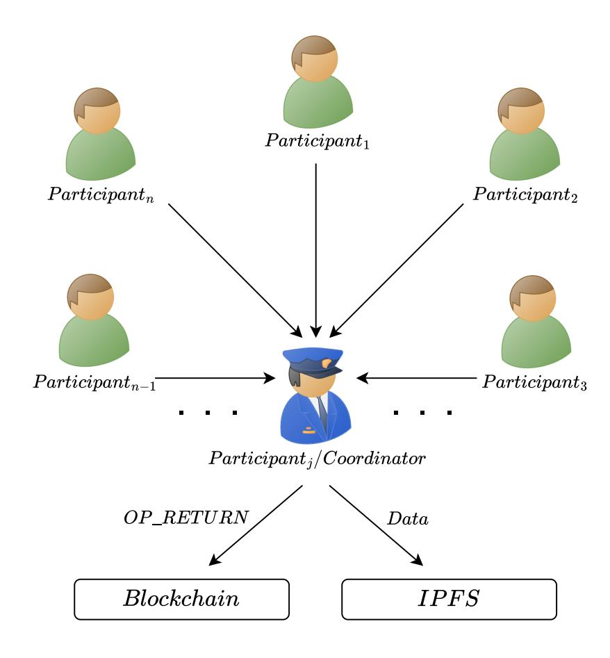
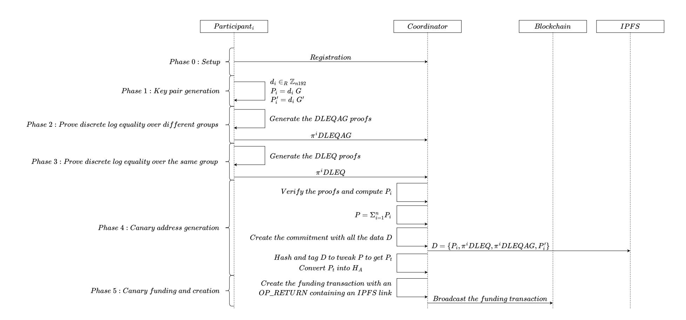

{0}------------------------------------------------

# QCAP: A QUANTUM CANARY ADDRESS GENERATION PROTOCOL

Ghazaleh Keshavarzkalhori , Roger Sala-Mimó , Jordi Herrera-Joancomartí , Cristina Pérez-Solà

Dpt. of Information and Communications Engineering Autonomous University of Barcelona Spain {Ghazaleh.Keshavarzkalhori, Roger.Sala, Jordi.Herrera, Cristina.Perez}@uab.cat

# ABSTRACT

The advent of quantum computing poses a fundamental threat to classical cryptographic assumptions. While algorithms such as RSA and Elliptic-Curve Cryptography are secure against classical adversaries, they would be efficiently broken by a sufficiently powerful quantum adversary. Yet, despite rapid industrial and academic progress, the timeline for achieving a Cryptographically Relevant Quantum Computer (CRQC) remains uncertain and opaque. In this work, we propose a mechanism to monitor quantum capabilities through economic incentives. We introduce QCAP, a trustless distributed protocol for deploying a quantum canary address alert. QCAP enables the creation of publicly auditable cryptographic challenges whose solutions would reveal the existence of quantum computers capable of breaking the Elliptic Curve Discrete Logarithm problem. The protocol is decentralized, secure, efficient, and verifiable, featuring adjustable difficulty and native Bitcoin compatibility. A proof-of-concept implementation demonstrates the feasibility of QCAP as a Bitcoin-based early-warning system for the emergence of quantum computational power.

*K*eywords Quantum computing, Canary traps, Zero-knowledge proofs, Blockchain, Bitcoin

# 1 Introduction

Modern cryptography rests on mathematical problems that are assumed to be computationally hard for classical computers, such as integer factorization and the discrete logarithm problem. However, this foundation becomes fragile in the presence of quantum computers. A sufficiently powerful quantum adversary could efficiently break RSA, Elliptic-Curve Cryptography (ECC), and other public-key schemes that underpin digital security today.

However, the timeline for such a Cryptographically Relevant Quantum Computer (CRQC) remains deeply uncertain. Some experts suggest that we are decades away, while others claim that the horizon is drastically shorter. As of 2026, major technology companies are advancing along distinct paths toward scalable quantum computing. IBM has achieved 133 qubits with the Heron processor in 2024 and is targeting 2,000 logical qubits with full error correction beyond 2033 (BlueJay) [\[1\]](#page-13-0). Google has advanced quantum computing with its Willow processor, which features 105 qubits and operates within the Noisy Intermediate-Scale Quantum (NISQ) era, where noise still limits performance [\[2\]](#page-13-1). The company's six-stage roadmap aims to scale from hundreds to one million physical qubits while progressively reducing logical error rates, although no timeline estimates are provided for reaching this goal. The University of Science and Technology of China's Zuchongzhi 3.0 processor, also featuring 105 transmon qubits, represents another major effort in the field, albeit with a less transparent long-term development roadmap [\[3\]](#page-13-2). D-Wave continues to refine its 5,000-qubit Advantage system—the world's largest quantum annealer—optimized for specialized optimization problems rather than universal quantum computation [\[4\]](#page-13-3). Meanwhile, Microsoft pursues a topological approach with its Majorana 1 processor, aiming to achieve scalable, fault-tolerant quantum systems rather than focusing on short-term qubit count expansion [\[5\]](#page-13-4).

These technological divergences, coupled with the highly specialized nature of the field, make it exceedingly difficult to evaluate predictions regarding quantum computing progress. In addition, structural incentives contribute to a

{1}------------------------------------------------

distorted public perception of the technology's maturity. Academic researchers compete for funding and recognition, industry stakeholders seek investment and media attention, and markets tend to reward narratives that emphasize imminent breakthroughs. Governments, meanwhile, often prioritize secrecy in matters related to quantum capabilities. Collectively, these factors render the true state of quantum computing development opaque and difficult to assess objectively.

This epistemic uncertainty has led to a precautionary mobilization. Governments, standards bodies, and private actors are investing heavily in Post-Quantum Cryptography (PQC), a family of schemes designed to remain secure even in the quantum era. In practice, however, it is difficult to justify the cost of a full-scale transition when the threat remains hypothetical and its timeline unknowable.

In this work, we propose a complementary approach: we suggest continuously monitoring the emergence of quantum capabilities through a verifiable, decentralized mechanism. Inspired by the canaries once carried by miners to detect toxic gases, we design a quantum canary alert as a publicly auditable challenge deployed on the Bitcoin blockchain and incentivized by Bitcoin itself. The quantum canary alert acts as an early-warning system: if a quantum computer capable of solving specific cryptographic tasks emerges, it will be able to claim the reward, thereby revealing its existence. This approach makes use of Bitcoin's transparency and economic incentives to provide a practical, self-sustaining signal of quantum progress, without requiring centralized trust or premature migration.

The contribution of this paper is thus the design, analysis and proof-of-concept implementation of a Quantum Canary Address Generation Protocol (QCAP), a trustless distributed protocol for constructing a canary trap for quantum computers. The proposed protocol operates in a decentralized manner, requiring no central authority or trusted third party. It features an adjustable difficulty mechanism and is natively compatible with Bitcoin. QCAP ensures security, transparency, and verifiability, guaranteeing that no participant gains a computational or informational advantage over others. Furthermore, the protocol achieves practical efficiency by employing specialized cryptographic primitives proving the correctness of the decentralized processing instead of general-purpose zero-knowledge proofs, significantly reducing computational overhead while preserving strong security guarantees.

In this paper, we begin in Section 2 by reviewing the foundational concepts that inform the design of QCAP. Section 3 then delves into the structure of QCAP and the specific problem it addresses. In Section 4, we describe the mechanism by which a CRQC can claim the funds secured by QCAP. Section 5 presents a detailed security analysis of the protocol. Finally, we conclude the paper by outlining the implementation details in Section 6 and exploring potential directions for future research in Section 7.

# <span id="page-1-0"></span>2 Preliminaries

In this section, we review the main protocols our proposal is based on, and provide some background on the directions that are taken for solving the Elliptic Curve Discrete Logarithm Problem (ECDLP) regarding the developments of quantum computers.

#### <span id="page-1-2"></span>2.1 Discrete Logarithm Equality (DLEQ)

The Discrete Logarithm Problem (DLP) is a well-studied computationally hard problem that underpins the security of many classical public-key cryptosystems. Let  $\mathbb{G}$  be a finite cyclic group of order q with generator g. Given an element  $h \in \mathbb{G}$ , the DLP is defined as the problem of finding an integer  $x \in \mathbb{Z}_q$  such that  $h = g^x$ .

Although computing h from g and x is efficient, the inverse operation—recovering x from g and h—is believed to be computationally intractable for appropriately chosen groups.

The intractability of the DLP serves as the security foundation for several widely deployed cryptographic primitives, including *Diffie–Hellman key exchange* [6], *ElGamal encryption* [7], and elliptic-curve-based systems such as *Koblitz's construction* [8]. In these schemes, the secrecy of the private key or shared secret relies on the fact that, given only a group element (or an elliptic curve point) generated through exponentiation, there exists no known polynomial-time algorithm to efficiently recover the underlying exponent without solving the DLP.

In many use cases, such as credential linking, it is necessary to show that two identities, public keys, were created from the same secret, without disclosing the secret. Chaum-Pedersen address this need in their work [9] for cyclic groups of the same order, proving two distinct public values generated using two different generators of the same group have the same secret. The same approach can be applied to elliptic curves for the ECDLP, targeting that in an elliptic curve E

<span id="page-1-1"></span>Although multiplicative notation reflects more clearly the naming of "discrete logarithm problem", from now on we will use additive notation H = xG.

{2}------------------------------------------------

over a finite field,  $\mathbb{F}_p$ , and a scalar field,  $\mathbb{Z}_q$ , with q being the order of its generators G and H, a prover can prove to a verifier that P = xG and Q = xH were generated with the same secret value x. This can be done using the protocol depicted in Figure 1.

| Prover Input: x               |                               |
|-------------------------------|-------------------------------|
| Choose $r \in_R \mathbb{Z}_q$ |                               |
| R = rG                        |                               |
| R' = rH                       |                               |
|                               | Receive $R, R'$               |
|                               | Choose $c \in_R \mathbb{Z}_q$ |
| $z = r + c \cdot x \mod q$    |                               |
|                               | Receive $z$ and verify:       |
|                               | zG = R + cP                   |
|                               | zH = R' + cQ                  |

<span id="page-2-0"></span>Figure 1: Protocol for equality of discrete logarithm.

As can be seen, this protocol is interactive which can easily be converted to a non-interactive one using Fiat-Shamir [10] heuristics while securely proving the same secret belongs to P and Q.

### <span id="page-2-2"></span>2.2 Discrete Logarithm Equality Across Groups (DLEQAG)

The discrete logarithm equality protocol discussed in Section 2.1 is bounded to prove equality for elements in the same group, so a different approach has to be taken to prove discrete logarithm equality across different groups. To that end, Chase *et alter* [11] proposed a protocol that proves equality of two Pedersen committed values across different groups.

Their proposal defines a group  $\mathbb{G}_p$  of prime order p, with two generators G, H such that the discrete logarithm of H to the base G is not known to anyone; and another group  $\mathbb{G}_q$  with a different prime order q (WLOG, assume q < p), with two generators G', H' such that the discrete logarithm of H' to the base G' is not known to anyone. Then, their protocol allows a Prover to prove in front of a Verifier that the committed value x included in the Pedersen commitment  $X = xG + rH \in \mathbb{G}_p$  is the same than the committed value x' = x included in the Pedersen commitment of the other group,  $X' = x'G' + r'H' \in \mathbb{G}_q$ . Notice that although  $x \in \mathbb{Z}_p$ , x < q.

The protocol is based on three main parameters  $b_x$ ,  $b_c$  and  $b_f$  which are the size (in bits) of different elements.  $b_x$  is the size of the committed value x, so  $b_x < \lceil log_2(q) \rceil$ .  $b_c$  is the size of the challenge used in the protocol. A larger  $b_c$  means that an adversary has a smaller chance of faking a proof without knowing x. Finally,  $b_f$  is the parameter that controls the probability of aborts of the protocol. Since those parameters need to hold the following inequality  $b_x + b_c + b_f < \lceil log_2(q) \rceil$ , the allowed size of the committed value x will be much smaller than q, the order of the smaller group. This restriction implies that if we need to prove DLEQ over any element, x, of the smaller group, we have to divide x into different chunks that fit the needed sizes for desired  $b_x$ ,  $b_c$  and  $b_f$ . Such approach is the one that we follow in our protocol.

The protocol description is provided in Figure 2. Notice that the protocol requires  $\pi_{RG}$  as the input for the Verifier, where  $\pi_{RG}$  is a range proof generated by P that proves that x is smaller than  $b_x$  bits. Recall that, similarly to the DLEQ protocol, the DLEQAG is an interactive protocol between the prover and the verifier that can be transformed into a non-interactive protocol also using the Fiat-Shammir approach [10].

### 2.3 Elliptic Curves with lower security parameters

Several standards offer curves with lower security levels than recommended for standard security, including those by Brainpool, Certicom (SEC 2), and NIST.

<span id="page-2-1"></span><sup>&</sup>lt;sup>2</sup>Through the rest of the paper we will denote by prime in the letter both the points of the smaller group and the integers of  $\mathbb{Z}_q$ .

{3}------------------------------------------------

```
Prover Verifier
Input: x, r, r′
                                                          Input: πRG, X, X′
Choose:
 k ∈R {0, . . . , 2
               bx+bc+bf − 1}
 t ∈R {0, . . . , p − 1}
 t
  ′ ∈R {0, . . . , q − 1}
K = kG + tH
K′ = kG′ + t
              ′H′
                                                          Receive (K, K′
                                                                          )
                                                          Choose
                                                          c ∈R {0, . . . , 2
                                                                         bc − 1}
Receive c
Verify c ∈ {0, . . . , 2
                  bc − 1}
z = k + c · x (over Z)
s = t + c · r (mod p)
s
 ′ = t
     ′ + c · r
             ′
               (mod q)
 If z /∈ {2
          bx+bc
               , . . . , 2
                      bx+bc+bf − 1},
then abort
                                                          Receive (z, s, s′
                                                                          )
                                                          Verify:
                                                          zG + sH ?= K + cX
                                                          zG′ + s
                                                                  ′H′
                                                                       ?= K′ + cX′
                                                          z ∈ {2
                                                                 bx+bc
                                                                      , . . . , 2
                                                                             bx+bc+bf − 1}
                                                          Verify(πRG)
                                                                        ?= T rue
```

<span id="page-3-0"></span>Figure 2: Protocol for equality of committed values across groups (DLEQAG), from [\[11\]](#page-14-5).

The NIST standard (FIPS PUB 186-4, 2013) [\[12\]](#page-14-6) defines five elliptic curves over Z<sup>p</sup> with prime sizes of 192, 224, 256, 384, and 521 bits. Curves are named using the prefix P-, indicating their definition over prime fields. These curves were generated using a verifiably random algorithm with SHA-1 as the hash function.

NIST curves share certain characteristics: the coefficient a = −3, which optimizes point addition in common coordinate systems, and quasi-Mersenne primes, which facilitate efficient modular reduction. All five curves have a cofactor h = 1. Examples of smaller curves in this set include P-192 and P-224.

The Brainpool standard [\[12\]](#page-14-6), published in 2005, defines a set of elliptic curves known as the Brainpool Standard Curves and Curve Generation. It includes seven curves, among which brainpoolP160r1, brainpoolP192r1, and brainpoolP224r1 are of particular interest for reduced security configurations. Unlike NIST curves, Brainpool curves avoid using quasi-Mersenne primes and also rely on verifiably pseudo-random generation methods. This decision avoids patent issues related to fast arithmetic algorithms and makes them less efficient.

Brainpool curve names follow a consistent format: the prefix brainpool, followed by a P indicating the use of a prime field Zp, a number specifying the prime size, a letter r denoting a random curve, and a sequence number.

Certicom's SEC 2 standard (version 2.0, 2010) [\[12\]](#page-14-6) describes eight elliptic curves over Z<sup>p</sup> using prime field sizes of 192, 224, 256, 384, and 521 bits. For each size (except 384 and 521), two types of curves are offered: verifiably pseudo-random (denoted r) and Koblitz curves (denoted k). Examples of smaller ones include secp192k1, secp192r1, secp224k1, and secp224r1.

The Koblitz curves over Z<sup>p</sup> are defined using parameters that allow efficient point doubling. The ones included in this standard have been selected by iteratively searching for efficient parameters until a curve of prime order is found.

{4}------------------------------------------------

### 2.4 Solving ECDLP

When dealing with elliptic curves, solving the ECDLP refers to finding the field element  $x \in \mathbb{Z}_q$  such that P = xG, where G is a fixed point of the curve and P another element of the curve. ECDLP being a computationally hard problem, many cryptographic schemes hide secret values as the value used to generate a public point P to make it computationally infeasible for any entity to get access to the secret x.

Classical, non-quantum, algorithms attempt to find x in an efficient manner according to the size, q, of the scalar field  $\mathbb{Z}_q$ . The naive method of doing so would be to try all points generated by field elements, to distinguish x.

Shanks' algorithm [13] enhances the efficiency of this attempt by searching for points that would add up to P for which we know the corresponding discrete logs. Doing so reduces the search for x to only  $\sqrt{q}$ , making the search much more efficient. Although this effort reduces the search to only the square root of the size of the field, the storage needed for the algorithm is of order  $O(\sqrt{q})$ . Pollard's rho-algorithm [14], on the other hand, removes the need for such big storage and guarantees to find x with  $\sqrt{q}$ . This is done by choosing a random function having the same domain and range. During each iteration of Pollard's algorithm, one field element is transformed into another, which is subsequently tested for potential collisions.

A variety of alternative methods have been developed to enhance the efficiency of solving the ECDLP in classical computation, as comprehensively discussed by Hankerson et al. [15]. These algorithms are still computationally heavy for processing secure curves.

Quantum algorithms reduce the computational complexity of solving the ECDLP from exponential to polynomial time, effectively decreasing the estimated runtime from millions of years on classical hardware to minutes or hours on a sufficiently powerful and fault-tolerant quantum computer. The first quantum algorithm to address this line of work, was Shor's algorithm [16] reducing the integer factoring problem to finding the period of a function and computing the period using quantum Fourier transform. Following Shor's path, many algorithms have been developed to enhance the efficiency of the computations as well as broadening these computations to the elliptic curves and ECDLP.

The capability of the quantum computers to solve ECDLP on a curve is directly affected by the characteristics of the curve as well as the number of classical and quantum bits they have. Below, we summarize recent estimates reported in the literature [17].

A 2022 study from the University of Sussex estimates that breaking secp256k1 within 1 to 8 hours would require between 13 and 300 million physical qubits, depending on system specifications [18]. Similarly, Webber et al. [19] estimate approximately 317 million physical qubits are needed for a one-hour attack, assuming a surface code with a 1  $\mu$ s cycle time and a gate error rate of  $10^{-3}$ . If the attack duration is extended to one day, this number drops to about 13 million physical qubits.

Kudelski Security provides more conservative figures, suggesting at least 2,619 logical qubits and roughly 7.43 million physical qubits would be needed to complete an attack within 24 hours under similar error rates [20]. An independent cryptographic analysis estimates between 1,500 and 3,000 logical qubits could solve the ECDLP in under 10 minutes under ideal conditions, which corresponds to millions of physical qubits when accounting for error correction overhead [21].

Despite these varied estimates, the feasibility of such an attack remains remote given current quantum technology. Mara [22] estimates that around 6,000 qubits would be needed to threaten secp256k1 within five years—well beyond the capabilities of today's devices, which typically have around 100 qubits. Multiple sources confirm that practical quantum attacks require large-scale, fault-tolerant quantum computers, which remain technologically out of reach in the near term [23].

It is important to keep in mind the distinction between the security of elliptic curves against classical and quantum algorithms. In the classical setting, selecting randomness from a smaller range within a curve with a bigger group reduces the overall security to that of the smaller range, rather than the full group size. In contrast, the strength of quantum algorithms depends solely on the curve's characteristics and not the randomness creating the points.

### <span id="page-4-0"></span>2.5 Zero-Knowledge Proofs

Zero-knowledge proofs first introduced by Goldwasser et al. [24] are probabilistic proofs of knowledge sent from a prover to a verifier to prove a claim. The protocol ensures soundness, correctness, and zero-knowledge as defined below.

**Soundness** A cheating prover can not convince the verifier of a false statement except with negligible probability.

**Completeness** A verifier adhering to the protocol can not reject a correct proof except with negligible probability.

{5}------------------------------------------------

Zero-knowledge The protocol ensures that no knowledge other than the truth of the statement is leaked to the verifier.

Although many protocols, including the ones explained in Sections [2.1](#page-1-2) and [2.2,](#page-2-2) fit the definition for zero-knowledge proofs, the term *zero-knowledge proofs* is often used to refer to more modern and efficient constructions such as zkSNARKs [\[25\]](#page-14-19), zkSTARKs [\[26\]](#page-14-20), and Bulletproofs [\[27\]](#page-14-21).

Zero-Knowledge Succinct Non-interactive Arguments of Knowledge (zkSNARK) are small or succinct proofs proving arbitrary claims to a verifier needing only one message to be communicated between the prover and the verifier. Any arbitrary claim using zkSNARKs is first transformed into arithmetic circuits and then committed and proved using witnesses to the generated circuit. The commitment schemes used in zkSNARKs need a trusted setup phase resulting in computing a common reference string using a secret value which must be dumped correctly for the proofs to be sound. To mitigate such a constrain, a distributed setup [\[28\]](#page-14-22) can be used to lower the chances of compromise in the setup phase.

In comparison to zkSNARKs, Zero-Knowledge Scalable Transparent Arguments of Knowledge (zkSTARKs) do not need a trusted setup. zkSTARKs rely on trace tables rather than arithmetic circuits and use Merkle-tree commitments instead of polynomial commitments, which makes them transparent and eliminates the need for trusted parameters. However, the proofs generated by STARKs are much larger than SNARKs as well as their load on the verifier.

Bulletproofs, by contrast, cannot be used for arbitrary claims; they are used to prove that a committed value lies within a specified range. They smartly craft Pedersen commitments to prove the range of values by transforming these value into their bit representation. Similar to zkSTARKs, Bulletproofs do not require a trusted setup. Notably, Bulletproofs achieve substantially higher efficiency in range-proof verification than other general-purpose zero-knowledge constructions.

# <span id="page-5-0"></span>3 Protocol description

The aim of QCAP is to build a canary trap for Cryptographically Relevant Quantum Computers (CRQCs) that can signal when a quantum computer becomes capable of solving the ECDLP on smaller curves, indicating that it may soon be able to attack real-world sized curves. In this paper, we instantiate the smaller curve with secp192r1.

## 3.1 Overview

QCAP is a distributed protocol that builds a Bitcoin transaction output which contains funds that can be redeemed by solving the ECDLP at the security level of secp192r1.

Here, we first present an informal overview of the protocol design. Then, the rest of the section delves deeper into technically introducing the problem QCAP is solving, concluding with the complete formal specification of the protocol.

QCAP's goal is to generate a collaboratively computed address to lock the bounty for the CRQC. To prevent any participant from unilaterally recovering the funds from the canary address, each participant generates an independent random secret key that collectively contributes to the final canary secret. This collaborative generation of the canary address guarantees that, with at least one honest participant, no coalition gains an advantage in recovering the private key and spending the locked funds. Figure [3](#page-6-0) shows how the participants interact with each other to construct the private key. To minimize the number of communication rounds, one participant acts as a coordinator to facilitate the process. It is worth noting that the coordinator can be replaced at any time in the event of malicious behavior or network failure.

Moreover, the protocol must intentionally reduce the hardness of the ECDLP from the standard secp256k1 level to that of secp192r1 while preserving compatibility with the Bitcoin elliptic curve. To achieve this, a public key on the weaker curve is constructed to share the same underlying secret key as the canary address' Bitcoin public key. The protocol enforces consistency so that participants cannot deviate by using mismatched secrets when generating the two public keys. Consequently, breaking the ECDLP on the weaker secp192r1 curve reveals the private key corresponding to the Bitcoin's public key, thereby enabling the retrieval of the locked funds.

Table [1](#page-6-1) provides the notation used throughout the paper. Notice that capital letters will refer to points in curve secp256k1 and prime capital letters will refer to points in curve secp192r1.

# <span id="page-5-1"></span>3.2 Motivation and problem statement

The goal of the protocol is to obtain a collaboratively-computed Bitcoin public key, P ∈ G256, together with a weaker public key, P ′ ∈ G192, such that:

1. P = P<sup>n</sup> <sup>i</sup>=1 P<sup>i</sup> , with P<sup>i</sup> = diG, where each d<sup>i</sup> is a secret generated by participant i.

{6}------------------------------------------------



Figure 3: QCAP entities and their connections.

<span id="page-6-0"></span>

| $\mathbb{G}_{256}, \mathbb{G}_{192}$         | secp256k1 and secp192r1 groups                                                                   |
|----------------------------------------------|--------------------------------------------------------------------------------------------------|
| G, G'                                        | Generators from $\mathbb{G}_{256}$ , $\mathbb{G}_{192}$                                          |
| H,H'                                         | Generators from $\mathbb{G}_{256}$ , $\mathbb{G}_{192}$ , where $H \neq G$ and $H' \neq G'$      |
| $n_{256}, n_{192}$                           | Order of the groups $\mathbb{G}_{256}$ and $\mathbb{G}_{192}$                                    |
| $\begin{array}{c} d_i \ \hat{d} \end{array}$ | Private key of participant $i$ , an element of $\mathbb{Z}_{n_{256}}$ and $\mathbb{Z}_{n_{192}}$ |
| $\hat{d}$                                    | The overall secret key obtained from the protocol                                                |
| $P_i, P'_i$                                  | Public key of participant $i$ in $\mathbb{G}_{256}$ and in $\mathbb{G}_{192}$                    |
| $X_i, \check{X_i'}$                          | Overall commitment to private key $d_i$ in secp256k1 and secp192r1 correspondingly, created      |
|                                              | from the commitments to the private key chunks                                                   |
| $C_j, C_j'$                                  | Commitment to the $j^{th}$ chunk of the private key in secp256k1 and secp192r1                   |
| $\pi_{RG}$                                   | Zero-knowledge proof of a secret value fitting in a predefined range                             |
| $\pi_{DLEQAG}$                               | Zero-knowledge proof of two points sharing the same secret across secp256k1 and secp192r1        |
| $\pi_{DLEQ}$                                 | Zero-knowledge proof of two points sharing the same secret                                       |
| $H_A$                                        | Final Bitcoin canary address                                                                     |
| $P_t$                                        | The tweaked public key with the commitments to the public data for the taproot address           |
|                                              | generation                                                                                       |

<span id="page-6-1"></span>Table 1: Notation

2.  $P = \hat{d}G$  and  $P' = \hat{d}G'$ , where  $\hat{d} = \sum_{i=1}^{n} d_i$  over the integers. Notice that this condition forces that the length of the Bitcoin private key is bounded by  $n_{192}$ .

Ensuring the **first condition** is straightforward. Each participant publicly shares his public key  $P_i$  and the coordinator adds up all the public keys to obtain P. Participants can indeed verify that their public key has been incorporated by independently recomputing the aggregated sum.

To ensure the **second condition**, that is, both public keys from the two different curves have the same private key, requires more work. First, participants compute the weakened public key (secp192r1) corresponding to their Bitcoin public key (secp256k1) as  $P'_i = d_iG'$ , so that:

$$P' = \sum_{i=1}^{n} P_i' = \hat{d}G'$$

{7}------------------------------------------------

Secondly, participants provide proofs for verifying that their weakened public keys correspond to their Bitcoin keys, that is, they have been generated from the same secret key. To this end, QCAP makes use of two different schemes: DLEQ [9], that provides the discrete logarithm equality within the same group (see Section 2.1) and **DLEQAG** [11] that provides DLEQ across groups (see Section 2.2).

First, each participant,  $i \in (1, \dots, n)$ , follows DLEQAG scheme. Such scheme allows to prove that for public (known) generators G, G', H, H', given two committed points,  $X_i, X_i'$ , the following equations hold:

$$X_i = d_i G + r_i \cdot H$$
$$X'_i = d_i G' + r'_i \cdot H'$$

That is, participants prove that the same secret  $d_i$  has been used to compute two points,  $X_i$  and  $X'_i$ , that belong to different curves (secp256k1 and secp192r1).

Secondly, each participant,  $i \in (1, \dots, n)$  follows DLEQ twice, to prove the relation between the previously committed points and the public keys. That is, for the Bitcoin curve, participants prove the following relationship between  $X_i$  and  $P_i$ :

$$P_i = d_i G$$
$$X_i = d_i G + r_i \cdot H$$

and analogously for the weaker curve:

$$P'_i = d_i G'$$
$$X'_i = d_i G' + r'_i H'$$



<span id="page-7-0"></span>Figure 4: Flow diagram of the protocol. The diagram shows the interaction between the entities as well as the information exchanged between each one of them.

# 3.3 Description of the protocol

We divide our protocol into different phases carried out chronologically and by different entities. The following subsections aim to explain in detail what steps each phase contains and a general overview of the protocol is depicted in Figure 4.

{8}------------------------------------------------

#### **3.3.1 Phase 0: Setup**

QCAP bounds the number of participants generating the private key to make sure values in both secp256k1 and secp192r1 are coherent.<sup>3</sup> The setup phase hence is used to register the participants and to force that the private key of each participant,  $d_i$ , fits the  $(0, \frac{n_{192}}{\log_2 n})$  interval (with n denoting the total number of participants in the protocol).

Note that no additional setup procedure is required, as QCAP avoids the use of zkSNARKs and therefore does not require a distributed setup among registered participants.

## 3.3.2 Phase 1: Key pair generation

Each participant,  $i \in (1, \dots, n)$ , independently generates a random private key,  $d_i$ , and then computes its corresponding Bitcoin and weakened public keys:

- Choose:  $d_i \in_R \mathbb{Z}_{n_{192}}$
- Compute:  $P_i = d_i G$  $P'_i = d_i G'$

### 3.3.3 Phase 2: Proving secret equality over different groups

To prove that two secrets committed across different groups are equal, each participant  $i \in (1, \dots, n)$ , makes use of a variant of the DLEQAG protocol by Chase *et alter* described in Section 2.2, adapted to work in a non-interactive setting using Fiat-Shamir heuristics [10] and to handle 192-bit secrets when working with a 192-bit curve. It's noteworthy that for DLEQAG to work, an additional range proof,  $\pi_{RG}$ , must be provided by the prover. For efficiency purposes, QCAP uses bulletproofs to implement this range proof.

The DLEQAG defines three parameters,  $b_x$ ,  $b_c$ ,  $b_f$ , determining the size in bits of different elements of the protocol and a failure rate such that, in our case,  $b_x + b_c + b_f < 192$ . For the instantiation of our protocol and to simplify the notation, we have chosen  $b_x = 64$ ,  $b_c = 124$  and  $b_f = 3$ , although these parameters can be adjusted to further tune the protocol.

 $b_x$  being the size in bits of the secret element for which the DLEQAG proves equality, it is clear that the selection of  $b_x = 64$  does not fit the total 192 bits of scalars in secp192r1. To overcome this drawback, we divide private keys of participants in l = 3 chunks of 64 bits, to ensure they match with the size of the elements of DLEQAG protocol. This implies that the range proof is also provided for each of the chunks, requiring 3 range proofs in total for the recommended setting.

All next steps described in Phase 2 are performed for each participant in the protocol  $i \in (1, \dots, n)$  and, to simplify notation, in the description of this phase we omit the participant index i and refer to  $d_i$  as d, that is  $d_i = d$ 

**Step 1:** The secret key d of the participant is partitioned into l=3 chunks of 64 bits, such that:

$$d = 2^{128} \cdot d^{(2)} + 2^{64} \cdot d^{(1)} + d^{(0)}$$

where  $d^{(0)}, d^{(1)}, d^{(2)} \in \{0, 2^{64} - 1\}.$ 

**Step 2:** Participants commit to each chunk,  $d^{(j)}$ , for  $j \in (0, 1, \dots, l-1)$ , of their private key in both curves obtaining commitments X and X' as follows:

• For  $j \in (0, 1, \dots, l-1)$ :

- Choose:  $r_{j} \in_{R} \mathbb{Z}_{n_{256}}$   $r'_{j} \in_{R} \mathbb{Z}_{n_{192}}$ - Compute:  $C_{j} = d^{(j)}G + r_{j}H$   $C'_{j} = d^{(j)}G' + r'_{j}H'$ 

<span id="page-8-0"></span><sup>&</sup>lt;sup>3</sup>This implies that performing additions on the smaller curve does not result in arithmetic overflow within its finite field, thereby preventing any inconsistency between the final private keys derived on the two curves.

{9}------------------------------------------------

• Compute:  $X = \sum_{j=0}^{l-1} C_j 2^{64 \cdot j}$ 

• Compute:  $X' = \sum_{j=0}^{l-1} C'_j 2^{64 \cdot j}$ 

Notice that, by construction, it holds that:

$$X = dG + rH$$
$$X' = dG' + r'H'$$

where 
$$r = \sum_{j=0}^{l-1} r_j$$
 and  $r' = \sum_{j=0}^{l-1} r'_j$ .

**Step 3:** Participants demonstrate that each corresponding chunk of their commitments are constructed from the same secret on both curves.

• For 
$$j \in (0, 1, \dots, l-1)$$
:

- Choose:
$$k_j \in_R \{0, \dots, 2^{b_x + b_c + b_f} - 1\}$$

$$t_j \in_R \mathbb{Z}_{n_{256}}$$

$$t'_j \in_R \mathbb{Z}_{n_{192}}$$
- Compute:
$$K_j = k_j G + t_j \cdot H$$

$$K'_j = k_j G' + t'_j H'$$

$$e = hash(K_j, K'_j, C_j, C'_j)_{[1, \dots, b_c]}^4$$

$$z_j = k_j + e \cdot d^{(j)} \quad \text{(in } \mathbb{Z})$$

$$s_j = t_j + e \cdot r_j \pmod{n_{256}}$$

$$s'_j = t'_j + e \cdot r'_j \pmod{n_{192}}$$

Over completion of the previous 3 steps, participants check that:

$$z_i \in \{2^{b_x + b_c}, \dots, 2^{b_x + b_c + b_f} - 1\}$$

If any of the conditions do not hold, the participant repeats the execution of steps 1, 2 and 3.

Upon meeting the mentioned conditions, participants send to the coordinator their proof for the validity of their parameters across the curves,

$$\pi_{DLEQAG} = \{(C_j, C'_j, K_j, K'_j, s_j, s'_j, z_j, \pi^j_{RG}\}_{j=0}^{l-1}$$

where  $\{\pi_{RG}^j\}_{j=0}^{l-1}$  are the range proofs for each commitment indicating the secret values have  $b_x$  bits, as well as checking if private key belongs to the previously set range,  $(0, \frac{n_{192}}{\log_2 n})$ .

# 3.3.4 Phase 3: proving discrete log equality over the same group

The proofs from the previous phases verify that the generated commitments on the two different curves correspond to the same secret, but the values creating the keys in the protocol are the public keys  $P_i$  and  $P_i'$ . Hence it is crucial for each participant i to prove their commitments are as well generated from the same secret connecting their  $P_i$  and  $P_i'$  to their commitments  $X_i = \sum_{j=0}^{l-1} C_j 2^{j \cdot 64}$  and  $X_i' = \sum_{j=0}^{l-1} C_j' 2^{j \cdot 64}$ , correspondingly (as mentioned in Section 3.2).

For this cause, the protocol uses **DLEQ** from Section 2.1 but between a commitment and a point.

• Choose:  $k \in_R \mathbb{Z}_{n_{256}}$   $t \in_R \mathbb{Z}_{n_{256}}$ 

• Compute: 
$$R_1 = kG$$
$$R_2 = kG + tH$$

<span id="page-9-0"></span><sup>&</sup>lt;sup>4</sup>The challenge e used for the proof is the first  $b_c$  bits of the hash of the parameters.

{10}------------------------------------------------

$$e = hash(X_i, P_i, R_1, R_2, G, H)$$
  

$$\sigma = k + e \cdot d$$
  

$$\delta = t + e \cdot r$$

Upon completing the previous steps, each participant sends<sup>5</sup>  $\pi_{DLEQ} = (R_1, R_2, \sigma, \delta, R'_1, R'_2, \sigma', \delta')$  to the coordinator as proof for the correction of the commitment process based on the submitted public keys on each curve.

### 3.3.5 Phase 4: Canary address generation

Before accepting participants' public keys, the coordinator verifies all submitted proofs and only considers the keys whose proofs are successfully validated. The coordinator will first validate the range proofs,  $\{\pi_{RG}^j\}_{j=0}^{l-1}$ , for all the chunks of the secret key for each participant. Upon verification it will check the equality of the secret for each chunk among the two different curves as below:

• For  $j \in (0, 1, \dots, l-1)$ :

- Compute:  $e = hash(K_j, K'_j, C_j, C'_j)_{[1, \dots, b_c]}$ - Check:  $z_j \in \{2^{b_x + b_c}, \dots, 2^{b_x + b_c + b_f} - 1\}$   $z_j G + s_j H \stackrel{?}{=} K_j + eC_j$   $z_j G' + s'_j H' \stackrel{?}{=} K'_j + eC'_j$ 

It will then go on to check if the public key and the commitments are derived from the same secret first generating the challenges as  $e = hash(X_i, P_i, R_1, R_2, G, H), e' = hash(X'_i, P'_i, R'_1, R'_2, G', H')$  and then checking the proofs as below:

$$\sigma G \stackrel{?}{=} R_1 + eP$$

$$\sigma G + \delta H \stackrel{?}{=} R_2 + eX$$

$$\sigma' G' \stackrel{?}{=} R'_1 + e'P'$$

$$\sigma' G' + \delta' H' \stackrel{?}{=} R'_2 + e'X'$$

If all validations are correct, the coordinator retrieves each participant Bitcoin curve  $P_i$  for  $i \in (1, \dots, n)$ , and aggregates them into a single public key  $P = \sum_{i=1}^{n} P_i$  via elliptic curve point addition.

Then the coordinator creates a commitment with all the protocol's data. This includes all information received from each participant:

$$\mathbf{D} = \{P_i, \pi_{DLEQ}^i, \pi_{DLEQAG}^i, P_i'\}$$

for 
$$i \in (1, \dots, n)$$
.

All this data is hashed and tagged to produce a scalar taproot tweak, which is then used to modify P resulting in the tweaked public key  $P_t$  [29]. This public key is then converted into the final canary address  $H_A$ , which will be the address where the funds will be sent. Tweaking a public key is the way to commit our protocol's data into the aggregated public key and keep it spendable with knowledge of the original private key and the tweak.

### 3.3.6 Phase 5: Canary Address funding and creation

The coordinator will then create the initial funding transaction, including an OP\_RETURN [30] output containing a link to all the public information and proofs on the IPFS.

<span id="page-10-0"></span><sup>&</sup>lt;sup>5</sup>For the sake of simplicity, we have only detailed the proof for the bigger curve but the same is applied on the smaller curve obtaining values  $R'_1, R'_2, \sigma', \delta'$ .

{11}------------------------------------------------

# <span id="page-11-0"></span>4 Redemption of the funds

QCAP properties ensure that if only one participant is honest, no participant will have any advantage over the others, nor will non-participants have any advantage in obtaining the private key  $\hat{d}$  corresponding to the tweaked public key  $P_t$  that generates the canary address  $H_A$ . If the funds are moved, it indicates a high probability of a CRQC involvement, the discovery of a new algorithm to solve the ECDLP with a standard computer, or even someone extremely lucky who managed to compute the private key. Although being impossible to determine which of the scenarios occurred, we can be confident that no participant had any advantage over the others, which is the key point of the proposed protocol. Having a sufficiently large amount of participants in the protocol makes it highly probable that at least one will be honest.

In a hypothetical future scenario with an existing CRQC capable of solving the ECDLP on secp192r1, a quantum-capable actor may encounter the canary trap and find it worthwhile to attempt. The quantum-capable actor would first observe the initial funding transaction containing an OP\_RETURN output, which includes a link to the corresponding information stored on IPFS. By examining all data associated with the protocol, the actor can verify all proofs and confirm that the canary address  $H_A$  was generated through a transparent and verifiable process. Upon completing this verification, the actor can apply Shor's algorithm to recover the private key  $\hat{d}$  corresponding to  $P' \in \mathbb{G}_{192}$ , which will be identical to the private key  $\hat{d}$  associated with  $P \in \mathbb{G}_{256}$ . Once obtained, this private key can be adjusted and used to spend the funds held in the canary trap.

# <span id="page-11-1"></span>5 Protocol analysis

This section provides an analysis of the security of the protocol by examining possible attack scenarios and their corresponding defense mechanisms.

#### 5.1 Adversarial model

QCAP is a distributed protocol consisting of a group of participants and a coordinator facilitating the computations of the protocol. As any other trustless protocol, actors in the protocol may aim to disturb the protocol with different objectives. These objectives can be the following:

### O1. Corrupting canary address:

Any action taken by the malicious entities with the goal of making the final canary address infeasible to be redeemed from the public information.

#### O2. Aborting/blocking the protocol:

Any action taken by a malicious entity aiming the protocol to abort or stuck in a specific phase being unable to continue.

### **O3.** Gaining extra knowledge over d:

Any action with the goal of gaining knowledge on the final secret key the funds are tied to.

#### O4. Reducing data availability:

Any action aiming at making the funds unredeemable by changing the OP\_RETURN information after publication or ultimately making them unavailable.

Accordingly, the potential adversarial actors are defined as entities attempting to achieve one or more of the previously described goals. It's worth to mention that all entities in the protocol are assumed to have access to classical computers and algorithms being computationally bounded.

# **Malicious Participant**

A participant interacting with other participants and the coordinator via sending proofs or information.

# **Malicious Coordinator**

A participant acting as a coordinator carrying out the public key aggregations. It interacts with all the participants querying for information as well as proofs as well.

### **External Observer**

A passive observer of the protocol with access to the public information with no ability to interact or make change with the protocols data.

Notably, the protocol treats a quantum computer capable of solving the ECDLP on the weaker curve not as a malicious entity, but as a legitimate participant or external observer utilizing its computational advantage to redeem the funds.

{12}------------------------------------------------

One should note that the protocol assumes that a quantum computer does not exist while creating the canary address and is only accessing the information after the address is created and funds are sent.

#### **5.2** Attack Scenarios

As we have introduced, attacks to the protocol are done for four general goals: corrupting the canary address, aborting the protocol, gaining extra knowledge over  $\hat{d}$ , or reducing data availability. In this section, we go through the possible scenarios in which malicious actors aim to achieve these goals.

### • O1. Corrupting Canary Address:

- A malicious participant can generate  $P_i$  and  $P'_i$  from different secrets causing mismatch between the secret derived from P' when solving ECDLP on the weaker curve and the secret the funds are locked on. Doing so causes the proofs of **DLEQAG** provided in Phase 2 invalid, hence the attack will be detected, and the corresponding public keys won't be aggregated.
- A malicious participant can select the secret out of the valid range but still smaller than  $n_{192}$ . Due to the difference in the sizes of the scalar fields between secp256k1 and secp256r1, a value larger than  $2^{\log_2 n_{192} \log_2 n} 1$  will cause the aggregation of the public keys to wrap around the smaller field causing mismatch between the secrets of  $P_i$  and  $P_i'$ . This will cause the range proof,  $\pi_{RG}$  of to be invalid, and this the participant's public key rejected (and thus not aggregated into the final public keys).

### • O2. Aborting/Blocking the Protocol:

- A **malicious participant** may deny sending its information in time aiming to disrupt the flow of the protocol. Such participants can simply be ignored and removed from the public key aggregation, as the protocol is not dependent on the submission of all the participants.
- A malicious coordinator denying to carry out the full aggregation or simply going offline, may cause a disruption in the flow of the protocol. The use of a public bulletin board in this case eliminates the need to abort the protocol. In such a case, another participant can simply act as the coordinator, verifying the proofs and aggregating the public keys submitted to the public bulletin board, thus letting the protocol continue as planned.

### • O3. Gaining Extra Knowledge over d:

- A malicious coordinator may request multiple proofs from the participants aiming to retract information on their secret keys. According to [11], knowledge error of the proofs depends on the number of repetitions of the proof generation protocol as well as the value  $b_c$  chosen by the protocol. Participants can easily deny sending proofs if malicious behavior is detected on the verifier's side as well as choosing a sufficiently large  $b_c$  to lower this error as much as needed.

### • O4. Reducing Data Availability:

- An external observer or malicious participant of the protocol may try to make the information unavailable causing the retrieval of the funds impossible. The protocol publishes the information on a decentralized storage, such as IPFS or Zeronet. Therefore, for the attack to be successful, the adversary would need to prevent access to all replicated copies of the data across the decentralized network.

# <span id="page-12-0"></span>6 Implementation

To demonstrate the feasibility and practical applicability of QCAP, we developed a proof-of-concept implementation of the protocol, which is available on GitHub.<sup>6</sup>

In both the theoretical framework and practical implementation, we prioritize computational efficiency and therefore avoid using zkSNARKs and zkSTARKs. While these proofs systems can verify arbitrary computations, they impose limitations depending on the elliptic curve over which the computations are performed. The granularity and flexibility of QCAP depend on the choice of the smaller curves, which may not be compatible with these proof systems. Moreover, zkSNARKs require a trusted setup, introducing additional (undesirable) assumptions and operational overhead. For these reasons, range proofs are implemented using Bulletproofs (recall Section 2.5), and we rely on dedicated protocols for proving **DLEQ** and **DLEQAG** (recall Sections 2.1 and 2.2). This ensures that the QCAP protocol remains independent of the above-mentioned constraints.

<span id="page-12-2"></span><span id="page-12-1"></span><sup>&</sup>lt;sup>6</sup>https://github.com/QCAP-org/QCAP

<sup>&</sup>lt;sup>7</sup>zkSNARKs exhibit a significantly higher sensitivity to the choice of elliptic curve used for their underlying arithmetic operations compared to zkSTARKs.

{13}------------------------------------------------

The proof-of-concept implementation includes the range proofs, implemented as Bulletproofs using Bulletproof-JS [\[31\]](#page-14-25); the DLEQ and DLEQAG proofs, implemented in Python; and the canary address generation and transaction creation for Bitcoin, which is implemented in Python using BitcoinUtils[\[32\]](#page-14-26)

We used our proof-of-concept implementation to execute a full instance of the protocol with ten participants and deployed the corresponding canary trap's transaction on the Bitcoin testnet. The transaction sent to the tweaked aggregated public key is recorded on Bitcoin Testnet4 under transaction ID [ebfcee0b5cd1a54f7079dd058d27a6d87316a](https://mempool.space/testnet4/tx/ebfcee0b5cd1a54f7079dd058d27a6d87316adc42438c6fc05ca64b0234a628c) [dc42438c6fc05ca64b0234a628c.](https://mempool.space/testnet4/tx/ebfcee0b5cd1a54f7079dd058d27a6d87316adc42438c6fc05ca64b0234a628c) The OP\_RETURN field of the transaction embeds the IPFS content identifier (CID) of the file containing all the proofs and public information D contributed by the 10 participants. Any IPFS gateway can be used to retrieve the file using its unique CID: [https://ipfs.io/ipfs/bafybeid356uqgs7mvhotv7mcgfabbk7w7fglg3gctjabcs](https://ipfs.io/ipfs/bafybeid356uqgs7mvhotv7mcgfabbk7w7fglg3gctjabcsh47dym7gu2aa) [h47dym7gu2aa.](https://ipfs.io/ipfs/bafybeid356uqgs7mvhotv7mcgfabbk7w7fglg3gctjabcsh47dym7gu2aa) The file's integrity is verified by computing its SHA-256 hash and comparing it with the tweaking data associated with the transaction's tweaked public key, ensuring that any modification to the file is detectable.

# <span id="page-13-5"></span>7 Conclusions and future Work

This paper introduces a mechanism intended to serve as an early-warning system for the emergence of quantum computational capabilities that could threaten classical cryptographic schemes. We have designed, analyzed, and implemented a proof-of-concept of QCAP, a protocol that constructs a Bitcoin-based canary trap capable of signaling the advent of a quantum-vulnerable cryptographic environment.

QCAP combines decentralization, security, efficiency, and verifiability through a carefully chosen set of cryptographic primitives and subprotocols. Importantly, the protocol is fully compatible with the current Bitcoin specification, enabling immediate deployment on the existing blockchain without requiring modifications. By providing a practical framework to monitor the progression of quantum threats in real time, QCAP represents a proactive approach to safeguarding blockchain systems and other cryptographic infrastructures against future quantum attacks.

The proof-of-concept implementation, developed in Python, employs established cryptographic libraries to develop a complete prototype of the protocol. The solution is structured in modular scripts, each responsible for a specific task within the canary trap deployment and attacker simulation. These include key generation, public key aggregation, secure encryption of private keys, Taproot commitment creation, and eventual retrieval of the private key through a simulated attack.

Although no real quantum computation was executed, the system was designed to simulate how such a threat would operate, employing a weakened elliptic curve as a stand-in for a cryptographic key that could be more readily broken. Testing was conducted on the Bitcoin testnet to verify the functional correctness of each stage of the protocol.

Although the proposed protocol provides an approach to build a Bitcoin canary trap for quantum computers, several aspects can be improved or extended in future work. A key aspect for improvement of the protocol concerns the coordination and exchange of data between participants. Currently, the protocol assumes out-of-band cooperation, and the public key aggregation process is somewhat centralized. A more robust design would involve building or adopting a decentralized system for secure data exchange and coordination. While this falls outside the scope of the current work, it is the correct direction for ensuring full trustlessness and decentralization. Additionally, the final step would be to deploy the canary trap's protocol on the Bitcoin mainnet and encourage the community to contribute funds as donations, working toward the common goal of keeping the network secure.

# Acknowledgements

This work has received support from the projects PID2021-125962OB-C33 SECURING-NET and PID2024-156914OB-C43 SAFE-BLOCKCHAIN, funded by the Ministerio de Ciencia e Innovación, the Agencia Estatal de Investigación and the European Regional Development Fund (ERDF).

# References

- <span id="page-13-0"></span>[1] IBM quantum roadmap, n.d. Accessed: 30 June 2025.
- <span id="page-13-1"></span>[2] Google. Google quantum ai, n.d. Accessed: 30 June 2025.
- <span id="page-13-2"></span>[3] Chinese quantum processor is 1 quadrillion times faster than the best supercomputer — and it rivals google's breakthrough willow chip, n.d. Accessed: 30 June 2025.
- <span id="page-13-3"></span>[4] The advantage™ quantum computer | d-wave, n.d. Accessed: 30 June 2025.
- <span id="page-13-4"></span>[5] News Center Microsoft Latinoamérica. Microsoft presenta Majorana 1, el primer procesador cuántico del mundo impulsado por qubits topológicos. Accessed: 30 June 2025.

{14}------------------------------------------------

- <span id="page-14-0"></span>[6] Whitfield Diffie and Martin E Hellman. New directions in cryptography. In *Democratizing Cryptography: The Work of Whitfield Diffie and Martin Hellman*, pages 365–390. Association for Computing Machinery, 2022.
- <span id="page-14-1"></span>[7] Taher ElGamal. A public key cryptosystem and a signature scheme based on discrete logarithms. *IEEE transactions on information theory*, 31(4):469–472, 1985.
- <span id="page-14-2"></span>[8] Neal Koblitz. Elliptic curve cryptosystems. *Mathematics of computation*, 48(177):203–209, 1987.
- <span id="page-14-3"></span>[9] David Chaum and Torben Pryds Pedersen. Wallet databases with observers. In *Annual international cryptology conference*, pages 89–105. Springer, 1992.
- <span id="page-14-4"></span>[10] Amos Fiat and Adi Shamir. How to prove yourself: Practical solutions to identification and signature problems. In *Conference on the theory and application of cryptographic techniques*, pages 186–194. Springer, 1986.
- <span id="page-14-5"></span>[11] Melissa Chase, Michele Orru, Trevor Perrin, and Greg Zaverucha. Proofs of discrete logarithm equality across groups. *Cryptology ePrint Archive*, 2022.
- <span id="page-14-6"></span>[12] Jordi Herrera-Joancomartí and Cristina Pérez-Solà. *La criptografia que et cal saber*. 2023.
- <span id="page-14-7"></span>[13] Daniel Shanks. Class number, a theory of factorization, and genera. In *Proc. Symp. Math. Soc., 1971*, volume 20, pages 415–440, 1971.
- <span id="page-14-8"></span>[14] John M Pollard. Monte carlo methods for index computation. *Mathematics of computation*, 32(143):918–924, 1978.
- <span id="page-14-9"></span>[15] Darrel Hankerson, Scott Vanstone, and Alfred Menezes. *Guide to elliptic curve cryptography*. Springer, 2004.
- <span id="page-14-10"></span>[16] Peter W Shor. Algorithms for quantum computation: discrete logarithms and factoring. In *Proceedings 35th annual symposium on foundations of computer science*, pages 124–134. Ieee, 1994.
- <span id="page-14-11"></span>[17] Craig Gidney and Martin Ekera. How to factor 2048 bit rsa integers in 8 hours using 20 million noisy qubits. *Quantum*, 5:433, apr 2021.
- <span id="page-14-12"></span>[18] Will quantum computing break bitcoin? | river learn - bitcoin technology, n.d. Accessed: 30 June 2025.
- <span id="page-14-13"></span>[19] Mark Webber, Vincent Elfving, Sebastian Weidt, and Winfried K. Hensinger. The impact of hardware specifications on reaching quantum advantage in the fault tolerant regime. *AVS Quantum Science*, 4(1), January 2022.
- <span id="page-14-14"></span>[20] Tommaso Gagliardoni. Quantum Attack Resource Estimate: Using Shor's Algorithm to Break RSA vs DH/DSA VS ECC, August 2021.
- <span id="page-14-15"></span>[21] Stephen Holmes and Liqun Chen. Assessment of quantum threat to bitcoin and derived cryptocurrencies. Cryptology ePrint Archive, Paper 2021/967, 2021.
- <span id="page-14-16"></span>[22] Bitcoin vs. quantum computing: More hype than reality, n.d. Accessed: 30 June 2025.
- <span id="page-14-17"></span>[23] Digitap. Google's 105-Qubit 'Willow' vs. Bitcoin: Busting the Myth of a Quantum 'Break'. Accessed: 30 June 2025.
- <span id="page-14-18"></span>[24] SHAFI GOLDWASSER, SILVIO MICALI, and CHARLES RACKOFF. The knowledge complexityof interactive proof systems. *SIAM J. COMPUT*, 18(1):186–208, 1989.
- <span id="page-14-19"></span>[25] Nir Bitansky, Alessandro Chiesa, Yuval Ishai, Omer Paneth, and Rafail Ostrovsky. Succinct non-interactive arguments via linear interactive proofs. In *Theory of Cryptography Conference*, pages 315–333. Springer, 2013.
- <span id="page-14-20"></span>[26] Eli Ben-Sasson, Iddo Bentov, Yinon Horesh, and Michael Riabzev. Scalable, transparent, and post-quantum secure computational integrity. *Cryptology ePrint Archive*, 2018.
- <span id="page-14-21"></span>[27] Benedikt Bünz, Jonathan Bootle, Dan Boneh, Andrew Poelstra, Pieter Wuille, and Greg Maxwell. Bulletproofs: Short proofs for confidential transactions and more. In *2018 IEEE symposium on security and privacy (SP)*, pages 315–334. IEEE, 2018.
- <span id="page-14-22"></span>[28] Eli Ben-Sasson, Alessandro Chiesa, Matthew Green, Eran Tromer, and Madars Virza. Secure sampling of public parameters for succinct zero knowledge proofs. In *2015 IEEE Symposium on Security and Privacy*, pages 287–304. IEEE, 2015.
- <span id="page-14-23"></span>[29] andozw. What does it mean to tweak a public key? Accessed: 30 June 2025.
- <span id="page-14-24"></span>[30] ChristianOConnor. How do I use python-bitcoin-utils to add an OP\_RETURN message into a bitcoin transaction? Accessed: 30 June 2025.
- <span id="page-14-25"></span>[31] J. Falter, Pedro Moreno-Sanchez, and contributors. bulletproof-js. <https://www.npmjs.com/package/bulletproof-js>, 2020. Version 1.0.7.
- <span id="page-14-26"></span>[32] Bitcoin Utils. bitcoinutils: A python library for bitcoin. <https://github.com/karask/python-bitcoin-utils>. Accessed: 2026-03-24.