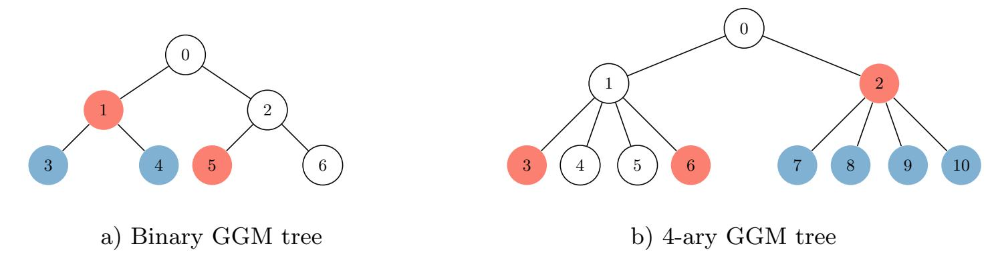
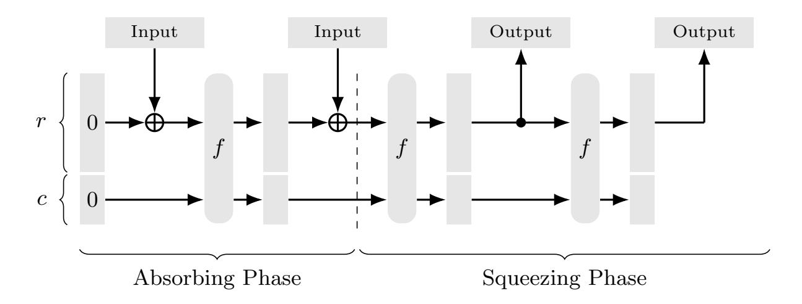
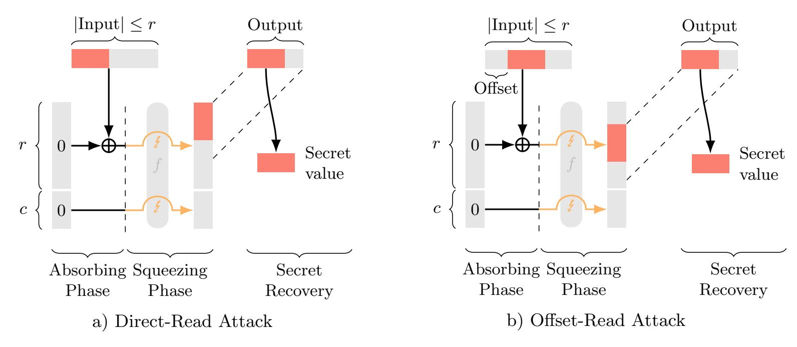
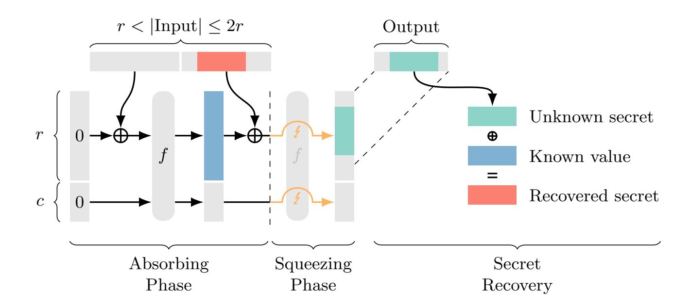

{0}------------------------------------------------

# Breaking the One-Way Property of a SHA-3 Implementation via Fault Injection

Key Recovery Attacks on Post-Quantum Digital Signatures

Mona Sobhani, S¨onke Jendral, Elena Dubrova, and Mats N¨aslund

KTH Royal Institute of Technology, Stockholm, Sweden {mosbhani,jendral,dubrova,matsna}@kth.se

Abstract. This paper presents fault-injection attacks on six candidates of the Round-2 NIST post-quantum digital signatures call: code-based schemes CROSS and LESS, multivariate schemes MAYO, and MPC-in-the-Head schemes Mirath, RYDE, and PERK. These schemes rely on SHA-3-based hash functions to securely embed secret-dependent values in the signature construction. We show that a single instruction skip fault targeting the Keccak-f permutation during the sponge squeezing phase can reveal these secret values and enable full key recovery. The attacks break the one-way property of the affected SHA-3 implementation, as the fault allows recovering the function's input from its output. We experimentally validate the attacks on the optimised pqm4 ARM Cortex-M4 CROSS implementation via instruction-skipping using voltage glitching, and present practical countermeasures.

Keywords: CROSS · LESS · MAYO · Mirath · RYDE · PERK · SHA-3 · Post-Quantum Digital Signature · Key Recovery Attack · Fault Injection

## <span id="page-0-0"></span>1 Introduction

The National Institute of Standards and Technology (NIST) is hosting a second competition for additional post-quantum cryptographic (PQC) digital signature schemes [\[55\]](#page-26-0), to complement existing standard ML-DSA [\[56\]](#page-27-0) and future standard Falcon [\[31\]](#page-25-0). The goal of the competition is to identify schemes that, unlike the already selected algorithms, do not rely on lattice-based problems while remaining secure even in light of the threat posed by large-scale quantum computers. This second competition entered its second round in March 2025 [\[58\]](#page-27-1), with 14 competing candidate schemes.

It is known that even theoretically sound algorithms including PQC, can in practice be broken using side-channel or fault attacks [\[26,](#page-25-1)[6,](#page-23-0)[34,](#page-25-2)[50](#page-26-1)[,28,](#page-25-3)[13,](#page-24-0)[22\]](#page-24-1). However, many attacks exploit scheme-specific behavior, thereby limiting the applicability of countermeasures and generality of conclusions drawn from the attacks and insights to other algorithms. We instead focus on common components found in nearly all PQC algorithms, namely the SHA-3-based hash and extendable output function. While these functions have been the target on some prior cryptographic algorithms [\[8](#page-23-1)[,46,](#page-26-2)[47\]](#page-26-3), including PQC [\[40,](#page-26-4)[41,](#page-26-5)[66\]](#page-27-2), they have not received sufficient attention. In this work, we identify novel fault attacks targeting the permutation step of the underlying sponge construction in order to break its one-way property and recover secret input values from the faulty output. Unlike a previous fault attack focusing on this component [\[66\]](#page-27-2), the presented ones are applicable 

{1}------------------------------------------------

even if the secret information is contained at a significant offset from the beginning of the input or the output size is small.

Based on our results, we investigate the impact of the presented attacks on all secondround candidate schemes and describe full key recovery attacks for six of the 14 candidates; the code-based CROSS [\[9\]](#page-23-2) and LESS [\[11\]](#page-24-2), the multivariate MAYO [\[19\]](#page-24-3), and the MPCin-the-Head Mirath [\[2\]](#page-23-3), RYDE [\[3\]](#page-23-4), and PERK [\[4\]](#page-23-5).

### Contributions. Our main contributions are:

- i) We present two novel types of fault attacks focusing on the permutation step of the sponge construction. Unlike a previous attack [\[66\]](#page-27-2) targeting this step, our attacks are capable of recovering secret inputs even if they are significantly offset from the beginning of the input or the output size is small, thereby greatly increasing the applicability of the attacks.
- ii) We describe how both the attack of [\[66\]](#page-27-2) and the novel attacks can be applied to recover the secret key on second-round candidates CROSS, LESS, MAYO, Mirath, RYDE, and PERK.
- iii) We experimentally validate the attacks on the optimised ARM Cortex-M4 CROSS implementation of Schupp et al. [\[63\]](#page-27-3) using instruction skipping through voltage glitching.
- iv) We propose countermeasures to mitigate the presented attacks and discuss their effectiveness.

Organisation of the paper. The remainder of this paper is organised as follows. Section [2](#page-1-0) describes related work. Section [3](#page-3-0) provides background information on zeroknowledge proof-based signature schemes, GGM and Merkle trees, and the SHA-3 sponge construction. Section [4](#page-6-0) describes the attacks on SHA-3. Sections [5](#page-8-0) and [6](#page-14-0) describe the application of the SHA-3 attacks to second-round PQC signature schemes. Section [7](#page-18-0) summarises the experimental evaluation of the attacks on CROSS. Section [8](#page-21-0) discusses potential countermeasures against the attacks. Section [9](#page-22-0) concludes the paper.

## <span id="page-1-0"></span>2 Related Work

We structure the related work section into two parts. The first part describes existing fault injection attacks on cryptographic algorithms that specifically target SHA-3, whereas the second part presents other fault injection attacks on PQC algorithms analyzed in this paper.

Attacks on SHA-3. Early work on fault injection attacks against SHA-3 focused on differential fault analysis of the underlying Keccak permutation. Bagheri et al. [\[8\]](#page-23-1) inject a single-bit fault into the intermediate state of Keccak to recover 1592 out of 1600 internal state bits of SHA3-384 and SHA3-512, sufficient to forge Message Authentication Codes. Luo et al. [\[46\]](#page-26-2) observe that single-bit faults are unrealistic for injection techniques such as clock and voltage glitching, which typically corrupt at least an entire byte simultaneously. Adopting a relaxed single-byte fault model they are able to break SHA3-224 and SHA3- 256, by recovering the 1600-bit internal state. In a subsequent work [\[47\]](#page-26-3), the same authors 

{2}------------------------------------------------

extend the attack to all four SHA-3 modes and propose a heuristic optimization algorithm to minimize the number of fault injections required for full internal state recovery.

Jendral et al. [\[40\]](#page-26-4) demonstrate that skipping the absorbing phase of the SHA-3 sponge construction on an ARM Cortex-M4 causes the input to never mix into the state, producing a predictable and constant output of SHA-3's SHAKE function. The authors present the attack on the hedged mode of ML-DSA, allowing to recover the per-signature random seed and subsequently recover the full key. Jendral and Dubrova [\[41\]](#page-26-5) extend this technique to MAYO, where the predictable output forces the vinegar values to become known constants, enabling full key recovery.

Wang et al. [\[66\]](#page-27-2) treat Keccak as a generic vulnerable component and present a comprehensive electromagnetic fault injection (EMFI) attack against the PQClean implementations of ML-KEM and ML-DSA. By inducing loop-abort faults, they manipulate the sponge construction's control flow not only in the absorption phase but also by skipping the Keccak-f permutation during the squeezing phase. While we consider an extension of their technique, there are several differences between their work and the attacks presented in this paper: 1) ML-KEM and ML-DSA are considered in their attacks, 2) the permutation abort attack is applied to the key generation and encapsulation procedures, and 3) the attack can only recover the secret if it is at the beginning of the input to the attacked hash function, thereby limiting its applicability.

Attacks on other PQC digital signatures. Both code-based signature candidates in the current NIST Round 2 additional digital signatures call, CROSS and LESS, use a so called Goldreich-Goldwasser-Micali (GGM) tree construction to compress signature size. The seeds from the GGM tree, which contain the actual cryptographic seeds, are revealed in the signature: a value of one indicates that a seed is published, while zero indicates it remains hidden. Mondal et al. [\[50\]](#page-26-1) analyze CROSS and the first round variant LESS-v1 through simulation under a single-fault model, considering stuck-at-zero, stuckat-one, and instruction-skip faults. They demonstrate that forcing a single tree bit to an incorrect value causes a secret seed to be unintentionally exposed. In a later work, Mondal et al. [\[51\]](#page-26-6) demonstrate two practical attacks on LESS-v2 on an ARM Cortex-M4, validating the approach on real hardware. Using clock glitching, they show that a single fault, either an instruction skip or a stuck-at-zero, suffices to flip one bit in the binary tree, exposing a seed that should remain hidden and enabling key recovery.

A recent attack on LESS-v2 has been demonstrated by [\[37\]](#page-25-4) targeting the construction of a binary array used to build the GGM tree. The authors target the loop responsible for generating the binary array that determines which GGM tree seeds are published. By injecting faults to skip iterations or abort this loop, the array fails to update (often remaining zero-filled), which forces the signing algorithm to release hidden seeds.

Jendral et al. [\[43\]](#page-26-7) present a correction fault attack on CROSS targeting the expansion of the public parity-check matrix H. Using voltage glitching on an ARM Cortex-M4, they show that faulting H allows key recovery without knowledge of the fault's exact position. Candidate fault values are paired with secret key entry guesses. A candidate pair, comprising a guessed fault value and a secret key entry, is validated when the recomputed verification digest coincides with the digest from the faulty signature. This match confirms the secret key entry at the faulted position, and repeating this process allows the adversary to accumulate sufficient entries to reconstruct the full secret key.

{3}------------------------------------------------

Banda et al. [\[12\]](#page-24-4) analyze the five MPC-in-the-Head (MPCitH) candidates of the NIST Round 2 additional digital signatures call: Mirath, MQOM, PERK, RYDE, and SDitH. They present a key recovery attack targeting the GGM tree seed generation and a signature forgery attack targeting the Fiat-Shamir challenge generation. The practicality of these attacks are validated using voltage fault injections on an Cortex-M33 microcontroller.

Aulbach et al. [\[7\]](#page-23-6) target MAYO using clock glitching on an ARM Cortex-M4. By injecting a loop-abort fault during vinegar seed sampling, they cause an oil space vector to appear in the signature, enabling full key recovery via algebraic methods. Further fault injection attacks on MAYO are demonstrated in [\[48,](#page-26-8)[1,](#page-23-7)[13,](#page-24-0)[14](#page-24-5)[,61,](#page-27-4)[70\]](#page-28-0).

There have also been several side-channel attacks on Keccak [\[45,](#page-26-9)[68\]](#page-27-5), LESS, MAYO, and CROSS [\[27,](#page-25-5)[64,](#page-27-6)[39\]](#page-25-6). Since these are beyond the scope of this work, we do not further describe them here.

## <span id="page-3-0"></span>3 Background

This section presents background information on zero-knowledge proofs, GGM and Merkle trees, and the SHA-3 sponge construction.

### 3.1 Zero-Knowledge Proofs

A Zero Knowledge Proof (ZKP) allows a prover to convince a verifier to know a secret without revealing the secret itself. A ZKP must satisfy three properties: completeness (an honest prover always succeeds), soundness (a dishonest prover cannot succeed), and zero-knowledge (the verifier learns nothing about the secret). Interactive ZKPs consist of three main parts for a prover and verifier. The prover sends a commitment t, the verifier responds with a random challenge c, and the prover provides a response r. The verifier then checks if the response is true for the given challenge. For digital signatures, this interaction is impractical, as signatures must be verifiable without any interaction. The Fiat-Shamir transform [\[30\]](#page-25-7) is a technique which transforms the interactive ZKP into a non-interactive ZKP. The verifier's random challenges are replaced with a hash of the prover's commitment, computed on the message to be signed. The prover first computes a commitment t, then derives the challenge as c = H(t, m) where m is the message to be signed. Using t, c, and the secret key, the prover computes a response r and outputs the signature as s = (t, r). To verify, the verifier recomputes c ′ = H(t, m) from the commitment and message, then checks that r is a valid response for c ′ and t.

### 3.2 GGM and Merkle Trees

GGM trees. The Goldreich-Goldwasser-Micali (GGM) tree construction [\[35\]](#page-25-8) is a commonly used construction for creating random functions that allow revealing a subset of output values with minimal communication overhead. Two examples for instantiations of the construction are shown in Figure [1.](#page-4-0) The idea is to recursively expand a root seed into a tree using a pseudorandom generator (PRG), with the leaf nodes serving as the output values. The observation is that it is possible to reveal a subset of the leaves with 

{4}------------------------------------------------

logarithmic communication cost by sharing intermediate nodes in the tree when all leaves of the subtree are supposed to be revealed. For example, in Figure [1](#page-4-0) a), revealing nodes 3, 4, and 5 can be achieved by revealing only nodes 1 and 5, which allows nodes 3 and 4 to be recomputed. If an appropriate PRG is used, it is not necessary for the tree to be binary. Figure [1](#page-4-0) b) shows a 4-ary tree, which reduces the computational cost for the PRG compared to the binary tree, but increases the communication cost, since it decreases the probability for a subtree to be revealed.

<span id="page-4-0"></span>

Fig. 1. Examples of GGM tree types. The construction allows efficiently revealing a subset of nodes, either directly (red) or indirectly through its parent (blue).

Merkle trees. A closely related construction are Merkle trees [\[49\]](#page-26-10), which allow authenticating a set of values using hash functions. The idea is to place the values at the leaves of a binary tree and recursively compute the hash of two adjacent values. The resulting hash value then forms the parent node in the tree. If only a subset of values must be authenticated, this approach allows reducing the communication overhead in a similar way as in GGM trees. Instead of revealing all values explicitly, it is possible to reveal only the root of the tree and the subtrees containing values that are not authenticated, which has logarithmic cost. Using the subtrees and the values to authenticate, it is possible to recompute and compare the root of the tree.

### <span id="page-4-1"></span>3.3 Sponge Construction and SHA-3

In 2007, Bertoni, Daemen, Peeters, and Van Assche [\[17\]](#page-24-6) introduced the so-called sponge construction as a method for designing cryptographically secure hash functions. A schematic illustration of this construction is shown in Figure [2.](#page-5-0)

<span id="page-4-2"></span>The construction uses a state, which is divided into rate r and capacity c bytes and is zero-initialised at the beginning of the procedure. It operates in two distinct phases, the absorbing phase and the squeezing phase. During the absorbing phase, input blocks with length r bytes are absorbed by XORing them with the state and permuting the result using a one-way permutation function f to compute the next state. This process is repeated until all input blocks have been absorbed. During the squeezing phase, output blocks with length r bytes are extracted from the state and the next state is computed using the permutation function f. This process is repeated until all output blocks have been generated. Since the construction does not allow direct manipulation or observation of the last c bytes of the state, it provides collision and preimage resistance if the permutation function f is indistinguishable from a random permutation.

{5}------------------------------------------------

<span id="page-5-0"></span>

Fig. 2. Schematic illustration of a cryptographic sponge construction as described in [\[17\]](#page-24-6) with two input and output blocks. The pattern can be extended to accommodate larger inputs and outputs.

Remark 1. We note that the separation into phases is, to some extent, arbitrary. While Bertoni et al. [\[17\]](#page-24-6) consider the absorbing phase to end with the final permutation applied before extracting the first output block, we instead consider this permutation to be part of the squeezing phase, since this more closely matches the implementation we consider in Section [7.](#page-18-0) In other words, they draw the separating line in Figure [2](#page-5-0) one permutation further to the right. Clearly, both approaches are equivalent.

Based on the sponge construction, Bertoni et al. [\[18\]](#page-24-7) designed the Keccak family of hash functions, which were subsequently standardised by NIST as SHA-3 in 2015 [\[54\]](#page-26-11). The standard specifies four fixed-length hash functions, SHA3-224/256/384/512, and two extendable-output functions (XOFs), SHAKE128/256. All functions use the Keccakf[1600] permutation function, which operates on a 1600-bit state. Since the exact details of this permutation are not relevant for the attacks discussed in this paper, we instead refer to the specification for additional details [\[54\]](#page-26-11). In order to achieve varying levels of security, the SHA-3 functions employ different capacities c, where higher security levels are achieved by selecting larger values. Due to the overall state size being fixed to 1600 bits (or 200 bytes) for all standardised functions, a larger value of c implies that the corresponding rate r (and thus also the block size for inputs and outputs) decreases. As we demonstrate in Sections [4,](#page-6-0) [5](#page-8-0) and [6,](#page-14-0) the relationship between these values can have profound implications on the susceptibility of the construction to fault attacks.

SHA-3 implementations commonly use an incremental API containing three steps, Init, Absorb, and Squeeze. This API is expected to be formally defined in a future revision of NIST SP 800-185 [\[60\]](#page-27-7) and is already used in standardised algorithms ML-KEM [\[57\]](#page-27-8) and ML-DSA [\[56\]](#page-27-0). The Init step zero-initialises the state, the Absorb step absorbs data into the sponge, and, finally, the Squeeze step extracts the output from the sponge. The partitioning into individual steps allows the absorption or squeezing of multiple blocks, including cases where the input or output size is not known in advance, hence this API is incremental. In implementations it may further be the case that an additional Final step is placed between the Absorb and Squeeze steps to perform input padding and prepare for the squeezing. This simplifies the implementation of the Absorb and Squeeze steps, but creates a potential attack vector for fault attacks, as we demonstrate in Sections [4,](#page-6-0) [5](#page-8-0) and [6.](#page-14-0)

{6}------------------------------------------------

## <span id="page-6-0"></span>4 Attacks on SHA-3's Sponge Construction

This section describes the underlying ideas behind the attacks on the SHA-3 sponge construction and the necessary conditions for the attacks to successfully recover secret values contained in the input.

We consider a SHA-3 sponge construction with rate r and capacity c, as described in Section [3.3.](#page-4-1) Let S be a secret bit-string of length |S| byte and let

<span id="page-6-1"></span>
$$I := X \mid S \mid Y$$

be the length |I| = |X| + |S| + |Y | input bit-string given by concatenating S together with an arbitrary prefix X and arbitrary suffix Y . Finally, let O be the length |O| output bit-string from the function.



Fig. 3. Direct-Read Attack and Offset-Read Attack on the sponge construction. Both attacks skip the Keccak-f permutation during the squeezing phase (indicated by the yellow arrows). The secret value (orange) can be recovered from the output.

Direct-Read Attack. This attack is a straightforward extension of the approach described in [\[66\]](#page-27-2) and is shown in Figure [3a](#page-6-1). The idea is to skip the execution of the permutation function f during the squeezing phase, which causes the output to reveal (the first part of) the input in unpermuted form. In order for the attack to reveal the secret value, the following conditions must be met: 1) |I| ≤ r to ensure no permutation is performed during the absorption, and 2) |X| + |S| ≤ |O| to ensure that the secret is fully contained within the output.

<span id="page-6-2"></span>Remark 2. Note that we can practically relax requirement 2) to recover only part of the secret in cases where it is possible to recover the remainder of the secret through other means, such as an algebraic attack. We briefly describe such an approach in the context of CROSS in Section [5.](#page-8-0)

{7}------------------------------------------------

Offset-Read Attack. If condition 2) for the Direct-Read Attack does not hold (i.e., if |X|+|S| > |O|), then it is possible to offset the output to contain a different section of the (unpermuted) state, which is shown in Figure [3b](#page-6-1). The idea is to skip the execution of the Final step found in certain implementations to cause the implementation to incorrectly interpret the number of already absorbed bytes as the number of bytes available for squeezing, which implicitly also skips the permutation function f, as in the Direct-Read Attack. The output will then begin at an offset of ∆ = r − |I| byte in the state (i.e., such that |I| bytes can be squeezed). In order for the attack to reveal the secret value, the following conditions must be met: 1) |I| ≤ r to ensure no permutation is performed during the absorption, as well as 2) ∆ ≤ |X| and 3) |X| + |S| ≤ ∆ + |O|, to ensure that the secret is fully contained within the output (though requirements 2) and 3) can be relaxed, see Remark [2\)](#page-6-2).



Fig. 4. Known-Prefix Attack on the sponge construction. The attack skips the Keccak-f permutation during the squeezing phase (indicated by the yellow arrows). The secret value (orange) can be recovered from the output using the known state (blue).

<span id="page-7-0"></span>Known-Prefix Attack. If the input is longer than a single block (i.e., if |I| > r), then it is possible to perform a variation of the Direct-Read Attack, provided (the first part of) the prefix X is known. The approach is shown in Figure [4.](#page-7-0) The idea is to skip the execution of the permutation function f during the squeezing phase as in the Direct-Read Attack, while the permutation during the absorbing phase remains unaffected. The output then contains the unpermuted secret XORed with the permuted first input block. Assuming that the first block of X is known, the corresponding permuted first input block can be recomputed and XORed with the output to recover the secret. In order for the attack to reveal the secret value, the following conditions must be met: 1) r < |I| ≤ 2r to ensure that only a single permutation is performed during the absorbing phase, 2) the first r bytes of X must be known to allow recomputing the permuted first input block, and 3) r ≤ |X| and 4) |X| + |S| ≤ r + |O| to ensure that the secret is fully contained within the output.

{8}------------------------------------------------

Remark 3. The Known-Prefix Attack is described for the case of exactly two input blocks, but extends naturally to larger inputs. If the secret is contained in input block i, then all input blocks i must be known in order to recompute the permuted input block that the secret is XORed with. Note that it is possible to slightly relax requirement 2) by applying brute-force enumeration. It is also possible to relax requirements 3) and 4), as in the Direct-Read and Offset-Read Attacks.

**Extensions.** A natural extension of the presented attacks is a combination of the Offset-Read and Known-Prefix Attacks, to recover the secret in cases where it is contained at an offset within a multi-block input with a known prefix. Since this extension follows directly from the presented attacks, we do not consider it further in this paper.

We further stress that the presented attacks are independent of the chosen permutation function and are thus not specific to SHA-3. Instead, they rely on inherent constraints imposed by the sponge construction as well as the use of an incremental API. We therefore expect that the attacks could be translated directly to other sponge constructions, especially those making use of a similar API, such as the XOF mode of the recently standardised Ascon [59].

### <span id="page-8-0"></span>5 Attacks on CROSS

This section presents background information on the CROSS algorithm and describes how the attacks on SHA-3 presented in Section 4 can be applied to recover the secret key.

#### 5.1 CROSS Signature Scheme

CROSS is a code-based signature scheme whose security relies on the assumed hardness of the Restricted Syndrome Decoding Problem (R-SDP) or the related Restricted Syndrome Decoding Problem with Subgroup (R-SDP(G)) [9], which are variants of the syndrome decoding problem. In the following, we provide a brief description of the underlying interactive ZKP and its transformation to a signature scheme, based on the notation and descriptions in [9]. The differences between the R-SDP and R-SDP(G) variants are not relevant for the attacks presented in this paper, and we thus focus exclusively on the R-SDP variants in the descriptions.

CROSS uses restricted vectors with entries in  $\mathbb{E} = \langle g \rangle = \{g^i \mid i \in \{1, \dots, z\}\} \subseteq \mathbb{F}_p^*$ , a cyclic subgroup of the multiplicative group  $\mathbb{F}_p^*$  with generator g over a finite field  $\mathbb{F}_p$ . This allows representing the entries using their exponents in a smaller finite field  $\mathbb{F}_z$ , thereby reducing their size and simplifying computations by turning multiplications in  $\mathbb{E}$  to additions in  $\mathbb{F}_z$ . The R-SDP is defined as follows:

**Definition 1.** Given a syndrome  $\mathbf{s} \in \mathbb{F}_p^{n-k}$  and a parity-check matrix  $\mathbf{H} \in \mathbb{F}_p^{(n-k)\times n}$ , find a vector  $\mathbf{e} \in \mathbb{E}^n$ , such that  $\mathbf{s} = \mathbf{e}\mathbf{H}^\mathsf{T}$ .

#### <span id="page-8-1"></span>5.1.1 Zero-Knowledge Identification Protocol

Based on the R-SDP, the underlying zero-knowledge identification (ZK ID) protocol allows the prover to prove knowledge of  $\mathbf{e}$  for an R-SDP instance ( $\mathbf{e}, (\mathbf{s}, \mathbf{H}^{\mathsf{T}})$ ). The protocol operates across t parallel rounds. In each round, the following steps are performed:

{9}------------------------------------------------

- 1. Prover samples  $\mathbf{e}' \in \mathbb{E}^n$ ,  $\mathbf{u}' \in \mathbb{F}_p^n$  randomly and computes and commits to  $\mathbf{v} = \mathbf{e}/\mathbf{e}'$ ,  $\mathbf{u} = \mathbf{v} \star \mathbf{u}$ , and  $\mathbf{s}' = \mathbf{u}\mathbf{H}^\mathsf{T}$  using  $\mathsf{cmt}_0 = \mathsf{Hash}(\mathbf{s}' \mid \mathbf{v})$  and  $\mathsf{cmt}_1 = \mathsf{Hash}(\mathbf{u}' \mid \mathbf{e}')$
- 2. Verifier challenges with  $\mathsf{chall}_1 \in \mathbb{F}_p^{\star}$
- 3. Prover computes and commits to  $\mathbf{y} = \mathbf{u}' + \mathsf{chall}_1 \mathbf{e}'$  using  $\mathsf{digest}_{\mathbf{v}} = \mathsf{Hash}(\mathbf{y})$
- 4. Verifier challenges with  $\mathsf{chall}_2 \in \{0,1\}$
- 5. Prover responds with  $\begin{cases} (\mathbf{y}, \mathbf{v}) & \text{if } \mathsf{chall}_2 = 0 \\ (\mathbf{u}', \mathbf{e}') & \text{if } \mathsf{chall}_2 = 1 \end{cases}$ 6. Verifier checks  $\begin{cases} 1) \; \mathsf{Hash}(\mathbf{y}) = \mathsf{digest}_{\mathbf{y}} \\ 2) \; \mathsf{Hash}((\mathbf{v} \star \mathbf{y}) \mathbf{H}^\mathsf{T} \mathsf{chall}_1 \mathbf{s} \mid \mathbf{v}) = \mathsf{cmt}_0 \; \mathsf{if} \; \mathsf{chall}_2 = 0 \\ 3) \; \mathbf{v} \in \mathbb{E}^n \\ 1) \; \mathsf{Hash}(\mathbf{u}' + \mathsf{chall}_1 \mathbf{e}') = \mathsf{digest}_{\mathbf{y}} \\ 2) \; \mathsf{Hash}(\mathbf{u}' \mid \mathbf{e}') = \mathsf{cmt}_1 \end{cases} \quad \mathsf{if} \; \mathsf{chall}_2 = 1$

By applying a Fiat-Shamir transform [30], which replaces the verifier's challenges with random oracle calls realised as hash functions, the protocol can be executed non-interactively by the prover, allowing the resulting transcript to be used as a signature. The secret key is the vector  $\mathbf{e}$  and the public key is the pair  $(\mathbf{s}, \mathbf{H}^{\mathsf{T}})$ .

Remark 4. The zero-knowledge property of CROSS-ID relies on the fact that in each round, the verifier learns either Seed[i] or  $(\mathbf{y}[i], \mathbf{v}[i])$ , but never both. Revealing Seed[i] allows recomputation of  $\mathbf{e}'[i]$ , while revealing  $\mathbf{v}[i]$  exposes the transformation satisfying  $\mathbf{v}[i] \star \mathbf{e}'[i] = \mathbf{e}$ . If both are available simultaneously, the secret vector  $\mathbf{e}$  can be recovered directly as  $\mathbf{e} = \mathbf{v}[i] \star \mathbf{e}'[i]$ . In a fault-free execution this never occurs, as  $\mathsf{chall}_2[i]$  is determined after the commitments are fixed.

### 5.1.2 Algorithms

The CROSS signature scheme consists of three algorithms: Key Generation, Signature Generation, and Verification. In the following, we provide brief descriptions of each algorithm. For additional details, included the individual parameter sets, we refer to the specification [9].

**Key Generation.** The key generation procedure samples a random seed  $\mathsf{Seed}_{\mathsf{sk}}$  and uses it to derive a random exponent vector  $\bar{\mathbf{e}}$  and a second seed  $\mathsf{Seed}_{\mathsf{pk}}$ . It then computes the secret vector  $\mathbf{e} = g^{\bar{\mathbf{e}}}$  using componentwise exponentiation and derives the random parity-check matrix  $\mathbf{H}^\mathsf{T}$  using  $\mathsf{Seed}_{\mathsf{pk}}$ . Using the secret vector  $\mathbf{e}$  and the parity-check matrix  $\mathbf{H}^\mathsf{T}$ , it computes the syndrome  $\mathbf{s} = \mathbf{e}\mathbf{H}^\mathsf{T}$ . The secret key consist of  $\mathsf{Seed}_{\mathsf{sk}}$  and the public key consists of  $(\mathbf{s},\mathsf{Seed}_{\mathsf{pk}})$ .

Remark 5. Note that CROSS uses seeds that are pseudorandomly expanded to compute  $\mathbf{e}$  and  $\mathbf{H}^\mathsf{T}$  as the secret and public key, which reduces their sizes. In our attacks, we will be recovering the vector  $\mathbf{e}$  directly, but will not be recovering  $\mathsf{Seed}_{\mathsf{sk}}$ . Since  $\mathbf{e}$  is an equivalent key for the scheme, this makes no practical difference to an attacker and, in a slight abuse of terminology, we will be referring to  $\mathbf{e}$  as the secret key of the scheme for the remainder of this paper.

{10}------------------------------------------------

### Algorithm 1 CROSS.Sign(sk, Msg) [9]

```
Input: Secret key sk, message Msg
Output: Signature Sgn
  1: \bar{\mathbf{e}}, \mathbf{H} \leftarrow \mathsf{ExpandSK}(\mathsf{Seed}_{\mathsf{sk}})
  2: Seed \leftarrow \{0,1\}^{\lambda}, Salt \leftarrow \{0,1\}^{2\lambda}
  3: (\text{Seed}[1], \dots, \text{Seed}[t]) \leftarrow \text{SeedLeaves}(\text{Seed}, \text{Salt})
  4: // Commitment generation
  5: for i from 1 to t do
                 \bar{\mathbf{e}}'[i], \mathbf{u}'[i] \leftarrow \mathsf{CSPRNG}(\mathrm{Seed}[i] \mid \mathrm{Salt} \mid i+2t-1)
  6:
  7:
                 \bar{\mathbf{v}}[i] \leftarrow \bar{\mathbf{e}} - \bar{\mathbf{e}}'[i]
                \mathbf{v}[i] \leftarrow g^{\mathbf{\bar{v}}[i]}
  8:
                \mathbf{u}[i] \leftarrow \mathbf{v}[i] * \mathbf{u}'[i]
  9:
                 \mathbf{s}'[i] \leftarrow \mathbf{u}[i]\mathbf{H}^\mathsf{T}
10:
                 \operatorname{cmt}_0[i] \leftarrow \operatorname{\mathsf{Hash}}(\mathbf{s}'[i] \mid \overline{\mathbf{v}}[i] \mid \operatorname{Salt} \mid i+2t-1)
                                                                                                                                         ▶ Attack Point: Offset-Read Attack
11:
                 \operatorname{cmt}_1[i] \leftarrow \operatorname{\mathsf{Hash}}(\operatorname{Seed}[i] \mid \operatorname{Salt} \mid i+2t-1)
12:
                                                                                                                                         ▶ Attack Point: Direct-Read Attack
13: \overline{digest}_{cmt_0} \leftarrow \mathsf{TreeRoot}(cmt_0)
14: \operatorname{digest}_{\operatorname{cmt}_1} \leftarrow \operatorname{\mathsf{Hash}}(\operatorname{cmt}_1)
15: \operatorname{digest}_{\operatorname{cmt}} \leftarrow \mathsf{Hash}(\operatorname{digest}_{\operatorname{cmt}_0} \mid \operatorname{digest}_{\operatorname{cmt}_1})
16: // Challenge generation
17: \operatorname{digest_{chall_1}} \leftarrow \operatorname{\mathsf{Hash}}(\operatorname{\mathsf{Hash}}(\operatorname{\mathsf{Msg}}) \mid \operatorname{\mathsf{digest}}_{\operatorname{cmt}} \mid \operatorname{Salt})
18: \operatorname{chall}_1 \leftarrow \mathsf{CSPRNG}(\operatorname{digest}_{\operatorname{chall}_1} \mid 3t - 1)
19: for i from 1 to t do
                 \mathbf{e}'[i] \leftarrow g^{\mathbf{\bar{e}'}[i]}
20:
                \mathbf{y}[i] \leftarrow \mathbf{u}'[i] + \operatorname{chall}_1[i]\mathbf{e}'[i]
21:
22: \operatorname{digest}_{\operatorname{chall}_2} \leftarrow \operatorname{\mathsf{Hash}}(\mathbf{y} \mid \operatorname{digest}_{\operatorname{chall}_1})
23: \operatorname{chall}_2 \leftarrow \mathsf{CSPRNG}(\operatorname{digest}_{\operatorname{chall}_2} \mid 3t)
24: Proof \leftarrow TreeProof(cmt<sub>0</sub>, chall<sub>2</sub>)
25: Path \leftarrow SeedPath(Seed, Salt, chall<sub>2</sub>)
26: // Response generation
27: for i from 1 to t do
28:
                 if chall_2[i] = 0 then
                         resp[i]_0 \leftarrow (\mathbf{y}[i], \mathbf{\bar{v}}[i])
29:
30:
                        resp[i]_1 \leftarrow cmt_1[i]
31: \mathbf{return} \ \mathrm{Sgn} \coloneqq (\mathrm{Salt}, \mathrm{digest}_{\mathrm{cmt}}, \mathrm{digest}_{\mathrm{chall}_2}, \ \mathrm{Path}, \ \mathrm{Proof}, \mathrm{resp})
```

<span id="page-10-0"></span>**Signature Generation (Algorithm 1).** The signing procedure closely follows the steps of the ZK ID protocol in Section 5.1.1. For the sake of brevity, we therefore do not restate each step here and instead highlight only the additional optimisations applied to the construction not found in the protocol. Algorithm 1 shows a high-level description of the steps.

The four main optimisations applied in the algorithm are: 1) instead of sampling the vector  $\mathbf{e}'$  directly, the algorithm first samples an exponent vector  $\bar{\mathbf{e}}$ , which simplifies the computation of  $\mathbf{v}$  (via its exponent vector  $\bar{\mathbf{v}}$ ); 2) instead of including  $\mathbf{e}'$  and  $\mathbf{u}'$  in the proof directly, the algorithm includes only a seed  $\mathsf{Seed}[i]$ , which can be used to recompute them, thereby reducing the size of the signature; 3) the individual  $\mathsf{Seed}[i]$  values are compressed across all t rounds using a GGM tree (stored as  $\mathsf{Path}$ ); and 4) the  $\mathsf{cmt}_0$  values are compressed across all t rounds using a Merkle tree (stored as  $\mathsf{Proof}$ ).

{11}------------------------------------------------

Additionally, the computation of the commitments involves a random Salt value and a domain separator:

$$\mathsf{cmt}_0[i] = \mathsf{Hash}(\mathbf{s}'[i] \mid \mathbf{\bar{v}}[i] \mid \mathsf{Salt} \mid i+2t-1)$$
  
 $\mathsf{cmt}_1[i] = \mathsf{Hash}(\mathsf{Seed}[i] \mid \mathsf{Salt} \mid i+2t-1).$ 

**Verification.** The verification procedure undoes the compression applied through the GGM tree by reconstructing the revealed  $\mathsf{Seed}[i]$  values for all rounds where  $\mathsf{chall}_2[i] = 1$  from the Path and then follows step 6) of the ZK ID protocol described in Section 5.1.1. If  $\mathsf{chall}_2[i] = 0$ , the Merkle tree is used to check the  $\mathsf{cmt}_0[i]$  values contained in the Proof. If all commitments are valid, the verification of the identification protocol passes and thus the signature is valid.

<span id="page-11-0"></span>**Table 1.** Fault attack applicability on different CROSS parameter sets. The \* indicates additional enumeration required to complete key recovery.

| Parameter set   | Direct-Read                           | Offset-Read                    | Known-Prefix |
|-----------------|---------------------------------------|--------------------------------|--------------|
| CROSS-RSDP-1    | $\checkmark$ (cmt <sub>1</sub> ; GGM) | <b>✓</b> * (cmt <sub>0</sub> ) | _            |
| CROSS-RSDP-3    | $\checkmark$ (cmt <sub>1</sub> ; GGM) | <del></del>                    |              |
| CROSS-RSDP-5    | $\checkmark$ (cmt <sub>1</sub> ; GGM) |                                |              |
| CROSS-RSDP(G)-1 | $\checkmark$ (cmt <sub>1</sub> ; GGM) |                                |              |
| CROSS-RSDP(G)-3 | $\checkmark$ (cmt <sub>1</sub> ; GGM) | $\checkmark^*$ $(cmt_0)$       |              |
| CROSS-RSDP(G)-5 | / (cmt <sub>1</sub> ; GGM)            |                                |              |

#### <span id="page-11-1"></span>5.2 Attack on the Prover's Commitments

The prover's commitment generation phase can be targeted using both the Direct-Read Attack and the Offset-Read Attack. The following section describes how the secret key **e** can be recovered in each case.

### 5.2.1 Direct-Read Attack on cmt<sub>1</sub>

**Attack point.** We apply the Direct-Read Attack to the computation of  $\mathsf{cmt}_1[i]$ :

$$\mathsf{cmt}_1[i] = \mathsf{Hash}(\underbrace{\mathsf{Seed}[i]} \mid \mathsf{Salt} \mid i + 2t - 1).$$

It is possible to extract the secret information  $\mathsf{Seed}[i]$  from  $\mathsf{cmt}_1[i]$  for all parameter sets, since the necessary conditions described in Section 4 are fulfilled.

**Key recovery.** If  $\operatorname{chall}_2[i] = 0$ , the signature contains  $(\mathbf{y}[i], \overline{\mathbf{v}}[i])$  and  $\operatorname{cmt}_1[i]$ . We assume that the attacker can extract  $\operatorname{Seed}[i]$  from the faulty  $\operatorname{cmt}_1[i]$ . This trivially allows key recovery by deriving  $\overline{\mathbf{e}}'[i]$  from  $\operatorname{Seed}[i]$  and computing

$$g^{\bar{\mathbf{v}}[i]+\bar{\mathbf{e}}'[i]}=g^{\bar{\mathbf{e}}}=\mathbf{e}.$$

{12}------------------------------------------------

Since chall<sup>2</sup> is a uniformly and randomly selected weight w binary vector of length t, we have chall2[i] = 0 with probability (t−w)/t. Assuming that the fault injection succeeds in each signing attempt and that the attacker must pick a single i to inject the fault into without knowing chall2, this yields an expected number of attempts of 2–18 for all CROSS parameter sets.

## 5.2.2 Offset-Read Attack on cmt<sup>0</sup>

Attack point. We apply the Offset-Read Attack to the computation of cmt1[i]:

$$\mathsf{cmt}_0[i] = \mathsf{Hash}(\mathbf{s}'[i] \mid \mathbf{\bar{v}}[i] \mid \mathsf{Salt} \mid i+2t-1).$$

As shown in Table [1,](#page-11-0) only the CROSS-RSDP-1 and CROSS-R-SDP(G)-3 parameter sets fulfill the necessary conditions described in Section [4](#page-6-0) to allow extracting a sufficiently large part of the secret information ¯v[i].

Key recovery. If chall2[i] = 1, the signature contains Seed[i] and cmt0[i]. For now, we assume the attacker can extract the entire ¯v[i] from the faulty cmt0[i]. This allows key recovery using the same approach as in the Direct-Read Attack on cmt1, namely by deriving ¯e′ [i] from Seed[i] and computing

$$g^{\bar{\mathbf{v}}[i] + \bar{\mathbf{e}}'[i]} = \mathbf{e}.$$

However, the attacker is only able to recover 28 of the 48 bytes of ¯v[i] for the attack on CROSS-R-SDP-1 and 29 of the 35 bytes of ¯vG[i] for the attack on CROSS-R-SDP(G)-3. It is still possible to recover the secret key in both cases by performing enumeration.

For CROSS-R-SDP-1, we make three observations: The first is that the relationship between

$$\bar{\mathbf{v}}[i] = \bar{\mathbf{e}} - \bar{\mathbf{e}}'[i]$$

and ¯e is linear. In other words, since ¯e′ [i] is fully known, each entry of ¯v[i] reveals an entry of ¯e. The second observation is that the computation of cmt<sup>0</sup> uses a bit-packed version of ¯v[i], thus the 28 recovered bytes actually contain 74 of the 127 entries. The final observation is that the syndrome equation s = eH<sup>T</sup> implicitly defines a system of linear equations with n − k = 51 equations and n = 127 unknowns, each corresponding to one entry of the secret key vector. Using the 74 recovered entries and enumerating two additional entries (at a complexity of ≈ 2 6 ), the resulting system with 127−(74+ 2) = 51 unknowns is fully determined, allowing ¯e and thus e to be recovered.

For CROSS-R-SDP(G)-3, such an approach is not possible. Instead, the attacker can enumerate the remaining six bytes of ¯vG[i] (with complexity 2<sup>48</sup>) and proceed as above. We also considered the Stern solver described in the security analysis of the CROSS submission [\[10\]](#page-24-8) applied to the reduced R-SDP-G instance, as described in [\[43\]](#page-26-7), but found that it is unlikely to significantly outperform the presented approach in practice.

Following the same argument as in the previous section, chall2[i] = 1 occurs with probability w/t. However, for the small and balanced parameter sets, the attack additionally requires the adjacent commitment cmt0[i+1] to not be revealed (i.e., for chall2[i+1] = 1) to 

{13}------------------------------------------------

prevent the commitments from being combined in the Merkle tree[1](#page-13-0) . Thus, the probability for a successful key recovery under a successful fault for these variants is w/t∗(t−w)/(t−1). Assuming that the fault injection succeeds in each signing attempt and that the attacker must pick a single i to inject the fault into without knowing chall2, this yields an expected number of attempts of 2–17 for the CROSS-R-SDP-1 and CROSS-R-SDP(G)-3 parameter sets.

### <span id="page-13-1"></span>5.3 Attack on the GGM Tree

The computation of the GGM tree in the SeedLeaves procedure can be targeted using the Direct-Read Attack. Since the tree structure differs between the small/balanced and the fast variants of each parameter set, the corresponding attack points differ slightly.

Attack point (Small and Balanced variants). The small and balanced variants use binary GGM trees. We apply the Direct-Read Attack to the computation of child nodes:

$$\mathcal{T}[\mathsf{leftChild}], \mathcal{T}[\mathsf{rightChild}] \leftarrow \mathsf{CSPRNG}(\mathcal{T}[\mathsf{parent}] \mid \mathsf{Salt} \mid \mathsf{parent}).$$

It is possible to extract the secret information T [parent] from the first output value T [leftChild] for all parameter sets, since the necessary conditions described in Section [4](#page-6-0) are fulfilled.

Attack point (Fast variants). The fast variants use GGM trees of three levels: a root, four intermediate nodes, and t leaf nodes. We apply the Direct-Read Attack to the computation of the leaf nodes for one intermediate node:

$$\mathcal{T}_i \leftarrow \mathsf{CSPRNG}(\frac{\mathcal{T}[i+1]}{|\mathcal{T}[i+1]} \mid \mathsf{Salt} \mid i+1).$$

It is possible to extract the secret information T [i + 1] from the first child in T<sup>i</sup> for all parameter sets, since the necessary conditions described in Section [4](#page-6-0) are fulfilled.

Key recovery. In order for an attacker to be able to extract the parent seed, the first child must be explicitly revealed. Using the parent seed, it is possible to recompute all leaf seeds in the subtree starting at that parent node. If one of the leaf nodes is not revealed (i.e., if there exists i such that the attacker derives the leaf Seed[i] from the parent seed, but chall2[i] = 0), then the signature contains (y[i], ¯v[i]). This allows recovering the secret key vector using the same approach as in Section [5.2,](#page-11-1) by deriving ¯e[i] from Seed[i] and computing

$$g^{\bar{\mathbf{v}}[i] + \bar{\mathbf{e}}[i]} = \mathbf{e}.$$

Note that the attack is not restricted to the case where the faulty child nodes are leaves in the tree. Instead, an attacker can target nodes closer to the root and recursively derive the entire subtree starting at the first child. The only requirement for the attack is for the first child of the targeted parent node to be revealed and for at least one of the other children (and thus the targeted parent node) to not be revealed. For the sake of

<span id="page-13-0"></span><sup>1</sup> We assume for simplicity that i is odd, otherwise the adjacent commitment is at index i − 1 in the tree. Note that this is only the case when the total number of leaves in the tree is even, which is the case for all small and balanced parameter sets.

{14}------------------------------------------------

brevity, the estimation of the probability for this requirement to be fulfilled is not shown here and can instead be found in Appendix [A.](#page-0-0) Clearly, the probability depends on which node in the tree is targeted. Assuming that the fault injection succeeds in each signing attempt and that the attacker must pick a target node without knowing chall2, this yields an expected number of attempts of 2–4 for all CROSS parameter sets.

## <span id="page-14-0"></span>6 Attacks on other PQC Algorithms

The attacks introduced in Section [4](#page-6-0) are applicable more broadly among the second-round candidate schemes. In this section, we describe key recovery attacks on LESS, PERK, RYDE, Mirath, and MAYO. An overview of the affected parameter sets for each attack is shown in Table [2.](#page-14-1) Since the number of schemes covered is considerable, we provide only a brief description of each algorithm and refer to the respective specifications [\[11,](#page-24-2)[4,](#page-23-5)[3,](#page-23-4)[2,](#page-23-3)[19\]](#page-24-3) for additional details.

<span id="page-14-1"></span>Table 2. Fault attack applicability for different algorithms and parameter sets. The <sup>∗</sup> indicates that additional enumeration required to complete key recovery.

| Parameter set Direct-Read Offset-Read Known-Prefix |   |        |        |  |  |
|----------------------------------------------------|---|--------|--------|--|--|
| LESS-I                                             | ✓ | —      | —      |  |  |
| LESS-III                                           | ✓ | —      | —      |  |  |
| LESS-V                                             | ✓ | —      | —      |  |  |
| PERK-3                                             | — | ✓      | —      |  |  |
| PERK-5                                             | — | —      | ✓<br>∗ |  |  |
| RYDE-3                                             | — | ✓<br>∗ | —      |  |  |
| RYDE-5                                             | — | —      | ✓      |  |  |
| Mirath-3                                           | — | ✓*     | —      |  |  |
| Mirath-5                                           | — | —      | ✓<br>∗ |  |  |
| MAYO-1                                             | — | ✓      | —      |  |  |
| MAYO-2                                             | — | ✓      | —      |  |  |

### <span id="page-14-2"></span>6.1 LESS

LESS is a code-based signature scheme whose security relies on the assumed hardness of the Linear Equivalence Problem (LEP) [\[11\]](#page-24-2), which is a variant of the code equivalence problem. The scheme is constructed by applying a Fiat-Shamir transform [\[30\]](#page-25-7) to an interactive ZK ID protocol. Similar to CROSS, the underlying protocol makes use of SHAKE-based GGM trees to derive a set of t rounds seeds seed(i) .

Attack point. The attack is identical to that on the small and balanced versions of CROSS in Section [5.](#page-8-0) We apply the Direct-Read Attack to the computation of child nodes in the GGM tree:

$$\textstyle \textstyle \textstyle \textstyle \textstyle \textstyle \textstyle \textstyle \textstyle \textstyle \textstyle \textstyle \textstyle \textstyle \textstyle \textstyle \textstyle \textstyle \textstyle \textstyle \textstyle \textstyle \textstyle \textstyle \textstyle \textstyle \textstyle \textstyle \textstyle \textstyle \textstyle \textstyle \textstyle \textstyle \textstyle \textstyle \textstyle \textstyle \textstyle \textstyle \textstyle \textstyle \textstyle \textstyle \textstyle \textstyle \textstyle \textstyle \textstyle \textstyle \textstyle \textstyle \textstyle \textstyle \textstyle \textstyle \textstyle \textstyle \textstyle \textstyle \textstyle \textstyle \textstyle \textstyle \textstyle \textstyle \textstyle \textstyle \textstyle \textstyle \textstyle \textstyle \textstyle \textstyle \textstyle \textstyle \textstyle \textstyle \textstyle \textstyle \textstyle \textstyle \textstyle \textstyle \textstyle \textstyle \textstyle \textstyle \textstyle \textstyle \textstyle \textstyle \textstyle \textstyle \textstyle \textstyle \textstyle \textstyle \textstyle \textstyle \textstyle \textstyle \textstyle \textstyle \textstyle \textstyle \textstyle \textstyle \textstyle \textstyle \textstyle \textstyle \textstyle \textstyle \textstyle \textstyle \textstyle \textstyle \textstyle \textstyle \textstyle \textstyle \textstyle \textstyle \textstyle \textstyle \textstyle \textstyle \textstyle \textstyle \textstyle \textstyle \textstyle \textstyle \textstyle \textstyle \textstyle \textstyle \textstyle \textstyle \textstyle \textstyle \textstyle \textstyle \textstyle \textstyle \textstyle \textstyle \textstyle \textstyle \textstyle \textstyle \textstyle \textstyle \textstyle \textstyle \textstyle \textstyle \textstyle \textstyle \textstyle \textstyle \textstyle \textstyle \textstyle \textstyle \textstyle \textstyle \textstyle \textstyle \textstyle \textstyle \textstyle \textstyle \textstyle \textstyle \textstyle \textstyle \textstyle \textstyle \textstyle \textstyle \textstyle \textstyle \textstyle \textstyle \textstyle \textstyle \textstyle \textstyle \textstyle \textstyle \textstyle \textstyle \textstyle \textstyle \textstyle \textstyle \textstyle \textstyle \textstyle \textstyle \textstyle \textstyle \text$$

{15}------------------------------------------------

As in the attack on CROSS, it is possible to extract the secret information T [parent] from the first output value T [leftChild] for all parameter sets.

Key recovery. The key recovery process for LESS is slightly more involved than for CROSS and we sketch only the basic steps here. A more comprehensive analysis can be found in [\[51\]](#page-26-6). If the left child is explicitly revealed, the attacker can extract the parent seed from it and recompute the corresponding subtree, thereby revealing a set of seed(i) values at the leaves. If among the leaves in the subtree there exists a round i such that i ∈ U, where U is the support of a challenge vector indicating for which rounds a response should be revealed, then the attacker learns both seed(i) and rsp(i) . Simplifying slightly, this allows recovering a secret monomial map τ<sup>b</sup> (i) for a random b (i) ∈ [1, s − 1]. As described in [\[51\]](#page-26-6), recovering all s − 1 maps τ<sup>i</sup> yields an equivalent key of the scheme. Note that our attack is generally capable of recovering multiple maps from a single faulty signature, but the exact number of recoverable maps (and thus the required number of faulty signatures) depends on the location of the fault in the tree and the random b (i) values in the challenge and we refer to [\[51\]](#page-26-6) for additional analysis.

### 6.2 MPC-in-the-Head Schemes

Three of the multiparty computation in-the-head (MPCitH) schemes we consider in this paper, Mirath [\[2\]](#page-23-3), PERK [\[4\]](#page-23-5), and RYDE [\[3\]](#page-23-4) share structural similarities that enable our attacks described in Section [4](#page-6-0) to be applied for key recovery. In the following, we provide a brief description of the underlying structure, focusing on the batch all-but-one vector commitments (BAVCs).

MPCitH paradigm. By using techniques from secure multi-party computation, the MPCitH paradigm [\[38\]](#page-25-9) provides a way of constructing publicly verifiable zero-knowledge proofs. Two instantiations of this paradigm are used in practice, the threshold computation in-the-head paradigm (TCitH; Mirath and RYDE) [\[29\]](#page-25-10) and vector oblivious linear evaluation in-the-head (VOLEitH; PERK[2](#page-15-0) ) [\[16\]](#page-24-9). We omit a detailed description of each approach, since the differences between the paradigms are not relevant for our attacks.

The fundamental idea behind MPCitH-based schemes is to construct a ZK proof of knowledge of a secret witness w fulfilling a public relation. This can be accomplished by splitting the witness into several shares and simulating a multiparty protocol on each share. By revealing all-but-one shares, a verifier can check the correctness of the execution of the protocol for those shares. In order to convert the approach into a signature scheme, a Fiat-Shamir transform [\[30\]](#page-25-7) is applied, which requires the prover to commit to their shares of the secret value before deriving a random challenge that indicates which share remains hidden.

All-but-one vector commitments. A core building block for MPCitH-based schemes are so-called all-but-one vector commitments (AVCs), which provide an efficient way of committing to a set of random vectors such that all-but-one of them can be efficiently revealed using GGM trees. In practice, the schemes employ a batched AVC that combines several AVCs across multiple parallel rounds of the protocol into a single GGM tree [\[15\]](#page-24-10),

<span id="page-15-0"></span><sup>2</sup> We are considering PERK v2.2, which was updated to use VOLEitH after the second-round submission deadline.

{16}------------------------------------------------

which further reduces the communication cost for revealing all-but-one vectors in each round. To ensure the soundness of the proof, it is important that the prover commits to all vectors in the AVC as part of the signature generation and that the verifier is able to check this commitment. The signature therefore contains both a hash of all vectors and the hash of the vector that is not revealed, allowing the verifier to recompute and compare the hash of all vectors using the revealed vectors and the revealed hash. By applying our attacks to the computation of the commitments, it is possible to cause the revealed hash to allow recovering the corresponding vector, thereby violating the all-but-one security assumption and enabling recovery of the secret key. This requires the attacker to guess which vector will not be revealed, and the attacks therefore require several repetitions to succeed.

### 6.2.1 PERK

PERK is a VOLEitH-based signature scheme whose security relies on the assumed hardness of the Permuted Kernel Problem [\[4\]](#page-23-5). We focus on the variant with SHA-3-based commitments.

Attack point. We apply the Offset-Read Attack or Known-Prefix Attack to the computation of the commitments in the AVC:

$$com_{e,i} = SHA3-\lambda(salt \mid index \mid seed_{e,i} \mid dom).$$

As shown in Table [2,](#page-14-1) for PERK-3 (Offset-Read Attack) and PERK-5 (Known-Prefix Attack), it is possible to extract (most of) the secret information seede,i from the commitment. For PERK-5, an enumeration of 5 bytes (with complexity 240) is required to recover the entire value.

Key recovery. If the vector corresponding to the attacked commitment is not revealed (i.e., if i = i ∗ [e] for a round e), then the signature contains all other seeds seede,j with j ̸= i, as well as commitment come,i. The attacker can extract seede,i from the faulty commitment, and, by combining all seeds, recompute the random value ue. Using the correction value c<sup>e</sup> = u<sup>0</sup> ⊕ ue, as well as the masked witness t = w ⊕ u0, which are both included in the signature, the attacker can recover the secret witness w as

$$\mathbf{w} = \mathbf{t} \oplus \mathbf{c}_e \oplus \mathbf{u}_e.$$

If the attacker recovers u<sup>0</sup> directly (by faulting the first round), the correction value is not necessary. The witness w is an equivalent key for the scheme and can be used to create signature forgeries. The hidden vector is chosen randomly among the N<sup>e</sup> vectors for each round e, thus the probability that i = i ∗ [e] can be computed as 1/Ne. Assuming that the fault injection succeeds in each signing attempt and that the attacker must pick an index i in a single round without knowing i ∗ [e], this yields an expected number of attempts of 2 <sup>7</sup>–2<sup>11</sup> for the PERK-3 and PERK-5 parameter sets.

### 6.2.2 RYDE

{17}------------------------------------------------

RYDE is a TCitH-based signature scheme whose security relies on the assumed hardness of the Rank Syndrome Decoding problem [3]. The attack closely resembles that on PERK, though the underlying key recovery differs slightly. We focus on the variant with SHA-3-based commitments.

**Attack point.** We apply the Offset-Read Attack and Known-Prefix Attack to the computation of the commitments in the AVC:

$$com[e][i] = SHA3-\lambda(0x03 \mid salt \mid i \mid seed_{e,i}).$$

As shown in Table 2, for RYDE-3 (Offset-Read Attack) and RYDE-5 (Known-Prefix Attack), it is possible to extract (most of) the secret information  $\mathsf{seed}_{e,i}$  from the commitment. For RYDE-5, an enumeration of 3 bytes (with complexity  $2^{24}$ ) is required to recover the entire value. Note that the current specification appears to incorrectly state the encoding of index i to be eight bytes, while the implementation and our analysis uses four bytes.

**Key recovery.** As in the attack on PERK, the key recovery requires  $i = i^*[e]$  in order for the signature to reveal all seeds  $\mathsf{seed}_{e,j}$  for  $j \neq i$  and  $\mathsf{com}[e][i]$ . The attacker can extract  $\mathsf{seed}_{e,i}$  and recompute accumulated shares  $s'_{\mathsf{acc}}$  and  $C'_{\mathsf{acc}}$  using all vectors. This allows recovering the full secret key as  $s' = \mathsf{aux}_{s'}[e] + s'_{\mathsf{acc}}$  and  $C' = \mathsf{aux}_{C'}[e] + C'_{\mathsf{acc}}$ . As before, the probability for  $i = i^*[e]$  can be computed as  $1/N_e$ , yielding an expected number of attempts of  $2^5-2^{11}$ .

### **6.2.3** Mirath

Mirath is a TCitH-based signature scheme whose security relies on the assumed hardness of the MinRank problem [2]. The attack is almost identical to that on RYDE. We again focus on the variant with SHA-3-based commitments.

**Attack point.** We apply the Offset-Read Attack and Known-Prefix Attack to the computation of the commitments in the AVC:

$$com_{e,i} = Hash3(salt \mid bin32(idx) \mid seed_{e,i}).$$

As shown in Table 2, for Mirath-3 (Offset-Read Attack) and Mirath-5 (Known-Prefix Attack), it is possible to extract most of the secret information  $\mathsf{seed}_{e,i}$  from the commitment. For Mirath-3, an additional enumeration of 2 bytes (with complexity  $2^{16}$ ) is required and for Mirath-5, an additional enumeration of 3 bytes (with complexity  $2^{24}$ ) is required to recover the full value.

**Key recovery.** The key recovery is identical to that of RYDE. Following the same argument, the expected number of attempts is  $2^8-2^{11}$  for both parameter sets.

#### **6.3** MAYO

Finally, we present an attack on MAYO, a multivariate scheme relying on the assumed hardness of solving systems of multivariate quadratic equations [19]. Unlike the previous

{18}------------------------------------------------

attacks, the attack is not directly related to the structure of the scheme. Instead, we target the computation of the salt at the beginning of the signing procedure. This computation uses a hedged approach also found in ML-DSA [\[56\]](#page-27-0), which combines fresh randomness with precomputed randomness from the secret key to derive the random salt value, thereby protecting against cases where the random number generator available during signing is weak.

Attack point. We apply the Offset-Read Attack to the computation of the salt:

$$salt = SHAKE256(M_{digest} \mid R \mid seed_{sk}).$$

As shown in Table [2,](#page-14-1) it is possible to extract the secret information seedsk from the output for the MAYO-1 and MAYO-2 parameter sets. Since the salt is required for verification, it is included directly in the signature.

Key recovery. The seedsk value serves as the compressed secret key of the scheme and can be used with the key expansion and signing procedures without further processing. Notably, in contrast to previous attacks on MAYO [\[7,](#page-23-6)[41,](#page-26-5)[1,](#page-23-7)[14](#page-24-5)[,61\]](#page-27-4), our approach is able to recover the compressed secret key instead of only recovering an equivalent key. While we are not aware of any benefit of this approach, future attacks might be able to leverage this information in novel ways.

## <span id="page-18-0"></span>7 Experimental Evaluation

This section describes how the attacks presented in Sections [4](#page-6-0) and [5](#page-8-0) can be performed using voltage glitching, along with the experimental evaluation of their success rates.

### 7.1 Setup

For the experiments, we use an ARM Cortex-M4 STM32F415RGT6 processor running at 24 MHz, which is mounted on a CW308-STM32F4 target board. The voltage glitching is performed using a ChipWhisperer-Husky. We target the CROSS-RSDP-1-fast parameter set in the m4stack variant of the optimised CROSS implementation of Schupp et al. [\[63\]](#page-27-3). The implementation is compiled with arm-none-eabi-gcc at optimisation level -O3.

Remark 6. Note that the optimised CROSS implementation by Hart et al. [\[36\]](#page-25-11) uses the same underlying SHA-3 implementation as the implementation of Schupp et al. [\[63\]](#page-27-3), hence the presented attacks extend to their implementation directly. This implementation is part of the mupq/pqm4 project[3](#page-18-1) , and is commonly used across optimised implementations of various PQC algorithms. We further observe a generally similar structure for the sponge construction in the eXtended Keccak Code Package[4](#page-18-2) , thus potentially allowing the Direct-Read and Known-Prefix Attacks to be applied to this implementation as well. Importantly, whether a specific attack can be applied to an implementation depends on several factors, including the compiled assembly code and compiler optimizations. Since a detailed analysis of other implementations is beyond the scope of this work, we instead leave such an evaluation to future work.

<span id="page-18-1"></span><sup>3</sup> <https://github.com/mupq/pqm4>

<span id="page-18-2"></span><sup>4</sup> <https://github.com/XKCP/XKCP>

{19}------------------------------------------------

### 7.2 Direct-Read and Known-Prefix Attacks

As described in Section [4,](#page-6-0) the idea for the Direct-Read Attack and Known-Prefix Attack is to skip the permutation function during the squeezing phase. In the implementation of Schupp et al. [\[63\]](#page-27-3), the squeezing phase is realised through the keccak inc squeeze function shown in Listing [1.](#page-19-0)

By skipping the call to the KeccakF1600 StatePermute function in line 9 of Listing [1,](#page-19-0) the subsequent call to KeccakF1600 StateExtractBytes in line 11 will write part of the unpermuted state to the output, allowing recovery of the secret information. Note that the call to KeccakF1600 StateExtractBytes in line 4 will not produce any output, since the s inc[25] value (and thus also the len value) in line 3 is set to 0 in prior code.

```
1 void keccak_inc_squeeze(uint8_t *h, size_t outlen,
2 uint64_t *s_inc, uint32_t r) {
3 size_t len = min(outlen, s_inc[25]);
4 KeccakF1600_StateExtractBytes(s_inc, h, r-s_inc[25], len);
5 h += len;
6 outlen -= len;
7 s_inc[25] -= len;
8 while (outlen > 0) {
9 KeccakF1600_StatePermute(s_inc);
10 len = min(outlen, r);
11 KeccakF1600_StateExtractBytes(s_inc, h, 0, len);
12 h += len;
13 outlen -= len;
14 s_inc[25] = r - len;
15 }
16 }
```

<span id="page-19-0"></span>Listing 1: C code of the keccak inc squeeze function. The call to the KeccakF1600 StatePermute function skipped by the Direct-Read and Known-Prefix Attacks is highlighted in colour.

We apply the attack to the computation of cmt1[i] to recover the corresponding Seed[i] and subsequently the secret key, as described in Section [5.2.](#page-11-1) Notably, in the implementation of Schupp et al. [\[63\]](#page-27-3), all commitments that are included in the signature (here those where chall2[i] = 0) are recomputed at the end of the signing procedure, which reduces memory usage by not storing these values. By performing the attack during the recomputation, we can ensure that the probability for chall2[i] = 0 (which is required for key recovery) is 1, as opposed to being (t−w)/t. Using this approach, we are able to skip the KeccakF1600 StatePermute function and recover the secret key in 100% of 1,000 signing attempts.

Since there is no attack point for the Known-Prefix Attack in CROSS, we do not experimentally validate it. However, the attack relies on the exact same underlying fault, thus we expect it to be achievable with a similar probability as the Direct-Read Attack. 

{20}------------------------------------------------

This is also the case for the Direct-Read Attack applied to the attack point in the GGM tree, which we similarly do not experimentally validate.

### 7.3 Offset-Read Attack

As described in Section [4,](#page-6-0) the idea for the Offset-Read Attack is to skip the Final step responsible for applying the input padding and preparing for squeezing. In the implementation of Schupp et al [\[63\]](#page-27-3), this step is realised through the keccak inc finalize function shown in Listing [2.](#page-20-0)

```
1 void keccak_inc_finalize(uint64_t *s_inc, uint32_t r, uint8_t p) {
2 if(s_inc[25] == r-1){
3 p |= 128;
4 KeccakF1600_StateXORBytes(s_inc, &p, s_inc[25], 1);
5 } else {
6 KeccakF1600_StateXORBytes(s_inc, &p, s_inc[25], 1);
7 p = 128;
8 KeccakF1600_StateXORBytes(s_inc, &p, r-1, 1);
9 }
10 s_inc[25] = 0;
11 }
```

<span id="page-20-0"></span>Listing 2: C code of the keccak inc finalize function. The zeroisation of the counter skipped by the Offset-Read Attack is highlighted in colour.

By skipping the resetting of the s inc[25] counter in line 10 of Listing [2,](#page-20-0) the value will remain at that written during the absorption phase, which is the number of absorbed bytes (i.e., the length of the input). The call to KeccakF1600 StateExtractBytes in line 4 of Listing [1](#page-19-0) will then write len bytes, a non-zero value, to the output starting at an offset of r - s inc[25] in the state. In practice it is possible to skip the entire keccak inc finalize function, since the application of padding is of no concern, as no permutation is performed and any suffix of the input therefore has no effect on the output.

Remark 7. The exploited vulnerability in this attack is a direct consequence of the use of an incremental API. The additional call to KeccakF1600 StateExtractBytes in line 4 of Listing [1](#page-19-0) only exists to handle cases where part of the state has already been squeezed in an earlier call. If the implementation had not used an incremental API or used a different separation of phases such that the absorption phase always ends with a permutation (see Remark [1\)](#page-4-2), the attack would not be possible.

We apply the attack to the computation of cmt0[i] to recover the corresponding vector ¯v[i] and subsequently the secret key, as described in Section [5.2.](#page-11-1) Similar to the Direct-Read Attack, it is possible to target the recomputation of the commitment values at the end of the signing procedure, which increases the probability for chall2[i] = 1 (which is required for key recovery) from w/t to 1. Note that the fast variant we are targeting does not use a Merkle tree for the commitments, hence no merging of commitments takes 

{21}------------------------------------------------

place. Using this approach, we are able to skip the keccak inc finalize function and recover the secret key in 63.9% of 1,000 signing attempts.

## <span id="page-21-0"></span>8 Countermeasures

In this section, we propose countermeasures against the presented attacks and discuss their effectiveness.

Hash secrets twice. A straightforward countermeasure against the presented attacks is to ensure that secret inputs are hashed before being included as inputs. Under the assumption that an attacker can only inject a single fault in either the first or the second evaluation of the hash function, this approach ensures that the secret information can not be extracted in unpermuted form, thereby preventing the attacks. In certain cases, such as the computation of the GGM tree, such an approach is likely infeasible for performance reasons, since the computation of hashes dominates the overall runtime for most algorithms [\[9](#page-23-2)[,4](#page-23-5)[,3,](#page-23-4)[2\]](#page-23-3).

Duplication-and-comparison. A different approach involves introducing redundancy in the computation by (partially) duplicating the signing procedure. If the duplicated components produce different results, the signing can be aborted without revealing the signature. This prevents the presented attacks under the assumption that the attacker is not able to inject identical faults into all instances of the duplicated computation. However, duplicating large parts of the computation, such as the derivation of the GGM trees, may have a significant computational overhead, making this countermeasure prohibitively expensive on low-power devices. Additionally, the duplication of operations can increase the susceptibility of the implementation to side-channel attacks, by allowing the attacker to perform multiple measurements of the same procedure [\[69\]](#page-27-10).

Masking. The use of masking [\[25\]](#page-25-12) can provide a simpler variation of the duplicationand-comparison countermeasure, while simultaneously ensuring protection against sidechannel attacks. The observation is that, if different shares are processed independently, an attacker needs to inject the same fault into all shares in order to be able to recover the output, thereby significantly increasing the difficulty of the attack. We stress that the processing of the shares must be independent, as an attacker can otherwise trivially bypass the countermeasure. For example, the Direct-Read and Known-Prefix Attacks are still applicable to the masked SHA-3 implementation presented in [\[5\]](#page-23-8), since it uses a single SNPMPC Permute call for all shares.

Inlining and unrolling. All three presented attacks exploit the skipping of branching instructions to subroutines in the SHA-3 sponge implementation. An effective approach for mitigating the attacks involves eliminating these branches by inlining the corresponding functionality into the calling function directly, as proposed in, e.g., [\[40,](#page-26-4)[41\]](#page-26-5). While such an approach would effectively prevent the presented attacks, it may further be necessary to unroll certain loops to prevent loop-abort attacks, such as those presented in [\[66\]](#page-27-2), from partially skipping the permutation. As noted in [\[41\]](#page-26-5), such unrolling is possible since all inputs have known fixed length, but may result in a prohibitive increase in size of the resulting binary.

{22}------------------------------------------------

Reordering of inputs. As described in Section [4,](#page-6-0) the presented attacks require precise positioning of the secret value within the input in order to recover it. By reordering the values contained in the input such that the secret is outside the recoverable range, the attacks will be prevented without increasing the computational overhead. Such an approach requires careful scheme-specific analysis to ensure that a different ordering does not introduce cryptographic vulnerabilities. Furthermore, it might be the case that attacks capable of recovering secrets at different positions to the presented attacks can be realised through more sophisticated fault injection techniques, for example by inducing bit flips in the counter tracking the offset of the next output byte during the squeezing phase. Nonetheless, reordering the inputs to the hash functions may be a low-cost approach capable of increasing the difficulty of preventing the presented class of attacks, even if it may not be sufficient to prevent all attacks outright.

AES/Rijndael instead of SHA-3. The attacks against PERK, RYDE, and Mirath are only applicable to the variants using SHA-3-based commitments. Using the AES/Rijndaelbased commitments proposed as alternatives in the respective specifications [\[4,](#page-23-5)[3,](#page-23-4)[2\]](#page-23-3) effectively prevents the presented attacks. It is likely possible for the computation of the GGM tress in CROSS and LESS to also use an AES/Rijndael-based pseudorandom generator, as is the case in all other current candidate schemes with GGM trees. This would not only prevent the presented attacks on the GGM trees, but likely also yield performance improvements. However, it requires relying on Rijndael at higher security levels, which is not a standardised component. Replacing the prover's SHA-3-based commitments in CROSS with an AES/Rijndael-based hash function may also be possible, which would further prevent the presented attacks on those components.

Hardware fault detectors. At the hardware level, glitch detectors on the target device can be employed to detect the abnormal operating conditions required to induce instruction skips and abort the signing procedure without revealing the output, thereby preventing the attacks. Many different detector designs have been proposed in previous works, including to protect against clock and voltage glitching [\[67,](#page-27-11)[52,](#page-26-12)[65](#page-27-12)[,32,](#page-25-13)[33,](#page-25-14)[21,](#page-24-11)[44,](#page-26-13)[67\]](#page-27-11). A practical challenge with such an approach is that it requires hardware modifications and thus cannot be applied to already manufactured devices.

Control flow integrity. As a generic countermeasure, many approaches for ensuring control flow integrity have been proposed in the past, using both software [\[20,](#page-24-12)[53,](#page-26-14)[62\]](#page-27-13) and hardware techniques [\[23](#page-24-13)[,24\]](#page-24-14). In the context of our attacks, such countermeasures are capable of identifying the deviation of the expected control flow caused by skipping a branch instruction using fault injection and abort the signing procedure without revealing the signature, thereby preventing the attacks. In practice, this may introduce significant overhead to both computation and code size, limiting the applicability of the countermeasures. Additionally, as with hardware fault detectors, hardware-based control flow integrity requires modification of the hardware, which may not be feasible.

## <span id="page-22-0"></span>9 Conclusion

This paper presents novel fault injection attacks targeting six current NIST Round 2 PQC digital signature candidates. We demonstrate that a single instruction-skip on the 

{23}------------------------------------------------

SHA-3 sponge construction is sufficient to recover the full secret key and forge a valid digital signature. We validate our attacks experimentally on CROSS using the pqm4 Keccak implementation on an ARM Cortex-M4 microcontroller, achieving success rates of up to 100%. We examine the applicability of the attacks across all six affected schemes, systematically explain the attack points, and propose countermeasures.

## Acknowledgements

This work was partially supported by the Wallenberg AI, Autonomous Systems and Software Program (WASP) funded by the Knut and Alice Wallenberg Foundation, the Swedish Research Council (Grant No. 2025-05080) and Sweden's Innovation Agency Vinnova (Grant No. 2025-00475).

## References

- <span id="page-23-7"></span>1. Abdelmonem, M., Batina, L., Chatterjee, D., Raddum, H.: Correction-based fault attack against randomized MAYO. Cryptology ePrint Archive, Paper 2025/2163 (2025), [https:](https://eprint.iacr.org/2025/2163) [//eprint.iacr.org/2025/2163](https://eprint.iacr.org/2025/2163)
- <span id="page-23-3"></span>2. Adj, G., Aragon, N., Barbero, S., Bardet, M., Bellini, E., Bidoux, L., Chi-Dom´ınguez, J.J., Dyseryn, V., Esser, A., Feneuil, T., Gaborit, P., Neveu, R., Rivain, M., Rivera-Zamarripa, L., Sanna, C., Tillich, J.P., Verbel, J., Zweydinger, F.: Mirath signature scheme. [https:](https://pqc-mirath.org/assets/downloads/mirath_v2.1.0.pdf) [//pqc-mirath.org/assets/downloads/mirath](https://pqc-mirath.org/assets/downloads/mirath_v2.1.0.pdf) v2.1.0.pdf (October 2025)
- <span id="page-23-4"></span>3. Aragon, N., Bardet, M., Bidoux, L., Chi-Dom´ınguez, J.J., Dyseryn, V., Feneuil, T., Gaborit, P., Joux, A., Neveu, R., Rivain, M., Tillich, J.P., Vin¸cotte, A.: RYDE signature scheme. [https://www.pqc-ryde.org/assets/downloads/ryde](https://www.pqc-ryde.org/assets/downloads/ryde_specification_v2.1.0.pdf) specification v2.1.0.pdf (September 2025)
- <span id="page-23-5"></span>4. Araj, N., Bettaieb, S., Bidoux, L., Budroni, A., Dyseryn, V., Esser, A., Feneuil, T., Gaborit, P., Kulkarni, M., Mateu, V., Palumbi, M., Perin, L., Rivain, M., Tillich, J.P., Xagawa, K.: PERK. <https://pqc-perk.org/assets/downloads/perk-v2.2.0.pdf> (December 2025)
- <span id="page-23-8"></span>5. Aranha, D.F., Berndt, S., Eisenbarth, T., Seker, O., Takahashi, A., Wilke, L., Zaverucha, G.: Side-channel protections for Picnic signatures. IACR Trans. Cryptogr. Hardw. Embed. Syst. 2021(4), 239–282 (2021).<https://doi.org/10.46586/TCHES.V2021.I4.239-282>
- <span id="page-23-0"></span>6. Aulbach, T., Campos, F., Kr¨amer, J., Samardjiska, S., St¨ottinger, M.: Separating oil and vinegar with a single trace side-channel assisted Kipnis-Shamir attack on UOV. IACR Trans. Cryptogr. Hardw. Embed. Syst. 2023(3), 221–245 (2023). <https://doi.org/10.46586/TCHES.V2023.I3.221-245>
- <span id="page-23-6"></span>7. Aulbach, T., Marzougui, S., Seifert, J.P., Ulitzsch, V.Q.: MAYo or MAY-not: Exploring implementation security of the post-quantum signature scheme MAYO against physical attacks. In: 2024 Workshop on Fault Detection and Tolerance in Cryptography (FDTC). pp. 28–33 (2024).<https://doi.org/10.1109/FDTC64268.2024.00012>
- <span id="page-23-1"></span>8. Bagheri, N., Ghaedi, N., Sanadhya, S.K.: Differential fault analysis of SHA-3. In: Biryukov, A., Goyal, V. (eds.) Progress in Cryptology – INDOCRYPT 2015. pp. 253–269. Springer International Publishing, Cham (2015)
- <span id="page-23-2"></span>9. Baldi, M., Barenghi, A., Battagliola, M., Bitzer, S., Gianvecchio, M., Karl, P., Manganiello, F., Pavoni, A., Pelosi, G., Pintore, F., Santini, P., Schupp, J., Signorini, E., Slaughter, F., Wachter-Zeh, A., Weger, V.: CROSS. [https://www.cross-crypto.com/CROSS](https://www.cross-crypto.com/CROSS_Specification_v2.2.pdf) Specificatio n [v2.2.pdf](https://www.cross-crypto.com/CROSS_Specification_v2.2.pdf) (July 2025)

{24}------------------------------------------------

- <span id="page-24-8"></span>10. Baldi, M., Barenghi, A., Battagliola, M., Bitzer, S., Gianvecchio, M., Karl, P., Manganiello, F., Pavoni, A., Pelosi, G., Pintore, F., Santini, P., Schupp, J., Signorini, E., Slaughter, F., Wachter-Zeh, A., Weger, V.: CROSS. [https://www.cross-crypto.com/CROSS](https://www.cross-crypto.com/CROSS_SecurityDetails_v2.2.pdf) SecurityDet ails [v2.2.pdf](https://www.cross-crypto.com/CROSS_SecurityDetails_v2.2.pdf) (July 2025)
- <span id="page-24-2"></span>11. Baldi, M., Barenghi, A., Beckwith, L., Biasse, J.F., Chou, T., Esser, A., Gaj, K., Karl, P., Mohajerani, K., Pelosi, G., Persichetti, E., Saarinen, M.J.O., Santini, P., Wallace, R., Zweydinger, F.: LESS: Linear equivalence signature scheme. [https://www.less-project.com](https://www.less-project.com/LESS-2025-02-07.pdf) [/LESS-2025-02-07.pdf](https://www.less-project.com/LESS-2025-02-07.pdf) (February 2025)
- <span id="page-24-4"></span>12. Banda, H., Brinkmann, J., Kr¨amer, J.: Fault attacks on MPCitH signature schemes. Cryptology ePrint Archive, Paper 2025/1745 (2025), <https://eprint.iacr.org/2025/1745>
- <span id="page-24-0"></span>13. Bauer, S., De Santis, F., Koleci, K.: Fault attacks against UOV-based signatures . In: 2025 Workshop on Fault Detection and Tolerance in Cryptography (FDTC). pp. 52–60. IEEE Computer Society, Los Alamitos, CA, USA (Sep 2025). [https://doi.org/10.1109/FDTC68360.2025.00014,](https://doi.org/10.1109/FDTC68360.2025.00014) [https://doi.ieeecomputersociety.org/10](https://doi.ieeecomputersociety.org/10.1109/FDTC68360.2025.00014) [.1109/FDTC68360.2025.00014](https://doi.ieeecomputersociety.org/10.1109/FDTC68360.2025.00014)
- <span id="page-24-5"></span>14. Bauer, S., Santis, F.D., Koleci, K.: Fault attacks against UOV-based signatures. In: Workshop on Fault Detection and Tolerance in Cryptography, FDTC 2025, Kuala Lumpur, Malaysia, September 14, 2025. pp. 52–60. IEEE (2025). [https://doi.org/10.1109/FDTC68360.2025.00014,](https://doi.org/10.1109/FDTC68360.2025.00014) [https://doi.org/10.1109/FDTC68360.](https://doi.org/10.1109/FDTC68360.2025.00014) [2025.00014](https://doi.org/10.1109/FDTC68360.2025.00014)
- <span id="page-24-10"></span>15. Baum, C., Beullens, W., Mukherjee, S., Orsini, E., Ramacher, S., Rechberger, C., Roy, L., Scholl, P.: One tree to rule them all: Optimizing GGM trees and OWFs for post-quantum signatures. In: Chung, K., Sasaki, Y. (eds.) Advances in Cryptology - Proceedings of ASI-ACRYPT'2024. Lecture Notes in Computer Science, vol. 15484, pp. 463–493. Springer (2024). [https://doi.org/10.1007/978-981-96-0875-1](https://doi.org/10.1007/978-981-96-0875-1_15) 15
- <span id="page-24-9"></span>16. Baum, C., Braun, L., de Saint Guilhem, C.D., Klooß, M., Orsini, E., Roy, L., Scholl, P.: Publicly verifiable zero-knowledge and post-quantum signatures from VOLE-in-the-Head. In: Handschuh, H., Lysyanskaya, A. (eds.) Advances in Cryptology - Proceedings of CRYPTO'2023. Lecture Notes in Computer Science, vol. 14085, pp. 581–615. Springer (2023). [https://doi.org/10.1007/978-3-031-38554-4](https://doi.org/10.1007/978-3-031-38554-4_19) 19
- <span id="page-24-6"></span>17. Bertoni, G., Daemen, J., Peeters, M., Van Assche, G.: Sponge functions. ECRYPT Hash Workshop, May 24-25, 2007, Barcelona, Spain
- <span id="page-24-7"></span>18. Bertoni, G., Daemen, J., Peeters, M., Van Assche, G.: The Keccak reference. [https://kecc](https://keccak.team/files/Keccak-reference-3.0.pdf) [ak.team/files/Keccak-reference-3.0.pdf](https://keccak.team/files/Keccak-reference-3.0.pdf) (2011)
- <span id="page-24-3"></span>19. Beullens, W., Campos, F., Celi, S., Hess, B., Kannwischer, M.J.: MAYO. [https://pqmayo.o](https://pqmayo.org/assets/specs/mayo-round2.pdf) [rg/assets/specs/mayo-round2.pdf](https://pqmayo.org/assets/specs/mayo-round2.pdf) (February 2025)
- <span id="page-24-12"></span>20. Bonnal, F., Dupaquis, V., Potin, O., Dutertre, J.M.: Software-only control-flow integrity against fault injection attacks. In: 2023 26th Euromicro Conference on Digital System Design (DSD). pp. 269–277 (2023).<https://doi.org/10.1109/DSD60849.2023.00046>
- <span id="page-24-11"></span>21. Boulifa, R., Di Natale, G., Maistri, P.: Countermeasures against fault injection attacks in processors: A review. Information 16(4) (2025). [https://doi.org/10.3390/info16040293,](https://doi.org/10.3390/info16040293) [http](https://www.mdpi.com/2078-2489/16/4/293) [s://www.mdpi.com/2078-2489/16/4/293](https://www.mdpi.com/2078-2489/16/4/293)
- <span id="page-24-1"></span>22. Castelnovi, L., Martinelli, A., Prest, T.: Grafting trees: A fault attack against the SPHINCS framework. In: Lange, T., Steinwandt, R. (eds.) Post-Quantum Cryptography. pp. 165–184. Springer International Publishing, Cham (2018)
- <span id="page-24-13"></span>23. Chamelot, T., Courouss´e, D., Heydemann, K.: SCI-FI: Control signal, code, and control flow integrity against fault injection attacks. In: 2022 Design, Automation & Test in Europe Conference & Exhibition (DATE). pp. 556–559 (2022). <https://doi.org/10.23919/DATE54114.2022.9774685>
- <span id="page-24-14"></span>24. Chamelot, T., Courouss´e, D., Heydemann, K.: MAFIA: Protecting the microarchitecture of embedded systems against fault injection attacks. IEEE Transactions on

{25}------------------------------------------------

- Computer-Aided Design of Integrated Circuits and Systems 42(12), 4555–4568 (2023). <https://doi.org/10.1109/TCAD.2023.3276507>
- <span id="page-25-12"></span>25. Chari, S., Jutla, C.S., Rao, J.R., Rohatgi, P.: Towards sound approaches to counteract power-analysis attacks. In: Wiener, M.J. (ed.) Advances in Cryptology - Proceedings of CRYPTO'99. Lecture Notes in Computer Science, vol. 1666, pp. 398–412. Springer (1999). [https://doi.org/10.1007/3-540-48405-1](https://doi.org/10.1007/3-540-48405-1_26) 26
- <span id="page-25-1"></span>26. Chen, Z., Karabulut, E., Aysu, A., Ma, Y., Jing, J.: An efficient non-profiled side-channel attack on the CRYSTALS-Dilithium post-quantum signature. In: Proceedings of the 39th IEEE International Conference on Computer Design, ICCD'2021. pp. 583–590. IEEE (2021). <https://doi.org/10.1109/ICCD53106.2021.00094>
- <span id="page-25-5"></span>27. Czuprynko, M., Mukherjee, A., Roy, S.S.: Correlation power analysis of LESS and CROSS. In: Nitaj, A., Petkova-Nikova, S., Rijmen, V. (eds.) Progress in Cryptology - AFRICACRYPT 2025. pp. 270–295. Springer Nature Switzerland, Cham (2026)
- <span id="page-25-3"></span>28. ElGhamrawy, M., Azouaoui, M., Bronchain, O., Renes, J., Schneider, T., Sch¨onauer, M., Seker, O., van Vredendaal, C.: From MLWE to RLWE: A differential fault attack on randomized & deterministic Dilithium. IACR Transactions on Cryptographic Hardware and Embedded Systems 2023(4), 262–286 (Aug 2023).<https://doi.org/10.46586/tches.v2023.i4.262-286>
- <span id="page-25-10"></span>29. Feneuil, T., Rivain, M.: Threshold computation in the head: Improved framework for post-quantum signatures and zero-knowledge arguments. Cryptology ePrint Archive, Paper 2023/1573 (2023), <https://eprint.iacr.org/2023/1573>
- <span id="page-25-7"></span>30. Fiat, A., Shamir, A.: How to prove yourself: Practical solutions to identification and signature problems. In: Odlyzko, A.M. (ed.) Advances in Cryptology - Proceedings of CRYPTO'86. Lecture Notes in Computer Science, vol. 263, pp. 186–194. Springer (1986). [https://doi.org/10.1007/3-540-47721-7](https://doi.org/10.1007/3-540-47721-7_12) 12
- <span id="page-25-0"></span>31. Fouque, P.A., Hoffstein, J., Kirchner, P., Lyubashevsky, V., Pornin, T., Prest, T., Ricosset, T., Seiler, G., Whyte, W., Zhang, Z.: FALCON: Fast-fourier lattice-based compact signatures over NTRU. <https://falcon-sign.info/falcon.pdf> (October 2020)
- <span id="page-25-13"></span>32. Gambra, A., Chatterjee, D., Rioja, U., Armendariz, I., Batina, L.: A neural network-based classifier for glitch detection in clock traces. In: 2025 IEEE International Symposium on Defect and Fault Tolerance in VLSI and Nanotechnology Systems (DFT). pp. 1–6 (2025). <https://doi.org/10.1109/DFT66274.2025.11257444>
- <span id="page-25-14"></span>33. Gambra, A., Rioja, U., Chatterjee, D., Armendariz, I., Batina, L.: Machine learning fault injection detection in clock signals: An analysis of frequency impact. In: 2025 IEEE Computer Society Annual Symposium on VLSI (ISVLSI). vol. 1, pp. 1–6 (2025). <https://doi.org/10.1109/ISVLSI65124.2025.11130208>
- <span id="page-25-2"></span>34. Godard, J., Aragon, N., Gaborit, P., Loiseau, A., Maillard, J.: Single trace side-channel attack on the MPC-in-the-head framework. Cryptology ePrint Archive, Paper 2024/1882 (2024), <https://eprint.iacr.org/2024/1882>
- <span id="page-25-8"></span>35. Goldreich, O., Goldwasser, S., Micali, S.: How to construct random functions (extended abstract). In: Proceedings of the 25th Annual Symposium on Foundations of Computer Science. pp. 464–479. IEEE Computer Society (1984).<https://doi.org/10.1109/SFCS.1984.715949>
- <span id="page-25-11"></span>36. Hart, H., Mondal, P., Kundu, S., Adhikary, S., Karmakar, A., Li, C.: LightCROSS: A secure and memory optimized post-quantum digital signature CROSS. Cryptology ePrint Archive, Paper 2024/1929 (2024), <https://eprint.iacr.org/2024/1929>
- <span id="page-25-4"></span>37. Huang, X., Huang, Z., He, Y., Yuan, Q., Sun, C., Tibouchi, M., Yu, Y.: Faultless key recovery: Iteration-skip and loop-abort fault attacks on LESS. Cryptology ePrint Archive, Paper 2026/117 (2026), <https://eprint.iacr.org/2026/117>
- <span id="page-25-9"></span>38. Ishai, Y., Kushilevitz, E., Ostrovsky, R., Sahai, A.: Zero-knowledge proofs from secure multiparty computation. SIAM J. Comput. 39(3), 1121–1152 (2009). <https://doi.org/10.1137/080725398>
- <span id="page-25-6"></span>39. Jendral, S., Dubrova, E.: Single-trace side-channel attacks on MAYO exploiting leaky modular multiplication. In: Proceedings of the 2025 1st Workshop on Quantum-Resistant Cryptography and Security. p. 21–30. QRSEC '25, Association for Computing Machinery, New

{26}------------------------------------------------

- York, NY, USA (2026). [https://doi.org/10.1145/3733820.3764682,](https://doi.org/10.1145/3733820.3764682) [https://doi.org/10.1145/](https://doi.org/10.1145/3733820.3764682) [3733820.3764682](https://doi.org/10.1145/3733820.3764682)
- <span id="page-26-4"></span>40. Jendral, S., Mattsson, J.P., Dubrova, E.: A single-trace fault injection attack on hedged module lattice digital signature algorithm (ML-DSA). In: Workshop on Fault Detection and Tolerance in Cryptography, FDTC'2024. pp. 34–43. IEEE (2024). <https://doi.org/10.1109/FDTC64268.2024.00013>
- <span id="page-26-5"></span>41. Jendral, S., Dubrova, E.: MAYO key recovery by fixing vinegar seeds. IACR Communications in Cryptology 1(4) (2025).<https://doi.org/10.62056/ab0ljbkrz>
- <span id="page-26-15"></span>42. Jendral, S., Dubrova, E.: Fault attacks on VOLEitH signature schemes. IACR Transactions on Cryptographic Hardware and Embedded Systems 2026(1), 225–249 (Jan 2026). <https://doi.org/10.46586/tches.v2026.i1.225-249>
- <span id="page-26-7"></span>43. Jendral, S., Dubrova, E., Guo, Q., Johansson, T.: Correction fault attack on CROSS under unknown bit flips. Cryptology ePrint Archive, Paper 2025/1885 (2025), [https://eprint.iacr.](https://eprint.iacr.org/2025/1885) [org/2025/1885](https://eprint.iacr.org/2025/1885)
- <span id="page-26-13"></span>44. Jiang, W.: Machine learning methods to detect voltage glitch attacks on IoT/IIoT infrastructures. Computational Intelligence and Neuroscience 2022(1), 6044071 (2022). [https://doi.org/https://doi.org/10.1155/2022/6044071,](https://doi.org/https://doi.org/10.1155/2022/6044071) [https://onlinelibrary.wiley.com/](https://onlinelibrary.wiley.com/doi/abs/10.1155/2022/6044071) [doi/abs/10.1155/2022/6044071](https://onlinelibrary.wiley.com/doi/abs/10.1155/2022/6044071)
- <span id="page-26-9"></span>45. Kannwischer, M.J., Pessl, P., Primas, R.: Single-trace attacks on Keccak. IACR Transactions on Cryptographic Hardware and Embedded Systems 2020(3), 243–268 (Jun 2020). [https://doi.org/10.13154/tches.v2020.i3.243-268,](https://doi.org/10.13154/tches.v2020.i3.243-268) [https://tches.iacr.org/index.php/TCHES](https://tches.iacr.org/index.php/TCHES/article/view/8590) [/article/view/8590](https://tches.iacr.org/index.php/TCHES/article/view/8590)
- <span id="page-26-2"></span>46. Luo, P., Fei, Y., Zhang, L., Ding, A.A.: Differential fault analysis of SHA3-224 and SHA3- 256. In: 2016 Workshop on Fault Diagnosis and Tolerance in Cryptography (FDTC). pp. 4–15 (2016).<https://doi.org/10.1109/FDTC.2016.17>
- <span id="page-26-3"></span>47. Luo, P., Fei, Y., Zhang, L., Ding, A.A.: Differential fault analysis of SHA-3 under relaxed fault models. Journal of Hardware and Systems Security 1(2), 156–172 (2017)
- <span id="page-26-8"></span>48. Marcos, A.: Secret-subspace recovery in MAYO via linearization of errors from a single fault. Cryptology ePrint Archive, Paper 2026/097 (2026), <https://eprint.iacr.org/2026/097>
- <span id="page-26-10"></span>49. Merkle, R.C.: Secrecy, authentication, and public key systems. Ph.D. thesis, Standford University (1979)
- <span id="page-26-1"></span>50. Mondal, P., Adhikary, S., Kundu, S., Karmakar, A.: ZKFault: Fault attack analysis on zeroknowledge based post-quantum digital signature schemes. In: Chung, K.M., Sasaki, Y. (eds.) Advances in Cryptology – ASIACRYPT 2024. pp. 132–167. Springer Nature Singapore, Singapore (2025)
- <span id="page-26-6"></span>51. Mondal, P., Kundu, S., Nishiyama, H., Adhikary, S., Fujimoto, D., Hayashi, Y., Karmakar, A.: Fault to forge: Fault assisted forging attacks on LESS signature scheme. Cryptology ePrint Archive, Paper 2025/1838 (2025), <https://eprint.iacr.org/2025/1838>
- <span id="page-26-12"></span>52. Muttaki, M.R., Zhang, T., Tehranipoor, M., Farahmandi, F.: FTC: A universal sensor for fault injection attack detection. In: 2022 IEEE International Symposium on Hardware Oriented Security and Trust (HOST). pp. 117–120 (2022). <https://doi.org/10.1109/HOST54066.2022.9840177>
- <span id="page-26-14"></span>53. Nasahl, P., Sultana, S., Liljestrand, H., Grewal, K., LeMay, M., Durham, D.M., Schrammel, D., Mangard, S.: EC-CFI: Control-flow integrity via code encryption counteracting fault attacks. In: 2023 IEEE International Symposium on Hardware Oriented Security and Trust (HOST). pp. 24–35 (2023).<https://doi.org/10.1109/HOST55118.2023.10132915>
- <span id="page-26-11"></span>54. National Institute of Standards and Technology: SHA-3 Standard: Permutation-Based Hash and Extendable-Output Functions. Tech. Rep. NIST FIPS 202, National Institute of Standards and Technology, Gaithersburg, MD (August 2015). <https://doi.org/10.6028/NIST.FIPS.202>
- <span id="page-26-0"></span>55. National Institute of Standards and Technology: NIST announces additional digital signature candidates for the PQC standardization process. [https://csrc.nist.gov/news/2023/addition](https://csrc.nist.gov/news/2023/additional-pqc-digital-signature-candidates) [al-pqc-digital-signature-candidates](https://csrc.nist.gov/news/2023/additional-pqc-digital-signature-candidates) (June 2023)

{27}------------------------------------------------

- <span id="page-27-0"></span>56. National Institute of Standards and Technology: Module-Lattice-Based Digital Signature Standard. Tech. Rep. NIST FIPS 204, National Institute of Standards and Technology, Gaithersburg, MD (August 2024).<https://doi.org/10.6028/NIST.FIPS.204>
- <span id="page-27-8"></span>57. National Institute of Standards and Technology: Module-Lattice-Based Key Encapsulation Mechanism Standard. Tech. Rep. NIST FIPS 203, National Institute of Standards and Technology, Gaithersburg, MD (August 2024).<https://doi.org/10.6028/NIST.FIPS.203>
- <span id="page-27-1"></span>58. National Institute of Standards and Technology: NIST announces 14 candidates to advance to the second round of the additional digital signatures for the post-quantum cryptography standardization process. [https://csrc.nist.gov/news/2024/pqc-digital-signature-second-rou](https://csrc.nist.gov/news/2024/pqc-digital-signature-second-round-announcement) [nd-announcement](https://csrc.nist.gov/news/2024/pqc-digital-signature-second-round-announcement) (October 2024)
- <span id="page-27-9"></span>59. National Institute of Standards and Technology: Ascon-based lightweight cryptography standards for constrained devices. Tech. Rep. NIST SP 800-232, National Institute of Standards and Technology, Gaithersburg, MD (August 2025). [https://doi.org/10.6028/NIST.SP.800-](https://doi.org/10.6028/NIST.SP.800-232) [232](https://doi.org/10.6028/NIST.SP.800-232)
- <span id="page-27-7"></span>60. National Institute of Standards and Technology: SHA-3 — NIST to update FIPS 202 and revise Special Publication 800-185. [https://csrc.nist.gov/News/2025/decision-to-update-fip](https://csrc.nist.gov/News/2025/decision-to-update-fips-202-and-revise-sp-800-185) [s-202-and-revise-sp-800-185](https://csrc.nist.gov/News/2025/decision-to-update-fips-202-and-revise-sp-800-185) (March 2025)
- <span id="page-27-4"></span>61. Sayari, O., Marzougui, S., Aulbach, T., Kr¨amer, J., Seifert, J.: HaMAYO: A fault-tolerant reconfigurable hardware implementation of the MAYO signature scheme. In: Wacquez, R., Homma, N. (eds.) Constructive Side-Channel Analysis and Secure Design - 15th International Workshop, COSADE 2024, Gardanne, France, April 9-10, 2024, Proceedings. Lecture Notes in Computer Science, vol. 14595, pp. 240–259. Springer (2024). [https://doi.org/10.1007/978-](https://doi.org/10.1007/978-3-031-57543-3_13) [3-031-57543-3](https://doi.org/10.1007/978-3-031-57543-3_13) 13
- <span id="page-27-13"></span>62. Schilling, R., Nasahl, P., Mangard, S.: FIPAC: Thwarting fault- and software-induced controlflow attacks with arm pointer authentication. In: Balasch, J., O'Flynn, C. (eds.) Constructive Side-Channel Analysis and Secure Design. pp. 100–124. Springer International Publishing, Cham (2022)
- <span id="page-27-3"></span>63. Schupp, J., Gianvecchio, M., Barenghi, A., Karl, P., Pelosi, G., Sigl, G.: Optimizing the post quantum signature scheme CROSS for resource constrained devices. Cryptology ePrint Archive, Paper 2025/1928 (2025), <https://eprint.iacr.org/2025/1928>
- <span id="page-27-6"></span>64. Schupp, J., Sigl, G.: A horizontal attack on the codes and restricted objects signature scheme (CROSS). In: Rivain, M., Sasdrich, P. (eds.) Constructive Approaches for Security Analysis and Design of Embedded Systems. pp. 27–44. Springer Nature Switzerland, Cham (2026)
- <span id="page-27-12"></span>65. Vosoughi, A., K¨ose, S.: Leveraging on-chip voltage regulators against fault injection attacks. In: Proceedings of the 2019 Great Lakes Symposium on VLSI. p. 15–20. GLSVLSI '19, Association for Computing Machinery, New York, NY, USA (2019). [https://doi.org/10.1145/3299874.3317978,](https://doi.org/10.1145/3299874.3317978) <https://doi.org/10.1145/3299874.3317978>
- <span id="page-27-2"></span>66. Wang, Y., Yu, J., Qu, S., Zhang, X., Li, X., Zhang, C., Gu, D.: Mind the faulty Keccak: A practical fault injection attack scheme applied to all phases of ML-KEM and ML-DSA. IEEE Transactions on Information Forensics and Security 20, 10035–10050 (2025). <https://doi.org/10.1109/TIFS.2025.3607242>
- <span id="page-27-11"></span>67. Yanci, A.G., Pickles, S., Arslan, T.: Detecting voltage glitch attacks on secure devices. In: 2008 Bio-inspired, Learning and Intelligent Systems for Security. pp. 75–80 (2008). <https://doi.org/10.1109/BLISS.2008.26>
- <span id="page-27-5"></span>68. You, S.C., Kuhn, M.G.: Single-trace fragment template attack on a 32-bit implementation of Keccak. In: International Conference on Smart Card Research and Advanced Applications. pp. 3–23. Springer (2021)
- <span id="page-27-10"></span>69. Yu, Y., Marranghello, F., Teijeira, V.D., Dubrova, E.: One-sided countermeasures for sidechannel attacks can backfire. In: Proceedings of the 11th ACM Conference on Security & Privacy in Wireless and Mobile Networks. p. 299–301. WiSec '18, Association for Computing Machinery, New York, NY, USA (2018).<https://doi.org/10.1145/3212480.3226104>

{28}------------------------------------------------

<span id="page-28-0"></span>70. Zhong, Y.: Variables for free: Fault injection attack on MAYO via valid solutions. Cryptology ePrint Archive, Paper 2025/1808 (2025), <https://eprint.iacr.org/2025/1808>

{29}------------------------------------------------

## A Probability Estimation for CROSS GGM tree attack

In Section [5.3,](#page-13-1) we described an attack that exploits the GGM tree used in the CROSS signature scheme. As previously mentioned, the attack requires a specific structure in the GGM tree, namely for the first child of a targeted node to be revealed and all other children to not be revealed. Clearly, the probability for a node in the tree to be revealed differs between nodes depending on their distance from the leaves.

In this section, we therefore describe how to estimate the probability that only the first child of a node is revealed. This analysis is based on a similar analysis in [\[42\]](#page-26-15), but adapted to the structure of the GGM trees in CROSS. The key recovery for LESS, for which a similar attack was presented in Section [6.1,](#page-14-2) requires further considerations with respect to the number of seeds an attacker can extract from a single signature, which is we we do not focus on it here.

We consider the 'small' and 'balanced' parameter sets and the 'fast' parameter sets separately, since they employ different tree structures.

Small and Balanced variants. To simplify the navigation in the (unbalanced) binary trees used in the small and balanced variants, we define the level and offset of a node α using the npl and off arrays defined in the specification [\[9\]](#page-23-2):

$$\begin{aligned} & \mathsf{level}[\alpha] \colon \min \left\{ \ell \colon \sum_{i=0}^\ell \mathsf{npl}[i] > \alpha \right\}, \\ & \mathsf{offset}[\alpha] \coloneqq \mathsf{off}[\mathsf{level}[\alpha]]. \end{aligned}$$

Using these definitions, we further define the two children of a node α as

$$\mathsf{LeftChild'}[\alpha] \coloneqq 2\alpha + 1 - \mathsf{offset}[\alpha],$$
 
$$\mathsf{RightChild'}[\alpha] \coloneqq \mathsf{LeftChild'}[\alpha] + 1.$$

Let L[α] be the number of leaves in the GGM tree that are covered by the subtree rooted at node α:

$$L[\alpha] \coloneqq \begin{cases} 1 & \text{if } \exists i \colon \mathsf{lsi}[i] \leq \alpha < \mathsf{lsi}[i] + \mathsf{ncl}[i] \\ L[\mathsf{LeftChild'}[\alpha]] + L[\mathsf{RightChild'}[\alpha]] & \text{otherwise} \end{cases}$$

where the lsi and ncl arrays are defined in the specification. The probability that the subtree rooted at α is revealed, Q[α], can then be determined as:

$$Q[\alpha] = \binom{w}{L[\alpha]} \binom{t}{L[\alpha]}^{-1}.$$

Finally, the probability that only the first child of an intermediate node α is revealed, P[α], is:

$$P[\alpha] = Q[\mathsf{LeftChild'}[\alpha]] - Q[\alpha].$$

{30}------------------------------------------------

Fast variants. Let L[α] again be the number of leaves in the GGM tree that are covered by the subtree rooted at node α:

$$L[\alpha] := \begin{cases} t & \text{if } \alpha = 0\\ \lfloor t/4 \rfloor + \Delta_{\alpha} & \text{if } \alpha \in [1, 4]\\ 1 & \text{if } \alpha \in [5, t+5) \end{cases}$$

where

$$\Delta_i := \begin{cases} 0 & \text{if } t \bmod 4 < i \\ 1 & \text{if } t \bmod 4 \ge i. \end{cases}$$

The probability that the subtree rooted at α is revealed, Q[α], is the same as in the small and balanced variants:

$$Q[\alpha] = \binom{w}{L[\alpha]} \binom{t}{L[\alpha]}^{-1}.$$

Finally, the probability that only the first child of an intermediate node α is revealed, P[α], is:

$$P[\alpha] = \begin{cases} Q[\alpha+1] - Q[\alpha] & \text{if } \alpha = 0\\ Q[(\alpha-1) \cdot \lfloor t/4 \rfloor + \max(t \bmod 4 - 1, 0)] - Q[\alpha] & \text{if } \alpha \in [1, 5). \end{cases}$$

Table 3. Estimated success probabilities for GGM tree attack

<span id="page-30-0"></span>

| Algorithm        | Variant                           | t      | w                  | maxα P [α]              | argmaxα P [α]                                  |
|------------------|-----------------------------------|--------|--------------------|-------------------------|------------------------------------------------|
| CROSS-R-SDP 1    | fast<br>balanced 256 215<br>small | 157 82 | 520 488            | 0.522<br>0.253<br>0.243 | 1<br>[31, 62]<br>[47, 78]                      |
| CROSS-R-SDP 3    | fast<br>balanced 384 321<br>small |        | 239 125<br>580 527 | 0.523<br>0.252<br>0.251 | [1, 3]<br>[47, 94]<br>{[23, 26], [55, 86]}     |
| CROSS-R-SDP 5    | fast<br>balanced 512 427<br>small |        | 321 167<br>832 762 | 0.520<br>0.251<br>0.252 | 1<br>[63, 126]<br>{[27, 30], [63, 110]}        |
| CROSS-R-SDP(G) 1 | fast<br>balanced 256 220<br>small | 147 76 | 512 484            | 0.517<br>0.251<br>0.245 | [1, 3]<br>[31, 62]<br>[15, 30]                 |
| CROSS-R-SDP(G) 3 | fast<br>balanced 268 196<br>small |        | 224 119<br>512 463 | 0.531<br>0.250<br>0.250 | [1, 4]<br>{6, [11, 12], [87, 150]}<br>[31, 62] |
| CROSS-R-SDP(G) 5 | fast<br>balanced 356 258<br>small |        | 300 153<br>642 575 | 0.510<br>0.251<br>0.244 | [1, 4]<br>{14, [95, 182]}<br>[43, 82]          |

Estimated Probabilities. The estimated probabilities for the CROSS parameter sets are shown in Table [3.](#page-30-0) We observe that the 'fast' parameter sets, which do not use a full binary tree and instead rely on a simpler three layer structure, exhibit a significantly higher success probability for the attack. The reason for this is that intermediate nodes in 

{31}------------------------------------------------

the three layer structure have several children, making it less likely for the intermediate node itself to be revealed, since, with high probability, at least one of its children will not be revealed.