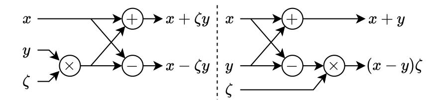
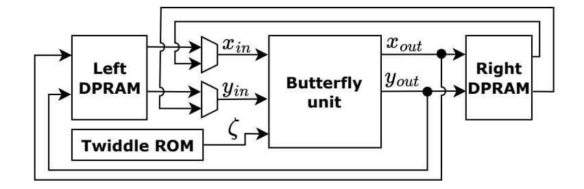
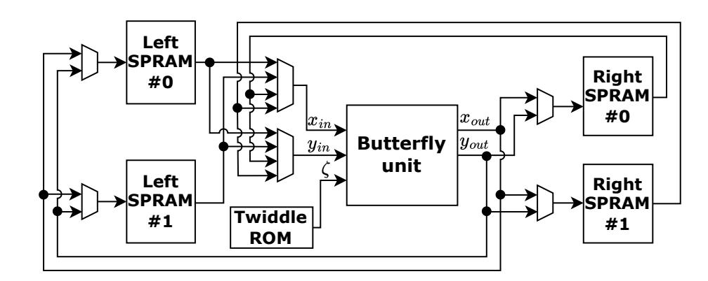
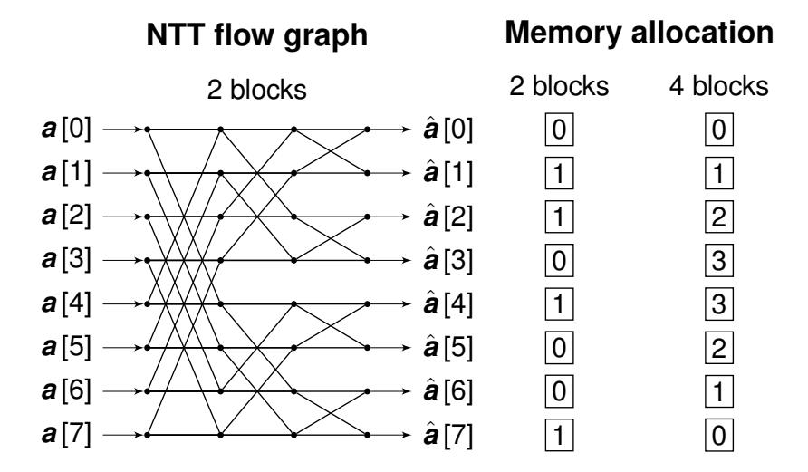
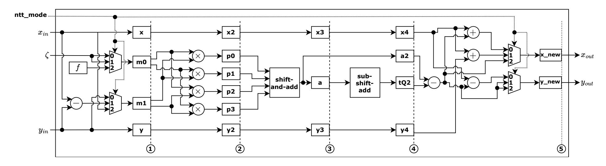
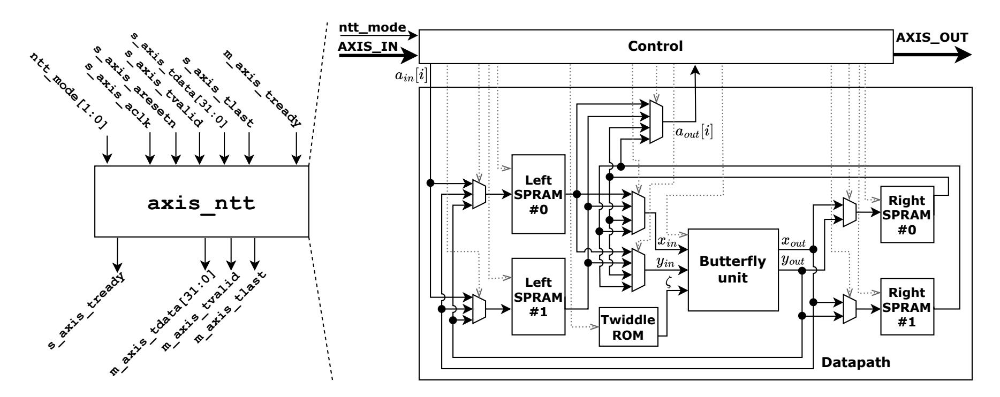
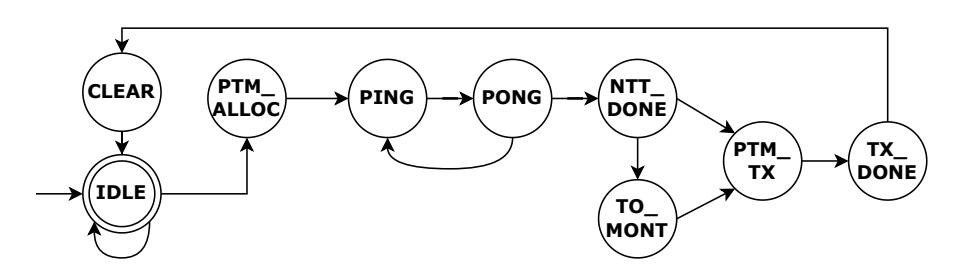
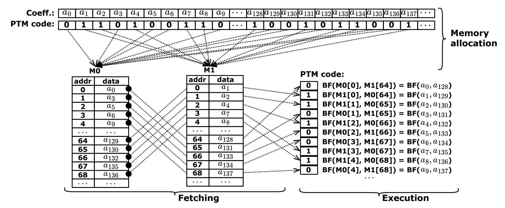
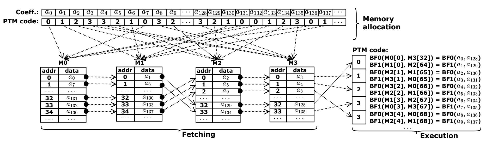
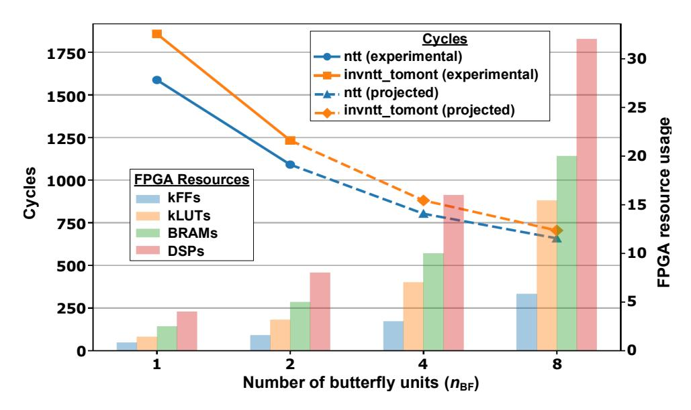

{0}------------------------------------------------

1

# Efficient Conflict-Free NTT Hardware Architecture with Single-Port RAMs: Applications to ML-DSA

Henrique S. Ogawa, Thales B. Paiva, Marcos A. Simplicio Jr, Syed M. Hafiz, and Bahattin Yildiz

*Abstract*—We present a Number Theoretic Transform (NTT) hardware architecture based on the Prouhet–Thue–Morse (PTM) code, enabling NTT implementations relying only on single-port RAMs (SPRAMs), rather than using dual-port RAMs (DPRAMs) as usually done in the literature. We show that the PTM code supports a conflict-free, transactional, and streamlined pipeline across all NTT computation stages, as well as scalable parallelism through multiple butterfly units. Using this approach, we design single- and dual-butterfly NTT modules for ML-DSA that are compliant with reference software and can be packaged as a standalone AXI-Stream peripheral, allowing the forward and inverse NTT operations to be offloaded from software via DMA transfers. Experimental results show that the proposed PTMbased NTT designs achieve near one-cycle-per-butterfly and halfcycle-per-butterfly performance for the single- and dual-butterfly configurations, respectively. At the same time, it maintains FPGA resource utilization comparable to state-of-the-art compact NTT implementations relying on mixed SPRAM/DPRAM architectures or SPRAM-only designs requiring coefficient reordering.

*Index Terms*—Post-Quantum Cryptography (PQC), Number Theoretic Transform (NTT), memory allocation patterns, hardware implementations, ML-DSA

# I. INTRODUCTION

Polynomial multiplication is a critical building block in modern cryptography. In particular, many Post-Quantum Cryptography (PQC) and Fully Homomorphic Encryption (FHE) schemes heavily depend on arithmetic operations in polynomial rings of the form R<sup>q</sup> = Zq[x]/(x <sup>n</sup> + 1), where n is a power of 2. In such schemes, polynomial multiplication usually becomes a computational bottleneck, (at least partially) dominating their asymptotic and practical runtime processing costs. This applies to standardized PQC schemes, like ML-DSA [\[1\]](#page-10-0) and ML-KEM [\[2\]](#page-10-1), as well as state-of-the-art FHE schemes like BFV [\[3\]](#page-10-2) and CKKS [\[4\]](#page-10-3).

There are several possible algorithmic approaches for polynomial multiplication, which trade simplicity for speed as the polynomial degree increases [\[5\]](#page-10-4). One example is the Karatsuba algorithm: compared to the naive Schoolbook O(n 2 ) method, it achieves O(n log<sup>2</sup> 3 ) ≈ O(n <sup>1</sup>.<sup>58</sup>) complexity by recursively reducing the number of coefficient multiplications required during its operation. Toom-Cook generalizes Karatsuba's approach by splitting polynomials into k parts, reducing the number of recursive multiplications required, and achieving an asymptotic complexity of O(n log(2k−1) k ); since a higher

Henrique S. Ogawa, Syed M. Hafiz, and Bahattin Yildiz are with the Emerging Technologies Lab, LG Electronics US, Santa Clara, CA, USA (email: {henrique1.ogawa;syedmahbub.hafiz;bahattin.yildiz}@lge.com).

Thales B. Paiva and Marcos A. Simplicio Jr are with the Universidade de Sao Paulo (USP), Brazil (e-mail: ˜ {thalespaiva;msimplicio}@larc.usp.br).

k increases interpolation and evaluation overhead, though, its value is usually restricted to 3 or 4 in practice. For largedegree polynomials, Fast Fourier Transform (FFT)-based algorithms are even faster, achieving O(n log n) performance by evaluating and interpolating polynomials at roots of unity over complex numbers. In cryptographic contexts, where modular arithmetic is required, its finite-field analog, called Number Theoretic Transform (NTT), is a common choice for enabling highly efficient modular polynomial multiplication [\[1\]](#page-10-0), [\[2\]](#page-10-1).

Even though the NTT algorithm is fully realizable in software, its intrinsic parallelism, pipeline-friendly structure, and high arithmetic intensity render it particularly well-suited for hardware-based implementations [\[6\]](#page-10-5), [\[7\]](#page-10-6). For example, hardware accelerators for NTT are useful in PQC-enabled scenarios requiring low latency and/or high throughput data processing, such as in applications that handle large volumes of digitally signed financial transactions. The potential performance gains of hardware implementations are even more critical in scenarios involving FHE schemes, where the execution of NTT and its inverse may take more than 70% of the total processing time in some settings (e.g., for ciphertext multiplications and key-switching procedures) [\[8\]](#page-10-7). Considering that FHE computations can be 104× to 105× slower than the equivalent operations performed over unencrypted data [\[9\]](#page-10-8), optimizing the NTT often constitutes a key requirement for rendering FHE viable for deployment in real-world scenarios.

Driven by these needs, many studies in the literature have proposed a variety of hardware-oriented designs for implementing the NTT [\[10\]](#page-10-9), [\[11\]](#page-10-10), [\[12\]](#page-10-11), [\[13\]](#page-10-12), [\[14\]](#page-10-13), [\[15\]](#page-10-14), [\[16\]](#page-10-15), [\[17\]](#page-10-16), [\[18\]](#page-10-17), [\[19\]](#page-10-18), [\[20\]](#page-10-19). Commonly, such NTT accelerators rely on Dual-Port RAMs (DPRAMs) to enable native concurrent data access for the radix-2 and/or radix-4 butterfly processing units. At least in part, this approach stems from the fact that, on FPGAs, DPRAMs map directly to block RAM primitives, making them convenient to use. In ASICs, however, supporting a second port incurs non-trivial overheads: dual-port macros require larger decoders and multiplexers, arbitration circuitry, and more complex control logic [\[21\]](#page-11-0). This additional logic tightens placement and routing constraints, increases energy consumption and integration costs, and often makes timing closure more challenging in ASIC design flows [\[22\]](#page-11-1). In addition, DPRAM IPs typically have higher licensing costs than their single-port counterparts. Consequently, for designs with structured forms of parallelism, it is often more advantageous to employ Single-Port RAMs (SPRAMs) and achieve multi-access behavior through techniques such as memory interleaving or time-multiplexed access [\[23\]](#page-11-2).

The primary goal of this study is to address the following

{1}------------------------------------------------

.

research question: how can an efficient NTT accelerator be designed using only SPRAMs, instead of DPRAMs, while avoiding data access conflicts? To answer it, we start by noting that FFT- and NTT-based accelerators employ conflictfree memory placements that are described algorithmically or through address permutations dependent on the NTT stage. While these constructions differ in presentation and architectural context, we observe that, in the power-of-two setting, they correspond to a simple recursive structure closely related to the Prouhet-Thue-Morse (PTM) sequence [\[24\]](#page-11-3). This perspective does not introduce new conflict-free schedules, but provides a concise formulation that unifies a range of previously proposed designs and offers additional intuition on why these address mappings arise naturally in FFT/NTT architectures.

In this work, we show how the PTM code can be used to enable conflict-free NTT hardware architectures that rely exclusively on SPRAMs. We first present the approach in a single-butterfly (nBF = 1) configuration and then extend it to multi-butterfly (nBF > 1) designs. We further demonstrate the PTM-based NTT hardware architecture in the context of ML-DSA, targeting resource-constrained devices with direct memory access (DMA) support by enabling transactional and streamlined offloading of NTT processing to a dedicated hardware module. For the specific context of ML-DSA butterfly, we propose a 5-stage pipeline architecture that replaces two Montgomery-constant multiplications with shift-and-add operations, thereby requiring only one multiplier unit per butterfly. To avoid critical path bottlenecks, the butterfly unit employs a pipelined multiplier design in which large multiplications are decomposed into smaller parallel units and the overall datapath is split across multiple pipeline stages, sustaining higher achievable clock frequencies. Besides detailing the proposed design, we also evaluate our solution's performance compared to state-of-the-art alternatives. Specifically, we show that the proposed PTM-based NTT architecture achieves near 1/nBFcycle-per-butterfly performance, i.e., corresponding to onecycle-per-butterfly and half-cycle-per-butterfly performance in the single- and dual-butterfly cases, respectively. At the same time, the resulting FPGA resource utilization remains comparable to state-of-the-art NTT implementations that rely on mixed SPRAM/DPRAM architectures or SPRAM-only designs with coefficient reordering. Our contributions are, thus:

- 1) We use the PTM code [\[24\]](#page-11-3) to enable a conflict-free, transactional, and streamlined pipeline for NTT operations using only SPRAMs, without relying on DPRAMs;
- 2) We apply the PTM-based NTT design in the context of ML-DSA, exploring both single- and dual-butterfly configurations with a Montgomery reduction-optimized pipeline architecture, and estimate resource and performance metrics for four and eight butterflies;
- 3) We demonstrate our NTT design as a standalone AXI-Stream peripheral [\[25\]](#page-11-4), providing an alternative approach for offloading forward and inverse NTT software operations to a self-contained hardware accelerator that conforms to the reference implementation [\[26\]](#page-11-5).

The rest of this paper is organized as follows. Section [II](#page-1-0) provides background on the NTT and the formulation of modular reduction techniques. Section [III](#page-2-0) reviews related work on NTT implementations in general and for ML-DSA in particular, with a focus on conflict-free memory allocation schemes and SPRAM/DPRAM requirements. Section [IV](#page-3-0) describes how the PTM concept is leveraged to avoid memory conflicts in SPRAM-only configurations. Section [V](#page-4-0) presents the proposed PTM-based NTT architectures for single- and dual-butterfly configurations. Section [VI](#page-7-0) reports the experimental results, compares the proposed designs with selected related works, and discusses potential application scenarios. Finally, Section [VII](#page-10-20) concludes the paper.

# II. BACKGROUND

<span id="page-1-0"></span>For convenience, this section briefly introduces the main concepts and algorithms employed in this work.

# *A. Number-Theoretic Transform*

Among the possible solutions for performing polynomial multiplications in a finite field, NTT is one of the most efficient alternatives under certain conditions. For negacyclic rings of the form R<sup>q</sup> = Zq[x]/(x <sup>n</sup> + 1), which are the ones used in ML-DSA [\[1\]](#page-10-0), NTT-based multiplication requires the existence of a 2n-root of unity ω in Zq. Fortunately, this condition is guaranteed to be met when q ≡ 1 (mod 2n). In this case, if *a* ∈ Rq, then the NTT of *a* is defined as

NTT(
$$\boldsymbol{a}$$
) =  $\sum_{i=0}^{n-1} \hat{a}_i x^i$ , where  $\hat{a}_i = \sum_{j=0}^{n-1} \boldsymbol{a}[j] \omega^{j(2i+1)}$ .

The inverse transformation is then defined as

$$NTT^{-1}(\hat{\pmb{a}}) = \sum_{i=0}^{n-1} a_i x^i, \text{ where } a_i = n^{-1} \sum_{j=0}^{n-1} \hat{\pmb{a}}[j] \omega^{-i(2j+1)}$$

Both the NTT and its inverse can be efficiently computed with O(n log n) operations via iterative procedures, using, respectively, Cooley-Tukey (CT) [\[27\]](#page-11-6) and Gentleman-Sande (GS) [\[28\]](#page-11-7) butterflies. Algorithm [1](#page-2-1) illustrates such a butterflybased efficient iterative procedure for computing the NTT.

We can then use the NTT and its inverse to efficiently compute the product *c* = *ab* of polynomials *a*, *b* ∈ R<sup>q</sup> as *c* = NTT<sup>−</sup><sup>1</sup> (NTT(*a*) ⊙ NTT(*b*)), where ⊙ denotes the pointwise product of the corresponding polynomial coefficients.

We remark that some cryptographic schemes may benefit from running fewer iterations of the fast NTT algorithm, which is often called an incomplete NTT [\[29\]](#page-11-8). This may result in faster operations and fewer restrictions on the parameters q and n [\[2\]](#page-10-1), [\[29\]](#page-11-8), [\[30\]](#page-11-9), [\[31\]](#page-11-10). Since we focus on ML-DSA, which uses the complete NTT formulation, we do not consider the incomplete NTT. Nevertheless, our construction can be directly applied to the incomplete case as well.

# *B. Modular Reduction*

One relevant source of overhead during the NTT operation in the ring Z<sup>q</sup> refers to the reduction modulo q of the polynomial coefficients. Efficient implementations in the literature often rely on the Barrett and Montgomery reduction

{2}------------------------------------------------

```
1: procedure NTT(\mathbf{a} \in \mathbb{Z}_p^n)
                                                          \triangleright Computes \mathbf{a} \leftarrow \text{NTT}(\mathbf{a}) in-place
             \omega \leftarrow \text{Smallest primitive root of order } 2n \text{ in } \mathbb{Z}_p
  2:
             for i = 0 to \log_2 n - 1 do
  3:
                    d \leftarrow n/2^{i+1}
  4:
                   for j = 0 to 2^i - 1 do
  5:
                           \stackrel{\cdot}{\zeta} \leftarrow \omega^{\text{bit\_reversed}\left(2^i + j, \log_2 n\right)} 
  6:
                          for u = 0 to d - 1 do
  7:
                                 t_0 \leftarrow \mathbf{a}[2dj + u]
  8:
                                 t_1 \leftarrow \zeta \cdot \mathbf{a}[2dj + u + d]
  9:
                                \mathbf{a}[2dj+u] \leftarrow t_0 + t_1
10:
                                 \mathbf{a}[2dj + u + d] \leftarrow t_0 - t_1
11:
             return a
12:
```

**Algorithm 1:** Forward NTT computation in-place.

techniques, both of which replace expensive integer division by combinations of multiplication, addition, and bit shifts tailored to a fixed modulus [32]. Nevertheless, there are also some alternative implementations based on Plantard, K-RED, and K<sup>2</sup>-RED reduction methods [33].

Barrett reduction precomputes an approximation of the reciprocal of q, given by the constant  $\mu = \left\lfloor \frac{b^{2k}}{q} \right\rfloor$ , where b denotes the machine word base and k is chosen such that  $q < b^k$ . To reduce integer x, an approximate quotient is obtained via multiplication with  $\mu$  followed by right shifts. The remainder is obtained by subtracting the product of this quotient with q. Montgomery reduction, by contrast, represents residues in a transformed domain, in which each value is implicitly multiplied by a power of the radix  $R = b^k$  modulo q. Exploiting the fact that  $\gcd(R,q) = 1$ , reductions rely on multiplications with a precomputed constant  $q^{-1} \mod R$  followed by shifts and additions, rather than divisions by q.

In hardware implementations of ML-KEM and ML-DSA, Barrett reduction is often preferred over Montgomery reduction because it typically enables a narrower datapath. In this work, however, we adopt Montgomery reduction to ensure adherence to their reference implementation. This approach enables us to evaluate more directly the benefits of the PTM-based NTT design proposed herein.

# III. RELATED WORKS

<span id="page-2-0"></span>One key aspect of our construction is the design of a conflict-free memory placement for the coefficients combined at each stage of the NTT. Conflict-free memory placement has been studied extensively in the context of FFT hardware, with early constructions appearing in works by Johnson [34] and Hsin-Fu Lo et al. [35]. These works primarily focus on specific architectural configurations, where the relationship between radix, number of memory banks, and butterfly units is fixed by design choices. These ideas were later formalized by Richardson et al. [36], who studied the general problem of conflict-free placement for FFTs where the group size and radix are powers of two, including architectures with multiple butterfly units per stage. Their framework shows how conflict-free schedules can be constructed systematically and enables efficient implementations using SPRAMs. Since the butterfly structure of the NTT is identical to that of the FFT, these techniques naturally extend to NTT-based designs. Accordingly, recent works on conflict-free memory placement for NTT accelerators, whether targeting single-port or multiport memories, commonly build upon or are closely related to the constructions introduced by Richardson *et al.* [36].

In the context of accelerating PQC schemes, Chen *et al.* [37] present scalable conflict-free mappings for radix-2 and radix-4 NTTs, while Guo and Li [38], [39] apply similar principles. Related ideas also appear in hardware accelerators for fully homomorphic encryption, where NTTs also play a central role [40], [41]. In the resulting designs, higher memory bandwidth requirements are typically addressed at the cost of extra space, using multi-port or replicated memories.

For the specific case of ML-DSA, Geng et al. [11] introduced a high-low interactive memory access pattern based on 2L dual-port RAMs, with L parallel butterfly units. Through data rearrangement between high and low indices, one coefficient is accessed per cycle, allowing the design to rely solely on simple dual-port RAMs to achieve full memory bandwidth utilization. Huang et al. [12] seek to obtain a more compact design by reducing storage requirements through crossover memory scheduling and processing rearrangement, while still using dual-port RAMs for memory access. Wang et al. [13] propose a radix-4 NTT architecture for accelerating polynomial multiplication, employing a conflict-free memory mapping scheme derived from the work of Chen et al. [37]. Similarly to many other pipelined NTT architectures recently proposed in the literature [20], [10], [14], [15], [16], [19], [17], their solution also relies on DPRAMs.

Mu et al. [18] proposed a method for generating compact and high-performance NTT accelerators for arbitrary polynomial lengths and moduli. To enable stall-free pipelined execution, the authors introduced a memory partitioning and coefficient assignment scheme that ensures conflict-free memory access, along with a conflict-free index generation algorithm for multilayer butterfly arrays. The approach reorders coefficient pairs such that the coefficients accessed in each round are distributed across distinct memory banks. The architecture relies on a combination of single-port and dual-port RAMs.

Li *et al.* [42] optimize multi-RAM access by rearranging the polynomial coefficients and twiddle factors and storing them in separate memory blocks. This rearrangement, combined with a read-before-write access strategy, avoids data conflicts, enabling continuous read and write operations. The architecture employs three RAMs per butterfly unit, where the first two RAMs store rearranged polynomial coefficients, and the third one stores rearranged twiddle factors. Although realizable with SPRAMs, the design depends on coefficient rearrangement.

Zhao et al. [20] present a segmented pipelined processing approach for NTT computation, where algorithmic operations are partitioned into multiple segments processed sequentially, aiming to reduce memory usage. The architecture replaces long shift registers with BRAMs and minimizes BRAM consumption by utilizing idle BRAM areas and ports, relying on single-port BRAMs for intermediate data. Furthermore, one dual-port 36k BRAM stores all twiddle factors required by the final three butterfly units. Taghavi et al. [33] propose an architecture to address memory bandwidth bottlenecks by storing polynomial vectors in flip-flops (FFs) instead of RAM modules. All coefficients are accessed simultaneously and then

{3}------------------------------------------------

processed by radix-2 butterfly units (BFUs) in one clock cycle per NTT stage. This approach enables high throughput at the cost of a significant increase in area usage, making it more suitable for server and cloud computing scenarios where performance is prioritized over hardware cost.

In contrast with the literature, our PTM-based NTT hard-ware architecture enables a conflict-free implementation using only SPRAMs, without requiring coefficient reordering. The result is a transactional, streamlined pipeline aimed at offloading NTT processing from resource-constrained processors.

#### <span id="page-3-0"></span>IV. CONFLICT-FREE MEMORY ALLOCATION FOR THE NTT

In this section, we discuss the importance of conflict-free allocation of NTT coefficients for SPRAMs and how this is used in our construction. We begin with a brief overview of how DPRAMs are commonly used to simplify the design of butterfly units, highlighting the challenges of replacing them with more area-efficient SPRAMs. Then, we describe the memory layout based on well-known techniques for conflict-free memory allocation adopted in our construction. The section ends with a more intuitive characterization of the conflict-free allocation of the NTT coefficients.

#### A. Baseline solution with DPRAM

The butterfly unit is a fundamental arithmetic component of NTT. It takes as inputs a pair of coefficients (x,y) and a twiddle factor  $\zeta$ , and then computes their updated values. Figure 1 illustrates the basic structures of the Cooley-Tukey and Gentleman-Sande butterflies (used in the forward and inverse NTT, respectively), which differ mainly in the ordering of their operands. It is worth noting that these structures closely resemble those used in the FFT algorithm [27], [28].



<span id="page-3-1"></span>Fig. 1. Cooley-Tukey (left) and Gentleman-Sande (right) butterflies.

Now, suppose that the coefficients of the polynomial  $\boldsymbol{a}$  processed by the butterfly are stored in a memory unit. In this case, the butterfly must fetch a pair of coefficients,  $x_{in}$  and  $y_{in}$ , from specific memory addresses corresponding to the indices 2dj+u and 2dj+u+d, respectively, as defined in Algorithm 1. To avoid sequential load operations – such as reading  $x_{in}$  in the first cycle and  $y_{in}$  in the next – many proposals in the literature employ DPRAMs, which allow both  $x_{in}$  and  $y_{in}$  to be fetched simultaneously in a single cycle. Similarly, the concept applies to the output side: instead of writing back  $x_{out}$  in one cycle and  $y_{out}$  in the next, the DPRAM allows both to be written simultaneously within the same cycle. The difference between single- and dual-port RAMs is that the first has only one address/data channel, whereas the second provides two distinct address/data channels.

Building on these ideas, we can define a baseline hardware datapath for the processing of coefficients across the NTT layers, as shown in Figure 2. The architecture consists of a



Fig. 2. Baseline NTT hardware datapath with DPRAMs.

<span id="page-3-2"></span>left-side DPRAM that supplies coefficient pairs to the butterfly unit, and a right-side DPRAM that stores the updated results. For clarity of presentation, control and multiplexing logic are omitted to highlight the core computation flow. In the subsequent layer, the roles of the memory blocks are interchanged: the right-side DPRAM becomes the data source, while the left-side DPRAM serves as the output storage. This alternating "ping-pong" process continues until all layers are completed, after which the coefficients can be retrieved from the final output DPRAM block to form the NTT(a) polynomial. In this process, the  $\zeta$  value associated with each butterfly operation can be retrieved from a Read-Only Memory (ROM) containing all the precomputed twiddle factors.

#### B. Using butterflies with SPRAM

Now, suppose we want to implement the baseline solution from Figure 2 using SPRAMs instead of DPRAMs, while avoiding the sequential fetching of  $x_{in}$  and  $y_{in}$  and the sequential writeback of  $x_{out}$  and  $y_{out}$ . One potential approach is to split the polynomial  $\boldsymbol{a}$ 's coefficients, stored in a DPRAM in the solution from Figure 2, across two separate SPRAMs. This needs to be done in such a way that each SPRAM can independently provide the  $x_{in}$  and  $y_{in}$  values simultaneously, thereby reproducing the behavior of the DPRAM setting from Figure 2. Similarly,  $x_{out}$  and  $y_{out}$  should be written into the output SPRAMs at the same address locations where  $x_{in}$  and  $y_{in}$  are stored in the corresponding input SPRAMs. This concept is illustrated in Figure 3.



<span id="page-3-3"></span>Fig. 3. NTT hardware datapath with SPRAMs.

Now, for this construction to be efficient, we need a strategy for mapping coefficients of polynomial *a* into SPRAM blocks in such a way that it enables parallel fetching and writeback of butterfly input–output pairs in the NTT. This is typically done using conflict-free memory allocation strategies [34], [36].

Figure 4 illustrates two conflict-free memory allocations, for the cases when 2 or 4 SPRAM blocks are used, considering an NTT input with 8 coefficients. In each case, we can see, by following the NTT flow graph, that all butterflies combine elements that are stored in different memory blocks.

{4}------------------------------------------------



<span id="page-4-1"></span>Fig. 4. Conflict-free memory allocation of NTT coefficients when 2 and 4 memory blocks are considered.

The general case describing how to obtain a conflict-free memory allocation was first studied by Richardson *et al.* [\[36\]](#page-11-15). The authors provide an algorithmic formulation based on rotations and XORs. While their construction is very efficient to implement in hardware, it may not be so intuitive when reasoning about the allocation.

# *C. An alternative characterization of conflict-free allocations*

We propose a different characterization, yielding allocations equivalent to well-known conflict-free constructions, following the observation that the scenario with two memory blocks follows exactly the Prouhet-Thue-Morse (PTM) sequence [\[24\]](#page-11-3), namely: 0, 1, 1, 0, 1, 0, 0, 1, 1, 0, 0, 1, 0, 1, 1, 0, . . .

While there are multiple ways to define this sequence [\[24\]](#page-11-3), for this work, the two most important ones are the following.

- 1) *Sequential formulation.* The ith term of the PTM sequence is defined as the parity of the Hamming weight of the binary representation of i.
- 2) *Recursive formulation.* Start with T<sup>0</sup> = [0]. On each iteration, set Ti+1 = [Ti∥T<sup>i</sup> ], where ∥ denotes concatenation, and T<sup>i</sup> is the sequence corresponding to the bitwise complement of each element of T<sup>i</sup> .

To the best of our knowledge, no prior work explicitly connected the PTM sequence with conflict-free memory allocation for the NTT and FFT. We highlight that this connection is relevant because it bridges the most practical sequential definition, intimately linked to Richardson *et al*.'s [\[36\]](#page-11-15) algorithm for efficiently computing the allocation, with the recursive definition, that appears naturally in the NTT/FFT flow graph.

Now that we defined the PTM for binary coefficients in scenarios with only 2 SPRAM blocks, we can define the PTMextended (PTMX) sequence to deal with more memory blocks.

*Definition 1 (PTMX sequence):* Let m and n ≥ m be powers-of-two. We define PTMXm(n) recursively as

$$PTMX_m(n) = \begin{cases} [0, 1, \dots, m-1] \in \mathbb{Z}^n, & \text{if } n = m, \\ [PTMX_m(\frac{n}{2}) \parallel \mathbf{x} - PTMX_m(\frac{n}{2})] & \text{otherwise,} \end{cases}$$

where x ∈ Z <sup>n</sup> is the vector whose coordinates are all set to m − 1, and v<sup>1</sup> ∥ v<sup>2</sup> is the concatenation of vectors v<sup>1</sup> and v2.

We now show that PTMXm(n) yields a conflict-free memory allocation for computing the NTT/FFT of polynomials with n coefficients using m memory blocks.

*Lemma 1:* When a power-of-two m ≥ 2 memory blocks are used, the PTMXm(n) sequence yields a memory allocation for the n NTT/FFT input coefficients, for which every pair of coefficients combined through butterfly operations are never in the same memory block.

*Proof 1:* We split the proof into two cases, considering first what happens in the final stages of the NTT, and then moving to the initial ones. We refer to Algorithm [1](#page-2-1) to formally reason about the parameters processed in each stage of the NTT/FFT.

*Case 1.* First, consider what happens for a stage i ≥ log<sup>2</sup> (n/m). When i = log<sup>2</sup> (n/m), Algorithm [1](#page-2-1) shows that d = m/2 butterfly operations are performed for each partition j, with 2d coefficients being manipulated. Notice that, by the definition of PTMXm(n), when n coefficients are split into j partitions of size 2d = m, it is guaranteed that the coefficients within the same partition j are each assigned to a different memory block, out of the m blocks available. This means that, for all stages i ≥ log<sup>2</sup> (n/m), all butterflies are guaranteed to combine coefficients from different memory blocks.

*Case 2.* Now suppose 0 ≤ i < log<sup>2</sup> (n/m). In this case, d = n/2 <sup>i</sup>+1 ≥ m, since both m and n are powers of two. This means that, when processing the partition j, the butterflies are applied to pairs formed among the 2d coefficients in the partition. Specifically, each butterfly u combines the coefficients whose pair of indexes are (2dj + u, 2dj + u + d), as shown in the inner loop of Algorithm [1.](#page-2-1) However, notice that, if we let m ∈ Z 2d contain the memory blocks assigned to the 2d coefficients of the jth partition, then PTMXm(n) ensures that m[u]+m[u+d] = m−1, for all u = 0 to d−1. Furthermore, since m ≥ 2, then m − 1 is odd. Therefore, m[u] ̸= m[u + d].

# V. OUR PTM-BASED NTT DESIGN FOR ML-DSA

<span id="page-4-0"></span>This section presents a method for enabling conflict-free NTT hardware designs with SPRAMs through the use of the PTM concept. We first describe the approach in a singlebutterfly setting and subsequently extend it to multi-butterfly configurations. Furthermore, we showcase the PTM-based NTT hardware design in the context of ML-DSA, which employs a complete 8-layer NTT over polynomials of length n = 256 in Zq, where q = 8380417 [\[1\]](#page-10-0).

# *A. Design rationale*

For the validation of the PTM concept, we chose to design and implement the NTT computation closely following the ML-DSA software reference model [\[26\]](#page-11-5), including the use of Montgomery reduction and a 32-bit datapath. In essence, we implement a hardware module that performs exactly the same computations as the ntt() and invntt\_tomont() functions in the C reference implementation. For I/O compatibility, the module uses the AXI-Stream protocol for input and output coefficients, allowing the software functions to be directly replaced by DMA transfer calls [\[25\]](#page-11-4).

Our approach prioritizes functional equivalence and verifiability, as matching the reference implementation bit-forbit simplifies testbench creation, simulation, and regression testing. From a broader perspective, this design choice also enables our NTT module to serve as a hardware-assisted reference model for resource-constrained MCUs. For example, embedded systems lacking the resources needed to execute 

{5}------------------------------------------------

ML-DSA's NTT in software can offload it to a self-contained peripheral compliant with the reference algorithm, providing auditable behavior and easing certification efforts.

Although the solution presented here reflects a 32-bit NTT datapath model with Montgomery reduction, the PTM strategy can also be applied to other modular reduction techniques. This includes, for example, scenarios using a 24-bit datapath with Barrett reduction, which is common in hardwareoptimized design proposals in the literature. Most importantly, the PTM logic is not limited to ML-DSA: it can be directly applied to ML-KEM NTT, other in-place radix-2 NTTs in general, and even to FFT constructions.

# *B. Unified NTT/INTT butterfly unit design*

As an initial step towards the butterfly RTL design, the CT and GS butterfly architectures are unified to enable the reuse of the Montgomery-reduction unit, which dominates the logic cost due to the required multiplier hardware. This unification is done by multiplexing the access to the Montgomery modular multiplication block (corresponding to the montgomery\_reduce() function in [\[26\]](#page-11-5)), which is the common component to both butterfly types.

Another important aspect to consider is that a direct RTL translation of the Montgomery reduction implementation from the montgomery\_reduce() function would require instantiating two 32×32→64-bit multiplier units, which are known to be resource-intensive components in ASIC design. Fortunately, we can exploit the fact that in montgomery\_reduce(), the multiplications are by constants, namely QINV and Q. For the first case, since QINV = 58728449 = 20+213+223+224+2<sup>25</sup> , the first multiplication a\*QINV can be converted into the following shift-and-add scheme (from LSB to MSB):

$$a*QINV \le (a << 0) + (a << 13) + (a << 24) + (a << 25)$$

The multiplication by Q can be derived from the observation that the modulus corresponds to the following decomposition:

$$Q = 8380417 = 2^{23} - 2^{13} + 1 = (2^{10} - 1) \cdot 2^{13} + 1$$

This representation enables a shift-and-add implementation of the multiplication, which can be expressed as:

```
t*Q <= (((tQ << 10) - tQ) << 13) + tQ
```

In this way, two multiplications are replaced by two shift-andadd operations, which are significantly less resource-intensive than generic multiplier units.

Our butterfly unit RTL design also specifies the datapath operations according to the three required operation modes:

- 1) ntt\_mode = 0: forward NTT using the CT butterfly referred to as ntt step;
- 2) ntt\_mode = 1: inverse NTT using the GS butterfly referred to as invntt step;
- 3) ntt\_mode = 2: polynomial-wide Montgomery reduction by the factor f, which corresponds to the normalization factor of the inverse NTT represented in the Montgomery domain (R · 256<sup>−</sup><sup>1</sup> mod q) – referred to as \_tomont step. Note that this step operates only on the y pointer parameter, performing Montgomery reduction

of the input y value with the factor f. As a result, the remaining parameters are unused in this operation mode.

Figure [5](#page-5-0) shows the final butterfly model that unifies the CT, GS, and \_tomont modes and requires only a single 32×32→64-bit multiplier for the multiplication of a twiddle zeta or the f factor by an arbitrary value of y.

```
void butterfly(int mode,
              int32_t *x, int32_t *y, int32_t zeta) {
   int64_t a, tQ, tQ2 ; int32_t t;
   const int32_t f = 41978;
   if (mode == 1) { // GS
       t = *x; *x = t + *y; *y = t - *y;
   }
   // Montgomery mod multiplication
   if ((mode == 0) || (mode == 1)) // CT || GS
       a = (int64_t) zeta * (*y);
   else if (mode == 2) // _tomont
       a = (int64_t) f * (*y);
   tQ = (int32_t) ((a << 0) + (a << 13) + (a << 23) +
                   (a << 24) + (a << 25));
   tQ2 = (int64_t) (((tQ << 10) - tQ) << 13) + tQ;
   t = (int32_t) ((a - tQ2) >> 32);
   if (mode == 0) { // CT
       *y = *x - t; *x = *x + t;
   }
   else if ((mode == 1) || (mode == 2)) // GS || _tomont
       *y = t;
}
```

<span id="page-5-0"></span>Fig. 5. C model of the unified CT/GS butterfly unit for the ML-DSA NTT.

Based on this butterfly model, we derive the RTL design of the butterfly unit, which is illustrated in Figure [6.](#page-6-0) The ntt\_mode input port controls the multiplexer select signals, which route the data according to the selected operation mode (ntt, invntt, or \_tomont). The Montgomery reduction circuitry is multiplexed based on the operation mode, enabling better resource reuse.

With respect to the multiplication unit, an important consideration is that a single-cycle fully combinational 32×32→64 bit multiplier constitutes a large circuit and is likely to become part of the critical path. For this reason, the multiplier is decomposed into four 16×16→32-bit units that compute partial products in parallel, which are then recombined in the subsequent clock cycle. Furthermore, the butterfly unit is partitioned into five pipeline stages, as shown in Figure [6,](#page-6-0) in order to avoid overly long combinational paths that can compromise the maximum achievable clock frequency during the synthesis of the circuit.

# *C. Single-butterfly NTT module*

To construct the datapath of the single-butterfly NTT module based on the architecture shown in Figure [3,](#page-3-3) the butterfly unit described in Figure [6](#page-6-0) is combined with the left-side and right-side SPRAM blocks depicted in the architecture diagram. It is worth noting that the use of left-side and right-side SPRAM blocks with multiplexed input and output roles aims to enable a pipelined data flow that aligns with the operation of the pipelined butterfly unit.

For ML-DSA, each SPRAM is sized at 128×32 bits (4096 bits), since the 256-element polynomial *a* is split into two parts in the single-butterfly configuration. Therefore, the datapath of the single-butterfly NTT module is composed of the butterfly

{6}------------------------------------------------



Fig. 6. Architecture for unified ML-DSA NTT/INTT butterfly unit with Montgomery reduction and a five-stage pipelined datapath. The values annotated on the multiplexers select the operation mode: forward NTT, inverse NTT, or polynomial-wide \_tomont reduction (ntt\_mode = 0, 1, or 2, respectively).

<span id="page-6-0"></span>

<span id="page-6-1"></span>Fig. 7. Architecture of the proposed single-butterfly PTM-based AXI-Stream NTT hardware design (axis\_ntt) using SPRAMs. The left side shows the I/O view of the module, while the right side shows the datapath along with the control signals exposed to the control module.

unit, four 128×32-bit SPRAMs, and a set of multiplexers. The associated control signals, including the butterfly operation mode, SPRAM write-enable and address signals, and multiplexer select signals, are exposed to the control module, which drives them using a finite-state machine (FSM). At the top level, the proposed NTT module is implemented as an AXI-Stream peripheral, receiving and transmitting input and output coefficients via the AXI-Stream protocol [25]. Accordingly, we refer to this module as axis\_ntt in the remainder of this work. With these considerations in mind, Figure 7 presents the architecture diagram of the single-butterfly axis\_ntt module. The left side of the figure shows the I/O interface, while the right side provides a top-level expanded view of the datapath elements and the exposition of the aggregated control signals to the control module.

Before detailing the control logic, we show how the 1-bit PTM code can be generated from a simple incrementing counter to obtain a low-cost construction. In essence, the PTM value is obtained by XORing the counter's bits, yielding a single-bit code. The code snippet in Figure 8 illustrates this.

For the control module, Figure 9 illustrates the FSM and the corresponding states that control the dataflow through axis\_ntt's datapath. Henceforth, we also describe how the PTM code is leveraged in the control logic of the NTT module.

*IDLE*: In this state, the slave-side AXI-Stream tready (s\_axis\_tready) signal is asserted, while the module waits

```
reg[10:0] counter;

// PTM code
wire ptm_code = counter[8] ^
    counter[7] ^ counter[6] ^ counter[5] ^ counter[4] ^
    counter[3] ^ counter[2] ^ counter[1] ^ counter[0];
```

<span id="page-6-2"></span>Fig. 8. Generating a 1-bit PTM code from an incrementing counter (Verilog).



<span id="page-6-3"></span>Fig. 9. Finite state machine (FSM) of the axis\_ntt control module and its associated control states.

for the master-side tvalid (m\_axis\_tvalid) signal to be asserted. When this handshake occurs, the input polynomial's coefficient streaming over s\_axis\_tdata is initiated in the next state, PTM\_ALLOC.

*PTM\_ALLOC:* During streaming of the input polynomial coefficients, one coefficient arrives per clock cycle. Each incoming coefficient is allocated to a left-side SPRAM according to the PTM code designation (in this case, SPRAM #0 or SPRAM #1). This allocation is achieved by coordinating the multiplexer select signals and the left-side SPRAM write-enable signals following the PTM code of the current cycle.

{7}------------------------------------------------

The PTM code is generated based on a counter that increments for each incoming coefficient. This process is exemplified in the "Memory allocation" step of Figure [11.](#page-8-0)

*PING:* "left-to-right" – after all 256 input coefficients have been allocated to SPRAM #0 or SPRAM #1, the control module transitions to the PING state, where butterfly input coefficient pairs are fetched from the left-side SPRAMs and written into the right-side SPRAMs. In this state, the PTM code controls the butterfly input multiplexers, selecting whether xin and yin are sourced from the left side's SPRAM #0 or SPRAM #1. The incrementing counter also provides the read addresses for both SPRAMs and the twiddle ROM. Furthermore, after five clock cycles, corresponding to the butterfly latency, the butterfly outputs become available, and the control module begins writing the xout and yout values into the right-side SPRAMs, mirroring the PTM-based allocation and addressing used on the left side. Both the fetching and execution phases are exemplified in the "Fetching" and "Execution" steps of Figure [11](#page-8-0) for the initial coefficient pairs of the first NTT layer.

*PONG:* "right-to-left" – in this state, data flows in the opposite direction to the PING state, with butterfly input coefficients fetched from the right-side SPRAMs and written into the left-side SPRAMs. Similarly, the PTM code controls the butterfly input multiplexers, selecting whether xin and yin are sourced from the right side's SPRAM #0 or SPRAM #1. During the writeback phase, the control module manages the process of writing xout and yout into the left-side SPRAMs, mirroring the PTM-based allocation and addressing used on the right side.

*NTT DONE:* After the PING and PONG states repeat for each NTT layer until completion, the control module transitions to the NTT DONE state. In this state, the next state is selected based on the specified ntt\_mode value: if forward mode (= 0) is selected, the control transitions to PTM TX; otherwise, if inverse mode (= 1) is selected, the control transitions to TO MONT to perform the polynomialwide Montgomery reduction.

*TO MONT:* In this state, the control module sequentially fetches all coefficients stored in the right-side SPRAMs, processes them using the butterfly unit configured in operation mode = 2 (\_tomont step), and writes the resulting coefficients back to the left-side SPRAMs.

*PTM TX:* In this state, the control module asserts the master-side tvalid signal (m\_axis\_tvalid) and waits for the corresponding tready assertion. After the handshake, the output coefficients are streamed through the master-side tdata channel (m\_axis\_tdata). The streaming process is performed by re-serializing the polynomial coefficients, and sequentially retrieving them from the SPRAMs according to the PTM-based allocation while incrementing the corresponding memory addresses.

*TX DONE:* Marks the completion of the NTT processing flow and transitions the control logic to the CLEAR state.

*CLEAR:* In this state, the controller resets all its internal FSM registers responsible for driving the SPRAM address generators, write-enable signals, multiplexer select signals, and butterfly operation mode registers, preparing the module for a fresh NTT processing flow.

# *D. Multi-butterfly NTT module*

The PTM design for enabling NTT hardware implementations with SPRAMs can also be extended to multi-butterfly architectures. For example, in a dual-butterfly setting, the following extensions are required:

- 1) Two butterfly units (Figure [6\)](#page-6-0) operating in parallel;
- 2) Using a 2-bit PTM-based dataflow requires partitioning the polynomial into four parts. Accordingly, the memory subsystem is expanded to four left- and four right-side SPRAMs, each sized at 64×32 bits, to support conflictfree fetching and writeback for the two butterfly units;
- 3) Control module whose states (see Figure [9\)](#page-6-3) are extended to manage the dataflow of four memory blocks and two butterfly units. Figure [10](#page-7-1) shows the corresponding 2-bit PTM sequence generation;
- 4) Resizing of multiplexers to accommodate the additional memory blocks and butterfly units.

```
reg[10:0] counter;
// PTM code
wire[1:0] ptm_code;
assign ptm_code[0] = counter[0] ˆ
    counter[9] ˆ counter[8] ˆ counter[7] ˆ counter[6] ˆ
    counter[5] ˆ counter[4] ˆ counter[3] ˆ counter[2];
assign ptm_code[1] = counter[1] ˆ
    counter[9] ˆ counter[8] ˆ counter[7] ˆ counter[6] ˆ
    counter[5] ˆ counter[4] ˆ counter[3] ˆ counter[2];
```

<span id="page-7-1"></span>Fig. 10. Generating a 2-bit PTM code from an incrementing counter (Verilog)

In Figure [12,](#page-8-1) we illustrate the use of the 2-bit PTM code in the control logic of the dual-butterfly axis\_ntt module. Both butterfly units operate in parallel, without pipeline stalls caused by conflicting accesses to the SPRAM blocks.

# VI. EXPERIMENTAL RESULTS & DISCUSSIONS

<span id="page-7-0"></span>For the experimental evaluation of the axis\_ntt implementation with PTM-based control logic, both the singleand dual-butterfly designs were implemented in Verilog RTL. Both designs were validated through testbench simulation by cross-checking the input and output values of the forward and inverse operation modes against the values produced by the ML-DSA reference ntt() and invntt\_tomont() software implementations [\[26\]](#page-11-5), respectively. The top-level module was synthesized using Vivado 2024.2, targeting the Xilinx Zynq ZCU102 UltraScale+ FPGA device [\[43\]](#page-11-22). The synthesis tool reports FPGA resource utilization metrics, including LUTs (lookup tables), FFs (flip-flops), BRAMs (block RAM), and DSP blocks. The maximum achievable clock frequency fmax of the RTL implementation is estimated from the reported post-synthesis worst negative slack (WNS) value. The WNS represents the difference between the target clock period Ttarget and the delay of the critical path. We can then obtain fmax = 1/(Ttarget − WNS), in Hz. A negative WNS indicates that the critical-path delay exceeds the target period, and fmax corresponds to the frequency at which the slack becomes zero.

{8}------------------------------------------------



<span id="page-8-0"></span>Fig. 11. Applying the 1-bit PTM code in the control logic of the single-butterfly axis\_ntt for the first ten butterfly steps in the first NTT layer. In the memory allocation stage (PTM ALLOC), input coefficients are routed to the corresponding left-side SPRAM block (M0 or M1) according to the PTM code associated with their indices. During the butterfly coefficient fetching and execution phase, the PTM code is used to select which memory block supplies the xin and yin inputs of the butterfly unit (BF).



<span id="page-8-1"></span>Fig. 12. Applying the 2-bit PTM code in the control logic of the dual-butterfly axis\_ntt. In the memory allocation stage (PTM ALLOC), input coefficients are routed to the corresponding left-side SPRAM blocks (M0 to M3) according to the PTM code associated with their indices. In the butterfly coefficient fetching and execution phase, the PTM code is used to select which memory blocks supply the xin and yin inputs of the two butterfly units (BF0 and BF1).

The cycle counts are determined by design, according to the control logic implemented by the FSM shown in Figure [9.](#page-6-3) For the ML-DSA case with an 8-layer NTT, the total cycle count of the axis\_ntt module in forward NTT mode (ntt) can be expressed as in Equation [1.](#page-8-2)

<span id="page-8-2"></span>
$$cycles_{ntt} = 2 \times cycles_{AXIS} + 8 \times \left(\frac{128}{n_{BF}} + latency_{BF}\right) + 3 (1)$$

This Equation can be explained as follows:

- 1) cyclesAXIS is the number of cycles required to receive and transmit the input and output coefficients through the AXI-Stream interface. In our case, with n = 256, this results in 2 × 256 = 512 cycles, as each coefficient is transferred and allocated in one clock cycle;
- 2) The factor 8× corresponds to the number of NTT layers, which is eight in the ML-DSA specification;
- 3) Each NTT layer in ML-DSA consists of 128 butterfly computations. Since one butterfly computation is performed per cycle, this term is divided by the number of butterfly units (nBF) in the design;
- 4) The butterfly unit is implemented as a 5-stage pipeline as shown in Figure [6,](#page-6-0) resulting in a latency of six cycles before the first output coefficient pair becomes available;
- 5) Finally, an additional of three cycles are required for intermediate control states and synchronization (i.e.,

# NTT DONE, TX DONE, and CLEAR).

Similarly, Equation [2](#page-8-3) expresses the total cycle count of the axis\_ntt module operating in inverse NTT mode. The overall cycle count is identical to that of the forward NTT mode, except for the extra cycles required by the final \_tomont operation. Specifically, n = 256 coefficients must be reduced, and each butterfly unit processes one coefficient per cycle; therefore, this term is divided by the number of available butterfly units (nBF). Furthermore, an additional 2×latencyBF + 2 cycles are required for intermediate address and multiplexer select resets, as well as control logic synchronization.

<span id="page-8-3"></span>
$$cycles_{invntt\_tomont} = cycles_{ntt} + \frac{256}{n_{BF}} + 2 \times latency_{BF} + 2 \quad (2)$$

Table [I](#page-10-21) shows the cycle count, maximum clock frequency, and resource utilization for the synthesized single- and dualbutterfly axis\_ntt designs in our target FPGA. For the cycle count, the 2 × 256 = 512 portion corresponding to the AXI-Stream input and output transfers is reported separately, highlighting the number of cycles for the actual NTT computation. The cycle count of the \_tomont step is also reported separately to facilitate comparison with related works. Our analysis shows that adding a second parallel butterfly unit to axis\_ntt reduces the cycle count almost by half for both the NTT and inverse NTT operations (from 1075 to 563 cycles). This performance gain, however, leads to an 

{9}------------------------------------------------

increase in resource utilization: the number of FFs, BRAMs, and DSPs approximately doubles, while the LUT count more than doubles due to the increased complexity of the control logic introduced by the additional butterfly unit. Despite the increased complexity of the control logic and the larger number of datapath elements required to achieve a 1.9× reduction in cycle count, the maximum clock frequency decreased by only 7%, indicating that the proposed design exhibits good scalability without a significant increase in critical-path delay.

#### A. Comparison with prior works

A key difference between our work and prior NTT hardware implementations is the assumed operating model. Most related works implement the NTT as a co-processor module operating in a continuous-processing mode, where data are provided continuously and I/O latency is hidden within a larger cryptographic pipeline. In contrast, our <code>axis\_ntt</code> is a standalone AXI-Stream module designed to offload the NTT computation from a CPU in a transactional send—wait—receive manner, making input and output transfers part of the end-to-end latency. Since prior works do not explicitly account for this I/O overhead, we focus the comparison on the core NTT computation cycle count, excluding the AXI-Stream transfer latency ( $2 \times 256 = 512$  cycles), to ensure a fair comparison.

Another aspect is that, since the vast majority of related works leverage DPRAMs and compare against solutions that do so, our comparative analysis considers only prior implementations that use a mixture of SPRAM and DPRAM, SPRAM only, or no RAM blocks, in order to ensure a fair comparison while highlighting alternative approaches for minimizing or avoiding the use of DPRAM.

When comparing our solution with prior designs employing a single butterfly unit, we observe that the cycle count is close to 1,024 cycles, plus additional cycles due to intermediate synchronization states and butterfly latency. This indicates a comparable one-cycle-per-butterfly throughput achieved by leveraging a pipelined architecture. Li et al. [42] use slightly more LUTs and FFs, but fewer BRAMs and DSPs, as their adopted K<sup>2</sup>-RED reduction technique enables a narrower datapath compared to Montgomery reduction. Although Mu et al. [18] also employ Montgomery reduction, their design requires more BRAMs and DSPs than ours, while using significantly fewer LUTs and FFs. When considering our dual-butterfly solution, Zhao et al. [20] also achieve an effective near halfcycle-per-butterfly throughput (512 cycles plus intermediate states and synchronization), despite employing four butterfly units instead of two. Because their design targets the minimization of storage resources, it relies on larger processing structures that require a higher number of multipliers, resulting in approximately four times more DSP usage than our solution.

Based on Table I and Equations 1-2, Figure 13 presents the projected cycle counts of the ntt and invntt\_tomont operations, along with the corresponding FPGA resource utilization, when increasing the number of butterfly units to four and eight in order to progressively halve the PTM-based NTT processing cycle count. In addition, to estimate the resource utilization of the four- and eight-butterfly variants of axis\_ntt, we apply



<span id="page-9-0"></span>Fig. 13. FPGA resource usage trade-off of axis\_ntt as the number of butterfly units  $(n_{\rm BF})$  increases. The cases  $n_{\rm BF}=1$  and 2 correspond to experimental implementations, while  $n_{\rm BF}=4$  and 8 are estimated using an analytical model (Equation 1) and the observed resource overhead between the single- and dual-butterfly designs. Note that FFs and LUTs are multiplied by 1,000 to fit in the same scale range (i.e.,  $\times 1000 \rightarrow k$ ).

scaling factors derived from the observed increase in resource usage (LUTs, FFs, BRAMs, and DSPs) when moving from the single-butterfly to the dual-butterfly design. By doing so, we observe that near one-cycle-per-coefficient performance in NTT processing can be achieved by employing four butterfly units in axis\_ntt. This level of performance is also reported by Li et al. [42] and Mu et al. [18], both of which employ the same number of butterfly units. Our design is projected to require more resources than the proposal of Li et al. [42] due to the choice of modular reduction technique, which results in a wider datapath. While the design of Mu et al. [18] requires fewer LUTs, FFs, and BRAMs than our projected 4-butterfly solution, our approach uses fewer DSP units.

Alternatively, Taghavi *et al.* [33] present an aggressive approach that enables one-cycle-per-layer latency by employing very large processing pipelines and eliminating storage requirements; however, this comes at the cost of substantially increased processing resource usage.

#### B. Application analysis

Our motivation for developing a standalone NTT module is to enable systems with scarce computational resources to efficiently offload the NTT computation — with the added benefit of not depending on DPRAM IPs. Our solution can serve as a drop-in replacement for the ntt() and invntt\_tomont() functions. For example, an MCU-based SoC could leverage the proposed axis\_ntt module via a DMA engine to offload the ntt and invntt\_tomont computations. For instance, Table II reports the cycle counts of different software implementations across commonly used microcontroller (MCU) platforms.

Naturally, cross-domain considerations must also be taken into account, such as clock frequency differences and the latency associated with streaming data to and from the accelerator through the DMA engine. Therefore, while MCUs such as the Cortex-M4 may not significantly benefit from an external NTT accelerator, more constrained platforms like the Cortex-M3 may benefit substantially. This is because the Cortex-M3 lacks support for constant-time DSP instructions available in the Cortex-M4 and later architectures. As shown in Table II, a constant-time NTT implementation on the Cortex-M3 can

{10}------------------------------------------------

TABLE I

<span id="page-10-21"></span>FPGA SYNTHESIS RESULTS FOR OUR SINGLE- AND DUAL-BUTTERFLY HARDWARE NTT, COMPARED TO RELATED WORKS USING A MIXTURE OF SPRAM AND DPRAM, SPRAM ONLY, OR NO RAM BLOCKS. THE AXI-STREAM I/O LATENCY (512 CYCLES) IS OMITTED FOR NORMALIZATION PURPOSES.

| Solution               | Target            |     | Latency (cycles) |        |         | fmax    | LUT    | FF     | BRAM | DSP |
|------------------------|-------------------|-----|------------------|--------|---------|---------|--------|--------|------|-----|
|                        |                   | nBF | ntt              | invntt | _tomont |         |        |        |      |     |
| axis_ntt: ours (SPRAM) | Zynq ZCU102       | 1   | 1,075            | 1,075  | 270     | 332 MHz | 1,423  | 818    | 2.5  | 4   |
| axis_ntt: ours (SPRAM) | Zynq ZCU102       | 2   | 563              | 563    | 142     | 308 MHz | 3,185  | 1,578  | 5    | 8   |
| [42] (SPRAM)           | Kintex XKCU060    | 1   | 1,052            | 1,052  | –       | 255 MHz | 1,623  | 1,325  | 1.5  | 3   |
| [42] (SPRAM)           | Kintex XKCU060    | 4   | 284              | 284    | –       | 250 MHz | 5,478  | 4,955  | 6    | 12  |
| [18] (SPRAM+DPRAM)     | Virtex-7 XC7VX690 | 1   | 1,031            | 1,031  | –       | 187 MHz | 691    | 451    | 3    | 5   |
| [18] (SPRAM+DPRAM)     | Virtex-7 XC7VX690 | 4   | 270              | 270    | –       | 175 MHz | 2,466  | 1,637  | 4.5  | 20  |
| [20] (SPRAM+DPRAM)     | Artix-7 XC7Z020   | 4   | 533              | 536    | –       | 311 MHz | 524    | 759    | 1    | 17  |
| [33] (No RAM)          | Virtex-7 XCU250   | 128 | 7                | 7      | –       | 400 MHz | 34,595 | 18,565 | 0    | 256 |

<span id="page-10-22"></span>TABLE II PERFORMANCE OF (INVERSE) NTT IN MCU-BASED SOFTWARE IMPLEMENTATIONS FOR ML-DSA. CT/VT = CONSTANT/VARIABLE TIME

| Target CPU    | Software                  | ntt    | invntt |
|---------------|---------------------------|--------|--------|
|               | implementation            | cycles | cycles |
| ARM Cortex-M4 | Ref. [26], CT             | 40,899 | 45,750 |
| ARM Cortex-M4 | pqm4 [44], CT             | 5,356  | 5,496  |
| ARM Cortex-M3 | Greconici et al. [45], VT | 19,347 | 21,006 |
| ARM Cortex-M3 | Greconici et al. [45], CT | 33,025 | 36,609 |

require more than 30,000 CPU cycles due to the limitations of variable-latency multiplication instructions and the need to employ countermeasures to enforce constant-time execution, which is often required for side-channel resistance. In this scenario, the proposed axis\_ntt module can be particularly beneficial, as it enables the MCU to offload the NTT computation to an external accelerator while the CPU continues executing other tasks until the NTT operation completes.

# VII. CONCLUSION

<span id="page-10-20"></span>In this paper, we demonstrated how the PTM code can be leveraged to enable a DPRAM-free NTT hardware architecture while guaranteeing conflict-free memory access throughout all NTT computation phases. We validated this approach in the context of ML-DSA, designing a scalable datapath and control architecture that can be adapted to different numbers of parallel butterfly units. We also evaluated the performance and resource utilization of the proposed NTT processing pipeline and compared it against selected prior solutions that reduce DPRAM usage either by combining SPRAM and DPRAM or by relying exclusively on SPRAMs. Finally, we packaged our design as a standalone AXI-Stream peripheral that can be directly connected to a DMA engine to serve as a dropin replacement for the reference software forward and inverse NTT functions, thereby offloading these operations to a dedicated accelerator and potentially enabling reference-compliant ML-DSA implementations on resource-constrained systems.

Future work includes extending the PTM-based NTT design to other schemes (e.g., ML-KEM), and systematically evaluating the potential benefits of avoiding DPRAMs in ASICs.

# REFERENCES

- <span id="page-10-0"></span>[1] NIST, "Module-lattice-based digital signature standard (FIPS 204)," tech. rep., National Institute of Standards and Technology, USA, 2024.
- <span id="page-10-1"></span>[2] NIST, "Module-lattice-based key-encapsulation mechanism standard (FIPS 203)," tech. rep., National Institute of Standards and Technology, USA, 2024.

- <span id="page-10-2"></span>[3] Z. Brakerski, C. Gentry, and V. Vaikuntanathan, "(Leveled) fully homomorphic encryption without bootstrapping," in *3rd Innovations in Theoretical Computer Science Conference*, pp. 309–325, ACM, 2012.
- <span id="page-10-3"></span>[4] J. Cheon, A. Kim, M. Kim, and Y. Song, "Homomorphic encryption for arithmetic of approximate numbers," in *Advances in Cryptology – ASIACRYPT'17*, pp. 409–437, Springer, 2017.
- <span id="page-10-4"></span>[5] J. Mera, A. Karmakar, and I. Verbauwhede, "Time-memory trade-off in Toom-Cook multiplication: an application to module-lattice based cryptography," *TCHES*, vol. 2020, no. 2, pp. 222–244, 2020.
- <span id="page-10-5"></span>[6] M. Niasar, R. Azarderakhsh, and M. Kermani, "High-speed NTT-based polynomial multiplication accelerator for post-quantum cryptography," in *28th symposium on computer arithmetic*, pp. 94–101, IEEE, 2021.
- <span id="page-10-6"></span>[7] J. Sun and X. Bai, "A high-speed hardware architecture of an NTT accelerator for CRYSTALS-Kyber," *Integrated Circuits and Systems*, vol. 1, no. 2, pp. 92–102, 2024.
- <span id="page-10-7"></span>[8] J. Kim, G. Lee, S. Kim, G. Sohn, M. Rhu, J. Kim, and J. Ahn, "ARK: Fully homomorphic encryption accelerator with runtime data generation and inter-operation key reuse," in *Proceedings of MICRO'22*, pp. 1237– –1254, IEEE, 2023.
- <span id="page-10-8"></span>[9] N. Samardzic, A. Feldmann, A. Krastev, S. Devadas, R. Dreslinski, C. Peikert, and D. Sanchez, "F1: A fast and programmable accelerator for fully homomorphic encryption," in *Proceedings of Micro'21*, pp. 238–252, IEEE, 2021.
- <span id="page-10-9"></span>[10] G. Land, P. Sasdrich, and T. Guneysu, "A hard crystal - Implementing ¨ Dilithium on reconfigurable hardware," in *Int. Conf. on Smart Card Research and Advanced Applications*, pp. 210–230, Springer, 2021.
- <span id="page-10-10"></span>[11] Y. Geng, X. Hu, M. Li, and Z. Wang, "Rethinking parallel memory access pattern in number theoretic transform design," *IEEE Trans. on Circuits and Systems*, vol. 70, no. 5, pp. 1689–1693, 2023.
- <span id="page-10-11"></span>[12] T. Huang, J. Lu, A. Li, L. Chen, K. Li, J. Zhang, M. Wang, X. Mei, H. Li, and D. Liu, "A lightweight and efficient post quantum cryptoprocessor for ML-DSA," *IEEE Trans. on Circuits and Systems*, 2025.
- <span id="page-10-12"></span>[13] T. Wang, C. Zhang, P. Cao, and D. Gu, "Efficient implementation of Dilithium signature scheme on FPGA SoC platform," *IEEE Trans. on VLSI Systems*, vol. 30, no. 9, pp. 1158–1171, 2022.
- <span id="page-10-13"></span>[14] L. Beckwith, D. Nguyen, and K. Gaj, "High-performance hardware implementation of Crystals-Dilithium," in *International Conference on Field-Programmable Technology (ICFPT)*, pp. 1–10, IEEE, 2021.
- <span id="page-10-14"></span>[15] D. Kundi, J. Mera, P. Strub, and M. Hutter, "High-performance NTT hardware accelerator to support ML-KEM and ML-DSA," in *Workshop on Attacks and Solutions in Hardware Security*, pp. 100–105, 2024.
- <span id="page-10-15"></span>[16] T. Nguyen, B. Nguyen, C. Pham, and T. Hoang, "High-speed NTT accelerator for CRYSTAL-Kyber and CRYSTAL-Dilithium," *IEEE Access*, vol. 12, pp. 34918–34930, 2024.
- <span id="page-10-16"></span>[17] S. Mandal and D. B. Roy, "KiD: A hardware design framework targeting unified NTT multiplication for CRYSTALS-Kyber and CRYSTALS-Dilithium on fpga," in *37th Int. Conf. on VLSI Design and 23rd Int. Conf. on Embedded Systems (VLSID)*, pp. 455–460, IEEE, 2024.
- <span id="page-10-17"></span>[18] J. Mu, Y. Ren, W. Wang, Y. Hu, S. Chen, C. Chang, *et al.*, "Scalable and conflict-free NTT hardware accelerator design: Methodology, proof, and implementation," *IEEE Transactions on Computer-Aided Design of Integrated Circuits and Systems*, vol. 42, no. 5, pp. 1504–1517, 2022.
- <span id="page-10-18"></span>[19] N. Gupta, A. Jati, A. Chattopadhyay, and G. Jha, "Lightweight hardware accelerator for post-quantum digital signature Crystals-Dilithium," *IEEE Trans. on Circuits and Systems*, vol. 70, no. 8, pp. 3234–3243, 2023.
- <span id="page-10-19"></span>[20] C. Zhao, N. Zhang, H. Wang, B. Yang, W. Zhu, Z. Li, *et al.*, "A compact and high-performance hardware architecture for CRYSTALS-Dilithium," *TCHES*, pp. 270–295, 2022.

{11}------------------------------------------------

- <span id="page-11-0"></span>[21] K. Bhagirath, D. Pant, A. Tiwari, and V. Khaneja, "Advanced HLS for reconfigurable image processing in big data systems," in *Big Data and Artificial Intelligence*, pp. 148–162, Springer Nature Switzerland, 2025.
- <span id="page-11-1"></span>[22] M. Reddy and G. Sujatha, "Optimized synchronous dual-port memory design using flip-flop clock gating," *IJISRT*, vol. 10, no. 11, 2025.
- <span id="page-11-2"></span>[23] H. Jain, M. Edwards, E. Elenberg, A. Rawat, and S. Vishwanath, "Achieving multi-port memory performance on single-port memory with coding techniques," in *3rd ICICT*, pp. 366–375, IEEE, 2020.
- <span id="page-11-3"></span>[24] J. Allouche and J. Shallit, "The ubiquitous Prouhet-Thue-Morse sequence," in *Sequences and their Applications*, pp. 1–16, Springer, 1999.
- <span id="page-11-4"></span>[25] Arm Ltd., "AMBA AXI-Stream Protocol Specification (ARM IHI 0051B)," Tec. Specification IHI 0051B, Arm Limited, 2021. Defines the AMBA AXI-Stream protocols (AXI4-Stream and AXI5-Stream).
- <span id="page-11-5"></span>[26] pq-crystals, "Reference implementation of the CRYSTALS-Dilithium signature scheme." [https://github.com/pq-crystals/dilithium,](https://github.com/pq-crystals/dilithium) 2026.
- <span id="page-11-6"></span>[27] J. Cooley and J. Tukey, "An algorithm for the machine calculation of complex Fourier series," *Mathematics of computation*, vol. 19, no. 90, pp. 297–301, 1965.
- <span id="page-11-7"></span>[28] W. Gentleman and G. Sande, "Fast fourier transforms: For fun and profit," in *Proc. of AFIPS'66*, pp. 563–578, 1966.
- <span id="page-11-8"></span>[29] S. Hafiz, B. Yildiz, M. Simplicio, T. Paiva, H. Ogawa, G. De Micheli, and E. Cominetti, "Incompleteness in Number-Theoretic Transforms: New tradeoffs and faster lattice-based cryptographic applications," in *IEEE European Symposium on Security and Privacy*, pp. 565–584, 2025.
- <span id="page-11-9"></span>[30] M. Kannwischer, *Polynomial multiplication for post-quantum cryptography*. PhD thesis, Radboud Universiteit, 2022.
- <span id="page-11-10"></span>[31] T. Paiva, G. De Micheli, S. Hafiz, M. Simplicio, and B. Yildiz, "Faster amortized bootstrapping using the incomplete NTT for free," *TCHES* , vol. 2025, no. 4, pp. 520–543, 2025.
- <span id="page-11-11"></span>[32] A. Bosselaers, R. Govaerts, and J. Vandewalle, "Comparison of three modular reduction functions," in *CRYPTO*, pp. 175–186, Springer, 1993.
- <span id="page-11-12"></span>[33] B. Taghavi, R. Azarderakhsh, and M. Kermani, "Parallelntt: Maximizing performance of forward and inverse ntt on fpga for ml-dsa and ml-kem," in *Proc. of the Great Lakes Symposium on VLSI*, pp. 372–378, 2025.
- <span id="page-11-13"></span>[34] L. Johnson, "Conflict free memory addressing for dedicated FFT hardware," *IEEE Trans. on Circuits and Systems*, vol. 39, pp. 312–316, 2002.
- <span id="page-11-14"></span>[35] H. Lo, M. Shieh, and C. Wu, "Design of an efficient FFT processor for DAB system," in *ISCAS'01*, vol. 4, pp. 654–657, IEEE, 2001.
- <span id="page-11-15"></span>[36] S. Richardson, D. Markovic, A. Danowitz, J. Brunhaver, and ´ M. Horowitz, "Building conflict-free FFT schedules," *IEEE Trans. on Circuits and Systems*, vol. 62, no. 4, pp. 1146–1155, 2015.
- <span id="page-11-16"></span>[37] X. Chen, B. Yang, S. Yin, S. Wei, and L. Liu, "CFNTT: Scalable radix-2/4 NTT multiplication architecture with an efficient conflict-free memory mapping scheme," *TCHES*, pp. 94–126, 2022.
- <span id="page-11-17"></span>[38] W. Guo and S. Li, "Highly-efficient hardware architecture for Crystals-Kyber with a novel conflict-free memory access pattern," *IEEE Trans. on Circuits and Systems*, vol. 70, no. 11, pp. 4505–4515, 2023.
- <span id="page-11-18"></span>[39] W. Guo and S. Li, "Split-radix based compact hardware architecture for Crystals-Kyber," *IEEE Trans. on Computers*, vol. 73, pp. 97–108, 2023.
- <span id="page-11-19"></span>[40] D. Pont, J. Bertels, F. Turan, M. Beirendonck, and I. Verbauwhede, "Hardware acceleration of the prime-factor and rader NTT for BGV fully homomorphic encryption," in *31st ARITH*, pp. 1–8, IEEE, 2024.
- <span id="page-11-20"></span>[41] Y. Xing, G. Li, Z. Ye, R. Luk, D. Chen, H. Yan, and R. Cheung, "Highradix/mixed-radix NTT multiplication algorithm/architecture co-design over fermat modulus," *IEEE Trans. on Computers*, 2025.
- <span id="page-11-21"></span>[42] B. Li, Y. Yan, Y. Wei, and H. Han, "Scalable and parallel optimization of the number theoretic transform based on FPGA," *IEEE Trans. on VLSI Systems*, vol. 32, no. 2, pp. 291–304, 2023.
- <span id="page-11-22"></span>[43] Advanced Micro Devices, Inc., "Zynq UltraScale+ MPSoC ZCU102 evaluation kit (ek-u1-zcu102-g)." Online. Accessed: Jan. 22, 2026.
- <span id="page-11-23"></span>[44] M. Kannwischer, M. Krausz, R. Petri, and S. Yang, "pqm4: Benchmarking NIST additional post-quantum signature schemes on microcontrollers," *Cryptology ePrint Archive*, 2024.
- <span id="page-11-24"></span>[45] D. Greconici, M. Kannwischer, and A. Sprenkels, "Compact Dilithium implementations on Cortex-M3 and Cortex-M4," *IACR Transactions on Cryptographic Hardware and Embedded Systems*, pp. 1–24, 2021.