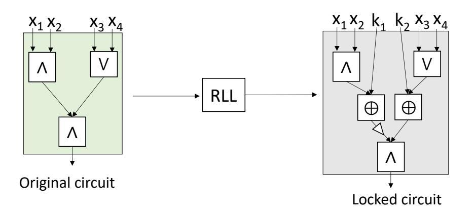
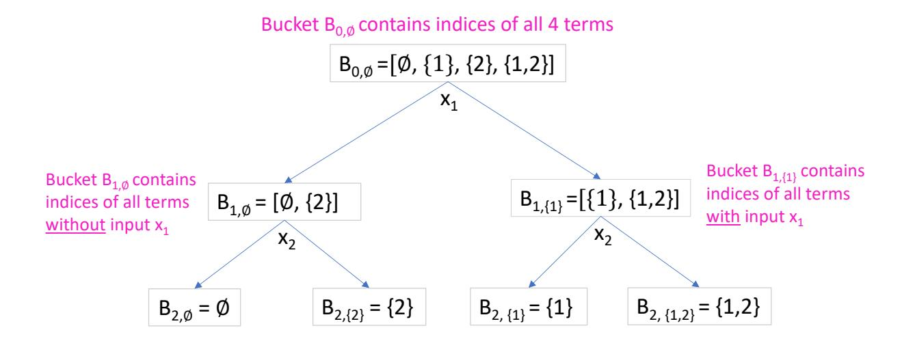
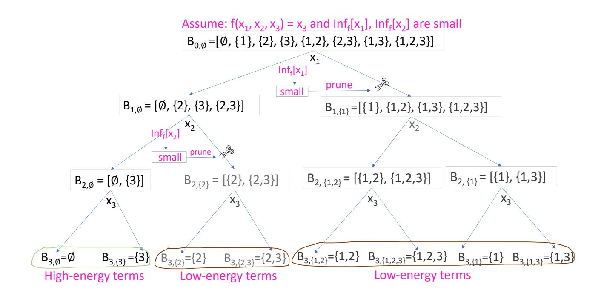
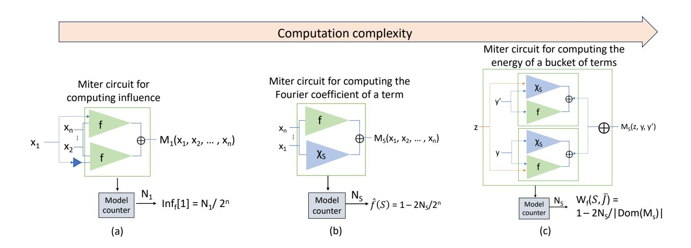
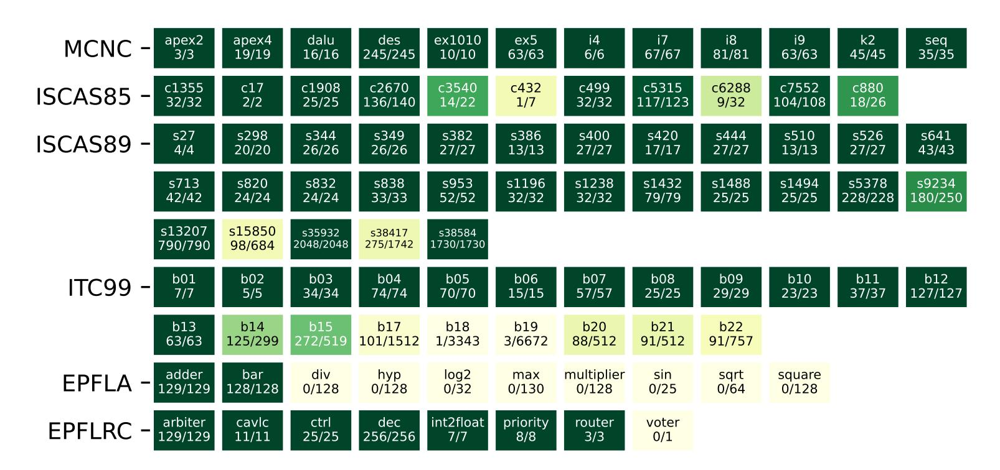
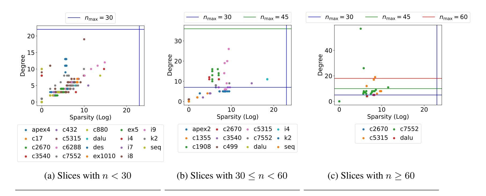
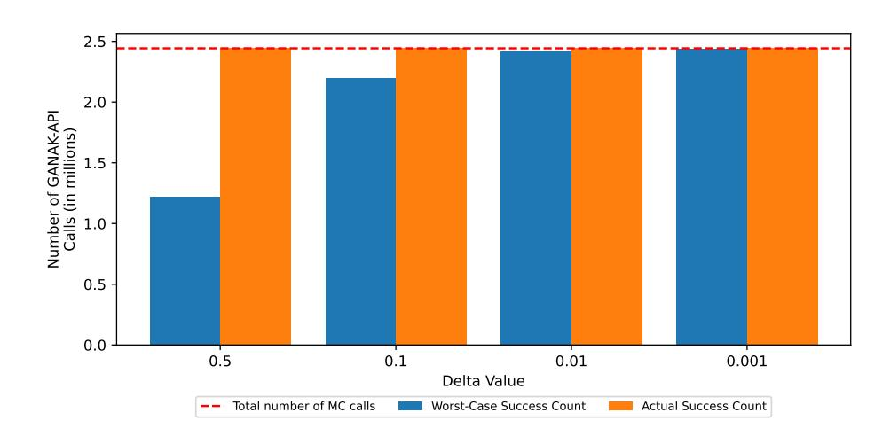
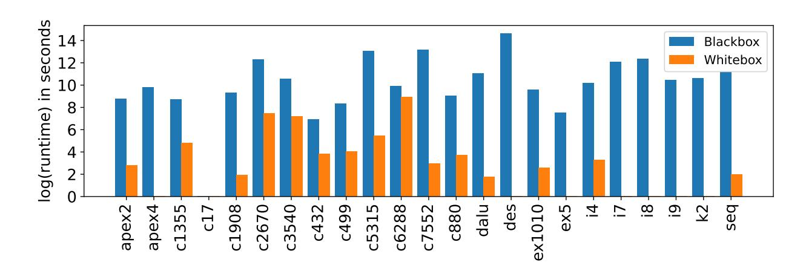
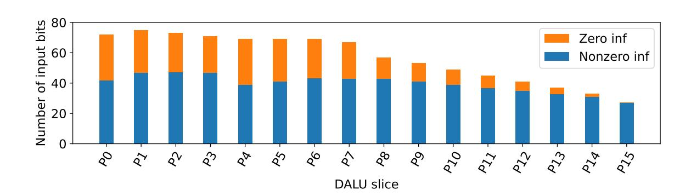

{0}------------------------------------------------

# **Bad Benchmarks and a Fourier-Analytic Framework for Characterizing the (Un)Hideability of Combinational-Logic Circuits**

Animesh Chhotaray1\*, Kollin Labowski2\* and Thomas Shrimpton2*,*3

1 Georgia Institute of Technology, Atlanta, GA, USA, [achhotaray3@gatech.edu](mailto:achhotaray3@gatech.edu) 2 University of Florida, Gainesville, FL, USA, [klabowski@ufl.edu](mailto:klabowski@ufl.edu) 3 Galois, Inc., Portland, OR, USA, [tshrimpton@galois.com](mailto:tshrimpton@galois.com)

**Abstract.** Design-hiding (DH) schemes, such as logic locking, aim to protect circuit-design intellectual property (IP) in the integrated-circuit (IC) supply chain. While many practical DH schemes have been proposed over the past 15 years, nearly all have been broken by efficient attacks. Security and efficiency claims for these schemes have been based primarily on evaluations using benchmark circuits from legacy test-suites such as ISCAS'85 and MCNC. Recent work suggests that some circuits are fundamentally unhideable, as their functionality can be approximately learned using classical blackbox (BB) learning-theoretic (LT) algorithms. In this work, we ask: How prevalent are unhideable circuits in standard DH benchmarks? To answer this, we identify properties—such as sparse Fourier spectra—that make circuits unhideable. However, since BB Fourier-analytic algorithms are often slow and inaccurate for large-domain circuits, we shift to a whitebox (WB) setting. We develop new, efficient WB variants of Fourier-analytic algorithms that leverage WB access to a circuit and advances in model counting to efficiently evaluate whether the circuit has properties that make it unhideable. Upon applying these algorithms to standard DH benchmarks, we find that most circuits in the ISCAS'85 and MCNC test-suites are fundamentally unhideable, whereas newer benchmarks exhibit stronger resistance to Fourier-analytic algorithms and merit broader use in DH evaluation.

**Keywords:** design-hiding · hardware obfuscation · logic locking · Fourier analysis · model counting · learning theory

### **1 Introduction**

Modern integrated-circuits (ICs, or "chips") are the product of a globally distributed supplychain [\[TI19\]](#page-24-0). Once a circuit design is complete, its digital intellectual property (IP) must be fabricated into physical chips. The vast majority of IP authors must send their circuit designs to a third-party commercial foundry for fabrication, where they may be the targets of reverseengineering attacks, and other forms of IP theft. In addition to the loss of revenue to IP authors (amounting to hundreds of billions of dollars, annually [\[Cou12,](#page-21-0)[GHD](#page-22-0)+14]), having full view of the circuit design enables the fabrication of (purposefully) out-of-spec chips, and may enable insertion of stealthy, targeted hardware trojans [\[CB11,](#page-21-1)[BHBN14\]](#page-21-2).

In response to this real and present threat, the hardware-security community has proposed various methods — best known as "logic locking"; more recently, *design-hiding* (DH) schemes [\[CS22\]](#page-21-3) to protect circuit-design IP against theft and subversion. Instead of sending the circuit design in the clear, the IP author uses a DH scheme to produce an "opaque" version of the original circuit that conceals its original functionality. This is achieved using randomness, typically embodied

\*These authors contributed equally to this work.

{1}------------------------------------------------

in a cryptographic key that is kept secret by the IP author. When the foundry returns fabricated chips to the IP author, assuming the foundry honestly fabricates what they were sent, they will implement the opaque circuit. The IP author then uses the secret key to restore the chips so that they implement the original circuit. Once restored, the chips are ready to be placed on the market.

Threat model. Now, when talking about the (in)ability of this or that design-hiding scheme to withstand attacks, prior works have converged on a standard attack model. In it, the adversarial foundry is provided with whitebox access to whatever circuit design it receives, and blackbox (or oracle) access to a restored chip. The former captures the reality that the IP author sends *some* circuit to the foundry for fabrication, while the latter captures the ability of the foundry (or a proxy) to purchase fully restored chips from the marketplace, post-fabrication. The goal of attacks admitted in this model is to "learn" the functionality of the IP author's original circuit *Cf* . What "learn" means varies some, but a typical goal is to output a circuit *Cg* such that Pr[ *Cg*(*x*) ̸= *Cf* (*x*) ] ≤ *ϵ* (over uniform *x*), where 0 ≤ *ϵ <* 0*.*5. When *ϵ* = 0, the goal of the adversary is to learn the full functionality of the IP author's original circuit. This was formalized as the full-function-recovery security notion by Chhotaray and Shrimpton [\[CS22\]](#page-21-3). Other works [\[SML](#page-23-0)+18[,SLM](#page-23-1)+17a] implicitly consider *ϵ >* 0, which captures an approximate or partial-function-recovery goal.

A few recent works [\[CS22,](#page-21-3) [SPJ19b\]](#page-23-2) have observed that some circuits *cannot be protected by any DH scheme* in the standard attack model, or any variation that provides an oracle for the original circuit. Chhotaray and Shrimpton [\[CS22\]](#page-21-3) referred to such circuits (and the functions they compute) as *simple*. Specifically, if the adversarial foundry can use *only* oracle access to the original circuit (via purchased chips) and learn its functionality — partially or fully — then it doesn't even need to use the opaque circuit that the DH scheme outputs for the attack. Hence, the IP author's original simple circuit is unhideable by *any* DH scheme.

What makes a circuit "simple"? As a straightforward example, if a circuit *C* has (say) 20-bits of input, then, with 2 20 queries to an oracle for *C*, the full input-output table can be recovered by brute force. More generally, what makes a circuit *C* simple is the existence of an *efficient* algorithm that outputs a high-fidelity approximation of *C*, using *only oracle access to C*. (Efficiency is important, otherwise the brute-force attack would label a circuit with 100-bits of input as simple.) Classical learning-theoretic (LT) algorithms, such as the low-degree algorithm [\[LMN93\]](#page-22-1) and Kushilevitz-Mansour [\[KM93\]](#page-22-2), assume only blackbox access to the circuit to be learned; so they are in scope, potentially, for establishing simplicity.

We say "potentially" because the accuracy and efficiency of these algorithms applied to realistic circuits has been unclear. One perspective on the technical contributions of our work is that we begin to clarify this matter.[1](#page-0-0)

Recognizing that a circuit is simple has useful implications for practice and research. For one, an IP author may decide not to incur the size, power, and delay overhead that a DH scheme will impart when their circuit is simple. For another, simple circuits are of little to no value in evaluating the security of candidate DH schemes. In fact, one impetus for this work was our wondering if the five suites of benchmarking circuits — MCNC, ISCAS'85, ISCAS'89, ITC'99 and EPFL — that were used to evaluate the security and operational efficiency of almost all DH schemes and attacks against them contained any simple circuits.

Evaluating the simplicity of circuits. In this paper, we develop an efficient framework for evaluating the simplicity of circuits with respect to a class of *Fourier-based* LT methods. This class includes, among others, the low-degree and Kushilevitz-Mansour algorithms. At a high level, these LT methods output approximations of a target (Boolean) function, by estimating the Fourier spectrum of the function. In [Section 3,](#page-5-0) we will detail this approach.

1 In our experiments, we consider adversaries with multiple "levels" of computational resources, by choosing threshold values for these algorithms based on the maximum number of blackbox queries they can make (and store/compute upon). On the low end, we take 2 30 as the bound for adversaries with modest computational resources (e.g., a standard laptop and a few days of computing time); on the high end, we take 2 60 as the bound on large-scale attackers. We motivate these threshold choices in [Section 5.](#page-11-0)

{2}------------------------------------------------

The major technical challenges that we face stem from the significant computational cost of running these algorithms on circuits with realistic numbers of input and ouptut bits; and from the low quality of their approximations when given (arguably) generous computational budgets.

A collection of analytical and engineering observations lead us, ultimately, to develop three new approaches to computing the necessary Fourier-spectral quantities that are orders of magnitude faster and more accurate than traditional methods. One of our new approaches achieves a 88x speedup, on average, over traditional ones, and provides more accurate estimation. The development of these three new approaches is the main technical contribution of this work.

Distribution of simple circuits in the "big five" test-suites. Returning to our initial motivations, we use our framework and its new techniques to study the simplicity of circuits in the "big five" test suites. Note that these five test suites are comprised of 91 circuits, which carry out a variety of arithmetic and logical functionalities. They have input spaces that range from 5-bits to 6672-bits, and output spaces that range from 1-bit to 2048-bits.

We find that the majority of circuits in the MCNC, ISCAS'85 and '89 test suites *are simple*. Notably: all 12 MCNC circuits, and 7/11 ISCAS'85 circuits, are simple. Recall that these two test-suites were used for empirical evaluation in the vast majority of prior work on DH schemes. We also find that our fast methods fail to determine the simplicity of 8/10 arithmetic circuits in the EPFL test-suite and 8/21 ITC'99 circuits. This suggests that these circuits *may* be better candidates (than MCNC and the ISCAS suites) for evaluating DH schemes and attacks.

Characterization, not attacks. We want to emphasize that, in this work, we neither present a new attack nor introduce a new DH scheme. Instead, we use our new Fourier methods to check whether the circuits that are being used to evaluate the security of DH schemes are simple (i.e., unhideable) with respect to an adversarial foundry that can purchase a chip from the market and attempt to learn its (approximate) functionality using just oracle queries to the chip. Since all circuits in the MCNC test-suite and 7/11 ISCAS'85 circuits turn out to be simple in this way, *no* DH scheme could have protected them, *including* provable-security schemes [\[BGH](#page-21-4)+22,[MGM](#page-22-3)+22]. Such a result is indicative of 15+ years of futile empirical evaluation of DH scheme security.

Paper roadmap. Following this brief introduction, [Section 2](#page-3-0) provides background and details about the test suites, and their use by the DH community.

In [Section 3,](#page-5-0) we give an introduction to the ideas and computational objects that we will borrow from the literature on Fourier analysis of Boolean functions. There, we will also give an overview of the main computational approach to estimating the significant terms in the Fourier spectrum, the celebrated Goldreich-Levin algorithm.

In [Section 4,](#page-8-0) we will explain how whitebox access to a circuit design can be leveraged to enhance the performance of Goldreich-Levin. Note that whitebox access to the circuit does not trivialize what our framework is meant to do, namely to characterize the simplicity of that circuit. It does, however, allow us to recast the core computations performed by Goldreich-Levin in a way that admits significantly improved performance and accuracy. In particular, we show how this recasting allows the use of model counters (e.g., GANAK [\[SRSM19\]](#page-23-3)) to do most of the computational heavy lifting.

In [Section 5,](#page-11-0) we use our accelerated Goldreich-Levin algorithm to perform a Fourier analysis of the circuits in the standard test suites and [Section 6](#page-16-0) compares the performance of the whiteboxaccelerated techniques proposed in this paper with their classical blackbox counterparts.

Finally, in [Section 7,](#page-18-0) we identify directions for follow-up work that builds on the concepts we discuss.

What's next? Our work explores simplicity through the lens of Fourier analysis, in large part because this is the core of an important class of learning-theoretic algorithms. We expect that there are other fruitful approaches to exploring circuit simplicity. If so, these should be developed into computationally efficient tools, and added to our framework.

{3}------------------------------------------------

| DH Scheme                             | Year | Duolson ha                       | Benchmarks used |          |          |          |             |       |  |
|---------------------------------------|------|----------------------------------|-----------------|----------|----------|----------|-------------|-------|--|
|                                       |      | Broken by                        | MCNC            | ISCAS'85 | ISCAS'89 | ITC'99   | <b>EPFL</b> | Other |  |
| RLL [RKM08]                           | 2008 | SAT-attack [SRM15]               |                 | 1        |          |          |             |       |  |
| RLBLock [BTZ10]                       | 2010 | SAT-attack [SRM15]               | <b>/</b>        |          |          |          |             |       |  |
| SLL [RPSK12b]                         | 2012 | SAT-attack [SRM15]               |                 | <b>✓</b> |          |          |             |       |  |
| FLL [RPSK12a]                         | 2012 | SAT-attack [SRM15]               |                 | <b>✓</b> |          |          |             | 1     |  |
| MuxLock [PM14]                        | 2014 | SAT-attack [SRM15]               |                 |          |          |          |             | 1     |  |
| AOLL [DBDN + 14]           |      | SAT-attack [SRM15]               |                 | 1        | 1        |          |             | 1     |  |
| SARLock [YMRS16]                      | 2016 | DoubleDip [SZ17]                 |                 | <b>✓</b> | ✓        |          |             | 1     |  |
| Anti-SAT [XS16]                       |      | AppSAT [SLM + 17a]    | <b>✓</b>        | <b>✓</b> |          |          |             |       |  |
| TTLock [YSS + 17]          | 2017 | FALL [SS19]                      |                 |          | 1        |          |             |       |  |
| CyclicLock [SLM + 17b]     |      | CycSAT [ZJK17]                   | ✓               | <b>√</b> |          |          |             |       |  |
| SFLL [YSN + 17]            |      | FALL [SS19]                      |                 |          | ✓        | <b>√</b> |             |       |  |
| BDDLock [XSTF17a]                     |      |                                  | <b>√</b>        | <b>√</b> |          |          | 1           |       |  |
| SRCLock [RMKS18]                      | 2018 | IcySAT [SPJ19a]                  |                 | <b>√</b> |          |          |             |       |  |
| Cross-Lock [SLPJ18]                   | 2016 | CP&SAT [KAHS20]                  | <b>√</b>        | <b>√</b> |          |          |             |       |  |
| LUT+MUX [KPR + 19]         | 2019 |                                  |                 | ✓        | ✓        |          |             | 1     |  |
| Full-Lock [KAHS19]                    | 2019 | CP&SAT [KAHS20]                  | <b>√</b>        | <b>√</b> |          |          |             |       |  |
| CAS-Lock [SXTF20]                     |      | DIP learning [SCMC22]            | 1               | <b>√</b> |          |          | 1           |       |  |
| Bilateral LE [RSZ20]                  |      | Fa-SAT [LPS21]                   | <b>√</b>        | <b>√</b> |          |          |             |       |  |
| LoPher [SSC + 20]          | 2020 | NiLoPher [RKS + 24]   |                 | ✓        |          | ✓        |             |       |  |
| Banyan [SHP20]                        |      |                                  |                 | <b>√</b> |          |          |             |       |  |
| InterLock [KAHS20]                    |      | UNTANGLE [APH + 21]   |                 |          | <b>✓</b> | <b>√</b> |             |       |  |
| eFPGA redaction [MAS + 21] | 2021 | FuncTeller [HSD + 23] |                 | <b>√</b> |          |          |             | 1     |  |
| Topological LL [MGM + 22]  |      |                                  |                 |          |          |          |             | 1     |  |
| DLE [ASR22]                           | 2022 |                                  | ✓               | <b>√</b> |          |          |             |       |  |
| ENTANGLE [DKR + 22]        | 1    |                                  |                 | <b>√</b> |          | <b>√</b> |             |       |  |
| EvoLUTe [GRK + 23]         | 2023 |                                  |                 |          |          |          | 1           |       |  |
| TIPLock [SD23]                        | 2023 |                                  |                 | <b>√</b> |          |          |             |       |  |
| Total                                 |      |                                  | 9/27            | 20/27    | 6/27     | 4/27     | 3/27        | 7/27  |  |

Table 1: **Benchmarks used to evaluate DH schemes.** The ISCAS'85 circuits are the preferred choice for the security evaluation of a majority of the DH schemes.

Given that most standard benchmark circuits used by the DH community are simple, an obvious next step is to develop a new suite of circuit-benchmarks that are, at least, not simple with respect to our Fourier-analytic measures. (Our findings suggest some circuits from ITC'99 and EPFL as candidates.) Perhaps more useful would be a principled approach and tool pipeline for *creating* non-simple circuits, at will.

Our framework can be applied to other open problems in the DH space. For example, we would like to characterize the type and "amount" of information about the *original* circuit that is leaked by the opaque circuit produced by a given DH scheme. This is an important direction to explore, since the foundry has whitebox access to the opaque circuit.

# 2 Background & Related Works

Originally developed in the 1980s and 1990s to benchmark electronic design automation (EDA) tools, circuit-benchmark test-suites such as ISCAS'85 [HYH99] and MCNC [SS95] contain combinational circuits with a wide range of functionality and sizes. For example, in the ISCAS'85 test-suite, *C17* is a small combinational circuit with six gates and five inputs that is designed for evaluating Automatic Test Pattern Generation (ATPG) techniques, and *C7552* is an ALU and control circuit with more than 200 inputs and 3500 gates. These circuits became the de facto benchmarks for evaluating logic-locking schemes, a subset of what we call design-hiding schemes2.

&lt;sup>2Other DH schemes include split-manufacturing [RSK13] and IC camouflaging [DCRKM17]. While split-manufacturing assumes costly fabrication capabilities by IP authors, IC camouflaging effectively has the same threat model as logic-locking except the adversary is an end-user, not a foundry.

{4}------------------------------------------------

Total

| A 441-                           | Year | Day a law                                                 | Benchmarks used |          |          |          |             |       |  |
|----------------------------------|------|-----------------------------------------------------------|-----------------|----------|----------|----------|-------------|-------|--|
| Attack                           |      | Breaks                                                    | MCNC            | ISCAS'85 | ISCAS'89 | ITC'99   | <b>EPFL</b> | Other |  |
| Key sensitization [RPSK12b]      | 2012 | [RKM08]                                                   |                 | ✓        |          |          |             |       |  |
| Hill-climbing [PM14]             | 2014 | [RKM08]                                                   |                 | ✓        |          |          |             | 1     |  |
| SAT-attack [SRM15]               | 2015 | [RKM08, RPSK12b, PM14] [DBDN + 14, RPSK12a] | 1               | 1        |          |          |             |       |  |
| AppSAT [SLM + 17a]    |      | [XS16]                                                    | <b>√</b>        | <b>√</b> | ✓        |          |             |       |  |
| Bypass attack [XSTF17b]          | 2017 | [YMRS16, XS16]                                            | ✓               | 1        |          |          | 1           |       |  |
| Double DIP [SZ17]                | 2017 | [YMRS16]                                                  | ✓               |          |          |          |             |       |  |
| CycSAT [ZJK17]                   |      | [SLM + 17b]                                    | ✓               | 1        |          |          |             |       |  |
| Bit-flip attack [SRZ18]          | 2018 | [YMRS16, XS16]                                            | ✓               | 1        |          |          |             |       |  |
| BeSAT [SLR + 19]      |      | [SLM + 17b]                                    | <b>√</b>        | 1        |          |          |             |       |  |
| SURF [CCB19]                     | 2019 | [RKM08, YRSK15]                                           |                 | 1        |          |          |             |       |  |
| SMT-attack [AKHS19]              |      | [XS17]                                                    |                 | 1        |          |          |             |       |  |
| GenUnlock [CFZK19]               |      | [RKM08, RPSK12b]                                          | <b>√</b>        | 1        |          |          |             |       |  |
| IcySAT [SPJ19a]                  |      | [SLM + 17b, RMKS18]                            | ✓               | 1        |          |          |             |       |  |
| CP&SAT [KAHS20]                  | 2020 | [SLPJ18,KAHS19]                                           |                 |          | ✓        | 1        |             |       |  |
| EDA attack [HYR21]               | 2021 | [YSN + 17, YSS + 17]                |                 |          |          | ✓        |             |       |  |
| Fa-SAT [LPS21]                   | 2021 | [RSZ20, XS16, RKM08]                                      | ✓               | 1        |          | <b>√</b> |             |       |  |
| DIP learning [SCMC22]            | 2022 | [SXTF20]                                                  |                 | 1        |          |          |             |       |  |
| CLAP attack [ZLMS22]             | 2022 | [XS16, KAHS19, YSN + 17]                       | ✓               | 1        |          | ✓        |             |       |  |
| FuncTeller [HSD + 23] | 2023 | [MAS + 21]                                     |                 | ✓        |          | <b>✓</b> |             | 1     |  |
| NiLoPher [RKS + 24]   | 2024 | [SSC+20]                                                  |                 | ✓        |          |          |             |       |  |
| DERIVE [MJ24]                    | 2024 | [YSN + 17]                                     | ✓               | <b>✓</b> |          |          |             |       |  |

Table 2: **Benchmarks used to evaluate attacks on DH schemes.** Post 2015, the SAT-attack benchmarks, i.e., the ISCAS'85 and MCNC circuits became the default choice for most attacks.

The Random Logic Locking (RLL) [RKM08] scheme, proposed in 2008, introduced the idea of inserting XOR gates (often referred to as  $key\ gates$ ) into a circuit, with their inputs connected to additional primary inputs that are driven by a tamperproof memory that is initialized post-fabrication by the IP author. The intent was to produce a locked (or opaque) circuit that would only function correctly when the correct secret key was applied. In the example circuit in Figure 1, fixing  $k_1 = 1$ ,  $k_2 = 0$ , makes the locked circuit functionally equivalent to the original circuit. RLL was empirically evaluated using circuits from the ISCAS'85 test suite.

12/21

18/21

2/21

5/21

1/21

2/21

During the next several years (after 2008), a variety of new DH schemes were proposed (see Table 1)— RLBLock [BTZ10], SLL [RPSK12b], FLL [RPSK12a], AOLL [DBDN+14], and MuxLock [PM14]— each aiming to address vulnerabilities such as susceptibility to key sensitization attacks [RPSK12b] exposed in RLL and other DH schemes. These schemes expanded the design space of key gate types, introducing alternatives such as AND, OR, multiplexers, and

Figure 1: **Random logic locking** (RLL) inserts key gates (XOR/XNOR) at random-locations in the input circuit. The key-inputs come from a one-time initialized, tamperproof memory that is initialized post-fabrication. Notice that fixing  $k_1 = \text{True}$ ,  $k_2 = \text{False}$  in the fabricated locked/opaque chip, makes the functionality of the chip and the original circuit equivalent.

{5}------------------------------------------------

look-up tables (LUTs), and also explored different heuristics to insert the key gates. For example, AOLL used AND/OR gates, MUXLock used multiplexers, and RLBLock used reconfigurable logic blocks (a type of LUT) as key gates. While the majority of schemes— including SLL, FLL, and MuxLock— used the ISCAS'85 suite for empirical evaluations, RLBLock selected a set of circuits from the MCNC test suite for its evaluations. AOLL was the first to apply (combinational) logic locking to sequential circuits by targeting the combinational logic portions of designs from the ISCAS '89 test suite [\[BBK89\]](#page-21-14).

In 2015, Subramanyan and Malik [\[SRM15\]](#page-23-4) presented an attack algorithm using SAT solvers [\[SNC09\]](#page-23-17), commonly known as the SAT attack, that can recover the secret key from opaque circuits, regardless of the DH scheme. They used 23 circuits from the ISCAS'85 and MCNC test-suite to show that the DH schemes RLL [\[RKM08\]](#page-22-4), RLBLock [\[BTZ10\]](#page-21-5), SLL [\[RPSK12b\]](#page-22-5), FLL [\[RPSK12a\]](#page-22-6), AOLL [\[DBDN](#page-21-6)+14], and MuxLock [\[PM14\]](#page-22-7) are vulnerable to the SAT attack. Due to its generality and high efficiency, the SAT attack paper effectively made the ISCAS'85 and MCNC circuits the de facto test suites. Nearly every subsequent DH scheme [\[XS16,](#page-24-3)[RSK](#page-23-18)+17, [XSTF17b,](#page-24-9)[RMKS18,](#page-22-8) [SLPJ18,](#page-23-8) [KAHS19,](#page-22-11) [SXTF20,](#page-24-8)[RSZ20\]](#page-23-10) adopted circuits from these two test suites to assess resilience and overhead. As shown in Table [1,](#page-3-1) 20/27 (resp. 9/27) DH schemes used ISCAS'85 (resp. MCNC) circuits for evaluation. Compared to DH schemes, the attack papers [\[SLM](#page-23-1)+17a[,XSTF17b,](#page-24-9)[ZJK17,](#page-24-5)[SRZ18,](#page-23-15)[SLR](#page-23-16)+19,[CFZK19,](#page-21-13)[SPJ19a,](#page-23-7)[LPS21,](#page-22-12)[ZLMS22,](#page-24-12)[MJ24\]](#page-22-20) used circuits from these two test-suites more often than the other test-suites— ISCAS'89, ITC'99, EPFL and OpenCores. While 18/21 and 12/21 attack papers used ISCAS'85 and MCNC circuits, respectively, only 10 papers in total used circuits from the other test-suites. See [Table 2.](#page-4-1)

Relation to program/circuit obfuscation. The goal of DH schemes might seem similar to the virtual-blackbox-obfuscation (VBO) [\[BR14\]](#page-21-15) or indistinguishability-obfuscation (IO) [\[BGI](#page-21-16)+01] goals of program/circuit obfuscation. However, the attack models are quite different. Both VBO and IO are about distinguishing between programs and obfuscated programs that, by correctness of the VBO/IO scheme, have identical input-output behavior. Conversely, design-hiding "obfuscation" produces something that, by definition, has a different input-output behavior than the original circuit. So the starting points are fundamentally different.

# **3 Core Notation and Concepts**

In this section, we will introduce the mathematical constructs necessary to understand our Fourieranalytic framework (in [Section 4\)](#page-8-0).

Boolean functions. We will generally be concerned with functions of the form *f* : {False*,*True} *n* → {False*,*True} *m* for *n, m >* 0, where False is logical-false and True is logical-true. We will switch between numerical representations of these logical values: for many analytical results, it will be convenient to adopt False = 1 and True = −1; for building circuits and running experiments, we will use the conventional False = 0 and True = 1. In the former case, we will write *f* : {1*,* −1} *n* → {1*,* −1} *m* when we want to be explicit, and in the latter we will write *f* : {0*,* 1} *n* → {0*,* 1} *m*. Abusing terminology slightly, we will talk about "bits" of input or output, whether we use the {0*,* 1} or {1*,* −1} representation. Either way, we write Dom(*f*) as shorthand for the domain of *f*. We say a function of the form *f* : {False*,*True} *n* → {False*,*True} (i.e., with a single output) is *Boolean*. A Boolean circuit computes some Boolean function.

Given a function *f* : {False*,*True} *n* → {False*,*True} *m*, we write *Cf* to denote an arbitrary (combinational) circuit that computes *f*. If *y* = *y*1 · · · *ym* is the output of *Cf* (*x*1 · · · *xn*), the *transitive fan-in cone* (TFC) of *yi* is the Boolean subcircuit of *Cf* that computes *yi* . Such a subcircuit is called a *slice* in the hardware literature, and we will use that name here. When we 

{6}------------------------------------------------

speak of "slicing a circuit", we mean to decompose it into the set of subcircuits that compute each of its output bits.

**Parity functions.** The *parity functions* are Boolean functions of particular importance to Fourier analysis. We will use [n] as shorthand for  $\{1,2,\ldots,n\}$ . For all  $S\subseteq [n]$ , the function  $\chi_S\in\{\text{False},\text{True}\}^n\to\{\text{False},\text{True}\}$  computes the parity of  $x_{i_1},x_{i_2},\ldots,x_{i_t}$  where  $i_1< i_2<\cdots< i_t$  and  $S=\bigcup_{j\in [t]}x_{i_j}$ . That is, the parity of the values at positions indicated by S. When using the  $\{0,1\}$  representation, this is computed as  $\chi_S(x)=\bigoplus_{i\in S}x_i$ , with  $\chi_\emptyset(x)=0$  for every x; and when using the  $\{1,-1\}$  representation, this is computed as  $\chi_S(x)=\prod_{i\in S}x_i$ , with  $\chi_\emptyset(x)=1$ .

**Influence.** We will adopt notation for discussed Fourier-analytic concepts from O'Donnell [O'D14]. The *influence* of input bit  $x_i$  on the output of f is defined as  $\mathrm{Inf}_f[i] = \mathrm{Pr}_x \left[ f(x) \neq f(x^{\neg i}) \right]$ , where x is uniform, and  $x^{\neg i} = x$  except that the logical sense of  $x_i$  is flipped. Intuitively,  $\mathrm{Inf}_f[i] = 0$  means that  $x_i$  has no bearing upon the value of f(x), whereas  $\mathrm{Inf}_f[i] = 1$  means that f(x) is completely determined by the value of  $x_i$ .

**Fourier expansions.** For any function  $f:\{1,-1\}^n \to \{1,-1\}$ , there exists a unique multilinear polynomial representation  $\mathcal{F}_f$  of f, namely  $\mathcal{F}_f(x) = \sum_{S\subseteq [n]} (\hat{f}(S)\chi_S(x))$ , called the *Fourier expansion*, or *Fourier representation* of f. The real-valued  $\hat{f}(S) = \mathbb{E}_x[f(x)\chi_S(x)]$  are the Fourier coefficients, and the collection of these — canonically ordered lexicographically w.r.t. the elements of S — is the *Fourier spectrum* of f. For example, the two-input AND-operation (over  $\{1,-1\}$ ) can be written as  $\mathcal{F}_{\text{AND}}(x_1x_2) = 1/2 + (1/2)x_1 + (1/2)x_2 - (1/2)x_1x_2$ . Its Fourier spectrum is the collection of coefficients: 1/2, 1/2, 1/2, -1/2.

Viewed as polynomials, the  $\chi_S(x)=x_{i_1}x_{i_2}\cdots x_{i_t}$  are often called "terms" or "characters", and the *degree* of  $\chi_S(x)$  (assuming it has corresponding  $\hat{f}(S)\neq 0$ ) is t. By extension, the degree of  $f\in\{1,-1\}^n\to\{1,-1\}$  is the maximum degree of the terms in its Fourier representation, i.e.,  $\deg(f)=\max_{\hat{f}(S)\neq 0}\{|S|\}$ . For example, the degree of the two-input AND-operation is 2.

The energy of a term  $\chi_S(x)$  is  $\hat{f}(S)^2$ , and Parseval's theorem states that the total spectral energy  $\sum_{S\subseteq [n]}\hat{f}(S)^2=1$ . Let  $\mathcal{S}$  be a set of sets  $S\subseteq [n]$ . When  $\sum_{S\not\in\mathcal{S}}\hat{f}(S)^2\leq\epsilon$ , one says that the Fourier spectrum of f is (all but)3  $\epsilon$ -concentrated on  $\mathcal{S}$ . Often,  $|\mathcal{S}|$  is referred to as the sparsity of f. If  $|\mathcal{S}|$  is small, then f is said to have a sparse Fourier spectrum, and the Fourier coefficients of the terms that contribute to  $(1-\epsilon)$  of the spectral energy can be approximated using the GL algorithm [GL89]. Note that functions that have a small degree will also have a sparse Fourier spectrum. Functions with a sparse Fourier spectrum are recoverable by the Kushilevitz-Mansour [KM93] algorithm, and are therefore simple.

The influence of an input bit can be equivalently stated in terms of the energy of a set of terms. In particular  $\inf_f[i] = \sum_{S \subseteq [n], i \in S} \hat{f}(S)^2$ , i.e., the sum of energies of all multilinear terms that contain  $x_i$ . This fact will prove useful for accelerating the classical Goldreich-Levin algorithm.

The blackbox Goldreich-Levin (GL) algorithm. The BB-GL algorithm is the main workhorse for recovering an estimate of a Boolean function that has a sparse Fourier spectrum using the KM algorithm. It can be used to find a set of terms upon which the spectral energy of a function  $f:\{1,-1\}^n \to \{1,-1\}$  is  $\alpha_{\max}$ -concentrated, for some  $\alpha_{\max} \in (0,0.5)$ . For example, if we set  $\alpha_{\max} = 0.1$ , GL will return a set of terms from the Fourier expansion of f upon which at least  $(1-\alpha_{\max})=0.9$  (or 90%) of the energy is concentrated. GL achieves this given only oracle access to f.

The GL algorithm works as follows. It starts by gathering all  $2^n$  Fourier terms into a single "bucket", denoted  $B_{0,\emptyset}$ . Then, it selects some input bit  $x_1$  to f, and uses this to partition the terms into two buckets:  $B_{1,\{1\}}$ , containing all terms with input  $x_1$ , and  $B_{1,\emptyset}$ , containing all terms without  $x_1$ . Then, another input to f,  $x_2$ , is chosen, and this is used to split  $B_{1,\{x_1\}}$  into  $B_{2,\{1,2\}}$  and  $B_{2,\{1\}}$ , and  $B_{1,\emptyset}$  into  $B_{2,\{2\}}$  and  $B_{2,\emptyset}$ . All n inputs to f are used to split the buckets in this fashion,

&lt;sup>3We find this naming convention to be counter-intuitive, as at least  $1 - \epsilon$  of the spectral energy is associated to the terms defined by S. Hence, our addition of "(all but)" to the conventional terminology (cf. [O'D14]).

{7}------------------------------------------------

Figure 2: A GL-tree representation of the terms in the Fourier spectrum of a 2-bit Boolean function. In the GL tree of  $AND(x_1, x_2)$ , all the leaf nodes will have the same energy (0.25) as every term has the same absolute Fourier coefficient of 0.5. On the other hand, in functions such as  $f(x_1, x_2) = x_2$  or  $f(x_1, x_2) = x_1 \oplus x_2$ , the total energy of the Fourier spectrum, which is one, is concentrated on a single term  $x_2$  and  $x_1x_2$ , respectively.

until there are  $2^n$  total buckets, each containing a single term. This algorithm can be represented using a binary tree, which we will call the *GL tree*, where each node contains a bucket of terms, and moving from one level to the next means splitting the buckets using an input (see Figure 2).

For most practical functions, it will be computationally infeasible to visit each of the  $2^{n+1}-1$  nodes in the GL tree. Fortunately, we do not need to. The energy of a bucket of terms in GL can be defined as the sum of the energy of the terms contained in the bucket4. More formally,  $W_f(S,\bar{J}) = \sum_{T\subseteq\bar{J}} \hat{f}(S\cup T)^2 = (\mathbb{E}_x[f(x)\chi_{S\cup T}(x)])^2$ , where  $\bar{J}$  can be thought of as a set containing the inputs which have not yet been used to split the GL tree. Intuitively, if a bucket  $B_{k,S}$  has small energy, then so will the buckets of its children in the GL tree. Therefore, we can *prune* branches rooted at nodes containing small energy buckets, and at the end of GL, we will be left with only high energy buckets (see Figure 3).

The BB-GL algorithm works because a function with a sparse Fourier spectrum will contain a small number of high-energy buckets. Hence, most buckets can be pruned away. To ensure that BB-GL recovers at least  $(1-\alpha_{\max})$  energy, a fixed threshold  $\beta_{\max}$  is set. Any bucket with less than  $\beta_{\max}$  energy will be pruned away, and none of its children in the GL tree will be visited. Naturally, buckets pruned closer to the root will allow more Fourier terms to be eliminated from the search at once. (Later, we will present an optimization to the standard BB-GL algorithm that uses this insight.) Note that if f is non-sparse, there will be a small number of low-energy buckets, and most of the GL tree will need to be traversed (which is typically infeasible).

In practice, the user of the GL algorithm (either BB-GL, or an accelerated version we will discuss later) needs to take into account approximation *errors* in learning/computing when selecting the thresholds  $\alpha_{\rm max}$  and  $\beta_{\rm max}$ . The larger the (potential) energy approximation error per bucket, the looser the thresholds need to be to ensure that no high-energy terms are pruned away. This can result in a much larger list of high-energy terms due to the looser thresholds causing some of the actual low-energy terms not to get pruned away. For large-domain functions, the energy approximation error per bucket can be significant.

**Defining simplicity.** Suppose we have an n-bit Boolean circuit  $C_f$  (e.g., a slice of a larger multi-output-bit combinational circuit) with degree d and sparsity s. For some chosen threshold  $d_{\max}$ , if  $d \leq d_{\max}$ , we say (informally) that  $C_f$  has low degree. For another threshold  $s_{\max}$ , if  $s \leq s_{\max}$ , we say (informally)  $C_f$  has a sparse Fourier spectrum. In either case, we consider  $C_f$  to be a simple circuit. If a Boolean circuit is neither sparse nor low degree, or we fail to determine its degree/sparsity, we say it may be non-simple.

&lt;sup>4In BB-GL, bucket energy is approximated using randomly sampled oracle queries.

{8}------------------------------------------------

Figure 3: Application of accelerated GL on a 3-input function using an inf-sorted GL tree. Notice that the accelerated GL algorithm will prune away six out of 8 terms using just the influence.

Now, suppose we have a combinational circuit *Cg* with *n*-bit inputs and *m*-bit outputs. Then *Cg* can be decomposed into *m* slices. In this work, we say that *Cg* is simple if at least 90% of its *m* slices are simple.[5](#page-0-0) This allows us to characterize circuits that contain only a few slices that may be non-simple, but are otherwise composed of mostly simple slices.

### **4 New Methods for Boolean Fourier Analysis**

A Boolean circuit with a sparse Fourier spectrum is simple, meaning an adversarial foundry can ignore its WB input (the circuit to be fabricated) and still create a high-fidelity approximation of the circuit's functionality via input-output pairs. Given the size and number of circuits from the "big five" benchmark suites discussed earlier, classical Fourier-analytic metrics will not be sufficient to determine their sparsity, and hence their simplicity. Circuits of comparable size and structure to those in these benchmark suites require a large number of samples for bucket weight estimations in BB-GL. Approximations must be accurate, as approximation errors could result in the unintentional pruning of entire branches of the tree in BB-GL. In such cases, the sparsity reported by BB-GL may be dramatically different from the true sparsity of the circuit.

Fortunately, the layouts of the benchmark circuits we want to test are open-source and well understood by the DH community. Therefore, for each of these circuits, we can use WB access to run GL faster and with higher confidence. Indeed, in this section, we will demonstrate techniques (Section [4.2\)](#page-9-0) involving state-of-the-art model counters that can be used to achieve improved performance over BB techniques in practice. We will also explore how the relationship between influence and Fourier spectrum energy can be leveraged to identify sets of high-energy terms more efficiently (even in the BB setting). We will start with a concrete approach to apply this influence relationship to BB-GL.

### **4.1 Accelerating GL using Influence**

Recall that the classical BB-GL algorithm can be best explained using a GL tree (see [Figure 3\)](#page-8-1). The root node (at level *k* = 0) represents a single bucket *B*0*,*∅ that contains all terms in the Fourier expansion of *f*. The leaf nodes (at level *k* = *n*) each represent buckets containing a single term.

5The choice of 90% is not particularly consequential; any sufficiently large fraction of the slices will suffice, and not change our findings significantly. For example, setting the threshold to 99% of slices would move three circuits out of the simple category.

{9}------------------------------------------------

At any level k, there are  $2^k$  nodes, and each node represents a bucket with  $2^{n-k}$  terms. At a high-level, GL works in the following way: prune away branches rooted at nodes containing low-energy buckets6, ensuring the total energy of terms in the pruned-away branches is at most the energy-threshold  $\alpha_{\text{max}}$ . The terms remaining after pruning are returned as output.

Now, for a given Boolean function f, there can be several GL trees depending on the order of the inputs that is used to split the nodes at each level, starting from the root node. There are also several ways to traverse the GL tree. The BB-GL algorithm stays silent on these design decisions. In this section, we present an optimized version of the BB-GL algorithm by *explicitly* selecting a GL tree and a traversal process using pre-computed  $\inf_f[i]$  for all  $i \in [n]$ . Note that we can pre-compute  $\inf_f[i]$  in the BB setting by querying  $C_f$  on a set S of n-bit inputs where half of the inputs in S have the i-th input-bit fixed to False, and the remaining inputs have the i-th input-bit fixed to True to get an estimate of  $\Pr_x\left[f(x) \neq f(x^{\neg i})\right]$ ; recall that  $x^{\neg i} = x$  except that the logical sense of  $x_i$  is flipped. (We give a fast WB method to compute  $\inf_f[i]$  using a model counter in the next section.)

Suppose  $\mathcal{I}_{\mathrm{low}}$  is a set of inputs with low influence. We claim that we can prune away  $|\mathcal{I}_{\mathrm{low}}|$  branches that are rooted at nodes containing buckets  $B_{k=j,S=\{j\}}$ , where  $j \in [|\mathcal{I}_{\mathrm{low}}|]$ , simply by splitting the root bucket using an input bit with the maximum influence, and so on, down to the leaves, splitting at each level on a remaining maximal-influence input. In other words, the Fourier spectrum of f is (all but)  $\epsilon$ -concentrated on terms in bucket  $B_{k=|\mathcal{I}_{\mathrm{low}}|,S=\emptyset}$ . This claim is easy to prove as the sum of energy of the pruned-away buckets  $B_{k=j,S=\{j\}}$  (that contain all terms with inputs in  $\mathcal{I}_{\mathrm{low}}$ ) is less than  $\sum_{j\in\mathcal{I}_{\mathrm{low}}} \mathrm{Inf}_f[i_j] < \alpha_{\mathrm{max}}$ .

Now, we need to traverse the inf-sorted GL tree starting at the node with bucket  $B_{k=|\mathcal{I}_{low}|,S=\emptyset}$ . Since nodes (at lower levels) that are closer to the root node contain buckets with a larger number of terms, we *level-order* traverse the inf-sorted GL tree, i.e., we visit each unpruned node at a particular level before moving to the next level. Note that while pruning away the branches, we would like to ensure that the sum of the energy of the terms in a branch is no more than the residual energy  $\beta_{\max} = \alpha_{\max} - \sum_{j \in \mathcal{I}_{low}} \mathrm{Inf}_f[i_j]$ . If we can find bucket weight approximations with close to 0 error, we achieve this by setting a per-level energy threshold (for the remaining  $n - |\mathcal{I}_{low}|$  levels) of  $W_\beta = \beta_{\max}/(n - |\mathcal{I}_{low}|)$  and then dividing  $W_\beta$  by the maximum number  $(2^k)$  of nodes at each level k to get per-bucket energy threshold of  $W_\beta/2^k = \beta_{\max}/2^k(n - |\mathcal{I}_{low}|)$ .

We give an example application of this "influence-aided GL" algorithm in Figure 3. Note that while we describe this enhancement in the BB setting, we can apply this optimization with similar impact in the WB setting.

As a preview of its benefit, our influence-aided BB-GL recovered the Fourier spectrum of a 75-input MCNC circuit in just 13 hours, while the classical GL failed to terminate even after 48 hours. See Section 6 for a more detailed discussion of the performance improvements due to influence ordering.

#### 4.2 Enhancing Approximations with WB Access

As discussed before, BB-GL must rely on random sampling-based approaches to find estimates of influence, Fourier coefficients, and bucket weights. Now, we will demonstrate how approximate model counters can be used in place of these random sampling algorithms to achieve dramatic performance improvements in the WB setting. Moreover, we will show how we can use exact model counters to find approximations with 0 error (with very high probability).

The key widget: Miter circuits. At a high level, all of our WB tools have the same basic structure: create a Boolean circuit that is the XOR of two n-bit Boolean circuits, and then ask a model counter to find the number of (n-bit) satisfying inputs on which this "XOR-of-circuits circuit" outputs True. Following the SAT-attack paper, we refer to these as *miter circuits*. To build

&lt;sup>6In BB-GL, low-energy buckets are identified by using randomly-sampled oracle calls.

&lt;sup>7In the BB setting this is computationally expensive, but we will see how to use exact model counters in the WB setting to achieve this goal with much less overhead.

{10}------------------------------------------------

Figure 4: Computation of Fourier-analytic metrics using model counters and WB access to an n-bit Boolean function f. An IP author can compute the influence of any input (e.g.,  $\mathrm{Inf}_f[1]$  as shown in (a)), the Fourier coefficient of any term (defined by input-indices in  $S\subseteq [n]$ ) in the Fourier spectrum of f (using (b)), and the energy of a bucket of terms defined by S (to define g, g) and g (to define g) using (c) by building their respective miter circuits, feeding the miter circuits to a model counter and using the model-counts  $(N_1, N_s)$  to compute the metrics:  $\mathrm{Inf}_f[1]$ ,  $\hat{f}(S)$ , and  $W_f(S, \bar{J})$ ). Here, the green and blue triangles are circuit-representations of f,  $\chi_S$ , respectively.

intuition, consider the following. Given two circuits  $C_g, C_h : \{0,1\}^n \to \{0,1\}$  we can construct a basic miter circuit  $M_{g,h}(x) = C_g(x) \oplus C_h(x)$ . Notice that  $M_{g,h}(x) = 1 \iff C_g(x) \neq C_h(x)$ ; hence, if one can accurately count the number of satisfying inputs x to the circuit  $M_{g,h}$ , i.e., x for which  $M_{g,h}(x) = \text{True}$ , the hamming distance between g and h can be determined.

What makes miter circuits (of various kinds) so useful in our setting is the observation that many of the analytical computations involve multiplication of  $\{1,-1\}$ -valued functions, say  $g,h\colon\{1,-1\}^n\to\{1,-1\}$ . Note that g(x)h(x)=-1 if and only if  $g(x)\neq h(x)$ . Translating these same g,h to be  $\{0,1\}$ -valued functions — remember, the sets  $\{0,1\}$  and  $\{1,-1\}$  are just numerical representations of  $\{\text{False}, \text{True}\}$ , so the translation is immediate — we know that  $g(x)\neq h(x)$  if and only if  $g(x)\oplus h(x)=1$ .

Another major benefit of miter circuits is that they allow the IP author flexibility over the output they receive. To find estimations comparable in accuracy to those that can be found using only BB access, use an *approximate* model counter (e.g. ApproxMC [SGM20]). To find the true values for influence, Fourier coefficients, or bucket weights, use an *exact* model counter (e.g. GANAK [SRSM19]).

Computing influence with WB access. Recall that  $\mathrm{Inf}_f[i] = \mathrm{Pr}_x \left[ f(x) \neq f(x^{\neg i}) \right]$ , where x is uniform, and  $x^{\neg i} = x$  except that the logical sense of  $x_i$  is flipped. We can rewrite this probability as  $|\{x \in \{0,1\}^n \colon f(x) \oplus f(x^{\neg i}) = 1\}|/2^n$ . So, while this expression does not involve multiplications of  $\{1,-1\}$ -valued functions, the miter circuit that we need is immediate:  $M_f^i(x) = C_f(x_1 \cdots x_{i-1}x_i \ x_{i+1} \cdots x_n) \oplus C_f(x_1 \cdots x_{i-1}(\neg x_i)x_{i+1} \cdots x_n)$ . The number of satisfying assignments to  $M_f^i$ , which can be computed by a model counter [SRSM19, SGM20], gives us the influence of  $x_i$ , i.e.,  $\mathrm{Inf}_f[i] = |\{x \colon M_f^i(x) = 1\}|/2^n$ . See Figure 4(a) for the specific case of  $\mathrm{Inf}_f[1]$ . To reiterate, we can use exact model counters like GANAK [SRSM19] to compute the model count, and by extension the influence of an input, with zero approximation error.

Finding Fourier coefficients with WB access. Note that, given BB access to a circuit design, we need to make  $O((1/\epsilon)\log(1/\delta))$  adaptive queries to f to estimate a single Fourier coefficient with at most  $\epsilon$  error and confidence at least  $1-\delta$ . We will show now how we can do better using miter circuits. Recall that for any  $S \subseteq [n]$  we can compute the Fourier coefficient  $\hat{f}(S) = \mathbb{E}_x[f(x)\chi_S(x)]$ . As we previously observed,  $f(x)\chi_S(x) = -1$  iff  $f(x) \neq \chi_S(x)$ . Thus, we can compute  $\hat{f}(S)$  via the miter circuit  $M_{f,S}(x) = C_f(x) \oplus C_{\chi_S}(x)$ . In particular,  $\hat{f}(S) = 2^{-n}(|\{x : x \in S_f(x) : x \in S_f(x) : x \in S_f(x) = 1\}$ 

{11}------------------------------------------------

 $M_{f,S}(x)=0\}|-|\{x:M_{f,S}(x)=1\}|)$ , or  $\hat{f}(S)=1-2^{-n+1}(|\{x:M_{f,S}(x)=1\}|)$  because  $|\{x:M_{f,S}(x)=0\}|+|\{x:M_{f,S}(x)=1\}|=2^n$ . Thus, we can pass  $M_{f,S}$  to a model counter to get  $N_s$  as output and compute  $\hat{f}(S)=1-2N_s/2^n$ . Squaring the result gives us the energy associated with the Fourier term  $\chi_S$ . See Figure 4(b) for a pictorial description of this process. Note that  $C_{\chi_S}(x)=\bigoplus_{i\in S}x_i$ , so this circuit is trivial to construct. Also, notice that the size of the circuit  $C_{\chi_S}$  increases with the size of S. Hence, the size of the miter circuit for computing the energy of a single term will also increase with increase in size of S unlike the miter circuit for computing the influence of an input, which has a constant size for all inputs. This is an important point to note, as model counters like GANAK [SRSM19] typically struggle against large circuits with lots of XOR gates. We will see next that the miter circuit for computing the energy of a bucket of terms will be roughly twice the size of the miter circuit for computing the energy of a (bucket with a) single term.

Computing the energy of a bucket of terms. Earlier we defined the weight of a bucket of terms in the GL tree for some function f in regards to the sum of energy of individual terms. Here, we express this in a different manner (following [O'D14], with slight notational modifications) that will surface a way to employ miter circuits in the computation.

We will use the notation  $x = \langle y, z \rangle_J$  for parsing  $x \in \{1, -1\}^n$  into substrings corresponding to sets  $J, \bar{J}$  that partition the input-index space [n]. By definition,  $g_{J,z}(x) = f(\langle y, z \rangle_J)$ , for any  $z \in \{1, -1\}^{|\bar{J}|}$ . When  $S \subset J$ , we can re-express  $W_f(S, \bar{J})$  as follows [O'D14, Cor. 3.22]

$$W_f(S, \bar{J}) = \mathbb{E}_{\mathbf{z}} \left[ \widehat{g_{J,\mathbf{z}}}(S)^2 \right] = \mathbb{E}_{\mathbf{z}} \left[ \mathbb{E}_y \left[ f(\langle y, \mathbf{z} \rangle_J) \chi_S(\langle y, \mathbf{z} \rangle_J) \right]^2 \right]$$

$$= \mathbb{E}_{\mathbf{z}} \left[ \mathbb{E}_{y,y'} \left[ f(\langle y, \mathbf{z} \rangle_J) \chi_S(y) \cdot f(\langle y', \mathbf{z} \rangle_J) \chi_S(y') \right] \right]$$
(1)

where the last line follows because  $\chi_S(\langle y, \mathbf{z} \rangle_J) = (\prod_{i \in S} y_i)(\prod_{i \in S} \mathbf{z}_i)$ , but the  $\mathbf{z}_i$  are only defined for  $i \in \bar{J}$  and  $S \subseteq J$ . Thus,  $(\prod_{i \in S} \mathbf{z}_i) = \chi_\emptyset(\mathbf{z}) = 1$  by definition, leaving only  $\chi_S(\langle y, \mathbf{z} \rangle_J) = (\prod_{i \in S} y_i) = \chi_S(y)$ . Also, the last line exploits the fact that we may compute the squared expectation as the product over i.i.d. y, y'. Similar to the construction of the miter circuit from the expression  $\hat{f}(S) = \mathbb{E}_x[f(x)\chi_S(x)]$ , we can build the miter circuit  $M_{f,S}$  for Equation 1:  $M_{f,S}(\mathbf{z},y,y') = (C_f(y,\mathbf{z}) \oplus C_{\chi_S}(y)) \oplus (C_f(y',\mathbf{z}) \oplus C_{\chi_S}(y'))$ .

We can now give  $M_{f,S}$  as an input to a model counter to get the number  $N_s$  of satisfying inputs for  $M_{f,S}$  and then compute  $W_F(S,\bar{J})=1-2N_S/|\mathrm{Dom}(M_{f,S})|$ . See Figure 4(c) for a pictorial description of the process that we just described.

Now, we can combine the influence-aided GL technique we discussed at the beginning of this section with our three miter circuits for computing influence, Fourier coefficients, and bucket weights, to greatly improve the performance of GL. We will refer to this combined algorithm as "influence-aided WB GL" from this point forward. In the next section, we will use influence-aided WB GL to assess the simplicity of the "big five" benchmark circuit test-suites. Then, we will use experimental data to demonstrate the dramatic performance improvements that we have claimed our influence-aided WB GL algorithm achieves over the classical BB-GL algorithm. As a preview, combining influence information with WB access improves the performance of the GL algorithm by at least 88× compared to the classical BB-GL variant.

# 5 Analyzing Standard Benchmark Circuits

In this section, we will use a 10-core, 2.2GHz Intel Xeon E5-2630 v4 CPU to explore the simplicity of the standard benchmark circuits listed in Table 1 and Table 2. These benchmark suites comprise a total of 91 different circuits, ranging from 5 to over 6,000 inputs. (For the ISCAS'89 and ITC'99 sequential benchmark suites, we consider only the combinational part of the circuits in this work.) Across all circuits in these benchmark suites, there are 25,464 outputs, so by taking the transitive fan-in cone of each output, we are left with that many Boolean subcircuits ("slices") to analyze.8.

&lt;sup>8The EPFL benchmarks *ctrl* and *router* contain outputs that have fixed values. We omit these outputs in our analysis.

{12}------------------------------------------------

Figure 5: **Distribution of simple slices in circuits from the "big five" test-suites.** The fractions associated with each circuit indicate the number of simple slices relative to the total number of slices in the circuit. Barring ITC'99 and EPFL's arithmetic circuits (EPFLA), most circuits in the other test-suites are simple.

To explore the simplicity of these 25,464 slices, we compute the Fourier representation of each slice using the exact influence-aided WB GL algorithm. Figure 4 shows how we compute the influence of an input bit, the Fourier coefficient of a single term, and the Fourier energy contained in a specific bucket of terms; each of these is needed. We use GANAK [SRSM19] as our exact model counter, with a timeout of 1,000 seconds for computing influences, and a timeout of 6,000 seconds for computing the Fourier quantities. (The influence is a less heavyweight computation.)

Setting parameters and decision thresholds. Recall that our influence-aided WB GL algorithm performs a level-order traversal of the GL-inf tree, computing the energy at each node. When a node is found to have low energy, the algorithm prunes the entire subtree rooted at that node. Upon termination, it returns the set  $S_{\alpha_{\max}}$  of high-energy terms, which together constitute the estimated Fourier spectrum of the function. Here,  $\alpha_{\max}$  is an energy threshold parameter of our algorithm that ensures that  $\sum_{S \notin S_{\alpha_{\max}}} \hat{f}(S)^2 \leq \alpha_{\max}$ . In our evaluation, we will use an energy-threshold value  $\alpha_{\max} = 0.1$  to determine the degree and the sparsity of the 25,464 slices of the 91 circuits. Roughly speaking, if the Fourier spectrum of a function f is (all but)  $\alpha_{\max}$ -concentrated on a small number of terms for  $\alpha_{\max} = 0.1$ , then an approximation  $\tilde{f}$  recovered via any of the Fourier-based LT algorithms (i.e., the low-degree and KM algorithms) will disagree with f on less than 10% of the domain.

Now, in order to know whether the slices are simple, we need to set threshold values degree  $(d_{max})$  and sparsity  $(s_{max})$  based on an assumed upper-bound on the number of oracle queries made by the LT algorithms. Since the full budget could be spent brute-forcing the domain of the slice, we will assume a threshold for declaring a too-small effective domain of  $n_{max} = \log_2(T)$ . Said another way, we will assume that  $T = 2^{n_{max}}$  is the upper limit on the number of oracle queries the LT algorithms can make. If a slice has degree  $d \leq d_{max}$ , we say the slice is *low degree*. Likewise, if a slice has a sparsity  $s \leq s_{max}$ , we say the Fourier spectrum is *sparse*. If a slice is low-degree or has a sparse spectrum, then the low-degree algorithm or KM algorithm renders the slice simple.

If we let  $N = \sum_{j=0}^{d_{\max}} \binom{n}{j}$ , we can solve for  $d_{\max}$  in the equation  $2^{n_{\max}} = (N \log N)/0.1$  (with a selected  $n_{\max}$  and the circuit input count n) to get a low degree threshold. To get a sparsity threshold, we can take  $s_{\max} = N = \sum_{j=0}^{d_{\max}} \binom{n}{j}$ . For a full technical discussion that makes the threshold selection clear, see Appendix A. To give a brief sketch, we use the time complexity of

{13}------------------------------------------------

Figure 6: Degree and sparsity of 1143/1202 slices of the 23 circuits from MCNC and ISCAS'85. Points below horizontal lines are recoverable via the low degree algorithm by adversaries capable of making  $n_{\rm max}$  oracle queries. Likewise, points to the left of vertical lines are recoverable via the KM algorithm. In either case, the points represent simple slices. 59 slices were omitted from these graphs because GL failed to complete for these slices before timing out.

the low-degree algorithm [LMN93] as derived in [O'D14] in relation to our time budget T to find  $d_{max}$ . Similarly, we relate the KM algorithm's [KM93] time complexity to T to get a reasonable threshold for  $s_{max}$ . We will provide the explicit thresholds, along with the corresponding  $n_{max}$  selections, in the next section9.

For certain slices, our framework was unable to find the degree and sparsity within the time budget. We give these slices the benefit of the doubt by saying they may be non-simple. Also, for each m-output combinational circuit in the tested suites, we will consider the circuit to be simple if at least 90% of its m slices are simple with respect to our chosen degree and sparsity thresholds.

#### 5.1 Comprehensive Results

In this section, we will decide the simplicity of the full collection of circuits present in the "big five" test-suites. After analyzing this broad set of circuits, we will drill down on the circuits in the MCNC and ISCAS'85 suites, which have been the most widely used in prior work. As discussed in Section 2, among the 49 prior works on design-hiding that include empirical evaluations, 38 have used ISCAS'85, and 21 have used MCNC circuits.

The heatmap in Figure 5 shows the number of simple slices in each circuit of the "big five" benchmark suites. Note that the EPFL suite has been split into two halves: EPFLA (EPFL arithmetic) and EPFLRC (EPFL random control). The results shown assume  $n_{\rm max}=30$  — that is, we assume that the LT low-degree and KM algorithms are capped at  $2^{30}$  oracle queries. Our machine (a 10-core Intel Xeon CPU) can simulate oracle queries at a rate of about 10,000 per 1.2 seconds;  $2^{30}$  queries finish in only about 36 hours. We assume, therefore, that even weaker systems are capable of performing  $2^{30}$  oracle queries, and hence, circuits that are simple with respect to this threshold are unlikely to be hideable even against weak adversaries who run the LT algorithms. Note that if exact WB influence-aided GL failed to find at least 90% ( $\alpha_{\rm max}=0.1$ ) of the Fourier energy for a slice, we say that the slice may be non-simple— to say for certain, we would need to find the degree and/or sparsity of the slice.

&lt;sup>9Our threshold selection methodology is security-conservative. We consider a circuit simple if there exists a sufficiently small set of high-energy terms in its spectrum, but identifying such a set of terms in the BB setting may be more difficult in practice, e.g., due to approximation errors in BB GL and KM.

{14}------------------------------------------------

Of the 91 circuits in our collection, 64 are composed entirely of simple slices. Specifically, the *entire* MCNC benchmark suite, 26 of the 29 circuits from ISCAS'89, and all but one single-slice circuit in the EPFLRC suite. Overall, 9052 of the 25464 slices in the benchmark collection are simple, including 491 of 549 slices from ISCAS'85. Three ISCAS'85 circuits (*C2670*, *C5315*, *C7552*) have more than 90% simple slices and hence can be considered simple. The results suggest that the MCNC, ISCAS'85, ISCAS'89, and EPFL-RC benchmark suites are largely *inadequate* for evaluating DH schemes and attacks on them, save for a small handful of circuits.

The exact WB GL algorithm failed to compute the sparsity or degree of *any* slice of 8 arithmetic circuits in the EPFLA test-suite. Likewise, exact WB GL did not find the degree/sparsity of 13,354 slices from 8 circuits (*b14* to *b22*) in the ITC'99 benchmark suite. Therefore, these circuits and the slices that comprise them *may* be non-simple, though we cannot say for sure using exact WB GL alone. Fortunately, our framework accounts for the limitations of exact model counters (the primary bottleneck in most slices). One option is to replace GANAK with an approximate model counter, thereby enabling approximate WB GL. Alternatively, we could revert to using BB access to run influence-accelerated GL. Either option could be used to estimate the sparsity or degree of these slices and to determine their simplicity accordingly. For consistency across all circuits, we do not run these approximations; however, they are supported by our framework.

Further investigation of the potentially non-simple circuits in these benchmark suites reveals that most contain a large number of gates—often on the order of tens of thousands. Since all the miter circuits in Figure 4 embed the original circuit, a high gate count generally results in a large miter circuit, regardless of the specific Fourier metric being computed. This plausibly explains why model counters struggle with the 8 circuits from ITC'99 and the arithmetic circuits in the EPFL suite. Note that just because model counters struggle to complete for certain circuit slices, this does not *necessarily* mean the circuits have non-sparse Fourier spectra10, which is why we stress that these circuits *might* be simple.

#### 5.2 Deep Dive: Analyzing MCNC and ISCAS'85

In Figure 5 we saw that 16/23 circuits, from the union of the MCNC and ISCAS'85 suites, are composed entirely of simple slices. Of the 1,202 individual circuit slices in these suites, at least 1,143 (95%) are simple. (For the remaining 59 possibly non-simple slices, GL timed-out before we could find the degree/sparsity. This section focuses on the slices for which we do know the degree and sparsity.) As stated earlier, we consider a circuit slice to be simple if it has degree  $d \leq d_{max}$ , or sparsity  $s \leq s_{max}$ .

To better visualize these simplicity metrics, we split the slices of each circuit into three clusters based on the number of inputs n in each slice  $g\colon n<30,\,30\le n<60,\,$  and  $n\ge 60.$  For each slice g in cluster  $j\in\{1,2,3\},$  we will use three degree thresholds  $d^{j,g}_{\max}$  and three sparsity thresholds  $s^{j,g}_{\max}$ . These thresholds are meant to account for different upper bounds  $T_j\in\{2^{30},2^{45},2^{60}\}$  on the number of oracle queries the LT algorithms (i.e., the low-degree and KM algorithms) can make. As mentioned earlier, we can simulate  $2^{30}$  oracle queries in about 36 hours, meaning circuit slices that are simple compared to this threshold are likely unhideable even to weak adversaries. The  $2^{45}$  threshold effectively captures stronger adversarial capabilities — for example, we could complete  $2^{45}$  oracle queries in 163 days if parallelized across, say, 300 processors. We would be unable to perform  $2^{60}$  queries within 1,000 years even if we parallelized the queries between, say, 3,000 machines, so this threshold captures the hideability of circuit slices against adversaries with significant (i.e., corporation or government-level) resources. In order to set a common degree (resp. sparsity) threshold across all slices g in the j-th cluster, we set  $d^j_{\max}$  (resp.  $s^j_{\max}$ ) to be the maximum of  $d^{j,g}_{\max}$  (resp.  $s^j_{\max}$ ). Remember that all degree and sparsity thresholds are computed using the technique discussed earlier in this section.

&lt;sup>10For example, consider a circuit that computes the parity function over, say, 1000 inputs. Model counters are known to struggle with parity functions [SRM15], so WB techniques are unlikely to be successful for this circuit. Yet, the Fourier representation of any XOR tree will always contain only a single term, so the Fourier spectrum of this circuit will certainly be sparse.

{15}------------------------------------------------

Figure 7: Robustness to changes in exact-model-counter's confidence parameter  $\delta$ . The number of observed successful GANAK (the exact-model-counter of choice) API calls significantly beats the worst-case GANAK success rate of  $(1 - \delta)$  for each  $\delta$ .

For the first group j=1, i.e., slices with less than 30 inputs, our selected degree thresholds are  $d_{\max}^{1,g} \in \{22,29,29\}$ , and our sparsity thresholds are  $s_{\max}^{1,g} \in \{2^{23},2^{29},2^{29}\}$ . In this cluster, we have 924 slices of 19 circuits, and *all* slices turn out to be sparse and have a low degree with respect to the smallest threshold values, 22 and  $2^{23}$ , respectively. See Figure 6(a). Observe that while one of the slices of *C5315* has the highest degree (19), its sparsity is much smaller (1024) than the slice (of *C6288*) with the highest sparsity (29573  $\approx 2^{15}$ ). This result highlights that, although low-degree functions are intuitively expected to have sparse Fourier spectra, even high-degree functions can have sparse Fourier spectra. This observation suggests that sparsity is a more reliable indicator of a slice's simplicity than degree alone.

For the second group j=2, i.e., slices with number of inputs between 30 and 60, our selected degree thresholds are  $d_{\max}^{2,g} \in \{7,36,51\}$ ; our sparsity thresholds are  $s_{\max}^{2,g} \in \{2^{23},2^{37},2^{37}\}$ . In this group, we have 168 slices from 12 circuits. While 6 circuits have a slice with a degree greater than the smallest  $d_{\max}$  threshold value, none of the slices have a non-sparse Fourier spectrum, even with respect to the smallest sparsity threshold value. See Figure 6(b). The highest degree in this cluster is 26 (belonging to a slice of C5315). Also, observe that all slices (except two) in this cluster have a sparsity less than  $2^{11}$  indicating that the Fourier spectra of these slices have relatively few significant terms.

For the third group, i.e., slices with 60 or more inputs, our selected degree thresholds  $d_{\max}^{3,g} \in \{23,37,51\}$ ; our sparsity thresholds are  $s_{\max}^{3,g} \in \{2^{23},2^{37},2^{52}\}$ . In this group, we have just 4 circuits, with 51 slices in total. We can see a few slices with very high degrees, meaning they are likely unrecoverable via the low-degree algorithm even with a high cap on the number of allowed oracle queries. However, they are still susceptible to being learned by the KM algorithm, and are therefore still simple. For all slices in this group, 90% of the Fourier spectral energy is concentrated on at most  $2^{12}$  terms; the actual number of terms in the Fourier spectra of these slices is  $\geq 2^{60}$ .

Now, even if we conservatively assume that every one of the 59 slices upon which our tool failed to complete is, in fact, not simple, then we still have that over 95% of the circuit slices from these two popular benchmark suites cannot be hidden by any DH scheme. This strongly suggests that future work in the DH space should use newer benchmark suites, like the EPFL arithmetic benchmarks, for their analysis.

#### 5.3 Robustness of Classifications

Recall that we use our WB-GL algorithm to determine whether circuit-slices have sparse Fourier spectra, i.e., if they have most of their energy concentrated on a few Fourier terms. To do so, WB-GL creates different buckets of terms using the deterministic GL-tree construction (see Section 4.2), computes the energy of each bucket using model counters (see Figure 4(c)), and then prunes away

{16}------------------------------------------------

the low-energy buckets based on some pre-selected energy-thresholds. Upon termination, it outputs the high-energy terms.

The only potential source of non-determinism in the WB-GL algorithm is the model counter's output. Recall that a probabilistic "exact" model counter, like GANAK [SRSM19], takes a Boolean function f as input, and outputs the exact number of inputs X such that  $f(X) = \text{True } with \ high \ probability.^{11}$  Explicitly, if we denote an exact counter's output as  $\hat{N}_f$  and the true model count as  $N_f$ , a probabilistic exact model counter guarantees that  $\Pr(\hat{N}_f = N_f) \geq (1 - \delta)$  for some user-input confidence parameter  $\delta \in (0,1]$ . We use GANAK for our simplicity classification to avoid the estimation errors inherent to approximate model counters and blackbox techniques.

We assess the robustness of our simple-circuit classifications to variations in  $\delta$  in this section. Before we give details of the experiment, let us discuss how GANAK, the exact model counter that we use, achieves  $(1 - \delta)$  confidence.

GANAK uses a probabilistic component cache to store model counts for smaller components of the input circuit. This cache is implemented as a hash table with 64-bit position labels. The true probability of failure in GANAK is precisely the probability that there is a hash collision. For example, if we set  $\delta = 0.001$ , then (by the birthday bound) we can cache approximately 190 million components while maintaining the desired success probability. With  $\delta = 0.5$ , we could maintain our success probability after caching up to 5.1 billion components.

If too many components are cached and the desired success probability can no longer be guaranteed, then GANAK will stop, double the size of the output hash (thereby increasing the  $\delta$ -enforced cache capacity), and restart from the beginning. In the event that the cache is significantly underutilized — i.e., far fewer components are cached than the  $\delta$ -enforced capacity — we would expect the success probability to be much higher than  $(1-\delta)$ . That said, we are unaware of effective, practical methods for determining the number of components that will be cached; GANAK employs multiple, competing heuristics to determine its search path, and this makes its caching behavior difficult to predict in advance of its execution.

δ-robustness analysis. To explore the sensitivity of our results to GANAK's confidence parameter, we ran WB-GL on all slices of each of the 12 MCNC circuits 12 using four different  $\delta$  values for GANAK: 0.001, 0.01, 0.1, and 0.5. We considered a GANAK output to be a *failure* if its value was inconsistent with the corresponding outputs for the other  $\delta$  values. For example, if GANAK outputs  $\hat{N}_f = 1,035$  for each  $\delta = 0.001,0.01$ , and 0.1, but for  $\delta = 0.5$ ,  $\hat{N}_f = 1,640$ , we treat the  $\delta = 0.5$  output as a failure.

In Figure 7, we show the number of successful model counter calls per  $\delta$  value, along with the number of successful calls we would expect in the worst case 13. To represent worst case behavior, we assume the success rate is exactly  $(1 - \delta)$ , e.g., if we perform 1,000 GANAK calls with  $\delta = 0.01$ , in the worst case, we expect (1,000)(1-0.01) = 990 calls to succeed. We observed no GANAK failures across all values of  $\delta$ . Since every observed success rate was significantly higher than the worst-case success rate, we suspect that GANAK's component cache was indeed underutilized with respect to the  $\delta$ -enforced capacity, even for  $\delta = 0.001$ . Since we observed the same behavior across all selected  $\delta$  values, we set  $\delta = 0.01$  (the default value) when using GANAK to collect all data relating to our simplicity classifications.

# 6 WB-enabled vs. BB-only Techniques

We have introduced two notable enhancements to the classical GL algorithm: 1) splitting the GL tree with inputs in the order of increasing influence, and 2) using model counters in the WB

&lt;sup>11This contrasts with so-called approximate model counters, which output a model count that is "close" to the true model count with high probability.

&lt;sup>12We selected the MCNC circuits because GANAK did not timeout on any model counter calls for these circuits, making it easier to keep the results across δ values consistent.

&lt;sup>13By "worst case", we refer to the case when the component cache is at its  $\delta$ -enforced capacity. At this point, the probability of a hash collision, and hence a GANAK failure, is as close to  $\delta$  as possible.

{17}------------------------------------------------

Figure 8: A comparison of the runtime to compute the influence of all inputs of circuits in the BB setting (10,000 random samples) and the WB setting (using ApproxMC). The influence approximations differed on average by less than 0.003 on average. (Approximations that completed in less than a second are floored at 0.)

Table 3: Performance of different GL algorithms on MCNC circuit slices ( $\geq 10$  inputs). For example, RBB completed 339/361 slices, recovering at least 90% of spectral energy in 77 of them.

| Algorithm |          | Rı           | ıntime ( | sec) | Recovered Energy |      |      |      |
|-----------|----------|--------------|----------|------|------------------|------|------|------|
|           | Finished | ≥ 0.9 Energy | Avg.     | Best | Worst            | Avg. | Max. | Min. |
| RBB       | 339/361  | 77/361       | 2412     | 14   | 15982            | 0.8  | 1.0  | 0.5  |
| IBB       | 351/361  | 92/361       | 1632     | 15   | 16396            | 0.8  | 1.0  | 0.6  |
| RAWB      | 361/361  | 57/361       | 117      | <1   | 1986             | 0.7  | 1.0  | 0.1  |
| IAWB      | 361/361  | 73/361       | 67       | <1   | 967              | 0.8  | 1.0  | 0.3  |
| IEWB      | 356/361  | 356/361      | 568      | <1   | 13809            | 0.9  | 1.0  | 0.9  |

**RBB:** random BB GL, **IBB:** influence-aided BB GL, **RAWB:** random WB GL w/ ApproxMC **IAWB:** influence-aided WB GL w/ ApproxMC, **IEWB:** influence-aided WB GL w/ GANAK.

setting to compute influence, Fourier coefficients, and bucket weights. We have asserted that these techniques can substantially improve the performance of GL over the classical algorithm, and in this section, we will back up these claims with empirical evidence.

We will compare the performance of our WB techniques with that of congruent BB techniques on the MCNC and ISCAS'85 circuits. As in the previous section, we ran all experiments on a 10-core, 2.2GHz Intel Xeon E5-2630 v4 CPU. ApproxMC [SGM20] ( $\epsilon = 0.8, \delta = 0.2$ ) was chosen as our approximate model counter, and GANAK [SRSM19] ( $\delta = 0.01$ ) as our exact model counter.

Approximating influence. Suppose we want to approximate the influence of the inputs to all slices of a combinational circuit (perhaps so we can use our influence-sorted GL technique). If we have only BB access to the circuit design, we can use a random sampling approach to estimate the input influences. If we have WB access, we also have the option to build influence miter circuits (Figure 4(a)) and run ApproxMC to get our approximations. In Figure 8, we compare the runtime of these two techniques on the 23 circuits in MCNC and ISCAS'85. As we can see, the WB approximation technique outperformed the BB version for every circuit. The range of improvement varied from a (relatively) modest 1.96 times improvement for *C6288* to a massive improvement by a factor of more than 320,000 for *DES*. On average, the WB approximation strategy completed about 52 minutes faster than the BB strategy. The influence approximations found using each technique were very close, differing on average by less than 0.003. The highest average difference in approximations per circuit was about 0.009 (in *C6288*). Of course, with WB access, we could instead choose to use an exact model counter (e.g. GANAK) to reduce the amount of error to 0 (with very high probability), though some improvement to the performance will necessarily be sacrificed.

{18}------------------------------------------------

Comparing GL variations. Next, we will focus on the MCNC benchmarks to demonstrate empirically the performance improvement afforded by WB access. Recall that this was the only suite we tested that was composed entirely of simple circuits. Therefore, the 12 circuits in this collection are theoretically recoverable via BB LT algorithms. Our goal now will be to determine how much time we saved over BB GL using our WB optimizations. In particular, we will run 5 different variations of GL on the MCNC slices:

- 1. Randomized BB GL (RBB): a simulation of the classical GL algorithm as defined in [\[O'D14\]](#page-22-21).
- 2. Influence-aided BB GL (IBB): same as RBB but with the inputs sorted in order of increasing influence for building the GL tree.
- 3. Randomized approximate WB GL (RAWB): same as RBB but using WB estimations with an approximate model counter (ApproxMC). Uses the same random permutation of inputs used by RBB.
- 4. Influence-aided approximate WB GL (IAWB): uses WB techniques (with ApproxMC) *and* inputs are processed in order of increasing influence.
- 5. Influence-aided exact WB GL (IEWB): our most advanced algorithm. Same as IAWB but replaces ApproxMC with GANAK.

Each of these GL algorithms was run on the 361 circuit slices in MCNC with at least 10 inputs[14](#page-0-0) . Similar to the previous section, we chose *α*max = 0*.*1, meaning we expect to recover at least 90% of the energy from each slice's Fourier spectrum (i.e., our target energy is 0*.*9). Each algorithm was allowed to run for 5 hours on a single slice before timing out. We assume that influence is already known ahead of time and is used to sort the inputs to each slice before running each GL algorithm. Table [3](#page-17-1) summarizes the results.

Starting with the BB variations, we can see that RBB failed to complete within the time limit for 22 slices; IBB only failed on 10. On average, IBB made it further through the GL tree of each slice and reached the target energy of 0*.*9 in 15 more slices than RBB. Perhaps most interesting, we observe that IBB completes in about 66% of the time it takes for RBB to complete, on average. Each of these metrics indicates that the simple step of sorting inputs by influence can dramatically improve the performance of GL, even in the BB setting.

In the WB setting, we can see a similar story. IAWB completes in 57% of the time it takes RAWB to complete, though both of these algorithms are significantly faster than their BB counterparts. RAWB, the slower of the two WB algorithms, completes about 14 times faster than IBB, the faster of the two BB algorithms. These WB algorithms were also the only two to complete within the time limit for every slice. We do observe that the WB algorithms performed slightly worse than the BB algorithms when measured by the number of slices that met the target energy. In practice, this distance can be closed by setting more conservative parameters for ApproxMC, at the cost of some performance.

Of course, we could also choose to use IEWB and eliminate the approximation error entirely (with high probability). With this algorithm, GL not only completed on all but 5 slices in MCNC[15](#page-0-0) , but it also reached the target energy (0*.*9) in all these slices. On average, IEWB was over 8 times slower than IAWB, but still nearly 3 times faster than IBB. In situations where it is important to meet the target energy when running GL, IEWB is demonstrably the best choice.

# **7 Next Steps**

This work begins to investigate how theoretical tools from the analysis of Boolean functions can be applied to real-world circuits. A few recent papers [\[SLP](#page-23-20)+19,[CS22\]](#page-21-3) noted that PAC-learning

14Circuits with <10 inputs have very small GL trees and are therefore not very interesting for this performance comparison.

15The remaining 5 slices completed not too long after the 5 hour timeout, which is why we successfully found them to be simple in the previous section.

{19}------------------------------------------------

algorithms may render some circuits "unhideable" by any design-hiding scheme, but did not explore the matter. Here, we leveraged the fact that IP authors will have WB access to their own circuit designs in order to develop practical methods for estimating quantities that are central to the analysis of Boolean functions (into which all circuits can be decomposed, via slicing). Specifically, influence, Fourier coefficients, spectral degree, and sparsity. We applied these to analyzing the simplicity of benchmark circuits from widely used test-suites, including MCNC and ISCAS'85. We found that the vast majority of circuits from these popular suites cannot be hidden from well-resourced attacks that have oracle access to the true functionality.

There are a number of immediate research directions that stem from this work. Perhaps the most obvious approach is to propose a set of non-simple benchmarks to serve as the standard for testing in the DH community. Our work has identified the larger circuits from ITC'99 and the arithmetic part of the EPFL benchmarks as *possibly* being non-simple. We stress that these are *possibly* non-simple, because to verify their (non)simplicity, we must determine the degree and sparsity of each slice from these circuits; however, we were unable to obtain these (exact) metrics within a reasonable time budget.

Fortunately, improvements in the state-of-the-art of model counting will lead to better WB GL performance. For example, consider a 67 input slice from *C5315*, a circuit from the ISCAS'85 benchmark suite. Using an older release of GANAK (commit number 9b20008 from mid 2023) [SRSM19], exact WB GL was unable to complete for this slice using the same timeout parameters as in Section 5. However, using an executable release of GANAK from early 2025, exact WB GL completed for this slice in *less than 20 minutes*.

Despite promising progress in the model counting community, extending the WB GL framework to handle the larger ITC'99 and EPFL benchmarks with exact model counters will be a challenging task. Handling these circuits will require exploiting WB access even more thoroughly than we have in this paper. One potential direction for this research thread uses a divide-and-conquer approach. Consider that a Fourier expansion is a polynomial, and therefore can be composed of other Fourier expansions. Using WB access to a circuit design, a circuit slice could be split into distinct components. After running WB GL on each component, the resultant Fourier expansions can be combined to obtain the Fourier spectrum of the complete slice. This approach is beneficial in that it can dramatically reduce the load on model counters while also potentially decreasing the number of model counter calls required. In theory, an innovative, automated approach using this technique could efficiently handle circuits of arbitrary size.

The application of Fourier analysis to other problems in the DH space is also a thread that deserves attention. For example, our work explores the implications of having WB access to the *original* circuit design in the DH setting. However, the standard threat model assumes WB access to the *opaque* circuit, i.e., the circuit that results from applying a DH scheme to the original circuit design. Future work should investigate what the opaque circuits of DH schemes *actually* leak. For more lightweight DH schemes, it may be possible to utilize the WB GL framework introduced in this work (or a variation thereof) to guide efficient reverse-engineering attacks.

# A Selecting Thresholds for Degree and Sparsity

In this section, we provide a more in-depth discussion of the threshold selection for  $d_{\rm max}$  and  $s_{\rm max}$ , as alluded to in Section 5.

**Selecting**  $\mathbf{d_{max}}$ . In order to determine  $d_{\max}$ , we consider the Low-Degree Algorithm (LDA) [LMN93]. At a high-level, the LDA can produce a degree-d approximation  $\tilde{f}$  of  $f \in \{1, -1\}^n \to \{1, -1\}$ , where  $\tilde{f}(x) = \operatorname{sign}(\sum_{S \subseteq [n]: |S| \le d} \tilde{f}(S)\chi_S(x))$  that is  $\alpha$ -close to f, when: (1) f is (all-but)  $\alpha/2$ -concentrated on terms up to degree-d, and (2) the estimated Fourier coefficients  $\tilde{f}(S)$  are each within the range  $[(1-\alpha)\hat{f}(S), (1+\alpha)\hat{f}(S)]$  with probability close to one. The estimated  $\tilde{f}(S)$  are computed in the classical manner, given an oracle that allows for (at least) random f input-output samples. Given an expression for the time-complexity of the LDA, we set this to an

{20}------------------------------------------------

Figure 9: The number of non-zero vs. zero influence input bits in the 16 slices of DALU.

assumed complexity bound  $(2^{n_{\text{max}}})$ , and for values of  $\alpha$  we can approximate the maximum value  $d_{\text{max}}$  of d the LDA can use within that bound.

For  $f \in \{1, -1\}^n \to \{1, -1\}$  and a degree  $d \le n$ , the LDA estimates  $N = \sum_{j=0}^d \binom{n}{j}$  Fourier coefficients. This is done by getting m random samples  $(u_i, f(u_i))$  and computing, for each S such that  $|S| \le d$ , the estimate  $\tilde{f}(S) = (1/m) \sum_{i=1}^m f(u_i) \chi_S(u_i)$ . When  $m = O(\log(1/\delta) 1/\eta^2)$  we have  $|\tilde{f}(S) - \hat{f}(S)| \le \eta$  with probability at least  $1 - \delta$ . When  $\eta = \sqrt{\alpha}/(2\sqrt{N})$  and  $\delta \le 1/(10N)$ , the approximation  $\tilde{f}$  will agree with f except on an  $\alpha$  fraction of the domain (except with probabilty at most 1/10). The query complexity of the LDA is thus  $O((1/\alpha)(N\log N))$ , and this is essentially the time complexity. Ignoring the hidden constants, we set  $2^{n_{\max}} = (N\log N)/\alpha$ . We can let  $\alpha = \alpha_{\max} = 0.1$  in this equation. For example, if we let  $n_{\max} = 30$ , then we can estimate a corresponding  $d_{\max}$  value by substituting d with  $d_{\max}$  in  $N = \sum_{j=0}^d \binom{n}{j}$  and then solving for  $d_{\max}$  in the equation  $2^{n_{\max}} = (N\log N)/(0.1)$  for adversaries with the ability to make up to  $2^{30}$  oracle queries.

Selecting  $s_{max}$ . In order to determine  $s_{max}$ , we consider the KM algorithm [KM93], which uses the classical GL algorithm to estimate a set  $\mathcal S$  of Fourier terms upon which at least  $(1-\alpha/4)$  of f's spectral energy is concentrated. Like the LDA, the KM algorithm produces an approximation  $\tilde f(x) = \text{sign}(\sum_{S \in \mathcal S} \tilde f(S)\chi_S(x))$  that is  $\alpha$ -close to f, when the estimated "bucket weights" needed by classical GL are within  $\pm \alpha$  of the true bucket weights. Unfortunately, treatments of the complexity of KM consistently give bounds of the form  $\text{poly}(|\mathcal S|, n, 1/\alpha)$ , and we were unable to define more precise estimates (or information about the "shape" of the polynomial) from looking at various proofs. So, we instead make the following observation. To compute a single estimated Fourier coefficient, the GL algorithm must compute at least one (typically several) bucket weights beforehand. The number of samples needed to estimate a bucket weight is the same as the number needed to estimate a single Fourier coefficient. So, if in (say)  $T=2^{n_{\max}}$  time, one can compute estimates of  $N_{d_{\max}} = \sum_{j=0}^{d_{\max}} \binom{n}{j}$  coefficients, then in the same time the KM algorithm cannot compute more than  $N_{d_{\max}}$  estimates of bucket weights. Thus, we will take  $s_{\max} = N_{d_{\max}}$  as a conservative setting.

### **B** The Value of Computing Influence

While we have spent much of this paper arguing that influence is a powerful metric for accelerating both BB and WB implementations of GL, measuring this property turns out to be interesting and valuable in its own right. For example, Figure 9 shows the number of inputs in each of the 16 slices of DALU (from the MCNC benchmark suite). Based on the total-input count alone, many of these slices appear very complex (with 8 slices containing at least 60 inputs). However, upon closer inspection, we can see that many of these slices contain a large number of inputs with influence 0. The number of non-zero influence inputs k in a slice gives an upperbound of  $2^k$  on the number of terms in the Fourier representation of the slice with non-zero Fourier coefficients. If the number of non-zero influence inputs k is such that  $2^k$  is less than our sparsity threshold, then we could determine that the slice is simple without running GL.

{21}------------------------------------------------

We could also utilize influence to inform a guided brute-force attack on the domain of an *n*-input circuit slice. Instead of using 2 *n* oracle queries to find the whole truth table of the function, we could focus our attack only on the inputs with nonzero influence — the inputs with zero influence have no impact on the behavior of the slice at all. For example, to attack the functionality of *P1* in *DALU*, instead of brute-forcing all 2 75 possible inputs, we could attack only the 2 47 input combinations over the 47 nonzero influence input bits. Simply finding the influence — which is possible in both the BB and WB settings — allows us to reduce the required work of a brute force attack by a factor of 2 28 .

### **References**

- [AKHS19] Kimia Zamiri Azar, Hadi Mardani Kamali, Houman Homayoun, and Avesta Sasan. Smt attack: Next generation attack on obfuscated circuits with capabilities and performance beyond the sat attacks. *IACR Transactions on Cryptographic Hardware and Embedded Systems*, pages 97–122, 2019.
- [APH+21] Lilas Alrahis, Satwik Patnaik, Muhammad Abdullah Hanif, Muhammad Shafique, and Ozgur Sinanoglu. Untangle: Unlocking routing and logic obfuscation using graph neural networks-based link prediction. In *2021 IEEE/ACM International Conference On Computer Aided Design (ICCAD)*, pages 1–9. IEEE, 2021.
- [ASR22] Raheel Afsharmazayejani, Hossein Sayadi, and Amin Rezaei. Distributed logic encryption: Essential security requirements and low-overhead implementation. In *Proceedings of the Great Lakes Symposium on VLSI 2022*, pages 127–131, 2022.
- [BBK89] Franc Brglez, David Bryan, and Krzysztof Kozminski. Combinational profiles of sequential benchmark circuits. In *1989 IEEE International Symposium on Circuits and Systems (ISCAS)*, pages 1929–1934. IEEE, 1989.
- [BGH+22] Peter Beerel, Marios Georgiou, Ben Hamlin, Alex J. Malozemoff, and Pierluigi Nuzzo. Towards a formal treatment of logic locking. *IACR Transactions on Cryptographic Hardware and Embedded Systems*, 2022:92 – 114, 2022.
- [BGI+01] Boaz Barak, Oded Goldreich, Rusell Impagliazzo, Steven Rudich, Amit Sahai, Salil Vadhan, and Ke Yang. On the (im) possibility of obfuscating programs. In *Annual International Cryptology Conference*, pages 1–18. Springer, 2001.
- [BHBN14] Swarup Bhunia, Michael S Hsiao, Mainak Banga, and Seetharam Narasimhan. Hardware trojan attacks: Threat analysis and countermeasures. *Proceedings of the IEEE*, 102(8):1229–1247, 2014.
- [BR14] Zvika Brakerski and Guy N Rothblum. Virtual black-box obfuscation for all circuits via generic graded encoding. In *Theory of Cryptography Conference*, pages 1–25. Springer, 2014.
- [BTZ10] Alex Baumgarten, Akhilesh Tyagi, and Joseph Zambreno. Preventing ic piracy using reconfigurable logic barriers. *IEEE design & Test of computers*, 27(1):66–75, 2010.
- [CB11] Rajat Subhra Chakraborty and Swarup Bhunia. Security against hardware trojan attacks using key-based design obfuscation. *Journal of Electronic Testing*, 27(6):767–785, 2011.
- [CCB19] Prabuddha Chakraborty, Jonathan Cruz, and Swarup Bhunia. Surf: Joint structural functional attack on logic locking. In *2019 IEEE International Symposium on Hardware Oriented Security and Trust (HOST)*, pages 181–190. IEEE, 2019.
- [CFZK19] Huili Chen, Cheng Fu, Jishen Zhao, and Farinaz Koushanfar. Genunlock: An automated genetic algorithm framework for unlocking logic encryption. In *2019 IEEE/ACM International Conference on Computer-Aided Design (ICCAD)*, pages 1–8. IEEE, 2019.
- [Cou12] Top 5 most counterfeited parts represent a \$169 billion potential challenge for global semiconductor market. <https://technology.informa.com/405654/>, 2012. Accessed: 2020-08-25.
- [CS22] Animesh Chhotaray and Thomas Shrimpton. Hardening circuit-design ip against reverse-engineering attacks. *IEEE Security & Privacy*, 2022.
- [DBDN+14] Sophie Dupuis, Papa-Sidi Ba, Giorgio Di Natale, Marie-Lise Flottes, and Bruno Rouzeyre. A novel hardware logic encryption technique for thwarting illegal overproduction and hardware trojans. In *On-Line Testing Symposium (IOLTS), 2014 IEEE 20th International*, pages 49–54. IEEE, 2014.
- [DCRKM17] Giovanni Di Crescenzo, Jeyavijayan Rajendran, Ramesh Karri, and Nasir Memon. Boolean circuit camouflage: Cryptographic models, limitations, provable results and a random oracle realization. In *Proceedings of the 2017 Workshop on Attacks and Solutions in Hardware Security*, pages 7–16, 2017.
- [DKR+22] Armin Darjani, Nima Kavand, Shubham Rai, Mark Wijtvliet, and Akash Kumar. Entangle: an enhanced logic-locking technique for thwarting sat and structural attacks. In *Proceedings of the Great Lakes Symposium on VLSI 2022*, pages 147–151, 2022.

{22}------------------------------------------------

- [GHD+14] Ujjwal Guin, Ke Huang, Daniel DiMase, John M Carulli, Mohammad Tehranipoor, and Yiorgos Makris. Counterfeit integrated circuits: A rising threat in the global semiconductor supply chain. *Proceedings of the IEEE*, 102(8):1207–1228, 2014.
- [GL89] Oded Goldreich and Leonid A Levin. A hard-core predicate for all one-way functions. In *Proceedings of the twenty-first annual ACM symposium on Theory of computing*, pages 25–32, 1989.
- [GRK+23] Rui Guo, M Sazadur Rahman, Hadi M Kamali, Fahim Rahman, Farimah Farahmandi, and Mark Tehranipoor. Evolute: evaluation of look-up-table-based fine-grained ip redaction. In *2023 Design, Automation & Test in Europe Conference & Exhibition (DATE)*, pages 1–6. IEEE, 2023.
- [HSD+23] Zhaokun Han, Mohammed Shayan, Aneesh Dixit, Mustafa Shihab, Yiorgos Makris, and Jeyavijayan JV Rajendran. {FuncTeller}: How well does {eFPGA} hide functionality? In *32nd USENIX Security Symposium (USENIX Security 23)*, pages 5809–5826, 2023.
- [HYH99] Mark C Hansen, Hakan Yalcin, and John P Hayes. Unveiling the iscas-85 benchmarks: A case study in reverse engineering. *IEEE Design & Test of Computers*, 16(3):72–80, 1999.
- [HYR21] Zhaokun Han, Muhammad Yasin, and Jeyavijayan (JV) Rajendran. Does logic locking work with EDA tools? In *30th USENIX Security Symposium (USENIX Security 21)*, pages 1055–1072. USENIX Association, August 2021.
- [KAHS19] Hadi Mardani Kamali, Kimia Zamiri Azar, Houman Homayoun, and Avesta Sasan. Full-lock: Hard distributions of sat instances for obfuscating circuits using fully configurable logic and routing blocks. In *Proceedings of the 56th Annual Design Automation Conference 2019*, DAC '19, pages 89:1–89:6, New York, NY, USA, 2019. ACM.
- [KAHS20] Hadi Mardani Kamali, Kimia Zamiri Azar, Houman Homayoun, and Avesta Sasan. Interlock: An intercorrelated logic and routing locking. In *Proceedings of the 39th International Conference on Computer-Aided Design*, pages 1–9, 2020.
- [KM93] Eyal Kushilevitz and Yishay Mansour. Learning decision trees using the fourier spectrum. *SIAM Journal on Computing*, 22(6):1331–1348, 1993.
- [KPR+19] Gaurav Kolhe, Sai Manoj PD, Setareh Rafatirad, Hamid Mahmoodi, Avesta Sasan, and Houman Homayoun. On custom lut-based obfuscation. In *Proceedings of the 2019 Great Lakes Symposium on VLSI*, pages 477–482, 2019.
- [LMN93] Nathan Linial, Yishay Mansour, and Noam Nisan. Constant depth circuits, fourier transform, and learnability. *Journal of the ACM (JACM)*, 40(3):607–620, 1993.
- [LPS21] Nimisha Limaye, Satwik Patnaik, and Ozgur Sinanoglu. Fa-sat: Fault-aided sat-based attack on compound logic locking techniques. In *2021 Design, Automation & Test in Europe Conference & Exhibition (DATE)*, pages 1166–1171. IEEE, 2021.
- [MAS+21] Prashanth Mohan, Oguz Atli, Joseph Sweeney, Onur Kibar, Larry Pileggi, and Ken Mai. Hardware redaction via designer-directed fine-grained efpga insertion. In *2021 Design, Automation & Test in Europe Conference & Exhibition (DATE)*, pages 1186–1191. IEEE, 2021.
- [MGM+22] Elisaweta Masserova, Deepali Garg, Ken Mai, Lawrence Pileggi, Vipul Goyal, and Bryan Parno. Logic locking-connecting theory and practice. *Cryptology ePrint Archive*, 2022.
- [MJ24] Joseph Madera and Kyle Juretus. Boolean domain attack on corrupt and correct based logic locking techniques. In *Proceedings of the Great Lakes Symposium on VLSI 2024*, pages 415–420, 2024.
- [O'D14] Ryan O'Donnell. *Analysis of boolean functions*. Cambridge University Press, 2014.
- [PM14] S. M. Plaza and I. L. Markov. Protecting integrated circuits from piracy with test-aware logic locking. In *2014 IEEE/ACM International Conference on Computer-Aided Design (ICCAD)*, pages 262–269, Nov 2014.
- [RKM08] Jarrod A Roy, Farinaz Koushanfar, and Igor L Markov. Epic: Ending piracy of integrated circuits. In *Proceedings of the conference on Design, automation and test in Europe*, pages 1069–1074, 2008.
- [RKS+24] Prithwish Basu Roy, Johann Knechtel, Akashdeep Saha, Saideep Sreekumar, Likhitha Mankali, Mohammed Nabeel, Debdeep Mukhopadhyay, Ramesh Karri, and Ozgur Sinanoglu. Nilopher: Breaking a modern sat-hardened logic-locking scheme via power analysis attack. *Cryptology ePrint Archive*, 2024.
- [RMKS18] Shervin Roshanisefat, Hadi Mardani Kamali, and Avesta Sasan. Srclock: Sat-resistant cyclic logic locking for protecting the hardware. In *Proceedings of the 2018 on Great Lakes Symposium on VLSI*, pages 153–158. ACM, 2018.
- [RPSK12a] Jeyavijayan Rajendran, Youngok Pino, Ozgur Sinanoglu, and Ramesh Karri. Logic encryption: A fault analysis perspective. In *2012 Design, Automation & Test in Europe Conference & Exhibition (DATE)*, pages 953–958. IEEE, 2012.
- [RPSK12b] Jeyavijayan Rajendran, Youngok Pino, Ozgur Sinanoglu, and Ramesh Karri. Security analysis of logic obfuscation. In *Proceedings of the 49th annual design automation conference*, pages 83–89, 2012.
- [RSK13] J. Rajendran, O. Sinanoglu, and R. Karri. Is split manufacturing secure? In *2013 Design, Automation Test in Europe Conference Exhibition (DATE)*, pages 1259–1264, March 2013.

{23}------------------------------------------------

- [RSK+17] Amin Rezaei, Yuanqi Shen, Shuyu Kong, Jie Gu, and Hai Zhou. Cyclic locking and memristor-based obfuscation against cycsat and inside foundry attacks. Cryptology ePrint Archive, Report 2017/1176, 2017. <https://eprint.iacr.org/2017/1176>.
- [RSZ20] Amin Rezaei, Yuanqi Shen, and Hai Zhou. Rescuing logic encryption in post-sat era by locking & obfuscation. In *2020 Design, Automation & Test in Europe Conference & Exhibition (DATE)*, pages 13–18. IEEE, 2020.
- [SCMC22] Akashdeep Saha, Urbi Chatterjee, Debdeep Mukhopadhyay, and Rajat Subhra Chakraborty. Dip learning on cas-lock: using distinguishing input patterns for attacking logic locking. In *2022 Design, Automation & Test in Europe Conference & Exhibition (DATE)*, pages 688–693. IEEE, 2022.
- [SD23] Kaveh Shamsi and Rajesh Kumar Datta. Tiplock: Key-compressed logic locking using through-inputprogrammable lookup-tables. In *2023 Design, Automation & Test in Europe Conference & Exhibition (DATE)*, pages 1–2. IEEE, 2023.
- [SGM20] Mate Soos, Stephan Gocht, and Kuldeep S. Meel. Tinted, detached, and lazy CNF-XOR solving and its applications to counting and sampling. In Shuvendu K. Lahiri and Chao Wang, editors, *Computer Aided Verification - 32nd International Conference, CAV 2020, Los Angeles, CA, USA, July 21-24, 2020, Proceedings, Part I*, volume 12224 of *Lecture Notes in Computer Science*, pages 463–484. Springer, 2020.
- [SHP20] Joseph Sweeney, Marijn JH Heule, and Lawrence Pileggi. Modeling techniques for logic locking. In *Proceedings of the 39th International Conference on Computer-Aided Design*, pages 1–9, 2020.
- [SLM+17a] K. Shamsi, M. Li, T. Meade, Z. Zhao, D. Z. Pan, and Y. Jin. Appsat: Approximately deobfuscating integrated circuits. In *2017 IEEE International Symposium on Hardware Oriented Security and Trust (HOST)*, pages 95–100, May 2017.
- [SLM+17b] Kaveh Shamsi, Meng Li, Travis Meade, Zheng Zhao, David Z. Pan, and Yier Jin. Cyclic obfuscation for creating sat-unresolvable circuits. In *Proceedings of the on Great Lakes Symposium on VLSI 2017*, GLSVLSI '17, pages 173–178, New York, NY, USA, 2017. ACM.
- [SLP+19] Kaveh Shamsi, Meng Li, Kenneth Plaks, Saverio Fazzari, David Z Pan, and Yier Jin. Ip protection and supply chain security through logic obfuscation: A systematic overview. *ACM Transactions on Design Automation of Electronic Systems (TODAES)*, 24(6):1–36, 2019.
- [SLPJ18] Kaveh Shamsi, Meng Li, David Z. Pan, and Yier Jin. Cross-lock: Dense layout-level interconnect locking using cross-bar architectures. In *Proceedings of the 2018 on Great Lakes Symposium on VLSI*, GLSVLSI '18, pages 147–152, New York, NY, USA, 2018. ACM.
- [SLR+19] Yuanqi Shen, You Li, Amin Rezaei, Shuyu Kong, David Dlott, and Hai Zhou. Besat: behavioral sat-based attack on cyclic logic encryption. In *Proceedings of the 24th Asia and South Pacific Design Automation Conference*, pages 657–662. ACM, 2019.
- [SML+18] Kaveh Shamsi, Travis Meade, Meng Li, David Z Pan, and Yier Jin. On the approximation resiliency of logic locking and ic camouflaging schemes. *IEEE Transactions on Information Forensics and Security*, 14(2):347–359, 2018.
- [SNC09] Mate Soos, Karsten Nohl, and Claude Castelluccia. Extending SAT solvers to cryptographic problems. In *Theory and Applications of Satisfiability Testing - SAT 2009, 12th International Conference, SAT 2009, Swansea, UK, June 30 - July 3, 2009. Proceedings*, pages 244–257, 2009.
- [SPJ19a] Kaveh Shamsi, David Z Pan, and Yier Jin. Icysat: Improved sat-based attacks on cyclic locked circuits. In *2019 IEEE/ACM International Conference on Computer-Aided Design (ICCAD)*, pages 1–7. IEEE, 2019.
- [SPJ19b] Kaveh Shamsi, David Z Pan, and Yier Jin. On the impossibility of approximation-resilient circuit locking. In *2019 IEEE International Symposium on Hardware Oriented Security and Trust (HOST)*, pages 161–170. IEEE, 2019.
- [SRM15] P. Subramanyan, S. Ray, and S. Malik. Evaluating the security of logic encryption algorithms. In *2015 IEEE International Symposium on Hardware Oriented Security and Trust (HOST)*, pages 137–143, May 2015.
- [SRSM19] Shubham Sharma, Subhajit Roy, Mate Soos, and Kuldeep S Meel. Ganak: a scalable probabilistic exact model counter. In *Proceedings of the 28th International Joint Conference on Artificial Intelligence*, pages 1169–1176. AAAI Press, 2019.
- [SRZ18] Yuanqi Shen, Amin Rezaei, and Hai Zhou. Sat-based bit-flipping attack on logic encryptions. In *2018 Design, Automation & Test in Europe Conference & Exhibition (DATE)*, pages 629–632. IEEE, 2018.
- [SS95] Wern-Jieh Sun and Carl Sechen. Efficient and effective placement for very large circuits. *IEEE Transactions on Computer-Aided Design of Integrated Circuits and Systems*, 14(3):349–359, 1995.
- [SS19] Deepak Sirone and Pramod Subramanyan. Functional analysis attacks on logic locking. In *2019 Design, Automation & Test in Europe Conference & Exhibition (DATE)*, pages 936–939. IEEE, 2019.
- [SSC+20] Akashdeep Saha, Sayandeep Saha, Siddhartha Chowdhury, Debdeep Mukhopadhyay, and Bhargab B Bhattacharya. Lopher: Sat-hardened logic embedding on block ciphers. In *2020 57th ACM/IEEE Design Automation Conference (DAC)*, pages 1–6. IEEE, 2020.

{24}------------------------------------------------

- [SXTF20] Bicky Shakya, Xiaolin Xu, Mark Tehranipoor, and Domenic Forte. Cas-lock: A security-corruptibility trade-off resilient logic locking scheme. *IACR Transactions on Cryptographic Hardware and Embedded Systems*, pages 175–202, 2020.
- [SZ17] Yuanqi Shen and Hai Zhou. Double dip: Re-evaluating security of logic encryption algorithms. In *Proceedings of the on Great Lakes Symposium on VLSI 2017*, GLSVLSI '17, pages 179–184, New York, NY, USA, 2017. ACM.
- [TI19] The-Intercept. Everybody does it: the messy truth of computer suppy chains. Technical report, 2019.
- [XS16] Yang Xie and Ankur Srivastava. Mitigating sat attack on logic locking. In *International Conference on Cryptographic Hardware and Embedded Systems*, pages 127–146. Springer, 2016.
- [XS17] Yang Xie and Ankur Srivastava. Delay locking: Security enhancement of logic locking against ic counterfeiting and overproduction. In *Proceedings of the 54th Annual Design Automation Conference 2017*, pages 1–6, 2017.
- [XSTF17a] Xiaolin Xu, Bicky Shakya, Mark M Tehranipoor, and Domenic Forte. Novel bypass attack and bdd-based tradeoff analysis against all known logic locking attacks. In *Cryptographic Hardware and Embedded Systems–CHES 2017: 19th International Conference, Taipei, Taiwan, September 25-28, 2017, Proceedings*, pages 189–210. Springer, 2017.
- [XSTF17b] Xiaolin Xu, Bicky Shakya, Mark M Tehranipoor, and Domenic Forte. Novel bypass attack and bdd-based tradeoff analysis against all known logic locking attacks. In *International Conference on Cryptographic Hardware and Embedded Systems*, pages 189–210. Springer, 2017.
- [YMRS16] Muhammad Yasin, Bodhisatwa Mazumdar, Jeyavijayan JV Rajendran, and Ozgur Sinanoglu. Sarlock: Sat attack resistant logic locking. In *2016 IEEE International Symposium on Hardware Oriented Security and Trust (HOST)*, pages 236–241. IEEE, 2016.
- [YRSK15] Muhammad Yasin, Jeyavijayan JV Rajendran, Ozgur Sinanoglu, and Ramesh Karri. On improving the security of logic locking. *IEEE Transactions on Computer-Aided Design of Integrated Circuits and Systems*, 35(9):1411–1424, 2015.
- [YSN+17] Muhammad Yasin, Abhrajit Sengupta, Mohammed Thari Nabeel, Mohammed Ashraf, Jeyavijayan (JV) Rajendran, and Ozgur Sinanoglu. Provably-secure logic locking: From theory to practice. In *Proceedings of the 2017 ACM SIGSAC Conference on Computer and Communications Security*, CCS '17, pages 1601–1618, New York, NY, USA, 2017. ACM.
- [YSS+17] Muhammad Yasin, Abhrajit Sengupta, Benjamin Carrion Schafer, Yiorgos Makris, Ozgur Sinanoglu, and Jeyavijayan (JV) Rajendran. What to lock?: Functional and parametric locking. In *Proceedings of the on Great Lakes Symposium on VLSI 2017*, GLSVLSI '17, pages 351–356, New York, NY, USA, 2017. ACM.
- [ZJK17] Hai Zhou, Ruifeng Jiang, and Shuyu Kong. Cycsat: Sat-based attack on cyclic logic encryptions. In *Proceedings of the 36th International Conference on Computer-Aided Design*, pages 49–56. IEEE Press, 2017.
- [ZLMS22] Michael Zuzak, Yuntao Liu, Isaac McDaniel, and Ankur Srivastava. A combined logical and physical attack on logic obfuscation. In *Proceedings of the 41st IEEE/ACM International Conference on Computer-Aided Design*, pages 1–9, 2022.