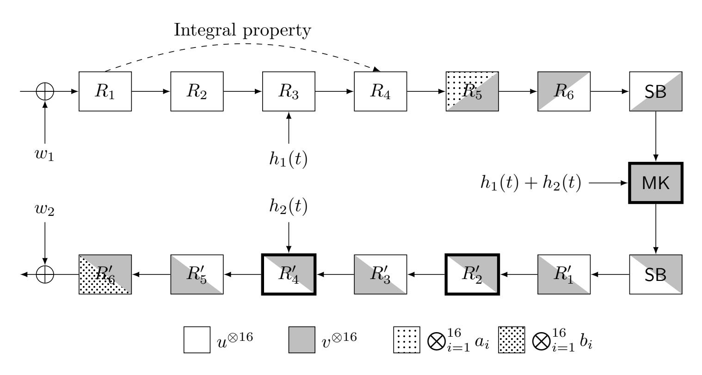
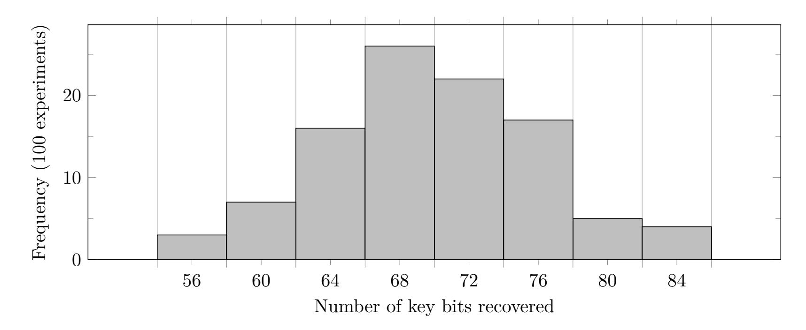

{0}------------------------------------------------

# **WEAK-KEY CRYPTANALYSIS OF BLINK**

#### TIM BEYNE

Abstract. This note describes a weak-key attack on the tweakable block cipher Blink, which was recently introduced at FSE 2026. Specifically, it is shown that two rounds of Blink admit several nonlinear invariants. To illustrate that these invariants indeed lead to attacks, we describe a partial key-recovery attack on Blink-64 with data and time complexity 2 23, for a fraction of 2−96 weak keys or tweaks. There is a trade-off between the fraction of weak keys and the data complexity, e.g., with 2 56 data the fraction of weak keys increases to 2−63. The attack is based on the same strategy as our attack on Midori-64 from Asiacrypt 2018.

#### 1. Introduction

Blink is a family of tweakable block ciphers proposed at FSE 2026. A detailed specification of the cipher is provided in [5, §5]. Importantly, it uses the same MixColumn operation M : F 16 2 → F 16 2 as Midori, and its S-box S : F 4 2 → F 4 2 is an involution. Previous work [1, 4] has shown that this combination is prone to invariants. The authors of Blink do provide a security argument against invariants, but it only takes into account full-round invariants [5, §7.6].

This note shows that there exist two-round nonlinear invariants that lead to full-round weakkey attacks on Blink. For example, we can distinguish Blink-64 from an ideal tweakable block cipher, and recover (on average) 168 bits of its master key. This attack applies to weak keys and tweaks satisfying 96 linear conditions in total: 32 conditions on the key and 64 conditions on the hash of the tweak. Consequently, for a fixed tweak the weak-key fraction is 2 −96. If up to T ≤ 2 64 tweaks can be used, the effective weak-key fraction becomes approximately 2 −32×T /2 64 . For each tweak, fewer than 2 23 chosen plaintexts are required.

**Notation.** Throughout this note, χ a : F n 2 → R denotes the additive character of F n 2 defined by x 7→ (−1)a Tx . Following the definitions introduced in [1] and [2], a real invariant of a function F : F n 2 → F n 2 is a function F n 2 → R that is an eigenvector of the pullback operator of F. Additional background about invariants can also be found in [3, §11.3.4].

## 2. Two-round invariants

For every mask a in F 4 2 , the function u ⊗4 with u = χ a is an invariant of M. Furthermore, by the results of [1], we know that for all a in {0101, 1010, 1111}, the function v ⊗4 with v defined by v = χ a ◦ S is also an invariant of M. Since S is an involution, this observation yields two-round invariants u ⊗16 and v ⊗16 for every choice of a. In each case, the vector v is invariant under translation by four constants. For example, for a = 0101, we have

$$v = \chi^a \circ S = \frac{1}{2} \left( -\chi^{\text{0001}} + \chi^{\text{0010}} - \chi^{\text{0100}} + \chi^{\text{0111}} \right).$$

Since the support of the Fourier transform of v is 0101 + Span{0011, 0101}, the function v is invariant under translation by any element of {0000, 1000, 0111, 1111}. In summary, we have a two-round invariant of the following form (with u = χ a ) 1 :

$$v^{\otimes 16} \longleftarrow^{R_i} u^{\otimes 16} \longleftarrow^{R_{i+1}} v^{\otimes 16}$$

This invariant requires 32 conditions on the key in the first of the two rounds. There are no conditions in the second round because u ⊗16 is translation-invariant up to scale.

*Date*: 30/03/2026.

Tim Beyne is supported by the Research Foundation – Flanders (FWO) with reference №1274724N.

1For consistency with our description of invariants as functions Fn 2 → R, we propagate them backwards.

{1}------------------------------------------------

2 TIM BEYNE

#### 3. Full-round partial key-recovery attack

The two-round invariant described in Section 2 can be extended to a full-round partial key-recovery attack. We illustrate this for the case of Blink-64 in Figure 1. The strategy is the same as in the attack on Midori-64 and Mantis from [1]:

- (1) For the first four rounds, we use an integral property. In fact, this property does not depend on the choice of S-box and is identical to the one used for Midori-64 in [1].
- (2) The remaining rounds are covered by the invariant, extended by two rounds to a key-dependent rank-one property with correlation one. This corresponds to rounds  $R_5$  up to  $R'_6$  in Figure 1. This property only holds for certain weak keys and tweaks. More precisely, we have 32 linear conditions on each of  $h_1(t) + h_2(t)$ ,  $h_2(t)$ , and the round key of  $R'_2$ . These conditions are independent.
- (3) Part of the round key of  $R'_6$  and the ciphertext-side whitening key  $w_2$  are recovered by solving a sparse system of equations of degree four. The system of equations simply expresses that the key-dependent property in Figure 1 holds.

FIGURE 1. Full-round partial key-recovery attack on Blink. Key or tweak conditions are required in rounds illustrated with a thick border. The functions  $a_i$  and  $b_i$  are key-dependent.

Let  $E_K$  be the encryption function of Blink, including the final whitening key addition. The overall property illustrated in Figure 1 implies that there exist key-dependent Boolean functions  $f_i \colon \mathbf{F}_2^4 \to \mathbf{F}_2$  such that, with P the input set of the integral property,

$$\sum_{x \in P} \sum_{i=1}^{16} f_i (E_K(x) + w_{2,i}) = 0.$$

Here,  $w_{2,i}$  is the *i*-th nibble of  $w_2$ . More precisely, up to constant terms,  $f_i$  is the Boolean function corresponding to  $b_i$  in Figure 1. Its algebraic normal form is given by

$$f_i(x) = (x_1x_2x_4 + x_2x_3x_4 + x_2x_3 + x_1 + x_3 + x_4)(k_1 + k_3) + (x_1x_2 + x_1x_3 + x_2x_3 + x_1 + x_3)(k_1 + k_2) + x_1 + x_3.$$

In equation (‡), k is the i-th nibble of the round key2 of  $R'_6$ . Based on the equation, we see that at most two bits of k can be recovered (for example,  $k_1 + k_3$  and  $k_1 + k_2$ ). For the whitening key, information is only obtained about bits of  $w_{2,i}$  that appear in one of the nonlinear terms of  $f_i$ . If  $k_1 = k_3$  and  $k_1 = k_2$ , then nothing is learned about  $w_{2,i}$ . If  $k_1 = k_3$  and  $k_1 \neq k_2$ , then

&lt;sup>2More precisely, assume the round key is added after the linear layer.

{2}------------------------------------------------

FIGURE 2. Number of bits of  $w_2$  and the  $R'_6$  round key that are recovered in the partial key-recovery attack on Blink-64, for 100 random weak keys. For each experiment, 128 equations were used (obtained using  $2^{23}$  data each).

two bits of  $w_{2,i}$  can be recovered. Finally, if  $k_1 \neq k_3$ , then we can recover all of  $w_{2,i}$ . Hence, on average  $16 \times (0+2+4+4)/4 = 40$  bits of the whitening key are obtained. Together with the 32 bits of the round key of  $R'_6$ , and the 96 conditions required for a weak tweak and key, this yields a total of 168 master key bits.

To obtain a unique solution for the key bits that can be recovered, several integral sets are encrypted to obtain multiple equations of the form ( $\ddagger$ ). Experimentally, we find that after collecting 128 equations, a Gröbner basis with respect to the lexicographic order can easily be computed. In particular, the time complexity is negligible compared to the time required to encrypt the integral sets and to compute the coefficients of the equations ( $\ddagger$ ). The Gröbner basis consists of polynomials of degree one, so the size of the basis corresponds to the number of key bits that are recovered. If ( $\ddagger$ ) is evaluated for random values of  $E_K(x)$ , then with high probability the equations are inconsistent, i.e., the Gröbner basis is {1}. This is easier to verify than solving the equations, since for this purpose a Gröbner basis with respect to the degree reverse lexicographic order is already sufficient. Checking inconsistency provides an efficient way to detect if the 96 linear equations on  $h_1(t) + h_2(t)$ ,  $h_2(t)$  and the round key of  $R'_2$  are satisfied.

Figure 2 contains a histogram of the number of key bits that we managed to recover using our implementation of the attack (based on the reference implementation of Blink-64). This number of bits does not include the 96 key and tweak conditions. As predicted above, the average is close to 72 bits.

#### 4. Discussion

Blink uses a long 448-bit key, and extracting the remaining 280 key bits is not as straightforward as for most key-recovery attacks. One approach is to find a tweak that breaks the property in round  $R'_4$  to recover additional key bits from  $w_2$  and from the round keys of  $R'_4$ ,  $R'_5$ , and  $R'_6$ . However, since  $h_1(t) + h_2(t)$  still needs to satisfy the same 32 conditions, this requires significant additional data and time. Since the partial key-recovery attack described in Section 3 already violates the security claims of Blink, we leave it to the interested reader to work out the details.

The original version of Blink allowed t = 0. For this tweak, all conditions on  $h_1(t)$  and  $h_2(t)$  are automatically satisfied, and the weak-key fraction is  $2^{-32}$ . It is also worth mentioning that, since there is more than one two-round nonlinear invariant (see Section 2), the weak-key fraction can be increased by repeating the attack for each invariant. This increases the time complexity of the attack, but unlike using more tweaks, it does not require additional data.

Finally, one can expect a similar attack to be feasible for Blink-128. Although Blink-128 has two additional rounds (for the same security level), integral properties extend over more rounds. The fraction of weak keys will be lower, but the higher data limits partially compensate for this.

{3}------------------------------------------------

4 TIM BEYNE

## References

- [1] Tim Beyne. Block cipher invariants as eigenvectors of correlation matrices. In Thomas Peyrin and Steven Galbraith, editors, *Advances in Cryptology – ASIACRYPT 2018, Part I*, volume 11272 of *Lecture Notes in Computer Science*, pages 3–31, Brisbane, Queensland, Australia, December 2–6, 2018. Springer, Cham, Switzerland.
- [2] Tim Beyne. *A geometric approach to symmetric-key cryptanalysis*. PhD thesis, KU Leuven, June 2023.
- [3] Tim Beyne and Vincent Rijmen. *Linear cryptanalysis*. Cambridge University Press, November 2025.
- [4] Yosuke Todo, Gregor Leander, and Yu Sasaki. Nonlinear invariant attack practical attack on full SCREAM, iSCREAM, and Midori64. In Jung Hee Cheon and Tsuyoshi Takagi, editors, *Advances in Cryptology – ASIACRYPT 2016, Part II*, volume 10032 of *Lecture Notes in Computer Science*, pages 3–33, Hanoi, Vietnam, December 4–8, 2016. Springer Berlin Heidelberg, Germany.
- [5] Jianhua Wang, Tao Huang, Guang Zeng, Tianyou Ding, Shuang Wu, and Siwei Sun. THF: Designing lowlatency tweakable block ciphers. *IACR Transactions on Symmetric Cryptology*, 2025(4):125–166, December 2025.

*Email address*: firstname.lastname@esat.kuleuven.be